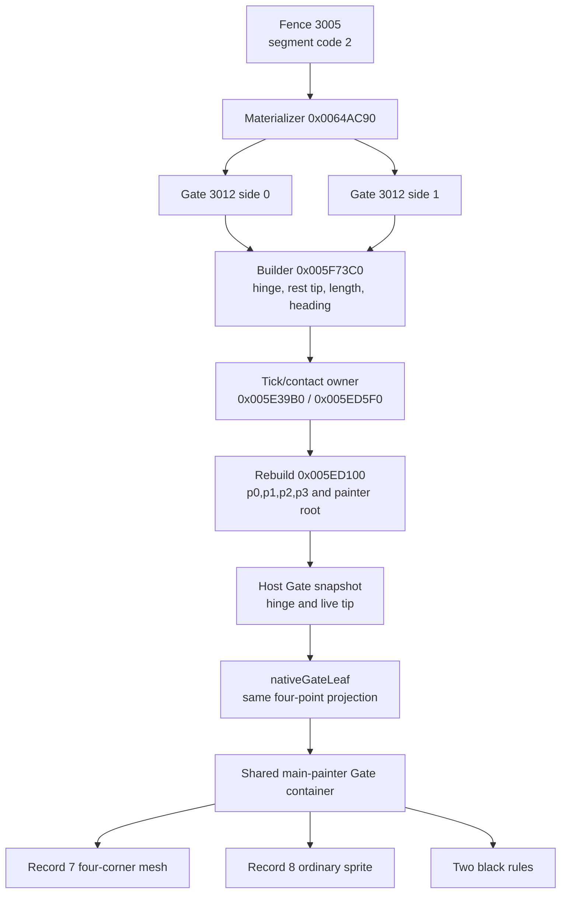
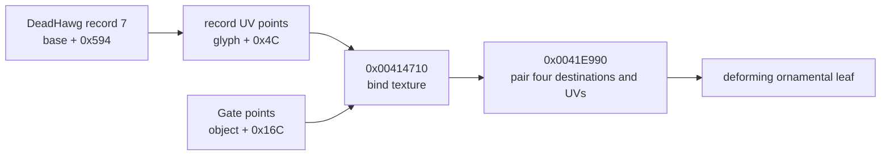
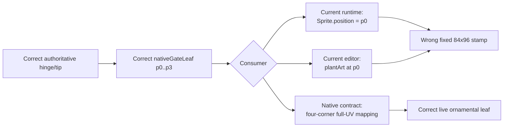

# Gate record-7 textured-quad correction — 2026-08-14

This section was completed before changing either Gate renderer. It corrects
the earlier interpretation that DeadHawg record 7 was an ordinary sprite
registered at the upper hinge-side point.

The native result is unambiguous: record 7 is the texture for a four-corner
leaf mesh. Stock maps its full UV rectangle over the current Gate quadrilateral.
The Website already recovers and replicates the correct moving hinge/tip state,
and `nativeGateLeaf()` already derives the correct four points. The failure is
the final consumer: the Pixi runtime and Canvas2D editor both throw three of
those points away and plant an untransformed 84x96 image at `p0`.

The paired exhaustive native ledger is
`Mod Loader/docs/reverse-engineering/native-gate-art-and-lifecycle.md`. It
charts materialization, vtable ownership, the object field map, builder
formulas, custom draw calls, render lanes, motion state machine, collision,
serialization, teardown, constants, and the implementation boundary. This
Website section records the web-specific causal trace and acceptance contract.

## Evidence ledger

| Question | Recovered answer | Evidence | Confidence |
| --- | --- | --- | --- |
| Is the large art absent from the bundle? | No. DeadHawg 7 is present as the exact 84x96 extracted crop. | Manifest, byte hash, decoded image | High |
| Does native call the ordinary glyph painter for record 7? | No. It passes four Gate destination points and four record UV points through `0x00414710` to `0x0041E990`. | Ghidra instruction trace from `Gate::Render` `0x005ECE40` | High |
| Does native plant record 7 at `p0` and rotate it? | No. All four destination vertices are supplied independently. | Draw-call argument trace | High |
| Does record 8 share that transform? | No. Record 8 uses ordinary glyph draw `0x004143D0` at upper-edge midpoint plus `(0,7)`. | Ghidra instruction trace | High |
| Are the black bars a replacement for the ornament? | No. Native draws record 7, record 8, then two three-pixel black rules. | Ordered call trace | High |
| Do the four points follow motion? | Yes. `0x005ED100` rewrites them after accepted Gate motion and before collision re-registration. | Rebuild/tick trace | High |
| Does the existing host compute those points incorrectly? | No. `nativeGateLeaf()` exactly implements `H/T` lifted by 87. | Source comparison to `0x005ED100` | High |
| Where does the Website lose parity? | `BoneyardGateLeafView` creates an ordinary `Sprite` and sets only its position to `p0`; editor `drawGateLeaf()` calls `plantArt(..., p0, ...)`. | Current Website source | High |
| Is this a broader fence-family texture defect? | No. Intact, broken, wall, rail, post, and Gate lanes have distinct native consumers. | Fence-code materializer and sibling painter audit | High |

The retail oracle for this pass is the 4,723,200-byte x86 executable with
SHA-256
`03a834566ce70fd8088f4cf9ee6693157130d8aec28c092cb814d6221231f1e3`.
A direct clean-stock process was driven from character creation through
College into Boneyard, without the loader/proxy files in its runtime copy.
The entry Gate was captured near rest and after contact:

| State | Local receipt | SHA-256 |
| --- | --- | --- |
| near rest | `/tmp/solomon-dark-native-fence-gate-closed-20260814.png` | `37de76519caae71986d9143b862f5f871df4013ca297877d3544ed900a875b71` |
| pushed open | `/tmp/solomon-dark-native-fence-gate-open-20260814.png` | `3166cca353ff0717c72e8805f271e7ba3534e9a4f6c241cac84472c4b5941142` |

The open receipt visibly deforms each iron leaf with its independently moving
segment. A planted 84x96 stamp cannot reproduce that observation.

## Asset identity and consumer identity

| Asset | Extracted file | Manifest rectangle | Cell / origin | SHA-256 | Native Gate role |
| --- | --- | --- | --- | --- | --- |
| DeadHawg 7 | `frontend/src/assets/game/boneyard/deadhawg/007.png` | `(1129,1889,84,96)` | `84x96`, `(0,0)` | `da68ac958eb419efa2f442b8a94c00bbd5df9f416f2a6c0ff22cd34fc84d643f` | full UV source for one leaf quad |
| DeadHawg 8 | `frontend/src/assets/game/boneyard/deadhawg/008.png` | `(15,835,16,19)` | `16x19`, `(0,0)` | `0c8e94f34cf40b4b1ce94761f43ce9052c20ae331d127b3b8069c23c2e9c7063` | ordinary midpoint ornament |
| loose `fencegrate` | `frontend/src/assets/game/boneyard/textures/fencegrate.png` | standalone 64x64 | full image | `033b615531f8b64a4e7b1774395f5a1a223e46f75b95d2b3fc99318e525d2e74` | intact code-0 grate, not Gate main art |

The manifest origin does not authorize planting record 7. Native bypasses the
ordinary planted-glyph geometry for that call and consumes only the record's
texture/UV quad. Width 84 and height 96 describe the source crop; destination
width, shear, and edge direction come from the Gate points.

## End-to-end ownership chart



This trace fixes ownership at the last presentation boundary. It does not
reconstruct Gate state from the display frame, mutate the replicated tip, or
move geometry into a static canvas.

## Exact destination geometry and UV chart

For current hinge `H` and tip `T`, rebuild owns:

```text
p0 = H + (0,-87)    p1 = T + (0,-87)
p2 = H              p3 = T
```

The `87` lift is native `32 + 55`. Record 7 uses the complete UV rectangle:

```text
source record 7                         live Gate destination

(0,0) -------- (1,0)                   p0 -------- p1
  |              |                       |          |
  |  full crop   |       pair i -> i     | ironwork |
  |              |                       |          |
(0,1) -------- (1,1)                   p2 -------- p3
                                                   H/T collision edge
```



The equivalent Pixi mesh contract is:

```text
positions: p0, p1, p2, p3
uvs:       (0,0), (1,0), (0,1), (1,1)
triangles: (0,1,2), (2,1,3)
```

The triangle spelling is a web implementation detail; the native evidence is
the four-point destination/UV pairing.

Record 8 and the rules remain separate:

```text
record8 = midpoint(p0,p1) + (0,7)
ruleA   = p1 -> (p3.x, p3.y + 32)
ruleB   = midpoint(p0,p1) -> midpoint(p2,p3)
width   = 3
```

## Current web divergence



The pre-change `BoneyardGateLeafView` owned `gateLeaf: Sprite`, created it
through `plantedSprite()`, and updated only `gateLeaf.position`. Its `hinge`
sprite and `Graphics` rules already had the correct separate ownership. The
pre-change editor's `drawGateLeaf()` made the same mistake through
`plantArt(ctx, FENCE_ART.gateLeaf, leaf.p0, ...)`.

That symmetry explains why both authoring and game views looked consistently
wrong even though the host geometry tests passed.

## Adjacent-system audit

| Lane / sibling | Native behavior | Consequence for this correction |
| --- | --- | --- |
| Gate record 7 | custom full-UV destination quad in slot `+0x1C` | replace planted consumer only |
| Gate record 8 | ordinary glyph in the same main painter | retain as Sprite / planted Canvas image |
| Gate black rules | two width-3 line primitives | retain above record 7 and record 8 in native order |
| Gate auxiliary geometry | inherited slot `+0x28`, `0x00600ED0` | do not confuse it with missing record 7 |
| Gate collision | widened live `H -> T` registration | leave authoritative simulation untouched |
| Fencepost | ordinary DeadHawg 36..42, bias 0 | preserve shared post materialization and depth |
| intact FenceGrate | repeating loose 64x64 texture over a shortened 52-high quad | no record-7 mesh change |
| broken grate | ordinary DeadHawg 3 per derived half | no record-7 mesh change |
| rails | DeadHawg 23 repeats plus generated geometry | no record-7 mesh change |
| wall | generated pre-main mesh, no endpoint posts | no record-7 mesh change |
| actor/scenery queue | Gate effective root plus inherited `-15` bias | keep the Gate container in the existing shared painter band |

The leaf container remains the depth unit. Its record-7 mesh, record-8 sprite,
and rules move together under the already recovered effective-Y painter key:

```text
gateRootY = max(tip.y, (hinge.y + tip.y) / 2)
gateKey   = gateRootY - 15
```

Changing child geometry does not authorize a new z-index formula.

## Motion, persistence, and lifecycle boundary

The art follows state; it does not own state.

| State | Stock owner | Render relevance |
| --- | --- | --- |
| side | materializer / serializer | determines which leaf was built |
| hinge | builder / serializer | supplies `p0,p2` |
| live tip | tick / serializer | supplies `p1,p3` |
| fixed length | builder / serializer | constrains tip motion; no render-local substitute |
| rest heading | builder / serializer | centers 60-degree envelope; no render-local substitute |
| velocity/damping | contact and tick, transient | must not be inferred from mesh frames |
| live collision handle | collision owner, transient | must not be owned by Pixi or Canvas2D |
| last squeak tick | audio cadence owner, transient | unrelated to the art fix |

On contact, stock installs a magnitude-2 tip velocity and damping `0.96`.
Tick removes the old segment, proposes `tip + velocity`, enforces fixed length
and the 60-degree rest envelope, rebuilds the four visual points, registers the
replacement collision, and applies damping. The display consumes the resulting
snapshot. It never advances that state independently.

Destroying one view removes its presentation container only. Authoritative
Fence/Gate removal remains a world lifecycle operation that retires the two
materialized leaves, registrations, and relevant shared-post graph. A mesh
cutover cannot broaden view destruction into simulation teardown.

## Pre-implementation falsifiers and acceptance contract

Before implementation, the following hypotheses are closed:

- replacing `007.png` cannot fix the wrong destination geometry;
- applying rotation to an 84x96 Sprite cannot express the recovered four
  destination points and dimensions;
- drawing more black lines cannot substitute for the ornamental texture;
- mirroring two stamps is wrong because materialization already supplies one
  custom quad for each of the two leaves;
- changing Gate motion or collision would modify a subsystem whose outputs are
  already correct; and
- changing painter order would address occlusion, not the detached/fixed-size
  art observed in an unobstructed frame.

The implementation contract is therefore deliberately narrow:

1. Add focused tests that fail unless all four Gate points feed record 7 with
   the canonical UV order.
2. Replace the runtime's record-7 planted `Sprite` with a four-corner textured
   mesh inside the existing Gate container.
3. Map the same full image to `p0,p1,p2,p3` in Canvas2D editor rendering with
   an affine transform.
4. Preserve record 8 at `midpoint(p0,p1) + (0,7)`, both black rules, child
   order, container tint, effective-Y depth, and lifecycle.
5. Do not change asset files, manifests, authoritative Gate state, collision,
   protocol, sound, RNG, or sibling fence modes.
6. Run focused tests and the canonical `./scripts/validate.sh` gate.
7. In headed browser evidence, inspect at least one near-rest leaf and one
   pushed leaf, with zero page/console errors, and compare them to the clean
   stock receipts.

Confidence is high for the full main-art contract. The exact appearance of
every branch in inherited auxiliary shadow renderer `0x00600ED0` remains a
bounded separate question; instruction ownership proves that it is not the
record-7 path and it cannot explain the missing iron leaf.

## Implemented cutover and regression boundary

The implementation follows that pre-recorded contract without changing the
authoritative subsystem:

- `nativeGateArtVertices()` writes `p0,p1,p2,p3` in the recovered native order.
- `NATIVE_GATE_ART_UVS` fixes the matching full-texture UV order and
  `NATIVE_GATE_ART_INDICES` supplies the two Pixi triangles.
- `BoneyardGateLeafView` now owns a `MeshSimple` for record 7 and reuses one
  eight-float vertex buffer. Snapshot updates rewrite all four vertices; they
  do not allocate or advance simulation state.
- The existing record-8 Sprite and line `Graphics` remain separate children at
  their previous child depths.
- Canvas2D uses `nativeGateArtCanvasTransform()` to map the complete source
  image to the same four Gate points. The function consumes both horizontal
  and both vertical edges; native Gate geometry is a parallelogram, so one
  affine image transform is exact.
- No asset, manifest, host, protocol, collision, motion, audio, painter-order,
  lighting, or sibling-fence file changed.

Two focused tests first failed against the planted-sprite implementation, then
passed after the cutover:

| Regression | Locked result |
| --- | --- |
| mesh geometry | the eight destination scalars are exactly `p0,p1,p2,p3` |
| texture mapping | UVs are `(0,0),(1,0),(0,1),(1,1)` and indices are `0,1,2,2,1,3` |
| Canvas2D mapping | all four 84x96 source corners transform to the corresponding Gate points |
| consumer boundary | runtime owns `MeshSimple`; neither runtime nor editor plants record 7 at `p0` |

## Browser and repository validation

The full two-client WebGL smoke used a fresh local authoritative host and the
default synchronized Boneyard. It confirmed two Gate leaves on both clients,
the same run and geometry hash, four painter bands, successful physical gate
crossing from Y `150` to `369.9999792650342`, and a changed replicated Gate
state. Both pages reported a real `WebGL2RenderingContext`; host/client page
errors and console-error arrays were all empty.

| Two-client state | Receipt | SHA-256 |
| --- | --- | --- |
| near-rest web Gate | `/tmp/solomon-dark-gate-quad-web-closed-20260814.png` | `2ea2436a72aeeea75c3a6ceaad1695156bdb9af81db822e3ed796b0a1aa6c8c2` |
| pushed web Gate | `/tmp/solomon-dark-gate-quad-web-open-20260814.png` | `d176d6b03deb98738c586b225eaba0f2f068fcf4fd59c8fed7dc9bfe5f19ae26` |

A separate headed X11 run used Chrome `150.0.7871.124` with
`headless: false`, a newly restarted isolated host, a 1600x900 viewport, WebGL
renderer resolution `1`, and two Gate leaves. The player crossed from Y `150`
to `389.0152019485831`; the Gate state changed; frame count reached `87`; and
page/console error arrays were empty.

| Headed state | Receipt | SHA-256 |
| --- | --- | --- |
| near-rest web Gate | `/tmp/solomon-dark-gate-quad-headed-closed-20260814.png` | `b7a5d826683f65d998926841976873b7cfda7e95ba2b9f15ac98f1ea1df20c23` |
| pushed web Gate | `/tmp/solomon-dark-gate-quad-headed-open-20260814.png` | `fa76f76386ba37b5c931b20e8a9607309961e94ece7a6da2a94571738d83ea18` |

Direct inspection against the clean-stock near-rest/open receipts confirms the
relevant contract: the black ornamental pattern fills each live leaf from its
upper edge to `H/T`, remains attached while opening, and deforms in the same
direction as the collision segment. This is a component comparison rather
than a claim that two independently generated, differently lit full scenes are
pixel-identical.

The canonical `./scripts/validate.sh` gate passed the exact Website tree:
backend Release build, 23 backend/contract tests, formatting, lint and import
boundaries, TypeScript test compilation, all 262 frontend tests, five desktop
tests, production frontend and game-host builds, and production media policy.
Lint emitted only the repository's existing Fast Refresh warnings; there were
no lint errors. Focused type-check, lint, and `git diff --check` also passed.
