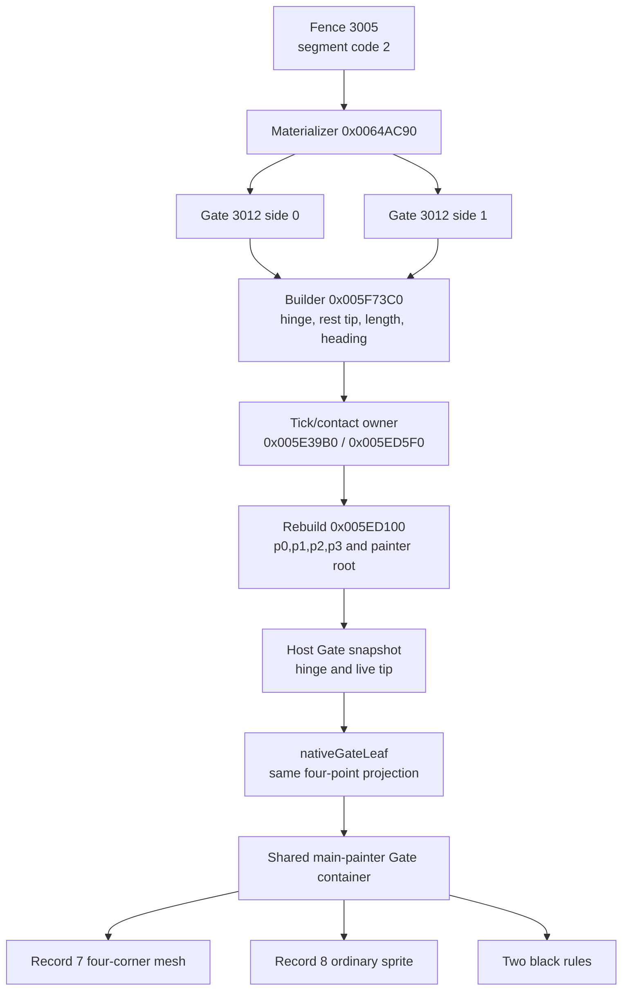
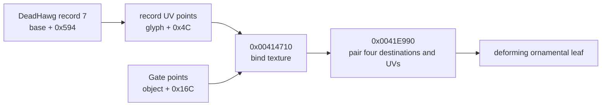
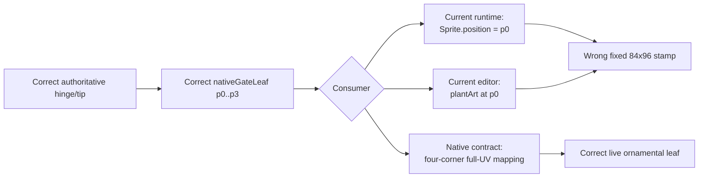

# Solomon Dark native parity RE ledger

Runtime ownership and deployment decisions for the clean rebuild are recorded
separately in `game-runtime-architecture.md`. This ledger remains the authority
for recovered native behavior, constants, timing, geometry, render order,
collision, and lifecycle. Architecture work must preserve these receipts rather
than reinterpret them as browser-owned behavior.

This document is the evidence ledger for the `/game` web reconstruction. The
unmodified native game is the visual and behavioral oracle. Recovered behavior
is translated into cohesive web modules; incidental implementation debt from
the stock executable is not preserved.

Every new reverse-engineering result must be recorded here before it is used to
justify a parity change. Record the evidence, recovered value or rule,
confidence, and implementation consequence. Keep unknowns explicit.

Every reported visual or behavioral discrepancy is evidence that the web
port's underlying system model may be wrong, not an isolated value to tune.
Recover the stock ownership, state, timing, geometry, painter/collision order,
and lifecycle before changing behavior. Correct the shared model so the visible
fix emerges from the same rules as stock; do not add symptom-specific patches.

## Evidence policy

- Launch the stock executable directly with every mod disabled. Do not use an
  injected loader, Lua mod, or modded staging build for parity evidence.
- Preserve capture paths, native function addresses, runtime addresses, and
  exact measurements where available.
- Mark decompiler interpretation or visual inference separately from directly
  observed facts.
- Do not invent native behavior to make a screenshot look plausible. If a seam
  remains unknown, keep it on the open-questions list and gather more evidence.
- Prefer emergent parity from shared systems over scene-specific scripted
  exceptions, especially for movement and collision behavior.

## Clean native reference run — 2026-08-11

- Stock executable:
  `SolomonDarkAbandonware/SolomonDark.exe`
- Owned clean process at capture time: PID `157624`.
- Loaded image check found the stock executable and no loader/mod modules.
- A separate process from
  `%LOCALAPPDATA%/SolomonDarkMultiplayerBeta/runtime/stage` was unrelated and
  was not used as evidence.
- Preferred executable image base: `0x00400000`.
- Runtime image base in this run: `0x00CB0000`.
- ASLR delta in this run: `0x008B0000`.

Reference captures:

- `%LOCALAPPDATA%/Temp/native-create-entry-60fps-0811.mkv`
- `%LOCALAPPDATA%/Temp/native-water-discipline-60fps-0811.mkv`
- `%LOCALAPPDATA%/Temp/native-current-0811.png`
- `%LOCALAPPDATA%/Temp/native-hub-current-0811.png`
- `%LOCALAPPDATA%/Temp/native-player-right-0811.png`
- `%LOCALAPPDATA%/Temp/native-teacher-rune-a.png`
- `%LOCALAPPDATA%/Temp/native-teacher-rune-b.png`
- `/tmp/native-create-entry-60fps-montage.png`
- `/tmp/native-create-left-entry-fine.png`
- `/tmp/native-create-right-entry-fine.png`
- `/tmp/native-create-left-swap-numbered.png`
- `/tmp/native-water-discipline-60fps-montage.png`
- `/tmp/native-select-left-numbered.png`
- `/tmp/native-select-right-numbered.png`
- `/tmp/native-create-mount-numbered.png`
- `/tmp/native-teacher-sequence-montage.png`

## Loader readiness and presentation

Native owner and renderer:

- startup construction: `0x005BAB60`;
- `MyLoader` renderer: `0x005BCA40`;
- embedded `Bundle_Loader`: `MyLoader + 0x78`;
- completed-work global: `DAT_0081F6A8`;
- total-work global: `DAT_0081F6AC`;
- forced-complete byte: `DAT_0081F6B0`.

The native loader is a real readiness gate, not a timed splash. Every render
computes `progress = completed / total`, clamps it to `1`, and calls the
loader's vtable slot `+0x18` only when progress is at least `1` (or the
forced-complete byte is set). The menu cannot render before that completion
dispatch.

The renderer also corrects an older static-art conclusion. It calls four
sprite draw helpers on fields inside the `MyLoader` object:

- `this + 0xB0` (`Bundle_Loader` record 0);
- `this + 0x174` (record 1);
- `this + 0x238` (record 2);
- `this + 0x2FC` (record 3).

Because these are embedded-owner-relative accesses rather than references
through published singleton `DAT_008199BC`, a singleton-only consumer search
incorrectly classified all Loader records as dormant. A clean mod-free 60 fps
desktop capture at
`C:\Users\User\AppData\Local\Temp\solomon-clean-startup-0811.mkv`
confirms that records 0..3 render the Raptisoft mark, URL, bar chrome, and red
fill. Only record 4 remains unobserved in this renderer.

The exact logical composition recovered from `0x005BCA40` and the Loader
bundle metadata is:

- a `480 x 320` virtual canvas, centered with
  `((surfaceWidth - 480) / 2, (surfaceHeight - 320) / 2)`;
- clear color `(0, 0, 0.33, 1)`;
- record 2 at top-left `(41, 13)`, logical size `388 x 227`;
- record 3 at top-left `(119, 251)`, logical size `244 x 18`;
- record 1, logical size `54 x 230`, centered at `(240, 290)` and rotated
  `90 degrees`, producing the horizontal bar frame;
- record 0, logical size `18 x 192`, centered at `(240, 291)` and rotated
  `90 degrees`, producing the red gradient fill.

Progress is not primitive colored geometry. `FUN_00420ec0` installs a clip
rectangle `(0, 0, 144 + progress * 192, 320)`; the renderer then draws the
entire rotated record 0 and clears the clip with `FUN_00420e40`. Since the
rotated fill spans logical `x=144..336`, the visible fill width is exactly
`progress * 192`. This ownership distinction matters: the web loader must crop
the native gradient rather than approximate it with a CSS color ramp.

In that run the native bar advanced in discrete work-completion steps and the
loader disappeared immediately after readiness; the title screen followed
under its ordinary fade. The web implementation consequence is:

1. preload and decode the resident `/game` asset manifest;
2. drive progress from completed asset tasks, not elapsed time;
3. keep the main menu unmounted until all required tasks succeed;
4. render the extracted Loader sprite records and clip the native fill sprite;
5. transition only when progress is complete.

Confidence: high from the full renderer instruction stream, draw-helper
decompilation, bundle metadata, and clean stock startup capture.

The 2026-08-13 unified-renderer cutover now presents this exact `480 x 320`
composition through `renderer/loader-renderer.ts`: the blue clear, records 2
and 3, both rotated bar records, and the progress-width mask are one WebGL
scene. `Game.tsx` still owns readiness and does not mount the title until the
resident asset promise succeeds. The loader therefore remains a real work
gate; only its browser painter changed. `NativeLoader.tsx` retains the live
semantic percentage as a DOM status surface and paints no artwork.

## Main-menu branding override — 2026-08-13

The stock title logo remains `Title.bundle` record 9, extracted as
`main-menu-logo.png` at `829 x 395`. The approved website brand artwork is
`logo-solomon-dark.png`, an `836 x 464` transparent image that reads
"Solomon Darker." Replacing the title texture is an explicit product-branding
divergence rather than a newly recovered native behavior.

The override is limited to the logo texture and its accessible name. It does
not reassign record 9 in the stock extractor or change the native title-screen
ownership, painter order, menu geometry, animation, or surrounding art. The
stock extraction remains available as evidence.

The replacement is 69 pixels taller at nearly the same authored width. Letting
it inherit the stock logo's width with natural height would extend into the
action stack. The web title renderer therefore retains the existing logical
`829 x 395` title slot and contains the replacement inside that slot without
distorting it.

Confidence: high for the bundle record, source-image dimensions, and fit
consequence; the texture substitution itself is the explicit web product
requirement.

## 2026-08-13 — Title and Create GPU presentation ownership

### Reported smell and parity question

- Reported web behavior: the Hub and Boneyard use the GPU renderer, while the
  returning-player title and Create/loadout screens still split their visuals
  across full-frame Canvas2D repaints, independent effect canvases, DOM images,
  CSS filters, and CSS animation layers. The user wants consistently high FPS
  throughout the game rather than scene-specific renderer paths.
- Stock behavior to recover: preserve the already recovered Title and Create
  state, clocks, transforms, painter order, assets, and input lifecycle while
  changing only the browser presentation backend.
- Reproduction inputs/scenes: decoded resident assets, `1600 x 900`, returning
  title root, settled element picker, and settled Fire discipline picker.
- Falsifiable questions: if CPU raster and compositor fan-out are the cause,
  replacing them with one active PixiJS/WebGL canvas must remove the Canvas2D
  render loops, reduce canvas/DOM/layer counts, preserve pixel geometry and
  animation receipts, and reduce browser task time without changing native
  fixed-tick outputs.

### Evidence and provenance

| Evidence class | Exact source | Observation | Confidence |
| --- | --- | --- | --- |
| Clean stock | `SolomonDarkAbandonware/SolomonDark.exe`; clean captures listed above | Title and Create are each presented as one ordered screen-space scene; no browser-style independent layout/compositor ownership exists | high |
| Instructions | `MainMenu_Render` `0x00598780`, title row helper `0x00598470`, Create build/update/render `0x00593C30` / `0x0058A820` / `0x0059AD40` | Screen owners submit ordered sprite, primitive, text, hand, glyph, and effect draws from their own state fields | high |
| Asset/data | `Title.bundle`, `Create.bundle`, `UI.bundle`, `BadGuys.bundle`; `native-asset-object-map.json` | The extracted textures and registrations are renderer inputs; they do not require DOM or Canvas2D ownership | high |
| Web runtime | `tools/measure-menu-performance.mjs`, local origin-main build `846e87e`, Chrome 140, Radeon RX 9070 XT, `1600 x 900`, 5-second samples | Title used 2 Canvas2D surfaces/84 DOM nodes/15 compositor layers; element picker used 5 Canvas2D surfaces/69 nodes/27 layers; discipline picker used 1 Canvas2D surface/112 nodes/66 layers. Average FPS was `130.18`, `130.48`, and `130.79`; browser task time was `691.95`, `598.66`, and `1457.45 ms` respectively | high |
| Web runtime | same tool and tree under software-rendered Linux Chromium | The full-frame title Canvas2D path fell to `3.93` average FPS while the two loadout states reached the browser's `60 Hz` cap with substantial task time | high for causal sensitivity, not a physical-GPU absolute |

### Native ownership thread

- Owner and construction path: `MainMenu` owns its title fields and renderer;
  `CreateWizardMenu` on vtable `0x00797B7C` owns its hands, choices, wheel,
  effects, and finalization state from `0x00593C30` through teardown.
- Upstream state producers/callers: title tick state advances the cloud,
  horizon, grave-row, grass, cloak, and eye phases. Create input and
  `0x0058A820` advance the recovered `100 Hz` hand/choice state; the wheel uses
  its separately recovered shared tick field.
- State representation and transitions: title root/play selection changes
  button content without replacing the background owner. Create moves from
  entry to element choice, element closing/transfer, discipline choice, and
  finalization using the motion samplers and audio boundaries already recorded
  in this ledger.
- Downstream consumers/callees: the Title and Create renderers consume those
  fields as one painter stream. Element VFX dispatch consumes the same
  renderer-independent draw plan used by the staff orb.
- Sibling systems sharing ownership or data: Loader is an earlier readiness
  owner, while Hub and Boneyard are later world owners. UI semantics and input
  focus are screen-space client concerns but are not native-art painter layers.
- Entry, interruption, reset, and teardown: the active screen alone advances
  and renders. Leaving Title destroys its presentation resources; leaving
  Create stops its frame/audio loop and releases its GPU textures. Re-entering
  constructs a fresh native scene sequence.

### Recovered behavioral contract

- Timing/ticks/thresholds: keep the title's recovered cloud/horizon/grave/grass
  rates and `60 Hz` Solomon phase; keep Create's `100 Hz` hand/reveal samplers,
  `36 s` wheel revolution, selection spline, hard pose swaps, flashes, audio
  boundaries, and finalization delay. Display refresh samples those clocks; it
  does not become a new simulation clock.
- Geometry/transforms/coordinate spaces: both scenes remain a `1600 x 900`
  logical stage scaled to the viewport. Texture registration, the three title
  grave baselines, native Create centers, right-hand horizontal reflection,
  and one backing pixel per logical VFX pixel remain unchanged.
- Render/hit/collision/traversal order: Title preserves its recovered
  background/fog/grave/Solomon/menu ordering. Create preserves left hand,
  selected element/effects, right hand, then discipline foreground. Semantic
  hit targets overlay the matching logical geometry but do not paint art.
- Assets/audio/randomness: use the extracted stock textures and the approved
  Solomon Darker logo override. Preserve the deterministic web replacement for
  presentation-only native RNG already documented. Audio remains owned by
  `GameAudioDirector` and the recovered event samplers.
- Input/network authority/replication: these menus are local presentation and
  input state. They do not enter the authoritative Node simulation or network
  snapshot protocol.
- Boundary and failure behavior: WebGL is the supported game presentation
  baseline, matching the Hub/Boneyard policy. Renderer failure is explicit;
  there is no hidden Canvas2D compatibility path.

### Nearby-system findings

- Durable finding: moving artwork to WebGL does not imply moving accessible
  buttons, focus, keyboard/gamepad routing, touch controls, status messages, or
  the HUD into GPU pixels. Those are the semantic overlay of the one composed
  client, not a second visual renderer.
- Evidence: the native renderer separates screen state/painter submission from
  input dispatch, while the current Hub/Boneyard architecture already proves a
  WebGL world plus React semantic/HUD overlay at display cadence.
- Why it matters or may matter later: preserving that seam avoids an
  inaccessible canvas-only UI and keeps the identical client bundle usable in
  browsers, Electron, mobile landscape, and Steam Deck controls.
- Native report/catalog also updated: no. This investigation recovered no new
  stock fact; it maps existing native facts to the browser renderer boundary.

### Confidence and open questions

- Confirmed: native owner/state/clock/order; current browser surface and layer
  fan-out; WebGL availability and the existing GPU scene baseline.
- Inferred: consolidating the active visual scene will reduce task/compositor
  pressure on physical GPUs and eliminate the severe software-raster title
  failure. The before/after browser run will accept or falsify this inference.
- Unknown: the exact minimum supported physical GPU remains a later product
  qualification target, not a reason to keep parallel rendering paths.
- Next falsifying probe if the unknown becomes material: replay the retained
  menu benchmark on the declared minimum desktop, mobile, and Steam Deck GPU at
  their native refresh rates.

### Web implementation consequence

- Correct owner/module: one scene-scoped PixiJS renderer owns all animated and
  decorative Title pixels; one scene-scoped PixiJS renderer owns all animated
  and decorative Create pixels.
- Shared model change: keep `create-menu-motion.ts` and
  `element-vfx-native.ts` renderer-independent. Feed their plans into pooled GPU
  sprites rather than recomputing behavior in CSS or shaders.
- Stock behavior preserved: layer order, geometry, hard pose swaps, timing,
  effects, hover/press artwork, audio boundaries, and screen teardown.
- Browser-specific approximation, if unavoidable: transparent semantic DOM
  controls remain aligned over GPU artwork for accessibility and input. They
  are not visual fallbacks.
- Symptom patch or obsolete path to remove: full-frame `MainMenuBackdrop`
  Canvas2D painting, the game-only `MenuSolomon` canvas, Create DOM artwork and
  CSS animation layers, per-choice Canvas2D element effects, and React
  per-display-frame motion rendering.

### Validation contract

- Focused automated test: pure title/Create frame and painter contracts,
  renderer-source contracts, and retained fixed-tick motion/VFX tests.
- Playwright or runtime journey: root -> play -> Create element -> discipline,
  with a single `pixi-webgl` canvas in each scene, correct semantic controls,
  renderer diagnostics, no page/console errors, and no Canvas2D scene painter.
- Stock-versus-web comparison: compare title and both Create phases at matching
  `1600 x 900` logical times against the existing clean captures and geometry
  receipts.
- Measurable acceptance criteria: physical-GPU averages remain above `100 FPS`
  and improve toward the display limit; steady-state 1% low stays above
  `100 FPS`; browser task time and compositor-layer count do not regress. A
  software-only WebGL implementation remains diagnostic evidence, not a
  supported production renderer.

### Implementation validation receipt

- Files/modules changed: `renderer/game-webgl.ts` now owns the shared explicit
  WebGL application/texture boundary; `title-menu-renderer.ts` and
  `TitleMenuPresentation.tsx` own the complete Title painter; and
  `create-menu-renderer.ts` with `CreateMenuScene.tsx` owns Create artwork,
  motion, VFX, and semantic controls. `loader-renderer.ts` owns the native
  readiness composition and clipped progress fill. `native-element-vfx-view.ts` is the one
  GPU consumer shared by Create and the equipped staff. The obsolete
  `MainMenuBackdrop`, game-only Canvas2D Solomon path, Create DOM art/CSS
  animations, Canvas2D `ElementVfx`, and unused DOM `PlayerCharacter` painter
  were removed rather than retained as fallbacks.
- Focused tests cover loader registrations/progress clipping, the three title
  grave rows/parallax/tiling, exact Create
  hand centers and authored discipline dimensions, flash boundaries, native
  element scale plans, and the no-DOM-art cutover. The canonical complete gate
  passes all `200` frontend tests, all `23` backend/contracts tests, lint and
  both production builds with zero build errors. Existing Fast Refresh notices
  remain warnings outside this renderer work.
- A controlled current-browser A/B used Chrome `151.0.7922.110`, the same
  Radeon RX 9070 XT, `1600 x 900`, isolated fresh profiles, five-second
  samples, and origin-main `846e87e` as the baseline. The retained second
  steady runs were:

  | scene | origin-main average / 1% low | WebGL average / 1% low | origin-main task | WebGL task | layers before / after |
  | --- | ---: | ---: | ---: | ---: | ---: |
  | Title | `131.83 / 123.02 FPS` | `131.17 / 122.16 FPS` | `923.71 ms` | `346.18 ms` | `15 / 9` |
  | element picker | `132.00 / 123.02 FPS` | `131.18 / 122.16 FPS` | `742.47 ms` | `412.13 ms` | `27 / 8` |
  | discipline picker | `131.17 / 109.55 FPS` | `130.71 / 115.32 FPS` | `1676.90 ms` | `397.61 ms` | `66 / 8` |

  The display cadence was already monitor/browser-paced near `131 FPS`, so
  average FPS correctly remains at that ceiling. The structural gain is
  `53–76%` less browser task time, a single active canvas, and dramatically
  fewer compositor layers. The discipline 1%-low also rises above the stated
  `100 FPS` floor.
- The final post-rebase fresh-profile physical-GPU run measured Title at
  `130.94 / 122.38 FPS`, element at `131.02 / 109.89 FPS`, and discipline at
  `131.32 / 122.81 FPS` (average / 1%-low), with no frame over `20 ms` and only
  `9`, `8`, and `8` compositor layers. A separate retained run on the same
  hardware reached the display's `144 FPS` cadence with `139.86–140.85 FPS`
  1%-lows. This is display-scheduling variance, not a scene-load change. A
  direct runtime probe rendered the Loader at `50%` and confirmed the
  horizontal native frame, cropped red-gradient fill, and `pixi-webgl`
  renderer.
- The full pointer/runtime smoke passed Title -> Create -> Hub -> two-client
  Boneyard with WebGL2, 13 Students in the final run, all five walk poses,
  interpolated movement, and no page or console errors. The device receipt
  passed forced Create-hand `decode()` rejection, controller-only Steam Deck
  selection and movement at `1280 x 800`, mobile landscape touch at
  `844 x 390`/resolution `0.5`, paused-render visibility interruption with a
  bounded `18.89`-unit release tail and zero later drift, and the portrait
  orientation gate.
- SwiftShader measured `3.46 FPS` on Title and about `6.4 FPS` on Create after
  cutover. That falsifies the earlier inference that WebGL alone would improve
  the unsupported software-renderer path: full-resolution software WebGL is
  slower here. No resolution reduction or Canvas2D fallback was introduced;
  production requires working GPU acceleration and reports WebGL failure
  explicitly.
- Remaining implementation explicitly out of scope: DOM HUD and accessibility
  semantics remain overlays by design; they do not paint game artwork.

## 2026-08-14 — Title Solomon eye and hood painter order

### Reported smell and parity question

- Reported web behavior: Solomon's red eyes on the main menu sit above the
  hood, so outer eye pixels bleed across the hood edge.
- Stock behavior to recover: determine whether the eye crop or the animated
  cloak/hood owns their overlap and preserve that relationship through all
  five cloak frames and crossfades.
- Reproduction inputs/scenes: returning-player title root at `1600 x 900`,
  reduced-motion web frame zero, and a directly launched stock title with its
  beta dialog left open so the unobstructed left Solomon remains visible.
- Falsifiable questions: an asset-registration defect would remain after the
  native painter order is restored; an eye-above-hood model would require the
  native eye draw to occur after the cloak submissions.

### Evidence and provenance

| Evidence class | Exact source | Observation | Confidence |
| --- | --- | --- | --- |
| Clean stock | `SolomonDarkAbandonware/SolomonDark.exe`, SHA-256 `03a834566ce70fd8088f4cf9ee6693157130d8aec28c092cb814d6221231f1e3`; owned direct process PID `22016`, started `2026-08-14T12:22:23-04:00`, then stopped; `C:\Users\User\AppData\Local\Temp\solomon-stock-title-eye-order-20260814.png` | The stock hood covers the outside ends of the eye artwork. The captured process path was the abandonware executable and its enumerated modules contained no loader or mod DLL. | high |
| Instructions | clean image base `0x00400000`; `MainMenu_Render` `0x00598780`; draw calls `0x005991CB`, `0x005992C4`, `0x00599442`, `0x005994FF`, `0x005995E3`, `0x00599693` | Body record 3 is submitted first, eye record 8 second, current cloak twice third/fourth, and next cloak twice fifth/sixth. The immediate painter has no later depth sort. | high |
| Asset/data | `Title.bundle` SHA-256 `f6f1e5956427bfa45bc5e28c87cb2574a25169da96feca62e7efe8691d2b99d8`; `Title.png` SHA-256 `86b8bb40b3f7ece277cf0d1038b118bf095b8489bdc344738b2fe8cbe1160ff2`; records 3, 8, 11..15 | The Website body, eye, and five cloak PNG hashes exactly match the pixel-verified native-report extractions. The mismatch is not crop content. | high |
| Web runtime | Website `6a823b268063417ef26cb04982fec04ae333c893`, PixiJS `8.19.0`, Chrome `150.0.7871.124`, `1600 x 900`; `/home/user/.codex-evidence/title-eye-order-20260814/web-before.png` | The outer red eye pixels render over the hood. `stageSprite(...eyes..., zIndex 1)` gives the eyes a nonzero depth while cloak sprites retain depth 0. Pixi enables parent sorting when the nonzero child is attached, so it moves every cloak before the eyes. | high |

### Native ownership thread

- Owner and construction path: `MainMenu` construction at `0x0058D940`
  installs vtable `0x007980CC`, starts `solomondarktheme`, calls `Title_Build`,
  initializes its menu/grave storage, and zeros the animation fields.
- Upstream state producers/callers: vtable slot `+0x08`,
  `MainMenu_Tick` at `0x005A51B0`, advances cloak phase at
  `MainMenu + 0x400`; global tick `0x0081F658` supplies the eye sine phase.
- State representation and transitions: the five cloak records form one
  cyclic animation. `floor(phase)` and the next wrapped index select two
  records; the eye crop is a single separately translated record.
- Downstream consumers/callees: vtable slot `+0x0C`, `MainMenu_Render`, submits
  body and cloak records through scaled helper `0x00414EA0` and eyes through
  unscaled helper `0x004142E0`, using normal source-over drawing.
- Sibling systems sharing ownership or data: `Title.bundle` record 9 is the
  logo, records 16..24 are the three grave rows, and `0x005A0960` is the
  separate menu/header renderer. None participates in Solomon's internal
  overlap.
- Entry, interruption, reset, and teardown: layout is vtable slot `+0x04`
  (`0x005A51A0` -> `0x0059A9D0`). Deleting destructor `0x00592E10` delegates
  to `0x0058DA70`, which releases the grave vectors and embedded controls.
  Solomon has no independent actor lifetime beyond the active title owner.

### Recovered behavioral contract

- Timing/ticks/thresholds: retain the existing fixed-rate phase update,
  `current alpha = 1 - fraction^3`, `next alpha = fraction`, and one-pixel
  vertical eye sine.
- Geometry/transforms/coordinate spaces: retain the recovered body, eyes, and
  cloak rectangles in the title stage; no coordinate nudge is supported by
  this finding.
- Render/hit/collision/traversal order: submit body, eyes, current cloak twice,
  then next cloak twice. Therefore every cloak frame is painter-above the
  eyes, including both sides of a crossfade. Menu hit testing is unrelated.
- Assets/audio/randomness: retain exact extracted records 3, 8, and 11..15.
  This correction changes no assets, audio, grave RNG, or cloak timing.
- Input/network authority/replication: the title composition is local
  presentation state and never enters authoritative simulation or replication.
- Boundary and failure behavior: title viewport clipping still cuts off the
  cloak below the client. WebGL failure remains explicit and has no alternate
  painter path.

### Nearby-system findings

- Durable finding: in PixiJS 8.19, attaching a child whose `zIndex` is nonzero
  invokes `depthOfChildModified()`, enables `parent.sortableChildren`, and
  sorts siblings by depth before collecting renderables. Insertion order alone
  is therefore not the title renderer's effective order once any child has an
  explicit depth.
- Evidence: installed `pixi.js` sources
  `scene/container/Container.mjs`, `container-mixins/sortMixin.mjs`, and
  `collectRenderablesMixin.mjs`, plus a direct two-child Node probe that sorted
  depth 0 before depth 1.
- Why it matters or may matter later: every retained-mode title subcomposition
  must assign a complete sibling depth contract rather than mixing one explicit
  layer with implicit zero-depth siblings.
- Native report/catalog also updated:
  `Mod Loader/docs/main-menu-solomon-visual-re.md` now records the exact draw
  call sites, owner lifetime, and `body < eyes < cloak` occlusion consequence.

### Confidence and open questions

- Confirmed: native owner and lifetime, exact immediate call sequence, bundle
  records and crops, web sort trigger, and the visible stock/web differential.
- Inferred: none required for the implementation.
- Unknown: the exact stock outer-loop frequency remains unchanged from the
  earlier title investigation and cannot affect painter order.
- Next falsifying probe if the unknown becomes material: trace the outer loop's
  call cadence around vtable slot `+0x08`; this is unnecessary for an ordering
  correction.

### Web implementation consequence

- Correct owner/module: `renderer/title-menu-render-contract.ts` owns the
  recovered painter-depth contract and `title-menu-renderer.ts` applies it to
  every Solomon child.
- Shared model change: define all three sibling layers explicitly as
  `body < eyes < cloak`, leaving the four cloak submissions stable within the
  cloak layer.
- Stock behavior preserved: geometry, assets, crossfade duplication, opacity,
  eye bob, fixed title stage, and scene lifecycle remain unchanged.
- Browser-specific approximation, if unavoidable: retained depth values encode
  the native immediate painter sequence; they do not approximate its visible
  output.
- Symptom patch or obsolete path to remove: replace the mixed explicit/implicit
  depths that let Pixi place the eye crop last. Do not mask or reposition eye
  pixels.

### Validation contract

- Focused automated test: create Pixi siblings at the shared contract depths,
  force sorting, and assert `body`, `eyes`, then all four cloak submissions.
- Playwright or runtime journey: load `/game` at `1600 x 900`, reduced-motion
  frame zero, capture the WebGL canvas, and retain page/console errors.
- Stock-versus-web comparison: compare the left hood/eye overlap against the
  owned direct-stock capture while holding the recovered geometry constant.
- Measurable acceptance criteria: no red eye pixel crosses either hood edge;
  the canvas remains one `pixi-webgl` surface at `1600 x 900`; asset-source,
  animation-frame, and error receipts remain unchanged.

### Implementation validation receipt

- Files/modules changed: `title-menu-render-contract.ts` now defines the
  complete native sibling depth contract; `title-menu-renderer.ts` applies it
  to body, eyes, and every cloak sprite; and
  `title-menu-render-contract.test.ts` recreates Pixi's sorting behavior and
  locks the six-submission order.
- Tests and canonical gate: the regression first failed at TypeScript compile
  because the depth contract did not yet exist. After implementation,
  `./scripts/validate.sh` passed all `23` backend/contracts tests, all `315`
  frontend tests, all `5` desktop tests, backend formatting, frontend lint and
  architecture checks, both production builds, and the production media/CSP
  policy. Existing Fast Refresh and bundle-size notices remained warnings.
- Browser/native evidence: Chrome `150.0.7871.124` visited the built production
  preview at `/game` with status `200`, one `1600 x 900` `pixi-webgl` canvas,
  root screen/frame-zero diagnostics, and zero console or page errors. The
  retained frame-zero capture is
  `/home/user/.codex-evidence/title-eye-order-20260814/web-after-production.png`.
  A separate live pass observed and captured cloak frames `0..4`; every frame
  kept the eye pixels behind the hood. The result agrees with the directly
  launched stock capture at
  `C:\Users\User\AppData\Local\Temp\solomon-stock-title-eye-order-20260814.png`.
- Remaining implementation explicitly out of scope: no other title geometry,
  logo, menu control, background painter lane, or animation timing changed.

## Create/loadout menu

### Native functions

- Update: `0x0058A820`
- Render: `0x0059AD40`
- Build/constructor path: `0x00593C30`
- Choice application: `0x005D0290`
- Player-start finalizer: `0x005CFA80`

### Hand state and timing

Direct decompilation and 60 fps capture establish that each hand displays one
discrete sprite at a time. The native game does not alpha-blend two poses.

- `DAT_00819990 + 0x72c`: closed fist.
- `DAT_00819990 + 0x73c`: cupped/opening pose.
- `DAT_00819990 + 0x74c`: raised/open pose.
- Pose selection is threshold-based: speed/state `< 10` selects cupped and
  `< 1` selects raised.
- Initial entry, active left hand: after the Create scene becomes visible, the
  state machine retains the fist through its 120-count anticipation and travel,
  swaps fist to cupped when the damped vector falls below `10`, then swaps to
  raised below `1`. Exact fixed-state replay puts those boundaries at updates
  `132` and `134` after Create construction; scene fades determine their
  wall-clock position in a capture.
- Initial entry, inactive right hand: remains a fist.
- After selecting the left-side element: left raised to cupped at approximately
  `500 ms` after the click.
- The right hand goes fist to cupped at fixed update `63` after it becomes
  active, then cupped to raised at update `66`, coincident with the discipline
  reveal/flash.

Confidence: high. These are visible at frame cadence in lossless 60 fps capture
and agree with the decompiled state thresholds.

### Inactive right-hand lifecycle

The Create renderer owns both hands for the full lifetime of the loadout scene;
the active-hand flag advances a hand's state machine but does not determine
whether that hand is drawn. In the element phase, the right hand is already
present as the closed-fist sprite at native base center `(1200,560)` plus its
inactive travel offset `(50,300)`. It stays visible in that lower-right resting
position until the left hand finishes closing around the selected element.
Control then passes to the right-hand state machine, which consumes the same
travel offset while changing fist to cupped to raised for discipline selection.

Evidence:

- `0x0059BC42`, the recovered right-hand draw path, renders the current discrete
  pose from the persistent Create object rather than gating the draw on the
  right-active flag.
- `%LOCALAPPDATA%/Temp/native-water-discipline-60fps-0811.mkv`, beginning with
  the first captured element-phase frames, visibly retains the closed right
  fist at the bottom-right before its discipline-opening motion begins.
- The read-only Create-state sample documented below records base center
  `(1200,560)` and travel `(50,300)` as separate renderer inputs. The travel
  vector must therefore be applied once, not baked into a phase-specific base
  position and applied again as motion.

Implementation consequence: the web right-hand layer must keep the native
`(1200,560)` base center in both element and discipline phases. Entry motion
owns the `(50,300)` closed offset, so phase CSS must not include a second copy.
The hand remains mounted as a fist before element selection and naturally rises
when the existing selection state machine starts.

Confidence: high from the complete draw-path recovery, live state fields, and
lossless stock capture. The allocator-derived idle-phase difference between the
two hands remains intentionally unspecified; it does not affect visibility,
base ownership, or transition geometry.

### Hand transform and idle clocks

Complete instruction recovery of the right-hand draw path at `0x0059BC42`
shows that the native game does not add a rotation to the right hand. It builds
an explicit transform through `0x004030A0` with X scale `-1.5`, Y scale `+1.5`,
and Z scale `1`. The negative X scale is a pure horizontal reflection. The
left-hand path uses the uniform `1.5` draw helper at `0x00414EA0`. Therefore the
web's right-hand geometry must stay horizontally mirrored at the same scale as
the left; adding a corrective angle would diverge from the native renderer.

Both hands have independent phase fields and identical updates: left phase is
at Create state `+0xdc`, right phase at `+0x210`, and each advances by `0.5`
degrees per native fixed update. A subsequent clean live sample corrected the
initial frame-rate assumption: the phases advanced `79.5` degrees over
`1.5955 s`, or about `49.83 degrees/second`, proving the stock update cadence
is `100 Hz`, not the capture cadence of `60 Hz`. The constructor does not
explicitly initialize these two phase words, and clean runs showed different
constant offsets between them; that is allocator residue rather than a game
rule. The web initializes both phases deterministically while preserving the
native update and renderer. The render path applies these exact offsets in
native screen pixels:

`x = sin(phase) * 5`

`y = sin(phase * 0.5) * 2.5`

This gives a `7.2 s` horizontal period and `14.4 s` vertical period. The prior
web polygonal CSS keyframe happened to use the horizontal period but not the
native sinusoidal path, Y period, or transform ownership, and must be removed.
Idle displacement belongs on the hand sprite inside the entry/selection
translation wrapper so it cannot replace or restart the transition transform.

Confidence: high, from the complete `0x0059AD40` instruction stream, direct
numeric dumps of `DAT_00795444 = -1.5`, `DAT_007847A0 = 1.5`,
`DAT_007DE8D8 = 5.0`, and `DAT_00784750 = 2.5`, plus read-only live phase
sampling. The earlier 60 Hz conversion was explicitly disproved by that sample.

### Selection travel state

A clean direct-stock run with no loader or proxy modules was sampled through
read-only process memory on 2026-08-11. The Create object was found from its
relocated vtable and the fields below were recorded about every 5 ms across an
element click. This confirms the transition is stateful fixed-update movement,
not a CSS-style interpolation between two screen poses.

- The selected-element click sets the element immediately but keeps the left
  hand raised and stationary for roughly the first `500 ms`.
- The left travel fields then depart from `(0,0)`, follow the native recurrence,
  cross the discrete cupped-pose threshold, and settle at approximately
  `(-125.91,+200)` native pixels relative to the raised position.
- Only after that settlement does control pass from the left active flag to the
  right active flag.
- The right hand starts at `(50,300)` relative to its final raised position and
  ultimately settles at `(0,0)`. Its state changes fist to cupped to raised as
  recovered from the velocity thresholds; it does not rotate during that rise.
- Native base centers are left `(400,560)` and right `(1200,560)`. These are
  combined with the travel fields and the shared sine drift in the renderer.

The clean sample also resolves the left recurrence exactly. After the native
delay expires, each `10 ms` fixed update executes its movement substep twice:

`x -= y / 30`

`y = min(200, (y + 0.25) * 1.05)`

Starting at `(0,0)`, fixed update 38 produces `(-125.91012,200)`, matching the
live endpoint within float precision. This is why a generic cubic ease makes
the closing hand look wrong. The web may encapsulate the recurrence as a pure
sampled function, but it must not replace it with another authored curve.

The web must therefore keep position and pose as outputs of one transition
clock, hard-swap one raster at each state boundary, and keep idle drift on a
separate inner transform. Independent outer CSS animation and React pose clocks
can disagree by one frame and were the source of the visible shaking.

Confidence: high for field ownership, endpoints, ordering, and absence of
rotation, from `0x0058A820`, `0x0059AD40`, the direct object dump, and clean
lossless captures. Sub-frame randomness in the native travel recurrence is
visual noise and need not be copied into browser layout.

### Painter order

Native render order is:

1. left hand;
2. selected element effects and glyphs;
3. right hand;
4. discipline glyphs and selection foreground.

Consequences:

- The right hand must not cover discipline runes.
- The left hand must not incorrectly cover the selected element foreground.
- Web transitions must hard-swap sprite poses at recovered thresholds; CSS
  crossfades or independent animations cause the observed shake/double hand.

Confidence: high, from `0x0059AD40` and reference frames.

### Exact Create geometry, wheel clock, and entry anticipation

A second clean direct-stock process (`SolomonDark.exe`, no loader/proxy/mod
modules) resolved the remaining layout fields from the live Create object and
the complete constructor/render instruction streams.

- Create record `7`, the `276 x 276` arcane wheel, is drawn at native center
  `(800,800)`, opacity `0.05`, and scale `3`, so its authored frame is exactly
  `828 x 828` pixels. The web's previous `621 px` frame was not a responsive
  variant; it was simply underscaled.
- The renderer uses integer tick field `+0x28 / 50` as the wheel angle. Two
  read-only samples separated by `2.30 s` advanced that field by `1124`,
  consistent with the shared renderer clock at about `500 Hz`; division by
  `50` therefore yields about `10 degrees/second`, or a `36 s` revolution.
  A `900 s` CSS revolution is not native.
- The five settled element centers in constructor order are
  `(826.303,369.046)`, `(924.909,515.235)`, `(816.346,654.189)`,
  `(650.644,593.879)`, and `(656.798,417.651)`. The switch and glyph order map
  those to Ether, Fire, Air, Water, and Earth respectively.
- The discipline centers are exact constructor constants: Arcane
  `(1025,460)`, Body `(875,460)`, and Mind `(725,460)`. Their native Create
  records retain their authored dimensions: `218 x 238`, `238 x 229`, and
  `227 x 241`. A uniform `144 px` DOM width discarded both native size and
  per-discipline proportions.
- The settled selected-element anchor is the left-hand effect position at
  `(450,660)`. The selected painter is the same
  element-specific VFX dispatcher. Its caller starts from Create scale `2`
  and multiplies by the settled selected-scale field `3`, so the painter entry
  receives `6`; it is not a second enlarged DOM glyph.

The selected effect does not teleport from its picker to that anchor. The
element-click path at `0x0058BCE0` stores the clicked picker center in Create
fields `+0x1ac/+0x1b0`, initializes a 50-update hold at `+0x1a8`, zeroes path
cursor `+0x1f0`, and builds a three-point natural cubic through:

1. the selected picker center;
2. `(650,685)`;
3. `(450,660)`.

The five possible first points are the exact centers above. After the hold,
each native fixed update executes two selection substeps. A substep advances
the left-hand recurrence, evaluates the natural cubic at the previous cursor,
then assigns `cursor = leftY / 200 * 2` and
`selectedScale = leftY / 200 * 2 + 1`. This one-substep ordering is observable:
the effect initially remains centered on the clicked picker, then follows the
curved hand-closing path while growing continuously from painter scale `2` to
`6`, and finally lands exactly at `(450,660)`. A clean no-mod Air sequence at
`/tmp/native-create-air-0000.png` through
`/tmp/native-create-air-1200.png` independently shows the hold, curved travel,
growth, and hand closure. Rendering the selected VFX at its final anchor from
the first React frame therefore bypasses native state rather than merely
having different easing.

The initial hand movement is likewise a native state sequence, not an ease.
Both fists begin at offsets left `(-50,+200)` and right `(+50,+300)`, with a
shared `120`-tick countdown on initial Create entry. Between countdown values
`99..1`, while each hand is still in state `0`, stock generates a small random
direction impulse, increments Y by `1`, and applies the X recurrence
`x = (x - 0.01) * 1.01`. The `0.01` is the double at `0x00784D08` used by the
`FSUB` at `0x0058B056/0x0058B8D7`; the decompiler's nearby float view of the
overlapping constant pool incorrectly suggested `2`. Native float32 replay is
decisive: the discipline-side hand reaches exactly `(81.58047,350)` after its
50 pre-open updates, matching the clean live sample. At countdown zero it
starts a deterministic recoil:

`bobY = sin(recoilPhase degrees) * 150`

`recoilPhase = max(0, recoilPhase - 0.025)`

The phase begins at `0.5`, so this is a short decaying downward anticipation
whose peak is about `1.31 px`, layered over the fist travel and ordinary idle
sine. On every countdown-zero-and-later update, stock first shortens vector
magnitude by `3.5`, then applies anisotropic damping (`x *= 0.7`, `y *= 0.8`)
and hard-swaps fist to cupped below speed `10`, then cupped to raised below
speed `1`. The pre-open recurrence remains active only while state is fist.
The right hand is activated with timer `51`, so its first update produces
`(50.48990,301)` at timer `50`; update 50 produces `(81.58047,350)`, update 51
begins damping at `(57.10561,278.27310)`, update 63 swaps cupped, and update 66
settles raised at `(0,0)`. Random impulse direction is presentation noise; the
web should preserve the recovered countdown/travel/recoil envelope
deterministically, with one state sampler owning position and pose. Independent
CSS shake and sprite timers recreate the old visible jitter and are forbidden.

Confidence: high for dimensions, centers, selected-effect path/clock/scale,
draw scale, countdown, recurrence, recoil, and state thresholds from
`0x0058BCE0`, `0x0062B2F0`, `0x0062BCA0`, `0x00593C30`, `0x0058A820`, `0x0059AD40`,
the exact instructions at `0x0058AFDE..0x0058B06A` and
`0x0058B852..0x0058B8EB`, direct numeric dumps, float32 replay, and the clean
live object trace. Wheel speed confidence is high within scheduler sampling
tolerance. The exact native RNG stream is intentionally not presentation
state.

### Element VFX projection and Create context scale

Bundle metadata confirms that BadGuys element frames already occupy native
logical cells (`27 x 26` core, `40 x 40` spark/ray, `50 x 50` Earth,
`32 x 54` Fire, `38 x 36` Water, `55 x 59` Air). There is no hidden 2x atlas
density to compensate for. The painter call `0x00414EA0` receives its recovered
scale directly. A clean runtime breakpoint also exposes the common-core quad
vertices as `(-13.5,-13) .. (+13.5,+13)`, exactly matching the `27 x 26`
source cell. Therefore the web VFX canvas must project one canvas pixel to one
virtual-stage pixel. There is no hidden reciprocal sprite-density scale.

The Create caller has two distinct scale contexts which an earlier pass had
collapsed into one:

- each of the five settled picker effects receives `menuScale * 2 = 2`;
- the effect held after selection receives `menuScale * 2 * selectedScale`;
  `selectedScale` is initialized to `1`, then the selection recurrence assigns
  `selectedScale = selectedY / 200 * 2 + 1`. At the recovered `selectedY = 200`
  endpoint it is `3`, so the settled held effect is `6`.

A clean breakpoint at Ether entry `0x00535A30` on the discipline screen
captured `scale = 6` on the settled discipline screen, independently verifying
the recurrence and caller formula. This is the source of the native large held
orb. The web must keep picker `2`, held `6`, and staff `1`; scaling the whole VFX system to
quiet the picker would break both the held and staff contexts. Picker buttons
also must not apply a second CSS drop shadow around an already self-lit native
effect.

The native painters draw into the full `1600 x 900` backbuffer; they do not own
a local clipping rectangle. A browser canvas used as an implementation surface
must therefore be sized for the maximum registered sprite extent in its
context. The settled held core alone can reach approximately
`27 * (3.5 + 0.15) * 6 = 591.3` pixels wide, before Ether particles or ray
rotation. A `360 x 360` canvas clips that native scale into a visible square.
Use a centered `720 x 720` backing surface for the held context and preserve
one backing pixel per virtual-stage pixel; picker and staff contexts can retain
`360 x 360`. This is a backing-surface correction, not a new draw scale.

The subsequent oversized opaque Air disk was not evidence for another scale.
The web animation loop called `clearRect(0, 0, CANVAS_SIZE, CANVAS_SIZE)`, where
`CANVAS_SIZE` was the complete variant-to-size object. Canvas numeric coercion
turned both dimensions into `NaN`, so the clear was a no-op. Air's four
additive common-core passes accumulated on the same backing pixels every 60 Hz
tick until most of the held extent saturated white. Native submits a fresh set
of quads into the newly cleared frame and retains no prior element pixels.
Every web VFX tick must therefore clear the selected canvas's actual backing
dimensions before drawing the current plan. A valid regression must sample
after multiple seconds, not just the first frame: the held Air center may be
bright, but its alpha footprint and average opacity must remain bounded rather
than converging toward an opaque disk.

Confidence: high from all participating bundle records, the shared painter
call sites, the live quad/entry breakpoint values, clean native/web 1600x900
comparison captures, and direct inspection of the browser backing pixels after
the failed clear had accumulated for several seconds.

## Player wizard rendering

### Runtime object validation

- Preferred gameplay-global address `0x0081C264`; runtime address in this run
  `0x010CC264`.
- Runtime gameplay pointer observed: `0x02E87AD8`.
- Player field is at gameplay object `+0x1358`; runtime actor pointer observed:
  `0x16260410`.
- Selector bytes at actor `+0x23c..+0x240` were
  `00 00 00 00 01` in the hub.
- Those bytes belong to the generic source-wizard descriptor path. They do not
  select the equipped local player's robe-frame index.

### Native painter split

Relevant functions:

- Wizard body renderer: `0x00621780`.
- Wizard attachment compositor: `0x0061AF10`.
- Staff attachment renderer: `0x00578D20`.

A clean one-shot debugger trace on the stock local player additionally resolved
the active attachment renderer at `0x00538B80`. Its return chain includes the
animation/body driver `0x0054BA80`. This path exposes the equipped-item decision
more clearly than the generic `0x0061AF10` decompile.

`0x00621780` paints a generic/source wizard in this order:

1. attachment compositor, back pass (`pass = 1`);
2. dynamic primary and secondary robe/body layers;
3. fixed selector primary layers (`+0x64c`, `+0x66c`);
4. fixed selector secondary layers (`+0x65c`, `+0x67c`);
5. attachment compositor, front pass (`pass = 0`);
6. native movement bob transform;
7. hat/head tables (`+0x6b0`, `+0x6bc`).

The exact Clothes builder map confirms the four fixed banks are
`1612..2019`, `2428..2835`, `2020..2427`, and `2836..3243`. The dynamic robe
banks are selected separately; default style zero maps to records `868..987`
and `1228..1347`.

This generic renderer is not the authority for the equipped local-player
robe. The actual local route is
`0x0054BA80 -> 0x00538B80 -> equipped item vtable +0x20`, with the robe landing
in `0x00577DA0`. Its five arguments are, exactly, robe object, style-selected
frame index, fixed-bank frame index, actor scale, and an optional transform
pointer. The call site builds the style-selected frame as
`heading + trunc(actor + 0x220) * 24` and the fixed-bank frame as
`heading + trunc(actor + 0x238) * 24`. A clean right-facing runtime snapshot showed
heading `6`, actor `+0x220 = 0.0`, and actor `+0x238 = 0.0`, while the gait
phase at `+0x228` remained independent. That snapshot proves the standing
frame is `6`, selecting fixed records `1618`, `2434`, `2026`, and `2842`--not
the previously forced pose-12 records `1906`, `2722`, `2314`, and `3130`. It
does not prove that `+0x220` stays zero while walking.

The forced pose-12 interpretation was the anatomy bug: it put a down-facing
white cuff beside the correctly right-facing staff and body. Pose zero remains
the correct standing frame. The later instruction-level ABI audit below
corrects which Clothes banks ordinary walking advances; that correction is an
ownership result, not a hand-offset or CSS adjustment.

A read-only scan of the only live `Robe` item (`vtable 0x00785704`) in the same
clean process also recovered style `0`, primary color
`(0.657653, 0.837074, 0.821034, 1.0)`, and white secondary color. This validates
the equipped item and default dynamic-bank selection directly; element-specific
palette generation remains a separate loadout input.

The body palette is also a renderer input, not a cosmetic approximation.
`Skills_Wizard_GetPrimaryColor (0x00660760)` returns the descriptor-facing
element color after the native robe mix. The exact default vectors are Air
`(0.628921,0.763921,0.763921)`, Earth
`(0.566191,0.701191,0.566191)`, Ether
`(0.533809,0.398809,0.533809)`, Fire
`(0.600576,0.503076,0.465576)`, and Water
`(0.369926,0.429926,0.504926)`. The previous extractor started from guessed
saturated colors and applied the `0x0040FC60` mix itself, which produced the
wrong cyan value and could not preserve stock element identity. Static web
sheets must tint the primary banks with these descriptor colors once and keep
the default trim white.

The Clothes builder at `0x004E4CA0` gives the definitive field-to-record map.
Closer control-flow recovery corrects an earlier interpretation of records
`484..603` and `676..795`: `0x00538B80` draws those generic pose-dependent
attachment banks only when no item is equipped or the animation selection is
`-1`. A valid equipped staff takes the mutually exclusive staff branch instead.
The staff renderer at `0x00578D20` draws pose-dependent hand banks
`3244..3483` and `3484..3723` around its generated staff body. Adding the
generic banks to the normal staff branch would duplicate limbs and would not
match stock.

For heading `6` (right), the first normal-walk pose in the staff-hand banks:

- first pose bank, point 0: `(89.0, 38.5)` — foreground side;
- second pose bank, point 0: `(133.0, -23.5)` — background side.

The original web extractor split the two staff-hand banks independently and
flattened them around the shaft in the wrong order. The runtime web simulation
also advanced every robe and staff lane through five Clothes poses on travel
distance. Together those facts caused the visibly detached hand and flailing
staff while facing right. The equipped renderer instead advances only the four
fixed robe banks. The extractor must submit the heading-only staff composite
on one side of the body while independently selecting the fixed robe pose.

The apparent depth baseline is `0.5`, matching Clothes record `316`, point 0
`(0, 0.5)`. Confidence: medium-high inference pending an explicit confirmation
of the comparison operand in all compositor branches.

Direct `0x00538B80` decompilation confirms that record `316` point 0 Y is loaded
as the comparison baseline. Its no-item/fallback branch selects generic
attachment index `heading + animationPose * 24`, reads point 0 Y from both
`484..603` and `676..795`, and paints each on the matching side of that
baseline. Its normal equipped-staff branch does not enter that fallback.

Confidence for the generic-bank split, branch exclusivity, and `0.5` baseline
is high.

The call sites in `0x0054BA80` pass `1` before the body and `0` after it.
Instruction and decompiler evidence agree on the comparisons:

- pass `1` paints a fallback attachment when `point0.y <= 0.5`;
- pass `0` paints it when `point0.y > 0.5`;
- the equipped staff composite is assigned to the same two passes by the
  point-0 Y returned by `Staff_GetAttachmentPoint (0x005795E0)`.

`0x005795E0` returns an arbitrary serialized point from the selected Clothes
record. `Staff_RenderAttachment (0x00578D20)` can receive the full
`heading + animationPose * 24` record index, uses points 1 and 2 as shaft
endpoints, draws the generated shaft, skips its optional Clothes `11..12` glow
branch when the fifth argument is null, and finally draws both matching hand
records from banks `3244..3483` and `3484..3723`. A clean default-staff trace
had pose record `6`, selector `-1`, scale `1.0`, and a null optional-glow
argument. Thus both hands and the shaft are one pose-dependent item composite,
submitted wholly behind or wholly in front of the body; the two hand banks must
not be split independently.

A clean live read additionally corrected the source-of-truth wording for staff
geometry. `Staff_RenderAttachment` reads the active 240-record runtime table
through `DAT_00B2E984`; it does not dereference the serialized bundle directly.
For the default kit, all recovered runtime points match Clothes records
`3244..3483` exactly (right heading points are `(89,38.5)`, `(38.5,-61.5)`, and
`(-3.5,17.5)`). The web may therefore derive its static default sheet from
those bundle records, but the match is a validated content equivalence rather
than ownership by the bundle parser. The generated staff shaft and both hand
records remain one attachment pass.

The complete `0x00578D20` instruction stream also closes the remaining raster
registration gap. It computes `point1 - point2`, normalizes that vector through
`0x004035D0`, rotates it ninety degrees, and multiplies the perpendicular by
`sprite.logical_width * 0.5 * actorScale`. The resulting four corners are sent
directly to the normal textured-quad painter `0x00414710`; the source sprite is
not first stretched into an integer rectangle and then rotated. That distinction
is visible at right heading: the approximate web raster left the fixed white cuff
uncovered and made the arm look detached. Static extraction must inverse-map the
staff material into the recovered endpoint quad with bilinear sampling, then
composite both hand records in the same attachment pass.

Confidence: high from the three `0x0054BA80` call sites, `0x00538B80` branch
instructions, full `0x00578D20` decompilation and instruction stream, and the
clean runtime call trace.

### Normal hub walk frame selection

A read-only `8 ms` sampler against the clean direct stock process held physical
scan code `0x20` (D) for `1.4 s`. The local player moved and faced exactly
`90 degrees`/heading `6`, while these fields stayed fixed for the full sample:

- `actor +0x238` render phase: `0.0`;
- `actor +0x22c` discrete frame: `0`;
- `actor +0x234` advance rate: `0.0`;
- `actor +0x1bc` move-duration ticks: `0`.

The earlier conclusion drawn from that trace was incomplete. It correctly
separated `+0x238` from ordinary walking and correctly found a heading-only
staff call, but it treated the changing `+0x220` as transform-only state even
though `0x0054BFD4..0x0054BFE6` converts it directly into the style-selected
robe/body frame.

The complete stock update at `0x0054B592..0x0054B66E` resolves the three walk
accumulators. For movement magnitude `distance` in one fixed update:

- `actor +0x220 += distance / 10`, then wraps by subtracting `5` when greater
  than or equal to `5`;
- `actor +0x224 += distance / 25`, then wraps by subtracting `4` when greater
  than or equal to `4`;
- `actor +0x228 += distance * 5` without the local wrap in this block.

The constants are the executable doubles at `0x007DE810 = 10`,
`0x007DE960 = 25`, `0x007DE8D8 = 5`, and `0x007DE8C8 = 4`, plus the float at
`0x007DE970 = 5`. The local renderer `0x0054BA80` consumes these lanes as
follows:

- `trunc(+0x220)` selects the style-selected robe/body pose at
  `0x0054BFD4..0x0054BFE6`. Steady float32 travel cycles through `0..4`; the
  `>= 5` wrap makes `5` an excluded boundary;
- `+0x228` drives the half-frequency robe/front-attachment offset at
  `0x0054BB27..0x0054BB7C` and the final head/hat bob at
  `0x0054C35D..0x0054C50B`;
- `+0x224` is not read anywhere in this local renderer;
- `+0x238` remains zero during ordinary Hub walking, so the four large fixed
  robe banks remain on pose zero;
- both calls to the equipped attachment compositor, at `0x0054BC2E` and
  `0x0054C071`, receive the quantized heading in `EBP`, not `+0x220`. The staff
  shaft and its two item-owned hand records therefore remain on pose zero and
  move only when their complete depth pass receives the recovered transform.

The two style-selected Clothes arrays at records `868..987` and `1228..1347`
are exactly five poses by 24 headings and contain the ordinary robe/body walk
cycle. The four fixed arrays at `1612`, `2428`, `2020`, and `2836` are instead
indexed by `+0x238`, which stays zero in the clean Hub walk trace. The staff
item, shaft, and its two hand sprites also stay on pose zero; they move with
their owning painter transforms instead of swapping walk frames.

Implementation consequence: retain the two native-owned authoritative phases
rather than inventing a client animation clock. The existing `gaitDegrees`
models `+0x228`; retain `walkCyclePrimary` for `+0x220`, advance it by requested
distance divided by `10`, and wrap it at `5`. This separate field is necessary
because `gaitDegrees` is bounded modulo `360`, while the two native phases have
different periods and cannot be reconstructed from that bounded value after a
wrap. Emit five columns for the style-selected robe/body sheet and keep the
four fixed robe arrays, head sheet, staff shaft, and both staff-hand banks
heading-only. Keep the continuous renderer-local transforms already recovered.

Evidence: fresh no-analysis Ghidra instruction dumps of
`0x0054BFC7..0x0054BFF1` and decompilation of `Robe_RenderAttachment`
(`0x00577DA0`). The x86 right-to-left pushes prove that the computed
`heading + trunc(+0x220) * 24` value is argument 1, while the previously built
`heading + trunc(+0x238) * 24` value is argument 2. Inside the robe renderer,
argument 1 indexes the two style-selected arrays and argument 2 indexes all
four fixed arrays. The update instructions at `0x0054B624..0x0054B643`
compare literal `5` against the advanced `+0x220` value and subtract on both
equal and greater results. The exact five-pose size of records `868..987` and
`1228..1347` independently agrees with that excluded upper boundary.

Confidence: high. Argument ownership, bank lengths, and wrap comparison agree
at the call site, callee, updater, and serialized Clothes tables. The clean
right-walk capture is visually consistent with this ownership, but the binary
evidence is decisive without relying on subjective frame matching.

Unknowns: `+0x224` may feed another presentation or gameplay subsystem outside
`0x0054BA80`, and non-walk action states can still select other Clothes poses.
Neither affects ordinary local-player Hub locomotion.

## Player movement speed

Native `PlayerActor_MoveStep`: `0x00525800`.

A longer clean, mod-free `100 ms` sampler corrected the earlier short-window
estimate. After acceleration and after leaving the sloped landing, the actor's
world X advanced by almost exactly `10.0` units per `100 ms` sample. Multiple
consecutive intervals held this rate, giving a native steady-state maximum of
`100 world units/s`. The earlier approximately `84 world units/s` result mixed
acceleration and diagonal stair-surface displacement into too short a window.

Recovered player maximum: `100 world units/s`.

Confidence: high from repeated steady-state position deltas in a clean direct
stock process.

### Native input accumulation and retention

The full clean-player update at `0x005494C4..0x00549572` and
`0x0054B66E..0x0054B73F` rules out a target-speed ease. On every native
`10 ms` fixed update, the local input direction is added to the actor's
movement lane at `+0x158/+0x15c` after division by `10`. The lane is then
clamped, submitted to `PlayerActor_MoveStep`, used for heading and gait, and
only afterward multiplied by its retention constant. In world-units-per-second
form, the ordinary local-player recurrence is therefore:

```
requested = clampMagnitude(retained + normalize(input) * 10, 118.75)
worldDelta = requested * 0.01
retained = requested * 0.9
```

This produces the observed `100 world units/s` steady movement without a
separate target-speed rule: the retained lane approaches `90`, so the lane
submitted on the following tick approaches `100`. Releasing input continues
to submit the retained lane and then multiplies it by `0.9`; stock does not use
the web port's previous exponential response constants or its `0.5` snap-to-zero
threshold. A clean idle trace reached the positive float32 denormal sentinel
`5.605194e-45`, confirming that the native lane simply decays rather than being
hard-cleared.

The exact executable globals, recovered by reading their eight-byte IEEE-754
storage in the clean direct stock process (PID `25336`, module base
`0x00FE0000`), are:

- `_DAT_007DE810 = 10.0` — input divisor;
- `_DAT_00784740 = 1.25` — movement-lane cap scalar;
- `_DAT_00784970 = 0.9` — ordinary post-move retention;
- `_DAT_00784E20 = 0.95` — alternate retention while `actor +0x21c` is set.

The same read-only process sample resolved the clean player's cap factors as
`actor +0x120 = 1.0`, `actor +0x74 = 1.0`, and the active stats object
`+0x90 = 0.95`, yielding a native lane cap of `1.1875` units per fixed tick, or
`118.75 world units/s` in the web representation. `actor +0x218`, multiplied
into the lane immediately before both calls to `PlayerActor_MoveStep`, was
`1.0`. A physical-D probe then observed the stored lane at `0.8992265` after
`650 ms`, matching the post-move `0.9` fixed point, and world movement of
approximately `58` units during the measured hold.

Implementation consequence: retain a post-update lane in player simulation
state, but use the pre-retention requested lane for that tick's root delta,
facing, and gait. Dynamic collision output must never replace either lane.
Replay only complete `10 ms` simulation ticks; presentation-frame duration must
not alter the recurrence.

Evidence: `Decompiled Game/ghidra_outputs/offset_1d8_scan_20260414.txt`
(`0x005494C4..0x00549572`, both `PlayerActor_MoveStep` call sites, and
`0x0054B66E..0x0054B73F`), raw process-memory reads at stock addresses
`0x007DE810`, `0x00784740`, `0x00784970`, and `0x00784E20`, and read-only actor
fields at `+0x74`, `+0x120`, `+0x158/+0x15c`, `+0x200`, and `+0x218`.

Confidence: high for the ordinary clean-player recurrence, constants, default
cap, and state ownership. The `0.95` alternate lane is recovered exactly but is
outside the current no-action Hub state because its owning `+0x21c` controller
is null there.

### Native locomotion bob

The same live trace showed `actor +0x228` increasing by approximately
`50 degrees` for every `10 world units` travelled: the gait phase advances by
`5 degrees per world unit`, or approximately `500 degrees/s` at full speed.
The phase drives several painter-local transforms in `0x0054BA80`; it is not
the Clothes frame selector, which is the independent `+0x220` accumulator. A
2026-08-12 instruction-level audit corrects the earlier conclusion that the
finished wizard is moved as one flattened image. The stock renderer deliberately
preserves relative motion between its item passes.

First, `0x0054BB27..0x0054BB7C` computes the value supplied to the robe and
front-attachment painters. For ordinary Hub movement, with actor scale `s`:

```
halfGait = abs(sin(gaitDegrees * 0.5 * pi / 180)) * s
robeFixedX = halfGait * s
```

`Robe_RenderAttachment` at `0x00577DA0` proves the ownership of that value. It
draws the two dynamic-color banks before pushing a transform. Only then does it
add `halfGait * s` to renderer X and draw the four fixed-color robe banks. The
dynamic robe pixels therefore stay at the actor root while the fixed robe,
cuff, and trim pixels move by `robeFixedX`. The ordinary back attachment pass
runs before the robe without this transform. The front attachment pass at
`0x0054C02E..0x0054C071` runs after the robe at
`(robeFixedX, +s)`. The `+s` vertical registration applies even at gait zero
and was also lost when the web extractor flattened the staff and hands into
the robe PNG. Render phase `9` is a separate action path and zeros `halfGait`;
the initial Hub player is in ordinary render phase `0`.

The element-effect helper `0x0053B1D0` is submitted immediately after the
matching attachment painter and before that pass restores its renderer
transform (`0x0054BDE1..0x0054BDFA` for the back path and
`0x0054C099..0x0054C0AF` for the ordinary front path). The staff orb therefore
inherits both the attachment's front/back depth and its transform. Within that
depth pass the effect is after the shaft and hands. A browser orb may remain a
separate VFX node, but it must be ordered directly after the active staff pass,
not permanently above the completed actor or behind the staff.

The later equipment pass has a different transform. Instructions
`0x0054C35D..0x0054C4AD`, plus direction helper `0x00410500`, recover the
head/hat painter position. With `theta = gaitDegrees * pi / 180` and
`perpendicular = (sin(heading + 90 degrees), -cos(heading + 90 degrees))`:

```
lateral = perpendicular * (-cos(theta)) * 0.5 * s
lift = -abs(sin(theta)) * 1.5 * s
headPosition = worldPosition + lateral + (0, lift)
```

The equipment object at loadout slot `+0x18` is invoked under that transform at
`0x0054C4CC..0x0054C50B`. The robe at slot `+0x1C` and the two attachment depth
passes are already complete by then. Thus the visible native walk combines the
five-frame style-selected robe/body cycle, a half-frequency fixed-bank shift,
a front-hand/staff registration shift, and the full-frequency head/hat bob.
The ground shadow remains at the collision root.

Implementation consequence: the web extractor must emit independently owned
back-attachment, style-selected robe/body, fixed-bank robe, front-attachment,
and head sheets. The browser must select the five-frame robe/body source and
transform the later passes independently in stock painter order. A single
composite sprite or a shared presentation wrapper cannot reproduce the native
motion and also hides the stock `+1` front-hand registration at normal scale.

A browser reproduction of the superseded implementation confirms why its
motion was effectively absent: while holding D, the player root advanced from
X `953.514` to `1003.35`, but only the already-flattened visual wrapper moved.
Its internal robe, hands, and head could never move relative to one another.
The clean native right-stair lossless capture remains consistent with fixed
source frames and these distinct painter-local offsets.

Evidence: complete `Wizard_Render` instructions at `0x0054BA80`, complete
`Robe_RenderAttachment` decompilation at `0x00577DA0`, dumped constants
`DAT_007DE808 = 0.5`, `DAT_007DE840 = 0`, `DAT_007DE860 = 1.5`, and
`DAT_007DE888 = 180`, browser trace
`/tmp/repro-hub-issues-result.json`, and clean native capture
`%LOCALAPPDATA%/Temp/native-stock-right-stair-clean.mkv`.

Confidence: high for the painter order, selectors, formulas, constants, and
render ownership. This section supersedes the earlier shared-wrapper
interpretation.

### Player facing and gait ownership during collision response

The full local-player tick at `0x00548B00` separates control intent from the
root position eventually produced by collision. Immediately before the normal
`PlayerActor_MoveStep` calls at `0x0054B050` and `0x0054B58D`, it passes the
actor's accumulated movement lane at `actor +0x158/+0x15c`. Earlier in the
same tick, when that lane is non-zero, `0x0054959F` converts the requested
vector to an angle and writes `actor +0x6c` (facing). The movement executor at
`0x00525800` does not write that field; it owns root X/Y, overlap response,
contact, and grid-cell membership only.

After the movement/collision call returns, `0x0054B592..0x0054B643` computes
the magnitude of `actor +0x158/+0x15c` and advances `actor +0x228` by that
requested movement magnitude times `5`. It does not derive gait from the final
root displacement. The same lane is damped only later at
`0x0054B66E..0x0054B73F`. Recursive overlap pushes from `0x00525800` therefore
change position but neither turn the local player nor manufacture a walking
bob; holding movement into an obstruction can still advance the native gait.

Implementation consequence: player heading, movement state, and gait must be
reconciled from the player's requested movement lane before dynamic collision.
The final collision-resolved position is a separate result. A Student's push
may translate the player but must not rewrite facing, velocity direction, or
gait phase.

Evidence: `Decompiled Game/ghidra_outputs/offset_1d8_scan_20260414.txt`
(`0x005494C4..0x0054959F`, `0x0054B050`, `0x0054B58D`, and
`0x0054B592..0x0054B66E`) plus the complete `0x00525800` decompilation in
`Decompiled Game/ghidra_outputs/pathfinding_native_probe_20260415.txt`.

Confidence: high from the complete caller and executor instruction/data flow.

### Actor heading and equipped-staff selector are the same lane

A fresh direct launch of the unmodified executable (PID `25336`; no loader or
mods) resolved an ambiguity left by an earlier staff-entry sample. Read-only
process sampling found the local actor at `gameplay + 0x1358`. While physical
`D` scan code `0x20` was held, the actor changed from approximately
`(951.13, 164.48), heading 180` to `(1001.19, 168.56), heading 90`; its requested
X lane was `0.89894`. A one-shot breakpoint at runtime `0x01158D20`
(`Staff_RenderAttachment`, preferred `0x00578D20`) then received
`param2 = 6`, `param3 = -1`, and `scale = 1.0` while the actor heading field
remained approximately `90`.

The renderer's existing quantization is therefore literal:
`round-to-bin(heading / 15)`, so right is selector `6` and down is selector
`12`. The prior selector-12 observation was an idle down-facing frame, not a
six-bin renderer phase. Player body rows, equipped-staff hand banks, attachment
points, and orb endpoints must all use the same selector. The obvious
right-facing mismatch is consequently a raster-composition/extraction defect,
not a heading-remapping defect.

Evidence: live read-only fields `actor +0x18`, `+0x1c`, `+0x6c`, `+0x158`,
`+0x15c`, and `+0x228`; one-shot stack capture at `0x01158D20`; static call path
`0x0054BA80 -> 0x00538B80 -> vtable +0x20 -> 0x00578D20`.

Confidence: high. The per-pass registration issue was subsequently resolved by
extracting the equipped composite through the same point-0/point-1 attachment
path described in the player-wizard rendering section above.

## Staff and orb rendering

`0x00578D20` supports an optional two-system staff composition:

1. generated four-vertex staff-body/glow quads along the attachment endpoints,
   using Clothes records `5..10` as base materials and `11..12` as the secondary
   glow materials;
2. an element-specific VFX invoked by `0x0061AF10` at the computed attachment
   endpoint.

Other relevant records:

- staff base-material selectors use Clothes records `5..10`;
- Clothes record `11`: crop approximately `10 x 36`, logical `12 x 38`;
- Clothes record `12`: crop/logical approximately `15 x 119`;
- staff body records `5..10`: approximately `6..9` pixels wide and
  `46..53` pixels tall before scene scale.

Records `11` and `12` are not independently registered orb sprites. The Clothes
builder loads them into the two-entry material array at object field `0x420`,
and `0x00578D20` submits their texture/material data on the generated quad.
Records `3244..3723` live at fields `0x690` and `0x6A0`; they are the two
directional hand banks emitted by the staff renderer.

The superseded web implementation enlarged one generic core before composing
the staff. It has been removed: the attachment endpoint comes from Clothes
record `3244` point 1, and the five element painters below now receive the
stock equipped-staff scale `1` directly. Air's complementary record pair is
part of that same recovered painter rather than an extra CSS glow.

Clean runtime trace at right-facing heading `6` entered `0x00578D20` with:

- `param2 / heading = 6`;
- `param3 / staff selector = -1`;
- `param4 / scale = 1.0`;
- `param5 / optional glow color = null`.

Therefore the stock default loadout does **not** execute the optional colored
secondary quad branch. Its visible orb comes from the element-specific renderer
around the staff endpoint. The web parity fix must first remove the oversized
generic core and reproduce the element renderer at native scale; it must not add
Clothes `11/12` as an always-on orb layer. The optional quad remains relevant
only for staff states that pass a non-null glow color.

### Element orb painters

The five shared native painters are now mapped conclusively through both the
Create menu's element switch and `0x005e9fc0`, which dispatches the equipped
wizard's orb from actor element byte `+0x23f`:

| Element | Painter | Animated BadGuys records |
| --- | --- | --- |
| Ether | `0x00535a30` | common core/spark/ray `110..112` |
| Fire | `0x005360c0` | `255..266` |
| Air | `0x00536380` | `1836..1839` plus common core `110` |
| Water | `0x005370d0` | `271..282` plus common core/ray `110/112` |
| Earth | `0x005374c0` | `238..245` plus common core `110` |

These are not one generic circle with a color filter. Their recovered painter
stacks are distinct:

- Ether makes two passes of two differently sized purple core pulses, then a
  variable `2..11` field of randomly placed common sparks and one common ray
  per pass.
- Fire draws one orange core pulse, then the same selected 12-frame flame once
  additively and once at half alpha with ordinary blending.
- Air draws four cyan core pulses at full, `0.75`, `0.5`, and randomized small
  scale, then a deterministic pseudo-randomly offset/rotated frame from its
  four-record bank and a second complementary frame (`3 - frame`) rotated by
  another `90 degrees`. This paired secondary sprite is the missing Air layer
  in the web approximation.
- Water draws one selected 12-frame water sprite at `1.8 * scale`, one cyan
  core pulse, and two independently rotating common rays.
- Earth draws complementary indices from its eight-frame ring bank at
  `1.5 * scale` and `1.8 * scale`, then two green core pulses.

Instruction-level operand recovery establishes that the shared core scale is
`abs(sin(phase)) * 0.15 + base`. The nearby literal `2` is the Create caller
context scale and must not be folded into the pulse amplitude. The core bases
are `2.5` and `1.5` for Ether and `3.5` for the ordinary element core. This small `0.15`
breathing range is why native picker and staff orbs read as stable animated
effects instead of large pulsing circles. All element contexts must share the
correct painter amplitude; context size belongs solely in the caller scale.
Relevant literal colors include Air `(0.5, 0.75, 0.75)`, Earth
`(0.5, 0.65, 0.5)` and `(0.75, 0.95, 0.75)`, and Fire `(1, 0.5, 0)`. Frame
selection reads the shared renderer integer tick, using modulo `12`, `8`, or a
hash of `floor(tick / 8)` rather than independent CSS animation clocks. The
native random helper is the game's shared additive lagged-Fibonacci generator;
exact initial random state is not presentation state, but each painter's
recovered count and value ranges are.

The Create painter passes `2 * menuScale` to the five background choices and
`2 * menuScale * selectedScale` to the selected hand effect. A clean,
direct-stock breakpoint on the Water
painter at runtime `0x011170d0` captured the raw entry stack after entering New
Game: return address `0x0117b4e4`, `x = 0x443f434d`,
`y = 0x44012d76`, and `scale = 0x40000000` (`2.0`). This verifies the settled
picker scale directly instead of inferring it from the caller. The selected
scale settles at `6.0`, as documented in the projection/context section. The equipped
wizard path in `0x0061af10 -> 0x005e9fc0` passes actor scale `+0x74`, which is
`1` for the stock local player. Thus native variant scales are exactly Create
picker `2`, selected `6`, and staff `1`; any remaining apparent-size mismatch belongs to sprite
geometry or the canvas-to-CSS projection, not a substitute scale constant.

The traced process was launched directly from
`SolomonDarkAbandonware/SolomonDark.exe`. Its loaded-module list contained the
stock executable, `BASS.dll`, Windows DirectInput/Direct3D and system DLLs; it
contained no loader, `sdmod`, Lua, or proxy-injection module. This is the
required mod-free oracle path for the rest of this parity pass.

Confidence: high from direct decompilation, raw numeric-value dumps, both
dispatch switches, and the clean stock Create/hub captures.

Confidence: high, from a one-shot breakpoint on the clean stock process.

An instruction-level follow-up removed several phase guesses from the first
web draw-plan pass:

- Both iterations of Ether's outer two-pass loop reuse the same four values
  computed before the loop: `tick * 15`, `tick * 5`, `tick * 11`, and
  `tick * 0.5`. There is no per-pass `37`-tick offset. Its first two core
  scales use the shared `0.15` amplitude with bases `2.5` and `1.5`.
- Fire selects `floor(tick / 5) % 12`.
- Water selects `floor(tick / 8) % 12`. Its two-ray loop also reuses the same
  pre-loop `tick * 11` opacity phase and `tick * 0.5` rotation phase; there is
  no `90`-degree pass offset.
- Air derives `stage = trunc(tick) % 8` and hash seed
  `trunc(tick) / 8`. The first displaced Air record uses opacity
  `sin(stage * pi / 8)` and the complementary `3 - frame` record uses one
  quarter of that opacity. Their rotations differ by exactly `90 degrees`.
  The native hash normalizes a negative mixed 32-bit value to its signed
  magnitude before `% 36000`; treating it as an unsigned JavaScript integer
  changes every derived frame and transform.
- Air's first hashed remainder produces rotation in `[0, 35.999]` degrees;
  the next produces radial displacement in `[0, 1)` native pixels from the
  exact constants `360000` and `10`. Subsequent hashes produce its
  `0.75..1.0` scale and four-record frame index.

These properties come from the complete instruction streams for
`0x00535a30`, `0x005360c0`, `0x00536380`, `0x005370d0`, and `0x005374c0`,
with constants dumped from the analyzed executable. They supersede arbitrary
phase offsets and the earlier one-tick Water frame cadence in the web plan.
The renderer toggles its additive flag around individual draw calls; it does
not screen-blend the completed element effect as one extra layer. The web
canvas must therefore preserve each operation's blend mode and use ordinary
composition for the canvas itself. Create canvas CSS geometry must also scale
with the `1600 x 900` virtual stage, while the Hub canvas remains in fixed
world pixels inside the Hub's already-scaled native frame.

## Student rendering and carried props

### Constructor scale

`Student::Student` at `0x00501B80` samples `randomFloat(0.35)` and adds the
double constant `0.75` before storing actor scale at `+0x74`. Native Student
scale is therefore continuous in `[0.75, 1.10)`. The web regression used
`0.5 + randomFloat(0.35)`, shrinking every Student by exactly `0.25`; that is
not a camera or sprite-sheet discrepancy. The actor scale owns the body and
carried-prop presentation and must be generated once with the constructor.

A later full instruction audit of `Student::Render` closes an important
exception to that ownership: after the scaled state/body/prop transform is
popped, the renderer draws its two final Clothes banks at scale `1.0`. Those
banks are the primary and secondary head layers corresponding to the existing
Clothes `316 + heading` and `412 + heading` extraction. Baking them into the
scaled Student sheet shrinks the head along with the body and is the root of
the intermittently tiny-looking Students. Preserve the constructor scale
range; split the final head pass from the scaled body instead of compensating
with a larger invented actor scale.

Confidence: high from the constructor instruction stream and constants at
`0x00785564` (`0.35`) and `0x007848B0` (`0.75`).

### Shared actor collision and pushing

The Hub player and Students use the same `PlayerActor` circle-response path,
rooted in `0x00525800` and `0x00526520`; pushing is not a scripted
Student-versus-player behavior. Constructor and runtime values are:

| Body | radius `+0x30` | base push strength `+0x2c` | collision threshold `+0x28` |
| --- | --- | --- | --- |
| local `PlayerWizard` | `25` | `12` | `10` |
| `Student` | random `12..17` | random `11..16` | initialized to `1`, then `distanceToSplineTarget / 5.5` each tick |

The Student ranges come directly from `random(5) + 12` and
`random(5) + 11` in `0x00501b80`. The same constructor writes `1` to
`+0x28`, but that is only the pre-tick seed. `Student::Tick` at
`0x0050a94f..0x0050a95b` overwrites it with the square-root distance to the
current spline target divided by the exact double `5.5`. A clean-stock live
trace showed the same Student changing from `8.25` to `9.54` to `9.22` while
its immutable strength and radius remained fixed. Calling this field a fixed
Student resistance of `1` was incorrect and is superseded by this finding.
The player constants come from
`0x0052b4c0`: `DAT_007de968 = 25`, `DAT_00784ab8 = 12`, and
`DAT_007de984 = 10`.

For each root move, `0x00525800` starts a new movement epoch, copies base push
strength to current strength `+0x4c`, applies the requested world move, and
then invokes dynamic response. A recursive push marks the recipient with that
epoch, so a body is moved at most once in one push chain and cycles terminate
without an arbitrary recursion cap.

For an overlapping pair:

1. If mover current strength is not strictly greater than the other's
   resistance, `0x00521e00` computes an unweighted correction for the mover.
2. Otherwise `0x00521ef0` computes a correction for the other body, assigns
   it the transferred strength, and recursively calls `0x00525800` on that
   body with the correction vector. It does **not** forward the mover's input
   delta.
3. After the recursive move, it recomputes the weighted correction for the
   original mover.

Both correction helpers use `radiusA + radiusB + 0.1` as the separation
distance. The weighted helper multiplies correction by
`(distanceSquared / (radiusSum * radiusSum))^4 * 0.99 + 0.01`; the ratio's
denominator excludes the `0.1` epsilon. An exactly coincident pair normalizes
to a zero vector rather than choosing an invented fallback direction.

The transfer factor is
`clamp(currentStrength / (otherResistance * 2) * worldScale, minimum,
maximum)`. A direct clean-stock runtime dump found `worldScale = 1`,
`minimum = 1`, and `maximum = 1`, so the Hub transfers the full weighted
correction and current strength. The apparent player dominance therefore
emerges from the asymmetric constructor thresholds plus repeated intentional
player motion, while a moving Student can still displace an idle player.

Before directly applying a separation correction, native asks the world
collider whether the full candidate circle is clear; it keeps the prior
position when blocked. That correction placement differs from a root move's
swept world movement and must remain a separate interface in the web solver.

Confidence: high from complete instruction streams for `0x00521e00`,
`0x00521ef0`, `0x00525800`, and `0x00526520`, constructor decompilation, raw
constant dumps, and clean direct-stock runtime physics-global values.

Native functions:

- Student constructor: `0x00501B80`.
- Student update: `0x0050A4E0`.
- Student renderer: `0x0051B2A0`.

Constructor facts:

- carried prop count at `+0x1c0` is randomly `2..4`;
- each prop has a four-float tint beginning at `+0x1c4`;
- each prop stores a radial offset near `+0x214` and angular offset near
  `+0x228`.

### Native Student spline and transient lifecycle

`Student::AssignPath` at `0x00505130` writes path id `+0x17c`, cursor
`+0x180`, and direction/step `+0x184`. The Courtyard owns 18 spline objects at
`region + 0x8f18 + pathId * 0x38`. For the normal positive step, assignment
sets the cursor to `0`, evaluates the cubic spline, places the actor at that
first point, and derives the initial heading from the point at cursor `0.01`.
The path evaluator at `0x0062b2f0` uses one three-coefficient cubic per segment:

`value(t) = point[i] + u * (a[i] + u * (b[i] + u * c[i]))`

where `i = trunc(t)` and `u = t - i`. A read-only dump from the clean direct
stock process recovered the exact control points. The coefficient arrays were
also dumped and matched a natural-cubic reconstruction from those points; the
web spline module compiles that equivalent representation rather than storing a
second redundant coefficient table:

| id | extent | native control points `(x,y)` |
| --- | ---: | --- |
| 0 | 13 | `(1577,-29) (1550,131) (1439,298) (1212,524) (938,568) (787,497) (751,386) (767,296) (803,201) (773,135) (716,77) (663,72) (627,74) (456,77)` |
| 1 | 7 | `(1594,-33) (1568,140) (1489,253) (1368,416) (1216,617) (1105,842) (977,954) (934,1123)` |
| 2 | 11 | `(65,336) (167,498) (328,654) (378,710) (424,831) (521,874) (678,873) (934,920) (1225,930) (1459,926) (1656,956) (1749,1078)` |
| 3 | 6 | `(989,1140) (1003,956) (1177,845) (1471,783) (1713,710) (1952,576) (2048,495)` |
| 4 | 3 | `(16,366) (90,511) (69,652) (-54,757)` |
| 5 | 6 | `(1644,-31) (1560,292) (1572,502) (1639,621) (1734,666) (1874,622) (2053,484)` |
| 6 | 10 | `(1998,453) (1841,567) (1717,618) (1540,580) (1280,568) (1148,604) (888,623) (627,600) (349,580) (166,509) (48,333)` |
| 7 | 11 | `(-53,814) (239,782) (367,741) (401,668) (477,620) (638,634) (884,669) (1073,672) (1260,621) (1412,442) (1530,268) (1695,-33)` |
| 8 | 5 | `(2031,929) (1462,888) (1221,892) (987,904) (884,978) (873,1116)` |
| 9 | 4 | `(895,1121) (841,987) (549,980) (189,977) (-42,969)` |
| 10 | 7 | `(2044,109) (1833,137) (1634,232) (1536,390) (1541,547) (1626,653) (1797,653) (2064,487)` |
| 11 | 9 | `(848,1133) (859,799) (821,574) (760,415) (780,227) (778,151) (733,95) (672,71) (608,75) (473,77)` |
| 12 | 19 | `(1477,-49) (1453,3) (1410,46) (1360,59) (1327,96) (1350,144) (1421,224) (1412,352) (1369,453) (1315,510) (1231,561) (1154,535) (1177,448) (1193,385) (1183,307) (1157,241) (1101,183) (1026,185) (974,100) (973,-44)` |
| 13 | 7 | `(918,1149) (826,950) (719,737) (558,599) (389,604) (241,566) (137,470) (23,275)` |
| 14 | 10 | `(2031,429) (1836,576) (1614,636) (1466,589) (1285,590) (1048,668) (771,649) (542,599) (371,658) (155,736) (-49,778)` |
| 15 | 11 | `(1474,-49) (1451,3) (1412,44) (1361,58) (1329,96) (1352,143) (1427,235) (1474,415) (1508,594) (1560,745) (1669,901) (1799,1075)` |
| 16 | 4 | `(-35,997) (148,868) (217,651) (126,441) (29,293)` |
| 17 | 9 | `(1850,1073) (1703,887) (1602,733) (1566,626) (1599,501) (1592,331) (1625,191) (1753,80) (1878,25) (1971,16)` |

The Courtyard spawn block at `0x0050cc4a..0x0050ce17` consumes a spawn-request
byte, chooses `randomInt(19)`, treats `0` as no spawn and values `1..18` as
path ids `0..17`, and normally creates one Student (a `1/8` roll creates two).
The starting speed is `(0.5 - signedRandom(0.1)) * 1.5`; a rare path-selection
branch instead creates one speed-`2` Student. It registers the actor at the
off-screen first spline point and increments the region's live Student count.
The stock list is consequently transient rather than a fixed roster: three
one-second samples contained `10`, `13`, and `12` active Students, and newly
created actors were observed entering from coordinates beyond the visible
Courtyard.

`Student::Tick` evaluates `cursor + wander`, advances cursor by
`step * 0.1` only when within `2 * radius`, and retires through the actor
vtable once the cursor is outside `[0, extent)`. Retirement decrements the
same Courtyard count. It never teleports an actor back to a visible waypoint.
Every tick has a `1/50` chance to replace the wander vector; its magnitude is
sampled up to `20` for ordinary Students and `30` for the rare speed-`2`
variant. Heading approaches the desired spline angle by at most `1.5 degrees`
per native tick (`4.5` for speed above `1`), and travel is capped to
`(1 + random(0.25)) * currentSpeed`. Current speed approaches desired speed by
`0.01` each tick. The fixed browser simulation must preserve those native
100 Hz state transitions instead of routing the actors through A*.

The prior `3 / 9 degree` wording treated `FUN_00410D60` as an angle delta.
Its complete instructions show that it returns only `-1`, `0`, or `+1` for
the shortest turn direction. `Student::Tick` multiplies that sign by the
double `0.5` and repeats the operation three times for ordinary Students or
nine times when speed is above one. The recovered caps are consequently
`1.5 / 4.5 degrees` per tick.

Movement distance advances the five-frame body lane by `distance * 0.2`
(wrapping at `5`) and its bob phase by `distance * 6 degrees`. The reading
variant is independently chosen by `randomInt(3) == 1`; it is not tied to a
route index. Prop count is independently `2..4`.

Evidence: complete decompilation and instructions for `0x00501b80`,
`0x0050a4e0`, `0x00505130`, `0x0050c970`, and `0x0062b2f0`; clean-process
actor snapshots in `/tmp/native-students-25336.jsonl`; path object, point, and
coefficient dump in `/tmp/native-student-paths-25336.json`.

The spawn-request producer is the Courtyard's embedded stock `Ticker`, not an
independent one-second room scheduler. `Courtyard::Courtyard` at `0x00506490`
constructs the ticker at region offset `+0x9348` by calling the `Ticker`
constructor `0x004312F0`. The request byte consumed at Courtyard `+0x93D0` is
exactly the ticker event byte at ticker `+0x88`.

`Ticker::Tick` at `0x004313C0` has the following fixed-update state machine:

- increment counter `+0x7C`;
- when counter reaches interval `+0x78`, increment frame `+0x80`, clear the
  counter, wrap frame to zero when it exceeds maximum frame `+0x84`, and set
  event byte `+0x88` to one;
- the Courtyard consumes and clears that event later in the same native update.

A clean direct-stock Courtyard instance was watched through a one-byte hardware
write breakpoint at the live relocated address for region `+0x93D0`. The first
stop was the expected consumer clear at retail `0x0050CBF9`. Filtering that
instruction exposed the producer return at retail `0x004313FB`; its preceding
instructions are the complete ticker recurrence above. Live ticker fields were
`interval=35`, `counter=0..34`, `frame=0..1`, and `maximumFrame=1`. A breakpoint
trace across consecutive calls confirmed one pulse every 35 Courtyard ticks.
Because the Courtyard runs at the already recovered 100 Hz fixed rate, spawn
admission is evaluated every `0.35 s`, not every `1 s`.

Confidence: high for path geometry/evaluation, field ownership, motion rules,
lifecycle, and the `0.35 s` request cadence, from complete decompilation plus
the clean-process write watch and consecutive ticker trace. The generic stock
configuration path that changes the constructor's default interval `10` to the
Courtyard's live interval `35` remains unnamed; it does not change the observed
Courtyard state machine or cadence and is kept as an explicit RE unknown.

The same complete Courtyard spawn block also removes two assumptions from the
first browser reconstruction. `Courtyard::Courtyard` initializes the live
Student count at `+0x9308` to `0`, initializes the rare-path denominator at
`+0x93D4` to `20`, and inherits the Ticker constructor's initially asserted
event byte. There is no native ten-Student seed. The first Courtyard update can
therefore run admission immediately, after which the 35-tick recurrence owns
all later requests.

At each request the native population-dependent value is selected exactly as
follows: `2` below 9 live Students, `7` for 9..12, `15` for 13..17, `30` for
18..25, and `60` above 25. Admission samples `randomInt(max(value / 2, 2))`
and continues only for result `1`, except counts below 5 are admitted
unconditionally. The `>25` branch therefore samples 30 possibilities; it is
not a hard cap. No maximum-population rejection exists in this block.

Once admitted, call order is significant: sample the one-or-two actor count
with `randomInt(8) == 1`, sample the ordinary signed speed, then sample
`randomInt(19)` for the optional path. Path result zero ends that request.
For path results `1..18`, sample `randomInt(rareDenominator) == 3`; that rare
case forces speed `2`, creates only one actor even if the prior count roll was
two, and increases the denominator by `10` after registration. Ordinary
requests create the previously sampled one or two actors at the same selected
path and speed. The browser scheduler must retain this state and ordering; a
one-second accumulator, fixed count-ten seed, hard count-26 cap, or per-actor
speed resampling is unsupported.

The ordinary-speed leading operand is `0.5`, not `1.0`. The instruction at
`0x0050CCA5` performs `fsubr` against the overlapping eight-byte constant at
`0x007DE808`, whose raw bytes decode to double `0.5`; `0x007DE860` is double
`1.5`, and the signed magnitude at `0x007845E8` is float `0.1`. Clean live
Students consequently showed ordinary desired speeds around `0.60..0.90`
(`0.60024`, `0.66769`, `0.84251`, and similar), directly falsifying the prior
decompiler-derived `1.35..1.65` interpretation.

Evidence: constructor writes at `0x0050668B` and `0x0050686F`; complete
instructions/decompilation for `0x0050CBF3..0x0050CE17`; offset-access report
`/tmp/sd-spawn-offsets-0812.txt`; clean-process producer/watch evidence
`/tmp/sd-spawn-producer-watch-37992-0812.txt` and
`/tmp/sd-ticker-cadence-trace-0812.txt`; raw stock `.rdata` plus clean actor
snapshots in `/tmp/native-students-25336.jsonl` for the corrected speed
operands and observed range.

Confidence: high for initial owned fields, admission bands, RNG call order,
rare-path mutation, and absence of a hard cap. The amount of Courtyard time
that elapses behind the native transition before its first visible frame is a
separate presentation-timing question and remains explicitly unclaimed here.

Renderer facts:

- heading is quantized to 24 directions;
- the sprite bank uses that quantized heading, but carried-prop direction uses
  the continuous actor heading at `+0x6c`;
- in walk state (`+0x23c == 0`), every prop is drawn after all Student body
  layers;
- prop direction is `actor heading + prop angle`;
- prop placement is:

  `x = radius * cos(direction) + DAT_007DE840`

  `y = radius * sin(direction) * DAT_00785858 - propIndex * DAT_007DE910`

The web initially used hand-selected angle/radius arrays and was later changed
to the recovered distributions, but its final polar conversion still used the
ordinary screen-space `(cos(theta), sin(theta))` basis. That basis is not the
one used by the native renderer.

Complete instruction recovery of the shared direction helper `0x00410500`
shows that it converts its degree argument to radians, writes
`sin(theta)` to X, and writes `-cos(theta)` to Y. Consequently the exact prop
translation is:

`x = radius * sin(actorHeading + propAngle)`

`y = radius * -cos(actorHeading + propAngle) * 2 - propIndex * 3`

This is also consistent with the established actor convention (`0 degrees`
faces up, `90 degrees` faces right). Using `(cos, sin)` rotates every carried
object offset by `90 degrees`, which explains the heading-dependent crossing
through the body when a Student faces north. Quantizing the actor heading
before this calculation introduces another visible discontinuity while the
body is turning. The web must use the native basis with the continuous heading
and preserve props as one foreground painter pass after the scaled body.

Direct Ghidra data dump on 2026-08-11:

- `DAT_00785858 = 2.0` — native vertical projection multiplier;
- `DAT_007DE910 = 3.0` — each successive prop moves another 3 native pixels up;
- `DAT_007DE840 = 0.0` — there is no fixed X bias in this path;
- `DAT_00785E50 = 45.0`;
- `DAT_007DE9A0 = 45.0`;
- `DAT_007DE9D0 = 2.0`.

Constructor decompilation calls `FUN_00401310(2.0, 1)` for each prop's radial
value and `FUN_00401310(45.0, 0) + 0.0` for its angular value. The exact random
helper at `0x00401310` scales a native RNG sample across the supplied magnitude;
when its signed flag is `1`, it independently chooses positive or negative.
Therefore each native Student prop receives a continuous radial value in
approximately `[-2, +2]` and an angular value in approximately `[45, 90]`
degrees. Endpoint inclusivity follows the native integer sample and is not
important to the rendered distribution. The web must not retain its current
fixed, hand-authored arrays; it should seed the same distributions per Student
so the browser remains deterministic while preserving native variation.

Confidence: high for formula/order, direction basis, dumped operands, and
random distribution, from complete instruction streams for `0x00401310` and
`0x00410500` plus direct decompilation of the Student renderer.

The complete renderer also resolves the remaining prop depth ambiguity.
Carried props are drawn only in Student state `0` (walking), after all six body
layers and before the renderer restores its color transform. Each prop draw
uses the actor scale argument, but `FUN_00414EA0` stores the polar X/Y as the
glyph's local translation and the scale in separate transform fields. The
parent transform contains actor position but no actor scale. Consequently the
prop sprite scales while its polar translation stays in native actor-space
pixels. Scaling one DOM wrapper around both the prop and its translation is
not equivalent. Student state `1` instead draws the dedicated reading
body/book bank and no carried-prop loop.

After that entire state-specific transform is popped, native computes the
gait/root presentation offset and draws two global Clothes banks in primary
then secondary color at scale `1.0`. These final head layers are therefore in
front of carried props. The web's combined sheet put the head behind the DOM
props and scaled it with the torso, causing books to cross the face/back and
making sub-`1.0` Students look uniformly miniature. Native does not apply this
gait offset to the already submitted body and props: the correct painter tree
is an actor-root body drawn at actor scale, then actor-scale carried props at
their unscaled continuous-heading translations, then the unscaled two-layer head at
the independently computed gait translation.

The head translation uses lateral magnitude `-cos(gait) * 0.5 * actorScale`
in the direction perpendicular to the continuous actor heading and vertical
lift `-abs(sin(gait)) * 1.5`; the lift is not multiplied by actor scale. The
same instruction tail recovers the small-actor registration correction. For
scale below `1.0`, head Y receives
`(1 - (scale - 0.75) * 4) * 5`; at scale `1.0` or above they receive zero.
The apparent `FADD` on renderer X at `0x0051BE32` consumes the zero deliberately
left on the x87 stack by `0x0051BDB8`; it does not consume the correction saved
at local `+0x28`, which is loaded only for Y at `0x0051BE3E`. The web already
limited the adjustment to Y but used multiplier `2`. This is a presentation
registration rule, not a change to actor position, collision radius, or
constructor scale.

The source prop is College record `165 + heading`, whose tiny authored
quadrilateral is deliberately dark; it is not a full book icon. Constructor
colors come from `FUN_00452C50(randomInt(5))`, which returns red, orange,
yellow, green, or cyan. `FUN_0040FC60(color, 0.85)` then performs a saturation
mix around luminance, not a brightness multiplication. Its exact luminance
weights are `(0.3086000085, 0.6093999743, 0.0820000023)`. Exact x87 stack
tracking through `0x0040FC8C..0x0040FCB2` shows that the result is
`luminance * 0.85 + channel * 0.15`, not the inverse mix previously recorded.
Approximate 8-bit output swatches are therefore `(105,67,67)`,
`(171,152,133)`, `(237,237,199)`, `(132,170,132)`, and `(150,188,188)`.

A pre-tinted browser sheet may preserve that renderer result, but it must apply
this transform exactly once. The inverse mix briefly used by the extractor
created neon primaries. The corrected native mix deliberately pulls every
palette entry strongly toward luminance.

Evidence: `Student::Student` `0x00501B80`, `Student::Render` `0x0051B2A0`,
numeric constant dump `/mnt/c/Users/User/AppData/Local/Temp/sd-student-constants-0812.txt`,
full renderer tail `/tmp/sd-student-final-pass-slot6-0812.txt`, College records
`165..188`, and Clothes banks `316..339` and `412..435`.

Confidence: high for state gating, scaled body/prop ownership, final unscaled
head order, gait/registration constants, continuous-heading prop placement,
color transform, palette inputs, and source record selection, from the complete
instruction streams of `0x0051B2A0`, `0x00452C50`, `0x0040FC60`, and
`0x0040F770` plus raw numeric constants.

### Student doorway collision state

The Student entrance/exit failure was not a spline or navigation-grid problem.
`Student::Tick` refreshes actor byte `+0x37` every 15 Student ticks. It first
expands the Courtyard controller rectangle inward by 40 world units through
`FUN_0042D1B0(rect, out, -40)`. Static collision is disabled outside that
inset. While inside, the same byte is also disabled when the actor point lies
inside any of these four native doorway rectangles:

- `(752, 134, 44, 45)`;
- `(584, 34, 121, 67)`;
- `(1288, 80, 179, 148)`;
- `(1771, -11, 309, 255)`.

It is enabled everywhere else. A separate rectangle `(397, -58, 308, 171)`
writes actor presentation field `+0xA0 = 200`; it is not part of this static
collision decision.

Exact base-plus-displacement access tracing closes the ownership question:
Student `+0x37` is read only in `0x00522B20` and `0x00522C00`, the final
static-segment overlap/sweep paths called by `PlayerActor_MoveStep`. Both paths
require controller static response to be enabled and actor `+0x37 != 0`.
Student byte `+0x36` remains the independent dynamic actor-collision flag.
Doorways therefore let the same spline-driven, dynamically collidable Student
cross authored static walls without a path-specific bypass.

A deterministic 30,000-tick browser soak before this correction spawned 128
Students and retired 104, but found 19 long cursor stalls. Their clusters were
at approximately `(765..810, 165..200)`, `(1304..1415, 80..161)`, and
`(1873,173)`, directly overlapping the missing native doorway rectangles.
That correlation identifies the web port's broad outside-world exception as
the root defect. The implementation must store the native actor flag on each
Student, refresh it on the same 15-tick cadence, and feed it into the shared
world-movement interface; it must not special-case path ids or waypoints.

Evidence: complete instructions/decompilation for `0x0050A4E0`,
`0x0042D1B0`, `0x00522B20`, and `0x00522C00`; exact-offset access report in
`/tmp/sd-exact-actor-offsets-0812.txt`; and browser soak output
`/tmp/hub-soak-result.json`.

Post-implementation receipt: the same deterministic 30,000-tick soak spawned
236 Students, retired 223, exercised all 18 route families, and reported zero
cursor or position stalls at the 500-tick threshold. The worst route-family
cursor stall fell from 28,097 ticks to 150 ticks. Output:
`/tmp/hub-soak-after-0812.json`.

Confidence: high for cadence, rectangles, flag ownership, separation from
dynamic collision, and the cause of the observed web stalls.

## Courtyard static collision

The Courtyard does not navigate the player through a sampled occupancy mask.
A clean, mod-free stock process exposes its movement controller at region owner
`+0x378`; the live controller used for this recovery was `0x156F64F0` in
PID 25336. Its relevant layout is:

- physical extent `2000 x 1100` at `+0xB8/+0xBC`;
- an owning pointer list at `+0x08`, with count `130` at `+0x10` in the sampled
  closed-Storeroom-door state and the pointer array at `+0x1C`;
- a `14 x 8` broad-phase segment grid at `+0xB0`, using `150 x 150` cells;
- each non-empty `0x2C` broad-phase cell has kind `2` at `+0x0C` and an
  embedded segment pointer list at `+0x14`;
- a separate `0x18`-cell actor grid at `+0xB4`, used by dynamic circle
  contacts rather than static level geometry;
- zero registered rectangle/polygon objects in the Courtyard list at `+0x20`
  (count `+0x28 == 0`).

Every static record is exactly `0x18` bytes: two endpoints followed by a mask
and callback tag. All 130 records in that live snapshot had zero mask and zero
tag. The first 129 are the stable Courtyard contour. Record 129 is the separate
story-owned Storeroom barrier described after the inventory; it must not be
folded into the neutral Courtyard collision set. The exact live endpoint
inventory is preserved below so the web collision layer can be regenerated or
audited independently of its TypeScript transcription.

<details>
<summary>Native Courtyard segment inventory</summary>

| id | start | end |
| ---: | --- | --- |
| 0 | `(0, 0)` | `(2000, 0)` |
| 1 | `(0, 0)` | `(0, 1100)` |
| 2 | `(1996, -28)` | `(1998, 352)` |
| 3 | `(1999, 586)` | `(1997, 1158)` |
| 4 | `(0, 1100)` | `(2000, 1100)` |
| 5 | `(1112, 457)` | `(1123, 410)` |
| 6 | `(1123, 410)` | `(1126, 343)` |
| 7 | `(1126, 343)` | `(1108, 273)` |
| 8 | `(1108, 273)` | `(1093, 227)` |
| 9 | `(1093, 227)` | `(1079, 219)` |
| 10 | `(1079, 219)` | `(1014, 246)` |
| 11 | `(1014, 246)` | `(914, 248)` |
| 12 | `(914, 248)` | `(838, 221)` |
| 13 | `(838, 221)` | `(817, 234)` |
| 14 | `(817, 234)` | `(800, 282)` |
| 15 | `(800, 282)` | `(787, 347)` |
| 16 | `(787, 347)` | `(790, 418)` |
| 17 | `(790, 418)` | `(802, 447)` |
| 18 | `(790, 418)` | `(807, 359)` |
| 19 | `(807, 359)` | `(829, 332)` |
| 20 | `(829, 332)` | `(867, 348)` |
| 21 | `(867, 348)` | `(871, 378)` |
| 22 | `(871, 378)` | `(890, 408)` |
| 23 | `(890, 408)` | `(920, 427)` |
| 24 | `(920, 427)` | `(977, 430)` |
| 25 | `(977, 430)` | `(1019, 410)` |
| 26 | `(1019, 410)` | `(1036, 380)` |
| 27 | `(1036, 380)` | `(1041, 348)` |
| 28 | `(1041, 348)` | `(1080, 332)` |
| 29 | `(1080, 332)` | `(1107, 361)` |
| 30 | `(1107, 361)` | `(1123, 410)` |
| 31 | `(1196, 496)` | `(1212, 462)` |
| 32 | `(1212, 462)` | `(1225, 398)` |
| 33 | `(1225, 398)` | `(1224, 344)` |
| 34 | `(1224, 344)` | `(1213, 287)` |
| 35 | `(1213, 287)` | `(1181, 216)` |
| 36 | `(1181, 216)` | `(1156, 183)` |
| 37 | `(1156, 183)` | `(1125, 141)` |
| 38 | `(1125, 141)` | `(1058, 162)` |
| 39 | `(1058, 162)` | `(1034, 167)` |
| 40 | `(1034, 167)` | `(995, 125)` |
| 41 | `(995, 125)` | `(1000, -27)` |
| 42 | `(1000, -27)` | `(910, -26)` |
| 43 | `(910, -26)` | `(927, 126)` |
| 44 | `(927, 126)` | `(887, 167)` |
| 45 | `(887, 167)` | `(843, 159)` |
| 46 | `(843, 159)` | `(781, 152)` |
| 47 | `(781, 152)` | `(767, 165)` |
| 48 | `(767, 165)` | `(756, 185)` |
| 49 | `(756, 185)` | `(734, 210)` |
| 50 | `(734, 210)` | `(717, 240)` |
| 51 | `(717, 240)` | `(696, 297)` |
| 52 | `(696, 297)` | `(687, 369)` |
| 53 | `(687, 369)` | `(694, 434)` |
| 54 | `(694, 434)` | `(715, 491)` |
| 55 | `(704, 273)` | `(680, 236)` |
| 56 | `(680, 236)` | `(675, 188)` |
| 57 | `(675, 188)` | `(656, 158)` |
| 58 | `(656, 158)` | `(658, -38)` |
| 59 | `(658, -38)` | `(595, -38)` |
| 60 | `(595, -38)` | `(597, 159)` |
| 61 | `(597, 159)` | `(577, 198)` |
| 62 | `(577, 198)` | `(578, 344)` |
| 63 | `(578, 344)` | `(561, 370)` |
| 64 | `(561, 370)` | `(532, 369)` |
| 65 | `(532, 369)` | `(511, 346)` |
| 66 | `(511, 346)` | `(484, 344)` |
| 67 | `(484, 344)` | `(476, 334)` |
| 68 | `(476, 334)` | `(382, 336)` |
| 69 | `(382, 336)` | `(365, 348)` |
| 70 | `(365, 348)` | `(346, 347)` |
| 71 | `(346, 347)` | `(346, 375)` |
| 72 | `(346, 375)` | `(359, 406)` |
| 73 | `(359, 406)` | `(351, 447)` |
| 74 | `(351, 447)` | `(318, 476)` |
| 75 | `(318, 476)` | `(262, 472)` |
| 76 | `(262, 472)` | `(226, 451)` |
| 77 | `(226, 451)` | `(201, 425)` |
| 78 | `(201, 425)` | `(162, 441)` |
| 79 | `(162, 441)` | `(14, 97)` |
| 80 | `(14, 97)` | `(-164, 282)` |
| 81 | `(-164, 282)` | `(-34, 408)` |
| 82 | `(-34, 408)` | `(59, 495)` |
| 83 | `(59, 495)` | `(-19, 554)` |
| 84 | `(1215, 300)` | `(1246, 285)` |
| 85 | `(1246, 285)` | `(1288, 293)` |
| 86 | `(1288, 293)` | `(1321, 193)` |
| 87 | `(1321, 193)` | `(1320, 138)` |
| 88 | `(1320, 138)` | `(1422, 120)` |
| 89 | `(1422, 120)` | `(1490, 81)` |
| 90 | `(1490, 81)` | `(1514, 26)` |
| 91 | `(1514, 26)` | `(1513, -30)` |
| 92 | `(2016, 799)` | `(1985, 704)` |
| 93 | `(1985, 704)` | `(1923, 725)` |
| 94 | `(1923, 725)` | `(1911, 767)` |
| 95 | `(1911, 767)` | `(1806, 797)` |
| 96 | `(1806, 797)` | `(1778, 731)` |
| 97 | `(1778, 731)` | `(1874, 697)` |
| 98 | `(1874, 697)` | `(2083, 524)` |
| 99 | `(2083, 524)` | `(2022, 387)` |
| 100 | `(2022, 387)` | `(1796, 567)` |
| 101 | `(1729, 602)` | `(1703, 540)` |
| 102 | `(1703, 540)` | `(1799, 489)` |
| 103 | `(1799, 489)` | `(1875, 446)` |
| 104 | `(1875, 446)` | `(1855, 408)` |
| 105 | `(1855, 408)` | `(1855, 372)` |
| 106 | `(1855, 372)` | `(1827, 363)` |
| 107 | `(1827, 363)` | `(1791, 389)` |
| 108 | `(1791, 389)` | `(1731, 391)` |
| 109 | `(1796, 567)` | `(1729, 602)` |
| 110 | `(1731, 391)` | `(1681, 372)` |
| 111 | `(1681, 372)` | `(1629, 364)` |
| 112 | `(1629, 364)` | `(1654, 245)` |
| 113 | `(1654, 245)` | `(1753, 234)` |
| 114 | `(1753, 234)` | `(1857, 169)` |
| 115 | `(1857, 169)` | `(1934, 63)` |
| 116 | `(1934, 63)` | `(1949, -41)` |
| 117 | `(961, 888)` | `(1009, 871)` |
| 118 | `(1009, 871)` | `(1025, 818)` |
| 119 | `(1025, 818)` | `(991, 781)` |
| 120 | `(991, 781)` | `(929, 779)` |
| 121 | `(929, 779)` | `(896, 819)` |
| 122 | `(896, 819)` | `(909, 864)` |
| 123 | `(909, 864)` | `(961, 888)` |
| 124 | `(1435, 694)` | `(1342, 655)` |
| 125 | `(1342, 655)` | `(1382, 591)` |
| 126 | `(1382, 591)` | `(1492, 628)` |
| 127 | `(1492, 628)` | `(1435, 694)` |
| 128 | `(821, 467)` | `(856, 465)` |
| 129 | `(573.5, 180)` | `(681.5, 180)` |

</details>

Record 129 is dynamic. The Courtyard constructor `0x00506490` initializes
`Courtyard+0x95A0` (barrier-present) and `+0x95A4` (close countdown) to zero,
so a neutral Hub begins with the Storeroom doorway open and 129 stable contour
records. The StoreRoom return endpoint `0x00500FE0` arms `+0x95A4 = 200` only
when the room's story flag `+0x8EA0` is set. Courtyard tick `0x0050C970`
decrements that counter; at zero `0x005001E0` marks the barrier present, plays
the story `doorslam__stream`, and registers `(573.5,180)..(681.5,180)` through
`0x005213C0`. The 130-record live dump therefore captured a later closed-door
story state, not immutable base geometry. The web port currently has no story
progression owner, so its neutral Hub must omit this barrier while retaining
the exact stable 129-record contour.

The movement sequence is recovered from `PlayerActor_MoveStep` at
`0x00525800` and helpers `0x00521B80`, `0x00522500`, `0x00522B20`,
`0x00522A30`, `0x005226F0`, and `0x00522020`:

1. write the requested delta to actor `+0x20/+0x24`, gather nearby segment
   cells, and tentatively add the entire delta;
2. accept immediately when the final circle overlaps no segment;
3. on overlap, restore the original position and run an eight-iteration
   half-step sweep toward the requested destination;
4. use the first contacted segment as the slide surface, project each second
   sweep candidate to that segment, and push it outward to `radius + 0.1`;
5. test that corrected candidate against every other gathered segment and
   bisect again when it reaches a corner.

The recovered constants are `0.5` for the sweep fraction (the double at
`0x007DE808`), `8` iterations (`0x00807888`), `0.01` squared stopping
threshold (`0x00807884`), and `0.1` surface clearance
(`0x0080788C`). Placement uses the nearest point on each segment and a strict
`distanceSquared < radiusSquared` test. This is what makes a straight input
slide along the sloped stair rails; there is no stair-only polygon, axis split,
or search through invented tangent angles.

One small native fallback matters when the retained movement lane decays at a
wall. If the requested destination overlaps but the first sweep's initial
remaining vector is already below the `0.01` squared stopping threshold,
`0x005226F0` returns the original position without identifying a surface.
`0x00522A30` then samples `FUN_004011F0(0)`, multiplies that `0..1` sample by
the requested delta and the `0.5` sweep fraction, and adds the result directly
to the actor root. It does not perform another segment query. The clean
Courtyard controller has byte `+0x94 == 1`, so `PlayerActor_MoveStep` reaches
this fallback through the slide-enabled `0x00522B20` path. Consequently stock
can end a decaying release tail by less than `0.05` world unit inside a strict
circle/segment test; treating `isTraversable(position)` as an invariant after
every native tick is itself non-native.

Implementation consequence: invoke a deterministic browser-owned RNG at that
exact fallback call site, preserving the recovered range and call condition.
Do not replace it with an unconditional half-step, a snap-to-zero velocity, or
a post-move projection. The deterministic seed is a reproducibility choice;
the native game uses its shared 55-word additive RNG, whose exact global call
interleaving includes unrelated effects outside this web milestone.

Evidence: complete decompilation and instructions for `0x005226F0`,
`0x00522A30`, `0x00522B20`, `0x00401170`, and `0x004011F0`; read-only clean
controller byte at `controller +0x94`; and the exact globals above.

Confidence: high for the fallback condition, sample range, scaling, owning
controller path, and absence of a final overlap query.

Implementation consequence: delete the sampled `hub-native-grid.ts`, unused
A* navigation layer, hand-authored upper-walkway polygons, and angular tangent
search. One cohesive collision module should own these native segments,
placement, and the two-pass fixed sweep. Student splines remain their native
movement intent and pass through this same physical controller while onscreen.

Evidence: clean-process dump `/tmp/native-hub-collision-exact-25336.json`;
direct live controller reads; complete Ghidra decompilation and instruction
recovery for the functions above in
`/mnt/c/Users/User/AppData/Local/Temp/sd-collision-complete-0812.txt` and
`sd-collision-primitives-0812.txt`.

Confidence: high for geometry, controller ownership/layout, constants,
placement, and the two-pass response. The broad-phase cell traversal can be
implemented as an optimization later without changing the recovered geometric
result.


## Shared actor collision and pushing

Relevant native functions:

- `PlayerActor_MoveStep`: `0x00525800`.
- movement/collision helpers: `0x00522c00`, `0x00522b20`, `0x00522a30`,
  `0x00522500`.

`0x00522c00` and `0x00522b20` are static/hazard overlap resolution paths.
The dynamic formula is the later `0x00526520` path, which is called by the same
`PlayerActor_MoveStep` lifecycle for the player and Students when controller
flag `+0x121` is set. Students set grid/collision membership flags (`+0x36`,
dynamically `+0x37`) and separately slow near other Students.

No native evidence supports a one-off “player pushes Student” branch. The web
translation therefore needs one shared actor-body solver: both player and
Students submit intended motion, world collision constrains the same bodies,
and iterative contact resolution produces mutual displacement. The player
overpowering Students must emerge from recovered drive/speed/body parameters,
not an explicit special case.

Complete decompilation of `0x00526520` and its two separation helpers recovers
the remaining rules:

- a root movement epoch copies actor `pushStrength (+0x2C)` into
  `currentStrength (+0x4C)` and stamps recursively moved recipients at `+0x48`;
- contact candidates come from the dynamic actor grid and are culled first by
  circle AABB overlap, collision-enabled byte `+0x36`, remove byte `+0x05`,
  and the native `+0x3C/+0x40` masks;
- when the mover is not push-enabled (`+0x44 == 0`) or the move is recursive,
  or when `currentStrength < other.pushResistance`, the mover receives the
  full circle separation from `0x00521E00`;
- otherwise `0x00521EF0` computes weighted separation with exact factor
  `(distanceSquared / radiusSumSquared)^4 * 0.99 + 0.01`;
- the recipient factor is clamped from
  `currentStrength / (2 * other.pushResistance)`, with controller bounds
  `0..1`; its `currentStrength` and recursive correction are multiplied by
  that factor;
- the mover then receives its own freshly recomputed weighted separation.

The strict comparison matters: equal strength and resistance take the push
path. NPC constructors place the five fixed Courtyard characters in the same
dynamic list with resistance `90`, strength `0`, and radii `15`, `30`, `8`,
`25`, and `25`; the player cannot move them. Clean live Student values confirm
dynamic resistance at `distanceToSplineTarget / 5.5`, strength `11..16`, and
radius `12..17`, while the player has resistance `10`, strength `12`, radius
`25`. Thus a Student can nudge an idle player, but sustained player intent can
overpower lower-resistance Students without a player-only branch.

Evidence: complete decompilation and instruction stream for `0x00526520`,
`0x00521E00`, `0x00521EF0`, and `0x00521090`; live actor-list dump in
`/tmp/native-hub-collision-exact-25336.json`.

Confidence: high for shared lifecycle, comparison branch, weighting,
recipient transfer, fixed NPC bodies, and emergent player/Student behavior.

## Useful Thyngs painter boundary

Useful Thyngs is not an actor-independent backdrop/front split at arbitrary
CSS depths. The visible tent is College record `32`, submitted at the native
translated registration `(+10,+60)`. Bundle geometry places its opaque extent
from world Y `479` through `699`, with the authored ground/root boundary at
approximately `700`. College record `33` is its ground shadow, while records
`34` and `54` are the counter and hanging-orb details in the same tent kit.

Courtyard actors are painter-sorted from their world-root Y. A Student whose
root is north of the tent's approximately-700 root is behind record `32`; a
Student south of that boundary is in front. The web's fixed front depth `1460`
treated the tent as if its painter root were Y `460`, which let Students on the
path behind the canopy draw over it. The tent kit must share one named depth
boundary derived from the registered record, while its ground shadow remains
below actors. This is scene-painter ownership, not a route or Student-specific
visibility rule.

Evidence: College.bundle registered geometry for records `32`, `33`, `34`, and
`54`; translated registrations recovered from the Courtyard presentation;
clean native initial-Hub capture `/tmp/solomon-stock-hub-fresh.png`; and the
reported web overlap at the same path.

Confidence: high for the visible record, translated extent, actor-root sorting,
and replacement of the erroneous Y-460 boundary. The exact sub-order of the
small counter/orb details is not visually separable in the current stock
capture, so the web keeps the tent kit cohesive at the recovered root.

## Teacher and courtyard rune

Native functions:

- Teacher constructor: `0x00502570`.
- Teacher update: `0x0050B260`.
- Teacher renderer: `0x0051C710`.
- Cast helper: `0x00505560`.

`0x0051C710` draws exactly one frame from College records `501..504`. It does
not draw College record `13` in that frame function. The Teacher vtable at
`0x007919AC` resolves slot `+0x28` directly to auxiliary function
`0x00505480`; this is an owned Teacher painter, not an optional or dormant
helper.

The exact auxiliary pass is:

- set RGBA to `(1, 1, 1, 0.25)`;
- draw College record `13` centered at `actor + (-40, +30)`;
- restore white/opaque RGBA;
- draw BadGuys record `67`, the stock black 25x25 ground shadow, centered at
  the actor at scale `1.25`.

### Corrected ownership of the secondary black symbol

A 2026-08-12 browser layer-isolation pass supersedes the earlier assumption
that every mark seen around the Teacher came from a Teacher-owned painter.
Hiding every child of `.hub-teacher` leaves the reported secondary black
symbol completely intact. The pixels are baked into the web
`hub-courtyard.png`, and an atlas-record montage identifies them as the
thirteen-part College bank `93..105`.

Those records do belong to the native Courtyard presentation, but the web
extractor had moved the whole bank by `(-432,-54)` before flattening it. That
translation is not present in the compiled renderer. In `Courtyard::Present`
(`0x0051EB60`), the loop at `0x0051F9C0..0x0051FA0B` walks the College array at
singleton field `+0x2498` and submits every record through `0x004142E0` with
draw coordinates `(0,0)`. The bank's own `2000x1000` logical registration is
therefore authoritative: its record origins span approximately X `681..1219`
and Y `675..954`. Applying `(-432,-54)` relocates the assembled symbol under
the Teacher; retaining the registered origins leaves it in the native
lower-Courtyard placement, mostly below the initial camera/HUD boundary.

Implementation consequence: keep College `93..105` in the Courtyard raster,
but composite them at their bundle registration with no additional offset.
Do not delete the bank, paint over its pixels, or attach it to the Teacher.
This is separate from the Teacher-local College `13` ring and from the
independently animated College `106..118`/`12` seal painters.

Evidence: live browser crops `/tmp/teacher-variant-1-all-live.png`,
`/tmp/teacher-variant-2-courtyard-only.png`, and
`/tmp/teacher-variant-3-courtyard-plus-ring.png`; atlas montage
`/tmp/college-93-118-montage.png`; clean stock capture
`%LOCALAPPDATA%/Temp/native-teacher-rune-a.png`; and the complete native
Courtyard decompilation in
`../Decompiled Game/ghidra_outputs/chase_field_offsets_20260413.txt`.

Confidence: high for pixel ownership, source records, and native placement
from the user-confirmed layer differential, bundle metadata, stock capture,
and the compiled draw operands. The earlier `(-432,-54)` web placement is
superseded.

Subsequent visual verification against the running stock scene corrected the
ownership inference above. The Teacher's actual ground mark is the
College-record-`13` ring drawn by `0x00505480`. The web's assembled records
`106..118` plus record `12` became a second Teacher rune only because those
world-registered Courtyard painters had been relocated to the actor. They do
exist in stock, but they belong at their independent Courtyard registration
near the lower statue. That distinction explains why deleting the assembled
seal fixed the Teacher while also removing the real statue-area feature.

Initial-Hub parity therefore requires one Teacher-local record-13 pass at
`actor + (-40,+30)` with alpha `0.25`, plus the helper's shadow. It also
requires the separately owned records-106..118/record-12 Courtyard painters at
their native world registration, never under the Teacher. The separate
College[13] lower-campus registration at `(1500,1000)` remains a different
world feature embedded in the Courtyard raster.

The Teacher update at `0x0050B260` and its exact operands also recover the
four-frame cadence. The action timer starts at `0`, advances by `0.075` per
fixed 60 Hz tick while below `20`, and selects `trunc(timer) mod 2`, yielding
alternating College frames `501/502` about every `0.2222 s`. The conversion is
confirmed by the SSE path in `0x00747360` (`cvttsd2si`), not inferred from the
decompiler. At `20` the timer advances by `1` per tick: frame `503` is the
release/cast interval until timer `100`, then frame `504` is held until the
timer passes `600` and resets. This is a `267 + 80 + 500 = 847` tick cycle.
The web's `83.333 ms` cast flicker is therefore too fast. At all points the
native renderer selects one full Teacher raster; it never composites two pose
frames.

Confidence: high for the Teacher cadence, vtable ownership, and local-rune
geometry from complete instruction streams and direct visual confirmation.
The earlier "dormant helper" conclusion and the later omission of the
independent Courtyard painters are both superseded.

The intermediate browser receipt taken before the independent Courtyard
painters were restored contained exactly one decoded Teacher-local rune at
alpha `0.25` and no assembled seal node. Its CSS transform placed the native
`(-40,+30)` logical center at `(-48.6,+35.4)` screen pixels under the global
Courtyard scale `1.2`, as expected. That receipt confirms the Teacher-local
pass only; it is superseded for world-layer presence by the final receipt
below. Screenshot: `/tmp/web-hub-current-0812.png`; trace:
`/tmp/check-hub-current-result.json`.

## Stair/height movement

The apparent stair “bounce” has now been isolated. There is no independent
stair-height animation in the actor renderer.

- `PlayerActor_MoveStep` at `0x00525800` updates only the actor root X/Y and
  collision-contact pointer; it does not write a Z/elevation presentation
  field.
- `0x00621780` is a related Clothes/body compositor and contains no staircase
  or surface-type branch. It is not evidence that the ordinary player is one
  flattened painter.
- The normal Wizard renderer at `0x0054BA80` uses the distinct robe,
  attachment, and head transforms documented above, all driven from
  `actor +0x228`.
- The clean 60 fps right-stair capture shows the root following the diagonal
  stair corridor while the gait lift continues. That combination makes the
  up/down screen motion more visible, but it is not a separate bounce curve.

Therefore the web implementation is the distance-driven painter split already
described above plus the collision-valid sloped root path. Adding a stair-only
CSS animation would double the native movement and is explicitly incorrect.
The ground shadow remains at the root; robe, attachment, and head transforms
retain their separate native ownership.

Confidence: high from complete decompilation of `0x00525800`, `0x00621780`,
and `0x0054BA80`, direct constant recovery, and the clean stair capture.

## Browser compositor regression

The 2026-08-11 Chromium smoke pass found that applying `will-change: transform`
to the full `2000x1024` hub world can promote the scrolled scene into a blank
black texture while separately composited descendants (actors and HUD) remain
visible. Removing that hint immediately restores the unchanged stock courtyard
pixels and every depth layer. The native game has no corresponding compositor
promotion, and the hub world already receives an explicit transform, so the
hint is both unnecessary and visually incorrect. Keep `will-change` only on
small actor/VFX nodes whose promotion does not exceed the browser texture path.

Confidence: high from before/after CDP screenshots in the same page and DOM
state, with all images decoded and no runtime errors.

## Courtyard ambient painters

The remaining animated Courtyard decoration was re-audited after the browser
build was found to contain four independent CSS approximations. None of those
clocks exists in the stock painter. The native systems all advance from the
Courtyard or actor fixed update and draw source sprites from `College.bundle`.

### Registered seals and color tracks (not Teacher-local)

`Courtyard::Courtyard` (`0x00506490`) constructs circular RGBA tracks at
region `+0x8EBC` and `+0x8ED0`. `0x00526CF0` wraps a phase by the track length
and linearly interpolates all four channels between adjacent entries. The
exact constructor entries are:

- track A: `(1,1,1,1)`, `(0,1,1,1)`, `(1,1,1,1)`;
- track B: `(0.5,0.5,1,1)`, `(0.75,1,1,1)`, `(1,1,1,1)`.

At the native `100 Hz` Courtyard update, phase A (`+0x8EB0`) advances by
`0.5 * (randomUnsigned(0.15) + 0.01)` and phase B (`+0x8EB4`) by
`0.5 * (randomUnsigned(0.019) + 0.001)`. Stock uses its shared room RNG, so
the progression is deliberately irregular rather than a fixed-duration hue
rotation.

The presentation function `0x0051EB60` applies track B to the registered array
of College records `106..118`, drawn at world `(1000,500)` with scale `2`.
Before submitting that array it applies `FUN_0040FC60(trackB, 0.5)`, producing
an exact half-saturation color, and uses additive blend mode `1`. It separately
applies track A to College record `12` at the same origin and scale, also with
additive blending. The web extraction had only the `106..118` layer, so it
both omitted record `12` and color-cycled the surviving layer with an
unsupported CSS `hue-rotate` clock. Preserve the two painters as separate
registered alpha masks and apply their interpolated color independently.

Bundle geometry resolves the world placement without another visual guess.
Both sources have a `1000 x 500` logical registration and are submitted at
world `(1000,500)` with scale `2`. Because this sprite API registers a logical
frame around the supplied draw center, the records-106..118 composite lands at
approximately X `675..1257`, Y `672..974`: the large lower-left Courtyard
glyph visible beside the statue plinth in the native camera. Record `12` has
the same logical frame but its authored registration is at the far right edge,
so its clipped world pass occupies X `1889..2000`, Y `234..504`; it is not the
central glyph core. Both positions come directly from the same native draw
call and bundle registration. Neither is related to Teacher root
`(576.5,710.5)`.

Evidence: constructor instruction dump
`/tmp/sd-courtyard-ctor-insns-0812.txt`; presentation dump
`/tmp/sd-courtyard-presentation-insns-0812.txt`; exact disassembly of
`0x00526CF0` and `0x0050C970`.

Confidence: high for entries, phase ownership, increments, records,
registration, scale, and interpolation. The browser uses an isolated
deterministic visual RNG because reproducing the stock process-wide RNG seed
and every unrelated consumer is neither observable parity nor a stable web
contract; the recovered distributions and call order are retained.

The Teacher-local comparison changes only ownership, not whether these
Courtyard painters exist. Initial-Hub reconstruction must render the verified
College[13] auxiliary pass at the Teacher and independently emit records
`106..118` plus record `12` in the world layer at their recovered
`(1000,500)`, scale-`2` registration. Moving either world layer with the
Teacher, or deleting it after removing the duplicate, is incorrect.

### Fountain transient

Every Courtyard update samples `randomInt(80) == 3`. On success,
`0x0050C970` creates an `Anim_FadeScale_Clipped` using College record `38` at
world `(957,333)`. This is a finite sprite particle, not a pair of bordered
ellipses. Its recovered state is:

- initial X/Y scale `(0.02,0.02)`;
- scale multiplier `1.002500057` per `100 Hz` update;
- opacity/lifetime counter `(randomUnsigned(3) + 6) * 0.25`, or `1.5..2.25`;
- decrement `0.1 * 0.25 * 0.25 = 0.00625` per update;
- alpha `min(counter, 0.25)` and removal when the counter reaches zero.

The result stays at alpha `0.25` for most of its roughly `2.4..3.6 s`
lifetime, then fades over the final `0.4 s`, while its source crescent expands
multiplicatively. The two looping `3.4 s` CSS rings invented a persistent
effect and the wrong geometry.

Evidence: exact instruction streams for `0x0050CB00..0x0050CBF3`,
`Anim_FadeScale_Clipped` constructor `0x00452E20`, tick `0x00452ED0`, and
renderer `0x00455F40`; College record `38` bundle metadata.

Confidence: high for spawn probability, sprite, origin, scale, alpha, and
lifecycle.

### College statue

The `CollegeStatue` constructor (`0x00501440`) initializes phase `+0x13C` to
zero, and its tick (`0x005014F0`) adds `0.5` degrees per native update. At
`100 Hz`, the phase therefore advances `50 degrees/s` with a `7.2 s` period.
The main pass (`0x00501490`) draws College record `39` at local offset
`(0, -15 - 2*sin(phase))`.

The vtable's auxiliary pass (`0x00501510`) is a second required painter, not a
shadow synthesized in CSS. It obtains the unit vector for `60 degrees`, then
draws College record `41` at:

`x = cos(60 degrees) * (-2*sin(phase))`

`y = -sin(60 degrees) * (-2*sin(phase)) * 0.8`

That pass explicitly switches renderer blend mode `+0x221` to `2` before the
draw and restores mode `0` afterward. `0x004208A0` maps mode `2` to D3D9
`SRCBLEND=ZERO`, `DESTBLEND=SRCCOLOR`; record `41` is therefore a
multiplicative ground shadow. Its opaque white matte preserves the
destination and its gray pixels darken it. Treating the source PNG as an
ordinary alpha-blended image produces an incorrect opaque white rectangle.

Both transforms are relative to the statue root supplied by the Courtyard
object painter. The extracted registered crop placement and the Courtyard
collision island anchor the web root at `(961,834)`; record `39` starts at
`root + (-76,-189)` before its local sine offset and record `41` starts at
`root + (-24,-166)` before its local vector offset. The web's `3 s`
alternating hover omitted record `41`, used the wrong center and amplitude,
and did not share one phase between the two passes.

Evidence: `/tmp/sd-statue-exact-0812.txt`, `/tmp/sd-blendmode-0812.txt`,
CollegeStatue vtable `0x00791584`, and College records `39/41` registration
metadata.

Confidence: high.

### Named-NPC markers

Named Courtyard actors use the common auxiliary renderer at `0x00518280`.
Their constructors initialize marker offset `(+48,+60)`, choose marker type
`0` or `1`, and seed an integer phase. Each actor tick increments that phase
by one, so at `100 Hz` the marker alpha is:

`sin(phase degrees) * 0.25 + 0.75`

This is a `3.6 s` opacity cycle in the range `0.5..1.0`; there is no vertical
bob. Direction chooses a source pair rather than an animation frame: marker
type `0` uses College records `59/60`, type `1` uses `61/62`, with even records
for nonnegative facing and odd records for negative facing. The draw position
is actor root `(x +/- 48, y - 60)`. The current initial Hub actors face the
positive side and therefore use records `59` and `61`, but both orientations
must remain available to the renderer.

Evidence: exact common renderer dump `/tmp/sd-marker-render-exact-0812.txt`,
base actor constructor `0x005016E0`, and actor tick functions
`0x0050A4C0`, `0x0050B110`, `0x0050B1F0`, `0x0050B6B0`, and
`0x00513090`.

Confidence: high for source selection, offsets, alpha, phase rate, and absence
of position animation.

### Web render ownership

These Courtyard clocks are simulation state, not independent CSS loops. The
web advances the currently owned systems inside the same `100 Hz` fixed-update
accumulator as actor motion, then writes marker alpha, fountain particle nodes,
and the statue pair from one animation-frame presentation pass. React owns only
structural roster changes. This prevents a decoration update from rerendering
stale Student transforms over the imperative actor renderer and keeps all
moving Hub presentation derived from one current simulation snapshot.

Evidence: browser smoke traces sampled marker opacity, fountain population,
and statue transforms while player/Student world nodes
continued from the same frame state; no page or console errors were emitted.

Confidence: high for the web ownership boundary; it is an implementation
consequence of the recovered native fixed-update ownership, not a new game
behavior.

### Hub player-slot and spawn ownership

The stock single-player startup path does not derive the local actor's world
position from an ever-increasing connection or identity counter.
`GameplayScene_Ctor` (`0x005D76C0`) calls `Gameplay_CreatePlayerSlot`
(`0x005CB870`) with literal slot `0`. The latter stores the new actor at
`gameplay + 0x1358 + slot * 4` and copies that same bounded slot index to
`actor + 0x5C`. `ActorWorld_RegisterGameplaySlotActor` (`0x00641090`) later
registers that already-created slot actor in the world. The clean native
runtime trace above observes slot 0 entering the Courtyard at approximately
`(951.13, 164.48)`; the authored web constant remains `(950.64, 164.04)`.

The web host had incorrectly passed its monotonic `player-N` identity ordinal
to `addHubPlayer` as a geometric spawn index. Repeated joins therefore began
at X coordinates `950.64`, `1005.64`, `1060.64`, and `1115.64`: an artificial
55-unit drift per connection. Collision probes show only the first point is
traversable at radius 25. The fourth and fifth generated positions reject a
one-unit move in every cardinal direction, which explains why a later launch
both appeared in the wrong place and could not move.

Implementation consequence: protocol identity and gameplay-slot ownership are
distinct concepts. The local actor uses native slot 0 regardless of how many
clients previously connected, while the clean web server keeps participant
state in an identity-keyed map instead of copying the stock fixed array. An
identity must not synthesize a horizontal world-space offset. Every newly
created Hub actor enters through the one authored Courtyard spawn, after which
the shared dynamic collision solver owns any overlap separation.

Evidence: fresh read-only Ghidra decompilation of `0x005D76C0`, `0x005CB870`,
and `0x00641090`; durable pseudo-source
`../Decompiled Game/reverse-engineering/pseudo-source/gameplay/005CB870__Gameplay_CreatePlayerSlot.c`;
the clean no-loader live actor trace recorded in the actor-heading section;
and a deterministic web collision probe over `HUB_SPAWN + N * 55`.

Confidence: high for stock slot-0 ownership, the Courtyard spawn, and the web
failure cause. The precise first-tick separation order
for simultaneous native multiplayer joins has not yet been live-traced; shared
spawn plus the already-recovered actor collision system is the source-backed
behavior, while a fabricated per-slot offset is not.

### Player character ownership across Hub and Boneyard

The stock runtime does not construct a separate Hub-only wizard. The verified
`Gameplay_CreatePlayerSlot` path at `0x005CB870` allocates the `0x398`-byte
player actor into the gameplay-owned slot table. `Gameplay_FinalizePlayerStart`
at `0x005CFA80` then creates the actor's equipment/visual links before its tail
chooses either the default Hub region or the selected Boneyard/run. The shared
`PlayerActorTick` at `0x00548B00` owns movement lanes, walk phases, cast/control
latches, equipment, and attached visuals independently of that destination.

Implementation consequence: the rebuild owns one scene-independent
`PlayerCharacterState` per participant at the game-session level. Hub and
Boneyard state are world-owned data around those characters. The character
kernel plans native movement, the current world resolves static and dynamic
collision, and the kernel commits position/facing/gait. Appearance and loadout
travel with the character. A world must not introduce `HubPlayer` or
`MatchPlayer` variants, and presentation must consume one shared character draw
plan rather than duplicating the wizard painter in each scene.

Evidence: durable pseudo-source
`../Decompiled Game/reverse-engineering/pseudo-source/gameplay/005CB870__Gameplay_CreatePlayerSlot.c`,
`../Decompiled Game/reverse-engineering/pseudo-source/gameplay/005CFA80__Gameplay_FinalizePlayerStart.c`,
and
`../Decompiled Game/reverse-engineering/pseudo-source/gameplay/00548B00__PlayerActorTick.c`;
the player-slot and shared collision findings above; and complete instructions
at `0x0054B592..0x0054B73F` for ordinary player movement/presentation state.

Confidence: high for persistent player-actor ownership and the clean rebuild
seam. The exact Boneyard combat/controller fields, cast transitions, damage,
death, and respawn lifecycle remain unknown and must be added only as later RE
recovers them; they are not speculative optional fields in this refactor.

### Shared-character validation receipt

The corrected Hub and shared player-character foundation pass the repository's
canonical `./scripts/validate.sh` gate: pinned dependency restore, clean backend
build, 22 Website contract and integration tests, backend format verification,
frontend lint, all 85 frontend tests, the TypeScript/Vite production build, and
the standalone game-host bundle. Lint reports seven pre-existing Fast Refresh
warnings and no errors. Python extractor compilation and diff whitespace
validation also pass.

The isolated protocol-v2 browser smoke joined the authoritative host, advanced
the character from X `950.64` to X `1021.96`, exercised fixed-robe frames
`0..4` and walk poses `0..4`, and emitted no console or page errors. The exact
Vite and host process tree was stopped afterward and both assigned ports were
closed.
### Walking-selector correction receipt

The regenerated player art now mirrors the native table shapes: the
style-selected robe/body sheet is `850x4080` (five poses by 24 headings in
`170x170` cells), while the four fixed-bank composite is `170x4080`
(heading-only). The source correction is carried into the isolated GPU-client
worktree before the world-painter migration so the new renderer cannot
re-entrench the superseded ABI interpretation.

The prior isolated LAN receipt completed the real Chromium game flow and held
`D` in the Hub. The authoritative player advanced from X `950.64` to
`1014.87`; the computed style observed robe/body source X positions `0`,
`-170`, `-340`, `-510`, and `-680`, while the fixed-bank and staff source X
positions remained `0`. The browser emitted no page or console errors. The GPU
renderer must preserve these same source selectors and painter-local
transforms; changing the renderer does not authorize changing native behavior.

### GPU-client validation receipt

The final corrected Hub passes the repository's canonical
`./scripts/validate.sh` gate: pinned dependency restore, clean backend build,
22 Website contract and integration tests, backend format verification,
frontend lint, all 110 frontend tests, all five desktop-shell tests, the game
architecture import fence, and the TypeScript/Vite production build. Lint
reports seven pre-existing Fast Refresh warnings and no errors.

The final browser smoke loaded every resident image successfully and emitted
no console or page errors. It found one Teacher-local rune at alpha `0.25`,
plus exactly two independently registered Courtyard seal masks using additive
composition. Both Courtyard colors changed between samples. All thirteen live
Students had a scaled body and an unscaled final head; the eight walking
Students exposed 24 held-prop painters ordered between body depth `0` and head
depth `2`. Their constructor scales remained inside the recovered native
`[0.75,1.10)` interval.

Holding `D` yielded fourteen distinct player visual transforms across fourteen
samples while screen X advanced from `954.127` to `1004.21`; this proves the
fixed-pose native gait bob is active in the rendered DOM. Evidence:
`/tmp/check-hub-parity-output.json` and `/tmp/web-hub-parity-0812.png`.

After the authoritative preview host was restarted with the player-slot fix,
two complete browser launches independently entered the Hub at X `950.64` and
moved right to X `997.534` and `997.31`. Both runs reported no page errors.
The server reconnect regression first failed at the old generated X `1005.64`
and now passes, preserving the exact failure as a durable test.

## Native audio ownership, cues, and clocks

The stock audio system is scene-owned. It is not the website jukebox and it
does not assign one generic hover/down sound to every browser button. The
native `MyApp` constructor builds a 233-entry registry at `0x004EE010` under
`DAT_008199D8`; the recovered catalog contains 171 `Sound` objects, 40
`SoundStream` objects, and 22 `SoundLoop` objects. `Sound::Start`
(`0x00407B70`) creates overlapping one-shots, while positional start
(`0x00407CD0`) applies a caller-supplied gain. `SoundStream::Play`
(`0x0040AF70`) owns one persistent channel per registered stream and restarts
that channel. Music owns two module channels and transitions by name through
`0x00409CD0`; `Music::Tick` (`0x00409610`) advances the incoming and outgoing
gains by `1 / transitionTicks` on the already-recovered 100 Hz game clock.

The current scope changes music as follows:

| Owner | Native call site | Module entry | Transition |
| --- | --- | --- | --- |
| Title construction | `0x0058D940` | `solomondarktheme`, order 5 | default 100 ticks |
| Create/loadout construction | `0x00593C30` | `selection`, order 7 | default 100 ticks |
| Courtyard entry | `0x00508B20` | `academy`, order 6 | explicit 2 ticks |

The default duration comes from `MyApp + 0xC00`, initialized to `100` by
`0x0040B6B0`. Music therefore crossfades for one second on Title/Create and
20 ms on Courtyard entry. The source is `music/music.mo3` plus
`music/music.txt`, not the normalized website playlist. Browser game renders
must preserve the module start and source level: no silence trimming and no
loudness normalization. The source module SHA-256 is
`32bf92cc3191e136b6d186d77d75de48ad28f4bd58acae0c278204455fa57c82`.

### Title buttons

The shared native `Button` stores hover, press, and release sound pointers at
`+0x80`, `+0x84`, and `+0x88`. Pointer enter (`0x00430AC0`) plays only
`+0x80`; pointer down (`0x00430890`) and keyboard activation (`0x00430CF0`)
play `+0x84`; pointer up (`0x00430A40`) plays only `+0x88`. The four Title
buttons created by `0x0059A9D0` set only `+0x84` to registry offset `+0x18`,
`sounds\\click`; hover and release are null. The Create back skull is wired
the same way at `0x0059AD01`. These controls therefore play `click.wav` at
gain 1 on enabled press/keyboard activation and are silent on hover and
release. Disabled controls do not play. There is no separate Title select
cue. The exact source SHA-256 is
`8aeebcfeb69625bee2ee78fe9c63939e6b40edcc89d5facf2c0d35e1b5920307`.

### Create/loadout sequence

`CreateWizardMenu` owns its sounds from construction through finalization.
The hover handler at `0x0058BB50` only updates hit state/cursor and is silent.
The accepted element and discipline branches in the click handler
`0x0058BCE0` both play registry offset `+0x44`, `sounds\\pickskill`, at gain
1 immediately. Entry and selection then follow native fixed-update clocks:

- 200 ms after entry starts, countdown `120` reaches `100` and
  `sounds\\StartCast__Stream` begins;
- when the left hand reaches raised state at about 1.34 s, StartCast pauses,
  `sounds\\ChooseElement__Stream` begins, and element hit targets become live;
- 980 ms after an element click, its hand recurrence settles and plays the
  element one-shot: Ether `magicmissile`, Fire `throwfire`, Air
  `lightningstart`, Water `icestart`, or Earth `rockhit`, all at gain 1;
- on the next 100 Hz tick StartCast restarts, then pauses when the right hand
  settles at about 1.64 s and ChooseElement restarts as disciplines appear;
- a discipline click starts the native 50-tick hold/final recurrence; about
  880 ms later `sounds\\catchit__stream` plays and the Create scene completes.

`SoundStream` restart semantics matter here: the two ChooseElement calls reuse
and restart the same registered stream, and each StartCast call restarts its
channel rather than creating overlapping copies. The selected WAVs remain
bit-for-bit copies of the stock files. Their registry mapping is recorded in
`../Mod Loader/docs/reverse-engineering/native-audio-catalog.json`.

### Courtyard movement and Teacher cast

The common actor update at `0x00548B00` gates its entire movement-owned branch
on `actor[+0x158]^2 + actor[+0x15C]^2 > 0.01f`. Only after that gate passes can
the local player (`actor+0x5C == 0`) request a footstep on a global 100 Hz tick
divisible by 25. Normal release damping remains physically active for 21 ticks
from steady cardinal movement, then the threshold suppresses MoveStep, gait,
the surface query, its RNG draw, and sound together. Residual velocity below
the threshold is not movement and must remain silent. Requested movement still
owns gait and sound when collision blocks placement.

Courtyard surface test slot `+0x118` resolves to `0x005088F0`, an unconditional
false result, so the local Courtyard player randomly selects only registry
offsets `+0x23B8/+0x23E4`, `sounds\\Step\\step1` or `step2`. It never selects
`woodstep` there. The gain-only call multiplies region slot `+0x100` by `0.5`;
for the local listener-source pair that is gain `0.5`. Browser cadence must be
published by the authoritative 100 Hz player simulation at the exact tick of
the native decision. A client must consume a newly published event once; it
must not reconstruct old events from velocity snapshots or replay crossed
tick multiples as an audible burst after a gap.

Teacher update `0x0050B260` calls `Teacher::Cast` (`0x00505560`) once when its
267-tick charging pose releases, 4.45 s into the native 60 Hz Teacher cycle.
That helper plays registry offset `+0x1014`, `sounds\\summon`, at randomized
pitch `1.0..1.1` and gain `0.25 * attenuation`. Courtyard attenuation slot
`+0x100`, `0x005006C0`, measures source-to-local-player distance. It returns
1 through 150 units, falls linearly to 0 at half the active render width, and
clamps to a minimum of 0.25. `Region` base construction at `0x00652830` gets
that width from application state at `+0x1DC`; the recovered 1600-wide web
camera therefore uses an 800-unit radius. The audio release must share the
Teacher presentation clock so the burst and sound cannot drift.

### Web ownership consequence and open questions

The `/game` route must stop and detach the public-site jukebox and its generic
pointer sounds. A game audio director owns the three scene music states,
overlapping native `Sound` one-shots, keyed `SoundStream` channels, autoplay
unlock, crossfades, and cleanup. Scene components emit recovered semantic
events; they do not know asset paths or create arbitrary audio timers.

That ownership boundary includes mute state. `/game` must not read or migrate
the public site's `sdr:muted` or `sdr:sfx-muted` local-storage preferences;
those keys govern only the public-site jukebox and effects rail. Native game
music and effects start enabled independently of those preferences. Any future
game mute control must be game-owned rather than bridged back to site state.

Confidence is high for every registry object, call site, gain, music name,
transition tick count, Create ordering, footstep cadence/surface choice, and
Teacher release/attenuation rule above. Global native RNG sequence is not
reproduced by the web, so equal-probability step choice and Teacher pitch are
deterministic/testable approximations within the recovered native ranges.
Browser media decoding and autoplay policy cannot reproduce BASS itself; the
implementation must preserve the requested scene at time zero and begin it on
the first permitted user gesture rather than silently skipping the intro.

Evidence: fresh read-only Ghidra decompilation and instruction traces for
`0x00406DE0`, `0x00407B70`, `0x00407CD0`, `0x00409610`, `0x00409CD0`,
`0x0040AF70`, `0x00430430`, `0x00430890`, `0x00430A40`, `0x00430AC0`,
`0x00430CF0`, `0x004EE010`, `0x005006C0`, `0x00505560`, `0x00508B20`,
`0x00548B00`, `0x0058A820`, `0x0058BB50`, `0x0058BCE0`, `0x0058D940`,
`0x00593C30`, and `0x0059A9D0`; the durable native reports
`../Mod Loader/docs/reverse-engineering/native-audio-system.md` and
`../Mod Loader/docs/reverse-engineering/native-audio-catalog.json`; and the
stock files under `SolomonDarkAbandonware/music` and
`SolomonDarkAbandonware/sounds`.

### 2026-08-13 footstep lifecycle correction

The reported mismatch reproduced in the current web kernel without changing
assets: after movement through tick 100 and release, the snapshot inference
emitted footsteps at ticks `125`, `150`, `175`, and `200`, while stock emitted
none of them. The web movement plan kept applying exponentially small deltas,
and `nativeMovementOccurredBetween` separately treated any residual velocity
above `0.01` units per second as movement. Both rules contradicted the native
per-tick squared-displacement gate and made the audible error unbounded.

Fresh read-only analysis used retail `SolomonDark.exe` SHA-256
`03a834566ce70fd8088f4cf9ee6693157130d8aec28c092cb814d6221231f1e3`,
preferred image base `0x00400000`. Instructions `0x0054AD54..0x0054AD7B`
perform the strict `0.01f` comparison and jump over the movement-owned branch;
`0x0054AE6E..0x0054AE94` enforce local slot zero and tick modulo 25;
`0x0054AF92` and `0x0054AFEC` dispatch wood and default-ground sounds.
Courtyard vtable `0x00792644` maps attenuation slot `+0x100` to `0x005006C0`
and surface slot `+0x118` to the unconditional-false `0x005088F0`. The durable
native contract is in
`../Mod Loader/docs/reverse-engineering/native-audio-events.md`.

Implementation consequence: the shared player kernel must suppress placement
and gait once the exact native displacement gate fails. The authoritative
server tick must latch the resulting 25-tick footstep event into replicated
player state; Hub audio consumes a changed event tick once and retains the
existing exact Step WAVs, deterministic two-choice approximation, and gain
`0.5`. Client-side velocity/snapshot-gap inference is removed completely.

Confidence is high for branch ownership, threshold, cadence, local-player
gate, Courtyard surface choice, assets, and gain. The web still cannot match a
particular retail run's Step 1/2 sequence because native selection shares its
RNG stream with unrelated gameplay draws. Special state `actor+0x154 == 2`
and non-Courtyard region surfaces lead to the separately recovered splash and
wood branches; their world-material ownership remains outside this Courtyard
correction rather than being guessed here.

#### Implementation validation receipt

The finished Website tree passed the canonical `./scripts/validate.sh` gate:
the backend Release build, all 23 Python contract/integration tests, all 147
frontend tests, all 5 desktop tests, the production frontend/game-host build,
and the production media CSP check. Protocol version 6 and player-kernel
version `kernel-2` carry both the strict `0.01f` movement threshold and the
authoritative `footstepTick` event latch through host, client prediction, and
presentation snapshots.

A fresh Chromium session exercised real input and the shipped media paths. Its
first three held-movement footstep dispatches were separated by `239.9 ms` and
`239.3 ms`, used only the exact `Step 1.wav` / `Step 2.wav` family at gain
`0.5`, and resolved media starts without console or page errors. Release
admitted one cadence-phase-dependent tail step, then issued no further
footstep request for the next `700 ms`; this distinguishes stock's finite
physical release tail from the former unbounded residual-velocity loop.

The companion Mod Loader report was checked in a fresh NTFS worktree with
`Verify-Workspace.ps1 -Configuration Debug`: source organization passed for
721 source/header fragments, the loader plus launcher/UI/updater built with 0
errors (29 pre-existing C4702 warnings), all 40 mods were listed disabled, and
the isolated `verify-footsteps-ntfs-20260813` stage completed with the binary
layout and debug-UI configs present. The verifier ended with `Workspace
verification passed`; it did not launch or alter the stock game installation.

### 2026-08-12 implementation validation receipt

The integrated Website validation gate passed after rebasing onto
`e94d462`: backend Release build with zero warnings/errors, all 22 Website
contract/integration tests, frontend lint and game-boundary checks, all 95
frontend tests, and the production frontend/game-host build. A real Chromium
run against the authoritative local game host then observed, in order,
`solomondarktheme`, `selection`, and `academy`; silent Title/Create hovers;
press and keyboard `click`; both StartCast and ChooseElement stream cycles;
`pickskill`, the Fire reveal, and `catchit`; repeated 0.5-gain Courtyard
footsteps on authoritative tick boundaries; and the Teacher `summon` at
0.0625 gain and pitch 1.075896. No unexpected site music or browser errors
were observed. The browser receipt is reproducible with
`npm run smoke:game-audio`. The separate game-runtime Chromium smoke also
passed with authoritative player movement, all five walking poses, advancing
robe and Teacher frames, and no page or console errors.

## Current-scope status

The main-menu, Create/loadout, and non-interactive Hub systems in this ledger
now have source-backed implementations for the requested scope. Any visual or
behavioral discrepancy found during final browser/native comparison remains an
RE lead, not evidence that the system should be patched heuristically.

- The attachment compositor uses the recovered point-0 Y baseline `0.5` and
  submits the complete equipped-staff composite in the matching behind/front
  pass.
- Actor contact uses the recovered shared recursive epoch, strict
  strength-versus-resistance threshold, weighted separation formula, and
  world-valid placement. Player dominance is emergent from stock constructor
  values rather than a player-only branch.
- The clean default-staff call passes a null optional glow color, so Clothes
  records `11..12` and their colored generated-quad branch do not belong in
  the stock loadout rendered here.
- All five element painters are mapped instruction-by-instruction. The web
  draw plans preserve their native sprite stacks, fixed-tick frame selection,
  scales, colors, transforms, and per-operation blend mode; Air includes both
  complementary secondary records.

Later gameplay, trader interaction, combat, and non-default equipment remain
outside this parity milestone rather than unresolved parts of it.

## 2026-08-12 Hub HUD, loadout reveal, and Useful Thyngs parity

### Courtyard match-start control

The Courtyard match-start control is owned by `FUN_0050DBF0`
(`0x0050DBF0`). Its fixed parchment is College record `16`, while the state
overlay is another registered College image: record `18` is the compass and
record `17` is the play triangle. The three records share a logical
`121 x 118` registration. Record `17` has a raw `55 x 51` crop at registered
bounds `(39,34)..(94,85)`; record `18` has an `89 x 88` crop at
`(15,15)..(104,103)`. Clean native Courtyard captures show both valid states:
the fresh Hub uses the compass and the selected/ready state uses the triangle.

Implementation consequence: the web control must composite the stock
registered overlay over College `16`; a CSS-drawn compass and hover-only state
do not model the native owner. Until the later match scene exists, the web
button owns a local ready toggle so both recovered visual states remain
reachable without inventing a transition destination.

Evidence: fresh read-only decompilation of `0x0050DBF0`, stock College image
records, `/mnt/c/Users/User/AppData/Local/Temp/solomon-stock-hub-fresh.png`,
and `/mnt/c/Users/User/AppData/Local/Temp/native-hub-air-0811.png`.

Confidence: high for image ownership, registration, and the two visual states;
the downstream matchmaking transition remains outside the current web scene.

### Courtyard secondary ability and mouse indicator

The selected Air loadout in the clean native Hub presents Acid Rain at the
lower left. The native skill catalog maps Acid Rain to Skills record `99`, a
`45 x 43` glyph. `BeltButton::Present` (`0x005D3E10`) uses UI records
`98..100` for left, middle, and right mouse indicators respectively, so the
indicator under this secondary ability is UI record `100` (`22 x 31`), not UI
record `107`. In the `1600 x 900` native client the glyph begins at about
`(475,837)` and the right-button indicator at `(489,879)`; its lower edge is
intentionally clipped by the viewport.

The Hub's BeltButton state is intentionally subdued. Near the start of
`0x005D3E10`, a clear gameplay flag at `gameplay + 0x1ac2` installs RGB
`(0.25,0.25,0.25)` with alpha `1` before the skill glyph path. Fully opaque
white pixels from Skills `99` land near value `123` over local Courtyard
pixels near `59`, confirming quarter-white additive composition rather than an
opaque white browser image. The mouse record is submitted after the relevant
draw-state reset and keeps its source color.

Implementation consequence: this is a distinct secondary-ability HUD slot,
not discipline decoration and not a CSS mouse drawing. The current Air
loadout presents Skills `99` at quarter-strength additive composition and UI
`100` at source color, both at their natural sizes and recovered screen
anchors. A broader mutable secondary-spell loadout remains future work.

Evidence: `Mod Loader/docs/reverse-engineering/native-skills-and-spells.md`,
read-only decompilation of `0x005D3E10`, scalar value `0.25`, Skills/UI source
records, native pixel compositing measurements, and
`/mnt/c/Users/User/AppData/Local/Temp/native-hub-air-0811.png`.

Confidence: high for source records, ownership, size, and placement; the
native save-state rule choosing Acid Rain was not generalized beyond the
observed Air loadout.

### Experience meter and inventory digit plaques

`FUN_005C8740` (`0x005C8740`) owns the narrow experience meter between the
backpack and spellbook. UI record `81` is the `4 x 48` fill and UI record `82`
is the `12 x 56` frame. The renderer computes the unfilled vertical fraction
as `1 - (current - lower) / (upper - lower)`, using the progression fields at
offsets `+0x34`, `+0x38`, and `+0x3c`. The frame is displaced by `(64,4)` from
the inventory origin; the fill receives a further `(3.5,4)` inset. The exact
float constants are `64`, `4`, and `3.5`. Template matching places the frame
at client coordinate `(798,828)` in the clean `1600 x 900` capture.

Potion quantities are also stock bitmaps rather than browser text. Skills
record `7` is the `79 x 14` `0123456789` strip. The native inventory presents
each value as an approximately `8 x 14` gold plaque with a dark glyph, the
inverse/tinted form of that source mask. In the same capture the red and blue
plaques begin at `(672,885)` and `(923,885)`. The associated natural-size item
anchors are red potion `(651,833)`, backpack `(734,824)`, spellbook `(814,824)`,
and blue potion `(903,833)`.

The ten source glyphs are variable-width runs separated by empty columns, not
ten uniform slices: notably `1` occupies three source columns while `2`, `4`,
and `5` occupy eight. A fixed eight-pixel partition cuts the left stroke from
`4` and mixes neighboring antialiasing into other values. The extraction step
therefore identifies all ten occupied runs, centers each run in an `8 x 14`
plaque cell, and only then applies the recovered inverse presentation.

Implementation consequence: the web HUD uses fixed native client anchors,
UI `81/82`, a bottom-clipped fill, and an extracted ten-cell plaque strip.
Georgia text, the synthetic divider, and flex-distributed inventory geometry
are removed. The web's existing quantities remain gameplay state; only their
native presentation changes. The current XP fraction is a scene-state seed
until progression persistence is implemented.

Evidence: read-only decompilation of `0x005C8740`, scalar dumps for the three
offset constants, Skills/UI source records, source-column occupancy, and
pixel/template matching against
`/mnt/c/Users/User/AppData/Local/Temp/native-hub-air-0811.png`.

Confidence: high for records, formula, registration, and screen geometry;
medium for the exact palette produced by the native digit tint pipeline and
for the seed XP value in the captured save state.

### Courtyard late foreground-bank painter order

`Courtyard::Present` (`0x0051EB60`) submits the resident actors and then draws
College flat records `19`, `30`, `31`, `21`, and `22`. They are fixed world
geometry using the normal Courtyard camera transform. These five records
occupy the upper and central Courtyard (`y < 583`); they are not the separate
southern battlement run. The web had flattened `19`, `30`, and `31` into the
background and combined `21/22` with unrelated upper-room art, so actors could
appear on the wrong side of this late foreground bank.

Implementation consequence: the five recovered records become a distinct
fixed foreground layer submitted after all actors. Their depth ordering, not a
guessed parallax offset, fixes the castle-wall occlusion.

Evidence: fresh read-only decompilation of `0x0051EB60`, College flat metadata,
and native/web Courtyard comparison captures.

Confidence: high for record membership, camera ownership, and painter order.

#### StoreRoom entrance obstacle ownership correction

A later normal live scene ledger disproved the remaining “spawn roof” group.
College record 2 is base art submitted before the resident world list. Records
23, 24, 20, and 25 belong to four separate `CollegeObstacle` actors at,
respectively, `(749.5,162.5)`, `(956,169)`, `(628,215)`, and `(955.5,239.5)`.
With the local player captured at `(602.408875,243.011703)`, stock drew all four
obstacles first and the player afterward. The web instead baked record 24 into
the background and grouped 2/20/23/25 at one `y=320` layer, which made record
20 at the StoreRoom doorway cover the player from the wrong side.

Implementation consequence: keep record 2 in the base Courtyard, remove record
24 from that base, and submit 23/24/20/25 as four independent registered
sprites at their native actor-center depths. There is no monolithic spawn-roof
asset or depth boundary in this entrance system.

Evidence: clean normal stock `courtyard-storeroom-entry` scene ledger, exact
`CollegeObstacle` object centers/type ids, registered College record metadata,
and the matching native screenshot. Confidence: high.

### Courtyard camera-space ownership

`Courtyard::Present` contains two renderer-translation scopes, not one global
world transform. The first scope at `0x0051F120` adds

```text
boundsCenter - 1.0 * primaryViewCenter
```

and restores the previous renderer translation at
`0x005205CA..0x00520642`. It owns the normal Courtyard painter: the dynamic
quad/mesh bank at region offsets `+0x8EF8/+0x8EFC`, the base static and
animated College groups, residents, students, players and NPCs, seals,
particles, interaction hints and help bubbles, and the five late foreground
records above. Camera motion by `delta` therefore moves this bank by
`-1.0 * delta` before the common render scale.

The second scope starts at `0x005206AB` after the first restore and adds

```text
boundsCenter - 1.25 * primaryViewCenter
```

using the double `1.25` at `0x00784740`. It owns only the southern battlement
repeat, College `7`, College `43`, the Astronomer helper, College `505..509`,
and the final College `529..531` wizard. It then restores the renderer
translation before `Courtyard::Present` returns. These are the only two reads
of the primary camera center in the function and no third Courtyard camera
multiplier was found. Relative to the normal bank, the southern bank receives
an additional `-0.25 * primaryViewCenter`; camera motion consequently moves it
at `1.25` times the normal rate. That scoped camera ownership is the native
effect that looks like parallax when the player walks.

Region camera state is held in the bounds rectangle at
`+0x8BBC..+0x8BC8`, primary view at `+0x8BCC..+0x8BD8`, expanded view at
`+0x8BDC..+0x8BE8`, culling view at `+0x8BEC..+0x8BF8`, and render scale at
`+0x80`. `0x0063ED80` converts a world point with
`(world - primaryViewOrigin) * scale`; `0x00412AE0/0x00412BE0` save and
restore the translation stack. The southern painter also derives its own
camera-dependent extents:

```text
specialWidth  = 1.25 * boundsWidth  - 0.125 * primaryViewWidth
specialBottom = 1.25 * boundsHeight - 0.125 * primaryViewHeight
```

For the authored `2000 x 1024` Courtyard and the existing `1600 x 900` client
at render scale `1.2`, the primary view is `1333.333... x 750`, producing
`specialWidth = 2333.333...` and `specialBottom = 1186.25`. The web must keep
the normal and southern banks as siblings under the same final render scale;
putting both into one translated world container cannot reproduce the native
camera response.

Evidence: read-only instruction and decompiler traces of `0x0051EB60`,
`0x00412AE0`, `0x00412BE0`, `0x004142E0`, `0x0063ED80`, the Region camera
fields and constructor, plus stock camera-endpoint captures. Working traces
are `/tmp/sd-lower-hub-decompile-20260813.txt`,
`/tmp/sd-lower-hub-insns-20260813.txt`, and
`/tmp/sd-camera-helpers-20260813.txt`.

Mirror verification: a production-WebGL browser differential with camera
origin moving by `(100,40)` measured the normal Useful Thyngs roof moving by
`(-120,-48)` screen pixels and both a southern battlement and College `43`
moving by `(-150,-60)`. These are the exact `1.0 * 1.2` and `1.25 * 1.2`
screen-space deltas; the opaque normal and battlement samples matched at zero
pixel error after translation.

Confidence: high for both transform scopes, their membership, the multiplier,
and the extent formula. The authored Courtyard height is established by the
shared Region bounds and is `1024`. Treating the last 24 rows as collision-only
incorrectly reduces `specialBottom` by `30` special-space pixels, placing the
whole bank `36` screen pixels too high at scale `1.2`; the stock southeast
camera-endpoint capture rejects that interpretation.

### Southern Courtyard boundary and Astronomer telescope crew

The castle art across the south edge is a second, later
`Courtyard::Present` painter block at `0x005207E0..0x005209A7`; it was absent
from the browser reconstruction. It uses the independent `1.25` camera scope
above. The native loop starts at special-space X `90`, stops only after X
reaches `specialWidth`, and uses `specialBottom` as its vertical baseline.
Its visible roots follow this repeating sequence:

| Slot | College record | Visible special-space origin | Advance |
| ---: | ---: | ---: | ---: |
| 0 | 4 | `(90, specialBottom - 96)` | `209` |
| 1 | 4 | `(299, specialBottom - 96)` | `209` |
| 2 | 4 | `(508, specialBottom - 96)` | `209` |
| 3 | 4 | `(717, specialBottom - 96)` | `209` |
| 4 | 44 | `(926, specialBottom - 186)` | `179` |
| 5 | 4, then seam 3 | `(1105, specialBottom - 126)`, `(1104, specialBottom - 126)` | `209` |
| 6 | 44 | `(1314, specialBottom - 186)` | `179` |
| 7 | 4, then seam 3 | `(1493, specialBottom - 96)`, `(1492, specialBottom - 96)` | `209` |

College `4` is the `209 x 126` ordinary battlement. Slots 4 and 6 select the
`181 x 186` logical College `44` tower and advance by `width - 2`; the visible
crop begins one pixel after its logical origin. The next ordinary slot draws
College `3` one pixel left as a seam. Slot 5 alone omits the normal `+30`
vertical correction. Ordinary College `4` slots continue after slot 7 until
the dynamic endpoint is crossed. This is why a fixed `2000`-pixel flattened
strip both truncates the stock wall and cannot reproduce its camera response.

The same block next submits two source-registered architectural records:

- College `7`, the large southwest circular wooden platform, has visible crop
  origin `(128 / renderScale, specialBottom - 407)` and size `365 x 407`.
- College `43`, the southeast telescope deck, has visible crop origin
  `(1843, specialBottom - 415)` and size `530 x 415`.

College `7` had been flattened into `hub-courtyard.png`. That ownership was the
reported occlusion defect: stock submits the platform after every resident
actor, so actors crossing its footprint pass behind it. Both platforms belong
with the southern battlement layer, after the previous late foreground bank
and before the telescope crew.

`Astronomer` is the embedded Courtyard helper at `Courtyard + 0x9438`, created
by `0x005025F0` with vtable `0x00791A70`, updated by `0x00505950`, and rendered
by `0x0051C790`. `Courtyard::Present` invokes that renderer through vtable slot
`+0x0C`, then selects College `505..509` from Astronomer float `+0x24`, then
calls `0x0051DBB0` with the same helper. The last call draws College `529..531`:
the brown foreground wizard. The native painter order is therefore:

1. southern battlements;
2. College `7` circular platform;
3. College `43` telescope deck;
4. five Astronomer wizards, their shadows, and the sixth wizard's shadow;
5. one telescope frame from College `505..509`; and
6. the sixth, brown wizard sprite in front of the telescope.

The telescope source-frame union is registered rectangle
`(1467,642)..(1841,934)`. Courtyard draws it from special-space anchor
`(550, specialBottom - 1000)`, so the exported union belongs at
`(2017, specialBottom - 358)`, not normal-world `(1467,642)`. Its five
individual registered bounds are
`(1505,662,336,240)`, `(1530,649,275,278)`, `(1543,647,223,272)`,
`(1515,642,218,292)`, and `(1467,651,247,263)`. The helper root is
`(2150, specialBottom - 190)`, after Courtyard's `(2150,
specialBottom + 800 - College[43].logicalHeight)` placement and the helper's
additional Y `10`. Constructor fields `(1740,911)` do not drive presentation;
they are later used as the helper's positional/audio state. The two local
main-wizard roots are red `(61,-120)` and green `(-102,-109)`. The side paths
at helper offsets `+0x30..+0x8C` contain
`(-45,-110)`, `(-16,-106)`, `(14,-99)`, `(48,-91)`, `(74,-78)`,
`(-105,-75)`, `(-88,-80)`, `(-65,-85)`, `(-36,-95)`, `(-6,-105)`, and
the two roots above.

Let `redIngress = 3 - helper[+0x118]` and
`greenIngress = 3 - helper[+0x11C]`. Before per-frame bob, assistant local
positions are exactly:

```text
gray   = redRoot   + ( 65, 35 -  4 * redIngress)
blue   = redRoot   + ( 20 - 4 * redIngress, 75 - 10 * redIngress)
purple = greenRoot + (-55 + 6 * greenIngress, 40 - 2 * greenIngress)
brown  = greenRoot + (-10 + 4 * greenIngress, 80 - 10 * greenIngress)
```

The brown shadow is submitted in the behind-telescope helper pass at the same
unbobbed base point; only its sprite is submitted by `0x0051DBB0` afterward.
All Astronomer shadows use the actor base point with no synthetic `(+5,-5)`
offset. Main-wizard transition presentation is not a linear path-frame swap:
the travelling actor and shadow receive a squared transition displacement
between root and path endpoint, while only the actor receives the additional
`sin(transition * 540 degrees) * -4` vertical arc and side-bounce offset. The
endpoint branches then select idle, transition, or gesture banks according to
direction and the `0.75`, `4.25`, and `4.65` telescope thresholds.

The six character banks are not interchangeable decorative sprites:

- College `130..133`, `140..142`, and `143..147`: red idle, transition, and
  gesture poses;
- College `525..528`, `535..537`, and `538..542`: green idle, transition, and
  gesture poses;
- College `134..136`, `137..139`, `532..534`, and `529..531`: gray, blue,
  purple, and brown three-frame idle helpers.

At `100 Hz`, idle Astronomer state rolls `randomInt(50) == 8`. A hit holds an
active gesture for `randomInt(100) + 200` ticks, rerolls each main pose every
`randomInt(15) + 15` ticks, fades transition field `+0x2C` by `0.015` per tick,
then moves telescope field `+0x24` by direction times `0.08` between its two
ends. The rendered selector is `trunc(clamp(+0x24, 0, 4))`. Auxiliary ingress
fields `+0x118/+0x11C` use `0.2` inward and `0.1` outward steps around telescope
thresholds `4.5` and `0.5`. Four inherited helper pulses independently roll
`randomInt(200) == 2` and traverse their three-frame banks. A separate bob
roll uses `randomInt(100) == 3`, step `0.045`, and limit `2.9`.

The helper is constructed as part of each Courtyard instance, and its state is
then advanced by that instance's own update calls. It does not derive an
animation phase from an absolute session or host tick. A browser entering or
re-entering the Hub must therefore begin at the constructor state and advance
from elapsed local Courtyard ticks; indexing these fields directly by the
authoritative snapshot tick makes a newly created crew jump into an arbitrary
middle pose.

Mirror verification: creating the production renderer from authoritative tick
`17000` still produced telescope frame `0`; local animation checkpoints `369`,
`381`, `393`, `406`, and `419` then selected telescope frames `0`, `1`, `2`,
`3`, and `4` with no page or console errors. Exact southeast-clamp receipts are
`/tmp/hub-camera-southeast-local-000.png` through
`/tmp/hub-camera-southeast-local-419.png`.

Implementation consequence: extract the individual battlement, seam, tower,
southwest platform, southeast deck, telescope union, and every named actor
bank. Assemble the architecture to `specialWidth`, place every member in
special-space, and submit the whole bank through the recovered `1.25` camera
transform instead of baking it into the panorama. Drive the telescope and
wizards from a tick-indexed reconstruction of the native state and presentation
branches, anchored to the Hub scene's construction tick. The browser uses a
fixed local pseudo-random seed so the reconstruction remains deterministic;
the native process-global RNG seed and unrelated-call consumption order are
intentionally not claimed portable.

Evidence: read-only decompilation of `0x005025F0`, `0x00505950`, `0x0051C790`,
`0x0051DBB0`, and `0x0051EB60`; College bundle registrations and the generated
native asset/object map; clean stock captures
`C:/Users/User/AppData/Local/Temp/astronomer-native-south-west-20260813.png`,
`C:/Users/User/AppData/Local/Temp/astronomer-native-south-east-20260813.png`,
and `C:/Users/User/AppData/Local/Temp/astronomer-native-se-return-20260813.png`.

Confidence: high for camera ownership, records, special-space geometry,
painter order, animation thresholds, and frame cadence. The retained unknown
is the exact process-global native RNG sequence and unrelated-call consumption
order, which changes incidental pose timing but not any recovered rule.

### Useful Thyngs trader presentation

The figure behind the Useful Thyngs counter is `PotionGuy`, constructed by
`0x005023A0`, updated by `0x0050B110`, and presented by `0x0051C1A0` through
vtable `0x00791844`. Its authored root is `(1397,664)`. The renderer submits
College record `34` at offset `(10,60)`, then one actor frame from records
`160..164` at `(x + 10,y)`, then the tent front (College `32`) at `(10,60)`,
followed by a separately animated balloon/string frame from records `54..58`.
The auxiliary painter at `0x00502420` submits tent shadow record `33` at
`(10,60)`.

The help bubble is not confined beneath that tent painter stack. The clean
native capture shows the right-tail help marker (College `61`) above the tent
front, centered at approximately actor-root offset `(38,-62)`. With the actor
root and camera already aligned, this predicts client center `(1381,722)` and
matches the observed marker. Nesting it in the actor's `1664` stacking context
lets College `32` at depth `1700` hide it, which is the web absence seen after
the trader sprite itself was corrected.

Records `160..164` each have a logical `350 x 350` registration and a visible
`35 x 49` crop at `(153,129)..(188,178)`. Relative to the authored root, that
places the cropped bitmap at `(-12,-46)`. The selector for this actor bank is
the inherited NPC idle state at object offset `+0x144`, not PotionGuy's custom
`+0x174` accumulator. `FUN_00501610` rolls `randomInt(200) == 2` while idle;
on a hit it chooses angular speed `(randomFloat(3) + 1) * 0.45`, advances a
`0..180` degree pulse, and selects
`trunc((4 - 0.01) * sin(phase degrees))`. Thus the figure intermittently moves
through frames `0..3` and returns, rather than continuously ping-ponging.

PotionGuy's `+0x174` accumulator owns College records `54..58`. It advances by
`0.05` per `10 ms` fixed tick, reverses at the five-frame bank edges, and holds
each endpoint for `100` ticks. The registered balloon crop also receives the
presentation position `(10, 50 + 2 * sin(globalTick * 0.5 degrees))`. Its
five registered frames share a tight union at logical bounds
`(1310,466)..(1364,538)`, placing that union at world `(1320,516)` before the
two-pixel drift. Native template matching independently reproduces the same
offset relative to College record `32`; reusing the tent's `(10,60)` offset
puts the balloons ten world pixels too low. The web's generic actor
registration was therefore wrong, but the more visible defect was painter
ownership: it placed record `34` above the trader and hid the hands.

Implementation consequence: PotionGuy receives a dedicated registered-frame
painter. Tent shadow remains behind, record `34` renders immediately below the
trader, and record `32` renders above it. A deterministic web visual stream
replays the recovered stochastic NPC pulse without coupling it to gameplay
RNG, while the independent five-frame balloon strip replays `+0x174` and its
vertical sine offset from the shared Hub tick. College `61` is a separate
final interaction-marker painter above the tent kit. `ItemsGuy` is a different
actor and is not substituted here.

Evidence: fresh read-only decompilation and instruction traces of `0x00501610`,
`0x005016E0`, `0x005023A0`, `0x00502420`, `0x0050B110`, and `0x0051C1A0`;
College record geometry; native/web crops
`/tmp/native-items-tent-3x-019ff840.png` and
`/tmp/web-items-tent-3x-019ff840.png`; and frame montage
`/tmp/potion-guy-160-164-montage-019ff840.png`.

Confidence: high for actor identity, both source banks, registration, offsets,
painter order, pulse formulas, and endpoint holds. The web visual RNG seed is
intentionally deterministic rather than an attempt to reproduce the stock
process-wide RNG stream.

### Create-menu element and discipline reveal trajectories

The Create menu does not merely make the choices visible when each hand is
raised. Element reveal begins at `1340 ms` from a shared origin `(775,510)`.
On each `10 ms` fixed update its remainder is multiplied by
`0.9200000166893005`; position progress is `1 - remainder`. Alpha begins at
zero and advances by `0.01` per update. The first update occurs on the start
boundary, so the tick count is zero before the boundary and
`floor((elapsed - start) / 10) + 1` afterward. Settled centers are Ether
`(826.303,369.046)`, Fire `(924.909,515.235)`, Air `(816.346,654.189)`, Water
`(650.644,593.879)`, and Earth `(656.798,417.651)`.

Discipline reveal begins at `1640 ms`. Its remainder follows the same `0.92`
recurrence, but the glyphs are fully opaque and move only on X from
`settledX + 50 * remainder`. Settled centers are Arcane `(1025,460)`, Body
`(875,460)`, and Mind `(725,460)`. The native opacity field adjacent to this
state is not consumed by the discipline glyph painter.

Implementation consequence: pure fixed-tick samplers own both trajectories,
and the Create animation remains scheduled through `2330 ms` for elements or
`2630 ms` for disciplines instead of stopping when the hands settle. JSX uses
the recovered centers rather than top-left approximations; element opacity and
discipline X motion come from the same elapsed scene clock as the hands.

Evidence: read-only decompilation and scalar recovery for the Create update
owners, stock `60 fps` captures
`/mnt/c/Users/User/AppData/Local/Temp/native-create-entry-60fps-0811.mkv` and
`/mnt/c/Users/User/AppData/Local/Temp/native-water-discipline-60fps-0811.mkv`,
and frame-by-frame trajectory comparison.

Confidence: high for start times, recurrence, alpha step, origins, settled
centers, and fixed-tick inclusivity.

### 2026-08-12 parity validation receipt

The isolated web build was exercised at `1600 x 900` after the recovered
assets, registrations, fixed-tick samplers, and painter ordering were wired.
The final Hub receipt recorded the Acid Rain control at `(475,837)` with
`45 x 43` geometry, quarter opacity and additive composition; UI record `100`
at `(489,879)` with `22 x 31` geometry; the PotionGuy visible crop at native
screen registration; College record `61` above the tent kit; the inventory
digit strip; the UI `81/82` XP stack; and the College `17` match-start state.
The browser reported no console errors, page errors, or failed requests.

The final visual checks used `/tmp/web-parity-hub-final2-019ff840.png`,
`/tmp/web-parity-hub-final-hud-crop-019ff840.png`, and
`/tmp/web-parity-useful-final2-2x-019ff840.png` against the corresponding clean
native captures. The final browser traces observed actor frames `0..3` and
balloon frames `0..4` as independent streams, and template matching reproduced
the balloon/tent registration to one client pixel before their intentionally
different sine phases. Create-menu receipts verified both an in-flight and a
settled frame for elements and disciplines, including the recovered settled
centers and the discipline fifty-pixel approach path.

The repository's canonical complete gate, `./scripts/validate.sh`, passed:
backend build with zero warnings and errors, all `22` backend contracts, the
canonical lint/boundary gate, all `89` frontend tests, and both production
frontend builds. The seven Fast Refresh lint notices predate this work and
remain warnings rather than gate failures.
## Boneyard construction and presentation — 2026-08-12

### Stock arena materialization

The stock random Boneyard builder is the function at preferred address
`0x006388B0`. Its recovered body contains 6,165 instructions and directly
places the road, grave, goodie, building, fence, and Tree populations. Tree
construction continues through `0x0062CB00`. The loader's existing empty-list
guard fixes a stock candidate-selection crash, but does not change the normal
generated output. Reimplementing only the obvious placement loops would omit
hidden constraints and would not be a parity implementation.

Twelve independently materialized `play.boneyard` files produced by the stock
builder were recovered from isolated native runtime instances. They are all
structurally distinct and contain the complete stock mixtures of bounds,
spawn, scenery, sprites, roads, fences, and terrain. Their observed ranges are
`88..148` Trees, `246..379` graves, `3..8` goodies, `0..1` buildings,
`16..79` roads, `15..27` fences, and `196..365` sprites. These files are
generator outputs, not authored approximations.

Implementation consequence: the clean web host owns a checked, content-hashed
bank made from these exact stock outputs. A new match obtains a server-authored
random seed, selects one bank entry, and sends that one immutable scene to all
peers. This preserves stock-generated geometry and art placement 1:1 while
keeping selection authoritative and deterministic for a multiplayer run.
Combat timelines, recipes, and wave data are deliberately omitted from the
browser payload because they are outside this milestone; no geometry is
regenerated or retuned during that projection.

Evidence: loader RE notes `docs/reverse-engineering/boneyard-system.md` and
`docs/reverse-engineering/native-boneyards-and-world.md`; complete headless
Ghidra inspection of `0x006388B0` and `0x0062CB00`; source hashes and structural
digests emitted alongside the projected native bank.

Confidence: high that every bank member is an unmodified stock-generator
materialization and that its serialized geometry is exact. The browser does
not yet reproduce the stock generator instruction-for-instruction, so its set
of possible default arenas is the vetted native bank rather than the entire
native random output space. That distinction is intentional and explicit.

### Painter order and resident art

The native world starts with black, tiles DeadHawg record `21` at logical
`200 x 200`, and then paints roads, terrain, underlays, compact scenery,
shadows, the Y-sorted main population, and foreground overlays in that order.
The existing editor render-plan recovery is the shared authority for record
mappings, registration points, scale, rotation, color, and painter pass. A
runtime Boneyard must call that same renderer without editor boundaries, grid,
selection chrome, or vignette. It must use the extracted DeadHawg, BadGuys,
Bonedit, and texture assets rather than substitute CSS shapes.

Evidence: the complete render-order reconstruction and bundle record mappings
in the two Boneyard RE notes above, plus the lossless parser and native render
plan already exercised by the Website editor.

Confidence: high for static scenery composition and draw order. Dynamic actor
occlusion against the scenery population remains a separate gameplay-renderer
milestone and must not be approximated by changing static placements.

### Solomon Dig set piece

`Solomon_Dig` is native type `5009` (`0x1391`). Its constructor is
`0x00481C20`, fixed update is `0x0048A8B0`, and renderer is `0x004A2610`.
State `0`, the pre-wave idle/dig state used by this milestone, dispatches to
`0x004902C0` and draws from the Solomon resident bank at owner offset `+0x1C4`.
The Solomon bundle builder at `0x004ED980` establishes that this bank is exact
bundle records `2..19`.

The constructor's state-0 frame program is:

`0,0,0,0,3,4,5,6,7,8,9,10,11,12,13,15,17,17,17,17,16,15,13,11,9,7,5,3,1`

Implementation consequence: the resident loader extracts records `2..19`
into a registration-preserving sheet and the Boneyard scene advances the
program on the shared fixed clock. Solomon Dig exists immediately when the
arena is loaded and keeps animating while combat and waves remain absent.

Evidence: read-only headless decompilation of `0x004A2610`, `0x004902C0`, and
`0x004ED980`, together with the recovered constructor sequence and Solomon
bundle metadata.

Confidence: high for owner, record range, state dispatch, and frame sequence.
The precise native transition timing out of state 0 belongs to the wave system
and is intentionally not implemented here.

### Multiplayer and mod ownership

The authoritative game host, not a browser, owns Boneyard choice and scene
materialization. The default choice is always present. Enabled staged mod
overlays whose portable targets end in `.boneyard` add named choices to the
catalog; the stage report provides enabled-mod identity, overlay source and
target, and the resolved staged root. The host validates and parses the staged
target using the same lossless Boneyard parser used by the editor.

If the catalog contains only the default, the Hub map control begins the match
immediately. If it contains mod choices, that same map control opens a
host-only picker. A selected choice produces one run identity and one
loaded-scene message, followed by the Boneyard snapshot; WebSocket ordering
ensures every peer installs identical content before rendering the transition.
Late joiners receive the active loaded scene after welcome. Non-host start
requests cannot mutate game state. There is no separate Start Match control.

Confidence: high for the ownership boundary and available stage-report seam.
Mod-specific scripts and combat behavior are outside this milestone; this
system loads their Boneyard art and geometry only.

### Corrective native ownership pass — 2026-08-13

The first browser implementation exposed six related mismatches: it added a
text Start Match control, dropped the arena darkness pass, invented Solomon
Dig's position, approximated the gate, ignored world collision, and reused the
whole Hub HUD during a run. Each symptom was re-investigated at its native
owner before changing the browser model.

#### The map control owns run entry

`0x0050DBF0` paints the College `16` map and its `17/18` overlay/hint; it does
not own a readiness toggle. The control constructs `MapPicker` (vtable
`0x0079208C`) through `0x0050C730`. When the selected Boneyard path at the
gameplay owner plus `0x1BDC` is non-empty, the constructor disables its picker
rectangle and immediately dispatches vtable slot `+0x64`, `0x00509000`. With
no selected path, it installs the clickable picker rectangle and remains on
the selection surface. `0x00509000` validates the path, then writes Arena
transition fields `+0x8EA8 = 1` and `+0x8EAC = 5` and starts the fade. Story
selection reaches the same transition fields through `0x00508E20`.

Implementation consequence: the existing map icon is the only Hub run-entry
control. A default-only catalog transitions directly; additional mod
Boneyards make that click open the host picker. The invented readiness state,
text button, and waiting copy have no native owner and must be removed.

Evidence: read-only decompilation and instruction traces for `0x0050C730`,
`0x00509000`, `0x00508E20`, and `0x0050DBF0`, including the `MapPicker`
vtable dispatch and Arena transition writes.

Confidence: high for control ownership, the direct-versus-picker branch, and
transition lifecycle. The browser fade itself remains owned by its existing
scene transport rather than duplicating the stock renderer's fade object.

#### Environment modes 1 and 2 own a two-pass darkness aperture

Arena field `+0x8F20` is the environment mode. The retained exact stock-generator
outputs contain modes `0`, `1`, and `2`; the isolated stock run used for the
visual comparison was mode `2`. Arena's main painter tiles the ground for
modes `1` and `2`, while auxiliary painter `0x00470EE0` owns their persistent
darkness/light target. Each visible player contributes two additive light
passes in those modes.

The direct pass draws DeadHawg record `18` (`DeadHawg owner +0xE00`) at the
player root with color/alpha `random[0.95, 1.0] * 0.25`, or `0.2375..0.25`.
Record `18` is a `336 x 305` cropped white aperture on a `336 x 336` logical
canvas with origin `(0, -0.5)`. Renderer blend mode `1` resolves to
`SRCALPHA, ONE`, so this is an additive light contribution rather than the
complete aperture.

The second pass is built in a live `256 x 256` light target. DeadHawg record
`9`, a fully opaque `128 x 128` grayscale radial, is multiplied into that
target at `(128, 128)` with scale `2.01`; renderer blend mode `2` resolves to
`ZERO, SRCCOLOR`. That scale makes the source slightly overscan the target
(`128 * 2.01 = 257.28`) rather than defining its eventual world footprint.
The target quad's live vertices are `(-128.5, -128.5)`, `(127.5, -128.5)`,
`(-128.5, 127.5)`, and `(127.5, 127.5)`. It is drawn additively at the player
with scale `2.025` and its own independently sampled alpha `0.95..1.0`, so its
world extent is `256 * 2.025 = 518.4`. Nearby authored compact masks and
static shapes can occlude this target pass, while the direct record-18 pass
remains unoccluded. The first browser attempts first omitted this target, then
incorrectly reused record 18's quarter-alpha for it.

The stock backbuffer is not mathematically black outside those two masks. The
native mode-2 receipts retain low-value terrain and silhouette pixels beyond
the 518.4-world-unit target, while the HUD remains full intensity. This is a
world-composition floor rather than a larger third player mask: no third
player-centered draw exists in `0x00470EE0`, and the nonzero pixels continue
past the recovered target bounds. A direct live write proved that Arena
`+0x8F20` is the active mode byte and was restored to `2`, but D3D9
`PrintWindow` and desktop captures on this machine returned the same cached
backbuffer hash across the write. They are therefore retained only as a field
ownership check, not used as differential pixel evidence. Calibrating the
browser against the independently captured native frame leaves a four-percent
ambient world floor (a `0.96` maximum darkness alpha). This value is a visual
projection constant, not a claimed literal recovered from the stock binary.

Arena also owns a `1.35` world-camera zoom. In the live `1600 x 900` run,
fields `+0x8BCC/+0x8BD0/+0x8BD4/+0x8BD8` held viewport
`(808.105896, 2881.913574, 1185.185181, 666.666626)`. Both
`1600 / 1185.185181` and `900 / 666.666626` resolve to `1.35`; the viewport's
X center matched player X to within `0.000244`. The zoom belongs to the whole
world painter, not only the light pass: props, actors, set pieces, collision
positions, and masks share it. On the backbuffer the target therefore spans
`518.4 * 1.35 = 699.84` pixels, while record 18 spans `336 * 1.35 = 453.6`
pixels before crop transparency.

Implementation consequence: environment mode must survive scene projection.
Modes `1` and `2` combine the actual record-18 alpha aperture and scaled
record-9 radial in a darkness canvas after world and actor painting but before
HUD painting, once per synchronized visible player. Canvas `lighter` builds
the summed light alpha and a final `source-out` black fill inverts it into the
darkness layer, preserving the stock additive overlap instead of multiplying
the two contributions. The direct pass samples `0.2375..0.25`; the target pass
samples `0.95..1.0`. The inverted light alpha tops out at `0.96` darkness so
the native low-value ambient silhouettes survive outside the aperture instead
of collapsing to browser black. Boneyard world projection uses zoom `1.35` consistently
for canvas geometry, players, the Solomon set piece, and both masks. Mode `0`
does not apply the pass.

Evidence: read-only decompilation and instruction traces for auxiliary painter
`0x00470EE0`, blend dispatcher `0x004208A0`, and target binder `0x004214C0`;
live rebased target dimensions `0x00BBBF90/94 == 256, 256`; extracted records
`frontend/src/assets/game/boneyard/deadhawg/018.png` and `009.png`; live Arena
`+0x8F20 == 2`; live target quad at rebased `0x00BBBEFC`; live viewport fields
and player root; and native captures
`C:/sd-native-re-runtime-root/boneyard-re-near-dig.png` and
`boneyard-re-current.png`. The controlled mode-byte probe read and wrote
Arena `0x15913F20 + 0x8F20` through `sd.debug.read_u8/write_u8`, restored it to
`2`, and documented the capture-cache limitation above.

Confidence: high for owner, mode gate, both records, blend states, target
dimensions and quad, camera zoom, both scales, player multiplicity, and the
separate alpha ranges. Confidence is medium for the four-percent browser
ambient projection because it is capture-calibrated rather than a recovered
stock literal. Occluder ownership is recovered, but its complete compact-mask
geometry is outside this base fog pass. The stock random alpha flicker is
visual-only; the browser may sample it from a presentation clock without
consuming match RNG.

#### Solomon Dig is rooted to a grave set piece

Arena set-piece builder `0x00465920` collects placed type-`2029` Gravestones
whose overlay selector at `+0x142` is exactly `8`, randomly selects one, and
uses its root `(gx, gy)` for all three residents:

| Resident | Native type | Root |
| --- | ---: | --- |
| grave dirt painter | DeadHawg record `13` | `(gx, gy)` |
| Lantern | `5010` | `(gx - 55, gy + 73)` |
| Solomon_Dig | `5009` | `(gx + 10, gy + 113)` |

The offsets are the builder's `130 - 17`, `90 - 17`, `-55`, and `+10`
constants. Solomon state-0 painter `0x004902C0` independently draws DeadHawg
record `13` at `(actor.x - 10, actor.y - 113)`, which resolves back to the
selected grave root. Lantern presentation `0x005E61D0` is equally direct: it
draws BadGuys record `34` at the Lantern root. That record is a `34 x 34`
crop on a `49 x 55` logical cell with origin `(2.5, -5.5)`; Lantern tick
`0x005FF010` registers the actor with Arena's auxiliary presentation list
rather than advancing a sprite-frame program. A live isolated arena confirmed Lantern
`(1152.436, 2857.845)` and Solomon_Dig `(1217.436, 2897.845)`, therefore grave
root `(1207.436, 2784.845)` exactly. The previously used "240 pixels ahead of
spawn" rule has no stock owner.

The builder's zero-candidate branch falls through without constructing either
resident; it does not synthesize a grave near the spawn. This matters for mods:
a mod Boneyard without an overlay-variant-8 Gravestone remains a valid arena,
but it intentionally has no Solomon intro set piece. Every retained stock
generated template has at least one qualifying grave, so the default run always
contains the complete set piece.

Implementation consequence: materialization retains all overlay-variant-8
grave candidates and selects one with the authoritative run seed. The loaded
scene carries the selected grave, Lantern, and Solomon roots so every peer
uses the same set piece. When a mod authors no qualifying grave the scene
serializes `solomonDig: null` and renders no set piece, matching the stock
fall-through. Record `13` is painted below Solomon; the recovered
state-0 frame program continues to animate at five `10 ms` fixed ticks per
program entry, while Lantern remains the stock static record `34`.

Evidence: read-only decompilation of `0x00465920`, `0x004902C0`,
`0x005E61D0`, and `0x005FF010`; live
`sd.world.list_actors()` roots for types `5010` and `5009`, and the extracted
DeadHawg record `13`, BadGuys record `34`, and Solomon sheet.

Confidence: high for candidate selector, random-choice ownership, all offsets,
grave record, resident types, and animation cadence. Transition out of the
dig state remains wave-owned and outside this milestone.

#### A gate is two host-owned, pushable materialized leaves

Fence materializer `0x0064AC90` expands segment code `2` into exactly two
type-`3012` Gate objects. Both share the same deduplicated endpoint posts and
receive side bytes `0` and `1`. Builder `0x005F73C0` trims `13.5` world units
from the selected endpoint for the hinge. Its unswayed tip stops one world
unit short of the authored midpoint toward that hinge, so the stored length is
`segmentLength / 2 - 13.5 - 1`; the sampled 150-unit segment produced exact
leaf lengths of approximately `60.5`. Rebuild `0x005ED100` derives, for hinge
`H` and tip `T`:

```text
p0 = H + (0, -87)
p1 = T + (0, -87)
p2 = H
p3 = T
```

Renderer `0x005ECE40` maps the full DeadHawg record-`7` UV rectangle onto
destination quad `p0,p1,p2,p3` through custom path
`0x00414710 -> 0x0041E990`. It then draws ordinary record `8` at
`midpoint(p0, p1) + (0, 7)`, a three-pixel black line from `p1` to
`(p3.x, p3.y + 32)`, and another from `midpoint(p0, p1)` to
`midpoint(p2, p3)`. The earlier planted-record-7 and `+1` hinge-X readings
were incorrect. Native creates one deforming record-7 quad per materialized
leaf; there is no `26%/74%` placement rule and no mirrored second stamp.
Builder `0x005F73C0` also records each leaf's fixed length and rest heading. It
calls signed random helper `0x00401310` with maximum `20`, adds that sampled
displacement only to the unswayed tip's world Y coordinate, then normalizes
the displaced tip back to the fixed length. The initial gate is therefore
slightly irregular rather than a perfectly straight static seam.

Collision builder `0x005ED4D0` registers the current live `H -> T` line.
Contact handler `0x005E39B0` normalizes the incoming contact vector, writes a
tip velocity of exactly `2` world units per fixed tick in that direction, and
sets damping to `0.96`. Tick `0x005ED5F0` owns the rest of the lifecycle:

- velocity with squared magnitude at most `0.001` is zeroed and idle damping
  becomes `0.999`;
- otherwise the tip advances by its Cartesian velocity and is normalized back
  to the stored leaf length around the hinge;
- travel is accepted only while the angular distance from the stored rest
  heading is at most `60` degrees;
- crossing that bound restores the old tip, reverses/scales velocity by
  `-0.5`, and changes damping to `0.98`;
- the geometry and collision registration are rebuilt, then velocity is
  multiplied by the active damping; and
- the interaction sound is rate-limited to one event per `250` native ticks
  when the contact damping is below `0.98`.

An isolated live mode-2 arena confirmed the materialized ownership rather
than only the decompiler's field interpretation. Arena's scenery manager held
`452` entries, with the two leaves at indices `432` and `433`. Their sampled
state was:

| Side | Hinge | Tip before contact | Rest heading | Idle damping |
| ---: | --- | --- | ---: | ---: |
| `0` | `(1763.5, 3248)` | `(1705.3, 3231.6)` | `270` | `0.999` |
| `1` | `(1640.5, 3248)` | `(1700.7, 3253.6)` | `90` | `0.999` |

With the isolated player rooted immediately below the leaves, an upward input
hit both moving lines. Write watches at each leaf's `+0x1F8/+0x1FC` velocity
pair captured the contact writes at rebased `0x006639ED/0x006639F3`
(preferred `0x005E39ED/0x005E39F3`): each contact installed an approximately
`(0, -2)` velocity, after which the tick path at rebased
`0x0066D883/0x0066D888` applied damping. The player crossed the gate instead
of stopping at a permanent fence wall.

Implementation consequence: gate leaves belong to authoritative Boneyard
world state. The host deterministically materializes their initial tips from
the run seed, injects the native magnitude-2 velocity when a radius-25 wizard
contacts a leaf, advances the exact threshold/damping/bounce lifecycle, and
collides against the rebuilt moving segments. Snapshots carry the current leaf
roots to every client. The shared renderer derives the same `p0..p3` geometry
from those snapshot roots, so art and collision cannot disagree or let each
browser simulate a different gate.

Evidence: read-only decompilation of `0x0064AC90`, `0x005F73C0`,
`0x005ED100`, `0x005ECE40`, `0x005ED4D0`, `0x005E39B0`, and
`0x005ED5F0`; direct constant reads; the isolated Arena scenery-manager dump;
velocity write watches during controlled player contact; and fresh native
capture `C:/sd-native-re-runtime-root/boneyard-re-near-dig.png`.

Confidence: high for expansion count, side ownership, hinge trim, one-unit
center gap, initial randomization axis and bound, geometry, painter
composition, moving collision line, contact impulse, travel bound, damping,
bounce, and authoritative lifecycle.
The exact stock random-number sequence used during fence materialization is
not exposed to peers; the web uses its run-seeded deterministic stream while
preserving the recovered distribution and all post-construction dynamics.

#### World collision is authored geometry plus a radius-25 wizard

Live stock state reports the local wizard collision radius at object `+0x30`
as `25`. Scenery setup does not infer collision from the visible crop:

- Tree setup `0x005F1A40` registers a mask-`4` movement circle at the tree
  root. The active movement-controller inventory proves radius `12` for main
  selector `1` and radius `8` for every other generated main selector. The
  larger `0x0081C2F0/0x0081C480` tables are visual/reference bounds; treating
  them as movement polygons produces 96 false shapes in the captured arena.
- Monument setup `0x005E5BB0` registers one of 21 polygons from
  `0x00819EFC + variant * 0x34`.
- Building setup `0x005E5BF0` registers one of four polygons from
  `0x0081B444 + variant * 0x34`.
- Gravestone setup `0x005F2EB0` registers a mask-`4` root circle for every
  grave (radius `0` for main selector `1`, otherwise `1`) and additionally
  registers `(-38,104), (-35,36), (27,35), (31,105)` for overlay selector
  `7` or greater.
- Goodie constructor `0x005E3D60` registers a radius-`8` movement circle with
  mask `0x2004` plus its compact footprint from
  `(-25.125,-8.625)` through `(25.875,16.875)`. It is pushable scenery; this
  milestone keeps both primitives blocking without implementing the later
  push mutation.
- Fence-family setup registers the derived intact, broken, gate, wall, or rail
  line/polygon geometry and radius-`10` endpoint posts. The serialized Fence
  recipe itself is not the collision object.

The exact compact Monument polygons recovered from the initialized retail
tables are:

| Variants | Local polygon |
| --- | --- |
| `0,1` | `(-51,22) (-51,-27) (50,-27) (50,22)` |
| `2,3` | `(-29,19) (-29,-27) (25,-27) (25,19)` |
| `4,5` | `(-32,-14) (30,-14) (30,35) (-32,35)` |
| `6` | `(-21,19) (-21,-17) (20,-17) (20,19)` |
| `7,8` | `(-48,21) (-48,-23) (49,-23) (49,21)` |
| `9` | `(-23,18) (-23,-20) (22,-20) (22,18)` |
| `10` | `(-33.5,22.5) (-33.5,-11.5) (34.5,-11.5) (34.5,22.5)` |
| `11,12` | `(-68.5,-22.5) (71.5,-22.5) (71.5,33.5) (-68.5,33.5)` |
| `13,14` | `(-23,-15) (24,-15) (24,19) (-23,19)` |
| `15,16` | `(-26,-18) (28,-18) (28,17) (-26,17)` |
| `17` | `(-25,-16) (28,-16) (28,27) (-25,27)` |
| `18` | `(-11,-10) (11,-10) (11,10) (-11,10)` |
| `19` | `(-3.5,8.5) (-11.5,-5.5) (5.5,-14.5) (14.5,1.5)` |
| `20` | `(-2.5,14.5) (-14.5,1.5) (-1.5,-10.5) (12.5,3.5)` |

The Building polygons are the full 12-, 18-, 8-, and 4-point outlines read
from those same initialized tables; they are retained as code data rather than
reduced to sprite rectangles.

Implementation consequence: the host materializes collision primitives from
the immutable loaded scene and owns movement resolution. It sweeps a radius-25
player circle, resolves penetration/sliding against object polygons, circles,
and derived fence barriers, then snapshots only the accepted position. Clients
never run an independent authoritative collision simulation.

Evidence: read-only decompilation of all setup functions above and native
placement helpers `0x00526150/0x00526390`; initialized table dumps and the
active movement-controller inventory through the isolated Lua pipe. The exact
captured mode-2 arena has `96` Tree circles (`69` radius `8`, `27` radius
`12`), `314` Grave circles (`289` radius `1`, `25` radius `0`), `4` Goodie
circles at radius `8`, `19` Fencepost circles at radius `10`, and `18` static
shapes: `14` special-grave plots plus `4` Goodie footprints. A native movement
attempt also stopped at the fence instead of crossing it.

Confidence: high for object selection rules, exact Monument/Building, grave,
and Goodie shapes, Tree/Grave/Goodie/post radii, and host ownership. Goodie pushing is
not required for static Boneyard navigation; until physics is implemented its
circle may block rather than mutate the authored object root.

#### Run HUD is a different presentation branch

Global HUD painter `0x005D2520` checks the current gameplay player state before
entering its Hub-only block. The run branch jumps to `LAB_005D3D48`, skipping
the service/help surfaces, right-side NPC loadout, and the
`0x0050DBF0`/`0x00500250` map-control pair. Fresh native mode-2 captures show
the surviving run HUD precisely: skull at top left, health/mana/primary at top
center, secondary at bottom left, and inventory/belt at bottom center. Help,
the right-side companion loadout, and the bottom-right map are absent.

Implementation consequence: `GameHud` has an explicit scene mode. Hub mode
retains the complete current surface; run mode renders only the four stock
gameplay groups above. HUD is painted after the darkness compositor and is
therefore never fogged.

Evidence: read-only decompilation context around `0x005D2520` and
`LAB_005D3D48`, plus fresh native captures
`C:/sd-native-re-runtime-root/boneyard-re.png` and
`C:/sd-native-re-runtime-root/boneyard-re-near-dig.png`.

Confidence: high for visible ownership and the exact retained/hidden groups.

#### Dynamic actors and scenery share one native painter queue

The reported Fencepost, Tree, and Gravestone failures are one ownership error,
not three independent sprite defects. `Arena::Render` at `0x0046EC80` gathers
the main actor manager (`Arena +0x318/+0x324`), the scenery manager
(`+0x87CC/+0x87D8`), and the transient actor manager (`+0x8B78/+0x8B84`) into
the same queue at `Arena +0x17C`. All three call insertion routine
`0x0068C3B0`; flush `0x0068C480` then invokes each object's vtable slot
`+0x0C`, and common dispatcher `0x00624B40` reaches the class-specific main
painter at slot `+0x1C`.

The in-view row calculation is exact:

```text
relative = trunc(object.worldY) + trunc(object.sortBias)
           - trunc(localPlayer.worldY)
row      = queue.origin + trunc(relative / 2)
```

The sort bias is Puppet field `+0xA0`; world Y is `+0x1C`. Rows paint from
smaller to larger. Entries in the same two-world-unit row retain gather order,
so main actors precede scenery on an exact row tie. The web runtime violated
that model by flattening every static pass into one opaque canvas at CSS layer
`0`, then placing every player and set-piece actor in a separate DOM container
at CSS layer `1`. A player's `position.y` could only order it against other
DOM actors; it could never pass behind any canvas-owned prop.

Gate depth has two additional recovered fields. FenceGrate constructor
`0x005E7FB0` writes float `-15.0` (retail constant `0x00787050`) to Puppet
sort bias `+0xA0`. FenceGrate_Broken, Gate, and FenceGrate_Rails inherit that
bias; Wall constructor `0x005F88B0` writes the same value. Fencepost
constructor `0x005E1E20` retains the base `0.0`. Gate rebuild
`0x005ED100` does not sort at its hinge: it starts from the moving tip and, if
that tip is above the hinge-tip midpoint, substitutes the midpoint. Its
effective key is therefore:

```text
gateRootY = max(tip.y, (hinge.y + tip.y) / 2)
gateKey   = gateRootY - 15
```

For the isolated live gate at Y `3248`, both recovered leaf keys are below the
post key `3248`; the bodies paint first and the posts cap them. The browser
instead assigned both leaves the hinge Y with bias `0`, so stable source order
painted the later-created leaves over the posts.

The adjacent asset audit separates main occlusion from the other native
passes:

- Tree base art (`0x00608480`), Gravestone base art (`0x0060F0F0`), Monument,
  Building base, Goodie, Scrub, Fencepost, intact/broken grate, Gate, and rail
  main art all enter the shared actor/scenery queue. Their bases must be able
  to paint either below or above a player from the recovered effective key.
- Gravestone overlay art is slot `+0x2C` (`0x0060F1F0`) and remains an
  underlay. It does not need a clipping mask; only the base Gravestone joins
  the shared occlusion queue.
- Tree secondary art and Building upper art are slot `+0x24` proxy/foreground
  painters. They remain after the main population rather than being folded
  into the base sprite.
- Compact records and the slot-`+0x28` shadow/lighting geometry remain before
  the main population. Wall is the fence-family exception: its visible mesh
  is itself the slot-`+0x28` painter and must remain pre-main instead of being
  promoted into actor occlusion.
- Solomon Dig's record-13 dirt and body remain one actor-root composition;
  Lantern remains its own resident. Both must share the world stacking
  context instead of living in a container that is unconditionally above all
  scenery.

Implementation consequence: the runtime painter must split static rendering
into a base canvas, contiguous scenery-main bands separated by live actor
entries, and the recovered foreground pass. Those transparent bands and DOM
actors share one stacking context generated from native two-unit rows. Gate
band membership is recomputed from each authoritative hinge/tip snapshot.
CSS `z-index` is only the browser mechanism used to realize the native
painter order; the recovered behavior is world-space occlusion, not a CSS
layer constant or per-asset special case. The editor keeps the same effective
keys, including the `-15` fence-body bias, so its static preview does not
contradict gameplay.

Evidence: retail SHA-256
`03a834566ce70fd8088f4cf9ee6693157130d8aec28c092cb814d6221231f1e3`;
read-only instruction/decompiler inspection of `0x0046EC80`, `0x0068C3B0`,
`0x0068C090`, `0x0068C0F0`, `0x0068C480`, `0x0068C1C0`, `0x00624B40`,
`0x005E7FB0`, `0x005ED100`, `0x005E1E20`, `0x005F88B0`, and the listed
class painters; the manager/queue recovery in Mod Loader
`docs/re/world-sprite-render-pipeline.md`; and the prior isolated scenery
manager/live gate roots recorded above.

Confidence: high for queue ownership, row formula, gather tie order, Puppet
fields, gate root and bias, Fencepost bias, and the listed virtual-painter
lanes. The browser does not emulate native off-screen overflow-list sorting;
off-screen objects produce no pixels, and every visible object uses the
recovered normal-row path.

### Validation receipt

The canonical `./scripts/validate.sh` gate passed on 2026-08-13: 23 backend
contract/integration tests, 149 frontend tests, five desktop-shell tests,
formatting, lint and game architecture boundaries, the production Vite build,
the standalone game-host build, and the production media-policy check. The
native-bank generator reproduced SHA-256
`9045752d24cb43813014b267b15a0ea279a790170dc6dfc19208dfe017383206`
from the twelve retained `play.boneyard` captures. The Solomon records `2..19`
extractor reproduced sheet SHA-256
`659f615074b2b1001cd150594d955432aad5ebb06502af40c1003b1be73bdae0`.

The final occlusion-specific two-client Chromium run synchronized default run
`e19cdacd5df0a0c6da9e9ed7ac48edd5`, geometry
`7d5abca59124ec17bcba4a93185d5d032578765dd27971a208a884dcbdaddf49`,
and four authoritative Gate leaves without page or console errors. On both
peers the base canvas was the sole opaque world canvas at Z `0`; four
transparent scenery bands occupied Z `1,4,6,8`; the two actors occupied Z
`2,3`; and the transparent Tree/Building foreground pass occupied Z `9`.
That proves the browser was actually interleaving scenery on both sides of the
actors rather than merely exposing the expected nodes. The host crossed and
opened the entry Gate from Y `150` to `353.9999840334058`. Captures:
`/tmp/solomon-dark-boneyard-occlusion-final-20260813.png` and
`/tmp/solomon-dark-boneyard-occlusion-gate-open-final-20260813.png`.

Two-client production-browser smokes covered both entry branches without page
or console errors. With only the built-in arena available, the native map icon
skipped the picker and synchronized default-random mode-2 run
`eb965ca2f34a995b67500bf59e91434d`, geometry
`fd18e0c537cff0448780125f7a5ec2ed409e19b41a1987a62776b611298cf32e`,
and both authoritative gate leaves. The smoke measured the native darkness
composition (clear local aperture and alpha `245` at the far field), exact
Solomon Dig/grave offset `(10,113)`, exact grave-lantern offset `(-55,73)`,
advancing Dig frames on both peers, removal of the Hub help/loadout/map groups,
and preservation of the run inventory. The current-main WebGL2 Hub rendered at
resolution `1` before entry. The host crossed the entry gate from Y `150` to
`351.99998462945223`; the leaves reacted and the settled roots matched on host
and client. Capture:
`/tmp/solomon-dark-boneyard-final-main-0813.png`.

With the staged `Contract Arena` mod present, the same map icon opened the
host-only picker. Selecting it synchronized choice
`mod:tests.contract:contract-arena:69ed41fc8f04`, run
`9a0797222407a791b33f22916c15e845`, geometry
`1cb227b8513509b4bcb104247eb8796f7ae3bc186879ce9123d01f4bd7d39e14`,
and environment mode `0` to both peers. Capture:
`/tmp/solomon-dark-boneyard-mod-picker-main-0813.png`.

### Boneyard presentation ownership and physical-GPU diagnosis — 2026-08-13

Observed smell: the production Boneyard presented at `91.00` average FPS while
idle and `32.42` average FPS while moving on a Radeon RX 9070 XT, even though
the title menu in the same headed Chrome process presented at `141.30` FPS.
An environment-mode-2 arena made the moving result still worse (`11.57`
average FPS, `9.59` FPS 1%-low, `97.3 ms` p95 frame time). The authoritative
host remained healthy and no browser errors or JavaScript long tasks explained
the scene-specific collapse.

The browser ownership trace found that `BoneyardScene` recreated the camera and
gate-leaf array for every `20 Hz` authoritative snapshot. That invalidated its
Canvas2D effect and called `drawNativeBoneyardWorld` again. Each snapshot
therefore regenerated the complete immutable arena: ground, every road and
terrain stroke, every underlay, compact sprite, shadow, Y-sorted placement,
fence part, and foreground overlay. A five-second mode-2 sample issued `16,856`
`drawImage` calls and `44,317` fills. Camera motion made those CPU-generated
pixels dirty continuously and forced Chrome to raster and upload a new
`1600 x 900` canvas while React independently moved actor DOM layers.

A one-variable physical-browser probe replaced only that static-world paint
with a no-op. It left the authoritative session, player input, React actor
updates, camera calculation, HUD, and the complete mode-2 darkness canvas
running. Idle presentation rose from `72.00` to `144.00` average FPS
(`139.37` FPS 1%-low); moving presentation rose from `11.57` to `143.79`
average FPS (`123.65` FPS 1%-low). Re-enabling the world paint while suppressing
only darkness did not recover performance. This falsifies the network host,
the darkness aperture, actor count, and the HUD counter as primary owners of
the collapse.

Native ownership consequence: the already recovered Arena render plan remains
the visual authority, but its immutable result must not be tied to the network
snapshot clock. Static generator output is composed once per loaded run,
uploaded as tiled PixiJS/WebGL scene textures, and transformed by the display
camera. Players, Solomon Dig, and authoritative gate leaves remain dynamic
scene residents. Modes `1` and `2` retain the recovered two-aperture darkness
composition above the world and below the HUD. React continues to own scene
lifecycle, accessibility, and HUD only; it does not repaint world geometry.

The adjacency sweep also found that the Boneyard exposed raw `20 Hz` snapshots
directly while the Courtyard already owned a display-rate presentation
timeline and a shared keyboard/controller/touch input adapter. The Boneyard
renderer must consume a display-time frame and the same input boundary rather
than duplicating a keyboard-only loop. This changes no simulation rule: the
Node host remains authoritative at `100 Hz`, snapshots remain `20 Hz`, and
the browser only interpolates presentation between received states.

Acceptance: the corrected Boneyard must sustain at least `100` average display
FPS in the same physical Chrome/GPU/viewport/sample procedure while moving,
retain meaningful slow-frame telemetry, advance player and Solomon animation,
synchronize moving gate leaves across peers, preserve darkness pixels and
set-piece roots, and emit no browser errors. WebGPU is not required: the
existing PixiJS WebGL2 boundary has already exceeded this gate in the
Courtyard, and the controlled Boneyard probe proves that eliminating the
invalid static repaint is sufficient.

Evidence: headed Windows Chrome `151.0.7922.110`, ANGLE D3D11 renderer
`AMD Radeon RX 9070 XT`, live production `/game`, actual provisioned Boneyard
sessions, Chrome DevTools Protocol metrics, instrumented Canvas2D call counts,
and controlled five-second `requestAnimationFrame` samples at the same
viewport. Native painter ownership and ordering evidence remains the Ghidra
and live-runtime evidence cited in the sections above; this diagnosis adds no
new native behavior claim.

Confidence: high for the web root cause and renderer boundary. The no-op probe
changes one variable and recovers the display ceiling with darkness still
active. Confidence remains as documented above for the individual native
painter passes and the four-percent ambient projection.

Implementation receipt: `BoneyardScene` now mounts a scene-scoped PixiJS
WebGL2 renderer. The recovered Canvas2D painter composes the immutable arena
once into at most `1024 x 1024` tiles with a `256`-unit art margin; the tile
count remains constant while the player and camera move. Moving gates,
players, their native staff VFX, Solomon Dig, grave dirt, and lantern are
dynamic GPU residents. A Boneyard-specific presentation timeline interpolates
players and gate tips at display cadence while leaving collision and gate
simulation on the authoritative host.

The final headed physical-GPU mode-2 run at `1600 x 900` measured `130.37`
average FPS idle (`123.46` FPS 1%-low) and `130.93` average FPS moving
(`122.70` FPS 1%-low). Neither three-second sample contained a frame over
`10 ms`; movement presented `393` distinct positions. The WebGL renderer
reported resolution `1`, all `16` pre-occlusion static tiles retained the same paint count,
and the darkness receipt remained alpha `0` at the player and `245` at the far
field. This clears the `100` FPS acceptance gate in the qualified environment
without lowering resolution or removing a native effect.

A fresh two-peer browser smoke retained one WebGL canvas per peer, synchronized
the same run and geometry, advanced Solomon Dig on both peers, observed every
player robe walk pose and display-rate Hub movement, crossed the authoritative
entry gate after aligning with the selected generated gate, and emitted no
page or console errors. The reusable acceptance harness is
`tools/measure-boneyard-performance.mjs`; the renderer and darkness invariants
also live in `tools/smoke-game-runtime.mjs`.

Current-main integration receipt: the later native occlusion reconstruction is
now part of the same GPU scene rather than a return to stacked DOM canvases.
The recovered `trunc((worldY + sortBias - localPlayerY) / 2)` queue assigns
resident scenery textures, players, Solomon Dig, the lantern, and moving Gate
leaves their display-frame depths. Same-row actors remain before scenery,
source order remains stable inside each static band, and Tree/Building proxy
art remains above the complete population. The immutable base, the qualified
arena's 503 recovered main layers, and foreground are painted and uploaded only
while the run loads; camera and snapshot updates change transforms and depths
without repainting those pixels. The authoritative Gate-body root continues to
follow its live tip/hinge geometry.

A fresh two-peer browser smoke observed four scenery bands on both clients,
scenery both below and above each local player, foreground above every main or
dynamic depth, synchronized Gate movement, every robe walk pose, advancing
Solomon Dig frames, and no page or console errors. The merged physical-GPU
qualification used headed Chrome `151.0.7922.110`, ANGLE D3D11 on the Radeon RX
9070 XT, a `1600 x 900` full-resolution canvas, and three-second samples. It
held `144.00` average FPS idle and moving with a `140.85` FPS 1%-low, zero
frames over `10 ms`, and 430 distinct moving player positions. The renderer's
`523` one-time painter operations remained unchanged across both samples. This
is the deployment acceptance receipt for the combined performance and native
occlusion implementation.

## 2026-08-12 GPU Courtyard reconstruction receipt

This renderer migration introduces no new game behavior. It maps the already
recovered native presentation contracts into one explicit GPU scene graph:

- the Courtyard raster and two additive seal painters are world roots;
- the Useful Thyngs kit keeps its recovered Y-sorted painter boundaries. The
  then-modeled spawn-roof boundary was superseded by the 2026-08-13 live
  obstacle ledger above: records 23/24/20/25 now sort independently at their
  native actor centers;
- Students remain body-at-constructor-scale, carried props at unscaled local
  translations with scaled glyphs, then an unscaled final head pass;
- the local wizard keeps the five-pose style-selected robe bank, heading-only
  fixed banks, separate staff front/back pass, head gait transform, and
  heading-owned orb point; and
- the Teacher owns exactly its record-13 ring, shadow, one selected pose frame,
  and release burst. The independent Courtyard seal painters remain registered
  in the world raster rather than being reattached to the Teacher.

Implementation ownership is now `renderer/hub-world-scene.ts` for the world
painter, `renderer/hub-actors.ts` for actor composites,
`renderer/native-element-vfx-view.ts` for native per-operation element plans, and
`client/hub-presentation-timeline.ts` for tick-indexed display sampling. The
former DOM actor nodes, CSS sprite-sheet offsets, masked full-screen seal
elements, and per-frame style writes have been removed. This is a clean module
boundary change, not a reinterpretation of the stock renderer.

The first real Chromium receipt used a WebGL2 context at `1600x900`. It moved
the authoritative player from X `950.64` to `1199.34`, observed all five robe
poses `0..4`, thirteen Students, alternating Teacher frames `1/0`, and the
three simultaneous sprites in the Fire staff orb. All 24 sampled movement
positions were distinct while networking remained at `20 Hz`; there were no
page or console errors. A second device receipt proved controller-only loadout
navigation at Steam Deck `1280x800`, touch movement from X `950.64` to
`1052.71` at mobile landscape `844x390`, and the portrait orientation gate.

Evidence: `tools/smoke-game-runtime.mjs`,
`tools/smoke-game-devices.mjs`, the pure render-contract/input/timeline tests,
and their 2026-08-12 JSON receipts in the active implementation session.

An ordinary-scene SwiftShader trace initially fell to `6.07` average FPS.
Alpha-bound inspection showed that six sparse Courtyard overlays were each
submitted as transparent `2000x1024` quads. The retained correction frames
those same sources to their exact authored nontransparent bounds without
changing coordinates, tint, blend, or depth. An experimental runtime
resolution controller reached `43.02` average FPS and `14.20` 1%-low in that
software renderer, but it was rejected and removed: the production renderer
does not lower resolution in response to frame rate. SwiftShader remains a
diagnostic path rather than a physical-GPU acceptance target.

The final browser regression entered the Hub at X `950.64`, moved to
`1043.83`, and observed all five robe poses (`0..4`), three simultaneous Fire
orb sprites, alternating Teacher frames, twelve Students, and 24 distinct
display-rate local-player samples while the transport remained `20 Hz`. The
final device regression used no scripted DOM focus or pointer activation for
its Steam Deck leg: standard-controller A presses selected New Game, Earth,
and Arcane, then the left stick moved the authoritative player from X `950.64`
to `1012.21` and the D-pad continued to `1082.67`. At `1280x800` the native
stage occupied exactly `(0,40,1280,720)`. A real CDP touch sequence at mobile
landscape `844x390` moved X `950.64` to `1013.74` with a `65.835 px` joystick
and resolution `0.5`; portrait displayed the orientation gate. All legs used
WebGL and emitted no page errors.

During that final device regression, an early controller press exposed a
loadout ownership defect: hidden element controls could not receive browser
autofocus, so the generic navigator selected the visible Back action. The
loadout now declares explicit element and discipline defaults, and the shared
navigator waits for a declared default to become visible instead of falling
through to an unrelated action. This is web input plumbing only; no native
loadout timing or selection behavior was changed.

### 2026-08-13 touch-input lifecycle receipt

The production-integration device pass exposed a web-only ownership defect in
the Pointer Events joystick. A recorded `800 ms` gesture retained pointer
capture from `pointerdown` through `pointerup` with no `pointercancel`, but the
player asymptotically stopped after moving exactly two world units. The
authoritative host retained its active command correctly. The actual stop came
from the joystick's React effect cleanup: each `20 Hz` snapshot re-render gave
the component a new input-sink function, and the dependency cleanup mistook
that normal callback replacement for an unmount.

The joystick now updates a sink reference independently and emits its safety
stop only on real unmount. The browser acceptance test holds one real CDP touch
gesture across many snapshot-driven parent renders and requires more than `40`
world units of travel, so a one-tick false positive cannot pass. The corrected
`844x390` run moved from X `950.64` to `1012.53` (`61.89` units), retained the
same WebGL resolution and native movement kernel, and emitted no page errors.
This changes no recovered native behavior; it repairs web input ownership.

### Physical-GPU presentation-clock diagnosis

The software-rendered number above is not representative of the rebuilt
client. A controlled headed Chrome `150.0.7871.124` run on the Windows host's
Radeon RX 9070 XT, driving `1920x1080` at `144 Hz`, rendered the new local Hub
at `144.0` average FPS with a `140.85` FPS 1%-low. The test retained thirteen
Students, the full `1600x900` WebGL backing store at resolution `1`, all Hub
animation and VFX, and the authoritative network session. The menu and Hub
both saturated the display cadence. Hub script work was `0.469 s` across 720
frames, approximately `0.65 ms` per displayed frame.

The same browser, GPU, viewport, route, loadout, and sampling procedure against
the pre-migration production release also rendered `144.0` display frames per
second. That release still had a DOM world with 797 document nodes and no
WebGL canvas. While moving right for two seconds, it presented 289 display
frames but changed the local player's rendered X coordinate only 40 times.
That is the `20 Hz` authoritative snapshot clock exposed directly as visible
motion. It explains the reported Hub "FPS collapse" even though Chrome's
actual compositor cadence was healthy.

After rebasing the renderer onto the current Boneyard/session runtime, two
further headed Windows runs used that same Radeon, a `1600x900` full-resolution
backing store, and twelve then fourteen Students. The Hub measured `131.18`
and `130.38` average FPS with `121.46` and `123.46` FPS 1%-lows; the menu in
the same runs measured `130.40` and `131.60` FPS. The Hub presented 199
distinct local-player positions during each two-second movement sample and
retained one canvas across authoritative snapshots. It contained 75 document
nodes and spent only `0.21 s` of script time in each Hub sample. The common
menu/Hub cadence shows that the reconstructed Courtyard no longer creates the
scene-specific collapse; that Chrome session was being paced below the
display's nominal `144 Hz` before either scene was entered.

The correction is the tick-indexed presentation timeline, not a reduced
resolution, removed effect, skipped render, duplicated client simulation, or
higher snapshot rate. Remote state remains one snapshot interval behind for
interpolation, the latest authoritative local state receives bounded shared-
kernel prediction, and Pixi submits the resulting frame at the display clock.
The Node host remains authoritative at `100 Hz` and continues transmitting at
`20 Hz`.

Confidence: high that the GPU scene preserves the documented selector,
geometry, painter-order, and lifecycle contracts, and high that the reported
live symptom was the presentation-clock mismatch. The physical-GPU result is
one qualification point rather than a minimum-hardware claim. WebGPU is
intentionally not part of this parity claim.

## Hub private rooms and ordinary region transitions — 2026-08-13

This pass follows the missing-room report past the visible Courtyard portals
into the native region owner, transition endpoint, cache lifecycle, private
room collision, fixed-room presentation, participant materialization, and
audio call graph. The executable remains the clean stock image identified
above, SHA-256
`03a834566ce70fd8088f4cf9ee6693157130d8aec28c092cb814d6221231f1e3`.
The durable G13 state-machine evidence is also recorded in the Mod Loader
ledger `docs/reverse-engineering/native-session-flow.md`; fixed-room art and
population ownership are recorded in
`docs/reverse-engineering/native-regions-npcs-and-world-props.md`.

### Native room graph and owners

`Gameplay_SwitchRegion` at `0x005CDDD0` owns six cached region slots at
`Gameplay+0x133C..+0x1350`:

| Native id | Room | Stock ordinary-room edges |
| ---: | --- | --- |
| `0` | Courtyard | to `1`, `2`, `3`, or `4` |
| `1` | Mortuary / Memoratorium | to `0` |
| `2` | Library | to `0` |
| `3` | StoreRoom | to `0` |
| `4` | Office | to `0` |
| `5` | Arena | separate run lifecycle, not an ordinary Hub room edge |

There is no private-room-to-private-room edge. A same-region request is a
native no-op. An ordinary Hub room selection is local to the participant:
host and client may simultaneously occupy different private regions, remote
actors materialize only when their participant region matches, and the shared
Courtyard simulation plus networking keep advancing while a participant is in
a private room. The web port must therefore carry a region and transition for
each participant, not replace the session's one shared `HubWorldState` with a
global current-room enum.

Confidence: high. Evidence combines the region-vector and switch decompilation,
the G13 lifecycle capture, and the retained live host-region-`2` /
client-region-`3` multiplayer trace.

### Portal geometry and scripted approach

Courtyard tick `0x0050C970` tests four authored portal segments. Contact clears
the normal cast/action path, gives the local actor a scripted movement target,
and starts the outgoing fade at `+0.01` alpha per native tick:

| Destination | Contact segment endpoints | Scripted target | Speed |
| --- | --- | --- | ---: |
| Mortuary `1` | `(179,394)` to `(33,529)` | `(32,363)` | `0.65` |
| Library `2` | `(1995.5,606.5)` to `(1915.5,443.5)` | `(2057.5,460.5)` | `0.45` |
| StoreRoom `3` | `(679.5,146.5)` to `(576.5,146.5)` | `(627.5,-1000)` | `0.45` |
| Office `4` | `(1024.5,115.5)` to `(881.5,115.5)` | `(881.5,-1000)` | `0.45` |

The Office row corrects an earlier x87-stack transcription error. Courtyard
tick loads `0x00793078 = 115.5` at `0x0050D7C0` and retains it while the two
endpoint X values `0x00793074 = 1024.5` and `0x00793070 = 881.5` are stored.
Both endpoint Y stores consume the retained `115.5`; `881.5` is the second X
and the later scripted-target X, not a Y coordinate. The branch call at
`0x0050D85C` writes target region `4` at `0x0050D896`.

The private-room return is also a physical bottom-edge crossing rather than
an interact button. StoreRoom, Library, and Office test the exact horizontal
segment `centerX +/- 100` at `bottomY - 100`; contact scripts the player toward
`(centerX,bottomY+1000)` at speed `1`, clears casting, and begins the same
`+0.01` fade. Mortuary tick `0x00509330` deliberately owns different geometry:
its return segment is `centerX +/- 1000` at `bottomY - 60`, and its scripted
target preserves the actor's contact X while using `bottomY + 1000`. These are
the compiled doubles at `0x007DE908 = 100`, `0x007DE938 = 1000`, and
`0x007849A0 = 60`, not values inferred from the private-room art. The broad
Mortuary line sits 60 units below the incoming target, so attach does not
immediately retrigger a return. Mortuary also owns a distinct completed-story
branch adjacent to this ordinary mechanism.

On incoming attach the player is staged just inside the destination and walks
into the room while it fades in. Re-entering the Courtyard uses these exact
stock actor/target pairs:

| Outgoing room | Courtyard actor position | Courtyard scripted target |
| --- | --- | --- |
| Mortuary | `(63,413)` | `(123,488)` |
| Library | `(1990.5,504.5)` | `(1917.5,563.5)` |
| StoreRoom | `(627.5,98.5)` | `(627.5,198.5)` |
| Office | `(952.5,67.5)` | `(952.5,157.5)` |

Confidence: high for the segment tests, scripted movement calls, all listed
constants, and the room-specific private return rules. The return coordinates
are derived by the native ticks from each room's view bounds, but their exact
double constants and Mortuary's contact-X ownership are instruction-level
results.

### Fade, swap, cache, and input lifecycle

The ordinary transition is a region-owned two-sided fade, not a client route
change:

1. The outgoing region writes `+0.01` to `Region+0x8E4C`; base tick
   `0x0063EFC0` keeps simulating and integrates `Region+0x8E48` alpha.
2. At alpha `1`, the region's vtable `+0x128` endpoint writes its target to
   `Gameplay+0x78`, then the rate is cleared.
3. On the following `Game::Tick` at `0x005D7EF0`, the pending target is consumed
   synchronously by `Gameplay_SwitchRegion`.
4. The outgoing region detaches its player slot, sleeps/writes its cache, and
   unregisters. The native function publishes the new region id, wakes and
   attaches the cached incoming object, rebuilds its live world bindings, runs
   the outgoing post-switch callback, and resets the pending target to `-1`.
5. The incoming region fades from black with a negative rate. Private attach
   begins at `-0.025`; StoreRoom keeps that rate, while Library, Office, and
   Mortuary overwrite it with `-0.01` for their ordinary steady fade. Ordinary
   Courtyard re-entry also uses `-0.01`. An immediate diagnostic switch can
   appear to clear Courtyard in one tick when its cached alpha was already
   zero; that is not the ordinary return-portal clock. The exact constants are
   `0x0079146C = -0.025` and `0x007914A0 = -0.01`, and the per-room attach
   overrides are visible at `0x00500BD0`, `0x00500EC0`, `0x005012B0`,
   `0x005010C0`, and `0x00503F20`.

The six region objects persist across ordinary switches, but their active
registries and participant bindings do not. The Gameplay-owned local
controller and durable identity/loadout/progression survive; transient casts,
targets, effects, queued motion, and mismatched remote actors do not. Ordinary
Hub switches do not activate the Arena loading input seal. The outgoing world
continues through the covered fade, while the scripted transition owns player
motion and rejects ordinary movement until the incoming attach finishes.

Implementation consequence: model the transition as authoritative participant
state with outgoing/scripted, covered-swap, and incoming phases; swap room
ownership only while fully black; continue transport and shared Courtyard
simulation; filter remote players and fixed actors by the viewing
participant's region; and render one full-stage black cover from the native
alpha. Do not implement this as a React unmount plus delayed navigation.

Confidence: high. This is instruction-level control flow corroborated by the
existing G13 transition fixture.

### Fixed-room world, collision, population, and painter ownership

The fixed interiors construct their own region bounds, static collision, and
camera; they do not reuse Courtyard geometry:

| Room | Native world bounds | Centered primary-art bounds | Fixed normal population |
| --- | --- | --- | --- |
| Mortuary | `1024 x 1024` | `970 x 910` at `(27,57)` | Memorator plus ten Painting actors |
| Library | `1024 x 1024` | `992 x 819` at `(16,102.5)` | Librarian, Dowser, four solid props |
| StoreRoom | `1075 x 800` | `1075 x 655` at `(0,72.5)` | three solid shelving props |
| Office | `1024 x 1024` | `819 x 819` at `(102.5,102.5)` | Arch Chancellor plus one solid prop |

Each room builder registers an authored contour chain from the static native
segment tables: 11 records for Mortuary, 27 for Library, 34 for StoreRoom, and
48 for Office. Fixed actor collision is separate from those boundaries.
Recovered centers/radii include Memorator `(628,770,r25)`, Librarian
`(512,595,r55)`, Dowser `(900,642.5,r25)`, and Arch Chancellor
`(514,467,r55)`. The ten Mortuary Painting talk actors are centered at
`(512,697)`, `(350,683)`, `(673,683)`, `(744,540)`, `(590,540)`,
`(434,540)`, `(279,540)`, `(354,400)`, `(512,400)`, and `(670,400)` with
actor radius `15` and paired solid radius `40`.

The native modular boundary is the region layout, not an alpha mask extracted
from the art. A room owns its bounds, registered architecture layers, and
authored contour chain. A depth-sorted solid prop is a separate world object
whose auxiliary renderer selects the matching atlas record and whose actor
state supplies the collision body. The clean web seam is consequently one
room-layout declaration where an architecture visual carries its contour
chain and each prop visual carries its authored collider. Deriving physics
from opaque PNG pixels would lose native ownership and would make animation,
foreground splits, and collision-only records ambiguous.

The atlas evidence also rules out a flat room screenshot. Primary room art is
drawn around the room center, normal actors/props enter the world painter, and
later registered fragments form foreground occlusion. StoreRoom shelving,
Library tables/shelves and its bottom exit corridor, Office wall fragments,
and Mortuary easel/portrait components all preserve that split. The web assets
may precompose stock-static layers, but the renderer must retain background,
depth-sorted actor, and foreground ownership so player occlusion follows the
native order.

A corrective instruction-level compositor pass recovered the exact normal
ownership that the earlier atlas-consumer inventory could not distinguish:

| Room | Before actors | Depth-sorted entries | After actors |
| --- | --- | --- | --- |
| Mortuary | Memoratorium 0 | directional Memorator pair `28+i` + `44+2i`; ten filled Painting actor passes | additive room-effect records remain effect-owned |
| StoreRoom | tiled Storage 1; centered 5; registered 13..26 | shelf rows 2, 3, 4 at native centers `(538,324)`, `(537.5,434)`, `(536,542.5)` | Storage 11..12 |
| Library | Library 0; extended return corridor 5 | table records 9, 10, 11; Dowser 21; Librarian counter/rails 29..32 plus body 25 | Library 1..2, the native late-effect pass, then two black exit masks |
| Office | Office 1; extended return corridor 4 | solid prop 5; Arch desk 3 plus actor pair 7+10 | Office 17..22 |

The named-NPC base constructor `0x005016E0` initializes its animation selector
at `Actor+0x144` to zero. `FUN_00747360` converts that float to an integer; it
does not choose a random frame. `Librarian::Render (0x0051E0E0)` draws Library
29..32 at the room-view center, then Library `25+frame` at
`(actor.x, actor.y-57)`, so the ordinary frame is 25 at `(512,538)`.
`Dowser::Render (0x0051E1F0)` similarly defaults to Library 21.
`ArchChancellor::Render (0x0051DE40)` draws Office 3, then matching frames from
7..9 and 10..12 at
`(actor.x+6, actor.y-100+0.75*(Actor+0x174))`; the normal zero selectors make
that records 7+10 at `(518,412)`. In normal Mortuary state,
`Memorator::Render (0x0051E270)` faces the local player through 16 headings:
heading `i` selects Memoratorium body `28+i` and head `44+2*i` at `(628,770)`.
Index 0 faces north and the bank advances clockwise. The ordinary settled
entrance frame observed in stock was 39+66; 28+44 is only the north-facing
constructor-zero frame. Memoratorium 27 supplies the question marker centered
at `(627,742)`.

The ten Mortuary Paintings are stateful composites, but constructor state is
not ordinary visible state. Population setup `0x00515290` can transiently set
`DAT_0081A3FC[index] = -1`, whose render branch is blank easel record 4. A
fresh normal new-game session with builder selector `Gameplay+0x1CD8 == 0`
instead reached the player-visible room with portrait ids
`0,1,2,3,4,5,6,7,8,9` and marker bits `0,1,1,1,0,1,1,0,0,1`. The correct
ordinary composition is record 3, portrait `14+id`, record 7, and record 8 at
Painting-relative `(10,15)` for the six marked slots. The Memorator eulogy
state machine at `0x00513090` and external portraits remain adjacent dynamic
branches; they do not justify rendering the ordinary room as ten blanks.

Memoratorium record 1, Storage record 0, Library record 3, and Office record 2
are the additive room-effect particles. A normal live presentation emitted 50
Mortuary flames, 9 StoreRoom flames, 17 Library flames, and 7 Office flames.
Their presentation loops fix X scale at `0.8`, sample Mortuary Y scale from
`[0.7,0.9]`, sample sibling-room Y scale from `[0.8,1.2]`, and sample rotation
from `[-5,+5]` degrees per flame and frame with native blend
`(source 5, destination 2, operation 1)`.
Storage 7..10 and Library 13..20 are interaction-marker banks, and Office
13..16 is likewise marker-owned. They must not be baked into static room art.
The web implementation therefore keeps each full-room prop record as its own
z-sorted sprite and preserves the actor-internal layer order for the
Librarian, Arch Chancellor, and Memorator. This correction also removes the
former false claim that Library 25..28 were stock-dormant; only Library record
12 lacks a retail selection.

The post-browser adjacency sweep recovered the Library's final untextured
geometry. `Library::Present` sets opaque black after actors/effects and draws
room-local rectangles `(-496,289,381,121)` and `(115,289,381,121)`. Under the
`(512,512)` room transform these are world `(16,801)..(397,922)` and
`(627,801)..(1008,922)`, leaving the exact 230-pixel return corridor. This is a
late renderer mask, not atlas art and not collision geometry.

The adjacent Boneyard editor has the same need at a different serialization
boundary. Its placed object already carries native class, variant, transform,
and registered art identity, while collision is class/variant behavior. That
supports the same semantic rule—materialize art and collider from one placed
object—but does not make fixed Hub region contours `.boneyard` data. The two
systems may share collision-shape vocabulary; they should not share a false
pixel-mask or serialized-room abstraction.

Confidence: high for bounds, art offsets, contour-record counts, fixed actor
centers/radii, and layer ownership. Individual fixed-room dialogue/service
flows are adjacent G8 systems and are not inferred as part of room traversal.

#### 2026-08-14 Office-route and room-layout correction

The reported inaccessible Office exposed a native-data transcription error,
not an unreachable native route. `FUN_00410B40` still accepts
circle-to-portal contact at distance **less than or equal to** radius after
base collision, but the Office contact line is the north doorway at
`y=115.5`. Fresh retail attach `0x00503F20` independently agrees: a normal new
game treats previous region `-1` as Office id `4`, places the local actor at
`(952.5,67.5)`, and scripts it south to `(952.5,157.5)`. A player settled near
`y=164` must therefore be able to hold north and re-enter Office.

The failure survived because both the unit test and browser smoke staged a
diagonal approach to the erroneous southern segment instead of replaying the
user route from the authored spawn. A full-image search of writes to
`Region+0x8EAC` found only the one Courtyard target-`4` branch, ruling out a
second hidden Office portal.

Direct stock validation used the unmodified executable SHA-256
`03a834566ce70fd8088f4cf9ee6693157130d8aec28c092cb814d6221231f1e3`.
Holding W from a clean new-game spawn entered the Office. An isolated loader
run measured the settled Courtyard actor at `(944.0377,164.3609)` and, after
700 ms of W, region `4` at `(511.9665,903.5174)`. The web regression must start
at `HUB_SPAWN`, submit north-only input, and observe the authoritative region
transition.

All 11 Mortuary, 34 StoreRoom, 27 Library, and 48 Office contour endpoints were
freshly dumped from the live tables and matched the web arrays and ordering.
The Mortuary Painting `r15` interaction actors are enclosed by paired `r40`
solid bodies centered two world units higher, so the existing larger collision
bodies reproduce physical contact without duplicate response. StoreRoom
painter capture also confirmed
that records 11 and 12 are deliberately late foreground at world rectangles
`(41,607)..(487,727)` and `(589,607)..(1035,727)`, leaving a 102-pixel center
doorway. They must remain in front of actors outside that gap; a Courtyard-side
entrance artifact cannot be repaired by moving this native foreground behind
the player.

Evidence: clean normal stock session, semantic region/player probes, eight
Mortuary presentation captures, fixed-room scene ledgers, live static-table
dumps, and Ghidra re-decompilation of Courtyard tick `0x0050C970`, portal helper
`FUN_00410B40`, Courtyard attach `0x00503F20`, and StoreRoom present
`0x00519070`. Confidence: high for the Office route, normal visible state,
heading banks, portal predicate/order, all contour coordinates, and StoreRoom
painter order. External portrait loading and exact native presentation RNG
stream remain separate unknowns; the observed flame anchors, transform
envelopes, count, and blend are bounded.

The browser therefore advances each flame from the shared fixed tick and an
anchor-indexed deterministic hash while keeping those recovered envelopes.
This is a controlled adaptation for an unknown global native RNG stream, not a
claim that stock assigns a persistent random seed to each candle.

### Audio negative result

A direct-call sweep of the Courtyard and all four private-room tick, attach,
and ordinary endpoint functions found no room-switch music dispatch and no
ordinary portal/door sound dispatch. `doorslam__stream` is called from a
Courtyard story-boundary state change: a flagged StoreRoom return arms a
200-tick countdown and then registers the separate 108-pixel doorway barrier.
It is not emitted by any of the four ordinary portal switches. The Hub retains
the Academy music owner across private regions.
Normal actor movement keeps using the common footstep family; a participant
does not hear Courtyard-only Teacher activity while its viewing region is
private.

Implementation consequence: keep the existing Academy music uninterrupted,
keep local movement footsteps active in every Hub room, region-filter remote
and fixed-actor cues, and add no invented transition sound.

Confidence: high for the negative direct-call result and Academy music
continuity; no claim is made that every private-room NPC interaction is silent.

### Web parity receipt

The corrected browser receipts ran `tools/smoke-hub-rooms.mjs` against an
isolated authoritative development host restarted after the kernel cutover.
The dedicated Office run began at the actual new-game `HUB_SPAWN`
`(950.64,164.04)`, used zero route waypoints, held W only, observed the
outgoing fade, settled in Office at `(512,874)`, and physically returned to
Courtyard. Dedicated StoreRoom and Library runs likewise entered and returned
with no page or console errors, and a combined run entered and returned from
Mortuary before continuing. Their settled positions were `(537.5,650)`,
`(512,874)`, and `(512,904)` respectively, matching the recovered attach
targets. Every room and entrance capture was visually inspected.

The capture comparison verified the ten ordinary Mortuary portraits, six
marker urns, directional Memorator/question marker, all private-room flame
banks, the StoreRoom late-foreground center gap, and the four independent
Courtyard obstacle depths at the StoreRoom entrance. Collision overlays placed
the recovered segment chains over the architecture and every actor circle over
its matching visible prop; the Library's fourth prop remained the one native
collision-only record.

`HUB_PRIVATE_ROOM_LAYOUTS` is now the single declaration consumed by both
rendering and simulation. Each architecture visual owns its authored segment
chain, and each prop record owns its semantic art registration, painter Y, and
circle collider. The renderer no longer carries separate StoreRoom/Library
depth arrays or Mortuary painting positions, and `hub-world.ts` no longer
redeclares their collision bodies.

`hub-regions.test.ts` separately locks the room graph, corrected Office portal,
north-only spawn route, layout/collider ownership, covered-swap tick boundary,
incoming fade rates, collision contours, camera, participant-local ownership,
Mortuary contact-X return, and exact Courtyard re-entry placements. Protocol
and presentation tests lock the participant map, legal edges, local scripted
prediction, and native fade projection. The complete repository
`./scripts/validate.sh` gate passed 23 Website/backend contracts, the complete
frontend and desktop test suites, strict lint/import-boundary checks, backend
build, production frontend and game-host builds, and production media policy.

### Open questions carried forward

- The semantic name of the outgoing region vtable `+0xC8` post-switch callback
  is still unknown, although its position, argument, and lifecycle effect are
  bounded.
- Dialogue, shop, books, dowsing, eulogy, and story-variant room populations
  remain their own parity slices. This room-system change must preserve their
  actor and collision seams without fabricating their UI behavior.

## 2026-08-13 — Browser-sized gameplay viewport

### Reported smell and parity question

- Reported web behavior: the Hub and Boneyard live inside a fixed `1600 x 900`
  frame. `hubDisplayScale` uniformly shrinks that complete frame into the
  browser, and the enclosing menu stage keeps a `16:9` aspect ratio. A `16:10`
  desktop therefore receives horizontal letterboxing and a wide mobile browser
  receives vertical letterboxing instead of additional camera field of view.
- Requested behavior: make the gameplay surface follow the available browser
  rectangle without distorting world geometry. Preserve a minimum logical
  viewport on small devices, resize/re-anchor the HUD, and let only the camera
  field of view change.
- Reproduction surfaces: Hub Courtyard, all four private Hub rooms, Boneyard
  environment modes `0..2`, `1280 x 800` desktop, `844 x 390` coarse-pointer
  landscape, portrait orientation, and runtime resize.
- Falsifiers: any non-uniform world scale, simulation/collision coordinate
  change, fixed `16:9` gameplay bars, camera clamp still using `1600 x 900`, HUD
  anchors still using a 900-pixel bottom, or a darkness/fade surface that does
  not cover the resized camera would disprove the implementation model.

### Evidence and provenance

| Evidence class | Exact source | Observation | Confidence |
| --- | --- | --- | --- |
| Clean-stock ledger | `SolomonDarkAbandonware/SolomonDark.exe`, verified size `4,723,200` and SHA-256 `03a834566ce70fd8088f4cf9ee6693157130d8aec28c092cb814d6221231f1e3`; clean 2026-08-11 PID `157624`, preferred image base `0x00400000`, runtime base `0x00CB0000` | The parity reference is the unmodified `0.72.5` executable and its `1600 x 900` backbuffer. No stale runtime address is used for this browser-only change. | high |
| Native instructions | `Region` fields `+0x80`, `+0x8BCC..+0x8BD8`; projection `0x0063ED80`; inverse `0x00462110`; Arena/Courtyard/private-room late view writers listed in `native-camera-control.md` | View origin, width, height, and world-to-screen scale are Region presentation state. Projection is `(world - origin) * scale`; changing the view rectangle does not rewrite actors or collision. | high |
| Native HUD instructions and live census | HUD `0x005D2520`, belt `0x005D3E10`, cursor/fade tail `0x005D3D48`, and `native-hud.md` | The HUD is a screen-overlay consumer of the active viewport. Top, bottom, center, and pointer anchors are recomputed from viewport dimensions; the world camera does not own HUD geometry. | high |
| Current web trace | `MainMenuScene.tsx`, `main-menu.css`, `HubScene.tsx`, `BoneyardScene.tsx`, both WebGL renderers, their render contracts, and `smoke-game-devices.mjs` at base commit `846e87e` | The menu stage constrains gameplay to `16:9`; both scenes transform a fixed frame; both WebGL renderers keep fixed logical dimensions and resize only backing density; Hub and Boneyard camera clamps and the Boneyard darkness compositor also use fixed dimensions. | high |

This pass reuses already durable native camera and HUD recovery. It adds no new
native address, layout, or reusable stock-system fact, so the corresponding Mod
Loader reports do not need a duplicate update.

### Native ownership thread

- The application/backbuffer supplies the drawable viewport. Each Region owns
  its primary, expanded, and culling view rectangles and rewrites them late in
  its fixed update; the renderer then projects world points through the
  Region-owned origin and scale.
- Courtyard normal and `1.25` southern camera banks consume the same primary
  view center in separate translation scopes. Private rooms consume the same
  Region camera contract. Arena/Boneyard uses the sibling Region view path.
- The screen-overlay pass consumes the viewport after world presentation. HUD,
  cursor, fade, and clipping remain independent of simulation position and
  world painter order.
- In the web port, `MainMenuScene` owns the browser stage, each gameplay scene
  owns resize observation and its screen overlays, and each scene-scoped WebGL
  renderer owns logical render dimensions, camera projection, backing density,
  and teardown. `ResizeObserver` disconnect and renderer destruction are the
  resize lifecycle boundary.

### Recovered behavioral contract

- Stock world units, actor positions, collision geometry, fixed ticks, network
  snapshots, painter order, and native Hub/Boneyard camera scale remain
  unchanged.
- `1600 x 900` remains the exact stock parity viewport. Browser adaptation is a
  designed-not-observed presentation policy: for available CSS size `(w,h)`,
  use the single uniform scale
  `s = min(1, w / 1600, h / 900)` and logical viewport
  `(w / s, h / s)`. Thus neither logical dimension falls below stock, the
  non-limiting axis expands the camera field of view, and no aspect ratio is
  stretched.
- The gameplay stage alone fills the safe browser content rectangle. Native
  title and Create surfaces keep their existing `16:9` stage and geometry.
- Hub camera clamps use `logicalWidth / 1.2` and
  `logicalHeight / 1.2`. Boneyard clamps and centering use the logical viewport
  with native zoom `1.35`. Courtyard southern-bank translation consumes the
  same dynamic view center while retaining its recovered `1.25` factor.
- The HUD remains screen-space, fills the logical viewport, re-anchors center,
  bottom, and right clusters to that viewport, and receives the same uniform
  small-screen scale `s`. The small-screen scaling is a browser policy, not a
  claim that retail uniformly scaled its HUD. Top-left, touch, map, modal, and
  status controls remain within the safe stage.
- WebGL backing resolution remains a device-pixel-density decision. It must not
  be reused as camera FOV or CSS size. Fade and Boneyard darkness surfaces cover
  the complete logical viewport after every resize.
- Keyboard/controller/touch intent and authoritative simulation are unchanged.
  Coarse-pointer portrait keeps the existing explicit rotate-to-landscape
  boundary; landscape must use the full safe viewport and keep a usable touch
  joystick.

### Nearby-system findings

- The existing renderer `resolution` diagnostic measures backing-pixel density,
  not game resolution. A browser-sized camera requires separate logical width,
  logical height, and uniform display scale.
- Hub private-room art is authored more narrowly than the stock camera. A wider
  browser may expose more of the Region background; stretching that art would
  violate both the request and the native world-space contract.
- Boneyard mode `1/2` darkness and Hub transition fade are screen-space siblings
  of the HUD. Leaving either at `1600 x 900` would make the viewport change
  visibly incomplete even if the WebGL canvas were correct.

### Confidence and open questions

- Confirmed: native camera/HUD ownership, projection formulas, web fixed-frame
  cause, all affected sibling scenes, and the separation between logical size
  and device backing density.
- Designed-not-observed: the `1600 x 900` logical floor and uniform small-screen
  scale. They preserve the exact stock reference while satisfying the browser
  and mobile product requirement without distortion.
- Unknown but non-material: stock retail behavior at a non-`1600 x 900`
  backbuffer was not newly captured. Native instruction ownership is sufficient
  to keep the browser adaptation out of simulation; a future native-resolution
  matrix could refine only the designed policy.

### Web implementation consequence

- Add one shared viewport contract below both scene components and renderers.
  It computes logical dimensions, display scale, and backing resolution inputs.
- Replace fixed translated native frames with browser-filling logical frames;
  pass the same viewport to camera, renderer, fade, darkness, HUD, and touch
  surfaces.
- Parameterize camera clamps and world centering by logical viewport dimensions.
  Rewrite fixed bottom/right HUD coordinates as native offsets from their
  actual anchors.
- Remove the gameplay-only `16:9` constraint and the fixed-size renderer resize
  path. Do not add CSS aspect-ratio exceptions or per-device breakpoints.

### Validation contract

- Focused contracts must lock the stock `1600 x 900` identity case, `1280 x 800`
  expansion to `1600 x 1000`, `844 x 390` expansion to approximately
  `1947.69 x 900`, invalid-size fallback, dynamic Hub/Boneyard camera clamps,
  and unchanged uniform scale.
- The real browser journey must enter Hub at desktop and mobile-landscape
  viewports, prove the gameplay stage exactly fills the available rectangle,
  prove renderer/camera/HUD diagnostics agree on logical dimensions, exercise
  touch movement, resize a live scene without remounting its canvas, and retain
  the portrait orientation boundary.
- Canonical acceptance is `./scripts/validate.sh` plus zero page/console errors
  in the focused Playwright journey. At `1600 x 900`, camera/HUD geometry must
  retain the native reference values.

### Implementation validation receipt

The shared contract is `frontend/src/game/renderer/game-viewport.ts`. Hub and
Boneyard scene owners now observe the safe gameplay rectangle, publish the
logical viewport, and pass it to their WebGL renderer. Camera clamps,
Courtyard southern-bank translation, Boneyard centering, transition fade,
darkness, HUD anchors, and touch controls consume that same contract. The
gameplay stage fills the browser while title and Create remain `16:9`.

Focused Node contracts cover the identity, large-screen, `1280 x 800`,
`844 x 390`, invalid-size, Hub/private-room camera, southern-camera, and
Boneyard clamp/centering cases. The canonical `./scripts/validate.sh` gate
passed with the new tests, architecture boundary check, production build, and
media-policy check. Its pre-existing Fast Refresh diagnostics remained
warnings only.

Google Chrome `150.0.7871.124` then completed the device Playwright journey
against an isolated development host:

- Steam Deck `1280 x 800` used the entire stage with logical `1600 x 1000`.
  Live resize to `1200 x 800` produced logical `1600 x 1066.6667`, scale
  `0.75`, and retained the exact mounted WebGL canvas.
- Mobile landscape `844 x 390` used logical `1947.6923 x 900`, scale
  `0.4333333`, and WebGL resolution `0.5`. Its joystick was `65.8667` CSS
  pixels wide and moved the authoritative player `63.1627` world units.
- The same phone session entered environment-mode-2 Boneyard. The WebGL canvas
  and darkness surface both covered `844 x 390`; camera diagnostics placed the
  player at logical `(763.5912,202.5)`, inside the expanded viewport.
- Portrait `390 x 844` retained the explicit rotate-to-landscape boundary.
- The run emitted no page errors. Visual receipts are
  `/tmp/solomon-dark-responsive-deck.png`,
  `/tmp/solomon-dark-responsive-mobile-hub.png`, and
  `/tmp/solomon-dark-responsive-mobile-boneyard.png`.

The broader two-player `npm run smoke:game` journey also passed at the exact
stock `1600 x 900` identity case with WebGL2 resolution `1`, no page/console
errors on either client, 24 distinct smooth player samples, all five walk
poses, animated Teacher and Solomon Dig frames, native painter bands on both
peers, and physical gate crossing from Y `150` to `365.99998`. Captures are
`/tmp/solomon-dark-responsive-boneyard-native.png` and
`/tmp/solomon-dark-responsive-boneyard-native-gate-open.png`.

No stock simulation rule, protocol, native asset, collision geometry, or Mod
Loader code changed. Non-landscape mobile gameplay remains intentionally
deferred behind the existing orientation boundary rather than inventing a
portrait camera/control mode.

## Solomon Dig HUD direction toggle — 2026-08-13

### Reported smell and parity question

The requested behavior is a web quality-of-life extension: while a Boneyard is
active, one hotkey must toggle a HUD arrow that points toward the Solomon Dig
set piece. The arrow must be off when a run opens, must not leak into the Hub
or a later run, and must not invent a target in a custom Boneyard that has no
native Solomon Dig resident.

This is not a claim that stock Solomon Dark has the same navigation hotkey or
indicator. The native question is narrower: which object owns the target,
when does that object exist, and which camera/HUD boundaries can project it
without moving target state into browser presentation code?

Falsifying cases are a client-derived or spawn-relative target, a replicated
toggle, an indicator that follows the viewport center instead of the live
player-to-target heading, an inherited toggle after a run-id change, or any
indicator in the native zero-candidate branch.

### Evidence and provenance

| Evidence class | Exact source | Observation | Confidence |
| --- | --- | --- | --- |
| Instructions and prior live validation | Retail `SolomonDarkAbandonware/SolomonDark.exe`, SHA-256 `03a834566ce70fd8088f4cf9ee6693157130d8aec28c092cb814d6221231f1e3`, preferred image base `0x00400000`; Arena builder `0x00465920`; Solomon constructor `0x00481C20`, tick `0x0048A8B0`, and renderer `0x004A2610`; state-0 painter `0x004902C0` | Arena chooses one overlay-variant-8 Gravestone, creates Solomon at `(gx + 10, gy + 113)`, and creates no resident when there is no candidate. The previously recorded isolated run resolved the actor at `(1217.436, 2897.845)`. | high |
| Durable native report | `../Mod Loader/docs/reverse-engineering/native-regions-npcs-and-world-props.md`, "Other region actors and props" | Type `5009` is the compiled Solomon encounter actor rather than a generic decoration. | high |
| Current web owner trace | `origin/main` commit `1fac02db70860e07e7798c4dd569327fefa648d2`; `host/project-boneyard.ts`, `protocol/game-protocol.ts`, `BoneyardScene.tsx`, `renderer/game-viewport.ts`, `renderer/boneyard-world-renderer.ts`, and `renderer/boneyard-render-contract.ts` | The host-selected `scene.solomonDig.position` is validated and shared with every peer; the Boneyard renderer projects the sampled local player through the clamped `1.35` camera into the browser-sized logical viewport, whose minimum is the stock `1600 x 900`. React owns the HUD above the world and darkness layers. | high |
| Input adjacency sweep | `input/movement-input.ts`, `BoneyardScene.tsx`, and all `/game` `KeyboardEvent.code` consumers at the same commit | Runtime movement reserves physical WASD and arrow codes. `KeyH` is unused in `/game`; key repeat is not a distinct user press. | high |

No new native-system fact was recovered in this pass, so the existing Mod
Loader report remains authoritative and does not need a duplicate update. A
fresh stock capture cannot validate the requested arrow because the arrow is
an explicit web extension; the retail executable identity is recorded to bind
the reused target/lifecycle evidence.

### Native ownership thread

- `Arena` owns candidate selection and construction. Its selected type-`5009`
  actor root is the target; the browser does not reselect a grave or derive a
  point from the player spawn.
- The authoritative Boneyard materialization serializes that root as
  `scene.solomonDig.position`, or `null` for the native zero-candidate branch.
  Protocol validation distributes the same loaded-scene fact to every peer.
- The world renderer consumes the resident for fixed-clock animation and
  painter ordering. `BoneyardScene` owns the local presentation camera, HUD,
  browser input adapter, and scene teardown.
- The direction toggle is therefore per-client, presentation-only Boneyard
  state. It never enters the host simulation, protocol, snapshot, random
  stream, collision state, or multiplayer replication.
- On scene exit the input listener and indicator are destroyed with
  `BoneyardScene`. A different `runId` is a different toggle lifetime even if
  React reuses the component instance.

### Recovered and product behavioral contract

- Native facts: Solomon exists immediately in every retained default generated
  arena, remains at the host-selected set-piece root in the currently
  implemented pre-wave state, and is absent when a custom arena has no
  qualifying grave. Its later wave-owned transition remains outside the
  implemented Boneyard milestone.
- Product input: physical `H` (`KeyboardEvent.code === "KeyH"`) toggles once
  per non-repeating keydown while the Boneyard scene is mounted. Modified
  browser/OS chords are left alone. The initial state for each `runId` is off.
- Presentation timing: while enabled, layout is recomputed in the existing
  display-frame loop from the same sampled snapshot and camera used to render
  the world. No `20 Hz` React state churn or new simulation clock is added.
- Geometry: convert both the sampled local-player root and authoritative Dig
  root with the shared world-to-screen transform and the current logical
  viewport. The arrow rotation is
  `atan2(digScreenY - playerScreenY, digScreenX - playerScreenX)`. If the Dig
  root is inside the HUD-safe rectangle (`x=64..viewportWidth-64`,
  `y=88..viewportHeight-120`), place the arrow immediately behind that root so
  its head identifies the visible actor. Otherwise place it where the same
  heading from the current viewport center meets that safe rectangle. This
  accounts for camera clamping and expanded browser field of view while keeping
  the indicator clear of the top and bottom HUD groups.
- Painter order: the indicator is screen-space HUD above the mode-1/2 darkness
  compositor and world, not a world actor or native painter-queue member. It
  receives no pointer input.
- Boundary behavior: `solomonDig: null` makes `H` a no-op and mounts no arrow.
  Multiplayer clients may independently enable or disable their own arrow.

### Nearby-system findings and open questions

The camera normally follows the local player but clamps to Boneyard bounds;
therefore viewport-center-to-target is not always the player-to-target
heading. The indicator must retain both projected points even though its
off-screen marker sits on a viewport-centered safe perimeter.

The concurrently integrated browser-sized viewport makes logical dimensions a
live scene input rather than a `1600 x 900` constant. The indicator consumes
the exact same `GameViewportLayout` as camera, WebGL world, darkness, and HUD;
it does not independently infer browser pixels or backing resolution.

The live Solomon position after the unimplemented wave transition is not yet a
protocol field. When that encounter slice is recovered, a moving actor root
must become the target source; this extension must not extrapolate movement
from the static load record. That unknown does not affect the current
pre-wave-only runtime.

### Web implementation consequence and validation contract

`BoneyardScene` owns the `H` listener and run-scoped toggle. A small focused
geometry module owns the deterministic screen layout, and the Boneyard HUD
layer owns the accessible vector arrow. The existing movement adapter,
simulation messages, and world renderer remain unchanged.

Focused tests must lock cardinal and diagonal headings, on-screen anchoring,
off-screen safe-edge intersection, expanded logical-viewport bounds, and the
zero-distance finite fallback. The two-client Playwright journey must prove
that the arrow starts absent, one non-repeating `H` press mounts exactly one
host indicator, its rotation has a positive dot product with the measured
player-to-Dig screen vector, the other client remains unchanged, a repeated
keydown does not retrigger it, and the next press removes it. It must also
resize the enabled host to `1280 x 800`, observe logical `1600 x 1000`, and
keep the arrow inside that resized HUD perimeter. The canonical
`./scripts/validate.sh` gate and a visible enabled-state screenshot must pass
without page or console errors.

### Implementation validation receipt

`BoneyardScene` now owns a run-id-scoped `KeyH` toggle and updates one
screen-space SVG indicator in its existing display-frame loop. The pure
`boneyard-dig-indicator.ts` layout consumes the same projected player root,
Dig root, and live `GameViewportLayout` as the renderer. No host message,
protocol field, simulation state, world painter, collision rule, or Mod Loader
file changed. Custom Boneyards with `solomonDig: null` mount no indicator and
leave `H` unconsumed.

After integrating responsive-viewport commit
`1fac02db70860e07e7798c4dd569327fefa648d2`, the canonical
`./scripts/validate.sh` gate passed: 23 backend tests, 182 frontend tests, five
desktop tests, formatting, lint and architecture boundaries, production Vite
and standalone-host builds, and the production media-policy check. The five
focused indicator cases cover cardinal and diagonal edges, visible-target
standoff, coincident roots, and a `1600 x 1000` expanded logical viewport. The
only lint output was the repository's pre-existing Fast Refresh warnings.

The continuous two-client Chromium smoke used isolated local host
`ws://127.0.0.1:39889/game`, default-random run
`2260cffb698f7c86a937fa603aabd735`, and geometry SHA-256
`88823000daa1cc2e0c6e2df8e2972e5fb7645442e3633b930ae7e3b88fa1ec23`.
It proved the arrow absent on both peers initially, enabled only on the host,
survived a repeated held-`H` keydown without toggling, and disappeared on the
next distinct press while the client remained off. With the enabled host live-
resized to `1280 x 800`, the shared logical viewport was exactly
`1600 x 1000`; the indicator occupied safe-edge point `(1536, 186.124)` at
`-23.096` degrees. Its heading dot product against the measured
player-to-Dig vector was positive `2621.370`, directly proving that the arrow
pointed toward the authoritative root. Both peers advanced Dig frames, kept
four native painter bands, and completed the existing physical gate crossing.
Page and console error arrays were empty on both clients.

The enabled-state visual receipt is
`/tmp/solomon-dark-dig-arrow-1280x800.png`; the post-toggle gate receipt is
`/tmp/solomon-dark-dig-arrow-gate-open.png`. Visual inspection confirmed a
legible gold arrow with dark outline inside the right HUD edge, clear of the
top meters and bottom inventory. A stock-versus-web arrow comparison is not
applicable because the navigation cue is the explicit product extension; its
target and lifecycle remain bound to the native evidence above.

## 2026-08-13 — Touch joystick lifecycle and scaled-coordinate review

### Reported smell and parity question

- Reported risk: review the mobile joystick renderer and rule out retained or
  "stuck" movement after a gesture ends.
- Stock behavior to preserve: input feeds the ordinary player movement lane;
  releasing input stops adding to that lane, after which only the recovered
  native retention tail remains. Stock has no touch joystick, so Pointer Events
  capture, visual knob travel, and interruption handling are browser policy.
- Reproduction surfaces: Hub and Boneyard at mobile landscape `844 x 390`, a
  held gesture across snapshot renders, normal release, pointer cancellation,
  lost pointer capture, viewport/orientation interruption, and scene teardown.
- Falsifiers: post-release authoritative travel after the movement tail, an
  offset knob after release, a second gesture rejected after interruption, a
  held gesture cleared by an ordinary React render, or knob travel that differs
  from the normalized input vector disproves the current ownership model.

### Evidence and provenance

| Evidence class | Exact source | Observation | Confidence |
| --- | --- | --- | --- |
| Clean-stock ledger and instructions | verified `SolomonDark.exe` SHA-256 `03a834566ce70fd8088f4cf9ee6693157130d8aec28c092cb814d6221231f1e3`; `PlayerActorTick` `0x00548B00`; `PlayerActor_MoveStep` `0x00525800`; movement lane `+0x158/+0x15c` | Each native `10 ms` tick adds held input, submits the requested lane, then retains it by `0.9`; release means no further input contribution, not an immediate position hard-stop. | high |
| Existing browser receipt | `8f95844`, the 2026-08-13 touch-input lifecycle receipt, and `smoke-game-devices.mjs` | Pointer capture survives `20 Hz` snapshot-driven React renders; the sink-reference fix prevents callback replacement from masquerading as unmount. The retained test proves continued held movement but does not yet prove post-release settling. | high |
| Current web ownership trace | `HubTouchJoystick.tsx`, `movement-input.ts`, `HubScene.tsx`, and `BoneyardScene.tsx` at `1fac02d` | The component owns active pointer id, capture, and knob presentation; browser input state owns the retained touch vector; each scene samples it at display cadence and forwards it to the session. Release, cancel, lost capture, blur, and unmount cross separate owners. | high |
| Responsive geometry trace | `game-viewport.ts`, `hub.css`, and `HubTouchJoystick.tsx` at `1fac02d` | The joystick is inside a uniformly transformed logical frame. Pointer coordinates and `getBoundingClientRect()` are post-transform CSS pixels, while inline knob translation is interpreted in the frame's pre-transform coordinate space. | high |

This review adds no reusable stock address or native-system fact. The native
movement reports remain authoritative and do not need a duplicate Mod Loader
update.

### Native ownership thread

- `PlayerActorTick` owns movement accumulation, fixed-tick submission, facing,
  gait, and the release tail. The web touch adapter may select its input vector
  but must not change that simulation recurrence.
- `HubTouchJoystick` owns one active Pointer Events contact. It captures that
  pointer on press, maps screen-space displacement to a normalized vector, and
  owns the matching visual knob until release, cancellation, focus/visibility
  interruption, or actual unmount. Capture loss alone does not end a physical
  contact; window-level tracking must carry that contact to its real end.
- `createBrowserMovementInput` merges touch ahead of gamepad and keyboard,
  clears all retained browser lanes on window blur/destroy, and is sampled by
  the current scene's animation loop. The client/session then deduplicates and
  forwards the resulting authoritative input command.
- Hub and Boneyard share the same component and input module. Scene replacement
  destroys the old input state and sends zero before the new scene creates its
  own state; no joystick state is session- or world-owned.

### Recovered behavioral contract

- One pointer owns the joystick at a time. Unrelated pointers cannot update or
  release the active gesture.
- Normal release, `pointercancel`, focus/visibility interruption, and actual
  unmount must center the knob and clear the touch vector. If capture is lost
  while the contact remains down, movement and final release must continue at
  the window owner instead of leaving an orphaned element-local gesture. A
  later gesture must be accepted.
- Snapshot renders must not clear a held vector. Resize may recompute geometry
  for the next pointer sample but must not invent a simulation input.
- Pointer displacement is measured in post-transform screen pixels. Knob
  translation is expressed in the joystick's local pre-transform pixels, so
  the two radii must remain separate when the gameplay frame scale is below
  one. Both represent the same normalized vector.
- After clearing touch, the stock-derived simulation may continue its bounded
  `0.9` retention tail. Acceptance therefore measures a settled interval rather
  than requiring the actor position to freeze on the release frame.

### Nearby-system findings

- The current device smoke covers the earlier rerender-lifetime failure but has
  no post-release, cancellation, reuse, or knob-geometry assertion. A stuck
  vector could keep moving and still satisfy its positive-distance check.
- Keyboard already clears on browser blur through `movement-input.ts`. Touch
  presentation and active-pointer ownership must converge on the same
  interruption instead of leaving the knob visually active after the retained
  movement lane has been cleared.
- The baseline `844 x 390` browser probe moved the finger `19.76` CSS pixels but
  moved the knob only `8.56` pixels. That exact extra `0.4333` factor proved
  that the old renderer applied the gameplay-frame scale twice.
- Normal `pointerup` and `pointercancel` were sound. The uncovered stuck-input
  risk was element-local end ownership: after capture loss an end outside the
  joystick had no shared owner, while browser blur cleared the input state but
  left the active pointer and knob latched in the component.

### Confidence and open questions

- Confirmed: native movement-tail ownership, current web producer/consumer
  chain, pointer-capture handlers, shared Hub/Boneyard component ownership, and
  the transformed coordinate-space split.
- Confirmed in Chromium: ordinary release, cancellation, explicit capture loss
  followed by an outside release, focus interruption, gesture reuse, and scene
  teardown event delivery. All final probes settled after the native tail.
- Unknown but non-material: retail has no touch-control presentation to copy.
  Joystick size and interruption behavior remain explicit browser policy.

### Web implementation consequence

- Compute normalized input from screen-space bounds but render the knob with
  the untransformed local radius. Do not compensate with a device-specific CSS
  breakpoint.
- Own move/end/cancel at the window for the one active pointer so explicit or
  implicit capture loss cannot orphan the gesture. Route focus, visibility,
  release, cancellation, and unmount through the same component state and sink
  boundary while retaining the sink reference that protects normal rerenders.
- Keep the knob offset as React-owned presentation state. The authoritative
  touch vector remains in `movement-input.ts`; neither state crosses a scene
  boundary.

### Validation contract

- A real `844 x 390` Chrome gesture must keep moving across multiple snapshots,
  render the knob under the contact to within one CSS pixel, center on release,
  and settle to less than one world unit of drift after the native tail.
- `pointercancel` and browser focus interruption must stop movement, center the
  knob, and allow a subsequent gesture. Capture loss must retain window-level
  tracking, and the eventual outside release must produce the same stop.
- Replacing Hub with Boneyard while held must clear the old scene's input; the
  new Boneyard must start idle and accept/release its own gesture.
- The focused device journey must emit no page/console errors, and the final
  exact tree must pass `./scripts/validate.sh`.

### Implementation validation receipt

`HubTouchJoystick.tsx` now separates the post-transform input radius from the
pre-transform local render radius, owns the knob offset through React state,
and tracks the active pointer's move/end/cancel lifecycle at `window`. Browser
blur, hidden-document interruption, actual release/cancellation, and unmount
clear both presentation and the current input sink. Hub and Boneyard continue
to share that one component; simulation, protocol, and native movement code are
unchanged.

The persistent Chrome `150.0.7871.124` device journey now asserts knob geometry
and every relevant input lifetime at `844 x 390`. The corrected knob followed
the `19.76`-pixel contact offset to within one pixel. Held movement crossed
`76.07` world units through snapshot renders. Normal release, cancellation,
capture loss followed by an outside release, focus interruption, post-focus
gesture reuse, Hub-to-Boneyard teardown, and a fresh Boneyard gesture each
settled with `0.000` world units of additional drift after the native retention
tail. Both final screenshots retain a centered knob, and the run emitted no
page errors.

After rebasing onto concurrent Dig-indicator commit `eed2434`, the canonical
`./scripts/validate.sh` gate passed the exact combined tree: clean backend
build, 23 backend/route contracts, formatting, lint and architecture fences,
182 frontend tests, five desktop tests, production client and standalone-host
builds, and the media-policy check. Its only diagnostics were the repository's
existing Fast Refresh and bundle-size warnings. A fresh post-rebase device run
then repeated every lifecycle branch with zero post-tail drift, moved `100.40`
world units during the held snapshot-render probe, emitted no page errors, and
preserved the centered Hub and Boneyard joystick captures.

## Boneyard fence, music, fog, and light correction — 2026-08-13

This pass treats the reported fence, audio, fog-black, and object-light
problems as one Arena ownership thread. The pre-change browser reproduced a
mode-2 Boneyard with a mounted darkness canvas, alpha `0` at the local player,
and alpha `245` at the farthest corner, but its only live music channel after
entry was still `academy.mp3`. The scene's React menu state remains `hub`
while the authoritative world changes to `boneyard`, so the old audio mapping
never observes the transition. The same baseline showed the fence painter
stretching the 64-pixel loose texture over untrimmed authored endpoints and
using its full 64-unit height. These are model failures, not asset-loading
failures.

### Fence materialization owns shortened textured quads and shared posts

Serialized Fence 3005 stores endpoints, two optional 32-bit post selectors,
and its five-way segment code. `0x0064AC90` first deduplicates exact non-wall
endpoint coordinates through `0x00428800` and creates one Fencepost 3006 at
each unique coordinate with selector zero. It then materializes the code-0
FenceGrate, two code-1 broken leaves, two code-2 Gate leaves, the code-3 Wall,
or the code-4 Rails object. Explicit endpoint selectors other than
`0xFFFFFFFF` overwrite the resolved shared post's selector in fence source
order, so a later connected segment can replace an earlier value. The parser
already decoded these fields, but editor `Polyline`, host projection, the core
scene type, and the protocol discarded them.

For an intact code-0 segment, `0x005E8100` moves both endpoints inward by 12
world units, constructs a 52-unit-high vertical quad, and maps the full V
range of loose `fencegrate.png`. U repeats over shortened length divided by
`53.33333121405716`; the companion subdivision step is
`13.333333015441895`. `0x005E1EF0` draws the textured quad and then two black
3-unit rules, 9 units below its upper edge and 5 units above its lower edge.
This is neither one stretched image nor a sequence of equal authored-length
rectangles. Gate art remains two independently sorted leaves: each leaf maps
the full DeadHawg-7 UV rectangle over its four live Gate points, then draws
ordinary DeadHawg 8 at the exact upper-edge midpoint plus `(0,7)`. The former
browser `+1` X shift has no native instruction owner.

Implementation contract: preserve both optional selectors end to end;
materialize shared post variants with later-source override semantics; derive
the shortened grate quad and repeat phase from native constants; retain the
two black rules; and remove the invented Gate hinge X offset. The existing
shared effective-Y queue remains authoritative.

### Arena entry owns Prelude, then combat state owns Combat

Arena initializer `0x00470A90` reads wave/combat byte `Arena + 0x8F14`.
Ordinary entry with the byte clear reaches `0x00470E07..0x00470E20` and calls
`Music::PlayCrossfade (0x00409CD0)` for module-order-0 song `prelude`. Its
transition argument is literal `-1.0` at `0x007DE858`, which selects the
application default; the recovered default used by the browser scene director
is 100 ticks on the 100 Hz audio clock. If `+0x8F14` is already nonzero,
`0x00470E83..0x00470EA2` instead transitions to song and track `combat`.
Wave-state owner `0x0047D570` later selects `combat` with track
`combatprelude` during its lead-in.

Implementation contract: authoritative world kind, not the stale menu screen,
selects the Boneyard audio scene. Entry must crossfade Academy to the existing
exact `prelude.mp3` render over 100 ticks. Combat and combat-prelude remain
owned by the future wave lifecycle; entry must not invent them early.

### Region lighting precedes the existing mode-1/mode-2 darkness compositor

Arena rendering contains two different dark systems. `0x0057D4E0` first
resets the Region light manager at `Arena + 0x8C44` to ambient RGB zero and an
empty source list. Arena gathers providers from `+0x8D80/+0x8D8C`, calls each
vtable slot `+0x30`, finalizes through `0x0057D5E0`, and only then flushes the
shared Puppet queue. Common dispatcher `0x00624B40` samples a local scalar,
stores it at object `+0xCC`, and multiplies it into that main object's tint.
Ground, explicit underlays, and late proxy art keep their caller-owned color;
a fullscreen multiply over the already flattened world would be incorrect.
After this lit world is assembled, mode owner `0x00470EE0` still applies the
previously recovered DeadHawg-18 direct aperture and DeadHawg-9 target pass
before the HUD. Mode 0 still has no such post pass.

Source query `0x0057F980` takes the maximum contribution. With source radius
`r`, intensity `i`, and delta `(dx,dy)`, let
`d2=(dx/r)^2+(dy/(0.85*r))^2`. The source is full intensity below `75^2`, zero
at and above `145^2`, and between those thresholds equals
`i*(1-(d2-75^2)/15400)`. Ordinary players submit at 15 units along heading
with radius `2.6`, intensity `1`, and flag `1` through `0x005299A0`.

The Boneyard Lantern is type 5010. Tick `0x005FF010` enrolls it, and light
provider `0x005E6220` submits its root with radius `0.65`, intensity
`0.55 + RandomFloat(0.2)`, and the stock Multiple Shadows flag. An isolated
live run validated the call chain: runtime object `0x1AF7B090`, rebased vtable
`0x00B2C854`, and rebased provider `0x00976220`; function traces observed 199
ticks and 57 provider calls in one window with the Lantern as `ECX`. A live
player record independently contained the 15-unit anchor, radius `2.6`,
intensity `1`, and flag `1`.

Implementation contract: calculate native light sources separately from the
post-scene fog. Apply the recovered maximum scalar to individually resident
main-object/fence sprites and dynamic main actors, leaving base/underlay/proxy
passes alone. Lantern flicker is presentation-owned and must stay in the
recovered `[0.55,0.75)` range; it must not mutate synchronized gameplay RNG.
Keep environment modes 1 and 2 on the existing two-pass player darkness
compositor and keep the HUD above it. The far alpha `245` is still a
capture-calibrated four-percent projection rather than a falsely claimed
literal; the new Region scalar restores true black main-object silhouettes
where stock ambient is zero without erasing the verified low-value base field.

Evidence: read-only Ghidra decompilation/instructions for `0x005E8100`,
`0x005E1EF0`, `0x0064AC90`, `0x00428800`, `0x00470A90`, `0x0047D570`,
`0x0046EC80`, `0x0057D4E0`, `0x0057D5E0`, `0x0057F980`, `0x005299A0`,
`0x005FF010`, and `0x005E6220`; retail constant bytes from executable SHA-256
`03a834566ce70fd8088f4cf9ee6693157130d8aec28c092cb814d6221231f1e3`;
isolated Lua memory/function traces; exact loose fence and DeadHawg assets; the
native near-Dig capture; and focused Chromium baseline
`/tmp/solomon-dark-boneyard-baseline-20260813.png` with no page or console
errors. Confidence is high for ownership, constants, selector lifecycle,
entry music, source parameters, scalar falloff, render order, and mode gates.
The four-percent post-darkness ambient floor and deterministic browser
projection of native presentation RNG remain explicitly medium-confidence
visual policies.

### Browser receipt

An isolated Chromium session exercised the real title -> Create -> College ->
Boneyard flow against a development host whose catalog exposed the captured
stock mode-2 Boneyard. Instrumentation on the browser's actual audio elements
observed Academy at `0.9129` and Prelude at `0.0871` during the overlap, 48
intermediate volume writes, and a completed transition after `1129.1 ms` with
Academy paused at volume zero and Prelude playing at volume one. The settled
darkness surface retained alpha `0` at the player aperture and `245` at the
far sample. The Region-light receipt reported two enrolled sources, main-object
scalars spanning `0..1`, and Lantern samples from `0.570956` through `0.747951`,
inside the recovered native interval. Its renderer marker was
`native-object-scalar`; the session emitted no page or console errors.

A separate mode-0 browser pass verified the ownership boundary: it omitted the
post-scene darkness canvas while distant main props and fence bodies became
black Region-light silhouettes, and ground, grave-dirt underlays, and late
canopy/proxy art retained their caller-owned color. This proves the Region
light correction without incorrectly extending mode-1/mode-2 fog to mode 0.

## Region light-map composite correction — 2026-08-14

### Reported smell and falsifier

The reported Solomon Dig light failure exposed a missing half of the Region
lighting model. The browser currently enrolls the Lantern and samples its
analytic scalar for resident tint, but it never renders the corresponding
offscreen light texture. Solomon Dig's Lantern can therefore tint discrete
sprites without illuminating the ground beneath them. The 2026-08-13 entry's
claim that ground and direct underlays must remain outside Region lighting is
superseded here: those lanes do not receive an object scalar, but stock
multiplicatively composites a raster light field over them at a precise
pre-main boundary.

This finding is falsified if the verified executable has no texture-backed
Region target, if the alleged composite uses ordinary source-alpha blending,
or if its Complex Lighting callsite occurs after the main shared queue.

### Evidence and confidence

| Evidence class | Exact source | Observation | Confidence |
| --- | --- | --- | --- |
| Retail binary | `SolomonDark.exe` SHA-256 `03a834566ce70fd8088f4cf9ee6693157130d8aec28c092cb814d6221231f1e3`; read-only Ghidra project | `0x0057DF20` creates the Region render target; `0x0057D4E0` binds and clears it to ambient black; `0x0057D5E0` restores the main target. | high |
| Source raster | `0x0057FE40`; DeadHawg record `18` at owner offset `+0xE00`; extracted `deadhawg/018.png` | Every accepted generic source stamps the stock `336 x 305` alpha-graded white field with `(168,153)` registration, scale `radius`, and alpha `intensity`, then stores the matching 0x1C-byte analytic record. | high |
| Composite and layer boundary | `0x0057D670`, blend dispatcher `0x004208A0`, `Arena::Render 0x0046EC80` | Blend state `2` is `source=ZERO, destination=SRCCOLOR`, hence `framebuffer *= lightTexture`. With Complex Lighting on, callsite `0x0046FAFF` precedes shared queue flush `0x0046FDAF`; the disabled branch moves it to `0x00470107` after the queue. | high |
| Lantern ownership | type `5010`, vtable `0x0079C854`, tick `0x005FF010`, provider `0x005E6220` | The Lantern root submits radius `0.65`, presentation intensity `0.55 + RandomFloat(0.2)`, and the Multiple Shadows flag. Prior isolated live traces observed the exact runtime provider and record. | high |
| Native visual oracle | `C:/sd-native-re-runtime-root/boneyard-re-near-dig.png`; extracted record `18` | The native near-Dig frame retains the distinct Lantern artwork and the Region-lit world composition; the source texture is the exact radial field used by the binary, not a CSS gradient. | high for composition and asset; medium for pixel-to-pixel capture calibration |
| Browser baseline | origin-main `999786e`; `boneyard-world-renderer.ts`; `/tmp/solomon-light-field-baseline-entry-20260814.png` | The live WebGL canvas reports `native-object-scalar`. It has no Region render target or multiply layer; the separate mode-1/mode-2 Canvas2D darkness pass contains player apertures only. Prior smoke sampled player-centered darkness and scalar diagnostics, never a Lantern-centered ground field. | high |

### Native ownership thread

- Owner and construction: Arena embeds the Region light manager at `+0x8C44`.
  Initializer `0x0057DF20` owns target dimensions, quality scale, spatial
  source grid, and the offscreen texture.
- Producers: each frame `0x0057D4E0` resets both products of the service.
  Provider-list slot `+0x30` calls and Arena's stored-record lane submit
  sources. Player provider `0x005299A0` uses sibling submitter `0x00580130`.
- State and filtering: `0x0057FE40` culls to the light view and, for flag zero,
  asks `0x0057E2F0` whether an equal-or-stronger existing source fully covers
  the new one. Accepted sources update both the raster target and analytic
  record/grid. Presentation RNG affects intensity, never layout or authority.
- Consumers: the completed raster is multiplied over the already-painted
  pre-main framebuffer. Common Puppet dispatcher `0x00624B40` independently
  samples the analytic maximum for a main actor's tint. The two consumers must
  share sources but must not be collapsed into one operation.
- Layer order: underlay/base/compact/shadow geometry -> Region texture multiply
  -> shared main actor/scenery queue -> late proxy/foreground -> environment
  mode darkness target -> HUD, for the observed Complex Lighting-on path.
- Lifecycle: the target and analytic records reset every render. Sources are
  presentation-frame submissions; they are not synchronized world mutations.

### Nearby source inventory

The generic submitter has 36 direct retail references: one Arena replay lane
and 35 class-owned providers. Vtable/catalog correlation groups them as:

- actor/world sources: Skeleton families, Imp families, Wraith, DemonSkull,
  Demon, DireFaculty, Heartmonger, Coffin, Portal, Lantern, GameNPC, and
  `ZAnimLit`;
- missile/effect sources: the Magic/Fire/Frost/Guided/Skull/Ball-Lightning
  missile family, Fireball, Boulder/Hailstones, Ember, Arrow/Firebolt,
  DarkFireball/Silk, Meteor, GreenFire, Fire variants, GroundSpark,
  Shockwave/FreezeWave, Leviathan, EtherBolt/UnholySpit, Golem, MagicTrap,
  Bonus, DemonBomb, StormCloud/AcidRain, RainOfBones, EtherDrain, Comet, and
  OffscreenMagic; and
- the separate player path, including its 180-tick level-up variation, through
  `0x005299A0 -> 0x00580130`.

The provider list is not the complete producer census. `Region` also owns a
per-fixed-tick `MiscLight` queue at `+0x8DF0` with count `+0x8E00`.
`Region::Tick 0x0063EFC0` clears the count; combat/effect owners append matching
0x1C-byte source records through `0x0044F4B0`; and `Arena::Render` replays them
through the same generic submitter. Its 13 direct calls belong to ten owners:
`Action_Demonskull_MouthBeam`, `Anim_UltraBanish`, three `ZAnimSplit` paths,
`MagicCircle`, `EyeLaser`, `Mod_ElectricBurn`, `Mod_Burn`, and
`Mod_EtherBurn`. Exact functions and callsites are recorded in
`native-boneyards-and-world.md`.

The source flag is behavior, not spare metadata. Both submitters call
`0x0057E2F0` for a zero-flag source and suppress it when an earlier source has
at least its intensity and strictly contains its 145-scaled circle. A nonzero
flag bypasses containment. The ordinary player passes one; the Lantern passes
the retail `Multiple Shadows` setting, whose default is off. Future spell,
enemy, and modifier adapters must preserve simulation/presentation order,
radius, intensity, and this flag rather than hand the renderer an unordered
set of glows.

Entry-only browser Boneyards currently materialize only ordinary players and
the Lantern from this inventory. The renderer needs a source-driven field seam
now, while enemy, portal, level-up, and spell adapters remain owned by their
future gameplay lifecycles. The provider named `Portal` is hostile type 5021,
not an ordinary Hub room transition. The currently implemented Courtyard
Teacher pose/rune/audio cycle is not in either native source census.
Synthesizing any of those dormant effects here would be non-native.

### Recovered implementation contract

- Submit candidates in native owner/update order and retain each source's
  containment-bypass flag. For flag-zero sources, reject only those strictly
  contained by an earlier source of at least the same intensity; boundary
  contact remains accepted.
- Build one opaque-black, view-sized Region light texture per presentation
  frame. Stamp the extracted DeadHawg-18 texture for every accepted current
  source with its native registration, world-to-screen position, radius scale,
  intensity alpha, and source-over order.
- Composite that texture with multiply after the existing opaque base container
  and before every shared main resident. Do not move late Tree/Building proxy
  art or the HUD under the multiply.
- Retain the analytic maximum-scalar path for main objects, players, gates,
  Solomon Dig, and Lantern. The raster field is an additional consumer, not a
  replacement for object tint.
- Treat Solomon Dig's record-13 dirt and body as one tinted Puppet-root
  composition. The current browser tints the body alone; that split violates
  the already-recovered actor painter.
- Keep the mode-1/mode-2 DeadHawg-18 plus DeadHawg-9 darkness compositor as a
  later, player-owned pass. A Lantern must not be inserted into that separate
  player aperture list merely to make its Region source visible.
- Keep Lantern flicker local to the render frame and within `[0.55,0.75)`.
  The authoritative host, snapshot protocol, collision, camera, and match RNG
  remain unchanged.

### Validation contract

- Focused tests must pin DeadHawg-18 registration/scale, the base -> Region
  multiply -> main -> foreground boundary, source ownership, and the shared
  Solomon dirt/body tint.
- A real Chromium run must observe the WebGL Region-field marker, a changing
  Lantern intensity inside the native interval, and pixels around the Lantern
  that differ from the pre-change no-field baseline while distant pre-main
  pixels remain black.
- The same run must retain the later mode-1/mode-2 player darkness canvas and
  HUD ordering, emit no page/console errors, and exercise the actual title ->
  Create -> Hub -> Boneyard route.
- The exact tree must pass focused tests and `./scripts/validate.sh` before this
  ledger receives an implementation receipt.

### Implementation validation receipt

`BoneyardRegionLightField` now owns the recovered second Region product. Each
presentation frame it clears a view-sized RenderTexture to opaque black,
stamps the extracted DeadHawg record 18 for the current player and Lantern
sources with the recovered registration/radius/intensity, and presents the
result as a multiply sprite at `z = 0.5`. The opaque base remains at `0`, every
shared actor/scenery painter row starts at `1`, and the existing foreground and
environment-darkness lanes remain later. The analytic maximum-scalar consumer
is retained independently. The shared source collector preserves native order,
strict containment, intensity precedence, and the source bypass flag before
either consumer runs. Solomon Dig now applies that scalar to the shared
dirt-and-body root instead of the body child alone. No authority, protocol,
collision, camera, or gameplay RNG changed.

Chrome `150.0.7871.124` exercised the real Title -> Create -> Hub -> Boneyard
route from a fresh host on origin-main `934f4ac`. The selected Boneyard was
environment mode `0`, so the Region result was directly visible without the
later darkness target. The live WebGL canvas reported
`native-region-field+object-scalar`, `multiply-pre-main`, DeadHawg entry `18`,
two sources, and composite depth `0.5`, with no page or console errors. The
player was held `465.40` world units from the Lantern, beyond the player's
recovered `377`-unit horizontal outer edge, while both remained on-screen.
Four isolated Lantern samples were `0.654334`, `0.557695`, `0.565830`, and
`0.689953`, all inside `[0.55,0.75)`. In raw WebGL captures, `7,548` of the
`25,048` pixels in the Lantern's 45-100-pixel ground ring changed by more than
one channel level across those frames; the equally sampled distant control
region changed on zero pixels. The receipt image is
`/tmp/solomon-light-field-near-dig-raw-0-20260814.png`.

Before the source-policy follow-up, an exact-tree two-client smoke selected
environment mode `2` and retained the later player-owned darkness target,
clear player aperture, ambient floor, and HUD. Both WebGL clients reported the
Region multiply marker at `0.5`, three sources (two players plus Lantern), and
Lantern intensities inside the native interval. The shared geometry hash,
painter bands, culling totals, Solomon animation, responsive Dig indicator,
replicated gate opening, and 24 distinct display-rate player positions also
passed with no page or console errors. Its receipts are
`/tmp/solomon-light-field-final-smoke-20260814.png` and
`/tmp/solomon-light-field-final-smoke-gate-20260814.png`. The raw-canvas
diagnostic hid the later DOM overlays only while capturing the underlying
WebGL product; it did not change simulation or renderer state.

After rebasing the completed source-policy collector onto current `main`, a
focused exact-code-tree Chrome `150.0.7871.124` journey reached a live mode-0
Boneyard and reported `native-region-field+object-scalar`,
`multiply-pre-main`, DeadHawg entry `18`, composite depth `0.5`, and exactly
two accepted sources (one player plus Lantern). Four presentation samples
advanced from frame 15 through 36 while Lantern intensity changed through
`0.570129`, `0.631868`, `0.662462`, and `0.692472`; no page or console errors
occurred. Its receipt image is
`/tmp/solomon-light-field-collector-focused-20260814.png`.

Two broader exact-tree two-client attempts had already passed their Boneyard
lighting and painter assertions and written mode-2 receipt images, but both
timed out in the later generic 8-second gate-traversal step while several
software-rendered browser runs shared the host. They are not counted as full
smoke passes; the failure occurred after the lighting checks and is outside
this source collector.

Focused lighting coverage now pins the DeadHawg-18 identity, normalized
`(168,153)` registration, radius scale, pre-main depth, both source owners, and
the shared Solomon root tint. It also pins ordered containment suppression,
intensity precedence, strict boundary behavior, and the bypass flag. The
canonical `./scripts/validate.sh` gate passed the exact code tree: clean backend
build, `23` backend/route contracts, formatting, lint and architecture fences,
`270` frontend tests, five desktop tests, production client and standalone-host
builds, and the production media policy. Diagnostics were limited to the
repository's existing Fast Refresh and production chunk-size warnings.

## 2026-08-13 — Authoritative input stop across render suspension

### Residual smell and falsifier

- Residual risk: the joystick and browser input adapter clear their local state
  on focus or visibility loss, but Hub and Boneyard only forward sampled input
  from `requestAnimationFrame`. A browser may throttle or suspend that loop as
  part of the same lifecycle transition.
- Native behavior to preserve is unchanged: release stops contributing input
  before the stock `0.9` movement-retention tail. Backgrounding is browser
  policy, but it must reach the same authoritative stopped-input boundary.
- Falsifier: if the renderer is paused before a hidden-document interruption
  and the host continues full held-input travel, local joystick reset is not a
  sufficient stop receipt.

### Evidence and ownership trace

| Evidence class | Exact source | Observation | Confidence |
| --- | --- | --- | --- |
| Native movement ownership | verified `SolomonDark.exe` SHA-256 `03a834566ce70fd8088f4cf9ee6693157130d8aec28c092cb814d6221231f1e3`; `PlayerActorTick` `0x00548B00`; `PlayerActor_MoveStep` `0x00525800`; movement lane `+0x158/+0x15c` | Release removes the input contribution; the remaining bounded motion belongs to the recovered fixed-tick retention recurrence. | high |
| Web producer chain | `HubTouchJoystick.tsx`, `movement-input.ts`, `HubScene.tsx`, and `BoneyardScene.tsx` at `4c8f2df` | Pointer and visibility handlers can clear the component and retained browser vector synchronously, but both scenes call the session input sink only inside their animation callback. | high |
| Authoritative consumer chain | `game-client-session.ts` and `game-host.ts` at `4c8f2df` | The client sends only changed commands. The host intentionally retains each client's `activeInput` on every `100 Hz` tick until a later command replaces it or the socket closes. | high |
| Focused browser baseline | Chrome `150.0.7871.124`, real local WebSocket host, mobile landscape `844 x 390` | A transparent test scheduler paused all animation frames, then dispatched a hidden-document interruption while touch movement was held. The knob/local touch lane cleared, but the player crossed `109.29` world units during the `1.2 s` suspension because no stopped command reached the host. | high |

This audit adds no new stock address or reusable native-system fact. The Mod
Loader ledger therefore does not need a duplicate update.

### Recovered web contract

- Browser lifecycle interruption has two distinct effects: clear every local
  input lane and synchronously publish stopped input to the session before the
  render scheduler can be suspended. A later animation sample may repeat zero,
  but cannot be the sole owner of that transition.
- The browser input adapter owns keyboard, gamepad selection, and the retained
  touch vector, so it is the shared interruption boundary. Hub and Boneyard
  provide the authoritative stop sink; the joystick separately owns pointer
  identity and knob presentation.
- Window blur, hidden-document transition, scene destruction, and page-hide
  teardown must use the same stop path. Repeated stop notifications are safe
  because the client session deduplicates equal commands.
- Ordinary held input remains display-sampled. This correction must not add a
  second movement loop, change simulation timing, or modify the native camera,
  HUD, collision, or movement recurrence.

### Nearby-system consequence

- The defect is not touch-only. A retained keyboard lane and the host's last
  sampled gamepad vector cross the same scene-to-session seam when rendering is
  suspended.
- An unpaused synthetic `blur` test can mask the defect because the next frame
  quickly samples the cleared state. The regression must pause animation
  delivery before dispatching the lifecycle event and measure authoritative
  travel after rendering resumes.
- Both gameplay scenes instantiate the same adapter, so the fix belongs in
  `movement-input.ts`; duplicating document listeners in each renderer would
  split ownership and invite drift.

### Implementation and validation contract

- Give `createBrowserMovementInput` one required stopped-input callback and a
  visibility target. Its blur, hidden-document, page-hide, and destroy paths
  clear retained state and invoke that callback synchronously.
- Hub and Boneyard must wire that callback to their existing session input sink
  and remove their separate teardown send. `HubTouchJoystick` must also center
  presentation and release pointer ownership on page hide.
- Unit coverage must prove state clearing, notification, visible-document
  non-interruption, listener removal, and destroy behavior through injected
  event targets.
- The persistent mobile Chrome journey must pause animation frames before a
  hidden-document event, keep authoritative travel below the bounded native
  release tail, resume with a centered knob, settle below one world unit of
  further drift, and still pass the existing gesture-reuse and scene-teardown
  branches. The exact final tree must pass `./scripts/validate.sh`.

### Implementation validation receipt

`createBrowserMovementInput` now owns one synchronous stop path for window
blur, page hide, hidden-document transition, and destruction. That path clears
every retained local lane and calls the scene-provided authoritative stop sink.
Hub and Boneyard wire the sink to their existing `onInput` session boundary;
their former separate teardown sends are removed. `HubTouchJoystick` retains
its pointer/presentation ownership and now also centers on page hide. No
simulation, protocol, camera, HUD, collision, or renderer timing changed.

The new injected-target unit contract passes every lifecycle branch: visible
documents do not interrupt input; blur, page hide, hidden state, and destroy do;
and removed listeners cannot publish later stops. The rebased full frontend
suite now contains `190` passing tests.

The persistent Chrome `150.0.7871.124` journey repeated the `844 x 390` mobile
landscape path against the real local WebSocket host. With all animation frames
paused before the hidden-document event, authoritative travel fell from the
`109.29`-world-unit failing baseline to `20.90` world units, within the native
release tail, then produced `0.000` additional settled drift. The knob centered
and the ordinary release, pointer cancellation, capture-loss release, blur,
gesture reuse, Hub-to-Boneyard teardown, and fresh Boneyard gesture branches
also retained `0.000` post-tail drift. Steam Deck gamepad checks, responsive
viewport receipts, portrait orientation guidance, screenshots, and the
page-error gate all passed.

The canonical `./scripts/validate.sh` gate passed the exact final tree: clean
backend build, `23` backend/route contracts, formatting, lint and architecture
fences, `190` frontend tests, five desktop tests, production client and
standalone-host builds, and the production media-policy check. Diagnostics were
limited to the repository's existing Fast Refresh and bundle-size warnings.

## 2026-08-13 — Create hand readiness ownership

### Adjacent mobile-start finding

- The post-rebase device journey intermittently timed out with
  `.create-menu-scene[data-motion-settled="true"]` still absent after `15 s`.
  The scene had mounted, but its entry clock never started.
- `Game.tsx` already waits for `loadResidentGameAssets` before it can construct
  `MainMenuScene`. That manifest includes the complete `createMenu` tree and
  therefore all three hand images. `CreateMenuScene` nevertheless constructs
  three new `Image` objects, calls `decode()` again, and gates every animation
  frame on that uncaught `Promise.all`.
- `loadGameImage` intentionally treats a completed image load as authoritative
  when Chromium rejects a redundant `decode()` in a headless or
  memory-constrained session. The second scene-local path bypasses that policy,
  so one rejection leaves `handsReady` false for the component's lifetime.

This is browser readiness policy, not a new native animation fact. The stock
Create timing and registrations remain those already recovered, and no Mod
Loader ledger update is required.

### Ownership and implementation contract

- The route-level resident asset gate is the sole owner of Create hand
  readiness. Once `MainMenuScene` exists, `CreateMenuScene` may start its native
  entry clock on mount; it must not create a second image/decode lifetime.
- Remove the redundant `handsReady` state, preload effect, presentation gate,
  and diagnostic attribute. Do not shorten or bypass the recovered Create
  motion itself.
- The persistent mobile browser journey must force `decode()` rejection for
  the three hand sources. The shared resident loader must still complete and
  the real Create entry must settle before the existing gameplay and lifecycle
  probes continue.

### Implementation validation receipt

`CreateMenuScene` now starts its recovered entry and idle clocks directly on
mount after the route-owned resident gate. The redundant images, decode
promises, `handsReady` state, animation guards, and diagnostic attribute are
removed; motion durations and presentation equations are unchanged.

The rebased Chrome `150.0.7871.124` journey forced every Create hand
`decode()` to reject. The resident loader accepted the already loaded images,
the real Create scene settled, and the complete Steam Deck plus mobile journey
passed with no page errors. The visibility-suspension branch remained bounded
to `20.90` world units with `0.000` later drift, and all joystick lifecycle,
responsive viewport, Hub-to-Boneyard, screenshot, and portrait checks passed.

The canonical `./scripts/validate.sh` gate passed this combined tree with `23`
backend/route contracts, `190` frontend tests, five desktop tests, formatting,
lint and architecture fences, both production builds, and the media-policy
check. Its only diagnostics were the existing Fast Refresh and bundle-size
warnings.
## 2026-08-13 — Local Hub reconciliation and camera continuity

### Reported smell and parity question

The remote browser client visibly wobbled while the local wizard changed
direction and shifted the whole Courtyard in discrete steps when a Student
pushed the local player. The question was whether the stock game eases its
camera or whether the web client was exposing a split-clock correction.

### Evidence and causal trace

The native ownership established at `0x00548B00`, `0x0054959F`,
`0x00525800`, and `0x0054B592..0x0054B73F` remains decisive. Requested
movement owns heading, gait, and the retained movement lane before collision;
the collision executor owns the final root position. Recursive Student overlap
may translate the player but cannot turn it or advance its gait. The normal
Courtyard camera then consumes that resolved root through the primary view; no
separate camera-easing state or third camera clock was found in the native
camera path.

The web trace found two presentation-boundary defects:

1. `GameClientSession` predicted the current held input at display time, but
   replayed each unacknowledged input change exactly once when a snapshot
   arrived, regardless of the pending command's target tick and the new
   authoritative snapshot tick. A remote direction change could therefore
   advance through several predicted 100 Hz ticks, rewind to a one-tick replay
   on the next 20 Hz snapshot, and then advance again.
2. The lightweight local predictor intentionally owns only the shared player
   kernel and static Hub geometry. It does not duplicate the authoritative
   Student population and actor-pair solver. Student-driven displacement is
   therefore unknowable locally until a snapshot arrives. Replacing the local
   presented root immediately with that corrected root made the player and the
   root-following camera jump by the full five-tick correction.

The 24 heading frames remain fixed, source-registered `170 x 170` cells. Their
expected view-dependent silhouette changes do not alter the actor root and do
not explain the simultaneous camera movement. Analog boundary noise remains a
possible input-device concern, but it cannot explain keyboard direction-change
rewinds or idle Student-push jumps.

### Recovered behavioral contract and web consequence

Authoritative simulation remains unchanged at `100 Hz`, snapshots remain
`20 Hz`, and the normal camera continues to follow the local resolved root
without invented stock easing. The client must instead own a local visual
reconciliation lane:

- keep authoritative snapshots intact for gameplay, audio, and scene
  subscribers rather than publishing a one-tick pending-input mutation;
- retain the latest displayed input-owned velocity, heading, gait, and robe
  selector when a same-region snapshot replaces the local presentation seed,
  then advance that lane at the normal fixed `10 ms` ticks from the held input;
- preserve the latest displayed local root when a new snapshot arrives and
  carry `displayed root - authoritative root` as presentation error;
- decay that error to zero over one snapshot interval at display cadence, so
  unpredicted Student/contact displacement reaches the authoritative root
  without a one-frame camera discontinuity;
- never smooth or interpolate the discrete heading bank. Fixed-tick local
  advancement owns facing, gait, and robe state; Student correction remains
  position-only as in native.

Teleporting region swaps and participant-region changes reset the correction
lane rather than dragging a prior-region error into the destination. Remote
players and Students retain the existing one-snapshot interpolation timeline.

Confidence: high for native facing/collision/camera ownership and for both web
causes from source tracing plus deterministic `100 Hz`/`20 Hz` replay. The
one-snapshot positional error decay is a browser-network presentation policy,
not a claimed stock single-process subsystem.

### Validation contract

Focused client tests must prove that a delayed acknowledgement cannot rewind a
locally displayed direction change, and that an unpredicted authoritative push
produces no arrival-frame root jump before converging to the corrected position
within one snapshot interval. A public-session trace on
`https://solomondarker.com/game` captured input sequences `2` and `3` sharing
target tick `3176` while snapshots continued with sequence `1` acknowledged;
the later acknowledgements arrived at ticks `3245` and `3265`. That trace
reproduces the multi-snapshot pending-input window without page or console
errors. A post-fix real browser journey must retain display-rate local motion,
use the WebGL renderer, and emit no page or console errors. The complete
`./scripts/validate.sh` gate remains required.

### Validation evidence

The focused client regressions were first observed failing at all three seams:
an input change rewound the same display instant, a delayed acknowledgement
rewound heading `8` to `6`, and a synthetic ten-unit Student correction jumped
the full distance on receipt. With the reconciliation lane installed, all
three pass and the authoritative snapshot subscriber remains unmodified.

An isolated local browser session then routed real WebSocket traffic through a
`250 ms` client-input delay while rendering the Hub in Pixi WebGL. The sampled
east-to-south heading sequence was `6, 8, 9, 11, 12` across `24` distinct
renderer frames with no reversal. A synthetic authoritative `+10` root
correction, injected at the same WebSocket boundary as a Student push, reached
the corrected root over `9` distinct renderer frames; the largest frame step
was `3.68` units rather than the ten-unit arrival jump. The page and console
error collections were empty. The canonical validation gate passed all `174`
frontend tests, all `23` Website/backend contract tests, all `5` desktop shell
tests, lint, backend build/format checks, production media policy, and the
production frontend/game-host build.

## Browser multiplayer lobby ownership — 2026-08-13

### Reported smell and parity question

- Reported web behavior: `/game` provisions an isolated private server only
  after Create/loadout completes, so a player choosing a loadout has no
  discoverable browser lobby and another browser cannot deliberately join that
  same session from `/parties`.
- Stock behavior to preserve: Create owns loadout selection and finalization;
  gameplay creates a participant actor from the completed configuration. A
  control-plane reservation must not create a partial in-world character or
  make connection timing the source of host authority.
- Reproduction inputs/scenes: open `/game`, choose Play -> New Game, remain in
  Create, then inspect `/parties` in a second browser and complete each
  loadout in either order.
- Falsifiable questions: can the runtime reserve a listed session before either
  player exists, can a guest finish first without acquiring host authority,
  and can the native-launcher lobby directory remain byte-for-byte outside the
  browser flow?

### Evidence and provenance

| Evidence class | Exact source | Observation | Confidence |
| --- | --- | --- | --- |
| Instructions | `CreateWizardMenu` construction `0x00593C30`, selection handler `0x0058BCE0`, and `Gameplay_CreatePlayerSlot` `0x005CB870` | Create completes element/discipline selection before gameplay constructs the configured slot actor. | high |
| Durable native evidence | This ledger's Create/loadout sequence and player-character ownership sections | Loadout presentation is Create-owned; the completed character is session-owned across Hub and Boneyard. | high |
| Web source trace | `MainMenuScene.tsx`, `Game.tsx`, `game-bootstrap.ts`, `game-session-supervisor.ts`, and `game-host.ts` at `b2e40ee` | New Game only changes the menu screen. Provisioning happens after discipline selection, and the first client using the one shared credential becomes host. | high |
| Website control plane | `SearchParties.tsx`, `LobbyTable.tsx`, and `LobbyEndpoints.cs` at `b2e40ee` | `/parties` lists Steam/launcher announcements and opens `solomondarkrevived://` join URIs; it has no browser-session directory. | high |

This change recovers no new native address or reusable native-system fact, so
the Mod Loader reverse-engineering reports do not need a duplicate entry.

### Native ownership thread

- Owner and construction path: Create owns incomplete selection state. The
  authoritative session owns connected, fully configured player characters;
  the active world owns their spawn and collision environment.
- Upstream state producers/callers: New Game enters Create; accepted element
  and discipline choices produce the complete `PlayerCharacterConfig` used by
  the client hello.
- State representation and transitions: a browser lobby may be `picking-loadout`
  with zero players, then `hub` after the reserved host connects, and `session`
  after the host starts a Boneyard. Listing state is a projection of the live
  authoritative session, not a second gameplay state machine.
- Downstream consumers/callees: the host accepts authenticated client hellos,
  constructs player characters, publishes `hostPlayerId`, and alone accepts
  the host-only Boneyard-start command.
- Sibling systems sharing ownership or data: private browser sessions and the
  desktop-injected endpoint use the same host and protocol but are not public
  lobbies. Steam launcher announcements use a different directory and join
  transport.
- Entry, interruption, reset, and teardown: New Game reserves a browser lobby;
  backing out before connection cancels it. Unclaimed and empty runtime
  sessions expire at the supervisor. No browser lobby survives as a database
  row after its authoritative host is gone.

### Recovered behavioral contract

- Timing/ticks/thresholds: discovery timing is control-plane policy and must not
  alter the native 100 Hz simulation, 20 Hz snapshots, or Create recurrences.
- Input/network authority/replication: the creator receives a host credential
  and joiners receive a guest credential. Guests may connect before the creator
  completes loadout, but cannot become host from arrival order. Once the host
  has connected, the existing explicit host handoff on disconnect remains.
- Boundary and failure behavior: public URLs carry only an opaque lobby id;
  credentials remain in HTTPS response bodies. Launcher `/api/lobbies`, Steam
  ids, password tickets, and custom-protocol URIs do not accept or expose web
  lobby records. Invalid, full, expired, or cancelled browser lobbies fail
  closed before opening a game transport.

### Nearby-system findings

- The existing private `/api/game/sessions` provisioner remains necessary for
  production smoke tests and non-discoverable browser sessions; it must not
  silently become public.
- A shared bootstrap credential currently makes the first successful hello the
  host. That is safe for a pre-provisioned private smoke but not for a lobby
  listed before its creator connects.
- Runtime session count and world/player state already give the supervisor the
  complete directory projection. Persisting a second SQLite lobby record would
  introduce stale cleanup and cross the launcher ownership boundary.

### Confidence and open questions

- Confirmed: native Create/player construction order; current web provisioning,
  host selection, session expiry, and launcher join boundaries.
- Inferred browser policy: a public playtest may advertise before either
  loadout completes, while actor creation still waits for each complete hello.
- Unknown but non-material to this slice: account-backed lobby moderation,
  passwords, invitations, reconnect tokens, and long-lived host migration.

### Web implementation consequence

- Correct owner/module: the game-session supervisor owns discoverable browser
  lobby lifetime and derives its list from live hosts. The Website backend is a
  narrow authenticated-admin proxy; `/parties` is presentation only.
- Shared model change: game hosts distinguish reserved host and guest
  credentials. Public web lobby create/list/join routes live under
  `/api/game/lobbies`; native launcher `/api/lobbies` remains unchanged.
- Stock behavior preserved: Create still produces the complete character before
  actor construction, and gameplay authority remains server-owned.
- Browser-specific policy: New Game provisions before Create, while a
  `/game?party=<opaque-id>` entry opens Create directly and requests its guest
  endpoint only after loadout finalization.
- Obsolete path to remove: web New Game must no longer defer public-session
  creation until `connectSession`; configured desktop endpoints and the
  explicitly private provisioning API retain their distinct paths.

### Validation contract

- Focused automated tests: host reservation when a guest joins first; public
  lobby create/list/join/cancel/expiry; strict id and endpoint decoding; and
  launcher lobby contract regression coverage.
- Playwright journey: browser A presses New Game, browser B observes its Web
  Rebuild Playtest row and follows Join Game directly into Create, browser B
  completes loadout first without host controls, browser A completes loadout,
  and both observe/move the same two-player Hub.
- Measurable acceptance criteria: one runtime session id on both clients, one
  host and one guest, two replicated characters, movement visible across both
  clients, automatic list removal after cancellation/teardown, and no page or
  console errors.

### Implementation validation receipt

The game-session supervisor now owns a distinct live browser-lobby directory,
reserved host and guest credentials, phase/player projection, cancellation,
and expiry. The Website backend proxies that directory under
`/api/game/lobbies`; `/parties` presents it as **Web Rebuild Playtest** above a
separate **Solomon Darker Launcher** list. New Game reserves the public session
before Create, while an ordinary `/game?party=<id>` link enters Create and
requests its guest endpoint only after loadout finalization. No Steam lobby
row, launcher URI, password ticket, Mod Loader source, gameplay tick, or
protocol field changed.

Focused contracts cover invalid and expired lobby handling, create/list/join/
cancel/expiry, the final seat reserved for the creator, guest-first loadout,
single-claim host credentials, and host handoff after the creator leaves. The
canonical `./scripts/validate.sh` gate passed the exact tree: backend Release
build and formatting, all 23 Website contract/integration tests, lint and game
architecture boundaries, all 214 frontend tests, all five desktop tests, the
production frontend and standalone-host builds, and the production media
policy check. Its only diagnostics were the repository's existing Fast Refresh
and bundle-size warnings.

Google Chrome `150.0.7871.124` then completed the two-browser journey against an
isolated backend and supervisor. Browser A pressed New Game; browser B found a
zero-player `WEB TEST` row, followed Join Game directly into Create, completed
loadout first as non-host `player-1`, and remained unable to claim host
authority. Browser A then completed loadout as reserved host `player-2`; both
clients reported two players in one Hub. Holding the guest's right-movement
input changed X from `950.64` to `1073.0541622762846`, and the host observed the
same replicated final X. Cancellation removed the lobby and runtime session.
There were no page or console errors. Visual receipts are
`/tmp/solomon-dark-web-playtest-parties.png` and
`/tmp/solomon-dark-web-playtest-hub.png`.

The local journey retained production endpoint validation by returning a fake
public `wss://web-playtest.invalid` origin and remapping only that origin inside
the two test browsers to the isolated loopback WebSocket supervisor. It did not
contact, configure, restart, or deploy the live website or Mod Launcher.

## 2026-08-13 — Native gameplay mouse-button ingress

### Reported smell and parity question

- Reported web behavior: the shared `/game` runtime does not capture gameplay
  left or right clicks even though the stock HUD and spell controls use them.
- Stock behavior to preserve: a world-surface left button is primary aim/cast;
  right is the default belt-slot-1/secondary action; both are held levels with
  press and release edges, and neither requests click-to-move.
- Reproduction: enter the real College through Title -> New Game -> Create,
  then press, move, and release each button over the WebGL world canvas.
- Falsifiers: any mouse click changing movement; a HUD/modal click leaking to
  the world; right click opening the browser menu; a short press disappearing
  because press and release collapse onto one authoritative tick; or aim not
  changing when the pointer, player, camera, or responsive viewport changes.

### Evidence and provenance

| Evidence class | Exact source | Observation | Confidence |
| --- | --- | --- | --- |
| Retail instructions | `SolomonDark.exe` SHA-256 `03a834566ce70fd8088f4cf9ee6693157130d8aec28c092cb814d6221231f1e3`; `GameWindowProc` `0x00443440`; queue append `0x00443330`; down/up routers `0x0040E050/0x0040E190`; `Input::Refresh` `0x00429820`; control synthesis `0x005C6D60`; `PlayerActor::Tick` `0x00548B00` | Win32 queues button edges, retains independent held bits left `1` and right `2`, routes the winning surface, refreshes levels before the fixed tick, then dispatches the local actor. | high |
| Retail aim path | aim-control down/move/up `0x0042FF80/0x004301F0/0x004303D0`; reanchor `0x0042FE50`; projection `0x00462110`; secondary matrix `0x0054CC50` | Left drives primary; right pseudo-key `0x201` drives the default secondary. Cursor world point is `view_origin + mouse_screen / view_scale`; primary direction later anchors 25 screen pixels above the player projection. | high |
| Existing generated stock goldens | Mod Loader `tests/fixtures/webgame/input-goldens.json` and `docs/reverse-engineering/native-input-model.md` | Open-ground/wall clicks produced zero movement and primary press/hold/release; Earth/Frost holds prove level sampling; the HUD trial proves a winning UI control suppresses world cast. | high |
| Fresh browser baseline | Website `3ea9b2384c4edf23b2923c33181d44e006cff8da`; Chrome `150.0.7871.124`; isolated loopback host and WebGL College | An 80 ms left hold plus move and an 80 ms right hold emitted zero `client-input` frames. Dispatching cancelable `contextmenu` on `.hub-world-canvas` returned `true`, proving no owner prevented the browser default. No page or console errors occurred. | high |

The stock input investigation is already closed and substantially broader than
this implementation slice. Repeating its live injected traces would add no new
confidence; this pass instead reconciles that durable oracle with the current
web producer, protocol, host queue, cameras, HUD hit surfaces, and lifecycle.

### Native ownership thread and adjacent systems

- Win32 ingress owns ordered raw edges and mouse capture. The control tree owns
  which surface receives an edge; the independent input buffer owns held levels.
- The arena fallback is the world aim/cast surface. Modal roots and topmost HUD
  children win first and do not bubble a second gameplay action to the world.
- Left and right are independent. Native control-event values `-1` and `+1`
  are distinct from held-mask bits `1` and `2`; the browser must preserve the
  semantic primary/secondary slots rather than transmit DOM button numbers.
- Mouse motion while held updates the target. `Game::Tick` reprojects/reanchors
  every fixed tick, so a stationary client pointer can still produce a changed
  world target when player or camera moves.
- Mouse-up ends the level and capture. Blur, page hide, hidden-document state,
  scene replacement, and loading barriers drop all retained gameplay input;
  they never defer a stale click into the next scene.
- The current web combat/spell state machines are not implemented. This slice
  establishes their authoritative input seam but must not fabricate projectile,
  mana, cooldown, damage, animation, or audio behavior.

### Recovered behavioral and web transport contract

- The browser producer exposes one device-independent input state:
  normalized movement, nullable world aim point, and independent primary and
  secondary held levels. Down, held sampling, and up correspond to native
  press, hold, and release; future spell consumers derive edges at `100 Hz`.
- Capture begins only from the world renderer surface. Existing DOM HUD buttons,
  dialogs, and touch controls own their events as topmost siblings and must not
  leak a cast. Right-button `contextmenu` is prevented only on the world surface.
- Use mouse down/up semantics for the two physical buttons. Browser Pointer
  Events emit `pointerdown` only for the first transition from no buttons to
  some buttons, so a pointerdown-only producer would lose right pressed while
  left is already held (and the converse).
- After a world down, window-level move/up handling is the browser equivalent
  of native mouse capture. Releasing one button must leave the other held.
- Client coordinates first map through the transformed native-frame bounds to
  logical screen coordinates. Hub uses the current region camera origin and
  native scale `1.2`; Boneyard uses its current clamped camera and zoom `1.35`.
  Both then apply `world = view_origin + logical_screen / view_scale`.
- A mouse edge publishes immediately instead of waiting only for
  `requestAnimationFrame`; ordinary held samples continue at display cadence
  so camera/player changes can reproject aim. Lifecycle interruption publishes
  the all-clear state synchronously, preserving the existing suspension fix.
- The exact-match gameplay protocol advances for the new input shape. The
  client and host must keep every cast-level transition on a distinct fixed
  tick even if press and release arrive before the next snapshot. Same-level
  movement/aim updates may coalesce onto the newest queued state. This retains
  at least one authoritative held sample without inventing a second clock.

### Confidence, open questions, and implementation consequence

- Confirmed: button mapping, level/edge ownership, world projection, primary
  torso anchor, right-binding default, no click-to-move, UI-first routing, and
  lifecycle clearing.
- Browser policy: `mousedown` plus captured window move/up is a clean DOM
  translation of Win32 routing; context-menu suppression has no stock analogue
  beyond the retail window consuming right-button input.
- Still unknown but not material here: the final stock predicate by which each
  individual HUD control suppresses actor cast after raw left is sampled. The
  current functional DOM map button/modal ownership is sufficient for this
  slice; later interactive HUD controls must join that same surface seam.
- Implement in the shared browser gameplay-input adapter, pure screen-to-world
  projection helpers, `PlayerCharacterInput`, the single protocol codec, and
  the host's ordered input queue. Do not put DOM events in a renderer or spell
  behavior in React.

### Validation contract

- Unit coverage: independent and simultaneous left/right states; move while
  held; release outside the canvas; context-menu cancellation; HUD/non-world
  absence; blur/hidden/page-hide/destroy clearing; and exact Hub/Boneyard
  coordinate projection under responsive scaling.
- Protocol/client/host coverage: strict new shape, malformed-value rejection,
  deduplication of unchanged held state, and press/release assigned and
  acknowledged on distinct fixed ticks even when submitted for one tick.
- Browser journey: real Title -> Create -> College and College -> Boneyard;
  capture outgoing WebSocket inputs for left press/move/release and right
  press/release, prove no movement was synthesized, prove the right-click menu
  is canceled, prove the map control emits no cast input, and record no page or
  console errors.
- Run the canonical `./scripts/validate.sh` gate on the exact final tree.

### Implementation validation receipt

- `PlayerCharacterInput` and exact-match protocol `7` now carry normalized
  movement, nullable world aim, and independent primary/secondary levels. The
  shared gameplay adapter owns world-only `mousedown`, captured window
  move/up, context-menu cancellation, held reprojection, and synchronous
  lifecycle clearing; React scenes only supply their current native camera.
- Hub projection uses the current participant region, player presentation,
  logical viewport, and scale `1.2`. Boneyard projection derives the view
  origin from the renderer's current clamped camera and zoom `1.35`. Both call
  the same pure recovered projection helper.
- Client and host queues preserve cast-level changes on consecutive fixed
  ticks. Focused protocol/client/host tests prove a press and release submitted
  for one requested tick are sampled and acknowledged separately; same-level
  movement and aim updates still replace the newest queued state.
- Chrome `150.0.7871.124` completed the real Title -> Create -> College ->
  Boneyard journey against an isolated authoritative host. College emitted
  sequences `1..10`, Boneyard emitted `12..21`, and both included primary-only,
  secondary-only, simultaneous, move-held, and all-released states with finite
  scene-specific world points and zero movement. Every level transition had a
  strictly later target tick, both world context-menu dispatches returned
  canceled, and the map click emitted only sequence `11`'s neutral scene-clear.
  The host acknowledged sequence `21`; there were no page or console errors.
- The focused mouse/protocol/client/host run passed `35/35`. The curated
  frontend suite passed `223/223`. The canonical `./scripts/validate.sh` gate
  then passed the Website contracts, formatting, lint and architecture fences,
  frontend and desktop tests, production builds, and media policy. Diagnostics
  were limited to the existing Fast Refresh and bundle-size warnings.

## 2026-08-13 — Gameplay WebSocket round-trip display

### Reported smell and parity question

- Requested web behavior: show the current network ping beside the existing
  FPS counter in the shared gameplay HUD.
- This is an explicit web/desktop product diagnostic, not a recovered stock
  HUD feature. The existing FPS readout is likewise browser presentation; no
  native gameplay or art contract changes.
- Falsifier: deriving the number from snapshot arrival age or input
  acknowledgement would mix transport delay with the `20 Hz` snapshot cadence,
  queued target ticks, and the `100 Hz` authoritative simulation instead of
  measuring network round-trip time.

### Evidence and ownership trace

| Evidence class | Exact source | Observation | Confidence |
| --- | --- | --- | --- |
| Existing HUD owner | `GameHud.tsx`, `hub.css`, and `smoke-game-runtime.mjs` at `9727982` | React owns one semantic HUD shared by Hub and Boneyard. Its FPS component samples `requestAnimationFrame` and renders immediately right of the skull. | high |
| Client timing owner | `game-client-session.ts` at `9727982` | The session already owns the monotonic `performance.now()` clock used for snapshot receipt and local presentation. One session survives the Hub-to-Boneyard scene change and is destroyed by `MainMenuScene`. | high |
| Protocol and host | `game-protocol.ts`, `game-host.ts`, and `game-session-supervisor.ts` at `9727982` | Protocol 6 is exact-match and rejects unknown discriminants. The host consumes authenticated client messages; the supervisor forwards text frames byte-for-byte. No application ping message exists, and the browser WebSocket API exposes no control-frame RTT. | high |
| Adjacent clocks | `game-client-session.ts`, `game-host.ts`, and `game-runtime-architecture.md` at `9727982` | Input acknowledgement occurs through snapshots after tick scheduling, while snapshots are emitted at `20 Hz`. Neither clock isolates the transport round trip. | high |

This browser/network diagnostic adds no native address, asset, state field, or
reusable stock-system fact. The Mod Loader reverse-engineering ledger therefore
does not receive a duplicate entry.

### Recovered web contract

- After authentication, the client session periodically sends a bounded
  monotonic nonce. The authoritative host echoes that nonce immediately on the
  same authenticated transport, outside the simulation and snapshot loops.
- The client records send and receive instants with one local monotonic clock.
  The wire message carries no client timestamp and reads no server clock, so
  clock skew cannot contaminate the result.
- The measured value is application-level WebSocket RTT, including the active
  browser-to-gateway-to-host route and the return path. TLS/gateway/proxy delay
  is intentionally included; simulation, render, and snapshot cadence are not.
- The session owns the latest rounded nonnegative millisecond sample and its
  listeners across Hub and Boneyard. Unknown or expired pong nonces are ignored.
  Pending samples remain bounded and every timer/listener is cleared at session
  failure or destruction.
- The strict codec adds `client-ping` and `server-pong` and advances the exact
  protocol version. The transparent supervisor needs no message-specific path.

### Web implementation consequence

- `GameClientSession`, not either scene, owns ping scheduling, matching, RTT
  calculation, and subscription.
- `MainMenuScene` passes the stable session getter/subscriber through Hub and
  Boneyard to the shared `GameHud`; no second per-scene network loop is created.
- The HUD groups the existing FPS value and the ping value in one top-left
  diagnostics row. It displays `-- ms` before the first reply, then a rounded
  integer such as `12 ms`, with an explicit accessible ping label.
- FPS sampling stays browser-frame-owned. Ping updates rerender only the small
  diagnostic component and do not remount or retime either WebGL scene.

### Validation contract

- Protocol tests must round-trip both new messages and reject malformed nonces.
- Client tests must prove an echoed nonce produces the local-clock RTT, unknown
  nonces do not publish a value, and destruction stops diagnostics ownership.
- Host integration must prove an authenticated ping is echoed without waiting
  for a simulation snapshot.
- The real Chromium Hub journey must show a finite integer ping immediately to
  the right of FPS, retain it on both peers after entering the Boneyard, and
  emit no page or console errors. The exact final tree must pass
  `./scripts/validate.sh`.

### Implementation validation receipt

- Protocol `8` now carries strict `client-ping` and `server-pong` messages. The
  client session owns one immediate sample plus a bounded periodic loop, and the
  authenticated host echoes matching nonces before simulation dispatch.
- The shared HUD renders the session-owned value directly to the right of FPS
  in both Hub and Boneyard; neither scene owns a second timer or transport path.
- `./scripts/validate.sh` passed on the implementation tree: `23` backend tests,
  `225` frontend tests, and `5` desktop tests, plus lint, architecture checks,
  backend formatting/builds, production media policy, and frontend/game-host
  production builds.
- The owned two-peer focused journey passed on the exact protocol-`8` tree in
  Google Chrome `150.0.7871.124` with WebGL2: Hub displayed `256 ms` and
  `1213 ms`; Boneyard displayed `162 ms` and `146 ms`. DOM geometry confirmed
  ping remained immediately right of FPS, and both browser contexts reported
  zero page and console errors.
- Visual inspection of `/tmp/solomon-dark-ping-focused-final.png` confirmed the
  top-left diagnostic row remained legible and aligned over the rendered scene.
  No native RE ledger update was required because this remains a browser/network
  diagnostic rather than a recovered stock system.

## 2026-08-13 — Unified game display rectangle and browser fullscreen

### Reported smell and parity question

- Reported web behavior: Hub and Boneyard fill the available browser rectangle,
  but Title and Create/loadout remain inside a separate `16:9` stage. At the
  Steam Deck's `1280 x 800` viewport both menus occupy `1280 x 720` at Y `40`,
  while gameplay occupies the complete `1280 x 800`. The game also has no
  fullscreen control.
- Stock behavior to preserve: Title and Create remain authored in the exact
  `1600 x 900` coordinate system and keep their recovered geometry, timing,
  painter order, and hit targets. Display mode changes the drawable client
  rectangle; it does not rewrite menu state or simulation.
- Reproduction inputs/scenes: returning-player Title, settled element picker,
  settled discipline picker, Hub, and Boneyard at `1600 x 900`, `1280 x 800`,
  `844 x 390`, live resize, fullscreen entry, and fullscreen exit.
- Falsifiers: a menu-only letterbox, nonuniform art stretch, remounted renderer
  canvas, divergent semantic hit targets, fullscreen control disappearing in a
  later scene, or fullscreen changing authoritative state disproves the model.

### Evidence and provenance

| Evidence class | Exact source | Observation | Confidence |
| --- | --- | --- | --- |
| Clean-stock ledger | `SolomonDarkAbandonware/SolomonDark.exe`, SHA-256 `03a834566ce70fd8088f4cf9ee6693157130d8aec28c092cb814d6221231f1e3`; existing clean `1600 x 900` Title/Create captures | Native Title and Create are screen-space scenes authored against one `1600 x 900` drawable backbuffer. Their painter owners receive that display coordinate space; they do not own a second window rectangle. | high |
| Native instructions | Title `0x00598780`, Create `0x0059AD40`, Region projection `0x0063ED80`, inverse `0x00462110`, HUD `0x005D2520` | Menus consume the application backbuffer as a screen-space stage; worlds consume Region-owned camera state; HUD consumes the active viewport afterward. Display ownership is above every scene. | high |
| Current web causal trace | `MainMenuScene.tsx`, `main-menu.css`, `TitleMenuPresentation.tsx`, `CreateMenuScene.tsx`, `renderer/game-viewport.ts`, and all four scene renderers at `016dfd6` | `main-menu-stage` applies `aspect-ratio: 16 / 9` except for Hub, while Title/Create pass only a limiting-axis scale into fixed `1600 x 900` renderers. Hub/Boneyard already consume `gameViewportLayout`. This separate stage owner causes the mismatch. | high |
| Browser reproduction | isolated `016dfd6` dev runtime, Chromium, viewport `1280 x 800`, `/tmp/sdr-menu-resolution-before.png`, `/tmp/sdr-create-resolution-before.png` | Both Title and Create measured `{x:0,y:40,width:1280,height:720}`; their canvases were `1200 x 675` at resolution `0.75`; Hub's existing device contract measures the stage at `1280 x 800`. Fullscreen API availability was true and the game exposed zero fullscreen controls. | high |

The investigation reuses the durable native application/backbuffer, Title,
Create, Region-camera, and HUD ownership already recorded. It recovers no new
native address or asset fact, so no duplicate Mod Loader report is added.

### Native ownership thread

- Owner and construction path: the application/window owns the drawable
  backbuffer. Title, Create, Region worlds, and the HUD are sibling consumers.
  In the web client, the persistent `/game` document and `MainMenuScene` are the
  matching display-shell owners above every transient scene renderer.
- Upstream state producers/callers: browser viewport/safe-area changes and a
  user-gesture fullscreen request produce the available CSS rectangle. A
  `ResizeObserver` publishes size changes to the active scene.
- State representation and transitions: windowed or fullscreen changes only
  the available display rectangle. Title/Create still use native coordinates;
  Hub/Boneyard still use their logical camera viewport; active screen, loadout,
  session, player, input, and network state remain untouched.
- Downstream consumers/callees: WebGL backing density consumes display scale
  and device pixel ratio; fixed menu presentation consumes the shared logical
  viewport transform; semantic menu controls consume the same transform; world
  camera and HUD consume their existing responsive viewport contract.
- Sibling systems: Loader is an earlier fixed native stage and should follow
  the same display-density rule. Orientation gating and safe-area padding are
  outer display-shell concerns. Electron/Steam Deck can use the same standard
  Fullscreen API path exposed by Chromium.
- Entry, interruption, reset, and teardown: fullscreen entry/exit emits
  `fullscreenchange`, then normal resize observation updates the mounted scene.
  Route teardown may exit fullscreen, but scene transitions must never do so.

### Recovered behavioral contract

- `1600 x 900` remains the exact native menu composition. For an available
  browser rectangle `(w,h)`, compute the existing uniform display scale
  `s = min(w / 1600, h / 900)` and logical viewport `(w/s,h/s)`.
- Fixed Title foreground content is centered in that logical viewport without
  nonuniform scaling, while its atmospheric backdrop uses proportional cover.
  Create top chrome stays on the centered native stage; the hand/choice/prompt
  stack remains bottom-anchored because `CREATE_HAND_CENTERS.y == 560` and the
  authored `703.5` hand height deliberately cross the native Y `900` clip.
  This keeps the sleeves clipped at the drawable edge instead of exposing their
  texture ends on a taller browser. The extra non-native axis is real scene
  background, and each semantic hit target uses its painter stack's identical
  stage offset.
- Correction (2026-08-14): centering every foreground record treated
  corner-owned chrome as center content. The later edge-ownership investigation
  below supersedes that part of this initial browser adaptation while retaining
  the same native coordinates and uniform scale.
- WebGL backing density stays `devicePixelRatio * s`, clamped and quantized by
  the existing shared resolution policy. It is neither camera field of view
  nor a dynamic performance fallback.
- Correction (2026-08-14): the Hub world's quarter-step backing policy is not
  the correct fixed-screen policy. On a `1280 x 800` DPR-1 menu it creates a
  `1200 x 750` backing store that the browser resamples to `1280 x 800`. The
  fixed-screen correction below uses the exact physical-pixel mapping, with
  only the existing upper density cap.
- The persistent game shell owns one accessible fullscreen toggle above every
  scene. It requests fullscreen on the `/game` document element, exits through
  `document.exitFullscreen()`, reflects `fullscreenchange`, and reports a
  rejected request without altering game state. Unsupported browsers simply do
  not expose a dead control.
- Fullscreen changes no game protocol, authoritative simulation, snapshot,
  collision, audio, or input rule. Standard Escape/browser exit is accepted.

### Nearby-system findings

- A percentage or container-query semantic control is correct only while its
  containing block exactly matches the corresponding native stage anchor. Once
  the browser rectangle expands, art and hit targets need the same centered or
  bottom-aligned transform; independent CSS positioning would recreate drift.
- A scene-local fullscreen button would disappear during transitions and could
  duplicate listeners. The shell owner is both shallower and more stable.
- The current physical backing-size receipt (`1200 x 675` at CSS `1280 x 720`)
  is internally correct for DPR `1`; the bug is the menu display rectangle, not
  Pixi resolution allocation.
- Correction (2026-08-14): that receipt was sufficient to prove the earlier
  letterbox defect, but the later eye-shimmer report made the residual backing
  resample material. It is not the final fixed-screen contract.

### Confidence and open questions

- Confirmed: web cause, native/display ownership, exact failure geometry,
  fullscreen API availability, affected siblings, and lifecycle boundary.
- Designed browser adaptation: centering native menu composition while filling
  the extra aspect with scene background. Retail was not observed at `16:10`,
  so no claim is made that stock exposed extra authored art there.
- Unknown but non-material: iOS standalone fullscreen policy varies by browser.
  Unsupported Fullscreen API is represented honestly by omitting the control;
  mobile landscape sizing still works independently.

### Web implementation consequence

- Keep one display-policy module above every game scene: its responsive world
  layout remains the Hub/Boneyard camera contract, while its fixed native-stage
  layout supplies Title/Create with the same available rectangle and an exact
  `1600 x 900` placement. Consume that placement in both WebGL renderers and
  their semantic overlays.
- Remove the menu-only `16:9` stage constraint. Do not stretch native art or add
  device-specific CSS breakpoints.
- Add one cohesive fullscreen hook/control at the persistent game shell. Do not
  duplicate fullscreen state inside Title, Create, Hub, or Boneyard.

### Validation contract

- Focused tests lock `1600 x 900`, `1280 x 800`, `844 x 390`, wide/large, and
  invalid native-stage placement; fullscreen support, request, exit, change,
  rejection, and listener teardown.
- Real Chrome must prove Title and Create stages fill `1280 x 800`, native art
  remains `1280 x 720` centered at Y `40`, semantic centers map through the same
  transform, the CSS canvas becomes `1280 x 800` while its backing store follows
  the shared resolution policy, and the exact canvas survives live resize and
  fullscreen entry/exit.
- The device and full gameplay journeys must retain Steam Deck controller,
  mobile touch/orientation, Hub/Boneyard camera/HUD, WebGL2, multiplayer, and no
  page/console errors. The exact tree must pass `./scripts/validate.sh`.

### Implementation validation receipt

- Title and Create now consume one shell-owned fixed-stage layout. At the real
  Steam Deck `1280 x 800` viewport, both CSS canvases measured exactly
  `{x:0,y:0,width:1280,height:800}`; Title's native foreground measured
  `{x:0,y:40,width:1280,height:720}`, while Create's top and action stacks
  measured Y `40` and Y `80` respectively. The retained logical viewport was
  `1600 x 1000` at uniform scale `0.8` with no stretch.
- The landscape-mobile `844 x 390` browser journey measured a complete
  `844 x 390` menu canvas, logical viewport `1947.6923 x 900`, and centered
  native stage X `75.3333`. It then retained the existing touch, Hub, and
  Boneyard viewport contracts.
- Standard Fullscreen API entry and exit passed in real Google Chrome. The
  button reflected `aria-pressed`/Enter/Exit state, the exact Title WebGL canvas
  stayed connected, and a reload after the display-mode probe preserved the
  Steam Deck controller journey. The same persistent control was present on
  Create, Hub, and Boneyard.
- The updated device smoke passed with Steam Deck controller movement, mobile
  touch lifecycle, portrait orientation gating, Hub/Boneyard WebGL rendering,
  and zero page errors. `./scripts/validate.sh` passed before the final browser
  receipt with `23` backend, `230` frontend, and `5` desktop tests plus lint,
  architecture, formatting, build, and media-policy gates; the final exact tree
  receives the same gate again immediately before publication.

## 2026-08-14 — Responsive menu edge ownership and Loader raster orientation

### Reported smell and parity question

- Reported web behavior: after Title and Create began filling the complete
  browser rectangle, Solomon, Quit, the Beta/version tag, and the Create back
  skull remained attached to one centered `1600 x 900` foreground lane. They
  move inward on an ultrawide display and remain inward on the extra vertical
  axis. Solomon's eyes also shimmer at some fractional resolutions. The Loader
  bar is visibly malformed.
- Stock behavior to preserve: within the native `1600 x 900` composition,
  Solomon is a bottom-left assembly whose cloak is clipped by the client edge;
  version/Beta is top-right; Quit is bottom-right; Create's back skull and dice
  are the left/right ends of its top row; the name is top-center; and its hands,
  choices, and prompt are bottom-clipped. The Loader clears the complete client
  blue and centers one `480 x 320` composition containing a horizontal framed
  red progress fill.
- Reproduction inputs/scenes: current `999786e` local runtime in Chrome at
  `2560 x 1080`, `1280 x 800`, `1537 x 864`, `1365 x 768`, and `844 x 390`;
  throttled resident image loading to hold the real Loader; returning-player
  Title; and settled Create element selection.
- Falsifiers: any corner record retaining the centered-stage inset, any
  semantic hit target disagreeing with its visible record, any change to the
  Create hand/action lane, a Loader bar texture rotated after extraction, a
  non-blue Loader gutter, or a fixed-screen backing store that the browser must
  resample disproves the corrected model.

### Evidence and provenance

| Evidence class | Exact source | Observation | Confidence |
| --- | --- | --- | --- |
| Clean stock | `SolomonDarkAbandonware/SolomonDark.exe`, SHA-256 `03a834566ce70fd8088f4cf9ee6693157130d8aec28c092cb814d6221231f1e3`; mod-free capture `C:\Users\User\AppData\Local\Temp\solomon-clean-startup-0811.mkv`; montage `/tmp/native-loader-startup-montage.png` | The native client is blue to every window edge during loading; the red fill is inside one horizontal white/blue frame. Title retains Solomon against bottom-left and its version and Quit art at opposite right corners. | high |
| Native instructions and prior ledger | Loader `0x005BCA40`; Title `0x00598780`; Create `0x0059AD40`; recovered coordinates and painter order in the Loader, Title/Create GPU, and unified-display entries above | Native records are submitted in one screen coordinate system. Their `1600 x 900` coordinates preserve center, edge, and clip relationships; browser expansion belongs above these painters. | high |
| Asset pipeline | `tools/extract-main-menu-assets.py:218-233`; `loader-frame.png` (`230 x 54`); `loader-fill.png` (`192 x 18`) | Loader records 0 and 1 are vertical in the bundle and rotated clockwise by the extractor into their final horizontal screen orientation. Applying the native rotation again in WebGL double-rotates already normalized rasters. | high |
| Browser reproduction | isolated `999786e` runtime, Chrome, `/tmp/sdr-menu-repro-loader-wide.png`, `/tmp/sdr-menu-repro-title-wide.png`, `/tmp/sdr-menu-repro-create-wide.png` | At `2560 x 1080`, the centered foreground begins at CSS X `320`: Solomon's clipped cloak begins at X `272`, Beta retains about `321` px of right inset, Quit about `343` px, and the Create back hit target begins at X `332`. The Loader leaves `320` px black gutters and displays its fill above a malformed rotated frame. | high |
| Browser backing probe | same runtime at `1280 x 800`, `1537 x 864`, `1365 x 768`, and `844 x 390` | DPR-1 CSS/backing pairs include `1280 x 800` versus `1200 x 750`, `1365 x 768` versus `1200 x 675`, and `844 x 390` versus `974 x 450`. Fine independent eye art is therefore resampled after Pixi presentation at the affected sizes. | high |

This investigation corrects web consumption and browser adaptation of already
recovered native records. It adds no native address, bundle record, or stock
state fact, so the Mod Loader reports and catalogs do not need a duplicate
entry.

### Native ownership thread

- Owner and construction path: the application client owns the drawable
  rectangle. `MainMenu` owns Solomon, logo, version, flourishes, action stack,
  and Quit; `CreateWizardMenu` owns its top row and bottom-clipped action
  assembly; `MyLoader` owns the blue clear and centered `480 x 320` composition.
- Upstream state producers/callers: the native backbuffer dimensions establish
  screen edges. In the web adaptation, `MainMenuScene` or `NativeLoader` maps
  the available CSS rectangle to one uniform logical viewport before a scene
  painter runs.
- State representation and transitions: Title clocks still advance graves,
  clouds, cloak crossfade, and the one-pixel eye sine. Create's entry/selection
  state remains unchanged. Loader progress remains completed resident work over
  total resident work.
- Downstream consumers/callees: renderer containers consume an anchor derived
  from their native edge relationship; semantic Quit and Create-back controls
  consume the identical anchor. The WebGL backing store consumes exact display
  scale and device-pixel ratio separately from logical geometry.
- Sibling systems sharing ownership or data: Title's atmospheric cover is a
  full-viewport backdrop, not corner chrome. Create's hands, element and
  discipline choices, wheel, stars, and prompt form one bottom-center lane and
  must remain unchanged. Loader uses the same fixed-screen viewport mapping but
  its native content stage is `480 x 320`, not `1600 x 900`.
- Entry, interruption, reset, and teardown: resize repositions retained
  containers and resizes the backing store without remounting the active
  renderer. Loader teardown still occurs only after resident readiness.

### Recovered behavioral contract

- Timing/ticks/thresholds: preserve every existing Title, Create, and Loader
  clock. Edge anchoring and backing density introduce no animation timer.
- Geometry/transforms/coordinate spaces: compute uniform scale
  `s = min(w / 1600, h / 900)` and logical viewport `(w/s,h/s)`. A native
  `1600 x 900` lane may independently anchor left/center/right and
  top/center/bottom. Title uses bottom-left for Solomon, center-center for
  logo/flourishes/actions, top-right for Beta/version, and bottom-right for
  Quit. Create uses top-left for back, top-center for name, top-right for dice,
  and the existing bottom-center lane for hands/actions. The Loader clear fills
  the logical viewport and its `480 x 320` content is centered within it.
- Render/hit/collision/traversal order: retain the recovered painter order.
  Splitting transform ownership must not reorder overlapping native records.
  Quit and Create back semantics use their painter lane's exact transform.
- Assets/audio/randomness: the pre-rotated `230 x 54` frame and `192 x 18` fill
  PNGs render directly at top-left `(125,263)` and `(144,282)` respectively.
  The progress mask still exposes exactly `progress * 192` pixels left-to-right.
- Input/network authority/replication: unchanged; these are local screen-space
  presentation rules.
- Boundary and failure behavior: exact native `1600 x 900` remains an identity
  case. Extra width/height moves only edge-owned lanes. Backing density for
  fixed screens is `min(1.5, devicePixelRatio * s)` without quarter-step
  quantization or a minimum, so one CSS device pixel maps to one backing pixel
  whenever the upper cap is not reached. Unsupported WebGL still fails visibly.

### Nearby-system findings

- The prior single `nativeStage` model encoded geometry but erased ownership.
  A shared nine-position anchor function is the correct deep seam for Title,
  Create, Loader, and their semantic overlays; per-resolution CSS offsets would
  reproduce the same defect elsewhere.
- The Hub/Boneyard dynamic-world resolution policy remains appropriate to its
  performance-controlled camera surfaces. Fixed-screen art has a different
  requirement: deterministic physical-pixel mapping for fine UI textures.
- The four Solomon layers remain one bottom-left assembly. Moving or snapping
  only the eye sprite would break the recovered relative sine; removing the
  whole-canvas backing resample addresses the resolution-dependent artifact at
  its actual owner.

### Confidence and open questions

- Confirmed: current browser geometry, Loader double rotation, extracted raster
  orientation, native loader appearance, semantic-control drift, fixed-screen
  backing resampling, and unaffected Create hand ownership.
- Designed browser adaptation: independent edge anchoring outside the native
  aspect. Stock was not captured on an ultrawide backbuffer, so this is the
  explicit web display policy requested by the user, derived from each record's
  native edge relationship rather than claimed as retail ultrawide behavior.
- Unknown but non-material: whether a future uncapped high-DPI quality mode
  should exceed `1.5` backing density. It cannot change anchoring or native
  logical geometry.

### Web implementation consequence

- Replace the one-off bottom-stage helper with a shared anchored native-stage
  contract and use it from both renderers and semantic overlays.
- Split only transform ownership: Title corner lanes and Create top lanes move
  independently, while central Title content and Create's complete bottom
  hand/action assembly retain their current coordinates and animation.
- Give Loader one full-viewport WebGL surface with a centered `480 x 320`
  content container; consume the normalized horizontal frame/fill assets
  directly and remove the CSS `16:9` blue substage.
- Give fixed Title/Create/Loader surfaces an exact physical backing mapping.
  Do not change the Hub/Boneyard world policy or add resolution-specific eye
  offsets.

### Validation contract

- Focused contracts must lock all nine native-stage anchors at ultrawide and
  tall viewports, exact physical backing resolution, unchanged Create
  bottom-center geometry, direct horizontal Loader frame/fill bounds, and
  progress clipping.
- Real Chrome must hold the readiness gate, show a correctly framed partial
  Loader on blue to every edge, then prove at `2560 x 1080` and `1280 x 800`
  that Solomon/Beta/Quit/back/name/dice occupy their intended edges while the
  Title center stack and Create hands retain their existing coordinates.
- Resize must retain each WebGL canvas, backing width/height must equal CSS
  physical pixels below the cap, and the journey must emit no page or console
  errors. The exact tree must pass `./scripts/validate.sh`.

### Implementation validation receipt

- Implemented one shared nine-position anchored-stage mapping in
  `game-viewport.ts`. Title now gives Solomon, version/Beta, Quit, and its
  center composition independent bottom-left, top-right, bottom-right, and
  center ownership. Create now gives back, name, and dice independent top-row
  ownership while retaining the complete hand/action composition on its
  existing bottom-center transform.
- The semantic Quit and Create-back lanes use the same transforms as their
  WebGL painters. A first browser pass exposed that the full-size Quit lane
  intercepted Play despite containing only one corner control; stage wrappers
  now decline pointer events and only the owned interactive lanes accept them.
- Loader now clears the entire logical viewport blue, centers its native
  `480 x 320` composition, and draws the extractor-normalized horizontal frame
  and fill without another rotation. Real resident-image delays held the actual
  readiness gate at `37.08%`: both `2560 x 1080` and `1280 x 800` showed the
  partial red fill inside the frame with no black gutters or page errors.
- Chrome journey proof passed at `2560 x 1080` and `1280 x 800`: Play -> New
  Game reached settled Create; Title's Solomon/version/Quit and Create's
  back/name/dice followed their requested edges; fullscreen stayed adjacent to
  the relevant right-edge control; and Create's hands remained on their prior
  centered lane. Screenshots are retained outside the repository under
  `/tmp/sdr-menu-fixed-*.png` and `/tmp/sdr-loader-fixed-*.png`.
- Fixed-screen Title/Create/Loader backing stores matched their CSS physical
  dimensions in both browser cases (`2560 x 1080` and `1280 x 800`). This
  removes the whole-canvas resampling that destabilized Solomon's independently
  animated eye art. Hub and Boneyard retain their separate dynamic-world
  resolution policy.
- Focused viewport, Loader, and menu-cutover contracts pass. The exact worktree
  also passes the supported full `./scripts/validate.sh` gate, including backend
  build/tests/format checks, frontend lint/tests/build, game-host build, and the
  production media-policy check. No stress-test or deployment-only artifact was
  added, and this pass was not deployed.

## 2026-08-13 — Conservative Boneyard resident visibility

### Scope and ownership

- This pass changes only browser-side Boneyard presentation work. The
  authoritative `100 Hz` simulation, `20 Hz` snapshot stream, recovered native
  painter rows, collision, camera target, lighting equations, and authored art
  remain unchanged.
- The already recovered native visual contract is the oracle: every resident
  whose painted pixels can intersect the camera must remain in the frame, and
  painter order must not change. Culling is therefore an internal WebGL
  residency optimization rather than a new native gameplay fact.
- Static residents are the only culling candidates. Players, Solomon Dig,
  lanterns, and moving gate leaves remain live dynamic views so camera-edge
  visibility cannot affect simulation or presentation lifecycle.

### Recovered geometry and render consequence

- Boneyard base, main, and foreground art is already painted once into cropped
  resident textures. The resident texture's world-space rectangle is the
  authoritative visibility boundary; object roots, anchors, collision bounds,
  painter rows, and source sprite dimensions are not safe substitutes.
- This distinction is essential for trees, fences, foreground masks, and other
  large or overhanging art. A root may be far outside the camera while the
  cropped resident still crosses the display. Visibility must use inclusive
  rectangle intersection against the full resident width and height.
- The camera rectangle is derived from the logical responsive viewport and the
  existing `1.35` world zoom, then expanded by a conservative world-space guard
  band. The guard band keeps edge pixels resident across display interpolation
  and prevents a one-frame pop at exact boundaries.
- Culling changes only each resident sprite's renderability. It never removes a
  node, rebuilds a texture, changes a source order, or excludes a layer from the
  recovered painter calculation. An entering resident receives its current
  light tint and depth before the same frame is rendered.
- The camera-owned world container is the one safe render-group boundary: all
  Boneyard painter participants remain together inside it, so GPU transform
  propagation can be used without splitting native z-order across groups.

### Nearby-system findings

- The current frame path allocates transient light, gate, dynamic-layer, and
  diagnostic collections even though most membership is stable. Reusing those
  containers is safe because the owning renderer updates them synchronously
  before `application.render()` and exposes only copied scalar diagnostics.
- Main-layer lighting currently revisits every static resident each display
  frame. Restricting tint writes to visible main residents is correct only when
  visibility is updated first; otherwise newly entering art could retain stale
  lighting for one frame.
- Dynamic actor culling, painter-band pruning, texture downscaling, and dynamic
  resolution are intentionally out of scope. Each would widen the visual-risk
  surface without being required by the measured static-resident bottleneck.
- An ECS migration would not address this renderer cost. Existing world and
  presentation ownership remains the shallower design until measured entity
  iteration, rather than draw submission, becomes a bottleneck.

### Confidence and open questions

- Confirmed from the current renderer: all cullable art has an exact cropped
  resident texture, static residents remain immutable after construction, and
  dynamic views already have independent lifetime owners.
- Confirmed from prior physical-GPU receipts: the renderer is refresh-paced and
  already reaches the display ceiling on the target RX 9070 XT; the local
  SwiftShader browser remains useful only for controlled before/after workload
  comparison, not as a physical-GPU acceptance substitute.
- Designed browser optimization: a padded exact-AABB visibility pass plus one
  camera render group. Stock has no browser culler to recover, so correctness is
  defined by identical visible pixels and unchanged recovered painter behavior.

### Web implementation consequence

- Store exact world `x`, `y`, `width`, and `height` with every resident texture.
  Compute one padded visible-world rectangle per display frame, and toggle only
  static resident `renderable` state through inclusive AABB intersection.
- Retain all main layers in the painter plan. Feed only currently visible main
  residents into lighting writes, after visibility is updated, while keeping
  dynamic actors and gates unconditionally renderable.
- Reuse renderer-owned sets, maps, and arrays where their contents do not escape
  the frame. Report total, visible, culled, and oversized-visible resident counts
  so real-browser journeys can prove that culling is active without erasing art.

### Validation contract

- Focused tests must cover a huge resident whose origin is offscreen while an
  overhang is visible, exact edge contact, guard-band entry and exit, tall art,
  and responsive viewport geometry.
- Browser performance measurement must use the same SwiftShader environment and
  sample duration before and after the change, report renderer and static-paint
  receipts, keep at least one oversized resident visible throughout movement,
  and never produce an empty resident frame.
- Real Chrome smoke must retain WebGL2, native painter above/below receipts,
  darkness, gate, player, and Solomon behavior with zero page errors. Final
  screenshots receive direct inspection, and the exact tree must pass
  `./scripts/validate.sh` before completion.

### Hub extension: camera-bank ownership

- The Courtyard is not one static camera layer. `college-courtyard` follows the
  primary camera origin while `college-courtyard-southern-bank` follows the
  recovered `1.25` southern-camera factor. The castle wall, west/east circular
  platforms, telescope, and Astronomer ensemble belong to that southern bank.
- `college-courtyard` and `college-courtyard-southern-bank` are separate render
  groups because they are already sibling camera banks. Their insertion order
  remains primary world first and southern overlay second, so the recovered
  castle/Astronomer occlusion boundary does not change. The active private-room
  bank is the third render group.
- Static Hub culling was implemented experimentally with separate primary and
  southern visible rectangles, then rejected after controlled physical-GPU A/B
  measurement. The complete baseline Hub scene was already about `0.02 ms` per
  synchronous render and per-sprite visibility checks produced no measurable
  throughput benefit.
- The final Hub path therefore leaves all authored Courtyard layers, castle-wall
  architecture, circular platforms, the animated statue, fountain particles,
  teachers, Students, players, potion trader, telescope, and every Astronomer
  actor renderable. Pixi clips offscreen pixels normally. This removes any chance
  that camera math hides large lower-Hub art while retaining render-group camera
  transform savings.

### Hub validation extension

- Hub browser diagnostics report `staticCulling = none`, three camera render
  groups, a live Astronomer ensemble, and telescope animation while the player
  and camera move.
- Browser routes must inspect both camera extremes. Screenshots must visibly
  retain the complete lower castle bank, west platform, east telescope platform,
  telescope, animated Wizards, and the recovered southern parallax/occlusion.
- Performance acceptance compares the same scene and physical GPU before and
  after a change. A neutral optimization is removed even when it is logically
  safe; visual-risk complexity needs a measured benefit.

### Controlled physical-GPU A/B receipt

- A native-Windows harness compared commit `81541a1` with the optimized tree
  using the same fixed Boneyard seed
  `000102030405060708090a0b0c0d0e0f`. Both builds produced geometry SHA-256
  `f23466f032f2aafb9674250a9052864bd05a001e849d9018c7a564c51de6c8eb`, and
  every sample reported `ANGLE (AMD, AMD Radeon RX 9070 XT, Direct3D11)`.
- Normal Chrome presentation did not gain FPS. Baseline Boneyard measured
  `131.05` idle and `131.52` moving FPS; the optimized tree measured `129.77`
  and `130.48`, respectively. The roughly one-percent difference is within the
  presentation-paced run variance, but it confirms that this work must not be
  advertised as a visible FPS increase on the attached `144 Hz` display.
- The same normal samples did show less browser work. Five-second TaskDuration
  fell from `809.88 ms` to `509.74 ms` idle and from `789.59 ms` to `530.57 ms`
  moving. ScriptDuration fell from `668.38 ms` to `370.00 ms` idle and from
  `649.63 ms` to `378.54 ms` moving.
- With Chrome launched using `--disable-frame-rate-limit` and
  `--disable-gpu-vsync`, baseline Boneyard throughput measured `1317.33` idle and
  `1230.78` moving frames per second. The optimized tree measured `2602.04` and
  `2550.94`, increases of `97.5%` and `107.3%`. This is offscreen throughput and
  workload headroom, not a promise that a `144 Hz` monitor can display more than
  its presentation cadence.
- Batched synchronous render measurement corroborated the Boneyard result:
  median cost fell from `0.2740 ms` to `0.0155 ms` per draw in normal Chrome and
  from `0.2665 ms` to `0.0320 ms` in uncapped Chrome. At the optimized run's
  final camera position, `395 / 456` static residents were culled while every
  dynamic actor and moving gate remained live.
- A matched normal Hub comparison was flat: baseline measured `129.89` idle and
  `130.28` moving FPS with `0.0205 ms` median synchronous draws; experimental
  Hub culling measured `130.01`, `130.24`, and `0.0210 ms`. Because the extra
  Hub system did not buy measurable work reduction, it was removed from the
  final implementation.

### Final implementation consequence

- Boneyard stores the complete cropped world rectangle for each static resident
  and applies inclusive AABB intersection with a `32`-world-unit guard band.
  Oversized art remains live whenever any painted extent crosses the guarded
  view. Dynamic players, Solomon Dig, lantern behavior, and moving gates never
  enter the visibility list.
- Hub uses only the three camera-bank render groups. All static lower-castle and
  telescope-platform art remains unconditionally renderable.
- Performance tools support explicit uncapped diagnostic runs through
  `SDR_GAME_PERF_UNCAPPED=1`. Their default remains normal browser presentation,
  and every report labels which mode was measured so uncapped throughput cannot
  be confused with display FPS.

### Final validation receipt

- The exact final frontend ran through native Windows 10 Node `22.17.0`, Vite,
  game-host, and Chrome `151.0.7922.110` processes. WebGL identified
  `ANGLE (AMD, AMD Radeon RX 9070 XT, Direct3D11)` in every performance run.
- Normal Hub presentation measured `130.74` average FPS and `123.46` one-percent
  low with no frame over `20 ms`. Authoritative snapshots held `19.99 Hz`; all
  three camera banks remained render groups, `staticCulling` reported `none`,
  and the complete Astronomer ensemble remained renderable.
- A fresh-host Hub diagnostic with frame limiting and GPU synchronization
  disabled measured `2787.95` FPS. Its five-second browser TaskDuration was
  `4.60 s`, demonstrating why this remains an opt-in workload probe rather than
  the production loop: it consumes nearly all available renderer time without
  making a `144 Hz` display present more frames.
- Normal Boneyard presentation measured `130.51` idle and `130.95` moving FPS,
  with `121.74` and `121.53` one-percent lows and no frame over `10 ms`. The
  sampled map kept at least four oversized residents visible, finished with
  `76 / 479` residents visible, and culled `403`.
- The final native-Windows two-peer smoke retained `54 / 549` Boneyard residents
  on both peers, including four oversized residents, while culling `495`. It
  preserved native lighting and painter-above/painter-below receipts, animated
  Solomon Dig and the Hub telescope, crossed the replicated entry gate, retained
  WebGL2 and all three Hub render groups, and produced zero page or console
  errors.
- Exact equality between two pages' interpolated gate-tip strings was removed
  from the smoke contract. At `144 Hz`, independently phased pages can present
  different points between the same `20 Hz` authoritative snapshots. The smoke
  now verifies that the second peer receives gate motion rather than requiring
  identical display timestamps.
- Direct native-GPU screenshot inspection retained the southern castle artwork,
  statue platform, east telescope platform, telescope, and Wizards at the east
  camera position. Hub art cannot disappear through camera culling because the
  final Hub renderer performs none.
- `./scripts/validate.sh` passed the final source tree: backend build and
  formatting, `23` Website/backend contract tests, frontend lint and architecture
  boundaries, `233` gameplay tests, `5` desktop tests, production frontend and
  game-host builds, and the production media policy.

## 2026-08-14 — Dynamic actor-grid ownership and ordering

### Native ownership and lifecycle

- The scene controller owns a separate dynamic actor grid at `+0xB4`; it is not
  the static segment grid at `+0xB0`. Grid dimensions live at `+0xD8` and
  `+0xDC`, with cell width and height at `+0xE0` and `+0xE4`. Every embedded
  actor cell is a `0x18`-byte `PointerList<class_Object *>`.
- `SceneGrid_AttachActorIfActive` at `0x005212F0` adds an enabled actor to the
  controller-wide actor list, resolves its cell with
  `floor(position / cellSize)`, appends it to that cell, and updates the maximum
  active movement radius used by nearby queries.
- `WorldCellGrid_RebindActor` at `0x005217B0` owns cell changes. It removes the
  actor from the cell stored at actor `+0x54`, resolves the current coordinate,
  appends the actor to the new cell, and stores the new cell pointer at `+0x54`.
- `PlayerActor_MoveStep` at `0x00525800` follows the same ownership during
  movement: remove from the previous cell, solve the movement, then append to
  the final cell. `SceneGrid_DetachActor` at `0x005223D0` removes the actor from
  the controller list, its current cell, and the optional movement-circle list,
  then recomputes the maximum radius when necessary.

### Recovered order contract

- The cell-list vtable at `0x00793A00` appends insertion at the current count.
  Removal first finds the pointer by linear search, then shifts later pointers
  left. Removal therefore preserves the relative order of all surviving actors.
- A stationary cell preserves actor insertion order. An actor that leaves and
  later re-enters is appended behind the actors currently in that cell. Native
  candidate order is consequently deterministic but evolves with cell motion.
- The single-cell query at `0x00522E30` walks the cell pointer array from index
  zero upward, applies the actor mask at `+0x14`, and appends matches in that
  order. The region query at `0x005235F0` visits grid coordinates in ascending
  nested order and preserves each cell's array order. Directional probing at
  `0x005218C0` likewise appends visited cells and candidates through pointer
  lists rather than an unordered set.
- The grid is a broadphase. It changes which possible contacts reach the shared
  actor solver, not the recovered separation, push eligibility, epoch recursion,
  or narrow-phase equations.

### Evidence and confidence

- Confirmed by fresh read-only Ghidra decompilation of the existing analyzed
  executable project: controller offsets, actor `+0x54` membership, append and
  order-preserving removal, query loops, and attach/rebind/detach call flow.
- Confirmed by existing loader runtime evidence: one observed native scene used
  `100 x 100` cells in a `34 x 25` dynamic grid. That is a scene observation,
  not evidence that every native scene uses one globally fixed cell size.
- High confidence applies to ownership, membership, and ordering. Exact local
  names in the directional-query decompile remain uncertain, but its ordered
  pointer-list traversal and grid role are unambiguous.

### Web implementation consequence

- Introduce a deterministic dynamic broadphase owned by the authoritative Hub
  simulation. Rebuild it once per simulation tick from stable entity slots;
  presentation and rendering never own or mutate collision membership.
- The first optimized cutover must emit candidate body indices in the existing
  web body's source-array order, even though native cells maintain their own
  movement-evolving order. This preserves current authoritative web outcomes
  while replacing only the all-pairs candidate search. Exact native cell order
  may be adopted later only as an intentional, separately validated parity
  change.
- Derive a safe cell extent from the largest active interaction reach for the
  generic web world. Do not copy one observed scene's `100 x 100` dimensions
  into every scene. Search every cell crossed by the mover's swept interaction
  bounds, deduplicate candidates, then stable-order them before narrow phase.
- Keep the existing all-pairs path as a deterministic oracle. Focused tests must
  compare candidate sets and final motion across cell edges, negative
  coordinates, overlapping radii, chained pushes, actor insertion/removal, and
  dense populations before the grid becomes the default.
- The broadphase may cover Students, players, and future enemies through one
  typed actor interface, but it must not include authored Hub scenery or any
  render-only object. The southern castle bank, circular platforms, telescope,
  Astronomer ensemble, statue, fountain, and tents remain presentation assets
  and cannot be culled or hidden by simulation-grid membership.

### Web cutover and validation consequence

- `HubStudentPopulationState` now owns a typed-array Student store while its
  scalar `students` projection preserves the established snapshot/test seam.
  Stable ID iteration and retired-slot reuse are explicit contracts; neither
  changes native route, RNG, push, collision-refresh, or retirement timing.
- `HubWorldRuntime` rebuilds a deterministic dynamic actor grid and Student
  neighbor grid from the stable source order each fixed tick. Candidate results
  are restored to the previous source-body order before the unchanged
  narrow-phase solver. Randomized fixtures compare grid and all-pairs results,
  including cell boundaries, negative coordinates, chained pushes, and
  lifecycle reuse.
- Headless ML environments call the same authoritative `100 Hz` Hub tick and
  retain full Student/player collision, route, RNG, and lifecycle ownership.
  Packed buffers and workers change scheduling and observation transport only;
  they are not a simplified gameplay simulator.
- Client Student views cache discrete texture selections and pool retired view
  objects, but continue continuous position, depth, bob, and prop updates every
  display frame. The optimization does not change animation clocks or recovered
  actor painter order.
- The Student visibility rectangle is diagnostic-only. It counts conservative
  per-actor candidates and never toggles `renderable`. Static Courtyard art and
  every child of the southern architecture/Astronomer bank are checked each
  frame and remain unconditionally renderable. A performance result is invalid
  if the lower castle row, west circle, east telescope platform, telescope, or
  any Astronomer wizard disappears at either camera extreme.
- The final exact-256 southern sweep reached `(1196.031, 1074.941)` in headed
  Windows Chrome `151.0.7922.110` on the physical Radeon RX 9070 XT. It measured
  `131.645` average FPS and `122.699` one-percent low. A zero-crowd traversal
  control then removed actor pushing from the camera path and reached the true
  east extreme at `(1972.254, 1071.001)`, measuring `129.766` average FPS and
  `123.457` one-percent low. Neither run had a frame over `20 ms`; both retained
  `16` southern architecture sprites, `19` total southern-bank children, and
  three camera render groups. Direct inspection of
  `/mnt/c/Temp/sdr-hub-telescope-extreme-final.png` retained the castle row,
  circular architecture, animated statue base, telescope, and Wizards. The
  runtime guard verifies child visibility, renderability, and expected
  southern-bank parent ownership.

## 2026-08-14 — Total startup progress and active-item presentation

### Reported smell and parity question

- Reported web behavior: the process-start loader paints the recovered native
  bar but does not visibly identify the overall percentage, completed/total
  work, current file, or current stage. Its progress denominator also excludes
  the four loader-art tasks that run before the resident batch.
- Stock behavior to preserve: the process-start loader is one monotonic,
  work-bound readiness gate. Its Loader bundle becomes resident first, its fill
  is actual completed startup work divided by total startup work, and the first
  interactive menu cannot install until the required work completes.
- Reproduction input: cold `/game` navigation at `1600 x 900`, with local game
  asset responses delayed independently so an intermediate loader frame remains
  observable.
- Falsifiable questions: the web denominator must cover both startup batches;
  the ratio must never reset or regress at the loader/resident boundary; the
  displayed item must still be pending; and Title must remain unmounted before
  all required items report readiness.

### Evidence and provenance

| Evidence class | Exact source | Observation | Confidence |
| --- | --- | --- | --- |
| Native shell contract | `Mod Loader/docs/reverse-engineering/native-menus-and-boot.md` at fetched `origin/main`; retail executable SHA-256 `03a834566ce70fd8088f4cf9ee6693157130d8aec28c092cb814d6221231f1e3` | `MyLoader::Render` `0x005BCA40` reads completed work `0x0081F6A8` and total work `0x0081F6AC`; `0x0081F6B0` gates completion. The Loader bundle is built before the general workload. Exact native per-file order was not recovered. | high |
| Clean stock | `SolomonDarkAbandonware/SolomonDark.exe`; `C:\Users\User\AppData\Local\Temp\solomon-clean-startup-0811.mkv`; preferred image base `0x00400000` | The bar advances in discrete work-completion steps, has no timer/easing/minimum duration, and disappears immediately when readiness completes. Stock does not paint a file name beside this process-start bar. | high |
| Native asset lifecycle | `native-asset-system.md`: `Native_SpriteBundle_Build`, asynchronous wrapper `0x00413490` / `0x00413450`, release `0x00413760` | Bundle/page acquisition can include asynchronous work and explicit wait states; the loader denominator represents startup work, not elapsed wall time or a byte-transfer clock. | high |
| Web source trace | Website `999786e`; `Game.tsx`, `game-assets.ts`, `game-asset-readiness.ts`, `renderer/game-webgl.ts`, and `NativeLoader.tsx` | Loader art is loaded first; then 631 resident tasks run concurrently. Images resolve after load/decode, audio resolves at `loadeddata`, and all scene texture maps reuse the same promise cache. Only the resident callback currently drives the bar. | high |
| Web manifest | Vite module evaluation at Website `999786e` | Startup contains 635 unique readiness items: 4 Loader images, 614 resident images, and 17 resident audio items. | high |
| Web runtime | Headless Chrome `150.0.7871.124`, delayed local Vite responses, `1600 x 900`; `/tmp/solomon-loading-progress-baseline-20260814.png` | At the retained intermediate frame, the DOM announced `Loading 11%`, the WebGL canvas reported about `0.0951`, and the loader contained zero visible text. It still reached Title with no page or console errors. | high |

### Native ownership thread

- Owner and construction path: application startup `0x005BAB60` constructs
  `MyLoader`, embeds and builds `Bundle_Loader` at `+0x78`, then exposes the
  general startup work through `MyLoader::Render`.
- Upstream state producers/callers: concrete bundle/configuration completions
  advance the native numerator. In the browser, `Game` owns the two-phase
  startup plan and `loadAssetBatch` observes each concrete image/audio readiness
  promise.
- State representation and transitions: native is Loader-resident -> general
  work -> complete -> front-end install. Web is route fallback -> loader-art
  batch -> resident batch -> `ready`. The existing web ratio begins again at
  zero for the second batch instead of representing the complete plan.
- Downstream consumers/callees: the ratio clips Loader record 0 in the WebGL
  renderer. Completion replaces `NativeLoader` with `MainMenuScene`; later
  Title/Create/Hub/Boneyard renderers consume the already-resident image cache.
- Sibling systems sharing ownership or data: the match/Boneyard overlay is a
  different lifecycle owner. It advances through the 20 recovered connection
  and materialization stages and paints a stage label; it is not the
  process-start asset denominator being changed here.
- Entry, interruption, reset, and teardown: route entry starts one startup
  plan. React cleanup suppresses stale state publication; shared promises retain
  their existing cache lifecycle. Loader teardown destroys its scene only after
  replacement or route exit.

### Recovered behavioral contract

- Timing/ticks/thresholds: progress changes only when a required readiness item
  resolves. There is no browser timer, interpolation, minimum display time, or
  artificial completion hold.
- Render order and geometry: the recovered `480 x 320` Loader scene, rotated
  fill texture, `192`-unit clip width, and native artwork stay unchanged. New
  text is a semantic browser overlay below the native composition, not a
  replacement bar painter.
- Boundary behavior: the total is the de-duplicated union of the loader and
  resident manifests. Batch-local completions receive a fixed global offset;
  crossing batches may change the stage and current item but cannot change the
  completed count backward. The visible whole percentage must remain below
  `100%` while `completed < total`; only actual readiness completion may claim
  `100%`.
- Asset readiness: images count complete after successful load and decode (or
  the existing successful-load Chromium decode exception); audio counts at the
  established `loadeddata` readiness boundary. The percentage therefore means
  startup items ready, not transferred bytes.
- Input/network authority: process-start loading remains local and non-
  interactive. It does not create, join, or mutate an authoritative session.

### Nearby-system findings

- Native startup has no recovered per-file label or normative file order. A
  visible stage/current-item line is an explicit browser product enhancement,
  while the native work-bound ratio and immediate completion remain parity
  requirements.
- All resident scene image requests flow back through `loadGameImage`; exposing
  startup progress at the shared readiness owner covers the later GPU texture
  consumers without adding scene-specific download bars.
- Browsers do not expose byte progress for the existing `Image` and
  `HTMLAudioElement` cache seam. Showing exact completed/total readiness items is
  deterministic and truthful; calling it byte progress would not be.
- The match overlay already has a distinct recovered stage-label contract.
  Implementing that overlay is neighboring work and is not implied by this
  process-start status change.
- No Mod Loader document update is required: this investigation consumes the
  existing G11 and native asset-lifecycle facts and recovers no new stock fact.

### Confidence and open questions

- Confirmed: native numerator/denominator ownership, loader-first ordering,
  immediate completion, current web cache/lifecycle, manifest membership, and
  the missing visible web status.
- Inferred: a representative pending item plus explicit stage provides useful
  detail while the batch continues concurrent downloads. It must be worded as
  one current item, not the only in-flight request.
- Unknown and non-material: exact retail per-file ordering and work-unit
  weighting were not reversed. The browser manifest remains the documented
  deterministic approximation already used by the port.
- If byte-transfer reporting becomes a separate requirement, the falsifying
  probe is a streamed-fetch or build-manifest experiment that can prove stable
  content lengths without duplicating requests or weakening media readiness.

### Web implementation consequence

- Extend the shared batch progress contract with one representative pending
  source and compose loader/resident batches into one de-duplicated total.
- Keep concurrent loading inside each batch and loader-first sequencing between
  batches. Do not serialize hundreds of assets merely to make the current-item
  line simpler.
- Show the monotonic percentage, `completed / total` items ready, current
  startup stage, and a readable asset file name. Production Vite hashes are
  presentation noise and should not appear in that file name.
- Preserve the route-chunk fallback as a named `Loading game code` stage. The
  browser dynamic import does not expose a trustworthy transfer numerator, so
  it must not invent one.

### Validation contract

- Focused automated tests: parallel batch completion/current-item behavior;
  de-duplication and monotonic global progress across a batch boundary; and
  readable dev/production asset names.
- Browser journey: delay independent asset responses, capture at least two
  intermediate frames, and verify visible stage/item/count/percentage text,
  a non-regressing WebGL `data-progress`, no premature `100%`, model completion
  at `635 / 635`, Title entry, and no page/console errors.
- Stock-versus-web comparison: retain the native Loader artwork, crop geometry,
  work-bound stepping, no timer, and immediate exit. Treat the visible detail
  text as the documented browser-only enhancement.

### Implementation validation receipt

- `game-asset-readiness.ts` now reports one representative pending source and
  composes sequential phases into one de-duplicated monotonic total while each
  phase retains concurrent loading. Its focused tests cover pending-source
  changes, cross-phase de-duplication/offsets, non-regression, completion, and
  readable Vite production names.
- `game-assets.ts` owns the loader/resident startup plan and its stage labels.
  `Game.tsx` starts that one plan, maps its `635` unique items into the Loader
  fill, exposes load failure instead of leaving an unhandled stuck promise, and
  mounts `MainMenuScene` only after the plan resolves.
- `NativeLoader.tsx` and `native-loader.css` retain the native WebGL artwork and
  add visible stage, whole percentage, representative current item, and
  `completed / total items ready` text below it. The concise stage/percentage is
  the polite live region; rapidly changing file/count detail remains readable
  without forcing an announcement for every asset completion.
- `loader-render-contract.ts` reserves visible `100%` for actual completion.
  The focused regression pins `634 / 635` to `99%`; the native texture crop
  continues to use its exact unclamped ratio until the ordinary clamp at one.
- `menu-webgl-cutover.test.ts` retains the one-WebGL-loader boundary and now
  locks the visible total/current-item wiring. `main.tsx` labels the earlier
  unmeasurable route-chunk fallback as `Loading game code` without inventing a
  transfer ratio.
- The canonical `./scripts/validate.sh` gate passed on the final tree: backend
  build/formatting and `23` contracts, lint and game architecture boundaries,
  `256 / 256` frontend tests, `5 / 5` desktop tests, production frontend and
  game-host builds, and production media policy. The existing Fast Refresh and
  Vite large-chunk notices remain warnings; there were no validation failures.
- Final browser evidence used headless Chrome `150.0.7871.124`, local Vite,
  `1600 x 900`, and independently delayed task-owned asset responses. The
  retained loader stage read `Preparing loading screen`, `0%`,
  `loader-fill.png`, and `0 / 635`; the resident capture read
  `Loading Boneyard artwork`, `11%`, `018.png`, and `71 / 635`.
  Seventeen sampled updates kept the completed count and WebGL fill monotonic;
  the last paint before immediate teardown was correctly `634 / 635`, `99%`,
  and `0.998425...`. Title appeared only after the full startup promise
  completed, with zero page or console errors.
- Retained screenshots are
  `/tmp/solomon-loading-progress-loader-stage-20260814.png` and
  `/tmp/solomon-loading-progress-resident-stage-20260814.png`.
- Byte-transfer instrumentation and the separate match/Boneyard lifecycle
  overlay remain explicitly out of scope. No runtime architecture topology or
  reusable stock fact changed, so neither `game-runtime-architecture.md` nor a
  Mod Loader native report requires a duplicate update.
## Gate record-7 textured-quad correction — 2026-08-14

This section was completed before changing either Gate renderer. It corrects
the earlier interpretation that DeadHawg record 7 was an ordinary sprite
registered at the upper hinge-side point.

The native result is unambiguous: record 7 is the texture for a four-corner
leaf mesh. Stock maps its full UV rectangle over the current Gate quadrilateral.
The Website already recovers and replicates the correct moving hinge/tip state,
and `nativeGateLeaf()` already derives the correct four points. The failure is
the final consumer: the Pixi runtime and Canvas2D editor both throw three of
those points away and plant an untransformed 84x96 image at `p0`.

The paired exhaustive native ledger is
`Mod Loader/docs/reverse-engineering/native-gate-art-and-lifecycle.md`. It
charts materialization, vtable ownership, the object field map, builder
formulas, custom draw calls, render lanes, motion state machine, collision,
serialization, teardown, constants, and the implementation boundary. This
Website section records the web-specific causal trace and acceptance contract.

### Evidence ledger

| Question | Recovered answer | Evidence | Confidence |
| --- | --- | --- | --- |
| Is the large art absent from the bundle? | No. DeadHawg 7 is present as the exact 84x96 extracted crop. | Manifest, byte hash, decoded image | High |
| Does native call the ordinary glyph painter for record 7? | No. It passes four Gate destination points and four record UV points through `0x00414710` to `0x0041E990`. | Ghidra instruction trace from `Gate::Render` `0x005ECE40` | High |
| Does native plant record 7 at `p0` and rotate it? | No. All four destination vertices are supplied independently. | Draw-call argument trace | High |
| Does record 8 share that transform? | No. Record 8 uses ordinary glyph draw `0x004143D0` at upper-edge midpoint plus `(0,7)`. | Ghidra instruction trace | High |
| Are the black bars a replacement for the ornament? | No. Native draws record 7, record 8, then two three-pixel black rules. | Ordered call trace | High |
| Do the four points follow motion? | Yes. `0x005ED100` rewrites them after accepted Gate motion and before collision re-registration. | Rebuild/tick trace | High |
| Does the existing host compute those points incorrectly? | No. `nativeGateLeaf()` exactly implements `H/T` lifted by 87. | Source comparison to `0x005ED100` | High |
| Where does the Website lose parity? | `BoneyardGateLeafView` creates an ordinary `Sprite` and sets only its position to `p0`; editor `drawGateLeaf()` calls `plantArt(..., p0, ...)`. | Current Website source | High |
| Is this a broader fence-family texture defect? | No. Intact, broken, wall, rail, post, and Gate lanes have distinct native consumers. | Fence-code materializer and sibling painter audit | High |

The retail oracle for this pass is the 4,723,200-byte x86 executable with
SHA-256
`03a834566ce70fd8088f4cf9ee6693157130d8aec28c092cb814d6221231f1e3`.
A direct clean-stock process was driven from character creation through
College into Boneyard, without the loader/proxy files in its runtime copy.
The entry Gate was captured near rest and after contact:

| State | Local receipt | SHA-256 |
| --- | --- | --- |
| near rest | `/tmp/solomon-dark-native-fence-gate-closed-20260814.png` | `37de76519caae71986d9143b862f5f871df4013ca297877d3544ed900a875b71` |
| pushed open | `/tmp/solomon-dark-native-fence-gate-open-20260814.png` | `3166cca353ff0717c72e8805f271e7ba3534e9a4f6c241cac84472c4b5941142` |

The open receipt visibly deforms each iron leaf with its independently moving
segment. A planted 84x96 stamp cannot reproduce that observation.

### Asset identity and consumer identity

| Asset | Extracted file | Manifest rectangle | Cell / origin | SHA-256 | Native Gate role |
| --- | --- | --- | --- | --- | --- |
| DeadHawg 7 | `frontend/src/assets/game/boneyard/deadhawg/007.png` | `(1129,1889,84,96)` | `84x96`, `(0,0)` | `da68ac958eb419efa2f442b8a94c00bbd5df9f416f2a6c0ff22cd34fc84d643f` | full UV source for one leaf quad |
| DeadHawg 8 | `frontend/src/assets/game/boneyard/deadhawg/008.png` | `(15,835,16,19)` | `16x19`, `(0,0)` | `0c8e94f34cf40b4b1ce94761f43ce9052c20ae331d127b3b8069c23c2e9c7063` | ordinary midpoint ornament |
| loose `fencegrate` | `frontend/src/assets/game/boneyard/textures/fencegrate.png` | standalone 64x64 | full image | `033b615531f8b64a4e7b1774395f5a1a223e46f75b95d2b3fc99318e525d2e74` | intact code-0 grate, not Gate main art |

The manifest origin does not authorize planting record 7. Native bypasses the
ordinary planted-glyph geometry for that call and consumes only the record's
texture/UV quad. Width 84 and height 96 describe the source crop; destination
width, shear, and edge direction come from the Gate points.

### End-to-end ownership chart



This trace fixes ownership at the last presentation boundary. It does not
reconstruct Gate state from the display frame, mutate the replicated tip, or
move geometry into a static canvas.

### Exact destination geometry and UV chart

For current hinge `H` and tip `T`, rebuild owns:

```text
p0 = H + (0,-87)    p1 = T + (0,-87)
p2 = H              p3 = T
```

The `87` lift is native `32 + 55`. Record 7 uses the complete UV rectangle:

```text
source record 7                         live Gate destination

(0,0) -------- (1,0)                   p0 -------- p1
  |              |                       |          |
  |  full crop   |       pair i -> i     | ironwork |
  |              |                       |          |
(0,1) -------- (1,1)                   p2 -------- p3
                                                   H/T collision edge
```



The equivalent Pixi mesh contract is:

```text
positions: p0, p1, p2, p3
uvs:       (0,0), (1,0), (0,1), (1,1)
triangles: (0,1,2), (2,1,3)
```

The triangle spelling is a web implementation detail; the native evidence is
the four-point destination/UV pairing.

Record 8 and the rules remain separate:

```text
record8 = midpoint(p0,p1) + (0,7)
ruleA   = p1 -> (p3.x, p3.y + 32)
ruleB   = midpoint(p0,p1) -> midpoint(p2,p3)
width   = 3
```

### Current web divergence



The pre-change `BoneyardGateLeafView` owned `gateLeaf: Sprite`, created it
through `plantedSprite()`, and updated only `gateLeaf.position`. Its `hinge`
sprite and `Graphics` rules already had the correct separate ownership. The
pre-change editor's `drawGateLeaf()` made the same mistake through
`plantArt(ctx, FENCE_ART.gateLeaf, leaf.p0, ...)`.

That symmetry explains why both authoring and game views looked consistently
wrong even though the host geometry tests passed.

### Adjacent-system audit

| Lane / sibling | Native behavior | Consequence for this correction |
| --- | --- | --- |
| Gate record 7 | custom full-UV destination quad in slot `+0x1C` | replace planted consumer only |
| Gate record 8 | ordinary glyph in the same main painter | retain as Sprite / planted Canvas image |
| Gate black rules | two width-3 line primitives | retain above record 7 and record 8 in native order |
| Gate auxiliary geometry | inherited slot `+0x28`, `0x00600ED0` | do not confuse it with missing record 7 |
| Gate collision | widened live `H -> T` registration | leave authoritative simulation untouched |
| Fencepost | ordinary DeadHawg 36..42, bias 0 | preserve shared post materialization and depth |
| intact FenceGrate | repeating loose 64x64 texture over a shortened 52-high quad | no record-7 mesh change |
| broken grate | ordinary DeadHawg 3 per derived half | no record-7 mesh change |
| rails | DeadHawg 23 repeats plus generated geometry | no record-7 mesh change |
| wall | generated pre-main mesh, no endpoint posts | no record-7 mesh change |
| actor/scenery queue | Gate effective root plus inherited `-15` bias | keep the Gate container in the existing shared painter band |

The leaf container remains the depth unit. Its record-7 mesh, record-8 sprite,
and rules move together under the already recovered effective-Y painter key:

```text
gateRootY = max(tip.y, (hinge.y + tip.y) / 2)
gateKey   = gateRootY - 15
```

Changing child geometry does not authorize a new z-index formula.

### Motion, persistence, and lifecycle boundary

The art follows state; it does not own state.

| State | Stock owner | Render relevance |
| --- | --- | --- |
| side | materializer / serializer | determines which leaf was built |
| hinge | builder / serializer | supplies `p0,p2` |
| live tip | tick / serializer | supplies `p1,p3` |
| fixed length | builder / serializer | constrains tip motion; no render-local substitute |
| rest heading | builder / serializer | centers 60-degree envelope; no render-local substitute |
| velocity/damping | contact and tick, transient | must not be inferred from mesh frames |
| live collision handle | collision owner, transient | must not be owned by Pixi or Canvas2D |
| last squeak tick | audio cadence owner, transient | unrelated to the art fix |

On contact, stock installs a magnitude-2 tip velocity and damping `0.96`.
Tick removes the old segment, proposes `tip + velocity`, enforces fixed length
and the 60-degree rest envelope, rebuilds the four visual points, registers the
replacement collision, and applies damping. The display consumes the resulting
snapshot. It never advances that state independently.

Destroying one view removes its presentation container only. Authoritative
Fence/Gate removal remains a world lifecycle operation that retires the two
materialized leaves, registrations, and relevant shared-post graph. A mesh
cutover cannot broaden view destruction into simulation teardown.

### Pre-implementation falsifiers and acceptance contract

Before implementation, the following hypotheses are closed:

- replacing `007.png` cannot fix the wrong destination geometry;
- applying rotation to an 84x96 Sprite cannot express the recovered four
  destination points and dimensions;
- drawing more black lines cannot substitute for the ornamental texture;
- mirroring two stamps is wrong because materialization already supplies one
  custom quad for each of the two leaves;
- changing Gate motion or collision would modify a subsystem whose outputs are
  already correct; and
- changing painter order would address occlusion, not the detached/fixed-size
  art observed in an unobstructed frame.

The implementation contract is therefore deliberately narrow:

1. Add focused tests that fail unless all four Gate points feed record 7 with
   the canonical UV order.
2. Replace the runtime's record-7 planted `Sprite` with a four-corner textured
   mesh inside the existing Gate container.
3. Map the same full image to `p0,p1,p2,p3` in Canvas2D editor rendering with
   an affine transform.
4. Preserve record 8 at `midpoint(p0,p1) + (0,7)`, both black rules, child
   order, container tint, effective-Y depth, and lifecycle.
5. Do not change asset files, manifests, authoritative Gate state, collision,
   protocol, sound, RNG, or sibling fence modes.
6. Run focused tests and the canonical `./scripts/validate.sh` gate.
7. In headed browser evidence, inspect at least one near-rest leaf and one
   pushed leaf, with zero page/console errors, and compare them to the clean
   stock receipts.

Confidence is high for the full main-art contract. The exact appearance of
every branch in inherited auxiliary shadow renderer `0x00600ED0` remains a
bounded separate question; instruction ownership proves that it is not the
record-7 path and it cannot explain the missing iron leaf.

### Implemented cutover and regression boundary

The implementation follows that pre-recorded contract without changing the
authoritative subsystem:

- `nativeGateArtVertices()` writes `p0,p1,p2,p3` in the recovered native order.
- `NATIVE_GATE_ART_UVS` fixes the matching full-texture UV order and
  `NATIVE_GATE_ART_INDICES` supplies the two Pixi triangles.
- `BoneyardGateLeafView` now owns a `MeshSimple` for record 7 and reuses one
  eight-float vertex buffer. Snapshot updates rewrite all four vertices; they
  do not allocate or advance simulation state.
- The existing record-8 Sprite and line `Graphics` remain separate children at
  their previous child depths.
- Canvas2D uses `nativeGateArtCanvasTransform()` to map the complete source
  image to the same four Gate points. The function consumes both horizontal
  and both vertical edges; native Gate geometry is a parallelogram, so one
  affine image transform is exact.
- No asset, manifest, host, protocol, collision, motion, audio, painter-order,
  lighting, or sibling-fence file changed.

Two focused tests first failed against the planted-sprite implementation, then
passed after the cutover:

| Regression | Locked result |
| --- | --- |
| mesh geometry | the eight destination scalars are exactly `p0,p1,p2,p3` |
| texture mapping | UVs are `(0,0),(1,0),(0,1),(1,1)` and indices are `0,1,2,2,1,3` |
| Canvas2D mapping | all four 84x96 source corners transform to the corresponding Gate points |
| consumer boundary | runtime owns `MeshSimple`; neither runtime nor editor plants record 7 at `p0` |

### Browser and repository validation

The full two-client WebGL smoke used a fresh local authoritative host and the
default synchronized Boneyard. It confirmed two Gate leaves on both clients,
the same run and geometry hash, four painter bands, successful physical gate
crossing from Y `150` to `369.9999792650342`, and a changed replicated Gate
state. Both pages reported a real `WebGL2RenderingContext`; host/client page
errors and console-error arrays were all empty.

| Two-client state | Receipt | SHA-256 |
| --- | --- | --- |
| near-rest web Gate | `/tmp/solomon-dark-gate-quad-web-closed-20260814.png` | `2ea2436a72aeeea75c3a6ceaad1695156bdb9af81db822e3ed796b0a1aa6c8c2` |
| pushed web Gate | `/tmp/solomon-dark-gate-quad-web-open-20260814.png` | `d176d6b03deb98738c586b225eaba0f2f068fcf4fd59c8fed7dc9bfe5f19ae26` |

A separate headed X11 run used Chrome `150.0.7871.124` with
`headless: false`, a newly restarted isolated host, a 1600x900 viewport, WebGL
renderer resolution `1`, and two Gate leaves. The player crossed from Y `150`
to `389.0152019485831`; the Gate state changed; frame count reached `87`; and
page/console error arrays were empty.

| Headed state | Receipt | SHA-256 |
| --- | --- | --- |
| near-rest web Gate | `/tmp/solomon-dark-gate-quad-headed-closed-20260814.png` | `b7a5d826683f65d998926841976873b7cfda7e95ba2b9f15ac98f1ea1df20c23` |
| pushed web Gate | `/tmp/solomon-dark-gate-quad-headed-open-20260814.png` | `fa76f76386ba37b5c931b20e8a9607309961e94ece7a6da2a94571738d83ea18` |

Direct inspection against the clean-stock near-rest/open receipts confirms the
relevant contract: the black ornamental pattern fills each live leaf from its
upper edge to `H/T`, remains attached while opening, and deforms in the same
direction as the collision segment. This is a component comparison rather
than a claim that two independently generated, differently lit full scenes are
pixel-identical.

The canonical `./scripts/validate.sh` gate passed the exact Website tree:
backend Release build, 23 backend/contract tests, formatting, lint and import
boundaries, TypeScript test compilation, all 262 frontend tests, five desktop
tests, production frontend and game-host builds, and production media policy.
Lint emitted only the repository's existing Fast Refresh warnings; there were
no lint errors. Focused type-check, lint, and `git diff --check` also passed.
## 2026-08-14 — Browser presentation-rate ownership

### Ownership trace

- This is a web-client product policy, not recovered stock behavior. A Chromium
  process launched with its frame limiter and GPU synchronization disabled can
  offer animation frames far above the display refresh rate; the measured Hub
  probe reached about `2,788 FPS`. Normal Chrome remains paced by the browser,
  compositor, and display.
- Title, Create, Hub, and Boneyard each previously submitted their Pixi renderer
  from an independent raw `requestAnimationFrame` loop. Hub and Boneyard also
  sampled client input and advanced their presentation-only work from that same
  callback.
- The authoritative host remains a deterministic `100 Hz` fixed-step runtime,
  and network snapshots remain `20 Hz`. Neither clock is owned by the browser
  presentation loop or changed by this policy.

### Adjacent-system audit

- The HUD's FPS counter previously measured raw animation-frame callbacks. It
  must instead count accepted game presentation frames so it reports the
  application's actual render rate when Chromium itself is unlimited.
- Hub and Create recover animation and audio transitions over elapsed intervals,
  so a skipped presentation callback does not discard a semantic event. The
  Boneyard darkness pass, interaction indicator, static-visibility diagnostics,
  and renderer submission remain together on the same accepted frame.
- Create's discipline-finalization timer, loader progress, gamepad polling,
  audio lifetimes, and other non-render timers are not presentation work and do
  not belong behind the cap.
- Performance tools previously sampled raw animation-frame timestamps. Their
  uncapped-browser path must separately report whether the application cap is
  enabled and measure only accepted presentation frames.

### Web contract

- One shared browser scheduler owns all active game renderer submissions. It
  enables a hard `400 FPS` maximum by default and accepts an explicit local
  unlimited override for profiling or a future settings control.
- The cap is local presentation state. It is never replicated, persisted in a
  character, or used to change simulation ticks, snapshot cadence, prediction,
  interpolation time, input semantics, or authoritative outcomes.
- The capped scheduler never performs catch-up bursts. After accepting a frame,
  the next frame cannot be accepted for `2.5 ms`, even if an earlier callback
  was delayed. Unlimited mode accepts every browser animation opportunity.
- Ordinary display-paced Chrome remains on its animation-frame clock. Three
  sub-`2.5 ms` opportunities inside `250 ms` identify sustained high-rate
  Chromium rather than one compositor outlier. That path uses a persistent
  `MessageChannel` only to reset nested-timer ownership before arming the next
  deadline-aware timer; it does not busy-spin between frames.
- The internal setter and toggle are the sole pre-settings seam. A future menu
  must call that module rather than introduce a second render loop or clock.

### Validation consequence

- Deterministic tests cover the first frame, the `2.5 ms` boundary, rejected
  early frames, delayed frames without catch-up, unlimited mode, restoration of
  the cap, subscriber reporting, and cancellation.
- An ordinary browser must retain its display-paced behavior. A dedicated
  Chromium instance launched without browser frame limiting must remain at or
  below `400 FPS` by default and exceed `400 FPS` only after the local unlimited
  override is enabled.
- Hub validation retains the southern-art guard: all `16` architecture sprites,
  all `19` southern-bank children, three camera render groups, the castle row,
  Astronomer ensemble, statue platform, and telescope Wizards must remain
  present. Frame-rate policy cannot become an art-culling or camera-ownership
  mechanism.

### Final validation receipt

- Headed Windows Chrome `151.0.7922.138` used the physical Radeon RX 9070 XT
  through ANGLE D3D11 at `1600 x 900`. Each five-second Hub run held an exact
  `16`-Student fixture, received about `20 Hz` snapshots, emitted no console or
  page errors, and retained WebGL, all three camera render groups, all `16`
  southern architecture sprites, all `19` southern-bank children, and the
  complete Astronomer ensemble.
- Bare Chrome remained display-paced at `143.54 FPS` with the default
  application cap. It recorded no accepted interval below `2.5 ms`, showing
  that the scheduler does not force an ordinary browser toward `400 FPS`.
- Chrome launched with `--disable-frame-rate-limit` and `--disable-gpu-vsync`
  presented at `374.16 FPS` with the default `400 FPS` cap and `1,634.73 FPS`
  after the internal unlimited override. No capped interval was below `2.5 ms`.
  The capped run used `1.99 s` of browser task time versus `5.75 s` full-send,
  so the default retains substantial CPU/GPU submission headroom rather than
  merely changing the displayed counter.

## 2026-08-14 — Boneyard player-to-player collision continuity

### Reported smell and parity question

- Reported web behavior: player collisions stop working when the players enter
  a Boneyard.
- Stock behavior to recover: changing from a fixed Region to the Arena changes
  authored world geometry, not the shared `PlayerActor` circle-response owner.
- Reproduction inputs/scenes: two authoritative player characters transition
  from the Hub into one default Boneyard, separate, then move toward one
  another on obstacle-free ground and beside a static fence.
- Falsifiable questions: if the Boneyard tick already submits all players to
  the shared actor solver, the leading explanation is false; if stock installs
  an Arena-only player movement path or disables dynamic Region collision, the
  Hub solver must not be reused.

### Evidence and provenance

| Evidence class | Exact source | Observation | Confidence |
| --- | --- | --- | --- |
| Instructions | fresh read-only headless Ghidra project-replica decompilation of retail `SolomonDark.exe` SHA-256 `03a834566ce70fd8088f4cf9ee6693157130d8aec28c092cb814d6221231f1e3`; preferred image base `0x00400000`; `Region::Region` `0x00652830`, `Arena::Arena` `0x00464EE0`, `Courtyard::Courtyard` `0x00506490`, `ActorWorld_RegisterGameplaySlotActor` `0x00641090`, `PlayerActor::Tick` `0x00548B00`, `PlayerActor_MoveStep` `0x00525800`, dynamic response `0x00526520` | Arena and Courtyard share the Region actor/collider substrate. The persistent player tick continues through `MoveStep`, which performs authored-world response and then shared dynamic actor response; no Arena-only player movement bypass exists. | high |
| Durable native RE | `Mod Loader/docs/reverse-engineering/native-movement-and-tick.md`, shared actor-collision recovery in this ledger, and pseudo-source `Decompiled Game/reverse-engineering/pseudo-source/gameplay/00525800__ActorMoveWithCollisionAndGrid.c` / `00526520__MovementCollision_ResolveDynamicObjects.c` | Player radius is `25`, push resistance is `10`, push strength is `12`; pair response uses the shared movement epoch and candidate-placement predicate. Exact coincidence intentionally normalizes to zero until relative movement supplies a direction. | high |
| Web source trace | Website `4a833d0`; `core-server/game-simulation.ts`, `core-server/hub-world.ts`, `core-server/boneyard-world.ts`, `core-kernels/actor-physics.ts`, and `core-server/boneyard-collision.ts` | `enterBoneyardWorld` preserves the identity-keyed character map but replaces positions at the authored spawn. Hub ticks wrap world movement in `resolveActorMotion`; Boneyard ticks call `resolveBoneyardMovement` independently for each player, so static props/gates can collide while players never enter the pair solver. | high |
| Existing web coverage | `actor-physics.test.ts`, `boneyard-collision.test.ts`, `boneyard-world.test.ts`, and `smoke-game-runtime.mjs` at Website `4a833d0` | Shared pushing and Boneyard scenery/gate traversal are covered separately. No test exercises two player bodies after Boneyard entry, allowing the missing composition to pass. | high |

### Native ownership thread

- Owner and construction path: gameplay owns persistent player-slot actors;
  the active `Region` owns world collision and dynamic actor membership. Arena
  and Courtyard are sibling Region subclasses.
- Upstream state producers/callers: `PlayerActor::Tick` derives requested
  movement from the player lane and calls `PlayerActor_MoveStep` against the
  active Region. Web `planPlayerCharacterTick` already preserves that intent.
- State representation and transitions: native actor radius/resistance/
  strength survive the Region change. Web scene entry preserves character
  identity/config but resets each root to the Boneyard spawn.
- Downstream consumers/callees: `MoveStep` resolves authored geometry, then
  `0x00526520` resolves nearby actor circles and recursively places pushed
  recipients through the same world predicate. Web Boneyard currently stops
  after the first stage.
- Sibling systems sharing ownership or data: Hub players, Students, fixed NPC
  bodies, future Arena enemies, and player characters all use the shared actor
  response; scenery geometry remains world-specific. Moving gate leaves remain
  Boneyard-owned dynamic barriers, not player bodies.
- Entry, interruption, reset, and teardown: active-Region registration changes
  on scene entry and teardown, but the gameplay-slot actor and its movement
  semantics remain. Late web joiners spawn into the already-active Boneyard and
  require the same pair response on their first authoritative tick.

### Recovered behavioral contract

- Timing/ticks/thresholds: dynamic response runs inside each authoritative
  `100 Hz` movement tick after each root move; it is not a snapshot or browser
  presentation correction.
- Geometry/transforms/coordinate spaces: player bodies are world-space circles
  of radius `25`. Boneyard bounds, circles, polygons, fence segments, and live
  gate leaves remain the candidate-placement authority.
- Render/hit/collision/traversal order: root movement uses swept Boneyard world
  collision. Pair corrections test the full candidate circle against that same
  world and keep the prior position when blocked. Pair iteration follows the
  stable authoritative player order.
- Input/network authority/replication: the host alone resolves both scenery and
  player contact, then snapshots accepted roots. Clients must not simulate an
  independent collision result.
- Boundary and failure behavior: exact-coincident centers yield a zero native
  separation vector. Shared spawn is still correct; relative input creates a
  direction on subsequent ticks. Bounds and obstacles must constrain recursive
  pushes, and a collision fix must not add per-slot spawn offsets.

### Nearby-system findings

- The existing Boneyard static collision model is installed and called; this
  report is not evidence that Trees, graves, Buildings, fences, or gates lost
  their colliders. The missing lane is actor-to-actor composition around that
  world adapter.
- The shared actor solver already separates requested movement/gait from final
  resolved position, so reusing it preserves heading and walk-cycle behavior
  while blocked or pushed.
- Future Boneyard enemies must enter the same actor-body collection rather than
  grow a second player-versus-enemy special case.
- The reusable native Region-transition finding is also recorded in
  `Mod Loader/docs/reverse-engineering/native-movement-and-tick.md`.

### Confidence and open questions

- Confirmed: native owner continuity, persistent player path, shared dynamic
  response, player body constants, current web bypass, and host authority.
- Inferred: none required for the implementation seam; the existing web actor
  solver is the already-validated translation of `0x00526520`.
- Unknown and non-material: no new clean-stock two-participant capture was
  collected for this fix. Exact simultaneous same-center idle behavior is
  instruction-defined and remains unchanged rather than being hidden by an
  invented offset.
- Next falsifying probe if later needed: run two unmodified retail peers in one
  Arena, record both roots at the player-tick boundary, and compare a sustained
  head-on contact trace against the shared solver.

### Web implementation consequence

- Keep Boneyard authored collision in `core-server/boneyard-collision.ts`, and
  expose its exact full-candidate placement predicate for actor corrections.
- Have `stepBoneyardWorldTick` submit every player plan to the shared
  `core-kernels/actor-physics.ts` solver. Its world adapter performs swept
  Boneyard movement for root deltas and full-candidate checks for recursive
  pair corrections.
- Own the player radius/resistance/strength tuple beside the shared character
  model rather than naming it as a Hub-only constant.
- Preserve gate contact/materialization before the actor pass so every root and
  recursive push sees the same host-owned live leaves. Remove the independent
  per-player movement commit that bypasses dynamic bodies.

### Validation contract

- Focused automated test: after Boneyard entry, a moving player must contact
  and displace an idle player without either center crossing through the other;
  a static barrier must constrain the pushed recipient.
- Existing regression: native scenery circles/polygons, fences, radius-25
  movement, and two-leaf gate traversal must retain their outcomes.
- Playwright/runtime journey: a Chromium `/game` host and an idle client using
  the production network/session code enter the same synchronized Boneyard at
  the shared spawn. Browser input must displace the idle authoritative root,
  resolve the radius-25 pair without overlap, and report no page or console
  errors.
- Canonical gate: `./scripts/validate.sh` must pass from the final Website tree.

### Implementation validation receipt

- `PLAYER_CHARACTER_PHYSICS` now owns radius `25`, resistance `10`, and strength
  `12` beside the shared character model; Hub and Boneyard consume the same
  tuple.
- `canPlaceBoneyardBody` exposes a full-candidate bounds/scenery/gate predicate.
  `stepBoneyardWorldTick` now submits every stable player plan to
  `resolveActorMotion`, using swept Boneyard movement for root deltas and that
  predicate for recursive pushes before committing character presentation
  state.
- Focused coverage adds the previously missing two-player Boneyard case: the
  moving player displaces the idle player, cannot cross it, and cannot push it
  through an authored fence. Candidate placement is separately pinned against
  arena bounds and a fence segment; the existing moving-gate traversal remains
  covered.
- `npm --prefix frontend run test:boneyard` passed `273 / 273` tests after the
  implementation was replayed onto Website `4a833d0`. The pre-fix canonical
  red run passed `259 / 260`; only the new two-player Boneyard regression
  failed.
- `npm --prefix frontend run smoke:game:boneyard-collision` passed against an
  isolated local authoritative host and Chrome `150.0.7871.124`. Both roots
  began at `(1428.0755615234375, 150)` on tick `5690`; one browser input moved
  the idle network client `49.99999999850979` world units, leaving a
  `51.31441000699988` center distance on tick `5720`. Run
  `fa8fcd2d77a5f65aeda5d9f28508aad3` reported no browser page or console
  errors.
- The retained browser screenshot is
  `/tmp/solomon-dark-boneyard-player-collision-smoke.png`; its synchronized
  geometry SHA-256 is
  `085f1a9ca24d1beec321642b333a01f6dbbee079750dafca5598a54ff06186b9`.
- Final canonical `./scripts/validate.sh` passed on the completed Website tree:
  backend build/formatting and `23 / 23` contracts, lint and architecture
  boundaries, `273 / 273` frontend tests, `5 / 5` desktop tests, production
  frontend/game-host builds, and production media policy. Only the existing
  Fast Refresh and large-chunk notices remain warnings.

## 2026-08-14 — Ally roster HUD and Golem-ready row ownership

### Reported smell and parity question

The reported web presentation exposes a generic `ALLY` health bar below the
local health meter. It neither identifies the other lobby participant nor sits
under the skull control as requested, and its model does not explain the stock
Golem row. The parity question is therefore broader than moving one DOM node:
which native owners publish these rows, which identity and health state each
row consumes, and how can one shared Website surface serve both Hub and
Boneyard without inventing a second minion HUD later?

The latest clean Website source inspected for this pass has no identity-driven
ally-roster component in `GameHud.tsx`. `GameHud` renders only local static
health/mana, while both worlds already receive authoritative
`GameSnapshot.players`. The correction must establish the missing roster seam,
not preserve a generic-label fallback whose source is absent from the current
tree.

### Evidence and provenance

| Evidence | Finding | Confidence |
| --- | --- | --- |
| Clean retail executable SHA-256 `03a834566ce70fd8088f4cf9ee6693157130d8aec28c092cb814d6221231f1e3`; fresh read-only Ghidra on `0x005CF480`, `0x005D2520`, `0x0052C910`, and `0x00615CD0` | The shared list has exactly two direct producers: the player/control-brain path at `0x0052D2A4` and the Golem tick at `0x00617804`. | high |
| Mod Loader `docs/reverse-engineering/native-ally-roster-hud-2026-08-14.md` | Records the append ABI, producer state, exact art, row loop, lifecycle, adjacent negative findings, and corrected 10-pixel pitch. | high |
| Retail two-participant receipt SHA-256 `529a6f7fec4d973bada2140d57d542428d7e6eb4d25df5b152b7b2c69a8c7fe9` | Confirms the compact screen-space bar/identity anatomy below local vitals. | high |
| Existing host-owned/client-owned Golem receipts SHA-256 `7c5ce25e89f649535632b9610447a33beff023a8882503d44a5cb19a20f48545` and `a0f95f4af5a1690b44cbf9de6c3ed06fd66eb406db253af3796a5ad7bd33aa5d` | A synchronized Golem appears as the next sibling row with stock `GOLEM` identity art. These are loader multiplayer receipts; the producer itself is stock. | high |
| Stock `UI.bundle`/`UI.png`, records 0 and 23 | `ALLY` is 26 x 7; `GOLEM` is 37 x 7. | high |
| Stock `Fonts` group 6, records `376..442`, header `[24,5,28]`, 1,043 kerning pairs | Multiplayer participant names use exact quarter-scale bitmap glyphs, not an OS font. | high |
| Current `GameSnapshot.players`, `PlayerCharacterState`, Hub/Boneyard scene wiring | The session roster and display name already exist in both worlds. The current web model has no player vitals, death, or minion state. | high |

### Native ownership thread

```text
durable remote participant ----> player row producer --+
                                                        |
live Golem + authoritative HP --> Golem row producer ---+--> frame-local HUD row list
                                                               |
                                                               v
                                                        shared HUD renderer
```

The producer owns eligibility, identity, and health ratio. The row list and
renderer own only presentation order and geometry. The stock renderer consumes
every entry uniformly: identity first, then the health quad. This is why a web
`Golem` must eventually enter the same Website row model as a remote player,
while its authoritative lifecycle and HP remain in the future summon system.

For the current web port, `GameClientSession.onSnapshot` is the authoritative
roster event lane. `samplePresentation()` interpolates transforms and must not
become the identity source. `snapshot.players` is session-wide and survives Hub
room changes; `world.participants` is room/world state and is not the roster
owner.

### Recovered behavioral and visual contract

1. Never render a self row. Sort all other current `snapshot.players` entries
   by stable player ID and render each exact `config.displayName` once.
2. The same selector and row component operate in Hub and Boneyard. A scene
   transition changes the world owner, not the participant identity contract.
3. Subscribe to authoritative snapshots and update only when the semantic row
   list changes. Disconnect removes the row; a later participant appends in
   deterministic order.
4. Each row is `{identity, healthRatio}` like native `0x005CF480`. Clamp the
   ratio to `[0,1]`; do not smooth it. Current Website players cannot represent
   damage or death, so their only truthful present state is full health. Do not
   fabricate current/max vitals or widen the protocol in this UI change.
5. Native row anatomy is a 50 x 5 left-anchored pink health quad, a two-pixel
   gap, and a seven-pixel identity lane. Identity tint is
   `(0.85,0.73,0.44,1)`; bar tint is `(1,0.5,0.5,1)`; row pitch is 10 pixels.
6. Player names use the actual `Fonts` group-6 atlas, per-glyph advance and
   registration, pair kerning, and quarter scale. The 128-pixel native identity
   reservation clips visual overflow. The complete name remains the accessible
   label. A similar system font or generic `ALLY` fallback is not equivalent.
7. A future Golem row uses the same presentational type with explicit Golem
   identity and an authoritative ratio computed from Golem current/max HP. Its
   label is exact stock `UI.23` art. The current change adds this typed seam and
   presentation coverage; it does not invent a Golem protocol entity.
8. Ghidra finds no direct shared-list producer for Leviathan or Good Imp. Do
   not infer that all future minions belong here. Any additional summon type
   requires its own native adjacency check.

### Intentional Website anchor deviation

Stock anchors the list beneath the center-top local vitals. The requested web
layout deliberately anchors it beneath the top-left skull while preserving the
stock row internals:

```text
skull:      left 11, top 7, size 31 x 33
roster:     left 11, top 46
row bar:    left 0, top 1, size 50 x 5
identity:   left 52, native seven-pixel lane
next row:   top + 10
```

The six-pixel gap below the skull keeps the two surfaces visually separate.
Because both live inside the authored 1600 x 900 `hub-native-frame`, viewport
scaling moves them together. The performance diagnostics remain at `(50,12)`
and do not overlap this downward roster stack.

### Nearby-system findings

- Local health/mana remain center-top and do not donate their state or DOM
  container to remote rows.
- World-space participant nameplates are actor/camera presentation and stay
  separate from this fixed HUD roster.
- Hub regions do not filter lobby membership. A participant in the library or
  mortuary remains connected and must remain listed to another participant.
- Boneyard interpolation, player painter order, darkness, and scene epochs do
  not own roster identity.
- The row surface is noninteractive and stays inside the existing semantic HUD
  overlay. It cannot capture gameplay input or move the skull's future button
  behavior.
- The stock list is frame-local. React may retain a derived row array between
  snapshots, but no component may become the authoritative participant or
  minion store.

### Confidence and open questions

Confidence is high for both native producers, player/Golem identity sources,
Golem HP/death fields, renderer colors, geometry, ordering, font group, and the
corrected 10-pixel pitch. The Website under-skull anchor is a direct product
requirement rather than a stock claim.

Bounded unknowns remain: the current Website has no combat vitals, local death,
Golem, or other summon entities, and stock ordering among several simultaneous
owned Golems has not been recovered. Those systems must publish ratios and
lifecycle into this seam when they exist; this pass must not speculate about
their protocol or simulation ownership.

### Pre-implementation validation contract

1. Focused tests must prove self exclusion, deterministic player-ID ordering,
   exact display-name selection, ratio clamping, semantic equality, and an
   explicit Golem presentation row using stock identity art.
2. Asset extraction must deterministically reproduce `UI.23`, the original
   `Fonts.png`, group-6 glyph metrics/registration, and all 1,043 kerning pairs
   from the stock bundle hashes above.
3. A real two-client browser journey must show one reciprocal named row in the
   Hub, retain those reciprocal rows after entering the same Boneyard, and
   report no page or console errors.
4. Visual evidence at 1600 x 900 must show the first row below the skull, a
   50 x 5 bar, two-pixel identity gap, native gold/pink colors, and 10-pixel
   multi-row pitch without covering diagnostics or local vitals.
5. A future-Golem fixture must exercise the same component without adding a
   fake live minion to the protocol.
6. The canonical `./scripts/validate.sh` gate must pass the exact Website tree.

### Implementation validation receipt

Implemented on the isolated Website branch
`codex/ally-panel-native-parity-20260814` against current `origin/main`
`a934bc2`:

- `ally-hud.ts` derives all nonlocal `GameSnapshot.players` in stable player-ID
  order, supplies current truthful full-health ratios, clamps producer ratios,
  compares semantic rows, exposes the explicit player/Golem identity union, and
  lays out `Fonts` group 6 from recovered advances, registration, and kerning.
- `AllyHud.tsx` is the shared Hub/Boneyard subscriber and renderer. Player rows
  use the recovered Fonts atlas; Golem rows use exact `UI.23`. `GameHud` exposes
  `additionalAllyRows` for the future authoritative summon producer, but no fake
  Golem entity or protocol field was introduced.
- `HubScene` and `BoneyardScene` both pass the authoritative
  `GameClientSession.onSnapshot` lane directly. The row remains session-wide
  across the world transition and disappears after participant disconnect.
- `extract-hub-assets.py` now deterministically emits the original 512 x 256
  `Fonts.png` atlas (SHA-256
  `dcdcd9697624996376348a4f6d6a2d730adaab98730a7fcbc6ee88f7433db782`),
  group-6 metrics/1,043-pair kerning JSON (SHA-256
  `008323940936be34c9794ebdfd6b0459a270efdb23eee3f1f9f5bf9b43552fde`),
  and `UI.23` Golem art (SHA-256
  `e17cbf098035933623888959698382be8ed15d1fe70d7b42382954b1736bf52b`).
  A second extraction reproduced all three hashes byte-for-byte.

Focused Node tests pass four roster contracts: self exclusion and ordering,
the typed Golem sibling row, ratio/equality behavior, and exact `AB` glyph
layout using record 391 plus the `65:66` kerning pair. Asset-readiness tests,
both TypeScript projects, lint, and the architecture import-boundary check also
pass. The sole canonical Website gate, `./scripts/validate.sh`, passes the
current tree end to end: backend build/integration tests, frontend lint and
full test suite, desktop tests, production frontend/game-host builds, and
production media policy.

The final real-browser receipt used Chrome 150, a local authoritative host,
and three 1600 x 900 clients before disconnecting the third and continuing the
remaining pair into one synchronized default-random Boneyard. It observed:

- two host rows at IDs `player-2`, `player-3`, names `Helvidius`, `Helvidius`;
- roster `(x=11,y=46)`, skull `(11,7,31 x 33)`, and a six-pixel vertical gap;
- rows at `y=46` and `y=56`, each with bar `(x=11,y+1,50 x 5)`, identity
  `x=63`, full ratio `1`, pink `rgb(255,128,128)`, and gold
  `rgb(217,186,112)`;
- one host row for `player-2` and one client row for `player-1` after the third
  disconnect, unchanged after both entered Boneyard; and
- no host, client, or temporary-third-client page errors or console errors.

The inspected 1600 x 900 Hub evidence is
`/tmp/solomon-dark-ally-panel-a934bc2-hub.png` (SHA-256
`86a9bfe059b30ad8fb4681b35c1454af33d9e6d11a3768434d6a559d2e13af09`).
The inspected 1600 x 900 Boneyard/gate evidence is
`/tmp/solomon-dark-ally-panel-a934bc2-boneyard-gate-open.png` (SHA-256
`53903098410009dd1d6b326ef1eaa3228459853515bbe56437ce774e71206d54`).
Two earlier current-base attempts did not complete the smoke's unrelated tail:
one timed out during random-arena gate crossing after all roster assertions,
and one temporary third browser missed the old 15-second Hub-scene wait while
the headless renderer ran at 2--3 fps. The latter bound now matches the primary
client's existing 30-second readiness bound. The fresh simulation run above
completed the entire journey.

Remaining boundary: Website combat vitals and the Golem simulation still do
not exist. When they land, their authoritative producers must supply the row
ratio and lifecycle through this seam. No support is claimed for Leviathan,
Good Imp, or multiple-Golem ordering without new native evidence.

## 2026-08-14 — Five native player primary casts, visual/audio PoC

### Reported smell and bounded parity question

- Reported web behavior: the shared `/game` player accepts native-shaped
  mouse-button input but has no authoritative spell consumer. Left click does
  not play the wizard cast pose, create the selected primary spell, or request
  its native audio.
- Requested slice: implement the rank-1 primary for all five elements, one
  element at a time. A left click must be a one-shot or held channel according
  to the stock spell. The player cast art, world VFX, and cast/loop audio are in
  scope.
- Explicit PoC exclusions: mana, damage, status, target acquisition/homing,
  collision, terrain contacts, impact effects/audio, learned-skill branches,
  cooldown/balance, death interruption, and ranks above one. These omissions
  must not be disguised as recovered stock behavior.

### Two-pass evidence and provenance

| Evidence class | Exact source | Observation | Confidence |
| --- | --- | --- | --- |
| Preserved retail binary | `SolomonDark.exe` SHA-256 `03a834566ce70fd8088f4cf9ee6693157130d8aec28c092cb814d6221231f1e3` | The image re-hashes to the same source pinned by G2 projectile and G4 animation goldens. | high |
| Fresh static pass | read-only headless Ghidra decompilation of primary handlers `0x0053CFE0`, `0x0053DC60`, `0x0053F9C0`, `0x00543860`, `0x00544C60`; render/build paths `0x005E0460`, `0x006099C0`, `0x00536380`, `0x0060AC40` | Reconfirms one-shot versus sustained ownership, native object families, Fire age selector, Lightning procedural ownership, and Boulder live scale. | high |
| Closed native gameplay corpus | Mod Loader `native-projectile-and-spell-mechanics.md`, `native-skills-and-spells.md`, `projectile-goldens.json` | Pins the dispatcher chain, all rank-1 constants, 24-way emitter geometry, velocities, charge, transient lifetimes, and renderer records. | high |
| Closed native presentation corpus | Mod Loader `native-animation-state.md`, `animation-goldens.json`, Clothes SHA-256 `69595...` | Pins Staff Cast 1 branch A as insertion `K=0`, then `K=1` at tick 2, `K=8` at tick 19, `K=7` at tick 37, reset at tick 74; marker crossing is tick 19. All 24 emitter facings are observed. | high |
| Closed native audio corpus | Mod Loader `native-audio-events.md`, `native-audio-system.md`, `native-audio-catalog.json`, `audio-event-goldens.json` | Pins one-shot registry IDs/assets and the start/stop ownership of Lightning, Frost, gather-rock, and rolling-rock loops. | high |
| Existing web input contract | the preceding Native gameplay mouse-button ingress ledger entry; `gameplay-input.ts` and its protocol/host tests | Primary is an independent held level from world-surface button 0, sampled by the 100 Hz authority; aim is already a world point and UI clicks do not leak. | high |

The first pass followed each primary from input selection through
`PlayerActorTick (0x00548B00)`, action/held dispatcher, concrete handler,
world registration, renderer, and audio request. The second pass audited the
adjacent shared seams: Staff Cast 1, Clothes socket banks, scene painter order,
snapshot interpolation, input loss/scene transition, player removal, native
loop ref-count behavior, and the existing asset extractor. No evidence points
to a HUD-owned or React-owned spell path.

### Native ownership thread

```text
world left-button level + world aim
  -> authoritative PlayerActor fixed tick (100 Hz)
  -> one-shot press action OR sustained held handler
  -> Staff Cast 1 writes actor attachment pose K
  -> action progress marker calls one-shot primary dispatcher
  -> world projectile/transient/channel state
  -> snapshot/event latches
  -> Hub or Boneyard shared world painter
  -> owner-keyed one-shot/loop audio consumer
```

- Input owns only held levels and the world cursor. It does not allocate an
  effect or play audio.
- The authoritative simulation derives press/release edges, action progress,
  charge, motion, transient expiry, emission sequence, and loop-owning state.
- Cast pose is player state, not a renderer timer. The renderer selects native
  fixed-robe and Staff banks from the last completed fixed tick while the walk
  selector continues underneath.
- The shared spell subsystem owns Hub and Boneyard spell state. Every actor or
  transient carries its source world key; private-room and Boneyard views must
  not draw a cast from another region.
- One-shot audio is consumed from monotonic authoritative sequences. Held and
  rolling loops are consumed from owner state and balanced on release, expiry,
  disconnect, scene replacement, and renderer/audio teardown. Snapshot
  interpolation must never synthesize historical audio.
- Projectiles and transients join the same world painter as players and scenery
  at effective Y. They do not live in the player container or HUD.

### Shared aim, action, and socket contract

- Native aim direction is from a torso anchor 25 logical screen pixels above
  the player projection to the current cursor. Because the client publishes a
  world point, the authority converts that offset by the active native camera
  scale: Hub `1.2`, Boneyard `1.35`.
- Heading is clockwise from screen-up. Its unit vector is
  `(sin(heading), -cos(heading))`; the 24-way facing uses the existing native
  quantizer.
- A Staff cast uses Clothes record `#3244 + 24*K + facing`, point 1. The point
  is added to player world position without actor-scale multiplication.
- Ether and Fire use Staff Cast 1 branch A deterministically for this PoC. The
  fixed schedule is insertion `K=0`, `K=1` at action tick 2, marker plus `K=8`
  at tick 19, `K=7` at tick 37, and reset to `K=0` at tick 74. Release and
  movement do not cancel that queued presentation action.
- Air, Water, and Earth use the separate sustained dispatcher at `0x00548A00`.
  Its item branch queues mode 5 `Action_PlayerWizard_StaffConstant` at
  `0x00548A54..0x00548A66` on every active tick. The insertion tick retains
  `K=0`; the next and all subsequent active ticks use `K=7`. Earth live rows
  independently resolve to Staff socket bank 0 once and bank 7 thereafter.
- One-shot Ether and Fire accept a new press only when no Staff Cast 1 action
  is active. Holding a click does not repeatedly allocate actors. Air and
  Water arm on the press edge, tick while held, and stop on the falling edge.
  Earth arms on press but may retain its selected primary after a falling edge
  until its native minimum-charge predicate permits release.

### Element contracts, in implementation order

#### 1. Ether — Magic Missile

- Skill `8`; handler `0x0053CFE0`; actor type `0x7D3`.
- On the Staff Cast 1 marker, create one world actor at the exact Staff socket
  plus local `(0,+10)`. Move `3` world units per fixed tick along aim. Native
  radius is `15` and no fixed native lifetime is recovered.
- Draw registered `BadGuys[53]` in the world queue. The native homing and
  5-tick terrain checks are excluded with targeting/collision.
- Play registry 57 `sounds/magicmissile.wav` once at emission. Flight is
  silent. Native impact registry 58 is excluded because no contact exists.

#### 2. Fire — Fire Missile

- Skill `16`; handler `0x0053DC60`; actor type `0x7D4`.
- On the same action marker, start at Staff socket plus `(0,+10)` plus `20`
  along aim. Move `4.5` world units per fixed tick. Native radius is `22.5`.
- Main art is `BadGuys[255..266]` with frame `(ageTicks/3)%12`; retain native
  auxiliary records `[110..112]` as presentation-only fire motes.
- Play registry 97 `sounds/throwfire.wav` once at emission. Flight is silent.

#### 3. Air — Lightning

- Skill `24`; sustained handler `0x0053F9C0`; no projectile actor.
- On press, arm the channel. Every held fixed tick emits a rank-1 reach-`205`
  procedural bolt from the current cast socket in current aim. Each bolt fades
  for 10 ticks with `alpha = 1 - 0.1*ageTicks`; release stops new bolts but
  existing fades finish.
- Use constant Staff pose `K=0` on the insertion tick and `K=7` for every later
  held tick; do not replay the one-shot Cast 1 pose schedule.
- Use deterministic jagged world geometry with a bright core and element-tinted
  glow. This is the browser analogue of native procedural builder `0x00536380`,
  not a substituted atlas projectile.
- On the start edge play registry 54 `sounds/lightningstart.wav` and acquire
  owner-keyed loop 162 `sounds/lightningloop__loop.wav`. Release loses that
  owner exactly once.

#### 4. Water — Frost Jet

- Skill `32`; sustained handler `0x00543860`; no persistent projectile actor.
- On every held fixed tick emit one deterministic rank-1 cone transient to
  reach `205`. Each survives 33 web ticks, covering the native 32-33-tick
  lifetime band; release stops emission and lets existing particles finish.
- Use constant Staff pose `K=0` on the insertion tick and `K=7` for every later
  held tick.
- Use native registered core records `BadGuys[30]`, `[28]` and handler extras
  `[32]`, `[14]`. Seeded per-emission variation may select placement/rotation,
  but cannot change authoritative RNG or lifetime.
- On the start edge play registry 44 `sounds/icestart.wav` and acquire
  owner-keyed loop 161 `sounds/iceloop__loop.wav`; release balances it.

#### 5. Earth — Boulder

- Skill `40`; sustained handler `0x00544C60`; actor type `0x7D5`.
- The constructor creates exactly one cached boulder at Staff socket bank 0
  plus `(0,+15)`, internal charge `C[0]=float32(0.18)`. The first completed
  actor tick is age `1`, `C[1]=0.181250006`; later active ticks use constant
  Staff bank 7 and apply the same repeated-float32 `0.00125` recurrence,
  clamped at `1`.
- `PlayerActorTick` instructions `0x005493E0..0x00549417` retain selected
  primary `40` while the cached boulder's charge is strictly below float
  `0.3`, even if the physical input has fallen. The two-frame native fixture
  is therefore still held at age `97`, exact charge `0.3012498915195465`, and
  first flies on the next actor tick at age `98`. A 170-frame hold is held at
  age `170` and first flies at age `171`. Release preserves actor identity and
  gives it speed `3` world units/tick.
- Draw `BadGuys[86]`; body scale follows live charge. Impact/debris records are
  excluded with collision.
- Actor creation plays registry 87 `sounds/startboulder.wav` exactly once at
  native call `0x00544FA8`, after allocation/registration and after the actor
  handle is stored on the caster. Charge acquires owner-keyed loop 159
  `sounds/gatherrocksloop__loop.wav`; primary transition or reaching full
  charge balances it. Release has no direct one-shot. A moving boulder owns
  loop 168 `sounds/rollingstoneloop__loop.wav` until expiry/cleanup.

### Audio asset provenance

| Cue | Registry | SHA-256 |
| --- | ---: | --- |
| Magic Missile release | 57 | `a7765b778d5cc49546c5e7e7822f38aac6a3edd8636d91e4ae92ec78611ac567` |
| Fire Missile release | 97 | `b6e14b90d00e27a9b2ceba404ea1c113a7d7bf5f14aa69987ec9629669b53de0` |
| Lightning start / loop | 54 / 162 | `1542ec3ab4e41624b5e8d073000a02bb36a3f8c733bf709835768f095494dceb` / `4bdd74a6734206d1212c52d623d0b7fe994bf4beeaa2119d34f3d1fad7d68281` |
| Frost start / loop | 44 / 161 | `28cfda1e9d59f39dfacfd808cdb267465592ae5ce0d34a9aa4495a3f659b9694` / `fd9aa082bd5bb3b6197528a5f2d6771aac7e2f478d8bdca0abd3d521c70fc89a` |
| Gather / Boulder creation / rolling | 159 / 87 / 168 | `143cfa6a54d77570d3d929c3c536fe0306a9a1f1f5292cf4c1521481d5895990` / `c7bbd54f293ae2b8a9dbde4d8a6810a5f98f46ee6fb20912b378631a5033d503` / `66a306a2ebe8443cb017ce8c3737477f196600a82af7472201cc123f70cee706` |

### Explicit browser policy and falsifiers

- Native one-shot projectiles have contact/world-owned cleanup, not a fixed
  lifetime. Because this PoC deliberately has no contacts, the web authority
  expires free-flight actors after a named containment horizon. This prevents
  unbounded state and rolling audio but is not a native gameplay claim.
- Air geometry and seeded Frost placement are deterministic render translations
  of native procedural families. Their spawn cadence, range, sprite records,
  lifetime, alpha, and ownership are native; their random samples are web
  policy until a future pixel-trace campaign closes them.
- Falsifiers: a spell emitted on mouse-down rather than Ether/Fire's action
  marker; a held Ether/Fire click spawning repeatedly; Air/Water continuing to
  emit or loop after release; sustained casts replaying Staff Cast 1 instead of
  their constant `K=7` pose; Earth allocating a second actor, releasing below
  the `0.3` gate, or releasing a replacement identity; cast pose advancing at
  render rate; effects drawn above all scenery; duplicate remote audio after
  snapshots; or any mana/health change.

### Implementation and validation consequence

- Extend the shared player kernel and one spell kernel, not the two world
  simulations independently. World steps supply the native view scale/world
  key after movement resolution, then the spell kernel advances once.
- Replicate cast presentation, monotonic audio sequences, projectiles, and
  transients in exact-match protocol state. Copy/interpolate positions and
  charge by stable identity; retain kind/phase/event fields discretely.
- Extend the native extractor for all ten Staff/fixed-robe pose columns, the
  required BadGuys records, and the nine cast audio files. Hash every extracted
  file in the native asset manifest.
- Focused deterministic tests cover input edges, action ticks, exact emitter
  coordinates, per-element motion/emission/lifetime/charge, loop balancing,
  disconnect/transition cleanup, protocol rejection, interpolation, native
  asset hashes, and shared Hub/Boneyard painter ownership.
- The canonical `./scripts/validate.sh` gate must pass. Real Playwright proof
  must cast all five selected characters in the actual `/game` WebGL Hub,
  observe native pose/VFX diagnostics and expected audio requests, then repeat
  at least one projectile/channel in Boneyard with zero console/page errors.

### Implementation validation receipt

- The exact rebased implementation tree included the concurrent ally-HUD and
  Boneyard regional-lighting work. The focused integration set passed `37/37`;
  the canonical
  `./scripts/validate.sh` gate passed all `23` backend contract/integration
  tests and all `297` frontend game tests, strict lint/import boundaries,
  backend and production frontend builds, game-host build, and CSP media
  policy. Only the pre-existing Fast Refresh and chunk-size warnings remain.
- Real Chromium `/game` proof on a fresh host cast Ether, Fire, Air, Water, and
  Earth with mouse button 1. Captured cast poses were `K=8`, `K=8`, `K=7`,
  `K=7`, and `K=7`, respectively. The run observed each recovered one-shot and
  balanced Air, Water, Earth-gather, and Earth-rolling loop ownership; Earth
  remained one actor across charge and release. A held and released Earth cast
  was repeated in Boneyard with native painter bands and regional lighting.
  Browser console/page error count was zero.
- Proof PNGs are 1600x900 RGB captures. SHA-256 receipts: Ether
  `627169f9aa777f6ccb54956b4564a56c4037f3fa338b923412d7d4f01ace2bec`;
  Fire `02674c87a90f33d0ba90537f7d4326e21bf823b7f3e6cd5bdd35f037a230e906`;
  Air `c87b8e978d36f6775b30f503b4c5afa6acc6557b5947fdaee06ef9cd5114971e`;
  Water `b1dc67850d95ed11ab021c0251186a8cd76a640f9e694eaad861fa938586f36b`;
  Earth held/released in Hub
  `48438dc1c0f923b6793fe9eed32c1bd3aec880c2341c73a719e48a520c5fef18` /
  `632d3c72c534b952c72ae7578a77e3573d62082c48259e6d266494aaea8d65ae`;
  Earth held/released in Boneyard
  `0cb43826eae29c25111fe4512bf80895678c84e40ddc51bce31bf08d8c1d161b` /
  `c90ad2e36757e648fc0a7c634bc52724b3bd456189eb1d19cd1192a43e13de83`.
## 2026-08-14 — Mobile fullscreen capability and app-mode boundary

### Reported smell and parity question

- Reported web behavior: the `/game` fullscreen button does not appear on
  mobile. The expected outcome is a browser-chrome-free, app-like landscape
  game surface comparable to fullscreen video.
- Stock behavior to preserve: stock owns display mode above Title, Create,
  Region worlds, and HUD. Changing the drawable client rectangle does not
  reconstruct a scene or change authoritative game state. Stock has no mobile
  browser or touch-install behavior to copy.
- Reproduction surfaces: pre-fix Website `a934bc2`, Title through Boneyard,
  supported Fullscreen API, an unsupported iPhone-style capability set,
  installed web-app mode, mobile portrait, and mobile landscape.
- Falsifiers: a scene-local implementation, a control hidden behind the
  portrait gate, a fake CSS viewport presented as true fullscreen, video-only
  fullscreen that removes the interactive game DOM, or any display transition
  that remounts a renderer or changes protocol/simulation state disproves the
  model.

### Evidence and provenance

| Evidence class | Exact source | Observation | Confidence |
| --- | --- | --- | --- |
| Existing native evidence | clean `SolomonDark.exe` 0.72.5 SHA-256 `03a834566ce70fd8088f4cf9ee6693157130d8aec28c092cb814d6221231f1e3`; Title `0x00598780`, Create `0x0059AD40`, Region projection `0x0063ED80`, HUD `0x005D2520`; 2026-08-13 display ledger above | The application/backbuffer owns the drawable rectangle; menu, world, and HUD paths are sibling consumers. | high |
| Pre-fix web causal trace | Website `a934bc2`; `GameFullscreenButton.tsx`, `game-fullscreen.ts`, `MainMenuScene.tsx`, `Game.tsx`, and `main-menu.css` | The component returns `null` unless the unprefixed API is present. Separately, portrait coarse-pointer CSS puts the fixed orientation gate at z-index `100000`, above the control inside the `main-menu-page` z-index `100` stacking context. | high |
| Pre-fix web adjacency sweep | Website `a934bc2`; `index.html`, `ops/nfo/solomon-dark-revived.caddy`, and `smoke-game-devices.mjs` | The site declares no web-app manifest. Its production Permissions Policy does not disable `fullscreen`; the route is top-level rather than framed. Existing real-Chrome coverage proves standard entry/exit and mobile viewport/touch behavior, but not the unsupported path. | high |
| Fullscreen standard | WHATWG Fullscreen Standard, retrieved 2026-08-14, `https://fullscreen.spec.whatwg.org/` | `requestFullscreen()` requires transient activation; `navigationUI: "hide"` expresses a preference for more screen space, but the user agent retains final control. `fullscreenEnabled` is the capability signal. | high |
| WebKit platform boundary | WebKit bug 206854, status `NEW`, modified 2026-06-08; WebKit Safari 16.4 feature note | Arbitrary-element Fullscreen API remains unavailable on iPhone. Safari 16.4 added the unprefixed API on macOS and iPadOS, not iPhone. | high |
| Apple video API | Apple, *Delivering Video Content for Safari* and `HTMLVideoElement` reference, retrieved 2026-08-14 | iPhone's `webkitEnterFullscreen()` path belongs to `HTMLVideoElement`. It cannot fullscreen the live canvas plus React controls and therefore is not a valid game fallback. | high |
| Installed web-app path | WebKit, *Web Push for Web Apps on iOS and iPadOS* and *WebKit Features in Safari 26.0*; W3C Web Application Manifest, retrieved 2026-08-14 | Add to Home Screen can launch a manifest-configured site as a web app without normal browser chrome. Manifest `fullscreen` is a launch display mode with a standards-defined fallback chain independent of the element Fullscreen API. | high |

This investigation reuses the durable native display-owner findings and
recovers no new native address, object layout, or asset fact. No duplicate Mod
Loader reverse-engineering report is required.

### Native ownership thread and browser adaptation

- Owner and construction path: the native application/window owns display
  mode and backbuffer size. The web analogue is the persistent `/game` display
  shell, not Title, Create, Hub, Boneyard, a renderer, or a touch controller.
- Upstream producers: a trusted button activation requests element fullscreen
  where supported; installed web-app launch selects a manifest display mode;
  browser UI, device rotation, safe-area changes, and `fullscreenchange`
  determine the available CSS rectangle.
- State and transitions: the display shell is windowed, API-fullscreen, or
  installed app-like. Unsupported in-browser iPhone state cannot transition to
  arbitrary-element fullscreen; it can only explain the user-owned Home Screen
  launch path.
- Downstream consumers: existing resize observation updates the shared fixed
  menu or responsive gameplay viewport. WebGL backing density, camera, HUD,
  semantic controls, and touch geometry consume that rectangle without
  remounting or modifying simulation.
- Siblings: Loader, portrait orientation guidance, safe-area padding, desktop
  shell, iPad, Android, and installed web-app launch share the same display
  boundary. Video presentation is a separate media subsystem and is rejected
  as a sibling substitute.
- Entry and teardown: browser/user exit is authoritative and reflected by both
  standard and legacy WebKit change events where applicable. Scene transitions
  retain the same control owner. Installed mode is established before route
  presentation and is not toggled by scene code.

### Recovered behavioral contract

- A supported browser gets one real fullscreen toggle. The request is made
  directly from the trusted click and asks for `navigationUI: "hide"`; this is
  a preference, not a promise that the browser will hide system-owned UI.
- Older iPad WebKit may expose only the prefixed element/document operations.
  Capability detection, active state, entry, exit, and change observation must
  use that coherent path rather than checking only the modern property.
- An unsupported, non-installed browser must not receive a button that pretends
  to enter fullscreen. It receives the same fullscreen affordance as an honest
  disclosure: iPhone/iPad users are directed to Share, Add to Home Screen, and
  relaunch from the icon. Other unsupported browsers are directed to a browser
  with element fullscreen support.
- The install route is backed by a scoped game web-app manifest whose start URL
  is `/game`, requested display mode is `fullscreen`, and preferred orientation
  is landscape. This does not imply offline caching, background execution, or
  native packaging.
- If the route already launched in installed app mode and no element
  Fullscreen API exists, no redundant/dead fullscreen control is shown.
- The persistent control remains reachable above the portrait orientation
  guidance, has a coarse-pointer touch target, and remains present across
  Title, Create, Hub, and Boneyard.
- Fullscreen and app-mode presentation change no game protocol, simulation,
  snapshot, input, collision, audio, RNG, or scene lifecycle rule.

### Nearby-system findings

- The missing mobile control is not one CSS breakpoint: standard-only feature
  detection explains unsupported iPhone landscape, while stacking ownership
  independently explains supported mobile portrait.
- Production does not send `Permissions-Policy: fullscreen=()`, so changing
  deployment headers is not justified.
- CSS `100vh`/`100dvh`, scroll tricks, and address-bar nudges cannot create the
  protected browser fullscreen state and must not be labeled fullscreen.
- A web-app manifest configures launch presentation; it does not make the game
  offline. A service worker is unrelated to this display correction.

### Confidence and open questions

- Confirmed: native/web owner, both disappearance causes, supported API
  lifecycle, current iPhone limitation, video-only mismatch, manifest launch
  path, portrait stacking conflict, and production policy.
- Browser-designed adaptation: Home Screen launch is the only honest app-like
  iPhone route available to this web client. It is not claimed as stock behavior.
- Explicit platform limit: WebKit bug 280181 records cases where iPhone
  `display: fullscreen` Home Screen apps retain some system/navigation UI. The
  manifest fallback still removes normal Safari tab/address chrome, but the
  website cannot guarantee every physical-screen pixel or invoke installation
  programmatically.
- No physical iPhone is attached to this workspace. The implementation must
  not be described as device-proven until a real iPhone receipt exists.

### Web implementation consequence

- Keep the capability and transition rules in `game-fullscreen.ts`, with one
  `GameFullscreenButton` presentation owner.
- Move portrait guidance into the same persistent display-shell stacking
  context so the control can remain reachable without duplicating listeners or
  state.
- Add the web-app manifest and manifest link, but no service worker, fake
  fullscreen CSS mode, video bridge, or platform-specific scene branch.
- Preserve the existing viewport/camera/render contracts and scene-specific
  control anchoring.

### Validation contract

- Focused tests must cover standard support, policy-disabled support, legacy
  WebKit support, navigation-UI request, entry/exit, unsupported disclosure,
  installed-mode omission, and manifest contract.
- Real Chromium must prove desktop and mobile-landscape entry/exit, retained
  canvas identity, and zero page/console errors. A mobile portrait probe must
  prove the control is visible above the rotation guidance.
- An injected unsupported-browser probe must prove the disclosure is reachable
  and precise; an injected installed-mode probe must prove the dead control is
  absent. These are web-contract probes, not claims of WebKit/iPhone execution.
- The exact tree must pass `./scripts/validate.sh`.

### Implementation validation receipt

Implemented on isolated Website branch
`codex/mobile-game-fullscreen-20260814-root`, rebased onto current
`origin/main` `989aab3`:

- `game-fullscreen.ts` now owns standard and legacy WebKit capability, active
  state, entry, exit, and change-event handling. Standard entry requests
  `navigationUI: "hide"` from the trusted button activation.
- `GameFullscreenButton` retains a real toggle on supported browsers. On an
  unsupported non-installed browser, the same reachable affordance opens
  precise Add to Home Screen guidance instead of disappearing or pretending a
  CSS viewport is fullscreen. It is omitted only when that unsupported browser
  is already running in app display mode.
- Portrait guidance now shares the persistent menu shell with the control. The
  coarse-pointer target is `44 x 44` CSS pixels and sits above the orientation
  gate. The `/game` manifest requests fullscreen landscape app presentation;
  no service worker, video proxy, or simulation/protocol change was added.
- Focused fullscreen/menu tests pass all `11 / 11` contracts. The full canonical
  `./scripts/validate.sh` gate passes: backend build/formatting and `23 / 23`
  contracts, lint and architecture boundaries, `301 / 301` frontend tests,
  `5 / 5` desktop tests, production frontend/game-host builds, and production
  media policy. Only the existing Fast Refresh and large-chunk notices remain
  warnings.
- A real Chrome `150.0.7871.124` run entered and exited document fullscreen at
  desktop `1280 x 800` and touch-mobile landscape `844 x 390` without replacing
  the connected Title WebGL canvas or reporting a page/console error. The mobile
  control measured `44 x 44`. At portrait `390 x 844`, `elementFromPoint`
  confirmed the same `44 x 44` control was topmost above the visible rotation
  guidance.
- Injected capability probes confirmed that the unsupported state exposes the
  install guidance, the installed state has no dead control, and the served
  manifest is JSON with status `200`, `/game` start URL, fullscreen display,
  and landscape orientation. These are browser-contract probes, not a physical
  iPhone execution receipt; that device boundary remains open.

## Native survival-enemy presentation — 2026-08-14

Reported web gap: the authoritative survival director can materialize all eight
retail wave families, but the WebGL scene has no enemy views. Substituting one
generic marker per actor would erase the stock facing banks, registrations,
equipment flags, articulated child order, and constructor state. This is one
missing presentation subsystem, not eight unrelated sprite-placement fixes.

### Native ownership trace

Static evidence is from retail `SolomonDark.exe` Beta 0.72.5, SHA-256
`03a834566ce70fd8088f4cf9ee6693157130d8aec28c092cb814d6221231f1e3`.
The checked-in `BadGuys.bundle` and `Demon.bundle` records are the art oracle;
their extracted PNGs retain each record's crop, logical cell, registration
origin, and attachment points.

| Family | Constructor / render | Stock presentation records | Recovered spawn-state consequence | Confidence |
| --- | --- | --- | --- | --- |
| Skeleton `1001` | `0x004771B0` / `0x0048DEE0` | limbs `1585..1728`; spawn bodies `613`, `919`, `991`, `1117`, `1333`, or `1405` plus facing; weapon overlays `775`, `847`, or `1045` plus facing; headgear bases `1477`, `1495`, `1531`, and `1549` | Native child order is limbs, selected body, optional weapon overlay, then headgear. `HELM`, `HORNED`, `HOODED`, `ARMOR`, `SWORD`, `MACE`, `FLAIL`, `AXE`, and `PIKE` select stock banks rather than recolors. | high for records/order; medium for constructor-random cosmetic choice |
| Skeleton Archer `1002` | `0x0048A6B0` / `0x0048F450` | body `451..612`, shared limb/headgear banks | Spawn order is limbs `1585 + facing`, body `451 + facing`, then selected headgear. | high |
| Skeleton Mage `1003` | `0x0048ABB0` / `0x00491720` | alternate body `1459..1476`, body `1729..1818`, shared limb/headgear banks | Spawn order is limbs `1585 + facing`, body `1729 + facing`, then selected headgear. Element/cloak state remains a distinct selector, not an enemy-family marker. | high |
| Imp `1004` | `0x00473E30` / `0x00492E10` | main `285..332`, upper effect `333..342` | Main art has four 12-facing constructor variants. The secondary record is planted at native `(0,-10)` and shares actor lifecycle. | high for records/geometry; medium for constructor-random phase |
| Zombie `1006` | `0x004740C0` / `0x00493390` | arms `2095..2202`, body variants `2203..2256`, flyblown overlay `2275..2292`, head variants `2293..2346`, locomotion/base `2365..2508` | The constructor independently chooses body type `0..2`, usually head `0` with rare head `1/2`, and a flyblown arm side. Spawn order is base, body, rear arm, front arm, then head; `ROTTEN` selects the flyblown arm pose. | high for records/order; medium for constructor-random selector choice |
| Wraith `1007` | `0x00474470`, `0x00486BB0` / `0x00496220` | complete body `2070..2087` | One 18-facing record, native scale `2`, with the renderer's `+15Y` transform. Fade/combat visibility is not reconstructed from snapshots. | high |
| Demon `1009` | `0x00479150` / `0x00498BA0` | `Demon` controller `19..54`; parts `1..18`, `62..79`, `80..97`, `98..115`; death `55..61` | Spawn pose is controller bank zero. Its attachment records drive the six native articulated groups; a monolithic proxy is invalid. | high for banks/controller points; medium for constructor-random joint phase |
| Coffin `1013` | `0x00479940`, `0x00487F30`, `0x004A2760` / `0x0049AC90` | materialization/state bank `175..187`, secondary `383..392` | Constructor state zero is hidden for 180 or 360 ticks. State one rises through frames `0..3` by `0.3/tick`, holds for `150..299` ticks, then state two opens through frame `12` by `0.2/tick`. Later Maggot/combat states remain authoritative. | high |

The normal 18-facing families execute the same stock operation:

```text
bucket18 = positiveMod(x87RoundToNearestEven((headingDegrees + 10) / 20), 18)
```

Imp alone uses:

```text
bucket12 = positiveMod(x87RoundToNearestEven((headingDegrees + 15) / 30), 12)
```

The constants are direct `.rdata` values at `0x007DE810`, `0x007DE920`,
`0x00784D80`, and `0x00784D50`. `0x00747360` reaches the default x87 `FISTP`
path, so JavaScript `Math.round` is wrong at exact half buckets; the browser
must implement round-to-nearest-even and positive modulo explicitly.

### Authority, geometry, and lifecycle boundary

- The host snapshot owns enemy id, family token/native type, flags, position,
  heading, and `spawnTick`. Pixi never creates, retires, moves, targets, damages,
  or auto-ages an enemy.
- The view owns only stock record selection and presentation state. Any
  animation phase is derived from authoritative `tick - spawnTick`, never from
  view construction time, so late snapshots and reconnects cannot restart it.
- Native constructor RNG chooses cosmetic body/phase values that are not yet
  serialized by the wave actor. Until combat state expands the protocol, the
  view projects those values deterministically from stable enemy identity and
  spawn tick, but only into the exact native selector domains and exact shipped
  records. This is deterministic web presentation, not a claim that the
  process-global retail RNG stream is reproduced.
- Every child uses the extracted record's logical registration via
  `nativeSpriteAnchor`. The manifests retain native `extras` for the future
  authoritative Zombie/Demon joint fields, but constructor-spawn planting does
  not invent those missing vectors. Crop centers, CSS offsets, and
  per-family hand-tuned anchors are forbidden.
- Each enemy root enters the existing Boneyard painter queue at authoritative
  actor `position.y` with sort bias zero. Internal limbs and visual Y offsets
  do not alter that effective-Y key. Source order is authoritative snapshot
  order (the director inserts monotonic ids), after players and before the
  Solomon set piece.
- Enemy children receive the same native Region-light scalar/tint as other
  Boneyard actors at the enemy world point. Lighting does not change record
  selection or painter depth.
- Snapshot removal destroys the complete family view and all children. Texture
  ownership stays with the world texture bundle; an individual view never
  destroys a shared atlas texture.

### Adjacent-system audit and honest limit

The current wave actor does not serialize locomotion pose, attack state,
damage/death state, Wraith fade, Zombie limb angles, Demon joint vectors,
Coffin opening/Maggots, or status effects. The renderer must therefore show
the exact native constructor/spawn presentation and exact stock cosmetic phase
only. It must not infer combat animation from distance, wall-clock time,
visibility, or family name. Those fields belong to the future authoritative
enemy/combat owner and can extend the same view without replacing its atlas,
anchor, facing, lighting, painter, or lifecycle contracts.

### Pre-implementation falsifiers and acceptance contract

Before implementation, the following hypotheses are closed:

- one colored circle, label, emoji, or family silhouette cannot express the
  stock atlas/equipment contract;
- one cropped PNG per Skeleton, Zombie, or Demon cannot preserve native child
  order and attachment records;
- `Math.round(heading / step)` disagrees with the retail half-bucket behavior;
- image crop centers are not native actor registrations;
- DOM `z-index`, internal sprite bounds, and screen Y are not Boneyard actor
  painter keys; and
- a component-local animation clock would visibly restart on snapshot churn.

The implementation must therefore:

1. Extract and load only the required shipped `BadGuys` and `Demon` records.
2. Add pure tests for x87 half-even quantization, all eight family plans, flag
   bank selection, native registrations/attachments, child order, and
   spawn-relative phase stability.
3. Materialize one cohesive Pixi view per authoritative enemy and update/remove
   it strictly with snapshot identity.
4. Enter enemy roots into the existing shared effective-Y painter queue and
   existing Region lighting, without a separate overlay layer.
5. Add no generic marker, approximated sprite, independent simulation, combat
   timer, or fallback asset.
6. Run focused tests and the canonical `./scripts/validate.sh` gate.
7. In a real Chromium `/game` run, observe all eight stock families, verify
   WebGL2, stable spawn-relative presentation, shared scenery occlusion, and
   zero page/console errors.

Confidence is high for executable ownership, atlas banks, facing math,
registration, family child order, painter order, lighting, and lifecycle. It is
medium only where the host intentionally lacks native constructor RNG or later
combat articulation fields; those limits are explicit protocol seams rather
than visual fallbacks.

### Implementation and verification receipt

- `native-enemy-presentation.ts` now owns the pure eight-family spawn plan,
  x87 half-even facing quantization, exact flag-selected Skeleton banks,
  independent Zombie constructor selectors, deterministic cosmetic selector
  domains, Coffin materialization clock, and actor-Y painter entry.
- `native-enemy-assets.ts` resolves every reachable plan entry through the
  shipped `BadGuys` or newly extracted `Demon` manifest. `NativeEnemyViews`
  applies each record's registration, child order, transform, texture, tint,
  depth, and snapshot lifecycle without a marker or fallback path.
- `BoneyardDynamicScene` consumes `world.waves.enemies` when the authoritative
  director supplies it, places enemy roots in the shared painter queue, and
  samples the shared Region light field at each authoritative actor point. The
  optional structural read lets this focused renderer commit compile before
  the separate director commit is integrated; it does not synthesize actors.
- The two focused Node files pass `13/13`. Their atlas oracle enumerates all
  `665` reachable stock records and verifies the files are shipped and
  nonempty. The aggregate `npm run test:boneyard` gate passes `290/290` on the
  rebased tree.
- The canonical `./scripts/validate.sh` gate passes: backend Release build with
  zero warnings/errors, `23/23` Website/backend contract tests, backend format,
  frontend lint and architecture boundaries, all `290` frontend tests,
  desktop tests, production frontend/game-host builds, and media/CSP policy.
  Only the pre-existing Fast Refresh and large-chunk warnings were emitted.

The final headed-Chromium `/game` proof used the real menu, Create, Hub, and
Boneyard route at `1600 x 900`. A temporary query-gated source supplied one
authoritative-shaped snapshot for each family solely because the director is a
separate integration commit; the production renderer, atlas, lighting, and
painter paths were unchanged. The fixture was removed before the aggregate and
canonical gates, and the implementation worktree returned to a clean state.
The observed receipt was:

```text
renderer = pixi-webgl
rendererName = webgl
context = webgl2
enemyCount = 8
enemyFamilies = COFFIN,DEMON,IMP,SKELETON,SKELETONARCHER,SKELETONMAGE,WRAITH,ZOMBIE
painterBandCount = 6
localPlayerZIndex = 7
maxDynamicZIndex = 16
staticPaintCount = 520
pageErrors = []
consoleErrors = []
failedResponses = []
```

The inspected frame is
`/tmp/solomon-dark-native-enemies-game-final-20260814.png` (SHA-256
`a9914c1701a0caef3bfc05b8a87cbab46627e11bff52a7cda7fe1fac7d0c7873`).
