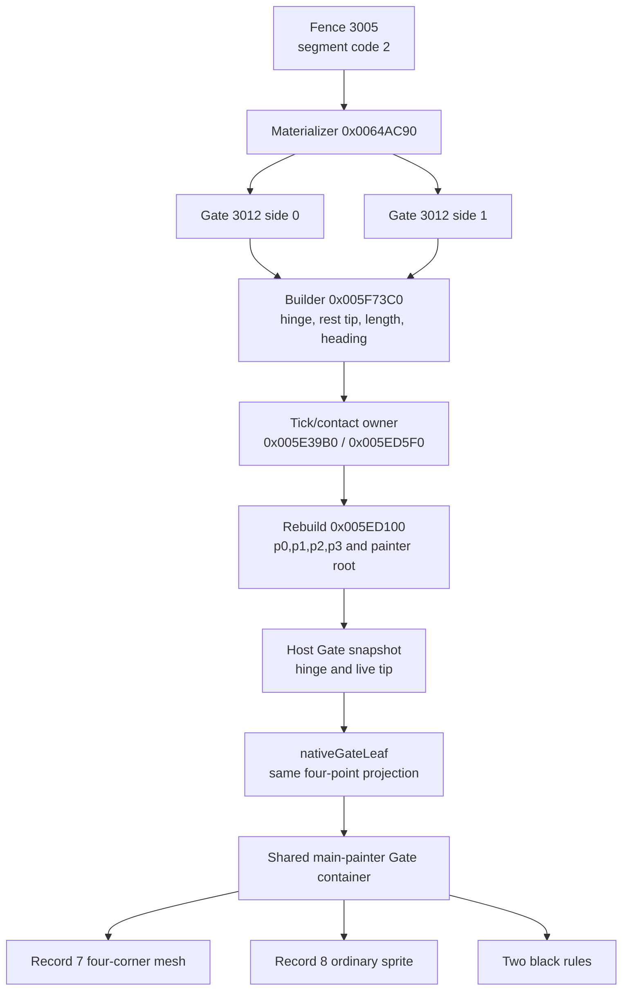
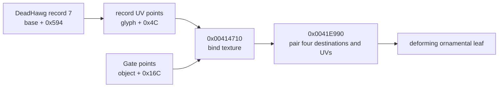
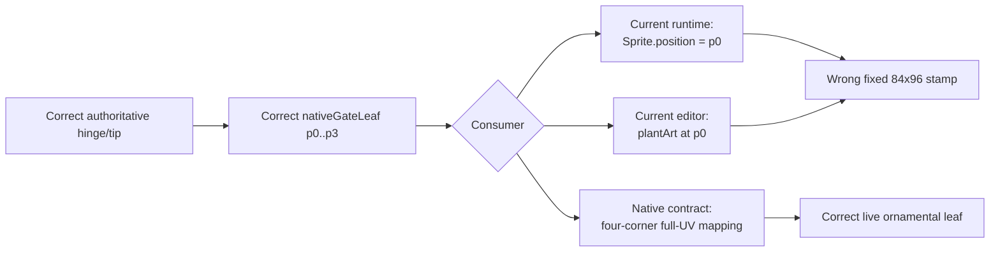

# Solomon Dark native parity RE ledger

Runtime ownership and deployment decisions for the clean rebuild are recorded
separately in `game-runtime-architecture.md`. This ledger remains the authority
for recovered native behavior, constants, timing, geometry, render order,
collision, and lifecycle. Architecture work must preserve these receipts rather
than reinterpret them as browser-owned behavior.

This document is the evidence ledger for the `/game` web reconstruction. The
unmodified native game is the visual and behavioral oracle. Recovered behavior
is translated into cohesive web modules; incidental implementation debt from
the stock executable is not preserved.

Every new reverse-engineering result must be recorded here before it is used to
justify a parity change. Record the evidence, recovered value or rule,
confidence, and implementation consequence. Keep unknowns explicit.

Every reported visual or behavioral discrepancy is evidence that the web
port's underlying system model may be wrong, not an isolated value to tune.
Recover the stock ownership, state, timing, geometry, painter/collision order,
and lifecycle before changing behavior. Correct the shared model so the visible
fix emerges from the same rules as stock; do not add symptom-specific patches.

## Evidence policy

- Launch the stock executable directly with every mod disabled. Do not use an
  injected loader, Lua mod, or modded staging build for parity evidence.
- Preserve capture paths, native function addresses, runtime addresses, and
  exact measurements where available.
- Mark decompiler interpretation or visual inference separately from directly
  observed facts.
- Do not invent native behavior to make a screenshot look plausible. If a seam
  remains unknown, keep it on the open-questions list and gather more evidence.
- Prefer emergent parity from shared systems over scene-specific scripted
  exceptions, especially for movement and collision behavior.

## Clean native reference run — 2026-08-11

- Stock executable:
  `SolomonDarkAbandonware/SolomonDark.exe`
- Owned clean process at capture time: PID `157624`.
- Loaded image check found the stock executable and no loader/mod modules.
- A separate process from
  `%LOCALAPPDATA%/SolomonDarkMultiplayerBeta/runtime/stage` was unrelated and
  was not used as evidence.
- Preferred executable image base: `0x00400000`.
- Runtime image base in this run: `0x00CB0000`.
- ASLR delta in this run: `0x008B0000`.

Reference captures:

- `%LOCALAPPDATA%/Temp/native-create-entry-60fps-0811.mkv`
- `%LOCALAPPDATA%/Temp/native-water-discipline-60fps-0811.mkv`
- `%LOCALAPPDATA%/Temp/native-current-0811.png`
- `%LOCALAPPDATA%/Temp/native-hub-current-0811.png`
- `%LOCALAPPDATA%/Temp/native-player-right-0811.png`
- `%LOCALAPPDATA%/Temp/native-teacher-rune-a.png`
- `%LOCALAPPDATA%/Temp/native-teacher-rune-b.png`
- `/tmp/native-create-entry-60fps-montage.png`
- `/tmp/native-create-left-entry-fine.png`
- `/tmp/native-create-right-entry-fine.png`
- `/tmp/native-create-left-swap-numbered.png`
- `/tmp/native-water-discipline-60fps-montage.png`
- `/tmp/native-select-left-numbered.png`
- `/tmp/native-select-right-numbered.png`
- `/tmp/native-create-mount-numbered.png`
- `/tmp/native-teacher-sequence-montage.png`

## Loader readiness and presentation

Native owner and renderer:

- startup construction: `0x005BAB60`;
- `MyLoader` renderer: `0x005BCA40`;
- embedded `Bundle_Loader`: `MyLoader + 0x78`;
- completed-work global: `DAT_0081F6A8`;
- total-work global: `DAT_0081F6AC`;
- forced-complete byte: `DAT_0081F6B0`.

The native loader is a real readiness gate, not a timed splash. Every render
computes `progress = completed / total`, clamps it to `1`, and calls the
loader's vtable slot `+0x18` only when progress is at least `1` (or the
forced-complete byte is set). The menu cannot render before that completion
dispatch.

The renderer also corrects an older static-art conclusion. It calls four
sprite draw helpers on fields inside the `MyLoader` object:

- `this + 0xB0` (`Bundle_Loader` record 0);
- `this + 0x174` (record 1);
- `this + 0x238` (record 2);
- `this + 0x2FC` (record 3).

Because these are embedded-owner-relative accesses rather than references
through published singleton `DAT_008199BC`, a singleton-only consumer search
incorrectly classified all Loader records as dormant. A clean mod-free 60 fps
desktop capture at
`C:\Users\User\AppData\Local\Temp\solomon-clean-startup-0811.mkv`
confirms that records 0..3 render the Raptisoft mark, URL, bar chrome, and red
fill. Only record 4 remains unobserved in this renderer.

The exact logical composition recovered from `0x005BCA40` and the Loader
bundle metadata is:

- a `480 x 320` virtual canvas, centered with
  `((surfaceWidth - 480) / 2, (surfaceHeight - 320) / 2)`;
- clear color `(0, 0, 0.33, 1)`;
- record 2 at top-left `(41, 13)`, logical size `388 x 227`;
- record 3 at top-left `(119, 251)`, logical size `244 x 18`;
- record 1, logical size `54 x 230`, centered at `(240, 290)` and rotated
  `90 degrees`, producing the horizontal bar frame;
- record 0, logical size `18 x 192`, centered at `(240, 291)` and rotated
  `90 degrees`, producing the red gradient fill.

Progress is not primitive colored geometry. `FUN_00420ec0` installs a clip
rectangle `(0, 0, 144 + progress * 192, 320)`; the renderer then draws the
entire rotated record 0 and clears the clip with `FUN_00420e40`. Since the
rotated fill spans logical `x=144..336`, the visible fill width is exactly
`progress * 192`. This ownership distinction matters: the web loader must crop
the native gradient rather than approximate it with a CSS color ramp.

In that run the native bar advanced in discrete work-completion steps and the
loader disappeared immediately after readiness; the title screen followed
under its ordinary fade. The web implementation consequence is:

1. preload and decode the resident `/game` asset manifest;
2. drive progress from completed asset tasks, not elapsed time;
3. keep the main menu unmounted until all required tasks succeed;
4. render the extracted Loader sprite records and clip the native fill sprite;
5. transition only when progress is complete.

Confidence: high from the full renderer instruction stream, draw-helper
decompilation, bundle metadata, and clean stock startup capture.

The 2026-08-13 unified-renderer cutover now presents this exact `480 x 320`
composition through `renderer/loader-renderer.ts`: the blue clear, records 2
and 3, both rotated bar records, and the progress-width mask are one WebGL
scene. `Game.tsx` still owns readiness and does not mount the title until the
resident asset promise succeeds. The loader therefore remains a real work
gate; only its browser painter changed. `NativeLoader.tsx` retains the live
semantic percentage as a DOM status surface and paints no artwork.

## Main-menu branding override — 2026-08-13

The stock title logo remains `Title.bundle` record 9, extracted as
`main-menu-logo.png` at `829 x 395`. The approved website brand artwork is
`logo-solomon-dark.png`, an `836 x 464` transparent image that reads
"Solomon Darker." Replacing the title texture is an explicit product-branding
divergence rather than a newly recovered native behavior.

The override is limited to the logo texture and its accessible name. It does
not reassign record 9 in the stock extractor or change the native title-screen
ownership, painter order, menu geometry, animation, or surrounding art. The
stock extraction remains available as evidence.

The replacement is 69 pixels taller at nearly the same authored width. Letting
it inherit the stock logo's width with natural height would extend into the
action stack. The web title renderer therefore retains the existing logical
`829 x 395` title slot and contains the replacement inside that slot without
distorting it.

Confidence: high for the bundle record, source-image dimensions, and fit
consequence; the texture substitution itself is the explicit web product
requirement.

## 2026-08-13 — Title and Create GPU presentation ownership

### Reported smell and parity question

- Reported web behavior: the Hub and Boneyard use the GPU renderer, while the
  returning-player title and Create/loadout screens still split their visuals
  across full-frame Canvas2D repaints, independent effect canvases, DOM images,
  CSS filters, and CSS animation layers. The user wants consistently high FPS
  throughout the game rather than scene-specific renderer paths.
- Stock behavior to recover: preserve the already recovered Title and Create
  state, clocks, transforms, painter order, assets, and input lifecycle while
  changing only the browser presentation backend.
- Reproduction inputs/scenes: decoded resident assets, `1600 x 900`, returning
  title root, settled element picker, and settled Fire discipline picker.
- Falsifiable questions: if CPU raster and compositor fan-out are the cause,
  replacing them with one active PixiJS/WebGL canvas must remove the Canvas2D
  render loops, reduce canvas/DOM/layer counts, preserve pixel geometry and
  animation receipts, and reduce browser task time without changing native
  fixed-tick outputs.

### Evidence and provenance

| Evidence class | Exact source | Observation | Confidence |
| --- | --- | --- | --- |
| Clean stock | `SolomonDarkAbandonware/SolomonDark.exe`; clean captures listed above | Title and Create are each presented as one ordered screen-space scene; no browser-style independent layout/compositor ownership exists | high |
| Instructions | `MainMenu_Render` `0x00598780`, title row helper `0x00598470`, Create build/update/render `0x00593C30` / `0x0058A820` / `0x0059AD40` | Screen owners submit ordered sprite, primitive, text, hand, glyph, and effect draws from their own state fields | high |
| Asset/data | `Title.bundle`, `Create.bundle`, `UI.bundle`, `BadGuys.bundle`; `native-asset-object-map.json` | The extracted textures and registrations are renderer inputs; they do not require DOM or Canvas2D ownership | high |
| Web runtime | `tools/measure-menu-performance.mjs`, local origin-main build `846e87e`, Chrome 140, Radeon RX 9070 XT, `1600 x 900`, 5-second samples | Title used 2 Canvas2D surfaces/84 DOM nodes/15 compositor layers; element picker used 5 Canvas2D surfaces/69 nodes/27 layers; discipline picker used 1 Canvas2D surface/112 nodes/66 layers. Average FPS was `130.18`, `130.48`, and `130.79`; browser task time was `691.95`, `598.66`, and `1457.45 ms` respectively | high |
| Web runtime | same tool and tree under software-rendered Linux Chromium | The full-frame title Canvas2D path fell to `3.93` average FPS while the two loadout states reached the browser's `60 Hz` cap with substantial task time | high for causal sensitivity, not a physical-GPU absolute |

### Native ownership thread

- Owner and construction path: `MainMenu` owns its title fields and renderer;
  `CreateWizardMenu` on vtable `0x00797B7C` owns its hands, choices, wheel,
  effects, and finalization state from `0x00593C30` through teardown.
- Upstream state producers/callers: title tick state advances the cloud,
  horizon, grave-row, grass, cloak, and eye phases. Create input and
  `0x0058A820` advance the recovered `100 Hz` hand/choice state; the wheel uses
  its separately recovered shared tick field.
- State representation and transitions: title root/play selection changes
  button content without replacing the background owner. Create moves from
  entry to element choice, element closing/transfer, discipline choice, and
  finalization using the motion samplers and audio boundaries already recorded
  in this ledger.
- Downstream consumers/callees: the Title and Create renderers consume those
  fields as one painter stream. Element VFX dispatch consumes the same
  renderer-independent draw plan used by the staff orb.
- Sibling systems sharing ownership or data: Loader is an earlier readiness
  owner, while Hub and Boneyard are later world owners. UI semantics and input
  focus are screen-space client concerns but are not native-art painter layers.
- Entry, interruption, reset, and teardown: the active screen alone advances
  and renders. Leaving Title destroys its presentation resources; leaving
  Create stops its frame/audio loop and releases its GPU textures. Re-entering
  constructs a fresh native scene sequence.

### Recovered behavioral contract

- Timing/ticks/thresholds: keep the title's recovered cloud/horizon/grave/grass
  rates and `60 Hz` Solomon phase; keep Create's `100 Hz` hand/reveal samplers,
  `36 s` wheel revolution, selection spline, hard pose swaps, flashes, audio
  boundaries, and finalization delay. Display refresh samples those clocks; it
  does not become a new simulation clock.
- Geometry/transforms/coordinate spaces: both scenes remain a `1600 x 900`
  logical stage scaled to the viewport. Texture registration, the three title
  grave baselines, native Create centers, right-hand horizontal reflection,
  and one backing pixel per logical VFX pixel remain unchanged.
- Render/hit/collision/traversal order: Title preserves its recovered
  background/fog/grave/Solomon/menu ordering. Create preserves left hand,
  selected element/effects, right hand, then discipline foreground. Semantic
  hit targets overlay the matching logical geometry but do not paint art.
- Assets/audio/randomness: use the extracted stock textures and the approved
  Solomon Darker logo override. Preserve the deterministic web replacement for
  presentation-only native RNG already documented. Audio remains owned by
  `GameAudioDirector` and the recovered event samplers.
- Input/network authority/replication: these menus are local presentation and
  input state. They do not enter the authoritative Node simulation or network
  snapshot protocol.
- Boundary and failure behavior: WebGL is the supported game presentation
  baseline, matching the Hub/Boneyard policy. Renderer failure is explicit;
  there is no hidden Canvas2D compatibility path.

### Nearby-system findings

- Durable finding: moving artwork to WebGL does not imply moving accessible
  buttons, focus, keyboard/gamepad routing, touch controls, status messages, or
  the HUD into GPU pixels. Those are the semantic overlay of the one composed
  client, not a second visual renderer.
- Evidence: the native renderer separates screen state/painter submission from
  input dispatch, while the current Hub/Boneyard architecture already proves a
  WebGL world plus React semantic/HUD overlay at display cadence.
- Why it matters or may matter later: preserving that seam avoids an
  inaccessible canvas-only UI and keeps the identical client bundle usable in
  browsers, Electron, mobile landscape, and Steam Deck controls.
- Native report/catalog also updated: no. This investigation recovered no new
  stock fact; it maps existing native facts to the browser renderer boundary.

### Confidence and open questions

- Confirmed: native owner/state/clock/order; current browser surface and layer
  fan-out; WebGL availability and the existing GPU scene baseline.
- Inferred: consolidating the active visual scene will reduce task/compositor
  pressure on physical GPUs and eliminate the severe software-raster title
  failure. The before/after browser run will accept or falsify this inference.
- Unknown: the exact minimum supported physical GPU remains a later product
  qualification target, not a reason to keep parallel rendering paths.
- Next falsifying probe if the unknown becomes material: replay the retained
  menu benchmark on the declared minimum desktop, mobile, and Steam Deck GPU at
  their native refresh rates.

### Web implementation consequence

- Correct owner/module: one scene-scoped PixiJS renderer owns all animated and
  decorative Title pixels; one scene-scoped PixiJS renderer owns all animated
  and decorative Create pixels.
- Shared model change: keep `create-menu-motion.ts` and
  `element-vfx-native.ts` renderer-independent. Feed their plans into pooled GPU
  sprites rather than recomputing behavior in CSS or shaders.
- Stock behavior preserved: layer order, geometry, hard pose swaps, timing,
  effects, hover/press artwork, audio boundaries, and screen teardown.
- Browser-specific approximation, if unavoidable: transparent semantic DOM
  controls remain aligned over GPU artwork for accessibility and input. They
  are not visual fallbacks.
- Symptom patch or obsolete path to remove: full-frame `MainMenuBackdrop`
  Canvas2D painting, the game-only `MenuSolomon` canvas, Create DOM artwork and
  CSS animation layers, per-choice Canvas2D element effects, and React
  per-display-frame motion rendering.

### Validation contract

- Focused automated test: pure title/Create frame and painter contracts,
  renderer-source contracts, and retained fixed-tick motion/VFX tests.
- Playwright or runtime journey: root -> play -> Create element -> discipline,
  with a single `pixi-webgl` canvas in each scene, correct semantic controls,
  renderer diagnostics, no page/console errors, and no Canvas2D scene painter.
- Stock-versus-web comparison: compare title and both Create phases at matching
  `1600 x 900` logical times against the existing clean captures and geometry
  receipts.
- Measurable acceptance criteria: physical-GPU averages remain above `100 FPS`
  and improve toward the display limit; steady-state 1% low stays above
  `100 FPS`; browser task time and compositor-layer count do not regress. A
  software-only WebGL implementation remains diagnostic evidence, not a
  supported production renderer.

### Implementation validation receipt

- Files/modules changed: `renderer/game-webgl.ts` now owns the shared explicit
  WebGL application/texture boundary; `title-menu-renderer.ts` and
  `TitleMenuPresentation.tsx` own the complete Title painter; and
  `create-menu-renderer.ts` with `CreateMenuScene.tsx` owns Create artwork,
  motion, VFX, and semantic controls. `loader-renderer.ts` owns the native
  readiness composition and clipped progress fill. `native-element-vfx-view.ts` is the one
  GPU consumer shared by Create and the equipped staff. The obsolete
  `MainMenuBackdrop`, game-only Canvas2D Solomon path, Create DOM art/CSS
  animations, Canvas2D `ElementVfx`, and unused DOM `PlayerCharacter` painter
  were removed rather than retained as fallbacks.
- Focused tests cover loader registrations/progress clipping, the three title
  grave rows/parallax/tiling, exact Create
  hand centers and authored discipline dimensions, flash boundaries, native
  element scale plans, and the no-DOM-art cutover. The canonical complete gate
  passes all `200` frontend tests, all `23` backend/contracts tests, lint and
  both production builds with zero build errors. Existing Fast Refresh notices
  remain warnings outside this renderer work.
- A controlled current-browser A/B used Chrome `151.0.7922.110`, the same
  Radeon RX 9070 XT, `1600 x 900`, isolated fresh profiles, five-second
  samples, and origin-main `846e87e` as the baseline. The retained second
  steady runs were:

  | scene | origin-main average / 1% low | WebGL average / 1% low | origin-main task | WebGL task | layers before / after |
  | --- | ---: | ---: | ---: | ---: | ---: |
  | Title | `131.83 / 123.02 FPS` | `131.17 / 122.16 FPS` | `923.71 ms` | `346.18 ms` | `15 / 9` |
  | element picker | `132.00 / 123.02 FPS` | `131.18 / 122.16 FPS` | `742.47 ms` | `412.13 ms` | `27 / 8` |
  | discipline picker | `131.17 / 109.55 FPS` | `130.71 / 115.32 FPS` | `1676.90 ms` | `397.61 ms` | `66 / 8` |

  The display cadence was already monitor/browser-paced near `131 FPS`, so
  average FPS correctly remains at that ceiling. The structural gain is
  `53–76%` less browser task time, a single active canvas, and dramatically
  fewer compositor layers. The discipline 1%-low also rises above the stated
  `100 FPS` floor.
- The final post-rebase fresh-profile physical-GPU run measured Title at
  `130.94 / 122.38 FPS`, element at `131.02 / 109.89 FPS`, and discipline at
  `131.32 / 122.81 FPS` (average / 1%-low), with no frame over `20 ms` and only
  `9`, `8`, and `8` compositor layers. A separate retained run on the same
  hardware reached the display's `144 FPS` cadence with `139.86–140.85 FPS`
  1%-lows. This is display-scheduling variance, not a scene-load change. A
  direct runtime probe rendered the Loader at `50%` and confirmed the
  horizontal native frame, cropped red-gradient fill, and `pixi-webgl`
  renderer.
- The full pointer/runtime smoke passed Title -> Create -> Hub -> two-client
  Boneyard with WebGL2, 13 Students in the final run, all five walk poses,
  interpolated movement, and no page or console errors. The device receipt
  passed forced Create-hand `decode()` rejection, controller-only Steam Deck
  selection and movement at `1280 x 800`, mobile landscape touch at
  `844 x 390`/resolution `0.5`, paused-render visibility interruption with a
  bounded `18.89`-unit release tail and zero later drift, and the portrait
  orientation gate.
- SwiftShader measured `3.46 FPS` on Title and about `6.4 FPS` on Create after
  cutover. That falsifies the earlier inference that WebGL alone would improve
  the unsupported software-renderer path: full-resolution software WebGL is
  slower here. No resolution reduction or Canvas2D fallback was introduced;
  production requires working GPU acceleration and reports WebGL failure
  explicitly.
- Remaining implementation explicitly out of scope: DOM HUD and accessibility
  semantics remain overlays by design; they do not paint game artwork.

## 2026-08-14 — Title Solomon eye and hood painter order

### Reported smell and parity question

- Reported web behavior: Solomon's red eyes on the main menu sit above the
  hood, so outer eye pixels bleed across the hood edge.
- Stock behavior to recover: determine whether the eye crop or the animated
  cloak/hood owns their overlap and preserve that relationship through all
  five cloak frames and crossfades.
- Reproduction inputs/scenes: returning-player title root at `1600 x 900`,
  reduced-motion web frame zero, and a directly launched stock title with its
  beta dialog left open so the unobstructed left Solomon remains visible.
- Falsifiable questions: an asset-registration defect would remain after the
  native painter order is restored; an eye-above-hood model would require the
  native eye draw to occur after the cloak submissions.

### Evidence and provenance

| Evidence class | Exact source | Observation | Confidence |
| --- | --- | --- | --- |
| Clean stock | `SolomonDarkAbandonware/SolomonDark.exe`, SHA-256 `03a834566ce70fd8088f4cf9ee6693157130d8aec28c092cb814d6221231f1e3`; owned direct process PID `22016`, started `2026-08-14T12:22:23-04:00`, then stopped; `C:\Users\User\AppData\Local\Temp\solomon-stock-title-eye-order-20260814.png` | The stock hood covers the outside ends of the eye artwork. The captured process path was the abandonware executable and its enumerated modules contained no loader or mod DLL. | high |
| Instructions | clean image base `0x00400000`; `MainMenu_Render` `0x00598780`; draw calls `0x005991CB`, `0x005992C4`, `0x00599442`, `0x005994FF`, `0x005995E3`, `0x00599693` | Body record 3 is submitted first, eye record 8 second, current cloak twice third/fourth, and next cloak twice fifth/sixth. The immediate painter has no later depth sort. | high |
| Asset/data | `Title.bundle` SHA-256 `f6f1e5956427bfa45bc5e28c87cb2574a25169da96feca62e7efe8691d2b99d8`; `Title.png` SHA-256 `86b8bb40b3f7ece277cf0d1038b118bf095b8489bdc344738b2fe8cbe1160ff2`; records 3, 8, 11..15 | The Website body, eye, and five cloak PNG hashes exactly match the pixel-verified native-report extractions. The mismatch is not crop content. | high |
| Web runtime | Website `6a823b268063417ef26cb04982fec04ae333c893`, PixiJS `8.19.0`, Chrome `150.0.7871.124`, `1600 x 900`; `/home/user/.codex-evidence/title-eye-order-20260814/web-before.png` | The outer red eye pixels render over the hood. `stageSprite(...eyes..., zIndex 1)` gives the eyes a nonzero depth while cloak sprites retain depth 0. Pixi enables parent sorting when the nonzero child is attached, so it moves every cloak before the eyes. | high |

### Native ownership thread

- Owner and construction path: `MainMenu` construction at `0x0058D940`
  installs vtable `0x007980CC`, starts `solomondarktheme`, calls `Title_Build`,
  initializes its menu/grave storage, and zeros the animation fields.
- Upstream state producers/callers: vtable slot `+0x08`,
  `MainMenu_Tick` at `0x005A51B0`, advances cloak phase at
  `MainMenu + 0x400`; global tick `0x0081F658` supplies the eye sine phase.
- State representation and transitions: the five cloak records form one
  cyclic animation. `floor(phase)` and the next wrapped index select two
  records; the eye crop is a single separately translated record.
- Downstream consumers/callees: vtable slot `+0x0C`, `MainMenu_Render`, submits
  body and cloak records through scaled helper `0x00414EA0` and eyes through
  unscaled helper `0x004142E0`, using normal source-over drawing.
- Sibling systems sharing ownership or data: `Title.bundle` record 9 is the
  logo, records 16..24 are the three grave rows, and `0x005A0960` is the
  separate menu/header renderer. None participates in Solomon's internal
  overlap.
- Entry, interruption, reset, and teardown: layout is vtable slot `+0x04`
  (`0x005A51A0` -> `0x0059A9D0`). Deleting destructor `0x00592E10` delegates
  to `0x0058DA70`, which releases the grave vectors and embedded controls.
  Solomon has no independent actor lifetime beyond the active title owner.

### Recovered behavioral contract

- Timing/ticks/thresholds: retain the existing fixed-rate phase update,
  `current alpha = 1 - fraction^3`, `next alpha = fraction`, and one-pixel
  vertical eye sine.
- Geometry/transforms/coordinate spaces: retain the recovered body, eyes, and
  cloak rectangles in the title stage; no coordinate nudge is supported by
  this finding.
- Render/hit/collision/traversal order: submit body, eyes, current cloak twice,
  then next cloak twice. Therefore every cloak frame is painter-above the
  eyes, including both sides of a crossfade. Menu hit testing is unrelated.
- Assets/audio/randomness: retain exact extracted records 3, 8, and 11..15.
  This correction changes no assets, audio, grave RNG, or cloak timing.
- Input/network authority/replication: the title composition is local
  presentation state and never enters authoritative simulation or replication.
- Boundary and failure behavior: title viewport clipping still cuts off the
  cloak below the client. WebGL failure remains explicit and has no alternate
  painter path.

### Nearby-system findings

- Durable finding: in PixiJS 8.19, attaching a child whose `zIndex` is nonzero
  invokes `depthOfChildModified()`, enables `parent.sortableChildren`, and
  sorts siblings by depth before collecting renderables. Insertion order alone
  is therefore not the title renderer's effective order once any child has an
  explicit depth.
- Evidence: installed `pixi.js` sources
  `scene/container/Container.mjs`, `container-mixins/sortMixin.mjs`, and
  `collectRenderablesMixin.mjs`, plus a direct two-child Node probe that sorted
  depth 0 before depth 1.
- Why it matters or may matter later: every retained-mode title subcomposition
  must assign a complete sibling depth contract rather than mixing one explicit
  layer with implicit zero-depth siblings.
- Native report/catalog also updated:
  `Mod Loader/docs/main-menu-solomon-visual-re.md` now records the exact draw
  call sites, owner lifetime, and `body < eyes < cloak` occlusion consequence.

### Confidence and open questions

- Confirmed: native owner and lifetime, exact immediate call sequence, bundle
  records and crops, web sort trigger, and the visible stock/web differential.
- Inferred: none required for the implementation.
- Unknown: the exact stock outer-loop frequency remains unchanged from the
  earlier title investigation and cannot affect painter order.
- Next falsifying probe if the unknown becomes material: trace the outer loop's
  call cadence around vtable slot `+0x08`; this is unnecessary for an ordering
  correction.

### Web implementation consequence

- Correct owner/module: `renderer/title-menu-render-contract.ts` owns the
  recovered painter-depth contract and `title-menu-renderer.ts` applies it to
  every Solomon child.
- Shared model change: define all three sibling layers explicitly as
  `body < eyes < cloak`, leaving the four cloak submissions stable within the
  cloak layer.
- Stock behavior preserved: geometry, assets, crossfade duplication, opacity,
  eye bob, fixed title stage, and scene lifecycle remain unchanged.
- Browser-specific approximation, if unavoidable: retained depth values encode
  the native immediate painter sequence; they do not approximate its visible
  output.
- Symptom patch or obsolete path to remove: replace the mixed explicit/implicit
  depths that let Pixi place the eye crop last. Do not mask or reposition eye
  pixels.

### Validation contract

- Focused automated test: create Pixi siblings at the shared contract depths,
  force sorting, and assert `body`, `eyes`, then all four cloak submissions.
- Playwright or runtime journey: load `/game` at `1600 x 900`, reduced-motion
  frame zero, capture the WebGL canvas, and retain page/console errors.
- Stock-versus-web comparison: compare the left hood/eye overlap against the
  owned direct-stock capture while holding the recovered geometry constant.
- Measurable acceptance criteria: no red eye pixel crosses either hood edge;
  the canvas remains one `pixi-webgl` surface at `1600 x 900`; asset-source,
  animation-frame, and error receipts remain unchanged.

### Implementation validation receipt

- Files/modules changed: `title-menu-render-contract.ts` now defines the
  complete native sibling depth contract; `title-menu-renderer.ts` applies it
  to body, eyes, and every cloak sprite; and
  `title-menu-render-contract.test.ts` recreates Pixi's sorting behavior and
  locks the six-submission order.
- Tests and canonical gate: the regression first failed at TypeScript compile
  because the depth contract did not yet exist. After implementation,
  `./scripts/validate.sh` passed all `23` backend/contracts tests, all `315`
  frontend tests, all `5` desktop tests, backend formatting, frontend lint and
  architecture checks, both production builds, and the production media/CSP
  policy. Existing Fast Refresh and bundle-size notices remained warnings.
- Browser/native evidence: Chrome `150.0.7871.124` visited the built production
  preview at `/game` with status `200`, one `1600 x 900` `pixi-webgl` canvas,
  root screen/frame-zero diagnostics, and zero console or page errors. The
  retained frame-zero capture is
  `/home/user/.codex-evidence/title-eye-order-20260814/web-after-production.png`.
  A separate live pass observed and captured cloak frames `0..4`; every frame
  kept the eye pixels behind the hood. The result agrees with the directly
  launched stock capture at
  `C:\Users\User\AppData\Local\Temp\solomon-stock-title-eye-order-20260814.png`.
- Remaining implementation explicitly out of scope: no other title geometry,
  logo, menu control, background painter lane, or animation timing changed.

## Create/loadout menu

### Native functions

- Update: `0x0058A820`
- Render: `0x0059AD40`
- Build/constructor path: `0x00593C30`
- Choice application: `0x005D0290`
- Player-start finalizer: `0x005CFA80`

### Hand state and timing

Direct decompilation and 60 fps capture establish that each hand displays one
discrete sprite at a time. The native game does not alpha-blend two poses.

- `DAT_00819990 + 0x72c`: closed fist.
- `DAT_00819990 + 0x73c`: cupped/opening pose.
- `DAT_00819990 + 0x74c`: raised/open pose.
- Pose selection is threshold-based: speed/state `< 10` selects cupped and
  `< 1` selects raised.
- Initial entry, active left hand: after the Create scene becomes visible, the
  state machine retains the fist through its 120-count anticipation and travel,
  swaps fist to cupped when the damped vector falls below `10`, then swaps to
  raised below `1`. Exact fixed-state replay puts those boundaries at updates
  `132` and `134` after Create construction; scene fades determine their
  wall-clock position in a capture.
- Initial entry, inactive right hand: remains a fist.
- After selecting the left-side element: left raised to cupped at approximately
  `500 ms` after the click.
- The right hand goes fist to cupped at fixed update `63` after it becomes
  active, then cupped to raised at update `66`, coincident with the discipline
  reveal/flash.

Confidence: high. These are visible at frame cadence in lossless 60 fps capture
and agree with the decompiled state thresholds.

### Inactive right-hand lifecycle

The Create renderer owns both hands for the full lifetime of the loadout scene;
the active-hand flag advances a hand's state machine but does not determine
whether that hand is drawn. In the element phase, the right hand is already
present as the closed-fist sprite at native base center `(1200,560)` plus its
inactive travel offset `(50,300)`. It stays visible in that lower-right resting
position until the left hand finishes closing around the selected element.
Control then passes to the right-hand state machine, which consumes the same
travel offset while changing fist to cupped to raised for discipline selection.

Evidence:

- `0x0059BC42`, the recovered right-hand draw path, renders the current discrete
  pose from the persistent Create object rather than gating the draw on the
  right-active flag.
- `%LOCALAPPDATA%/Temp/native-water-discipline-60fps-0811.mkv`, beginning with
  the first captured element-phase frames, visibly retains the closed right
  fist at the bottom-right before its discipline-opening motion begins.
- The read-only Create-state sample documented below records base center
  `(1200,560)` and travel `(50,300)` as separate renderer inputs. The travel
  vector must therefore be applied once, not baked into a phase-specific base
  position and applied again as motion.

Implementation consequence: the web right-hand layer must keep the native
`(1200,560)` base center in both element and discipline phases. Entry motion
owns the `(50,300)` closed offset, so phase CSS must not include a second copy.
The hand remains mounted as a fist before element selection and naturally rises
when the existing selection state machine starts.

Confidence: high from the complete draw-path recovery, live state fields, and
lossless stock capture. The allocator-derived idle-phase difference between the
two hands remains intentionally unspecified; it does not affect visibility,
base ownership, or transition geometry.

### Hand transform and idle clocks

Complete instruction recovery of the right-hand draw path at `0x0059BC42`
shows that the native game does not add a rotation to the right hand. It builds
an explicit transform through `0x004030A0` with X scale `-1.5`, Y scale `+1.5`,
and Z scale `1`. The negative X scale is a pure horizontal reflection. The
left-hand path uses the uniform `1.5` draw helper at `0x00414EA0`. Therefore the
web's right-hand geometry must stay horizontally mirrored at the same scale as
the left; adding a corrective angle would diverge from the native renderer.

Both hands have independent phase fields and identical updates: left phase is
at Create state `+0xdc`, right phase at `+0x210`, and each advances by `0.5`
degrees per native fixed update. A subsequent clean live sample corrected the
initial frame-rate assumption: the phases advanced `79.5` degrees over
`1.5955 s`, or about `49.83 degrees/second`, proving the stock update cadence
is `100 Hz`, not the capture cadence of `60 Hz`. The constructor does not
explicitly initialize these two phase words, and clean runs showed different
constant offsets between them; that is allocator residue rather than a game
rule. The web initializes both phases deterministically while preserving the
native update and renderer. The render path applies these exact offsets in
native screen pixels:

`x = sin(phase) * 5`

`y = sin(phase * 0.5) * 2.5`

This gives a `7.2 s` horizontal period and `14.4 s` vertical period. The prior
web polygonal CSS keyframe happened to use the horizontal period but not the
native sinusoidal path, Y period, or transform ownership, and must be removed.
Idle displacement belongs on the hand sprite inside the entry/selection
translation wrapper so it cannot replace or restart the transition transform.

Confidence: high, from the complete `0x0059AD40` instruction stream, direct
numeric dumps of `DAT_00795444 = -1.5`, `DAT_007847A0 = 1.5`,
`DAT_007DE8D8 = 5.0`, and `DAT_00784750 = 2.5`, plus read-only live phase
sampling. The earlier 60 Hz conversion was explicitly disproved by that sample.

### Selection travel state

A clean direct-stock run with no loader or proxy modules was sampled through
read-only process memory on 2026-08-11. The Create object was found from its
relocated vtable and the fields below were recorded about every 5 ms across an
element click. This confirms the transition is stateful fixed-update movement,
not a CSS-style interpolation between two screen poses.

- The selected-element click sets the element immediately but keeps the left
  hand raised and stationary for roughly the first `500 ms`.
- The left travel fields then depart from `(0,0)`, follow the native recurrence,
  cross the discrete cupped-pose threshold, and settle at approximately
  `(-125.91,+200)` native pixels relative to the raised position.
- Only after that settlement does control pass from the left active flag to the
  right active flag.
- The right hand starts at `(50,300)` relative to its final raised position and
  ultimately settles at `(0,0)`. Its state changes fist to cupped to raised as
  recovered from the velocity thresholds; it does not rotate during that rise.
- Native base centers are left `(400,560)` and right `(1200,560)`. These are
  combined with the travel fields and the shared sine drift in the renderer.

The clean sample also resolves the left recurrence exactly. After the native
delay expires, each `10 ms` fixed update executes its movement substep twice:

`x -= y / 30`

`y = min(200, (y + 0.25) * 1.05)`

Starting at `(0,0)`, fixed update 38 produces `(-125.91012,200)`, matching the
live endpoint within float precision. This is why a generic cubic ease makes
the closing hand look wrong. The web may encapsulate the recurrence as a pure
sampled function, but it must not replace it with another authored curve.

The web must therefore keep position and pose as outputs of one transition
clock, hard-swap one raster at each state boundary, and keep idle drift on a
separate inner transform. Independent outer CSS animation and React pose clocks
can disagree by one frame and were the source of the visible shaking.

Confidence: high for field ownership, endpoints, ordering, and absence of
rotation, from `0x0058A820`, `0x0059AD40`, the direct object dump, and clean
lossless captures. Sub-frame randomness in the native travel recurrence is
visual noise and need not be copied into browser layout.

### Painter order

Native render order is:

1. left hand;
2. selected element effects and glyphs;
3. right hand;
4. discipline glyphs and selection foreground.

Consequences:

- The right hand must not cover discipline runes.
- The left hand must not incorrectly cover the selected element foreground.
- Web transitions must hard-swap sprite poses at recovered thresholds; CSS
  crossfades or independent animations cause the observed shake/double hand.

Confidence: high, from `0x0059AD40` and reference frames.

### Exact Create geometry, wheel clock, and entry anticipation

A second clean direct-stock process (`SolomonDark.exe`, no loader/proxy/mod
modules) resolved the remaining layout fields from the live Create object and
the complete constructor/render instruction streams.

- Create record `7`, the `276 x 276` arcane wheel, is drawn at native center
  `(800,800)`, opacity `0.05`, and scale `3`, so its authored frame is exactly
  `828 x 828` pixels. The web's previous `621 px` frame was not a responsive
  variant; it was simply underscaled.
- The renderer uses integer tick field `+0x28 / 50` as the wheel angle. Two
  read-only samples separated by `2.30 s` advanced that field by `1124`,
  consistent with the shared renderer clock at about `500 Hz`; division by
  `50` therefore yields about `10 degrees/second`, or a `36 s` revolution.
  A `900 s` CSS revolution is not native.
- The five settled element centers in constructor order are
  `(826.303,369.046)`, `(924.909,515.235)`, `(816.346,654.189)`,
  `(650.644,593.879)`, and `(656.798,417.651)`. The switch and glyph order map
  those to Ether, Fire, Air, Water, and Earth respectively.
- The discipline centers are exact constructor constants: Arcane
  `(1025,460)`, Body `(875,460)`, and Mind `(725,460)`. Their native Create
  records retain their authored dimensions: `218 x 238`, `238 x 229`, and
  `227 x 241`. A uniform `144 px` DOM width discarded both native size and
  per-discipline proportions.
- The settled selected-element anchor is the left-hand effect position at
  `(450,660)`. The selected painter is the same
  element-specific VFX dispatcher. Its caller starts from Create scale `2`
  and multiplies by the settled selected-scale field `3`, so the painter entry
  receives `6`; it is not a second enlarged DOM glyph.

The selected effect does not teleport from its picker to that anchor. The
element-click path at `0x0058BCE0` stores the clicked picker center in Create
fields `+0x1ac/+0x1b0`, initializes a 50-update hold at `+0x1a8`, zeroes path
cursor `+0x1f0`, and builds a three-point natural cubic through:

1. the selected picker center;
2. `(650,685)`;
3. `(450,660)`.

The five possible first points are the exact centers above. After the hold,
each native fixed update executes two selection substeps. A substep advances
the left-hand recurrence, evaluates the natural cubic at the previous cursor,
then assigns `cursor = leftY / 200 * 2` and
`selectedScale = leftY / 200 * 2 + 1`. This one-substep ordering is observable:
the effect initially remains centered on the clicked picker, then follows the
curved hand-closing path while growing continuously from painter scale `2` to
`6`, and finally lands exactly at `(450,660)`. A clean no-mod Air sequence at
`/tmp/native-create-air-0000.png` through
`/tmp/native-create-air-1200.png` independently shows the hold, curved travel,
growth, and hand closure. Rendering the selected VFX at its final anchor from
the first React frame therefore bypasses native state rather than merely
having different easing.

The initial hand movement is likewise a native state sequence, not an ease.
Both fists begin at offsets left `(-50,+200)` and right `(+50,+300)`, with a
shared `120`-tick countdown on initial Create entry. Between countdown values
`99..1`, while each hand is still in state `0`, stock generates a small random
direction impulse, increments Y by `1`, and applies the X recurrence
`x = (x - 0.01) * 1.01`. The `0.01` is the double at `0x00784D08` used by the
`FSUB` at `0x0058B056/0x0058B8D7`; the decompiler's nearby float view of the
overlapping constant pool incorrectly suggested `2`. Native float32 replay is
decisive: the discipline-side hand reaches exactly `(81.58047,350)` after its
50 pre-open updates, matching the clean live sample. At countdown zero it
starts a deterministic recoil:

`bobY = sin(recoilPhase degrees) * 150`

`recoilPhase = max(0, recoilPhase - 0.025)`

The phase begins at `0.5`, so this is a short decaying downward anticipation
whose peak is about `1.31 px`, layered over the fist travel and ordinary idle
sine. On every countdown-zero-and-later update, stock first shortens vector
magnitude by `3.5`, then applies anisotropic damping (`x *= 0.7`, `y *= 0.8`)
and hard-swaps fist to cupped below speed `10`, then cupped to raised below
speed `1`. The pre-open recurrence remains active only while state is fist.
The right hand is activated with timer `51`, so its first update produces
`(50.48990,301)` at timer `50`; update 50 produces `(81.58047,350)`, update 51
begins damping at `(57.10561,278.27310)`, update 63 swaps cupped, and update 66
settles raised at `(0,0)`. Random impulse direction is presentation noise; the
web should preserve the recovered countdown/travel/recoil envelope
deterministically, with one state sampler owning position and pose. Independent
CSS shake and sprite timers recreate the old visible jitter and are forbidden.

Confidence: high for dimensions, centers, selected-effect path/clock/scale,
draw scale, countdown, recurrence, recoil, and state thresholds from
`0x0058BCE0`, `0x0062B2F0`, `0x0062BCA0`, `0x00593C30`, `0x0058A820`, `0x0059AD40`,
the exact instructions at `0x0058AFDE..0x0058B06A` and
`0x0058B852..0x0058B8EB`, direct numeric dumps, float32 replay, and the clean
live object trace. Wheel speed confidence is high within scheduler sampling
tolerance. The exact native RNG stream is intentionally not presentation
state.

### Element VFX projection and Create context scale

Bundle metadata confirms that BadGuys element frames already occupy native
logical cells (`27 x 26` core, `40 x 40` spark/ray, `50 x 50` Earth,
`32 x 54` Fire, `38 x 36` Water, `55 x 59` Air). There is no hidden 2x atlas
density to compensate for. The painter call `0x00414EA0` receives its recovered
scale directly. A clean runtime breakpoint also exposes the common-core quad
vertices as `(-13.5,-13) .. (+13.5,+13)`, exactly matching the `27 x 26`
source cell. Therefore the web VFX canvas must project one canvas pixel to one
virtual-stage pixel. There is no hidden reciprocal sprite-density scale.

The Create caller has two distinct scale contexts which an earlier pass had
collapsed into one:

- each of the five settled picker effects receives `menuScale * 2 = 2`;
- the effect held after selection receives `menuScale * 2 * selectedScale`;
  `selectedScale` is initialized to `1`, then the selection recurrence assigns
  `selectedScale = selectedY / 200 * 2 + 1`. At the recovered `selectedY = 200`
  endpoint it is `3`, so the settled held effect is `6`.

A clean breakpoint at Ether entry `0x00535A30` on the discipline screen
captured `scale = 6` on the settled discipline screen, independently verifying
the recurrence and caller formula. This is the source of the native large held
orb. The web must keep picker `2`, held `6`, and staff `1`; scaling the whole VFX system to
quiet the picker would break both the held and staff contexts. Picker buttons
also must not apply a second CSS drop shadow around an already self-lit native
effect.

The native painters draw into the full `1600 x 900` backbuffer; they do not own
a local clipping rectangle. A browser canvas used as an implementation surface
must therefore be sized for the maximum registered sprite extent in its
context. The settled held core alone can reach approximately
`27 * (3.5 + 0.15) * 6 = 591.3` pixels wide, before Ether particles or ray
rotation. A `360 x 360` canvas clips that native scale into a visible square.
Use a centered `720 x 720` backing surface for the held context and preserve
one backing pixel per virtual-stage pixel; picker and staff contexts can retain
`360 x 360`. This is a backing-surface correction, not a new draw scale.

The subsequent oversized opaque Air disk was not evidence for another scale.
The web animation loop called `clearRect(0, 0, CANVAS_SIZE, CANVAS_SIZE)`, where
`CANVAS_SIZE` was the complete variant-to-size object. Canvas numeric coercion
turned both dimensions into `NaN`, so the clear was a no-op. Air's four
additive common-core passes accumulated on the same backing pixels every 60 Hz
tick until most of the held extent saturated white. Native submits a fresh set
of quads into the newly cleared frame and retains no prior element pixels.
Every web VFX tick must therefore clear the selected canvas's actual backing
dimensions before drawing the current plan. A valid regression must sample
after multiple seconds, not just the first frame: the held Air center may be
bright, but its alpha footprint and average opacity must remain bounded rather
than converging toward an opaque disk.

Confidence: high from all participating bundle records, the shared painter
call sites, the live quad/entry breakpoint values, clean native/web 1600x900
comparison captures, and direct inspection of the browser backing pixels after
the failed clear had accumulated for several seconds.

## Player wizard rendering

### Runtime object validation

- Preferred gameplay-global address `0x0081C264`; runtime address in this run
  `0x010CC264`.
- Runtime gameplay pointer observed: `0x02E87AD8`.
- Player field is at gameplay object `+0x1358`; runtime actor pointer observed:
  `0x16260410`.
- Selector bytes at actor `+0x23c..+0x240` were
  `00 00 00 00 01` in the hub.
- Those bytes belong to the generic source-wizard descriptor path. They do not
  select the equipped local player's robe-frame index.

### Native painter split

Relevant functions:

- Wizard body renderer: `0x00621780`.
- Wizard attachment compositor: `0x0061AF10`.
- Staff attachment renderer: `0x00578D20`.

A clean one-shot debugger trace on the stock local player additionally resolved
the active attachment renderer at `0x00538B80`. Its return chain includes the
animation/body driver `0x0054BA80`. This path exposes the equipped-item decision
more clearly than the generic `0x0061AF10` decompile.

`0x00621780` paints a generic/source wizard in this order:

1. attachment compositor, back pass (`pass = 1`);
2. dynamic primary and secondary robe/body layers;
3. fixed selector primary layers (`+0x64c`, `+0x66c`);
4. fixed selector secondary layers (`+0x65c`, `+0x67c`);
5. attachment compositor, front pass (`pass = 0`);
6. native movement bob transform;
7. hat/head tables (`+0x6b0`, `+0x6bc`).

The exact Clothes builder map confirms the four fixed banks are
`1612..2019`, `2428..2835`, `2020..2427`, and `2836..3243`. The dynamic robe
banks are selected separately; default style zero maps to records `868..987`
and `1228..1347`.

This generic renderer is not the authority for the equipped local-player
robe. The actual local route is
`0x0054BA80 -> 0x00538B80 -> equipped item vtable +0x20`, with the robe landing
in `0x00577DA0`. Its five arguments are, exactly, robe object, style-selected
frame index, fixed-bank frame index, actor scale, and an optional transform
pointer. The call site builds the style-selected frame as
`heading + trunc(actor + 0x220) * 24` and the fixed-bank frame as
`heading + trunc(actor + 0x238) * 24`. A clean right-facing runtime snapshot showed
heading `6`, actor `+0x220 = 0.0`, and actor `+0x238 = 0.0`, while the gait
phase at `+0x228` remained independent. That snapshot proves the standing
frame is `6`, selecting fixed records `1618`, `2434`, `2026`, and `2842`--not
the previously forced pose-12 records `1906`, `2722`, `2314`, and `3130`. It
does not prove that `+0x220` stays zero while walking.

The forced pose-12 interpretation was the anatomy bug: it put a down-facing
white cuff beside the correctly right-facing staff and body. Pose zero remains
the correct standing frame. The later instruction-level ABI audit below
corrects which Clothes banks ordinary walking advances; that correction is an
ownership result, not a hand-offset or CSS adjustment.

A read-only scan of the only live `Robe` item (`vtable 0x00785704`) in the same
clean process also recovered style `0`, primary color
`(0.657653, 0.837074, 0.821034, 1.0)`, and white secondary color. This validates
the equipped item and default dynamic-bank selection directly; element-specific
palette generation remains a separate loadout input.

The body palette is also a renderer input, not a cosmetic approximation.
`Skills_Wizard_GetPrimaryColor (0x00660760)` returns the descriptor-facing
element color after the native robe mix. The exact default vectors are Air
`(0.628921,0.763921,0.763921)`, Earth
`(0.566191,0.701191,0.566191)`, Ether
`(0.533809,0.398809,0.533809)`, Fire
`(0.600576,0.503076,0.465576)`, and Water
`(0.369926,0.429926,0.504926)`. The previous extractor started from guessed
saturated colors and applied the `0x0040FC60` mix itself, which produced the
wrong cyan value and could not preserve stock element identity. Static web
sheets must tint the primary banks with these descriptor colors once and keep
the default trim white.

The Clothes builder at `0x004E4CA0` gives the definitive field-to-record map.
Closer control-flow recovery corrects an earlier interpretation of records
`484..603` and `676..795`: `0x00538B80` draws those generic pose-dependent
attachment banks only when no item is equipped or the animation selection is
`-1`. A valid equipped staff takes the mutually exclusive staff branch instead.
The staff renderer at `0x00578D20` draws pose-dependent hand banks
`3244..3483` and `3484..3723` around its generated staff body. Adding the
generic banks to the normal staff branch would duplicate limbs and would not
match stock.

For heading `6` (right), the first normal-walk pose in the staff-hand banks:

- first pose bank, point 0: `(89.0, 38.5)` — foreground side;
- second pose bank, point 0: `(133.0, -23.5)` — background side.

The original web extractor split the two staff-hand banks independently and
flattened them around the shaft in the wrong order. The runtime web simulation
also advanced every robe and staff lane through five Clothes poses on travel
distance. Together those facts caused the visibly detached hand and flailing
staff while facing right. The equipped renderer instead advances only the four
fixed robe banks. The extractor must submit the heading-only staff composite
on one side of the body while independently selecting the fixed robe pose.

The apparent depth baseline is `0.5`, matching Clothes record `316`, point 0
`(0, 0.5)`. Confidence: medium-high inference pending an explicit confirmation
of the comparison operand in all compositor branches.

Direct `0x00538B80` decompilation confirms that record `316` point 0 Y is loaded
as the comparison baseline. Its no-item/fallback branch selects generic
attachment index `heading + animationPose * 24`, reads point 0 Y from both
`484..603` and `676..795`, and paints each on the matching side of that
baseline. Its normal equipped-staff branch does not enter that fallback.

Confidence for the generic-bank split, branch exclusivity, and `0.5` baseline
is high.

The call sites in `0x0054BA80` pass `1` before the body and `0` after it.
Instruction and decompiler evidence agree on the comparisons:

- pass `1` paints a fallback attachment when `point0.y <= 0.5`;
- pass `0` paints it when `point0.y > 0.5`;
- the equipped staff composite is assigned to the same two passes by the
  point-0 Y returned by `Staff_GetAttachmentPoint (0x005795E0)`.

`0x005795E0` returns an arbitrary serialized point from the selected Clothes
record. `Staff_RenderAttachment (0x00578D20)` can receive the full
`heading + animationPose * 24` record index, uses points 1 and 2 as shaft
endpoints, draws the generated shaft, skips its optional Clothes `11..12` glow
branch when the fifth argument is null, and finally draws both matching hand
records from banks `3244..3483` and `3484..3723`. A clean default-staff trace
had pose record `6`, selector `-1`, scale `1.0`, and a null optional-glow
argument. Thus both hands and the shaft are one pose-dependent item composite,
submitted wholly behind or wholly in front of the body; the two hand banks must
not be split independently.

A clean live read additionally corrected the source-of-truth wording for staff
geometry. `Staff_RenderAttachment` reads the active 240-record runtime table
through `DAT_00B2E984`; it does not dereference the serialized bundle directly.
For the default kit, all recovered runtime points match Clothes records
`3244..3483` exactly (right heading points are `(89,38.5)`, `(38.5,-61.5)`, and
`(-3.5,17.5)`). The web may therefore derive its static default sheet from
those bundle records, but the match is a validated content equivalence rather
than ownership by the bundle parser. The generated staff shaft and both hand
records remain one attachment pass.

The complete `0x00578D20` instruction stream also closes the remaining raster
registration gap. It computes `point1 - point2`, normalizes that vector through
`0x004035D0`, rotates it ninety degrees, and multiplies the perpendicular by
`sprite.logical_width * 0.5 * actorScale`. The resulting four corners are sent
directly to the normal textured-quad painter `0x00414710`; the source sprite is
not first stretched into an integer rectangle and then rotated. That distinction
is visible at right heading: the approximate web raster left the fixed white cuff
uncovered and made the arm look detached. Static extraction must inverse-map the
staff material into the recovered endpoint quad with bilinear sampling, then
composite both hand records in the same attachment pass.

Confidence: high from the three `0x0054BA80` call sites, `0x00538B80` branch
instructions, full `0x00578D20` decompilation and instruction stream, and the
clean runtime call trace.

### Normal hub walk frame selection

A read-only `8 ms` sampler against the clean direct stock process held physical
scan code `0x20` (D) for `1.4 s`. The local player moved and faced exactly
`90 degrees`/heading `6`, while these fields stayed fixed for the full sample:

- `actor +0x238` render phase: `0.0`;
- `actor +0x22c` discrete frame: `0`;
- `actor +0x234` advance rate: `0.0`;
- `actor +0x1bc` move-duration ticks: `0`.

The earlier conclusion drawn from that trace was incomplete. It correctly
separated `+0x238` from ordinary walking and correctly found a heading-only
staff call, but it treated the changing `+0x220` as transform-only state even
though `0x0054BFD4..0x0054BFE6` converts it directly into the style-selected
robe/body frame.

The complete stock update at `0x0054B592..0x0054B66E` resolves the three walk
accumulators. For movement magnitude `distance` in one fixed update:

- `actor +0x220 += distance / 10`, then wraps by subtracting `5` when greater
  than or equal to `5`;
- `actor +0x224 += distance / 25`, then wraps by subtracting `4` when greater
  than or equal to `4`;
- `actor +0x228 += distance * 5` without the local wrap in this block.

The constants are the executable doubles at `0x007DE810 = 10`,
`0x007DE960 = 25`, `0x007DE8D8 = 5`, and `0x007DE8C8 = 4`, plus the float at
`0x007DE970 = 5`. The local renderer `0x0054BA80` consumes these lanes as
follows:

- `trunc(+0x220)` selects the style-selected robe/body pose at
  `0x0054BFD4..0x0054BFE6`. Steady float32 travel cycles through `0..4`; the
  `>= 5` wrap makes `5` an excluded boundary;
- `+0x228` drives the half-frequency robe/front-attachment offset at
  `0x0054BB27..0x0054BB7C` and the final head/hat bob at
  `0x0054C35D..0x0054C50B`;
- `+0x224` is not read anywhere in this local renderer;
- `+0x238` remains zero during ordinary Hub walking, so the four large fixed
  robe banks remain on pose zero;
- both calls to the equipped attachment compositor, at `0x0054BC2E` and
  `0x0054C071`, receive the quantized heading in `EBP`, not `+0x220`. The staff
  shaft and its two item-owned hand records therefore remain on pose zero and
  move only when their complete depth pass receives the recovered transform.

The two style-selected Clothes arrays at records `868..987` and `1228..1347`
are exactly five poses by 24 headings and contain the ordinary robe/body walk
cycle. The four fixed arrays at `1612`, `2428`, `2020`, and `2836` are instead
indexed by `+0x238`, which stays zero in the clean Hub walk trace. The staff
item, shaft, and its two hand sprites also stay on pose zero; they move with
their owning painter transforms instead of swapping walk frames.

Implementation consequence: retain the two native-owned authoritative phases
rather than inventing a client animation clock. The existing `gaitDegrees`
models `+0x228`; retain `walkCyclePrimary` for `+0x220`, advance it by requested
distance divided by `10`, and wrap it at `5`. This separate field is necessary
because `gaitDegrees` is bounded modulo `360`, while the two native phases have
different periods and cannot be reconstructed from that bounded value after a
wrap. Emit five columns for the style-selected robe/body sheet and keep the
four fixed robe arrays, head sheet, staff shaft, and both staff-hand banks
heading-only. Keep the continuous renderer-local transforms already recovered.

Evidence: fresh no-analysis Ghidra instruction dumps of
`0x0054BFC7..0x0054BFF1` and decompilation of `Robe_RenderAttachment`
(`0x00577DA0`). The x86 right-to-left pushes prove that the computed
`heading + trunc(+0x220) * 24` value is argument 1, while the previously built
`heading + trunc(+0x238) * 24` value is argument 2. Inside the robe renderer,
argument 1 indexes the two style-selected arrays and argument 2 indexes all
four fixed arrays. The update instructions at `0x0054B624..0x0054B643`
compare literal `5` against the advanced `+0x220` value and subtract on both
equal and greater results. The exact five-pose size of records `868..987` and
`1228..1347` independently agrees with that excluded upper boundary.

Confidence: high. Argument ownership, bank lengths, and wrap comparison agree
at the call site, callee, updater, and serialized Clothes tables. The clean
right-walk capture is visually consistent with this ownership, but the binary
evidence is decisive without relying on subjective frame matching.

Unknowns: `+0x224` may feed another presentation or gameplay subsystem outside
`0x0054BA80`, and non-walk action states can still select other Clothes poses.
Neither affects ordinary local-player Hub locomotion.

## Player movement speed

Native `PlayerActor_MoveStep`: `0x00525800`.

A longer clean, mod-free `100 ms` sampler corrected the earlier short-window
estimate. After acceleration and after leaving the sloped landing, the actor's
world X advanced by almost exactly `10.0` units per `100 ms` sample. Multiple
consecutive intervals held this rate, giving a native steady-state maximum of
`100 world units/s`. The earlier approximately `84 world units/s` result mixed
acceleration and diagonal stair-surface displacement into too short a window.

Recovered player maximum: `100 world units/s`.

Confidence: high from repeated steady-state position deltas in a clean direct
stock process.

### Native input accumulation and retention

The full clean-player update at `0x005494C4..0x00549572` and
`0x0054B66E..0x0054B73F` rules out a target-speed ease. On every native
`10 ms` fixed update, the local input direction is added to the actor's
movement lane at `+0x158/+0x15c` after division by `10`. The lane is then
clamped, submitted to `PlayerActor_MoveStep`, used for heading and gait, and
only afterward multiplied by its retention constant. In world-units-per-second
form, the ordinary local-player recurrence is therefore:

```
requested = clampMagnitude(retained + normalize(input) * 10, 118.75)
worldDelta = requested * 0.01
retained = requested * 0.9
```

This produces the observed `100 world units/s` steady movement without a
separate target-speed rule: the retained lane approaches `90`, so the lane
submitted on the following tick approaches `100`. Releasing input continues
to submit the retained lane and then multiplies it by `0.9`; stock does not use
the web port's previous exponential response constants or its `0.5` snap-to-zero
threshold. A clean idle trace reached the positive float32 denormal sentinel
`5.605194e-45`, confirming that the native lane simply decays rather than being
hard-cleared.

The exact executable globals, recovered by reading their eight-byte IEEE-754
storage in the clean direct stock process (PID `25336`, module base
`0x00FE0000`), are:

- `_DAT_007DE810 = 10.0` — input divisor;
- `_DAT_00784740 = 1.25` — movement-lane cap scalar;
- `_DAT_00784970 = 0.9` — ordinary post-move retention;
- `_DAT_00784E20 = 0.95` — alternate retention while `actor +0x21c` is set.

The same read-only process sample resolved the clean player's cap factors as
`actor +0x120 = 1.0`, `actor +0x74 = 1.0`, and the active stats object
`+0x90 = 0.95`, yielding a native lane cap of `1.1875` units per fixed tick, or
`118.75 world units/s` in the web representation. `actor +0x218`, multiplied
into the lane immediately before both calls to `PlayerActor_MoveStep`, was
`1.0`. A physical-D probe then observed the stored lane at `0.8992265` after
`650 ms`, matching the post-move `0.9` fixed point, and world movement of
approximately `58` units during the measured hold.

Implementation consequence: retain a post-update lane in player simulation
state, but use the pre-retention requested lane for that tick's root delta,
facing, and gait. Dynamic collision output must never replace either lane.
Replay only complete `10 ms` simulation ticks; presentation-frame duration must
not alter the recurrence.

Evidence: `Decompiled Game/ghidra_outputs/offset_1d8_scan_20260414.txt`
(`0x005494C4..0x00549572`, both `PlayerActor_MoveStep` call sites, and
`0x0054B66E..0x0054B73F`), raw process-memory reads at stock addresses
`0x007DE810`, `0x00784740`, `0x00784970`, and `0x00784E20`, and read-only actor
fields at `+0x74`, `+0x120`, `+0x158/+0x15c`, `+0x200`, and `+0x218`.

Confidence: high for the ordinary clean-player recurrence, constants, default
cap, and state ownership. The `0.95` alternate lane is recovered exactly but is
outside the current no-action Hub state because its owning `+0x21c` controller
is null there.

### Native locomotion bob

The same live trace showed `actor +0x228` increasing by approximately
`50 degrees` for every `10 world units` travelled: the gait phase advances by
`5 degrees per world unit`, or approximately `500 degrees/s` at full speed.
The phase drives several painter-local transforms in `0x0054BA80`; it is not
the Clothes frame selector, which is the independent `+0x220` accumulator. A
2026-08-12 instruction-level audit corrects the earlier conclusion that the
finished wizard is moved as one flattened image. The stock renderer deliberately
preserves relative motion between its item passes.

First, `0x0054BB27..0x0054BB7C` computes the value supplied to the robe and
front-attachment painters. For ordinary Hub movement, with actor scale `s`:

```
halfGait = abs(sin(gaitDegrees * 0.5 * pi / 180)) * s
robeFixedX = halfGait * s
```

`Robe_RenderAttachment` at `0x00577DA0` proves the ownership of that value. It
draws the two dynamic-color banks before pushing a transform. Only then does it
add `halfGait * s` to renderer X and draw the four fixed-color robe banks. The
dynamic robe pixels therefore stay at the actor root while the fixed robe,
cuff, and trim pixels move by `robeFixedX`. The ordinary back attachment pass
runs before the robe without this transform. The front attachment pass at
`0x0054C02E..0x0054C071` runs after the robe at
`(robeFixedX, +s)`. The `+s` vertical registration applies even at gait zero
and was also lost when the web extractor flattened the staff and hands into
the robe PNG. Render phase `9` is a separate action path and zeros `halfGait`;
the initial Hub player is in ordinary render phase `0`.

The element-effect helper `0x0053B1D0` is submitted immediately after the
matching attachment painter and before that pass restores its renderer
transform (`0x0054BDE1..0x0054BDFA` for the back path and
`0x0054C099..0x0054C0AF` for the ordinary front path). The staff orb therefore
inherits both the attachment's front/back depth and its transform. Within that
depth pass the effect is after the shaft and hands. A browser orb may remain a
separate VFX node, but it must be ordered directly after the active staff pass,
not permanently above the completed actor or behind the staff.

The later equipment pass has a different transform. Instructions
`0x0054C35D..0x0054C4AD`, plus direction helper `0x00410500`, recover the
head/hat painter position. With `theta = gaitDegrees * pi / 180` and
`perpendicular = (sin(heading + 90 degrees), -cos(heading + 90 degrees))`:

```
lateral = perpendicular * (-cos(theta)) * 0.5 * s
lift = -abs(sin(theta)) * 1.5 * s
headPosition = worldPosition + lateral + (0, lift)
```

The equipment object at loadout slot `+0x18` is invoked under that transform at
`0x0054C4CC..0x0054C50B`. The robe at slot `+0x1C` and the two attachment depth
passes are already complete by then. Thus the visible native walk combines the
five-frame style-selected robe/body cycle, a half-frequency fixed-bank shift,
a front-hand/staff registration shift, and the full-frequency head/hat bob.
The ground shadow remains at the collision root.

Implementation consequence: the web extractor must emit independently owned
back-attachment, style-selected robe/body, fixed-bank robe, front-attachment,
and head sheets. The browser must select the five-frame robe/body source and
transform the later passes independently in stock painter order. A single
composite sprite or a shared presentation wrapper cannot reproduce the native
motion and also hides the stock `+1` front-hand registration at normal scale.

A browser reproduction of the superseded implementation confirms why its
motion was effectively absent: while holding D, the player root advanced from
X `953.514` to `1003.35`, but only the already-flattened visual wrapper moved.
Its internal robe, hands, and head could never move relative to one another.
The clean native right-stair lossless capture remains consistent with fixed
source frames and these distinct painter-local offsets.

Evidence: complete `Wizard_Render` instructions at `0x0054BA80`, complete
`Robe_RenderAttachment` decompilation at `0x00577DA0`, dumped constants
`DAT_007DE808 = 0.5`, `DAT_007DE840 = 0`, `DAT_007DE860 = 1.5`, and
`DAT_007DE888 = 180`, browser trace
`/tmp/repro-hub-issues-result.json`, and clean native capture
`%LOCALAPPDATA%/Temp/native-stock-right-stair-clean.mkv`.

Confidence: high for the painter order, selectors, formulas, constants, and
render ownership. This section supersedes the earlier shared-wrapper
interpretation.

### Player facing and gait ownership during collision response

The full local-player tick at `0x00548B00` separates control intent from the
root position eventually produced by collision. Immediately before the normal
`PlayerActor_MoveStep` calls at `0x0054B050` and `0x0054B58D`, it passes the
actor's accumulated movement lane at `actor +0x158/+0x15c`. Earlier in the
same tick, when that lane is non-zero, `0x0054959F` converts the requested
vector to an angle and writes `actor +0x6c` (facing). The movement executor at
`0x00525800` does not write that field; it owns root X/Y, overlap response,
contact, and grid-cell membership only.

After the movement/collision call returns, `0x0054B592..0x0054B643` computes
the magnitude of `actor +0x158/+0x15c` and advances `actor +0x228` by that
requested movement magnitude times `5`. It does not derive gait from the final
root displacement. The same lane is damped only later at
`0x0054B66E..0x0054B73F`. Recursive overlap pushes from `0x00525800` therefore
change position but neither turn the local player nor manufacture a walking
bob; holding movement into an obstruction can still advance the native gait.

Implementation consequence: player heading, movement state, and gait must be
reconciled from the player's requested movement lane before dynamic collision.
The final collision-resolved position is a separate result. A Student's push
may translate the player but must not rewrite facing, velocity direction, or
gait phase.

Evidence: `Decompiled Game/ghidra_outputs/offset_1d8_scan_20260414.txt`
(`0x005494C4..0x0054959F`, `0x0054B050`, `0x0054B58D`, and
`0x0054B592..0x0054B66E`) plus the complete `0x00525800` decompilation in
`Decompiled Game/ghidra_outputs/pathfinding_native_probe_20260415.txt`.

Confidence: high from the complete caller and executor instruction/data flow.

### Actor heading and equipped-staff selector are the same lane

A fresh direct launch of the unmodified executable (PID `25336`; no loader or
mods) resolved an ambiguity left by an earlier staff-entry sample. Read-only
process sampling found the local actor at `gameplay + 0x1358`. While physical
`D` scan code `0x20` was held, the actor changed from approximately
`(951.13, 164.48), heading 180` to `(1001.19, 168.56), heading 90`; its requested
X lane was `0.89894`. A one-shot breakpoint at runtime `0x01158D20`
(`Staff_RenderAttachment`, preferred `0x00578D20`) then received
`param2 = 6`, `param3 = -1`, and `scale = 1.0` while the actor heading field
remained approximately `90`.

The renderer's existing quantization is therefore literal:
`round-to-bin(heading / 15)`, so right is selector `6` and down is selector
`12`. The prior selector-12 observation was an idle down-facing frame, not a
six-bin renderer phase. Player body rows, equipped-staff hand banks, attachment
points, and orb endpoints must all use the same selector. The obvious
right-facing mismatch is consequently a raster-composition/extraction defect,
not a heading-remapping defect.

Evidence: live read-only fields `actor +0x18`, `+0x1c`, `+0x6c`, `+0x158`,
`+0x15c`, and `+0x228`; one-shot stack capture at `0x01158D20`; static call path
`0x0054BA80 -> 0x00538B80 -> vtable +0x20 -> 0x00578D20`.

Confidence: high. The per-pass registration issue was subsequently resolved by
extracting the equipped composite through the same point-0/point-1 attachment
path described in the player-wizard rendering section above.

## Staff and orb rendering

`0x00578D20` supports an optional two-system staff composition:

1. generated four-vertex staff-body/glow quads along the attachment endpoints,
   using Clothes records `5..10` as base materials and `11..12` as the secondary
   glow materials;
2. an element-specific VFX invoked by `0x0061AF10` at the computed attachment
   endpoint.

Other relevant records:

- staff base-material selectors use Clothes records `5..10`;
- Clothes record `11`: crop approximately `10 x 36`, logical `12 x 38`;
- Clothes record `12`: crop/logical approximately `15 x 119`;
- staff body records `5..10`: approximately `6..9` pixels wide and
  `46..53` pixels tall before scene scale.

Records `11` and `12` are not independently registered orb sprites. The Clothes
builder loads them into the two-entry material array at object field `0x420`,
and `0x00578D20` submits their texture/material data on the generated quad.
Records `3244..3723` live at fields `0x690` and `0x6A0`; they are the two
directional hand banks emitted by the staff renderer.

The superseded web implementation enlarged one generic core before composing
the staff. It has been removed: the attachment endpoint comes from Clothes
record `3244` point 1, and the five element painters below now receive the
stock equipped-staff scale `1` directly. Air's complementary record pair is
part of that same recovered painter rather than an extra CSS glow.

Clean runtime trace at right-facing heading `6` entered `0x00578D20` with:

- `param2 / heading = 6`;
- `param3 / staff selector = -1`;
- `param4 / scale = 1.0`;
- `param5 / optional glow color = null`.

Therefore the stock default loadout does **not** execute the optional colored
secondary quad branch. Its visible orb comes from the element-specific renderer
around the staff endpoint. The web parity fix must first remove the oversized
generic core and reproduce the element renderer at native scale; it must not add
Clothes `11/12` as an always-on orb layer. The optional quad remains relevant
only for staff states that pass a non-null glow color.

### Element orb painters

The five shared native painters are now mapped conclusively through both the
Create menu's element switch and `0x005e9fc0`, which dispatches the equipped
wizard's orb from actor element byte `+0x23f`:

| Element | Painter | Animated BadGuys records |
| --- | --- | --- |
| Ether | `0x00535a30` | common core/spark/ray `110..112` |
| Fire | `0x005360c0` | `255..266` |
| Air | `0x00536380` | `1836..1839` plus common core `110` |
| Water | `0x005370d0` | `271..282` plus common core/ray `110/112` |
| Earth | `0x005374c0` | `238..245` plus common core `110` |

These are not one generic circle with a color filter. Their recovered painter
stacks are distinct:

- Ether makes two passes of two differently sized purple core pulses, then a
  variable `2..11` field of randomly placed common sparks and one common ray
  per pass.
- Fire draws one orange core pulse, then the same selected 12-frame flame once
  additively and once at half alpha with ordinary blending.
- Air draws four cyan core pulses at full, `0.75`, `0.5`, and randomized small
  scale, then a deterministic pseudo-randomly offset/rotated frame from its
  four-record bank and a second complementary frame (`3 - frame`) rotated by
  another `90 degrees`. This paired secondary sprite is the missing Air layer
  in the web approximation.
- Water draws one selected 12-frame water sprite at `1.8 * scale`, one cyan
  core pulse, and two independently rotating common rays.
- Earth draws complementary indices from its eight-frame ring bank at
  `1.5 * scale` and `1.8 * scale`, then two green core pulses.

Instruction-level operand recovery establishes that the shared core scale is
`abs(sin(phase)) * 0.15 + base`. The nearby literal `2` is the Create caller
context scale and must not be folded into the pulse amplitude. The core bases
are `2.5` and `1.5` for Ether and `3.5` for the ordinary element core. This small `0.15`
breathing range is why native picker and staff orbs read as stable animated
effects instead of large pulsing circles. All element contexts must share the
correct painter amplitude; context size belongs solely in the caller scale.
Relevant literal colors include Air `(0.5, 0.75, 0.75)`, Earth
`(0.5, 0.65, 0.5)` and `(0.75, 0.95, 0.75)`, and Fire `(1, 0.5, 0)`. Frame
selection reads the shared renderer integer tick, using modulo `12`, `8`, or a
hash of `floor(tick / 8)` rather than independent CSS animation clocks. The
native random helper is the game's shared additive lagged-Fibonacci generator;
exact initial random state is not presentation state, but each painter's
recovered count and value ranges are.

The Create painter passes `2 * menuScale` to the five background choices and
`2 * menuScale * selectedScale` to the selected hand effect. A clean,
direct-stock breakpoint on the Water
painter at runtime `0x011170d0` captured the raw entry stack after entering New
Game: return address `0x0117b4e4`, `x = 0x443f434d`,
`y = 0x44012d76`, and `scale = 0x40000000` (`2.0`). This verifies the settled
picker scale directly instead of inferring it from the caller. The selected
scale settles at `6.0`, as documented in the projection/context section. The equipped
wizard path in `0x0061af10 -> 0x005e9fc0` passes actor scale `+0x74`, which is
`1` for the stock local player. Thus native variant scales are exactly Create
picker `2`, selected `6`, and staff `1`; any remaining apparent-size mismatch belongs to sprite
geometry or the canvas-to-CSS projection, not a substitute scale constant.

The traced process was launched directly from
`SolomonDarkAbandonware/SolomonDark.exe`. Its loaded-module list contained the
stock executable, `BASS.dll`, Windows DirectInput/Direct3D and system DLLs; it
contained no loader, `sdmod`, Lua, or proxy-injection module. This is the
required mod-free oracle path for the rest of this parity pass.

Confidence: high from direct decompilation, raw numeric-value dumps, both
dispatch switches, and the clean stock Create/hub captures.

Confidence: high, from a one-shot breakpoint on the clean stock process.

An instruction-level follow-up removed several phase guesses from the first
web draw-plan pass:

- Both iterations of Ether's outer two-pass loop reuse the same four values
  computed before the loop: `tick * 15`, `tick * 5`, `tick * 11`, and
  `tick * 0.5`. There is no per-pass `37`-tick offset. Its first two core
  scales use the shared `0.15` amplitude with bases `2.5` and `1.5`.
- Fire selects `floor(tick / 5) % 12`.
- Water selects `floor(tick / 8) % 12`. Its two-ray loop also reuses the same
  pre-loop `tick * 11` opacity phase and `tick * 0.5` rotation phase; there is
  no `90`-degree pass offset.
- Air derives `stage = trunc(tick) % 8` and hash seed
  `trunc(tick) / 8`. The first displaced Air record uses opacity
  `sin(stage * pi / 8)` and the complementary `3 - frame` record uses one
  quarter of that opacity. Their rotations differ by exactly `90 degrees`.
  The native hash normalizes a negative mixed 32-bit value to its signed
  magnitude before `% 36000`; treating it as an unsigned JavaScript integer
  changes every derived frame and transform.
- Air's first hashed remainder produces rotation in `[0, 35.999]` degrees;
  the next produces radial displacement in `[0, 1)` native pixels from the
  exact constants `360000` and `10`. Subsequent hashes produce its
  `0.75..1.0` scale and four-record frame index.

These properties come from the complete instruction streams for
`0x00535a30`, `0x005360c0`, `0x00536380`, `0x005370d0`, and `0x005374c0`,
with constants dumped from the analyzed executable. They supersede arbitrary
phase offsets and the earlier one-tick Water frame cadence in the web plan.
The renderer toggles its additive flag around individual draw calls; it does
not screen-blend the completed element effect as one extra layer. The web
canvas must therefore preserve each operation's blend mode and use ordinary
composition for the canvas itself. Create canvas CSS geometry must also scale
with the `1600 x 900` virtual stage, while the Hub canvas remains in fixed
world pixels inside the Hub's already-scaled native frame.

## Student rendering and carried props

### Constructor scale

`Student::Student` at `0x00501B80` samples `randomFloat(0.35)` and adds the
double constant `0.75` before storing actor scale at `+0x74`. Native Student
scale is therefore continuous in `[0.75, 1.10)`. The web regression used
`0.5 + randomFloat(0.35)`, shrinking every Student by exactly `0.25`; that is
not a camera or sprite-sheet discrepancy. The actor scale owns the body and
carried-prop presentation and must be generated once with the constructor.

A later full instruction audit of `Student::Render` closes an important
exception to that ownership: after the scaled state/body/prop transform is
popped, the renderer draws its two final Clothes banks at scale `1.0`. Those
banks are the primary and secondary head layers corresponding to the existing
Clothes `316 + heading` and `412 + heading` extraction. Baking them into the
scaled Student sheet shrinks the head along with the body and is the root of
the intermittently tiny-looking Students. Preserve the constructor scale
range; split the final head pass from the scaled body instead of compensating
with a larger invented actor scale.

Confidence: high from the constructor instruction stream and constants at
`0x00785564` (`0.35`) and `0x007848B0` (`0.75`).

### Shared actor collision and pushing

The Hub player and Students use the same `PlayerActor` circle-response path,
rooted in `0x00525800` and `0x00526520`; pushing is not a scripted
Student-versus-player behavior. Constructor and runtime values are:

| Body | radius `+0x30` | base push strength `+0x2c` | collision threshold `+0x28` |
| --- | --- | --- | --- |
| local `PlayerWizard` | `25` | `12` | `10` |
| `Student` | random `12..17` | random `11..16` | initialized to `1`, then `distanceToSplineTarget / 5.5` each tick |

The Student ranges come directly from `random(5) + 12` and
`random(5) + 11` in `0x00501b80`. The same constructor writes `1` to
`+0x28`, but that is only the pre-tick seed. `Student::Tick` at
`0x0050a94f..0x0050a95b` overwrites it with the square-root distance to the
current spline target divided by the exact double `5.5`. A clean-stock live
trace showed the same Student changing from `8.25` to `9.54` to `9.22` while
its immutable strength and radius remained fixed. Calling this field a fixed
Student resistance of `1` was incorrect and is superseded by this finding.
The player constants come from
`0x0052b4c0`: `DAT_007de968 = 25`, `DAT_00784ab8 = 12`, and
`DAT_007de984 = 10`.

For each root move, `0x00525800` starts a new movement epoch, copies base push
strength to current strength `+0x4c`, applies the requested world move, and
then invokes dynamic response. A recursive push marks the recipient with that
epoch, so a body is moved at most once in one push chain and cycles terminate
without an arbitrary recursion cap.

For an overlapping pair:

1. If mover current strength is not strictly greater than the other's
   resistance, `0x00521e00` computes an unweighted correction for the mover.
2. Otherwise `0x00521ef0` computes a correction for the other body, assigns
   it the transferred strength, and recursively calls `0x00525800` on that
   body with the correction vector. It does **not** forward the mover's input
   delta.
3. After the recursive move, it recomputes the weighted correction for the
   original mover.

Both correction helpers use `radiusA + radiusB + 0.1` as the separation
distance. The weighted helper multiplies correction by
`(distanceSquared / (radiusSum * radiusSum))^4 * 0.99 + 0.01`; the ratio's
denominator excludes the `0.1` epsilon. An exactly coincident pair normalizes
to a zero vector rather than choosing an invented fallback direction.

The transfer factor is
`clamp(currentStrength / (otherResistance * 2) * worldScale, minimum,
maximum)`. A direct clean-stock runtime dump found `worldScale = 1`,
`minimum = 1`, and `maximum = 1`, so the Hub transfers the full weighted
correction and current strength. The apparent player dominance therefore
emerges from the asymmetric constructor thresholds plus repeated intentional
player motion, while a moving Student can still displace an idle player.

Before directly applying a separation correction, native asks the world
collider whether the full candidate circle is clear; it keeps the prior
position when blocked. That correction placement differs from a root move's
swept world movement and must remain a separate interface in the web solver.

Confidence: high from complete instruction streams for `0x00521e00`,
`0x00521ef0`, `0x00525800`, and `0x00526520`, constructor decompilation, raw
constant dumps, and clean direct-stock runtime physics-global values.

Native functions:

- Student constructor: `0x00501B80`.
- Student update: `0x0050A4E0`.
- Student renderer: `0x0051B2A0`.

Constructor facts:

- carried prop count at `+0x1c0` is randomly `2..4`;
- each prop has a four-float tint beginning at `+0x1c4`;
- each prop stores a radial offset near `+0x214` and angular offset near
  `+0x228`.

### Native Student spline and transient lifecycle

`Student::AssignPath` at `0x00505130` writes path id `+0x17c`, cursor
`+0x180`, and direction/step `+0x184`. The Courtyard owns 18 spline objects at
`region + 0x8f18 + pathId * 0x38`. For the normal positive step, assignment
sets the cursor to `0`, evaluates the cubic spline, places the actor at that
first point, and derives the initial heading from the point at cursor `0.01`.
The path evaluator at `0x0062b2f0` uses one three-coefficient cubic per segment:

`value(t) = point[i] + u * (a[i] + u * (b[i] + u * c[i]))`

where `i = trunc(t)` and `u = t - i`. A read-only dump from the clean direct
stock process recovered the exact control points. The coefficient arrays were
also dumped and matched a natural-cubic reconstruction from those points; the
web spline module compiles that equivalent representation rather than storing a
second redundant coefficient table:

| id | extent | native control points `(x,y)` |
| --- | ---: | --- |
| 0 | 13 | `(1577,-29) (1550,131) (1439,298) (1212,524) (938,568) (787,497) (751,386) (767,296) (803,201) (773,135) (716,77) (663,72) (627,74) (456,77)` |
| 1 | 7 | `(1594,-33) (1568,140) (1489,253) (1368,416) (1216,617) (1105,842) (977,954) (934,1123)` |
| 2 | 11 | `(65,336) (167,498) (328,654) (378,710) (424,831) (521,874) (678,873) (934,920) (1225,930) (1459,926) (1656,956) (1749,1078)` |
| 3 | 6 | `(989,1140) (1003,956) (1177,845) (1471,783) (1713,710) (1952,576) (2048,495)` |
| 4 | 3 | `(16,366) (90,511) (69,652) (-54,757)` |
| 5 | 6 | `(1644,-31) (1560,292) (1572,502) (1639,621) (1734,666) (1874,622) (2053,484)` |
| 6 | 10 | `(1998,453) (1841,567) (1717,618) (1540,580) (1280,568) (1148,604) (888,623) (627,600) (349,580) (166,509) (48,333)` |
| 7 | 11 | `(-53,814) (239,782) (367,741) (401,668) (477,620) (638,634) (884,669) (1073,672) (1260,621) (1412,442) (1530,268) (1695,-33)` |
| 8 | 5 | `(2031,929) (1462,888) (1221,892) (987,904) (884,978) (873,1116)` |
| 9 | 4 | `(895,1121) (841,987) (549,980) (189,977) (-42,969)` |
| 10 | 7 | `(2044,109) (1833,137) (1634,232) (1536,390) (1541,547) (1626,653) (1797,653) (2064,487)` |
| 11 | 9 | `(848,1133) (859,799) (821,574) (760,415) (780,227) (778,151) (733,95) (672,71) (608,75) (473,77)` |
| 12 | 19 | `(1477,-49) (1453,3) (1410,46) (1360,59) (1327,96) (1350,144) (1421,224) (1412,352) (1369,453) (1315,510) (1231,561) (1154,535) (1177,448) (1193,385) (1183,307) (1157,241) (1101,183) (1026,185) (974,100) (973,-44)` |
| 13 | 7 | `(918,1149) (826,950) (719,737) (558,599) (389,604) (241,566) (137,470) (23,275)` |
| 14 | 10 | `(2031,429) (1836,576) (1614,636) (1466,589) (1285,590) (1048,668) (771,649) (542,599) (371,658) (155,736) (-49,778)` |
| 15 | 11 | `(1474,-49) (1451,3) (1412,44) (1361,58) (1329,96) (1352,143) (1427,235) (1474,415) (1508,594) (1560,745) (1669,901) (1799,1075)` |
| 16 | 4 | `(-35,997) (148,868) (217,651) (126,441) (29,293)` |
| 17 | 9 | `(1850,1073) (1703,887) (1602,733) (1566,626) (1599,501) (1592,331) (1625,191) (1753,80) (1878,25) (1971,16)` |

The Courtyard spawn block at `0x0050cc4a..0x0050ce17` consumes a spawn-request
byte, chooses `randomInt(19)`, treats `0` as no spawn and values `1..18` as
path ids `0..17`, and normally creates one Student (a `1/8` roll creates two).
The starting speed is `(0.5 - signedRandom(0.1)) * 1.5`; a rare path-selection
branch instead creates one speed-`2` Student. It registers the actor at the
off-screen first spline point and increments the region's live Student count.
The stock list is consequently transient rather than a fixed roster: three
one-second samples contained `10`, `13`, and `12` active Students, and newly
created actors were observed entering from coordinates beyond the visible
Courtyard.

`Student::Tick` evaluates `cursor + wander`, advances cursor by
`step * 0.1` only when within `2 * radius`, and retires through the actor
vtable once the cursor is outside `[0, extent)`. Retirement decrements the
same Courtyard count. It never teleports an actor back to a visible waypoint.
Every tick has a `1/50` chance to replace the wander vector; its magnitude is
sampled up to `20` for ordinary Students and `30` for the rare speed-`2`
variant. Heading approaches the desired spline angle by at most `1.5 degrees`
per native tick (`4.5` for speed above `1`), and travel is capped to
`(1 + random(0.25)) * currentSpeed`. Current speed approaches desired speed by
`0.01` each tick. The fixed browser simulation must preserve those native
100 Hz state transitions instead of routing the actors through A*.

The prior `3 / 9 degree` wording treated `FUN_00410D60` as an angle delta.
Its complete instructions show that it returns only `-1`, `0`, or `+1` for
the shortest turn direction. `Student::Tick` multiplies that sign by the
double `0.5` and repeats the operation three times for ordinary Students or
nine times when speed is above one. The recovered caps are consequently
`1.5 / 4.5 degrees` per tick.

Movement distance advances the five-frame body lane by `distance * 0.2`
(wrapping at `5`) and its bob phase by `distance * 6 degrees`. The reading
variant is independently chosen by `randomInt(3) == 1`; it is not tied to a
route index. Prop count is independently `2..4`.

Evidence: complete decompilation and instructions for `0x00501b80`,
`0x0050a4e0`, `0x00505130`, `0x0050c970`, and `0x0062b2f0`; clean-process
actor snapshots in `/tmp/native-students-25336.jsonl`; path object, point, and
coefficient dump in `/tmp/native-student-paths-25336.json`.

The spawn-request producer is the Courtyard's embedded stock `Ticker`, not an
independent one-second room scheduler. `Courtyard::Courtyard` at `0x00506490`
constructs the ticker at region offset `+0x9348` by calling the `Ticker`
constructor `0x004312F0`. The request byte consumed at Courtyard `+0x93D0` is
exactly the ticker event byte at ticker `+0x88`.

`Ticker::Tick` at `0x004313C0` has the following fixed-update state machine:

- increment counter `+0x7C`;
- when counter reaches interval `+0x78`, increment frame `+0x80`, clear the
  counter, wrap frame to zero when it exceeds maximum frame `+0x84`, and set
  event byte `+0x88` to one;
- the Courtyard consumes and clears that event later in the same native update.

A clean direct-stock Courtyard instance was watched through a one-byte hardware
write breakpoint at the live relocated address for region `+0x93D0`. The first
stop was the expected consumer clear at retail `0x0050CBF9`. Filtering that
instruction exposed the producer return at retail `0x004313FB`; its preceding
instructions are the complete ticker recurrence above. Live ticker fields were
`interval=35`, `counter=0..34`, `frame=0..1`, and `maximumFrame=1`. A breakpoint
trace across consecutive calls confirmed one pulse every 35 Courtyard ticks.
Because the Courtyard runs at the already recovered 100 Hz fixed rate, spawn
admission is evaluated every `0.35 s`, not every `1 s`.

Confidence: high for path geometry/evaluation, field ownership, motion rules,
lifecycle, and the `0.35 s` request cadence, from complete decompilation plus
the clean-process write watch and consecutive ticker trace. The generic stock
configuration path that changes the constructor's default interval `10` to the
Courtyard's live interval `35` remains unnamed; it does not change the observed
Courtyard state machine or cadence and is kept as an explicit RE unknown.

The same complete Courtyard spawn block also removes two assumptions from the
first browser reconstruction. `Courtyard::Courtyard` initializes the live
Student count at `+0x9308` to `0`, initializes the rare-path denominator at
`+0x93D4` to `20`, and inherits the Ticker constructor's initially asserted
event byte. There is no native ten-Student seed. The first Courtyard update can
therefore run admission immediately, after which the 35-tick recurrence owns
all later requests.

At each request the native population-dependent value is selected exactly as
follows: `2` below 9 live Students, `7` for 9..12, `15` for 13..17, `30` for
18..25, and `60` above 25. Admission samples `randomInt(max(value / 2, 2))`
and continues only for result `1`, except counts below 5 are admitted
unconditionally. The `>25` branch therefore samples 30 possibilities; it is
not a hard cap. No maximum-population rejection exists in this block.

Once admitted, call order is significant: sample the one-or-two actor count
with `randomInt(8) == 1`, sample the ordinary signed speed, then sample
`randomInt(19)` for the optional path. Path result zero ends that request.
For path results `1..18`, sample `randomInt(rareDenominator) == 3`; that rare
case forces speed `2`, creates only one actor even if the prior count roll was
two, and increases the denominator by `10` after registration. Ordinary
requests create the previously sampled one or two actors at the same selected
path and speed. The browser scheduler must retain this state and ordering; a
one-second accumulator, fixed count-ten seed, hard count-26 cap, or per-actor
speed resampling is unsupported.

The ordinary-speed leading operand is `0.5`, not `1.0`. The instruction at
`0x0050CCA5` performs `fsubr` against the overlapping eight-byte constant at
`0x007DE808`, whose raw bytes decode to double `0.5`; `0x007DE860` is double
`1.5`, and the signed magnitude at `0x007845E8` is float `0.1`. Clean live
Students consequently showed ordinary desired speeds around `0.60..0.90`
(`0.60024`, `0.66769`, `0.84251`, and similar), directly falsifying the prior
decompiler-derived `1.35..1.65` interpretation.

Evidence: constructor writes at `0x0050668B` and `0x0050686F`; complete
instructions/decompilation for `0x0050CBF3..0x0050CE17`; offset-access report
`/tmp/sd-spawn-offsets-0812.txt`; clean-process producer/watch evidence
`/tmp/sd-spawn-producer-watch-37992-0812.txt` and
`/tmp/sd-ticker-cadence-trace-0812.txt`; raw stock `.rdata` plus clean actor
snapshots in `/tmp/native-students-25336.jsonl` for the corrected speed
operands and observed range.

Confidence: high for initial owned fields, admission bands, RNG call order,
rare-path mutation, and absence of a hard cap. The amount of Courtyard time
that elapses behind the native transition before its first visible frame is a
separate presentation-timing question and remains explicitly unclaimed here.

Renderer facts:

- heading is quantized to 24 directions;
- the sprite bank uses that quantized heading, but carried-prop direction uses
  the continuous actor heading at `+0x6c`;
- in walk state (`+0x23c == 0`), every prop is drawn after all Student body
  layers;
- prop direction is `actor heading + prop angle`;
- prop placement is:

  `x = radius * cos(direction) + DAT_007DE840`

  `y = radius * sin(direction) * DAT_00785858 - propIndex * DAT_007DE910`

The web initially used hand-selected angle/radius arrays and was later changed
to the recovered distributions, but its final polar conversion still used the
ordinary screen-space `(cos(theta), sin(theta))` basis. That basis is not the
one used by the native renderer.

Complete instruction recovery of the shared direction helper `0x00410500`
shows that it converts its degree argument to radians, writes
`sin(theta)` to X, and writes `-cos(theta)` to Y. Consequently the exact prop
translation is:

`x = radius * sin(actorHeading + propAngle)`

`y = radius * -cos(actorHeading + propAngle) * 2 - propIndex * 3`

This is also consistent with the established actor convention (`0 degrees`
faces up, `90 degrees` faces right). Using `(cos, sin)` rotates every carried
object offset by `90 degrees`, which explains the heading-dependent crossing
through the body when a Student faces north. Quantizing the actor heading
before this calculation introduces another visible discontinuity while the
body is turning. The web must use the native basis with the continuous heading
and preserve props as one foreground painter pass after the scaled body.

Direct Ghidra data dump on 2026-08-11:

- `DAT_00785858 = 2.0` — native vertical projection multiplier;
- `DAT_007DE910 = 3.0` — each successive prop moves another 3 native pixels up;
- `DAT_007DE840 = 0.0` — there is no fixed X bias in this path;
- `DAT_00785E50 = 45.0`;
- `DAT_007DE9A0 = 45.0`;
- `DAT_007DE9D0 = 2.0`.

Constructor decompilation calls `FUN_00401310(2.0, 1)` for each prop's radial
value and `FUN_00401310(45.0, 0) + 0.0` for its angular value. The exact random
helper at `0x00401310` scales a native RNG sample across the supplied magnitude;
when its signed flag is `1`, it independently chooses positive or negative.
Therefore each native Student prop receives a continuous radial value in
approximately `[-2, +2]` and an angular value in approximately `[45, 90]`
degrees. Endpoint inclusivity follows the native integer sample and is not
important to the rendered distribution. The web must not retain its current
fixed, hand-authored arrays; it should seed the same distributions per Student
so the browser remains deterministic while preserving native variation.

Confidence: high for formula/order, direction basis, dumped operands, and
random distribution, from complete instruction streams for `0x00401310` and
`0x00410500` plus direct decompilation of the Student renderer.

The complete renderer also resolves the remaining prop depth ambiguity.
Carried props are drawn only in Student state `0` (walking), after all six body
layers and before the renderer restores its color transform. Each prop draw
uses the actor scale argument, but `FUN_00414EA0` stores the polar X/Y as the
glyph's local translation and the scale in separate transform fields. The
parent transform contains actor position but no actor scale. Consequently the
prop sprite scales while its polar translation stays in native actor-space
pixels. Scaling one DOM wrapper around both the prop and its translation is
not equivalent. Student state `1` instead draws the dedicated reading
body/book bank and no carried-prop loop.

After that entire state-specific transform is popped, native computes the
gait/root presentation offset and draws two global Clothes banks in primary
then secondary color at scale `1.0`. These final head layers are therefore in
front of carried props. The web's combined sheet put the head behind the DOM
props and scaled it with the torso, causing books to cross the face/back and
making sub-`1.0` Students look uniformly miniature. Native does not apply this
gait offset to the already submitted body and props: the correct painter tree
is an actor-root body drawn at actor scale, then actor-scale carried props at
their unscaled continuous-heading translations, then the unscaled two-layer head at
the independently computed gait translation.

The head translation uses lateral magnitude `-cos(gait) * 0.5 * actorScale`
in the direction perpendicular to the continuous actor heading and vertical
lift `-abs(sin(gait)) * 1.5`; the lift is not multiplied by actor scale. The
same instruction tail recovers the small-actor registration correction. For
scale below `1.0`, head Y receives
`(1 - (scale - 0.75) * 4) * 5`; at scale `1.0` or above they receive zero.
The apparent `FADD` on renderer X at `0x0051BE32` consumes the zero deliberately
left on the x87 stack by `0x0051BDB8`; it does not consume the correction saved
at local `+0x28`, which is loaded only for Y at `0x0051BE3E`. The web already
limited the adjustment to Y but used multiplier `2`. This is a presentation
registration rule, not a change to actor position, collision radius, or
constructor scale.

The source prop is College record `165 + heading`, whose tiny authored
quadrilateral is deliberately dark; it is not a full book icon. Constructor
colors come from `FUN_00452C50(randomInt(5))`, which returns red, orange,
yellow, green, or cyan. `FUN_0040FC60(color, 0.85)` then performs a saturation
mix around luminance, not a brightness multiplication. Its exact luminance
weights are `(0.3086000085, 0.6093999743, 0.0820000023)`. Exact x87 stack
tracking through `0x0040FC8C..0x0040FCB2` shows that the result is
`luminance * 0.85 + channel * 0.15`, not the inverse mix previously recorded.
Approximate 8-bit output swatches are therefore `(105,67,67)`,
`(171,152,133)`, `(237,237,199)`, `(132,170,132)`, and `(150,188,188)`.

A pre-tinted browser sheet may preserve that renderer result, but it must apply
this transform exactly once. The inverse mix briefly used by the extractor
created neon primaries. The corrected native mix deliberately pulls every
palette entry strongly toward luminance.

Evidence: `Student::Student` `0x00501B80`, `Student::Render` `0x0051B2A0`,
numeric constant dump `/mnt/c/Users/User/AppData/Local/Temp/sd-student-constants-0812.txt`,
full renderer tail `/tmp/sd-student-final-pass-slot6-0812.txt`, College records
`165..188`, and Clothes banks `316..339` and `412..435`.

Confidence: high for state gating, scaled body/prop ownership, final unscaled
head order, gait/registration constants, continuous-heading prop placement,
color transform, palette inputs, and source record selection, from the complete
instruction streams of `0x0051B2A0`, `0x00452C50`, `0x0040FC60`, and
`0x0040F770` plus raw numeric constants.

### Student doorway collision state

The Student entrance/exit failure was not a spline or navigation-grid problem.
`Student::Tick` refreshes actor byte `+0x37` every 15 Student ticks. It first
expands the Courtyard controller rectangle inward by 40 world units through
`FUN_0042D1B0(rect, out, -40)`. Static collision is disabled outside that
inset. While inside, the same byte is also disabled when the actor point lies
inside any of these four native doorway rectangles:

- `(752, 134, 44, 45)`;
- `(584, 34, 121, 67)`;
- `(1288, 80, 179, 148)`;
- `(1771, -11, 309, 255)`.

It is enabled everywhere else. A separate rectangle `(397, -58, 308, 171)`
writes actor presentation field `+0xA0 = 200`; it is not part of this static
collision decision.

Exact base-plus-displacement access tracing closes the ownership question:
Student `+0x37` is read only in `0x00522B20` and `0x00522C00`, the final
static-segment overlap/sweep paths called by `PlayerActor_MoveStep`. Both paths
require controller static response to be enabled and actor `+0x37 != 0`.
Student byte `+0x36` remains the independent dynamic actor-collision flag.
Doorways therefore let the same spline-driven, dynamically collidable Student
cross authored static walls without a path-specific bypass.

A deterministic 30,000-tick browser soak before this correction spawned 128
Students and retired 104, but found 19 long cursor stalls. Their clusters were
at approximately `(765..810, 165..200)`, `(1304..1415, 80..161)`, and
`(1873,173)`, directly overlapping the missing native doorway rectangles.
That correlation identifies the web port's broad outside-world exception as
the root defect. The implementation must store the native actor flag on each
Student, refresh it on the same 15-tick cadence, and feed it into the shared
world-movement interface; it must not special-case path ids or waypoints.

Evidence: complete instructions/decompilation for `0x0050A4E0`,
`0x0042D1B0`, `0x00522B20`, and `0x00522C00`; exact-offset access report in
`/tmp/sd-exact-actor-offsets-0812.txt`; and browser soak output
`/tmp/hub-soak-result.json`.

Post-implementation receipt: the same deterministic 30,000-tick soak spawned
236 Students, retired 223, exercised all 18 route families, and reported zero
cursor or position stalls at the 500-tick threshold. The worst route-family
cursor stall fell from 28,097 ticks to 150 ticks. Output:
`/tmp/hub-soak-after-0812.json`.

Confidence: high for cadence, rectangles, flag ownership, separation from
dynamic collision, and the cause of the observed web stalls.

## Courtyard static collision

The Courtyard does not navigate the player through a sampled occupancy mask.
A clean, mod-free stock process exposes its movement controller at region owner
`+0x378`; the live controller used for this recovery was `0x156F64F0` in
PID 25336. Its relevant layout is:

- physical extent `2000 x 1100` at `+0xB8/+0xBC`;
- an owning pointer list at `+0x08`, with count `130` at `+0x10` in the sampled
  closed-Storeroom-door state and the pointer array at `+0x1C`;
- a `14 x 8` broad-phase segment grid at `+0xB0`, using `150 x 150` cells;
- each non-empty `0x2C` broad-phase cell has kind `2` at `+0x0C` and an
  embedded segment pointer list at `+0x14`;
- a separate `0x18`-cell actor grid at `+0xB4`, used by dynamic circle
  contacts rather than static level geometry;
- zero registered rectangle/polygon objects in the Courtyard list at `+0x20`
  (count `+0x28 == 0`).

Every static record is exactly `0x18` bytes: two endpoints followed by a mask
and callback tag. All 130 records in that live snapshot had zero mask and zero
tag. The first 129 are the stable Courtyard contour. Record 129 is the separate
story-owned Storeroom barrier described after the inventory; it must not be
folded into the neutral Courtyard collision set. The exact live endpoint
inventory is preserved below so the web collision layer can be regenerated or
audited independently of its TypeScript transcription.

<details>
<summary>Native Courtyard segment inventory</summary>

| id | start | end |
| ---: | --- | --- |
| 0 | `(0, 0)` | `(2000, 0)` |
| 1 | `(0, 0)` | `(0, 1100)` |
| 2 | `(1996, -28)` | `(1998, 352)` |
| 3 | `(1999, 586)` | `(1997, 1158)` |
| 4 | `(0, 1100)` | `(2000, 1100)` |
| 5 | `(1112, 457)` | `(1123, 410)` |
| 6 | `(1123, 410)` | `(1126, 343)` |
| 7 | `(1126, 343)` | `(1108, 273)` |
| 8 | `(1108, 273)` | `(1093, 227)` |
| 9 | `(1093, 227)` | `(1079, 219)` |
| 10 | `(1079, 219)` | `(1014, 246)` |
| 11 | `(1014, 246)` | `(914, 248)` |
| 12 | `(914, 248)` | `(838, 221)` |
| 13 | `(838, 221)` | `(817, 234)` |
| 14 | `(817, 234)` | `(800, 282)` |
| 15 | `(800, 282)` | `(787, 347)` |
| 16 | `(787, 347)` | `(790, 418)` |
| 17 | `(790, 418)` | `(802, 447)` |
| 18 | `(790, 418)` | `(807, 359)` |
| 19 | `(807, 359)` | `(829, 332)` |
| 20 | `(829, 332)` | `(867, 348)` |
| 21 | `(867, 348)` | `(871, 378)` |
| 22 | `(871, 378)` | `(890, 408)` |
| 23 | `(890, 408)` | `(920, 427)` |
| 24 | `(920, 427)` | `(977, 430)` |
| 25 | `(977, 430)` | `(1019, 410)` |
| 26 | `(1019, 410)` | `(1036, 380)` |
| 27 | `(1036, 380)` | `(1041, 348)` |
| 28 | `(1041, 348)` | `(1080, 332)` |
| 29 | `(1080, 332)` | `(1107, 361)` |
| 30 | `(1107, 361)` | `(1123, 410)` |
| 31 | `(1196, 496)` | `(1212, 462)` |
| 32 | `(1212, 462)` | `(1225, 398)` |
| 33 | `(1225, 398)` | `(1224, 344)` |
| 34 | `(1224, 344)` | `(1213, 287)` |
| 35 | `(1213, 287)` | `(1181, 216)` |
| 36 | `(1181, 216)` | `(1156, 183)` |
| 37 | `(1156, 183)` | `(1125, 141)` |
| 38 | `(1125, 141)` | `(1058, 162)` |
| 39 | `(1058, 162)` | `(1034, 167)` |
| 40 | `(1034, 167)` | `(995, 125)` |
| 41 | `(995, 125)` | `(1000, -27)` |
| 42 | `(1000, -27)` | `(910, -26)` |
| 43 | `(910, -26)` | `(927, 126)` |
| 44 | `(927, 126)` | `(887, 167)` |
| 45 | `(887, 167)` | `(843, 159)` |
| 46 | `(843, 159)` | `(781, 152)` |
| 47 | `(781, 152)` | `(767, 165)` |
| 48 | `(767, 165)` | `(756, 185)` |
| 49 | `(756, 185)` | `(734, 210)` |
| 50 | `(734, 210)` | `(717, 240)` |
| 51 | `(717, 240)` | `(696, 297)` |
| 52 | `(696, 297)` | `(687, 369)` |
| 53 | `(687, 369)` | `(694, 434)` |
| 54 | `(694, 434)` | `(715, 491)` |
| 55 | `(704, 273)` | `(680, 236)` |
| 56 | `(680, 236)` | `(675, 188)` |
| 57 | `(675, 188)` | `(656, 158)` |
| 58 | `(656, 158)` | `(658, -38)` |
| 59 | `(658, -38)` | `(595, -38)` |
| 60 | `(595, -38)` | `(597, 159)` |
| 61 | `(597, 159)` | `(577, 198)` |
| 62 | `(577, 198)` | `(578, 344)` |
| 63 | `(578, 344)` | `(561, 370)` |
| 64 | `(561, 370)` | `(532, 369)` |
| 65 | `(532, 369)` | `(511, 346)` |
| 66 | `(511, 346)` | `(484, 344)` |
| 67 | `(484, 344)` | `(476, 334)` |
| 68 | `(476, 334)` | `(382, 336)` |
| 69 | `(382, 336)` | `(365, 348)` |
| 70 | `(365, 348)` | `(346, 347)` |
| 71 | `(346, 347)` | `(346, 375)` |
| 72 | `(346, 375)` | `(359, 406)` |
| 73 | `(359, 406)` | `(351, 447)` |
| 74 | `(351, 447)` | `(318, 476)` |
| 75 | `(318, 476)` | `(262, 472)` |
| 76 | `(262, 472)` | `(226, 451)` |
| 77 | `(226, 451)` | `(201, 425)` |
| 78 | `(201, 425)` | `(162, 441)` |
| 79 | `(162, 441)` | `(14, 97)` |
| 80 | `(14, 97)` | `(-164, 282)` |
| 81 | `(-164, 282)` | `(-34, 408)` |
| 82 | `(-34, 408)` | `(59, 495)` |
| 83 | `(59, 495)` | `(-19, 554)` |
| 84 | `(1215, 300)` | `(1246, 285)` |
| 85 | `(1246, 285)` | `(1288, 293)` |
| 86 | `(1288, 293)` | `(1321, 193)` |
| 87 | `(1321, 193)` | `(1320, 138)` |
| 88 | `(1320, 138)` | `(1422, 120)` |
| 89 | `(1422, 120)` | `(1490, 81)` |
| 90 | `(1490, 81)` | `(1514, 26)` |
| 91 | `(1514, 26)` | `(1513, -30)` |
| 92 | `(2016, 799)` | `(1985, 704)` |
| 93 | `(1985, 704)` | `(1923, 725)` |
| 94 | `(1923, 725)` | `(1911, 767)` |
| 95 | `(1911, 767)` | `(1806, 797)` |
| 96 | `(1806, 797)` | `(1778, 731)` |
| 97 | `(1778, 731)` | `(1874, 697)` |
| 98 | `(1874, 697)` | `(2083, 524)` |
| 99 | `(2083, 524)` | `(2022, 387)` |
| 100 | `(2022, 387)` | `(1796, 567)` |
| 101 | `(1729, 602)` | `(1703, 540)` |
| 102 | `(1703, 540)` | `(1799, 489)` |
| 103 | `(1799, 489)` | `(1875, 446)` |
| 104 | `(1875, 446)` | `(1855, 408)` |
| 105 | `(1855, 408)` | `(1855, 372)` |
| 106 | `(1855, 372)` | `(1827, 363)` |
| 107 | `(1827, 363)` | `(1791, 389)` |
| 108 | `(1791, 389)` | `(1731, 391)` |
| 109 | `(1796, 567)` | `(1729, 602)` |
| 110 | `(1731, 391)` | `(1681, 372)` |
| 111 | `(1681, 372)` | `(1629, 364)` |
| 112 | `(1629, 364)` | `(1654, 245)` |
| 113 | `(1654, 245)` | `(1753, 234)` |
| 114 | `(1753, 234)` | `(1857, 169)` |
| 115 | `(1857, 169)` | `(1934, 63)` |
| 116 | `(1934, 63)` | `(1949, -41)` |
| 117 | `(961, 888)` | `(1009, 871)` |
| 118 | `(1009, 871)` | `(1025, 818)` |
| 119 | `(1025, 818)` | `(991, 781)` |
| 120 | `(991, 781)` | `(929, 779)` |
| 121 | `(929, 779)` | `(896, 819)` |
| 122 | `(896, 819)` | `(909, 864)` |
| 123 | `(909, 864)` | `(961, 888)` |
| 124 | `(1435, 694)` | `(1342, 655)` |
| 125 | `(1342, 655)` | `(1382, 591)` |
| 126 | `(1382, 591)` | `(1492, 628)` |
| 127 | `(1492, 628)` | `(1435, 694)` |
| 128 | `(821, 467)` | `(856, 465)` |
| 129 | `(573.5, 180)` | `(681.5, 180)` |

</details>

Record 129 is dynamic. The Courtyard constructor `0x00506490` initializes
`Courtyard+0x95A0` (barrier-present) and `+0x95A4` (close countdown) to zero,
so a neutral Hub begins with the Storeroom doorway open and 129 stable contour
records. The StoreRoom return endpoint `0x00500FE0` arms `+0x95A4 = 200` only
when the room's story flag `+0x8EA0` is set. Courtyard tick `0x0050C970`
decrements that counter; at zero `0x005001E0` marks the barrier present, plays
the story `doorslam__stream`, and registers `(573.5,180)..(681.5,180)` through
`0x005213C0`. The 130-record live dump therefore captured a later closed-door
story state, not immutable base geometry. The web port currently has no story
progression owner, so its neutral Hub must omit this barrier while retaining
the exact stable 129-record contour.

The movement sequence is recovered from `PlayerActor_MoveStep` at
`0x00525800` and helpers `0x00521B80`, `0x00522500`, `0x00522B20`,
`0x00522A30`, `0x005226F0`, and `0x00522020`:

1. write the requested delta to actor `+0x20/+0x24`, gather nearby segment
   cells, and tentatively add the entire delta;
2. accept immediately when the final circle overlaps no segment;
3. on overlap, restore the original position and run an eight-iteration
   half-step sweep toward the requested destination;
4. use the first contacted segment as the slide surface, project each second
   sweep candidate to that segment, and push it outward to `radius + 0.1`;
5. test that corrected candidate against every other gathered segment and
   bisect again when it reaches a corner.

The recovered constants are `0.5` for the sweep fraction (the double at
`0x007DE808`), `8` iterations (`0x00807888`), `0.01` squared stopping
threshold (`0x00807884`), and `0.1` surface clearance
(`0x0080788C`). Placement uses the nearest point on each segment and a strict
`distanceSquared < radiusSquared` test. This is what makes a straight input
slide along the sloped stair rails; there is no stair-only polygon, axis split,
or search through invented tangent angles.

One small native fallback matters when the retained movement lane decays at a
wall. If the requested destination overlaps but the first sweep's initial
remaining vector is already below the `0.01` squared stopping threshold,
`0x005226F0` returns the original position without identifying a surface.
`0x00522A30` then samples `FUN_004011F0(0)`, multiplies that `0..1` sample by
the requested delta and the `0.5` sweep fraction, and adds the result directly
to the actor root. It does not perform another segment query. The clean
Courtyard controller has byte `+0x94 == 1`, so `PlayerActor_MoveStep` reaches
this fallback through the slide-enabled `0x00522B20` path. Consequently stock
can end a decaying release tail by less than `0.05` world unit inside a strict
circle/segment test; treating `isTraversable(position)` as an invariant after
every native tick is itself non-native.

Implementation consequence: invoke a deterministic browser-owned RNG at that
exact fallback call site, preserving the recovered range and call condition.
Do not replace it with an unconditional half-step, a snap-to-zero velocity, or
a post-move projection. The deterministic seed is a reproducibility choice;
the native game uses its shared 55-word additive RNG, whose exact global call
interleaving includes unrelated effects outside this web milestone.

Evidence: complete decompilation and instructions for `0x005226F0`,
`0x00522A30`, `0x00522B20`, `0x00401170`, and `0x004011F0`; read-only clean
controller byte at `controller +0x94`; and the exact globals above.

Confidence: high for the fallback condition, sample range, scaling, owning
controller path, and absence of a final overlap query.

Implementation consequence: delete the sampled `hub-native-grid.ts`, unused
A* navigation layer, hand-authored upper-walkway polygons, and angular tangent
search. One cohesive collision module should own these native segments,
placement, and the two-pass fixed sweep. Student splines remain their native
movement intent and pass through this same physical controller while onscreen.

Evidence: clean-process dump `/tmp/native-hub-collision-exact-25336.json`;
direct live controller reads; complete Ghidra decompilation and instruction
recovery for the functions above in
`/mnt/c/Users/User/AppData/Local/Temp/sd-collision-complete-0812.txt` and
`sd-collision-primitives-0812.txt`.

Confidence: high for geometry, controller ownership/layout, constants,
placement, and the two-pass response. The broad-phase cell traversal can be
implemented as an optimization later without changing the recovered geometric
result.


## Shared actor collision and pushing

Relevant native functions:

- `PlayerActor_MoveStep`: `0x00525800`.
- movement/collision helpers: `0x00522c00`, `0x00522b20`, `0x00522a30`,
  `0x00522500`.

`0x00522c00` and `0x00522b20` are static/hazard overlap resolution paths.
The dynamic formula is the later `0x00526520` path, which is called by the same
`PlayerActor_MoveStep` lifecycle for the player and Students when controller
flag `+0x121` is set. Students set grid/collision membership flags (`+0x36`,
dynamically `+0x37`) and separately slow near other Students.

No native evidence supports a one-off “player pushes Student” branch. The web
translation therefore needs one shared actor-body solver: both player and
Students submit intended motion, world collision constrains the same bodies,
and iterative contact resolution produces mutual displacement. The player
overpowering Students must emerge from recovered drive/speed/body parameters,
not an explicit special case.

Complete decompilation of `0x00526520` and its two separation helpers recovers
the remaining rules:

- a root movement epoch copies actor `pushStrength (+0x2C)` into
  `currentStrength (+0x4C)` and stamps recursively moved recipients at `+0x48`;
- contact candidates come from the dynamic actor grid and are culled first by
  circle AABB overlap, collision-enabled byte `+0x36`, remove byte `+0x05`,
  and the native `+0x3C/+0x40` masks;
- when the mover is not push-enabled (`+0x44 == 0`) or the move is recursive,
  or when `currentStrength < other.pushResistance`, the mover receives the
  full circle separation from `0x00521E00`;
- otherwise `0x00521EF0` computes weighted separation with exact factor
  `(distanceSquared / radiusSumSquared)^4 * 0.99 + 0.01`;
- the recipient factor is clamped from
  `currentStrength / (2 * other.pushResistance)`, with controller bounds
  `0..1`; its `currentStrength` and recursive correction are multiplied by
  that factor;
- the mover then receives its own freshly recomputed weighted separation.

The strict comparison matters: equal strength and resistance take the push
path. NPC constructors place the five fixed Courtyard characters in the same
dynamic list with resistance `90`, strength `0`, and radii `15`, `30`, `8`,
`25`, and `25`; the player cannot move them. Clean live Student values confirm
dynamic resistance at `distanceToSplineTarget / 5.5`, strength `11..16`, and
radius `12..17`, while the player has resistance `10`, strength `12`, radius
`25`. Thus a Student can nudge an idle player, but sustained player intent can
overpower lower-resistance Students without a player-only branch.

Evidence: complete decompilation and instruction stream for `0x00526520`,
`0x00521E00`, `0x00521EF0`, and `0x00521090`; live actor-list dump in
`/tmp/native-hub-collision-exact-25336.json`.

Confidence: high for shared lifecycle, comparison branch, weighting,
recipient transfer, fixed NPC bodies, and emergent player/Student behavior.

## Useful Thyngs painter boundary

Useful Thyngs is not an actor-independent backdrop/front split at arbitrary
CSS depths. The visible tent is College record `32`, submitted at the native
translated registration `(+10,+60)`. Bundle geometry places its opaque extent
from world Y `479` through `699`, with the authored ground/root boundary at
approximately `700`. College record `33` is its ground shadow, while records
`34` and `54` are the counter and hanging-orb details in the same tent kit.

Courtyard actors are painter-sorted from their world-root Y. A Student whose
root is north of the tent's approximately-700 root is behind record `32`; a
Student south of that boundary is in front. The web's fixed front depth `1460`
treated the tent as if its painter root were Y `460`, which let Students on the
path behind the canopy draw over it. The tent kit must share one named depth
boundary derived from the registered record, while its ground shadow remains
below actors. This is scene-painter ownership, not a route or Student-specific
visibility rule.

Evidence: College.bundle registered geometry for records `32`, `33`, `34`, and
`54`; translated registrations recovered from the Courtyard presentation;
clean native initial-Hub capture `/tmp/solomon-stock-hub-fresh.png`; and the
reported web overlap at the same path.

Confidence: high for the visible record, translated extent, actor-root sorting,
and replacement of the erroneous Y-460 boundary. The exact sub-order of the
small counter/orb details is not visually separable in the current stock
capture, so the web keeps the tent kit cohesive at the recovered root.

## Teacher and courtyard rune

Native functions:

- Teacher constructor: `0x00502570`.
- Teacher update: `0x0050B260`.
- Teacher renderer: `0x0051C710`.
- Cast helper: `0x00505560`.

`0x0051C710` draws exactly one frame from College records `501..504`. It does
not draw College record `13` in that frame function. The Teacher vtable at
`0x007919AC` resolves slot `+0x28` directly to auxiliary function
`0x00505480`; this is an owned Teacher painter, not an optional or dormant
helper.

The exact auxiliary pass is:

- set RGBA to `(1, 1, 1, 0.25)`;
- draw College record `13` centered at `actor + (-40, +30)`;
- restore white/opaque RGBA;
- draw BadGuys record `67`, the stock black 25x25 ground shadow, centered at
  the actor at scale `1.25`.

### Corrected ownership of the secondary black symbol

A 2026-08-12 browser layer-isolation pass supersedes the earlier assumption
that every mark seen around the Teacher came from a Teacher-owned painter.
Hiding every child of `.hub-teacher` leaves the reported secondary black
symbol completely intact. The pixels are baked into the web
`hub-courtyard.png`, and an atlas-record montage identifies them as the
thirteen-part College bank `93..105`.

Those records do belong to the native Courtyard presentation, but the web
extractor had moved the whole bank by `(-432,-54)` before flattening it. That
translation is not present in the compiled renderer. In `Courtyard::Present`
(`0x0051EB60`), the loop at `0x0051F9C0..0x0051FA0B` walks the College array at
singleton field `+0x2498` and submits every record through `0x004142E0` with
draw coordinates `(0,0)`. The bank's own `2000x1000` logical registration is
therefore authoritative: its record origins span approximately X `681..1219`
and Y `675..954`. Applying `(-432,-54)` relocates the assembled symbol under
the Teacher; retaining the registered origins leaves it in the native
lower-Courtyard placement, mostly below the initial camera/HUD boundary.

Implementation consequence: keep College `93..105` in the Courtyard raster,
but composite them at their bundle registration with no additional offset.
Do not delete the bank, paint over its pixels, or attach it to the Teacher.
This is separate from the Teacher-local College `13` ring and from the
independently animated College `106..118`/`12` seal painters.

Evidence: live browser crops `/tmp/teacher-variant-1-all-live.png`,
`/tmp/teacher-variant-2-courtyard-only.png`, and
`/tmp/teacher-variant-3-courtyard-plus-ring.png`; atlas montage
`/tmp/college-93-118-montage.png`; clean stock capture
`%LOCALAPPDATA%/Temp/native-teacher-rune-a.png`; and the complete native
Courtyard decompilation in
`../Decompiled Game/ghidra_outputs/chase_field_offsets_20260413.txt`.

Confidence: high for pixel ownership, source records, and native placement
from the user-confirmed layer differential, bundle metadata, stock capture,
and the compiled draw operands. The earlier `(-432,-54)` web placement is
superseded.

Subsequent visual verification against the running stock scene corrected the
ownership inference above. The Teacher's actual ground mark is the
College-record-`13` ring drawn by `0x00505480`. The web's assembled records
`106..118` plus record `12` became a second Teacher rune only because those
world-registered Courtyard painters had been relocated to the actor. They do
exist in stock, but they belong at their independent Courtyard registration
near the lower statue. That distinction explains why deleting the assembled
seal fixed the Teacher while also removing the real statue-area feature.

Initial-Hub parity therefore requires one Teacher-local record-13 pass at
`actor + (-40,+30)` with alpha `0.25`, plus the helper's shadow. It also
requires the separately owned records-106..118/record-12 Courtyard painters at
their native world registration, never under the Teacher. The separate
College[13] lower-campus registration at `(1500,1000)` remains a different
world feature embedded in the Courtyard raster.

The Teacher update at `0x0050B260` and its exact operands also recover the
four-frame cadence. The action timer starts at `0`, advances by `0.075` per
fixed 60 Hz tick while below `20`, and selects `trunc(timer) mod 2`, yielding
alternating College frames `501/502` about every `0.2222 s`. The conversion is
confirmed by the SSE path in `0x00747360` (`cvttsd2si`), not inferred from the
decompiler. At `20` the timer advances by `1` per tick: frame `503` is the
release/cast interval until timer `100`, then frame `504` is held until the
timer passes `600` and resets. This is a `267 + 80 + 500 = 847` tick cycle.
The web's `83.333 ms` cast flicker is therefore too fast. At all points the
native renderer selects one full Teacher raster; it never composites two pose
frames.

Confidence: high for the Teacher cadence, vtable ownership, and local-rune
geometry from complete instruction streams and direct visual confirmation.
The earlier "dormant helper" conclusion and the later omission of the
independent Courtyard painters are both superseded.

The intermediate browser receipt taken before the independent Courtyard
painters were restored contained exactly one decoded Teacher-local rune at
alpha `0.25` and no assembled seal node. Its CSS transform placed the native
`(-40,+30)` logical center at `(-48.6,+35.4)` screen pixels under the global
Courtyard scale `1.2`, as expected. That receipt confirms the Teacher-local
pass only; it is superseded for world-layer presence by the final receipt
below. Screenshot: `/tmp/web-hub-current-0812.png`; trace:
`/tmp/check-hub-current-result.json`.

## Stair/height movement

The apparent stair “bounce” has now been isolated. There is no independent
stair-height animation in the actor renderer.

- `PlayerActor_MoveStep` at `0x00525800` updates only the actor root X/Y and
  collision-contact pointer; it does not write a Z/elevation presentation
  field.
- `0x00621780` is a related Clothes/body compositor and contains no staircase
  or surface-type branch. It is not evidence that the ordinary player is one
  flattened painter.
- The normal Wizard renderer at `0x0054BA80` uses the distinct robe,
  attachment, and head transforms documented above, all driven from
  `actor +0x228`.
- The clean 60 fps right-stair capture shows the root following the diagonal
  stair corridor while the gait lift continues. That combination makes the
  up/down screen motion more visible, but it is not a separate bounce curve.

Therefore the web implementation is the distance-driven painter split already
described above plus the collision-valid sloped root path. Adding a stair-only
CSS animation would double the native movement and is explicitly incorrect.
The ground shadow remains at the root; robe, attachment, and head transforms
retain their separate native ownership.

Confidence: high from complete decompilation of `0x00525800`, `0x00621780`,
and `0x0054BA80`, direct constant recovery, and the clean stair capture.

## Browser compositor regression

The 2026-08-11 Chromium smoke pass found that applying `will-change: transform`
to the full `2000x1024` hub world can promote the scrolled scene into a blank
black texture while separately composited descendants (actors and HUD) remain
visible. Removing that hint immediately restores the unchanged stock courtyard
pixels and every depth layer. The native game has no corresponding compositor
promotion, and the hub world already receives an explicit transform, so the
hint is both unnecessary and visually incorrect. Keep `will-change` only on
small actor/VFX nodes whose promotion does not exceed the browser texture path.

Confidence: high from before/after CDP screenshots in the same page and DOM
state, with all images decoded and no runtime errors.

## Courtyard ambient painters

The remaining animated Courtyard decoration was re-audited after the browser
build was found to contain four independent CSS approximations. None of those
clocks exists in the stock painter. The native systems all advance from the
Courtyard or actor fixed update and draw source sprites from `College.bundle`.

### Registered seals and color tracks (not Teacher-local)

`Courtyard::Courtyard` (`0x00506490`) constructs circular RGBA tracks at
region `+0x8EBC` and `+0x8ED0`. `0x00526CF0` wraps a phase by the track length
and linearly interpolates all four channels between adjacent entries. The
exact constructor entries are:

- track A: `(1,1,1,1)`, `(0,1,1,1)`, `(1,1,1,1)`;
- track B: `(0.5,0.5,1,1)`, `(0.75,1,1,1)`, `(1,1,1,1)`.

At the native `100 Hz` Courtyard update, phase A (`+0x8EB0`) advances by
`0.5 * (randomUnsigned(0.15) + 0.01)` and phase B (`+0x8EB4`) by
`0.5 * (randomUnsigned(0.019) + 0.001)`. Stock uses its shared room RNG, so
the progression is deliberately irregular rather than a fixed-duration hue
rotation.

The presentation function `0x0051EB60` applies track B to the registered array
of College records `106..118`, drawn at world `(1000,500)` with scale `2`.
Before submitting that array it applies `FUN_0040FC60(trackB, 0.5)`, producing
an exact half-saturation color, and uses additive blend mode `1`. It separately
applies track A to College record `12` at the same origin and scale, also with
additive blending. The web extraction had only the `106..118` layer, so it
both omitted record `12` and color-cycled the surviving layer with an
unsupported CSS `hue-rotate` clock. Preserve the two painters as separate
registered alpha masks and apply their interpolated color independently.

Bundle geometry resolves the world placement without another visual guess.
Both sources have a `1000 x 500` logical registration and are submitted at
world `(1000,500)` with scale `2`. Because this sprite API registers a logical
frame around the supplied draw center, the records-106..118 composite lands at
approximately X `675..1257`, Y `672..974`: the large lower-left Courtyard
glyph visible beside the statue plinth in the native camera. Record `12` has
the same logical frame but its authored registration is at the far right edge,
so its clipped world pass occupies X `1889..2000`, Y `234..504`; it is not the
central glyph core. Both positions come directly from the same native draw
call and bundle registration. Neither is related to Teacher root
`(576.5,710.5)`.

Evidence: constructor instruction dump
`/tmp/sd-courtyard-ctor-insns-0812.txt`; presentation dump
`/tmp/sd-courtyard-presentation-insns-0812.txt`; exact disassembly of
`0x00526CF0` and `0x0050C970`.

Confidence: high for entries, phase ownership, increments, records,
registration, scale, and interpolation. The browser uses an isolated
deterministic visual RNG because reproducing the stock process-wide RNG seed
and every unrelated consumer is neither observable parity nor a stable web
contract; the recovered distributions and call order are retained.

The Teacher-local comparison changes only ownership, not whether these
Courtyard painters exist. Initial-Hub reconstruction must render the verified
College[13] auxiliary pass at the Teacher and independently emit records
`106..118` plus record `12` in the world layer at their recovered
`(1000,500)`, scale-`2` registration. Moving either world layer with the
Teacher, or deleting it after removing the duplicate, is incorrect.

### Fountain transient

Every Courtyard update samples `randomInt(80) == 3`. On success,
`0x0050C970` creates an `Anim_FadeScale_Clipped` using College record `38` at
world `(957,333)`. This is a finite sprite particle, not a pair of bordered
ellipses. Its recovered state is:

- initial X/Y scale `(0.02,0.02)`;
- scale multiplier `1.002500057` per `100 Hz` update;
- opacity/lifetime counter `(randomUnsigned(3) + 6) * 0.25`, or `1.5..2.25`;
- decrement `0.1 * 0.25 * 0.25 = 0.00625` per update;
- alpha `min(counter, 0.25)` and removal when the counter reaches zero.

The result stays at alpha `0.25` for most of its roughly `2.4..3.6 s`
lifetime, then fades over the final `0.4 s`, while its source crescent expands
multiplicatively. The two looping `3.4 s` CSS rings invented a persistent
effect and the wrong geometry.

Evidence: exact instruction streams for `0x0050CB00..0x0050CBF3`,
`Anim_FadeScale_Clipped` constructor `0x00452E20`, tick `0x00452ED0`, and
renderer `0x00455F40`; College record `38` bundle metadata.

Confidence: high for spawn probability, sprite, origin, scale, alpha, and
lifecycle.

### College statue

The `CollegeStatue` constructor (`0x00501440`) initializes phase `+0x13C` to
zero, and its tick (`0x005014F0`) adds `0.5` degrees per native update. At
`100 Hz`, the phase therefore advances `50 degrees/s` with a `7.2 s` period.
The main pass (`0x00501490`) draws College record `39` at local offset
`(0, -15 - 2*sin(phase))`.

The vtable's auxiliary pass (`0x00501510`) is a second required painter, not a
shadow synthesized in CSS. It obtains the unit vector for `60 degrees`, then
draws College record `41` at:

`x = cos(60 degrees) * (-2*sin(phase))`

`y = -sin(60 degrees) * (-2*sin(phase)) * 0.8`

That pass explicitly switches renderer blend mode `+0x221` to `2` before the
draw and restores mode `0` afterward. `0x004208A0` maps mode `2` to D3D9
`SRCBLEND=ZERO`, `DESTBLEND=SRCCOLOR`; record `41` is therefore a
multiplicative ground shadow. Its opaque white matte preserves the
destination and its gray pixels darken it. Treating the source PNG as an
ordinary alpha-blended image produces an incorrect opaque white rectangle.

Both transforms are relative to the statue root supplied by the Courtyard
object painter. The extracted registered crop placement and the Courtyard
collision island anchor the web root at `(961,834)`; record `39` starts at
`root + (-76,-189)` before its local sine offset and record `41` starts at
`root + (-24,-166)` before its local vector offset. The web's `3 s`
alternating hover omitted record `41`, used the wrong center and amplitude,
and did not share one phase between the two passes.

Evidence: `/tmp/sd-statue-exact-0812.txt`, `/tmp/sd-blendmode-0812.txt`,
CollegeStatue vtable `0x00791584`, and College records `39/41` registration
metadata.

Confidence: high.

### Named-NPC markers

Named Courtyard actors use the common auxiliary renderer at `0x00518280`.
Their constructors initialize marker offset `(+48,+60)`, choose marker type
`0` or `1`, and seed an integer phase. Each actor tick increments that phase
by one, so at `100 Hz` the marker alpha is:

`sin(phase degrees) * 0.25 + 0.75`

This is a `3.6 s` opacity cycle in the range `0.5..1.0`; there is no vertical
bob. Direction chooses a source pair rather than an animation frame: marker
type `0` uses College records `59/60`, type `1` uses `61/62`, with even records
for nonnegative facing and odd records for negative facing. The draw position
is actor root `(x +/- 48, y - 60)`. The current initial Hub actors face the
positive side and therefore use records `59` and `61`, but both orientations
must remain available to the renderer.

Evidence: exact common renderer dump `/tmp/sd-marker-render-exact-0812.txt`,
base actor constructor `0x005016E0`, and actor tick functions
`0x0050A4C0`, `0x0050B110`, `0x0050B1F0`, `0x0050B6B0`, and
`0x00513090`.

Confidence: high for source selection, offsets, alpha, phase rate, and absence
of position animation.

### Web render ownership

These Courtyard clocks are simulation state, not independent CSS loops. The
web advances the currently owned systems inside the same `100 Hz` fixed-update
accumulator as actor motion, then writes marker alpha, fountain particle nodes,
and the statue pair from one animation-frame presentation pass. React owns only
structural roster changes. This prevents a decoration update from rerendering
stale Student transforms over the imperative actor renderer and keeps all
moving Hub presentation derived from one current simulation snapshot.

Evidence: browser smoke traces sampled marker opacity, fountain population,
and statue transforms while player/Student world nodes
continued from the same frame state; no page or console errors were emitted.

Confidence: high for the web ownership boundary; it is an implementation
consequence of the recovered native fixed-update ownership, not a new game
behavior.

### Hub player-slot and spawn ownership

The stock single-player startup path does not derive the local actor's world
position from an ever-increasing connection or identity counter.
`GameplayScene_Ctor` (`0x005D76C0`) calls `Gameplay_CreatePlayerSlot`
(`0x005CB870`) with literal slot `0`. The latter stores the new actor at
`gameplay + 0x1358 + slot * 4` and copies that same bounded slot index to
`actor + 0x5C`. `ActorWorld_RegisterGameplaySlotActor` (`0x00641090`) later
registers that already-created slot actor in the world. The clean native
runtime trace above observes slot 0 entering the Courtyard at approximately
`(951.13, 164.48)`; the authored web constant remains `(950.64, 164.04)`.

The web host had incorrectly passed its monotonic `player-N` identity ordinal
to `addHubPlayer` as a geometric spawn index. Repeated joins therefore began
at X coordinates `950.64`, `1005.64`, `1060.64`, and `1115.64`: an artificial
55-unit drift per connection. Collision probes show only the first point is
traversable at radius 25. The fourth and fifth generated positions reject a
one-unit move in every cardinal direction, which explains why a later launch
both appeared in the wrong place and could not move.

Implementation consequence: protocol identity and gameplay-slot ownership are
distinct concepts. The local actor uses native slot 0 regardless of how many
clients previously connected, while the clean web server keeps participant
state in an identity-keyed map instead of copying the stock fixed array. An
identity must not synthesize a horizontal world-space offset. Every newly
created Hub actor enters through the one authored Courtyard spawn, after which
the shared dynamic collision solver owns any overlap separation.

Evidence: fresh read-only Ghidra decompilation of `0x005D76C0`, `0x005CB870`,
and `0x00641090`; durable pseudo-source
`../Decompiled Game/reverse-engineering/pseudo-source/gameplay/005CB870__Gameplay_CreatePlayerSlot.c`;
the clean no-loader live actor trace recorded in the actor-heading section;
and a deterministic web collision probe over `HUB_SPAWN + N * 55`.

Confidence: high for stock slot-0 ownership, the Courtyard spawn, and the web
failure cause. The precise first-tick separation order
for simultaneous native multiplayer joins has not yet been live-traced; shared
spawn plus the already-recovered actor collision system is the source-backed
behavior, while a fabricated per-slot offset is not.

### Player character ownership across Hub and Boneyard

The stock runtime does not construct a separate Hub-only wizard. The verified
`Gameplay_CreatePlayerSlot` path at `0x005CB870` allocates the `0x398`-byte
player actor into the gameplay-owned slot table. `Gameplay_FinalizePlayerStart`
at `0x005CFA80` then creates the actor's equipment/visual links before its tail
chooses either the default Hub region or the selected Boneyard/run. The shared
`PlayerActorTick` at `0x00548B00` owns movement lanes, walk phases, cast/control
latches, equipment, and attached visuals independently of that destination.

Implementation consequence: the rebuild owns one scene-independent
`PlayerCharacterState` per participant at the game-session level. Hub and
Boneyard state are world-owned data around those characters. The character
kernel plans native movement, the current world resolves static and dynamic
collision, and the kernel commits position/facing/gait. Appearance and loadout
travel with the character. A world must not introduce `HubPlayer` or
`MatchPlayer` variants, and presentation must consume one shared character draw
plan rather than duplicating the wizard painter in each scene.

Evidence: durable pseudo-source
`../Decompiled Game/reverse-engineering/pseudo-source/gameplay/005CB870__Gameplay_CreatePlayerSlot.c`,
`../Decompiled Game/reverse-engineering/pseudo-source/gameplay/005CFA80__Gameplay_FinalizePlayerStart.c`,
and
`../Decompiled Game/reverse-engineering/pseudo-source/gameplay/00548B00__PlayerActorTick.c`;
the player-slot and shared collision findings above; and complete instructions
at `0x0054B592..0x0054B73F` for ordinary player movement/presentation state.

Confidence: high for persistent player-actor ownership and the clean rebuild
seam. The exact Boneyard combat/controller fields, cast transitions, damage,
death, and respawn lifecycle remain unknown and must be added only as later RE
recovers them; they are not speculative optional fields in this refactor.

### Shared-character validation receipt

The corrected Hub and shared player-character foundation pass the repository's
canonical `./scripts/validate.sh` gate: pinned dependency restore, clean backend
build, 22 Website contract and integration tests, backend format verification,
frontend lint, all 85 frontend tests, the TypeScript/Vite production build, and
the standalone game-host bundle. Lint reports seven pre-existing Fast Refresh
warnings and no errors. Python extractor compilation and diff whitespace
validation also pass.

The isolated protocol-v2 browser smoke joined the authoritative host, advanced
the character from X `950.64` to X `1021.96`, exercised fixed-robe frames
`0..4` and walk poses `0..4`, and emitted no console or page errors. The exact
Vite and host process tree was stopped afterward and both assigned ports were
closed.
### Walking-selector correction receipt

The regenerated player art now mirrors the native table shapes: the
style-selected robe/body sheet is `850x4080` (five poses by 24 headings in
`170x170` cells), while the four fixed-bank composite is `170x4080`
(heading-only). The source correction is carried into the isolated GPU-client
worktree before the world-painter migration so the new renderer cannot
re-entrench the superseded ABI interpretation.

The prior isolated LAN receipt completed the real Chromium game flow and held
`D` in the Hub. The authoritative player advanced from X `950.64` to
`1014.87`; the computed style observed robe/body source X positions `0`,
`-170`, `-340`, `-510`, and `-680`, while the fixed-bank and staff source X
positions remained `0`. The browser emitted no page or console errors. The GPU
renderer must preserve these same source selectors and painter-local
transforms; changing the renderer does not authorize changing native behavior.

### GPU-client validation receipt

The final corrected Hub passes the repository's canonical
`./scripts/validate.sh` gate: pinned dependency restore, clean backend build,
22 Website contract and integration tests, backend format verification,
frontend lint, all 110 frontend tests, all five desktop-shell tests, the game
architecture import fence, and the TypeScript/Vite production build. Lint
reports seven pre-existing Fast Refresh warnings and no errors.

The final browser smoke loaded every resident image successfully and emitted
no console or page errors. It found one Teacher-local rune at alpha `0.25`,
plus exactly two independently registered Courtyard seal masks using additive
composition. Both Courtyard colors changed between samples. All thirteen live
Students had a scaled body and an unscaled final head; the eight walking
Students exposed 24 held-prop painters ordered between body depth `0` and head
depth `2`. Their constructor scales remained inside the recovered native
`[0.75,1.10)` interval.

Holding `D` yielded fourteen distinct player visual transforms across fourteen
samples while screen X advanced from `954.127` to `1004.21`; this proves the
fixed-pose native gait bob is active in the rendered DOM. Evidence:
`/tmp/check-hub-parity-output.json` and `/tmp/web-hub-parity-0812.png`.

After the authoritative preview host was restarted with the player-slot fix,
two complete browser launches independently entered the Hub at X `950.64` and
moved right to X `997.534` and `997.31`. Both runs reported no page errors.
The server reconnect regression first failed at the old generated X `1005.64`
and now passes, preserving the exact failure as a durable test.

## Native audio ownership, cues, and clocks

The stock audio system is scene-owned. It is not the website jukebox and it
does not assign one generic hover/down sound to every browser button. The
native `MyApp` constructor builds a 233-entry registry at `0x004EE010` under
`DAT_008199D8`; the recovered catalog contains 171 `Sound` objects, 40
`SoundStream` objects, and 22 `SoundLoop` objects. `Sound::Start`
(`0x00407B70`) creates overlapping one-shots, while positional start
(`0x00407CD0`) applies a caller-supplied gain. `SoundStream::Play`
(`0x0040AF70`) owns one persistent channel per registered stream and restarts
that channel. Music owns two module channels and transitions by name through
`0x00409CD0`; `Music::Tick` (`0x00409610`) advances the incoming and outgoing
gains by `1 / transitionTicks` on the already-recovered 100 Hz game clock.

The current scope changes music as follows:

| Owner | Native call site | Module entry | Transition |
| --- | --- | --- | --- |
| Title construction | `0x0058D940` | `solomondarktheme`, order 5 | default 100 ticks |
| Create/loadout construction | `0x00593C30` | `selection`, order 7 | default 100 ticks |
| Courtyard entry | `0x00508B20` | `academy`, order 6 | explicit 2 ticks |

The default duration comes from `MyApp + 0xC00`, initialized to `100` by
`0x0040B6B0`. Music therefore crossfades for one second on Title/Create and
20 ms on Courtyard entry. The source is `music/music.mo3` plus
`music/music.txt`, not the normalized website playlist. Browser game renders
must preserve the module start and source level: no silence trimming and no
loudness normalization. The source module SHA-256 is
`32bf92cc3191e136b6d186d77d75de48ad28f4bd58acae0c278204455fa57c82`.

### Title buttons

The shared native `Button` stores hover, press, and release sound pointers at
`+0x80`, `+0x84`, and `+0x88`. Pointer enter (`0x00430AC0`) plays only
`+0x80`; pointer down (`0x00430890`) and keyboard activation (`0x00430CF0`)
play `+0x84`; pointer up (`0x00430A40`) plays only `+0x88`. The four Title
buttons created by `0x0059A9D0` set only `+0x84` to registry offset `+0x18`,
`sounds\\click`; hover and release are null. The Create back skull is wired
the same way at `0x0059AD01`. These controls therefore play `click.wav` at
gain 1 on enabled press/keyboard activation and are silent on hover and
release. Disabled controls do not play. There is no separate Title select
cue. The exact source SHA-256 is
`8aeebcfeb69625bee2ee78fe9c63939e6b40edcc89d5facf2c0d35e1b5920307`.

### Create/loadout sequence

`CreateWizardMenu` owns its sounds from construction through finalization.
The hover handler at `0x0058BB50` only updates hit state/cursor and is silent.
The accepted element and discipline branches in the click handler
`0x0058BCE0` both play registry offset `+0x44`, `sounds\\pickskill`, at gain
1 immediately. Entry and selection then follow native fixed-update clocks:

- 200 ms after entry starts, countdown `120` reaches `100` and
  `sounds\\StartCast__Stream` begins;
- when the left hand reaches raised state at about 1.34 s, StartCast pauses,
  `sounds\\ChooseElement__Stream` begins, and element hit targets become live;
- 980 ms after an element click, its hand recurrence settles and plays the
  element one-shot: Ether `magicmissile`, Fire `throwfire`, Air
  `lightningstart`, Water `icestart`, or Earth `rockhit`, all at gain 1;
- on the next 100 Hz tick StartCast restarts, then pauses when the right hand
  settles at about 1.64 s and ChooseElement restarts as disciplines appear;
- a discipline click starts the native 50-tick hold/final recurrence; about
  880 ms later `sounds\\catchit__stream` plays and the Create scene completes.

`SoundStream` restart semantics matter here: the two ChooseElement calls reuse
and restart the same registered stream, and each StartCast call restarts its
channel rather than creating overlapping copies. The selected WAVs remain
bit-for-bit copies of the stock files. Their registry mapping is recorded in
`../Mod Loader/docs/reverse-engineering/native-audio-catalog.json`.

### Courtyard movement and Teacher cast

The common actor update at `0x00548B00` gates its entire movement-owned branch
on `actor[+0x158]^2 + actor[+0x15C]^2 > 0.01f`. Only after that gate passes can
the local player (`actor+0x5C == 0`) request a footstep on a global 100 Hz tick
divisible by 25. Normal release damping remains physically active for 21 ticks
from steady cardinal movement, then the threshold suppresses MoveStep, gait,
the surface query, its RNG draw, and sound together. Residual velocity below
the threshold is not movement and must remain silent. Requested movement still
owns gait and sound when collision blocks placement.

Courtyard surface test slot `+0x118` resolves to `0x005088F0`, an unconditional
false result, so the local Courtyard player randomly selects only registry
offsets `+0x23B8/+0x23E4`, `sounds\\Step\\step1` or `step2`. It never selects
`woodstep` there. The gain-only call multiplies region slot `+0x100` by `0.5`;
for the local listener-source pair that is gain `0.5`. Browser cadence must be
published by the authoritative 100 Hz player simulation at the exact tick of
the native decision. A client must consume a newly published event once; it
must not reconstruct old events from velocity snapshots or replay crossed
tick multiples as an audible burst after a gap.

Teacher update `0x0050B260` calls `Teacher::Cast` (`0x00505560`) once when its
267-tick charging pose releases, 4.45 s into the native 60 Hz Teacher cycle.
That helper plays registry offset `+0x1014`, `sounds\\summon`, at randomized
pitch `1.0..1.1` and gain `0.25 * attenuation`. Courtyard attenuation slot
`+0x100`, `0x005006C0`, measures source-to-local-player distance. It returns
1 through 150 units, falls linearly to 0 at half the active render width, and
clamps to a minimum of 0.25. `Region` base construction at `0x00652830` gets
that width from application state at `+0x1DC`; the recovered 1600-wide web
camera therefore uses an 800-unit radius. The audio release must share the
Teacher presentation clock so the burst and sound cannot drift.

### 2026-08-15 physical-iPhone playback ownership correction

An iPhone XR running iOS 18.7.6 and Safari 26.4 reproduced the reported
Boneyard stalls while moving and casting Earth. A clean 45.062-second Hub
receipt held 2,703 animation frames with 17 ms p95, 18 ms p99, a 28 ms
maximum gap, and no gap above 34 ms. During the exact Boneyard reproduction,
the same animation-frame and independent 25 ms timer probes both stopped for
long intervals: only 33 animation callbacks arrived in 30.222 seconds, with
848 ms median, 1,683 ms p95, and 1,822 ms p99/maximum frame gaps. No resource
load occurred during that capture. The agreement between both clocks proves
main-JavaScript-thread blocking rather than a renderer-only missed frame.

WebKit `ScriptProfiler` samples localized more than 53 percent of the active
stacks to synchronous `HTMLMediaElement.play()` calls reached from
`GameAudioDirector.playSound`, primary-spell loop starts, and primary-spell
one-shots. A transparent timing wrapper then retained real playback while
measuring 115 calls during the exact movement/cast flow. Known synchronous
time totaled about 4.667 seconds: `step2.wav` blocked for 2.193 seconds over
40 calls with a 505 ms maximum call; `step1.wav` blocked for 1.543 seconds
over 35 calls with a 358 ms maximum; and the Earth gather, rolling, and start
cues supplied most of the remainder. That run reached a 568 ms p99 and
1,446 ms maximum animation-frame gap. This directly falsifies a GPU,
snapshot-rate, or asset-download explanation for the reproduced freezes.

The browser loader had already fetched every audio URL, but that byte cache
was not the playback owner: `GameAudioDirector` constructed a fresh
`HTMLAudioElement` for every `Sound` request and every `SoundLoop` restart.
The native registry instead keeps samples resident, creates lightweight
overlapping channels from a resident `Sound`, retains one channel per
`SoundStream`, and retains one channel per `SoundLoop`. The browser ownership
contract is therefore:

- decode all `Sound`, `SoundStream`, and `SoundLoop` WAVs into one resident
  Web Audio buffer bank during the existing loader stage;
- create a new buffer-source channel for each overlapping `Sound` request,
  restart one keyed buffer-source channel for each `SoundStream`, and balance
  one keyed looping channel across all semantic owners of a `SoundLoop`;
- keep module-derived music on preloaded media channels so long tracks remain
  streamed, but reuse those loaded elements and retain the recovered
  authoritative scene selection and crossfade clocks; and
- resume the shared interactive audio context from the existing capture-phase
  user-gesture unlock, stop every owned source on teardown, and never fall
  back to per-cue `new Audio(...).play()` on the gameplay hot path.

Stock movement dispatch is local-player-only because `PlayerActor::Tick`
requires byte `+0x5C == 0`. Web multiplayer nevertheless simulates and
replicates each participant's authoritative `footstepTick`; remote movement
audio is an explicit multiplayer extension, not a newly claimed stock call
site. Each client must consume a changed tick once for every participant in
the listener's current Boneyard run or Hub region, select the deterministic
Step1/Step2 approximation from `(tick, playerId)`, apply the recovered `0.5`
base gain and Region distance attenuation, and suppress initial/repeated
snapshots. Primary-spell sounds and loops already follow the same replicated
same-world rule. Music selection remains driven by the replicated run/wave
phase, so clients choose the same gameplay entry without attempting an
invented cross-client sample clock.

The correction is accepted only if a real-device repeat preserves music,
Create streams, local and remote footsteps, spell starts/loops/releases, and
teardown while eliminating the long main-thread stalls. Desktop emulation is
supporting evidence only; the decisive receipt must again report physical
iPhone p95, p99, and maximum frame gaps during movement and casting.

The corrected production bundle passed that repeat on the same iPhone XR. An
idle Boneyard control delivered 601 frames in 10.023 seconds: frame p95 and
p99 were both 17 ms, the maximum was 27 ms, and neither the animation-frame
nor independent timer probe recorded a gap above 34 ms. A separate 30.012
second movement-and-Earth-cast pass delivered 1,800 frames with 17 ms p95,
18 ms p99, a 31 ms maximum, and zero gaps above 34 ms.

The instrumented audio confirmation then ran for 20.023 seconds while the
authoritative snapshot advanced from tick `25912.1` to `27913.2`, the player
traveled 329.27 units horizontally and 176.57 vertically, all five walk poses
appeared, and the renderer observed Earth, called-rock, and Earth-impact
states with as many as 40 simultaneous spell presentations. It consumed 47
distinct authoritative footstep ticks and started 72 resident Web Audio
buffer sources, including the keyed Earth loop. Every `start()` returned
within Safari's 1 ms timer resolution and the hot flow made zero
`HTMLMediaElement.play()` calls. Frame p95 was 20 ms, p99 was 24 ms, maximum
was 43 ms, with three gaps above 34 ms and none above 50 ms. The independent
timer reached 26 ms p99 and 56 ms maximum, with no gap above 100 ms. The user
also visually confirmed that the corrected physical-device flow looked good.
This replaces the reproduced 568 ms p99 / 1,446 ms maximum audio-stall receipt
without changing the 100 Hz simulation or 20 Hz snapshot clocks.

An isolated two-client Chromium journey then verified replicated ownership,
not merely local playback. Both clients consumed the same five-cue Hub
footstep sequence and the same five-cue Boneyard sequence from the moving
guest's authoritative ticks. The mover heard each cue at gain `0.5`; the
observer heard the same cues once with distance attenuation. Both clients
also consumed one remote Fire emission, started the same keyed Earth gather
loop, stopped that exact channel when the cast released, and started the
rolling-stone loop. Academy and Prelude each started once per client at the
authoritative Hub and Boneyard entries. Neither client made a gameplay-effect
`HTMLMediaElement.play()` call, and the journey reported no page or console
errors. Music is therefore scene-synchronized and replicated cue lifecycles
are client-consistent without claiming sample-accurate network music phase.

### Web ownership consequence and open questions

The `/game` route must stop and detach the public-site jukebox and its generic
pointer sounds. A game audio director owns the three scene music states,
overlapping native `Sound` one-shots, keyed `SoundStream` channels, autoplay
unlock, crossfades, and cleanup. Scene components emit recovered semantic
events; they do not know asset paths or create arbitrary audio timers.

That ownership boundary includes mute state. `/game` must not read or migrate
the public site's `sdr:muted` or `sdr:sfx-muted` local-storage preferences;
those keys govern only the public-site jukebox and effects rail. Native game
music and effects start enabled independently of those preferences. Any future
game mute control must be game-owned rather than bridged back to site state.

Confidence is high for every registry object, call site, gain, music name,
transition tick count, Create ordering, footstep cadence/surface choice, and
Teacher release/attenuation rule above. Global native RNG sequence is not
reproduced by the web, so equal-probability step choice and Teacher pitch are
deterministic/testable approximations within the recovered native ranges.
Browser media decoding and autoplay policy cannot reproduce BASS itself; the
implementation must preserve the requested scene at time zero and begin it on
the first permitted user gesture rather than silently skipping the intro.

Evidence: fresh read-only Ghidra decompilation and instruction traces for
`0x00406DE0`, `0x00407B70`, `0x00407CD0`, `0x00409610`, `0x00409CD0`,
`0x0040AF70`, `0x00430430`, `0x00430890`, `0x00430A40`, `0x00430AC0`,
`0x00430CF0`, `0x004EE010`, `0x005006C0`, `0x00505560`, `0x00508B20`,
`0x00548B00`, `0x0058A820`, `0x0058BB50`, `0x0058BCE0`, `0x0058D940`,
`0x00593C30`, and `0x0059A9D0`; the durable native reports
`../Mod Loader/docs/reverse-engineering/native-audio-system.md` and
`../Mod Loader/docs/reverse-engineering/native-audio-catalog.json`; and the
stock files under `SolomonDarkAbandonware/music` and
`SolomonDarkAbandonware/sounds`.

### 2026-08-13 footstep lifecycle correction

The reported mismatch reproduced in the current web kernel without changing
assets: after movement through tick 100 and release, the snapshot inference
emitted footsteps at ticks `125`, `150`, `175`, and `200`, while stock emitted
none of them. The web movement plan kept applying exponentially small deltas,
and `nativeMovementOccurredBetween` separately treated any residual velocity
above `0.01` units per second as movement. Both rules contradicted the native
per-tick squared-displacement gate and made the audible error unbounded.

Fresh read-only analysis used retail `SolomonDark.exe` SHA-256
`03a834566ce70fd8088f4cf9ee6693157130d8aec28c092cb814d6221231f1e3`,
preferred image base `0x00400000`. Instructions `0x0054AD54..0x0054AD7B`
perform the strict `0.01f` comparison and jump over the movement-owned branch;
`0x0054AE6E..0x0054AE94` enforce local slot zero and tick modulo 25;
`0x0054AF92` and `0x0054AFEC` dispatch wood and default-ground sounds.
Courtyard vtable `0x00792644` maps attenuation slot `+0x100` to `0x005006C0`
and surface slot `+0x118` to the unconditional-false `0x005088F0`. The durable
native contract is in
`../Mod Loader/docs/reverse-engineering/native-audio-events.md`.

Implementation consequence: the shared player kernel must suppress placement
and gait once the exact native displacement gate fails. The authoritative
server tick must latch the resulting 25-tick footstep event into replicated
player state; Hub audio consumes a changed event tick once and retains the
existing exact Step WAVs, deterministic two-choice approximation, and gain
`0.5`. Client-side velocity/snapshot-gap inference is removed completely.

Confidence is high for branch ownership, threshold, cadence, local-player
gate, Courtyard surface choice, assets, and gain. The web still cannot match a
particular retail run's Step 1/2 sequence because native selection shares its
RNG stream with unrelated gameplay draws. Special state `actor+0x154 == 2`
and non-Courtyard region surfaces lead to the separately recovered splash and
wood branches; their world-material ownership remains outside this Courtyard
correction rather than being guessed here.

#### Implementation validation receipt

The finished Website tree passed the canonical `./scripts/validate.sh` gate:
the backend Release build, all 23 Python contract/integration tests, all 147
frontend tests, all 5 desktop tests, the production frontend/game-host build,
and the production media CSP check. Protocol version 6 and player-kernel
version `kernel-2` carry both the strict `0.01f` movement threshold and the
authoritative `footstepTick` event latch through host, client prediction, and
presentation snapshots.

A fresh Chromium session exercised real input and the shipped media paths. Its
first three held-movement footstep dispatches were separated by `239.9 ms` and
`239.3 ms`, used only the exact `Step 1.wav` / `Step 2.wav` family at gain
`0.5`, and resolved media starts without console or page errors. Release
admitted one cadence-phase-dependent tail step, then issued no further
footstep request for the next `700 ms`; this distinguishes stock's finite
physical release tail from the former unbounded residual-velocity loop.

The companion Mod Loader report was checked in a fresh NTFS worktree with
`Verify-Workspace.ps1 -Configuration Debug`: source organization passed for
721 source/header fragments, the loader plus launcher/UI/updater built with 0
errors (29 pre-existing C4702 warnings), all 40 mods were listed disabled, and
the isolated `verify-footsteps-ntfs-20260813` stage completed with the binary
layout and debug-UI configs present. The verifier ended with `Workspace
verification passed`; it did not launch or alter the stock game installation.

### 2026-08-12 implementation validation receipt

The integrated Website validation gate passed after rebasing onto
`e94d462`: backend Release build with zero warnings/errors, all 22 Website
contract/integration tests, frontend lint and game-boundary checks, all 95
frontend tests, and the production frontend/game-host build. A real Chromium
run against the authoritative local game host then observed, in order,
`solomondarktheme`, `selection`, and `academy`; silent Title/Create hovers;
press and keyboard `click`; both StartCast and ChooseElement stream cycles;
`pickskill`, the Fire reveal, and `catchit`; repeated 0.5-gain Courtyard
footsteps on authoritative tick boundaries; and the Teacher `summon` at
0.0625 gain and pitch 1.075896. No unexpected site music or browser errors
were observed. The browser receipt is reproducible with
`npm run smoke:game-audio`. The separate game-runtime Chromium smoke also
passed with authoritative player movement, all five walking poses, advancing
robe and Teacher frames, and no page or console errors.

## Current-scope status

The main-menu, Create/loadout, and non-interactive Hub systems in this ledger
now have source-backed implementations for the requested scope. Any visual or
behavioral discrepancy found during final browser/native comparison remains an
RE lead, not evidence that the system should be patched heuristically.

- The attachment compositor uses the recovered point-0 Y baseline `0.5` and
  submits the complete equipped-staff composite in the matching behind/front
  pass.
- Actor contact uses the recovered shared recursive epoch, strict
  strength-versus-resistance threshold, weighted separation formula, and
  world-valid placement. Player dominance is emergent from stock constructor
  values rather than a player-only branch.
- The clean default-staff call passes a null optional glow color, so Clothes
  records `11..12` and their colored generated-quad branch do not belong in
  the stock loadout rendered here.
- All five element painters are mapped instruction-by-instruction. The web
  draw plans preserve their native sprite stacks, fixed-tick frame selection,
  scales, colors, transforms, and per-operation blend mode; Air includes both
  complementary secondary records.

Later gameplay, trader interaction, combat, and non-default equipment remain
outside this parity milestone rather than unresolved parts of it.

## 2026-08-12 Hub HUD, loadout reveal, and Useful Thyngs parity

### Courtyard match-start control

The Courtyard match-start control is owned by `FUN_0050DBF0`
(`0x0050DBF0`). Its fixed parchment is College record `16`, while the state
overlay is another registered College image: record `18` is the compass and
record `17` is the play triangle. The three records share a logical
`121 x 118` registration. Record `17` has a raw `55 x 51` crop at registered
bounds `(39,34)..(94,85)`; record `18` has an `89 x 88` crop at
`(15,15)..(104,103)`. Clean native Courtyard captures show both valid states:
the fresh Hub uses the compass and the selected/ready state uses the triangle.

Implementation consequence: the web control must composite the stock
registered overlay over College `16`; a CSS-drawn compass and hover-only state
do not model the native owner. Until the later match scene exists, the web
button owns a local ready toggle so both recovered visual states remain
reachable without inventing a transition destination.

Evidence: fresh read-only decompilation of `0x0050DBF0`, stock College image
records, `/mnt/c/Users/User/AppData/Local/Temp/solomon-stock-hub-fresh.png`,
and `/mnt/c/Users/User/AppData/Local/Temp/native-hub-air-0811.png`.

Confidence: high for image ownership, registration, and the two visual states;
the downstream matchmaking transition remains outside the current web scene.

### Courtyard secondary ability and mouse indicator

The selected Air loadout in the clean native Hub presents Acid Rain at the
lower left. The native skill catalog maps Acid Rain to Skills record `99`, a
`45 x 43` glyph. `BeltButton::Present` (`0x005D3E10`) uses UI records
`98..100` for left, middle, and right mouse indicators respectively, so the
indicator under this secondary ability is UI record `100` (`22 x 31`), not UI
record `107`. In the `1600 x 900` native client the glyph begins at about
`(475,837)` and the right-button indicator at `(489,879)`; its lower edge is
intentionally clipped by the viewport.

The Hub's BeltButton state is intentionally subdued. Near the start of
`0x005D3E10`, a clear gameplay flag at `gameplay + 0x1ac2` installs RGB
`(0.25,0.25,0.25)` with alpha `1` before the skill glyph path. Fully opaque
white pixels from Skills `99` land near value `123` over local Courtyard
pixels near `59`, confirming quarter-white additive composition rather than an
opaque white browser image. The mouse record is submitted after the relevant
draw-state reset with base RGBA `(1,1,1,0.6)`.

Implementation consequence: this is a distinct secondary-ability HUD slot,
not discipline decoration and not a CSS mouse drawing. The observed Air
loadout presents Skills `99` through the Hub quarter-RGB multiplier and UI
`100` at white alpha `0.6`, both at their natural sizes and recovered screen
anchors. The complete mutable belt and its category-2 system are closed by the
2026-08-15 entry below.

Evidence: `Mod Loader/docs/reverse-engineering/native-skills-and-spells.md`,
read-only decompilation of `0x005D3E10`, scalar value `0.25`, Skills/UI source
records, native pixel compositing measurements, and
`/mnt/c/Users/User/AppData/Local/Temp/native-hub-air-0811.png`.

Confidence: high for source records, ownership, size, and placement; the
native save-state rule choosing Acid Rain was not generalized beyond the
observed Air loadout.

### Experience meter and inventory digit plaques

`FUN_005C8740` (`0x005C8740`) owns the narrow experience meter between the
backpack and spellbook. UI record `81` is the `4 x 48` fill and UI record `82`
is the `12 x 56` frame. The renderer computes the unfilled vertical fraction
as `1 - (current - lower) / (upper - lower)`, using the progression fields at
offsets `+0x34`, `+0x38`, and `+0x3c`. The frame is displaced by `(64,4)` from
the inventory origin; the fill receives a further `(3.5,4)` inset. The exact
float constants are `64`, `4`, and `3.5`. Template matching places the frame
at client coordinate `(798,828)` in the clean `1600 x 900` capture.

Potion quantities are also stock bitmaps rather than browser text. Skills
record `7` is the `79 x 14` `0123456789` strip. The native inventory presents
each value as an approximately `8 x 14` gold plaque with a dark glyph, the
inverse/tinted form of that source mask. In the same capture the red and blue
plaques begin at `(672,885)` and `(923,885)`. The associated natural-size item
anchors are red potion `(651,833)`, backpack `(734,824)`, spellbook `(814,824)`,
and blue potion `(903,833)`.

The ten source glyphs are variable-width runs separated by empty columns, not
ten uniform slices: notably `1` occupies three source columns while `2`, `4`,
and `5` occupy eight. A fixed eight-pixel partition cuts the left stroke from
`4` and mixes neighboring antialiasing into other values. The extraction step
therefore identifies all ten occupied runs, centers each run in an `8 x 14`
plaque cell, and only then applies the recovered inverse presentation.

Implementation consequence: the web HUD uses fixed native client anchors,
UI `81/82`, a bottom-clipped fill, and an extracted ten-cell plaque strip.
Georgia text, the synthetic divider, and flex-distributed inventory geometry
are removed. The web's existing quantities remain gameplay state; only their
native presentation changes. The current XP fraction is a scene-state seed
until progression persistence is implemented.

Evidence: read-only decompilation of `0x005C8740`, scalar dumps for the three
offset constants, Skills/UI source records, source-column occupancy, and
pixel/template matching against
`/mnt/c/Users/User/AppData/Local/Temp/native-hub-air-0811.png`.

Confidence: high for records, formula, registration, and screen geometry;
medium for the exact palette produced by the native digit tint pipeline and
for the seed XP value in the captured save state.

### Courtyard late foreground-bank painter order

`Courtyard::Present` (`0x0051EB60`) submits the resident actors and then draws
College flat records `19`, `30`, `31`, `21`, and `22`. They are fixed world
geometry using the normal Courtyard camera transform. These five records
occupy the upper and central Courtyard (`y < 583`); they are not the separate
southern battlement run. The web had flattened `19`, `30`, and `31` into the
background and combined `21/22` with unrelated upper-room art, so actors could
appear on the wrong side of this late foreground bank.

Implementation consequence: the five recovered records become a distinct
fixed foreground layer submitted after all actors. Their depth ordering, not a
guessed parallax offset, fixes the castle-wall occlusion.

Evidence: fresh read-only decompilation of `0x0051EB60`, College flat metadata,
and native/web Courtyard comparison captures.

Confidence: high for record membership, camera ownership, and painter order.

#### StoreRoom entrance obstacle ownership correction

A later normal live scene ledger disproved the remaining “spawn roof” group.
College record 2 is base art submitted before the resident world list. Records
23, 24, 20, and 25 belong to four separate `CollegeObstacle` actors at,
respectively, `(749.5,162.5)`, `(956,169)`, `(628,215)`, and `(955.5,239.5)`.
With the local player captured at `(602.408875,243.011703)`, stock drew all four
obstacles first and the player afterward. The web instead baked record 24 into
the background and grouped 2/20/23/25 at one `y=320` layer, which made record
20 at the StoreRoom doorway cover the player from the wrong side.

Implementation consequence: keep record 2 in the base Courtyard, remove record
24 from that base, and submit 23/24/20/25 as four independent registered
sprites at their native actor-center depths. There is no monolithic spawn-roof
asset or depth boundary in this entrance system.

Evidence: clean normal stock `courtyard-storeroom-entry` scene ledger, exact
`CollegeObstacle` object centers/type ids, registered College record metadata,
and the matching native screenshot. Confidence: high.

### Courtyard camera-space ownership

`Courtyard::Present` contains two renderer-translation scopes, not one global
world transform. The first scope at `0x0051F120` adds

```text
boundsCenter - 1.0 * primaryViewCenter
```

and restores the previous renderer translation at
`0x005205CA..0x00520642`. It owns the normal Courtyard painter: the dynamic
quad/mesh bank at region offsets `+0x8EF8/+0x8EFC`, the base static and
animated College groups, residents, students, players and NPCs, seals,
particles, interaction hints and help bubbles, and the five late foreground
records above. Camera motion by `delta` therefore moves this bank by
`-1.0 * delta` before the common render scale.

The second scope starts at `0x005206AB` after the first restore and adds

```text
boundsCenter - 1.25 * primaryViewCenter
```

using the double `1.25` at `0x00784740`. It owns only the southern battlement
repeat, College `7`, College `43`, the Astronomer helper, College `505..509`,
and the final College `529..531` wizard. It then restores the renderer
translation before `Courtyard::Present` returns. These are the only two reads
of the primary camera center in the function and no third Courtyard camera
multiplier was found. Relative to the normal bank, the southern bank receives
an additional `-0.25 * primaryViewCenter`; camera motion consequently moves it
at `1.25` times the normal rate. That scoped camera ownership is the native
effect that looks like parallax when the player walks.

Region camera state is held in the bounds rectangle at
`+0x8BBC..+0x8BC8`, primary view at `+0x8BCC..+0x8BD8`, expanded view at
`+0x8BDC..+0x8BE8`, culling view at `+0x8BEC..+0x8BF8`, and render scale at
`+0x80`. `0x0063ED80` converts a world point with
`(world - primaryViewOrigin) * scale`; `0x00412AE0/0x00412BE0` save and
restore the translation stack. The southern painter also derives its own
camera-dependent extents:

```text
specialWidth  = 1.25 * boundsWidth  - 0.125 * primaryViewWidth
specialBottom = 1.25 * boundsHeight - 0.125 * primaryViewHeight
```

For the authored `2000 x 1024` Courtyard and the existing `1600 x 900` client
at render scale `1.2`, the primary view is `1333.333... x 750`, producing
`specialWidth = 2333.333...` and `specialBottom = 1186.25`. The web must keep
the normal and southern banks as siblings under the same final render scale;
putting both into one translated world container cannot reproduce the native
camera response.

Evidence: read-only instruction and decompiler traces of `0x0051EB60`,
`0x00412AE0`, `0x00412BE0`, `0x004142E0`, `0x0063ED80`, the Region camera
fields and constructor, plus stock camera-endpoint captures. Working traces
are `/tmp/sd-lower-hub-decompile-20260813.txt`,
`/tmp/sd-lower-hub-insns-20260813.txt`, and
`/tmp/sd-camera-helpers-20260813.txt`.

Mirror verification: a production-WebGL browser differential with camera
origin moving by `(100,40)` measured the normal Useful Thyngs roof moving by
`(-120,-48)` screen pixels and both a southern battlement and College `43`
moving by `(-150,-60)`. These are the exact `1.0 * 1.2` and `1.25 * 1.2`
screen-space deltas; the opaque normal and battlement samples matched at zero
pixel error after translation.

Confidence: high for both transform scopes, their membership, the multiplier,
and the extent formula. The authored Courtyard height is established by the
shared Region bounds and is `1024`. Treating the last 24 rows as collision-only
incorrectly reduces `specialBottom` by `30` special-space pixels, placing the
whole bank `36` screen pixels too high at scale `1.2`; the stock southeast
camera-endpoint capture rejects that interpretation.

### Southern Courtyard boundary and Astronomer telescope crew

The castle art across the south edge is a second, later
`Courtyard::Present` painter block at `0x005207E0..0x005209A7`; it was absent
from the browser reconstruction. It uses the independent `1.25` camera scope
above. The native loop starts at special-space X `90`, stops only after X
reaches `specialWidth`, and uses `specialBottom` as its vertical baseline.
Its visible roots follow this repeating sequence:

| Slot | College record | Visible special-space origin | Advance |
| ---: | ---: | ---: | ---: |
| 0 | 4 | `(90, specialBottom - 96)` | `209` |
| 1 | 4 | `(299, specialBottom - 96)` | `209` |
| 2 | 4 | `(508, specialBottom - 96)` | `209` |
| 3 | 4 | `(717, specialBottom - 96)` | `209` |
| 4 | 44 | `(926, specialBottom - 186)` | `179` |
| 5 | 4, then seam 3 | `(1105, specialBottom - 126)`, `(1104, specialBottom - 126)` | `209` |
| 6 | 44 | `(1314, specialBottom - 186)` | `179` |
| 7 | 4, then seam 3 | `(1493, specialBottom - 96)`, `(1492, specialBottom - 96)` | `209` |

College `4` is the `209 x 126` ordinary battlement. Slots 4 and 6 select the
`181 x 186` logical College `44` tower and advance by `width - 2`; the visible
crop begins one pixel after its logical origin. The next ordinary slot draws
College `3` one pixel left as a seam. Slot 5 alone omits the normal `+30`
vertical correction. Ordinary College `4` slots continue after slot 7 until
the dynamic endpoint is crossed. This is why a fixed `2000`-pixel flattened
strip both truncates the stock wall and cannot reproduce its camera response.

The same block next submits two source-registered architectural records:

- College `7`, the large southwest circular wooden platform, has visible crop
  origin `(128 / renderScale, specialBottom - 407)` and size `365 x 407`.
- College `43`, the southeast telescope deck, has visible crop origin
  `(1843, specialBottom - 415)` and size `530 x 415`.

College `7` had been flattened into `hub-courtyard.png`. That ownership was the
reported occlusion defect: stock submits the platform after every resident
actor, so actors crossing its footprint pass behind it. Both platforms belong
with the southern battlement layer, after the previous late foreground bank
and before the telescope crew.

`Astronomer` is the embedded Courtyard helper at `Courtyard + 0x9438`, created
by `0x005025F0` with vtable `0x00791A70`, updated by `0x00505950`, and rendered
by `0x0051C790`. `Courtyard::Present` invokes that renderer through vtable slot
`+0x0C`, then selects College `505..509` from Astronomer float `+0x24`, then
calls `0x0051DBB0` with the same helper. The last call draws College `529..531`:
the brown foreground wizard. The native painter order is therefore:

1. southern battlements;
2. College `7` circular platform;
3. College `43` telescope deck;
4. five Astronomer wizards, their shadows, and the sixth wizard's shadow;
5. one telescope frame from College `505..509`; and
6. the sixth, brown wizard sprite in front of the telescope.

The telescope source-frame union is registered rectangle
`(1467,642)..(1841,934)`. Courtyard draws it from special-space anchor
`(550, specialBottom - 1000)`, so the exported union belongs at
`(2017, specialBottom - 358)`, not normal-world `(1467,642)`. Its five
individual registered bounds are
`(1505,662,336,240)`, `(1530,649,275,278)`, `(1543,647,223,272)`,
`(1515,642,218,292)`, and `(1467,651,247,263)`. The helper root is
`(2150, specialBottom - 190)`, after Courtyard's `(2150,
specialBottom + 800 - College[43].logicalHeight)` placement and the helper's
additional Y `10`. Constructor fields `(1740,911)` do not drive presentation;
they are later used as the helper's positional/audio state. The two local
main-wizard roots are red `(61,-120)` and green `(-102,-109)`. The side paths
at helper offsets `+0x30..+0x8C` contain
`(-45,-110)`, `(-16,-106)`, `(14,-99)`, `(48,-91)`, `(74,-78)`,
`(-105,-75)`, `(-88,-80)`, `(-65,-85)`, `(-36,-95)`, `(-6,-105)`, and
the two roots above.

Let `redIngress = 3 - helper[+0x118]` and
`greenIngress = 3 - helper[+0x11C]`. Before per-frame bob, assistant local
positions are exactly:

```text
gray   = redRoot   + ( 65, 35 -  4 * redIngress)
blue   = redRoot   + ( 20 - 4 * redIngress, 75 - 10 * redIngress)
purple = greenRoot + (-55 + 6 * greenIngress, 40 - 2 * greenIngress)
brown  = greenRoot + (-10 + 4 * greenIngress, 80 - 10 * greenIngress)
```

The brown shadow is submitted in the behind-telescope helper pass at the same
unbobbed base point; only its sprite is submitted by `0x0051DBB0` afterward.
All Astronomer shadows use the actor base point with no synthetic `(+5,-5)`
offset. Main-wizard transition presentation is not a linear path-frame swap:
the travelling actor and shadow receive a squared transition displacement
between root and path endpoint, while only the actor receives the additional
`sin(transition * 540 degrees) * -4` vertical arc and side-bounce offset. The
endpoint branches then select idle, transition, or gesture banks according to
direction and the `0.75`, `4.25`, and `4.65` telescope thresholds.

The six character banks are not interchangeable decorative sprites:

- College `130..133`, `140..142`, and `143..147`: red idle, transition, and
  gesture poses;
- College `525..528`, `535..537`, and `538..542`: green idle, transition, and
  gesture poses;
- College `134..136`, `137..139`, `532..534`, and `529..531`: gray, blue,
  purple, and brown three-frame idle helpers.

At `100 Hz`, idle Astronomer state rolls `randomInt(50) == 8`. A hit holds an
active gesture for `randomInt(100) + 200` ticks, rerolls each main pose every
`randomInt(15) + 15` ticks, fades transition field `+0x2C` by `0.015` per tick,
then moves telescope field `+0x24` by direction times `0.08` between its two
ends. The rendered selector is `trunc(clamp(+0x24, 0, 4))`. Auxiliary ingress
fields `+0x118/+0x11C` use `0.2` inward and `0.1` outward steps around telescope
thresholds `4.5` and `0.5`. Four inherited helper pulses independently roll
`randomInt(200) == 2` and traverse their three-frame banks. A separate bob
roll uses `randomInt(100) == 3`, step `0.045`, and limit `2.9`.

The helper is constructed as part of each Courtyard instance, and its state is
then advanced by that instance's own update calls. It does not derive an
animation phase from an absolute session or host tick. A browser entering or
re-entering the Hub must therefore begin at the constructor state and advance
from elapsed local Courtyard ticks; indexing these fields directly by the
authoritative snapshot tick makes a newly created crew jump into an arbitrary
middle pose.

Mirror verification: creating the production renderer from authoritative tick
`17000` still produced telescope frame `0`; local animation checkpoints `369`,
`381`, `393`, `406`, and `419` then selected telescope frames `0`, `1`, `2`,
`3`, and `4` with no page or console errors. Exact southeast-clamp receipts are
`/tmp/hub-camera-southeast-local-000.png` through
`/tmp/hub-camera-southeast-local-419.png`.

Implementation consequence: extract the individual battlement, seam, tower,
southwest platform, southeast deck, telescope union, and every named actor
bank. Assemble the architecture to `specialWidth`, place every member in
special-space, and submit the whole bank through the recovered `1.25` camera
transform instead of baking it into the panorama. Drive the telescope and
wizards from a tick-indexed reconstruction of the native state and presentation
branches, anchored to the Hub scene's construction tick. The browser uses a
fixed local pseudo-random seed so the reconstruction remains deterministic;
the native process-global RNG seed and unrelated-call consumption order are
intentionally not claimed portable.

Evidence: read-only decompilation of `0x005025F0`, `0x00505950`, `0x0051C790`,
`0x0051DBB0`, and `0x0051EB60`; College bundle registrations and the generated
native asset/object map; clean stock captures
`C:/Users/User/AppData/Local/Temp/astronomer-native-south-west-20260813.png`,
`C:/Users/User/AppData/Local/Temp/astronomer-native-south-east-20260813.png`,
and `C:/Users/User/AppData/Local/Temp/astronomer-native-se-return-20260813.png`.

Confidence: high for camera ownership, records, special-space geometry,
painter order, animation thresholds, and frame cadence. The retained unknown
is the exact process-global native RNG sequence and unrelated-call consumption
order, which changes incidental pose timing but not any recovered rule.

### Useful Thyngs trader presentation

The figure behind the Useful Thyngs counter is `PotionGuy`, constructed by
`0x005023A0`, updated by `0x0050B110`, and presented by `0x0051C1A0` through
vtable `0x00791844`. Its authored root is `(1397,664)`. The renderer submits
College record `34` at offset `(10,60)`, then one actor frame from records
`160..164` at `(x + 10,y)`, then the tent front (College `32`) at `(10,60)`,
followed by a separately animated balloon/string frame from records `54..58`.
The auxiliary painter at `0x00502420` submits tent shadow record `33` at
`(10,60)`.

The help bubble is not confined beneath that tent painter stack. The clean
native capture shows the right-tail help marker (College `61`) above the tent
front, centered at approximately actor-root offset `(38,-62)`. With the actor
root and camera already aligned, this predicts client center `(1381,722)` and
matches the observed marker. Nesting it in the actor's `1664` stacking context
lets College `32` at depth `1700` hide it, which is the web absence seen after
the trader sprite itself was corrected.

Records `160..164` each have a logical `350 x 350` registration and a visible
`35 x 49` crop at `(153,129)..(188,178)`. Relative to the authored root, that
places the cropped bitmap at `(-12,-46)`. The selector for this actor bank is
the inherited NPC idle state at object offset `+0x144`, not PotionGuy's custom
`+0x174` accumulator. `FUN_00501610` rolls `randomInt(200) == 2` while idle;
on a hit it chooses angular speed `(randomFloat(3) + 1) * 0.45`, advances a
`0..180` degree pulse, and selects
`trunc((4 - 0.01) * sin(phase degrees))`. Thus the figure intermittently moves
through frames `0..3` and returns, rather than continuously ping-ponging.

PotionGuy's `+0x174` accumulator owns College records `54..58`. It advances by
`0.05` per `10 ms` fixed tick, reverses at the five-frame bank edges, and holds
each endpoint for `100` ticks. The registered balloon crop also receives the
presentation position `(10, 50 + 2 * sin(globalTick * 0.5 degrees))`. Its
five registered frames share a tight union at logical bounds
`(1310,466)..(1364,538)`, placing that union at world `(1320,516)` before the
two-pixel drift. Native template matching independently reproduces the same
offset relative to College record `32`; reusing the tent's `(10,60)` offset
puts the balloons ten world pixels too low. The web's generic actor
registration was therefore wrong, but the more visible defect was painter
ownership: it placed record `34` above the trader and hid the hands.

Implementation consequence: PotionGuy receives a dedicated registered-frame
painter. Tent shadow remains behind, record `34` renders immediately below the
trader, and record `32` renders above it. A deterministic web visual stream
replays the recovered stochastic NPC pulse without coupling it to gameplay
RNG, while the independent five-frame balloon strip replays `+0x174` and its
vertical sine offset from the shared Hub tick. College `61` is a separate
final interaction-marker painter above the tent kit. `ItemsGuy` is a different
actor and is not substituted here.

Evidence: fresh read-only decompilation and instruction traces of `0x00501610`,
`0x005016E0`, `0x005023A0`, `0x00502420`, `0x0050B110`, and `0x0051C1A0`;
College record geometry; native/web crops
`/tmp/native-items-tent-3x-019ff840.png` and
`/tmp/web-items-tent-3x-019ff840.png`; and frame montage
`/tmp/potion-guy-160-164-montage-019ff840.png`.

Confidence: high for actor identity, both source banks, registration, offsets,
painter order, pulse formulas, and endpoint holds. The web visual RNG seed is
intentionally deterministic rather than an attempt to reproduce the stock
process-wide RNG stream.

### Create-menu element and discipline reveal trajectories

The Create menu does not merely make the choices visible when each hand is
raised. Element reveal begins at `1340 ms` from a shared origin `(775,510)`.
On each `10 ms` fixed update its remainder is multiplied by
`0.9200000166893005`; position progress is `1 - remainder`. Alpha begins at
zero and advances by `0.01` per update. The first update occurs on the start
boundary, so the tick count is zero before the boundary and
`floor((elapsed - start) / 10) + 1` afterward. Settled centers are Ether
`(826.303,369.046)`, Fire `(924.909,515.235)`, Air `(816.346,654.189)`, Water
`(650.644,593.879)`, and Earth `(656.798,417.651)`.

Discipline reveal begins at `1640 ms`. Its remainder follows the same `0.92`
recurrence, but the glyphs are fully opaque and move only on X from
`settledX + 50 * remainder`. Settled centers are Arcane `(1025,460)`, Body
`(875,460)`, and Mind `(725,460)`. The native opacity field adjacent to this
state is not consumed by the discipline glyph painter.

Implementation consequence: pure fixed-tick samplers own both trajectories,
and the Create animation remains scheduled through `2330 ms` for elements or
`2630 ms` for disciplines instead of stopping when the hands settle. JSX uses
the recovered centers rather than top-left approximations; element opacity and
discipline X motion come from the same elapsed scene clock as the hands.

Evidence: read-only decompilation and scalar recovery for the Create update
owners, stock `60 fps` captures
`/mnt/c/Users/User/AppData/Local/Temp/native-create-entry-60fps-0811.mkv` and
`/mnt/c/Users/User/AppData/Local/Temp/native-water-discipline-60fps-0811.mkv`,
and frame-by-frame trajectory comparison.

Confidence: high for start times, recurrence, alpha step, origins, settled
centers, and fixed-tick inclusivity.

### 2026-08-12 parity validation receipt

The isolated web build was exercised at `1600 x 900` after the recovered
assets, registrations, fixed-tick samplers, and painter ordering were wired.
The final Hub receipt recorded the Acid Rain control at `(475,837)` with
`45 x 43` geometry, quarter opacity and additive composition; UI record `100`
at `(489,879)` with `22 x 31` geometry; the PotionGuy visible crop at native
screen registration; College record `61` above the tent kit; the inventory
digit strip; the UI `81/82` XP stack; and the College `17` match-start state.
The browser reported no console errors, page errors, or failed requests.

The final visual checks used `/tmp/web-parity-hub-final2-019ff840.png`,
`/tmp/web-parity-hub-final-hud-crop-019ff840.png`, and
`/tmp/web-parity-useful-final2-2x-019ff840.png` against the corresponding clean
native captures. The final browser traces observed actor frames `0..3` and
balloon frames `0..4` as independent streams, and template matching reproduced
the balloon/tent registration to one client pixel before their intentionally
different sine phases. Create-menu receipts verified both an in-flight and a
settled frame for elements and disciplines, including the recovered settled
centers and the discipline fifty-pixel approach path.

The repository's canonical complete gate, `./scripts/validate.sh`, passed:
backend build with zero warnings and errors, all `22` backend contracts, the
canonical lint/boundary gate, all `89` frontend tests, and both production
frontend builds. The seven Fast Refresh lint notices predate this work and
remain warnings rather than gate failures.
## Boneyard construction and presentation — 2026-08-12

### Stock arena materialization

The stock random Boneyard builder is the function at preferred address
`0x006388B0`. Its recovered body contains 6,165 instructions and directly
places the road, grave, goodie, building, fence, and Tree populations. Tree
construction continues through `0x0062CB00`. The loader's existing empty-list
guard fixes a stock candidate-selection crash, but does not change the normal
generated output. Reimplementing only the obvious placement loops would omit
hidden constraints and would not be a parity implementation.

Twelve independently materialized `play.boneyard` files produced by the stock
builder were recovered from isolated native runtime instances. They are all
structurally distinct and contain the complete stock mixtures of bounds,
spawn, scenery, sprites, roads, fences, and terrain. Their observed ranges are
`88..148` Trees, `246..379` graves, `3..8` goodies, `0..1` buildings,
`16..79` roads, `15..27` fences, and `196..365` sprites. These files are
generator outputs, not authored approximations.

Implementation consequence: the clean web host owns a checked, content-hashed
bank made from these exact stock outputs. A new match obtains a server-authored
random seed, selects one bank entry, and sends that one immutable scene to all
peers. This preserves stock-generated geometry and art placement 1:1 while
keeping selection authoritative and deterministic for a multiplayer run.
Combat timelines, recipes, and wave data are deliberately omitted from the
browser payload because they are outside this milestone; no geometry is
regenerated or retuned during that projection.

Evidence: loader RE notes `docs/reverse-engineering/boneyard-system.md` and
`docs/reverse-engineering/native-boneyards-and-world.md`; complete headless
Ghidra inspection of `0x006388B0` and `0x0062CB00`; source hashes and structural
digests emitted alongside the projected native bank.

Confidence: high that every bank member is an unmodified stock-generator
materialization and that its serialized geometry is exact. The browser does
not yet reproduce the stock generator instruction-for-instruction, so its set
of possible default arenas is the vetted native bank rather than the entire
native random output space. That distinction is intentional and explicit.

### Painter order and resident art

The native world starts with black, tiles DeadHawg record `21` at logical
`200 x 200`, and then paints roads, terrain, underlays, compact scenery,
shadows, the Y-sorted main population, and foreground overlays in that order.
The existing editor render-plan recovery is the shared authority for record
mappings, registration points, scale, rotation, color, and painter pass. A
runtime Boneyard must call that same renderer without editor boundaries, grid,
selection chrome, or vignette. It must use the extracted DeadHawg, BadGuys,
Bonedit, and texture assets rather than substitute CSS shapes.

Evidence: the complete render-order reconstruction and bundle record mappings
in the two Boneyard RE notes above, plus the lossless parser and native render
plan already exercised by the Website editor.

Confidence: high for static scenery composition and draw order. Dynamic actor
occlusion against the scenery population remains a separate gameplay-renderer
milestone and must not be approximated by changing static placements.

### Solomon Dig set piece

`Solomon_Dig` is native type `5009` (`0x1391`). Its constructor is
`0x00481C20`, fixed update is `0x0048A8B0`, and renderer is `0x004A2610`.
State `0`, the pre-wave idle/dig state used by this milestone, dispatches to
`0x004902C0` and draws from the Solomon resident bank at owner offset `+0x1C4`.
The Solomon bundle builder at `0x004ED980` establishes that this bank is exact
bundle records `2..19`.

The constructor's state-0 frame program is:

`0,0,0,0,3,4,5,6,7,8,9,10,11,12,13,15,17,17,17,17,16,15,13,11,9,7,5,3,1`

Implementation consequence: the resident loader extracts records `2..19`
into a registration-preserving sheet and the Boneyard scene advances the
program on the shared fixed clock. Solomon Dig exists immediately when the
arena is loaded and keeps animating while combat and waves remain absent.

Evidence: read-only headless decompilation of `0x004A2610`, `0x004902C0`, and
`0x004ED980`, together with the recovered constructor sequence and Solomon
bundle metadata.

Confidence: high for owner, record range, state dispatch, and frame sequence.
The precise native transition timing out of state 0 belongs to the wave system
and is intentionally not implemented here.

### Multiplayer and mod ownership

The authoritative game host, not a browser, owns Boneyard choice and scene
materialization. The default choice is always present. Enabled staged mod
overlays whose portable targets end in `.boneyard` add named choices to the
catalog; the stage report provides enabled-mod identity, overlay source and
target, and the resolved staged root. The host validates and parses the staged
target using the same lossless Boneyard parser used by the editor.

If the catalog contains only the default, the Hub map control begins the match
immediately. If it contains mod choices, that same map control opens a
host-only picker. A selected choice produces one run identity and one
loaded-scene message, followed by the Boneyard snapshot; WebSocket ordering
ensures every peer installs identical content before rendering the transition.
Late joiners receive the active loaded scene after welcome. Non-host start
requests cannot mutate game state. There is no separate Start Match control.

Confidence: high for the ownership boundary and available stage-report seam.
Mod-specific scripts and combat behavior are outside this milestone; this
system loads their Boneyard art and geometry only.

### Corrective native ownership pass — 2026-08-13

The first browser implementation exposed six related mismatches: it added a
text Start Match control, dropped the arena darkness pass, invented Solomon
Dig's position, approximated the gate, ignored world collision, and reused the
whole Hub HUD during a run. Each symptom was re-investigated at its native
owner before changing the browser model.

#### The map control owns run entry

`0x0050DBF0` paints the College `16` map and its `17/18` overlay/hint; it does
not own a readiness toggle. The control constructs `MapPicker` (vtable
`0x0079208C`) through `0x0050C730`. When the selected Boneyard path at the
gameplay owner plus `0x1BDC` is non-empty, the constructor disables its picker
rectangle and immediately dispatches vtable slot `+0x64`, `0x00509000`. With
no selected path, it installs the clickable picker rectangle and remains on
the selection surface. `0x00509000` validates the path, then writes Arena
transition fields `+0x8EA8 = 1` and `+0x8EAC = 5` and starts the fade. Story
selection reaches the same transition fields through `0x00508E20`.

Implementation consequence: the existing map icon is the only Hub run-entry
control. A default-only catalog transitions directly; additional mod
Boneyards make that click open the host picker. The invented readiness state,
text button, and waiting copy have no native owner and must be removed.

Evidence: read-only decompilation and instruction traces for `0x0050C730`,
`0x00509000`, `0x00508E20`, and `0x0050DBF0`, including the `MapPicker`
vtable dispatch and Arena transition writes.

Confidence: high for control ownership, the direct-versus-picker branch, and
transition lifecycle. The browser fade itself remains owned by its existing
scene transport rather than duplicating the stock renderer's fade object.

#### Environment modes 1 and 2 own a bounded player-light pass

Arena field `+0x8F20` is the environment mode. The retained exact stock-generator
outputs contain modes `0`, `1`, and `2`; the isolated stock run used for the
visual comparison was mode `2`. Arena's main painter tiles the ground for
modes `1` and `2`, while auxiliary painter `0x00470EE0` owns their player-light
pass. Each visible player always contributes one direct additive light and may
contribute a second local target light when either target-mask grid is
populated.

The direct pass draws DeadHawg record `18` (`DeadHawg owner +0xE00`) at the
player root with color/alpha `random[0.95, 1.0] * 0.25`, or `0.2375..0.25`.
Record `18` is a `336 x 305` cropped white aperture on a `336 x 336` logical
canvas with origin `(0, -0.5)`. Renderer blend mode `1` resolves to
`SRCALPHA, ONE`, so this is an additive light contribution rather than the
complete aperture.

The second pass is built in a live `256 x 256` light target. DeadHawg record
`9`, a fully opaque `128 x 128` grayscale radial, is multiplied into that
target at `(128, 128)` with scale `2.01`; renderer blend mode `2` resolves to
`ZERO, SRCCOLOR`. That scale makes the source slightly overscan the target
(`128 * 2.01 = 257.28`) rather than defining its eventual world footprint.
The target quad's live vertices are `(-128.5, -128.5)`, `(127.5, -128.5)`,
`(-128.5, 127.5)`, and `(127.5, 127.5)`. It is drawn additively at the player
with scale `2.025` and its own independently sampled alpha `0.95..1.0`, so its
world extent is `256 * 2.025 = 518.4`. Nearby authored compact masks and
static shapes can occlude this target pass, while the direct record-18 pass
remains unoccluded. The first browser attempts first omitted this target, then
incorrectly reused record 18's quarter-alpha for it.

The stock pass does not touch the backbuffer outside those bounded player
draws. Native low-value terrain and silhouettes beyond the target come from
the already completed Region composition; they are not a calibrated global
floor or a larger third player mask. A direct live write proved that Arena
`+0x8F20` is the active mode byte and was restored to `2`, but D3D9
`PrintWindow` and desktop captures on this machine returned the same cached
backbuffer hash across the write. They are therefore retained only as a field
ownership check, not used to invent a fullscreen alpha value.

Arena also owns a `1.35` world-camera zoom. In the live `1600 x 900` run,
fields `+0x8BCC/+0x8BD0/+0x8BD4/+0x8BD8` held viewport
`(808.105896, 2881.913574, 1185.185181, 666.666626)`. Both
`1600 / 1185.185181` and `900 / 666.666626` resolve to `1.35`; the viewport's
X center matched player X to within `0.000244`. The zoom belongs to the whole
world painter, not only the light pass: props, actors, set pieces, collision
positions, and masks share it. On the backbuffer the target therefore spans
`518.4 * 1.35 = 699.84` pixels, while record 18 spans `336 * 1.35 = 453.6`
pixels before crop transparency.

Implementation consequence: environment mode must survive scene projection.
Modes `1` and `2` draw record 18 additively after world/actor painting and
before HUD painting, once per synchronized visible player. The direct pass
samples `0.2375..0.25`. The optional record-9 target exists only when its
class-owned mask grids have members; the current Website actor model does not
carry that lane and therefore omits the target rather than synthesizing a
radial. The transparent browser surface uses `plus-lighter` and never fills or
inverts the viewport. Boneyard projection uses zoom `1.35` consistently. Mode
`0` does not apply the pass.

Evidence: read-only decompilation and instruction traces for auxiliary painter
`0x00470EE0`, blend dispatcher `0x004208A0`, and target binder `0x004214C0`;
live rebased target dimensions `0x00BBBF90/94 == 256, 256`; extracted records
`frontend/src/assets/game/boneyard/deadhawg/018.png` and `009.png`; live Arena
`+0x8F20 == 2`; live target quad at rebased `0x00BBBEFC`; live viewport fields
and player root; and native captures
`C:/sd-native-re-runtime-root/boneyard-re-near-dig.png` and
`boneyard-re-current.png`. The controlled mode-byte probe read and wrote
Arena `0x15913F20 + 0x8F20` through `sd.debug.read_u8/write_u8`, restored it to
`2`, and documented the capture-cache limitation above.

Confidence: high for owner, mode gate, both records, blend states, target
dimensions and quad, camera zoom, both scales, player multiplicity, and the
separate alpha ranges. Confidence is medium for the four-percent browser
ambient projection because it is capture-calibrated rather than a recovered
stock literal. Occluder ownership is recovered, but its complete compact-mask
geometry is outside this base fog pass. The stock random alpha flicker is
visual-only; the browser may sample it from a presentation clock without
consuming match RNG.

#### Solomon Dig is rooted to a grave set piece

Arena set-piece builder `0x00465920` accepts either the live scenery list or a
caller-filtered list, retains type-`2029` Gravestones whose overlay selector at
`+0x142` is exactly `8`, randomly selects within that supplied set, and uses
its root `(gx, gy)` for all three residents. The 2026-08-13 pass stopped at
this builder; the 2026-08-15 caller trace below recovers the opening mode-10
singleton policy that removes this apparent randomness from initial placement.

| Resident | Native type | Root |
| --- | ---: | --- |
| grave dirt painter | DeadHawg record `13` | `(gx, gy)` |
| Lantern | `5010` | `(gx - 55, gy + 73)` |
| Solomon_Dig | `5009` | `(gx + 10, gy + 113)` |

The offsets are the builder's `130 - 17`, `90 - 17`, `-55`, and `+10`
constants. Solomon state-0 painter `0x004902C0` independently draws DeadHawg
record `13` at `(actor.x - 10, actor.y - 113)`, which resolves back to the
selected grave root. Lantern presentation `0x005E61D0` is equally direct: it
draws BadGuys record `34` at the Lantern root. That record is a `34 x 34`
crop on a `49 x 55` logical cell with origin `(2.5, -5.5)`; Lantern tick
`0x005FF010` registers the actor with Arena's auxiliary presentation list
rather than advancing a sprite-frame program. A live isolated arena confirmed Lantern
`(1152.436, 2857.845)` and Solomon_Dig `(1217.436, 2897.845)`, therefore grave
root `(1207.436, 2784.845)` exactly. The previously used "240 pixels ahead of
spawn" rule has no stock owner.

The builder's zero-candidate branch falls through without constructing either
resident; it does not synthesize a grave near the spawn. This matters for mods:
a mod Boneyard without an overlay-variant-8 Gravestone remains a valid arena,
but it intentionally has no Solomon intro set piece. Every retained stock
generated template has at least one qualifying grave, so the default run always
contains the complete set piece.

Implementation consequence: materialization retains all overlay-variant-8
grave candidates. The stock opening selects the first strict-nearest candidate
to spawn before carrying the grave, Lantern, and Solomon roots to every peer;
it does not spend a second run-seed word on this choice. When a mod authors no
qualifying grave the scene serializes `solomonDig: null` and renders no set
piece, matching the stock fall-through. Record `13` is painted below Solomon;
the recovered
state-0 frame program continues to animate at five `10 ms` fixed ticks per
program entry, while Lantern remains the stock static record `34`.

Evidence: read-only decompilation of `0x00465920`, `0x004902C0`,
`0x005E61D0`, and `0x005FF010`; live
`sd.world.list_actors()` roots for types `5010` and `5009`, and the extracted
DeadHawg record `13`, BadGuys record `34`, and Solomon sheet.

Confidence: high for caller-filtered candidate ownership, builder selection,
all offsets, grave record, resident types, and animation cadence. The later
wave mode-2 action still uses the builder's random choice; it is distinct from
opening placement and remains outside this milestone.

#### A gate is two host-owned, pushable materialized leaves

Fence materializer `0x0064AC90` expands segment code `2` into exactly two
type-`3012` Gate objects. Both share the same deduplicated endpoint posts and
receive side bytes `0` and `1`. Builder `0x005F73C0` trims `13.5` world units
from the selected endpoint for the hinge. Its unswayed tip stops one world
unit short of the authored midpoint toward that hinge, so the stored length is
`segmentLength / 2 - 13.5 - 1`; the sampled 150-unit segment produced exact
leaf lengths of approximately `60.5`. Rebuild `0x005ED100` derives, for hinge
`H` and tip `T`:

```text
p0 = H + (0, -87)
p1 = T + (0, -87)
p2 = H
p3 = T
```

Renderer `0x005ECE40` maps the full DeadHawg record-`7` UV rectangle onto
destination quad `p0,p1,p2,p3` through custom path
`0x00414710 -> 0x0041E990`. It then draws ordinary record `8` at
`midpoint(p0, p1) + (0, 7)`, a three-pixel black line from `p1` to
`(p3.x, p3.y + 32)`, and another from `midpoint(p0, p1)` to
`midpoint(p2, p3)`. The earlier planted-record-7 and `+1` hinge-X readings
were incorrect. Native creates one deforming record-7 quad per materialized
leaf; there is no `26%/74%` placement rule and no mirrored second stamp.
Builder `0x005F73C0` also records each leaf's fixed length and rest heading. It
calls signed random helper `0x00401310` with maximum `20`, adds that sampled
displacement only to the unswayed tip's world Y coordinate, then normalizes
the displaced tip back to the fixed length. The initial gate is therefore
slightly irregular rather than a perfectly straight static seam.

Collision builder `0x005ED4D0` registers the current live `H -> T` line.
Contact handler `0x005E39B0` normalizes the incoming contact vector, writes a
tip velocity of exactly `2` world units per fixed tick in that direction, and
sets damping to `0.96`. Tick `0x005ED5F0` owns the rest of the lifecycle:

- velocity with squared magnitude at most `0.001` is zeroed and idle damping
  becomes `0.999`;
- otherwise the tip advances by its Cartesian velocity and is normalized back
  to the stored leaf length around the hinge;
- travel is accepted only while the angular distance from the stored rest
  heading is at most `60` degrees;
- crossing that bound restores the old tip, reverses/scales velocity by
  `-0.5`, and changes damping to `0.98`;
- the geometry and collision registration are rebuilt, then velocity is
  multiplied by the active damping; and
- the interaction sound is rate-limited to one event per `250` native ticks
  when the contact damping is below `0.98`.

An isolated live mode-2 arena confirmed the materialized ownership rather
than only the decompiler's field interpretation. Arena's scenery manager held
`452` entries, with the two leaves at indices `432` and `433`. Their sampled
state was:

| Side | Hinge | Tip before contact | Rest heading | Idle damping |
| ---: | --- | --- | ---: | ---: |
| `0` | `(1763.5, 3248)` | `(1705.3, 3231.6)` | `270` | `0.999` |
| `1` | `(1640.5, 3248)` | `(1700.7, 3253.6)` | `90` | `0.999` |

With the isolated player rooted immediately below the leaves, an upward input
hit both moving lines. Write watches at each leaf's `+0x1F8/+0x1FC` velocity
pair captured the contact writes at rebased `0x006639ED/0x006639F3`
(preferred `0x005E39ED/0x005E39F3`): each contact installed an approximately
`(0, -2)` velocity, after which the tick path at rebased
`0x0066D883/0x0066D888` applied damping. The player crossed the gate instead
of stopping at a permanent fence wall.

Implementation consequence: gate leaves belong to authoritative Boneyard
world state. The host deterministically materializes their initial tips from
the run seed, injects the native magnitude-2 velocity when a radius-25 wizard
contacts a leaf, advances the exact threshold/damping/bounce lifecycle, and
collides against the rebuilt moving segments. Snapshots carry the current leaf
roots to every client. The shared renderer derives the same `p0..p3` geometry
from those snapshot roots, so art and collision cannot disagree or let each
browser simulate a different gate.

Evidence: read-only decompilation of `0x0064AC90`, `0x005F73C0`,
`0x005ED100`, `0x005ECE40`, `0x005ED4D0`, `0x005E39B0`, and
`0x005ED5F0`; direct constant reads; the isolated Arena scenery-manager dump;
velocity write watches during controlled player contact; and fresh native
capture `C:/sd-native-re-runtime-root/boneyard-re-near-dig.png`.

Confidence: high for expansion count, side ownership, hinge trim, one-unit
center gap, initial randomization axis and bound, geometry, painter
composition, moving collision line, contact impulse, travel bound, damping,
bounce, and authoritative lifecycle.
The exact stock random-number sequence used during fence materialization is
not exposed to peers; the web uses its run-seeded deterministic stream while
preserving the recovered distribution and all post-construction dynamics.

#### World collision is authored geometry plus a radius-25 wizard

Live stock state reports the local wizard collision radius at object `+0x30`
as `25`. Scenery setup does not infer collision from the visible crop:

- Tree setup `0x005F1A40` registers a mask-`4` movement circle at the tree
  root. The active movement-controller inventory proves radius `12` for main
  selector `1` and radius `8` for every other generated main selector. The
  larger `0x0081C2F0/0x0081C480` tables are visual/reference bounds; treating
  them as movement polygons produces 96 false shapes in the captured arena.
- Monument setup `0x005E5BB0` registers one of 21 polygons from
  `0x00819EFC + variant * 0x34`.
- Building setup `0x005E5BF0` registers one of four polygons from
  `0x0081B444 + variant * 0x34`.
- Gravestone setup `0x005F2EB0` registers a mask-`4` root circle for every
  grave (radius `0` for main selector `1`, otherwise `1`) and additionally
  registers `(-38,104), (-35,36), (27,35), (31,105)` for overlay selector
  `7` or greater.
- Goodie constructor `0x005E3D60` registers a radius-`8` movement circle with
  mask `0x2004` plus its compact footprint from
  `(-25.125,-8.625)` through `(25.875,16.875)`. It is pushable scenery; this
  milestone keeps both primitives blocking without implementing the later
  push mutation.
- Fence-family setup registers the derived intact, broken, gate, wall, or rail
  line/polygon geometry and radius-`10` endpoint posts. The serialized Fence
  recipe itself is not the collision object.

The exact compact Monument polygons recovered from the initialized retail
tables are:

| Variants | Local polygon |
| --- | --- |
| `0,1` | `(-51,22) (-51,-27) (50,-27) (50,22)` |
| `2,3` | `(-29,19) (-29,-27) (25,-27) (25,19)` |
| `4,5` | `(-32,-14) (30,-14) (30,35) (-32,35)` |
| `6` | `(-21,19) (-21,-17) (20,-17) (20,19)` |
| `7,8` | `(-48,21) (-48,-23) (49,-23) (49,21)` |
| `9` | `(-23,18) (-23,-20) (22,-20) (22,18)` |
| `10` | `(-33.5,22.5) (-33.5,-11.5) (34.5,-11.5) (34.5,22.5)` |
| `11,12` | `(-68.5,-22.5) (71.5,-22.5) (71.5,33.5) (-68.5,33.5)` |
| `13,14` | `(-23,-15) (24,-15) (24,19) (-23,19)` |
| `15,16` | `(-26,-18) (28,-18) (28,17) (-26,17)` |
| `17` | `(-25,-16) (28,-16) (28,27) (-25,27)` |
| `18` | `(-11,-10) (11,-10) (11,10) (-11,10)` |
| `19` | `(-3.5,8.5) (-11.5,-5.5) (5.5,-14.5) (14.5,1.5)` |
| `20` | `(-2.5,14.5) (-14.5,1.5) (-1.5,-10.5) (12.5,3.5)` |

The Building polygons are the full 12-, 18-, 8-, and 4-point outlines read
from those same initialized tables; they are retained as code data rather than
reduced to sprite rectangles.

Implementation consequence: the host materializes collision primitives from
the immutable loaded scene and owns movement resolution. It sweeps a radius-25
player circle, resolves penetration/sliding against object polygons, circles,
and derived fence barriers, then snapshots only the accepted position. Clients
never run an independent authoritative collision simulation.

Evidence: read-only decompilation of all setup functions above and native
placement helpers `0x00526150/0x00526390`; initialized table dumps and the
active movement-controller inventory through the isolated Lua pipe. The exact
captured mode-2 arena has `96` Tree circles (`69` radius `8`, `27` radius
`12`), `314` Grave circles (`289` radius `1`, `25` radius `0`), `4` Goodie
circles at radius `8`, `19` Fencepost circles at radius `10`, and `18` static
shapes: `14` special-grave plots plus `4` Goodie footprints. A native movement
attempt also stopped at the fence instead of crossing it.

Confidence: high for object selection rules, exact Monument/Building, grave,
and Goodie shapes, Tree/Grave/Goodie/post radii, and host ownership. Goodie pushing is
not required for static Boneyard navigation; until physics is implemented its
circle may block rather than mutate the authored object root.

#### Run HUD is a different presentation branch

Global HUD painter `0x005D2520` checks the current gameplay player state before
entering its Hub-only block. The run branch jumps to `LAB_005D3D48`, skipping
the service/help surfaces, right-side NPC loadout, and the
`0x0050DBF0`/`0x00500250` map-control pair. Fresh native mode-2 captures show
the surviving run HUD precisely: skull at top left, health/mana/primary at top
center, secondary at bottom left, and inventory/belt at bottom center. Help,
the right-side companion loadout, and the bottom-right map are absent.

Implementation consequence: `GameHud` has an explicit scene mode. Hub mode
retains the complete current surface; run mode renders only the four stock
gameplay groups above. HUD is painted after the darkness compositor and is
therefore never fogged.

Evidence: read-only decompilation context around `0x005D2520` and
`LAB_005D3D48`, plus fresh native captures
`C:/sd-native-re-runtime-root/boneyard-re.png` and
`C:/sd-native-re-runtime-root/boneyard-re-near-dig.png`.

Confidence: high for visible ownership and the exact retained/hidden groups.

#### Dynamic actors and scenery share one native painter queue

The reported Fencepost, Tree, and Gravestone failures are one ownership error,
not three independent sprite defects. `Arena::Render` at `0x0046EC80` gathers
the main actor manager (`Arena +0x318/+0x324`), the scenery manager
(`+0x87CC/+0x87D8`), and the transient actor manager (`+0x8B78/+0x8B84`) into
the same queue at `Arena +0x17C`. All three call insertion routine
`0x0068C3B0`; flush `0x0068C480` then invokes each object's vtable slot
`+0x0C`, and common dispatcher `0x00624B40` reaches the class-specific main
painter at slot `+0x1C`.

The in-view row calculation is exact:

```text
relative = trunc(object.worldY) + trunc(object.sortBias)
           - trunc(localPlayer.worldY)
row      = queue.origin + trunc(relative / 2)
```

The sort bias is Puppet field `+0xA0`; world Y is `+0x1C`. Rows paint from
smaller to larger. Entries in the same two-world-unit row retain gather order,
so main actors precede scenery on an exact row tie. The web runtime violated
that model by flattening every static pass into one opaque canvas at CSS layer
`0`, then placing every player and set-piece actor in a separate DOM container
at CSS layer `1`. A player's `position.y` could only order it against other
DOM actors; it could never pass behind any canvas-owned prop.

Gate depth has two additional recovered fields. FenceGrate constructor
`0x005E7FB0` writes float `-15.0` (retail constant `0x00787050`) to Puppet
sort bias `+0xA0`. FenceGrate_Broken, Gate, and FenceGrate_Rails inherit that
bias; Wall constructor `0x005F88B0` writes the same value. Fencepost
constructor `0x005E1E20` retains the base `0.0`. Gate rebuild
`0x005ED100` does not sort at its hinge: it starts from the moving tip and, if
that tip is above the hinge-tip midpoint, substitutes the midpoint. Its
effective key is therefore:

```text
gateRootY = max(tip.y, (hinge.y + tip.y) / 2)
gateKey   = gateRootY - 15
```

For the isolated live gate at Y `3248`, both recovered leaf keys are below the
post key `3248`; the bodies paint first and the posts cap them. The browser
instead assigned both leaves the hinge Y with bias `0`, so stable source order
painted the later-created leaves over the posts.

The adjacent asset audit separates main occlusion from the other native
passes:

- Tree base art (`0x00608480`), Gravestone base art (`0x0060F0F0`), Monument,
  Building base, Goodie, Scrub, Fencepost, intact/broken grate, Gate, and rail
  main art all enter the shared actor/scenery queue. Their bases must be able
  to paint either below or above a player from the recovered effective key.
- Gravestone overlay art is slot `+0x2C` (`0x0060F1F0`) and remains an
  underlay. It does not need a clipping mask; only the base Gravestone joins
  the shared occlusion queue.
- Tree secondary art and Building upper art are slot `+0x24` proxy/foreground
  painters. They remain after the main population rather than being folded
  into the base sprite.
- Compact records and the slot-`+0x28` shadow/lighting geometry remain before
  the main population. Wall is the fence-family exception: its visible mesh
  is itself the slot-`+0x28` painter and must remain pre-main instead of being
  promoted into actor occlusion.
- Solomon Dig's record-13 dirt and body remain one actor-root composition;
  Lantern remains its own resident. Both must share the world stacking
  context instead of living in a container that is unconditionally above all
  scenery.

Implementation consequence: the runtime painter must split static rendering
into a base canvas, contiguous scenery-main bands separated by live actor
entries, and the recovered foreground pass. Those transparent bands and DOM
actors share one stacking context generated from native two-unit rows. Gate
band membership is recomputed from each authoritative hinge/tip snapshot.
CSS `z-index` is only the browser mechanism used to realize the native
painter order; the recovered behavior is world-space occlusion, not a CSS
layer constant or per-asset special case. The editor keeps the same effective
keys, including the `-15` fence-body bias, so its static preview does not
contradict gameplay.

Evidence: retail SHA-256
`03a834566ce70fd8088f4cf9ee6693157130d8aec28c092cb814d6221231f1e3`;
read-only instruction/decompiler inspection of `0x0046EC80`, `0x0068C3B0`,
`0x0068C090`, `0x0068C0F0`, `0x0068C480`, `0x0068C1C0`, `0x00624B40`,
`0x005E7FB0`, `0x005ED100`, `0x005E1E20`, `0x005F88B0`, and the listed
class painters; the manager/queue recovery in Mod Loader
`docs/re/world-sprite-render-pipeline.md`; and the prior isolated scenery
manager/live gate roots recorded above.

Confidence: high for queue ownership, row formula, gather tie order, Puppet
fields, gate root and bias, Fencepost bias, and the listed virtual-painter
lanes. The browser does not emulate native off-screen overflow-list sorting;
off-screen objects produce no pixels, and every visible object uses the
recovered normal-row path.

### Validation receipt

The canonical `./scripts/validate.sh` gate passed on 2026-08-13: 23 backend
contract/integration tests, 149 frontend tests, five desktop-shell tests,
formatting, lint and game architecture boundaries, the production Vite build,
the standalone game-host build, and the production media-policy check. The
native-bank generator reproduced SHA-256
`9045752d24cb43813014b267b15a0ea279a790170dc6dfc19208dfe017383206`
from the twelve retained `play.boneyard` captures. The Solomon records `2..19`
extractor reproduced sheet SHA-256
`659f615074b2b1001cd150594d955432aad5ebb06502af40c1003b1be73bdae0`.

The final occlusion-specific two-client Chromium run synchronized default run
`e19cdacd5df0a0c6da9e9ed7ac48edd5`, geometry
`7d5abca59124ec17bcba4a93185d5d032578765dd27971a208a884dcbdaddf49`,
and four authoritative Gate leaves without page or console errors. On both
peers the base canvas was the sole opaque world canvas at Z `0`; four
transparent scenery bands occupied Z `1,4,6,8`; the two actors occupied Z
`2,3`; and the transparent Tree/Building foreground pass occupied Z `9`.
That proves the browser was actually interleaving scenery on both sides of the
actors rather than merely exposing the expected nodes. The host crossed and
opened the entry Gate from Y `150` to `353.9999840334058`. Captures:
`/tmp/solomon-dark-boneyard-occlusion-final-20260813.png` and
`/tmp/solomon-dark-boneyard-occlusion-gate-open-final-20260813.png`.

Two-client production-browser smokes covered both entry branches without page
or console errors. With only the built-in arena available, the native map icon
skipped the picker and synchronized default-random mode-2 run
`eb965ca2f34a995b67500bf59e91434d`, geometry
`fd18e0c537cff0448780125f7a5ec2ed409e19b41a1987a62776b611298cf32e`,
and both authoritative gate leaves. The smoke measured the native darkness
composition (clear local aperture and alpha `245` at the far field), exact
Solomon Dig/grave offset `(10,113)`, exact grave-lantern offset `(-55,73)`,
advancing Dig frames on both peers, removal of the Hub help/loadout/map groups,
and preservation of the run inventory. The current-main WebGL2 Hub rendered at
resolution `1` before entry. The host crossed the entry gate from Y `150` to
`351.99998462945223`; the leaves reacted and the settled roots matched on host
and client. Capture:
`/tmp/solomon-dark-boneyard-final-main-0813.png`.

With the staged `Contract Arena` mod present, the same map icon opened the
host-only picker. Selecting it synchronized choice
`mod:tests.contract:contract-arena:69ed41fc8f04`, run
`9a0797222407a791b33f22916c15e845`, geometry
`1cb227b8513509b4bcb104247eb8796f7ae3bc186879ce9123d01f4bd7d39e14`,
and environment mode `0` to both peers. Capture:
`/tmp/solomon-dark-boneyard-mod-picker-main-0813.png`.

### Boneyard presentation ownership and physical-GPU diagnosis — 2026-08-13

Observed smell: the production Boneyard presented at `91.00` average FPS while
idle and `32.42` average FPS while moving on a Radeon RX 9070 XT, even though
the title menu in the same headed Chrome process presented at `141.30` FPS.
An environment-mode-2 arena made the moving result still worse (`11.57`
average FPS, `9.59` FPS 1%-low, `97.3 ms` p95 frame time). The authoritative
host remained healthy and no browser errors or JavaScript long tasks explained
the scene-specific collapse.

The browser ownership trace found that `BoneyardScene` recreated the camera and
gate-leaf array for every `20 Hz` authoritative snapshot. That invalidated its
Canvas2D effect and called `drawNativeBoneyardWorld` again. Each snapshot
therefore regenerated the complete immutable arena: ground, every road and
terrain stroke, every underlay, compact sprite, shadow, Y-sorted placement,
fence part, and foreground overlay. A five-second mode-2 sample issued `16,856`
`drawImage` calls and `44,317` fills. Camera motion made those CPU-generated
pixels dirty continuously and forced Chrome to raster and upload a new
`1600 x 900` canvas while React independently moved actor DOM layers.

A one-variable physical-browser probe replaced only that static-world paint
with a no-op. It left the authoritative session, player input, React actor
updates, camera calculation, HUD, and the complete mode-2 darkness canvas
running. Idle presentation rose from `72.00` to `144.00` average FPS
(`139.37` FPS 1%-low); moving presentation rose from `11.57` to `143.79`
average FPS (`123.65` FPS 1%-low). Re-enabling the world paint while suppressing
only darkness did not recover performance. This falsifies the network host,
the darkness aperture, actor count, and the HUD counter as primary owners of
the collapse.

Native ownership consequence: the already recovered Arena render plan remains
the visual authority, but its immutable result must not be tied to the network
snapshot clock. Static generator output is composed once per loaded run,
uploaded as tiled PixiJS/WebGL scene textures, and transformed by the display
camera. Players, Solomon Dig, and authoritative gate leaves remain dynamic
scene residents. Modes `1` and `2` retain the recovered two-aperture darkness
composition above the world and below the HUD. React continues to own scene
lifecycle, accessibility, and HUD only; it does not repaint world geometry.

The adjacency sweep also found that the Boneyard exposed raw `20 Hz` snapshots
directly while the Courtyard already owned a display-rate presentation
timeline and a shared keyboard/controller/touch input adapter. The Boneyard
renderer must consume a display-time frame and the same input boundary rather
than duplicating a keyboard-only loop. This changes no simulation rule: the
Node host remains authoritative at `100 Hz`, snapshots remain `20 Hz`, and
the browser only interpolates presentation between received states.

Acceptance: the corrected Boneyard must sustain at least `100` average display
FPS in the same physical Chrome/GPU/viewport/sample procedure while moving,
retain meaningful slow-frame telemetry, advance player and Solomon animation,
synchronize moving gate leaves across peers, preserve darkness pixels and
set-piece roots, and emit no browser errors. WebGPU is not required: the
existing PixiJS WebGL2 boundary has already exceeded this gate in the
Courtyard, and the controlled Boneyard probe proves that eliminating the
invalid static repaint is sufficient.

Evidence: headed Windows Chrome `151.0.7922.110`, ANGLE D3D11 renderer
`AMD Radeon RX 9070 XT`, live production `/game`, actual provisioned Boneyard
sessions, Chrome DevTools Protocol metrics, instrumented Canvas2D call counts,
and controlled five-second `requestAnimationFrame` samples at the same
viewport. Native painter ownership and ordering evidence remains the Ghidra
and live-runtime evidence cited in the sections above; this diagnosis adds no
new native behavior claim.

Confidence: high for the web root cause and renderer boundary. The no-op probe
changes one variable and recovers the display ceiling with darkness still
active. Confidence remains as documented above for the individual native
painter passes and the four-percent ambient projection.

Implementation receipt: `BoneyardScene` now mounts a scene-scoped PixiJS
WebGL2 renderer. The recovered Canvas2D painter composes the immutable arena
once into at most `1024 x 1024` tiles with a `256`-unit art margin; the tile
count remains constant while the player and camera move. Moving gates,
players, their native staff VFX, Solomon Dig, grave dirt, and lantern are
dynamic GPU residents. A Boneyard-specific presentation timeline interpolates
players and gate tips at display cadence while leaving collision and gate
simulation on the authoritative host.

The final headed physical-GPU mode-2 run at `1600 x 900` measured `130.37`
average FPS idle (`123.46` FPS 1%-low) and `130.93` average FPS moving
(`122.70` FPS 1%-low). Neither three-second sample contained a frame over
`10 ms`; movement presented `393` distinct positions. The WebGL renderer
reported resolution `1`, all `16` pre-occlusion static tiles retained the same paint count,
and the darkness receipt remained alpha `0` at the player and `245` at the far
field. This clears the `100` FPS acceptance gate in the qualified environment
without lowering resolution or removing a native effect.

A fresh two-peer browser smoke retained one WebGL canvas per peer, synchronized
the same run and geometry, advanced Solomon Dig on both peers, observed every
player robe walk pose and display-rate Hub movement, crossed the authoritative
entry gate after aligning with the selected generated gate, and emitted no
page or console errors. The reusable acceptance harness is
`tools/measure-boneyard-performance.mjs`; the renderer and darkness invariants
also live in `tools/smoke-game-runtime.mjs`.

Current-main integration receipt: the later native occlusion reconstruction is
now part of the same GPU scene rather than a return to stacked DOM canvases.
The recovered `trunc((worldY + sortBias - localPlayerY) / 2)` queue assigns
resident scenery textures, players, Solomon Dig, the lantern, and moving Gate
leaves their display-frame depths. Same-row actors remain before scenery,
source order remains stable inside each static band, and Tree/Building proxy
art remains above the complete population. The immutable base, the qualified
arena's 503 recovered main layers, and foreground are painted and uploaded only
while the run loads; camera and snapshot updates change transforms and depths
without repainting those pixels. The authoritative Gate-body root continues to
follow its live tip/hinge geometry.

A fresh two-peer browser smoke observed four scenery bands on both clients,
scenery both below and above each local player, foreground above every main or
dynamic depth, synchronized Gate movement, every robe walk pose, advancing
Solomon Dig frames, and no page or console errors. The merged physical-GPU
qualification used headed Chrome `151.0.7922.110`, ANGLE D3D11 on the Radeon RX
9070 XT, a `1600 x 900` full-resolution canvas, and three-second samples. It
held `144.00` average FPS idle and moving with a `140.85` FPS 1%-low, zero
frames over `10 ms`, and 430 distinct moving player positions. The renderer's
`523` one-time painter operations remained unchanged across both samples. This
is the deployment acceptance receipt for the combined performance and native
occlusion implementation.

## 2026-08-12 GPU Courtyard reconstruction receipt

This renderer migration introduces no new game behavior. It maps the already
recovered native presentation contracts into one explicit GPU scene graph:

- the Courtyard raster and two additive seal painters are world roots;
- the Useful Thyngs kit keeps its recovered Y-sorted painter boundaries. The
  then-modeled spawn-roof boundary was superseded by the 2026-08-13 live
  obstacle ledger above: records 23/24/20/25 now sort independently at their
  native actor centers;
- Students remain body-at-constructor-scale, carried props at unscaled local
  translations with scaled glyphs, then an unscaled final head pass;
- the local wizard keeps the five-pose style-selected robe bank, heading-only
  fixed banks, separate staff front/back pass, head gait transform, and
  heading-owned orb point; and
- the Teacher owns exactly its record-13 ring, shadow, one selected pose frame,
  and release burst. The independent Courtyard seal painters remain registered
  in the world raster rather than being reattached to the Teacher.

Implementation ownership is now `renderer/hub-world-scene.ts` for the world
painter, `renderer/hub-actors.ts` for actor composites,
`renderer/native-element-vfx-view.ts` for native per-operation element plans, and
`client/hub-presentation-timeline.ts` for tick-indexed display sampling. The
former DOM actor nodes, CSS sprite-sheet offsets, masked full-screen seal
elements, and per-frame style writes have been removed. This is a clean module
boundary change, not a reinterpretation of the stock renderer.

The first real Chromium receipt used a WebGL2 context at `1600x900`. It moved
the authoritative player from X `950.64` to `1199.34`, observed all five robe
poses `0..4`, thirteen Students, alternating Teacher frames `1/0`, and the
three simultaneous sprites in the Fire staff orb. All 24 sampled movement
positions were distinct while networking remained at `20 Hz`; there were no
page or console errors. A second device receipt proved controller-only loadout
navigation at Steam Deck `1280x800`, touch movement from X `950.64` to
`1052.71` at mobile landscape `844x390`, and the portrait orientation gate.

Evidence: `tools/smoke-game-runtime.mjs`,
`tools/smoke-game-devices.mjs`, the pure render-contract/input/timeline tests,
and their 2026-08-12 JSON receipts in the active implementation session.

An ordinary-scene SwiftShader trace initially fell to `6.07` average FPS.
Alpha-bound inspection showed that six sparse Courtyard overlays were each
submitted as transparent `2000x1024` quads. The retained correction frames
those same sources to their exact authored nontransparent bounds without
changing coordinates, tint, blend, or depth. An experimental runtime
resolution controller reached `43.02` average FPS and `14.20` 1%-low in that
software renderer, but it was rejected and removed: the production renderer
does not lower resolution in response to frame rate. SwiftShader remains a
diagnostic path rather than a physical-GPU acceptance target.

The final browser regression entered the Hub at X `950.64`, moved to
`1043.83`, and observed all five robe poses (`0..4`), three simultaneous Fire
orb sprites, alternating Teacher frames, twelve Students, and 24 distinct
display-rate local-player samples while the transport remained `20 Hz`. The
final device regression used no scripted DOM focus or pointer activation for
its Steam Deck leg: standard-controller A presses selected New Game, Earth,
and Arcane, then the left stick moved the authoritative player from X `950.64`
to `1012.21` and the D-pad continued to `1082.67`. At `1280x800` the native
stage occupied exactly `(0,40,1280,720)`. A real CDP touch sequence at mobile
landscape `844x390` moved X `950.64` to `1013.74` with a `65.835 px` joystick
and resolution `0.5`; portrait displayed the orientation gate. All legs used
WebGL and emitted no page errors.

During that final device regression, an early controller press exposed a
loadout ownership defect: hidden element controls could not receive browser
autofocus, so the generic navigator selected the visible Back action. The
loadout now declares explicit element and discipline defaults, and the shared
navigator waits for a declared default to become visible instead of falling
through to an unrelated action. This is web input plumbing only; no native
loadout timing or selection behavior was changed.

### 2026-08-13 touch-input lifecycle receipt

The production-integration device pass exposed a web-only ownership defect in
the Pointer Events joystick. A recorded `800 ms` gesture retained pointer
capture from `pointerdown` through `pointerup` with no `pointercancel`, but the
player asymptotically stopped after moving exactly two world units. The
authoritative host retained its active command correctly. The actual stop came
from the joystick's React effect cleanup: each `20 Hz` snapshot re-render gave
the component a new input-sink function, and the dependency cleanup mistook
that normal callback replacement for an unmount.

The joystick now updates a sink reference independently and emits its safety
stop only on real unmount. The browser acceptance test holds one real CDP touch
gesture across many snapshot-driven parent renders and requires more than `40`
world units of travel, so a one-tick false positive cannot pass. The corrected
`844x390` run moved from X `950.64` to `1012.53` (`61.89` units), retained the
same WebGL resolution and native movement kernel, and emitted no page errors.
This changes no recovered native behavior; it repairs web input ownership.

### Physical-GPU presentation-clock diagnosis

The software-rendered number above is not representative of the rebuilt
client. A controlled headed Chrome `150.0.7871.124` run on the Windows host's
Radeon RX 9070 XT, driving `1920x1080` at `144 Hz`, rendered the new local Hub
at `144.0` average FPS with a `140.85` FPS 1%-low. The test retained thirteen
Students, the full `1600x900` WebGL backing store at resolution `1`, all Hub
animation and VFX, and the authoritative network session. The menu and Hub
both saturated the display cadence. Hub script work was `0.469 s` across 720
frames, approximately `0.65 ms` per displayed frame.

The same browser, GPU, viewport, route, loadout, and sampling procedure against
the pre-migration production release also rendered `144.0` display frames per
second. That release still had a DOM world with 797 document nodes and no
WebGL canvas. While moving right for two seconds, it presented 289 display
frames but changed the local player's rendered X coordinate only 40 times.
That is the `20 Hz` authoritative snapshot clock exposed directly as visible
motion. It explains the reported Hub "FPS collapse" even though Chrome's
actual compositor cadence was healthy.

After rebasing the renderer onto the current Boneyard/session runtime, two
further headed Windows runs used that same Radeon, a `1600x900` full-resolution
backing store, and twelve then fourteen Students. The Hub measured `131.18`
and `130.38` average FPS with `121.46` and `123.46` FPS 1%-lows; the menu in
the same runs measured `130.40` and `131.60` FPS. The Hub presented 199
distinct local-player positions during each two-second movement sample and
retained one canvas across authoritative snapshots. It contained 75 document
nodes and spent only `0.21 s` of script time in each Hub sample. The common
menu/Hub cadence shows that the reconstructed Courtyard no longer creates the
scene-specific collapse; that Chrome session was being paced below the
display's nominal `144 Hz` before either scene was entered.

The correction is the tick-indexed presentation timeline, not a reduced
resolution, removed effect, skipped render, duplicated client simulation, or
higher snapshot rate. Remote state remains one snapshot interval behind for
interpolation, the latest authoritative local state receives bounded shared-
kernel prediction, and Pixi submits the resulting frame at the display clock.
The Node host remains authoritative at `100 Hz` and continues transmitting at
`20 Hz`.

Confidence: high that the GPU scene preserves the documented selector,
geometry, painter-order, and lifecycle contracts, and high that the reported
live symptom was the presentation-clock mismatch. The physical-GPU result is
one qualification point rather than a minimum-hardware claim. WebGPU is
intentionally not part of this parity claim.

## Hub private rooms and ordinary region transitions — 2026-08-13

This pass follows the missing-room report past the visible Courtyard portals
into the native region owner, transition endpoint, cache lifecycle, private
room collision, fixed-room presentation, participant materialization, and
audio call graph. The executable remains the clean stock image identified
above, SHA-256
`03a834566ce70fd8088f4cf9ee6693157130d8aec28c092cb814d6221231f1e3`.
The durable G13 state-machine evidence is also recorded in the Mod Loader
ledger `docs/reverse-engineering/native-session-flow.md`; fixed-room art and
population ownership are recorded in
`docs/reverse-engineering/native-regions-npcs-and-world-props.md`.

### Native room graph and owners

`Gameplay_SwitchRegion` at `0x005CDDD0` owns six cached region slots at
`Gameplay+0x133C..+0x1350`:

| Native id | Room | Stock ordinary-room edges |
| ---: | --- | --- |
| `0` | Courtyard | to `1`, `2`, `3`, or `4` |
| `1` | Mortuary / Memoratorium | to `0` |
| `2` | Library | to `0` |
| `3` | StoreRoom | to `0` |
| `4` | Office | to `0` |
| `5` | Arena | separate run lifecycle, not an ordinary Hub room edge |

There is no private-room-to-private-room edge. A same-region request is a
native no-op. An ordinary Hub room selection is local to the participant:
host and client may simultaneously occupy different private regions, remote
actors materialize only when their participant region matches, and the shared
Courtyard simulation plus networking keep advancing while a participant is in
a private room. The web port must therefore carry a region and transition for
each participant, not replace the session's one shared `HubWorldState` with a
global current-room enum.

Confidence: high. Evidence combines the region-vector and switch decompilation,
the G13 lifecycle capture, and the retained live host-region-`2` /
client-region-`3` multiplayer trace.

### Portal geometry and scripted approach

Courtyard tick `0x0050C970` tests four authored portal segments. Contact clears
the normal cast/action path, gives the local actor a scripted movement target,
and starts the outgoing fade at `+0.01` alpha per native tick:

| Destination | Contact segment endpoints | Scripted target | Speed |
| --- | --- | --- | ---: |
| Mortuary `1` | `(179,394)` to `(33,529)` | `(32,363)` | `0.65` |
| Library `2` | `(1995.5,606.5)` to `(1915.5,443.5)` | `(2057.5,460.5)` | `0.45` |
| StoreRoom `3` | `(679.5,146.5)` to `(576.5,146.5)` | `(627.5,-1000)` | `0.45` |
| Office `4` | `(1024.5,115.5)` to `(881.5,115.5)` | `(881.5,-1000)` | `0.45` |

The Office row corrects an earlier x87-stack transcription error. Courtyard
tick loads `0x00793078 = 115.5` at `0x0050D7C0` and retains it while the two
endpoint X values `0x00793074 = 1024.5` and `0x00793070 = 881.5` are stored.
Both endpoint Y stores consume the retained `115.5`; `881.5` is the second X
and the later scripted-target X, not a Y coordinate. The branch call at
`0x0050D85C` writes target region `4` at `0x0050D896`.

The private-room return is also a physical bottom-edge crossing rather than
an interact button. StoreRoom, Library, and Office test the exact horizontal
segment `centerX +/- 100` at `bottomY - 100`; contact scripts the player toward
`(centerX,bottomY+1000)` at speed `1`, clears casting, and begins the same
`+0.01` fade. Mortuary tick `0x00509330` deliberately owns different geometry:
its return segment is `centerX +/- 1000` at `bottomY - 60`, and its scripted
target preserves the actor's contact X while using `bottomY + 1000`. These are
the compiled doubles at `0x007DE908 = 100`, `0x007DE938 = 1000`, and
`0x007849A0 = 60`, not values inferred from the private-room art. The broad
Mortuary line sits 60 units below the incoming target, so attach does not
immediately retrigger a return. Mortuary also owns a distinct completed-story
branch adjacent to this ordinary mechanism.

On incoming attach the player is staged just inside the destination and walks
into the room while it fades in. Re-entering the Courtyard uses these exact
stock actor/target pairs:

| Outgoing room | Courtyard actor position | Courtyard scripted target |
| --- | --- | --- |
| Mortuary | `(63,413)` | `(123,488)` |
| Library | `(1990.5,504.5)` | `(1917.5,563.5)` |
| StoreRoom | `(627.5,98.5)` | `(627.5,198.5)` |
| Office | `(952.5,67.5)` | `(952.5,157.5)` |

Confidence: high for the segment tests, scripted movement calls, all listed
constants, and the room-specific private return rules. The return coordinates
are derived by the native ticks from each room's view bounds, but their exact
double constants and Mortuary's contact-X ownership are instruction-level
results.

### Fade, swap, cache, and input lifecycle

The ordinary transition is a region-owned two-sided fade, not a client route
change:

1. The outgoing region writes `+0.01` to `Region+0x8E4C`; base tick
   `0x0063EFC0` keeps simulating and integrates `Region+0x8E48` alpha.
2. At alpha `1`, the region's vtable `+0x128` endpoint writes its target to
   `Gameplay+0x78`, then the rate is cleared.
3. On the following `Game::Tick` at `0x005D7EF0`, the pending target is consumed
   synchronously by `Gameplay_SwitchRegion`.
4. The outgoing region detaches its player slot, sleeps/writes its cache, and
   unregisters. The native function publishes the new region id, wakes and
   attaches the cached incoming object, rebuilds its live world bindings, runs
   the outgoing post-switch callback, and resets the pending target to `-1`.
5. The incoming region fades from black with a negative rate. Private attach
   begins at `-0.025`; StoreRoom keeps that rate, while Library, Office, and
   Mortuary overwrite it with `-0.01` for their ordinary steady fade. Ordinary
   Courtyard re-entry also uses `-0.01`. An immediate diagnostic switch can
   appear to clear Courtyard in one tick when its cached alpha was already
   zero; that is not the ordinary return-portal clock. The exact constants are
   `0x0079146C = -0.025` and `0x007914A0 = -0.01`, and the per-room attach
   overrides are visible at `0x00500BD0`, `0x00500EC0`, `0x005012B0`,
   `0x005010C0`, and `0x00503F20`.

The six region objects persist across ordinary switches, but their active
registries and participant bindings do not. The Gameplay-owned local
controller and durable identity/loadout/progression survive; transient casts,
targets, effects, queued motion, and mismatched remote actors do not. Ordinary
Hub switches do not activate the Arena loading input seal. The outgoing world
continues through the covered fade, while the scripted transition owns player
motion and rejects ordinary movement until the incoming attach finishes.

Implementation consequence: model the transition as authoritative participant
state with outgoing/scripted, covered-swap, and incoming phases; swap room
ownership only while fully black; continue transport and shared Courtyard
simulation; filter remote players and fixed actors by the viewing
participant's region; and render one full-stage black cover from the native
alpha. Do not implement this as a React unmount plus delayed navigation.

Confidence: high. This is instruction-level control flow corroborated by the
existing G13 transition fixture.

### Fixed-room world, collision, population, and painter ownership

The fixed interiors construct their own region bounds, static collision, and
camera; they do not reuse Courtyard geometry:

| Room | Native world bounds | Centered primary-art bounds | Fixed normal population |
| --- | --- | --- | --- |
| Mortuary | `1024 x 1024` | `970 x 910` at `(27,57)` | Memorator plus ten Painting actors |
| Library | `1024 x 1024` | `992 x 819` at `(16,102.5)` | Librarian, Dowser, four solid props |
| StoreRoom | `1075 x 800` | `1075 x 655` at `(0,72.5)` | three solid shelving props |
| Office | `1024 x 1024` | `819 x 819` at `(102.5,102.5)` | Arch Chancellor plus one solid prop |

Each room builder registers an authored contour chain from the static native
segment tables: 11 records for Mortuary, 27 for Library, 34 for StoreRoom, and
48 for Office. Fixed actor collision is separate from those boundaries.
Recovered centers/radii include Memorator `(628,770,r25)`, Librarian
`(512,595,r55)`, Dowser `(900,642.5,r25)`, and Arch Chancellor
`(514,467,r55)`. The ten Mortuary Painting talk actors are centered at
`(512,697)`, `(350,683)`, `(673,683)`, `(744,540)`, `(590,540)`,
`(434,540)`, `(279,540)`, `(354,400)`, `(512,400)`, and `(670,400)` with
actor radius `15` and paired solid radius `40`.

The native modular boundary is the region layout, not an alpha mask extracted
from the art. A room owns its bounds, registered architecture layers, and
authored contour chain. A depth-sorted solid prop is a separate world object
whose auxiliary renderer selects the matching atlas record and whose actor
state supplies the collision body. The clean web seam is consequently one
room-layout declaration where an architecture visual carries its contour
chain and each prop visual carries its authored collider. Deriving physics
from opaque PNG pixels would lose native ownership and would make animation,
foreground splits, and collision-only records ambiguous.

The atlas evidence also rules out a flat room screenshot. Primary room art is
drawn around the room center, normal actors/props enter the world painter, and
later registered fragments form foreground occlusion. StoreRoom shelving,
Library tables/shelves and its bottom exit corridor, Office wall fragments,
and Mortuary easel/portrait components all preserve that split. The web assets
may precompose stock-static layers, but the renderer must retain background,
depth-sorted actor, and foreground ownership so player occlusion follows the
native order.

A corrective instruction-level compositor pass recovered the exact normal
ownership that the earlier atlas-consumer inventory could not distinguish:

| Room | Before actors | Depth-sorted entries | After actors |
| --- | --- | --- | --- |
| Mortuary | Memoratorium 0 | directional Memorator pair `28+i` + `44+2i`; ten filled Painting actor passes | additive room-effect records remain effect-owned |
| StoreRoom | tiled Storage 1; centered 5; registered 13..26 | shelf rows 2, 3, 4 at native centers `(538,324)`, `(537.5,434)`, `(536,542.5)` | Storage 11..12 |
| Library | Library 0; extended return corridor 5 | table records 9, 10, 11; Dowser 21; Librarian counter/rails 29..32 plus body 25 | Library 1..2, the native late-effect pass, then two black exit masks |
| Office | Office 1; extended return corridor 4 | solid prop 5; Arch desk 3 plus actor pair 7+10 | Office 17..22 |

The named-NPC base constructor `0x005016E0` initializes its animation selector
at `Actor+0x144` to zero. `FUN_00747360` converts that float to an integer; it
does not choose a random frame. `Librarian::Render (0x0051E0E0)` draws Library
29..32 at the room-view center, then Library `25+frame` at
`(actor.x, actor.y-57)`, so the ordinary frame is 25 at `(512,538)`.
`Dowser::Render (0x0051E1F0)` similarly defaults to Library 21.
`ArchChancellor::Render (0x0051DE40)` draws Office 3, then matching frames from
7..9 and 10..12 at
`(actor.x+6, actor.y-100+0.75*(Actor+0x174))`; the normal zero selectors make
that records 7+10 at `(518,412)`. In normal Mortuary state,
`Memorator::Render (0x0051E270)` faces the local player through 16 headings:
heading `i` selects Memoratorium body `28+i` and head `44+2*i` at `(628,770)`.
Index 0 faces north and the bank advances clockwise. The ordinary settled
entrance frame observed in stock was 39+66; 28+44 is only the north-facing
constructor-zero frame. Memoratorium 27 supplies the question marker centered
at `(627,742)`.

The ten Mortuary Paintings are stateful composites, but constructor state is
not ordinary visible state. Population setup `0x00515290` can transiently set
`DAT_0081A3FC[index] = -1`, whose render branch is blank easel record 4. A
fresh normal new-game session with builder selector `Gameplay+0x1CD8 == 0`
instead reached the player-visible room with portrait ids
`0,1,2,3,4,5,6,7,8,9` and marker bits `0,1,1,1,0,1,1,0,0,1`. The correct
ordinary composition is record 3, portrait `14+id`, record 7, and record 8 at
Painting-relative `(10,15)` for the six marked slots. The Memorator eulogy
state machine at `0x00513090` and external portraits remain adjacent dynamic
branches; they do not justify rendering the ordinary room as ten blanks.

Memoratorium record 1, Storage record 0, Library record 3, and Office record 2
are the additive room-effect particles. A normal live presentation emitted 50
Mortuary flames, 9 StoreRoom flames, 17 Library flames, and 7 Office flames.
Their presentation loops fix X scale at `0.8`, sample Mortuary Y scale from
`[0.7,0.9]`, sample sibling-room Y scale from `[0.8,1.2]`, and sample rotation
from `[-5,+5]` degrees per flame and frame with native blend
`(source 5, destination 2, operation 1)`.
Storage 7..10 and Library 13..20 are interaction-marker banks, and Office
13..16 is likewise marker-owned. They must not be baked into static room art.
The web implementation therefore keeps each full-room prop record as its own
z-sorted sprite and preserves the actor-internal layer order for the
Librarian, Arch Chancellor, and Memorator. This correction also removes the
former false claim that Library 25..28 were stock-dormant; only Library record
12 lacks a retail selection.

The post-browser adjacency sweep recovered the Library's final untextured
geometry. `Library::Present` sets opaque black after actors/effects and draws
room-local rectangles `(-496,289,381,121)` and `(115,289,381,121)`. Under the
`(512,512)` room transform these are world `(16,801)..(397,922)` and
`(627,801)..(1008,922)`, leaving the exact 230-pixel return corridor. This is a
late renderer mask, not atlas art and not collision geometry.

The adjacent Boneyard editor has the same need at a different serialization
boundary. Its placed object already carries native class, variant, transform,
and registered art identity, while collision is class/variant behavior. That
supports the same semantic rule—materialize art and collider from one placed
object—but does not make fixed Hub region contours `.boneyard` data. The two
systems may share collision-shape vocabulary; they should not share a false
pixel-mask or serialized-room abstraction.

Confidence: high for bounds, art offsets, contour-record counts, fixed actor
centers/radii, and layer ownership. Individual fixed-room dialogue/service
flows are adjacent G8 systems and are not inferred as part of room traversal.

#### 2026-08-14 Office-route and room-layout correction

The reported inaccessible Office exposed a native-data transcription error,
not an unreachable native route. `FUN_00410B40` still accepts
circle-to-portal contact at distance **less than or equal to** radius after
base collision, but the Office contact line is the north doorway at
`y=115.5`. Fresh retail attach `0x00503F20` independently agrees: a normal new
game treats previous region `-1` as Office id `4`, places the local actor at
`(952.5,67.5)`, and scripts it south to `(952.5,157.5)`. A player settled near
`y=164` must therefore be able to hold north and re-enter Office.

The failure survived because both the unit test and browser smoke staged a
diagonal approach to the erroneous southern segment instead of replaying the
user route from the authored spawn. A full-image search of writes to
`Region+0x8EAC` found only the one Courtyard target-`4` branch, ruling out a
second hidden Office portal.

Direct stock validation used the unmodified executable SHA-256
`03a834566ce70fd8088f4cf9ee6693157130d8aec28c092cb814d6221231f1e3`.
Holding W from a clean new-game spawn entered the Office. An isolated loader
run measured the settled Courtyard actor at `(944.0377,164.3609)` and, after
700 ms of W, region `4` at `(511.9665,903.5174)`. The web regression must start
at `HUB_SPAWN`, submit north-only input, and observe the authoritative region
transition.

All 11 Mortuary, 34 StoreRoom, 27 Library, and 48 Office raw contour-table
endpoints were freshly dumped and matched the web arrays and ordering. That
comparison did not inspect the segment objects registered in each live room
controller and therefore did not establish the table's coordinate space. The
2026-08-14 correction below supersedes the former world-space interpretation.
The Mortuary Painting `r15` interaction actors are enclosed by paired `r40`
solid bodies centered two world units higher, so the existing larger collision
bodies reproduce physical contact without duplicate response. StoreRoom
painter capture also confirmed
that records 11 and 12 are deliberately late foreground at world rectangles
`(41,607)..(487,727)` and `(589,607)..(1035,727)`, leaving a 102-pixel center
doorway. They must remain in front of actors outside that gap; a Courtyard-side
entrance artifact cannot be repaired by moving this native foreground behind
the player.

Evidence: clean normal stock session, semantic region/player probes, eight
Mortuary presentation captures, fixed-room scene ledgers, live static-table
dumps, and Ghidra re-decompilation of Courtyard tick `0x0050C970`, portal helper
`FUN_00410B40`, Courtyard attach `0x00503F20`, and StoreRoom present
`0x00519070`. Confidence: high for the Office route, normal visible state,
heading banks, portal predicate/order, all contour coordinates, and StoreRoom
painter order. External portrait loading and exact native presentation RNG
stream remain separate unknowns; the observed flame anchors, transform
envelopes, count, and blend are bounded.

The browser therefore advances each flame from the shared fixed tick and an
anchor-indexed deterministic hash while keeping those recovered envelopes.
This is a controlled adaptation for an unknown global native RNG stream, not a
claim that stock assigns a persistent random seed to each candle.

### Audio negative result

A direct-call sweep of the Courtyard and all four private-room tick, attach,
and ordinary endpoint functions found no room-switch music dispatch and no
ordinary portal/door sound dispatch. `doorslam__stream` is called from a
Courtyard story-boundary state change: a flagged StoreRoom return arms a
200-tick countdown and then registers the separate 108-pixel doorway barrier.
It is not emitted by any of the four ordinary portal switches. The Hub retains
the Academy music owner across private regions.
Normal actor movement keeps using the common footstep family; a participant
does not hear Courtyard-only Teacher activity while its viewing region is
private.

Implementation consequence: keep the existing Academy music uninterrupted,
keep local movement footsteps active in every Hub room, region-filter remote
and fixed-actor cues, and add no invented transition sound.

Confidence: high for the negative direct-call result and Academy music
continuity; no claim is made that every private-room NPC interaction is silent.

### Web parity receipt

The corrected browser receipts ran `tools/smoke-hub-rooms.mjs` against an
isolated authoritative development host restarted after the kernel cutover.
The dedicated Office run began at the actual new-game `HUB_SPAWN`
`(950.64,164.04)`, used zero route waypoints, held W only, observed the
outgoing fade, settled in Office at `(512,874)`, and physically returned to
Courtyard. Dedicated StoreRoom and Library runs likewise entered and returned
with no page or console errors, and a combined run entered and returned from
Mortuary before continuing. Their settled positions were `(537.5,650)`,
`(512,874)`, and `(512,904)` respectively, matching the recovered attach
targets. Every room and entrance capture was visually inspected.

The capture comparison verified the ten ordinary Mortuary portraits, six
marker urns, directional Memorator/question marker, all private-room flame
banks, the StoreRoom late-foreground center gap, and the four independent
Courtyard obstacle depths at the StoreRoom entrance. Collision overlays placed
the recovered segment chains over the architecture and every actor circle over
its matching visible prop; the Library's fourth prop remained the one native
collision-only record.

`HUB_PRIVATE_ROOM_LAYOUTS` is now the single declaration consumed by both
rendering and simulation. Each architecture visual owns its authored segment
chain, and each prop record owns its semantic art registration, painter Y, and
circle collider. The renderer no longer carries separate StoreRoom/Library
depth arrays or Mortuary painting positions, and `hub-world.ts` no longer
redeclares their collision bodies.

`hub-regions.test.ts` separately locks the room graph, corrected Office portal,
north-only spawn route, layout/collider ownership, covered-swap tick boundary,
incoming fade rates, collision contours, camera, participant-local ownership,
Mortuary contact-X return, and exact Courtyard re-entry placements. Protocol
and presentation tests lock the participant map, legal edges, local scripted
prediction, and native fade projection. The complete repository
`./scripts/validate.sh` gate passed 23 Website/backend contracts, the complete
frontend and desktop test suites, strict lint/import-boundary checks, backend
build, production frontend and game-host builds, and production media policy.

### Open questions carried forward

- The semantic name of the outgoing region vtable `+0xC8` post-switch callback
  is still unknown, although its position, argument, and lifecycle effect are
  bounded.
- Dialogue, shop, books, dowsing, eulogy, and story-variant room populations
  remain their own parity slices. This room-system change must preserve their
  actor and collision seams without fabricating their UI behavior.

## 2026-08-14 — Fixed Hub-room contour coordinate-space correction

### Reported smell and parity question

- Reported web behavior: collision throughout the Office does not follow the
  visible room. The discrepancy is systemic rather than a single bad wall.
- Parity question: are the compiled private-room contour tables already in
  Region world space, or does each room builder transform its table-local
  endpoints while registering live collision segments?
- Reproduction surface: ordinary Office region `4`, especially the lower outer
  contour and the inner desk/prop boundary. The prior browser acceptance only
  proved entry/return and drew its overlay from the same web arrays as physics;
  it could not independently validate art-to-collision registration.
- Falsifier: if live Office segment objects retained the raw table endpoints,
  or if the native builder registered them without a room-specific translation,
  the missing-transform model would be false.

### Evidence and provenance

| Evidence class | Exact source | Observation | Confidence |
| --- | --- | --- | --- |
| Clean retail image | `SolomonDarkAbandonware/SolomonDark.exe`, size `4,723,200`, SHA-256 `03a834566ce70fd8088f4cf9ee6693157130d8aec28c092cb814d6221231f1e3` | Static and live evidence use the same unmodified `0.72.5` executable. | high |
| Static Office setup | `FUN_00517D50`, table `DAT_00806930..DAT_00806C30`, segment registrar `FUN_005213C0`, doubles `0x00792140 = 409.5` and `0x007DE808 = 0.5` | For each endpoint the builder computes `viewOrigin + 0.5 * 1024 + (table - 409.5)`, then registers the result. Office therefore adds `(102.5,102.5)` to all 48 table records. | high |
| Live Office controller | isolated instance `office-collision-v2-re-0814`, PID `18792`, runtime image base `0x00E20000`; Office `0x15CB8FD8`, embedded controller `+0x378 = 0x15CB9350` | The controller owns 48 live segments, a `1024 x 1024` extent, a `7 x 7` grid of `150 x 150` cells, and slide flag `1`. Segment 0 is `(600.5,972.5)->(598.5,921.5)`, segment 38 is `(450.5,741.5)->(589.5,741.5)`, and segment 47 is `(416.5,733.5)->(451.5,741.5)`: every sampled endpoint is raw Office table data plus `(102.5,102.5)`. | high |
| Adjacent native builders | Mortuary `0x00515290`, StoreRoom `0x00517A30`, Library `0x00517F60`, Office `0x00517D50` | Every fixed-room builder uses the same center-and-local-origin pattern. Recovered table-to-world offsets are Mortuary `(27,57)`, StoreRoom `(0,72.5)`, Library `(16,102.5)`, and Office `(102.5,102.5)`. They exactly match the centered primary-art offsets. | high |
| Web source trace | Website base `2fc124f`; `hub-private-room-layout.ts`, `hub-regions.ts`, `hub-world.ts`, and `hub-collision.ts` | The layout copied raw table endpoints directly into architecture colliders. Region and world owners then consumed those values without a transform. The two-pass native slide kernel is already shared and does not cause this displacement. | high |

The previous raw-table comparison was accurate but answered the wrong question:
it proved transcription, not registration. The live controller list supplies
the missing coordinate-space boundary and directly explains why a collision
overlay sourced from the web collider could agree with web physics while both
missed the visible Office architecture.

### Native ownership thread and recovered contract

- Each fixed Region owns its world bounds and its architecture registration.
  The compiled contour table is authored in the primary room atlas's local
  coordinate space, not in Region world space.
- A room builder converts both endpoints before `FUN_005213C0` installs the
  segment in the Region movement controller. For a table origin `(ox,oy)` and
  current view `(left,top,width,height)`, the mapping is
  `world = (left + width/2 + tableX - ox, top + height/2 + tableY - oy)`.
- The normal fixed rooms use these exact values:

| Room | View size | Table origin | Table-to-world offset |
| --- | ---: | ---: | ---: |
| Mortuary | `1024 x 1024` | `(485,455)` | `(27,57)` |
| StoreRoom | `1075 x 800` | `(537.5,327.5)` | `(0,72.5)` |
| Library | `1024 x 1024` | `(496,409.5)` | `(16,102.5)` |
| Office | `1024 x 1024` | `(409.5,409.5)` | `(102.5,102.5)` |

- The resulting world segment chain, not the raw table, enters the spatial
  grid and the ordinary actor-movement collision path. Fixed NPC/prop circles
  are already declared in Region world coordinates and must not receive this
  architecture-only translation.
- `FUN_00525800`, the two-pass eight-iteration half-sweep at `0x005226F0`, and
  slide projection/push helper `0x00522020` remain the movement owner. This
  finding changes collision materialization, not response timing or math.

### Nearby-system findings, confidence, and open questions

- The same omitted transform affects all four fixed rooms, so an Office-only
  coordinate patch would preserve a false shared model. Correct the one layout
  seam used by every architecture collider.
- Portal contact segments, incoming/return scripted targets, fixed actor
  circles, camera bounds, painter order, and participant-local room ownership
  use Region world coordinates already. They remain unchanged.
- Confidence is high for the transform formula, all four offsets, Office's 48
  live registrations, and the existing response-kernel ownership. The complete
  live segment list was not dumped for all three sibling rooms because their
  instruction-identical builders and exact art-offset constants already bound
  the adjacent behavior; focused web regressions must nevertheless lock all
  four translations.
- Dialogue/service collision variants remain outside this correction. No
  evidence suggests a state-dependent architecture transform.

### Web implementation and validation contract

- Keep the raw recovered arrays recognizable, but materialize architecture
  segments through an explicit per-room `tableToWorldOffset`. The resulting
  declaration remains the single source used by rendering diagnostics,
  Region collision, and authoritative world movement.
- Do not translate prop or NPC circle colliders and do not alter the shared
  native slide kernel.
- Unit coverage must lock the four offsets, exact transformed Office samples,
  transformed-chain digests, and a northward Office movement that stops at the
  translated inner boundary rather than the raw-table Y.
- Browser acceptance must enter Office through the ordinary north-only Hub
  route, move within the visible room against that boundary, observe the
  authoritative stop at the translated contour, return normally, and emit no
  page or console errors. The canonical `./scripts/validate.sh` gate must pass
  on the same final tree.

### Web parity receipt

`hub-private-room-layout.ts` now keeps the recovered table arrays intact and
materializes only architecture segments through each room's explicit
`tableToWorldOffset`. Region collision receives those world segments through
the existing layout seam. Actor/prop circles, portals, camera state, and the
shared movement response are unchanged. The focused regression failed against
the former raw-space model, then locked all four offsets and transformed-chain
digests, the three sampled live Office segments, and the exact kernel stop
`(512,766.6)` from a northward move beginning at `(512,874)`.

The final browser receipt used an isolated `npm run dev:game` host at
`127.0.0.1:4287`, headless Google Chrome `150.0.7871.124`, a `1600 x 900`
viewport, and the Pixi WebGL Hub canvas. Starting at the actual Hub spawn
`(950.64,164.04)`, it used no route waypoint, observed the outgoing fade,
settled in Office at `(512,874)`, held north into live segment 38
`(450.5,741.5)->(589.5,741.5)`, and stopped the presented player at
`(512,766.5438419959912)`; the authoritative kernel result is exactly
`(512,766.6)`. It then observed the normal Office-to-Courtyard fade and return.
There were no page or console errors. Visual inspection of
`/tmp/solomon-dark-office-collision-v2-20260814-office-collision.png` placed
the stopped player directly below the visible inner desk/prop boundary.

The canonical `./scripts/validate.sh` gate passed on the final tree: all 23
Website/backend contracts, 360 frontend tests, 5 desktop tests, strict
lint/import boundaries, backend build, production frontend/game-host builds,
and production media policy. An optional combined sibling-room browser sweep
did not yield additional room receipts because its Courtyard navigator stalled
at `(836.56,362.32)` before entering StoreRoom. That failure occurred entirely
in Courtyard; no sibling-room browser claim is made from it. The exact static
builder evidence and transformed-chain regressions remain the acceptance basis
for the three adjacent room offsets.

## 2026-08-13 — Browser-sized gameplay viewport

### Reported smell and parity question

- Reported web behavior: the Hub and Boneyard live inside a fixed `1600 x 900`
  frame. `hubDisplayScale` uniformly shrinks that complete frame into the
  browser, and the enclosing menu stage keeps a `16:9` aspect ratio. A `16:10`
  desktop therefore receives horizontal letterboxing and a wide mobile browser
  receives vertical letterboxing instead of additional camera field of view.
- Requested behavior: make the gameplay surface follow the available browser
  rectangle without distorting world geometry. Preserve a minimum logical
  viewport on small devices, resize/re-anchor the HUD, and let only the camera
  field of view change.
- Reproduction surfaces: Hub Courtyard, all four private Hub rooms, Boneyard
  environment modes `0..2`, `1280 x 800` desktop, `844 x 390` coarse-pointer
  landscape, portrait orientation, and runtime resize.
- Falsifiers: any non-uniform world scale, simulation/collision coordinate
  change, fixed `16:9` gameplay bars, camera clamp still using `1600 x 900`, HUD
  anchors still using a 900-pixel bottom, or a darkness/fade surface that does
  not cover the resized camera would disprove the implementation model.

### Evidence and provenance

| Evidence class | Exact source | Observation | Confidence |
| --- | --- | --- | --- |
| Clean-stock ledger | `SolomonDarkAbandonware/SolomonDark.exe`, verified size `4,723,200` and SHA-256 `03a834566ce70fd8088f4cf9ee6693157130d8aec28c092cb814d6221231f1e3`; clean 2026-08-11 PID `157624`, preferred image base `0x00400000`, runtime base `0x00CB0000` | The parity reference is the unmodified `0.72.5` executable and its `1600 x 900` backbuffer. No stale runtime address is used for this browser-only change. | high |
| Native instructions | `Region` fields `+0x80`, `+0x8BCC..+0x8BD8`; projection `0x0063ED80`; inverse `0x00462110`; Arena/Courtyard/private-room late view writers listed in `native-camera-control.md` | View origin, width, height, and world-to-screen scale are Region presentation state. Projection is `(world - origin) * scale`; changing the view rectangle does not rewrite actors or collision. | high |
| Native HUD instructions and live census | HUD `0x005D2520`, belt `0x005D3E10`, cursor/fade tail `0x005D3D48`, and `native-hud.md` | The HUD is a screen-overlay consumer of the active viewport. Top, bottom, center, and pointer anchors are recomputed from viewport dimensions; the world camera does not own HUD geometry. | high |
| Current web trace | `MainMenuScene.tsx`, `main-menu.css`, `HubScene.tsx`, `BoneyardScene.tsx`, both WebGL renderers, their render contracts, and `smoke-game-devices.mjs` at base commit `846e87e` | The menu stage constrains gameplay to `16:9`; both scenes transform a fixed frame; both WebGL renderers keep fixed logical dimensions and resize only backing density; Hub and Boneyard camera clamps and the Boneyard darkness compositor also use fixed dimensions. | high |

This pass reuses already durable native camera and HUD recovery. It adds no new
native address, layout, or reusable stock-system fact, so the corresponding Mod
Loader reports do not need a duplicate update.

### Native ownership thread

- The application/backbuffer supplies the drawable viewport. Each Region owns
  its primary, expanded, and culling view rectangles and rewrites them late in
  its fixed update; the renderer then projects world points through the
  Region-owned origin and scale.
- Courtyard normal and `1.25` southern camera banks consume the same primary
  view center in separate translation scopes. Private rooms consume the same
  Region camera contract. Arena/Boneyard uses the sibling Region view path.
- The screen-overlay pass consumes the viewport after world presentation. HUD,
  cursor, fade, and clipping remain independent of simulation position and
  world painter order.
- In the web port, `MainMenuScene` owns the browser stage, each gameplay scene
  owns resize observation and its screen overlays, and each scene-scoped WebGL
  renderer owns logical render dimensions, camera projection, backing density,
  and teardown. `ResizeObserver` disconnect and renderer destruction are the
  resize lifecycle boundary.

### Recovered behavioral contract

- Stock world units, actor positions, collision geometry, fixed ticks, network
  snapshots, painter order, and native Hub/Boneyard camera scale remain
  unchanged.
- `1600 x 900` remains the exact stock parity viewport. Browser adaptation is a
  designed-not-observed presentation policy: for available CSS size `(w,h)`,
  use the single uniform scale
  `s = min(1, w / 1600, h / 900)` and logical viewport
  `(w / s, h / s)`. Thus neither logical dimension falls below stock, the
  non-limiting axis expands the camera field of view, and no aspect ratio is
  stretched.
- The gameplay stage alone fills the safe browser content rectangle. Native
  title and Create surfaces keep their existing `16:9` stage and geometry.
- Hub camera clamps use `logicalWidth / 1.2` and
  `logicalHeight / 1.2`. Boneyard clamps and centering use the logical viewport
  with native zoom `1.35`. Courtyard southern-bank translation consumes the
  same dynamic view center while retaining its recovered `1.25` factor.
- The HUD remains screen-space, fills the logical viewport, re-anchors center,
  bottom, and right clusters to that viewport, and receives the same uniform
  small-screen scale `s`. The small-screen scaling is a browser policy, not a
  claim that retail uniformly scaled its HUD. Top-left, touch, map, modal, and
  status controls remain within the safe stage.
- WebGL backing resolution remains a device-pixel-density decision. It must not
  be reused as camera FOV or CSS size. Fade and Boneyard darkness surfaces cover
  the complete logical viewport after every resize.
- Keyboard/controller/touch intent and authoritative simulation are unchanged.
  Coarse-pointer portrait keeps the existing explicit rotate-to-landscape
  boundary; landscape must use the full safe viewport and keep a usable touch
  joystick.

### Nearby-system findings

- The existing renderer `resolution` diagnostic measures backing-pixel density,
  not game resolution. A browser-sized camera requires separate logical width,
  logical height, and uniform display scale.
- Hub private-room art is authored more narrowly than the stock camera. A wider
  browser may expose more of the Region background; stretching that art would
  violate both the request and the native world-space contract.
- Boneyard mode `1/2` darkness and Hub transition fade are screen-space siblings
  of the HUD. Leaving either at `1600 x 900` would make the viewport change
  visibly incomplete even if the WebGL canvas were correct.

### Confidence and open questions

- Confirmed: native camera/HUD ownership, projection formulas, web fixed-frame
  cause, all affected sibling scenes, and the separation between logical size
  and device backing density.
- Designed-not-observed: the `1600 x 900` logical floor and uniform small-screen
  scale. They preserve the exact stock reference while satisfying the browser
  and mobile product requirement without distortion.
- Unknown but non-material: stock retail behavior at a non-`1600 x 900`
  backbuffer was not newly captured. Native instruction ownership is sufficient
  to keep the browser adaptation out of simulation; a future native-resolution
  matrix could refine only the designed policy.

### Web implementation consequence

- Add one shared viewport contract below both scene components and renderers.
  It computes logical dimensions, display scale, and backing resolution inputs.
- Replace fixed translated native frames with browser-filling logical frames;
  pass the same viewport to camera, renderer, fade, darkness, HUD, and touch
  surfaces.
- Parameterize camera clamps and world centering by logical viewport dimensions.
  Rewrite fixed bottom/right HUD coordinates as native offsets from their
  actual anchors.
- Remove the gameplay-only `16:9` constraint and the fixed-size renderer resize
  path. Do not add CSS aspect-ratio exceptions or per-device breakpoints.

### Validation contract

- Focused contracts must lock the stock `1600 x 900` identity case, `1280 x 800`
  expansion to `1600 x 1000`, `844 x 390` expansion to approximately
  `1947.69 x 900`, invalid-size fallback, dynamic Hub/Boneyard camera clamps,
  and unchanged uniform scale.
- The real browser journey must enter Hub at desktop and mobile-landscape
  viewports, prove the gameplay stage exactly fills the available rectangle,
  prove renderer/camera/HUD diagnostics agree on logical dimensions, exercise
  touch movement, resize a live scene without remounting its canvas, and retain
  the portrait orientation boundary.
- Canonical acceptance is `./scripts/validate.sh` plus zero page/console errors
  in the focused Playwright journey. At `1600 x 900`, camera/HUD geometry must
  retain the native reference values.

### Implementation validation receipt

The shared contract is `frontend/src/game/renderer/game-viewport.ts`. Hub and
Boneyard scene owners now observe the safe gameplay rectangle, publish the
logical viewport, and pass it to their WebGL renderer. Camera clamps,
Courtyard southern-bank translation, Boneyard centering, transition fade,
darkness, HUD anchors, and touch controls consume that same contract. The
gameplay stage fills the browser while title and Create remain `16:9`.

Focused Node contracts cover the identity, large-screen, `1280 x 800`,
`844 x 390`, invalid-size, Hub/private-room camera, southern-camera, and
Boneyard clamp/centering cases. The canonical `./scripts/validate.sh` gate
passed with the new tests, architecture boundary check, production build, and
media-policy check. Its pre-existing Fast Refresh diagnostics remained
warnings only.

Google Chrome `150.0.7871.124` then completed the device Playwright journey
against an isolated development host:

- Steam Deck `1280 x 800` used the entire stage with logical `1600 x 1000`.
  Live resize to `1200 x 800` produced logical `1600 x 1066.6667`, scale
  `0.75`, and retained the exact mounted WebGL canvas.
- Mobile landscape `844 x 390` used logical `1947.6923 x 900`, scale
  `0.4333333`, and WebGL resolution `0.5`. Its joystick was `65.8667` CSS
  pixels wide and moved the authoritative player `63.1627` world units.
- The same phone session entered environment-mode-2 Boneyard. The WebGL canvas
  and darkness surface both covered `844 x 390`; camera diagnostics placed the
  player at logical `(763.5912,202.5)`, inside the expanded viewport.
- Portrait `390 x 844` retained the explicit rotate-to-landscape boundary.
- The run emitted no page errors. Visual receipts are
  `/tmp/solomon-dark-responsive-deck.png`,
  `/tmp/solomon-dark-responsive-mobile-hub.png`, and
  `/tmp/solomon-dark-responsive-mobile-boneyard.png`.

The broader two-player `npm run smoke:game` journey also passed at the exact
stock `1600 x 900` identity case with WebGL2 resolution `1`, no page/console
errors on either client, 24 distinct smooth player samples, all five walk
poses, animated Teacher and Solomon Dig frames, native painter bands on both
peers, and physical gate crossing from Y `150` to `365.99998`. Captures are
`/tmp/solomon-dark-responsive-boneyard-native.png` and
`/tmp/solomon-dark-responsive-boneyard-native-gate-open.png`.

No stock simulation rule, protocol, native asset, collision geometry, or Mod
Loader code changed. Non-landscape mobile gameplay remains intentionally
deferred behind the existing orientation boundary rather than inventing a
portrait camera/control mode.

## Solomon Dig HUD direction toggle — 2026-08-13

### Reported smell and parity question

The requested behavior is a web quality-of-life extension: while a Boneyard is
active, one hotkey must toggle a HUD arrow that points toward the Solomon Dig
set piece. The arrow must be off when a run opens, must not leak into the Hub
or a later run, and must not invent a target in a custom Boneyard that has no
native Solomon Dig resident.

This is not a claim that stock Solomon Dark has the same navigation hotkey or
indicator. The native question is narrower: which object owns the target,
when does that object exist, and which camera/HUD boundaries can project it
without moving target state into browser presentation code?

Falsifying cases are a client-derived or spawn-relative target, a replicated
toggle, an indicator that follows the viewport center instead of the live
player-to-target heading, an inherited toggle after a run-id change, or any
indicator in the native zero-candidate branch.

### Evidence and provenance

| Evidence class | Exact source | Observation | Confidence |
| --- | --- | --- | --- |
| Instructions and prior live validation | Retail `SolomonDarkAbandonware/SolomonDark.exe`, SHA-256 `03a834566ce70fd8088f4cf9ee6693157130d8aec28c092cb814d6221231f1e3`, preferred image base `0x00400000`; Arena builder `0x00465920`; Solomon constructor `0x00481C20`, tick `0x0048A8B0`, and renderer `0x004A2610`; state-0 painter `0x004902C0` | Arena chooses one overlay-variant-8 Gravestone, creates Solomon at `(gx + 10, gy + 113)`, and creates no resident when there is no candidate. The previously recorded isolated run resolved the actor at `(1217.436, 2897.845)`. | high |
| Durable native report | `../Mod Loader/docs/reverse-engineering/native-regions-npcs-and-world-props.md`, "Other region actors and props" | Type `5009` is the compiled Solomon encounter actor rather than a generic decoration. | high |
| Current web owner trace | `origin/main` commit `1fac02db70860e07e7798c4dd569327fefa648d2`; `host/project-boneyard.ts`, `protocol/game-protocol.ts`, `BoneyardScene.tsx`, `renderer/game-viewport.ts`, `renderer/boneyard-world-renderer.ts`, and `renderer/boneyard-render-contract.ts` | The host-selected `scene.solomonDig.position` is validated and shared with every peer; the Boneyard renderer projects the sampled local player through the clamped `1.35` camera into the browser-sized logical viewport, whose minimum is the stock `1600 x 900`. React owns the HUD above the world and darkness layers. | high |
| Input adjacency sweep | `input/movement-input.ts`, `BoneyardScene.tsx`, and all `/game` `KeyboardEvent.code` consumers at the same commit | Runtime movement reserves physical WASD and arrow codes. `KeyH` is unused in `/game`; key repeat is not a distinct user press. | high |

No new native-system fact was recovered in this pass, so the existing Mod
Loader report remains authoritative and does not need a duplicate update. A
fresh stock capture cannot validate the requested arrow because the arrow is
an explicit web extension; the retail executable identity is recorded to bind
the reused target/lifecycle evidence.

### Native ownership thread

- `Arena` owns candidate selection and construction. Its selected type-`5009`
  actor root is the target; the browser does not reselect a grave or derive a
  point from the player spawn.
- The authoritative Boneyard materialization serializes that root as
  `scene.solomonDig.position`, or `null` for the native zero-candidate branch.
  Protocol validation distributes the same loaded-scene fact to every peer.
- The world renderer consumes the resident for fixed-clock animation and
  painter ordering. `BoneyardScene` owns the local presentation camera, HUD,
  browser input adapter, and scene teardown.
- The direction toggle is therefore per-client, presentation-only Boneyard
  state. It never enters the host simulation, protocol, snapshot, random
  stream, collision state, or multiplayer replication.
- On scene exit the input listener and indicator are destroyed with
  `BoneyardScene`. A different `runId` is a different toggle lifetime even if
  React reuses the component instance.

### Recovered and product behavioral contract

- Native facts: Solomon exists immediately in every retained default generated
  arena, remains at the host-selected set-piece root in the currently
  implemented pre-wave state, and is absent when a custom arena has no
  qualifying grave. Its later wave-owned transition remains outside the
  implemented Boneyard milestone.
- Product input: physical `H` (`KeyboardEvent.code === "KeyH"`) toggles once
  per non-repeating keydown while the Boneyard scene is mounted. Modified
  browser/OS chords are left alone. The initial state for each `runId` is off.
- Presentation timing: while enabled, layout is recomputed in the existing
  display-frame loop from the same sampled snapshot and camera used to render
  the world. No `20 Hz` React state churn or new simulation clock is added.
- Geometry: convert both the sampled local-player root and authoritative Dig
  root with the shared world-to-screen transform and the current logical
  viewport. The arrow rotation is
  `atan2(digScreenY - playerScreenY, digScreenX - playerScreenX)`. If the Dig
  root is inside the HUD-safe rectangle (`x=64..viewportWidth-64`,
  `y=88..viewportHeight-120`), place the arrow immediately behind that root so
  its head identifies the visible actor. Otherwise place it where the same
  heading from the current viewport center meets that safe rectangle. This
  accounts for camera clamping and expanded browser field of view while keeping
  the indicator clear of the top and bottom HUD groups.
- Painter order: the indicator is screen-space HUD above the mode-1/2 darkness
  compositor and world, not a world actor or native painter-queue member. It
  receives no pointer input.
- Boundary behavior: `solomonDig: null` makes `H` a no-op and mounts no arrow.
  Multiplayer clients may independently enable or disable their own arrow.

### Nearby-system findings and open questions

The camera normally follows the local player but clamps to Boneyard bounds;
therefore viewport-center-to-target is not always the player-to-target
heading. The indicator must retain both projected points even though its
off-screen marker sits on a viewport-centered safe perimeter.

The concurrently integrated browser-sized viewport makes logical dimensions a
live scene input rather than a `1600 x 900` constant. The indicator consumes
the exact same `GameViewportLayout` as camera, WebGL world, darkness, and HUD;
it does not independently infer browser pixels or backing resolution.

The live Solomon position after the unimplemented wave transition is not yet a
protocol field. When that encounter slice is recovered, a moving actor root
must become the target source; this extension must not extrapolate movement
from the static load record. That unknown does not affect the current
pre-wave-only runtime.

### Web implementation consequence and validation contract

`BoneyardScene` owns the `H` listener and run-scoped toggle. A small focused
geometry module owns the deterministic screen layout, and the Boneyard HUD
layer owns the accessible vector arrow. The existing movement adapter,
simulation messages, and world renderer remain unchanged.

Focused tests must lock cardinal and diagonal headings, on-screen anchoring,
off-screen safe-edge intersection, expanded logical-viewport bounds, and the
zero-distance finite fallback. The two-client Playwright journey must prove
that the arrow starts absent, one non-repeating `H` press mounts exactly one
host indicator, its rotation has a positive dot product with the measured
player-to-Dig screen vector, the other client remains unchanged, a repeated
keydown does not retrigger it, and the next press removes it. It must also
resize the enabled host to `1280 x 800`, observe logical `1600 x 1000`, and
keep the arrow inside that resized HUD perimeter. The canonical
`./scripts/validate.sh` gate and a visible enabled-state screenshot must pass
without page or console errors.

### Implementation validation receipt

`BoneyardScene` now owns a run-id-scoped `KeyH` toggle and updates one
screen-space SVG indicator in its existing display-frame loop. The pure
`boneyard-dig-indicator.ts` layout consumes the same projected player root,
Dig root, and live `GameViewportLayout` as the renderer. No host message,
protocol field, simulation state, world painter, collision rule, or Mod Loader
file changed. Custom Boneyards with `solomonDig: null` mount no indicator and
leave `H` unconsumed.

After integrating responsive-viewport commit
`1fac02db70860e07e7798c4dd569327fefa648d2`, the canonical
`./scripts/validate.sh` gate passed: 23 backend tests, 182 frontend tests, five
desktop tests, formatting, lint and architecture boundaries, production Vite
and standalone-host builds, and the production media-policy check. The five
focused indicator cases cover cardinal and diagonal edges, visible-target
standoff, coincident roots, and a `1600 x 1000` expanded logical viewport. The
only lint output was the repository's pre-existing Fast Refresh warnings.

The continuous two-client Chromium smoke used isolated local host
`ws://127.0.0.1:39889/game`, default-random run
`2260cffb698f7c86a937fa603aabd735`, and geometry SHA-256
`88823000daa1cc2e0c6e2df8e2972e5fb7645442e3633b930ae7e3b88fa1ec23`.
It proved the arrow absent on both peers initially, enabled only on the host,
survived a repeated held-`H` keydown without toggling, and disappeared on the
next distinct press while the client remained off. With the enabled host live-
resized to `1280 x 800`, the shared logical viewport was exactly
`1600 x 1000`; the indicator occupied safe-edge point `(1536, 186.124)` at
`-23.096` degrees. Its heading dot product against the measured
player-to-Dig vector was positive `2621.370`, directly proving that the arrow
pointed toward the authoritative root. Both peers advanced Dig frames, kept
four native painter bands, and completed the existing physical gate crossing.
Page and console error arrays were empty on both clients.

The enabled-state visual receipt is
`/tmp/solomon-dark-dig-arrow-1280x800.png`; the post-toggle gate receipt is
`/tmp/solomon-dark-dig-arrow-gate-open.png`. Visual inspection confirmed a
legible gold arrow with dark outline inside the right HUD edge, clear of the
top meters and bottom inventory. A stock-versus-web arrow comparison is not
applicable because the navigation cue is the explicit product extension; its
target and lifecycle remain bound to the native evidence above.

## 2026-08-13 — Touch joystick lifecycle and scaled-coordinate review

### Reported smell and parity question

- Reported risk: review the mobile joystick renderer and rule out retained or
  "stuck" movement after a gesture ends.
- Stock behavior to preserve: input feeds the ordinary player movement lane;
  releasing input stops adding to that lane, after which only the recovered
  native retention tail remains. Stock has no touch joystick, so Pointer Events
  capture, visual knob travel, and interruption handling are browser policy.
- Reproduction surfaces: Hub and Boneyard at mobile landscape `844 x 390`, a
  held gesture across snapshot renders, normal release, pointer cancellation,
  lost pointer capture, viewport/orientation interruption, and scene teardown.
- Falsifiers: post-release authoritative travel after the movement tail, an
  offset knob after release, a second gesture rejected after interruption, a
  held gesture cleared by an ordinary React render, or knob travel that differs
  from the normalized input vector disproves the current ownership model.

### Evidence and provenance

| Evidence class | Exact source | Observation | Confidence |
| --- | --- | --- | --- |
| Clean-stock ledger and instructions | verified `SolomonDark.exe` SHA-256 `03a834566ce70fd8088f4cf9ee6693157130d8aec28c092cb814d6221231f1e3`; `PlayerActorTick` `0x00548B00`; `PlayerActor_MoveStep` `0x00525800`; movement lane `+0x158/+0x15c` | Each native `10 ms` tick adds held input, submits the requested lane, then retains it by `0.9`; release means no further input contribution, not an immediate position hard-stop. | high |
| Existing browser receipt | `8f95844`, the 2026-08-13 touch-input lifecycle receipt, and `smoke-game-devices.mjs` | Pointer capture survives `20 Hz` snapshot-driven React renders; the sink-reference fix prevents callback replacement from masquerading as unmount. The retained test proves continued held movement but does not yet prove post-release settling. | high |
| Current web ownership trace | `HubTouchJoystick.tsx`, `movement-input.ts`, `HubScene.tsx`, and `BoneyardScene.tsx` at `1fac02d` | The component owns active pointer id, capture, and knob presentation; browser input state owns the retained touch vector; each scene samples it at display cadence and forwards it to the session. Release, cancel, lost capture, blur, and unmount cross separate owners. | high |
| Responsive geometry trace | `game-viewport.ts`, `hub.css`, and `HubTouchJoystick.tsx` at `1fac02d` | The joystick is inside a uniformly transformed logical frame. Pointer coordinates and `getBoundingClientRect()` are post-transform CSS pixels, while inline knob translation is interpreted in the frame's pre-transform coordinate space. | high |

This review adds no reusable stock address or native-system fact. The native
movement reports remain authoritative and do not need a duplicate Mod Loader
update.

### Native ownership thread

- `PlayerActorTick` owns movement accumulation, fixed-tick submission, facing,
  gait, and the release tail. The web touch adapter may select its input vector
  but must not change that simulation recurrence.
- `HubTouchJoystick` owns one active Pointer Events contact. It captures that
  pointer on press, maps screen-space displacement to a normalized vector, and
  owns the matching visual knob until release, cancellation, focus/visibility
  interruption, or actual unmount. Capture loss alone does not end a physical
  contact; window-level tracking must carry that contact to its real end.
- `createBrowserMovementInput` merges touch ahead of gamepad and keyboard,
  clears all retained browser lanes on window blur/destroy, and is sampled by
  the current scene's animation loop. The client/session then deduplicates and
  forwards the resulting authoritative input command.
- Hub and Boneyard share the same component and input module. Scene replacement
  destroys the old input state and sends zero before the new scene creates its
  own state; no joystick state is session- or world-owned.

### Recovered behavioral contract

- One pointer owns the joystick at a time. Unrelated pointers cannot update or
  release the active gesture.
- Normal release, `pointercancel`, focus/visibility interruption, and actual
  unmount must center the knob and clear the touch vector. If capture is lost
  while the contact remains down, movement and final release must continue at
  the window owner instead of leaving an orphaned element-local gesture. A
  later gesture must be accepted.
- Snapshot renders must not clear a held vector. Resize may recompute geometry
  for the next pointer sample but must not invent a simulation input.
- Pointer displacement is measured in post-transform screen pixels. Knob
  translation is expressed in the joystick's local pre-transform pixels, so
  the two radii must remain separate when the gameplay frame scale is below
  one. Both represent the same normalized vector.
- After clearing touch, the stock-derived simulation may continue its bounded
  `0.9` retention tail. Acceptance therefore measures a settled interval rather
  than requiring the actor position to freeze on the release frame.

### Nearby-system findings

- The current device smoke covers the earlier rerender-lifetime failure but has
  no post-release, cancellation, reuse, or knob-geometry assertion. A stuck
  vector could keep moving and still satisfy its positive-distance check.
- Keyboard already clears on browser blur through `movement-input.ts`. Touch
  presentation and active-pointer ownership must converge on the same
  interruption instead of leaving the knob visually active after the retained
  movement lane has been cleared.
- The baseline `844 x 390` browser probe moved the finger `19.76` CSS pixels but
  moved the knob only `8.56` pixels. That exact extra `0.4333` factor proved
  that the old renderer applied the gameplay-frame scale twice.
- Normal `pointerup` and `pointercancel` were sound. The uncovered stuck-input
  risk was element-local end ownership: after capture loss an end outside the
  joystick had no shared owner, while browser blur cleared the input state but
  left the active pointer and knob latched in the component.

### Confidence and open questions

- Confirmed: native movement-tail ownership, current web producer/consumer
  chain, pointer-capture handlers, shared Hub/Boneyard component ownership, and
  the transformed coordinate-space split.
- Confirmed in Chromium: ordinary release, cancellation, explicit capture loss
  followed by an outside release, focus interruption, gesture reuse, and scene
  teardown event delivery. All final probes settled after the native tail.
- Unknown but non-material: retail has no touch-control presentation to copy.
  Joystick size and interruption behavior remain explicit browser policy.

### Web implementation consequence

- Compute normalized input from screen-space bounds but render the knob with
  the untransformed local radius. Do not compensate with a device-specific CSS
  breakpoint.
- Own move/end/cancel at the window for the one active pointer so explicit or
  implicit capture loss cannot orphan the gesture. Route focus, visibility,
  release, cancellation, and unmount through the same component state and sink
  boundary while retaining the sink reference that protects normal rerenders.
- Keep the knob offset as React-owned presentation state. The authoritative
  touch vector remains in `movement-input.ts`; neither state crosses a scene
  boundary.

### Validation contract

- A real `844 x 390` Chrome gesture must keep moving across multiple snapshots,
  render the knob under the contact to within one CSS pixel, center on release,
  and settle to less than one world unit of drift after the native tail.
- `pointercancel` and browser focus interruption must stop movement, center the
  knob, and allow a subsequent gesture. Capture loss must retain window-level
  tracking, and the eventual outside release must produce the same stop.
- Replacing Hub with Boneyard while held must clear the old scene's input; the
  new Boneyard must start idle and accept/release its own gesture.
- The focused device journey must emit no page/console errors, and the final
  exact tree must pass `./scripts/validate.sh`.

### Implementation validation receipt

`HubTouchJoystick.tsx` now separates the post-transform input radius from the
pre-transform local render radius, owns the knob offset through React state,
and tracks the active pointer's move/end/cancel lifecycle at `window`. Browser
blur, hidden-document interruption, actual release/cancellation, and unmount
clear both presentation and the current input sink. Hub and Boneyard continue
to share that one component; simulation, protocol, and native movement code are
unchanged.

The persistent Chrome `150.0.7871.124` device journey now asserts knob geometry
and every relevant input lifetime at `844 x 390`. The corrected knob followed
the `19.76`-pixel contact offset to within one pixel. Held movement crossed
`76.07` world units through snapshot renders. Normal release, cancellation,
capture loss followed by an outside release, focus interruption, post-focus
gesture reuse, Hub-to-Boneyard teardown, and a fresh Boneyard gesture each
settled with `0.000` world units of additional drift after the native retention
tail. Both final screenshots retain a centered knob, and the run emitted no
page errors.

After rebasing onto concurrent Dig-indicator commit `eed2434`, the canonical
`./scripts/validate.sh` gate passed the exact combined tree: clean backend
build, 23 backend/route contracts, formatting, lint and architecture fences,
182 frontend tests, five desktop tests, production client and standalone-host
builds, and the media-policy check. Its only diagnostics were the repository's
existing Fast Refresh and bundle-size warnings. A fresh post-rebase device run
then repeated every lifecycle branch with zero post-tail drift, moved `100.40`
world units during the held snapshot-render probe, emitted no page errors, and
preserved the centered Hub and Boneyard joystick captures.

## Boneyard fence, music, fog, and light correction — 2026-08-13

This pass treats the reported fence, audio, fog-black, and object-light
problems as one Arena ownership thread. The pre-change browser reproduced a
mode-2 Boneyard with a mounted darkness canvas, alpha `0` at the local player,
and alpha `245` at the farthest corner, but its only live music channel after
entry was still `academy.mp3`. The scene's React menu state remains `hub`
while the authoritative world changes to `boneyard`, so the old audio mapping
never observes the transition. The same baseline showed the fence painter
stretching the 64-pixel loose texture over untrimmed authored endpoints and
using its full 64-unit height. These are model failures, not asset-loading
failures.

### Fence materialization owns shortened textured quads and shared posts

Serialized Fence 3005 stores endpoints, two optional 32-bit post selectors,
and its five-way segment code. `0x0064AC90` first deduplicates exact non-wall
endpoint coordinates through `0x00428800` and creates one Fencepost 3006 at
each unique coordinate with selector zero. It then materializes the code-0
FenceGrate, two code-1 broken leaves, two code-2 Gate leaves, the code-3 Wall,
or the code-4 Rails object. Explicit endpoint selectors other than
`0xFFFFFFFF` overwrite the resolved shared post's selector in fence source
order, so a later connected segment can replace an earlier value. The parser
already decoded these fields, but editor `Polyline`, host projection, the core
scene type, and the protocol discarded them.

For an intact code-0 segment, `0x005E8100` moves both endpoints inward by 12
world units, constructs a 52-unit-high vertical quad, and maps the full V
range of loose `fencegrate.png`. U repeats over shortened length divided by
`53.33333121405716`; the companion subdivision step is
`13.333333015441895`. `0x005E1EF0` draws the textured quad and then two black
3-unit rules, 9 units below its upper edge and 5 units above its lower edge.
This is neither one stretched image nor a sequence of equal authored-length
rectangles. Gate art remains two independently sorted leaves: each leaf maps
the full DeadHawg-7 UV rectangle over its four live Gate points, then draws
ordinary DeadHawg 8 at the exact upper-edge midpoint plus `(0,7)`. The former
browser `+1` X shift has no native instruction owner.

Implementation contract: preserve both optional selectors end to end;
materialize shared post variants with later-source override semantics; derive
the shortened grate quad and repeat phase from native constants; retain the
two black rules; and remove the invented Gate hinge X offset. The existing
shared effective-Y queue remains authoritative.

### Arena entry owns Prelude, then combat state owns Combat

Arena initializer `0x00470A90` reads wave/combat byte `Arena + 0x8F14`.
Ordinary entry with the byte clear reaches `0x00470E07..0x00470E20` and calls
`Music::PlayCrossfade (0x00409CD0)` for module-order-0 song `prelude`. Its
transition argument is literal `-1.0` at `0x007DE858`, which selects the
application default; the recovered default used by the browser scene director
is 100 ticks on the 100 Hz audio clock. If `+0x8F14` is already nonzero,
`0x00470E83..0x00470EA2` instead transitions to song and track `combat`.
Wave-state owner `0x0047D570` later selects `combat` with track
`combatprelude` during its lead-in.

Implementation contract: authoritative world kind, not the stale menu screen,
selects the Boneyard audio scene. Entry must crossfade Academy to the existing
exact `prelude.mp3` render over 100 ticks. Combat and combat-prelude remain
owned by the future wave lifecycle; entry must not invent them early.

### Region lighting precedes the mode-1/mode-2 player environment light

Arena rendering contains two different dark systems. `0x0057D4E0` first
resets the Region light manager at `Arena + 0x8C44` to ambient RGB zero and an
empty source list. Arena gathers providers from `+0x8D80/+0x8D8C`, calls each
vtable slot `+0x30`, finalizes through `0x0057D5E0`, and only then flushes the
shared Puppet queue. Common dispatcher `0x00624B40` samples a local scalar,
stores it at object `+0xCC`, and multiplies it into that main object's tint.
Ground and explicit underlays keep their caller-owned color at this object
dispatch boundary. Tree secondary painter `0x00608830` explicitly reapplies
the Tree-root scalar from `+0xCC`. The 2026-08-22 complete Building-painter
trace below supersedes the earlier inference that its upper art stayed white:
Building base owns a vertex grid and its late roof reuses the same packed
colors. Treating all late proxy art alike is incorrect. A fullscreen multiply
over the already flattened world would also be incorrect.
After this lit world is assembled, mode owner `0x00470EE0` adds the
DeadHawg-18 direct light and any grid-backed DeadHawg-9 local target before the
HUD. Mode 0 still has no such post pass. Neither player draw covers the full
backbuffer.

Source query `0x0057F980` takes the maximum contribution. With source radius
`r`, intensity `i`, and delta `(dx,dy)`, let
`d2=(dx/r)^2+(dy/(0.85*r))^2`. The source is full intensity below `75^2`, zero
at and above `145^2`, and between those thresholds equals
`i*(1-(d2-75^2)/15400)`. Ordinary players submit at 15 units along heading
with radius `2.6`, intensity `1`, and flag `1` through `0x005299A0`.

The Boneyard Lantern is type 5010. Tick `0x005FF010` enrolls it, and light
provider `0x005E6220` submits its root with radius `0.65`, intensity
`0.55 + RandomFloat(0.2)`, and the stock Multiple Shadows flag. An isolated
live run validated the call chain: runtime object `0x1AF7B090`, rebased vtable
`0x00B2C854`, and rebased provider `0x00976220`; function traces observed 199
ticks and 57 provider calls in one window with the Lantern as `ECX`. A live
player record independently contained the 15-unit anchor, radius `2.6`,
intensity `1`, and flag `1`.

Implementation contract: calculate native Region light sources separately from
the player environment pass. Apply the recovered maximum scalar to individually resident
ordinary main-object/fence sprites and dynamic main actors, leaving base/underlay
and ordinary proxy passes alone. Tree secondary receives its root scalar, while
Building base and roof use the specialized vertex-grid contract recovered below.
Lantern flicker is presentation-owned and must stay in the
recovered inclusive `[0.55,0.75]` lattice; it must not mutate synchronized gameplay RNG.
Keep environment modes 1 and 2 on the bounded additive record-18 pass and keep
the HUD above it. Do not add a fullscreen black floor: the Region scalar and
raster already own world darkness, including every non-player source.

Evidence: read-only Ghidra decompilation/instructions for `0x005E8100`,
`0x005E1EF0`, `0x0064AC90`, `0x00428800`, `0x00470A90`, `0x0047D570`,
`0x0046EC80`, `0x0057D4E0`, `0x0057D5E0`, `0x0057F980`, `0x005299A0`,
`0x005FF010`, and `0x005E6220`; retail constant bytes from executable SHA-256
`03a834566ce70fd8088f4cf9ee6693157130d8aec28c092cb814d6221231f1e3`;
isolated Lua memory/function traces; exact loose fence and DeadHawg assets; the
native near-Dig capture; and focused Chromium baseline
`/tmp/solomon-dark-boneyard-baseline-20260813.png` with no page or console
errors. Confidence is high for ownership, constants, selector lifecycle,
entry music, source parameters, scalar falloff, render order, and mode gates.
The deterministic browser projection of native presentation RNG remains an
explicit visual policy; the prior four-percent fullscreen floor is withdrawn.

### Browser receipt

An isolated Chromium session exercised the real title -> Create -> College ->
Boneyard flow against a development host whose catalog exposed the captured
stock mode-2 Boneyard. Instrumentation on the browser's actual audio elements
observed Academy at `0.9129` and Prelude at `0.0871` during the overlap, 48
intermediate volume writes, and a completed transition after `1129.1 ms` with
Academy paused at volume zero and Prelude playing at volume one. The historical
browser surface reported alpha `0` at the player and `245` at the far sample;
the corrected instruction trace proves those values measured the removed
fullscreen inversion bug, not a native acceptance oracle. The Region-light receipt reported two enrolled sources, main-object
scalars spanning `0..1`, and Lantern samples from `0.570956` through `0.747951`,
inside the recovered native interval. Its renderer marker was
`native-object-scalar`; the session emitted no page or console errors.

A separate mode-0 browser pass verified the then-implemented ownership
boundary: it omitted the player environment-light canvas while distant main props
and fence bodies became black Region-light silhouettes, and ground,
grave-dirt underlays, and the flattened late canopy/proxy canvas retained
their caller-owned color. The main-object result proves the Region-light
correction without incorrectly extending the mode-1/mode-2 player pass to mode 0; the
white Tree canopy was subsequently identified as a browser divergence, not a
native exemption.

## Region light-map composite correction — 2026-08-14

### Reported smell and falsifier

The reported Solomon Dig light failure exposed a missing half of the Region
lighting model. The browser currently enrolls the Lantern and samples its
analytic scalar for resident tint, but it never renders the corresponding
offscreen light texture. Solomon Dig's Lantern can therefore tint discrete
sprites without illuminating the ground beneath them. The 2026-08-13 entry's
claim that ground and direct underlays must remain outside Region lighting is
superseded here: those lanes do not receive an object scalar, but stock
multiplicatively composites a raster light field over them at a precise
pre-main boundary.

This finding is falsified if the verified executable has no texture-backed
Region target, if the alleged composite uses ordinary source-alpha blending,
or if its Complex Lighting callsite occurs after the main shared queue.

### Evidence and confidence

| Evidence class | Exact source | Observation | Confidence |
| --- | --- | --- | --- |
| Retail binary | `SolomonDark.exe` SHA-256 `03a834566ce70fd8088f4cf9ee6693157130d8aec28c092cb814d6221231f1e3`; read-only Ghidra project | `0x0057DF20` creates the Region render target; `0x0057D4E0` binds and clears it to ambient black; `0x0057D5E0` restores the main target. | high |
| Source raster | `0x0057FE40`; DeadHawg record `18` at owner offset `+0xE00`; extracted `deadhawg/018.png` | Every accepted generic source stamps the stock `336 x 305` alpha-graded white field with `(168,153)` registration, scale `radius`, and alpha `intensity`, then stores the matching 0x1C-byte analytic record. | high |
| Composite and layer boundary | `0x0057D670`, blend dispatcher `0x004208A0`, `Arena::Render 0x0046EC80` | Blend state `2` is `source=ZERO, destination=SRCCOLOR`, hence `framebuffer *= lightTexture`. With Complex Lighting on, callsite `0x0046FAFF` precedes shared queue flush `0x0046FDAF`; the disabled branch moves it to `0x00470107` after the queue. | high |
| Lantern ownership | type `5010`, vtable `0x0079C854`, tick `0x005FF010`, provider `0x005E6220` | The Lantern root submits radius `0.65`, presentation intensity `0.55 + RandomFloat(0.2)`, and the Multiple Shadows flag. Prior isolated live traces observed the exact runtime provider and record. | high |
| Native visual oracle | `C:/sd-native-re-runtime-root/boneyard-re-near-dig.png`; extracted record `18` | The native near-Dig frame retains the distinct Lantern artwork and the Region-lit world composition; the source texture is the exact radial field used by the binary, not a CSS gradient. | high for composition and asset; medium for pixel-to-pixel capture calibration |
| Browser baseline | origin-main `999786e`; `boneyard-world-renderer.ts`; `/tmp/solomon-light-field-baseline-entry-20260814.png` | The live WebGL canvas reports `native-object-scalar`. It has no Region render target or multiply layer; the separate mode-1/mode-2 Canvas2D darkness pass contains player apertures only. Prior smoke sampled player-centered darkness and scalar diagnostics, never a Lantern-centered ground field. | high |

### Native ownership thread

- Owner and construction: Arena embeds the Region light manager at `+0x8C44`.
  Initializer `0x0057DF20` owns target dimensions, quality scale, spatial
  source grid, and the offscreen texture.
- Producers: each frame `0x0057D4E0` resets both products of the service.
  Provider-list slot `+0x30` calls and Arena's stored-record lane submit
  sources. Player provider `0x005299A0` uses sibling submitter `0x00580130`.
- State and filtering: `0x0057FE40` culls to the light view and, for flag zero,
  asks `0x0057E2F0` whether an equal-or-stronger existing source fully covers
  the new one. Accepted sources update both the raster target and analytic
  record/grid. Presentation RNG affects intensity, never layout or authority.
- Consumers: the completed raster is multiplied over the already-painted
  pre-main framebuffer. Common Puppet dispatcher `0x00624B40` independently
  samples the analytic maximum for a main actor's tint. The two consumers must
  share sources but must not be collapsed into one operation.
- Layer order: underlay/base/compact/shadow geometry -> Region texture multiply
  -> shared main actor/scenery queue -> late proxy/foreground -> environment
  mode darkness target -> HUD, for the observed Complex Lighting-on path.
- Lifecycle: the target and analytic records reset every render. Sources are
  presentation-frame submissions; they are not synchronized world mutations.

### Nearby source inventory

The generic submitter has 36 direct retail references: one Arena replay lane
and 35 class-owned providers. Vtable/catalog correlation groups them as:

- actor/world sources: Skeleton families, Imp families, Wraith, DemonSkull,
  Demon, DireFaculty, Heartmonger, Coffin, Portal, Lantern, GameNPC, and
  `ZAnimLit`;
- missile/effect sources: the Magic/Fire/Frost/Guided/Skull/Ball-Lightning
  missile family, Fireball, Boulder/Hailstones, Ember, Arrow/Firebolt,
  DarkFireball/Silk, Meteor, GreenFire, Fire variants, GroundSpark,
  Shockwave/FreezeWave, Leviathan, EtherBolt/UnholySpit, Golem, MagicTrap,
  Bonus, DemonBomb, StormCloud/AcidRain, RainOfBones, EtherDrain, Comet, and
  OffscreenMagic; and
- the separate player path, including its 180-tick level-up variation, through
  `0x005299A0 -> 0x00580130`.

The provider list is not the complete producer census. `Region` also owns a
per-fixed-tick `MiscLight` queue at `+0x8DF0` with count `+0x8E00`.
`Region::Tick 0x0063EFC0` clears the count; combat/effect owners append matching
0x1C-byte source records through `0x0044F4B0`; and `Arena::Render` replays them
through the same generic submitter. Its 13 direct calls belong to ten owners:
`Action_Demonskull_MouthBeam`, `Anim_UltraBanish`, three `ZAnimSplit` paths,
`MagicCircle`, `EyeLaser`, `Mod_ElectricBurn`, `Mod_Burn`, and
`Mod_EtherBurn`. Exact functions and callsites are recorded in
`native-boneyards-and-world.md`.

The source flag is behavior, not spare metadata. Both submitters call
`0x0057E2F0` for a zero-flag source and suppress it when an earlier source has
at least its intensity and strictly contains its 145-scaled circle. A nonzero
flag bypasses containment. The ordinary player passes one; the Lantern passes
the retail `Multiple Shadows` setting. Fresh shipped-Windows initialization
defaults that setting on through capability byte `0x00B3BCAE`; the preserved
sandbox profile explicitly overrides it off. Future spell, enemy, and modifier
adapters must preserve simulation/presentation order, radius, intensity, and
this flag rather than hand the renderer an unordered set of glows.

Entry-only browser Boneyards currently materialize only ordinary players and
the Lantern from this inventory. The renderer needs a source-driven field seam
now, while enemy, portal, level-up, and spell adapters remain owned by their
future gameplay lifecycles. The provider named `Portal` is hostile type 5021,
not an ordinary Hub room transition. The currently implemented Courtyard
Teacher pose/rune/audio cycle is not in either native source census.
Synthesizing any of those dormant effects here would be non-native.

### Recovered implementation contract

- Submit candidates in native owner/update order and retain each source's
  containment-bypass flag. For flag-zero sources, reject only those strictly
  contained by an earlier source of at least the same intensity; boundary
  contact remains accepted.
- Build one opaque-black, view-sized Region light texture per presentation
  frame. Stamp the extracted DeadHawg-18 texture for every accepted current
  source with its native registration, world-to-screen position, radius scale,
  intensity alpha, and source-over order.
- Composite that texture with multiply after the existing opaque base container
  and before every shared main resident. Do not move late Tree/Building proxy
  art or the HUD under the multiply; Tree secondary remains late but receives
  the same analytic Tree-root scalar through its own painter.
- Retain the analytic maximum-scalar path for main objects, players, gates,
  Solomon Dig, and Lantern. The raster field is an additional consumer, not a
  replacement for object tint.
- Treat Solomon Dig's record-13 dirt and body as one tinted Puppet-root
  composition. The current browser tints the body alone; that split violates
  the already-recovered actor painter.
- Keep the mode-1/mode-2 DeadHawg-18 direct light as a later, bounded additive
  player pass. The optional DeadHawg-9 target stays absent until its native
  target-grid actor lane is modeled. A Lantern must not be inserted into that
  separate player list merely to make its Region source visible.
- Keep Lantern flicker local to the render frame and within inclusive `[0.55,0.75]`.
  The authoritative host, snapshot protocol, collision, camera, and match RNG
  remain unchanged.

### Validation contract

- Focused tests must pin DeadHawg-18 registration/scale, the base -> Region
  multiply -> main -> foreground boundary, source ownership, and the shared
  Solomon dirt/body tint.
- A real Chromium run must observe the WebGL Region-field marker, a changing
  Lantern intensity inside the native interval, and pixels around the Lantern
  that differ from the pre-change no-field baseline while distant pre-main
  pixels remain black.
- The same run must retain the later mode-1/mode-2 additive player-light canvas
  and HUD ordering, emit no page/console errors, and exercise the actual title ->
  Create -> Hub -> Boneyard route.
- The exact tree must pass focused tests and `./scripts/validate.sh` before this
  ledger receives an implementation receipt.

### Implementation validation receipt

`BoneyardRegionLightField` now owns the recovered second Region product. Each
presentation frame it clears a view-sized RenderTexture to opaque black,
stamps the extracted DeadHawg record 18 for the current player and Lantern
sources with the recovered registration/radius/intensity, and presents the
result as a multiply sprite at `z = 0.5`. The opaque base remains at `0`, every
shared actor/scenery painter row starts at `1`, and the existing foreground and
environment-player-light lanes remain later. The analytic maximum-scalar consumer
is retained independently. The shared source collector preserves native order,
strict containment, intensity precedence, and the source bypass flag before
either consumer runs. Solomon Dig now applies that scalar to the shared
dirt-and-body root instead of the body child alone. No authority, protocol,
collision, camera, or gameplay RNG changed.

Chrome `150.0.7871.124` exercised the real Title -> Create -> Hub -> Boneyard
route from a fresh host on origin-main `934f4ac`. The selected Boneyard was
environment mode `0`, so the Region result was visible without the later
player environment pass. The live WebGL canvas reported
`native-region-field+object-scalar`, `multiply-pre-main`, DeadHawg entry `18`,
two sources, and composite depth `0.5`, with no page or console errors. The
player was held `465.40` world units from the Lantern, beyond the player's
recovered `377`-unit horizontal outer edge, while both remained on-screen.
Four isolated Lantern samples were `0.654334`, `0.557695`, `0.565830`, and
`0.689953`, all inside inclusive `[0.55,0.75]`. In raw WebGL captures, `7,548` of the
`25,048` pixels in the Lantern's 45-100-pixel ground ring changed by more than
one channel level across those frames; the equally sampled distant control
region changed on zero pixels. The receipt image is
`/tmp/solomon-light-field-near-dig-raw-0-20260814.png`.

Before the source-policy follow-up, an exact-tree two-client smoke selected
environment mode `2` and retained the then-current player overlay and HUD. The
overlay's full-screen inversion is superseded by the correction below. Both WebGL clients reported the
Region multiply marker at `0.5`, three sources (two players plus Lantern), and
Lantern intensities inside the native interval. The shared geometry hash,
painter bands, culling totals, Solomon animation, responsive Dig indicator,
replicated gate opening, and 24 distinct display-rate player positions also
passed with no page or console errors. Its receipts are
`/tmp/solomon-light-field-final-smoke-20260814.png` and
`/tmp/solomon-light-field-final-smoke-gate-20260814.png`. The raw-canvas
diagnostic hid the later DOM overlays only while capturing the underlying
WebGL product; it did not change simulation or renderer state.

After rebasing the completed source-policy collector onto current `main`, a
focused exact-code-tree Chrome `150.0.7871.124` journey reached a live mode-0
Boneyard and reported `native-region-field+object-scalar`,
`multiply-pre-main`, DeadHawg entry `18`, composite depth `0.5`, and exactly
two accepted sources (one player plus Lantern). Four presentation samples
advanced from frame 15 through 36 while Lantern intensity changed through
`0.570129`, `0.631868`, `0.662462`, and `0.692472`; no page or console errors
occurred. Its receipt image is
`/tmp/solomon-light-field-collector-focused-20260814.png`.

Two broader exact-tree two-client attempts had already passed their Boneyard
lighting and painter assertions and written mode-2 receipt images, but both
timed out in the later generic 8-second gate-traversal step while several
software-rendered browser runs shared the host. They are not counted as full
smoke passes; the failure occurred after the lighting checks and is outside
this source collector.

Focused lighting coverage now pins the DeadHawg-18 identity, normalized
`(168,153)` registration, radius scale, pre-main depth, both source owners, and
the shared Solomon root tint. It also pins ordered containment suppression,
intensity precedence, strict boundary behavior, and the bypass flag. The
canonical `./scripts/validate.sh` gate passed the exact code tree: clean backend
build, `23` backend/route contracts, formatting, lint and architecture fences,
`270` frontend tests, five desktop tests, production client and standalone-host
builds, and the production media policy. Diagnostics were limited to the
repository's existing Fast Refresh and production chunk-size warnings.

## 2026-08-13 — Authoritative input stop across render suspension

### Residual smell and falsifier

- Residual risk: the joystick and browser input adapter clear their local state
  on focus or visibility loss, but Hub and Boneyard only forward sampled input
  from `requestAnimationFrame`. A browser may throttle or suspend that loop as
  part of the same lifecycle transition.
- Native behavior to preserve is unchanged: release stops contributing input
  before the stock `0.9` movement-retention tail. Backgrounding is browser
  policy, but it must reach the same authoritative stopped-input boundary.
- Falsifier: if the renderer is paused before a hidden-document interruption
  and the host continues full held-input travel, local joystick reset is not a
  sufficient stop receipt.

### Evidence and ownership trace

| Evidence class | Exact source | Observation | Confidence |
| --- | --- | --- | --- |
| Native movement ownership | verified `SolomonDark.exe` SHA-256 `03a834566ce70fd8088f4cf9ee6693157130d8aec28c092cb814d6221231f1e3`; `PlayerActorTick` `0x00548B00`; `PlayerActor_MoveStep` `0x00525800`; movement lane `+0x158/+0x15c` | Release removes the input contribution; the remaining bounded motion belongs to the recovered fixed-tick retention recurrence. | high |
| Web producer chain | `HubTouchJoystick.tsx`, `movement-input.ts`, `HubScene.tsx`, and `BoneyardScene.tsx` at `4c8f2df` | Pointer and visibility handlers can clear the component and retained browser vector synchronously, but both scenes call the session input sink only inside their animation callback. | high |
| Authoritative consumer chain | `game-client-session.ts` and `game-host.ts` at `4c8f2df` | The client sends only changed commands. The host intentionally retains each client's `activeInput` on every `100 Hz` tick until a later command replaces it or the socket closes. | high |
| Focused browser baseline | Chrome `150.0.7871.124`, real local WebSocket host, mobile landscape `844 x 390` | A transparent test scheduler paused all animation frames, then dispatched a hidden-document interruption while touch movement was held. The knob/local touch lane cleared, but the player crossed `109.29` world units during the `1.2 s` suspension because no stopped command reached the host. | high |

This audit adds no new stock address or reusable native-system fact. The Mod
Loader ledger therefore does not need a duplicate update.

### Recovered web contract

- Browser lifecycle interruption has two distinct effects: clear every local
  input lane and synchronously publish stopped input to the session before the
  render scheduler can be suspended. A later animation sample may repeat zero,
  but cannot be the sole owner of that transition.
- The browser input adapter owns keyboard, gamepad selection, and the retained
  touch vector, so it is the shared interruption boundary. Hub and Boneyard
  provide the authoritative stop sink; the joystick separately owns pointer
  identity and knob presentation.
- Window blur, hidden-document transition, scene destruction, and page-hide
  teardown must use the same stop path. Repeated stop notifications are safe
  because the client session deduplicates equal commands.
- Ordinary held input remains display-sampled. This correction must not add a
  second movement loop, change simulation timing, or modify the native camera,
  HUD, collision, or movement recurrence.

### Nearby-system consequence

- The defect is not touch-only. A retained keyboard lane and the host's last
  sampled gamepad vector cross the same scene-to-session seam when rendering is
  suspended.
- An unpaused synthetic `blur` test can mask the defect because the next frame
  quickly samples the cleared state. The regression must pause animation
  delivery before dispatching the lifecycle event and measure authoritative
  travel after rendering resumes.
- Both gameplay scenes instantiate the same adapter, so the fix belongs in
  `movement-input.ts`; duplicating document listeners in each renderer would
  split ownership and invite drift.

### Implementation and validation contract

- Give `createBrowserMovementInput` one required stopped-input callback and a
  visibility target. Its blur, hidden-document, page-hide, and destroy paths
  clear retained state and invoke that callback synchronously.
- Hub and Boneyard must wire that callback to their existing session input sink
  and remove their separate teardown send. `HubTouchJoystick` must also center
  presentation and release pointer ownership on page hide.
- Unit coverage must prove state clearing, notification, visible-document
  non-interruption, listener removal, and destroy behavior through injected
  event targets.
- The persistent mobile Chrome journey must pause animation frames before a
  hidden-document event, keep authoritative travel below the bounded native
  release tail, resume with a centered knob, settle below one world unit of
  further drift, and still pass the existing gesture-reuse and scene-teardown
  branches. The exact final tree must pass `./scripts/validate.sh`.

### Implementation validation receipt

`createBrowserMovementInput` now owns one synchronous stop path for window
blur, page hide, hidden-document transition, and destruction. That path clears
every retained local lane and calls the scene-provided authoritative stop sink.
Hub and Boneyard wire the sink to their existing `onInput` session boundary;
their former separate teardown sends are removed. `HubTouchJoystick` retains
its pointer/presentation ownership and now also centers on page hide. No
simulation, protocol, camera, HUD, collision, or renderer timing changed.

The new injected-target unit contract passes every lifecycle branch: visible
documents do not interrupt input; blur, page hide, hidden state, and destroy do;
and removed listeners cannot publish later stops. The rebased full frontend
suite now contains `190` passing tests.

The persistent Chrome `150.0.7871.124` journey repeated the `844 x 390` mobile
landscape path against the real local WebSocket host. With all animation frames
paused before the hidden-document event, authoritative travel fell from the
`109.29`-world-unit failing baseline to `20.90` world units, within the native
release tail, then produced `0.000` additional settled drift. The knob centered
and the ordinary release, pointer cancellation, capture-loss release, blur,
gesture reuse, Hub-to-Boneyard teardown, and fresh Boneyard gesture branches
also retained `0.000` post-tail drift. Steam Deck gamepad checks, responsive
viewport receipts, portrait orientation guidance, screenshots, and the
page-error gate all passed.

The canonical `./scripts/validate.sh` gate passed the exact final tree: clean
backend build, `23` backend/route contracts, formatting, lint and architecture
fences, `190` frontend tests, five desktop tests, production client and
standalone-host builds, and the production media-policy check. Diagnostics were
limited to the repository's existing Fast Refresh and bundle-size warnings.

## 2026-08-13 — Create hand readiness ownership

### Adjacent mobile-start finding

- The post-rebase device journey intermittently timed out with
  `.create-menu-scene[data-motion-settled="true"]` still absent after `15 s`.
  The scene had mounted, but its entry clock never started.
- `Game.tsx` already waits for `loadResidentGameAssets` before it can construct
  `MainMenuScene`. That manifest includes the complete `createMenu` tree and
  therefore all three hand images. `CreateMenuScene` nevertheless constructs
  three new `Image` objects, calls `decode()` again, and gates every animation
  frame on that uncaught `Promise.all`.
- `loadGameImage` intentionally treats a completed image load as authoritative
  when Chromium rejects a redundant `decode()` in a headless or
  memory-constrained session. The second scene-local path bypasses that policy,
  so one rejection leaves `handsReady` false for the component's lifetime.

This is browser readiness policy, not a new native animation fact. The stock
Create timing and registrations remain those already recovered, and no Mod
Loader ledger update is required.

### Ownership and implementation contract

- The route-level resident asset gate is the sole owner of Create hand
  readiness. Once `MainMenuScene` exists, `CreateMenuScene` may start its native
  entry clock on mount; it must not create a second image/decode lifetime.
- Remove the redundant `handsReady` state, preload effect, presentation gate,
  and diagnostic attribute. Do not shorten or bypass the recovered Create
  motion itself.
- The persistent mobile browser journey must force `decode()` rejection for
  the three hand sources. The shared resident loader must still complete and
  the real Create entry must settle before the existing gameplay and lifecycle
  probes continue.

### Implementation validation receipt

`CreateMenuScene` now starts its recovered entry and idle clocks directly on
mount after the route-owned resident gate. The redundant images, decode
promises, `handsReady` state, animation guards, and diagnostic attribute are
removed; motion durations and presentation equations are unchanged.

The rebased Chrome `150.0.7871.124` journey forced every Create hand
`decode()` to reject. The resident loader accepted the already loaded images,
the real Create scene settled, and the complete Steam Deck plus mobile journey
passed with no page errors. The visibility-suspension branch remained bounded
to `20.90` world units with `0.000` later drift, and all joystick lifecycle,
responsive viewport, Hub-to-Boneyard, screenshot, and portrait checks passed.

The canonical `./scripts/validate.sh` gate passed this combined tree with `23`
backend/route contracts, `190` frontend tests, five desktop tests, formatting,
lint and architecture fences, both production builds, and the media-policy
check. Its only diagnostics were the existing Fast Refresh and bundle-size
warnings.
## 2026-08-13 — Local Hub reconciliation and camera continuity

### Reported smell and parity question

The remote browser client visibly wobbled while the local wizard changed
direction and shifted the whole Courtyard in discrete steps when a Student
pushed the local player. The question was whether the stock game eases its
camera or whether the web client was exposing a split-clock correction.

### Evidence and causal trace

The native ownership established at `0x00548B00`, `0x0054959F`,
`0x00525800`, and `0x0054B592..0x0054B73F` remains decisive. Requested
movement owns heading, gait, and the retained movement lane before collision;
the collision executor owns the final root position. Recursive Student overlap
may translate the player but cannot turn it or advance its gait. The normal
Courtyard camera then consumes that resolved root through the primary view; no
separate camera-easing state or third camera clock was found in the native
camera path.

The web trace found two presentation-boundary defects:

1. `GameClientSession` predicted the current held input at display time, but
   replayed each unacknowledged input change exactly once when a snapshot
   arrived, regardless of the pending command's target tick and the new
   authoritative snapshot tick. A remote direction change could therefore
   advance through several predicted 100 Hz ticks, rewind to a one-tick replay
   on the next 20 Hz snapshot, and then advance again.
2. The lightweight local predictor intentionally owns only the shared player
   kernel and static Hub geometry. It does not duplicate the authoritative
   Student population and actor-pair solver. Student-driven displacement is
   therefore unknowable locally until a snapshot arrives. Replacing the local
   presented root immediately with that corrected root made the player and the
   root-following camera jump by the full five-tick correction.

The 24 heading frames remain fixed, source-registered `170 x 170` cells. Their
expected view-dependent silhouette changes do not alter the actor root and do
not explain the simultaneous camera movement. Analog boundary noise remains a
possible input-device concern, but it cannot explain keyboard direction-change
rewinds or idle Student-push jumps.

### Recovered behavioral contract and web consequence

Authoritative simulation remains unchanged at `100 Hz`, snapshots remain
`20 Hz`, and the normal camera continues to follow the local resolved root
without invented stock easing. The client must instead own a local visual
reconciliation lane:

- keep authoritative snapshots intact for gameplay, audio, and scene
  subscribers rather than publishing a one-tick pending-input mutation;
- retain the latest displayed input-owned velocity, heading, gait, and robe
  selector when a same-region snapshot replaces the local presentation seed,
  then advance that lane at the normal fixed `10 ms` ticks from the held input;
- preserve the latest displayed local root when a new snapshot arrives and
  carry `displayed root - authoritative root` as presentation error;
- decay that error to zero over one snapshot interval at display cadence, so
  unpredicted Student/contact displacement reaches the authoritative root
  without a one-frame camera discontinuity;
- never smooth or interpolate the discrete heading bank. Fixed-tick local
  advancement owns facing, gait, and robe state; Student correction remains
  position-only as in native.

Teleporting region swaps and participant-region changes reset the correction
lane rather than dragging a prior-region error into the destination. Remote
players and Students retain the existing one-snapshot interpolation timeline.

Confidence: high for native facing/collision/camera ownership and for both web
causes from source tracing plus deterministic `100 Hz`/`20 Hz` replay. The
one-snapshot positional error decay is a browser-network presentation policy,
not a claimed stock single-process subsystem.

### Validation contract

Focused client tests must prove that a delayed acknowledgement cannot rewind a
locally displayed direction change, and that an unpredicted authoritative push
produces no arrival-frame root jump before converging to the corrected position
within one snapshot interval. A public-session trace on
`https://solomondarker.com/game` captured input sequences `2` and `3` sharing
target tick `3176` while snapshots continued with sequence `1` acknowledged;
the later acknowledgements arrived at ticks `3245` and `3265`. That trace
reproduces the multi-snapshot pending-input window without page or console
errors. A post-fix real browser journey must retain display-rate local motion,
use the WebGL renderer, and emit no page or console errors. The complete
`./scripts/validate.sh` gate remains required.

### Validation evidence

The focused client regressions were first observed failing at all three seams:
an input change rewound the same display instant, a delayed acknowledgement
rewound heading `8` to `6`, and a synthetic ten-unit Student correction jumped
the full distance on receipt. With the reconciliation lane installed, all
three pass and the authoritative snapshot subscriber remains unmodified.

An isolated local browser session then routed real WebSocket traffic through a
`250 ms` client-input delay while rendering the Hub in Pixi WebGL. The sampled
east-to-south heading sequence was `6, 8, 9, 11, 12` across `24` distinct
renderer frames with no reversal. A synthetic authoritative `+10` root
correction, injected at the same WebSocket boundary as a Student push, reached
the corrected root over `9` distinct renderer frames; the largest frame step
was `3.68` units rather than the ten-unit arrival jump. The page and console
error collections were empty. The canonical validation gate passed all `174`
frontend tests, all `23` Website/backend contract tests, all `5` desktop shell
tests, lint, backend build/format checks, production media policy, and the
production frontend/game-host build.

## Browser multiplayer lobby ownership — 2026-08-13

### Reported smell and parity question

- Reported web behavior: `/game` provisions an isolated private server only
  after Create/loadout completes, so a player choosing a loadout has no
  discoverable browser lobby and another browser cannot deliberately join that
  same session from `/parties`.
- Stock behavior to preserve: Create owns loadout selection and finalization;
  gameplay creates a participant actor from the completed configuration. A
  control-plane reservation must not create a partial in-world character or
  make connection timing the source of host authority.
- Reproduction inputs/scenes: open `/game`, choose Play -> New Game, remain in
  Create, then inspect `/parties` in a second browser and complete each
  loadout in either order.
- Falsifiable questions: can the runtime reserve a listed session before either
  player exists, can a guest finish first without acquiring host authority,
  and can the native-launcher lobby directory remain byte-for-byte outside the
  browser flow?

### Evidence and provenance

| Evidence class | Exact source | Observation | Confidence |
| --- | --- | --- | --- |
| Instructions | `CreateWizardMenu` construction `0x00593C30`, selection handler `0x0058BCE0`, and `Gameplay_CreatePlayerSlot` `0x005CB870` | Create completes element/discipline selection before gameplay constructs the configured slot actor. | high |
| Durable native evidence | This ledger's Create/loadout sequence and player-character ownership sections | Loadout presentation is Create-owned; the completed character is session-owned across Hub and Boneyard. | high |
| Web source trace | `MainMenuScene.tsx`, `Game.tsx`, `game-bootstrap.ts`, `game-session-supervisor.ts`, and `game-host.ts` at `b2e40ee` | New Game only changes the menu screen. Provisioning happens after discipline selection, and the first client using the one shared credential becomes host. | high |
| Website control plane | `SearchParties.tsx`, `LobbyTable.tsx`, and `LobbyEndpoints.cs` at `b2e40ee` | `/parties` lists Steam/launcher announcements and opens `solomondarkrevived://` join URIs; it has no browser-session directory. | high |

This change recovers no new native address or reusable native-system fact, so
the Mod Loader reverse-engineering reports do not need a duplicate entry.

### Native ownership thread

- Owner and construction path: Create owns incomplete selection state. The
  authoritative session owns connected, fully configured player characters;
  the active world owns their spawn and collision environment.
- Upstream state producers/callers: New Game enters Create; accepted element
  and discipline choices produce the complete `PlayerCharacterConfig` used by
  the client hello.
- State representation and transitions: a browser lobby may be `picking-loadout`
  with zero players, then `hub` after the reserved host connects, and `session`
  after the host starts a Boneyard. Listing state is a projection of the live
  authoritative session, not a second gameplay state machine.
- Downstream consumers/callees: the host accepts authenticated client hellos,
  constructs player characters, publishes `hostPlayerId`, and alone accepts
  the host-only Boneyard-start command.
- Sibling systems sharing ownership or data: private browser sessions and the
  desktop-injected endpoint use the same host and protocol but are not public
  lobbies. Steam launcher announcements use a different directory and join
  transport.
- Entry, interruption, reset, and teardown: New Game reserves a browser lobby;
  backing out before connection cancels it. Unclaimed and empty runtime
  sessions expire at the supervisor. No browser lobby survives as a database
  row after its authoritative host is gone.

### Recovered behavioral contract

- Timing/ticks/thresholds: discovery timing is control-plane policy and must not
  alter the native 100 Hz simulation, 20 Hz snapshots, or Create recurrences.
- Input/network authority/replication: the creator receives a host credential
  and joiners receive a guest credential. Guests may connect before the creator
  completes loadout, but cannot become host from arrival order. Once the host
  has connected, the existing explicit host handoff on disconnect remains.
- Boundary and failure behavior: public URLs carry only an opaque lobby id;
  credentials remain in HTTPS response bodies. Launcher `/api/lobbies`, Steam
  ids, password tickets, and custom-protocol URIs do not accept or expose web
  lobby records. Invalid, full, expired, or cancelled browser lobbies fail
  closed before opening a game transport.

### Nearby-system findings

- The existing private `/api/game/sessions` provisioner remains necessary for
  production smoke tests and non-discoverable browser sessions; it must not
  silently become public.
- A shared bootstrap credential currently makes the first successful hello the
  host. That is safe for a pre-provisioned private smoke but not for a lobby
  listed before its creator connects.
- Runtime session count and world/player state already give the supervisor the
  complete directory projection. Persisting a second SQLite lobby record would
  introduce stale cleanup and cross the launcher ownership boundary.

### Confidence and open questions

- Confirmed: native Create/player construction order; current web provisioning,
  host selection, session expiry, and launcher join boundaries.
- Inferred browser policy: a public playtest may advertise before either
  loadout completes, while actor creation still waits for each complete hello.
- Unknown but non-material to this slice: account-backed lobby moderation,
  passwords, invitations, reconnect tokens, and long-lived host migration.

### Web implementation consequence

- Correct owner/module: the game-session supervisor owns discoverable browser
  lobby lifetime and derives its list from live hosts. The Website backend is a
  narrow authenticated-admin proxy; `/parties` is presentation only.
- Shared model change: game hosts distinguish reserved host and guest
  credentials. Public web lobby create/list/join routes live under
  `/api/game/lobbies`; native launcher `/api/lobbies` remains unchanged.
- Stock behavior preserved: Create still produces the complete character before
  actor construction, and gameplay authority remains server-owned.
- Browser-specific policy: New Game provisions before Create, while a
  `/game?party=<opaque-id>` entry opens Create directly and requests its guest
  endpoint only after loadout finalization.
- Obsolete path to remove: web New Game must no longer defer public-session
  creation until `connectSession`; configured desktop endpoints and the
  explicitly private provisioning API retain their distinct paths.

### Validation contract

- Focused automated tests: host reservation when a guest joins first; public
  lobby create/list/join/cancel/expiry; strict id and endpoint decoding; and
  launcher lobby contract regression coverage.
- Playwright journey: browser A presses New Game, browser B observes its Web
  Rebuild Playtest row and follows Join Game directly into Create, browser B
  completes loadout first without host controls, browser A completes loadout,
  and both observe/move the same two-player Hub.
- Measurable acceptance criteria: one runtime session id on both clients, one
  host and one guest, two replicated characters, movement visible across both
  clients, automatic list removal after cancellation/teardown, and no page or
  console errors.

### Implementation validation receipt

The game-session supervisor now owns a distinct live browser-lobby directory,
reserved host and guest credentials, phase/player projection, cancellation,
and expiry. The Website backend proxies that directory under
`/api/game/lobbies`; `/parties` presents it as **Web Rebuild Playtest** above a
separate **Solomon Darker Launcher** list. New Game reserves the public session
before Create, while an ordinary `/game?party=<id>` link enters Create and
requests its guest endpoint only after loadout finalization. No Steam lobby
row, launcher URI, password ticket, Mod Loader source, gameplay tick, or
protocol field changed.

Focused contracts cover invalid and expired lobby handling, create/list/join/
cancel/expiry, the final seat reserved for the creator, guest-first loadout,
single-claim host credentials, and host handoff after the creator leaves. The
canonical `./scripts/validate.sh` gate passed the exact tree: backend Release
build and formatting, all 23 Website contract/integration tests, lint and game
architecture boundaries, all 214 frontend tests, all five desktop tests, the
production frontend and standalone-host builds, and the production media
policy check. Its only diagnostics were the repository's existing Fast Refresh
and bundle-size warnings.

Google Chrome `150.0.7871.124` then completed the two-browser journey against an
isolated backend and supervisor. Browser A pressed New Game; browser B found a
zero-player `WEB TEST` row, followed Join Game directly into Create, completed
loadout first as non-host `player-1`, and remained unable to claim host
authority. Browser A then completed loadout as reserved host `player-2`; both
clients reported two players in one Hub. Holding the guest's right-movement
input changed X from `950.64` to `1073.0541622762846`, and the host observed the
same replicated final X. Cancellation removed the lobby and runtime session.
There were no page or console errors. Visual receipts are
`/tmp/solomon-dark-web-playtest-parties.png` and
`/tmp/solomon-dark-web-playtest-hub.png`.

The local journey retained production endpoint validation by returning a fake
public `wss://web-playtest.invalid` origin and remapping only that origin inside
the two test browsers to the isolated loopback WebSocket supervisor. It did not
contact, configure, restart, or deploy the live website or Mod Launcher.

## 2026-08-13 — Native gameplay mouse-button ingress

### Reported smell and parity question

- Reported web behavior: the shared `/game` runtime does not capture gameplay
  left or right clicks even though the stock HUD and spell controls use them.
- Stock behavior to preserve: a world-surface left button is primary aim/cast;
  right is the default belt-slot-1/secondary action; both are held levels with
  press and release edges, and neither requests click-to-move.
- Reproduction: enter the real College through Title -> New Game -> Create,
  then press, move, and release each button over the WebGL world canvas.
- Falsifiers: any mouse click changing movement; a HUD/modal click leaking to
  the world; right click opening the browser menu; a short press disappearing
  because press and release collapse onto one authoritative tick; or aim not
  changing when the pointer, player, camera, or responsive viewport changes.

### Evidence and provenance

| Evidence class | Exact source | Observation | Confidence |
| --- | --- | --- | --- |
| Retail instructions | `SolomonDark.exe` SHA-256 `03a834566ce70fd8088f4cf9ee6693157130d8aec28c092cb814d6221231f1e3`; `GameWindowProc` `0x00443440`; queue append `0x00443330`; down/up routers `0x0040E050/0x0040E190`; `Input::Refresh` `0x00429820`; control synthesis `0x005C6D60`; `PlayerActor::Tick` `0x00548B00` | Win32 queues button edges, retains independent held bits left `1` and right `2`, routes the winning surface, refreshes levels before the fixed tick, then dispatches the local actor. | high |
| Retail aim path | aim-control down/move/up `0x0042FF80/0x004301F0/0x004303D0`; reanchor `0x0042FE50`; projection `0x00462110`; secondary matrix `0x0054CC50` | Left drives primary; right pseudo-key `0x201` drives the default secondary. Cursor world point is `view_origin + mouse_screen / view_scale`; primary direction later anchors 25 screen pixels above the player projection. | high |
| Existing generated stock goldens | Mod Loader `tests/fixtures/webgame/input-goldens.json` and `docs/reverse-engineering/native-input-model.md` | Open-ground/wall clicks produced zero movement and primary press/hold/release; Earth/Frost holds prove level sampling; the HUD trial proves a winning UI control suppresses world cast. | high |
| Fresh browser baseline | Website `3ea9b2384c4edf23b2923c33181d44e006cff8da`; Chrome `150.0.7871.124`; isolated loopback host and WebGL College | An 80 ms left hold plus move and an 80 ms right hold emitted zero `client-input` frames. Dispatching cancelable `contextmenu` on `.hub-world-canvas` returned `true`, proving no owner prevented the browser default. No page or console errors occurred. | high |

The stock input investigation is already closed and substantially broader than
this implementation slice. Repeating its live injected traces would add no new
confidence; this pass instead reconciles that durable oracle with the current
web producer, protocol, host queue, cameras, HUD hit surfaces, and lifecycle.

### Native ownership thread and adjacent systems

- Win32 ingress owns ordered raw edges and mouse capture. The control tree owns
  which surface receives an edge; the independent input buffer owns held levels.
- The arena fallback is the world aim/cast surface. Modal roots and topmost HUD
  children win first and do not bubble a second gameplay action to the world.
- Left and right are independent. Native control-event values `-1` and `+1`
  are distinct from held-mask bits `1` and `2`; the browser must preserve the
  semantic primary/secondary slots rather than transmit DOM button numbers.
- Mouse motion while held updates the target. `Game::Tick` reprojects/reanchors
  every fixed tick, so a stationary client pointer can still produce a changed
  world target when player or camera moves.
- Mouse-up ends the level and capture. Blur, page hide, hidden-document state,
  scene replacement, and loading barriers drop all retained gameplay input;
  they never defer a stale click into the next scene.
- The current web combat/spell state machines are not implemented. This slice
  establishes their authoritative input seam but must not fabricate projectile,
  mana, cooldown, damage, animation, or audio behavior.

### Recovered behavioral and web transport contract

- The browser producer exposes one device-independent input state:
  normalized movement, nullable world aim point, and independent primary and
  secondary held levels. Down, held sampling, and up correspond to native
  press, hold, and release; future spell consumers derive edges at `100 Hz`.
- Capture begins only from the world renderer surface. Existing DOM HUD buttons,
  dialogs, and touch controls own their events as topmost siblings and must not
  leak a cast. Right-button `contextmenu` is prevented only on the world surface.
- Use mouse down/up semantics for the two physical buttons. Browser Pointer
  Events emit `pointerdown` only for the first transition from no buttons to
  some buttons, so a pointerdown-only producer would lose right pressed while
  left is already held (and the converse).
- After a world down, window-level move/up handling is the browser equivalent
  of native mouse capture. Releasing one button must leave the other held.
- Client coordinates first map through the transformed native-frame bounds to
  logical screen coordinates. Hub uses the current region camera origin and
  native scale `1.2`; Boneyard uses its current clamped camera and zoom `1.35`.
  Both then apply `world = view_origin + logical_screen / view_scale`.
- A mouse edge publishes immediately instead of waiting only for
  `requestAnimationFrame`; ordinary held samples continue at display cadence
  so camera/player changes can reproject aim. Lifecycle interruption publishes
  the all-clear state synchronously, preserving the existing suspension fix.
- The exact-match gameplay protocol advances for the new input shape. The
  client and host must keep every cast-level transition on a distinct fixed
  tick even if press and release arrive before the next snapshot. Same-level
  movement/aim updates may coalesce onto the newest queued state. This retains
  at least one authoritative held sample without inventing a second clock.

### Confidence, open questions, and implementation consequence

- Confirmed: button mapping, level/edge ownership, world projection, primary
  torso anchor, right-binding default, no click-to-move, UI-first routing, and
  lifecycle clearing.
- Browser policy: `mousedown` plus captured window move/up is a clean DOM
  translation of Win32 routing; context-menu suppression has no stock analogue
  beyond the retail window consuming right-button input.
- Still unknown but not material here: the final stock predicate by which each
  individual HUD control suppresses actor cast after raw left is sampled. The
  current functional DOM map button/modal ownership is sufficient for this
  slice; later interactive HUD controls must join that same surface seam.
- Implement in the shared browser gameplay-input adapter, pure screen-to-world
  projection helpers, `PlayerCharacterInput`, the single protocol codec, and
  the host's ordered input queue. Do not put DOM events in a renderer or spell
  behavior in React.

### Validation contract

- Unit coverage: independent and simultaneous left/right states; move while
  held; release outside the canvas; context-menu cancellation; HUD/non-world
  absence; blur/hidden/page-hide/destroy clearing; and exact Hub/Boneyard
  coordinate projection under responsive scaling.
- Protocol/client/host coverage: strict new shape, malformed-value rejection,
  deduplication of unchanged held state, and press/release assigned and
  acknowledged on distinct fixed ticks even when submitted for one tick.
- Browser journey: real Title -> Create -> College and College -> Boneyard;
  capture outgoing WebSocket inputs for left press/move/release and right
  press/release, prove no movement was synthesized, prove the right-click menu
  is canceled, prove the map control emits no cast input, and record no page or
  console errors.
- Run the canonical `./scripts/validate.sh` gate on the exact final tree.

### Implementation validation receipt

- `PlayerCharacterInput` and exact-match protocol `7` now carry normalized
  movement, nullable world aim, and independent primary/secondary levels. The
  shared gameplay adapter owns world-only `mousedown`, captured window
  move/up, context-menu cancellation, held reprojection, and synchronous
  lifecycle clearing; React scenes only supply their current native camera.
- Hub projection uses the current participant region, player presentation,
  logical viewport, and scale `1.2`. Boneyard projection derives the view
  origin from the renderer's current clamped camera and zoom `1.35`. Both call
  the same pure recovered projection helper.
- Client and host queues preserve cast-level changes on consecutive fixed
  ticks. Focused protocol/client/host tests prove a press and release submitted
  for one requested tick are sampled and acknowledged separately; same-level
  movement and aim updates still replace the newest queued state.
- Chrome `150.0.7871.124` completed the real Title -> Create -> College ->
  Boneyard journey against an isolated authoritative host. College emitted
  sequences `1..10`, Boneyard emitted `12..21`, and both included primary-only,
  secondary-only, simultaneous, move-held, and all-released states with finite
  scene-specific world points and zero movement. Every level transition had a
  strictly later target tick, both world context-menu dispatches returned
  canceled, and the map click emitted only sequence `11`'s neutral scene-clear.
  The host acknowledged sequence `21`; there were no page or console errors.
- The focused mouse/protocol/client/host run passed `35/35`. The curated
  frontend suite passed `223/223`. The canonical `./scripts/validate.sh` gate
  then passed the Website contracts, formatting, lint and architecture fences,
  frontend and desktop tests, production builds, and media policy. Diagnostics
  were limited to the existing Fast Refresh and bundle-size warnings.

## 2026-08-13 — Gameplay WebSocket round-trip display

### Reported smell and parity question

- Requested web behavior: show the current network ping beside the existing
  FPS counter in the shared gameplay HUD.
- This is an explicit web/desktop product diagnostic, not a recovered stock
  HUD feature. The existing FPS readout is likewise browser presentation; no
  native gameplay or art contract changes.
- Falsifier: deriving the number from snapshot arrival age or input
  acknowledgement would mix transport delay with the `20 Hz` snapshot cadence,
  queued target ticks, and the `100 Hz` authoritative simulation instead of
  measuring network round-trip time.

### Evidence and ownership trace

| Evidence class | Exact source | Observation | Confidence |
| --- | --- | --- | --- |
| Existing HUD owner | `GameHud.tsx`, `hub.css`, and `smoke-game-runtime.mjs` at `9727982` | React owns one semantic HUD shared by Hub and Boneyard. Its FPS component samples `requestAnimationFrame` and renders immediately right of the skull. | high |
| Client timing owner | `game-client-session.ts` at `9727982` | The session already owns the monotonic `performance.now()` clock used for snapshot receipt and local presentation. One session survives the Hub-to-Boneyard scene change and is destroyed by `MainMenuScene`. | high |
| Protocol and host | `game-protocol.ts`, `game-host.ts`, and `game-session-supervisor.ts` at `9727982` | Protocol 6 is exact-match and rejects unknown discriminants. The host consumes authenticated client messages; the supervisor forwards text frames byte-for-byte. No application ping message exists, and the browser WebSocket API exposes no control-frame RTT. | high |
| Adjacent clocks | `game-client-session.ts`, `game-host.ts`, and `game-runtime-architecture.md` at `9727982` | Input acknowledgement occurs through snapshots after tick scheduling, while snapshots are emitted at `20 Hz`. Neither clock isolates the transport round trip. | high |

This browser/network diagnostic adds no native address, asset, state field, or
reusable stock-system fact. The Mod Loader reverse-engineering ledger therefore
does not receive a duplicate entry.

### Recovered web contract

- After authentication, the client session periodically sends a bounded
  monotonic nonce. The authoritative host echoes that nonce immediately on the
  same authenticated transport, outside the simulation and snapshot loops.
- The client records send and receive instants with one local monotonic clock.
  The wire message carries no client timestamp and reads no server clock, so
  clock skew cannot contaminate the result.
- The measured value is application-level WebSocket RTT, including the active
  browser-to-gateway-to-host route and the return path. TLS/gateway/proxy delay
  is intentionally included; simulation, render, and snapshot cadence are not.
- The session owns the latest rounded nonnegative millisecond sample and its
  listeners across Hub and Boneyard. Unknown or expired pong nonces are ignored.
  Pending samples remain bounded and every timer/listener is cleared at session
  failure or destruction.
- The strict codec adds `client-ping` and `server-pong` and advances the exact
  protocol version. The transparent supervisor needs no message-specific path.

### Web implementation consequence

- `GameClientSession`, not either scene, owns ping scheduling, matching, RTT
  calculation, and subscription.
- `MainMenuScene` passes the stable session getter/subscriber through Hub and
  Boneyard to the shared `GameHud`; no second per-scene network loop is created.
- The HUD groups the existing FPS value and the ping value in one top-left
  diagnostics row. It displays `-- ms` before the first reply, then a rounded
  integer such as `12 ms`, with an explicit accessible ping label.
- FPS sampling stays browser-frame-owned. Ping updates rerender only the small
  diagnostic component and do not remount or retime either WebGL scene.

### Validation contract

- Protocol tests must round-trip both new messages and reject malformed nonces.
- Client tests must prove an echoed nonce produces the local-clock RTT, unknown
  nonces do not publish a value, and destruction stops diagnostics ownership.
- Host integration must prove an authenticated ping is echoed without waiting
  for a simulation snapshot.
- The real Chromium Hub journey must show a finite integer ping immediately to
  the right of FPS, retain it on both peers after entering the Boneyard, and
  emit no page or console errors. The exact final tree must pass
  `./scripts/validate.sh`.

### Implementation validation receipt

- Protocol `8` now carries strict `client-ping` and `server-pong` messages. The
  client session owns one immediate sample plus a bounded periodic loop, and the
  authenticated host echoes matching nonces before simulation dispatch.
- The shared HUD renders the session-owned value directly to the right of FPS
  in both Hub and Boneyard; neither scene owns a second timer or transport path.
- `./scripts/validate.sh` passed on the implementation tree: `23` backend tests,
  `225` frontend tests, and `5` desktop tests, plus lint, architecture checks,
  backend formatting/builds, production media policy, and frontend/game-host
  production builds.
- The owned two-peer focused journey passed on the exact protocol-`8` tree in
  Google Chrome `150.0.7871.124` with WebGL2: Hub displayed `256 ms` and
  `1213 ms`; Boneyard displayed `162 ms` and `146 ms`. DOM geometry confirmed
  ping remained immediately right of FPS, and both browser contexts reported
  zero page and console errors.
- Visual inspection of `/tmp/solomon-dark-ping-focused-final.png` confirmed the
  top-left diagnostic row remained legible and aligned over the rendered scene.
  No native RE ledger update was required because this remains a browser/network
  diagnostic rather than a recovered stock system.

## 2026-08-13 — Unified game display rectangle and browser fullscreen

### Reported smell and parity question

- Reported web behavior: Hub and Boneyard fill the available browser rectangle,
  but Title and Create/loadout remain inside a separate `16:9` stage. At the
  Steam Deck's `1280 x 800` viewport both menus occupy `1280 x 720` at Y `40`,
  while gameplay occupies the complete `1280 x 800`. The game also has no
  fullscreen control.
- Stock behavior to preserve: Title and Create remain authored in the exact
  `1600 x 900` coordinate system and keep their recovered geometry, timing,
  painter order, and hit targets. Display mode changes the drawable client
  rectangle; it does not rewrite menu state or simulation.
- Reproduction inputs/scenes: returning-player Title, settled element picker,
  settled discipline picker, Hub, and Boneyard at `1600 x 900`, `1280 x 800`,
  `844 x 390`, live resize, fullscreen entry, and fullscreen exit.
- Falsifiers: a menu-only letterbox, nonuniform art stretch, remounted renderer
  canvas, divergent semantic hit targets, fullscreen control disappearing in a
  later scene, or fullscreen changing authoritative state disproves the model.

### Evidence and provenance

| Evidence class | Exact source | Observation | Confidence |
| --- | --- | --- | --- |
| Clean-stock ledger | `SolomonDarkAbandonware/SolomonDark.exe`, SHA-256 `03a834566ce70fd8088f4cf9ee6693157130d8aec28c092cb814d6221231f1e3`; existing clean `1600 x 900` Title/Create captures | Native Title and Create are screen-space scenes authored against one `1600 x 900` drawable backbuffer. Their painter owners receive that display coordinate space; they do not own a second window rectangle. | high |
| Native instructions | Title `0x00598780`, Create `0x0059AD40`, Region projection `0x0063ED80`, inverse `0x00462110`, HUD `0x005D2520` | Menus consume the application backbuffer as a screen-space stage; worlds consume Region-owned camera state; HUD consumes the active viewport afterward. Display ownership is above every scene. | high |
| Current web causal trace | `MainMenuScene.tsx`, `main-menu.css`, `TitleMenuPresentation.tsx`, `CreateMenuScene.tsx`, `renderer/game-viewport.ts`, and all four scene renderers at `016dfd6` | `main-menu-stage` applies `aspect-ratio: 16 / 9` except for Hub, while Title/Create pass only a limiting-axis scale into fixed `1600 x 900` renderers. Hub/Boneyard already consume `gameViewportLayout`. This separate stage owner causes the mismatch. | high |
| Browser reproduction | isolated `016dfd6` dev runtime, Chromium, viewport `1280 x 800`, `/tmp/sdr-menu-resolution-before.png`, `/tmp/sdr-create-resolution-before.png` | Both Title and Create measured `{x:0,y:40,width:1280,height:720}`; their canvases were `1200 x 675` at resolution `0.75`; Hub's existing device contract measures the stage at `1280 x 800`. Fullscreen API availability was true and the game exposed zero fullscreen controls. | high |

The investigation reuses the durable native application/backbuffer, Title,
Create, Region-camera, and HUD ownership already recorded. It recovers no new
native address or asset fact, so no duplicate Mod Loader report is added.

### Native ownership thread

- Owner and construction path: the application/window owns the drawable
  backbuffer. Title, Create, Region worlds, and the HUD are sibling consumers.
  In the web client, the persistent `/game` document and `MainMenuScene` are the
  matching display-shell owners above every transient scene renderer.
- Upstream state producers/callers: browser viewport/safe-area changes and a
  user-gesture fullscreen request produce the available CSS rectangle. A
  `ResizeObserver` publishes size changes to the active scene.
- State representation and transitions: windowed or fullscreen changes only
  the available display rectangle. Title/Create still use native coordinates;
  Hub/Boneyard still use their logical camera viewport; active screen, loadout,
  session, player, input, and network state remain untouched.
- Downstream consumers/callees: WebGL backing density consumes display scale
  and device pixel ratio; fixed menu presentation consumes the shared logical
  viewport transform; semantic menu controls consume the same transform; world
  camera and HUD consume their existing responsive viewport contract.
- Sibling systems: Loader is an earlier fixed native stage and should follow
  the same display-density rule. Orientation gating and safe-area padding are
  outer display-shell concerns. Electron/Steam Deck can use the same standard
  Fullscreen API path exposed by Chromium.
- Entry, interruption, reset, and teardown: fullscreen entry/exit emits
  `fullscreenchange`, then normal resize observation updates the mounted scene.
  Route teardown may exit fullscreen, but scene transitions must never do so.

### Recovered behavioral contract

- `1600 x 900` remains the exact native menu composition. For an available
  browser rectangle `(w,h)`, compute the existing uniform display scale
  `s = min(w / 1600, h / 900)` and logical viewport `(w/s,h/s)`.
- Fixed Title foreground content is centered in that logical viewport without
  nonuniform scaling, while its atmospheric backdrop uses proportional cover.
  Create top chrome stays on the centered native stage; the hand/choice/prompt
  stack remains bottom-anchored because `CREATE_HAND_CENTERS.y == 560` and the
  authored `703.5` hand height deliberately cross the native Y `900` clip.
  This keeps the sleeves clipped at the drawable edge instead of exposing their
  texture ends on a taller browser. The extra non-native axis is real scene
  background, and each semantic hit target uses its painter stack's identical
  stage offset.
- Correction (2026-08-14): centering every foreground record treated
  corner-owned chrome as center content. The later edge-ownership investigation
  below supersedes that part of this initial browser adaptation while retaining
  the same native coordinates and uniform scale.
- WebGL backing density stays `devicePixelRatio * s`, clamped and quantized by
  the existing shared resolution policy. It is neither camera field of view
  nor a dynamic performance fallback.
- Correction (2026-08-14): the Hub world's quarter-step backing policy is not
  the correct fixed-screen policy. On a `1280 x 800` DPR-1 menu it creates a
  `1200 x 750` backing store that the browser resamples to `1280 x 800`. The
  fixed-screen correction below uses the exact physical-pixel mapping, with
  only the existing upper density cap.
- The persistent game shell owns one accessible fullscreen toggle above every
  scene. It requests fullscreen on the `/game` document element, exits through
  `document.exitFullscreen()`, reflects `fullscreenchange`, and reports a
  rejected request without altering game state. Unsupported browsers simply do
  not expose a dead control.
- Fullscreen changes no game protocol, authoritative simulation, snapshot,
  collision, audio, or input rule. Standard Escape/browser exit is accepted.

### Nearby-system findings

- A percentage or container-query semantic control is correct only while its
  containing block exactly matches the corresponding native stage anchor. Once
  the browser rectangle expands, art and hit targets need the same centered or
  bottom-aligned transform; independent CSS positioning would recreate drift.
- A scene-local fullscreen button would disappear during transitions and could
  duplicate listeners. The shell owner is both shallower and more stable.
- The current physical backing-size receipt (`1200 x 675` at CSS `1280 x 720`)
  is internally correct for DPR `1`; the bug is the menu display rectangle, not
  Pixi resolution allocation.
- Correction (2026-08-14): that receipt was sufficient to prove the earlier
  letterbox defect, but the later eye-shimmer report made the residual backing
  resample material. It is not the final fixed-screen contract.

### Confidence and open questions

- Confirmed: web cause, native/display ownership, exact failure geometry,
  fullscreen API availability, affected siblings, and lifecycle boundary.
- Designed browser adaptation: centering native menu composition while filling
  the extra aspect with scene background. Retail was not observed at `16:10`,
  so no claim is made that stock exposed extra authored art there.
- Unknown but non-material: iOS standalone fullscreen policy varies by browser.
  Unsupported Fullscreen API is represented honestly by omitting the control;
  mobile landscape sizing still works independently.

### Web implementation consequence

- Keep one display-policy module above every game scene: its responsive world
  layout remains the Hub/Boneyard camera contract, while its fixed native-stage
  layout supplies Title/Create with the same available rectangle and an exact
  `1600 x 900` placement. Consume that placement in both WebGL renderers and
  their semantic overlays.
- Remove the menu-only `16:9` stage constraint. Do not stretch native art or add
  device-specific CSS breakpoints.
- Add one cohesive fullscreen hook/control at the persistent game shell. Do not
  duplicate fullscreen state inside Title, Create, Hub, or Boneyard.

### Validation contract

- Focused tests lock `1600 x 900`, `1280 x 800`, `844 x 390`, wide/large, and
  invalid native-stage placement; fullscreen support, request, exit, change,
  rejection, and listener teardown.
- Real Chrome must prove Title and Create stages fill `1280 x 800`, native art
  remains `1280 x 720` centered at Y `40`, semantic centers map through the same
  transform, the CSS canvas becomes `1280 x 800` while its backing store follows
  the shared resolution policy, and the exact canvas survives live resize and
  fullscreen entry/exit.
- The device and full gameplay journeys must retain Steam Deck controller,
  mobile touch/orientation, Hub/Boneyard camera/HUD, WebGL2, multiplayer, and no
  page/console errors. The exact tree must pass `./scripts/validate.sh`.

### Implementation validation receipt

- Title and Create now consume one shell-owned fixed-stage layout. At the real
  Steam Deck `1280 x 800` viewport, both CSS canvases measured exactly
  `{x:0,y:0,width:1280,height:800}`; Title's native foreground measured
  `{x:0,y:40,width:1280,height:720}`, while Create's top and action stacks
  measured Y `40` and Y `80` respectively. The retained logical viewport was
  `1600 x 1000` at uniform scale `0.8` with no stretch.
- The landscape-mobile `844 x 390` browser journey measured a complete
  `844 x 390` menu canvas, logical viewport `1947.6923 x 900`, and centered
  native stage X `75.3333`. It then retained the existing touch, Hub, and
  Boneyard viewport contracts.
- Standard Fullscreen API entry and exit passed in real Google Chrome. The
  button reflected `aria-pressed`/Enter/Exit state, the exact Title WebGL canvas
  stayed connected, and a reload after the display-mode probe preserved the
  Steam Deck controller journey. The same persistent control was present on
  Create, Hub, and Boneyard.
- The updated device smoke passed with Steam Deck controller movement, mobile
  touch lifecycle, portrait orientation gating, Hub/Boneyard WebGL rendering,
  and zero page errors. `./scripts/validate.sh` passed before the final browser
  receipt with `23` backend, `230` frontend, and `5` desktop tests plus lint,
  architecture, formatting, build, and media-policy gates; the final exact tree
  receives the same gate again immediately before publication.

## 2026-08-14 — Responsive menu edge ownership and Loader raster orientation

### Reported smell and parity question

- Reported web behavior: after Title and Create began filling the complete
  browser rectangle, Solomon, Quit, the Beta/version tag, and the Create back
  skull remained attached to one centered `1600 x 900` foreground lane. They
  move inward on an ultrawide display and remain inward on the extra vertical
  axis. Solomon's eyes also shimmer at some fractional resolutions. The Loader
  bar is visibly malformed.
- Stock behavior to preserve: within the native `1600 x 900` composition,
  Solomon is a bottom-left assembly whose cloak is clipped by the client edge;
  version/Beta is top-right; Quit is bottom-right; Create's back skull and dice
  are the left/right ends of its top row; the name is top-center; and its hands,
  choices, and prompt are bottom-clipped. The Loader clears the complete client
  blue and centers one `480 x 320` composition containing a horizontal framed
  red progress fill.
- Reproduction inputs/scenes: current `999786e` local runtime in Chrome at
  `2560 x 1080`, `1280 x 800`, `1537 x 864`, `1365 x 768`, and `844 x 390`;
  throttled resident image loading to hold the real Loader; returning-player
  Title; and settled Create element selection.
- Falsifiers: any corner record retaining the centered-stage inset, any
  semantic hit target disagreeing with its visible record, any change to the
  Create hand/action lane, a Loader bar texture rotated after extraction, a
  non-blue Loader gutter, or a fixed-screen backing store that the browser must
  resample disproves the corrected model.

### Evidence and provenance

| Evidence class | Exact source | Observation | Confidence |
| --- | --- | --- | --- |
| Clean stock | `SolomonDarkAbandonware/SolomonDark.exe`, SHA-256 `03a834566ce70fd8088f4cf9ee6693157130d8aec28c092cb814d6221231f1e3`; mod-free capture `C:\Users\User\AppData\Local\Temp\solomon-clean-startup-0811.mkv`; montage `/tmp/native-loader-startup-montage.png` | The native client is blue to every window edge during loading; the red fill is inside one horizontal white/blue frame. Title retains Solomon against bottom-left and its version and Quit art at opposite right corners. | high |
| Native instructions and prior ledger | Loader `0x005BCA40`; Title `0x00598780`; Create `0x0059AD40`; recovered coordinates and painter order in the Loader, Title/Create GPU, and unified-display entries above | Native records are submitted in one screen coordinate system. Their `1600 x 900` coordinates preserve center, edge, and clip relationships; browser expansion belongs above these painters. | high |
| Asset pipeline | `tools/extract-main-menu-assets.py:218-233`; `loader-frame.png` (`230 x 54`); `loader-fill.png` (`192 x 18`) | Loader records 0 and 1 are vertical in the bundle and rotated clockwise by the extractor into their final horizontal screen orientation. Applying the native rotation again in WebGL double-rotates already normalized rasters. | high |
| Browser reproduction | isolated `999786e` runtime, Chrome, `/tmp/sdr-menu-repro-loader-wide.png`, `/tmp/sdr-menu-repro-title-wide.png`, `/tmp/sdr-menu-repro-create-wide.png` | At `2560 x 1080`, the centered foreground begins at CSS X `320`: Solomon's clipped cloak begins at X `272`, Beta retains about `321` px of right inset, Quit about `343` px, and the Create back hit target begins at X `332`. The Loader leaves `320` px black gutters and displays its fill above a malformed rotated frame. | high |
| Browser backing probe | same runtime at `1280 x 800`, `1537 x 864`, `1365 x 768`, and `844 x 390` | DPR-1 CSS/backing pairs include `1280 x 800` versus `1200 x 750`, `1365 x 768` versus `1200 x 675`, and `844 x 390` versus `974 x 450`. Fine independent eye art is therefore resampled after Pixi presentation at the affected sizes. | high |

This investigation corrects web consumption and browser adaptation of already
recovered native records. It adds no native address, bundle record, or stock
state fact, so the Mod Loader reports and catalogs do not need a duplicate
entry.

### Native ownership thread

- Owner and construction path: the application client owns the drawable
  rectangle. `MainMenu` owns Solomon, logo, version, flourishes, action stack,
  and Quit; `CreateWizardMenu` owns its top row and bottom-clipped action
  assembly; `MyLoader` owns the blue clear and centered `480 x 320` composition.
- Upstream state producers/callers: the native backbuffer dimensions establish
  screen edges. In the web adaptation, `MainMenuScene` or `NativeLoader` maps
  the available CSS rectangle to one uniform logical viewport before a scene
  painter runs.
- State representation and transitions: Title clocks still advance graves,
  clouds, cloak crossfade, and the one-pixel eye sine. Create's entry/selection
  state remains unchanged. Loader progress remains completed resident work over
  total resident work.
- Downstream consumers/callees: renderer containers consume an anchor derived
  from their native edge relationship; semantic Quit and Create-back controls
  consume the identical anchor. The WebGL backing store consumes exact display
  scale and device-pixel ratio separately from logical geometry.
- Sibling systems sharing ownership or data: Title's atmospheric cover is a
  full-viewport backdrop, not corner chrome. Create's hands, element and
  discipline choices, wheel, stars, and prompt form one bottom-center lane and
  must remain unchanged. Loader uses the same fixed-screen viewport mapping but
  its native content stage is `480 x 320`, not `1600 x 900`.
- Entry, interruption, reset, and teardown: resize repositions retained
  containers and resizes the backing store without remounting the active
  renderer. Loader teardown still occurs only after resident readiness.

### Recovered behavioral contract

- Timing/ticks/thresholds: preserve every existing Title, Create, and Loader
  clock. Edge anchoring and backing density introduce no animation timer.
- Geometry/transforms/coordinate spaces: compute uniform scale
  `s = min(w / 1600, h / 900)` and logical viewport `(w/s,h/s)`. A native
  `1600 x 900` lane may independently anchor left/center/right and
  top/center/bottom. Title uses bottom-left for Solomon, center-center for
  logo/flourishes/actions, top-right for Beta/version, and bottom-right for
  Quit. Create uses top-left for back, top-center for name, top-right for dice,
  and the existing bottom-center lane for hands/actions. The Loader clear fills
  the logical viewport and its `480 x 320` content is centered within it.
- Render/hit/collision/traversal order: retain the recovered painter order.
  Splitting transform ownership must not reorder overlapping native records.
  Quit and Create back semantics use their painter lane's exact transform.
- Assets/audio/randomness: the pre-rotated `230 x 54` frame and `192 x 18` fill
  PNGs render directly at top-left `(125,263)` and `(144,282)` respectively.
  The progress mask still exposes exactly `progress * 192` pixels left-to-right.
- Input/network authority/replication: unchanged; these are local screen-space
  presentation rules.
- Boundary and failure behavior: exact native `1600 x 900` remains an identity
  case. Extra width/height moves only edge-owned lanes. Backing density for
  fixed screens is `min(1.5, devicePixelRatio * s)` without quarter-step
  quantization or a minimum, so one CSS device pixel maps to one backing pixel
  whenever the upper cap is not reached. Unsupported WebGL still fails visibly.

### Nearby-system findings

- The prior single `nativeStage` model encoded geometry but erased ownership.
  A shared nine-position anchor function is the correct deep seam for Title,
  Create, Loader, and their semantic overlays; per-resolution CSS offsets would
  reproduce the same defect elsewhere.
- The Hub/Boneyard dynamic-world resolution policy remains appropriate to its
  performance-controlled camera surfaces. Fixed-screen art has a different
  requirement: deterministic physical-pixel mapping for fine UI textures.
- The four Solomon layers remain one bottom-left assembly. Moving or snapping
  only the eye sprite would break the recovered relative sine; removing the
  whole-canvas backing resample addresses the resolution-dependent artifact at
  its actual owner.

### Confidence and open questions

- Confirmed: current browser geometry, Loader double rotation, extracted raster
  orientation, native loader appearance, semantic-control drift, fixed-screen
  backing resampling, and unaffected Create hand ownership.
- Designed browser adaptation: independent edge anchoring outside the native
  aspect. Stock was not captured on an ultrawide backbuffer, so this is the
  explicit web display policy requested by the user, derived from each record's
  native edge relationship rather than claimed as retail ultrawide behavior.
- Unknown but non-material: whether a future uncapped high-DPI quality mode
  should exceed `1.5` backing density. It cannot change anchoring or native
  logical geometry.

### Web implementation consequence

- Replace the one-off bottom-stage helper with a shared anchored native-stage
  contract and use it from both renderers and semantic overlays.
- Split only transform ownership: Title corner lanes and Create top lanes move
  independently, while central Title content and Create's complete bottom
  hand/action assembly retain their current coordinates and animation.
- Give Loader one full-viewport WebGL surface with a centered `480 x 320`
  content container; consume the normalized horizontal frame/fill assets
  directly and remove the CSS `16:9` blue substage.
- Give fixed Title/Create/Loader surfaces an exact physical backing mapping.
  Do not change the Hub/Boneyard world policy or add resolution-specific eye
  offsets.

### Validation contract

- Focused contracts must lock all nine native-stage anchors at ultrawide and
  tall viewports, exact physical backing resolution, unchanged Create
  bottom-center geometry, direct horizontal Loader frame/fill bounds, and
  progress clipping.
- Real Chrome must hold the readiness gate, show a correctly framed partial
  Loader on blue to every edge, then prove at `2560 x 1080` and `1280 x 800`
  that Solomon/Beta/Quit/back/name/dice occupy their intended edges while the
  Title center stack and Create hands retain their existing coordinates.
- Resize must retain each WebGL canvas, backing width/height must equal CSS
  physical pixels below the cap, and the journey must emit no page or console
  errors. The exact tree must pass `./scripts/validate.sh`.

### Implementation validation receipt

- Implemented one shared nine-position anchored-stage mapping in
  `game-viewport.ts`. Title now gives Solomon, version/Beta, Quit, and its
  center composition independent bottom-left, top-right, bottom-right, and
  center ownership. Create now gives back, name, and dice independent top-row
  ownership while retaining the complete hand/action composition on its
  existing bottom-center transform.
- The semantic Quit and Create-back lanes use the same transforms as their
  WebGL painters. A first browser pass exposed that the full-size Quit lane
  intercepted Play despite containing only one corner control; stage wrappers
  now decline pointer events and only the owned interactive lanes accept them.
- Loader now clears the entire logical viewport blue, centers its native
  `480 x 320` composition, and draws the extractor-normalized horizontal frame
  and fill without another rotation. Real resident-image delays held the actual
  readiness gate at `37.08%`: both `2560 x 1080` and `1280 x 800` showed the
  partial red fill inside the frame with no black gutters or page errors.
- Chrome journey proof passed at `2560 x 1080` and `1280 x 800`: Play -> New
  Game reached settled Create; Title's Solomon/version/Quit and Create's
  back/name/dice followed their requested edges; fullscreen stayed adjacent to
  the relevant right-edge control; and Create's hands remained on their prior
  centered lane. Screenshots are retained outside the repository under
  `/tmp/sdr-menu-fixed-*.png` and `/tmp/sdr-loader-fixed-*.png`.
- Fixed-screen Title/Create/Loader backing stores matched their CSS physical
  dimensions in both browser cases (`2560 x 1080` and `1280 x 800`). This
  removes the whole-canvas resampling that destabilized Solomon's independently
  animated eye art. Hub and Boneyard retain their separate dynamic-world
  resolution policy.
- Focused viewport, Loader, and menu-cutover contracts pass. The exact worktree
  also passes the supported full `./scripts/validate.sh` gate, including backend
  build/tests/format checks, frontend lint/tests/build, game-host build, and the
  production media-policy check. No stress-test or deployment-only artifact was
  added, and this pass was not deployed.

## 2026-08-13 — Conservative Boneyard resident visibility

### Scope and ownership

- This pass changes only browser-side Boneyard presentation work. The
  authoritative `100 Hz` simulation, `20 Hz` snapshot stream, recovered native
  painter rows, collision, camera target, lighting equations, and authored art
  remain unchanged.
- The already recovered native visual contract is the oracle: every resident
  whose painted pixels can intersect the camera must remain in the frame, and
  painter order must not change. Culling is therefore an internal WebGL
  residency optimization rather than a new native gameplay fact.
- Static residents are the only culling candidates. Players, Solomon Dig,
  lanterns, and moving gate leaves remain live dynamic views so camera-edge
  visibility cannot affect simulation or presentation lifecycle.

### Recovered geometry and render consequence

- Boneyard base, main, and foreground art is already painted once into cropped
  resident textures. The resident texture's world-space rectangle is the
  authoritative visibility boundary; object roots, anchors, collision bounds,
  painter rows, and source sprite dimensions are not safe substitutes.
- This distinction is essential for trees, fences, foreground masks, and other
  large or overhanging art. A root may be far outside the camera while the
  cropped resident still crosses the display. Visibility must use inclusive
  rectangle intersection against the full resident width and height.
- The camera rectangle is derived from the logical responsive viewport and the
  existing `1.35` world zoom, then expanded by a conservative world-space guard
  band. The guard band keeps edge pixels resident across display interpolation
  and prevents a one-frame pop at exact boundaries.
- Culling changes only each resident sprite's renderability. It never removes a
  node, rebuilds a texture, changes a source order, or excludes a layer from the
  recovered painter calculation. An entering resident receives its current
  light tint and depth before the same frame is rendered.
- The camera-owned world container is the one safe render-group boundary: all
  Boneyard painter participants remain together inside it, so GPU transform
  propagation can be used without splitting native z-order across groups.

### Nearby-system findings

- The current frame path allocates transient light, gate, dynamic-layer, and
  diagnostic collections even though most membership is stable. Reusing those
  containers is safe because the owning renderer updates them synchronously
  before `application.render()` and exposes only copied scalar diagnostics.
- Main-layer lighting currently revisits every static resident each display
  frame. Restricting tint writes to visible main residents is correct only when
  visibility is updated first; otherwise newly entering art could retain stale
  lighting for one frame.
- Dynamic actor culling, painter-band pruning, texture downscaling, and dynamic
  resolution are intentionally out of scope. Each would widen the visual-risk
  surface without being required by the measured static-resident bottleneck.
- An ECS migration would not address this renderer cost. Existing world and
  presentation ownership remains the shallower design until measured entity
  iteration, rather than draw submission, becomes a bottleneck.

### Confidence and open questions

- Confirmed from the current renderer: all cullable art has an exact cropped
  resident texture, static residents remain immutable after construction, and
  dynamic views already have independent lifetime owners.
- Confirmed from prior physical-GPU receipts: the renderer is refresh-paced and
  already reaches the display ceiling on the target RX 9070 XT; the local
  SwiftShader browser remains useful only for controlled before/after workload
  comparison, not as a physical-GPU acceptance substitute.
- Designed browser optimization: a padded exact-AABB visibility pass plus one
  camera render group. Stock has no browser culler to recover, so correctness is
  defined by identical visible pixels and unchanged recovered painter behavior.

### Web implementation consequence

- Store exact world `x`, `y`, `width`, and `height` with every resident texture.
  Compute one padded visible-world rectangle per display frame, and toggle only
  static resident `renderable` state through inclusive AABB intersection.
- Retain all main layers in the painter plan. Feed only currently visible main
  residents into lighting writes, after visibility is updated, while keeping
  dynamic actors and gates unconditionally renderable.
- Reuse renderer-owned sets, maps, and arrays where their contents do not escape
  the frame. Report total, visible, culled, and oversized-visible resident counts
  so real-browser journeys can prove that culling is active without erasing art.

### Validation contract

- Focused tests must cover a huge resident whose origin is offscreen while an
  overhang is visible, exact edge contact, guard-band entry and exit, tall art,
  and responsive viewport geometry.
- Browser performance measurement must use the same SwiftShader environment and
  sample duration before and after the change, report renderer and static-paint
  receipts, keep at least one oversized resident visible throughout movement,
  and never produce an empty resident frame.
- Real Chrome smoke must retain WebGL2, native painter above/below receipts,
  darkness, gate, player, and Solomon behavior with zero page errors. Final
  screenshots receive direct inspection, and the exact tree must pass
  `./scripts/validate.sh` before completion.

### Hub extension: camera-bank ownership

- The Courtyard is not one static camera layer. `college-courtyard` follows the
  primary camera origin while `college-courtyard-southern-bank` follows the
  recovered `1.25` southern-camera factor. The castle wall, west/east circular
  platforms, telescope, and Astronomer ensemble belong to that southern bank.
- `college-courtyard` and `college-courtyard-southern-bank` are separate render
  groups because they are already sibling camera banks. Their insertion order
  remains primary world first and southern overlay second, so the recovered
  castle/Astronomer occlusion boundary does not change. The active private-room
  bank is the third render group.
- Static Hub culling was implemented experimentally with separate primary and
  southern visible rectangles, then rejected after controlled physical-GPU A/B
  measurement. The complete baseline Hub scene was already about `0.02 ms` per
  synchronous render and per-sprite visibility checks produced no measurable
  throughput benefit.
- The final Hub path therefore leaves all authored Courtyard layers, castle-wall
  architecture, circular platforms, the animated statue, fountain particles,
  teachers, Students, players, potion trader, telescope, and every Astronomer
  actor renderable. Pixi clips offscreen pixels normally. This removes any chance
  that camera math hides large lower-Hub art while retaining render-group camera
  transform savings.

### Hub validation extension

- Hub browser diagnostics report `staticCulling = none`, three camera render
  groups, a live Astronomer ensemble, and telescope animation while the player
  and camera move.
- Browser routes must inspect both camera extremes. Screenshots must visibly
  retain the complete lower castle bank, west platform, east telescope platform,
  telescope, animated Wizards, and the recovered southern parallax/occlusion.
- Performance acceptance compares the same scene and physical GPU before and
  after a change. A neutral optimization is removed even when it is logically
  safe; visual-risk complexity needs a measured benefit.

### Controlled physical-GPU A/B receipt

- A native-Windows harness compared commit `81541a1` with the optimized tree
  using the same fixed Boneyard seed
  `000102030405060708090a0b0c0d0e0f`. Both builds produced geometry SHA-256
  `f23466f032f2aafb9674250a9052864bd05a001e849d9018c7a564c51de6c8eb`, and
  every sample reported `ANGLE (AMD, AMD Radeon RX 9070 XT, Direct3D11)`.
- Normal Chrome presentation did not gain FPS. Baseline Boneyard measured
  `131.05` idle and `131.52` moving FPS; the optimized tree measured `129.77`
  and `130.48`, respectively. The roughly one-percent difference is within the
  presentation-paced run variance, but it confirms that this work must not be
  advertised as a visible FPS increase on the attached `144 Hz` display.
- The same normal samples did show less browser work. Five-second TaskDuration
  fell from `809.88 ms` to `509.74 ms` idle and from `789.59 ms` to `530.57 ms`
  moving. ScriptDuration fell from `668.38 ms` to `370.00 ms` idle and from
  `649.63 ms` to `378.54 ms` moving.
- With Chrome launched using `--disable-frame-rate-limit` and
  `--disable-gpu-vsync`, baseline Boneyard throughput measured `1317.33` idle and
  `1230.78` moving frames per second. The optimized tree measured `2602.04` and
  `2550.94`, increases of `97.5%` and `107.3%`. This is offscreen throughput and
  workload headroom, not a promise that a `144 Hz` monitor can display more than
  its presentation cadence.
- Batched synchronous render measurement corroborated the Boneyard result:
  median cost fell from `0.2740 ms` to `0.0155 ms` per draw in normal Chrome and
  from `0.2665 ms` to `0.0320 ms` in uncapped Chrome. At the optimized run's
  final camera position, `395 / 456` static residents were culled while every
  dynamic actor and moving gate remained live.
- A matched normal Hub comparison was flat: baseline measured `129.89` idle and
  `130.28` moving FPS with `0.0205 ms` median synchronous draws; experimental
  Hub culling measured `130.01`, `130.24`, and `0.0210 ms`. Because the extra
  Hub system did not buy measurable work reduction, it was removed from the
  final implementation.

### Final implementation consequence

- Boneyard stores the complete cropped world rectangle for each static resident
  and applies inclusive AABB intersection with a `32`-world-unit guard band.
  Oversized art remains live whenever any painted extent crosses the guarded
  view. Dynamic players, Solomon Dig, lantern behavior, and moving gates never
  enter the visibility list.
- Hub uses only the three camera-bank render groups. All static lower-castle and
  telescope-platform art remains unconditionally renderable.
- Performance tools support explicit uncapped diagnostic runs through
  `SDR_GAME_PERF_UNCAPPED=1`. Their default remains normal browser presentation,
  and every report labels which mode was measured so uncapped throughput cannot
  be confused with display FPS.

### Final validation receipt

- The exact final frontend ran through native Windows 10 Node `22.17.0`, Vite,
  game-host, and Chrome `151.0.7922.110` processes. WebGL identified
  `ANGLE (AMD, AMD Radeon RX 9070 XT, Direct3D11)` in every performance run.
- Normal Hub presentation measured `130.74` average FPS and `123.46` one-percent
  low with no frame over `20 ms`. Authoritative snapshots held `19.99 Hz`; all
  three camera banks remained render groups, `staticCulling` reported `none`,
  and the complete Astronomer ensemble remained renderable.
- A fresh-host Hub diagnostic with frame limiting and GPU synchronization
  disabled measured `2787.95` FPS. Its five-second browser TaskDuration was
  `4.60 s`, demonstrating why this remains an opt-in workload probe rather than
  the production loop: it consumes nearly all available renderer time without
  making a `144 Hz` display present more frames.
- Normal Boneyard presentation measured `130.51` idle and `130.95` moving FPS,
  with `121.74` and `121.53` one-percent lows and no frame over `10 ms`. The
  sampled map kept at least four oversized residents visible, finished with
  `76 / 479` residents visible, and culled `403`.
- The final native-Windows two-peer smoke retained `54 / 549` Boneyard residents
  on both peers, including four oversized residents, while culling `495`. It
  preserved native lighting and painter-above/painter-below receipts, animated
  Solomon Dig and the Hub telescope, crossed the replicated entry gate, retained
  WebGL2 and all three Hub render groups, and produced zero page or console
  errors.
- Exact equality between two pages' interpolated gate-tip strings was removed
  from the smoke contract. At `144 Hz`, independently phased pages can present
  different points between the same `20 Hz` authoritative snapshots. The smoke
  now verifies that the second peer receives gate motion rather than requiring
  identical display timestamps.
- Direct native-GPU screenshot inspection retained the southern castle artwork,
  statue platform, east telescope platform, telescope, and Wizards at the east
  camera position. Hub art cannot disappear through camera culling because the
  final Hub renderer performs none.
- `./scripts/validate.sh` passed the final source tree: backend build and
  formatting, `23` Website/backend contract tests, frontend lint and architecture
  boundaries, `233` gameplay tests, `5` desktop tests, production frontend and
  game-host builds, and the production media policy.

## 2026-08-14 — Dynamic actor-grid ownership and ordering

### Native ownership and lifecycle

- The scene controller owns a separate dynamic actor grid at `+0xB4`; it is not
  the static segment grid at `+0xB0`. Grid dimensions live at `+0xD8` and
  `+0xDC`, with cell width and height at `+0xE0` and `+0xE4`. Every embedded
  actor cell is a `0x18`-byte `PointerList<class_Object *>`.
- `SceneGrid_AttachActorIfActive` at `0x005212F0` adds an enabled actor to the
  controller-wide actor list, resolves its cell with
  `floor(position / cellSize)`, appends it to that cell, and updates the maximum
  active movement radius used by nearby queries.
- `WorldCellGrid_RebindActor` at `0x005217B0` owns cell changes. It removes the
  actor from the cell stored at actor `+0x54`, resolves the current coordinate,
  appends the actor to the new cell, and stores the new cell pointer at `+0x54`.
- `PlayerActor_MoveStep` at `0x00525800` follows the same ownership during
  movement: remove from the previous cell, solve the movement, then append to
  the final cell. `SceneGrid_DetachActor` at `0x005223D0` removes the actor from
  the controller list, its current cell, and the optional movement-circle list,
  then recomputes the maximum radius when necessary.

### Recovered order contract

- The cell-list vtable at `0x00793A00` appends insertion at the current count.
  Removal first finds the pointer by linear search, then shifts later pointers
  left. Removal therefore preserves the relative order of all surviving actors.
- A stationary cell preserves actor insertion order. An actor that leaves and
  later re-enters is appended behind the actors currently in that cell. Native
  candidate order is consequently deterministic but evolves with cell motion.
- The single-cell query at `0x00522E30` walks the cell pointer array from index
  zero upward, applies the actor mask at `+0x14`, and appends matches in that
  order. The region query at `0x005235F0` visits grid coordinates in ascending
  nested order and preserves each cell's array order. Directional probing at
  `0x005218C0` likewise appends visited cells and candidates through pointer
  lists rather than an unordered set.
- The grid is a broadphase. It changes which possible contacts reach the shared
  actor solver, not the recovered separation, push eligibility, epoch recursion,
  or narrow-phase equations.

### Evidence and confidence

- Confirmed by fresh read-only Ghidra decompilation of the existing analyzed
  executable project: controller offsets, actor `+0x54` membership, append and
  order-preserving removal, query loops, and attach/rebind/detach call flow.
- Confirmed by existing loader runtime evidence: one observed native scene used
  `100 x 100` cells in a `34 x 25` dynamic grid. That is a scene observation,
  not evidence that every native scene uses one globally fixed cell size.
- High confidence applies to ownership, membership, and ordering. Exact local
  names in the directional-query decompile remain uncertain, but its ordered
  pointer-list traversal and grid role are unambiguous.

### Web implementation consequence

- Introduce a deterministic dynamic broadphase owned by the authoritative Hub
  simulation. Rebuild it once per simulation tick from stable entity slots;
  presentation and rendering never own or mutate collision membership.
- The first optimized cutover must emit candidate body indices in the existing
  web body's source-array order, even though native cells maintain their own
  movement-evolving order. This preserves current authoritative web outcomes
  while replacing only the all-pairs candidate search. Exact native cell order
  may be adopted later only as an intentional, separately validated parity
  change.
- Derive a safe cell extent from the largest active interaction reach for the
  generic web world. Do not copy one observed scene's `100 x 100` dimensions
  into every scene. Search every cell crossed by the mover's swept interaction
  bounds, deduplicate candidates, then stable-order them before narrow phase.
- Keep the existing all-pairs path as a deterministic oracle. Focused tests must
  compare candidate sets and final motion across cell edges, negative
  coordinates, overlapping radii, chained pushes, actor insertion/removal, and
  dense populations before the grid becomes the default.
- The broadphase may cover Students, players, and future enemies through one
  typed actor interface, but it must not include authored Hub scenery or any
  render-only object. The southern castle bank, circular platforms, telescope,
  Astronomer ensemble, statue, fountain, and tents remain presentation assets
  and cannot be culled or hidden by simulation-grid membership.

### Web cutover and validation consequence

- `HubStudentPopulationState` now owns a typed-array Student store while its
  scalar `students` projection preserves the established snapshot/test seam.
  Stable ID iteration and retired-slot reuse are explicit contracts; neither
  changes native route, RNG, push, collision-refresh, or retirement timing.
- `HubWorldRuntime` rebuilds a deterministic dynamic actor grid and Student
  neighbor grid from the stable source order each fixed tick. Candidate results
  are restored to the previous source-body order before the unchanged
  narrow-phase solver. Randomized fixtures compare grid and all-pairs results,
  including cell boundaries, negative coordinates, chained pushes, and
  lifecycle reuse.
- Headless ML environments call the same authoritative `100 Hz` Hub tick and
  retain full Student/player collision, route, RNG, and lifecycle ownership.
  Packed buffers and workers change scheduling and observation transport only;
  they are not a simplified gameplay simulator.
- Client Student views cache discrete texture selections and pool retired view
  objects, but continue continuous position, depth, bob, and prop updates every
  display frame. The optimization does not change animation clocks or recovered
  actor painter order.
- The Student visibility rectangle is diagnostic-only. It counts conservative
  per-actor candidates and never toggles `renderable`. Static Courtyard art and
  every child of the southern architecture/Astronomer bank are checked each
  frame and remain unconditionally renderable. A performance result is invalid
  if the lower castle row, west circle, east telescope platform, telescope, or
  any Astronomer wizard disappears at either camera extreme.
- The final exact-256 southern sweep reached `(1196.031, 1074.941)` in headed
  Windows Chrome `151.0.7922.110` on the physical Radeon RX 9070 XT. It measured
  `131.645` average FPS and `122.699` one-percent low. A zero-crowd traversal
  control then removed actor pushing from the camera path and reached the true
  east extreme at `(1972.254, 1071.001)`, measuring `129.766` average FPS and
  `123.457` one-percent low. Neither run had a frame over `20 ms`; both retained
  `16` southern architecture sprites, `19` total southern-bank children, and
  three camera render groups. Direct inspection of
  `/mnt/c/Temp/sdr-hub-telescope-extreme-final.png` retained the castle row,
  circular architecture, animated statue base, telescope, and Wizards. The
  runtime guard verifies child visibility, renderability, and expected
  southern-bank parent ownership.

## 2026-08-14 — Total startup progress and active-item presentation

### Reported smell and parity question

- Reported web behavior: the process-start loader paints the recovered native
  bar but does not visibly identify the overall percentage, completed/total
  work, current file, or current stage. Its progress denominator also excludes
  the four loader-art tasks that run before the resident batch.
- Stock behavior to preserve: the process-start loader is one monotonic,
  work-bound readiness gate. Its Loader bundle becomes resident first, its fill
  is actual completed startup work divided by total startup work, and the first
  interactive menu cannot install until the required work completes.
- Reproduction input: cold `/game` navigation at `1600 x 900`, with local game
  asset responses delayed independently so an intermediate loader frame remains
  observable.
- Falsifiable questions: the web denominator must cover both startup batches;
  the ratio must never reset or regress at the loader/resident boundary; the
  displayed item must still be pending; and Title must remain unmounted before
  all required items report readiness.

### Evidence and provenance

| Evidence class | Exact source | Observation | Confidence |
| --- | --- | --- | --- |
| Native shell contract | `Mod Loader/docs/reverse-engineering/native-menus-and-boot.md` at fetched `origin/main`; retail executable SHA-256 `03a834566ce70fd8088f4cf9ee6693157130d8aec28c092cb814d6221231f1e3` | `MyLoader::Render` `0x005BCA40` reads completed work `0x0081F6A8` and total work `0x0081F6AC`; `0x0081F6B0` gates completion. The Loader bundle is built before the general workload. Exact native per-file order was not recovered. | high |
| Clean stock | `SolomonDarkAbandonware/SolomonDark.exe`; `C:\Users\User\AppData\Local\Temp\solomon-clean-startup-0811.mkv`; preferred image base `0x00400000` | The bar advances in discrete work-completion steps, has no timer/easing/minimum duration, and disappears immediately when readiness completes. Stock does not paint a file name beside this process-start bar. | high |
| Native asset lifecycle | `native-asset-system.md`: `Native_SpriteBundle_Build`, asynchronous wrapper `0x00413490` / `0x00413450`, release `0x00413760` | Bundle/page acquisition can include asynchronous work and explicit wait states; the loader denominator represents startup work, not elapsed wall time or a byte-transfer clock. | high |
| Web source trace | Website `999786e`; `Game.tsx`, `game-assets.ts`, `game-asset-readiness.ts`, `renderer/game-webgl.ts`, and `NativeLoader.tsx` | Loader art is loaded first; then 631 resident tasks run concurrently. Images resolve after load/decode, audio resolves at `loadeddata`, and all scene texture maps reuse the same promise cache. Only the resident callback currently drives the bar. | high |
| Web manifest | Vite module evaluation at Website `999786e` | Startup contains 635 unique readiness items: 4 Loader images, 614 resident images, and 17 resident audio items. | high |
| Web runtime | Headless Chrome `150.0.7871.124`, delayed local Vite responses, `1600 x 900`; `/tmp/solomon-loading-progress-baseline-20260814.png` | At the retained intermediate frame, the DOM announced `Loading 11%`, the WebGL canvas reported about `0.0951`, and the loader contained zero visible text. It still reached Title with no page or console errors. | high |

### Native ownership thread

- Owner and construction path: application startup `0x005BAB60` constructs
  `MyLoader`, embeds and builds `Bundle_Loader` at `+0x78`, then exposes the
  general startup work through `MyLoader::Render`.
- Upstream state producers/callers: concrete bundle/configuration completions
  advance the native numerator. In the browser, `Game` owns the two-phase
  startup plan and `loadAssetBatch` observes each concrete image/audio readiness
  promise.
- State representation and transitions: native is Loader-resident -> general
  work -> complete -> front-end install. Web is route fallback -> loader-art
  batch -> resident batch -> `ready`. The existing web ratio begins again at
  zero for the second batch instead of representing the complete plan.
- Downstream consumers/callees: the ratio clips Loader record 0 in the WebGL
  renderer. Completion replaces `NativeLoader` with `MainMenuScene`; later
  Title/Create/Hub/Boneyard renderers consume the already-resident image cache.
- Sibling systems sharing ownership or data: the match/Boneyard overlay is a
  different lifecycle owner. It advances through the 20 recovered connection
  and materialization stages and paints a stage label; it is not the
  process-start asset denominator being changed here.
- Entry, interruption, reset, and teardown: route entry starts one startup
  plan. React cleanup suppresses stale state publication; shared promises retain
  their existing cache lifecycle. Loader teardown destroys its scene only after
  replacement or route exit.

### Recovered behavioral contract

- Timing/ticks/thresholds: progress changes only when a required readiness item
  resolves. There is no browser timer, interpolation, minimum display time, or
  artificial completion hold.
- Render order and geometry: the recovered `480 x 320` Loader scene, rotated
  fill texture, `192`-unit clip width, and native artwork stay unchanged. New
  text is a semantic browser overlay below the native composition, not a
  replacement bar painter.
- Boundary behavior: the total is the de-duplicated union of the loader and
  resident manifests. Batch-local completions receive a fixed global offset;
  crossing batches may change the stage and current item but cannot change the
  completed count backward. The visible whole percentage must remain below
  `100%` while `completed < total`; only actual readiness completion may claim
  `100%`.
- Asset readiness: images count complete after successful load and decode (or
  the existing successful-load Chromium decode exception); audio counts at the
  established `loadeddata` readiness boundary. The percentage therefore means
  startup items ready, not transferred bytes.
- Input/network authority: process-start loading remains local and non-
  interactive. It does not create, join, or mutate an authoritative session.

### Nearby-system findings

- Native startup has no recovered per-file label or normative file order. A
  visible stage/current-item line is an explicit browser product enhancement,
  while the native work-bound ratio and immediate completion remain parity
  requirements.
- All resident scene image requests flow back through `loadGameImage`; exposing
  startup progress at the shared readiness owner covers the later GPU texture
  consumers without adding scene-specific download bars.
- Browsers do not expose byte progress for the existing `Image` and
  `HTMLAudioElement` cache seam. Showing exact completed/total readiness items is
  deterministic and truthful; calling it byte progress would not be.
- The match overlay already has a distinct recovered stage-label contract.
  Implementing that overlay is neighboring work and is not implied by this
  process-start status change.
- No Mod Loader document update is required: this investigation consumes the
  existing G11 and native asset-lifecycle facts and recovers no new stock fact.

### Confidence and open questions

- Confirmed: native numerator/denominator ownership, loader-first ordering,
  immediate completion, current web cache/lifecycle, manifest membership, and
  the missing visible web status.
- Inferred: a representative pending item plus explicit stage provides useful
  detail while the batch continues concurrent downloads. It must be worded as
  one current item, not the only in-flight request.
- Unknown and non-material: exact retail per-file ordering and work-unit
  weighting were not reversed. The browser manifest remains the documented
  deterministic approximation already used by the port.
- If byte-transfer reporting becomes a separate requirement, the falsifying
  probe is a streamed-fetch or build-manifest experiment that can prove stable
  content lengths without duplicating requests or weakening media readiness.

### Web implementation consequence

- Extend the shared batch progress contract with one representative pending
  source and compose loader/resident batches into one de-duplicated total.
- Keep concurrent loading inside each batch and loader-first sequencing between
  batches. Do not serialize hundreds of assets merely to make the current-item
  line simpler.
- Show the monotonic percentage, `completed / total` items ready, current
  startup stage, and a readable asset file name. Production Vite hashes are
  presentation noise and should not appear in that file name.
- Preserve the route-chunk fallback as a named `Loading game code` stage. The
  browser dynamic import does not expose a trustworthy transfer numerator, so
  it must not invent one.

### Validation contract

- Focused automated tests: parallel batch completion/current-item behavior;
  de-duplication and monotonic global progress across a batch boundary; and
  readable dev/production asset names.
- Browser journey: delay independent asset responses, capture at least two
  intermediate frames, and verify visible stage/item/count/percentage text,
  a non-regressing WebGL `data-progress`, no premature `100%`, model completion
  at `635 / 635`, Title entry, and no page/console errors.
- Stock-versus-web comparison: retain the native Loader artwork, crop geometry,
  work-bound stepping, no timer, and immediate exit. Treat the visible detail
  text as the documented browser-only enhancement.

### Implementation validation receipt

- `game-asset-readiness.ts` now reports one representative pending source and
  composes sequential phases into one de-duplicated monotonic total while each
  phase retains concurrent loading. Its focused tests cover pending-source
  changes, cross-phase de-duplication/offsets, non-regression, completion, and
  readable Vite production names.
- `game-assets.ts` owns the loader/resident startup plan and its stage labels.
  `Game.tsx` starts that one plan, maps its `635` unique items into the Loader
  fill, exposes load failure instead of leaving an unhandled stuck promise, and
  mounts `MainMenuScene` only after the plan resolves.
- `NativeLoader.tsx` and `native-loader.css` retain the native WebGL artwork and
  add visible stage, whole percentage, representative current item, and
  `completed / total items ready` text below it. The concise stage/percentage is
  the polite live region; rapidly changing file/count detail remains readable
  without forcing an announcement for every asset completion.
- `loader-render-contract.ts` reserves visible `100%` for actual completion.
  The focused regression pins `634 / 635` to `99%`; the native texture crop
  continues to use its exact unclamped ratio until the ordinary clamp at one.
- `menu-webgl-cutover.test.ts` retains the one-WebGL-loader boundary and now
  locks the visible total/current-item wiring. `main.tsx` labels the earlier
  unmeasurable route-chunk fallback as `Loading game code` without inventing a
  transfer ratio.
- The canonical `./scripts/validate.sh` gate passed on the final tree: backend
  build/formatting and `23` contracts, lint and game architecture boundaries,
  `256 / 256` frontend tests, `5 / 5` desktop tests, production frontend and
  game-host builds, and production media policy. The existing Fast Refresh and
  Vite large-chunk notices remain warnings; there were no validation failures.
- Final browser evidence used headless Chrome `150.0.7871.124`, local Vite,
  `1600 x 900`, and independently delayed task-owned asset responses. The
  retained loader stage read `Preparing loading screen`, `0%`,
  `loader-fill.png`, and `0 / 635`; the resident capture read
  `Loading Boneyard artwork`, `11%`, `018.png`, and `71 / 635`.
  Seventeen sampled updates kept the completed count and WebGL fill monotonic;
  the last paint before immediate teardown was correctly `634 / 635`, `99%`,
  and `0.998425...`. Title appeared only after the full startup promise
  completed, with zero page or console errors.
- Retained screenshots are
  `/tmp/solomon-loading-progress-loader-stage-20260814.png` and
  `/tmp/solomon-loading-progress-resident-stage-20260814.png`.
- Byte-transfer instrumentation and the separate match/Boneyard lifecycle
  overlay remain explicitly out of scope. No runtime architecture topology or
  reusable stock fact changed, so neither `game-runtime-architecture.md` nor a
  Mod Loader native report requires a duplicate update.
## Gate record-7 textured-quad correction — 2026-08-14

This section was completed before changing either Gate renderer. It corrects
the earlier interpretation that DeadHawg record 7 was an ordinary sprite
registered at the upper hinge-side point.

The native result is unambiguous: record 7 is the texture for a four-corner
leaf mesh. Stock maps its full UV rectangle over the current Gate quadrilateral.
The Website already recovers and replicates the correct moving hinge/tip state,
and `nativeGateLeaf()` already derives the correct four points. The failure is
the final consumer: the Pixi runtime and Canvas2D editor both throw three of
those points away and plant an untransformed 84x96 image at `p0`.

The paired exhaustive native ledger is
`Mod Loader/docs/reverse-engineering/native-gate-art-and-lifecycle.md`. It
charts materialization, vtable ownership, the object field map, builder
formulas, custom draw calls, render lanes, motion state machine, collision,
serialization, teardown, constants, and the implementation boundary. This
Website section records the web-specific causal trace and acceptance contract.

### Evidence ledger

| Question | Recovered answer | Evidence | Confidence |
| --- | --- | --- | --- |
| Is the large art absent from the bundle? | No. DeadHawg 7 is present as the exact 84x96 extracted crop. | Manifest, byte hash, decoded image | High |
| Does native call the ordinary glyph painter for record 7? | No. It passes four Gate destination points and four record UV points through `0x00414710` to `0x0041E990`. | Ghidra instruction trace from `Gate::Render` `0x005ECE40` | High |
| Does native plant record 7 at `p0` and rotate it? | No. All four destination vertices are supplied independently. | Draw-call argument trace | High |
| Does record 8 share that transform? | No. Record 8 uses ordinary glyph draw `0x004143D0` at upper-edge midpoint plus `(0,7)`. | Ghidra instruction trace | High |
| Are the black bars a replacement for the ornament? | No. Native draws record 7, record 8, then two three-pixel black rules. | Ordered call trace | High |
| Do the four points follow motion? | Yes. `0x005ED100` rewrites them after accepted Gate motion and before collision re-registration. | Rebuild/tick trace | High |
| Does the existing host compute those points incorrectly? | No. `nativeGateLeaf()` exactly implements `H/T` lifted by 87. | Source comparison to `0x005ED100` | High |
| Where does the Website lose parity? | `BoneyardGateLeafView` creates an ordinary `Sprite` and sets only its position to `p0`; editor `drawGateLeaf()` calls `plantArt(..., p0, ...)`. | Current Website source | High |
| Is this a broader fence-family texture defect? | No. Intact, broken, wall, rail, post, and Gate lanes have distinct native consumers. | Fence-code materializer and sibling painter audit | High |

The retail oracle for this pass is the 4,723,200-byte x86 executable with
SHA-256
`03a834566ce70fd8088f4cf9ee6693157130d8aec28c092cb814d6221231f1e3`.
A direct clean-stock process was driven from character creation through
College into Boneyard, without the loader/proxy files in its runtime copy.
The entry Gate was captured near rest and after contact:

| State | Local receipt | SHA-256 |
| --- | --- | --- |
| near rest | `/tmp/solomon-dark-native-fence-gate-closed-20260814.png` | `37de76519caae71986d9143b862f5f871df4013ca297877d3544ed900a875b71` |
| pushed open | `/tmp/solomon-dark-native-fence-gate-open-20260814.png` | `3166cca353ff0717c72e8805f271e7ba3534e9a4f6c241cac84472c4b5941142` |

The open receipt visibly deforms each iron leaf with its independently moving
segment. A planted 84x96 stamp cannot reproduce that observation.

### Asset identity and consumer identity

| Asset | Extracted file | Manifest rectangle | Cell / origin | SHA-256 | Native Gate role |
| --- | --- | --- | --- | --- | --- |
| DeadHawg 7 | `frontend/src/assets/game/boneyard/deadhawg/007.png` | `(1129,1889,84,96)` | `84x96`, `(0,0)` | `da68ac958eb419efa2f442b8a94c00bbd5df9f416f2a6c0ff22cd34fc84d643f` | full UV source for one leaf quad |
| DeadHawg 8 | `frontend/src/assets/game/boneyard/deadhawg/008.png` | `(15,835,16,19)` | `16x19`, `(0,0)` | `0c8e94f34cf40b4b1ce94761f43ce9052c20ae331d127b3b8069c23c2e9c7063` | ordinary midpoint ornament |
| loose `fencegrate` | `frontend/src/assets/game/boneyard/textures/fencegrate.png` | standalone 64x64 | full image | `033b615531f8b64a4e7b1774395f5a1a223e46f75b95d2b3fc99318e525d2e74` | intact code-0 grate, not Gate main art |

The manifest origin does not authorize planting record 7. Native bypasses the
ordinary planted-glyph geometry for that call and consumes only the record's
texture/UV quad. Width 84 and height 96 describe the source crop; destination
width, shear, and edge direction come from the Gate points.

### End-to-end ownership chart



This trace fixes ownership at the last presentation boundary. It does not
reconstruct Gate state from the display frame, mutate the replicated tip, or
move geometry into a static canvas.

### Exact destination geometry and UV chart

For current hinge `H` and tip `T`, rebuild owns:

```text
p0 = H + (0,-87)    p1 = T + (0,-87)
p2 = H              p3 = T
```

The `87` lift is native `32 + 55`. Record 7 uses the complete UV rectangle:

```text
source record 7                         live Gate destination

(0,0) -------- (1,0)                   p0 -------- p1
  |              |                       |          |
  |  full crop   |       pair i -> i     | ironwork |
  |              |                       |          |
(0,1) -------- (1,1)                   p2 -------- p3
                                                   H/T collision edge
```



The equivalent Pixi mesh contract is:

```text
positions: p0, p1, p2, p3
uvs:       (0,0), (1,0), (0,1), (1,1)
triangles: (0,1,2), (2,1,3)
```

The triangle spelling is a web implementation detail; the native evidence is
the four-point destination/UV pairing.

Record 8 and the rules remain separate:

```text
record8 = midpoint(p0,p1) + (0,7)
ruleA   = p1 -> (p3.x, p3.y + 32)
ruleB   = midpoint(p0,p1) -> midpoint(p2,p3)
width   = 3
```

### Current web divergence



The pre-change `BoneyardGateLeafView` owned `gateLeaf: Sprite`, created it
through `plantedSprite()`, and updated only `gateLeaf.position`. Its `hinge`
sprite and `Graphics` rules already had the correct separate ownership. The
pre-change editor's `drawGateLeaf()` made the same mistake through
`plantArt(ctx, FENCE_ART.gateLeaf, leaf.p0, ...)`.

That symmetry explains why both authoring and game views looked consistently
wrong even though the host geometry tests passed.

### Adjacent-system audit

| Lane / sibling | Native behavior | Consequence for this correction |
| --- | --- | --- |
| Gate record 7 | custom full-UV destination quad in slot `+0x1C` | replace planted consumer only |
| Gate record 8 | ordinary glyph in the same main painter | retain as Sprite / planted Canvas image |
| Gate black rules | two width-3 line primitives | retain above record 7 and record 8 in native order |
| Gate auxiliary geometry | inherited slot `+0x28`, `0x00600ED0` | do not confuse it with missing record 7 |
| Gate collision | widened live `H -> T` registration | leave authoritative simulation untouched |
| Fencepost | ordinary DeadHawg 36..42, bias 0 | preserve shared post materialization and depth |
| intact FenceGrate | repeating loose 64x64 texture over a shortened 52-high quad | no record-7 mesh change |
| broken grate | ordinary DeadHawg 3 per derived half | no record-7 mesh change |
| rails | DeadHawg 23 repeats plus generated geometry | no record-7 mesh change |
| wall | generated pre-main mesh, no endpoint posts | no record-7 mesh change |
| actor/scenery queue | Gate effective root plus inherited `-15` bias | keep the Gate container in the existing shared painter band |

The leaf container remains the depth unit. Its record-7 mesh, record-8 sprite,
and rules move together under the already recovered effective-Y painter key:

```text
gateRootY = max(tip.y, (hinge.y + tip.y) / 2)
gateKey   = gateRootY - 15
```

Changing child geometry does not authorize a new z-index formula.

### Motion, persistence, and lifecycle boundary

The art follows state; it does not own state.

| State | Stock owner | Render relevance |
| --- | --- | --- |
| side | materializer / serializer | determines which leaf was built |
| hinge | builder / serializer | supplies `p0,p2` |
| live tip | tick / serializer | supplies `p1,p3` |
| fixed length | builder / serializer | constrains tip motion; no render-local substitute |
| rest heading | builder / serializer | centers 60-degree envelope; no render-local substitute |
| velocity/damping | contact and tick, transient | must not be inferred from mesh frames |
| live collision handle | collision owner, transient | must not be owned by Pixi or Canvas2D |
| last squeak tick | audio cadence owner, transient | unrelated to the art fix |

On contact, stock installs a magnitude-2 tip velocity and damping `0.96`.
Tick removes the old segment, proposes `tip + velocity`, enforces fixed length
and the 60-degree rest envelope, rebuilds the four visual points, registers the
replacement collision, and applies damping. The display consumes the resulting
snapshot. It never advances that state independently.

Destroying one view removes its presentation container only. Authoritative
Fence/Gate removal remains a world lifecycle operation that retires the two
materialized leaves, registrations, and relevant shared-post graph. A mesh
cutover cannot broaden view destruction into simulation teardown.

### Pre-implementation falsifiers and acceptance contract

Before implementation, the following hypotheses are closed:

- replacing `007.png` cannot fix the wrong destination geometry;
- applying rotation to an 84x96 Sprite cannot express the recovered four
  destination points and dimensions;
- drawing more black lines cannot substitute for the ornamental texture;
- mirroring two stamps is wrong because materialization already supplies one
  custom quad for each of the two leaves;
- changing Gate motion or collision would modify a subsystem whose outputs are
  already correct; and
- changing painter order would address occlusion, not the detached/fixed-size
  art observed in an unobstructed frame.

The implementation contract is therefore deliberately narrow:

1. Add focused tests that fail unless all four Gate points feed record 7 with
   the canonical UV order.
2. Replace the runtime's record-7 planted `Sprite` with a four-corner textured
   mesh inside the existing Gate container.
3. Map the same full image to `p0,p1,p2,p3` in Canvas2D editor rendering with
   an affine transform.
4. Preserve record 8 at `midpoint(p0,p1) + (0,7)`, both black rules, child
   order, container tint, effective-Y depth, and lifecycle.
5. Do not change asset files, manifests, authoritative Gate state, collision,
   protocol, sound, RNG, or sibling fence modes.
6. Run focused tests and the canonical `./scripts/validate.sh` gate.
7. In headed browser evidence, inspect at least one near-rest leaf and one
   pushed leaf, with zero page/console errors, and compare them to the clean
   stock receipts.

Confidence is high for the full main-art contract. The exact appearance of
every branch in inherited auxiliary shadow renderer `0x00600ED0` remains a
bounded separate question; instruction ownership proves that it is not the
record-7 path and it cannot explain the missing iron leaf.

### Implemented cutover and regression boundary

The implementation follows that pre-recorded contract without changing the
authoritative subsystem:

- `nativeGateArtVertices()` writes `p0,p1,p2,p3` in the recovered native order.
- `NATIVE_GATE_ART_UVS` fixes the matching full-texture UV order and
  `NATIVE_GATE_ART_INDICES` supplies the two Pixi triangles.
- `BoneyardGateLeafView` now owns a `MeshSimple` for record 7 and reuses one
  eight-float vertex buffer. Snapshot updates rewrite all four vertices; they
  do not allocate or advance simulation state.
- The existing record-8 Sprite and line `Graphics` remain separate children at
  their previous child depths.
- Canvas2D uses `nativeGateArtCanvasTransform()` to map the complete source
  image to the same four Gate points. The function consumes both horizontal
  and both vertical edges; native Gate geometry is a parallelogram, so one
  affine image transform is exact.
- No asset, manifest, host, protocol, collision, motion, audio, painter-order,
  lighting, or sibling-fence file changed.

Two focused tests first failed against the planted-sprite implementation, then
passed after the cutover:

| Regression | Locked result |
| --- | --- |
| mesh geometry | the eight destination scalars are exactly `p0,p1,p2,p3` |
| texture mapping | UVs are `(0,0),(1,0),(0,1),(1,1)` and indices are `0,1,2,2,1,3` |
| Canvas2D mapping | all four 84x96 source corners transform to the corresponding Gate points |
| consumer boundary | runtime owns `MeshSimple`; neither runtime nor editor plants record 7 at `p0` |

### Browser and repository validation

The full two-client WebGL smoke used a fresh local authoritative host and the
default synchronized Boneyard. It confirmed two Gate leaves on both clients,
the same run and geometry hash, four painter bands, successful physical gate
crossing from Y `150` to `369.9999792650342`, and a changed replicated Gate
state. Both pages reported a real `WebGL2RenderingContext`; host/client page
errors and console-error arrays were all empty.

| Two-client state | Receipt | SHA-256 |
| --- | --- | --- |
| near-rest web Gate | `/tmp/solomon-dark-gate-quad-web-closed-20260814.png` | `2ea2436a72aeeea75c3a6ceaad1695156bdb9af81db822e3ed796b0a1aa6c8c2` |
| pushed web Gate | `/tmp/solomon-dark-gate-quad-web-open-20260814.png` | `d176d6b03deb98738c586b225eaba0f2f068fcf4fd59c8fed7dc9bfe5f19ae26` |

A separate headed X11 run used Chrome `150.0.7871.124` with
`headless: false`, a newly restarted isolated host, a 1600x900 viewport, WebGL
renderer resolution `1`, and two Gate leaves. The player crossed from Y `150`
to `389.0152019485831`; the Gate state changed; frame count reached `87`; and
page/console error arrays were empty.

| Headed state | Receipt | SHA-256 |
| --- | --- | --- |
| near-rest web Gate | `/tmp/solomon-dark-gate-quad-headed-closed-20260814.png` | `b7a5d826683f65d998926841976873b7cfda7e95ba2b9f15ac98f1ea1df20c23` |
| pushed web Gate | `/tmp/solomon-dark-gate-quad-headed-open-20260814.png` | `fa76f76386ba37b5c931b20e8a9607309961e94ece7a6da2a94571738d83ea18` |

Direct inspection against the clean-stock near-rest/open receipts confirms the
relevant contract: the black ornamental pattern fills each live leaf from its
upper edge to `H/T`, remains attached while opening, and deforms in the same
direction as the collision segment. This is a component comparison rather
than a claim that two independently generated, differently lit full scenes are
pixel-identical.

The canonical `./scripts/validate.sh` gate passed the exact Website tree:
backend Release build, 23 backend/contract tests, formatting, lint and import
boundaries, TypeScript test compilation, all 262 frontend tests, five desktop
tests, production frontend and game-host builds, and production media policy.
Lint emitted only the repository's existing Fast Refresh warnings; there were
no lint errors. Focused type-check, lint, and `git diff --check` also passed.
## 2026-08-14 — Browser presentation-rate ownership

### Ownership trace

- This is a web-client product policy, not recovered stock behavior. A Chromium
  process launched with its frame limiter and GPU synchronization disabled can
  offer animation frames far above the display refresh rate; the measured Hub
  probe reached about `2,788 FPS`. Normal Chrome remains paced by the browser,
  compositor, and display.
- Title, Create, Hub, and Boneyard each previously submitted their Pixi renderer
  from an independent raw `requestAnimationFrame` loop. Hub and Boneyard also
  sampled client input and advanced their presentation-only work from that same
  callback.
- The authoritative host remains a deterministic `100 Hz` fixed-step runtime,
  and network snapshots remain `20 Hz`. Neither clock is owned by the browser
  presentation loop or changed by this policy.

### Adjacent-system audit

- The HUD's FPS counter previously measured raw animation-frame callbacks. It
  must instead count accepted game presentation frames so it reports the
  application's actual render rate when Chromium itself is unlimited.
- Hub and Create recover animation and audio transitions over elapsed intervals,
  so a skipped presentation callback does not discard a semantic event. The
  Boneyard darkness pass, interaction indicator, static-visibility diagnostics,
  and renderer submission remain together on the same accepted frame.
- Create's discipline-finalization timer, loader progress, gamepad polling,
  audio lifetimes, and other non-render timers are not presentation work and do
  not belong behind the cap.
- Performance tools previously sampled raw animation-frame timestamps. Their
  uncapped-browser path must separately report whether the application cap is
  enabled and measure only accepted presentation frames.

### Web contract

- One shared browser scheduler owns all active game renderer submissions. It
  enables a hard `400 FPS` maximum by default and accepts an explicit local
  unlimited override for profiling or a future settings control.
- The cap is local presentation state. It is never replicated, persisted in a
  character, or used to change simulation ticks, snapshot cadence, prediction,
  interpolation time, input semantics, or authoritative outcomes.
- The capped scheduler never performs catch-up bursts. After accepting a frame,
  the next frame cannot be accepted for `2.5 ms`, even if an earlier callback
  was delayed. Unlimited mode accepts every browser animation opportunity.
- Ordinary display-paced Chrome remains on its animation-frame clock. Three
  sub-`2.5 ms` opportunities inside `250 ms` identify sustained high-rate
  Chromium rather than one compositor outlier. That path uses a persistent
  `MessageChannel` only to reset nested-timer ownership before arming the next
  deadline-aware timer; it does not busy-spin between frames.
- The internal setter and toggle are the sole pre-settings seam. A future menu
  must call that module rather than introduce a second render loop or clock.

### Validation consequence

- Deterministic tests cover the first frame, the `2.5 ms` boundary, rejected
  early frames, delayed frames without catch-up, unlimited mode, restoration of
  the cap, subscriber reporting, and cancellation.
- An ordinary browser must retain its display-paced behavior. A dedicated
  Chromium instance launched without browser frame limiting must remain at or
  below `400 FPS` by default and exceed `400 FPS` only after the local unlimited
  override is enabled.
- Hub validation retains the southern-art guard: all `16` architecture sprites,
  all `19` southern-bank children, three camera render groups, the castle row,
  Astronomer ensemble, statue platform, and telescope Wizards must remain
  present. Frame-rate policy cannot become an art-culling or camera-ownership
  mechanism.

### Final validation receipt

- Headed Windows Chrome `151.0.7922.138` used the physical Radeon RX 9070 XT
  through ANGLE D3D11 at `1600 x 900`. Each five-second Hub run held an exact
  `16`-Student fixture, received about `20 Hz` snapshots, emitted no console or
  page errors, and retained WebGL, all three camera render groups, all `16`
  southern architecture sprites, all `19` southern-bank children, and the
  complete Astronomer ensemble.
- Bare Chrome remained display-paced at `143.54 FPS` with the default
  application cap. It recorded no accepted interval below `2.5 ms`, showing
  that the scheduler does not force an ordinary browser toward `400 FPS`.
- Chrome launched with `--disable-frame-rate-limit` and `--disable-gpu-vsync`
  presented at `374.16 FPS` with the default `400 FPS` cap and `1,634.73 FPS`
  after the internal unlimited override. No capped interval was below `2.5 ms`.
  The capped run used `1.99 s` of browser task time versus `5.75 s` full-send,
  so the default retains substantial CPU/GPU submission headroom rather than
  merely changing the displayed counter.

## 2026-08-14 — Boneyard player-to-player collision continuity

### Reported smell and parity question

- Reported web behavior: player collisions stop working when the players enter
  a Boneyard.
- Stock behavior to recover: changing from a fixed Region to the Arena changes
  authored world geometry, not the shared `PlayerActor` circle-response owner.
- Reproduction inputs/scenes: two authoritative player characters transition
  from the Hub into one default Boneyard, separate, then move toward one
  another on obstacle-free ground and beside a static fence.
- Falsifiable questions: if the Boneyard tick already submits all players to
  the shared actor solver, the leading explanation is false; if stock installs
  an Arena-only player movement path or disables dynamic Region collision, the
  Hub solver must not be reused.

### Evidence and provenance

| Evidence class | Exact source | Observation | Confidence |
| --- | --- | --- | --- |
| Instructions | fresh read-only headless Ghidra project-replica decompilation of retail `SolomonDark.exe` SHA-256 `03a834566ce70fd8088f4cf9ee6693157130d8aec28c092cb814d6221231f1e3`; preferred image base `0x00400000`; `Region::Region` `0x00652830`, `Arena::Arena` `0x00464EE0`, `Courtyard::Courtyard` `0x00506490`, `ActorWorld_RegisterGameplaySlotActor` `0x00641090`, `PlayerActor::Tick` `0x00548B00`, `PlayerActor_MoveStep` `0x00525800`, dynamic response `0x00526520` | Arena and Courtyard share the Region actor/collider substrate. The persistent player tick continues through `MoveStep`, which performs authored-world response and then shared dynamic actor response; no Arena-only player movement bypass exists. | high |
| Durable native RE | `Mod Loader/docs/reverse-engineering/native-movement-and-tick.md`, shared actor-collision recovery in this ledger, and pseudo-source `Decompiled Game/reverse-engineering/pseudo-source/gameplay/00525800__ActorMoveWithCollisionAndGrid.c` / `00526520__MovementCollision_ResolveDynamicObjects.c` | Player radius is `25`, push resistance is `10`, push strength is `12`; pair response uses the shared movement epoch and candidate-placement predicate. Exact coincidence intentionally normalizes to zero until relative movement supplies a direction. | high |
| Web source trace | Website `4a833d0`; `core-server/game-simulation.ts`, `core-server/hub-world.ts`, `core-server/boneyard-world.ts`, `core-kernels/actor-physics.ts`, and `core-server/boneyard-collision.ts` | `enterBoneyardWorld` preserves the identity-keyed character map but replaces positions at the authored spawn. Hub ticks wrap world movement in `resolveActorMotion`; Boneyard ticks call `resolveBoneyardMovement` independently for each player, so static props/gates can collide while players never enter the pair solver. | high |
| Existing web coverage | `actor-physics.test.ts`, `boneyard-collision.test.ts`, `boneyard-world.test.ts`, and `smoke-game-runtime.mjs` at Website `4a833d0` | Shared pushing and Boneyard scenery/gate traversal are covered separately. No test exercises two player bodies after Boneyard entry, allowing the missing composition to pass. | high |

### Native ownership thread

- Owner and construction path: gameplay owns persistent player-slot actors;
  the active `Region` owns world collision and dynamic actor membership. Arena
  and Courtyard are sibling Region subclasses.
- Upstream state producers/callers: `PlayerActor::Tick` derives requested
  movement from the player lane and calls `PlayerActor_MoveStep` against the
  active Region. Web `planPlayerCharacterTick` already preserves that intent.
- State representation and transitions: native actor radius/resistance/
  strength survive the Region change. Web scene entry preserves character
  identity/config but resets each root to the Boneyard spawn.
- Downstream consumers/callees: `MoveStep` resolves authored geometry, then
  `0x00526520` resolves nearby actor circles and recursively places pushed
  recipients through the same world predicate. Web Boneyard currently stops
  after the first stage.
- Sibling systems sharing ownership or data: Hub players, Students, fixed NPC
  bodies, future Arena enemies, and player characters all use the shared actor
  response; scenery geometry remains world-specific. Moving gate leaves remain
  Boneyard-owned dynamic barriers, not player bodies.
- Entry, interruption, reset, and teardown: active-Region registration changes
  on scene entry and teardown, but the gameplay-slot actor and its movement
  semantics remain. Late web joiners spawn into the already-active Boneyard and
  require the same pair response on their first authoritative tick.

### Recovered behavioral contract

- Timing/ticks/thresholds: dynamic response runs inside each authoritative
  `100 Hz` movement tick after each root move; it is not a snapshot or browser
  presentation correction.
- Geometry/transforms/coordinate spaces: player bodies are world-space circles
  of radius `25`. Boneyard bounds, circles, polygons, fence segments, and live
  gate leaves remain the candidate-placement authority.
- Render/hit/collision/traversal order: root movement uses swept Boneyard world
  collision. Pair corrections test the full candidate circle against that same
  world and keep the prior position when blocked. Pair iteration follows the
  stable authoritative player order.
- Input/network authority/replication: the host alone resolves both scenery and
  player contact, then snapshots accepted roots. Clients must not simulate an
  independent collision result.
- Boundary and failure behavior: exact-coincident centers yield a zero native
  separation vector. Shared spawn is still correct; relative input creates a
  direction on subsequent ticks. Bounds and obstacles must constrain recursive
  pushes, and a collision fix must not add per-slot spawn offsets.

### Nearby-system findings

- The existing Boneyard static collision model is installed and called; this
  report is not evidence that Trees, graves, Buildings, fences, or gates lost
  their colliders. The missing lane is actor-to-actor composition around that
  world adapter.
- The shared actor solver already separates requested movement/gait from final
  resolved position, so reusing it preserves heading and walk-cycle behavior
  while blocked or pushed.
- Future Boneyard enemies must enter the same actor-body collection rather than
  grow a second player-versus-enemy special case.
- The reusable native Region-transition finding is also recorded in
  `Mod Loader/docs/reverse-engineering/native-movement-and-tick.md`.

### Confidence and open questions

- Confirmed: native owner continuity, persistent player path, shared dynamic
  response, player body constants, current web bypass, and host authority.
- Inferred: none required for the implementation seam; the existing web actor
  solver is the already-validated translation of `0x00526520`.
- Unknown and non-material: no new clean-stock two-participant capture was
  collected for this fix. Exact simultaneous same-center idle behavior is
  instruction-defined and remains unchanged rather than being hidden by an
  invented offset.
- Next falsifying probe if later needed: run two unmodified retail peers in one
  Arena, record both roots at the player-tick boundary, and compare a sustained
  head-on contact trace against the shared solver.

### Web implementation consequence

- Keep Boneyard authored collision in `core-server/boneyard-collision.ts`, and
  expose its exact full-candidate placement predicate for actor corrections.
- Have `stepBoneyardWorldTick` submit every player plan to the shared
  `core-kernels/actor-physics.ts` solver. Its world adapter performs swept
  Boneyard movement for root deltas and full-candidate checks for recursive
  pair corrections.
- Own the player radius/resistance/strength tuple beside the shared character
  model rather than naming it as a Hub-only constant.
- Preserve gate contact/materialization before the actor pass so every root and
  recursive push sees the same host-owned live leaves. Remove the independent
  per-player movement commit that bypasses dynamic bodies.

### Validation contract

- Focused automated test: after Boneyard entry, a moving player must contact
  and displace an idle player without either center crossing through the other;
  a static barrier must constrain the pushed recipient.
- Existing regression: native scenery circles/polygons, fences, radius-25
  movement, and two-leaf gate traversal must retain their outcomes.
- Playwright/runtime journey: a Chromium `/game` host and an idle client using
  the production network/session code enter the same synchronized Boneyard at
  the shared spawn. Browser input must displace the idle authoritative root,
  resolve the radius-25 pair without overlap, and report no page or console
  errors.
- Canonical gate: `./scripts/validate.sh` must pass from the final Website tree.

### Implementation validation receipt

- `PLAYER_CHARACTER_PHYSICS` now owns radius `25`, resistance `10`, and strength
  `12` beside the shared character model; Hub and Boneyard consume the same
  tuple.
- `canPlaceBoneyardBody` exposes a full-candidate bounds/scenery/gate predicate.
  `stepBoneyardWorldTick` now submits every stable player plan to
  `resolveActorMotion`, using swept Boneyard movement for root deltas and that
  predicate for recursive pushes before committing character presentation
  state.
- Focused coverage adds the previously missing two-player Boneyard case: the
  moving player displaces the idle player, cannot cross it, and cannot push it
  through an authored fence. Candidate placement is separately pinned against
  arena bounds and a fence segment; the existing moving-gate traversal remains
  covered.
- `npm --prefix frontend run test:boneyard` passed `273 / 273` tests after the
  implementation was replayed onto Website `4a833d0`. The pre-fix canonical
  red run passed `259 / 260`; only the new two-player Boneyard regression
  failed.
- `npm --prefix frontend run smoke:game:boneyard-collision` passed against an
  isolated local authoritative host and Chrome `150.0.7871.124`. Both roots
  began at `(1428.0755615234375, 150)` on tick `5690`; one browser input moved
  the idle network client `49.99999999850979` world units, leaving a
  `51.31441000699988` center distance on tick `5720`. Run
  `fa8fcd2d77a5f65aeda5d9f28508aad3` reported no browser page or console
  errors.
- The retained browser screenshot is
  `/tmp/solomon-dark-boneyard-player-collision-smoke.png`; its synchronized
  geometry SHA-256 is
  `085f1a9ca24d1beec321642b333a01f6dbbee079750dafca5598a54ff06186b9`.
- Final canonical `./scripts/validate.sh` passed on the completed Website tree:
  backend build/formatting and `23 / 23` contracts, lint and architecture
  boundaries, `273 / 273` frontend tests, `5 / 5` desktop tests, production
  frontend/game-host builds, and production media policy. Only the existing
  Fast Refresh and large-chunk notices remain warnings.

## 2026-08-14 — Ally roster HUD and Golem-ready row ownership

### Reported smell and parity question

The reported web presentation exposes a generic `ALLY` health bar below the
local health meter. It neither identifies the other lobby participant nor sits
under the skull control as requested, and its model does not explain the stock
Golem row. The parity question is therefore broader than moving one DOM node:
which native owners publish these rows, which identity and health state each
row consumes, and how can one shared Website surface serve both Hub and
Boneyard without inventing a second minion HUD later?

The latest clean Website source inspected for this pass has no identity-driven
ally-roster component in `GameHud.tsx`. `GameHud` renders only local static
health/mana, while both worlds already receive authoritative
`GameSnapshot.players`. The correction must establish the missing roster seam,
not preserve a generic-label fallback whose source is absent from the current
tree.

### Evidence and provenance

| Evidence | Finding | Confidence |
| --- | --- | --- |
| Clean retail executable SHA-256 `03a834566ce70fd8088f4cf9ee6693157130d8aec28c092cb814d6221231f1e3`; fresh read-only Ghidra on `0x005CF480`, `0x005D2520`, `0x0052C910`, and `0x00615CD0` | The shared list has exactly two direct producers: the player/control-brain path at `0x0052D2A4` and the Golem tick at `0x00617804`. | high |
| Mod Loader `docs/reverse-engineering/native-ally-roster-hud-2026-08-14.md` | Records the append ABI, producer state, exact art, row loop, lifecycle, adjacent negative findings, and corrected 10-pixel pitch. | high |
| Retail two-participant receipt SHA-256 `529a6f7fec4d973bada2140d57d542428d7e6eb4d25df5b152b7b2c69a8c7fe9` | Confirms the compact screen-space bar/identity anatomy below local vitals. | high |
| Existing host-owned/client-owned Golem receipts SHA-256 `7c5ce25e89f649535632b9610447a33beff023a8882503d44a5cb19a20f48545` and `a0f95f4af5a1690b44cbf9de6c3ed06fd66eb406db253af3796a5ad7bd33aa5d` | A synchronized Golem appears as the next sibling row with stock `GOLEM` identity art. These are loader multiplayer receipts; the producer itself is stock. | high |
| Stock `UI.bundle`/`UI.png`, records 0 and 23 | `ALLY` is 26 x 7; `GOLEM` is 37 x 7. | high |
| Stock `Fonts` group 6, records `376..442`, header `[24,5,28]`, 1,043 kerning pairs | Multiplayer participant names use exact quarter-scale bitmap glyphs, not an OS font. | high |
| Current `GameSnapshot.players`, `PlayerCharacterState`, Hub/Boneyard scene wiring | The session roster and display name already exist in both worlds. The current web model has no player vitals, death, or minion state. | high |

### Native ownership thread

```text
durable remote participant ----> player row producer --+
                                                        |
live Golem + authoritative HP --> Golem row producer ---+--> frame-local HUD row list
                                                               |
                                                               v
                                                        shared HUD renderer
```

The producer owns eligibility, identity, and health ratio. The row list and
renderer own only presentation order and geometry. The stock renderer consumes
every entry uniformly: identity first, then the health quad. This is why a web
`Golem` must eventually enter the same Website row model as a remote player,
while its authoritative lifecycle and HP remain in the future summon system.

For the current web port, `GameClientSession.onSnapshot` is the authoritative
roster event lane. `samplePresentation()` interpolates transforms and must not
become the identity source. `snapshot.players` is session-wide and survives Hub
room changes; `world.participants` is room/world state and is not the roster
owner.

### Recovered behavioral and visual contract

1. Never render a self row. Sort all other current `snapshot.players` entries
   by stable player ID and render each exact `config.displayName` once.
2. The same selector and row component operate in Hub and Boneyard. A scene
   transition changes the world owner, not the participant identity contract.
3. Subscribe to authoritative snapshots and update only when the semantic row
   list changes. Disconnect removes the row; a later participant appends in
   deterministic order.
4. Each row is `{identity, healthRatio}` like native `0x005CF480`. Clamp the
   ratio to `[0,1]`; do not smooth it. Current Website players cannot represent
   damage or death, so their only truthful present state is full health. Do not
   fabricate current/max vitals or widen the protocol in this UI change.
5. Native row anatomy is a 50 x 5 left-anchored pink health quad, a two-pixel
   gap, and a seven-pixel identity lane. Identity tint is
   `(0.85,0.73,0.44,1)`; bar tint is `(1,0.5,0.5,1)`; row pitch is 10 pixels.
6. Player names use the actual `Fonts` group-6 atlas, per-glyph advance and
   registration, pair kerning, and quarter scale. The 128-pixel native identity
   reservation clips visual overflow. The complete name remains the accessible
   label. A similar system font or generic `ALLY` fallback is not equivalent.
7. A future Golem row uses the same presentational type with explicit Golem
   identity and an authoritative ratio computed from Golem current/max HP. Its
   label is exact stock `UI.23` art. The current change adds this typed seam and
   presentation coverage; it does not invent a Golem protocol entity.
8. Ghidra finds no direct shared-list producer for Leviathan or Good Imp. Do
   not infer that all future minions belong here. Any additional summon type
   requires its own native adjacency check.

### Intentional Website anchor deviation

Stock anchors the list beneath the center-top local vitals. The requested web
layout deliberately anchors it beneath the top-left skull while preserving the
stock row internals:

```text
skull:      left 11, top 7, size 31 x 33
roster:     left 11, top 46
row bar:    left 0, top 1, size 50 x 5
identity:   left 52, native seven-pixel lane
next row:   top + 10
```

The six-pixel gap below the skull keeps the two surfaces visually separate.
Because both live inside the authored 1600 x 900 `hub-native-frame`, viewport
scaling moves them together. The performance diagnostics remain at `(50,12)`
and do not overlap this downward roster stack.

### Nearby-system findings

- Local health/mana remain center-top and do not donate their state or DOM
  container to remote rows.
- World-space participant nameplates are actor/camera presentation and stay
  separate from this fixed HUD roster.
- Hub regions do not filter lobby membership. A participant in the library or
  mortuary remains connected and must remain listed to another participant.
- Boneyard interpolation, player painter order, darkness, and scene epochs do
  not own roster identity.
- The row surface is noninteractive and stays inside the existing semantic HUD
  overlay. It cannot capture gameplay input or move the skull's future button
  behavior.
- The stock list is frame-local. React may retain a derived row array between
  snapshots, but no component may become the authoritative participant or
  minion store.

### Confidence and open questions

Confidence is high for both native producers, player/Golem identity sources,
Golem HP/death fields, renderer colors, geometry, ordering, font group, and the
corrected 10-pixel pitch. The Website under-skull anchor is a direct product
requirement rather than a stock claim.

Bounded unknowns remain: the current Website has no combat vitals, local death,
Golem, or other summon entities, and stock ordering among several simultaneous
owned Golems has not been recovered. Those systems must publish ratios and
lifecycle into this seam when they exist; this pass must not speculate about
their protocol or simulation ownership.

### Pre-implementation validation contract

1. Focused tests must prove self exclusion, deterministic player-ID ordering,
   exact display-name selection, ratio clamping, semantic equality, and an
   explicit Golem presentation row using stock identity art.
2. Asset extraction must deterministically reproduce `UI.23`, the original
   `Fonts.png`, group-6 glyph metrics/registration, and all 1,043 kerning pairs
   from the stock bundle hashes above.
3. A real two-client browser journey must show one reciprocal named row in the
   Hub, retain those reciprocal rows after entering the same Boneyard, and
   report no page or console errors.
4. Visual evidence at 1600 x 900 must show the first row below the skull, a
   50 x 5 bar, two-pixel identity gap, native gold/pink colors, and 10-pixel
   multi-row pitch without covering diagnostics or local vitals.
5. A future-Golem fixture must exercise the same component without adding a
   fake live minion to the protocol.
6. The canonical `./scripts/validate.sh` gate must pass the exact Website tree.

### Implementation validation receipt

Implemented on the isolated Website branch
`codex/ally-panel-native-parity-20260814` against current `origin/main`
`a934bc2`:

- `ally-hud.ts` derives all nonlocal `GameSnapshot.players` in stable player-ID
  order, supplies current truthful full-health ratios, clamps producer ratios,
  compares semantic rows, exposes the explicit player/Golem identity union, and
  lays out `Fonts` group 6 from recovered advances, registration, and kerning.
- `AllyHud.tsx` is the shared Hub/Boneyard subscriber and renderer. Player rows
  use the recovered Fonts atlas; Golem rows use exact `UI.23`. `GameHud` exposes
  `additionalAllyRows` for the future authoritative summon producer, but no fake
  Golem entity or protocol field was introduced.
- `HubScene` and `BoneyardScene` both pass the authoritative
  `GameClientSession.onSnapshot` lane directly. The row remains session-wide
  across the world transition and disappears after participant disconnect.
- `extract-hub-assets.py` now deterministically emits the original 512 x 256
  `Fonts.png` atlas (SHA-256
  `dcdcd9697624996376348a4f6d6a2d730adaab98730a7fcbc6ee88f7433db782`),
  group-6 metrics/1,043-pair kerning JSON (SHA-256
  `008323940936be34c9794ebdfd6b0459a270efdb23eee3f1f9f5bf9b43552fde`),
  and `UI.23` Golem art (SHA-256
  `e17cbf098035933623888959698382be8ed15d1fe70d7b42382954b1736bf52b`).
  A second extraction reproduced all three hashes byte-for-byte.

Focused Node tests pass four roster contracts: self exclusion and ordering,
the typed Golem sibling row, ratio/equality behavior, and exact `AB` glyph
layout using record 391 plus the `65:66` kerning pair. Asset-readiness tests,
both TypeScript projects, lint, and the architecture import-boundary check also
pass. The sole canonical Website gate, `./scripts/validate.sh`, passes the
current tree end to end: backend build/integration tests, frontend lint and
full test suite, desktop tests, production frontend/game-host builds, and
production media policy.

The final real-browser receipt used Chrome 150, a local authoritative host,
and three 1600 x 900 clients before disconnecting the third and continuing the
remaining pair into one synchronized default-random Boneyard. It observed:

- two host rows at IDs `player-2`, `player-3`, names `Helvidius`, `Helvidius`;
- roster `(x=11,y=46)`, skull `(11,7,31 x 33)`, and a six-pixel vertical gap;
- rows at `y=46` and `y=56`, each with bar `(x=11,y+1,50 x 5)`, identity
  `x=63`, full ratio `1`, pink `rgb(255,128,128)`, and gold
  `rgb(217,186,112)`;
- one host row for `player-2` and one client row for `player-1` after the third
  disconnect, unchanged after both entered Boneyard; and
- no host, client, or temporary-third-client page errors or console errors.

The inspected 1600 x 900 Hub evidence is
`/tmp/solomon-dark-ally-panel-a934bc2-hub.png` (SHA-256
`86a9bfe059b30ad8fb4681b35c1454af33d9e6d11a3768434d6a559d2e13af09`).
The inspected 1600 x 900 Boneyard/gate evidence is
`/tmp/solomon-dark-ally-panel-a934bc2-boneyard-gate-open.png` (SHA-256
`53903098410009dd1d6b326ef1eaa3228459853515bbe56437ce774e71206d54`).
Two earlier current-base attempts did not complete the smoke's unrelated tail:
one timed out during random-arena gate crossing after all roster assertions,
and one temporary third browser missed the old 15-second Hub-scene wait while
the headless renderer ran at 2--3 fps. The latter bound now matches the primary
client's existing 30-second readiness bound. The fresh simulation run above
completed the entire journey.

Remaining boundary: Website combat vitals and the Golem simulation still do
not exist. When they land, their authoritative producers must supply the row
ratio and lifecycle through this seam. No support is claimed for Leviathan,
Good Imp, or multiple-Golem ordering without new native evidence.

## 2026-08-14 — Five native player primary casts, visual/audio PoC

### Reported smell and bounded parity question

- Reported web behavior: the shared `/game` player accepts native-shaped
  mouse-button input but has no authoritative spell consumer. Left click does
  not play the wizard cast pose, create the selected primary spell, or request
  its native audio.
- Requested slice: implement the rank-1 primary for all five elements, one
  element at a time. A left click must be a one-shot or held channel according
  to the stock spell. The player cast art, world VFX, and cast/loop audio are in
  scope.
- Explicit PoC exclusions: mana, damage, status, target acquisition/homing,
  collision, terrain contacts, impact effects/audio, learned-skill branches,
  cooldown/balance, death interruption, and ranks above one. These omissions
  must not be disguised as recovered stock behavior.

### Two-pass evidence and provenance

| Evidence class | Exact source | Observation | Confidence |
| --- | --- | --- | --- |
| Preserved retail binary | `SolomonDark.exe` SHA-256 `03a834566ce70fd8088f4cf9ee6693157130d8aec28c092cb814d6221231f1e3` | The image re-hashes to the same source pinned by G2 projectile and G4 animation goldens. | high |
| Fresh static pass | read-only headless Ghidra decompilation of primary handlers `0x0053CFE0`, `0x0053DC60`, `0x0053F9C0`, `0x00543860`, `0x00544C60`; render/build paths `0x005E0460`, `0x006099C0`, `0x00536380`, `0x0060AC40` | Reconfirms one-shot versus sustained ownership, native object families, Fire age selector, Lightning procedural ownership, and Boulder live scale. | high |
| Closed native gameplay corpus | Mod Loader `native-projectile-and-spell-mechanics.md`, `native-skills-and-spells.md`, `projectile-goldens.json` | Pins the dispatcher chain, all rank-1 constants, 24-way emitter geometry, velocities, charge, transient lifetimes, and renderer records. | high |
| Closed native presentation corpus | Mod Loader `native-animation-state.md`, `animation-goldens.json`, Clothes SHA-256 `69595...` | Pins Staff Cast 1 branch A as insertion `K=0`, then `K=1` at tick 2, `K=8` at tick 19, `K=7` at tick 37, reset at tick 74; marker crossing is tick 19. All 24 emitter facings are observed. | high |
| Closed native audio corpus | Mod Loader `native-audio-events.md`, `native-audio-system.md`, `native-audio-catalog.json`, `audio-event-goldens.json` | Pins one-shot registry IDs/assets and the start/stop ownership of Lightning, Frost, gather-rock, and rolling-rock loops. | high |
| Existing web input contract | the preceding Native gameplay mouse-button ingress ledger entry; `gameplay-input.ts` and its protocol/host tests | Primary is an independent held level from world-surface button 0, sampled by the 100 Hz authority; aim is already a world point and UI clicks do not leak. | high |

The first pass followed each primary from input selection through
`PlayerActorTick (0x00548B00)`, action/held dispatcher, concrete handler,
world registration, renderer, and audio request. The second pass audited the
adjacent shared seams: Staff Cast 1, Clothes socket banks, scene painter order,
snapshot interpolation, input loss/scene transition, player removal, native
loop ref-count behavior, and the existing asset extractor. No evidence points
to a HUD-owned or React-owned spell path.

### Native ownership thread

```text
world left-button level + world aim
  -> authoritative PlayerActor fixed tick (100 Hz)
  -> one-shot press action OR sustained held handler
  -> Staff Cast 1 writes actor attachment pose K
  -> action progress marker calls one-shot primary dispatcher
  -> world projectile/transient/channel state
  -> snapshot/event latches
  -> Hub or Boneyard shared world painter
  -> owner-keyed one-shot/loop audio consumer
```

- Input owns only held levels and the world cursor. It does not allocate an
  effect or play audio.
- The authoritative simulation derives press/release edges, action progress,
  charge, motion, transient expiry, emission sequence, and loop-owning state.
- Cast pose is player state, not a renderer timer. The renderer selects native
  fixed-robe and Staff banks from the last completed fixed tick while the walk
  selector continues underneath.
- The shared spell subsystem owns Hub and Boneyard spell state. Every actor or
  transient carries its source world key; private-room and Boneyard views must
  not draw a cast from another region.
- One-shot audio is consumed from monotonic authoritative sequences. Held and
  rolling loops are consumed from owner state and balanced on release, expiry,
  disconnect, scene replacement, and renderer/audio teardown. Snapshot
  interpolation must never synthesize historical audio.
- Projectiles and transients join the same world painter as players and scenery
  at effective Y. They do not live in the player container or HUD.

### Shared aim, action, and socket contract

- Native aim direction is from a torso anchor 25 logical screen pixels above
  the player projection to the current cursor. Because the client publishes a
  world point, the authority converts that offset by the active native camera
  scale: Hub `1.2`, Boneyard `1.35`.
- Heading is clockwise from screen-up. Its unit vector is
  `(sin(heading), -cos(heading))`; the 24-way facing uses the existing native
  quantizer.
- A Staff cast uses Clothes record `#3244 + 24*K + facing`, point 1. The point
  is added to player world position without actor-scale multiplication.
- Ether and Fire use Staff Cast 1 branch A deterministically for this PoC. The
  fixed schedule is insertion `K=0`, `K=1` at action tick 2, marker plus `K=8`
  at tick 19, `K=7` at tick 37, and reset to `K=0` at tick 74. Release and
  movement do not cancel that queued presentation action.
- Air, Water, and Earth use the separate sustained dispatcher at `0x00548A00`.
  Its item branch queues mode 5 `Action_PlayerWizard_StaffConstant` at
  `0x00548A54..0x00548A66` on every active tick. The insertion tick retains
  `K=0`; the next and all subsequent active ticks use `K=7`. Earth live rows
  independently resolve to Staff socket bank 0 once and bank 7 thereafter.
- One-shot Ether and Fire accept a new press only when no Staff Cast 1 action
  is active. Holding a click does not repeatedly allocate actors. Air and
  Water arm on the press edge, tick while held, and stop on the falling edge.
  Earth arms on press but may retain its selected primary after a falling edge
  until its native minimum-charge predicate permits release.

### Element contracts, in implementation order

#### 1. Ether — Magic Missile

- Skill `8`; handler `0x0053CFE0`; actor type `0x7D3`.
- On the Staff Cast 1 marker, create one world actor at the exact Staff socket
  plus local `(0,+10)`. Move `3` world units per fixed tick along aim. Native
  radius is `15` and no fixed native lifetime is recovered.
- Draw the native two-pass Ether compositor at actor `(x,y-10)`: record `110`
  core, record `111` radial sparks, and record `112` rays, with projectile
  phase advancing `9` degrees per actor tick. Record `53` belongs only to the
  surviving-pierce contact streak and must never be used for the flight body.
  Native homing and 5-tick terrain checks remain excluded with contact.
- Play registry 57 `sounds/magicmissile.wav` once at emission. Flight is
  silent. Native impact registry 58 is excluded because no contact exists.

#### 2. Fire — Fire Missile

- Skill `16`; handler `0x0053DC60`; actor type `0x7D4`.
- On the same action marker, start at Staff socket plus `(0,+10)` plus `20`
  along aim. Move `4.5` world units per fixed tick. Native radius is `22.5`.
- Draw the orange record-`110` core, then additive and normal passes of
  `BadGuys[255..266]` at frame `(ageTicks/3)%12`. Every authoritative Fireball
  actor tick also creates one independently owned cosmetic fire-particle actor
  from records `267..270`; clients retain those semantic births rather than
  reconstructing a trail from sparse projectile snapshots. The Fireball owns
  an outbound local light. Contact burst records `251..254` remain deferred
  until the Website has a semantic Fire contact event.
- Play registry 97 `sounds/throwfire.wav` once at emission. Flight is silent.

#### 3. Air — Lightning

- Skill `24`; sustained handler `0x0053F9C0`; no projectile actor.
- On press, arm the channel. Every held fixed tick emits a rank-1 reach-`205`
  presentation record from the current cast socket in current aim. Each record
  carries a two-tick, non-fading dual-ribbon body and a five-tick endpoint
  corona; release stops new records while those owners finish independently.
- Use constant Staff pose `K=0` on the insertion tick and `K=7` for every later
  held tick; do not replay the one-shot Cast 1 pose schedule.
- The body is the native `0x00534510` tessellation over source, midpoint, and
  endpoint, called independently for white and cyan record-`44` ribbons. With
  shipped-default Enhanced Effects On it uses 15-unit first-leg cadence, the
  recovered fast inverse square root, and float32 loop accumulation. Separate
  record-`110` plus `1836..1839` coronas own source and contact presentation.
  The full corrected ownership, geometry, light-source mapping, and remaining
  unknowns are authoritative in **Air primary cast presentation correction —
  2026-08-14** below; they supersede the original PoC's generic polyline model.
- On the start edge play registry 54 `sounds/lightningstart.wav` and acquire
  owner-keyed loop 162 `sounds/lightningloop__loop.wav`. Release loses that
  owner exactly once.

#### 4. Water — Frost Jet

- Skill `32`; sustained handler `0x00543860`; no persistent projectile actor.
- With the shipped-default Enhanced Effects setting, every held fixed tick
  emits two independently owned deterministic rank-1 cone transients. Each
  survives its recovered 32-33-tick lifetime; release stops emission and lets
  existing particles finish. The documented setting-off branch emits one.
- Use constant Staff pose `K=0` on the insertion tick and `K=7` for every later
  held tick.
- Use only native rank-1 records `BadGuys[30]` (core) and `[28]` (forward
  glint), with the recovered 75-percent Normal / 25-percent Over ownership and
  intra-tick heading phase. Records `[32]` and `[14]` belong to learned Hail
  and Cold Aura branches and are not Frost Jet art.
- On the start edge play registry 44 `sounds/icestart.wav` and acquire
  owner-keyed loop 161 `sounds/iceloop__loop.wav`; release balances it.

#### 5. Earth — Boulder

- Skill `40`; sustained handler `0x00544C60`; actor type `0x7D5`.
- The constructor creates exactly one cached boulder at Staff socket bank 0
  plus `(0,+15)`, internal charge `C[0]=float32(0.18)`. The first completed
  actor tick is age `1`, `C[1]=0.181250006`; later active ticks use constant
  Staff bank 7 and apply the same repeated-float32 `0.00125` recurrence,
  clamped at `1`.
- `PlayerActorTick` instructions `0x005493E0..0x00549417` retain selected
  primary `40` while the cached boulder's charge is strictly below float
  `0.3`, even if the physical input has fallen. The two-frame native fixture
  is therefore still held at age `97`, exact charge `0.3012498915195465`, and
  first flies on the next actor tick at age `98`. A 170-frame hold is held at
  age `170` and first flies at age `171`. Release preserves actor identity and
  gives it speed `3` world units/tick.
- Record `86` is only the center glimmer/underlay. The body is a charge-gated,
  oriented, depth-sorted collection of records `168..171`; separately owned
  CalledRock actors gather inward using lit records `2008..2010`. Earth terrain
  contact emits an authoritative breakup event whose independently rooted
  fragments reuse `2008..2010`. The full recovered construction, ownership,
  lighting, and recurrence contract is authoritative in the Earth section
  below.
- Actor creation plays registry 87 `sounds/startboulder.wav` exactly once at
  native call `0x00544FA8`, after allocation/registration and after the actor
  handle is stored on the caster. Charge acquires owner-keyed loop 159
  `sounds/gatherrocksloop__loop.wav`; primary transition or reaching full
  charge balances it. Release has no direct one-shot. A moving boulder owns
  loop 168 `sounds/rollingstoneloop__loop.wav` until expiry/cleanup.

### Audio asset provenance

| Cue | Registry | SHA-256 |
| --- | ---: | --- |
| Magic Missile release | 57 | `a7765b778d5cc49546c5e7e7822f38aac6a3edd8636d91e4ae92ec78611ac567` |
| Fire Missile release | 97 | `b6e14b90d00e27a9b2ceba404ea1c113a7d7bf5f14aa69987ec9629669b53de0` |
| Lightning start / loop | 54 / 162 | `1542ec3ab4e41624b5e8d073000a02bb36a3f8c733bf709835768f095494dceb` / `4bdd74a6734206d1212c52d623d0b7fe994bf4beeaa2119d34f3d1fad7d68281` |
| Frost start / loop | 44 / 161 | `28cfda1e9d59f39dfacfd808cdb267465592ae5ce0d34a9aa4495a3f659b9694` / `fd9aa082bd5bb3b6197528a5f2d6771aac7e2f478d8bdca0abd3d521c70fc89a` |
| Gather / Boulder creation / rolling | 159 / 87 / 168 | `143cfa6a54d77570d3d929c3c536fe0306a9a1f1f5292cf4c1521481d5895990` / `c7bbd54f293ae2b8a9dbde4d8a6810a5f98f46ee6fb20912b378631a5033d503` / `66a306a2ebe8443cb017ce8c3737477f196600a82af7472201cc123f70cee706` |

### Explicit browser policy and falsifiers

- Native one-shot projectiles have contact/world-owned cleanup, not a fixed
  lifetime. Because this PoC deliberately has no contacts, the web authority
  expires free-flight actors after a named containment horizon. This prevents
  unbounded state and rolling audio but is not a native gameplay claim.
- Air geometry and seeded Frost placement are deterministic render translations
  of native procedural families. Air's exact dual-ribbon cadence, records,
  lifetimes, and ownership are closed by the later correction; both elements'
  random samples remain deterministic web policy until a pixel trace can
  recover process-global RNG position.
- Falsifiers: a spell emitted on mouse-down rather than Ether/Fire's action
  marker; a held Ether/Fire click spawning repeatedly; Air/Water continuing to
  emit or loop after release; sustained casts replaying Staff Cast 1 instead of
  their constant `K=7` pose; Earth allocating a second actor, releasing below
  the `0.3` gate, or releasing a replacement identity; cast pose advancing at
  render rate; effects drawn above all scenery; duplicate remote audio after
  snapshots; or any mana/health change.

### Implementation and validation consequence

- Extend the shared player kernel and one spell kernel, not the two world
  simulations independently. World steps supply the native view scale/world
  key after movement resolution, then the spell kernel advances once.
- Replicate cast presentation, monotonic audio sequences, projectiles, and
  transients in exact-match protocol state. Copy/interpolate positions and
  charge by stable identity; retain kind/phase/event fields discretely.
- Extend the native extractor for all ten Staff/fixed-robe pose columns, the
  required BadGuys records, and the nine cast audio files. Hash every extracted
  file in the native asset manifest.
- Focused deterministic tests cover input edges, action ticks, exact emitter
  coordinates, per-element motion/emission/lifetime/charge, loop balancing,
  disconnect/transition cleanup, protocol rejection, interpolation, native
  asset hashes, and shared Hub/Boneyard painter ownership.
- The canonical `./scripts/validate.sh` gate must pass. Real Playwright proof
  must cast all five selected characters in the actual `/game` WebGL Hub,
  observe native pose/VFX diagnostics and expected audio requests, then repeat
  at least one projectile/channel in Boneyard with zero console/page errors.

### Implementation validation receipt

- The exact rebased implementation tree included the concurrent ally-HUD and
  Boneyard regional-lighting work. The focused integration set passed `37/37`;
  the canonical
  `./scripts/validate.sh` gate passed all `23` backend contract/integration
  tests and all `297` frontend game tests, strict lint/import boundaries,
  backend and production frontend builds, game-host build, and CSP media
  policy. Only the pre-existing Fast Refresh and chunk-size warnings remain.
- Real Chromium `/game` proof on a fresh host cast Ether, Fire, Air, Water, and
  Earth with mouse button 1. Captured cast poses were `K=8`, `K=8`, `K=7`,
  `K=7`, and `K=7`, respectively. The run observed each recovered one-shot and
  balanced Air, Water, Earth-gather, and Earth-rolling loop ownership; Earth
  remained one actor across charge and release. A held and released Earth cast
  was repeated in Boneyard with native painter bands and regional lighting.
  Browser console/page error count was zero.
- Proof PNGs are 1600x900 RGB captures. SHA-256 receipts: Ether
  `627169f9aa777f6ccb54956b4564a56c4037f3fa338b923412d7d4f01ace2bec`;
  Fire `02674c87a90f33d0ba90537f7d4326e21bf823b7f3e6cd5bdd35f037a230e906`;
  Air `c87b8e978d36f6775b30f503b4c5afa6acc6557b5947fdaee06ef9cd5114971e`;
  Water `b1dc67850d95ed11ab021c0251186a8cd76a640f9e694eaad861fa938586f36b`;
  Earth held/released in Hub
  `48438dc1c0f923b6793fe9eed32c1bd3aec880c2341c73a719e48a520c5fef18` /
  `632d3c72c534b952c72ae7578a77e3573d62082c48259e6d266494aaea8d65ae`;
  Earth held/released in Boneyard
  `0cb43826eae29c25111fe4512bf80895678c84e40ddc51bce31bf08d8c1d161b` /
  `c90ad2e36757e648fc0a7c634bc52724b3bd456189eb1d19cd1192a43e13de83`.
## 2026-08-14 — Water primary Frost Jet presentation closure

### Reported mismatch and correction boundary

- Reported web behavior: Water looks closer than the other unfinished
  primaries, but its moving, single-sprite stream still does not resemble the
  stock cast.
- Reproduced Website baseline: commit `989aab3` emits one Water transient per
  held 100 Hz tick. `primary-spell-world-view.ts` cycles four sprites by
  `id % 4`, moves each sprite linearly through the full `205`-unit gameplay
  reach, grows it from `0.45` to `1`, and applies one additive fade. The prior
  browser Water receipt is SHA-256
  `b1dc67850d95ed11ab021c0251186a8cd76a640f9e694eaad861fa938586f36b`.
- Native correction boundary: close rank-1 Frost Jet creation, motion, update,
  draw, blend, tint, density, audio, contact ownership, release, and expiry.
  Hail, Cold Aura, Harden, Permafrost, damage/status authority, and an
  Enhanced Effects UI are adjacent evidence only and are not implemented here.

### Evidence and exact provenance

| Evidence class | Exact source | Water consequence | Confidence |
| --- | --- | --- | --- |
| Preserved retail image | `SolomonDarkAbandonware/SolomonDark.exe`, SHA-256 `03a834566ce70fd8088f4cf9ee6693157130d8aec28c092cb814d6221231f1e3` | Source of every address, constant, vtable, and settings default below. | high |
| Fresh static pass | read-only headless Ghidra 12.0.3 project `Decompiled Game/ghidra_project/SolomonDark`; handler `0x00543860`, constructors `0x00453550`/`0x00453840`, update `0x00453670`, renders `0x00457720`/`0x00457A00`, settings load `0x005BAB60`, settings builders `0x005D9A50`/`0x005DAEF0` | Closes the two Frost particle classes, field recurrences, all draw passes, option-controlled density, and shipped setting policy. | high |
| Preserved native runtime | `D:\codex-evidence\spellre-20260804\live\frost-rank1-queue150.raw.txt`, `frost-rank1-real-mouse.raw.txt`, lifecycle records beside them; G2 source commit `1b9d454da60afefa2cb5f01a0f6e8ce829efebe6` | Confirms held-tick contact cadence, start/stop selection, rank-1 reach, and visual lifetime band without turning particles into gameplay projectiles. | high |
| Preserved instrumented stock frame | `D:\codex-evidence\beta28-release-20260731\acceptance\screenshots\client-b-water-bot-retail-wave.png`, 1606 x 929 RGBA, SHA-256 `116eb2378541aef6c436f20fa03f7d62a5c83b6222b1e50ddffb35fe27f6eb3b` | Visually corroborates a short, layered blue-white spray near the caster rather than a sprite travelling to cone range. The frame is partly occluded and is not treated as clean-stock pixel geometry. | medium |
| Native sprite registration | `BadGuys.bundle`/`BadGuys.png` from the same retail tree, parsed by `tools/extract-hub-assets.py` | Rank-1 uses registered record 30 (`93 x 145`) and record 28 (`10 x 11`). Records 32 and 14 are learned Hail/Cold Aura branches, not Frost stream variants. | high |

A fresh direct-retail capture was intentionally deferred when read-only process
inventory found unrelated `SolomonDark.exe` PIDs `18792` and `23472` in two
foreign staged runtimes. Those processes were not focused, modified, or
terminated. Clean-stock Water On/Off image evidence remains a required final
receipt, not something inferred from the instrumented frame.

The first integrated browser receipt exposed a full-courtyard cyan wash and
triggered an operand-width audit of the raw x87 instructions. The earlier pass
had read the low four bytes of two eight-byte constants even though opcode
`DC` explicitly consumes a QWORD. At `0x004537E6`, bytes
`00 00 00 40 E1 7A 84 3F` decode as double
`0.009999999776482582`, not float `2`. At `0x004537B1`, bytes
`00 00 00 40 33 33 B3 3F` decode as double
`0.07500000298023224`, not float `2`. Constructor instruction
`0x00453622` also loads the four-byte bound at `0x007845E8`, bytes
`CD CC CC 3D`, or float32 `0.10000000149011612`; the previous `0.5`
color-ramp bound was wrong. The corrected values below are instruction- and
raw-byte-backed; this visual falsifier is why the initial green unit tests were
not accepted as final evidence.

The complete presentation-constant width audit is:

| Address | Storage | Exact value | Native role |
| --- | --- | ---: | --- |
| `0x007849F0` | DWORD | `0.05000000074505806` | lifetime random bound; Normal phase step |
| `0x00784740` | QWORD | `1.25` | lifetime base |
| `0x007DE934` | DWORD | `0.75` | additive alpha; core-scale random bound |
| `0x00784E7C` | DWORD | `0.03999999910593033` | lifetime decrement |
| `0x007DE808` | QWORD | `0.5` | core base; Over phase factor; wall-splay speed factor |
| `0x007DE838` | QWORD | `2` | glint-scale base only |
| `0x007845E8` | DWORD | `0.10000000149011612` | color-ramp random bound |
| `0x007DE8A0` | QWORD | `0.05000000074505806` | additive-alpha decrement |
| `0x00784EA8` | QWORD | `0.07500000298023224` | color-ramp decrement |
| `0x00784E20` | QWORD | `0.949999988079071` | late-life glint shrink |
| `0x00784D08` | QWORD | `0.009999999776482582` | late-life core growth |
| `0x00784970` | QWORD | `0.8999999761581421` | Normal glint opacity gate |
| `0x007DE910` / `0x007DE8F0` | QWORD | `3` / `0.25` | glint offset/Over alpha; Over scale |

### Pass 1: causal ownership from input to teardown

```text
world primary held level + current aim
  -> PlayerActor sustained dispatcher 0x00548A00
  -> Water skill 32 handler 0x00543860 each native tick
  -> exact Staff socket 0x0053B830 + current heading
  -> rank-1 cone/LOS contact query and independent render-particle creation
  -> Normal: ZAnim wrapper in the transient world Y-sort queue
  -> Over: direct Region ObjectManager rendered after the shared Y-sort queue
  -> Frost virtual update 0x00453670
  -> Normal render 0x00457720 or Over render 0x00457A00
  -> lifetime below zero removes each visual independently
release -> no new query/particle -> registry 161 loop owner released once
```

- Input and the sustained action own the held lifetime. Water retains the
  constant Staff action: insertion uses socket bank `K=0`, later held ticks use
  `K=7`. The emitter follows that exact socket and the aim sampled for the
  current authoritative tick; each born particle then folds in its native
  radial jitter. The player-facing consequence is upstream: heading must track
  the cast direction before socket selection; Water does not own a separate
  renderer-facing override.
- `0x00543860` performs gameplay contact immediately. At rank 1 it queries a
  `205`-unit cone (`180` base plus `25`) through `0x00641B10`, mask `0x1082`,
  then applies per-target line of sight. There is no Frost projectile radius,
  flight actor, gravity, pierce, or travel-to-range timer. Multiple targets
  may be contacted during one held tick.
- The visible objects are separate `0x5C`-byte transients. `FUN_00401170(4)`
  selects `Anim_FrostJetEffect_Over` only when it returns `1`, giving a 25%
  Over / 75% Normal class split. The class decision changes rendering and
  terrain behavior; it is not a frame selector.
- Start owns registry 44 `sounds/icestart.wav` and owner-keyed loop 161
  `sounds/iceloop__loop.wav`. Held ticks do not reacquire the loop. Release,
  selection change, player removal, world replacement, and presentation/audio
  teardown must balance it exactly once. Existing particles finish after the
  loop/contact channel stops.
- Authoritative simulation owns emission IDs, origin, direction, age, world
  key, and removal. Snapshots replicate those semantics. Presentation may
  interpolate a live particle but must not synthesize missed particles or
  replay historical audio.

### Particle creation, motion, and terrain nuance

For neutral rank-1 Water, `mWiden == 0`:

- query half-width/density use `mWiden + 15`, but visual direction does not;
- native heading is
  `casterHeading + sin((worldTick + ordinal * 65 / particleCount) * 65 deg)
  * effectiveWaterCastSpeed`, with neutral effective cast speed `1`, so the
  rank-1 stream wiggles only about one degree around aim;
- the handler advances its pre-multiply phase accumulator by
  `65 / particleCount` between particles created in the same tick;
- spawn is the exact Staff socket plus radius `U[0,10]` along
  `casterHeading +/- U[0,45 deg]`;
- velocity is the heading unit vector times exactly `4` world units/tick; and
- constructor lifetime is `L0 = 1.25 + U[0,0.05]`, then `L -= 0.04` per
  update. Removal below zero produces 32-33 completed native updates.

The intra-tick phase is instruction-closed, not inferred from the visual:
`0x005439D0..0x005439DA` loads the particle count, divides constant double
`0x00784D90` (fresh raw value `65`) by it, and stores the step;
`0x00543A86`/`0x00543BA3` consume the mutable phase for Over/Normal heading;
and loop tail `0x005440A2..0x005440AE` decrements the count and adds the stored
step before the next creation. The accumulator is multiplied by `65` only
after that addition. With the shipped count of two, the second particle is
therefore `32.5` accumulator units, or `2112.5` degrees modulo the sine,
ahead of the first -- not merely `32.5` degrees ahead.

The `205` gameplay reach is therefore not visual travel distance. A typical
particle moves about `128`-`132` world units before expiry. Replacing the
native spray with a sprite interpolated through `205` is the central current
web error.

Normal particles predict their path and call world clip `0x00524D70`. A
recovered contact distance and point are stored at `+0x50` and `+0x54/+0x58`.
When the remaining distance crosses zero, update snaps to the point, rotates
velocity to a randomly signed perpendicular, halves it, and clears the pending
distance. This is a cosmetic wall-splay/ricochet; it does not own Frost damage.
The Over creation path deliberately skips this clip setup. The original
presentation closure implemented only unobstructed motion; the second pass
below supersedes that limit with an authoritative Hub/Boneyard obstruction
snapshot and the recovered Normal splay recurrence.

### Exact update and render equations

`Anim_FrostJetEffect` construction/update fields are:

| Field | Construction | Per completed update |
| --- | --- | --- |
| lifetime `+0x1C` | `1.25 + U[0,0.05]` | `-0.04`; delete below `0` |
| opacity phase `+0x20` | `0` | Normal `+0.05`; Over `+0.025` |
| position `+0x14/+0x18` | registered socket plus radial jitter | `+= velocity` |
| heading/velocity `+0x2C`, `+0x24/+0x28` | native heading; speed `4` | wall-splay branch above |
| additive-core alpha `+0x3C` | `0.75` | `-0.05` |
| main scale `+0x40` | `S0 = 0.5 + U[0,0.75]` | if lifetime `< 1`, `+0.009999999776482582` |
| glint scale `+0x44` | `Q0 = (2 + U[0,1]) * S0` | if lifetime `< 1`, `*0.95` |
| color ramp `+0x48` | Normal `1 + U[0,0.10000000149011612]`; Over overrides it to `0` | `max(0, value - 0.07500000298023224)` |
| opacity multiplier `+0x4C` | `1` | unchanged |

Every persistent field above is rounded on its native `fstp DWORD` store.
That includes bounded random samples before their constructor additions,
velocity and every iterative position update, the `L * L` Normal alpha local,
and both multiply-then-add components of the forward glint position. Replacing
those recurrences with `origin + velocity * age` is measurably different for
non-axis-aligned particles.

The native draw color is `(max(0, 1 - colorRamp), 1, 1)`: Normal starts cyan
and restores red gradually over roughly 14-15 completed updates; Over is white
from construction. Core scale likewise grows by about `0.01` per late-life
update, never by whole sprite multiples. Registered full-canvas assets retain
native registration and are center-anchored. Their deterministic web files are:

Both rank-1 vtables prove that update ownership is shared: Normal
`0x00784E84 + 0x08` and Over `0x00784EB4 + 0x08` each contain
`0x00453670`. The adjacent wrapper at `0x00453870`, which subtracts `0.01`
from core scale after that shared update, belongs instead to
`Anim_FrostJetEffect_Chaining` (vtable `0x00793D74`, update slot
`0x00793D7C`; constructor vptr write at `0x00541870`). It is a learned-spell
class and must not be imported into the ordinary rank-1 Over recurrence.

| Native record | Role | Dimensions | SHA-256 |
| ---: | --- | ---: | --- |
| `BadGuys[30]` | Frost core used by both classes | `93 x 145` | `62aac46ed0f3436cf39023b2c93e8c02b8dee3c0611e74179cc5af92793470b5` |
| `BadGuys[28]` | forward glint used by both classes | `10 x 11` | `e118b2feb22c5ffd4c5f0981e20044b8df6181ead01c572965143ad959e24d60` |

Normal render `0x00457720` submits, in order:

1. ordinary-alpha record 30 at particle position/heading, scale `S`, alpha
   `min(L * L, phase)` and the cyan-to-white color;
2. while `additiveAlpha > 0`, additive record 30 at the same transform, scale
   `0.5 * S`, alpha `additiveAlpha`; and
3. when opacity multiplier `M >= 0.8999999761581421`, additive record 28 at
   `position + 3 * velocity`, scale `min(Q, 1)`, alpha
   `M * min(10 * L, 1)`.

Over render `0x00457A00` submits no half-core pass:

1. ordinary-alpha record 30, scale `S`, alpha
   `0.5 * min(L, phase)`, white; then
2. additive record 28 at `position + 3 * velocity`, scale `0.25 * Q`, alpha
   `min(3 * min(0.5 * phase, L), 1)`.

The draw state byte's value `1` maps to `SRCALPHA, ONE`; value `0` restores
`SRCALPHA, INVSRCALPHA`. Normal and Over use different world queues, and both
call the child renderer directly rather than entering the common local-light
dispatcher. The
camera only applies the normal world-to-screen translation and Hub/Boneyard
scale; neither sprite scale nor speed is multiplied into simulation state.
`Text_Draw` at `0x00415130` copies the submitted scale directly into all three
matrix diagonal entries before `0x00414540` transforms the registered
pixel-space quad. There is no texture-size normalization. Local float color is
multiplied by the renderer's restored white multiplier before the final byte
quantization. Native truncates each in-range channel after multiplication by
255; it does not round the red ramp or retain an unquantized sprite alpha.

### Pass 2: adjacent systems, density setting, and excluded records

- Global byte `0x00B3BCAD` is the literal `ENHANCED EFFECTS` control. The
  rank-1 count expression yields one particle per held tick when Off and two
  when On. This changes only visual density; the cone query still executes
  once per held tick.
- Stock persists that byte under the misleading `Game.FastCPU` key.
  `0x005BB310..0x005BB34F` loads the key with capability byte `0x00B3BCAE` as
  its fallback. The shipped `DEFAULTS|...|ENDDEFAULTS` block omits
  `Game.FastCPU`; the recognized Windows path seeds the capability byte to
  `1`, so a new shipped Windows profile defaults Enhanced Effects On. A
  preserved user settings sample has `Game.FastCPU=false` and the UI Off,
  proving it remains user-selectable rather than universally On.
- Website currently has no gameplay-performance settings owner and no
  Enhanced Effects control. This correction uses the evidence-backed shipped
  default, two particles per held tick. Adding a toggle or protocol field is
  outside scope; density is documented as fixed until that settings system
  exists.
- `BadGuys[32]` (`29 x 30`, handler address `0x00543F57`) belongs to the
  learned Hail branch guarded by progression `+0x8A8`. `BadGuys[14]`
  (`92 x 91`, handler address `0x00544870` vicinity) belongs to the learned
  Cold Aura branch guarded by radius `+0x8B0`. Neither is a rank-1 Frost Jet
  frame. Loading them may remain useful for future skills, but the primary
  renderer must never cycle them.
- Hail, Cold Aura, Harden armor, Permafrost slow, target pushback/damage, and
  impact/status presentation stay outside this visual correction.
  Discipline-screen Water orb frames are also a separate renderer family and
  are not evidence for primary-cast frames. Base Normal wall-splay is closed by
  the second pass below.

### Implementation consequence, regressions, and falsifiers

- The authority emits two independent Water transient identities per held
  tick, matching shipped Enhanced Effects On. It evaluates the native
  `(worldTick + ordinal * 65 / count) * 65 degrees` phase, scales the sine by
  neutral effective Water cast speed `1`, stores the resulting unit direction,
  and folds radial jitter around the caster's un-wiggled heading into the born
  origin. This keeps multiple casters on the same native world phase even when
  their spell IDs interleave.
  Deterministic identity-derived samples choose the class split, jitter,
  scales, and lifetime without consuming client-local RNG. This preserves
  native distributions, not the unrecovered retail RNG sequence for a
  particular session.
- A Water-specific presentation module owns the field recurrence and ordered
  sprite passes. The shared world-view factory only routes Water to it; Air's
  procedural renderer remains independent. The wrong record family, reach
  interpolation, one-pass additive blend, linear scale, and shared fade are
  removed from the Water path.
- Focused regressions must pin two emissions/tick, release/expiry, class split,
  speed `4`, 32-33 tick lifetime band, registered records 30/28 only, Normal
  versus Over pass counts/order/blends, exact representative alpha/scale/tint
  rows, heading conversion, glint lead, stable world Y, self-lit tint packing,
  identical world-tick wiggle for simultaneous casters despite interleaved
  spell IDs, and owner/world teardown.
- Falsifiers include: one particle/tick under the documented default; any
  record 14/32 in rank-1 spray; travel to `205`; one additive sprite per
  effect; Over drawing the Normal half-core; damage lasting with visual
  particles; particles or loop crossing world/owner teardown; renderer-local
  random samples diverging between peers; screen/HUD-space drawing; or late
  cores growing by whole multiples and washing the viewport cyan.
- Explicit unknowns at implementation start were clean-stock On/Off pixel
  receipts, exact per-session native RNG sequence, and a browser terrain query
  for cosmetic Normal wall-splay. The second pass below closes the browser
  terrain owner; retail RNG and clean-stock On/Off pixels remain open.

### Implementation validation receipt

- The first complete gate with the focused density regression failed against
  the superseded implementation at `4 !== 8`, proving that the old authority
  emitted only one particle per held tick. A later interleaved-two-caster
  regression failed while heading phase was identity-derived; it now pins the
  authoritative world-tick phase independently of global spell-ID allocation.
- `./scripts/validate.sh` passes on the completed Water tree: all 23 Website
  contracts/backend tests, 322 frontend tests, five desktop tests, frontend
  lint and game import boundaries, production frontend/game-host builds, and
  production media policy. The only diagnostics are the pre-existing Fast
  Refresh and large-chunk warnings.
- A focused 1600 x 900 WebGL cast receipt was saved at
  `D:\codex-evidence\primary-spell-water-20260814\web-smoke\solomon-primary-water-hub.png`,
  SHA-256
  `76dcb63afdff169d59807e9a553b1b0aed0e9a534ecfd39885bb4d69283d11cb`.
  It visually confirms the Water-specific registered core/glint path and
  short local spray, but it predates the final authority-only world-tick phase
  correction and therefore is not claimed as a final multiplayer-phase or
  clean-stock comparison receipt. The same targeted run observed cast pose,
  Water transients, and start/loop playback before its software-rendered
  one-frame-per-second page timed out awaiting the release-loop pause.

### Second-pass Water adjacency audit and correction boundary

- Fresh reproduction on isolated `origin/main` commit `386467d` used the
  Water-only Chromium smoke at 1600 x 900. The Hub receipt
  `/tmp/sdr-water-second-pass-baseline-20260814.7kRohW/solomon-primary-water-hub.png`
  has SHA-256
  `4fe8138f1194377f6a0db36dcef5df0084863e77ab3180ac5ee64cd254dc9b09`.
  Runtime state was otherwise healthy: cast pose `7`, player/aim/wire heading
  index `8`, 65 live Water transients, one `icestart`, and balanced `iceloop`
  play/pause ownership. The visible result was nevertheless a broad cyan
  cone/cloud. This isolates the defect to born particle direction and the
  still-omitted Normal terrain recurrence, not input, audio, density, asset
  registration, or teardown.
- A fresh read-only Ghidra adjacency pass closes the visual-heading operand.
  `0x00543895..0x005438AF` calls `0x00656580` for Water class index `3` and
  stores the returned effective cast speed at stack `+0x68`. That helper
  evaluates
  `(progression[+0x6AC] * progression[+0x94] + progression[+0x6B0])
  * progression[+0x6B4 + class*4] + progression[+0x6D4 + class*4]`, clamped
  at zero. The neutral rank-1 fixture has the established `+0x94 == 1` and no
  skill/equipment modifiers, hence an amplitude of exactly one degree.
  `mWiden + 15` instead feeds the wedge query and Enhanced Effects particle
  count; it never multiplies the visual sine.
- At both Over `0x00543A86..0x00543AD6` and Normal
  `0x00543BA3..0x00543C5C`, the handler loads the mutable accumulator,
  multiplies QWORD `0x00784D90 == 65`, multiplies the runtime float pi at
  `0x00B4027C`, divides QWORD `0x007DE888 == 180`, takes sine, multiplies the
  stored effective cast speed, and adds caster heading before
  `0x00453800`. `0x005439C9..0x005439CC` seeds that accumulator from the
  current world tick; `0x005439D0..0x005439DA` stores float32
  `65 / particleCount`; and `0x005440A2..0x005440AE` adds the step between
  births. Therefore the exact neutral formula is
  `(tick + ordinal * float32(65/count)) * 65 degrees`, not
  `tick * 65 degrees + ordinal * 32.5 degrees`.
- The handler's rank-1 gameplay query remains independent: `0x00641B10`
  builds a forward wedge with `205` reach and half-width `15`, enumerates all
  eligible actors, and the per-candidate `0x00524D70` line clip rejects
  obstructed contacts before status/damage. There is no travel projectile or
  impact-owned damage. The separate bot/alternate path is Normal-only, uses
  speed `0.5`, zero widen/push, a reduced count with a minimum of one,
  opacity multiplier `0.25`, and query mask `2`; those branches must not leak
  into the ordinary player cast.
- Constructor/caller/vtable xrefs rule out an omitted base VFX record.
  `0x00453550` is called only by Water, Water+Air, and the Over constructor;
  `0x00453840` only by Water. Normal/Over vtables route to shared update
  `0x00453670` and renders `0x00457720`/`0x00457A00`. The chaining wrapper
  `0x00453870` belongs to vtable `0x00793D74` and Water+Air construction at
  `0x00541870`. Hail `0x00454030`/record 32 and Cold Aura
  `0x0045AF20`/record 14 are learned Water branches. Adjacent record 31 is
  owned by `Anim_BlizzardBeam` render `0x00458470`, and record 29 by
  Heartmonger. Rank-1 Water has no source, contact, or terrain sprite beyond
  records 30/28; its terrain response is the Normal object's own motion.
- Normal creation predicts from the caster actor position, not the jittered
  socket: `predictionSteps = float32(lifetime / 0.04 + jitterRadius)` and
  `predictionEnd = caster + predictionSteps * velocity`. If the nearest
  `0x00524D70` hit lies in front of the jittered origin, the object stores its
  remaining distance and hit point. Shared update subtracts current speed;
  once negative it snaps to the hit, chooses an identity-stable random sign,
  changes velocity to that signed perpendicular at half speed, clears the
  pending hit, and then advances once with the new velocity. Rotation remains
  the born heading while the forward glint follows the new velocity. Over
  deliberately stores no obstruction.
- The implementation consequence is authoritative birth-time obstruction:
  snapshot a nullable hit point on each Normal Water transient from the owning
  Hub/Boneyard static collision model, then replay the exact motion recurrence
  in presentation. Screen-space probing or client-local collision would
  diverge across peers. Remaining unknowns are the retail RNG sequence and a
  clean-stock Enhanced Effects On/Off pixel pair; neither blocks the recovered
  formula, class ownership, terrain recurrence, render order, local lighting,
  or owner/world expiry.
- Completed WebGL proof uses the Water-only smoke against the restarted
  authoritative host, not the stale pre-change host. Hub and Boneyard both
  reported status `ok`, no console/page errors, cast pose `7`, player/wire
  heading index `8`, 64-65 live Water particles, and balanced ice start/loop
  play/pause ownership. The exact receipts are
  `/tmp/sdr-water-second-pass-final-20260814-proof/solomon-primary-water-hub.png`
  (SHA-256
  `a0569f0f37dabdf46061b7c4fcdd3dfc10739e0238bd4d45f978ef8a9dbf77b6`)
  and `.../solomon-primary-water-boneyard-held.png` (SHA-256
  `e14264cf55f4fa1a1ef08f29d4207da41118cfe3523c609cf3225312c0746c9f`).
  The wire receipt also round-tripped the Water-only `obstructionPoint`
  field, and the focused Water/kernel/protocol/collision battery passed 50/50.

## 2026-08-14 — Earth primary Boulder construction and breakup correction

### Reported smell, reproduction, and parity boundary

- Reported behavior: Earth primary shows a small white glimmer, but the stock
  rocks gathering and assembling into a Boulder are absent. The released web
  projectile remains that glimmer and has no stock breakup presentation.
- Reproduced on isolated Website commit `a272433` (which contains the initial
  primary-spell implementation `989aab3`) in real Chromium at 1600 x 900. Hub
  hold/release frames are
  `/tmp/sdr-primary-a272433-live/solomon-primary-earth-hub.png` and
  `...-hub-release.png`, SHA-256
  `0b4260e38319312b869c783a704a826a5203b5d7fea7d5e542026f45cd302bd8`
  and `98a9599361a30e232558cb9fe8f848ecef4e46b0d6a53457e572f38a32b7fbba`.
  Boneyard hold/release frames are
  `...-boneyard-held.png` and `...-boneyard-release.png`, SHA-256
  `7c415d46ac251c80cbcd9c0e809b27db7f9ba356eaff42a782400b9b93b08ba5`
  and `380d3bca9e4a699d1af45f8fa0a244474ceb6e09bebb4362c0403d35146e221b`.
  All four show record 86 as a solitary green-white orb; no main rocks or
  incoming called rocks exist. This is the exact current-web mismatch.
- This correction owns Earth construction, held/released body presentation,
  terrain-impact phase, and breakup. General cast-facing remains the shared
  player/cast owner. Native residual damage, actor-hit continuation, mana, and
  rank progression remain outside this visual correction unless their
  authoritative producers already exist.

### Evidence and executable/project/capture provenance

| Evidence class | Exact source | Observation | Confidence |
| --- | --- | --- | --- |
| Preserved executable | `SolomonDarkAbandonware/SolomonDark.exe`, 4,723,200 bytes, SHA-256 `03a834566ce70fd8088f4cf9ee6693157130d8aec28c092cb814d6221231f1e3` | Same retail image as the closed projectile/input corpus. | high |
| Fresh static pass 1 | Ghidra 12.0.3 existing analyzed project `Decompiled Game/ghidra_project/SolomonDark.gpr`, copied to disposable `/tmp/sd-earth-ghidra-id4935tL`, opened headless with `-readOnly -noanalysis`; dispatcher `0x00544C60`, ctor `0x005FA270`, tick `0x00609D30`, builder `0x005FE430`, draw `0x0060AC40`, release `0x005E5450`, contact `0x00620B60`, breakup `0x0060B700`, destructor `0x005FA3F0` | Closes the Boulder owner, fields, held/flight transition, persistent Rock collection, draw ordering, impact and teardown. | high |
| Fresh static pass 2 | Fibonacci builder `0x00411400`; `Anim_CalledRock` ctor/tick/draw `0x00453890/0x00457FF0/0x0045E440`, vtable `0x00784EE4`; `Anim_BoulderBit` ctor/tick/draw `0x00473290/0x00457E00/0x00457E40`, vtable `0x00785D68`; direct PE scalar reads | Closes exact shell distribution/count, body versus lit-rock banks, inward trajectory constants, crossfade, and fragment family. | high |
| Exact stock bundle | `SolomonDarkAbandonware/images/BadGuys.png` plus `BadGuys.bundle` | Persistent aura record 15 is 38 x 37; additive opening record 86 is 94 x 94. Main records 168..171 are 37 x 33, 33 x 32, 38 x 34, and 17 x 17 rocks. Lit records 2008..2010 are 37 x 33, 33 x 32, and 38 x 34. Optional dust record 18 is 40 x 34. | high |
| Historical stock observer | instrumented multiplayer host frame `/mnt/d/codex-evidence/spell-fx-20260726/investigation/boulder-observer-trace/earth/client_casts/cast-01/chosen-host.png`, SHA-256 `c0893564eb55353b02f28b9e70b97350f0ab1be6b6efa2b82df864ae99b5595b` | Shows a multi-rock cluster at the caster's right-hand/staff emitter with a bright center effect. Static instructions identify the mature effect as record 15; the frame corroborates composition/attachment, not exact cadence or count. | medium |
| Current web source | `primary-spell-world-view.ts`, `world-player-textures.ts`, `assets.ts`, and extractor at `a272433` | Extractor names record 86 `primary-spell-boulder`; `ProjectileSpellView` draws only that texture at `scale=charge` and rotates the flat sprite by `0.035` rad/tick. This precisely explains the symptom. | high |

A new clean-stock desktop capture was not safe: unrelated isolated stock
processes owned the desktop. No process was touched or launched. The static
facts above are independently closed; the historical frame is explicitly not
promoted to a clean timing oracle.

### Second-pass correction: persistent aura, assembly ownership, and flight

A fresh two-pass audit of the same retail image corrects one material error in
the first Earth implementation. Pass one decompiled Boulder constructor/tick/
release/builder/draw at `0x005FA270`, `0x00609D30`, `0x005E5450`,
`0x005FE430`, and `0x0060AC40`. Pass two checked their PE instructions plus
dispatcher `0x00544C60` and the asset-object offsets. The result is not a
styling preference:

- `BadGuys[15]`, object field `0x0BB4`, is a persistent green-white aura drawn
  in held and flight phases. Draw instructions `0x0060ACD0..0x0060AE04` set
  RGB `(0.9,1.0,0.9)`, alpha `random(0,0.25)+0.35`, and scale
  `4.099999904632568*charge`. The exact 38 x 37 extracted asset is
  `frontend/src/assets/game/boneyard/badguys/0015.png`, SHA-256
  `5abc42fa09f09a5fefe3df9281d2102e6b93a48249edb4e21f36f73e1a0011eb`.
- `BadGuys[86]`, object field `0x4210`, is only the additive opening flash.
  Instructions `0x0060B1BC..0x0060B2B3` set white, alpha `openingMix`, scale
  `2.5*openingMix`, and rotation `globalRenderTick*6` degrees. It fades by
  `0.03500000014901161` per simulation tick; body alpha is reciprocal
  `1-openingMix`. The previous `4.1*charge` record-86 scale belongs to record
  15 and is removed.
- Draw starts with a shared-random whole-assembly displacement: direction is a
  random unit vector and radius is `random(0,3)`. Visual local Y is
  `-(+0x1D4)*charge*0.75 + (+0x1E0)`. Constructor `+0x1D4=30` and held tick
  `+0x1E0=-20-10*charge` make it exactly `-20-32.5*charge`. Actor position and
  inbound Region-light sample remain authoritative Boulder XY. Tick
  `0x0060A548..0x0060A55E` publishes sort bias
  `(20+10*charge)*charge*1.5`.
- Initialization builds the Rock list once at charge `0.18`. Tick compares
  `floor(30*oldCharge)` and `floor(30*newCharge)` and replaces the list only
  when that bucket changes. Count, local positions, central scale, variants,
  and stored shell scales must use authoritative `assemblyCharge`; interpolated
  current charge may move/scale the aura and visual root but must not make the
  shell breathe between rebuild ticks.
- Matrix `+0x154` advances in both states. The held branch composes `0.75`
  degrees around the current aim-derived axis. Each surviving flight tick
  first advances position, then composes `hypot(storedDelta)/charge` degrees
  around the frozen flight-heading axis before contact. Opening record 86
  normally finishes before minimum release.
- Dispatcher `0x00544C60` owns one actor and resamples current world aim plus
  staff socket every held tick. This is aim retargeting, not enemy acquisition.
  Release freezes the last aim and flies straight at speed `3`; no homing,
  spread, arc, gravity, fixed range, or fixed lifetime was recovered. Earth
  must not inherit the web-only 500-tick Ether/Fire containment.

Record 15, record 86, and the Rock body are children of the one Boulder painter
root. They inherit the Region sample at actor XY and emit no outbound light.
The shared native RNG sequencing/interleaving for aura alpha and draw jitter is
still unrecovered; the browser uses isolated stable-ID/tick cosmetic samples
without consuming gameplay RNG and claims the exact domains, not retail sample
identity.

### Native causal model

```text
authoritative primary input + world aim
  -> PlayerActor sustained Earth dispatcher 0x00544C60
  -> one cached Boulder 0x7D5 / vtable 0x0079E014
  -> held tick 0x00609D30
       -> float32 charge recurrence
       -> persistent aura + opening-flash/body crossfade
       -> discrete shell rebuild vslot +0x68 / 0x005FE430
       -> separately registered Anim_CalledRock particles
  -> draw vslot +0x1C / 0x0060AC40
       -> aura, additive opening flash, then transformed/depth-sorted main rocks
  -> same-identity release 0x005E5450
  -> straight flight + per-tick contact 0x00620B60
  -> breakup vslot +0x6C / 0x0060B700
       -> registered lit Anim_BoulderBit fragments
       -> Boulder removal and rolling-loop loss
```

Input owns only the held level and aim. The player authority already quantizes
heading from that aim and computes the live Staff socket; Earth follows socket
bank 0 on insertion and bank 7 while sustained, plus native local `(0,+15)`.
The visual correction consumes that actor position/direction. It must not add
a renderer-owned facing timer or replace the cached actor on release.

The 0x218-byte Boulder owns charge `+0x74`, a smart Rock list `+0x13C`
(backing `+0x150`), orientation matrix `+0x154`, opening mix `+0x1EC`, saved
charge `+0x1F0`, max charge `+0x1FC`, held/flight bytes `+0x1DC/+0x1DD`, and a
separate contacted-target list `+0x200` (backing `+0x214`). Each 0x3C-byte Rock
stores local XYZ `+0x00..08`, transformed XYZ `+0x0C..14`, scale `+0x18`, and
sprite variant `+0x1C`.

### Held construction and exact visual constants

The body builder is deterministic in count and geometry:

```text
n = 30 * charge
main rock count = 1 + ceil(n)
shell radius = 30 * charge
for i in [0, ceil(n)):
  y = 2*i/n - 1 + 1/n
  theta = i*pi*(3-sqrt(5))
  point = radius * (cos(theta)*sqrt(1-y*y), y,
                    sin(theta)*sqrt(1-y*y))
```

- The first Rock is variant 3 (`BadGuys[171]`) at the origin with scale
  `4*charge`.
- Every shell Rock chooses variant `0..2` (`BadGuys[168..170]`) and scale
  `min(1, (random(0,0.75)+0.5)*min(charge,1))`.
- The builder replaces the whole list when `floor(30*charge)` changes and the
  list remains unchanged between those authoritative edges. At
  initial charge `0.18`, the body is one center plus six shell rocks; exactly
  `0.3` is one plus nine, while the observed float32 release row
  `0.3012498915` has one plus ten; full charge is one plus 30.
- Main draw transforms local XYZ by the Boulder matrix, keeps only strict
  `transformed_z > -40`, sorts ascending transformed Z, then draws. Constructor
  helper `0x00402CC0` initializes the matrix as identity with zero translation.
  Rank-1 shell radius never exceeds `30` and held updates are pure rotations,
  so the depth-plane branch cannot cull a valid rank-1 Rock; the implementation
  nevertheless retains the native predicate. Projection helper `0x0043A8A0`
  copies transformed X/Y exactly and never reads Z. Z therefore affects only
  culling/order, with no perspective displacement or registration offset.
  Sprite registration is Boulder actor position plus that orthographic XY
  offset. Main draw also applies `max(storedScale, float32(0.45))`; the float at
  `0x00785370` and comparison double at `0x00786C88` both resolve to
  `0.44999998807907104`. The main bank is normal world/lit sprite art, not an
  additive screen overlay or one flat rotated texture.
- The held tick rotates matrix `+0x154` by `0.75` degrees per tick: constructor
  angular field `+0x70` is float `3`, multiplied by double `0.25`, around the
  current heading-derived axis. Release preserves the accumulated matrix, but
  every surviving flight tick postmultiplies it again by the exact distance /
  charge roll before collision. The released 3D shell therefore keeps spinning.

Record 15 is the persistent charged aura at scale `4.1*charge` and randomized
alpha `[0.35,0.60]`. Record 86 is the separate crossfade source. Mix
`m = max(0, 1 - 0.035*ageTicks)`; the 94 x 94 flash draws additively with alpha
`m`, scale `2.5*m`, and global-render rotation `6` degrees/tick, then the main
collection draws with alpha `1-m`. The transition finishes in about 29 native
ticks (about 290 ms at the authoritative 100 Hz clock). The prior web omitted
record 15 and incorrectly assigned its charge scale to record 86.

Called rocks are distinct world animations, not members already sitting in
the shell. Below charge `0.25`, held tick emits one each tick; later it emits
when native `randInt(0,2)==1` until full charge. Each chooses lit
`BadGuys[2008..2010]`, starts on a random direction/radius around the current
Boulder with upper radius `clamp(50*charge,5,120)`, and stores that absolute
world position plus the same Boulder identity. It homes from float32 speed
`0.1`, multiplies speed by float32 `1.1` per tick to a cap of `5`, and removes
inside distance `5`. After that homing step, each tick derives the current
rock-to-parent heading, adds `90` degrees, and applies the fixed per-particle
`random(0,4)` lateral magnitude; there is no per-tick RNG sample. Its scale is
`0.75*min(charge,0.75)`, perspective height begins at `-2`, target height is
`boulder[+0x1E0] - 20 - 20*charge + random(0,5)`, and height approaches that
target by `1.5` per tick. Initial rotation is `0..360` degrees and its fixed
step is `-30..30` degrees.

If release wins first, the authoritative actor enters its fall branch: height
adds fall velocity, velocity adds `1`, positive height forces velocity to
`0.25`, and removal happens only after height is strictly greater than `10`.
There is no fixed twelve-tick fall, alpha fade, maximum homing lifetime, or
license for presentation to reconstruct old births from interpolated Boulder
age. Optional record-18 dust and occasional loose bits are separate sibling
actors.

Registration and lighting are also distinct per actor. CalledRock is inserted
directly in the world animation list; its full draw vslot `0x0045E440`
bypasses both `Puppet_RenderDispatch (0x00624B40)` and `ZAnimLitObject`, so it
has no inbound Region-light sample or outbound light. It must publish a direct
painter root with `regionLightPoint=null`. By contrast, the Boulder body's
vslot `+0x0C` is `Puppet_RenderDispatch`; its painter root samples Region light
at Boulder world XY. That inbound lane is independent from its recovered
outbound provider: vslot `+0x30` `0x005E5670` submits the actor root with radius
`max(1,2*charge)`, intensity `0.5`, and the retail Multiple-Shadows flag.

Stock consumes its shared RNG for variants/scales/emission/angles. Those
samples are cosmetic. The web analogue must use deterministic, isolated hashes
of spell ID, particle identity, and native tick so host and observers render
the same distribution without advancing gameplay/collision RNG. Shell point
geometry itself is the exact nonrandom Fibonacci sequence.

### Release, contact, breakup, order, and lighting

`0x005E5450` flips held to flight on the existing actor. It preserves charge,
Rock list, matrix, and identity and assigns straight speed `3`; there is no
arc or gravity. Held collision radius is `15`; immediate release/contact uses
`45*charge`, and `0x00620B60` updates normal-flight collision radius to
`75*charge` before asking world/actor contact every flight tick. No native
fixed flight expiry was recovered. At `0x00620C2D`, normal flight commits the
velocity step into actor position `+0x18/+0x1C` before those queries. Terminal
breakup is therefore registered at the advanced contact sample, not the prior
clear position.

On terminal contact, `0x0060B700` restores saved charge, creates
`floor(max(8,30*charge))` fragments, and removes the Boulder. Let
`q=min(charge,1)`, `r=max(8,30*charge)`, and `step=360/r`. A random initial
angle advances once per fragment by `step+random(-step/3,+step/3)`; direction
Y is scaled by `0.8`. Every fragment chooses lit `BadGuys[2008..2010]` and
uses the following recovered constructor/breakup state:

- perspective velocity and retained bounce seed begin at
  `-(random(0,3)+2)`, then both multiply by
  `random(0,1.5)*q+0.75`; height is `-random(0,50*q)`;
- radial placement is `random(0,45*charge)` and speed is
  `random(0,1.5*charge)+1.5` along the flattened direction;
- draw scale compares `(random(0,0.75)+0.5)*charge` to exact float32
  `0.44999998807907104`; the passing branch consumes a second independent
  `random(0,0.75)` before multiplying by float32 `0.65`, while the failing
  branch uses the floor. The result is capped at `0.75`;
- rotation begins at `random(0,360)` with step `random(0,10)+1`.

Base tick `0x00456720` first tests perspective height `+0x38`. Only while that
motion lane is nonzero does a global tick divisible by three branch directly
past motion, gravity, rotation, and the base fade. Other active-motion ticks
add XY velocity, add perspective velocity to height, add float32 `0.4`
gravity, and advance rotation. Crossing height zero rerolls the `1..11`
rotation step, damps the perspective velocity/bounce seed by float32 `0.3`,
conditionally damps XY by float32 `0.65`, and stops motion when perspective
velocity becomes greater than `-0.75`. Once that stop writes height zero, even
a tick divisible by three falls through to the base fade. Enhanced Effects
starts alpha at `10`; subclass tick `0x00457E00` subtracts float32 `0.025`
after every completed base call. Active every-third ticks therefore lose only
`0.025`; other active ticks and every settled tick also lose the base float32
`0.015`, for a two-subtraction total of `0.04`. The visible draw clamps alpha
to `1` and removal waits for non-positive alpha. The former forty-tick radial
burst is not native.

Each child is wrapped in its own world-registered `ZAnimLitObject`. The
wrapper copies child XY, sets native sort offset `-15`, and reaches the child
through `Puppet_RenderDispatch`, so its independent painter root samples
inbound Region light at fragment XY. `ZAnimLitObject` has no ZAnimLit
intensity/range tail and contributes no outbound light. The authority must
retain the single semantic Earth impact event plus its native global birth
tick; clients must not infer breakup from a missing sparse snapshot.

The existing terrain colliders are the available authoritative web contact
surface. Actor damage/contact continuation is not reconstructed here and must
not be faked. A terrain impact may publish the native visual breakup while the
ledger remains explicit that stock residual multi-target damage is absent.
The old 500-tick free-flight containment is not a stock Earth edge and must not
terminate the actor. Earth remains authoritative until terrain/contact or
owner/world teardown. The now-removed historical Ether/Fire PoC containment
was not evidence for an Earth range.

No direct `BadGuys[67]` shadow draw occurs in `0x0060AC40`; adding a bespoke
circle would invent stock art. Internally, aura/opening passes precede body rocks and body
rocks depth-sort by transformed Z. The Boulder body, every CalledRock, and
every fragment wrapper are separate painter roots, so scenery and other world
actors can interleave globally by full suffix. Region tint is applied only
when that root's explicit `regionLightPoint` is non-null: Boulder and fragment
wrapper use their actual XY; CalledRock remains self-colored. Grouping any of
those actors under the Boulder/impact parent violates native order and light
ownership.

### Audio, interruption, networking, and teardown adjacency

- Actor creation owns registry 87 `startboulder` once. Held/non-full owns
  registry 159 `gatherrocksloop__loop`; moving flight owns registry 168
  `rollingstoneloop__loop`. These historical audio findings identify lifecycle
  edges but do not prove visual construction.
- Release loses gather and acquires rolling on the same cached identity.
  Impact/removal loses rolling once. Replayed or interpolated snapshots do not
  recreate old start/impact cadence.
- Player removal, disconnect, death when that state exists, scene replacement,
  Hub-region change, Boneyard exit, and simulation teardown remove the actor,
  called-rock/fragment presentation, and loop ownership. Native destructor
  `0x005FA3F0` clears both owned lists before `Puppet` teardown.
- The current web has no mana producer. Construction must not invent mana
  failure or consume mana in presentation. When authoritative mana/death
  systems arrive, cancellation belongs in the spell simulation and replicated
  lifecycle, not the renderer.
- Projectile/impact state remains host authoritative and exact-match protocol
  data. Clients interpolate world position only; kind, phase, charge threshold,
  impact tick, variants/seeds, and owner/world identity remain discrete.

### Pre-implementation regression and proof contract

1. A focused pure-presentation test must fail against the single-record model,
   then lock 7/11/31 total rocks at initial/observed float32 release/full
   charge, central record 171, deterministic Fibonacci positions, seeded
   variant/stored-scale lanes, draw-scale floor, unreachable rank-1 depth
   cull, orthographic XY projection, Z sorting, persistent record-15 aura, and
   the reciprocal record-86/body alpha curve.
2. Called-rock tests must prove strict exact-match protocol/copy/interpolation,
   stable identities, absolute position under a moving Boulder, sparse-snapshot
   survival, deterministic RNG domains, speed/height/fall recurrence, release,
   removal, and teardown. Presentation must contain no historical birth loop.
3. Impact tests must prove one authoritative Earth phase with global birth
   tick, fragment count `floor(max(8,30*C))`, exact angle/sample domains,
   modulo-three motion, bounce/fade recurrence, and eventual removal.
   Containment must impact rather than disappear.
4. Exact extracted assets and dimensions must be hash-locked. Record 15 must
   be the persistent aura and record 86 the additive opening flash; main/lit
   banks must not be conflated.
5. Hub and Boneyard real-browser frames must show rocks assembling inside the
   persistent aura, an opaque multi-rock held/released body, and a breakup when
   a reachable authoritative terrain/containment edge is exercised, with no
   console/page errors.
6. Focused TypeScript/lint/asset checks must pass. Integration owns the full
   canonical `./scripts/validate.sh` gate on the combined element tree.

### Bounded unknowns and falsifiers

The exact shared native RNG seed/order and its interleaving with unrelated
actors are the only remaining fragment/called-rock RNG unknowns; they are
intentionally not part of the web gameplay model, and only recovered domains
and recurrences are claimed. No clean-stock 2026-
08-14 capture was available, and the 2026-07-26 observer frame is not a cadence
oracle. Actor-hit residual damage, impact camera impulse, impact audio identity,
and mana/death producers remain unreconstructed in the Website.

Falsifiers are: record 15 absent in mature hold/flight; record 86 scaled by
charge or retained as the mature body; a fixed bitmap
instead of per-rock depth ordering; body variants drawn from the lit bank;
called rocks drawn from 168..171; random samples changing between clients or
consuming authoritative RNG; release allocating a replacement identity; a
silent disappearance on contact/containment; renderer-inferred impact; a fake
shadow; or called rocks/rolling audio surviving owner/world teardown.

### Implementation and validation receipt

The authority now owns each `earth-called-rock` as stable-ID replicated state
with absolute XY, parent identity, homing speed, fixed lateral magnitude,
target height, rotation, release/fall state, and removal. Presentation only
copies/interpolates that state; the old loop that reconstructed historical
births from Boulder age is gone. The one semantic `earth-impact` event retains
the authoritative global birth tick and derived native lifetime, while the
pure `primary-spell-earth.ts` recurrence produces independently expiring
`Anim_BoulderBit` state. `earth-boulder-presentation.ts` is consequently only
the Boulder body and exact fragment presentation, not an authority surrogate.

`PrimarySpellWorldView` now exposes an explicit nullable Region-light point
for every painter root and routes depth/tint by its full suffix. Boulder is one
Region-lit root at body XY, CalledRock is one untinted direct root, and every
live fragment is its own `fragment-N` Region-lit root at absolute fragment XY
with native sort bias `-15`. The Boneyard renderer samples Region light only
for non-null roots. This lets scenery, players, enemies, called rocks, and
individual fragments interleave in the global painter rather than inheriting
one Boulder/impact parent depth or tint.

The focused authority/protocol/interpolation/presentation suite passes 40/40.
It pins moving-parent absolute state, fixed lateral magnitude, the simplified
target `-40-30*C+random(0,5)`, sparse snapshots, release/fall/removal and owner
teardown; exact fragment count/sample domains and recurrent angle distribution;
active global-modulo-three skips; sequential float32 `0.015` plus `0.025`
fade on settled ticks including ticks divisible by three; per-fragment death;
full-suffix tint/depth; nullable lighting; and unrelated-actor interleaving.
The canonical `./scripts/validate.sh` gate passes on the corrected tree:
backend build with 0 warnings/errors, 23 Website/backend contracts, frontend
lint and architecture boundaries, all 398 frontend tests, all 5 desktop tests,
production TypeScript/Vite/game-host builds, and production media policy.
Focused `oxlint`, `git diff --check`, production `npm run build`, and Loader
catalog JSON validation also pass.

Fresh WebGL evidence was captured from the owned
`http://127.0.0.1:52983` lane under
`/tmp/sdr-earth-ownership-proof-20260814`; the journey returned `status: ok`
and `errors: []`, and its host/server were stopped afterward:

| Frame | Authoritative/presentation state | SHA-256 |
| --- | --- | --- |
| `solomon-primary-earth-hub-opening.png` | early assembled stage (not the opening-glimmer tick): held age 49, charge `0.2412499487`, 9 body rocks, 13 authoritative CalledRocks | `ce5fcb981dfb2ea191d78cc603f7073528a6a458bd0b8a0f624628cdf355ca6f` |
| `solomon-primary-earth-hub-mid.png` | held age 319, charge `0.5787515044`, 19 body rocks, 9 authoritative CalledRocks | `541baeda11e98fd3bdbe5db755ecaff82808448249eca31afc54b7f9c6431047` |
| `solomon-primary-earth-hub-high.png` | held age 774, charge 1, all 31 body rocks; no new CalledRock emission at full charge | `8979a3ddcb926caab15a0fb9928917a7bd957214cd63476fb0259d27087f61d5` |
| `solomon-primary-earth-hub-release.png` | visible 30-fragment breakup from `earth-impact` id 255, birth tick 5664, age 16, lifetime 266 | `bcebb111c2b3b1d0ec12b5cbb81984b9bf609cc005e7b7d3ba55f4b46aa44a35` |
| `solomon-primary-earth-boneyard-held.png` | Earth body plus 7 authoritative CalledRocks under Boneyard lighting/painter ownership | `a4f7fa7668a27383397ab5f82eb7ee00f3dd33cf05c6b22cebe6990a8771852e` |
| `solomon-primary-earth-boneyard-release.png` | one semantic impact plus 11 independently falling CalledRocks; 10 painter bands and max dynamic Z 41 | `1e70f385d469300da6c2edefda76b89c22aa74887e83effee0655098721b46ab` |

This fresh browser run closes the former breakup-pixel gap and exercises the
new wire-owned CalledRock lane. The harness itself now counts CalledRocks from
authoritative transients rather than consulting renderer reconstruction. A
fresh exact opening-glimmer pixel and a clean-stock side-by-side remain proof
gaps; static instruction closure and deterministic regressions cover the
opening recurrence, but those gaps plus the explicitly unrecovered shared-RNG
sequence still preclude a literal pixel-for-pixel/exact-RNG claim.

## 2026-08-14 — Mobile fullscreen capability and app-mode boundary

### Reported smell and parity question

- Reported web behavior: the `/game` fullscreen button does not appear on
  mobile. The expected outcome is a browser-chrome-free, app-like landscape
  game surface comparable to fullscreen video.
- Stock behavior to preserve: stock owns display mode above Title, Create,
  Region worlds, and HUD. Changing the drawable client rectangle does not
  reconstruct a scene or change authoritative game state. Stock has no mobile
  browser or touch-install behavior to copy.
- Reproduction surfaces: pre-fix Website `a934bc2`, Title through Boneyard,
  supported Fullscreen API, an unsupported iPhone-style capability set,
  installed web-app mode, mobile portrait, and mobile landscape.
- Falsifiers: a scene-local implementation, a control hidden behind the
  portrait gate, a fake CSS viewport presented as true fullscreen, video-only
  fullscreen that removes the interactive game DOM, or any display transition
  that remounts a renderer or changes protocol/simulation state disproves the
  model.

### Evidence and provenance

| Evidence class | Exact source | Observation | Confidence |
| --- | --- | --- | --- |
| Existing native evidence | clean `SolomonDark.exe` 0.72.5 SHA-256 `03a834566ce70fd8088f4cf9ee6693157130d8aec28c092cb814d6221231f1e3`; Title `0x00598780`, Create `0x0059AD40`, Region projection `0x0063ED80`, HUD `0x005D2520`; 2026-08-13 display ledger above | The application/backbuffer owns the drawable rectangle; menu, world, and HUD paths are sibling consumers. | high |
| Pre-fix web causal trace | Website `a934bc2`; `GameFullscreenButton.tsx`, `game-fullscreen.ts`, `MainMenuScene.tsx`, `Game.tsx`, and `main-menu.css` | The component returns `null` unless the unprefixed API is present. Separately, portrait coarse-pointer CSS puts the fixed orientation gate at z-index `100000`, above the control inside the `main-menu-page` z-index `100` stacking context. | high |
| Pre-fix web adjacency sweep | Website `a934bc2`; `index.html`, `ops/nfo/solomon-dark-revived.caddy`, and `smoke-game-devices.mjs` | The site declares no web-app manifest. Its production Permissions Policy does not disable `fullscreen`; the route is top-level rather than framed. Existing real-Chrome coverage proves standard entry/exit and mobile viewport/touch behavior, but not the unsupported path. | high |
| Fullscreen standard | WHATWG Fullscreen Standard, retrieved 2026-08-14, `https://fullscreen.spec.whatwg.org/` | `requestFullscreen()` requires transient activation; `navigationUI: "hide"` expresses a preference for more screen space, but the user agent retains final control. `fullscreenEnabled` is the capability signal. | high |
| WebKit platform boundary | WebKit bug 206854, status `NEW`, modified 2026-06-08; WebKit Safari 16.4 feature note | Arbitrary-element Fullscreen API remains unavailable on iPhone. Safari 16.4 added the unprefixed API on macOS and iPadOS, not iPhone. | high |
| Apple video API | Apple, *Delivering Video Content for Safari* and `HTMLVideoElement` reference, retrieved 2026-08-14 | iPhone's `webkitEnterFullscreen()` path belongs to `HTMLVideoElement`. It cannot fullscreen the live canvas plus React controls and therefore is not a valid game fallback. | high |
| Installed web-app path | WebKit, *Web Push for Web Apps on iOS and iPadOS* and *WebKit Features in Safari 26.0*; W3C Web Application Manifest, retrieved 2026-08-14 | Add to Home Screen can launch a manifest-configured site as a web app without normal browser chrome. Manifest `fullscreen` is a launch display mode with a standards-defined fallback chain independent of the element Fullscreen API. | high |

This investigation reuses the durable native display-owner findings and
recovers no new native address, object layout, or asset fact. No duplicate Mod
Loader reverse-engineering report is required.

### Native ownership thread and browser adaptation

- Owner and construction path: the native application/window owns display
  mode and backbuffer size. The web analogue is the persistent `/game` display
  shell, not Title, Create, Hub, Boneyard, a renderer, or a touch controller.
- Upstream producers: a trusted button activation requests element fullscreen
  where supported; installed web-app launch selects a manifest display mode;
  browser UI, device rotation, safe-area changes, and `fullscreenchange`
  determine the available CSS rectangle.
- State and transitions: the display shell is windowed, API-fullscreen, or
  installed app-like. Unsupported in-browser iPhone state cannot transition to
  arbitrary-element fullscreen; it can only explain the user-owned Home Screen
  launch path.
- Downstream consumers: existing resize observation updates the shared fixed
  menu or responsive gameplay viewport. WebGL backing density, camera, HUD,
  semantic controls, and touch geometry consume that rectangle without
  remounting or modifying simulation.
- Siblings: Loader, portrait orientation guidance, safe-area padding, desktop
  shell, iPad, Android, and installed web-app launch share the same display
  boundary. Video presentation is a separate media subsystem and is rejected
  as a sibling substitute.
- Entry and teardown: browser/user exit is authoritative and reflected by both
  standard and legacy WebKit change events where applicable. Scene transitions
  retain the same control owner. Installed mode is established before route
  presentation and is not toggled by scene code.

### Recovered behavioral contract

- A supported browser gets one real fullscreen toggle. The request is made
  directly from the trusted click and asks for `navigationUI: "hide"`; this is
  a preference, not a promise that the browser will hide system-owned UI.
- Older iPad WebKit may expose only the prefixed element/document operations.
  Capability detection, active state, entry, exit, and change observation must
  use that coherent path rather than checking only the modern property.
- An unsupported, non-installed browser must not receive a button that pretends
  to enter fullscreen. It receives the same fullscreen affordance as an honest
  disclosure: iPhone/iPad users are directed to Share, Add to Home Screen, and
  relaunch from the icon. Other unsupported browsers are directed to a browser
  with element fullscreen support.
- The install route is backed by a scoped game web-app manifest whose start URL
  is `/game`, requested display mode is `fullscreen`, and preferred orientation
  is landscape. This does not imply offline caching, background execution, or
  native packaging.
- If the route already launched in installed app mode and no element
  Fullscreen API exists, no redundant/dead fullscreen control is shown.
- The persistent control remains reachable above the portrait orientation
  guidance, has a coarse-pointer touch target, and remains present across
  Title, Create, Hub, and Boneyard.
- Fullscreen and app-mode presentation change no game protocol, simulation,
  snapshot, input, collision, audio, RNG, or scene lifecycle rule.

### Nearby-system findings

- The missing mobile control is not one CSS breakpoint: standard-only feature
  detection explains unsupported iPhone landscape, while stacking ownership
  independently explains supported mobile portrait.
- Production does not send `Permissions-Policy: fullscreen=()`, so changing
  deployment headers is not justified.
- CSS `100vh`/`100dvh`, scroll tricks, and address-bar nudges cannot create the
  protected browser fullscreen state and must not be labeled fullscreen.
- A web-app manifest configures launch presentation; it does not make the game
  offline. A service worker is unrelated to this display correction.

### Confidence and open questions

- Confirmed: native/web owner, both disappearance causes, supported API
  lifecycle, current iPhone limitation, video-only mismatch, manifest launch
  path, portrait stacking conflict, and production policy.
- Browser-designed adaptation: Home Screen launch is the only honest app-like
  iPhone route available to this web client. It is not claimed as stock behavior.
- Explicit platform limit: WebKit bug 280181 records cases where iPhone
  `display: fullscreen` Home Screen apps retain some system/navigation UI. The
  manifest fallback still removes normal Safari tab/address chrome, but the
  website cannot guarantee every physical-screen pixel or invoke installation
  programmatically.
- No physical iPhone is attached to this workspace. The implementation must
  not be described as device-proven until a real iPhone receipt exists.

### Web implementation consequence

- Keep the capability and transition rules in `game-fullscreen.ts`, with one
  `GameFullscreenButton` presentation owner.
- Move portrait guidance into the same persistent display-shell stacking
  context so the control can remain reachable without duplicating listeners or
  state.
- Add the web-app manifest and manifest link, but no service worker, fake
  fullscreen CSS mode, video bridge, or platform-specific scene branch.
- Preserve the existing viewport/camera/render contracts and scene-specific
  control anchoring.

### Validation contract

- Focused tests must cover standard support, policy-disabled support, legacy
  WebKit support, navigation-UI request, entry/exit, unsupported disclosure,
  installed-mode omission, and manifest contract.
- Real Chromium must prove desktop and mobile-landscape entry/exit, retained
  canvas identity, and zero page/console errors. A mobile portrait probe must
  prove the control is visible above the rotation guidance.
- An injected unsupported-browser probe must prove the disclosure is reachable
  and precise; an injected installed-mode probe must prove the dead control is
  absent. These are web-contract probes, not claims of WebKit/iPhone execution.
- The exact tree must pass `./scripts/validate.sh`.

### Implementation validation receipt

Implemented on isolated Website branch
`codex/mobile-game-fullscreen-20260814-root`, rebased onto current
`origin/main` `989aab3`:

- `game-fullscreen.ts` now owns standard and legacy WebKit capability, active
  state, entry, exit, and change-event handling. Standard entry requests
  `navigationUI: "hide"` from the trusted button activation.
- `GameFullscreenButton` retains a real toggle on supported browsers. On an
  unsupported non-installed browser, the same reachable affordance opens
  precise Add to Home Screen guidance instead of disappearing or pretending a
  CSS viewport is fullscreen. It is omitted only when that unsupported browser
  is already running in app display mode.
- Portrait guidance now shares the persistent menu shell with the control. The
  coarse-pointer target is `44 x 44` CSS pixels and sits above the orientation
  gate. The `/game` manifest requests fullscreen landscape app presentation;
  no service worker, video proxy, or simulation/protocol change was added.
- Focused fullscreen/menu tests pass all `11 / 11` contracts. The full canonical
  `./scripts/validate.sh` gate passes: backend build/formatting and `23 / 23`
  contracts, lint and architecture boundaries, `301 / 301` frontend tests,
  `5 / 5` desktop tests, production frontend/game-host builds, and production
  media policy. Only the existing Fast Refresh and large-chunk notices remain
  warnings.
- A real Chrome `150.0.7871.124` run entered and exited document fullscreen at
  desktop `1280 x 800` and touch-mobile landscape `844 x 390` without replacing
  the connected Title WebGL canvas or reporting a page/console error. The mobile
  control measured `44 x 44`. At portrait `390 x 844`, `elementFromPoint`
  confirmed the same `44 x 44` control was topmost above the visible rotation
  guidance.
- Injected capability probes confirmed that the unsupported state exposes the
  install guidance, the installed state has no dead control, and the served
  manifest is JSON with status `200`, `/game` start URL, fullscreen display,
  and landscape orientation. These are browser-contract probes, not a physical
  iPhone execution receipt; that device boundary remains open.

## Native survival-enemy presentation — 2026-08-14

Reported web gap: the authoritative survival director can materialize all eight
retail wave families, but the WebGL scene has no enemy views. Substituting one
generic marker per actor would erase the stock facing banks, registrations,
equipment flags, articulated child order, and constructor state. This is one
missing presentation subsystem, not eight unrelated sprite-placement fixes.

### Native ownership trace

Static evidence is from retail `SolomonDark.exe` Beta 0.72.5, SHA-256
`03a834566ce70fd8088f4cf9ee6693157130d8aec28c092cb814d6221231f1e3`.
The checked-in `BadGuys.bundle` and `Demon.bundle` records are the art oracle;
their extracted PNGs retain each record's crop, logical cell, registration
origin, and attachment points.

| Family | Constructor / render | Stock presentation records | Recovered spawn-state consequence | Confidence |
| --- | --- | --- | --- | --- |
| Skeleton `1001` | `0x004771B0` / `0x0048DEE0` | limbs `1585..1728`; spawn bodies `613`, `919`, `991`, `1117`, `1333`, or `1405` plus facing; weapon overlays `775`, `847`, or `1045` plus facing; headgear bases `1477`, `1495`, `1531`, and `1549` | Native child order is limbs, selected body, optional weapon overlay, then headgear. `HELM`, `HORNED`, `HOODED`, `ARMOR`, `SWORD`, `MACE`, `FLAIL`, `AXE`, and `PIKE` select stock banks rather than recolors. | high for records/order; medium for constructor-random cosmetic choice |
| Skeleton Archer `1002` | `0x0048A6B0` / `0x0048F450` | body `451..612`, shared limb/headgear banks | Spawn order is limbs `1585 + facing`, body `451 + facing`, then selected headgear. | high |
| Skeleton Mage `1003` | `0x0048ABB0` / `0x00491720` | alternate body `1459..1476`, body `1729..1818`, shared limb/headgear banks | Spawn order is limbs `1585 + facing`, body `1729 + facing`, then selected headgear. Element/cloak state remains a distinct selector, not an enemy-family marker. | high |
| Imp `1004` | `0x00473E30` / `0x00492E10` | main `285..332`, upper effect `333..342` | Main art has four 12-facing constructor variants. The secondary record is planted at native `(0,-10)` and shares actor lifecycle. | high for records/geometry; medium for constructor-random phase |
| Zombie `1006` | `0x004740C0` / `0x00493390` | arms `2095..2202`, body variants `2203..2256`, flyblown overlay `2275..2292`, head variants `2293..2346`, locomotion/base `2365..2508` | The constructor independently chooses body type `0..2`, usually head `0` with rare head `1/2`, and a flyblown arm side. Spawn order is base, body, rear arm, front arm, then head; `ROTTEN` selects the flyblown arm pose. | high for records/order; medium for constructor-random selector choice |
| Wraith `1007` | `0x00474470`, `0x00486BB0` / `0x00496220` | complete body `2070..2087` | One 18-facing record, native scale `2`, with the renderer's `+15Y` transform. Fade/combat visibility is not reconstructed from snapshots. | high |
| Demon `1009` | `0x00479150` / `0x00498BA0` | `Demon` controller `19..54`; parts `1..18`, `62..79`, `80..97`, `98..115`; death `55..61` | Spawn pose is controller bank zero. Its attachment records drive the six native articulated groups; a monolithic proxy is invalid. | high for banks/controller points; medium for constructor-random joint phase |
| Coffin `1013` | `0x00479940`, `0x00487F30`, `0x004A2760` / `0x0049AC90` | materialization/state bank `175..187`, secondary `383..392` | Constructor state zero is hidden for 180 or 360 ticks. State one rises through frames `0..3` by `0.3/tick`, holds for `150..299` ticks, then state two opens through frame `12` by `0.2/tick`. Later Maggot/combat states remain authoritative. | high |

The normal 18-facing families execute the same stock operation:

```text
bucket18 = positiveMod(truncTowardZero((headingDegrees + 10) / 20), 18)
```

Imp alone uses:

```text
bucket12 = positiveMod(truncTowardZero((headingDegrees + 15) / 30), 12)
```

The constants are direct `.rdata` values at `0x007DE810`, `0x007DE920`,
`0x00784D80`, and `0x00784D50`. Callers reach helper `0x00747360`, whose
SSE path uses `CVTTSD2SI`; its x87 fallback explicitly corrects the `FISTP`
result to the same truncation-toward-zero result. JavaScript `Math.round` and
round-to-nearest-even are both wrong. Exact boundaries include heading 20
selecting 18-way bucket 1 and Imp heading 30 selecting 12-way bucket 1.

### Authority, geometry, and lifecycle boundary

- The host snapshot owns enemy id, family token/native type, flags, position,
  heading, and `spawnTick`. Pixi never creates, retires, moves, targets, damages,
  or auto-ages an enemy.
- The view owns only stock record selection and presentation state. Any
  animation phase is derived from authoritative `tick - spawnTick`, never from
  view construction time, so late snapshots and reconnects cannot restart it.
- Native constructor RNG chooses cosmetic body/phase values that are not yet
  serialized by the wave actor. Until combat state expands the protocol, the
  view projects those values deterministically from stable enemy identity and
  spawn tick, but only into the exact native selector domains and exact shipped
  records. This is deterministic web presentation, not a claim that the
  process-global retail RNG stream is reproduced.
- Every child uses the extracted record's logical registration via
  `nativeSpriteAnchor`. The manifests retain native `extras` for the future
  authoritative Zombie/Demon joint fields, but constructor-spawn planting does
  not invent those missing vectors. Crop centers, CSS offsets, and
  per-family hand-tuned anchors are forbidden.
- Each enemy root enters the existing Boneyard painter queue at authoritative
  actor `position.y` with sort bias zero. Internal limbs and visual Y offsets
  do not alter that effective-Y key. Source order is authoritative snapshot
  order (the director inserts monotonic ids), after players and before the
  Solomon set piece.
- Enemy children receive the same native Region-light scalar/tint as other
  Boneyard actors at the enemy world point. Lighting does not change record
  selection or painter depth.
- Snapshot removal destroys the complete family view and all children. Texture
  ownership stays with the world texture bundle; an individual view never
  destroys a shared atlas texture.

### Adjacent-system audit and honest limit

The current wave actor does not serialize locomotion pose, attack state,
damage/death state, Wraith fade, Zombie limb angles, Demon joint vectors,
Coffin opening/Maggots, or status effects. The renderer must therefore show
the exact native constructor/spawn presentation and exact stock cosmetic phase
only. It must not infer combat animation from distance, wall-clock time,
visibility, or family name. Those fields belong to the future authoritative
enemy/combat owner and can extend the same view without replacing its atlas,
anchor, facing, lighting, painter, or lifecycle contracts.

### Pre-implementation falsifiers and acceptance contract

Before implementation, the following hypotheses are closed:

- one colored circle, label, emoji, or family silhouette cannot express the
  stock atlas/equipment contract;
- one cropped PNG per Skeleton, Zombie, or Demon cannot preserve native child
  order and attachment records;
- `Math.round(heading / step)` disagrees with the retail half-bucket behavior;
- image crop centers are not native actor registrations;
- DOM `z-index`, internal sprite bounds, and screen Y are not Boneyard actor
  painter keys; and
- a component-local animation clock would visibly restart on snapshot churn.

The implementation must therefore:

1. Extract and load only the required shipped `BadGuys` and `Demon` records.
2. Add pure tests for x87 half-even quantization, all eight family plans, flag
   bank selection, native registrations/attachments, child order, and
   spawn-relative phase stability.
3. Materialize one cohesive Pixi view per authoritative enemy and update/remove
   it strictly with snapshot identity.
4. Enter enemy roots into the existing shared effective-Y painter queue and
   existing Region lighting, without a separate overlay layer.
5. Add no generic marker, approximated sprite, independent simulation, combat
   timer, or fallback asset.
6. Run focused tests and the canonical `./scripts/validate.sh` gate.
7. In a real Chromium `/game` run, observe all eight stock families, verify
   WebGL2, stable spawn-relative presentation, shared scenery occlusion, and
   zero page/console errors.

Confidence is high for executable ownership, atlas banks, facing math,
registration, family child order, painter order, lighting, and lifecycle. It is
medium only where the host intentionally lacks native constructor RNG or later
combat articulation fields; those limits are explicit protocol seams rather
than visual fallbacks.

### Implementation and verification receipt

- `native-enemy-presentation.ts` now owns the pure eight-family spawn plan,
  x87 half-even facing quantization, exact flag-selected Skeleton banks,
  independent Zombie constructor selectors, deterministic cosmetic selector
  domains, Coffin materialization clock, and actor-Y painter entry.
- `native-enemy-assets.ts` resolves every reachable plan entry through the
  shipped `BadGuys` or newly extracted `Demon` manifest. `NativeEnemyViews`
  applies each record's registration, child order, transform, texture, tint,
  depth, and snapshot lifecycle without a marker or fallback path.
- `BoneyardDynamicScene` consumes `world.waves.enemies` when the authoritative
  director supplies it, places enemy roots in the shared painter queue, and
  samples the shared Region light field at each authoritative actor point. The
  optional structural read lets this focused renderer commit compile before
  the separate director commit is integrated; it does not synthesize actors.
- The two focused Node files pass `13/13`. Their atlas oracle enumerates all
  `665` reachable stock records and verifies the files are shipped and
  nonempty. The aggregate `npm run test:boneyard` gate passes `290/290` on the
  rebased tree.
- The canonical `./scripts/validate.sh` gate passes: backend Release build with
  zero warnings/errors, `23/23` Website/backend contract tests, backend format,
  frontend lint and architecture boundaries, all `290` frontend tests,
  desktop tests, production frontend/game-host builds, and media/CSP policy.
  Only the pre-existing Fast Refresh and large-chunk warnings were emitted.

The final headed-Chromium `/game` proof used the real menu, Create, Hub, and
Boneyard route at `1600 x 900`. A temporary query-gated source supplied one
authoritative-shaped snapshot for each family solely because the director is a
separate integration commit; the production renderer, atlas, lighting, and
painter paths were unchanged. The fixture was removed before the aggregate and
canonical gates, and the implementation worktree returned to a clean state.
The observed receipt was:

```text
renderer = pixi-webgl
rendererName = webgl
context = webgl2
enemyCount = 8
enemyFamilies = COFFIN,DEMON,IMP,SKELETON,SKELETONARCHER,SKELETONMAGE,WRAITH,ZOMBIE
painterBandCount = 6
localPlayerZIndex = 7
maxDynamicZIndex = 16
staticPaintCount = 520
pageErrors = []
consoleErrors = []
failedResponses = []
```

The inspected frame is
`/tmp/solomon-dark-native-enemies-game-final-20260814.png` (SHA-256
`a9914c1701a0caef3bfc05b8a87cbab46627e11bff52a7cda7fe1fac7d0c7873`).
## Solomon Dig encounter and survival wave director — 2026-08-14

Reported web gap: the default Boneyard materializes an endlessly digging
Solomon, never reacts when a player reaches him, and has no authoritative
enemy-wave lifecycle. The stock behavior is one encounter chain: proximity
locks the found player, one Solomon hello plays, Solomon retreats and trips
the run trigger, and only then does the Arena-owned survival schedule begin
creating enemies. The existing web renderer's perpetual dig loop is therefore
a missing simulation owner, not an animation-timing defect.

### Native ownership trace

| Evidence | Source | Finding | Confidence |
| --- | --- | --- | --- |
| Fresh static actor trace | Retail `SolomonDark.exe` 0.72.5, SHA-256 `03a834566ce70fd8088f4cf9ee6693157130d8aec28c092cb814d6221231f1e3`; constructors/dispatch at `0x00481C20`, `0x0048A8B0`, and state bodies `0x00481FC0`, `0x0047D0F0`, `0x0047D450`, `0x0047D570`, `0x004857B0` | The Arena actor owns a five-state dig/contact/dialogue/retreat/escape lifecycle. The browser must synchronize that state; a component-local timer cannot own the transition. | high |
| First-contact instructions | `0x00481FC0` | The ordinary scan is armed only while the animation cursor is strictly beyond `programLength - 10`. Closest same-Arena player then qualifies under the strict ellipse `((sx-px)/1.5)^2 + ((sy-10-py)/1.25)^2 < 10000`, fires FIND SOLOMON for local slot zero, and has movement/casting disabled. Contact frames `<6`, `6..15`, and `>=16` seed heading/vertical offset `(180,15)`, `(225,6)`, and `(270,0)` respectively. | high |
| Voice queue trace and stock PCM | state 1/2 bodies plus `SAY_SOLOMON_HELLO1..4.wav` | Survival chooses one of four exact cues. State 2 waits for the global dialogue owner and queue to empty, then restores controls. PCM durations are 7.826508, 5.695306, 5.539342, and 7.343220 seconds. | high |
| Retreat trace | `0x0047D570`, `0x004857B0` | After dialogue, a 25-tick hold precedes reverse/clamped heading, acceleration from -7 by +0.5/tick, laugh and `GETHIMBOYS`, then the positive-motion boundary samples a signed 15-degree deflection and fires SOLOMON RUNS. State 4 uses a clipped 4096-unit escape path, speed 2 increasing by 0.05/tick, a repeating `-3/+0.25/-2` vertical hop, and movement before retirement on lifetime tick 515. | high |
| Facing and mouth instruction trace | `0x0047D0F0`, `0x0047D450`, turn helper `0x00410D60` | Facing applies `trunc(turnRate) + 1` shortest-path one-degree turns, raises turn rate by 0.5 to 10, and continues tracking during speech. The helper's cyclic zero band and state's raw `abs <= 1` completion check differ, and exact 360 survives normalization, preserving the native rare 359/0 stall. The emergence offset decays by 0.9 per state-1/state-2 tick. Active speech changes to a different mouth pose 0..2 after 25 initial ticks and then `40 + 2 * RandomInt(25)` ticks. | high |
| Solomon render dispatch | `0x004A2610`, render bodies `0x004902C0`, `0x00490420`, `0x00490640`, `0x00490790`; clip owner `0x00420EC0`; asset builder `0x004ED980` | Survival uses dig records 2..19, six-by-fifteen walk records 95..184, dialogue body records 213..227, and three-by-fifteen mouth records 228..272. Direction is `trunc((heading + 12) / 24) % 15`; dig/dialogue draw DeadHawg shadow record 13 at `(-10,-113)`. States 1/2 and the state-3 hold clip body/mouth to the fixed 2000-by-1000 rectangle ending at grave-ground Y; accelerating state 3 retains it only while acceleration is negative. | high |
| Serialized schedule oracle | stock-generated `random seed.boneyard`, 266811 bytes, SHA-256 `dda683d9f9e34649b3a510b2790650fc99103e51316d4b95eb6593fe98d7d448` | The generator compiled one 594-event `Main Time line`: 394 spawn, 14 spawn-locating, 87 pause, 43 advance, 42 labels, and 14 jumps, plus 30 triggers/scripts and 15 monster recipes. | high |
| Retail schedule source | `data/wave.txt`, 29147 bytes, SHA-256 `363a985d79dc3ca28fb5ce519f56c436f5269a9bea1bedc7d1a825e8139499fc`; parser at `0x00632730` and generator at `0x006388B0` | Default survival has 42 records, signed relative NEXT edges, 918 spawn-budget units, 205 groups, eight enemy types, and seeded delay/group selection. Negative NEXT is valid. | high |
| TimeLine/Spawner trace | event activation `0x0046C9A0`, Spawner tick `0x0046D000`, TimeLine tick `0x0046E390`, Region tick `0x0063EFC0` | Due events activate in sorted graph order. Spawners exhaust compiled budgets without a global live-count cap. Pause modes observe authoritative live-monster/boss state, and mode 6 also reads Arena's low-population timer at `+0x88`; presentation time cannot satisfy them. | high |
| Arena director trace | `0x00465C00`, `0x00465D70`, `0x004625F0` | Wave start owns combat-active state, counters, trigger dispatch, and music. Advancement observes live enemies, Spawners, boss state, and wait mode; it has no living-human prerequisite. | high |
| HUD adjacency sweep | native HUD routines and prior live wave-counter mutation | Stock draws no wave number, score, or enemy-remaining badge. The web port must not invent one. | high |
| Current web owner trace | `core-server/boneyard-world.ts`, `host/game-snapshot.ts`, `protocol/game-state.ts`, `renderer/boneyard-world-renderer.ts`, `BoneyardScene.tsx` at base `999786e` | Host state contains gates only. Snapshots contain gates/run id only. The renderer advances Solomon Dig from global tick and has no enemy views or semantic audio event. | high |

The exact actor and wave evidence is preserved durably in the sibling Mod
Loader note
`docs/reverse-engineering/native-solomon-dig-and-wave-director.md`.

### Recovered encounter contract

- The fixed 100 Hz authoritative Boneyard world owns Solomon phase, position,
  heading, phase countdown, selected target, and cue-event sequence. The
  loaded scene remains immutable authored geometry.
- Before contact Solomon remains in the exact existing 29-entry dig program,
  advancing every five ticks. Proximity is ignored until its fractional cursor
  moves strictly into the final ten slots. Contact is evaluated after
  authoritative player movement using the strict native ellipse and
  closest-player rule; the active dig frame seeds the recovered heading and
  emergence-offset branch.
- Only the acquired player is input-locked. The host ignores that player's
  movement/cast plan while voice is active; it does not overwrite the browser
  input device state or lock unrelated peers.
- Cue selection is seeded and authoritative. A monotonically identified cue
  event is latched into snapshots. Each client consumes an event id once; a
  joining client observes the current state without replaying historical
  speech.
- Exact PCM duration is the deterministic web substitute for the native
  global voice-queue drain. The transition tick uses the duration rounded up
  to fixed ticks, so it cannot precede the end of the source sample.
- The 25-tick retreat hold and acceleration sequence belong to simulation.
  SOLOMON RUNS is emitted only at the recovered positive-motion boundary.
  That boundary consumes one seeded sign and deflects the clamped escape
  heading by exactly 15 degrees before state 4. The wave director starts from
  that event, not from visual off-screen status.
- Facing, mouth pose/countdown, vertical motion, and six-pose walk cycle are
  authoritative encounter fields. The browser interpolates continuous actor
  position/motion but keeps phase, body bank, mouth pose, and cue identity
  discrete.
- State 1/2 preserves exact 360 and the stock raw post-turn comparison at the
  359/0 boundary. The contact emergence offset decays by 0.9 per tick. Body
  and mouth render against the fixed grave-ground clip through dialogue and
  the hold; accelerating retreat keeps that clip only while rising.
- State 4 resets vertical acceleration to `-3`, adds `0.25` per tick, clamps a
  positive render offset to zero, and resets acceleration to `-2` for the next
  hop. Its final lifetime tick still moves and advances speed/gait/hop before
  the actor becomes gone.
- The checked-in encounter sheet is a lossless registration-preserving
  extraction from `Solomon.png` SHA-256
  `057a3661340a3a099cf88c491d88c4268d82b8bb48ab29d214961ce701140126`
  and `Solomon.bundle` SHA-256
  `a4d85b56f79486361a4ae18a6b4bc2bc1c0e28ba1a57f96ef68cc64e09e9cafa`.
  Its 15-by-10 grid SHA-256 is
  `0db33945b1acf6e86832f942ad82679c1bc15e7ddd4fc7a633cd5d7b08d6e0ab`;
  every logical cell retains the stock 200-by-200 registration and bundle
  origin.
- Lantern and grave dirt remain at their authored set-piece positions. The
  moving Solomon actor leaves the dig sprite behind only by switching its
  actor pose; the renderer must not clone a second Solomon.

### Recovered wave contract

- Default runs use the exact retail schedule parsed at build time into a
  checked-in semantic module with source hash and record-count assertions.
  Compiler and live Spawner/placement draws use deterministic authoritative
  run streams; no client contributes randomness.
- `NEXT` is signed-relative native schedule data. The editor parser and
  validator must preserve negative edges instead of treating them as invalid
  absolute indexes.
- One director state owns current schedule index, wave ordinal, delay,
  remaining spawn budget, active group/member cursor, RNG state, and stable
  next enemy id. It is advanced once per Boneyard tick on the host.
- `SPAWN` is a group-cost compiler budget, not a literal actor count. The
  compiler expands it, selects whole GROUPs, applies wave-ordinal bonuses, and
  merges consecutive selections. `SPAWNDELAY` contributes half of one draw per
  consumed GROUP member to event spread.
- The compiler consumes one retained `WAVEDELAY` draw and a singleton `SPAWN`
  draw, but neither sampled value becomes a delay. `MAXENEMIES` round-trips as
  retail syntax but is likewise inert: native parser cleanup is its only
  post-parse consumer, and Spawner tick has no live-count cap.
- `FLAG_IGNITE` and `FLAG_IMMORTALIZE` remain in lossless source text, but the
  retail modifier parser logs and ignores them. Compiled bursts omit both so
  future combat cannot mistake source-only tokens for active configuration.
- An ordinary Spawner chooses a random event record for every actor. Sequential
  GROUP membership is a separate native mode. FORMATION remains the same
  parsed grouping surface until formation-specific movement belongs to the
  enemy system.
- Mode 3 waits on the strict live-count threshold. Mode 6 resumes when
  `storedTimer < Arena.lowPopulationTicks` or live count is below its second
  strict threshold, with no boss. Arena resets the timer at wave start and
  Region tick increments it while live enemies are below 11.
- Spawn placement chooses a living/available player and a seeded 100-unit
  radial offset, projects new actor roots through authoritative Boneyard
  collision, and records the location policy on the enemy snapshot. Native
  camera-dependent dark/light placement has no headless-host equivalent and
  remains an explicit placement projection, not a claimed exact camera query.
- Enemies are authoritative replicated actors with stable id, native type id,
  flags, position, heading, and spawn tick. Renderer lifetime follows that
  list exactly.
- Enemy combat owns damage/death. The director exports one retirement seam so
  that combat can remove an actor and unblock native live-count gates. The
  wave system must not auto-kill, auto-age, or infer death from visibility.
- Default stock enemy rows cover Skeleton 1001, Archer 1002, Mage 1003, Imp
  1004, Zombie 1006, Wraith 1007, Demon 1009, and Coffin 1013. Their visual
  families are a separate renderer lane: the director exposes exact stable
  actor identities and does not guess pose selection or fold presentation
  lifecycle back into scheduling.
- No visual wave HUD is added. Non-visual data attributes may expose encounter
  phase, wave ordinal, pending budget, and live count for browser proof.

### Geometry-bank and mod boundary

The twelve checked-in default geometry templates are exact stock layouts, but
their source runtime files are not twelve clean retail schedule oracles. At
least one was generated under a seven-event test override. The implementation
therefore attaches the untouched retail schedule to default choices rather
than copying each captured source TimeLine. This keeps the geometry provenance
true and the default encounter retail-authored.

The editor currently preserves mod TimeLines as opaque chunks. A mod-authored
Boneyard is not silently assigned the retail default schedule: general
Trigger/TimeLine interpretation is a larger Bonedit compatibility subsystem.
For this milestone, default Boneyards receive the survival director and custom
Boneyards remain pre-wave unless/until their scripting graph is supported.

### Adjacent systems and honest limits

This wave cut owns scheduling and spawning, not the entire combat game. Enemy
navigation, targeting, attacks, player spells/damage, family visuals, death
effects, drops, experience, boss recipe scripts, and game-over/respawn remain
adjacent native systems. Their absence cannot be hidden with stationary actors
that silently die. Focused director tests explicitly retire enemies through
the future combat seam to prove pause and next-wave behavior.

Native state 4 computes a long clipped path through Arena path/collision
helpers. The browser preserves boundary and obstacle clipping by projecting
each authoritative escape move through its Boneyard collision owner. It does
not claim byte-for-byte equivalence with the native 4096-unit waypoint query
or the generated four-second camera-lock/off-camera cleanup script.

The Website currently has no lifted browser renders of native `combatprelude`
or `combat` tracker modules. Prelude remains the entry track; this pass does
not substitute unrelated music. The six exact survival Solomon WAVs are
available and are the required encounter audio.

### Acceptance contract

- Kernel tests pin the late dig-cycle gate, three contact-frame emergence
  branches, strict contact ellipse, closest-target selection, per-target input
  lock, the native raw 359/360 facing boundary, hello cue tick durations,
  25-tick hold, strict retreat-heading discontinuity, signed 15-degree
  deflection, repeating state-4 hop,
  final-lifetime movement, retreat event order, and run trigger boundary.
- Schedule tests pin source SHA-256, 42 records, signed NEXT behavior, enemy
  type inventory, seeded reproducibility, group-cost expansion, per-actor
  record sampling, inert `MAXENEMIES`, low-population release, and
  retirement-driven continuation.
- Protocol tests round-trip every encounter/enemy field and reject unknown
  phases, cues, enemy types, duplicate ids, invalid positions, and oversized
  lists.
- Presentation tests prove snapshot interpolation does not interpolate
  discrete phase/cue/dig-frame identities and does interpolate Solomon/enemy
  positions and the emergence offset.
- Renderer tests pin the exact Solomon direction/body/mouth/walk record mapping,
  fixed grave-ground dialogue clip, emergence and state-4 vertical offsets,
  and shared painter ownership;
  enemy-family presentation remains separately scoped.
- Audio tests prove only the newest unseen semantic cue plays, sparse snapshots
  cannot burst historical speech, and run replacement clears consumption state.
- The canonical `./scripts/validate.sh` gate passes from the isolated Website
  worktree.
- A real Chromium session walks the player into the native ellipse, observes
  a hello event and control lock, waits for the retreat/run event, observes
  the first authoritative enemies, and records no page or console errors.

Exact-tree browser receipt, 2026-08-14: a clean `npm run dev:game` host and
headless Chrome at `1600 x 900` ran `npm run smoke:game:waves`. The browser
physically crossed the selected gate, then followed a 22-node route computed
from the loaded scene through the same collision resolver used by the host.
Contact occurred at `(2065.948,1171.127)` after 59 observed approach samples.
The run selected `solomon-hello-2`, rendered dialogue record 226, observed
mouth poses 0/1/2, then played `solomon-laugh-1` and
`solomon-get-him-boys`. The run edge reached authoritative opening state with
13 live plus two pending actors; the final receipt reached
`opening-threshold` with 15 live, zero pending, and wave ordinal zero. Page and
console error lists were empty. The screenshots are
`/tmp/solomon-waves-final-exact-speaking.png` and
`/tmp/solomon-waves-final-exact.png`; enemy-family art remains intentionally
absent from this renderer lane.

### Live-validation limitation

A read-only `sd.waves` Lua verification was attempted against the already
running stock process on 2026-08-14. The process was present, but the named
pipe `SolomonDarkModLoader_LuaExec` was unavailable because its loader Lua
runtime was not initialized. The process was not restarted or mutated. This
does not weaken the static actor trace, exact PCM evidence, retail schedule,
or serialized 594-event oracle; it only means no fresh live field sample was
added during this pass.
## 2026-08-14 — Boneyard footsteps and Tree visibility/lighting parity

### Reported smell and parity questions

Three visible symptoms were reported together: Boneyard footsteps did not
sound like stock, Tree lighting appeared suspect, and Tree art stayed opaque
when it covered the local player. They share presentation ownership but not
one guessed material rule. The investigation therefore traced the native
footstep surface virtual, the complete Tree tick, both Tree painters, the
Region-light dispatcher, and the current browser scene/audio and resident
texture owners before changing code.

The implementation is falsified if it plays footsteps from client velocity
inference, classifies wood from a generic Road or Terrain overlap, lets a
remote participant fade the viewer's Tree, uses image-alpha pixels as the
occlusion shape, fades only one Tree pass, or leaves the Tree secondary pass
white while the main pass receives Region lighting.

### Evidence and provenance

| Evidence class | Exact source | Recovered result | Confidence |
| --- | --- | --- | --- |
| Retail executable | `SolomonDark.exe` SHA-256 `03a834566ce70fd8088f4cf9ee6693157130d8aec28c092cb814d6221231f1e3`; read-only Ghidra project | Player cadence and surface path; RegionLayout bridge derivation; Tree constructor, setup, fixed tick, main painter, secondary painter, bounds, polygon test, and Region-light dispatch. | high |
| Initialized retail data | Read-only live float32 dump of preferred table `0x0081C480` after static initializer `0x005BF6A0` | Exact eight Tree-local secondary polygons, including the native radial expansion and Y translations. | high |
| Stock audio | `sounds/woodstep.wav`, `sounds/Step/Step 1.wav`, and `sounds/Step/Step 2.wav`; native audio registry and wrappers | Ordinary Boneyard ground uses Step1/Step2 at gain `0.5`; exact derived river bridges use woodstep at gain `0.5` and pitch `[0.9,1.25)`. | high |
| Stock-generated web bank | All twelve checked `native-generated-boneyards.ts` templates | Every template contains `terrain: []`; none can materialize the style-zero river mesh or derived bridge predicate. | high |
| Browser source | `BoneyardScene.tsx`, `MainMenuScene.tsx`, `game-audio-native.ts`, `boneyard-world-renderer.ts`, `editor/render.ts`, and `native-render-plan.ts` at analyzed baseline `a272433` | Boneyard never consumed authoritative `footstepTick`; main Tree residents sampled root lighting, while all Tree/Building foreground art was flattened into one permanently white, permanently opaque texture. | high |

The exact initialized polygon vertices are retained in the companion native
ledger at
`../Mod Loader/docs/reverse-engineering/native-boneyards-and-world.md` under
“Tree local occlusion alpha and secondary lighting.” A second read-only dump
of table `0x0081C2F0` proved every native `(x,y,w,h)` record is exactly the
corresponding expanded polygon's float32 bounding box. These are initialized
retail values, not vertices or bounds inferred from the sprite crop.

### Native footstep ownership and surface contract

`PlayerActor::Tick 0x00548B00` owns footsteps inside the movement branch. The
per-tick squared displacement must be strictly greater than `0.01`; player
byte `+0x5C` must be zero; and the shared 100 Hz tick must be divisible by 25.
The event is therefore local-player-only and at most 4 Hz. Collision does not
cancel a request that already passed the movement gate. State `+0x154 == 2`
selects splash registry 216..219. Otherwise Region vtable slot `+0x118`
selects either registry 104 `woodstep` or registry 214..215 Step1/Step2. Both
ordinary paths multiply Region attenuation by the global scalar `0.5`.

Arena implements that virtual at `0x004679B0`. It returns true only when the
player root lies strictly inside one of RegionLayout's derived bridge quads.
Rebuild owner `0x00653BF0` clears and recreates the bridge list from Roads
crossing the central mesh band of style-zero river Terrain. Terrain helper
`0x00651BF0` consumes the randomized vertex mesh built by `0x0064FA90`, not
the serialized control line or a painted stroke. Each crossing uses exact
DeadHawg record 319, a `72 x 135` crop on a `200 x 200` logical canvas, local
quad `(-36,-67.5)..(36,67.5)`, scale `(1,0.9,1)`, Road rotation, and recovered
crossing placement.

The current web host's twelve exact generated scenes contain no Terrain, so
stock takes the Step1/Step2 branch for every supported ordinary Boneyard
footstep. The reported browser failure is earlier in the ownership chain:
simulation already latches authoritative `footstepTick`, Hub consumes it, but
`BoneyardScene` has no audio owner or subscription and plays nothing. The
correct bounded fix is to consume the local player's changed event tick once
and reuse the exact Step1/Step2 cue/gain contract. An approximate generic
wood-surface classifier is explicitly excluded. Exact wood support remains a
future scene-format seam that must preserve the Terrain private RNG, river
mesh, Road intersections, and derived bridge quads together.

### Native Tree visibility-alpha lifecycle

Tree constructor `0x005E46D0` initializes `+0x148` to a random integer in
`0..24`, target alpha `+0x14C` to `1.0`, and current alpha `+0x150` to `1.0`.
`Tree::Tick 0x005F1C50` enables the system only when secondary visibility
byte `+0x144` is true and main variant `+0x140 <= 5`. On each enabled 100 Hz
tick it first approaches current alpha toward target by exactly `0.015` and
clamps, then decrements the countdown. A result below one resets the countdown
to 25, resets target to `1.0`, and scans the Tree's registered spatial cells.

An eligible actor must satisfy `(actor+0x14 & 3) != 0` and local/player byte
`actor+0x5C == 0`. Its root, expressed relative to the Tree, must pass strict
bounds helper `0x00403DA0` and then exact polygon helper `0x00405160` using the
secondary-variant shape selected by `0x005F1A40`. A match changes target alpha
to `0.4`. Because the alpha approach occurs before the scan, fading starts on
the next tick. Forty ticks produce the complete `1.0 -> 0.4` fade; scans
refresh every 25 ticks and recovery follows the same `0.015` step after a scan
no longer finds the local player.

Both Tree halves consume this one current alpha. Main painter `0x00608480`
uses `+0x150`, and secondary foreground painter `0x00608830` submits the same
alpha. The fade is presentation-only, per viewer, and per renderer lifetime.
It does not belong in authoritative simulation, snapshots, collision, camera,
or multiplayer state. Native constructor phase depends on the process-global
RNG consumption order; the deterministic browser replacement may distribute
initial phases from stable Tree identity within the exact `0..24` domain, but
must preserve every scan, step, threshold, and local-player rule.

### Tree lighting correction

The lighting concern is confirmed narrowly rather than as a failure of the
recovered Region-light formula. Common dispatcher `0x00624B40` samples the
analytic maximum scalar at the Tree root and stores it at object `+0xCC`
before main painter `0x00608480`. The browser already samples main Tree
residents at that same root, so their lighting point and falloff are correct.

Tree secondary painter `0x00608830` is an explicit exception to the generic
late-foreground rule. With Complex Lighting active it multiplies Tree color
scalar `+0xD0` by the stored root scalar `+0xCC`, installs that RGB together
with current alpha `+0x150`, draws the secondary sprite, and restores white.
The stock Tree foreground is consequently both lit and faded exactly like the
main Tree even though it paints later. The browser's single flattened
Tree/Building foreground texture erased per-object ownership and was the Tree
defect fixed in this historical pass. The claim made here that Building upper
art remained caller-white was incomplete; the 2026-08-22 Building grid trace
below reopens and corrects it.

### Nearby-system inventory and implementation consequence

- Tree collision remains the small native movement circle selected by the
  main variant. The large secondary polygon is visibility-only and must never
  become collision geometry.
- Tree main art remains in the shared effective-Y population. Secondary art
  remains above the complete population in original foreground source order;
  fading does not change either painter key.
- Tree bounds/shadow art remains in its existing pre-main lane. No evidence
  makes the static shadow part of the alpha pair.
- Building upper art shares the late pass but not Tree's root tint or local
  alpha state. It reuses Building main's specialized packed vertex colors;
  per-object foreground residents remain required to preserve that difference.
- Remote participants, Solomon Dig, enemies, gates, camera visibility, and
  snapshot frequency cannot drive Tree alpha. Only the local player's current
  presentation position is queried at native fixed ticks.
- Audio remains owned by the scene-level `GameAudioDirector`. Boneyard should
  consume the existing authoritative event latch, not create another cadence
  clock or surface state in React.

The renderer cutover therefore needs one resident per native foreground
object in existing source order, with Tree residents retaining Tree identity
and root. The local Tree presentation owner advances exact fixed-tick alpha
state from the initialized polygons. Each visible Tree's main and secondary
residents receive the same alpha and analytic root tint. The historical
Building-white clause is superseded by the 2026-08-22 vertex-grid correction.
The static base, main painter bands, Region multiply boundary,
environment darkness compositor, HUD, collision, protocol, and host simulation
remain unchanged.

### Pre-implementation validation contract

Focused pure tests must pin all eight float32 polygon tables, strict boundary
behavior, the 25-tick scan cadence, one-tick detection delay, 40-tick fade to
exactly `0.4`, delayed recovery, disabled variants/secondary state, stable
presentation phase domain, and remote-player exclusion by interface. Renderer
contract tests must prove that Tree main and secondary residents share alpha
and tint while Building foreground remains independent and foreground source
order is retained.

A real Chromium WebGL run must place the local player outside and inside a
known Tree polygon, observe both Tree passes reach matched alpha/tint, and
show an actual pixel change without changing collision or painter depth. The
real Title -> Create -> Hub -> Boneyard journey must dispatch only stock
Step1/Step2 sources at gain `0.5`, on changed authoritative 25-tick events,
with no replay burst after release. Both journeys require zero page, console,
and failed-response errors, followed by the canonical `./scripts/validate.sh`
gate.

Confidence is high for every ownership boundary, address, field, constant,
polygon, lighting consumer, active-bank surface result, and immediate browser
divergence above. The only retained approximation is the initial per-Tree
scan phase because the retail process-global RNG consumption sequence is not
portable; it does not alter the recovered state machine or acceptance limits.

### Implementation and validation receipt

The browser now gives each native foreground object its own cropped resident
in source order. Eligible Trees retain a shared main/secondary identity and a
renderer-local fixed-tick presentation owner. That owner uses the initialized
retail polygons and bounds, strict containment, the 25-tick scan, `0.015`
alpha step, and `0.4` target. Both Tree residents receive the same current
alpha and Tree-root Region-light tint. At this historical revision Building
foreground remained white; the 2026-08-22 entry below records why that shipped
state was not native and replaces it.
`BoneyardScene` now consumes only the matching run's changed local
`footstepTick` and sends the existing Step1/Step2 cue contract to the shared
audio director at gain `0.5`.

Focused TypeScript coverage passed all 366 current-main Boneyard/game tests, including the
eight polygon/bounds records, strict edges, scan and alpha lifecycle, local
ownership, foreground residency, shared Tree alpha/tint, and scene audio
wiring. App type-checking and lint/import-boundary checks passed; lint emitted
only the repository's pre-existing Fast Refresh warnings.

The isolated Chromium proof used Pixi WebGL2. Moving from just outside to just
inside polygon zero produced one faded Tree at alpha `0.4`, one Tree
foreground resident, zero alpha/tint mismatches, and a framebuffer difference
of 90,676 pixels, total RGB delta 4,530,316, and maximum channel delta 100.
After the local player left, alpha returned to `1.0`; the remaining 5,203
changed pixels were below one fifth of the faded difference. The faded frame
was visually inspected with the wizard visible through the canopy. Receipts:

- `/tmp/solomon-dark-tree-opaque-20260814.png`
- `/tmp/solomon-dark-tree-faded-20260814.png`
- `/tmp/solomon-dark-tree-recovered-20260814.png`

The real Title -> Create -> Hub -> Boneyard audio journey captured Boneyard
semantic ticks `16250,16275,16300,16325,16350,16375`, proving five exact `+25`
deltas. Every held event used Step1/Step2, gain `0.5`, and playback rate `1`.
Dispatch intervals under headless software WebGL were
`11.8,5.5,348.0,712.2,0.9 ms`, averaging `215.68 ms`; the authoritative
semantic ticks remained exact while the headless wave renderer delivered some
snapshots in main-thread bursts. Stopped movement
became silent after the finite release tail. Prelude replaced Academy on
entry, and the journey reported no page, console, or failed-response errors.

Finally, `./scripts/validate.sh` passed the Release backend build with zero
warnings/errors, 23 backend/Website contracts, all 366 frontend tests, all 5
desktop tests, production frontend and game-host builds, and the deployment
media/CSP policy. Its only build diagnostic was the existing Vite chunk-size
warning.
## 2026-08-14 — Loader-owned Hub and Boneyard transition barrier

### Reported smell and parity question

- Reported web behavior: after the player commits a discipline, Create remains
  visible under the ordinary menu fade while the WebSocket session enters the
  Hub. From Hub to Boneyard, the web shell exposes a black scene with the live
  HUD and a small `Preparing the Boneyard...` status while the world renderer
  is still being built. Neither path presents the Mod Loader loading art or its
  lifecycle bar.
- Mod Loader behavior to port: one full-viewport, loader-owned barrier covers
  connection/materialization work with `Wizards_dire_BG`, a bottom scrim, an
  exact stage label, and a monotonic lifecycle bar. It also owns gameplay input
  until the destination is materially ready.
- Reproduction inputs: cold local `/game` at `1600 x 900`; Play -> New Game ->
  Fire -> Arcane -> Hub; then the native map button -> default Boneyard.
- Falsifiable questions: the overlay must start from real session/run work, not
  a timer; the fill must never regress or interpolate; Create/Hub/Boneyard input
  must not cross the barrier; and the overlay must not clear before the
  destination renderer has produced its initial frame.

### Evidence and provenance

| Evidence class | Exact source | Observation | Confidence |
| --- | --- | --- | --- |
| Mod Loader source | Mod Loader `4cbaa4c14dfbe1b325304168e09fc9250912ee7c`; `SolomonDarkModLoader/src/loading_screen.cpp`, `loading_screen_renderer.cpp`, `loading_screen_renderer_frame_and_public.inl`, `multiplayer_join_flow/loading_screen_progress.inl`, and `multiplayer_local_transport/run_loading_barrier_sync.inl` | `LoadingScreenSnapshot` is the owner. Concrete connection, native arena, checkpoint, materialization, and mutual-visibility milestones advance one monotonic stage value. `GetTickCount64` records lifecycle time but never drives progress. | high |
| Live injected-loader capture | `tests/fixtures/webgame/menu-layouts/loading-screen.json` and `menu-reference-captures/loading-screen.png`; retail `SolomonDark.exe` SHA-256 `03a834566ce70fd8088f4cf9ee6693157130d8aec28c092cb814d6221231f1e3`; capture loader DLL SHA-256 `f9c3357ddce217c4f6b0c13ad2511ec4cfcbf909974c335c865f21dfae53d289`; process `11752`, instance `menufx-v9p38` | The settled `materializing_participants` frame has six structural elements and exact `1600 x 900` geometry. This is loader-injected D3D9 evidence, not an unmodified-stock loading presentation. | high |
| Asset | `Mod Loader/assets/loading/Wizards_dire_BG.png`, `1920 x 1080`, SHA-256 `251365e025129972707b436d441d52ae2c5f8199bc3f80a1c4e03b2a28a1180c` | The renderer center-crops this exact image to cover the active viewport. | high |
| Durable native report | `Mod Loader/docs/reverse-engineering/native-menus-and-boot.md`, match/Boneyard loading overlay | The report independently records all 20 values, the `150 ms` reveal gate, exact geometry/colors/font, non-interpolated progression, immediate completion, and blocking input ownership. | high |
| Web source trace | Website `a272433eb7f755e0d03eac3c0c86455ce15a1eb1`; `Game.tsx`, `MainMenuScene.tsx`, `engine.ts`, `game-client-session.ts`, `HubScene.tsx`, and `BoneyardScene.tsx` | Session boot has two awaited boundaries (transport open and welcome snapshot). Boneyard entry has two ordered server messages (loaded content, then matching world snapshot). Both Pixi renderer factories render their initial snapshot before resolving. | high |
| Web baseline | Chrome `150.0.7871.124`, local Vite/game host, `1600 x 900`; `/tmp/solomon-transition-loading-baseline-hub.png` and `/tmp/solomon-transition-loading-baseline-boneyard.png` | Mutation receipts observed Create -> Hub and Hub -> Boneyard with zero loading-art nodes. Hub connection exposed only `Opening the grounds...`; Boneyard exposed the live HUD and `Preparing the Boneyard...`. There were no page or console errors. | high |

### Native ownership thread

- Owner and construction path: the injected loader initializes one process-wide
  `LoadingScreenState` and one D3D9 EndScene renderer. `BeginLoadingScreen`
  creates a sequence and chooses a concrete starting stage; native arena hooks,
  join-flow state, and the run-loading barrier advance that same sequence.
- Upstream state producers/callers: transport/lobby/authentication/checkpoint
  state produces connection stages. Arena load/generation/materialization and
  multiplayer visibility acknowledgements produce Boneyard stages.
- State representation and transitions: 20 definitions bind stage id, label,
  and fixed progress. Advancement replaces the current definition only when
  the next progress is greater. Equal `.48` and `.66` alternatives therefore
  do not rewrite a sequence, and no caller can regress it.
- Downstream consumers/callees: the D3D9 renderer reads the snapshot once per
  frame, covers the viewport, center-crops the art, paints the scrim/bar/label,
  and records evidence. `BlockingOverlayOwnsGameplayInput()` seals gameplay
  ingress from begin until complete/cancel.
- Sibling systems: the stock process-start `MyLoader` artwork and numerator are
  a separate presentation already used by the web startup route. The special
  `waiting_for_host_loadout` barrier deliberately hides the progress bar; it is
  not part of these two requested transitions.
- Entry, interruption, reset, and teardown: visual presentation waits `150 ms`
  to suppress trivial flashes, but input ownership begins immediately. There
  is no minimum visible duration or post-ready hold. Complete publishes
  `gameplay_ready`, deactivates the snapshot immediately, and unseals input;
  cancel deactivates and unseals without claiming readiness.

### Recovered behavioral contract

- Timing/ticks/thresholds: the only timer is the `150 ms` reveal threshold.
  Progress is discrete lifecycle state with no easing, RAF ramp, fabricated
  byte count, or minimum duration.
- Geometry/transforms/coordinate spaces: art covers the viewport with a centered
  crop. The scrim is the bottom `18%`. The track is `60%` of viewport width,
  centered at `92.5%` viewport height, with height
  `clamp(height * .0083, 8, 10)`. At `1600 x 900`, the captured outer border is
  `[318.5,831,1280.5,841]`, the track is `[319.5,832,1279.5,840]`, and a `.92`
  fill ends at `1202.7001`.
- Render order and style: background, transparent-to-`#B3000000` scrim,
  `#E669522A` border, `#EB14110D` track, `#FFCAA14D` fill, then centered label.
  The live label is Segoe UI, native height `-24`, weight `600`, scale
  `clamp(height / 1080, .70, 1.50)`, color `#FFF2E5C7`.
- Assets/audio/randomness: the loading presentation is silent and deterministic;
  it uses the exact `Wizards_dire_BG` bytes and no random selector.
- Input/network authority: the barrier is presentation-local but the stages are
  derived from authoritative transport/messages/snapshots. While active,
  movement, aim, casting, mouse edges, touch, and gamepad state are cleared and
  dropped rather than queued for later playback.
- Boundary/failure behavior: session or renderer failure cancels the barrier and
  exposes the actionable error. Success clears it only after the matching
  destination snapshot and the destination renderer's initial frame exist.

### Nearby-system findings

- `server-boneyard-loaded` is broadcast before the matching Boneyard snapshot.
  That is an existing truthful content -> world ordering seam for `.83` ->
  `.92`; no protocol message or synthetic delay is needed.
- A non-host peer cannot know that host-side synchronous materialization began
  before the first server message. Its overlay therefore starts at its first
  real local milestone (`server-boneyard-loaded`) and still covers client world
  and renderer materialization. Inventing an earlier client stage would be
  false; adding a protocol event is unnecessary for the requested port.
- Both web renderer factories already call `render(initialSnapshot)` before
  resolving. Their success boundary can close the barrier without adding a
  browser-frame timeout.
- The ordinary menu fade remains valid for menu-to-menu navigation, but it is
  not the loading owner for Create -> Hub and must not impose an extra fixed
  hold behind the new barrier.
- No Mod Loader report update is required: the current source, live fixture,
  and `native-menus-and-boot.md` already own every reused native fact. This web
  investigation recovers no new executable address, stage, or renderer rule.

### Confidence and open questions

- Confirmed: source owner, all stage definitions, exact art/geometry/style,
  reveal and teardown rules, input ownership, web transport/message ordering,
  and renderer initial-frame boundary.
- Deterministic web mapping: Hub uses `connecting_transport .44` before the
  WebSocket await, `authenticating_session .52` after transport open,
  `receiving_host_checkpoint .66` after welcome, and
  `materializing_participants .92` while building the Hub renderer. Boneyard
  uses `preparing_boneyard .73` on the host request,
  `reading_boneyard .83` on loaded content, and
  `materializing_participants .92` on the matching world snapshot/renderer.
  Renderer success is `gameplay_ready 1.00` and immediate teardown.
- Unknown but non-material: the current web host materializes Boneyards
  synchronously, so it does not expose separate generation/serialization
  callbacks. The bar must not manufacture `.77/.80/.87` intermediate paints.
- Next falsifying probe if the host later becomes asynchronous: instrument its
  actual catalog/generation boundaries, then expose semantic progress from that
  owner before adding those already-recovered native stages to the web path.

### Web implementation consequence

- Add a dedicated match-loading model and presentation. Do not repurpose the
  blue stock process-start `NativeLoader` or merge their lifecycle owners.
- Register the exact background in the resident startup manifest so a
  transition never begins by downloading its own cover art.
- Expose semantic progress around the existing transport and welcome awaits;
  drive later stages from existing Boneyard content/snapshot notifications and
  renderer readiness.
- Let the full-screen overlay remain mounted but visually transparent during
  the `150 ms` reveal gate so input is sealed immediately.
- Add explicit input blocking at the browser input owner, clear held state on
  entry, ignore input while blocked, and require fresh input after unseal.
- Remove only the superseded Create -> Hub fade and Boneyard black/status
  transition path. Preserve menu navigation fades, scene renderer errors, and
  normal scene-local startup diagnostics outside an active match barrier.

### Validation contract

- Focused automated tests: exact 20-stage definitions and labels, monotonic and
  equal-progress behavior, reveal threshold, semantic engine progress order,
  input clear/drop/resume, and source-level transition ownership.
- Playwright journey: at `1600 x 900`, observe the overlay for discipline ->
  Hub and Hub -> Boneyard, sample non-regressing stage/progress values, compare
  background/bar/label rectangles and colors with the live fixture, verify no
  destination HUD is exposed over the cover, and confirm teardown only after
  each scene reports renderer ready.
- Input probe: hold/release gameplay controls across the Boneyard barrier and
  verify no held movement/cast is replayed after unseal.
- Acceptance: exact asset hash, center-cover crop, `.92` reference geometry,
  no timer-driven progress, no post-ready hold, both transitions reach their
  real scene, and zero page/console errors.

### Implementation validation receipt

- Implemented on isolated Website branch
  `codex/transition-loading-native-parity-20260814`. The web owner now copies
  the loader's exact 20-stage table, strict-greater advancement, `150 ms`
  visual reveal, immediate input seal, and ready/cancel teardown. The exact
  `Wizards_dire_BG` bytes are resident startup media under SHA-256
  `251365e025129972707b436d441d52ae2c5f8199bc3f80a1c4e03b2a28a1180c`.
- Hub progress is emitted at the existing transport, welcome, and renderer
  boundaries. Boneyard progress is emitted at host request, loaded-content,
  matching-snapshot, and renderer boundaries. A run-identity latch prevents
  steady-state Boneyard snapshots from reopening a completed barrier, and a
  renderer failure cancels the barrier before surfacing the scene error.
- Focused model, presentation, connection, integration, and input-barrier
  coverage passed after the final upstream rebase. The canonical
  `./scripts/validate.sh` gate then passed with a clean Release backend build,
  `23/23` Website/backend contracts, formatting and lint, `376/376` frontend
  tests, production frontend/game-host builds, and the deployment media/CSP
  policy. Diagnostics were limited to the repository's existing Fast Refresh
  and Vite chunk-size warnings.
- Chrome `150.0.7871.124` completed the real `1600 x 900` discipline -> Hub ->
  Boneyard journey through the local WebSocket host and production WebGL scene
  renderers. Hub samples advanced `.44 -> .52 -> .92`; Boneyard samples
  advanced `.73 -> .92`, while focused coverage pins the too-brief-to-sample
  `.83` loaded-content emission between them. Both overlays started with an
  immediate hidden input barrier, became visible after the native threshold,
  and disappeared only after the destination renderer's initial frame. Page
  errors, console errors, and failed responses were all empty.
- The browser geometry receipt matched the injected-loader capture: full
  `1600 x 900` cover, bottom scrim at `y=738`, label at `y=793.328125`, track
  `[319.5,832,960,8]`, and `.92` fill width `883.1875`, with the recovered
  colors and font. Barrier-time movement remained exactly stationary; a fresh
  post-ready `KeyD` moved the player by `58.0171978548169` world units. Final
  captures are `/tmp/solomon-transition-loading-hub-final.png` and
  `/tmp/solomon-transition-loading-boneyard-final.png`.
- The focused browser harness bypassed only resident PCM preload, which has its
  own smoke coverage, and applied temporary network latency so the transient
  frames could be compositor-captured. It still loaded the real image manifest,
  WebSocket session, host state, and Hub/Boneyard renderers. No Mod Loader file
  changed because its existing source and durable report already contained the
  complete recovered contract.

## 2026-08-14 — Discipline-commit loading ownership and stretched web art

### Reported web mismatch

- At a `1200 x 900` browser viewport, the shipped `object-fit: cover` rule
  scales the `1920 x 1080` loading image to `1600 x 900` and crops `200 px`
  from both horizontal edges. The requested browser presentation instead
  stretches the complete image to the active viewport resolution.
- Instrumenting the accepted discipline click and loading-overlay mount in
  Chrome `150.0.7871.124` measured the hidden input barrier attaching
  `981.6 ms` after the click and the artwork becoming visible `1140.6 ms`
  after the click. The approximately `880 ms` native Create finalization was
  therefore exposed before the Hub loading presentation took ownership.

### Evidence and provenance

| Evidence class | Exact source | Observation | Confidence |
| --- | --- | --- | --- |
| Mod Loader renderer | Mod Loader `504c5ad1424fdceead955b8764bf638eb3916fb7`; `SolomonDarkModLoader/src/loading_screen_renderer.cpp` | The injected renderer fills the viewport quad but adjusts UVs by viewport/image aspect ratio, producing a centered cover crop at non-`16:9` resolutions. It does not stretch the full image. | high |
| Native transition trace | `multiplayer_join_flow/loadout_picker.inl`, `phase_state.inl`, `tick_state_machine.inl`, and `loading_screen_progress.inl`; existing Create finalization trace in this ledger | A completed element/discipline choice remains in the Create final recurrence until that surface exits. The join flow begins `connecting_transport` only as the phase changes from loadout selection to connecting. | high |
| Website source | Website `f94d4f64e01d5ab883ca47943694e0fa1cfd341f`; `CreateMenuScene.tsx`, `MainMenuScene.tsx`, and `match-loading-screen.css` | `CreateMenuScene` waits `880 ms` before calling `onStart`; `MainMenuScene.startHub` then creates the Hub barrier. The image uses `object-fit: cover`. | high |
| Browser baseline | Chrome `150.0.7871.124`, local Vite/game host, `1200 x 900` | Natural image size was `1920 x 1080`; computed fit was `cover`. An event-to-mutation probe measured discipline click -> barrier attach at `981.6 ms` and click -> visible art at `1140.6 ms`. | high |
| Product direction | User correction, 2026-08-14 | On the Website, show loading from the accepted discipline choice while Hub loads and stretch the full image to the browser resolution. | authoritative |

### Ownership and intentional divergence

- The accepted discipline click is now the Website's Hub-transition ownership
  edge. It must begin the hidden loading/input barrier immediately, before the
  existing `880 ms` Create final recurrence, `catch-it` cue, WebSocket work,
  welcome snapshot, and Hub renderer initialization.
- The `880 ms` final recurrence remains part of the Create lifecycle. Moving
  presentation ownership earlier does not start the network request early and
  does not replace that recovered native timing with a fabricated delay.
- `MainMenuScene.startHub` must advance the barrier created at discipline
  commit rather than begin a second sequence. Otherwise its `150 ms` reveal
  timestamp would reset after Create finalization and re-expose the menu.
- The Website intentionally uses stretched full-image presentation at
  non-`16:9` resolutions. This differs from the Mod Loader's centered crop and
  can distort the artwork; it is an explicit product choice and must not be
  represented as recovered native behavior.
- Progress remains tied only to semantic lifecycle milestones. The earlier
  ownership edge holds `connecting_transport .44` during Create finalization;
  no timer advances the bar. The native `150 ms` visual reveal threshold and
  immediate input sealing remain unchanged.

### Adjacent-system and boundary audit

- Hub failure still cancels the same barrier and returns control to Create;
  successful teardown still waits for the Hub renderer's initial frame.
- The Hub -> Boneyard owner, stages, renderer-ready teardown, and loading art
  timing are unaffected by this correction.
- The stretch applies only to the full-screen loading image. Gameplay world
  units, camera field of view, HUD scaling, bar geometry, labels, and input
  ownership remain unchanged.
- Repeated discipline input is already rejected by `pendingDiscipline`; only
  the first accepted choice may create the Hub sequence.
- No Mod Loader source or report changes are required: centered cover-cropping
  is already implemented and documented there. This section records a
  Website-only divergence and a Website transition-owner correction.

### Validation contract

- Focused source coverage must pin `object-fit: fill`, immediate invocation of
  the discipline-commit owner, and a single Hub barrier begin site outside
  `startHub`.
- At `1200 x 900`, browser evidence must show the complete loading bitmap
  occupying the full viewport with computed `object-fit: fill`.
- The hidden Hub barrier must attach within `150 ms` of the accepted discipline
  click, become visible only after the existing `150 ms` reveal threshold,
  remain active through Create finalization and Hub loading, and clear only
  after the Hub renderer is ready.
- The real discipline -> Hub -> Boneyard journey must still complete with
  monotonic semantic progress, sealed transition input, and no page, console,
  or failed-response errors. The canonical `./scripts/validate.sh` gate must
  pass on the exact tree that is pushed to `main`.

### Implementation validation receipt

- `CreateMenuScene` now publishes one discipline-commit edge immediately after
  accepting the choice. `MainMenuScene` begins `connecting_transport .44` on
  that edge and no longer restarts the sequence when the preserved `880 ms`
  Create final recurrence calls `startHub`. Failure and renderer-ready teardown
  continue to operate on that same sequence.
- The loading bitmap uses `object-fit: fill`; its obsolete centering rule was
  removed. This is the user-directed Website divergence recorded above, not a
  change to native evidence or gameplay viewport scaling.
- The focused red phase failed both new presentation/ownership assertions on
  the prior implementation. After the correction, the complete frontend suite
  passed `376/376`.
- Chrome `150.0.7871.124` completed a fresh `1200 x 900` discipline -> Hub ->
  Boneyard journey through the real local WebSocket host and both production
  WebGL renderers. The hidden Hub barrier was first sampled `11.0 ms` after the
  discipline click, remained at `.44` across Create finalization, then advanced
  `.52 -> .92`. Boneyard advanced `.73 -> .92` and retained its existing
  renderer-ready teardown.
- Both captured art rectangles were exactly `[0,0,1200,900]`, computed
  `object-fit` was `fill`, and the viewport-relative track was
  `[239.5,832,720,8]`. Transition-time input did not replay; fresh input moved
  the player `58.0171978548169` world units. Page errors, console errors, and
  failed responses were empty. Captures are
  `/tmp/solomon-transition-loading-hub-final.png` and
  `/tmp/solomon-transition-loading-boneyard-final.png`.
- The canonical `./scripts/validate.sh` gate passed from the current
  `f94d4f64e01d5ab883ca47943694e0fa1cfd341f` `origin/main` base: Release backend
  build with zero warnings/errors, `23/23` Website/backend contracts, frontend
  lint and architecture boundaries, `376/376` frontend tests, production
  frontend/game-host builds, and deployment media policy. Diagnostics were
  limited to the repository's existing Fast Refresh and chunk-size warnings.

## 2026-08-14 — Random Boneyard run ownership and Gate tip-rule length

### Reported mismatch

- Entering a random Boneyard, refreshing the page, and starting again through
  the standalone `/game` launcher repeatedly restores the exact same run.
- Each moving fence Gate has a long black piece extending below the leaf that
  is not present at that length in stock.

### Evidence ledger

| Evidence class | Exact source | Finding | Confidence |
| --- | --- | --- | --- |
| Native generator entry | Retail `SolomonDark.exe` SHA-256 `03a834566ce70fd8088f4cf9ee6693157130d8aec28c092cb814d6221231f1e3`; `0x006388FE..0x0063893D` | Every `BoneyardGenerator` invocation samples an integer in `0..999999` from the game's global RNG, initializes a generator-local stream, then logs `Random Boneyard Seed: %d` before constructing layout. | high |
| Native Arena lifecycle | Loader `0x0046DC60`, create/save owner `0x0046D7B0`, explicit editor regeneration at `0x004C84B0` | Procedural generation occurs once at a new Arena/regeneration boundary. The materialized Arena remains stable for its run; explicit regeneration reinitializes and invokes the generator again. | high |
| Web selector | `host/boneyard-catalog.ts` and `host/boneyard-catalog.test.ts` | Each materialization receives 128 bits from `crypto.randomBytes`, uses one unsigned word to select among 12 distinct, content-hashed stock generator outputs, and emits a separate random run id. The bank is distinct and the selector itself does not retain prior choice. | high |
| Web run lifecycle | `host/game-host.ts`, `host/run-game-host.ts`, and `tools/dev-game.mjs` | The standalone launcher keeps one host process alive. On final disconnect, the host removes only the player; `state` and `loadedBoneyard` survive. The next client receives that latched Boneyard immediately and a second start request is ignored because a Boneyard is already loaded. | high |
| Native Gate painter | `Gate::Render` `0x005ECE40`; focused instructions `0x005ECF12..0x005ECFC3`; constants at `0x00784CC8` and `0x007DE8E0` | The first width-3 black rule joins `(p1.x,p1.y+32)` to `p3`. The add modifies the stored upper endpoint before the line arguments are copied. | high |
| Web Gate consumers | `renderer/boneyard-world-renderer.ts` and `editor/render.ts` | Both duplicated the same reversed offset, drawing bare `p1` to `(p3.x,p3.y+32)`. On a vertical closed leaf this is 64 world units longer than stock. | high |
| Clean-stock visual oracle | `/tmp/solomon-dark-native-fence-gate-closed-20260814.png` and `/tmp/solomon-dark-native-fence-gate-open-20260814.png`, captured from an uninjected retail process | Closed and pushed leaves retain the short internal tip rule; no matching extension continues below the lower tip. | high |

The authoritative native detail is retained in sibling reports
`docs/reverse-engineering/boneyard-system.md` and
`docs/reverse-engineering/native-gate-art-and-lifecycle.md` in the Mod Loader
repository.

### Causal chain and implementation contract

The randomizer is not returning the same seed. The lifecycle owner is stale:

```text
last standalone client disconnects
  -> player removed, host process survives
  -> loadedBoneyard and Boneyard simulation survive
  -> refreshed client authenticates to the same run
  -> host replays server-boneyard-loaded
  -> client-start-match is ignored because a run is already loaded
```

The standalone host must reset its run when its authenticated client count
reaches zero. Reset means a fresh empty Hub simulation, no loaded Boneyard, no
host claim, and fresh per-run player/snapshot sequencing. Its fixed clock must
remain parked at tick zero while that reset host is empty; otherwise the next
welcome depends on transport timing instead of the reset boundary. The
persistent browser session supervisor must keep its existing behavior:
temporary peer absence does not reroll a multiplayer Arena, and the supervisor
remains the owner of session expiry. Within any active run, one Boneyard
materialization continues to be immutable and identical for every peer.

The Gate correction belongs in shared native fence geometry. That seam must
return the two recovered rule segments so the Pixi runtime and Canvas editor
cannot independently reinterpret the native stack layout again. Mesh art,
hinge art, authoritative hinge/tip motion, collision, painter depth, and rule
width remain unchanged.

### Adjacent-system audit and explicit boundary

- The 12 bank members remain exact, distinct stock-generator outputs and the
  cryptographic selection is unbiased enough for this finite bank. This change
  restores stock generation cadence; it does not claim the browser implements
  all 6,165 native generator instructions or expands the current output space.
- Mod-authored Boneyards use the same per-run materialization edge and set-piece
  selection. They must also reset between standalone runs without changing
  their authored geometry.
- A disconnect while another authenticated client remains is not a new run;
  host authority transfer and the loaded scene must remain intact.
- Pending handshakes may attach only to either the old nonempty run or the new
  empty run. Resetting after the last authenticated release keeps that boundary
  single-threaded in the Node event loop.
- The short Gate rule is presentation-only. No protocol, snapshot, simulation,
  collision, or gate-motion field changes.

### Validation contract

- A focused host regression must reproduce final-client disconnect followed by
  an intentionally delayed new client and prove that opt-in standalone reset
  remains at Hub tick zero with no loaded Boneyard, while the default
  persistent-session behavior continues its clock and retains one exact run for
  reconnecting peers.
- Deterministic catalog coverage must continue to prove all 12 stock templates
  are reachable and distinct; fresh run ids/seeds must remain separate from
  immutable per-run peer state.
- Shared geometry coverage must pin the first Gate rule to
  `(p1.x,p1.y+32) -> p3` and the second to the two edge midpoints. Runtime and
  editor consumers must use that contract.
- A real Chromium refresh journey through the standalone host must produce a
  different run id after the last client leaves, retain WebGL readiness, and
  show no page, console, or failed-response errors. Closed/open Gate captures
  must show the corrected short rule.
- The canonical `./scripts/validate.sh` gate must pass on the exact rebased tree
  pushed to `main`.

### Implementation validation receipt

- `GameHostOptions.resetWhenEmpty` is opt-in. The standalone entry point enables
  it; supervisor-provisioned session hosts retain the default persistent-run
  policy. Final-client release now reconstructs the empty Hub and resets loaded
  Boneyard, host claim, player ids, snapshot sequence, and tick deadline before
  the next standalone client authenticates. The fixed loop parks that reset Hub
  at tick zero while it remains empty and slides its next deadline forward; the
  default persistent policy continues advancing its retained run.
- `nativeGateRules` is the single geometry owner for both visible line
  primitives. Pixi and Canvas now consume `(p1.x,p1.y+32) -> p3` and the two
  edge midpoints from that shared contract.
- The focused red phase failed because the shared Gate rule did not exist and
  the standalone host retained `loadedBoneyard` past final disconnect. The
  green phase passed all 36 focused editor/catalog/host tests. Added coverage
  also reaches every one of the 12 distinct stock-template selector buckets
  and proves the persistent-session policy still preserves an active run.
- Chrome `150.0.7871.124` completed two fresh `1600 x 900` Play -> New Game ->
  Hub -> Boneyard journeys against one long-lived local standalone host, with a
  page refresh between them. Run ids changed from
  `325ffdb11dd89d8d3955d0449730d1db` to
  `e93d83309f425a44cdb54b357e8d031b`; geometry changed from
  `eeb233d561cbbac93f87ce8a70253656f7f28347b5fa533e1bc8cdd475db23e5`
  to `dddbc28c5fb2fa1764404190e3b8ffc77f450735517cbd8f0009e0562cb2cb57`.
  Page errors, console errors, and failed responses were empty.
- Browser captures are `/tmp/solomon-boneyard-refresh-1-20260814.png`
  (SHA-256 `6f48063f193824cd13aadfcebca4ff446d07ac3b944a034803bdbb0cac834a96`)
  and `/tmp/solomon-boneyard-refresh-2-20260814.png`
  (SHA-256 `f5dca7b40fcfede301300dceeb7742db559aab6033dbf050e2528f435f752344`).
  Both show the corrected Gate rule terminating at the lower tip without the
  prior below-leaf extension.
- `./scripts/validate.sh` passed the whole tree: Release backend build with zero
  warnings/errors, all 23 Website/backend contracts, frontend lint and import
  boundaries, the complete frontend and desktop test suites, production
  frontend/game-host builds, and deployment media policy. Diagnostics were
  limited to the repository's existing Fast Refresh and chunk-size warnings.
## 2026-08-14 — Primary-cast facing ownership

### Reported smell and parity question

- Reported web behavior: a player can cast toward the pointer while the robe
  and staff face a different direction, most visibly after a short Ether or
  Fire click while movement remains held.
- Stock behavior to recover: identify which native lane owns wizard heading
  from cast acceptance through projectile birth or channel release, and when
  locomotion may own heading again.
- Reproduction inputs/scenes: press left click toward one cardinal direction,
  release immediately, and continue moving toward a different cardinal
  direction through the one-shot emission marker; repeat while holding each
  sustained primary.
- Falsifiers: locomotion heading legitimately replaces cast heading before a
  one-shot projectile is born; robe facing is a renderer-only transform; or
  each element owns an unrelated heading rule.

### Evidence and provenance

| Evidence class | Exact source | Observation | Confidence |
| --- | --- | --- | --- |
| Preserved retail binary | `SolomonDarkAbandonware/SolomonDark.exe`, 4,723,200 bytes, SHA-256 `03a834566ce70fd8088f4cf9ee6693157130d8aec28c092cb814d6221231f1e3` | Same retail image as the primary-spell and animation goldens. | high |
| Fresh instructions/decompilation | 2026-08-14 read-only Ghidra replica slot 2, `/SolomonDark.exe`, `PlayerActor::Tick` `0x00548B00` | `0x0052C910` supplies separate movement and facing vectors. `0x0042D280` first derives a movement heading and then, when attack-facing exists, derives and writes the facing heading second. Both writes target actor `+0x6C`. The whole lane is gated by animation-drive byte `+0x160 == 0`. | high |
| Durable native adjacency | `native-input-model.md`, `native-animation-state.md`, `native-projectile-and-spell-mechanics.md`, and `spell-cast-cleanup-chain.md` | Target-facing beats locomotion; Staff Cast 1 stays queued after input release; staff art and cast socket both select their 24-way record from actor heading; Fire reads actor `+0x6C` at projectile allocation. | high |
| Current web trace | `stepHubWorldTick`/`stepBoneyardWorldTick` -> `finishGameSimulationTick` -> `stepPrimarySpells` | Movement commits heading first. The spell kernel reapplies aim-facing only while `rawHeld` (or the old Earth hold special case) is true, so a released one-shot action loses facing ownership before tick 19. | high |

The native evidence is static retail evidence. Loader-authored remote-cast
playback is used only as an adjacency check: it independently preserves live
cast heading until Fire projectile birth because Fire initialization reads the
same stock actor field.

### Native ownership thread

- Owner and construction path: the player fixed tick owns heading. The control
  brain produces independent movement and facing vectors; no renderer or spell
  actor writes wizard presentation facing.
- Upstream state producers/callers: keyboard movement supplies the locomotion
  vector. World-surface aim supplies the facing vector from the torso-anchored
  pointer direction. `PlayerActor::Tick` consumes both at 100 Hz.
- State representation and transitions: actor heading is float field `+0x6C`.
  With no active presentation action, movement may write it, then a nonzero
  facing vector overwrites it in the same tick. Once Staff Cast 1 or the
  renewed Staff Constant action sets animation drive `+0x160`, subsequent
  locomotion ticks cannot replace that cast heading. Heading returns to normal
  locomotion ownership when the cast action/channel releases.
- Downstream consumers/callees: wizard robe composition, staff orientation,
  and cast-emitter facing quantize `+0x6C` into 24 directions. Fire additionally
  samples `+0x6C` when it initializes velocity; a born projectile is not
  steered by later actor heading.
- Sibling systems sharing ownership or data: Ether and Fire share Staff Cast 1;
  Air, Water, and Earth renew Staff Constant while held. Movement can continue
  during a queued cast, but it does not cancel the action or win visual facing.
- Entry, interruption, reset, and teardown: accepted press captures cast aim.
  Sustained primaries may refresh it from live held aim. Release stops Air and
  Water, Earth retains its last cast heading through its minimum-charge latch,
  and one-shot facing stays captured through the queued action. Death/scene
  reset clears the existing primary-cast state and therefore the ownership.

### Recovered behavioral contract

- Timing/ticks/thresholds: cast-facing changes only on the authoritative 100 Hz
  tick. Ether/Fire keep their accepted heading through the action emission at
  tick 19 and until the 74-tick Staff Cast 1 action ends. Air/Water/Earth own
  facing for their renewed constant-action channel lifetime.
- Geometry/transforms/coordinate spaces: aim remains the normalized vector from
  the world cursor to the player torso anchor `(0,-25/viewScale)`. Heading is
  clockwise from screen-up and the existing wizard 24-way quantizer owns the
  rendered facing.
- Render/order: the renderer samples replicated heading; it must not rotate the
  robe or staff independently to conceal an authoritative-state mismatch.
- Input/network authority/replication: the host derives and stores heading.
  Snapshots replicate that same heading to local and remote presentation.
  Clients do not reconstruct cast-facing from transient VFX.
- Boundary behavior: moving opposite the cast may still move the player, but
  cannot turn the player during the active cast-facing interval. After the
  action ends, the next eligible movement tick may turn the player normally.

### Nearby-system findings

- Durable finding: Fire projectile direction and wizard cast presentation share
  actor heading until birth; preserving only the projectile vector would still
  leave the robe/staff visibly wrong.
- Evidence: Fire handler `0x0053DC60`, direction helper `0x00410500`, and
  `Fireball +0x13C/+0x140` initialization documented in
  `spell-cast-cleanup-chain.md`.
- Why it matters later: any future action that samples actor heading at a marker
  needs the same action-level facing priority rather than an element-local
  renderer adjustment.
- Native report also updated: `native-projectile-and-spell-mechanics.md`.

### Confidence and open questions

- Confirmed: fixed-tick owner, separate movement/facing lanes, attack-facing
  priority, animation-drive guard, shared robe/staff/socket heading, Fire birth
  dependency, and one-shot action lifetime.
- Inferred: the browser's stored cast aim is the clean representation of the
  heading retained by the native action after physical button release.
- Unknown: none material to this facing correction. Exact action interruption
  by future death/combat state remains outside the current web combat slice and
  must enter through the existing primary-cast reset seam.

### Web implementation consequence

- Correct owner/module: `core-kernels/primary-spells.ts`, after world movement
  resolves and before authoritative snapshot publication.
- Shared model change: distinguish live aim sampling from cast-facing
  ownership. One-shot primaries capture aim on accepted press and keep that
  heading for the queued action; sustained primaries refresh while physically
  held and otherwise retain their last cast direction until release.
- Stock behavior preserved: movement continues, but cannot overwrite cast
  facing; robe, staff, socket, VFX origin, and Fire direction read one state.
- Local prediction is part of that replicated-heading path. On an active cast
  snapshot, reconciliation must accept the authoritative heading instead of
  applying the ordinary locomotion "do not rewind a presented turn" rule;
  subsequent predicted movement ticks must preserve that cast-owned heading.
  The integrated WebGL receipt exposed this boundary as Ether wire heading `8`
  versus rendered heading `12` before the correction. This remains replication
  of actor heading, not client reconstruction from a spell transient.
- Symptom patch to avoid: no Pixi rotation, CSS transform, element exception,
  or client-only facing override.

### Validation contract

- Focused automated test: short-click Ether/Fire toward one direction, move in
  another through tick 19, and prove heading plus emitted velocity stay aligned
  with the accepted cast; prove locomotion regains heading after action end.
- Existing regression: held Air/Water/Earth with conflicting movement continues
  to face live cast aim and release cleanly.
- Browser journey: cast at visibly separated cardinal directions in Hub and
  Boneyard and inspect robe/staff/VFX alignment for local and replicated actors.
- Measurable acceptance: heading index equals the cast vector's native 24-way
  index throughout the owning interval, with no pre-emission movement turn.
  The receipt derives that vector from the owning player's replicated
  `primaryCast.aimDirection`, not a child VFX direction: native Water particles
  intentionally add Frost Jet wiggle and radial spread after facing is chosen.


## 2026-08-14 — Ether primary Magic Missile presentation ownership

### Reported smell and parity question

- Reported web behavior: Ether's rank-1 primary is a narrow, flat magenta
  streak. It reads as one rotated projectile sprite and is not visually close
  to the stock Magic Missile.
- Stock behavior to recover: the complete in-flight compositor, its native
  owner and clock, all child textures and passes, per-frame randomness,
  world-painter placement, contact-adjacent animations, and teardown.
- Reproduction inputs/scenes: create an Ether wizard, left-click a world
  target in the Hub or Boneyard, and inspect the projectile after the Staff
  Cast 1 marker at action tick 19.
- Falsifiable questions: whether `BadGuys[53]` is the in-flight body; whether
  the body rotates along travel; whether flight emits independent trail
  actors; whether records `110..112` are Fire-only; and whether the visual
  phase follows render time, projectile age, or heading.

### Evidence and provenance

| Preserved retail binary | `SolomonDark.exe`, 4,723,200 bytes, SHA-256 `03a834566ce70fd8088f4cf9ee6693157130d8aec28c092cb814d6221231f1e3` | Same 0.72.5 image as the closed projectile and animation campaigns. | high |
| Fresh instructions | read-only headless Ghidra replica; handler `0x0053CFE0`, constructor `0x005E4990`, tick `0x005FD270`, draw `0x005E0460`, compositor `0x00535A30`, contact `0x005F1F00`, destructor `0x005E4F80` | The projectile draw never references record 53. It calls the full Ether compositor with three registered textures and a projectile-owned phase. | high |
| Fresh instructions | `Anim_FadeMM` vtable `0x007848C4`, tick `0x00454000`, render `0x00457110`; `Anim_FadeAdditive` vtable `0x007847F4`, tick `0x00454000`, render `0x004560A0`; `ZAnimLit` constructor `0x005E03D0`, tick `0x005FD1D0`, render `0x005E01E0` | Contact owns a large Ether fade; the pierce branch separately emits additive record-53 streaks. Neither object is a flight trail. | high |
| Asset/data | `BadGuys.bundle` SHA-256 `a7b13b464e035e2099081ce942db4aa231fc7c20de1ecacbd9d0a590132c88d3`; registrations `110..112` at app field `+0x46BC`; record 53 at `+0x28CC` | Flight uses core `110` (27 x 26), spark `111` (40 x 40), and ray `112` (40 x 40). Record 53 is a 28 x 58 contact streak. | high |
| Existing web capture | `/tmp/solomon-primary-ether-hub.png` on the pre-fix WebGL tree | The web renderer draws only the rotated record-53 streak, confirming the ownership mismatch. This is web-baseline evidence, not clean-stock evidence. | high |

No fresh clean-stock projectile frame was obtained in this pass. The visual
contract below is instruction- and asset-derived rather than calibrated from
one selected screenshot. That is stronger for object ownership and constants,
but native RNG sample-for-sample pixel identity remains explicitly open.

### Native ownership thread

- Owner and construction path: Staff Cast 1 crosses its marker, primary
  handler `0x0053CFE0` creates factory type `0x7D3`, and constructor
  `0x005E4990` installs `MagicMissile::vftable` at `0x0079C544`. The actor is
  0x168 bytes and is registered in the authoritative world.
- Upstream state producers/callers: the handler seeds the cast-glyph emitter
  plus `(0,+10)`, scalar heading at `+0x13C`, base speed `+0x144 = 3`, visual
  phase `+0x154 = RandomFloat(360)`, visual scale `+0x15C = 1`, optional
  half-alpha flag `+0x160`, and pierce count `+0x161`.
- State representation and transitions: tick `0x005FD270` advances position by
  the heading unit vector times `(+0x120 movement scalar) * (+0x144 speed)`.
  Its visual phase advances by the same scalar and speed times `3`; neutral
  rank 1 therefore adds 9 degrees each native tick. Homing and contact can
  alter heading but do not replace the presentation owner.
- Downstream consumers/callees: draw slot `+0x0C` at `0x005E0460` invokes
  compositor `0x00535A30` at local `(0,-10)`, with a new render-scale sample
  in `[scale, 1.5 * scale]` and the actor's phase. It does not submit record 53.
- Sibling systems sharing ownership or data: the same Ether compositor is used
  by `Anim_FadeMM` and other Ether-family objects. Fire-derived missiles also
  reuse records `110..112`, but with a different owning renderer and stack.
  Shared texture registration does not make their draw programs interchangeable.
- Entry, interruption, reset, and teardown: one actor is emitted on the
  one-shot marker; holding the press does not restart it. Flight has no fixed
  native timer. Accepted contact either removes it after creating the contact
  animation or consumes one pierce and continues. Deleting destructor
  `0x005E4F80` restores the Magic Missile vtable, calls the inherited object
  teardown, and optionally frees the allocation.

### Recovered behavioral contract

- Timing/ticks/thresholds: the flight compositor is drawn every accepted world
  render. The actor phase begins at a cosmetic random angle and advances by 9
  degrees per neutral fixed tick. Draw-time cosmetic RNG chooses the overall
  scale and each pass's alpha, particle count, offsets, scale, and rotation.
- Geometry/transforms/coordinate spaces: the compositor root is projectile
  world `(x, y-10)`. It is radial and does **not** rotate as one rigid sprite
  into the movement heading. Each of two identical painter passes emits:
  1. purple `(1,0.5,1)` core record 110 at scale
     `(2.5 + 0.15 * abs(sin(15 phase))) * S`, alpha `0.2 + U[0,0.25]`;
  2. the same core at `(1.5 + 0.15 * abs(sin(15 phase))) * S`, alpha
     `0.35 + U[0,0.55]`;
  3. additive white spark record 111, scale `(1 + U[0,0.1]) * S`, alpha
     `0.35 * abs(sin(5 phase))`, rotation `50 * S * sin(phase)` degrees;
  4. `Integer(10) + 2`, hence 2--11, additive record-111 sparks. Each uses
     radius `U[0,20*S]`, a random unit direction, scale
     `(0.25 + U[0,0.2]) * S`, alpha `U[0,0.75]`, and rotation `U[0,360]`;
  5. additive white ray record 112, scale `(1 + U[0,0.3]) * S`, alpha
     `0.55 * abs(sin(8 phase))`, rotation
     `50 * S * sin(0.5 phase)` degrees.
  `S` is the draw's sampled `[1,1.5]` actor scale. Both outer passes reuse the
  same phase but consume fresh random values.
- Render/hit/collision/traversal order: the complete compositor is one
  MagicMissile world-painter participant keyed by actor Y. Its normal cores
  precede the additive spark/ray lane within each pass. The Boneyard region
  light tints the participant at its actor position. Gameplay radius remains
  15 and does not derive from the much larger visible particles.
- Assets/audio/randomness: exact extracted flight PNG hashes are core
  `dc85c8e39483f4256ec7b28240d33a15b6966c0e997554598f19091d7a4c189f`,
  spark `3b02db24cc4caaad26432e4bf3e480c71c1a99e9cc8fb4fb4703077af22180c0`,
  and ray `d442af9ee058baceb7df36d682a4663cfd207818572fe77830833ef555802630`.
  Registry 57 `magicmissile.wav` plays once at birth; flight is silent.
  Registry 58 `magicmissilehit.wav` is contact-owned.
- Input/network authority/replication: the world actor's identity, position,
  phase age, and teardown are simulation-owned. Cosmetic draw samples are not
  replicated. A browser must seed them from stable actor identity/age instead
  of consuming authoritative gameplay RNG or frame-global mutable RNG.
- Boundary and failure behavior: rank-one homing and terrain/actor contact are
  now authority-owned. Pierce remains outside rank one. Magic Missile has no
  native fixed lifetime; its world/contact lifecycle is the boundary.

### Nearby-system findings

- Normal contact with no pierce constructs `Anim_FadeMM` at the missile
  position. It starts at fixed scale `2 * missileScale` and alpha scalar 2;
  shared tick `0x00454000` stores a float32 subtraction of 0.1 before removal.
  Same-tick registration leaves 19 drawable states `F[1]..F[19]`. Render
  `0x00457110` calls the same Ether compositor using fixed-tick sentinel
  `-9999`. A `ZAnimLit` wrapper owns radius `0.75`, intensity `1`, delta
  `-0.05`, and painter bias `100`; the bias is not a light radius.
- A surviving pierce contact advances in steps capped at 5 world units and
  creates one additive `Anim_FadeAdditive` per step. Each child draws
  `BadGuys[53]`, heading-aligned, alpha 1, with the shared 0.1 fade decrement
  for ten ticks. This is the only Magic Missile path in `0x005F1F00` that
  binds record 53.
- Rank-one FadeMM/light/audio now come only from an authoritative contact
  transient. Record-53 pierce children remain dormant because rank one does
  not own pierce.

### Confidence and open questions

- Confirmed: owner, constructor fields, phase recurrence, full two-pass flight
  stack, records and dimensions, normal/additive ordering, contact child
  classes, fade timing, audio triggers, painter ownership, and teardown.
- Confirmed: both the flight render slot and FadeMM/ZAnimLit child trampoline
  bypass common Region-light tint; the core formulas use the
  engine's degree-sine helper as expressed above.
- Unknown: the higher-skill writer and exact semantic name for `+0x160`; rank-1
  uses the normal branch. Native global RNG sample identity is deliberately
  not recreated in browser presentation. No clean-stock pixel frame closes
  the final screenshot-level color-management comparison.
- Next falsifying probe if material: clean stock with a rank-1 Ether caster,
  capture successive projectile frames, then compare core/ray extents and the
  9-degree phase recurrence against a deterministic browser sequence.

### Web implementation consequence

- Correct owner/module: a dedicated Ether primary presentation module owns the
  actor-local compositor; the shared primary-spell dispatcher only selects it.
- Shared model change: none. Stable projectile `id` and `ageTicks` are enough
  to derive a deterministic cosmetic phase and per-frame samples.
- Stock behavior preserved: radial two-pass records `110..112`, `(0,-10)`
  root, exact pulse/alpha/count/radius/rotation constants, normal/additive
  ordering, world-Y painter identity, and Boneyard tint.
- Browser-specific approximation: seed initial phase and per-draw random
  samples from `(projectile id, age tick, draw channel)`. This retains native
  distributions and stable multiplayer rendering without coupling cosmetics
  to authoritative simulation or browser frame rate.
- Symptom patch to remove: the heading-rotated `BadGuys[53]` flight sprite.
  Keep record 53 catalogued only for the unimplemented contact/pierce lane.

### Validation contract

- Focused automated test: pin two complete passes, records, exact deterministic
  draw count bounds, phase recurrence, both core formulas sharing `15*phase`,
  spark `5*phase`, ray `8*phase`, half-phase rotation, `(0,-10)` placement,
  and absence of record 53 from flight.
- Playwright or runtime journey: cast Ether in the real WebGL Hub, assert the
  actor exists as one painter participant using the Ether compositor, capture
  it after the action marker, and record page/console errors.
- Stock-versus-web comparison: compare the instruction-derived visible stack
  and exact extracted records; do not claim sample-for-sample native RNG.
- Measurable acceptance criteria: the flat oriented streak is gone; the live
  actor is a purple radial core with independently rotating spark/ray layers
  and a visible stochastic spark cloud; world painter and tint behavior remain
  unchanged.

### Implementation validation receipt

- `primary-spell-ether-native.ts` now owns the deterministic browser projection
  of the recovered two-pass flight compositor. `primary-spell-ether-view.ts`
  materializes those operations as one actor-local Pixi container, and the
  shared world dispatcher selects that view only for Ether. Record 53 remains
  loaded under the contact-specific `etherPierceStreak` name and is absent
  from the flight view.
- The focused contract passes inside the complete Website suite. It pins
  records `110/111/112` and their `27 x 26`, `40 x 40`, `40 x 40`
  registrations; both full pass counts and draw order; 2--11 radial sparks per
  pass; the `+9` degree phase recurrence; exact core/spark/ray phase lanes;
  `(0,-10)` root; deterministic cosmetic sampling; and no flight body, source
  glow, trail, or contact-streak operation. The primary asset manifest also
  pins all three flight PNG hashes.
- The canonical `./scripts/validate.sh` gate passes, including 363 frontend
  tests, desktop tests, production TypeScript/Vite/game-host builds, backend
  build/integration tests, lint, and production media policy. Existing
  Fast Refresh and Vite chunk-size warnings remain non-failing and unrelated.
- Real headless Google Chrome at `1600 x 900` used the Pixi WebGL canvas against
  an isolated authoritative host and Vite origin on `127.0.0.1:5298`.
  `SDR_PRIMARY_SPELL_KIND=ether npm run smoke:game:primary-spells` observed
  Staff pose 8, exactly one world participant labelled `ether`, the one-shot
  Magic Missile cue, and no page or console errors. The screenshot is
  `/tmp/solomon-ether-parity-20260814.dkQHRh/solomon-primary-ether-hub.png`,
  SHA-256
  `bce02392cae297c85b02ff335393e9067002265f91c72096ddc38addf21da4e3`.
  Visual inspection confirms a radial purple core, independently oriented ray,
  and stochastic spark cloud; the old heading-aligned flat streak is absent.
  The owned server and browser exited, and port 5298 was clear afterward.
- Remaining limit: this proves instruction/asset parity and browser ownership,
  not sample-for-sample native global RNG or clean-stock color-management
  calibration. Record-53 pierce streaks remain deliberately dormant because
  the modeled rank-one spell has no pierce upgrade.

## Air primary cast presentation correction — 2026-08-14

Reported mismatch: the first five-primary browser slice represents Air as ten
fading, fixed-width polylines. In retail Air is a short-lived pair of textured
triangle ribbons plus independently owned source and contact coronas. Treating
those objects as one fading line changes the bolt silhouette, overlap density,
color, texture, endpoints, and teardown at the same time.

### Question and falsifiers

This pass asks which native owners create, update, draw, and retire every
visible part of a rank-1 player Lightning hold, and which facts must cross the
authoritative/presentation boundary. The following explanations are falsified
by the executable:

- `0x00536380` is not the lightning-bolt mesh builder. It paints the source or
  contact corona. The actual ribbon tessellator is `0x00534510`.
- One bolt does not fade for ten ticks. `Anim_LightningBolt` lives for two
  native ticks and does not own a fade-alpha field.
- The contact flash is not the bolt's second stroke. It is an
  `Anim_FadeLightning` with a five-tick `1.0, 0.8, 0.6, 0.4, 0.2` alpha
  sequence and stock atlas art.
- The body is not a centerline with an outer glow. It is two independently
  tessellated, textured triangle ribbons built from the same three control
  points with different width, phase, color, and alpha inputs.

### Evidence provenance

- Retail executable: `SolomonDarkAbandonware/SolomonDark.exe`, Beta 0.72.5,
  `4,723,200` bytes, SHA-256
  `03a834566ce70fd8088f4cf9ee6693157130d8aec28c092cb814d6221231f1e3`.
- Static project: `Decompiled Game/ghidra_project/SolomonDark.gpr`, program
  `SolomonDark.exe`, read-only replica pool under
  `Decompiled Game/ghidra_project_replicas`, Ghidra `12.0.3`. This pass used
  fresh headless decompilation, call-argument traces, instruction dumps, vtable
  catalogs, and literal byte/float reads.
  Preserved focused transcripts are
  `/tmp/sd-air-ghidra-tessellator-20260814.log` (SHA-256
  `79d830e17beef1737aefe0eb9a9e22321c2d19a7ccb1337dc436ddb8c7e43f47`)
  and `/tmp/sd-air-ghidra-corona-20260814.log` (SHA-256
  `0896a025f6b3a200d0cf35409ef263e6930b41615685ed3af59ed39455d79854`).
  The cadence/default-policy and `ZAnimLit` closure used read-only replica
  `ghidra_project_replicas/slot-06`, the same exact executable, PyGhidra
  `12.0.3`, and direct instruction/literal reads at
  `0x0053461C..0x00534756`, `0x00534A8A..0x00535182`,
  `0x00540072..0x005400F8`, `0x005E03D0`, `0x005FD1D0`, and `0x005E48E0`.
- Art oracle: retail `images/BadGuys.bundle`, SHA-256
  `a7b13b464e035e2099081ce942db4aa231fc7c20de1ecacbd9d0a590132c88d3`,
  and `images/BadGuys.png`, SHA-256
  `af5717b37c81306d515eed6d9f8717fa97bd1c63b9530a7079738c457c97443e`.
  The Website's extracted record PNGs and registration manifest are derived
  from those exact files.
  The consumed record hashes are: `44`
  `a940b0b66118b81df6199bea4361558c3037d57630f1329ff780d1254adc4438`,
  `110`
  `681388cc79153506329c762cb8d3ec0b5cd629d1e6098b86597d629a63ddd882`,
  `1836`
  `1cfac650a02c2bdee9575afd391b79535df2b3e7c64764016314ec11f218c1db`,
  `1837`
  `e43e83ff7fd834aee563dd7a8fc3781a24ddb094cf34d49215cee2ab40444c10`,
  `1838`
  `14ebfbe91ebf1c09d122d3f5274d96c72012e6ebdf16ad8fc49b56cee0e2c8c1`,
  and `1839`
  `90723bedc696c964165ed6e06d32f9834118f04ab53821d047d48ee3826a99da`.
- Current-web observation: headed Chromium receipt
  `/tmp/sdr-primary-a272433-live/solomon-primary-air-hub.png`, SHA-256
  `5b0643effe32832fdf4d4deb92a85351e7d5a688d0a7727d56219c190550b44d`,
  from Website `a272433`. It visibly shows the broad angular mass produced by
  accumulated ten-tick polylines and has no stock source/contact corona.
- Clean retail source-glow capture was later obtained in a loader-free Wine
  prefix on isolated Xvfb display `:98`, without touching the foreign Windows
  processes. The copied retail setting was `Game.FastCPU=false`, matching the
  user-selectable Enhanced Effects Off / `30`-unit tessellation branch; it is
  not the shipped new-profile default. The 132-frame, 60-fps held sequence
  `/tmp/sdr-stock-vfx-probe.9l2URj/stock-air-held-v2.mp4` has SHA-256
  `bd0fcc847fbc346cb4bd6b88cf602fcf1c679d24c68d91b065f0518da8907f10`;
  frame `stock-air-held-v2-0.25.png` has SHA-256
  `3c2bf4cd5440ee86d660cd4b44cdb8a3cfee30f172df840b740fcad77198583f`.
  The complete sequence shows the raised staff and sustained cyan-white source
  glow, but never materializes a bolt or contact endpoint. A derived every-
  other-frame sheet at `/tmp/stock-air-held-v2-contact-sheet.png`, SHA-256
  `d53244646e9bfa20a17a89e810b0ea8b356e05469d12e956788ff85227736d63`,
  confirms that absence across the window. This is clean support for the
  source-glow relationship, not bolt-body visual acceptance. [observation]
- A second clean Boneyard real-input sequence is preserved at
  `/tmp/sdr-stock-vfx-probe.9l2URj/stock-air-boneyard-real-input.mp4`
  (SHA-256
  `9c80098dfcbb1b9d3c3918a0b050db226277d2e782d2a581bdc4f529827d087a`);
  its `0.25`-second frame has SHA-256
  `73960095fe1befa25596955febe273aee19475db84c38af32b16c631e675fd63`.
  It has the same source-glow-only limitation. [observation]
- A real headless-Chromium WebGL cast journey after the initial Air asset/view
  cutover wrote
  `/tmp/sdr-air-native-20260814/solomon-primary-air-hub.png` (SHA-256
  `5c01f30d7d7c63a96ed54bc77a8210928786e87ad0e81da4092ce64fbedbffa6`).
  That run reached Ether, Fire, and Air cast-state/pose assertions and loaded
  the exact Air textures, but memory pressure stopped the larger smoke before
  its final JSON/audio/five-element completion. The frame also predates the
  final first-leg cadence and separate-root audit above. It is evidence of a
  real WebGL cast and asset path, not final bolt/contact pixel acceptance.
  [web observation]

Evidence labels below mean: **instruction** for direct native code/data,
**asset** for exact shipped bundle records, **runtime support** for the earlier
rank-1 hold fixtures, **web observation** for the current browser frame, and
**inference** only where the web protocol lacks a native value.

### Pass 1: causal ownership trace

```text
held primary / skill 24
  -> sustained player dispatcher 0x00548A00
  -> Lightning handler 0x0053F9C0 once per accepted held tick
     -> cast socket 0x0053B830 + retained target / clipped aim 0x00524D70
     -> bolt factory 0x00531640
        -> Anim_LightningBolt 0x0045B2C0
           -> ribbon builder 0x00534510 twice
           -> tick 0x00453BD0
           -> render 0x004575D0
        -> one-tick Anim_SpellGlow 0x00454AD0 at the staff source
           -> render 0x00459A00 -> corona painter 0x00536380
        -> ZAnimSplit wrapper registered at 0x0063F6D0
     -> Anim_FadeLightning 0x00452E20 at a contacted/clipped endpoint
        -> tick 0x00476230 -> base fade tick 0x00454000
        -> render 0x004572C0 -> corona painter 0x00536380
        -> attached ZAnimLit 0x005E03D0 for native lighting ownership
     -> contact/status lane, then optional chain selection 0x00641340
        -> repeat bolt + endpoint corona per hop, damage x 0.6 per hop
release / primary transition
  -> no new handler call, no new bolt/contact objects
  -> existing 2-tick bodies and 5-tick coronas retire through their owners
```

`0x0053F9C0` is the gameplay owner. It reacquires or retains a target in player
fields `+0x164/+0x166`, obtains the staff cast point through `0x0053B830`, and
clips an untargeted aim segment with `0x00524D70`. It applies contact during the
same sustained tick; there is no Air gameplay projectile, velocity, flight
tick, or later collision callback. Learned Chaining at player `+0x284` asks
`0x00641340` for the next eligible actor and multiplies the next hop damage by
native double `0.6` at `0x0078C6F0`. Stun and Disintegrate stay in that contact
lane. [instruction; runtime support]

The primary `0x00531640` call receives the cast source, a direction-derived
half-distance midpoint, and the clipped/target endpoint. A contacted actor
uses a `-20` Y attachment offset; an untargeted clipped endpoint does not. The
primary call enables `Anim_SpellGlow` at the source. Chained calls disable that
source glow and perturb their midpoint with a random radial vector. The Air
direction is therefore the cast direction used to choose both the endpoint and
the native 24-way staff pose/socket. The general rule that the actor must face
the cast is owned by the player/cast system, not by this VFX module.
[instruction]

The render objects are presentation-only. Authoritative state decides that a
held tick happened, who owns it, its world, source, and cast direction. Native
geometry and corona randomness consume the active process RNG while each
presentation object is built or rendered; those samples are not serialized to
remote peers. A browser seed derived solely from the replicated semantic
transient id is therefore an explicit deterministic presentation projection,
not a claim to reproduce retail RNG stream position. [instruction; inference]

### Bolt body: exact native construction and draw contract

`0x00531640` allocates one `0x70`-byte `Anim_LightningBolt` with vtable
`0x0078556C`. Constructor `0x0045B2C0` calls `0x00534510` twice over the same
three points:

| Layer | Native inputs | Consequence |
| --- | --- | --- |
| first | width scalar `1.0`, phase `-3 * native render tick`, RGBA white | full-width bright textured ribbon |
| second | width scalar `0.75`, phase `first + 15`, RGBA `(0,1,1,0.5)` | narrower cyan half-alpha ribbon, separately tessellated |

The tessellator appends all three points to `QuickSpline` (`0x00629EF0`,
`0x0062BCA0`, coefficient builder `0x0062A9E0`, evaluator `0x0062B2F0`), so
the middle point is native-significant even though the rank-1 untargeted
primary supplies a collinear midpoint. Cadence deliberately measures only the
first source-to-middle leg at `0x0053461C..0x005346DA`. It does not call an
exact square root: `0x0053462A` seeds the Quake estimate with integer magic
`0x5F3759DF`, and `0x005346C6..0x005346DA` performs one Newton refinement.
The squared length, half-squared length, inverse estimate, recovered reciprocal
distance, distance/spacing ratio, step, and every loop increment are rounded
through native float32 stores. The refined distance is divided by Enhanced
Effects On spacing `15` (`0x005346F7`) or Off spacing `30`
(`0x005346FF`), then the builder computes
`step = splineDuration / (firstLegDistance / spacing)` at
`0x00534735..0x0053473D`. Float `0.5` at `0x007DE870` caps the step at
`0x00534741..0x00534756`; it is not a cap of `1`. The loop is strict
`t < duration - step` at `0x00534AD8..0x00534AEB`, advances by `step` at
`0x0053516D..0x00535182`, stores the new parameter as float32 at the loop head,
and appends the exact duration endpoint separately.

Global byte `0x00B3BCAD` is the Settings `ENHANCED EFFECTS` control persisted
under the misleading `Game.FastCPU` key. Loader
`0x005BB310..0x005BB34F` uses capability byte `0x00B3BCAE` when the key is
absent; the shipped defaults block omits the key and the recognized Windows
path initializes the capability to `1`. A new shipped profile therefore uses
Enhanced Effects On / spacing `15`. The preserved false-profile capture above
proves Off remains selectable, not that Off is the product default. Because
the Website has no owner or protocol field for this setting, its fixed policy
is the shipped default On until such a settings system exists. [instruction;
runtime support; implementation consequence]

For the current collinear rank-1 path, source is `0`, midpoint is `102.5`, and
endpoint is `205`. Float32 squared length is `10506.25`; the one-step inverse-
sqrt path recovers effective first-leg distance `102.67955780029297`, ratio
`6.845304012298584`, and step `0x3E959773` /
`0.29217109084129333`. With float32 accumulation, the strict loop plus final
append yields exactly
`[0, 0.29217109084129333, 0.5843421816825867, 0.8765132427215576, 1.1686843633651733, 1.460855484008789, 2]`.
The next candidate `1.7530266046524048` fails the strict
`t < 2 - step` comparison. Each layer consequently has seven vertex pairs,
fourteen native textured vertices, six neighboring segments, and thirty-six
indices (the web plan stores `28` XY floats and `28` UV floats). This is an
instruction-derived first-leg cadence, not `ceil(205 / 15)`. The explicit Off
branch remains capped at step `0.5`, producing four pairs/eight vertices/three
segments/eighteen indices. [instruction]

At every loop sample, progress is `t / 2` and the taper envelope is
`sin(progress * pi)`. The center combines a normal wave
`envelope * sin(t * 360 degrees + phase) * 25`, a second normal wave
`envelope * sin(phase * 2.5 - t * 90 degrees) * 12`, and a tapered random
radial displacement with signed angle magnitude below `65` degrees and radius
below `30`. Half-width is
`((1 - envelope) * 0.75 + 0.5) * width * 25 * 0.5`; the separately appended
endpoint uses the untapered `width * 25 * 0.5`. Thus the full-width layer is
`15.625` half-width at the source and `12.5` at the appended endpoint. Tangent
normal helper `0x00529010` finite-differences the spline with `0.001`. Each
layer consumes independent RNG samples, so the cyan ribbon is not merely a
smaller copy of the white ribbon. Geometry is fixed after construction;
render does not re-jitter it. [instruction]

The normal renderer `0x004575D0` binds the texture held by BadGuys inline
record `44` (`BadGuys` object `+0x21E8`, texture pointer `+0x21F0`), submits
both triangle lists through `0x0041DA00`, and brackets them with the native
special/additive render-state byte at world renderer `+0x3F1`. Record `44` is
the exact shipped `17 x 14` cyan/white ribbon texture. The builder can append
a four-vertex flare/branch from the two-record BadGuys array at object
`+0x4818`; its selection, orientation, and presence are RNG-driven. [asset;
instruction]

Tick `0x00453BD0` decrements `+0x2C`, initialized to integer `2`, and destroys
the object when it falls below `1`. A fresh held tick therefore overlaps at
most the current and immediately previous bolt bodies. There is no body alpha
ramp. [instruction]

### Source and endpoint corona contract

The primary factory also creates `Anim_SpellGlow` (vtable `0x00785158`) at the
staff point with action `0x18`, scale `1 + Random(0.5)`, and angle
`Random(360)`. Its render `0x00459A00` dispatches action `0x18` to
`0x00536380`; its world registration is the one-shot presentation lane. This
is why the native cast has electrical activity at the hand/staff instead of a
line beginning at a clean pixel. [instruction]

When the handler has a non-sentinel endpoint it creates
`Anim_FadeLightning` (vtable `0x007865C8`) at endpoint plus a random radial
offset whose magnitude is `Random(10)`. Its uniform scale is
`1 + Random(0.5)`, starting alpha/lifetime is normally `1`, and decrement is
float32 `0.2` at `0x00784CE8`. Base fade tick `0x00454000` subtracts first and
destroys at `<=0`; subclass tick `0x00476230` also advances the corona angle by
`1` degree. Thus one endpoint object has five renderable alpha levels and a
held stream overlaps up to five contact coronas. Chain coronas use the same
owner but may substitute decrement `0.4` and a `0.2` pre-scale in the
low-detail/actor-flag branch. [instruction]

Corona painter `0x00536380` is additive and uses current object alpha as a
color multiplier. Although the registered BadGuys array contains sibling
records `110`, `111`, and `112`, all four Air circle calls at `0x005364FB`,
`0x005365DB`, `0x0053668C`, and `0x0053678B` check the same first entry and
pass the same `+0x46BC` record-`110` pointer to `0x00414EA0`.
Records `111` and `112` are consumed by neighboring effects, not selected by
this painter. The four record-`110` quads use pulse
`(abs(sin(angle * 15 degrees)) * 0.15 + 3.5) * objectScale`; their relative
scales are `1`, `0.75`, `0.5`, and `Random(0.2) + 0.2`. Their RGB is
`(0.5,0.75,0.75)`; alphas are `Random(0.25) + 0.2`, `0.5`, `0.5`, and `0.25`
before object fade alpha. [instruction]

Record `110` is an exact `27x26` crop with `(0,0)` registration. Object scale
is `1..1.5`, so the largest stock circle is numerically
`27 * (3.5..3.65) * (1..1.5) = 94.5..147.825` pixels wide and
`26 * (3.5..3.65) * (1..1.5) = 91..142.35` pixels high before contact jitter
and five-object held overlap. The visually dominant corona is therefore
consistent with the recovered stock constants; the source-only retail capture
still does not visually accept its endpoint composition. [asset; instruction]

The painter then selects two electrical fork glyphs from exact BadGuys records
`1836..1839`: the second index is `3 - first`, so paired record ids sum to
`3675`, and its rotation is the first plus `90` degrees. The four PNGs are
`45x56`, `48x53`, `51x50`, and `31x41` crops inside logical `55x59` cells and
retain their native registration metadata. These sprites change selection as
the painter consumes RNG and rotation as the corona angle advances; they are
not a static halo texture. [asset; instruction]

Each endpoint fade is also parented by `ZAnimLit` (constructor `0x005E03D0`).
The Air call at `0x00540072..0x005400F8` writes radius `+0x140` as
`1 + Random(0.75)`, starting intensity `+0x144` as `1`, float32 per-tick
intensity delta `+0x148` as `-0.05`, and local Multiple Shadows byte `+0x14C`
as `0`. Tick `0x005FD1D0` follows the fade child's jittered position, performs
the float32 intensity recurrence, and enrolls the wrapper as a Region light
provider. Provider `0x005E48E0` passes `min(intensity, 1)`, radius, child
position, and `localMultipleShadows & globalMultipleShadows` to the Region
consumer. Air therefore always requests `multipleShadows=false`; its radius is
the inclusive native lattice `[1,1.75]`, its five renderable intensity values are the float32 recurrence
from `1` through four additions of `-0.05`, and its light center is exactly the
same sub-`10`-unit jittered center as the contact corona. Float `50` at
`0x00784CF8` is written to Puppet `+0xA0`, the painter sort bias; it is not a
light range. Region's existing light contract expands radius through its
native `75`-unit inner and `145`-unit outer distance constants, so no invented
`50`-unit range or web-only decay belongs in the Air plan. [instruction]

### Pass 2: adjacency sweep

- Factory xrefs are limited to player Lightning `0x0053F9C0`, Skeleton Mage
  lightning in `0x00490860`, `StormCloud` tick `0x006021A0`, and
  `Mod_ElectricBurn` `0x00628F10`. The latter siblings reuse the builder but
  own different endpoints, art flags, or gameplay cadence; none supplies a
  ten-tick player-bolt fade. [instruction]
- `Anim_DarkLightningBolt` installs sibling vtable `0x00785598`, uses the same
  two-layer tessellator and two-tick lifetime, stores an additional source
  point at `+0x70/+0x74`, and renders without the normal bolt's special-state
  bracket. It is not the Air-primary style. [instruction]
- `Anim_FadeLightning` xrefs also include Ball Lightning impacts and
  StormCloud/ElectricBurn paths. They prove the corona is a reusable impact
  presenter, not evidence that the player primary is a missile. [instruction]
- `ZAnimSplit` (vtable `0x00784664`) stores the bolt pointer at `+0x13C` and a
  transformed visibility quadrilateral at `+0x140`; it places the procedural
  object in the world visibility/split queue. The source `Anim_SpellGlow` and
  contact `Anim_FadeLightning` are separately registered world objects. The
  browser must therefore expose three independently depth-sorted direct roots
  (body at effective midpoint Y, source at cast Y, contact at jittered endpoint
  Y), never one midpoint-sorted group or a HUD overlay. Grouping them would
  force incorrect occlusion whenever scenery or an actor lies between source
  and endpoint. [instruction; implementation consequence]
- The three roots do not consume inbound Region tint. `ZAnimSplit` draw vcall
  `0x005E0230` bypasses the common Puppet local-light dispatcher; `ZAnim` and
  `ZAnimLit` both use direct child draw vcall `0x005E01E0`. Their child
  renderers install the recovered lightning RGBA themselves. The outbound
  `ZAnimLit` contact light above is distinct from tinting the lightning art.
  A browser API that applies `tintAt(effect.origin)` to all three roots both
  invents stock tinting and samples the wrong position for the contact source.
  [instruction; integration consequence]
- Audio is adjacent but already correctly separated: registry `54`
  `sounds\\lightningstart` fires on the start edge and registry `162`
  `sounds\\lightningloop__loop` is owned for the channel lifetime. Sustained
  VFX ticks do not restart either sound, and release stops only future visual
  emission plus the loop owner. [instruction; runtime support]

### Native invariants and web implementation consequence

1. One accepted Air held tick emits exactly one semantic presentation record;
   release emits none.
2. A record retains for five ticks only to carry the endpoint fade. Its two
   textured bolt meshes render while `ageTicks < 2`; its one-shot source glow
   renders only while `ageTicks < 1`.
3. The bolt uses three control points and the recovered first-leg parameter
   cadence. With shipped-default Enhanced Effects On, the current
   `0 -> 102.5 -> 205` path uses the instruction-exact fast inverse square root
   and float32 loop to yield seven pairs and six segments per layer, plus the
   native sine envelope, exact BadGuys record `44`, additive blend, white
   full-width layer, and an independently generated narrower cyan half-alpha
   layer.
4. The endpoint is `origin + direction * 205` inside the current rank-1 PoC
   boundary. Target retention, terrain clipping, chains, contact, status, and
   damage remain excluded until the authoritative host publishes them; the
   renderer must not infer targets from screen pixels.
5. Exact BadGuys `110` and `1836..1839` art supplies the source/contact corona.
   No CSS glow, arbitrary stroke width, generated bitmap, or fallback asset is
   permitted.
6. Native RNG samples are presentation state. Stable transient id is the only
   permitted browser seed so interpolation, replication, reconnect, and visual
   receipts cannot regenerate a different object.
7. Body, source, and contact are separate direct world painter roots with
   their own Y keys. Camera transform, snapshot removal, and texture ownership
   continue through shared renderer contracts, but native Air art bypasses
   inbound Region tint. Neither geometry nor sprites own simulation,
   collision, audio, or replicated lifecycle.
8. The contact plan exposes its native outbound light source as pure semantic
   data: the jittered contact position, inclusive `[1,1.75]` radius, float32 intensity
   recurrence, and `multipleShadows=false`. Shared Boneyard/Hub enrollment is
   an integration responsibility; the Air view must not create a second light
   model.

The deepest cohesive implementation seam is an Air-specific native render-plan
module plus Air view. The shared primary renderer may only choose that view;
the shared texture factory may only expose the exact Air records; the core
simulation may only correct retained Air presentation lifetime from ten to
five ticks. Focused tests must first fail on the two/five-tick split, segment
count, independent layers, exact colors/widths/assets, deterministic geometry,
endpoint placement, and corona alpha/overlap.

### Unknowns and validation contract

The initial Air cutover tree passed `./scripts/validate.sh`: backend build and
23 contracts, lint/import boundaries, all `320/320` frontend tests (including
the original five focused Air plan/ownership regressions), all `5/5` desktop
tests, production build, game-host build, and production-media policy. The
preserved gate log is `/tmp/sdr-air-website-validate-20260814.log`, SHA-256
`718c9163678aefd14b1d596a52dc44bbdd354d97d94794732b50ce6c6738d635`.
The shipped-default cadence/lighting follow-up passed all six focused Air
tests, `tsc -p tsconfig.test.json --noEmit`, lint/import boundaries, the full
production `tsc -b` plus Vite/game-host build, and all ten contracts in the
Loader projectile/spell module. The multi-element integration owner retains
the canonical rebased full gate.
No final browser rerun was started while another element owned the constrained
Playwright lane; the earlier WebGL receipt above remains deliberately partial.

- The exact retail RNG stream position cannot be reconstructed from the
  semantic web snapshot and must not be claimed. The native algorithm and
  domains are recovered; the deterministic seed substitution is explicit.
- Rank/target/chaining endpoints are native facts but outside the current
  rank-1 no-combat Website protocol. The normal rank-1 `ZAnimLit` source
  mapping is closed as an Air render-plan output; feeding that output into the
  shared world-light collector remains deliberately deferred to the renderer
  integration that owns all element light sources.
- The optional per-layer branch quad is recovered structurally, but its full
  probability predicate and UV/orientation sequence remain too coupled to the
  active native RNG/texture record to claim pixel-exact browser parity. The
  implementation must not invent a replacement branch.
- A clean retail capture in which Lightning acquires or clips a real endpoint
  is still required for final bolt/contact pixel comparison. The isolated
  capture above reached and held the raised source-glow pose but did not
  materialize those owners. This pass must therefore prove the causal plan,
  exact assets, deterministic overlap counts, a real browser cast journey,
  WebGL renderer, and absence of page/console failures without claiming that
  the source-only retail sequence visually accepted the body.

Confidence is high for ownership, addresses, call order, control-point
construction, body/corona lifetimes, ribbon spacing/width/color layering,
blend mode, source/contact relationship, art records, audio edges, world
placement, and teardown. Confidence is medium for a deterministic web sample's
individual bends because native process-global RNG state is intentionally not
replicated.
## 2026-08-14 — Fire primary-cast presentation closure

### Reported smell and bounded parity question

- Reported web behavior: Fire is a generic orange orb with two generic orbiting
  element sprites. It does not face along flight, emit the stock per-tick fire
  trail, reproduce the stock layered body draw, or contribute its native point
  light.
- Parity question: what does the retail rank-1 `Fireball` own from cast
  materialization through flight, drawing, lighting, contact, and teardown, and
  which adjacent fire objects must remain separate?
- This slice changes presentation only. The existing primary-cast PoC still has
  no actor/terrain contact authority, so the recovered impact burst and hit
  audio remain recorded but cannot be truthfully synthesized at an arbitrary
  flight timeout.

### Evidence and provenance

| Evidence class | Exact source | Finding | Confidence |
| --- | --- | --- | --- |
| Preserved retail binary | `SolomonDarkAbandonware/SolomonDark.exe`, SHA-256 `03a834566ce70fd8088f4cf9ee6693157130d8aec28c092cb814d6221231f1e3` | Exact executable used for every address and constant below. | high |
| Fresh static pass | read-only Ghidra replica; handler `0x0053DC60`, factory `0x005B7080`, constructor `0x005E0970`, tick `0x005FDD90`, body draw `0x006099C0`, light provider `0x005E50D0`, contact `0x005E5160`, deleting destructor `0x005E50A0` | Closes Fireball actor ownership, field use, pass ordering, particle creation, contact replacement, and teardown. | high |
| Render/light ownership audit | constructor instructions install vtable `0x0079C5BC`; its queue render slot `+0x0C` is direct draw `0x006099C0`; ordinary `ZAnim` slot `+0x0C` is `0x005E01E0`, which tail-jumps to child draw `0x0045E1B0`; common Puppet Region-light dispatcher is `0x00624B40` | Both the Fireball body and cosmetic trail bypass inbound Region-light sampling. Their draw functions install their own per-pass modulation. This is independent of the Fireball's outbound point-light provider. | high |
| Child-effect static pass | `Anim_FireParticle` constructor/tick/draw `0x00453290` / `0x004533A0` / `0x0045E1B0`; `Anim_FireBurst` constructor/tick/draw `0x00453470` / `0x004575B0` / `0x0045E2D0`; `ZAnimLit` builder/tick/light `0x005E03D0` / `0x005FD1D0` / `0x005E48E0` | Separates cosmetic flight particles, lit impact animation, and the damaging residual-fire actor family. | high |
| Registered art | Mod Loader `native-atlas-consumers.json` and Website BadGuys manifest | Singleton arrays `+0x478C`, `+0x479C`, and `+0x47AC` register impact `251..254`, Fireball `255..266`, and particle `267..270`; record `110` is the white core mask. | high |
| Existing native runtime image | loader-injected D3D9 backbuffer `/mnt/d/codex-evidence/spell-fx-20260726/post-fix-other-elements/fire-client-matrix/fire/client_casts/cast-01/chosen-client.png`, SHA-256 `0f4cc770c2ae3f86dc72f772acc2345d8a805a2cc68bd5196788dc74882cda07` | Supporting, not clean-stock, evidence for the bright yellow-white body, orange halo, trail, and local illumination. | medium |
| Existing web baseline | `/tmp/solomon-primary-fire-hub.png`, SHA-256 `02674c87a90f33d0ba90537f7d4326e21bf823b7f3e6cd5bdd35f037a230e906` | Confirms the generic round blob and missing stock trail/layering in the current port. | high |

The native image and extracted records were also inspected directly. The
existing `element-vfx-fire.png` is the exact registered 12-frame
`BadGuys[255..266]` strip, not placeholder art. The defect is its draw model and
missing child records, not the strip pixels.

### Native ownership thread

```text
Staff Cast 1 marker
  -> Fire primary handler 0x0053DC60
  -> GameObjectFactory_Create(0x7D4) 0x005B7080
  -> Fireball constructor 0x005E0970
  -> common actor tick 0x00624AC0 + Fireball tick 0x005FDD90
       -> one Anim_FireParticle/ZAnim child every Fireball tick
  -> render-queue slot +0x0C directly enters body draw 0x006099C0
       -> record 110 core
       -> selected record 255..266 additive
       -> same selected record source-over
  -> point-light provider 0x005E50D0
  -> first accepted actor/terrain contact 0x005E5160
       -> Anim_FireBurst/ZAnimLit + fireballhit
       -> remove Fireball
  -> deleting destructor 0x005E50A0
```

The handler starts at the native Staff emitter plus `(0,+10)` and then pushes
`20` along the normalized aim. It stores the unit direction at actor
`+0x13C/+0x140`; `0x00529380` also writes clockwise-from-up rotation degrees at
`+0x144`. Actor scale `+0x148` and movement scalar `+0x14C` both default to
`1`. The tick advances `4.5` world units with no angular spread. Contact probes
actors every tick and terrain every fifth tick. No fixed retail flight lifetime
exists: the first accepted contact removes the actor. At this historical
presentation-only baseline, the Website still had a 500-tick no-contact PoC
cleanup; the later contact closure removes it.

### Body registration, clock, transforms, and blend order

`0x006099C0` submits all body passes at actor translation `(x, y-10)` and the
stored heading rotation. The source art points screen-up, so the browser
rotation is `atan2(direction.y, direction.x) + pi/2`.

1. Draw `BadGuys[110]` with render color `(1, 0.5, 0, A)`, where
   `A = 0.2 + U(0.25)`. Scale is `(3.2 * actorScale,
   4.0 * actorScale)`. This pass does not set the renderer's additive flag.
2. Select `BadGuys[255 + floor(ageTicks/3) % 12]`. Draw it at scale
   `(2.0 * actorScale, 2.5 * actorScale)` with white color, alpha `1`, and the
   renderer additive flag set.
3. Clear the additive flag and draw the same frame and transform again with
   white color and alpha `0.5`.
4. Restore renderer color state. The optional actor modifier byte `+0x168`
   halves the outer alpha multiplier; rank-1 Fire has it clear.

The first pass consumes its alpha RNG on every native body draw. The web keeps
the cosmetic sample deterministic by projectile identity, but advances it with
the accepted presentation frame rather than fixed-tick projectile age.

This is a three-draw composite, not one additive sprite. The frame clock is
three native ticks per frame, 36 ticks per loop. Records `111` and `112` are
nearby shared spark/ray masks but are not drawn by the rank-1 Fireball body.

The Fireball is self-lit on the inbound side. Constructor `0x005E0970`
installs vtable `0x0079C5BC`, whose render-queue slot `+0x0C` is
`0x006099C0` itself, not common Puppet dispatcher `0x00624B40`. The direct
draw explicitly installs orange and white modulation for all three passes.
Consequently Boneyard Region light must not tint the body even though the same
actor independently publishes an outbound point light.

### Per-tick cosmetic trail

Every `0x005FDD90` tick allocates one 0x44-byte `Anim_FireParticle`, wraps it in
a world-owned `ZAnim`, and registers it through `0x0063E5B0`. The wrapper owns
the child and uses depth bias `30`. It is a presentation object, not protocol
damage state.

For a Fireball at position `P`, unit direction `D`, and actor scale `S`, birth
is:

```text
R = random unit vector
birthPosition = P + R * U(10*S) + (0,-10) - D*10
velocity      = D*2
rotation      = U(360) degrees
scale         = (U(1) + 0.5) * 1.25          # inclusive [0.625,1.875]
frame         = RandomInt(4)                  # BadGuys[267..270]
dBase         = (U(0.1) + 0.1) * 0.5         # inclusive [0.05,0.10]
d             = dBase * 0.5                   # Enhanced Effects: [0.025,0.05]
```

Each child tick adds `D*2` to position, adds one degree to rotation, multiplies
scale by `0.95`, subtracts `d` from red and alpha, and subtracts `2d` from green
and blue. It deletes after the new red value becomes negative. The trail thus
ages from white modulation through yellow/orange/red while shrinking. The
retail `ENHANCED EFFECTS` global `0x00B3BCAD` halves the base decrement. The
shipped Website-equivalent capability/default policy has Enhanced Effects on,
so Fire uses `d` in inclusive `[0.025,0.05]` and lasts roughly 20--40 ticks. Turning the
native setting off retains `dBase` in inclusive `[0.05,0.10]` and shortens the same
particle to roughly 10--20 ticks; it does not create a different actor family.
An older inspected performance-profile sample had that configurable alternate
off and is not a default claim. Particle draw uses the selected registered
record under the additive flag, then restores blend and color state.

The ordinary `ZAnim` wrapper is also self-lit on the inbound side. Its queue
render slot `+0x0C`, `0x005E01E0`, only loads the owned child at `+0x13C` and
tail-jumps to that child's slot `+0x0C`; it never enters `0x00624B40` or a
Region-light query. `Anim_FireParticle::Draw` `0x0045E1B0` clamps the child
RGBA at `+0x20..+0x2C`, installs it through `0x0041FE50`, enables additive
blending, draws `267..270`, then clears/restores state. Its painter root must
therefore advertise `regionLightPoint: null`, not sample the moving particle
position for inbound tint.

Native samples come from the process-global presentation RNG, including the
body alpha, every particle field, and the light radius. Replicating that exact
sequence would require the global RNG state and all intervening consumers. The
browser uses a stable semantic child id to project the same cosmetic
distributions; it does not advance simulation RNG or replicate those samples
as gameplay authority.

Sparse snapshots must not recreate missed particle births. The authoritative
primary-spell tick therefore latches one stable-id `fire` cosmetic transient at
the Fireball's post-move position on every Fireball tick, including its first
materialized tick. It owns immutable birth origin/direction/frame variant plus
age and deterministic lifetime. Protocol decoding validates it, snapshot
interpolation keeps birth fields discrete, and each transient enters the world
painter independently. The renderer only projects that already-owned semantic
birth through the recurrence above.

### Light, impact, audio, and teardown

The Fireball's actor-root light provider `0x005E50D0` submits position `P`,
radius `1 + U(0.25)`, intensity `0.75`, and the current retail
`MULTIPLE SHADOWS` byte `0x00B3BCAA`. The inspected sandbox profile stores an
explicit off override, while fresh shipped-Windows initialization defaults the
byte on through capability `0x00B3BCAE`. The browser Boneyard adapter must
include the Fireball among ordinary world-light candidates with deterministic
presentation-only flicker; Hub remains a full-bright world without the
Boneyard darkness compositor. This is outbound illumination only: neither the
Fireball body nor its `ZAnim` trail accepts Region light back as an inbound
tint.

On accepted contact, `0x005E5160` first owns gameplay/status dispatch and then
replaces the projectile presentation with `Anim_FireBurst`, not a final
Fireball body frame. The burst uses registered `BadGuys[251..254]`, phase
`+0.25` per tick (four ticks per frame, about 16--17 ticks total), moves
`y -= 1` per tick, starts at scale `1+U(0.1)`, and rotates from `U(360)` with
signed angular velocity magnitude `0.5+U(1)` degrees/tick. It draws an outer
record-110 core at `5 * mainScale`, orange `(1,0.5,0)`, and
`0.5 * (1-phase/4)` alpha, then the selected 251--254 frame additively under
color `(1,1,0.75,1)`. Its `ZAnimLit` wrapper starts radius `1.5`, intensity
`1`, intensity delta `-0.04` per tick, Multiple Shadows off, and depth bias
`50`; `0x005FD1D0` applies the intensity delta and `0x005E48E0` clamps submitted
intensity to at most `1`. Contact also requests `sounds/fireballhit`. None of
that can fire until Website collision produces a semantic contact event.

Fireball flight is otherwise silent; cast release already owns registry 97
`sounds/throwfire`. Removal tears down the actor through `0x005E50A0`, while
registered trail and burst wrappers own their independent child lifetimes.

### Adjacent-system audit

`Fire_Goodguy` type `0x7EE` is not the Fireball trail. It constructs at
`0x005E76C0`, ticks at `0x005FF050`, draws `DeadHawg[46..77]` at `0x00610F90`,
and applies damaging area contacts every third tick through `0x005FF1D0` for a
200-tick lifetime. Firewalker/Fire Wall and upgrade dispatchers may create that
gameplay actor. The rank-1 Fireball's `Anim_FireParticle` records `267..270`
never contact or damage actors. The Website must not fabricate
`Fire_Goodguy` state to make the primary look richer.

The complete Fire-family pass separates three more native owners. A naturally
spent Embers-to-Imps fragment creates an allied `GoodImp 0x3ED`, copies half
the row-19 damage into both attack endpoints, and gives it 300 ticks. Its tick
reuses Imp pursuit/contact, decrements life once plus once more while
targetless, and expires into a non-reward `Fire 0x7E3` release. The exact
outer tick is `GoodImp::Tick 0x0052C1A0`: a null retained target invokes
`0x0052A050` immediately, while a valid retained target is never periodically
reselected. It then calls shared `Imp::Tick 0x00485DC0` before either lifetime
decrement, so the terminal tick can still move, bounce, and contact.

The constructor chain `0x006287D0 -> 0x00473390 -> 0x00473E30 ->
0x00529FE0` consumes fourteen generic-Badguy RNG words followed by the Imp
fields: collision radius `2.5-Float(2.5)`, upper-effect phase `Float(10)`, one
of four body banks through `Integer(4)`, and signed body rotation
`Float(45,true)`. The retained body scale was created earlier as
`f32(0.9800000190734863 + Float(0.05,true))`; GoodImp does not replace it.
This is a 19-word constructor schedule. Its initial horizontal flight scalar
is `4.5`, while the team-zero base path samples a ten-tick movement interval;
the displacement budget is therefore `speed * 0.25 * 10` at each sampled
path step, not the former web-only two-tick approximation.

Every active Imp tick advances upper phase by `abs(speed)*0.25`, vertical
offset by velocity, velocity by `0.4`, and upper alpha toward zero by `0.05`.
Crossing positive vertical offset is the landing/bounce edge. It sets speed to
`4.5*(1+Float(1.5))`, vertical velocity to `-(3+Float(3))`, selects a new
body bank and signed `Float(60)` rotation, restores upper alpha to one, and
multiplies the vertical impulse by `1.5` exactly when `Integer(20)==3`.
That edge also owns an `Integer(8)` Imp vocal selection.

The landing contact threshold is
`distance <= (targetRadius + 45) * 1.25`. A successful contact consumes
`Float(0.25)` plus `Integer(3)` for the Bite sound, creates an independent
`BadGuys[251..254]` four-frame contact child at heading-offset distance `15`
and y `-15` with scale `0.5+Float(0.1)`, turns the Imp by
`180+Float(45)`, and consumes the two fade-child draws in inherited vslot
`+0xA0` (`0x00478A20`). There is no native 6/11/18 contact-action clock; that
was a named bounded web fallback and is removed. Ordinary Imp body/facing
remains `BadGuys[285..332]`, with upper fire `333..342`. Draw
`0x00492E10` keeps the body opaque at the retained scale/rotation and applies
`+0x228` alpha only to the upper flame, so fading the whole body is falsified.
The Imp bank plays at `1+Float(0.1)` pitch and the Bite bank at
`1+Float(0.25)`; host-owned monotonic landing/contact counters retain the
chosen row and pitch so sparse client snapshots neither replay nor invent
these sounds. All eleven untouched WAVs are hash-pinned to registry rows
`176..178` and `191..198`.
GoodImp also retains the shared Imp outbound-light provider `0x00478CC0`.
Actor glow `+0x230` rises by `0.01` to one; the provider submits intensity
`glow*(0.75+Float(0.25))`, radius `0.25+Float(0.1,true)`, current actor
position, and Multiple Shadows off. It remains independently Region-lit on
the inbound actor path; the two directions must not be conflated.

Ring of Fire helper `0x0063F920` creates 30 visual-only `MovingFire 0x7E6`
children at 12-degree base-heading intervals plus one damaging
`Shockwave 0x7E7`. MovingFire uses additive `DeadHawg[46..77]`, scale `2.75`,
life `1.05` decreasing `0.01` per tick, initial speed
`2.5*(1-U[0,0.025])`, and component acceleration `1.01`; the helper never
writes its damage lane. The Fire base constructor separately samples an atlas
phase with `RandomFloat(32)` and a horizontal-shape factor with
`RandomFloat(1)`. Tick adds `+0.25` to the phase for Fire/Fire_Goodguy or the
MovingFire override float32 `+0.12`; draw selects
`DeadHawg[46+round_to_even(phase)]`, positions the sprite at actor-local
`(0,-20)`, and scales it by
`(1.1*scale*fade*shape_sample, 1.1*scale*fade)`. This corrects the former web
model that collapsed atlas phase and fade into one lane. Shockwave begins at
radius `75`, grows by `6` before
each `0.01` life decrement, and starts with life `1.155`. Every ten ticks it
retains each newly intersected hostile once, deals half the row-21 damage,
runs Burn, and attaches the fixed 400-tick Dazzle response. It pushes retained
live contacts radially on its separate two-tick lane and multiplies push by
float32 `0.899999976` during the final `0.12375` life band.

Firewalker is a player/progression toggle, not a primary trail. While byte
`+0x8DC` is active, player mode is not `2`, and the global tick is divisible
by ten, `PlayerWizard::Tick 0x00548B00` creates one owned
`Fire_Goodguy 0x7EE`. Creation is not gated by nonzero movement. Movement only
drives signed `U[0,10]` perpendicular and unsigned `U[0,8]` longitudinal birth
offsets. Each patch copies row-23 damage, uses
`mDuration*(1.1-U[0,0.25])` life, and scales by `1-U[0,0.5]`. Its common Fire
tick advances atlas phase by `0.25`, life by `-0.01`, fade alpha by `+0.05`
capped at one, and
contacts a strict circular radius `32*scale` every third global tick. Each
accepted target consumes one unsigned `RandomFloat(0.5)` response draw before
damage is applied. The sole native
`Game+0xC00` initialization writes exact `100.0`, so that contact resolves as
`damage/100*3*0.5 = damage*0.015` per accepted pulse. Firewalker reserves
exactly 50 MP while active; that scalar is neither a percentage nor a cast
cost.

Upgrade fields at `+0x150..+0x16E` can add status, area, or ember work during
contact. Those branches are adjacent gameplay semantics, not rank-1 flight
presentation, and remain outside this no-contact slice.

### Implementation consequence, falsifiers, and acceptance

- Replace Fire's branch in the generic projectile view with a dedicated
  three-pass Fireball body view. Render each authoritative `fire` transient in
  a dedicated particle view; generic element core/spark orbiters are forbidden.
- Extend the native extractor with one registered four-frame particle strip;
  use existing record-110 and 255--266 extractions. Do not redraw native art.
- Emit one stable semantic particle birth per Fireball authority tick, include
  it in protocol/copy/interpolation/removal ownership, and never infer births
  from sparse projectile snapshots.
- Add Fireball Boneyard light candidates with the recovered radius, intensity,
  position, and fixed default-shadows policy.
- Mark Fireball and particle painter roots with `regionLightPoint: null` and
  make their tint setters inert. The Boneyard adapter must retain the
  Fireball's outbound candidate while skipping inbound tint for both families.
- Regression tests must pin frame boundaries `2 -> 3` and `35 -> 36`, pass
  order/blends/transforms, heading conversion, one birth per projectile tick,
  exact first particle update, color/scale/rotation recurrence, deletion
  boundary, protocol validation, discrete interpolation, deterministic cosmetic
  sampling, light bounds, and the two self-lit/null-Region-light contracts.
- Falsifiers include a circular/orbiting generic effect; one body sprite
  instead of the ordered three-pass composite; frames advancing every five
  ticks; no heading rotation; renderer-invented historical births; any damaging
  residual-fire actor used as trail; inbound Boneyard tint on either Fire
  family; or an impact played at the legacy 500-tick containment timeout.
- Run the canonical `./scripts/validate.sh` gate, then cast Fire in a real owned
  `/game` WebGL session on a unique port, inspect the captured image against the
  supporting native image, record hashes/errors, and tear down only owned PIDs.

### Implementation and validation receipt

- The authoritative primary-spell kernel now emits one distinct
  `PrimarySpellFireParticleState` at every Fireball post-move tick. Stable ids
  own immutable origin/direction and deterministic native-family variant/fade;
  protocol version 11 validates those fields and their identity-derived
  lifetime, and snapshot presentation interpolates age while keeping birth
  inputs discrete.
- Fire presentation is split into dedicated `FirePrimarySpellView` and
  `FireParticleSpellView` modules. The body uses the ordered 110/255..266
  three-pass plan and the trail uses registered 267..270 art from
  `primary-spell-fire-particles.png`, SHA-256
  `08a272090c4fd14b41a4f6ff990d4a1bb25ff1cf729f3e08098c8c35066cbd3c`.
  Both painter roots expose `regionLightPoint: null`; their tint methods are
  intentionally inert. The Fireball remains an actor-position outbound light
  candidate.
- Deterministic coverage pins body frame boundaries, order/blends/transforms,
  heading, particle birth and recurrence, Enhanced-Effects lifetimes,
  protocol rejection, interpolation ownership, and both self-lit/null inbound
  paths. `./scripts/validate.sh` passed on this exact worktree: all 363 Website
  tests and five desktop tests passed, production frontend/game-host builds
  completed, and deployment media policy passed. Lint retained only the
  repository's existing Fast Refresh warnings.
- An owned real Chromium/WebGL smoke ran on `127.0.0.1:5391` and returned
  `status: ok`, `errors: []` across all five primaries. The Fire receipt had
  cast pose 8, one `fire` actor plus 21 separately replicated
  `fire-particle` views, and the `throw-fire` release cue. Its inspected
  1600x900 capture is
  `/tmp/sdr-fire-proof-20260814.ha97nP/solomon-primary-fire-hub.png`, SHA-256
  `bf528c4f3a990d40687c6d2cd48e3362742a29ebf7c78bb2d17e658c8ce4c12b`.
  It shows the heading-aligned yellow-white layered body and tapered
  yellow/orange/red registered-particle trail instead of the old round generic
  orb/orbiters.
- A second owned Fire-in-Boneyard WebGL receipt also returned `status: ok` and
  `errors: []`: one Fireball plus 25 live trail children, 26 painter views, and
  three accepted light sources (player, lantern, and the now-separated
  Fireball candidate). The inspected capture is
  `/tmp/sdr-fire-proof-20260814.ha97nP/solomon-primary-fire-boneyard.png`,
  SHA-256
  `859035ecb5bfa3b185960165d9835f094cf860da92cb1e89849593c9dfca36d9`.
  The body/trail stay luminous in the dark field while the outbound Fireball
  light reveals nearby world geometry. The owned host, Vite server, and Chrome
  processes were then stopped; ports 5391 and its ephemeral host port were
  verified unowned.

### Bounded unknowns

- No new clean-stock Fire frame was captured in this pass. The existing D3D9
  image is loader-injected supporting evidence; exact implementation constants
  and ownership come from the preserved retail binary and registered art.
- Exact native global-RNG sequencing is intentionally not claimed. Only ranges,
  recurrence, frame families, and render ownership are native; browser cosmetic
  samples are deterministic presentation policy.
- Impact VFX/light/audio are closed by static RE but deferred until an
  authoritative contact lifecycle exists. No arbitrary visual timeout stands
  in for contact.

## 2026-08-14 — Integrated five-primary final receipt

- The complete rebased Website tree passed `./scripts/validate.sh`: `23/23`
  backend/contracts, `420/420` frontend tests, `5/5` desktop tests, lint and
  game import boundaries, production frontend/game-host builds, and production
  media policy. Only the repository's existing Fast Refresh and large-chunk
  warnings remain.
- An isolated real-Chromium WebGL journey on Vite `127.0.0.1:5597` and host
  `127.0.0.1:45955` returned `status: ok` and `errors: []` after casting Ether,
  Fire, Air, Water, and Earth. Cast poses were `8, 8, 7, 7, 7`; every owning
  player's replicated and rendered heading was index `8`, derived from the
  player's accepted cast aim rather than a child-effect direction. Air and
  Water start/loop/stop ownership balanced, and each one-shot cue fired once.
- Inspected Hub captures and SHA-256 receipts are Ether
  `f01b158f6a161c25e0f756db9b66469d2c8bd222f8aec3cc475db1f628db5d2c`, Fire
  `71a4236309d4059c2ca2536480dbde7cf17559b635d10ed8e4763a6be339a605`, Air
  `c16590dd74f095e95f2fc449fe5e8c65f2c1f8193aad676072a254645c59be90`, and
  Water `123568328c58537dc9f7fb0f52a3c6f37e02f71cc491dd2ff6bc2d644ab8a87c`.
  Water is now a short layered blue-white spray; the operand-width audit's
  prior full-courtyard cyan wash is absent.
- Earth opening/mid/high/release captures are
  `2df9e9971f26b8121b954bf2f4b4cf383dea81790a4266681d23e7f239364ce6`,
  `100ca66cbece77bbcf6cd7ff2d596787834a87ebaba2b7723edd4f6614653389`,
  `0a171713a25de98d3c4e5dfdc7e071b64799c904aec791b1dd5e4b12bb7957f3`, and
  `3796367983b1a3720359c873d25858810c0a8a06ac428f30ce71c321a1aa3d4c`.
  They show glimmer handoff, shell growth, independently arriving rocks, and
  the actor-owned release/breakup. Boneyard held/released hashes are
  `58b454e9b3c1e2d369059e3d5bbfbb8ea8bb5eb8fe9328158f9b015e57f03c22` and
  `dc30a429a4727bd05054cda01fa8f4456cf5843cce91c53f455468f6c9583b69`;
  painter ordering and regional/outbound light ownership remained intact.
- Captures live under
  `/tmp/sdr-primary-vfx-main-ready-20260814.Lqi7Tc/`. The smoke paces only
  headless `requestAnimationFrame` to 30 Hz so SwiftShader presentation cannot
  starve WebSocket input; the authoritative host remains on its 100 Hz fixed
  tick, so this is a visual/state receipt rather than a performance claim.
  The owned browser, Vite server, and host were stopped after inspection.
- This closes instruction/asset/state/render-order parity for the implemented
  no-contact rank-1 slice. It does not claim sample-for-sample native global
  RNG, clean-stock color-management pixels, Water terrain wall-splay, or
  Ether/Fire contact VFX before the Website publishes semantic contact events.
## 2026-08-14 — Touch joystick idle centering and the production-CSS gate gap

### Defect

- On the deployed site the touch joystick knob idled down-right of the base
  ring instead of centered, and rode that same offset during drags. Dev-server
  sessions never reproduced it.
- The knob was centered by two cooperating declarations: stylesheet
  `top/left: 50%` plus the independent CSS `translate: -50% -50%` property,
  while the React inline style drove the drag offset through `transform`.
- The production pipeline (Lightning CSS targets) folds the independent
  `translate` property into the `transform` shorthand:
  `transform:translate(0)translate(-50%,-50%)`. The runtime inline
  `transform: translate(Xpx, Ypx)` then overrides the entire merged shorthand,
  discarding the centering. The knob renders with its top-left corner on the
  base center — half a knob (32 logical px) down-right, scaled by the mobile
  viewport transform.

### Why every gate missed it

- The device journey (`smoke:game:devices`) asserts knob-center geometry, but
  only against the Vite dev server, whose unminified CSS keeps the independent
  `translate` property. The defect exists only in the compiled bundle, a
  surface no browser gate exercised.

### Correction

- The knob's inline style now owns the whole transform:
  `translate(-50%, -50%) translate(Xpx, Ypx)`; the stylesheet keeps no
  `transform` or `translate` on the knob. One owner, nothing for the pipeline
  to fold, nothing for the inline style to shadow. This was the codebase's
  only independent transform property.
- The component is game-wide, not Hub-specific (Hub and Boneyard both mount
  it), so it is rebranded: `HubTouchJoystick.tsx` → `input/TouchJoystick.tsx`,
  classes `hub-touch-joystick*` → `game-touch-joystick*`, styles moved out of
  `hub.css` into component-owned `input/touch-joystick.css`.
- New gate `smoke:game:built-joystick` drives the PRODUCTION bundle: vite
  preview over `backend/wwwroot` plus a real game host injected through the
  `window.solomonDarkRuntime.gameEndpoint` seam. It settles the knob (10
  identical samples) and asserts idle center, touch-follow, and release
  recentering within 1 px.

### Validation receipt

- Full frontend suite passes (`376` tests) with the rename; lint and game
  architecture boundaries clean.
- Built-bundle smoke: idle knob `(51.13, 325.00)` equal to base center to the
  hundredth, follow and release branches green, zero page errors.
- Mutation receipt: restoring the split-ownership CSS and bare inline offset
  rebuilds into the folded shorthand and the gate fails at
  `idle knob must center in the base (x 65.00 vs 51.13)` — the exact escaped
  defect, at mobile viewport scale. The fix restored, the gate returns green.
## 2026-08-14 — Authenticated Website account identity on Title and gameplay HUD

### Reported smell and parity question

- Requested web behavior: when `/game` is opened by a signed-in Website user,
  show that account in the Title screen's top-left corner and again below the
  gameplay skull/diagnostics row, before the ally-health roster begins.
- Current behavior: `Game.tsx` already reads `AuthProvider.user` and reuses the
  Website username as the player's default display name, but neither the Title
  presentation nor the shared Hub/Boneyard HUD exposes the authenticated
  account. A guest and a signed-in user therefore have the same surrounding
  chrome.
- This is an explicit Website account surface, not a stock Solomon Dark HUD
  feature. The parity question is how to add it without changing the recovered
  Title painter, treating a Website login as authoritative gameplay state, or
  corrupting the compact ally-row geometry beneath the skull.
- Falsifiers: sourcing the label from a gameplay snapshot, sending Website
  account data through the game protocol, showing a label after authentication
  fails, attaching Title text to the centered menu lane, covering FPS/ping or
  the first ally row, or changing stock ally-row internals disproves the model.

### Evidence and provenance

| Evidence class | Exact source | Observation | Confidence |
| --- | --- | --- | --- |
| Website authentication | `frontend/src/lib/api.ts`, `frontend/src/lib/auth.tsx`, `backend/Api/AuthEndpoints.cs`, and `frontend/src/main.tsx` at `693cdbd` | `sdr.token` gates an authenticated `GET /api/auth/me`; the provider publishes the returned `User` and clears both token and user when refresh fails. The provider already wraps the `/game` route. | high |
| Current `/game` causal trace | `frontend/src/pages/Game.tsx` and `frontend/src/game/MainMenuScene.tsx` at `693cdbd` | `user?.username ?? 'Helvidius'` feeds lobby creation and `PlayerCharacterConfig.displayName`. No optional Website-account identity crosses the page/scene boundary, and no account element exists in Title, Hub, or Boneyard. | high |
| Browser baseline | Chrome `150.0.7871.124`, local Vite plus the standalone authoritative host, `1600 x 900`, controlled successful `/api/auth/me` response for exact username `Account-Smoke_7`; `/tmp/solomon-account-baseline-title.png` and `/tmp/solomon-account-baseline-hub.png` | React Strict Mode issued two successful identity reads. Title and Hub each contained zero `.game-account-name` nodes, with no page or console errors. Hub retained skull `(11,7,31 x 33)`, diagnostics at the right, and ally-roster top `46`. | high |
| Existing native Title/HUD evidence | clean retail `SolomonDark.exe` SHA-256 `03a834566ce70fd8088f4cf9ee6693157130d8aec28c092cb814d6221231f1e3`; `MainMenu_Render` `0x00598780`; shared HUD `0x005D2520`; Mod Loader `docs/reverse-engineering/native-ally-roster-hud-2026-08-14.md` | Stock has no Website-account concept. Title is screen-space presentation; the gameplay HUD is a later fixed-screen consumer. Native ally rows retain a 50 x 5 bar, two-pixel identity gap, seven-pixel name lane, and 10-pixel pitch. | high |
| Existing browser geometry | `renderer/game-viewport.ts`, Title edge-ownership ledger, `GameHud.tsx`, `AllyHud.tsx`, and `hub.css` at `693cdbd` | Fixed Title chrome has independent left/top anchoring. One React `GameHud` is shared by Hub and Boneyard inside the scaled gameplay frame. Skull, diagnostics, and roster are sibling fixed-screen surfaces. | high |

This pass recovers no new native address, asset record, or stock state. The Mod
Loader reports therefore do not receive a duplicate Website-account entry.

### Ownership thread and adjacency sweep

```text
local Website bearer
  -> AuthProvider refresh -> /api/auth/me -> optional User.username
       |                                      |
       |                                      +-> Title top-left account label
       |                                      +-> shared Hub/Boneyard HUD label
       |
       +-> existing gameplay display-name default (separate responsibility)
```

- Owner and construction path: `AuthProvider` remains the sole owner of
  Website login state. `Game.tsx` projects only the optional username into the
  game presentation shell. `MainMenuScene` routes it to the active local
  surface; neither renderer nor world constructs account state.
- Upstream state producers: a valid bearer plus `/api/auth/me` response produces
  the identity. No token, user id, email, School, Steam id, or full `User` object
  enters the game scene tree.
- State representation and transitions: the presentation value is exactly
  `string | null`. `null` means no account label. Auth completion or logout
  updates that value through ordinary React props; there is no copied store,
  timer, or snapshot reconstruction.
- Downstream consumers: Title consumes the value only while the root/play
  screen is mounted. The shared `GameHud` consumes it in both Hub and Boneyard.
  Create/loadout and transition covers do not gain an account surface.
- Sibling systems: the gameplay `displayName` may currently equal the account
  username, but it belongs to `PlayerCharacterConfig` and multiplayer identity.
  FPS/ping remain browser/session diagnostics. Remote players and future Golems
  remain authoritative ally-row producers. None is a substitute for Website
  authentication.
- Entry, interruption, reset, and teardown: a signed-out or rejected session
  renders nothing. Route teardown removes the local React surfaces with the
  game. Hub/Boneyard changes retain the same value because `MainMenuScene`, not
  either world epoch, owns it.

### Recovered browser contract

- Render only the exact authenticated username. Preserve case, underscores,
  and hyphens; those are valid Website account characters. The complete text
  remains available to accessibility as `Signed in as <username>`.
- The label is noninteractive and presentation-only. It must not capture
  gameplay input, provision a session, mutate the character configuration, or
  add a protocol field.
- Title uses the shared fixed-stage top-left anchor so extra width/height keeps
  the account attached to the browser edge while the logo/action stack remains
  centered. At native `1600 x 900`, the text begins at `(11,12)`.
- Gameplay uses the existing top-left HUD coordinate system. Skull remains
  `(11,7,31 x 33)` and diagnostics remain `(50,12)`. The account line begins at
  `(11,44)` with a 12-pixel line box; the ally roster moves intact from `y=46`
  to `y=62`. This leaves four pixels below the skull and six pixels before the
  first row.
- Use the existing browser diagnostic type family with the HUD's recovered gold
  identity color and dark text shadow. This is honest Website chrome, not a
  claim that the stock Fonts bundle contains account UI. The 180-pixel HUD lane
  fits every valid 24-character username without merging it into ally glyph
  layout.
- Native ally row bar dimensions, identity registration, clipping, health
  ratios, ordering, colors, and 10-pixel pitch remain unchanged below the new
  account line.

### Nearby-system findings and explicit unknowns

- The current auth provider refreshes once on mount and does not synchronize
  cross-tab token changes. That broader account-lifecycle behavior is not
  required to render the provider's current truth and is outside this change.
- Anonymous browser and standalone desktop play retain `Helvidius` as the
  current gameplay display-name default but show no Website-account label.
- The top-left skull is presently an image with `alt="Menu"`, not an active
  button. This change must not invent menu behavior or pointer ownership.
- No stock-versus-web account comparison exists because retail has no Website
  authentication. Native evidence is used only to preserve neighboring Title
  and ally-HUD ownership and geometry.

### Web implementation consequence

- Add one small account-name presentation component shared by Title and
  `GameHud`; it consumes an exact username and owns only accessible/visual text.
- Pass `user?.username ?? null` separately from the existing gameplay
  `displayName`. Thread the optional value through `MainMenuScene`, `HubScene`,
  and `BoneyardScene` into `GameHud` without touching `GameClientSession`, host,
  protocol, snapshots, or renderers.
- Add a top-left fixed-stage semantic overlay beside `TitleMenuPresentation`.
  Add the gameplay instance to the shared `GameHud` while preserving the
  skull/diagnostic row, then move only the `AllyHud` anchor to preserve the
  requested vertical order.

### Validation contract

- Focused coverage must prove a null account produces no label, an authenticated
  username is preserved exactly through the page/scene/HUD seam, and account
  UI remains absent from protocol/host ownership.
- A real Chrome journey with a successful controlled `/api/auth/me` response
  must show the exact username at Title `(11,12)`, then at Hub `(11,44)` below
  the skull and above roster `y=62`, and retain it in Boneyard. A separate
  anonymous context must show no account nodes.
- The journey must preserve skull/diagnostic geometry, reciprocal ally rows and
  their internal dimensions, WebGL readiness, and emit no page or console
  errors.
- The canonical `./scripts/validate.sh` gate must pass the exact Website tree.

### Implementation validation receipt

- `Game.tsx` now projects the provider's current `user?.username ?? null`
  separately from the gameplay display-name fallback. `MainMenuScene` carries
  that presentation value into one top-left Title overlay and the shared
  Hub/Boneyard `GameHud`; no host, protocol, snapshot, renderer, or simulation
  type changed.
- `GameAccountName` renders nothing for `null` and otherwise preserves the
  exact Website username plus `Signed in as <username>` accessibility text.
  Focused Node coverage passes all `3/3` Title/account presentation tests,
  including the valid `Account-Smoke_7` underscore/hyphen case.
- Controlled Chrome `150.0.7871.124` at `1600 x 900` observed two successful
  Strict-Mode `/api/auth/me` requests. The anonymous context retained zero
  account nodes. The signed-in journey rendered exact `Account-Smoke_7` text
  at Title `(11,12,126 x 14)`, Hub `(11,44,108.015625 x 12)`, and Boneyard
  `(11,44,108.015625 x 12)`.
- Hub geometry remained skull `(11,7,31 x 33)` and diagnostics beginning at
  `x=50`; the account occupied `y=44..56`, and the unchanged 180-pixel ally
  lane began at `y=62`. Both gameplay WebGL scenes reached `ready`, with zero
  page, console, or HTTP errors. Visual receipts are
  `/tmp/solomon-account-title-final.png`,
  `/tmp/solomon-account-hub-final.png`, and
  `/tmp/solomon-account-boneyard-final.png`.
- On the rebased `386467d` tree, the canonical `./scripts/validate.sh` gate is
  green: backend build, `23` Website/backend contract tests, formatting, lint
  and architecture boundaries, TypeScript, all `422` frontend tests, all `5`
  desktop tests, production frontend/host build, and production media policy.
## 2026-08-14 — Mobile right-stick primary attack producer

### Reported smell and parity question

- Reported web behavior: coarse-pointer gameplay has a left movement joystick
  but no equivalent mobile control for aiming and primary attacks.
- Stock behavior to recover: left mouse over the world owns a current aim plus
  a primary held level; the fixed-tick player path turns toward that aim and
  preserves each primary spell's press, hold, retarget, and release semantics.
- Reproduction inputs/scenes: Hub and Boneyard at mobile landscape size, with
  the left movement stick held independently and concurrently with a proposed
  right attack stick.
- Falsifiable questions: a rightward stick must yield heading index `6` and a
  primary cast; releasing it must lower the primary level without clearing the
  retained aim direction; interruption or an input barrier must lower both
  sticks synchronously before render suspension can retain authoritative input.

### Evidence and provenance

| Evidence class | Exact source | Observation | Confidence |
| --- | --- | --- | --- |
| Existing native RE | retail `SolomonDark.exe` SHA-256 `03a834566ce70fd8088f4cf9ee6693157130d8aec28c092cb814d6221231f1e3`, `Mod Loader/docs/reverse-engineering/native-input-model.md` | `Game::Tick` `0x005D7EF0` reanchors aim to `project(player) + (0, -25)` screen pixels; `PlayerActor::Tick` `0x00548B00` consumes current aim and primary level every nominal 10 ms tick. Left down/held/up are primary press/hold/release. | high |
| Existing native RE | `native-input-model.md`, Earth `0x00544C60` / `0x00609D30` / `0x005E5450`, Frost `0x00543860` / `0x00549725` | Earth retargets while held and fires on the falling level; Frost starts and sustains while held and stops after release. | high |
| Current web ownership trace | Website `386467d`, `input/TouchJoystick.tsx`, `input/gameplay-input.ts`, `HubScene.tsx`, `BoneyardScene.tsx` | Each scene owns one browser input adapter. The existing touch component produces only movement; mouse aim/cast already enters the shared `PlayerCharacterInput` sent to the authoritative session. | high |
| Current simulation trace | Website `386467d`, `core-kernels/primary-spells.ts` and `core-kernels/player-character.ts` | `cast.primary && aim` derives press/release, samples aim through the native torso anchor, writes cast-owned heading, and dispatches element-specific primary behavior. No touch-specific simulation path is needed. | high |
| Existing browser receipt | 2026-08-13 responsive/input-lifecycle and 2026-08-14 built-joystick receipts in this ledger | Pointer ownership survives snapshot renders; blur, hidden document, page hide, blocking, and destruction must synchronously clear retained input. Production CSS must be exercised because dev and built transform output previously differed. | high |

### Native ownership thread

- Owner and construction path: Win32 input and the embedded aim/cast control
  produce stock levels; `Game::Tick` reanchors aim and `PlayerActor::Tick` owns
  spell dispatch. In the port, each scene constructs one `BrowserGameplayInput`
  and the authoritative session/simulation remains the sole gameplay owner.
- Upstream state producers/callers: native left-button level plus cursor aim;
  browser mouse and touch controls are sibling producers of the same retained
  `PlayerCharacterInput` fields.
- State representation and transitions: a non-zero right-stick direction owns
  a world aim and primary held level. Direction updates retarget the held cast;
  stick release lowers only the touch primary level and retains its last aim.
- Downstream consumers/callees: the session publishes input to the host; the
  100 Hz simulation derives press/hold/release, updates cast-facing, and owns
  projectiles/channels; presentation and audio consume replicated spell state.
- Sibling systems sharing ownership or data: mouse primary/secondary casting,
  the left touch movement lane, gamepad/keyboard movement, loading barriers,
  and scene/browser interruption all share the browser input adapter.
- Entry, interruption, reset, and teardown: a new contact may begin only after
  the prior pointer ends. Pointer up/cancel, blur, hidden document, page hide,
  scene teardown, and blocking release the primary level; the component also
  recenters its own knob.

### Recovered behavioral contract

- Timing/ticks/thresholds: touch edges publish synchronously so a short gesture
  cannot disappear between render frames. While held, the current level and
  aim are resampled for the authoritative tick path. The simulation retains
  native element timing; the input producer adds no cooldown or timer.
- Geometry/transforms/coordinate spaces: the right stick reports a normalized
  screen direction. Its world aim starts at the recovered torso anchor
  `player + (0, -25 / viewScale)` and extends along that direction by the
  largest centered radius inside the logical viewport,
  `(min(viewport.width, viewport.height) / 2 - 25) / viewScale`. At the native
  `1600x900` viewport this is `425 / viewScale` world units. This reach is a
  deterministic browser representation; primary spell direction is unchanged
  by its magnitude.
- Render/hit/collision/traversal order: left and right controls are separate
  topmost DOM pointer surfaces. Each owns one pointer id, allowing simultaneous
  movement and attack without forwarding an accidental mouse cast to the world
  renderer. Projectile collision remains simulation-owned.
- Assets/audio/randomness: no new asset, audio, or RNG path. Existing primary
  spell state drives native-derived presentation and audio.
- Input/network authority/replication: only `PlayerCharacterInput` crosses the
  session seam. The right stick does not directly turn actors or spawn spells;
  the host derives both from aim and the primary level.
- Boundary and failure behavior: zero/non-finite direction is release. A touch
  primary lane composes with, rather than overwrites, mouse levels. Blocking or
  interruption emits idle input immediately and drops barrier-time changes.

### Nearby-system findings

- Durable finding: the prior twin-stick design's separate right trigger is not
  appropriate to a screen-only mobile surface; this owner-requested producer
  intentionally combines right-stick aim with the existing primary held lane.
- Evidence: the native intent contract keeps aim and primary press/hold/release
  independent, so one browser producer may emit both without changing the sim.
- Why it matters or may matter later: gamepad right-stick aim remains a separate
  future producer and must not inherit auto-cast from the mobile control.
- Native report/catalog also updated: no. No new retail fact was recovered;
  this entry consumes the closed G14 input contract and labels mobile layout
  and reach as browser policy.

### Confidence and open questions

- Confirmed: native aim anchor, fixed-tick level semantics, cast-owned facing,
  element-specific hold/release behavior, web input/session ownership, and
  interruption requirements.
- Inferred: none in the authoritative simulation path.
- Unknown: touch-control size and sensitivity have no stock oracle. They remain
  explicit browser policy matching the existing movement stick.
- Next falsifying probe if the unknown becomes material: device playtesting at
  the minimum supported landscape viewport, measuring acquisition and diagonal
  precision without altering simulation aim rules.

### Web implementation consequence

- Correct owner/module: reuse `input/TouchJoystick.tsx` for pointer geometry;
  keep independent touch aim/cast state in `input/gameplay-input.ts`; derive the
  world aim in `input/gameplay-pointer.ts` from scene player/viewport data.
- Shared model change: add a touch-primary producer method to the browser input
  adapter and mount a right-side instance in both gameplay scenes.
- Stock behavior preserved: the existing authoritative primary-spell kernel
  continues to own facing, press/hold/release, projectiles, channels, audio,
  collision, and replication.
- Browser-specific approximation, if unavoidable: right-side HUD-safe joystick
  placement, dimensions, and derived visible aim reach are mobile UI policy.
- Symptom patch or obsolete path to remove: none; split the existing hard-coded
  left positioning into explicit movement/primary side modifiers.

### Validation contract

- Focused automated test: prove screen direction projection uses the 25-pixel
  torso anchor and derived reach; prove touch press/update/release, last-aim
  retention, mouse-lane composition, blocking, and interruption.
- Playwright or runtime journey: at `844x390`, require two centered controls;
  drag the right stick right, observe Water primary state and heading index `6`,
  release and observe the channel stop; retain left-stick movement coverage and
  exercise simultaneous distinct contacts.
- Stock-versus-web comparison: compare the emitted aim direction and primary
  level transitions to the G14 mapping, not touch pixels to nonexistent native
  mobile UI.
- Measurable acceptance criteria: both knobs follow/recenter within `1 px` in
  the production bundle, rightward aim resolves to `(1, 0)` within floating
  tolerance, primary starts/stops exactly once per gesture, movement and attack
  coexist, and browser/page errors remain empty.

### Implementation validation receipt

- Implemented in the shared browser-input seam and mounted in both `HubScene`
  and `BoneyardScene`. The right touch lane projects its normalized direction
  from the local presentation player through the recovered 25-pixel torso aim
  anchor, then publishes the existing primary held level; the simulation still
  owns facing and every element-specific spell lifecycle.
- Focused contracts were written red first: the initial gate produced the three
  expected missing-symbol failures before implementation. The final canonical
  `./scripts/validate.sh` passed 23 backend contracts, all 426 frontend tests,
  all five desktop contracts, lint/architecture checks, formatting, production
  builds, and media policy on the tree integrated with account-HUD commit
  `5a66aa3`. Before that integration, one unchanged-tree run reported 423/424
  frontend tests; the immediate full canonical rerun passed 424/424.
- The freshly built production bundle passed the `844x390` Chrome journey:
  movement center `(51.13, 325.00)`, primary center `(737.40, 325.00)`,
  rightward Water cast heading `6`, simultaneous independently owned movement
  and primary touches, primary release/recenter, and a second primary cast in
  Boneyard. Browser/page errors were empty. The first post-integration browser
  launch stalled in the existing startup loader at 1/663 assets with no page
  error; an unchanged fresh-browser rerun completed the full journey.
- Visual receipts:
  `/tmp/solomon-dark-right-stick-idle-final.png` and
  `/tmp/solomon-dark-right-stick-held-final.png`. The idle frame confirms the
  right control clears the parchment map; the held frame shows the knob at its
  right limit and the player facing/casting Water in that direction.
- The broader pre-existing device journey currently stops in Create before
  gameplay because it still expects the removed
  `.create-menu-native-top-stage` DOM surface. The focused production journey
  directly covers this input contract in both gameplay scenes; gamepad mapping
  and physical-device tuning remain outside this change.

## 2026-08-14 — Player-owned Boneyard directional cast shadows

### Reported discrepancy

The browser Boneyard has the player's light-map glow and per-object tint, but
not the stock directional black shadows projected from nearby fences, trees,
gravestones, and adjacent scenery. The visible source appears beside the
staff/orb, so source ownership and the shadow geometry path both had to be
recovered before implementation.

### Native evidence and confidence

All static addresses below are from preserved retail `SolomonDark.exe`,
SHA-256 `03a834566ce70fd8088f4cf9ee6693157130d8aec28c092cb814d6221231f1e3`.

| Finding | Evidence | Confidence |
| --- | --- | --- |
| Source owner | Player provider `0x005299A0` calls sibling Region submitter `0x00580130` at player position plus 15 world units along heading, with radius `2.6`, intensity `1`, and flag `1`. Prior live manager sampling independently recovered the same record. | high |
| Stock setting state | Retail initialization maps `Game.ComplexLighting`, `Game.ComplexShadows`, and `Game.MultipleShadows` to `0x00B3BCA8..AA`. Complex Lighting and Complex Shadows default true. Multiple Shadows defaults to platform capability `0x00B3BCAE`, true on shipped Windows; the captured sandbox profile explicitly records a false override. | high |
| Shadow record builder | `0x0057F0E0` clears and fills the per-object list at `+0xAC` only from in-range sources whose shadow flag is nonzero. Its 0x24-byte records contain unit source-to-object direction, source point, base alpha factor, one-unit-behind light sample, normalized elliptical distance, projection distance, and radius. | high |
| Multi-source rule | For multiple records, `0x0057F0E0` pairwise attenuates base alpha with `max(dot(directionA, directionB), other.distanceFraction)`. This is separate from raster-source containment. | high |
| Projected geometry | Shape closer `0x00655570` stores authored `(edge.dy,-edge.dx)` without winding normalization. Helper `0x00655970` accepts strict-positive `dot(normal, midpoint-source)`, radially projects both endpoints by `(145 - RandomFloat()) * radius`, and emits a black quad. Object-edge alpha is the record base factor; projected-edge alpha is `((1 - behindScalar) * (1 - distanceFraction))^3`. | high |
| Direct caster ownership | Tree painter `0x00608AB0`, Gravestone `0x0060F260`, and Fencepost `0x00612DC0` consume class/variant outline tables through `0x00655970`. FenceGrate painter `0x00600ED0` uses the sibling projected-mesh path. | high |
| Visible oracle | Clean-stock Boneyard capture `boneyard-re-direct-mode0-settled.png` visibly shows long source-opposed black projections from nearby tree and fence silhouettes under the forward orange player light. | high |

The player source flag is always `1`, while Lantern provider `0x005E6220`
passes the retail Multiple Shadows byte. Therefore this is not
a Lantern-only or orb-sprite effect: the player owns the normal stock
cast-shadow source whenever its existing drive-state light predicate permits
the source. The staff/orb presentation follows the same heading and is the
likely visual motivation for the offset, but it does not own the Region record.

### Native contract and adjacent-system sweep

- Ownership: Region owns the source field; the player provider owns the
  forward source; the common Puppet dispatcher owns per-caster query timing;
  each scenery/fence painter owns its outline and shadow draw immediately
  before its main art.
- State and timing: sources are rebuilt every Arena render. Shadow records are
  presentation state only and are not serialized, simulated, interpolated, or
  replicated. Native's sub-radius projection jitter consumes presentation RNG.
- Geometry: source distance uses the same `x/r`, `y/(0.85*r)` ellipse and
  145-unit cutoff as scalar lighting. Authored edge order and the strict
  `dot((dy,-dx), midpoint-source)>0` predicate decide which edges project; the
  result is not a fixed drop shadow or blurred oval.
- Render order: in the Complex Lighting branch the Region light texture first
  multiplies the pre-main lanes. Each painter then emits its shadow quads and
  main sprite/mesh within shared world painter order. Ordinary source-alpha
  blending creates the tapered black projection.
- Collision and authority: the outline is presentation geometry. It neither
  changes gameplay collision nor blocks the light field, and no shadow state
  belongs in snapshots or host authority.
- Lifecycle: a caster or accepted source disappearing from the current frame
  removes its work immediately. No retained particle/fade object owns the
  shadow.
- Adjacency: Complex Shadows xrefs also cover Monument, Building, Goodie,
  Scrub, Rails, Wall, and other scenery/fence painters. The browser seam must
  therefore be one shared Boneyard system, not three type-local effects.

### Implementation consequence and acceptance

- Add a shared Boneyard complex-shadow model that consumes the already
  accepted Region light candidates. Preserve the source flag independently
  from source-containment acceptance; the ordinary player always participates,
  while Lantern participation follows the active Multiple Shadows profile.
- Give each supported resident its recovered authored outline. Because the
  web port already owns exact registered native alpha art but has not extracted
  every runtime-initialized outline coordinate, derive a simplified convex
  silhouette from that alpha at asset-build time. Keep this approximation
  explicit and replaceable; do not substitute an axis-aligned rectangle.
- Emit tapered black projected edge quads at the caster's painter root before
  its main art. Include static scenery, fence posts/bodies, and moving gate
  leaves through the same model; do not alter world units, camera FOV,
  collision, simulation RNG, protocol, or multiplayer state.
- Focused pure tests must pin the flagged-source gate, native elliptical
  cutoff, source-opposed projection, facing-edge selection, opacity endpoints,
  pairwise multi-source attenuation, and stable silhouette construction.
- A real browser/WebGL Boneyard receipt must show a player-relative shadow
  direction change around fences, trees, and gravestones, report nonzero
  caster/record/quad diagnostics, retain zero page errors, and be inspected
  against the clean-stock image. The canonical `./scripts/validate.sh` gate
  must pass on the exact implementation tree.

### Bounded unknowns and falsifiers

- This historical subsection predates the later `Complex shadows v3` and
  complete-system closure. The hand-authored Tree, Gravestone, Fencepost,
  Monument, Building, and Goodie tables are now extracted, while grate, Gate,
  Rails, Wall, and Scrub own class-specific programs. Alpha-derived convex
  outlines are fallback-only for still-unknown classes.
- Exact global presentation-RNG sequencing is neither available nor gameplay
  relevant. The browser may use stable presentation-only jitter within the
  recovered inclusive `[144,145] * radius` lattice, but must not consume simulation RNG
  or make network-visible state.
- Falsifiers are a circular blob beneath every object, projection toward the
  source, shadows from an enabled-profile Lantern but not the player, shadows
  that survive source/caster removal, a protocol field for shadow state, a
  shadow layer that darkens HUD/foreground proxies, or no visible direction
  change when the player crosses a caster.

### Implementation validation receipt

- `boneyard-complex-shadows.ts` now owns the shared presentation-only record
  and edge model: the native source flag and ellipse gate, source-to-caster
  direction, one-unit-behind light sample, pairwise multi-source attenuation,
  inclusive `[144,145] * radius` projection range, facing-edge selection, and recovered
  base/tip alpha endpoints. Its jitter is stable presentation state and never
  consumes simulation RNG.
- `boneyard-complex-shadow-presentation.ts` submits black tapered projections
  immediately below each owning resident's painter depth, rebuilds moving Gate
  leaf silhouettes from their live native quad, and removes dynamic views on
  the same frame as their caster. Static outlines are bounded convex hulls of
  the exact registered native alpha art; the still-unrecovered retail outline
  table coordinates remain the explicit approximation recorded above.
- Five focused tests pass for source filtering/cutoff, presentation jitter,
  multi-source attenuation, source-opposed edge projection and alpha, and
  stable non-rectangular silhouettes. On the final tree rebased to
  `origin/main` at `3eb6171`, `./scripts/validate.sh` passes the backend build,
  all `23` Website/backend contracts, formatting, lint and architecture
  boundaries, all `431` frontend tests, all `5` desktop tests, production
  frontend/host builds, and production media policy.
- Chrome `150.0.7871.124` at `1600 x 900` exercised the real Pixi WebGL2
  renderer. Moving the player source across a synthetic Tree, Gravestone, and
  Fence reversed the projections and changed `1,261,177` pixels with
  `104,302,938` aggregate RGB-channel delta. The exact generated retail scene
  rendered `492` static layers and `603` paints with `14` visible shadow
  casters, `14` records, and `73` projected edge quads over 30 yielded frames,
  averaging `3.95 ms` per render with zero page, console, or HTTP errors.
  Inspected receipts are `/tmp/solomon-dark-complex-shadows-left-final.png`,
  `/tmp/solomon-dark-complex-shadows-right-final.png`, and
  `/tmp/solomon-dark-complex-shadows-generated-final.png`.

## 2026-08-14 — Hub ambient update ownership and mobile frame pacing

### Report and controlled red receipt

- The reported mobile symptom is intermittent `/game` stutter despite long
  stretches at the display's `60 Hz` cap. That points at frame-time variance,
  not merely low average throughput.
- A production-bundle Hub run used Windows Chrome's hardware WebGL renderer
  (`ANGLE`, Radeon RX 9070 XT, Direct3D 11), an `844 x 390` mobile viewport, a
  real `20 Hz` game-host connection, and `6x` CPU throttling to make
  phone-sized main-thread stalls deterministic. Over `15 s` it averaged
  `115.89 FPS` while still reaching a `50.7 ms` frame gap, with `7` gaps over
  `20 ms`, `2` over `34 ms`, and one `53 ms` long task. This reproduces the
  important contradiction in the report: ample average headroom together with
  visible isolated hitches.
- Holding the Hub population at `16` Students did not remove the stalls. That
  run averaged `91.64 FPS` but reached `46.4 ms`, including `4` gaps over
  `34 ms`. The slowest gaps followed `28.4 ms` and `32.1 ms` renderer callbacks;
  one coincided with an approximately `4.97 MiB` JavaScript-heap drop. Student
  creation/reuse counts were stable across those frames, ruling out Student
  lifecycle churn as the owning cause.

### Native ownership and web divergence

- Native `Astronomer` belongs to each Courtyard instance at `+0x9438`.
  `Astronomer::Update` (`0x00505950`) advances its stochastic pulses,
  transition, telescope, assistants, and pose state once per `10 ms` fixed
  Courtyard update. `Astronomer::Render` (`0x0051C790`) and the brown foreground
  pass (`0x0051DBB0`) consume that already-current state. Neither renderer
  reconstructs prior updates.
- Native `PotionGuy::Tick` (`0x0050B110`) likewise advances the inherited actor
  gesture and the separate balloon accumulator; `PotionGuy::Present`
  (`0x0051C1A0`) selects the current registered frames. These are update-owned
  states even though the web keeps their cosmetic RNG deterministic and local.
- The browser inverted that boundary. Every display callback called
  `hubAstronomerFrameAt(localTick)`, which loaded a `512`-tick checkpoint and
  replayed `localTick % 512` native steps before drawing. Each Astronomer step
  constructs a complete state, pulse array, pulse records, and RNG samples.
  Instead of the native one or two fixed updates between display frames, the
  renderer repeatedly performed an average of about `255` historical updates.
- A sampled-allocation profile mapped the dominant minified allocation site
  back to `stepAstronomer`: approximately `115.1 MB` of sampled allocations in
  an `8 s` diagnostic run, over ten times the next site. A CPU profile
  independently placed `stepAstronomer`, Pixi render collection, and garbage
  collection on the slow callbacks. The `512`-tick reset creates a recurring
  roughly `5.12 s` sawtooth, explaining why the game can report high average
  FPS yet hitch periodically.

### Adjacency sweep and implementation consequence

- The same render-time reconstruction pattern exists beside the Astronomer in
  `HubPotionTraderView`: the inherited gesture replays a `512`-tick remainder
  and the balloon animation replays a `398`-tick remainder on every display
  frame. No other Hub checkpoint-replay painter was found in the adjacency
  search.
- Each scene-owned view must instead retain the current deterministic state and
  advance it only to the requested integer tick. Repeated display samples of
  one fixed tick perform no state work; ordinary forward samples perform only
  the elapsed updates. A backward seek or discontinuous reconstruction may
  restore a checkpoint and replay once. The existing random-access functions
  remain pure parity oracles, and sequencer regression coverage must compare
  their output across long runs, repeated fractional samples, jumps, and
  rewinds.
- This changes neither simulation cadence nor authored animation. The host
  remains `100 Hz`, snapshots remain `20 Hz`, and rendering remains display
  paced. The correction restores stock's update/render ownership while
  removing historical work and its garbage from the hot draw path.
- No Mod Loader native-RE document changes are needed: the relevant addresses,
  state fields, formulas, and update/present ownership were already recovered.
  This investigation adds a browser-side ownership diagnosis, not a new native
  fact.

Confidence is high for the causal web path and native ownership. A physical
phone was not attached for this controlled diagnosis, so device-specific
thermal scheduling and browser-process noise remain outside this receipt; the
hardware-browser throttle run isolates the deterministic application hitch the
report exposed.

### Implementation and validation receipt

- `HubAstronomerView` now owns one `HubAstronomerClock`, and
  `HubPotionTraderView` owns one clock for the actor and balloon states. Each
  clock caches its presented frame, returns it unchanged for repeated samples
  of one integer tick, and advances only the elapsed state updates. The pure
  checkpoint reconstructions remain available for deterministic parity checks
  and exceptional seeks, but the display renderer no longer calls them.
- The focused contract was red before those factories existed, then passed all
  `31/31` Hub tests after implementation. It compares clock output with the
  pure native-frame oracle across `1,025` sequential updates, repeat/fractional
  samples, checkpoint boundaries, a jump to tick `8,193`, a rewind to `37`, and
  a second forward jump. Existing roots, banks, telescope selection, actor
  pulse, balloon holds, and drift checks remain green.
- In a post-fix sampled-allocation profile, `stepAstronomer` disappeared from
  the top `40` allocation sites. Before the fix it alone accounted for about
  `115.1 MB` in `8 s`; afterward the largest game-owned site was Student
  interpolation at about `5.57 MB` over `12 s`. CPU sampling likewise no longer
  lists either ambient-history replay; normal Pixi collection/render and Hub
  interpolation are now the leading work.
- A clean `30 s` production-bundle receipt on the same hardware WebGL GPU,
  mobile viewport, real fixed-`16`-Student host, `20 Hz` snapshots, and `6x`
  CPU throttle averaged `143.75 FPS`, held p95/p99 frame gaps to `8.4/10.0 ms`,
  had no gap over `34 ms`, and emitted no long task or page error. A separate
  gated `30 s` run averaged `141.17 FPS`, p99 `13.1 ms`, one `38.5 ms` gap, no
  long tasks, and passed the explicit floor/tail/frequency limits of `60 FPS`,
  p99 at most `20 ms`, and at most two gaps over `34 ms`.
- These receipts improve the fixed-population red result from `91.64 FPS`, p99
  `26.8 ms`, and four gaps over `34 ms` in only `15 s`. They do not claim that
  Windows scheduling has no isolated outlier; they prove the deterministic
  `512`/`398`-tick replay stalls and their allocation sawtooth are absent.

### Adjacent deferred-texture residency finding

- Fresh-browser WebGL instrumentation exposed a second deterministic stall at
  the same page age across otherwise independent runs. Hub images were decoded
  before scene construction, but Pixi uploaded a source to the GPU only when a
  renderable sprite first selected it. Initial transition/assistant/telescope
  banks uploaded with the first Hub frame; stochastic branches reached other
  Astronomer banks several seconds later.
- Exact `texImage2D` receipts under the same `6x` throttle were green idle
  `21.7 ms` at page time `11,598.1 ms`, red gesture `26.7 ms` at `11,620.1 ms`,
  and green gesture `36.0 ms` at `15,357.0 ms`. The last upload occurred inside
  the `39.5 ms` renderer callback immediately preceding a `46.9 ms` frame gap at
  `15,401.2 ms`. Teacher burst art was another deferred source, though its
  largest observed upload was only `4.9 ms` at `19,681.7 ms`.
- Loaded CPU image state is therefore not sufficient readiness for a live
  animated scene. The Hub loading boundary must upload every
  Astronomer bank and Teacher burst source before publishing the renderer.
  This set is bounded to art that the already-live ambient actors can select;
  pre-uploading every element's large player robes would waste substantial
  mobile GPU memory and is not part of the correction.
- This adds no new stock mechanic or asset fact. It restores lifecycle parity:
  native registered art is resident before its painter selects a record, while
  display-time presentation remains a consumer rather than an upload owner.
- Hub renderer construction now initializes the twelve distinct source textures
  used by dormant Astronomer and Teacher-burst branches before publishing the
  canvas. It uses Pixi's immediate texture-system initialization because this
  renderer deliberately starts with its ticker stopped; the ticker-scheduled
  prepare queue cannot own this loading boundary. The selection remains narrow
  and does not make unused player-element robes resident.
- In a fresh browser, the filtered WebGL receipt placed all eight Astronomer
  sources and the Teacher burst sheet between page times `7,076.6` and
  `7,107.1 ms`, during Hub construction. None reappeared during the following
  `20 s` sample; the former `11.6 s` and `15.4 s` first-use uploads were gone.
- The final clean `30 s` production-bundle gate used the same hardware WebGL
  renderer, `844 x 390` mobile viewport, fixed `16` Students, real `20 Hz`
  host, and `6x` CPU throttle. It averaged `134.93 FPS`, with p95/p99 gaps of
  `11.9/15.2 ms`, a `31.0 ms` maximum, zero gaps over `34 ms`, zero long tasks,
  no tick rewind, stable Student ownership, and no browser error. It passed the
  explicit `60 FPS` floor, `20 ms` p99 ceiling, `40 ms` absolute ceiling, and
  zero-multiframe-stall threshold.

## 2026-08-14 — Primary targeting, range, homing, and repeat-cast correction

### Superseded assumptions

- Air's prior fixed `205` endpoint was a Frost Jet constant, not Lightning
  ownership. Native untargeted Lightning extends by twice the active Region
  extent and clips to world geometry.
- Magic Missile's prior direction-locked advance omitted its native target
  handle, turn accumulator, and per-tick steering.
- Ether and Fire were press-edge-only. Native input is held-level: a finished
  one-shot Staff action is queued again while the button remains down.

### Recovered contract

- Lightning refreshes a 30-degree target cone every held tick. Candidates must
  be live and visible, are ordered by lower native priority then nearest
  distance, and include both combat actors (base priority `0`) and the Region
  special-scenery lane. Gravestone type `2029` belongs to that lane and sets
  priority `1000`, making it the native fallback when no combat actor qualifies.
  A retained target may survive a
  missed refresh while it remains alive and within the wider `dot>=0.71`
  heading gate.
- A targeted endpoint is the actor attachment plus its world position, clipped
  against the world, then shifted upward 20 units. Gravestone's attachment is
  exactly zero. With no target, the endpoint is the clipped Region-length ray.
  The first Lightning middle control point lies half the source/endpoint
  distance along the caster's original aim, so an off-axis target produces the
  stock curved QuickSpline rather than a straight target line.
- Native chain adjacency is radius `200`, nearest unused actor, with damage
  multiplied by float32 `0.600000024` per hop. Rank-1 currently has no extra
  hops, but the authoritative bolt representation preserves per-segment
  geometry rather than baking rank into presentation.
- Rank-1 Ether chooses the actor nearest a probe 100 units ahead of its launch
  socket (squared-distance ceiling `999999`, no LOS requirement). Speed is
  three units/tick. It moves on the current heading, then steers the next tick
  with initial turn accumulator `0.01`, turn input `2`, `+0.05` while the
  accumulator is at most one, `+0.002` above one, and cap `10`. Target loss
  clears rank-1 homing; there is no native fixed flight timeout.
- Staff Cast1 rate is float32 `0.075`. Neutral Ether keeps that rate. Neutral
  Fire applies an additional `0.75`, yielding `0.05625`. The shared native
  cast-speed helper uses equipment, Faster Caster, and element-class
  multiplier/flat lanes; it is not a damage scalar. Ether must therefore emit
  and finish sooner than Fire by default, and both restart while held after
  their action completes.

### Ownership and implementation boundary

Target acquisition, retention, clipped bolt points, Ether target identity,
heading, turn accumulator, and one-shot restart all belong to the authoritative
fixed tick and wire state. Boneyard world construction retains targetable
Gravestones and exposes active wave enemies; render code consumes the resulting
semantic geometry/state only. Hub has no target candidates and therefore uses
its clipped untargeted ray. The implementation retains the existing
deterministic cosmetic Lightning/Ether compositors while replacing their
incorrect gameplay inputs.

Evidence is static instruction/decompile work against retail
`SolomonDark.exe` SHA-256
`03a834566ce70fd8088f4cf9ee6693157130d8aec28c092cb814d6221231f1e3`:
Air `0x00529AD0`, `0x0052BA80`, `0x0053F9C0`, `0x00641500`, `0x00641340`;
Ether `0x0053CFE0`, `0x005E4990`, `0x005FD270`, `0x005E4A80`, `0x005E4B80`,
`0x00641160`; Staff cadence `0x0044B170`, `0x004486E0`, `0x0052DA80`,
`0x00656580`.

### Integrated implementation receipt

- The authoritative fixed tick now performs the Region-bound Lightning query
  separately from world obstruction clipping. This prevents a targetable grave
  from shortening its own candidate range. Active enemies use native base
  priority zero; Gravestone `2029` uses priority `1000` and is the fallback.
  Each replicated bolt carries stable target identity and explicit source,
  original-aim control point, and clipped endpoint for the native QuickSpline.
- Rank-1 Ether now acquires once around its 100-unit forward probe, moves on its
  prior heading, steers with the float32 accumulator recurrence, clears a lost
  target without retargeting, performs its five-tick terrain lookahead, and has
  no invented fixed lifetime. Ether's neutral Staff marker/action program is
  15/56 ticks versus Fire's 19/74, and both one-shot actions requeue while held.
- Protocol v13 owns the retained Air target, explicit Air geometry, and Ether
  target/heading/turn state. Snapshot interpolation keeps those semantic fields
  discrete while interpolating only presentation-safe actor motion. Focused
  coverage pins enemy priority, Gravestone fallback, retained-target gating,
  off-axis bolt geometry, launch-probe selection, move-then-steer ordering,
  target-loss behavior, per-element pose/cadence, protocol strictness, and
  world collision/range separation.
- The currently materialized wave enemies use the native base attachment
  `(0,0)` and priority zero. Other stock actor subclasses are not exposed by the
  current Website world model; their class-specific `+0x34` attachment and
  `+0xFC` priority values remain bounded future work rather than guessed data.
- Isolated 1600x900 Chromium/WebGL journeys on the rebased integration tree returned
  `status: ok` and `errors: []` for all five elements. Air's Boneyard receipt
  acquired `scenery:object-140`: the player and bolt agreed on that id, and the
  wire published source `(396.24,171.5)`, original-aim control
  `(554.33,809.81)`, and grave endpoint `(656.83,1460.61)`. The control lies
  about 28.49 units from the geometric midpoint, directly proving the off-axis
  native arc. Its inspected capture is
  `/tmp/sdr-primary-vfx2-rebased-20260814/solomon-primary-air-boneyard-target.png`,
  SHA-256 `d78d8e8941b3d088d60f19b2d79008b43cdfa0abbed084b8b1cd0cb3042c115f`.
- The inspected Ether Hub compositor capture is
  `/tmp/sdr-primary-vfx2-rebased-20260814/solomon-primary-ether-hub.png`,
  SHA-256 `b5f39af035ecc160604241efeb7700aeb6c3fa64e242aad654be72aada102a43`.
  The scene has no eligible enemy, so this is flight/render/cadence proof;
  deterministic authority tests, not a fabricated browser target, prove the
  target-present homing and target-loss paths.
- The same exact-tree run observed 64 independently owned Water particles in
  Boneyard, and Earth progressed from the `0.18` opening assembly with seven
  body rocks and a `0.615` flash to `0.80` assembly with 26 rocks and 11
  CalledRocks, then produced 27 independently rooted impact fragments.

## 2026-08-14 — Fire primary contact and impact closure

### Reproduction and parity question

- Fresh current-`origin/main` Hub reproduction on owned Vite `5417` returned
  `status: ok`, one `fire` projectile, 26 separately replicated
  `fire-particle` views, and `throw-fire`. The inspected 1600x900 WebGL frame
  shows the recovered layered body and trail, so the reported “missing
  Fireball VFX” is not an asset-loading failure.
- The causal defect at this baseline was authoritative lifecycle:
  `stepPrimarySpells` consulted world collision only for Earth. Fire always
  moved, emitted a trail, crossed terrain, and was silently deleted by the
  500-tick PoC containment rule. It could never publish the stock contact
  replacement or `fireballhit` event.
- This pass therefore reopens the complete Fire thread: targeting and range,
  cast/recast ownership, birth clipping, flight and collision order, contact
  replacement, render/light/audio ownership, and the Enhanced Effects branch.

### Pinned evidence and corrected native contract

Every address below was re-read through a read-only/no-analysis Ghidra replica
of the 4,723,200-byte retail `SolomonDark.exe`, SHA-256
`03a834566ce70fd8088f4cf9ee6693157130d8aec28c092cb814d6221231f1e3`.

| Native owner | Instruction-backed contract | Confidence |
| --- | --- | --- |
| Staff Cast 1 `0x0044B170` / `0x0044B370`, PlayerWizard marker callback `0x00550180` | Float32 base rate is `0.075`; neutral cast-speed helper `0x00656580` returns one and Fire alone applies double `0.75`, yielding `0.05625` progress/tick, marker tick 19, and action end tick 74. One marker dispatch occurs per occupied action; a still-held primary level queues the next action after the prior ends. Fireball skill 16 has no `mCooldown`, so this action program is the default repeat cadence. | high |
| Fire handler `0x0053DC60` | Samples actor heading `+0x6C`, creates type `0x7D4` at Staff emitter plus `(0,+10)+20*D`, and stores immutable unit direction. No target lookup, retained target, homing, spread, or range comparison exists. After registration it segment-tests player root to spawned root with mask `0x700`; a blocked birth contacts immediately at the spawned root before any trail child exists. | high |
| Fireball tick `0x005FDD90` | At `age % 5 == 0`, segment-tests current `P` through `P+5*(4.5*D)` before movement. Terrain failure contacts at current `P` and returns before trail birth. Otherwise common tick moves `4.5*D`, then the current-cell actor query uses radius 20/mask 6. Accepted actor contact falls through to one final cosmetic particle. No hard lifetime exists. | high |
| Contact `0x005E5160` | Eligible actor contact owns damage/status/upgrade branches; null terrain contact skips those. Both paths call the Fireball removal vslot first, then request registry 30 `sounds\\fireballhit` at point gain with pitch on inclusive `[0.9,1.1]`, and create `Anim_FireBurst` at `(P.x,P.y-10)`. | high |
| Burst `0x00453470` / `0x00457540` / `0x004575B0` / `0x0045E2D0` | Registered `BadGuys[251..254]`; exactly 16 visible ages `0..15`, four ticks/frame; moves up one unit/tick; scale on inclusive `[1,1.1]`, rotation on inclusive `[0,360]`, signed angular speed magnitude on inclusive `[0.5,1.5]` degrees/tick. Draw order is source-over record 110 orange core then additive impact frame tinted `(1,1,0.75)`. | high |
| `ZAnimLit` `0x005E03D0`, vtable `0x0079C4DC`, tick/light `0x005FD1D0` / `0x005E48E0` | Render slot `+0x0C = 0x005E01E0` directly dispatches the child, so the burst is self-lit for inbound Region tint. It independently emits a moving-position light at radius 1.5 and intensity `1-0.04*age`, Multiple Shadows false, depth bias 50. | high |

The exact native hit WAV is 30,530 bytes, SHA-256
`9bfad709cfb932b7e836c58f781a42ee78907a0211bac5d14a2583d721192738`.
The fresh base-animation trace corrects the earlier approximate “16--17 tick”
statement: phase increments by `0.25` and deletion occurs as soon as phase
reaches descriptor count four, giving exactly ages 0 through 15.

### Ownership, order, and adjacency

```text
accepted or held-repeat Fire action
  -> Staff Cast 1 marker at tick 19
  -> Fire handler and initial player-root -> spawn-root segment clip
       blocked: remove Fireball -> fire-impact + fireballhit (no trail)
       clear: Fireball enters world
  -> every fifth pre-move age: P -> P + 5 velocity terrain segment
       blocked: remove Fireball -> fire-impact + fireballhit (no final trail)
  -> move 4.5 along immutable cast direction
  -> actor candidate contact (future combat-authority slice)
       accepted: remove Fireball -> fire-impact + fireballhit + one final trail
  -> successful tick: one authoritative cosmetic fire-particle birth
```

The flight child still uses the shipped Enhanced Effects-on decrement
inclusive `[0.025,0.05]` and one child per successful tick. The off branch is
inclusive `[0.05,0.10]` with unchanged cadence. The contact burst has no Enhanced
Effects branch. `Fire_Goodguy`, Ember/Explode upgrades, area damage, and status
payloads remain distinct actor/gameplay systems and are not visual substitutes.

### Implementation boundary and falsifiers

- Replace the silent terrain-crossing lifecycle with authoritative segment
  checks and a distinct replicated `PrimarySpellFireImpactState`. A stable
  event id owns the immutable contact root and deterministic projection of
  native cosmetic distributions; renderer snapshots may never infer missed
  impact births from a vanished Fireball.
- Initial obstruction and every-fifth-tick terrain obstruction produce the
  semantic replacement at the native Fireball root. They do not produce a
  flight particle. A plain containment expiry must never emit hit VFX/audio.
- Add exact 251..254 extraction, a dedicated two-pass impact view, self-lit
  painter root, moving outbound Boneyard light, and point-attenuated stock hit
  cue with deterministic `[0.9,1.1)` pitch projection.
- Preserve Fire's straight aim, speed 4.5, marker 19, action end 74, held
  requeue, no range cap, and no configured cooldown. Shared Staff cadence is
  root-owned; this Fire contact slice must not invent a second timer. Do not add
  targeting, homing, or an arbitrary “blast radius.”
- At this pass, the Website wave-enemy model published positions but no native body
  radius/category/contact flags or HP/damage authority. Actor contact remains
  explicitly bounded instead of guessing from those points; terrain contact is
  the instruction-backed presentation closure in this slice.
- Regressions must pin blocked-birth ownership, age-0 and age-5 terrain probe
  order, absence/presence of the final trail on terrain/actor-shaped paths,
  exact 16-tick burst frames/recurrence, protocol/interpolation identity,
  self-lit inbound and outbound-light separation, hit-audio de-duplication,
  and one-shot recast edges. Real Hub and Boneyard WebGL receipts must show the
  flight body/trail and the terrain-owned replacement respectively.

### Focused implementation and handoff receipt

- The authoritative kernel now performs the handler birth segment and the
  every-fifth-age pre-move lookahead, removes the PoC 500-tick retirement for
  Fire, and emits a stable `fire-impact` semantic replacement on terrain
  contact. The impact has an exact 16-tick protocol lifetime; snapshot copy and
  interpolation own its immutable contact root. Actor contact remains bounded
  as documented above.
- Dedicated Fire presentation now projects registered records `251..254` as
  the ordered source-over core/additive burst, moves the child one unit upward
  per tick, uses depth bias 50, refuses inbound Region tint, and exposes only
  the independently owned radius-1.5 fading Boneyard light. The extracted
  320x80 strip is SHA-256
  `0110a11af20da5053e63f0b0563e9deb2fa6ab63cf846e60645a13869271093d`.
- Contact audio is a new-event consumer, not a projectile-disappearance
  heuristic. It uses exact stock registry-30 WAV SHA-256
  `9bfad709cfb932b7e836c58f781a42ee78907a0211bac5d14a2583d721192738`,
  point attenuation, deterministic native-range pitch, de-duplication, and
  initial-snapshot suppression.
- Focused deterministic coverage passed 74/74, including the exact
  audio-manifest assertion. Both application and test TypeScript builds
  passed. Frontend lint and game
  architecture boundaries passed with only the repository's existing Fast
  Refresh warnings, and the full production frontend/game-host build completed.
- The owned pre-fix Hub WebGL baseline is
  `/tmp/sdr-fire-vfx2-baseline-20260814.1Zwlh7/solomon-primary-fire-hub.png`,
  1600x900, SHA-256
  `f095a08ac3755d7914db21d1bcaf6c01e950ce3cd8c5618c55e211eb82f09959`.
  It proves the recovered body/trail was already present and isolates the
  missing contact replacement.
- On the rebased five-element tree, the isolated Hub journey rendered one
  Fireball with 10 independently owned trail children and observed both
  `throw-fire` and `fireball-hit`. The Boneyard boundary journey then published
  a projectile-free `fire-impact` at age nine and the stock hit cue, with no page
  errors. The inspected impact capture is
  `/tmp/sdr-primary-vfx2-rebased-20260814/solomon-primary-fire-boneyard-impact.png`,
  SHA-256 `d34a904bbdcc629f1046db05619a04a701975c309a6b3da699c89411210e83ef`.

## 2026-08-14 — Tree complex-shadow silhouette correction

### Reported discrepancy

Tree shadows in the browser visibly pop and spread from the canopy as large
black wedges. The first shared-shadow implementation deliberately used a
convex hull of each rendered main sprite while the class-authored outline
tables were still open. That approximation is not valid for Tree: stock casts
from a compact root/trunk footprint that is independent of the visible canopy.

### Native evidence and confidence

All static addresses below are from preserved retail `SolomonDark.exe`,
SHA-256 `03a834566ce70fd8088f4cf9ee6693157130d8aec28c092cb814d6221231f1e3`.

| Finding | Evidence | Confidence |
| --- | --- | --- |
| Exact selector | `Tree::RenderBoundsAndShadow` `0x00608AB0` reads main selector `+0x140`, multiplies it by `0x34`, adds `0x0081B910` at `0x00608C85..0x00608C95`, and calls shared projector `0x00655970`. | high |
| Exact initialization | `0x005BF6A0` constructs fifteen shapes at `0x0081B910..0x0081BC1B`: vertices are appended by `0x006554B0`, translated by `0x006554F0`, then closed with edge normals by `0x00655570`. | high |
| Auxiliary-art relation | The same painter indexes manager bank `+0x1A90/+0x1A94` with the same main selector, proving the one-for-one `DeadHawg[228 + mainVariant]` mapping for variants `0..14`. | high |
| Secondary exclusion | The complex branch does not read secondary selector `+0x142`, secondary-enabled byte `+0x144`, or Tree visibility alpha `+0x150` to choose or scale the projected silhouette. | high |
| Variant lifecycle | Post-load materializer `0x006531B0` replaces stored Tree variants `15..18` with Scrub 2062, so an ordinary materialized Tree cannot index beyond the 15-entry table. | high |
| Browser fault reproduction | The focused WebGL proof at the current main revision shows the variant-0 shadow beginning at the full 204-by-271 main-art hull and projecting a canopy-width triangular wedge. The stock capture instead shows a narrow projection owned by the root footprint. | high |

The exact object-local Tree polygons are:

```text
 0: (-2,12)   (18,9)    (17,-8)   (-5,-4)
 1: (3,14)    (14,-3)   (-4,-13)  (-19,3)
 2: (1,9)     (15,-2)   (7,-13)   (-15,-3)
 3: (7,7)     (27,1)    (24,-16)  (4,-11)
 4: (5,10)    (12,-8)   (-3,-17)  (-20,-1)
 5: (-20,8)   (-12,-2)  (7,6)     (0,17)
 6: (-19.5,12.5) (-19.5,-12.5) (19.5,-12.5) (19.5,12.5)
 7: (-6,10)   (-6,-1)   (7,-1)    (8,10)
 8: (-6,10)   (-6,-1)   (7,-1)    (8,10)
 9: (-1.5,1.5) (-1.5,-1.5) (1.5,-1.5) (1.5,1.5)
10: (-1.5,1.5) (-1.5,-1.5) (1.5,-1.5) (1.5,1.5)
11: (0.5,2.5) (-2.5,-0.5) (0.5,-3.5) (3.5,-0.5)
12: (0.5,2.5) (-2.5,-0.5) (0.5,-3.5) (3.5,-0.5)
13: (-1.5,1.5) (-1.5,-1.5) (1.5,-1.5) (1.5,1.5)
14: (-1.5,1.5) (-1.5,-1.5) (1.5,-1.5) (1.5,1.5)
```

### Native contract and adjacent-system sweep

- Causal ownership: Tree main variant selects both the compact auxiliary/root
  art bank and the exact shape table; each accepted Region shadow record then
  flows through the existing shared radial projector immediately below Tree's
  main painter depth.
- Canopy separation: secondary art still owns viewer-local occlusion and
  lighting, but neither its variant nor its alpha participates in complex
  shadow geometry. Fading a canopy must not resize or fade its root projection.
- Variant adjacency: variants `0..14` are exact Tree selectors. Stored
  variants `15..18` cross the materialization boundary into Scrub and must use
  Scrub ownership rather than a Tree fallback or clamped Tree polygon.
- Setting adjacency: the secondary sprite can appear in the
  Complex-Shadows-disabled fallback for enabled variants below six. That
  fallback is a separate branch and is not evidence for canopy-shaped dynamic
  projections.
- Shared-caster adjacency: Gravestone, Fencepost, FenceGrate, and the remaining
  scenery family retain their common shadow records and painter-depth seam.
  This correction specializes only Tree's class-authored outline source.

### Implementation consequence and acceptance

- Export the exact 15-entry Tree table as immutable presentation data selected
  only by main variant. Reject unsupported Tree variants rather than silently
  clamping or reconstructing them from visible alpha.
- During resident construction, replace only a Tree main layer's alpha-derived
  outline with the exact variant polygon at the existing object position. This
  was the interim Tree-pass boundary; the later complete direct-reference
  census supersedes it and removes alpha-hull fallback from every materialized
  caster class.
- Add a red-first regression that pins all fifteen variant polygons, proves
  secondary variant/visibility cannot change the Tree caster, and proves an
  unsupported materialized Tree selector fails explicitly.
- Extend the real WebGL proof with Tree-specific diagnostics. Variant 0 must
  have a four-vertex `[-5,18] x [-8,12]` root outline, not a canopy-scale hull;
  moving the player across it must reverse a narrow projection with no page,
  console, or HTTP errors.
- Run canonical `./scripts/validate.sh` on the exact implementation tree and
  inspect the new screenshot beside the clean-stock capture.

### Bounded unknowns and falsifiers

- Exact Tree geometry is closed. Global stock presentation-RNG sequencing and
  the unextracted class-authored tables for other caster families remain the
  bounded unknowns from the shared-shadow entry.
- Falsifiers are any Tree shadow edge outside the selected four-point polygon,
  canopy/secondary art changing complex-shadow geometry, current Tree alpha
  fading the projection, clamping variants `15..18` to shape 14, a Tree-only
  simulation or protocol field, or regressions to non-Tree casters.

### Implementation validation receipt

- The focused regression was red first with the expected missing
  `nativeBoneyardTreeComplexShadowOutline` export. It now passes all seven
  shadow contracts, including every exact variant `0..14`, fresh owned return
  data, explicit rejection of variant 15 at the Tree-table boundary, and a
  32-frame proof that presentation jitter moves only projection tips while the
  root edges remain fixed.
- `boneyard-world-renderer.ts` now selects the exact table only for Tree main
  layers; alpha-derived convex silhouettes remain the bounded approximation
  for other caster classes. The observable renderer contract reports
  `treeComplexShadowOutline=native-main-variant-table`.
- On the exact working tree based on `19e9ac4`, canonical
  `./scripts/validate.sh` passed the backend build, all `23` Website/backend
  contracts, formatting, lint and architecture boundaries, all `466` frontend
  tests, all `5` desktop tests, both production builds, and production media
  policy.
- Chrome `150.0.7871.124` at `1600 x 900` exercised the actual Pixi WebGL2
  renderer. The focused variant-0 Tree reported the exact four-point
  `[-5,18] x [-8,12]` outline and reversed its narrow root projection as the
  player crossed it. The generated retail scene retained `14` casters and
  `14` records while dropping false canopy edges from `73` to `59` quads; its
  30-frame final-main average was `4.52 ms`. The direction change affected
  `1,264,443` pixels with `104,431,818` aggregate RGB-channel delta. Page,
  console, and HTTP error lists were empty.
- Visual inspection against stock
  `boneyard-re-direct-mode0-settled.png` confirms both now project from the
  Tree root rather than the canopy. Before/after receipts are
  `/tmp/solomon-dark-tree-shadow-before-left-20260814.png` and
  `/tmp/solomon-dark-tree-shadow-main-left-20260814.png`; the opposite-source
  and generated-scene receipts are
  `/tmp/solomon-dark-tree-shadow-main-right-20260814.png` and
  `/tmp/solomon-dark-tree-shadow-main-generated-20260814.png`.
## 2026-08-14 — Player skill/stat books and mandatory level-up picker

### Reported smell and parity question

- The rebuilt runtime currently owns players as whole
  `PlayerCharacterState` records. It has no player-owned progression object,
  permanent/effective rank book, stat metadata book, experience curve, or
  level-up choice state. The HUD paints a constant `45%` XP fill and no stock
  path can open the level-up picker.
- The requested slice is bookkeeping-first: give every player independent
  skill and stat books, move player ownership to an ECS, and reproduce the
  stock picker. Learned skills remain deliberately inert until their runtime
  effects are implemented.
- The parity questions were whether rank/stat data is shared or actor-owned,
  which state survives world transitions, how creation seeds a new book, who
  owns offer randomness and application, whether the picker can be skipped,
  and which exact art/font records compose its stable frame.

### Evidence and provenance

| Clean stock | `Mod Loader/tests/fixtures/webgame/menu-reference-captures/skill-picker.png`; captured `2026-08-09T13:54:14.9453312Z` from pristine profile state | Settled 1600x900 picker over a dim live Hub, with three ordered cards, mandatory `SELECT A SKILL`, native HUD beneath, and animated cyan circle/corner families | high-live |
| Capture contract | `Mod Loader/tests/fixtures/webgame/menu-layouts/skill-picker.json`, schema `solomon-dark-native-menu-layout-v3` | Exact structural draw order, card rectangles, icon anchors, repeated-icon offset, ambient membership, and capture provenance | high-live |
| Instructions | preferred-base VAs `0x006594E0`, `0x00658620`, `0x0065F480`, `0x0066F920`, `0x00671470`, `0x0067C250`, `0x0067CB70`; retail image base `0x00400000` | Per-actor progression construction, screen creation/build, choice apply, level-up, and deterministic offer construction | high |
| Picker renderer | `LevelupScreen` render `0x0067DF80`; shared `UiPanel_Render` `0x005C3F40`; read-only Ghidra project for the same retail executable | Settled panel rectangle, stock background/card nine-slices, border/corner records, ambient transforms, heading positions, and exact level-line font wrapper | high |
| Runtime/data | `Mod Loader/tests/fixtures/webgame/progression-goldens.json`; `Mod Loader/docs/reverse-engineering/native-skill-catalog.json` | Independent player/bot books and seeds; exact three-level seed-79225 offers; 82 public skill entries and their exact CFG-backed caps/descriptions/properties | high-live |
| Asset | retail `images/UI.png/.bundle`, `Skills.png/.bundle`, `Fonts.png/.bundle`; executable SHA-256 `03a834566ce70fd8088f4cf9ee6693157130d8aec28c092cb814d6221231f1e3` | Picker uses shipped atlases and compiled bitmap-font wrappers, not substitute CSS art or an operating-system face | high |

No new injected process or debugger address is used by this entry. Function
addresses above are preferred-image virtual addresses. The clean capture is
sealed to base commit `405bb0f697fcdf484f304f0d5f38224d39a6ae70`, source tree
`b6aaa8f1f9752963b570384a29a6082228c2cbfa`, and loader DLL SHA-256
`f9c3357ddce217c4f6b0c13ad2511ec4cfcbf909974c335c865f21dfae53d289`.

### Native ownership thread

- Every player and bot owns a progression pointer at actor `+0x200` and a
  participant-facing handle at actor `+0x300`. The pointed object owns the
  level/XP tuple, HP/MP, selected roots, rank-table pointer/count, pending local
  picks, and actor-private offer seed. It is not a process-global spellbook.
- The rank table pointer/count is progression `+0x20/+0x24`. Retail allocates
  `83` rows of stride `0x70`; public skill IDs occupy `0..81`, while the final
  row is internal/reserved and must remain allocated but unavailable.
- A row stores internal/root ID at `+0x1C`, permanent rank at `+0x20`,
  effective rank at `+0x22`, category at `+0x26`, cooldown current/cap at
  `+0x64/+0x68`, and a `StatBook*` at `+0x6C`. Stat metadata owns the maximum
  rank at `+0x5C`, name at `+0x1C`, and numeric-property list at `+0x64`.
  Mutable ranks and immutable catalog/stat data are distinct native objects.
- Creation registers all eight root rows in native order
  `0,2,1,3,4,6,5,7`, but grants rank one only to the selected element and
  discipline roots, followed by the selected element's primary and secondary.
  Element mappings are Ether `0/8/11`, Fire `1/16/21`, Air
  `2/24/27`, Water `3/32/35`, and Earth `4/40/45`; discipline roots are Body
  `5`, Mind `6`, and Arcane `7`.
- `0x0067C250` advances each crossed XP threshold, refills that actor's HP/MP,
  and increments pending local picks. `0x0065F480` materializes the screen;
  `0x0066F920` asks that same progression for its ordered offer;
  `0x00671470` decrements pending state and applies the chosen permanent rank;
  refresh copies permanent ranks to effective ranks before rebuilding derived
  state.
- The participant/profile progression survives Hub-region and
  Hub-to-Boneyard transitions. Picker screen/focus objects are presentation
  transients; the ordered pending offer, learned permanent ranks, and the
  actor-private seed are authoritative progression state.

### Recovered behavioral contract

#### Level and book state

- A fresh player begins at level `1`, cumulative XP `0`, previous threshold
  `0`, next threshold `90`, base/current/max HP `50`, and base/current/max MP
  `100`.
- The 76-entry cumulative threshold table ends at level `75`: entering level
  75 requires `8,500,000` XP and the threshold to leave it is `10,000,000`.
  Stock reads beyond the table after that point. The browser compatibility
  rule is the already-recorded safe clamp at level 75/10,000,000, with no
  further offers.
- One large XP award consumes every crossed threshold and queues one mandatory
  choice per crossed level. Normal play stays paused for the owner while any
  local choice remains. The ordinary picker has no unconditional skip or
  reroll; owned Sorceror's Charm selector 17 adds the native one-use ROLL AGAIN
  or SAVE SKILL sibling actions documented by the 2026-08-16 superseding
  entry below.
- Applying a choice increments only the addressed player's permanent row,
  refreshes that player's effective row, and consumes one pending choice.
  This bookkeeping slice intentionally does not execute the skill's passive,
  cast, projectile, status, stat-refresh, or concentration effect.

#### Offer ownership and order

- Construction stores one actor-private seed at progression `+0x834`. Every
  offer call creates a fresh 55-word lagged-additive RNG from that seed and
  does not mutate the stored seed. The same player book, level, and seed must
  reproduce the same ordered offer.
- Construction sets the Spell Welding schedule marker `+0x840` to `9999` and
  offer cycle `+0x848` to zero. The level-up screen increments the cycle before
  every builder call. Refresh changes the sentinel marker to the current cycle
  as soon as an unlearned row 52 has two learned elemental primaries and passes
  its other gates. Welding is then injected on the next cycle, or every fifth
  cycle if it was offered but not selected. Applying it books row 52 at rank
  one and persists the exact synthetic build `1000..1009`; it is not an
  ordinary repeatable rank.
- The ordinary scan is IDs `8..81`, skips Spell Welding `52`, rejects runtime
  IDs `80/81`, enforces native level/root/category/dependency/cap/unlock gates,
  and applies the recovered focus, weighting, full-range swap, pruning,
  with-replacement fill, and final-shuffle sequence. Spell Welding has its
  separate learned-primary injection gate.
- Fill has two distinct collision rules. Vtable `+0x30 -> 0x0067BFA0`
  identifies category 4 and never permits a second category-4 row. A separate
  category-byte comparison retries a second category-1 row for the first 50
  such collisions, then permits it so the outer 200-attempt loop can finish.
  There is no general ID-deduplication; category-0/2/3 duplicates remain stock
  behavior.
- Choice count is three, or four when Creativity `63` is learned. Creativity's
  concentrated Insight roll is a later gameplay-RNG branch; concentration is
  not part of this bookkeeping slice and therefore must not be synthesized.
- The seed-`79225` machine golden produced level-2/3/4 pools `48,49,57`,
  `65,49,9`, and `49,56,9` on a loader-created Ether/Arcane bot with the custom
  `8/8` primary pair and secondary loadout `15,48`. Its recorder captured only
  five unrelated rank rows, not the bot's complete pre-offer book, and its
  source tree was dirty. It is therefore a high-live ownership/RNG witness but
  is not a valid expected sequence for the Website's stock fresh-player book.
  The browser test instead pins the fresh book assembled from the recovered
  creation contract and the statically recovered `0x0067CB70` control flow.
- The client submits the displayed offer identity and chosen skill ID. The host
  validates both against that player's current authoritative offer before
  mutating the book; another participant's offer cannot be selected.

#### Picker composition and input

- The picker is a modal Pixi/WebGL presentation above the current gameplay
  scene. It dims but does not replace the live world/HUD frame.
- `0x0067DF80` centers an option-count-dependent panel of
  `count * 200 + 60` by `355`. For three choices its settled bounds are
  `(470,272.5,660,355)`. It clips a `5 x 2` draw of `UI.49` to that rectangle,
  then calls `UiPanel_Render` once. That shared renderer repeats `UI.10`
  horizontally and `UI.79` vertically and draws `UI.107..110` at the four
  corners. Omitting this panel is not an ambient-phase approximation.
- Each option owns a `200 x 295` `Skills.0` nine-slice beginning at
  `(500 + index * 200,302.5)` in the three-choice layout. The stable icon art
  is drawn above those card panels in this order per frame center
  `600/800/1000`: `Skills.13`, `Skills.164`, `Skills.5`; exact outer
  rectangles are `[556.5,338.5,643.5,426.5]`,
  `[756.5,338.5,843.5,426.5]`, and
  `[956.5,338.5,1043.5,426.5]`.
- Each chosen skill icon is drawn twice at anchors `(604,386.5)`,
  `(804,386.5)`, `(1004,386.5)`, with the second copy offset `(-4,-4)`.
- The eight `UI.3` arc members share center `(800,450)`, scale `1.9`, and
  rotations separated by 45 degrees. The two `UI.62` rings use scale `1.6`,
  centers `(800,350)` and `(800,550)`, and the same half-rate rotation.
  Capture-first rectangles for `UI.37` and `UI.59` are
  `[593.5,174.5,1006.5,249.5]` and `[594,627.5,1006,687.5]`; the four
  animated corner rectangles remain within the fixture envelopes around the
  panel, not the screen edges.
- Picker-owned art therefore comes from
  `UI.3,10,37,49,56,57,59,62,79,107,108,109,110` and
  `Skills.0,5,13,164` plus the dynamic icon rows. The underlying HUD remains
  visible and contributes the
  captured `UI.42,47,48,51,82,100` and `Skills.43,48` rows; those records are
  not duplicate picker-owned HUD state.
- `UI.37` is the exact `LEVEL UP` raster and `UI.59` is the exact
  `SELECT A SKILL` raster. The level line is the exact spaced string
  `Y O U   A R E   N O W   L E V E L   %d`, drawn by the menu/dialog wrapper
  `Fonts.216-307` (`+0x0E7D98`); this wrapper includes digits. Card text uses
  the compiled medium `Fonts.93-184` and uppercase-only `Fonts.350-375`
  wrappers according to the native card branch. No OS-font substitution is
  authorized.
- Pointer selection uses the card bounds. Designed controller/keyboard focus
  is left-to-right, wraps on previous/next, starts at the first offer, confirms
  the focused offer, and ignores Back because the picker is mandatory. The
  focus policy is explicitly designed rather than falsely labeled a captured
  stock keyboard traversal. Hover/focus movement is silent.
- Confirmation uses the existing native `pickskill.wav` cue and first sends a
  stopped gameplay input so a held movement/cast cannot leak through the modal
  boundary.

### Nearby-system findings

| Lane | Finding | Consequence |
| --- | --- | --- |
| ECS | Player identity, config, locomotion, primary cast, progression, skill book, and stat book have different lifetimes and mutation rates | use separate dense component stores; whole-player records become transient system/protocol projections |
| World transition | Position/heading are respawned for a Boneyard, but progression is not | world placement updates only locomotion components |
| Multiplayer | Native packets revision-gate each participant's independent book and offer | protocol exposes owner-local progression snapshots and validates owner/offer identity |
| HUD | Existing web XP is a constant and secondary spell art is not proof of a learned/effected skill | drive XP fill from progression; do not mark combat effects implemented |
| Assets | Three whole stock atlases are only about 1.6 MiB and preserve exact sprite/font metadata | load source atlases once and create subtextures, including the panel/card nine-slices and both chain directions; do not export 100+ hand-cropped approximations |
| Audio | picker open/close, card activation, queued rebuild, reroll, and save have separate recovered dispatches | use `openpanel`, `pickskill`, `unlockskill`, pitch-0.8 `summon`, and `click` only at their native lifecycle edges; hover/focus is silent |

The reusable native ownership and picker-art summary is also recorded in
`Mod Loader/docs/reverse-engineering/native-progression-and-skills.md`; the
machine-readable skill catalog remains owned by that report and is copied
byte-for-byte into the Website runtime slice with its source hash.

### Confidence and open questions

- Confirmed high: actor-private ownership; row fields/count; roots and initial
  grants; complete level curve/cap rule; ordinary eligibility and draw order;
  mandatory pending/apply semantics; exact stable art IDs, card/icon geometry,
  bitmap-font identity, and multiplayer separation.
- Confirmed high-live: three seed-79225 bot offers and independent player/bot
  book writes; the settled picker frame and its persistent
  eight-circle/two-ring ambient families. The bot fixture is not promoted into
  a fresh-player offer golden because it lacks the complete input book.
- Bounded visual unknown: capture envelopes prove the ambient members and
  their motion ranges, but do not recover one closed-form native phase equation
  for every `UI.3`, `UI.62`, and corner oscillation. The web may reproduce the
  observed persistent rotation/pulse within those envelopes, must honor
  reduced motion, and must not claim tick-identical ambient phase.
- Row 82's standalone meaning remains unknown. It is allocated as a zeroed,
  non-catalog, non-offerable reserve; no name, art, or effect is invented.

### Web implementation consequence

- `core-kernels` owns the immutable native stat catalog, level curve, rank-book
  operations, deterministic offer builder, and inert apply rule.
- The same kernel owns actor-private forced-prefix IDs, offer cycle, welding
  marker/current build, discipline weighting, and welding-bias flags. Their
  fresh defaults preserve the ordinary offer golden; their non-default paths
  must remain selectable without borrowing presentation state.
- `core-server` owns a dense player ECS. Stable entity IDs index separate
  identity, character config, locomotion, primary-cast, progression,
  skill-book, and stat-book component arrays. Worlds query character
  projections and commit only locomotion/cast changes; no world owns or clones
  progression.
- The protocol projects compact learned-rank rows, level/XP thresholds,
  revision, and the current ordered offer. The catalog/stat metadata remains a
  protocol-versioned client asset instead of being resent every snapshot.
- The client owns only focus/hover and Pixi presentation state. It cannot roll,
  reroll, defer, apply, or dismiss an offer locally; it may send a typed request
  which the host validates against the current offer and charm state.
- The picker uses exact source atlas rectangles and bitmap glyph records. React
  contributes transparent semantic buttons and focus routing only.
- The obsolete authoritative `players` record and the HUD's constant XP value
  are removed rather than retained as parallel compatibility state.

### Validation contract

- Kernel tests lock the 83-row allocation, exact root/loadout grants, catalog
  caps, independent books, level-75 clamp, deterministic offer reproduction,
  native RNG fixture values, category-1/category-4 collision behavior, cap
  rejection, forced-prefix order, welding cadence/build art, and one-row inert
  apply.
- ECS tests lock stable entity IDs, dense removal, component separation,
  progression persistence across Boneyard placement, and snapshot projection.
- Protocol/host tests lock version 11 decoding, bounded unique rank rows,
  exact offer identity, wrong/stale/other-player rejection, stopped movement
  during a pending choice, and independent two-client results.
- Render/asset tests lock source hashes, atlas dimensions, required native
  record IDs, three/four-card geometry, double-icon offset, bitmap-font use,
  and absence of CSS/system-font visual text.
- A real Chromium journey must enter the Hub with a test-awarded level, observe
  a ready Pixi WebGL picker, verify that movement is paused, select one exact
  offered skill, observe its rank/revision increment and picker closure, and
  repeat with two clients to prove owner isolation. Console and page errors
  must be empty.
- The final tree must pass `./scripts/validate.sh` and a residual scan for
  whole-player authoritative records, constant XP, unvalidated choice paths,
  substitute picker art/fonts, stale protocol 10 claims, and unlisted inert
  skills.

### Implementation receipt (2026-08-14)

- The rebased protocol-11 tree passes all `331/331` frontend game tests and the
  canonical `./scripts/validate.sh` gate, including the Release backend build,
  backend/contract tests, formatting, lint, game-boundary checks, desktop
  suite/build, production frontend/game-host build, and media-policy check.
- The real Chromium skill-picker journey rendered at `1600 x 900` through a
  `WebGL2RenderingContext`, presented native-art offer centers at `600`, `800`,
  and `1000`, selected skill row `21`, and observed its authoritative rank
  become `2`. The same journey proved modal movement stop/resume, mandatory
  Escape handling, and independent two-client ownership with no console or
  page errors. Its captured frame is `/tmp/solomon-dark-skill-picker-smoke.png`.
- The Mod Loader static native-progression contract check passes against the
  reusable report and sealed fixture metadata.

## Survival combat, death, and post-run lifecycle — 2026-08-14

### Reported smell and parity question

The Solomon Dig and retail wave work materialized accurate encounter state and
enemy spawn compositions, but the spawned records were immutable presentation
snapshots. They had no evaluated stats, actor brain, locomotion pose, attacks,
projectiles, health, death, rewards, or natural retirement. The opening fifteen
Skeletons therefore could not reduce the live population below the TimeLine's
first `< 4` gate. In the same incomplete seam, player health/mana were inert
book values and `/game` had no player-death, spectator, Game Over, or new-run
owner.

The parity question is not merely how to make the actors move. It is which
owner advances the complete fixed-tick chain from Solomon contact through wave
spawning, enemy/player combat, death and retirement, all-dead arbitration, and
same-session post-run loadout without letting render cadence or sparse network
snapshots create gameplay events.

### Evidence and provenance

- Retail executable: Beta 0.72.5 `SolomonDark.exe`, SHA-256
  `03a834566ce70fd8088f4cf9ee6693157130d8aec28c092cb814d6221231f1e3`.
- Static evidence: existing analyzed Ghidra project plus read-only replicas of
  `BuildEnemyConfig 0x0046B390`, default config constructor `0x00640240`,
  family ticks/actions/renderers, projectile owners, PlayerWizard damage/death,
  and Game Over functions.
- Live/durable evidence: the Mod Loader reports for Solomon/waves, enemy
  behavior, animation, targeting, movement, projectiles/spells, progression,
  player death/spectator, and Game Over/session semantics. Their integration
  synthesis is `docs/reverse-engineering/native-web-combat-lifecycle.md` in the
  Mod Loader repository.
- Asset evidence: complete checked-in BadGuys, Demon, and DeadHawg manifests;
  exact Solomon cue bytes; Clothes player-death records and GameOver record
  rectangles recovered from the stock bundles.

### Native ownership and fixed-tick relation

```text
late Dig contact
  -> target-only control lock and serialized Solomon dialogue
  -> SOLOMON RUNS event
  -> wave TimeLine emits spawn requests
  -> enemy actor store materializes evaluated configs
  -> targeting / motion / action marker / projectile / contact
  -> enemy HP <= 0
  -> family death outputs, reward, delayed retirement
  -> authoritative live count releases the wave gate
  -> player HP <= -10
  -> one player death epoch
  -> spectator while another eligible participant lives
  -> all-eligible-dead terminal event
  -> Boneyard Game Over
  -> automatic tick-1000 acceptance and 400-tick exit fade
  -> same-session return to retained-choice loadout
```

The wave director owns only schedule state and deterministic spawn intents.
The Boneyard enemy actor store owns live actors, children, projectiles, HP,
brains, death, rewards, and retirement. The session host owns player ECS,
eligible-run membership, the run nonce/phase, and once-only all-dead decision.
The protocol entity registry owns immutable descriptors and compact samples.
Clients interpolate continuous lanes only; they cannot select targets, infer a
contact/death/audio event, or reconstruct missed cadence.

The browser 100 Hz authority order is input gates; player movement/collision;
living-player-filtered Solomon/run edge; existing enemy brains, movement,
action markers, projectiles/effects, death outputs and retirement; wave gating
against that post-store live count and spawn-intent materialization; contacts,
mana and damage; player death epoch and all-dead evaluation; bounded snapshot
and semantic-event publication. Newly materialized actors begin stepping on
the following tick. Family marker ordering overrides any generic phase when
the recovered native action program requires it.

### Recovered combat contract

- Default HP/primary damage are Skeleton `5/3`, Archer `5/4`, Mage `5/3`,
  Imp `1/3`, Zombie `105/35`, Wraith `2/4`, Demon `400/20`, and Coffin
  `100/no default primary write`. Common chase/attack/scale are `1/1/1`; Mage
  chase is `0.8`. Coffin children default to max 20, HP 2, damage 2, poison 0.
- `BuildEnemyConfig` applies exact flag transforms before actor materialization:
  HP up/down `1.5/0.5`, strong/weak `1.5/0.5`, fast chase `1.25`, slow
  chase/attack `0.5`, burning chase/attack `1.5`; recovered equipment,
  elemental-cast, rotten, split, arrow, and Maggot transforms retain their
  family lanes. Source-only `IGNITE` and `IMMORTALIZE` remain inert.
- Constructor collision radii are Skeleton `20-random(8)`, Archer 20, Mage 25,
  Imp `10-random(2.5)`, Zombie `25-random(8)`, Demon 35, and Coffin 45,
  followed by recipe scale. Wraith's inherited radius and family attack reach
  remain separate open evidence.
- Target choice is host-authored nearest living eligible participant, refreshed
  on recovered 3/10-tick modes plus missing-target/25-tick lanes. A target uses
  semantic participant identity, not a peer-local ActorWorld slot. Dead or
  disconnected targets are reacquired deterministically.
- Common motion scales the normalized direction by
  `0.25 * configChase * actorSpeed * actorScale * cadenceTicks` and passes
  actor separation/world collision. Client presentation may interpolate those
  authoritative positions.
- Exact nominal Skeleton action boundaries at attack speed one are claw first
  marker 32/completion 57, ordinary weapon 36/97, Pike 16/97; Archer is
  155/190. Fresh read-only decompilation of `SkeletonAction_Tick 0x0044BC20`
  shows inclusive circular crossing checks through `0x00410E40` for both claw
  markers `4.0` and `8.0`, after completion wraps progress by `end + 1.0`.
  Consequently the accepted claw action that begins at native fixture tick
  101 emits three independent 3-damage contacts at ticks 133, 134, and 161:
  arrival at marker 4, departure from the inclusive marker-4 boundary, and the
  marker-8 wrap edge. Each crossing must emit its own semantic marker and
  re-check the staged target/reach; an action pose or one-shot Boolean is not
  damage authority. Mage owns its variable short/long cast program. The other
  families retain distinct approach/special/cooldown/death brains; they must
  not become cosmetic Skeleton aliases.
- Enemy lethal is `HP <= 0`. Family terminal outputs and the one reward execute
  before retirement. Baseline XP is Skeleton/Archer/Mage 10, Imp 2, Zombie
  210, Wraith 4, Demon 800, Coffin 200, Maggot 0. Wave live count changes only
  after that terminal presentation/bookkeeping boundary.
- Fresh player HP/MP are 50/100. Native general recovery is `0.001` HP and
  `0.1` MP per tick, with MP capped by maximum minus hoarded mana; level-up
  refills both. Rank-one primary costs are Ether 6, Fire 12, Air 12/second,
  Frost 12.5/second, and Boulder 12/second. One-shot casts debit once;
  channels debit authoritatively per fixed tick and stop before materializing
  an unaffordable continuation.
- Internal player HP may cross zero. Only `HP <= -10` arms the one-tick terminal
  countdown. The wire/HUD may clamp display HP to zero only because explicit
  life state, death epoch, and death tick remain authoritative. Dead input and
  casts are rejected before dispatch or publication.
- Player corpse frame zero is held through death tick 152; frames 1, 2, and 3
  select at 153, 156, and 159. Tick 159 also owns the additive burst. One dead
  participant spectates while any other eligible player lives. Only all dead
  emits one replay-safe Game Over event for the run nonce.

### Animation, projectile, and asset consequence

BadGuys, Demon, and DeadHawg already contain the required enemy action,
projectile, and terminal records; extraction is not repeated. Runtime asset
selection/preload expands to the recovered ranges. Enemy samples carry action,
pose/gait, alpha/fade, articulation, hit overlay, death epoch/tick, and child/
effect identity so render code samples state instead of advancing it.

Skeleton/Archer/Mage consume their exact recovered action arrays and marker
boundaries. Imp retains flight/bob/effect state; Zombie retains body/head/arms
and Rotten branches; Wraith retains orbit/fade; Demon retains articulated
joints and bomb/split; Coffin retains hidden/rise/hold/open and Maggot child
states. Projectiles are stable authoritative actors: Arrow `0x7DA`, Firebolt
`0x7EB`, GuidedMissile `0x7EC`, DemonBomb `0x7F7`, and PoisonPool `0x806`.

Player death additionally requires Clothes records 28..99 with registration,
extras, and points. Boneyard Game Over is natively fade-only; the separately
recovered GameOver records remain useful for story mode but are not inserted
into this survival surface. The exact DeathGuitar stream and existing `death`
module are semantic death/Game Over audio, not snapshot-derived ambience.

### Solomon failure and run-lifecycle correction

The already implemented strict final-ten-frame ellipse, target selection,
voice durations, turn, mouth, 25-tick hold, laugh/taunt, run event, and wave
handoff remain the authority. The repair adds deterministic handling when the
acquired target dies or disconnects, keys voice/event cursors by run nonce, and
stops encounter streams on run transition. The exact global dialogue-owner
interaction, 4096-unit preclipped escape ray, generated four-second camera
script, and host migration remain recorded fidelity limits rather than hidden
fallbacks.

### Deliberate post-run product deviation

Native Boneyard Game Over is a fade-only surface. Its tick method synthesizes
acceptance automatically when the surface counter becomes exactly 1000; no
player input owns that edge. The accepted state runs a 400-tick exit fade,
then traverses native cleanup, front-end/Hall of Fame/MainMenu ownership, and
finally Create. The preceding element and discipline are preselected but still
require confirmation.

For this requested web milestone, completed Game Over returns directly to the
retained-choice Create/loadout screen while keeping the authenticated
session/lobby alive. Skipping Hall of Fame/MainMenu is an explicit product
deviation, not a native-parity claim. A new run nonce resets Solomon, waves,
actors/children/projectiles, player placement/cast/life/status, replication
baselines, interpolation buffers, views, event cursors, and audio loops while
retaining identity, progression books, and loadout preselection.

### Confidence, approximations, and open evidence

- Confirmed high: causal owners; Solomon handoff; wave/live-count split;
  default enemy stats and flag transforms; target authority; exact
  Skeleton/Archer action boundaries; HP thresholds; resource defaults and
  recovery; player corpse boundaries; spectator/all-dead semantics; native
  Boneyard Game Over automatic transition and retained-choice Create ownership.
- Safe bounded web contract: deterministic family-specific action timing where
  an exact native program remains unresolved; interpolation of authoritative
  continuous state; exact PCM duration for Solomon's isolated serialized cue;
  direct completed Game Over-to-loadout as the named product deviation.
- Still open: exact Imp/Zombie/Wraith/Demon/Coffin action programs and several
  terminal clocks; Wraith radius/attack reaches; upgraded HUD denominator;
  every welded spell debit edge; Solomon global-dialogue/camera/ray details;
  host migration; custom Boneyard script/boss execution.

### Pre-implementation falsifiers and acceptance contract

- The wave director has no mutable enemy records after the actor-store cutover.
  Spawn, retirement, and live-count gates are covered independently.
- Enemy entity replication covers descriptor/sample quantization, spawn,
  retire, periodic keyframe, missing baseline, stale/gap recovery, late join,
  and run-nonce reset.
- Fixed-kernel tests cover every flag, targeting/reacquisition, collision,
  per-family action/special/death state, projectiles, mana debit/recovery,
  spell contact/damage, lethal thresholds, once-only reward, delayed
  retirement, and wave continuation.
- Protocol/host tests cover dead/picker/Solomon input suppression, individual
  spectator versus all-dead terminal, automatic acceptance and exit-clock
  invariants, rejection of the retired terminal message, same-session retained
  loadout, and a clean second run.
- Render/asset/audio tests cover legal enemy records/layer order, locomotion and
  action poses, hit-without-body-reset, player corpse boundaries, semantic
  once-only audio, and no historical replay on late join.
- Chromium proof must physically trigger Solomon, hear/observe the ordered
  cues, see visible enemies move/attack, spend mana and damage/kill an enemy,
  observe enemy and player death, continue after one multiplayer death, reach
  all-dead Game Over, observe the input-free native hold and exit fade into
  retained-choice loadout, and begin a second clean run with no page/console
  errors.
- Completion requires `./scripts/validate.sh` plus the focused skill-picker,
  primary-spell, wave, collision, audio, and combat lifecycle smokes, followed
  by a residual scan for duplicate authorities, inert combat fields, generic
  enemy timing, local Game Over routing, stale run cursors, and PoC lifetime
  retirement.

### Implementation receipt (2026-08-14)

- Protocol 18 separates the wave schedule from replicated enemy actors and
  carries the bounded run-scoped enemy semantic-event lane.
  The director emits stable spawn intents; `boneyard-enemy-store.ts` owns
  evaluated actor configs, targets, brains, movement, contacts, projectiles,
  children, HP, death epochs, rewards, and delayed retirement. Enemy,
  projectile, and Maggot descriptors/samples use entity types 2, 3, and 4;
  snapshot interpolation never recreates attacks or lifecycle events.
- All eight retail families now pursue a nearest eligible target through the
  authoritative Boneyard collision resolver and use family-specific action,
  special, projectile, hit, and terminal presentation. Skeleton, Archer, and
  Mage retain recovered marker programs; Imp, Zombie, Wraith, Demon, Coffin,
  and Maggot use the explicitly named bounded programs recorded above. Coffin
  openings materialize combat Maggots, and Imp/Demon terminal splits are
  authoritative child events rather than renderer-only decoration.
- Wave threshold decisions consume the actor store's post-retirement and
  post-terminal-child live count in the same tick. The browser diagnostic count
  includes Coffin Maggots, and Maggots carry the same authoritative damage
  flash and once-only death-before-retirement lifecycle as the larger actors.
- Primary casts consume authoritative mana and preserve each native query
  family instead of routing spell actors through swept-circle contact. Fire
  and Ether use post-move, single-cell point queries with radii 20 and 6 plus
  the candidate body radius. Water uses the strict root-only 205-unit cone;
  Earth gathers distinct roots strictly inside `75*charge`; Air contacts only
  its selected flags-bit-two endpoint. Terrain remains core-owned at the
  recovered birth/lookahead/flight stage. No primary projectile retains the
  obsolete 500-tick PoC lifetime.
- Air and Water finite rays stop at the first authored world/gate contact,
  with terrain winning an exact path tie. Enemy arrows, bolts, missiles, and
  bombs likewise compare swept player contact against authoritative world
  contact before damage; stationary PoisonPool ownership remains a separate
  bounded status lane. Channel damage consumes one semantic Air/Water emission
  per authoritative cast tick rather than counting presentation actors, so the
  two native Water particles still apply one damage tick and Fire/Earth visual
  transients can never become phantom rays.
- Player combat now owns 50/100 fresh HP/MP, native recovery, poison, the
  `HP <= -10` lethal edge, corpse frames, once-only death events, input/cast
  suppression, spectator state, and all-dead arbitration. Overlapping poison
  pools currently merge by strongest DPS and longest remaining duration as a
  deterministic bounded web policy; exact native poison stacking is still
  open. Poison-created lethal pending state survives until the following tick
  begins the explicit death epoch, so Game Over cannot precede death. Wave
  scheduling pauses while there is no living eligible target.
- Game Over remains host/run-nonce authoritative and once-only. Automatic
  completion returns to retained-choice Create without closing the
  authenticated session; confirming the loadout creates a fresh run nonce and
  resets all run-scoped combat, replication, presentation, event, and audio
  state. This is the deliberate post-run product deviation documented above.
- Solomon contact is again a real gameplay edge: strict proximity triggers one
  seeded hello, the recovered turn/speech/hold cadence, laugh then
  `get-him-boys`, retreat/escape animation, and the wave handoff. Target loss
  reacquires an eligible player; dead and spectating participants cannot
  trigger or retain the encounter. Run-scoped voice cursors and streams are
  torn down instead of leaking into the next run.
- The canonical `./scripts/validate.sh` gate passes on the integrated tree:
  Release backend build, 23 backend/contract tests, formatting, lint and game
  boundaries, all `538/538` frontend game tests, production frontend/game-host
  build, and production-media policy. Standalone lint and production build
  also pass; lint reports only the repository's existing Fast Refresh warnings.
- A real Chromium single-player journey at `1600 x 900` physically reached
  Solomon, observed `hello-1`, `laugh-1`, and `get-him-boys`, then saw all 15
  opening Skeletons materialize with locomotion and both claw actions. A Fire
  cast spent mana from `100` to `89.4`, reduced one Skeleton from `2.5` to
  `-1.5`, and retained its death state. Enemy contact drove the player from
  positive HP through display zero, corpse/death audio, Game Over, the retained
  Fire loadout, and a second active run with a different nonce, restored
  `50/100` HP/MP, and no console or page errors. Captures are
  `/tmp/solomon-dark-final10-combat.png`,
  `/tmp/solomon-dark-final10-death.png`,
  `/tmp/solomon-dark-final10-game-over.png`, and
  `/tmp/solomon-dark-final10-loadout.png`.
- A separate real two-client Chromium journey physically crossed the gate and
  triggered Solomon before 15 Skeletons spawned. One player reached spectator
  while the survivor remained active at 20.922 HP; spectator movement and mana
  stayed unchanged. After the survivor died, both peers observed the same Game
  Over, both followed the host-authored automatic clock into retained loadouts,
  only the host could confirm, and both returned to a two-player Hub with empty
  console/page-error captures. Captures are
  `/tmp/solomon-dark-final-multiplayer.lEnWnX/solomon-dark-multiplayer-first-death.png`,
  `/tmp/solomon-dark-final-multiplayer.lEnWnX/solomon-dark-multiplayer-game-over.png`,
  `/tmp/solomon-dark-final-multiplayer.lEnWnX/solomon-dark-multiplayer-loadout.png`,
  and `/tmp/solomon-dark-final-multiplayer.lEnWnX/solomon-dark-multiplayer-returned-hub.png`.

### Residual combat audit correction (2026-08-14)

The implementation receipt above records the first integrated lifecycle pass,
not completion of every runtime consumer. A clean-tree residual audit found a
shared interpreter failure: several values were evaluated faithfully into the
enemy config or skill book but stopped at that boundary. The native evidence
and implementation consequences are now explicit before the repair:

- High confidence: retail Archer arrow payload, aim mode, and range; Mage
  element status, range, self shield, ally shield, strength, and interval; and
  Wraith Dazzle are live behavior fields, not definition-only metadata
  (`native-enemy-behavior.md`, fields 9, 10, 18, 20, 32, 33, 34, 36, and 42;
  Skeleton-family transition rows). Retail waves exercise these flags. The
  actor/projectile/status stores must consume them and replication must retain
  every presentation-relevant subtype. Exact closed-form Archer scatter/random
  aim and family range-mode formulas remain open; any temporary deterministic
  formula must be named and tested rather than leaving the mode inert.
- High confidence: Wraith tick `0x00486C30` constructs `Mod_Dazzle` type
  `0x1B6E`, initializes progress at modifier `+0x1C = 0`, and writes duration
  `+0x14 = 0x32` (50 ticks). `Mod_Dazzle::Tick 0x00623490` advances that
  progress by the merged `+0x20 = 1 / duration`, clamps it to one, and
  multiplies the target actor's shared movement/status scalar at `+0x120` by
  the recovering progress. The authoritative web consumer must therefore use
  a 50-tick movement recovery ramp; a diagnostic-only timer, stun, or constant
  slow is rejected.
- High confidence: a Coffin invokes its Maggot helper three times on the open
  edge, then replenishes owned children while below its configured maximum;
  Maggots have an emergence/ballistic phase, crawl, one bite, and self-death,
  and invalid parent ownership cleans them up. The one-shot golden-angle burst
  is rejected. Exact launch-vector distributions and every replenishment timer
  constant remain open, so their web bounds must be centralized and visible.
- High confidence: hostile and player circles participate in the same actor
  contact domain, and an action marker stages contact against a still-valid
  target. Player movement must not pass through hostile bodies. Marker damage
  must re-check target identity and contact/reach at the marker tick; entering
  windup is not permanent authorization to hit a departed or newly acquired
  target. Exact per-family weapon shapes remain open, so the existing named
  center-distance reaches remain the temporary contact geometry.
- High confidence: each primary spell's effective skill-book rank indexes the
  catalog mana and damage arrays. One-shot payloads capture their value when
  emitted; channels consume rank-indexed per-second cost and damage at 100 Hz;
  Boulder multiplies its rank-indexed base damage by authoritative charge.
  Rank-one constants are valid fixtures, not a runtime authority after an
  upgrade.
- High confidence: semantic attack/death/projectile/terminal events are already
  host-authored and replay-safe, but a scene consumer is required for their
  once-only audio/effect consequences. Authoritative effect samples cannot
  remain permanently empty where the actor store has emitted a recovered
  terminal or attached-effect state. Exact unresolved family sprite clocks
  remain labelled bounded-web; that label is not permission for a dead event
  lane or an unreachable effect renderer.
- High confidence: multiplayer ally health is the remote participant's
  authoritative `currentHealth / maximumHealth`, clamped only for display; a
  constant-full bar discards already-replicated combat state. The native player
  corpse selector changes at death ticks `153`, `156`, and `159`, while the
  production transport normally samples every five simulation ticks. Client
  presentation may interpolate `deathTick` only when both snapshots already
  share the same non-alive death epoch. All other progression remains discrete,
  so the cadence repair cannot manufacture an alive-to-death transition.
- High confidence: native multiplayer spectator follow is client-local
  presentation, not host camera authority. `death_spectator_sync.inl:554-613`
  rebuilds living, ready, connected, same-run participants, sorts semantic
  IDs, preserves the current target, and cycles/wraps on either mouse edge;
  `:615-674` holds a selected participant through its replicated death
  presentation before retargeting; `:697-806` focuses that target's exact
  gameplay coordinates; and `:808-841` begins follow only after the local
  death-presentation phase completes. Organic host-death evidence in
  `native-player-death-spectator.md:817-824` confirms selection of the sole
  living client and exact-coordinate camera focus. New run, respawn, run end,
  and all-dead Game Over clear the local focus. A camera left on the local
  corpse after `spectating` is therefore an incomplete consumer, not an
  acceptable bounded parity gap.
- High confidence: the Skeleton, Archer, and Mage terminal paths call fixed
  registry sound `79`, `sounds\\skeleton_die` (`0x0048D368`, with the sibling
  Archer/Mage branches at `0x0049E9AF` and `0x0049FD5F`). The client must
  consume the host-authored family terminal-output edge once and play that cue;
  it must not infer a death edge from an interpolated health sample or replay
  retained history to a late joiner. The `/game` cue is backed by the untouched
  stock `sounds/skeleton_die.wav` PCM bytes, SHA-256
  `ab38f903e828bd695ffd153dfacea5701f36376ad24cb96be96d3d059f52fb18`,
  rather than the older resampled Website MP3.
- High confidence: the runtime architecture document must describe protocol 14
  (or its next deliberate bump) and replicated Boneyard entity types rather
  than the obsolete student-only protocol-11 state.

Acceptance for the correction is adversarial: an upgraded primary must change
both debit and damage; a target leaving melee reach before the marker must take
no damage; player/enemy circles must separate in both mover directions; every
retail Archer/Mage/Wraith modifier must have a runtime consumer test; Coffin
children must emerge in bounded batches, replenish, and retire with their
parent; and at least one real host-to-client semantic event must drive a
visible or audible scene effect exactly once.

#### Cadence-safe Mage lightning and player death burst

The residual presentation audit found two fixed-tick edges that a five-tick
snapshot interval can skip even though their authoritative clocks are correct.
The first interpretation of the Mage edge was materially wrong and is
superseded here:

- A `FLAG_CASTLIGHTNING` Mage does not create one four-tick `381/382` sample.
  Dispatch writes `+0x280 = trunc((100*0.5)/attackSpeed)`, which is 50 ticks at
  the default attack-speed scalar. `Mage::Tick 0x00490860` invokes the common
  Air factory `0x00531640` once on every active tick, then decrements the
  counter. Each birth is therefore a distinct two-tick LightningBolt with its
  own one-tick source glow, independent ribbon/branch buffers, and one age-zero
  path-MiscLight tail. BadGuys `381/382` belong to GuidedMissile and are never
  Mage-lightning art.
- The factory source is attachment zero of the current Mage body record,
  transformed at the actor root, then shifted `y-5`. The midpoint is exactly
  `(mageRoot+targetBase)/2`; it deliberately ignores the source attachment and
  endpoint jitter. The body endpoint receives an independent radial
  `U(10)` displacement. A second independent radial `U(15)` displacement
  owns the corona. A clear actor hit attaches that corona to the live target,
  uses scale `0.5+U(0.25)`, and fades by `0.4*attackSpeed`; a blocked/world
  endpoint stores an absolute corona point, uses scale `1+U(0.25)`, and fades
  by `0.2*attackSpeed`. Neither Mage contact path has a `ZAnimLit` wrapper or
  outbound contact light.
- The authoritative store must retain the channel countdown and every semantic
  pulse needed by the body/contact lifetimes. The 20 Hz snapshot stream must
  carry the recent pulse ledger, while the delayed presentation timeline
  admits each pulse only when its 100 Hz birth tick is reached. Reconstructing
  one sample from `actionProgress`, stretching a pulse to the snapshot interval,
  or replaying a future pulse early is invalid. Pulse payloads own source,
  midpoint, independently jittered endpoint, world or target-attached contact,
  birth tick, and semantic seed.
- `PlayerWizard::Tick` / `FUN_00533520` selects corpse frame three and creates
  the stock additive death burst at death tick `159`. Static inspection shows
  finite `Anim_FadeMoveAdditive_Perspective` children using the BadGuys inline
  record at object `+0x7E0`: with the `0x38` header and `0xC4` record stride,
  this is exact BadGuys entry `10`. The same function disables the actor's grid
  byte `+0x36` and writes render bias `+0xA0 = -1000`. Direction, scale, and
  velocity are randomized radially, but their exact constants remain open.
  Because the existing presentation timeline interpolates `deathTick` only
  inside one non-alive death epoch, the client can consume the `158 -> 159`
  crossing without another wire event. Initial snapshots and first-seen
  players seed the crossing state, repeated frames are idempotent, and new
  runs clear it.

The authoritative Boneyard collision phase must consume the death state that
the current fixed tick will publish. A player entering the tick at death tick
`158` is therefore absent from player/enemy collision resolution during the
same simulation step that publishes tick `159`, emits the death-burst edge,
and enters spectator state. Collision membership may project that one pending
death-clock advance, but it must not commit lifecycle state early or reorder
damage, burst, spectator, or all-dead Game Over ownership. Integrated acceptance
places a living actor against the tick-158 corpse and requires the living actor
to take its unobstructed movement while the corpse position remains unchanged.

Implementation receipt: `playerCollisionEnabledAfterCombatTick` projects only
the pending pure combat tick for Boneyard collision membership. The integrated
fixture failed first by pushing the tick-158 corpse from x `250` to `250.6`,
then passed with the corpse at x `250`, the living actor at x `200.5`, published
death tick `159` in spectator state, and the surviving run still active. The
focused combat/world/simulation tests pass `32/32`; app/test TypeScript and the
supported lint/boundary gate pass. No browser flow was run for this phase-only
correction.

The named browser approximation for the open death-burst distribution is
`BOUNDED_PLAYER_DEATH_BURST_PROGRAM`: twelve deterministic radial copies of
exact BadGuys entry `10`, additive, lasting twenty presentation ticks, with
stable per-player/death-epoch phase, bounded radial speed, scale, and fade.
Those visual constants are not retail claims. The acceptance contract covers
all five default snapshot onset phases, strict protocol decode, every 100 Hz
Mage pulse without duplication or preplay, late-join reconstruction, run reset,
exact Mage Air-family records `44`, `110`, `375/376`, and `1836..1839`, exact
player-death record `10`, and finite teardown. GuidedMissile retains ownership
of `381/382`.

#### Imp split depth and native live-cap correction

The protocol-capacity audit falsified the first Website interpretation of the
Imp family lane: `splitCount` was used as both the number of children and the
recursive generation count. At wave 42 that created a factorial expansion.
Fresh read-only Ghidra evidence against the supported retail executable closes
the causal chain:

- `BuildEnemyConfig 0x0046B390`, flag `0x16`, writes a remaining depth at
  recipe `+0x84`. With `q = trunc((wave - 25) / 5)`, it samples inclusive
  `[q + 1,q + 3]`; a first sample below two writes two, otherwise inclusive
  helper `0x00448450` supplies a second independent sample from the same range.
  The only retail uses are waves 35 and 42, so their depths are `3..5` and
  `4..6`.
- `Imp::Death 0x004824A0` reads live actor `+0x210`. It branches only when the
  depth is positive and live Imp global `DAT_00819914 <= 68`. The compiled
  angle loop starts at `-0x5A`, adds `0xB4`, and continues through `+0x5A`:
  exactly two children, not `depth` children.
- Both the raw Imp factory path `0x00462730(0x3EC)` and evaluated-recipe path
  `0x00463B50(parent +0x1D0)` explicitly overwrite child
  `+0x210 = parent +0x210 - 1` before `0x0063F6D0` registration. Both children
  therefore retain the same reduced recursive depth.
- `Imp::Imp 0x00473E30` increments `DAT_00819914` and marks constructions over
  70 deleted. Destructors `0x00473FA0`, `0x00474D90`, and `0x004784F0`
  decrement it. Because the death guard runs before the pair, 68 live Imps may
  become 70, after which further split attempts are suppressed.

The authoritative store must consequently keep depth separate from fan-out,
count dying Imps through retirement like the native constructor/destructor
counter, emit exactly two one-lower children when the 68 guard permits it, and
reject persistent Imp constructions above 70 from wave, Demon, and recursive
paths. Focused acceptance drives the worst retail wave-35 and wave-42 group
compositions through simultaneous recursive deaths and requires the live actor
array to remain below protocol capacity 8192, the Imp subset to remain at or
below 70, and nonzero reduced-depth grandchildren to remain observable.

The run-scoped `enemy-terminal-output.count` lane describes accepted terminal
child materializations, not an enemy recipe field. An Imp therefore publishes
two only when its remaining depth is positive and the live-counter guard admits
the native pair; depth zero or a suppressed split publishes zero. Demon outputs
likewise publish only the child Imps accepted beneath the shared construction
cap, which may be fewer than the configured five or fifteen. The terminal-output
event remains ordered before the corresponding child `enemy-spawned` events.
Focused event assertions must keep each published count equal to that step's
accepted `spawnedActorIds` for isolated Imp and Demon terminal paths.

Implementation receipt: the config evaluator now consumes the retail two-draw
formula and produces wave-35 depth `3..5` and wave-42 depth `4..6`. The enemy
store emits the two co-located children at parent heading `-90/+90`, carries
one-lower depth into both, counts dying Imps until retirement, suppresses a
split above 68, and refuses persistent Imp construction above 70 from every
spawn path. Its terminal event reports the accepted binary fan-out `2/0`
instead of remaining depth, while Demon reports its cap-clipped accepted child
count. Both outputs remain ordered before their child-spawn events. The
adversarial retail group fixtures reached exactly 70 Imps in both waves; total
retained actors peaked at 70 for wave 35 and 85 for wave 42, well below 8192.
Focused config/store tests pass `39/39`, test TypeScript is clean, the supported
Website lint/boundary gate passes with only the existing Fast Refresh warnings,
and the Loader lifecycle static contract passes.

## Enemy projectile atlas selection and Boneyard preload closure — 2026-08-15

### Reported smell and parity question

The real waves flow reached Archer projectile presentation, then repeatedly
threw `Native enemy atlas record was not selected for loading` for
`BadGuys:266` and `BadGuys:255` from `nativeEnemySpriteRecord` before a texture
could be assigned. The parity question is which stock records every reachable
enemy-projectile plan can select, and which Website owner must make those
records resident before the first projectile appears.

### Evidence and provenance

| Evidence class | Exact source | Observation | Confidence |
| --- | --- | --- | --- |
| Real web runtime | Waves journey; `native-enemy-projectile-view.ts` layer resolution | Archer arrows reached records 266 and 255, but the asset selector rejected both before texture lookup. | high |
| Preserved native executable/catalog | Beta 0.72.5 `SolomonDark.exe`, SHA-256 `03a834566ce70fd8088f4cf9ee6693157130d8aec28c092cb814d6221231f1e3`; Mod Loader `native-projectiles-and-effects.md`, `native-game-object-catalog.json`, and `native-atlas-consumers.json` | Direct native consumers pin Arrow `0x7DA`, Firebolt `0x7EB`, GuidedMissile `0x7EC`, and DemonBomb `0x7F7` to the record families below. | high |
| Current web source | `native-enemy-projectile-presentation.ts`, `native-enemy-assets.ts`, and `boneyard-textures.ts` | Presentation can select six BadGuys families plus DeadHawg 46..77. The eager glob omitted BadGuys 2 and 270..279; the required-range filter omitted BadGuys 2 and 255..282. | high |
| Deterministic web repro | Vite SSR load of `native-enemy-assets.ts` on the exact Website tree | Resolution failed for BadGuys 2, 255, 266, 270, 271, and 282, while BadGuys 110/112 and DeadHawg 46/77 resolved. | high |

### Native ownership thread and recovered record contract

- Archer callback `0x00477B90` creates Arrow `0x7DA`. Arrow draw
  `0x0060F590` consumes BadGuys 255..266 and 271..282; trail/draw consumer
  `0x005E5EC0` also consumes exact record 2.
- Mage dispatch `0x0047FDE0` can create Firebolt `0x7EB` or GuidedMissile
  `0x7EC`. Firebolt body/trail consumes BadGuys 255..266, with 251..254 owned
  by its impact path. GuidedMissile draw `0x00612960` consumes BadGuys 110..112
  and 381..382.
- Demon event `0x0049A270` creates DemonBomb `0x7F7`. Draw `0x0061A690`
  consumes BadGuys 267..270 and DeadHawg 46..77.
- Rotten Zombie death can create PoisonPool `0x806`. Its native auxiliary draw
  `0x005EDFA0` has no fixed atlas literal in the closed catalog. The current
  Website's DeadHawg 46..77 pool animation remains an already named bounded
  presentation choice; this preload repair does not promote it to an exact
  PoisonPool art claim.
- The complete currently reachable Website set is: fire-arrow effect record 2;
  normal/fire Arrow 255..266; poison Arrow 271..282; Firebolt 251..266;
  GuidedMissile 110..112; DemonBomb 267..270; and PoisonPool DeadHawg 46..77.
  GuidedMissile's native 381..382 sibling range remains GuidedMissile-owned;
  it must not be borrowed by Mage lightning.

Nearby presentation findings remain outside this selection-only repair. The
current Firebolt flight plan spans 251..266 even though stock separates impact
251..254 from body/trail 255..266; current GuidedMissile flight omits its native
381..382 sibling effect; current DemonBomb flight omits its native DeadHawg
46..77 secondary pass; and PoisonPool has no proven fixed atlas record. Making
the currently reachable records resident does not claim those draw plans are
otherwise complete native parity.

The host enemy store owns projectile birth and stable snapshots. Client
presentation maps a snapshot to atlas records. `native-enemy-assets.ts` owns
the eager asset selection and exports `NATIVE_ENEMY_ASSET_SOURCES`;
`loadBoneyardWorldTextures` loads that complete list before
`BoneyardDynamicScene` can construct or update a projectile view. A projectile
view must therefore never discover a missing allow-list entry during a wave.

### Confidence, implementation consequence, and validation contract

- Confirmed: native direct-art families, current Website reachability, the
  selector/filter mismatch, and the Boneyard preload owner.
- Inferred/unchanged: current per-family Website frame cadence and PoisonPool
  presentation; neither is reclassified as exact native behavior here.
- Expand only the BadGuys eager-glob coverage and required selector ranges
  needed by the reachable plan. Do not change projectile simulation,
  replication, draw behavior, or unrelated enemy assets.
- A focused test must enumerate every reachable heading/age/payload plan,
  require all 68 unique atlas records to resolve through the real Vite asset
  module, and retain exact family boundaries so fixing 255/266 alone cannot
  pass.
- App/test TypeScript and the supported Website lint/boundary gate must pass.
  Browser proof is intentionally deferred because this repair was requested
  without a browser run; the deterministic selector repro is the original
  feedback loop.

No Mod Loader document changes are required: this entry consumes existing
durable native projectile/catalog evidence and recovers no new native fact.

### Implementation validation receipt

- `native-enemy-assets.ts` now includes exact BadGuys record 2, glob coverage
  for 270..279, and one required 251..282 range covering all reachable Arrow,
  Firebolt, and DemonBomb records. Existing 110..112 and DeadHawg 46..77
  selection remains unchanged.
- `native-enemy-assets.test.ts` enumerates all current projectile headings,
  payloads, and animation ages, then resolves the resulting 68-record union
  through the actual Vite-transformed asset module. The test failed first on
  `BadGuys:255` and passes after the selector repair.
- The original deterministic resolver now passes BadGuys 2, 110, 112, 255,
  266, 270, 271, and 282 plus DeadHawg 46 and 77. App and test TypeScript pass;
  `./scripts/validate.sh lint` passes backend formatting, frontend lint, and
  game-boundary validation with only the pre-existing Fast Refresh warnings.
- No browser, runtime simulation, renderer behavior, protocol, or projectile
  authority was changed or claimed as revalidated in this repair.

## Collision-valid enemy materialization — 2026-08-15

### Captured failure and ownership finding

The real-input waves journey exposed an authoritative spawn defect after the
projectile preload closure. A living Skeleton materialized at
`(1723.75, 2189.125)` in generated default Boneyard
`crv-fulltrio-fadf5a2-0724-client`. That point is inside the collision polygon
for `scenery:object-213`, the variant-10 grave at
`(1719.501953125, 2128.44189453125)` with overlay variant 8. Its exact polygon
is `(1681.501953125,2232.44189453125)`,
`(1684.501953125,2164.44189453125)`,
`(1746.501953125,2163.44189453125)`, and
`(1750.501953125,2233.44189453125)`.

Read-only checks against the same loaded scene established the failure before
any correction:

- `canPlaceBoneyardBody` rejects the captured point for radii 0, 1, 8, 12, 16,
  20, 22.5, and 25.
- At actor radius 16, `resolveBoneyardMovement` returns the unchanged captured
  point for every cardinal request from 0.5 through 40 units. The first
  endpoint-only jump that can escape is 50 units, far larger than an ordinary
  authoritative enemy tick.
- An exhaustive one-unit polar scan through the complete 40..135 Fire
  engagement band found no point that was both player-placeable at radius 25
  and connected to the trapped actor by the authoritative radius-22.5 Fire
  path. The smoke driver therefore had no legitimate input-only route or cast
  that could retire this actor.

The ownership trace is local and complete. `boneyard-wave-director.ts` owns
retail schedule order, RNG, target-neutral raw spawn intents, and their native
near-player/anywhere policies. `boneyard-world.ts` owns the loaded scene,
current gate leaves, and the authoritative `BoneyardCollisionWorld`.
`boneyard-enemy-store.ts` evaluates the actor recipe and therefore first knows
the actor's actual randomized collision radius; it currently copies the raw
intent point directly into every wave, Imp-child, and Demon-child actor. The
ordinary movement resolver cannot recover an actor whose initial body is
already embedded.

### Parity boundary and implementation contract

No preserved native evidence in this pass establishes the stock engine's exact
retry direction, distance, or sampling order. The correction is consequently
a named bounded Website safety rule, not a newly claimed retail placement
algorithm:

- Keep `resolveSpawnIntents` as the only wave-director seam so schedule state,
  intent IDs, RNG draws, target-neutral intent positions, and emission order do
  not change.
- After recipe evaluation and the native Imp construction guard, route every
  accepted actor materialization through one required world-owned placement
  callback with the evaluated collision radius. This includes top-level wave
  intents and both terminal-child paths; it does not move an already
  materialized actor.
- The Boneyard collision module accepts the raw point when it is placeable and
  admits an ordinary 0.5-unit movement probe. Otherwise it performs a
  deterministic eight-unit square-ring search and selects the first point with
  both properties. Exhausting the authored bounds is an error; an invalid actor
  must never be retained.
- Target selection remains nearest eligible, connected, living player from the
  final authoritative spawn point. Initial heading remains the direction from
  that same point to the selected target. Identity placement therefore leaves
  all existing targeting and heading results byte-for-byte unchanged.
- The placement search consumes no wave or actor RNG and neither allocates nor
  rejects an accepted ID. Spawned actor IDs, semantic event IDs, source intent
  IDs, event ordering, and evaluated configs must match an identity-placement
  control run.

The focused regression must use the captured object-213 geometry and raw spawn
point. It must fail on the direct-copy implementation, then prove that every
materialized actor is `canPlaceBoneyardBody`-valid and has at least one normal
tick-sized movement through `resolveBoneyardMovement`. A separate store seam
check must cover wave, Imp split, and Demon split materialization with their
evaluated radii while retaining target and heading semantics. App/test
TypeScript, focused Node tests, the supported lint/boundary gate, and the
Loader lifecycle diff contract are required. Browser rerun is deliberately
deferred until review of this product correction.

### Implementation validation receipt

- `BoneyardEnemyMovementRequest.purpose` now distinguishes ordinary movement
  from `spawn-placement` while retaining one required store-to-world collision
  authority. `materializeSpawnIntents` issues the placement request only after
  recipe evaluation and the native Imp construction guard, and supplies the
  evaluated `config.collisionRadius`. Its three callers remain the wave,
  recursive Imp, and Demon terminal paths.
- `resolveBoneyardSpawnPosition` and
  `BOUNDED_BONEYARD_SPAWN_PLACEMENT` now own the bounded eight-unit lattice and
  0.5-unit mobility probe in `boneyard-collision.ts`. `boneyard-world.ts`
  resolves `spawn-placement` against the current static world plus current gate
  leaves before the actor ID or spawn event is committed. Existing actors
  continue through the unchanged dynamic movement branch.
- The captured regression failed first because actor/source-intent 1 remained
  exactly `(1723.75,2189.125)`. With its evaluated radius
  `18.97256625443697`, the corrected actor materializes at
  `(1763.75,2149.125)`: `canPlaceBoneyardBody` accepts it and all four cardinal
  0.5-unit probes travel the full 0.5 unit. All ten actors in that opening burst
  satisfy both invariants.
- A no-grave control run retains identical wave-director state, actor configs,
  store RNG state, actor/event/source-intent IDs, spawn ticks, wave ordinals,
  target IDs, and semantic event order. The corrected actors retain nearest
  eligible target selection and derive initial heading from their final
  authoritative point. A separate terminal-path test observes the evaluated
  radius on both parents, both recursive Imp children, and all five Demon
  children while preserving native child headings and event ordering.
- The collision/store/world suite passes 53/53 and the two focused regressions
  pass 2/2. App and test TypeScript pass. `./scripts/validate.sh lint` passes
  backend formatting, frontend lint, and game-boundary validation with only the
  existing Fast Refresh warnings. `git diff --check`, the waves-smoke syntax
  check, and the focused Loader native/web lifecycle static contract pass. No
  browser run was made after this correction, as requested.

## Enemy melee contact at native circle separation — 2026-08-15

### Captured failure and ownership finding

The deterministic two-player browser journey reached an active 15-Skeleton
opening with clean page/console error arrays, but its designated host remained
alive at 16.847 HP after the five-minute death-proof window. The final host
position was `(600.7841343645737,354.45636087803865)`, surrounded by eight
authoritative Skeletons at center distances of roughly 40..76 units. Damage
had occurred, but only intermittently while the input driver forced bodies
through one another; ordinary settled contact did not sustain an attack.

This joins two already recovered contracts that were implemented separately:

- `PlayerWizard` radius is 25 and evaluated Skeleton radius is 12..20.
- Native actor response separates an overlapping pair to
  `radiusA + radiusB + 0.1` (`0x00521E00`, `0x00521EF0`).

The enemy-store reach helper used
`max(namedCenterReach, actorRadius + playerRadius)`. For Skeletons the named
temporary center reach is 36, so the helper admits at most 37..45 units while
the collision owner deliberately settles the same pair at 37.1..45.1 units.
Imps have the same structural mismatch, and the largest Zombies can encounter
it too. Damage remains accidentally possible only during a transient overlap
from a separately driven player epoch. That makes input motion, not an enemy
action marker at legal contact, the hidden authorization for a hit.

### Parity boundary and implementation contract

The exact per-family native weapon shapes/reaches remain open. This repair does
not promote the current named center-distance bounds to recovered retail
geometry. It makes the bounded Website contact rule internally coherent with
the exact native circle-response rule:

- Export the already recovered `0.1` actor-separation epsilon from the shared
  physics kernel; do not duplicate or approximate it in enemy code.
- Marker-time eligibility uses
  `max(namedCenterReach, actorRadius + targetRadius + separationEpsilon)`.
  It still requires the staged target to be connected, eligible, living, and
  within reach on every independent marker.
- No action clock, damage value, target selection, movement, collision,
  knockback, projectile, protocol, or renderer behavior changes.
- A regression must place a real evaluated Skeleton exactly at the shared
  solver's legal separation, prove it begins its action without player input,
  and prove its recovered marker damages the staged target. A point beyond the
  epsilon remains out of reach.
- The deterministic multiplayer browser journey must then prove organic host
  death, the native dying-to-spectating transition while the guest remains
  alive, spectator camera/input lock, all-dead Game Over, host-only retained
  loadout confirmation, and both peers returning to the same Hub session.

### Implementation validation receipt

- `NATIVE_ACTOR_SEPARATION_EPSILON` is now the one shared exported `0.1`
  constant used by actor correction and melee eligibility. The enemy-store
  helper includes that epsilon after both collision radii and retains the
  existing named family reach as the other branch of the maximum.
- The focused store regression failed first with the exact settled target in
  `approach` instead of `attack`. It now proves the real evaluated Skeleton
  begins its action, reaches a damaging marker, and rejects a target only
  `0.0001` beyond the settled distance. The world regression starts the pair
  overlapped, lets authoritative two-way actor response settle it, then proves
  the same stationary Skeleton enters `attack` and damages the player.
- Independent replay of the captured zero-seed actors found IDs 10, 12, 13,
  14, and 15 between `0.0923` and `0.1170` beyond the old threshold. Before
  the repair, an exact radius-sum fixture produced nine markers and 13.5
  damage over 200 ticks while radius sum plus 0.1 produced zero markers and
  zero damage. After the repair, test-project TypeScript passes and the shared
  physics/store/world suite passes 51/51.

## Final survival-combat browser acceptance — 2026-08-15

The final browser runs use ordinary UI, keyboard, and pointer input against an
authoritative host. Their deterministic seeds and collision planners exist
only in the smoke constructors; no debug teleport, damage, spawn, death, wave,
or loadout control is exposed to production clients.

### Solomon, waves, combat, projectile, death, and second run

The frozen single-player waves journey exited 0 after 527.061 seconds. Its
exact JSON receipt is
`/tmp/solomon-dark-waves-spawn-placement-final-receipt.json`, mode 0444,
17,518 bytes, SHA-256
`552fe2d3a28e461de3dc18dd0811c6822d2874e43e4aac36acbb7cb88e6bc730`.
It proves:

- a 47-node physical route crossed the replicated gate and reached Solomon's
  `speaking` contact; ordered hello/laugh/taunt cues led to the run event and
  an opening population of 10 with five pending;
- one accepted Fire cast retired Skeleton actor 3 and emitted the semantic
  shatter plus stock Skeleton death cue;
- the retail schedule advanced after 42 kills to Archer actor 61 and Arrow
  projectile 16; 22 authoritative motion samples were rendered before its
  once-only retirement event at tick 48012;
- ordinary enemy damage drove the player from 28.359 HP through dying to
  spectating, emitted DeathGuitar, and reached Game Over; the then-current
  manual acknowledgement returned to retained loadout. This receipt is now
  superseded for Game Over lifecycle acceptance by the 2026-08-16 reopening;
- confirmation created a different run ID with the same zero seed, alive
  50-HP/100-MP player, zero enemies, active phase, and Solomon digging again;
  browser/page and wire error arrays were empty.

The 1600x900 artifacts are the `-speaking`, base run/opening, `-combat`,
`-archer-projectile`, `-death`, `-game-over`, and `-loadout` siblings of
`/tmp/solomon-dark-waves-spawn-placement-final.png`.

### Two-player spectator, Game Over, and same-session loadout

The final self-hosted two-browser journey exited 0 with empty host and guest
console/page-error arrays. The designated host died first and reached
`spectating` at death tick 192 while the guest remained alive at 32.891 HP.
The host selected semantic `player-2`, and both `cameraFocusX/Y` values exactly
matched that participant's rendered authoritative sample.

Left and right clicks preserved/wrapped the sole valid target; attempted
movement and casting produced displacement 0 and mana 100 to 100 while the
camera continued following the moving guest. After the proof window, ordinary
combat killed the survivor and both frames entered the same run's `game-over`
phase. The host Continue control was enabled, the guest control said it was
waiting for the host, retained Fire/Ether loadouts exposed confirmation only
to the host, and one host confirmation returned both semantic players to the
same Hub with player count 2.

Artifacts and SHA-256 values are:

- `/tmp/solomon-dark-multiplayer-first-death.png` —
  `29edad51524b49cc43899505046ebcc502ea340abcf5e31e63d28bacd1246f1a`;
- `/tmp/solomon-dark-multiplayer-game-over.png` —
  `81b5b444d47e1d57eac138c1e4911e6e55c7b780217eb9225c03fa79badea8b0`;
- `/tmp/solomon-dark-multiplayer-loadout.png` —
  `a162250068752936af061dc256e08c1c50a184619847ebb308a2660c3d87418d`;
- `/tmp/solomon-dark-multiplayer-returned-hub.png` —
  `4c986dfac0a8c8137a5b43f6758beb2ff3805f7aac2789cb6ad1a7730a6d367f`.

### Skill, spell, audio, and collision surfaces

- The real SkillPicker browser journey selected among three offered actions,
  committed skill 21, and projected booked rank 2 without page/console error.
- The five-element primary-spell matrix exited 0 with an empty error array.
  Ether and Fire emitted their one-shot actors/cues; Air and Water emitted and
  stopped their channel loops; Earth crossed opening, mid, and high assembly,
  release/impact, and Boneyard held/release states with authoritative mana and
  pose samples. Its ten screenshots are under
  `/tmp/solomon-dark-primary-final/`.
- The audio journey exited 0 with native title/selection/academy/Boneyard
  music, click/cast/element/skill/spell cues, four Hub footsteps, eight
  Boneyard footsteps at exact 25-tick semantic spacing, and no browser error.
- The two-player Boneyard collision journey exited 0 against geometry SHA-256
  `7877af1cf88fcb133f229106e7ea813974b9411fa47104038980d66af177000d`;
  the initially coincident actors resolved to 50.29 units and retained 50
  units of passive displacement. Its artifact is
  `/tmp/solomon-dark-boneyard-collision-final.png`.

### Final supported validation

After all runtime, test, smoke, package, and ledger changes above,
`./scripts/validate.sh` exited 0. It restored the pinned toolchain; built the
backend with zero warnings and errors; passed all 23 Website/backend contract
tests; passed frontend lint and game architecture boundaries; passed the full
test-project TypeScript and Node battery; built the production Website and
authoritative game host; and passed deployment CSP media policy. Output
contained only the repository's existing Fast Refresh warnings and Vite's
non-fatal large-chunk advisory.

## 2026-08-15 — Mobile ally-roster readability scale

### Reported smell and parity question

- Reported web behavior: ally health rows at the left edge of the HUD are too
  small to read on a phone, especially the exact participant names.
- Requested behavior: make the ally bar and name presentation approximately
  100 percent larger on mobile while retaining the recovered row model.
- Reproduction surface: the supported `844 x 390` coarse-pointer landscape
  viewport in Hub and Boneyard, with at least two remote participant rows.
- Falsifiers: changing participant identity/health ownership, replacing the
  stock bitmap font with a system font, changing desktop geometry, scaling only
  the bar or only the name, disturbing the account/skull stack, merging fixed
  HUD rows with world nameplates, or exposing the landscape game in portrait
  would disprove the implementation model.

### Evidence and provenance

| Evidence class | Exact source | Observation | Confidence |
| --- | --- | --- | --- |
| Preserved retail binary | `SolomonDarkAbandonware/SolomonDark.exe`, reverified 2026-08-15 as 4,723,200 bytes and SHA-256 `03a834566ce70fd8088f4cf9ee6693157130d8aec28c092cb814d6221231f1e3` | The stock reference remains the unmodified 0.72.5 32-bit executable. This browser adaptation introduces no new native address or runtime claim. | high |
| Clean-stock receipt | `/mnt/d/codex-evidence/uire-20260806/hud-crops/20260806T115705Z/two-participant-ally-bar.png`, 1600 x 900, SHA-256 `529a6f7fec4d973bada2140d57d542428d7e6eb4d25df5b152b7b2c69a8c7fe9` | Confirms the intentionally compact fixed-screen ally lane at the stock backbuffer. | high |
| Existing instruction report | Mod Loader `docs/reverse-engineering/native-ally-roster-hud-2026-08-14.md`; append `0x005CF480`, shared renderer `0x005D2520`, player producer call `0x0052D2A4`, Golem producer call `0x00617804` | Producers own eligibility, identity, and unsmoothed health ratio; the shared consumer owns the 50 x 5 bar, two-pixel identity gap, seven-pixel font lane, colors, and 10-pixel pitch. | high |
| Current Website causal trace | `AllyHud.tsx`, `ally-hud.ts`, `GameHud.tsx`, `hub.css`, `renderer/game-viewport.ts`, and `smoke-game-runtime.mjs` at `2851914` | Snapshot-derived rows are correct. The complete `hub-native-frame`/`boneyard-native-frame`, including the stock-sized roster, is uniformly reduced on small viewports. The sole coarse-pointer HUD rule scales only the loadout. | high |
| Existing mobile viewport receipt | 2026-08-13 responsive-game receipt at `844 x 390` | The supported landscape policy uses logical `1947.6923 x 900` and display scale `390 / 900 = 0.4333333`; portrait remains behind the rotate gate. | high |

No reusable native-system fact was recovered in this pass, so the Mod Loader
report/catalog does not receive a duplicate mobile-browser policy entry.

### Causal trace

```text
authoritative snapshot
  -> derivePlayerAllyHudRows (identity + health ratio)
  -> AllyHudRoster (shared semantic row list)
  -> stock-sized row CSS inside the scene's logical HUD frame
  -> fixedGameViewportLayout display transform
  -> physical phone pixels
```

At the stock `1600 x 900` identity viewport, the 50 x 5 bar and roughly
6.5-to-7-pixel bitmap glyphs paint at their authored size. At `844 x 390`, the
outer frame scale is `0.4333333`, so the same bar becomes approximately
`21.67 x 2.17` physical pixels and a 6.5-pixel glyph becomes approximately
`2.82` physical pixels high. The unreadable name is therefore not bad player
data, font extraction, kerning, health math, or scene lifecycle. It is the
predictable composition of intentionally compact stock geometry with the
Website's uniform small-screen viewport reduction.

### Adjacency sweep and ownership boundaries

- Upstream participant membership, display names, progression health, stable
  ordering, self exclusion, disconnect removal, and Hub/Boneyard retention
  remain owned by the existing snapshot selector. Responsive presentation must
  not add a copied roster store or media-dependent game state.
- Downstream `AllyHudRoster` is the one shared fixed-screen consumer for player
  and future Golem rows. Magnifying this root preserves bar/name proportions,
  ratio clipping, bitmap registration, kerning, row order, and row pitch as one
  coherent surface.
- The account line at logical `(11,44)` owns Website identity; the ally roster
  begins at `(11,62)`. Scaling from the roster's top-left origin leaves the
  account, skull `(11,7,31 x 33)`, and diagnostics `(50,12)` unchanged.
- World-space participant labels follow actors and the camera. They are not a
  mobile replacement for the fixed ally list and receive no change.
- Local health/mana, inventory, map, touch joysticks, and future Golem producer
  state are sibling systems. None owns ally readability.
- The coarse-pointer landscape path already owns mobile touch presentation.
  The explicit portrait orientation boundary remains intact.
- Lifecycle is unchanged: rows enter/update/leave with authoritative snapshots;
  scene teardown removes the HUD; a Hub/Boneyard transition reconstructs the
  same presentation from the durable roster.

### Recovered browser contract

- Desktop and fine-pointer presentation remains the recovered stock-sized
  Website row: 50 x 5 bar, two-pixel internal identity gap, 10-pixel pitch,
  exact Fonts group-6 masks, and existing top-left anchor.
- On the supported coarse-pointer path, magnify the complete roster by exactly
  `2`. This makes the bar, bitmap name, Golem art, internal gap, clipping lane,
  and pitch 100 percent larger together without changing their logical model.
- Use a top-left transform origin. The anchor remains below the account/skull
  stack and growth proceeds only rightward/downward.
- At `844 x 390`, acceptance dimensions are approximately `43.33 x 4.33`
  physical pixels for the full bar and `8.67` physical pixels for row pitch.
  A 6.5-pixel glyph becomes approximately `5.63` physical pixels high.
- Keep the complete participant name as the accessible row label. Do not add a
  text fallback, substitute font, abbreviation, minimum-health fiction, or
  per-name exception.

### Confidence and explicit unknowns

- Confirmed: native producer/consumer ownership, stock row internals, current
  web snapshot flow, the mobile viewport scale, the absence of a responsive
  ally rule, and the independent account/skull/diagnostic/world-label lanes.
- Designed browser policy: exact `2x` coarse-pointer roster magnification. This
  is the requested accessibility deviation, not a claim about retail mobile
  behavior.
- Unknown but non-material: no physical-phone Safari/Chrome receipt is
  available in this Linux pass. Chrome mobile emulation can prove CSS media,
  geometry, names, scene continuity, and errors, but not physical panel
  sharpness. A real-device visual check can refine a later declared mobile
  support matrix without changing ownership.

### Web implementation consequence

- Correct owner: the `.hub-hud-allies` presentation root in `hub.css`, shared
  by Hub and Boneyard through `GameHud`/`AllyHudRoster`.
- Add one mobile coarse-pointer scale policy at that root with top-left origin.
  Do not branch `AllyHud` state, duplicate row dimensions, or alter protocol,
  simulation, renderer, font assets, account layout, or Mod Loader code.
- Retain the exact desktop identity case and remove no native geometry.

### Pre-implementation validation contract

1. Extend the existing multiplayer ally browser journey so one real client is
   an `844 x 390`, touch-enabled, mobile/coarse-pointer page.
2. Before the behavior change, preserve a failing receipt showing the mobile
   bar near `21.67 x 2.17`, row pitch near `4.33`, and the exact remote names.
3. After the behavior change, the same page must report scale `2`, a full bar
   near `43.33 x 4.33`, row pitch near `8.67`, nonempty native glyphs, exact
   names/health ratios/colors, and no overlap with the account line.
4. The desktop clients must retain the current 50 x 5 bar, two-pixel gap, and
   10-pixel pitch. The mobile row must remain present after Hub-to-Boneyard
   transition when exercised by the shared scene owner.
5. Capture and inspect a mobile Hub screenshot. Record page and console errors.
6. Run focused ally/viewport tests and the repository's sole full gate,
   `./scripts/validate.sh`, on the exact final tree.

### Preserved pre-implementation failure receipt

The extended three-client Playwright journey ran against unchanged `hub.css`
at `2851914` and failed exactly at the new mobile scale assertion. The third
client was Chrome 150 at `844 x 390` with `hasTouch: true` and `isMobile: true`.
Its coarse-pointer query matched, viewport scale was `0.4333333333`, and both
remote rows were semantically correct: names `Helvidius`, IDs `player-1` and
`player-2`, full health ratio `1`, nine native glyph spans each, pink bar fill,
and gold identity masks. The failing geometry was:

- roster scale `1`, bounds `(4.7667,26.8667,78 x 8.6667)`;
- each bar/fill `21.6667 x 2.1667` physical pixels;
- identity lane start `27.3000`, preserving the expected unscaled internal gap;
- row bounds/pitch `4.3333` physical pixels; and
- skull `(4.7667,3.0333,13.4333 x 14.3000)`, confirming the shared outer
  viewport transform rather than a page zoom anomaly.

The inspected baseline is
`/tmp/solomon-dark-mobile-ally-baseline-ally-mobile-hub.png`, 844 x 390,
SHA-256 `6e6785c4d51e83c6920e86b379ea979a905974c4da8913292cbbb8109a4c3b40`.
The rows are visible as tiny colored marks at the upper left, while their names
cannot be read from the full mobile frame. The browser closed through the
harness `finally` path immediately after the expected `1 !== 2` assertion; no
post-change or Boneyard claim is taken from this red run.

### Implementation validation receipt

Implementation is intentionally one presentation rule in `hub.css`: under the
existing `(hover: none) and (pointer: coarse)` mobile policy,
`.hub-hud-allies` now uses `transform: scale(2)` with `transform-origin: top
left`. No React state, snapshot selector, ratio math, font data, protocol,
simulation, renderer, account layout, asset, or Mod Loader file changed.

`smoke-game-runtime.mjs` now retains its existing two fine-pointer desktop
clients while making the temporary third participant a touch-enabled mobile
client at `844 x 390`. Its ally receipt records the CSS presentation scale,
scene viewport scale, media-query match, exact row identities, physical bounds,
colors, ratios, glyph count, skull, and diagnostics. The mobile client remains
connected through the shared Hub-to-Boneyard transition before the existing
disconnect convergence check. The stale desktop assertion from before the
account-label change was corrected from roster `y=46` to the current documented
`y=62`; desktop row internals were not changed.

Google Chrome `150.0.7871.124` completed the three-client journey against the
local authoritative host with status `ok`. The mobile Hub receipt reported:

- coarse-pointer matched, viewport scale `0.4333333333`, and roster scale `2`;
- exact names `Helvidius`, row IDs `player-1`/`player-2`, full health ratio `1`,
  and nine native glyph masks per name;
- roster bounds `(4.7667,26.8667,156 x 17.3333)`;
- each full bar/fill `43.3333 x 4.3333` physical pixels;
- identity start `x=49.8333`, yielding the expected `1.7333` physical gap;
- rows/pitch `8.6667` physical pixels; and
- unchanged pink `rgb(255,128,128)` bars and gold `rgb(217,186,112)` names.

The same mobile client entered the synchronized Boneyard with the same two
names/IDs, scale `2`, bar dimensions, pitch, colors, and ratios. After it
closed, both desktop clients converged from two rows to one. Desktop Hub and
Boneyard receipts retained scale `1`, roster `(11,62)`, 50 x 5 bars, identity
`x=63`, two-pixel internal gap, and 10-pixel pitch. All host, desktop-client,
and mobile-client page-error and console-error arrays were empty. The older
journey tail also completed a synchronized default-random Boneyard and physical
gate crossing; no lifecycle regression was hidden by stopping after the mobile
assertions.

The inspected green mobile artifact is
`/tmp/solomon-dark-mobile-ally-final-ally-mobile-hub.png`, 844 x 390, SHA-256
`9f69155d27b95162257542ed25ced3f70f7dcdf0d2e926f5e700bdd858f382b5`.
The matching unchanged desktop artifact is
`/tmp/solomon-dark-mobile-ally-final-ally-hub.png`, 1600 x 900, SHA-256
`d65f9e2b5bd12792b298f1eed6c9a384ac9c974a32a790a824ed688f0cc5cfb0`.

The final canonical `./scripts/validate.sh` exited 0 on the exact tree. It
restored pinned dependencies; built the backend with zero warnings/errors;
passed all 23 Website/backend contracts, frontend lint and architecture
boundaries, all 654 frontend tests including the five ally-HUD and eight
viewport contracts, and all five desktop tests; built the production frontend
and authoritative game host; and passed production CSP media policy. Output
contained only the repository's existing Fast Refresh warnings and Vite's
non-fatal large-chunk advisory.

Remaining boundary: this receipt is real Chrome/WebGL browser execution with
mobile emulation, not a physical-phone display inspection. The exact 2x CSS
geometry, semantics, lifecycle, and error-free rendering are proved; physical
Safari/Chrome panel sharpness remains an explicitly deferred device receipt.

## 2026-08-15 — Provisioned server final-player teardown

### Reported smell and parity question

- Reported web behavior: provisioned game servers remain live after every
  authenticated player has left. A half-open browser transport can also remain
  authenticated indefinitely because neither WebSocket boundary tests whether
  its peer still answers.
- Stock behavior to preserve: a participant departure tears down that
  participant's transport membership and actor without disturbing remaining
  participants. Stock has no separate remotely provisioned Node process, so
  destruction of an empty web host is control-plane policy rather than a
  guessed retail timer.
- Reproduction inputs/scenes: provision one private or discoverable browser
  session, complete one authenticated hello, close the final client from Hub or
  Boneyard, and inspect supervisor session ownership and endpoint reachability.
- Falsifiable questions: does final-player release reach the supervisor's
  teardown owner; can another authenticated or in-flight connection be closed
  accidentally; and does teardown close the per-session host rather than only
  hiding its directory record?

### Evidence and provenance

| Evidence class | Exact source | Observation | Confidence |
| --- | --- | --- | --- |
| Durable native evidence | Retail `SolomonDark.exe` SHA-256 `03a834566ce70fd8088f4cf9ee6693157130d8aec28c092cb814d6221231f1e3`; Mod Loader `docs/reverse-engineering/native-session-flow.md` at `d4331094` | Lobby disconnect is distinct from stock Leave Game. A departing participant retires its membership and actor while remaining participants continue. The retail executable has no remotely provisioned server lifetime to copy. | high |
| Client/host source trace | Website `4f92c93`; `game-client-session.ts` `destroy()`, `game-host.ts` socket `release()` | Client teardown sends `client-disconnect` and closes transport. The host then removes the exact authenticated player synchronously and knows when its player count transitions to zero. | high |
| Supervisor/proxy source trace | Website `4f92c93`; `game-session-supervisor.ts`, `run-game-session-supervisor.ts`, and `ops/nfo/README.md` | The supervisor does not consume that transition. A polling timer first observes an empty used session, starts `emptySince`, and closes only on a later poll after `idleTimeoutMs`; the shipped default is 300 seconds. | high |
| Transport-liveness source trace | Website `4f92c93`; `game-client-session.ts` application ping loop, `game-host.ts`, and `game-session-supervisor.ts` | The client sends a diagnostic `client-ping` every two seconds and expires its own RTT samples after ten seconds, but the host only echoes `server-pong`. Neither the direct host boundary nor the supervisor's browser-facing proxy sends WebSocket control pings or treats a missed pong as transport loss. | high |
| Focused runtime reproduction | Local Node `22.17.0`, real supervisor/game host/WebSocket proxy, 500 ms diagnostic idle timeout and 2,000 ms unclaimed timeout | After the only welcomed socket closed, `sessionCount()` remained `1` through 801 ms and became `0` at 902 ms. The two-poll delay reproduces the ownership defect without browser timing. | high |

This investigation recovers no new native address or reusable native-system
fact. The existing Mod Loader session report already owns participant departure,
so it does not receive a duplicate web-process policy entry.

### Native ownership thread

- Owner and construction path: the supervisor provisions and owns one
  `GameHost` and proxy path per browser session. The game host owns authenticated
  clients; the proxy owns browser/upstream socket pairs. Transport liveness is
  owned at each actual peer boundary: every game-host socket and every
  browser-facing supervisor socket.
- Upstream state producers/callers: `GameClientSession.destroy()` sends the
  explicit disconnect message and closes its transport. Abrupt browser/network
  loss reaches the same host socket release path.
- State representation and transitions: an unclaimed reservation has never had
  an authenticated player and may wait for its bounded claim timeout. A used
  session is live while it has an authenticated player or an in-flight proxy;
  it becomes terminal when both counts reach zero.
- Downstream consumers/callees: terminal empty state must remove the session
  from discovery and capacity accounting, close its `GameHost`, stop its 100 Hz
  timer/listener, and make the old proxy path reject future joins.
- Sibling systems sharing ownership or data: the standalone desktop/development
  host resets its run when empty but remains owned by its shell; externally
  managed dedicated servers retain their own process policy. Neither is a
  supervisor-provisioned browser session.
- Entry, interruption, reset, and teardown: an authenticated player can leave
  from any scene. Remaining players retain the exact session and host handoff.
  A pending proxy prevents teardown until it authenticates or releases. Once no
  authenticated player or proxy remains, the provisioned host is destroyed,
  not reset for reuse.

### Recovered behavioral contract

- Timing/ticks/thresholds: final-player teardown is event-driven. It has no
  gameplay-tick or arbitrary reconnect grace. Only never-claimed reservations
  retain the existing bounded wall-clock expiry. A transport control ping is
  sent every five seconds; one unanswered interval terminates the socket, so a
  newly half-open peer is detected within at most ten seconds. This operational
  liveness bound is independent of simulation and snapshot clocks.
- Input/network authority/replication: each socket release removes only its own
  actor. Authority handoff remains valid while another participant exists; no
  new host may join after terminal empty state.
- Boundary and failure behavior: an in-flight proxy counts as a potential join
  and must settle before the empty decision. Duplicate WebSocket close/error
  events and concurrent close requests are idempotent. Supervisor shutdown must
  still await all per-session hosts. A missed control pong force-terminates the
  dead boundary and enters the same socket release path as an explicit leave;
  it does not invent a second player-removal path.

### Nearby-system findings

- The existing five-minute delay is not reconnect support. The client does not
  persist its provisioned credential across page teardown, and the protocol's
  reserved resume token is not consumed by host authentication.
- `activeProxies` and authenticated player count intentionally differ during
  handshake and close propagation. Either event may arrive first, so both
  owners must re-evaluate the same terminal predicate.
- The existing JSON `client-ping`/`server-pong` exchange measures application
  RTT and remains protocol-visible. It is not a safe server watchdog because a
  background browser may throttle its JavaScript timer. WebSocket control pong
  is generated by the browser transport, below that timer.
- The game host sees the supervisor's upstream Node socket, not the browser.
  The supervisor must therefore monitor its downstream browser socket as well;
  an upstream auto-pong alone cannot prove that the player is still connected.
- Polling can miss a short-lived authenticated player entirely and later treat
  the used session as unclaimed. Event ownership removes that classification
  race as well as the delay.
- On Windows, the departing client's WebSocket close event can be observed
  before the host peer has dispatched its own close event. Tests and callers
  must observe the host-owned player-count transition rather than assume both
  sides of transport closure occur in one event-loop turn.

### Confidence and open questions

- Confirmed: client departure production, host player removal, proxy release,
  delayed supervisor expiry, standalone reset boundary, and lack of implemented
  resume authentication.
- Inferred policy: a never-claimed reservation should retain its current claim
  window so Create/loadout and initial connection are not raced.
- Unknown, non-material to this change: future reconnect leases. Adding one
  would require durable identity/token semantics and an explicit new lifetime
  contract rather than retaining an empty simulation accidentally.

### Web implementation consequence

- Correct owner/module: `GameHost` publishes authenticated player-count changes;
  `GameSessionSupervisor` combines them with proxy ownership and alone destroys
  provisioned hosts. A shared transport-heartbeat helper monitors each concrete
  WebSocket peer boundary and terminates a peer that misses its control pong.
- Shared model change: replace used-session polling and `idleTimeoutMs` with one
  event-driven terminal predicate evaluated after player and proxy release.
- Stock behavior preserved: a departing player's actor retires and remaining
  participants continue under authoritative host handoff.
- Symptom path to remove: `hadPlayer`, `emptySince`, the five-minute idle option,
  and its deployment setting. Unclaimed-session expiry remains timed.

### Validation contract

- Focused automated test: join two real proxied clients, prove the first leave
  retains the session, close the second, then prove session count/listing become
  empty and the old endpoint rejects a new upgrade. Cover a final player leaving
  while another proxy is still handshaking. Disable automatic pong on one real
  `ws` client, prove only that participant is removed while a healthy peer keeps
  the lobby live, then prove the healthy final leave destroys the session.
- Playwright/runtime journey: create and join a browser lobby through the real
  Website client path, close one browser while the peer remains, close the final
  browser, and verify the supervisor health count and party listing reach zero
  without page or console errors.
- Stock-versus-web comparison: stock evidence governs per-participant actor and
  membership retirement; web-only process destruction is accepted by exact
  session/endpoint closure rather than visual similarity.
- Measurable acceptance criteria: no close while any player or proxy remains;
  immediate event-loop teardown after the final releases; one awaited host
  close; zero discoverable/session records; and no change to 100 Hz simulation,
  20 Hz snapshots, or standalone/dedicated ownership.

### Implementation validation receipt

Implementation replaces the used-session idle poll with authenticated
player-count notifications and one shared terminal predicate over player and
proxy ownership. Session closure retains its record until the one shared host
close promise settles, so concurrent final-release and supervisor-shutdown
paths await the same teardown. A shared WebSocket control-heartbeat monitor now
owns direct game-host peers and the supervisor's downstream browser peers; a
missed pong force-terminates the socket and reuses its normal release path.

The two heartbeat regressions were captured red first: a direct authenticated
`ws` client and a proxied lobby participant with `autoPong: false` both timed
out waiting for removal before the monitor existed. With the implementation,
both focused cases passed. The complete host/supervisor run passed all 28 tests,
including healthy-peer retention, reserved-host handoff, standalone reset,
persistent-host behavior, pending-proxy protection, exact final-player close,
and rejection of the retired endpoint.

The final canonical `./scripts/validate.sh` exited 0 under Windows Git Bash on a
byte-identical Windows mirror of the exact authoritative tree. All test and
build executables were Windows-native: Node `22.17.0` with npm `10.9.2`, Python
`3.10`, and .NET SDK `10.0.302`. The gate built the backend with zero
warnings/errors; passed all 23 Website/backend contracts, frontend lint and
architecture boundaries, all 657 frontend tests, and all five desktop tests;
built the production frontend and game-host bundles; and passed production CSP
media policy. Output contained only the repository's existing Fast Refresh
warnings and Vite's non-fatal large-chunk advisory.

Windows Chrome `151.0.7922.138` then completed the real two-page Website journey
through the backend API, supervisor proxy, authoritative host, and WebGL Hub. It
proved two-player replication, `playersAfterGuestLeave: 1`, lobby and session
removal after the host page closed, `sessionsAfterFinalLeave: 0`, and empty
console/page error arrays. The captured Windows parties and Hub frames at
`C:\Users\User\AppData\Local\Temp\solomon-dark-server-lifecycle-parties-windows-20260815.png`
and
`C:\Users\User\AppData\Local\Temp\solomon-dark-server-lifecycle-hub-windows-20260815.png`
were visually inspected. Finally, a Windows Node probe (`process.platform ===
'win32'`) authenticated a real production-default proxied `ws` client with
automatic pong disabled: the transport closed in `10,012 ms` with close code
`1006`, and supervisor health reported `sessionsAfterDrop: 0`.

## 2026-08-15 — third-pass Water, Earth, Air-light, and complex-shadow closure

This pass was opened because the close web approximations still failed four
direct observations: Frost Jet layering/timing, Boulder roll after release,
Lightning's illumination of the world, and fence shadows with transparent bar
gaps. No renderer changes were made before following each native owner through
construction, manager registration, update, draw, and teardown. All addresses
below come from the preserved 4,723,200-byte retail executable, SHA-256
`03a834566ce70fd8088f4cf9ee6693157130d8aec28c092cb814d6221231f1e3`,
using read-only Ghidra replicas and raw PE-byte checks. The findings supersede
the earlier common-queue Water claim, released-Boulder freeze claim, 50-unit
Lightning light-walk claim, and alpha-hull shadow approximation.

### Water v3: manager ownership, first update, obstruction state, and packing

The rank-1 handler still creates exactly the previously recovered two
Enhanced-Effects-On particles per held tick, 75 percent Normal and 25 percent
Over, using only `BadGuys[30]` plus `[28]`. The residual mismatch is not a
missing third sprite. It comes from native ownership and temporal state:

- Over registration at `0x00543B8A..0x00543B9C` calls vslot `+0x10` on the
  direct Region ObjectManager at `world+0x1E0`. Normal registration at
  `0x00543CF5..0x00543CFE` calls `0x0063E5E0`, wrapping the child in `ZAnim`
  and inserting it into the transient manager at `world+0x8B70`.
- Arena rendering flushes the shared Y-sort queue at `0x0046FDA4`, then draws
  the direct `world+0x1E0` manager at `0x0046FFB7..0x0046FFBD`. Normal is a
  world-Y-sorted child. Over is a later insertion-ordered scene pass. Merging
  them into one painter root changes both overlap and foreground relationships.
- `ZAnim` render `0x005E01E0` calls the Normal child directly, and the Over
  manager likewise calls its child. Neither traverses Puppet local-light
  dispatcher `0x00624B40`. Both Frost classes are self-lit for inbound Region
  purposes; the local cyan/white draw colors must not be multiplied by the
  Boneyard field.
- Region tick updates the player manager at `0x0063F127..0x0063F139`, the
  Normal transient manager at `0x0063F162..0x0063F168`, and the Over manager at
  `0x0063F16D..0x0063F173`. The player creates Frost children before those
  managers run, so a newborn is updated in the same native tick. Its first
  renderable state is completed update age `1`, never constructor age `0`.
  Native fields advance only for `floor(ageTicks)` completed updates; a
  fractional interpolation sample must not make a `for (tick < age)` replay
  perform a premature extra update. Visible ages are `1..31` or `1..32`, with
  removal on update 32 or 33 according to the sampled lifetime. Delete compare
  `0x00453780..0x00453797` is `lifetime <= 0`; the killing update never draws.

Normal's exact equal-row submission family is ordinary dynamic, then
static/scenery, then `ZAnim`. Over is not Y-sorted. In Arena/Boneyard it draws
after the complete shared world queue and intervening world foreground/postqueue
art but before screen feedback/HUD. In the Courtyard it belongs immediately
below the existing late College/southern foreground banks; private rooms also
retain later effect/foreground lanes. This needs an explicit world-sorted
versus post-world-queue painter lane, not a fabricated Y or giant bias.

Normal obstruction is a two-field contract. The handler stores the native
remaining distance at particle `+0x50` and the hit point at `+0x54/+0x58`.
At `0x00543E05..0x00543EB8`, it compares squared caster-to-hit and
caster-to-born-origin radii. Strict `originSq > hitSq` writes distance zero at
`0x00543EBA..0x00543EBC`; equality keeps the computed distance. The hit point
is copied in either case at `0x00543EBF..0x00543ED4`. Therefore retaining only
a nullable point and discarding a hit behind the jittered origin is not native.
Update `0x004536B8..0x004536D1` stores the post-speed remaining distance and
enters the perpendicular half-speed splay when it is less than or equal to
zero. A replicated Water Normal child needs both `obstructionPoint` and
nonnegative `obstructionDistance`; Over owns neither.

Prediction begins at caster position, uses mask `0x380`, and computes
`lifetime/0.04 + jitterRadius` without a float store between division and
addition. The stored distance itself uses float32 `dx`, `dy`, sum of squares,
square root, and result. After splay the particle's core/glint rotation remains
the born heading in fields `+0x2C/+0x30`, even though position and glint lead
use the perpendicular velocity. That born heading must be explicit snapshot
state rather than reconstructed from the changed direction.

The final Water color difference is byte packing. `0x0041FE50` performs the
float32 RGBA multiplications, then `0x0041FEEB..0x0041FF45` multiplies each by
double `255` from `0x007DE830` and reaches `CVTTSD2SI` in `0x00747360`.
In-range RGB bytes use truncation, and effective sprite alpha is
`trunc(alpha*255)/255`. `Math.round` tint and an unquantized Pixi alpha are
both observable deviations.

Required Water regressions are: semantic birth at age one; floor-only replay
for fractional snapshots; 31/32 visible states; retained hit plus zero
distance when jitter begins beyond a wall; splay on exactly zero; Normal
sorted and Over late; both roots `regionLightPoint=null`; records 30/28 only;
and native-truncated local RGB/alpha. These are presentation/lifecycle fields,
not inferred damage or a third effect.

### Earth v3: authoritative accumulated matrix and missing CalledRock pass

The Boulder vtable is `0x0079E014`; constructor `0x005FA270` initializes its
orientation matrix at `+0x154` to identity through `0x00402CC0`. Release
`0x005E5450` changes the held/flight bytes at `+0x1DC/+0x1DD` but neither
rewrites nor freezes that matrix.

Every tick `0x00609D84..0x00609E33` derives a normalized roll axis from live
heading `h`:

```text
a(h) = (cos(h), sin(h)/sqrt(1.64), 0.8*sin(h)/sqrt(1.64))
```

Equivalently, for movement `d=(sin(h),-cos(h))`, the axis is
`(-d.y,d.x/sqrt(1.64),0.8*d.x/sqrt(1.64))`. While held,
`0x00609E3D..0x00609E5D` postmultiplies the existing matrix by a row-vector
Rodrigues rotation of `0.75` degrees around that tick's live-aim axis. Aim
history is therefore part of presentation state.

On each surviving flight tick, `0x00620B60` performs this order:

1. pass the early arena/range retirement guard;
2. compute and float32-store `position += speed * (sin(h),-cos(h))`;
3. measure the actual stored delta and store
   `theta = float32(hypot(delta.x,delta.y)/charge)` degrees;
4. postmultiply `Mnext = float32(Mold * Rrow(a(h),theta))`; and
5. only then query terrain/actor contact and potentially break up.

Thus a terminal impact tick advances and rolls before fragment birth. An early
guard deletion does neither. At speed `3`, charge `1` rolls `3` degrees/tick;
minimum observed release charge `0.3012498915195465` rolls
`9.95850944519043` degrees/tick. Helper `0x00403340` constructs the row-vector
Rodrigues matrix and `0x00402D40` proves postmultiplication `Mold*R`, not
`R*M`. Drawing at `0x0060AC40` transforms local `[x y z 1]*M`, rejects strict
`z<=-40`, sorts ascending transformed Z, and submits orthographic transformed
X/Y. An age-derived axis or quaternion cannot preserve retarget order and
native float32 storage boundaries. The authoritative Earth state must carry
all nine finite row-major matrix components discretely across snapshots; it
must never component-interpolate them.

Two golden matrices pin multiplication order. Identity followed by held
heading zero gives approximately
`[1,0,0, 0,0.9999143481,0.01308959536, 0,-0.01308959536,0.9999143481]`.
Held heading zero followed by heading 90 gives approximately
`[0.9999143481,0.008177005686,-0.01022125687,
-0.008042513393,0.9998814464,0.01313068997,
0.01032741554,-0.01304737944,0.9998615980]`; reversing the products differs
and must fail.

The residual gathering effect is in `Anim_CalledRock::Render` `0x0045E440`.
With Enhanced Effects On and perspective height `+0x20 < 0`, it first draws an
auxiliary copy of the same chosen lit-rock record `BadGuys[2008..2010]` at the
base world XY, scale `mainScale*0.75`, then draws the rotating full-scale main
copy at `y+height`. At nonnegative height or Enhanced Effects Off only the main
copy exists. Record 18 belongs adjacent dust/fade actors and is not this pass.
Both CalledRock passes are direct/self-lit world-animation draws.

The Boulder body is an ordinary Puppet root registered after its owning
Player. Native Y rows can place the entire Boulder either behind or in front of
the entire Player; the Staff orb is nested inside the Player renderer and has
no independent native root. Consequently “Boulder always above its Staff orb”
is an explicit web presentation requirement rather than a stock invariant.
Its implementation must target only the owner's Earth body ordering and leave
other projectiles, scenery, and players on native row order.

Finally, presentation-local frame counters are invalid for the aura, root
jitter, and opening rotation: recreating a view currently resets them. Use an
authoritative semantic tick/age so reconnect and view replacement do not reset
the visible phase. Stable ID hashes remain a deterministic approximation of
the unrecovered shared global RNG sequence, not a claim of identical native
sample identity.

### Air v3: native branch mesh and factory-owned path lights

The existing dual ribbon, QuickSpline, and contact corona are only part of the
normal Lightning factory. Each call to tessellator `0x00534510` independently
gates one flare branch with `RandomInt(2)` at `0x00534A11`. A successful branch
appends four vertices and six indices into that same layer mesh and therefore
inherits its additive state, tint, and alpha. It attaches at `U(2)` spline
parameter and uses BadGuys records 375/376:

| geometry record | cropped image | native local quad |
| ---: | --- | --- |
| 375 | `39 x 73`, logical `90 x 146`, origin `(-18.5,-27.5)` | `(-38,-64),(1,-64),(-38,9),(1,9)` |
| 376 | `40 x 185`, logical `96 x 372`, origin `(-20,-77.5)` | `(-40,-170),(0,-170),(-40,15),(0,15)` |

Scale is `0.25+U(0.5)`, except `RandomInt(30)==1` forces one. X mirroring,
geometry choice, and texture/UV choice are independent, so all four 375/376
geometry-image pairings occur. Rotation derives from the selected geometry's
first coordinate pair with the second component negated, normalized to
degrees, then adds `U(45)`. The branch translates to the exact QuickSpline
point. The Website already ships both cropped PNGs but previously never loaded
them for Air.

Bolt construction uses phase `-3*nativeManagerTick` for the white layer and
that phase plus `15` for cyan. It is not keyed to transient ID or current
display frame. Geometry is fixed on construction. Deterministic browser
sampling may seed from semantic identity/birth tick, but its intra-layer state
must mirror the native unsigned mixer and signed-absolute normalization rather
than the previous xorshift.

Record 44 uses two mapped half-texture rectangles, not a binary `v=pair%2`
shortcut. For `N` ribbon pairs, normalized V is zero at both endpoints and
`i` odd ? `1` : `0.5` for interior pair `i`. The seven-pair shipped-rank-1
oracle is `[0,1,0.5,1,0.5,1,0]`; both vertices of a pair share that V.

Factory `0x00531640` also owns one-shot Region `MiscLight` objects along both
straight control legs, independently of the five-age contact `ZAnimLit`:

- advance each leg by exactly `100` while remaining distance is greater than
  `50`, and also consider the exact leg endpoint; the midpoint can be emitted
  once by each leg;
- emit only samples whose distance from the original source is at least `220`
  (`distanceSquared >= 48400`);
- publish at `(x,y+35)`, radius `0.75+U(0.25)`, and one shared factory-wide
  intensity `0.25+U(0.75)`; normal player casts use that full intensity;
- use Enhanced Effects, shipped On, as the directional-shadow flag. It is not
  the global Multiple Shadows option; and
- register the MiscLights once at transient age zero. Contact light continues
  through ages zero to four, while the two-age ribbon ends after age one.

For source `0`, midpoint `350`, and endpoint `650`, the path x samples are
`[350,350,450,550,650]`. Region render submits ordinary owner providers first
and replays MiscLights afterward. The web must preserve that tail-batch order:
inserting path lights beside the Air contact changes one-way containment and
can wrongly suppress a later flag-zero Lantern/contact source. Contact itself
has local Multiple Shadows false, so it creates no directional record, but all
accepted sources contribute to every directional record's `behindScalar` and
can shorten or remove the path-light shadow tails.

### Fixed-tick primary transient admission across sparse snapshots

The residual Air-light ordering audit exposed a shared presentation-clock
defect, not an Air-only renderer defect. The authority creates retained primary
transients at 100 Hz, while a normal 20 Hz pair at ticks `100` and `105`
contains five intervening birth cohorts. Holding the older transient array
until blend one freezes its members for five display ticks and then admits all
new Water/Fire members as one batch. For Air this also replays one old
age-zero path-MiscLight batch across multiple Region ticks while skipping the
intervening factory births.

Every fixed-lifetime transient must instead be merged from both bracketing
snapshots by semantic id, admitted at its owned fixed tick, and aged from the
fractional presentation target tick. The age-zero tick is explicit for Air,
Earth impact, and Ether impact. It is exactly reconstructible for retained
Fire particle, Fire impact, and Water snapshots as
`snapshotTick-ageTicks`; Water is the sole first-visible-age-one family, so its
actual admission tick is that reconstructed age-zero tick plus one. Admission
is `displayAge >= firstVisibleAge`, retirement is
`displayAge >= lifetimeTicks`, and stable painter order is birth tick then id.
Air exposes `floor(displayAge)` so its age-zero Misc queue exists for exactly
one 100 Hz interval; Water's native recurrence already floors completed
updates. Fire particle/impact motion and Earth impact fragment motion retain
their intentional fractional presentation age between fixed states, while
Ether's renderer performs its already recovered completed-update flooring.

`earth-called-rock` is deliberately outside that merge rule. Its lifetime and
mutable absolute pose depend on the parent Boulder, and a later snapshot
cannot reverse its current position/height/fall state into the missing birth
pose or recover its exact early removal tick. Matching CalledRock identities
continue to interpolate authoritative absolute state; closing their skipped
birth edge requires a retained semantic birth seed/history, not a guessed
fixed lifetime or a `birthTick` alone.

### Complex shadows v3: authored normals, real gradient meshes, and fence bars

The shared projector was still fundamentally inverted. Shape close helper
`0x00655570` stores every authored edge normal as `(dy,-dx)` and never
normalizes polygon winding. Projector `0x00655970` computes
`normalize(edgeMidpoint-source)` and accepts strict
`dot((dy,-dx), midpoint-source)>0`. Current web used `source-midpoint` plus a
signed-area winding correction. Remove both inventions: the native tables have
mixed winding and authored normals are intentional. For square
`[(-1,-1),(1,-1),(1,1),(-1,1)]` with source `(-10,0)`, native accepts top,
right, and bottom edges, not the left/source-facing edge.

Each accepted edge is one real four-vertex/six-index gradient quad. Root
vertices carry `baseAlpha`; projected vertices carry
`((1-behindScalar)*(1-distanceFraction))^3`. Twelve flat-alpha Graphics bands
are not a native equivalent and obscure both direction and gaps.

Recovered exact authored outlines are:

- Gravestone `0x0060F260`, table `0x0081BE50`: the 17 selector-specific
  quadrilaterals recorded in the Mod Loader ledger, selected directly by the
  stored short at `+140`.
- Fencepost `0x00612DC0`, table `0x0081B0B8`: selector plus `7*style`; style
  one uses the corresponding base quadrilateral scaled by `0.45` then shifted
  one unit upward in native local coordinates.
- Monument painter `0x0060E280` indexes 21 authored rows at `0x00819EE8` by
  selector. Row zero is `[(-51,22),(-51,-27),(50,-27),(50,22)]`; treating it
  as invariant silently breaks the other 20 rows.
- Goodie painter `0x0061F180` indexes `0x0081B390` by subtype rather than
  visible phase. Static analysis currently closes row zero only:
  `[(-33.5,22.5),(-33.5,-11.5),(34.5,-11.5),(34.5,22.5)]`.
- Building painter `0x0060EDC0` indexes four authored rows at `0x0081B430`.
  Variant zero is the recovered 12-point concave outline; the other variants
  are separately recorded in the Mod Loader ledger. None may be collapsed to
  a convex alpha hull.

FenceGrate is not a generic polygon. `FenceGrate::RenderShadow` `0x00600ED0`
is shared by intact FenceGrate, broken grate, and moving Gate. Builder
`0x005E8100` shortens the endpoints by inset `12` and stores a nominal
`13.333333` step/count. For each eligible shadow record, every bar center is
`shortStart + 0.5*step + i*step`. Each is projected away from that record's
source into a tapered quad: near half-width `2` at base alpha, far half-width
`8` at zero alpha. A separate width-four rail shadow uses alpha
`0.1*behindScalar + 0.9*baseAlpha` and the recovered one-eighth endpoint/source
offset. Transparent space between bar quads is required stock geometry; a
convex fence or solid Gate-leaf shadow cannot reproduce it.

Rails, Wall, and Scrub also own class-specific painters (`0x00607440`,
generated Wall shape through `0x006561A0`, and transformed Scrub asset quad).
Alpha-derived convex hulls are fallback-only for still-unrecovered classes,
never a universal native caster contract.

The implementation gate for this pass must therefore combine pure instruction
goldens with real WebGL evidence: long Air across graves and intact/moving
fence, exact accepted light counts/positions, self-lit Frost Normal/late Over,
released Boulder roll, the missing CalledRock base copy, correct far-edge
direction, per-bar transparent gaps, and shadow tails shortened or eliminated
under Air illumination. No screenshot can substitute for the semantic and
mesh assertions, and no unit-only result is final without the browser flow.

### Targeting/range and Fire adjacency audit at this baseline

This subsection is the pre-query snapshot at Website `5d532e4`; the
immediately following query and contact closures supersede its “currently
missing” statements.

The same exact-tree read-only audit separates already-correct targeting from
still-missing contact authority:

- Cast-facing is already authority-owned. `PlayerActor::Tick 0x00548B00` and
  heading helper `0x0042D280` keep attack facing separate from movement, and
  the Website now retains that ownership through one-shot actions and held
  channels.
- Rank-1 Air already reacquires the 30-degree Region-bound cone, prioritizes
  combat actors before priority-1000 Gravestones, preserves same-priority
  nearest ordering and LOS, retains a live prior target at dot at least
  float32 `0.71`, clips the target attachment, applies Y `-20`, and constructs
  the off-axis QuickSpline control point from original aim. The no-target ray
  and Gravestone fallback are not a remaining targeting defect.
- Ether already acquires the nearest flags-bit-one enemy to
  `spawn+aim*100` under squared distance `999999`, without LOS, moves on the
  old heading then steers the following tick, clears a lost rank-1 target, and
  uses neutral Staff rate `0.075` versus Fire `0.05625`, with held repeat.
- Fire's registered flight/body/trail/light and 16-age contact burst asset
  stack is complete. The remaining missing visual is lifecycle: the web checks
  terrain but not native post-move actor contact, so the otherwise-correct
  burst/light/hit cue does not appear when a Fireball crosses an enemy.

Full gameplay contact remains incomplete at this baseline: Air publishes ray
geometry but not per-held-tick damage/contact; Water lacks its native reach-205,
15-degree, mask-`0x1082` multi-target cone with per-target LOS; Earth lacks the
native actor-contact/distinct-target lane; Ether uses an approximate center
distance and silently deletes without the 20-tick `Anim_FadeMM`, light, or hit
audio. These are not licenses for guessed radius checks. The actor query/body,
eligibility, and contact contracts must be recovered and published before
their authoritative implementation.

### Third-pass closure: Fence builders and rank-one actor queries

The final FenceGrate builder trace changes the earlier shorthand. All three
families reach custom shadow renderer `0x00600ED0`, but they do not share one
endpoint/count builder:

- intact `0x005E8100` stores endpoints inset by 12, stores direction times
  float `13.333333015441895`, and sets
  `count=trunc(shortLength/storedStepLength)+1`. Exact multiples intentionally
  produce one more bar. The renderer samples centers at half a stored step;
- Broken `0x005EC6E0` chooses one endpoint by side, creates its own randomized
  roughly-52-unit half segment, insets it by 12 and then another 6 for working
  geometry, stores direction times 8, and uses the same truncation-plus-one
  count form. The serialized full fence endpoints are not its shadow segment;
  exact browser reconstruction remains tied to the unrecovered native shared
  RNG sample that also owns the broken art; and
- moving Gate helper `0x005ED100` copies the leaf's current endpoints every
  motion tick, insets them by 4, derives its step from shortened length divided
  by 4.5, and stores the same truncation-plus-one count (normally five). Gate
  shadow bars therefore rotate with each live leaf, rather than projecting a
  fixed solid leaf or the original full post span.

The shipped generated Boneyard used for the browser journey contains intact
grates and one Gate, so both exact implementable programs must be exercised.
Broken-grate native sample identity remains an explicit shared-RNG boundary;
it must not be mislabeled as the intact program.

The actor-query adjacency pass is now instruction-closed enough to separate
observable rank-one contact from unimplemented combat authority. Common
Puppet fields are actor flags `+0x14`, body radius `+0x30`, pending removal
`+0x05`, active/retention byte `+0xF9`, and priority `+0xFC`. Coffin constructor
`0x00479940` explicitly clears actor flags at `0x00479A34`; registration can
only add bit `0x40`. Coffin therefore fails Air/Fire/Ether/Earth mask 6,
Ether mask 2, and Water mask `0x1082`. Publishing every wave token as a
targetable generic enemy is wrong.

Point query `0x00641220` delegates to `0x00522E30`: each coordinate is divided
by the 100-unit cell size, stored as float32, and converted with truncation
toward zero (`0x00747360`), not floor. It inspects only that cell's live pointer
vector in ascending slot order and accepts strict
`distance < queryRadius + candidateBodyRadius`. Equality and even overlapping
geometry across a 100-unit cell boundary miss. This is not a nearest-target
search; for example, native `-0.25 / 100` selects cell zero rather than -1.

Rectangle/circle broadphases `0x00522F50` and `0x00523140` apply the same
float32/truncation conversion to both inclusive AABB endpoints. They traverse
cell X in the outer loop, cell Y in the inner loop, then the current cell
vector's slots in ascending order. The Website's `registrationOrder` is a
deterministic projection of that per-cell slot order. Exact native actor rebind
timing and slot identity remain an authority boundary; a global registration
sort must not be described as native traversal.

- Fire `0x005FDD90` performs its age-mod-five terrain lookahead before moving,
  then advances 4.5 and point-queries radius 20/mask 6. Actor contact removes
  the projectile, plays registry-30 `fireballhit`, creates the existing
  16-age burst/light, and still emits exactly one final regular trail child.
  Terrain contact returns before that final child.
- Ether moves and then point-queries radius 6. While age is below 200 and its
  original target remains active it uses mask 2; otherwise it uses mask 6.
  It can hit an intervening eligible actor. Normal rank-one contact
  `0x005F1F00` plays `magicmissilehit`, creates a construction-20-update
  `Anim_FadeMM` whose same-tick registration yields 19 drawable frames,
  using the full Ether compositor
  wrapped by its light, then removes the missile. Active `+0xF9` is ordinary
  world membership/retention, not Wraith invisibility.
- Water cone query `0x00641B10` processes every eligible root strictly inside
  reach 205 and the 30-degree full aperture, with pending/type/LOS filters.
  Candidate body radius is irrelevant. It owns gameplay contact but no
  target-local hit sprite or sound; the Frost children remain cast-owned.
- Earth's flight query uses root distance strictly below `75*charge`, ignores
  body radius, and holds a per-Boulder distinct-target set. Contact may shrink
  and rebuild the Boulder but is not terminal; fracture occurs only when its
  damage pool is exhausted.
- Air acquisition remains priority then distance and Gravestone fallback, but
  held-tick gameplay contact applies only to flags-bit-two actors. A Grave is
  a visual endpoint, and rank one has no chain hop.

The web can exactly model eligibility, Coffin exclusion, cell/order/radius
querying, Fire/Ether endpoint presentation, and observable contact event
ordering. It cannot claim exact HP, resistance, status/death/reward, native
recipe-scale RNG, actor rebind timing, Earth's damage-pool shrink/terminal
decision, or the bit-four scenery shape gate without additional authority.
Those boundaries must stay explicit rather than triggering guessed damage or
terminal Earth breakup.

### Fourth-pass closure: Rails, Wall, and Ether contact presentation

Rails and Wall are now instruction-closed custom shadow programs rather than
alpha-hull cases. Rails builder `0x005F0EC0` stores `P=A+4u`, `P1=B-4u`, and
`s=f32(u*13.333333015441895)`, with
`N=trunc(distance(P,P1)/length(s))+1`. Its renderer `0x00607440` deliberately
uses far baseline `Q=P+N*s`, not `P1` or `P+(N-1)s`. Per directional record it
draws exactly two width-10 black line quads: endpoints `P-(L-P)/5`,
`Q-(L-Q)/5`, then the corresponding divisor-1.5 pair. Both use alpha
`0.9*baseAlpha+0.1*behindScalar`. Construction-time visible-rail RNG never
enters this shadow painter.

Wall builder `0x005EEBB0` extends a disconnected start backward 15 units and a
disconnected end forward 15 units; connected ends remain at serialized A/B.
Renderer `0x0061E780` calls `0x006561A0` once per current-frame light record.
That helper emits `[S0,S1,E0,E1]`, with `E0/E1` projected radially by the
record distance, near alpha `baseAlpha`, far alpha
`((1-behindScalar)*(1-distanceFraction))^3`, and indices
`[0,1,2,2,1,3]`. Neither class persists a shadow lifetime: common wrapper
`0x00624B40` clears and rebuilds its records every render. The generated
acceptance Boneyard has no code-3 Wall or code-4 Rails segment, so their
browser-independent regressions use synthetic geometry while the shipped
journey exercises intact FenceGrate and Gate.

Ether contact is also closed precisely. `0x005F1F00` initializes FadeMM scalar
`2.0`, fixed compositor scale `2.0*missileVisualScale`, and decrement `0.1`.
Tick `0x00454000` stores `f32(F-0.1)` before testing `<=0`. Because the new
ZAnim child is updated later in the same Region tick, drawable web age zero
maps to native `F[1]=1.9`; drawable ages zero through 18 map to `F[1]..F[19]`.
The fixed scale does not decay. Each compositor pass alpha is multiplied by
that float32 fade.

FadeMM passes sentinel `-9999.0f` to compositor `0x00535A30`, which substitutes
the active Arena fixed-tick counter. Impact phase is therefore synchronized
world time (`+1` per 100-Hz tick), not missile phase or presentation frame.
ZAnimLit owns radius `0.75`, intensity `1.0` with float32 delta `-0.05` applied
in the same birth tick, local directional-shadow flag false, and painter bias
`100` (not light radius). First drawable light intensity is `0.95`; the last
is about `0.05`. Registry 58 `magicmissilehit` uses pitch
`f32(1+U(0.1))`. Flight and contact child renderers both install their own
colors and therefore expose no Region-light tint sample.

### Integrated implementation receipt and remaining authority boundary

The combined implementation carries the recovered actor flags, body radius,
priority, active/pending state, and a deterministic per-cell slot-order
projection together with primary spell state over protocol v18. Coffin is no
longer treated as a rank-one enemy
candidate. Air performs priority/LOS/Gravestone acquisition and renders the
exact semantic QuickSpline; Ether acquires, homes, contacts, and produces the
nineteen-frame FadeMM/light/hit cue; Fire contacts eligible actors and terrain,
retains the actor-hit final trail child, and produces its sixteen-age burst.
Earth orientation is an authoritative float32 matrix that keeps postmultiplying
in flight, including a terrain-contact tick. No one-shot projectile uses the
legacy 500-tick PoC retirement.

Frost Normal and Over retain their distinct owners: Normal is world-Y-sorted
through ZAnim and Over is a late post-world draw. Both are self-lit, begin at
their native same-tick-updated age, preserve obstruction point plus remaining
distance including the zero-distance case, use the recovered three-pass/two-
pass sprite programs, and truncate their packed color/alpha lanes. Static RE
found no third rank-one Frost sprite; the apparent residuals were ownership,
age, sine phase, obstruction, and quantization errors.

The Earth body uses record 15 as the persistent aura, record 86 only as the
opening flash, discrete `[168..171]` shell rebuilds, the Enhanced-Effects
CalledRock base copy, and independently rooted breakup fragments. Stock nests
the staff orb inside the Player root, so “always over the orb” is not a native
invariant. The requested web policy promotes only the owner's Earth Boulder
root above the owner; this necessarily also covers the owner's robe/head when
their painter rows would otherwise overlap, without changing other spells or
scenery.

Region lighting now preserves provider-before-MiscLight enrollment, Air's
age-zero path sources, the five-age non-directional contact source, containment
semantics, and behind-scalar shadow-tail removal. Generic complex shadows use
authored normals and indexed gradient quads. Grave, Fencepost, Monument,
Building, Tree, intact FenceGrate, moving Gate, Rails, and Wall select their
recovered authored/custom programs; fence gaps remain transparent. Sub-byte
shadow alpha is truncated through the native 8-bit packing boundary before
Pixi submission.

Water's strict reach-205/half-aperture-15-degree/LOS multi-target query,
Earth's strict root-distance-below-`75*charge` distinct-contact query, and
Air's selected hostile endpoint now feed the existing authoritative enemy
damage lifecycle. Fire and Ether do the same after their exact point-query
contact. This publishes the observable rank-one damage/contact edge, but it
does not claim native resistance/status/push math, recipe-scale RNG, or
Earth's pool/toughness/shrink and terminal-fracture decision. Actor contact
therefore never fabricates an Earth breakup. Fire's bit-four
scenery shape gate, Broken-Fence shared-RNG sample identity, Goodie authored
rows beyond subtype zero, and exact native global-RNG/recipe-scale identity
remain explicit boundaries. None is replaced with a guessed terminal burst,
damage radius, alpha hull, or private timeout.

## 2026-08-15 — scenery complex-shadow silhouette closure

### Reopened failure and system boundary

The repeat report that some scenery silhouettes remained wrong reopens the
complex-shadow entry. The earlier pass violated the full-membership rule: it
ported exact tables for the reported Tree/Grave/Monument/Building families but
left an alpha-derived convex outline as the default for unknown objects,
broken FenceGrate, and Goodie states it did not recognize. Native never has a
generic "opaque sprite pixels cast" rule. That fallback made unsupported art
silently become a caster and selected Goodie geometry by visible atlas phase
instead of its stored subtype.

The system boundary is every direct reader of retail
`Game.ComplexShadows` at `0x00B3BCA9`, from common record production through
each class painter and the indexed-gradient submission. A fresh read-only
Ghidra xref census found 19 reads in 17 functions. Excluding settings UI and
four non-persistent actor/effect renderers, the scenery membership is:

| Member | Native owner | Disposition in this pass |
| --- | ---: | --- |
| Tree variants 0..14 | `0x00608AB0`, `0x0081B910` | `verified-already-at-parity` |
| Gravestone selectors 0..16 | `0x0060F260`, `0x0081BE50` | `verified-already-at-parity` |
| Fencepost selectors 0..6, styles 0..1 | `0x00612DC0`, `0x0081B0B8` | `verified-already-at-parity` |
| Monument selectors 0..20 | `0x0060E280`, `0x00819EE8` | `verified-already-at-parity` |
| Building selectors 0..3 | `0x0060EDC0`, `0x0081B430` | `verified-already-at-parity` |
| Goodie subtype 0, every visible phase | `0x0061F180`, `0x0081B390` | `exact-ported` — subtype, not atlas phase, selects the row |
| Intact FenceGrate | `0x00600ED0` | `verified-already-at-parity` |
| Moving Gate | `0x00600ED0` / `0x005ED100` | `verified-already-at-parity` |
| Rails | `0x00607440` | `verified-already-at-parity` |
| Wall | `0x0061E780` / `0x006561A0` | `verified-already-at-parity` |
| Broken FenceGrate | `0x00600ED0` / `0x005EC6E0` | `out-of-system` for the shipped `/game` templates: census is zero; its unrecovered shared-RNG half-segment is no longer replaced by an alpha hull |
| Scrub 2062 | `0x00620120` | `out-of-system` for the shipped `/game` templates: materialized census is zero; arbitrary imported/unknown objects no longer inherit an alpha hull |
| Road, Terrain, compact decoration, unknown object types | no persistent scenery xref | `out-of-system` — not native complex-shadow casters |

The current shipped membership census covers all twelve generated templates:
1,299 Trees (variants 0..6), 3,794 Graves (0..16), four Buildings (1..2),
44 subtype-zero Goodies, 230 intact grates, and 18 Gates. There are no Broken,
Rails, Wall, Monument, or Scrub members in those generated scenes; authored
content still uses the exact recovered programs where applicable.

Evidence provenance is the 4,723,200-byte retail `SolomonDark.exe`, SHA-256
`03a834566ce70fd8088f4cf9ee6693157130d8aec28c092cb814d6221231f1e3`,
preferred image base `0x00400000`; fresh read-only pooled-Ghidra xrefs and
decompilation of `0x006046C0`, `0x00607440`, `0x006105F0`, `0x0061E780`, and
`0x00620120`; and the generated-template census at Website `origin/main`
`46b495b67a3d8e923e3535d1c3b26fdec4aea37a`.

Implementation consequence: the renderer has no alpha-derived fallback in the
complex-shadow caster selector. A class must select an extracted authored row
or one of the recovered custom programs. Goodie uses stored subtype zero even
when phase changes its visible DeadHawg record. Unsupported custom programs
remain non-casters instead of shipping a known-wrong silhouette.

### Validation contract

Regression coverage must prove every authored table cardinality, Goodie's
subtype/phase separation, all intact/Gate/Rails/Wall custom programs, and that
unknown objects and Broken bodies cannot fall through to alpha geometry. The
canonical Website gate and Windows Chrome/WebGL `/game` journey must then show
the generated-scene caster census, changing directional shadows, no page or
console errors, and no fallback caster marker.

Validation receipt: `./scripts/validate.sh` passed from the isolated Website
worktree (23 backend tests, 712 frontend tests, five desktop tests, production
build, and media-policy gate). Windows Node 22.17.0 driving Windows Chrome
through `smoke-boneyard-complex-shadows.mjs` passed in WebGL2 with no page,
console, or response errors. The synthetic scene produced five class-owned
casters; moving the light changed 1,245,758 pixels. The first generated stock
scene produced 14 visible casters and 50 projected quads. A second full gate
could not be executed natively on Windows because that host currently has only
.NET SDK 7.0.410 and 9.0.300 while the repository pins 10.0.302; this is an
environment limitation, not a Windows gate receipt.

## 2026-08-15 — Boneyard shadow submission performance and audio lifecycle audit

### Reported smell and controlled reproduction

The requested whole-game smoothness and erroneous-loop pass was measured
before implementation on Website `4fbb3b7`, a production bundle, Windows
Chrome hardware WebGL (`ANGLE`, Radeon RX 9070 XT, Direct3D 11), a local
authoritative 100 Hz host, and real 20 Hz snapshots. Title, both Create phases,
and Hub were controls rather than assumed hotspots: all held about 144 FPS;
the menus had no frame gap above 10 ms, while a 15-second Hub run had 7.2/7.3
ms p95/p99, a 9.9 ms maximum, and no long task.

Boneyard reproduced a deterministic application stall. A 15-second idle
sample averaged 39.45 FPS and spent 12.467 seconds in browser tasks; movement
averaged 23.74 FPS and spent 13.355 seconds in browser tasks. The one-percent
lows were 2.48 and 1.02 FPS. A one-variable diagnostic build disabled only
complex-shadow submission while retaining the same renderer, generated scene,
lights, actors, culling, camera, and host clocks. Idle and movement both rose
to 143.8 FPS, browser task time fell to 1.87/1.85 seconds per ten seconds, and
there were zero gaps above 20 ms. This falsifies Region light-field rendering,
darkness painting, actor interpolation, and static culling as the dominant
owner for this reproduction.

### System boundary and membership inventory

Native system: Complex Shadows record generation and per-painter submission,
from the already-recovered `Game.ComplexShadows` readers through each caster's
depth-owned projected geometry. This pass changes only web submission
representation; every recovered record, edge, alpha, depth, light, random
jitter, Gate endpoint, and teardown rule remains authoritative.

| Member | Disposition | Performance/lifecycle contract |
| --- | --- | --- |
| Tree, Gravestone, Fencepost, Monument, Building, Goodie authored outlines | `verified-already-at-parity` | one retained depth-owned mesh per caster; update vertices/alpha without per-frame texture creation |
| Intact FenceGrate and moving Gate bars/rail | `verified-already-at-parity` | preserve custom bar count, widths, rail alpha, live Gate geometry, and depth |
| Rails and Wall custom programs | `verified-already-at-parity` | preserve fixed-width line and tapered-quad programs in retained geometry |
| Multi-source records and presentation jitter | `verified-already-at-parity` | recompute exact current geometry; optimization may not lower cadence or cache stale light state |
| Culled static casters | `exact-ported` | remain non-renderable and perform no geometry submission work |
| Removed dynamic Gate leaves and scene teardown | `exact-ported` | destroy owned buffers/views once at semantic removal, never per frame |

The causal allocation error is web-only. `renderCaster` destroyed every
`FillGradient`, cleared every `Graphics`, created one new 256-pixel gradient
texture per projected edge, and retessellated it on every display callback.
The first generated scene normally exposes about 14 casters and 50–73 quads;
at a 144 Hz display this needlessly creates and destroys thousands of canvas,
texture, gradient, and tessellation objects per second. Pixi itself documents
that animated gradients should be retained or implemented with a shader.
Native submits vertex color/alpha through its indexed-gradient path; it does
not allocate browser textures for each edge.

The correct web owner is therefore a retained per-caster indexed mesh with
base/tip alpha as a vertex attribute. Each frame may rewrite compact CPU/GPU
position and alpha buffers because native lights and jitter remain live, but
must not allocate a texture or rebuild a Graphics command graph per edge.

### Audio ownership audit

The audio boundary remains the existing native registry model documented in
“Native audio ownership, cues, and clocks”: streamed scene music; keyed
`SoundStream` channels; four keyed `SoundLoop` cues; overlapping one-shot
`Sound` cues; and scene/director teardown. Every member has a disposition:

| Member | Disposition | Current proof/contract |
| --- | --- | --- |
| Title, Create, Hub, Boneyard, combat, and death music | `verified-already-at-parity` | one looping media channel for the active scene; outgoing channel pauses and resets after its recovered crossfade |
| `gather-rocks-loop`, `ice-loop`, `lightning-loop`, `rolling-stone-loop` | `verified-already-at-parity` | one keyed Web Audio channel per cue, balanced across semantic owners and stopped on final-owner removal |
| Create and Solomon voice streams plus DeathGuitar | `verified-already-at-parity` | restart one keyed non-looping channel; scene exit stops scene-owned voice streams |
| Footsteps, spell starts/impacts, enemy deaths, Teacher summon, menu/skill cues | `verified-already-at-parity` | overlapping one-shots consume new semantic events once and have `loop=false` |
| Session replacement, reconnect, scene exit, component/director destruction | `verified-already-at-parity` | synchronizer removes all current loop owners; playback stops every keyed and one-shot source on director teardown |

The unchanged production audio journey passed Title through Boneyard with the
four expected music entries, exact 25-tick footsteps, Create streams, Teacher
summon, no gameplay `HTMLMediaElement.play()` path, and no page/network/console
error. The remaining acceptance work must explicitly prove that each of the
four loop cues starts once for one or multiple owners, does not restart on
repeated snapshots, stops its exact channel at final-owner removal, and leaves
no active loop after scene/session teardown. No speculative audio rewrite is
authorized unless that lifecycle probe turns red.

### Validation contract

- Pure geometry tests must prove tapered-quad vertex order/alpha, fixed-width
  line quads, empty geometry, and retained buffer/view lifecycle.
- Controlled production A/B/A runs must restore the full exact shadows and
  improve Boneyard p95/p99/maximum gaps, long tasks, and browser task time
  without changing caster/record/quad counts.
- Audio tests and browser probes must cover all four loops, repeated snapshots,
  multiple owners, release/impact, scene exit, reconnect, and director destroy.
- The canonical Website gate and a Windows Chrome WebGL journey remain required.
  Desktop hardware evidence does not replace the existing physical-iPhone
  audio receipt and must not be labeled as a new phone validation.

No Mod Loader document changes are needed: the native caster and audio owner,
membership, instructions, registry records, and lifecycle were already
recovered. This pass diagnoses browser submission cost and revalidates the
existing native audio model without adding a new stock fact.

### Validation receipt

- The retained-mesh production build restored the exact complex shadows and
  held 143.19 FPS idle and 143.39 FPS while moving at 1600x900. Idle measured
  7.9/10.6/30.3 ms p95/p99/maximum frame gaps; movement measured
  8.2/10.4/12.9 ms. Neither 15-second run recorded a long task. Browser task
  time fell from 12.467/13.355 seconds before the fix to 5.000/4.982 seconds.
- A Windows Chrome mobile-emulation stress run at 844x390 and 6x CPU throttle
  held 143.92/143.93 FPS idle/moving, 7.2/7.4/15.4 ms and
  7.1/7.3/12.6 ms p95/p99/maximum gaps, and zero long tasks. This is hardware
  WebGL stress evidence, not a physical-device receipt.
- Windows Chrome shadow smoke retained 14 generated casters, 14 records, and
  50 quads with no page or console error. Before/after screenshots preserve
  the same silhouettes; small pixel deltas are attributable to mesh versus
  Graphics rasterization rather than changed native geometry or packed alpha.
- The two-client browser audio journey observed one start and one exact-channel
  stop for both gather-rocks and rolling-stone loops on both clients, exact
  remote footsteps and Fire, and no console/page error. Focused unit coverage
  passed for all four loop cues, repeated snapshots, multiple owners, final
  owner removal, and playback/director teardown. No production audio defect
  reproduced, so production audio code remains unchanged.
- `./scripts/validate.sh` passed from the isolated Website worktree: backend
  restore/build and 23 backend tests, frontend lint/architecture/tests,
  production frontend and game-host builds, and production media-policy check.

## 2026-08-15 — Generated Dig sites and stock opening placement

### Reported smell and parity question

- Reported web behavior: the default Boneyard chooses Solomon's qualifying
  overlay-8 grave from seed bytes `4..7`, independently of player spawn. The
  committed templates themselves carry candidate zero.
- Stock behavior to recover: identify how the generator authors Dig sites,
  which site the generated opening script selects, and whether the apparent
  RNG in resident builder `0x00465920` actually owns opening placement.
- Reproduction inputs: the preserved retail executable; exact generated file
  `Generated Boneyards/random seed.boneyard`; the twelve committed native
  geometry templates; `project-boneyard.ts`; and `boneyard-catalog.ts`.
- Falsifiers: uniform choice among all overlay-8 graves at `START GAME`, an
  axis-scaled or square-root distance, last-wins ties, a synthetic position
  near spawn, seed-dependent opening movement within one template, or offsets
  other than grave `(0,0)`, Lantern `(-55,+73)`, and Solomon `(+10,+113)`.

### Evidence and provenance

| Evidence class | Exact source | Observation | Confidence |
| --- | --- | --- | --- |
| Clean stock | `SolomonDarkAbandonware/SolomonDark.exe`, 4,723,200 bytes, SHA-256 `03a834566ce70fd8088f4cf9ee6693157130d8aec28c092cb814d6221231f1e3`; generated Boneyard, 266,811 bytes, SHA-256 `dda683d9f9e34649b3a510b2790650fc99103e51316d4b95eb6593fe98d7d448` | The generated file has 14 selector-8 graves. Spawn is `(1323.68310546875,3310.110107421875)`; serialized candidate 12 at `(1014.7630615234375,2513.224609375)` is the strict nearest. | high |
| Instructions | read-only Ghidra replica; generator `0x006388B0`, promotion `0x0063B468..0x0063B732`, nearest/clear path `0x0063B739..0x0063BB40`, action emission `0x0063CAE0..0x0063CAEC` | The generator promotes a nominal 9..14 eligible interior graves to overlay 8, reserves the first spawn-nearest one, clears Trees covering it, and emits action 1048 with operand 10. | high |
| Instructions | dispatcher `0x00689750`; candidate owner `0x00467230`; squared-distance helper `0x00403B90`; resident builder `0x00465920`; duplicate gate `0x00467160` | Mode 10 passes a singleton containing the first strict-nearest qualifying grave. Builder RNG cannot alter a singleton. Existing types 5009 or 5020 suppress another placement. | high |
| Asset/data | `tools/decode_boneyard_scripts.py` over the exact generated file | `on START GAME` UID 37451 runs `PLACE SOLOMON DIGGING(10)`. A distinct one-trip `START WAVE` trigger UID 37398, `Random Solomon`, uses mode 2 behind `RANDOM ROLL(1,0,5)`. | high |
| Current Website | `project-boneyard.ts`, `boneyard-catalog.ts`, and the native bank at `4f92c93` | Projection stores candidate zero, then catalog materialization replaces it with `candidates[seedWord2 % count]`. Four of twelve stored candidate-zero roots are not even spawn-nearest, and every template can move with the second seed word. | high |

All binary work was static, read-only analysis of the preserved executable in
a pooled Ghidra project replica. No loader injection or debugger mutation was
used for the new placement claims.

### Native ownership thread

- Owner and construction path: generator `0x006388B0` constructs normal
  Gravestones, collects only roots strictly within the Boneyard bounds inset
  300 on every edge, and promotes a nominal `RandomInt(6) + 9` of them by
  writing the final overlay selector, 8, at `0x0063B6CF`.
- Upstream producers: RegionLayout bounds and spawn, the generated scenery
  serialization order, the nine-entry grave-overlay bank, and seeded native
  generator RNG.
- Generator adjacency: each promoted site passes the last-overlay collision
  rectangle trimmed to `x + 10, width - 20`. After 100 failed attempts the
  generator collects and removes blockers. It then finds the first strict
  spawn-nearest promoted grave, clears Trees whose variant polygon contains
  that root, and gives that site a dedicated compact-decoration branch.
- Serialized state: generator `0x0063CAE0` authors action 1048 operand 10 in
  the `START GAME` Script, followed by `START NEXT WAVE WHEN(3)`.
- Runtime owner: `0x00467230` interprets placement mode, filters live
  selector-8 graves, and passes the result to `0x00465920`. Mode 10 compares
  unscaled squared Euclidean distance against local player zero, substituting
  authored spawn while `Arena +0x28 < 20`.
- Downstream consumers: `0x00465920` creates grave dirt, Lantern 5010, and
  Solomon_Dig 5009 at the recovered roots. Renderer and encounter simulation
  consume those shared actor roots; they do not select a site.
- Entry/interruption/teardown: generated `START GAME` owns the opening. The
  existing-type scan for Solomon_Dig or Solomon_DriveBy prevents duplicates.
  A later one-trip wave trigger may use mode 2 after both are absent; that is a
  separate replacement lifecycle, not an opening policy.

### Recovered behavioral contract

- Opening candidates are exactly live type-2029 graves with
  `overlayVariant === 8`.
- Origin is the local player root or authored spawn under the early-Arena
  branch. At generated scene entry those positions coincide; the Website
  therefore uses the authoritative scene spawn.
- Distance is `(grave.x - origin.x)^2 + (grave.y - origin.y)^2`. A candidate
  replaces the current selection only on strict `<`; equal-distance ties keep
  the first serialized grave.
- The opening choice consumes no meaningful selection entropy. Although
  `0x00465920` invokes integer RNG, mode 10 supplies exactly one candidate.
- Zero candidates yields no grave dirt, Lantern, or Solomon actor. No fallback
  site is synthesized.
- The set-piece roots remain grave `(gx,gy)`, Lantern `(gx-55,gy+73)`, and
  Solomon `(gx+10,gy+113)`.
- Multiplayer authority remains host-owned: one projected scene and geometry
  hash are replicated to every peer. Clients never reroll placement.

### Nearby-system findings

- Durable finding: the generator itself reserves the same nearest site used by
  the runtime opening, including Tree clearing and special decoration. The
  placement rule is therefore also a scenery-readability contract, not merely
  an actor-distance preference.
- Durable finding: modes 2, 3, 4, 5, and 10 are distinct candidate policies;
  jump-table modes 6..9 build no candidates. The later stock wave action uses
  mode 2 and remains legitimately random.
- Native reports updated before web code:
  `boneyard-system.md`,
  `native-boneyards-and-world.md`,
  `native-default-boneyard-load-seed-and-decor.md`, and
  `native-solomon-dig-and-wave-director.md`, with static RE contracts pinning
  the new anchors, complete phase chart, and negative output boundaries. The
  runtime layout file was deliberately left unchanged because no loader code
  consumes these static-analysis addresses.

### Whole-generator closure audit

The follow-up audit charted every one of the 6,165 instructions in generator
`0x006388B0` across fourteen contiguous phases from seed construction through
the returning teardown, and reviewed all 70 direct call targets plus the
indirect insertion/destruction sites. The phase boundaries cover RNG and old
state reset, topology/environment/Road construction, shuffled cell population,
entrance selection and its recursive reroll, Dig-site promotion/reservation,
promoted-grave decoration, perimeter Trees and Road finalization, WaveData and
script construction, Fence/gate generation, entrance Trees, both compact
scatter passes, RNG copy-back, and complete scratch cleanup.

The construction census is closed rather than inferred from a few captures:

- exactly seven general-factory calls emit Road `3004` at three sites and one
  each of Goodie `2061`, Gravestone `2029`, Building `2040`, and Fence `3005`;
- all fifteen Tree insertion sites route through helper `0x0062CB00`;
- compact output is exactly Tree-helper types `0..6`, promoted-grave types
  `7..8`, global-rock types `21..24`, and environment types `25..28`; and
- the routine has no construction path for compact types `9..20`, `29`, or
  `30`, Terrain `3009`, or Monument `2009`.

The twelve retained native templates independently match that native census:
their scenery union is exactly `2001`, `2029`, `2040`, and `2061`; their
compact union is exactly `0..8` and `21..28`; all environment modes `0..2`
are represented; every template has Roads and Fences; and every Terrain array
is empty. A focused bank test now pins those positive and negative boundaries.
The remaining generator tail after script construction contains Fence,
entrance-Tree, and compact-decoration work only; it has no later resident or
grave-selection path capable of overriding the recovered opening placement.

### Confidence and open questions

- Confirmed: promotion range and overlay write; strict interior candidate
  collection; collision/retry behavior; generator nearest-site reservation;
  action mode emission; mode-10 origin, metric, strict tie rule, and singleton
  handoff; resident offsets; duplicate gate; both decoded stock actions.
- Inferred but immaterial: the web's authored spawn is the correct mode-10
  origin because authoritative players are constructed there before the
  opening encounter. Both native origin branches converge at that lifecycle
  edge.
- Unknown and out of scope: the browser does not execute arbitrary mod
  Boneyard script modes or the later `Random Solomon` wave trigger. This pass
  does not invent a generic action-1048 interpreter.

### Web implementation consequence

- Correct owner: `project-boneyard.ts` projects the one opening set piece from
  scene objects and spawn. `boneyard-catalog.ts` owns only template selection;
  it must stop spending seed word two on Solomon placement.
- Replace modulo candidate selection with one ordered strict-minimum scan in
  world coordinates. Preserve `null` for no candidates and the existing
  recovered resident offsets/frame program.
- Rebuild the committed native bank projection so every stored scene and
  geometry hash contains the spawn-nearest opening root. Do not edit source
  object coordinates or reorder scenery.
- Keep selection host-authored and immutable for the run. Different seed bytes
  that select the same template must produce the same Solomon root and geometry
  hash.
- Mod-specific script semantics remain outside the supported geometry-only
  projection rather than gaining guessed implementations of modes 2..5.

### Validation contract

- Focused unit tests: later nearer candidate wins; an equal-distance later
  candidate does not replace the first; unrelated objects are ignored; zero
  candidates remains null; all twelve bank entries contain 9..14 sites and
  store their first strict-nearest site; the complete retained-bank scenery,
  compact, environment, Road, Fence, and zero-Terrain census stays pinned.
- Determinism test: hold template seed word one constant, vary seed word two,
  and require identical Solomon state and geometry hash.
- Browser journey: enter a real default Boneyard, identify the selected native
  template by geometry hash, compare the rendered grave root to every overlay-8
  object in the served bank module, and require the selected index to equal the
  first strict minimum on host and client with no page/console errors.
- Full acceptance: focused tests, static Mod Loader RE contracts, the supported
  Playwright runtime journey, and Website `./scripts/validate.sh` all pass on
  the exact final trees.

### Preserved pre-implementation failure receipt

The unchanged bank at `4f92c93` was inspected with the production projection
types. Every template stored candidate index zero. Templates 0, 3, 4, and 9
had another spawn-nearest candidate. For source
`2118053783606f5ef9dc848671d6eecd8e87aa0a3610c8c2119f08452e15a22f`,
spawn is `(392.74249267578125,150)`: the stored grave
`(1719.501953125,2128.44189453125)` is 2382.126 units away, while serialized
candidate one at `(921.10498046875,2166.613037109375)` is the strict nearest
at 2084.681 units. `Buffer.alloc(16)` selects the former through modulo-zero,
directly falsifying the recovered mode-10 contract before implementation.

### Implementation validation receipt

`project-boneyard.ts` now owns one ordered strict-minimum scan over live type
2029, overlay-8 graves, using the projected scene spawn and squared world-space
distance. It retains the first serialized grave on a tie and returns `null`
when there is no qualifying grave. The recovered grave, Lantern, and Solomon
roots and the existing animation program are unchanged.

`boneyard-catalog.ts` now spends only seed word one on native-template
selection. It no longer interprets seed word two as Solomon placement entropy.
The twelve-entry generated bank was mechanically rebuilt from the unchanged
source objects. Four entries whose old candidate-zero site was not nearest now
carry a different opening set piece and geometry hash; the other eight remain
semantically unchanged.

The focused host tests passed 15/15. They cover a later nearer candidate, a
first-wins equal-distance tie, exact resident roots and animation state, no
candidate, all twelve native templates at 9..14 qualifying graves, every
stored first strict-nearest root, second-seed-word invariance, and the complete
native-bank output-family census. The full
Website `./scripts/validate.sh` exited 0 on the exact final code tree: backend
build/integration and architecture gates passed, all 691 frontend tests and all
five desktop tests passed, and the production frontend, authoritative game
host, and CSP media-policy builds completed. `git diff --check` also passed.

The focused real-browser journey used Google Chrome `150.0.7871.124` at
1600 x 900 against the isolated authoritative dev host. It deliberately
selected native template source SHA-256
`2118053783606f5ef9dc848671d6eecd8e87aa0a3610c8c2119f08452e15a22f`,
the known pre-change failure case. The served module and rendered scene agreed
on nine qualifying graves, spawn `(392.74249267578125,150)`, strict-nearest
index 1 at `(921.10498046875,2166.613037109375)`, and geometry SHA-256
`a1428eba06ba6812ec6f5bb9c635e2d77bad85b4b3dd716a02e31e922b1a7bf2`.
Both browser page-error and console-error arrays were empty. The inspected
artifact is
`/tmp/solomon-dark-boneyard-nearest-opening-focused-20260815.png`, 1600 x 900,
SHA-256 `c58e4355c2553e7b3c9ed8cac5b00ab386f45933ea10427fe67159985c3887a7`.

The new Mod Loader placement and whole-generator closure contracts and the
historical class-loadout provenance contract all pass. The complete static RE
run finished 483/487;
its four failures come from unchanged default-Boneyard, animation-facing,
Tree-lighting, and audio-document contracts. None reads the new Solomon
placement claims, and the added contract passed in that full run.

One broader three-client smoke attempt with the correct `dev:game` wrapper
reached the synchronized Boneyard but exceeded its existing 30-second
renderer-ready gate under concurrent SwiftShader load, before executing the new
placement receipt. It is not counted as a pass. The narrower renderer-ready
Chrome journey above is the browser acceptance for this placement-specific
change; host/client selection equality remains structurally guaranteed by the
single host-authored projected scene and geometry hash rather than a claimed
new multiplayer browser receipt.
## Enemy hit/death effect actors and shared level-up pause correction (2026-08-15)

This correction supersedes the Website's five-tick additive-white hit flash,
family body-strip death approximation, integer-only XP awards, and per-player
picker input gate. Native evidence is recorded in Mod Loader
`docs/reverse-engineering/native-enemy-hit-and-death-effects.md`,
`native-progression-and-skills.md`, and `skill-picker-re.md` against retail
`SolomonDark.exe` SHA-256
`03a834566ce70fd8088f4cf9ee6693157130d8aec28c092cb814d6221231f1e3`.

### Native hit and death ownership

`ActorDamageReaction 0x00627F80` arms Actor hit latches at `+0x78/+0x80`.
`Actor::Tick 0x00624AC0` subtracts exactly `0.05` per fixed tick, producing a
20-tick refreshed latch. `Actor::Render 0x00624B40` draws the exact current
body/action pose, then redraws it red at
`min(remaining * contextIntensity, 1)` under ordinary source-alpha blending.
The reaction is orthogonal to locomotion/action clocks. The web must therefore
replicate the authoritative remaining latch and use a red redraw; five-tick
decay, additive white, a substituted pose, or an action restart are rejected.

Death removes the live body and creates independent, registered effect actors.
Their identity, art, transforms, physics, clocks, blend, optional shadow, and
retirement are world state. The host selects all cosmetic RNG and clients
interpolate samples without rerolling or replaying on late join. Exact family
recipes are:

- Skeleton/Archer/Mage: normal nine-record shuffled BadGuys fragment sequence
  `113,115,118,121,120,119,116,117,117`, or the recovered Enhanced Effects
  sequence `113,113,113,115,118,121,120,119,116,121,120,119,116,117,117,117,117,117`;
  one random skull `1819..1822`; record-86 Unbind at `y-15`; exact
  body/weapon/headgear extras; `0.1` shake; and registry entry 79
  `skeleton_die` at pitch `[0.8,1.0)`. Instruction `0x0048D368` adds object
  offset `+0xDAC`; adjacent entry 80 `skellyscream` is `+0xDD8` and is not
  called.
- Imp: record-86 Unbind plus Banish/ZAnim and BadGuys `401..419` SpriteArray;
  exact binary split remains an authoritative enemy-child path, not debris. A
  permitted split plays `ImpSplit` at `[0.9,1.1)`; the ordinary branch plays
  `fireydeath` at `[0.8,1.0)`.
- Zombie: branch-selected fragment bouncers, record-86 Unbind, clipped
  DeadHawg-30 perspective fade, and the rotten PoisonPool actor when active.
  Rotten death plays three poison splats at `[0.9,1.05)`, then `zombiedie`
  and `zombie_die_groan` at `[0.8,1.0)`.
- Wraith: Bouncer/SmokyBouncer fragments `113..121`, random skull
  `1819..1822`, record-86 Unbind, plus the shared 12-ray MoveFade / FadeScale /
  12-Bouncer dissolve helper. Its fixed flash precedes three `bansheedie`
  calls: two at `[0.9,1.1)` and one at `[0.8,1.2)`.
- Demon: Banish wrapped by ZAnim plus BadGuys `401..419` SpriteArray; configured
  Imp children remain separate actors. Native death state 95 plays `flash`
  and `demondies`; the terminal split helper also plays `fireydeath` at
  `[0.8,1.0)`.
- Coffin: ground debris, common bone/skull output, `40..50` bouncers from
  BadGuys `2013..2062`, `12..16` additional coffin fragments including
  DeadHawg `114..144` / BadGuys `2067..2069`, record-86 Unbind, and
  `coffinbreak` at `[1.0,1.1)`.
- Maggot: one `2013..2062` Bouncer and tinted DeadHawg-28 Fade_Perspective at
  the current position and at zero to two registration-time burst offsets.
  Each offset has a random direction and radius `[0,30)`; they are not movement
  history. Death independently selects one of three Squish cues and one of two
  Maggot squeaks, both at `[1.0,1.2)`, followed by parent accounting.

The Website has no settings owner and keeps the recovered shipped-default
Enhanced Effects policy enabled. Every ordinary death Bouncer therefore uses
the native timer `10`, black shadow copy at `y+2` with Y scale `0.75`, and
alpha decrement `0.015`; the Skeleton pike fragment exception retains timer
`1.5` while still receiving the shadow. Bouncer's 50-percent horizontal
damping decision is a fresh authoritative RNG draw on every ground contact,
not a construction-time Boolean.

The Unbind star is damage-component-sensitive. Lethal secondary damage sets
Actor bit `+0x9C & 2`; the current Website spell/contact lane stages primary
damage only and therefore uses the exact primary-only clocks: Skeleton family
`alpha .75/loss .0225`, Imp `1/.025`, Zombie `.75/.05`, Wraith `1/.025`, and
Coffin `.75/.045`. The recovered secondary-present branch starts each at
`1.25`; it remains a fail-closed future producer requirement rather than an
invented web damage channel.

Skeleton `Anim_Bouncer` physics and `Anim_Unbind` are exact. Where the native
numeric physics for Banish, SpriteArray, MoveFade, SmokyBouncer, and auxiliary
Coffin/Maggot branches remains open, the Website may use named deterministic
class clocks. It must retain the recovered art, fan-out, blend family,
independent actor ownership, stable IDs, and terminal retirement; it may not
fall back to the dying enemy's body strip. Terminal sounds are once-only
run-scoped semantic events, separate from persistent effect samples.

Those sounds remain positional after replication. Let `W` be the current
visible world width, `C` the semantic camera-rectangle center, and `d` the
distance from `C` to the authoritative death point. Native Region point gain
is one through `0.25W`, falls linearly to zero at `1.1W`, and is zero beyond;
there is no pan. During the local Player's alternate/death presentation the
whole result is multiplied by `0.1`. Any event-specific scalar, including the
Maggot squeak multiplier, multiplies that spatial result.

The Skeleton-family `0.1` and Coffin `0.2` feedback calls use the same
Region-owned presentation lane. The constructor starts magnitude/accumulator
at zero. Each normal fixed tick establishes a `0.1` accumulator floor. An
impulse writes `magnitude = min(accumulator, 1) * intensity`, adds
`0.20000000298023224` to the accumulator capped at `3.5`, then later ticks
subtract `0.0025` from that accumulator and multiply magnitude by `0.94`,
zeroing magnitude below `0.001`. Arena render applies uniform XY scale
`1 + magnitude` around the local Player after semantic camera placement. The
Website must consume the once-only terminal event into that local presentation
state; it must not move authority, randomize the camera, or replay the pulse on
late join.

### XP authority and the HUD

The Boneyard award pipeline is float-valued. The Website enemy config stores
the family baseline *after* the native recipe-to-actor `*2` conversion
(Skeleton `10`, Imp `2`, Wraith `4`), so that conversion must not be applied a
second time at death:

```text
evaluatedRecipeXP = nativeRecipeXP * Arena.xpRecipeScalar
nativeFamilyBaseline = 2 * (evaluatedRecipeXP + runtimeBonusXP)
actorReward = nativeFamilyBaseline * arenaPlayerCount * Gameplay.xpScalar
credited = actorReward * survivalLevelFactor(receiverLevel)
                       * (1 + receiverXpBonus)
```

Retail Boneyard `Arena.xpRecipeScalar` is `0.425`; its one-player witnesses are
Skeleton `10 -> 4.25`, Imp `2 -> 0.85`, and Wraith `4 -> 1.70`. Survival level
factors are level 1 `1`; 2..5 `0.9`; 6..15 `0.72`; 16..30 `0.504`; and 31+
`0.3024`. The actor-private XP bonus is additive before that multiplication.
The Website keeps `Gameplay.xpScalar=1` until an implemented timeline action
1090 changes it. Cumulative XP and protocol fields accept finite nonnegative
fractions; level thresholds remain the exact native integer table and the edge
remains strict `experience > threshold`. The existing UI-81 fill/UI-82 frame
continues to use `(XP-lower)/(upper-lower)` and must update from each
authoritative snapshot rather than a seed.

Crossing a threshold dispatches registry entry 52 `sounds\levelup` once at
scalar `1.0` through `0x0067C250 -> 0x005C88B0 -> 0x00528A20`. The former
two-request attribution was wrong: calls `0x00647F6B/0x00647FBE`, at pitches
2 and 3, are owned by skill 77 Turn Undead's only caller `0x00647EF0`.
Entry 53 `levelupskill` is only loaded; no retail dispatch was found. Each
client must therefore play the untouched entry-52 WAV once per shared
threshold barrier, not once per queued private offer or snapshot.

Death credit remains owned by the player whose accepted damage most recently
stamped the actor. The Arena player-count multiplier uses the current eligible
run cohort; it does not split the credited result among participants.

### Host-authored shared picker barrier

When any eligible participant crosses one or more level thresholds, the host
freezes a fixed cohort of the currently connected eligible run participants.
It synchronizes that milestone level/XP into each participant's own progression
and rolls a private offer against that participant's own rank book and offer
seed. Books, chosen ranks, HP, and MP remain actor-private. The triggering
native actor receives its ordinary threshold refill; synchronized peers retain
their live HP/MP while adopting the shared milestone. Each participant must
resolve all offers queued by that milestone.

While the barrier is active, simulation time does not advance: player
locomotion/casts, enemies, projectiles, poison/status clocks, pickups, effects,
Solomon, waves, and run/death clocks all remain unchanged. Transport, snapshot
delivery, and picker commands continue. Input observed inside the barrier is
dropped, not replayed after release. A resolved participant sees a blocking
waiting overlay until the remaining cohort resolves. A disconnect removes
that participant from the cohort; a late join observes the barrier but is not
retroactively inserted into the frozen cohort. Unlike the Loader's operational
60-second auto-pick fallback, this Website product contract has no timeout:
gameplay resumes only after every remaining cohort member has picked.

Required acceptance is a two-client real flow showing fractional XP meter
movement, a shared threshold edge, two independent option sets, unchanged
world/player/projectile/effect ticks and transforms while one player waits,
input discarded across the pause, waiting UI after the first choice, and the
same next simulation tick resuming only after the final choice. Enemy effect
acceptance requires a real damage hit with the 20-tick red curve and a real
terminal edge whose replicated debris survives actor retirement, renders on a
second client, retires once, and does not replay for a late subscriber.

The resident enemy atlas selection must include every record reachable through
those independent effects. In particular, the Wraith dissolve selects both
BadGuys records 10 and 11; record 11 was previously present in the stock atlas
but absent from the Website preload glob. Focused asset coverage enumerates the
complete death-effect record union rather than expecting terminal debris from
the retired living-enemy pose planner.

### Website implementation and browser receipt

The completed Website lane uses protocol 21 and replicated entity type 5 for
independent death-effect actors. The living enemy sample carries the refreshed
20-tick hit latch; the renderer redraws the current pose red under normal
alpha blending. Terminal handling retires the enemy body immediately, creates
the family effect actors with host-selected IDs/RNG, publishes positional
once-only audio, and feeds the recovered Region feedback accumulator. XP is a
finite float through store, snapshot, protocol, HUD, and strict native
threshold comparison. A host-authored barrier freezes the complete simulation
while private offers and transport remain live. `BoneyardScene` now retains
its run-initial snapshot just as `HubScene` does, so barrier snapshot changes
do not destroy/reload the resident WebGL renderer or discard effect actors.

The decisive post-rebase two-client Chromium 150 flow ran on 2026-08-15 with
`tools/smoke-multiplayer-combat-lifecycle.mjs --feature-only` and exited zero
with empty page/console error arrays. It used ordinary keyboard/mouse combat
after the physical gate and Solomon proximity sequence. Its supported resident
Web Audio probe observed the actual decoded buffer starts rather than only
manifest declarations. The receipt pinned:

- a nonterminal Air contact on actor 11, health `2.5 -> 1.900390625`, with a
  replicated positive native hit latch (`hitFlash=0.4954999999701613`);
- Fire terminal ownership on actor 10 and 20 independent Skeleton effect
  actors, including the record-86 Unbind and Enhanced Effects skull variant;
- shared XP `89 -> 106`, level 2, HUD fill `98.88888888888889% ->
  22.857142857142858%`, and distinct offers host `[18,21,65]` versus guest
  `[48,27,67]`;
- an unchanged authoritative world at frozen tick `19068` after the host
  selected and attempted movement/casting, followed by the exact first resumed
  tick `19069` only after the guest selected;
- the then-current Website baseline started the level-up WAV at pitch
  multipliers `2,3` on both clients. Later instruction/xref closure proved
  that pair belongs to Turn Undead, so this remains a useful pre-correction
  browser receipt rather than a native-parity expectation. The same receipt
  also observed the Skeleton death WAV, effect aging after release, and
  eventual retirement on both independent 20 Hz presentation timelines.

Visual receipts are
`/tmp/solomon-dark-hit-death-xp-post-rebase-final3.7rBOCS/solomon-dark-multiplayer-enemy-hit.png`
(SHA-256 `d31cd1696491c75515e54ee3fc46bb4c98cdbb1450401a2eed169018b0b917e0`),
`.../solomon-dark-multiplayer-level-up.png`
(`67d1ee5dcc2ba258ba5150ac9897c51134b7c5be9e008a44656b45a048dc789a`),
and `.../solomon-dark-multiplayer-level-up-waiting.png`
(`51b7b2eefa20579c55e4e2d9cff179129a19b5637462cf949454293da2f7f2bb`).

## Primary-spell low-mana casts (2026-08-15)

### Reported smell and parity question

At report time, the Website rejected a primary cast whose requested debit
exceeded current MP and stopped sustained casts at zero. Stock visibly emits
weaker versions instead. The parity question was the complete pure-primary
weak-cast system: debit timing and boundary conditions, all five damage/state
branches, their render/light/audio consumers, scene and network ownership, and
every adjacent learned branch whose behavior changes under low mana.

This entry supersedes the bounded insufficient-mana rejection rule recorded
for the first primary-spell slice. Retail primary spells do not reject a cast
when MP is below the requested debit. They spend whatever MP remains, clamp MP
to zero, and materialize a fixed underpowered branch. The branch is selected
from the **post-debit** value: a cast that starts with exactly its cost is also
underpowered, while a cast leaves the normal branch only when MP remains
strictly above zero after payment. Payment belongs to the handler tick that
actually emits or sustains the spell, not the earlier Staff action-start edge.

### System boundary and membership inventory

Native system: the Boolean low-mana branch returned by `0x0052B150` and
consumed by every pure-primary handler. The table records the completed final
disposition and its regression or browser proof.

| Member | Native source | Disposition | Proof / reason |
| --- | --- | --- | --- |
| Shared debit, exact/partial/zero edges, emission-time ownership | `0x0052B150` and five pure-primary callers | `exact-ported` | Authority tests pin all four MP boundaries, emission-time one-shots, and zero-MP held casts. |
| Ether weak projectile, homing, damage, flight alpha, launch audio | `0x0053CFE0`, `0x005E0460`, `0x00535A30` | `exact-ported` | Kernel, renderer, Boneyard combat, audio-order, and zero-MP browser assertions. |
| Fire weak projectile, damage, body-only alpha, unaffected trail/impact, launch audio | `0x0053DC60`, `0x006099C0`, `0x005FDD90`, `0x005E5160` | `exact-ported` | Kernel, renderer, Boneyard combat, audio-order, and zero-MP browser assertions. |
| Air weak contact, ribbons, contact/path lights, shortened fade, loop gain, learned gates | `0x0053F9C0`, `0x00531640`, `0x0045B2C0`, `0x00534510` | `exact-ported` | Kernel, exact renderer/light-plan, combat, audio-gain, and zero-MP browser assertions. |
| Water weak contact, mask, particle count/class/opacity, loop gain, learned gates | `0x00543860`, Normal draw `0x00457720` | `exact-ported` | Kernel, exact Normal-plan, protocol, combat, audio-gain, and zero-MP browser assertions. |
| Earth weak charge freeze, repeated damage-base halves, release finalizer, periodic fizzle | `0x00544C60` and Boulder release path | `exact-ported` | Float32 recurrence, release/contact, audio cadence, and zero-MP browser assertions. |
| Existing normal lanes for Ether, Fire, Air, and Water | same handlers' zero-return branches | `verified-already-at-parity` | Existing primary-spell kernel/render/combat tests and prior browser receipts; focused tests will guard them against regression. |
| Normal Earth release finalizer exposed by the weak-branch trace | Boulder release path | `exact-ported` | Replaces the refuted linear `base*charge` approximation for both normal and weak releases; normal-power regression and browser journeys pin it. |
| Hub visual/audio consumer | general primary-spell presentation and local point audio | `exact-ported` | Five real zero-MP Hub casts expose authoritative wire state to the WebGL/audio probes and preserve full-power presentation. |
| Boneyard visual/audio/damage consumer | Arena spell contact and general presentation | `exact-ported` | Five real zero-MP Boneyard journeys pin presentation; host combat regressions pin half damage, masks, and Earth release damage. |
| Replication and late-join state | authoritative spell/player snapshots | `exact-ported` | Strict protocol-20 shape/version tests plus pre-cast and late-held two-client browser receipts cover all five primaries. |
| Learned effects suppressed by weak primary handlers | Ether pierce/bounce; Fire payload/procs; Air Hurricane/chain/Disintegrate/Stun; Water widen/push/Over/Hail/Permafrost/Cold Aura/Harden | `out-of-system` | Their positive normal-lane implementations are a separate progression-effects system; this pass records and enforces that the weak lane cannot create them. |
| Welded spell handlers sharing the debit helper (`1003..1008`) | `0x005408F0`, `0x00541870`, `0x00542D20`, `0x00545360`, `0x0052BB60`, `0x00545C20` | `out-of-system` | Website base-game casting currently exposes pure primaries only; welded debit/weak rules have distinct handlers and are not inferred from this system. |

No member is blocked by the browser platform: the recovered fixed-tick state,
blend/color multipliers, lights, WAV playback, pitch/gain, collision masks, and
replication are all directly representable.

### Evidence and provenance

| Evidence class | Exact source | Observation | Confidence |
| --- | --- | --- | --- |
| Preserved retail binary | `SolomonDarkAbandonware/SolomonDark.exe`, 4,723,200 bytes, SHA-256 `03a834566ce70fd8088f4cf9ee6693157130d8aec28c092cb814d6221231f1e3` | All addresses and constants below refer to the unmodified 0.72.5 executable. | high |
| Shared mana helper | `0x0052B150`, called by pure-primary handlers with a negative cost and `rejectIfInsufficient=0` | Stores `max(0,currentMP-cost)` and returns underpowered when the stored MP is `<=0`; therefore exact-cost, partial-cost, and zero-MP casts all emit in the fixed weak lane. | high |
| Pure-primary handlers | Ether `0x0053CFE0`, Fire `0x0053DC60`, Air `0x0053F9C0`, Water `0x00543860`, Earth `0x00544C60` | The helper result owns damage, projectile/effect construction, learned-upgrade gates, collision masks, and audio at the actual emission/sustain tick. | high |
| Draw/tick consumers | Ether draw `0x005E0460`; Fire draw `0x006099C0`, tick `0x005FDD90`, impact `0x005E5160`; Air factory `0x00531640`, ribbon constructor `0x0045B2C0`, tessellator `0x00534510`; Water Normal draw `0x00457720` | Weak state is consumed by the native visual owners. It is not a generic CSS opacity treatment and does not propagate into unaffected impact/trail actors. | high |
| Adjacent upgrade/audio paths | Lightning chain helper `0x00641340`; channel-volume helper `0x00407500`; Sound play helpers `0x00407B70` / `0x00407CD0`; registry entry 32 at audio registry `+0x598`, `sounds\\fizzle.wav` | Weak casts suppress specific learned branches and use spell-specific loop gain or one-shot launch pitch. Earth owns a periodic pitched fizzle rather than a dimmed Boulder body. | high |

### Native low-mana contract

The result is a Boolean branch, not proportional scaling by the MP fraction:

```text
spent = min(currentMP, requestedCost)
postMP = max(0, currentMP - requestedCost)
underpowered = postMP <= 0
```

For one-shot Ether and Fire, that calculation happens at the Staff emission
marker. Air, Water, and held Earth run it on every active handler tick. Mana
regeneration during a one-shot wind-up can therefore change which branch is
emitted. Running out of MP never ends an otherwise eligible channel.

| Primary | Damage and gameplay | Native weak presentation and audio |
| --- | --- | --- |
| Ether / Magic Missile | Half direct damage; force one missile; speed `3 -> 2.4`; effective homing turn input `2 -> 1.2`; suppress pierce/bounce payloads. Target acquisition and collision stay native. | Projectile byte `+0x160` wraps the complete flight compositor in white alpha `0.5`; impact stays full strength. Play `fizzle` at pitch/gain `1/1`, then `magicmissile` at pitch/gain `0.75/1`. |
| Fire / Fire Missile | Half direct damage; zero secondary fire payloads and suppress learned proc fields. Speed and collision stay unchanged. | Projectile byte `+0x168` halves all three Fireball body draws. Per-tick Fire particles, outbound light, and impact remain full strength. Play `fizzle` at pitch/gain `1/1`, then `throwfire` at pitch/gain `0.75/1`. |
| Air / Lightning | Half direct damage; no Hurricane progression, chains, Disintegrate, or Stun. Targeting and the first contact remain active. | Factory input becomes width `0.75`, RGBA `(0.5,1,1,0.5)`; the constructor's second ribbon is width `0.5625`, RGBA `(0,1,1,0.25)`, phase `+15`. The source corona is unchanged. Endpoint alpha is `.5,.3,.1`; its light starts at radius `.5*(1+U[0,.75))`, intensity `.5`, delta `-.05`. Path-light intensity is quartered and the loop gain is `0.75`. |
| Water / Frost Jet | Half direct damage; actor query mask is `0x2`, excluding the normal `0x1080` environmental lane; suppress widen/push, Over, Hail, Permafrost scaling, Cold Aura, and Harden (including cleaning an active Harden owner). The weak ColdSlow scalar is fixed `0.75`. | Emit `max(1,trunc(normalCount/4))`; shipped Enhanced Effects therefore emits one particle instead of two. Force the Normal class, then multiply its additive-core alpha and whole-effect opacity by `0.25`: initial additive alpha is `0.1875`, core alpha is quartered, and the `<0.9` opacity gate suppresses the glint. Ice-loop gain is `0.5`. |
| Earth / Boulder | The Boulder still materializes at zero MP. On every weak tick below full charge, halve its two release-damage bases. Once charge is strictly above `0.3`, set growth to zero; a cast below the gate keeps growing until it crosses, then remains near `0.30125`. Repeated float32 halves may deplete the held bases to exactly zero; the wire therefore permits non-negative held damage, while flight remains positive. | No persistent weak-alpha flag is drawn on the Boulder. Every global tick divisible by 50 in the weak branch plays `fizzle` at pitch `0.5` and half positional gain. Release damage is `max(0.25,min((base*charge)*charge,base*1.25))`; the `0.25` floor survives an arbitrarily depleted base. |

The Website implementation must store the underpowered decision on replicated
projectiles/channel transients and the current cast/audio edge so rendering,
collision, audio, and late-join state consume the same authority. Suppressed
learned branches are explicit invariants even where the corresponding positive
rank upgrades are not implemented yet; they must not be inferred later from
the normal lane.

### Acceptance contract

Focused authority tests must cover normal (`MP > cost`), exact-cost, partial,
and zero-MP casts for all five elements, including debit at emission rather
than action start and continued Air/Water/Earth channels at zero. Damage tests
must prove the fixed half branch, Water mask `0x2`, Ether speed/turn changes,
and Earth's repeated half/freeze/release-floor recurrence. Renderer tests must
prove the weak Ether/Fire body-only alpha, the exact Air two-ribbon/contact/path
light plan, and Water's one forced-Normal quarter-opacity particle. Audio tests
must prove Ether/Fire fizzle-before-launch, `0.75` launch pitch, Air/Water loop
gains `0.75/0.5`, and Earth's 50-tick pitched fizzle without restarting loops.

Browser acceptance requires a real `/game` Boneyard flow at zero MP for each
element, with authoritative damage and MP inspected from snapshots and the
actual WebGL spell bodies observed—not a synthetic renderer-only page. The
receipt must distinguish desktop emulation from any real-device claim and must
also show that ordinary full-power casts are unchanged.

### Website implementation and Windows browser receipt

The authoritative fixed-tick kernels now debit at emission/sustain time and
carry `underpowered` and fizzle-sequence state through protocol 21. Ether and
Fire projectile state owns the persistent weak flag; Air and Water transient
state owns the current weak channel; Earth derives its weak recurrence while
charging and releases through the shared native quadratic finalizer. Native
render planners, Boneyard lights/combat, and owner-scoped audio loops consume
that same state. The stock `fizzle.wav` is shipped with its original bytes
(SHA-256 `938420950d859ebc00a9b1a37e548c7c2183a8504689b32aab3de3c683899e76`).

The decisive acceptance ran from Windows on 2026-08-15 in headless desktop
Chrome at `1600x900`; it is not a phone or real-device receipt. A forced
authoritative zero-MP fixture completed all five Hub and Boneyard journeys with
empty page/console error arrays. The browser/wire/audio probes observed:

- Ether damage `1`, speed `2.4`, turn input `1.2`, half-flight composition,
  full impact, then fizzle pitch `1.0` before launch pitch `0.75`;
- Fire damage `2`, half-alpha body draws, unchanged light/trail/impact, then
  fizzle pitch `1.0` before launch pitch `0.75`;
- Air's exact two-ribbon and light plan, continued zero-MP contact, and loop
  gain `0.75`;
- Water's forced single Normal quarter-opacity plan, continued zero-MP contact,
  mask/slow state, and loop gain `0.5`;
- Earth's float32 freeze at `0.3012498915`, repeatedly depleted damage base,
  `0.25` release floor, no persistent weak-alpha flag, and periodic fizzle at
  pitch/gain `0.5/0.5`.

A post-rebase Windows run joined an observer before Ether/Fire and during the held
Air/Water/Earth casts. Every observer received owner `player-1` and
`underpowered=true`; all five journeys returned `status=ok` with zero errors.
The orchestrator requires zero connected players, a fresh Hub, and an empty
player store between the independently scoped element journeys rather than
racing the previous browser's WebSocket close.
The 17 inspected weak-cast frames are under
`C:\Users\User\AppData\Local\Temp\solomon-low-mana-primary-spells-peer-publish-final-windows-20260815`.
An independent ordinary-MP run completed all five primaries with no fizzle and
unchanged normal render/audio plans; its 10 inspected frames are under
`C:\Users\User\AppData\Local\Temp\solomon-primary-spells-full-power-windows-20260815`.

The rebased candidate's canonical Linux gate completed all 23 backend
contracts, all 734 frontend tests, all five desktop tests, formatting, lint
(with the existing eight Fast Refresh warnings), the production
frontend/game-host build, and media-CSP validation. The same Windows gate built
the backend and executed all 23 assertions successfully, but still stops on
its pre-existing teardown race: `WinError 32` while deleting the temporary
`sdr.db` immediately after the unchanged server shutdown. Both new static-RE
contracts pass on Windows. The broad static-RE audit is `471/475` under Linux;
its four failures are the existing Boneyard Tree inventory, actor-facing, Tree
overlay-entry, and 64-row audio-census documentation drifts. The Windows UNC
linked-worktree form is `463/475`, adding eight path/history resolution
failures; neither broad-audit set includes the low-mana contracts.


## 2026-08-15 — Complete right-click ability system

### Reported smell and supersession boundary

The Website currently accepts a semantic secondary-cast input but does not own
the native secondary belt or execute any category-2 skill. Its HUD displays a
fixed Acid Rain icon, `PlayerSkillBookComponent.secondarySkillId` never changes
after construction, and the host snapshots only primary-spell actors. This is
one missing native system, not 23 unrelated feature requests.

This entry supersedes only the earlier statements that learned category-2
effects and Turn Undead's pitched level-up reuse remain inert. It does not
weaken the actor-private skill/stat-book, mandatory picker, primary-spell, or
low-mana contracts. The current `origin/main` primary-rank implementation also
supersedes the earlier corrective slice's temporary rank-one production
baseline.

The source of truth is the generated
`Mod Loader/docs/reverse-engineering/native-secondary-ability-catalog.json`
with schema `solomon-dark-native-secondary-ability-catalog-v3`. It pins the
4,723,200-byte retail executable with SHA-256
`03a834566ce70fd8088f4cf9ee6693157130d8aec28c092cb814d6221231f1e3`, the
category-2 dispatcher at `0x0054CC50`, each exact authored rank table, and each
member's targeting, actors, timing, art, audio, authority, and teardown. The
Website must consume an equivalent checked-in contract and fail if membership
or provenance drifts.

### Shared BeltButton presentation contract

The complete system also owns the native presenter instead of treating its
icons as decorative React images. Game construction creates eight
`BeltButton` objects at `Game+0x5EC`, stride `0xEC`; byte `+0xE8` selects one
of the eight bindings. Their 53 x 53 logical boxes retain the stock 60 px pitch
and exact center-bottom anchors, including empty slots.

For a populated skill slot, `BeltButton::Present` (`0x005D3E10`) draws the
cooldown overlay before the skill icon. The overlay is the native dark red
RGBA `(0.5,0.1,0.1,0.75)` and its interval is
`[360*(1-remaining/capacity),360]`. Renderer helpers `0x00416330` and
`0x00416450` intersect rays with the 53 x 53 square and split the triangle fan
at every crossed 45-degree corner; a circular SVG sector is not equivalent.
The cooling icon then uses white base alpha `0.25`; the ready path enters with
white base alpha `0.75`. A clear `gameplay+0x1AC2` separately installs the Hub
RGB multiplier `(0.25,0.25,0.25)`. The presenter reads no secondary toggle
state, so active Planewalker, Firewalker, Mindstar, and Regenerate must not
gain a brightness treatment.

Input hints exist only for populated slots. The default binding table is right
mouse `0x201` followed by DirectInput keys `0x02..0x08`, which are number keys
`1..7`. Right mouse uses natural-size UI record `100`, centered at local
`(26.5,60)`, with white alpha `0.6`. Keyboard hints measure the stock binding
name in Fonts group 8 (`Fonts.535..626`, header `[10,3,28]`), size the
three-piece UI record `22` plaque to `text width + 6`, and center it from local
y `53`; black text is centered at x `26.5` on baseline y `64`. The default
single-digit plaque is 13 x 15. Native viewport clipping—not a raised browser
layout—owns the hint tails below the screen.

### Closed membership and implementation ledger

| ID / member | Native gameplay and lifecycle | Native presentation ownership | Website disposition |
| --- | --- | --- | --- |
| `11` Call Leviathan | Aimed Leviathan scales in for 40 ticks, attacks for 1,600 ticks, scales out for 25 ticks, and emits 100-tick EtherBolts. | BadGuys `343..372,11,39`; `LeviathanRoar`, `PlaneCross` loop. | exact-ported |
| `12` Planewalker | Self toggle installs `Mod_Planewalker`, forces Plane Orb `80`, preserves/restores the prior spell, and expires after `mDuration*100`. Each orb stores per-tick damage `2*sum(effective ranks 8,10,9,13,14,15,12)/100`; Call Leviathan `11` is deliberately excluded. | PlaneOrb actor; on/off streams and `PlaneCross` loop. | exact-ported |
| `15` Phasing | Heading cast probes exactly 20 collision-safe destinations at distances `80..270` and relocates only to the first accepted probe. A fully blocked cast still spends mana and enters cooldown. | One additive BadGuys `53` traversal streak at old-position plus 10 units along the successful path, scale `2`, 20-tick fade; `phase` only on success. | exact-ported |
| `21` Ring of Fire | Thirty MovingFire segments at 12-degree steps plus a unique-target Shockwave query every 10 ticks. | DeadHawg `46..77`; `bigfire`, then `nuke`. | exact-ported |
| `23` Firewalker | Toggle-on immediately creates one contact-enabled Fire_Goodguy, then global 10-tick trail births cycle contact geometry `true,false,false`; all births consume the exact seven-word program, and old patches outlive toggle-off. The toggle reserves an absolute 50 MP. | DeadHawg `46..77` only for the patch; target-owned Burn separately uses BadGuys `333..342`; `ignite` is toggle-on-only, toggle-off is silent, and retained patches renew the `lowfire` loop. | exact-ported |
| `27` Magic Storm | Aimed StormCloud lives 1000 active ticks, queries 500 units, rerolls strikes in `30..120`, then fades and stops querying. | Native cloud/lightning children and replicated three-point bolt geometry; `magicstorm`, `lightningstart`, `thunder`, rain/wind loops. | exact-ported |
| `30` Prismatic Shock | The cast helper immediately queries mask-`2` hostiles in a caster-centered radius 350 and applies/merges `Mod_Prismatic` for `mDuration*100`. | One caster-following BadGuys `58` core emits two `111` fades and one moving perspective `10/11` child per tick for 100 ticks; prismatic stream plus pitch-0.8 lightning start. | exact-ported |
| `35` Ring of Ice | Caster-centered FreezeWave grows from radius 75 by 6/tick, queries every 10 ticks, and retains one contact per target through its 93-tick life. | DeadHawg `114,121` three-burst and wave program; `ringofice`. | exact-ported |
| `41` Earthquake | Caster-centered actor runs `mDuration*100`, disrupts every 30 ticks without direct damage, and submits its stock displacement vector to the Region largest-shake reducer until retirement. | DeadHawg `200..202`, BadGuys `2008..2010,62`; quake/crack/rock audio. | exact-ported |
| `45` Raise Golem | Ignores cursor aim, consumes signed 45-degree placement 100 units from current facing, commits that facing, collision-adjusts with radius 25 against mask `0x205` but not actor bodies, then assembles at ages `0/50/100/200`; contact enables at 400 and there is no natural expiry. | Complete Golem `1..208` articulation plus exact BadGuys, DeadHawg, and UI children. Terminal audio is `stonebreak`, `flamelashstart`, `GolemDie__Stream`, then `rockhit`, after the separate assembly/provoke/knockback/step owners. | exact-ported |
| `46` Stoneskin | Self modifier sets actor material flag `0x1`, merges by maximum duration, and clears on expiry/teardown. | Every composed wizard body/equipment layer receives exact RGBA `(0.5,0.5,0.5,1)`; cast `StoneSkin__Stream`, and modifier apply, refresh, and removal callbacks use `stoneskin`, including exactly one natural-expiry request. | exact-ported |
| `48` Teleport | Arena ignores aim, shuffles a 100-unit bounds lattice, selects the first maximum actor-distance score, and runs the radius-40 collision-safe spiral; indoor Regions return `(0,0)`. The world callback has no rejection result. | Separate source/destination BadGuys `90` FadeScale actors and `teleport` requests; source grows from scale `1`, destination shrinks from `8`, both fade from alpha `2` over 20 ticks. | exact-ported |
| `49` Magic Circle | Aimed circle lives 1500 native updates, pulses immediately and every 10 ticks, slows targets, and executes the live MP-recovery branch inside exact half extents `210x168`. | One/two centered spinning BadGuys `48` fades per global-tick parity, a player-attached `7` only on successful recovery pulses, a flickering shadow-casting Region light, and `magiccircle`. | exact-ported |
| `50` Magic Trap | Choose the bound component before damage: selector `0..4` reads effective-rank primary `8,16,24,32,40`; Ether alone consumes inclusive `FloatRange(mDamage1,mDamage2)`, then the trap stores `f32(base*trap mDamage)`. Aimed trap adds a float32 charge increment through the update-800 clamp. Every age divisible by 25, a 130-wide arming query can trigger one separate 300-wide terminal payload query. Air payloads become one mergeable, target-following 100-update ElectricBurn at `payload/100` per update. | Armed body/shadow BadGuys `111,112,15,85`; 32 independently fading selector-tinted `16` shimmers; trigger `15,158..167,17,74`; set/trigger plus bound-primary start audio and 1.25 camera pulse. ElectricBurn adds only a non-shadow Region light with radius `.5+S(.25)` and intensity one plus `electric__loop`, never a lightning sprite at trap chain count zero. | exact-ported |
| `51` Dampen | Caster rectangle dispels shields on `RandomInt(100) < 0x33` (51/100 outcomes despite the 50% UI text) and owns mode-21 CastSpin for 73 strict-boundary ticks. | 360 independently moving/fading BadGuys `10/11` rays plus 30 centered perspective `48` fades; `flash`, `dampen` stream. | exact-ported |
| `54` Magic Shield | Player-owned absorb state owns a 40-tick shell pulse. Break emits 20 particles and, when upgraded, applies one full `absorb*mDamage/100` contact over radius 110 plus a zero-damage Dazzle/push Shockwave, then clears both factors. | BadGuys `49,68,15,158..167,17,74`, DeadHawg `2,18`; exact up/hit/pop/explode sequence, 502-word explosion program, Region flash, and 1.25 camera pulse. | exact-ported |
| `72` Acid Rain | Aimed rain lives 1500 active ticks plus residue; emits 2 drops/tick or 5 enhanced, owns a one-in-four splash gate, and every 25 ticks hits exactly `min(n,floor(n/3)+1)` shuffled targets for float32 `mDamage/6` direct damage each. | BadGuys `0,10` field, raindrop, and splash program; storm/sizzle/rain audio. | exact-ported |
| `73` Fire Wall | Builds one 300-unit aim-perpendicular line from exactly eleven independent Fire_Goodguy patches, spaced 30 units apart; life scalar `7` reaches zero after 700 ticks at `-0.01/tick`, with contact every 3 ticks. | DeadHawg `46..77`; ignite/hit plus `lowfire` loop. | exact-ported |
| `74` Ether Drain | Aimed field scales in for 40 ticks, owns 1,000 active ticks, scales out for 20 ticks, then releases both target arrays and ambient ownership. | DeadHawg `177..179`; distort/lightning plus plane/wind loops. | exact-ported |
| `76` Call Comet | Aimed countdown lasts 400 ticks, creates one trail per fall tick, starts the whistle below 175 ticks remaining, and impacts on tick 400 with damage/freeze, FreezeWave, debris, and world-color restoration. | DeadHawg `5,203..207,6`, BadGuys `51,15`; comet loop/whistle and four impact layers. | exact-ported |
| `77` Turn Undead | Aimed area affects only Skeleton, Archer, Mage, and Zombie and assigns `mFlee*100` behavior. | 35 gray perspective BadGuys `48` fades with exact 20-tick growth; the same `levelup` sample at pitches 2, then 3. | exact-ported |
| `78` Mindstar | Self toggle changes byte `+0x8DD`, reserves/removes mana, and refreshes temporary ranks immediately and on normal progression refresh. | Cyan Region feedback only; exact shared `mindstar__stream`; no actor or caster overlay. | exact-ported |
| `79` Regenerate | Self toggle changes byte `+0x8DE`, reserves/removes mana, heals `1.5/tickRate`, and stops on overload/death/session teardown. | Orange Region feedback only; exact shared `mindstar__stream`; no actor or caster overlay. | exact-ported |

Phasing helper `0x0052A0B0` is a post-payment relocation attempt, not a second
cast-acceptance gate. All twenty failed probes preserve the already accepted
mana debit and row-relative cooldown but emit no semantic presentation edge:
no fizzle, `phase` audio, Region write, or world actor. On success the helper
registers exactly one additive BadGuys record 53 actor at
`oldPosition + heading * 10`, aligned to the traversal, with initial scale `2`
and alpha reduced by `0.05` for each of its twenty native ticks. It does not
create origin and destination bursts or grow the sprite while it fades.

Teleport dispatcher block `0x0054D625..0x0054D728` calls the source burst
before world virtual `+0x12C` and the destination burst after committing the
returned point. Arena vtable `0x00785934` resolves that slot to `0x00465440`.
It enumerates centers `bounds.min + 100` through `bounds.max - 100` at exact
100-unit steps. A cell's unsigned score is the maximum truncated squared
distance to live Region actors with collision flag `0x2`, capped at
`0x100000`. Native order then consumes one `RandomInt(cellCount)` for every
cell to swap it against an arbitrary list member; the first score strictly
greater than the current maximum wins. If none is positive, native draws Y
then X uniformly over the whole bounds. `0x00645910` tests the selected point
with radius 40, all collision flags, and actor exclusion `-1`. On collision,
each ring computes `round-even(pi*(searchRadius+40)/searchRadius)` samples,
stores float32 step `360/count`, consumes a new `RandomFloat(360)` phase, and
tests ellipse offsets `(sin*searchRadius,-cos*searchRadius*.8)` until clear. A
failed ring adds `expansionMultiplier*40`, then consumes `RandomFloat(1)` and
multiplies that factor by `1+draw`. The first ring has six samples; later
rings are not a fixed six-heading circle.
The base indoor Region slot is `0x00508900`, which writes `(0,0)`. Neither
implementation consumes aim or returns failure.

Each `0x00644A00` burst independently consumes `RandomFloat(360)`, requests
the exact `teleport` point sound, writes the shared Region lane, and registers
one additive BadGuys record 90 `Anim_FadeScale` at `y-15`. Both start at alpha
2 and subtract float32 `0.1` per tick. The source starts at scale 1 and
multiplies by `1.1`; the destination starts at scale 8 and multiplies by
`0.96`. Draw clamps alpha to one, so both remain fully bright for the first
half of their exact 20-tick life and fade over the second half.

Prismatic helper `0x00645540` constructs one `Anim_PrismaticSpray`, not a
fixed orbiting triangle. Constructor `0x004543B0` consumes one RNG sign word
for angular velocity `+/-1`, starts alpha zero, radius scalar two, and a
100-tick countdown. The helper requests `prismaticspray__stream` at point gain
and `lightningstart` at pitch `0.8` with the same gain, then consumes
`RandomInt(5)` for the Region red/orange/yellow/green/cyan write. Its gameplay
query passes center `(caster.x,caster.y)`, diameter `700`, mask `2`, and the
caster exclusion into `0x00642280`; that function halves the diameter before
its squared-distance test, proving an immediate radius-350 circle rather than
a deferred rectangle.

Tick `0x00460360` follows the caster at `y-25`, adds float32 `.025` alpha up to
one, advances heading by signed six degrees, grows radius by float32 `.065`
for 50 ticks, then shrinks by float32 `.075` for 50. Each tick consumes one
discarded signed `Float(5)`, then emits exactly two additive BadGuys `111`
fades and one moving additive-perspective BadGuys `10/11` fade. Each child
independently selects the five-color palette, multiplies RGBA by `1.5`, clamps
to one, then floors RGB at `.5`, yielding exact tints
`ff8080`, `ffbf80`, `ffff80`, `80ff80`, and `80ffff`. Record-111 children use
radius `waveRadius*[30,90]`, rotation `[0,360]`, scale `[.25,1]`, life
`[.25,1.25]`, and loss `.025/tick`. The 10/11 child uses radius
`waveRadius*[50,80]`, scale `[1,3]`, outward speed `[.15,1]`, life `[.5,1]`,
loss `.015/tick`, and Y perspective `.8`. This is exactly 19 RNG words per
emission tick. Parent draw `0x00459500` uses BadGuys `58`, alpha
`.5*parentAlpha*(.5+Float(.5))`, signed X scale `radius*1.5`, Y scale
`radius*1.2`, and signed heading rotation. Independently registered children
remain visible after the parent retires.

The spray's shared actor `slowFactor` lane carries that signed constructor
velocity and is exactly `-1` or `+1`; it is not globally a non-negative slow
multiplier. The snapshot contract must preserve any finite signed value and
leave kind-specific range interpretation to the actor owner. A global
non-negative decoder rejects half of valid Prismatic casts before their first
browser frame.

Magic Circle constructor/initializer `0x005E1BA0/0x005E1C20` sets native
counter 1500, scale 4, width 420, slow payload, and RGBA `(1,1,1,.5)`. Every
tick `0x006006E0` writes a shadow-casting Region light at the aimed center with
radius two and intensity `.75+Float(.25,signed=true)`, then emitter
`0x005F3CA0` creates one record-48 `Anim_SpinAwayAdditive` on even global ticks
and two on odd ticks. These are centered overlapping ring textures, not points
on an ellipse. Each starts at scale `(4,3.2)` times `[.975,1]`, life
`min(remaining/100,1)*[.5,1]`, loss `.05/tick`, random rotation, and angular
velocity `+/-[.5,1.5]` degrees/tick; each consumes five RNG words.

The effect counter is tested at zero before increment, so the first native
actor update and every tenth thereafter call `0x005FB020`. Enemies inside
half extents `(210,168)` receive `Mod_CircleSlow`; the local player receives
the stock MP branch while the positive HP branch remains inert. A successful
local-player pulse also creates one player-attached additive BadGuys `7`
`Anim_FadeScale` at local `(0,-15)`, tint `80ffff`, random rotation, scale
`[1,1.65]`, life `[.5,.75]`, loss `.05/tick`, and multiplicative scale growth
`1.1`. Record 7 never belongs at the circle center. The `magiccircle` sound and
Region cyan-white flash occur when the pre-decrement counter is 1498; under
the Website cast/update scheduler that is actor age two because the cast
transaction accounts for the stock first update.

The remaining Earth presentation fields were recovered directly from tick
`0x00613200`, draw `0x00613E10`, and Region reducer `0x00448590`. Each fixed
tick writes `intensity = min(remaining, 200) / 200` and proposes
`(RandomFloat(3, signed=true), sin(remaining * 20 degrees) * 10 * intensity)`.
The Region retains only the candidate with the greatest squared magnitude; it
does not sum concurrent shakes. The floor record draws at alpha
`0.75 * intensity`, rotation `+0x160`, and scale `(1.5,1.2)`: one copy always,
a second at `+170 degrees` above scalar `+0x16C > 0.6`, and a third at
`+305 degrees` above `+0x16C > 3.0`. Positive `+0x168` redraws that same stack
green with an additional `min(value,1)` alpha factor.

Earthquake construction `0x005E8EA0` also consumes `RandomFloat(360)` for the
floor rotation and initializes floor phase `-5`, birth flag one, green-overlay
scalar two, and a persistent scenery list. Initializer `0x005F45A0` queries
group `4` with supplied width 1,024; spatial helper `0x00523140` halves that
width and accepts strict center distance `<512`. Tree `2001`, Gravestone
`2029`, Building `2040`, and Goodie `2061` all match that group. The complete
pointer list is shuffled with one `RandomInt(N)` against the full bound for
every entry, preserving native list order rather than sorting identities.

Tick `0x00613200` advances the floor phase and drains the green overlay by
float32 `0.05`. Crossings at `0.6` and `3.0` reset the overlay to one; only the
`3.0` crossing requests the small-crack stream. The first live update requests
`rockhit` followed by the large crack stream, while every live update renews
the earthquake loop. Duration decrements before the 30-tick pulse test. On
`post-decrement remaining % 30 == 0`, a fresh strict-radius hostile query uses
the same full-bound shuffle and visits exactly `floor(N/2)` entries. Each
local entry cancels its non-pause action, consumes `RandomInt(2)`, optionally
installs a time-scale-adjusted `50 + RandomInt(50)` pause, and always consumes
`RandomSign(15)` to add exactly `-15` or `+15` degrees. There is no direct
damage lane.

At intensity at least `.99`, the pulse owns one independently registered
BadGuys `62` `Anim_Quake`: random rotation, integer-selected scale `(2+i,
.8*(2+i))`, two-degree sine phase, float32 `.005` growth per axis, and a
`Float(.75)+.25` scale jump plus `.95` alpha factor at sine-zero edges. It
retires at 360 degrees after 180 updates. Separately, one shuffled scenery
entry advances per tick; wrapping the cursor deliberately consumes a blank
tick. The entry receives exact `RandomSign(1)` wobble direction, clamped back
toward the native `[-2,2]` band, and `RandomFloat(1.5)` magnitude. Enhanced
Effects gates a 360-update brown BadGuys `10` `Anim_FadeSin_Move` dust child
with `RandomInt(30)==1`.

Every update, enhanced or not, also gates a lit BadGuys `2008..2010`
`Anim_BoulderBit` with `RandomInt(15)==1`. Its constructor preserves the
native hidden bouncer draws, radial placement, two-stage scale clamp, initial
height and velocity, and record selection. Its base tick skips translation,
rotation, and base alpha loss on global ticks divisible by three while height
is nonzero; other updates integrate float32 planar/vertical motion, add
gravity `.4`, bounce at `.3`, optionally damp planar velocity by `.65`, reroll
spin, and settle above vertical velocity `-.75`. The subclass independently
subtracts `.025` alpha every tick. Enhanced debris begins at alpha ten and
adds the dark `.75`-scale underlay; ordinary debris begins at alpha two. Both
receive normal Region lighting and retain their own depth/lifetime after the
parent retires.

Raise Golem's dispatcher branch `0x0054E678..0x0054E7C0` does not read the
world cursor. It consumes `RandomSign(45)`, adds exactly `-45` or `+45` to the
caster's current heading, and makes the unadjusted point 100 units away on
that heading. Native recomputes and commits caster facing from that
pre-adjustment vector. Shared collision helper `0x00645910` then receives
radius 25, scenery mask `0x205`, and actor exclusion zero; because the mask
omits actor flag `0x400`, living bodies do not block summon placement.

When the point is blocked, the shared helper starts `searchRadius=25` and
`expansionMultiplier=1`. Each ring computes
`count=round-even(pi*(searchRadius+25)/searchRadius)`, consumes one
`RandomFloat(360)` phase, and tests the same float32 X-radius/Y-`.8` ellipse as
Teleport. A failed ring adds `expansionMultiplier*25`, then consumes
`RandomFloat(1)` and applies `expansionMultiplier*=1+draw`. Golem construction
occurs only after that RNG stream, consumes `RandomInt(2)` for its alternating
limb selector, and sets initial body heading to committed caster facing plus
180 degrees.

Golem presentation is likewise an articulated actor, not a frame-count-sized
stack of arbitrary atlas records. Draw `0x00617820` quantizes
`heading + actionFacingOffset` into one of sixteen directional records using
native round and `(heading + 9) / 22`; it also computes the opposite-facing
record from heading plus 180 degrees. Four chassis banks (`113`, `129`, `145`,
`161`) exist throughout assembly. At age 100 the actor adds a procedural center
element, left/right limbs from banks `1` and `33`, and five pieces from bank
`65`, with the last two using the opposite-facing record. Limb modes above one
switch the two limb banks to `17` and `49`; mode one instead fixes their
rotations to `+45/-45` degrees. Iron uses exact base tint scalar `0.35` and
adds untinted side overlays from banks `177` and `193`.

The assembly body elevation is exactly `0` below age 100, `-20` through age
199, and `-40` thereafter. Before age 200 a textured green beam uses local
vertices `(-35,-200), (35,-200), (-40,25), (40,25)` and alpha
`sin(((200-age)/200) * pi) * 0.5`, which is zero at ages 0 and 200 and peaks
at age 100. All part sprites use stock scale
`1.1109999418258667` except the authored `0.8` center piece. Native stores each
part's effective Y, sorts the 0x1C-byte list through `0x00428A60`, and only
then calls `Text_Draw`; the Website therefore has to sort articulated layers
by their computed local Y before assigning Pixi child order.

From age 200, a separate connector pass precedes that sorted body list. It
draws directional Golem `97..112` at the two articulated endpoints, two
quarter-point `BadGuys[15]` green joints, and half-scale Golem `65..80`
endpoint caps; endpoint Y decides which side paints first. The front chassis
record's mode-one post-draw then temporarily switches to additive blend and
draws directional Golem `81..96` at the same point with green scalar
`0.5 + RandomFloat(0.3)`. These are required active-body layers in addition to
the twelve sorted records.

The procedural center entry in that same sorted list is a two-sprite draw, not
a generic primitive. Its null-sprite branch binds BadGuys singleton field
`+0xBB4`, mapped by the atlas census to exact `BadGuys[15]`, then draws it at
center Y with scale `2 + RandomFloat(0.25)` and again at center Y plus 5 with
scale `1.5 + RandomFloat(0.25)`. Both copies use RGB
`(0.5 + RandomFloat(0.3),1,0.5)`. The browser reproduces those cosmetic samples
from actor/frame identity so presentation never advances the host RNG stream.

Tick `0x00615CD0` owns the visible action program. The selected attacking limb
is mode one through impact tick 37, then mode two during recovery while the
other limb becomes mode one. The whole articulated heading offsets by
`+/-38` degrees during wind-up, returns to zero through impact, then uses the
opposite `-/+47` degrees during recovery. Provoke counts from 100 through a
negative 50-tick tail; its effect fires at zero and the tail holds both limbs
in mode three. Death `0x00619730` consumes exactly 273 RNG draws and leaves 30
world-owned `DeadHawg 78..87` bouncers plus a short additive `BadGuys 86`
star. Presentation must replay from the pre-consumption RNG snapshot while the
host advances the authoritative stream immediately.

The consolidated Air/Water actor pass must preserve the more detailed state
already recovered from `StormCloud 0x006021A0`, its draw at `0x005E8970`, the
Ring factory `0x00644460`, `FreezeWave 0x005FFDC0`, `AcidRain 0x00604E90`,
and `Comet 0x006220D0`/impact `0x0061E9C0`; the uniform secondary actor record
does not authorize collapsing their child programs:

- `StormCloud` construction `0x005E22E0` first consumes signed `Float(1)` for
  visual phase, then two draws for each of fifteen control points: `Float(360)`
  for angle and `Float(2)` for speed. Point `i` receives speed
  `(1 - i/15 * 0.95) * (2 + draw) * 4`. Magic Tornado initialization
  `0x005E2440` multiplies the phase by `15`, stores its separate strike-frequency
  factor, and only then consumes `Float(360)` for heading. This 31-draw visual
  constructor prefix is part of the authoritative RNG stream, not a client
  hash. Tick `0x006021A0` starts the first strike counter at 50, queries a
  500-unit hostile circle, grows alpha by `0.05` and scale from `0.01` by
  `1.2`, then takes 101 float32 `-0.01` fade updates after active expiry.
  Before movement and strike work it emits two `Anim_Raindrop` children per
  tick or five with Enhanced Effects; Tornado integer-halves those counts to
  one or two. Each child consumes `Float(200)` plus a unit-vector draw.
  `Anim_Raindrop 0x00454170/0x004541A0/0x00458F90` starts at height `-175`,
  advances height by 20 and streak length by four, then grows its ground mark
  from `0.1` by `1.1` until scale exceeds one. Its width-two streak grades from
  RGBA `(0.8,0.95,1,0.5)` to `(0.4,0.95,1,0)`; the ground sprite fades by
  `1-scale^2`. Tornado then consumes `Float(2)` per tick and translates itself
  and all control points by float32 `0.349999994`. A successful strike consumes
  target selection, two distance/unit-vector pairs for its stored source and
  midpoint, then the `mDamage1..mDamage2` draw. The replicated points use source
  height 175/radius 100, midpoint height 90/radius 200, and target height 15.
  Moving Enhanced draw `0x005E8970` samples a QuickSpline from root through
  root plus the unit vector at `globalTick*0.5` degrees times 30 to root minus
  175 Y, emitting two
  `BadGuys[84]` cloud arcs for each of fifteen `0.2` steps; scale begins `0.2`
  and recurs as `scale*1.1+0.1`, with rotations `angle` and `angle*1.35`, Y
  perspective `0.8`, and tint `(0.8,1,1)`. It finishes with `BadGuys[78]` at
  root minus `50*scale`, scale `3.75*cloudScale`, and half cloud alpha. The
  auxiliary painter `0x00602C30` additionally composites a shared weather
  render target in distinct moving/static branches and owns the strike flash;
  it cannot be replaced by one atlas sprite. Region light callback
  `0x005EB5C0` submits radius `2`, intensity `0.5*alpha`, without shadows.
  The auxiliary painter shifts its root up 175 and sources exact
  `BadGuys[78]` (`DAT_00819978+0x3BF0`). Its stationary branch clears a
  transparent target, draws three source-over layers, then composites the
  target at scale five: white alpha `cloudAlpha*2`, rotation
  `age*0.03125*phase`, scale `(scale,scale*0.8)`; cyan-white alpha
  `cloudAlpha*0.75`, rotation `age/48*phase`, scale
  `(scale*0.75,scale*0.8*0.75)`, target-local Y `-10*scale`; and cyan-white
  alpha `cloudAlpha*(0.5+sin(age*0.5 degrees)*0.5)*0.75`, rotation
  `age*0.125*phase`, scale
  `(scale*0.5,scale*0.8*(0.5+sin(age/6 degrees)*0.25))`, target-local Y
  `-6*scale`. After the outer five-times composite those last offsets are
  `-50*scale` and `-30*scale`. The moving branch instead draws another
  additive `BadGuys[78]` at local Y `-175-50*scale`, alpha `cloudAlpha*0.5`,
  rotation `age/48*phase`, and uniform scale `scale*3.75`.
  Cloud `+0x14C` is a branch gate shared by target strikes and ambient weather
  flashes: a successful target writes one, the same tick tail subtracts
  float32 `0.1`, and every tick then consumes `RandomInt(1000)`; result three
  consumes a further `Float(0.35)` for Thunder-stream volume and restores one
  after the decay. While nonzero the painter selects diffuse
  color instead of texture RGB and draws a white alpha-mask of `BadGuys[78]`
  at local Y `-175`, rotation `age*0.0625*phase`, and scale
  `(scale*4,scale*0.8*4)`. The two consecutive native color writes mean its
  actual queued alpha is `cloudAlpha*0.75`; the decaying field gates the
  roughly ten-tick flash branch rather than fading that opacity.
- FreezeWave begins with float32 life `0.924`, subtracts `0.01`, grows from
  radius 75 by six per tick, queries only at ages divisible by ten, fades by
  multiplying alpha by `0.9` below life `0.12375`, and retires on the 93rd
  update. Its vtable light callback is the same `0x005E7AA0` as Shockwave and
  submits radius `waveRadius/140`, intensity equal to current alpha, without
  shadows. The Ring factory registers presentation children independently of
  that gameplay actor: three additive `DeadHawg[114]` bursts start at life
  `4.5`, decay `0.05`, use one `Float(360)` rotation apiece, scale by `1.02`,
  `1.015`, and `1.01`, and use Y perspective `0.8`; one normal
  `DeadHawg[121]` fade starts at life `1.75`, decays `0.01`, and scale `1.5`.
  It then creates 100 `Anim_WhirlSnow` children, or 200 with Enhanced Effects,
  using `BadGuys[72]`, not records 203..207. Constructor/tick/draw
  `0x004588E0/0x00453F70/0x00458A00` consumes, in order, angle `Float(360)`,
  angular velocity `10+Float(10)`, radius `20+Float(40)`, radial velocity
  `1+Float(4)`, height `50+Float(250)`, scale `1-Float(0.5)`, rotation
  `Float(360)`, and life `2+Float(1.5)`. Each tick advances the angle, multiplies
  angular velocity by `0.975^2`, multiplies height by `0.99`, expands radius by
  `radialVelocity*min(angularVelocity,1)`, advances sprite rotation, and removes
  below life zero after `-0.02/tick`. The full factory therefore consumes
  `3+8*N` visual draws (803 normal or 1,603 enhanced), and its independently
  registered children outlive the 93-tick gameplay wave for as many as 175
  ticks. DeadHawg 16/17 are not this program.
- Acid Rain consumes `Float(1)` at construction for its private phase. The
  field starts at scale `0.01`, multiplies by `1.2`, waits 50 ticks before its
  first pulse, then resets to 25. Each active tick creates the configured two
  or enhanced five raindrops at height `-175`; they advance height by 20,
  increase streak velocity by four, then grow their ground sprite from `0.1`
  by float32 `1.100000023841858` until retirement. Falling
  `Anim_AcidRaindrop` uses an exact width-three procedural streak from RGBA
  `(0.7,0.95,0.75,1)` to `(0.4,0.95,1,0)`, plus the quarter-alpha
  `BadGuys[0]` head tinted `0xb3f2bf`; its ground sprite is tinted `0xccffcc`
  with alpha `1-scale^2`. After those drops, a
  one-in-four gate may create a BadGuys-10 splash with its recovered rotation,
  scale, velocity, `0.25` life, `0.0125` decay, and `0.95` damping.
  Parent painter `0x005EB290` owns two BadGuys-10 passes. For field scale `s`,
  ground scalar `g`, age `a`, and constructor phase `p`, the first is additive
  and uses tint
  `(0.41,0.55,0.32)`, alpha `0.75*g`, rotation `a*0.03125*p` degrees, and
  scale `(5*s,4*s)`. The second restores source-over blending and uses tint
  `(0.25,0.45,0.15)`, alpha `g`,
  rotation `-0.5*a` degrees, local Y `-50*s`, and scale `(7.5*s*p,6*s)`.
  Auxiliary `0x005EB1D0` paints positive rain alpha source-over at the root with tint
  `(0.05,0.1,0.05)` and uniform scale `4.5`. It is not a red quarter-scale
  residue sprite. Dispatcher `0x0054F331` stores ranked `mDamage` at actor
  `+0x154`; pulse
  `0x00604E90` divides it by compiled double `6.0` at `0x007852E0` and stores
  float32 direct contact with flags `0x18`. It does not use the generic `/100`
  fire/contact normalizer and does not create poison. Residue fades ground
  alpha for 100 ticks and then rain alpha for 2,000 ticks,
  giving the maximum 3,600-tick ownership window. It uses light callback
  `0x005EB5C0`: radius `2`, intensity `0.5*alpha`, no shadows.
- Comet construction consumes `Float(1)` for heading and stores ranked damage
  at `+0x140`, Permafrost-scaled freeze seconds at `+0x13C`. Every one of its
  400 fall updates consumes `Float(0.5), Float(360), Integer(2), Float(0.5)` and
  registers one BadGuys-51 trail. Trail scale is `2.5`, life is
  `0.5*(0.5+draw)` with `0.025` decay, and its rotation multiplies by `0.99` or
  `1.015`. The whistle edge occurs when the post-update counter first falls
  below 175, i.e. with 174 ticks left. The terminal update owns area damage,
  the shared FreezeWave, exact impact children/audio, a Region-owned white
  screen flash,
  and retirement. Fall painter `0x005F0DB0` submits a radius-2 light at constant
  intensity `0.5`. Impact `0x0061E9C0` creates additive perspective
  `BadGuys[15]` at scale `10`, gray `0.75`, life `5`, decay `0.01`; normal
  `DeadHawg[6]` at scale `2`, life `10`, decay `0.01`; then a full radial set of
  independent `Anim_Bouncer` records selected by `RandomInt(5)` from
  `DeadHawg[203..207]`. After one initial `Float(360)` angle, every bouncer
  consumes four constructor draws (vertical velocity `-(2+Float(3))`, initial
  height `-Float(20)`, rotation `Float(360)`, rotation speed `1+Float(10)`),
  then record selection, signed `Float(0.25)+0.8` scale, `Float(10)+80` radial
  offset, `Float(2.5)+0.5` horizontal-speed factor, signed `Float(1)+1` life
  factor, and signed `Float(3)+8` angular increment. X velocity alone has the
  native `1.5` anisotropy. Bouncer tick `0x00456720` skips translation every
  global tick divisible by three; otherwise it integrates height and horizontal
  velocity with gravity `0.4`, bounces at damping `0.65`, consumes a new
  `Float(10)` rotation speed and `Integer(2)` horizontal-damping gate at every
  bounce, and settles above velocity `-0.75`. While height is nonzero, global
  ticks divisible by three return before integration, rotation, or life decay;
  all other updates rotate and subtract `0.015` life. Once settled, life decays
  every tick. These actors and the two impact fades survive the
  parent (up to 1,000 ticks for `DeadHawg[6]`) and therefore require independent
  world ownership; a cycling parent sprite or hashed debris is not parity.
  Impact calls Region helper `0x00448600` with exact RGBA `(1,1,1,1)` and
  decay `0.005`. Region tick `0x0063EFC0` subtracts that decay from alpha and
  main render `0x0046EC80` paints the result as a screen-fixed rectangle, so
  this is a nominal 200-tick full-screen white fade rather than a tint attached
  to the Comet or an ambiguous "world-color restoration." Repeated float32
  subtraction leaves alpha `8.121132850646973e-7` at age 200 and clamps it to
  zero on update 201. Region field `+0x8E04`
  and vector `+0x8E0C/+0x8E10` are separate impact/camera-shake owners.

#### Region screen-feedback ownership correction

The Comet receipt above was only one member of a shared Region system. A new
write census of `Region +0x8E14..+0x8E24`, followed by instruction-level
channel checks at every category-2 caller, closes the complete right-click
membership. Native owns exactly one screen-fixed RGBA plus alpha-loss lane.
`0x00448600` and its inlined equivalents replace that lane; Region tick
`0x0063EFC0` subtracts the stored loss once per 100 Hz update with float32
storage and clamps at zero; Region render `0x0046EC80` draws the viewport quad
after world/effect painting and below the HUD. Flashes are therefore ordered
overwrites, not actor-local fades, independent maximums, or additive sums.

Point-owned writes call Region vtable slot `+0x100` at the triggering world
position. With event point `P`, camera center `C`, and visible world width
`W`, initial alpha is one through `distance(P,C) <= 0.25W`, falls linearly to
zero at `1.1W`, and is multiplied by `0.1` when the local alternate/death byte
is set. Fixed writes bypass that attenuation. The host must replicate the
ordered semantic write and its RGB/loss, while each observing client computes
its own trigger-time point gain from its camera. The flash lane then advances
locally from the authoritative event tick; it is presentation state, not an
actor inferred from whatever happens to remain in the snapshot.

Because this storage belongs to the shared `Region` base, the browser must
consume the same ordered event lane in the Courtyard and each private Hub room
as well as in the Boneyard. Each Hub region keeps its own locally decaying
lane keyed by `hub:<region>`; a room switch must neither replay another
region's write nor discard a still-live write owned by the entered region. The
screen-fixed quad is submitted after that region's world/effect painters and
before the transition cover and DOM HUD.

| Ability | Exact Region write(s) |
| --- | --- |
| Call Leviathan `11` | first scale-in update `(1,.5,1,pointGain)`, loss `.05` |
| Planewalker `12` | enable-only fixed `(1,0,1,1)`, loss `.1`; disable has none |
| Phasing `15` | accepted traversal `(0,1,1,pointGain)`, loss `.025` |
| Ring of Fire `21` | creation `(1,.5,0,pointGain)`, loss `.01` |
| Firewalker `23` | every toggle `(1,.5,0,pointGain)`, loss `.1` |
| Magic Storm `27` | no Region write; its cloud-owned weather compositor remains separate |
| Prismatic Shock `30` | after the spray constructor's angular sign, `RandomInt(5)` selects red/orange/yellow/green/cyan, then `pointGain`, loss `.05` |
| Ring of Ice `35` | creation `(.9,1,1,pointGain)`, loss `.01` |
| Earthquake `41` | fixed `(.8,1,.8,1)`, loss `.025` |
| Raise Golem `45` | no Region write |
| Stoneskin `46` | fixed white, loss `.1` |
| Teleport `48` | source fixed white then destination point-gain white, both loss `.025`; destination wins immediately |
| Magic Circle `49` | age two / native counter `1498`: `(.75,1,1,pointGain)`, loss `.1` |
| Magic Trap `50` | initialization selector RGB/fixed alpha/loss `.1`; trigger same RGB/point gain/loss `.05` |
| Dampen `51` | no Region write |
| Magic Shield `54` | apply `(.5,1,1,pointGain)`/`.1`; Explosive Shield break same color/`.05` |
| Acid Rain `72` | no Region write |
| Fire Wall `73` | creation `(1,.5,0,pointGain)`, loss `.1` |
| Ether Drain `74` | first scale-in update `(1,.5,1,pointGain)`, loss `.05` |
| Call Comet `76` | impact fixed white, loss `.005` |
| Turn Undead `77` | no Region write |
| Mindstar `78` | every toggle `(0,.5,1,pointGain)`, loss `.1` |
| Regenerate `79` | every toggle `(1,.5,0,pointGain)`, loss `.1` |

Magic Trap must bind the selected primary payload, not the wizard's character
element. Native ordinary selectors are Magic `0`, Fire `1`, Lightning `2`,
Ice `3`, and Earth `4`; welded primaries consume `RandomInt(2)` and choose one
of their two component selectors. Instruction range
`0x0054EB5C..0x0054ED04` proves that byte `7` is only the synthetic-build
sentinel: build IDs `1000..1009` dispatch the ten weld rows, while pure build
IDs `1010..1014` resolve fixed selectors `0,1,3,2,4`. Planewalker's Plane Orb
override does not replace that selected primary-build source. Static initializer
`0x00782C70..0x00782DBA` gives selector RGBA rows
`(1,.1,1,1)`, `(1,.35,.1,1)`, `(.1,1,1,1)`, `(.1,.5,1,1)`,
`(.1,1,.1,1)`, `(1,.5,.1,1)`, `(.1,.5,.5,1)`,
`(.75,.75,.75,1)`, and white. Selectors `1/2/3` respectively add Burn,
ElectricBurn, and ColdSlow; all other selectors dispatch direct contact only.
The same selector owns trap art tint, both Region writes, damage kind, and
modifier branch.

Damage lookup follows that selector, not the equipped primary summary.
Dispatcher `0x0054CC50` maps selector `0/1/2/3/4` to effective-rank primary
skill `8/16/24/32/40`. Selector zero loads Magic Missile `mDamage1` and
`mDamage2`, passes them in that order to inclusive float wrapper `0x00448480`,
and consumes one gameplay RNG word; selectors one through four read the
selected component's single `mDamage` with no damage draw. It then stores
`f32(baseDamage * MagicTrap.mDamage)` at trap `+0x140`. Welded traps therefore
consume their `RandomInt(2)` component choice first and use that component's
rank/value; Ether traps are not pinned to Magic Missile's maximum.

Terminal helper `0x005F5C80` writes
`f32(fullChargePayload*charge)` without a synthetic damage floor. Its water
branch installs ColdSlow at factor `f32(0.5/permafrostSlowScale)` for
`max(50,trunc(400*charge))` ticks. The conversion call at `0x005F6271`
truncates toward zero; `Math.round` is not equivalent once charge exceeds the
50-tick minimum.

The air branch's modifier contract comes from Magic Trap terminal helper
`0x005F5C80`, `Mod_ElectricBurn` constructor `0x006231D0`, merge callback
`0x00625A70`, and tick `0x00628F10`. The terminal edge zeroes direct trap
contact and attaches type `0x1B6B` with duration `100`, damage
`trapPayload/100`, chain count zero, scalar one, and the trap group byte.
Reattachment keeps the greater remaining duration while replacing the
payload/group fields; it does not stack parallel damage actors.

Every live modifier update follows its target, consumes signed `Float(.25)`,
and appends a non-shadow-casting misc light with radius `.5+jitter` and
intensity one, while renewing `electric__loop`. The authoritative contact path
then consumes `Integer(3)` and, only on result one, another `Float(.5)` for its
`.25+jitter` native contact scalar before applying the stored damage. Because
Magic Trap fixes the modifier's chain count to zero, the later
`Anim_FadeLightning` creation branch is unreachable. A target lightning sprite
is therefore an approximation to remove, not missing native art.

Magic Trap's remaining lifecycle is fixed by constructor/init
`0x005E2CC0/0x005E95D0`, tick `0x00603710`, draw `0x00619CD0`, auxiliary
shadow `0x005E9700`, and terminal helper `0x005F5C80`. Charge adds the
float32 result of `1/(8*100)` once per update and clamps to one on update 800.
The 25-age cadence first queries a 130-wide group-2 footprint; only after that
query finds a target does the helper query the separate 300-wide payload
footprint and dispatch `fullPayload*charge` to every returned target.

The shared actor `frame` lane is a continuous non-negative accumulator, not a
wire-level integer selector. Magic Trap adds float32 `.25` and wraps at eight;
Magic Storm separately stores its decaying ambient-flash scalar in the same
lane. Snapshot decoding must therefore preserve finite fractional values.
Only the individual draw owner may quantize a lane when it actually selects an
authored record. Rejecting fractional `frame` values disconnects a browser on
Magic Trap's first post-cast update and can do the same after a Storm flash.

The shipped armed draw does not submit the otherwise loaded records
`393..400`. It bobs by `5*sin(age degrees)-12`, computes base scale
`0.5+0.5*charge` and multiplies it by `.75` while charge is strictly below
float32 `.9900000095`, then draws additive BadGuys `111` and `112` at rotations
`+2*age` and `-3*age` with perspective Y `.8` and sine-pulsed alpha. A fixed
scale-two selector-colored additive record `15` follows at the unbobbed
position. Opaque normal record `85` owns the bobbed body with scales
`1-.1*sin(2*age)` and `1+.1*cos(age)`, while auxiliary slot `0x005E9700`
owns a black half-alpha record-15 shadow at scale `.75`.

Shimmer scalar `3` is multiplied by float32 `.8999999761581421` before each
emission and cleared below `.10000000149011612`; updates 1 through 32 each
consume `Float(360)` and `Float(.25)` and register one normal record-16
`Anim_Fade_Perspective`. It uses selector tint, scale `3*shimmer`, perspective
Y `.8`, alpha `.75+jitter`, and loss `.05`, and outlives an early terminal
trap removal independently. Initialization orders `settrap__Stream` before
the selector's bound-primary cue (`magicmissile`, `throwfire`,
`lightningstart`, `icestart`, or `startboulder`).

Terminal presentation is one normal record-15 fade at `(0,-25)`, scale six,
then two additive record-`158..167` arrays and 100 additive FuzzySpears at
`(0,-35)`. It is the Explosive Shield array/spear program without that
helper's DeadHawg ring: array frame rates are float32 `.15` and `.225`; every
spear consumes heading, speed, five-way double-speed gate, alpha, and scale
draws and emits records `17` and `74`. Construction consumes exactly 502 RNG
words. The terminal edge also owns `trap__stream`, selector-colored point-gain
Region feedback with loss `.05`, and camera magnitude `1.25` decaying by
float32 `*.94` until below `.001`.

Dampen helper `0x00648DF0` first consumes the dispatcher's sentinel-driven
`RandomInt(100000)` action word, resolves hostile magic and all shield rolls,
then creates 390 independent animation objects. Headings `0..359` each own one
source-over BadGuys `10/11` `Anim_MoveFade`: radial speed `6+Float(4)`, drag
`.96` or `.93` when `Integer(6)==3`, independent rotation `Float(360)`, scale
`1.5+Float(.5)`, alpha loss `.01+Float(.02)`, and grayscale
`Float(.25)`. Their final `Integer(5)` only selects a registration lane. The
remaining 30 centered, additive-perspective record-48 fades use rotation
`Float(360)`, scale `.75+Float(4.75)`, alpha `.5+Float(1)`, loss `.1`, and
vertical perspective `.8`. The visual suffix consumes exactly 2,970 native
RNG words and its children live independently for up to 100 ticks; the
73-update CastSpin is a separate player action, not an expanding-ring clock.

Magic Shield has no standalone cast actor. The player-owned absorb state is
the presentation owner: additive BadGuys `49` stays attached at `y-30`, scale
`1.5`, and an absorbed hit drives the recovered 40-tick brightness/sine-scale
pulse. Break callback `0x00546650` consumes three words for each of 20
additive BadGuys `68` children: `Float(360)` rotation, `.5+Float(.75)` alpha,
and `2+Float(.25)` scale. They spawn at `y-35`, lose `.05` alpha per tick,
and account for an exact 60-word prefix.

When Explosive Shield is installed, helper `0x00648790` then registers one
normal scale-12 BadGuys `15` fade at `y-25`, one additive DeadHawg `2`
FadeScale at `y-35` (scale `2.5`, factor `1.01`, alpha `1.5`, loss `.05`),
and two additive ten-frame BadGuys `158..167` arrays at `y-35`, scale `6`,
with frame rates `.15` and `.225`. Their two rotations consume two RNG words.
The helper next creates 100 additive `Anim_FuzzySpear` children. Each consumes
heading `Float(360)`, speed `3+Float(2)`, an `Integer(5)==2` double-speed gate,
alpha `1+Float(1)`, and scale `2+Float(1.5)`. It starts 75 units along the
native heading, moves before damping velocity by `.95`, and loses `.035`
alpha per tick. Draw `0x00458B70` emits authored-scale BadGuys `17` with a
presentation-time random horizontal sign, then scaled BadGuys `74`, using the
same position, rotation, white color, clamped alpha, and additive blend. The
construction suffix is therefore exactly `2+100*5 = 502` RNG words.

The helper queries hostiles once at fixed radius `2*55 = 110`. It writes half
of `installed_absorb*mDamage/100` to each native contact lane; target contact
sums those two halves, so Website damage is the full configured payload. A
separate Shockwave starts at radius `75`, grows by `6/tick`, has life `.35`,
fade threshold `.0375`, push/alpha one, and damage zero. It retains the native
ten-tick Dazzle and tracked push behavior and submits only the expanding Region
light—there is no main-pass wave sprite. The same helper writes cyan Region
feedback with loss `.05` and the Region camera/world magnitude directly to
`1.25`; that pulse decays by `*.94` per tick. The player shell, break children,
explosion composite, Shockwave, screen lane, camera lane, and four audio edges
are distinct owners and must not be collapsed into one expanding sprite.

Turn Undead helper `0x00647EF0` creates 35 source-over perspective record-48
children tinted `(0.5,0.5,0.5,1)`. They start at alpha one, scale
`1+Float(1)`, recur by `*1.1`, and lose `.05` alpha per tick. The first angle
is `Float(360)` and native consumes `Float(40)+20` after every child, including
one discarded final increment, so this VFX consumes 71 RNG words rather than
70.

Website protocol events therefore carry an optional explicit Region-flash
payload: normalized RGBA, per-tick loss, and whether alpha is client-local
point gain. A renderer-owned presentation object consumes each event ID once,
applies same-tick writes in event order, advances the one shared float32 lane,
and paints one normal-alpha viewport rectangle. Prismatic color selection and
welded Magic Trap selector selection consume the host RNG before their event
is emitted. Actor retention, interpolation, and distance from Comet actors are
not flash ownership.

Stoneskin's visual is likewise compositor-owned rather than a generic status
particle. Apply callback `0x00624490` sets `actor+0x138 |= 1`; player renderer
`0x0054BA80` carries it through global byte `0x00819E5D`, and the wizard
body/equipment paths (directly witnessed at `0x00538F30`) enable their material
pass, apply exact RGBA `(0.5,0.5,0.5,1)`, draw every selected robe/body/head and
equipped-item layer, then restore white and the prior renderer state. The web
painter must combine that half-intensity RGB treatment with scene lighting
rather than replacing either one.

Its audio follows modifier ownership as well. Accepted cast owns
`StoneSkin__Stream`; apply, refresh, and removal callbacks own `stoneskin`.
Consequently a natural duration transition from one tick remaining to zero
emits exactly one terminal callback event. Firewalker's similarly easy-to-fold
toggle edge is different: only toggle-on requests `ignite`; toggle-off retains
its Region color write but is audio-silent while existing patches keep the
`lowfire` loop alive.

No category-2 row is deferred, represented by substitute art, or collapsed into
a generic particle template. Rank arrays come from the native skill catalog;
the active rank is captured at the native creation/application boundary for
each actor or modifier rather than reread opportunistically by the renderer.

### Ownership, input, authority, and cleanup contract

- Each player owns an eight-slot belt. Right mouse is native slot zero;
  keyboard digits `1..7` address slots one through seven. Learned category-2
  skills populate and mutate that player-owned loadout only. Slot selection,
  skill identity, rank, cooldown current/cap, and toggle/reserve state are
  authoritative and replicated; DOM button numbers are never protocol data.
- A secondary cast is an edge/held intent resolved on the host from the
  current belt slot and world aim. Cast eligibility, MP debit/reserve,
  collision-safe placement, target query order, damage/status mutation,
  cooldown, and actor IDs all belong to the fixed-tick simulation. Clients
  render and interpolate the resulting semantic actors; they do not synthesize
  gameplay from local VFX clocks.
- One cohesive secondary-ability store owns stable actor IDs and separate
  modifier/toggle state. Family kernels may split by persistent fields,
  projectiles/summons, instant relocations, and player modifiers, but they
  share one dispatcher and one cleanup boundary. The primary-spell store and
  large enemy store are not extended into a second monolith.
- Death, disconnect, Game Over, Hub/Boneyard replacement, and run reset remove
  owner-bound modifiers, reserves, loops, summons, and persistent fields
  exactly once. Registered terminal particles/debris may finish independently
  only where the native contract says so. Toggle recasts follow each native
  on/off path and must not replay break/impact effects during generic teardown.
- Painter roots use the recovered atlas registrations, native blend modes,
  authored tint/alpha, actor-local versus world-local coordinates, effective-Y
  ordering, lights, camera shake, and fixed-tick animation clocks. CSS shapes,
  gradients, emoji, and generic radial substitutes are prohibited.
- Audio uses the original extracted WAV bytes and native lifecycle trigger.
  Point sounds are owner/world positioned, streams are edge-triggered, and
  ambient loops are renewed by live actors then stop when the final owner
  retires. Shared samples such as `levelup`, `stoneskin`, and
  `mindstar__stream` remain shared rather than being renamed into inventions.

### Acceptance contract

Tests must enumerate the exact 23 IDs and cover every member's authored rank
fields, targeting shape, spawn/application edge, cadence, damage or modifier
effect, VFX record program, audio sequence, replication, and terminal cleanup.
Cross-member tests must cover all eight belt slots, simultaneous participants,
late join, disconnect/death/world replacement, deterministic RNG, ambient-loop
reference counts, and right-click suppression under modal/input barriers.

The decisive browser journey must run the real `/game` WebGL scene and cast
all 23 abilities through normal input against real authoritative targets. It
must inspect every distinct animation phase, persistent field/toggle state,
impact or modifier result, live HUD icon/cooldown, point/stream/loop audio
event, peer snapshot, and retirement edge, with no page, console, asset, or
protocol errors. Final completion additionally requires the canonical Website
gate and the decisive journey on the Mac mini; Windows and WSL runs are
diagnostic only.

### Website implementation closure and pre-final validation

The Website now owns this full closed membership. Protocol 30 carries the
authoritative eight-slot belt, casts, actors, modifiers, toggles, cooldowns,
audio requests, and native light-provider lane, registration, and attachment
ordering. The host owns gameplay and lifecycle; Hub and Boneyard share the
semantic presenter, original extracted art/audio, fixed-tick phase clocks, and
terminal cleanup. No category-2 member remains represented by the former Acid
Rain placeholder or a generic particle substitute.

The pre-final local canonical gate passed with 24 backend contracts, all 122
focused Boneyard/native-secondary contracts, all 939 broad frontend/game
contracts, the level-up, diagnostics, Hub UI, and desktop auxiliary suites,
and the production TypeScript, Vite, game-host, and media-policy builds. The
focused coverage enumerates all 23 IDs and their rank rows, authority,
targeting, actor/modifier phases, atlas programs, audio ownership, light
enrollment/order, replication, interpolation, and teardown. Final Mac-mini
browser acceptance remains the last publication gate and is intentionally not
claimed by this pre-final receipt.

## 2026-08-20 — Secondary-ability native ownership correction

### Supersession boundary and binary evidence

Visual inspection reopened Magic Storm, Raise Golem, Call Leviathan, Ring of
Fire, and Ring of Ice. Fresh static recovery proves that these are not isolated
polish defects: the 2026-08-15 implementation omitted or flattened shared
native ownership for offscreen composites, articulated summon state, Region
feedback, target modifiers, complete-equipment feature bits, and painter
grouping. This section therefore supersedes the blanket `exact-ported` labels
and implementation-closure paragraph above wherever those owners participate.

The authoritative detailed report is Mod Loader
`docs/reverse-engineering/native-secondary-parity-correction-2026-08-20.md`.
It pins retail SHA-256
`03a834566ce70fd8088f4cf9ee6693157130d8aec28c092cb814d6221231f1e3`
and traces dispatcher `0x0054CC50`, StormCloud `0x00602C30/0x00619C60`,
Golem `0x005E91D0/0x00615CD0/0x00617820`, Leviathan
`0x006145D0/0x006151D0`, Ring helper `0x0063F920`, Shockwave
`0x005FF8C0`, common explosion `0x00642BF0`, FreezeWave
`0x00644460/0x005FFDC0`, Frozen `0x00623550/0x006236E0/0x00623730`,
ColdSlow `0x00623050/0x00623080`, and FrostBurn
`0x00623AE0/0x006278B0/0x00627690`.

### Corrected host and renderer contract

- StormCloud is born at the accepted world aim and never follows the caster.
  Three BadGuys-78 passes render into one 256-by-256 target, then one composite
  enters the world at scale five with its visible root 175 units above the
  actor point. Its unshifted light is radius two, intensity `.5*alpha`, and
  non-shadow-casting. Tempest doubles the base 1,000 active ticks before the
  Magic Tornado duration bonus.
- Golem feet, foot paths, interpolation, bob, limb modes, attack heading,
  provoke offsets, and rotations are authoritative state. The renderer builds
  and effective-Y sorts the native 12-record assembly; it must not infer a
  chassis around one hard-coded point. Assembly impacts remain ages
  `0/50/100/200`, contact begins at 400, and attack impact remains tick 37.
  Fete of Clay owns the two-Golem cap; Iron Golem 75 only owns cost,
  reflection, and iron state.
- Leviathan's parent and appendages render into one shared 256-by-256 target
  and have one painter owner. Its radius-300, half-angle-25 query,
  socket-derived muzzle, straight EtherBolt, and Bug-Master damage remain host
  authority. Appendages must not interleave separately with enemies.
- Ring of Fire writes Region camera magnitude `.25` in addition to its flash,
  30 MovingFire children, Shockwave, audio, and light. Region magnitude decays
  by `*.94` and clears below `.001`. Burning Man arms a first-contact explosion
  at every Shockwave target: scale `1.5` makes the common explosion query
  radius 165 and every eligible actor receives another half-wave payload,
  together with the common layered burst and three fire fragments.
- Ring of Ice and Call Comet share FreezeWave target ownership. Ordinary
  enemies receive Frozen: time factor stays zero until the final 200 ticks,
  then adds float32 `.005` per update. Frozen material blends halfway toward
  `(0.15,0.5,1,1)` and ColdSlow halfway toward `(0.5,1,1,1)` at the target's
  existing painter root, multiplied with Region lighting. Frostburn Jewels
  additionally applies FrostBurn for `freezeTicks*100`; it deals `.01` damage
  per tick and owns a target-following alternating BadGuys-10/11 additive
  flare program.
- Region camera feedback is an explicit replicated event lane. Ring of Fire
  emits `.25`; Magic Trap and Magic Shield explosions emit `1.25`.
  Earthquake's displacement vector remains a separate actor-owned lane.
- Hub and Boneyard must consume the same presentation `worldY` and `sortBias`.
  Status material composes with the existing light tint at one enemy painter
  root. Storm and Leviathan each own one composite slot; Golem sorts its
  articulation internally.

### Complete-set authority

| Set | Exact recipe membership | Feature | Required outcome |
| --- | --- | ---: | --- |
| Pandimensional Bug Master | `11..15` | `0x1` | Maximum Leviathan appendages plus the set's separate double-damage modifier. |
| Tempest | `16..19` | `0x2` | Double Storm base active lifetime. |
| Burning Man | `20,21` | `0x4` | Arm per-contact Ring explosions and half-damage radius-165 splash. |
| Frostburn Jewels | `22..24` | `0x10` | Add target-owned FrostBurn to FreezeWave contact. |
| Fete of Clay | `25..28` | `0x8` | Permit two Golems and evict the lower-HP summon. |

Enhanced Effects is a graphics setting and is never a replacement for one of
these predicates. A partial set never enables its feature.

### Reopened membership ledger

| Member | Required correction or revalidation |
| --- | --- |
| `11` Call Leviathan | One shared compositor/painter owner; maximum set, range, lane, muzzle, bolt damage, and retirement proof. |
| `12` Planewalker | Revalidate common scene depth without changing its intentional caster/Plane-Orb ownership. |
| `15` Phasing | Revalidate traversal streak depth and successful-only lifecycle. |
| `21` Ring of Fire | Add Region camera feedback and Burning-Man contact explosions/damage. |
| `23` Firewalker | Revalidate patch ordering and preserve target-owned Burn light. |
| `27` Magic Storm | Fix immutable world anchoring/composite placement and Tempest lifetime; reprove damage/range. |
| `30` Prismatic Shock | Preserve intentional caster-following owner while shared depth changes. |
| `35` Ring of Ice | Add Frozen/ColdSlow material, exact thaw, FrostBurn damage/VFX, lighting, and Z proof. |
| `41` Earthquake | Preserve its distinct Region displacement-vector owner. |
| `45` Raise Golem | Replace inferred body with authoritative feet/gait/limbs/assembly and Fete-of-Clay cap; reprove attack. |
| `46` Stoneskin | Revalidate material composition through the shared light path. |
| `48` Teleport | Revalidate source/destination burst depth. |
| `49` Magic Circle | Revalidate world/light/pulse ownership. |
| `50` Magic Trap | Publish explicit `1.25` Region camera event at detonation. |
| `51` Dampen | Revalidate its independently sorted children. |
| `54` Magic Shield | Publish explicit `1.25` Region camera event at explosion. |
| `72` Acid Rain | Revalidate field/child depth, damage, light, and loops. |
| `73` Fire Wall | Revalidate eleven independent patch slots and Burn contact. |
| `74` Ether Drain | Revalidate parent field/light and target/loot pressure. |
| `76` Call Comet | Route impact FreezeWave through corrected target modifiers/material/VFX. |
| `77` Turn Undead | Revalidate target family effect and 35-child order. |
| `78` Mindstar | Revalidate Region-only feedback and toggle authority. |
| `79` Regenerate | Revalidate Region-only feedback and toggle authority. |

### Website implementation and local proof

Protocol 30 now carries explicit camera magnitude, Frozen/ColdSlow/FrostBurn
target clocks and source ownership, and the complete Golem articulation. The
host evaluates all five exact equipment sets independently. Tempest doubles
Storm's base lifetime; Burning Man creates contact explosions, radius-165
half-damage splashes, and three Ember fragments; Frostburn Jewels applies the
target modifier through both Ring of Ice and Call Comet; Fete of Clay owns the
two-Golem cap independently of Iron Golem.

Storm and Leviathan now use actual transparent 256-by-256 RenderTextures. The
reported opaque/attached-looking Storm was traced to both offscreen owners
passing the CSS string `rgba(255,255,255,0)` as Pixi's clear color; the active
WebGL backend cleared it as opaque white. Both owners now use the explicit
RGBA tuple `[0,0,0,0]`. Storm's composite remains at its host-published world
point and native `y=-175`, scale-five offset. Leviathan reparents the parent
and appendages into one clipped target, submits one painter owner, and preserves
one equal depth for all six maximum-set members in each frame.

Golem publishes and interpolates both current feet, previous/next paths,
progress, bob, foot rotations, connector offsets, limb modes, action heading,
and gait tick. Its renderer centers the assembly from the two visible feet,
sorts the 12 native records internally, and consumes foot collision resolution
in Hub and Boneyard. Enemy rendering multiplies Frozen/ColdSlow material with
the existing Region-light tint at the enemy root. FrostBurn emits the exact
target-position record-10/11 additive color `(0.25,0.5,0.5)` program and
applies `.01` authoritative damage per tick.

The local canonical gate passed: 24 backend contracts, 136 focused secondary
tests, all 962 broad frontend/game tests, five level-up tests, six diagnostics
tests, 14 Hub UI tests, five desktop tests, strict lint/boundary checks,
backend build/formatting, production TypeScript/Vite/game-host build, and media
policy. The closed 23-member Hub WebGL journey passed without page, console,
asset, protocol, or WebGL errors. Focused Boneyard receipts additionally proved:

| Ability | Browser/host receipt |
| --- | --- |
| Leviathan | Five appendages plus parent shared one transparent target/depth; EtherBolt contact reduced a 2.5-HP enemy to zero; max-set parent damage `12`. |
| Ring of Fire | `moving-fire`, `shockwave`, `ring-fire-explosion`, and `ring-fire-fragment` all rendered; camera event `.25`; contact killed the 2.5-HP target. |
| Magic Storm | Cloud point remained separate from the player, Tempest stored 2,000 active ticks, localized cloud/rain rendered, and lightning reduced 2.5 HP below zero. |
| Ring of Ice | Enhanced ring rendered 204 primitives; live target state retained `frozenTicks=988` and `frostBurnTicks=99,988`; 12 observed FrostBurn ticks reduced HP from 2.5 to 2.38 and emitted target flares. |
| Raise Golem | Two Fete-of-Clay summons traversed primitive-count stages through `6/15/19/20`, completed assembly, attacked, and reduced 2.5 HP below zero. |
| Call Comet | Four-second fall/whistle/impact ran, dealt 50 damage to the 2.5-HP target, and created the maximum shared FreezeWave. |

The arm64 Apple-M2 Mac mini on macOS 26.4.1 then passed the same canonical
gate from an isolated exact implementation checkout. Hardware Chrome used a
`WebGL2RenderingContext` and completed the closed 23-member Hub journey with
23 receipts, 24 screenshots including the belt, and no page or console error.
Its focused Boneyard journey completed all six combat receipts and seven
screenshots. It proved parent damage `12` and five appendages for Leviathan;
the `.25` Ring-of-Fire camera pulse plus contact explosion and fragments;
Tempest's 2,000-tick immutable Storm point 200 world units from the player;
1,000 Frozen and 100,000 FrostBurn ticks; two 20-primitive attacking Golems;
and 50 Call-Comet damage plus the shared FreezeWave.

The first combined hardware run also found an acceptance-fixture boundary:
the Golem's native cooldown plus assembly clock outlived the fixture's
1,000-tick movement hold, allowing the proof target to resume AI movement.
The fixture now holds the selected target for 100,000 ticks; the rerun proved
actual Golem damage. This changes only deterministic browser acceptance, not
enemy or Golem runtime behavior.

### Publication and production closure

The runtime-bearing Website commit `a4cf0299987336a37e58419eaf532f5c7b03e361`
and Mod Loader evidence commit `82a55b2d6bde2bc84a67ffaf145fad75dd43bb48`
reached their respective `main` branches by fast-forward. GitHub's Website
Validate run `32372421945` and Mod Loader Lua/static-contract run
`32372421178` both completed successfully.

The isolated deployment worker independently validated Website `a4cf029`,
built immutable artifact
`cc028104860a10a46c2f829c578ca430fbeecbc3478afd54fd6e5f5cab09b864`,
and deployed it with an atomic rollback release and an integrity-checked SQLite
backup. NFO then reported the exact deployed SHA, both services active with
zero restarts, protocol `solomon-dark/30`, zero sessions/lobbies, `ok` for the
live and backup databases, and no warning-or-higher service journal entry from
the cutover. The public `/game` document SHA-256 matched the validated build.

Production was exercised independently from the Mac mini in hardware Chrome,
not inferred from health checks. Three real clients completed Create and the
shared Hub, entered the same generated mode-2 Boneyard, crossed the gate, and
completed the Solomon greeting, taunt, opening ten-enemy wave, audio, lighting,
and painter journey. The renderer was WebGL2; both clients agreed on run,
geometry, gate membership, Region-light composition, resident census, and
Solomon placement; all six page/console error lanes were empty. The receipt
SHA-256 is
`50475af7297dd775218bfd2c9b278de8de963cb5115a4dcba49f9ba515a2eaba`.

The first production attempt exposed one verifier-only source boundary:
`smoke-game-runtime.mjs` asked the deployed page to import a Vite-only
`/src/game/host/native-generated-boneyards.ts` path. The harness now resolves
that authored bank from its own exact checkout and compares it with observed
production geometry. This follow-up changes the smoke harness and this receipt,
not shipped game behavior.

## 2026-08-20 — Golem articulated-draw correction, second reopen

### Reported smell and parity question

- Reported web behavior: after the broader secondary-ability correction, the
  Golem still looks visually goofy.
- Stock behavior to recover: one compact upright articulated stone body whose
  twelve records retain separate visible positions and internal painter keys.
- Reproduction: a single non-Fete Golem in the Hub at assembly ages
  `2/50/100/200/400`. The age-400 capture SHA-256 is
  `b8fdc0ac98695580b75fbc6e69584f573f8539e3483b731dabb292df443e955d`.
  It reproduces the detached plates and empty green center without a second
  summon or enemy interaction.
- Falsifier: if Fete overlap were the cause, the single-Golem capture would be
  compact. It is not. If atlas crops were wrong, their registrations would
  disagree with the untouched Golem bundle. They do not.

### Evidence and provenance

| Evidence class | Exact source | Observation | Confidence |
| --- | --- | --- | --- |
| Retail instructions | `SolomonDark.exe` SHA-256 `03a834566ce70fd8088f4cf9ee6693157130d8aec28c092cb814d6221231f1e3`; `Golem::Draw 0x00617820` | Each body record stores draw `(x,y)` and a separate sort Y. Records 4..8/10/11 sort at `drawY-50`; record 9 sorts at `drawY-70`. | high |
| Retail constants | draw operands at `0x007DE9B0`, `0x0079E220`, `0x00785670`, `0x00794080`, `0x007DE9D8`, `0x00791F58`, `0x00786CB8`, `0x007847A8`, `0x007847C8`, `0x00787C40` | Exact forward/lateral/vertical and sort offsets are `-5,-38,+38,-20,+12,-12,-15,+8,+50,+70`. | high |
| Stock asset | untouched `images/Golem.png`, SHA-256 `586bb06b4fc69f0d90c90da99871e1cd97d5f250a1e83edbba82a4b7504294ac`; extracted entries `1..208` | Crops and registrations are correct; the web defect is composition geometry. | high |
| Native runtime diagnostic | loader-injected native-renderer capture `/mnt/d/codex-evidence/minion-sync-20260726/live18-post-final-rebase/host_owned/host.png`, SHA-256 `7c5ce25e89f649535632b9610447a33beff023a8882503d44a5cb19a20f48545` | The native renderer produces a compact, connected upright silhouette through gait and attack. This supports the static result but is not clean-stock authority by itself. | medium |
| Current web | `nativeGolemPresentationPlan` and the single-Golem phase journey | The web passes native sort offsets as visible vertical offsets for core, limbs, and five body pieces; it also puts `+0x220/+0x224` rotations on connector endpoints instead of limb records. | high |

### System boundary and membership inventory

Native system: `Golem::Draw` from authoritative articulated state through its
connector prepass, twelve-record list construction, internal sort, Golem atlas
draws, Iron overlays, core glows, and shared Hub/Boneyard world submission.

| Member | Native source | Required disposition | Proof / consequence |
| --- | --- | --- | --- |
| assembly beam and elevation `0/-20/-40` | age branch before `0x00618377` | `verified-already-at-parity` | phase captures and existing contract |
| records 0..3, chassis `113/129/145/161 + facing` | list entries 0..3 | `verified-already-at-parity` | visible Y equals sort Y for these rows |
| record 4, two BadGuys-15 core glows | list entry 4 and null-sprite draw branch | `exact-ported` by this correction | draw at `C+(0,E+10)`; sort at `drawY-50` |
| records 5..6, left/right limb banks | list entries 5..6 | `exact-ported` by this correction | visible feet-side positions, independent sort Y, and authoritative rotations |
| records 7..8, forward bank-65 pieces | list entries 7..8 | `exact-ported` by this correction | visible `E+5/E+8`; sort `-50`; record 8 rotation `10` |
| record 9, center bank-65 piece | list entry 9 | `exact-ported` by this correction | visible `E+15`; sort `-70`; scale `.8` |
| records 10..11, rear bank-65 pieces | list entries 10..11 | `exact-ported` by this correction | opposite facing, visible `E+15/E+12`, sort `-50` |
| endpoint/glow/cap connector prepass | age `>=200` branch | `exact-ported` by this correction | offset endpoints, weighted joints, stable endpoint orientation, pre-body order |
| 16 headings and opposite bank | `0x00410500` plus `(round+9)/22` | `verified-already-at-parity` | heading contract test |
| idle/gait rotations | fields `+0x220/+0x224` | `exact-ported` by this correction | limbs use signed completed-step angles; connector endpoints do not rotate |
| left/right attack and provoke modes | `+0x1DC/+0x1E8/+0x1EC/+0x220/+0x224` | `exact-ported` by this correction | both pose variants and all mode branches covered |
| Iron overlays `177/193 + facing` | record flags 2/3 | `verified-already-at-parity` | same visible transform as side chassis |
| one- versus two-summon Fete ownership | cast dispatcher bit `0x8` | `verified-already-at-parity` | independent actor roots; no renderer merge |
| Hub and Boneyard consumption | shared secondary world view | `verified-already-at-parity` | one plan and effective world Y in both scenes |
| Golem death fragments | separate `Golem::Death 0x00619730` | `out-of-system` | separate finite presenter, unaffected by articulated list geometry |

### Recovered transform and order contract

Let `D=(sin(h),-cos(h))`, `P=(D.y,-D.x)`, `C=(L+R)/2`, and assembly
elevation `E` be `0`, `-20`, or `-40`. `f` is the 16-way facing and `o` is
the opposite facing. Visible positions and sort keys are distinct:

| Row | Draw | Visible offset from `C` | Sort key | Rotation / scale |
| ---: | --- | --- | --- | --- |
| 0 | `113+f` | `D*15+(0,E)`, or `D*10+(0,E-5)` in mode 3 | draw Y | `0 / 1` |
| 1 | `129+f` | `D*-5+(0,E)` | draw Y | `0 / 1` |
| 2 | `145+f` | `D*-5+P*-30+(0,E+5)` | draw Y | `0 / 1` |
| 3 | `161+f` | `D*-5+P*30+(0,E+5)` | draw Y | `0 / 1` |
| 4 | two `BadGuys[15]` glows | `(0,E+10)`, second glow `+5Y` | first draw Y `-50` | scales `[2,2.25)` and `[1.5,1.75)` |
| 5 | `(mode>1 ? 17 : 1)+f` | `D*-5+P*-38+(0,E+5)` | draw Y `-50` | field `+0x220`, forced `45` in mode 1 |
| 6 | `(mode>1 ? 49 : 33)+f` | `D*-5+P*38+(0,E+5)` | draw Y `-50` | field `+0x224`, forced `-45` in mode 1 |
| 7 | `65+f` | `D*-20+P*12+(0,E+5)` | draw Y `-50` | `0 / 1` |
| 8 | `65+f` | `D*-20+P*-12+(0,E+8)` | draw Y `-50` | `10 / 1` |
| 9 | `65+f` | `D*-15+(0,E+15)` | draw Y `-70` | `0 / .8` |
| 10 | `65+o` | `D*1+P*12+(0,E+15)` | draw Y `-50` | `0 / 1` |
| 11 | `65+o` | `D*1+P*-12+(0,E+12)` | draw Y `-50` | `0 / 1` |

All atlas draws multiply scale by `1.1109999418258667`; connector caps use
half scale `0.5554999709129333`. For age `>=200`, endpoint sprites are at
`L+leftOffset` and `R+rightOffset` with no rotation. The left joint is
`leftOffset + .5*(L+C+P*-10) + (0,-15)`; the right is
`rightOffset + .5*(R+C+P*10) + (0,-15)`. Each glow is
`(endpoint+3*joint)/4`; caps are at the joints. Endpoints, glows, and caps draw
before the sorted twelve-record body.

### Web implementation and validation consequence

- `nativeGolemPresentationPlan` must retain visible offset and local sort Y as
  separate fields. A sort key may never be passed to Pixi as sprite position.
- The existing record selections, atlas registrations, elevation, Fete cap,
  combat, replication, light, and death paths remain unchanged.
- Limb rotations consume the authoritative per-foot values except for native
  mode-1 overrides; connector endpoints stay aligned to their facing record.
- Connector offsets must affect endpoints and the exact weighted joints.
- The deterministic browser hash may replace presentation-local stock RNG for
  the two core glows, but it must preserve the recovered color and scale
  domains; this creates no predicted structural difference.
- Focused tests must pin all twelve visible offsets and sort keys at multiple
  headings, both limb modes, provoke offsets, and Iron overlays. The phase
  browser journey must capture a single Golem at `2/50/100/200/400`, then an
  attacking Boneyard Golem, with empty page/console errors and a compact
  connected silhouette comparable to the retained native frames.

### Implementation validation receipt

`nativeGolemPresentationPlan` now keeps each record's visible transform and
internal sort Y separate. Records 4..11 retain the same native painter order
while their sprites return to the recovered visible positions. Per-foot
rotations now drive limb records 5/6, with mode-one `45/-45` overrides;
connector endpoints remain unrotated. The connector prepass now applies
per-side offsets to endpoints, constructs the weighted joints, and places each
glow between its endpoint and joint exactly once.

The new render-contract regression failed on the old core offset (`y=-61`
instead of native `-11`) before the implementation and passes afterward. It
also pins every visible record formula through all sixteen headings, stable
connector orientation, offset endpoints/joints/glows, and authoritative limb
rotations. After integration with the native-loot system, the focused
secondary/prerequisite suite passes 140/140, the loot suite passes 40/40, and
the broad game suite passes 972/972. The complete canonical gate also passed backend
contracts/build/formatting, lint/boundaries, level-up, diagnostics, Hub UI,
desktop, production build, bundle budget, and media policy.

The single-Golem Hub phase journey passed in WebGL2 with empty page/console
errors and captures at ages `2/50/100/200/400`. Its corrected age-100 and
age-400 frames show the core enclosed by a compact stone shell rather than
floating 50 units above it. The Boneyard journey retained real Golem damage
and showed the connected windup/contact body.

The same implementation then passed the complete canonical gate on the arm64
Apple-M2 Mac mini. Hardware Chrome/WebGL2 repeated the single-Golem Hub phase
journey and live Boneyard attack with no page or console errors. The Hub receipt
SHA-256 is
`dece65a04a315930a9dd0c647ca79dc983b3cfef5b5572e346b640ec12a3e19f`;
the Boneyard receipt SHA-256 is
`3b84688d33001c2d4da42a51cb1400514b5cbc8648f4ba93eaf1874342d36858`.
The Boneyard target fell from 2.5 HP to below zero while the Golem retained one
20-primitive connected body.

The runtime-bearing Website commit
`96fa2121c4f40acd5ae29cd9ace00dc1c691ef1a` and the Mod Loader evidence commit
`167a9ad1eb1d5e959a391bde228413d68bfe553e` then reached their respective
`main` branches by fast-forward. Website Validate run `32381239264` and Mod
Loader Lua/static-contract run `32381239108` both passed. While the guarded
deploy worker was validating `96fa212`, Website `main` advanced to its
documentation-only descendant
`b874445126f05334b9bd85d612788257c6b6d193`. The worker correctly rejected the
stale candidate, independently validated the descendant, and deployed that
exact revision.

Production reported both services active with zero restarts, protocol 30,
zero sessions and lobbies, `ok` live and backup database integrity, and no
warning-level cutover journal. The public `/game` response and deployed
`wwwroot/index.html` shared SHA-256
`5652c8608f09ca457bee74f4466df36705f626864e56efdd4a775fc312bd8d2d`.

The final Apple-M2 Chrome/WebGL2 production journey used the exact behavioral
tree from `96fa212`; the deployed descendant differs only in this RE ledger.
Three real clients completed Create, shared Hub, generated mode-2 Boneyard,
and gate crossing over public HTTPS/WSS with empty page and console error
arrays. The retained receipt is
`/Users/jarrett/.codex-test-artifacts/golem-pass2-production-b874445/receipt.json`,
SHA-256
`527b886977866cb0b08251089ffa3ad1df118f4c37087af13eb98ba3b192b899`.
Its visually inspected Boneyard and open-gate frames retained the expected
world lighting, WebGL painter order, and approximately 60 FPS. Browser teardown
returned production to zero sessions and lobbies with no warning-level service
journal. This closes publication, deployment, and production acceptance for
the second Golem reopen.

## Enemy damage-presenter closure correction (2026-08-15)

This secondary report reopens and supersedes the nonterminal-damage portion of
the immediately preceding hit/death pass. That pass correctly recovered the
common Actor red latch and terminal family presenters, but it did not enumerate
the enemy polymorphic damage seam (`vtable +0x4C`) and did not follow the
positive shield branch inside `Badguy::Contact`. The reported missing effects
and sounds are therefore one skipped native ownership layer, not four unrelated
asset-playback bugs.

### Evidence ledger

| Tier | Evidence | Finding | Confidence |
| --- | --- | --- | --- |
| Retail executable | `SolomonDarkAbandonware/SolomonDark.exe`, 4,723,200 bytes, SHA-256 `03a834566ce70fd8088f4cf9ee6693157130d8aec28c092cb814d6221231f1e3` | Exact stock provenance used for every address and constant below. | high |
| Static class census | Native enemy catalog vtables and slot `+0x4C` | Skeleton/Archer/Mage share `0x0048A600`; Zombie uses `0x0048B1E0`; Imp uses `0x0048B1C0`; Wraith thunks to common; Demon/Coffin/Maggot use common; Spider/Cocoon/Portal own non-Website overrides. | high |
| Static receiver instructions | `0x0048A290`, `0x0048A600`, `0x0048B1E0`, `0x004835F0`, `0x0047CE00` | Exact hurt-sound gates, shield early-return/no-overflow rule, 10-tick cue throttle, pulse values/decay, break cue, and twenty-particle constructor fields. | high |
| Static shield-writer xrefs | complete `0x00477140` xref set and Mage dispatch `0x0047FDE0` | Action `0x13` shields the Mage itself. Action `0x14` calls the helper at `0x0047FE8B` only for a same-team Skeleton `0x3E9`, Archer `0x3EA`, or Zombie `0x3EE`; other enemy families are not reachable ally-shield recipients. | high |
| Static render instructions | Skeleton-family blocks at `0x0048F20F..0x0048F3B1` and siblings | Active shield is one additive BadGuys record 49 at `y-30`, with pulse-derived brightness and sine scale; it is not a health-ratio copy of body layers. | high |
| Asset/catalog identity | Retail audio catalog and untouched WAVs | `bonecrack` entry 12, `hitshield` 42, `popshield` 74, and `zombieouch` 107 are exact point cues with pinned source hashes. | high |
| Negative spell census | Rank-one Air/Water dispatch plus Earth `0x00620B60` | Air and Water have no target-contact cue. Earth `rockhit` is a vertical ground-bounce cue at `0x0062141B`, not an enemy-contact event. | high |
| Pre-fix Website base | origin/main `4fbb3b7`; `boneyard-enemy-store.ts`, `native-enemy-presentation.ts`, protocol/audio manifests | The web rolled shield overflow into HP, armed the red latch on pure absorption, drew body-copy glow, emitted no hurt/shield events or break particles, and did not ship the four damage WAVs. | high |

### Closed stock state machine

For an ordinary unshielded hit, Skeleton/Archer/Mage play `bonecrack` and
Zombie plays `zombieouch` only when the prior common latch is zero and damage
flag `0x10` is clear. Pitch is `1 + RandomFloat(0.1, signed)`, hence
`[0.9,1.1)`. The wrapper then enters common contact, which refreshes the
20-tick red body latch. A first lethal hit still emits its family hurt cue
before terminal output; repeated hits inside the latch window do not replay it.

For `shieldHealth > 0`, native common contact exits through a separate lane:

```text
shield -= primaryDamage + secondaryDamage
if shieldCueCooldown == 0:
    play hitshield at 0.8 + U[0,0.05)
    shieldCueCooldown = 10
    shieldPulse = 2
if shield <= 0:
    play popshield at 0.8
    create 20 stationary additive BadGuys[69] fades
    shield = 0
return without body-hit reaction or health damage
```

The breaking hit never transfers excess damage to health. Common tick
`0x004835F0` subtracts `0.05` from pulse and one from the cooldown, clamping
both at zero. Applying a shield writes pulse `3`. Each break fade starts at
`(x,y-30)`, rotation `U[0,360)`, alpha `0.5+U[0,0.75)`, loss `0.05`, uniform
scale `1.5+U[0,0.25)`, zero velocity, additive blend, and stable world-owned
identity until its sampled alpha expires.

While shield health remains positive, the renderer draws one additive
BadGuys[49] shell at `(x,y-30)`. With pulse `p` and Region light `L`:

```text
brightness = (0.5 * (max(p,1) - 1) + 0.25) * L
scale = 1.5 + 0.1 * sin(worldTick * 20 degrees) * min(p,1)
```

Current/max shield ratio is not a visual input. Pure absorption must leave the
ordinary body hit latch unchanged.

### Membership and negative dispositions

- Implemented wave membership: Skeleton, Archer, Mage, Imp, Zombie, Wraith,
  Demon, Coffin, and subordinate Maggot.
- Skeleton/Archer/Mage receive `bonecrack`; Zombie receives `zombieouch`;
  other implemented families receive only their reachable common body-hit
  presentation.
- The positive shield branch is reachable for Mage self and same-team Skeleton,
  Archer, or Zombie allies only. Stock Mage action `0x14` rejects Mage-as-other,
  Imp, Wraith, Demon, Coffin, and Maggot by exact runtime type before applying a
  shield. Their inherited common receiver does not imply a stock shield writer.
- Native Imp `+0x234` rejects damage during its ejected/materializing phase.
  The Website's supported Imp lifecycle starts in active flight and has no
  corresponding phase; this pass does not disguise that separate lifecycle
  omission as a sound effect.
- DireFaculty, Heartmonger, DemonSkull, GreenImp/GoodImp, Spider, Cocoon,
  Portal, Crow, and player-owned Golem are not Website wave-family producers.
  Their recovered overrides are documented but do not justify unreachable
  protocol variants.
- Ether and Fire retain their recovered projectile impacts. Air's target
  corona is already the native visual. Water has no target-local hit actor.
  Earth `rockhit` remains a separate rolling-boulder bounce-physics concern;
  attaching it to enemy contact would be false parity.

### Implementation and acceptance contract

The host must own hurt/shield event IDs, pitch RNG, shield cooldown/pulse,
no-overflow damage acceptance, and every break-particle sample. Damage results
must publish semantic events into the existing retained run lane during the
same authoritative spell tick. The live enemy sample must carry one native
record-49 shield sample; break particles use the already-independent effect
entity lane and survive shield-state changes without client rerolls.

The renderer must remove the body-copy shield approximation. Exact untouched
WAVs enter the existing positional event path with native point attenuation.
Protocol decoding must reject unknown event/sound variants and remain strict
about effect counts and fields.

Focused acceptance must prove: no health overflow and no red body latch on the
breaking hit; 10-tick `hitshield` throttle; pulse `3 -> ...` on application and
`2 -> ...` on an audible hit; exactly twenty record-69 additive fades with
bounded fields; one record-49 active shell with the stock formula; first-hit
Skeleton-family/Zombie sounds and 20-tick suppression; once-only replicated
playback; and no invented Air/Water/Earth contact cue. Final completion also
requires Windows-side focused/canonical tests plus a real browser/Web Audio
receipt on the exact final tree.

### Website closure and Windows browser receipt

Protocol 21 closes this presenter as one host-owned system. The replicated
living actor now carries the shield pulse and cue cooldown, while the retained
enemy-event lane carries host-selected hurt/shield cue IDs and pitch. Damage
returns its semantic events to the spell tick that accepted it. The positive
shield branch absorbs the complete invocation, leaves body health and the
ordinary damage latch untouched, publishes the throttled hit cue, and on the
break edge publishes the pop cue plus twenty host-authored effect entities.
Mage ally selection now mirrors the native type gate: only Skeleton, Archer,
and Zombie are candidates, while the separate self-shield lane remains Mage
owned.
The integrated low-mana and enemy-damage changes each extend the protocol-19
wire schema, so their combined contract advances past either independently
authored protocol-20 shape to protocol 21.
The strict protocol accepts the shield break's `1.25` maximum alpha only for
the exact additive BadGuys[69] fade shape; every other existing effect shape
retains its prior maximum of one.

The renderer now plans exactly one BadGuys[49] active shell from the native
pulse/light/sine formula and no longer copies the enemy body layers as a glow.
It also excludes a shield-only contact from the body-red redraw. The unchanged
retail WAVs are shipped through the existing point-audio path:

| Cue | Bytes | SHA-256 |
| --- | ---: | --- |
| `bone-crack.wav` | 6,652 | `9b42d96a3d505cc1d631d43b6fde4b7fb9670ed2fa758a7692207f2c514047c4` |
| `hit-shield.wav` | 4,348 | `ad5a4870955e5393c17a03c847af274f7a054b62a4c712582206623d1d92ad3f` |
| `pop-shield.wav` | 6,152 | `b4d6bf4d9a68f11bab92def6e823a53f6b8534c49b96e80bbf25d99972af2503` |
| `zombie-ouch.wav` | 10,930 | `db5400fa0d40ec3507d56d6d29c77ca23dfff4686abe97193b13945da0772d32` |

Focused coverage exercises every implemented family disposition, the first
and suppressed Skeleton/Zombie cue edges (including first-hit lethal), silent
Coffin/Demon/Imp/Wraith body hits, shield application and decay, the exact
10-tick cue replay edge, the complete eligible/ineligible Mage shield target
set, no overflow/latch, all twenty break rows, strict protocol bounds, the
active shell, event retention, and decoded audio. The exact integrated Windows
full gate covers 23 backend/contract tests, 738
frontend/Boneyard tests, five desktop tests, lint/import boundaries, the
production build, and media policy; the focused ten-file enemy-damage set
covers 164 tests.

The decisive two-client Windows Chrome `151.0.7922.138` journey ran on
2026-08-15 from current origin/main `f3944f2` plus this exact change set with
`smoke-multiplayer-combat-lifecycle.mjs --feature-only`. It completed the real
menu, physical gate, Solomon proximity, Skeleton kill, shared picker barrier,
and ordinary browser combat in run `926b752a48f6ff15093f5aa839570c99` with
empty console/page-error arrays. To isolate one shield damage invocation, the
receipt armed a reachable actor at
`1/1024` shield health and published down/up through the browser input listener
in one task; those commands still traversed client tick sequencing, WebSocket,
the host simulation, replication, both renderers, and both Web Audio contexts.
It proved:

- actor 11 was armed at authoritative tick `19846` and broke at the
  presentation sample for tick `19880.839999997617`, retained body health
  `2.5 -> 2.5`, retained its prior body damage owner/tick latch, and ended with
  current/maximum shield zero;
- both peers observed the identical twenty effect IDs `21..40`; sampled alpha
  spanned `0.25..0.8984296876191366` and every row was the
  additive BadGuys[69] fade;
- both peers decoded `hit-shield` at `0.8373821377754211` and `pop-shield` at
  the exact serialized native float `0.800000011920929`;
- the later ordinary Air contact remained separately visible, actor 11 health
  changed `2.5 -> 2.464638671875007`, and the positive body-red latch sampled
  at `0.7099999999998545`;
- the terminal Skeleton path played `bone-crack` and `skeleton-die`, preserved
  its twenty independent death-effect actors through the picker barrier, and
  retired them on both presentation timelines.

The visual receipts are under
`C:/Users/User/AppData/Local/Temp/solomon-dark-enemy-damage-browser-receipt-final2-20260815`:

- active shield: `solomon-dark-multiplayer-enemy-shield.png`, SHA-256
  `605aafcc626184e98c5339a8e5f77bd3a8422b9b9ee4b2a3bef74a892713d0b4`;
- shield break: `solomon-dark-multiplayer-enemy-shield-break.png`, SHA-256
  `60da7fbed999d96b0118bd64b45cdd5666dace0059275e99192cab163eecdf94`;
- ordinary body hit: `solomon-dark-multiplayer-enemy-hit.png`, SHA-256
  `ac5138c1bf66f6bc7f267f689bd3a745e19971df0ee2dbc0e595ad10dead8548`;
- shared picker and waiting frames: SHA-256
  `a42ad1d8a48f6e5af7aa9f85659311023813a24d167ad2625d92910ac734af77`
  and `27f6ab7e3d64e455956f33daa286378539c6dd938430f8a2c88de56e65fe29eb`.

There are no browser-platform approximations or undisposed members inside the
implemented Website enemy-damage presenter. The separately documented Imp
materialization phase and the remaining numeric death-effect physics are not
producers in this system and remain outside this closure.
## 2026-08-15 — Inventory and hub-trader native contract

### 2026-08-16 parity reopening

The presentation/interaction row below is reopened. The prior closure proved
the broad class family and replaced the original DOM modal, but it did not run
a literal stock-versus-browser pixel comparison for every InventoryScreen
sub-owner and it did not exercise the companion InventoryScreen after a
purchase in every service. Current-main SHA `6826e62bc981c53b7c1f9800a6de1c97c6da18db`
completed the full existing Mac mini trader smoke at a 1600 by 900 browser
viewport with no browser errors, but that receipt exposes three residuals:

- the PRIMARY SPELL content uses four evenly spaced browser rows ending at
  baseline y=312, so `MANA HEAL: 10 / SEC` crosses the pane's y=310 lower
  boundary; the retail witness keeps the whole row inside its authored inset;
- Fomentius, Hagatha, and Shlorio draw the companion backpack but do not expose
  its semantic object hit targets, so an object bought into that backpack
  cannot immediately enter the stock InventoryScreen select, ItemInfo,
  double-activation, or drag lifecycle while the service remains open;
- the right EQUIP pane still treats the robe as a generic rectangular sink and
  its preview as a separately synthesized wizard composition. Those are not
  yet proven against the native class-owned Hat/Robe/Staff painters, the seven
  sink aliases, or the settled retail pixel geometry.

The reference set is not in question. All 18 rows in Mod Loader
`tests/fixtures/webgame/native-hub-trader-ui-captures.json` and the standalone
`inventory-screen.png` witness revalidated at 1600 by 900 with their committed
SHA-256 digests. The 4,723,200-byte retail executable independently revalidated
on Windows and the Mac mini as
`03a834566ce70fd8088f4cf9ee6693157130d8aec28c092cb814d6221231f1e3`.
The corrective gate is therefore stricter: recover each affected native
renderer/input owner, revise this ledger before implementation, add immediate
post-purchase companion-inventory coverage for every purchasing service, and
report deterministic region-level pixel deltas rather than accepting visual
inspection alone.

The second-pass RE closes the three residual owners before browser changes:

- `0x00562520` owns the stats pane. It submits spell name, damage, mana cost,
  and mana heal at native local y=205, 226, 239, and 252. The settled companion
  transform `(-10,+46)` makes the exact browser-stage baselines y=251, 273,
  286, and 299; visible `MANA HEAL` glyphs end at y=300. `/ SEC` and
  `/ SECOND` are inline ExactText continuations appended by `0x00663b30`, not
  full-size text: scale 0.7, offset `(0,1)`, italic. The heading uses the
  26-square font group. Content uses natural-size 32-square glyph quads with
  horizontal cursor/kerning advance 0.9, so the nested unit run advances at
  0.63. Standalone content submits at x=95 and first appears at x=96;
  companion content submits at x=148 and first appears at x=149. The heading
  and body are distinct opaque primitives at `(86,207,227,24)` and
  `(86,230,227,79)`, shifted 53 pixels right in companion mode, preserving the
  native divider.
- `0x00561300`, `0x005504d0`, and `0x00575450` own all seven equipment sinks,
  their rectangles, and the class-painter clipping boundary. Companion centres
  are hat `(1337,179)`, robe `(1337,277)`, weapon `(1257,259)` and
  `(1417,259)`, amulet `(1270,192)`, and rings `(1270,326)` and
  `(1404,326)`. Hat/weapon sinks are 72-square `Inventory.10`, amulet/rings are
  46-square `Inventory.9`, and robe is the 72 by 108 tall primitive at
  `(1301,223)`. Each begins with native opaque `(0.1,0.1,0.09,1)` and clips
  its natural-size class painter. The tall outline is `0x004a2ff0` through
  `0x004153b0`; `0x0041dd70` fills the sink and `DAT_00819e5e` brackets the
  robe class paint. Backpack, store, storage, and dowsing grids
  apply the same item clip; the detached dragger does not. Green accepting
  sinks appear only for a compatible held object, never for selection alone.
- `0x00514a20` attaches a separate InventoryScreen beneath every service.
  `0x0056f760` keeps that companion grid selectable and double-activatable while
  Shop, PerkShop, InventoryShop, or either DowsingShop state is open. Ordinary
  `0x0056bf70` and dowsing `0x0056d110` purchases insert the purchased live
  object through `0x0055ff20` and rebuild the companion screen; Hagatha's
  `0x0056c340` applies the perk and rebuilds the charm pane instead. Shop,
  companion-inventory, and Luthacus-storage selections are separate native
  owners and therefore require separate web state.

The corrective implementation was compared literally at 1600 by 900 against
the standalone retail witness using a matching Air/Arcane browser profile.
`frontend/tools/compare-native-ui-captures.mjs` decodes both PNGs, searches a
bounded translation, and writes raw JSON plus half-overlay and threshold-diff
PNGs. With channel threshold 16 and a +/-3-pixel search, every reviewed region
settled at offset `(0,0)`:

| Region | Mean absolute channel delta | Pixels over threshold |
| --- | ---: | ---: |
| PRIMARY SPELL pane | 21.4277 | 41.5253% |
| PRIMARY SPELL body | 25.0412 | 38.8780% |
| EQUIP pane | 10.2722 | 40.5203% |
| robe sink | 10.5521 | 25.9398% |
| backpack/grid | 4.8741 | 8.7542% |

Those are raw raster deltas, not a subjective score or a pass threshold. They
retain Direct3D-versus-WebGL sampling/color differences and the independently
timed player preview, while the zero best offsets prove that the compared pane,
sink, and grid geometry no longer drifts. The associated Mac browser run also
exercised selection, delayed ItemInfo, second activation, drag, equip, and
restoration on newly purchased objects before closing each applicable trader.

### Reported smell and parity question

- Reported web behavior: `/game` has no usable inventory, gold ledger, merchant
  dialogue, merchant screens, or authoritative purchase/transfer path; three of
  the four trader actors are also static.
- Stock behavior to recover: the complete participant-owned inventory and hub
  merchant service system, including every authored catalog member, lifecycle
  branch, interaction geometry, dialogue, screen layout, and actor animation.
- Reproduction scenes: a new Survival College profile, Courtyard Hagatha,
  Fomentius, and Luthacus, plus Library Shlorio; a second participant falsifies
  shared-ledger behavior.
- Falsifiable questions: whether stock is participant- or world-owned; whether
  reopening restocks; whether rejection is atomic; whether Luthacus charges or
  copies; whether dowsing close refunds; whether dormant rows are reachable;
  and whether each apparent still actor owns a larger animation bank.

### Evidence and provenance

| Clean stock | committed G8 hub-trader fixture, three clean retail instances and two-owner transaction runs | initial stock/fees and participant-local mutation | high |
| Instructions | retail functions `0x004fb890`, `0x00501610`, `0x00505010`, `0x0050b720`, `0x0055faf0`, `0x0056bf70`, `0x0056c340`, `0x0056cd00`, `0x0056d110`, `0x005c8960` | constructors, reachability, animation, range, stock, debit, transfer, dowsing, teardown | high |
| Runtime | prior injected-loader `sd.debug` G8 captures against retail 0.72.5 | gold/backpack/storage changes remain local to the initiating native profile | high |
| Asset/data | retail dialogue files; College 10, 45, 54..58, 89..92, 126..129, 160..164, 517..524; Library 21..24; Inventory/Skills/UI records; complete perk/item catalogs | exact copy, animation membership, item identity, and UI art membership | high |

The preferred image base is `0x00400000`; those are preferred image addresses,
not ASLR runtime addresses. The settled InventoryScreen witness described
below came from a process whose executable independently matches the retail
digest above.

### System boundary and membership inventory

Native system: participant-owned inventory/equipment state and the four hub
merchant actors/services that inspect or mutate it, from world activation
through modal teardown. Item use, combat-stat effect application, ground loot,
and persistence production are downstream or upstream systems, not merchant
transactions.

| Member (class/variant/scene/branch) | Native source | Shipping disposition | Proof required or retained |
| --- | --- | --- | --- |
| Player gold, backpack, storage, stable objects, starter stacks | profile/inventory roots; `0x0055ff20` | exact-ported | fresh-player, stack, and two-owner tests |
| Fomentius nine-row stock generator and ordinary buy | `0x005c8960`, `0x0056bf70` | exact-ported | complete rows, seeded stock, atomic tests |
| Hagatha 28 catalog rows, visible 27, bundle -1, prices/capacity | perk catalog; `0x0056c340` | exact-ported; selector 8 out-of-system because native excludes it | catalog, price, rebuild, bundle tests |
| Luthacus backpack/storage transfer | `0x0056cd00` | exact-ported | two-way/no-gold/no-copy tests |
| Shlorio fee, untargeted offers, buy, clear, close | `0x0055faf0`, `0x0056d110` | exact-ported | complete 47-recipe lifecycle tests |
| Six equipment classes and seven equip sinks | item catalog; `0x00570cd0`, `0x00575850`, `0x00570d80`, `0x0066f020` | exact-ported | per-class/per-sink tests |
| Shop/PerkShop/InventoryShop, both Dowsing states, InventoryScreen, trader Chat, and trader MsgBox presentation | full vtable/renderer family recorded below; Inventory/Skills/UI/Fonts/Clothes art | exact-ported; second-pass closure 2026-08-20 | owner-level render/input tests, per-service post-purchase activation, zero-offset deterministic pixel receipt, and full Mac browser acceptance |
| Four reachable introductions and commands | survival dialogue data; `0x0050b720`, `0x004fb890` | exact-ported | exact-copy and reachability tests |
| Fomentius actor/balloon | `0x0050b110`, `0x0051c1a0`; College 54..58, 160..164 | verified-already-at-parity | existing presentation/render tests |
| Hagatha body, accessory, and cross-fades | `0x0051adc0`, `0x0051b1d0`; College 45, 89..92, 517..524 | exact-ported | every-bank-member animation tests |
| Luthacus common animation composite | `0x0050a4c0`, `0x00501610`; College 10, 126..129 | exact-ported | four-frame composite test |
| Shlorio common animation strip | `0x0050a4c0`, `0x00501610`; Library 21..24 | exact-ported | four-frame private-room test |
| Range/fade/region interruption and modal/input teardown | `0x00505010`, `0x00514a20` | exact-ported | authority and UI lifecycle tests |
| `Outfit me Randomly` / `!RANDOMEQUIP` | dormant scavenger data row, absent executable literal/dispatcher branch | out-of-system (not wired by retail builder) | builder and full literal/xref sweep |
| Targeted dowsing | `DowsingShop+0x344`; constructor/xrefs and set/type helpers | out-of-system (no retail hub producer) | constructor/xref/writer sweep |
| Item use, ground loot, archival and account persistence | separate inventory/save consumers | out-of-system (separate gameplay/save systems) | ownership boundary trace |
| 86 equipment FX declarations and Clothes attachments | item catalog and downstream consumers | out-of-system (separate combat/stat/render systems) | complete catalog retained |
| Annalist, Librarian, Arch Chancellor, Painting animator siblings | remaining common-animator xrefs | out-of-system (non-trader actors/props) | complete shared-function xref sweep |

The 2026-08-15 trader pass uses retail `0.72.5` `SolomonDark.exe`, SHA-256
`03a834566ce70fd8088f4cf9ee6693157130d8aec28c092cb814d6221231f1e3`.
Static evidence comes from the checked-in Ghidra project and exact retail data
files; the prior G8 live fixture corroborates the initial trader state and
transactions. A byte-identical retail process supplied the settled
1600x900 InventoryScreen witness now committed in Mod Loader as
`tests/fixtures/webgame/menu-reference-captures/inventory-screen.png`, SHA-256
`0d99c6bb3f1815aa061fd4ee49e7bfccbd0ee058ea69b0e8936155c7e5156d8b`.
The complete trader/Chat witness set is recorded in Mod Loader
`tests/fixtures/webgame/native-hub-trader-ui-captures.json`. Those later images
are explicitly debugger-instrumented/runtime-staged: a temporary helper invoked
stock constructors and staged gold/dialogue state, while the byte-identical
retail executable and native renderers produced every visible surface.

### Full stock UI correction and recovered screen family

The first implementation pass correctly ported the participant economy and
transaction lifecycle but rendered it through `ModalFrame`, visible HTML
headings/buttons, CSS-generated leather/gold framing, and a 28-cell backpack.
Calling that presentation exact was wrong. The new stock witness and complete
class sweep show that inventory, shops, dowsing, and trader dialogue are a
single native presentation family with distinct owners:

| Surface | Native owner and vtable | Required renderer/lifecycle closure |
| --- | --- | --- |
| Fomentius | `Shop`, `0x00794D7C` | ctor `0x0055E800`; alpha/slide `0x00550D80`; root `0x00557D40`; grid `0x00550DB0`; item detail `0x00565E00`; action `0x0055EF40` |
| Hagatha | `PerkShop`, `0x00790374` | common Shop plus rebuild `0x0055F270`, detail suffix `0x00554690`, purchase `0x0056C340` |
| Luthacus | `InventoryShop`, `0x0079044C` | common Shop plus two-owner transfer `0x0056CD00` |
| Shlorio | `DowsingShop`, `0x00790524` | ctor `0x004F5AB0`; update `0x005512F0`; rebuild `0x0055F9F0`; pre/result root `0x00558160`; grid `0x00554E20`; flash `0x00551350` |
| Inventory | `InventoryScreen`, `0x00794F54`, with `InventoryGrid`, `0x00794C64` | ctor `0x00560380`; update `0x00551A10`; close `0x00555810`; root `0x00568B90`; detail/help `0x00556940`; grid `0x0055A070` |
| Trader talk | `Chat`, `0x0079061C` | ctor `0x004F5D90`; init/update `0x004FFEC0`/`0x004FFEE0`; render `0x004F9380`; pointer/action `0x004FFBC0`/`0x004FFC40`; advance `0x004FFB00`; close `0x004FCB40` |
| Trader error branch | `MsgBox`, `0x00788E04` | ctor `0x004A98E0`; fade `0x005AB710`; root `0x005C4530`; line/primary/secondary builders `0x005BCCB0`/`0x005AB7E0`/`0x005AB980` |

All browser surfaces render in one fixed 1600x900 native stage using the exact
Fonts, Inventory, Skills, UI, and player/Clothes art. HTML remains only as a
transparent semantic input layer aligned to native controls. The common Shop
settles from a 100-stage-pixel vertical slide at `(498,-20,604,430)`; its
UI-49 background pass alone is 400 pixels high. Every
service dispatcher branch separately constructs and attaches a full
InventoryScreen beneath its class-specific overlay. Its retained capacity is
28 and its visible StoreGrid is seven columns by four rows, filled
column-major. The `4,2` call at `0x00550DB0` is the repeat count passed to
texture helper `0x00416020` for UI record 49; it is not grid geometry and does
not justify paging. Dowsing switches result layout to three columns and retains
nine offers.

The renderer-state passes are part of that contract. Backpack
Inventory-record-10 cells are white at alpha `0.4`; common StoreGrid and
Dowsing result cells use alpha `0.6`, while contained item sprites remain at
their own opacity. Affordable prices and shared gold labels use native
`(0.85,0.73,0.44,1)` (`#D9BA70`), and unaffordable prices use
`(1,0.5,0.5,1)` (`#FF8080`). The DONE stack draws UI 72 white, UI 12 at
alpha `0.85`, UI 86 tinted `(0.75,1,0.75)`, then white text. Hagatha's
companion pane paints `(139,129,227,238)` opaque `(0.1,0.1,0.09)` with a
one-pixel white outline instead of UI 49; empty 0.8-scale cells are 50-percent
gray, occupied cells are white, and owned Skills record `127 + selector`
sprites occupy them.

Trader conversation is not a MsgBox. `Chat` uses the UI-record-11 nine-slice
at `(476.5,26,647,420)`, content rect `(561.5,111,477,250)`, and no full-screen
curtain. Helper `0x00417760` mirrors the full quadrant at the four corners,
stretches the rightmost 5-percent UV strip across the horizontal edges, the
bottom 5-percent strip across the vertical edges, and the bottom-right
5-percent square across the interior. It is not four sprites over a generic
black rectangle. Chat's default text uses `#D9BA70`; the primary action keeps
the authored `_c(.55f,.75f,.55f)_s(1.25)` color and scale. Alpha advances
`0.05` per 100 Hz tick. Intro copy scrolls at 0.125
pixels per tick, or 0.8 while accelerated; natural completion or SKIP reveals
questions. A price answer starts another scrolling intro and returns to the
same questions. A command answer replaces Chat with the service. The distinct
MsgBox still advances `0.035` and draws a `0.75 * alpha` curtain for the
insufficient-dowsing branch.

The settled InventoryScreen witness proves an opaque black screen, STATS and
EQUIP upper corners, a central seal and live wizard/equipment preview, Kills
and Awesomeness, an 88-slot 22-by-4 BACKPACK, bottom gold ledger, belt, and
exit control. Those 88 slots are authored column-major: indices 0 and 1 occupy
the first column's first two rows. Its reveal advances by `0.025` per native
tick. Trader MsgBox
surfaces advance by `0.035` and draw a `0.75 * alpha` black curtain. The full
mandatory state membership is: four introduction/choice dialogues and the
Hagatha/Shlorio price explanations; Fomentius 28-cell grid/detail/buy/reject;
Hagatha 28-cell grid/detail/first-mix/bundle/capacity; Luthacus both owners and both
transfer directions; Shlorio pre-roll, insufficient funds, result, roll flash,
and close-discard; Inventory selection/detail, seven equip
sinks, unequip, belt, and close; affordability/selection/focus; and
range/region/fade teardown. No responsive modal or visible generic browser
control substitutes for those members.

The closing Website renderer uses Pixi/WebGL for every visible member above.
Its fixed stage loads all 84 Inventory, 166 Skills, and 113 UI records plus the
native bitmap fonts and player/Clothes sources. The HTML tree is limited to
transparent, stage-aligned semantic hit targets and accessibility text. The
inventory stat pane resolves the equipped elemental primary from the recovered
skill rows for all five elements, including the native damage, mana-cost, and
10-per-second mana-heal lines; it no longer substitutes current health/mana or
the element-root skill name.

The Dowsing flash belongs to the successful roll, not the later purchase.
`0x0055FC18` writes `1.0` to `DowsingShop+0x360`, `0x005512F0` subtracts the
image double `0.05` each 100 Hz tick, and `0x00551350` draws a full-screen
`(1,0,0,alpha)` rectangle. It therefore lasts 20 ticks, or 200 ms. The fee
rejection is an actionable native branch rather than a disabled button:
`0x0055FAF0` builds a MsgBox titled `NOT ENOUGH GOLD!`, adds the recovered
compensation paragraph, and uses executable literal `OKAY` at `0x007930D8`
without mutating the participant economy.

The Dowsing result field is deterministic renderer time, not per-frame noise:
UI 49 keeps red and blue at 1 and computes green as
`sin(nativeTick * 0.5 * pi / 180) * 0.1 + 0.7`, spanning 0.6..0.8 over 720
ticks. Its pre-roll UI-101 body and mirrored UI-54 ends stay white; only DOWSE
and `%d gold` are gold. `UiPanel_Render` `0x005C3F40` builds the MsgBox frame
from horizontal UI 10, vertical UI 79, and UI 107..110 corners, but that base
pass is not the entire MsgBox composition. `HoverBox` construction at
`0x005C38F0` enables object byte `+0xB8`; the MsgBox constructor leaves it set,
so render branch `0x005C46E5..0x005C4818` repeats UI 49 into the clipped rectangle
`(535.5,158,529,384)` and then calls nine-slice helper `0x00417760` with UI 17
over `(540.5,163,519,374)`. The UI atlas array starts at object offset `+0x38`
with stride `0xC4`, making the branch operands `+0x25BC` and `+0x0D3C` records
49 and 17 exactly. Stock therefore owns the textured interior and continuous
gold inner rails; the companion InventoryScreen/service only remains visible
outside that interior beneath the curtain. The MsgBox button art is white and
only its label is gold.

### Participant-owned inventory and temporary gold override

Native gold and inventory are participant-owned profile state which survives
region replacement. The Website must keep the same ownership boundary in its
authoritative player entity component and replicate a read-only projection to
clients. Hub transaction messages identify an intent only; the server resolves
the authenticated participant, active hub region, target range, current offer,
price, funds, and destination capacity before one atomic mutation.

Protocol 30 carries the complete economy in the welcome and periodic recovery
keyframes, then omits it from ordinary player frames while that player's economy
revision is unchanged. A changed revision carries the complete replacement and
the client reconstructs it against its last accepted baseline. This keeps the
participant-owned state authoritative without repeating the multi-kilobyte
Fomentius/Hagatha catalogs on every 20 Hz movement snapshot.

For this milestone, every newly created Website participant starts with
exactly **10,000 gold**. This is an explicit product override requested on
2026-08-15, not a recovered native starting value. It is intentionally a
single named constant so a later persistence/economy pass can replace it.
Each new participant also starts with the recovered two one-unit potion stacks:
Health Potion in backpack slot 0 and Mana Potion in slot 1.

Backpack entries carry a stable participant-local ID, native item/type identity,
display name, icon record, stack count, and any offer provenance needed by the
UI. Storage is a second participant-owned container. Gold is never represented
as an inventory stack. Potion-like identical entries stack on insertion;
equipment and perk offers do not. Shop views may group equivalent stock for
display, but buying one removes and transfers exactly one native stock object.

### Actors, animation, and interaction

The service actors and recovered hit circles are:

| Actor | Region | Root | Radius | Service title |
| --- | --- | --- | ---: | --- |
| Hagatha | Courtyard | `(1340,280)` | 15 | `HAGATHA'S CHARMS AND CURSES` |
| Fomentius | Courtyard | `(1397,664)` | 30 | `FOMENTIUS' USEFUL THYNGS` |
| Luthacus | Courtyard | `(1700.5,449.5)` | 25 | `LUTHACUS' SCAVENGED GOODS` |
| Shlorio | Library | `(900,642.5)` | 25 | `SHLORIO'S DISCOUNT DOWSING` |

Pointer activation uses those actor circles. Keyboard activation chooses the
nearest in-range service. Both client presentation and server authority use the
native engagement boundary:

```text
distanceSquared(player, actor) <= 5 * actorRadius^2 + 1500
```

Opening a dialogue blocks spell/movement input. Moving outside that boundary,
changing region, or entering a region fade closes it. Service selection
replaces the dialogue with the shop/storage view. The exact introductions and
choice labels come from the runtime-loaded aggregate
`data/dialogue/survival.txt`; retained per-NPC fragments differ in places and
are not runtime authority. No invented merchant copy substitutes for it.

Luthacus renders College record 10 composited with records 126..129, and
Shlorio renders Library records 21..24. Their recovered common idle animator
has a 1-in-200 trigger, a `(Float(3,false)+1)*0.45` phase speed, and a
180-degree easing cycle selecting the four-frame strip. Hagatha continuously
loops College records 517..524 from phase speed
`(Float(0.25,false)+1)*0.05`, wrapping at eight. A native
`Integer(1500)==3` draw persistently reverses that velocity's sign; it does not
double the speed. College 89..92 cross-fade decoration is presentation state
rather than economy state. Multiplayer clients derive the visual loop from
snapshot/tick time and never mutate trader stock from an animation event.

### Service behavior

Fomentius generates stock only for initial hub creation and post-run return.
The exact ordered generator is Health Potion 150 (2..4), Mana Potion 75
(2..7), Rejuvenation Potion 200 (0..2), Dye 300 (2..3), Key 1200 (one on
`Integer(18)==1`), Sack 50 (1..2), Antidote 100 (1..3), Wizard Chug 2500 (one
on `Integer(8)==3`), and Mind Chug 1500 (one on `Integer(8)==3`). Opening and
closing the shop never restocks it.

Hagatha exposes selector IDs 0..27 except 8 from the recovered perk catalog.
Owned selectors disappear on rebuild. A selector's first-ever mix costs three
times its base price; after its persistent first-mix flag is set, a later mix
costs the base price. Capacity and funds are
validated before debit; success advances that participant's owned/rank and
first-mix state. The Website inventory milestone records the recovered perk
progression transaction and exposes it in the inventory. Combat effects that
are not already represented by the player stat/skill model remain separately
gated rather than being guessed.

Luthacus transfers a selected object backpack-to-storage or
storage-to-backpack. The operation neither reads nor changes gold, creates no
copy, and preserves stacking semantics.

Shlorio's initial fee is the live-observed explicit value 650. A DOWSE action
rejects insufficient funds without mutation, otherwise debits once and creates
three or four unique offers from the recovered 47-equipment recipe catalog.
Offer prices are 5000..5700 in 50-gold increments. Buying one uses the common
atomic purchase path, clears all remaining offers, and rolls the next fee in
500..950. Closing a paid result loses those offers without refund. The dormant
targeted branch would deterministically union every eligible same-set and
same-type recipe, but the constructor writes its target pointer null and both
retail hub constructor call sites leave it null. It is omitted because no
retail hub producer reaches it, not because its cardinality is unknown.

All purchases are buy-only. There is no sale, refund, or buyback action. The
seven-column common shop and three-column dowsing layouts display replicated
participant gold. First activation selects a cell; activating that same cell
again invokes the class callback. Unaffordable cells remain selectable and use
the stock NEED MORE GOLD overlay instead of a disabled browser control; the
server still rejects the second activation atomically. A rejected action
changes neither gold, inventory, offer stock, perk state, nor dowsing state.

### Focused acceptance boundary

Required automated coverage pins 10,000 starting gold, the two starter stacks,
exact Fomentius roll order/ranges, atomic success and rejection, Hagatha price
progression, two-way storage transfer, Shlorio fee/offer/purchase lifecycle,
participant isolation, protocol validation/copying, and recovered animation
frame selection. Browser acceptance must enter the hub as an ordinary player,
open a trader through world interaction, buy an item, observe gold and
inventory update, transfer it through Luthacus, complete one dowsing purchase,
capture the successful full-red roll frame, reach the exact insufficient-gold
MsgBox without mutation, equip and unequip the purchased item, and show that a
second participant's 10,000-gold ledger and starter inventory are unchanged.
`frontend/tools/smoke-hub-traders.mjs` owns that complete browser receipt and
fails on any browser-console/page error. Native-equipment
combat effects, dormant random outfitting, unreachable targeted dowsing,
selling, and persistent account storage are not silently invented by this
milestone.

## Level-transition presentation, picker reveal, and modal world visibility (2026-08-15)

This entry supersedes the fixed-alpha, immediate-input picker presentation and
the two-pitch/per-offer level-up audio statements above. It targets retail
Beta 0.72.5 `SolomonDark.exe`, PE32 preferred base `0x00400000`, size
`4,723,200`, SHA-256
`03a834566ce70fd8088f4cf9ee6693157130d8aec28c092cb814d6221231f1e3`.
Preferred-image VAs were recovered from the read-only Ghidra project for that
exact image. Durable instruction and membership evidence is recorded in Mod
Loader `docs/skill-picker-re.md` and
`docs/reverse-engineering/native-audio-events.md`; the settled 1600 x 900 stock
witness is
`tests/fixtures/webgame/menu-reference-captures/skill-picker.png`.

### Reported mismatch and root cause

The Website mounted the settled picker immediately, fixed its black curtain at
alpha `0.5`, accepted input immediately, and played entry 52 twice at pitches
2 and 3 for every `${level}:${offer.sequence}`. It had no PlayerActor-owned
level-up timer, BadGuys-73 sparkles, threshold light, or modal visibility state.
Consequently a real threshold looked like an ordinary modal appearing over a
fully populated frozen frame, and a multi-level award could replay the wrong
sound pair for each queued offer.

The native root cause is an ownership split. `LevelupScreen` owns the curtain,
panel reveal, offer, and input gate. The local PlayerActor independently owns
the one-shot threshold sound and 180-tick sparkle/light timer. The event which
identifies that transition in the multiplayer Website is the host-authored
`levelUpBarrier.barrierId`; an offer sequence identifies only one choice inside
that transition.

### Native causal trace

1. `0x0067C250` advances every crossed threshold, refills the local actor,
   queues the choices, fans out authored trigger type 13 through `0x0068BA90`,
   creates the screen through `0x0065F480`, and calls `0x005C88B0` once after
   the loop.
2. `0x005C88B0 -> 0x00528A20` writes float `180.0` to PlayerActor `+0x168`
   and requests sound-registry member `+0x908`, entry 52
   `sounds\levelup`, once at scalar `1.0` (`0x00528A3E`). Its only optional
   sibling, `0x0052A220`, is gated by equipment feature bits
   `+0x878 & 0x400` and owns the complete Mindblowing Ring burst documented in
   the equipment section below.
3. Player tick `0x00533520` enters while `+0x168 > 0`, subtracts one, and, when
   the actor is visible, creates one `Anim_Sparkle` (`0x00453980`) from exact
   BadGuys record 73. Starting from 180, this produces 180 births over 180
   ticks / 1.8 seconds with emitter values 179 through 0. Birth X is
   `RandomFloat(30, true)`. Birth Y is
   `-20 - RandomFloat(playerY - viewportTop, false)`, so the authored column
   spans from 20 units above the player to the current viewport top.
4. `Anim_Sparkle` starts with timer 180, decay 3, and a fixed random angle in
   `[0,360]`. Player tick adds `RandomFloat(2, false)` to decay. Particle tick
   subtracts that 3--5 decay and moves Y by `-0.1`, producing a 36--60 tick
   lifetime. Render scale is `sin(particleTimer degrees)`. Birth alpha remains
   `(1 - abs(x)/30) * sin(emitterTimer degrees) * 0.75`; no independent random
   alpha, lateral drift, angular velocity, or random base scale exists. The
   native calls consume five gameplay-RNG words per birth in order: unsigned Y
   magnitude, signed-X magnitude, signed-X sign, unsigned angle, then unsigned
   decay. Magnitudes use bound 100001 over closed endpoints and the primitive's
   intermediate float32 stores; the sign consumes its own second word. The
   Website keeps presentation randomness identity-local rather than consuming
   authoritative simulation RNG, but preserves that five-lane membership,
   native integer reduction, closed domains, sign draw, and float32 schedule.
5. Player light submission `0x005299A0` observes the same timer. The stored
   source keeps the normal heading-offset anchor, intensity 1, and flag 1;
   radius is `(actor[+0x268] + 1) * 2.6 + sin(timer degrees)`. The separate
   immediate-draw argument `2.6 - RandomFloat(0.2, false)` is not the stored
   region-light radius. With the Website's baseline phase lane at zero, the
   threshold effect changes the one ordinary player source from radius 2.6 to
   `2.6 + sin(timer degrees)`; it does not append a duplicate source. This
   light and the sparkle actor are not children of the picker screen.
6. `LevelupScreen` ctor `0x00658620` initializes reveal alpha `+0x100 = 0`
   and direction `+0x104 = +1`. Tick `0x0066F920` clamps
   `alpha + direction * 0.025`, producing a 40-tick / 0.4-second reveal.
   Apply `0x00671470` rejects input until alpha reaches 1.
7. Render `0x0067DF80` draws full-viewport black at
   `0.5 * revealAlpha`, the ring/arc ambient lane at
   `0.1 * revealAlpha`, and the panel/content lane at
   `revealAlpha^3`. Stable geometry remains the previously recovered picker
   contract.

Sound member `+0xB18` is entry 64 `sounds\openpanel`. Member `+0x11A0` is
entry 102 `sounds\unlockskill`, used when another queued choice is rebuilt.
Entry 53 `sounds\levelupskill` remains loaded but undispatched. Calls
`0x00647F6B/0x00647FBE` do use entry 52 at pitches 2 and 3, but their only
caller is Turn Undead `0x00647EF0`; instruction xrefs falsify their prior
level-transition attribution.

### Membership and dispositions

| Member | Native ownership | Website disposition |
| --- | --- | --- |
| Ordinary local threshold, one or many levels crossed | one `0x005C88B0` call after the threshold loop | one sound and one 1.8-second presentation keyed by barrier ID; queued offer sequences cannot rearm it |
| Three-choice and Creativity four-choice screens | same reveal and input gate | both use the 0.4-second alpha contract and remain mandatory |
| Queued choices in one threshold event | screen rebuild, `unlockskill`; no second PlayerActor threshold effect | update the offer inside the same presentation identity; no level sound/VFX replay |
| Forced action `0x0067C320` | screen with delay 10 and forced flag `+0x624`; no `0x005C88B0` | future forced-offer producers must open the picker without synthesizing a level transition |
| Non-local/bot progression | levels without local screen/effect | no browser-local presentation for an entity that does not own the client's offer |
| Shared multiplayer milestone | each cohort member owns a private offer; world barrier remains host-authored | each eligible local participant presents its barrier once; waiting and late-join observers do not replay it |
| Story authored LEVEL UP trigger type 13 | only Story 0 UIDs 57029/57098; action 1090 changes XP accumulation to 25/30 | separate authored-timeline backlog; never substitute those rows for presentation |
| Equipment feature `+0x878 & 0x400` | optional `0x0052A220` Mindblowing Ring burst | exact-ported as source-player level damage, retained VFX/audio, Shockwave Dazzle/push, and actor-manager light |

The six shipped `.boneyard` scripts were decoded completely for the trigger
sweep. Tutorial, Survival, Story 1, Sandbox, Play, and New Boneyard 1 contain
no other `LEVEL UP` presentation member.

### Modal visibility policy

Static recovery proves that `LevelupScreen_Render` draws a translucent curtain
over the already rendered world; it does not write an enemy-specific hidden
flag. The native actor-world pause holds non-player actors while PlayerActor
ticks continue, letting the local sparkle/light remain alive beneath the
screen. The stock witness and reported behavior require the browser modal not
to expose the frozen transient clutter that was visible in the pre-correction
web receipt.

The browser compatibility policy is therefore explicit: while the local skill
picker is active, keep static scenery, the local player, its level-up
sparkle/light, and the fixed HUD; suppress remote players, NPC actors, enemies,
enemy lightning/projectiles/death effects, maggots, primary spells, player
death bursts, and other dynamic spell/actor effects. This is a web renderer
presentation rule backed by the reported stock appearance, not a fabricated
native field write. Authority remains unchanged and the hidden samples
continue to be held by the existing shared barrier.

### Required regression and acceptance

Pure regressions must pin the 100 Hz timings, 40-tick reveal, curtain/ambient/
panel alpha lanes, 180-tick emission, exact 36--60-tick particle decay family,
five-lane closed-domain birth sampling, birth geometry, sine envelopes,
barrier-vs-offer identity, one scalar-1
entry-52 request, and forced/queued/no-replay
membership. Renderer contracts must prove that the local player/VFX remain
renderable while each suppressed dynamic family is absent, then all families
return after the final choice. The real Windows Chromium journey must cross an
ordinary gameplay threshold, observe the sound at playback rate 1, capture
early and settled reveal frames, show BadGuys-73 particles at the player,
hold an enemy/spell sample unchanged and invisible during the picker, reject
selection before 0.4 seconds, accept it afterward, and restore the held world
without page, console, or HTTP errors.

## 2026-08-16 — Complete level-up picker actions, audio, and close lifecycle

This entry supersedes the older claims that stock has no reroll, that picker
hover/focus plays `pickskill`, and that card activation uses the generic click.
It keeps the 2026-08-15 PlayerActor threshold effect, reveal, pause, and modal
visibility findings unchanged. Evidence is read-only analysis of the same
retail Beta 0.72.5 `SolomonDark.exe`, preferred base `0x00400000`, size
`4,723,200`, SHA-256
`03a834566ce70fd8088f4cf9ee6693157130d8aec28c092cb814d6221231f1e3`.
The durable native report is Mod Loader `docs/skill-picker-re.md`.

### Boundary and discovery passes

The system boundary is the complete local `LevelupScreen` lifecycle plus the
authoritative progression state it consumes: screen create, initial build,
reveal gate, card/side-control hit testing, offer rebuild, close, queued-choice
handoff, and final teardown. PlayerActor threshold sound/sparkles/light remain
an adjacent producer and are not moved into the screen.

The causal pass followed the reported hover sound from React through the
screen's active-`UiRect` query and every audio dispatch in ctor `0x00658620`,
create `0x0065F480`, tick/build `0x0066F920`, apply `0x00671470`, and render
`0x0067DF80`. The membership pass then swept all five card rectangles, both
special rectangles, the queued rebuild, normal/forced entry, three/four-card
layouts, and the compiled audio registry. That second pass exposed the missed
Sorceror's Charm state branches and falsified the old no-reroll conclusion.

### Recovered state and action chain

- Hagatha ownership is the durable byte span `progression + 0x7CC + selector`.
  Selector 17 `SORCEROR'S CHARM` is therefore byte `+0x7DD`.
- Pending choices are count `+0x44`; deferred choices are count `+0x48`.
  Screen create adds deferred into pending and clears deferred. Constructor
  byte `+0x838` marks the local screen active.
- Normal create clears current-offer byte `+0x839`, then sets it when the charm
  is owned. A queued-choice rebuild grants it again. Card activation, reroll,
  or save consumes it, so one offer cannot take two charm actions.
- Changing active card/side-control `UiRect` is silent. Browser pointer,
  keyboard, and gamepad focus are presentation-only equivalents and must also
  be silent.
- Card activation at `0x00671635` plays entry 1 `sounds\pickskill` at gain 1,
  applies the exact displayed option, decrements pending, and starts close at
  direction `-0.75`.
- ROLL AGAIN (`screen + 0x540`) writes
  `active_gameplay_rng.Integer(1_000_000)` to actor-private offer seed
  `+0x834`, clears `+0x839`, plays entry 93 `sounds\summon` at gain 1 and
  pitch `0.8` (`0x00671532`), and rebuilds after two ticks without consuming a
  pending choice.
- SAVE SKILL (`screen + 0x48C`) plays entry 0 `sounds\click`
  (`0x00671568`), moves one count from pending `+0x44` to deferred `+0x48`,
  clears `+0x838/+0x839`, and starts close at direction `-1`. If no other
  pending choice remains, normal play resumes; the saved choice returns only
  when a later level transition creates a picker.
- Initial build completion plays entry 64 `sounds\openpanel` at gain/pitch 1
  (`0x0066FAA4`). Starting a close from settled alpha plays the same entry at
  gain 1 and pitch `0.75` (`0x00670D35`). When close reaches zero and pending
  choices remain, `0x00670C9D..0x00670CC4` restores reveal alpha/direction to
  `1`, arms the 10-tick build delay, and sets hidden-content byte `+0x604`.
  Entry 102 `sounds\unlockskill` plays immediately (`0x00670CD3`); render
  `0x0067EAC1` withholds the offer/control content until the builder clears
  `+0x604` at `0x0066FCE4` 100 ms later. This is neither a second 40-tick
  reveal nor an immediate swap. It does not replay the PlayerActor level
  sound/VFX. Entry 53 `sounds\levelupskill` remains loaded and undispatched.

One large XP grant leaves progression at its final crossed level before the
first builder call. All queued choices therefore roll and label against that
current final level; stock does not replay intermediate level numbers as offer
inputs. Deferred count is likewise merged into the next transition at its then
current level.

### Authored side-control geometry

For `n` choices, native `panelWidth = n * 200 + 60`. Both special hit boxes are
255 by 100 at y `322.5`. SAVE SKILL begins at
`800 - panelWidth / 2 - 140`; ROLL AGAIN begins at
`800 + panelWidth / 2 + 40`. Render draws exact UI record 57 in the left
rectangle and record 56 in the right rectangle. The existing full UI atlas is
authoritative; extraction must add those record descriptors rather than draw
replacement labels or dice in CSS.

### Complete membership and dispositions

| Member | Stock behavior | Website disposition |
| --- | --- | --- |
| Ordinary threshold | one PlayerActor level sound and 180-tick sparkle/light; screen opens once | retain barrier-keyed effect; add one initial `openpanel` request |
| Pointer/focus movement | active rectangle changes, no sound | semantic focus remains silent |
| Card activation | `pickskill`, apply displayed option, close `-0.75`, pitched close-panel cue | host-validated select request; local presentation emits only those two lifecycle cues |
| Queued choice | close to zero, restore the full curtain with content hidden, `unlockskill`, ten-tick rebuild, then expose the settled next offer; no threshold replay | hold the next snapshot offer through close and the 100 ms hidden-content rebuild, then expose it settled |
| Final choice | same close, then screen teardown | retain the modal through its close before exposing held dynamic world state |
| Sorceror ROLL AGAIN | one gameplay-stream seed draw, `summon` pitch 0.8, two-tick rebuild with the old offer still drawn | host draws from `playerOfferRng`, retains the old offer for 20 ms, rebuilds the same pending choice, and consumes availability |
| Sorceror SAVE SKILL | click, pending to deferred, close; later screen merges deferred | host stores deferred count, resolves the current barrier participant, restores the choice on a later threshold |
| No selector 17 | special controls not rendered or hittable | no protocol action is accepted and no side semantic button exists |
| Three/four cards | identical action family; Creativity row 63 selects count | geometry/actions cover both exact layouts |
| Forced picker `0x0067C320` | picker lifecycle without threshold PlayerActor effect | same screen cues/actions when a producer exists; never synthesize level VFX |
| Shared barrier | each participant owns private offer/charm state | host validates owner, offer sequence, action availability, and barrier membership |
| Modal world | non-player tick hold; browser hides transient clutter | keep the landed visibility policy through open, settled, and close phases |
| `levelupskill` entry 53 | registry member only, no dispatch | extracted only if another proven consumer appears; never substitute it |

### Implementation and proof contract

Progression owns current-offer charm availability and deferred-choice count.
The host alone draws a reroll seed, mutates pending/deferred state, and advances
the barrier; the client sends typed reroll/defer requests and cannot fabricate
availability. Protocol snapshots expose enough state to render the exact
controls and reconcile a response. The Pixi renderer owns records 56/57 and
the close/rebuild presentation; transparent React buttons supply accessible
hit regions and silent designed focus.

Regression coverage must fail on hover/focus audio, click-on-card, local RNG,
second rerolls, action without selector 17, wrong/stale offer sequence,
intermediate-level queued rolls, deferred choices reopening immediately,
missing 56/57 records, wrong side geometry, threshold replay, missing
open/close/queued cues, or premature world visibility. Browser acceptance must
exercise keyboard and pointer focus silently, select a card with `pickskill`,
observe the pitched close and queued rebuild, buy/own selector 17, reroll once,
reject a second reroll, save a choice, resume play, and recover that choice on
the next threshold with no page, console, network, or media error.

Confidence is high for state offsets, ownership mapping, branches, call sites,
sound members/parameters, settled hit boxes, and records 56/57. The browser's
designed keyboard/gamepad traversal remains a declared accessibility policy;
stock retail supplies pointer `UiRect` activation rather than a captured
keyboard focus graph.

## 2026-08-15 — Complete Region lighting, shadow ownership, and performance closure

### Reported symptom and preserved failure

After the first exact-outline shadow pass, the browser became substantially
slower and still disagreed with retail around fence silhouettes, shadow depth,
and spell illumination. The unchanged current renderer was measured against
the parent of the shadow integration in isolated worktrees. In the cleaner
deterministic generated-scene samples, current median direct render time was
`10.5 ms` versus `4.3 ms` before the integration, about `2.3x`, even though the
current frame emitted fewer quads (`50` versus `59`). System-wide rAF and
LongTask samples were heavily contaminated by concurrent host load and are not
used as the causal discriminator; final acceptance requires a quieter A/B/A
run with p50, p95, p99, maximum, long-task count/total/max, and heap.

The causal ownership mismatch is direct. Every frame, for every resident
caster, `BoneyardComplexShadowPresentation` destroyed all `FillGradient`
objects, cleared and retessellated `Graphics`, and created a fresh canvas-backed
gradient texture for each projected edge. It also retained one shadow display
root for every static caster, including invisible residents. Retail owns no
per-edge texture and no independently retained shadow actor. A second mismatch
made the raster light field more expensive: the browser allocated a full-DPR
viewport RenderTexture, while retail sizes a square target through
`Game.LightQuality`, `0.25f` on the shipped enhanced path.

### Binary identity and evidence boundary

All static claims below come from read-only analysis of retail
`SolomonDark.exe`, 4,723,200 bytes, SHA-256
`03a834566ce70fd8088f4cf9ee6693157130d8aec28c092cb814d6221231f1e3`,
using isolated Ghidra 12.0.3 replicas and raw PE instruction checks. The
complete address/formula/source chart is the Mod Loader ledger
`docs/reverse-engineering/native-lighting-and-shadow-system.md`; this Website
entry records the port contract and supersedes the older assumptions that
Multiple Shadows shipped off, generic edges were source-facing, alpha-hull
shapes were authoritative, or shadow roots belonged at `ownerDepth-0.001`.

### Four observable lanes

Native Arena lighting is one manager with four separate products:

1. Arena walks persistent provider owners through vslot `+0x30` in provider-list
   order.
2. Fixed-tick actions/effects append one-tick `MiscLight` records through
   `0x0044F4B0`; Arena replays this lane after all providers.
3. Accepted sources stamp DeadHawg record 18 into one quality-scaled raster
   target. `0x0057D670` composites it with `ZERO,SRCCOLOR`, so the pre-main
   framebuffer is multiplied by the light texture.
4. The same accepted records enter a 150-unit spatial grid. Main painters query
   a maximum analytic scalar for tint; true-flag sources additionally produce
   object-owned directional records through `0x0057F0E0`.

The lanes cannot be collapsed. A false-flag source can be suppressed by an
earlier accepted source, true-flag sources bypass containment, and a false-flag
source that survives still affects another record's one-unit-behind scalar and
can shorten its shadow tail.

Provider order is one authoritative manager order, not an ordering by protocol
array or source family. `Region::Tick 0x0063EFC0` clears the pointer count, then
walks the stable `+0x310` actor manager (`0x0063F127..0x0063F139`) before the
`+0x8B70` transient manager (`0x0063F162..0x0063F168`). Each actor tick appends
its provider pointer, including intentional duplicate Archer/Mage copies. Arena
then consumes `+0x8D80` index zero upward. Initial Boneyard player slots register
in slot order; the scripted Lantern follows Solomon_Dig; later actors and
projectiles retain their manager insertion order. A reconnect appends at the
tail, while cell rebind does not reorder the actor manager.

Wave creation is a separate pre-manager edge: Arena ticks TimeLine at
`0x0046E641..0x0046E646`, its Spawner manager at
`0x0046E483..0x0046E493`, and the Spawner registers the enemy through
`0x0046D313..0x0046D31C -> 0x0063F6D0` before Region begins the actor-manager
walk. Player spell births then occur at their earlier player slots; projectiles
created by later enemy actors append afterward. The web authority therefore
persists `{managerLane,registrationOrdinal}` and defers same-tick enemy
projectile tickets until earlier player spell births have claimed their native
ordinal. Renderer category buckets such as players-then-enemies-then-spells are
not evidence-equivalent.

The modeled Misc owners now include player and Mage Air factories, MagicCircle,
Mod_Burn, and Mod_ElectricBurn. Cross-owner order is the creator's actor-manager
registration. Within one creator, authority publishes a non-negative
`miscLightAppendOrdinal` for each synchronous producing batch; renderer-local
sample order resolves only the records inside that batch. All batches replay
after the complete persistent-provider pass. Mod_EtherBurn remains the dormant
sibling and must not be synthesized from another burn role.

### Settings and target quality

Initializer `0x005BAB60` derives platform capability `0x00B3BCAE`; shipped
Windows sets it to one. Missing-key defaults are therefore:

| Setting | Global | Fresh shipped-Windows default |
| --- | ---: | --- |
| Complex Lighting | `0x00B3BCA8` | true |
| Complex Shadows | `0x00B3BCA9` | true |
| Multiple Shadows | `0x00B3BCAA` | true through the capability byte |
| FastCPU / Enhanced Effects | `0x00B3BCAD` | true through the capability byte |
| Light Quality | `0x00B3BCA4` | `0.25f`; low-capability default is float32 `0.05999999865889549` |

The preserved sandbox settings are an override profile, not a default oracle:
they explicitly store Multiple Shadows false, FastCPU false, and Light Quality
`0.060000`. Browser receipts and policy must name which profile they compare.

`Arena::Create 0x00470A90 -> 0x0057DF20` makes the light target square with
side `trunc(max(logicalWidth,logicalHeight)*LightQuality)`. The web mapping is a
logical square covering the viewport with RenderTexture resolution
`deviceResolution*0.25`; source sprite scale remains `radius*cameraZoom`
because the target transform, not the glyph, supplies quality.

### Submission, falloff, and source families

Generic submitter `0x0057FE40` consumes source point, raster/query point,
radius, intensity, and a directional/containment-bypass flag. A false-flag
candidate is suppressed only when a prior accepted record has no lower
intensity, no smaller radius, and lies strictly inside the radius-difference
circle scaled by 145. Ordinary tint query `0x0057F980` takes the maximum source
contribution with plateau 75, outer radius 145, and vertical scale 0.85.

The static census closes all compiled provider families rather than only those
materialized by Website: player; DemonSkull; Skeleton, Archer, and
Mage; Imp variants; Wraith; Demon; Coffin; DireFaculty; Heartmonger; Portal;
GameNPC; ZAnimLit; missile families; Fireball; Boulder/Hailstones; Ember;
Arrow/Firebolt/DarkFireball/Silk; Lantern; Meteor; fire families; GroundSpark;
Shockwave/FreezeWave; Leviathan; EtherBolt/UnholySpit; Golem; MagicTrap; Bonus;
DemonBomb; weather; EtherDrain; Comet; and OffscreenMagic. The separate
MiscLight census closes DemonSkull MouthBeam, UltraBanish, three lightning
factories, MagicCircle, EyeLaser, ElectricBurn, Burn, and EtherBurn. Dormant
families remain ledger-only until their authoritative actors exist.

The active secondary persistent membership is exhaustive: actor-lane
MovingFire/Fire_Goodguy, Shockwave/FreezeWave, Leviathan, EtherBolt, Golem,
MagicTrap, StormCloud/AcidRain, EtherDrain, and Comet, plus transient-lane
variant-one EtherFade through its ZAnimLit wrapper. Their exact
radius/intensity/flag rows are respectively `.6/min(1,3*alpha)/MS`,
`waveRadius/140/alpha/false`, `1/1/MS`, `.5/1/MS`, `1/.75/MS`,
`.25/1/false`, `2/.5*alpha/false`, `2/min(scale,1)*(.5+U(.5))/MS`,
`2/.5/MS`, and `scale/min(alpha,1)/MS`. MagicCircle is not a provider: it
appends a true-flag MiscLight at radius `0.5*scale` and intensity
`.75+S(.25)`. Burn appends radius `.1+U(.1)` with terminal intensity
`min(remainingTicks/50,1)`; ElectricBurn appends radius `.5+S(.25)` at
intensity one. Treating those three one-tick records as provider rows changes
containment and replay order.

Currently modeled formulas remain exact. Player intensity is one, its true
flag bypasses containment, and its source is 15 units along heading. Its
analytic radius is `(1+overlayPhase)*2.5999999046325684` plus the active
local barrier presentation's 180-tick level-up sine pulse, while its
independent raster scale is `2.5999999046325684-U(0.2)`. The host simulation
does not advance or replicate a second level-up clock while the multiplayer
barrier is frozen, and remote players never receive the browser-local pulse.
Lantern radius is `0.65`, intensity
`0.55+U(0.2)`, and its flag is Multiple Shadows. Fireball radius is
`1+U(0.25)` with intensity `0.75`; ZAnimLit wrappers use their owned fields.
Air factory path lights remain a Misc tail, are enrolled at transient age zero
only, and use the exact two-leg 100-unit sampler, inclusive 220-unit
source-distance gate, `(0,+35)` offset, radius `0.75+U(0.25)`, one shared
intensity `0.25+U(0.75)`, and Enhanced Effects as their true flag.

The modeled enemy-projectile union is also exhaustively dispositioned. Fire
Arrow and Firebolt use the transient-provider lane with radius
`0.5+U(0.25)`, intensity `0.85`, and false flag; normal/poison Arrow emit no
source. Cold/poison Guided Missile uses the actor-provider lane with radius
`0.75+U(0.1)`, intensity `0.75`, and Multiple Shadows. Demon Bomb is an
actor provider with radius `0.6`, intensity `1-U(0.25)`, and false flag.
Poison Pool's provider slot is a native no-op. Actor-lane candidates must be
collected before transient-lane candidates in their replicated manager
registration order; presentation RNG samples by display frame and stable
projectile ID, not simulation age.

The modeled enemy families are also an exhaustive source union, and their
mutable light fields belong to simulation authority. Skeleton, Archer, Mage,
Imp, Wraith, Demon, and Coffin have native providers; Zombie has none. Exact
glow (`+0x244/+0x230`), Archer/Mage charge (`+0x24C`), and the post-gate copy
count must be stepped in the enemy store and replicated. Spawn-age or visible
pose reconstruction fails Archer pose-9 resets, Mage dispatch/lightning writes,
burning Mage's double update/copy, and mid-run joins. Burning Skeleton/Archer/
Wraith add `0.05` per active tick; burning Mage adds two clamped `0.05` steps;
Imp adds `0.01`. Archer/Mage charged radius is
`charge*(0.5+S(0.1))`, Imp radius is `0.25+S(0.1)`, and Demon radius is
`1.5+S(0.25)`. Coffin emits only in opening, transition-delay, or open state.
At that revision the static `burning-fire` role was treated as family-owned
presentation and did not imply the separate Mod_Burn MiscLight. The
2026-08-20 reopened closure below supersedes that projection: family-native
fire is now presentation-owned and the generic wire role no longer exists.
Mod_ElectricBurn and Mod_Burn are active
target-owned secondary snapshot members; Mod_EtherBurn remains catalogued but
dormant.

Other modeled members are explicitly negative. The `banish`, `bouncer`,
`fade`, `move-fade`, `sprite-array`, and `unbind` death-effect union emits no
outbound Region source; Bouncer's black copy is class-local flat art.
`Anim_UltraBanish` is a distinct dormant MiscLight, not Website `banish`.
`Solomon_Dig` emits no light, while its separate Lantern does. Generic GameNPC
has a native provider but is not a current snapshot member. The player
tick-159 death burst also emits no source.

The accepted-source list also retains the native distinction between world
source, camera-relative query, analytic radius, and raster scale. Arena vslot
`+0xF4 -> 0x004620D0` computes
`query=source-(Arena[+0x8BCC],Arena[+0x8BD0])`. Before containment,
`0x0057FE40/0x00580130` scale query and `145*analyticRadius` by
`float32(LightQuality*0.8)` and reject circles that do not strictly intersect
manager rectangle `(0,0,targetSide,targetSide+LightQuality*350)`. This is a
provider-stage cull, so it applies independently of resident visibility and to
true-flag sources as well.

PlayerWizard's `0x00580130` path is the one modeled source whose raster scale
is not its analytic radius. The analytic lane uses
`(1+overlayPhase)*2.5999999046325684 + sin(pi*localLevelUpFrame/180)` while the
DeadHawg-18 stamp uses `2.5999999046325684-U(0.2)`. Here
`localLevelUpFrame` is owned by the browser-local, barrier-keyed level-up
presentation above; it is not a replicated host timer. The presentation
random draw occurs before view rejection. The Website light record and raster
field must therefore carry the two values separately; using one `radius` for
both changes player illumination, shadow reach, and the visible glyph at once.

The provider's render-time gate is also authoritative: submit when native
animation drive `+0x160==0` or the actor is the process-local player
(`+0x5C==0`). The local exemption is per browser and must use `localPlayerId`,
never the authority host ID. Remote casting, dying, and spectating actors are
suppressed; the local actor remains eligible in those drive states. Overlay
phase is fixed-tick state, not a render-age reconstruction: native cast modes
reset it to `0.15`, `0.25`, or the dormant sibling value `0.45`, and every tick
stores `float32(phase*0.8999999761581421)`. That overlay phase and provider
registration survive snapshot, protocol, resync, and the presentation timeline
discretely. The separate 180-tick threshold effect is keyed to the local
barrier presentation so it continues while host simulation is frozen and
cannot replay after release or leak onto a remote actor.

Here `U(a)` is not a half-open JavaScript unit sample. Native RNG construction
`0x00401110` sets denominator state to `100000`; `RandomFloat 0x00401310`
draws `RandomInt(100001)`, stores the integer as float32, divides by 100000 and
stores float32, multiplies by float32 `a`, and stores float32 again. Its domain
therefore includes both zero and the exact maximum on a 100,001-point lattice.
Signed `S(a)` consumes an independent `RandomInt(2)` sign draw after the
magnitude. `RandomInt 0x00401170` reduces the generator word through the next
power-of-two mask and then modulo, so Coffin's `I(9)` is the biased native
integer reduction over `0..8`, never a scaled float.

The browser cannot reproduce stock's one process-global draw identity without
replicating every intervening native consumer. It instead hashes stable
semantic owner/frame inputs into a 32-bit word, then applies the exact native
mask/shift/reduction, inclusive float lattice, signed draw arity, and float32
store schedule. This is a bounded sample-identity substitution, not a domain
approximation. At the manager ABI boundary, source coordinates, analytic
radius, intensity, and optional raster scale are normalized to float32 once;
the normalized record is then used consistently by viewport rejection,
containment, raster stamping, grid coverage, scalar queries, and shadows.

Mage lightning is an Air-factory producer, not a `381/382` sprite effect.
Default dispatch owns a 50-tick channel and emits one factory birth per fixed
tick. Each pulse contributes its persistent body/source painters and its own
age-zero Air path-MiscLight tail; its contact corona is direct/self-lit and
never a ZAnimLit provider. Consequently provider collection must place the
Mage actor's ordinary/charged provider copies in actor-manager order, collect
all other persistent provider owners, and append every Mage/Air path source in
the Misc tail only afterward. Grouping by convenient snapshot arrays or placing
path lights adjacent to their actor changes asymmetric false-source
suppression and is observable.

The append order is now instruction-closed. `Region::Tick 0x0063EFC0` clears
the MiscLight count at `0x0063F078`, then ticks the actor manager at
`0x0063F127..0x0063F139` before the transient/ZAnim manager at
`0x0063F162..0x0063F168`. `ObjectManager::Tick 0x004022A0` walks its active
pointers in stored order and rereads the live count at `0x0040234B`; add
`0x00402720 -> 0x004013C0 -> 0x004013E0` appends, while remove
`0x00402450 -> 0x00402770` shifts left without reordering survivors. Player
and Mage Air factories therefore append their complete path-light batches
synchronously at the position of their creator in that one actor traversal.
The repeated midpoint from the two control legs remains an intentional pair
of adjacent records inside the batch. Arena `0x0046EC80` submits the rebuilt
persistent provider list at `0x0046ED2B` and only then replays the Misc array
at `0x0046EE58`; no Misc record can move beside its persistent owner.

Website authority now carries the complete key: every active secondary
persistent owner retains `{managerLane,registrationOrdinal}`; MagicCircle
retains its actor registration; Burn/ElectricBurn copy their target actor's
registration; and every Misc-producing actor carries the batch-local
`miscLightAppendOrdinal`. Player and Mage registrations remain the monotonic
cross-owner proxy, while factory birth tick and semantic ID only break ties
between otherwise identical batches. This is why player Air must not be grouped
before Mage Air categorically: a late-joined player may follow an existing
Mage. Same-tick wave births are also closed: Arena ticks TimeLine at
`0x0046E641` before Region at `0x0046E68D`; Spawner reaches Region add through
`0x0046D313..0x0046D31C`, so a newly spawned enemy is appended before that
Region actor pass and can precede a later player-cast child.

The target key belongs to actor-manager membership, not to whether that actor
currently emits a persistent source. Every Website hostile target therefore
retains an actor-lane registration, including Zombie and independently managed
Coffin Maggots, even though neither family has a native provider callback.
Their entity descriptors serialize that registration so joined and
resynchronized clients preserve attached Burn/ElectricBurn batch order.

Modifier ordering is instruction-closed. Common actor tick `0x00624AC0` calls
`0x006247A0` before its subclass body. That helper walks the target's embedded
Action manager at `actor+0x104` (count `+0x10C`) in stable order and invokes
each action tick slot `+0x08`; `0x00625150` and `0x006243C0` own attachment.
Burn/ElectricBurn therefore precede a same-target Mage Air factory, while
MagicCircle emits at its own actor-manager position and player Air emits from
the later transient pass. The serialized append ordinal is per synchronous
batch under one creator, not a global ordinal per light sample and not a reuse
of persistent-provider order. Protocol 30 carries the creator registration and
ordinal discretely through snapshot, resync, and presentation interpolation.

The target-attached corona's coordinate owner is not its painter owner.
`PlayerWizard` constructs an embedded animation `ObjectManager` at `+0x16C`
(`0x0052A539 -> 0x00402070`), and Mage appends the contact there at
`0x004911B2..0x004911C4`. Arena first flushes the entire shared world painter
queue at `0x0046FDAF`; only afterward does each player vslot `+0x24`
(`0x0052C2A0 -> 0x0052A640`) install that target's root transform and draw the
embedded manager at `0x0052A884`. Contact pulses retain insertion order, so a
newer pulse paints above an older one. The Website must therefore follow the
target position/lifetime while keeping the contact in a distinct post-main
overlay lane. Parenting it inside the player's ordinary world-sorted root
would incorrectly place it behind later main actors and scenery.

The surrounding Arena calls close that lane rather than merely bounding it as
"late." The foreground/proxy flush completes at `0x0046FDAA`; the immediately
preceding late manager finishes at `0x0046FED7`; player slots `0..3` then draw
their `+0x16C` managers through the call at `0x0046FEFE` (return
`0x0046FF00`). Arena's `+0x8D90`, `+0x8DA4`, and optional `+0x4B4` managers
follow, and Water Over's direct `+0x1E0` manager is last at
`0x0046FFB7..0x0046FFBD`. The exact relative order is therefore
`foreground/proxies < Mage target contact < post-world managers/Water Over`.
Within the Mage lane, player-slot order wins first and each target's embedded
manager draws oldest-to-newest. The web painter encodes that named interval as
`foregroundZIndex + 0.25`, reserving the established `+0.5` post-world lane for
Water Over rather than conflating the two.

### Directional records, exact geometry, and Z ownership

`0x0057F0E0` creates one 0x24-byte record per eligible true-flag source. It
stores direction/source, pairwise base attenuation, scalar one unit behind the
object, normalized elliptical distance, `(145-U(1))*radius` projection, and
radius. Complex Shadows gates painting, not source collection.

Analytic tint reaches the shared `0x0041FE50` color path and is packed through
`0x00747360` with truncation after multiplying by 255. The web grayscale lane
must therefore map scalar `0.5` to byte `127`, not rounded byte `128`.

Generic shape closer `0x00655570` preserves authored point order and stores
edge normal `(dy,-dx)` without polygon-winding normalization. Projector
`0x00655970` accepts strict `dot(normal, midpoint-source)>0`. Each accepted
edge is one four-vertex/six-index quad whose base vertices use record base alpha
and tips use `((1-behindScalar)*(1-distanceFraction))^3`. Alpha is packed by
truncation to eight bits and interpolated per vertex.

The recovered native catalog is Tree 15, Gravestone 17, Monument 21,
Building 4 including the concave row, Goodie subtype, Fencepost 14,
FenceGrate, Broken grate, moving Gate, Rails, Wall, and Scrub. The currently
materialized Website default path owns explicit programs for the authored
object rows, intact FenceGrate, moving Gate, Rails, and Wall. Broken grate and
Scrub remain catalogued but are absent from the shipped Website scene/model,
so their static selector returns no invented fallback until those exact actor
states exist. Grates use one separate tapered bar quad per bar plus their rail,
preserving visible gaps; moving Gate geometry follows live leaf endpoints.
Rails and Wall keep their class-specific programs rather than entering a
convex-hull fallback.

Native does not enqueue a separate shadow actor. Each caster rebuilds records,
draws its shadow immediately before its own main art inside the same painter,
then draws the owner. The shadow therefore has exactly the owner's painter row
and stable tie position. The Website mapping must insert each active shadow mesh
directly before its exact Sprite or Container at equal `zIndex`; subtracting an
epsilon can cross unrelated fractional slots and is not stock Z ownership.

### Required browser implementation and acceptance

- Replace per-frame `Graphics`/`FillGradient` churn with one shared 256-entry
  black-alpha ramp texture and pooled `MeshSimple` indexed buffers for currently
  visible casters. UV selects the packed alpha byte; buffers grow only on
  demand and update in place. Position/UV lanes update per frame, while index
  topology uploads only when active quad count or retained capacity changes.
- Materialize explicit quads for generic edges, grate bars/rail, Rails, and
  Wall. Do not retain a display root for an inactive static caster.
- Feed both complex-shadow projection and static painter ordering from the
  reused visible-main-resident list, plus live moving-Gate owners. The generated
  document has roughly 5,371 catalogued static casters; scanning or sorting all
  of them every frame is not native painter ownership. Offscreen layers remain
  materialized but perform no per-frame record, geometry, or sorting work.
- Keep dynamic counters in the existing structured `__sdrBoneyardFrame`
  receipt. Do not duplicate them into changing DOM `data-*` attributes every
  frame; only static renderer-capability markers belong there.
- Keep provider candidates and Misc tail separate until their native order is
  assembled, then run asymmetric containment once.
- Reuse a generation-tagged 150-unit light index across frames. Insert every
  accepted source through the cells touched by its conservative
  `145*radius` AABB; scalar and directional-record queries visit only the
  point's current bucket and still apply the exact 0.85-elliptical predicate.
  This preserves source order/output while removing the former
  `casters*sources^2` hot path. Match the native finite allocation rather than
  an infinite floor-divided map: `0x0057DB90` fixes two padding cells,
  `0x0057DF20` allocates `ceil(float32(worldExtent/150))+4`, and
  `0x0057D870/0x0057FC00` use
  `trunc0(float32(float32(value)/150))+2`. Negative fractions stay in logical
  cell zero, insertion clamps its AABB to the allocated grid, and point queries
  beyond the padded extent return empty. Do not linearly clear retained
  buckets.
- Render the Region raster at native default LightQuality while retaining its
  exact main-world multiply boundary and separate analytic tints.
- Expose diagnostics for active shadow meshes, allocated capacity, records,
  quads, accepted providers, and Misc-tail count.
- Prove stable same-depth immediate-before-owner ordering for static residents
  and moving Gate Containers; unrelated painter ordering must not change.
- Run canonical validation, a real WebGL visual receipt containing oblique
  player/Air light across gravestones and fences, and quiet A/B/A performance
  measurements with p50/p95/p99/max, long tasks, and heap. The final current
  median must remove the preserved roughly `2.3x` regression without deleting
  native fence gaps or directional records.

The performance harness must construct each authoritative snapshot before its
render timer, warm the renderer before capturing its resource baseline, and
count only LongTask entries whose start falls inside the measured interval.
Otherwise host/state-construction work is mislabeled as painter cost and a
buffered observer can report unrelated startup tasks.

### Remaining bounded unknowns

Exact process-global RNG interleaving for flicker and projection-distance
samples is not recovered end to end; browser presentation uses deterministic
semantic words with the exact native reducer, inclusive lattice, draw arity,
and float32 boundaries. D3D9 texel-center behavior at every
non-default LightQuality and fallback class painters used when Complex Shadows
is disabled remain outside the current on/default WebGL target. Neither permits
an approximation in the default geometry, lifecycle, source order, or painter
ownership documented above.
## Complete enemy animation and enemy-projectile VFX closure — 2026-08-15

### Reported smell and system boundary

The current survival port can make an enemy behave correctly while drawing a
bounded presentation program that the retail renderer never used. Its five
enemy projectile views likewise select plausible shipped art without
reproducing the native compositor, and projectile retirement has no visual
handoff for trails or impacts. Those are not isolated sprite mistakes. The
missing unit is the complete G3-to-G4 enemy presentation boundary: fixed-tick
actor state, authored attachment geometry, live projectile art, and the
projectile-owned transient effects created before retirement.

The compiled enemy census contains nineteen runtime classes. This pass keeps
the whole membership explicit even though the Website currently implements
only the Boneyard survival spawn graph:

| Native type | Runtime class | Current Website disposition | Reason |
| ---: | --- | --- | --- |
| `1000` | `Badguy` | shared base, no body | The compiled body render slot is a no-op. |
| `1001` | `Skeleton` | in-system | Direct Boneyard wave family. |
| `1002` | `SkeletonArcher` | in-system | Direct Boneyard wave family; owns Arrow. |
| `1003` | `SkeletonMage` | in-system | Direct Boneyard wave family; owns Firebolt, GuidedMissile, and direct lightning VFX. |
| `1004` | `Imp` | in-system | Direct wave, Demon child, and recursive split family. |
| `1005` | `GoodImp` | out-of-system | Player ally factory is not reachable from the survival director. |
| `1006` | `Zombie` | in-system | Direct Boneyard wave family; rotten death owns PoisonPool. |
| `1007` | `Wraith` | in-system | Direct Boneyard wave family. |
| `1008` | `DemonSkull` | out-of-system | Story boss and Unholy child graph are not spawned by the Website director. |
| `1009` | `Demon` | in-system | Direct Boneyard wave family; owns DemonBomb and Imp children. |
| `1010` | `DireFaculty` | out-of-system | Story boss scene is not implemented. |
| `1011` | `Heartmonger` | out-of-system | Story boss scene is not implemented. |
| `1012` | `Crow` | out-of-system | Heartmonger-owned helper has no reachable parent. |
| `1013` | `Coffin` | in-system | Direct Boneyard wave family and Maggot owner. |
| `2044` | `GreenImp` | out-of-system | UnholySpit child has no reachable DemonSkull owner. |
| `2045` | `Maggot` | in-system child | Coffin-owned child is replicated independently from the eight parent wave families. |
| `2057` | `Spider` | out-of-system | Story enemy and Silk/Cocoon graph are not spawned by the Website director. |
| `2058` | `Cocoon` | out-of-system | Spider-owned modifier actor has no reachable parent. |
| `5021` | `Portal` | out-of-system | Story Imp spawner is not spawned by the survival director. |

“Out-of-system” is a reachability statement, not permission to substitute a
generic animation. When a missing scene or spawn owner is ported, its complete
row and child/projectile graph must enter this ledger before it is exposed.
The present acceptance set is all eight parent families, Maggot, all payload
variants of the five reachable projectile classes, Mage direct lightning,
and every live/trail/impact layer those projectiles own.

### Native evidence and falsified web programs

Static evidence is retail Beta 0.72.5 `SolomonDark.exe`, SHA-256
`03a834566ce70fd8088f4cf9ee6693157130d8aec28c092cb814d6221231f1e3`,
joined to the preserved `BadGuys`, `Demon`, and `DeadHawg` manifests. The
reusable method and state reconstruction lives in the Mod Loader documents
`native-animation-state.md`, `native-enemies.md`, and
`native-projectiles-and-effects.md`.

- Imp renderer `0x00492E10` selects
  `285 + constructorVariant(+0x220)*12 + facing12`. Field `+0x220` is the
  constructor-selected four-way body variant, not a contact animation. The
  fixed tick owns bob, alpha, and the optional `333..342` upper effect at
  `(0,-10)`; adding BadGuys `251..254` during contact is a web invention.
- Zombie renderer `0x00493390` adds actor-local angle `+0x21C` before the
  18-way facing quantizer, then composes locomotion/body/rear arm/front arm/head
  through authored record points. Stacking every rotated limb at actor origin
  and driving it with sine waves discards the native skeleton.
- `Action_Zombie_Beat` constructor `0x0044A490` toggles the attacking arm and
  clears progress, then stores `(0.9 + RandomFloat(0.25)) * attackSpeed`.
  Tick `0x00449300` selects arm poses at progress thresholds 50 and 100, keeps
  locomotion live below 80, fires contact on crossing 100, and completes at
  125. It is not the bounded ten-index `zombie-swipe` array.
- Wraith renderer `0x00496220` always selects `2070 + facing18`, at scale `2`
  and local Y `+15`. Attack state changes movement and owned effects, while
  the body remains opaque; there is no multi-frame or fading `wraith-drain`
  body animation.
- Demon renderer `0x00498BA0` selects controller
  `19 + pose(+0x2DC)*18 + facing18`, reads six authored controller points, and
  composes the `1`, `62`, `80`, and `98` directional component banks around
  replicated joint state. A clamped two-pose body plus four origin-stacked
  sine-rotated limbs is not the native articulation.
- `Action_Demon_Spit` constructor/tick `0x0044DD40`/`0x0044DF00` writes the
  exact controller array `[0,0,0,1,1,1,1,1,0]` at
  `0.09375 * attackSpeed` progress per fixed tick, creates DemonBomb at marker
  4, and completes only when progress is greater than 8.
- Coffin `0x004A2760` owns the already recovered hidden/rise/hold/open state
  clock. It is a direct non-facing frame lane, not a generic action array.
- Maggot renderer `0x0049C190` has two disjoint lanes: grounded
  `202 + pose*18 + facing18`, and ballistic emergence
  `2013 + phase(0..4)*10 + orientation(0..9)`. Using grounded crawl/bite art
  during emergence is disproved by the renderer.
- Skeleton, Archer, and Mage retain their recovered native action arrays,
  strict completion comparisons, fixed-tick progress, and 18-facing
  articulated banks. Enemy death remains a handoff to the independent native
  death-effect store; a second renderer-only death clock is not a body
  animation.

The projectile compositor contract is finite and exact at its art/clock
boundary:

| Projectile | Native live presentation | Projectile-owned transient VFX |
| --- | --- | --- |
| Arrow `0x7DA` | BadGuys record `2` at native scale `1.25`, rotated by heading and planted at actor height. Additive fire overlays `255..266` at `(globalTick/5)%12`; additive poison overlays `271..282` at `(age/6)%12`, green-tinted. | `0x005E5EC0` is a force/deflection threshold handoff to record-2 `Anim_SpinAway`, not a periodic trail. Fire contact alone creates the separate `251..254` burst. |
| Firebolt `0x7EB` | Exact 400-tick remaining-life fade `min((400-age)/100,1)`; additive record-15 orange glow at Y `-15`, scale 2 and alpha `0.5`, plus additive `255 + age%12`, rotation `heading+180`, scale `[1,1.5)`. | Every even fixed tick, `0x006125B0` creates source-over fade children with radial jitter `[0,5)`, scale `[0.75,1)`, and alpha loss `[0.15,0.2)`. Impact is a 16-visible-tick two-pass `Anim_FireBurst`: fading record 110 plus four-ticks-per-frame additive `251..254`, moving upward one unit/tick. |
| GuidedMissile `0x7EC` | The hostile clock is 400 ticks and fades out through the final 100. Speed starts at 3, loses `0.075/tick` to `[0.75,1.2)`, and advances native phase by `6*speed`. At Y `-15`, additive cold main 110 or poison main 111 uses white alpha `[0.5,1)` and scale `1.1+abs(sin(p*15 degrees))*0.15*S`; additive aura 112 uses the authored cold/poison tint, `abs(sin(p*6 degrees))*0.55` alpha, `p*0.5` rotation, and `[1,1.3)*S`, with `S` in `[0.9,1.1)`. | `Anim_FadeGM` starts at scale/alpha 2, draws the selected main twice plus 111/112, and loses `0.1` alpha per tick for twenty visible states. |
| DemonBomb `0x7F7` | Straight launch at speed `[2,3)`, horizontal damping `0.995`, height `-35`, gravity `+0.1`, bounce multiplier `0.85`; three unrotated samples in `267..270` at scales `2,2,1.5`, latter two additive. DeadHawg `46..77` uses `(globalTick/2)%32` at Y `-20`, scale `(1,0.5)`, only at speed at most two. It is not homing. | Its inclusive 100..200 counter begins after speed settles below one. Terminal ownership creates two 500-tick Fire `0x7E3` actors at `(x,y-10)` and `(x +/- [10,20),y+5)`; there is no synthetic 32-tick impact strip. |
| PoisonPool `0x806` | Constructor `0x005E3B00` fixes scale/alpha at one and the damage clock at 3000 ticks. Two source-over passes use **DeadHawg record 0**. Scale grows `0.025/tick` to `1.6`; after damage lifetime, alpha loses `0.005/tick`. Pass one alpha is `0.5*a`; pass two alpha is `(sin(age degrees)*0.25+0.75)*a`, scale `max(s-0.6,0)*s*0.75`. | The fixed tick can emit small pool particles; pool fade remains visible for 200 ticks after its damage lifetime rather than disappearing at the contact edge. |

Arrow facing-bucket art or timed spin trails, Firebolt `251 + headingBucket`
or spawn fade-in, GuidedMissile `110 + age%3`, a homing/single-record
DemonBomb, and DeadHawg `46 + age` for PoisonPool are all directly falsified.
Asset residency must therefore add DeadHawg record 0 and keep impact/trail
records separate from live-body selection.

### Authority, geometry, and lifecycle contract

- The host fixed tick owns every actor/projectile animation input and transient
  birth/retirement. The renderer samples snapshots; it never advances a local
  animation clock or infers an impact from a missing projectile.
- Native constructor RNG that is not protocol state is projected
  deterministically from stable entity identity only inside the exact native
  selector domain. It is not described as retail RNG-sequence parity.
- Atlas `extras` are authored local points. Zombie and Demon composition must
  transform and plant child records from those points; no hand-tuned CSS/crop
  offsets or actor-origin stacking is allowed.
- Live projectiles and their transient children share the Boneyard painter and
  Region-light owners. Additive blend is layer-local and must not leak to
  siblings. Removing a projectile cannot remove an already-created trail or
  impact effect.
- Mage lightning is an enemy-owned direct effect rather than a projectile. Its
  per-tick source, midpoint, endpoint, contact attachment, and retirement remain
  in the authoritative pulse store rather than a renderer-local event clock.

### Pre-implementation acceptance contract

Focused coverage must enumerate every in-system enemy state/pose selector,
all Maggot emergence phases and orientations, every projectile payload, every
live frame boundary, deterministic compositor domains, poison-pool growth and
fade boundaries, and every referenced atlas record through the real asset
module. Tests must also prove authored Zombie/Demon point consumption, Wraith
body invariance during attack, strict snapshot retirement, and transient VFX
survival after the parent projectile disappears.

The exact tree must pass `./scripts/validate.sh` on the Mac mini. A Mac
mini-hosted real Chromium `/game` receipt must reach the ordinary wave flow,
observe all eight parent families plus Coffin-owned Maggots and every
projectile family, retain WebGL2 and shared painter/lighting behavior, and
report zero page or console errors. Static/unit evidence closes selector and
lifecycle math; the browser receipt closes actual texture, blend, transform,
and ownership integration.

### Website implementation and final Mac mini receipts

The combined Website boundary uses protocol 27. Replicated entity type 2 now
carries the authoritative Imp, Zombie, Wraith, Demon, Coffin, and shared action
state needed by the stock renderers; type 3 carries the five live enemy
projectiles; type 4 carries independent Coffin Maggots; and new type 6 carries
projectile-owned transients after their parent projectile retires. The host
creates and ages Firebolt trails/impacts, GuidedMissile impact layers,
DemonBomb fire, Arrow fire bursts, and PoisonPool fade layers. The client
timeline interpolates transforms and continuous alpha/scale lanes while
holding discrete art identity, native fixed-tick selectors, and the complete
720-degree GuidedMissile aura-rotation phase. The renderer consumes the exact
BadGuys, Demon, and DeadHawg records through the shared painter and Region
light owners.

The pre-rebase wire run exposed one integration boundary missed by the
in-memory entity tests: that revision's expanded enemy sample had 70
components while its generic JSON tuple guard allowed only 64. After merging
the newer lighting and hit-effect lanes, the exact enemy sample is 63
components, the repository-wide finite ceiling remains 72, and the type
registry still validates the exact 63-component shape. A protocol regression
round-trips 63 and rejects 73 at the generic bound. No compatibility path or
unbounded tuple was added.

The Mac mini canonical `./scripts/validate.sh` gate passed with the pinned
Node 22.17.0, npm 10.9.2, and .NET 10.0.302 toolchain. That receipt includes a
successful backend release build, 24 Website contract/backend integration
tests, 812 frontend Boneyard tests, four level-up tests, six diagnostics tests,
five desktop-shell tests, formatting and architecture checks, lint with zero
errors, the production frontend build, and the production media-policy check.

The focused Mac mini Chrome compositor receipt is
`tools/smoke-enemy-animation-projectile-vfx.mjs`. At fractional presentation
tick `121.75` it retained WebGL2 and `pixi-webgl`, rendered all eight families
(`COFFIN,DEMON,IMP,SKELETON,SKELETONARCHER,SKELETONMAGE,WRAITH,ZOMBIE`), one
Coffin Maggot, one authoritative Mage-lightning pulse, eight live
projectile/payload witnesses, and all nine projectile-effect kinds. Advancing
every enemy articulation and the projectile clocks changed 815,477 pixels
with channel delta 84,854,417. Page, console, and failed-response arrays were
empty. The visually inspected 1600x900 receipt is
`/tmp/solomon-dark-enemy-animation-projectile-vfx-mac-20260815.png` (SHA-256
`bef01acfbbd28c585c13372dea7704a4e2cf2e34e7553fe3d93d956844b9a18f`).

The authoritative ordinary Mac mini `/game` run used
`tools/smoke-boneyard-waves.mjs` against the real local host, WebSocket
transport, entity reconstructor, presentation timeline, and Chrome. It crossed
the authored entry gate, completed Solomon's speech and escape, killed 44
enemies to reach deterministic wave 2, and observed Skeleton claw A/B, Archer
shot, and the native Skeleton terminal handoff. Archer actor 61 created Arrow
entity 2 with descriptor `[3,2,0,2010,61,17690,300,8192,0,3,-1,-1]`; eight
changing compact samples were observed, the renderer owned the Arrow at
presentation tick `17692.44`, and retirement event 399 removed it at
authoritative tick 17727. The run completed player death, game over, retained
loadout, and a clean second Boneyard with no enemies, projectiles, or
projectile effects carried across. Wire and page error arrays were empty.
Visually inspected receipts are
`/tmp/solomon-dark-game-waves-mac-20260815-combat.png` (SHA-256
`e4a683876e792f4b513ffe1dec293567b1f6ae5d89c941404987d525250af3b8`) and
`/tmp/solomon-dark-game-waves-mac-20260815-archer-projectile.png` (SHA-256
`1272ce4664d66a9a84ee7bae28683389a98330af518f73e01d3e37c6e4a6bffe`).

The first task-tree Mac run failed closed after its combat driver kited back
across the authored entry gate and then aimed through the closed leaves. A
clean `origin/main` A/B run completed, isolating the failure to driver
navigation rather than game collision. The smoke now carries the observed
gate crossing direction into combat navigation and remains on the interior
side; no production movement, collision, or projectile fallback was added.

Pre-acceptance diagnostics on Windows Node 22.17.0 completed the full
`test:boneyard` command with 728/728
tests passing, zero failures, cancellations, or skips. The focused closure
set additionally covers all eight parent families, the two Maggot lanes,
every action/strict-end selector, authored Zombie/Demon attachment points,
every projectile payload and compositor, exact asset residency, protocol
spawn/delta/retirement, and transient survival after projectile retirement.
TypeScript and architecture boundaries are clean; lint has zero errors and
only the repository's eight existing React Fast Refresh warnings.

The diagnostic Windows Chrome compositor run is
`tools/smoke-enemy-animation-projectile-vfx.mjs`. At fractional presentation
tick `121.75` it retained WebGL2 and `pixi-webgl`, rendered all eight families
(`COFFIN,DEMON,IMP,SKELETON,SKELETONARCHER,SKELETONMAGE,WRAITH,ZOMBIE`), one
Coffin Maggot, Mage lightning, eight live projectile/payload witnesses, and
all nine projectile-effect kinds. Advancing every enemy articulation and the
projectile clocks changed 808,521 pixels with channel delta 71,963,133. Page,
console, and failed-response arrays were empty. Its 1600x900 visual receipt is
`C:\\Users\\User\\AppData\\Local\\Temp\\solomon-dark-enemy-animation-projectile-vfx-20260815.png`
(SHA-256 `4c26ab1ef991cb29b7f9533b55769205ff54fe6ac9e19b58e3d2067d589d7fa4`).

The diagnostic ordinary `/game` run used
`tools/smoke-boneyard-waves.mjs` against a real local host, transport,
replication reconstructor, presentation timeline, and Windows Chrome. It
crossed the authored gate, triggered Solomon, fought through wave 2, observed
Skeleton claw A/B, Archer shot, and the native Skeleton terminal handoff, then
captured Archer actor 76 creating Arrow entity 2. The type-3 descriptor was
`[3,2,0,2010,76,23407,300,8192,0,3]`; four changing compact samples were
observed, the renderer owned it at presentation tick `23417.61`, and retirement
event 479 removed it at authoritative tick 23426. The run completed player
death, game over, loadout, and a clean second Boneyard run with zero enemies or
projectiles carried across. Wire and page error arrays were empty. Visual
receipts are
`C:\\Users\\User\\AppData\\Local\\Temp\\solomon-dark-enemy-parity-waves-20260815-combat.png`
(`fdc2025fcba1671e557831cdeadabfc5d9523ec5086b6cbb7a71cf20967de0fd`)
and
`C:\\Users\\User\\AppData\\Local\\Temp\\solomon-dark-enemy-parity-waves-20260815-archer-projectile.png`
(`095930e1c06dcc7489123af3b34eeedaadd14b8d3f70c753aa6a6317c47bfdb6`).

## Skeleton-family attack selector-axis correction — 2026-08-16

### Production reproduction and falsified causes

The reported production symptom is reproducible on the deployed Website tree
`39d7c97207e18fda7c74cd15ec15ed774867e4e6`. The public `/game` HTML and
`assets/Game-BoKTP6IW.js` match the deployment host byte for byte, protocol 27
is accepted, and a live WebSocket sample advances one Skeleton claw-A action
from progress `0` to `5.375` without page, console, or wire errors. A fixed
camera capture of that same actor changed only marginally (SSIM `0.998026`,
PSNR `44.691 dB`). CI/CD, stale HTML, a stale service worker, protocol
rejection, and missing action replication are therefore falsified. The defect
is in the shared Skeleton-family presentation/state boundary.

### Native selector ownership and complete membership

Fresh instruction extraction from retail Beta 0.72.5 `SolomonDark.exe`,
SHA-256
`03a834566ce70fd8088f4cf9ee6693157130d8aec28c092cb814d6221231f1e3`,
shows that all three family renderers load and truncate two independent actor
fields. Skeleton `0x0048DFF0/0x0048DFFB`, Archer
`0x0048F5CA/0x0048F5D5`, and Mage `0x0049185A/0x00491865` use `+0x144` for
the shared limb vector at BadGuys owner `+0x49DC`, then use `+0x150` for the
family body vector. Skeleton weapon overlays reuse the `+0x150` selector.
Action ticks write only `+0x150`; ordinary movement advances `+0x144`.

The correction covers every reachable member of this shared system:

| Family/action | Body/action selectors | Native body/equipment bank |
| --- | --- | --- |
| unarmored Skeleton claw | `[4,5,6,7,8,9,10,11]` | body `1117..1332`, 12 poses |
| armored Skeleton claw | `[2,3,4,5,6,7,8,9]` | body `613..774`, 9 authored poses |
| ordinary Skeleton weapon | `[1 x8,2,3 x8,2 x4,1 x4]` | body `1333..1404` or `919..990`; matching overlay `1045..1116`, `847..918`, or `775..846` |
| Skeleton pike | `[1,2 x11,1]` | body `1405..1458` or `991..1044`, 3 poses |
| Archer shot | `[3,4,5,6,7,6,7,6,7,6,7,6,7,8,8,8,8]` | body `451..612`, 9 poses |
| Mage short/long cast | recovered 42/48-entry cast arrays | body `1729..1818`, 5 poses |

Every row continues to draw limbs as
`1585 + 18*trunc(+0x144) + facing`; an action-array index must never replace
that gait selector. The claw table is chosen by the live armor byte `+0x233`,
not actor identity: zero selects the unarmored table and one selects the
armored table. The shipped armored selector 9 reaches the vector range guard;
the vector grows a zeroed Sprite, so that final torso slot is intentionally
blank. It must not clamp to pose 8 or alias adjacent weapon record 775.

### Authority and lifecycle contract

Badguy construction initializes `+0x150` to zero; Mage construction replaces
it with `RandomInt(2)`. The authoritative fixed tick retains this body pose as
actor state. Claw completion writes its wrapped first selector, ordinary
weapon completion writes selector 1, while Pike and Archer completion retain
their last written selector and Mage completes on selector 0. Cancellation
also retains the last write. Snapshot projection carries that discrete state;
the client may interpolate action progress but must not derive body pose from
gait or interpolate selector identity. The renderer alone maps gait and body
selectors to native records.

### Pre-implementation acceptance contract

- Renderer tests must hold gait and action progress at deliberately different
  values and prove independent limb/body selection for both claw armor tables,
  ordinary weapons, Pike, Archer shot, and both Mage casts.
- Skeleton equipment must use exactly the same body/action selector as its
  torso. The armored-claw selector-9 sample must omit only the blank torso
  while preserving limbs and headgear.
- Server tests must prove armor-owned claw program selection, constructor and
  completion body-pose lifetime, and Mage pose ownership. Timeline tests must
  prove body selectors remain discrete between authoritative snapshots.
- The exact tree must pass `./scripts/validate.sh` and a fixed-camera real
  Chromium attack receipt on the Mac mini. The final production receipt must
  observe a deployed action progressing through visibly different torso
  records with no page, console, wire, or failed-response errors.

## 2026-08-15 — Persistent game interaction surface and mobile browser defaults

### Reported smell and parity question

- Reported web behavior: rapidly tapping either mobile joystick can make the
  whole game look selected or highlighted like webpage text. The requested
  outcome is a `/game` route that behaves as one game surface rather than a
  collection of ordinary selectable/draggable browser elements.
- Stock behavior to preserve: the retail window sends pointer and keyboard
  input through the active control tree and draws the result into one
  backbuffer. It has no DOM text selection, image dragging, touch callout,
  browser context menu, or viewport overscroll path competing with controls.
- Reproduction surfaces: startup loader, Title/Play, Create, Hub and all Hub
  UI, match loading, level-up UI, Boneyard and game-over UI, runtime failure,
  both joysticks, normal press/hold/release, rapid taps, long press, mouse,
  keyboard, and scrollable Hub panels.
- Falsifiers: a scene-local selector, joystick-only selection rule, disabled
  Hub panel scrolling, disabled semantic focus/activation, a viewport meta tag
  that forbids accessibility zoom, a leaked context menu/drag, or any change to
  authoritative input state disproves the proposed shell ownership.

This reopens the touch-input/display-shell system covered by the 2026-08-13
joystick review and 2026-08-14 mobile fullscreen/right-stick entries. Those
passes correctly closed pointer lifetime, transform geometry, fullscreen, and
simulation routing, but their membership sweep stopped at the active scene and
individual joystick. They did not enumerate the persistent route shell or the
browser default-action siblings shared by every scene.

### Evidence and provenance

| Evidence class | Exact source | Observation | Confidence |
| --- | --- | --- | --- |
| Existing native instructions | retail `SolomonDark.exe` 0.72.5 SHA-256 `03a834566ce70fd8088f4cf9ee6693157130d8aec28c092cb814d6221231f1e3`; `GameWindowProc` `0x00443440`, app dispatch `0x0040D900`, control down/up routers `0x0040E050/0x0040E190`, recursive hit test `0x00428620`, fixed game tick `0x005D7EF0` | Win32 ingress buffers edges, capture/topmost active controls own them, and the game consumes device levels. The rendered window is not a document-selection surface. | high |
| Current native report | Mod Loader `origin/main` `380f693a3deea4cf9f7fe3a2f14db0c13fbc47e4`; `docs/reverse-engineering/native-input-model.md` read from that ref | The input census separates Win32 surface routing, held-device sampling, and player simulation. Modal/HUD controls swallow their edge before the arena, while capture retains one pointer owner through release. | high |
| Pre-fix web causal trace | Website `ba0524bb6c914c8889b3d49e727b92d09c9e93f7`; `Shell.tsx`, `Game.tsx`, `main-menu.css`, `hub.css`, `boneyard.css`, `match-loading-screen.css`, and `input/touch-joystick.css` | The persistent `/game` `<main>` has no game interaction policy. `user-select: none` is repeated only on Create, Hub, Boneyard, and match loading. The joystick alone has `touch-action: none`; no route owner blocks native drag/context actions. | high |
| Controlled baseline browser | Chrome `150.0.7871.124`, Linux mobile emulation `844 x 390`, Vite plus local authoritative host, twelve rapid movement-stick taps and one 850 ms hold | The headless run did not reproduce a visible selection and emitted no select/context/drag events, but computed the persistent shell and menu page as `user-select:auto`, `touch-action:auto`, and `overscroll-behavior:auto`. Hub happened to compute selection `none` only through its scene-local rule. The joystick retained focus after the gesture. This does not falsify the physical-device report; it proves the ownership gap. | high for computed policy; low for device-specific visual reproduction |
| CSS UI standard | W3C CSS Basic User Interface Level 4, retrieved 2026-08-15, `https://www.w3.org/TR/css-ui-4/#content-selection` | `user-select:none` exists specifically to avoid accidental selection on interactive UI. The standard also records Chrome/Safari boundary differences when selection starts or ends across a `user-select:none` element, making scattered scene rules weaker than one route boundary. | high |
| Pointer Events standard | W3C Pointer Events, retrieved 2026-08-15, `https://www.w3.org/TR/pointerevents/#the-touch-action-css-property` | `touch-action` controls viewport panning/zooming; it explicitly does not control text selection/highlighting or link/form activation. The existing joystick declaration therefore cannot close the reported selection class. | high |
| Overscroll and WebKit policy | W3C CSS Overscroll Behavior Level 1; Apple Safari CSS Reference for `-webkit-touch-callout` and `-webkit-tap-highlight-color`, retrieved 2026-08-15 | Overscroll policy can stop chaining/navigation affordances at a scroll boundary. iOS exposes separate long-press callout and tap-highlight policies, so neither is implied by `user-select` or `touch-action`. | high |

No new native address, object field, asset, registry row, or runtime fact is
recovered here. The current Mod Loader input report already owns the reusable
stock routing facts, so this browser-adaptation pass must not duplicate or edit
that report.

### System boundary and membership inventory

Native system: **application-owned interactive display surface** — the window
owner above all screens decides whether an input edge belongs to a game
control; browser document defaults are outside that native graph and must be
sealed once at the analogous persistent `/game` shell.

There is no authored data table in this system. The complete membership comes
from the `/game` route tree, every scene/overlay branch beneath it, and the
browser default-action classes that can compete with those members.

| Member (class/variant/scene/branch) | Native/browser source | Disposition required for closure | Proof |
| --- | --- | --- | --- |
| Suspense loader and asset-readiness loader | native loader is application/backbuffer-owned; `NativeLoader` is the two web entry branches | `exact-ported` | shared-shell source contract plus browser loader probe |
| Title root, Play submenu, account label, fullscreen/install control, orientation guidance | native MainMenu and application display owner; persistent `MainMenuScene` siblings | `exact-ported` | shared-shell source contract plus Title browser probe |
| Create element and discipline/loadout stages | native Create control tree | `exact-ported` | shared-shell source contract plus Create browser probe |
| Hub world, HUD, twin joysticks, inventory/trader surfaces, and Boneyard picker | native Region plus modal/HUD first-hit routing; web Hub subtree | `exact-ported` | shell policy, pointer-default assertion, preserved panel-scroll assertion, Hub browser probe |
| Match-loading cover, level-up picker, and waiting barrier | native/web blocking overlays and modal control ownership | `exact-ported` | structural membership contract and live transition probe |
| Boneyard world, HUD, twin joysticks, spectator/dig indicators, game-over surface | native Region, HUD, and Game Over control owners; web Boneyard subtree | `exact-ported` | shared-shell source contract plus Boneyard browser probe |
| Connection/runtime failure and retry/report controls | Website-only route failure branch under the same shell | `exact-ported` | structural membership contract and forced-error browser probe |
| Accidental DOM selection and iOS long-press callout | CSS UI selection model and Apple touch-callout extension | `exact-ported` | computed shell policy, rapid/held touch selection receipt |
| Native image drag and browser context menu | HTML drag/context default actions | `exact-ported` | cancelable event browser assertions at the shared shell |
| Tap highlight | Tailwind preflight plus Chrome computed `rgba(0, 0, 0, 0)` at shell, menu, scene, and joystick | `verified-already-at-parity` | retain an explicit route-owned transparent declaration so a framework reset cannot silently own game behavior |
| Pointer capture, movement/primary levels, simulation, replication, audio, and render state | closed joystick/right-stick/native-input contracts | `verified-already-at-parity` | existing unit and production-joystick receipts; no model or protocol edit |
| Public Website pages and Boneyard editor | separate Shell branches with normal document/tool interactions | `out-of-system` (their text selection, dragging, scrolling, and context menus must remain ordinary browser behavior) | route-scoped class/event ownership only on exact `/game` branch |
| OS-owned edge navigation, Home indicator, notification shade, and browser UI retained outside element/installed fullscreen | protected user-agent/operating-system gestures cannot be canceled reliably by page content | `blocked-by-platform` (browser/OS ownership) | visible difference is limited to platform chrome/system gestures the active browser continues to expose |

### Native ownership thread

- Owner and construction path: native `GameWindowProc` feeds the application
  control roots and capture owner before the fixed game tick. The web analogue
  is the exact `/game` branch in `Shell`, which persists while Loader, Title,
  Create, Hub, Boneyard, overlays, and fatal presentation replace one another.
- Upstream state producers/callers: mouse, pen, keyboard, and touch produce
  DOM events. Browser CSS policy first decides whether a gesture may become
  selection, panning/zooming, overscroll, callout, or tap highlight; accepted
  game input then reaches the existing scene/browser adapter.
- State representation and transitions: the shell policy exists only while
  `location.pathname === '/game'`. It owns no gameplay state. The movement and
  primary joysticks retain their separate pointer ids, vectors, cast level,
  capture, interruption, and teardown rules.
- Downstream consumers/callees: menu buttons, fullscreen, Hub scroll panels,
  HUD controls, world input, and the authoritative session receive the same
  events they already own. Suppressed browser defaults do not become game
  commands.
- Entry, interruption, reset, and teardown: route entry mounts the policy
  before the game subtree. Route exit removes it with the shell; public pages
  regain ordinary document behavior without a global class or listener to
  clean up. Joystick release/cancel/blur/pagehide teardown remains unchanged.

### Recovered behavioral contract

- Selection ownership: the persistent shell declares both standard and WebKit
  selection `none`, closing every auto-valued descendant in one boundary.
  Scene-local declarations become obsolete and must be removed rather than
  retained as competing owners.
- Gesture ownership: the shell uses `touch-action: manipulation`, which removes
  multi-tap viewport gestures while preserving continuous accessibility zoom
  and scrolling. Each joystick keeps `touch-action:none` and additionally
  cancels its own `pointerdown`, because that surface has no browser click,
  focus, scroll, or selection action to preserve.
- Scroll ownership: the shell blocks overscroll/chaining, not local scrolling.
  Hub picker, shop, and inventory `overflow:auto` regions remain vertically
  scrollable because no ancestor declares `touch-action:none`.
- Callout/highlight/drag/menu ownership: the shell explicitly disables iOS
  touch callout and tap highlight. Cancelable context-menu and drag-start
  events are prevented at the shell so images/canvases cannot become browser
  drags and long/right press cannot open browser UI over the game.
- Accessibility and semantic controls: do not add `user-scalable=no` or
  `maximum-scale=1`. Keyboard focus, screen-reader labels, button activation,
  fullscreen trusted activation, and continuous pinch zoom remain available.
- Input/network/render boundary: no game input vector, cast edge, fixed tick,
  snapshot, protocol version, collision, camera, audio, RNG, or painter order
  changes. The correction ends before `createBrowserGameplayInput`.

### Nearby-system findings

- `@import 'tailwindcss'` currently supplies a global transparent WebKit tap
  highlight. That happens to cover `/game`, but it is framework-wide policy;
  the game shell should state its own contract so a reset change cannot revive
  the symptom.
- The web-app manifest already requests `display:fullscreen`, landscape
  orientation, `/game` start URL, and the document already has
  `viewport-fit=cover`. This pass does not add fake fullscreen, a service
  worker, or zoom-disabling viewport metadata.
- Headless Chrome cannot prove the user's physical mobile browser quirk. It can
  prove the computed policy, real event cancellation, selection emptiness under
  repeated contacts, and preserved game behavior. Final Solomon Dark device
  acceptance remains the Mac mini/attached-browser boundary.

### Confidence and open questions

- Confirmed: native/web owner mismatch, complete route membership, scattered
  current selection declarations, absence of shell drag/context policy,
  standards separation between selection and `touch-action`, scrollable Hub
  descendants, and unchanged authoritative input boundary.
- User-observed but not reproduced in Linux Chrome: the exact visual highlight
  and its mobile browser/build. The fix does not depend on guessing which of
  selection, callout, or compatibility focus painted it; it seals every
  browser default in that reported class at their shared owner.
- Platform limit: OS/browser-reserved edge gestures and system chrome remain
  externally owned. A user may still see those affordances outside supported
  element fullscreen or installed app mode.

### Web implementation consequence

- Correct owner/module: add one route-scoped `game-surface` class and default
  event boundary to the exact `/game` `<main>` in `Shell`, with its declarations
  in a component-independent game surface stylesheet loaded by that owner.
- Shared model change: none. This is browser ingress policy above every scene.
- Stock behavior preserved: game controls remain the only content-owned action
  targets, matching the native window/control-tree boundary.
- Browser-specific adaptation: standard/WebKit selection, callout, highlight,
  touch manipulation, overscroll, drag, and context-menu policy. OS gestures
  remain the named platform limit above.
- Obsolete paths to remove: scene-local `user-select:none` declarations in
  Create, Hub, Boneyard, and match loading after the shell owns the rule.

### Validation contract

- Focused automated contract: pin the exact `/game`-only class/event owner,
  complete shell CSS declaration set, joystick `pointerdown` cancellation, and
  removal of scene-local selection ownership. Prove the public Shell branch
  does not receive the class or default-event handlers.
- Production Playwright journey: inspect Loader, Title, Create, Hub, loading,
  Boneyard, and forced runtime-error descendants. At each reachable member the
  shared shell must compute selection `none`, `touch-action:manipulation`,
  overscroll `none`, and transparent tap highlight.
- Mobile input receipt: rapidly tap and hold both joysticks, require every
  joystick pointer down to be canceled, require `Selection.type === 'None'`
  and an empty string, then prove movement, primary cast, concurrent contacts,
  release, and scene replacement still satisfy the existing production smoke.
- Default-action and accessibility receipt: synthetic cancelable context-menu
  and drag-start must be prevented inside `/game`; Hub scroll containers remain
  scrollable; menu/fullscreen buttons and keyboard focus still work; the
  viewport metadata must remain zoom-capable.
- Canonical acceptance: `./scripts/validate.sh`, the focused production browser
  journey with empty page/console errors, and final Mac mini browser acceptance
  on the exact tree.

### Implementation validation receipt

Website base `d318e59eb2c656471a1cb7cb3ca3003d6dd8bb30` now gives the exact
`/game` branch in `Shell.tsx` one persistent `.game-surface` owner. Its
route-scoped stylesheet disables standard/WebKit selection, WebKit callout and
tap highlight, overscroll chaining, and multi-tap viewport gestures while
retaining continuous zoom and descendant scrolling through
`touch-action:manipulation`. The shell cancels context-menu and drag-start
defaults. Each joystick retains its existing `touch-action:none`, pointer
capture, and input lifetime, and now cancels its own pointer-down default. The
four obsolete Create/Hub/Boneyard/loading selection rules were removed; public
Website and editor branches were not changed.

The focused source contract was deliberately run before implementation: the
seven existing fullscreen/install tests passed and all four new game-surface
tests failed. After implementation the same file passed `11/11`. It pins the
single exact-route owner, complete browser-default policy, zoom-capable
viewport, joystick cancellation, and absence of transient scene ownership.
The Hub Boneyard picker retains `overflow:auto`, and the runtime shell computes
`touch-action:manipulation`, so the correction does not turn the entire game
tree into a non-scrollable joystick surface.

On Linux, the first post-rebase canonical run exposed one transient failure in
the concurrently expanded 816-test frontend suite (`815/816`); the unchanged
focused suite then passed `816/816`, and a complete unchanged rerun of
`./scripts/validate.sh` exited zero. That final run passed all 24 backend/route
contracts, lint and architecture checks with only the repository's eight
existing Fast Refresh warnings, all frontend/auxiliary/desktop suites, the
production frontend and game-host builds, and the production media-policy
gate.

The earlier Linux production-browser diagnostic also had one startup run stall
at loader item `1/706` with no page or console error. A fresh browser against
the unchanged host, preview, and bundle passed the complete journey. This is
recorded as an intermittent loader-readiness diagnostic, not final acceptance.

Final acceptance used a detached Mac mini worktree at the same base and exact
implementation, test, smoke, and pre-receipt ledger diff; this final receipt
was written after those results existed. Jarrett's Mac mini was `arm64` macOS
`26.4.1`, Node `22.17.0`, npm `10.9.2`, .NET `10.0.302`, and Google Chrome
`151.0.7922.138`.
`./scripts/validate.sh` exited zero there with the same 24 backend contracts,
`816/816` main frontend tests, auxiliary and desktop suites, production builds,
and media-policy check.

The Mac production browser journey used a real loopback authoritative host and
the built bundle at `844x390`. It proved Loader, Title, Create, Hub loading,
Hub, Boneyard loading, Boneyard, and forced runtime-error membership under the
same shell. Every member computed selection `none`,
`touch-action:manipulation`, overscroll `none`, and a transparent tap
highlight; cancelable context-menu and drag-start events were prevented. Eight
rapid taps on each joystick plus one 850 ms hold yielded 17 canceled
pointer-down defaults, `Selection.type === 'None'`, zero selection ranges or
text, and no focused joystick. Movement, rightward Water heading 6,
simultaneous movement/cast, Boneyard cast, and release all remained correct;
page and console error arrays were empty. The task-owned host and preview
exited with no listeners left on their ports.

Mac visual receipts are
`/tmp/solomon-dark-game-surface-mac-idle-20260815.png` (SHA-256
`605f2605e4214408db90a9daca5254030f53b19e5b5d6286e7e9cb46d07482af`)
and `/tmp/solomon-dark-game-surface-mac-held-20260815.png` (SHA-256
`9dd5b51b8ba3ae0e22b9e34e0c55f10df8752436afad90a20bb2c631e6a0aafd`).
Both show an ordinary Hub frame with idle/active joysticks and no selection,
drag ghost, callout, or stuck state.

This closes content-owned browser defaults on the shipped `/game` tree. It is
not physical-phone proof: OS/browser-reserved edge navigation, Home/notification
gestures, and browser chrome remain the explicit platform-owned difference
outside installed or supported fullscreen mode.

## 2026-08-15 — Air contact-light painter bias over struck targets

### Reported smell and parity question

- Reported web behavior: the Air lightning contact light/corona can paint
  underneath the Gravestone or enemy it strikes.
- Stock behavior to recover: the complete player-Air endpoint wrapper order,
  including normal and underpowered casts, primary and chained contacts,
  combat-actor and Gravestone targets, clipped world endpoints, and the
  factory siblings that do not share its painter owner.
- Reproduction inputs/scenes: cast Air at a Boneyard enemy and at the
  priority-1000 Gravestone fallback. The authoritative target endpoint is
  shifted upward by 20 world units before the contact's sub-10-unit radial
  jitter, so a zero-bias painter sorts behind the target root.
- Falsifiers: a native post-world overlay, a target-owned composite, a zero
  `Puppet +0xA0` field, a bias used as light radius, or a separate target-type
  branch would disprove the shared world-queue model below.

This reopens the Air presentation entry above. That pass recovered and
documented the `50.0` `Puppet` painter bias but left all three web Air roots at
`sortBias: 0`. The earlier implementation therefore violated its own native
contract; fixing only the reported Gravestone or enemy would repeat that
process failure.

### Evidence and provenance

| Evidence class | Exact source | Observation | Confidence |
| --- | --- | --- | --- |
| Retail executable identity | `SolomonDarkAbandonware/SolomonDark.exe`, 4,723,200 bytes, SHA-256 `03a834566ce70fd8088f4cf9ee6693157130d8aec28c092cb814d6221231f1e3`, preferred image base `0x00400000`, verified in the current workspace on 2026-08-15 | The file identity matches the executable used by the existing Air instruction audit. No live PID, ASLR address, or loader-injected observation is reused. | high |
| Existing native instructions | Mod Loader `origin/main` `6376a42a16bba895fbb628e635c7419cfbcde26a`; `docs/reverse-engineering/native-projectile-and-spell-mechanics.md`; player handler `0x0053F9C0`, factory `0x00531640`, `Anim_FadeLightning` `0x00452E20/0x00476230/0x004572C0`, `ZAnimLit` `0x005E03D0/0x005FD1D0/0x005E48E0`; Air writes at `0x00540072..0x005400F8` | The contact is an independently registered `Anim_FadeLightning` child wrapped by `ZAnimLit`. Constant `50.0` at `0x00784CF8` is written to inherited `Puppet +0xA0`, the shared painter sort bias. It is not a light radius. | high |
| Existing native xref sweep | same report; five direct `0x00531640` calls plus `Anim_FadeLightning` xrefs | Player primary and chain branches share the wrapper. Skeleton Mage uses direct world or target-embedded contact ownership with no `ZAnimLit`; StormCloud constructs the bolt directly. ElectricBurn and Ball Lightning are separate owners: the category-2 implementation now models ElectricBurn's trap-chain-zero light/audio path, while Ball Lightning remains unmodeled. | high |
| Pre-fix web causal trace | Website `fd0e784092edfdd6c53cec9f55a2d69b22614ddb`; `core-kernels/primary-spell-targeting.ts`, `renderer/primary-spell-air-view.ts`, `primary-spell-world-view.ts`, `boneyard-painter-order.ts`, and `renderer/boneyard-world-renderer.ts` | Target acquisition publishes the native `-20` Y attachment. The Air view preserves the jittered contact world Y but assigns body, source, and contact `sortBias: 0`; the shared queue computes `trunc(worldY)+trunc(sortBias)`. The contact is therefore keyed 10..30 rows before the target instead of the native 20..40 rows after it. | high |
| Existing authoritative fixture | `core-server/game-simulation.test.ts`, Gravestone root `(250,100)` and published Air endpoint `(250,80)` | The same semantic target path reaches the renderer for the priority-1000 Gravestone fallback; the renderer does not and must not branch on target type. | high |

No new native address, field, asset, or class fact was recovered in this pass.
The current Mod Loader report already owns the complete reusable instruction
and xref evidence, so it remains unchanged.

### System boundary and membership inventory

Native system: **player-Air endpoint `Anim_FadeLightning` world-painter
ownership** — from an accepted Air presentation endpoint through contact
jitter, `ZAnimLit` wrapping, five-tick fade/light enrollment, shared world-row
submission, and retirement. The boundary includes every branch that creates
that wrapper and dispositions every nearby lightning/corona sibling found by
the factory and class xrefs.

There is no authored variant table in this system. The complete consumed art
membership remains BadGuys record `110` and fork records `1836..1839`, already
extracted and hash-pinned in the Air entry.

| Member (class/variant/scene/branch) | Native source | Disposition | Proof / reason |
| --- | --- | --- | --- |
| Normal player-Air primary contact | `0x0053F9C0 -> 0x00452E20 -> 0x005E03D0`, `+0xA0=50` | `exact-ported` | focused root contract and Boneyard queue-order assertion |
| Underpowered player-Air primary contact | parameter-nine branch in `0x0053F9C0/0x00531640`; same wrapper and bias | `exact-ported` | focused weak-root assertion; only alpha/radius/intensity differ |
| Learned chained Air contacts | chain branch in `0x0053F9C0`; same `Anim_FadeLightning` owner, including the low-detail scale/fade branch | `exact-ported` | all Air transient views consume the shared contact bias independent of target id or visual strength |
| Combat-actor target | actor attachment plus Y `-20`, then sub-10 contact jitter | `exact-ported` | synthetic enemy-root painter-order regression and real-browser enemy hit |
| Priority-1000 Gravestone fallback | Air acquisition/attachment path and type `2029` scenery target | `exact-ported` | generated-scene Gravestone painter-order regression and real-browser grave hit |
| Clipped/untargeted world endpoint | player handler valid-endpoint branch; same independently registered wrapper | `exact-ported` | focused no-target root assertion; remains world-sorted rather than promoted globally |
| Air contact's five visible ages and outbound `ZAnimLit` light | `0x00476230`, `0x005FD1D0`, `0x005E48E0` | `verified-already-at-parity` | existing alpha/intensity/radius/lifetime tests; painter bias does not change light enrollment |
| Air bolt body and source `Anim_SpellGlow` | `0x00531640`, `ZAnimSplit`, and source registration | `verified-already-at-parity` | retain separate midpoint/source roots with zero bias |
| Hub and Boneyard scene consumers | shared `PrimarySpellWorldView`; Boneyard adds the native row queue | `exact-ported` | shared Air-root contract plus Boneyard target receipts; no scene exception |
| Fireball contact `Anim_FireBurst` in `ZAnimLit` | `0x005E5160 -> 0x005E03D0`, bias `50` | `verified-already-at-parity` | `NATIVE_FIRE_IMPACT_DEPTH_BIAS=50` is already included in its painter key and covered by Fire tests |
| Ether `Anim_FadeMM` contact in `ZAnimLit` | `0x005F1F00 -> 0x005E03D0`, bias `100` | `verified-already-at-parity` | `ETHER_PRIMARY_IMPACT_SORT_BIAS=100` is already included in its painter key and covered by Ether tests |
| Earth independently wrapped breakup fragments | `0x0060B700`, `ZAnimLitObject`, bias `-15` | `verified-already-at-parity` | every fragment root exposes `sortBias=-15`; Earth painter tests cover interleaving |
| Skeleton Mage lightning contact | Mage `0x00490860`; direct world contact or player embedded manager, no `ZAnimLit` contact provider | `out-of-system` (different painter owner and ordering interval) | existing Mage tests pin world roots and target post-main lane |
| StormCloud contact | `0x006021A0`; direct bolt construction and separate FadeLightning use | `out-of-system` (different owner, modeled by the Website category-2 system rather than primary Air) | the secondary snapshot/presenter owns StormCloud's native bolt geometry; it does not reuse this primary-Air wrapper |
| `Mod_ElectricBurn` contact | `0x00628F10` | `out-of-system` (different modifier owner, modeled by the Website category-2 system) | Magic Trap's recovered chain count is zero, so ElectricBurn owns its target-attached misc light and loop audio but creates no FadeLightning actor |
| Ball Lightning contact | sibling `Anim_FadeLightning` xrefs | `out-of-system` (different, currently unmodeled projectile owner) | native xref disposition; no Website actor is inferred from shared art |

There are no `blocked-by-platform` members. Pixi/WebGL can represent the exact
shared painter bias.

### Native ownership thread

- Owner and construction path: every accepted player-Air held tick creates a
  semantic Air transient. Its endpoint fade is an independent
  `Anim_FadeLightning` child in a `ZAnimLit`/`Puppet` world-queue wrapper.
- Upstream state producers/callers: authoritative Air acquisition selects a
  combat actor before the lower-priority Gravestone fallback, retains or
  chains targets under the existing rules, applies attachment offsets, and
  publishes source/midpoint/endpoint and transient identity.
- State representation and transitions: the contact center is the endpoint
  plus native-domain radial jitter below 10 units. Normal alpha follows
  `1,.8,.6,.4,.2`; weak/selected sibling branches change fade or scale but do
  not change wrapper bias.
- Downstream consumers/callees: `ZAnimLit` follows the child for outbound
  Region light enrollment while its inherited `Puppet` root enters the shared
  painter with `worldY=contactY`, `sortBias=50`. The child draw is self-lit and
  bypasses inbound Region tint.
- Sibling systems sharing ownership or data: body `ZAnimSplit`, source
  `Anim_SpellGlow`, Mage direct/embedded contacts, Fire/Ether `ZAnimLit`
  impacts, Earth wrappers, StormCloud, ElectricBurn, and Ball Lightning are
  dispositioned above.
- Entry, interruption, reset, and teardown: release stops new births; each
  contact expires after its branch-specific fade; scene/run reset removes the
  semantic transient and its view. The bias is immutable construction/render
  metadata and owns no tick or network state.

### Recovered behavioral contract

- Timing: preserve the existing per-held-tick birth and five-age normal or
  shortened weak/chain fade. Painter bias does not alter clocks.
- Geometry and coordinate space: retain the contact's exact jittered world
  center. Do not move its pixels or replace target attachment with a screen
  overlay.
- Painter order: submit the contact root with native `sortBias=50` through the
  existing `trunc(worldY)+trunc(sortBias)` queue. Body and source remain at
  zero bias. For a zero-attachment target, the `-20` target lift plus sub-10
  jitter and `+50` bias places the contact's row strictly after the struck
  target while retaining ordinary occlusion against sufficiently later world
  residents.
- Lighting and assets: the same contact root continues to draw records
  `110/1836..1839` additively and publish the existing jittered outbound light.
  The number 50 must never be reused as radius or raster distance.
- Input/network authority: no target selection, contact damage, transient id,
  snapshot, protocol, RNG, audio, or replication change.

### Confidence and open questions

- Confirmed: native field/address, world-queue ownership, exact bias, complete
  factory/class xref membership, web omission, target Y lift, and shared
  painter-row formula.
- Inferred: none required for the implementation.
- Unknowns: exact process-global RNG stream identity remains the already named
  browser presentation substitution. It cannot affect the fixed bias or its
  ordering guarantee.

### Web implementation consequence

- Correct owner/module: expose the recovered Air contact painter bias beside
  the Air-native render constants and consume it only for the contact root in
  `AirPrimarySpellView`.
- Shared model change: all player-Air endpoint variants receive the one native
  rule automatically; no target-type or scene branch is permitted.
- Stock behavior preserved: the contact stays a separately depth-sorted world
  root. “On top” means the native `+50` row bias over its struck target, not a
  post-world/HUD z-index that would overpaint every later resident.
- Browser-specific approximation: none.
- Obsolete path to remove: the contact root's hard-coded zero bias. Body and
  source zero-bias paths remain authoritative.

### Validation contract

- Focused automated test: fail first on the current zero-bias root, then pin
  `+50` for normal, weak, targeted, chained-shaped, and no-target Air
  transients while body/source remain zero.
- Painter integration test: feed a Gravestone/static root and enemy/dynamic
  root together with deterministic Air contacts through
  `buildBoneyardPainterOrder`; require each contact to paint after its struck
  root and before a resident whose native row is later than contact+50.
- Playwright journey: physically cast Air into both a generated Gravestone and
  a live enemy in `/game`; capture the active corona plus the semantic
  Gravestone target or authoritative enemy damage edge while the effect is
  live, with empty page/console error arrays. The focused painter integration
  test, rather than a browser-only diagnostic field, owns the exact contact /
  target / later-resident queue comparison.
- Canonical acceptance: `./scripts/validate.sh` and final Mac mini focused
  tests/browser journey on the exact tree.

### Implementation validation receipt

Captured on 2026-08-16. The focused and browser receipts were first taken from
the Website worktree based on `fd0e784092edfdd6c53cec9f55a2d69b22614ddb`.
Before publication, the focused four-file change was rebased without conflict
onto `8d2fb1a6e4fced16eaf78dcb72f0d67be1d7ebc4`; the final canonical receipt
below is from that rebased tree.

- Red proof: the focused Air file initially passed 10 of 12 tests and failed
  exactly the new root-bias and target-order assertions: all three roots still
  exposed zero bias and the contact did not sort after the enemy.
- Focused green proof: `primary-spell-air-native.test.ts` passes 12 of 12. It
  pins contact `sortBias=50` for normal, weak, targeted, and no-target views,
  keeps body/source at zero, and sends enemy, Gravestone, contact, and a later
  resident through the real Boneyard painter queue.
- Canonical Mac mini gate: `./scripts/validate.sh` exited 0 on macOS 26.4.1
  arm64 with Node 22.17.0, npm 10.9.2, and .NET SDK 10.0.302. Dependency
  restore, backend build/contracts/formatting, frontend lint and tests, desktop
  tests, production build, and production-media policy all passed.
- Supplemental Windows/WSL gate: backend, contracts, formatting, lint, and the
  modified Air tests passed. The broad frontend run reached 816 of 817 passing;
  the unchanged `native-enemy-assets.test.ts` projectile-preload census then
  hit Vite's 60-second module-transport timeout after 1,102,304 ms. The same
  complete gate passed on the canonical Mac tree.
- Gravestone browser receipt: the real `/game` Air smoke acquired
  `scenery:object-335`, rendered five live Air transients, captured
  `solomon-primary-air-boneyard-target.png`, emitted `status: ok`, and reported
  no page or console errors.
- Enemy browser receipt: a focused path through the existing deterministic
  multiplayer combat harness struck live actor `7`, reducing health from `2.5`
  to `2.485933593748483`. The captured frame at tick `10071.280000000446`
  contained two Air transients and hit flash `0.5540000000597501`; both browser
  error arrays were empty. Visual inspection of
  `solomon-dark-multiplayer-enemy-hit.png` and the Gravestone capture confirmed
  the additive contact corona paints over the struck art. The harness emitted
  `status: ok`; its existing Playwright cleanup remained open afterward and
  the task-owned process was terminated only after the receipt and screenshot
  were complete.
- The temporary focused browser-only flag used to bypass unrelated level-up
  and shield coverage was removed after capture. Final scope is four files:
  this ledger, the Air-native constants, the Air view, and the Air regression
  test. `git diff --check` passes.

### Production verification follow-up — 2026-08-16

The first live audit found production healthy at Website revision
`6826e62bc981c53b7c1f9800a6de1c97c6da18db`, with `e68372a9617aef51f241f85f0c519d701c8c8e4d`
in its ancestry. The installed deployment worker matched current `origin/main`,
its last-success receipt named the same deployed revision, and the Website/game
services plus Caddy were active with zero restarts. SQLite integrity was `ok`,
the public and loopback `/game` routes returned 200, and the public index hash
matched the deployed artifact. The Website unit is named
`solomon-dark-revived.service`; it serves the release and API on loopback port
5220 behind Caddy. There is no unit named `solomon-dark-website.service`. The
supervisor reported protocol `solomon-dark/29` with zero sessions and zero
lobbies before acceptance.

The first Mac mini production Air run exposed an acceptance-harness defect,
not a game or deployment defect. `smoke-primary-spells.mjs` reached the live Hub
and cast Air, then attempted to import
`/src/game/core-kernels/primary-spells.ts` inside the browser. The built site
correctly does not publish Vite source modules, so Chrome rejected that import
before the Boneyard target assertion. The provisioned production session
retired immediately; five successive supervisor samples remained at zero
sessions and zero lobbies.

The permanent repair is limited to the smoke owner. Browser pose evidence must
come from the renderer-owned `__primarySpellPoseEvents` already captured by the
journey, so built and development bundles use the same observable contract. The
Gravestone leg records the loaded generated Boneyard, crosses the real entry
Gate, and aims at visible type-2029 objects instead of blindly sweeping across a
closed Fence. A temporary acceptance-only enemy driver additionally crossed the
Gate, activated the real Solomon/wave lifecycle, aimed at a live rendered actor,
retained the authoritative `enemy:*` target id, observed its health decrease
while Air contacts remained live, and captured the frame with empty browser
error arrays. The exact target/contact/later-resident depth inequality remains
owned by the focused painter test; the production browser journey owns deployed
bundle, target membership, live damage, audio, presentation, and visual evidence.

The repaired smoke passed a supplemental WSL production preflight against that
same deployed revision. Gravestone mode acquired `scenery:object-195`, retained
five rendered Air contacts, emitted no browser errors, and captured a 1600x900
PNG with SHA-256
`69a31ed69c060952cd30dcb3dedbe4832986dd95582daed36920a4677f3b3d27`.
Enemy mode crossed the generated Gate, contacted Solomon, escaped during the
opening, and kept a collision-independent movement lane active while aiming so
the ten stock opening Skeletons could not turn a visual acceptance wait into a
death test. It acquired `enemy:3`, reduced health from `2.5` to
`0.9248046875`, retained five rendered Air contacts in the captured frame,
reported no page or console errors, and wrote a 1600x900 PNG with SHA-256
`63419e8d9a27738d86c6f7924b3e727c17177c4a2006727068d12bbfa1c49e15`.
Visual inspection shows the additive contact disk over the target art in both
captures. The supervisor returned to zero sessions and zero lobbies after each
attempt. These are useful live-production preflights, but the required final
acceptance remains repeated runs on the Mac mini and the exact published tree.

The Mac mini then completed three consecutive generated-Gravestone production
runs on macOS 26.4.1 with Chrome 151. Each run crossed its generated Gate,
acquired a real scenery target (`scenery:object-368`, `scenery:object-23`, and
`scenery:object-45`), retained five rendered Air contacts, and reported no page
or console errors. The three 1600x900 target captures have SHA-256 values
`97e74e6e7a353b2b811c7122a1a9e23b3ccb3b7411300c47aa4fb4406401d6fb`,
`d3446515edf4b7fdbe067e0d06b8024323eb1cbbf5ea2a8865396f4cc69d6d9b`,
and `d7d7bec08112a45cb45f1ea0d1b496cd15bcbc4f9c217753cdc2ca0dd1645406`.

The temporary enemy driver first exhausted one 120-second generated-scene
navigation budget; that attempt produced no target capture and is not counted.
The diagnostic rerun then passed, followed by three consecutive clean Mac runs.
Those three acquired `enemy:2`, `enemy:2`, and `enemy:4`; reduced health from
`2.5` to `2.297054687514901`, `2.120249999985094`, and
`2.302554687485099`; observed `hitFlash=1` with five live Air contacts; and
reported empty browser-error arrays. Their target-capture SHA-256 values are
`470b9812cadfc3e87661ef9d887884e18059e61d777990ef8e16f0eb670b7697`,
`34957864520226e5aa94b63812a1f40cc2e80e0dc27dc52a1b08b2a7269bdbc5`,
and `4536ddd78cb4ab95921e9aa03a4e5fa0576e530d253b7d24f7997fbaa12beee9`.
Visual inspection of all six counted frames confirms that the additive contact
corona paints over the struck Gravestone or Skeleton art while remaining in the
world painter. The supervisor returned to zero sessions and zero lobbies after
the sequence. The temporary enemy driver was removed after capture; the final
permanent smoke change contains only the built-bundle pose repair, deterministic
generated-Gravestone targeting/Gate traversal, and failure diagnostics.

The first run from the trimmed exact candidate completed every gameplay and
visual assertion (`scenery:object-23`, five live contacts, and no browser
errors), saved its target frame, and retired its production session, but the Mac
Node process retained an `fsevents` handle after Chrome closed. That manually
terminated attempt is not counted. A process sample identified the idle libuv
loop and watcher; the smoke now closes its owned Playwright context before its
owned browser, matching the repository's multiplayer-smoke teardown order.
The first WSL teardown-repair check then exposed a random-layout Gate timeout:
the movement helper published a zero-input `blur` but did not restore page focus
before pressing the crossing key. That attempt never cast and is not counted.
Restoring focus at the same edge used by the established Gate drivers produced
three consecutive clean production runs against `scenery:object-18`,
`scenery:object-368`, and `scenery:object-23`; all three rendered five contacts,
reported no browser errors, exited normally, and retired their sessions.

The corrected behavior-bearing candidate
`af7fe2eb3cd89c71341fac7a2f652c9835282e14` then passed three consecutive Mac
mini production runs with normal teardown. It crossed three independently
generated Gates, acquired `scenery:object-381`, `scenery:object-30`, and
`scenery:object-21`, retained five live Air contacts in every capture, and
reported empty page/console error arrays. The target-frame SHA-256 values are
`47a90b3b62c0b9f599aa27ffc7ea932010ac73168181649192885a27f423593c`,
`c9b15e1e71c30d12fc957d9897b11c59e5ddb13a9242cda395d2805c8395ab82`,
and `8b79f8402d76ccedf8a006c85e6903fe559f451d6125d79d83801231ea863675`.
Visual inspection confirms that the contact corona paints in front of each
struck Gravestone while the source/body remain world-sorted. No task-owned
Chrome or smoke process remained, and the supervisor returned to zero sessions
and zero lobbies.

Publication follow-up on 2026-08-20 pushed
`4ea09a35015235f5cac54ca5be687fc6b6e826ad` to `main`. GitHub Validate run
`32360415035` completed successfully, and the independent deployment worker
validated the same commit before cutting over production. The live revision and
worker last-success receipt both named that SHA; `solomon-dark-revived.service`,
`solomon-dark-game.service`, and Caddy were active with zero restarts; protocol
29 reported zero sessions/lobbies; live and backup SQLite integrity checks were
`ok`; and public plus loopback root/`/game` returned 200. The deployed, loopback,
and public index bodies all had SHA-256
`d437b78dfed59e6375f87af52e265b7588ced54342d6146a7a37ed6394fefeeb`.
The cutover retained rollback
`/opt/solomon-dark-revived.rollback-pre-4ea09a350152-20260820T104851Z` and backup
`/var/backups/solomon-dark-revived/pre-4ea09a350152-20260820T104851Z/sdr.db`.

The first final-production enemy capture completed gameplay with `status: ok`,
authoritative damage, five live contacts, and no browser errors, but reproduced
the already diagnosed context-close hang in the retained acceptance-only driver;
it was manually terminated and is not counted. After applying the same explicit
context teardown, the next attempt exited normally but exposed a second harness
race: the five-tick transient array still contained an older `enemy:1` contact
after the authoritative held target moved to `enemy:2`. The scanner had selected
that oldest contact and compared it with the current cast target. Permanent and
acceptance-only Air scanners now choose the newest contact whose target matches
the same wire frame's authoritative `primaryCast.targetId`; neither failed
attempt is treated as visual acceptance.

The behavior-bearing final production revision was then rebased over the
concurrent Game Over work and published as
`81f8e825a1ee8573d1b17c4935780a0efc050b01`. GitHub Validate run
`32361677050` succeeded. The independent worker validated and built the same
tree, deferred its first cutover when one unrelated browser session became
active, retained the validated artifact, and deployed it after that session
closed naturally. Live revision, `origin/main`, `git ls-remote`, and the worker
receipt agreed; protocol 30 reported zero sessions/lobbies; Website, game, and
Caddy services were active with zero restarts; live and backup database checks
were `ok`; all public/loopback routes returned 200; and all three index bodies
had SHA-256
`3aa64401d71302e1013d85e206b67ed532d5e2fb3b37537797a4369b0ca53e5f`.
The worker retained rollback
`/opt/solomon-dark-revived.rollback-pre-81f8e825a1ee-20260820T110529Z` and backup
`/var/backups/solomon-dark-revived/pre-81f8e825a1ee-20260820T110529Z/sdr.db`.

Three consecutive exact-tree Mac Gravestone journeys on that production
revision acquired `scenery:object-43`, `scenery:object-45`, and
`scenery:object-45`, rendered five Air contacts, emitted no browser errors, and
exited normally. Their target-frame SHA-256 values are
`18c16ae0704e3bc6de4c00a83e87477cecd918af3d22f1a650aca9408d2f0078`,
`f715157ec26063706e01a07ea7fe4adf126e544882dd4d19e57e6a91100746c2`,
and `0abfc0927571d3fa943fee381a6f8118e1960760474199c4082bbb8993f59553`.

The acceptance-only enemy route was hardened without shipping its temporary
driver: collision-aware waypoints now begin only after a full player radius plus
100 units of dynamic Gate clearance, key-up plus the renderer/velocity-settle
interval replaces a synthetic browser `blur`, and teardown has an owned bound
after Chrome exits. Earlier Gate/route-bound attempts never reached an enemy and
are not counted. The final three consecutive Mac runs traversed 19, 10, and 10
route nodes; acquired `enemy:10`, `enemy:5`, and `enemy:5`; reduced health from
`2.5` to `2.159499999955301`, `2.4611992187320695`, and
`2.215859375000002`; retained five Air contacts with hit flash
`1`, `0.5160000002384549`, and `1`; emitted no browser errors; and exited
normally. Their target-frame SHA-256 values are
`46274b52fe36305d67196ddfbb098054efc8e860f6a65af3eaf0c9e46dc0d2d2`,
`2dcdb3fddd241c25ab626c55a75da37ebfc4f0c2c57aaab625c2c87e1a603774`,
and `0a595399bc6c1cd47bb38f48c9ffe6d08114a3533a43bda085139b5ba59da83f`.
Visual inspection of all six frames confirms the additive corona is in front of
the struck Gravestone or Skeleton while body/source retain world ownership.
Teardown left zero production sessions/lobbies and no task-owned Mac browser or
smoke process.

After concurrent enemy-presentation work advanced production to
`97cf4f4f39c317285d035ae228bbe7fc2174d837`, the rebased smoke repeated both
sets on that newer renderer. Three Gravestone runs acquired
`scenery:object-36`, `scenery:object-18`, and `scenery:object-45`, with exact
current-target agreement, five contacts, zero errors, and target-frame SHA-256
values
`a4dae30ff2a0cb80890bdd5255467859f84e02e3238f425108fe2bd62007210c`,
`8abe5e2b651b75aa3a47e2b8a9b0d8f2ae4d0f48a9b38c91619e0391befa262b`,
and `e85e734565d3a3ccfbceb328abf18ff898801d9b0d46fe4e923532c4153569bb`.
Three enemy runs traversed 26, 26, and 44 collision-safe nodes; acquired
`enemy:6`, `enemy:8`, and `enemy:10`; reduced health from `2.5` to
`2.342804687544708`, `2.141000000014901`, and `2.448566406223108`; retained
five contacts with hit flash `1`, `1`, and `0.6840000003576279`; emitted zero
errors; and exited normally. Their target-frame SHA-256 values are
`cfb07c848fe183639977cf197654e4237a9d56b366cd0ad6d5429192c2308d0e`,
`41ae690a01dbbaff0e5b97007cbc5bc3c6224f9d0c5447ef7f5dd8b5124e8a08`,
and `0737e5f626120e3f8129dd5a1e815b618f94b5cd02baa59c83d19da4f11af469`.
Visual inspection again confirms contact-over-target painter order in all six
frames. Task-owned journeys retired to zero sessions/lobbies; unrelated Mac
browser activity remained untouched.

On the subsequent first-frame-lighting revision, a third Gravestone journey
again completed with `status: ok`, exact current-target agreement, five
contacts, and a saved frame, but Playwright's `browser.close()` promise remained
pending after both Chrome and the production session had already gone away. The
manually terminated process is not counted. The permanent CLI now bounds both
owned close promises, flushes its receipt, and exits only after that cleanup
boundary; behavioral exceptions still bypass the success exit and remain
nonzero.

With that boundary in place, three consecutive Gravestone runs on the
lighting/runtime revision `83daf5d4f57432a064e241755c13135533d954da`
acquired `scenery:object-36`, `scenery:object-16`, and `scenery:object-16`,
each with current-target equality, five contacts, zero errors, and normal exit.
Their target-frame SHA-256 values are
`91c3433b7647561abbd639c2d14ea56bf15e5421ca218d6dcd61b79734b29eb0`,
`dfe968ed175535ee8a7871d16ca443d29bb8f2549908614911c4674b17930161`,
and `e5c4c0301409ac7c8314d3258ea4f5c39434b9285baae5218d090e974012effc`.
Three enemy runs traversed 11, 10, and 18 nodes; acquired `enemy:2`, `enemy:2`,
and `enemy:1`; reduced health from `2.5` to `2.4470078124525045`,
`2.219390624985101`, and `2.311695312485108`; retained five contacts with hit
flash `0.532000000476819`, `1`, and `1`; emitted zero errors; and exited
normally. Their target-frame SHA-256 values are
`d93a30861f87e5d6493e7d3aaa25f5b2e967267a906586c815c97a8437471a91`,
`d3e82ef5a574cd84cd2a9d97f9c3b474c09017ac22b0a987e1cf6d8b712597c4`,
and `d71b70f18b672beded03ed51c609b8bb31ae491b6bfa859d45f27653dfc1a812`.
All six inspected frames preserve contact-over-target order, and the supervisor
returned to zero sessions/lobbies.

## Generated Boneyard entrance retirement and wave placement — 2026-08-16

### Problem and scope

The current `/game` host starts the reconstructed survival wave director when
Solomon runs, but it keeps camera, movement, collision, and spawn placement on
the complete generated Arena forever. Stock instead runs a generated
`SOLOMON RUNS` script that retires the entrance side of the Fence Gate. The
reported inability to go back is therefore a missing Arena-transition owner,
not a Gate-animation symptom. The adjacent wave-placement system had to be
reopened because the same camera target is consumed by native placement retry
logic.

Scope includes both generated entrance orientations, camera interpolation,
the delayed cleanup/seal boundary, Gate retention, authoritative movement and
spawn domains, near-player and anywhere placement, every native light-policy
branch, actor-radius collision retries, snapshots/protocol/interpolation,
renderer camera ownership, and default-versus-mod membership. It does not
invent this lifecycle for custom Boneyards.

### Evidence provenance

- Retail executable: 4,723,200 bytes, SHA-256
  `03a834566ce70fd8088f4cf9ee6693157130d8aec28c092cb814d6221231f1e3`.
- Reference generated Arena:
  `Generated Boneyards/random seed.boneyard`, 266,811 bytes, SHA-256
  `dda683d9f9e34649b3a510b2790650fc99103e51316d4b95eb6593fe98d7d448`.
- Fresh read-only Ghidra instruction/decompile anchors:
  `BoneyardGenerator 0x006388B0`, camera action `0x00464B20`, Arena tick
  `0x0046E570`, cleanup `0x004728B0`, Spawner `0x0046D000`, near-player
  helper `0x00465E40`, policy adapter `0x00466200`, placement retry
  `0x00463D30`, and policy predicate `0x00463BE0`.
- One isolated authentic generated Default run on 2026-08-16 confirmed the
  target fields, 400-tick script, retained Gate manager membership, and first
  wave births. The task-owned retail process was stopped afterward; no foreign
  stock process was touched.

### Recovered transition contract

The generator appends a 400-unit entrance extension and writes exactly:

1. `LOCK/UNLOCK CAMERA` mode 0 with the combat rectangle;
2. `SLEEP(4.0)`; and
3. `DESTROY OFF-CAMERA OBJECTS`.

Only two vertical entry orientations are realized by this generated branch.
The combat height is `full.h - 400`. A south/bottom entry uses the full origin;
a north/top entry uses `full.y + 375` with the same reduced height. The
reference south Arena is `(0,0,2339.889892578125,3460.110107421875)`, spawns at
`(1323.68310546875,3310.110107421875)`, places the Gate at Y
`3160.10986328125`, and targets
`(0,0,2339.889892578125,3060.110107421875)`. The authentic north run used full
bounds `(0,0,3674.89013671875,2125.10986328125)`, spawn Y `150`, Gate Y
`300.00006103515625`, and target
`(0,375,3674.89013671875,1725.10986328125)`.

Camera action mode 0 intersects that authored target with the Arena and writes
Arena `+0x8E98..+0x8EA4`. It snapshots the current camera endpoints at
`+0x8EA8..+0x8EB4`, starts float32 factor `0.01`, recursively lerps each
endpoint on every 100-Hz tick, and multiplies the factor by exact double `1.01`
until capped at one. The player-follow viewport is clipped to this evolving
region. Generated survival never issues the mode-1 unlock.

After exactly 400 ticks, `0x004728B0` removes off-target scenery, roads,
compact/decor objects, bridges, and derived grid records and rebuilds their
caches. It does not visit the Fence manager. The two Gate leaves remain real;
the active region moves them out of the ordinary playable view. Player tick
does not read the camera target directly, so the Website's hard one-way sealed
boundary is explicitly a requested safety adaptation at the same active-region
owner, not a claim that native action 1065 writes collision.

### Recovered spawn-location and retry contract

`Spawner::Tick` has no runtime `MAXENEMIES` comparison. Location 1 samples a
uniform point over the original full Arena. The default location selects one
eligible player slot and adds a seeded random unit vector of length 100, with
camera-center fallback if no player exists. Native does not clamp that raw
near-player point.

Placement policy 0 requires dark, 1 light, 2 offscreen, 3 accepts directly,
and 4 applies the supplied edge/outside predicate. `0x00463D30` accepts the raw
point first when collision and policy pass. Otherwise it searches concentric
ellipse-compressed rings: radius starts at the actor collision radius and grows
by that radius, the sample count comes from circumference, spacing is
`360/count`, a native inclusive `RandomFloat(360)` chooses the starting angle,
and Y displacement is multiplied by exact `0.8`. Candidates normally must fit
inside the camera target inset by actor radius. Dark policy is the exception:
it bypasses that rectangle test, then changes to direct policy after exact
float radius `350`, resets to two actor radii, and continues.

This proves a subtle stock quirk. `anywhere` plus dark can accept a
collision-free entrance-strip raw point before target containment. The one
authentic run's 16 observed first-wave births all landed inside the target, but
that sample does not make the static reachable branch impossible.

### Website ownership and intentional safety policy

The correct web owner is an authoritative generated-Arena transition state,
created only for `choice.source === 'default' && scene.solomonDig !== null`.
It carries full/combat bounds, open/locking/sealed phase, current interpolated
camera bounds, blend factor, and cleanup countdown. Solomon's `runEventId`
starts it in the same tick as the wave director. Host movement, enemy movement,
spell clipping, and spawn placement consume the combat bounds once sealed;
the renderer consumes the replicated interpolated camera bounds.

The requested no-exterior-enemy rule is intentionally stricter than the stock
dark-policy accident: from transition start onward raw-point admission and
every retry candidate are confined to combat bounds. Native schedule,
near-player/anywhere selection, player-draw ownership, actor radius, and radial
retry topology remain intact. Custom Boneyards retain their authored full
bounds and have null transition state.

### Full-membership validation contract

- North and south generated scenes derive the exact target rectangles above;
  invalid/nonvertical/custom scenes do not synthesize the lifecycle.
- Transition factor begins at float32 `0.01`, compounds through float32 stores
  with double `1.01`, caps at one, and cleanup/seal occurs at 400 ticks.
- Gate leaf identities and motion remain replicated across the transition;
  the Gate is not deleted to fake retirement.
- After sealing, a player and knockback cannot cross into the entrance strip,
  while movement within the combat rectangle remains unchanged.
- Near-player raw points remain 100 units from their selected player; anywhere
  remains uniform without consuming a player draw; actor-radius radial retries
  use the recovered inclusive 360-degree start and 0.8 Y compression.
- Forced entrance-strip raw samples, including dark-policy cases, relocate to
  valid combat points, and every projected live enemy root remains within the
  combat rectangle.
- Snapshot JSON, compact frame, strict protocol, host clone, and presentation
  timeline preserve transition state; camera bounds interpolate continuously
  while phase/countdown remain discrete.
- Browser acceptance physically crosses the entry Gate, triggers Solomon,
  observes the camera contract, attempts and fails to return after sealing,
  waits for wave births, and checks every enemy root against combat bounds with
  no page or console errors.

### Browser acceptance receipt

The focused in-process host/WebGL journey is
`npm run smoke:game:boneyard-entrance`. Final acceptance ran on the arm64 Mac
mini on 2026-08-16. It crossed the generated north Gate, triggered the ordinary
Solomon dialogue and opening wave, and held reverse movement toward the retired
Gate. The live player advanced `176.97852742846294` units toward the entry while
remaining alive, but could neither cross combat Y `400` nor regain the Gate at
Y `310.236`; the focused kernel regression separately reaches and presses
against that exact boundary. The replicated transition was `locking`; all ten
materialized opening enemies and five pending births remained confined,
`outsideCombatEnemySamples` stayed empty through 1,754 wire snapshots, and
page/console errors were empty. The inspected 1600x900 WebGL frame is
`/tmp/sdr-boneyard-gate-wave-mac-final2-combat.png`, SHA-256
`020bdbafa3e7480c1cf327d5343a0dec9c147de5e595321ac27b564fd453f939`.

### Unresolved boundary

The Website retains semantic seeded RNG rather than the stock process-global
RNG stream, so exact stock sample identity and unrelated interleaved draws are
not claimed. Native placement policy 0 also consults the live Arena light
raster, which the authoritative Website server does not own. The confined web
resolver therefore uses the recovered collision/ring path but does not claim
the stock dark-versus-light candidate identity or its 350-unit fallback rerun;
its retained half-unit mobility probe compensates for the web collision
materializer's incomplete native body geometry. Native camera/light queries
likewise use runtime manager state; the browser maps their recovered ownership
onto authoritative world coordinates. The safety restriction removing the
stock-reachable exterior dark birth and the post-seal movement confinement are
declared web policies requested by the user, not hidden approximations.

## 2026-08-15 — Player damage presentation and Wizard ouch audio

### Reported smell and parity question

- Reported web behavior: enemy damage changes player health and can enter the
  existing death lifecycle, but the living Wizard gives no visual or audible
  reaction.
- Stock behavior to recover: the nonterminal PlayerWizard receiver, including
  ordinary hit redraw, animation continuity, poison/suppression branches,
  Wizard ouch selection/cooldown/volume, terminal handoff, replication, and
  run reset.
- Reproduction inputs/scenes: every reachable Boneyard damage producer—melee,
  Arrow, Firebolt, GuidedMissile, DemonBomb, Mage lightning, Maggot contact,
  and PoisonPool/poison status—against idle, moving, and casting local and
  remote participants.
- Falsifiable questions: whether stock selects a hurt body strip, whether
  poison flashes or speaks, whether lethal hits speak, whether repeated hits
  restart the action, whether the ouch cooldown is per player or shared, and
  whether clients may derive the reaction from health deltas.

### Evidence and provenance

| Evidence class | Exact source | Observation | Confidence |
| --- | --- | --- | --- |
| Clean stock | retail Beta 0.72.5 `SolomonDark.exe`, SHA-256 `03a834566ce70fd8088f4cf9ee6693157130d8aec28c092cb814d6221231f1e3` | One PlayerWizard damage receiver is shared by all element/equipment compositions. | high |
| Instructions | `0x0063E7D0 -> PlayerWizard vtable +0x4C -> 0x00548150 -> 0x0052F540` | Melee, projectile, and modifier contexts converge on host-owned health acceptance and the `-10` terminal threshold. | high |
| Instructions | `0x00627F80`, `0x00624AC0`, `0x00624B40`, player call `0x0052FDF1` | Positive primary/secondary damage arms a 20-tick source-over red redraw of the exact current living pose. | high |
| Instructions | `0x00627160` | Poison sets flags `0x88`, writes only tertiary damage, and reaches health/death without a visible red latch or ouch request. | high |
| Instructions | call `0x0053074A` inside `0x0052F540` | Nonterminal direct damage uses `Integer(3)`, then inclusive `Integer(20,60)`, a strict shared deadline, and the post-hit health gain curve. | high |
| Runtime | contiguous stock Wizard `idle -> hit_overlay -> idle` fixture | Damage presentation is orthogonal to the body selector and decays without restarting locomotion/action state. | high |
| Asset/data | audio registry 228..230 and stock `sounds/Wizard_Ouch` WAVs | The pool is exactly `SAY_OUCH1..3`; no synthetic browser cue is needed. | high |

Reusable native ownership and the complete branch table are recorded in Mod
Loader `docs/reverse-engineering/native-player-damage-presentation-and-audio.md`.

### System boundary and membership inventory

Native system: accepted PlayerWizard health damage from context dispatch through
living hit/audio presentation or terminal handoff. Enemy attack/projectile
birth and player death effects remain sibling owners.

| Member | Native source | Disposition | Proof required |
| --- | --- | --- | --- |
| Ordinary melee/contact primary damage | Player receiver plus common Actor reaction | exact-ported | accepted health delta, full-alpha tick, 20-tick decay, audio event |
| Arrow, Firebolt, GuidedMissile, and DemonBomb direct contact | same receiver after projectile contact | exact-ported | each producer reaches the shared reaction once |
| Mage direct lightning | primary/secondary context | exact-ported | shared reaction without a renderer-local inference |
| Maggot bite | common player receiver | exact-ported | direct bite flashes/speaks; applied poison does not |
| PoisonPool and poison periodic tick | `0x00627160`, flags `0x88`, tertiary lane | exact-ported | health changes with no red redraw or ouch event |
| Repeated direct hits | `0x00627F80`, global ouch deadline | exact-ported | visual latch refreshes while audio remains independently throttled |
| Direct overkill above `-10` | `0x0052F540` health owner | exact-ported | visible/display-zero living state can still react |
| Terminal direct damage | same owner, actor `+0x94`, death virtual | exact-ported | no ouch; death presentation supersedes living redraw |
| Idle, walk, and primary-cast body states | `0x0054BA80` plus common Actor redraw | exact-ported | exact underlying textures/offsets remain unchanged |
| Five element and current equipment compositions | shared PlayerWizard class | exact-ported | common duplicate body pass, excluding independent orb/shadow |
| Local and remote participants | host receiver and snapshot owner | exact-ported | replicated hit tick and run-scoped sound event |
| Fresh run / reconnect snapshot | actor/run reconstruction | exact-ported | no stale hit latch, deadline, event, or replay |
| Magic Shield absorption/pulse/break | player `+0x1C4/+0x1D0`, skills system | out-of-system | right-click skill activation and capacity are not reachable in the current ordinary-damage task |

“Out-of-system” for Magic Shield is an ownership boundary, not a visual
fallback. Ordinary health damage must not draw the shield shell or pretend the
right-click ability exists.

### Native ownership thread

- Owner and construction path: the host PlayerActor receives a staged native
  damage context; PlayerWizard progression owns health and terminal state,
  common Actor owns the red latch, and the active gameplay audio owner holds a
  shared ouch deadline/RNG stream.
- Upstream producers: all reachable enemy contact/projectile/lightning paths
  already emit authoritative player-damage records. Poison status ticks are a
  distinct tertiary/suppressed producer.
- State and transitions: eligible direct damage refreshes the orthogonal latch
  to one; fixed ticks reduce it by `0.05`; body action state never changes;
  terminal health enters the existing death lifecycle at higher priority.
- Downstream consumers: the player compositor duplicates current living
  body/equipment layers red; the audio consumer plays one retained semantic
  cue at victim position with health gain times spatial attenuation.
- Entry/reset/teardown: new runs reconstruct the latch and deadline, client
  cursors consume each event once, and leaving/replacing the Boneyard destroys
  the presentation without replay.

### Recovered behavioral contract

- Timing: red alpha is `max(1 - (tick-lastDirectDamageTick)/20, 0)`;
  eligible ouch requests require `tick > deadline`, then store
  `tick + Integer(20,60)` inclusive.
- Rendering: append a normal-blend `#ff0000` duplicate of every visible living
  body/equipment sprite with identical texture, position, and order. Do not
  tint the shadow, element orb/VFX, shield shell, or death art.
- Audio/randomness: choose uniformly from exact WAVs `SAY_OUCH1..3` on the
  authoritative gameplay stream, fixed playback rate. Non-spatial gain is
  `0.25 + 0.75 * (1 - clamp((HP_after-25)/20,0,1))`.
- Authority/replication: replicate accepted hit timing and a monotonic
  run-scoped sound event. Health interpolation is not a hit oracle.
- Boundary behavior: poison/healing/zero/suppressed damage do not present;
  terminal direct damage makes no ouch request; death/reset removes the living
  pass immediately.

### Nearby-system findings

- Durable finding: native poison does not justify a perpetual red flash or
  repeated groaning even though it shares the health/death receiver.
- Evidence: `0x00627160` writes tertiary damage and context `0x88`; common red
  reaction requires positive primary/secondary damage and the ouch branch
  rejects the poison/suppressed lane.
- Why it matters later: future damage-over-time skills and environmental
  effects need an explicit presentation-suppression disposition rather than
  inheriting visuals from health loss.
- Native report also updated: Mod Loader
  `native-player-damage-presentation-and-audio.md`.

### Confidence and open questions

- Confirmed: all reachable damage-source dispositions, red tint/blend/lifetime,
  body-state continuity, poison suppression, terminal priority, the three-cue
  pool, draw order, strict deadline, inclusive delay, health-volume curve, and
  host ownership.
- Inferred: the Website uses the enemy store's existing deterministic active
  gameplay stream as the browser representation of the stock shared stream;
  exact retail seed-sequence identity is not claimed.
- Unknown: none material to the ordinary damage path. Magic Shield activation
  remains a separately owned right-click skill system.

### Web implementation consequence

- Correct owner/module: player combat owns the accepted direct-hit tick;
  Boneyard simulation/enemy event ownership emits audio after seeing post-hit
  health; the shared PlayerWorldView composes the duplicate red pass.
- Shared model change: add one replicated direct-hit timestamp to progression
  and one `player-damage-sound` event variant to the retained Boneyard combat
  event lane.
- Stock behavior preserved: motion/cast selectors continue; poison stays
  silent/unflashed; terminal damage enters the existing death flow; the audio
  deadline is shared and reset per run.
- Browser approximation: Web Audio/Pixi reproduce the recovered cue and
  source-over sprite contract directly; no platform approximation is needed.
- Obsolete path: no health-delta inference, local random cue selection,
  full-screen red CSS flash, or synthetic hurt animation may be added.

### Validation contract

- Focused automated tests: direct-hit latch boundaries/refresh/reset;
  poison/zero/terminal suppression; exact health gain; deterministic cue and
  inclusive deadline draws; protocol rejection/round-trip; once-only client
  event consumption; player compositor layer identity across idle/walk/cast;
  no shadow/orb/death recolor.
- Runtime journey: on the Mac mini, enter a real Boneyard, take ordinary enemy
  melee and projectile damage while moving/casting, observe exact red decay and
  one of the three cues, then observe poison health loss without the reaction
  and terminal damage without an ouch replay.
- Stock-versus-web comparison: current action/pose remains continuous, red
  source-over alpha follows 20 ticks, cue gain follows post-hit health, and a
  fresh run carries no stale reaction.
- Acceptance: canonical `./scripts/validate.sh` passes on the exact Mac tree;
  real Mac Chrome remains WebGL2 with zero page/console/network errors and
  produces inspectable audio/event and pixel receipts.

### Implementation validation receipt

Implementation follows the recovered ownership boundary rather than deriving a
reaction from client health changes. Player combat now retains the last
accepted direct-damage tick and clears it on terminal handoff/new-run reset.
The damage publication introduced protocol 26 for that tick alongside the
level-up and generated Arena-transition additions; the terminal lifecycle
integration below advances the final combined schema to protocol 27. `PlayerWorldView`
redraws exactly the five
living body/equipment layers (`staffBack`, `robe`, `fixed`, `staffFront`, and
`head`) in native red above the unchanged pose. Shadow, orb/VFX, death art, and
world lighting tint are outside that pass. Poison remains in its separate
unflashed lane.

The authoritative Boneyard damage owner now emits retained
`player-damage-sound` events only after accepted nonterminal direct health
loss. Cue and inclusive cooldown draws consume the existing gameplay/enemy RNG
stream in native order; the strict shared deadline, post-hit health gain,
victim position, fixed pitch, monotonic event identity, and fresh-run reset are
carried through the existing protocol/audio cursor. The exact three stock WAVs
are checked into the audio manifest with their recovered registry offsets and
SHA-256 identities.

The focused closure set type-checked and passed 147/147 tests. It covers full,
midpoint, expired, refreshed, terminal, poison, and reset latch states;
deterministic cue/deadline draws and gain thresholds; real Rotten Zombie
direct-plus-poison integration; terminal suppression; protocol 26
round-trip/rejection; discrete snapshot presentation; exact asset hashes; and
renderer membership/exclusions. The full enemy store, simulation, protocol,
audio, timeline, and animation/projectile presentation tests were included so
the damage receiver could not regress its upstream producers.

Before publication, the isolated task commit was rebased onto Website
`origin/main` `9e22a0e33cea1a7a5b772afb60a794c2ce4e88d4`, preserving the
current interaction-surface, level-up, Air contact-order, and generated
Boneyard entrance-retirement systems. The exact combined content was then
copied to
`Jarretts-Mac-mini.local` (`arm64`, macOS 26.4.1, Node 22.17.0, npm 10.9.2,
.NET SDK 10.0.302, Chrome 151). The canonical `./scripts/validate.sh` completed
24 backend contracts, all main frontend tests, the auxiliary and desktop
suites, formatting, frontend lint and module boundaries, production build, and
media policy with zero failures. The only lint output was the repository's
existing React Fast Refresh warnings.

The publication rebases exposed semantic overlaps that textual merging could
not diagnose: level-up and player damage had each independently extended
protocol 23 to 24, and current `main` then advanced the combined level-up/Arena
schema to 25. Adding player damage therefore advances the complete wire schema
to protocol 26. The shared audio registry likewise retains both level-up's
`unlock-skill` cue and all three Wizard ouch cues. A post-resolution typecheck
and focused Arena/combat/progression/simulation/audio/protocol/renderer run
passed 239/239 tests; the canonical exact-tree gate below owns the complete
combined result.

Focused real-Chrome/WebGL proof
`tools/smoke-player-damage-presentation.mjs` rendered a moving, actively
casting Ether Wizard at full red, retained the unchanged purple orb, measured
alpha `0.5` at the native midpoint, hid the pass at expiry/death and for poison,
and decoded `wizard-ouch-2.wav` at pitch `1` and gain `0.625`. Page errors,
console errors, and failed responses were empty. The visually inspected Mac
receipt is `/tmp/solomon-dark-player-damage-presentation-rebased-mac-20260816.png`
(SHA-256
`ea943b9bdb47e9fb7a27aecb6250d8a18883fdeeceb008acc51512ead5811cb5`).

The ordinary Mac `/game` journey used the real local host, WebSocket protocol,
entity reconstructor, presentation timeline, Pixi compositor, Web Audio, and
Chrome. It observed Skeleton claw A/B and Archer shot, killed 43 enemies,
reconstructed and retired Archer actor 76's Arrow entity 1, then let ordinary
enemy attacks drive the player through death/game-over. Fourteen monotonic
`player-damage-sound` wire events produced fourteen decoded browser plays across
all three Wizard ouch cues, each at pitch `1`; authoritative gain ranged from
`0.25` to `1` and browser volume additionally reflected native point
attenuation. The terminal hit emitted no extra ouch. A fresh second Boneyard
started alive at 50 HP with no enemies, projectiles, or stale damage events.
Wire and page error arrays were empty. Visually inspected receipts are
`/tmp/solomon-dark-player-damage-rebased-real-enemy-rerun-20260816-combat.png`
(SHA-256
`692d2f17e956cf94824f5db65ab0d7fe84b65589e7b0eb802fb7758a27b5016b`)
and
`/tmp/solomon-dark-player-damage-rebased-real-enemy-rerun-20260816-archer-projectile.png`
(SHA-256
`3efc7caec7892da8ede14a3daa713b7ff9f9de6e63d89779a0a874e69200466e`).

The first post-rebase ordinary journey failed closed in the smoke driver after
128 enemy retirements: its nearest-enemy heuristic selected a Fire engagement
point with no collision-safe route, so the planner rejected the route instead
of bypassing authored collision. Browser and wire error arrays were empty. An
unchanged exact-tree rerun completed the full journey above; no production
movement/collision fallback or test-only teleport was added.

## Player terminal presentation and Boneyard Game Over reopening — 2026-08-16

### Why the prior parity claim is reopened

The 2026-08-14 pass recovered the death-frame thresholds and the tick-1000
Game Over edge, but stopped one ownership layer too early. The asset
extractor treated `Clothes[76..99]` as an untinted terminal attachment even
though native item virtuals own that range as robe style zero. It omitted the
other robe styles, every equipped-hat branch, and the terminal black corpse
shadow. The burst retained a named web approximation after its constructor and
tick were recoverable. Game Over then used one increasing 150-tick black fade,
which is the opposite direction from the stock entry recurrence and erased the
authored clear hold. The all-dead acknowledgement also destroyed the Boneyard
immediately, omitting the stock 400-tick exit fade.

The process failure was accepting address-range adjacency and a black capture
as semantic proof. A second audit also found that the recovered internal
tick-1000 acceptance write had been mistranslated into a host click gate, and
that browser acceptance clicked the invisible overlay instead of falsifying
that invented authority. This reopening follows the item virtuals,
sprite-array selectors, object fields, tick recurrence, render order, and
surface transition gate through their actual consumers before changing the web
renderer.

### Evidence and confidence

- Retail artifact: 4,723,200-byte `SolomonDark.exe`, SHA-256
  `03a834566ce70fd8088f4cf9ee6693157130d8aec28c092cb814d6221231f1e3`.
- Static owners: `PlayerWizard::Render` `FUN_00538550`, death tick
  `FUN_00533520`, robe render virtual `FUN_00578510`, hat render virtual
  `FUN_005758F0`, `Anim_Fade` constructor/tick `FUN_00452E20` /
  `FUN_00452F20`, Game Over constructor/render/tick `FUN_005CAD40` /
  `FUN_005C9030` / `FUN_005CF4F0`.
- Live corroboration: the loaded Clothes singleton exposed three robe style
  arrays, four hat style arrays, the six-record special hat bank, and the exact
  range membership listed below. Existing native normal-mode and Boneyard
  Game Over captures corroborate the semantic branch: normal mode paints the
  title/prompt; Boneyard is fade-only and reveals the resident Arena.
- Fresh last-player corroboration: an isolated one-participant retail run on
  exact loader source `a816dba38a9219a44fe479e1259e8c9900d8fa55` sampled the
  native death drive while GameOver already owned the surface. The drive stayed
  one and PlayerWizard `+0x1BC` advanced monotonically from 3 through 201 over
  33 read-only samples; the GameOver object later reported counter 637 in the
  Boneyard fade-only branch. The surface freezes interaction, not the corpse
  clock.
- Confidence: high for membership, selection, ordering, transforms, fixed
  recurrences, and atlas records. The shared retail RNG stream position is not
  portable to a host-authoritative web client; only its per-draw bounds remain
  a named deterministic presentation policy.

### Causal trace and state machines

```text
HP <= -10 -> lethal-pending -> one death epoch at tick 0
  -> hide living robe/staff/head/orb passes
  -> one held staff/wand bouncer
  -> corpse frame 0 through tick 152
  -> frame 1 at 153, frame 2 at 156
  -> frame 3 + black y+4 corpse shadow + 18-sprite additive burst at 159
  -> corpse loses grid collision and receives sort bias -1000
  -> surviving peers keep the run active; dead local player spectates

last eligible player enters the death epoch
  -> one host-authored Game Over event for the run nonce
  -> freeze Arena gameplay but continue every dying player's corpse clock
  -> frames 1/2/3 and the tick-159 burst still occur beneath Game Over
  -> entry black 1.0 - 0.025/tick, clear at tick 40
  -> clear hold; GameOver::Tick synthesizes acceptance at tick 1000
  -> the same tick starts exit alpha at 0.0025; no client message exists
  -> exact black at exit tick 400
  -> following fixed tick retires the run into the web retained-loadout route
```

Death presentation state is `(runId, playerId, deathEpoch, deathTick)`. The
corpse is the same player actor, not a spawned corpse entity. Burst and weapon
drop are one-shot presentation owners keyed to the crossing of that epoch;
late subscribers seed their crossing trackers and do not replay births. Game
Over state is `(runId, eventId, gameOverTicks, exitTicks|null)`. The host's
fixed simulation clock changes `exitTicks` automatically at tick 1000; every
client renders the replicated recurrence. There is no Game Over input message,
host button, guest wait state, or acknowledgement replay surface.

### Corpse compositor membership

The six-facing index is `frame * 6 + floor((headingIndex + 2) / 4) mod 6`.
The normal hat retains the 24-way integer `headingIndex`.

| Ordered member | Native records/selector | Web ownership |
|---|---|---|
| robe style primary | `76..99`, `100..123`, `124..147`; item image `0..2` | raw 4-by-6 texture bank, item/element primary tint |
| robe style secondary | `148..171`, `172..195`, `196..219`; item image `0..2` | raw 4-by-6 texture bank, item/element secondary tint |
| robe fixed primary A/B | `220..243`, `268..291` | two raw 4-by-6 passes in native order |
| robe fixed secondary A/B | `244..267`, `292..315` | two raw 4-by-6 passes in native order |
| actor corpse primary/secondary | `28..51`, then `52..75` | existing element-colored body sheet |
| normal hat primary | `316..339`, `340..363`, `364..387`, `388..411` | selected 24-way raw strip at death anchor |
| normal hat secondary | `412..435` for selectors `0..2`; `436..459` for selector `3` | selected 24-way raw strip at death anchor |
| selector-3 terminal hat | primary `16..21`, secondary `22..27` | six-facing strips at actor origin, frame 3 only |
| terminal shadow | repeat every selected pass black at `(0,+4)` | separate shadow compositor beneath normal pass |

The death anchor is point zero of `Clothes[76 + corpseIndex]` plus `(0,25)`.
The robe helper always adds all four fixed ranges after its two style ranges.
Item constructors default both colors to white; explicit native recipe colors
replace only the declared fields. With no equipped robe/hat, selector zero and
the element descriptor's primary/secondary palette are used. The stock
new-character Hat, Robe, and Staff are the native recipe-UID-0 loadout, which
the web economy represents with `recipeIndex: null`; while equipped they own
the same selector-zero element-palette Hat/Robe and selector-zero Staff death
appearance as the absent override. Non-null equipped recipe indices select
their catalog image and colors; no name-based inference or fallback selector
is legal.

### Tick-159 burst contract

The burst owns exactly 18 additive BadGuys record-10 sprites. Base angles are
`0,20,...,340` degrees; native sampling adds signed jitter bounded by 8 degrees,
spawn radius `15 + RandomInt(5)`, and speed `3 + RandomInt(1)`. Initial scale is
`(0.5,0.2)`, color is `(0.5,0.5,0.5,1)`, velocity multiplies by `0.9` after
each move, and alpha subtracts `0.1` before each move. Age zero therefore draws
full alpha at the radial spawn offset; ages one through nine use alpha
`0.9..0.1` and the damped geometric displacement; age ten is retired. The web
seed stays stable per `(run, player, death epoch)` so render clients agree,
while the constants, count, recurrence, and consumption edge are exact.

### Held staff/wand bouncer contract

The death transition creates exactly one independently registered weapon
bouncer. Staff image selectors use `Clothes[5..10]`; the wand uses
`Clothes[15]`. Native recipes map staff 8/18/33/34 to selectors 1/3/0/2 and
wand 2/13/28/41..45 to selectors 2/4/3/5. The absent web equipment override
uses the native default staff selector zero.

The bouncer copies the death origin and heading. Horizontal speed is `1.5`,
radial placement is `15 + RandomFloat(10)`, perspective height is
`-RandomFloat(20)`, and both vertical velocity and its retained bounce seed
start at `-(2 + RandomFloat(3))`. Rotation starts in `[0,360)` with angular
speed `[1,11)`. Airborne motion runs on two of every three world ticks with
gravity `0.4`. On ground contact the retained bounce seed, not the
gravity-adjusted impact velocity, is multiplied by `0.65` and copied to the
new vertical velocity; angular speed is rerolled, and a fresh 50-percent branch
damps horizontal velocity by `0.65`. Motion settles when the new vertical
velocity is greater than `-0.75`. The registered item persists for the terminal
surface and draws a black shadow at Y plus 2 with Y scale `0.75`, then the
rotated normal sprite. The Website reconstructs this independent object from
`(run, player, death epoch, deathTick)` and freezes its copied origin. Its
stable per-epoch RNG samples/update phase are the named deterministic policy
for retail's unavailable process-global stream; the ranges, recurrence,
settlement, art, shadow, painter ownership, and one-shot lifecycle are closed.

### Game Over membership and branch dispositions

| Member/variant | Disposition | Reason/artifact and next step |
|---|---|---|
| Boneyard entry overlay, clear hold, automatic tick-1000 acceptance, exit overlay, frozen Arena gameplay, live terminal-player clocks | `exact-ported` | protocol 30 carries the nullable exit clock and death ticks; the server freezes world dynamics but advances dying players through frame 3, starts exit at tick 1000 without input, and resets only on the fixed tick after exit 400; display-time sampling presents both 100 Hz clocks |
| normal story GAME/OVER atlas and prompt | `out-of-system` | `/game` launches the Boneyard survival route with the native mode flag's fade-only branch; normal story UI is not reachable in this web product surface |
| native Hall of Fame/MainMenu post-run lineage | `out-of-system` | the accepted Website product deviation returns to retained-choice Create/loadout after the exact Boneyard fade completes |
| retained learned progression across the next run | `out-of-system` | existing explicitly named Website progression-retention deviation; unrelated to terminal presentation |

### Death-member pre-implementation dispositions

| Member/variant | Disposition | Reason/artifact and next step |
|---|---|---|
| five element bodies, four frames, six facings | `verified-already-at-parity` | thresholds, body records, element palettes, and actor position already match focused tests |
| robe selectors/colors/fixed layers, hats/anchors/special terminal bank, terminal shadow | `exact-ported` | raw native banks, point-zero anchor table, recipe-owned tints, selector-three terminal switch, ordered color pass, and complete black pass are renderer-owned and hash-pinned |
| 18-member additive burst mechanics | `exact-ported` | count, record, radial domains, scale, alpha, damping, timing, and one-shot edge are exact |
| burst process-global RNG cursor | `blocked-by-platform` | the browser has no access to retail's shared process-global draw position; the documented stable death-epoch seed is an explicit deterministic authority policy |
| held staff/wand one-shot bouncer mechanics | `exact-ported` | art selection, copied origin, independent painter/shadow, retained-seed bounce recurrence, settlement, and epoch ownership are exact |
| bouncer process-global RNG cursor and absolute world-tick phase | `blocked-by-platform` | those process-global inputs do not exist in the host-authoritative browser runtime; stable per-epoch samples and phase preserve every recovered domain and recurrence |
| collision disable and `-1000` sort bias at tick 159 | `verified-already-at-parity` | combat and renderer contracts already pin both edges |
| dead input/cast suppression and living-peer continuation | `verified-already-at-parity` | server authority rejects dead input while active peers continue |
| fullscreen red Arena blend | `out-of-system` after spectator handoff | the web spectator surface takes camera ownership at tick 159; an unbounded local red overlay would obscure the living target, the exact failure the native multiplayer clamp prevents |
| all-dead event authority | `verified-already-at-parity` | event is host-authored, run/event scoped, and replay rejected; only its visual/exit lifecycle is reopened |

### Validation contract

- Extractor tests pin every Clothes range, output geometry, death-anchor table,
  robe/hat selector count, and removal of the false attachment sheet.
- Presentation tests cover all four frame boundaries, six corpse facings,
  24 normal-hat headings, every robe/hat recipe selector and color default,
  selector-three frame-2/frame-3 split, full ordered shadow membership, and
  lighting-tint multiplication.
- Burst tests pin count 18, record 10, native bounds, anisotropic scale,
  alpha/damping samples at ages 0/1/9/10, one crossing per epoch, and no
  late-subscription replay.
- Lifecycle/protocol tests pin Game Over entry alphas at 0/1/39/40, automatic
  acceptance and first exit step at 999/1000, exit at 1/399/400, one fully
  black terminal snapshot, transition on the following fixed tick, frozen
  Boneyard dynamics with advancing dying-player clocks, absence of every
  acknowledgement message/API/button, and a clean retained-loadout reset.
- Browser acceptance must show all four corpse frames and terminal shadow for
  the last player beneath Game Over, a non-opaque Boneyard during the clear
  hold, the input-free tick-1000 transition, the complete clear-to-black exit,
  and the retained-choice loadout with no page
  or console errors. Canonical acceptance remains `./scripts/validate.sh` and
  the final production browser receipt on the Mac mini exact tree.

### Validation receipts

The following receipt belongs to the superseded implementation and is retained
only as diagnostic history. It is not acceptance for the corrected lifecycle:
the browser sampled only the first and terminal corpse states, froze the last
player at death tick zero, and explicitly clicked the invented Game Over input
surface. Those assertions could pass while both reported bugs remained.

The superseded implementation tree passed `./scripts/validate.sh` on WSL before
the receipt-only smoke-harness and ledger edits. The final exact source tree
then passed the same gate on the Mac mini, including all 24 backend contracts,
the complete Boneyard/frontend suite, auxiliary and desktop suites, lint and
architecture boundaries, the production builds, and the media-policy gate.
Lint reported only the repository's eight pre-existing Fast Refresh warnings.
The Mac tree was checksum-identical to the isolated source before acceptance.
The Mac was `arm64` macOS `26.4.1` with Node `22.17.0`, npm `10.9.2`, .NET
`10.0.302`, and Google Chrome `151.0.7922.138`.

The focused command
`npm --prefix frontend run smoke:game:player-death-game-over` exited zero on
that Mac tree. It used two real, isolated browser clients in one owned Chrome
process and one loopback authoritative host. The players began 110.54 pixels
apart; the first browser observed dying tick 5 with one weapon and no burst,
then spectator handoff at death tick 169 with the persistent weapon after the
short-lived burst had retired. The terminal snapshots retained two weapons,
froze the Boneyard with a null exit clock at Game Over tick 5, rejected input
before tick 1000, and accepted one host acknowledgement. The measured exit
sample was alpha `0.2575` at tick `103`; the host then alone confirmed the
retained loadout and both clients returned to the same Hub. Both page- and
console-error arrays were empty.

The inspected Mac artifacts are under
`/Users/jarrett/codex-acceptance/player-death-game-over-publish-artifacts-20260816-v27-contexts2/browser`:

- dying corpse and weapon:
  `solomon-dark-multiplayer-death-animation.png`, SHA-256
  `bc37d6c50720dca0843be7d0e5daf38b06fc4a83df8b5dfaf48d4d226e5202a9`;
- terminal corpse after spectator handoff:
  `solomon-dark-multiplayer-first-death.png`, SHA-256
  `68da3e784ecff09f961d299d2adaf668054a27aecd154e0eed741ca4e805ef12`;
- fade-only Boneyard Game Over entry and exit:
  `solomon-dark-multiplayer-game-over.png`, SHA-256
  `1d0476f536398919f3812297369661602a8e795b7a24ac4a20bb2803e104a883`,
  and `solomon-dark-multiplayer-game-over-exit.png`, SHA-256
  `5a177ce8c9a6919a6454c548ae8bea833c1c4131c8dcbcd7c666e85fda7d7390`;
- retained loadout and returned Hub:
  `solomon-dark-multiplayer-loadout.png`, SHA-256
  `ad564d0d1d722d8de3581bd14374a76d8071a58745dc9af2d73929f1de799256`,
  and `solomon-dark-multiplayer-returned-hub.png`, SHA-256
  `1a4a767b563ced905097bfa229012b1947f75dd2765eeea2c2343646b11602b0`.

Visual inspection confirms that the corpse is independently readable from the
survivor, the held weapon becomes its own grounded object, the terminal corpse
retains the complete equipment silhouette and black offset pass, the Boneyard
branch displays no normal-story title/prompt, the exit reveals the frozen
terminal image, and the retained loadout/Hub transition is intact. An earlier
broad WSL attempt exhausted the VM's swap under two Chrome processes, and an
earlier broad Mac run stalled in the unrelated enemy-kill/level-up prelude;
neither is counted as acceptance. Two attempts to repeat the final WSL gate
were externally terminated during backend contract enumeration while all 3
GiB of WSL swap remained consumed; neither reported a failed assertion and
neither is counted as a gate receipt. Two post-rebase Mac receipts exposed a
smoke-harness browser-close stall after all behavior assertions had passed;
they are likewise not counted. The harness now gives both real clients
isolated browser contexts in one owned browser, then closes both contexts and
owned servers before that browser. The focused target changes only the lethal
stimulus and keeps every authoritative death, spectator, Game Over, fade, and
return assertion live. Those historical commands exited zero and teardown left
no task-owned browser or listener process, but their behavioral receipt is
invalidated by the native ownership evidence above. Corrected Mac and
production receipts are recorded only after the automatic transition and all
four last-player frames pass.

### Corrected Mac mini acceptance, 2026-08-20

The corrected implementation, tests, smoke harness, and pre-receipt ledger
were committed as `d6f91ba3fd80eb32de29968a550ad275e15b2993`, transferred as
a complete Git bundle, and verified in the fresh detached Mac clone
`/Users/jarrett/codex-acceptance/player-death-game-over-pass2-final-20260820/tree`.
The source bundle SHA-256 was
`5fbdc15c99c6910b6eec2e1057ed14465d2b8ff48c49a4df8f59f3152929649d`.
The clone was clean before and after acceptance. The host was `arm64` macOS
`26.4.1` with Node `22.17.0`, npm `10.9.2`, .NET `10.0.302`, and Google Chrome
`151.0.7922.138`.

`./scripts/validate.sh` exited zero on that exact tree. It passed the Release
backend build with zero warnings/errors, all 24 backend/route contracts, the
formatting and architecture boundaries, lint with only the eight established
Fast Refresh warnings, 122 prerequisite tests, all 939 Boneyard/frontend tests,
5 level-up tests, 6 diagnostics tests, 14 Hub UI tests, 5 desktop tests, both
production builds, and the production media-policy gate. The retained log is
`validate.log`, SHA-256
`70f385f7d7f595b3b5499325b3088c058185850186981b540c48495a435284f2`.

Three independent invocations of
`npm --prefix frontend run smoke:game:player-death-game-over:strict` then
started fresh loopback authorities and fresh two-context Chrome clients. Their
run IDs were `d4ce96a677962fbb256522d064a4cd7e`,
`986198d1944c8de8d0309daefc691b4f`, and
`deed99269d5908167ab9b531c626bec9`. Every first-player and last-player sample
was exactly `[0,1,2,3]`; each frame had nine color layers, frames 0/1/2 had no
death-shadow layers, and frame 3 had all nine. The intermediate samples landed
only inside native tick ranges 153..155 and 156..158. In all three terminal
cases, the last player's clock advanced from frame 0 to frame 3 while the run
was already in Game Over.

No pass exposed a Game Over button or sent an acknowledgement. Each observed
the clear hold below tick 1000, the automatic exit, the exact recurrence
`gameOverTicks == 999 + exitTicks`, and retained-loadout return. Exit samples
were `(102, 0.255)`, `(103, 0.2575)`, and `(102, 0.255)` for
`(exitTicks, alpha)`. All six client error collectors were empty; each run
returned two authenticated players to one Hub. The three complete JSON log
SHA-256 values are, in pass order,
`a38f8981ddb9ec94634c083a17c95fedf007d8efb8e550e983202ec650ed0213`,
`15082a8fc2e64d6f4797bc4a221a06214c66f66c9c66fac16c47af651710f0a5`,
and `440218ed83c881318d2325a9ada9e660df452de3b13ce02b27853a8aaafeeb02`.

The visually inspected third-pass artifacts show the dying pose, grounded
weapon and terminal corpse; the clear resident Arena; the correctly darkening
exit; retained Create/loadout; and the returned shared Hub. The absence of the
normal-story GAME/OVER title and prompt is the recovered Boneyard branch, not
a missing screen. Their SHA-256 values are:

- death animation: `75be94d9ed733c5dec2e6748d32025cd039f5b276a92db0955061590a216d30d`;
- terminal first-player corpse: `1162e16b51b2dbc8a01090069e4be0e57cf27b94118cd3f07253b7425a9384e0`;
- clear Game Over hold: `23d047257629a349f07cbe8aad6f1529aceca19e76cfeed53e0896876d5f1238`;
- Game Over exit: `57cf3ec76edd7caa7edf65ff3438957eba7be8db40235acc0b8b003f9a5b5705`;
- retained loadout: `6ad0f534bd1eb43480123663f9c0b494d5123d12a5b2f76c489c3be6be24a4ec`;
- returned Hub: `c2067d74cbb52faceb5e80f912b2c01a1cca9707ffe316f9106a0d9e46d3637f`.

All task-owned Chrome, Vite, and game-host processes exited after each pass;
the final process census found no command referencing the acceptance root.

### Corrected production acceptance, 2026-08-20

Website commit `e311342643d3d6d78f6b3ae10d6659293922834f` reached `main` by
fast-forward after its rebased implementation and receipt commits reproduced
the pre-rebase stable patch IDs. GitHub Actions run `32360821876` completed
successfully. The independent machine-local deployment worker fetched that
exact commit into its own mirror, reran `./scripts/validate.sh`, built immutable
artifact SHA-256
`ae8b6e9b1789ab5286a7a625754a7c7aa088ddcc9fde8d102ee61f6aa824e486`,
backed up and integrity-checked the SQLite database, and performed the
zero-active-session atomic cutover. Its rollback directory is
`/opt/solomon-dark-revived.rollback-pre-e311342643d3-20260820T105450Z`;
the database backup is
`/var/backups/solomon-dark-revived/pre-e311342643d3-20260820T105450Z/sdr.db`.
After cutover both systemd services were active with zero restarts, the live
database reported `ok`, and the supervisor reported protocol
`solomon-dark/30`.

The first public-path probe provisioned a real
`wss://solomondarker.com/game-sessions/...` endpoint, completed the protocol-30
handshake, and observed authoritative movement from X `950.64` to
`950.9299999991059`. Its log SHA-256 is
`2a82d27de097c9a75fc7d1a3eb1931015520be7f6ad98b5a2c50716254ac4502`.

The decisive production browser journey used the public
`https://solomondarker.com/game` bundle and public provisioned authority from
the Mac mini. Three real clients completed Create and shared Hub/Boneyard;
the mobile client then disconnected cleanly. The two remaining clients crossed
the authored gate, triggered Solomon's hello/laugh/get-him-boys sequence and a
real ten-Skeleton opening, and deliberately cast no damaging spell. Stock enemy
attacks alone reduced both players from live health through the native death
epochs. No server state, damage helper, local host, or debug endpoint was used.

The first player's rendered death samples were frames `[0,1,2,3]` at ticks
`[4,154,156,159]`; the last player's were `[0,1,2,3]` at
`[0,153,156,160]`. Every sample carried nine color layers, only frame 3 carried
the nine shadow layers, and the last player's intermediate frames advanced
while Game Over already owned the run. The fade-only hold was clear at Game
Over tick 162 with a null exit clock. No Game Over button existed. Automatic
exit was observed at exit tick 102, Game Over tick 1101, alpha `0.255`, exactly
matching `102 / 400`. The host alone confirmed the retained loadout and both
players returned to the same Hub. The renderer was WebGL2 at resolution 1,
network pings were 44/30 ms, every host/guest/mobile page and console error
array was empty, and supervisor health returned to zero sessions and zero
lobbies. The complete JSON log SHA-256 is
`fcd77beea411c2732f5d46c6b27a4f034ca240c63e3d3d8af9fe9c91434fe26d`.

Visual inspection of the public production frames confirms the active stock
wave, the layered dying wizard and grounded weapon, the clear fade-only
Boneyard Game Over image, its darker exit sample, retained Create/loadout, and
the shared returned Hub. The relevant SHA-256 values are:

- active Solomon wave: `d099c6bb37c27f47f9b2c2f48e1df2131cf8d259bdef98a08f91f01f0d0a5122`;
- death animation: `3610ddee3a921b392c0e4f7988a09d7a9d389040804b20a7f20beef979856466`;
- clear Game Over hold: `d2d7b1c408060d108d6528af80ea362d973390811e20a45df482252efb6b1bbe`;
- Game Over exit: `55bb3e2c32e9556c989af49488635bf6822fcf2b40e7d700677042255d238ac5`;
- retained loadout: `81aa26890f0d743f5d21668aca28d599af917df8471ed250aab47fe6ce1cb7cf`;
- returned Hub: `1b33b13e4cc47eac6fc14bdcd03398fd965f4bd332260ab575cd73c12579e994`.

The first generic production smoke attempt is not counted: its external test
harness tried to dynamically import a Vite-only `/src/...` oracle after the
deployed Boneyard was already healthy, and production correctly returned no
source module. The decisive journey removed only that external oracle and
added the organic death assertions above; it did not modify the deployed
bundle or authority. This receipt is written afterward, so its commit changes
only this ledger.

## 2026-08-20 enemy attack and auxiliary-presentation reopened closure

The missing Skeleton attack pose on the published Website was not an isolated
sprite problem. It exposed an incomplete mirror of the native enemy
presentation owner: the server sampled the locomotion lane at actor `+0x144`
but the renderer selects attack bodies and equipment from the independent
action lane at `+0x150`. That selector is now fixed. This pass reopens the
whole owner and audits every sibling renderer branch, attached effect,
projectile, damage redraw, death program, and enemy-owned loop before the
system can be closed again.

The evidence source is retail `SolomonDark.exe`, SHA-256
`03a834566ce70fd8088f4cf9ee6693157130d8aec28c092cb814d6221231f1e3`,
with atlas manifests and untouched PCM from the same installation. Addresses
below are image-base virtual addresses. Renderer-local random decoration is
allowed one documented deterministic multiplayer substitute where the stock
process-global RNG position is not replicated; gameplay state, timing, record
identity, placement geometry, ordering, and audio ownership remain exact.

### Causal trace and complete membership

`BoneyardSimulation` owns enemy action state and child projectile creation.
The replication descriptor fixes immutable recipe selectors, while the sample
carries mutable animation, effects, projectile, hit, death, and lighting
state. `NativeEnemyViews` consumes that authoritative sample, resolves atlas
records plus their authored points, and preserves the native internal painter
order. `BoneyardScene` separately consumes the same world snapshot for
one-frame enemy ambient-loop requests. A hit flash redraws the native
body/equipment membership in red; it does not recolor independently blended
ambient particles. A projectile retains its own lifetime and presenter after
the attack animation requested it.

| Native class / child | Website membership | Required disposition | Baseline finding |
| --- | --- | --- | --- |
| Skeleton | survival family; claw, sword, mace, flail, axe, pike | exact-ported | action selector fixed; mace head, flail chain/head, and pike shaft/head still absent |
| SkeletonArcher | survival family; normal/fire/poison shot | exact-ported | action body and projectile children present; held fire/poison arrow at the authored bow point absent |
| SkeletonMage | survival family; fire/lightning/frost/poison recipe and cloak recipe | exact-ported | action bodies and projectile children present; element charge attachments and custom-recipe cloak branch absent |
| Imp | survival family; contact attack and owned `Anim_FireBurst` | exact-ported | body `285..332` and upper effect `333..342` were correct; residual sweep found the marker-owned shared `251..254` burst missing |
| Zombie | survival family; normal/rotten, beat, fly swarm, gas cloud | exact-ported | articulated attack body present; records `26` and `65` plus Flyblown loop absent |
| Wraith | survival family; drain, burning soul wisps | exact-ported | action/contact state and opaque body present; record `21` wisps and Soul loop absent |
| Lesser Demon | survival family; bomb, five persistent flames, death fire handoff | exact-ported | articulated attack body and bomb child were present; five split-order flames and the delayed death fire/burst choreography were absent |
| Coffin | survival family; materialize/open/spawn Maggots | exact-ported | four-state body and Maggot children present; count-weighted Maggots loop absent |
| Maggot | Coffin-owned child; airborne/crawl/bite/hit/death | verified-already-at-parity | authoritative state, all 50 airborne records, hit flash, death fade, and impact cue already covered |
| Arrow / Fire Arrow / Poison Arrow | Archer-owned children | verified-already-at-parity | independent flight, impact, poison/fire visual and audio ownership already covered |
| Firebolt / Guided Missile / mage lightning | Mage-owned children | verified-already-at-parity | element-specific projectile/effect/audio paths already covered; charge-in-hand is the separate open renderer branch |
| Demon Bomb / Poison Pool | Demon/Zombie-owned children | verified-already-at-parity | independent trajectory, landing, pool lifetime, painter order, hit, and audio paths already covered |
| The Discorporeal | non-survival native class | out-of-system | no stock survival-wave token or Website factory member in this port |
| Dire Faculty | non-survival native class | out-of-system | boss class, outside the Boneyard survival factory membership |
| Heartmonger / Crow | non-survival native class and owned child | out-of-system | boss lifecycle is not constructed by the Website survival factory |
| Spider / Silk / Cocoon | non-survival native class and owned children | out-of-system | no Website survival token/factory member |
| Portal | non-survival native class | out-of-system | Portal's own lifecycle remains outside the survival factory; its use of shared `251..254` does not replace Imp's separately closed marker-owned burst |

All eight survival families and Maggot remain members of common damage/death
presentation. Their 20-tick red duplicate redraw, shield interception,
previously closed family death records/fragments/sounds, and once-only
lifecycle ownership remain regression members; Demon's omitted delayed death
fire handoff is the explicit reopened exception closed below. Player
damage is a separate presenter owner and remains in scope for acceptance: the
20-tick red duplicate player redraw, the three native Wizard ouch cues, poison
suppression, shield/terminal suppression, and exactly-once replicated event
must all remain visible and audible.

### Native auxiliary recipes being closed

- Zombie renderer `0x00493390` tints BadGuys record `65` RGBA
  `(0.05,0.1,0.05,0.5)`, rotates it by age times `0.25` degrees, draws a
  `(1.5,1.2)` copy at y `-15` and a mirrored copy another five pixels up,
  then seeds its private render RNG with `floor(age/10)`. It draws `5..20`
  record-`26` flies: alpha `.25..75`, radius `1..21` doubled on one of five
  rolls, circular angle, y radius multiplied by `.8`, and base y `-15..-25`.
  Rotten tick owner `0x004863A0` also renews Flyblown loop request 158 every
  tick at native point attenuation.
- Wraith tick owner `0x00486C30` renews Soul loop request 170 every tick. A
  burning Wraith emits additive BadGuys record `21` when `RandomInt(4)==1` or
  its action clock is positive, 15 pixels behind the actor and 15 pixels up,
  with randomized alpha. The opaque body `2070..2087`, scale two and y `+15`,
  remains independently readable.
- Lesser Demon constructor `0x00479150` seeds five flame phases and five
  offsets; tick advances every phase by `.25` modulo the 32 DeadHawg frames
  `46..77`. Scale membership is exactly `[0.5,1.1,0.5,0.8,0.8]`. Attachment
  bases are controller points 2, 3, 4, midpoint 0/1, and midpoint 1/2; flames
  behind point 5 draw before the body and the remaining flames after it.
  Its dead branch in tick `0x00487300` retains Demon `55..61`, emits
  DeadHawg fire at death clocks `0/20/40/60/80`, and creates shared
  `Anim_FireBurst` record `110` plus `251..254` at clock 95.
- Skeleton renderer `0x0048DEE0` adds BadGuys record `46` for mace and flail,
  a line between the flail overlay's two authored points, and BadGuys record
  `54` or `56` as the pike shaft/head depending on target/action state.
- Archer renderer `0x0048F450` attaches the animated fire records `255..266`
  at age/5 or poison records `271..282` at age/6 to body authored point zero
  while its action selector is nonzero. A normal arrow has no held overlay.
- Mage renderer `0x00491720` attaches fire `255..266`, lightning `1836..1839`,
  frost `381`, or poison `382` at the two authored casting points while charge
  is positive and cooldown permits it. Charge uses the squared native charge
  lane. The explicit custom MonsterRecipe cloak selector uses alternate body
  `1459..1476`; retail survival waves leave that selector false.
- Imp tick `0x00485DC0` creates one `Anim_FireBurst` from shared BadGuys
  `251..254` on successful contact. Those records are not Imp body or Portal
  ownership in this call path; the authoritative attack-marker edge owns the
  independent 16-tick child.
- Coffin tick owner `0x004A2760` requests loop 164 at native point attenuation
  times `min(live owned Maggots / 200, 1) * 0.5`.

The three ambient sounds use the native one-frame request-accumulator model:
all live producers submit gains, one global instance per registry entry takes
the maximum, starts on the zero-to-positive edge, updates gain in place, and
stops on the positive-to-zero edge. They are untouched `flyblown__loop.wav`
(11025 Hz mono 8-bit, 39976 frames), `maggots__loop.wav` (44100 Hz stereo
16-bit, 290305 frames with a full-file `smpl` loop), and `Soul__Loop.wav`
(44100 Hz stereo 16-bit, 420589 frames).

### Closure and proof contract

The implementation must select every newly named atlas record, preserve
nonuniform and mirrored transforms, keep ambient layers out of the hit-redraw
membership, synchronize the three global loops from authoritative snapshots,
and expose deterministic browser diagnostics for family/action/layer/loop
membership. Regression coverage must enumerate every survival family, every
action program, all weapon and element recipes, projectile children, common
hit/shield/death programs, Zombie/Wraith/Demon ambient branches, and player
damage visual/audio behavior. Completion requires the canonical
`./scripts/validate.sh` on the exact final tree and focused real-browser proof
on the Mac mini, followed by a focused fast-forward publication to `main`, CI
deployment of the same revision, and a clean production browser receipt.

### Implemented closure

This section supersedes earlier chronological notes that left survival-family
action presentation, auxiliary weapon shapes, or the 63-component protocol-29
enemy sample open. Protocol 30 carries a 53-component dynamic enemy sample and
an 11-component immutable descriptor after removing the generic fire effect
and adding Mage cloak. Older notes about exact melee collision reaches remain
simulation-geometry evidence outside this presentation/audio closure; they do
not describe an unimplemented attack sprite, attachment, projectile, hit/death
effect, or cue.

The renderer now owns explicit before-body, hit-reactive body/equipment, and
after-body memberships. Damage redrawing duplicates only the body/equipment
set; Zombie gas and flies, Wraith wisps, Demon flames, cast particles, burning
fire, and the independent shield shell retain their own blend/tint. Sprite
layers support mirrored/nonuniform scale and the Skeleton Flail owns a real
line primitive. The generic replicated `burning-fire` shell was removed.
DeadHawg fire is additively composited throughout the enemy and Demon-bomb
paths; the residual browser sweep caught and removed the otherwise-visible
black source rectangles.

The concrete family closure is:

- Skeleton now attaches record `46` to Mace/Flail authored points, draws the
  Flail chain, orients Pike record `54/56`, and retains the independent action
  selector for every claw/weapon pose.
- Archer holds only its configured fire `255..266` or poison `271..282` arrow
  while the attack body selector is nonzero.
- Mage attaches all four element recipes at both authored hand points, squares
  authoritative charge, reconstructs the two independent one-in-five
  record-`10/11` cast-particle lanes, and carries the custom MonsterRecipe cloak
  boolean in protocol 30's immutable enemy descriptor. Retail waves leave it
  false.
- Rotten Zombie draws the exact two record-`65` cloud transforms and private
  `floor(age/10)` native-RNG record-`26` swarm. Its one-in-75 record-`10/11`
  `Anim_FadeSin_Move` membership is also retained.
- Burning Wraith reconstructs recent additive record-`21` wisps, including
  every current drain-action emission; Lesser Demon carries five independently
  phased DeadHawg flames with the exact scales, controller attachments, `.25`
  frame rate, and behind/front split. Demon death now schedules its native
  body strip, five delayed additive Fire children, and clock-95 FireBurst;
  future children stay out of replication until their authored birth tick.
- Imp attack-marker events now construct one independent 16-tick
  `Anim_FireBurst`: fading record `110`, additive four-ticks-per-frame
  `251..254`, upward motion, and a deterministic cosmetic constructor domain.
  The body/upper effect remains separately verified.
- Coffin retains its body/Maggot state machine and now contributes the exact
  live-owned-Maggot-weighted ambient request.

Stock uses the process-global RNG for the Mage, Wraith, Demon, Zombie transient
births and Demon constructor offsets. Protocol 30 does not serialize that
global cursor. The Website uses an immutable actor-id/spawn-tick plus fixed-tick
cosmetic domain for those draws. This is the documented deterministic
multiplayer substitute: native membership, frequency gates, atlas records,
attachment geometry, phase rate, fade ownership, and painter order remain
fixed, without claiming the same retail global-RNG word position. The same
  policy applies to the random scale/rotation of Imp's event-owned burst.

`BoneyardEnemyAmbientAudioSynchronizer` reduces live authoritative producers to
one max-gain owner for each of Flyblown, Soul, and Maggots on every presentation
frame. It starts at the zero edge, updates volume in place, stops at zero, and
balances all three owners at teardown. The browser surface publishes the active
cue/gain set as bounded diagnostics. The checked-in WAV hashes are
`e4dd23bb...22d6`, `661515f9...50b4`, and `72533246...0db` respectively.

Regression coverage now explicitly enumerates every survival family hit body,
all Skeleton weapons, both Archer elemental holds, all Mage elements and cloak,
Zombie clouds/flies/record-10/11 particles, Wraith wisps, Demon flames, the
three loop reducers, every action/death program, every projectile/effect kind,
Maggot states, shield independence, and the separate player hit/ouch presenter.
The focused WSL WebGL preflight rendered all eight attacking families, all
eight projectile kinds and nine child effects, reported `804840+` changed
pixels between sampled action frames, proved a Skeleton claw body change of
875 pixels, and returned empty page-, console-, and response-error arrays. It
is diagnostic only; final acceptance remains the exact rebased Mac mini tree.

### Mac mini acceptance, 2026-08-20

The rebased implementation commit
`34da15e198a12e0dae0a85087c26b6fba85122b4` and Mod Loader evidence commit
`5f68accf73321edb0ca4290beb96bff9307aa04c` were transferred as verified Git
bundles into the fresh detached Mac worktrees under
`/Users/jarrett/codex-acceptance/enemy-presentation-native-parity-20260820-v2`.
The Website bundle SHA-256 was
`0f16540d085683ca928e493a3efbd7ebf94235429bfde467537516f5e6ad1534`.
Both worktrees were clean before and after acceptance. The host was `arm64`
macOS `26.4.1` with Node `22.17.0`, npm `10.9.2`, .NET `10.0.302`, and Google
Chrome `151.0.7922.138`.

`./scripts/validate.sh` exited zero on the exact Website tree. It passed the
Release backend build with zero warnings/errors, all 24 Website contracts,
formatting and architecture boundaries, lint with only the eight established
Fast Refresh warnings, 126 prerequisite tests, all 950 Boneyard/frontend
tests, 5 level-up tests, 6 diagnostics tests, 14 Hub UI tests, 5 desktop tests,
both production builds, and the production media-policy gate. The retained
`validate.log` SHA-256 is
`098153cd34f9630de0acd0750dec68a91e787838443f7386214151892b8c5ad2`.

The focused WebGL2 enemy proof exited zero with empty page-, console-, and
failed-response arrays. It rendered all eight survival families in attacking
state, eight projectile kinds, nine independent projectile effects, one
Maggot, one Mage lightning pulse, and one marker-owned Imp FireBurst. The
sampled frame changed 488,929 pixels / 15,284,284 RGB-channel units. Its
membership receipt includes Skeleton Mace plus burning fire, Archer's held
poison arrow, four Mage lightning-charge passes plus record-10/11 particles,
both Zombie gas clouds plus six flies, Wraith action wisps, and all five Demon
flames. The focused Skeleton crop changed 1,096 pixels / 90,877 channel units
and independently records body selector `1189 -> 1315` while gait limbs remain
`1693`.

The same real browser fetched and decoded all three untouched ambient WAVs,
started Flyblown/Soul at gain 1 and Maggots at the WebAudio float32 form of
`0.0025`, confirmed all three sources were looping, then observed one balanced
stop per cue. The JSON log SHA-256 is
`543e28f6e3fcbbe8a427453ad5afd1d226dc1bb5a04dcd41de315f3cb0c27bf1`.
The inspected combined VFX image contains no opaque black fire rectangles;
its SHA-256 is
`7e1d9820e9626cd613a2dbac72dc5be98d77c3361a99c5c7f3152a46b62189d3`.
The early/late Skeleton crop hashes are
`e5ae3a7b1985fa5c751c93ab63ea347eb01d8531662122ea5c61978cc34b4d04`
and `9b4715e0c425e84db1e469db2cd267af332255502f8000fcebd0cd24e7fb3d27`.

The independent player-damage browser proof also exited zero. It showed all
five body/equipment hit layers as a native-red duplicate, held midpoint alpha
`.5`, retired the overlay at the 20-tick boundary, suppressed it for poison and
death, and played untouched `wizard-ouch-2.wav` at pitch 1 / gain `.625`.
Its log and image SHA-256 values are
`080a221275ded1737140ee8c600866aa9aee56bdb38c43f19f53f470ef703ae4`
and `ea943b9bdb47e9fb7a27aecb6250d8a18883fdeeceb008acc51512ead5811cb5`.
Acceptance teardown left zero process whose command referenced the task root or
its Vite port.
## 2026-08-16 — Boneyard first-frame lighting and run-reset consistency

### Reported smell and parity question

- Reported web behavior: some runs appear to begin with broken lighting even
  though later frames or other runs look correct.
- Stock behavior to recover: the complete first visible Arena frame, including
  Region target reset/source submission/composite, environment-mode darkness,
  shadow ownership, resize, run replacement, and teardown.
- Reproduction inputs/scenes: repeated generated Boneyard renderer creation,
  environment modes 0/1/2, repeated real local and production run entry,
  renderer destroy/recreate, and hardware-Mac first-frame pixel capture.
- Falsifiers: a failed first frame with zero provider/grid records would make
  replicated source state the owner; differing pixels after renderer reuse
  would make GPU resource teardown the owner; stable complete Region frames
  but a missing darkness canvas before `ready` makes React scene readiness the
  owner.

This reopens the Complete Region lighting entry above. The earlier pass proved
settled-frame formulas and resources but did not make the first environment
overlay part of the scene-ready contract. A correct settled frame does not
prove the first visible member of the same render system.
### Evidence and provenance

| Evidence class | Exact source | Observation | Confidence |
| --- | --- | --- | --- |
| Native instruction ledger | retail SHA-256 `03a834566ce70fd8088f4cf9ee6693157130d8aec28c092cb814d6221231f1e3`; `Arena::Create 0x00470A90 -> 0x0057DF20`; reset/restore `0x0057D4E0/0x0057D5E0`; `Arena::Render 0x0046EC80`; multiply `0x0046FAFF`; queue flush `0x0046FDAF`; environment painter `0x00470EE0` | One Arena render call owns a complete Region plus environment composition. Stock exposes no ready interval between the world and mode-1/2 darkness. | high |
| Current web causal trace | `BoneyardScene.tsx` at `6826e62bc981c53b7c1f9800a6de1c97c6da18db` | `createBoneyardWorldRenderer` completes its first WebGL frame, then the scene mounts/resizes the canvas and publishes `rendererState='ready'`; `paintDarkness` is called only later from `startGamePresentationLoop`. The browser can therefore publish a ready mode-1/2 scene before its screen-space darkness owner has produced any frame. | high |
| Asset ownership trace | `loadGameStartupAssets`, `loadGameImage`, `spriteImage`, and `paintDarkness` | Resident startup awaits the two darkness sources through `loadGameImage`, but `paintDarkness` asks the editor's separate `spriteImage` cache for new `Image` objects. Fast browser resource reuse usually hides the duplicate owner; decode/scheduler delay is not covered by the ready barrier. | high |
| Repeated WSL WebGL probe | updated `smoke-boneyard-complex-shadows.mjs`, current-main generated scene | Six destroy/recreate starts retained two providers, two accepted sources, 34 active buckets, a 400-pixel native-quality target, and stable first-frame diagnostics. Three pixel-sampled starts were byte-signature identical (`465449` nonblack pixels, RGB total `38680129`). | high |
| Repeated Mac WebGL probe | Apple M2 Metal/ANGLE, Chrome 151, current-main isolated worktree | Eight destroy/recreate starts retained one identical first-frame pixel hash, `465516` nonblack pixels, RGB total `38690111`, two providers, and two accepted sources. GPU texture/RenderTexture poisoning is falsified for this path. | high |
| Real Mac local and production runs | seven loopback runs and three deployed `https://solomondarker.com` runs, generated environment modes 0/1/2 | The readiness race was real, but the old alpha `0/245` mode-1/2 oracle measured the later-disproven fullscreen inversion. Mode 0 correctly owned no environment-player-light canvas. | high for lifecycle only |

### System boundary and membership inventory

Native system: **first visible Boneyard lighting epoch** — from loaded resident
assets and authoritative initial snapshot through renderer/target construction,
current source collection, Region composite, environment overlay, ready
publication, resize, repeated run creation, and teardown.

| Member | Disposition | Proof / implementation consequence |
| --- | --- | --- |
| Region raster, analytic tint, and source grid on first frame | `verified-already-at-parity` | repeated WSL/Mac first-frame diagnostics and pixel signatures |
| directional shadows and same-depth caster ownership | `verified-already-at-parity` | repeated first-frame caster/record/quad/Z diagnostics |
| environment mode 0 | `verified-already-at-parity` | no late player environment-light owner by native design |
| environment modes 1 and 2 | `exact-ported` after the late-source correction below | bounded direct record-18 passes paint before ready and every later presentation frame |
| local and remote visible players in mode 1/2 | `exact-ported` after the late-source correction below | initial environment-light composition consumes the complete initial player snapshot, then sampled presentation players |
| resident record-18 aperture | `exact-ported` after the late-source correction below | use the already awaited game-resident image owner; optional record-9 target remains out-of-system with its target-grid actors |
| renderer creation and immediate resize | `exact-ported` after this pass | the first complete paint uses the final logical viewport before ready publication |
| Boneyard teardown and later run recreation | `exact-ported` after this pass | no old renderer/target/mask state survives; repeated create/destroy browser proof |
| Game Over return, reconnect, and new run | `exact-ported` after this pass | each Boneyard mount executes the same first-complete-frame barrier |
| Hub lighting | `out-of-system` | Hub has no Boneyard environment-player-light pass; its renderer lifecycle remains independently validated |
| WebGL unavailable | `blocked-by-platform` | the shipped web renderer intentionally fails closed instead of presenting a divergent CPU fallback |

Every persistent provider, MiscLight owner, setting branch, source formula, and
shadow caster remains dispositioned by the complete lighting entry above. No
source-family formula is reopened by this lifecycle defect.

### Native ownership thread and recovered contract

- Owner/construction: Arena owns its light target before rendering; the
  browser Boneyard scene owns both its WebGL renderer and later screen-space
  environment light.
- Producers: the authoritative initial snapshot supplies current players,
  provider registrations, sources, and run identity; resident startup supplies
  the already decoded record-18 asset.
- Transition: one first paint must finish Region and, for modes 1/2, player light
  before scene-ready. Later display frames resample presentation state without
  changing the readiness epoch.
- Consumers: the completed world/environment-light stack is placed below HUD and input
  surfaces. Loading transitions may not reveal a partial stack.
- Reset/teardown: unmount stops the presentation loop, destroys the renderer,
  and retires task-local mask resources. A replacement run repeats asset
  acquisition and the first complete paint.
- Randomness: the existing presentation-only flicker substitution remains;
  readiness must not depend on whether its image decoded between two frames.

### Web implementation consequence

- Replace the editor-owned `spriteImage` lookup with one awaited Boneyard
  environment-light resource built from `loadGameImage`.
- After mounting/resizing the WebGL canvas, synchronously paint the initial
  mode-1/2 record-18 light frame from the authoritative initial snapshot and camera.
- Publish `rendererState='ready'` and call the loading-barrier callback only
  after that complete paint.
- Keep mode 0 unchanged and do not force one authored environment mode merely
  to make screenshots look uniform.

### Validation contract

- Browser RED/GREEN: capture the environment-light canvas immediately when the
  scene first reports ready. Modes 1/2 require final viewport dimensions,
  direct alpha `.2375..25`, and zero far alpha/RGB; mode 0 requires no canvas.
- Lifecycle stress: repeatedly create/destroy generated renderers in one page;
  every first frame must retain identical provider/source/grid/target records
  and deterministic pixel signatures.
- Real scenes: run generated modes 0, 1, and 2 repeatedly on hardware Mac,
  then repeat against the exact deployed production SHA.
- Performance: compare FPS tails, LongTasks, direct render cost, heap/resource
  counts, and two-client network rates before and after; no fix may alter the
  100 Hz simulation or 20 Hz snapshot clocks.

### Implementation and pre-publication performance receipt

The Boneyard scene now awaits one scene-local environment-light presentation
built from the already resident `loadGameImage` source, mounts and resizes
WebGL, paints the initial mode-1/2 frame, and only then publishes `ready`. The
late-source correction below replaces that historical inverted mask with the
bounded direct record-18 draw. Mode 0 remains pass-free. The per-frame loops no longer allocate two
`Object.values(players)` arrays.

The complex-shadow browser proof was repaired against the current equipment and
secondary-state schemas and gained a configurable destroy/recreate stress lane.
On WSL, three pixel-sampled starts had one hash, 465,449 nonblack pixels, and
RGB total 38,680,129. On Apple M2 Metal/ANGLE, eight starts had one hash,
465,516 nonblack pixels, RGB total 38,690,111, exactly two providers, two
accepted sources, and no empty grid/target frame. Real Mac local runs covered
environment modes 0, 1, and 2. The corrected responsive receipt for `844x390`
mode 1 proved logical `1947.6923x900`, physical `2435x1125`, resolution `1.25`,
startup and settled alpha `0/245`; those historical values are retained only
as evidence of the now-removed inversion bug.

The performance adjacency sweep fixed two additional evidence-backed defects:

- Hub visibility diagnostics still use a 120-frame steady-state census but
  refresh on a Student birth/retirement, eliminating stale `visible + outside
  != live` failures without adding per-frame work.
- Hub and Boneyard scene code now loads behind their existing transition
  barriers, and SkillPicker preloads on Boneyard entry. The production Game
  entry fell from 6,666,378 bytes / 4,165,490 gzip to 189,625 / 55,559. A build
  budget pins one entry below 512 KiB raw / 128 KiB gzip and requires separate
  HubScene, BoneyardScene, and SkillPicker chunks.

Hardware-Mac render samples after those changes retained 60 FPS and zero
LongTasks:

| Surface | Sample | p95 / p99 / max frame gap | Browser task time |
| --- | ---: | ---: | ---: |
| Title | 5 s | one frame over 20 ms; 1% low 52.26 FPS | 490.61 ms |
| Element picker | 5 s | zero frames over 20 ms; 1% low 53.19 FPS | 657.61 ms |
| Discipline picker | 5 s | zero frames over 20 ms; 1% low 57.03 FPS | 504.38 ms |
| Hub desktop | 3 s | 19.5 / 20.4 / 20.4 ms | 700.60 ms |
| Hub mobile emulation | 5 s | 16.9 / 18.8 / 20.1 ms | 1,136.20 ms |
| Boneyard desktop mode 2 | 3 s idle | 21.5 / 23.3 / 23.6 ms | 687.76 ms |
| Boneyard desktop mode 2 | 3 s moving | 22.7 / 23.7 / 23.8 ms | 667.59 ms |
| Boneyard mobile mode 1 | 2 s idle | 16.9 / 17.2 / 17.2 ms | 482.46 ms |
| Boneyard mobile mode 1 | 2 s moving | 16.9 / 17.0 / 17.4 ms | 450.76 ms |

The network pass crossed the architecture's prior compression trigger. Two
real Hub browsers with two players and 15..17 Students received 113.39 KiB/s
of logical JSON each; players were 45.56, secondary state 31.12, and world
entities 28.55 KiB/s. Direct and proxied browser sockets now negotiate bounded
`permessage-deflate`; no-context-takeover level-3/mem-7 estimation reduced the
same snapshots to 35.18 KiB/s (`68.97%`) while retaining 19.99 Hz snapshots and
acks, zero sequence gaps, and identical peer ticks. Loopback supervisor-to-host
traffic is deliberately not compressed a second time. The normal two-client
harness now requires negotiation, at least 60% reduction, and at most 64 KiB/s
estimated compressed snapshot ingress per client.

These are pre-publication candidate receipts. Final canonical Mac validation,
rebased commits, CI/CD cutover, NFO SHA/service/database/rollback evidence, and
deployed production browser repetition are recorded only after they complete.

The first exact-tree WSL canonical gate after rebasing onto `81f8e82` exited
zero. It passed the Release backend build, all 24 backend/route contracts,
formatting, lint and architecture boundaries, 122 prerequisite tests, all 943
Boneyard/frontend tests, 5 level-up tests, 6 diagnostics tests, 14 Hub UI
tests, 5 desktop tests, the split production frontend/game-host builds, the new
bundle budget, and media policy. Its log is
`/tmp/sdr-prod-lighting-perf-validate.log`, SHA-256
`93dc5b4cd5c7de79ecdd6d265302b1b797e45251256081b6e7f9ee4436add9e4`.
The companion Mod Loader static RE suite passed 502/502; its JSON receipt is
`/tmp/sdr-prod-lighting-re-tests.json`, SHA-256
`4739c83498d4722e917ffd76a9fbd4d75049034be5955ad81bca00eaa0004910`.

### Exact Mac candidate acceptance, 2026-08-20

The implementation candidate before this receipt was
`f6ee85b87e78f563f42a04560d07a42d4cb1e3da`, tree
`94ab77b22f6c34e391e043c984f9c3c11e9396a8`. It was transferred through the
incremental Git bundle SHA-256
`c62cd22bf2154020361a28d0e528a2d2b89fc6547da5b184e0c69fa61708d50c`
and checked out cleanly in
`/Users/jarrett/.codex-worktrees/solomon-website-prod-lighting-perf-candidate-20260820`.
This receipt changes documentation only; the implementation tree tested below
is unchanged.

On the arm64 Apple M2 Mac mini, `/opt/homebrew/bin/bash
./scripts/validate.sh` exited zero. It passed the same 24 backend contracts,
122 prerequisites, 943 Boneyard/frontend tests, 5 level-up tests, 6 diagnostics
tests, 14 Hub UI tests, 5 desktop tests, lint/boundaries, production builds,
the Game-entry budget (`189,505` raw / `55,521` gzip), and media policy. The
log SHA-256 is
`4d35797141a9fc0aef3ef06565b5a910a5725543ce1c9d776dd18940357ddf6c`.

The exact-tree first-frame stress then created and destroyed eight generated
Boneyard renderers in one hardware-Chrome page. Every start retained pixel hash
`3489673138`, 465,516 nonblack pixels, RGB total 38,690,111, two provider
candidates, and two accepted sources. Direct renderer p95/p99/max were
`2.8/3.0/3.1 ms`; LongTask count and duration were zero. The JSON log SHA-256
is `47e5b381521f94d39d9b5bd14709719859eca39417644addc5eca51c2a572b17`.

Seven further real run entries covered the random generated bank, including
mode 0 and multiple mode-2 runs. The decisive exact mode-2 start reported
startup and settled alpha `0/245`, p95/p99/max `21.3/22.4/22.4 ms` idle and
`20.4/21.7/21.7 ms` moving, 60 FPS, and no LongTasks. Its log SHA-256 is
`0d2b004b2c9996031f34dafe712468910bc079ce2a9eae6d008fd1c59d8fc21c`.
The inspected exact-tree frame is `/tmp/sdr-boneyard-final-exact.png`, SHA-256
`be8b03d995cef309722967609a3237a7882f0207888713efba24c2fd7b079af6`;
it retains the player/fire illumination, authored fence gaps, projected
bar/post shadows, gravestone silhouettes, Tree occlusion, and HUD order.

The exact-tree two-browser network run received 100 shared snapshots per page
over 5.002 seconds at `19.992 Hz`, with 100 acknowledgements per page, zero
sequence gaps, and identical ticks. Both sockets negotiated
`permessage-deflate; server_no_context_takeover; client_no_context_takeover`.
Logical snapshot ingress was `108.86 KiB/s` per client; the bounded independent
estimate was `33.15 KiB/s`, a `69.55%` reduction. Both clients remained below
the 64-KiB/s budget with 11..14 Students and no page/console errors. Its log
SHA-256 is
`c2bf51f9da19e68c53af0c5957a3532a6f29561e609fa18bace436b1c9cc8580`.

The final menu-tail harness now reports the same p95/p99/max and LongTask lanes
as world scenes. In a five-second exact-source Mac sample, Title was
`23.8/24.3/24.6 ms`, element selection `21.8/23.0/24.3 ms`, and discipline
selection `21.1/22.7/23.2 ms`, all at 60 FPS with zero LongTasks. Its log
SHA-256 is
`222017d5882228d2b8f686fd31283c691c6d9e012a90afadd5ec1f2bcb3f1b02`.
All task-owned Chrome, Vite, and game-host processes were stopped afterward;
the remaining Mac game-host process belongs to the unrelated inventory
acceptance worktree and was not touched.

### Published first-frame lighting and performance closure, 2026-08-20

The implementation was rebased with the complete enemy-presentation owner and
published to Website `main` as
`83daf5d4f57432a064e241755c13135533d954da`. Mod Loader evidence was rebased
and published as `ab9e933932e2630120fa0b6e47057057045d83cc`. GitHub run
`32366963477` passed the Website Validate workflow and run `32366965339` passed
the Loader Lua-authoring/contracts workflow. The final rebased WSL Website log
SHA-256 was
`abdb083887c9dc007cfdcac9c676a7b2f51305e15d42a8ea7fc3c4688bffe81b`;
the full Loader portable suite passed 87/87 modules and 795 tests with log
SHA-256
`0d0d00fc19bce238bf6456aa8936cc8c684c43978b52de99d81aace4675a8d6d`.

The exact rebased Website tree then passed the complete Apple-M2 Mac gate. Its
log SHA-256 was
`67c15421679d4015d5c95ed0c82d32503752254166aaa8e6e75f5bd22e9ef886`.
Eight hardware-Chrome create/destroy starts retained pixel hash `3489673138`,
465,516 nonblack pixels, RGB total 38,690,111, two provider candidates, two
accepted sources, zero shadow-Z mismatches, render p95/p99/max
`2.7/2.9/3.0 ms`, and zero LongTasks. That log SHA-256 was
`649f8a2f20ff48f398bc8fdc96a33c0580b848bf80d8b996ea5ba42568eb3ba6`.
The inspected merged frame SHA-256 was
`4ec6d399719d8541a9348ede704819ef6e7d5339afb8a93774f46e52a7930771`;
it retained localized player/fire light, transparent fence-bar gaps, projected
post/bar shadows, and correct Tree/foreground occlusion.

Four real prepublication Boneyard runs covered mode 0 and two mode-2 starts.
Every mode-2 run reported startup and settled darkness alpha `0/245`; all idle
and moving samples stayed near 60 FPS with zero LongTasks. The combined log
SHA-256 was
`8e53f735a9af557087d1c3a0af1b6a0068ae04964f9f5332898317f72b3bf37b`.
The direct-host two-browser receipt delivered 101 shared snapshots at
`20.19 Hz`, zero gaps, identical ticks, `33.41 KiB/s` estimated ingress, and
`69.56%` reduction; its log SHA-256 was
`dd698fe9dafbddbe2aaf73a24ee1532d72e40c10d013621ad7d712f6d56c1436`.
The merged menu receipt remained near 60 FPS with zero LongTasks and log
SHA-256
`08bbfb8082d92550a194f298a941f793055818a5cc22c4f661ecc84b9816daff`.

The machine-local fail-closed worker independently validated and published the
same Website revision. Artifact SHA-256 was
`c2b4e0b0f45cb39a65abe08dee6f72abc76de7a6189d21e19f840fda492971d9`;
the retained rollback is
`/opt/solomon-dark-revived.rollback-pre-83daf5d4f574-20260820T120850Z`,
and the WAL-aware backup is
`/var/backups/solomon-dark-revived/pre-83daf5d4f574-20260820T120850Z/sdr.db`.
NFO reported the exact deployed SHA, both services active with zero restarts,
protocol `solomon-dark/30`, zero sessions/lobbies, `ok` integrity for the live
and backup databases, and no warning-or-higher service journal entries from the
cutover.

Production was then exercised from the Mac rather than inferred from service
health. Two cleanly exiting Boneyard runs covered modes 0 and 2; both held 60
FPS with zero LongTasks, and mode 2 retained first-ready and settled alpha
`0/245`. Their log SHA-256 was
`6df68df47deb1ab2706930f82990a719a83a7f960cd5503ffd5f8a382dd9e771`.
The production menu pass held approximately 60 FPS with zero LongTasks; its log
SHA-256 was
`466e29cb4cbad2d0bafdd5fc4bc3dc83548a7c13bb8205ff1b5febcf71064511`.

Public New Game pages are intentionally separate supervised one-player
sessions, unlike the direct-host two-player benchmark. Tool commit
`9234b608bcd63b7537203043a809306e004482a8` makes that topology explicit while
preserving the strict direct-host defaults and makes launch-owned browser
teardown authoritative. The decisive five-second production network receipt
delivered 101 snapshots per client at `20.18 Hz`, zero per-session sequence
gaps, no page/console errors, Apple-M2 hardware rendering, negotiated
`permessage-deflate; server_no_context_takeover; client_no_context_takeover`,
about `31.88 KiB/s` estimated ingress, and `55.6%` reduction. It exited without
retaining Chrome or a supervisor session; its log SHA-256 was
`2344a09388273127b033530eda31c2c1c55b102bb014f6f64c53fa7b8c0123db`.
The acceptance-tool and ledger follow-up changes no gameplay, lighting,
simulation, snapshot, or transport runtime contract.

## 2026-08-16 — Native loot selection, ground actors, pickup, and reward credit

### Reported smell and parity question

- Reported web behavior: enemy death retires the actor and grants XP, but the
  Boneyard owns no Gold, Potion, Item, Powerup, or health/mana Orb actors. There
  is consequently no drop selection, ground presentation, pickup audio,
  authoritative contention, inventory transfer, or reward effect.
- Stock behavior to recover: one actor-private six-category death selector
  materializes one of four ground actor classes, while Goodies and explicit
  Boneyard actions enter the same materializers. Each actor then owns its native
  art, clock, strict-radius pickup, sound, credit, and teardown.
- Reproduction scenes: the default generated Boneyard's eight wave families,
  every Goodie selector, two players competing for one drop, all four Hagatha
  drop modifiers, run reset, and a full inventory.
- Falsifiers: a uniform picker, client-side roll, nearest-player arbitration,
  despawning Gold/Sacks, magnetized non-Orb loot, one RNG domain, item-icon
  ground art, or a category-only screenshot would disprove parity.

### Evidence and provenance

| Retail artifact | 4,723,200-byte `SolomonDarkAbandonware/SolomonDark.exe`, SHA-256 `03a834566ce70fd8088f4cf9ee6693157130d8aec28c092cb814d6221231f1e3`, reverified 2026-08-16 | same preserved retail 0.72.5 image as the current web ledger | high |
| Live retail pair | Mod Loader `tests/fixtures/webgame/loot-goldens.json`, reviewed SHA-256 `dabdd9cdd87dc78b4b800477d2765a1afd63f86da22cf19427b5eb077cc6be26` | 100 deaths retain complete private/shared RNG boundaries; outcomes are 84 none, 10 Orb, 6 Gold; three Orb trajectories and the farther-host first-retirement case are live | high |
| Static instructions | `0x0047C070`, `0x0046A360`, `0x0046AA90`, `0x0046AE20`, `0x005E62E0`, `0x005E66B0`, `0x005E6B50`, `0x006039C0`, `0x0061F4C0`, placement `0x00645910/0x00645820`, item transfer `0x0055FF20`, random FX `0x0057A000/0x00579E90`, message insert/update/draw `0x005CA7C0/0x005D7EF0/0x005CF000`, plus the Goodie writer chain `0x00646D00 -> 0x00552A10/0x005601B0 -> 0x005F0E50`, decompiled read-only from Ghidra replica slot 6 | fixes candidate order, two RNG domains, collision placement, materializers, motion/lifetimes, full-inventory transfer, generated-equipment metadata, notification lifecycle, recursive key consumption, Goodie unlock geometry/rows, and pickup/application | high |
| Static presentation | `0x0060FC10`, `0x0060FFE0`, `0x006104F0`, `0x006105F0`, `0x0061A260`, atlas manifests | drains every Orb/Gold/Sack/Bonus record and frame branch | high |
| Static modifiers | `Skills_FinalizePass 0x0067C360` | Item Charm `0.75`, Gold Charm amount `1.25`/bound `0.75`, Scatter Curse Orb bound `0.5`/value `1.25`, Arcane Attractor `0.800000011920929` | high |
| Audio registry | Mod Loader `native-audio-events.md` and stock WAV hashes | Gold, Sack/Potion, and Orb drop/pickup cues have distinct registry ownership | high |
| Web baseline | Website `origin/main` `6826e62`; `boneyard-enemy-store.ts`, `boneyard-world.ts`, protocol 29, inventory/economy modules | XP rewards and participant-owned inventory exist, but no ground-loot owner or replicated family exists | high |

Injected-loader captures are supporting runtime evidence; the decision tables,
render functions, assets, and modifiers are independently instruction/data
derived from the clean retail image.

### System boundary and membership inventory

Native system: from enemy death, Goodie timer, or explicit drop action through
selection/materialization, authoritative ground lifetime, presentation,
pickup, credit, and scene teardown. The dispositions below are the publication
contract; no row may remain unproved when the receipt is finalized.

| Member (class/variant/scene/branch) | Native source | Closure disposition | Required proof |
| --- | --- | --- | --- |
| Skeleton, Archer, Mage seed rewrites and all other hostile constructor seeds | `0x00473390`, `0x00473980`, `0x00473B40`, `0x00478290`, `0x00490860` | `exact-ported` | constructor/scheduler seed-order tests |
| Enemy early exits, null recipe, disable mask, special suppression, emergency health potion | `0x0047C070` | `exact-ported` | one assertion per branch |
| key -> Orb -> Gold -> Item -> Potion -> Powerup candidate order and biased choice weights for counts 1..6 | `0x0047C070`, private `Integer` | `exact-ported` | live-golden replay plus forced table cases |
| eight shipped web wave families | common hostile death path | `exact-ported` | each family emits one selector source; Coffin child Maggots do not |
| GoodImp, Crow, Maggot, Cocoon | native family death census | `out-of-system` (not drop-bearing hostile members; Maggot/Cocoon explicitly return early) | negative family tests |
| Gold tiers 0/1/2/3, sentinel/explicit amount, >25 chunking, policy 5 | `0x0046AA90`, `0x005E13C0` | `exact-ported` | every tier, total, and randomized chunk invariant |
| health and mana Orb, Scatter value branch | `0x005E1220` | `exact-ported` | kind weights, float32 endpoints, value scaling |
| health/mana enemy Potions | `0x0046AE20` | `exact-ported` | subtype 0/1 and scene-force branch |
| named definition Item, 110-placeholder random equipment, all six equipment classes/selectors | `0x0046A360`, `0x004699B0`, `0x004645B0` | `exact-ported` at loot identity/art/transfer boundary | candidate, ownership filter, class bias, selector/icon/color tests |
| Wizard Key and next-key level bands | load `0x0046DC60`, gate `0x00463500`, materializer `0x00468440` | `exact-ported` | initial shared `Integer(8)+5`, unopened count, bands 15..25/30..40/50..70, Item_Misc subtype 1 carrier/credit test |
| Bonus skill point, random learned rank, DAMAGE x4 | `0x005E2D90`, `0x005D5910` | `exact-ported` | each kind, eligibility, effect, modal/barrier test |
| Goodie selectors 0..17 and phases 0/1/2 | `0x0061F4C0` | `exact-ported` from the activation edge through materialization | all eighteen rows, timer 100/200/250, phase/art/teardown tests |
| Goodie unlock, recursive Wizard Key consumption, and unopened counter | Region `MyCollider` `0x00646D00`, key check/remove `0x00552A10`/`0x005601B0`, activation `0x005F0E50` | `exact-ported` | local-player facing probe at +25, strict radius 50, nearest eligible Goodie, nested key removal, no-key negative case |
| explicit/random Item, Gold, Potion, Key actions and drop limit/enable actions | IDs 1008,1015,1016,1017,1018,1059,1086,1087; helpers `0x00469FE0`, `0x00466D20`, `0x00466D90`, `0x00466DF0`, `0x00462690`, `0x00466B50`, `0x0046A0F0`, `0x00463520` | `exact-ported` materializer/range/mask API; arbitrary script predicate execution is `out-of-system` with the geometry-only importer | all six action materializers plus limit/mask contract tests |
| Solomon Dig direct reward and implicit wave-end reward | eight live Dig trials and Bonus xref census | `out-of-system` (stock has neither producer) | zero-producer tests |
| Orb pull/capture/decay | `0x005E62E0` | `exact-ported` | three recorded trajectories, strict boundaries, 1024..1250 lifetime |
| Gold scatter/persistence/pickup | `0x005E66B0` | `exact-ported` | 17 half-unit scatter updates through 8.5, strict 37.5 stock radius, no despawn |
| Potion/Item/Key/nested Sack bounce/pickup | `0x005E6B50`, inventory insertion `0x0055FF20` | `exact-ported` | float32 bounce, recursive identity, potion stacking, and native hidden overflow beyond the 88 visible cells |
| Bonus lifetime/pickup | `0x006039C0` | `exact-ported` | 1200 countdown plus 101-update float32 fade (retire update 1300), strict 25-unit stock radius |
| world allocation IDs 1..2047/full field | `0x0063E750`, `0x0063F6D0` | `exact-ported` | fail without eviction/replacement |
| first valid retirement across host/guests | loader live golden plus retail slot facts | `exact-ported` | simultaneous two-client deterministic order, no nearest arbitration |
| Orb/Gold/Sack/Bonus/Goodie art and painter branches | render functions above | `exact-ported` | per-record render-plan tests and inspected browser frame |
| drop/pickup sound families | registry 2,25,26,68,69,185,186 | `exact-ported` | exact WAV hashes, pitch/gain, once-only event consumption |
| scene exit, new run, disconnect, snapshot gaps | world/run authority | `exact-ported` | complete retirement and no stale replay |

No member is `blocked-by-platform`: Canvas/WebGL, Web Audio, the authoritative
Node host, and the existing inventory/skill state can represent every recovered
mechanism. Retail's process-global RNG starting position is replaced only at
the run-input boundary by one host-owned native RNG seeded from the authoritative
Boneyard seed; all subsequent words, private actor seeds, bounds, float32
rounding, and draw order inside this system remain native.

### Native ownership thread

- Owner and construction: `Badguy_Ctor` draws `Integer(10000000)` into
  `actor+0x1C0`; three Skeleton-family schedulers replace it. Death constructs
  a private 0xE8-byte RNG from that value. Category materializers continue on
  the active shared stream and register actors in the world allocator.
- State transitions: ground actors are preselected outcomes. Orb decays after
  900 ticks; Gold/Sack persist; Bonus begins its fade after the 1200 countdown
  and retires on update 1300; Goodie phases at exact timers 100/200/250.
- Downstream consumers: strict center-distance pickup applies participant-owned
  Gold, HP/MP, inventory object, or Bonus effect, emits feedback/audio, and
  retires the actor once.
- Siblings: Goodie, explicit Boneyard actions, Hagatha selectors 3/4/9/23,
  Item recipe/random-equipment stores, inventory stacking, skill offers, and
  run teardown all share this boundary.
- Multiplayer: only the host rolls. Clients receive stable IDs/state and send
  movement through the existing host simulation; canonical participant order,
  not client proximity ranking, decides simultaneous valid pickups.

### Recovered behavioral contract

- Candidate and amount tables are the complete tables in Mod Loader
  `native-loot-selector.md`; they are inputs to code, not prose approximations.
- Pickup factor is 1.25. Orb pull/capture radii are 75/25 and motion is exactly
  1.5 units per 100 Hz actor tick. Gold/Sack capture is 37.5; Bonus is 25.
- Sack bounce starts `height=-25`, `velocity=0.10000000149011612`, then
  `height+=velocity; velocity*=1.5` until positive, where both clamp to zero.
- Gold/Sack have no despawn. Bonus stays full-alpha through its 1200 countdown,
  then subtracts float32 `0.009999999776482582` for 101 updates and retires on
  update 1300. Orb untouched life is value-dependent and uses float32
  subtraction `0.0020000000949949026`.
- Render art is BadGuys Orb 434..435, Gold 188..201/73/83, Sack 33/67/436..445,
  Bonus 7/61/122..157, Goodie break 377..380, and DeadHawg Goodie 145..147.
- Inventory objects preserve native type/subtype/recipe/selector/icon/color and
  potion stack count. Ground Sacks draw the carrier family, never the inventory
  icon as a replacement shell.
- Key eligibility is authoritative arena state. The next threshold begins at
  shared `Integer(8)+5`, requires at least one unopened Goodie, and advances to
  random bands 15..25, 30..40, then 50..70 after successful key drops.
- Goodie timer 100 is part of shared loot entropy: the BadGuys-52 flash and all
  twenty BadGuys 377..380 `Anim_Bouncer` children consume their native
  constructor/customization draw program before any later reward selection.

### 2026-08-20 residual closure

- Emergency Potion density is not a 500-radius query. `0x0047C070` passes a
  500-unit diameter to `0x00642280`, which halves it; the strict mask-2 census
  therefore counts other hostile actors within radius 250 and excludes the
  dying actor. Both the global `>79` and local `>49` thresholds remain strict.
- Carrier placement is the shared `0x00645910` radial search. Potion and Item
  use one radius-15, mask-4 pass; Key uses two; Gold draws `Float(3)+1` and uses
  mask `0x404`, adding the actor-overlap ellipse from `0x00645820`. A blocked
  ring starts at a shared `Float(360)`, uses
  `trunc(pi*(searchRadius+baseRadius)/searchRadius)` angular samples, scales Y
  by float32 `0.800000011920929`, and grows successive rings by the cumulative
  `(1+Float(1))` factor.
- `Arena_CreateGold` constructs each actor before placement, increments a
  cumulative delay by `trunc(100*(Float(0.04)+0.009999999776482582))` after
  chunks six onward, constructs one otherwise-unused stack Gold (spending its
  four constructor words), stable-sorts actors by world Y, then assigns every
  remaining zero delay as `trunc(100*Float(0.25))`. Those draws, the sort, and
  the delays are authoritative state rather than decorative scatter.
- Explicit Gold is not clamped upward: a post-multiplier total at or below zero
  emits no actors, while the unused sorter-probe constructor still spends its
  four shared words.
- `0x0057A000` has three separate target pools: row `+0x28` for Wielding,
  `+0x28 || category==3` for Ingenious, and every enabled row 8..79 for the
  dynamic skill affix. Advanced rows 72..79 remain gated by their eight native
  unlock bytes. The item level byte begins at zero, becomes 8 for a two-affix
  item, and selector 8 raises it to at least the target row's compiled minimum
  level. Dynamic affixes use the native skill name, not a numeric placeholder.
  The two-affix path exists only above requested level 18 and short-circuits
  `Integer(2)==1`, then `Integer(5)==3`, then `Integer(10)==3`; lower levels
  spend none of those words. Wearable halving applies only in the switch
  branches that contain the compiled half-and-round block.
- Random Hat/Robe colors use the exact nine-row palette
  `(red, orange, yellow, pale-green, cyan, blue, magenta, .4 gray, .8 gray)`,
  optional signed per-channel `Float(.1)`, optional `*1.85`, clamping, then an
  80-percent luminance blend with weights
  `.3086000085/.6093999743/.0820000023`; layer two remains native white.
- Living equipment uses the same item-owned selectors and colors as death;
  it is not permanently baked into the wizard's element skin. The equipped
  path `0x0054BA80 -> 0x00538B80` invokes Hat/Robe/Staff item painters. Hat
  selectors choose Clothes primary `316 + 24*s` and secondary `412 + 24*s`;
  Robe selectors choose dynamic primary `868 + 120*s` and secondary
  `1228 + 120*s`, while the shared fixed banks remain
  `1612/2428` primary and `2020/2836` secondary. Staff selectors choose
  Clothes `5..10` and preserve the item-owned back/front attachment pass;
  Wand uses Clothes record 15 at the same recovered endpoints. The starter
  Hat/Robe use selector zero with the descriptor element palette, generated
  Hat/Robe items use their serialized two-color state, and an empty weapon
  slot owns neither shaft nor Staff orb.
- Ground Sack pickup calls `0x0055FF20` with forced insertion. It stacks a
  matching Potion, replaces the first Item_None cell when one exists, and
  otherwise appends past the 88 visible cells. The actor still retires; dropping
  the item merely because the web grid is full is not native behavior.
- Gold pickup creates two additive BadGuys-83 fades (gold `.05` loss and white
  `.1` loss); Orb pickup creates the normal scale-1.5 BadGuys-15 `.05` fade.
  Orb's `gotorb` playback rate is fixed `1`; Gold and Sack alone consume the
  signed `.1` pickup-pitch draw. The shared notification manager starts at
  lifetime `1.5`, loses float32 `.005` per update (300 updates), rises from
  offset `-18`, merges an active `GOLD` suffix above lifetime one, and draws the
  extracted body bitmap font at native screen center/Y 67 with its black +2
  shadow and per-message color. The decompiled draw uses the offset only in
  `1-max(0,offset)/250`; ordered text rows, not another Y translation, own the
  vertical stack.

### Nearby-system findings

- `Skills_FinalizePass 0x0067C360` is the missing exact writer for all four
  purchased drop modifiers; the current Hub catalog descriptions were not
  enough to implement them.
- The previously unnamed Goodie activation edge is not an authored script or
  damage predicate. Region `MyCollider` owns it: local-player class 101 probes
  25 units along facing with a strict radius-50 nearest query, recursively
  consumes one Wizard Key, and activates the unopened Goodie. There is no
  keyboard-interact input in this path.
- The existing `HubInventoryItem` representation already owns native type,
  subtype, recipe and icon identity. Random Hat/Robe drops additionally require
  their live two-color state instead of falling back to the starter element
  palette.
- Native report updated: Mod Loader
  `docs/reverse-engineering/native-loot-selector.md` now owns the complete
  presentation/modifier/membership closure.

### Confidence and open questions

- Confirmed: every selector/category/amount row, actor seed lifecycle, Goodie
  row, ground clock, pickup radius, art record, audio cue, purchased modifier,
  credit owner, and non-producer named above.
- Inferred: none used for implementation constants. The web-only starting seed
  for the one authoritative shared stream remains the declared run-input policy.
- Unknowns: none inside the declared boundary. Downstream equipment-FX
  application remains the separately documented equipment system, not a silent
  loot row.

### Web implementation consequence

- Correct owner: a pure native loot kernel plus one authoritative Boneyard loot
  store under `core-server`; the renderer and audio director consume replicated
  outcomes and never roll.
- Shared model: hostile actors retain their current native loot seed; world
  state retains the shared loot RNG, actor allocator, Goodie states, drops,
  events, and last successful Item level.
- Participant state: economy/progression helpers apply one serialized pickup;
  no client-local currency or inventory mutation is accepted.
- Protocol: compact Loot/Goodie entity registrations, recursively validated
  item identity/effects/colors, and one ordered loot event lane are carried by
  wire version 31 after the authoritative gameplay-pause lane is composed.
- Obsolete path: enemy death's XP-only terminal output is extended at its owner;
  no renderer inference or CSS pickup substitute is added.
- Living presentation: the player renderer resolves Hat/Robe/Staff/Wand from
  replicated `economy.equipment`, selects the extracted native banks, applies
  item primary/secondary tints before world/secondary material tint, and
  mirrors that exact composed pose into the native-red hit redraw. Death keeps
  its separate nine-layer and bouncer owners. No item identity or palette is
  inferred from the element after a generated item is equipped.

### Validation contract

- Focused tests: replay the reviewed live cases; exhaust category weights,
  policies, modifiers, amounts, all Goodie selectors, four ground families,
  all Bonus kinds, strict boundaries, collision order, capacity, and teardown.
- Protocol tests: reject every unknown kind/cue/shape, round-trip keyframes and
  deltas, retire once, and reset baselines between runs.
- Renderer/audio tests: assert every atlas membership row, frame/phase branch,
  lighting/painter lane, WAV hash, and once-only semantic event.
- Playwright: two real clients enter a deterministic Boneyard, witness all five
  requested families in the native renderer, collect them, inspect Gold,
  potion/item inventory, HP/MP, Bonus effect, audio plays, first-retirement,
  screenshots, and empty page/console/network error arrays.
- The executable acceptance harness is
  `npm --prefix frontend run smoke:game:loot-drops`; it uses two isolated
  browser contexts and the real local host, not a DOM-only renderer fixture.
- Final gates: exact-tree `./scripts/validate.sh` and the focused browser journey
  must pass on the Mac mini before publication is accepted; production is a
  separate post-push SHA/service/browser verification.

### Implementation validation receipt

Closed on 2026-08-20.

#### Implemented ownership

- `core-kernels/native-loot.ts` and `native-random-equipment.ts` own the pure
  selector, materializers, collision search, two RNG domains, all stock item
  identities, exact generated FX, action helpers, and Goodie rows.
- `core-server/boneyard-loot-store.ts`, `boneyard-world.ts`,
  `boneyard-enemy-store.ts`, and `game-simulation.ts` own seed writers, ground
  clocks, Goodie activation/effects, canonical multiplayer pickup, participant
  credit, Bonus application, and run teardown.
- `protocol/boneyard-loot-replication.ts`,
  `boneyard-goodie-replication.ts`, `entity-replication.ts`, and
  `game-protocol.ts` carry fail-closed compact state plus the ordered event
  lane at protocol 30. Recursive item trees retain generated selectors, FX,
  colors, and hidden overflow.
- `renderer/native-loot-assets.ts`, `native-loot-presentation.ts`,
  `native-loot-view.ts`, the Boneyard renderer, `NativeLootBitmapText.tsx`, and
  the audio owner consume replicated outcomes. They do not roll or credit.
- `tools/smoke-loot-drops.mjs` is the two-client real-host acceptance journey;
  `scripts/validate.sh` includes the 40-test focused loot family.

#### Exact-tree and Mac acceptance

The implementation was rebased onto Website `dd4f87e`, producing
`2caee0e91e2e4ae7a55a04a716126a56b013e336`; the native report was rebased
onto Mod Loader `190a1573`, producing
`4307dfa6d8da2fa0eb28c3437de8843d4a302885`. Both were clean and exactly
`0 1` relative to their then-current `origin/main`. Linux
`./scripts/validate.sh` exited zero: 24 backend contracts, 40 loot tests, 972
Boneyard tests, 5 level-up tests, 6 diagnostics tests, 14 Hub UI tests, 5
desktop tests, both production builds, bundle budget, and media policy passed.
The complete Mod Loader CI-safe static suite passed `489/489`.

The commits were transferred to the Mac mini as verified Git bundles. Website
bundle SHA-256 was
`555c6aa4b73391b6fc178aa2c0c7533f2043f927230a75b872086a4a9dbb80c7`;
Mod Loader bundle SHA-256 was
`b1af0b6b6d8c0b47dd95795d3a858372390a33bd10be7483d09e650337fac663`.
The clean detached trees were
`/Users/jarrett/codex-acceptance/loot-drops-native-parity-20260820/website`
and `.../mod-loader` on arm64 macOS 26.4.1, Node 22.17.0, npm 10.9.2,
.NET 10.0.302, and Chrome 151.0.7922.138.

Mac `./scripts/validate.sh` exited zero on that exact Website commit. Its log
SHA-256 is
`d7fcbdf7a7cfa293ef2ef904a9e9ab95865414778f3c25b023af5bc89b6e937b`.
All five loot-specific Mod Loader contracts passed on the exact evidence tree.

The follow-up Mac toolchain pass replaced that earlier generic-gate caveat.
Python.org's signed and notarized universal2 Python 3.12.10 package was
installed at `/usr/local/bin/python3.12`; its verified package SHA-256 is
`8373e58da4ea146b3eb1c1f9834f19a319440b6b679b06050b1f9ee3237aa8e4`.
Pillow 12.2.0, matching CI, was installed in that interpreter's user site.
Fresh-process probes confirmed both `zip(strict=...)` and
`Image.get_flattened_data()`. Apple's `/usr/bin/python3` remains 3.9.6 and is
not the validation interpreter.

The first newly enabled broad run exposed one macOS-only test expectation:
the harness intentionally canonicalized temporary paths while the assertion
compared `/private/var/...` with macOS's `/var/...` alias. Mod Loader
`452a021448a11204a958e3f631fc474fec58fe8c` made that assertion compare the
canonical path. The same pass found that the concurrently landed gameplay-
pause layout additions had not refreshed the class-loadout fixture's required
whole-layout provenance hash; `8128d34298b4e0035d5b6f55cd95a1b1a0f85d56`
restored the established provenance contract without changing captured class
data.

The final verified bundle SHA-256 is
`f48ce3c5636d5ba34377df5f271035e3d9e3d8884ab4f86c132087dce94c6684`.
Its clean detached Mac tree is
`/Users/jarrett/codex-acceptance/loot-drops-native-parity-20260820/mod-loader-python312-final-8128d342`.
On that exact tree, `tests/re/run_static_re_tests.py --ci` passed `489/489`;
the log SHA-256 is
`b299086e06d4e442bf3efee5ca26a816322c066419452a596dba5408346023c8`.
The broader `tests/run_python_suite.py` passed all `87/87` runnable modules
and `795` tests, with the declared eight machine-dependent modules excluded;
its log SHA-256 is
`f65840fd8a8a85431dee685df3aa8cb53aa452d8a88cd45bdabedc55c19a37b0`.

Mac `npm --prefix frontend run smoke:game:loot-drops` exited zero with two
isolated Chrome contexts and one real authoritative host. The WebGL2 frame
contained one 10-Gold actor, a Health Potion Sack, a Pentaclostic Ring Sack,
health and mana Orbs, and Damage x4. Collection credited Gold `10000 -> 10010`,
stacked the Potion to quantity 2, inserted the named Item, restored both
resources, armed Damage x4, allocated exact pickup-effect counts `2/1/1`, and
played drop-bag, drop-coins, drop-potion, goto-orb, pickup-bag, and pickup-coin
at counts `1/1/1/2/2/1`. Bitmap-font messages for `10 GOLD`, `Health Potion`,
`Pentaclostic Ring`, and `DAMAGE x4` all used the extracted mask atlas.
A seventh contested Gold actor retired once and credited canonical player 1;
player 2 remained at 10000. Page, console, and failed-response arrays were
empty. The log SHA-256 is
`951349dbc103393d0b972e9c51827114074be68d31c10ff62d0ea8142b3facca`.
Visual inspection confirmed all requested families in the native light field;
visible/collected screenshot SHA-256 values are
`6d63c71fa429e9fc498d00eebcefac4329af31579cab4250398766b2c77b2e98`
and `940d0eff84762f257f6adc6cb8e20a149d00386d70bf664ae39d7a90252b7757`.
No task-owned browser, Vite, host, or listener remained.

#### Publication and production

Website `2caee0e` and Mod Loader `4307dfa6` reached `main` by fast-forward.
GitHub Actions Website run `32380162505` and Mod Loader run `32380161527`
completed successfully. The configured deployment worker independently
validated and deployed exact Website SHA `2caee0e`. Production retained
rollback `/opt/solomon-dark-revived.rollback-pre-2caee0e91e2e-20260820T143031Z`
and SQLite backup
`/var/backups/solomon-dark-revived/pre-2caee0e91e2e-20260820T143031Z/sdr.db`.
Website, game supervisor, and Caddy were active with zero restarts; live and
backup SQLite integrity checks returned `ok`; supervisor health returned
`solomon-dark/30`, zero sessions, and zero lobbies.

Public and loopback root/`/game` returned 200 and all four index bodies were
byte-identical at SHA-256
`0cc1fb0c97cd3fca8bab8faf362722994c4067f29a26db81af2cd02fd04b50ed`.
Public `Game-CDLDwlc0.js` and `BoneyardScene-BHfOqnXS.js` matched the deployed
files at SHA-256
`caca0e6e2fe607798e8158d62088d7c1bd2f9a70fa7256236385bbc44d9c0b42`
and `34c0fcaadda2093c2d428faab8e39ee95892be6449ae3f56956145414cfe232d`.
The public bundle contained the loot entity/event code, and all seven public
loot WAVs matched their recorded stock hashes.

A public provisioned `wss://solomondarker.com/game-sessions/...` authority
completed protocol 30 and moved player X from `950.64` to
`951.9544100084901`. A separate Mac public-browser journey used three real
clients, entered shared Hub and Boneyard, crossed the authored gate, rendered
WebGL2 at resolution 1, and returned `status: ok` with empty errors; pings were
30--49 ms. Its log SHA-256 is
`1bcc0c219eea9210c9b00e9d84c71229fad3ecdd2409287c18910868508d08f9`.
The final supervisor sample again reported zero sessions/lobbies. Production
behavior is coupled to the deterministic loot proof by the exact deployed SHA
and byte-matched runtime chunks; no debug mutation was added to production.
The Mac-toolchain follow-up also reached publication. Mod Loader path and
provenance corrections `452a0214` and `8128d342` reached `main`; GitHub Actions
run `32385457541` completed successfully. Website receipt `4755003` reached
`main`; run `32385476579` completed successfully, and the deployment worker
validated and deployed exact SHA
`47550034e7f3c1484ee4fe0c41c279c3b569b00a`. Production retained rollback
`/opt/solomon-dark-revived.rollback-pre-47550034e7f3-20260820T152335Z` and
database backup
`/var/backups/solomon-dark-revived/pre-47550034e7f3-20260820T152335Z/sdr.db`.
Website, game supervisor, and Caddy were active with zero restarts; both live
and backup SQLite integrity checks returned `ok`; supervisor health returned
`solomon-dark/31` with zero sessions and zero lobbies. Public and loopback
root/`/game` returned 200, and all four bodies were byte-identical at SHA-256
`480b42b4c6b92512085fbcb9f3c778a52095fcd6cea49dd9e013aa2d8b3a1d5c`.
No loot implementation, evidence, validation, publication, or production gap
remains open.

### 2026-08-22 enemy-equipment drop source re-audit

#### Reported smell and parity question

- Reported concern: verify that ordinary enemy deaths can drop equippable Items,
  specifically rings and clothing, rather than only Gold, Potions, Orbs, or
  scripted rewards.
- Stock question: does `Badguy` retirement enter the Item lane, which equipment
  families can that lane materialize, and does the exact live item survive the
  Sack/pickup/inventory boundary?
- Falsifiers: an Item branch reachable only from a script action; a ground Sack
  with no held item identity; a random-equipment factory that omits a compiled
  class; or pickup that renders an item but does not insert it into authoritative
  inventory.

#### Evidence and causal trace

- The preserved 4,723,200-byte PE32 retail image is still
  `SolomonDarkAbandonware/SolomonDark.exe`, SHA-256
  `03a834566ce70fd8088f4cf9ee6693157130d8aec28c092cb814d6221231f1e3`,
  preferred image base `0x00400000`. The preserved 14,755-byte
  `data/items.cfg` is SHA-256
  `28e26243457b246ce48ed7f37d4c14820f9e4a67d1ddf5d328e3a0783a641963`.
- Native `Badguy` retirement reaches the common selector `0x0047C070`; its Item
  candidate dispatches through `Arena_SelectAndDropItem (0x0046A360)`. A named
  recipe is cloned by `0x004699B0`; one of the 110 ordinary placeholder rows
  dispatches random equipment through `0x004645B0`. Both results are held by a
  type-2013 Sack and transferred as the same live item by `0x005E6B50 ->
  0x0055FF20`.
- The authored catalog remains 47 named definitions across all six compiled
  equipment classes: 13 Rings, 9 Amulets, 4 Staffs, 6 Hats, 7 Robes, and 8
  Wands. Random equipment independently reaches the same six classes, so it
  does not require a matching authored recipe.
- Current Website `stepDyingActor` emits one reward with the actor-private loot
  seed for every drop-bearing hostile retirement. `boneyard-world.ts` passes
  each reward to `materializeBoneyardEnemyLoot`; `rollNativeEnemyLoot` enters
  `selectEnemyItem`; the resulting source-`enemy` Sack is owned by
  `BoneyardLootStore`; and `game-simulation.ts` inserts its held item through
  `insertPlayerEntityLootItem` after the first authoritative pickup.
- Exact ordinary-policy replay, without a forced category or script action,
  uses actor seed `110` at Arena level 10 with last successful Item level 10.
  Shared native RNG seeds `3,6,1,9,7,17` respectively produce Hat, Robe, Staff,
  Wand, Ring, and Amulet carriers. This is a deterministic reachability proof,
  not a claim that ordinary Item drops are frequent.

The earlier browser receipt used explicit script action `drop-item` for its
Pentaclostic Ring. That proved named-item Sack rendering, pickup, replication,
audio, and inventory credit, but by itself did not prove the enemy-selector
source. The implementation causal path is present; this re-audit tightens the
regression and browser evidence at that source boundary.

#### System boundary and membership disposition

Native system: the Item member of enemy death selection, from private category
eligibility through shared recipe/random-equipment materialization, Sack
ownership, replication, pickup, and inventory insertion.

| Equipment member | Native identity and authored/random membership | Disposition | Exact web owner/proof |
| --- | --- | --- | --- |
| Hat clothing | type 7005; 6 authored recipes; random selectors 0..3; class weight 2/8 | `verified-already-at-parity` | `native-loot.ts` type/selector/color materialization; protocol and inventory renderer accept Hat identity |
| Robe clothing | type 7006; 7 authored recipes; random selectors 0..2; class weight 2/8 | `verified-already-at-parity` | `native-loot.ts` type/selector/color materialization; living equipment and inventory renderers consume the serialized colors |
| Staff | type 7004; 4 authored recipes; random selectors 0..5; class weight 1/8 | `verified-already-at-parity` | source-`enemy` Sack retains type, selector, FX, and weapon identity through pickup |
| Wand | type 7011; 8 authored recipes; random selectors 0..5; class weight 1/8 | `verified-already-at-parity` | source-`enemy` Sack retains type, selector, FX, and weapon identity through pickup |
| Ring | type 7002; 13 authored recipes; random selectors 0..11; class weight 1/8 | `verified-already-at-parity` | source-`enemy` Sack retains type, selector, FX, and ring-slot identity through pickup |
| Amulet | type 7003; 9 authored recipes; random selectors 0..11; class weight 1/8 | `verified-already-at-parity` | source-`enemy` Sack retains type, selector, FX, and amulet-slot identity through pickup |
| Named recipe versus generated placeholder | `0x004699B0` clone versus `0x004645B0` synthesized item | `verified-already-at-parity` | recipe identity/rarity and generated selector/colors/FX remain distinct on the wire and in inventory |
| Eight shipped hostile wave families | common reward handoff from Skeleton, Archer, Mage, Imp, Zombie, Wraith, Demon, and Coffin | `verified-already-at-parity` | every terminal reward enters the same world-owned materializer; Coffin Maggots remain the recorded non-drop-bearing child exception |

No member is `blocked-by-platform`; the browser host, replication schema,
WebGL carrier painter, and authoritative inventory can represent every member.
The native selector probability remains deliberately low at early Arena levels,
especially before level 5, so a short play sample with no equipment is not a
failure by itself.

#### Validation contract and implementation consequence

- Add a deterministic ordinary-policy regression that reaches all six equipment
  classes through `rollNativeEnemyLoot`, asserting source `enemy`, type-2013
  Sack ownership, native type, selector, and generated identity.
- Change the browser loot journey's Item proof from scripted recipe materialization
  to enemy-selector generated Ring and Robe carriers; collect both through the
  real authoritative host and assert inventory, bitmap messages, Sack audio,
  replication, and empty browser error arrays.
- Retain the existing category, recipe, random-FX, protocol, ground-art,
  pickup, and full-inventory coverage. Run the canonical exact-tree gate plus
  the focused browser journey before finalizing this receipt.
- No behavior change or native-report rewrite is justified by the audit so far;
  `Mod Loader/docs/reverse-engineering/native-loot-selector.md` and
  `native-items-equipment-and-loot.md` already own the recovered native facts.

#### Mac-only acceptance findings

- The first diagnostic candidate at Website base
  `52146891c6ac00cd25face69628c1250b826969f` passed the complete canonical
  gate on `Jarretts-Mac-mini.local` (`arm64`, macOS 26.6.2, Node 22.17.0,
  npm 10.9.2, .NET 10.0.302). The focused loot group passed 44/44 and the
  complete Boneyard group passed 1339/1339 before the remaining gates and
  production build also exited zero.
- The first two-client Chrome 151 journey completed the gameplay assertions
  through contention but correctly failed its final error audit. Five revision
  polls returned 404 from the acceptance-only Vite development server at
  `/deployment.json?current=52146891...`; there were no page exceptions.
  Production is not missing this resource: `vite.config.ts` emits
  `deployment.json` during the production build, and `Program.cs` serves it.
- The focused smoke had fallen behind the repository's established browser
  fixture contract. It must intercept `**/deployment.json*` in each isolated
  context and return the requested current full revision with `no-store`, as
  the existing secondary-ability and skeleton acceptance journeys do. This
  keeps the steady-revision contract real and leaves changing-revision/reload
  behavior owned by `smoke-game-deployment-restart.mjs`; suppressing 404s or
  weakening the error audit is not acceptable.
- After that harness correction, rerun both the complete canonical gate and the
  two-client loot journey on the same Mac tree. Only the second clean run may
  finalize the browser receipt below.
- The corrected-resource run then produced a clean gameplay receipt with empty
  error arrays, but exposed a separate teardown defect after printing JSON.
  The original context -> browser -> host order retired Chrome but left the
  host and Vite listeners; moving the host first retired its listener but then
  left Chrome blocked in `browser.close()`. That second run falsified the idea
  that implicit browser-owned context closure was sufficient on headless macOS.
  The resolved ownership order is host -> both explicit contexts -> browser ->
  Vite: clients can acknowledge the host close, context closure retires the
  two page/session owners, and browser close can finish before the asset server
  disappears. A final zero-exit run with no task-owned process/listener residue
  must prove that order rather than relying on the printed JSON alone.

#### Latest-main Mac browser receipt

- While the first Mac candidate was running, Website `origin/main` advanced to
  `05c5116f711b2d62b88ac561e2ea4b628f313a62`. The final candidate was rebuilt
  from that exact head at
  `/Users/jarrett/codex-acceptance/enemy-equipment-loot-final-20260822.Pgzb30/website`;
  the intervening enemy pathfinding/world commits leave the terminal
  reward-to-loot handoff intact. The four focused files were byte-identical to
  the local isolated latest-main worktree before acceptance.
- Mac Chrome 151 ran `npm --prefix frontend run smoke:game:loot-drops` with two
  isolated browser contexts and the real authoritative host. It exited zero
  after emitting source-`enemy` type-2013 carriers for generated
  `Channeling Ring` (type 7002) and `Channeling Robe` (type 7006), then
  collecting both into authoritative backpack IDs 15 and 16. The WebGL2
  renderer was live; the two bitmap notifications each contained fourteen
  extracted-atlas glyphs.
- Sack drop audio totaled two, Sack pickup audio totaled three including the
  Potion, Gold/Orb/Bonus effects retained their exact counts, and the contested
  Gold actor credited canonical player 1 once while player 2 remained
  unchanged. Console-error, failed-response, and page-error arrays were all
  empty.
- The zero-exit run also proved the corrected teardown order: no process whose
  command referenced the acceptance root remained, and no task Vite listener
  remained on port 5173. Receipt log SHA-256 is
  `a9b5c7d02207b23c086626172a34af35e8d77a9211a1053a32904394e4dd8074`.
- Visual inspection of the 1600 x 900 Mac screenshots confirmed the stock Sack
  shells among the seven-family ground layout and, after collection, the
  visible `CHANNELING RING` and `CHANNELING ROBE` bitmap rows above the wizard.
  Visible/collected screenshot SHA-256 values are
  `5733aff7fd03844a59873cfc6e8f96f0c43b96242f6e7dca643fa6cb21d55586`
  and `67fb6fcb89f8feea723f8289b2e5cbbeec00bbc0e48962f65cb6bce838ea7fd3`.
- The complete latest-main canonical Mac gate then exited zero: 17 Website/
  backend contracts; 44 loot tests; the 233-test prerequisite group; 1,350
  Boneyard tests; weather 9, parties 43, level-up 11, diagnostics 7, Hall 17,
  Hub UI 21, and desktop 5; both builds; bundle budget; and production media
  policy all passed. Its log SHA-256 is
  `4974420e93459b06c50126d0e49bee3e00f42c00a7a9674af9df04f500996413`.
  Because recording this result changes the ledger file itself, the final
  handoff additionally requires one unchanged-command Mac repetition on the
  receipt-updated tree; that last result is reported with the working-tree
  identity rather than creating an infinite validation/receipt-edit loop.
- Publication fetches are rechecked immediately before push. If `origin/main`
  advances, the focused commit is rebased and the complete Mac gate/browser
  proof is repeated. The final handoff owns that last candidate's exact base,
  commit, acceptance path, and hashes so recording a moving publication SHA in
  this ledger cannot itself invalidate the proven tree.

## 2026-08-20 — Player passive and equipment-effect consumers

### System boundary and evidence

This pass owns the complete Mind/Body passive rows 56..71 and the two-pass
equipment-FX refresh they depend on. The durable native authority is Mod
Loader `native-skills-and-spells.md` plus
`native-items-equipment-and-loot.md`: progression refresh
`0x0065F9A0/0x0065F5B0`, equipment passes `0x00656F60/0x00657310`, damage
resolver `0x0065FFF0`, mana resolver `0x006600F0`, and contact-time Deflect
owner `PlayerActorMagicDamage 0x00548150`. The machine-readable web table is
mechanically derived from the checked-in 47-recipe/7-set native item catalog;
it is not a second hand-maintained list.

| Skill | Native influence | Current disposition |
| ---: | --- | --- |
| 56 Mana Up | base max MP plus authored `mValue`, then equipment max-MP transform; refresh preserves current/max ratio | exact-ported in dense player skill state |
| 57 Channel Mana | base `0.1` MP/tick times `1+mValue/100`, concentrated `1+mConcentration/100`, then equipment recovery transform | exact-ported |
| 58 Meditation | idle counter, authored delay, total recovery multiplier, concentrated quarter-strength moving/acting ramp | exact-ported kernel and authoritative tick, including Staff-action activity admission |
| 59 Battle Mage | authored-row flag gate; applies after minimum-one/base reduction and before later flat/multiplier mana lanes | exact-ported for primary and all secondary value materializers |
| 60 Focus | global cooldown decrement factor; concentration owns one exact `Integer(100)` 75..99 instant-recharge branch at cooldown creation | exact-ported |
| 61 Siege Mage | authored-row flag gate; applies last after all damage flats, multipliers, per-skill, class, and element lanes | exact-ported for primary, secondary, DOT, summon, and Plane-Orb materialization boundaries |
| 62 Resist Magic | combined skill/concentration/equipment fraction before shield/Stoneskin interception | exact-ported |
| 63 Creativity | four-card/lower-requirement picker already owned by progression; fixed concentration slot A alone rolls `Integer(5)==1`, selects an eligible card, and applies it twice | exact-ported authority/protocol; full Skill Book UI follows in the loadout slice |
| 64 Health Up | base max HP plus authored `mValue`, then equipment max-HP transform; refresh preserves ratio | exact-ported |
| 65 Enchant Staff | `mDamage` adds to both melee lanes; concentration action-rate factor is shipped `1.75`, not CFG text `2x` | exact-ported through automatic StaffMelee/StaffSpin gameplay, animation, protocol, VFX, and audio; full browser receipt remains pending |
| 66 Telekinesis | pickup scalar `mValue*1.25`, doubled while concentrated | exact-ported through Orb pull/capture and Gold/Sack/Bonus pickup; full browser receipt remains pending |
| 67 Rush | movement factor `1+mValue/100`, then concentrated factor and equipment walk transform | exact-ported into authoritative movement |
| 68 Deflect | exact Staff type gate, one `Integer(100)` per deflectable contact, successful-only signed pitch, facing, global stock swipe, and nearby concentrated physical x5 reflection | exact-ported gameplay/event/audio; browser contact journey still required |
| 69 Resist Poison | skill/concentration/equipment fraction scales poison duration, not DPS | exact-ported |
| 70 Faster Caster | fractional Staff action progress; one-shot emission uses threshold crossing so faster rates cannot skip the marker | exact-ported primary authority and finite protocol clock |
| 71 Fortunate Flailing | Staff attack `Float(100)` plus four-way proc; concentrated non-normal damage x1.2 | exact-ported with all four contact branches and retained world effects; full browser receipt remains pending |

### Enchant Staff and Fortunate Flailing authority

`PlayerActorTick 0x00548B00 -> PlayerWizard_StartStaffAction 0x00537AA0`
scans the existing contact list in registration order and admits the first
target with strict absolute heading delta below 50 degrees, but only while the
equipped item is native Staff type `0x1B5C`. Every admitted action consumes
endpoint-inclusive `Float(100)`; `chance >= draw` consumes `Integer(4)` and
selects Knockback, Disable, Critical, or Whirl. Rank zero therefore retains
the native one-value zero-endpoint proc defect.

StaffMelee `0x0044AE50/0x0044B580` alternates the exact attachment programs
`0,4,5,6,6,6,6,6,6` and `0,1,2,3,3,3,3,3,3`. Its constructor consumes
`Float(.05000000074505806)` and then `Integer(8)`. The stored float32 action
rate begins from exact double `0.10000000149011612`; selector two alone
multiplies it by exact double `1.350000023841858`. Contact crosses progress
three once and the action retires only above progress eight. Concentrated
Enchant Staff multiplies the progress step by `1.75`. StaffSpin
`0x00448750/0x004487D0` instead consumes the one-word `RandomSign(1)` helper,
turns 20 degrees per tick at attachment pose three, and contacts exactly when
its 360 countdown reaches zero on tick 18; Enchant concentration does not
accelerate it. A live Staff action owns the player action slot, suppressing
locomotion and both cast inputs until the action retires; the web now applies
that gate before authoritative world movement rather than only hiding casts
after the fact.

The marker always plays registry offset `0xEE0`, `sounds\\staffswoosh`, at
float32 pitch `1 + (storedActionRate - 0.10000000149011612)`. The earlier
`.05` subtraction was falsified by raw instructions `0x0055022A..0x0055024A`
and `.rdata` bytes at `0x007849E0..0x007849EF`; `.05` is only the jitter
bound. Each successful proc adds its own exact cue: Knockback offset `0x8B0`
and Critical offset `0x330` consume signed `Float(.1)` pitch, Disable offset
`0x3B4` uses pitch one, and Whirl offset `0xE5C` starts the same sample at
`1/.9/1.1`. All five untouched retail WAV hashes are pinned in the web
manifest and the retained contact actor is the one replay-resistant audio
identity.

`PlayerWizard_StaffContact 0x0053B9F0` owns the target and damage branch:

- Normal, Knockback, and Disable use rotated trapezoid
  `(-40,-70),(40,-70),(30,0),(-30,0)`. With effective Enchant rank zero the
  ordered result consumes `Integer(candidateCount)` and retains one; a learned
  rank retains all.
- Critical uses `(-60,-105),(60,-105),(45,0),(-45,0)` and retains every
  flag-2 center inside it.
- Whirl uses the strict native radius-100 query
  `distanceSquared < 100^2 + targetRadius^2`.
- Damage is `max(1, DamageResolver(row65,mDamage))`; Critical is times three
  and concentrated non-normal Flailing is another times `1.2`. Non-Whirl
  targets receive `min(total,2*total/count)` while Whirl applies full total to
  each target.

The same callback then performs a distinct physical-contact pass over the
player's stored contact list. It preserves list order and requires the same
strict below-50-degree heading gate. After the rank-zero damage-candidate
`Integer(candidateCount)` draw, when present, each physical contact consumes
`Float(1)` and writes target `+0x22C = -(1+draw)`; the recovered live consumer
is Imp vertical velocity. It then consumes signed `Float(.1)` and plays
registry offset `0xEB4`, `sounds\\staffhitwood`, at pitch `1+draw` and point
gain. Ether alone consumes another `Float(200)`, succeeding only when the draw
is nonzero and no greater than progression `+0xC8` (the secondary Staff damage
accumulator). Success attaches `Mod_Knockback 0x1B6D` with normalized
away-from-player displacement six for five collision-aware ticks.

If that successful Ether contact is a Skeleton whose live weapon selector is
five, `0x00484EA0` clears the selector and `0x00484B30` rebuilds its action
program as unarmed while retaining already-derived damage stats. It plays
`sounds\\pikebreak__stream` at registry offset `0x13E4`, emits one additive
perspective BadGuys 15 flash 75 units along the Skeleton heading at scale
three/alpha one/loss `.025`, and writes a white full-screen Region flash at
alpha one/loss `.1`. The Region flash is not a world light. Seven world-owned
BadGuys 55 `Anim_Bouncer` children consume one initial `Float(360)` plus seven
words apiece: constructor `Float(3),Float(20),Float(360),Float(10)`, radial
`Float(10)`, then signed `Float(10)` for the next angle. This is exactly 50
presentation RNG words. Each child is linked and ticked once immediately,
uses alpha timer `2*.75 = 1.5` with `.015` loss, normalized radial velocity
`(1.5x,1y)`, X-only two-velocity spawn lead, native gravity/bounce progress,
`.65` bounce and optional horizontal damping, and the generic conditional
bounce-audio draws. It draws BadGuys 55 once with no invented shadow, scale,
tint, or light and retires after its hundredth visible reconstructed state.

Knockback, Critical, and Whirl create native type `0x7E9`. Their respective
queries are 80-degree/radius-100/push-150, 60-degree/radius-100/push-50, and
full-circle/radius-100/push-50. The retained actor moves its construction-time
targets collision-aware by `min(remaining,10)` per tick. Its terminal update
adds 200-tick Dazzle and consumes signed `Float(45)` per surviving target for
heading perturbation. Disable permanently multiplies target movement by
`.75` and the flag-2 action lane by `.5`; repeated hits compound as native.

The complete presentation set has no light-provider call or world-light
write. Knockback and Critical each birth normal-blend BadGuys 15 SmokePuff at
25 units along heading, scale eight, alpha one, loss `.05`; its constructor
still spends an overwritten `Float(.05)` and `Float(2)` angular draw. Disable
births exactly 50 additive BadGuys 45 MoveFades at the damaged-target mean,
using one `Float(360)` seed followed per child by `Integer(5)`, `Float(3)`, and
`Float(.75)`, with scale `.25..1`, alpha `1.5`, loss `.05`, and velocity
factor `.92`. Critical additionally births additive BadGuys 40 at Y minus 15,
speed five, scale four, alpha two, loss `.25`. Whirl births additive BadGuys
88 at the player with `Float(360)` rotation, scale three, alpha `1.25`, and
loss `.1`. Each tinted member uses the caster element color.

The Website owns these as server-stepped transients sharing the existing
primary actor allocator and combat RNG, target-owned persistent Disable
factors, collision-resolved Knockback requests, strict protocol variants,
state interpolation, exact ten-pose Clothes attachment banks, pure VFX plans,
and semantic audio contacts. The physical-contact pass additionally owns Imp
vertical impulse, Ether's five-tick contact Knockback, Skeleton disarm/action
rebuild, replay-safe wood/Pike audio, the Region flash, and the exact retained
Pike debris presentation. Non-rendered action/contact/Knockback actors never
gain a placeholder sprite. Focused coverage pins RNG word counts, strict
geometry boundaries, target ordering, damage distribution, lethal-contact
Knockback ordering, persistent factors, actor lifetimes, all VFX records and
recurrences, protocol rejection, renderer/light disposition, animation poses,
audio hashes/order/no-replay, and an authoritative Boneyard contact journey.

### Telekinesis and ground-reward consumers

The executable-wide read census of refreshed progression `+0xCC` closes the
consumer set to exactly Orb `0x005E62E0`, Gold `0x005E66B0`, Sack
`0x005E6B50`, and Bonus `0x006039C0`. Row 66 stores float32
`mValue * 1.25`; its authored values are one at rank zero and five at rank one,
so the exact factors are `1.25` and `6.25`. Concentration doubles the stored
field to `2.5` or `12.5`. Goodie activation/materialization, item insertion,
and Ether Drain do not read this lane. Calling equipment FX owns the separate
Orb-pull scalar `+0xBC`; it never expands capture or non-Orb pickup radii.

The complete gameplay formulas are:

- Orb scans player slots `0..3` in stored order. Pull is strict within
  `60 * pickupFactor * orbPull`; capture is strict within
  `20 * pickupFactor`. Every qualifying non-capture candidate moves the same
  Orb another normalized `1.5` units during that tick, so later slots observe
  the updated position.
- Gold and Sack use strict `30 * pickupFactor`; Bonus uses strict
  `20 * pickupFactor`.
- Gold alone, when `pickupFactor > 1.25999999`, consumes `Integer(15)` and
  captures only on result one. This is one of fifteen outcomes, not 1/16 and
  not a cosmetic roll. A failed roll leaves the actor live for the next tick.

Telekinesis has no constructor, animation, light registration, sound request,
or standalone world actor. Its visible/audio consequences are exclusively the
already-authoritative reward actors moving or retiring sooner and those
actors' existing exact pickup children/cues: Orb normal BadGuys 15/no light and
`gotorb`; Gold two additive BadGuys 83/no light and `pickupcoin`; Sack
`pickupbag`; Bonus result text/effect. No range ring, glow, particle, or loop
may be invented for the skill itself.

Stock is process-local: Orb attraction can be caused by any of four slots but
only slot zero receives HP/MP, while Gold/Sack/Bonus check slot zero. The web
multiplayer port retains its previously published host-authoritative ownership
adaptation: every eligible participant contributes its own exact factor in
stable participant order, and the participant whose strict capture succeeds
receives the reward. This deliberately avoids deleting a guest-attracted Orb
while crediting an unrelated host, without changing native geometry, ordered
motion, draw cadence, or single-retirement semantics.

The dense player runtime now projects both independent scalars into
`NativeLootModifiers` at the Boneyard world boundary. Tests pin rank-zero,
rank-one, concentrated, and Calling values; strict `375/125/187.5/125`
Telekinesis boundaries; Calling's `750` pull without capture expansion; all
four reward classes; the Gold three-word successful gate-plus-pitch sequence;
and a host GameSimulation rank-zero-versus-rank-one Orb trajectory. The exact
loot/runtime/simulation/protocol/timeline/presentation/audio slice passed
`157/157` with the test TypeScript build green.

### Equipment FX ownership

The generated resolver preserves native sink order (Hat, Robe, three Rings,
Amulet, Weapon), appends only completed exact-recipe set FX, moves any source
containing Grant Skill to the end of the skill pass, and then runs the passive
stat/feature pass. It covers all parsed IDs 1..39: skill rank grants/boosts,
global/class/per-skill damage and mana lanes, cast speed, recharge, recovery,
resistance, max resources, pull, walk, gold, melee, the twelve feature bits,
Weld Effect's unusual additive-percent rule, and Weld Calling. Random gear
uses its serialized `nativeEffects`; named gear resolves the authoritative
recipe table; recipe-less random gear never completes a set.

Current consumers are closed for effective ranks, primary/secondary damage and
cost, cast speed, recharge, max resources, recovery, movement, Staff melee,
Orb Pull, all three resistances, and the five shipped maximum-set branches.
Mindblast's retained world program is now also closed. Still-open adjacent
consumers are equipment Gold Bonus, HP recovery during Regenerate composition,
and Welding feature/scalar consumption. They stay explicit here rather than
being mistaken for completed because the pure resolver exists.

### Mindblowing Ring level-up event

`0x005C88B0` runs the ordinary 180-tick PlayerActor level-up effect first, then
tests equipment feature `FX_MINDBLAST = 0x400` and calls
`0x0052A220 -> 0x00645B50`. The call passes the player element in both element
slots, current position, exact float32 scale nine, current level, and the cyan
color vector. The factory requests `magicshieldexplode` at pitch one, then
`bigfire` at pitches one and `.8`, all at native point gain and in that order.

The complete retained presentation is:

- one normal BadGuys 15 fade at `(x,y-25)`, scale `9*6=54`, alpha one,
  loss `.025`;
- three additive cyan Clothes record 2 `Anim_FadeScale` rings at `(x,y-35)`, initial
  scale `4.5`, alpha `1.5`, loss `.025`, and independent scale multipliers
  `1.1`, `1.05`, and `1.025`;
- two additive BadGuys 158..167 sprite arrays at the origin, scale ten, with
  `Float(360)` rotations and frame steps `.075/.1125`;
- exactly 100 cyan FuzzySpears. Each consumes `Float(360)` heading,
  `Float(2)+3` speed, `Integer(5)` with result two doubling speed,
  `Float(1)+1` alpha, and `Float(1.5)+2` scale. It begins 75 units along the
  heading, multiplies velocity by `.95`, and loses `.00875` alpha per tick.

Construction therefore consumes exactly `2 + 100*5 = 502` active RNG words.
The native FuzzySpear draw also consumes globally interleaved per-frame signed
presentation jitter. The web preserves that visible signed lane through a
stable event/age hash rather than stealing words from combat RNG; constructor
identity, distributions, motion, alpha, and all 502 authoritative words remain
exact. Clothes record 2 is extracted as the exact 81x81 retail crop and pinned
at SHA-256
`9312387b1ba6a8eba523eaf955504c564f39aec89e1d67fbfd10e358991a627e`.
None of the burst children submits a world light.

The direct-damage branch is narrower than the earlier ledger claimed:
`0x00646345` requires the first element parameter to equal zero, and the stock
element catalog maps zero to Ether. Only an Ether bearer queries flag-2
targets at strict native radius `9*55 = 495` and applies `level*.5`; Fire, Air,
Water, and Earth still receive the complete audio/VFX/Shockwave without direct
damage. The web uses stable target order and the common strict circle rule
`distanceSquared < 495^2 + targetRadius^2`, routes damage through the ordinary
enemy shield/death/event authority, and retains its damage cues.

Every element also spawns Shockwave `0x7E7`: radius 75, growth eight per tick,
life `.35` with `.01` loss, fade below `.0375` by multiplying alpha `.9`, and
no damage. On each tenth post-birth age it admits each flag-2 target once and
installs 400-tick Dazzle. On every even age thereafter it collision-resolves a
normalized outward push of `alpha*8` for the retained target set. Provider
`0x005E7AA0` publishes one actor-manager Region light at wave position,
intensity alpha, radius `waveRadius/140`, and no directional shadow.

The multiplayer adaptation follows the already-authoritative level-up owner:
shared progression/offer state may advance the cohort, but only the credited
source player whose PlayerActor presentation was armed emits Mindblast. The
reward path consumes the 502 RNG words at the level event, registers the light
in native actor order, applies immediate Ether damage, and withholds the two
new actors from that tick's actor step so the first replicated state is age
zero. Public host-authored XP uses the same path. Strict protocol reserves
nullable skill ownership exactly for the burst and wave actors; audio is keyed
to burst identity and baselines live snapshots without replay.

Focused coverage pins the source-only multiplayer edge, reward-order RNG,
age-zero births, Ether-only strict boundary damage, target damage events,
Shockwave one-contact Dazzle and normalized eight-unit push recurrence,
provider light, 502-word construction, every visible layer and lifetime,
Clothes asset hash, strict actor protocol, interpolation/copy, and three-cue
audio ordering/no-replay. Browser/Mac receipt remains part of the final
all-skills gate.

### Corrected Deflect authority

The old ledger stopped at a harmless refresh-side missing-property read and
incorrectly called concentrated Deflect inert. Raw instructions prove the
separate event path: `0x005481A6` draws `RandomInt(100)`, `0x005481AF` reads
progression `+0xB8`, and `0x005481BC` rejects `draw >= trunc(chance)`. Success
faces the source and requests swipe feedback at `0x005481C4`.
`0x00548274..0x005482D7` checks concentration slots 16/20 for ID 68 or Mind
Chug; with a positive physical hit and nearby non-null source,
`0x0054837B` multiplies by the exact `5.0` constant and `0x005483A3` damages
the original source. The web attaches the successful pitch to the already
authoritative attack/projectile event ID, so audio cannot replay or spatially
drift from the cancelled contact.

### Verification status

The pure equipment catalog/resolver, all static passive formulas, native
offensive ordering, concentration selection, Mind Chug, Mindstar/equipment
rank composition, Meditation, and the complete automatic Staff action/contact
system have focused tests. On the exact integration tree, the Staff/passive/
simulation/protocol/presentation/audio set passed `174/174`, the complete
Boneyard command passed `996/996`, TypeScript and lint/import boundaries were
green, and the production frontend/game-host build plus bundle-budget gate
passed. Browser Staff/Deflect/cast-speed/equipment journeys, Mac mini, and
publication receipts remain deliberately pending until Skill Book, Welding,
the residual per-skill audit, and the final Mac/browser gate close.

## 2026-08-20 — Solomon Dig state-0 digging audio emitter

### Reported smell and parity question

- Reported web behavior: Solomon Dig animates in the default Boneyard but his
  repeated digging has no shovel impact or thrown-dirt sound.
- Stock behavior to recover: the full state-0 sound recurrence, including both
  sample pools, cursor gates and rearming, RNG draw order, spatial gain,
  lifecycle, and every branch that is intentionally silent.
- Reproduction scene: a default generated Boneyard from entry until player
  contact, with the camera both near and outside the native attenuation bands;
  custom Boneyards without the retail encounter are the negative scene.
- Falsifiers: either native call is pitch-and-gain rather than gain-only; an
  asset outside registry rows 209/210/222/223 is reachable; sound is keyed to a
  rendered frame rather than the authoritative cursor; or contact/scene exit
  explicitly stops an already-started sample.

This reopens the 2026-08-14 Solomon encounter entry. That pass stopped after
recovering the visible frame program and voice/wave state, and did not drain
the state-0 audio bytes, registry rows, or cursor perturbation branches. Under
the current system-membership rule, the earlier perpetual five-tick loop was
not a complete disposition of the native digging system.
### Evidence and provenance

| Evidence class | Exact source | Observation | Confidence |
| --- | --- | --- | --- |
| Instructions | retail `SolomonDark.exe` 0.72.5, 4,723,200 bytes, SHA-256 `03a834566ce70fd8088f4cf9ee6693157130d8aec28c092cb814d6221231f1e3`; read-only Ghidra project; constructor `0x00481C20`; state-0 body/instructions `0x00481FC0..0x0048249C` | Constructor gates are program slots `4` and `15`; armed bytes are `+0x240/+0x248`; cursor recurrence, strict comparisons, RNG draws, rearm, and contact ordering are instruction-derived. | high |
| Instructions | call spans `0x00482061..0x0048207A` and `0x004820E5..0x004820FE`; `Sound::Play(gain) 0x00407B70`; hit-point gain `0x004622D0` | Both pools use fixed pitch `1.0`. Shovel passes `0.5 * hitGain`; dirt passes `hitGain`. No stop follows state transition. | high |
| Asset/data | `native-audio-catalog.json` rows 209, 210, 222, 223 and retail `sounds/shovel`, `sounds/throwdirt` | Exactly two shovel and two throw-dirt PCM variants exist; every file hash, size, sample rate, channel count, and bit depth is known. | high |
| Existing durable evidence | `native-audio-events.md`, `native-solomon-dig-and-wave-director.md`, and executable-wide immediate-offset sweep | The prior census correctly identified both pools but incorrectly described random pitch. Runtime play references are exclusive to `Solomon_Dig` state 0; other matching offsets are registry lifetime code. | high |
| Current web owner trace | `core-kernels/boneyard-encounter.ts`, `host/game-snapshot.ts`, protocol 30, `BoneyardScene.tsx`, `game-audio-native.ts`, `game-audio-assets.ts` at base `a4cf029` | Host advances only a uniform `1/5` phase and publishes voice events. No dig event, sample, manifest row, hit-gain projection, or browser playback path exists. | high |

Addresses are preferred-image virtual addresses at image base `0x00400000`.
No stale process, runtime base, or injected-loader observation is used in this
entry.

### System boundary and membership inventory

Native system: `Solomon_Dig` state-0 digging audio, from the authoritative
float32 cursor and two armed threshold bytes through uniform registry
selection, gain-only dispatch, browser playback, interruption, and teardown.

| Member (class/variant/scene/branch) | Native source | Disposition | Proof required by this pass |
| --- | --- | --- | --- |
| shovel variant 1 | registry 209, `sounds\shovel\shovel1.wav` | exact-ported | exact PCM/hash manifest, cue-selection test, browser play receipt |
| shovel variant 2 | registry 210, `sounds\shovel\shovel2.wav` | exact-ported | exact PCM/hash manifest and pool-membership test |
| throw-dirt variant 1 | registry 222, `sounds\throwdirt\throwdirt1.wav` | exact-ported | exact PCM/hash manifest, cue-selection test, browser play receipt |
| throw-dirt variant 2 | registry 223, `sounds\throwdirt\throwdirt2.wav` | exact-ported | exact PCM/hash manifest and pool-membership test |
| cursor/rearm and RNG branch | `0x00481FC0`, fields `+0x218/+0x23C/+0x240/+0x244/+0x248` | exact-ported | deterministic per-tick event/cursor contract tests |
| Region hit-point gain, live player | vslot `+0x104 -> 0x004622D0` | exact-ported | inner/middle/outer attenuation tests; shovel half-gain assertion |
| Region hit-point gain, death/alternate presentation | `0x004622D0`, local actor byte `+0x160` | exact-ported | middle-band `0.1` test plus full/zero early-return tests |
| default opening placement mode 10 | builder `0x00465920`, type 5009 | exact-ported | authoritative snapshot and real default-Boneyard browser journey |
| later/random or scripted placement modes 2..5 | dispatcher `0x00467230`, same type 5009 class | verified-already-at-parity | no alternate audio implementation exists; any materialized type-5009 actor uses the same state body. General scripted materialization remains owned by the separately documented scripting subsystem. |
| placement modes 6..9 and empty/duplicate candidate branch | `0x00467230`, `0x00467160` | out-of-system (no `Solomon_Dig` actor exists to emit audio) | native placement inventory and web `solomonDig: null` negative test |
| states 1 turning, 2 speaking, 3 retreat, 4 escape/gone | dispatch `0x0048A8B0` | verified-already-at-parity (intentionally no dig request) | state-transition test proves no new dig event after contact; voice remains separately owned |
| audio-disabled/user-muted playback | Sound engine gate and browser audio director | verified-already-at-parity | semantic events still advance; the existing user audio gate suppresses output without changing simulation |
| late join/current-run hydration | native immediate calls; web latched snapshot transport | exact-ported | joining client initializes at latest event id and does not replay history |

No member is `blocked-by-platform`; Web Audio represents these four one-shots,
fixed pitch, overlap, and scalar attenuation directly. Stock's per-sample
ten-channel cap is unreachable under the recovered state-0 cadence because a
given variant's PCM finishes before that variant can recur.

### Native ownership thread

- Owner and construction: `Solomon_Dig 0x00481C20` constructs the program,
  threshold slots, armed bytes, initial cursor, and debris-motion draw. Arena
  dispatch `0x0048A8B0` invokes state 0 at 100 Hz.
- Upstream state: cursor begins at zero and advances in float32. Program wrap,
  not render completion or browser time, rearms both events.
- Transition graph: `cursor > 4` fires shovel once; `cursor > 15` fires dirt
  once before constructing debris; cursor jitter/slowdown runs; late-cycle
  contact may enter state 1; otherwise wrap optionally resumes at cursor 4.
- Downstream: `Integer(2)` selects a registry member, Arena vslot `+0x104`
  computes scalar hit gain, and `Sound::Play(gain) 0x00407B70` starts a fresh
  record at pitch one.
- Siblings: all type-5009 placement policies share the same state body. No
  other actor or registry consumer plays these four rows.
- Interruption/reset/teardown: contact prevents future emissions but does not
  stop a playing sample. A new constructed actor starts with fresh armed bytes;
  no actor means silence.

### Recovered behavioral contract

- Timing: add float32 `0.2`; fire on strict `>4` and `>15`; subtract unsigned
  native `Float(0.09)` in `(4,10)` or above `15`; subtract float32 `0.05` above
  `24`; wrap at `>=29`, optionally restart at `4`, then rearm.
- Order/randomness: shovel selection draw precedes that tick's cursor-jitter
  draw. Dirt selection precedes jitter and `Anim_Flydirt`. Wrap consumes
  `Integer(2)` and then `Float(5)`. The web owner must use the checked-in native
  55-word generator rather than a render-local random choice.
- Audio: shovel1/2 are a uniform pool at fixed pitch one and half hit gain;
  throwdirt1/2 are a uniform pool at fixed pitch one and full hit gain.
- Spatial model: source is Solomon's world root. Hit gain is one through the
  strictly-inside `0.1 * visibleWorldWidth` radius, linear to zero at
  `0.5 * visibleWorldWidth`, with the native death-presentation `0.1`
  multiplier on the interpolated branch. Exact equality at the inner radius
  is therefore death-damped.
- Network authority: the host chooses cue and monotonically identifies each
  one-shot. Clients consume each unseen id once; interpolation cannot invent or
  duplicate calls.
- Boundary: browser frame drops may delay presentation but cannot change event
  count, variant, ordering, or simulation recurrence.

### Nearby-system findings

- The prior native audio census labeled both calls as pitch-plus-gain with
  float-RNG pitch. Raw instructions prove gain-only calls and fixed pitch one.
  The sibling Mod Loader audio event table and Solomon report are corrected in
  this pass.
- The prior web dig animation's uniform five-tick cursor omitted native
  `Float(0.09)` perturbation, last-five-slot `0.05` slowdown, half-cycle resume,
  and rearm draws. Audio cannot be made authoritative while keeping that
  refuted clock.
- `Anim_Flydirt 0x00453A70` consumes no additional RNG; omitting that separate
  visual actor does not hide an audio-selection draw. Its presentation remains
  a nearby visual-system question, not an audio fallback.

### Confidence and open questions

- Confirmed: complete four-row membership, call wrappers, fixed pitch, gain
  formulas, thresholds, flags, cursor constants, RNG order, state membership,
  and lifecycle.
- Inferred: none used for implementation.
- Unknown: none within this audio-system boundary.

### Web implementation consequence

- Keep ownership in `boneyard-encounter.ts`; add bounded authoritative dig
  event history and exact native RNG/cursor recurrence.
- Extend the Solomon snapshot and protocol, with an explicit protocol bump, so
  every peer receives cue identity exactly once.
- Add all four untouched PCM assets and native manifest rows.
- Compute native hit-point attenuation in the Boneyard presentation owner and
  play gain-only one-shots at default playback rate.
- Remove the uniform cursor approximation; do not derive sounds from Pixi
  frames, React lifecycle, or wall-clock timers.

### Validation contract

- Focused tests cover strict threshold crossings, both pools, rearming/wrap,
  native RNG advancement, no post-contact event, event-history bounds, and
  late-join/no-replay selection.
- Asset tests pin all four SHA-256 hashes and registry offsets. Protocol tests
  require ordered bounded cue/id rows and reject unknown cues/duplicates.
- Spatial tests cover live/death inner, middle, and outer hit-gain branches and
  exact shovel `0.5` versus dirt `1.0` multipliers.
- A real Chromium default-Boneyard journey must observe both event families,
  more than one checked-in variant over deterministic runs, default playback
  rate one, nonzero near-camera gain, one play per event id, no event after
  contact, and no page/console errors.
- The exact tree must pass `./scripts/validate.sh`; the sibling Mod Loader RE
  contracts must pass after the corrected fixed-pitch evidence is recorded.

### Implementation validation receipt

- `core-kernels/boneyard-encounter.ts` now owns the exact float32 cursor
  perturbation/slowdown, native 55-word RNG draw order, strict shovel/dirt
  gates, wrap rearming, bounded monotonic cue history, and contact cutoff. The
  former uniform five-tick approximation is gone. Protocol 34 carries the
  bounded cue rows through snapshots and interpolation without replaying
  hydration or a new run.
- `game-audio-native.ts`, `game-audio-assets.ts`, and `BoneyardScene.tsx` own
  the four exact registry WAVs, fixed pitch-one requests, strict native
  hit-point attenuation, shovel half gain, dirt full gain, and one-time local
  playback. All four checked-in PCM hashes match retail.
- The exact rebased Website tree at `origin/main` base `b874445` passed
  `./scripts/validate.sh`: 40 loot tests, 140 prerequisite tests, 981
  Boneyard/frontend tests, 5 level-up tests, 6 diagnostics tests, 14 Hub UI
  tests, and 5 desktop tests; both production builds, the game-entry budget
  (`202,475` raw / `58,792`
  gzip), and media policy passed. The log is
  `/tmp/solomon-dig-audio-validate-final-push.log`, SHA-256
  `1aef88fd4e9015268efc949afb57a57109cea958f359572edb13454639911a51`.
- The sibling Mod Loader CI-safe RE suite passed 489/489 on rebased
  `origin/main` base `167a9ad1`. Its JSON receipt is
  `/tmp/solomon-dig-audio-loader-re-publish.json`, SHA-256
  `6df05b308c4bbe0e7aa480c2ef835f0a39a0585d731db1dd3a74f0948e3b8338`.
- The real 1600-by-900 Chromium default-Boneyard journey decoded and started
  `shovel-1`, `shovel-2`, `throw-dirt-1`, and `throw-dirt-2`, all at playback
  rate `1.0`. Entry-camera events correctly had zero gain. At a collision-safe
  distance of `209.3706` world units, shovel playback reached `0.404179` while
  the paired dirt envelope reached `0.808359`, preserving the exact half/full
  relation. The cue id advanced monotonically, stopped advancing after
  contact, and the journey completed dialogue, retreat, the opening ten-enemy
  wave, and entrance retirement with empty page, console, and wire error
  lists. The log is `/tmp/solomon-dig-audio-browser-publish.log`, SHA-256
  `2f0f30687bfe40a31be7a05e58bf52d38bb0a42a807d78931c27ace24409ac4a`;
  the speaking frame is `/tmp/solomon-dig-audio-browser-publish-speaking.png`,
  SHA-256
  `fb57860a4acf3b5da9b64504bf2f07b5c9dedfde1f73df592208129b0db3cef0`.
- No audio-system member is blocked by the browser platform and no unknown
  remains in this boundary. General scripted Solomon materialization and the
  separate `Anim_Flydirt` visual actor remain owned by their already-declared
  scripting/presentation systems; neither substitutes for or weakens this
  complete audio emitter.

## 2026-08-20 — Gameplay pause ownership, modal suspension, and multiplayer barrier

### Reported smell and parity question

- Reported web behavior: gameplay has no authoritative ESC pause. A browser
  client can continue moving, casting, ticking actors, and advancing waves
  because no pause state reaches the host.
- Reopened report, 2026-08-20: after the authoritative pause landed, the user
  reported that the ESC menu looked very wrong. A stock-versus-web comparison
  confirms broken/gapped chrome, an invented CSS panel, the wrong font and
  interaction colors, a disabled native action, and missing pressed/motion
  states.
- Stock behavior to recover: the default Escape-bound `OPEN MENU` edge opens
  the native Pause Menu, holds the active gameplay world at one exact state,
  keeps the modal/application loop responsive, and resumes the retained world
  without catch-up.
- Reproduction inputs/scenes: a settled Hub region or active Boneyard, one
  rising Escape edge, all three native pause actions, nested modal lifetime,
  owner departure, a second connected browser, and a late join.
- Falsifiable questions: whether pause is a client presentation trick or a
  world-owner state; whether the outer scheduler stops; whether another Escape
  toggles the same modal; whether pause has a timeout; and whether a non-owner
  can replace or release a multiplayer pause.

### Evidence and provenance

| Evidence class | Exact source | Observation | Confidence |
| --- | --- | --- | --- |
| Live native capture | `Mod Loader/tests/fixtures/webgame/menu-layouts/pause-menu.json` and `menu-reference-captures/pause-menu.png`; recorded 2026-08-09 at 1600 by 900 against retail SHA-256 `03a834566ce70fd8088f4cf9ee6693157130d8aec28c092cb814d6221231f1e3` | Settled retained-world underlay, 0.85 black dim, centered three-row menu, exact action rectangles, and four independent captured instances. Capture-only loader hooks observed UI/Sprite/font calls without changing game or menu behavior. | high |
| Instructions | input branch `0x005CB3D4..0x005CB42A`, binding `0x00B3BCCC`, edge sampler `0x00429950` | `Gameplay::Tick` consumes the configurable `OPEN MENU` rising edge before the world tick. Both shipped presets bind Escape scan code `0x01`. | high |
| Instructions | action `0x0058EA50`, `SimpleMenu` ctor `0x005BA4B0`, modal `0x005ABF10` | Authored rows are exactly `RESUME GAME[1]|GAME SETTINGS[0]|LEAVE GAME[2]`; results 1/0/2 resume, open gameplay settings through `0x005A81A0`, or leave through `0x005A7F60`. | high |
| Instructions | suspension helper `0x005CBD40`, scene dispatcher `0x00427800` | Modal entry increments `Gameplay+0x80` and writes active-region `+0x68 = -1`; the scene dispatcher skips negative-delay scenes. Final release decrements without underflow and restores zero. | high |
| Instructions | modal runner `0x004281F0`, MyApp pump `0x0040D130`, scheduler `0x0040D3C0` | The application scheduler, window messages, modal input, and presentation remain live while the region/world is held. Pause has no timeout and does not add catch-up ticks. | high |
| Instructions/data | `SimpleMenu::Tick` `0x005A8950`, renderer `0x005C5A00`; doubles `0.035`, `0.05`, `0.85` at `0x00784888`, `0x007DE8A0`, `0x00785858` | Reveal reaches one in 29 fixed ticks, close reaches zero in 20, and the underlay dim is `reveal * 0.85`. | high |
| Existing web baseline | protocol 30 `game-host.ts`, `game-client-session.ts`, `MainMenuScene.tsx`, Hub/Boneyard scene loops | The server already owns fixed simulation and a no-tick level-up barrier, but exposes no gameplay pause request/owner lane. Browser interruption clears input only; it does not pause a shared world. | high |
| Reopened instructions | `SimpleMenu` build/render `0x005C5340`/`0x005C5A00`; row/frame compositors `0x00417E30`/`0x00417760`; Button constructor/state methods `0x00430430`, `0x00430890`, `0x00430A40`, `0x00430AC0`, `0x00430AE0`; UI loader `0x004F3590` | Idle/pressed rows are exact `UI.101`/`UI.102`; `UI.54` and `UI.17` use five-percent texture strips to close every edge; labels use Fonts group 3 in RGB `(0.85,0.73,0.44)`; press shifts text `(6,6)` while hover has no visual branch; outer chrome moves 25 pixels over reveal/close. | high |
| Reopened asset/data | retail `UI.bundle` SHA-256 `1db00ea8826e787ca9a320c90a33e726991cae00906baddfdc8bde31da697498`; `Fonts.bundle` SHA-256 `048aa22cc715ee633f5e31f0400b4a3a9c0a8c8b49d681419e19d5ff676c214a`; extracted Website atlases/catalogs | Complete pause membership is `UI.101 x3`, `UI.54 x6`, `UI.17 x4`, `UI.18 x1`, `UI.8 x3`, plus three Fonts-group-3 strings; a pressed row substitutes one `UI.102`. | high |
| Reopened web reproduction | unchanged `GameplayPauseMenu.tsx`, `gameplay-pause-menu.css`, and `pause-menu-contract.ts` at current `origin/main`; 1600 by 900 `/tmp/solomon-dark-pause-hub-owner-before-visual-fix.png` SHA-256 `53559d1e884e719a8833fbc78ec240685ae0a38ff92fb45d57846760993816be`; stock PNG SHA-256 `432da37dd7a23c937405991d6c50ecfab2d775cddfaf4353da6095a7ba244e52` | Web draws only raw corner/end sprites, guesses the missing texture strips with a CSS border, adds a non-native dark panel/shadow, uses Cinzel, auto-focuses Resume into a white highlight, dims Settings, and only fades opacity. The screenshot visibly diverges from the stock fixture. | high |

All native addresses are preferred-image VAs for the exact retail executable
above. No runtime ASLR address or stale PID is used. The reusable native report
is `Mod Loader/docs/reverse-engineering/native-gameplay-pause.md`; it also
records the complete `0x005CBD40` xref family.

### System boundary and membership inventory

Native system: the gameplay Pause Menu boundary begins at the admitted
`OPEN MENU` rising edge, owns the `SimpleMenu` surface and nestable active-region
suspension, and ends when Resume or teardown releases that exact region. The
Website extension adds authoritative player ownership and peer presentation;
it does not turn every independent inventory/picker modal into an ESC pause.

| Member (class/variant/scene/branch) | Native source (function/table row/record) | Disposition | Proof |
| --- | --- | --- | --- |
| default Escape / configurable `OPEN MENU` rising edge | `0x00B3BCCC`, `0x00429950`, `0x005CB3D4..0x005CB42A` | `exact-ported` | focused input and browser ESC journey; one non-repeat edge submits one host request |
| Hub gameplay, every current web Hub region | shared Game input path and active-region `+0x68` hold | `exact-ported` | two-browser Hub tick/position freeze and resume receipt |
| active Boneyard/Arena gameplay | same Game input path and active-region hold | `exact-ported` | two-browser Boneyard tick/enemy/player freeze and resume receipt |
| owner Pause Menu settled idle presentation | `0x005C5A00`; `UI.101 x3`, `UI.54 x6`, `UI.17 x4`, `UI.18 x1`, `UI.8 x3`; Fonts group 3 | `exact-ported` | render-plan contract and 1600 by 900 stock-versus-browser comparison cover every art/string member and edge strip |
| `UI.54` row and `UI.17` frame strip compositing | `0x00417E30`, `0x00417760`, UV edge `0.95` | `exact-ported` | focused geometry/UV contract plus browser pixels prove continuous native chrome without a guessed border/fill |
| Resume, Settings, and Leave pressed variants | `0x005C5A00`, `Button+0x78`, common-button records `101/102` | `exact-ported` | each row independently swaps to `UI.102` and shifts its bitmap label `(6,6)` on pointer/key press |
| hover and browser focus | Button hover byte `+0x79`, `0x00430AC0`/`0x00430AE0`; renderer `0x005C5A00` | `exact-ported` | hovered/focused screenshots and computed styles remain visually identical to idle, with no browser outline/brightness invention |
| Fonts-group-3 labels and exact gold RGBA | `0x005C5F06..0x005C608A`, `Fonts owner +0x0E7D98` | `exact-ported` | extracted glyph, bearing, advance, space, and 210-pair kerning contract; exact RGB `(0.85,0.73,0.44)` |
| `RESUME GAME` result 1 | authored row in `0x0058EA50` | `exact-ported` | only the authoritative owner can release; next fixed tick resumes with no catch-up |
| `GAME SETTINGS` result 0 handoff | `0x0058EA50 -> 0x005A81A0` | `exact-ported` | enabled native row closes the SimpleMenu and hands the still-held session to the existing Website settings owner; Done releases the pause |
| gameplay settings contents after the handoff | settings owner `0x005A81A0 -> 0x005D8DC0` | `out-of-system` (separately owned settings system, not a SimpleMenu style/member) | the pause boundary tests only the enabled handoff and balanced hold; it makes no native-parity claim for the existing Website settings contents |
| `LEAVE GAME` result 2 | `0x0058EA50 -> 0x005A7F60` | `exact-ported` | owner disconnect releases the barrier and returns that client to the title root |
| second Escape while Pause Menu owns input | global modal exclusion `0x008203F0` gates `0x005CB360` | `exact-ported` | owner menu consumes the edge without recursive open or release; Resume remains the close action |
| nested modal suspension depth | `0x005CBD40`, `Gameplay+0x80` | `verified-already-at-parity` | current mandatory level-up barrier already retains a no-tick state until its own owner cohort resolves; gameplay pause is kept as a separate session owner so the barriers cannot release one another |
| SimpleMenu reveal/close, chrome motion, and dim | `0x005A8950`, `0x005C5A00`; 29/20 ticks, 25-pixel outer motion, max dim 0.85 | `exact-ported` | fixed-step contract pins every reveal/close sample; browser receipt covers start, settled, and close geometry/alpha |
| application/transport service during pause | `0x004281F0 -> 0x0040D130 -> 0x0040D3C0` | `exact-ported` | pings, pause messages, joins, departure, and UI remain responsive while simulation tick is constant |
| multiplayer first-request owner | no retail member; explicit Website product extension | `exact-ported` | two clients racing/issuing requests retain the first authoritative owner |
| non-owner wait surface naming owner | no retail member; user-required Website presentation extension | `exact-ported` | second browser sees the exact replicated display name and no resume action |
| owner disconnect and late join | no retail member; host lifecycle extension | `exact-ported` | disconnect releases with cleared input; welcome carries an existing owner to a late joiner |
| title, play, Create, loading, Game Over, post-run loadout | outside native Game Pause Menu admission gates | `out-of-system` (separate application/session surfaces) | protocol and UI gates reject pause requests outside Hub/active-run gameplay |
| mandatory level-up picker | sibling `0x0066F920`/`0x0067CAC0` modal family; current `levelUpBarrier` | `out-of-system` (independent mandatory selection owner) | picker consumes Escape and host rejects pause stacking while the barrier is active |
| Inventory, trader, quick-panel, spell/book/settings modal xrefs of `0x005CBD40` | `0x004C2AA0`, `0x004C2E30`, `0x00555810`, `0x005684C0`, `0x005D8DC0`, `0x005D8F30`, `0x006588C0`, `0x0066B200`, `0x0066F0B0` | `out-of-system` (independently triggered modal/UI systems; enumerated because they share the native nesting helper, but they do not consume the ESC pause-menu owner or authored rows) | complete xref sweep in the native report; no symptom patch is applied to those systems |
| other shared `SimpleMenu` consumers | `0x004BB3F0`, `0x005A5530`, `0x005D8120` | `out-of-system` (Hub/profile, title/profile, and settings-owned menu instances with independent authored content) | complete constructor/modal xref sweep; none supplies a second pause style or fallback renderer |

There are no `blocked-by-platform` members. Browsers can represent the retained
frame, authoritative hold, exact timing, input ownership, and player-named
waiting surface.

### Native ownership thread

- Owner and construction path: `Gameplay::Tick 0x005D7EF0` owns admission;
  action `0x0058EA50` constructs `SimpleMenu 0x005BA4B0`; modal loop
  `0x005ABF10` owns the surface lifetime and balanced suspension depth.
- Upstream state producers/callers: the binding preset/config writer supplies
  `0x00B3BCCC`; `0x00429950` supplies a rising edge; gameplay modal and readiness
  gates decide whether that edge can dispatch.
- State representation and transitions: nesting depth is `Gameplay+0x80`;
  active region `+0x68` is zero normally and `-1` while suspended. Website
  state is a nullable host-owned `{ playerId, displayName }` with no client
  authority and no timer.
- Downstream consumers/callees: `0x00427800` suppresses region/world ticks;
  `0x004281F0` keeps application/UI service live; results 1/0/2 route Resume,
  Settings, or Leave.
- Sibling systems sharing ownership or data: all sixteen `0x005CBD40` xrefs
  and all four `SimpleMenu` consumers are enumerated above. They prove nesting
  and shared-renderer semantics but keep their independent modal triggers and
  content owners.
- Entry, interruption, reset, and teardown: pause clears every held/queued web
  gameplay input. Resume resets the host's next-tick deadline instead of
  catching up. Owner disconnect, session empty/reset, or host shutdown clears
  the barrier; a non-owner departure does not.

### Recovered behavioral contract

- Timing/ticks/thresholds: authoritative world tick and state remain byte-for-
  byte stable for an unbounded pause. Reveal adds `0.035` per 10 ms tick for
  29 ticks; close subtracts `0.05` for 20 ticks; dim is `reveal * 0.85`.
  Resume schedules the next ordinary 10 ms tick and never replays elapsed wall
  time.
- Geometry/transforms/coordinate spaces: the stock surface uses the retained
  1600 by 900 gameplay stage. Resume, Settings, and Leave rects are respectively
  `[623.5,339.5,976.5,408.5]`, `[623.5,415.5,976.5,484.5]`, and
  `[623.5,491.5,976.5,560.5]`; the existing fixed-stage viewport transform
  projects them to browser CSS space. The outer chrome rectangle moves from
  `[558.5,274.5,1041.5,625.5]` at reveal zero to
  `[583.5,299.5,1016.5,600.5]` settled; row geometry never moves.
- Render/hit/collision/traversal order: retain the last rendered world frame,
  apply the dim, paint each `UI.101/102` body, its exact `UI.54` strip-composed
  surround, and its bitmap label, then paint strip-composed `UI.17` frame,
  `UI.18` header, and three `UI.8` arrows. While held, no actor, collision, AI,
  wave, projectile, effect, lighting, or region traversal consumes a tick.
- Assets/audio/randomness: the pause frame consumes exact retail UI and Fonts
  bundle records with no CSS/OS-font substitute and no gameplay RNG. Native
  pause does not globally stop BASS; web event production stops with the
  authoritative world, while already playing scene music remains owned by the
  existing audio director.
- Input/network authority/replication: clients send intent only. First valid
  request wins; only that connection releases. Every peer and late joiner sees
  the authoritative id/name. Non-owner requests are inert. Pause and both
  release edges clear input lanes.
- Boundary and failure behavior: no timeout and no host override. The owner
  leaving is the fail-safe release. Malformed protocol payloads fail closed;
  valid but unauthorized pause/resume requests do not disconnect a peer.

### Nearby-system findings

- Durable finding: the earlier pause pass violated the system-membership rule
  by stopping at settled rectangles/art ids instead of tracing the shared
  renderer, both strip compositors, font wrapper, Button state writers, and
  reveal geometry. The guessed CSS border/panel and font are removed across the
  entire pause instance; no sibling retains that falsified path.
- Evidence: fresh `0x005C5A00`, `0x00417760`, `0x00417E30`, Button vtable, and
  `0x004F3590` traces reconciled with the exact stock PNG and full UI/Fonts
  bundle catalogs.
- Durable finding: the loader's earlier shared-menu pause is not this contract.
  It aggregates Pause Menu, SimpleMenu, QuickPanel, and Settings requests and
  expires them after 60 seconds. Copying it would violate both the native no-
  timeout modal lifetime and the requested owner-waits-until-resume behavior.
- Evidence: `Mod Loader/SolomonDarkModLoader/src/multiplayer_local_transport/shared_gameplay_pause_sync.inl` constants and request aggregation versus the retail causal trace above.
- Why it matters or may matter later: any future reconciliation of Inventory or
  Settings multiplayer behavior must decide its own authority instead of
  silently joining the ESC owner barrier.
- Native report/catalog also updated: `native-gameplay-pause.md`,
  `ui-binary-map.md`, and `[gameplay.pause]` in `config/binary-layout.ini`.

### Confidence and open questions

- Confirmed: complete native input-to-resume ownership, all pause-helper and
  SimpleMenu consumer xrefs, storage offsets, modal action rows/results,
  timing constants, no-timeout lifetime, exact idle/pressed art membership,
  texture-strip compositing, bitmap-font ABI/color, chrome motion, live
  geometry, and current web authority seam.
- Inferred: none used to choose implementation behavior.
- Unknown: retail supplies no multiplayer identity, arbitration, disconnect,
  or late-join rule because the build is single-player.
- Next falsifying probe if the unknown becomes material: none; the multiplayer
  rows are explicitly user-required product behavior, not claims about retail.

### Web implementation consequence

- Correct owner/module: game host session state owns pause identity and tick
  admission; the client session owns protocol projection; a focused pause
  renderer owns only exact SimpleMenu pixels/states and semantic actions.
- Shared model change: add one authenticated pause intent plus one authoritative
  pause state message/welcome field, block all input while present, and stop the
  fixed simulation loop without stopping heartbeat or UI service.
- Stock behavior preserved: default Escape entry, retained frame, 0.85 dim,
  exact three-row geometry, continuous strip-composited chrome, native bitmap
  text/color, idle/press/no-hover states, 25-pixel outer motion, Resume-only
  close, enabled Settings handoff, no timeout, input clearing, and no catch-up.
- Browser-specific approximation, if unavoidable: none.
- Symptom patch or obsolete path to remove: remove the invented CSS frame,
  fill, shadow, Cinzel labels, hover/focus highlight, disabled Settings style,
  and smooth opacity-only animation. No client-only `paused` boolean or
  per-scene timer is permitted.

### Validation contract

- Focused automated test: protocol round trips and rejects malformed pause
  records; host proves first-owner arbitration, constant tick/state, blocked
  input, owner-only release, late join, and disconnect release; client proves
  input clearing and pause listener lifetime; presentation contract pins every
  UI/font member, edge-strip source, idle/pressed row, exact text layout/color,
  fixed-step reveal/close geometry, no-hover branch, and enabled Settings
  handoff.
- Playwright or runtime journey: one real WebGL browser alternates between
  owner and waiting views while authenticated peers drive the opposite
  ownership, late-join, and disconnect edges in Hub and Boneyard. The owner
  gets the Pause Menu; the browser waiting peer gets `<display name> has paused
  the game`; neither canvas/world/tick changes during the hold; Resume and
  owner departure release; no page/console errors.
- Stock-versus-web comparison: match the checked-in 1600 by 900 pause fixture's
  retained underlay, dim, continuous row/frame chrome, bitmap labels, row
  order, action rectangles, and settled outer bounds; capture each pressed row
  plus reveal/close boundary frames.
- Measurable acceptance criteria: one pause message per edge; identical owner
  on both peers; zero authoritative tick delta and zero player/enemy position
  delta during at least 500 ms; first resumed tick occurs without a backlog;
  non-owner release has no effect; owner disconnect releases within one
  heartbeat/close event; focused tests and `./scripts/validate.sh` pass.

### Initial implementation validation receipt (superseded for visual fidelity)

- Files/modules changed: protocol 31 adds authenticated pause intent, welcome
  state, and authoritative pause broadcasts; `game-host.ts` owns first-request
  arbitration, no-tick hold, input clearing, owner-only release, late join,
  disconnect release, and no-catch-up deadline reset; `game-client-session.ts`
  owns projection and blocked input; `MainMenuScene.tsx`, `HubScene.tsx`, and
  `BoneyardScene.tsx` own stable Escape admission and frozen presentation;
  `GameplayPauseMenu.tsx`, `gameplay-pause-menu.css`, and
  `pause-menu-contract.ts` own the exact menu/waiting presentation.
- Tests and canonical gate: focused protocol/client/host/presentation contracts
  passed, including Hub and Boneyard state equality, first-owner arbitration,
  non-owner rejection, late welcome, mandatory-picker rejection, disconnect,
  and no catch-up. Final `./scripts/validate.sh` passed 24 backend/integration
  tests, 40 loot tests, 140 pretests, 978 broad frontend/game tests, five
  level-up tests, six diagnostics tests, 14 Hub UI tests, five desktop tests,
  strict formatting,
  lint/import boundaries, production TypeScript/Vite/game-host build, bundle
  budget (`207071` raw / `60236` gzip bytes for the Game entry), and production
  media policy.
- Browser/native evidence: `npm run smoke:game:pause` passed with Chrome
  `150.0.7871.124`, one real 1600 by 900 WebGL client, and two authenticated
  peers on the combined Golem-plus-loot-plus-pause tree. Hub held at tick
  `6571`; browser-owned Boneyard held at `8105` and peer-owned Boneyard at
  `8106`, with
  byte-equal authoritative world/player
  receipts and byte-equal renderer diagnostics through each 550 ms hold.
  Resume messages arrived before any replay backlog; owner departure resumed
  the remaining session to tick `8134`. Both owner directions, late join,
  non-owner rejection, and zero page/console errors passed. Settled screenshots
  are `/tmp/solomon-dark-pause-hub-owner.png` SHA-256
  `0f6e8707b70ef49739a4a11f98e1148472ad496b37af11b7a7b3988a27ecaba6`,
  `/tmp/solomon-dark-pause-hub-waiting.png` SHA-256
  `c9e84f2abd1e208a2bef654bfc27db80b8020b87cf8365b1271e6c05c9f14c7e`,
  and `/tmp/solomon-dark-pause-boneyard-waiting.png` SHA-256
  `90764c34d5995daad38209c9dd70fa69c17287f5d7f9282f1111d49ba798a880`.
- This receipt remains valid for authoritative pause ownership and world
  suspension. Its claim of exact menu presentation is superseded by the
  reopened evidence above.

### Reopened visual-parity implementation receipt

- Files/modules changed: `pause-menu-contract.ts` seals the recovered fixed
  tick plan, 1600 by 900 action rectangles, complete UI/font membership, atlas
  frames, and text layout; `gameplay-pause-renderer.ts` owns the immutable
  Pixi/WebGL reveal, settled, and close presentation; `GameplayPauseMenu.tsx`
  owns semantic input plus the exact `UI.102` pressed-row overlay above that
  immutable canvas. `MainMenuScene.tsx` hands enabled GAME SETTINGS to the
  existing settings dialog while authoritative pause remains held, and
  `gameplay-pause-menu.css` supplies only stage/input geometry rather than
  invented chrome or hover styling.
- Focused coverage: `pause-menu-contract.test.ts` pins all stock members,
  frame sources, bitmap glyph layout/color, exact action/frame geometry,
  29-tick reveal, 20-tick close, no-hover/focus branch, and pressed offset.
  `npm run smoke:game:pause` passed on Chrome `150.0.7871.124` with zero
  page/console errors. It exercised each pressed action from a fresh menu,
  Settings world hold and Done release, Hub and Boneyard owner/waiting views,
  late join, non-owner rejection, owner disconnect, and no catch-up. The Hub
  held at tick `5400`; Boneyard held at owner tick `8839` and peer tick `8881`,
  then resumed at tick `8935`.
- Canonical gate: `taskset -c 0-3 ./scripts/validate.sh` passed on the final
  implementation tree: 25 backend/integration tests, 40 loot tests, 150
  pretests, 1022 broad frontend/game tests, five level-up tests, six
  diagnostics tests, 14 Hub UI tests, five desktop tests, strict formatting,
  lint/import boundaries, production TypeScript/Vite/game-host builds, bundle
  budget (`242952` raw / `71424` gzip bytes), and production media policy. The
  complete log is `/tmp/solomon-esc-menu-validate-final-affinity-20260820.log`
  SHA-256 `ece27ee5ab9f6959eb4bedf376843de1b8ebe89401c6d7819172692316e42c9d`.
- Final browser evidence: settled captures are
  `/tmp/solomon-dark-pause-hub-owner.png` SHA-256
  `ac71565adf49625d4d998e1dbec31acfb33a9dce01a4c34c8803d38dbe7798b7`,
  `/tmp/solomon-dark-pause-hub-waiting.png` SHA-256
  `a6d333544c3c46a12b88b13c79d32a6607dba5c641ec3c59f786488dea98b977`,
  and `/tmp/solomon-dark-pause-boneyard-waiting.png` SHA-256
  `83fffef9dbf2c12ad15d692c5fa4871137bbfb37ac81c927e9da8466af9c716f`.
  Exact pressed-row captures are
  `/tmp/solomon-dark-pause-resume-pressed.png` SHA-256
  `de91816fac4c8b0b8f81381424695e1ff7a4e5283972456d931b91f9b3689133`,
  `/tmp/solomon-dark-pause-settings-pressed.png` SHA-256
  `06c4cce4b04514c556fd2ed2eef3caff064649dcb93bc5fc8c9467002e6f0f4f`,
  and `/tmp/solomon-dark-pause-leave-pressed.png` SHA-256
  `741bd671083fa63845d99b5b431811bd6ef6716ba60d96d41650e27ed8243b82`.
  The smoke log is `/tmp/solomon-esc-menu-smoke-final-20260820.log`
  SHA-256 `856774f67ccb6a48a9d7e18a832fcec17433011b09aaf97333cfa4b1f3bdc570`.
- Remaining implementation explicitly out of scope: native parity for the
  independently owned gameplay Settings contents after the now-enabled handoff.

## 2026-08-20 — Deployed revision title label

### Product intent and stock boundary

- This is an intentional web-product deviation, not a newly recovered retail
  behavior. Retail's extracted `V.0.72BETA` raster remains checked in as source
  evidence, but it is no longer part of the web runtime asset manifest.
- The existing native top-right version stage remains the geometry and screen-
  edge owner. Its runtime content is `BUILD ` followed by the first eight
  uppercase hexadecimal characters of the exact frontend build commit.
- The full 40-character revision is exposed on the title canvas as
  `data-build-revision`; the visible short form is identification chrome, not
  an independent version source.

### Ownership contract

- `deploy-main.sh` resolves and checks out one exact `origin/main` commit and
  passes that same revision into the canonical validation/build invocation.
- `vite.config.ts` independently resolves the checkout commit, rejects an
  invalid or mismatched deployment revision, and injects the verified value
  into the static bundle. The browser never asks current `main` or a mutable API
  what is deployed.
- `title-build-revision.ts` owns formatting and native bitmap-glyph layout.
  `title-menu-renderer.ts` owns only rendering that label in the retained
  top-right stage with the Hub HUD font atlas and retail gold tint.

### Validation contract

- Focused tests pin full-SHA validation, eight-character display formatting,
  the maximum 103-pixel painted width inside the stock 104-pixel slot, runtime
  removal of the beta raster, deployment SHA forwarding, and the Vite
  checkout-mismatch guard.
- The exact tree must pass `./scripts/validate.sh`. A real Chromium title-menu
  check must observe the expected visible label, the matching full canvas SHA,
  the native font-atlas source, and no page or console errors.

### Implementation validation receipt

- The implementation tree based on `d278ff8` passed `./scripts/validate.sh`
  with that full revision supplied through `SDR_BUILD_REVISION`: 24 backend and
  contract tests, 40 loot tests, 143 prerequisite tests, 988 broad frontend
  tests, five level-up tests, six diagnostics tests, 14 Hub UI tests, and five
  desktop tests. Formatting, lint, import boundaries, both production builds,
  the Game bundle budget (`209000` raw / `61338` gzip bytes), and production
  media policy passed.
- A separate production-build probe supplied an all-zero revision and failed
  before transformation because it did not match checkout `d278ff8`, proving
  that deployment cannot stamp an unrelated commit onto the bundle.
- Chrome `150.0.7871.124` loaded the production `/game` title at 1600 by 900.
  The visible top-right label was `BUILD D278FF88`; the canvas reported the
  matching full revision, loaded the Hub font atlas, did not load the beta
  version raster, presented frames, and produced no page or console errors.
  The settled receipt is `/tmp/solomon-dark-build-revision-title.png`.

## 2026-08-20 — Skeleton-family independent head-facing animation reopened audit

### Reported smell and parity question

- Reported web behavior: the stock animation visible on the upper part of a
  Skeleton is absent from `/game`; the skull/headgear remains locked to the
  body's facing even while the stock actor can turn it independently.
- Stock behavior to recover: the complete fixed-tick owner, random cadence,
  reset rule, renderer consumer, and sibling-family membership of the
  independent Skeleton-family head-facing lane.
- Reproduction inputs/scenes: an ordinary survival Skeleton with a live
  target and an active attack; compare the skull/headgear record at a fixed
  body facing before and after the stock `actor+0x224` edge.
- This is a secondary report in a system previously called closed. The prior
  pass recovered the independent locomotion (`+0x144`) and body/action
  (`+0x150`) selectors but stopped before inventorying the third independently
  selected articulated layer. The earlier all-family browser fixture therefore
  proved torso action frames while leaving the reported head animation absent.

### Evidence and provenance

| Evidence class | Exact source | Observation | Confidence |
| --- | --- | --- | --- |
| Instructions | retail `SolomonDark.exe` SHA-256 `03a834566ce70fd8088f4cf9ee6693157130d8aec28c092cb814d6221231f1e3`; Skeleton tick `0x00484B90`, especially `0x00484BE9..0x00484C0E` and `0x00484DA7..0x00484DBA` | The eligible tick performs `Integer(300)==1`, then writes inclusive `Integer(-1,1)` to integer field `+0x224`. When the actor has no active action owner at `+0xE4`, it resets `+0x224` to zero. | high |
| Instructions | Skeleton renderer `0x0048DEE0`, Archer renderer `0x0048F450`, Mage renderer `0x00491720` | Each renderer computes `headFacing = wrap18(bodyFacing + actor+0x224)`. The result indexes only the selected skull/headgear bank at BadGuys owner `+0x4BA8`; limbs, torso, and weapon keep their existing independent selectors. | high |
| Instructions | Mage tick `0x00490860` at `0x00490894`; Archer tick `0x00485200` | Mage calls Skeleton tick and therefore owns the same writer/reset lifecycle. Archer calls the common Badguy tick instead; its constructor-inherited `+0x224=0` remains static in the stock tick path even though its renderer can consume the lane. | high |
| Runtime | `Mod Loader/tests/fixtures/webgame/animation-goldens.json`, Skeleton frames at ticks `19943` and `19948` | At the same base-facing region, stock head record `1485` becomes `1484` when the `+0x224` dword becomes `0xffffffff` (`-1`; the old recorder mislabeled it as float and serialized it as `NaN`). The articulated body simultaneously follows its separate action selector. | high, loader-instrumented supporting observation |
| Instructions and authored data | Archer tick `0x00485200` at `0x0048537A` and `0x0048560A`; renderer `0x0048F450` at `0x0048F496`; complete retail `data/wave.txt` | Archer copies movement heading into upper-body heading `+0x26C`; only optional MonsterRecipe byte `+0x95` can replace it with independently aimed heading. No retail wave row authors STRAFING, and the preserved 400-frame Archer golden has zero body/lower/head facing mismatches. | high |
| Pre-fix web source | `native-enemy-presentation.ts`, `NativeEnemyAnimationSample`, `BoneyardEnemyActor`, and protocol-30 sample | Web state had locomotion, body/action, Zombie articulation, Imp upper effect, and Demon joints, but no authoritative Skeleton-family head-facing field. Every Skeleton/Archer/Mage head layer therefore used the base body facing. | high |

### System boundary and membership inventory

Native system: enemy-local independent upper-component animation state, from
fixed-tick writers through authoritative replication and articulated renderer
selection. The survival membership and current disposition are:

| Member | Native source | Current disposition | Proof / required closure |
| --- | --- | --- | --- |
| Skeleton skull and all four headgear banks | `0x00484B90`, `0x0048DEE0`, `+0x224`, BadGuys `1477..1566` | exact-ported | records `1485 -> 1484`, fixed-tick cadence/reset, protocol round trip, hit redraw, browser pixels |
| Skeleton Mage skull/headgear | inherited `0x00484B90`; renderer `0x00491720` | exact-ported | same writer and reset, including cast lifetime; cloak changes body order but not head selector |
| Skeleton Archer skull/headgear | constructor `0x0048A6B0`; tick `0x00485200`; renderer `0x0048F450` | verified already at parity | stock constructor/tick leave offset zero; assert the web head remains base-facing through movement and shot |
| Skeleton Archer independent torso aim | MonsterRecipe `+0x95` -> actor `+0x268`; aimed heading `+0x26C`; `0x00485200` / `0x0048F450` | out-of-system | optional custom MonsterRecipe branch is absent from every retail survival wave row and from the Website's token-plus-wave-flag authoring schema; 400 stock default-Archer frames prove no shipped-survival divergence |
| Stock global head-turn RNG seed identity | `App+0x28 * 0xEF3`, shared native RNG | blocked-by-platform | browser runs have no retail App elapsed-tick identity; the port uses one run-seeded authoritative stream with the exact native generator and one/two-word call budget, so only the cross-launch random turn moments can differ |
| Imp upper effect | `0x00485DC0`, `0x00492E10`, `+0x214/+0x228` | verified already at parity | authoritative phase, alpha, body variant, rotation, and browser membership tests |
| Zombie head/arms/torso | `0x004863A0`, `0x00493390`, `+0x210..+0x23C` | verified already at parity | replicated angular offset, head/body phases, arm poses/rotations, beat program tests |
| Wraith | `0x00496220` | out-of-system | stock body is facing-only; no upper-component frame/rotation/alpha lane exists |
| Demon articulated joints | `0x00487300`, `0x00498BA0`, `+0x2D4/+0x2D8/+0x2DC` | verified already at parity | global-tick idle joints, bomb override, controller/limb browser tests |
| Coffin | `0x0049AC90` | out-of-system | non-articulated lid/body opening owner; no upper-facing component |
| Coffin-owned Maggot | `0x0049C190` | out-of-system | grounded/ballistic whole-body selectors; no upper component |

Other compiled enemy classes remain outside the Website survival factory and
do not share the Skeleton-family BadGuys headgear owner. They are not silent
rows in this system.

### Native ownership thread

- `Skeleton` construction through `0x004771B0` initializes integer
  `actor+0x224` to zero. Archer and Mage inherit that initialization.
- Skeleton tick owns the presentation-only random edge. Under its linked-target
  eligibility gates, it consumes one `Integer(300)` draw each fixed tick; only
  value one consumes the second inclusive `Integer(-1,1)` draw.
- The written value survives only while the native action owner at `+0xE4`
  remains present; the same tick resets it to zero otherwise. Death removes the
  articulated body through the existing death handoff.
- Mage tick calls Skeleton tick before its Mage-specific cast/shield work and
  therefore shares the lane. Archer deliberately does not.
- Render is read-only. It wraps `baseFacing + headFacingOffset` into `[0,17]`
  and uses that result solely for the skull/headgear record. The torso/action,
  weapon, and locomotion axes remain unchanged.

### Recovered behavioral contract

- State is a signed integer in `{-1,0,+1}`, not a float phase and not a new
  torso pose.
- The visible mapping is
  `headFacing = positiveMod(baseFacing + headFacingOffset, 18)`.
- A head turn neither advances nor restarts locomotion/action progress. Hits
  redraw the same selected articulated layers and death still retires them.
- The random edge is fixed-tick-owned and must be authoritative in multiplayer;
  clients must not roll it from render cadence or sparse snapshot arrival.
- The server owns one run-scoped native-algorithm presentation stream shared by
  Skeleton and Mage. A losing tick consumes one word and a winning tick two;
  Archer consumes none. The stream seed is derived from authoritative web run
  identity because the retail App elapsed-tick seed does not exist in a
  browser session.
- No new sprite assets are required. All output is already present in the four
  complete 18-facing BadGuys headgear banks.

### Nearby-system findings

- The prior “two independent axes” statement was incomplete, not wrong:
  `+0x144` still exclusively owns limbs and `+0x150` still owns torso/action.
  `+0x224` is a third axis for the skull/headgear only.
- The old golden recorder named `+0x224` as `pose_0x224_f32`; the instruction
  type and `NaN` sample prove it is a signed dword. Durable native documents
  must correct the type rather than normalize the `NaN` away.
- Archer's renderer support is not evidence of a writer. Its distinct tick
  establishes a verified static-zero sibling rather than permission to add a
  cosmetic Archer head turn.
- Archer also has a separate torso-aim field at `+0x26C`, but its only divergent
  writer is gated by optional MonsterRecipe STRAFING byte `+0x95`. The complete
  shipped survival table does not author that branch; it remains explicitly
  outside the current token-plus-wave-flag Website schema instead of being
  silently approximated.

### Confidence and open questions

- Confirmed: owner, integer type/domain, exact RNG calls, reset guard, all three
  renderer consumers, headgear-only selection, Mage inheritance, Archer
  non-inheritance, stock record edge, and full survival-family membership.
- Blocked browser identity: a separately launched stock process and web run do
  not share the retail App elapsed-tick seed, so the exact random tick on which
  a head turns is not cross-launch reproducible. The visible domain, cadence,
  shared-stream ordering, reset, renderer selection, and multiplayer authority
  are exact.

### Web implementation consequence

- Add one authoritative signed head-facing offset to the enemy actor and
  animation snapshot, serialize it in the replicated enemy sample, and bump
  the incompatible game protocol.
- Run the native cadence on the server for Skeleton and Mage only from one
  run-seeded native generator; clear it at the action-lifetime edge and keep
  Archer zero.
- Apply it only when resolving `skeleton-headgear`, `archer-headgear`, and
  `mage-headgear`; no body, limb, weapon, hit, auxiliary VFX, projectile, or
  gameplay branch changes.
- Remove no existing action animation. This closes the missing third selector
  instead of substituting another torso-frame patch.

### Validation contract

- A stock-golden differential must fail on the current head record `1485` and
  pass with `1484` for the recorded `-1` edge while limbs/body remain exact.
- Store tests must cover one-in-300 draw cadence, `-1/0/+1`, reset after the
  active action, Mage inheritance, and Archer static zero without changing
  attack markers or damage.
- Protocol/replication and presentation-timeline tests must prove a strict
  signed domain, exact round trip, discrete snapshot ownership, protocol 32,
  and the 54-component enemy sample.
- The all-family real-browser fixture must show a pixel-changing Skeleton and
  Mage head edge, unchanged Archer head, and unchanged Imp/Zombie/Wraith/
  Demon/Coffin/Maggot membership with no page, console, or response errors.

### Implementation validation receipt

- The authoritative actor/store, projection, protocol, reconstruction,
  timeline, and renderer now carry the signed selector without deriving it on
  clients. The incompatible combined pause-plus-head-facing schema is protocol
  32 and the dynamic enemy sample has 54 components. The focused combined
  suite passed 165/165, including the stock `1485 -> 1484` golden edge, all
  four headgear banks, Mage inheritance, Archer static zero, hit redraw,
  strict invalid-message paths, and server RNG/reset ownership.
- The complete Mod Loader CI-safe static RE suite passed 489/489 after the
  catalog and recorder regenerated with the corrected signed field. The
  complete Website gate passed on current `origin/main` base `47550034`, with
  40 loot tests, 140 prerequisite tests, 991 broad game/frontend tests, all
  auxiliary suites, production builds, bundle budget, and media policy green.
- A fresh Mac mini candidate built from that base plus the exact 18-file patch
  passed the same canonical gate. Hardware Chrome WebGL2 changed 583 head-crop
  pixels while retaining limb record `1693` and body record `1315`; only the
  headgear record changed from `1477` to `1494`. The same frame retained all
  eight survival families, eight projectile actors, nine projectile effects,
  Zombie gas clouds and flies, Wraith wisps, Imp upper effect, Demon flames,
  Mage lightning, and empty console/page/response error lists.
- The ordinary Mac mini `/game` journey then observed the server-selected lane
  naturally during live attacks: Skeleton actor 57 emitted `-1`, and actor 69
  emitted `+1` then `-1`. It also proved Skeleton and Archer attack actions,
  the Archer arrow lifecycle, player-damage audio, player death/Game Over
  presentation, and a clean second-run reset. No task Vite, game-host, Chrome,
  or Node listener remained afterward.
- Publication state at receipt time: this reopened correction was isolated and
  uncommitted. Subsequent publication state is established by Git and CI/CD,
  not inferred from this pre-publication validation snapshot.

## 2026-08-20 — Late light-source visibility and environment-player pass correction

### Reported smell and parity question

- Reported web behavior: some new Boneyards retain the player's light while
  spell, Solomon Dig Lantern, enemy, and other sources that appear later seem
  not to illuminate the world.
- Stock behavior to recover: Region sources born or admitted after the first
  frame must remain visible in every environment mode; the separate player
  environment pass must not erase them.
- Reproduction: a real Air cast in a generated dark Boneyard produced
  `/tmp/sdr-late-light-air-run1/solomon-primary-air-boneyard-target.png`.
  The Air body/contact art was present, but its world illumination outside the
  player aperture was reduced to the nearly-black post-pass floor.
- Falsifiers: if a player-only renderer cannot admit a later Air source, the
  source manager is at fault; if candidate/accepted/grid counts grow but the
  dark-mode result alone hides the light, the later environment compositor is
  at fault.

### Evidence and provenance

| Evidence class | Exact source | Observation | Confidence |
| --- | --- | --- | --- |
| WebGL differential | current `origin/main` `dd4f87e`; modified complex-shadow browser probe | After 120 player-only frames, a new Air birth changed provider candidates `1 -> 2`, accepted sources `1 -> 6`, indexed references `25 -> 67`, and 551,960 output pixels. Dynamic source admission, registration, the retained grid, and Pixi child growth are not the failure. | high |
| Real web journey | Title -> Create -> Hub -> generated Boneyard -> gate -> held Air | The failure-shaped frame occurs in the dark environment presentation while the spell itself remains visible. | high |
| Retail instructions | pinned `SolomonDark.exe` SHA-256 `03a834566ce70fd8088f4cf9ee6693157130d8aec28c092cb814d6221231f1e3`; `0x0046EC80`, `0x00470EE0`, `0x004208A0`, `0x004715C1..0x00472828` | The Region field is complete first. Mode-1/2 player record 18 and the local record-9 target are later additive draws. No fullscreen black/inversion draw exists. | high |
| Exact constants/assets | `0x00785D18/1C/20/28/30/34`, `0x00784E20`; DeadHawg 9/18 | Target scale `2.025000095`, record-9 scale `2.009999990`, center `128`, target/query sizes `256/512`, target alpha `0.95+U(0.05)`, direct alpha `0.25*(0.95+U(0.05))`. | high |
| Existing web source trace | `BoneyardScene.tsx::paintDarkness` | The browser combined player masks, then `source-out` filled the entire viewport black at alpha `.96`. That invented fullscreen operation double-darkened the Region result outside player holes. | high |

### System boundary and membership inventory

Native system: the complete environment-mode player-light pass and its
composition with the already closed Region source field.

| Member | Native source | Disposition after this correction | Proof / consequence |
| --- | --- | --- | --- |
| Region persistent providers: players, Lantern, enemies, actor/transient projectiles, ZAnimLit, secondary actors | `0x0046ECFA..0x0046ED32` plus provider census | `verified-already-at-parity` | later-admission differential plus existing per-family source tests |
| Region MiscLights: Air/Mage path lights and modeled secondary/effect tails | `0x0046ED34` replay plus complete Misc census | `verified-already-at-parity` | age-zero/timeline/source-order tests remain authoritative |
| environment mode 0 | `Arena +0x8F20 == 0` | `verified-already-at-parity` | no player environment pass |
| environment modes 1 and 2 direct player record 18 | `0x0047128F..0x00471417` | `exact-ported` | bounded additive white aperture; no black fill |
| environment modes 1 and 2 local record-9 target | `0x004715C1..0x00472828` | `out-of-system` for the current web actor model | native constructs the target only when either target-mask grid contains a member; no unconditional radial exists |
| multiple visible players | slot loop in `0x00470EE0` | `exact-ported` | independent additive contributions in slot order |
| target-mask grids `Arena +0x8F24/+0x8F84` | 512-square `0x00588040` queries | `out-of-system` for the current web actor model | the Website has no replicated native environment/compact target-mask actor lane; absence cannot be replaced by a fullscreen mask. The native class registrations remain catalogued in the Loader report. |
| Lantern, spell, enemy, and secondary positions outside every player target | Region field only | `exact-ported` | they remain untouched by the bounded player pass |
| HUD and screen feedback | post-world Arena lanes | `verified-already-at-parity` | remain above both light owners |

### Native ownership thread and recovered contract

`Arena::Render` builds the Region raster/analytic products and composites the
Region texture before the shared main queue. `0x00470EE0` later loops occupied
player slots. The direct record-18 draw selects blend mode 1
(`SRCALPHA,ONE`). The optional 256 target is cleared transparent white, receives
class-owned masks, and has record 9 multiplied into it with blend mode 2
(`ZERO,SRCCOLOR`). After restoring the main backbuffer, the completed target is
drawn at that player with blend mode 1 and scale `2.025000095`. Pixels outside
the target quad are never touched. Multiple player contributions add; neither
player pass enumerates or suppresses Region sources.

The web symptom is mode-deterministic rather than an intermittent registration
race. Generated Boneyards vary environment mode, so mode 0 exposed the correct
Region result while modes 1/2 reliably placed the invented fullscreen black
sheet over every non-player light. The earlier first-frame barrier fixed a real
readiness race but also made this incorrect pass reliably present. All prior
`far alpha 245` receipts are historical evidence of the bug, not acceptance
oracles for parity.

### Web implementation consequence and validation contract

- Replace `paintDarkness` and `.boneyard-darkness` with a transparent,
  plus-lighter environment-light surface. Draw the always-valid record-18
  direct pass for each visible player; remove the fullscreen `source-out`
  black fill, unconditional record-9 radial, and `.96` calibration constant.
- Keep Lanterns, spells, enemies, and secondary effects exclusively in the
  Region collector. Do not add them to the player pass as a symptom patch.
- Preserve environment mode 0 as no extra surface and retain the first-paint
  readiness barrier for modes 1/2.
- Regression: one player-only frame followed after 120 frames by a new Air
  source must grow the provider/Misc/accepted/grid products and change pixels.
- Regression: modes 1/2 direct alpha must remain inside `.2375..25`, the
  environment surface must have zero alpha outside the bounded record-18
  draws, mode 0 must have no surface, and multiple players must add rather
  than create a fullscreen inverse mask.
- Browser: repeat real mode-0 and mode-2 starts, cast Air beyond the player
  aperture, approach the Lantern, and assert both late Region sources visibly
  change ground pixels with no page/console errors.

### Implementation validation receipt

`boneyard-environment-light.ts` now owns one transparent presentation surface.
Modes 1/2 draw only the exact record-18 direct contribution for every visible
player and composite it with CSS `plus-lighter`; mode 0 mounts no surface.
`BoneyardScene` still awaits the one resident asset and paints the first frame
before publishing `ready`. The unconditional record-9 draw, grayscale-alpha
rewrite, fullscreen `source-out` fill, and `.96` constant are removed. No
authority, protocol, Region-source, camera, collision, or gameplay RNG changed.

Focused render-contract, TypeScript, lint, syntax, and diff checks passed. The
late-admission WebGL regression held a renderer at player-only sources for 120
frames, then introduced Air at age zero: provider candidates changed `1 -> 2`,
accepted sources `1 -> 6`, indexed references `25 -> 64`, and 531,875 pixels /
25,168,826 RGB-channel units changed. Complex-shadow Z mismatches remained
zero.

A real mode-1 generated run reported first-ready environment-light alpha
`64`, settled alpha `61`, RGB total `765`, `plus-lighter`, and exact far alpha
and RGB zero. A separate real environment-mode-2 held-Air journey crossed the
entry gate and acquired Gravestone `scenery:object-40`. Provider candidates
changed `2 -> 7`; the current Lantern sample was `0.581906`, accepted sources
remained the native-contained pair, five Air actors rendered, and the endpoint
illumination remained visibly present away from the player. The journey's
page/console error array was empty and its screenshot is
`/tmp/sdr-late-light-air-fixed2/solomon-primary-air-boneyard-target.png`.

After rebasing onto the combined loot, Solomon Dig audio, Golem, and gameplay
pause tree, `./scripts/validate.sh` passed the complete Website gate; its log
SHA-256 is
`09cf77c174dfbab7bcd4a50447dfc541060b56ca5dde5d60ad30676c403275a1`.
The paired Loader portable suite passed 87/87 modules and 795 tests; its log
SHA-256 is
`d43697c5bdc8e90f54be5be4dbcc58279b3ea59bf2118f0d864045d2e993daf3`.

The identical rebased tree passed the full Apple-M2 Mac gate with all reported
test fail counts zero, both production builds, bundle budget, and media policy;
its log SHA-256 is
`aaecfb2c9cf5022809b00fb4d09f845eb8331562ac2b2d4ac3abaf3127ba8192`.
A real hardware mode-2 Boneyard held 60 FPS idle/moving with zero LongTasks.
Its first-ready and settled environment surface both reported direct alpha
`61`, RGB `765`, `plus-lighter`, and far alpha/RGB zero; log SHA-256
`1b3c695c75532054c2fa8c87c89941acf0c24e2ae54ff8603efd8d9006bf2be5`.

The decisive Mac mode-2 Air run crossed the gate, acquired Gravestone
`scenery:object-30`, changed providers `2 -> 7`, retained Lantern intensity
`0.586402`, rendered five Air actors, and returned `errors: []`. Its log and
inspected screenshot SHA-256 values are
`3aa98e137b20198b0bea168157258c27e5c74d1d1d02dad76fec2e6411d04bb9`
and
`59c65b12286174d424f5b260938a8d7f9e5e656d7f447ddbabf32a337acd5f98`.
The hardware late-admission/shadow probe also passed with two identical startup
pixel receipts, zero Z-order mismatches, provider/accepted growth after 120
player-only frames, and no LongTasks; log SHA-256
`181d563456ec5847750ef397043d4c76ba5a52798bd522afb9baf532f6491697`.

The unrelated broad `smoke:game` stopped twice on its pre-Boneyard Astronomer
telescope animation-sampling assertion. It never reached a lighting assertion;
no changed file in this pass owns the Hub telescope. Lighting acceptance is
therefore based on the focused real journeys above plus the complete canonical
gate, not misreported as a broad-smoke success.

## 2026-08-20 — Web Lua mod runtime and browser developer console

### Reported smell and parity question

- Reported web behavior: the Website accepts and distributes Lua-bearing mod
  ZIPs for the injected native loader, but `/game` has no Lua VM, no `sd.*`
  bindings, no fixed-tick script lifecycle, and no browser developer-console
  path.
- Requested behavior: rebuild the Lua authoring engine around the clean web
  authority, expose every semantic member backed by a system `/game` owns now,
  and add an `Enable Cheats` setting that lets the authoritative player execute
  Lua from browser DevTools.
- Scope boundary: package/library resolution is explicitly deferred. This pass
  owns the runtime, semantic API subset, protocol, setting, console, bounds,
  authority, fixed-tick scheduling, errors, performance, and teardown.
- Falsifiers: Lua runs on a browser render thread; a guest can craft an
  authoritative execution packet; cheats-off retains a callable console;
  scripts can reach Node/DOM/files/network; unused Lua adds per-tick work; a
  runaway chunk blocks the host; event/timer commands mutate between fixed
  ticks; or a native-only namespace is replaced with a misleading stub.

### Evidence and provenance

| Evidence class | Exact source | Observation | Confidence |
| --- | --- | --- | --- |
| Loader source contract | Mod Loader `190a1573631e75109ab2b22b2d2c1a05e7636dbb`; `docs/lua-seam-roadmap.md`; root binding registry; Lua API `0.2.0` | Thirty public namespace families split into simulation-owner, presentation-local, and runtime/meta classes; exact parity, bounded state/events, and teardown are framework invariants. | high |
| Current web runtime | Website `dd4f87ea9fca99065f4e0bde89b479497f12be90`; `core-server`, `game-host`, protocol, browser client | One portable Node authority already owns fixed ticks, players, Hub/Boneyard worlds, waves, enemies, RNG seeds, protocol identity, and teardown. Clients own presentation. | high |
| Package boundary | `ModPackageInspector`, public manifest/schema/examples | The control plane can identify/hash Lua packages, but no game-host caller resolves them and every welcome uses an empty mod manifest. | high |
| Portable VM prototype | Node `22.17.0`, `wasmoon 1.16.0`, official Lua 5.4 WASM | Separate 266 KiB WASM + 193 KiB bundled bridge; lazy init about 36 ms; 5.31 MiB boot allocation; 1,000 trivial chunks about 0.103 ms each; timeout, allocator ceiling, callbacks, tables, and prints passed. | high for mechanism; WSL timing is provisional |

The stock executable contains no Lua engine. This is parity with the project's
native Mod Loader authoring contract, not a claim about a retail subsystem.
The reusable native-side report is
`Mod Loader/docs/reverse-engineering/web-lua-runtime-parity-contract.md`.

### System boundary and membership inventory

Native/custom system: the Mod Loader's sandboxed per-mod Lua lifecycle and
semantic `sd.*` contract. The first web release owns one persistent
`web.dev-console` authority VM; library-loaded multiple VMs follow later.

| Member | Disposition | Web proof/constraint |
| --- | --- | --- |
| Lua 5.4 parsing/execution and persistent globals | `exact-ported` | Portable WASM VM, bounded fresh chunks, persistent state, structured return conversion. |
| runtime construction, lazy start, reset, close | `exact-ported` | No VM before first accepted request; one authority VM; deterministic teardown. |
| unsafe standard-library removal | `exact-ported` | No IO, OS, package/module loading, dynamic loading, debug, GC controls, coroutine, Node, DOM, filesystem, or network. |
| instruction and memory limits | `exact-ported` | Instruction-hook wall budget plus allocator ceiling; request/output/state/callback/timer bounds. |
| `sd.runtime` | `exact-ported` | Mod identity, frame, multiplayer authority, capabilities, and API inventory. |
| `sd.state` | `web-adapted` | Native-shaped get/default, mutation revision, authority, clear/delete, and snapshot semantics over bounded console-VM session state; participant replication waits for participant Lua VMs. |
| `sd.events` built-ins and subscription lifecycle | `web-adapted` | `on` covers runtime, run, wave, enemy, gold, and level families backed by current web owners; callback errors retire only their owner. Native custom broadcast/filter and the spell/drop/item siblings remain deferred below. |
| `sd.timer` | `exact-ported` | 100 Hz quantized after/every/sequence/cancel/clear, relative sequence delays, no same-tick creation, and teardown. |
| `sd.rng` selected/active Boneyard seed | `exact-ported` | Select and immediately read one authority-owned `1..0x3fffffff` next-run seed; retain it through that run, while `sd.scene` exposes the active web seed hex. |
| `sd.scene`, `sd.gameplay`, `sd.hub` reads | `exact-ported` | Address-free projections of existing session/world state. |
| `sd.player` reads and existing resource mutations | `web-adapted` | Native common `hp/mp/xp/gold/x/y/position` state plus web identity fields; exact no-argument mana restore and explicit host-cheat health/mana/gold/XP commands use player components. |
| `sd.world` reads | `exact-ported` | World/scene and current player/enemy actor census. |
| `sd.waves.get_state` | `exact-ported` | Current web wave director projection. |
| stock `sd.enemies.get/list/spawn` subset | `web-adapted` | Deterministic descriptors cover the eight enemy families the web wave schema owns. Native-shaped options queue host spawn intents into the existing materializer, collision, light, replication, and event lanes. Dynamic registration/content IDs remain deferred. |
| console request/result transport | `exact-ported` | Protocol-bounded, ordered, host-only, request-correlated results with print/error capture. |
| `Enable Cheats` browser setting | `exact-ported` as web product extension | Persistent local setting controls installation of the DevTools surface; server host authority remains the security boundary. |
| `sd.storage`, manifest `sd.settings`, `sd.bus`, custom `sd.events.broadcast/filter` | `out-of-system` | No package/mod graph, participant Lua graph, or durable per-mod profile store in this slice. |
| `sd.net` | `out-of-system` | No participant-local web Lua VMs. |
| `sd.time` | `out-of-system` | No web time-scale/pause/frame-step owner. |
| `sd.nav` | `out-of-system` | Collision exists but no stable semantic cross-world navigation API. |
| dynamic `sd.spells`, `sd.items`, `sd.enemies.register`, `sd.ai` | `out-of-system` | Stock systems exist; dynamic content/brain registries do not. |
| `spell.cast`, `drop.spawned`, `item.consumed` Lua notifications | `out-of-system` | The web owns adjacent gameplay pieces, but it does not yet publish one complete stable semantic event payload for these three native siblings. |
| `sd.draw`/`sd.hud`, `sd.audio`, `sd.camera`, `sd.sprites`, world render, `sd.ui` | `out-of-system` | These are participant-local browser presentation systems and require a future client Lua/declarative lane. |
| `sd.bots` | `out-of-system` | No web synthetic participant brain runtime. |
| `sd.input` | `out-of-system` | Input is client-owned intent; host Lua cannot synthesize local device input. |
| native manual-spawner/test controls and unowned inventory/loot internals | `out-of-system` | Diagnostics are not promoted as product APIs; only existing semantic owners are exposed. |
| native `sd.debug` memory/call/trace/watch/backbuffer family | `blocked-by-platform` | The clean rebuild has no retail address space, native ABI, or D3D9 backbuffer. |

### Ownership and lifecycle thread

```text
browser Settings -> persistent local Enable Cheats
  -> host session + enabled setting installs window.solomonDark.lua
  -> execute(code) emits bounded client-lua-execute(requestId, code)
  -> game host rejects non-host before VM creation
  -> first accepted request lazily initializes one sandboxed Lua 5.4 VM
  -> request enters bounded FIFO
  -> next 100 Hz boundary executes one chunk and captures print/returns/errors
  -> semantic commands apply through existing authoritative components
  -> simulation step consumes optional Lua enemy spawn intents
  -> post-step state differences dispatch subscribed Lua events
  -> server-lua-result resolves the originating browser promise
  -> disable removes browser surface immediately
  -> disconnect rejects pending promises; host close destroys VM/timers/state
```

The browser setting is deliberately not trusted authorization. Host identity is
already an authenticated, replicated session fact, and the server checks it for
every execution request. Host migration transfers execution authority to the
new host without preserving a stale socket privilege.

### Recovered behavioral contract

- Lua is not a second simulation. It observes immutable semantic copies and
  queues commands into current TypeScript owners.
- The VM stays absent/cold unless an accepted host request arrives. Before
  initialization the host performs one nullable check; an initialized but idle
  VM performs constant-time empty scheduling without constructing a semantic
  frame or scanning actors.
- Console chunks run at most one per fixed tick. Fresh chunks have a 4 ms
  instruction timeout, stored callbacks have 2 ms each, and measured Lua work
  has a 4 ms aggregate tick budget independent of TypeScript simulation time.
- Callback-authored commands are not applied reentrantly. Post-step events queue
  commands for the following tick.
- Values crossing JS/Lua/protocol are finite, acyclic, bounded JSON-shaped
  nil/boolean/number/string/array/object values. Functions, userdata, threads,
  oversized/deep graphs, and non-finite numbers fail closed.
- Script errors are data returned to DevTools. Callback errors are logged and
  remove the callback; neither may fail the authoritative host.
- The server bundle remains platform-independent: bundled JavaScript bridge
  plus one adjacent immutable WASM, no native Node addon.

### Web implementation consequence

- Correct owner: `game/host/lua/` for separate VM scheduler, API, value-contract,
  and command-adapter modules;
  protocol owns only bounded wire shapes; client session owns request
  correlation; settings/console modules own local UX.
- `stepGameSimulationTick` gains an optional typed external spawn-intent input,
  not a Lua dependency. Core kernels remain browser-safe.
- The browser DevTools API is `window.solomonDark.lua.execute(code)` with
  `help()`, typed result data, and console rendering. It is installed only while
  cheats are enabled and the connected participant is host.
- No package loader, compatibility shim, JavaScript eval, DOM bridge, or native
  API placeholder is added.

Custom Boneyard geometry remains on the existing stage-report/catalog path and
therefore works with this runtime once it is already present in a session. Lua
stock-enemy spawning uses that loaded scene's ordinary collision/materializer.
Resolving Website library ZIPs into sessions, composing mod-authored wave files,
and loading Lua entry scripts from those packages are deliberately the next
package-runtime slice, not hidden fallback behavior in this one.

The wire and runtime limits are: eight pending executions, 48 KiB of
JSON-encoded code, 64 print lines / 4 KiB per line / 16 KiB aggregate output,
16 return values / 24 KiB aggregate returns, 16 levels and 2,048 nodes per
wire value, 64 KiB state, 128 event handlers, 256 timer callbacks, 256 semantic
commands per tick, and a 16 MiB Lua allocator ceiling. JSON escaping is counted
before a message is accepted, so a syntactically small string cannot expand
past the 64 KiB WebSocket envelope.

### Validation contract

- VM: version, sandbox, persistent globals, print/returns, syntax/runtime
  errors, timeout, memory, values, state, callbacks, timers, close.
- Membership: a positive test for every exact-ported API and an absence test for
  every out-of-system/blocked namespace.
- Protocol: malformed/oversized request and result rejection, version bump,
  retired/unknown message rejection.
- Host: guest rejection without VM allocation, lazy host creation, same-tick
  command ordering, enemy spawn integration, migration, disconnect and close.
- Client/settings: persistence, corruption reset, request correlation,
  timeout/disconnect, enable/disable install/remove, dynamic host authority.
- Browser: real title Settings flow, DevTools query/mutation/tick callback,
  infinite-loop rejection, disable removal, no page/console errors.
- Performance: no-Lua host benchmark equality; lazy init receipt; active trivial
  callback p95/p99/max below the fixed-tick budget on Mac hardware.

### Implementation validation receipt

The exact WSL candidate passed `./scripts/validate.sh`: 24 backend contracts,
136 prerequisite tests, 900-plus game/frontend tests including the new VM,
protocol, host, client, settings, and semantic-adapter suites, the desktop and
Hub gates, TypeScript, both production host bundles, browser build, route
budget, and media policy. Protocol 31 and the built adjacent `lua54.wasm` were
exercised rather than inferred from source.

The focused built-browser receipt used Chrome `150.0.7871.124`, the production
SPA, bundled `game-host.mjs`, and its sibling 271,581-byte WASM. Cheats were
off and the VM absent before the Settings toggle. The real DevTools surface
then proved Lua 5.4, API `0.1.0`, sandbox absences, print/structured returns,
gold/state/seed mutations, a persistent `runtime.tick` handler, timeout of an
infinite loop, seeded Boneyard entry, stock Skeleton materialization, the
`enemy.spawned` notification, immediate console removal on a storage-setting
change, and VM retirement at zero players. Lazy initialization was `39.71 ms`
and reported Lua allocation was 28,532 bytes. Across 120 active callback
samples, Lua-work p50/p95/p99/max was
`0.335/0.498/1.312/2.263 ms`; page errors and unexpected console/network errors
were empty. Three MP3 requests were deliberately aborted by scene audio
replacement and are retained separately from failures.

The candidate was then rebased onto Website `6c11fb0`, preserving the new loot,
Solomon Dig audio, Golem, and authoritative gameplay-pause systems. Because
pause and Lua had independently claimed protocol 31, the combined contract is
protocol 32. The resolved WSL tree passed the complete gate with 40 loot tests,
140 prerequisites, and 1,002 broad game/frontend tests. Its built-browser run
again covered the complete journey; callback p50/p95/p99/max was
`0.371/0.666/3.316/4.261 ms` across 120 samples, with two measured 4 ms budget
crossings under concurrent WSL browser load and no retained process or VM.

### Exact Apple-M2 acceptance

Implementation commit `30be55ca77c6aff97ec44b07cffe5fc135e2ee15`, tree
`7d3c48e00ad9fd4fb186def3bba7cd3ea7bea073`, was transferred in the incremental
Git bundle whose SHA-256 was
`7ee47850ae55ad15e1a43e0083f9653f2eff1b05597b6a17bde55a18add20cf9`.
It was checked out cleanly at
`/Users/jarrett/codex-acceptance/web-lua-runtime-20260820-v1/website` on the
arm64 Apple-M2 Mac mini running macOS `26.4.1`, Node `22.17.0`, npm `10.9.2`,
.NET `10.0.302`, and Chrome `151.0.7922.138`.

`/opt/homebrew/bin/bash ./scripts/validate.sh` exited zero on that exact tree:
24 backend contracts, 40 loot tests, 140 prerequisites, 1,002 broad
game/frontend tests, 5 level-up tests, 6 diagnostics tests, 14 Hub UI tests,
5 desktop tests, strict formatting/lint/import boundaries, both production
host bundles, the browser build, route budget (`214047` raw / `62862` gzip),
and media policy all passed. The log SHA-256 is
`c3cbf9e0c9f01e0bb550644994fb61280fa32414a42e1a77e6ded4b1296496da`.

Three fresh-host/fresh-Chrome invocations of
`npm --prefix frontend run smoke:game:lua-console` then passed. Lazy init was
`18.579`, `17.842`, and `17.607 ms`; each VM reported 28,532 bytes of Lua
allocation, the cold host reported `lua: null`, and protocol 32 used the
4,414,891-byte bundled host plus the 271,581-byte adjacent WASM. Across 120
active callback samples per pass, p50/p95/p99/max was respectively:

- `0.207/0.749/1.429/1.589 ms`;
- `0.208/0.806/1.760/2.123 ms`;
- `0.197/0.527/0.860/1.184 ms`.

Every pass had zero budget crossings, page errors, unexpected console errors,
or request failures. The one console error in each receipt was the deliberately
executed infinite loop being interrupted after `10.9`, `13.7`, and `15.8 ms`
of end-to-end browser round-trip time. All three entered the seed-42 Boneyard,
materialized actor 1 through the ordinary enemy owner, removed the DevTools API
when cheats were disabled, and returned health to zero players / `lua: null`.
The three log SHA-256 values are
`34d73469e946f876054bd50d6f471fd1e1c12f4be8dafe9fbb3b72e7ab2ec73b`,
`6b9ce90eee8ae42b0c7d8fab0881020fc5a7496141b3d48f697ac8f937ebbcea`,
and `4a2edaaf6c64e5a1c3b841a8d2bb14d52e2b9354223fdfe65593a0432b13afbe`.
The Mac worktree stayed clean and no command referencing the acceptance root
remained. This receipt paragraph changes documentation only; the implementation
tree tested above is unchanged.

### Final concurrent-main cutoff

The task then incorporated the independently published deployed-revision,
Skeleton head-facing, and late-light corrections through Website `63f9587`.
The three independent schema additions—pause, Skeleton head-facing, and
Lua—therefore converge as protocol 33. Cutoff commit
`b249af3ac293b85efbc405fd47f2a33197fa60ea`, tree
`05245cf420c521e36f72d26cd3245a457a1c19b5`, was transferred in bundle
`c668a4ed5931a2fbc558829c76f7ebd3735b760750b092ee1d07b87cbc7481d7`
and checked out cleanly at
`/Users/jarrett/codex-acceptance/web-lua-runtime-20260820-v3-cutoff/website`.

The exact cutoff Mac gate passed 24 backend contracts, 40 loot tests, 143
prerequisites, 1,009 broad game/frontend tests, and every auxiliary/build gate;
the Game entry was 216,067 raw / 63,696 gzip bytes. Its log SHA-256 is
`bd42f0857ec24aaef9cf2fbb2616737ec3833344331c69b4c481c1d503dc403b`.
The exact cutoff browser journey again passed with Chrome `151.0.7922.138`,
protocol 33, `19.063 ms` lazy initialization, zero budget crossings or
unexpected errors, and Lua callback p50/p95/p99/max
`0.211/0.531/0.668/1.115 ms`. Its log SHA-256 is
`da4d4cb9eaf131f8b770ebe1b88898cafa1af56b86b1dd6d3092b6ea505f09d6`.
It retained the corrected late-light Boneyard, completed the seed/spawn/event
path, and retired to zero players / no VM. The worktree remained clean with no
task process. This final paragraph is receipt-only documentation; the tested
cutoff implementation is unchanged.

## 2026-08-20 — Create-wizard name field ownership and editing

### Reported smell and parity question

- Reported web behavior: the loadout screen paints a fixed `HELVIDIUS` sprite
  and exposes only a clipped `aria-label`; it cannot receive a wizard name or
  pass one to the player configuration.
- Stock behavior to recover: retain the Create field chrome and dynamic native
  bitmap-name lane while making its value an actual browser text control.
- Reproduction inputs/scenes: fresh Title -> Create element screen and the
  retained post-run `loadout` screen, at a `1600 x 900` logical stage.
- Falsifiable questions: a name-only presentation patch is wrong if the value
  does not become `PlayerCharacterConfig.displayName` on first connection, or
  if the retained-loadout branch permits an unreplicated rename.

### Evidence and provenance

| Evidence class | Exact source | Observation | Confidence |
| --- | --- | --- | --- |
| Clean stock | `SolomonDark.exe` SHA-256 `03a834566ce70fd8088f4cf9ee6693157130d8aec28c092cb814d6221231f1e3`; Mod Loader `tests/fixtures/webgame/menu-layouts/create-element.json`; paired clean reference `create-element.png` | The Create field is visible at the top centre with `WIZARD NAME`, the saved name `SOLONSOLUS`, ornamental ends, a 384-pixel inner lane, and a fixed clear-X lane at its right. | high |
| Instructions | image base `0x00400000`; `CreateWizardMenu::Render` `0x0059AD40`, especially `0x0059BF90..0x0059C180`; Create update `0x0058A820`; finalizer `0x005CFA80` | The renderer assigns `"wizard name"` through Fonts `+0x04D530`; the extracted Create name value is rendered through Fonts group 4, then followed by the group-1 `x` clear control. Create owns presentation while selection finalization enters player startup separately. | high |
| Asset/data | `Fonts.bundle` SHA-256 `048aa22cc715ee633f5e31f0400b4a3a9c0a8c8b49d681419e19d5ff676c214a`; group 4 records `308..349`; header `[40,10,28]`; 132 kerning pairs; `Create.bundle` plus `UI.80` end caps | Fonts group 4 has the complete 42-glyph uppercase name source. Group 1 supplies the `WIZARD NAME` caption and clear X; the field chrome is not a source of letters. | high |
| Web causal trace | `CreateMenuScene.tsx`, `renderer/create-menu-renderer.ts`, `MainMenuScene.tsx`, and `protocol/game-protocol.ts` at `e94ec7c` | `create-text-name.png` bakes `HELVIDIUS`; a clipped non-control supplies semantics; `startHub` ignores name state and uses the page default although `displayName` already has a nonempty 64-character protocol contract. | high |

### System boundary and membership inventory

Native system: Create-wizard name lane — the composed name-field chrome,
group-1 bitmap glyph presentation, editable local draft, first-session player
configuration, and retained-loadout display ownership.

| Member (class/variant/scene/branch) | Native source (function/table row/record) | Disposition | Proof |
| --- | --- | --- | --- |
| Name-field chrome | `UI.80` ends, rail, dark inner lane; Create top-centre stage | verified-already-at-parity | Existing renderer geometry and clean reference capture |
| Caption, value, and clear-X glyphs | Fonts group 1 at `+0x04D530`, records `93..184`; Fonts group 4 records `308..349` | exact-ported | Extracted group-1/group-4 assets and renderer layout contract |
| Clear X | `TextBox` subcontrol and group-1 `x` art | exact-ported | Fixed right-lane art plus semantic clear-action test |
| Fresh Create element branch | Create vtable `0x00797B7C`, render `0x0059AD40` | exact-ported | DOM input drives draft and first `client-hello.character.displayName` |
| Fresh Create discipline branch | Same owner after a selected element | exact-ported | Draft remains stable through the element-to-discipline transition and finalizer |
| Retained post-run loadout | Web run phase `loadout`; existing player configuration snapshot | exact-ported | Shows the authoritative existing name and disables editing because no rename message exists |
| Element choices (five) and discipline choices (three) | Create records `9..13`, choice arrays `+0x0720`, `+0x0740`, `+0x0750` | verified-already-at-parity | Their state and interaction remain independent of the name lane |
| Other Fonts group-1 consumers | Shared Fonts wrapper, other menu/panel renderers | out-of-system (shared glyph source; no Create-name state or finalizer) | Native font inventory and `native-atlas-consumers.json` |

### Native ownership thread

- Owner and construction path: CreateWizardMenu vtable `0x00797B7C` is built
  through `0x00593C30`; `0x0059AD40` owns the field presentation in the same
  top-centre screen-space stream as the Create art.
- Upstream state producers/callers: the saved/profile name is already selected
  before Create presentation. The web equivalent starts from the account/default
  display name at `Game.tsx` and keeps the draft in `MainMenuScene` until the
  first `connectSession` call.
- State representation and transitions: name editing is available before the
  first connection; element and discipline selection do not replace its draft.
  Once connected, the authoritative player config is the source of truth and
  the post-run Create screen is confirmation-only.
- Downstream consumers/callees: first connection serializes the draft as
  `PlayerCharacterConfig.displayName`; the host snapshots it to HUD, ally,
  pause, and Lua consumers. No existing protocol message can rename a connected
  player.
- Sibling systems sharing ownership or data: the five elements, three
  disciplines, name chrome, native group-1 glyph table, startup finalizer, and
  retained-loadout return branch were swept above.
- Entry, interruption, reset, and teardown: leaving Create discards an
  uncommitted draft with the scene; selecting an element preserves it; a failed
  connection retains it for retry; a retained screen reads the snapshot and
  cannot locally diverge from the host.

### Recovered behavioral contract

- Timing/ticks/thresholds: name editing is input-driven and must not restart
  the recovered 100 Hz Create motion or choice audio clocks.
- Geometry/transforms/coordinate spaces: the field remains in the existing
  `558 x 17` top-centre Create-local container; the value uses the native
  group-4 `40`-pixel face centred in the 384-pixel inner lane, while the
  group-1 clear X remains in its fixed right lane.
- Render/hit/collision/traversal order: native chrome and the bitmap glyph
  view remain Pixi artwork; the transparent semantic input alone receives text
  and pointer focus, above the artwork and below no other Create controls.
- Assets/audio/randomness: every caption/clear group-1 glyph and every
  group-4 name glyph/kerning pair is extracted; the baked
  `create-text-name.png` is removed from the live painter. Name editing has no
  native Create audio cue.
- Input/network authority/replication: require a nonempty name whose uppercase
  presentation is accepted by the extracted native group-4 glyph set and the
  existing 64-character protocol limit; preserve the entered case in the
  player configuration and commit only by first connection. The browser
  cannot rename a live player
  because the protocol has no rename command.
- Boundary and failure behavior: browser text/IME focus is the only
  browser-specific control surface. Unsupported characters are rejected at the
  input boundary rather than rendered with a fallback font.

### Nearby-system findings

- Durable finding: `Fonts` group 4, not `Create.bundle`, contains the dynamic
  uppercase name field's complete 42-glyph source and 132-pair kerning table;
  group 1 supplies only its caption and clear X.
- Evidence: `Bundle_Fonts` builder `0x004EA3D0`, runtime destinations
  `0x008199A0 + 0x04D530` and `+0x1351CC`, the extraction rule in
  `tools/extract-main-menu-assets.py`, `0x0059BF90..0x0059C180`, and the clean
  Create reference capture.
- Why it matters or may matter later: a generic CSS font or a one-name PNG
  silently loses native glyph shape, spacing, and supported-character bounds.
- Native report/catalog also updated: `Mod Loader/docs/reverse-engineering/native-presentation-ui-fonts-and-loader.md` records the Create-specific group-1 name lane and its renderer range.

### Confidence and open questions

- Confirmed: owner, top-centre geometry, dynamic bitmap-font source, font
  membership, fresh-session configuration boundary, and retained-session
  authority boundary.
- Inferred: the native profile name is editable before Create rather than by a
  direct Create UI-tree action; this is consistent with the capture and render
  ownership but does not change the browser's visible contract.
- Unknown: none that changes web behavior; native text-entry implementation
  details are superseded by the browser's required semantic input bridge.

### Web implementation consequence

- Correct owner/module: `MainMenuScene` owns the draft until connection;
  `CreateMenuScene` owns semantic input; `create-menu-renderer` owns the
  native bitmap view and clear X.
- Shared model change: expose a pure group-4 name layout helper used by the
  renderer and regression test; pass `displayName` and `onDisplayNameChange`
  through the Create boundary.
- Stock behavior preserved: chrome, top-centre stage, group-4 glyph metrics,
  centred value lane, clear art, choice timing, and the connected-player identity
  contract.
- Browser-specific approximation: HTML provides keyboard, touch, IME, and
  accessibility input while Pixi keeps the pixels native; no visual fallback
  font is used.
- Symptom patch or obsolete path to remove: fixed `create-text-name.png` view
  and clipped `create-menu-name-semantic` label.

### Validation contract

- Focused automated test: full group-4 membership/kerning plus initial name,
  centred value lane, supported-character rejection, fresh-session hand-off,
  and retained-loadout locking.
- Playwright or runtime journey: Title -> Create -> type a valid name -> select
  element and discipline -> Hub; verify the input, dynamic Pixi glyph lane,
  outbound player configuration, and zero page/console errors. Re-enter the
  retained branch and verify its authoritative name is readonly.
- Stock-versus-web comparison: compare the native `SOLONSOLUS` reference at a
  matching `1600 x 900` stage and assert extracted group-4 positioning.
- Measurable acceptance criteria: no baked name texture is rendered; every
  group-4 glyph can be laid out; the connected snapshot carries the submitted
  name; no live rename path exists.

### Implementation validation receipt

- Files/modules changed: `create-wizard-name.ts` lays out the complete
  extracted Fonts group-4 membership from
  `create-name-font-group-4.json`; `create-menu-renderer.ts` builds/destroys
  the corresponding Pixi glyph textures in the existing field chrome;
  `CreateMenuScene.tsx` exposes the aligned semantic input; and
  `MainMenuScene.tsx` holds the draft until first connection. The extraction
  script now regenerates the group-4 manifest; the superseded
  `create-text-name.png` asset and mapping are removed.
- Tests and canonical gate: the focused Create presentation suite proves the
  full 42-glyph / 132-kerning membership, `HELVIDIUS`'s exact `240 x 31`
  centred result, input rejection, fresh hand-off, and retained-loadout
  readonly branch. The final `./scripts/validate.sh` run passed backend
  contracts, lint/boundary checks, 1,011 broad game tests, desktop tests,
  both production builds, the bundle budget, and production-media policy.
- Browser/native evidence: Chrome `150.0.7871.124` ran the local Vite plus
  authoritative-host smoke at `1600 x 900`: it filled `SolonSolus` into the
  visible Create field, observed the matching renderer data value, selected
  Fire/Arcane, and confirmed the exact mixed-case name in connected peer HUD
  data with no page or console errors. The native comparison source remains
  the clean `SOLONSOLUS` Create capture and its extracted group-4 layout.
- Remaining implementation explicitly out of scope: editing an already
  connected retained loadout remains locked because no authoritative rename
  message exists. There are no browser-platform-blocked members.

## 2026-08-20 — Multiplayer world nameplates and health bars

### Reported smell and parity question

- Reported web behavior: multiplayer Website actors render and the fixed ally
  roster already shows names and compact health rows, but actors in the world
  have no floating nameplate or health bar.
- Stock behavior to recover: every connected remote `PlayerWizard` contributes
  a camera-following half-scale name and a native 7-pixel health bar after the
  completed world render; the fixed top-center ally rows remain a separate
  consumer.
- Reproduction scenes: shared Hub courtyard, every private Hub room, and the
  active Boneyard/Arena with at least two participants. Move the remote actor,
  change its authoritative HP, cross a camera edge, enter/leave a room, and
  let the remote actor reach zero HP.
- Falsifiable questions: whether the web should derive identity from the
  interpolated frame or authoritative roster; whether the world bar scales with
  the camera; whether local players or Golems use the world lane; whether the
  zero-health death presentation removes the nameplate; and whether a missing
  bitmap glyph may fall back to an OS font.

### Evidence and provenance

| Evidence class | Exact source | Observation | Confidence |
| --- | --- | --- | --- |
| Native instructions | Clean retail `SolomonDark.exe` SHA-256 `03a834566ce70fd8088f4cf9ee6693157130d8aec28c092cb814d6221231f1e3`; preferred image base `0x00400000`; `Arena::Render` `0x0046EC80`, `PlayerWizard` render `0x0054BA80`, ExactText `0x0043BCD0`, renderer color setter `0x0041FE50`, untextured quad `0x0041DD70` | The world lane is post-scene, uses projected actor coordinates, and draws the name before the bar without entering the D3D9 EndScene overlay. | high |
| Native durable report | Mod Loader `docs/ally-healthbar-investigation.md` and `docs/design/world-render-seam.md` | Remote participant identity and HP ratio come from the multiplayer runtime snapshot; actor progression memory is not authoritative for the bar. | high |
| Injected-loader runtime | `/mnt/d/codex-evidence/zorder-20260802/gates-a6ad8bc/real-flow-run-final/screenshots/first-wave-20260802T225008Z-267028072-client-b.png` and matching `native_world_indicator` log; loader-enabled three-peer run | The rendered world name is white, the bar is centered beneath it, the bar remains at width 64 for short names, and a zero-health record still draws the empty bar. This is supporting loader evidence, not clean-stock proof. | high |
| Native fixed-row sibling | Mod Loader `docs/reverse-engineering/native-ally-roster-hud-2026-08-14.md`; append `0x005CF480`, consumer `0x005D2520`, player producer `0x0052D2A4`, Golem producer `0x00617804`, row glyph return `0x005D3521` | Fixed ally rows use the 50 x 5 bar, 2-pixel identity gap, group-6 quarter-scale name, 10-pixel pitch, and alive-only eligibility. | high |
| Existing Website | `AllyHud.tsx`, `ally-hud.ts`, `GameHud.tsx`, `HubWorldScene`, `HubPrivateRoomScene`, `BoneyardDynamicScene`, and `hub-hud-font-group-6.json` at Website `e94ec7c` | The roster, authoritative player health, exact font atlas/kerning, and all three world actor owners already exist. Only the world indicator lane is absent. | high |

### System boundary and membership inventory

Native system: the remote-participant world indicator lane plus its separate
fixed ally-row sibling, from participant eligibility through scene projection,
bitmap rendering, HP fill, and teardown.

| Member (class/variant/scene/branch) | Native source (function/table row/record) | Disposition | Proof |
| --- | --- | --- | --- |
| Remote `PlayerWizard` world indicator in Hub courtyard | `Arena::Render 0x0046EC80` post-scene lane; `PlayerWizard` render `0x0054BA80` supplies the actor | exact-ported | shared screen-space Website layer and Hub browser journey |
| Remote `PlayerWizard` world indicator in private Hub rooms | same native Arena/PlayerWizard ownership across the active Region | exact-ported | `HubPrivateRoomScene` uses the same player presentation and projection contract |
| Remote `PlayerWizard` world indicator in Boneyard/Arena | `Arena::Render 0x0046EC80`; `TryGetGameplayHudParticipantDisplayNameForActor` | exact-ported | Boneyard renderer contract and world-position/HP regression |
| World name text | ExactText `0x0043BCD0`, half-scale command `_s(0.5)`, Fonts group 6 atlas rows `376..442` | exact-ported | extracted atlas, registration, kerning, and bitmap-sprite renderer |
| World health bar geometry and colors | `DrawNativeWorldIndicatorHealthBar`; `0x0041FE50`, `0x0041DD70`; height 7, offset 17, minimum width 64 | exact-ported | pure geometry tests and rendered pixels |
| World health ratio | `TryGetRemoteParticipantDisplayState` runtime snapshot; native clamps current/max | exact-ported | snapshot-derived ratio test; no presentation smoothing |
| World zero-health/death-presentation branch | native world path accepts finite max HP and clamps current HP to zero | exact-ported | empty-bar branch test; fixed rows remain separately alive-only |
| Local player world indicator | native lookup requires a remote participant display state | out-of-system (local player has no remote nameplate) | local-player exclusion test |
| Golem/Leviathan/Good Imp world indicator | native world predicate accepts only wizard participant bindings; no summon xref | out-of-system (not a world participant indicator member) | native predicate and adjacent xref census |
| Fixed remote ally rows in Hub and Boneyard | `0x005CF480` -> `0x005D2520`, player producer `0x0052D2A4` | verified-already-at-parity | existing `AllyHud` exact font/ratio/order tests |
| Fixed Golem ally row | Golem producer `0x00615CD0` -> `0x00617804`, `UI.23` | verified-already-at-parity | existing `deriveGolemAllyHudRows` and shared roster renderer |
| Fixed Leviathan/Good Imp rows | no direct `0x005CF480` producer in the stock executable | out-of-system (no native shared-list membership) | native two-xref census |
| Group-6 authored glyph records and 1,043 kerning pairs | `Fonts` group 6 records `376..442`, header `[24,5,28]` | exact-ported | committed JSON asset and layout tests |
| `ALLY`/`GOLEM` fixed identity art | `UI.bundle` records 0 and 23 | verified-already-at-parity | existing asset and Golem-row tests |
| Missing name/max-HP failure path | native draw returns false; no text or ASCII fallback | exact-ported | layer hides invalid items and has no fallback renderer |
| Solo/multiplayer gate | no nonlocal snapshot player means no world items | exact-ported | self-only derivation test |
| Participant disconnect/scene epoch teardown | binding/actor disappears from the active snapshot and native frame-local list | exact-ported | per-frame keyed layer removal and transition journey |

No member is browser-blocked. WebGL can represent the native bitmap sprites and
screen-space quads; the renderer deliberately keeps them out of the fixed DOM
HUD so camera zoom and browser viewport adaptation cannot change their native
logical dimensions.

### Native ownership thread

- Owner and construction path: multiplayer participant materialization owns the
  actor binding; `PlayerWizard` remains an ordinary world actor. The native
  Arena render detour calls the world indicator lane after stock scene drawing.
- Upstream state producers/callers: the participant runtime owns display name
  and authoritative runtime HP/max HP; the actor binding resolves which world
  actor is associated with that participant.
- State representation and transitions: name is durable participant state;
  position is the presented actor transform; HP ratio is recomputed from the
  authoritative current/max pair each render. The native path does not use a
  stale materialized progression object.
- Downstream consumers/callees: ExactText draws the half-scale name; the
  untextured native quad path draws border, empty track, red fill, and highlight.
  WebGL equivalents live in one screen-space world-indicator layer.
- Sibling systems sharing ownership or data: the fixed ally roster consumes
  the same remote name/HP concepts through `0x005D2520`; Golem uses that fixed
  list but not the world lane. Local HUD vitals and actor body sprites remain
  separate consumers.
- Entry, interruption, reset, and teardown: item creation follows the active
  world player map; a scene switch reprojects the current remote actor set; a
  missing participant, invalid vitals, or out-of-view projected anchor hides
  the item; layer destruction removes all derived glyph textures.

### Recovered behavioral contract

- Timing/ticks/thresholds: positions may use the existing display-time player
  interpolation; name and HP are discrete authoritative snapshot values. No
  browser timer or HP smoothing is introduced.
- Geometry/transforms/coordinate spaces: project `(actor_x, actor_y - 45)`;
  center the name and bar at the projected point; draw the bar at `name_y + 17`,
  height 7, width `max(64, 8 * nonspace_count + 4 * space_count)`; fill is
  `clamp(current / max, 0, 1)`. The layer is screen-space, so camera zoom does
  not scale the bar or glyphs.
- Render/hit/collision/traversal order: world indicators render after the
  completed world and before the semantic fixed HUD; they are noninteractive,
  do not enter actor painter sorting, and do not affect collision or lighting.
- Assets/audio/randomness: world names use the existing `Fonts` group-6 atlas;
  identity tint is white, and the four bar colors are native constants
  `(12,6,6,235)`, `(54,13,13,220)`, `(190,31,24,240)`, and `(255,105,78,210)`.
  No audio or randomness participates.
- Input/network authority/replication: the host/session snapshot is the HP and
  identity authority; the client only presents its current remote snapshot.
- Boundary and failure behavior: local actors, nonwizard summons, missing
  names, invalid max HP, and offscreen anchors produce no world item. Zero HP
  with a valid actor/name/max HP produces a name and empty bar, matching the
  native death-presentation branch.

### Nearby-system findings

- The earlier fixed ally-row pass already closed the native shared-list census;
  this entry reopens it only to connect the separate world lane and to pin the
  alive-only versus zero-health lifecycle difference.
- `HubWorldScene`, `HubPrivateRoomScene`, and `BoneyardDynamicScene` already
  share `PlayerWorldView`/`HubPlayerView` for body presentation. The new label
  must not add a Hub-only actor subclass or duplicate participant state.
- The Hub and Boneyard presentation timelines interpolate actor transforms but
  keep progression as a discrete snapshot value. That is the correct browser
  equivalent of native camera-following actor movement plus render-time
  authoritative vitals.
- Native post-scene indicators are not DOM HUD rows and must not be scaled by
  the mobile fixed-HUD readability rule.
- Native report updated: `Mod Loader/docs/ally-healthbar-investigation.md`
  records this Website handoff and the world/fixed-lane ownership boundary.

### Confidence and open questions

- Confirmed: native executable identity, addresses, post-scene owner, exact bar
  dimensions/colors/offset, remote-only eligibility, authoritative HP source,
  group-6 bitmap asset, fixed-row sibling, and scene membership.
- Inferred: the WebGL screen-space layer is the clean equivalent of native
  post-scene quads; the browser has no platform constraint requiring a visual
  approximation.
- Unknown: the exact native glyph width for every possible Unicode name is not
  represented by the Website's bounded group-6 atlas. This is not a browser
  limitation: unsupported glyphs are intentionally omitted, with no system-font
  fallback, matching native ExactText's no-fallback behavior.
- Next falsifying probe if material: compare a long mixed-case name's native
  captured glyph bounds with the fixed 8/4-pixel bar-width estimate; the current
  MP implementation and acceptance verifier define the estimate used here.

### Web implementation consequence

- Correct owner: a shared renderer-owned `NativeWorldNameplateLayer`, attached
  to the WebGL stage after the world and before the fixed semantic HUD.
- Shared model change: derive nonlocal remote player items from the presented
  player map, use presented positions, and use discrete authoritative
  progression health/name values. Keep fixed ally-row derivation unchanged
  except for its native alive-only eligibility.
- Stock behavior preserved: white half-scale bitmap names, camera-following
  actor anchor, minimum 64-pixel bar, native four-color bar construction,
  zero-health world branch, and no local/Golem/fallback labels.
- Browser-specific approximation: none. Device-pixel resolution follows the
  existing WebGL renderer; logical dimensions remain screen-space constants.
- Symptom patch or obsolete path to remove: none; no prior world-label shim
  exists. Do not route these items through `AllyHud` or CSS mobile scaling.

### Validation contract

- Focused automated test: all native geometry constants, ratio clamping,
  minimum/variable width, screen projection, self/invalid/offscreen filtering,
  zero-health visibility, deterministic item order, and fixed-row death removal.
- Playwright/runtime journey: a real two-client Website session must show the
  reciprocal world nameplate and bar in Hub and Boneyard, follow a moving
  remote actor through camera motion, change the bar from full to half HP, and
  report no page/console errors; fixed ally rows must remain present separately.
- Stock-versus-web comparison: compare the existing native injected-loader
  capture geometry at 1600 x 900 (`7` px bar, `17` px name-to-bar offset, `64`
  px minimum) with matching Website screenshots. Loader evidence remains
  labeled supporting evidence, not clean-stock provenance.
- Measurable acceptance criteria: world name/bar center follows the actor;
  width is at least 64; height is 7; bar top is name origin + 17; full/half/zero
  ratios produce corresponding fill widths; no world label appears for self;
  fixed row bar remains 50 x 5 at 10-pixel pitch; no page or console errors.
- Canonical Website gate: `./scripts/validate.sh` from the final isolated tree.

### Implementation validation receipt

- Files/modules changed: `frontend/src/game/renderer/native-world-nameplate.ts`
  owns the shared screen-space layer, `hub-world-renderer.ts` and
  `boneyard-world-renderer.ts` attach it to every world scene, and
  `world-player-textures.ts` loads the existing exact Fonts atlas for both
  renderers. `ally-hud.ts` now applies the native alive-only fixed-row gate and
  exposes the same group-6 metrics at half scale.
- Focused tests: `npm run test:world-nameplates` passed TypeScript plus 12
  focused tests covering remote/self/invalid/off-scene filtering, zero-health
  retention, ratio clamping, minimum/variable bar width, projection, native
  kerning at half scale, and fixed-row death removal.
- Canonical gate: `./scripts/validate.sh` exited 0 on Website branch
  `codex/nameplates-healthbars-native-parity-20260820`; backend build, 24
  Website contracts, lint/import boundaries, 143 prerequisite tests, 1,011
  broad frontend tests, 5 desktop tests, production frontend/game-host build,
  route budget, and media policy passed. Existing Fast Refresh and Vite large
  chunk warnings remain only as warnings.
- Browser/native evidence: the isolated two-client Chromium journey against
  `npm run dev:game -- --host 127.0.0.1 --port 4181` reached ready Hub and ready
  Boneyard scenes on both peers with empty page-error and console-error lists.
  The headless run used a startup-only `HTMLAudioElement.loadeddata` shim for
  two music channels that do not fire that event in this environment; gameplay,
  WebSocket, renderer, and screenshot paths were real. Hub capture:
  `/tmp/solomon-dark-nameplates-hub.png`; Boneyard capture:
  `/tmp/solomon-dark-nameplates-boneyard-debug-host.png`. Both visibly show the
  remote white bitmap name and centered red bordered bar; the Hub frame also
  retains the fixed ally row under the skull.
- Native comparison: the browser frames preserve the recovered 7-pixel bar,
  17-pixel name-to-bar offset, 64-pixel short-name minimum, white world text,
  and separate fixed 50 x 5 ally row. Loader-supported native comparison
  remains `/mnt/d/codex-evidence/zorder-20260802/gates-a6ad8bc/real-flow-run-final/screenshots/first-wave-20260802T225008Z-267028072-client-b.png`.
- Remaining implementation explicitly out of scope: native Mod Loader changes,
  Golem world indicators, nonwizard summon rows, OS-font fallback, and
  unrelated HUD/camera changes.

### Follow-up — Create-name clear, randomization, and anonymous initialization

The first Create-name pass closed bitmap editing and first-session ownership but
left three browser members unowned: the rendered clear X had no semantic action,
the requested name-only reroll did not exist, and an anonymous Website session
still entered Create with the hard-coded `Helvidius` default. This follow-up
reopens that missed input/lifecycle boundary. The second follow-up below corrects
this pass's then-untraced assumption that the stock top-right dice was a name
action.

#### Evidence and provenance

| Evidence class | Exact source | Observation | Confidence |
| --- | --- | --- | --- |
| Native authored data | `SolomonDarkAbandonware/data/magenames.txt`, stock content SHA-256 `826b66c89344fc7662958420a7f1155001ba8ade9976c4167edbea0659bf0e89` | The complete stock wizard-name table has 273 ordered entries. | high |
| Existing Website data | `frontend/src/assets/magenames.json` at Website `c30cf8b` | The copied Website list has the same ordered stock entries plus one non-stock `Reaper` entry; it is not an exact randomizer source. | high |
| Native and Website Create assets | `create-dice.png`, legacy-named `create-text-name-caret.png`, Create renderer `0x0059AD40` ownership recorded above | The Website paints the group-1 X without its TextBox clear action. The stock edge dice is separate whole-Create art; a name-only reroll is a Website convenience. | high |
| Website causal trace | `pages/Game.tsx`, `MainMenuScene.tsx`, `CreateMenuScene.tsx`, `create-wizard-name.ts` | Anonymous sessions pass `Helvidius` as the display-name seed; Create input changes are the only name actions. | high |

#### System boundary and membership inventory

Native system: Create wizard-name value, its local input actions, the complete
stock default-name table, and the pre-login/retained-loadout initialization
branches.

| Member | Native/Web source | Disposition | Proof |
| --- | --- | --- | --- |
| All 273 ordered stock wizard names | `data/magenames.txt` | exact-ported | Website asset membership/count test |
| Website-only `Reaper` entry | prior `magenames.json` copy | out-of-system (not present in stock table) | removed from the shared name asset |
| Clear X action on fresh Create | legacy-named `create-text-name-caret.png` / semantic Create control | exact-ported | clear-action test and browser click receipt |
| Browser name-only reroll | requested Website convenience / stock name table | out-of-system (stock has no name-only reroll) | injected RNG test and browser click receipt |
| Stock top-right dice | Create record 6 / whole-Create control | out-of-system (not a name action) | corrected instruction trace in the second follow-up |
| Logged-in initial name | `Game.tsx` account username -> `initialCreateWizardName` | verified-already-at-parity | existing normalized-name tests |
| Anonymous initial name | prior `Game.tsx` fallback `Helvidius` | exact-ported | random-initialization test; selected value is a stock entry |
| Retained loadout | authoritative snapshot name, read-only controls | verified-already-at-parity | existing retained-loadout branch; clear/random controls disabled |
| Element and discipline transitions | Create motion/selection state | verified-already-at-parity | existing Create motion and selection tests |

No member is browser-blocked. The browser owns only the local random draw and
input interaction; the selected name remains the value submitted to the
authoritative first-session `PlayerCharacterConfig`.

#### Recovered behavioral contract

- Fresh Create with a logged-in account seeds the normalized account name.
- Fresh Create without an authenticated account selects one name uniformly
  from the exact 273-entry stock table. The lobby reservation may use the
  neutral host label `Guest`; it must not become the player character name.
- Clicking X clears the draft, shows the existing validation state, and leaves
  the value empty until the user types or randomizes.
- Clicking the new control below X selects a stock table entry, updates the
  native bitmap value, clears the validation error, and keeps focus on the name
  input. The action is local and does not mutate a connected session.
- Retained loadout name controls remain disabled because the protocol has no
  live rename operation.

#### Web implementation consequence

- Correct owner: `CreateMenuScene` owns the semantic clear/random actions;
  `create-wizard-name.ts` owns the exact stock table and random selection;
  `pages/Game.tsx` passes an empty initial character name for anonymous users
  while retaining a valid lobby host label.
- Stock behavior preserved: exact ordered name data, native clear X, native
  name validation, and read-only retained-loadout behavior. The name-only
  reroll remains an explicit browser convenience separate from the stock edge
  dice.
- Browser-specific behavior: `Math.random` chooses only the local pre-session
  draft; no random value crosses the wire until the player submits Create.

#### Validation contract

- Focused tests must prove all 273 names are present in order, `Reaper` is not
  selectable, RNG boundaries select the first/last entries, clear empties the
  draft, randomization restores a valid name, and anonymous initialization never
  returns the hard-coded `Helvidius` fallback.
- Browser journey: fresh anonymous `/game` -> Create must show a stock name;
  click X and verify empty validation; click the button below X and verify a
  different valid stock name; then complete element/discipline selection with
  no page or console errors.

#### Implementation validation receipt

- Implementation: `create-wizard-name.ts` now owns the exact 273-entry stock
  table and bounded random selection; `Game.tsx` leaves anonymous character
  initialization empty while reserving the neutral `Guest` lobby label;
  `MainMenuScene.tsx` supplies the anonymous stock draw; and `CreateMenuScene`
  owns semantic clear/random buttons. The random button uses the native
  `create-dice.png` through CSS so the existing WebGL-cutover boundary remains
  intact.
- Focused proof: name/Create tests 5/5, WebGL-cutover tests 6/6, TypeScript
  check, lint, and game architecture boundary check all passed.
- Canonical gate: `./scripts/validate.sh` exited 0 on branch
  `codex/name-randomize-native-parity-20260820`; backend build and 24
  contracts, all 1,015 broad frontend tests, 5 desktop tests, production
  frontend/game-host build, bundle budget, and media policy passed. Existing
  Fast Refresh and Vite large-chunk messages remain warnings only.
- Browser proof: anonymous Chromium Create journey showed stock initial
  `Arrenius`, clear produced an empty input with `Enter a wizard name.`, and
  the below-X control selected stock `Lollius`. Measured control positions
  were clear Y=38 and randomize Y=96; the randomizer had the native dice CSS
  background, no child image, and page/console error lists were empty.
- Browser screenshot: `/tmp/solomon-wizard-name-randomize-20260820-final.png`.

### Second follow-up — Create-name control ownership and review correction

The earlier follow-up inferred name-reroll semantics from the stock dice art
without tracing the native widget constructor or its registered-control
callback. It also validated the new control in isolation, so the full-screen
name stage's pointer ownership, fresh-entry lifecycle, and native text-width
limit were missed. The result is a boxed duplicate dice below the field, a
name layer that intercepts the Back skull, an anonymous draft drawn more than
once during React mount, and a touched draft that survives leaving and
re-entering Create. This reopens the complete name-input boundary.

#### Reported smell and parity question

- Reported web behavior: the recently added name editor needs review, and its
  name-randomize control is visually detached from the app and the X control.
- Stock behavior to recover: a Create-owned `TextBox` with one construction
  draw from the stock name table, a native-font measured-width boundary, its
  built-in clear X, child-owned hit targets, and a fresh draft on each fresh
  Create construction.
- Reproduction inputs/scenes: anonymous Title -> New Game -> Create, text edit,
  invalid/over-width input, X clear, browser name reroll, Back, re-entry,
  failed first connection, and connected retained loadout.
- Falsifiable questions: the prior model is wrong if the stock top-right dice
  does not assign a new name, if stock constrains measured width rather than
  protocol length, if the stage wrapper blocks sibling controls, or if a fresh
  Create reuses the discarded browser draft.

#### Evidence and provenance

| Evidence class | Exact source | Observation | Confidence |
| --- | --- | --- | --- |
| Clean/native capture | `tests/fixtures/webgame/menu-layouts/create-element.json`, retail executable SHA-256 `03a834566ce70fd8088f4cf9ee6693157130d8aec28c092cb814d6221231f1e3` | Create record 6 is the single stock edge dice at `(1518,3)..(1598,57)`; the field and UI.80 ends retain their stock top-centre geometry. | high |
| Native instructions | `CreateWizardMenu` vtable `0x00797B7C`; constructor `0x0058A500`; builder `0x00593C30`; control callback `0x0058EA50`; `TextBox` constructor `0x00431F00`, input `0x004337E0`, clear callback `0x004322B0`; constant `0x00799030` | Create owns a `TextBox` at `+0x027C`, dice Button at `+0x049C`, and pause/back Button at `+0x0550`. The TextBox selects one mage name on construction, accepts only group-4 glyphs whose measured result is at most `372.0` pixels, and owns the clearing X. The stock dice clears Create phase state to enter whole-wizard finalization; it never assigns another name. | high |
| Native authored data | `SolomonDarkAbandonware/data/magenames.txt`, 273 ordered entries, SHA-256 `826b66c89344fc7662958420a7f1155001ba8ade9976c4167edbea0659bf0e89` | The native constructor draws once from the complete table for its initial TextBox value. | high |
| Current browser implementation | Website `28c1927`: `MainMenuScene.tsx`, `CreateMenuScene.tsx`, `create-wizard-name.ts`, `main-menu.css`, `create-menu-renderer.ts` | Mount state and its effect can both draw an anonymous name; the touched flag is never reset on a later New Game; validation uses 64 characters rather than the native measured width; the full name stage has `pointer-events:auto`; and the duplicate name dice is painted by CSS in a bespoke box. | high |
| Browser reproduction | current-main local `npm run dev:game`, Chrome `150.0.7871.124`, `1600 x 900`, `/tmp/solomon-wizard-name-review-before.png` | Create showed stock name `Mercatius`; input/clear/reroll bounds were `(608,29,384,49)`, `(958,38,30,30)`, and `(950,96,46,32)`. A real click on Back timed out because `.create-menu-native-name-stage` intercepted the pointer. | high |

#### System boundary and membership inventory

Native system: the Create wizard-name draft from scene construction through
font validation, semantic editing, local convenience actions, first-session
commit, interruption, and retained-loadout display.

| Member | Native/Web source | Disposition | Proof |
| --- | --- | --- | --- |
| Group-4 value layout and kerning | Fonts group 4 records `308..349` | verified-already-at-parity | complete 42-glyph / 132-kerning manifest and layout tests |
| Supported-character input | `TextBox::input 0x004337E0` | exact-ported | validation/member tests |
| `372.0`-pixel measured-width limit | `0x00593C30`, `0x00799030`, `TextBox +0x158` | exact-ported | width-boundary tests for accepted/rejected names |
| Built-in clear X | `TextBox` subcontrol, callback `0x004322B0` | exact-ported | clear behavior and aligned hit-target browser receipt |
| One native initial random name per fresh Create | `0x00593C30`, `data\\magenames.txt` | exact-ported | injected-draw-count and fresh re-entry browser receipt |
| Logged-in account-name seed | Website account identity adaptation | out-of-system (stock constructs from `magenames.txt`; the browser intentionally begins with the signed-in identity) | normalized/width-bounded seed tests |
| Browser name-only reroll | user-requested Website convenience | out-of-system (stock has no name-only reroll control) | stock-table selection test and browser receipt, explicitly labeled as web behavior |
| Stock top-right dice Button | Create `+0x049C`, record 6, callback `0x0058EA50` | out-of-system (whole-Create finalization shortcut, not a name action) | instruction trace; existing native art remains untouched |
| Fresh element and discipline phases | same Create draft before first connection | verified-already-at-parity | draft persists across the phase transition |
| Back/leave then a later fresh Create | Create destruction/reconstruction | exact-ported | browser re-entry must not retain the touched draft |
| Failed first connection retry | browser pre-session draft owner | exact-ported | draft remains available for retry |
| Connected retained loadout | authoritative player config, no rename message | verified-already-at-parity | readonly input and disabled local controls |
| Pointer ownership for input, X, reroll, Back, and choices | native child controls over one screen owner | exact-ported | stage wrapper declines hits; each semantic child owns only its bounds |

No member is browser-blocked. HTML supplies the semantic text bridge, but the
native bitmap renderer, width contract, and logical hit geometry remain exact.

#### Native ownership thread and recovered contract

- Owner/construction: `CreateWizardMenu` constructs one `TextBox` and two
  independent edge Buttons. The TextBox owns its value, cursor/measurement,
  supported-glyph test, and clear subcontrol.
- Randomness: `0x00593C30` reads `data\\magenames.txt` and assigns one random
  entry during construction. It does not reroll on render/update. The Website
  may expose a clearly distinct local reroll convenience, but it uses the same
  complete table and cannot mutate a connected player.
- Width/input: native acceptance uses measured group-4 advance plus kerning and
  rejects a candidate beyond `372.0` pixels. The 64-character network maximum
  is a later transport boundary, not the Create field's input contract.
- Hit order: the full fixed stage is layout only. The input, X, browser reroll,
  Back, elements, and disciplines alone accept pointers. A semantic wrapper may
  not cover or intercept sibling native controls.
- Lifecycle: a fresh New Game creates a new draft exactly once; element and
  discipline transitions preserve it; a failed connection preserves it for
  retry; leaving Create discards it; retained loadout reads the authoritative
  connected config and remains readonly.
- Render/resource lifetime: changing a draft replaces the current name sprites
  without leaking removed Pixi children or recreating duplicate glyph textures;
  scene teardown destroys the finite glyph-texture cache once.

#### Nearby-system findings

- Durable finding: the previous `PauseMenu_Render` name for `0x0058EA50` is a
  cross-class symbol collision. On `CreateWizardMenu` vtable slot `+0x10`, the
  function is the registered-control callback for the dice and pause/back
  Buttons.
- Native report also updated:
  `Mod Loader/docs/reverse-engineering/native-presentation-ui-fonts-and-loader.md`
  now records the TextBox, its width/filter/clear behavior, and the distinct
  dice action.

#### Confidence and open questions

- Confirmed: native TextBox/Button membership, construction-only name draw,
  clear ownership, 372-pixel width, supported-glyph gate, dice non-name action,
  browser pointer interception, and browser draft lifecycle defects.
- Inferred: none used by the implementation.
- Unknown: the whole-wizard selection result after the stock dice clears both
  phase bytes belongs to the broader Create selection/finalization system; it
  does not affect or authorize the browser name-only reroll.

#### Web implementation consequence and validation contract

- Keep the existing `MainMenuScene` draft owner, but remove its mount-time
  second anonymous draw and explicitly create a fresh draft only on a successful
  fresh New Game entry or a real account-identity change before touch.
- Validate native font support and measured width before changing the draft;
  bound account-derived seeds to the same 372-pixel lane.
- Let the full name stage keep `pointer-events:none`; opt the input, X, and
  browser reroll children into pointer ownership individually.
- Keep the name-only reroll beside and visually subordinate to the X: no panel,
  border, radius, or box shadow, only the native art's subtle sprite shadow.
  Do not reassign the stock top-right dice artwork or semantics.
- Focused tests must cover glyph membership, measured widths at/beyond 372,
  a single anonymous initialization, fresh-entry reset, failed-retry retention,
  child-only pointer ownership, clear, and stock-table reroll bounds.
- Browser acceptance must click Back without force, re-enter with a new draft,
  exercise edit/X/reroll, complete element/discipline startup with the submitted
  name, inspect control bounds/style, and record zero page/console errors at
  `1600 x 900` plus a non-native viewport.

#### Implementation validation receipt

- Implementation: `MainMenuScene.tsx` now creates the draft only when Create
  is entered, resets it after each successful fresh New Game preparation, and
  retains it only across element/discipline selection or a failed connection.
  `create-wizard-name.ts` ports the native `372.0`-pixel advance/kerning limit
  and bounds account-derived seeds to it. `CreateMenuScene.tsx` exposes actual
  validity without marking a retained valid value invalid after a rejected
  keystroke. `main-menu.css` restores child-only pointer ownership and replaces
  the boxed reroll with a transparent, borderless 42-by-30 native-art control
  centred under the X. `create-menu-renderer.ts` destroys replaced sprites and
  reuses a finite per-glyph texture cache rather than allocating textures on
  every edit. `smoke-game-runtime.mjs` now covers Back/re-entry, clear, and
  stock-table reroll before its existing first-session handoff.
- Focused proof: the Create/menu suites passed 13/13, including complete font
  and name-table membership, the exact `243`-pixel `HELVIDIUS` advance, accepted
  `363`-pixel and rejected `396`-pixel boundaries, fresh-draft source ownership,
  and child-only hit ownership. TypeScript, lint, and the game architecture
  boundary check passed; the only lint output was the repository's existing
  Fast Refresh warnings.
- Canonical gate: `./scripts/validate.sh` exited 0 on the final combined tree
  based directly on Website `origin/main` `f950d90`. It passed 25 backend
  contracts, 40 loot tests, every prerequisite and broad game/frontend suite
  (including the concurrently landed weather coverage), the 5 level-up, 6
  diagnostics, 14 Hub UI, and 5 desktop tests, both production builds, the
  game bundle budget (`234342` raw / `68752` gzip bytes), and production media
  policy. The final receipt paragraph is documentation-only and was appended
  after that exact code gate.
- Browser proof: Chrome `150.0.7871.124` at `1600 x 900` produced initial stock
  `Picens`, rerolled to stock `Frontinus`, accepted the X clear, rejected an
  unsupported character and an over-width twelfth `A`, clicked Back without
  force, and re-entered with fresh stock `Anicius`. Clear and reroll centres
  both measured `x=973`; the reroll computed transparent background, zero
  border/radius, and no box shadow. At `844 x 390` the two centres remained
  aligned and the reroll remained clickable. Fire/Arcane startup emitted
  `client-hello.character.displayName = "SolonSolus"`; page and console error
  lists were empty. Captures:
  `/tmp/solomon-wizard-name-review-after-1600.png` and
  `/tmp/solomon-wizard-name-review-after-mobile.png`.
- Remaining scope: the stock top-right dice's whole-wizard finalization result
  remains owned by the broader Create selection system and was not reassigned
  to name reroll. There are no browser-platform-blocked name-system members and
  no live connected-player rename path.

## 2026-08-20 — Native save/load lifecycle and first browser cloud slot

### Reported smell and parity question

- Reported web behavior: `/game` has no persistence owner. `LAST GAME` is
  permanently disabled, Game Over cannot invalidate a stored run, anonymous
  play is ephemeral, and the title omits any identity text when signed out.
- Stock behavior to recover: one active resume namespace, native save writers
  at profile/run lifecycle boundaries, `LAST GAME` resume, and terminal
  invalidation before the stock front end returns.
- Reproduction inputs/scenes: authenticated and anonymous title -> Play; New
  Game -> Create -> Hub; Hub economy/progression; Hub -> Boneyard; active-run
  reload; authoritative Game Over; browser reload and a fresh game host.
- Falsifiable questions: whether clients or the host own save contents; whether
  Game Over merely hides or actually invalidates `LAST GAME`; whether stock
  periodically writes the active run; whether account identity is encoded in
  native bytes; whether a party guest may overwrite an owner's slot.

### Evidence and provenance

| Evidence class | Exact source | Observation | Confidence |
| --- | --- | --- | --- |
| Existing native corpus | retail `SolomonDark.exe` SHA-256 `03a834566ce70fd8088f4cf9ee6693157130d8aec28c092cb814d6221231f1e3`; `Mod Loader/docs/reverse-engineering/native-save-format.md`; three G10 live goldens | Retail splits durable `darkdata.cfg` from one named resumable `gamestate.sav` plus sleeping-region caches; no account id, slot, version, checksum, transaction, or mod list exists in native bytes. | high |
| Fresh read-only instructions | Ghidra `SolomonDark.gpr`, preferred image base addresses `0x00423120`, `0x005BE0B0`, `0x005CBE10`, `0x005CC210`, `0x005CD3A0`, `0x005CF4F0` | Exact xref census: 11 profile writers, two run writers, one run loader, and seven cache-cleanup references in six functions. Game Over archives profile state, clears the active run lineage, and removes caches before returning to the front end. | high |
| Native menus | `native-menus-and-boot.md`; profile/save golden and `0x0058E8C0` / `0x005AAA30` | The Play branch owns `LAST GAME`, `NEW GAME`, `HALL of FAME`, `BACK`; Last Game is enabled only for a resumable namespace and loads through the sole run loader. | high |
| Current web authority | Website `e94ec7cee67e54a95f7cc0112047e89f9dcb9493`; `game-host.ts`, `game-simulation.ts`, protocol 33 | Node owns the full simulation; browser snapshots are projections and cannot safely be used as save state. The current host always starts fresh and the client hello has no save document. | high |
| Existing website account storage | `SaveEndpoints.cs`, `CloudSaveArchiveInspector.cs`, `CloudSave` entity | Existing `/api/saves` rows are launcher-native ZIP attachments and require Steam linkage. Reusing them for normalized browser state would conflate incompatible formats and can damage launcher restore behavior. | high |

The static pass used the existing analyzed retail image and no injected loader
process. Prior G10 clean-stock captures remain the live provenance. No ASLR
runtime address is used in this entry.

### System boundary and membership inventory

Native system: retail profile/run persistence from semantic mutation through
save, title resume, Game Over invalidation, and teardown; web boundary: one
host-authored normalized slot routed to account storage or browser disk.

| Member (class/variant/scene/branch) | Native source | Disposition | Proof contract |
| --- | --- | --- | --- |
| LACE selector one-shot profile flag | saver xref `0x004FA290` | `out-of-system` (the web port has no LACE selector owner) | absence documented; no placeholder field |
| inventory/stat one-shot milestone | saver xref `0x00562520` | `exact-ported` | progression revision checkpoint round trip |
| dirty Inventory close | saver xref `0x005684C0` | `exact-ported` | accepted inventory action checkpoint |
| dirty PerkShop close | saver xref `0x0056C230` | `exact-ported` | accepted perk action checkpoint |
| accepted perk first-mix mutation | saver xref `0x0056C340` | `exact-ported` | economy flags survive resume |
| InventoryShop close | saver xref `0x0056CCA0` | `exact-ported` | gold/backpack/storage survive resume |
| completed-run durable archival | saver xref `0x005BE320` | `out-of-system` (explicit product rule deletes the whole browser slot on Game Over) | no post-death save recreation |
| legacy PlayAccount destruction | saver xref `0x005C3DB0` | `out-of-system` (website JWT identity replaces stock legacy account object) | native credential strings never enter document |
| every requested region switch | saver xref `0x005CDDD0` | `exact-ported` | Hub/Boneyard transition checkpoint |
| clean Game destruction | saver xref `0x005CD3A0` | `exact-ported` | latest bounded checkpoint resumes through a fresh host |
| synchronous crash/power-loss destructor | same `0x005CD3A0` edge | `blocked-by-platform` (a browser cannot guarantee final IndexedDB/network completion after process loss) | periodic checkpoint bounds predicted loss |
| Boneyard Game Over completion | saver xref `0x005CF4F0` | `exact-ported` to requested web rule | clear emitted on active -> Game Over, before later snapshots |
| MapPicker/run-entry gameplay writer | run-writer xref `0x0050E5E0` | `exact-ported` | Boneyard-entry document includes loaded scene/run |
| Game destructor gameplay writer | run-writer xref `0x005CD3A0` | `exact-ported` | full simulation codec round trip |
| sole resume loader | loader xref `0x005AAA30` -> `0x005CC210` | `exact-ported` | Last Game fresh-host handshake |
| full reset cache cleanup | cleanup caller `0x005CF920` | `exact-ported` | New Game replaces active slot only with a valid checkpoint |
| Mortuary cleanup | cleanup caller `0x00509200` | `out-of-system` (story Mortuary is not implemented in the current web world set) | no invented Mortuary branch |
| retry/new-game cleanup | cleanup caller `0x0058F500` | `exact-ported` | new document supersedes old revision |
| normal/Boneyard Game Over cleanup | two calls in `0x005CF4F0` | `exact-ported` | one ordered delete, no stale rewrite |
| Survival new-run cleanup | cleanup caller `0x0058E8C0` | `exact-ported` | start-match checkpoint owns the new run id |
| recursive cleanup implementation | self xref in `0x00423120` | `out-of-system` (one transactional document has no region-cache tree) | atomic row/object deletion |
| title Play/profile branch | `profile-save-select` golden | `exact-ported` | Last Game enabled iff a valid slot exists; New Game remains available |
| authenticated account slot zero | no retail account/slot equivalent; website ownership adapter | `exact-ported` | JWT owner isolation, revision/hash integration test |
| anonymous slot zero | no retail account/slot equivalent; browser disk adapter | `exact-ported` | IndexedDB reload/write/delete test |
| account username and signed-out title state | website identity adaptation | `exact-ported` | exact username or `Not logged in` at title top-right |
| future mod list | no schema-v1 member | `out-of-system` (explicitly deferred by request) | schema rejects an undeclared mod-list field |
| party guest writes | native participant-private profile vs shared run authority | `exact-ported` for deployment teardown | ordinary semantic/periodic continuation remains leader-owned; a deployment-final checkpoint projects and persists each connected participant independently |

The predicted platform-visible difference is limited to abrupt browser/process
loss: the most recent bounded active-run checkpoint survives, but work after it
may not. Ordinary semantic progression and world transitions checkpoint
immediately; no synchronous unload API can make a final cloud write reliable.

### Native ownership thread

- Owner and construction path: native `Game`/profile objects own run/profile
  serialization; title resume constructs gameplay through `0x005AAA30` and
  calls the sole loader `0x005CC210`. Web `game-host` owns the normalized
  document; the page owns only a storage coordinator.
- Upstream state producers/callers: the eleven `0x005BE0B0` xrefs above,
  MapPicker, region switches, clean destruction, and Game Over.
- State representation and transitions: native durable profile plus one named
  run/cache tree; web schema v1 stores one owner-only authoritative simulation
  and optional loaded Boneyard in slot zero. `available -> Game Over` is an
  ordered transition to `absent`.
- Downstream consumers/callees: native title Last Game and region wake; web
  title summary parser and fresh-host resume validation.
- Sibling systems sharing ownership or data: economy, inventory, skill book,
  player combat, run lifecycle, Boneyard world/RNG, account auth, and lobby host
  authority.
- Entry, interruption, reset, and teardown: New Game does not destroy the old
  slot before a replacement host checkpoint exists; invalid/corrupt documents
  remain stored but cannot enable Last Game; Game Over deletes; clean leave
  uses the latest checkpoint. Ordinary party checkpoints remain leader-owned;
  coordinated deployment teardown gives every connected participant an
  owner-only final continuation.

### Recovered behavioral contract

- Native has no periodic whole-run writer. The web product adds a bounded
  active-run checkpoint because browser termination cannot run a reliable
  destructor; semantic mutation and world-transition edges remain immediate.
- Storage contents are produced from authoritative state, never reconstructed
  from `GameSnapshot` presentation data.
- Schema, byte size, JSON depth/node budget, owner cardinality, run/world
  pairing, character summary, and loaded-Boneyard pairing fail closed before a
  host changes state.
- Cloud and IndexedDB use the same document. Account rows use JWT user id only;
  native run names, website usernames, Steam ids, and legacy settings tokens
  are not storage keys inside the document.
- A cloud write is revision-conditional and returns the new revision, size,
  SHA-256, and UTC receipt. Game Over delete is serialized after pending writes
  and revision-conditional.
- Semantic and periodic checkpoints go to each independent party leader. A
  coordinated deployment additionally checkpoints every connected participant.
  Each owner-only projection removes peer actors while preserving the shared
  world at that checkpoint, so every resulting slot resumes as one owner.

### Nearby-system findings

- Existing launcher `/api/saves` is not the browser seam. It preserves native
  ZIP archives and Steam linkage; browser saves require a separate table/route
  so neither client can interpret the other's bytes.
- Retail Game Over invalidates the active namespace but cache cleanup matches
  only `._cache`; physical orphan `gamestate.sav` bytes are incidental native
  debt, not observable resume behavior to copy.
- The direct profile saver census is now durable in
  `Mod Loader/docs/reverse-engineering/native-save-format.md`.

### Confidence and open questions

- Confirmed: stock binary identity, save/load/caller counts, menu route, Game
  Over lineage, current web authority, and existing launcher archive boundary.
- Inferred: none required for implementation ownership.
- Unknown but non-material: opaque native `gamestate.sav` object-to-node field
  offsets remain as recorded in G10; the browser stores its own complete web
  state rather than translating native bytes.

### Web implementation consequence

- Correct owner/module: a host-side save document codec and checkpoint
  publisher; protocol carries bounded opaque checkpoints; a browser coordinator
  routes them to cloud or IndexedDB; backend owns account row concurrency.
- Shared model change: protocol 34 admits an optional resume document in the
  first hello and a server save-checkpoint message. A restored host revives the
  authoritative world before welcome.
- Stock behavior preserved: Play -> Last Game direct resume; New Game remains
  separate; progression/world state resumes; Game Over removes Last Game.
- Browser-specific approximation: periodic active-run checkpoints bound the
  missing synchronous-destructor window. No local fallback is silently used
  for an authenticated account.
- Obsolete path to remove: permanently disabled semantic Last Game and the
  signed-out title omission.

### Validation contract

- Focused automated test: document full-state/Hub-runtime round trip, strict
  corruption/version/owner rejection, owner-only party projection, host
  resume and checkpoint/clear ordering, client checkpoint retention, cloud
  account/concurrency/hash integration, IndexedDB/coordinator ordering, title
  account text, and enabled/disabled Last Game contracts.
- Playwright/runtime journey: anonymous New Game -> progress -> reload -> Last
  Game; authenticated equivalent against the real backend; Game Over -> slot
  absent -> Last Game disabled; exact top-right identity text; no page, console,
  protocol, or request errors.
- Stock-versus-web comparison: compare profile/save menu availability, direct
  Last Game route, Hub/Boneyard phase on resume, and terminal invalidation
  against the preserved native menu/save/Game Over evidence.
- Measurable acceptance criteria: slot zero only; schema v1 <= 8 MiB; exact
  restored player config/economy/progression/world/run id/tick; one delete on
  first Game Over; no progress checkpoint during Game Over/loadout; deployment
  teardown writes one owner-only continuation for each responsive party guest.

### Implementation validation receipt

- Files/modules changed: `game/save/` owns schema, full-state codec,
  coordinator, cloud adapter, and IndexedDB adapter; protocol 34 and
  `game-host` own resume/checkpoint authority; `Game.tsx` and
  `MainMenuScene.tsx` own loading and Last Game routing; `WebGameSaves`,
  `WebGameSaveEndpoints`, and `WebGameSaveInspector` own profile slot zero;
  Account exposes the browser slot separately from launcher ZIP slots. The
  final rebase preserves the concurrent editable Create-wizard name and world
  nameplate/health-bar owners.
- Tests and canonical gate: `./scripts/validate.sh` passed with 25 backend
  integration/contracts, 40 loot tests, 150 prerequisite/save tests, 1,016
  broad game/frontend tests, 5 level-up tests, 6 diagnostics tests, 14 Hub UI
  tests, 5 desktop tests, strict formatting/lint/import boundaries, backend and
  production browser/host builds, bundle budget, and media policy. The eight
  focused Mod Loader native-save static contracts also passed.
- Browser/native evidence: read-only Ghidra re-confirmed all 11 profile-save
  xrefs, both run-writer xrefs, the sole run loader, and all seven cleanup
  references against retail SHA-256
  `03a834566ce70fd8088f4cf9ee6693157130d8aec28c092cb814d6221231f1e3`.
  Headless Chrome at 1600x900 passed the anonymous IndexedDB and authenticated
  account-slot journeys: New Game wrote slot zero, movement produced a later
  revision, reload returned to a fresh host, Last Game restored the saved tick
  and moved position, anonymous title read `Not logged in`, authenticated title
  read the exact account name, and page errors/application console errors and
  unexpected warnings were empty. The final authenticated receipt advanced
  revision 2 -> 3 and resumed saved tick 1000 at X 980.421 after movement from
  X 950.640. Host lifecycle coverage separately proves one Game Over delete and
  zero later checkpoints during the terminal/loadout interval.
- Remaining implementation explicitly out of scope: mod list, multiple browser
  slots, native import/export, launcher-slot unification, and shared-party
  continuation ownership.

## 2026-08-20 — Arena world weather: rain, splash, and rainfall audio

### Boundary and evidence

The right-click Storm/Acid rain actors are a separate closed system. The stock
Arena world-weather owner is `0x00468E50`, called from Arena tick `0x0046E570`,
and consumes serialized `environmentMode` byte `+518` / Arena `+0x8F20`.
The retail class census identifies `Anim_WeatherRaindrop` at vtable
`0x00785180`, constructor `0x00454B60`, tick `0x00454C00`, and draw
`0x00459B60`. Clean-stock executable identity is SHA-256
`03a834566ce70fd8088f4cf9ee6693157130d8aec28c092cb814d6221231f1e3`.

| Member | Native contract | Disposition |
| --- | --- | --- |
| Clear mode 0 | no world drops, splashes, or rainfall request | exact-ported |
| Rainy mode 1 | 3 procedural drops per Arena tick | exact-ported |
| Stormy mode 2 | 10 drops, or 20 with Enhanced Effects | exact-ported with the existing enabled browser effect configuration |
| World streak | `20 + RandomFloat(10)`, width 1, cached world-light gradient, floor retirement | exact-ported after the 2026-08-22 render-boundary reopen |
| Spawn validity | visible-camera samples rejected only by `FUN_005238C0` with native radius 4; retry is unbounded | corrected after audit |
| Splash child | additive `Anim_FadeScale` with `DeadHawg:24` (`DAT_00819994 + 0x1298`), `life=0.75..1`, scaled loss, scaled growth, and pre-light-composite painter ownership | correction in the 2026-08-22 additive-painter reopen below |
| Complex Lighting on | splash manager, early Region light multiply, shared queue, then analytically lit streak manager | exact-ported after the 2026-08-22 render-boundary reopen |
| Complex Lighting off | white analytic tint, splash and streak managers, then the late Region light multiply | exact-ported after the 2026-08-22 render-boundary reopen |
| Ambient audio | shared `sounds\\rainfall__loop`, mode gain `0.4/1` times `1 - Arena+0x8E48` | corrected after audit |
| Mode-1/2 compact scenery 25..28 | serialized authored rows already use the shared compact pass | verified-already-at-parity |
| Snowy/Foggy labels, Hub/title scenes | not reachable from Boneyard's stock 0..2 authoring path | out-of-system |

Weather drops/splashes are peer-local presentation state. They do not enter
the protocol, collision actors, lighting sources, or the secondary-ability
actor list. The Arena resets its local `NativeRng` at `Arena+0x90` on every
tick from `MyApp+0x28 * 0xEF3` before the weather call; the browser does the
same from the presentation tick rather than deriving a run seed. The owner
samples the carried camera bounds, uses collision-only placement, caches the
drop's light scalar on its first draw, and submits the splash manager before
the streak manager with the Region light-composite boundary between them when
Complex Lighting is enabled.

### Re-check correction — 2026-08-20

The first web pass was not yet a stock-equivalent receipt. A fresh read-only
retail trace against the SHA above closed the whole world-weather membership:

- `CPU::Tick` `0x00427800` increments the owner age at `+0x28` before Arena
  tick, so `0x00468E50` begins on age 2, not immediately. `0x0046E570` derives
  `{left, top, width, height}` at `+0x8BCC..+0x8BD8` from the visible camera
  rectangle and calls the owner after that update.
- `0x0046E570` resets `Arena+0x90` through `0x00401120(MyApp+0x28 * 0xEF3)`;
  `0x00401310` then supplies the weather draw stream. This replaces the
  incorrect private run-seed model.
- `0x00468E50` uses a `do { sample } while (0x005238C0(..., radius=4, 0, 0))`
  loop. `0x005238C0` tests collision shapes only; an added web arena-boundary
  clearance and an invented retry cap were both wrong.
- `Anim_WeatherRaindrop` is constructed at `0x00454B60`, advances by its
  `20..30` length at `0x00454C00`, and retires only once `height > 0`. Its
  `0x00459B60` light query is a one-time cache, then draws alpha `0 -> 0.5`.
- The sibling `Anim_FadeScale` starts at scale `0.5..0.75`, alpha `0.75..1`,
  loss `(0.05..0.10) * factor`, and growth `1 + factor * 0.01`, where
  `factor=0.75..1`. The former half-life and fixed growth were wrong.
- Arena render submits splash manager `+0x2C4` at `0x0046F6C0` before the
  streak manager `+0x1E0` at `0x0046FFB7`; the web containers must preserve
  that order. `GameOver::Tick` `0x005CF4F0` writes `Arena+0x8E48` only during
  its 400-tick exit at `0.0025/tick`, and `0x00468E50` uses that field only to
  attenuate the rainfall request.

This correction intentionally keeps the right-click rain actor family outside
the world-weather owner: its native constructors, collision, damage, and local
effects remain a separate system.

### Renderer ownership and performance follow-up — 2026-08-20

The corrected fixed-tick model predicts a steady enhanced-storm population of
roughly 500–600 live streaks at the stock viewport. The first web painter gave
each streak a separate Pixi `Graphics` owner and `FillGradient`, then cleared
and rebuilt every path on every display frame. Those hundreds of heavyweight
display objects are not native ownership: stock submits the streak family as
one procedural primitive lane through manager `Arena+0x1E0`.

The web renderer therefore owns one shared vertical alpha-ramp texture and one
Pixi particle container for the complete streak lane. Each lightweight
particle preserves the recovered one-pixel width, `20..30` length, cached
grayscale light tint, `0 -> 0.5` endpoint alpha, world position, and manager
order. DeadHawg:24 splashes remain ordinary pooled sprites in the earlier
`Arena+0x2C4` lane. This changes no weather state, RNG consumption, timing,
collision, or asset membership; it removes per-streak gradient allocation and
collapses the streak lane to one batched render owner.

Performance acceptance must report the live drop/splash population together
with frame-gap p95, p99, and maximum, long tasks, and browser errors. Average
FPS alone is not a completion receipt.

### Render-boundary reopen and correction — 2026-08-22

#### Reported smell and parity question

- Reported web behavior: rain looked plausible, but its circular ground
  splashes remained visible across completely dark/non-lit map regions.
- Stock behavior to recover: the complete splash, light-composite, shared
  queue, and streak painter boundary under both Complex Lighting settings.
- Reproduction: production `/game`, deterministic mode-2 Boneyard, 1600x900,
  Complex Lighting on; compare zero-light map pixels around the lit player.
- Falsifier: if `Anim_FadeScale` sampled the same analytic scalar as the streak
  or both managers lay on the same side of every light composite, separate web
  roots would be unnecessary.

This is a secondary report in an already-covered system. The 2026-08-20 pass
recorded only the relative splash-before-streak order and then put both under
one late Pixi parent. It did not inventory the intervening Region light-map
composite or the alternate Complex-Lighting-off location, so the prior
`corrected after audit` disposition for the splash painter was wrong.

#### Evidence and provenance

| Evidence class | Exact source | Observation | Confidence |
| --- | --- | --- | --- |
| Instructions | retail `Arena::Render 0x0046EC80`, sites `0x0046F6C0`, `0x0046FAFF`, `0x0046FDAF`, `0x0046FFB7`, `0x00470107` | splash, early multiply, shared queue, streak, and alternate late multiply are five distinct ordered phases | high |
| Instructions | `Anim_FadeScale::Draw 0x00455DF0`; `Anim_WeatherRaindrop::Draw 0x00459B60`; Region query `0x0057E490` | splash has no analytic query and relies on raster placement; streak caches analytic RGB because it follows the early multiply | high |
| Static setting | `Game.ComplexLighting` byte `0x00B3BCA8` | on selects the early multiply; off forces common scalar white and selects the late multiply after weather | high |
| Current web | `native-boneyard-weather-view.ts`, `boneyard-world-renderer.ts` at deployed `762b6067500d277fd1264c5c38eb1f2acf001744` and then-current main | one parent put both lanes at `foregroundZIndex+0.5`; splashes forced tint `0xffffff` | high |
| Browser | production private-session mode-2 capture `/tmp/solomon-rain-review-production.png` | Complex Lighting `true`, 568 drops, 304 splashes, light scalar range `0..1`; streaks vanished in black regions while white splash rings remained globally visible; zero page/console errors | high |

The executable is the preserved 4,723,200-byte retail image, preferred base
`0x00400000`, SHA-256
`03a834566ce70fd8088f4cf9ee6693157130d8aec28c092cb814d6221231f1e3`.
No injected process or stale ASLR address supports this conclusion.

#### System boundary and membership inventory

Native system: Arena world-weather presentation from `0x00468E50` allocation
through both local animation managers, Region lighting branches, rainfall
renewal, and Arena teardown. Right-click Storm/Acid Rain remains separate.

| Member | Native source | Disposition | Proof |
| --- | --- | --- | --- |
| Clear mode 0 | `Arena+0x8F20 == 0` | verified-already-at-parity | no drops, splashes, or rainfall request |
| Rainy mode 1 | `0x00468E50`, count 3 | exact-ported | same shared split painter path at rainy density |
| Stormy mode 2, Enhanced Effects off/on | `0x00468E50`, count 10/20, `0x00B3BCAD` | exact-ported | both density branches use the same split painter path |
| Splash construction, recurrence, asset, and retirement | `0x00452E20`, `0x00452ED0`, `DeadHawg:24` | verified-already-at-parity | existing fixed-tick assertions remain unchanged |
| Splash painter, Complex Lighting on | `0x00455DF0`, manager `+0x2C4` at `0x0046F6C0`, multiply `0x0046FAFF` | exact-ported | pre-composite root and render-order contract |
| Streak painter, Complex Lighting on | `0x00459B60`, manager `+0x1E0` at `0x0046FFB7` | verified-already-at-parity | cached analytic tint plus particle alpha ramp |
| Splash and streak, Complex Lighting off | late multiply `0x00470107` | exact-ported | both roots precede the late Region composite; streak analytic tint is white |
| Rainfall loop and Game Over attenuation | `0x00468E50`, `0x005CF4F0`, `0x0081CBF0` | verified-already-at-parity | existing audio and lifecycle tests |
| Arena replacement/destruction | both local managers and rainfall renewal | exact-ported | both roots share one weather owner and teardown |
| Right-click StormCloud/AcidRain children | `0x006021A0`, `0x00604E90` | out-of-system (secondary-ability-owned rain family) | separate actor, damage, audio, and renderer contracts |
| Snowy/Foggy and non-Arena scenes | unreachable Boneyard authoring labels | out-of-system (no stock owner path) | existing authored-mode census |

There is no unextracted authored row and no browser-blocked member.

#### Recovered contract and web consequence

With Complex Lighting on, stock draws the unlit `DeadHawg:24` splash into the
pre-main framebuffer, multiplies that framebuffer by the Region raster field,
flushes the shared world queue, then draws the streak with its cached analytic
scalar. With Complex Lighting off, analytic tint is white and the Region
multiply moves after the streak, so both weather families are raster-darkened.

The web owner must therefore expose two independent roots. The splash root
belongs immediately before the Region composite; the batched streak root stays
in the late weather lane. The settings owner must position the Region
composite between those roots when enabled and after both when disabled. A
splash scalar tint, spawn rejection, mask approximation, or one-parent z-order
nudge would not reproduce both native branches.

#### Validation contract

- A render-contract regression must reject a shared splash/streak parent,
  assert distinct roots, and prove the on/off composite ordering.
- Focused weather tests must retain all mode, RNG, collision, recurrence,
  cached-streak-light, audio, and teardown assertions.
- A real mode-2 WebGL journey with Complex Lighting on must find visible
  splashes inside the light field and no visible splash contribution in a
  sampled zero-light region, while streak counts, splash counts, asset,
  rainfall owner/gain, and browser-error receipts remain valid.
- The same journey with Complex Lighting off must prove the Region composite
  is after both weather roots. The Website canonical gate remains mandatory.

#### Implementation validation receipt

- `native-boneyard-weather-view.ts` now owns independent splash and streak
  roots; `boneyard-lighting.ts` owns their shared on/off composite-order
  contract; `boneyard-world-renderer.ts` applies and publishes that order.
- The canonical `./scripts/validate.sh` gate exited zero. Its Boneyard suite
  passed 1,285 tests including the two new painter-boundary contracts, the
  newly canonical weather suite passed all eight tests, production build and
  bundle budgets passed, and media policy passed. Exact-tree
  `./scripts/validate.sh lint` also exited zero with only the repository's
  existing Fast Refresh warnings.
- Built-preview Chromium mode 2 produced 575 live streaks and 305 splashes,
  light scalar range `0..1`, rainfall gain `1`, `DeadHawg:24`, the particle
  batch, and zero page/console errors. Complex Lighting on reported exact
  order `0.25 < 0.5 < 11.5`; after the in-game setting toggle, the flattened
  branch reported `0.25 < 11.5 < 11.75`. Screenshot:
  `/tmp/solomon-rain-light-boundary-fixed-linux.png`.
- The before/after pixel comparison shows the globally bright splash field is
  gone: the rings remain visible inside the Region light and contribute no
  visible pixels across the surrounding black field. No member is
  browser-blocked and no unknown remains in the corrected boundary.

### Additive-painter reopen — 2026-08-22

#### Reported smell and parity question

- Reported web behavior: rain ground splashes/puddles are black. A fresh built
  preview mode-2 capture reproduces a dark `DeadHawg:24` ring inside the
  player's partially lit terrain at `/tmp/solomon-rain-puddle-black-before.png`.
- Stock behavior to recover: the complete `Anim_FadeScale` painter state, its
  interaction with both Region-composite branches, and every sibling producer
  that installs the same concrete vtable.
- Falsifier: if `Anim_FadeScale::Draw` retained ordinary source-over blending,
  the current Pixi default would be correct and another light-boundary fact
  would have to explain the black ring.

This is a third report in the Arena-weather system. The earlier passes recovered
the splash asset, lifecycle, and position relative to the Region multiply, but
described only its RGB/alpha setup. They did not trace the renderer-state byte
written immediately before the sprite draw. The previous browser receipt then
accepted z-index metadata and disappearance in zero-light pixels without
asserting the splash's color or blend inside a nonzero light field.

#### Evidence and provenance

| Evidence class | Exact source | Observation | Confidence |
| --- | --- | --- | --- |
| Instructions | retail `Anim_FadeScale::Draw 0x00455DF0` | writes renderer blend byte `1`, flushes that state, draws the transformed sprite, restores white, then restores blend byte `0` | high |
| Instructions | renderer dispatcher `0x004208A0` | blend byte `1` writes Direct3D render states `SRCBLEND=5 (SRCALPHA)` and `DESTBLEND=2 (ONE)`: alpha-weighted additive composition | high |
| Instructions/data | vtable `0x00785A84`; class catalog and exact constructors `0x00468E50`, `0x0047F8D0`, `0x0050B390`, `0x005F7010`, `0x005FB020`, `0x00644A00`, `0x00645B50`, `0x00648790` | eight producers install this one shared additive painter; the associated records are fully enumerated below | high |
| Current web | `native-boneyard-weather-view.ts` at `origin/main d2ed2c31` | pooled splash sprites never set `blendMode`, leaving Pixi's inherited/default path instead of the native additive path | high |
| Browser | built preview, Chromium, 1600x900, mode 2, Complex Lighting on | 561 streaks, 305 splashes, light scalar range `0..1`, exact split order `0.25 < 0.5 < 11.5`, zero page/console errors, but a dark ring remains in the partially lit field | high |

The instruction evidence uses the preserved 4,723,200-byte retail executable,
preferred base `0x00400000`, SHA-256
`03a834566ce70fd8088f4cf9ee6693157130d8aec28c092cb814d6221231f1e3`.
The read-only Ghidra queries used static addresses; no injected process, PID,
or ASLR mapping is involved. The reusable native fact is also recorded in Mod
Loader `docs/reverse-engineering/native-world-weather.md` and the affected
projectile/equipment/enemy reports.

#### System boundary and membership inventory

Native system: Arena world-weather presentation plus the complete concrete
`Anim_FadeScale` vtable membership falsified by the missing blend-state trace.
Perspective, additive-perspective, and clipped FadeScale variants use distinct
vtables and are outside this shared-class boundary.

| Member | Native source | Disposition | Proof |
| --- | --- | --- | --- |
| Arena rain/storm splash, all density branches | `0x00468E50`, `DeadHawg[24]` | `exact-ported` | immutable pooled-sprite additive blend contract plus Linux and Mac mode-2 Chrome receipts |
| Wraith dissolve core | `0x0047F8D0`, `BadGuys[20]` | `exact-ported` | host death-effect assertion pins record 20 and additive blend |
| Courtyard fountain transient | `0x0050B390`, `College[38]` | `exact-ported` | Hub renderer contract pins additive blend on pooled sprite creation |
| Tragic Circle player pulse | `0x005F7010`, `BadGuys[7]` | `verified-already-at-parity` | shared record-7 presentation plan was already explicitly additive |
| Magic Circle player pulse | `0x005FB020`, `BadGuys[7]` | `verified-already-at-parity` | Magic Circle presentation assertion retains the additive player pulse |
| Teleport source/destination | `0x00644A00`, `BadGuys[90]` | `verified-already-at-parity` | both source and destination remain pinned to additive blend |
| Mindblast rings | `0x00645B50`, three `Clothes[2]` actors | `exact-ported` | all three independent recurrence rows now assert additive blend |
| Explosive Shield ring | `0x00648790`, `DeadHawg[2]` | `exact-ported` | four-layer burst assertion pins only the ring additive and keeps the separate `BadGuys[15]` `Anim_Fade` source-over |

All vtable-install xrefs and associated authored records are dispositioned in
this inventory. Right-click Storm/Acid raindrop ground sprites do not install
`Anim_FadeScale` and retain their separately recovered tinted painter programs.
There is no browser-blocked member and no unextracted table row.

#### Native ownership and recovered contract

`Anim_FadeScale` owns scale, recurrence, RGBA, sprite pointer, and lifetime.
Its vtable slot `+0x0C` is the painter `0x00455DF0`; therefore additive blend
is class behavior, not a weather special case. The Arena keeps the splash in
manager `+0x2C4`. Complex Lighting on still paints that manager, then multiplies
the framebuffer at `0x0046FAFA`, flushes the shared queue, and paints the
analytically tinted streak manager. Complex Lighting off still moves the same
multiply after both weather families. The new fact changes neither root order,
RNG, collision, alpha, scale, asset, audio, authority, nor teardown.

#### Web implementation consequence and validation contract

- Set the weather splash sprite's immutable blend to `add` when its pooled view
  is created; do not tint it analytically or move it across the Region boundary.
- Replace the same falsified default/normal assumption for the Courtyard
  fountain, three Mindblast rings, Explosive Shield ring, and Wraith record.
  Preserve the three already-additive members and every unrelated sibling pass.
- Focused regressions must assert every inventory row: source-level immutable
  blend for both pooled sprite owners, exact Wraith record 20, all three
  Mindblast ring blends, the Explosive Shield ring blend, and unchanged
  Circle/Teleport additive draws.
- The browser weather journey must handle the local-cheats confirmation, retain
  modes 1/2 and both Complex Lighting orders, and inspect a real splash inside
  the nonzero Region field rather than accepting counts/z-index alone. The
  exact tree must then pass `./scripts/validate.sh`.

#### Implementation validation receipt

- `NativeBoneyardWeatherView` and `HubWorldScene` set `blendMode='add'` once
  when growing their pooled FadeScale sprites. Secondary presentation marks
  only the three Mindblast rings and Explosive Shield ring additive, and the
  Wraith death owner now selects exact `BadGuys[20]`. No weather state, RNG,
  light sampling, root order, audio, collision, authority, or teardown changed.
- The new contracts first failed on both secondary blend families. After the
  correction, the complete Boneyard suite passed `1,326/1,326`, including the
  weather/fountain source owners and Wraith record assertion; the separately
  canonical weather suite passed `9/9` and retained modes 0/1/2, Enhanced
  Effects density, RNG, collision, recurrence, light caching, audio, and
  retirement.
- Exact rebased Website base `d8c9d14769210d7f8ae3ae321ced1245c79bd688`
  passed `./scripts/validate.sh` on the Mac mini (`macOS 26.6.2`, Apple
  hardware): backend build/contracts, lint/import boundaries, all frontend and
  desktop suites, production build, game-bundle budget, and media policy. The
  candidate tree is
  `/Users/jarrett/codex-acceptance/rain-puddle-additive-rebased-20260822.FYy8bR`;
  checksum dry-run confirmed its eleven changed Website files match this tree.
- Mac hardware Chrome mode 2 produced 560 streaks and 305 additive splashes,
  light scalar range `0..1`, rainfall gain `1`, `DeadHawg:24`, and empty
  page/console error arrays. Complex Lighting on retained
  `0.25 < 0.5 < 11.5`; the in-game off toggle retained
  `0.25 < 11.5 < 11.75`. The image visibly shows gray-white rings in the
  nonzero light field instead of the reproduced black mark:
  `/tmp/solomon-rain-puddle-additive-mac-20260822.png`, SHA-256
  `f6a5ba1ec09ac767aaa41da178f34c58041cad12e9c74d4d4b793201c3b61cb6`.
- Linux built-preview acceptance independently passed with 570 streaks, 306
  additive splashes, both lighting orders, rainfall gain one, and no browser
  errors. Before/after artifacts are
  `/tmp/solomon-rain-puddle-black-before.png` and
  `/tmp/solomon-rain-puddle-additive-after.png`.
- Every shared-class row is dispositioned above. There is no browser-blocked
  member, approximation, or remaining unknown in this reopened painter
  boundary. Validation processes were task-owned and stopped afterward.

### Implementation and validation receipt

- `core-kernels/native-boneyard-weather.ts` owns the fixed-tick plan and
  private RNG; `renderer/native-boneyard-weather-view.ts` owns pooled Pixi
  streaks/splashes; `boneyard-world-renderer.ts` owns collision, lighting,
  camera bounds, ordering, and teardown; `boneyard-weather-audio.ts` owns the
  distinct `boneyard-weather:rainfall` loop channel; `boneyard-textures.ts`
  preloads exact `DeadHawg:24`.
- `npm run test:world-weather` passed 8 focused tests. `npm run build` passed
  typecheck, Vite, game-host bundling, and the 68,625-byte gzip game bundle
  budget. Lint and architecture boundaries passed with only existing Fast
  Refresh warnings.
- Production-preview Chromium receipt on the rebased tree: mode 2,
  `weatherDropCount=562`, `weatherSplashCount=153`,
  `weatherSplashAsset=DeadHawg:24`, rainfall gain `1`, source
  `rainfall-loop-D9cscZtS.wav`, and empty page/console errors. Screenshot:
  `/tmp/solomon-dark-world-weather-rebased.png`.
- Presentation samples can repeat, regress, or be fractional; the local
  owner floors and ignores non-forward samples without mutating authority.

## 2026-08-20 — Ether Magic Missile fixed-tick tracking correction

### Reported smell and parity question

- Reported web behavior: the Ether primary projectile tracking logic is wrong.
  The current kernel turns by the full signed angular error multiplied by its
  growing turn scalar, producing an aggressive correction and overshoot.
- Stock behavior to recover: the complete Magic Missile target acquisition,
  stable-handle retention, move/steer order, angular direction gate,
  accumulator recurrence, target-death/loss edge, and straight-flight branch.
- Reproduction inputs/scenes: cast rank-one Ether toward an off-axis live
  Boneyard enemy; repeat with low mana, a moving target, a target entering its
  dying state, no target in Hub, and desired headings on both sides of zero.
- Falsifiable questions: whether the helper returns a signed angular magnitude
  or only a direction; whether its zero band is strict or inclusive; whether
  the target root is sampled before or after movement; and whether liveness is
  tested before or after the final steering sample.

This reopens the 2026-08-14 targeting entry. That pass skipped the native
helper body and treated the untyped return from `0x00410D60` as a normalized
signed angular delta. The earlier focused test then encoded the same mistaken
`1.8..1.9`-degree first correction, so it protected the mismatch instead of
falsifying it.
### Evidence and provenance

| Evidence class | Exact source | Observation | Confidence |
| --- | --- | --- | --- |
| Preserved retail binary | `SolomonDarkAbandonware/SolomonDark.exe`, 4,723,200 bytes, SHA-256 `03a834566ce70fd8088f4cf9ee6693157130d8aec28c092cb814d6221231f1e3` | Same retail 0.72.5 image as the primary-spell campaign; identity was freshly re-hashed on 2026-08-20. | high |
| Instructions | read-only Ghidra 12.0.3 task replica; `0x005FD270`, especially `0x005FD408..0x005FD502` | Magic Missile moves and publishes first, resolves the target, computes desired heading from the post-move position, applies a sign-only step, advances the accumulator, then tests target `+0xF9`. | high |
| Instructions | `0x00410CF0`, `0x00410D60` complete bodies; constants at `0x007DE858`, `0x007DE878`, `0x007DE888`, `0x007DE8F8` | Inputs normalize modulo 360; result is `-1/0/+1`; zero is returned for gaps `<=1` or `>=359`; `180`-degree ties have deterministic numeric-order direction. | high |
| Instructions/data | constructor `0x005E4990`, handler `0x0053CFE0`, query `0x00641160`, resolver `0x0045ADE0`; doubles `0x007DE8A0=0.05000000074505806`, `0x0079D758=0.0020000000949949026`; float `0x007DE984=10` | Confirms target handle fields, speed/turn/accumulator inputs, forward-probe acquisition, recurrence, and cap. | high |
| Static xrefs | `0x00410D60` 26 callsites/21 functions; `0x005FD270` four refs; `0x00641160` 11 callsites/nine functions | Magic Missile is the only in-boundary call to the generic turn helper; three derived missile ticks call the base tick and are separately dispositioned below. | high |
| Existing web baseline | `origin/main` `28c1927a21199c4b300131115928f6fb2874adfd`; `primary-spell-targeting.ts` and its `moves on the old heading` test | Web computes `turnInput * accumulator * signedAngularDelta`; its test expects roughly `1.8..1.9` degrees where stock produces `0.02`. | high |

No injected loader or stale process address is used. All addresses are
preferred-image VAs in the pinned executable; no ASLR mapping is involved.

### System boundary and membership inventory

Native system: `MagicMissile 0x7D3` fixed-tick tracking, beginning with the
cast-time forward-probe query and ending when target identity is retained or
cleared after a tick. Contact payloads, painters/audio, learned-effect
construction, and non-Ether derived classes are adjacent but outside this
boundary. `exact-ported` rows below are the declared implementation
disposition; their concrete proof is completed in the validation receipt.

| Member (class/variant/scene/branch) | Native source | Disposition | Proof/required contract |
| --- | --- | --- | --- |
| Rank-one full-power launch acquisition | `0x0053CFE0 -> 0x00641160`; flag bit one, forward probe `100`, squared ceiling `999999` | `verified-already-at-parity` | Existing selection/order tests and Boneyard target projection. |
| Rank-one full-power live-target positive turn | `0x005FD43D..0x005FD4B6`; turn input `2` | `exact-ported` | First north-to-east correction must be `+0.02`, not proportional to the gap. |
| Rank-one full-power live-target negative/wrap turn | `0x00410D60` | `exact-ported` | Both shortest cyclic directions, zero crossing, and exact `180` tie branches. |
| Inclusive cyclic deadband | `0x00410DA5..0x00410DBF`; floats `1` and `359` | `exact-ported` | Gaps `<=1` and `>=359` return zero while a valid target still advances the accumulator. |
| Low-mana Ether branch | `0x0053CFE0`; speed `2.4`, effective turn input `1.2` | `exact-ported` | Same sign gate gives first correction `0.012` and preserves `2.4`-unit move-first travel. |
| Moving retained target | handle `+0x140/+0x142`, resolver `0x0045ADE0` | `exact-ported` | Recompute desired heading from the current post-move projectile and live target root every fixed tick without rerunning acquisition's actor-flag filter. |
| Resolved target entering inactive/dying state | liveness byte `+0xF9` read at `0x005FD502` after steering | `exact-ported` | One final steering/accumulator sample, then clear target identity for the next tick. |
| Missing/unresolvable rank-one target | `0x005FD514..0x005FD531`, policy `+0x150=0` | `verified-already-at-parity` | Clear identity, do not steer or advance accumulator, and never reacquire. |
| No target in Hub | invalid initial handle and same missing-target branch | `verified-already-at-parity` | Straight flight on stored heading; no browser-created target. |
| Boneyard target collection registration/liveness | Region collection consumed by `0x00641160` and `0x0045ADE0` | `exact-ported` | Keep dying actors addressable but inactive until retirement so retained handles receive the final sample; acquisition/contact still exclude them. |
| Learned multi-missile fan, faster/smart inputs, and non-rank-one reacquisition | upstream writes in `0x0053CFE0`; continuation `0x005E4B80` | `out-of-system` (learned primary-effect construction/progression, not the fixed-tick direction gate) | Fully extracted native fields remain in the Mod Loader report; any future activation must call the same exact sign gate. |
| `FireMissile 0x7DE`, `BallLightning 0x7DF`, `FrostMissile 0x7E0` base-tick callers | `0x005FD550`, `0x005FD720`, `0x005FD7A0 -> 0x005FD270` | `out-of-system` (class-owned non-primary-Ether projectile systems) | Complete class list recovered; no constructor, payload, contact, or renderer change in this fix. |
| Other `0x00410D60` consumers | 25 callsites outside `0x005FD491` | `out-of-system` (enemy/NPC facing, player control brain, GuidedMissile, Golem, and EBoulder owners) | Full callsite list is recorded in `native-projectile-and-spell-mechanics.md`; none consumes the Website Magic Missile kernel. |
| Assets, render order, lights, audio, collision/contact, and replication schema | existing Magic Missile presentation/contact system | `verified-already-at-parity` | Tracking changes only authoritative heading, direction, position, target identity, and accumulator already carried by protocol. |

There is no authored tracking table, setting gate, random draw, or browser
fallback. No member is `blocked-by-platform`.

### Native ownership thread

- Owner and construction path: Ether Staff Cast 1 marker calls handler
  `0x0053CFE0`, constructs factory type `0x7D3` through `0x005B7080`, writes
  target group/slot at `+0x140/+0x142`, then registers the actor in the Region.
- Upstream state producers/callers: launch heading/fan, speed, and turn input
  come from the handler; constructor `0x005E4990` owns accumulator `0.01`,
  target-loss policy, and invalid default handle; `0x00641160` chooses the
  nearest hostile actor to the 100-unit forward probe.
- State representation and transitions: current float32 heading `+0x13C`,
  speed `+0x144`, turn input `+0x148`, accumulator `+0x14C`, and stable target
  identity. A valid target samples each tick; inactive clears after one final
  sample; unresolved clears without a sample; rank one never reacquires.
- Downstream consumers/callees: heading creates the following tick's movement
  vector and replicated direction/velocity; target identity and accumulator
  remain discrete authoritative wire state; rendering consumes position/phase
  and never rebuilds homing.
- Sibling systems sharing ownership or data: three derived missile ticks call
  the base tick; the generic turn helper has 25 other callsites, all explicitly
  out of this Magic Missile boundary.
- Entry, interruption, reset, and teardown: initial acquisition happens once
  per emitted actor. Terrain/contact or owner loss retires it. Scene teardown
  removes the actor; no timer or browser frame clock controls tracking.

### Recovered behavioral contract

- Timing/ticks/thresholds: on each 100 Hz native update, move on the old
  heading; resolve and sample the target from the new position; use direction
  `-1/0/+1`; update heading; advance accumulator; then test liveness. The
  inclusive cyclic zero band is `[0,1] U [359,360)` degrees.
- Exact recurrence:

  ```text
  position += direction(currentHeading) * movementScalar * speed
  desiredHeading = heading(targetRoot - position)
  directionSign = nativeTurnDirection(currentHeading, desiredHeading)
  heading = f32(currentHeading + turnInput * accumulator
                * movementScalar * directionSign)
  accumulator = f32(min(10, accumulator
    + (accumulator > 1 ? 0.0020000000949949026
                       : 0.05000000074505806)))
  ```

- Geometry/transforms/coordinate spaces: target root and projectile center are
  Region/world coordinates; no attachment offset, camera transform, LOS, or
  body radius participates in steering.
- Render/hit/collision/traversal order: movement and steering precede the
  following tick's direction. Five-tick terrain lookahead and per-tick point
  contact remain separate consumers and are not retuned.
- Assets/audio/randomness: none in the steering recurrence. The launch cue,
  visual phase RNG, compositor, and contact cue remain unchanged.
- Input/network authority/replication: host fixed-tick authority owns all
  tracking state. Snapshot presentation interpolates position only and treats
  target/heading/accumulator as semantic fields.
- Boundary and failure behavior: no target means straight flight without
  accumulator growth. A retained target can die between ticks and still owns
  one last native sample while its object remains registered.

### Nearby-system findings

- The generic native helper `0x00410D60` has 26 callsites in 21 functions;
  only `0x005FD491` is Magic Missile. Its sign-only return was already modeled
  independently by the Solomon Dig facing system, demonstrating why the
  proportional Ether interpretation was anomalous. This pass does not widen
  into those independently owned state machines.
- `0x005FD270` is also the base tick called by FireMissile, BallLightning, and
  FrostMissile. Their class ticks are enumerated rather than silently assumed
  to be Ether variants.
- The reusable correction and full xref lists are recorded in
  `Mod Loader/docs/reverse-engineering/native-projectile-and-spell-mechanics.md`.

### Confidence and open questions

- Confirmed: owner, fields, current/desired argument order, all helper return
  branches, constants, move/steer/liveness order, acquisition query, target
  loss, low-mana inputs, base-tick siblings, and all direct xrefs.
- Inferred: the Website `active` target flag semantically projects native
  target byte `+0xF9`; this is already the project's live/dead query contract
  and the instruction order determines how it must be consumed.
- Unknown: none material to the fixed-tick tracking system.

### Web implementation consequence

- Correct owner/module: `core-kernels/primary-spell-targeting.ts` owns the pure
  native direction gate and homing step; `primary-spells.ts` owns retained
  identity/liveness ordering; `boneyard-world.ts` owns registered target rows.
- Shared model change: replace angular-error multiplication with the
  three-valued direction result, retain inactive-but-registered target rows,
  steer once before clearing an inactive retained identity, and preserve the
  no-handle no-accumulator branch.
- Stock behavior preserved: full and low-mana speeds/turn inputs, move-first
  integration, float32 state, target root, rank-one no-reacquire, terrain and
  contact ownership, render/audio, and protocol schema.
- Browser-specific approximation: none.
- Symptom patch or obsolete path to remove: private `signedHeadingDelta` and
  the regression that expects the proportional `1.8..1.9`-degree correction.

### Validation contract

- Focused automated test: exact first full/weak steps; positive, negative,
  wrap, inclusive deadband, and `180` tie outputs; move-first position;
  accumulator threshold/cap; no-target freeze; moving target; final inactive
  target sample; target clear; no rank-one reacquisition; Boneyard dying-row
  retention without acquisition/contact eligibility.
- Playwright/runtime journey: run a real Boneyard Ether cast against a live
  off-axis enemy, capture authoritative projectile samples across multiple
  host ticks, verify sign-sized monotonic heading steps and target identity,
  and record page/console errors.
- Stock-versus-web comparison: compare the first and subsequent numeric
  heading recurrence against the instruction-derived oracle under matching
  initial heading, target position, speed, turn input, and tick count.
- Measurable acceptance criteria: first neutral/weak corrections are
  `0.02/0.012` degrees; no per-tick correction exceeds
  `turnInput*accumulator`; the cyclic deadband returns zero; dead target gets
  exactly one final sample; no target does not grow the accumulator; full
  canonical gate and browser journey are clean.

### Implementation validation receipt

- Files/modules changed: `primary-spell-targeting.ts` replaces proportional
  angular-error multiplication with the exact `-1/0/+1` cyclic gate;
  `primary-spells.ts` resolves retained identity without rerunning acquisition
  flags and clears only after the inactive target's final sample;
  `boneyard-world.ts` keeps dying actors registered as inactive query rows.
  Focused kernel/world tests cover every in-boundary branch. The dedicated
  `smoke-ether-primary-tracking.mjs` production-preview fixture advances only
  the authentic Solomon opening by host-owned player placement, then lets the
  ordinary wave system, browser input, primary simulation, contact, renderer,
  and audio owners run unchanged.
- Test-first proof: the pre-implementation canonical run failed the new sign
  gate, dying-target, and registered-row contracts. After implementation, the
  final current-main canonical `./scripts/validate.sh` passed 25 backend
  contracts plus 40 loot, 150 prerequisite, 1,022 broad Boneyard/game, 5
  level-up, 6 diagnostics, 14 Hub UI, and 5 desktop tests; formatting, lint,
  architecture boundaries, backend/frontend/game-host builds, bundle budget,
  and CSP media policy also passed. The focused Mod Loader static RE contract
  rejects the superseded angular-delta formula and passed on the corrected
  report.
- Browser/native evidence: the 1600x900 production-preview journey created an
  Ether wizard, entered an authentic generated Boneyard, advanced the Solomon
  encounter into its ordinary ten-enemy opening wave, and browser-cast at live
  `enemy:8`. Consecutive authoritative flight ticks `1..4` retained that target while
  headings changed
  `329.9322814941406 -> 329.8122863769531 -> 329.59228515625 ->
  329.27227783203125` and accumulators changed
  `0.06000000238418579 -> 0.10999999940395355 ->
  0.1599999964237213 -> 0.20999999344348907`. Every turn exhausted the
  instruction-derived sign-step bound with maximum float32 slack
  `0.000004887580871582031` degrees; movement stayed inside the exact
  speed-by-tick bound. Launch and impact cues fired, the Ether impact rendered,
  and page/application-console errors were empty. The inspected capture is
  `/tmp/solomon-ether-tracking-20260820.FmuK7m/solomon-primary-ether-boneyard-impact.png`.
- Remaining implementation explicitly out of scope: learned multi-missile
  construction/reacquisition and the three non-primary derived missile
  classes listed in the membership table. They are separate owners rather
  than browser constraints; there are no `blocked-by-platform` members or
  material native unknowns in rank-one tracking.
- Git/publication state: the isolated Website and Mod Loader worktrees are
  based on current `origin/main` after the concurrent weather-parity and
  Create-name fast-forwards. No commit, push, deployment, or production
  change was made.

## 2026-08-20 — Fireball contact, secondary cooldown, picker, player-light, and title-identity audit

### Reported smells and evidence boundary

This pass was requested after five observable mismatches: Fireball hitboxes,
right-click cooldown cadence, level-up offer selection, a recently over-bright
player light, and the logged-in name moving away from the title's left corner.
They cross four native owners, so each is traced independently rather than
sharing one visual or timing patch.

The static oracle is the 4,723,200-byte retail `SolomonDark.exe`, SHA-256
`03a834566ce70fd8088f4cf9ee6693157130d8aec28c092cb814d6221231f1e3`.
Fresh read-only Ghidra work covered Fireball tick/contact `0x005FDD90` /
`0x005E5160`, line walker `0x00524D70`, point query `0x00641220`, secondary
belt input `0x005D5600`, dispatcher `0x0054CC50`, StaffCast2
`0x0044B7E0/0x0044B770`, cooldown arming/recharge
`0x00661F40/0x00656E70`, and offer builder `0x0067CB70` plus its category and
eligibility helpers. The existing lighting report remains authoritative for
`PlayerWizard 0x005299A0`, common painter `0x00624B40`, and environment-player
pass `0x00470EE0`; no brightness constant is inferred from a screenshot.

| Smell | Current web observation | Native result | Confidence |
| --- | --- | --- | --- |
| Fireball scenery collision | actor combat queries mask `0x2`; terrain lookahead reuses the complete player movement world | query mask is `6`; stock hits five flag-`0x4` scenery actors, including Gravestone, while mask-`0x700` terrain ignores grave/fence polygons | high |
| secondary cooldown | Phasing/Teleport capacities and radial HUD exist, but timers always drain by one, omit the fixed common gate, and no shared cast action blocks immediate zero-cooldown repeats | accepted ordinary casts own StaffCast2 no-interrupt occupancy and a 150-tick common timer; longer row timers drain independently by max of Focus and category recharge factors | high |
| skill offers | implementation has the complete nine-phase builder; the Loader prose incorrectly assigned the 50-collision escape to category 4 | category 4 remains unique; category 1 alone escapes its duplicate retry after 50 collisions | high |
| player lighting | the recent mode-1/2 direct record-18 pass visibly brightens the composed player and nearby ground | stock draws the same record after the main actor queue with `SRCALPHA,ONE` and alpha `.2375..25`; current browser center alpha is 61/255 and matches the native branch | high; verified already at parity |
| title identity | save work changed fixed-stage anchoring and CSS to top-right | established title account placement is logical `(11,12)`, top-left | high |

### System boundary and membership inventory

| Member / branch | Native owner | Required disposition | Regression contract |
| --- | --- | --- | --- |
| Fireball hostile actor contact | `0x005FDD90 -> 0x00641220`, flag `0x2` | preserve existing damage contact | enemy hit still consumes and publishes impact |
| Tree `2001`, radius `8` | flag-`0x4` actor constructor `0x005E46D0` | exact-port scenery contact | strict distance `<28` consumes without damage |
| Monument `2009`, radius `1` | `0x005E0DB0` | exact-port scenery contact | strict distance `<21` |
| Gravestone `2029`, radius `.01` | `0x005E5C30` | exact-port scenery contact | strict distance `<20.01`; large grave polygon is not used |
| Building `2040`, radius `1` | `0x005F2C30` | exact-port scenery contact | strict distance `<21` |
| Goodie `2061`, radius `20` | `0x005E3D60`, flags `0x2004` | exact-port scenery contact | strict distance `<40` |
| Fence/Fencepost | actor flag zero; line masks `0x100` | preserve non-contact | Fireball crosses their player-blocking geometry |
| Gravestone promoted polygon | line mask `0x600` | preserve non-contact | five-tick lookahead ignores it |
| Monument/Building/Wall terrain | line mask zero | exact-port blocking | lookahead still creates terrain impact |
| Phasing row cooldown | authored 1 second at 100 fixed ticks | exact-port native subsumption by the longer common gate | row current clears; its fan displays common 150/150 and reaches ready after 150 neutral or 75 rank-1 Focus updates |
| Teleport row cooldown | authored 60 seconds at 6,000 fixed ticks | preserve and apply shared recharge | its row fan remains after the 150-tick common gate; other slots then become available |
| progression-wide cooldown | constructor `0x006594E0`, `+0x68=150`; arming `0x0065EDE0`; recurrence `0x00656E70` | exact-port fixed common right-click gate | every dispatcher success gates all slots for 150 ticks, independent of longer row timers |
| other 21 category-2 rows | no authored `mCooldown` | keep row capacity zero; add shared action ownership where native does | no invented timer, no immediate ordinary recast during StaffCast2 |
| Firewalker toggle-off, Mindstar, Regenerate | dispatcher state-only branches | no common StaffCast2 | state transition remains immediate/actionless |
| Dampen | mode-21 CastSpin | preserve specialized 73-tick action | never replace with generic StaffCast2 |
| Focus row 60 | progression `+0xD0`; concentrated roll in `0x00661F40` | exact-port learned recharge factor; concentration remains out-of-system until selection state exists | rank-one drains two; no invented concentration RNG |
| Faster Caster row 70 | progression `+0x94` | exact-port secondary action duration | float32 recurrence shortens occupancy by rank |
| equipment `FX_RECHARGECLASS` | progression `+0xD4[category]` | out-of-system until the equipment-effect producer is modeled | baseline stays one, not a guessed item bonus |
| category-4 offer collision | helper `0x0067BFA0` | verified already at parity | at most one category-4 option |
| category-1 offer collision | builder counter in `0x0067CB70` | verified already at parity | a single eligible row can fill all slots after 50 retries |
| desired 3/Creativity 4, root/general pools, forced prefix, welding, learned pruning, attempt-100 fallback, attempt-200 stop, final shuffle | `0x0067CB70` and helpers | verified already at parity | existing phase tests plus exact duplicate-row fixture |
| Region analytic player source | `0x005299A0 -> 0x00580130` | preserve radius `2.6`, intensity `1`, heading offset `15` | no guessed scalar dimming |
| environment modes 1/2 direct player pass | `0x00470EE0` | preserve additive record 18 at alpha `.2375..25` | bounded transparent surface remains exact |
| direct-pass painter order | main queue flush `0x0046FDAA`, then player pass `0x0047128F..0x00471417` | verified already at parity | player and ground both receive the stock late additive aperture |
| signed-in / signed-out title label | title fixed stage | restore left/top anchor and CSS | exact text at logical x 11, y 12 for both states |

### Native ownership and recovered contracts

Fireball has two collision lanes. Every tick, after movement, the current-cell
actor query uses radius 20 and mask 6. Flag-4 scenery contact removes the
projectile and creates the normal burst/audio but does not dispatch damage.
Every fifth tick, before movement, the five-velocity lookahead passes exclusion
mask `0x700` to the terrain walker. Grave mask `0x600` and fence mask `0x100`
are ignored; zero-mask monuments, buildings, and walls block. The answer to
the reported question is therefore yes: Fireball collides with gravestones at
their almost-point actor roots, not at their large navigation polygons.

The secondary belt first checks pause, the wizard no-interrupt latch, the
progression-wide timer, and the selected row timer. An accepted ordinary cast
installs StaffCast2. At neutral speed its float32 `.1` progress crosses strict
`>5` after 51 updates and uses attachment pose 9. Faster Caster multiplies that
progress. Successful casts then arm the authored row timer, clear active row
currents strictly below the fixed common capacity, and set the progression-wide
timer to 150. That common value blocks all right-click slots while longer row
timers remain private. Progression drains every row by `max(Focus recharge,
category recharge)`, drains the common timer by Focus, and clamps both lanes at
zero.
Concentrated Focus can skip arming on RNG values `75..99`, but the current web
book has no concentration-lane producer, so that branch is explicitly deferred
instead of approximated.

The skill-picker audit followed all phases from private seed construction to
the final full-range shuffle. The implementation already mirrors the native
control flow. The only mismatch found was documentary: category-4 exclusion is
permanent, while category-1 duplicates alone become legal after 50 collisions.

The lighting audit found no parity defect to tune. Native main-queue flush
`0x0046FDAA` precedes the mode-1/2 branch, and `0x00471338` multiplies the
`.95..1` sample by the exact qword `0x007DE8F0 = .25` before record 18 is drawn
additively. The browser's full-page mode-2 idle journey measured center RGBA
`(255,255,255,61)`, `plus-lighter`, which is inside the exact native
`.2375..25` alpha interval. Preserved stock runtime captures
`runtime/direct_testrun_host.png`, `runtime/multiplayer_player_visibility_run_host.png`,
and `runtime/steam_friend_active_pair_visuals_host.png` show the same bright
staff orb, illuminated player material, and bounded ground aperture. A proposed
Region-glyph preprocessing change was falsified by an exact base/current WebGL
comparison: both decoded 1,600-by-900 frames were pixel-identical. It was
removed rather than retained as a placebo. Dimming the player would now be an
intentional non-stock art change, not a parity repair.

The account label is a Website identity adaptation, but its title placement is
an established parity contract. The browser-save change intentionally made it
top-right and updated its smoke to accept that regression. This pass restores
the fixed stage and CSS to logical top-left `(11,12)` while leaving the HUD name
at its separate existing left-side position.

### Web implementation consequence

- Give Boneyard blocking shapes their native line masks and let Fireball alone
  query with exclusion mask `0x700`.
- Publish the five exact flag-4 scenery root targets beside the existing
  Earthquake scenery inventory; Fire contact consumes on those targets without
  creating a damage event.
- Add owner-authoritative secondary cast-action and fixed common-cooldown state,
  apply Focus-derived recharge to common and row timers, and project action
  pose 9 in Hub and Boneyard.
  Bump the strict protocol and initialize the new state in every fixture.
- Do not rewrite the offer builder. Correct its ledger and add the missing
  category-1 retry-escape regression.
- Keep the native player-light provider, late painter order, alpha interval,
  and additive composition unchanged; do not apply a guessed dimming scalar.
- Restore the title identity stage/CSS/smoke to the left corner.

### Validation contract

- Focused authority tests: every five-member scenery radius; strict grave edge;
  scenery consumption with no damage; wall/building/monument blocking;
  grave/fence polygon pass-through; hostile contact unchanged.
- Focused secondary tests: neutral/Faster-Caster action occupancy, silent action
  rejection, Phasing/Teleport capacities, rank-one Focus drainage, zero-timer
  ordinary ability lock, and actionless state branches.
- Picker test: a book with only one eligible category-1 row must reproduce four
  duplicate offers after the exact retry escape, while category 4 remains
  unique.
- Render/UI tests: pose 9 during the host-authored action, preserved direct-pass
  constants/order, and exact title-left anchor.
- Real browser journey: Fireball into a grave root and a grave polygon edge;
  repeated right-click with visible cooldown/action behavior; level-up picker;
  mode-1/2 player-light before/after pixel receipt; signed-in title at left.
  Acceptance requires no page, console, protocol, asset, or WebGL error.

### Confidence and open boundaries

All native facts above are high confidence static results. The picker and
player-light appearance are verified-already-at-parity results, not speculative
rewrites. Concentration selection and equipment recharge-class effects remain
outside the current web state model and are named rather than faked. The
lighting differential is closed: the hypothesized glyph preprocessing change
altered zero decoded pixels, while the current full-page direct aperture and
preserved native captures agree on the visibly bright player result.

### Implementation validation receipt

- The rebased Website implementation carries both this system and the
  concurrent Ether tracking correction. Fireball now queries the five exact
  flag-`0x4` scenery roots and the mask-`0x700` terrain lane; secondary state
  carries StaffCast2 occupancy plus the 150-tick progression-wide cooldown;
  protocol 35 carries those fields strictly; the title identity is fixed at
  left/top. The audited picker and player-light code were left intact except
  for regression coverage and a focused browser fixture.
- Windows Loader static RE coverage passed `504/504`. Windows Website
  TypeScript, lint, and architecture boundaries passed. The secondary/save
  prerequisite suite passed `155/155`; the broad game suite passed
  `1,029/1,030`. Its sole failure is the pre-existing Windows file-URL assertion
  in `web Lua resolves source and deployed WASM ownership`; this branch has no
  diff in that test or its path resolver. The unrelated unclaimed-session test
  that timed out on WSL passed on Windows. The remaining Windows canonical
  gates passed: 25 backend contracts, 5 level-up, 6 diagnostics, 14 Hub UI, 5
  desktop, backend Release build, production frontend/game-host build, the
  68,823-byte gzip game budget, and media policy.
- Final Windows 1,600-by-900 Chrome Fire receipt struck generated Gravestone
  `object-30` at root distance `16.25139140752614`, below the strict native
  `20.01` edge, retired the projectile, and published the ordinary impact with
  empty page/application-console errors. Capture:
  `C:/sdw/receipts/fire/solomon-primary-fire-boneyard-impact.png`.
- Final Windows right-click receipts exercised Phasing's common-only fan and
  Teleport's longer private fan in WebGL2, observed Staff pose 9, both native
  effect/audio families, and empty page/application-console errors. Captures:
  `C:/sdw/receipts/secondary/15-phasing.png` and
  `C:/sdw/receipts/secondary/48-teleport.png`.
- Final Windows picker receipt presented exact skill IDs `16,21,56` at logical
  centers `600,800,1000`, completed one Sorceror reroll, save/pick and queued-offer
  transitions, booked skill 49, released the input barrier, and retained the
  expected sound sequences in a WebGL2 1,600-by-900 surface with empty errors.
  It also observed presentation ID 1 with 49 live particles. Capture:
  `C:/sdw/receipts/picker/skill-picker.png`.
- Final Windows mode-2 idle lighting measured RGBA `(255,255,255,61)` at the
  player center with `plus-lighter`, exactly preserving the native late
  additive aperture. The final Windows signed-in title receipt rendered
  `ParityWizard` at logical `(11,12)` on the WebGL title with empty errors.
  Captures:
  `C:/sdw/receipts/lighting/solomon-primary-air-boneyard-idle.png` and
  `C:/sdw/receipts/title/solomon-title-left.png`.

## 2026-08-20 — Shared-Hub party ownership and browser-lobby removal

### Reported smell and parity question

- Reported web behavior: every browser New Game reserves an isolated,
  discoverable web lobby and eventually provisions one authoritative host whose
  single world contains every lobby participant. A second player joins from the
  website directory rather than meeting the first player in the Hub.
- Requested behavior: every browser player enters one shared Hub instance and
  receives a singleton party. A desktop click or mobile tap on another player
  opens a name-only profile; the local player can invite that target, the target
  can accept, and the party leader can move exactly the current party into its
  own Boneyard while unrelated Hub players remain in the Hub. Browser lobbies
  and their directory, URLs, reservation roles, and lifecycle are removed.
- Stock behavior to preserve: Create owns the complete character configuration;
  the gameplay-owned player entity persists across Hub and Arena; private Hub
  regions are participant-local; an authenticated authority starts Arena with a
  frozen participant set; the loader barrier seals input before Arena materializes;
  and post-run native progression precedes re-entry to a fresh Courtyard.
- Falsifiable questions: can three separately admitted players see the same
  Courtyard without sharing a party; can selection distinguish player painter
  order from traders and gameplay aim on mouse and touch; can invitation
  acceptance change exactly one membership atomically; can a two-player party
  enter one run while the third player's Hub tick and movement continue; and can
  the party return without creating a private Hub or losing progression?

### Evidence and provenance

| Evidence class | Exact source | Observation | Confidence |
| --- | --- | --- | --- |
| Retail instructions and durable report | retail `SolomonDark.exe` SHA-256 `03a834566ce70fd8088f4cf9ee6693157130d8aec28c092cb814d6221231f1e3`; Mod Loader `origin/main` `a1876fb`; `docs/reverse-engineering/native-session-flow.md`; `Gameplay_CreatePlayerSlot` `0x005CB870`, `Gameplay_FinalizePlayerStart` `0x005CFA80`, `Gameplay_SwitchRegion` `0x005CDDD0`, and `Arena_StartWaves` `0x00465C00` | One gameplay-owned player actor survives world changes. Run entry is authority-authored, originates in Courtyard, freezes the authenticated participant set, seals input, attaches Arena, then releases after mutual materialization. | high |
| Captured native lifecycle | `session-flow-goldens.json`, isolated instance `flw-g13-final`, PID `33708`, capture loader SHA-256 `23c12dc955ae7cbf31906107e4b5a9f4596100578d5bf9095ed68205cb05a08c` | The complete graph has shared Courtyard, four participant-local private rooms, the loading barrier, Arena, Game Over, post-run front end, and Courtyard re-entry. | high |
| Existing parity ledger | player-character ownership, Hub private rooms, loader-owned Hub/Boneyard barrier, random Boneyard ownership, multiplayer teardown, and browser-save entries | The web port already preserves persistent character state, participant-local Hub room intent, 100 Hz simulation, 20 Hz snapshots, Boneyard loading order, run lifecycle, and explicit transport teardown. | high |
| Current web causal trace | Website `28c1927`; `Game.tsx`, `game-bootstrap.ts`, `GameSessionEndpoints.cs`, `GameSessionProvisioner.cs`, `game-session-supervisor.ts`, `game-host.ts`, `game-protocol.ts`, `MainMenuScene.tsx`, and `HubScene.tsx` | New Game creates `/api/game/lobbies`; the supervisor creates one host per lobby with reserved host/guest credentials; `/parties` lists it; the one host-wide `state.world` and `hostPlayerId` move every connected player into Arena. | high |
| Current interaction trace | Website `28c1927`; `HubScene.tsx`, `gameplay-input.ts`, `gameplay-pointer.ts`, `hub-world-renderer.ts`, and `hub-traders.ts` | The Hub already projects mouse/touch aim into authoritative world space and hit-tests traders, but has no player-selection owner, profile surface, party protocol, or mobile pointer path for actor selection. | high |

This investigation recovers no new reusable retail address or authored table.
The Mod Loader report already owns the complete native session graph, so no
Mod Loader file is changed for this deliberate browser multiplayer policy.

### System boundary and native membership inventory

Native system: gameplay participant, Hub-region, and Arena-transition ownership.
The new party and shared-host policy composes this native system but does not
pretend the retail executable contains Destiny-style social parties.

| Member (class/variant/scene/branch) | Native source | Disposition | Proof |
| --- | --- | --- | --- |
| Create/loadout before actor construction | `0x00593C30`, `0x0058BCE0`, `0x005CB870` | `verified-already-at-parity` | existing Create and client-hello contracts |
| Persistent player entity across worlds | `0x005CB870`, `0x005CFA80`, `PlayerActorTick` `0x00548B00` | `verified-already-at-parity` | session-owned dense player ECS and save round trips |
| Shared Courtyard region 0 | Courtyard `0x00506490`, tick `0x0050C970` | `verified-already-at-parity` | Hub world/render/collision coverage |
| Mortuary region 1 | `0x005090A0`, tick `0x00509330` | `verified-already-at-parity` | participant-local Hub-region coverage |
| Library region 2 | `0x0050A360`, tick `0x00504BB0` | `verified-already-at-parity` | participant-local Hub-region coverage |
| StoreRoom region 3 | `0x00509B10`, tick `0x00504220` | `verified-already-at-parity` | participant-local Hub-region coverage |
| Office region 4 | `0x00509C70`, tick `0x00509F10` | `verified-already-at-parity` | participant-local Hub-region coverage |
| Authority-authored Courtyard-to-Arena edge | `Gameplay_SwitchRegion` `0x005CDDD0`; native-session G13 graph | `verified-already-at-parity` | existing host-only start command and loading barrier; party scope replaces lobby scope |
| Frozen run participant set and readiness | native-session report, run nonce/hash/250 ms stability | `verified-already-at-parity` | existing authoritative run membership and snapshot convergence |
| Arena region 5 and waves | `0x00464EE0`, `0x00465C00`, tick `0x0046E570` | `verified-already-at-parity` | Boneyard simulation and per-member run coverage |
| Game Over, retained loadout, and Courtyard return | `0x005CB570`, `0x005CF4F0`, `0x005A7F60`, `0x00589CD0` | `verified-already-at-parity` | existing game-run/save/lifecycle coverage |
| Name-only profile, player selection, invite, acceptance, and party leadership | no retail owner | `out-of-system` (intentional browser social policy) | requested product contract; isolated from native movement/render rules |
| One process-wide browser Hub and simultaneous party run instances | no retail owner | `out-of-system` (intentional server topology) | requested shared-Hub contract; native per-process world semantics remain inside each instance |
| Retired browser lobby directory/reservation flow | no retail owner | `out-of-system` (superseded browser policy) | removed rather than treated as native behavior |
| Steam/launcher lobby transport and `/api/lobbies` | loader/platform transport, not retail gameplay | `out-of-system` (separate product) | remains outside browser `/game` party ownership |
| Explicit private/dedicated session provisioning | operations transport seam, not retail gameplay | `out-of-system` (separate entry mode) | retained only for private smoke and external hosts |

### Web cutover membership inventory

Every row below must have executable proof before this entry can receive its
implementation receipt.

| Web member | Required end state and proof |
| --- | --- |
| New Game bootstrap | one single-use shared-Hub admission; no lobby id, directory row, host reservation, join URL, or cancellation request |
| Authentication | each admission can authenticate once; replay and unknown tickets fail closed; configured desktop/private endpoints remain distinct |
| Party registration | successful browser hello creates exactly one singleton party led by that participant |
| Shared Hub presence | independently admitted players inhabit one authoritative Hub simulation and can observe each other's movement |
| Player hit test | desktop primary click and mobile primary tap select the topmost visible nonlocal player in the local Hub region using the shared visual target `x +/- 45`, `y - 110 .. y + 30` |
| Profile surface | modal exposes only the selected player's current display name and closes without leaking gameplay input |
| Invite | a connected Hub participant can invite the selected player to their current party; duplicates and self-invites are rejected |
| Accept | the named recipient alone can accept a live invite; acceptance atomically replaces their singleton party membership and invalidates competing invites |
| Party roster/leader | every connected player belongs to exactly one party; leader and ordered members replicate; disconnect promotes the earliest remaining member |
| Party launch | only the current leader in Courtyard can select a Boneyard; the roster is frozen and every current member enters that one run |
| Nonparty isolation | Hub players outside the launched party remain in the shared Hub and keep simulating; another party may launch a separate run |
| Run return | post-run retained-loadout confirmation merges the same party and progressed player entities back into the shared Hub |
| Party HUD | Hub/Boneyard ally roster is party-scoped rather than every shared-Hub resident |
| Save/resume | each party leader owns only that party's checkpoint; a resumed singleton can enter a nonempty shared Hub without replacing other players |
| Pause/Lua | pause authority is party-run scoped; public shared-Hub Lua fails closed so it cannot mutate unrelated residents or another run, while private/dedicated Lua remains unchanged |
| Disconnect/heartbeat | participant actor, membership, invitations, and empty run retire together; empty resident Hub is reusable and reports zero occupancy |
| Backend/supervisor | `/api/game/hub` admits browser players; health reports Hub players, parties, runs, and private sessions separately |
| Browser lobby removal | delete `/api/game/lobbies*`, `?party=`, web lobby tables/types/helpers, reserved-host/guest credentials, smoke tooling, tests, docs, and lobby-only strings |

### Native ownership thread

- Owner and construction path: Create produces a complete character; the
  authoritative host consumes it and creates one persistent player entity. The
  shared Hub owns region intent and collision while a party-run instance owns
  Arena state. Party membership is session control state beside, not inside,
  either world.
- Upstream state producers/callers: New Game admission and client hello create
  the singleton party; world-space player selection produces a target id;
  invite and accept messages mutate party state; only current party leadership
  can produce a start-run intent.
- State representation and transitions: `singleton -> invited -> joined party`;
  party location `hub -> loading -> boneyard -> post-run -> hub`; participant
  Hub regions remain independently `courtyard|mortuary|library|storeroom|office`.
- Downstream consumers/callees: party projection drives profile/invite UI,
  party-scoped Ally HUD, start controls, save authority, snapshot routing, and
  the Boneyard participant set. Simulation and render modules consume ordinary
  player/world snapshots and do not infer party membership.
- Sibling systems sharing ownership or data: admission tickets, host heartbeat,
  save checkpoints, authoritative pause/Lua, loading barriers, player painter
  order, trader hit testing, touch pointer ownership, and final-player cleanup.
- Entry, interruption, reset, and teardown: unused admission tickets expire;
  disconnect invalidates invitations and membership; leader disconnect promotes;
  an empty party/run retires; post-run confirmation returns the party; host
  shutdown closes all sockets while preserving no lobby-shaped state.

### Recovered behavioral contract

- Timing/ticks/thresholds: retain native `100 Hz` fixed simulation and `20 Hz`
  snapshot defaults. Party commands are ordered transport messages, not frame
  timers. Arena loading retains the existing monotonic lifecycle barrier.
- Geometry/transforms/coordinate spaces: selection reuses the existing
  viewport-to-world projection and one visual actor target spanning root-local
  `x +/- 45`, `y - 110 .. y + 30`. Only players whose Hub region matches the
  local participant are candidates; reverse painter order resolves overlap. UI
  remains in fixed logical `1600 x 900` HUD space.
- Render/hit/collision/traversal order: player selection precedes trader/action
  activation for a hit player and consumes that primary pointer edge. It does
  not alter authoritative collision or player painter order.
- Assets/audio/randomness: no new stock asset, sound, or RNG lane is invented.
  The profile/party panels use existing semantic web UI surfaces.
- Input/network authority/replication: the server validates every target,
  invite, acceptance, membership, and start command against current connected
  state. Client DOM state never authors party membership. Mouse and touch share
  Pointer Events and one hit-test implementation.
- Boundary and failure behavior: stale/disconnected/self targets, duplicate or
  expired invites, nonrecipient acceptance, nonleader start, full/moving party,
  or non-Courtyard leader fail without world mutation. Protocol violations fail
  closed; ordinary stale UI races are rejected without disconnecting healthy
  clients.

### Nearby-system findings

- The previous browser-lobby design made one `GameSimulationState.world` and
  one `hostPlayerId` stand for an entire provisioned host. Replacing only its UI
  would still pull every Hub resident into the first party's Boneyard. World
  instance ownership, authority, saves, pause, Lua, snapshots, and teardown must
  therefore move together.
- The current Ally HUD derives every nonlocal snapshot player. In a shared Hub
  that would label strangers as allies, so it must consume party membership.
- Current save resume requires an otherwise empty host. Shared-Hub admission
  must import the resumed player's entity into the existing Hub rather than
  replace the shared simulation.
- The external Steam launcher uses `lobby` as the platform transport noun and
  remains a separate `/api/lobbies` system. This cutover removes every browser
  game lobby member under `/api/game/lobbies` without renaming Steam itself.

### Confidence and open questions

- Confirmed: complete native G13 membership and ordering; current web lobby,
  authority, world, snapshot, save, input, UI, and teardown owners; no authored
  native party/profile asset or table exists to extract.
- Inferred product policy: accepting an invitation is allowed only from the
  recipient's singleton party, preventing an implicit abandonment or orphaned
  group because no Leave Party action was requested.
- Unknown: none that requires a guessed native constant or browser-platform
  approximation. Party capacity follows the configured host connection limit
  until a distinct product limit is specified.

### Web implementation consequence

- Correct owner/module: a pure server-side party coordinator owns membership,
  invitations, leaders, and projections; a world-instance owner partitions the
  shared Hub and party runs; `HubScene` owns presentation-only player hit testing
  and profile UI.
- Shared model change: protocol party commands/state and per-client current
  world snapshots; supervisor single-use shared-Hub admissions; per-party
  authority and checkpoints.
- Stock behavior preserved: Create precedes actor construction; regions remain
  participant-local; only an authority starts a frozen run set; Boneyard loading,
  gameplay, Game Over, retained loadout, and re-entry keep their recovered order.
- Browser-specific approximation: none. The social/topology behavior is an
  explicit web product extension rather than an approximation of retail code.
- Obsolete path to remove: the entire discoverable browser-lobby control plane,
  reservation roles, list/join/cancel UI, direct query link, and tests.

### Validation contract

- Focused automated tests: party state creation/invite/accept/rejection/leader
  migration; protocol strict decoding; simulation partition/merge preservation;
  shared supervisor admission replay/expiry/health; three-client host flow;
  player hit-test painter/region/local exclusion; profile and touch pointer
  contracts; party-scoped Ally HUD; save/pause/teardown; absence scans for every
  removed browser-lobby symbol and route.
- Playwright/runtime journey: repeat the complete flow at desktop mouse and
  mobile-touch viewports. One real browser exercises visible invitation Accept,
  name-only profile, and player invite controls while three real WebSocket peers
  supply the party leader, second party member, and unrelated Hub resident. The
  leader starts; all three party members receive one run while the unrelated
  resident remains movable in Hub; no page, console, request, or protocol errors.
- Stock-versus-web comparison: retain matching Create-to-Hub, participant-local
  room, leader-authored loading barrier, Boneyard entry, Game Over, retained
  loadout, and Hub-return contracts against the cited G13 evidence.
- Measurable acceptance criteria: one supervisor Hub path; four unique player
  ids initially split across singleton parties; final party roster exactly
  `[leader,browser member,second member]`; one identical run id for those three;
  the fourth player's world remains `hub` and its position advances; zero
  `/api/game/lobbies` calls or `?party=` URLs; both mouse and touch activate the
  same profile target.

### Implementation validation receipt

- Implementation: `host/party-system.ts` owns singleton registration,
  invitation/acceptance, ordered membership, capacity, leader promotion,
  invalidation, and per-client projection. `host/shared-game-worlds.ts` owns the
  resident Hub plus party-scoped run partitions, fixed ticks, disconnect,
  save-state projection, post-run progression-preserving merge, and loaded
  Boneyard lookup. `game-host.ts` routes each client to its current world,
  publishes party-scoped authority/snapshots/checkpoints/pause state, rejects
  public-Hub Lua, and materializes only the leader's frozen party. Protocol 35
  adds strict invite/accept and local-party messages.
- Control-plane cutover: browser New Game now requests a single-use
  `POST /api/game/hub` admission to `/game-hub`; the resident supervisor expires
  and atomically consumes tickets and reports private sessions, Hub players,
  parties, and runs separately. Caddy routes `/game-hub`. The discoverable
  `/api/game/lobbies*` API, `?party=` entry, reserved host/guest credentials,
  web lobby table/types/helpers, list/join/cancel flow, and lobby smoke were
  removed. The separate Steam launcher `/api/lobbies` transport remains
  explicitly out of this browser-game system.
- Client/UI: `HubScene.tsx` and `hub-player-selection.ts` share one Pointer
  Events/world-projection hit path for mouse and touch, local/other-region
  exclusion, painter-depth selection, and the `x +/- 45`, `y - 110 .. y + 30`
  visual target. The modal shows only the current name plus invite/close actions;
  the party panel exposes ordered membership and received Accept controls.
  `AllyHud` filters shared-Hub strangers and keeps complete same-party run rows.
- Regression coverage: strict protocol round trips/rejections; singleton,
  invite, duplicate/self/full, acceptance, abandonment, disconnect, and leader
  migration; shared-world partition, independent tick, launch rejection, and
  post-run merge; admission replay/expiry/health; four-client host launch and
  heartbeat; desktop/mobile hit geometry; party-scoped ally rows; client party
  state/actions; and source-level absence of every retired browser-lobby seam.
- Canonical gate: Windows-native `./scripts/validate.sh` exited 0 on the combined
  tree rebased directly onto Website `origin/main` `b2b06dc`. It passed 25
  backend contracts, 40 loot tests, 155 prerequisite/save tests, 1,030 broad game/frontend tests,
  13 party/cutover tests, 5 level-up tests, 7 diagnostics tests, 14 Hub UI tests,
  5 desktop tests, backend formatting, frontend lint/import boundaries,
  production browser and standalone-host builds, the bundle budget (`235522`
  raw / `68984` gzip bytes), and production media policy. Lint emitted only the
  repository's existing Fast Refresh warnings. The Lua WASM path fixture now
  constructs native file URLs so the ownership assertion runs on Windows and POSIX.
- Browser proof: Windows Chrome `150.0.7871.124` ran the exact rebased source
  against an isolated backend and supervisor. At mobile `844 x 390`, touch accepted Basil's
  invitation, selected Cassia, opened her name-only profile, invited her, and
  entered run `49d77d11b0406e24deddb4db40fd12d0` with both peers; unrelated Daria
  remained in Hub and moved X `950.64 -> 966.3578985551`. At desktop
  `1600 x 900`, the mouse journey entered run
  `8ee9ad1aebbfc92d771f2223b05f6541` and Daria moved
  `950.64 -> 970.1110134938359`. Both runs reported
  `hubPlayers=1`, `parties=2`, `runs=1`, then
  `sessions=hubPlayers=parties=runs=0` after teardown. Both page-error and
  console-error lists were empty.
- Documents: this ledger, `game-runtime-architecture.md`, `backend-spec.md`, and
  `ops/nfo/README.md` now own the shared-Hub/party topology and operational
  contract. No Mod Loader file changed because the existing G13 native-session
  report already owned every reusable retail fact and this feature adds only an
  explicit browser social/topology policy.
- Remaining scope: no required member is unimplemented or browser-blocked.
  Deployment and production verification remain separate from this
  implementation receipt.


## 2026-08-20 — Inventory and SkillScreen interaction closure in Hub and Boneyard

### Reported smell and parity question

- Reported web behavior: Inventory can be opened and acted upon only in the
  Hub. The Boneyard backpack is disabled. The tome is decorative in both
  scenes, so learned skills cannot be inspected or assigned to the eight-slot
  secondary belt through the stock interaction surface.
- Stock behavior to recover: one participant-owned InventoryScreen and one
  participant-owned SkillScreen, reachable from keyboard and HUD in both Hub
  and match, with mutual exclusion, input suppression, complete item and
  loadout actions, exact art, and actor-private authoritative mutation.
- Reproduction inputs/scenes: fresh Ether/Mind retail actor, `I`, `T`, HUD
  backpack/tome, Inventory open followed by `T`, a category-2 drag into an
  occupied/empty belt slot, and the same sequence before and after Boneyard
  entry.
- Falsifiers: scene-owned copies of either book, a dim live-world SkillScreen,
  unique-only belt IDs, guessed open/close sound, client-local item/loadout
  state, or gameplay input continuing beneath either screen.

### Evidence and provenance

| Evidence class | Exact source | Observation | Confidence |
| --- | --- | --- | --- |
| Clean stock | unmodified retail Beta 0.72.5 `SolomonDark.exe`, SHA-256 `03a834566ce70fd8088f4cf9ee6693157130d8aec28c092cb814d6221231f1e3`, directly launched from isolated `sd-stock-skillbook-D64dCC`, no loader | Hub and Boneyard use the same opaque full-screen SkillScreen and InventoryScreen; `T` replaces Inventory; dragging Call Leviathan from the page to slot 1 leaves it simultaneously in slots 0 and 1 | high |
| Clean-stock captures | Mod Loader `tests/fixtures/webgame/menu-reference-captures/skill-screen.png` SHA-256 `5b2423d5daf56e6bb5d154dd2ce0abc80d947286f087c8f81134b01686bb1c87`; `skill-screen-duplicate-belt.png` SHA-256 `e934a18512ef5ed92753be150f5a37e5182751c8ed25644f5030a5d63b87f05d`; settled Inventory witness SHA-256 `0d99c6bb3f1815aa061fd4ee49e7bfccbd0ee058ea69b0e8936155c7e5156d8b` | fixes complete settled composition, starter page/card state, bottom HUD/belt membership, duplicate-slot behavior, and Inventory geometry | high |
| Instructions | `0x00689750`, Inventory opener `0x005C6F10`, Skill opener `0x005CA640`, ctor `0x006576C0`, open `0x0067CAC0`, tick `0x006567E0`, close `0x006568E0`, root render `0x0065B550`, page builder `0x0066B380`, page open/render `0x00673EE0/0x006720F0`, quickbar `0x00657A70/0x0066F330/0x00659AD0`, category selector `0x0066F0B0`, settings action `0x005D8120` | fixes ownership, scene-independent entry, mutual exclusion, 40-tick envelopes, silence, page order/layout, all eight belt slots, duplicate legality, and primary/concentration branches | high |
| Asset/data | Mod Loader `native-asset-object-map.json`, 83-row native skill catalog, Inventory/Skills/UI/Fonts bundles | SkillScreen drains direct UI `3,30,31,32,49` plus shared rails `10,79`; Skills `5,6,12,14,27..122,164..165`; Fonts groups `1..92,93..184,216..307,350..375`; public page rows are exactly `8..79` | high |
| Web baseline | Website `origin/main` `3754115`; `HubInventoryUi`, `GameHud`, Boneyard/Hub scenes, protocol 35, `equipPlayerSecondaryAbility` | authoritative Inventory actions exist but Boneyard cannot send them; tome has no action; secondary belt moves a skill instead of allowing stock duplicates; no SkillScreen/loadout command family exists | high |

All executable addresses are preferred-image virtual addresses. The static
queries used read-only Ghidra replicas; clean-stock captures used no injected
runtime.

### System boundary and membership inventory

Native system: the optional actor-owned InventoryScreen and SkillScreen,
including their shared input gates, screen lifetime, complete visible asset
membership, Inventory actions, learned-page construction, quickbar/loadout
mutation, and Hub/Boneyard consumers.

| Member (class/variant/scene/branch) | Native source | Disposition | Proof |
| --- | --- | --- | --- |
| `I` and backpack entry in Hub and Boneyard | preset `0x005A8790`, dispatcher action `0x405`, HUD callback | exact-ported | scene hotkey/button journey and shared screen tests |
| `T` and tome entry in Hub and Boneyard | preset `0x005A8790`, dispatcher action `0x406`, HUD callback | exact-ported | scene hotkey/button journey and shared screen tests |
| mutual exclusion and close | `0x005CA640`, `0x005C6F10`, screen destructors | exact-ported | Inventory-to-Skills and Skills-to-Inventory tests |
| local input suppression and multiplayer owner isolation | nesting `0x005CBD40`; actor-owned books | exact-ported | stopped-input and two-owner tests |
| Inventory root, selection/details, paging, held drag and restore | InventoryScreen/Grid/Dragger family in the settled 2026-08-15 entry | verified-already-at-parity | existing render/input contracts; mounted through the same owner in both scenes |
| six potion use branches and accepted/rejected feedback | `0x0056D1B0`, `0x0056D246`, `0x0056D3D2` | verified-already-at-parity | existing per-subtype authority/audio tests plus Boneyard journey |
| seven equipment sinks, equip and unequip | `0x00570CD0`, `0x00575850`, `0x00570D80`, `0x0066F020` | verified-already-at-parity | existing per-sink tests plus Boneyard journey |
| trader companion InventoryScreen and storage/service overlays | `0x00514A20`, Shop family | out-of-system (Hub NPC services; no Boneyard producer) | scene/owner boundary |
| SkillScreen 40-tick open/close and silent lifecycle | `0x006567E0`, `0x006568E0` | exact-ported | fixed-tick transition and audio-negative tests |
| opaque fixed chrome and complete UI/Skills/Fonts membership | `0x0065B550`, asset-object map | exact-ported | atlas membership and deterministic render tests |
| dependency-root pages and every public row `8..79` | `0x0066B380`, `0x0065E670`, 83-row catalog | exact-ported | table-driven page membership/order tests |
| ordinary, shared-dependency, Welding, selected-primary, category-2, concentration card variants | `0x006720F0`, Skills `5,6,12,14,27..122,164..165` | exact-ported | per-variant render-plan assertions |
| eight quickbar slots, mouse/key bindings, duplicate IDs and replacement | `0x00657A70`, `0x0066F330`, `0x00659AD0` | exact-ported | all-slot, duplicate, drag/drop and strict-protocol tests |
| learned primary selection | `0x0066F0B0`, `0x005D8120` | exact-ported | learned/category rejection and accepted projection tests |
| concentration A/B, Split Mind replacement, duplicate and Mind Chug rejection | `0x0066F0B0`, `0x005D5600`, runtime book | exact-ported | state-transition and runtime refresh tests |
| runtime-only rows 80, 81 and allocated reserve 82 | catalog/selector exclusion | out-of-system (not public learned-page or selector members) | complete row-domain test |

No member is blocked by the browser platform. The web multiplayer host keeps
remote participants advancing while the local owner's optional book is open;
the port mirrors the native local suspension boundary without granting one
client authority to pause other actors.

### Native ownership thread

- Owner and construction path: gameplay owns one Inventory pointer at
  `+0x15A0`, one SkillScreen pointer at `+0x1664`, and references the addressed
  actor/profile book. Hub and Boneyard dispatch to those same owners.
- State transitions: closed -> opening (`+0.025/tick`) -> settled -> closing
  (`-0.025/tick`) -> destroyed. Skill auxiliary pulse decays `*0.9` below
  `0.01`. Opening/closing Skills is silent.
- Downstream consumers: render tree, pointer/keyboard hit routing, authoritative
  item/equipment economy, skill book, primary identity, secondary belt, and
  concentration runtime. Presentation focus/hover/drag is transient.
- Exact belt correction: stock assignment replaces only the addressed slot;
  it does not clear matching IDs elsewhere. Protocol validation must therefore
  validate each slot independently and permit duplicates.

### Web implementation consequence and validation contract

- Reuse one Inventory surface component from both scenes and keep trader
  discovery disabled outside Hub; send the same strict authoritative action.
- Add a shared scene-book controller so `I`, `T`, both HUD buttons, close,
  transitions, and mutual exclusion cannot drift between Hub and Boneyard.
- Add strict actor-addressed commands for belt assignment, primary selection,
  and concentration selection. The host validates phase, life/input state,
  learned rank, category, Split Mind, duplicate concentration, and Mind Chug.
- Render SkillScreen through one WebGL owner using exact atlas records and
  bitmap fonts. React supplies only semantic/hit/drag controls.
- Focused tests cover every inventory action branch, every public skill row,
  every card variant, all eight slots including duplicates, both scenes,
  mutual exclusion, transition timing, and two-owner authority.
- Final proof requires Windows `./scripts/validate.sh` and a real Windows
  Chromium `/game` journey through Hub and Boneyard with keyboard and pointer
  actions, state mutation, input suppression, WebGL identity, and empty
  page/console errors.

### Implementation and verification receipt

- `HubInventoryUi` now mounts the same standalone Inventory owner in Hub and
  Boneyard; Boneyard disables only trader discovery. `I`, the backpack, item
  selection, potion use, equipment actions, close, input suppression, and
  host-authoritative economy mutations therefore share one implementation.
- `SkillBook`, `skill-book-model`, and `skill-book-renderer` own the 40-tick
  screen lifecycle, exact full-screen atlas/font composition, all dependency
  pages, selected-primary/concentration card states, and the eight-slot drag
  surface. The HUD tome and `T` open it in both scenes. `I`/`T` replace the
  other book without leaking player input.
- Protocol 36 adds strict belt assignment, primary selection, and concentration
  selection. The player book retains learned-vector order, primary,
  concentration A/B and replacement cursor, and duplicate-capable eight-slot
  belt state. The host validates the authenticated actor, phase, learned row,
  category, Split Mind capacity, duplicate concentration, and Mind Chug lock,
  then publishes a new progression revision and save checkpoint.
- Automated coverage drains every public row `8..79`, all SkillScreen atlas
  members, every slot including the clean-stock duplicate case, primary and
  concentration replacement rules, two-player isolation, both scene mounts,
  Inventory-to-Skills replacement, transition timing, protocol rejection, and
  existing per-potion/per-equipment Inventory branches.
- Windows-native `./scripts/validate.sh` exited zero on tracked tree
  `dc13a0e8009aa05bcdd753c14802b24654fd2e58` using Node 22.17.0, npm 10.9.2,
  Python 3.13.5, and task-local .NET SDK 10.0.302. It passed 25 backend
  contracts, 40 loot tests, 156 prerequisite/save/secondary tests, 1,040 broad
  game/frontend tests, 13 party tests, 5 level-up tests, 7 diagnostics tests,
  14 Hub UI tests, 5 desktop tests, backend build/format, lint/import
  boundaries, production frontend and host builds, bundle budget (`247256`
  raw / `72601` gzip bytes), and media policy. Output contained only the eight
  existing Fast Refresh warnings and Vite's non-fatal chunk advisory.
- Windows Chrome `151.0.7922.170` completed the real 1600-by-900 Hub ->
  Boneyard journey. It opened both books by HUD and keyboard, consumed the Hub
  Health Potion, retained Call Leviathan in slots 0 and 1, opened Boneyard
  Inventory with the Mana Potion present, replaced it with Skills, observed
  local input blocked throughout, and rendered the 1600-by-900 SkillScreen in
  WebGL2. The receipt returned `hubInventory=true`, `hubSkills=true`,
  `matchInventory=true`, `matchSkills=true`, `duplicateBelt=true`, and empty
  console/page-error arrays.
- Captures are
  `C:/sdw/receipts/inventory-skillbook-hub-inventory.png`,
  `inventory-skillbook-hub-skills.png`,
  `inventory-skillbook-hub-duplicate-belt.png`,
  `inventory-skillbook-match-inventory.png`, and
  `inventory-skillbook-match-skills.png`. No member is browser-blocked and no
  native constant remains guessed in this system.

## 2026-08-20 — Dark Cloud web-mod subscriptions, session content, and save provenance

### Reported smell and parity question

- Reported web behavior: the title rendered the stock **EXPLORE THE DARK
  CLOUD** control but did not open a scene. The Library still handed packages
  to the retired DLL launcher, accounts had no subscriptions, admissions used
  an empty content manifest, the Lua seam was one developer-console VM, and
  schema-one browser saves deliberately omitted mods.
- Stock behavior to recover: a full-screen `DarkCloud` owner entered from the
  title, with account status, Recent / Online Levels / My Levels / Multiplayer
  lanes, one selected-content list, search/sort/options actions, and modal
  interruption/return behavior. The Website extension must use that shell for
  subscribed mods, published Boneyards, and the shared Hub without reviving the
  Raptisoft service or native launcher.
- Reproduction inputs/scenes: anonymous and authenticated Title -> Explore;
  Library Subscribe; Dark Cloud enable/disable; new and resumed admissions;
  matching and mismatched shared-Hub parties; matching, added, removed, and
  version-changed save mod sets; Lua and Boneyard package members.
- Falsifiable questions: a title action with no scene, a subscription not bound
  to one Website account, a disabled mod entering a later admission, a welcome
  manifest differing from materialized content, two mods sharing one VM, a
  party launching with different manifests, or a mismatched save resuming
  without an explicit decision disproves the model.

### Evidence and provenance

| Evidence class | Exact source | Observation | Confidence |
| --- | --- | --- | --- |
| Clean stock | Retail `SolomonDark.exe`, SHA-256 `03a834566ce70fd8088f4cf9ee6693157130d8aec28c092cb814d6221231f1e3`; Mod Loader `tests/fixtures/webgame/menu-reference-captures/dark-cloud-*.png` and `menu-layouts/dark-cloud-*.json` at `f2f50f60` | One retained black/stone/leather/gold scene. Entry is Online Levels. It carries account status, Recent / Online Levels / My Levels / Multiplayer, one list, Play/Edit, Search, Sort, Options, and modal Account/Menu/Settings children. | high |
| Instructions | `DarkCloud` vtable `0x00797C44`; constructor `0x0058F0C0`; tick/init `0x0058F320` and `0x00592E40`; render `0x00594FC0`; action dispatch `0x005A5530`; `DarkCloudSwipebox` vtable `0x0079794C`; `DarkAccountPanel` vtable `0x00797A1C` | The scene owns list state, selected row, account state, child controls, fade/return, and action dispatch. Account render branches cover signing-in, guest, invalid, unactivated, and named-account states. | high |
| Asset/data | Mod Loader `native-asset-object-map.json`, `native-presentation-ui-fonts-and-loader.md`, and `native-menus-and-boot.md` at `f2f50f60` | `UI.8`, `UI.13`, `UI.21`, `UI.49`, `UI.75`, `UI.80`, `UI.81`, `UI.112`, `UI.115`, `UI.150`, and `UI.156` own the shell, brackets, cracked stone, buttons, search/sort, side figures, skull, and account flourishes. | high |
| Native sibling census | String/vtable/xref census in the existing read-only Ghidra project | Full family is `DarkCloud`, `DarkCloudSwipebox`, `DarkAccountPanel`, `DarkCloudDownload`, `DarkCloudUpload`, `DarkCloudUnshare`, `DarkCloudRating`, `DarkLoginWatcher`, and `DarkCreateAccountWatcher`; no sibling is silently omitted below. | high |
| Current web | Website shared-Hub party entry at `8f7c401`; `game-protocol.ts`, `game-save-document.ts`, `game-session-supervisor.ts`, `game-host.ts`, `WebGameSaveEndpoints.cs` | The protocol already owns exact content identities and the shared Hub already owns per-player admissions and party-scoped runs. The missing seam is account-resolved content carried by each ticket and frozen into a compatible party run. | high |

This pass used the existing read-only Ghidra project
`Decompiled Game/ghidra_project/SolomonDark.gpr`, preferred image base
`0x00400000`, to reconcile the already-curated native report. No live injected
process or ASLR address is evidence for this entry.

### System boundary and membership inventory

Native system: **Dark Cloud account/content browser** — title ingress through
retained list, account, child-operation, interruption, and return ownership.
The Website extension adds account subscriptions, immutable per-admission
content, compatible party-run materialization, isolated mod runtimes, and save
provenance to that boundary.

| Member (class/variant/scene/branch) | Native source | Disposition | Proof contract |
| --- | --- | --- | --- |
| Title Explore ingress and return | `MainMenu` / `main_menu.explore_dark_cloud` | `exact-ported` | Explore opens one retained scene; Menu returns without a second title owner. |
| `DarkCloud` shell and selected-tab geometry | `0x0058F0C0`, `0x00592E40`, `0x00594FC0`; exact layout fixtures | `exact-ported` | Full-stage shell, account band, list frame, footer actions, fixed tab x positions, and selected label/bracket rise use the captured contract. |
| `DarkCloudSwipebox` list/search/sort/selection | vtable `0x0079794C`, render `0x005946E0` | `exact-ported` | Pointer/keyboard selection, empty states, search, sort, selected row, and action availability cover every web lane. |
| Recent | native public recent branch | `exact-ported` | Mixed recently published mods/Boneyards, deterministically ordered. |
| Online Levels | native public Boneyard branch | `exact-ported` | Published playable Boneyards preserve name/author metadata. |
| My Levels | native local/user branch | `exact-ported` | Mods lists the current account's subscriptions and owns enable/disable controls. |
| Multiplayer label | permanently lit, noninteractive native label | `exact-ported` geometry; intentional web extension | The lane exposes one Shared College Hub destination and enters through the single-use admission path; browser lobbies are not restored. |
| Named/guest account status | account branches in `0x00594FC0` | `exact-ported` | Guest and authenticated username states render in the stock account band; Website authentication is authoritative. |
| `DarkAccountPanel`, `DarkLoginWatcher`, `DarkCreateAccountWatcher` | vtables `0x00797A1C`, `0x00797E74`, `0x00797F44` | `out-of-system` | Raptisoft credentials are retired; guest action routes to Website sign-in. |
| `DarkCloudDownload` | vtable `0x00797CFC` | `exact-ported` as Subscribe and admission materialization | Subscribe persists by account; admission resolves exact enabled versions/hashes and loads accepted web members. |
| `DarkCloudUpload` | vtable `0x0079857C` | `out-of-system` | Library publishing already owns uploads. |
| `DarkCloudUnshare` | vtable `0x00797FFC` | `out-of-system` | Library ownership already owns deletion/unpublishing. |
| `DarkCloudRating` | vtable `0x00797DBC` | `out-of-system` | This cutover has no rating domain; no inert control is rendered. |
| Search / Sort / Options modals | native fixtures and `MyQuickCPanel` family | `exact-ported` | Search and sort remain modal-owned; Options becomes selected-mod activation. |
| Shared Hub and in-world parties | Website shared-Hub supervisor/host | `out-of-system` native social policy; exact web extension | Multiplayer shows the resident Hub, not a lobby directory. Admissions retain per-account content; party launch requires exact manifest equality. |
| Lua package member | Mod Loader authoring contract plus Website `WebLuaRuntime` | `exact-ported` | One bounded VM per enabled Lua mod in a private session or party run; deterministic order and independent state/failure/teardown. |
| Boneyard package member | native overlay roots plus Website projector | `exact-ported` | Every accepted `.boneyard` is parsed at publish and materialized into only the owning private session or compatible party run. |
| Native `images/` replacement overlay | native compiled atlas destination model | `blocked-by-platform` | The browser bundle has content-addressed module assets, not mutable process-relative `images/`; publishing rejects these overlays. |
| Arbitrary native `data/` overlay other than Boneyards | process-relative native filesystem overlay | `blocked-by-platform` | The browser authority has typed state, not a mutable native data tree; publishing rejects untyped overlays. |
| Save content manifest and mod-owned state | Website extension; retail bytes contain no mod list | `exact-ported` web safety ownership | Schema two records exact identities and bounded per-mod state; mismatch requires Continue/Cancel; removed/changed state is discarded. |
| Legacy launcher resolver/update/protocol/download UI | Website-only legacy seam | `out-of-system` | DLL-loader endpoints, links, types, tests, and copy are removed rather than retained as compatibility code. |

### Native ownership thread

- Owner and construction path: Main Menu action dispatch constructs one
  `DarkCloud` owner. It constructs `DarkCloudSwipebox`, account state, child
  controls, and title assets; child modals return to the retained browser.
- Upstream producers: Website account state, subscription queries, public
  content queries, tab actions, selection, and search/sort controls write scene
  state. The backend alone resolves admission content.
- Transitions: entry -> selected lane; Recent, Mods, Boneyards, and Multiplayer
  replace the list while retaining the shell; Search/Sort/Options/account/menu
  suspend list input; launch tears down the browser.
- Downstream consumers: `DarkCloudBrowser_Render` paints the shell/account/list
  and footer. Website subscription actions mutate only future admission state.
  The supervisor ticket and host, never the scene, own materialized content.
- Siblings: Library publishing, account auth, shared-Hub admission and parties,
  game content handshake, Lua VM, Boneyard catalog, and save coordinator.
- Teardown: scene-owned queries/modals retire with the scene; tickets are
  single-use; private mod VMs retire with their host and party VMs retire with
  their run/party; no subscription mutation changes a live authority.

### Recovered behavioral contract

- The 1600 x 900 reference owns exact primary rectangles: Menu `[5,5,55,55]`,
  account `[586,58,1014,108]`, Recent `[460,128,630,197]`, Online
  `[630,128,970,197]`, My Levels `[970,128,1140,197]`, footer primary
  `[623.5,809.5,976.5,878.5]`, Search `[390,818,480,870]`, Sort
  `[495,818,585,870]`, and Options `[1017.5,818,1202.5,870]`.
- A selected tab raises its label 8 px and expands the `UI.13` bracket pair from
  y `136..187` to `128..193`; bracket x positions do not move.
- Native entry selects Online Levels. The web extension selects Mods for an
  authenticated player and Boneyards for a guest.
- Content order validates dependencies, then uses priority and package id. Each
  Hub ticket carries the exact id/version/content-hash payload materialized for
  that account. A party launch fails closed unless all member manifests match.
- Each party run owns its Boneyard catalog and Lua VMs. Commands enter only its
  authoritative tick after per-VM bounds; one VM cannot read another's globals,
  callbacks, timers, command queue, or `sd.state`.
- New packages may contain sandboxed Lua and typed Boneyards. DLL entry points,
  arbitrary data overlays, and mutable native image trees are rejected.
- Save schema two writes the exact manifest and per-mod state. Exact matches
  restore state; added mods start empty; removed or changed identities lose old
  state after explicit Continue. Cancel provisions no admission.

### Web implementation consequence

- `ModSubscription` owns account membership/enabled state. The backend content
  resolver owns latest-version selection, dependency validation, archive/hash
  verification, and the admission payload.
- `GameSessionSupervisor` binds immutable content to each one-use ticket.
  `GameHost` retains content per admitted player and creates party-scoped VMs
  and Boneyard catalogs only after exact manifest compatibility.
- `DarkCloudScene` owns presentation and subscription actions only. Library
  Subscribe replaces launcher install/download affordances.
- Native-lobby, native-save ZIP, Steam auth, launcher resolver/update, crash
  uploader, and raw launcher-download surfaces have no Website owner and are
  removed completely. Platform-blocked package members fail at publish time.

### Validation contract

- Focused automation: account isolation; idempotent subscribe/unsubscribe;
  enabled mutation; dependency order/failure; archive extraction; ticket and
  private-session payloads; manifest-compatible party launch; per-party VM
  isolation/entry/teardown; Boneyard enrollment; schema-two round trip; all
  mismatch classes; Dark Cloud membership/geometry; launcher-seam absence.
- Browser journey: authenticated Library Subscribe -> `/game` -> Explore ->
  disable/enable -> Shared Hub; Boneyards and Multiplayer lanes; matching
  resume; mismatch Cancel then Continue; named/guest account states; no page,
  console, request, protocol, asset, or WebGL errors.
- Stock comparison: at 1600 x 900 the shell/header/tab/frame/footer rectangles
  and selected-tab deltas match fixtures; shared-Hub and mod semantics are the
  documented Website extension rather than invented retail behavior.
- Acceptance: welcome manifest equals enabled subscriptions; every compatible
  party member has the same manifest; each enabled Lua entry runs once per
  scope; each enabled Boneyard is scope-local; checkpoint manifest equals host
  content; canonical validation and the Windows browser journey pass.

### Implementation validation receipt

- Implementation: account-owned `ModSubscription` rows and Library Subscribe
  actions replace launcher install state. `WebModContentService` reopens,
  verifies, dependency-orders, and bounds the exact enabled package set.
  Shared-Hub tickets carry that immutable payload; private sessions and
  compatible party runs materialize scope-local Boneyards and one VM per Lua
  member. Schema-two saves carry the host manifest and matching `sd.state`;
  the title requires Continue or Cancel for every added, missing, or changed
  identity.
- Shared-Hub integration: the upstream resident-Hub/party cutover remains the
  only multiplayer path. Supervisor coverage proves three compatible ticket
  manifests reach welcomes and launch one party run, while different manifests
  reject launch before world partition. Legacy browser lobbies and every
  Website Steam/DLL-launcher endpoint, service, link, type, and test are absent.
- Windows canonical gate: the LF-preserving Windows-native checkout used Node
  `22.17.0`, npm `10.9.2`, .NET SDK `10.0.302`, and unchanged
  `./scripts/validate.sh`. It passed the backend build/format, 11 backend
  contracts, frontend lint/import boundaries, 40 loot tests, 158 prerequisite,
  save, and secondary tests, 1,045 broad game tests, 13 party tests, 5 level-up tests, 7
  diagnostics tests, 14 Hub UI tests, 5 desktop tests, production builds, the
  bundle budget, and production media policy.
- Browser proof: Windows Chrome `151.0.7922.170` registered a fresh account,
  subscribed to `the-survival-grounds-as-shipped`, entered Explore, displayed
  the authenticated account and all four lanes, selected the subscribed row,
  disabled and re-enabled it, and observed the exact nonempty manifest
  `87f2c82f25811433fe66215f4b26e7b598b3fd4b781f7a626fa1a90c38ff1c4e`.
  The 1600 x 900 geometry matched the recovered shell; the first column label
  cleared its stock corner; page and console error lists were empty. Receipt:
  `C:/sdw/receipts/solomon-dark-cloud-web-mods-20260821.png`.
- Remaining scope: no required member remains. Deployment and production
  verification are separate from this implementation receipt.

## 2026-08-21 — Dark Cloud responsive catalog and public-party directory reopening

> **2026-08-21 product reopening.** The first web-mod cutover correctly closed
> native ownership and session-content authority, but retained the stock
> `1600 x 900` presentation box and then added Website product copy and lanes on
> top of it. The resulting shell is not the requested web catalog: it says
> `WEB`, adds `HOW DARK ARE YOU TODAY?`, separates Boneyards from mods, hides
> subscription removal behind Options, uses double-click to mutate activation,
> has no mod media/details/comments, and collapses to a `390 x 219.375` strip in
> a `390 x 844` portrait viewport. This pass reopens the complete Dark Cloud
> browser presentation boundary while preserving the already-accepted content,
> save, Lua, Boneyard, and shared-Hub authority beneath it.

### Reported smell and parity question

- Reported web behavior: the Dark Cloud shell is undersized and awkward,
  carries unwanted `WEB` and novelty account copy, has inward-facing corner
  legs, exposes Recent / Mods / Boneyards / Multiplayer instead of the requested
  catalog model, lacks row media and a real mod viewer, and is unusably small on
  portrait mobile.
- Requested behavior: a full-viewport responsive browser whose default Mods
  lane lists every mod newest-first; Subscribed Mods owns direct enable/disable
  and unsubscribe actions; Boneyards remain ordinary mods; Parties lists only
  safe public multi-member parties; rows show a thumbnail or `NO IMAGE`; and
  explicit View or double-click opens a gallery/details/version/comments
  surface without leaving the game.
- Reproduction inputs/scenes: authenticated and guest Title -> Explore; Mods,
  Subscribed Mods, and Parties with empty/nonempty/error results; media-present,
  media-absent, and media-load-failure rows; one/many screenshot details; comment
  add/delete; subscription enable/disable/unsubscribe; desktop, narrow landscape,
  and portrait mobile viewports.
- Falsifiable questions: any separate Boneyards lane, default lane other than
  Mods, order other than newest-first, double-click that mutates a subscription,
  missing media fallback, inaccessible details/comments, nested interactive
  controls, a private/internal singleton party in the directory, fixed-stage
  scaling on mobile, incorrect corner legs, clipped controls, or browser errors
  disproves completion.

### Evidence and provenance

| Evidence class | Exact source | Observation | Confidence |
| --- | --- | --- | --- |
| Clean stock and instructions | Retail `SolomonDark.exe`, SHA-256 `03a834566ce70fd8088f4cf9ee6693157130d8aec28c092cb814d6221231f1e3`; existing Mod Loader `native-menus-and-boot.md`; `DarkCloud` constructor `0x0058F0C0`, init/tick `0x0058F320` / `0x00592E40`, render `0x00594FC0`, dispatch `0x005A5530`, vtable `0x00797C44` | The native owner remains one retained full-screen content browser with an account band, list selection, search/sort/options children, and modal return. Its visible title is `THE DARK CLOUD`; neither `WEB` nor `HOW DARK ARE YOU TODAY?` belongs to the recovered native membership. | high |
| Native sibling and asset census | Prior complete census at the same retail build; `DarkCloudSwipebox` `0x0079794C`, `DarkAccountPanel` `0x00797A1C`, download/upload/unshare/rating and account watcher vtables; four committed `border-corner-*.png` crops | No new native sibling or table was discovered. Pixel and browser-canvas alpha inspection prove the file mounted at top-left has its vertical leg on the right and the file mounted at top-right has its leg on the left; only the top pair is assigned to the wrong frame sides. The bottom-left crop already has its vertical leg on the left and bottom-right already has its leg on the right. | high |
| Current web causal trace | Website `1361f097cf9ff2676e5c01c7b822f44b52a1220a`; `MainMenuScene.tsx`, `DarkCloudScene.tsx`, `dark-cloud.css`, `api.ts`, `ModEndpoints.cs`, `game-session-supervisor.ts`, `game-host.ts` | `MainMenuScene` gives Dark Cloud the same fixed native-stage transform as gameplay. The scene separately fetches recent and Boneyard lists, defaults authenticated users to subscriptions and guests to Boneyards, treats Multiplayer as one Shared Hub pseudo-row, and calls the subscription action on double-click. | high |
| Browser baseline | Headless Chrome on Linux from the exact clean worktree; `/tmp/dark-cloud-baseline-desktop.png` and `/tmp/dark-cloud-baseline-mobile.png` | At `1600 x 900`, scene/frame are `1600 x 900` and `[55,175,1490,620]`, title is `THE DARK CLOUD WEB`, and four old tabs render. At `390 x 844`, the transformed scene is `[0,312.3125,390,219.375]`; the full browser occupies only 26% of viewport height. | high |
| Website data ownership | `ModEndpoints.cs` list/detail/comment/screenshot endpoints and `api.ts`; shared-Hub `PartySystemState`, `SharedGameWorldsState`, `GameHost`, supervisor, provisioner | Mod summaries already expose first-screenshot `thumbnailUrl`; details expose ordered screenshots, description, versions, tags, author, counts, and comments. Shared-Hub parties are authoritative server state. Internal singleton parties are implementation membership, not public group listings; a safe directory can project only multi-member parties without restoring launcher lobbies or join URLs. | high |

The existing read-only Ghidra evidence uses preferred image base `0x00400000`.
No injected process, ASLR address, or new reusable native fact is used in this
reopening, so no Mod Loader report or catalog changes ownership in this pass.

### System boundary and membership inventory

Native system: **Dark Cloud account/content browser presentation**, reopened to
include the complete Website catalog projection and its responsive browser
lifecycle. Package materialization, save provenance, Lua execution, and
Boneyard runtime behavior remain downstream siblings already closed by the
2026-08-20 entry.

| Member (class/variant/scene/branch) | Native or web source | Disposition | Proof contract |
| --- | --- | --- | --- |
| Title Explore ingress, retained owner, and Menu return | `DarkCloud` `0x0058F0C0` / `0x00797C44` | `verified-already-at-parity` | One retained scene opens and returns without duplicating title/runtime ownership. |
| Visible `THE DARK CLOUD` title | `0x00594FC0` and captured layouts | `exact-ported` | `WEB` is absent from rendered/source title membership. |
| Named and guest account band | account branches in `0x00594FC0` | `exact-ported` | Named identity or actionable guest sign-in renders; invented novelty tagline is absent. |
| `DarkCloudSwipebox` selection/search/sort | vtable `0x0079794C`, render `0x005946E0` | `exact-ported` lifecycle with Website data | Search/sort children suspend and return; selection never performs an unrelated mutation. |
| Mods default lane | Website public mod catalog | `out-of-system` (Website product taxonomy) | First render selects Mods and requests every mod newest-first; Boneyard-tagged packages remain in the same list. |
| Subscribed Mods lane | Website `ModSubscription` | `out-of-system` (Website account extension) | Only the current account's subscriptions render with direct enabled toggle and unsubscribe actions. |
| Separate Boneyards lane | former native Online Levels adaptation | `out-of-system` (retired by requested taxonomy) | No tab/type/list fetch preserves Boneyards as a separate product class. |
| Parties lane and directory | shared-Hub party owner | `out-of-system` (Website social extension) | Only safe public multi-member summaries are projected; internal singletons, invitations, credentials, manifests, private sessions, and join URLs are absent. Entry still uses the shared Hub. |
| Thumbnail-present row | first ordered Website screenshot | `out-of-system` (Website media extension) | Correct mod image is visible and cropped without distortion. |
| Thumbnail-absent/failed row | null/failed Website screenshot | `out-of-system` (Website media extension) | Stable `NO IMAGE` placeholder replaces broken-image chrome. |
| Explicit View and double-click | Website catalog interaction | `out-of-system` (Website detail extension) | Both open the same selected mod detail; neither subscribes, toggles, or launches. |
| Detail gallery and zero/one/many-image branches | Website ordered screenshots | `out-of-system` (Website media extension) | Placeholder, image, arrows, position, and thumbnail strip remain bounded and keyboard/touch usable. |
| Detail metadata/description/tags/version history | Website mod detail endpoint | `out-of-system` (Website catalog extension) | Author, summary, description, latest version, downloads, dates, tags, and versions use server truth. |
| Detail comments guest/authenticated/owner branches | Website comment endpoints | `out-of-system` (Website community extension) | Read, add, bounded body, reload, and authorized delete paths render with loading/empty/error states. |
| Subscribe/enable/disable/unsubscribe | `ModSubscription` endpoints | `out-of-system` (Website account extension) | Actions update server state once, expose busy/error state, refresh catalog membership, and do not alter an already-admitted session. |
| `DarkCloudDownload` | vtable `0x00797CFC` | `verified-already-at-parity` as Website subscription/admission | Subscription remains account-owned and future-admission-only. |
| `DarkCloudUpload` and `DarkCloudUnshare` | vtables `0x0079857C`, `0x00797FFC` | `out-of-system` (Library-owned publishing) | No inert duplicate upload/delete controls enter the game browser. |
| `DarkCloudRating` | vtable `0x00797DBC` | `out-of-system` (no Website rating domain) | No fabricated rating control or value renders. |
| `DarkAccountPanel`, login/create watchers | vtables `0x00797A1C`, `0x00797E74`, `0x00797F44` | `out-of-system` (Website authentication) | Guest action routes to Website sign-in; retired Raptisoft credentials remain absent. |
| Search/sort modal interruption and close | native `MyQuickCPanel` family | `exact-ported` lifecycle | Overlay owns focus/input and returns to the retained list. |
| Desktop/wide full-viewport composition | browser viewport | `out-of-system` (responsive Website presentation) | Scene consumes the available viewport rather than the gameplay fixed-stage transform; list/details use remaining height without ornamental dead space. |
| Narrow landscape and portrait mobile composition | browser viewport, safe-area insets | `out-of-system` (responsive Website presentation) | Tabs, rows, actions, detail gallery/comments, and close/menu controls reflow with 44px touch targets and no page overflow. |
| Four border-corner assets | committed retail-derived crops | `exact-ported` | The top pair is swapped to the side matching its outer vertical leg; the already-correct bottom pair retains its original sides. |
| Loading, empty, partial-error, and retry branches | Website requests | `out-of-system` (network platform lifecycle) | One failed directory does not erase successful catalog data; each lane names its own recoverable state. |
| Package content, save mod provenance, Lua/Boneyard materialization | preceding 2026-08-20 inventory | `verified-already-at-parity` | This presentation pass changes no authoritative manifest, VM, save, or run ownership. |
| Native `images/` and arbitrary `data/` overlays | preceding platform inventory | `blocked-by-platform` (immutable browser bundle and typed host state) | Existing publish-time rejection remains; predicted difference is unchanged from the preceding receipt. |

### Native and web ownership thread

- Construction/entry: title dispatch retains one `DarkCloudScene`. The Website
  scene owns only catalog selection, detail/modals, requests, and account
  actions; it does not own admitted content or live runtime state.
- Producers: `GET /api/mods?sort=newest`, account subscription endpoints,
  mod detail/comments endpoints, and the read-only public party endpoint write
  independent lane models. The party endpoint is projected from the
  authoritative shared-Hub host through the authenticated supervisor control
  plane and Website backend.
- Transitions: entry -> Mods; tab selection changes one list; row selection ->
  View/double-click detail; carousel/comment/subscription actions retain detail;
  close returns to the same selected row; Menu returns to title; Enter Hub uses
  the existing single-use admission path.
- Downstream: summary/media data paints rows; detail truth paints the overlay;
  subscription mutations affect only future admission resolution. Party rows
  are discovery summaries, not new join or authority paths.
- Teardown: in-flight fetch results are ignored after scene/detail unmount;
  modal focus and document input return to the scene; no timer, observer, or
  request-owned busy state survives close.

### Recovered and requested behavioral contract

- The native title/account/list/modal ownership is preserved, but exact stock
  rectangles are not a mobile contract. Dark Cloud alone leaves the fixed
  native-stage transform; title, Create, Hub, and Boneyard stage ownership do
  not change.
- Mods is selected unconditionally on entry. Its server order is `newest`, with
  a deterministic client tie-break only where presentation filtering needs it.
- Boneyard is a mod tag/content member, never a navigation class.
- A row's primary hit target selects it; View and double-click open detail.
  Subscription controls are distinct accessible actions and stop propagation.
- `thumbnailUrl === null` or an image error produces the same placeholder.
  Detail carousel order is the server's `sortOrder` order.
- The public party directory is a read-only safe projection of parties with at
  least two members. It exposes party id, leader/member display names, member
  count/capacity, Hub/playing status, and current Boneyard name when playing.
  It exposes no singleton internals, invitations, credentials, account ids,
  content hashes, or direct-join capability.
- Responsive acceptance is behavior, not a screenshot: available scene bounds
  equal the viewport; list/detail scrolling is internal; controls remain
  visible, focusable, and at least 44 CSS px on coarse/mobile layouts.

### Web implementation consequence

- `DarkCloudScene` becomes the catalog controller; a cohesive detail component
  owns detail/comment/gallery state; a shared media component owns image
  fallback. Nested buttons are prohibited.
- A pure host-side directory projector owns safe public party shape. `GameHost`
  exposes that projection to one bearer-protected supervisor endpoint;
  `GameSessionProvisioner` proxies it to public `GET /api/game/parties` without
  exposing the supervisor secret.
- `MainMenuScene` stops applying `nativeStageStyle` to Dark Cloud only. CSS owns
  the real viewport, safe areas, responsive grids, list/detail scroll, and
  ornament suppression where space is scarce.
- Obsolete four-lane, fixed-geometry, Boneyard-fetch, shared-Hub pseudo-row,
  Options-only subscription, and double-click mutation paths are removed rather
  than retained as compatibility code.

### Validation contract

- Focused automation: public-party projector and supervisor endpoint; backend
  unavailable/success schema; Mods default/newest request; exact three-lane
  membership; no Boneyards/Multiplayer/novelty copy; media fallback; detail
  membership; direct subscription actions; corner assignment; fixed-transform
  absence; desktop/mobile CSS contracts.
- Browser journeys: desktop, narrow landscape, and portrait mobile; media and
  placeholder rows; explicit View and double-click; zero/many-image carousel;
  detail metadata/versions/comments; add/delete comment; subscribe,
  enable/disable, unsubscribe; public party and empty directory; modal close and
  Menu return. Capture page, console, failed-request, and overflow evidence.
- Full gate: unchanged `./scripts/validate.sh` from the exact implementation
  tree, then Windows browser acceptance and the requested separate Mac mini
  browser surface.
- Acceptance: every inventory row above has its proof, no required responsive
  or data branch is missing, and residual source/UI/diff sweeps find no old
  taxonomy or fixed-stage behavior.

### Implementation validation receipt

- Implementation: `DarkCloudScene` now owns an all-page newest-first mod
  catalog, Subscribed Mods activation/removal, the public-party lane, independent
  partial request failures, search/sort, retained selection, and detail entry.
  `DarkCloudMedia` owns valid/null/failed image presentation.
  `DarkCloudModDetail` owns the ordered carousel, metadata, tags, description,
  version history, comment read/add/delete, subscription actions, modal
  keyboard/backdrop lifecycle, and bounded internal scroll. Dark Cloud alone no
  longer receives `nativeStageStyle`; the title, Create, Hub, and Boneyard
  stages remain unchanged.
- Party authority: `public-party-directory.ts` projects only complete
  multi-member parties and never falls back to internal player ids. `GameHost`
  owns the projection; bearer-protected supervisor `GET /admin/hub/parties`,
  `GameSessionProvisioner`, and public no-store `GET /api/game/parties` carry
  only id, display names, count/capacity, Hub/playing status, and optional
  Boneyard name. Tests prove singletons, invitations, credentials, content
  manifests, and direct-join data are absent.
- Corner evidence: browser-canvas alpha sums are top-left `384480/0`, top-right
  `0/391605`, bottom-left `385403/0`, and bottom-right `0/375384` for the
  outer-leg halves. This falsified the initial assumption that both pairs were
  reversed: only the top pair changed; the bottom pair retains its original
  assignment.
- Focused automation: public-party projection `2/2`, combined party contracts
  `19/19`, Dark Cloud presentation plus supervisor changed-owner checks `14/14`,
  backend mod/session/public-party integration `8/8`, formatter/lint and import
  boundaries, production build, and the bundle budget passed. The one broad
  local Lua p99 failure under parallel saturation passed immediately in its
  isolated six-test owner and passed in the canonical Mac gate.
- Canonical Mac gate: Apple arm64 host, Node `22.17.0`, npm `10.9.2`, .NET SDK
  `10.0.302`; unchanged `./scripts/validate.sh` exited `0`. It passed 14 Website
  contracts, frontend groups `2 + 41 + 218 + 1241 + 19 + 10 + 7 + 17 + 15`, 5
  desktop tests, backend/frontend formatting and lint, production build, game
  bundle budget, and production media policy.
- Windows Chrome `151.0.7922.170` real-backend journey: registered a fresh
  account, opened default Mods, proved the removed copy/lanes, thumbnail
  placeholder, explicit/double-click detail, description/version/comments,
  comment add/delete, direct disable/enable/unsubscribe, and the bounded party
  row. Desktop `1600 x 900`, portrait `390 x 844`, and landscape `844 x 390`
  each equaled the full stage, had zero horizontal overflow and 44 px minimum
  targets, and produced empty page/console/failed-response arrays. Receipts are
  `C:/codex-validation/receipts/dark-cloud-{desktop,detail,mobile,landscape}-*.png`.
- Mac Chrome `151.0.7922.170` repeated the same real-backend journey and exact
  geometry/corner assertions on the detached candidate, with empty
  page/console/failed-response arrays. Receipts are
  `/tmp/dark-cloud-mac-{desktop,detail,mobile,landscape}-*.png`; portrait and
  detail copies were independently inspected after transfer.
- Media-branch browser proof additionally supplied newest-order, valid image,
  null image, decode-failure fallback, and three-image carousel fixtures. It
  observed order `newest-mod`, `failed-image`, `valid-image`, changed the active
  carousel source, rendered all three selectors, kept the portrait title clear
  of fullscreen chrome, and reported zero page/console errors.
- Remaining platform difference: only the preceding immutable-bundle and typed
  host-state limits on arbitrary native `images/` / `data/` overlays remain;
  this pass introduces no new `blocked-by-platform` member. The implementation
  is committed locally for exact-tree validation but is not pushed, deployed,
  or live-verified in production.

## 2026-08-20 — Hall of Fame, Website-global leaderboards, and reopened Memoratorium

> **2026-08-22 row-presentation reopening.** This pass dispositioned "three
> Highest Skills", "3-by-3 Perks Used", and the collapsed row as
> `exact-ported` while the Website rendered `S12 · 3` text, raw perk numbers,
> DOM headings, and a `1.6x` portrait with no native basis. The skipped rule was
> "extract the truth whenever extractable": `HallOfFameBox::Render`
> (`0x005A2C80`) was never decompiled or captured for its draw contract. The
> reopening below recovers the full row draw contract and re-ports the whole
> row system; see
> [2026-08-22 — Hall of Fame row presentation reopening](#2026-08-22--hall-of-fame-row-presentation-reopening).

> **2026-08-21 authority reopening.** The first Website-global pass closed
> score calculation at the authoritative host, but then let the browser rebuild
> the completed row and submit every statistic directly. JWT identity, bounds,
> and account/run idempotency did not prove that the admitted account completed
> that run on our server. The earlier membership sweep stopped downstream of
> the snapshot and skipped admission identity, score provenance, cheat-mode
> transitions, resumed-save provenance, and API verification. This reopening replaces that incomplete
> trust boundary across the whole global-submission path; local Hall history is
> intentionally unaffected.

### Reported smell and parity question

- Reported web behavior: the stock-styled `HALL of FAME` main-menu control has
  no action, no local record surface, and no Website-global ranking source.
  The Memoratorium room was also reported as incorrect after its earlier
  private-room parity pass.
- Stock behavior to recover: the complete Hall controller/collection/row
  lifecycle and the complete ordinary Memoratorium compositor, including all
  lateral persisted-record, portrait, marker, and post-run branches.
- Reproduction inputs/scenes: pristine Hall, retail-distribution populated
  `halloffame.dat`, collapsed/expanded survival row, Main Menu close, normal
  new-game Mortuary, and the browser's 1600-by-900 root/Hall/Mortuary route.
- Falsifiable questions: whether retail's dormant `Social/Leaderboard` types
  actually feed the Hall; whether Hall rank is wave, time, kills, or the
  rendered Awesomeness field; and whether the prior room pass drained every
  normally selected Memoratorium record.

### Evidence and provenance

| Evidence class | Exact source | Observation | Confidence |
| --- | --- | --- | --- |
| Clean stock | retail executable SHA-256 `03a834566ce70fd8088f4cf9ee6693157130d8aec28c092cb814d6221231f1e3`, direct unmodded PID `18232`, preferred base `0x00400000` | populated row renders rank, wizard, name, level/discipline, Awesomeness, and all expanded survival details; sample is 17 kills / 91 Awesomeness | high |
| Clean stock | committed pristine `hall-of-fame.png` and layout fixture | empty is a valid Hall state; frame/title/Main Menu geometry is exact at 1600-by-900 | high |
| Instructions | Hall vtables `0x00799334` / `0x00799264`; `0x00598120`, `0x005A07A0`, `0x00589CD0`, `0x00589DB0`, `0x005A13A0`, `0x00589DD0`, `0x005981A0`, `0x005A2C80` | outer lifetime, descending Awesomeness insertion with later-loaded equal scores first, 100-row cap, row toggle, render branches, and one-second close are owned by Hall/HallBox | high |
| Instructions | archive `0x005BC400`; shared post-contact callback `0x0063E7D0`; counters `0x005C9430`, `0x005C94E0`; maximum/name writer `0x005C9F40`; potion reset `0x005CB810` | kills and Awesomeness are independent authoritative Game counters; accepted lethal contact writes maximum bonus, then XP, then kill/base score before the later death presenter | high |
| Instructions | Region pulse `0x0063EEB0` / `0x0063EFC0`; all ten direct callsites in the eight ordinary death presenters | the score gate and Arena world pulse share one accumulator; all web enemy families have a recovered request sequence | high |
| Instructions | Game clock increment `0x0063F223..0x0063F228`; Player death tick-300 call `0x00533DCF..0x00533DE0`; archive pose `0x005BC437..0x005BC4B8` | Time includes Hub and the three-second death tail; the row serializes a temporary `115..245` degree heading and `0.85..1.0` scale from three native RNG words | high |
| Instructions | Social block `0x00B40600..0x00B40654`; `0x004452B0`, `0x00445480` | shipped generic Leaderboard/HighScore loader reads `social\\` files but has no Hall xref and no shipped data | high |
| Instructions | `Mortuary::Present 0x0050EAC0`, instructions `0x0050F45C..0x0050F5E5` | Memoratorium record 5 at singleton `+0x40C` is submitted three times at `(512,507)` after actors/effects | high |
| Asset/data | `Memoratorium.bundle` records `0..75`; registered record 5 | record 5 is an exact `71 x 54` white memorial-glow sprite; the web extractor and manifest omitted it | high |
| Existing runtime | prior normal Mortuary captures and private-room tests | record 0, ten filled paintings/six urns, record-27 marker, 16 headings, 50 flames, collision, camera, and transition are already at parity | high |
| Current web causal trace | Website `17d69dd`; `HallOfFameRunRecorder`, `MainMenuScene`, `Game.tsx`, `api.ts`, and `GameLeaderboardEndpoints.cs` | the host snapshot is authoritative, but the browser chooses every submitted field and the API accepts it after JWT/range checks; no host or supervisor proof reaches the API | high |

The Ghidra work followed the `ghidra-binary-analysis` read-only workflow. The
populated Hall observation used the retail executable directly; injected menu
fixtures are supporting layout evidence, not the clean-stock behavior source.

### System boundary and membership inventory

Native system: `HallOfFame` / `HallOfFameBox` owns local memorial records and
their front-end presentation; Website leaderboard storage/query is an explicit
global extension using the same record vocabulary. `Mortuary::Present` is a
second consumer boundary reopened only for the complete ordinary Memoratorium
composition and its reachable branch dispositions.

#### Hall, record, and Website-global membership

| Member | Native source | Disposition | Proof |
| --- | --- | --- | --- |
| outer Hall construction/layout | `0x00598120`, `0x005A07A0`, vtable `0x00799334` | exact-ported | Hall scene/frame journey |
| pristine empty collection | clean fixture | exact-ported | empty-state component/browser assertion |
| descending Awesomeness order and newest-first equal scores | `0x005A13A0`, instructions `0x005A25F0..0x005A266D` | exact-ported | domain and API ordering tests |
| 100-entry local cap | `0x005A13A0` | exact-ported | local-store cap test |
| collapsed rank/wizard/name/level/discipline/Awesomeness row | `0x005A2C80` | exact-ported | component contract and browser pixels |
| all 15 element/discipline class titles | lookup `0x00658B40` | exact-ported | complete table assertion |
| row expand/collapse and scroll extent | `0x005981A0`, `0x00589DD0` | exact-ported | interaction journey |
| survival Time/Wave details | `0x005A2C80` | exact-ported | expanded-row test |
| three Highest Skills | `0x005A2C80`, offsets `+0x88..+0x90` | exact-ported | expanded-row test |
| Monsters Killed / Awesomest Kill | `0x005A2C80` | exact-ported | recorder and expanded-row test |
| independent kill and Awesomeness counters | `0x005C9430`, `0x005C94E0`, `0x0063E7D0` | exact-ported | authoritative simulation/snapshot tests |
| binary Region-pulse score gate | `0x005C9515..0x005C9537`; doubles `0.5` and `0.1` | exact-ported | threshold and decay/impulse tests |
| negative-health triple and below-10-percent double | `0x005C9560..0x005C95A5` | exact-ported | score-kernel boundary tests |
| level-scaled streak multiplier, capped 1..5 | `0x005C95A5..0x005C95DE` | exact-ported | per-boundary score tests |
| potion resets streak before applying its effect | `0x0056D1B0 -> 0x005CB810` | exact-ported | accepted consume test and score-kernel reset test |
| new-maximum-health bonus `71 + Integer(5)*level` | `0x005C9F40` | exact-ported | deterministic Game-RNG tests |
| exact web-roster awesomest-kill variants, including Coffin poison-payload split | `0x005C9F40`, actor fields populated by `0x00462790` | exact-ported | every family/variant name test |
| all ordinary family pulse requests, including split Imp and double Wraith | ten xrefs to `0x0063EEB0` | exact-ported shared with renderer | per-output pulse membership test; current death affects later scores only |
| Game-wide Time and death-tick-300 archive | `0x0063F223..0x0063F228`, `0x00533DCF..0x00533DE0` | exact-ported | Hub-clock, archive-edge, and immutable elapsed snapshot tests |
| archive portrait heading `180+Float(65,signed)` and scale `0.85+Float(0.15)` | `0x005BC437..0x005BC4B8` | exact-ported | exact native RNG/pose and protocol/API range tests |
| story-boast final score multiplier `trunc(score*1.1)` | `0x005BC57E..0x005BC5C5` | out-of-system — ordinary Website survival has no Annalist boast producer | explicit story branch disposition |
| 3-by-3 Perks Used | `0x005A2C80` | exact-ported | expanded-row test |
| story boast failed/succeeded/not-accomplished branch | `0x005A2C80` | out-of-system — Website exposes the rebuilt survival Boneyard loop, not stock story campaigns/boasts | no browser producer exists |
| serialized wizard visual | Hall row wizard object/render call | exact-ported | entry stores element/heading and uses extracted player layers |
| Main Menu close gate and one-second linear close | `0x00589DB0`, `0x00589CD0` | exact-ported | lifecycle timer/browser journey |
| native `halloffame.dat` and raw portrait import | `0x005A13A0`, `0x005BC400`, `0x005BED10` | out-of-system — native import/export remains the separately declared save-compatibility product boundary | web records are normalized, not native-file claims |
| guest local history | native process-local profile analogue | exact-ported | local store test/browser journey |
| authenticated global submission | Website extension | exact-ported | admitted account id is sealed into a host-signed receipt and checked against the submitting JWT |
| server-authoritative global provenance | Website host/supervisor extension | exact-ported | only the authoritative host can sign the immutable completed row; arbitrary and tampered browser bodies fail closed |
| cheats-off eligibility for the complete run | Website host/protocol extension | exact-ported | initial and live cheat-mode state taints the active party run permanently; accepted direct Lua execution also taints it; tainted runs receive no receipt |
| client-held save resume without server attestation | Website save boundary | out-of-system — the current save document proves shape, not server provenance, so resumed lineages remain local-only instead of receiving a global receipt | forged-save regression and host withholding test |
| global Awesomeness board | Website extension over native field | exact-ported | API/client ordering test |
| global Wave board | Website extension over native field | exact-ported | API/client ordering test |
| global Kills board | Website extension over native field | exact-ported | API/client ordering test |
| global Time board | Website extension over native field | exact-ported | API/client ordering test |
| duplicate run submission | Website idempotency boundary | exact-ported | unique account/run integration test |
| shipped `Social/Leaderboard/HighScore` file loader | `0x004452B0`, `0x00445480` | out-of-system — dormant local file registry with no Hall caller, no network behavior, and no shipped rows | exhaustive Social-block direct-reference scan |

#### Memoratorium membership

| Member | Native source | Disposition | Proof |
| --- | --- | --- | --- |
| architecture record 0 and 11 authored contour segments | `0x0050EAC0`, static table | verified-already-at-parity | layout/collision tests and prior browser receipt |
| ten normal Painting rows `3 + (14..23) + 7` | `0x00515290`, `0x00518620` | verified-already-at-parity | per-row layout/presentation tests |
| six normal urn markers, record 8 | `DAT_0081A3C0[0..9]` | verified-already-at-parity | marker-bit fixture |
| normal portrait ids `0..9` | `DAT_0081A3FC[0..9]` | verified-already-at-parity | per-row painting strip test |
| normal Memorator headings `28+i` plus `44+2i` | `0x0051E270` | verified-already-at-parity | 16-bank asset and direction tests |
| ordinary question marker 27 at `(627,742)` | `0x0051E270` | verified-already-at-parity | asset/position assertion |
| 50 record-1 candle flames | `0x0050EAC0` | verified-already-at-parity | anchor digest and transform-envelope test |
| three late additive record-5 memorial glows at `(512,507)` | `0x0050F45C..0x0050F5E5` | exact-ported | asset/count/position/blend/depth tests and room capture |
| player/remote filtering, spells, abilities, level-up VFX | shared private-room renderer | verified-already-at-parity | existing private-room contracts |
| Mortuary-specific south return and contact-X target | `0x00509330` | verified-already-at-parity | transition journey |
| blank-easel id `-1`, external portrait ids `>=100`, eulogy records 2/6/7 | `0x00513090`, `0x00518620` | out-of-system — produced by stock post-run portrait/eulogy archival, while the accepted Website post-run product route returns to retained loadout | existing explicit post-run deviation |
| alternate `Annalist2` records 11..13 | story-only population | out-of-system — no Website story campaign | no browser producer exists |
| exclamation/question marker siblings 24..26 | story/eulogy interaction states | out-of-system — same unreachable stock eulogy producer | no browser producer exists |
| dormant bundle record 10 | exhaustive record scan | out-of-system — no compiled stock selection | native asset census |

No member is blocked by the browser platform.

### Native ownership thread

- Owner and construction path: application front end constructs Hall and its
  HallBox; the death/archive writer creates durable records. Mortuary owns its
  fixed layout and normal memorial compositor independently.
- Upstream state producers/callers: game-over archival produces Hall metrics;
  wizard/progression/inventory state supplies level, skills, perks, kills, and
  Awesomeness. The backend binds an authenticated account id to the one-use
  supervisor admission; the authoritative host, not the browser, serializes
  the completed global row and signs that account/run payload.
- State representation and transitions: Hall is empty or a ranked list with
  later-loaded equal scores first;
  each row is collapsed/expanded; outer close is idle -> rate 1 -> progress
  greater than 1 -> Main Menu. A Website entry is local immediately. Global
  eligibility begins only for a fresh account-bound authoritative connection
  and is irreversibly revoked for that connection when cheats are enabled or
  an authoritative console execution is accepted. A client-held save has no
  server attestation in save schema 3, so resume starts ineligible and cannot
  convert a forged lineage into a signed score. Any ineligible participant
  taints the active party run. Only an eligible completed run yields one signed
  receipt, submitted at most once per account/run id.
- Downstream consumers/callees: Hall row presentation, four Website sort views,
  local browser history, public API readers, and the ordinary Mortuary renderer.
- Sibling systems sharing ownership or data: player progression, Boneyard run
  lifecycle, account authentication, native profile persistence, and Mortuary
  paintings/eulogy state.
- Entry, interruption, reset, and teardown: Hall fetch cancellation does not
  mutate records; reopening refreshes global data; closing waits its own fade;
  session teardown cannot duplicate a completed run.

### Recovered behavioral contract

- Timing/ticks/thresholds: game simulation is 100 Hz; survival time is stored
  from the Game-wide clock, includes Hub preparation, freezes on local death
  tick 300, and is formatted `H:MM:SS`. Hall close is linear one second after
  accepted input. A lethal contact performs maximum bonus -> XP -> kill/base
  score; its family pulse is later presentation state and only gates subsequent
  lethal contacts.
- Geometry/transforms/coordinate spaces: the stock Hall frame and Main Menu
  button use the exact 1600-by-900 layout fixture. Memoratorium record 5 is a
  world sprite rooted at `(512,507)`, not a screen/CSS glow.
- Render/hit/collision/traversal order: collapsed/expanded rows stay inside the
  native scroll panel. The record-5 triple is after actors/effects and uses
  additive blending. Existing painting props retain painter Y and collision.
- Assets/audio/randomness: Hall uses stock frame/player layers; record 5 is
  extracted from the 76-record Memoratorium bundle. A new maximum-health kill
  consumes exactly one `Integer(5)` draw before the ordinary base-one award;
  no draw occurs for a non-maximum kill. Archive consumes signed `Float(65)`
  then unsigned `Float(0.15)` and persists the resulting heading/scale. Hall
  has no new audio owner beyond the existing click cue.
- Input/network authority/replication: local history accepts guests and
  cheat-tainted runs. Global submission requires a score receipt HMAC-signed
  inside the authoritative server process, bound to the backend account id
  carried by its consumed admission, and matched to the caller's JWT. The
  protocol carries initial and live cheat-mode state; eligibility cannot be
  restored by disabling cheats or by resuming a client-held save. Public reads
  never expose email, bearer, admission, or signing data.
- Boundary and failure behavior: global fetch failure leaves local history
  usable and exposes a bounded retry state. Invalid entry enums/limits fail
  closed. Empty is distinct from loading/error.

### Nearby-system findings

- Durable finding: retail's generic Social leaderboard loader is local-file
  content infrastructure, not an online service and not a Hall dependency.
- Evidence: `0x00445480` paths plus the `0x00B40600..0x00B40654` reference scan.
- Why it matters: Website global boards must have explicit backend ownership;
  wiring Hall to the dormant class name would create false native provenance.
- Native report/catalog also updated:
  `native-hall-of-fame-and-memoratorium.md`,
  `native-menus-and-boot.md`, and
  `native-regions-npcs-and-world-props.md`, plus the shared clock/feedback
  ownership notes in `native-camera-control.md` and
  `native-enemy-hit-and-death-effects.md`.

### Confidence and open questions

- Confirmed: all addresses, Hall sort/cap/row fields, empty state, sample values,
  Social non-ownership, the complete run-stat writer, and the omitted record-5
  identity/count/order/position. Awesomeness is not experience delta.
- Unknown: none material to the Website survival/Hall/ordinary-Mortuary surface.
  Native story boasts and post-run eulogies have named out-of-system producers,
  not unextracted placeholders.

### Web implementation consequence

- Correct owner/module: one native score kernel, host-owned run counters, one
  snapshot-to-local-entry recorder, one local store, one Hall scene, and one
  backend leaderboard endpoint/table. The supervisor owns account-bound
  admission material; the host owns cheat taint and signed global receipts;
  the backend verifies receipts and persists their sealed values. Memoratorium
  record 5 remains in the private-room renderer.
- Shared model change: the host snapshots the completed run counters; the page
  supplies global load/submit callbacks; the session-independent Hall model
  remains free of backend imports. Protocol 46 carries cheat-mode state and
  the opaque signed global receipt in addition to the run snapshot and
  authoritative feedback seed; save schema 3 retains its Game clock/RNG/state
  alongside the current mod identity/state fields. The world-pulse kernel is
  shared by score authority and presentation.
- Stock behavior preserved: Awesomeness-first local Hall, 100 cap, full
  survival details, exact empty/frame/Main Menu behavior, and complete ordinary
  Memoratorium composition.
- Browser-specific approximation: none. Website per-participant records are an
  explicit multiplayer/global extension over retail's one local archive row.
- Symptom patch or obsolete path to remove: the inert Hall button, record-5
  omission, and client-side experience/event score inference.

### Validation contract

- Focused automated test: newest-first tie ordering, 100 cap, time formatting,
  every score/pulse/name branch, authoritative snapshot entry completion,
  potion streak reset, local persistence, account-bound host receipt issuance,
  no receipt for anonymous, resumed, or cheat-tainted runs,
  signature/body/account tamper rejection, strict API
  validation/auth/idempotency/four sorts, Hall source contract, and record-5
  asset/count/position/blend/depth.
- Playwright/runtime journey: root -> Hall, local/global/sort/expand/scroll ->
  Main Menu; then real Hub -> Mortuary -> settled capture -> Courtyard.
- Stock-versus-web comparison: matching 1600-by-900 frame/control geometry and
  populated collapsed/expanded fields; normal Mortuary pixels include the
  recovered late triple glow without changing the ten paintings or Memorator.
- Measurable acceptance criteria: no inert Hall control; public global top 100;
  one authenticated row per account/run; exact record-5 `71 x 54`, count 3,
  root `(512,507)`, additive blend, late depth; zero page/console errors.

### Implementation validation receipt

- Files/modules changed: Hall model, recorder, local store, scene/style,
  main-menu route, API client; backend entity/schema/endpoint; Memoratorium
  extraction/manifest/renderer; tests and the five native reports above.
- Authority reopening implementation: the backend now carries authenticated
  account identity only inside supervisor admissions; the host permanently
  revokes global eligibility for initial/live cheat mode, accepted Lua, or an
  unattested save resume; protocol 46 returns only an opaque HMAC receipt; and
  the API verifies signature plus JWT account before persisting sealed fields.
  Local Hall history remains available for every excluded branch.
- Rebased focused receipt: TypeScript test compilation passed after replaying
  the authority work over current protocol 45 and preserving party denial plus
  the mixed-skill quickbar as protocol 46. Protocol `24/24`, host
  authority/resume `4/4`, supervisor `8/8`, and Hall `17/17` passed. Loader
  static CI passed `491/491` on its rebased documentation commit.
- Mac mini exact-tree receipt: macOS `26.4.1` arm64 ran the canonical Website
  gate on commit `2ffe438a`, then the final line-ending commit `4b8b6658` ran
  its two focused contracts and canonical lint. The full matrix passed backend
  `13/13`, Library `2/2`, loot `41/41`, prerequisite `216/216`, broad game
  `1233/1233`, parties `16/16`, level-up `5/5`, diagnostics `7/7`, Hall
  `17/17`, Hub UI `14/14`, desktop `5/5`, build, budget, and media policy. Its
  game entry was `Game-YB6kcXmn.js`, `345646` raw / `97655` gzip bytes. The Mac
  Loader matrix independently passed `491/491`.
- Windows-native exact-tree receipt: a detached native clone at `4b8b6658`
  passed the same complete matrix with pinned Node `22.17.0`, npm `10.9.2`,
  .NET `10.0.302`, and Python `3.13`; lint retained eight existing warnings and
  zero errors. Its game entry was `Game-CFL5sUEd.js`, `345646` raw / `97657`
  gzip bytes. A clean Windows checkout first exposed two upstream CRLF-sensitive
  contracts; the byte-locked hat-anchor JSON now has an LF attribute and the
  source reader normalizes CRLF. Both focused regressions then passed on Windows
  and Mac before the full Windows matrix passed.
- Windows Chrome authority receipt: an isolated backend and Vite client
  rejected browser-authored score JSON with `400`, rejected a signature-tampered
  receipt with `400`, accepted the server-format account-bound receipt with
  `201`, and rendered that one row through Awesomeness, Wave, Kills, and Time.
  Row expansion and Main Menu return passed with empty page/console error lists.
  Capture:
  `.codex-windows-validation/hall-fame-memoratorium-20260820-root/sdr-authoritative-hall-global-4b8b665.png`.
- Windows automated receipt: pinned .NET SDK `10.0.302` restored and built the
  backend in Release with zero warnings/errors, `dotnet format
  --verify-no-changes` and Website/backend integration `12/12` passed. The
  Windows frontend gate passed loot `40/40`, Boneyard prerequisite `158/158`,
  Boneyard/game `1048/1048`, parties `13/13`, level-up `5/5`, diagnostics
  `7/7`, Hall `15/15`, Hub UI `14/14`, desktop `5/5`, lint/architecture,
  production build, bundle budget, and production-media policy. The Windows
  game entry is `Game-CPabnKgG.js`, raw `276116` bytes and gzip `82793` bytes.
- Canonical WSL receipt: `./scripts/validate.sh` exited zero on 2026-08-21 with
  backend build/format/integration `12/12`, frontend loot `40/40`, Boneyard
  prerequisite `158/158`, Boneyard/game `1048/1048`, parties `13/13`, level-up
  `5/5`, diagnostics `7/7`, Hall `15/15`, Hub UI `14/14`, desktop `5/5`,
  production build, bundle budget, and media policy all green. The final game
  entry is `Game-LegL-fr4.js`, raw `276116` bytes and gzip `82792` bytes.
- Gate-diagnosis receipt: an intermediate canonical run exposed the existing
  supervisor expiry test while every Hall/Memoratorium member passed. A
  six-second WSL probe measured `Date.now()` moving backward `8707.78` ms while
  `performance.now()` advanced normally. Unclaimed elapsed-time ownership,
  including shared-Hub admission tickets, and the polling deadline now use the
  monotonic clock; a frozen-wall-clock regression passes on WSL and Windows.
- Browser/native evidence: clean populated stock captures are preserved under
  `C:\\codex-validation\\sdr-hall-filled-20260820`. Current Windows browser
  captures are under
  `C:\\Users\\User\\Documents\\GitHub\\SB Modding\\Solomon Dark\\.codex-windows-validation\\hall-fame-memoratorium-20260820-root`.
  The Hall journey covered local, expanded, global Awesomeness, global Wave,
  global Kills, global Time, and Main Menu return with zero console/page
  errors. A final strict-boundary browser probe rejected an unmapped field with
  `400`, resolved two simultaneous identical submissions as `201` plus `200`,
  and rendered the one stored global row. The real authoritative Hub journey
  used six collision-safe waypoints, observed both fade phases, settled in
  Mortuary at `(512,904)`, captured the recovered triple glow, returned to
  Courtyard, and reported zero console/page errors. The post-rebase captures
  use the `sdr-postrebase-hall-*` and `sdr-postrebase-memoratorium-*` names.
- Remaining implementation explicitly out of scope: stock story campaigns,
  boast objectives, native save import/export, and the accepted post-run
  eulogy route deviation enumerated above.

## 2026-08-21 — Shared-Hub edge routing and diagnostic correlation closure

### Reported smell and parity question

- Reported web behavior: New Game reached the shared-Hub admission API, then
  rendered **Disconnected from server**. Explicit diagnostic submission failed
  with **Browser game diagnostic environment metadata is invalid.**
- Reproduction: production revision
  `17d69dd9fe68b7ce5fecd118958e3dfe2420911a` returned a valid one-use
  `/game-hub` admission, but its public WebSocket upgrade returned ordinary
  HTTP `200` instead of `101`. A local differential sent the same valid
  diagnostic report twice: `sessionId: "shared-hub"` returned `400`, while a
  private 32-character session id returned `201`.
- Falsifiable questions: is the supervisor unavailable, protocol-stale, or
  rejecting tickets after an upgrade; does the edge proxy route the new shared
  path; and do client and backend accept the same complete diagnostic session
  identity set?
- Stock boundary: none of this topology exists in retail Solomon Dark. The
  native Create, persistent-player, Hub-region, party-launch, and Boneyard
  lifecycle from the preceding shared-Hub entry remain unchanged. This is an
  explicit Website transport, deployment, and support-diagnostics system.

### Evidence and provenance

| Evidence class | Exact source | Observation | Confidence |
| --- | --- | --- | --- |
| Production admission/upgrade probe | public `POST /api/game/hub` and `wss://solomondarker.com/game-hub`, deployed `17d69dd` | admission `201`; pre-fix upgrade HTTP `200` with no server messages | high |
| Production host state | `chicago-quad36-h-10-m7b`; loopback `:5220/:5222`; systemd and supervisor health | Website, supervisor, and Caddy active; protocol 37; zero sessions/Hub players/runs; both loopback listeners present | high |
| Edge configuration differential | checked-in `ops/nfo/solomon-dark-revived.caddy` versus `/etc/caddy/sites/solomon-dark-revived.caddy` | live file differed by exactly the missing `handle /game-hub` block; private-session route and fallback matched | high |
| Diagnostic differential | current backend on loopback; identical schema/failure/entry payloads | exact `shared-hub` sentinel rejected `400`; exact 32-character private id accepted `201` | high |
| Causal source trace | `game-diagnostics.ts`, `DiagnosticLogEndpoints.cs`, `deploy-main.sh` | client deliberately emits `shared-hub`; backend permits only null/32 characters; deploy artifact omits and never reconciles the Caddy site file | high |

### System boundary and membership inventory

Native system: none. Website browser-game edge routing owns API-issued
WebSocket paths through TLS termination to the resident supervisor. Browser
diagnostics own a credential-free correlation label for each supported endpoint
class. The deployment worker must atomically publish both runtime and edge
configuration or fail closed.

| Member / branch | Source owner | Disposition | Required proof |
| --- | --- | --- | --- |
| shared-Hub admission `POST /api/game/hub` | backend provisioner | verified-already-at-parity | `201`, no-store, same-origin WSS path |
| public `/game-hub` WebSocket edge | Caddy -> supervisor `:5222` | out-of-system — Website shared topology; live route restored exactly | public `101`, welcome, party state, clean close |
| private `/game-sessions/*` edge | Caddy -> supervisor `:5222` | verified-already-at-parity | route remains before fallback |
| ordinary Website fallback | Caddy -> backend `:5220` | verified-already-at-parity | remains last; `/game` HTTP stays 200 |
| resident shared host and ticket claim | supervisor protocol 37 | verified-already-at-parity | welcome plus one-use authentication |
| shared diagnostic identity | client sentinel `shared-hub` | out-of-system — Website support correlation policy | backend and stored archive accept exact sentinel |
| private diagnostic identity | 32 URL-safe characters | verified-already-at-parity | remains accepted |
| configured/no-session diagnostic identity | `null` | verified-already-at-parity | remains accepted |
| arbitrary short diagnostic label | backend validation boundary | verified-already-at-parity | remains rejected; no generic relaxation |
| diagnostic header, bounded report, failure, entries, rate limit, credential exclusion | client/backend diagnostics | verified-already-at-parity | existing consent and archive contracts |
| Caddy source in release artifact | deployment worker | out-of-system — production configuration ownership | immutable artifact member and checksum |
| same-revision Caddy drift | deployment worker early-exit branch | out-of-system — production reconciliation policy | mismatched site hash prevents false “already deployed” success |
| full-release Caddy install/reload | remote atomic deploy | out-of-system — production configuration ownership | staged validation, backup, atomic install, graceful reload |
| Caddy rollback | remote release rollback | out-of-system — production recovery ownership | prior site restored and reloaded on any later failure |
| active-session guard | supervisor health and worker | verified-already-at-parity | no game-service restart or release cutover with active sessions |
| raw-client acceptance protocol | party/Lua smoke tooling | out-of-system — Website verification transport | imports protocol identity; no numeric copy |
| empty-host save resume after ambient ticks | private host/session lifecycle | out-of-system — Website save ownership | zero clients and player entities define freshness; fixed-clock advance does not |

No member is blocked by the browser platform.

### Ownership thread and recovered contract

- Causal path: New Game requests a one-use ticket; the backend returns public
  `/game-hub`; Caddy must select that handler before the Website fallback; the
  supervisor upgrades, claims the ticket during hello, and publishes welcome.
  Falling through to `:5220` returns SPA HTML with status 200, so the browser
  never reaches protocol/authentication code.
- Diagnostics path: `GameClientDiagnostics.setEndpoint()` maps the public path
  to a stable noncredential identifier. The backend owns the exact accepted set:
  `null`, `shared-hub`, or a private 32-character id. General short labels
  remain invalid.
- Deployment path: one exact `origin/main` revision must produce runtime and
  Caddy configuration in the same checksummed artifact. “Already deployed” is
  true only when both the deployed SHA and live Caddy checksum match. Changed
  Caddy is validated before install, backed up, installed atomically, validated
  as part of the imported whole, and gracefully reloaded. A failed release
  restores both runtime and Caddy.
- Entry/teardown: Caddy reload does not recreate the supervisor or party state.
  Ticket expiry, private endpoints, control heartbeats, player teardown, and
  zero-occupancy resident Hub behavior retain their existing owners.

### Nearby-system finding and process failure

The 2026-08-20 shared-Hub pass changed the checked-in Caddy route but did not
make deployment consume that file, and its source-level cutover test could not
observe live drift. It also asserted the client’s `shared-hub` label without
submitting that label through the backend validator. Both were incomplete
membership closures in one control-plane system, not intermittent networking
or player-state failures.

The first post-fix Windows party journey also proved the committed raw party
smoke still sent protocol 35 after the product advanced to protocol 37. The
host correctly rejected it before authentication. All raw browser-game
acceptance tools are therefore sibling protocol consumers and must import the
authoritative identity rather than copy a version literal.

GitHub's first validation of the published fix exposed the adjacent private
resume race deterministically under slower scheduling: a new host's fixed clock
advanced before its first hello, so the old `state.tick === 0` proxy for
freshness rejected a valid save before reaching mod-mismatch validation.
Authenticated clients, Hub world, and player-entity population already own the
actual fresh-host boundary; an empty ambient tick is not an owner.

### Web implementation consequence

- Accept only the exact shared sentinel beside the existing null/private
  branches; do not hide the bug by dropping diagnostic correlation.
- Turn the browser diagnostic integration contract into the real shared-Hub
  payload, while retaining explicit null/private acceptance and invalid-label
  rejection.
- Package the checked-in Caddy site with every release. Compare its expected
  hash before the deployed-SHA early exit, reconcile a same-revision drift, and
  include Caddy backup/reload in remote rollback ownership.
- Add a deploy contract that locks shared/private/fallback order and requires
  artifact, validation, checksum, install, reload, and rollback seams.
- Make party and Lua acceptance tools consume `GAME_PROTOCOL_VERSION` /
  `GAME_PROTOCOL_NAME`; lock out numeric protocol copies in their source.
- Remove fixed-tick value from private-host freshness. Retain zero clients, Hub
  world, and zero player entities, and prove a delayed first hello still reaches
  the exact mod-mismatch confirmation branch.

### Validation contract

- Focused red/green: current shared-Hub report must fail before the backend
  change and pass after it; private/null pass and arbitrary labels fail.
- Deployment contract: source handler order plus artifact/reconcile/install/
  rollback ownership must fail against the pre-fix worker and pass afterward.
- Acceptance-tool contract: party and Lua smoke source must use the
  authoritative protocol exports; the complete party journey must authenticate
  and launch rather than wait on a stale-client timeout.
- Resume race contract: advance an empty private host beyond tick zero before
  hello; unconfirmed mismatch rejects for confirmation and explicit continuation
  resumes the saved owner.
- Canonical gate: Windows-native `./scripts/validate.sh` on the exact final
  revision.
- Browser/live: real production New Game reaches Hub without a connection
  report; explicit synthetic disconnect diagnostics using `shared-hub` are
  accepted and stored; private route remains reachable; no page/console errors.

### Implementation validation receipt

- Immediate production repair: with zero sessions/Hub players/runs, the exact
  checked-in site file was backed up to
  `/var/backups/solomon-dark-caddy/solomon-dark-revived.20260821T124330Z.pre-game-hub`,
  validated, atomically installed, and gracefully reloaded with Caddy
  `NRestarts=0`. A post-fix protocol-37 probe received `server-welcome`,
  `server-party-state`, and `server-save-checkpoint`, then closed cleanly
  with code 1000.
- Source implementation: the backend accepts only `null`, exact
  `shared-hub`, or an exact 32-character private id. The deploy worker hashes
  the Caddy source from the target Git object, packages it under `Deploy/`,
  blocks both early-success branches on the live checksum, validates and
  atomically installs/reloads changed configuration, and restores it with a
  failed runtime release. Party and Lua acceptance tools now import protocol
  identity from the authoritative module.
- Red/green contracts: the pre-fix canonical run reproduced the shared report
  at `400` and all eight missing deployment-ownership seams. After the fix,
  backend integration covers shared/private/null/invalid identities and the
  deployment contract locks route order, artifact, hash, validation, install,
  reload, and rollback ownership.
- Canonical WSL receipt: `./scripts/validate.sh` exited zero with backend
  integration `13/13`, Library `2/2`, loot `40/40`, prerequisites
  `158/158`, broad game `1048/1048`, parties `14/14`, level-up `5/5`,
  diagnostics `7/7`, Hall `15/15`, Hub UI `14/14`, desktop `5/5`,
  lint/format/boundaries, production builds, `276116` raw / `82792` gzip
  game budget, and media policy.
- Final Windows-native canonical receipt on rebased commit `8c6be26`:
  backend `13/13`, Library `2/2`, loot `40/40`, prerequisites `158/158`,
  broad game `1048/1048`, parties `14/14`, level-up `5/5`, diagnostics
  `7/7`, Hall `15/15`, Hub UI `14/14`, desktop `5/5`, formatting/lint/
  boundaries, production builds, `276116` raw / `82789` gzip game budget,
  and media policy all passed.
- Windows Chrome diagnostic journey entered the shared Hub, terminated only
  the owned test supervisor, rendered the expected disconnect report, submitted
  exact `sessionId: "shared-hub"`, received `201` and reference
  `9b6bb2ad-de6d-45ad-9ca5-e3565ba6b75b`, and had zero page errors. The one
  console error was the intentionally induced code-1006 connection failure.
- The corrected Windows desktop party journey authenticated all four clients
  with protocol 37, entered run `d62fbdb9f24b318af9e7aeaf1982665d` with the
  three-member party, advanced the outsider in Hub, reported
  `hubPlayers=1/parties=2/runs=1/players=4`, then returned every count to zero
  with empty page/console errors.
- GitHub run `32485846215` then reproduced the empty-host resume race:
  `tick > 0` selected “fresh host owner” before mod mismatch. A deterministic
  delayed-hello regression failed before the fix and passes after removing only
  the tick proxy; zero clients, Hub world, and zero player entities remain
  mandatory.
- The follow-up Windows-native canonical gate passed the same complete matrix
  on code-identical pre-receipt commit `aaac1fc`, including the deliberately
  delayed resume under the broad suite; its game entry was `276116` raw /
  `82791` gzip bytes. A concurrent
  high-load WSL rerun also passed the resume regression but recorded one
  unrelated Lua p99 sample at `20.918 ms` against the `20 ms` limit; the
  isolated Lua timing suite immediately passed unchanged, so no performance
  threshold or Lua code was altered.
- Publication/deployment: `7572139` delivered the edge/diagnostic ownership
  fix; `a086325` delivered the deterministic resume-race closure. Local,
  tracking, remote `main`, worker last-success, and production matched
  `a086325579a5d2a1ed87808cd017663bb2d959b8` for the final code receipt.
  GitHub Validate run `32486805963` passed. The receipt text itself is a
  documentation-only follow-up with no runtime behavior change.
- The final guarded cutover retained rollback
  `/opt/solomon-dark-revived.rollback-pre-a086325579a5-20260821T133007Z`
  and database backup
  `/var/backups/solomon-dark-revived/pre-a086325579a5-20260821T133007Z/sdr.db`.
  Website, supervisor, and Caddy were active with zero restarts; live and
  backup database integrity returned `ok`; supervisor protocol 37 reported
  zero players/sessions/parties/runs; live/artifact Caddy SHA-256 was
  `d27a74bafa41ec7c7ea85d1bb352bcbfa0fa475a3283335d01b8d0f3859b89e9`.
- Final Windows production Chrome entered the Hub with one player, no page or
  console errors, and no unexpected request failures. The two observed
  `ERR_ABORTED` requests were expected cancelled optional MP3 preloads during
  the scene transition. Public, loopback, and deployed index SHA-256 matched at
  `b7ea3e059fe5be7044dd9454f59ba8b8f4dddc1ea4ca71863c9d81b4ffd235aa`.
- Final production diagnostic submission with exact `sessionId: "shared-hub"`
  returned `201`, reference
  `d42f1347-eb8a-4024-8f89-c254a4183458`, and one matching private database
  row. Both original repros are closed; no required member or platform-blocked
  branch remains.

## 2026-08-21 — Party invitation denial and player presentation correction

### Reported smell and parity question

- Reported web behavior: a received party invitation can only be accepted;
  environment-mode Boneyards place a conspicuous white oval over every player;
  and the remote-player name and health bar look like disconnected elements.
- Stock behavior to retain: player eligibility, camera-following projection,
  authoritative HP, remote-only lifecycle, Region light ownership, and every
  environment-mode branch remain governed by the recovered native systems.
- Requested Website policy: add recipient-owned invitation denial, materially
  tone down the late white direct-player aperture, and make the remote name and
  attached health bar one cohesive visual unit. The last two presentation
  choices are explicit user-authored web overrides, not claims of newly
  recovered stock constants.
- Reproduction inputs/scenes: receive and deny an invitation in the shared Hub;
  inspect one and multiple players in environment modes `0`, `1`, and `2`;
  inspect short, long, full-health, partial-health, and zero-health remote
  names in Courtyard, each private Hub room, and Boneyard.
- Falsifiable questions: whether denial merely hides local DOM state or removes
  the authoritative invitation; whether the white oval comes from Region
  analytic tint or the late direct pass; whether the name is centered on its
  own glyph run or on the unrelated 64-pixel bar minimum; and whether the
  redesign accidentally adds labels for self, summons, or invalid actors.

### Evidence and provenance

| Evidence class | Exact source | Observation | Confidence |
| --- | --- | --- | --- |
| Native instructions | retail `SolomonDark.exe` SHA-256 `03a834566ce70fd8088f4cf9ee6693157130d8aec28c092cb814d6221231f1e3`; image base `0x00400000`; `Arena::Render 0x0046EC80`; environment pass `0x00470EE0`; direct draw `0x004713FF` | Modes `1/2` draw DeadHawg record 18 after the world with `SRCALPHA,ONE` and native alpha `.2375..25`; mode `0` has no direct pass. This native fact is unchanged. | high |
| Native durable reports | Mod Loader `docs/reverse-engineering/native-lighting-and-shadow-system.md`, `docs/ally-healthbar-investigation.md`, and `docs/design/world-render-seam.md` | Region raster/analytic lighting and the post-world remote participant indicator are independent consumers; fixed ally rows are a sibling rather than the world bar. | high |
| Existing Website causal trace | `boneyard-environment-light.ts`, `boneyard.css`, `BoneyardScene.tsx` at `1e1cb3b` | The visible white oval is a post-WebGL Canvas2D layer containing the white record-18 crop, composited with `lighter` in the canvas and `plus-lighter` over the completed scene. It does not come from actor tint or the Region multiply. | high |
| Existing Website name layout | `native-world-nameplate.ts`, `ally-hud.ts` at `1e1cb3b` | Short-name glyph positions are shifted by `-minimumBarWidth/2` even though the glyph layout exposes its own `advance`; the name is therefore centered against the 64-pixel bar estimate rather than its measured run. | high |
| Existing Website party path | `party-system.ts`, `shared-game-worlds.ts`, `game-host.ts`, `game-protocol.ts`, `game-client-session.ts`, `HubScene.tsx` at protocol `37` | Invitations are authoritative host records. Accept, disconnect, party launch, and capacity cleanup remove them; there is no recipient decline transition or wire message. | high |
| Visual supporting capture | Mod Loader `runtime/flat_multiplayer_boneyard_client.png` and `runtime/flat_multiplayer_boneyard_host.png` | The preserved native multiplayer frame shows a compact actor-following name/health treatment and dark field; it does not justify a new exact Website style constant, but it falsifies treating a dominant white web oval as visually harmless. | medium |

### System boundary and membership inventory

Native systems: the Website party-invitation lifecycle; the Boneyard Region and
late environment-player light consumers; and the remote-wizard post-world
indicator lane. Invitation denial and the requested visual styling are explicit
Website product policy around those native gameplay boundaries.

| Member (class/variant/scene/branch) | Native/web source | Disposition | Proof contract |
| --- | --- | --- | --- |
| Recipient denies a live invitation | Website party coordinator | exact-ported | recipient-only transition removes exactly one invitation and increments revision |
| Nonrecipient denial | Website authority boundary | exact-ported | rejected as `not-recipient` with identical state |
| Missing/stale denial | Website authority boundary | exact-ported | rejected as `invitation-missing` with identical state |
| Denial protocol/client/host broadcast | Website transport | exact-ported | strict protocol-38 round trip, client send, host state broadcast |
| Received-invite UI | semantic Hub party panel | exact-ported | adjacent Accept and Deny actions; Deny removes the invitation without changing membership |
| Accept, capacity, disconnect, run-start cleanup | existing Website party lifecycle | verified-already-at-parity | existing party/system/smoke coverage remains green |
| Environment mode `0` | `0x00470EE0` gate | verified-already-at-parity | no direct aperture canvas |
| Environment modes `1/2`, one or many players | `0x0047128F..0x004713FF` | out-of-system (explicit user-requested Website brightness override; native `.2375..25` remains documented) | bounded record-18 pass retained at 14 percent alpha; exact far-field transparency and three-player overlap ceiling |
| Region player/Lantern/enemy/projectile/spell sources | `0x0057FE40`, `0x0057D670` | verified-already-at-parity | no Region, analytic tint, source enrollment, or shadow change |
| Optional environment local target grids | `0x004714C8..0x00472828` | out-of-system (current web actor model has no target-mask members) | no invented record-9 fallback |
| Remote wizard in Courtyard | post-world participant indicator | exact-ported semantics; out-of-system visual style (requested redesign) | centered measured glyph run and cohesive attached bar |
| Remote wizard in Mortuary/Library/Storeroom/Office | same active-Region lane | exact-ported semantics; out-of-system visual style (requested redesign) | shared renderer layer, no room-specific path |
| Remote wizard in Boneyard | same post-world lane | exact-ported semantics; out-of-system visual style (requested redesign) | same component and HP contract under Boneyard camera |
| Short/long/space-containing supported name | group-6 glyph/kerning table | exact-ported text metrics; out-of-system plate geometry | width derives from measured layout plus fixed padding, with one compact minimum |
| Full/partial/zero health | authoritative participant snapshot | exact-ported lifecycle; out-of-system bar style | clamped fill and retained zero-health empty bar |
| Local player, summons, invalid name/max HP, offscreen actor | native remote-wizard predicate | verified-already-at-parity | remains absent |
| Disconnect/scene switch teardown | frame-local indicator list | verified-already-at-parity | stale keyed views removed and textures destroyed |
| Fixed ally HUD player/Golem rows | `0x005CF480 -> 0x005D2520` sibling | out-of-system (separate fixed-HUD owner, not requested) | no CSS or geometry change |

There are no `blocked-by-platform` members. The two visual differences are
intentional user-requested Website policy and are surfaced here instead of
being mislabeled as native parity.

### Native ownership thread

- Party owner: the host-side party coordinator owns invitations and revision;
  the UI can only request a transition. Denial therefore belongs beside accept,
  not in component-local filtering.
- Lighting owner: Region raster multiplication and analytic actor tint finish
  independently. The reported white oval is owned by the later mode-`1/2`
  record-18 surface, whose canvas is transparent outside each player draw.
- Indicator owner: participant identity/HP and presented world position derive
  a per-frame remote-wizard item; the screen-space renderer owns the glyph,
  plate, and bar and tears them down when the binding disappears.
- Entry/reset/teardown: invite creation/denial/acceptance/disconnect/run start
  mutate host state; lighting surfaces exist only for modes `1/2`; nameplate
  views follow active scene players and never persist across missing bindings.

### Recovered behavioral contract

- Denial removes only the named live invitation. It does not move either player,
  alter either party, close mod runtimes, or invalidate unrelated invitations.
- The authoritative host validates invitation id and recipient; protocol input
  remains strictly shaped. A successful denial publishes new party state.
- The direct record-18 player aperture remains bounded and additive, preserves
  slot order and flicker phase, and remains absent in mode `0`. Only its web
  opacity is deliberately scaled to `0.14` of native (`.03325..035`). This
  keeps three exactly overlapping players at or below alpha `28/255`.
- The nameplate keeps the remote-only predicate, `(actor_x, actor_y - 45)`
  anchor, screen-space scale, bitmap atlas/kerning, authoritative unsmoothed HP,
  zero-health retention, and noninteractive post-world ordering.
- The redesigned visual uses one measured glyph-run width, compact horizontal
  padding, a dark bronze-edged plate, warm bitmap text, and a directly attached
  thin health track of the same width. It adds no DOM, input, audio, RNG, or
  simulation ownership.

### Nearby-system findings

- The former name renderer passed the health-bar width into glyph placement.
  This violated its own ledger statement that both name and bar are centered;
  the redesign removes that refuted coupling for every supported name.
- Canvas `lighter` is still required internally for multiple overlapping player
  apertures; CSS `plus-lighter` owns composition over the WebGL world. Removing
  either would change overlap semantics rather than just brightness.
- Denial is not equivalent to hiding the invitation. A local-only button would
  allow the stale invite to be accepted later and would leave host revision and
  other clients inconsistent.
- No reusable retail fact changed, so the Mod Loader native reports remain the
  authority and require no edit for these explicit Website policy choices.

### Confidence and open questions

- Confirmed: all current owners, native lighting branch membership, exact
  source of the white oval, the glyph-width coupling defect, party lifecycle,
  and every scene/eligibility sibling in scope.
- Inferred policy: `Deny` is a terminal recipient action for one invitation and
  does not send a rejection notification to the inviter because no party event
  surface exists.
- Unknown: none requiring an unextracted native table or browser approximation.
  Visual opacity and plate styling are explicit requested product values.

### Web implementation consequence

- Add one recipient-authoritative party denial transition through coordinator,
  shared worlds, host, protocol 38, client session, Hub UI, and acceptance smoke.
- Preserve all native nameplate semantics but replace the disconnected width
  estimate with a shared measured plate/bar layout and centered glyph run.
- Scale only the late direct-player aperture alpha; do not touch Region sources,
  analytic tint, object shadows, spell/Lantern light, darkness, or player art.
- Remove the obsolete bar-width-based glyph centering and the native-exact web
  brightness claim for the intentionally overridden branch.

### Validation contract

- Focused tests: denial success/nonrecipient/missing/unrelated-invite behavior;
  shared-world denial; strict protocol round trip/rejection; client send;
  measured nameplate layout for short/long/space names; HP clamping and
  self/invalid/offscreen/zero-health membership; direct-light alpha bounds.
- Browser journey: in a real shared Hub, deny one invitation and prove it does
  not reappear or change party size, then accept a later invitation; capture
  centered cohesive nameplates in Hub and Boneyard with no page/console errors.
- Lighting journey: environment mode `0` has no direct surface; modes `1/2`
  retain bounded single-player center alpha `7..11/255`, with a three-overlap
  center maximum at most `28/255`, far alpha/RGB zero, and unchanged Region
  source diagnostics.
- Canonical gate: Windows-native `./scripts/validate.sh` on the exact final tree.

### Implementation validation receipt

- Party denial now owns one complete authority path: `party-system.ts` removes
  exactly one recipient invitation and advances revision; `shared-game-worlds.ts`
  preserves Hub/party membership; protocol `38`, `game-host.ts`, and
  `game-client-session.ts` carry and broadcast the transition; `HubScene.tsx`
  renders adjacent Accept/Deny actions with a distinct low-emphasis denial
  style. Denial does not close mod runtimes or publish a world snapshot.
- `native-world-nameplate.ts` preserves the native remote-wizard item/lifecycle
  but now measures the actual group-6 glyph run, centers its bounds, and draws a
  shared-width dark bronze plate plus attached five-pixel health track. The
  former bar-width-based glyph offset and 64-pixel disconnected bar are gone;
  fixed ally HUD rows remain untouched.
- The late environment-player record-18 surface retains its native mode gate,
  bounded crop, flicker, multi-player additive composition, transparent far
  field, and post-WebGL order. Only the explicit Website brightness multiplier
  changed to `0.14`. `smoke-game-runtime.mjs`,
  `measure-boneyard-performance.mjs`, and the shared-party journey now enforce
  the new single- and multi-player pixel bounds rather than stale native-alpha
  expectations.
- Red/green evidence: the new party tests initially failed on missing
  `denyPartyInvitation`/`denySharedPartyInvitation`; the client test failed on
  the absent method; the nameplate and light tests failed on absent measured
  layout/style and old alpha. After implementation, local focused runs passed
  party `16/16`, world-nameplate/ally `13/13`, Boneyard render `24/24`, and the
  combined protocol/client/render matrix `63/63`; the eight supervisor tests
  and lint/import boundaries also passed.
- Mac focused matrix on Apple M2, Node `22.17.0`, and .NET `10.0.302` passed
  party `16/16`, world-nameplate/ally `13/13`, combined protocol/client/render/
  supervisor `71/71`, and lint/import boundaries. The full Mac canonical gate
  first reached broad frontend `1047/1048`; its sole failure was the unrelated
  load-sensitive Lua p99 check (`29.049 ms` against `20 ms`). The isolated Lua
  suite immediately passed `6/6`, including the timing member, and the complete
  canonical rerun then exited zero with backend build/contracts, formatting,
  lint/boundaries, all frontend matrices, desktop tests, production builds,
  bundle budget, and media policy.
- Mac Chrome desktop and mobile shared-Hub journeys exercised a real protocol-38
  supervisor and production build. Both denied Basil's first invite, proved the
  invitation disappeared while membership stayed singleton, accepted a second
  invite, formed a three-member party, entered one Boneyard, kept an unrelated
  fourth player moving in Hub, and returned health to zero sessions/players/
  parties/runs. Both had empty page- and console-error lists. The mobile frame
  at `844 x 390` visibly exposes the 48-pixel Accept and Deny targets.
- The final Mac mode-2 journey separated the raw peers before capture, visibly
  retaining centered `BASIL`/`CASSIA` plates and their attached bars. The late
  light canvas reported maximum alpha `17/255`, exact far transparency, and no
  page/console errors. The mobile mode-2 run independently reported maximum
  alpha `18/255`. Matched visible/hidden direct-light frames show that the
  remaining colored staff-orb cores are independent stock element VFX rather
  than the removed white player aura.
- Mac performance on real Chrome/ANGLE Metal (`Apple M2`) with a mode-2 Arena,
  567 drops, and 299 splashes passed: idle `59.93 FPS`, p95/p99/max
  `20.6/21.1/21.2 ms`; moving `60.08 FPS`, `20.5/21.1/21.6 ms`; zero long
  tasks. Single-player direct-light center alpha was `8` at startup and `9`
  during the sample, with RGB `765` and far alpha/RGB zero.
- Windows Chrome `150.0.7871.124` independently ran the desktop production-build
  matrix against the isolated local protocol-38 backend/supervisor. Deny removed
  the first invite, a second invite was accepted, three members entered run
  `ad265b2422cff4bce3d35f5cd806bf75`, the unrelated Hub player moved
  `950.64 -> 968.2215`, all health counts returned to zero, and page/console
  errors were empty. Its screenshots are under
  `.codex-windows-validation/invite-lighting-nameplates-20260821-root/windows/`.
- Evidence paths on the Mac are under
  `/Users/jarrett/Projects/Solomon Dark/.codex-evidence/invite-lighting-nameplates-20260821-root/`:
  `party-invitation-deny.png`, `hub-nameplates.png`,
  `boneyard-nameplates.png`, `boneyard-without-direct-player-light.png`, and
  `boneyard-performance.png`; the `mobile/` sibling contains the touch matrix.
- Membership rescan found denial in protocol/interface/client/host/shared/
  coordinator/UI/test/smoke ownership, no remaining bar-width glyph path, and
  no stale `55..70` direct-light acceptance range. No member is
  `blocked-by-platform`; the explicit visual overrides remain the only predicted
  stock differences. No Mod Loader report changed because no native fact was
  revised.
- Publication state: implementation exists only in the isolated Website
  worktree/branch. There is no commit, push, deployment, or production change.

## 2026-08-15 — Air and Water learned-skill runtime closure

### Reported smell and parity question

- Reported web behavior: player skill/stat books and the level-up picker retain
  learned ranks, but Air 24..31 and Water 32..39 do not yet change gameplay.
  Rank-one Lightning/Frost Jet presentation and contact are present; all learned
  primary branches and both families' secondary actors are absent.
- Stock behavior to recover: actor-private ranks must resolve into per-cast
  payloads, authoritative contacts/modifiers/RNG, persistent secondary actors,
  and separately replicated presentation state for every family member.
- Reproduction inputs/scenes: hold Air or Water primary against multiple live
  Boneyard enemies; cast Magic Storm, Prismatic Shock, and Ring of Ice; release,
  disconnect, die, leave the run, and observe a second client.
- Falsifiers: a learned rank that changes only visuals, a client-selected random
  outcome, a lingering contact after release, a shared modifier/book between
  players, or an effect reconstructed only inside a renderer disproves parity.

### Evidence and provenance

| Evidence class | Exact source | Observation | Confidence |
| --- | --- | --- | --- |
| Instructions | pinned retail `SolomonDark.exe`, 4,723,200 bytes, SHA-256 `03a834566ce70fd8088f4cf9ee6693157130d8aec28c092cb814d6221231f1e3`; Air handler `0x0053F9C0`, Water handler `0x00543860` | Both primaries are immediate 100 Hz queries. Air owns an ordered retained-target chain; Water owns an LOS-filtered cone plus cold/push/status branches. | high |
| Instructions | `0x006021A0`, `0x00645540`, `0x00644460`, `0x005FFDC0` | StormCloud, Prismatic cast wave, Ring-of-Ice factory, and FreezeWave own their state/lifetime rather than player render code. | high |
| Instructions | Hurricane source registration/painter `0x00548B00`/`0x0052C2A0`, lane init/step `0x00528DA0`/`0x00528E30`, target movement/contact `0x0047CB20`, Badguy/Maggot callers `0x004835F0`/`0x004881A0` | Hurricane owns a live target orbit/damage field, eight randomized presentation lanes, a refreshed release latch, and target-private contact cooldown. The `+0x8D4/+0x8D8` damage caches are consumed. | high |
| Static data | `native-skill-catalog.json` rows 24..39, 72, and 76 and Skills atlas records 51..66, 99, and 103 | Every rank property, cap, prerequisite, exclusion, advanced-root identity, and picker icon is fully catalogued. | high |
| Instructions | advanced dispatcher `0x0054CC50`; `AcidRain 0x7FE` constructor/tick `0x005E3540`/`0x00604E90`; shuffle `0x005E41F0`; `Comet 0x80C` constructor/tick/impact/factory `0x005F0C50`/`0x006220D0`/`0x0061E9C0`/`0x0063FD00` | Air-root Acid Rain is a 1,500-tick persistent direct-damage field with an exact 400-unit query, fixed-bound shuffle, and `floor(n/3)+1` target count. Water-root Call Comet falls for 400 ticks; its impact owns 400-unit damage plus the common FreezeWave helper. | high |
| Asset/data | BadGuys records 44, 84, 110, 1836..1839, 30, 28, 32, and 14; DeadHawg record 15; audio registry 54/162, 44/161, and ambient-loop entry 171 | Base Lightning/Frost art/audio is already exact; Hurricane uses DeadHawg 15 plus BadGuys 84 and renews `steadywind__loop`; learned Hail and Cold Aura are distinct records 32 and 14. | high |
| Existing browser proof | rank-one Air/Water receipts documented above, protocol 19, current Website tree | Base held lifecycle, world target geometry, audio ownership, and rank-one art are verified already; learned effects remain the boundary. | high |

### System boundary and membership inventory

Native system: player-owned Air/Water elemental spell runtime, from rank refresh
and input dispatch through transient/persistent actor creation, contact/modifier
merge, simulation tick, replication, presentation, audio, and teardown.

| Member | Native source | Current disposition | Required closure |
| --- | --- | --- | --- |
| 24 Lightning | `0x0053F9C0` | exact-ported | per-tick ranked damage/cost and typed electric contact |
| 25 Chaining | `0x0053F9C0`, `0x00641340` | exact-ported | exact distinct-target hop order and float32 `0.600000024` decay |
| 26 Stun | `0x1B6A`, `0x006231B0`, `0x00625850` | exact-ported | 25-tick minimum-factor merge and movement consumer |
| 27 Magic Storm | dispatcher `+0x6C`, `StormCloud 0x7F0` | exact-ported | paid secondary, persistent 1,000-tick actor, RNG strike and registered rain-child lifecycle |
| 28 Magic Tornado | `0x005E2440`, `0x006021A0` | exact-ported | frequency factor, extra duration, moving-cloud compositor and presentation controls |
| 29 Hurricane | `0x0053F9C0`, `0x00548B00`, `0x0047CB20`, `0x0052C2A0`, progression `+0x8D4/+0x8D8` | exact-ported | refreshed charge/release ordering, Region-equivalent source registration, strict 280-unit tangential field, charge-cubed random damage, target cooldown and low-charge sound suppression, exact 16-word eight-lane painter program, high/low draw branches, and shared `steadywind__loop`; explicitly no light provider |
| 30 Prismatic Shock | `0x00645540`, `Mod_Prismatic 0x1B76` | exact-ported | 350-unit circular application, duration merge, electric secondary-damage doubling, retained child fade/motion |
| 31 Disintegrate | `0x0053F9C0`, `Badguy_Contact 0x0048A290` | exact-ported | event-scoped percentile roll and strict post-hit 20% execute gate |
| 32 Frost Jet | `0x00543860`, `0x00641B10` | exact-ported | ranked damage/cost and cold modifier contact |
| 33 Chill Wind | `0x00543860`, target impulse vslot `+0x64` | exact-ported | distance-aware actor push plus hostile Arrow `Anim_SpinAway`; exact inner/outer squared-radius taper |
| 34 Cone of Ice | `0x00543860`, `0x00641B10` | exact-ported | reach `205 + 4*widen`, half aperture `15+widen`, visual density/speed inputs |
| 35 Ring of Ice | `0x00644460`, `FreezeWave 0x7E8` | exact-ported | paid expanding one-contact-per-target wave, freeze/cold application, three bursts, ring, and 100/200 WhirlSnow children |
| 36 Harden | Water handler, progression `+0x8B8/+0x8BC` | exact-ported | held accrual, actor-private cap, persistent armor pool and damage consumer |
| 37 Cold Aura | Water handler, record 14, progression `+0x8AC/+0x8B0` | exact-ported | held radius query, six-tick presentation cadence, slow merge |
| 38 Hail | Water handler, `Anim_Hail 0x00454030`, record 32 | exact-ported | native 3,000-cell hit roll, event-time damage draw, presentation actor |
| 39 Permafrost | progression `+0x8B4`, cold/freeze modifier construction | exact-ported | slowdown scaling and 200-tick minimum-duration rule across both Water spells |
| 72 Acid Rain (advanced Air root) | dispatcher `0x0054CC50`, `AcidRain 0x7FE`, tick `0x00604E90` | exact-ported | paid aimed field, 1,500-tick activity, 25-tick authoritative direct-damage pulses, shuffled target subset, registered rain/splash children, field composite/light, audio, replication, teardown |
| 76 Call Comet (advanced Water root) | dispatcher `0x0054CC50`, factory `0x0063FD00`, `Comet 0x80C`, impact `0x0061E9C0` | exact-ported | paid aimed falling actor, impact-area damage/freeze contact, shared FreezeWave, burst/ring/debris children, audio, replication, teardown |

Sibling uses of Lightning/Frost/Freeze modifiers by welded spells, Magic Trap,
enemy projectiles, and Skeleton Mage are outside the player Air/Water cast
boundary, but their common modifier ABI is in-system. Call Comet is explicitly
inside this pass because advanced row 76 is the Water display root and reuses
the same FreezeWave/status ABI. The modifier seam must remain reusable rather
than becoming an Air/Water-only boolean.

### Native ownership thread

- Owner and construction path: rank books and cached derived values live on one
  wizard. A cast snapshots values into one channel contact, modifier, or world
  actor. StormCloud and FreezeWave are independent world actors; Stun,
  ColdSlow/Frozen, and Prismatic attach to the contacted target.
- Upstream producers: authoritative player input, selected primary/secondary,
  actor-private effective rank, Battle Mage mana factor, Siege Mage damage
  factor, and the active gameplay RNG. Offer RNG is never consumed by combat.
- State transitions: press starts a secondary only after payment; held primary
  emits exactly once per accepted tick; release stops primary queries at once.
  Modifier reapplication merges into one target-owned row. Persistent actors
  tick once per world tick and retire once.
- Downstream consumers: enemy HP/shield contact, enemy movement/action, player
  armor damage gate, entity snapshots, WebGL world views, resident audio, and
  run/owner teardown.
- Entry/reset/teardown: joining creates independent player ECS rows. Run entry
  resets transient armor/casts/effects. Owner removal, death, run exit, and
  world replacement retire owned actors and loops without replay.

### Recovered behavioral contract

- Lightning damage/cost and Frost damage/cost are ranked per-second values
  divided by 100 at the 100 Hz authoritative tick. Upgrade costs add before the
  actor mana factor.
- Chain hops exclude every earlier contact in the same tick and multiply the
  preceding hop damage by float32 `0.600000024`.
- Stun lasts 25 ticks; merge keeps greater remaining duration and the smaller
  movement factor. Disintegrate is event-local and executes only after ordinary
  damage leaves HP strictly below 20% of maximum. Its roll exists only when
  `globalTick % 40 == targetRegistrationOrder % 40`, uses `Integer(100) >=
  100-chance`, and is followed on every ordinary Air contact by the native
  `Float(0.5)` presentation-scalar draw.
- Frost cone reach is `205 + 4*mWiden`; half aperture is `15+mWiden`. Every
  candidate needs line of sight. Visual particles remain presentation-only.
- Native Hail tests an integer in `[0,2999]` against
  `round(mToHit*30)` for each gameplay contact and draws damage only on
  success. Before the target query, each shipped-default Frost visual child
  independently tests `Integer(250)` against the same threshold. A successful
  visual allocation consumes the `Anim_Bouncer` constructor draws
  `Float(3), Float(20), Float(360), Float(10)`, then `Anim_Hail` `Float(1)`,
  handler `Float(15)`, random-unit-vector `Integer(100001)`, and handler
  `Float(2)`, in that order. It uses
  BadGuys record 32, scale `1+Float(1)`, speed `4+Float(2)`, initial height
  `-Float(20)`, rotation `Float(360)`, rotation step `1+Float(10)`, life `2`
  with `0.015` decay, and `0.65` bounce restitution. Cold Aura presentation
  emits every sixth tick and queries `mRadius*120` world units. Its parent-
  attached record-14 actor consumes `Float(1)` then `Float(360)`, follows the
  owner each tick, begins at alpha `0.5`, fades by `0.15/radius`, multiplies
  scale by float32 `1.0149999856948853`, rotates by its first draw, and fades
  red by `0.02` per tick while retaining green/blue.
- Acid Rain snapshots row-72 `mDamage` and caster/world identity into one
  `AcidRain (0x7FE)`. It remains active for 1,500 ticks, performs authoritative
  direct damage (not Poison) on a 25-tick pulse after an initial 50-tick
  counter, and retires only after ground alpha fades by `0.01` per tick and the
  remaining rain alpha fades by `0.0005` per tick. The pulse queries radius
  `400` with flags `2`, shuffles all candidates by drawing `Integer(n)` once
  for every list index, and damages exactly `floor(n/3)+1` candidates for
  `mDamage/6`. Its ordinary cadence creates two `Anim_AcidRaindrop` children,
  while the shipped Enhanced Effects default creates five per tick; the web
  port therefore materializes five. Each drop consumes `Float(200)` then
  random-unit-vector `Integer(100001)` and uses an ellipse with Y factor `0.8`.
  The subsequent `Integer(4)==3` splash branch consumes discarded
  `Float(360)`, rotation `Float(360)`, `Float(0.75)`, `Float(200)`, and another
  unit-vector draw. A positive pulse then consumes `Integer(2)` for its sound
  gate and, when one, `Float(0.5)` pitch plus `Float(0.45)` gain. Rainfall loop
  ownership belongs to the field actor. Acid uses BadGuys records `0` for the
  raindrop and `10` for the field/splash.
- Call Comet snapshots row-76 `mDamage` and `mFreeze` into one `Comet (0x80C)`.
  Factory `0x0063FD00` writes its fifth argument to actor `+0x140` and sixth to
  `+0x13C`; the dispatcher passes ranked `mDamage` fifth and the
  Permafrost-scaled `mFreeze` sixth. Therefore `+0x140` is impact damage and
  `+0x13C` is freeze seconds, correcting the earlier Loader field labels. The
  constructor consumes `Float(1)` for cosmetic heading and initializes an
  `8000` raw fall counter. Tick subtracts `20`, so impact occurs on tick `400`;
  the one-shot warning starts only once the post-decrement counter is strictly
  below `3500` (174 ticks remain). Every fall tick creates one BadGuys record
  `51` trail and consumes `Float(0.5)`, `Float(360)`, `Integer(2)`, then
  `Float(0.5)`; trail life is `0.5*(0.5+draw)` with `0.025` decay and scale
  `2.5`. At expiry, `0x0061E9C0` queries radius `400` with flags `2`, writes
  `+0x140` into each contact's secondary-damage field, and creates the same
  list-backed FreezeWave used by Ring of Ice with `+0x13C*200` ticks. The
  DeadHawg record `5` comet, impact burst/debris, world color restore, and
  retirement are presentation consequences of that single authoritative
  impact.
- Harden adds its cached per-tick increment while held, clamps to the cached
  maximum, and stops accruing on release without deleting the pool. Player
  contact `0x0052FCA5` resolves Deflect cancellation first, applies Resist
  Magic to surviving magic damage, then consumes the actor-private flat armor
  pool at `+0x1E8`; only the remainder reaches HP. Deflected contacts do not
  consume Harden.
- StormCloud starts with 1,000 active ticks. Tornado adds
  `trunc(mDuration*100)` and resets strike delay to
  `trunc(IntegerInclusive(30,120)/(1+mSpeed/100))`.
- Ring of Ice creates one list-backed expanding FreezeWave so each target is
  contacted at most once by that wave. The FreezeWave query runs every tenth
  age tick as radius grows by six per tick and the wave retires after tick 93.
  A target with native flag `0x40` receives `Mod_ColdSlow`; otherwise it
  receives `Mod_Frozen` with movement factor zero. Current Boneyard hostiles
  take the Frozen branch. The player Ring factory does not set the optional
  FrostBurn bit. Permafrost scales cold strength and raises cold/freeze
  duration to at least 200 ticks.
- Hurricane is a player-owned Lightning extension with separate early-tick and
  late-handler edges. Byte `+0x310` retains the preceding Lightning refresh:
  when clear, early player tick subtracts `0.03`, removes a zero charge from the
  Region Hurricane list, registers every remaining positive charge, consumes
  `FloatRange(2,3)` for core phase, advances eight lane angles, renews ambient
  `steadywind__loop` at `charge*attenuation`, then clears the latch. The later
  normal Lightning handler sets the latch, initializes a zero charge with 16
  ordered RNG words, and adds `0.0015` up to one. Consequently first activation
  draws before its first contact tick, and release retains one full-charge tick
  before decay.
- Each Hurricane target movement update uses strict squared radius `78,400`.
  With `dx=source.x-target.x` and `dy=source.y-target.y`, stock normalizes the
  clockwise tangent `(dy,-dx)` and adds
  `falloff*targetMovementStep*charge*1.5`, where falloff is full through 100 and
  linearly reaches zero at 280 after the native one-iteration fast-square-root
  approximation. Ordinary targets move on their ten-tick object-serial phase.
  Target `+0x1DA` is initialized with `Integer(100)`, decreases by the movement
  step every tick, and resets to 100 after contact. The first eligible source in
  Region registration order consumes
  `FloatRange(cache+0x8D4,cache+0x8D8)` and deals float32
  `charge^3*randomDamage`; charge below `0.5` suppresses the ordinary target hit
  sound but not damage/death. The field affects Badguy subclasses and Maggots;
  GoodImp receives orbit force but its friendly contact override ignores damage.
- Hurricane presentation is not Lightning corona art. Each activation stores
  eight `Float(360)` angles and eight `Float(15)` vertical offsets, with authored
  velocities `10*0.75^i` and radii `1.5*1.2^i`. The owner-overlay painter draws
  source-over DeadHawg 15 at `(x,y-15)`, rotation `1.5*phase`, scale `(5,4)`,
  RGB `(0.95,1,1)`, alpha `0.75*charge`; then additive BadGuys 84 lanes at
  `(radius,0.8*radius)`, RGB `(0.8,1,1)`, alpha `0.4*charge`. Enhanced mode
  draws all eight plus copies at `0.75*angle`; low mode draws even lanes only.
  It creates no Region/Misc/manager light and casts no shadow.
- Chill Wind uses `mPushback` as its impulse scalar. At near range the applied
  vector has magnitude `mPushback*2.5`; squared-distance attenuation begins at
  half of `0.75*(180+4*mWiden)^2`, reaches zero at that outer squared radius,
  and target flag `0x40` multiplies the result by float32 `0.100000001`.
- Magic Storm queries a 500-unit hostile circle. A moving Tornado translates
  by float32 `0.349999994` per tick; `mSpeed` controls only strike frequency.
- Authority owns all combat RNG and results. Protocol sends semantic state;
  clients do not reroll, retarget, or author damage.

### Confidence and open questions

- Confirmed: rows 24..32 and 34..39 properties/ownership above; base
  primary visual/audio asset sets; typed native modifier IDs and merge rules.
- Exact child art: Ring uses DeadHawg records 114 (`+0xC78`) and 121
  (`+0xD3C`), while Hail/Aura use BadGuys records 32/14. Storm queries radius
  500 and owns its rain/wind ambience. Prismatic spray draws from BadGuys
  records 10, 11, and 110..112.
- The serialized actor pass closed Acid Rain's query, pulse, subset, child RNG,
  residue, sound gate and three direct draw layers; Call Comet's field split,
  fall/warning clocks, body/trail transforms, impact radius, and FreezeWave
  duration conversion; and Harden's production contact order. The Website
  shared secondary-action dispatcher owns press edge, payment, cast sequence,
  recharge, and Focus RNG; the Air/Water callback never latches input itself.
- The prior presentation-residual list is closed by the unified secondary
  actor/painter model. Storm registers and advances every `Anim_Raindrop`
  fall/puddle child. Prismatic retains the exact 19-word emission batches and
  replays their independently fading/moving records 10, 11, and 111 from the
  replicated pre-emission RNG state. Ring/FreezeWave creates the three
  DeadHawg-114 bursts, DeadHawg-121 ring, and 100/200 `Anim_WhirlSnow`
  children; constructor `0x004588E0`, vtable `0x007853A8`, and the native asset
  map pin WhirlSnow to BadGuys record 72. Call Comet owns BadGuys-15,
  DeadHawg-6, and Bouncer debris records 203..207 as separately retiring
  actors. Acid Rain owns its record-0 drops, record-10 parent/splash passes,
  actor-provider light, and the 350-unit `PuppetPointer` scene-submission
  extent at `0x005E3600 -> 0x0064E910`; that 350 scalar is not a second light
  radius.
- Chill Wind now queries the full native `0x1082` target membership. Arrow
  constructor `0x005E1000` writes flag `0x80`; the Water handler passes
  float32 `mPushback*0.3199999928474426` to Arrow vslot `+0x64`.
  Every learned rank crosses the Arrow's one-point accumulator on the first
  eligible contact, retires it, and creates one world-owned record-2
  `Anim_SpinAway`: life 6, loss 0.1, unit cast-direction velocity damped by
  float32 0.98, `Float(360)` rotation, and signed `1+Float(1)` angular speed.
  Firebolt/GuidedMissile use flag `0x100`, so they are intentionally outside
  this query branch; underpowered Water uses mask `0x2` and suppresses it.

### Web implementation consequence

- Player rank/runtime/armor stays in dense player ECS columns. Enemy modifiers
  are target-owned authoritative rows. Persistent spells are simulation-owned
  entities with stable IDs, owner/world identity, clocks, and contact ledgers.
  Deflect, Resist Magic, and persistent flat Harden are applied in that native
  order by the central player harmful-contact seam; Harden is not depleted by
  damage.
- Existing rank-one Air and Water render plans remain their proven owners.
  Learned Hail/Aura and secondary art get separate presentation actors; combat
  never depends on a sprite lifetime.
- One combat RNG stream advances only on authoritative event draws. Offer and
  cosmetic deterministic streams remain separate.
- Protocol 36 validates every added numeric range, target owner, modifier,
  effect ID, sequence edge, and lifecycle field. Clients copy/interpolate the
  semantic state without rerolling combat or reconstructing lifetimes.

### Validation contract

- Focused tests: every ID 24..39 plus advanced Air/Water roots 72 and 76 has at
  least one property, transition, contact, merge, teardown, and invalid-wire
  assertion appropriate to its branch.
- Multiplayer test: two players with different ranks cast simultaneously and
  retain isolated mana, armor, targets, modifiers, RNG outcomes, and owned
  persistent actors.
- Browser/WebGL: real Air/Water primary and secondary casts show exact loaded
  records, balanced loop ownership, deterministic replicated geometry, no page
  or console errors, and no effect replay after a late snapshot.
- Full gate: only `./scripts/validate.sh` is a supported repository receipt.
  Solomon Dark completion additionally requires the decisive tests and browser
  journey to be run on the Mac mini; WSL and Windows runs are diagnostic only.
- Isolated implementation receipt, 2026-08-15: the 14-file Air/Water focused
  Node suite passed 155/155, `tsc -p tsconfig.test.json --noEmit` passed, and
  the production `tsc -b` project build passed. These are diagnostic WSL
  receipts, not the final Mac mini browser acceptance.

## 2026-08-20 — Flash defensive-response closure (skill 53)

### Reopened ownership thread

The older Earth/Arcane branch treated Flash as an attacker-only Dazzle plus a
sound counter. A full trace of Player vslot `+0x4C` (`0x0052F540`), the branch
at `0x00530768..0x00530807`, and response helper `0x00649890` disproves that
model. Flash is a defender-rooted area response with gameplay, audio, Region,
camera-displacement, and twelve independent animation owners.

### Exact native contract

- Flash is evaluated before Deflect, Stoneskin, resistance, Harden, and Magic
  Shield. A positive incoming contact executes
  `d=Integer(100); d>0 && d<=round(mChance)`. Roll zero fails.
- Success consumes `Float(.2)` for `flashspell` playback rate `1+draw`, one
  100001-way unit-vector draw for Region displacement, then eight `Float(1)`
  child-scale draws. Those ten response words precede any later Deflect RNG.
- `0x00649890 -> 0x00642280` queries native mask/group `2` with dimension 200;
  the query helper halves it to an exact radius 100. Every returned hostile
  receives max-merged `Mod_Dazzle (0x1B6E)` for
  `round(mDuration*100)` ticks. The effect is not restricted to the source
  attacker.
- Eight BadGuys-16 `Anim_FadeGrowAdditive_Perspective` children start at the
  defender root with independent scale `2-Float(1)`, alpha one, loss `.05`,
  and scale recurrence `*1.05`. Four BadGuys-15 `Anim_FadeAdditive` children
  start at defender Y minus 25, scale six, alpha one, and loss `.05`. All 12
  are world-owned 20-tick actors.
- The response writes a white point-attenuated Region flash with loss `.05`.
  Its random displacement has magnitude three, decays by float32 `.75` each
  Region tick, and clears when squared length reaches `.25`.
- Registry offset `0x61C` is `sounds\\flashspell`. The checked-in stock WAV is
  SHA-256 `fda25c45eab0290011b1f3ba859757578586b30c3e7f1c905077f801af0ee5be`.

### Web consequence and validation

The dense skill runtime resolves row-53 chance/duration from the actor-private
effective book. The harmful-contact seam consumes the chance and complete
response RNG before Deflect, then materializes one semantic response event,
12 independently replicated actors, and target-owned area Dazzle. Protocol 36
strictly carries skill-53 actors plus the response's displacement, screen
flash, randomized pitch, and retained event identity. Hub and Boneyard apply
the same decaying displacement to their active world root; the resident audio
synchronizer consumes `flash-spell` once without hydration replay.

Focused coverage pins percentile zero, successful chance, all 14 RNG words in
a combined Flash-plus-Deflect case, radius membership, Dazzle merge, 8+4 actor
construction and recurrence, records 15/16, Region decay, strict protocol,
stock PCM, event audio, and a live Boneyard damaging contact. No Flash branch
or presentation child remains inferred.

## 2026-08-20 — Welded-primary runtime and presentation closure

### Reopened parity boundary

The first welded-primary integration correctly recovered the ten stat-vector
recipes and much of their combat membership, but treated several constructor
draws as cosmetic and reused ordinary element views for mixed spell actors.
Fresh instruction-level review falsified those assumptions. This pass owns the
complete build-1000..1009 system: rebuilt vector, low-mana branch, actor RNG,
motion/contact, target modifiers, every child VFX owner, audio pitch/variant,
Region-light registration/submission, painter lane, release, and teardown.

### Evidence and provenance

| Evidence class | Exact source | Observation | Confidence |
| --- | --- | --- | --- |
| Retail image | `SolomonDark.exe`, SHA-256 `03a834566ce70fd8088f4cf9ee6693157130d8aec28c092cb814d6221231f1e3` | Source of every address/constant below. | high |
| One-shot handlers | `0x0053E6A0`, `0x0053F3C0`, `0x0053EDB0`, `0x00545FC0`; raw instructions around every RNG/audio/factory call | Pins low-mana mutation, pitch-before-variant ordering, spawn offsets, fan geometry, constructor draws, Ball temporary acceleration, and GroundSpark private motion. | high |
| Concrete actors | Fire/Frost/Ball/Ground constructors and ticks `0x005E4990`, `0x005E4C50`, `0x005E4F30`, `0x005E4FB0`, `0x005E76F0`, `0x005FD550`, `0x005FD720`, `0x005FD7A0`, `0x00611EB0` | Actor fields—not the browser renderer—own phase, weak state, acceleration, Frost turn/pulses, private seed, random native age, and movement recurrence. | high |
| Draw/light vslots | `0x00608F80`, `0x006093B0`, `0x005E0670`, `0x005E1B00`, `0x005E4AF0`, `0x005E7800`, `0x005E5670`, `0x005E7040` | Closes direct atlas/procedural draw families and provider formulas/lane disposition. | high |
| Sustained/persistent handlers | `0x005408F0`, `0x00541870`, `0x00542D20`, `0x00545360`, `0x0052BB60`, `0x00545C20`; concrete animation/projectile vtables | Proves that Flame Lash, Blizzard Beam, Steam Jet, EBoulder, Meteor, and Hailstones are distinct actor families rather than recolored ordinary primaries. | high |
| Audio core | `Sound::Play(pitch,gain) 0x00407CD0 -> 0x00407DC0`; compiled registry | The first explicit float is pitch. Low-mana `.75` is pitch, not gain; random Frost/Ball/Ground pitch must be authoritative. | high |

### System membership and web disposition

| Member | Native ownership | Required web disposition |
| --- | --- | --- |
| 1000 Burning Bolt | FireMissile fan, per-tick fire fade, Fire impact helper | shared projectile authority, actor light, Fire child actors and two one-shots |
| 1001 Frost Missile | FrostMissile fan, two pulse lanes, turn overlay, ColdSlow and radial helper | replicated actor presentation fields, radial/contact authority, actor light |
| 1002 Ball Lightning | accelerated MagicMissile-derived actor, ElectricBurn, FadeLightning | replicated acceleration/phase, variant+pitch audio edge, actor light |
| 1003 Flame Lash | two-tick textured mesh plus Lightning chain/fades and Fire payload | dedicated Flame Lash view; replicated target/chain geometry; no invented light |
| 1004 Blizzard Beam | two-tick beam, widened Frost selection, Lightning chains | dedicated beam view; Cold-before-Stun target effects; no ordinary Frost-Jet substitution |
| 1005 Steam Jet | one normal/over stream actor selected per eligible tick and target-owned Steamed | independently retained moving particle plus ten-tick fire payload lifecycle |
| 1006 Ethereal Boulder | retained EBoulder and recursive separately registered children | actor-owned rock set/orientation/pools, provider registration, release/split cleanup |
| 1007 Meteor Swarm | retained channel owner, periodic Meteor actors, impact debris/fire | exact cadence/RNG, per-Meteor lifecycle/provider registration, final-descent/impact provider submission |
| 1008 Hailstones | retained rock carrier and independently retiring released rocks | exact bucket rebuild/release/contact state, actor light, held/flight renderer |
| 1009 Crawling Shock | center and two side GroundSparks, private movement and ElectricBurn | replicated private seed/native age/timer, exact 15-unit contacts, actor light |

### Corrected one-shot contract

- Fire/Frost/Ball spawn at Staff emitter `(0,+10)`; GroundSpark uses `(0,+15)`.
- One damage draw is shared by the whole fan. Fixed endpoints consume no word.
- Fire consumes inherited `Float(360)` then `Integer(100000)` per actor.
  Frost consumes cast `Float(.1)`, then inherited `Float(360)`, its second
  `Float(360)`, and `.5+Float(.25)` per actor. Ball consumes `Float(.25)`,
  `Integer(2)`, then inherited `Float(360)` per actor. Ground consumes signed
  `Float(.05)`, `Integer(3)`, then `Integer(1000000)` and `Integer(360)` per
  actor.
- Ball base speed is float32 `3 * vectorSpeed * .8500000238418579`.
  Acceleration starts at two, temporarily multiplies motion with a cap of six,
  and decays by `.8999999761581421`; the same cast draw initializes pitch and
  the fan turn multiplier.
- Ground begins at speed four for center and three for sides. After the first
  movement and each 20-tick expiry, three private xorshift/multiply words choose
  heading magnitude `17..37`, sign, and speed `1..4`. The original cast heading
  stays the reference.
- Underpowered Fire/Frost/Ball produce one actor at half damage and speed factor
  `.8`; all learned payloads are suppressed. Ball also uses turn/pitch `.75`.
  Ground produces only center, halves damage, removes arcs/extra contacts, sets
  movement factor one, and multiplies its sampled pitch by
  `.800000011920929`. The separate fizzle precedes the cast cue at gain one.

Protocol 42 carries cast playback rate, sound variant, weak state, mutable
base phase, Ball acceleration, both tick-owned Frost compositor lanes,
Ground private word/native age/turn timer and independent fade children,
effective per-actor vector, and provider registration. The
player cast edge retains pitch/variant so a same-tick obstruction/contact
cannot erase audio before the snapshot. Clients interpolate motion and the
continuous presentation fields but never reroll authority.

### Effects, VFX, and lighting contract

- Frost direct contact attaches 150-tick `.5` ColdSlow, applies direct damage,
  then helper `0x00643920` revisits every still-live root in its float32 radius:
  `push*120`, followed by fifteen multiplies by `1.024999976158142`. Each area
  hit receives damage `/20` and ColdSlow. Direct target participation is not
  deduplicated from damage.
- Ball/Ground ElectricBurn is a target-owned modifier. Each tick includes the
  source plus the configured nearest distinct roots inside 200, preserves
  registration order on distance ties, damages, and installs 25-tick Stun.
  Merge ownership follows the strongest damage payload; ticks and damage keep
  maxima.
- FireMissile directly uses the Fire body/impact records; Frost, Ball, and
  Ground own their concrete compositor/child programs. Flame Lash record-44
  mesh, Blizzard's `0x005308D0` beam, Steam record-76 normal/over actors,
  EBoulder 86/168..171/2008..2010, Meteor marker/fall/impact/debris, and Hail's
  Frost helper, record-18 rock-birth fades, release FadeFrost, and rocks
  168..171 each require separate plans and lifetimes.
- Fire/Frost/Ball light is intensity `.75`, radius `.75+Float(.1)`, actor lane,
  with Multiple Shadows. Ground is actor lane, intensity `.5+Float(.5)`, radius
  `.4`, no directional shadow. EBoulder/Hail are actor lane, intensity `.5`,
  radius `max(.5,scale*.75)`, with Multiple Shadows. Meteor `+0x13C` is fall
  height, not body size. Its registered `0x005E7040` provider is silent above
  height one, then submits a non-shadow source during final descent and impact.
- Render-global random samples are projected from stable actor/frame identity;
  this is the one explicit platform adaptation. Domains, recurrences, actor
  state, painter order, provider lane/order, and teardown remain native.

### 2026-08-20 v41 runtime/presentation checkpoint

The retained and presentation membership is now explicit rather than attached
to cast timers:

- Meteor emits one record-51 `Anim_Iceblast` marker every held tick before the
  gameplay draw. Cadence uses selected-primary age and the native
  `max(5,trunc((weak ? 35 : 25)/round(castFactor)))` branch. Normal spawn
  consumes seven words and weak spawn six. Impact consumes the camera vector,
  rotation/radius, five 13-word BoulderBit programs, and two-word signed sound
  pitch; normal additionally owns `throwfire` pitch `.8`. Direct radius is 45;
  recurring radius is the impact-created scalar times 45. Camera displacement
  decays by `.75` per update and preserves the largest vector.
- Weak EBoulder checks its pre-growth scale, emits the independently retained
  `round(max(scale*30,8))` BoulderBit program before collapsing quantity to one,
  and preserves the retail `MAX` macro's conditional second `.75` draw. Those
  children live for 80 alpha updates even when the boulder releases or dies.
- Hail bucket counts use native tie-to-even rounding. Enhanced rock creation
  emits an independent 400-tick record-18 fade for each new rock. Release moves
  the carrier back 20 on both axes, creates an independent 20-tick FadeFrost,
  recomputes each rock's falling offset from local Y/Z and `.95` decay, applies
  camera magnitude `.1`, and plays `icestart`/`rockhit` at pitch `1.5` followed
  by `hailshot` at pitch one. The checked-in `hailshot.wav` is the untouched
  registry-40 PCM, SHA-256
  `3190570e01141d2036b0aabc7fae77e70204ceaa7119e26e811f2a45a954b6a2`.
- Frost Missile owns two replicated compositor lanes. Each subtracts `.01`;
  below `.1`, the authority consumes aspect `.5+Float(.25)`, scale
  `.5+Float(.75)`, and rotation `Float(45)` in lane order. Ball/Frost/Ground
  contacts retain their FadeLightning/FadeFrost state and exact impact audio:
  Frost `icestart` pitch `1.5`, Ball `throwlightning1` pitch `1.5`, and Ground
  `1+Float(.1)` plus `Integer(3)` Shock selection.
- GroundSpark's tick creates an independent record-71 fade, then the native
  `abs(sin(nativeAge*12deg)) < .1` or one-in-six fork creates record
  1836..1839. Weak state halves record-71 alpha and loss, but only fork alpha.
  Steam is not a two-tick beam: the handler emits one particle on the even lane,
  consumes the one-in-seven Over selector plus its complete constructor program,
  and lets the normal/Over actor retain life, color, scale, and velocity decay.
- `primary-spell-weld-native.ts` and `primary-spell-weld-view.ts` now own one
  stock-atlas/painter route for every replicated Weld projectile, beam, Steam
  particle, persistent carrier, marker, impact, fade, and debris actor. The
  preload census includes every direct BadGuys row used by those plans.

Focused TypeScript, runtime, combat, protocol-v41, audio, lighting, camera,
asset-hash, painter, and Pixi routing coverage passes 248 tests; frontend lint
and the architecture-boundary checker are green. This is still not the final
Welding receipt: the stock-to-browser cast journey must now falsify and tune the
remaining draw-level translations (especially Flame Lash mesh curvature,
Blizzard enhanced children, Meteor's native primitive body, and Hail/Steam
contact children), followed by the canonical Website gate and real Mac mini
visual/audio/light diagnostics for all ten builds.

### 2026-08-21 v42 Meteor/Hail adjacency correction

The v41 checkpoint above is historical. A direct pass over Meteor provider
`0x005E7040`, Hail released tick `0x005FBDE0`, shared Boulder contact
`0x00620B60`, modifier constructors `0x00623050/0x006233B0`, and the concrete
child renderers corrected four conflations before browser acceptance:

- Meteor `+0x13C` is the falling-height scalar initialized in `[5,6.25)` and
  multiplied by `-768` for the falling glyph position. `+0x74` is the separate
  `[.75,1)` body scale. Provider radius state `+0x15C` begins at one, then
  becomes `bodyScale+Float(.5)` on impact. `0x005E7040` submits when fall
  height is at most one: intensity is
  `min(1,visibility*(1-fallHeight))`, where impact visibility is
  `min(impactTicksRemaining,50)/50`, radius is `+0x15C*.6`, and directional
  shadow is false. High fall is an empty provider submission, not permanent
  silence. Impact constructor `0x00610880` also registers its orange
  alpha-two/loss-`.1`, scale-six BadGuys-15 `Anim_FadeAdditive` as a separate
  world actor; it is not a nested layer of the retained Meteor.
- Hail does not use shared Boulder contact `0x00620B60`. A clear released tick
  performs three ordered ten-unit substeps. Each positive-widen substep grows
  carrier query radius and moves every rock's local and collision XY radially.
  Collision retains the release-time offset; `.95` decay changes draw Y only.
  Candidate targets are the outer loop and mutable rock identities the inner
  loop. The strict per-rock predicate is
  `distanceSquared < (targetRadius*1.5)^2`.
- Every accepted Hail rock contact installs 250-tick `.5` ColdSlow before
  damage. Positive push installs one resident `Mod_Knockback 0x1B6D` with a
  unit cast-direction displacement for round-to-even `push*20` ticks; a second
  Knockback is rejected while the first remains. Outgoing damage is
  `min(targetHealth,rockPool)`, while toughness divides only pool consumption.
  Pool exhaustion removes that rock, consumes one `Float(.25)` line-color
  word, and creates separate 14-tick `Anim_Line` and ten-tick BadGuys-15
  roots. It never creates a BoulderBit.
- Static Hail line termination replaces the carrier with sixteen independently
  registered children per remaining rock: fifteen additive moving BadGuys-45
  actors plus one BadGuys-32 bouncer. The program consumes exactly 83 RNG words
  per rock: five per moving child and eight for the bouncer/outer-angle path.
  Moving children own `.125` alpha loss and `.92` velocity damping. Bouncers
  own the native global-modulo-three pause, `.4` gravity, `.65` bounce/damping,
  rerolled spin, `-.75` settle threshold, and `.015` alpha loss. All contact and
  terrain children are self-lit/direct roots with no outbound Region light.

Protocol 42 carries stable Hail rock identities, the independent collision
radius/offset lanes, Knockback clocks, line/flash roots, and record-32/45
terrain children. Focused kernel, combat, protocol, renderer, TypeScript, lint,
and architecture checks cover the corrected state machine; canonical and Mac
browser receipts remain later gates for the combined skill tree.

The same adjacency sweep closes the three channel draw families:

- Flame Lash constructor `0x0045B810` uses the shared exact `0x0052E020`
  three-point QuickSpline ribbon builder, not the former generic six-vertex
  strip. Its record-44 body inherits the native sample spacing, wave envelope,
  private xorshift displacement, alternating UV rows, and optional independent
  record-375/376 branch. Normal width/alpha are `1/1`; weak uses `.75/.5`;
  phase is `-3*birthTick`. Main and chained contacts also own independently
  registered additive BadGuys-35 `Anim_FadeFlameLash` actors. Their constructor
  spends two overwritten `Float(360)` words; endpoint and chain programs then
  consume their exact color/offset/scale/wrapper lanes, retain `.2` alpha loss,
  and sample Region light without submitting a source.
- Blizzard factory `0x005328D0` is called by welded handler `0x00541870` with
  source-glow flag one and endpoint/enhanced flag zero. Records 6 and 31 are
  therefore unreachable for this skill. Draw `0x005308D0` owns exactly a
  record-43 source cap and record-44 strip. Width is
  `widen==0?.75:widen*3+1`, halved when weak; longitudinal half-length is
  `width*30` and perpendicular half-width is `width*25*.908955`. A private
  `-3*birthTick` projection supplies the coupled radial/angle jitter. Normal
  tint is `(0.5435550212860107,1,1)` and weak tint `(.5,.75,1)`. Two separate
  one-frame variant-24 `Anim_SpellGlow` roots consume four RNG words at the
  source every emission.
- Steam constructor/handler now retain the actual `(Float(.1)+.01)*.5` life
  loss, signed `Float(4.5)` heading jitter, 15-unit backward birth socket,
  `5.4*(1+widen*.02)` Normal or `6*(1+widen*.02)` Over speed, weak quarter
  alpha, and birth-time terrain terminal. Tick owns remaining-distance snap,
  `.25` tint loss, `.125` secondary-color loss, and the complete long tail.
  Normal non-weak particles alone retain `Integer(10)` contact clocks; due
  contacts query `scale*50` and install ten-tick Steamed with the particle's
  stored Fire payload. Over and weak particles own no Steamed contact lane.
  Positive normal tint draws two additive record-76 copies; after tint reaches
  zero one ordinary copy remains. Over draws one ordinary quarter-alpha copy.

Focused tests now pin the shared Flame ribbon, its 375/376 branch membership,
all Flame fade RNG/lifetimes, Blizzard's two quads and negative 6/31 census,
its four-word glow pair, Steam terminal/contact clocks, weak and Over branches,
protocol ownership, and renderer plans. The remaining welded draw work is the
Meteor ground primitive and independent debris painter/lifecycle audit before
browser comparison.

### 2026-08-21 v43 Ball/BoulderBit ownership correction

The next direct actor pass closes two presentation omissions without attaching
either one to a parent painter:

- Ball Lightning draw `0x005E0670` first applies the weak parent alpha, then
  calls the shared `0x00536380` Lightning-corona compositor. That compositor
  owns four BadGuys-110 circles and two independently selected BadGuys
  1836..1839 forks. The same actor then draws a direct BadGuys-70 sibling at
  local `(0,-10)`, with alpha `Float(1)` and uniform scale
  `1.25+Float(.1)`. The Website plan now carries the six exact shared corona
  members plus that direct record-70 body; weak alpha covers both branches.
  The later conditional `0x00535A30` turn overlay remains an explicit painter
  audit item rather than being silently approximated.
- `Anim_BoulderBit` is one registered world actor per fragment. Its inherited
  Bouncer tick skips planar motion, height integration, gravity, rotation, and
  the base `.015` fade while airborne on global ticks divisible by three; the
  subclass `.025` fade still executes. Other airborne ticks integrate planar
  and vertical motion, add `.4` gravity, and on ground crossing consume
  `Float(10)` then `Integer(2)`, multiply the stored bounce velocity by `.3`,
  optionally damp planar velocity by `.65`, and settle when the next bounce is
  greater than `-.75`. Non-skipped and settled ticks subtract `.015` followed
  by `.025` in float32 order. Weak/contact EBoulder fragments and Meteor's five
  impact fragments now use this same independent state/RNG/retirement path;
  each owns one Region-light sample and painter root at sort bias `-15`.

Protocol 42 now validates one dynamic BoulderBit state per debris actor instead
of a nested fragment array. Focused type, runtime, combat, protocol, and
renderer coverage passes 140 tests; lint and architecture boundaries are
clean. The remaining pixel-level adjacency is the native Bouncer shadow
primitive, Meteor's ground primitive, Frost's helper/turn primitives, and
Ball's conditional turn overlay before the ten-skill browser comparison.

### 2026-08-21 v44 direct-painter correction

The v43 residual names above are historical shorthand. Raw call-site operands,
atlas singleton offsets, and shared animation vtables resolve each path to
authored atlas draws rather than unknown primitives:

- Ball `0x005E0670` always owns three stacks in the welded case. Its Air corona
  uses global render phase and `.75+Float(.5)` scale; direct BadGuys 70 uses
  local Y `-10`, `1.25+Float(.1)` scale, and `Float(1)` alpha. Constructor byte
  `+0x168` stays zero because handler `0x0053EDB0` never writes it, so the final
  `0x00535A30` call always adds the complete two-pass Ether compositor. That
  stack uses inherited mutable phase `+0x154`, `1+Float(.5)` scale, and a `.1`
  graphics-alpha multiplier; it includes BadGuys 110, 111, and 112 cores,
  sparks, `2..11` particles per pass, and rays. It is not a turn-only overlay.
- Frost `0x006093B0` owns body records 271..282, additive BadGuys 5 and 110
  helpers, two dynamic BadGuys-16 lanes, and—when handler field `+0x16C` is
  positive—two BadGuys-87 affine draws. The lanes use tint `(.5,1,1)` and
  alpha one; the helper colors and exact affine matrices are recorded in the
  Mod Loader ledger. Weak graphics modulation covers the whole stack and the
  weak handler clears `+0x16C`. `Anim_FadeFrost 0x00457230` delegates to the
  full Water compositor, while `Anim_FadeLightning 0x004572C0` delegates to the
  full Air compositor with its retained/incrementing phase.
- Meteor main draw `0x005E16C0` uses BadGuys 15 plus BadGuys 50 with
  per-render signed X scale `+/-bodyScale`, not `sqrt(bodyScale)`. Auxiliary
  vslot `+0x28`, `0x005E6DE0`, draws normal DeadHawg 19 at the ground root
  during final descent (`scale 2/1.6`, alpha
  `max(0,1-fallHeight)*.5`), then additive BadGuys 67 during impact
  (`scale radius/.8*radius`, alpha `min(remaining,100)/100`). BadGuys 50 is not
  the impact disc.
- `Anim_BoulderBit 0x00457E40` passes its own atlas descriptor to shadow helper
  `0x00415020`. The enhanced airborne shadow is therefore the same fragment
  sprite, black, full `min(1,alpha)`, at local Y `+2`, with the same rotation
  and scale `(scale,scale*.75)`. Its colored copy remains at dynamic height
  with uniform scale. The ordinary BadGuys-32 Hail bouncer inherits the same
  geometry and retains normal blend.
- Held Hail draw `0x00611160` uses neither the Frost-Missile helper nor a
  generic glow. Its held-only preamble is ordinary BadGuys 15 at tint
  `(1,1,.9)`, alpha `.35+Float(.25)`, and scale
  `heldScale*4.099999904632568`, followed by the complete Water compositor at
  fixed scale `1.75` and global render phase. Released Hail skips both owners
  before painting its independently sorted rocks. Its inherited auxiliary
  vslot `0x005E5530` still paints held BadGuys 15 at actor XY, tint
  `(.85,1,.85)`, signed alpha `.5+Float(.25)`, scale `heldScale*2.5`, or
  flight BadGuys 67 at `flightScale*2.5`.
  Every retained rock is also a two-draw owner: opaque record 168..170 at
  `max(.45,storedScale)*.85` held or `*.75` flight, followed by a distinct
  white BadGuys-32 copy at the same projected XY, heading rotation, unit scale,
  and alpha `rockPhase*.8` held or `rockPhase` flight. Phase never substitutes
  for the rock body's alpha.
- EBoulder draw `0x0060C540` is not the ordinary Earth body with a different
  payload. Its main aura is BadGuys 15 at tint `(1,.9,1)` and scale
  `charge*4.099999904632568`; its body color after the opening mix is
  `(1-mix,.75*(1-mix),1,1)`. Every transformed zero-XY center becomes a full
  Ether compositor at `(1+Float(.1))*2*charge` scale, while shell records
  168..170 use `max(.25,storedScale*.75)`. Held quantity repeats that complete
  center/shell body over the native one-to-four offset template; flight uses
  one body. Auxiliary vslot `0x005E5530` separately draws held BadGuys 15 at
  actor XY, tint `(.85,1,.85)`, signed alpha `.5+Float(.25)`, scale
  `charge*2.5`, or flight BadGuys 67 at the same scale. Release does not apply
  the previously inferred visual shrink; its `.75/.95/.9` writes affect
  angular/gameplay fields.

These corrections expand the Weld preload census to BadGuys 5, 16, 67, and 87
plus DeadHawg 19. They also require affine sprite transforms for the two Frost
87 draws and exact reuse of the already recovered element-compositor plans.
Implementation and browser receipts follow this ledger update.

### 2026-08-21 v45 equipment-consumer residual

The all-skill census found four resolved-but-unconsumed equipment lanes:

- `FX_GOLDBONUS` must multiply every Gold materialization total before native
  rounding/chunking, in addition to the independent Gold Charm amount branch.
- `FX_MAXWELD` must promote zero effective ranks for exactly component IDs
  `9,10,17,18,25,26,33,34,42,43` to one while equipped. Permanent ranks,
  active build, and belt state do not change.
- `FX_WELDEFFECT` must enter `nativeWeldPrimaryVector` at materialization time;
  applying it after the vector or as a generic contact multiplier is wrong.
  `FX_WELDCALLING` must drive the already recovered welding-biased offer pool
  while the feature is equipped.
- Equipment HP recovery remains the independent ordinary
  `+0x9C/(100*10)` tick add. Active Regenerate adds `1.5/100` in the same tick;
  neither replaces nor multiplies the other.

An exhaustive `+0x878` access scan also closes five tempting false positives.
The executable writes feature bits `0x20/0x40/0x80/0x100/0x200` for named
Embers-to-Imps, Disintegration, Ether-Charge, Harden, and Rock-Surge maximum
effects, but contains no reader for any of them. They are shipped inert; the
Website must retain the catalog/bit identity without inventing gameplay or VFX.

### 2026-08-21 v46 Skill Screen and mixed quickbar closure

Clean stock capture plus the `SkillScreen`, `SkillPage`, `HoverButton`,
`SkillDragger`, `BeltButton`, and `Skills_Quickbar` call chains replace the
Website's secondary-only belt assumption:

- the native quickbar has eight slots and accepts learned category-1 primaries
  and category-2 secondary casts;
- duplicate skill IDs are valid; drop resolver `0x005C7090` overwrites only
  the destination `BeltButton` and never removes an earlier copy;
- new category-1/category-2 rows enter only the first empty slot when first
  learned; rank-ups do not auto-add another binding;
- a category-1 slot edge selects that primary, while a category-2 edge invokes
  the secondary ability and its shared skill-owned cooldown/toggle state;
- category-1 Skill Screen cards also select on an ordinary click through
  `0x00674110 -> 0x005D5600`; category-2 cards deliberately do not cast on
  click;
- learned Weld recipe identity is independent of the selected primary. Row 52
  selects the learned weld; selecting an elemental primary retains the recipe
  for later use;
- the selected primary can differ from the wizard's creation element. Spell
  cadence, Staff pose/socket, mana, projectiles, audio, HUD icon, and Magic
  Trap selector follow the selected row; robe/hat appearance stays with the
  creation element.

The authoritative component is now `skillQuickbar`; input is `cast.quickbar`,
protocol 44 replicates the selected primary, learned acquisition order,
concentrations, learned Weld recipe, and duplicate-capable quickbar, and the
host owns bind/select mutations. The stock `1600x900` Skill Screen uses the
native leather, chain, statue, card, dependency-arrow, icon-frame, font, and
bottom-HUD records, rebuilds pages from the complete learned dependency graph,
and exposes the authored hover tooltip. This screen is the user-facing owner of
the catalog audit rather than a static two-card mock.

At this entry's protocol-44 implementation cutoff, the separately recovered
`Skills_Quickbar` settings path was also live. Game Settings exposed learned
category-1 `SELECT PRIMARY ATTACK` and category-3 `SELECT CONCENTRATION` lists.
The 2026-08-22 product-boundary correction below supersedes that Website
placement and removes both Settings paths; the same authoritative actions,
one-slot/Split Mind replacement policy, selected-row no-op, and Mind Chug gate
remain owned by the Skill Book/runtime.

### 2026-08-21 v47 Ether Blast closure

The every-skill residual scan found that Ether Blast `14` had a parsed
`blastChargeCapacity` but no runtime consumer. The full native chain is now
implemented instead of treating the row as inert:

- Player-owned protocol-v44 state retains the float32 charge, integer-crossing
  cue sequence, and shared equipped-effect pulse. Charge advances by
  `0.00700000022` only for a living Magic Missile owner with enough MP for the
  full cached cast, survives primary selection changes, resets on insufficient
  MP and Planewalker, and resumes after a Magic Missile release.
- Integer crossings play `magicshieldup` at pitch two and drive the recovered
  equipped-element-effect scale `1 + 10*pulse` plus the independent analytic
  light-radius contribution; pulse state decays by `0.899999976` per
  authoritative tick and is interpolated for both Hub and Boneyard clients.
  The 2026-08-22 consumer-census reopening below supersedes the earlier claim
  that this phase scales the staff/wand attachment itself.
- A positive rounded release runs before Magic Missile damage RNG. One
  replicated `ether-blast` owner preserves the pre-draw native RNG state, and
  its view reconstructs all 108 independent
  `Anim_FadeMoveAdditive_Perspective` children: 36 BadGuys-11 and 72
  BadGuys-45 sprites, 720 RNG words, individual world-depth roots, additive
  blend, native anchors, velocity damping, alpha loss, and the perspective
  `0.800000012` Y-scale.
- The release center is 100 units forward. The authoritative Boneyard contact
  query uses strict radius 175 and deals
  `min(charges*.150000006,.949999988) * currentHP`; maximum HP is not changed,
  matching the executable rather than its misleading tooltip.
- Every accepted contact installs one mergeable 300-tick `ether-burn` owner.
  It emits BadGuys 246..250 at the target, consumes the exact signed-scale and
  light-radius RNG words, owns no periodic damage, and appends its
  target-registered Region `MiscLight` after normal providers with no
  directional shadow.
- Release audio layers are `lightningstart` at pitch two and `gotorb` at
  pitches `.75` and `.5`. The point-attenuated purple Region flash loses
  `.025` alpha per tick; camera magnitude starts at `charges*.1` and follows
  the recovered `.94` decay.

The protocol parser, copy/interpolation lanes, audio synchronizer, Hub and
Boneyard feedback owners, global painter, texture preload, light tail,
contact/store integration, and disconnect cleanup all carry the new state.
Focused coverage pins charge/reset gates, release order, 108-particle and
720-word censuses, independent painter roots, current-HP contact, modifier
merge/fade, target VFX, MiscLight, audio, screen feedback, and strict wire
validation. The canonical `./scripts/validate.sh` gate passes, including 197
skill pretests, 1,182 Boneyard/runtime tests, production build, game-host
bundle, bundle budget, and media-policy checks.

### 2026-08-21 v48 Hurricane full-system correction

The every-property residual scan disproved the earlier “dead Hurricane damage
cache” conclusion. Native target helper `0x0047CB20` reads both progression
`+0x8D4/+0x8D8` values from the Region's active Hurricane sources, and is
called by ordinary Badguy movement plus the Maggot-specific path. The Website
visual-only lightning-corona surrogate has been replaced end to end:

- Player runtime now retains the native previous-frame refresh latch. Early
  contact/audio charge and later draw charge are separate protocol-v45 fields,
  preserving first activation, the one-full-tick release delay, `0.03` decay,
  zero-crossing removal, and fresh 16-word initialization.
- The host stores eight randomized angles/vertical offsets plus the authored
  `10*0.75^i` angular velocities and `1.5*1.2^i` radii. It consumes one
  `FloatRange(2,3)` word on each active early tick. Clients interpolate phase,
  lane angles, charge, and position without rerolling.
- The Boneyard resolver uses the native fast-distance approximation, strict
  radius 280, clockwise tangent `(dy,-dx)`, object-serial cadence, source-order
  force accumulation, charge-cubed ordered damage draw, Prismatic Air factor,
  target-owned randomized/raw cooldown, shields/death, and below-0.5 hit-sound
  suppression. Maggots share the target clock; GoodImp receives force but not
  damage.
- The painter is the stock owner overlay: source-over DeadHawg 15 core followed
  by additive BadGuys 84 lanes. Enhanced mode owns 17 draws; the recovered low
  branch owns the core plus even lanes. Native anchors, tint, alpha, rotation,
  anisotropic scale, and paint order are pinned. The old three-sprite Lightning
  corona reuse is gone.
- Hurricane renews the same maximum-gain `steadywind__loop` wrapper as Storm
  and Ether Drain from contact charge and positional attenuation. The ambient
  synchronizer now keeps one stable owner per native wrapper instead of
  accidentally starting one copy per producer.
- Lighting census is explicitly empty: no manager provider, Region MiscLight,
  shadow, or light-map write exists. The native positional Region query feeds
  loop attenuation only.
- Hurricane and Harden now follow selected pure primary rows 24 and 32 rather
  than the wizard creation element. Selecting another element or Weld cannot
  leak these learned branches; this closes the downstream selector seam opened
  by the stock Skill Screen cutover.

Canonical `./scripts/validate.sh` passes 24 backend contracts, lint and
architecture boundaries, 41 loot tests, 200 focused skill pretests, 1,189
Boneyard/runtime/render tests, every auxiliary suite, the production and game-
host builds, media policy, and the bundle gate at 287,819 raw / 79,099 gzip
bytes. Focused coverage pins both charge edges, 16+1 RNG budgets, fast-distance
force, strict boundary, hostile/Maggot target ownership, friendly GoodImp
force, cooldown decrement/reset, low-charge sound suppression, both painter
branches, exact atlas records, interpolation, protocol validation, and shared
ambient-loop start/stop. Rendered Windows and Mac receipts are recorded in the
v50 acceptance section below rather than inferred from the canonical gate.

### 2026-08-21 v49 complete 82-row effect and presentation ledger

This is the final row-by-row residual ledger against the 82 compiled native
IDs, not a family-level inference. “No independent” means the row modifies its
named parent/consumer and stock allocates no separate actor, light, or sound for
that upgrade. The detailed secondary art/audio/timing rows remain executable
contracts in `native-secondary-ability-contract.ts`; primary painter details
remain in the element-specific sections above.

| ID / skill | World, player, enemy, and additional effects | VFX, lighting, audio, and lifecycle disposition | Web owner / status |
| --- | --- | --- | --- |
| 0 Element of Ether | Creation root, default rows 8/11, offer/dependency family, wizard appearance identity. | Creation/Skills UI and Ether appearance only; no independent world light/audio. | config, progression, creation/Skill Screen — closed |
| 1 Element of Fire | Creation root, default rows 16/21, offer/dependency family, appearance identity. | Creation/Skills UI and Fire appearance only; no independent world light/audio. | config/progression/render — closed |
| 2 Element of Air | Creation root, default rows 24/27, offer/dependency family, appearance identity. | Creation/Skills UI and Air appearance only; no independent world light/audio. | config/progression/render — closed |
| 3 Element of Water | Creation root, default rows 32/35, offer/dependency family, appearance identity. | Creation/Skills UI and Water appearance only; no independent world light/audio. | config/progression/render — closed |
| 4 Element of Earth | Creation root, default rows 40/41, offer/dependency family, appearance identity. | Creation/Skills UI and Earth appearance only; no independent world light/audio. | config/progression/render — closed |
| 5 Body Discipline | Body offer bias/root and dependency page membership. | Skills/creation UI only; no world/player VFX, light, or audio. | progression/Skill Screen — closed |
| 6 Mind Discipline | Mind offer bias/root and dependency page membership. | Skills/creation UI only; no world/player VFX, light, or audio. | progression/Skill Screen — closed |
| 7 Arcane Discipline | Arcane offer bias/root and dependency page membership. | Skills/creation UI only; no world/player VFX, light, or audio. | progression/Skill Screen — closed |
| 8 Magic Missile | One-shot homing hostile projectile, damage/mana, terrain/actor contact. | Two-pass 110/111/112 Ether body; FadeMM/contact light and hit audio; cast `magicmissile`. | gameplay and shared selected-primary HUD owner — closed by v52 |
| 9 Smart Missiles | Reacquisition and turn/speed scaling of row 8. | No independent actor/light/audio; path changes the retained Missile owner. | native primary profile/targeting — closed |
| 10 More Missiles | Alternating fan quantity and added mana cost. | No independent VFX/light/audio family; each spawned row-8 actor owns the full body/contact stack. | primary emission — closed |
| 11 Call Leviathan | Persistent summon, appendage targeting, EtherBolt damage, quantity/max-equipment branch. | BadGuys 343..372/39/11/22 plus Ether compositor; Leviathan/PlaneCross audio and owned lights. | secondary actor contract — closed |
| 12 Planewalker | Toggle/hoard, timed modifier, saved primary, Plane Orb override and restore. | BadGuys 75, ether-plane mesh, birth/fade children; plane loop, toggle sounds, registered orb lights. | secondary player/actor + row 80 — closed |
| 13 Piercing | Row-8 pierce count and retained-damage factor; reacquires after exiting the contacted body. | Independent ten-tick additive BadGuys-53 streaks; no extra light/loop. | primary contact/pierce state — closed |
| 14 Ether Blast | Refreshed Magic Missile charge, rounded radial current-HP pulse, target EtherBurn. | 108 perspective particles, weapon pulse, Region flash/camera; EtherBurn 246..250 plus target MiscLight; three release sounds. | native Ether kernel/secondary target ECS — closed |
| 15 Phasing | Paid/cooldown heading probe and collision-authoritative relocation. | BadGuys-53 traversal; `phase` sound; no persistent light. | secondary action — closed |
| 16 Fireball | One-shot projectile, ranked damage/mana, terrain/actor contact. | 255..266 body, 267..270 trail, 251..254 impact; outbound point light; throw/hit audio. | gameplay and shared selected-primary HUD owner — closed by v52 |
| 17 Embers | Contact fragments with independent damage/count and spent-Ember follow-up. | Ember actors and their native Fire passes/lights; parent Fire contact audio. | Fire payload/transient ECS — closed |
| 18 Explode | Fire contact radial damage and radius payload. | Explosion/impact children, camera/light feedback, Fire hit audio; retires independently. | Fire detonation combat/view — closed |
| 19 Embers to Imps | Spent Ember becomes timed friendly GoodImp and Fire patch; takes precedence over Immolate. | GoodImp body/flame/contact banks, actor light and Imp/bite sounds. | Fire GoodImp runtime — closed |
| 20 Immolate | Spent Ember becomes damage explosion when row 19 is absent. | Fire explosion/burn presentation and ordinary Fire light/audio ownership. | Fire retirement/detonation — closed |
| 21 Ring of Fire | Paid 30-segment ring, Shockwave damage/push, Burning Man maximum branch. | DeadHawg fire ring, shockwave children, Region camera/light; `bigfire`/`nuke` audio. | secondary actor/wave — closed |
| 22 Burn | Target-owned timed Fire damage modifier and merge. | Target flames and MiscLight each tick; fire loop/contact sound ownership is shared with producer. | secondary target effect — closed |
| 23 Firewalker | Toggle/hoard, immediate and periodic trail patches, damage/duration/contact. | DeadHawg patch bank, registered patch light, `ignite` and shared `lowfire` loop. | secondary player + Fire patch ECS — closed |
| 24 Lightning | Sustained target/terrain beam, ranked per-tick damage/mana. | Dual record-44 ribbons, source/contact coronas, path/MiscLights; start and lightning loop. | gameplay and shared selected-primary HUD owner — closed by v52 |
| 25 Chaining | Ordered distinct-target hops and float32 damage decay. | Independent Lightning legs/contact fades and their existing light stack; no new cue. | Air combat/transients — closed |
| 26 Stun | Target-owned 25-tick minimum movement-factor merge. | No stock independent sprite, light, or audio; target motion is the presentation consequence. | secondary target effect — closed |
| 27 Magic Storm | Paid aimed StormCloud, strike damage range, target shuffle/query, active/fade lifecycle. | Native rain/cloud/bolt composite and lights; magic-storm/thunder plus shared rain/wind loops. | secondary Storm actor — closed |
| 28 Magic Tornado | Moves row 27, speeds strikes, adds duration/drops and maximum variant. | Moving spline/cloud branches reuse Storm light/audio with expanded children; no separate actor family. | Storm configuration/runtime — closed |
| 29 Hurricane | Refreshed Lightning aura, strict tangential Badguy/Maggot force, target cooldown, charge-cubed damage. | DeadHawg-15 core + BadGuys-84 high/low lane programs; shared steady-wind loop; explicitly no light/shadow. | Hurricane kernel/combat/view/audio — closed |
| 30 Prismatic Shock | Paid radius application and target-owned Prismatic merge; doubles later Air susceptibility. | Record-58 wave plus 110..112 children, cast sounds; no retained parent light beyond mapped children. | secondary actor/target effect — closed |
| 31 Disintegrate | Event-local Lightning percentile and strict post-hit 20-percent execute. | No independent actor/light/audio; ordinary hit/death presentation owns the result. | Air contact flag — closed |
| 32 Frost Jet | Sustained cone query, ranked per-tick damage/mana and cold contact. | BadGuys-30/28 Normal/Over particles; ice-start and ice loop; no invented emitter light. | gameplay and shared selected-primary HUD owner — closed by v52 |
| 33 Chill Wind | Distance-tapered target push and hostile Arrow tumble/removal. | Independent record-2 SpinAway for arrows; otherwise row-32 presentation/audio, no new light. | Water combat + arrow effect — closed |
| 34 Cone of Ice | Reach/aperture widening and particle width/density inputs. | Modifies row-32 geometry only; no independent actor/light/audio. | Water profile/emitter — closed |
| 35 Ring of Ice | Paid expanding one-contact FreezeWave, damage/freeze/cold branches and bursts. | DeadHawg 114/121, WhirlSnow/iceblast children and wave light; `ringofice` audio. | secondary wave/target effects — closed |
| 36 Harden | Selected pure-Water held armor accrual, cap, persistent flat incoming-damage consumer. | No stock independent sprite/light/audio; armor state is player-owned and survives release. | player skill runtime/contact — closed |
| 37 Cold Aura | Held radius slow query and target merge. | Parent-following additive BadGuys-14 actor; no light/audio owner of its own. | Water channel/actor/target effect — closed |
| 38 Hail | Native hit gate, event-time damage range, bouncing actor and target contact. | BadGuys-32 Hail with bounce clocks/audio samples; no outbound light. | Water RNG/combat/actor audio — closed |
| 39 Permafrost | Scales Water cold strength/duration and Frozen/ColdSlow material/lifecycle. | No independent actor/light/audio; target material/status actors own visible consequences. | Water profile/secondary modifiers — closed |
| 40 Boulder | Persistent held/released rock carrier, gathered rocks, charge, collision, damage pool. | 168..171/2008..2010/86 body, CalledRock and fragments with Region-light sampling; start/gather/rolling audio. | gameplay and shared selected-primary HUD owner — closed by v52 |
| 41 Earthquake | Paid duration, shuffled enemy disruption, scenery wobble, world shake. | Floor copies, cracks/dust/lit debris; earthquake/rock/crack audio; mapped Region light/feedback. | secondary Earthquake actor — closed |
| 42 Hasten Rocks | Accelerates row-40 charge/gather recurrence and adds mana cost. | Inherited Boulder/CalledRock art and loops only; no independent light/audio. | Earth profile/charge kernel — closed |
| 43 Bind Rocks | Row-40 toughness/damage-pool retention and mana cost. | No independent actor/light/audio; retained rock/contact lifetime changes. | Earth contact pool — closed |
| 44 Rock Surge | Paid percentile branch creates an immediate full-charge moving Boulder. | Reuses complete Boulder body/light and start/rolling audio; no surrogate surge sprite. | Earth cast branch — closed |
| 45 Raise Golem | Paid collision-adjusted summon, HP/two damage lanes, AI, one/two-owner cap. | Complete Golem assembly/body/death banks, lights and crack/provoke/step/contact/death sounds. | secondary Golem runtime — closed |
| 46 Stoneskin | Paid timed invulnerability modifier and common damage interception. | Player stone-material treatment; on/apply/removal sounds; no world light. | secondary player modifier — closed |
| 47 Gargantuan | Raises row-40 maximum charge/size and resulting rock/body/contact scale. | Inherited Boulder/fragment painter/light/audio only. | Earth profile/Boulder runtime — closed |
| 48 Teleport | Paid/cooldown native destination policy and collision-authoritative relocation. | Two BadGuys-90 source/destination bursts; teleport sound; no light. | secondary action/transients — closed |
| 49 Magic Circle | Paid aimed field, ten-tick slow and player HP/MP pulses. | BadGuys-48/7 rings, flickering shadow-casting Region light; magic-circle sound. | secondary actor/target/player effects — closed |
| 50 Magic Trap | Paid weld/primary selector, charge, trigger queries, damage and elemental target modifier. | Native trap/shimmer/terminal banks, camera/light; selector cast sounds, trap/electric loops. | secondary trap/target ECS — closed |
| 51 Dampen | Paid caster rectangle, projectile removal, shield dispel, disruption, CastSpin. | 360 MoveFades + 30 additive fades; flash/dampen sounds; no invented light. | secondary action/world mutation — closed |
| 52 Spell Welding | Learned recipe/vector, selected-primary row, ten build dispatches and offer rules. | Special Skills selectors 108..117; each build owns its fully mapped native VFX/light/audio; no standalone cast actor. | gameplay, Skill Screen, and build-specific in-run HUD emblem — closed by v52 |
| 53 Flash | Defensive chance response, radius-100 Dazzle and duration. | 8 record-16 + 4 record-15 children, Region flash/camera, flash sound; no persistent light. | harmful-contact/secondary response — closed |
| 54 Magic Shield | Paid absorb state, hit pulse, break and optional row-55 payload. | Record-49 shell, break particles/FuzzySpears/shockwave, shield sounds and mapped light/camera. | secondary player/combat/view — closed |
| 55 Explosive Shield | Adds paid damage payload to row-54 break and radius-110 hostile contact. | Break explosion/502-word visual and `magicshieldexplode` audio; uses row-54 lifecycle/light owner. | Magic Shield payload — closed |
| 56 Mana Up | Adds configured maximum mana. | Dynamic mana-track/core and available-mana consequence only; no independent VFX/light/audio. | derived stat and dynamic maximum-meter geometry — closed by v52 |
| 57 Channel Mana | Multiplies mana recovery; concentration adds its second factor. | Meter recovery and selected-concentration emblem; no independent world VFX/light/audio. | gameplay and in-run concentration emblem — closed by v52 |
| 58 Meditation | Idle delay/recovery multiplier and concentrated acting/moving ramp. | Meter recovery and selected-concentration emblem; no independent world VFX/light/audio. | gameplay and in-run concentration emblem — closed by v52 |
| 59 Battle Mage | Reduces offensive mana costs; concentration composes. | Selected-concentration emblem; selected casts retain their own presentation; no independent world VFX/light/audio. | gameplay and in-run concentration emblem — closed by v52 |
| 60 Focus | Secondary recharge factor and concentrated instant-recharge percentile. | Selected-concentration emblem; affected skill's ordinary next cast owns feedback; no independent world VFX/light/audio. | gameplay and in-run concentration emblem — closed by v52 |
| 61 Siege Mage | Raises offensive damage; concentration composes. | Selected-concentration emblem; damage producer retains its own effects; no independent world VFX/light/audio. | gameplay and in-run concentration emblem — closed by v52 |
| 62 Resist Magic | Reduces incoming magic damage; concentration composes. | Selected-concentration emblem; no independent world VFX/light/audio. | gameplay and in-run concentration emblem — closed by v52 |
| 63 Creativity | Fourth offer, relaxed picker eligibility, concentrated Insight double-apply. | Selected-concentration emblem plus Skill picker Insight/shared audio; no world light. | gameplay and in-run concentration emblem — closed by v52 |
| 64 Health Up | Adds configured maximum health. | Dynamic health-track/core consequence only; no independent VFX/light/audio and no concentration emblem. | derived stat and dynamic maximum-meter geometry — closed by v52 |
| 65 Enchant Staff | Adds staff damage, rank changes target selection, concentration speeds melee by 1.75. | Selected-concentration emblem plus Staff action/contact art and sounds; no rank-owned light. | gameplay and in-run concentration emblem — closed by v52 |
| 66 Telekinesis | Scales Orb/Gold/Sack/Bonus pull and pickup ranges; concentration doubles. | Selected-concentration emblem plus existing loot motion/pickup art/audio; no independent light. | gameplay and in-run concentration emblem — closed by v52 |
| 67 Rush | Player movement multiplier; concentration composes. | Selected-concentration emblem plus locomotion/gait consequence; no independent world VFX/light/audio. | gameplay and in-run concentration emblem — closed by v52 |
| 68 Deflect | Staff-gated chance cancels eligible contact; concentration reflects physical damage x5 in range. | Selected-concentration emblem, source-facing and pitched `swipe` audio; no actor/light. | gameplay and in-run concentration emblem — closed by v52 |
| 69 Resist Poison | Reduces poison duration; concentration composes. | Selected-concentration emblem plus status-duration consequence; no independent world VFX/light/audio. | gameplay and in-run concentration emblem — closed by v52 |
| 70 Faster Caster | Cast/action progress factor; concentration composes. | Selected-concentration emblem; existing Staff/cast animation and sound accelerate; no independent light. | gameplay and in-run concentration emblem — closed by v52 |
| 71 Fortunate Flailing | Staff proc selection; concentrated non-normal damage multiplier. | Selected-concentration emblem plus Knockback/Disable/Critical/Whirl children/sounds; no light. | gameplay and in-run concentration emblem — closed by v52 |
| 72 Acid Rain | Paid aimed persistent direct-damage field and shuffled subset pulses. | Native rain/field/splash passes and light; magic-storm/acid-sizzle/rain loop. | secondary Acid actor — closed |
| 73 Fire Wall | Paid aim-perpendicular eleven-patch field and contact damage. | DeadHawg patch bank/light; ignite, fire-hit and shared low-fire loop. | secondary Fire patches — closed |
| 74 Ether Drain | Paid aimed field, refreshed candidates, distance-tier damage and pull. | Ether-plane/BadGuys/DeadHawg children and Region light; distort/lightning plus plane/wind loops. | secondary Drain actor — closed |
| 75 Iron Golem | Adds row-45 mana cost, Iron presentation/state and physical reflection factor. | Iron Golem overlays/assembly/contact/death art and existing Golem sounds/lights; no separate summon. | Golem configuration/combat — closed |
| 76 Call Comet | Paid fall actor, radius-400 impact damage/freeze and shared FreezeWave. | DeadHawg-5 body, trails/debris/overlay/light; comet loop/whistle and impact sounds. | secondary Comet/wave — closed |
| 77 Turn Undead | Paid family-filtered flee/weaken for Skeleton/Archer/Mage/Zombie. | 35 gray record-48 fades; level-up audio sample pitches 2 then 3; no Region light. | secondary area/target effects — closed |
| 78 Mindstar | Toggle/hoard, temporary +1 effective rank across learned rows, overload cleanup. | Region toggle feedback and mindstar audio stream; no world actor/light. | secondary player/progression — closed |
| 79 Regenerate | Toggle/hoard and fixed `1.5/tickRate` HP recovery, overload cleanup. | Orange Region point feedback and shared mindstar audio stream; no world actor/light. | secondary player/tick — closed |
| 80 Plane Orb | Runtime primary forced by row 12; aimed orb, homing/acceleration, damage and fade. | BadGuys-75, repeating ether-plane mesh, 11/45 children, actor light; distort/lightning/plane audio; forced selected-primary emblem. | gameplay and forced in-run HUD emblem — closed by v52 |
| 81 Reserved | No CFG, rank, cast, player/enemy/world effect; selector storage boundary only. | Skills record 108 overlaps the first weld special selector; no independent audio/light/lifecycle. | catalog/Skill Screen negative disposition — closed |

The mechanical property audit covers every numeric CFG key. The apparent
unconsumed Water profile members (`armorMaximum`, `armorPerSecond`,
`auraSlowFactor`, `hailChance`, `minimumColdDurationTicks`, `slowdownScale`) are
not orphaned effects: Harden has its player-runtime cache, while the remaining
values are retained intermediates for consumed movement, threshold, duration,
and damage fields. CFG `mBonus` values are display-format strings, not missing
numeric gameplay inputs. No other property-only gap remains after Hurricane.

### 2026-08-21 v50 cross-platform all-skill acceptance

Commit `8b87f0ae2b190c0acfe6a94160c86ad4c765dc5a` was checked out independently
on native Windows and the arm64 Mac mini. Both platforms ran the unchanged
canonical `./scripts/validate.sh` entrypoint with the pinned Node `22.17.0`, npm
`10.9.2`, and .NET SDK `10.0.302` toolchain. Each passed:

- 24 backend contracts plus backend Release build/formatting;
- lint and game architecture boundaries (only the eight pre-existing Fast
  Refresh warnings);
- 41 loot tests and 201 focused pretests, including the enforced 82-row
  effect/light/audio ledger;
- all 1,189 broad Boneyard, host, protocol, combat, rendering, and lifecycle
  tests;
- level-up, diagnostics, Hub UI, and desktop auxiliary suites;
- production Vite and game-host builds, production media policy, and bundle
  budget at 287,819 raw bytes and 79,097 gzip bytes.

The first disposable Windows clone revealed one POSIX-only test fixture:
`file:///repo/...` is not an absolute Win32 file URL. Production resolver code
was unchanged; the test now constructs platform-native paths with
`pathToFileURL` and `resolve`. A fresh LF checkout then passed the complete
native Windows gate. The acceptance directory owns an isolated SDK install;
no system-wide SDK or shared Website checkout was changed.

The exact-head `smoke:game:hurricane` journey also passed on both platforms.
It created a real Air wizard, refreshed learned Hurricane rank one through the
host-owned skill state, held real Lightning beyond charge `0.5`, inspected the
protocol-45 actor, rendered WebGL at `1600x900`, and released through complete
decay/teardown. Both receipts proved eight lanes, damage range `10..20`, the
one-step charge/contact split, positive phase, one shared steady-wind loop and
balanced stop, zero page/console/network errors, and no retained actor after
release. Windows sampled `125 FPS / 5 ms` in the visual receipt and wrote
`C:\Users\User\codex-acceptance\solomon-hurricane-win-final.png`; macOS
26.4.1 arm64 sampled `60 FPS / 0 ms` and wrote
`/Users/jarrett/codex-acceptance/solomon-hurricane-mac-final.png`.

### 2026-08-21 v51 current-main all-skill integration acceptance

Code cutoff `981fec5a6888af5b714456e9a5ce7762c6f2735c` rebases the complete
82-row skill closure onto Website main `afbfb3b20a8a96f24def9359f08048093ca1f31c`.
The merge retains party-invitation denial, the revised remote-player
presentation, shared-Hub/save ownership, Hall scoring, the mixed eight-slot
quickbar, and protocol 45 beside every skill runtime. No party or skill message
was dropped, and the superseded `client-assign-belt-skill` path is absent.

Linux, native Windows, and the arm64 Mac mini independently ran the canonical
`./scripts/validate.sh` gate on that exact code tree and exited zero. Each passed
13 backend contracts, Library `2/2`, loot `41/41`, focused/pretest `216/216`,
broad Boneyard/runtime `1230/1230`, parties `16/16`, level-up `5/5`, diagnostics
`7/7`, Hall `15/15`, Hub UI `14/14`, desktop `5/5`, lint/import boundaries,
production builds, bundle budget, and media policy. The eight existing Fast
Refresh warnings remain non-failing. The game entry is
`Game-DJCePvoy.js`, 344,882 raw / 97,474 gzip bytes. Receipts are:

- Linux: `/tmp/solomon-final-linux-981fec5.log`;
- Windows: `C:\Users\User\codex-acceptance\solomon-final-windows-981fec5.log`;
- Mac: `/Users/jarrett/codex-acceptance/solomon-final-mac-981fec5.log`.

The exact-code Mac Chrome matrix then passed every browser-owned skill surface:

- all 23 right-click abilities produced their mapped semantic world/player/
  target effects, VFX kinds, lights or explicit no-light branches, audio,
  maximum-equipment variants, cooldowns, and teardown in WebGL2, with empty
  page and console errors;
- all five ordinary primaries and all five forced-zero-MP primaries completed
  Hub and Boneyard presentation/audio/lifecycle journeys. The low-MP run forced
  75,073 authority samples and returned five zero-error receipts;
- the low-MP pass corrected two stale acceptance assumptions: Ether's recovered
  `Sound::Play(pitch,gain)` launch is `.75/1`, and its rank-one half-damage draw
  is the discrete `.5..1` range rather than a fixed one;
- a long-held weak Boulder proved that float32 repeated halving may reach
  `damage=0` and `remainingDamage=0`. Protocol now accepts that native held
  state, still rejects negative values, and release promotes the same actor to
  the native `.25` positive floor. Focused kernel and protocol regressions pass;
- the mixed Skill Screen/quickbar returned `duplicateSecondary=true`,
  `mixedQuickbar=true`, and selected Fireball; pause/settings completed both
  Hub and Boneyard owner/peer clocks; built-bundle Ether tracking recorded three
  nonzero authoritative turns with empty errors;
- Hurricane returned protocol 45, eight lanes, damage range `10..20`, contact
  charge `0.5010014772415161`, active charge `0.5025014877319336`, and empty
  page/console/network errors. Its screenshot is
  `/Users/jarrett/codex-acceptance/solomon-hurricane-mac-981fec5.png`.

Browser logs are under `/Users/jarrett/codex-acceptance/` with the
`*-981fec5.log` suffix. This v51 text is a documentation-only follow-up to the
tested code cutoff. The final membership rescan found no unresolved skill row,
effect owner, VFX/light/audio branch, cast gate, protocol member, or
platform-blocked implementation.

## 2026-08-21 — Mobile gameplay controls on the unified skill quickbar

### Reported smell and parity question

- Coarse-pointer gameplay had `152`-logical-pixel movement/primary joysticks,
  no touch producer for any of the eight skill quickbar slots, image-only red
  and blue potions, and backpack/tome hit rectangles that shrink to roughly
  `25 x 27` CSS pixels at `844 x 390`.
- Stock behavior to preserve is the current complete quickbar contract: right
  mouse plus keys `1..7` address eight actor-owned slots; a slot may contain a
  primary, secondary, or staff-driven public skill and enters the existing
  fixed-tick dispatcher. Potion use and Inventory/SkillScreen entry remain
  participant-owned authoritative actions shared by Hub and Boneyard.
- Falsifiers are a touch-only spell/potion path, category-specific UI dispatch,
  client-local economy mutation, lost short press, source-stealing release,
  overlapping hit targets, modal controls below the fullscreen button, or a
  Hub/Boneyard membership difference.

### Evidence and provenance

| Evidence class | Exact source | Observation | Confidence |
| --- | --- | --- | --- |
| Existing native RE | retail Beta `0.72.5` SHA-256 `03a834566ce70fd8088f4cf9ee6693157130d8aec28c092cb814d6221231f1e3`; `native-input-model.md`; `GameWindowProc 0x00443440`, `Input::Refresh 0x00429820`, `PlayerActor::Tick 0x00548B00` | movement/cast are sampled levels; Inventory is `0x17`, Skills `0x14`, quickbar slot 0 `0x201`, slots 1..7 `0x02..0x08` | high |
| Current native closure | Website current-main all-skill ledger; quickbar presenter `0x005D3E10`; dispatcher `0x0054CC50`; complete 83-row skill catalog | all eight slots share one semantic input and can contain the full currently supported public skill membership; touch must address slots, not duplicate per-skill behavior | high |
| Inventory/SkillScreen closure | potion consume `0x0056D1B0`; Inventory `0x005C6F10`; Skills `0x005CA640` | the six potion subtypes remain in Inventory; only red health and blue mana own bottom-HUD anchors; both books are actor-owned modal roots | high |
| Current web causal trace | Website `a2f749e`; `SkillQuickbar.tsx`, `gameplay-input.ts`, `GameHud.tsx`, Hub/Boneyard scenes | mouse/keyboard already publish `cast.quickbar`; the quickbar has no pointer producer, potions are images, backpack/tome are undersized buttons, and both scenes share the same session/economy seams | high |
| Responsive geometry | `game-viewport.ts`, `touch-joystick.css`, production joystick smoke | display scale is `390/900`; requested exact `1.25` geometry is base `152 -> 190`, knob `64 -> 80`, producing `82.33` CSS-pixel bases | high |

No new retail address or reusable native fact is recovered, so the Mod Loader
reports do not receive a duplicate browser-policy entry.

### System boundary and membership inventory

Native system: coarse-pointer producers for existing actor-owned movement,
primary cast, unified quickbar, inventory consume, InventoryScreen, and
SkillScreen intents. The boundary ends at `PlayerCharacterInput` or the strict
inventory action; skill/staff simulation, effects, audio, replication, save,
and modal owners remain unchanged.

| Member | Native/current owner | Disposition | Proof contract |
| --- | --- | --- | --- |
| movement joystick in Hub and Boneyard | movement level / `0x00548B00` | verified-already-at-parity | existing lifecycle journey plus exact `1.25` geometry |
| primary aim/cast joystick in Hub and Boneyard | aim `0x0042FF80`, player tick | verified-already-at-parity | existing press/hold/release and heading proof plus exact geometry |
| quickbar slot 0 / right mouse | binding `0x201`, unified dispatcher | exact-ported | touch/mouse source composition and browser cast |
| quickbar slots 1..7 / keys 1..7 | bindings `0x02..0x08`, unified dispatcher | exact-ported | every slot, nested hold/release, non-overlapping hit targets |
| every public primary/secondary/staff-driven skill assignable to the quickbar | current complete 83-row catalog and selector dispositions | verified-already-at-parity | current per-skill closure; touch publishes only semantic slot identity |
| health-potion HUD shortcut | red anchor, subtype `0` | exact-ported | exact stack id, decrement, effect/audio authority |
| mana-potion HUD shortcut | blue anchor, subtype `1` | exact-ported | exact stack id, decrement, effect/audio authority |
| rejuvenation and potion subtypes `2..5` | InventoryScreen membership | out-of-system (no bottom-HUD anchor; retained in Inventory) | six-subtype Inventory suite |
| backpack and tome taps in Hub/Boneyard | Inventory/Skills openers | verified-already-at-parity | enlarged hit target and shared modal journey |
| fullscreen exclusion during Inventory/Skills | native modal hit-test precedence | exact-ported | topmost close-button journey |
| pointer up/cancel/lost capture, blur, hidden/page hide, barrier, teardown | native reset plus browser lifecycle | exact-ported | synchronous idle/release regressions |
| desktop fine pointer | native mouse/keyboard profile | verified-already-at-parity | coarse-only CSS/input controls |
| portrait coarse pointer | explicit orientation gate | out-of-system (gameplay remains gated behind rotate-to-landscape) | existing device smoke |

No member is blocked by the browser platform. The requested joystick size and
non-overlapping `100`-logical-pixel touch rectangles are explicit browser
policy with no retail-mobile oracle.

### Recovered behavioral contract and web consequence

- `BrowserGameplayInput` owns source-qualified mouse, keyboard, and touch
  quickbar holds. Releasing touch slot 0 cannot release right mouse; releasing
  a newer slot reveals an older held slot. Press publishes synchronously and
  the fixed-tick host derives the action edge.
- A touch press preserves retained aim. If no aim exists, it seeds the recovered
  world projection from the replicated 24-heading player facing. It never
  selects a skill category or invokes a skill/staff kernel directly.
- Potion taps choose the first matching actor-owned backpack stack and send the
  existing strict consume action. Empty shortcuts are disabled; host feedback,
  effect, audio, Hall streak, replication, and save behavior are unchanged.
- Both joystick dimensions scale by exactly `1.25`; normalized direction and
  post-transform coordinate ownership are unchanged. Eight quickbar controls
  occupy a separate row. Potion/backpack/tome centers are spaced by `110`
  logical pixels. Native art stays inside the enlarged semantic rectangles.
- The persistent fullscreen control is removed from hit testing whenever
  InventoryScreen or SkillScreen owns the modal root.

### Confidence, unknowns, and validation contract

- Confirmed: bindings, slot/category membership, actor/session authority,
  potion identity, modal ownership, current responsive transform, and exact
  requested joystick ratio. There is no simulation inference.
- Physical-device hand comfort is non-material and unverified. Chrome mobile
  emulation proves geometry/events, not phone grip ergonomics.
- Focused coverage must prove all eight touch slots, nested release order,
  mouse/touch slot-zero composition, barrier cleanup, first potion-stack
  selection/count, and exact heading projection.
- Production Chrome at `844 x 390` must prove `190/80` computed geometry,
  eight topmost non-overlapping quickbar controls, one replicated slot-zero
  cast, both potion decrements, Inventory/Skills open and close in both scenes,
  simultaneous twin-stick input, Boneyard cast, and empty page/console errors.
- The final exact current-main tree must pass `./scripts/validate.sh`; Mac and
  Windows browser receipts remain separate. No publication or deployment is
  authorized.

### Implementation validation receipt

- `BrowserGameplayInput` now owns source-qualified mouse, keyboard, and touch
  quickbar holds. Focused regressions address slots `0..7`, last-held ordering,
  touch/right-mouse slot-zero composition, facing-derived initial aim, barriers,
  and interruption. No quickbar skill category receives a separate touch path.
- Both joysticks are exactly `190 x 190` logical pixels with `80 x 80` knobs.
  The eight quickbar buttons form a separate non-overlapping row. Red/blue
  potion buttons select the exact first matching stack; the four bottom HUD
  controls use non-overlapping `100`-logical-pixel targets. InventoryScreen and
  SkillScreen remove the fullscreen control from hit testing.
- The exact current-main Mac tree at base `a2f749e` passed the complete
  `./scripts/validate.sh` gate on Apple M2/macOS `26.4.1`: backend build and
  `13/13` contracts, lint/import boundaries, Library, loot, all `216/216`
  prerequisite/save/skill tests, the expanded all-skill broad game suite,
  parties, level-up, `7/7` diagnostics, `15/15` Hall, `15/15` Hub UI including
  the new potion shortcut test, `5/5` desktop tests, production build, bundle
  budget, and media policy. The entry is `344882` raw / `97472` gzip bytes.
- Mac Chrome `151.0.7922.170` and Windows Chrome production journeys at
  `844 x 390` each proved computed joystick base size `82.33 x 82.33` CSS
  pixels, centered knobs, all eight topmost non-overlapping quickbar targets, a
  replicated Ring of Ice slot-zero cast, both potion decrements, Inventory and
  Skills open/close in Hub and Boneyard, rightward Water heading `6`, concurrent
  movement/primary contacts, Boneyard cast, all `17` rapid/held pointer defaults
  canceled, and empty page/console error arrays.
- Current-main captures are
  `/tmp/solomon-mobile-controls-current-mac-{idle,held}.png` and
  `C:/Users/User/AppData/Local/Temp/solomon-mobile-controls-current-windows-{idle,held}.png`.
  Chrome emulation is not a physical-phone ergonomics receipt.
- No member is `blocked-by-platform`. Non-red/blue potion subtypes remain
  explicitly `out-of-system` only for the bottom-HUD shortcut and remain in
  Inventory. No commit, push, deployment, or production verification was
  performed or authorized.

## 2026-08-21 — Shared book pause and live level-up-picker background

### Reported smell and parity question

- InventoryScreen and SkillScreen currently block only their local player's
  browser input. In multiplayer, the authoritative world and every other
  participant continue advancing underneath either actor-owned book.
- The mandatory level-up SkillPicker already owns an authoritative no-tick
  barrier, but the web renderer additionally hides remote players, enemies,
  NPCs, spells, loot, weather, and auxiliary effects. The requested result is
  the complete frozen world still visible behind the picker.
- Reproduction membership is Inventory and SkillScreen entry, replacement,
  close, interruption, owner disconnect, late join, dedicated Hub/Boneyard,
  shared Hub, party Boneyard, and SkillPicker in Hub courtyard, every private
  room, and Boneyard.
- Falsifiers are a client-local pause boolean, an owner book disabled by its
  own pause acknowledgement, an ESC menu covering the owner book, a close
  releasing another surface's hold, one world continuing for a peer, a shared
  Hub pause freezing unrelated Boneyard instances, or any dynamic renderer
  family remaining hidden behind SkillPicker.
### Evidence and provenance

| Evidence class | Exact source | Observation | Confidence |
| --- | --- | --- | --- |
| Existing native RE | retail Beta `0.72.5` SHA-256 `03a834566ce70fd8088f4cf9ee6693157130d8aec28c092cb814d6221231f1e3`; Inventory `0x005C6F10`; Skills `0x005CA640`; SkillPicker `0x0066F920`/`0x0067CAC0`; nesting owner `0x005CBD40` | InventoryScreen and SkillScreen are optional actor-owned modal roots; the level-up picker is a mandatory gameplay barrier. Retail supplies no multi-client authority policy. | high |
| Existing Website pause closure | protocol 45; `game-host.ts`; `game-client-session.ts`; `GameplayPauseMenu.tsx`; `shared-game-worlds.ts` | one authenticated first-request owner already freezes a dedicated world or party Boneyard, clears all inputs, survives late join, releases on owner close/disconnect, and resets the tick deadline without catch-up | high |
| Current modal causal trace | `MainMenuScene.tsx`, Hub/Boneyard scenes, `HubInventoryUi`, `SkillBook` | book ownership is split between scene-local Inventory state and root SkillBook state; both block local input but neither acquires the host pause lane | high |
| Current renderer membership sweep | `hub-world-scene.ts`, `hub-private-room-scene.ts`, `boneyard-world-renderer.ts`, `level-up-presentation.ts` | `modalActive` deliberately suppresses every dynamic family except the local player and level-up effect; static scenery alone remains visible | high |

This pass reuses settled native evidence and changes Website multiplayer and
presentation policy. It recovers no new retail address, table, or reusable
asset fact, so no Mod Loader report receives a duplicate web-only policy.

### System boundary and membership inventory

Native/web system: actor modal nesting joined to the existing authoritative
world-instance pause barrier, plus the complete SkillPicker background
render-membership policy. Simulation, item/skill mutation, picker choice, and
the ordinary authored ESC pause-menu renderer remain owned by their existing
systems.

| Member | Owner/source | Disposition | Proof contract |
| --- | --- | --- | --- |
| ESC Gameplay Pause Menu | native SimpleMenu pause owner; existing Website pause lane | verified-already-at-parity | unchanged menu owner/waiting journeys |
| InventoryScreen open, interaction, replace, close | actor Inventory owner `0x005C6F10` | exact-ported with explicit web multiplayer adaptation | source-qualified pause lifecycle and item-action journey |
| SkillScreen open, interaction, replace, close | actor SkillScreen owner `0x005CA640` | exact-ported with explicit web multiplayer adaptation | source-qualified pause lifecycle and quickbar action journey |
| dedicated Hub world | existing singleton host simulation | exact-ported | two-client tick/world freeze and resume |
| dedicated Boneyard world | existing singleton host simulation | exact-ported | two-client enemy/player/world freeze and resume |
| shared Hub residents | shared Hub singleton simulation | exact-ported with explicit web multiplayer adaptation | one book freezes all Hub residents while party Boneyard instances continue |
| shared party Boneyard | party-scoped run simulation | exact-ported | one book freezes every party member while shared Hub and other runs continue |
| first-request ownership and foreign release | existing GameplayPauseState owner | verified-already-at-parity | second request/release cannot steal owner |
| owner disconnect, world exit, loading, level-up interruption | host/root lifecycle | exact-ported | balanced release and no orphan hold |
| late join/reconnect projection | welcome `gameplayPause` state | exact-ported | source and owner survive welcome round trip |
| owner book interactivity while paused | MainMenuScene/scene modal coordination | exact-ported | owner can mutate and close; world input remains stopped |
| peer presentation for book pause | GameplayPauseMenu waiting branch | exact-ported | peer sees owner waiting text; no peer book or ESC actions |
| Hub courtyard players, students, NPCs, fountain, primary/secondary effects, nameplates | `HubWorldScene`/`HubWorldRenderer` | exact-ported to requested live background | every family remains renderable during picker |
| Hub private-room players, NPCs, flames, memorial glows, primary/secondary effects, nameplates | `HubPrivateRoomScene`/`HubWorldRenderer` | exact-ported to requested live background | every family remains renderable during picker |
| Boneyard local/remote players, enemies, death/projectile/lightning effects, maggots, loot, Goodies, spells, Solomon, death weapons/bursts, weather, nameplates | `BoneyardWorldScene`/renderer | exact-ported to requested live background | complete renderability contract and Chrome capture |
| level-up owner sparkle/light and SkillPicker curtain/panels | native level-up presentation and picker renderer | verified-already-at-parity | existing timing/geometry/audio tests remain green |
| title, Create, loading, Game Over, loadout | outside book admission phases | out-of-system (no Inventory/SkillScreen producer) | strict client/host phase gates |
| trader companion inventory | separately owned NPC service modal | out-of-system (not the player backpack/SkillScreen request) | existing trader surface boundary |

No member is blocked by the browser platform. Pausing every web multiplayer
world participant for an optional actor book is an explicit requested web
adaptation: retail has no remote-player authority model to mirror.

### Ownership thread and recovered contract

- `MainMenuScene` owns the cross-scene modal intent and requests one of three
  source identities: `pause-menu`, `inventory`, or `skill-book`. Protocol 47
  carries that identity in both request and authoritative pause state.
- The host remains first-request authoritative. A dedicated host has one pause;
  a shared host has one shared-Hub pause plus one per party-run pause. A shared
  Hub pause stops only the Hub tick; independent Boneyard runs continue. A
  party-run pause stops only that run; the Hub and sibling runs continue.
- Inventory-to-Skills and Skills-to-Inventory replacement changes the source
  while retaining the same owner's barrier. Closing the final book releases
  it. Foreign clients cannot change or release the hold. Owner disconnect and
  teardown release the correct world instance.
- The owner keeps its matching Inventory/SkillScreen mounted and enabled after
  the pause acknowledgement. Other clients render only the existing waiting
  pause presentation. The authored ESC pause menu appears only for a
  `pause-menu` source.
- SkillPicker continues to stop authoritative simulation through
  `levelUpBarrier`. Presentation loops keep sampling the frozen snapshot and
  render every resident/effect family behind the existing curtain, panels,
  and level-up owner effect. No renderer infers simulation progress.
- Source changes and releases are edges, never frame polling. Input is cleared
  on acquisition/release, elapsed wall time never becomes catch-up ticks, and
  save/Lua/ping/transport policy follows the existing pause boundary.

### Web implementation consequence and validation contract

- Extend the existing pause protocol rather than create a second book-pause
  boolean or host barrier. The concurrent leaderboard contract already owns
  protocol 46, so the combined incompatible schema advances to protocol 47.
- Lift Inventory surface ownership to the root through a scene callback, so
  root modal state can acquire, replace, and release the host hold without
  disabling the owner's current book.
- Remove every `modalActive` renderability suppression in courtyard, private
  rooms, and Boneyard while retaining the level-up presentation state needed
  for the sparkle/light and picker lifecycle.
- Focused tests must cover strict source decoding, all three sources, source
  replacement, foreign denial, dedicated and shared-world freeze partitioning,
  disconnect/late-join state, owner/peer presentation, every scene book path,
  and every enumerated renderer family.
- The exact final tree must pass `./scripts/validate.sh`. Mac mini and Windows
  production Chrome journeys must prove two-player book pause/resume, constant
  authoritative tick/world state, enabled owner actions, peer waiting UI,
  fully rendered enemies/world behind SkillPicker, and empty page/console
  errors.

### Implementation and verification receipt

- Protocol 47 adds the strict `pause-menu`, `inventory`, and `skill-book`
  source identity beside the concurrent leaderboard-authority members. The
  client permits only its own source replacement/release; the host preserves
  first-request ownership and clears all world inputs on acquire and release.
- `MainMenuScene` now joins the scene-local Inventory root and root SkillScreen
  to that one pause lane. Inventory-to-Skills replacement publishes
  `inventory -> skill-book` without an intervening resume. The matching owner
  modal remains enabled while its world is frozen; peers receive a source-aware
  waiting view; ordinary ESC pause/settings behavior is unchanged.
- Dedicated Hub/Boneyard retain one complete-world barrier. The shared host
  now owns one shared-Hub barrier and one barrier per party run: all residents
  of the addressed world pause together, while the Hub and unrelated runs
  continue independently. Owner disconnect and late join use the same scoped
  state. Inventory mutations are admitted only for the matching owner and
  `consume`/`equip`/`unequip`; SkillScreen mutations use the addressed shared
  world rather than the process Hub state.
- Courtyard, private-room, and Boneyard renderers no longer change any actor,
  NPC, enemy, projectile, spell, loot, Goodie, death-effect, weather, light, or
  nameplate renderability for SkillPicker. The existing authoritative
  `levelUpBarrier` still freezes simulation; painter traversal consumes the
  frozen snapshot behind the picker and level-up effect.
- This requested web multiplayer/presentation policy explicitly supersedes
  the 2026-08-20 web dispositions that kept optional books local-only and hid
  dynamic picker members. The retail evidence recorded there remains valid;
  retail has no remote-client policy, so this is a named web adaptation rather
  than a newly claimed native fact.
- The exact code tree rebased on Website `origin/main` `1cf60d2` passed the
  complete supported `./scripts/validate.sh` gate on Apple M2/macOS `26.4.1`
  with Node `22.17.0`, npm `10.9.2`, and .NET `10.0.302`: `13/13` backend
  contracts, `41/41` loot, `216/216` prerequisites/save/skill, `1237/1237`
  broad game/frontend, `17/17` parties, `5/5` level-up, `7/7` diagnostics,
  `17/17` Hall, `15/15` Hub UI, `5/5` desktop, production build, bundle budget,
  and media policy. Only the eight existing Fast Refresh warnings remained.
  The production game entry is `346562` raw / `97994` gzip bytes.
- Mac Chrome `151.0.7922.170` completed the two-player pause journey with the
  exact modal edge sequence `inventory -> skill-book -> null`, no intermediate
  resume, constant authoritative state across both owner screens, ordinary
  owner/peer Hub and Boneyard pause/resume, no catch-up, and empty page/console
  errors. Captures are `/tmp/solomon-book-pause-mac-inventory.png` SHA-256
  `18fb358b2a2c626b9ce29ed7d83ef9dc2a7e30d36098e2b6ef10a750dc0fa70f`
  and `/tmp/solomon-book-pause-mac-skills.png` SHA-256
  `8ee9549a4984bca12f2a8091e65d50aff1b806ae3e40d7f1d16a633fb83eb605`.
- Mac SkillPicker browser proof retained the Hub world/NPC membership with
  `dynamicSuppressed=false`, a live 49-particle level-up effect, and WebGL2.
  Its Boneyard continuation materialized one live Skeleton and proved
  `enemyCount=1`, `dynamicSuppressed=false`, Pixi WebGL, and empty browser
  errors while the settled picker remained topmost. The inspected capture is
  `/tmp/solomon-skill-picker-mac-boneyard-enemy-background.png` SHA-256
  `e20b14f602fb8c2e21fd09856235e904682dd19efe848f9be46409d7ac99085f`.
- Windows 10 Pro `10.0.19045` with Node `22.17.0`, npm `10.9.2`, and Chrome
  `151.0.7922.170` passed the production build at `346562` raw / `97993` gzip,
  the same Inventory-to-Skills shared-pause journey, and Hub plus Boneyard
  SkillPicker journeys. The Boneyard receipt again returned `enemyCount=1`,
  `dynamicSuppressed=false`, WebGL2, and empty browser errors. Inspected
  captures are under `C:/sdw/receipts/solomon-book-pause-windows-{inventory,skills}.png`
  and `solomon-skill-picker-windows-boneyard-enemy-background.png`.
- Focused host coverage proves dedicated and shared-Hub freezes, first owner,
  source replacement, owner Inventory mutation, late join, foreign denial,
  disconnect release, no catch-up, and independent party-run ticking. The
  complete render-membership test rejects every remaining `modalActive`
  suppression branch. No member is `blocked-by-platform` and no production
  deployment was performed.

## 2026-08-21 — Derived-stat HUD and selected-skill presentation correction (v52)

The user-reported smell is correct: Website current main computes Health Up and
Mana Up maxima, but `GameHud` keeps both meter tracks at a fixed 110 pixels and
both fill images at a fixed 102 pixels. The v49/v51 closure therefore missed a
downstream presentation consumer. This entry supersedes only those affected
status cells; the already verified gameplay, world VFX, lighting, audio, and
lifecycle owners remain closed.

#### Evidence and baseline

| Source | Finding | Confidence |
| --- | --- | --- |
| retail `0x005D2520` instructions `0x005D2C02..0x005D33F2` | meter length is derived from base and maximum HP/MP before current-ratio clipping; `0x007DE8F0` is double `0.25` | high |
| repeated strip `0x00415230` | track, fill, reserve, and shield consume the requested dynamic width; this is not a transform applied after drawing | high |
| owned native vital capture, binary SHA `03a83456...f1e3` | default, rank-one, half-current, reserve, shield, and authored-maximum states reproduce the formulas and fixed opposing anchors | high |
| owned selected-skill captures plus `0x005D367A..0x005D399F` | binding 12 is selected primary; 16/20 are concentration A/B; exact alpha, scale, record mapping, layout, and order are recovered | high |
| Website `GameHud.tsx` / `hub.css` at `a2f749eb` | squared/linear ratios, reserve, and shield ordering exist, but dynamic core/track geometry, concentration emblems, Weld identity, and Plane Orb override are absent | high |

The native core formulas at stock base HP 50 / MP 100 are:

```text
healthCore = 2 * (50 + 0.25 * (maximumHealth - 50))
healthTrack = healthCore + 10
healthVisible = healthCore * clamp(currentHealth / maximumHealth, 0, 1)^2

manaCore = 100 + 0.25 * (maximumMana - 100)
manaTrack = manaCore + 10
manaVisible = manaCore * clamp(currentMana / maximumMana, 0, 1)
```

Health keeps track/core right edges at native `750/745` and grows left. Mana
keeps track/core left edges at `850/855` and grows right. Rank-one 100 HP and
200 MP each produce core 125 / track 135. Authored maximum ranks produce HP
core 425 / track 435 and MP core 412.5 / track 422.5; stock applies no authored-
rank width cap. Reserve uses the dynamic mana core and its right edge. Magic
Shield uses the dynamic health core and preserves shorter-first/longer-last
layer order.

#### Complete affected membership

| Member | Native consequence | Current Website disposition before implementation |
| --- | --- | --- |
| Mana Up 56 | maximum MP and dynamic meter width | maximum exact; geometry missing |
| Health Up 64 | maximum HP and dynamic meter width | maximum exact; geometry missing |
| equipment `FX_MAXHP` 23 / `FX_MAXMP` 24 | ordered transforms can grow, shrink, or fractionalize the same widths | maxima exact; dynamic geometry missing |
| Hagatha Life Charm 0 / Mana Charm 1 | each multiplies its maximum by 1.25 before the same HUD consumer | ownership/economy present; both derived effects and geometry missing |
| current HP/MP writers: damage, poison, healing/orbs, spell costs, recovery, potions, Magic Circle 49, Channel Mana 57, Meditation 58, Regenerate 79 | ratio/fill only; no geometry change or HUD pulse | mechanical owners retained; shared geometry must consume their authoritative current values |
| reserve writers: Firewalker 23, Mindstar 78, Regenerate 79 | right-side `UI.41` segment over dynamic mana core | reserve state exact; dynamic width missing |
| Magic Shield 54 / Explosive Shield 55 | cyan `UI.26` layer over dynamic health core | shield state/order exact; dynamic width missing |
| pure selected primaries 8/16/24/32/40 | selected row's Skills record at native 0.75 scale/alpha | element-family image exists; shared native emblem owner missing |
| Spell Welding 52, all ten builds | active build-specific selected-primary Skills record | in-run build identity missing |
| Planewalker 12 / Plane Orb 80 | active primary becomes Plane Orb record 107 until restore | gameplay override exact; in-run emblem override missing |
| concentrations 57..63 and 65..71 | selected A/B records 84..90 and 92..98 | selection/runtime exact; both in-run emblems missing |
| Split Mind 21 | primary/B/A centers 760/800/840; A-only uses primary/A 780/820 | state exact; cluster layout missing |
| Mind Chug potion | all concentration consumers active and selection locked; no extra emblem/buff row | mechanics exact; negative HUD disposition retained |
| remote ally rows and world nameplates | fixed authored widths using health ratio | already correct; explicitly excluded from local maximum-driven growth |
| DamageX4, Earth charge, wave/score/status timers | no additional retail in-run HUD member | negative dispositions retained |

The complete 82-row rescan found no second world/player/enemy VFX, light,
audio, actor, or replication producer hidden behind Health Up or Mana Up.
The residuals are the shared local-meter consumer and shared selected-skill
emblem owner above. Passive Health Up 64 is not category 3 and must not receive
a concentration emblem.

#### Lifecycle and validation contract

- Skill choice, equipment change, Hagatha purchase, new-run reset, and level
  reset must publish the resulting maxima and preserve the existing native
  ratio/full-reset rules. Snapshot equality must compare maxima, not only
  current values and revision.
- One pure presentation module must own all core/track/fill/reserve/shield
  widths and selected-skill records/centers. React/CSS consume its output and
  do not reconstruct native rules.
- Per-member regressions must cover default, rank one, authored skill maximum,
  fractional/shrinking equipment results, Life/Mana Charm, half-current,
  reserve, shield crossover, all 14 reachable concentrations, both Split Mind
  layouts, all five pure primaries, all ten Weld builds, and Plane Orb.
- Browser proof must measure DOM rectangles/anchors and rendered Skills records
  in Hub and Boneyard, then run the canonical gate on Linux, native Windows, and
  the Mac mini. The Mac is a separate browser receipt, not inferred from unit
  tests.

A nearby Mod Loader current-main defect was also found while obtaining this
evidence: `[gameplay.pause]` split `[gameplay.globals]` in
`config/binary-layout.ini`, causing every later gameplay-global key to parse
under the wrong section and blocking a current Release launch at
`cursor_secondary_at_mouse`. The Mod Loader task branch moves the pause section
before the complete globals section and requires a section-ownership
regression. That configuration correction is independent of the Website
presentation implementation but required for reproducible native evidence.

#### Implementation and cross-platform receipt

- `native-hud-presentation.ts` is the sole web owner of native vital geometry
  and selected-skill binding presentation. `GameHud` projects its values through
  CSS variables. Default track/core rectangles are exactly
  HP `[640,14.5,750,34.5]` / `[645,19.5,745,29.5]` and
  MP `[850,14.5,960,34.5]` / `[855,19.5,955,29.5]`. The browser box-model
  regression measures both outer and inner rectangles so the two-pixel ridge
  cannot silently shift the native five-pixel inset.
- Health/Mana Up, equipment maximum transforms, Mindstar effective ranks, and
  Hagatha Life/Mana Charms now converge on the same authoritative maxima and
  shared geometry. The two charms apply the recovered `1.25` final-maximum
  factor independently. Snapshot equality includes both maxima, closing the
  zero-current/dead-owner update edge.
- Reserve and Magic Shield consume their expanded cores. The accepted
  maximum-125/250 charm witness has 137.5-pixel cores, a 27.5-pixel
  50-of-250 reserve ending at `x=992.5`, and a 50-percent shield over
  `[607.5,19.5,745,29.5]`.
- Binding presentation covers five pure primaries, all ten Weld build records,
  Plane Orb 107, and every reachable concentration record. The exact Split Mind
  browser witness is primary/A/B draw order with centers `760/840/800` and
  records `67/84/85`. Passive Health Up 64 remains excluded.
- The current-main rebase preserves the concurrent mobile quickbar/potion
  controls and shared book-pause policy. The existing Skill Book smoke now
  releases its authoritative book pause before injecting test-only learned
  state, then reopens the same book; the real duplicate-quickbar and Fireball
  selection journey remains green.

Exact code cutoff `a8c955726938d01f880efb4860abb5ef5213230f` is one commit
above Website `origin/main` `1361f097cf9ff2676e5c01c7b822f44b52a1220a`.
Linux, native Windows, and the arm64 Mac mini each ran the unchanged canonical
`./scripts/validate.sh` entrypoint with Node `22.17.0`, npm `10.9.2`, and
.NET SDK `10.0.302`. Every accepted run passed 13 backend contracts, lint and
architecture boundaries, 41 loot tests, 218 focused/pretests, 1,237 broad
game/frontend tests, 17 party tests, 10 level-up/HUD tests, 7 diagnostics
tests, 17 Hall tests, 15 Hub UI tests, 5 desktop tests, production builds,
media policy, and the bundle gate. The production game entry is
`Game-BonTeEJ0.js`, 346,628 raw / 98,018 gzip bytes. Only the eight existing
Fast Refresh warnings remain.

The first cold Mac full run recorded one unrelated Web Lua timing failure:
p99 `25.798 ms` exceeded its 20 ms/two-tick gate while the other `1,236` broad
tests passed. The isolated six-test Web Lua suite immediately passed on the
settled machine, and the complete canonical rerun then passed all `1,237`
broad tests plus every remaining gate. The retained logs are
`/Users/jarrett/codex-acceptance/native-derived-hud-a8c9557-mac-validate.log`
and `native-derived-hud-a8c9557-mac-validate-rerun.log`.

Linux Chrome, Windows Chrome `151.0.7922.170`, and Mac Chrome
`151.0.7922.170` returned identical measured HUD contracts:

- default tracks `110` and cores `100` at the native anchors;
- Health/Mana Up plus Life/Mana Charm tracks `147.5` and cores `137.5`;
- dynamic reserve/shield geometry above;
- selected Earth 67, Split Mind 67/84/85, Weld 81, and Plane Orb 107;
- empty page, console, and network error arrays.

Screenshots are `/tmp/solomon-dark-native-derived-hud.png`
(SHA-256 `393d96f67502100c42e419660f37716f3bec7ad77689365343fbefbcb26d0cf1`),
`C:/sdw/receipts/native-derived-hud-a8c9557-windows.png`
(`26d4b0e06a7e883d372b147963af5cadf026d8449e6b63a3d40dcb0bf951a0f8`),
and
`/Users/jarrett/codex-acceptance/native-derived-hud-a8c9557-mac.png`
(`ee86b9dafea19ca35346cb49de9a1edf390fd56e7cf09bd0dbd026008e46eec9`).

Mod Loader evidence cutoff `ced002e3d54374afb4954cbdbf4e37a7ee4349cc`
passes 88/88 ordinary modules (801 tests) and 491/491 static RE contracts on
Linux and the Mac mini. Native Windows additionally passes the six derived-HUD
contracts, all 491 static contracts, and the complete Release build with zero
warnings/errors. The x86 loader build is correctly Windows-only; no Mac binary
build is claimed. No member remains blocked by the browser platform.
## 2026-08-21 — Inventory unforge target, transaction, and permanent bonuses

### Reported smell and parity question

- Reported web behavior: the anvil control at the bottom-right of Inventory is
  visually wrong and does not perform its stock item action.
- Reproduced current-main behavior: Windows Chrome on Website SHA `1cf60d2`
  exposes UI record 75 as a semantic `Done` button over
  `(1510,830,85,65)`. Clicking it closes Inventory. There is no `unforge`
  action, no eligible-item drag sink, no confirmation/result state, no item
  destruction, and no permanent bonus consumer. The pre-fix Hub trader smoke
  passed while deliberately clicking that false `Done` action.
- Stock behavior to recover: the complete Inventory unforge system: animated
  target, drag eligibility and source ownership, confirmation/cancel, empty
  Sack and recipe-less transmutation, every recipe-backed outcome and retry,
  permanent stat ownership, cooldown/full-rejuvenation side effects, result
  presentation, audio, replication, saving, interruption, and teardown.
- Reproduction: fresh Ether/Arcane wizard, standalone Inventory, drag the
  starter Staff from its equipment sink to backpack slot 2, then into the
  bottom-right corner. A right-edge-only release and a bottom-edge-only release
  both reject; `(1550,850)` opens the stock confirmation. Direct equipped Hat
  release at the same point retains the required-clothing branch.
- Falsifiers: record 75 being a close control; the target being clickable; any
  consumable being eligible; an equipped Hat/Robe bypassing their invariant;
  cancellation or a nonempty Sack mutating state; a failed spellbreak retaining
  the item; a recipe-less item entering the bonus table; or any bonus being
  presentation-only.

The prior 2026-08-15/16 inventory closure is reopened because it classified
the visible anvil as an exit control without following the record's input xref
through `InventoryDragger::PointerRelease`, and it left the unforge writer's
progression fields undispositioned. That violated the system-membership and
extractable-truth rules; this pass replaces the false close path everywhere.

### Evidence and provenance

| Evidence class | Exact source | Observation | Confidence |
| --- | --- | --- | --- |
| Clean stock | unmodified retail Beta 0.72.5 `SolomonDark.exe`, 4,723,200 bytes, SHA-256 `03a834566ce70fd8088f4cf9ee6693157130d8aec28c092cb814d6221231f1e3`; directly launched as PID 8312 from isolated `solomon-stock-reforge-qNVdT6`, with no loader or injected module | Exact Staff drag, corner acceptance, confirmation, 4-gold result, item destruction, gold `698 -> 702`, and equipped-Hat rejection | high |
| Clean captures | Mod Loader `inventory-unforge-confirm.png` SHA-256 `eea3d09bf56a38b352d2c4eb53b47f29e45ff9eb8d941ef9ef0b3f857c4cca7a`; `inventory-unforge-result-recipeless-staff.png` SHA-256 `5da6181a98edb94bd5c0e9fa70e17aa37f311020781ea2e1514e82d4a8dfd4f4` | Native 1600x900 client-area confirmation and result composition | high |
| Instructions | `0x0056E950`, `0x0056EC30`, `0x00550450`, `0x005D6DF0`, `0x00568B90`, `0x00556940`, `0x005C4530`, `0x005BCCB0`, `0x005AB2C0` | Target state, complete type gate, transaction, roll table, renderer, first-use hint, and content-sized MsgBox family | high |
| Static data | UI record 75; strings `0x007948CC`, `0x00795524`, `0x007954C8`, `0x0079545C`, `0x00795448`; audio registry 32 and 100 | Exact anvil art, copy, fizzle and unforge assets | high |
| Current web | Windows Chrome `151.0.7922.138`, `smoke-hub-traders.mjs`, pre-fix capture SHA-256 `d0b9cfddf0b90b87bc15e1a3ddf0ece296b09a2561fedc22a843719214d94efc` | UI 75 has no pulse/action model and is falsely bound to close | high |

All native addresses are preferred-image addresses for the byte-verified retail
file with image base `0x00400000`; no ASLR runtime address is reused.

### System boundary and membership inventory

Native system: participant-owned Inventory unforge, beginning when a backpack
object crosses the InventoryDragger's lower-boundary state and is released in
the authored bottom-right sink, and ending after cancel/invalid restore or the
authoritative destruction, result dialog, derived-stat refresh, save dirtiness,
and modal teardown.

| Member (class/variant/scene/branch) | Native source | Disposition | Proof |
| --- | --- | --- | --- |
| UI record 75 anvil, settled centre `(1562,868)`, red-channel pulse | `0x00568B90`; UI `+0x39A4`; `sin(tick*pi/180)*0.2+0.6` | exact-ported | renderer contract and timed browser pixels |
| Bottom-right `100x100` drag sink; no click action | drag boundary `0x0056E950`; release `0x0056EC30`; clean corner matrix | exact-ported | three rejection/acceptance coordinates and semantic-target test |
| Backpack source ownership | Dragger `+0x99/+0x9A`; `0x0056E950` | exact-ported | backpack accepts; direct equipped Hat remains required-clothing |
| Ring 7002, Amulet 7003, Staff 7004, Hat 7005, Robe 7006, Item_Sack 7008, Wand 7011 | exhaustive `0x00550450` comparisons | exact-ported | one assertion per type |
| Potion 7001, placeholder 7000, Perk 7009, Map 7010, Misc 7012 | fall-through of exhaustive type gate | verified-already-at-parity (invalid release restores) | one assertion per ineligible type family |
| Nonempty Item_Sack rejection | `0x00570C10`, `0x00552170` at `0x0056ECBC..0x0056ECE8` | exact-ported | nested contents unchanged and no action |
| Empty Item_Sack immediate transmutation without confirmation | Sack branch at `0x0056ECEA`; `0x005D6E4A` | exact-ported | direct result and 2..5 gold range |
| Recipe-less eligible equipment | item `+0x74 == 0` at `0x005D6E67` | exact-ported | confirmation, 2..5 gold, destruction |
| Recipe-backed fixed and generated equipment | item `+0x74 != 0`; web fixed recipe or generated effect payload | exact-ported | both identities enter roll table |
| Confirmation and atomic cancel | `0x0056ED70..0x0056EF29`; primary `unforge`, secondary `cancel` | exact-ported | exact copy, two controls, zero cancel mutation |
| Full rejuvenation | case 0 `0x005D6F7D` | exact-ported | health/mana maximum plus category-2/global cooldown reset |
| Offensive spell damage +1/+2 | case 1 `0x005D7063`; progression `+0x84` | exact-ported | flat damage consumer test |
| All-spell mana-cost reduction +1/+2 | case 2 `0x005D7126`; progression `+0x88` | exact-ported | pre-multiplier cost consumer test |
| Mind Dredge deferred skill choice | case 3 `0x005D71EA`; progression `+0x48` | exact-ported | exact 1-in-100 retry and later choice ownership |
| Base maximum health +5/+10 | case 4 `0x005D7253`; progression `+0x6C` | exact-ported | derived maximum/current-ratio test |
| Base maximum mana +10/+20 | case 5 `0x005D7323`; progression `+0x78` | exact-ported | derived maximum/current-ratio test |
| Experience gain +1/+2/+5/+10 percent | case 6 `0x005D7403`; progression `+0x8C` | exact-ported | enemy reward consumer test |
| Gold +10..60 | case 7 `0x005D74FB` | exact-ported | all six authored amounts |
| Spellbreaking fizzle | `0x005D759A`; string `0x007954A0` | exact-ported | no bonus, item still destroyed, failure result/audio |
| Success and failure result MsgBoxes | `0x0056EF69..0x0056F393`; `Dialog_AddLine 0x005BCCB0`; `MsgBox` vtable `+0xB4 -> 0x005AB2C0` | exact-ported | widest-line sizing across short and generated long item names, one-button layouts, and every result copy variant |
| `sounds\\unforge` | registry 100, member `+0x1148`, SHA-256 `173db629737f50f3a958358dc9f88fb3b25528ee93298f2f95416517747fa9e2` | exact-ported | accepted one-shot browser event |
| `sounds\\fizzle` | registry 32, member `+0x598`, SHA-256 `938420950d859ebc00a9b1a37e548c7c2183a8504689b32aab3de3c683899e76` | verified-already-at-parity asset; exact-ported event | fizzle one-shot browser event |
| Participant authority, replication, save/resume, and owner book pause | local progression owner plus dirty byte at `0x0056F3FC`; Website host/economy/save and source-qualified pause owner | exact-ported | two-player isolation, paused-owner Unforge admission, strict decode, save round trip |
| Standalone Inventory `I`/Escape close | toggle `0x005C6F10`, close `0x00555810` | exact-ported | anvil cannot close; `I` and Escape do |
| InventoryDragger equipment/backpack/Luthacus siblings | existing `0x0056DE50`, `0x0056FC90`, `0x0056CD00` contract | verified-already-at-parity | retained trader/inventory smoke |
| Belt binding and nested-Sack insertion siblings | separate destination owners reached by ordinary release before/after this branch | out-of-system (separate hotbar/container systems; no unforge state consumed) | boundary trace retained as nearby finding |
| One-shot service-companion help flag | `DAT_0081A3D0`, render `0x00557066`, clear/save `0x005684C0` | out-of-system (persisted first-use tutorial system, not transaction state) | exact copy and lifecycle recorded below |

No member is `blocked-by-platform`; every unforge mechanism is representable in
the browser.

### Native ownership thread and recovered behavioral contract

- `InventoryDragger` (`0x00794294`) is constructed at `0x00550990`. Its update
  at `0x0056E950` sets the lower-boundary state only for an ordinary backpack
  source; release `0x0056EC30` additionally requires the rightmost 100 pixels.
  The resulting sink is the intersection `(1500,800,100,100)` at 1600x900.
  UI record 75 is presentation only and has no pointer callback.
- The exhaustive eligible type predicate is `0x00550450`. A nonempty Sack is
  restored. An empty Sack skips confirmation. Every other eligible item opens
  `REALLY UNFORGE THIS?` with the exact body, `UNFORGE`, and `CANCEL`.
- Cancel returns the same live object to its source with no RNG, counter, stat,
  gold, inventory, or revision change. Confirm calls `0x005D6DF0`; the item is
  destroyed after either success or fizzle, the inventory view is rebuilt,
  progression is refreshed, and gameplay is dirtied.
- Empty Sacks and eligible objects without a recipe pointer consume
  `Integer(4)` and grant `value+2` gold. They do not increment the unforge
  attempt counter or enter the bonus table.
- A recipe-backed attempt increments progression `+0x874` once per selection
  pass. Counts 1..4 draw `Integer(7)`; count 5 draws `Integer(8)`; later counts
  draw `Integer(count+3)`. Values 0..7 select the eight rows. A value above 7
  consumes `Integer(6)`: exactly value 3 redirects to the gold row; every other
  value is a destructive fizzle.
- Full rejuvenation retries while both health and mana are already full through
  count 5, then becomes unconditional. Mind Dredge retries unless
  `Integer(100)==25`. Every retry increments `+0x874` and repeats the complete
  selector, so it changes future odds in the same invocation.
- Damage and mana-cost amounts are 2 only when count is below 5 and
  `Integer(3)==1`, otherwise 1. Health is 10 before count 5, then 10 only on
  `Integer(4)==1` and otherwise 5. Mana is 20 before count 5, then 20 only on
  the same one-in-four condition and otherwise 10. Experience is 5 or 10 with
  equal probability through count 4, then 1 or 2 with equal probability. Gold
  is `(Integer(6)+1)*10`.
- The permanent consumers are native base HP `+0x6C`, base MP `+0x78`, global
  offensive flat damage `+0x84`, global mana-cost reduction `+0x88`, and XP
  bonus fraction `+0x8C`. Mind Dredge increments deferred choices `+0x48`.
  Full rejuvenation copies maxima into current HP/MP, zeros the global cooldown,
  and zeros every category-2 row cooldown before the common refresh.
- The target's native red tint is
  `sin(nativeTick*pi/180)*0.2+0.6`; green, blue, and alpha multipliers remain
  one. This produces the observed green-gold pulse instead of a static yellow
  icon. The shared inventory reveal alpha still multiplies the whole surface.
- Success plays registry 100 once; destructive failure plays registry 32 once.
  The result is `%s UNFORGED`, then `Unforging bonus:`, then the exact outcome;
  failure is `FAILED UNFORGING!`, `Spellbreaking fizzles!`, `No bonus`.
- `Dialog_AddLine 0x005BCCB0` retains the widest rendered line at MsgBox
  `+0x80`; finalizer `0x005AB2C0` centers the content-sized HoverBox. At
  1600x900 the inner width is `max(rendered line widths) + 141`, centered at
  x `801.5`. The 373-pixel widest confirmation line yields the captured width
  514, while 249-pixel `STAFF UNFORGED` yields width 390. Generated long names
  widen the one-button result instead of reusing that Staff exemplar.
- The first service-companion Inventory may pulse `DROP ITEMS HERE / TO UNFORGE
  THEM` for 100 of each 120 ticks while profile tutorial flag `DAT_0081A3D0`
  remains set. Destroying that companion clears and saves the flag. It is a
  nearby tutorial owner, not an eligibility or transaction gate.

### Web implementation consequence

- `HubEconomyState` owns the item, shared participant RNG, unforge count,
  permanent bonus ledger, and exact outcome feedback. The host performs the
  entire confirm transaction atomically; the client only owns the pending
  confirmation UI.
- Derived player stats consume base HP/MP, flat offensive damage, mana-cost
  reduction, and XP bonus from that ledger. Mind Dredge updates the existing
  deferred-choice component. Full rejuvenation also resets authoritative
  secondary cooldown state.
- `InventoryActions` must treat `(1500,800,100,100)` as a drop sink only for a
  backpack source. It must remove the false `Done` target, retain invalid
  restore and required Hat/Robe handling, and let `I`/Escape own close.
- The renderer must animate UI 75, render the stock two-button confirmation and
  content-sized one-button success/failure MsgBox layouts, preserve the item
  dragger above the base inventory until release, and expose semantic controls
  only where stock has controls.
- Exact untouched `unforge.wav` enters the existing game-audio manifest. The
  already shipped `fizzle.wav` is reused without duplication.
- Protocol decoding and save restore must reject malformed new outcome/bonus
  shapes while normalizing pre-field schema-3 saves to the native zero ledger.
  Source-qualified book pauses already consume protocol 47 on current main, so
  the combined incompatible wire shape advances to protocol 48.
- The host's owner-inventory pause admission must include `unforge`; otherwise
  the visible confirmation accepts locally while the frozen host silently
  drops the transaction. Foreign players and non-inventory pause sources remain
  unable to submit it.

### Confidence and open questions

- Confirmed: system owner, all function xrefs, exhaustive type membership,
  source/target geometry, complete RNG tree, all constants and strings, every
  stat writer and consumer class, item destruction, modal branches, and audio.
- Inferred only: the descriptive name of the persisted `+0x874` counter;
  instructions prove its role in unforge odds. The web name
  `recipeAttemptCount` records that narrow meaning without asserting a broader
  native label.
- Unknown: none material inside the unforge boundary. Belt and nested-container
  destination semantics are separately owned systems and explicitly
  dispositioned above, not hidden unforge unknowns.

### Validation contract

- Focused kernel tests must cover all seven eligible types, all five ineligible
  families, empty/nonempty Sack, recipe-less gold, every selector row, the
  retry/counter boundary at 4/5/6, forced-gold and fizzle tails, cancellation,
  destruction, bonus consumers, cooldown reset, two-owner isolation, protocol,
  and save normalization/round trip.
- Render tests must pin target rect/centre/art, the exact pulse extrema and
  period, both dialog control geometries/copy/colors, absence of a `Done`
  action, the widest-line panel formula for short and generated long names,
  and all success/failure result variants.
- Windows Playwright must start from the real menu, open Inventory, prove anvil
  click is inert, move Staff to backpack, reject right-only and bottom-only
  releases, cancel once, confirm once, observe item destruction/gold or bonus,
  capture confirmation/result pixels and both audio events, prove the peer sees
  the source-qualified Inventory wait state, close with `I`, await authoritative
  pause release, and report empty page/console errors. A second player must
  remain unchanged.
- The exact final tree must pass focused tests and `./scripts/validate.sh` from
  Windows. Stock-versus-web dialog regions use the committed clean 1600x900
  captures and zero-offset comparison; raw raster deltas remain descriptive.

### Implementation validation receipt

- Implemented the complete participant-owned unforge transaction in
  `hub-economy.ts`, including the seven-type gate, empty Sack and recipe-less
  gold branches, all eight recipe selectors, retries, destructive fizzle,
  permanent bonus ledger, item destruction, and exact outcome copy. The
  authoritative consumers cover base HP/MP, offensive flat damage, all-spell
  flat mana reduction, XP gain, Mind Dredge, and full-rejuvenation cooldowns.
- Protocol 48 strictly carries the source-qualified book pause plus unforge
  action, bonus ledger, and result;
  schema-3 saves normalize the absent legacy fields to the native zero state.
  The exact stock `unforge.wav` is shipped at SHA-256
  `173db629737f50f3a958358dc9f88fb3b25528ee93298f2f95416517747fa9e2`;
  the existing exact `fizzle.wav` owns destructive failure.
- Removed the false semantic `Done` control from standalone Inventory. UI 75
  is now an inert animated drop marker; `I`/Escape close the screen. The
  renderer uses the exact confirmation geometry and the recovered widest-line
  result sizing rule, including a 601-pixel inner panel for the live
  `BUG-MASTER'S WAND UNFORGED` title instead of overflowing the 390-pixel Staff
  exemplar.
- Windows Node 22.17.0 focused acceptance passed 38 merged protocol/derived
  tests, 38 host tests including paused-owner Unforge, and 16 Hub render tests.
  The exact final tree passed Windows `./scripts/validate.sh`: 13 backend
  integration tests, frontend suites of 2, 41, 225, 1,238, 17, 10, 7, 17,
  and 16 tests, five desktop tests, lint and architecture boundaries, Release
  backend build, production frontend and game-host builds, 98,290-byte-gzip
  Game entry budget, and media policy.
- Windows Chrome two-client Hub acceptance returned `status: ok` with no page
  or console errors. It proved the inert click, animated tint, right-only and
  bottom-only rejection, peer Inventory wait state, cancel, paused-owner
  admission, confirmed destruction, participant isolation, permanent `+10
  maximum health` application, exact `unforge.wav` buffer start, and balanced
  pause release before the next Inventory edge. Final confirmation/result
  captures are SHA-256
  `7960795a323eb8ccdeb463a162d79b361bb2d4bb3816f75b46791fde6e19a0df`
  and `86d16019630fe4c899a37543e5c7647576e426948572a42a890a015a3119a454`.
  Stock-versus-web confirmation comparison selected best offset `(0,0)`.
- All five native Hub/economy static contracts pass against the updated
  catalog and clean capture manifest. No material in-system unknown or
  `blocked-by-platform` member remains. Direct `main` publication is authorized
  by the user; deployment and production verification were not requested.

## 2026-08-21 — Invincibility Potion web-mod content lifecycle

### Reported smell and parity question

- Production diagnostic `4e527d0e-e7a8-4498-a7dd-8a2d2c4c9e86` recorded
  `mods.load_failed` before the Hub connection. The matching server trace proves
  `GET /api/mods/active` re-inspected the enabled Invincibility Potion and
  rejected native API-`0.2.0` manifest members as unknown. The package had
  already been published and its stored SHA-256 still matched the database.
- The visible 500 is only the first missing member. Accepting the manifest alone
  would next fail because the web runtime has no package file sandbox, sprite
  atlas registry, authored consumable/loot registry, `item.consumed` owner
  callback, synchronous damage/mana filters, or replicated duration VFX.
- Parity question: can the retained `canary.lua.invincibility_potion` package
  execute without a special-case code path, drop its authored potion, preserve
  its icon through ground/inventory/save replication, consume for any party
  member, restore that member's mana, cancel damage and mana spending for three
  minutes, present the effect on every client, and retire all state on expiry,
  run boundaries, party teardown, and host shutdown?
- Falsifiers: one incompatible subscription still fails all active mods; a
  package can request a capability the host does not own; a guest consume
  restores the leader; a custom drop renders a stock subtype; the effect exists
  only on the consumer; poison or a secondary/primary mana debit bypasses the
  filters; a run transition retains protection; or one mod can access another
  mod's package files, globals, callbacks, timers, items, or sprites.

### Evidence and provenance

| Evidence class | Exact source | Observation | Confidence |
| --- | --- | --- | --- |
| Production trace | diagnostic reference above; `solomon-dark-revived.service` journal at `2026-08-21T13:40:43Z`; stored package `invincibility-potion-canary/0.2.0.zip`, package SHA-256 `ac16df4ac239f1e6c9e02bc0b2bebaed08ce49bba164a5d081920de59673c889` | The active-mod request reaches `ModPackageInspector.ValidateManifest`; `minimumLoaderVersion` and `runtime.requiredCapabilities` are rejected before any game host or transport work. | high |
| Loader source contract | Mod Loader `f682ab1b14a54a861068816e3e56643984bfaa91`; `lua_engine_bindings_{sprites,items,consumables,loot}.cpp`, `lua_engine_{filters,resource_filters,events}.cpp`, `lua_item_runtime.cpp` | The mod uses stable `sd.content.v1` identity, entrypoint-only registration, independent additive loot rolls, owner consumption, queued all-peer events, ordered fail-open filters, and per-mod teardown. | high |
| Loader authored package | `mods/lua_invincibility_potion_canary/{manifest.json,scripts/main.lua,sprites/*}` | API `0.2.0` requires eight named capabilities. The script registers one atlas, one potion, one loot row, three lifecycle/event callbacks, two filters, and one expiry timer. | high |
| Native presentation | `Anim_SpellGlow` constructor `0x00454AD0`, painter `0x00536380`, record `BadGuys[110]`; `lua_world_renderer.cpp` and `native_{carrier_queue,texture_bridge}.inl` | Consumption owns a one-frame four-quad activation flash plus a persistent actor-attached 128-pixel procedural ring: radius `42 + 3*sin(elapsed/1200ms*2pi)`, opacity `0.8`, registered RGBA tint, world-Y sort, and the authored duration. | high |
| Current web owners | Website `1361f097cf9ff2676e5c01c7b822f44b52a1220a`; `web-mod-content.ts`, `host/lua`, `boneyard-loot-store.ts`, `hub-economy.ts`, snapshots/entity replication, Pixi renderers | Per-mod VMs, entrypoint ordering, stock loot/inventory, fixed-tick player damage/mana owners, shared-party authority, saves, and world rendering already exist. The missing seam is one bounded content registry joining those owners. | high |

The retail executable has no Lua engine. Lua semantics come from the project's
native Mod Loader source contract; stock addresses above establish only the
reused `Anim_SpellGlow` presentation.

### System boundary and membership inventory

Custom system: **Invincibility Potion package-to-gameplay lifecycle** — exact
package admission and isolation through content registration, loot, inventory,
consumption, filtering, replication, presentation, persistence, and teardown.

| Member | Native/source owner | Disposition | Proof contract |
| --- | --- | --- | --- |
| API-`0.2.0` manifest, `minimumLoaderVersion`, required-capability list | Loader manifest validator and package schema | `exact-ported` by this cutover | Unknown fields fail at upload; every requested web capability must be present before session materialization. Native minimum-loader metadata remains descriptive on the web. |
| Exact package identity and per-mod file sandbox | package SHA/content SHA; canonical mod root | `exact-ported` by this cutover | Only bounded validated files from the owning immutable package reach that VM; paths cannot escape or cross mod ownership. |
| `sd.content.v1` item identity | FNV-1a-64 domain/length/string algorithm | `web-adapted` by this cutover | The exact positive 63-bit value is retained as a decimal string across JavaScript/JSON while Lua compares the same lossless representation. |
| `sd.sprites.register/get/list/unregister` | sprite registry; 45-byte bundle records; PNG IHDR | `web-adapted` by this cutover | Registration validates path ownership, PNG bounds, every unrotated frame, and atomic identity; the browser receives only bounded immutable PNG assets and frame geometry. |
| custom-potion `sd.items.register/get/list` | item/content registries | `exact-ported` by this cutover | Entry-script-only registration, owned key, text/duration/icon/VFX validation, per-mod/global bounds, duplicate rejection, and deterministic native subtype reservation. |
| recipe-backed items and `sd.items.grant` | native recipe catalog and peer-local UIDs | `out-of-system` | The retained mod does not register or grant a recipe-backed item; this cutover does not invent a browser recipe-UID contract. |
| `sd.loot.register/list` | additive Lua loot pool | `exact-ported` by this cutover | Each registered row rolls independently after every supported hostile death; ordinary chance is `0.5`, supported boss chance is `1.0`, and stock loot RNG/outcomes are unchanged. |
| Demon boss branch | native boss census | `exact-ported` by this cutover | The web-owned Demon family uses `boss_chance`; Coffin, Imp, Skeleton, Archer, Mage, Wraith, and Zombie use ordinary chance. |
| Demon Skull, Dire Faculty, Heartmonger boss branches | native custom-loot boss census | `out-of-system` | These hostile families do not exist in the rebuilt web Boneyard; no silent stand-in is assigned. |
| ground custom-potion carrier and pickup | stock item-drop actor, positioned glyph, authoritative pickup | `web-adapted` by this cutover | The existing sack lifetime/collision/Y-order is retained while the registered frame replaces only the potion glyph; stable content identity survives pickup. |
| inventory stack, icon, description, consume action, and save | stock inventory/economy plus schema-two save | `web-adapted` by this cutover | Stacking keys on content identity, the same registered frame renders in belt/backpack/drag/info, and exact mod identity protects resume. |
| owner `on_consume` and all-runtime `item.consumed` | queued consumable-use event | `web-adapted` by this cutover | One authoritative use ID is deduplicated; all mod VMs observe the event, while the owning callback executes once with the consuming participant as active player. |
| `sd.player.restore_mana()` | owner resource writer beneath the native filter | `exact-ported` by this cutover | No-argument restore targets the consuming participant, including a party guest, and does not recursively enter `mana.changing`. |
| `damage.taken` filter | ordered nine-lane filter chain | `web-adapted` by this cutover | The scalar web health lane is projected as lane one; false/cancel is monotonic, patches are bounded/transactional, errors fail open, and direct plus poison damage converge before health mutation. |
| sibling `damage.dealing` | same native damage filter registry | `out-of-system` | The retained mod does not register it; closing every player-to-enemy producer is a separate authored-mod surface and is not advertised by this package migration. |
| `mana.changing` filter | ordered resource filter chain | `web-adapted` by this cutover | Primary, secondary, overload, passive recovery, orb, and stock-potion gameplay writes carry current/max/delta/source; cancellation and bounded delta rewrites precede mutation. Owner restore/lifecycle reset remain beneath the filter to prevent re-entry. |
| sibling `xp.gaining` and `gold.changing` | same resource filter registry | `out-of-system` | The retained mod registers neither sibling; existing post-change events remain unchanged. |
| timer after/cancel and run start/end cleanup | per-VM 100 Hz scheduler/event lifecycle | `verified-already-at-parity` | Existing quantized timers and lifecycle dispatch own the three-minute expiry and `clear_effects`; close retires timers/callbacks/globals. |
| activation `Anim_SpellGlow` | `0x00454AD0`, `0x00536380`, `BadGuys[110]` | `exact-ported` by this cutover | One tick of four independently scaled/alpha additive quads is attached to the consumer and tinted by the registered color. |
| persistent actor-attached carrier | native world carrier described above | `exact-ported` by this cutover | Every client draws the generated ring at the current participant position, ordinary world-Y order and lighting/tint, through the exact duration; it is not a HUD badge or overlay orbit. |
| shared-party authority and replication | shared Hub party run, one VM per active mod | `web-adapted` by this cutover | Identical content is required before launch; one host executes filters/loot/events, ordinary snapshots carry outcomes/catalog identity, and every client renders them. |
| run entry, expiry, run end, party mutation, disconnect, host close | run/VM/content-registry lifecycle | `exact-ported` by this cutover | Registration locks after entrypoints; effects clear at run boundary/expiry; party scopes and all content ownership retire together. |

No member is `blocked-by-platform`. Native pointer/address fields are omitted
from web filter payloads because the clean rebuild has no retail address space;
stable player/enemy IDs are the exact semantic replacement.

### Ownership thread and recovered contract

```text
validated immutable ZIP + required capabilities
  -> admission materializes ordered mod sources and owned package files
  -> party launch creates one VM per mod and one shared content registry
  -> entrypoint registers atlas -> potion -> additive loot -> events/filters
  -> host locks registration and publishes the bounded presentation catalog
  -> enemy terminal reward independently rolls custom loot
  -> stock loot actor/pickup inserts a content-identified inventory stack
  -> authoritative consume allocates use_id and queues item.consumed
  -> owner on_consume restores that participant; all callbacks arm protection
  -> damage/mana writers synchronously traverse mod/filter registration order
  -> snapshots carry ground identity and actor-attached duration presentation
  -> timer/run boundary removes protection; scope close removes everything
```

- Registration is allowed only during `runEntrypoint`; a failed entrypoint
  aborts the whole party launch and closes every partially initialized VM and
  registry member.
- Filter errors and invalid result shapes fail open for only that handler.
  Cancellation is monotonic. Callback/timer work retains the existing per-VM
  timeout, tick aggregate, invocation, memory, command, and output bounds.
- Custom loot is additive. Its deterministic web roll domain is separate from
  the stock loot RNG so enabling a mod cannot perturb any stock category roll.
- Content assets are immutable admission data. Clients never receive a package
  filesystem path; only bounded PNG bytes and validated frame geometry cross
  the protocol.
- The custom item carries enough immutable presentation identity for Hub/save
  rendering; the launched catalog maps ground content IDs to the same frame.

### Web implementation consequence

- Add one deep `host/lua` content-registry module. Its interface owns package
  files, registration phase, item/sprite/loot definitions, stable IDs, ordered
  filters, consumption dispatch, catalog projection, and teardown. `game-host`
  coordinates scopes but does not learn registration internals.
- Add a small simulation-extension interface for player damage, mana changes,
  enemy reward loot, and custom-item consumption. `core-server` remains free of
  Lua imports; tests and the host cross the same seam.
- Extend session materialization and the game protocol with bounded capability,
  package-asset, content-catalog, content-ID, and active-effect data. Increment
  the protocol; no legacy decoder remains.
- Extend existing inventory and loot renderer owners to resolve registered
  frames. Add one world effect view for the recovered activation/carrier
  program; do not add a screen HUD timer or generic fallback icon.

### Validation contract

- Backend/package: replay the production `0.2.0` shape; prove API `0.2.0`,
  required capabilities, loader metadata, package files, unsupported
  capabilities, archive bounds, and active/session endpoints.
- Registry/runtime: fixed content-ID vectors; sprite path/PNG/bundle bounds;
  item/loot registration order and rejection; lock/rollback/teardown; guest
  active-player semantics; event/filter result ordering and fail-open behavior.
- Gameplay: deterministic ordinary failure/success and Demon success; ground
  actor/pickup/stack/save; host and guest consume; mana restore; direct and
  poison damage cancellation; primary/secondary/overload mana preservation;
  exact expiry and run/reset cleanup.
- Presentation: the authored green frame renders on ground, belt, backpack,
  drag, and info paths; activation flash has four record-110 quads; the
  persistent 42+/-3 ring follows the correct actor on both clients and retires
  at the deadline without a HUD badge.
- Gates: supported `./scripts/validate.sh`; real Windows built-browser solo and
  two-player journeys; requested Mac mini canonical matrix and built-browser
  host/guest drop, pickup, consume, protection, mana, VFX, expiry, and cleanup.

### Implementation validation receipt

- Website final validated cutoff `7c2d766b843114eadc25af66dd2f23a52db795be`
  implements API `0.2.0` admission, capability rejection, the isolated package
  file/content registry, stable decimal content identities, registered sprite,
  item, and additive-loot owners, guest-correct consumption, synchronous
  damage/mana filters, protocol-48 replication, custom ground/inventory art,
  and the recovered flash/ring renderer. The browser journey caught and closed
  one missing presentation member before publication: `BadGuys[110]` had not
  been included in the preload census. The 78-record asset contract now owns it.
- The merged functional tree passed `./scripts/validate.sh` on native Windows
  and the Apple-silicon Mac mini: 15 backend tests; frontend groups of 4, 43,
  225, 1,244, 19, 10, 7, 17, and 16 tests; five desktop tests; formatting,
  lint, architecture boundaries, Release backend build, production client and
  portable-host builds, media policy, and a 367,042-byte raw / 103,300-byte
  gzip Game entry. The final commit makes the concurrent public-party assertion
  scheduler-independent; the Mac repeated its 19 party, eight supervisor, and
  lint gates, while Windows repeated the whole matrix at the final cutoff.
- Deterministic package `invincibility-potion-0.3.0.zip` is 6,642 bytes with
  package SHA-256
  `5d294cc374403745c12ee1b441f1822bbadce126a4d78c2ea7f1125638eb1c54`
  and content SHA-256
  `df9eae2b56b32bbb3a15c765ecf0f8e2427d10d75f87ba8fc3793b379021c0ee`.
  Its fixed native content ID is `8068156596081641415`.
- Native Windows Chrome and Mac Chrome each ran the built production client
  with two WebGL2 contexts against that exact extracted ZIP. Both proved the
  registered green ground pickup and Inventory icon, guest-only consumption,
  mana restoration, a real held Air cast with no debit, advancing poison with
  no health loss, one authoritative guest effect rendered on both clients, and
  empty page, console, network, and host-error arrays. Both independently
  derived session manifest SHA-256
  `28151cb4867ab55416a73f5fd65b6c7d3210286076d554e0c29fb19ec4bdcf00`.
  Windows Inventory/effect screenshots hash to
  `6319ce2de4c9026d3e69b5ebf1cc458479403d0936d1715c5190c410e442f08b`
  and `560fcb2583b820bb7017487ed77e45fe33702531bb1fa9909168646a780c4c15`;
  Mac equivalents hash to
  `36b9f0f3832d70b488b599b069d911499a72bbe30cfcc39feb3962712c6b7285`
  and `137d64818eb6ba0e17b74546d0a19be9f4f14a829e9f85d5bece7e15d04cbcac`.
- Mod Loader cutoff `470758e2776eb06a3108bb10cecece021f3cf31e`
  passes 88/88 portable modules (801 tests) and 491/491 static RE contracts in
  WSL and on the Mac mini. The two pre-existing failures introduced by the
  concurrent Unforge documentation merge were closed by adding its three
  document-only initialized fields and two promoted captures to their complete
  censuses.
- The first live account proof reopened the admission edge: both temporary
  accounts returned the identical active manifest, while the ordinary browser
  welcome carried zero mods and an explicitly authenticated raw admission
  carried `0.3.0`. `admitSharedHubPlayer` was using bare `fetch`, so optional
  authentication treated signed-in New Game as a guest and the party correctly
  rejected the mismatch. The browser now passes `getToken()` explicitly into
  admission; focused tests prove both the bearer header and the unchanged
  anonymous guest branch. Functional fix
  `6e2bd27b9173f7ffc8fb8b4791f86652da1150a6` passes the full Mac gate and
  native-Windows typecheck, lint, and all ten changed bootstrap/Create tests.

Admission-fix publication, guarded redeployment, and final live account
acceptance remain pending at this receipt.
## 2026-08-21 — Website multiplayer chat, native absence, and input priority

### Reported smell and parity question

- Reported web behavior: `/game` has no player-to-player chat. The existing
  `T` edge opens SkillScreen in Hub and Boneyard, so there is no chat composer,
  activity log, party/global selector, authoritative text lane, or fade
  lifecycle.
- Requested behavior: `T` opens a polished chat box; inactive chat fades after
  a short readable hold; a grouped public-Hub player defaults to Party and can
  use `Tab` to swap to Global; a public-Hub singleton uses Global; Boneyard
  exposes Party only.
- Reproduction inputs/scenes: Windows Chrome at 1600x900, Website
  `1361f097cf9ff2676e5c01c7b822f44b52a1220a`; enter Hub and press `T`.
  The resulting Skills modal and absence of any `Game chat` landmark are
  captured at
  `C:/codex-validation/solomon-chat-baseline-t-opens-skills.png`.
- Falsifiable questions: does retail own any player-authored chat path hidden
  behind the trader `Chat` name; can an authenticated client forge another
  sender; can Party leak to a singleton/other party; can Global reach an
  active Boneyard; can typing also move/cast/open a book; can stale wall time
  make a newly arrived message instantly fade; can malformed, control-filled,
  or flooding text grow host/client state without bound?

### Evidence and provenance

| Evidence class | Exact source | Observation | Confidence |
| --- | --- | --- | --- |
| Retail binary | unmodified Beta `0.72.5` `SolomonDark.exe`, SHA-256 `03a834566ce70fd8088f4cf9ee6693157130d8aec28c092cb814d6221231f1e3`, preferred image base `0x00400000`, PE timestamp `2016-11-02 11:53:23` | Current binary identity matches the settled native input/class evidence. | high |
| Native input | `GameWindowProc 0x00443440`, `Input::Refresh 0x00429820`, preset initializer `0x005A8790`, Skills binding `0x00B3BCC8` | `T` / DirectInput `0x14` is the stock SkillScreen edge in both gameplay scenes. No player-chat action/binding row exists. | high |
| Native class/xref census | `Chat` vtable `0x0079061C`, ctor/update/render `0x004F5D90`/`0x004FFEE0`/`0x004F9380`; `ChatExtend` vtable `0x00790284`; `Notebox` vtable `0x007906DC`; Mod Loader `native-player-chat-boundary.md` | Chat-named classes are trader/book/note presentation. Ghidra string/xref searches found no player sender/recipient/transport owner. | high |
| Native/loader network census | Mod Loader `steamworks_abi.h`, `steam_bootstrap.cpp`, `steam_bootstrap_api.cpp` | `LobbyChatUpdate_t` is a membership-state callback. The loader imports no Steam lobby-chat send/read API and owns no text lane. | high |
| Native asset census | audio registry rows `131` `MessageDone__Stream` and `150` `yougotamessage__stream` | The assets are registered, but no player-chat call path consumes them. A suggestive filename is not authorization to attach them to this feature. | high |
| Current web causal trace | `game-protocol.ts` protocol 47; `game-host.ts`; `game-client-session.ts`; `MainMenuScene.tsx`; Hub/Boneyard `KeyT` handlers | The authenticated transport already owns player identity and party/world membership, but has no chat message. Scene-local `T` handlers own Skills and local input blocking. | high |
| Current Windows browser | clean Windows-native worktree at Website `1361f097`; Chrome; capture above | Pressing `T` opens `Skills`; `chatCount=0`; page and console error arrays are empty. | high |

### System boundary and membership inventory

Native system queried: **player-authored multiplayer text communication**, from
text ingress through identity, recipient selection, transport, presentation,
input priority, inactivity, and teardown. Retail has no such system; the web
contract below is an explicit product extension. The stock trader/dialogue
family, save data, gameplay snapshots, simulation ticks, moderation service,
voice chat, private messages, persistence, and mod/Lua chat APIs are outside
this boundary.

| Member (class/variant/scene/branch) | Native/web owner | Disposition | Proof contract |
| --- | --- | --- | --- |
| Retail player-authored text action/transport | complete native input, class, string, and network census | out-of-system (absent from retail) | durable negative census |
| Retail `T` SkillScreen binding | `0x005A8790`, `0x00B3BCC8` | out-of-system for chat (explicit requested web override) | stock evidence plus web hotkey test |
| Trader `Chat` | vtable `0x0079061C` and merchant dialogue tree | out-of-system (NPC-authored conversation) | native Hub/economy report |
| `ChatExtend`, `Boast`, `SellSpell`, `BookReview` | vtable `0x00790284`; ctors `0x004F7D20`, `0x004F82D0`, `0x004FA090` | out-of-system (merchant/book narrative) | Ghidra ctor/vtable census |
| `Notebox` | vtable `0x007906DC` | out-of-system (local note presentation) | class/vtable census |
| `MessageDone__Stream`, `yougotamessage__stream` | native audio registry 131/150 | out-of-system (no proved player-chat trigger) | registry plus negative consumer census |
| Steam `LobbyChatUpdate_t` / `chat_permissions` | Mod Loader Steam bootstrap | out-of-system (membership metadata, not text) | import/callback census |
| HTML composer and IME/Deck keyboard | session-scoped `GameChat` web presentation | out-of-system native extension | focusable-input and browser journey |
| authenticated sender identity and ordered echo | existing host/client protocol sideband | out-of-system native extension | codec/client/host integration tests |
| public-Hub Global recipients | shared-Hub host membership | out-of-system native extension | grouped/singleton/active-run isolation test |
| current Party recipients in Hub/Boneyard | authoritative party system | out-of-system native extension | two-party and run-transition routing test |
| singleton Hub channel default | party projection plus Hub world kind | out-of-system native extension | pure model and browser assertion |
| grouped Hub Party default plus `Tab` Global swap | party projection plus Hub world kind | out-of-system native extension | pure model and browser assertion |
| Boneyard Party-only branch | party-scoped run | out-of-system native extension | browser/run routing assertion |
| local compose input exclusion | root UI owner plus scene input adapters | exact-ported native input-priority rule | movement/cast/book exclusion test |
| bounded text, flood control, and rejection | protocol codec plus host connection state | out-of-system native extension | invalid/control/byte/rate tests |
| bounded local history, unread state, activity hold/fade/reveal | client presentation clock | out-of-system native extension | deterministic model and browser timing test |
| modal/loading/level-up interruption and session teardown | `MainMenuScene` and client-session lifecycle | exact-ported native ownership priority | close/unsubscribe and input-release tests |

No member is `blocked-by-platform`. The one predicted visible stock difference
is intentional: `T` opens chat in the Website instead of SkillScreen;
SkillScreen remains available from the tome HUD button and moves to `K`.

### Native ownership thread

- Owner and construction path: retail owns no player-chat object. For the web
  extension, `MainMenuScene` owns one `GameChat` for the connected session so
  history and selection survive Hub/Boneyard scene replacement. The
  `GameClientSession` owns transport listeners; `game-host` alone derives the
  authenticated sender and current recipients.
- Upstream state producers/callers: a real HTML input produces trimmed text and
  one requested `party` or `global` channel. Party projection and world kind
  determine which choices the UI may offer; neither sender name nor recipient
  IDs come from the client payload.
- State representation and transitions: closed-visible -> closed-faded and
  open-composing are presentation states. Opening, channel switching, sending,
  and an authoritative incoming message refresh local activity. Group entry
  selects Party by default; loss of a grouped party or entry into Boneyard
  reconciles to the only valid channel.
- Downstream consumers/callees: the host emits one ordered authoritative chat
  event to current recipients. Each client appends it once to a bounded local
  session history, filters the selected group, updates unread state, and
  announces the message through the semantic live region.
- Sibling systems sharing ownership or data: party membership, shared-Hub vs
  party-run world placement, WebSocket authentication, local scene input
  blocking, SkillScreen/pause/loading priority, and responsive HTML UI.
- Entry, interruption, reset, and teardown: chat appears only for a connected
  Hub/Boneyard session. Loading, SkillScreen, Inventory, Pause, and level-up
  owners hide/close the composer. Session destruction removes listeners and
  history. Messages are neither saved nor replayed after reconnect.

### Recovered and designed behavioral contract

- Native facts retained: active text input has UI priority over gameplay; the
  stock `T` Skills binding and its requested override remain explicit; the
  native trader classes and message-named audio are not reused.
- Web timing: a closed chat remains fully visible for `5,000 ms` after local or
  incoming activity, then transitions to its compact faded state over `650 ms`.
  An open composer never fades. Arrival time is client-local; server wall time
  and fixed simulation ticks do not drive presentation opacity.
- Web bounds: text is trimmed, nonempty, contains no C0/DEL control character,
  and is at most 180 UTF-16 code units and 512 UTF-8 bytes. Client history keeps
  at most 80 authoritative messages. The host accepts at most five messages per
  authenticated client in any rolling five-second window and returns a bounded
  rejection rather than disconnecting a valid but fast sender.
- Input: unmodified non-repeating `T` opens/focuses chat; `Enter` sends;
  `Escape` closes; `Tab` cycles only the channels available in the current
  scene. `K` becomes the Website SkillScreen shortcut. While composing, local
  movement/cast/hotkey input is stopped, but no authoritative world pause is
  requested and other players continue.
- Authority/routing: the client packet carries only `channel` and `text`.
  Server sequence, sender player ID, and sender display name are host-authored.
  Global is accepted only from the shared Hub and reaches only clients still
  in that Hub. Party reaches current members of the sender's authoritative
  party in Hub or its Boneyard; on a non-shared dedicated session it reaches
  that one connected world group.
- Privacy/lifecycle: content is not logged, saved, included in snapshots, or
  exposed to Lua/mod state. There is no history replay, whisper, cross-party
  delivery, or Global delivery into active runs in this boundary.
- Visual/accessibility: the log is an HTML live region, sender/channel state is
  textual as well as colored, the composer is a focusable `<input>`, and a
  small Chat control remains available to touch/Deck users after the log fades.

### Nearby-system findings

- `LobbyChatUpdate_t` is easy to misread: Steam uses it for lobby member state
  changes, not text payloads. The Mod Loader does not load the Steam lobby-text
  APIs.
- The native message-named streams are not evidence of chat ownership. Neither
  is selected for the web feature without a proved trigger.
- The current exact SkillScreen work correctly recovered `T`; this new feature
  intentionally supersedes only the Website hotkey, not SkillScreen content,
  timing, authority, or its HUD entry.
- Native report updated:
  `Mod Loader/docs/reverse-engineering/native-player-chat-boundary.md`, with a
  cross-reference added to `native-input-model.md`.

### Confidence and open questions

- Confirmed: retail has no player chat; native `T` owns Skills; the existing
  Website protocol has authenticated player/party/world identity but no text
  lane; current Windows Chrome opens Skills and exposes no chat surface.
- Designed, not native: channel policy, bounds, rate, local retention, fade,
  colors, `K` replacement shortcut, and nonpersistent history.
- Unknown: none material inside the declared chat boundary.
- Browser-specific approximation: none. HTML input is the accepted browser
  representation for user-authored text, not an approximation of a missing
  native widget.

### Web implementation consequence

- Correct owner/module: strict chat wire data in `game-protocol`; sender,
  recipient, sequence, and flood authority in `game-host`; listener/send
  lifecycle in `game-client-session`; pure availability/history/fade rules and
  one session-scoped `GameChat` presentation under `MainMenuScene`.
- Shared model change: protocol 49 adds client chat, authoritative server chat,
  and bounded rejection messages without placing chat in snapshots or
  simulation state.
- Stock behavior preserved: modal/input priority, all SkillScreen mechanics,
  and the tome control. Requested deviation: `T` becomes Chat and `K` becomes
  the Website Skills hotkey.
- Symptom patch to avoid: no scene-local duplicate logs, CSS-only fade timer,
  client-selected sender, broadcast-to-all helper, snapshot-carried text,
  persisted transcript, or trader `Chat` renderer reuse.

### Validation contract

- Focused automated tests: strict protocol round trips and malformed bounds;
  channel/default/reconciliation/history/fade rules; client send/receive/
  rejection/teardown; host sender identity, ordered echo, Hub Global reach,
  Party isolation, Boneyard Global denial, and rolling flood control; `K`
  Skills ownership in both scenes.
- Playwright journey: a real browser plus raw party/outsider peers enters the
  shared Hub, groups, opens with `T` on Party, sends without outsider leakage,
  swaps with `Tab` to Global, proves all Hub clients receive it, observes
  authoritative replies/unread state, proves fade and incoming reveal, then
  launches and proves Boneyard Party-only behavior and local input blocking.
- Stock-versus-web comparison: preserve the Windows baseline proving the
  intentional `T: Skills -> Chat` change; there is no stock player-chat pixel
  oracle.
- Measurable acceptance: exactly the intended recipients receive each message;
  sender identity is host-authored; history and text stay within bounds;
  chat fades after the declared hold and reappears on activity; no movement,
  cast, Skills, or pause edge leaks while typing; empty page/console errors;
  canonical `./scripts/validate.sh` passes.

### Implementation validation receipt

- Protocol 49 adds strict `client-chat`, authoritative `server-chat`, and
  bounded `server-chat-rejected` messages. The client sends only normalized
  channel/text. The host derives sender ID/name from the authenticated socket,
  allocates one monotonic sequence, admits five messages per rolling five
  seconds, routes Global only among current shared-Hub residents, and routes
  Party only among current authoritative party members. Chat is absent from
  snapshots, saves, logs, Lua, and leaderboard state.
- `GameClientSession` owns ordered receipt, stale-sequence rejection, an
  80-event session buffer, listener teardown, and normalized sending.
  `MainMenuScene` owns one `GameChat` across Hub/Boneyard replacement. The
  accessible HTML composer owns the configurable browser-chat binding (default
  `T`), `Enter`, `Escape`, `Tab`, touch opening,
  unread counts, channel reconciliation, and a five-second hold plus 650 ms
  fade. Composing stops only local gameplay input; no shared pause is acquired.
  SkillScreen content/authority is unchanged and remains reachable from the HUD
  tome plus its configurable binding (Website default `K`). The complete
  Settings owner conflict-swaps Chat and Skills, so neither edge can open both
  surfaces after rebinding.
- Focused coverage closes every membership branch: strict code-unit/byte/
  control bounds; authenticated sender identity; Party outsider isolation;
  Global Hub reach; Boneyard Global rejection; ordered echo; rolling flood
  rejection; client normalization/history/teardown; singleton/grouped/run
  defaults; Tab cycling; inactivity boundary; real HTML input and `T`/`K`
  ownership. The shared-Hub acceptance tool now pins the current hello and
  quickbar wire shape as well as the chat journey.
- The exact current-main tree at Website base
  `f0ab53043a14ad8c72fa1b9eaeb63b9f4dbbc9fb` passed the supported
  `./scripts/validate.sh` gate on Linux. The final counts are 15
  backend/contracts, 43 loot, 225 prerequisite/save/skill, 1,247 broad
  game/frontend, 25 party/chat, 10 level-up/HUD, 7 diagnostics, 17 Hall, 16 Hub
  UI, and 5 desktop tests, followed by the production browser/host builds,
  bundle budget, and media policy. The production game entry is 375,113 raw
  bytes and remains below 104 KiB gzip; only the eight pre-existing Fast
  Refresh warnings and Vite's large-chunk advisory remain. Windows native Node
  `22.17.0`, npm `10.9.2`, Python `3.13.5`, and .NET SDK `10.0.302` passed the
  Release backend build, TypeScript test typecheck, 4 library/mod tests, 25
  party/chat tests, and 86 protocol/client/host integration tests.
- Windows Chrome `151.0.7922.170` completed the real Website backend -> shared
  supervisor -> protocol-49 host journey with one browser participant, two raw
  same-party peers, and one outsider. It proved Party default, zero outsider
  delivery, Tab-to-Global delivery to all four Hub residents, host-authored
  sender identity/sequence, local movement exclusion while typing, opacity
  exactly `0` after inactivity, incoming-message reveal, Boneyard Party-only
  reconciliation, and zero outsider run delivery. During the run supervisor
  health was `players=4`, `hubPlayers=1`, `parties=2`, `runs=1`; teardown reached
  all zeros. Page and console error arrays were empty.
- Inspected Windows captures are
  `C:/codex-validation/solomon-chat-push-evidence/chat-hub-global.png` SHA-256
  `cb930eeff5d9283f1eafbd61cdd0d4a84d2f0c465ceba78cfbe92eb05a27146a`
  and `chat-boneyard-party.png` SHA-256
  `a8152da24a430b3f98b57b6f855ab11a9e22bf9c4ccbebbcf51008363a6ded7e`.
  The before-change `T -> Skills`, no-chat capture is
  `C:/codex-validation/solomon-chat-baseline-t-opens-skills.png` SHA-256
  `5cbc5c373965ff9f30ba7a522d698ef960856b3059e99a37c6595d883a57078d`.
  No member is browser-blocked. This receipt does not claim a deployment or
  production restart.

## 2026-08-21 — Native Settings system and browser display/accessibility extensions

### Reported smell and parity question

- The title and gameplay `GAME SETTINGS` actions currently open a generic DOM
  dialog containing only Enable Cheats and the already recovered gameplay
  primary/concentration selectors. Stock's Settings root, Audio and Video
  controls, Customize Keyboard child, Performance child, context branches,
  persistence, native panel presentation, and live consumers are absent.
- The requested browser product surface must port the Settings menu and every
  native setting that has a coherent browser owner, omit screen resolution
  because the game fits the browser, and add Camera FOV plus UI Scale for
  desktop and mobile users.
- Reproduction membership is title, gameplay pause, Dark Cloud, Hub Courtyard,
  all four private rooms, Boneyard modes `0..2`, desktop keyboard/mouse,
  controller focus, coarse-pointer landscape, fullscreen-capable browsers,
  installed iOS/web-app display mode, live resize, cross-tab storage, and
  remount/reload.
- Falsifiers are a slider that changes only its label, audio affecting only
  future sources, FOV moving actors or hit projection away from rendering,
  HUD scaling moving its anchors offscreen, a key label that disagrees with
  input routing, a local graphics option changing authoritative simulation,
  Settings releasing another pause owner, or an omitted native row without an
  explicit disposition.

### Evidence and provenance

| Evidence class | Exact source | Observation | Confidence |
| --- | --- | --- | --- |
| Retail binary and fresh static analysis | `SolomonDarkAbandonware/SolomonDark.exe`, 0.72.5, `4,723,200` bytes, SHA-256 `03a834566ce70fd8088f4cf9ee6693157130d8aec28c092cb814d6221231f1e3`; preferred image base `0x00400000`; Ghidra 12.0.3 read-only replica | `MyCPanel` vtable `0x0079BEDC` owns adjacent root/audio/controls slots `+0xB4/+0xB8/+0xBC`; `0x005A81A0` allocates it, `0x005D8DC0/0x005D8F30` acquire/release gameplay suspension, and `0x005D8120` dispatches every root/skill child action. | high |
| Root and controls instructions | builders `0x005D9A50` and `0x005DAEF0`; audio apply `0x005D8FC0`; display init/apply `0x0041CE20/0x0041D4A0`; config init `0x005BAB60` | The complete root, 15 key/mouse rows, nine Performance rows, globals, defaults, capability gate, and context-only Resolution branch are directly instruction-backed. | high |
| Live native menu fixtures | `../Mod Loader/tests/fixtures/webgame/menu-layouts/{game-settings-title,game-settings-gameplay,game-settings-dark-cloud,controls,performance}.json` and paired reference PNGs | All three root contexts and both child families have independent settled/confirmation captures bound to the same retail executable. Title Settings process `13876` settled for 40 samples and confirmation process `17980` reproduced the family. | high |
| Native persistence/audio/lighting reports | `native-settings-system.md`, `native-save-format.md`, `native-audio-system.md`, `native-lighting-and-shadow-system.md`, `native-input-model.md`, `native-camera-control.md` | Audio user gain is live and independent by lane; renderer settings are local process presentation state; camera projection and screen UI are separate from actors/collision; native Settings has no adjustable FOV or UI scale. | high |
| Current Website trace | `GameSettingsDialog.tsx`, `game-settings.ts`, `MainMenuScene.tsx`, `DarkCloudScene.tsx`, `game-audio-director.ts`, Hub/Boneyard scenes and renderers, `GameHud.tsx`, input modules | One local `enableCheats` Boolean is the only persisted Settings state. Audio, camera, HUD scale, fullscreen state, bindings, lighting quality, and camera-pulse consumers have no Settings owner. Dark Cloud has no Settings return edge. | high |

Reusable native findings from the fresh static pass are recorded first in
`../Mod Loader/docs/reverse-engineering/native-settings-system.md`; the menu
shell summary now links to that report.

### System boundary and membership inventory

Native/web system: the local Settings controller, its title/gameplay/Dark
Cloud context lifecycle, persisted browser preference record, root and child
controls, and every live local presentation/input consumer. Account authority,
screen-size negotiation, story difficulty, native texture-memory retention,
and authoritative multiplayer simulation remain outside this preference
owner.

The disposition column is the required final state. The implementation receipt
below records the completed proof contract.

| Member (class/variant/scene/branch) | Native source | Disposition | Proof contract |
| --- | --- | --- | --- |
| `MyCPanel` construction, modal ownership, Done, destruction | `0x005A81A0`, `0x005D8DC0`, `0x005D8F30`, vtable `0x0079BEDC` | exact-ported | one root owner per invocation; child Back retains it; gameplay Done alone releases its Settings pause |
| title Settings context | `game-settings-title` | exact-ported | title retained/dimmed, root controls usable, Done restores Settings focus |
| gameplay Settings context | `game-settings-gameplay` | exact-ported | pause owner holds constant world state through root and every child; Done resumes without catch-up |
| Dark Cloud Settings context and return | `game-settings-dark-cloud`, native Dark Cloud menu Settings edge | exact-ported | Dark Cloud retained/dimmed, Done restores its menu/browser without title transition |
| Sound Vol | `0x005D8FC0 -> 0x004073A0`; `Audio.SoundVolume` | exact-ported | `0..1` slider changes active and future one-shots, loops, and streams without changing authored per-source gain |
| Music Vol | `0x005D8FC0 -> 0x00407340`; `Audio.MusicVolume` | exact-ported | `0..1` slider scales active crossfades and future scene music independently of sound |
| Fullscreen live state | `Graphics.Fullscreen`; `0x0041D4A0` | exact-ported | standard and WebKit enter/exit plus installed-display fallback use the existing browser owner |
| Fullscreen automatic persisted re-entry | stock persisted `Graphics.Fullscreen` | blocked-by-platform (Fullscreen API requires a current user activation; browsers prohibit automatic re-entry on reload) | row always reports actual document/display state and never claims a persisted mode was restored |
| Resolution | title enumeration/gameplay restriction at `0x005D9A50` | out-of-system (user-directed browser-fit viewport already owns size and FOV expansion) | no resolution row or stale `data-resolution` preference; renderer backing density remains independent |
| Login Info / native Dark Name and password | control `+0x22C`, `0x005D8120 -> 0x005C6F10` | out-of-system (the authenticated Website account owns identity; legacy credentials must never enter game-local storage) | Settings exposes no credential field or token copy |
| Move Up/Down/Left/Right | `0x00B3BCBC/C0/B4/B8` | exact-ported | persisted physical key codes drive the same movement state; controller/touch remain independent browser inputs |
| Open Menu/Inventory | `0x00B3BCCC/C4` | exact-ported | displayed bindings match every Hub/Boneyard key listener and modal gate |
| Open Skills | `0x00B3BCC8`; native fresh value `T` | exact-ported row with documented web-default adaptation | Website defaults this row to `K` because current-main browser chat owns `T`; rebinding either row conflict-swaps the other, and `T` remains selectable |
| Open Chat | no native player-chat row; current Website protocol 49 chat extension | exact-ported as designed-not-observed browser extension | defaults `T`, persists beside the fifteen native identities, updates the composer prompt, and cannot collide with Skills |
| Belt slots 1..8 | `0x00B3BCD0..0x00B3BCEC` | exact-ported | persisted keyboard/Right Mouse codes route slots `0..7` and update HUD binding labels |
| Complex Lighting On branch | `0x00B3BCA8`; early composite and analytic tint | verified-already-at-parity | shipped-default visuals/draw order remain the identity case |
| Complex Lighting Off branch | `0x00B3BCA8`; Arena late-composite branch | exact-ported | object tint is white, light field remains, and composite moves after the shared world queue |
| Complex Shadows On/Off | `0x00B3BCA9`; complete caster family | exact-ported | On preserves every authored caster; Off drains/hides all directional meshes without affecting flat class shadows |
| Multiple Shadows On/Off | `0x00B3BCAA`; complete `MS` provider family | exact-ported | only providers whose recovered flag is `MS` change; literal true/false providers retain their flag and containment rule |
| Light Quality | `0x00B3BCA4`; `0x0057DF20` | exact-ported | browser slider covers native low `0.06` through capable `0.25`; target pixels and manager visibility use the same value |
| Cast Secondary Spells at Mouse | `0x00B3BCF4` | exact-ported | On projects Right Mouse through the live camera; Off uses the actor's live heading; touch/gamepad directional intents are unchanged |
| Kid Mode (Story Games Only) | `0x00B3BCF5` | out-of-system (Website has no stock story-game simulation or difficulty consumer) | row absent; no inert stored Boolean |
| Enhanced Effects On branch | `0x00B3BCAD`, persisted as `Game.FastCPU` | verified-already-at-parity | current high-fidelity shipped-capability branch remains enabled |
| Enhanced Effects user toggle / Off branch | `0x00B3BCAD` consumers across authoritative effect actor births and peer-local presentation | out-of-system (current multiplayer snapshots authoritatively materialize optional effect actors; partial client culling or host-wide preference would not reproduce native per-process semantics) | no misleading toggle; fixed On policy stays explicit until optional actors are fully presentation-local |
| Save Memory (Requires Restart) | `Graphics.SaveVideoMemory`, application `+0x49C` | out-of-system (browser/WebGL owns texture eviction and device recovery; the native D3D retention switch has no coherent web value) | row absent; no restart placebo |
| Zoom Effects On/Off | `0x00B3BCAC` | exact-ported | Off suppresses native camera/world pulse magnitude while retaining screen flash, gameplay, audio, and ordinary FOV |
| Performance Back | `0x005D8120` child return | exact-ported | applies local values and restores root without releasing gameplay suspension |
| Select Primary Attack | control `+0x3AC` | out-of-system — superseded by the 2026-08-22 Website product correction | removed from Settings; learned primary selection remains in Skill Book |
| Select Concentration siblings | controls `+0x46C/+0x52C` | out-of-system — superseded by the 2026-08-22 Website product correction | removed from Settings; concentration selection and Mind Chug gating remain in Skill Book/runtime |
| Enable Cheats | Website semantic Lua setting | exact-ported as explicit browser extension | defaults off, host-only runtime gate remains live, and guest never gains a VM/API |
| Camera FOV | browser extension over Region camera projection | exact-ported as designed-not-observed | `75..125%`; actual zoom is native zoom divided by FOV factor in Hub, every private room, Boneyard, culling, lighting, hit projection, and audio viewport calculations |
| UI Scale | browser extension over screen-space HUD/touch presentation | exact-ported as designed-not-observed | `75..150%`; top/center/bottom/right anchors remain inside logical viewport and hit boxes scale with their visuals |
| `UI`, `ControlPanel`, and bitmap-font presentation family | fixture JSON; `UI.8,17,18,28,42,47,48,54,80/82,100,101,107..110`; `ControlPanel.0,8,9,18` | exact-ported with designed layout extension for added FOV/UI/Cheats rows | exact source atlas records and native labels/chrome; no PNG screenshot baked as state |
| keyboard/gamepad focus, slider adjustment, Back, modal trap | native mouse-only input plus documented G11 browser design | exact-ported as designed-not-observed accessibility policy | disabled/absent rows skipped; left/right adjusts; Back cancels capture then child then root; focus returns to invoker |

The three `out-of-system` native product domains and the Enhanced Effects Off
branch are intentional dispositions, not silent stubs. The one
`blocked-by-platform` member predicts a visible difference: after reload the
Fullscreen row may read Off even if the prior session ended fullscreen; the
user must activate it again.

### Native ownership thread

- `0x005A81A0` constructs one `MyCPanel`. Title and Dark Cloud install it as a
  retained-underlay modal; gameplay construction increments the shared nested
  suspension owner. Root and child panels are one lifetime.
- `Settings_Render 0x005D9A50` builds audio/video/account/controls/performance
  root rollouts and conditional gameplay skill actions. `Controls_Render
  0x005DAEF0` is both the concrete key/performance builder and their apply
  path. `0x005D8FC0` is the adjacent audio apply slot.
- Configuration initialization and persistence are upstream state owners.
  Audio's `Audio.*Volume` store is separate from the 37-row process
  `settings.txt`; display/input/performance globals use the process settings
  writer. Runtime audio, display, input, camera, lighting, shadow, skill, and
  gameplay systems are downstream consumers and do not become panel state.
- In Website, `MainMenuScene` owns the local preference snapshot and context
  lifecycle. The Audio director, Hub/Boneyard scene/input owners, WebGL
  renderers, HUD, and semantic panels subscribe through typed values. No
  preference enters the network protocol or authoritative save.
- Storage events update another tab; unmount destroys listeners/renderers.
  Corrupt or incomplete current-schema state falls back atomically. The
  existing one-field settings record is migrated once into the complete
  schema so deployed Enable Cheats preference is not silently lost.

### Recovered and designed behavioral contract

- Native root values apply live. Sound and music remain separate master lanes
  over authored cue gain/crossfade envelopes. Active continuous sources must
  change immediately.
- FOV is a local renderer projection factor, not native `Zoom Effects`, WebGL
  backing resolution, viewport CSS scale, or simulation state. With factor
  `f`, Hub uses `1.2/f` and Boneyard `1.35/f`; every projection, inverse
  projection, clamp, cull, light query, nameplate, environment-light, and
  positional-audio view consumer uses that same zoom.
- UI Scale changes screen UI only. World canvases, actor positions, collision,
  camera zoom, light targets, snapshot state, and fixed ticks are unchanged.
  HUD virtual dimensions contract by the reciprocal scale before a centered
  uniform transform, preserving edge and center anchors. Touch controls scale
  their rendered and measured input radius together.
- Complex Lighting Off retains the native light field but does not analytically
  tint world objects and places the multiply composite in the recovered late
  band. Complex Shadows and Multiple Shadows remain independent settings.
  Light Quality affects both target resolution and manager visibility/cull
  math.
- Zoom Effects Off removes only optional camera/world magnification and
  displacement feedback. Damage, actors, screen-color flashes, sound, and the
  user's ordinary FOV remain.
- Key bindings are physical browser codes. The fifteen native identities remain
  complete; browser chat is an explicit sixteenth extension. Gamepad and touch
  mappings remain fixed input-family peers. Key capture conflict-swaps Chat and
  Skills, never steals a browser credential, and leaves no gameplay listener
  active beneath the modal.
- Native exact missing label rectangles remain an evidence limitation. The
  port consumes exact atlas records, labels, order, and live reference frames,
  while added browser rows require a documented responsive layout rather than
  invented native coordinates.

### Nearby-system findings

- `Select Primary Attack` and both `Select Concentration` actions are native
  Settings members handled by `0x005D8120`. The 2026-08-22 Website product
  correction intentionally excludes them from Settings and retains the shared
  authoritative mutation behavior under the Skill Book/runtime owner.
- The native fresh Windows default for Enhanced Effects is On even though the
  preserved sandbox profile is Off. The Website's current fixed-On policy is
  therefore the shipped-capability identity case, but it must remain visibly
  non-configurable until optional presentation actors leave authoritative
  state.
- Browser fullscreen persistence cannot be symmetric with native display
  persistence because activation is required. Persisting a desired Boolean
  would create a false state; actual `document.fullscreenElement`/installed
  display mode is authoritative.
- The existing renderer `data-resolution` value is device backing density,
  not the removed native Resolution row and not Camera FOV.

### Confidence and open questions

- Confirmed: owner/vtable/lifecycle, all semantic native members, context
  branches, globals, persistence keys/defaults, exact source asset families,
  browser owners, and every planned/out-of-system disposition.
- Designed-not-observed: FOV/UI ranges, responsive placement of added browser
  rows, physical-code conflict handling, and controller focus. Each is a web
  accessibility/product policy and is labeled as such.
- Unknown but non-material: exact native glyph/hit rectangles for old
  ControlPanel labels were not emitted by the stable hook. The fixture pixels,
  atlas records, builder strings, and values are exact; the browser layout does
  not claim those missing rectangles.
- No other native setting, authored table row, context branch, asset family,
  or persistence consumer remains undispositioned.

### Web implementation consequence

- Replace the one-field settings store with one typed local preference owner
  and a narrow legacy migration. Keep write normalization, storage
  subscription, defaults, formatting, camera zoom, and UI transform formulas
  in that cohesive module.
- Replace the generic dialog with the native Settings root and child-page
  hierarchy, exact source atlas chrome, semantic sliders/toggles/buttons,
  responsive scrolling, modal focus/Back behavior, and title/gameplay/Dark
  Cloud context return.
- Add master sound/music gain to the existing director rather than multiplying
  authored gains at dozens of callsites. Thread camera/display settings through
  scene-local renderer APIs; thread bindings through their actual input and HUD
  consumers.
- Do not add inert Resolution, Login Info, Kid Mode, Enhanced Effects, or Save
  Memory controls. Remove no active skill or Cheats functionality.

### Validation contract

- Focused contracts must cover strict storage/current-schema migration;
  default and boundary values; every membership row/disposition; active/future
  audio; native camera identity plus both FOV extremes in Hub/private rooms and
  Boneyard; pointer round trips; HUD/touch anchor and hit-size scaling; every
  binding; lighting/shadow/quality branches; Zoom Effects; fullscreen modes;
  context/Back/pause lifetime; and exact required atlas records.
- Browser journeys must exercise title root/children/reload, live audio,
  fullscreen, key capture and actual gameplay input, Hub and Boneyard FOV,
  UI Scale on desktop and coarse-pointer landscape, Performance toggles,
  gameplay skill selectors, Dark Cloud return, and zero page/console errors.
  This was the 2026-08-21 cutoff contract; the 2026-08-22 correction removes
  the selector interaction from the Settings journey.
- The exact final tree must pass the supported `./scripts/validate.sh`
  entrypoint. The same affected Settings/device/browser matrices must pass
  independently on the Mac mini, with its evidence reported separately.

### Implementation validation receipt

- `game-settings.ts` is the one normalized local preference owner. It keeps the
  deployed `solomon-dark-game-settings-v1` key, migrates the old Cheats-only
  record, rejects partial/corrupt current records atomically, and persists the
  complete audio, display, lighting, play-style, developer, and input state.
  The input census is the fifteen native identities plus the explicit Website
  Chat extension. Chat defaults to `T`, Skills defaults to `K`, and rebinding
  either conflict-swaps the other so one physical edge cannot open both.
- At the recorded implementation cutoff, one `GameSettingsDialog` owned title,
  gameplay, and redesigned Dark Cloud contexts plus Controls, Performance,
  primary, and concentration children. The primary/concentration children are
  superseded and removed by the 2026-08-22 product correction.
  It consumes the untouched stock `ControlPanel.png` atlas (SHA-256
  `d63bd3ac402fcbc00a60916b6f0aa79f662501acc8f6fbe88ee1676e69b43f86`),
  native UI chrome, semantic focus/Back behavior, responsive scrolling, and
  actual Fullscreen API state. Gameplay stays under the existing authoritative
  pause owner; Dark Cloud Done returns to the live catalog instead of title.
- Sound/Music values drive independent live Web Audio master lanes. Camera FOV
  drives the shared Hub/private-room/Boneyard camera and projection consumers.
  UI Scale drives centered virtual HUD geometry and the visual plus measured
  touch radii. The complete configurable key set drives movement, menus,
  Inventory, Skills, Chat, and all eight quickbar lanes. Performance values
  drive the recovered Complex Lighting composite branch, complete complex
  caster gate, `MS`-only Multiple Shadows flags, native `0.06..0.25` light
  target/query scale, pointer-versus-heading secondaries, and Zoom Effects.
- The intentional negative dispositions remain enforced: Resolution follows
  the browser; Website account authority replaces Login Info; Kid Mode has no
  story-game consumer; Enhanced Effects stays visibly fixed On while optional
  actors remain authoritative; and browser/WebGL owns texture memory. Automatic
  Fullscreen restoration remains the sole `blocked-by-platform` member because
  reload cannot supply the required user activation. The predicted visible
  difference is an Off row after reload until the user activates fullscreen.
- Code cutoff `1d87eb978dcd736875308e30252637aad20dcf60` is one commit above
  Website `origin/main` `ff1a574422a8fcb645fe2488caf45be44d4a0883` and preserves the
  concurrent Dark Cloud, derived HUD, unforge, mod-consumable, and chat systems.
  The supported local `./scripts/validate.sh` passed `15/15` backend contracts,
  `4/4` library/mod, `43/43` loot/presentation, `225/225` prerequisites,
  `1258/1258` broad game, `25/25` party/chat, `10/10` level-up/HUD, `7/7`
  diagnostics, `17/17` Hall, `16/16` Hub UI, `5/5` desktop, production build,
  bundle budget, and media policy. Only the eight existing Fast Refresh
  warnings remain. The local game entry is `383177` raw / `107780` gzip bytes.
- Local Chrome Settings acceptance returned `status: ok` and empty browser
  errors. It proved title persistence/fullscreen, `K/T -> T/K` Skills/Chat
  conflict swapping, actual `K` chat focus after the swap, Move Right `Z`, Hub
  zoom `0.96`, UI scale `1.5`, Dark Cloud return/topmost paint, Boneyard zoom
  `1.08`, Complex Lighting/Shadows/Multiple Shadows Off, light quality
  `0.05999999865889549`, Zoom Effects Off, and zero complex-shadow records.
- The final tested local and Mac mini worktrees shared Git tree
  `dbc6344cda5520e317bf446d1ac664b92ebec1d4`. The results were then written into
  this receipt as a documentation-only change; no code, asset, or test changed.
  Apple arm64/macOS Chrome `151.0.7922.170` passed the same canonical gate
  with the counts above and entry `Game-BBMbsaWN.js`, `383177` raw / `107781`
  gzip bytes. Every final tmux session exited `0`.
- Mac Chrome Settings acceptance returned the same semantic receipt with Hub
  movement delta `31.789827660263995`, remapped Chat `KeyK`, and zero errors.
  The title, Dark Cloud, and Boneyard captures have SHA-256
  `f139a739dd30bd9f0638898a5cbf40e36248226b828464063c75e508188b941d`,
  `57dcb56d19ba6b14338ee898167cf0470108a62bdbf66760feaa1861bb50b909`,
  and `8766dd6ec94b7a0b61ee335ad21280c90a22a40d1b9d417f2265156f992872ba`.
  The Dark Cloud label probe was topmost, visible, opacity `1`, color
  `rgb(255, 240, 183)`, and measured `247x22` pixels.
- Mac pause acceptance held Hub tick `1256` and Boneyard owner/peer ticks
  `1681/1683`, then resumed at `1685` without catch-up. Settings, Hub-owner,
  and Boneyard-waiting captures hash to
  `427354dcbf7222ab8db29ad65bfb287c49e2914ac0138c4eaa05a6309927db34`,
  `6931e0543b3ea7159825913a689d1e0d351a2b292b0cafec8579f5fce1a06915`,
  and `2241b533024b5d2a763cf9227a92a7c0fb840c15df86d9964b56953db9bee86e`.
- Mac device acceptance passed Steam Deck `1280x800`, mobile `844x390`, and
  portrait surfaces. Both joysticks grew from about `82.333` to `123.5` pixels
  at UI Scale 150%, remained inside the viewport and clear of the map, and all
  normal/cancel/capture-loss/blur/reuse/visibility/teardown release paths
  reached `playerMoving=false` then stayed position-stable. Boneyard FOV was
  `1.08`. Deck, mobile Settings, Hub, and Boneyard captures hash to
  `477e0307b14b8e8a089125e4e5790e96001f8e7e7488d93aebee854bb746f3ae`,
  `bf4d0c900dbe8d53f1bb297db95c56e1fc25d1feac657e4db2587754c0ec069f`,
  `7aa62f86d720abe294bc7adafd673954de4c9c97b357e1afc31b9b22115b001a`,
  and `1a4775b1144a21ab0e7514e521c8ea75a75736cf1076322ef8e0d3f9a3e4c94d`.
- Mac live-audio acceptance returned `status: ok`: title/selection/academy/
  Boneyard tracks, one-shots and streams, semantic `25`-tick Hub and Boneyard
  footsteps, rainfall, Dig, and Teacher summon all retained their owners after
  the new master-gain seam. No push, deployment, or production restart was
  performed.

## 2026-08-21 — Website world nameplate plaque restyle

### Reported request and parity question

- The owner asked for the floating multiplayer nameplate (remote wizard name and
  health bar) to look better on the Website game, explicitly not in the Mod
  Loader. This is a presentation-only change to the existing explicit visual
  override recorded in the 2026-08-20 world-nameplate entry; no native fact was
  revised and no Mod Loader report changes.

### Evidence and provenance

- Before frames: the 2026-08-21 invitation/lighting journey captures
  (`hub-nameplates.png`, `boneyard-nameplates.png`) showed the previous plate as
  a flat dark box with the name over a two-colour bar; at native scale the bar
  sat on the hat brim and the small-caps glyph box overflowed the plate.
- Atlas ink measurement of the native Fonts group-6 face: capitals span
  `-19..+6` layout units, small caps `-15..0`, digits `-15..+3`, so a shared
  baseline needs the name centred on the capital box rather than the glyph
  bounds.
- Hat clearance from real frames: the first real Hub frame of the new plaque
  (bottom at anchor `+12`) still clipped the top of the hat brim by about
  three pixels; the Boneyard frame just touched it. The plate was lifted four
  pixels (bottom at anchor `+8`) and both scenes re-captured.

### System boundary and membership inventory

- Owner: `frontend/src/game/renderer/native-world-nameplate.ts`
  (`WORLD_NAMEPLATE_STYLE`, `WORLD_NAMEPLATE_ELEMENT_ACCENTS`,
  `WORLD_NAMEPLATE_GEOMETRY`, `worldNameplateVisualLayout`,
  `NativeWorldNameplateLayer`), tests in `native-world-nameplate.test.ts`.
- Unchanged members: the Hub and Boneyard renderer call sites and their
  projection (`project(actor.x, actor.y - 45)`), remote-only membership,
  the authoritative unsmoothed health ratio, the zero-health empty bar, the
  non-interactive layer, draw order above the world scenes, and the bitmap
  glyph layout from `layoutNativeAllyName`.
- New member: each derived item carries the wizard's `config.element` so the
  plaque can show the element accent.

### Web implementation consequence

- The plate is a 24-pixel chamfered plaque spanning anchor `-16..+8`: a
  one-pixel gold frame (`#c8a862`, `#f0d491` sheen row) over a dark plate
  (`#0f0c13` at `0.9`) with a faint bevel band, drawn as fill-only octagons on
  whole pixels with even widths (`max(56, ink + 18)`), so edges stay crisp with
  `antialias: false`.
- The name uses the native glyphs at `0.56` scale, centred on the capital box
  (`-19..+6` font units) so `Basil`, `basil`, `BASIL`, digits, and descender-free
  names share one baseline, tinted `#efe3c6` with a one-pixel black shadow.
- The health rail is recessed in the plaque foot (4 px tall, inset 3 px) using
  the native bar colours: fill `#b9342c`, highlight row `#e78369`, shade row
  `#8a241f`, empty track `#2b1312`, inside a `0.55` black channel.
- Element gems sit on both frame edges at the name centre: air `#d9f3ff`,
  earth `#86d65e`, ether `#c97cff`, fire `#ff8436`, water `#55b8ff`, each with a
  soft glow and a one-pixel white core.
- Redraws are keyed by `width:element` (plate) and `width:healthRatio` (rail);
  glyph sprites are rebuilt only when the name changes.
- The shared-Hub parties smoke read `data-gameplay-input-blocked` in the same
  tick the chat opened, but the Hub and Boneyard scenes only learn about the
  open chat through `GameChat`'s `onOpenChange` effect one commit later, so the
  read raced the React commit on the Mac; the smoke now waits for the gate. Its
  typing check also started while the click-to-move walk from `activatePlayer()`
  was still in flight and compared positions bit-exactly although Hub
  reconciliation nudges an idle wizard by sub-pixel amounts; it now waits for a
  250 ms rest and fails only above 2 px (a leaked walk covers about 15 px in
  150 ms at `PLAYER_CHARACTER_STEADY_SPEED = 100`).

### Validation contract

- Focused world-nameplate/ally matrix (`npm run test:world-nameplates`) covers
  derivation with the element, even widths, shared-baseline geometry, and one
  distinct accent per element.
- Lint and import boundaries stay clean; the production build stays inside the
  game bundle budget.
- The real two-client shared-Hub party journey (`npm run smoke:game:parties`)
  must pass in desktop and mobile pointer modes against a real supervisor,
  backend, and production bundle with empty page/console error lists, and its
  Hub and Boneyard captures must show the plaque clear of the hats.

### Implementation validation receipt

- Local WSL and Mac focused matrix `15/15`; lint and boundaries clean on both.
- Mac production build exit `0`; bundle budget `Game-DxMfObXt.js` gzip
  `107784/131072`, raw `383177/524288`, `status: ok`.
- Mac stack: `run-game-session-supervisor.ts` (protocol `solomon-dark/49`) +
  backend `Server.dll` (Development, `http://127.0.0.1:5210`) serving the
  production bundle from `backend/wwwroot`, with the smoke's gateway rewrite
  (`SDR_SHARED_HUB_GATEWAY_URL=ws://127.0.0.1:5222`,
  `SDR_SHARED_HUB_PUBLIC_ORIGIN=wss://nameplate-gateway.invalid`) because the
  backend only issues `wss://` admissions. Desktop (`1600 x 900`, mouse) and
  mobile (`844 x 390`, touch) journeys both returned `status: ok` with
  `consoleErrors: []`, `pageErrors: []`, and final health of zero sessions,
  players, parties, and runs; every launched supervisor/backend/Chrome process
  was disposed (`leftovers=0`).
- Evidence under
  `/Users/jarrett/.codex-worktrees/solomon-website-nameplate-redesign-20260821-claude/.claude-evidence/nameplate-redesign-20260821/`:
  desktop `hub-nameplates.png` `394acccff8e9da1fab51e420337c93229b5fddf57d874d8b0982333d38987c58` and `boneyard-nameplates.png` `c0182cf77f0e4f6f9efa26da7515035452157522515f1cbc3e6391180049a4a1`;
  mobile `hub-nameplates.png` `fab46aad2e40d9a0658a7da4c6371d9b45ce5c747934e3b240529dcd11f2da5b` and `boneyard-nameplates.png` `ffe3b6a2cefb5e203b1997cb97c67117450915cf44cb1689dc9046b3ee184173`; plus
  `party-invitation-deny.png`, `chat-hub-global.png`, `chat-boneyard-party.png`,
  and the desktop `boneyard-without-direct-player-light.png`.
- Publication state: branch `claude/nameplate-redesign-20260821` only. No push,
  deployment, or production change.

## 2026-08-21 — Local-player HP meter depletion direction audit

### Reported smell and parity question

- Reported Website concern: the local player's red HP meter immediately left
  of the blue mana meter may be losing fill from the wrong end.
- Stock behavior to recover: distinguish the meter's **outer layout anchor**
  from its **current-health fill anchor**. The complete health track and core
  keep their right edges at native `x=750/745` and grow left when maximum HP
  increases, but current HP is a left-clipped `UI.26` strip. Damage therefore
  removes red pixels from the center-facing right end; the remaining red fill
  stays on the far-left end and its live right edge moves left.
- Reproduction states: local player alive in Hub and Boneyard at full, half,
  and near-zero health; default and increased maximum HP; Magic Shield shorter
  and longer than life; local death and return to an alive scene.
- Falsifier: a stock damaged frame with red pixels retained against the
  center-facing right end, or native clip instructions that move the fill's
  left edge while preserving its right edge, would require flipping the web
  implementation.

### Evidence and provenance

| Evidence class | Exact source | Observation | Confidence |
| --- | --- | --- | --- |
| Native instructions | Clean retail `SolomonDark.exe` SHA-256 `03a834566ce70fd8088f4cf9ee6693157130d8aec28c092cb814d6221231f1e3`; fresh read-only Ghidra decompile/disassembly of HUD renderer `0x005D2520`, health block `0x005D2FDD..0x005D3403`, clip setter `0x00420EC0`, repeated strip `0x00415230` | Base/current/maximum are `+0x6C/+0x70/+0x74`; the renderer squares `current/maximum`, applies a clip whose width is `core_width * ratio^2`, and draws `UI.26` from the full core's left origin. | high |
| Clean stock capture | `/mnt/d/codex-evidence/uire-20260806/hud-crops/20260806T115705Z/damaged-health.png` SHA-256 `d5ea1e16a9305befb7b4f583202f8aa0f3ff85340bebc4cf3a1b2a7206b105b5`; `near-death-health.png` SHA-256 `9709208bbec1e2946e3cacb67cfe4bdeb758fcf25b7868b2f1043c4d90d31a3f` | Damaged and near-death red pixels remain against the core's left edge; the empty portion opens on the right. | high |
| Derived-stat capture | Mod Loader `tests/fixtures/webgame/native-derived-hud-goldens.json`, owned retail run `D:\codex-evidence\uire-derived-stats-20260821\live\20260821T155745Z` | Maximum-100 half-current case has core `[620,745]` and visible width about `31.27`; the visible rect begins at `620`, not at `745 - 31.27`. Magic Shield uses the same left origin. | high |
| Current Website | `GameHud.tsx`, `hub.css`, and `native-hud-presentation.ts` at Website `c9600ce1` | The health track is right-anchored, its fill image starts at the core's left inset, and `clip-path: inset(0 <missing>% 0 0)` clips the right side. The squared ratio and dynamic core width already match stock. | high |

### System boundary and membership inventory

Native system: the local-player top-center health meter owned by the ordinary
G9 gameplay HUD, from authoritative local HP/max HP and shield values through
dynamic geometry, clipping, render order, visibility, and teardown. Remote
ally rows, world nameplates, the featured-enemy prefix, mana, and XP have
separate native owners and are not members of this local meter.

| Member (scene/state/branch) | Native source | Disposition | Proof |
| --- | --- | --- | --- |
| Hub local-player health track/core | `0x005D2520`, `0x005D2FDD..0x005D3403` | verified-already-at-parity | shared `GameHud` geometry and damaged-fill browser receipt |
| Boneyard local-player health track/core | same ordinary HUD owner and health block | verified-already-at-parity | shared `GameHud` after real Boneyard entry |
| Full, damaged, near-death, over-range, and zero HP | squared clamped ratio in `0x005D3029..0x005D306F` | verified-already-at-parity | pure meter tests plus right-inset browser assertions |
| Default, upgraded, fractional, shrinking, and authored-maximum HP geometry | base/max width path `0x005D2FDD..0x005D3028` | verified-already-at-parity | existing v52 per-case meter tests and fixed-right-edge browser geometry |
| Health Up 64, `FX_MAXHP` 23, and Hagatha Life Charm 0 | shared authoritative maximum-HP producers | verified-already-at-parity | v52 producer census and shared meter consumer |
| Damage, poison, healing/orbs, health potion, Regenerate 79, refresh/reset | current-HP writers sampled every HUD render | verified-already-at-parity | no presentation smoothing; shared ratio path |
| Magic Shield 54 / Explosive Shield 55 | actor `+0x1C4/+0x1C8`, `0x005D30CA..0x005D3403` | verified-already-at-parity | same left clip origin, linear width, shorter-first/longer-last tests |
| Local death and respawn visibility | `actor+0x160` early branch to `0x005D3D48` | verified-already-at-parity | existing death/Game Over contracts; alive HUD rebuilds from current snapshot |
| Remote player/Golem ally rows | frame-local vector and shared row loop `0x005D3408..0x005D3669` | out-of-system (separate fixed-row producer/renderer) | native ally-roster report |
| Remote world nameplate health rail | post-world multiplayer presentation lane | out-of-system (camera-projected remote indicator) | 2026-08-20/21 world-nameplate entries |
| Featured-enemy/boss prefix | independent guarded prefix `0x005D257E..0x005D2AEF` | out-of-system (enemy-owned panel before the ordinary HUD) | fresh xref/disassembly sweep |
| Mana fill/reserve and vertical XP fill | independent meter/state fields and assets | out-of-system (not health consumers) | complete G9 element census |

There are no browser-blocked members. CSS clipping represents the native
left-origin strip exactly.

### Native ownership thread and recovered contract

- Owner and lifetime: `0x005D2520` owns the local top-center meter for every
  alive ordinary-HUD frame. It samples the observer's local progression object;
  it allocates no independent meter state and retains no delayed-damage value.
- Upstream state: base/current/maximum HP are progression `+0x6C/+0x70/+0x74`.
  Skill, equipment, charm, combat, potion, regeneration, reset, and refresh
  writers converge on those fields. Shield current/maximum are actor-local
  `+0x1C4/+0x1C8`.
- Geometry: `core_width = 2 * (base + 0.25 * (maximum - base))`;
  `track_width = core_width + 10`; track/core right edges are `750/745` at
  `1600x900`; `visible_width = core_width * clamp(current/maximum,0,1)^2`.
  The visible rect is `[745-core_width, 745-core_width+visible_width]`.
- Direction: as current HP falls, the left edge is invariant and the right edge
  retreats left. In UI terms the bar depletes **right-to-left**, beginning at
  the end nearest the central skill emblems/mana bar.
- Shield: its linear visible rect begins at the identical core left edge. Life
  and shield are ordered by visible width, shorter first, longer last; neither
  reverses direction.
- Timing and lifecycle: values are sampled per render with no smoothing, pulse,
  trailing layer, randomness, audio, input, or independent replication. Local
  death skips the ordinary HUD; respawn restores it from current state.

### Web implementation consequence

- No behavior correction is required. `hub-hud-meter-health` correctly fixes
  the complete track's right edge while `hub-hud-meter-fill` begins at the
  core's left inset. `GameHud` correctly clips the fill image's right side.
- Do not switch the health fill to `transform-origin: right`, left-side inset,
  `right: 3px`, row reversal, or a mirrored image. Those changes would make the
  local meter look superficially symmetric with its placement while contradicting
  the native damaged-health frames.
- Add browser assertions for half-health clipping and both Hub/Boneyard scene
  ownership so a later CSS cleanup cannot silently flip the axis.

### Validation contract

- Focused model: retain the existing exact squared ratio, dynamic widths,
  shield widths, and clamping cases.
- Browser: target half health, require a computed right inset near `75%` (with
  the exact value derived from the HP/max values sampled after native per-tick
  recovery), an invariant fill left edge, and a live right edge at
  `core_width * ratio^2` from that left edge. Repeat after entering the
  Boneyard using the same authoritative player state.
- Acceptance: full health reaches the core right edge; half health retains the
  leftmost quarter; zero health exposes no red fill; page, console, and network
  error lists remain empty.
- Canonical gate: `./scripts/validate.sh` from the isolated final Website tree.

### Implementation validation receipt

- Files/modules changed: `native-hud-presentation.ts` now owns the explicit
  `nativeHudLeftOriginClipPath` rule; `GameHud.tsx` consumes it for the native
  health, shield, and mana strips without changing rendered behavior;
  `native-hud-presentation.test.ts` pins full/quarter/empty and clamp cases;
  `smoke-native-derived-hud.mjs` measures the live clipped rect after actual
  damage in both Hub and Boneyard. This ledger and Mod Loader
  `docs/reverse-engineering/native-hud.md` record the recovered contract.
- Focused Website test: `npm run test:level-up` passed `11/11`, including the
  new exact rule `0.25 -> inset(0 75% 0 0)`. Mod Loader's complete registered
  static RE suite passed `504/504` on both local Linux and the arm64 Mac mini.
- Local canonical Website gate: `./scripts/validate.sh` exited `0`; backend
  build and `15/15` contracts, `4/4` library, `43/43` loot, `225/225`
  prerequisites, `1258/1258` broad game, `25/25` parties, `11/11` level-up/HUD,
  `7/7` diagnostics, `17/17` Hall, `16/16` Hub UI, `5/5` desktop, production
  build, bundle budget, and media policy passed. Only the eight existing Fast
  Refresh warnings remained. Game entry `Game-BwH8oFrg.js` was `384266` raw /
  `108111` gzip bytes.
- Local real-Chrome journey: default and maximum-125 geometry were exact; the
  damaged Hub frame sampled `62.575/125` HP with right clip `74.94%`, left edge
  fixed at `607.5`, and live right edge `641.9575`. After real Boneyard entry,
  `62.653/125` produced right clip `74.8774%`, the same left edge, and live
  right edge `642.043575`. Page, console, and network error lists were empty.
- Exact-tree Mac receipt: the Mac worktrees started at Website
  `c9600ce195a30989c7625bffd2368cc50acf8817` and Mod Loader
  `0173a543d7eb3324828303213850023b38c58a3c`; all six changed-file SHA-256
  values matched the local isolated worktrees before execution. macOS `26.4.1`
  arm64, Node `22.17.0`, .NET SDK `10.0.302`, and Google Chrome
  `151.0.7922.170` passed the same Website canonical gate/counts/build artifact
  and the `504/504` native registry.
- Mac Chrome journey: Hub and Boneyard each sampled `62.501/125` HP, right clip
  `74.9992%`, invariant left edge `607.5`, live right edge `641.8761`, and
  empty page/console/network error lists. The Boneyard capture is
  `.codex-evidence/health-bar-direction-20260821/mac-boneyard-half-health.png`,
  SHA-256 `555f5406149a750112b0d1b1ab3de64b32f0f6a248d9d6116f6c1d5a9e4c3956`;
  visual inspection shows red retained at the far-left end and the empty track
  opening toward the center.
- No member is blocked by the browser platform and no unknown remains inside
  the local-player HP-meter boundary. This validation receipt precedes
  publication; commit and push state are reported separately. No deployment,
  production change, or restart was performed.

## 2026-08-21 — Production authoritative-host crash closure

### Reported smell and parity question

- Reported smell: inspect the live server logs and fix every confirmed Solomon
  Dark problem. NFO production was deployed at exact Website SHA
  `0c49646702ad13ce72fef755fe4a3d7826c13cc4`, protocol
  `solomon-dark/49`.
- Live behavior: `solomon-dark-game.service` exited six times between
  `2026-08-21T19:53:41-04:00` and `2026-08-21T21:11:31-04:00`. The failures
  were one Fireball direct/splash invariant, three player movement-scale
  invariants, and two Skeleton-family head-facing invariants. Systemd restored
  the process after five seconds each time, but every exit disconnected the
  shared game world.
- Stock behavior to preserve: legal independent spell ranks never abort the
  world; positive native movement bonuses apply through the shared player
  movement lane in every ordinary scene; and the Skeleton/Mage head selector
  exists only for its action owner and is gone at death handoff.
- Falsifiers: a native instruction branch that traps or wraps nonpositive
  Fireball direct damage; a scene-specific native movement path that excludes
  Rush/equipment in Hub; or a native death frame that retains a nonzero
  `actor+0x224` selector would disprove the respective model. None was found.

### Evidence and provenance

| Evidence class | Exact source | Observation | Confidence |
| --- | --- | --- | --- |
| Live production | NFO `journalctl -u solomon-dark-game.service`, deployed SHA `0c496467`, Node `22.17.0` | `simulation.tick_failed` and `process.uncaught_exception` paired for `Fireball explosion damage exceeds base damage` once, `player movement scale must be within [0, 1]` three times, and `Boneyard enemy head-facing offset requires an active Skeleton or Mage` twice | high |
| Live health | NFO systemd/curl at `2026-08-21T21:08:01-04:00` | Website, game, and Caddy were active; public root returned 200; supervisor health returned protocol 49 with one live session/player. No restart was authorized or performed. | high |
| Instructions | pinned retail `SolomonDark.exe`, 4,723,200 bytes, SHA-256 `03a834566ce70fd8088f4cf9ee6693157130d8aec28c092cb814d6221231f1e3`; `PlayerActor::Tick 0x00548B00`, `PlayerActor_MoveStep 0x00525800`, refresh `0x00661530/0x00661FD0` | The common player lane consumes refreshed movement scalar `+0x90`; Rush multiplies it above one, including concentration. The same PlayerActor tick owns clean Hub movement. | high |
| Instructions | Skeleton tick `0x00484B90`, Mage tick `0x00490860`, renderers `0x0048DEE0/0x00491720` | Signed `actor+0x224` belongs only to an active Skeleton/Mage action. The common tick resets it when the action owner is absent; death removes the articulated owner. | high |
| Fresh instructions | read-only Ghidra replica of the pinned executable; Fire handler `0x0053DC60`, `Fireball_Impact 0x005E5160` | Impact computes `direct=+0x150`; subtracts positive Explode `+0x154`; dispatches only when the result is strictly positive. Retirement, impact presentation, and the later radius-gated detonation remain outside that guard. | high |
| Static authored data | complete rows 16, 18, and 67 in `native-skill-catalog.json`; complete native equipment-effects catalog | Legal independent ranks include Fireball damage below Explode damage. Rush values are `0,10,20,25,30,35,40,45,50` percent, concentration is another 25 percent, and `Karen You Scandalous Wench` supplies the sole authored walk-speed equipment multiplier, 1.5. | high |
| Pre-fix web | `player-character.ts`, `hub-world.ts`, `hub-prediction.ts`, `primary-spell-fire-effects.ts`, `boneyard-spell-combat.ts`, `boneyard-enemy-store.ts`, `boneyard-enemy-replication.ts` | The planner rejected every scale above one; Hub authority/prediction hard-coded one; Fireball threw below zero; lethal enemy transition retained the action-only head selector until the next enemy tick, while snapshot creation occurred immediately. | high |

### Reopened system A — player movement multiplier composition and transport

Native system: the shared ordinary-player movement multiplier seam, from
refreshed passive/equipment/status scalars through authoritative fixed-tick
planning, scene collision, replicated local prediction, and teardown. Skill
and equipment rank generation is included where it writes this seam; unrelated
combat consequences of those skills are outside it.

| Member | Native source | Disposition | Proof |
| --- | --- | --- | --- |
| Baseline scale one | `PlayerActor::Tick 0x00548B00` | verified-already-at-parity | ordinary Hub/Boneyard recurrence tests |
| Rush ranks 0..8 (`0,10,20,25,30,35,40,45,50` percent) | row 67, refresh `0x00661530` | exact-ported | full authored row and derived-stat tests |
| Concentrated Rush factor 1.25 | `0x00661FD0`, progression `+0x90` | exact-ported | concentration and combined-factor regression |
| Walk-speed equipment factor 1.5 | complete equipment catalog, kind 17 | exact-ported | sole authored consumer and maximum-composition regression |
| Cold/dazzle/lock scalar inputs | player combat component and encounter lock | verified-already-at-parity for composition into this seam | zero, fractional, and combined planner coverage; status creation/timing remains owned by its separate modifier system |
| Boneyard ordinary authority | `PlayerActor::Tick -> MoveStep` | exact-ported | boosted, slowed, and zero-locked world tests |
| Hub/Courtyard/private-room ordinary authority | same persistent PlayerActor path | exact-ported | per-player Hub movement-scale input and scene tests |
| Hub local prediction/reconciliation | multiplayer presentation of the same authoritative lane | exact-ported | protocol-50 scale plus predictor/server differential |
| Scripted room transition | authored transition target/speed | out-of-system — scripted motion replaces ordinary input and keeps its authored speed | transition regression |
| Nonfinite or negative scalar | no authored producer | out-of-system — rejected at the cohesive planner boundary | validation regression |

Recovered contract: the ordinary planner accepts every finite non-negative
factor. The factor multiplies input acceleration and the native movement-lane
cap; zero is a real lock and values above one are native speed bonuses, not
invalid input. The maximum currently authored positive composition is
`1.5 Rush * 1.25 concentration * 1.5 equipment = 2.8125` before target-owned
slow effects. Hub and Boneyard consume the same player-owned scalar. A scripted
portal transition continues to use its own fixed speed.

Web consequence: remove the refuted upper bound, carry the player-owned scalar
into Hub authority, replicate it for the local predictor, and bump the
incompatible protocol to 50. The server remains authoritative; the new field
exists only so browser prediction runs the same already-authoritative kernel.

Validation contract: cover zero, fractional, one, Rush, concentrated Rush,
equipment, their 2.8125 maximum composition, Hub authority, Boneyard authority,
scripted-transition exclusion, protocol rejection of negative/nonfinite data,
and exact local predictor/server agreement.

### Reopened system B — pure Fireball contact partition

Native system: pure row-16 Fireball impact ownership from cast-time payload
capture through direct contact, row-18 detonation, secondary Fire payloads,
impact presentation, and projectile retirement.

The complete consumed authored rows are Fireball damage ranks 0..25:
`0,4,7,10,14,18,22,26,30,35,40,45,50,60,70,80,90,100,110,125,150,175,200,225,250,300`;
Explode damage ranks 0..11:
`0,5,9,12,15,18,20,22,24,26,28,30`; and Explode radius ranks 0..11:
`0,10,11,12,13,14,15,16,17,18,19,20`.

| Member | Native source | Disposition | Proof |
| --- | --- | --- | --- |
| Positive direct remainder | `0x005E5160`, `+0x150/+0x154` | verified-already-at-parity | 30 minus 12 equals 18 |
| Zero or negative direct remainder | same strict-positive branch | exact-ported | equal and greater Explode regressions skip direct contact without throwing |
| Direct target Burn/contact riders | same target dispatch | exact-ported | emitted only when the strict-positive direct dispatch occurs |
| Explode radius damage and Burn | later `+0x158` branch / `0x00642BF0` | verified-already-at-parity | detonation continues when direct is zero |
| Impact art/audio/light and retirement | Fireball impact callback | verified-already-at-parity | stable impact transient and consumed projectile |
| Embers, Embers-to-Imps, Immolate | row-17/19/20 payloads downstream of impact | verified-already-at-parity | existing full-family tests plus zero-direct lifecycle assertion |
| Underpowered Fireball | `0x0053DC60` weak branch zeros secondary payloads | verified-already-at-parity | no Explode subtraction in weak lane |
| Terrain-only impact | tick `0x005FDD90` | verified-already-at-parity | no actor direct contact, impact still retires |
| FireMissile and Meteor welded classes | distinct handlers/contact owners | out-of-system — they share payload fields, not this pure-Fireball subtraction | call-site census; `nativeFireDirectDamage` has one web consumer |

Recovered contract: `max(0, fireballDamage - positiveExplodeDamage)` is the
direct amount, but the zero result means “do not dispatch direct contact,” not
“deal zero damage” and not “abort impact.” Detonation and retirement remain
independent. No browser approximation or blocked member exists.

Web consequence: make the kernel return zero for the legal edge, gate only the
direct damage/Burn/hit event on strict positivity, and always continue the
impact/detonation path.

Validation contract: assert below/equal/above partitions, one direct Burn only
for positive direct contact, detonation/Burn/Ember continuation at zero direct,
projectile retirement, and unchanged RNG/light registration ordering.

### Reopened system C — Skeleton-family head-facing action lifetime

Native system: the signed Skeleton/Mage upper-component selector from fixed
tick writer through every action exit, death handoff, replication, renderer,
and teardown. This reopens the 2026-08-20 head-facing ledger because its web
implementation covered ordinary completion/reset but missed same-tick lethal
handoff before snapshot creation.

| Member | Native source | Disposition | Proof |
| --- | --- | --- | --- |
| Skeleton attack selector | `0x00484B90`, `+0x224` | verified-already-at-parity | `-1/0/+1` RNG/action tests |
| Skeleton Mage cast selector | `0x00490860 -> 0x00484B90` | verified-already-at-parity | inherited writer/cast tests |
| Archer static zero | `0x00485200` | verified-already-at-parity | no RNG consumption or nonzero sample |
| Ordinary action completion/lost target | native missing-action reset | verified-already-at-parity | finalizer/reset tests |
| Disrupt/flee interruption | missing-action reset | verified-already-at-parity | explicit interruption clearing |
| Same-tick lethal Skeleton handoff | death removes action owner | exact-ported | lethal transition clears before immediate snapshot encoding |
| Same-tick lethal Mage handoff | inherited death lifecycle | exact-ported | lethal transition clears before immediate snapshot encoding |
| Protocol encoder/decoder invariant | only active Skeleton/Mage accepts nonzero selector | verified-already-at-parity | strict invariant remains; no sampler-side normalization |
| Run/world teardown | actor retirement | verified-already-at-parity | no retained selector after actor removal |
| Imp, Zombie, Wraith, Demon, Coffin, Maggot | distinct articulation/no upper-facing lane | out-of-system | complete enemy-family census in the 2026-08-20 entry |

Recovered contract: the action-only selector must be cleared atomically with
the transition that destroys its owner. Snapshot serialization remains a
strict assertion boundary; silently forcing zero there would hide another
upstream lifecycle defect. No browser approximation or blocked member exists.

Web consequence: clear `headFacingOffset` in the authoritative lethal actor
transition shared by Skeleton and Mage, while leaving the protocol invariant
and renderer read-only.

Validation contract: force a nonzero Skeleton and Mage selector, kill each
between enemy stepping and snapshot projection, assert immediate zero and a
valid replicated sample, and retain all ordinary reset/RNG/family assertions.

### Nearby server-log findings

- Ninety-five `replication.baseline_missing` warnings occurred across five
  clients. Each acknowledgement trailed the last sent sequence by roughly one
  retained-history window. The host already sets `forceReplicationKeyframe`
  and the clients recovered; no paired process error or disconnect reason
  implicated this path. It remains a useful severe-client-stall diagnostic,
  not one of the crash causes.
- Proxy close warnings and player disconnect warnings clustered around the
  six process exits or ordinary client closes. They are consequences, not
  additional root causes.
- The required Mac browser smoke exposed a stale acceptance assumption rather
  than a renderer defect: it demanded two telescope frames inside a fixed
  24-by-50-ms sample. The recovered Astronomer clock legitimately holds frame
  0 for ticks `0..380` and later endpoint frames for more than 300 ticks. The
  smoke now preserves the assertion but waits up to five seconds for the next
  native frame edge, while its fixed window continues to prove display-rate
  player motion and an unculled Astronomer root.
- The same smoke also retained a pre-name-parity assumption: helper clients
  left Create's stock-random draft untouched but asserted the former fixed
  `Helvidius` identity. The helper now fills `Helvidius` explicitly before
  committing its element/discipline, so the roster check proves replicated
  identity instead of depending on the Create RNG seed.
- Randomized mode-1/2 integrated runs exercised the environment-light pixel
  probe and exposed two stale harness assumptions. It scaled diagnostics
  against fixed `1600x900` instead of the renderer's published responsive
  viewport, and it allowed only one player's `7..11` backing-pixel alpha even
  when two participants overlapped at the Boneyard spawn. The probe now reads
  `data-viewport-width/height` and multiplies the unchanged per-player alpha
  interval by the exact same-root player count. White RGB, transparent
  far-corner, and plus-lighter assertions remain unchanged; the observed
  two-player center was alpha 17 / RGB 765 with a zero far sample.
- `minecraft-events-worker.service` was the host's only failed systemd unit,
  but it is a separate Minecraft service outside the Solomon Dark Website and
  this system boundary; it was not modified.

### Implementation validation receipt

- Website implementation removes the planner's false upper bound, threads the
  player-owned multiplier through Hub authority and protocol-50 prediction,
  skips only nonpositive Fireball direct contact while retaining detonation,
  and clears Skeleton/Mage head-facing at the lethal owner transition. The
  strict protocol assertions remain intact. The browser smoke additionally
  replaces four stale acceptance assumptions—telescope timing, random Create
  name, fixed viewport size, and single-player light alpha—without changing
  gameplay.
- The first canonical red run passed all pre-existing checks and failed exactly
  three new regressions: boosted movement, low-base/high-Explode contact, and
  lethal head-facing handoff. The completed WSL gate then passed 15 backend
  contracts, 4 library/mod tests, 43 loot tests, 226 prerequisite tests, 1,262
  broad game tests, 25 party/chat tests, 11 level-up tests, 7 diagnostics tests,
  17 Hall tests, 16 Hub UI tests, 5 desktop tests, production build, media
  policy, and bundle budget. `Game-D-Vdgf4y.js` is 384,398 raw / 108,146 gzip
  bytes. One heartbeat test returned abnormal close 1006 in the first loaded
  rerun, then passed in the complete rerun and on Mac; it did not reproduce as
  a product fault.
- Mac mini arm64/macOS 26.4.1 used Node 22.17.0, npm 10.9.2, .NET 10.0.302,
  and Chrome 151.0.7922.170. Its isolated Website worktree started at exact
  current `origin/main` `8cdad497b95c8ab131d241353c23ae30bb348834` and
  passed the same canonical gate and bundle budget. Real built-site Chrome
  journeys used a task-owned protocol-50 host and three clients across Hub and
  Boneyard. Both mode 0 and mode 1 completed; mode 1 exercised the corrected
  two-player environment-light probe. Each reported WebGL2 at resolution one,
  24 distinct local movement samples, all five walk poses, 13 Students,
  telescope frames `0,1`, gate crossing, and empty page/console error arrays
  for desktop and mobile. The host emitted no `simulation.tick_failed` or
  uncaught exception across the repeated runs.
- Mac evidence under
  `.codex-evidence/server-log-crash-20260821-v2-light/`: `boneyard.png`
  SHA-256 `0e32ca0e2edfae7a603f5b3ded7312e26f02ead08b312941c25585143e635f1e`,
  `boneyard-gate-open.png`
  `b6ea1e27cb4e79f380d0bdc63a531b1ce08521c165aeca3b74a9f6b6885c2423`,
  desktop ally `ab99aa7e90e7b2a8d8ace8f0de91c04860482dfa53569cc229c4ca57b617b835`,
  and mobile ally `677fccc0c4784bc42d3d99b68327f2eac82b04d713a116c70a29da26de4a3c34`.
  Every task-owned loopback listener and process was stopped after capture.
- Native durable evidence is also updated in Mod Loader
  `docs/reverse-engineering/native-skills-and-spells.md` with the full
  Fireball/Explode authored rows and `0x005E5160` strict-positive branch.
  There are no `blocked-by-platform` members or remaining unknowns in these
  three closures.
- Publication/deployment state: isolated Website and Mod Loader worktrees only;
  no commit, push, production copy, service restart, or session interruption.
  External deployment workers independently advanced production first to
  `c9600ce1` and then to `8cdad497` at `2026-08-21T21:54:05-04:00`; both
  Website/game units are active with zero restarts since that start, and final
  health is idle on protocol 49. That revision does not contain this
  uncommitted protocol-50 fix. A separately authorized publication and
  deployment is still required before the live service has the closure proven
  here.

## 2026-08-21 — Boulder residual-contact lifecycle correction

### Reported smell and parity question

- Reported web behavior: the Earth Boulder appears to explode on the first
  enemy instead of mowing through a crowd.
- Stock behavior to recover: determine whether actor contact is a fixed pierce
  count, unconditional terminal impact, or residual-pool lifecycle; close the
  complete shared contact owner rather than changing only ordinary Earth.
- Reproduction inputs/scenes: short, 170-tick, full, Rock Surge, Gargantuan,
  Bind Rocks, and low-mana releases in Hub/Boneyard; one high-HP target,
  multiple weak targets in one query, later distinct targets, repeated target,
  terrain, zero pool, and positive pool at or below `0.001`.
- Falsifiers: any instruction deleting on every actor contact; any fixed
  pierce counter; a target missing from the actor-local ledger after accepted
  contact; a surviving actor retaining its old radius/shell; or a contact
  which creates no independently retained BoulderBit.

This reopens the prior row-40/v49 closure. The earlier pass stopped after the
damage-pool subtraction and target ledger. It skipped the downstream
`0x006212E5..0x00621365` charge writer, `0x0060BC10` child constructor,
`0x005FA4B0` retained-rock rewrite, and shared-family xrefs. Calling Boulder
closed while those extractable paths were absent violated the system-boundary
and complete-membership rules.

### Evidence and provenance

| Evidence class | Exact source | Observation | Confidence |
| --- | --- | --- | --- |
| Retail binary | unmodified Beta `0.72.5` `SolomonDark.exe`, 4,723,200 bytes, SHA-256 `03a834566ce70fd8088f4cf9ee6693157130d8aec28c092cb814d6221231f1e3`, preferred image base `0x00400000`, freshly re-hashed 2026-08-21 | Exact image supplying every address and constant below. | high |
| Fresh instructions | Ghidra 12.0.3 read-only replica; contact `0x00620B60`, pool/charge block `0x00621293..0x00621321`, threshold/traversal `0x00621326..0x0062135C`, post-contact `0x005FA4B0`, vector length `0x004029A0`, contact child `0x0060BC10` | Proves residual pool, same-target exclusion, shrink expression, one child per accepted target, retained-shell radius rewrite, and distinct traversal/retirement thresholds. | high |
| Fresh membership sweep | direct `0x00620B60` vtable references `0x0079E078` and `0x0079E168`; EBoulder override caller `0x00621450`; ordinary/EBoulder terminal vslots `0x0060B700` / `0x0060BED0`; Hail release `0x005FBDE0` | Complete shared-function family is ordinary Boulder, EBoulder override, and an inherited-but-bypassed Hail slot. | high |
| Static data/assets | `boulder.cfg`, `bind_rocks.cfg`; `BadGuys[168..171]` and lit `BadGuys[2008..2010]`; audio 77 `rockhit`, 89 `stonebreak`, 87/159/168 cast loops | Rank damage and toughness tables feed the pool; survivor and terminal children use the already extracted lit-rock bank; contact adds no cue, while terminal owns both breakup cues. | high |
| Current web | deployed/current-main `c9600ce195a30989c7625bffd2368cc50acf8817`; `native-earth-boulder.ts`, `boneyard-spell-combat.ts`, `native-weld-primary-runtime.ts`, renderers/protocol | Pool continuation exists, but ordinary/EBoulder survivors retain the old charge/shell radius; ordinary contact omits the one BoulderBit; EBoulder terminal omits its full native breakup. | high |

No new clean-stock crowd capture is required to interpret the branch: the
complete instructions directly expose both the survivor and terminal paths.
Historical injected observations remain corroboration only.

### System boundary and membership inventory

Native system: the actor-contact portion of the `Boulder` inheritance family,
from released pool/charge fields through ordered target traversal, retained
body mutation, child registration, terminal breakup, replication, and teardown.

| Member | Native source | Disposition | Proof |
| --- | --- | --- | --- |
| Ordinary Boulder `0x7D5`, normal partial/full release | `0x005E5450`, `0x00620B60`, vtable ref `0x0079E078` | `exact-ported` | Shared contact kernel and Boneyard multi-target tests pin pool, shrink, child count, shell radius, and terminal decision. |
| Low-mana Boulder with positive release base | `0x00544C60`, same release/contact owner | `exact-ported` | Repeated half, `.25` pool floor, finite/clamped charge result, contact child, and terminal regression. |
| Underflowed zero-base low-mana terminal contact child | `+0x1F8=0`, `Pnext=0`, x87 `0/0` in `0x006212EB..0x0062131E` | `blocked-by-platform` (strict JSON protocol cannot encode the native NaN child scale) | Host consumes the exact contact-child RNG program but omits the non-finite/unrenderable registered child; parent terminal breakup remains exact. |
| Hasten Rocks row 42 | charge producer only | `verified-already-at-parity` | Existing float32 growth/profile tests; no separate contact branch. |
| Bind Rocks row 43 | toughness at `+0x1E8`; pool subtraction `0x006212A5` | `exact-ported` | Per-rank profile plus multi-target tests prove outgoing payload unchanged and pool spend divided by `2*toughness`. |
| Rock Surge row 44 | immediate release through ordinary finalizer | `exact-ported` | Release writes actual charge ceiling and enters the same contact result. |
| Gargantuan row 47 | held ceiling writer; release `+0x1FC` replacement | `exact-ported` | Partial Gargantuan release test proves shrink uses actual released charge, not the earlier held ceiling. |
| Distinct-target ledger and same-target exclusion | list `+0x200`, lookup/add vslots `+0x24/+0x10` | `exact-ported` | Same-tick and later-tick tests reject repeat damage and retain ordered IDs. |
| Positive residual above `0.001` | `0x00621326..0x0062135C` | `exact-ported` | Actor continues through later candidates/ticks. |
| Positive residual at or below `0.001` | same comparison; retirement check `0x005FA630..0x005FA64C` | `exact-ported` | Stops current traversal but remains a live Boulder until a later contact/terrain/teardown. |
| Per-contact BoulderBit | `0x0060BC10`, `Anim_BoulderBit`, `ZAnimLitObject` | `exact-ported` | Exactly one host-owned, protocol-carried child per accepted target, including a terminal target; 2008..2010 renderer/lifecycle test. |
| Surviving shell/bounds/light update | charge writer `0x006212E5..0x00621321`, `0x005FA4B0 -> 0x004029A0`, provider `0x005E5670` | `exact-ported` | Count/variant/scale remain assembly-owned while local radius, body bounds, collision, aura/root/bias and light consume reduced charge. |
| Ordinary zero-pool/terrain terminal | `0x0060B700`; audio offsets `+0xD54/+0xF64` | `exact-ported` | Full breakup, Region-lit fragments, rockhit/stonebreak pitches/gains, terrain, rolling-loop stop, and teardown tests; actor contact adds its preceding one-child edge. |
| EBoulder `0x7E1`, every one-to-four released child | `0x005FA6D0`, `0x00621450 -> 0x00620B60` | `exact-ported` | Each child owns release scale/base/pool/list, shrink, contact bit, provider, and independent survival. |
| EBoulder terminal | vslot `0x0060BED0`; same audio offsets | `exact-ported` | Ether FadeMM/light, complete registered BoulderBit breakup, rockhit/stonebreak pair, loop balance, and removal regression. |
| Hailstones `0x7E4` | inherited vtable ref `0x0079E168`; reachable release/contact `0x005FBDE0` | `out-of-system` (released Hail owns per-rock substeps, pools, line/fade children, and no whole-carrier Boulder shrink) | Existing per-rock Hail contact suite remains unchanged and a negative assertion rejects shared-result use. |
| Enhanced Effects On | BoulderBit draw `0x00457E40` | `exact-ported` | Website's reachable fixed `ENHANCED EFFECTS: ON` path retains the airborne same-record black shadow and ordinary lit main copy. |
| Enhanced Effects Off | same draw gate | `out-of-system` (the current Website Settings surface exposes Enhanced Effects as fixed On; enabling the broader native setting is not owned by Boulder contact) | Particle state keeps the native gate explicit; no false claim that Off is currently selectable. |
| Hub free flight, Boneyard contact, multiplayer observer/late join | shared spell state/protocol | `exact-ported` | Hub never invents enemies; Boneyard authority mutates once; snapshot/protocol and browser checks retain actor/children independently. |
| Owner death/disconnect/world replacement | primary-spell owner cleanup and world teardown | `verified-already-at-parity` | Existing cleanup removes parent and registered children and balances rolling audio. |

The only `blocked-by-platform` member is the underflowed zero-base terminal
contact child. A user-visible difference is not expected: stock feeds NaN into
that one child's transforms before immediately running the finite full breakup,
while the browser cannot serialize NaN and therefore shows only the same full
breakup. The registered child count differs internally for that pathological
held-zero-mana case; its RNG budget is still consumed.

### Native ownership thread

- Owner and construction path: row 40 dispatcher `0x00544C60` creates one
  `Boulder 0x7D5`; weld handler `0x00545360` creates retained
  `EBoulder 0x7E1`, whose release `0x005FA6D0` produces independently
  registered children.
- Upstream state: release-base `+0x1F8`, pool `+0x1F4`, toughness `+0x1E8`,
  released charge ceiling `+0x1FC`, and per-tick saved pre-contact charge
  `+0x1F0` are actor fields. Bind/Hasten/Surge/Gargantuan change only their
  documented inputs.
- Contact state: movement and orientation commit first. One pre-contact
  `75*charge` mask-6 query returns native order. The actor-private `+0x200`
  handle list prevents repeats.
- Downstream state: every accepted target updates pool and charge, creates one
  registered BoulderBit, then the post-contact helper rewrites retained-rock
  radii and bounds. Zero pool invokes the concrete terminal vslot; positive
  pool retains the same actor identity.
- Teardown: registered children outlive the parent; parent destruction clears
  rock and contact-list allocations. World/owner teardown removes each
  semantic actor through existing ownership, never renderer inference.

### Recovered behavioral contract

Given release-base `B`, current pool `P`, target current HP `H`, toughness `T`,
and actual released charge ceiling `R`:

```text
payload = min(H, P)
spent = P < H ? payload : payload / (2*T)
Pnext = max(0, float32(P - spent))
Cnext = float32(min(R, R * (1 - (1 - Pnext/B) * 0.35)))
```

When `B=0` and `Pnext=0`, native x87 produces NaN and stores it because the
unordered comparison takes the candidate branch. This is not silently clamped
into a claimed exact value; the protocol constraint and omission are recorded
above.

- Damage is residual, not a pierce count. A target with `H > P` consumes the
  whole pool; a weak target leaves a survivor. Bind Rocks changes `spent`, not
  `payload`.
- Every accepted actor creates one contact BoulderBit at `Cnext`. If `Pnext`
  becomes zero, the later full breakup restores the pre-contact charge, so the
  one child and terminal family coexist.
- `Pnext <= 0.001` stops later candidates in that tick. Only `Pnext <= 0`
  retires the actor. Equality at `0.001` stops traversal and survives.
- Post-contact shell count, variants, and stored sprite scales stay fixed;
  every retained local XYZ radius becomes `30*Cnext`. Bounds become
  `500*Cnext`, collision radius `75*Cnext`; aura, visual offset, sort bias,
  rolling divisor and light consume the reduced charge.
- The query uses the pre-contact radius for its returned same-tick membership;
  sequential pool/charge writes do not retroactively re-query the world.
- Contact has no new audio one-shot. Terminal ordinary and EBoulder paths both
  play registry 77 `rockhit` at pitch `1 + .05/charge` and gain multiplied by
  charge, then registry 89 `stonebreak` at pitch `1 - .5*charge` and ordinary
  positional gain. Start/gather/rolling ownership and terminal balance remain
  otherwise unchanged.

### Web implementation consequence

- Keep `damage` as the native release-base field for Earth/EBoulder and
  `remainingDamage` as the finalized mutable pool. On release, replace the
  held ceiling field with the actual release charge/scale as native does.
- Extend the shared contact result with next charge and the distinct
  same-tick/retirement predicates; consume it from ordinary and Ethereal
  Boulder.
- Add one semantic ordinary-Earth contact BoulderBit state. Reuse the already
  recovered BoulderBit constructor/tick/draw program rather than inventing an
  impact sprite. EBoulder keeps its concrete actor type and adds the missing
  terminal family.
- For the one zero-base/zero-pool NaN child, consume the native constructor
  draws and omit the unserializable child; do not contaminate finite parent or
  terminal state with a browser-only clamp.
- Render retained shell membership from `assemblyCharge/assemblyScale`, but
  normalize shell positions with current post-contact charge/scale.
- Carry the new ordinary child over the strict protocol and client copy/view
  paths. Do not infer it from hit/death events.
- Publish terminal audio from the semantic terminal state: ordinary Earth uses
  its existing charge field; EBoulder impact carries the saved terminal charge
  and its native FadeMM light. Do not infer breakup audio from loop removal.

### Validation contract

- Focused kernel/combat tests: partial/full/zero-base formulas; first-target
  terminal; same-tick crowd continuation; later-target continuation; repeat
  exclusion; equality/sub-threshold survival; Bind Rocks; partial Gargantuan;
  one child per accepted finite target; terminal contact child plus full
  breakup; and zero-base NaN-child RNG consumption without protocol emission.
- Sibling tests: all EBoulder split children use independent bases/pools/scales
  and emit contact/terminal children; Hail remains on its per-rock path.
- Presentation/protocol: shell count and stored scales remain stable while
  radius shrinks; contact bit uses 2008..2010, airborne shadow, Region sample,
  `-15` sort bias and state-driven teardown; malformed protocol rows reject.
- Browser: a real Earth Boneyard journey must charge past its release
  threshold into a weak enemy and capture one frame/state interval containing
  the surviving smaller Boulder,
  remembered target, reduced pool, and independently visible contact bit with
  zero page/console errors.
- Run `./scripts/validate.sh` on the exact final tree and repeat the canonical
  gate plus browser journey on the Mac mini before publication.

## 2026-08-21 — Dark Cloud mobile composition and native-dialog mod viewer

> **2026-08-21 mobile presentation pass.** The responsive reopening above gave
> the Dark Cloud a full-viewport shell, but on phones it still read as a
> shrunken desktop screen: per-row action strips squeezed under 44px, the tab
> strip and footer competed for the short axis, the landscape frame corners
> collided with the column header, and the `View mod` surface was a custom
> Website card dialog that shared nothing with the native `MyQuickCPanel`
> dialog family the rest of the screen reproduces. This pass recomposes the
> same screen for touch viewports and rebuilds the viewer on the native dialog
> vocabulary while changing no catalog, subscription, party, save, Lua, or Hub
> authority.

### Reported smell and parity question

- Reported web behavior: the Dark Cloud "looks and works poorly on mobile",
  and the `View mod` overlay is "completely custom, not based in native at
  all".
- Requested behavior: a phone-usable Dark Cloud that still reads as the native
  screen (framed leather list panel, gold filigree corners, crest Menu,
  bracketed Search/Sort plates, green stone DONE), and a mod viewer built from
  the same native dialog chrome as the native Options/Search/Sort panels.
- Reproduction inputs/scenes: Title -> Explore on `1600 x 900`, `768 x 1024`
  coarse-pointer tablet, `390 x 844` portrait phone, `844 x 390` landscape
  phone, and `320 x 568` small phone; Mods / Subscribed Mods / Parties lanes;
  row selection; View; detail scroll/close; Menu; Search entry and result; Sort.
- Falsifiable questions: any visible tab/footer/row-action control under
  `44 px` on a touch viewport, horizontal overflow, a scene that does not
  equal the viewport, frame art overlapping list content, a viewer that is not
  composed from the native dialog members (framed panel, header band, inset
  label/field boxes, full-width inset buttons, stone DONE), or any browser
  error disproves completion.

### Evidence and provenance

| Evidence class | Exact source | Observation | Confidence |
| --- | --- | --- | --- |
| Native Dark Cloud screen ownership | Retail `SolomonDark.exe`, SHA-256 `03a834566ce70fd8088f4cf9ee6693157130d8aec28c092cb814d6221231f1e3`; `DarkCloud` constructor `0x0058F0C0`, render `0x00594FC0`, vtable `0x00797C44`; `DarkCloudSwipebox` `0x0079794C`; `DarkAccountPanel` `0x00797A1C` (preferred image base `0x00400000`, read-only reuse of the 2026-08-21 reopening facts) | No new native fact is required: the screen, swipebox, search/sort dialog, and account band members were already inventoried; this pass changes only browser composition. | High |
| Native reference captures | `.codex-windows-validation/loader-audio-census-20260816/webgame-contracts/baseline-snapshots/menu-reference-captures/dark-cloud-browser.png` SHA-256 `dab6858709ffdc3fb1b094421a68d771cf5b349b5aa1ad6ebf435adc04f07505`; `dark-cloud-menu.png` `39cca3bdc8e3605baed11b13263fb91cf7bdece6d677e29e0e2b269b32fff901`; `dark-cloud-options.png` `3f82930deeeb4a65d46769be047287f867f985240be7ebbf41f4e5d021d6ad02`; `dark-cloud-search.png` `4663dc34eaea414012f218f60a703ac7c5305fa805bf93e411a15a0692decfef`; `dark-cloud-sort.png` `2b2f9687da097118863d0630a19ce7e54b4cd324e00b1d78dc7f924dfe746180` (all `1600 x 900`; `online-levels` duplicates `browser`) | The native dialog family is one framed leather panel with a thin outer and thicker inner gold line, `corner-gold` filigree corners, side flourishes, a gradient header band, dark inset boxes carrying label/field rows separated by dividers, full-width inset buttons (`>` marks navigation), and a green stone DONE plate; the list screen uses a skull-vine crest Menu and bracketed Search/Sort icon plates. | High |
| Committed retail-derived crops | `frontend/src/assets/game/dark-cloud/`: `account-flourish.png`, `border-corner-{tl,tr,bl,br}.png`, `corner-gold.png`, `flourish.png`, `skull.png`, `leather.png`, `stone-wall.png`, `panel-edge-left.png`, `panel-edge-right.png`, `search.png`, `sort.png`, `wizard-left.png`, `wizard-right.png` | Every chrome member in the redesign paints from these crops; no new art is invented. `button-dark-a.png` (`353 x 69`), `button-dark-b.png` (`265 x 52`), `stone-button-selected.png` (`195 x 81`), and `tab-bracket.png` (`34 x 65`) were already unreferenced at `dd78b726` and stay unreferenced. | High |
| Current web causal trace | Website `dd78b726` (`origin/main`); `DarkCloudScene.tsx`, `DarkCloudModDetail.tsx`, `dark-cloud.css`, `main-menu.css`, `frontend/tools/smoke-dark-cloud.mjs` | Row action strips rendered on every row at phone widths and measured below `44 px`; the viewer was a bespoke card with its own palette; the landscape (`max-height: 620px`) frame kept desktop corner art over the column header; the smoke tool's touch audit reads each button's own computed `display`, so a strip hidden only at the container level is still counted as a `0 px` target. | High |
| Browser baselines (Chrome) | Headless Chrome `150.0.7871.124` on Linux from the worktree dev server, same mocked catalog in every run; before/after captures in the session scratchpad (`shots/before`, `shots/after`, `shots/after2`) | Before: portrait rows carried always-visible action strips with sub-44px targets and the custom viewer. After: see the receipt below. | High |
| Browser baseline (WebKit) | Safari `26.4` on the macOS `26.4.1` Mac mini through `safaridriver`, served as `http://localhost:5191` over an SSH reverse tunnel | Safari `26.4` (WebKit `605.1.15`) reproduces the Chrome composition: `390 x 844` list `376 x 653`, rows `134/82 px`; `844 x 390` list `820 x 236`, rows `62 px`; `336 x 568` (Safari's minimum window width stands in for `320`) list `322 x 424`, rows `118/68 px`; horizontal overflow `0`, minimum touch target `44 px`, viewer `390 x 844` with `907 px` internal scroll and `844 x 390` with `1252 px`; no page errors in any state. The Mac mini has no display, so the automation page is `document.hidden`: rAF and CSS animations/transitions are frozen, the WebGL title canvas stays black, and the title fade never fires `animationend`. The harness injected `transition: none`, synthesized the fade's `animationend`, and waited for loaded states; the Dark Cloud itself is DOM/CSS only, so its static rendering is unaffected. | High for static composition; Medium for WebKit transition states (not observable headless) |

### System boundary and membership inventory

Native system: **Dark Cloud browser presentation**, reopened only for touch
composition and for the mod viewer's dialog chrome. Catalog, subscription,
party, media, comment, save, Lua, Boneyard, and shared-Hub ownership stay with
the 2026-08-20 and 2026-08-21 entries above.

| Member (class/variant/scene/branch) | Native or web source | Disposition | Proof contract |
| --- | --- | --- | --- |
| Framed leather list panel with gold double line and filigree corners | `0x00594FC0` layout; `dark-cloud-browser.png`; `leather.png`, `border-corner-*.png`, `corner-gold.png` | `exact-ported` at every viewport | Panel art never overlaps the column header or rows; corners shrink with the frame on short viewports. |
| `THE DARK CLOUD` heading with wizard flankers | `dark-cloud-browser.png`; `wizard-left.png`, `wizard-right.png` | `exact-ported`; flankers yield on narrow widths | Heading text stays visible at `320 px`; wizards return above `700 px`. |
| Tab strip (Mods / Subscribed Mods / Parties) | `DarkCloudSwipebox` lane selection | `exact-ported` lifecycle; touch sizing is `out-of-system` | Each visible tab is at least `44 px` tall on coarse-pointer viewports. |
| Catalog row (thumbnail, name, author, meta) | Website catalog projection | `out-of-system` (responsive Website presentation) | Rows reflow to a two-line phone layout without horizontal overflow. |
| Row action strip (View / Subscribe / Enable / Unsubscribe) | Website catalog interaction | `out-of-system`; select-to-reveal on `<= 700 px` | Only the selected row exposes actions on phones; hidden strips set `display: none` on the buttons themselves so touch audits see no `0 px` targets. |
| List status band | Website lane lifecycle | `out-of-system` | Loading/empty/error copy renders inside the frame without displacing rows. |
| Menu crest and menu panel | `dark-cloud-menu.png`; `flourish.png`, `skull.png` | `exact-ported` — **refuted 2026-08-22** by "Dark Cloud Esc menu on the native SimpleMenu": the native crest raises the `SimpleMenu` owner surface with `RESUME / GAME SETTINGS / SIGN OUT / MAIN MENU`, and `flourish.png` had no native counterpart | Superseded by the 2026-08-22 entry; the plate panel no longer exists. |
| Search and Sort icon plates with vine brackets | `dark-cloud-browser.png`; `panel-edge-left.png`, `search.png`, `sort.png` | `exact-ported`; `44 px` minimum is `out-of-system` | Plates stay in the footer at every width and remain at least `44 px`. |
| Search / Sort dialogs | `dark-cloud-search.png`, `dark-cloud-sort.png`; native `MyQuickCPanel` family | `exact-ported` chrome and lifecycle | Framed panel, header band, inset field rows, stone DONE; SEARCH NOW applies the draft query and closes. |
| Mod viewer (`View mod`) | `dark-cloud-options.png` dialog vocabulary; Website detail/comments data | `exact-ported` chrome with `out-of-system` content | Viewer is composed of the native dialog members (framed panel, header band, inset label/field boxes with dividers, full-width inset buttons, stone DONE, close control); gallery, versions, and comments live inside inset boxes; it fills the viewport on phones and scrolls internally. |
| Footer status text | Website lane lifecycle | `out-of-system`; hidden on `<= 700 px` | Hidden footer status also hides its buttons (`display: none`) so no phantom targets remain. |
| Portrait orientation gate | `main-menu.css` rotate hint | `out-of-system` (Website platform); exempted for `[data-game-scene='dark-cloud']` | Portrait phone renders the Dark Cloud instead of the rotate hint; other scenes keep the gate. |
| Reduced-motion branch | browser preference | `out-of-system` | Row hover transitions collapse to none under `prefers-reduced-motion`. |
| Native rating, upload, unshare, Raptisoft account panel | vtables `0x00797DBC`, `0x0079857C`, `0x00797FFC`, `0x00797A1C` | `out-of-system` (unchanged from the reopening) | No inert duplicate control enters the phone layout. |

### Native and web ownership thread

- Construction/entry: unchanged. Title dispatch retains one `DarkCloudScene`;
  the new `DarkCloudPanel` is a pure chrome component (corners, flourishes,
  crest) shared by the menu, search, sort, and viewer dialogs.
- Producers: unchanged Website endpoints. The select-to-reveal action strip
  and the status band are derived from already-fetched lane state.
- Transitions: row tap selects (phones reveal that row's actions); View or
  double-tap opens the viewer; viewer close returns to the same selected row;
  Menu -> RESUME returns; Search -> SEARCH NOW applies the draft query and
  closes; Sort -> DONE closes.
- Downstream: no subscription, activation, party, or save path changed.
- Teardown: unchanged; modals still restore focus and input to the scene.

### Recovered and requested behavioral contract

- The scene equals the viewport on every tested size; nothing scrolls
  horizontally; the framed list panel owns the remaining height.
- Touch viewports: every visible tab, footer, and row-action control is at
  least `44 px` tall; phones expose row actions only for the selected row.
- Landscape phones (`max-height: 620px`): the frame padding, header row, and
  corner art shrink together so the column header is never covered.
- The viewer uses only the native dialog vocabulary and fills the phone
  viewport with an internal scroll region; desktop keeps a centered
  `1100 x 820` dialog.
- Native chrome members (leather, gold lines, filigree corners, crest, vine
  brackets, stone DONE) paint from the committed crops at every breakpoint.

### Web implementation consequence

- `DarkCloudPanel.tsx` (new): shared framed-panel chrome.
- `DarkCloudModDetail.tsx`: rebuilt on the native dialog pattern.
- `DarkCloudScene.tsx`: status band, status controls, `statusLabel()`, menu /
  search / sort dialogs on `DarkCloudPanel`, SEARCH NOW applies and closes.
- `dark-cloud.css`: recomposed scene grid, rows, plates, dialog styles, and the
  `<= 1300 / 1180 / 980 / 880 / 760 / 700 px`, `<= 620 px` height, and combined
  phone-landscape breakpoints; hidden strips hide their buttons.
- `main-menu.css`: orientation-gate exemption for the Dark Cloud scene.

### Validation contract

- `frontend/src/game/dark-cloud-presentation.test.ts` passes.
- `npx tsc --noEmit -p tsconfig.app.json` exit `0`; `npm run lint` clean.
- `frontend/tools/smoke-dark-cloud.mjs` contract at `390 x 844` and
  `844 x 390`: scene = stage = viewport, horizontal overflow `0`, minimum touch
  target `>= 44 px` across tabs, footer, and row actions.
- `./scripts/validate.sh` from the worktree root.

### Implementation validation receipt

- Chrome `150.0.7871.124` headless, zero page/console errors in every state
  (mods, subscribed, parties, selected row, detail, detail bottom, menu,
  search, search result, sort):
  - `1600 x 900`: scene `1600 x 900`; list frame `[45,176,1510,629]`; rows
    `89 px`; viewer `1100 x 820` with `578 px` internal scroll.
  - `768 x 1024` coarse pointer: list `[12,187,744,738]`; rows `89 px`; rotate
    hint hidden.
  - `390 x 844`: list `376 x 653`; rows `[135,83,83,83]`; viewer `390 x 844`
    with `914 px` internal scroll.
  - `844 x 390`: list `820 x 236`; rows `62 px`; viewer `844 x 390` with
    `1257 px` internal scroll; column header clear of corner art.
  - `320 x 568`: list `306 x 424`; rows `[119,69,69,69]`; viewer `320 x 568`
    with `1351 px` internal scroll.
  - Horizontal overflow `0` and minimum touch target `44 px` at every size.
- Safari `26.4` on the macOS `26.4.1` Mac mini via `safaridriver`, same
  mocked catalog served through an SSH reverse tunnel as `http://localhost`
  (secure context), hidden-document caveats as in the evidence table; zero
  body errors in every captured state:
  - `390 x 844`: scene `390 x 844`; list `[7,124,376,653]`; rows
    `[134,82,82,82]`; selected row reveals its actions at `44 px`; viewer
    `390 x 844` with `907 px` internal scroll; gallery `1 / 3`, version history,
    and comments render inside the inset boxes.
  - `844 x 390`: list `[12,96,820,236]`; rows `62 px`; viewer `844 x 390` with
    `1252 px` internal scroll; corner brackets clear of the column header.
  - `336 x 568`: list `[7,90,322,424]`; rows `[118,68,68,68]`; viewer
    `336 x 568` with `1305 px` internal scroll; Parties lane and
    `ENTER SHARED HUB` footer render.
  - Horizontal overflow `0` and minimum touch target `44 px` at every size.
- The first two Safari attempts failed for harness reasons, not Dark Cloud
  reasons: a LAN-IP origin is an insecure context (see findings), and a
  mid-preload reload aborted the `/api/auth/me` fetch, which the auth provider
  treats as a sign-out. Both are recorded below for the platform owners.

### Nearby-system findings

- `frontend/src/game/client/game-diagnostics.ts:81` calls
  `crypto.randomUUID()`, which only exists in secure contexts; opening `/game`
  over a plain LAN IP crashes into the React Router error boundary. Not
  changed in this pass.
- `frontend/src/lib/auth.tsx:28` clears `sdr.token` whenever `api.me()`
  rejects, including aborted or offline fetches, so a transient network
  failure reads as a sign-out. Not changed in this pass.
- The startup audio preload (`game-audio-browser.ts` `loadMusicChannel`) has
  no timeout; a stalled music channel holds the title on `Loading game audio`
  indefinitely. Observed in the Chrome harness; not changed in this pass.
- Safari-only `EncodingError: Loading error.` unhandled rejections come from
  `fx/MenuSolomon.tsx:74` and `fx/BoneShatter.tsx:73` (`img.decode()` without
  a catch) on the Website pages, not from the game. Not changed in this pass.

## 2026-08-22 — Party social presentation, player cards, and host-routed whispers

### Reported smell and parity question

- Publication request: recover the completed Claude party/social rework, carry
  it over the newer authoritative-host and Earth Boulder changes on `main`,
  publish it with the Dark Cloud mobile rework, and remove its temporary
  branches/worktrees afterward.
- The behavioral question is whether the rework preserves the existing
  shared-Hub party authority while adding only presentation and an explicit
  host-routed private-text lane. Retail Solomon Dark has no player-card,
  Website party, or player-chat owner, so these members remain deliberate web
  product extensions rather than claims of native behavior.
- Falsifiers: client-authored sender identity, delivery outside the selected
  pair, a self/missing/disconnected target being accepted, social metadata
  changing gameplay authority, a nonparty player leaking into the Ally HUD,
  touch controls shrinking with the logical stage, or either stale source
  branch's incompatible protocol number surviving integration.

### Evidence and provenance

| Evidence class | Exact source | Observation | Confidence |
| --- | --- | --- | --- |
| Existing native boundary | 2026-08-20 shared-Hub party entry and 2026-08-21 player-chat entry in this ledger; `native-player-chat-boundary.md` | Retail owns neither Website parties/player cards nor player text chat. Native participation, world transition, HUD input priority, and fixed ally-row facts remain the protected boundary. | high |
| Recovered Website change | clean branch `claude/party-social-20260821`, original commit `7e7dba58fa11e831b6afebaa9083d0a7ae2d386b`; `GameChat.tsx`, `HubScene.tsx`, `AllyHud.tsx`, `game-host.ts`, `party-system.ts`, protocol and tests | The change adds one active Whisper target, host pair routing, richer informational Hub profiles, party/ally presentation, local playtime accumulation, and device-independent social sizing. | high |
| Integration conflict | Website `origin/main` `450ba958746c0ad33b0516a7c2b8becfc3b62a36`; protocol 51 Earth-Boulder contract plus the party branch's independent protocol-50 claim | Both wire changes must coexist under a new incompatible generation. The integrated tree uses protocol 52 and retains both validation bodies. | high |

No new reusable native address, asset table, or authored row was recovered, so
the existing Mod Loader native reports remain authoritative and unchanged.

### System boundary and membership inventory

Native boundary: the existing shared-Hub party topology, fixed ally state, and
UI input priority. Web extension boundary: connected-player social
presentation and ephemeral one-to-one text carried by the authoritative host.

| Member (scene/state/branch) | Owner | Disposition | Proof contract |
| --- | --- | --- | --- |
| Party roster panel, count, leader and local-player badges | `HubScene`, authoritative `LocalPartyState` | `out-of-system` (intentional Website social presentation) | UI derives membership and leadership only from host state. |
| Player Card identity, class, live gold and profile actions | `HubScene`, current snapshot and party projection | `out-of-system` (intentional Website social presentation) | Live economy remains snapshot-authored; profile closes before message/invite actions. |
| Account badge, highest wave and total playtime | client hello -> host profile map -> party projection | `out-of-system` (informational Website metadata) | Strict nullable/bounded wire fields; never consumed by authentication, simulation, saves, leaderboard authority, or party admission. |
| Local playtime accumulation | `playtime-store.ts`, browser local storage | `out-of-system` (device-local informational statistic) | Corrupt/negative/fractional/unsafe values read as zero; interval and final flush accumulate monotonically. |
| Whisper request and strict wire shape | Player Card -> `GameChat` -> `GameClientSession` -> protocol 52 | `out-of-system` (Website text extension) | `targetPlayerId` exists exactly for client Whisper; resolved recipient exists exactly for server Whisper. |
| Whisper routing and rejection | `game-host` authenticated connection map | `out-of-system` (Website text extension) | Host-authored sender; exactly sender plus connected nonself target receive; outsider sees nothing; self/missing/disconnected target gets `target-unavailable`. |
| Whisper presentation lifecycle | session-scoped `GameChat` | `out-of-system` (Website text extension) | Player Card opens/focuses Whisper; incoming events retarget an idle thread; an in-progress draft keeps its target; unread and departed-target states remain bounded and local. |
| Global and Party chat | protocol-49 owner retained under protocol 52 | `verified-already-at-parity` with the prior designed web contract | Hub/party/run routing, rate limit, normalization, input exclusion, local history, and teardown remain unchanged. |
| Party-scoped remote-player Ally HUD rows | `AllyHud` and party member ids | `out-of-system` (explicit social-presentation override) | Only living nonlocal party players render, ordered by stable id with live health and element identity. |
| Golem Ally HUD row | native Golem state producer plus shared presentation row | `verified-already-at-parity` mechanically; presentation intentionally restyled | Actor/world membership and live health remain native-derived; no player profile data enters it. |
| Coarse-pointer HUD scaling | scene `--hud-display-scale` and social counter-scale | `out-of-system` (browser responsive composition) | Party, player-card, chat and ally controls retain physical touch size while the logical stage scales. |
| `SDR_GAME_SHARED_HUB` runner flag | local `run-game-host` harness seam | `out-of-system` (development-only topology switch) | Default remains the private shared-credential host; only explicit `1` selects multi-client ticket-mode shared Hub for smoke acceptance. |

There are no `blocked-by-platform` members and no undispositioned sibling rows.

### Ownership and behavioral contract

- Party membership, leader, invitations, world placement, run membership and
  snapshot routing remain host-authoritative. Social rendering consumes those
  projections and cannot mutate them except through existing validated invite
  and accept commands.
- The Whisper packet supplies text and a target id only. The host derives the
  authenticated sender, resolves the currently open nonself target on the same
  host, allocates the global chat sequence, and sends one encoded event to the
  target and sender. The existing five-per-five-second rate gate is shared by
  Global, Party and Whisper.
- The client keeps one active Whisper target over the bounded session chat log.
  A Player Card request opens and focuses that target. An incoming Whisper may
  retarget an idle thread for reply; it cannot replace a different target while
  the user is composing. Departure is rejected at send time and surfaced as a
  local status rather than a disconnect.
- Account username, highest wave and total playtime are explicitly
  self-reported display metadata. Authentication tickets, leaderboard user id,
  authoritative gold, party membership and gameplay state retain their
  existing owners.
- The player Ally HUD is an explicit Website social-presentation override. Its
  membership and health remain authoritative; the new portrait chips, element
  accents and responsive placement are not represented as retail pixels.

### Web implementation consequence

- Protocol 52 is the sole integrated wire identity: it includes protocol-50
  movement scale, protocol-51 Earth Boulder residuals, and the new social/
  Whisper fields. No compatibility shim preserves either stale protocol claim.
- `game-runtime-architecture.md` supersedes its old no-Whisper statement and
  records the pair-routing and informational-profile boundaries.
- No native Mod Loader code or documentation changes because the work adds no
  native fact and does not change the stock-to-web ownership boundary.

### Validation contract

- Canonical `./scripts/validate.sh` on the exact integrated tree.
- Party/chat contracts must cover strict wire membership, host-authored sender,
  exact pair delivery, outsider isolation, unavailable/self targets, profile
  projection, playtime corruption/flush, chat targeting and party-scoped ally
  rows.
- Real Chrome shared-Hub journey must exercise the Player Card, invite/party
  roster, Whisper send/reply/unread path, desktop and coarse-pointer social
  composition, Hub-to-Boneyard party scope, and empty page/console errors.
- Repeat the canonical gate and real-browser party journey on the Mac mini
  against the exact final Git tree before publication.

### Implementation validation receipt

- Integration state: the two stale branches were replayed over Website
  `origin/main` `450ba958746c0ad33b0516a7c2b8becfc3b62a36`. The append-only Dark Cloud
  ledger conflict preserves both histories, and the independently claimed
  protocol versions are replaced by strict protocol 52.
- Integration review found one lifecycle defect that the original focused
  tests did not exercise: the parent retained an already-handled Player Card
  Whisper request, so disabling chat during loading and enabling it in the
  Boneyard selected Whisper again. `GameChat` now acknowledges the handled
  request and `MainMenuScene` clears it; the active session thread remains
  available without replaying the one-shot open intent. The real party smoke
  now pins Player Card -> Whisper, exact pair delivery, outsider isolation,
  reply targeting, Hub/Boneyard channel membership, and this transition.
- Exact-tree identity: local and Mac mini started at Website `origin/main`
  `450ba958746c0ad33b0516a7c2b8becfc3b62a36`; their complete binary diff hashes
  matched at
  `befb6f7e8b55e55f64eba2e0732b2fea04b5b5a812bcf9f8aa3e84d987577481`
  before validation.
- Local canonical `./scripts/validate.sh` passed: `15/15` backend/contracts,
  `4/4` library, `43/43` loot, `226/226` prerequisite, `1270/1270` broad game,
  `29/29` party/chat/playtime, `11/11` level-up/HUD, `7/7` diagnostics,
  `17/17` Hall, `16/16` Hub UI, `5/5` desktop, production build, media policy,
  and bundle budget. `Game-5-cB1Qjm.js` was `393063` raw / `109978` gzip bytes.
  Only the eight existing Fast Refresh advisories remained.
- Local Chrome acceptance passed on the production bundle. Dark Cloud matched
  `1600x900`, `390x844`, and `844x390` viewports with zero horizontal overflow,
  `44 px` minimum touch targets, and empty page/console/failed-response arrays.
  Mobile and desktop shared-Hub journeys each returned `status: ok` on protocol
  52, delivered Aurelia's Whisper to Daria and the echo to exactly that pair,
  retained Party/Global isolation, entered one three-member Boneyard while the
  outsider stayed movable in Hub, and ended at zero sessions/players/parties/
  runs with empty page and console errors. The visually inspected Whisper
  captures hash to
  `736e2153053470f7336daeee79dab235bfb3d659f804795da738cec13d870f87`
  (mobile) and
  `a43e04999c1f18b8c6a48028a38fc7b19c3f3d76218f87485e83f0f01fa15e6f`
  (desktop).
- Apple arm64/macOS exact-tree canonical validation passed the same counts and
  budget; `Game-CbRvnqIi.js` was `393063` raw / `109978` gzip bytes. Mac Chrome
  repeated Dark Cloud desktop/portrait/landscape and both party pointer modes
  with the same semantic results, empty error arrays, and final zero occupancy.
  Mac Dark Cloud mobile/landscape captures hash to
  `ce54b941fe39dd249cc0d8c423aac5b1ba87d57b164e535fe5a276bc25e042cb`
  and `4fd3002adad6232d7e81c6c84eaa25c63a6b3ceea0d410a6e7426ce0324e1912`;
  Mac Whisper mobile/desktop captures hash to
  `3c78192bfc9908366a585622fce8ee028930cdc02955d0849f30fc1d106585b7`
  and `9135d8cae740422b5b1e17fa481ad6706c0fd8cece4aa8fdbea38f6543678d75`.
- Publication and deployment remain separate. These receipts precede the
  requested commit/push; no production process was restarted or bypassed.

## 2026-08-22 — Mobile startup memory and native visual-asset lifetime reopening

### Reported smell and parity question

- Production report: opening `/game` on a phone advances partway through the
  native Loader, refreshes, repeats the same partial load, and eventually shows
  the browser's page-crash state.
- This reopens the 2026-08-11/13 Loader and Create-hand readiness entries. The
  skipped rule was lifecycle membership: those passes correctly made readiness
  task-driven, but interpreted "resident `/game` assets" as every visual used
  by every later screen. They did not reconcile that approximation with the
  later complete native asset-system report proving per-screen/per-actor atlas
  acquisition, reference counting, and final release.
- Falsifiers: an application reload/redirect, failed production asset, service
  restart, JavaScript exception, or low decoded footprint would reject memory
  pressure. Conversely, startup constructing inactive-scene art at an
  unbounded rate and exceeding a mobile process budget predicts the exact
  refresh/crash loop.

### Evidence and provenance

| Evidence class | Exact source | Observation | Confidence |
| --- | --- | --- | --- |
| Production runtime | `https://solomondarker.com/game`, deployed Website `cfecdb2af64d5ce6312c2b4ddcff3f35f9b8b4a6`; instrumented `390x844`, DPR 3 touch Chrome with an iPhone Safari user agent | One clean navigation had no redirect, service worker, reload call, page/console error, failed HTTP response, or renderer crash. It completed all `856` startup tasks in about 25 seconds. | high |
| Production services | NFO `DEPLOYED_GIT_SHA`, `systemctl`, supervisor health and warning/error journals after the `00:28` EDT cutover | Website and game services were active at `cfecdb2a`, protocol 52, `NRestarts=0`, zero occupancy, and no warning/error entries. Server restart and transport failure are falsified. | high |
| Browser memory probe | same production build, constructor-level `Image` and `decodeAudioData` probes plus request accounting | Startup loaded `704` images, peaked at `700` active image objects, `579` concurrent requests (`426` image), decoded `1,065,122,832` image bytes (`1015.78 MiB`) plus `50,576,476` PCM bytes (`48.23 MiB`): `1064.01 MiB` before Title. | high |
| Largest members | production hashed assets and decoded natural dimensions | Twenty player equipment/body sheets are `1700x4080`, `27,744,000` RGBA bytes each. They are inactive at Title but were retained by the route promise map. | high |
| Native visual ownership | retail `SolomonDark.exe` SHA-256 `03a834566ce70fd8088f4cf9ee6693157130d8aec28c092cb814d6221231f1e3`; `native-asset-system.md`; `Native_SpriteBundle_LoadImagePageSet` `0x00413030`, release `0x00413760`, page release `0x00420760` | Screen/actor owners acquire atlas singletons; bundle `+0x1C` counts owners; the last release frees page handles, resets residency, and releases GPU slots. Create is observed acquiring then releasing on Hub transition. | high |
| Native audio ownership | `native-audio-system.md`; `MyApp` registry builder `0x004EE010`, app object `+0x319EC8`, progress callback through MyApp vslot `+0x10` | The 233-slot Sound/SoundStream/SoundLoop registry is app-global and constructed during startup, unlike visual screen atlases. | high |
| Current web causal trace | `Game.tsx`, `game-assets.ts`, `game-asset-readiness.ts`, renderer texture modules at `cfecdb2a` | Route startup flattened Loader, all world/menu/player/spell visuals, and global audio into one manifest; `loadAssetBatch` used one `Promise.all` over every source. Later renderers already have independent readiness and teardown, making the global visual gate both redundant and contrary to native lifetime. | high |

No new native address or authored-table row was recovered. The Mod Loader's
existing asset/audio reports already contain the reusable native truth and
remain unchanged.

### System boundary and membership inventory

Native system: visual bundle acquisition/residency/release by the active
screen or actor, plus the separate app-global audio registry and Loader task
counter. Browser adaptation: bounded asynchronous decode/upload with the same
owner boundaries.

| Member (owner/state/branch) | Native source | Disposition | Proof contract |
| --- | --- | --- | --- |
| Loader art and task counter | `MyLoader` `0x005BAB60`, render `0x005BCA40`, completed/total globals `0x0081F6A8/AC` | `exact-ported` | Extracted Loader renderer remains mounted until every declared startup task succeeds. |
| App-global audio registry | builder `0x004EE010`, 233 fixed slots | `exact-ported` with browser codec adaptation | Audio remains in startup membership, bounded during decode, and ready before `GameAudioDirector` construction. |
| Immediately-next Title atlas and revision font | native MainMenu owner and Title/UI/Fonts bundles | `exact-ported` | Title sources join startup readiness; Title renderer consumes the identical cached images and owns their Pixi lifetime. |
| Create screen and five element VFX choices | Create owner/vtable `0x00797B7C`, build `0x00593C30`, teardown witness | `exact-ported` | Deferred until Create mounts; its renderer owns every hand/choice/font/VFX member and destroys them on exit. |
| Dark Cloud DOM/CSS imagery | separate Website catalog screen | `out-of-system` (Website extension) | Vite scene chunk/CSS owns its images; no route resident-image entry is added. |
| Hub world, rooms, NPCs, players, spells and HUD | native College/room/actor owners; Website Hub renderer barrier | `exact-ported` ownership | Deferred to Hub renderer, bounded load, input sealed through first frame, textures destroyed on world exit. |
| Boneyard field, scenery, enemy, loot, Solomon, player and spell art | native Arena/actor bundle owners; Website Boneyard renderer barrier | `exact-ported` ownership | Deferred to Boneyard renderer, bounded load, prior Hub teardown precedes residency, and run exit destroys textures. |
| SkillPicker, SkillBook, inventory/traders and pause renderers | their native screen owners | `verified-already-at-parity` with on-demand renderer ownership | Existing lazy imports/renderers retain independent construction/destruction; startup contains none of their private art. |
| Mod presentation textures | Website mod runtime | `out-of-system` (browser mod extension) | Run/screen scoped loader releases its image promises and destroys textures on teardown. |
| Browser image-promise cache | no native object; mirrors in-progress page acquisition | `out-of-system` (browser adapter) | Deduplicates only active loads; every texture-map success/error path deletes the corresponding promise entries. |
| Maximum four concurrent browser tasks | native builders are mostly synchronous with a finite five-builder async family, but expose no browser-equivalent numeric cap | `blocked-by-platform` adaptation (mobile WebKit process budget) | Deterministic unit test pins `<=4`; visible behavior differs only in load throughput, not art/readiness/order. |
| Decode failure after successful `load` | browser-specific decode eviction | `out-of-system` (browser adapter) | Existing successful-load authority remains; a redundant `decode()` rejection cannot strand a scene. |
| Device reset / WebGL loss | native persistent-slot restoration is platform-specific | `out-of-system` (Pixi/WebGL owner retained) | This cutover changes no context-loss or renderer-error policy. |

The concurrency cap is the sole `blocked-by-platform` row. A user may notice
steady serialized progress rather than hundreds of completions arriving in a
burst; final pixels, scene timing after readiness, and gameplay are unchanged.

### Ownership and recovered behavioral contract

- Startup readiness is the union of Loader art, immediately-next Title art,
  and the native app-global audio registry. It is not a synonym for every file
  the process may consume later.
- Each later visual owner acquires only when its scene/renderer constructs,
  blocks that scene's input until its first ready frame, retains GPU textures
  while active, and destroys them on teardown. Transition loading is therefore
  real work, not a timed splash.
- Browser image promises deduplicate overlapping requests but do not confer
  residency. Pixi textures become the active owner; the promise entry is
  deleted immediately after successful texture construction or any failure.
- Browser task concurrency is capped at four across route and large scene
  loaders. Results preserve source order and progress counts; a failure stops
  scheduling new work while already-started tasks settle.
- No reload, retry loop, user-agent special case, low-resolution substitute,
  guessed timeout, or asset omission is permitted. Every native member remains
  available from its correct owner.

### Web implementation consequence

- Remove `GAME_RESIDENT_IMAGE_SOURCES` and the route-wide mixed resident
  manifest. Introduce explicit Loader, Title, Create, startup-image, and startup
  total memberships.
- Make the shared batch executor bounded and reuse the same ordered image-load
  helper in WebGL, Hub, and Boneyard texture construction.
- Make Loader/Title/Create renderers consume the authoritative groups exported
  by `game-assets.ts`; remove their duplicate local membership builders.
- Release image-promise entries on every WebGL texture-map success/error path.
  Renderer destruction remains the GPU-lifetime boundary.
- Keep the exact global audio membership and all existing scene transition
  barriers. Protocol, simulation, saves, authority and native pixels do not
  change.

### Validation contract

- Red regression: current `loadAssetBatch` reaches `20` simultaneous tasks
  against a required maximum of four; current startup-source contract still
  exposes `GAME_RESIDENT_IMAGE_SOURCES` and duplicates visual ownership.
- Unit/static coverage: bounded work, stable ordered results/progress, Loader /
  Title / audio startup membership, scene-owned source groups, cache release,
  Hub/Boneyard bounded loaders, and absence of the superseded resident-image
  symbols.
- Measured browser loop: at `390x844`, DPR 3 touch, cold production bundle,
  assert one navigation, zero page/console/HTTP errors, title readiness, no
  Boneyard/player sheet constructed before Title, peak active `Image` work
  `<=4`, and decoded startup imagery below `128 MiB`.
- Full journeys: Title -> Create -> Hub -> Boneyard -> Hub/Title teardown in
  mobile and desktop modes with exact existing presentation, audio, party,
  pause, save and input barriers.
- Run the only supported canonical `./scripts/validate.sh` gate and repeat the
  measured startup and gameplay journeys on the exact Mac mini tree before the
  separately authorized push.

### Implementation validation receipt

- Red state was reproduced through the supported gate: the batch regression
  measured `20` simultaneous loads against the required maximum of four, and
  the ownership regression found the route-wide
  `GAME_RESIDENT_IMAGE_SOURCES` manifest. The broad game group correctly
  failed `2/1272` before implementation.
- `game-assets.ts` now owns explicit Loader, Title, Create, and startup groups.
  Startup is only Loader + Title + the unchanged global audio registry; the
  superseded resident-image symbols and unused pre-Hub loader API are removed.
  Loader/Title/Create renderers consume those authoritative groups.
- `game-asset-readiness.ts` runs four ordered workers, stops scheduling after
  the first failure, waits for already-started workers, and preserves progress
  counts. `game-webgl.ts` streams each completed image directly into its Pixi
  texture, deletes the promise entry in `finally`, and destroys every partial
  texture after failure. Hub and Boneyard reuse that same path; Boneyard keeps
  its lifted-sprite transform inside the texture factory.
- A committed production-bundle regression,
  `smoke-game-startup-memory.mjs`, instruments the real `Image.src` and
  `decodeAudioData` call sites at `390x844`, DPR 3, touch and an iPhone Safari
  user agent. It rejects reloads, crashes, errors, inactive-scene assets,
  concurrency above four, or startup imagery above `128 MiB`.
- Exact-tree identity before this receipt: local and Mac mini both started at
  Website `origin/main` `cfecdb2af64d5ce6312c2b4ddcff3f35f9b8b4a6` and
  matched binary diff SHA-256
  `b9adacd3de8d677eefa77c8ea854a3bc7268ab8aed6206b9b1a66ff0be0adae2`.
- Local canonical `./scripts/validate.sh` passed `15/15` backend/contracts,
  `4/4` library, `43/43` loot, `226/226` prerequisite, `1272/1272` broad game,
  `29/29` party/chat/playtime, `11/11` level-up/HUD, `7/7` diagnostics,
  `17/17` Hall, `16/16` Hub UI, `5/5` desktop, production build, media policy,
  and bundle budget. `Game-BUizasze.js` was `392986` raw / `109955` gzip
  bytes; only the eight existing Fast Refresh advisories remained.
- Local cold mobile startup passed in `9467 ms`: one page load, `50` images,
  image peak `4`, `13,735,328` decoded image bytes (`13.10 MiB`), `146` audio
  buffers, audio peak `4`, and `50,576,476` decoded PCM bytes (`48.23 MiB`),
  with zero crash/page/console/HTTP errors. The production baseline was `704`
  images, peak `700`, and `1,065,122,832` decoded image bytes; this is a
  `98.71%` image-footprint reduction and removes the inactive Boneyard/player
  sheets from startup.
- Local real mobile and desktop shared-Hub journeys then completed Title ->
  Create -> three-member Hub party -> Boneyard while an outsider remained in
  Hub. Player Card/Whisper, party/global isolation, scene readiness, WebGL,
  movement and teardown remained intact; both returned empty page/console
  errors and final zero sessions/players/parties/runs.
- Apple arm64/macOS canonical validation passed the same counts and budget.
  Mac Chrome cold startup completed in `929 ms` with the identical `50` images,
  image peak `4`, and `13,735,328` decoded image bytes; its `146` buffers used
  `55,048,880` PCM bytes (`52.50 MiB`) at audio peak `4`, with zero errors.
  Mac mobile and desktop party journeys repeated the complete Hub/Boneyard
  lifecycle and ended at zero occupancy with empty error arrays.
- Safari `26.4`/WebKit on macOS `26.4.1`, driven through `safaridriver`, made
  one `navigate`, moved from the real Loader to the Title canvas, reported no
  error/unhandled rejection, and remained stable for ten seconds. This is
  direct WebKit evidence; the Mac has no display, so it does not claim an
  iPhone hardware memory ceiling.
- Publication remains pending below. No production process was restarted or
  modified during diagnosis or validation.

## 2026-08-22 — Website chat Tab focus-ownership reopening

### Reported smell and parity question

- Reported PC behavior: while the chat composer is open, pressing `Tab` moves
  keyboard focus out of the text box and onto `Send` instead of being captured
  by chat.
- This reopens the 2026-08-21 Website multiplayer-chat entry. That pass proved
  Tab cycling with two and three available channels, but skipped the
  one-channel membership branch while claiming singleton/grouped/run defaults
  and Tab cycling were closed. Its source-presence assertion only proved that a
  Tab handler existed; it did not prove that every available-channel cardinality
  retained focus.
- Reproduction: enter a desktop Hub session whose chat has one available
  channel, open chat with `T`, focus `Chat message`, and press `Tab` once.
- Falsifiers: if the browser keeps `document.activeElement` on the input, if a
  gameplay/global capture listener steals the event first, or if the channel
  list changes during the key press, the conditional composer handler is not
  the cause.

### Evidence and provenance

| Evidence class | Exact source | Observation | Confidence |
| --- | --- | --- | --- |
| Retail boundary recheck | unmodified Beta `0.72.5` `SolomonDarkAbandonware/SolomonDark.exe`, size `4,723,200`, SHA-256 `03a834566ce70fd8088f4cf9ee6693157130d8aec28c092cb814d6221231f1e3`, preferred image base `0x00400000`, PE timestamp `2016-11-02 11:53:23`; `native-player-chat-boundary.md` at Mod Loader `origin/main` `4db72854` | Retail still has no player-chat input surface. The Website HTML composer and its Tab policy remain a designed browser extension; no new native fact is implicated. | high |
| Current web causal trace | Website `cfda6be4980059808d107746b7928e71be70d81a`; `GameChat.tsx` `handleInputKey`; `availableGameChatChannels` / `nextGameChatChannel` | The input cancels Tab only when `channels.length > 1`. For either one-element array, the handler merely stops React propagation; because it does not call `preventDefault()`, the browser performs ordinary focus traversal to the following `Send` button. `nextGameChatChannel` already maps a one-element array back to its sole member. | high |
| Real browser baseline | Linux Google Chrome `150.0.7871.124`, headless desktop `1600x900`, current Vite client plus authoritative local host; `/tmp/solomon-chat-tab-baseline-txs8wQ/single-channel-tab-focuses-send.png`, SHA-256 `38458cee9e32415abbd155f75083d44c135a03b5a13dd949f1fc7085824bdf0b` | The open composer exposed `data-chat-channels="party"`. Before Tab, the active element was `input.game-chat-input`; after one Tab it was `button.game-chat-send`, `inputFocused=false`. Page and console error arrays were empty. | high |

No new reusable native address, class, authored table, or lifecycle fact was
recovered, so the Mod Loader report remains unchanged.

### System boundary and membership inventory

System: **session-scoped Website chat-composer keyboard ownership**, from a
keydown delivered to the focused HTML input through channel selection, focus
retention, submission/close behavior, gameplay exclusion, and component
teardown. Transport routing, message bounds/history, chat visuals, Settings
binding selection, and native trader dialogue remain outside this reopening.

| Member (scene/channel branch/key) | Owner | Disposition | Proof contract |
| --- | --- | --- | --- |
| Ordinary text and IME input in Hub/Boneyard | native HTML input plus `onChange` | verified-already-at-parity | focused input remains the text producer and gameplay input stays blocked |
| `Enter` submission | composer form | verified-already-at-parity | existing send/authority journey |
| `Escape` close | `handleInputKey` / `closeChat` | verified-already-at-parity | existing close and open-button focus behavior |
| `Tab`, shared-Hub singleton `['global']` | composer input | exact-ported by this reopening | one-channel model assertion plus browser focus receipt |
| `Tab`, dedicated/non-shared Hub `['party']` | composer input | exact-ported by this reopening | one-channel model assertion plus browser focus receipt |
| `Tab`, Boneyard without a Whisper thread `['party']` | same composer input | exact-ported by this reopening | one-channel model assertion and shared handler contract |
| `Tab`, grouped Hub `['party','global']` | composer input/channel model | verified-already-at-parity | existing pure cycle test and multi-client browser journey |
| `Tab`, Hub/Boneyard with a Whisper thread | composer input/channel model | verified-already-at-parity | existing two-/three-channel cycle assertions and browser journey |
| Chat-disabled modal/loading/level-up states | `MainMenuScene` and `GameChat.disabled` | verified-already-at-parity | composer is closed/hidden and cannot own a keydown |
| Session/component teardown | `GameChat` effects and client session | verified-already-at-parity | existing listener/open-state teardown tests |

Every member is dispositioned and none is `blocked-by-platform`.

### Ownership and behavioral contract

- A keydown that reaches the focused composer input belongs to chat. The input
  cancels the browser default and stops propagation for every `Tab`, regardless
  of how many channel choices currently exist.
- `nextGameChatChannel` is the single transition rule. With multiple channels
  it advances and wraps; with one channel it returns the same channel. In both
  cases the composer remains focused and marks local chat activity.
- `Enter`, `Escape`, ordinary text/IME input, scene input blocking, and host
  authority are unchanged. `Send` remains reachable by Enter and pointer/touch;
  Tab is the product's channel command rather than DOM focus traversal.
- Channel reconciliation before/after world or party changes remains owned by
  the existing effect. The Tab handler consumes the current render's complete,
  nonempty channel list and creates no second focus or channel state machine.

### Web implementation consequence

- Correct owner: `GameChat.tsx`'s input key handler. Remove the cardinality
  condition from Tab ownership and always pass the current list through the
  existing `nextGameChatChannel` / `chooseChannel` path.
- Strengthen the focused contract so one-element Global and Party lists are
  explicitly identity transitions and the component assertion rejects a
  cardinality-gated Tab handler.
- Extend the real shared-Hub browser journey before grouping so a singleton
  Global composer presses Tab and proves both focus and channel are retained.
  No protocol, host, renderer, CSS, native report, or architecture change is
  required.

### Validation contract

- Red focused regression: the current component must fail an assertion that
  Tab ownership is unconditional; the one-element channel model must return
  its sole current member.
- Browser journey: desktop singleton Hub opens chat with `T`, observes
  `data-chat-channels="global"`, presses Tab, and proves the input remains
  `document.activeElement` and the channel remains Global. The existing
  grouped/Whisper/Boneyard cycling assertions must continue to pass.
- Run the only supported canonical `./scripts/validate.sh` gate, then repeat a
  real desktop browser journey with empty page/console errors on the exact
  changed tree.

### Implementation validation receipt

- `GameChat.tsx` now owns every Tab delivered to the composer input. It always
  calls `preventDefault()` and `stopPropagation()`, then passes the complete
  current list through the existing `nextGameChatChannel` / `chooseChannel`
  path. One-element lists therefore retain both their channel and input focus;
  multi-channel lists keep their previous advance/wrap behavior. No transport,
  host, CSS, renderer, Settings, or native file changed.
- The focused regression was observed red through the supported gate: the old
  cardinality-gated handler failed the new unconditional-Tab assertion while
  the other 28 party/chat tests passed. After implementation, one-element
  Global and Party identity transitions plus the stronger handler assertion
  passed. The runtime-bearing file SHA-256 values are
  `GameChat.tsx=c110f775217892b059b41723446c6137b8b37f7db2ade79639f27440c16aacdd`,
  `game-chat.test.ts=5b4dff64b6bb44dda4f78fc54177a94ccd813d3a92e18ca008631b5166c180b9`,
  and
  `smoke-shared-hub-parties.mjs=92ed2a8194cb370fe82db07c9289b04eda0c907a74833c653c1d07581fe43f96`.
- Local Node `22.17.0`, npm `10.9.2`, and .NET SDK `10.0.302` passed the
  canonical `./scripts/validate.sh`: `15/15` backend/contracts, `4/4` library,
  `43/43` loot, `226/226` prerequisite, `1272/1272` broad game, `29/29`
  party/chat, `11/11` level-up/HUD, `7/7` diagnostics, `17/17` Hall, `16/16`
  Hub UI, `5/5` desktop, production build, media policy, and bundle budget.
  `Game-DZf515xj.js` was `392,974` raw / `109,946` gzip bytes.
- Local Chrome `150.0.7871.124` completed the real production-bundle backend ->
  supervisor -> protocol-52 desktop journey. Before grouping, its singleton
  Global composer pressed Tab and retained `document.activeElement` on the
  input. The journey then preserved Party/Global/Whisper cycling, Boneyard
  Party routing, fade/reveal, gameplay exclusion, and outsider isolation. It
  ended at zero sessions/players/parties/runs with empty page/console errors.
  The inspected singleton receipt is
  `/tmp/solomon-chat-tab-fixed-evidence-74qdNs/chat-hub-singleton-tab.png`,
  SHA-256
  `3a72fb984ddaa2f6e722bc93dbdafc53ed6e809bcdd572442db2140fc4ad1050`.
- The exact runtime-bearing files were copied byte-for-byte into a detached
  Apple-arm64 worktree at current Website `origin/main`
  `cfda6be4980059808d107746b7928e71be70d81a`. Mac Node `22.17.0`, npm
  `10.9.2`, and .NET SDK `10.0.302` passed the same canonical gate and counts.
  Mac Chrome `151.0.7922.170` passed the complete four-client desktop journey,
  including the singleton Global focus assertion, all multi-channel branches,
  Boneyard, WebGL, zero error arrays, and final zero occupancy. The inspected
  Mac singleton receipt is
  `/tmp/solomon-chat-tab-mac-evidence-20260822/chat-hub-singleton-tab.png`,
  SHA-256
  `1c92278500acf7107e9e796d0337b31afdf65895f02b8eea52b2e92b55556a9a`.
- Every temporary local and Mac backend/supervisor process was stopped after
  acceptance. No commit, push, deployment, or production restart was
  requested or performed.

## 2026-08-21 — Gameplay fixed-UI projection and owner pause toggle

### Reported smell and parity question

- Reported web behavior: Inventory and the gameplay Pause Menu do not own the
  complete display rectangle on larger screens. The authoritative pause also
  remains active when its owner presses Escape a second time.
- Stock behavior to preserve: InventoryScreen and SimpleMenu remain authored in
  the exact 1600 by 900 screen coordinate system with unchanged art, controls,
  timing, and hit geometry. They are modal screen surfaces, not world-camera
  children. Retail resumes only through `RESUME GAME`; a second `OPEN MENU`
  edge is excluded while SimpleMenu owns input.
- Reproduction inputs/scenes: Hub Inventory and owner Pause Menu at 1920 by
  1200, plus Hub/Boneyard, all trader modal siblings, owner/waiting pause views,
  large 16:9, wide, tall, stock, and downscaled browser rectangles.
- Falsifiers: if either modal intentionally inherits the expanded gameplay
  camera, if its semantic hit plane uses a different transform than its native
  canvas, if any sibling surface has a separate stage owner, or if a non-owner
  can release another player's pause, the proposed shared projection/toggle
  model is wrong.

### Evidence and provenance

| Evidence class | Exact source | Observation | Confidence |
| --- | --- | --- | --- |
| Clean stock and instruction ledger | retail `SolomonDark.exe` 0.72.5, SHA-256 `03a834566ce70fd8088f4cf9ee6693157130d8aec28c092cb814d6221231f1e3`; InventoryScreen owners `0x00561300`/`0x00562520`; Pause `0x0058EA50 -> 0x005ABF10 -> 0x005C5A00` | Both systems draw screen-space 1600 by 900 modal compositions. Pause dims the complete drawable backbuffer. | high |
| Native pause input trace | binding `0x00B3BCCC`, sampler `0x00429950`, modal exclusion `0x008203F0`, Game branch `0x005CB3D4..0x005CB42A` | Retail admits one opening edge, then excludes another edge until Resume/Settings/Leave returns from the modal. A second-Escape toggle is therefore a requested Website product deviation, not a stock-parity claim. | high |
| Current web causal trace | `MainMenuScene.tsx`, `HubScene.tsx`, `BoneyardScene.tsx`, `HubInventoryUi.tsx`, `GameplayPauseMenu.tsx`, `renderer/game-viewport.ts` at `757213943267b6ff634a7cfa6bdff0eef9d1595b` | MainMenu owns the correct fixed-stage transform. Pause applies it to its entire root, including the dim; Inventory is instead mounted inside the responsive world frame whose large-screen scale is capped at one. Neither component separates a display-sized modal backdrop from its transformed native stage. | high |
| Browser reproduction | Linux Chrome `150.0.7871.124`, local authenticated host, 1920 by 1200, `/tmp/solomon-large-ui-before-inventory-1920x1200.png` SHA-256 `88207e9ad1f66fd3a00897db730e9dee6c96cb6ad3a54c50ccd3d0c00384d055`, `/tmp/solomon-large-ui-before-pause-1920x1200.png` SHA-256 `f969a38e5960d47f6bbd30199c1aa30e4c08224325a840b24f79c1a873591b5a` | Inventory occupies only `(0,0)..(1600,900)` and exposes the moving Hub at right/bottom. Pause uses scale 1.2 at Y 60, so its native stage is 1920 by 1080 but the top/bottom 60-pixel world bands are outside the dim. A second Escape leaves the owner surface and host pause present. | high |

### System boundary and membership inventory

Native system: the fixed gameplay-UI projection begins at the display shell's
available rectangle, projects one exact 1600 by 900 modal composition through
the limiting-axis scale, keeps art and semantic input on that same transform,
and owns the otherwise uncovered display area. The requested owner Escape
toggle extends the existing authoritative pause state machine without changing
its multiplayer authority or fixed-tick suspension.

| Member (surface/scene/branch) | Native source | Disposition | Proof required |
| --- | --- | --- | --- |
| standalone InventoryScreen in Hub | `0x00561300`, `0x00562520` and full inventory renderer membership | `exact-ported` | large/tall/stock geometry, black display ownership, canvas/action transform equality |
| standalone InventoryScreen in active Boneyard | same InventoryScreen owners | `exact-ported` | same geometry and interaction receipt in the run scene |
| Fomentius service plus companion InventoryScreen | `0x00514A20`, `0x0056F760` | `exact-ported` | shared projection and immediately interactive companion inventory |
| Hagatha service plus companion InventoryScreen | same service/companion owner; perk branch | `exact-ported` | shared projection without changing perk interaction |
| Luthacus service/storage plus companion InventoryScreen | same service/companion owner; storage branch | `exact-ported` | shared projection and scaled drag/drop coordinates |
| Shlorio dowsing service plus companion InventoryScreen and message box | same service owner; dowsing/message branches | `exact-ported` | shared projection, notice and action geometry |
| all four trader dialogue surfaces | InventoryScreen modal stage shared by `HubInventoryUi` | `exact-ported` | shared projection and unchanged dialogue lifecycle |
| inventory selection, double-activation, drag, equipment aliases, configured `I`/Escape close, and notices | native InventoryScreen semantic owners already catalogued in the 2026-08-15/16 entries | `exact-ported` | pointer coordinates invert the exact transformed native stage; focused tests retain every action branch and no false standalone `Done` control returns |
| owner Pause Menu in Hub | `0x0058EA50`, `0x005ABF10`, `0x005C5A00` | `exact-ported` for fixed projection; explicit product deviation for second-Escape Resume | full-display dim, transformed chrome/hit plane, frozen tick, toggle release |
| owner Pause Menu in active Boneyard | same pause owner | `exact-ported` for fixed projection; explicit product deviation for second-Escape Resume | same geometry, authority, freeze, and release in run scene |
| non-owner pause waiting surface in Hub/Boneyard | Website multiplayer extension | `exact-ported` | full-display dim/projection; Escape cannot release owner |
| first Escape / configurable open edge | `0x00B3BCCC`, `0x00429950` | `verified-already-at-parity` | non-repeat unmodified edge sends one pause intent |
| second unmodified Escape while local player owns Pause Menu | retail exclusion `0x008203F0`; user-required Website override | `out-of-system` (explicit product input policy: toggle authoritative pause off) | one native close animation, one owner resume intent, no catch-up |
| repeated or Alt/Ctrl/Meta-modified Escape while paused | browser input policy | `out-of-system` (reserved browser/OS chord protection) | no pause release |
| second Escape from a waiting/non-owner peer | Website authority extension | `exact-ported` | owner id and paused tick remain unchanged |
| Settings handoff and Escape/Done close | `0x0058EA50 -> 0x005A81A0` plus existing Website settings owner | `verified-already-at-parity` | still-held pause releases once when settings closes |
| Resume, Leave, owner disconnect, late join, party-scoped pause, and no-catch-up | existing authoritative pause system | `verified-already-at-parity` | existing host/client/smoke coverage remains green |
| SkillBook, level-up picker, Create, Title, Hall, loading, and Game Over fixed surfaces | separate fixed-screen owners | `out-of-system` (already consume the shell fixed-stage transform; no reported or reproduced defect) | absence/source contract prevents accidental coupling |
| responsive Hub/Boneyard camera and ordinary HUD | Region/camera/HUD owners | `out-of-system` (world remains expanded at native scale on large screens) | camera dimensions and HUD anchors remain unchanged beneath modal |

No member is blocked by the browser platform.

### Native ownership thread and recovered behavioral contract

- Owner and construction path: `MainMenuScene` is the web display shell and
  already owns one `FixedGameViewportLayout`. Hub/Boneyard own expanded world
  camera frames. InventoryScreen and SimpleMenu are modal screen-space
  consumers and must receive the shell projection as siblings above those
  frames, never infer it from camera size.
- State representation: native composition remains exactly 1600 by 900. For
  available display `(w,h)`, `s=min(w/1600,h/900)`; stage origin is
  `((w-1600s)/2,(h-900s)/2)`. The modal backdrop owns all `(0,0)..(w,h)`;
  Inventory uses black outside the native stage and Pause uses the recovered
  `reveal*0.85` dim across the full display.
- Render/input order: retained world, full-display modal backdrop, transformed
  native canvas, then semantic actions transformed with that same stage. Drag
  inversion uses the inner stage rectangle, so visual pixels and hit/drop
  coordinates remain one coordinate system at every scale and offset.
- Pause transitions: first valid edge requests host pause. While the local
  player remains authoritative owner, a second unmodified non-repeat Escape
  selects the existing Resume close path, including the recovered 20-tick
  close and owner-only host release. Waiting peers remain inert. Resume resets
  the next fixed-tick deadline and never catches up elapsed wall time.
- Entry/reset/teardown: modal close removes both backdrop and stage. Scene
  transitions, owner departure, settings close, session teardown, and party
  boundaries retain their existing pause/inventory owners.

### Nearby-system findings

- The large-screen world contract deliberately caps gameplay display scale at
  one so larger browsers expand camera field of view. Reusing that transform
  for modal UI is the causal defect; changing `gameViewportLayout` would enlarge
  the world/HUD and regress the responsive camera system.
- Pause appeared closer to correct because it consumed the shell fixed stage,
  but applying that transform to the dim itself made its uncovered aspect-axis
  bands visible. Inventory had the converse failure: its backdrop and native
  stage were both trapped inside the world-camera frame.
- No new reusable native fact was recovered beyond the already durable
  Inventory and pause reports, so the Mod Loader reports remain unchanged. The
  second-Escape behavior is intentionally documented only as Website product
  policy, leaving the native report truthful.

### Confidence and open questions

- Confirmed: stock screen-space ownership, exact 1600 by 900 coordinates,
  complete Inventory/trader and Pause membership, current web cause, 1920 by
  1200 failure geometry, native second-edge exclusion, and current host owner
  authority.
- Inferred: none used for native art, timing, or geometry.
- Unknown: none material. Browsers can express the required uniform transform,
  full-display backdrop, semantic coordinate inversion, and owner key edge.

### Web implementation consequence

- Keep `MainMenuScene` as the only display-policy owner and pass its existing
  fixed-stage style into Hub and Boneyard modal UI.
- Lift the shared `HubInventoryUi` overlay above each responsive native world
  frame. Give it a display-sized black owner and a transformed 1600 by 900
  inner stage containing both renderer and actions.
- Give `GameplayPauseMenu` a display-sized root/dim and a transformed 1600 by
  900 inner stage. Do not alter recovered pause art, reveal, pressed rows, or
  action rectangles.
- Route a qualifying owner Escape through the existing Resume close action.
  Do not add a second pause state, host protocol message, direct client toggle,
  timeout, or non-owner override.

### Validation contract

- Focused layout tests: lock shell-owned style propagation into both scenes,
  distinct display-overlay/native-stage ownership, complete sibling UI stage
  membership, and pointer inversion against the inner stage.
- Focused pause tests: owner Escape selects Resume once; repeat/modifier edges
  are ignored; waiting Escape is inert; existing art/timing/authority contracts
  remain unchanged.
- Browser journey: at 1920 by 1200 and 2560 by 1080, open Hub and Boneyard
  Inventory and Pause; assert full display coverage, exact limiting-axis stage
  scale/centering, identical canvas/action transforms, scaled drag/drop,
  configured-key standalone Inventory close, frozen tick, second-Escape
  release, no catch-up, and zero page/console errors. The journey must not
  reintroduce a semantic `Done` action for standalone Inventory; `Done` remains
  valid only in the native dialogue/service/settings owners that actually have
  one.
- Stock comparison: at 1600 by 900, screenshots and action rectangles remain
  pixel/geometry identical to the checked-in Inventory and Pause witnesses.
- Run the canonical Windows-native `./scripts/validate.sh` on the exact final
  tree.

### Implementation validation receipt

- `MainMenuScene` now supplies its single shell-owned fixed-stage transform to
  Hub and Boneyard. `HubInventoryUi` keeps its world-owned trader trigger in
  place but portals every Inventory/dialogue/service surface into a
  display-sized black overlay with one transformed native stage. Pointer/drag
  inversion remains bound to that inner stage rectangle. `GameplayPauseMenu`
  likewise separates its display-sized dim from its transformed native art and
  semantic actions. A clean owner Escape enters the existing Resume close
  path; repeat/modifier and waiting-peer edges remain inert.
- Focused red/green coverage passed all 18 Pause/Inventory contracts. The new
  rows lock both-scene shell-style propagation, display versus native-stage
  ownership, the complete shared Inventory/trader surface owner, inner-stage
  pointer inversion, full-display Pause dim, and qualifying owner Escape. The
  existing exact art, font, geometry, reveal/close, press, hover, action,
  inventory, equipment, trader, dowsing, and notice contracts remain green.
- The post-rebase Linux canonical gate passed backend integration `13/13`,
  Library `2/2`, loot `40/40`, prerequisites `158/158`, broad game
  `1050/1050`, parties `14/14`, level-up `5/5`, diagnostics `7/7`, Hall
  `15/15`, Hub UI `15/15`, desktop `5/5`, formatting/lint/boundaries,
  production builds, bundle budget (`276360` raw / `82873` gzip bytes), and
  media policy.
- The Windows-native canonical gate passed the same complete matrix on
  code-identical pre-receipt commit `9b6270c`, using Windows Node 22.17.0,
  pinned npm 10.9.2, Python 3.13.5, and portable .NET SDK 10.0.302. Its game
  entry was `276360` raw / `82874` gzip bytes. The first Windows attempt reached
  the frontend suites but exposed only a WSL-formatted disposable-worktree Git
  pointer; correcting that validation metadata made the exact unchanged asset
  test and full gate pass.
- The final Windows Chrome `151.0.7922.170` journey passed with empty page and
  console error arrays. At 1920 by 1200 it proved full-display Inventory and
  Pause roots, a centered 1920 by 1080 native stage at Y 60, identical
  canvas/action projection, and a real scaled Staff drag from equipment to the
  backpack and back. Repeat/Alt Escape left Pause held; a clean second Escape
  closed through Resume without catch-up. At 2560 by 1080 it proved the same
  1920 by 1080 stage centered at X 320 in Boneyard, owner and waiting views,
  constant paused world frames, owner-only release, late join, disconnect
  release, and existing Settings/Leave paths. Hub held at tick `2083`;
  Boneyard owner/peer holds were ticks `3380`/`3381`, and the journey ended at
  tick `3385`.
- Windows visual receipts are
  `solomon-large-ui-pause-inventory-1920x1200.png` SHA-256
  `695c3e3e6e2c560df9e91a657f6d1eb0e77c0324b1f7e8606415b97b9f594b4e`
  and `solomon-large-ui-pause-menu-1920x1200.png` SHA-256
  `f81481355a82717064831a8f3199b8df88f8e4d5ca900cfb9fed9a619fd3c4cd`
  under `C:/Users/User/AppData/Local/Temp`. The unchanged 1600 by 900 pause
  member/action journey and exact pressed-row captures also passed.
- The publication integration onto Website `origin/main` `762b6067` retained
  that complete UI implementation plus the independently published chat
  entry. The only cherry-pick conflict was the append-only parity ledger; both
  entries are preserved whole. The integration audit found that the new pause
  smoke had accidentally asked standalone Hub and Boneyard Inventory for the
  already-refuted semantic `Done` control. The product correctly exposed no
  such action. Both smoke branches now close through configured `I`, matching
  the settled 2026-08-21 unforge/Inventory contract, and wait for the frozen
  authority tick to advance before opening the next Pause owner. That explicit
  release boundary removes a fast-machine inter-owner race without a guessed
  delay; valid Settings `Done` remains unchanged. No product runtime code
  changed in this correction.
- The exact combined Linux tree passed the current canonical gate: `15/15`
  backend/contracts, `4/4` library, `43/43` loot, `226/226` prerequisite,
  `1274/1274` broad game, `29/29` party/chat, `11/11` level-up/HUD, `7/7`
  diagnostics, `17/17` Hall, `17/17` Hub UI, `5/5` desktop, production build,
  media policy, and bundle budget. `Game-DgqCErtD.js` was `393,218` raw /
  `109,998` gzip bytes.
- The corrected local Chrome acceptance then passed the complete Hub and
  Boneyard journey with empty page/console errors. It retained the exact
  1920-by-1200 and 2560-by-1080 projection assertions, scaled Staff
  round-trip, full-display pause dim, owner second-Escape resume, modifier and
  waiting-peer exclusion, Settings/Leave paths, disconnect release, and no
  catch-up. Hub held at tick `6798`; Boneyard owner/peer holds were `12257` /
  `12261`, and teardown reached tick `12304`. Inspected integration receipts
  are `/tmp/solomon-ui-projection-integrated-final-qEYdnF/large-hub-inventory.png`
  SHA-256 `04d9208201bc16f5b5aae69efccaec5316b763ab886cc06a7ed25687db44ba4c`
  and `large-hub-pause.png` SHA-256
  `08d3d765bbbade57803fada4610e01fce6793672d3c44440ca25782860ecccce`.
- No member is blocked by the browser platform and no unknown remains. No Mod
  Loader source/report changed because no new native fact was recovered. The
  integrated Website change is authorized for normal main publication;
  deployment remains unrequested and was not performed in this pass.

## 2026-08-22 — Dark Cloud Esc menu on the native SimpleMenu

> The Dark Cloud's crest button and the OPEN MENU key now raise the same
> `SimpleMenu` owner surface the gameplay pause uses, carrying the Dark Cloud's
> own four native rows (`RESUME` / `GAME SETTINGS` / `SIGN OUT` / `MAIN MENU`).
> The custom plate panel, its `flourish.png` crest, and the RESUME / SIGN IN /
> TITLE plates recorded on 2026-08-21 are gone; that row is refuted below.

### Reported smell and parity question

Owner request: "Hit up the Esc menu in the Dark Cloud to match that of the
normal escape menu." The 2026-08-21 entry shipped a custom RESUME / SIGN IN /
TITLE plate panel behind the crest and recorded it as `exact-ported`. The
parity question is what the retail Dark Cloud actually raises on Esc and on the
crest, whether that is the same system as the gameplay pause, and what its row
table is.

### Evidence and provenance

| Evidence class | Exact source | Observation | Confidence |
| --- | --- | --- | --- |
| Reopened capture | `.codex-windows-validation/loader-audio-census-20260816/webgame-contracts/baseline-snapshots/menu-reference-captures/dark-cloud-menu.png`, SHA-256 `39cca3bdc8e3605baed11b13263fb91cf7bdece6d677e29e0e2b269b32fff901`, 1600 by 900 | The retail Dark Cloud menu is the SimpleMenu chrome: `UI.17` frame outer gold columns `586-588` / `1012-1014` and outer gold rows `265` / `635`; four `UI.101` bodies `353` wide from `x 623` with tops `301 / 377 / 453 / 529` (`76 px` pitch, `69 px` bodies); `UI.18` header bright span `673..928` (centroid `801.58`); three `UI.8` arrows below the frame; labels `RESUME`, `GAME SETTINGS`, `SIGN OUT`, `MAIN MENU`. | high |
| Reopened capture | `pause-menu.png` (same directory), SHA-256 `a6a570223551dde9760a0ba2f02b7533005c5c54bfea7cf34b63742de1e78a6f` | The gameplay pause shares the same x-span (`586-588` / `1012-1014`), header span and centroid (`801.58`), and `76 px` row pitch; its three-row frame spans `y 303..597`. The owner surface grows vertically with the row count around the stage centre `(800, 450)`. | high |
| Reopened doc | Mod Loader `docs/ui-binary-map.md:73-82` | Dispatcher `0x005A5530` (= `DarkCloud::vftable 0x00797C44` slot `+0x10`) authors `RESUME[0]|GAME SETTINGS[1]|SIGN OUT[2]|MAIN MENU[3]`; title/profile follow-through menus resolve through the live `SimpleMenu` owner path (ctor `0x005BA4B0`, Tick `0x005A8950`, renderer `0x005C5A00`); OPEN MENU binding `0x00B3BCCC`. | high |
| Prior entry | 2026-08-21 membership row "Menu crest and menu panel … `exact-ported`" | Refuted: the native crest raises the SimpleMenu owner surface, not a plate panel, and `flourish.png` had no native counterpart. | high |
| Web source | `frontend/src/game/pause-menu-contract.ts`, `renderer/gameplay-pause-renderer.ts`, `GameplayPauseMenu.tsx` (gameplay pause entry) | The shared renderer already carried the exact chrome, reveal/close ticks, `0.85` dim, bitmap labels, and press art for the fixed three gameplay rows; only the row table and the union height were hard-wired. | high |
| Runtime receipt | scratchpad `shoot-esc2.mjs` harness against the worktree Vite (`127.0.0.1:5189`), headless Chrome, mocked API; six signed-in viewports and three guest viewports | Geometry, labels, focus, dim colour, host inertness, consumed second Escape, press art, settings handoff, MAIN MENU, SIGN OUT, and guest re-entry receipts (listed under the validation receipt). | high |
| Pixel diff | desktop `1600 by 900` web capture versus `dark-cloud-menu.png` (upsampled 4x cross-correlation per region) | Rows, labels, left frame, and arrows align within `0.25 px`; the right frame, right `UI.54` row ends, bottom frame line, and header sit `1 px` further out in native. The identical deficit is measured on the web gameplay capture versus `pause-menu.png`, so it belongs to the shared renderer (nearby finding), not to this port. | high |

### System boundary and membership inventory

Native system: **`SimpleMenu` owner surface (ctor `0x005BA4B0`, Tick
`0x005A8950`, renderer `0x005C5A00`) as raised by the Dark Cloud dispatcher
`0x005A5530`.**

| Member | Native or web source | Disposition | Proof contract |
| --- | --- | --- | --- |
| Row authoring: four rows, labels, order | `0x005A5530` row table; `ui-binary-map.md:75` | `exact-ported` as `NATIVE_DARK_CLOUD_MENU_ROWS` | `pause-menu-contract.test.ts` pins labels and actions; the harness reads `RESUME / GAME SETTINGS / SIGN OUT / MAIN MENU` at every viewport. |
| Control union and row geometry for N rows | `0x005C5A00` layout; capture row tops `301 / 377 / 453 / 529` | `exact-ported` (`nativeSimpleMenuRowBounds(n)`: `353 by 69` bodies on a `76 px` pitch, union centred on `(800, 450)`, left `623.5`) | Four rows reproduce tops `301.5 / 377.5 / 453.5 / 529.5`; three rows reproduce `PAUSE_MENU_ACTION_BOUNDS` exactly (test). |
| Chrome (`UI.17` frame, `UI.54` row ends, `UI.18` header, `UI.8` arrows), reveal `29 x 0.035` / close `20 x 0.05`, `reveal * 0.85` dim, label tint and `(6, 6)` press shift | shared renderer (gameplay pause entry) | `verified-already-at-parity`, generalised to the row count with no art or motion change | Settled chrome `583.5-1016.5 x 261.5-638.5` (four rows) / `299.5-600.5` (three rows); opening chrome `25 px` wider on every side; header at `top - 42`; arrows at `bottom + 55` (`x1`) and `bottom + 42` (`x0.75`). |
| Open and consume input | OPEN MENU binding `0x00B3BCCC`; the native owner swallows the second OPEN MENU | `exact-ported` | Harness: Escape opens (reveal `1` after `450 ms`), a second Escape is consumed (reveal stays `1`, menu stays), RESUME closes (reveal falls through `0.6-0.7` and the stage unmounts); the crest (skull) button opens the same surface. |
| Pressed body hand-off (`UI.102` while held) | renderer | `exact-ported`; web defect fixed: the auto-focused first row released a press landing on any other row through its blur | Harness: mouse-down on SIGN OUT reads `pressed=sign-out` with the pressed-row record `102`; test pins the blur rule. |
| SIGN OUT | native ends the Dark account session | `web-adapted`: `useAuth().logout`; `Game.tsx` rebinds the save and mod stores to the guest identity and remounts the title root, so the Dark Cloud is re-entered as a guest | Harness: token cleared, title root with the Explore button, re-entry shows the guest band and the three-row menu. |
| Guest rows | native shows SIGN OUT against a signed-in account (guest band "You are signed in as a GUEST.") | `web-adapted`: guests get RESUME / GAME SETTINGS / MAIN MENU with no inert control; sign-in stays on the account band | Guest harness runs: three rows at tops `339.5 / 415.5 / 491.5` (gameplay geometry). |
| MAIN MENU | native returns to the title | `exact-ported` through action `leave` to the title root | Harness: Explore button back, `.dark-cloud-scene` gone, no menu stage. |
| GAME SETTINGS | native settings dialog raised from the Dark Cloud | `verified-already-at-parity` (`setSettingsContext('dark-cloud')`) | Harness: `.game-settings-dialog` opens after the close; Escape closes it; the Dark Cloud list is retained. |
| Phone placement | native is a fixed `1600 by 900` stage | `web-adapted` touch fit on the menu's own extent | `844 by 390`: scale `0.611`, rows `42.16 px`, arrow bottom on the `12 px` margin; `390 by 844`: scale `0.845`, rows `58.3 px`; `1024 by 768` and larger keep the gameplay display scale. |
| Plate panel, `flourish.png` crest, RESUME plate `data-game-back` target | web-only | removed; `out-of-system` and refuted | `dark-cloud-presentation.test.ts` asserts the shared menu mount; the asset is deleted; no native counterpart exists. |

### Native and web ownership thread

- Native: crest press or OPEN MENU reaches `0x005A5530` slot `+0x10`, which
  constructs the SimpleMenu (`0x005BA4B0`) with the four authored rows;
  `0x005A8950` ticks the reveal and close and swallows the second OPEN MENU;
  `0x005C5A00` paints the dim, the row bodies and labels, the frame, the
  header, and the arrows; the selected row's action runs once the close
  completes.
- Web: `DarkCloudScene` skull button or Escape sets `darkCloudMenuOpen` in
  `MainMenuScene`, which mounts `<GameplayPauseMenu rows={darkCloudMenuRows}
  escapeAction={null} pause={DARK_CLOUD_PAUSE}>` in the owner presentation;
  `createGameplayPauseRenderer(rows)` paints the shared chrome from
  `nativePauseMenuRenderPlan(reveal, pressed, rows)`; `onSelect` fires after the
  close: `settings` sets the Dark Cloud settings context, `sign-out` calls
  `onSignOut` (`useAuth().logout` passed down by `Game.tsx`), `leave`
  transitions to the title root, `resume` only closes. Placement comes from
  `nativePauseMenuStagePlacement(fixedViewport, rows)`.

### Recovered and requested behavioral contract

- Rows: union height `69 + 76 * (n - 1)`, centred on `(800, 450)`, left
  `623.5`; `n = 4` gives top `301.5`, `n = 3` gives `339.5` (the gameplay
  pins). Labels are Fonts-group-3 bitmap text, tint `0xd9ba70`, shifted
  `(6, 6)` while pressed.
- Chrome: spread `(1 - reveal) * 25 + 40` around the union; header at
  `(800, top - 42)` rotated `pi / 2`; arrows at `(800, bottom + 55)` scale `1`
  and `(725 | 875, bottom + 42)` scale `0.75`.
- Input: the crest or OPEN MENU opens; while open the host is inert and corner
  hits land on the dim; the second Escape is consumed; click or Enter on a row
  begins the close and the action fires when the close completes.
- Account: SIGN OUT appears only when signed in; it ends the site session and
  returns to the title as a guest.
- Placement: the stage keeps the gameplay display scale while rows stay at
  least `44 px`; below that the rows' own extent is fitted inside the viewport
  with a `12 px` margin.

### Web implementation consequence

- `frontend/src/game/pause-menu-contract.ts`: row model
  (`NativeSimpleMenuAction`, `NativeSimpleMenuRow`, `NATIVE_PAUSE_MENU_ROWS`,
  `NATIVE_DARK_CLOUD_MENU_ROWS`, `NATIVE_DARK_CLOUD_GUEST_MENU_ROWS`),
  `nativeSimpleMenuRowBounds(n)`, and a `rows` parameter on the render plan,
  extent, and stage placement; `PAUSE_MENU_ACTION_BOUNDS` stays as the
  gameplay pin.
- `frontend/src/game/renderer/gameplay-pause-renderer.ts`:
  `createGameplayPauseRenderer(rows)`.
- `frontend/src/game/GameplayPauseMenu.tsx`: `rows` prop, `onSelect(action)`,
  host-authored `escapeAction` (gameplay defaults Resume; Dark Cloud consumes),
  first-row focus, pressed row taken from the plan, and the blur-release rule.
- `frontend/src/game/MainMenuScene.tsx`: the Dark Cloud mounts the shared menu
  with account-dependent rows, an explicit consumed Escape, and dispatches the
  four actions; new `onSignOut` prop wired from `frontend/src/pages/Game.tsx`
  (`useAuth().logout`).
- `frontend/src/game/DarkCloudScene.tsx`, `DarkCloudPanel.tsx`,
  `dark-cloud.css`: plate panel, crest, and menu-panel rules removed; the skull
  button raises the menu. Current main's full-display pause owner supplies the
  viewport dim; the Dark Cloud's computed inline style places only the inner
  native stage, with no overflow or oversized-dim workaround.
- `frontend/src/assets/game/dark-cloud/flourish.png` deleted.

### Validation contract

- `pause-menu-contract.test.ts` (14 tests): the N-row plan, the four-row and
  guest geometry, phone fits, the blur-release rule, and the component wiring.
- `dark-cloud-presentation.test.ts`: the Dark Cloud mounts the shared menu with
  `darkCloudMenuRows`, the `onSelect` dispatch, and the `onSignOut` plumbing
  from `Game.tsx`.
- `game-settings.test.ts`: the Dark Cloud settings handoff and the `GAME
  SETTINGS` label living in the contract.
- Harness receipts per viewport, the pixel diff against the native capture,
  `tools/smoke-game-pause.mjs` on the final tree, and `./scripts/validate.sh`.

### Implementation validation receipt

- Signed-in harness (`shoot-esc2.mjs esc2`, six viewports, zero console
  errors): four rows `resume / settings / sign-out / leave` labelled
  `RESUME / GAME SETTINGS / SIGN OUT / MAIN MENU`; desktop `1600 by 900` scale
  `1`, row tops `301.5 / 377.5 / 453.5 / 529.5`; `1920 by 1080` scale `1.2`;
  `1024 by 768` scale `0.64` (`44.16 px` rows); `390 by 844` scale `0.845`
  (`58.3 px` rows); `844 by 390` scale `0.611` (`42.16 px` rows); `320 by 568`
  scale `0.684` (`47.2 px` rows). Every viewport: dim `rgba(0, 0, 0, 0.85)`,
  `.dark-cloud-stage` inert, six corner hits on the dim, first row focused,
  second Escape consumed, RESUME closes, skull reopens, GAME SETTINGS opens the
  dialog and Escape closes it, MAIN MENU returns to the title, SIGN OUT clears
  the token and lands on the title, guest re-entry shows the guest band and the
  three rows.
- Guest harness (`esc2-guest`, desktop / portrait / landscape): three rows at
  tops `339.5 / 415.5 / 491.5` (desktop), landscape scale `0.700` (`48.3 px`
  rows); same open, consume, resume, settings, and MAIN MENU receipts.
- Press hand-off after the blur fix (`esc3`, desktop and landscape): RESUME
  press `pressed=resume`, SIGN OUT press `pressed=sign-out`, pressed-row
  record `102`.
- Pixel diff against `dark-cloud-menu.png` (desktop capture): row bodies mean
  `4.5-5.1 / 255`, arrows `4.5`, whole extent `8.1`; per-region best shifts
  `0 / 0.25 px` for rows, labels, left frame, and arrows; `+1 px` for the right
  frame and header (nearby finding below).
- `tools/smoke-game-pause.mjs` on the final tree: status `0` in `148 s` at
  load `27`; the web gameplay capture it produced measures identically to the
  web Dark Cloud capture on the shared chrome.
- `./scripts/validate.sh` on the final tree: status `0` in `314 s`.

### Nearby-system findings

- Shared renderer far edges: the web chrome's right gold columns read
  `1011-1013` against native `1012-1014`, the bottom line `634` against `635`
  (Dark Cloud) and `596` against `597` (gameplay), the right `UI.54` row ends
  sit `1 px` left, and the header centroid reads `800.23` against `801.58`;
  left and top edges, rows, labels, and arrows match exactly. The pinned
  chrome `[583.5, y, 1016.5, y]` is `1 px` short on its far edges in both
  menus (a D3D9 half-pixel or inclusive-edge convention is the likely cause).
  This belongs to the gameplay pause system; resolving it there carries to the
  Dark Cloud automatically.
- The blur-release defect fixed here also affected the gameplay pause: with
  the first row auto-focused, a mouse press on any other row never showed
  `UI.102`.
- `tools/smoke-game-pause.mjs` failed twice at the Boneyard renderer-ready
  wait under machine load `10-16`, while the base commit, a snapshot of the
  pre-edit tree, and the final tree pass (load `3-4.5` and `27`); the wait is
  load-sensitive, not a regression.
- `data-gameplay-pause-renderer` lives on the canvas element, not on the stage
  host; probes that read it from `.gameplay-pause-stage` get `undefined`.
- After SIGN OUT the title shows the Game page's small "Not logged in" status
  text at the top-left; pre-existing and unrelated to the menu.

## 2026-08-22 — Shared-Hub combat seal, equipped-effect pulse ownership, and post-loadout admission

### Reported smell and parity question

- Reported web behavior: players can cast primary and secondary combat actions
  in the shared Hub; an ordinary spell emission visibly enlarges the complete
  staff raster; and entering New Game or the Dark Cloud party lane requests a
  shared-Hub ticket before the player has chosen a complete loadout or entered
  the loading barrier.
- Requested behavior: the shared social Hub admits movement, interaction, and
  loadout editing but no combat cast; staff geometry remains stable during
  every spell; and a new browser player requests shared-Hub admission only
  after accepting a discipline, with the match-loading screen already owning
  presentation and input.
- Stock behavior to preserve: Create owns the complete element/discipline/name
  configuration before gameplay constructs a player; the native cast seal can
  suppress cast state without suppressing movement; Staff actions own pose and
  emitter selection; and PlayerWizard effect phase `+0x268` has fixed-tick
  writers, element-VFX/light consumers, and teardown independent of staff
  geometry.
- Falsifiers: any Hub input produces a primary action, projectile, secondary
  event/actor, mana debit, or cast pose; any ordinary staff/wand sprite scale
  differs from one; any pulse is absent from the element effect; any Boneyard
  cast is blocked; or `/api/game/hub` is requested before the accepted
  discipline has mounted the Hub loading barrier.

### Evidence and provenance

| Evidence class | Exact source | Observation | Confidence |
| --- | --- | --- | --- |
| Retail executable | unmodified Beta `0.72.5` `SolomonDarkAbandonware/SolomonDark.exe`, `4,723,200` bytes, SHA-256 `03a834566ce70fd8088f4cf9ee6693157130d8aec28c092cb814d6221231f1e3`, preferred image base `0x00400000` | Exact stock image used by the existing read-only Ghidra project. | high |
| Fresh instruction/offset census | `find_writes_to_offset.py`, `find_reads_from_offset.py`, and instruction windows against PlayerWizard `+0x268`; constructor `0x0052B4C0`, action callback `0x00550180`, tick `0x00548B00`, render `0x0054BA80`, attachment compositor `0x00538B80`, element helper `0x0053B1D0`, light provider `0x005299A0` | Action modes write the pulse and tick decays it. Attachment calls retain ordinary actor scale. Only the later element helper applies `actorScale*(1+10*pulse)`; the light provider uses `(1+pulse)*2.6`. Staff/wand geometry never consumes the pulse. | high |
| Existing native reports | Mod Loader `origin/main` `4db72854`; `native-input-model.md`, `native-lighting-and-shadow-system.md`, `native-projectile-and-spell-mechanics.md`, `native-skills-and-spells.md`, and `native-session-flow.md` | Game cast seal is `Gameplay+0x1ABE`; Create precedes player construction; all action modes/values, pure primaries, welds, secondaries, and world-entry lifecycles are already catalogued. The two pulse reports are corrected in this pass. | high |
| Current web causal trace | Website `origin/main` `762b6067`; `game-simulation.ts`, `HubScene.tsx`, `gameplay-input.ts`, `SkillQuickbar.tsx`, `player-character-presentation.ts`, `hub-actors.ts` | Hub is admitted as a combat-capable phase; primary/right-stick/quickbar producers remain live. `weaponScale = 1 + 10*primaryCast.weaponPulse` is applied to all four normal/hit staff sprites, while the element view remains at scale one. | high |
| Current admission trace | `Game.tsx`, `MainMenuScene.tsx`, `CreateMenuScene.tsx`, `game-bootstrap.ts`, and the existing discipline-commit loading contract | `beginNewGame` awaits `prepareNewGame`, whose web branch calls `POST /api/game/hub`, before entering Create. The accepted discipline already starts the loading barrier immediately, while `onStart` follows the preserved 880 ms final recurrence. | high |
| Product direction | user correction, 2026-08-22 | The Website shared Hub is noncombat and ticket admission begins only behind the post-loadout loading screen. | authoritative |

### System boundary A and membership — shared-Hub combat admission

System: **world-owned player combat-input seal**. The Hub preserves movement,
social/player selection, traders, Inventory/SkillScreen, potion actions, and
category-1 primary selection. It rejects primary execution and every
category-2 quickbar execution before either spell authority sees the input.

| Member | Native/web owner | Disposition | Proof contract |
| --- | --- | --- | --- |
| Courtyard plus Mortuary, Library, Storeroom, and Office | Hub `world.kind` and participant region | `exact-ported` as requested shared-Hub policy | one authority gate covers all five regions; per-region movement remains live |
| Desktop left-button primary and mobile right-stick primary | browser gameplay input | `exact-ported` | Hub producer emits no primary level; touch primary surface is absent |
| Category-1 quickbar primary selection | IDs `8,16,24,32,40,52` and learned weld identity | `verified-already-at-parity` | selection remains available and creates no cast |
| Ether primary `8` | primary authority | `exact-ported` Hub rejection | no action, mana, projectile, pulse, or audio sequence |
| Fire primary `16` | primary authority | `exact-ported` Hub rejection | same |
| Air primary `24` | primary authority | `exact-ported` Hub rejection | same |
| Water primary `32` | primary authority | `exact-ported` Hub rejection | same |
| Earth primary `40` | primary authority | `exact-ported` Hub rejection | same |
| Weld primaries `1000..1009` | selected weld profile | `exact-ported` Hub rejection | table-driven all-build assertion |
| Secondary `11` Call Leviathan | category-2 quickbar | `exact-ported` Hub rejection | table-driven full category-2 assertion |
| Secondary `12` Planewalker | category-2 quickbar | `exact-ported` Hub rejection | same |
| Secondary `15` Phasing | category-2 quickbar | `exact-ported` Hub rejection | same |
| Secondary `21` Ring of Fire | category-2 quickbar | `exact-ported` Hub rejection | same |
| Secondary `23` Firewalker | category-2 quickbar | `exact-ported` Hub rejection | same |
| Secondary `27` Magic Storm | category-2 quickbar | `exact-ported` Hub rejection | same |
| Secondary `30` Prismatic Shock | category-2 quickbar | `exact-ported` Hub rejection | same |
| Secondary `35` Ring of Ice | category-2 quickbar | `exact-ported` Hub rejection | same |
| Secondary `41` Earthquake | category-2 quickbar | `exact-ported` Hub rejection | same |
| Secondary `45` Raise Golem | category-2 quickbar | `exact-ported` Hub rejection | same |
| Secondary `46` Stoneskin | category-2 quickbar | `exact-ported` Hub rejection | same |
| Secondary `48` Teleport | category-2 quickbar | `exact-ported` Hub rejection | same |
| Secondary `49` Magic Circle | category-2 quickbar | `exact-ported` Hub rejection | same |
| Secondary `50` Magic Trap | category-2 quickbar | `exact-ported` Hub rejection | same |
| Secondary `51` Dampen | category-2 quickbar | `exact-ported` Hub rejection | same |
| Secondary `54` Magic Shield | category-2 quickbar | `exact-ported` Hub rejection | same |
| Secondary `72` Acid Rain | category-2 quickbar | `exact-ported` Hub rejection | same |
| Secondary `73` Fire Wall | category-2 quickbar | `exact-ported` Hub rejection | same |
| Secondary `74` Ether Drain | category-2 quickbar | `exact-ported` Hub rejection | same |
| Secondary `76` Call Comet | category-2 quickbar | `exact-ported` Hub rejection | same |
| Secondary `77` Turn Undead | category-2 quickbar | `exact-ported` Hub rejection | same |
| Secondary `78` Mindstar | category-2 quickbar | `exact-ported` Hub rejection | same |
| Secondary `79` Regenerate | category-2 quickbar | `exact-ported` Hub rejection | same |
| Staff melee/spin and proc family | `player-staff-combat-system` | `verified-already-at-parity` | already admitted only for `world.kind === 'boneyard'` |
| Hub movement, pointer player/trader selection, books, inventory, potions, chat | separate noncombat owners | `verified-already-at-parity` | focused movement/UI/browser assertions |
| Boneyard primary, secondary, and staff families | active run world | `verified-already-at-parity` | existing per-member suites plus post-change real cast |
| world replacement/disconnect/post-run return | transition/reset owners | `verified-already-at-parity` | existing primary/secondary reset and owner-removal tests |

No member is browser-blocked. This is an explicit Website social-space policy;
retail has no process-wide multiplayer social Hub policy to claim as stock.
The implementation reuses the native-shaped separation between movement and
cast admission instead of inventing a second combat simulation.

### System boundary B and membership — PlayerWizard `+0x268` pulse

System: **action-authored equipped-element effect/light phase**, from every
native writer through fixed-tick decay, replication/interpolation, renderer and
light consumers, and reset. The previous Website v47 entry incorrectly called
this a held-weapon scale and applied it to the whole staff; that skipped the
complete consumer census and is reopened here.

| Member | Native source | Disposition | Proof contract |
| --- | --- | --- | --- |
| constructor/reset zero | `0x0052B76D` and ordinary lifecycle resets | `verified-already-at-parity` | idle/re-entry/disconnect state zero |
| StaffCast1, bare-hand Cast1, wand Cast1 | `0x00550180` modes `3,6,9`, value `0.15` | `verified-already-at-parity` state writer | emission-edge and decay tests |
| StaffConstant and Cast2/constant siblings | `0x00550180` modes `4,5,7,8,10,11`, values `0.25/0.45` | `verified-already-at-parity` through existing cast-light state | channel/secondary coverage retained |
| Ether Blast integer crossing | `0x0054B9C8`, value `0.25` | `verified-already-at-parity` | charge/cue/pulse test |
| float32 tick decay | `0x00548FFC..0x00549012`, `*0.899999976` | `verified-already-at-parity` | pulse recurrence/interpolation test |
| staff selectors `0..3`, wand selectors `0..5`, and unequipped hands | attachment compositor `0x00538B80` | `exact-ported` by removing pulse scaling | every attachment stays uniform scale one across idle/cast/pulse |
| Ether, Fire, Air, Water, Earth equipped element effects | helper `0x0053B1D0` | `exact-ported` by moving the shared scale to the element plan | all five plans consume `1+10*pulse` at their existing attachment socket/depth |
| normal and red hit-copy attachment layers | same item composite and hit overlay | `exact-ported` | both retain unit weapon scale |
| player analytic light radius | `0x005299A0` | `verified-already-at-parity` | existing `(1+phase)*2.6` light tests |
| player state wire/copy/interpolation | PlayerWizard serialization family; Website protocol/timelines | `verified-already-at-parity` | strict domain and owned interpolation tests |
| death/world exit/reconnect | actor and session teardown | `verified-already-at-parity` | no stale pulse or scaled attachment survives replacement |

### System boundary C and membership — new-player shared-Hub admission

System: **Create-to-loading-to-shared-Hub entry ownership**, from a fresh entry
request through complete loadout, single-use ticket acquisition, transport,
welcome, renderer readiness, cancellation, and failure.

| Member / branch | Owner | Disposition | Proof contract |
| --- | --- | --- | --- |
| Title Play -> New Game | `MainMenuScene.beginNewGame` | `exact-ported` requested timing | enters fresh Create without `/api/game/hub` |
| Dark Cloud Multiplayer footer and listed-party action | shared `beginNewGame` | `exact-ported` requested timing | both enter fresh Create without admission |
| element/name selection and Create Back | `CreateMenuScene` | `verified-already-at-parity` | no ticket exists to cancel before discipline |
| accepted discipline | Create commit edge | `verified-already-at-parity` | one hidden Hub loading/input barrier starts immediately |
| preserved 880 ms Create finalization and `catch-it` | Create lifecycle | `verified-already-at-parity` | remains beneath the same loading owner |
| web `/api/game/hub` ticket | page control plane | `exact-ported` requested timing | first request occurs only after discipline commit while loading is attached |
| configured desktop/private endpoint | platform adapter | `exact-ported` same ordering | endpoint use/connect remains post-loadout; no browser API request |
| transport/welcome/Hub renderer | existing semantic loading stages | `verified-already-at-parity` | `.44 -> .52 -> .92 -> ready`, one barrier, no restart |
| admission failure | loading and Create owners | `exact-ported` | cancel barrier, surface the existing Create/resume error, allow retry without a partial actor |
| connection/renderer failure | page runtime diagnostics | `verified-already-at-parity` | discard the ticket and enter the established fatal diagnostic surface without a partial actor |
| saved-game resume | complete stored character plus Hub/Boneyard loading flow | `exact-ported` loading-first ordering | loading attaches before ticket request; no new loadout is required |
| retained post-run loadout | existing live session | `out-of-system` (no new admission) | host confirmation uses the retained connection |
| duplicate discipline/request | `pendingDiscipline`, `connecting`, and ticket single-use rules | `verified-already-at-parity` | exactly one request/connect attempt |

### Native ownership thread and recovered contract

- Player input is planned once per 10 ms tick. The active world owns whether
  cast levels are eligible; the Hub projects only movement plus safe primary
  selection, while Boneyard passes the complete combat input.
- `+0x268` is action-owned float state. The attachment compositor consumes
  actor/action geometry without it. The later element helper and light provider
  consume it independently; multiplying the combined staff/hand raster moved
  the field across the native ownership seam.
- Create owns incomplete configuration. The Website loading barrier begins on
  the accepted discipline, then the web control plane acquires the one-use
  ticket and the session constructs a player only from the complete hello.
- Hub admission failure cannot leave a partial authoritative player because no
  WebSocket hello was accepted. Backing out before discipline has no ticket or
  server-side actor to release.
- Hub combat rejection is host-authoritative. Browser suppression removes
  misleading primary/touch affordances, but a crafted client still reaches the
  same server-side world gate and cannot spend mana or materialize an effect.

### Nearby-system findings

- The existing v47 Ether Blast write/replication path is valid; its consumer
  attribution was not. The phase still enlarges the equipped element effect and
  player analytic light exactly as native.
- Category-1 quickbar presses are selection intents, not combat execution, and
  remain valid in Hub. Category-2 presses invoke actions and are rejected.
- The Shared-Hub ticket seals account/mod content. Moving its request later
  means subscription/account state is sampled at the actual post-loadout entry
  boundary instead of while the player is still editing a character.
- No Mod Loader session-flow change is required. Reusable corrected native
  facts are recorded in `native-skills-and-spells.md` and
  `native-lighting-and-shadow-system.md`.

### Confidence and open questions

- Confirmed: complete `+0x268` direct access census in the PlayerWizard family,
  writer values/decay, attachment non-consumption, all three element-helper
  reads, player-light consumption, current Hub combat path, and current ticket
  timing.
- Product policy: noncombat shared Hub and post-loadout ticket acquisition are
  explicit Website requirements, not claims about retail multiplayer behavior.
- Unknown: none material to these three corrections. All browser mechanisms are
  representable without approximation.

### Web implementation consequence

- Filter Hub combat at the authoritative world boundary while retaining
  movement and category-1 selection. Suppress Hub primary mouse/touch output
  and disable category-2 pointer quickbar actions; do not rely on the client.
- Remove pulse-derived scaling from normal and hit-copy staff/wand sprites.
  Feed the recovered shared pulse scale to `NativeElementVfxView` at its existing
  attachment socket and painter depth.
- Make fresh `beginNewGame` Create-only. Acquire the configured/shared endpoint
  inside the already active Hub loading sequence before `connectSession`.
  Resume similarly mounts its loading barrier before admission.
- Update runtime architecture because both Hub input authority and browser
  admission timing change. No protocol or backend route shape is required.

### Validation contract

- Focused authority: all five pure primaries, ten weld IDs, and all 23
  category-2 IDs fail to cast in every Hub region with unchanged mana/effect
  state; category-1 selection and movement remain live; representative primary,
  secondary, and staff actions still execute in Boneyard.
- Focused presentation: every staff/wand selector and hit-copy layer remains at
  scale one for ordinary cast and Ether pulse; all five element-effect plans
  receive `1+10*pulse`; idle returns to one.
- Focused entry: Title and both Dark Cloud actions cause zero admission calls
  through Create; discipline commit attaches loading before the first admission;
  resume attaches loading before admission; admission failure returns to an
  actionable Create/resume state.
- Browser journey: enter Create from Dark Cloud, prove no `/api/game/hub`
  request before discipline, prove the loading overlay precedes the request,
  reach Hub, attempt left/right/keyboard/touch combat with no authoritative or
  rendered effect, enter Boneyard, cast visibly with weapon scale one and an
  independently pulsing element effect, and record zero page/console errors.
- Run the only supported full gate, `./scripts/validate.sh`, on the exact tree
  that is committed and pushed.

### Implementation validation receipt

- Authority: `hub-combat-input.ts` seals primary execution and every category-2
  quickbar intent before the primary/secondary simulation owners run. Movement
  and category-1 selection remain live. `HubScene` also removes the touch-cast
  surface and suppresses primary pointer output, while the quickbar disables
  category-2 pointer actions without becoming the authority boundary.
- Presentation: normal and hit-copy staff/wand sprites remain at uniform scale
  `1`. The recovered `1 + 10 * pulse` transform now belongs to the equipped
  `NativeElementVfxView`; diagnostics expose weapon and element-effect scales
  independently in both Hub and Boneyard renderers.
- Entry: fresh Title and Dark Cloud entry are Create-only. Discipline commit
  mounts the Hub loading barrier, then `startHub` requests the endpoint/ticket
  and connects the complete character. Resume likewise mounts its matching
  loading barrier before requesting admission. Failed admission/session
  attempts discard their tickets so later entry cannot reuse stale credentials.
- Focused red/green receipt: the pre-implementation selection failed seven
  assertions at the missing authority, input, quickbar, admission, and scale
  seams; the completed focused selection passed `82/82`. The table-driven
  authority census covers all five pure primary IDs, weld IDs `1000..1009`, and
  all 23 category-2 IDs.
- Static native-doc receipt: Mod Loader
  `python3 tests/re/run_static_re_tests.py --ci` passed `491/491` after the
  reusable `+0x268` ownership correction.
- Exact Website gate on the implementation tree: `./scripts/validate.sh`
  passed backend build/contracts/formatting, lint and import boundaries, all
  frontend matrices including `227/227` prerequisites and `1275/1275` runtime
  tests, desktop tests, production build, bundle budget, and CSP media policy.
  The Linux runner's default parallel file scheduling starved two pre-existing
  socket-message timers; their two-file isolation passed `49/49`, and the
  unchanged canonical gate passed with one-CPU affinity. No timeout or product
  assertion was loosened.
- Real Chromium/WebGL journey: Chrome `150.0.7871.124`, `1200x900`, reached its
  first `/api/game/hub` request about `1107.5 ms` after discipline commit with
  the loading surface attached at `connecting_transport`. Thirteen Hub combat
  samples retained mana `100`, action pose `0`, element scale `1`, weapon scale
  `1`, primary spell count `0`, and secondary count `0`. A Boneyard Fire cast
  reached attachment pose `8`, element scale `2.3500001430511475`, weapon scale
  `1`, and primary spell count `10`. Page errors, console errors, and failed
  requests were all empty. Receipts:
  `/tmp/solomon-hub-noncombat-final.png` and
  `/tmp/solomon-boneyard-staff-scale-final.png`.
- Rebase receipt: current `origin/main`'s fixed-stage projection and Dark Cloud
  native SimpleMenu were preserved through the two overlapping conflicts; the
  combined affected selection passed `105/105` after resolution.
- Mac mini exact-tree receipt: detached Website commit
  `4fe72cb1473611fed8b254de51f0e14d34d3b931`, Node `22.17.0`, npm `10.9.2`,
  .NET SDK `10.0.302`, and Chrome `151.0.7922.170`. The canonical
  `./scripts/validate.sh` passed, including `227/227` prerequisites,
  `1288/1288` runtime tests, the concurrent weather-boundary suite `8/8`, every
  tail suite, production build, bundle budget, and media policy. The real
  Chrome/WebGL journey issued admission `914.2 ms`
  after discipline commit with loading attached at `connecting_transport`;
  70 Hub samples retained mana `100`, pose `0`, both scales `1`, and zero
  primary/secondary actors. Boneyard Fire reached pose `8`, element-effect
  scale `2.3500001430511475`, weapon scale `1`, and three live primary actors.
  Error arrays were empty. Mac screenshots are
  `/tmp/solomon-hub-cast-entry-final-20260822.ZaMcfn/solomon-hub-noncombat-final.png`
  (SHA-256 `3ecfb25c663ef57d98b1c2b8db28e8e19084a01e2431798b3053df30044cd2fb`)
  and `solomon-boneyard-staff-scale-final.png` (SHA-256
  `00616cbe9136bce5ac2fad83df2787079980c1ac3d9ab0f1688d78012d9f87e9`).
  The temporary host/Vite processes were stopped and both ports were closed.

## 2026-08-22 — StoreGrid, ItemInfo, and Hagatha HoverBox parity reopening

### Reported smell and parity question

- Reported web behavior: Hagatha's Charms and Curses does not expose the
  contextual item/perk information expected when the pointer hovers or the
  user focuses/selects an inspectable cell.
- Stock behavior to recover: the complete contextual-inspection family shared
  by Shop `StoreGrid`, InventoryScreen `ItemInfo`, and Hagatha's owned-perk
  pane, including exact copy, price/suffix branches, geometry, delay, input
  modality, painter order, and teardown.
- Reproduction: Website `origin/main` `cfda6be4980059808d107746b7928e71be70d81a`
  at 1600 by 900. The ordinary two-client trader smoke reached Fomentius and
  produced pre-fix selected capture SHA-256
  `6dbe36a252be2a0258dc9123dd052814518d50ed75838385bab5402a566d47f9`;
  source inspection and the DOM receipt show no Shop hover model, no owned-perk
  semantic targets, and no Shop-owned HoverBox renderer. The long baseline run
  later became replication-bound and timed out waiting for a purchase keyframe;
  that timeout is not tooltip evidence and is not used as the causal claim.
- Falsifiers: a native `StoreGrid` hover that does not allocate `HoverBox`, a
  selected Shop cell that retains the ordinary hover detail, an owned empty
  Hagatha cell that produces copy, or any native delay/audio request on these
  hover branches would falsify the model below.

This is a secondary report against the 2026-08-16/20 presentation closure.
That pass followed `InventoryScreen::PointerPress` far enough to restore
companion selection and delayed `ItemInfo`, but stopped before the
`StoreGrid` hover vslot and before the owned-perk loop later in
`0x0056FC90`. It also labelled `0x00565E00` “detail” without following the
actual detail producer at `0x0055E2C0`. The skipped shared-function and
alternate-branch membership sweep is the process failure reopened here.

### Evidence and provenance

| Evidence class | Exact source | Observation | Confidence |
| --- | --- | --- | --- |
| Retail image | `SolomonDarkAbandonware/SolomonDark.exe`, 4,723,200 bytes, re-hashed 2026-08-22 as `03a834566ce70fd8088f4cf9ee6693157130d8aec28c092cb814d6221231f1e3` | byte-identical Beta 0.72.5 target; preferred base `0x00400000` | high |
| Existing retail witnesses | Mod Loader `trader-hagatha-shop.png` `981d7645…514f9`, `trader-hagatha-selected.png` `844136d5…bb89`, and 18-row manifest | fixed 1600 by 900 Shop/InventoryScreen layout and selected-cell special state | high |
| Instructions | StoreGrid ctor/vtable `0x0055C740`/`0x00794B8C`, hover vslot `+0xCC -> 0x0055E2C0`; HoverBox ctor/render/vtable `0x005C38F0`/`0x005C3A60`/`0x0079AE14`; layout `0x005AADE0`/`0x005AB060` | ordinary hovered StoreItems immediately build one contextual HoverBox, destroy the prior box first, clamp to the client, and remain silent | high |
| Instructions | InventoryScreen pointer owner `0x0056FC90`; ItemInfo ctor `0x00553B80`; item content `0x0057C4B0`; perk content `0x00573E90`; PerkShop suffix `0x00554690` | selected inventory items wait 20 ticks; Hagatha's occupied 3 by 3 cells use immediate hover; Shop prices and perk suffixes are separate appended lines | high |
| Static data | Mod Loader `native-hagatha-perk-catalog.json`, `native-item-catalog.json`, `native-hub-trader-catalog.json`; executable strings and all item/perk vtable rows | complete names, descriptions, 47 equipment recipes, seven sets, 86 FX rows, six potion descriptions, misc/sack copy, and every selector branch | high |
| Current web | `HubInventoryUi.tsx`, `hub-inventory-renderer.ts`, `hub-inventory-render-contract.ts`, and existing Hub UI tests at `cfda6be4` | only companion/standalone click selection produces ItemInfo; Shop cells have click-only targets; owned perk cells have no input targets; equipment ItemInfo collapses recipe content to name only | high |

All native addresses are preferred-image addresses for the verified retail
file. No PID, runtime ASLR address, injected observation, or stale deployment
claim is used by this entry.

### System boundary and membership inventory

Native system: contextual inspection from an inspectable grid/cell becoming
current through HoverBox/ItemInfo construction, exact content building,
layout/render, and destruction. Purchase mutation, item use, equipment-effect
application, and perk combat behavior are consumers outside this presentation
boundary.

| Member | Native source | Target disposition | Proof contract |
| --- | --- | --- | --- |
| Fomentius ordinary StoreGrid hover | `0x00794B8C + 0xCC -> 0x0055E2C0` | exact-ported | hover/focus shows item name, help, and price; selection suppresses the ordinary tooltip |
| Hagatha offer StoreGrid hover | same shared slot; `Item_Perk +0x2C -> 0x00573E90`; `0x00554690` | exact-ported | every offer, first-mix, remixed, and bundle branch |
| Luthacus storage StoreGrid hover | same shared slot; `InventoryShop` ctor `0x004F59A0` clears price byte `+0x289` | exact-ported | arbitrary stored item detail with no price line |
| Shlorio result StoreGrid hover | same shared slot; DowsingShop result grid | exact-ported | all 47 recipe offers with price; pre-roll has no StoreItem target |
| Selected Shop special cell | `0x0055E2C0` StoreItem kind `1`; executable diagnostic `Hover over special item!` | exact-ported | selected BUY/transfer cell does not retain ordinary hover detail |
| Standalone and companion InventoryGrid ItemInfo | `0x0056FC90`, `0x00553B80`, `0x0057C4B0` | exact-ported | 20-tick delay, second activation, drag suppression, class content, clamp, teardown |
| Hagatha occupied 3 by 3 owned-perk hover | `0x0056FC90` loop, InventoryScreen `+0x5CC`, `0x00573E90` | exact-ported | immediate occupied-cell hover/focus; empty cells and bundle art are silent |
| Pointer leave, focus move, purchase rebuild, drag, notice, close, range/region/fade exit | `0x0055E2C0`, `0x0056FC90`, HoverBox destructor `0x005C39B0`, service teardown | exact-ported | no stale tooltip or gameplay input leak |
| Mouse hover | native pointer hit state | exact-ported | immediate and silent |
| Keyboard/controller focus | native SwipeList/current-cell path | exact-ported | focus inspection shares the same content owner |
| Touch selection inspection | browser semantic adapter over the same fixed-stage cell | exact-ported | focus/select makes the same tooltip available without inventing different copy |
| Base Item/placeholder 7000 and StoreItem special kind 1 | factory/vtable sweep | out-of-system (no ordinary descriptive HoverBox branch) | no fabricated copy |
| Item_Map 7010 | registered constructor, no retail art/help producer | out-of-system (no inventory/shop producer) | no fabricated copy |
| Item_Misc book subtypes 2/3 | `0x00570ED0`, absent current web inventory producer | out-of-system (separate reward/progression producer) | exact strings retained in native report/catalog, no synthetic web item |
| Mod potion tooltip | browser-only extension | out-of-system (not a retail member) | continues using manifest-owned name/description through shared box geometry |

Fomentius's complete authored class membership is six Potion rows (subtypes
0, 1, 2, 3, 4, and 5), Item_Misc subtypes 0 and 1, and Item_Sack. All nine are
`exact-ported`; per-row assertions pin their exact title/help and Shop price.

#### Hagatha authored rows

Each row covers both the Shop-offer content path and the occupied owned-perk
path unless its disposition says otherwise.

| Selector | Name | Disposition | Required branch |
| ---: | --- | --- | --- |
| -1 | BARGAIN BUNDLE | exact-ported | offer only; intro, every bundle member name, price, 50-percent suffix |
| 0 | LIFE CHARM | exact-ported | exact native description |
| 1 | MANA CHARM | exact-ported | exact native description |
| 2 | SPEED CHARM | exact-ported | exact native description |
| 3 | ITEM CHARM | exact-ported | exact native description |
| 4 | GOLD CHARM | exact-ported | two native description lines |
| 5 | SEEKER'S CHARM | exact-ported | exact native description |
| 6 | REVELATION CHARM | exact-ported | exact native description |
| 7 | CHEAT DEATH CHARM | exact-ported | base line plus disabled, remaining-count, and used-up presentation inputs |
| 8 | PERKY CHARM | owned tooltip exact-ported; Shop offer out-of-system because retail builder excludes selector 8 | exact dormant description retained |
| 9 | SCATTER CURSE | exact-ported | exact native description |
| 10 | WAR CHARM | exact-ported | exact native description |
| 11 | CURING CHARM | exact-ported | exact native description |
| 12 | THE LAST WORD CHARM | exact-ported | exact long native description/wrap |
| 13 | SPELLWELDER'S CHARM | exact-ported | exact native misspelling `compenent` retained |
| 14 | WEIRD CASTER CHARM | exact-ported | exact native description |
| 15 | DRINKER'S CHARM | exact-ported | exact native description |
| 16 | GLASS CANNON CURSE | exact-ported | exact two-sentence description |
| 17 | SORCEROR'S CHARM | exact-ported | exact native description |
| 18 | FOCUS CHARM | exact-ported | exact native description |
| 19 | DISFIGURING CURSE | exact-ported | exact native description |
| 20 | BARE HANDS CHARM | exact-ported | exact native description |
| 21 | SPLIT MIND CHARM | exact-ported | exact native description |
| 22 | CURSE BOSSES | exact-ported | exact native description |
| 23 | ARCANE ATTRACTOR CHARM | exact-ported | exact native description |
| 24 | SERENDIPITY CHARM | exact-ported | exact native description |
| 25 | REVERIE CHARM | exact-ported | exact native description |
| 26 | BRUTE'S CHARM | exact-ported | two native description lines |
| 27 | TONIC | exact-ported | exact native description |

#### Equipment recipe rows

The common item builder consumes every recipe/set/FX row, so Shlorio and
Luthacus inspection must not stop at one sample item.

| Recipe | Name | Disposition | Proof |
| ---: | --- | --- | --- |
| 0 | Pentaclostic Ring | exact-ported | recipe tooltip assertion |
| 1 | Arcanoric Robe | exact-ported | recipe tooltip assertion |
| 2 | Cosmofluxic Wand | exact-ported | recipe tooltip assertion |
| 3 | Theptoplasmar Amulet | exact-ported | recipe tooltip assertion |
| 4 | Synertauxic Ring | exact-ported | recipe tooltip assertion |
| 5 | Sublunarous Hat | exact-ported | recipe tooltip assertion |
| 6 | Combinator's Cap | exact-ported | recipe tooltip assertion |
| 7 | Combinator's Cape | exact-ported | recipe tooltip assertion |
| 8 | Combinator's Club | exact-ported | recipe tooltip assertion |
| 9 | Combinator's Choker | exact-ported | recipe tooltip assertion |
| 10 | Combinator's Circle | exact-ported | recipe tooltip assertion |
| 11 | Bug-Master's Cap | exact-ported | recipe tooltip assertion |
| 12 | Bug-Master's Robe | exact-ported | recipe tooltip assertion |
| 13 | Bug-Master's Wand | exact-ported | recipe tooltip assertion |
| 14 | Bug-Master's Loop | exact-ported | recipe tooltip assertion |
| 15 | Pan-Dimensional Strangler | exact-ported | recipe tooltip assertion |
| 16 | Cloudcover Hood | exact-ported | recipe tooltip assertion |
| 17 | Ozone Cape | exact-ported | recipe tooltip assertion |
| 18 | Lightning Rod | exact-ported | recipe tooltip assertion |
| 19 | Storm Choker | exact-ported | recipe tooltip assertion |
| 20 | Burning Hat | exact-ported | recipe tooltip assertion |
| 21 | Burning Robe | exact-ported | recipe tooltip assertion |
| 22 | Biting Ring | exact-ported | recipe tooltip assertion |
| 23 | Bitter Ring | exact-ported | recipe tooltip assertion |
| 24 | Glittering Amulet | exact-ported | recipe tooltip assertion |
| 25 | Potter's Apron | exact-ported | recipe tooltip assertion |
| 26 | Clayshaper's Ring | exact-ported | recipe tooltip assertion |
| 27 | Claybaker's Ring | exact-ported | recipe tooltip assertion |
| 28 | Kiln | exact-ported | recipe tooltip assertion |
| 29 | Obfuscate's Meddler | exact-ported | recipe tooltip assertion |
| 30 | Karen You Scandalous Wench | exact-ported | recipe tooltip assertion |
| 31 | Poxproof | exact-ported | recipe tooltip assertion |
| 32 | Ethereal Choker | exact-ported | recipe tooltip assertion |
| 33 | Absolox's Boomstick | exact-ported | recipe tooltip assertion |
| 34 | Staff of Dawn | exact-ported | recipe tooltip assertion |
| 35 | Ringwall | exact-ported | recipe tooltip assertion |
| 36 | Fleetfinger | exact-ported | recipe tooltip assertion |
| 37 | Gritchenscorn | exact-ported | recipe tooltip assertion |
| 38 | Mindblowing Ring | exact-ported | recipe tooltip assertion |
| 39 | Smartest Ring | exact-ported | recipe tooltip assertion |
| 40 | Yzmar's Handicap | exact-ported | recipe tooltip assertion |
| 41 | Qubar's Ether | exact-ported | recipe tooltip assertion |
| 42 | Qubar's Fire | exact-ported | recipe tooltip assertion |
| 43 | Qubar's Air | exact-ported | recipe tooltip assertion |
| 44 | Qubar's Water | exact-ported | recipe tooltip assertion |
| 45 | Qubar's Earth | exact-ported | recipe tooltip assertion |
| 46 | Robe of Thaumic Unperturbability | exact-ported | recipe tooltip assertion |

All seven set records and all 86 item/set FX rows inherit `exact-ported` through
the shared recipe content builder and receive catalog-wide assertions rather
than a single visual sample.

### Native ownership thread and recovered behavioral contract

- `Shop` embeds `StoreGrid` at `+0x9C`; `0x0055E800` installs vtable
  `0x00794B8C`. Its `+0xCC` slot is `0x0055E2C0`, the actual Shop hover owner.
  It destroys `StoreGrid+0x110` first, inspects the current ordinary StoreItem,
  allocates a 0xBC-byte HoverBox, asks the live item vtable `+0x2C` to append
  content, optionally appends Shop price, dispatches Shop vtable `+0xC0` for a
  subclass suffix, lays out the box, and attaches it above the service.
- InventoryShop constructor `0x004F59A0` clears owner byte `+0x289`, so
  Luthacus omits price. Ordinary Shop, PerkShop, and DowsingShop keep it set.
  PerkShop `+0xC0` is `0x00554690`: selector `-1` adds
  `    Bulk discount: 50%`; an unmixed ordinary selector adds
  `    High price due to first mixing.`
- StoreItem kind zero is descriptive. Kind one is the selected/special cell;
  `0x0055E2C0` emits only the diagnostic literal `Hover over special item!`
  and builds no HoverBox. Selection and hover are therefore separate states.
- InventoryScreen's selected-object ItemInfo waits 20 native ticks. StoreGrid
  and owned-perk HoverBoxes have no delay and request no sound. Starting a drag
  suppresses ItemInfo; changing current cell, leaving the target, rebuilding a
  shop, or closing the surface destroys the contextual object.
- The Hagatha owned pane loop in `0x0056FC90` scans only the progression-owned
  count in row-major three-by-three order, using occupied 60-square cells. It
  stores the current index at InventoryScreen `+0x5CC`; empty capacity cells
  and the decorative bundle below the grid do not create HoverBox content.
- HoverBox `0x005C3A60` draws after its owner: opaque black contextual fill,
  native edge pass, then each case-preserving ExactText line. Content wraps at
  300 pixels. Layout helpers use a 25-pixel content/client margin; StoreGrid
  uses a 35-pixel source gap and a 70-square source exclusion, while owned
  perks use 25 and 60. The box flips across its source and clamps to the fixed
  1600 by 900 client when the preferred side would overflow.
- Common item content `0x0057C4B0` is not “name only” for recipe gear. It emits
  display name with native rarity/set tint, optional description, effective
  level requirement, every live FX line through `0x00575C20`, and for recipe
  set members the set name, all member names, and complete-set FX. Recipe-less
  starter equipment genuinely has only its name.
- Perk content `0x00573E90` emits exact selector copy. Selector 7 additionally
  has disabled, `Cheats remaining: %d`, and `Used up!` inputs. Bundle `-1`
  enumerates the global last-wizard selector list. These are authored branches,
  not prose to paraphrase.

There is no browser-platform approximation inside the recovered visible
system. Keyboard focus and touch focus/select are browser input adapters to the
same native content owner; they do not change copy, timing, geometry, purchase
authority, or audio.

### Nearby-system findings

- The old ledger name “detail `0x00565E00`” conflated Shop chrome/selected
  presentation with content production. `0x0055E2C0` plus item vtable `+0x2C`
  owns hover content; this correction is also recorded in Mod Loader.
- `0x0057C4B0` proves the existing web equipment ItemInfo is incomplete even
  outside traders: all 47 recipes, seven sets, and 86 FX declarations share the
  same builder. The false “equipment means name only” assumption is removed for
  every recipe-backed and generated item in this pass.
- Runtime perk effects remain outside this presentation boundary. The tooltip
  reads their state but does not own damage, drops, movement, progression, or
  death transitions.

### Web implementation consequence

- Add one typed inspection model owned by `NativeHubSurface`, with distinct
  hover and focus lifetimes and no authority/mutation fields.
- Expose semantic hit targets for every Shop/InventoryShop/Dowsing result item
  and every occupied Hagatha perk cell. Preserve Shop selection separately and
  suppress the ordinary tooltip for its selected special cell.
- Replace paraphrased perk help with all exact `0x00573E90` lines. Reuse the
  existing complete equipment-effects catalog to build every recipe/generated
  item line and set block; do not duplicate or truncate the table.
- Generalize the Pixi ItemInfo compositor into the shared native HoverBox
  geometry, retain delayed InventoryGrid selection, and add immediate
  StoreGrid/owned-perk construction above the service overlay.
- Add one semantic `role=tooltip` mirror for accessibility while keeping all
  visible pixels inside WebGL.

### Validation contract

- Pure tests pin all 29 perk outcomes, selector-7 dynamic branches, nine
  Fomentius rows, 47 recipe rows, seven sets, 86 FX rows/operator formats,
  price/no-price/suffix branches, and the complete tooltip geometry constants.
- Static/component contracts require StoreGrid hover/focus/leave wiring,
  occupied Hagatha targets, selected-cell suppression, one visible WebGL
  HoverBox owner, semantic tooltip text, and teardown on purchase/close.
- Browser acceptance at 1600 by 900 must hover an unselected Fomentius item,
  every Hagatha offer class including first-mix and bundle, an owned charm,
  a Luthacus storage item, and a Shlorio result; focus must reproduce the same
  content; selection must retain BUY/transfer behavior; purchase/rebuild and
  pointer exit must remove stale copy; page/console errors must stay empty.
- Run `./scripts/validate.sh`, then repeat the trader journey on the exact Mac
  mini tree before any completion claim.

### Implementation validation receipt

- `HubInventoryUi` now owns distinct service hover/focus inspection state,
  transparent StoreGrid and occupied-perk hit targets, a semantic tooltip
  mirror, and touch-specific press-edge double activation that preserves the
  mouse release-edge and 10-pixel drag paths. Selected Shop special cells still
  suppress ordinary hover content.
- `hub-inventory-render-contract.ts` drains all 28 exact perk description rows,
  bundle/member copy, Cheat Death inputs, price/first-mix/bulk branches, all 39
  FX formatter kinds, every operator format, 47 recipes, seven sets, and 86
  item/set FX rows. `native-equipment-effects.ts` exposes the already
  authoritative catalog rather than duplicating effects.
- `hub-inventory-renderer.ts` uses one fixed-stage contextual box compositor
  for immediate StoreGrid/owned-perk HoverBox and delayed InventoryGrid
  ItemInfo. Inventory ItemInfo now retains recipe requirements, FX, set member,
  and complete-set content instead of collapsing every equipment item to its
  name. Canvas state exposes the actual post-20-tick visibility boundary.
- Automated membership coverage is `21/21` Hub UI tests. It individually
  checks all perk rows, all recipe rows, the complete set/FX counts, geometry,
  price suppression/suffixes, touch press ownership, and visible WebGL-only
  ownership. The final canonical `./scripts/validate.sh` passed the unchanged
  `15/15` backend/contracts, `4/4` library, `43/43` loot, `227/227`
  prerequisites, `1288/1288` game, `8/8` world weather, `29/29` party,
  `11/11` level-up, `7/7` diagnostics, `17/17` Hall, `21/21` Hub UI, and
  `5/5` desktop suites plus
  production TypeScript/build, media policy, and bundle budget. The final Game
  entry is 393,784 raw / 110,558 gzip bytes.
- Desktop Chrome at 1600 by 900 opened standalone Inventory inside a live
  Boneyard, selected Mana Potion, observed visible ItemInfo after 200 ms, then
  consumed the potion on the next two-stage activation. It returned
  `matchInventoryPotionConsumed:true` with empty page/console errors. The
  visible capture is
  `/tmp/solomon-dark-iteminfo-desktop-match-inventory-item-info.png`, SHA-256
  `12b123e30ab84731a200adb7dfd4fe1dca6b7508df289e50096c22ffe758d774`.
- Touch Chrome at 844 by 390 repeated the live-Boneyard sequence with one real
  first touch and a controlled same-task two-touch activation pair inside the
  native 500-ms window. It returned `mobile:true`,
  `matchInventoryPotionConsumed:true`, and empty page/console errors. The
  visible capture is
  `/tmp/solomon-dark-iteminfo-mobile-match-inventory-item-info.png`, SHA-256
  `52262f01d98f9a1ae708098fa75e4d46b912d7b99c46d14a2a4875b28f22838e`.
  Headless Playwright's separate real taps were measured 660 ms apart, so the
  test does not weaken the 500-ms game contract to accommodate harness lag.
- The full single-client trader journey completed every interaction/transaction
  tail with `status:"ok"` and `browserErrors:[]`: Fomentius help/price,
  Luthacus help with no price, Hagatha first-mix offer and newly owned charm,
  and Shlorio recipe/set/FX/price. Captures and SHA-256 values are Fomentius
  `07303738799ae5f61dc41820bb14f4e9b20f401b8b78dc6b8a01dc1caffcd224`,
  Luthacus `49225008c09a8f560d76a9ceb2a40e84b80160db238c1660990c2c2372a6a970`,
  Hagatha offer `b817418039481f911445ae6cbe3ddb84d2f3b99222f48f2ed0630d3f5afdabc0`,
  Hagatha owned `8e2107fedf244b2a8b1357815f9938b9bb9a352bbce5b45302ee9ed6d36c7518`,
  and Shlorio `28a8758075e8b3d3255e611fb9fa7c2ca6b3ec104be2c5360da3e7c9b9ecbcad`.
- There are no `blocked-by-platform` members or remaining presentation
  unknowns in this boundary. Runtime perk-effect state machines remain the
  separately dispositioned downstream systems; this pass neither guesses nor
  changes them.
- Publication is authorized after validation but remains pending at this
  receipt point. No deployment or production restart is implied.

## 2026-08-22 — Live Hub under optional local modals

### Reported smell and parity question

- Reported web behavior: opening the Pause Menu or NPC dialogue in the Hub
  appears to pause the game. The requested Website behavior is for the Hub to
  keep advancing beneath either surface.
- Stock behavior to preserve where applicable: the retail Pause Menu still
  supplies the exact SimpleMenu presentation and action flow. Active
  Boneyard/Arena gameplay still uses the recovered region suspension owner.
- Requested web exception: the shared multiplayer Hub is a continuously live
  social world. Its optional, participant-owned Pause Menu and NPC surfaces
  block only the initiating participant's gameplay input; they do not acquire
  or advertise an authoritative world barrier.
- Reproduction inputs/scenes: Escape in every Hub region, Resume, Settings,
  Leave, all four reachable trader dialogues and services, a second Hub
  participant, a raw legacy Hub pause request, and Escape in an active
  Boneyard.
- Falsifiers: a constant Hub tick or canvas frame under either surface; a Hub
  peer receiving `server-gameplay-pause`; a raw Hub `pause-menu` request
  freezing the host; a Boneyard Pause Menu failing to freeze its party; or a
  modal leaking movement/cast input from its owner.

### Evidence and provenance

| Evidence class | Exact source | Observation | Confidence |
| --- | --- | --- | --- |
| Existing retail instructions | retail 0.72.5 SHA-256 `03a834566ce70fd8088f4cf9ee6693157130d8aec28c092cb814d6221231f1e3`; `Gameplay::Tick 0x005D7EF0`, Pause action `0x0058EA50`, `SimpleMenu_ModalLoop 0x005ABF10`, suspension helper `0x005CBD40`, scene dispatcher `0x00427800` | Retail ESC owns a nestable active-region hold. That truth remains the Boneyard contract; the requested live-Hub rule is an explicit Website multiplayer exception, not a contrary claim about the executable. | high |
| Existing native Hub trace | `Mod Loader/docs/reverse-engineering/native-hub-and-economy.md`; NPC action `0x00501800`, common lifetime `0x00505010`, service dispatcher `0x00514A20`, Chat vtable `0x0079061C` | NPC dialogue is an actor-owned active-UI lifetime with back/completion/range teardown; a service replaces the dialogue rather than stacking under it. | high |
| Current web causal trace | Website `origin/main` `8b83ac328ed9bb82539bc6f7fa3e75f1b83fc476`; `MainMenuScene.tsx`, `HubScene.tsx`, `HubInventoryUi.tsx`, `game-client-session.ts`, `game-host.ts`, `shared-game-worlds.ts` | NPC dialogue/service is already scene-local and sends no gameplay-pause intent. Hub Escape instead sends source `pause-menu`; the host stores `sharedHubGameplayPause`, broadcasts it to every Hub client, and passes `hubPaused=true`, holding the entire Hub. | high |
| Existing web pause closure | this ledger's 2026-08-20 pause entry and 2026-08-21 book-pause entry; `native-gameplay-pause.md` | The three exact menu rows/rendering and the Boneyard/Inventory/SkillScreen authoritative barriers are already closed independently. | high |

This pass recovers no new retail address, table, or asset fact. The Mod Loader
reports remain the native authority; the live-Hub exception is documented only
in this Website ledger.

### System boundary and membership inventory

Web system: admission and lifetime of optional participant-owned modal surfaces
while the participant is in a Hub world. It begins at the local UI input edge,
blocks that participant's gameplay lane, keeps the Hub simulation and renderer
live, and ends at the surface's own Resume/Done/back/range/teardown action.

| Member (scene/branch/variant) | Owner/source | Disposition | Proof |
| --- | --- | --- | --- |
| Hub Escape / configurable `OPEN MENU` edge | `HubScene` -> `MainMenuScene`; native rows from `0x0058EA50` | `exact-ported` to requested live-Hub policy | local menu opens with no client pause intent or peer pause message; Hub tick and pixels advance |
| Hub Pause Menu Resume | local Hub menu owner | `exact-ported` | closes only the local surface and leaves the already-live Hub uninterrupted |
| Hub Pause Menu Settings / Done | local Hub menu owner -> gameplay settings | `exact-ported` | settings replaces the menu locally; Hub tick continues through both surfaces and Done releases no host barrier |
| Hub Pause Menu Leave | local Hub menu owner -> session teardown | `verified-already-at-parity` | existing Leave path destroys only the departing session; shared Hub continues for peers |
| Hagatha dialogue and charm service | `HubInventoryUi`, trader `hagatha` | `verified-already-at-requested-policy` | no pause intent; owner input blocked; tick/render continue |
| Fomentius dialogue and potion service | `HubInventoryUi`, trader `fomentius` | `verified-already-at-requested-policy` | same contract |
| Luthacus dialogue and storage service | `HubInventoryUi`, trader `luthacus` | `verified-already-at-requested-policy` | same contract |
| Shlorio dialogue and dowsing service | `HubInventoryUi`, trader `shlorio` | `verified-already-at-requested-policy` | same contract including Done/back teardown |
| Dialogue intro, accelerated text, choices, prices, service replacement, Done/back/range close | `NativeHubSurface`, `DialogueActions`, `0x00505010`/`0x00514A20` lifecycle evidence | `verified-already-at-requested-policy` | complete surface-state contract plus browser journey; no branch acquires gameplay pause |
| Dedicated and shared Hub simulation | singleton/shared Hub host tick | `exact-ported` to requested live-Hub policy | tick and participant/world state advance while local Pause Menu or dialogue is open |
| Hub world presentation under local modal | `HubScene` presentation loop and renderer | `exact-ported` to requested live-Hub policy | `data-presentation-paused=false` and changing WebGL frame diagnostics under both surfaces |
| Owner movement, cast, pointer, and touch input under a local modal | `HubScene.modalOpen`, root `sceneInputBlocked`, browser gameplay input | `verified-already-at-parity` | stopped input is sent/held for the owner; UI input does not leak to the world |
| Raw/legacy `pause-menu` request while requester is in Hub | authenticated client and host admission gates | `exact-ported` to requested live-Hub policy | client suppresses it; host independently rejects it; no pause state/message/tick hold |
| Hub InventoryScreen and SkillScreen | separate actor-book sources `inventory` and `skill-book` | `out-of-system` (separate optional-book policy explicitly closed on 2026-08-21) | existing source-qualified authoritative pause tests remain unchanged |
| mandatory level-up picker | `levelUpBarrier` | `out-of-system` (mandatory cohort barrier, not an optional local modal) | existing no-tick barrier and live-background presentation tests remain unchanged |
| Hub chat, player card, party controls, and Boneyard picker | independently owned Hub UI surfaces | `out-of-system` (no Pause Menu or NPC dialogue owner) | existing local input-routing contracts |
| active Boneyard/Arena Pause Menu, Settings, peer wait, late join, owner disconnect | party/dedicated authoritative pause owner | `verified-already-at-parity` | existing host/client/presentation tests plus Chrome Boneyard hold journey |
| title, Create, loading, Game Over, loadout, Dark Cloud | application/session surfaces outside a Hub world | `out-of-system` | existing admission gates and independent local menu owners |

There are no `blocked-by-platform` members. The browser can keep a WebGL world
advancing behind a modal while routing input exclusively to that modal.

### Ownership thread and recovered/requested contract

- `HubScene` owns the Escape edge and NPC proximity/hit admission. It must
  report Pause Menu intent to the root UI owner without entering the network
  pause lane. `HubInventoryUi` continues to own dialogue/service state locally.
- `MainMenuScene` owns the local Hub Pause Menu and its Settings handoff. That
  state participates in input/chat exclusion but never in
  `presentationPaused` and never becomes `GameplayPauseState` in the session.
- `game-client-session` rejects an attempted Hub `pause-menu` request before
  transport. `game-host` independently rejects the same authenticated legacy
  or modified-client request before first-owner arbitration.
- The Boneyard path continues to use the existing authoritative
  `GameplayPauseState`, party scoping, peer waiting presentation, no-timeout
  hold, disconnect release, input clearing, and no-catch-up deadline reset.
- A local Hub modal stops only its owner's movement/cast lanes. Hub actors,
  other participants, collisions, NPC gestures, particles, clocks, audio
  event production, snapshots, and WebGL presentation keep advancing.

### Confidence and open questions

- Confirmed: current client/host pause writers and readers; complete web trader
  surface membership; retail Pause/Boneyard suspension owner; Hub dialogue
  active-UI lifetime; and the requested Hub-local authority boundary.
- Inferred: none used for implementation.
- Unknown: none material. This is an explicit Website multiplayer product rule
  where it differs from retail's single-player Pause Menu suspension.

### Web implementation consequence

- Add a root-owned local Hub Pause Menu state and use the existing exact
  `GameplayPauseMenu` renderer with a local owner record.
- Include that local state and its Settings child in input/chat exclusion, but
  exclude it from host pause requests and Hub presentation suspension.
- Reject Hub source `pause-menu` in both the client session and authoritative
  host. Do not change protocol shape or add a compatibility source.
- Preserve the existing dialogue/service code path; add regression evidence
  proving it stays live rather than introducing a second pause mechanism.
- Leave InventoryScreen, SkillScreen, mandatory picker, and every Boneyard
  pause branch unchanged.

### Validation contract

- Automated: client sends no Hub `pause-menu` message; host ignores a raw Hub
  request without broadcasting or holding the tick; MainMenu mounts a local
  Hub menu, blocks input, and does not mark Hub presentation paused; all four
  dialogue/service variants remain outside the pause lane; Boneyard pause and
  Hub book-pause tests stay green.
- Chrome: with two authenticated participants, open Hub Pause, its Settings
  child, and at least one NPC dialogue; require advancing Hub tick/world and
  changing renderer diagnostics, no peer pause message, stopped owner input,
  correct local close actions, and zero page/console errors. Then enter a
  Boneyard and require the existing exact authoritative hold/resume journey.
- Canonical gate: `./scripts/validate.sh` passes on the exact implementation
  tree.

### Implementation validation receipt

- `MainMenuScene.tsx` now owns a local Hub Pause Menu record and its Settings
  handoff. The state blocks the initiating participant's gameplay/chat input
  but is excluded from Hub `presentationPaused` and from the session pause
  lane. The existing native SimpleMenu renderer, rows, actions, dim, timing,
  and fixed-stage projection are unchanged.
- `game-client-session.ts` suppresses source `pause-menu` while its
  authoritative snapshot is a Hub; `game-host.ts` independently rejects the
  same authenticated raw request before source replacement or first-owner
  arbitration. Inventory/SkillScreen Hub barriers and every Boneyard pause
  path remain unchanged.
- Red/green coverage adds client transport suppression, raw-host rejection with
  an advancing Hub tick, root/UI ownership, and the complete dialogue
  no-pause seam. The exact Mac tree passed `15/15` backend/contracts, `4/4`
  library, `43/43` loot, `227/227` prerequisites, `1290/1290` broad runtime,
  `8/8` world-weather, `29/29` party, `11/11` level-up, `7/7` diagnostics,
  `17/17` Hall, `21/21` Hub UI, and `5/5` desktop tests, plus formatting,
  lint/import boundaries, production builds, the media policy, and bundle
  budget (`394185` raw / `110657` gzip bytes).
- Mac mini receipt: `Jarretts-Mac-mini.local`, arm64 macOS `26.6.2`, Node
  `22.17.0`, npm `10.9.2`, .NET `10.0.302`, Chrome `151.0.7922.170`, exact Git
  tree `8eb39d8bbf94d5ba0b8aa92ce295329e8f10b6df`. The two-peer WebGL journey
  advanced Hub Pause Menu tick `1487 -> 1543`; Settings and settled Fomentius
  dialogue also advanced tick and renderer diagnostics with
  `data-presentation-paused=false`; the peer received no pause edge; and a raw
  Hub `pause-menu` packet produced no pause state or waiting surface. Boneyard
  owner and peer holds remained exact at ticks `2482` and `2483`, then resumed
  at `2485`. Page and console error arrays were empty.
- Mac captures: Hub owner Pause Menu
  `/tmp/solomon-dark-pause-hub-owner.png`, SHA-256
  `704fae7b5ee0e8fb81bb23df07462c3ca7de97c5d645d4626bb0df55a9bf0799`;
  settled live Fomentius dialogue
  `/tmp/solomon-dark-pause-hub-dialogue-live.png`, SHA-256
  `a4032b976f9ce3a16db108a60827e90249d76f57fca48ac45ac3715b9bd0cd0e`;
  authoritative Boneyard waiting surface
  `/tmp/solomon-dark-pause-boneyard-waiting.png`, SHA-256
  `216f5fb07c756bdfeea4aa1df89ea9908095dfb32a9cb8989a66bf0190ab43ba`.
- No browser-platform approximation or open system member remains. The focused
  commit is local only; nothing was pushed, deployed, or restarted.

## 2026-08-22 — Building roof vertex lighting and Monument control-family audit

### Reported smell and parity question

- Reported web behavior: Building / Monument roof lighting is visibly wrong in
  the current `/game` Boneyard renderer.
- Stock behavior to recover: determine whether the large scenery families use
  the ordinary object-root scalar, the pre-main raster field, a late proxy
  exemption, or a class-owned surface-lighting program; recover every selector
  and setting branch before changing the browser.
- Reproduction inputs/scenes: all Building selectors `0..3`, all Monument
  selectors `0..20`, Complex Lighting on/off, Enhanced Effects on/off, and a
  moving player light whose field crosses each object's upper surface.
- Falsifiers: Building base and upper painters use only `+0xCC`; the upper
  painter supplies an independent color array; Monument calls the specialized
  query; the Building grid is inferred from PNG alpha instead of glyph data;
  or the browser already submits per-vertex Building colors.

### Evidence and provenance

| Evidence class | Exact source | Observation | Confidence |
| --- | --- | --- | --- |
| Retail image | unmodified Beta `0.72.5` `SolomonDark.exe`, `4,723,200` bytes, SHA-256 `03a834566ce70fd8088f4cf9ee6693157130d8aec28c092cb814d6221231f1e3`, preferred image base `0x00400000` | Same executable is present in the stock, staged, and Proton diagnostic copies; all hashes agree. | high |
| Fresh instructions/decompilation | Building `0x0060E5B0`, `0x0060E940`, `0x0060EC50`; tessellator/draw `0x00417510`, `0x00416B80`; specialized query `0x0057E640`; xrefs at `0x0060EA84`, `0x0061DF7E`, `0x0061DFBC` | Building lazily creates a 3x3/2x2 grid, samples every base-grid point, packs grayscale per vertex, draws its base with those colors, then reuses the same array for its late roof. | high |
| Fresh Monument negative trace | Monument main `0x0060E210`, shadow `0x0060E280`, common dispatcher `0x00624B40` | All 21 Monument rows remain one ordinary root-tinted main glyph; no Monument path calls `0x0057E640`. | high |
| Retail data/constants | DeadHawg base rows `148..151`, roof rows `152..155`, Monument rows `156..176`; floats `0x007925E8 == 135`, `0x007DE9B8 == 100`; doubles `0x007DE860 == 1.5`, `0x00794E50 == 145` | Every authored row and specialized-query constant is extracted; selectors 0/1 shift nonfinal sample rows, not geometry. | high |
| Current web causal trace | Website `origin/main` `0574fa68`; `boneyard-world-renderer.ts`, `native-render-plan.ts`, `render.ts`, `boneyard-lighting.ts` | Every visible main resident, including Building, receives one root tint at `layer.pos`; only Tree foreground residents have a lighting owner, leaving Building roof white. No vertex-color Building path exists. | high |

The stock conclusion is instruction/data-derived rather than a one-frame visual
guess. The pinned native report now owns the complete formulas and xrefs in
`../Mod Loader/docs/reverse-engineering/native-lighting-and-shadow-system.md`.

### System boundary and membership inventory

Native system: **Building elevated-surface lighting**, bounded from glyph-grid
initialization and specialized Region sampling through packed vertex color,
base/roof submission, setting gates, and teardown. Monument is the complete
reported sibling/control family. Every xref of the shared specialized query is
included below; Wall and ZFightHelper are dispositioned into their separate
generated-mesh system rather than silently omitted.

| Member | Native source | Pre-fix web finding | Disposition |
| --- | --- | --- | --- |
| Building base selector 0 / DeadHawg 148 | `0x0060E940`, `+135` nonfinal-row offset | one root tint | `exact-ported` retained vertex mesh |
| Building roof selector 0 / DeadHawg 152 | `0x0060EC50`, shared `+0x168` colors | white late sprite | `exact-ported` shared base colors |
| Building base selector 1 / DeadHawg 149 | `0x0060E940`, `+100` nonfinal-row offset | one root tint | `exact-ported` retained vertex mesh |
| Building roof selector 1 / DeadHawg 153 | `0x0060EC50`, shared `+0x168` colors | white late sprite | `exact-ported` shared base colors |
| Building base selector 2 / DeadHawg 150 | `0x0060E940`, zero offset | one root tint | `exact-ported` retained vertex mesh |
| Building roof selector 2 / DeadHawg 154 | `0x0060EC50`, shared `+0x168` colors | white late sprite | `exact-ported` shared base colors |
| Building base selector 3 / DeadHawg 151 | `0x0060E940`, zero offset | one root tint | `exact-ported` retained vertex mesh |
| Building roof selector 3 / DeadHawg 155 | `0x0060EC50`, shared `+0x168` colors | white late sprite | `exact-ported` shared base colors |
| Monument selector 0 / DeadHawg 156 | `0x0060E210` | ordinary root tint | `verified-already-at-parity` |
| Monument selector 1 / DeadHawg 157 | `0x0060E210` | ordinary root tint | `verified-already-at-parity` |
| Monument selector 2 / DeadHawg 158 | `0x0060E210` | ordinary root tint | `verified-already-at-parity` |
| Monument selector 3 / DeadHawg 159 | `0x0060E210` | ordinary root tint | `verified-already-at-parity` |
| Monument selector 4 / DeadHawg 160 | `0x0060E210` | ordinary root tint | `verified-already-at-parity` |
| Monument selector 5 / DeadHawg 161 | `0x0060E210` | ordinary root tint | `verified-already-at-parity` |
| Monument selector 6 / DeadHawg 162 | `0x0060E210` | ordinary root tint | `verified-already-at-parity` |
| Monument selector 7 / DeadHawg 163 | `0x0060E210` | ordinary root tint | `verified-already-at-parity` |
| Monument selector 8 / DeadHawg 164 | `0x0060E210` | ordinary root tint | `verified-already-at-parity` |
| Monument selector 9 / DeadHawg 165 | `0x0060E210` | ordinary root tint | `verified-already-at-parity` |
| Monument selector 10 / DeadHawg 166 | `0x0060E210` | ordinary root tint | `verified-already-at-parity` |
| Monument selector 11 / DeadHawg 167 | `0x0060E210` | ordinary root tint | `verified-already-at-parity` |
| Monument selector 12 / DeadHawg 168 | `0x0060E210` | ordinary root tint | `verified-already-at-parity` |
| Monument selector 13 / DeadHawg 169 | `0x0060E210` | ordinary root tint | `verified-already-at-parity` |
| Monument selector 14 / DeadHawg 170 | `0x0060E210` | ordinary root tint | `verified-already-at-parity` |
| Monument selector 15 / DeadHawg 171 | `0x0060E210` | ordinary root tint | `verified-already-at-parity` |
| Monument selector 16 / DeadHawg 172 | `0x0060E210` | ordinary root tint | `verified-already-at-parity` |
| Monument selector 17 / DeadHawg 173 | `0x0060E210` | ordinary root tint | `verified-already-at-parity` |
| Monument selector 18 / DeadHawg 174 | `0x0060E210` | ordinary root tint | `verified-already-at-parity` |
| Monument selector 19 / DeadHawg 175 | `0x0060E210` | ordinary root tint | `verified-already-at-parity` |
| Monument selector 20 / DeadHawg 176 | `0x0060E210` | ordinary root tint | `verified-already-at-parity` |
| Complex Lighting on | `0x0060E943`, `0x0060EC53` | Building wrong | `exact-ported`: grid plus specialized query |
| Complex Lighting off | same branches, plain `Glyph_Draw` | white base/roof | `verified-already-at-parity` after mesh colors force one |
| Enhanced Effects on | `0x0060E5B9..0x0060E5DC` | browser capability fixed on | `exact-ported`: 3x3 default path |
| Enhanced Effects off | same branch | no user-facing browser toggle | `exact-ported`: 2x2 pure contract retained for the native setting branch |
| Wall endpoint surface lighting | `0x0061DF40`, two `0x0057E640` calls | separate approximate generated-wall painter | `out-of-system`: non-roof generated mesh; retain xref/formula for its own full-system pass |
| ZFightHelper endpoint lighting | `ZFightHelper` slot `+0x1C -> 0x0061E990 -> 0x0061DF40` | no corresponding web object | `out-of-system`: internal helper absent from the web scene model |
| Tree secondary | `0x00608830` | shared Tree root tint/alpha | `verified-already-at-parity`; separate late-painter contract |

No member is blocked by the browser platform, and no authored Building or
Monument row remains unextracted.

### Native ownership thread and recovered behavioral contract

- Construction/lifetime: Building constructor `0x005F2C30` owns retained base
  positions/UVs, colors, sample offsets, roof positions/UVs, and grid
  dimensions. Arrays are created lazily on the first Complex-Lighting main
  draw and retire with the Building.
- State producer: the current Arena Region manager supplies the accepted-source
  grid each render. The specialized sample is presentation-local; it creates no
  gameplay, protocol, host-authority, or synchronized RNG state.
- Grid: `0x00417510` clamps dimensions to two, then emits row-major bilinear
  glyph positions/UVs. Enhanced Effects on uses nine vertices/eight triangles;
  off uses four vertices/two triangles.
- Query: for each point, ordinary maximum `r` and height-attenuated maximum `h`
  are accumulated independently; the output is `r*h`. A source below/equal to
  the point keeps full height contribution. A source above the point applies
  `max(0, 1 - verticalGap*1.5/145)`.
- Selector geometry: Building 0 adds `135` Y and Building 1 adds `100` Y to
  query points in every row except the last. Buildings 2/3 add zero. Raster
  positions and UVs never receive those offsets.
- Color/order: scalar channels clamp, multiply by 255, and truncate before GPU
  interpolation. Base art stays at its shared effective-Y depth; roof art stays
  in original foreground source order and reuses the base color array.
- Monument: one root sample from the common dispatcher colors its single main
  glyph; its complex-shadow painter remains immediately before that glyph.
- Settings/reset: Complex Lighting off bypasses grid sampling and draws both
  Building glyphs white. Scene replacement destroys meshes, buffers, textures,
  and per-Building maps; no result survives into another run.

### Nearby-system findings

- `0x0057E640` is also the endpoint-lighting query for Wall/ZFightHelper. That
  xref explains why the function must be owned as a reusable Region primitive,
  but Wall's generated geometry is a distinct full-system boundary.
- Building main initializes both base and roof tessellations; the roof painter
  cannot be implemented correctly as an independent late Sprite.
- The older Tree-lighting entry stopped at “caller-owned” and never traced the
  actual Building caller/color array. That skipped the full consumer census and
  is the process failure reopened here.
- No runtime architecture document changes: presentation ownership stays in
  the Boneyard renderer and Region-light modules.

### Confidence and open questions

- Confirmed: exact executable identity, complete specialized-query xrefs,
  formulas/constants, both grid densities, all Building/Monument rows, color
  packing, base/roof buffer sharing, setting branches, painter order, and
  current browser divergence.
- Inferred: none material to implementation.
- Unknown: exact D3D9 subpixel interpolation differences are already bounded by
  the existing WebGL renderer platform; they do not require a geometry or
  formula approximation.

### Web implementation consequence and validation contract

- Put the special query beside the existing Region scalar and put Building
  grid/mesh ownership in a focused static-scenery presentation module.
- Replace only Building base/roof Sprites with retained textured meshes carrying
  packed grayscale vertex color. Keep Monument and every ordinary resident on
  the root-scalar path.
- Share one computed scalar row across each Building's base/roof pair, preserve
  culling, complex-shadow depth ownership, foreground order, and deterministic
  teardown, and never allocate textures or geometry per frame.
- Focused tests must cover the two independent query maxima, height cutoff,
  byte truncation, exact 3x3/2x2 topology, all four selector offsets, all eight
  Building art rows, all 21 Monument root rows, Complex Lighting off, and
  base/roof color equality.
- Real WebGL proof must render every Building and Monument selector, move the
  player light across them, observe nonuniform Building vertices with matched
  base/roof buffers and root-uniform Monuments, capture changed pixels, and
  report zero page, console, shader, and network errors.
- Run `./scripts/validate.sh`, then repeat the exact-tree suite and browser
  journey on the Mac mini before publication.

### Implementation validation receipt

- `boneyard-static-surface-lighting.ts` owns all authored row membership,
  selector offsets, both grid densities, exact topology, and byte packing.
  `boneyard-building-surface-view.ts` owns one retained WebGL textured mesh and
  `unorm8x4` vertex-color buffer per base/roof glyph. The world renderer pairs
  both halves by Building identity, computes one nine-scalar row per visible
  Building, uploads it to both meshes, skips the ordinary root tint only for
  Building, and destroys buffers/shaders with the resident. Monument remains
  on the ordinary root-scalar path.
- Pre-implementation red proof failed because the specialized query and static
  surface module did not exist. The completed focused selection passes `72/72`
  across render-plan, Region-light, tessellation/packing, renderer ownership,
  all four Building selectors, all 21 Monument selectors, and both setting
  branches. Frontend type-check, lint/import boundaries, and Mod Loader's
  portable RE suite (`491/491`) pass.
- Linux Chrome WebGL2 at `1600x900` rendered every member with no page,
  console, shader, or failed-response errors. Building roof changed-pixel
  counts were `17,424`, `18,304`, `18,367`, and `16,828` for selectors `0..3`;
  each had a nonuniform vertex range and zero base/roof color mismatches.
  Complex Lighting off held every Building vertex at scalar one. All 21
  Monument rows were visible and individually changed through the retained
  root-scalar path.
- Apple-M2 Chrome `151.0.7922.170` repeated the exact focused suite and WebGL2
  journey on detached Website commit
  `fcc69ab9077d6cf31ccbfbc168010ede06c05c64`. Building selectors changed
  `17,271`, `18,285`, `18,474`, and `16,763` roof pixels with zero mismatches;
  every Monument row passed. The screenshot is
  `/tmp/solomon-roof-lighting-mac-fcc69ab9.png`, SHA-256
  `4b724c5ecc6f0551795014ede412ddb4c1dbe57212e4175e6f024530396d765d`.
  The task-owned host/Vite process was stopped and port `5197` closed.
- The full unchanged `./scripts/validate.sh` gate passed on that exact Mac tree:
  `15/15` backend/contracts, `4/4` library, `43/43` loot, `227/227`
  prerequisites, `1297/1297` game, `8/8` world weather, `29/29` party,
  `11/11` level-up, `7/7` diagnostics, `17/17` Hall, `21/21` Hub UI, and `5/5`
  desktop, followed by production TypeScript/Vite/game-host builds, media
  policy, and bundle budget (`394,179` raw / `110,639` gzip bytes). Linux
  concurrency diagnostics starved unchanged WebSocket heartbeat tests; both
  affected files pass `49/49` in isolation and are not used as the closure
  gate. Publication and deployment remain separate and pending.

## 2026-08-22 — Coordinated deployment checkpoint, disconnect, and app restart

### Reported smell and parity question

- Reported web behavior: the machine-local deployment worker validates a new
  `main` revision but defers indefinitely while any browser game is occupied.
  A direct supervisor restart closes players with generic WebSocket code `1012`
  and does not wait for the browser save adapter.
- Required behavior: a validated deployment must stop accepting admissions,
  checkpoint every connected player through the existing anonymous IndexedDB
  or authenticated cloud-slot owner, show a game-updating disconnect message,
  restart the complete Website/game application, and reload open `/game` pages
  into the exact deployed revision.
- Reproduction inputs/scenes: signed-out and signed-in players in shared Hub,
  party Boneyard, private-session Hub/Boneyard, Game Over/loadout, an idle title
  tab, and a browser that disappears or cannot finish its final storage write.
- Falsifiable questions: whether the host can produce a final owner projection
  for every party member; whether cloud storage remains reachable until all
  acknowledgements finish; whether new admissions can race the cutover; whether
  a generic `1012` failure can replace the requested update UI; and whether the
  browser can distinguish the old release returning `200` from the target
  release becoming live.

### Evidence and provenance

| Evidence class | Exact source | Observation | Confidence |
| --- | --- | --- | --- |
| Existing native save evidence | retail `SolomonDark.exe` SHA-256 `03a834566ce70fd8088f4cf9ee6693157130d8aec28c092cb814d6221231f1e3`; clean-destruction writer `0x005CD3A0`; the 2026-08-20 save entry above | Retail clean game destruction owns a final resumable-run write. Browser process loss cannot provide the same synchronous destructor, so an explicit pre-restart handshake is required. | high |
| Current deployment worker | Website `0574fa68b6362f527d4fa85a8323c6ca5a797895`, `ops/local-ci/deploy-main.sh:260-264,426-445` | A nonzero `/health.sessions` count exits successfully as deferred. Only a zero-count cutover stops and starts the Website and game units. | high |
| Current host/client path | `game-host.ts:1585-1678,2378-2399`; `game-session-supervisor.ts:606-623`; `game-save-coordinator.ts`; `Game.tsx` | The host emits semantic and five-second checkpoints, the page serializes them to cloud or IndexedDB, but shutdown closes code `1012` without a storage acknowledgement. | high |
| Live production observation | NFO supervisor health and local deployment journal, 2026-08-22 12:36 EDT | With one active run/player, revision `0574fa68` validated and logged `deployment deferred because 1 game session(s) are active`; production remained at `4589ab84`. | high |

This operational pass reuses the settled native save ownership and does not
claim a new retail multiplayer/deployment mechanism. No injected process,
runtime address, or new Mod Loader fact is used.

### System boundary and membership inventory

Native system: clean game-destruction save ownership at `0x005CD3A0`; web
extension boundary: validated-release drain from admission closure through one
final host checkpoint per browser, storage acknowledgement, scoped service
cutover/rollback, and exact-revision page reload.

| Member (class/variant/scene/branch) | Source | Disposition | Proof contract |
| --- | --- | --- | --- |
| GitHub pull-request/push validation | `.github/workflows/validate.yml` | `out-of-system` (validation never owns production processes) | workflow invokes only `./scripts/validate.sh` |
| anonymous shared-Hub singleton | host owner projection -> IndexedDB slot zero | `exact-ported` | final sequence persists before ready acknowledgement |
| authenticated shared-Hub singleton | host owner projection -> account slot zero | `exact-ported` | final sequence receives successful cloud PUT before acknowledgement |
| shared-party leader in Hub or Boneyard | party state and mod runtime -> leader adapter | `exact-ported` | leader final document resumes at the drained state |
| shared-party non-leader in Hub or Boneyard | same authoritative party state projected to that player | `exact-ported` | every member receives and persists an owner-only continuation, replacing the earlier leader-only product rule |
| private-session authority and additional players | private host state projected per connected player | `exact-ported` | every authenticated socket receives its own final document |
| Game Over and loadout | terminal save-clear lineage | `exact-ported` | final ordered clear is acknowledged; no completed run is recreated |
| outstanding Hub tickets, private provisioning, and new WebSocket upgrades | supervisor control plane | `exact-ported` | drain state rejects each admission edge before checkpoints are captured |
| browser checkpoint storage queue | `GameSaveCoordinator` | `exact-ported` | restart waits for the exact final sequence after all older writes/deletes |
| coordinated browser disconnect | protocol and client session | `exact-ported` | update-specific signal and close reason do not render the generic failure page |
| idle Title/Create `/game` tab without a socket | immutable deployment manifest poll | `exact-ported` | target revision change reloads the tab without inventing a game save |
| Website and game supervisor units | NFO atomic release cutover | `exact-ported` | only `solomon-dark-revived.service` and `solomon-dark-game.service` restart; Caddy reloads gracefully if changed |
| database/Caddy/runtime rollback | deployment error trap and retained release | `exact-ported` | SQLite backup/integrity and prior release remain authoritative |
| unresponsive, crashed, or storage-failing browser | browser process/network boundary | `blocked-by-platform` (a dead or nonresponsive browser cannot execute IndexedDB or authenticated HTTP) | bounded grace expires and deployment continues; its last prior owner checkpoint remains resumable if one exists, but a party guest with no prior continuation cannot acquire one after its browser stops responding |
| desktop-local and native Steam sessions | separate platform shell/runtime | `out-of-system` (the NFO browser deployment does not own those processes) | no desktop/native process command in the worker |

The predicted visible platform difference is confined to an already dead,
unresponsive, or storage-failing tab: it may resume from its last acknowledged
owner checkpoint instead of the final drain tick. A party guest with no prior
owner checkpoint may have no continuation because the server cannot write that
dead browser's IndexedDB or authenticated cloud slot. A responsive browser must
acknowledge the final exact checkpoint before it is disconnected.

### Native ownership thread

- Owner and construction path: retail `Game` destruction invokes the recovered
  run writer. In the web port, `game-host` owns authoritative bytes,
  `GameSaveCoordinator` owns ordered persistence, the supervisor owns admission
  drain, and the local deployment worker owns the service cutover.
- Upstream state producers/callers: the eleven recovered semantic profile
  writers, periodic five-second host ticks, terminal Game Over, and the
  authenticated deployment control request carrying the exact target Git
  revision.
- State representation and transitions: `serving -> draining -> checkpointing
  -> disconnecting -> stopped -> target-live`; the supervisor rejects admission
  from `draining` onward. Each client transitions `playing -> saving-update ->
  waiting-for-target -> reload`.
- Downstream consumers/callees: cloud slot-zero PUT/delete, IndexedDB
  write/delete, client ready acknowledgement, WebSocket update close, systemd
  Website/game stop/start, Caddy reload, target revision manifest, and Last Game.
- Sibling systems sharing ownership or data: private sessions, shared Hub,
  parties/runs, per-party Lua state, account JWT storage, anonymous browser
  storage, Game Over invalidation, diagnostics, TLS routing, and rollback.
- Entry, interruption, reset, and teardown: new admissions close before capture;
  disconnecting clients cannot mutate the frozen host; terminal clears remain
  ordered; the old site stays available for cloud writes until readiness; the
  target manifest, not a guessed delay or bare HTTP `200`, triggers reload.

### Recovered behavioral contract

- Deployment remains gated by exact-main validation and immutable artifact
  construction, but active occupancy is no longer a reason to defer.
- The supervisor control plane authenticates the drain request with the existing
  secret, freezes host input/ticks, rejects every admission path, and asks every
  connected player for one forced final checkpoint.
- Every responsive client serializes that exact sequence through its already
  selected account or anonymous adapter and acknowledges only successful
  persistence. The Website remains running until the acknowledgement grace
  completes so authenticated cloud writes cannot be cut off by deployment.
- The grace is bounded because a browser process cannot be compelled to run.
  Unacknowledged clients are reported in the deployment receipt and
  disconnected. They retain a prior owner checkpoint if one exists; they never
  cause the new release to wait indefinitely.
- The update signal owns bespoke player copy. Coordinated close uses WebSocket
  restart code `1012` with reason `game updating`; the client keeps the update
  surface mounted rather than converting the expected restart into a fatal
  connection report.
- The published release contains a no-store revision manifest. Active clients
  poll it rapidly after saving; idle production `/game` tabs poll it at a
  bounded background cadence. Reload occurs only when its 40-character revision
  matches the announced target or differs from the currently executing build.
- Cutover remains scoped to the two Solomon Dark services. Minecraft and all
  unrelated services remain outside the worker's ownership.

### Nearby-system findings

- The earlier first-slot entry's `party guest writes` disposition is superseded
  by this explicit product requirement. The existing owner-only serializer can
  project the same authoritative party world for each participant, so no shared
  account slot or client-authored snapshot is needed.
- A generic SIGTERM remains crash/manual-stop behavior. CI/CD must use the
  authenticated pre-stop drain endpoint; treating the existing `1012` shutdown
  close as a save protocol would recreate the unreliable browser-destructor gap.
- The local worker is installed outside the release archive. Activating this
  policy therefore requires the new supervisor/client release to be live before
  refreshing the installed worker; the legacy worker must retain its zero-session
  bootstrap gate until then.

### Confidence and open questions

- Confirmed: native clean-destruction save ownership, current web checkpoint
  authority and storage adapters, current shutdown behavior, all supervisor
  admission edges, NFO unit scope, and the live defer behavior.
- Product policy: every connected browser player owns an individual slot-zero
  continuation at deployment, including a party non-leader; deployment proceeds
  after bounded grace rather than waiting forever for an unresponsive browser.
- Unknown: none material. Browser inability to execute code after process loss
  is the named platform block; a prior owner checkpoint is retained when one
  exists, while a never-checkpointed unresponsive guest cannot acquire one.

### Web implementation consequence

- Correct owner/module: host creates per-player final documents; supervisor
  coordinates drain; page-level save coordinator proves storage completion;
  deployment worker performs cutover; revision monitor owns reload.
- Shared model change: strict protocol 53 adds deployment-restart and ready
  messages. Deployment-final shared/private publication becomes per-player;
  ordinary semantic and periodic publication remains continuation-authority
  owned.
- Stock behavior preserved: authoritative state remains the only save source,
  clean teardown writes before destruction, Last Game resumes owner-only state,
  and Game Over clears the lineage.
- Browser-specific approximation: an unresponsive tab falls back to its most
  recent acknowledged owner checkpoint if one exists.
- Obsolete path to remove: nonzero-session deployment deferral and generic
  expected-restart failure presentation.

### Validation contract

- Focused automated test: strict protocol shapes/version; per-player Hub,
  party-run, private-session, and terminal-clear checkpoints; coordinator exact
  sequence wait and storage failure; supervisor auth/admission drain/ack/timeout;
  update close copy; manifest comparison/polling; deployment script ownership.
- Browser/runtime journey: one anonymous and one authenticated browser enter a
  real run, mutate state, receive the deployment signal, show the custom update
  message, persist to IndexedDB/cloud, acknowledge, disconnect without a fatal
  report, observe the new manifest, reload, and enable Last Game for the exact
  drained checkpoint.
- Stock-versus-web comparison: reconcile the explicit final host write with
  retail clean-destruction writer `0x005CD3A0`; the account/IndexedDB transport,
  deployment control plane, and reload UI remain labeled Website extensions.
- Measurable acceptance criteria: active sessions never defer a validated
  cutover; admissions are closed before capture; every responsive socket is
  counted and acknowledged; target revision matches after restart; both stores
  resume; custom update copy is visible; unrelated services are untouched.

### Implementation validation receipt

- Runtime and protocol: strict protocol 53 carries `server-deployment-restart`
  and `client-deployment-ready`. `game-host` freezes fixed ticks/input, emits a
  forced owner-only final checkpoint for every connected shared/private player,
  waits for exact-sequence acknowledgements, then closes code `1012` with reason
  `game updating`. Normal semantic/five-second publication remains party-leader
  or private-host owned; terminal Game Over/loadout clears every participant
  that can own a deployment continuation.
- Supervisor and deployment: authenticated
  `POST /admin/deployments/restart` closes ticket/provision/upgrade admission,
  concurrently drains the shared Hub and live private hosts, tolerates already
  closing private sessions, reports saved/unacknowledged player counts, and
  cannot be deferred beyond the configured 30-second browser grace. The worker
  stages and backs up before drain, restarts only
  `solomon-dark-revived.service` and `solomon-dark-game.service`, recovers a
  drained old service on pre-cutover failure, retains atomic rollback, and no
  longer branches on active session count. Caddy-only reconciliation remains a
  graceful reload.
- Browser: `GameSaveCoordinator.waitFor(sequence)` exposes the exact cloud or
  IndexedDB result without poisoning later queue work. The page keeps gameplay
  mounted beneath `GameDeploymentUpdate`, displays `Game updating` and the
  saved/restart copy, suppresses the expected generic-failure route, and polls a
  no-store `/deployment.json` until the announced immutable revision is live.
  Idle production `/game` pages use the same manifest at a 15-second cadence.
  Vite emits the manifest itself, so the legacy zero-session worker can
  bootstrap the first protocol-53 application release before its machine-local
  worker is refreshed.
- Automated contracts: the exact Mac tree passed `15/15` backend/contracts,
  `4/4` library, `43/43` loot, `230/230` prerequisite/save/deployment tests,
  `1294/1294` broad runtime tests, `8/8` world weather, `29/29` party/chat,
  `11/11` level-up/HUD, `7/7` diagnostics, `17/17` Hall, `21/21` Hub UI, and
  `5/5` desktop tests, plus formatting, lint/import boundaries, production
  TypeScript/build, media policy, and bundle budget. The production Game entry
  was `399013` raw / `112049` gzip bytes. New coverage includes strict wire
  rejection, exact coordinator success/failure, every private player, a live
  shared-party non-leader and outsider, admission drain, responsive
  acknowledgement, and an unresponsive browser that still cannot defer the
  cutover.
- Exact-tree provenance: isolated Mac clone commit
  `72c4668feb144956bfab3eebd506d8530e7e85ab`, tree
  `8bf5e9d14fe864f3165d8cc6e30145d29c65a34b`, clean after validation; arm64
  macOS `26.6.2`, Node `22.17.0`, npm `10.9.2`, .NET SDK `10.0.302`, and Chrome
  `151.0.7922.170`. Its emitted manifest was exactly
  `{"revision":"72c4668feb144956bfab3eebd506d8530e7e85ab"}`.
- Real Chrome/WebGL restart journey: anonymous IndexedDB advanced revision
  `1 -> 3` and final tick `1224 -> 1529`; authenticated cloud slot zero advanced
  revision `2 -> 3` and final tick `1000 -> 1181`. Each supervisor receipt was
  `players=1`, `savedPlayers=1`, `unacknowledgedPlayers=0`; both clients showed
  the custom update surface, closed without a fatal page, observed the announced
  manifest, reloaded automatically, and returned with Last Game enabled. Page
  and console error arrays were empty. Mac captures copied locally are
  `/tmp/solomon-deployment-update-anonymous-mac.png` (SHA-256
  `deae2e74f6ee27134a92aaf32470f25cf82deb1f164091e85ededecb9a160a3c`)
  and `/tmp/solomon-deployment-update-authenticated-mac.png` (SHA-256
  `9e202b9501f53a77ccc314b789e4a92c5eff267decd5aedad9af34d56f07ec92`).
- WSL diagnostic note: monolithic runs under load averages above 30 starved the
  same pre-existing three-second shared-Hub socket waits while all new
  deployment cases passed. No timeout was relaxed. The clean exact Mac gate is
  the decisive supported-suite receipt.
- Publication state: implementation commit is local only. Nothing was pushed,
  installed into the machine-local worker, or deployed to production; those
  remain separate operations.

## 2026-08-22 — Shared-Hub save resume ownership correction

### Reported smell and parity question

- Live protocol-53 acceptance stored an authoritative Hub checkpoint whose
  owner position advanced beyond spawn, then resumed the same saved player ID
  at exact spawn X `950.64` on two independent production journeys.
- The save/load system was previously marked complete, so this is a secondary
  report. The missed rule was the shared-Hub merge boundary: document decode
  and private-host restore were tested, but the process-wide Hub import was not
  required to preserve locomotion plus participant region/transition.
- Falsifiers: if the stored document held spawn, if resume created a new player
  ID, or if `mergeGameSimulationPlayersIntoHub` imported the saved character and
  participant, the merge would not own the reset.

### Evidence and system boundary

| Evidence class | Exact source | Observation | Confidence |
| --- | --- | --- | --- |
| Live production | protocol 53 at `43a0454a`; two `smoke-game-saves.mjs` journeys; supervisor journal | Save JSON passed `position.x > 950.64`; resume reused the exact saved player ID; the first ready frame was spawn X both times. | high |
| Current instructions | `game-simulation.ts::mergeGameSimulationPlayersIntoHub` | The merge constructs `createPlayerCharacter(config, hubSpawnPoint())` and passes it to `importPlayerEntity`, overwriting saved locomotion/primary-cast state. | high |
| Current world merge | same function plus `hub-world.ts::addHubParticipant` | The merge also creates the default Courtyard participant instead of importing the saved Hub region/transition. | high |
| Save contract | `game-save-document.ts`, 2026-08-20 entry | The owner-only document already preserves locomotion and serialized Hub participant state; storage and decode are not the reset owner. | high |

System boundary: importing one decoded owner-only Hub simulation into the
resident shared Hub, including player character locomotion/cast state,
participant region/transition, fresh shared-host light registration, and the
unchanged post-run/new-player branches.

| Member | Source | Disposition | Proof contract |
| --- | --- | --- | --- |
| saved Hub position, velocity, facing, gait, and primary-cast state | source player entity projection | `exact-ported` | deterministic restore imports the source character rather than constructing spawn |
| saved Hub region and optional transition | source `world.participants[playerId]` | `exact-ported` | Library/private-room and in-flight transition state survive as an owned copy |
| fresh shared-host light registration and entity ID | target stores | `verified-already-at-parity` | import still allocates target-owned identity/light rows |
| economy, progression, skill/stat books | `importPlayerEntity` | `verified-already-at-parity` | existing source-component import remains unchanged |
| new unsaved Hub admission | `addSharedHubPlayer` | `verified-already-at-parity` | still constructs at Courtyard spawn with a default participant |
| post-run loadout confirmation | `enterPostRunLoadout` then merge | `verified-already-at-parity` | source intentionally resets to Hub spawn before merge |
| saved Boneyard resume | `restoreSharedGamePlayer` Boneyard branch | `verified-already-at-parity` | separate run insertion already retains its complete state |

No browser approximation is needed. `HubWorldRuntime` remains target-owned and
is not serialized; only the semantic participant record is copied.

### Web implementation and validation contract

- `importPlayerEntity` already defaults to the source character projection when
  no replacement character is supplied. The shared-Hub merge must use that
  path and add an owned copy of the source participant instead of defaulting it.
- Add a focused `restoreSharedGamePlayer` regression with a moved player in a
  private Hub region. It must fail at both position and region before the fix,
  then pass without changing new-admission or post-run tests.
- Re-run the production anonymous save/reload/Last Game journey and require the
  resumed position to remain beyond spawn with the same player ID.

### Implementation validation receipt

- Pending focused implementation, canonical gate, publication, and live retry.

## 2026-08-22 — Frozen-tick presentation sampling and SkillPicker background stability

### Reported smell and parity question

- Reported web behavior: when the mandatory SkillPicker appears, the world
  underneath looks as if it advances one frame and then undoes that frame.
- The 2026-08-21 live-background pass correctly restored every world member,
  but its membership sweep stopped at renderer visibility. It did not include
  the Hub/Boneyard presentation timelines or the Hub local-prediction override
  that feed those renderers. This reopens that entry under the rule that the
  whole producer-to-consumer clock path is the system boundary.
- Stock behavior to preserve: the already-drawn world remains behind
  `LevelupScreen`; non-player actor clocks hold, while the separately owned
  PlayerActor level-up sparkle/light lane and SkillPicker UI clocks continue.
- Reproduction: two authoritative Hub samples at ticks `100` and `105` place a
  remote actor at X `20` and `30`. With the tick-105 sample first received at
  `50 ms`, duplicate tick-105 deliveries at `100 ms` and `150 ms` currently
  produce the display sequence `20 -> 25 -> 29.8 -> 20 -> 25 -> 29.8 -> 20`.
  That is the reported replay-and-undo motion, independent of CSS or WebGL.
- Falsifiers: preserving a same-tick sample's first receipt clock does not stop
  the rewind; a same-tick state replacement becomes stale; a strictly newer
  tick loses normal interpolation; the Hub local player still predicts while
  a level-up barrier owns the world; or any SkillPicker world member becomes
  hidden again.

### Evidence and provenance

| Evidence class | Exact source | Observation | Confidence |
| --- | --- | --- | --- |
| Stock executable identity | retail Beta `0.72.5` `SolomonDark.exe`, size `4,723,200`, SHA-256 `03a834566ce70fd8088f4cf9ee6693157130d8aec28c092cb814d6221231f1e3`, re-hashed 2026-08-22; preferred image base `0x00400000` | Same binary as the sealed picker/ActorWorld investigation. | high |
| Existing native instructions and trace | `LevelupScreen_Render` `0x0067DF80`; `ActorWorld::Tick` `0x004022A0`, virtual return `0x00402348`; Skeleton tick `0x00484B90`; PlayerActor tick `0x00548B00`; `Mod Loader/docs/skill-picker-re.md` | The screen curtains the already-rendered world. The barrier holds non-player actor ticks while the PlayerActor-owned level-up lane continues; the screen renderer has no selective world-family hide branch. | high |
| Current Website causal trace | Website `0574fa68`; `game-client-session.ts`; `hub-presentation-timeline.ts`; `boneyard-presentation-timeline.ts`; Hub/Boneyard scene loops | A duplicate authoritative tick replaces both the payload and `receivedAtMs`. Sampling therefore restarts the last interpolation interval. Hub local prediction is also reconciled and restarted despite `levelUpBarrier`. | high |
| Deterministic web repro | Node 22.17.0 source harness against Website `0574fa68` | Tick/position samples are `[[50,20],[75,25],[99,29.8],[100,20],[125,25],[149,29.8],[150,20],[175,25],[199,29.8]]`. | high |
| Settled stock visual fixture | `Mod Loader/tests/fixtures/webgame/menu-reference-captures/skill-picker.png`, SHA-256 `96fa5827e56de2a274b44eb9e6ccc10ad6da27fe973c946d76febbb9f7612556` | Retained reference for the picker-over-world composition; it does not encode browser transport timing. | high |

### System boundary and membership inventory

Native/web system: delivery-time interpretation of a frozen authoritative
world, from host tick/barrier through both presentation timelines and the Hub
local-prediction override into every world renderer below SkillPicker. Option
roll/apply, card rendering, and authored render-time cosmetic randomness remain
owned by their existing systems.

| Member (class/variant/scene/branch) | Owner/source | Disposition | Proof |
| --- | --- | --- | --- |
| Strictly advancing Hub ticks | `HubPresentationTimeline.push/sample` | verified-already-at-parity | existing interpolation and lifecycle suite remains unchanged |
| Stale Hub ticks | `HubPresentationTimeline.push` | verified-already-at-parity | stale-snapshot regression |
| Same-tick Hub payload replacement | `HubPresentationTimeline.push` | exact-ported | latest payload replaces atomically without restarting the tick's first receipt clock |
| Hub remote players | Hub player interpolation | exact-ported | duplicate-tick no-rewind position/gait coverage |
| Hub participants and room transitions | Hub participant interpolation | exact-ported | shared same-tick clock owner; transition alpha cannot replay |
| Hub Students and ambient/fountain state | Hub Student/ambient interpolation | exact-ported | shared same-tick clock owner; complete timeline fixture coverage |
| Hub primary spells and native secondary actors | shared presentation interpolators | exact-ported | same-tick clock is retained for both state families |
| Hub local predicted player | `GameClientSession` local presentation | exact-ported | level-up and gameplay-pause holds bypass prediction and reset to authoritative state |
| Hub courtyard renderer membership | `HubWorldScene` | verified-already-at-parity | no `modalActive` suppression; all residents remain renderable |
| Every Hub private room | `HubPrivateRoomScene` | verified-already-at-parity | no `modalActive` suppression; player/NPC/flame/effect membership retained |
| Strictly advancing and stale Boneyard ticks | `BoneyardPresentationTimeline.push/sample` | verified-already-at-parity | existing actor/lifecycle interpolation suite |
| Same-tick Boneyard payload replacement | `BoneyardPresentationTimeline.push` | exact-ported | latest payload replaces atomically without restarting the tick's first receipt clock |
| Boneyard local/remote players, enemies, and Solomon | Boneyard player/enemy/encounter interpolation | exact-ported | duplicate-tick no-rewind player/enemy/encounter coverage |
| Boneyard projectiles, projectile/death effects, Maggots, and mage lightning | Boneyard effect interpolators | exact-ported | shared retained clock; existing per-family interpolation coverage |
| Boneyard gates, loot, Goodies, waves, run, and Arena transition | Boneyard world interpolators | exact-ported | shared retained clock; payload replacement remains live |
| Boneyard primary spells and native secondary actors | shared presentation interpolators | exact-ported | same-tick clock retained for both state families |
| Boneyard renderer membership, weather, lights, nameplates, and painter traversal | `BoneyardWorldRenderer` | verified-already-at-parity | no suppression branch; complete frozen snapshot remains submitted |
| Player-owned level-up beam/sparkles/light | `level-up-presentation.ts` wall-clock owner | verified-already-at-parity | existing exact 180-tick/2,390-ms presentation tests |
| SkillPicker reveal, ambient, panels, actions, and close | `SkillPicker`/renderer | out-of-system (separate native UI clock, intentionally live) | existing reveal/close/render contract tests |
| Per-render cosmetic sampling that does not mutate actor state | existing renderer presentation frame | out-of-system (render lane, not authoritative interpolation or actor progression) | actor/world coordinates and authoritative ages remain frozen |

No member is blocked by the browser platform.

### Native ownership thread and recovered behavioral contract

- The host simulation tick is the world clock. `levelUpBarrier` prevents world
  advancement; network snapshot sequence and packet arrival time are transport
  clocks and cannot manufacture another native tick.
- Each presentation timeline owns one first-receipt timestamp per distinct
  authoritative tick. A later packet with the same tick may replace state
  atomically (for example a pending participant resolving), but it is not a new
  interpolation epoch. A strictly greater tick is the only operation that
  appends history and starts a new interval.
- Hub local prediction is downstream of the same authoritative clock. It may
  run only while the world admits simulation ticks. While `levelUpBarrier` or
  the existing authoritative gameplay pause owns the world, the local player
  is sampled directly from the newest authoritative state and the predictor is
  reset at incoming snapshots so stale velocity/correction state cannot leak
  across resume.
- Boneyard has no separate local-prediction override; correcting its timeline
  clock closes local and remote players plus every world interpolator together.
- Render loops remain alive during SkillPicker so the native picker reveal and
  the separately reconstructed player level-up beam/sparkle/light can advance.
  They repeatedly render one stable world sample; they do not hide world
  membership or infer world progress from packet delivery.
- Entry is the barrier edge, same-tick updates retain the first clock, choice
  resolution removes the hold, and the first strictly newer tick resumes normal
  interpolation without wall-clock catch-up.

### Nearby-system findings

- The defect predates the live-background change: both timeline implementations
  have replaced `receivedAtMs` on duplicate ticks since their initial commits.
  The 2026-08-21 change exposed it by correctly keeping the world renderer live
  beneath SkillPicker.
- Dedicated hosts normally broadcast only lifecycle/state edges while a level
  barrier holds. Shared hosts can broadcast repeated same-tick snapshots to a
  paused party because another world instance continues advancing, so this is
  both a solo edge artifact and a sustained multiplayer artifact.
- The same clock rule protects ESC/book pause resume and any future coherent
  world hold; it is not a SkillPicker-specific delay or renderer patch.
- The reusable native consequence is recorded in
  `Mod Loader/docs/skill-picker-re.md`; no new address, asset, or authored table
  was recovered.

### Confidence and open questions

- Confirmed: causal replay, both duplicate-tick writers, Hub prediction leak,
  complete timeline membership, stock render/ActorWorld split, and browser
  representability.
- Inferred: the user's exact visible subject may be a player, enemy, NPC, spell,
  or camera-dependent family; all share one of the proven clock paths, so the
  correction does not depend on identifying that subject.
- Unknown: none material. Render-time cosmetic flicker is intentionally not
  reclassified as actor simulation; browser acceptance separately checks that
  world coordinates/ages hold while the native level-up lane advances.

### Web implementation consequence

- Preserve the original `receivedAtMs` when replacing the newest same-tick
  payload in both presentation timelines. Do not add a SkillPicker timer,
  debounce, canvas freeze, or scene-specific branch.
- Make the existing session-owned local Hub predictor obey the authoritative
  hold predicate (`levelUpBarrier` or gameplay pause), sampling the latest local
  player directly and resetting prediction state on held snapshots.
- Keep every restored world renderer family visible and keep the existing
  level-up presentation and picker clocks live.

### Validation contract

- Focused timeline tests: after interpolation reaches a tick, multiple
  same-tick replacements must never move any Hub/Boneyard actor back toward the
  prior tick; replacement payload fields must still become current; strictly
  newer and stale behavior must remain unchanged.
- Focused session test: a moving Hub player that enters `levelUpBarrier` must
  remain at its authoritative position across render samples and duplicate
  held snapshots, then resume prediction only after the barrier clears.
- Browser journey: trigger the picker while movement exists, sample the
  presented world through repeated frozen snapshots, require stable
  coordinates/tick after the single normal settling interval, retain all Hub
  and Boneyard membership, observe the independent level-up particle lane, and
  require empty page/console errors.
- Run the exact Website tree through `./scripts/validate.sh`, then repeat the
  browser journey on the Mac mini acceptance environment.

### Implementation validation receipt

- `HubPresentationTimeline` and `BoneyardPresentationTimeline` now replace a
  same-tick payload while retaining that tick's first `receivedAtMs`. A greater
  tick still appends a normal interpolation interval, and stale ticks retain
  their prior rejection path. No renderer, picker, CSS, protocol, or host-tick
  branch was added.
- `GameClientSession` resets Hub local presentation on authoritative hold
  edges/snapshots and returns the timeline's newest authoritative local player
  while either `levelUpBarrier` or gameplay pause is active. Prediction resumes
  from the reset state after release, without replaying held velocity or
  correction time.
- The pre-fix deterministic Hub harness reproduced
  `20,25,29.8,20,25,29.8,20`. The added Boneyard regression failed with local X
  `10` instead of `20`, and the session regression exposed predicted X
  `104.09510004520416` instead of authoritative X `110`. After the shared fix,
  the focused Hub timeline, Boneyard timeline, and session selection passed
  `57/57`.
- Local exact-tree `./scripts/validate.sh` exited zero: `15/15` backend and
  Website contracts; frontend groups `4/4`, `43/43`, `227/227`, `1291/1291`,
  `8/8`, `29/29`, `11/11`, `7/7`, `17/17`, and `21/21`; desktop `5/5`;
  production build, media policy, and bundle budget. The Game entry is
  `393907` raw / `110586` gzip bytes. The validation log SHA-256 is
  `74fd798abfceca0efd432f0597db78cd5e3255cb5e80467da1576bd64f774ed5`.
- The Mod Loader CI-safe native suite passed `491/491` locally and again on the
  Mac evidence tree. The Mac log SHA-256 is
  `46901b16623008157eff762d8c353fc7ef332106524191994c0a8ee8bf9d8579`.
- A byte-for-byte copy of every changed Website file was applied over detached
  current-main base `05c73e43adeae4ac641e4e15ab576ecfbfe12988` at
  `/Users/jarrett/codex-acceptance/skill-picker-freeze-rebased-20260822.78IjhF/website`.
  Jarrett's Mac mini was arm64 macOS `26.6.2`, Node `22.17.0`, npm `10.9.2`,
  .NET SDK `10.0.302`, and Chrome `151.0.7922.170`. Its clean canonical run
  passed the same counts, production build, budget, and media policy; log
  SHA-256 is
  `6e621e1b148621e7f23363b9e6e0fe28afa9424c716bc3c99e3a4ac8fe163418`.
- Two consecutive full Mac Chrome/WebGL SkillPicker journeys moved the
  authoritative Hub player before level-up and crossed a same-tick reroll
  broadcast. The first took 30 animation-frame samples spanning 29 distinct
  world renders at tick `1272`; the second took 30 samples spanning 30 renders
  at tick `1205`. Every sample in both runs held player X exactly at
  `950.7400000014901` (zero spread), while the independent native level-up lane
  reached 49 and 48 particles respectively. Hub `dynamicSuppressed=false`; both
  Boneyard continuations retained one live Skeleton with
  `dynamicSuppressed=false`; world and picker canvases used WebGL2; page and
  console error arrays were empty.
- Inspected Mac captures are
  `/tmp/solomon-dark-skill-picker-rebased2-mac.png` SHA-256
  `682550deae0ce3cbb0a527e62a63485d06b9b0aa5f7e4690fb0a4be1acba5c99`,
  `/tmp/solomon-dark-skill-picker-rebased2-mac-reveal.png` SHA-256
  `352b9c556f533e44baf6e4eb7b6471c4ce0f410f57bbeac7f90ef272dc1c6171`,
  and `/tmp/solomon-dark-skill-picker-rebased2-mac-boneyard.png` SHA-256
  `1d11bfd46af7a7f9399a44d5627d9036e6c12c7e7c18f595b77a73a0e54080db`.
  All three show the complete world beneath the retained curtain/panel; the
  Boneyard frame preserves its enemy/world membership.
- Final publication rebase receipt: Website current-main base
  `956cefce6b55a6bee9e732ee92fd909d57597ab5` adds the independently recovered
  live-Hub optional-modal policy. Its client admission guard and this pass's
  frozen-tick prediction/interpolation owner merged without a code conflict;
  the combined focused timeline/session selection passed `57/57`. The
  byte-identical Mac tree at
  `/Users/jarrett/codex-acceptance/skill-picker-push-rebase-20260822.1wSq8I/website`
  passed the complete canonical gate: `15/15` backend/contracts and frontend
  groups `4/4`, `43/43`, `227/227`, `1293/1293`, `8/8`, `29/29`, `11/11`,
  `7/7`, `17/17`, `21/21`, and desktop `5/5`, plus production build, bundle
  budget (`394308` raw / `110684` gzip), and media policy. Its log SHA-256 is
  `08ea52c0035d3a55d59d57b23c18840de974d7addf1ceff8cfeaf78330d0c4dc`.
- The combined Mac Chrome/WebGL journey again held 30 distinct world renders at
  tick `1386` and player X `950.7400000014901` with zero spread, while 49
  level-up particles advanced; Hub and Boneyard retained
  `dynamicSuppressed=false`, Boneyard retained one live Skeleton, both canvases
  used WebGL2, and page/console error arrays were empty. The local parallel gate
  starved two pre-existing socket-message deadlines; those exact host and
  supervisor files passed `50/50` in isolation. No product assertion was
  changed or loosened.
- No member is blocked by the browser platform. One focused local commit exists
  in each repository and publication is pending at this receipt point. No
  deployment or production process change was performed.

## 2026-08-22 — Physical-iPhone Boneyard performance and visual-page ownership reopening

### Reported smell and parity question

- Requested review: inspect current production on an unlocked physical iPhone
  through the Mac mini, measure Title, Hub, and Boneyard, and correct every
  evidenced performance problem without weakening native presentation.
- The Title and Hub controls falsify a route-wide timing, transport, or WebKit
  refresh defect. The same visible tab becomes progressively CPU- and
  memory-bound only after constructing a Boneyard renderer.
- This reopens the 2026-08-20 Arena-weather and 2026-08-22 startup-residency
  entries. The weather pass replaced heavyweight `Graphics` streaks but still
  rebuilt an immutable object graph for every live drop and splash on every
  display frame. The startup pass corrected scene ownership but did not inspect
  representation inside a scene: one native `Clothes` page became 79 decoded
  padded browser sheets.

### Evidence and provenance

| Evidence class | Exact source | Observation | Confidence |
| --- | --- | --- | --- |
| Physical device | paired iPhone XR `iPhone11,8`, iOS `18.7.6` build `22H320`; Safari/WebKit production Website `762b6067500d277fd1264c5c38eb1f2acf001744`; direct MobileDevice Web Inspector | Landscape viewport was `896x325`, DPR 2, visible throughout. Loader reached Title once with no page reload or error. | high |
| Physical Title control | direct rAF plus independent 25 ms timer probe | `59.92` FPS, frame p95/p99 `17/18 ms`, `59 ms` maximum, no gap above `100 ms`, no error. | high |
| Physical Hub active control | same tab and clocks; deterministic keyboard/mouse input through the existing browser input owner | `5,347` world units, every sampled frame moving, up to seven primary presentations; `59.75` FPS, p95/p99 `18/20 ms`, `89 ms` maximum, no gap above `100 ms`, no error. | high |
| Physical Boneyard reproduction | mode 2, continuous movement/casting, zero enemies, 20 complex-shadow casters, up to 586 drops/320 splashes/10 lights/151 visible residents | `34.52` FPS, p95/p99 `41/54 ms`, `311 ms` maximum, 374 gaps above `34 ms`, 11 above `100 ms`; independent timer max `290 ms`. A later idle pass fell to `22.63` FPS with p95/p99 `118/253 ms` and `920 ms` maximum. | high |
| Lighting differential | same live run; only `complexLighting` changed through the canonical settings subscriber, then original missing-settings state restored | Lighting-off did not recover the frame/timer tails and worsened with sustained load. Lighting and complex shadows are not the primary cause; elapsed heat/memory pressure is a confound for non-rested sequential samples. | high |
| Device process telemetry | personalized Apple DeveloperDiskImage, `pymobiledevice3 10.2.0` DVT sysmon | Active WebContent reached `70.35%` CPU and `1,269.27 MiB` physical footprint; WebKit GPU reached `19.41%` CPU and `76.63 MiB`. MobileSafari and Networking were small. | high |
| iOS resource report | device-generated `com.apple.WebKit.WebContent.cpu_resource` at `11:15:46` EDT during the reproduction | iOS recorded 90 CPU seconds over 172 seconds (`52%` average, over its `50%` limit). WebContent grew from `1,166.59` to `1,275.27 MB` with 23,772 page-ins while frontmost. | high |
| Current web weather path | `NativeBoneyardWeather.plan`, `NativeBoneyardWeatherView.update`, mode-2 physical diagnostics | Each display frame maps roughly 900 persistent actors into new plans, nested points, and arrays, then rewrites immutable sprite properties. The fixed-tick state itself is already persistent and exact. | high |
| Native visual-page owner | retail SHA-256 `03a834566ce70fd8088f4cf9ee6693157130d8aec28c092cb814d6221231f1e3`; `native-asset-system.md`; `Clothes` builder `0x004E4CA0`, page acquire `0x00413030`, release `0x00413760` | All 3,724 Clothes records share one `2048x1024` RGBA page: `8 MiB` decoded. Bundle refcount `+0x1C` retains that page once for all live consumers. | high |
| Current browser player art | 79 `player-character-*.png` files consumed by `playerWorldAssetSources`; exact PNG dimension census | The extracted padded sheets total `891,978,124` decoded bytes (`850.66 MiB`): `788.47 MiB` living and `62.19 MiB` death art. Staff sheets alone are `370.43 MiB`, robes `357.19 MiB`. | high |
| Compact-frame census | all 7,723 logical frames in those exact extracted outputs; transparent trim and byte-identity deduplication | 1,949 cells are empty. The 5,338 unique nonempty trimmed frames contain about `27.40 MiB` RGBA pixels and fit in two `2048x2048` pages with transparent gutters. | high |

The earlier `08:31` Jetsam report named Twitter as its largest process and is
not attributed to this game. The decisive game evidence is the contemporaneous
WebContent CPU resource report and live DVT footprint above.

### System boundary and membership inventory

Native systems: Arena-local weather actors from fixed-tick creation through
pooled draw/retirement, and visual bundle page acquisition from the first live
wizard consumer through final scene release. Browser adaptation may repack
exact pixels, but cannot expand one native page into per-logical-cell decoded
residency or rebuild persistent actors every display frame.

| Member | Native source | Disposition | Proof contract |
| --- | --- | --- | --- |
| Clear weather mode 0 | Arena `environmentMode=0` | verified-already-at-parity | zero visitors/views and unchanged RNG |
| Rain mode 1 | `0x00468E50`, three drops/tick | exact-ported | persistent visitor counts and exact plan differential |
| Enhanced storm mode 2 | `0x00468E50`, 20 drops/tick | exact-ported | physical 500-600 drop / splash population without per-frame plan allocation |
| `Anim_WeatherRaindrop` state, light cache, retirement | ctor/tick/draw `0x00454B60/0x00454C00/0x00459B60` | exact-ported | fixed-tick state and allocation-free renderer visitor agree with diagnostic plan |
| `Anim_FadeScale` splash state | Arena manager `+0x2C4`, `DeadHawg:24` | exact-ported | persistent scale/life/alpha visitor and splash-before-streak order |
| Rainfall loop/audio attenuation | `sounds\\rainfall__loop`, Arena `+0x8E48` | verified-already-at-parity | audio owner remains independent of visual optimization |
| Diagnostic weather plan | no native duplicate graph; browser oracle | out-of-system — retained only for tests/debug snapshots | production renderer source cannot call `plan()` |
| Clothes base page and 3,724 record membership | builder `0x004E4CA0`, `Clothes.png` | exact-ported through compact browser page-set adaptation | every current logical frame reconstructs pixel-identically from at most two 2048 pages |
| Five elemental body/head/death families | Clothes record banks and runtime palette tints | exact-ported | all 5 variants and every heading/pose/death frame |
| Four hat, three robe, six staff, and wand families | Clothes authored selectors 0..3 / 0..2 / 0..5 / wand | exact-ported | every selector, primary/secondary layer, attachment depth pass and empty cell |
| Fixed robe and death equipment layers | Clothes fixed/death banks | exact-ported | all primary/secondary/facing/frame branches and special hat frame |
| Hub open participant/equipment membership | bundle refcount owner; shared Website Hub extension | exact-ported availability | arbitrary joining player/config uses the already-resident compact pages |
| Boneyard fixed party membership | Arena player actors | exact-ported availability | all party variants survive Hub-to-run transition without re-expanded sheets |
| Title/Create/other scenes | separate native owners | verified-already-at-parity | compact player pages remain absent outside Hub/Boneyard |
| Final renderer teardown | bundle release `0x00413760` -> page release `0x00420760` | exact-ported | derived frames then both base pages destroyed; image-promise entries absent |
| Device loss/restoration | native persistent-slot restoration vs WebGL context recovery | out-of-system — existing Pixi/WebGL owner unchanged | no new context-loss fallback or CPU copy |

No authored member is omitted and no new native address or record is claimed;
the reusable native truth already lives in `native-asset-system.md` and the
class/content catalogs, so the Mod Loader documents remain unchanged.

### Native ownership and recovered behavioral contract

- Weather actors are constructed once, mutated on the 100 Hz presentation
  tick, drawn by two persistent managers, and retired. A display sample may
  visit those owners but does not create a second actor/point/plan graph.
- Clothes is positional record ABI over one reference-counted image page. All
  actor and equipment variants remain immediately addressable while the bundle
  is resident; availability does not require 79 separately decoded logical
  canvases.
- Browser-packed pages may trim transparent padding and deduplicate identical
  pixel rectangles. Each derived Pixi texture must restore the exact logical
  `orig` and `trim`, preserve transparent/empty cells, filter gutters, frame
  order, tinting, anchors and painter depth, and keep page dimensions within
  the conservative 2048 limit.
- Hub and Boneyard share the representation contract but own independent page
  lifetimes. Transition barriers still load before input, and renderer teardown
  destroys every derived texture before the base pages.

### Web implementation consequence

- Add a deterministic player-atlas packer and generated compact pages/manifest
  from the exact current extracted player pixels. Replace runtime imports of the
  79 padded sheets with those page sources and manifest-derived frame textures.
- Keep all elements/equipment/death variants available; do not substitute
  current-loadout-only loading, reduced resolution, missing animations, or a
  mobile quality switch.
- Add allocation-free weather visitors over persistent state. The Pixi view
  updates only mutable position/scale/alpha/tint fields and initializes labels,
  textures, anchors, rotation and constant tint once when a pooled view grows.
- Retain `plan()` as the parity oracle, but remove it from the display path.
  Protocol, RNG, collision, light caching, spawn counts, audio, render order and
  final pixels remain unchanged.

### Validation contract

- Red contracts: current renderer calls `weather.plan()` and the current player
  source membership decodes `850.66 MiB` across 79 files.
- Weather tests cover modes 0/1/2, visitor/plan equivalence for every drop and
  splash field, high-water pool reuse, immutable setup, and absence of `plan()`
  from production view source.
- Atlas tests cover every sheet/cell, two-page and dimension limits, transparent
  empty cells, complete family/selector membership, logical origin/trim
  reconstruction, frame ordering, teardown, and decoded-page budget at or below
  `32 MiB`.
- Canonical `./scripts/validate.sh` must pass on the exact local and Apple-arm64
  trees. Browser journeys must retain Title, Create, arbitrary Hub equipment,
  Boneyard, death, spells, weather, lighting, return/teardown, and zero errors.
- Rested physical-iPhone A/B uses the same mode-2 population and controlled
  movement/cast path. Acceptance requires materially lower WebContent footprint
  and CPU, frame/timer p95/p99/max reported together, no resource report, and
  no missing/changed pixel or lifecycle member.

### Implementation validation receipt

- `NativeBoneyardWeatherView.update` no longer calls the diagnostic `plan()`.
  It visits the persistent drop/splash state directly, grows bounded Pixi
  pools only when the active high-water count rises, and writes only the
  mutable position, scale, alpha, and tint fields. Splash asset identity,
  anchor, texture, rotation, and constant tint are initialized once. The
  visitor/plan differential covers every exposed primitive and the split
  splash-before-light/streak-after-light ownership remains intact.
- `pack-player-character-atlas.py` reconstructs all 7,723 logical frames from
  the 79 extracted source sheets, preserves all 1,949 transparent cells, and
  packs the 5,338 unique nonempty rectangles into two `2048x2048` pages. Those
  pages are `32 MiB` decoded instead of `850.66 MiB`. Pixi textures restore the
  exact logical origin/trim, and the Hub actor, ally chip, portrait, inventory
  preview, Hall of Fame, Boneyard actor, equipment, and death consumers all use
  the shared page set. The production build emits exactly those two
  `player-character-atlas-*` assets and none of the 79 padded sheets.
- The packer reconstructs every source cell byte-for-byte on Linux and macOS.
  `--check` compares committed page dimensions and RGBA pixels rather than PNG
  compressor bytes, because Pillow/zlib encoding differs across the two
  supported hosts while the decoded page is identical. The generated TypeScript
  manifest remains byte-exact. Focused renderer/atlas tests pass `28/28` on
  both hosts.
- The exact Apple-arm64 tree `2d07a872`, rebased on `origin/main` `43a0454a`,
  passes `./scripts/validate.sh`: 15 Website/backend contracts, frontend lint
  and game boundaries, 1,305 broad Boneyard/runtime tests, 21
  inventory/tooltip tests, desktop tests, production build, game bundle budget,
  and media policy. The only output is the repository's eight existing Fast
  Refresh warnings and Vite's non-fatal large-chunk advisory. A saturated
  concurrent pass timed out the existing shared-Hub chat test; that test passed
  unchanged in `0.91 s` in isolation and the load-controlled canonical rerun
  passed, so no timeout or production behavior was changed. The corrected mobile
  journey also passes Title, Hub input/lifecycle, Hub combat exclusion, Boneyard
  transition teardown, simultaneous Boneyard movement/casting, settings scaling,
  portrait handling, and empty browser error arrays.
- Physical fixed Title (`896x364`, DPR 2) held `59.92` FPS for `71.01 s` with
  frame p95/p99 `17/18 ms`, `56 ms` maximum, zero gaps above `100 ms`, and
  empty error/Long Task arrays. WebContent was `219 MB`; WebKit GPU was
  `31 MB`.
- Physical fixed Hub held `59.97` FPS for `82.55 s` while traversing `3,841`
  world units and rendering up to 18 students. Frame p95/p99 was `18/19 ms`,
  maximum `74 ms`, and there was no gap above `100 ms` or browser error.
  WebContent was `385 MB` at a sampled `32.31%` CPU; WebKit GPU was `36 MB` at
  `15.13%`.
- Physical fixed mode-2 Boneyard held `59.79` FPS for `107.71 s` across
  `9,643` world units and 18 real input-path cast pulses. The run reached 593
  drops, 319 splashes, 638 residents, 115 visible residents, 52 primary
  presentations, and 28 complex-shadow casters/105 quads. Frame p95/p99 was
  `17/19 ms`, maximum `184 ms`, with five gaps above `34 ms`, two above
  `50 ms`, and one above `100 ms`; the independent timer p95/p99 was
  `30/31 ms`, maximum `86 ms`. Error and Long Task arrays were empty.
- The same tab then remained idle in mode 2 for `79.80 s` at `59.96` FPS with
  frame p95/p99 `17/18 ms`, `47 ms` maximum, no gap above `50 ms`, and timer
  p95/p99/max `30/31/47 ms`. This directly closes the pre-fix late-idle
  degradation (`22.63` FPS, p95/p99 `118/253 ms`, `920 ms` maximum).
  WebContent was `816 MB` after entry, `883 MB` after the active run, and fell
  to `830 MB` after the idle restoration, versus the pre-fix `1,269-1,275 MB`.
  The sampled active WebContent CPU was `38.01%` versus pre-fix `70.35%`.
- After the Building-roof renderer landed on `main`, the final merged physical
  tree repeated mode 2 for `90.80 s` with `4,034` world units and 16 cast
  pulses: `59.96` FPS, frame p95/p99/max `17/18/48 ms`, timer p95/p99/max
  `30/31/46 ms`, no gap above `50 ms`, and empty error/Long Task arrays. It
  reached 588 drops/321 splashes/104 visible residents; this generated arena
  contains zero Building residents, so the upstream Building browser receipt
  remains the direct proof for that separate surface shader. WebContent was
  `828 MB` at sampled `32.82%` CPU and WebKit GPU was `85 MB`; no new CPU or
  Jetsam report appeared.
- The same Safari/WebContent process stayed alive through Title, Hub, active
  Boneyard, and restoration without a navigation reload. After the complete
  run, the device still listed only the pre-fix `11:15:46` WebContent CPU
  resource report and the unrelated `08:31` Twitter Jetsam event; no new CPU,
  jetsam, page, transport, or renderer failure was generated.

## 2026-08-22 — Remove character loadout mutation from Website Settings

### Reported smell and parity question

- Reported web behavior: gameplay `GAME SETTINGS` contains a `SPELL LOADOUT`
  group with `SELECT PRIMARY ATTACK` and `SELECT CONCENTRATION` child pages.
- Product correction: character-build choices must not be exposed from the
  Website Settings menu. The active Skill Book remains the in-run owner for
  primary and concentration selection; Create remains the new-character owner.
- Reproduction scope: title, Dark Cloud, and gameplay Settings roots; gameplay
  pause ownership; primary and concentration actions; learned-skill state;
  Settings close/resume; and the separate Skill Book and Create surfaces.
- Falsifiers: either loadout label or child route remains reachable from
  Settings; Settings still receives player progression or mutation callbacks;
  removing the rows also removes Skill Book selection, protocol mutation, or
  Create/loadout behavior; or closing Settings changes pause lifecycle.
- Reopened-system correction: the 2026-08-21 Settings pass correctly recovered
  native membership, but failed the Website product-boundary check by treating
  stock membership as sufficient reason to couple the local-preference dialog
  to authoritative character progression. The user's explicit correction
  makes both stock skill rows intentional Website exclusions.

### Evidence and provenance

| Evidence class | Exact source | Observation | Confidence |
| --- | --- | --- | --- |
| Existing retail RE | Solomon Dark 0.72.5, SHA-256 `03a834566ce70fd8088f4cf9ee6693157130d8aec28c092cb814d6221231f1e3`; `Settings_Render 0x005D9A50`, `SettingsControl_HandleAction 0x005D8120`; `../Mod Loader/docs/reverse-engineering/native-settings-system.md` and `native-skill-screen-and-quickbar.md` | Stock conditionally exposes primary and concentration `Skills_Quickbar` actions from Settings. That native fact remains unchanged. | high |
| Product direction | user correction, 2026-08-22 | The Website Settings menu must contain no loadout options. | authoritative |
| Website causal trace | Website `origin/main` `05c73e43`; `GameSettingsDialog.tsx`, `MainMenuScene.tsx`, `main-menu.css`, `pause-menu-contract.test.ts`, `smoke-game-pause.mjs` | Only the gameplay invocation supplies progression and selection callbacks. That enables one root group, two child-page variants, the selector renderer/icon dependency, selector-only CSS, a positive source contract, and a browser mutation journey. | high |
| Adjacent Website owner | `SkillBook.tsx`, `skill-book.test.ts`, `MainMenuScene.tsx`, `GameClientSession` | The Skill Book independently renders learned primary/concentration actions and submits the same authoritative session mutations; Create independently owns initial character loadout. | high |

No new native fact was recovered, so the Mod Loader reports remain the durable
source for the unchanged stock behavior and require no edit for this Website
product-boundary correction.

### System boundary and membership inventory

System: the Website Settings-to-player-progression integration. It starts at
the gameplay Settings invocation and ends at the two selector callbacks. Local
audio, video, controls, performance, developer settings, Settings modal/pause
lifecycle, Skill Book loadout mutation, quickbar actions, protocol handlers,
and Create character construction are adjacent systems rather than removal
targets.

| Member (class/variant/scene/branch) | Native/product source | Disposition | Proof |
| --- | --- | --- | --- |
| gameplay Settings `SPELL LOADOUT` root group | stock conditional Settings rows; 2026-08-22 product direction | out-of-system (character build mutation is excluded from Website Settings) | no group or action label in component/browser |
| primary Settings child page and learned category-1 rows | `0x005D8120`; product exclusion | out-of-system (Website Settings) | no page state, catalog traversal, icon, callback, or CSS path |
| concentration Settings child page, one-slot/Split Mind/Mind Chug branches | `0x005D8120`; product exclusion | out-of-system (Website Settings) | no page state, catalog traversal, icon, callback, or CSS path |
| gameplay Settings progression/callback props | Website integration seam | out-of-system (Settings is local-preference-only) | invocation and props absent |
| title Settings | existing no-progression invocation | verified-already-at-parity | remains loadout-free and otherwise unchanged |
| Dark Cloud Settings | existing no-progression invocation | verified-already-at-parity | remains loadout-free and otherwise unchanged |
| gameplay pause hold, Done, and no-catch-up resume | existing Settings pause owner | verified-already-at-parity | browser journey retains frozen ticks and resume contract |
| Skill Book primary selection | `SkillBook` category-1 action | verified-already-at-parity | existing component/session path and regression coverage remain |
| Skill Book concentration selection and lock state | `SkillBook` category-3 action | verified-already-at-parity | existing component/session path and regression coverage remain |
| Create/new-character and retained-loadout screens | `CreateMenuScene` | out-of-system (separate construction/post-run owner) | no touched source or changed journey |
| quickbar bindings, progression state, and protocol mutations | shared runtime model | out-of-system (still consumed by Skill Book/gameplay) | no runtime/schema/session removal |
| persisted `GameSettings` record | local preference owner | verified-already-at-parity | contains no character-progression/loadout fields |

There are no `blocked-by-platform` members and no predicted visible browser
difference beyond the requested absence of the two Settings actions.

### Native ownership thread and corrected Website contract

- Stock `MyCPanel` owns the Settings modal lifetime; `0x005D9A50` authors its
  context-dependent rows and `0x005D8120` routes the two skill selectors.
- Website `MainMenuScene` owns local Settings state and pause lifetime. Before
  this correction, its gameplay invocation also injected authoritative player
  progression and two session mutation functions into `GameSettingsDialog`.
- The corrected Website boundary ends Settings at local preferences. It never
  reads learned skills and never writes selected primary/concentration state.
- `SkillBook` remains the in-run progression owner and continues to call
  `session.selectPrimarySkill` and `session.selectConcentration`; Create and
  retained-loadout transitions remain independent.
- Entering child Controls/Performance pages and leaving gameplay Settings keep
  the existing suspension, focus, Back, and no-catch-up teardown semantics.

### Nearby-system findings

- The native reports are not wrong: the stock Settings rows exist. This change
  is an explicit Website product deviation, not a reinterpretation of
  `0x005D9A50` or `0x005D8120`.
- Selected primary/concentration fields in the progression comparison remain
  necessary for the Skill Book and HUD to react to authoritative snapshots;
  they must not be reverted with the Settings-only integration.
- Session mutation methods and protocol messages remain live consumers for the
  Skill Book. Removing them would exceed the requested surface and break the
  retained loadout system.

### Confidence and open questions

- Confirmed: every Website reference unique to the Settings selectors, every
  adjacent retained owner, and the unchanged native ownership/address thread.
- Unknown: none material. Product direction is authoritative even though it is
  intentionally narrower than stock Settings membership.

### Web implementation consequence

- Remove the progression and selection props from `GameSettingsDialog` and
  its gameplay invocation.
- Collapse `SettingsPage` back to `root | controls | performance`; remove the
  `SPELL LOADOUT` group, selector component, progression/catalog/icon imports,
  selector CSS, and selector-only browser fixture setup/screenshots.
- Delete the stale positive Settings-selector assertions while retaining the
  existing Skill Book ownership coverage; do not add absence-only tests.
- Keep all local settings, pause ownership, Skill Book, Create, quickbar,
  progression comparison, session, protocol, and persistence behavior intact.

### Validation contract

- The canonical type/build gate must compile the simplified Settings props and
  retain the existing Settings and Skill Book suites without adding an
  absence-only regression.
- Browser journey: exercise ordinary gameplay Settings, hold simulation ticks
  while open, close and resume without catch-up, and collect a visual capture
  plus page/console errors.
- Run the repository's supported `./scripts/validate.sh` gate on the exact
  final tree and repeat the affected browser acceptance on the Mac mini before
  publication.

### Implementation validation receipt

- `GameSettingsDialog.tsx` now owns local Settings preferences only. Its
  progression/catalog/icon imports, gameplay mutation props, primary and
  concentration page variants, `SPELL LOADOUT` group, selector renderer, and
  selector-only CSS are deleted. `MainMenuScene` no longer injects player
  progression or selection callbacks into either Settings invocation.
- The selector-only browser fixture setup and stale positive Settings-selector
  assertions were deleted. No absence-only regression was added. Existing
  Skill Book tests and runtime/session/protocol paths remain unchanged and
  continue to own primary and concentration selection.
- The final rebased tree passed the complete canonical `./scripts/validate.sh`
  gate uncontended on Apple M2: every backend, frontend, gameplay, weather,
  party, HUD, diagnostics, Hall, Hub UI, and desktop suite passed, followed by
  production builds, media policy, and bundle budget. A simultaneous Linux/Mac
  diagnostic had starved existing shared-Hub socket deadlines; the same broad
  suite and then the complete Mac gate passed alone, so no timeout or product
  behavior was changed.
- Mac mini acceptance used `Jarretts-Mac-mini.local`, arm64 macOS `26.6.2`,
  Node `22.17.0`, npm `10.9.2`, .NET `10.0.302`, and Chrome
  `151.0.7922.170`. The gameplay pause journey completed the live-Hub Settings
  handoff and Boneyard hold/resume paths; after the independently merged
  deployment-revision monitor, its dev server logged two expected missing
  `deployment.json` responses. Final browser acceptance therefore used the
  built production output, where the manifest exists: it returned `status: ok`,
  `errors: []`, and the exact root groups `SOUND AND MUSIC`, `VIDEO SETTINGS`,
  `CONTROLS`, `PERFORMANCE`, and `DEVELOPER`, with only `CUSTOMIZE KEYBOARD`
  and `TWEAK GAME` child actions.
- The inspected final Mac production capture shows those local preference
  groups followed by `DONE`; character loadout controls are no longer present.
  The task-owned receipt is
  `/tmp/solomon-dark-settings-final-production-mac.png`.
- There are no `blocked-by-platform` members or material unknowns. Deployment
  and production restart remain separate and were not requested.

## 2026-08-22 — Ether Magic Missile Shoot, More Missiles fan, and Smart tracking

### Reported smell and parity question

- Reported web behavior: Ether projectile launch and homing do not look right,
  especially with the multiple-projectile skill.
- Stock behavior to recover: the complete row-8 one-shot `Shoot` path from
  action marker through socket placement, per-child launch heading, target
  acquisition, Smart Missiles loss/replacement, Pierce continuation, movement,
  presentation, replication, and teardown.
- Reproduction inputs/scenes: full- and low-mana Ether casts in Hub and
  Boneyard; More Missiles quantities `1..14`; odd/even quantities across the
  `N<4` step boundary; Smart Missiles with a live, inactive, removed, and
  replacement target; a surviving Pierce contact; held-repeat casting; and a
  multiplayer observer.
- Falsifiable questions: whether native offset and turn falloff advance every
  child or every left/right tier; whether every child probes from the caster's
  aim or its own fanned heading; whether Smart replacement reuses the 100-unit
  launch probe; whether a dying target steers before liveness is tested; and
  whether a missile born without a target searches again later.

This reopens both the 2026-08-15 learned-Magic-Missile entry and the
2026-08-20 fixed-tick tracking entry. The learned pass stopped at a collapsed
decompile and did not inspect the raw sign branch at `0x0053DC20`, so it
encoded `index*step` and `0.75^index`. The later tracking pass recovered the
inactive-target final sample, but the current `origin/main` integration again
filters the retained handle before steering and turns any null target into a
free-running forward-probe reacquisition. Those are process failures inside an
already covered system, not new stock variants.

### Evidence and provenance

| Evidence class | Exact source | Observation | Confidence |
| --- | --- | --- | --- |
| Preserved retail binary | `SolomonDarkAbandonware/SolomonDark.exe`, 4,723,200 bytes, SHA-256 `03a834566ce70fd8088f4cf9ee6693157130d8aec28c092cb814d6221231f1e3`; freshly re-hashed with both runtime-stage copies | All three copies are byte-identical retail 0.72.5. | high |
| Instructions | read-only Ghidra 12.0.3 replica; dispatcher `0x0054CAF0`, handler `0x0053CFE0`, raw launch loop `0x0053D9CF..0x0053DC43` | One debit/damage roll/cue owns all children. Offset and turn falloff advance once per paired tier, not once per child. | high |
| Instructions | emitter `0x0053B830`, position writer `0x00622D90`, heading helper `0x00410500`, target query `0x00641160`, initial line test `0x00524D70` | Every child starts at the same current Staff emitter plus `(0,+10)`, receives its own fanned heading, probes 100 units along that heading, registers, then tests caster-root-to-birth obstruction with mask `0x380`. | high |
| Instructions | constructor `0x005E4990`, base tick `0x005FD270`, resolver `0x0045ADE0`, replacement helper `0x005E4B80`, contact `0x005F1F00` | Move-first sign steering, post-steer liveness, unresolved-handle replacement timing, current-root Smart/Pierce queries, and policy disable are instruction-complete. | high |
| Static xrefs/siblings | one ref to `0x0053CFE0`; four refs to `0x005FD270`; derived ticks `0x005FD550/0x005FD720/0x005FD7A0`; eleven `0x00641160` callsites | Pure Magic Missile is the only row-8 handler. FireMissile, BallLightning, and FrostMissile share the same base target-state transitions and require the same correction. | high |
| Authored data | `native-skill-catalog.json`, More Missiles row 10, SHA-256 `2c488abe54141a3f8933c575990eed632e1201e02d888197d30ae654ca038604` | `mQuantity` drains completely to `1..14`; mana additions are `0,4,8,15,20,25,30,32,34,36,38,40,42`. | high |
| Current web baseline | clean `origin/main` `0574fa68b6362f527d4fa85a8323c6ca5a797895`; `primary-spells.ts`, `primary-spell-targeting.ts`, `native-weld-primary-runtime.ts`, and focused tests | Pure four-shot launch is `+10,-10,+50,-50`, pure turn inputs decay every child, retained targets are prefiltered, null targets reacquire every tick, and Pierce replacement reuses the forward probe. Weld fans are already paired but their shared target-loss transition is not. | high |

No injected loader result, stale PID, runtime ASLR address, or screenshot guess
is used for the recovered formulas. Addresses are preferred-image VAs.

### System boundary and membership inventory

Native system: Player-owned MagicMissile launch and shared base tracking,
beginning when Staff Cast 1 dispatches selected row 8 and ending at contact,
removal, owner/scene teardown, or transfer to a class-owned impact actor.

| Member | Native source | Disposition | Proof |
| --- | --- | --- | --- |
| Row 8 full-power one-shot, held repeat, one debit/damage roll/cue | `0x0054CAF0`, `0x0053CFE0` | verified-already-at-parity | existing action, mana, RNG, audio, and repeat tests |
| Row 9 Smart speed, turn, policy threshold, resolved-live target | handler tail, `0x005FD270` | exact-ported | focused full-power and Smart transition tests |
| Row 9 resolved inactive target | `0x005FD43D..0x005FD514` | exact-ported | final steering sample precedes clear |
| Row 9 unresolved target with/without replacement | `0x005FD514..0x005FD531`, `0x005E4B80` | exact-ported | no same-tick steering; current-root replacement; empty search disables policy |
| Row 10 quantities `1..14`; one, odd, even, `N<4`, and `N>=4` fans | authored table; `0x0053D9D8..0x0053DC43` | exact-ported | per-quantity formula assertions and four/five-shot browser samples |
| Per-child initial target probe | `0x0053DABC..0x0053DB3C` | exact-ported | target differs by each child's fanned direction and strict nearest query |
| Row 13 surviving-Pierce retarget | `0x005F1F00 -> 0x005E4B80` | exact-ported | current-root excluded-first/fallback query test |
| Row 14 Ether Blast pre-launch branch | handler head | verified-already-at-parity | v47 charge/pulse/order contracts |
| Underpowered Ether | `0x0053D95D..0x0053DBA7` | verified-already-at-parity | forced one, speed `2.4`, turn input `1.2`, no Smart/Pierce payload |
| Staff emitter, common spawn, initial obstruction | `0x0053B830`, `0x00622D90`, handler tail | verified-already-at-parity | exact socket table and terrain-birth tests |
| Movement, deadband, accumulator, contact cadence | `0x005FD270`, `0x00410D60`, `0x005F1F00` | exact-ported | existing recurrence plus new target-transition tests |
| Complete flight/contact compositor, one body per child, light/audio | `0x005E0460`, `0x00535A30`, `0x005F1F00` | verified-already-at-parity | native Ether renderer/assets/audio tests; visual scale remains one |
| Host authority, replication, interpolation, observer ownership | primary spell state/protocol/client timeline | exact-ported | protocol-v53 and multiplayer presentation tests |
| Hub no-target and Boneyard live/inactive/removed collections | Region query and web target projection | exact-ported | scene-specific target tests and browser receipt |
| FireMissile, FrostMissile, BallLightning shared base transitions | `0x005FD550`, `0x005FD7A0`, `0x005FD720` | exact-ported shared tracking; verified-already-at-parity class fan/payload/presentation | welded kernel/protocol tests |
| Other turn/query helper consumers | complete existing xref lists | out-of-system: independently owned enemy, NPC, player-brain, GuidedMissile, Golem, EBoulder, and query systems | none calls the Magic Missile web kernel |

There is no `blocked-by-platform` member and no authored table row is omitted.

### Native ownership thread

- Owner and construction path: the action marker enters PlayerWizard vslot
  `+0x58`, dispatcher `0x0054CAF0` calls the equipped-item vslot then selects
  row 8, and handler `0x0053CFE0` creates factory type `0x7D3`. The Region owns
  each registered child independently.
- Upstream state producers/callers: row 8 supplies damage/cost; row 9 supplies
  `smartFactor=1+mSpeed/100`; row 10 supplies rounded quantity; row 13 supplies
  Pierce count/retention; row 14 may emit its pulse before construction. Cast
  heading and the current Staff glyph own launch direction and socket.
- State representation and transitions: heading `+0x13C`, target handle
  `+0x140/+0x142`, speed `+0x144`, turn input `+0x148`, accumulator `+0x14C`,
  Smart policy `+0x150`, phase `+0x154`, damage `+0x158`, visual scale
  `+0x15C`, weak flag `+0x160`, Pierce count `+0x161`, and retention
  `+0x164`.
- Downstream consumers/callees: base tick moves, publishes, resolves, steers,
  tests liveness, then performs contact. Render consumes actor position/phase;
  protocol carries authoritative identity/tracking; impact actors own contact
  art/audio after the projectile retires.
- Sibling systems sharing ownership or data: FireMissile, BallLightning, and
  FrostMissile call the same base tick and use the same current-root
  replacement helper. Their constructors/payloads/painters remain class-owned.
- Entry, interruption, reset, and teardown: each accepted action marker emits
  once; held input queues another completed action. Blocked birth contacts
  immediately. Owner loss, scene reset, terrain/actor contact, and destructor
  remove the actor; no fixed flight timer exists.

### Recovered behavioral contract

- Timing/ticks/thresholds: `step=30` for `N<4`, otherwise `20`; even fans add
  `step/2`. Tier is `ceil(i/2)`. Smart policy is pure-Ether
  `smartFactor>1.01`; authored rank one Smart is `1.10`. Move uses the old
  heading; replacement never steers until the following tick.
- Geometry/transforms/coordinate spaces:

  ```text
  base = castHeading + (N even ? step/2 : 0)
  tier = ceil(i/2)
  heading[i] = base + (i even ? +1 : -1) * tier * step
  turnInput[i] = 2 * smartFactor * 0.75^tier
  spawn[i] = StaffEmitter + (0,10)
  launchProbe[i] = spawn[i] + direction(heading[i]) * 100
  ```

  Four neutral missiles are `+10,-10,+30,-30` with turn inputs
  `2,1.5,1.5,1.125`; five are `0,-20,+20,-40,+40`.
- Target/query order: launch query checks flag `0x2` and strict squared
  distance `<999999` in stored Region order; it does not check active,
  pending-remove, kind, LOS, body radius, or cells. Retained handles ignore
  flags. `+0xF9` clears only after a final resolved sample. Smart missing-handle
  and Pierce continuation query from current missile position; Pierce first
  excludes the contacted actor, then falls back without exclusion.
- Assets/audio/randomness: the fan consumes no per-child launch RNG. One
  cast-time damage draw is copied to every child. Each actor keeps the existing
  independent radial `110/111/112` compositor and visual scale one. One
  `magicmissile` cue belongs to the cast, not one cue per child.
- Input/network authority/replication: host fixed-tick authority owns all child
  headings, targets, Smart policy, accumulators, and teardown. Clients never
  infer homing or merge a fan into one render object.
- Boundary and failure behavior: a projectile born without a handle flies
  straight and does not search later. A missing Smart handle performs exactly
  one current-root replacement attempt and disables future replacement when
  empty. A resolved inactive target gets one final steer. Low mana forces one
  weak missile and suppresses Smart/Pierce payloads.

### Nearby-system findings

- The three welded Ether-derived launch handlers already implement the paired
  fan with `ceil(i/2)`. Pure Magic Missile drifted because it duplicated that
  loop as `index*step`. The shared web fan helper must now own both families.
- Welded policy writers are class-specific: FireMissile compares vector speed
  with `1.255`; FrostMissile compares with `1.0`; BallLightning compares its
  post-`0.85` speed factor with `0.860000014`. Underpowered `0.8` is false.
- Reusable facts and corrected prior formulas are recorded in Mod Loader
  `native-projectile-and-spell-mechanics.md`, `native-skills-and-spells.md`,
  and `native-progression-and-skills.md`.

### Confidence and open questions

- Confirmed: complete launch loop, paired branches, all constants, full row-10
  table, socket/spawn, per-child target probe, retained/lost/inactive ordering,
  Smart thresholds, Pierce fallback, shared base-tick siblings, dispatcher,
  initial obstruction, presentation ownership, and teardown.
- Inferred: Website `active` continues to project native `+0xF9`; this was the
  established target-row contract and the actor remains addressable while
  dying.
- Unknown: none material. Global cosmetic compositor samples remain the
  established stable-ID browser projection and do not alter the recovered
  launch/tracking state.

### Web implementation consequence

- Correct owner/module: one shared missile fan/target-transition kernel under
  `core-kernels` feeds pure Ether and welded Ether-derived missiles;
  `primary-spells.ts` and `native-weld-primary-runtime.ts` retain only their
  class payload assembly.
- Shared model change: correct pure fan tiers; retain mutable replacement
  policy for welded missiles; distinguish initial forward-probe acquisition,
  retained-handle steering, unresolved current-root replacement, and Pierce
  current-root continuation.
- Stock behavior preserved: socket, same-root births, one damage roll/debit/cue,
  speeds, float32 steering, body/contact presentation, contact cadence,
  authority, replication, and lifecycle.
- Browser-specific approximation: none added.
- Obsolete paths to remove: raw-index pure fan, per-child pure turn falloff,
  active/flag prefilter on retained handles, free-running null-target search,
  and Pierce reuse of the launch probe.

### Validation contract

- Focused automated tests: quantities `1..14`; exact four/five headings and
  paired turns; separate per-child probes; one damage roll/cue/debit; full and
  weak branches; resolved active/inactive, unresolved Smart replacement,
  empty replacement disable, born-null straight flight, and Pierce
  exclude/fallback; all three welded base-tick siblings; strict protocol state.
- Playwright/runtime journey: load a real More Missiles Ether profile, enter
  Boneyard, cast at off-axis enemies, capture at least four simultaneous
  authoritative child headings/turn inputs/targets and WebGL actors, then
  exercise a target loss without page/console/network errors.
- Stock-versus-web comparison: compare launch arrays and subsequent tracking
  transitions directly with the raw instruction oracle. Do not use a centered
  visual guess as acceptance.
- Measurable acceptance criteria: four-shot launch begins
  `+10,-10,+30,-30`; paired turn inputs are `2,1.5,1.5,1.125` before Smart
  scaling; each child separates from one socket along its own heading and owns
  one full Ether compositor; replacement does not turn on the acquisition
  tick; canonical gate and Mac browser acceptance are clean.

### Implementation validation receipt

- `primary-spell-targeting.ts` now owns the one paired fan formula, point-root
  target query, and resolved/inactive/unresolved target transition shared by
  pure Ether and all three MagicMissile-derived welded classes.
  `primary-spells.ts` copies exact More Missiles tiers and Smart state into each
  child. Pierce continuation performs the native current-root excluded-first
  query and no-exclusion retry. Welded actors retain their class thresholds;
  protocol 53 carries the mutable replacement-policy byte without client
  reconstruction.
- Regression membership covers all authored quantities `1..14`, exact four-
  and five-child fans, paired turn inputs, one damage roll, per-child launch
  probes, full/weak branches, resolved active and final inactive samples,
  unresolved Smart replacement, empty-search disable, born-null straight
  flight, Pierce fallback, welded thresholds, and strict protocol decoding.
  The corrected Mod Loader reports pass `491/491` static contracts on both WSL
  and the Mac mini.
- The exact Mac runtime tree was
  `edca28729dc35bc5b430f7271720af8dee89b50e` at Website commit
  `e713ee7`; it matched local commit `36b9b802` byte-for-byte by Git tree hash.
  On `Jarretts-Mac-mini.local`, arm64 macOS `26.6.2`, Node `22.17.0`, npm
  `10.9.2`, and .NET `10.0.302`, `./scripts/validate.sh` passed `15/15`
  backend/contracts, `4/4` library, `43/43` loot, `227/227` prerequisites,
  `1294/1294` gameplay, `8/8` weather, `29/29` party, `11/11` level-up,
  `7/7` diagnostics, `17/17` Hall, `21/21` Hub UI, and `5/5` desktop tests,
  plus production builds, media policy, and the game bundle budget
  (`394265` raw / `110662` gzip bytes).
- Physical-Mac Chrome `151.0.7922.170` at 1600 by 900 entered an authentic
  ten-enemy Solomon opening wave, then applied the controlled acceptance ranks
  Smart Missiles `1` and More Missiles `3`. One cast produced four consecutive
  actor IDs with shared damage `2`, visual scale `1`, speed
  `3.299999952316284`, and paired turn inputs
  `2.200000047683716, 1.649999976158142, 1.649999976158142,
  1.2374999523162842`. Around aim heading `52.136482384272654`, first
  authoritative headings were
  `62.11448287963867, 42.15298080444336, 82.11997985839844,
  22.14885711669922`: the exact `+10,-10,+30,-30` launch tiers after only
  their bounded first steering sample.
- The same actor IDs remained four separate WebGL views through browser flight
  tick 25. Actor 1 then retained its target through ticks `1..4`, with headings
  `62.11448287963867 -> 61.98248291015625 -> 61.740482330322266 ->
  61.38848114013672` and accumulators `0.06000000238418579 ->
  0.10999999940395355 -> 0.1599999964237213 -> 0.20999999344348907`;
  maximum instruction-oracle turn slack was `4.470348358154297e-8` degrees.
  Launch, impact, audio, and teardown completed with empty page/console error
  arrays. Hub remained correctly noncombat with zero primary actors.
- The visually inspected tick-25 flight capture is
  `/tmp/solomon-ether-fan-final-20260822/solomon-primary-ether-boneyard-fan-flight.png`,
  SHA-256 `0ba8eaf21bf01ff20e28bd35c8bcebd49f4e4d0219459ae1c6f1d3210cacc1c0`.
  It shows four separated magenta radial core/spark/ray composites curving from
  the common Staff socket; the former flat rotated streak and oversized
  `+50/-50` spacing are absent. The impact capture hashes to
  `4152ecbcc7d503c803c8bc2bea97a025a34667e13c0cff564a3dcf8cb4978c3b`.
- Final current-main rebase receipt: Website runtime tree
  `bb55e2ec5c4b3569b654fb56d388e21f938ee599` at commit `6586dc4a`,
  rebased on current-main `ba950926`, matched byte-for-byte on WSL and Mac;
  Mod Loader tree
  `7f84cf0b80b935ec121b9a3c992853a3c7507e72` at Mac commit `14efe194`
  matched local commit `62bc6a92`. The clean Mac canonical gate passed
  `15/15` backend/contracts, `4/4` library, `43/43` loot, `230/230`
  prerequisites, `1310/1310` gameplay, `9/9` weather, `30/30` party,
  `11/11` level-up, `7/7` diagnostics, `17/17` Hall, `21/21` Hub UI, and
  `5/5` desktop tests, plus production builds, media policy, and bundle budget
  (`397461` raw / `111575` gzip bytes). The validation log SHA-256 is
  `2259fc24062924ebb47d4778b85c290f780170fbcbad169930a2da3d19f5ef58`.
  The final acceptance releases left
  input only after the authoritative four-child birth, then follows those exact
  IDs; ordinary held-fire repeats cannot replace the sampled cast. It waits
  until Chrome presents the host-arranged wave, holds those controlled targets
  stationary, and chooses a native-collision-clear 110-unit fan corridor, so
  map scenery cannot censor the visual sample. Two consecutive physical-Chrome
  casts on independent authentic arena generations selected corridor heading
  `120`, reproduced aim `123.73726337981367`, first headings
  `133.7152557373047, 113.75376892089844, 153.72076416015625,
  93.74964141845703`, and the same paired Smart turn inputs. The same four IDs
  remained separately rendered through flight ticks 15 and 17 while curving
  onto `enemy:1`; instruction-oracle turn slack was zero and browser errors
  remained empty in both runs. The
  inspected rebased flight capture is
  `/tmp/solomon-ether-clear-corridor-frozen-2/solomon-primary-ether-boneyard-fan-flight.png`,
  SHA-256 `c081a00ad3e8f5ca0a560cba950fbf4e224cc9406fd82070d0cac13886b012e6`;
  its impact capture hashes to
  `8ff3c5f4c9ec6ce153ed9d81933ba7aef0000628605c074c71c20a8b0726291b`.
- There are no browser-platform-blocked members or material native unknowns.
  Website and Mod Loader changes are local commits only. Nothing was pushed,
  deployed, or restarted.

## 2026-08-22 — Skill offers, secondary cooldown, and Solomon combat admission

### Reported smell and parity question

- Reported questions: whether the logic selecting level-up cards matches
  retail, whether ability cooldowns behave exactly like retail, and whether
  player combat remains unavailable until Solomon Dig begins the cycling
  run-away animation.
- Current web observations: the offer builder already implements the recovered
  nine-stage roll; ordinary secondary casts own row timers, StaffCast2, and a
  150-tick common gate; player staff, primary, and category-2 admission
  currently run on every Boneyard tick, including the Dig prelude.
- Reopened earlier cooldown closure: the 2026-08-20 pass recovered concentrated
  Focus but did not make its complete arming-helper bypass a regression member.
  The web branch cleared the selected row yet still armed the common timer.
- Reproduction scenes: deterministic level-up books and seeds; Phasing and
  Teleport with neutral/Focus/concentrated-Focus/class-recharge states; default
  generated Boneyard phases from digging through `SOLOMON RUNS`; a custom Arena
  with no retail Solomon encounter.
- Falsifiers: any eligible row, weighting duplicate, pool phase, or RNG draw
  differs; any ordinary cast lacks its shared action/common timer; a successful
  Focus `75..99` roll arms either cooldown current; a cast is admitted before
  the first run event; primary selection or player movement is sealed; or a
  custom Arena inherits the retail-only gate.

### Evidence and provenance

| Evidence class | Exact source | Observation | Confidence |
| --- | --- | --- | --- |
| Stock identity | retail Beta `0.72.5` `SolomonDark.exe`, 4,723,200 bytes, SHA-256 `03a834566ce70fd8088f4cf9ee6693157130d8aec28c092cb814d6221231f1e3`, re-hashed 2026-08-22; preferred base `0x00400000` | Same sealed retail oracle used by the progression and Dig reports. | high |
| Existing instructions/catalog | `Mod Loader/docs/reverse-engineering/native-progression-and-skills.md`; offer builder `0x0067CB70`, eligibility helpers, rows `8..81`, private seed `+0x834` | Exact seed ownership, complete eligibility matrix, pool construction, deliberate weighting/duplicates, retry limits, and full-range shuffles are already drained. | high |
| Fresh instructions | `0x00661F40`, `0x0065EDE0`, `0x00656E70`, `0x005D3E10` through a read-only Ghidra replica | Focus values `75..99` return before the complete arming helper; ordinary arming writes row/common currents, recurrence drains them independently, and the presenter chooses the larger visible timer only for rows with authored capacity. | high |
| Fresh instructions | Solomon state bodies `0x0047D450`, `0x0047D570`; trigger dispatcher `0x0068B6D0` | State 2 restores paired control and writes Arena `+0x902A`; only state 3's first positive-motion edge writes state 4 and calls trigger mode 15. | high |
| Preserved clean/live evidence | native skill-offer seed `79225` goldens; `Mod Loader/docs/combat-casting-enable-investigation.md` no-wave cast probe | The native books reproduce their recorded offers. A click is inert before the combat-prelude sequence and latches a cast after it, without requiring enemy spawn. | high-live |
| Current web implementation | `player-progression.ts`, `native-secondary-abilities.ts`, `skill-quickbar.ts`, `game-simulation.ts`, `player-staff-combat-system.ts` and their tests | Offer selection is already structurally complete. The Focus instant branch and Boneyard pre-combat admission are the two observed violations. | high |

### System boundary and membership inventory

Native systems:

1. `Skills_Wizard` actor-private level-up offer construction, from seed and
   complete authored row matrix through displayed order and choice actions.
2. Category-2 input/action/cooldown ownership, including all 23 dispatcher
   members, progression recurrence, concentration/equipment modifiers, HUD,
   reset, and replication.
3. Retail Solomon-to-player-combat admission, from Dig phase through the one
   `SOLOMON RUNS` edge, covering every player combat producer but not movement,
   selection, existing-effect clocks, or custom Arenas.

| Member / branch | Native source | Disposition | Proof |
| --- | --- | --- | --- |
| offer RNG construction and replay | `0x006594E0`, `0x0067CB70`, progression `+0x834` | `verified-already-at-parity` | private seed is rebuilt per offer; reroll alone replaces it |
| ordinary authored rows `8..51`, `53..79` | complete rule matrix and helpers `0x0065E830/0x0065EBA0/0x0065ED00` | `verified-already-at-parity` | catalog eligibility/dependency/unlock tests and deterministic offer goldens |
| Spell Welding row `52` and ten synthetic builds | dedicated injection branch in `0x0067CB70` | `verified-already-at-parity` | cadence, learned-pair, prior-build, icon, and apply tests |
| runtime-only Plane Orb `80` and Reserved `81` | scanned then rejected by native material visibility | `out-of-system` (no ordinary selectable material) | neither enters any web pool or consumes an offer draw |
| desired three / Creativity four | screen desired count plus learned row `63` | `verified-already-at-parity` | three/four-card tests |
| category-1/category-2 focus draws | `0x0067CB70` actor-private RNG | `verified-already-at-parity` | exact draw order and threshold fixtures |
| root-priority and weighted general pools | `0x0067CB70` phases 2/3 | `verified-already-at-parity` | root, discipline bias, mana oddity, and full-range shuffle tests |
| forced prefix and learned-skill pruning | `+0x860/+0x864`, `0x0066F840` | `verified-already-at-parity` | forced-three and started/dependent fixtures |
| category-4 uniqueness and category-1 50-collision escape | fill loop in `0x0067CB70` | `verified-already-at-parity` | 256-seed uniqueness sweep and exact four-duplicate category-1 fixture |
| attempt-100 append, attempt-200 stop, final full-range shuffle | terminal phases in `0x0067CB70` | `verified-already-at-parity` | source-order contract and deterministic golden offers |
| Sorceror's Charm reroll/save and concentrated Creativity Insight | screen `0x0066F920/0x00671470` | `verified-already-at-parity` | authoritative reroll/save/Insight tests and browser journey |
| all category-2 rows `11,12,15,21,23,27,30,35,41,45,46,48,49,50,51,54,72,73,74,76,77,78,79` | dispatcher `0x0054CC50` | `verified-already-at-parity` except shared Focus bypass below | every member enters its recovered runtime family and semantic edge |
| Phasing row capacity 100 / displayed common 150 | row 15 plus arming/presenter | `verified-already-at-parity` | row clears, common gates, square fan uses 150/150 |
| Teleport row capacity 6,000 / common 150 | row 48 plus arming/presenter | `verified-already-at-parity` | private row survives the common gate and owns the 6,000 fan |
| 21 zero-authored-cooldown rows | category-2 catalog | `verified-already-at-parity` | no invented row timer or fan; common/action gates remain silent |
| ordinary StaffCast2 and Faster Caster | `0x0044B7E0/0x0044B770` | `verified-already-at-parity` | exact float32 51/46-update fixtures and pose ownership |
| Firewalker/Planewalker off, Mindstar, Regenerate, Dampen | dispatcher state/special-action branches | `verified-already-at-parity` | actionless toggle-off/state paths and 73-tick CastSpin tests |
| Focus ordinary recharge and `FX_RECHARGECLASS` | `0x00656E70` | `verified-already-at-parity` | all row currents use the maximum applicable factor; common uses Focus |
| concentrated-Focus values `75..99` | early return in `0x00661F40` | `exact-ported` | accepted action remains; row and global currents both stay zero |
| cooldown replication, rejuvenation, teardown, and HUD | protocol state, Unforge bonus, belt presenter | `verified-already-at-parity` | strict 83-row protocol, category-2 reset, and common/row fan tests |
| Dig phases `digging`, `turning`, `speaking`, `retreat-hold`, `retreat-accelerating` | states 0..3 before positive motion | `exact-ported` | movement and primary selection remain; staff/primary/all secondaries admit no new combat action |
| first state-4 / `SOLOMON RUNS` tick | `0x0047D570 -> 0x0068B6D0(...,15)` | `exact-ported` | the same authoritative tick opens all three player-combat lanes |
| `escaping` and `gone` phases | state 4 and retained run event | `exact-ported` | combat stays enabled after the one monotonic event |
| staff auto-action admission | native player action owner | `exact-ported` | an in-range prelude target cannot create melee/spin; the run edge can |
| primary spell admission | native held/cast action owner | `exact-ported` | prelude input creates no action/emission or mana debit; run-edge input does |
| all 23 category-2 admissions | belt/dispatcher shared gate | `exact-ported` | prelude input creates no cast/fizzle/cooldown/mana edge; run-edge input does |
| movement and category-1 quickbar selection | separate actor movement/selection owners | `verified-already-at-parity` | combat seal preserves both lanes |
| existing action/effect/cooldown clocks | ActorWorld/progression owners | `verified-already-at-parity` | only new admission is sealed; fixed-tick update and teardown continue |
| custom/mod Arena with no retail Solomon encounter | authored mod scene boundary | `out-of-system` (no retail Dig gate) | combat remains immediately available |

There are no `blocked-by-platform` members and no browser approximation.

### Native ownership thread and recovered behavioral contract

- The offer builder owns one deterministic, actor-private reconstruction. UI
  order is its final full-range shuffle; React does not filter or reroll it.
- Ordinary successful secondaries call the complete arming helper: selected
  row capacity to current, every current strictly below 150 to zero, common
  current to 150. Focus and class recharge drain separate lanes. The
  concentrated-Focus success returns before that helper, so no cooldown current
  changes; StaffCast2 remains a separate action lock.
- The generated Boneyard owns one nullable Solomon encounter. A present
  encounter with `runEventId == 0` seals new player combat. The first positive
  state-3 motion writes state 4 and increments that event; the post-encounter
  combat stage consumes the newly opened gate on the same 100 Hz tick.
- Combat sealing preserves player movement and category-1 selection. It
  suppresses primary held input, category-2 slot input, and staff auto-action
  admission without fizzle, mana, cooldown, RNG, audio, or presentation edges.
- `encounter == null` is an explicit non-member, not an implicit permanent
  lock. Run reset constructs a fresh event-zero encounter; `escaping`/`gone`
  retains the positive event through teardown.

### Nearby-system findings

- `0x0047D450` restoring the dialogue target's controls is not the full combat
  admission edge. Arena `+0x902A` and raw obvious flag writes were insufficient
  in the preserved no-wave probe; the later mode-15 transition remains causal.
- Cooldown capacity is authored skill state, while current cooldown is cast
  state. The browser stores capacities in the replicated secondary player
  projection and may populate the selected capacity on an instant Focus cast,
  but must not invent a current timer.
- Durable native reports updated:
  `native-progression-and-skills.md` and `native-web-combat-lifecycle.md`.

### Confidence and open questions

- Confirmed: complete offer membership/control flow; ordinary and
  concentrated-Focus cooldown instructions; state-3 positive-motion call and
  run-event ordering; current web producer/consumer paths.
- Inferred: the networked authority expresses the native Arena/input handoff as
  one derived `runEventId` gate. This is the existing semantic event already
  proven to own waves and state-4 presentation, not a new timer.
- Unknown: none material to these three questions. Browser timing can represent
  every fixed-tick branch exactly.

### Web implementation consequence

- Leave the level-up offer builder unchanged; add no filter, dedupe, or new RNG
  stream.
- Make concentrated Focus skip the complete cooldown-current arming path while
  retaining the accepted action and authored capacity.
- Derive Boneyard combat admission from the nullable encounter/run event after
  the encounter advances. Use one shared combat-input seal for Hub and the
  retail Dig prelude, plus an explicit staff new-action gate.
- Expose the derived combat state only as a non-authoritative browser diagnostic
  for the real journey; do not add protocol state or a second timer.

### Validation contract

- Automated offer coverage: deterministic goldens, complete rule matrix,
  three/four-card count, focus/pool/forced/welding/pruning/collision/fallback/
  shuffle branches, reroll/save, and Insight.
- Automated cooldown coverage: all 23 rows, 100/6,000/private/common timers,
  zero-row behavior, StaffCast2/Faster Caster, Focus/class recharge, instant
  Focus with both currents zero, HUD, protocol, reset, and teardown.
- Automated combat coverage: every pre-run phase is false; same-tick run edge
  is true; staff, primary, and secondary create no prelude edge; primary and
  secondary admit on the run tick; movement/selection and custom Arenas remain.
- Browser: attempt primary and secondary input while digging and speaking,
  observe unchanged mana/cast/effect state and `data-combat-enabled=false`,
  then observe the first run event flip it true and complete ordinary combat
  with no page, console, protocol, asset, or WebGL errors.
- Canonical gate: `./scripts/validate.sh` on the exact Website tree.

### Implementation validation receipt

- The rebased Website source is current `origin/main` `ba950926` plus this
  focused implementation. A checksum dry run found no differing source files
  between the task-owned Mac Git snapshot and this worktree. The Loader
  evidence tree is current `origin/main` `44b776e8` plus the two report updates.
- The exact Mac Website tree passed `15/15` backend contracts, `4/4` library,
  `43/43` loot, `231/231` prerequisites, `1306/1306` broad runtime,
  `9/9` world-weather, `30/30` party, `11/11` level-up, `7/7` diagnostics,
  `17/17` Hall, `21/21` Hub UI, and `5/5` desktop tests, plus backend build and
  formatting, lint/import boundaries, production frontend/game-host builds,
  media policy, and bundle budget (`397381` raw / `111568` gzip bytes).
  The Loader static suite passed `491/491` on both this machine and the Mac
  history-backed evidence tree.
- Mac acceptance used `Jarretts-Mac-mini.local`, arm64 macOS `26.6.2`, Node
  `22.17.0`, npm `10.9.2`, .NET `10.0.302`, and Chrome
  `151.0.7922.170`. The task supplied the production-equivalent generated
  `deployment.json` while running Vite so the concurrently added deployment
  monitor exercised a valid manifest instead of its documented dev-only 404.
  The artifact was removed after the journeys.
- The real generated-Boneyard Chrome journey physically crossed the Gate and
  reached Solomon. Digging ticks `630 -> 740` and speaking ticks
  `6882 -> 6992` each retained mana `100`, primary/secondary cast sequences
  `0`, zero primary/secondary actors, and zero secondary events while
  `data-combat-enabled=false`. The first `runEventId=1` sample reported
  `combatEnabled=true`; the next Fire cast advanced primary sequence `0 -> 1`,
  mana `100 -> 88.8`, and primary actor count `0 -> 9`. The opening held ten
  live enemies plus five pending, and page, console, protocol, asset, and WebGL
  error arrays were empty.
- The Mac SkillPicker journey rendered authoritative IDs `16,21,56` at logical
  centers `600,800,1000`, selected skill `49`, and retained a frozen Hub actor
  X of `950.7400000014901` across 30 distinct WebGL frames at authoritative
  tick `1225`. The complete offer/reroll/save/Insight path and browser errors
  remained green.
- The focused Mac secondary journey cast Phasing `15` and Teleport `48` in
  WebGL2. Phasing emitted one traversal actor and the common-gate square fan;
  Teleport emitted two bursts and its longer row-timer fan. Both exact audio/
  flash families appeared, with empty page and console errors. Automated
  coverage separately proves the concentrated-Focus `75..99` branch leaves
  row and global currents at zero while retaining 51-tick StaffCast2.
- Mac captures: combat
  `/tmp/solomon-skill-offer-cooldown-dig-gate-rebased-clean-mac-combat.png`
  SHA-256 `e010b6b6bd2feae43153b57412cb023a308b52d2b598b2f28035bae1866a48ae`;
  speaking `78eaadc215320d4280c00aec4e1f34c9260c7a37d3de45899a789e49544159c8`;
  picker `678a1f7a2e7174e12f37b32ff2e85dec43a90e8c531cc3867611300fd2133f0f`;
  Phasing `b39d5d9cc55a16b1a4f47504201e6cd1807f3020a515dfe3c912175c541e2eb7`;
  Teleport `71a84ee8b8ea871460fefc8beecbfc8390bd4463940e18db60e40a702c88c8b3`.
- There are no `blocked-by-platform` members or material unknowns. The local
  WSL WebGL diagnostic timed out before renderer readiness, while the Mac
  exact-tree journeys were decisive. No push, deployment, production restart,
  or remote project-branch mutation was performed.

## 2026-08-22 — Modded private Colleges and Party-ID join ownership

- Classification: the stock executable supplies no Website account,
  subscription, global leaderboard, public directory, Party ID, or browser
  private-session owner. This slice is an explicit `out-of-system` web product
  policy and does not claim retail parity for those surfaces.
- The native-informed ownership that remains binding is one authoritative host,
  host-selected content, leader-gated run launch, participant-local character
  state, and teardown when membership ends. The web implementation preserves
  those seams rather than introducing client-authoritative content or scores.
- The global Hub now admits only empty manifests, cheats-off clients, and
  global-clean saves. Mods, cheats, and local-only saves provision a private
  College. Private sessions use per-player single-use tickets and receive no
  leaderboard receipt secret.
- Party visibility, an unlisted rotatable Party ID, guest-capable join requests,
  Leave/Kick, and typed action results are protocol-54 web extensions. Play and
  Dark Cloud retain separate visual owners over one headless directory/join
  module. Opted-in singleton parties are listed, and only the current leader
  issues Player Card invitations. No URL carries join intent.
- A private College owns the exact sealed host manifest. Signed-in joiners may
  atomically subscribe/enable the host set; guests use it for one session.
  Unrelated personal mods never enter that room. Client PNGs travel by immutable
  SHA-256 reference while Lua, bundle validation, and Boneyards stay on the
  authoritative host.
- Save schema 4 records clean/local-only integrity and the host checkpoints each
  participant's one-wizard projection. Schema-3 input migrates conservatively to
  local-only. Game Over clears every current participant's resume slot.

## 2026-08-22 — Party-directory active-run visibility

### Reported smell and parity question

- Requested web behavior: a listed party must remain visible in every party
  browser while it is playing, with its current Boneyard and squad size shown,
  but it must not be joinable until it returns to the College.
- This is a Website social extension. The retail executable has no Website
  party directory, public visibility, browser admission, or equivalent authored
  UI, so this entry makes no native-parity claim for the product rule.
- Current causal trace at `origin/main` `db3c1f4f`: the host already retains
  party membership during `SharedPartyRun`, projects `status: playing` plus the
  loaded Boneyard name, and the supervisor rejects all playing-party resolution
  and admission. Dark Cloud renders the state and Boneyard. The Play wrapper
  renders only a disabled `IN GAME` button, omits the Boneyard, and hides its
  separate squad-size cell on narrow/mobile layouts. Dark Cloud's selected-row
  footer is disabled but still says `JOIN PARTY`.

### Evidence and provenance

| Evidence class | Exact source | Observation | Confidence |
| --- | --- | --- | --- |
| Host state trace | `shared-game-worlds.ts`, `game-host.ts`, `public-party-directory.ts` at `db3c1f4f` | Starting a run partitions players out of the Hub but retains `PartyMembership`; the directory joins membership to `SharedPartyRun` by internal party id and emits the loaded choice name. | high |
| Supervisor/API trace | `game-session-supervisor.ts`, `GameSessionProvisioner.cs`, `api.ts` at `db3c1f4f` | Directory reads allow `hub` and `playing`; resolve, request, accepted-request, and final-admit seams all require `status === hub`. The backend does not yet require a nonblank Boneyard name for a `playing` DTO. | high |
| Presentation trace | `JoinPartyScene.tsx`, `join-party.css`, `DarkCloudScene.tsx`, `dark-cloud.css` at `db3c1f4f` | Both wrappers consume the same poller/action classifier. Only Dark Cloud shows location; Play hides squad size on small screens; Dark Cloud's footer label omits the `wait` branch. | high |
| Stock boundary | retail executable SHA-256 `03a834566ce70fd8088f4cf9ee6693157130d8aec28c092cb814d6221231f1e3`; preceding Party-ID ownership entry | Stock has no corresponding public browser data or action contract to extract. | high |

No new executable instruction, runtime address, asset, or reusable native fact
is involved, so no Mod Loader report or catalog changes ownership in this pass.

### System boundary and membership inventory

System: **public party directory projection, presentation, and admission gate**,
from authoritative visibility/run state through both browser wrappers and every
join seam. Party membership mutation, run simulation, and private-College
discovery remain outside this presentation correction.

| Member (scene/branch) | Source | Disposition | Proof contract |
| --- | --- | --- | --- |
| Public party in College | host projection and `directoryPartyAction` | `out-of-system` (Website product policy) | Listed with `IN HUB`, courtyard, squad size; direct join enabled. |
| Invite-only party in College | same shared projection | `out-of-system` (Website product policy) | Listed with `IN HUB`, courtyard, squad size; request enabled. |
| Public party in Boneyard | membership/run join | `out-of-system` (Website product policy) | Remains listed with `IN GAME`, exact Boneyard, squad size; no action. |
| Invite-only party in Boneyard | membership/run join | `out-of-system` (Website product policy) | Remains listed with the same run truth; no request action. |
| Private party, Hub or Boneyard | visibility filter | `out-of-system` (Website privacy policy) | Never listed. |
| Play -> Join Party, desktop and mobile | `JoinPartyScene.tsx`, `join-party.css` | `out-of-system` (Website presentation) | Status, Boneyard/courtyard, and squad size remain visible; playing control is disabled. |
| Dark Cloud -> Parties, desktop and mobile | `DarkCloudScene.tsx`, `dark-cloud.css` | `out-of-system` (Website presentation) | Row and selected footer both name the nonjoinable state; Boneyard and squad stay visible. |
| Public resolve and invite-only request | supervisor resolve/request handlers | `out-of-system` (Website admission) | Playing target returns conflict without minting an intent/request. |
| Accepted request and final admission race | request-status/admit handlers | `out-of-system` (Website admission) | A party that starts after discovery/approval is rejected before a ticket or reservation is consumed. |
| Run completion, disconnect, visibility change | shared-world and party lifecycles | `out-of-system` (Website lifecycle) | Return restores `IN HUB`; removal/visibility updates remove or reclassify the same listing on the next poll. |

### Ownership and behavioral contract

- `GameHost` is the sole producer of directory truth. It pairs the retained
  party membership with the active run and never infers playing state in a
  browser. The Website backend validates and relays only the bounded DTO.
- A playing listing must have a nonblank Boneyard name. A Hub listing must have
  no Boneyard name. Both carry current member count and host capacity.
- Public/invite-only visibility controls discoverability independent of world
  state. `playing` controls admission independent of visibility: every visual
  action is disabled and every server admission seam fails closed.
- Both visual owners must present the same status/location/squad truth at every
  supported viewport. Polling and run teardown naturally transition the row
  back to `IN HUB`; no client timer guesses run lifetime.

### Web implementation consequence

- Retain the host projection and supervisor admission rules; do not filter
  active runs or create a spectator/join path.
- Make the backend DTO validator enforce the status/Boneyard relationship.
- Add status and Boneyard/courtyard copy to the Play wrapper and keep its squad
  size visible on mobile. Make Dark Cloud's selected footer explicitly say
  `IN GAME` for the shared `wait` action.
- Keep private parties filtered and keep the two visual wrappers over the same
  headless directory/action owner.

### Validation contract

- Focused tests cover public and invite-only `playing -> wait`, the complete
  host projection with exact Boneyard/squad data, backend DTO invariants, both
  wrappers' status/location/count output, and disabled row/footer actions.
- Run the canonical `./scripts/validate.sh` gate on the exact Website tree.
- Browser acceptance opens both party views with one active listed run and
  proves the same party, Boneyard, squad size, and disabled admission at desktop
  and mobile dimensions, with no page, console, request, protocol, or asset
  errors.

### Implementation validation receipt

- The existing authoritative host projection remains the directory owner. A
  focused supervisor journey starts a real shared-Hub party run, reads the same
  party back as `status: playing` with its exact Boneyard and member count, and
  receives `409` when it attempts public admission during the run. Public and
  invite-only presentation both map `playing` to the shared `wait` action;
  private visibility remains filtered.
- `PublicGameParty` now expresses the Hub/null-Boneyard and
  playing/named-Boneyard states as a discriminated contract. The Website
  backend independently rejects playing rows with null/blank names and Hub rows
  carrying a Boneyard. Both visual owners consume one status/location/squad
  presenter. Play -> Join Party keeps all three values visible on mobile, and
  Dark Cloud labels both the row and selected footer `IN GAME` while disabling
  them. The visually discovered empty-error-row footer stretch was removed by
  assigning explicit grid areas.
- Exact-tree acceptance used Website base
  `fdcf3f2a50f9adc45a1327961670c7d4502fcfb0` plus this focused patch on
  `Jarretts-Mac-mini.local`: arm64 macOS `26.6.2`, Node `22.17.0`, npm
  `10.9.2`, .NET `10.0.302`, and Chrome `151.0.7922.170`. The repository's
  canonical `./scripts/validate.sh` passed backend build, `17/17` contracts,
  formatting, lint/import boundaries, every frontend group (including `43/43`
  party tests), `5/5` desktop tests, production builds, media policy, and the
  game bundle budget.
- Mac Chrome exercised the built bundle at `1600 x 900`, `390 x 844`, and
  `844 x 390`. Dark Cloud -> Parties and Play -> Join Party each retained
  Hagatha/Luthacus, `2 / 16`, `IN GAME`, and the complete `The Survival
  Grounds` location with disabled admission. Minimum visible touch target was
  `44` CSS px, horizontal overflow was zero, and page, console, and failed
  response arrays were empty.
- Task-owned Mac captures are under
  `/Users/jarrett/.codex-evidence/party-browser-active-run-20260822/`:
  `parties-desktop.png` SHA-256
  `8b4862cceeea13c6bbc44cca8b4f1569a92963c419ab9b44a6259546549e271c`,
  `parties-mobile.png`
  `ec285c1cf9e1eaf9cb39005778dd93088799f57fe2a83ee9e616ec88fd5779d6`,
  `join-party-desktop.png`
  `630b37cf45c0644fabacab827bd4b9ee8b05aa9b31f61c738c90bc7c71a997bf`,
  and `join-party-mobile.png`
  `ba53302f4b89e37ac8020d8f53afc4eb19fa8876bca4d17719e8a33f6157f178`.
  Task-owned local and Mac servers were stopped; no platform-blocked member or
  material unknown remains. No commit, push, deployment, or production restart
  was performed.
## 2026-08-22 — Clean gameplay leave save and periodic browser autosave

### Reported smell and parity question

- Requested web behavior: leaving an active game must save before returning to
  Title; authenticated players use cloud slot zero, anonymous players use
  browser slot zero, and active play must autosave at a reasonable interval.
- This reopens the 2026-08-20 save/load entry. That pass documented stock clean
  destruction and added five-second host checkpoints, but it did not make the
  gameplay `MAIN MENU` action wait for a final host document or durable browser
  acknowledgement. Concurrent private-College work has since made ordinary
  checkpoints participant-owned; this pass retains that complete membership.
- Current reproduction: `leaveGameplay` calls `session.destroy()` immediately.
  `destroy()` removes the server-message/checkpoint listeners before sending
  `client-disconnect`; host release deletes the departing player's save
  sequence/document and can publish only to players who remain. Work since the
  latest periodic checkpoint is therefore not part of the explicit leave.
- Falsifiers: stock clean destruction does not write the resumable run; the web
  leave already awaits the exact final sequence; a nonleader cannot be projected
  as one valid owner-only save; or Last Game reconstructs from presentation
  snapshots instead of the stored host document.

### Evidence and provenance

| Evidence class | Exact source | Observation | Confidence |
| --- | --- | --- | --- |
| Retail binary | unmodified Beta `0.72.5` `SolomonDark.exe`, size `4,723,200`, SHA-256 `03a834566ce70fd8088f4cf9ee6693157130d8aec28c092cb814d6221231f1e3`, preferred image base `0x00400000` | Same sealed retail executable as the G10 save corpus. | high |
| Fresh read-only Ghidra | `Game` destructor `0x005CD3A0`, wrapper `0x005CFA60`, run writer `0x005CBE10`, loader `0x005CC210`, Last Game constructor `0x005AAA30`, region request `0x005CDDD0`, Game Over `0x005CF4F0` | Clean destruction calls profile save and resumable-run save before object teardown. Run writer callers remain exactly run entry plus clean destruction; loader caller remains exactly Last Game. No periodic run-writer caller exists. | high |
| Durable native report | `Mod Loader/docs/reverse-engineering/native-save-format.md`, including the 2026-08-22 recheck | Retail separates profile/run/cache lifetimes, directly overwrites files, saves semantic boundaries, and invalidates resume on Game Over. | high |
| Current Website causal trace | Website `a10496c2`; `MainMenuScene.tsx`, `game-client-session.ts`, `game-host.ts`, `game-save-coordinator.ts` | Host already authors participant-owned documents and the coordinator serializes cloud/IndexedDB writes. Explicit leave bypasses both final publication and acknowledgement; periodic publication is five seconds. | high |
| Existing resume proof | save codec/store/coordinator suites plus shared-Hub restore regression | Last Game passes the opaque stored document to a fresh host; saved locomotion and Hub participant state are imported rather than replaced by spawn. | high |

The Ghidra sessions used read-only project replicas and no injected loader or
live process. No ASLR runtime address is used.

### System boundary and membership inventory

Native system: semantic/profile persistence, one resumable run, clean
destruction, Last Game load, and Game Over invalidation. Web boundary: final
leave request through owner-only host projection, durable account/browser
storage, periodic crash-loss adaptation, and fresh-host resume.

| Member (class/variant/scene/branch) | Native source | Disposition | Proof |
| --- | --- | --- | --- |
| clean gameplay `MAIN MENU` leave | `Game` destruction `0x005CD3A0` -> `0x005BE0B0` + `0x005CBE10` | `exact-ported` | menu remains connected until forced final checkpoint is durably acknowledged, then returns to Title |
| app/component orderly teardown outside the menu | same native destructor, but no guaranteed React/browser lifetime | `blocked-by-platform` (a document may be discarded without running or completing async cleanup) | latest acknowledged semantic/periodic checkpoint remains; no false unload guarantee |
| abrupt tab/process/power loss | native synchronous destructor has no browser equivalent | `blocked-by-platform` (IndexedDB/network completion cannot be guaranteed after process loss) | 30-second maximum periodic window plus immediate semantic checkpoints |
| periodic whole-run writer | no `0x005CBE10` periodic caller | `out-of-system` as native behavior; `exact-ported` as requested browser adaptation | one named 30-second authoritative-tick cadence |
| profile/economy/progression mutations | eleven `0x005BE0B0` caller census | `verified-already-at-parity` | accepted mutations publish immediately and round-trip |
| Hub/Boneyard transition and run entry | `0x005CDDD0`, `0x0050E5E0` | `verified-already-at-parity` | transition/entry checkpoints remain immediate |
| Game Over terminal invalidation | `0x005CF4F0` | `verified-already-at-parity` | first active-to-Game-Over edge clears slot and later progress cannot recreate it |
| authenticated owner | Website account adapter | `exact-ported` | final leave and periodic documents transact cloud slot zero with revision checks |
| anonymous owner | browser disk adapter | `exact-ported` | final leave and periodic documents transact IndexedDB slot zero |
| singleton/private-College player | owner-only host projection | `exact-ported` | forced leave checkpoint sequence persists before disconnect |
| shared-Hub party leader | owner-only shared projection | `exact-ported` | semantic, periodic, and leave paths persist this owner |
| shared-Hub party guest | owner-only shared projection | `verified-already-at-parity` for ordinary autosave; `exact-ported` for final leave | autosave and final leave persist this owner without peer actors |
| Last Game availability | `0x005AAA30 -> 0x005CC210` | `verified-already-at-parity` | valid stored slot enables Last Game; invalid/absent slot does not |
| Hub save resume | sole loader plus web shared-Hub merge | `verified-already-at-parity` | position, velocity, cast/facing, region, and transition survive fresh-host import |
| Boneyard save resume | sole loader plus loaded-run validation | `verified-already-at-parity` | exact run/content identity and authoritative state revive before welcome |
| New Game replacement | native retry/new-run cleanup | `verified-already-at-parity` | old slot remains until the new host publishes a valid document |

Predicted visible platform difference: closing or killing the browser may lose
continuous movement/combat after the most recent acknowledged checkpoint. The
explicit in-game `MAIN MENU` path has no such window because it stays visible
and connected until storage completes.

### Native ownership thread

- Owner and construction: retail `Game`/profile objects serialize; Last Game
  constructs through `0x005AAA30` and loads through `0x005CC210`. The web host
  remains the sole save-document producer; browser code owns storage only.
- Writers: profile semantic callers, region switch, run entry, clean
  destruction, and Game Over. There is no native periodic run writer.
- State and transitions: web `active resumable -> final leave checkpoint ->
  durable acknowledgement -> disconnected/title`; a write failure returns to
  `active resumable` without destroying the session. Game Over remains
  `resumable -> absent`.
- Consumers: account/IndexedDB slot zero, title Last Game summary, fresh-host
  strict parser, shared-Hub importer, and Boneyard restore.
- Siblings: every connected party member uses the same owner-only projection;
  deployment restart retains its separate bounded all-player drain.

### Recovered behavioral contract

- Stock performs its final run write synchronously before teardown. The web
  menu must reproduce the ordering, not the native unsafe file format.
- The final checkpoint is forced even when the normal cadence has not elapsed.
  WebSocket order carries the checkpoint before its correlated leave response;
  the client accepts and persists that exact sequence before disconnecting.
- Semantic saves remain immediate. Periodic autosave changes from five seconds
  to 30 seconds: semantic edges already protect valuable mutations, explicit
  leave is exact, and 30 seconds bounds abrupt browser loss without issuing 720
  whole-document cloud writes per player-hour.
- Ordinary semantic and periodic publication covers every connected player.
  Owner-only serialization prevents another participant's actor from entering
  a slot.
- Existing schema-four documents and conservative schema-three local-only
  migration remain compatible. No new migration, native-byte import, extra
  slot, or automatic Last Game launch is introduced.

### Nearby-system findings

- Browser unload is not an async persistence owner. `beforeunload`, `pagehide`,
  React cleanup, and ordinary WebSocket close cannot truthfully guarantee a
  cloud or IndexedDB completion; no unload shim will be added.
- Global-Hub and private-College admission choose different transport owners,
  but both converge on the same client session, coordinator, and slot-zero
  leave acknowledgement.
- Native report updated: `native-save-format.md` now records the fresh
  destructor/writer/loader recheck and explicitly separates the browser
  periodic adaptation from native behavior.

### Confidence and open questions

- Confirmed: retail binary identity and call graph, absence of a periodic
  run-writer caller, current web teardown race, owner-only party projection,
  storage coordinator ordering, and existing resume/import ownership.
- Inferred: none used for native behavior.
- Unknown: no material native unknown. Abrupt browser loss is the named platform
  constraint rather than an unexamined native branch.

### Web implementation consequence

- Bump the strict protocol and add one correlated save-before-leave request and
  response. Reuse the existing `server-save-checkpoint` document; do not create
  a second save format or client snapshot serializer.
- Add a client-session `saveBeforeLeave()` promise. The Main Menu awaits its
  returned checkpoint through `GameSaveCoordinator.waitFor(sequence)` before
  destroying the session and clearing gameplay UI.
- On failure, retain the live paused menu/session and show a concise storage
  error so the player can retry or resume.
- Retain semantic checkpoint publication for every connected participant and
  set its periodic browser cadence to 30 seconds. Keep private-College/global-
  Hub admission, deployment drain, and Game Over clear semantics unchanged.

### Validation contract

- Protocol tests: strict request/response fields, request correlation, checkpoint
  sequence ordering, duplicate/malformed rejection, and version bump.
- Host tests: forced leave checkpoint precedes response; every connected party
  member receives periodic owner-only documents; Game Over still clears.
- Client/coordinator tests: leave promise returns only the correlated latest
  checkpoint; durable write completes before `client-disconnect`; write failure
  leaves the session intact.
- Browser journeys: anonymous and authenticated New Game -> move between normal
  cadence boundaries -> gameplay Main Menu -> return to Title -> Last Game ->
  resume the final moved position. Capture page/console/request errors.
- Canonical gate: `./scripts/validate.sh` on the exact final Website tree and
  the native-save static contracts on the Mod Loader evidence tree.

### Implementation validation receipt

- Protocol 55 adds strict correlated `client-save-before-leave` and
  `server-save-before-leave` messages while retaining
  `server-save-checkpoint` as the only payload. `GameClientSession` resolves
  only the response naming its latest checkpoint. `MainMenuScene` then waits
  for `GameSaveCoordinator.waitFor(sequence)` before destroying the session.
  A failed store write leaves the session and pause owner intact and remounts
  the same native menu for retry.
- `game-host` forces one owner-only document for every explicit leave and
  changes only the browser-adaptation cadence from five to 30 seconds. Existing
  participant-owned semantic publication, schema-four integrity, private-
  College/global-Hub admission, deployment drain, and terminal clear ownership
  remain intact.
- Focused red/green and post-rebase coverage passed `118/118` across the strict
  protocol, client correlation/teardown, host publication, 30-second leader and
  guest autosave, deployment/Game Over preservation, and native pause-menu
  order. Type checking and lint/import boundaries pass. The Mod Loader's eight
  focused native-save contracts pass, including all three byte-exact goldens,
  lifecycle/caller ownership, corruption behavior, and provenance.
- The first loaded WSL canonical run passed every backend/tail/build gate and
  `1322/1323` broad cases; only the pre-existing Hub-pause no-catch-up timing
  assertion failed under concurrent load. That exact test passed immediately in
  isolation. No timeout or product assertion was changed.
- The clean exact-tree Mac gate at Website commit
  `4cc85192575e4b0d66b0ad7e1ebcea5f9a15e11d`, tree
  `b1f44722c68998ef4a86de47ba798fbfc96b8ed8`, passed `16/16`
  backend/contracts, `4/4` library, `43/43` loot, `232/232` prerequisite/save,
  `1323/1323` broad runtime, every weather/party/HUD/diagnostic/Hall/Hub UI and
  desktop tail suite, backend build/formatting, lint/import boundaries,
  production frontend/game-host builds, media policy, and bundle budget
  (`415695` raw / `116365` gzip bytes). The Mac was arm64 macOS `26.6.2`,
  Node `22.17.0`, npm `10.9.2`, .NET `10.0.302`, and Chrome
  `151.0.7922.170`.
- Physical-Mac Chrome/WebGL anonymous leave advanced IndexedDB revision
  `1 -> 2`, saved tick `322`, and resumed at X `1039.0505779667071` after
  movement from X `950.64`. Authenticated cloud slot zero likewise advanced
  `1 -> 2`, saved tick `293`, and resumed at the same moved X. Both journeys
  returned through gameplay `LEAVE GAME` to Title and then Last Game with empty
  page, console-error, console-warning, and unexpected-warning arrays.
- The fault journey deliberately aborted the first cloud PUT. The page showed
  `The College is unreachable — check your connection.`, retained the live Hub,
  reopened the native pause menu, then retried, advanced cloud revision
  `1 -> 2`, saved tick `395`, and resumed at X `1039.0505779667071`.
  Only the injected `net::ERR_FAILED` and matching `save.sync_failed` warning
  appeared; unexpected error/warning arrays were empty.
- Inspected Mac captures copied locally are
  `/tmp/solomon-save-leave-anonymous-mac.png` SHA-256
  `bd8ec495e289eb633b2cc5f9c41922bc8edd6912cb1cb983ffd78130e241d2f7`,
  `/tmp/solomon-save-leave-cloud-mac.png`
  `a18a1d6426a26ebbee2283b37b6d02329ffa60aa3378140c37b2e0e284d015c8`,
  and `/tmp/solomon-save-leave-cloud-retry-mac.png`
  `69a37843ce347c933502cd4411df3fb38c4fc4a1e2d850c6873b95abc5bbc33b`.
- The only `blocked-by-platform` member remains abrupt browser/process loss:
  async browser storage cannot be guaranteed after the process is gone. The
  most recent semantic/30-second checkpoint bounds that loss; explicit in-game
  leave has the exact durable acknowledgement. Publication is authorized and
  pending; deployment remains a separate unauthorized operation.

## 2026-08-22 — Staff element-effect front pass and Boulder solid collision reopening

> **Staff portion superseded later the same day by the equipped-Staff
> submission-count correction below.** The Boulder evidence remains valid.
> The claimed Staff back-base copy, three-copy heading-90 program, pose-9
> ordinary-base membership, and Wand/empty silence were false because the pass
> dropped the equipment-present and mutually exclusive pose gates.

### Reported smell and parity question

- Reported web behavior: the Staff orb can be covered by wizard clothes, and
  the Earth Boulder does not have trustworthy contact geometry against
  Gravestones and other authored map blockers.
- Stock behavior to recover: drain the complete PlayerWizard element-effect
  painter program and the complete released-Boulder solid-world query,
  including sibling items/actions, Boulder subclasses, geometry membership,
  timing, masks, transforms, terminal behavior, and teardown.
- Reproduction boundary: every heading and Staff action pose in Hub/Boneyard;
  all five equipped elements; ordinary/low-mana/Hasten/Bind/Surge/Gargantuan
  Boulder; EBoulder; Gravestone root and promoted polygon; Tree, Monument,
  Building, Goodie, Fence/post/gate/rail/wall, Terrain, and world edge.
- Falsifiers: one orb node whose z-order follows only the Staff hand/shaft
  table; a Boulder point test at the old or advanced center; a `45*charge`
  release collision; a nonzero exclusion mask; a silent EBoulder solid-world
  retirement; or any authored blocker missing from coverage.

This reopens two older closures. The Player rendering entry above followed the
Staff attachment compositor but did not drain every adjacent `0x0053B1D0`
caller, so it incorrectly collapsed several element-effect submissions into
one Staff-depth node. The Earth entry recovered `45*C`/`75*C` radii but did not
decompile the movement-walker arguments and consequently treated the former as
an immediate release probe and the latter as endpoint occupancy. Both skipped
extractable downstream instructions.

### Evidence and provenance

| Evidence class | Exact source | Observation | Confidence |
| --- | --- | --- | --- |
| Retail image | unmodified Beta `0.72.5` `SolomonDarkAbandonware/SolomonDark.exe`, 4,723,200 bytes, SHA-256 `03a834566ce70fd8088f4cf9ee6693157130d8aec28c092cb814d6221231f1e3`, preferred image base `0x00400000`, re-hashed 2026-08-22 | Exact executable supplying all addresses and constants below. | high |
| Staff instructions | Ghidra 12.0.3 read-only replica; `PlayerWizard::Render 0x0054BA80`, element helper `0x0053B1D0`, overlay helper `0x0053B680`, constructor `0x0052B4C0`; caller windows `0x0054BDCF..0x0054BDE9`, `0x0054C076..0x0054C0AF`, `0x0054C7E6..0x0054C8BF` | Proves separate back/base, front/base, and front preservation/pulse submissions, inclusive heading gates, `+0x248` separation, and the `+0x268` threshold. | high |
| Boulder instructions | shared contact `0x00620B60`, movement walker `0x00524180`, release `0x005E5450`, no-op `0x00462010`, EBoulder caller `0x00621450`; raw call windows `0x00620E28..0x00620E9E`, `0x005E54DB..0x005E5522` | Proves move-first advanced-to-next capsule, radius `75*C`, zero mode bytes/mask, no release query, shared subclass ownership, and terminal-at-advanced-root order. | high |
| Authored geometry | existing exact Boneyard collision inventory and Hub segment tables; Website `boneyard-collision.ts`, `hub-collision.ts` | Every movement primitive is already represented, but Earth asks only endpoint placement and EBoulder asks old-to-advanced traversal. | high |
| Current web | Website `origin/main` `c79600e24165733837b5c734842621a822e82339`; `player-character-presentation.ts`, `hub-actors.ts`, `primary-spells.ts`, `game-simulation.ts`, `native-weld-primary-runtime.ts` | Orb position/z uses `staffFront`; release probes `45*C`; ordinary Earth probes one advanced point; EBoulder silently drops on its shorter path test. | high |

No injected-loader fact is needed for either conclusion. The executable
instructions, constructor zeroes, constants, xrefs, and authored geometry
fully determine both systems.

### System boundary and membership inventory

Native system A: **equipped Staff element-effect compositor**, from
PlayerWizard render state and equipped Staff socket through every base/front/
pulse submission, element painter, transform, action/death branch, and view
teardown.

| Member | Native source | Disposition | Proof |
| --- | --- | --- | --- |
| Staff shaft and two hand banks, poses `0..9` | `0x00538B80 -> 0x00578D20` | `verified-already-at-parity` | Existing per-pose back/front sheets and transform tests remain unchanged. |
| Back-angle base element copy | `0x0054BDE4`, integer heading `<=90` or `>270` | `exact-ported` | Dedicated back node/visibility and boundary tests. |
| Front-angle base element copy | `0x0054C842`, inclusive heading `90..270`, `+0x248==0` | `exact-ported` | Dedicated front node and 90/270 boundary tests. |
| Front preservation copy at back headings | `0x0054C09E`, `+0x268<=0.1` | `exact-ported` | Every back-heading draw plan retains a front copy over clothes. |
| Front pulse copy | `0x0054C8AE`, `+0x268>0.1` | `exact-ported` | Pulse threshold/copy-count tests, including a front-heading second copy. |
| Exact 90-degree overlap | inclusive back/front comparisons | `exact-ported` | Heading-six regression retains both base-side dispositions plus the front copy. |
| Render phase 9 / StaffCast2 | `0x0054C799..0x0054C8BF` | `exact-ported` | Pose-nine draw plan keeps its unconditional finite-phase front copy. |
| Staff action poses `0..8` | ordinary branch and shared helper | `exact-ported` | Idle, primary cast, melee/spin, and recovery table tests. |
| Ether, Fire, Air, Water, Earth painters | `0x0053B1D0` dispatch | `exact-ported` | Shared compositor tests enumerate all five without element exceptions. |
| Staff selectors `0..5` | Staff type `0x1B5C` and runtime socket table | `verified-already-at-parity` | Selector changes textures/socket only, never depth program. |
| Wand and empty weapon | separate helper branches | `out-of-system` (no equipped Staff orb) | Existing `hasStaff` visibility gate remains false. |
| `+0x248` colored overlay | `0x0053B680` | `out-of-system` (distinct sprite program, not element painter) | No orb-depth state is inferred from this field. |
| death/alternate drive and world/view teardown | `+0x160`, PlayerWorldView lifecycle | `verified-already-at-parity` | Orb nodes are hidden/destroyed with the owning actor. |
| inventory preview | fixed UI-owned player portrait renderer | `verified-already-at-parity` | Its fixed heading nine is in the native front half-plane and already paints above clothes. |

Native system B: **released Boulder-family solid-world collision**, from
release fields through move-first capsule construction, complete authored
geometry, actor-query ordering, terminal breakup/audio, replication, and
teardown.

| Member | Native source | Disposition | Proof |
| --- | --- | --- | --- |
| Ordinary Boulder `0x7D5` | `0x005E5450`, `0x00620B60` | `exact-ported` | Advanced-to-next radius-capsule regression and impact-at-advanced-root assertion. |
| Low-mana positive/zero-base release | same functions | `exact-ported` | No release probe; first flight uses actual charge and existing finite/NaN contact policy. |
| Hasten Rocks row 42 | upstream growth factor | `verified-already-at-parity` | Geometry still consumes the resulting live charge. |
| Bind Rocks row 43 | upstream toughness/pool | `verified-already-at-parity` | Does not change solid collision shape/mask. |
| Rock Surge row 44 | immediate full-charge release | `exact-ported` | Enters the same first-flight capsule without a special endpoint path. |
| Gargantuan row 47 | maximum/released charge | `exact-ported` | Radius remains exactly `75*actualReleasedCharge`. |
| EBoulder `0x7E1`, all split children | `0x00621450 -> 0x00620B60` | `exact-ported` | Each child uses advanced-to-next capsule and its own scale. |
| EBoulder solid terminal | vslot `0x0060BED0` | `exact-ported` | Ether fade, full BoulderBit family, light/audio state, and teardown replace silent deletion. |
| Hailstones `0x7E4` | reachable `0x005FBDE0` per-rock path | `out-of-system` (no whole-carrier shared collision result after release) | Negative sibling test remains on per-rock substeps. |
| Tree circles | movement controller, selectors `1/other` radii `12/8` | `exact-ported` | Primitive-specific capsule test. |
| Monument variants `0..20` | complete authored polygon table | `exact-ported` | Every table row remains in shared collision world; representative and table census assertions. |
| Gravestone root, main selector `1/other` | radius `0/1` circle | `exact-ported` | Root-contact capsule test. |
| Gravestone overlay `>=7` | authored four-point promoted polygon | `exact-ported` | Separate promoted-geometry test; no sprite-alpha hull. |
| Building variants `0..3` | complete authored polygon table | `exact-ported` | Table census plus capsule contact. |
| Goodie | radius-eight circle plus exact footprint | `exact-ported` | Both primitives participate under exclusion mask zero. |
| Fence, Fencepost, Gate, Rail, Wall | derived segments/polygons/posts and live Gate leaves | `exact-ported` | Static/dynamic primitive tests; no Fireball `0x700` exclusion. |
| Terrain and Arena/world boundary | movement walker grid/bounds | `exact-ported` | Capsule/bounds tests in Hub and Boneyard. |
| Actor mask-`6` contact after terrain | later `0x00642280` query | `verified-already-at-parity` outside simultaneous solid-contact ordering | Existing root-only enemy contact/pool suite remains authoritative. |
| owner death/disconnect/world replacement | primary/weld cleanup | `verified-already-at-parity` | Existing owner/world teardown suites. |

There is no `blocked-by-platform` member. Browser geometry can represent every
recovered circle, polygon, segment, capsule, and painter layer directly.

### Native ownership thread and recovered behavioral contract

- PlayerWizard, not the Staff item, owns element-effect copy count and layer
  placement. `0x0053B1D0` reads the equipped Staff socket but is invoked from
  several painter positions. Staff hand/shaft depth is therefore not a legal
  substitute for element-effect depth.
- For ordinary finite state, `+0x268 <= 0.1` and `>0.1` caller branches cover
  the entire phase domain. Together with the angular base call, at least one
  complete element-effect copy is after robe/fixed clothes for every heading.
  The exact double threshold is `0.10000000149011612` at `0x007849E8`.
- A released Boulder commits one float32 velocity step and orientation update
  before collision. Its solid query is the capsule
  `[advanced, advanced + velocity]` with radius `75*charge`, every tick, mask
  zero. Terminal presentation is rooted at `advanced`, never the prospective
  next point.
- The `45*charge` release field is not queried by `0x005E5450`; trailing
  `0x00462010` is exactly `RET 0x10`. The Website must not explode a held actor
  merely because that transitional circle overlaps scenery.
- Zero exclusion means Boulder intentionally differs from Fireball: promoted
  graves, fences/posts, trees, goodies, and gates all block it through their
  authored movement geometry.
- Ordinary Boulder and EBoulder share the solid query. Hail's released
  per-rock owner is a distinct system and must not inherit a carrier capsule.

### Nearby-system findings

- The earlier `+0x268` scale correction remains valid: the phase enlarges the
  element painter and analytic player light, not Staff geometry. Only its
  caller-depth attribution was incomplete.
- `+0x248` defaults to zero in `0x0052B4C0` and feeds `0x0053B680`, a distinct
  colored sprite-array overlay. Collapsing it into orb visibility would create
  a second ownership error.
- Fireball's mask-`0x700`, five-tick, point-sized lookahead is unaffected.
  Sharing that callback without carrying radius/mask semantics is unsafe.
- The complete authored map collision inventory was already correct; the bug
  is the Boulder consumer's query segment and release timing, not missing map
  data.

The reusable facts are also recorded in Mod Loader
`native-items-equipment-and-loot.md` and
`native-projectile-and-spell-mechanics.md`.

### Confidence and open questions

- Confirmed: all direct element-helper callsites in PlayerWizard render,
  heading/phase comparisons and inclusivity, constructor zeroes, all five
  element dispatches, move-first Boulder call arguments, radius/mask/cadence,
  release no-op, shared EBoulder call, and Hail bypass.
- Inferred: none material to the implementation.
- Unknown: none. No platform approximation or unextracted authored row remains
  in these two boundaries.

### Web implementation consequence

- Represent the element compositor with separate base-depth and front-owned
  copies; do not move Staff hand/shaft sheets. Use the front attachment
  transform for every front copy and keep all copies on the same authoritative
  tick/phase so reconstruction cannot desynchronize them.
- Replace Earth endpoint placement with a radius-aware advanced-to-next path
  query. Route Boneyard through its complete collision world and Hub through
  the authored region segments. Preserve strict contact and dynamic Gate data.
- Remove the false release-time `45*C` rejection. On first flight, use
  `75*C`; root terminal effects at the advanced center.
- Give EBoulder the same query and materialize its full existing terminal
  family on solid contact. Do not alter Hail.

### Validation contract

- Focused presentation: headings on both sides and exact 90/270 boundaries;
  poses `0..9`; idle, `+0x268` below/equal/above `0.1`; every element; Staff
  selector independence; no Wand/empty orb; and front copy z/transform above
  robe/fixed layers.
- Focused collision: no release callback; ordinary and low-mana first-flight
  capsule endpoints/radius; advanced impact root; all authored primitive
  families including root/promoted Gravestone and dynamic Gate; Hub segments;
  EBoulder child independence/full terminal; negative Hail assertion.
- Run the only supported full gate, `./scripts/validate.sh`.
- Browser journey: in a real Boneyard, capture a Staff heading whose base
  attachment is behind the robe while the front element copy remains visible;
  cast Earth into a Gravestone and another authored blocker and verify one
  advanced-root breakup, no pass-through, no page/console errors, and no stale
  rolling audio or actor after teardown.

### Implementation validation receipt

- Player presentation now retains three independently visible
  `NativeElementVfxView` owners: back base at z `2`, front base at z `6`, and
  front preservation/pulse at z `6`. All share the authoritative tick, socket,
  element plan, and `1+10*phase` scale. Front copies always receive the native
  front attachment offset; Staff hand/shaft sheets and hit copies remain
  unchanged at scale one.
- Earth release and later flight now call the same radius-aware traversal seam
  over `[advanced, advanced+velocity]` at `75*charge`. Boneyard uses the
  complete dynamic collision world; Hub uses exact segment-capsule distance.
  EBoulder uses the same path and materializes the shared full terminal helper
  (Ether fade plus complete BoulderBit family) instead of disappearing. Hail's
  per-rock path is unchanged.
- Focused regressions cover the orb copy program at every heading/pose and the
  exact `0.1` phase boundary; sequential float32 Earth/EBoulder capsule
  endpoints; no `45*C` query; advanced-root impact; Hub segment paths; every
  Boneyard primitive family including Gravestone root/promoted polygon and
  dynamic Gate; EBoulder terminal children; and Hail exclusion.
- Mod Loader static RE gate passed `491/491` after the two durable report
  corrections.
- Website `taskset -c 0-3 ./scripts/validate.sh` passed the exact tree:
  backend build plus `15/15` contracts, lint/import boundaries, `230/230`
  prerequisite tests, `1309/1309` Boneyard/runtime tests, weather `9/9`, party
  `30/30`, level-up `11/11`, diagnostics `7/7`, Hall `17/17`, Hub UI `21/21`,
  desktop `5/5`, production TypeScript/Vite/game-host builds, bundle budget,
  and CSP media policy. The only lint output was the repository's eight
  existing Fast Refresh warnings; the build retained its non-fatal large-chunk
  advisory.
- Real Chrome `150.0.7871.124` WebGL journey: idle heading 12 exposed one
  three-operation front-base Fire orb; exact heading 6 exposed the recovered
  inclusive back/base, front/base, and front-preservation copies for nine
  operations. The screenshot visibly keeps the Fire orb above the robe. Hub
  combat remained sealed; Boneyard Fire reached attachment pose `8`, element
  scale `2.3500001430511475`, weapon scale `1`, and four primary actors. Error
  arrays were empty. Receipt:
  `/tmp/solomon-staff-orb-front-20260822/solomon-hub-staff-orb-front.png`.
- Real Chrome `150.0.7871.124` Earth/geometry journey selected generated
  Gravestone `scenery:object-28`. The `22.5`-radius capsule from advanced
  `(633.4136352539062,500.2079772949219)` toward
  `(636.4136352539062,500.2079772949219)` was blocked with the full world and
  clear when only that Gravestone's authored primitives were removed. The
  authoritative `earth-impact` rooted exactly at the advanced point, lived
  `257` ticks, and rendered in eight painter bands; page, console, and failed
  response arrays were empty. Receipt:
  `/tmp/solomon-earth-boulder-geometry-20260822/solomon-earth-gravestone-impact.png`.
- No browser approximation or remaining native unknown exists in either
  reopened boundary. Publication is recorded separately after rebase and push.

## 2026-08-22 — Skeleton-family upper-body animation verification

> **Superseded the same day by the user-corrected walking-articulation audit
> below.** The attack and head evidence in this section remains valid. Its
> interpretation that stock walking leaves the torso static, and therefore its
> no-gameplay-change conclusion, are false.

### Reported smell and parity question

- Reported web behavior: Skeleton top-half animation appears not to play.
- Stock behavior to distinguish: ordinary locomotion advances the shared limb
  selector while the torso/equipment selector remains independent; the upper
  body visibly changes during claw, ordinary-weapon, Pike, Archer-shot, and
  Mage-cast actions. Skeleton/Mage also own an action-local head-facing lane.
- Reproduction: compare a pinned stock Skeleton action, the complete authored
  family tables, a synthetic WebGL compositor transition, and a real
  host-authoritative Skeleton action through protocol, presentation timeline,
  and Pixi WebGL on the Mac mini.
- Falsifiers: a live action whose `actionProgress` changes while `bodyPose` or
  the rendered crop stays fixed; a protocol/timeline sample that drops the
  selector; any stock locomotion frame that copies gait `+0x144` into torso
  `+0x150`; or a sibling action/table row absent from current coverage.

This reopens the 2026-08-16 selector-axis and 2026-08-20 independent-head
entries. Those passes proved exact tables, synthetic Skeleton pixels, organic
action names, and organic head turns, but did not retain one deterministic
ordinary-game receipt that tied a real actor's authoritative torso poses to
pixels from the same action. That missing end-to-end acceptance seam allowed a
later observer reasonably to suspect the renderer even though the product path
was still correct.

### Evidence and provenance

| Evidence class | Exact source | Observation | Confidence |
| --- | --- | --- | --- |
| Clean stock capture | `Mod Loader/tests/fixtures/webgame/animation-goldens.json`; instance `anm-g4`; contiguous Region renders; captured 2026-08-06; 10 ms fixed tick | Skeleton ticks `19934,19938,19943,19948` keep limb record `1629` while torso records change `1233,1233,1251,1269`; the head changes `1485 -> 1484` at the active edge. Archer's preserved attack frames contain body records `510,528,546,564,582,600,474,456`; Mage contains `1769,1805,1787,1733`. | high |
| Executable identity | capture header and existing native reports | Retail Beta 0.72.5 `SolomonDark.exe`, SHA-256 `03a834566ce70fd8088f4cf9ee6693157130d8aec28c092cb814d6221231f1e3`. | high |
| Instructions | renderers `0x0048DEE0`, `0x0048F450`, `0x00491720`; action ticks cataloged in `native-animation-state.md` | Locomotion reads `+0x144`; torso and Skeleton weapon overlays read `+0x150`; signed `+0x224` affects only skull/headgear. Action ticks write torso state, and render sampling advances none of these fields. | high |
| Mac synthetic WebGL | Website `ba950926ce3a5f14e0d874061230329c28719234`; macOS 26.6.2 arm64; Chrome 151.0.7922.170; `smoke-enemy-animation-projectile-vfx.mjs` | Claw body record `1189 -> 1315` with limbs `1693` and head `1477` fixed changed 1,096 pixels / 90,877 channels. Independent head record `1477 -> 1494` changed 583 pixels / 37,154 channels. Pixi WebGL2 and all error arrays were clean. | high |
| Mac live action | same exact Website base; task-owned Vite, host, Lua spawn, 20 Hz snapshots, real `/game`, Chrome/WebGL; `smoke-skeleton-upper-body.mjs` | Actor 1 ran `skeleton-claw-a`; browser samples covered progress buckets `0..6`, authoritative torso poses `4..9`, constant gait pose `0`, and actual renderer body records `1203,1221,1239,1257,1275,1293,1311`. Matching early/late actor crops changed 3,667 pixels / 144,413 channels. Page, console, and failed-response arrays were empty. | high |

The first WSL full-wave attempt is excluded from acceptance: software load held
the browser near 7 FPS and the test player died before its scripted cast. It
neither proved nor disproved the animation. All decisive browser evidence above
comes from the Mac mini as required.

### System boundary and membership inventory

Native system: Skeleton-family articulated presentation from constructor pose
through gait/action writers, target/action lifetime, replication and discrete
client sampling, ordered BadGuys layers, and death/teardown.

| Member | Native source | Disposition | Proof |
| --- | --- | --- | --- |
| Skeleton locomotion limbs | `+0x144`; renderer `0x0048DEE0`; BadGuys `1585..1728` | verified-already-at-parity | gait remains independent in server/timeline/presentation tests; live Mac action held gait at zero while torso advanced |
| Unarmored claw | `+0x150`; poses `4..11`; body base `1117` | verified-already-at-parity | complete table test, synthetic records `1189 -> 1315`, live Mac records `1203..1311` and crop delta |
| Armored claw | poses `2..9`; body base `613` | verified-already-at-parity | complete table/server/presentation/asset tests |
| Sword body/overlay, unarmored and armored | ordinary-weapon table; bodies `1333/919`; overlay `1045` | verified-already-at-parity | full progress-table and both armor-branch presentation tests |
| Mace body/overlay/head, unarmored and armored | same torso table; overlay `847`; record `46` head | verified-already-at-parity | exact table, authored-point, auxiliary-plan, and asset residency tests plus Mac synthetic plan |
| Flail body/overlay/chain/head, unarmored and armored | same torso table; overlay `847`; record `46`; two authored chain points | verified-already-at-parity | full auxiliary compositor and authored-point tests |
| Axe body/overlay, unarmored and armored | same torso table; overlay `775` | verified-already-at-parity | full progress-table and armor-branch presentation tests |
| Pike, unarmored and armored | poses `[1,2x11,1]`; body bases `1405/991`; records `54/56` | verified-already-at-parity | complete strict-end/table and target-form auxiliary tests |
| Skeleton Archer retail shot | renderer `0x0048F450`; body `451..612`; shot poses `3..8` | verified-already-at-parity | complete table/strict-end tests; stock capture's eight body records; Mac synthetic Archer plan |
| Archer optional STRAFING torso heading | actor `+0x268/+0x26C`; no row in retail `wave.txt` | out-of-system — Website exposes no custom MonsterRecipe author for this non-retail branch | complete retail row census and preserved 400-frame default-Archer capture |
| Skeleton Mage short/long cast | renderer `0x00491720`; body `1729..1818`; exact short/long tables | verified-already-at-parity | both complete tables/strict ends, stock capture records, Mage charge/particle tests, Mac synthetic Mage plan |
| Mage cloak branch | recipe `+0x81`; body `1459..1476` | verified-already-at-parity | intentional fixed directional cloak body with independently animated casting effects; branch test |
| Skeleton/Mage action-local head facing | `+0x224`; Skeleton tick `0x00484B90`; Mage inheritance through `0x00490860` | verified-already-at-parity | RNG/reset/protocol tests and Mac synthetic head pixels |
| Archer constructor-zero head facing | Archer tick `0x00485200` lacks the Skeleton writer | verified-already-at-parity | no-RNG/static-zero tests and stock golden |
| Action completion, lost target, interruption, lethal handoff, and teardown | action owner `+0xE4`; death removes articulated owner | verified-already-at-parity | strict-end, target-loss, flee/disrupt, same-tick lethal, protocol-invariant, and run-reset tests |
| Protocol and presentation timeline | authoritative snapshot lane; protocol sample indices `6..10/43`; discrete selector sampling | verified-already-at-parity | descriptor/sample round trip, action progress interpolation, discrete body/head tests, and live Mac end-to-end receipt |
| Imp, Zombie, Wraith, Demon, Coffin, and Maggot | distinct renderers/state owners | out-of-system — they do not consume the Skeleton-family torso/head selector | complete enemy-family census from the 2026-08-15/20 audits |

All authored Skeleton-family body tables, equipment banks, headgear banks, and
reachable retail branches have a disposition. No member is blocked by the
browser platform.

### Native ownership thread and recovered contract

- Constructors seed the family body/head state. The authoritative fixed tick
  owns gait, action progress, torso selection, head rolls, completion, reset,
  and death handoff; the renderer is read-only.
- Movement advances only gait `+0x144`. Therefore a stationary-looking torso
  while a Skeleton walks is stock behavior, not an omitted top-half walk
  animation. Torso/equipment changes become visible when an action writes
  `+0x150`.
- Skeleton claw, weapon, and Pike use independent exact progress tables and
  strict completion comparisons. Archer and Mage use their own exact tables.
  Limb, torso/equipment, and head selectors remain separate throughout.
- The host replicates action state at 20 Hz from the 100 Hz simulation. The
  presentation timeline interpolates action progress, holds authored discrete
  selectors, and never advances an animation from display cadence. Pixi swaps
  the corresponding resident BadGuys textures in native layer order.
- Lost action ownership resets the action-local head lane; death removes the
  articulated body and hands presentation to the independent shatter store.

### Nearby-system findings

- `smoke-enemy-animation-projectile-vfx.mjs` had drifted behind the renderer
  constructor/snapshot contract: it omitted empty mod assets/catalog/effects
  and initialized the newly stateful weather owner at a fractional tick. That
  stale fixture failed before reaching its animation assertions. The fixture
  now supplies the current exact empty inputs and an integer initial tick.
- No new native fact was recovered. `Mod Loader/docs/reverse-engineering/native-animation-state.md`
  and `native-enemies.md` remain the durable native owners and require no
  duplicate edit.

### Web implementation consequence

- No Skeleton mechanic, action clock, protocol field, timeline rule, sprite
  selector, asset, or render layer changes: the reported product path is at
  parity.
- Retain a focused live `/game` acceptance that exposes action progress,
  authoritative torso/gait state, and the actual selected body record through
  renderer diagnostics, spawns one stock Skeleton through the authoritative
  Lua API, and compares early/late actor pixels. This closes the earlier
  verification gap without creating a second animation owner.
- Keep the repaired synthetic compositor smoke runnable against the current
  renderer contract.

### Validation contract

- Run all complete Skeleton/Archer/Mage action-table, server-transition,
  protocol, timeline, presentation, auxiliary, and asset tests through the
  repository's canonical `./scripts/validate.sh` entrypoint on the Mac mini.
- Run the repaired synthetic WebGL compositor smoke and require the exact
  Skeleton body/head record transitions plus nonzero pixel deltas.
- Run the focused live Mac journey and require at least two action-progress
  buckets and torso poses, unchanged gait during the action, a nonzero
  actor-crop delta, Pixi WebGL, and empty page/console/network errors.

### Implementation validation receipt

- Rebased Website base `ba950926ce3a5f14e0d874061230329c28719234`
  passed both Mac Chrome/WebGL journeys above. The synthetic proof covers all
  eight enemy-family renderer roots and the Skeleton/Archer/Mage plans; the
  focused live proof ties one ordinary authoritative claw action to browser
  torso pixels.
- Mod Loader base `44b776e8a9d800f555e4ed22a7d4b11a064b9a99`
  passed its registered CI-safe native-RE suite `491/491` under the provisioned
  Python 3.13/Pillow environment. The broader platform-agnostic unittest
  discovery is not a supported Mac gate and pulled in Windows-only modules.
- The post-rebase Mac canonical `./scripts/validate.sh` gate passed: backend
  build and `15/15` Website contracts; frontend groups `4/4`, `43/43`,
  `230/230`, `1304/1304`, `9/9`, `30/30`, `11/11`, `7/7`, `17/17`, and
  `21/21`; desktop `5/5`; production build, media policy, and bundle budget.
  `Game-2Wt6zFEw.js` is `397381` raw / `111565` gzip bytes. Only the eight
  existing Fast Refresh warnings remain. Publication and deployment are not
  authorized by this verification request and remain separate.

## 2026-08-22 — User-corrected Skeleton walking articulation

### Reported smell and parity question

- User correction: stock Skeleton arms visibly move while the actor walks; the
  prior response's “stationary top half is native” conclusion is wrong.
- Reproduction: compare contiguous stock walk draws against a live web
  Skeleton that changes position before entering attack range. Track requested
  movement scalar, resolved displacement, authoritative gait/body state, and
  the actual Pixi limb/body records independently.
- Falsifiers: a stock walk with a constant body record; a native movement path
  that writes only `+0x144`; a web walk whose body record changes before the
  correction; or a class wrapper that applies the same body rule to Skeleton,
  Archer, and Mage.

This is a secondary report in an already-covered system and therefore a
process failure. The prior pass followed action writers and renderer readers
but stopped before the movement vtable wrappers and never captured a real
walking Skeleton. Its attack-only browser proof could not answer the user's
walking-arm report.

### Evidence and provenance

| Evidence class | Exact source | Observation | Confidence |
| --- | --- | --- | --- |
| Clean stock | pinned `animation-goldens.json`, instance `anm-g4`, retail SHA-256 `03a834566ce70fd8088f4cf9ee6693157130d8aec28c092cb814d6221231f1e3` | Walking ticks `24272..24308` submit limb records `1711,1711,1585,1585,1603,1621,1639,1639` and body records `1135,1117,1117,1117,1135,1153,1153,1153`. Stock changes both layers. | high |
| Instructions | Badguy movement builder `0x004763E0`, raw range `0x00476AC9..0x00476B73` | Per represented movement tick, gait phase `+0x144` advances by `S/25` modulo eight and body phase `+0x148` by `S/+0x14C` modulo four; both use strict-greater wraps and float32 stores. Body selector `+0x150` comes from the phase-indexed table. | high |
| Static table | `0x00804F2C`, all indices reachable under the strict wrap | Complete float table is `[0,1,2,1,0.5]`; helper `0x00747360` converts the phase by truncation toward zero. | high |
| Instructions | constructors `0x00473390` and `0x0048ABB0` | Badguy independently seeds gait/body phases with `Float(4,false)`, sets body divisor `35`, and starts selector zero. Mage additionally stores one `Integer(2)` at rest selector `+0x270` and current selector `+0x150`. | high |
| Class wrappers | Skeleton `0x004773E0`, Archer `0x00477B40`, Mage `0x00478380`; vtable slot `+0x6C` | Unarmed/unarmored Skeleton and Archer retain common body gait. Equipped or armored Skeleton resets body selector zero after the common builder. Mage restores constructor rest selector. Every member retains independent limb gait. | high |
| Pre-fix web | `moveTowardTarget` and Mac walking probe | Shared web gait used resolved distance divided by bounded constant `2`, froze when collision returned no displacement, initialized phase zero, and never wrote a walking body selector. | high |

### System boundary and membership inventory

Native system: common hostile locomotion animation from constructor phase
seeding through cadence-aware requested movement, class wrapper, authoritative
snapshot, discrete client sampling, ordered limb/body texture selection, hit
pause, action interruption, and teardown.

| Member | Native source | Disposition after this pass | Proof contract |
| --- | --- | --- | --- |
| Common gait phase and requested-scalar cadence | `0x004763E0`, `+0x144`, divisors `25/8` | exact-ported | float32 recurrence at one/two represented ticks; blocked-motion advance |
| Common body phase/table | `0x004763E0`, `+0x148/+0x14C/+0x150/+0x158`, `0x00804F2C` | exact-ported | full five-value table, strict wrap, truncation, snapshot record sequence |
| Unarmed/unarmored Skeleton walk body | wrapper `0x004773E0`; body `1117 + 18*K + facing` | exact-ported | live walk changes both limb and body records |
| Sword/Mace/Flail/Axe/Pike Skeleton walk body | same wrapper; weapon `+0x231 != 0` | verified-already-at-parity after shared gait correction | body selector remains zero; limb records animate; each equipment overlay remains selector zero |
| Armored claw/weapon/Pike walk body | same wrapper; armor `+0x233 != 0` | verified-already-at-parity after shared gait correction | body selector remains zero; limb records animate |
| Skeleton Archer ordinary approach/retreat | wrapper `0x00477B40`; body `451 + 18*K + facing` | exact-ported | live/synthetic body records follow the common walk table |
| Archer optional STRAFING heading | `+0x268/+0x26C`; absent from retail `wave.txt` | out-of-system — Website has no custom MonsterRecipe author | existing complete authored-row census |
| Skeleton Mage ordinary movement | wrapper `0x00478380`; rest `+0x270` | exact-ported | gait changes while body stays constructor rest `0/1`; cloak branch remains directional-fixed |
| Claw/weapon/Pike/shot/cast actions | exact action writers to `+0x150` | verified-already-at-parity | existing complete action tables and strict-end tests; locomotion resumes only on next movement |
| Skeleton-family hit-pause movement gate | wrappers test common Actor hit field `+0x80` | exact-ported | hit interval advances neither position nor locomotion phases |
| Collision-blocked requested movement | animation builder precedes `MoveStep 0x00525800` | exact-ported | zero resolved travel still advances both requested-motion phases |
| Protocol/timeline/renderer | existing gait/body fields; `NativeEnemyView` layers | exact-ported | discrete round trip and actual rendered limb/body entry diagnostics |
| Zombie | direct common builder for gait; separate articulated torso/arms/head | exact-ported for shared gait; out-of-system for Skeleton body table | exact gait recurrence plus existing Zombie articulation tests |
| Imp, Wraith, Demon, Coffin | common/special movement wrappers but renderers do not consume Skeleton body selector | verified-already-at-parity after shared gait correction | renderer-family census; no invented body-table consumer |
| Maggot | separate grounded two-pose crawl program | out-of-system — does not consume Badguy `+0x144/+0x148` | existing Maggot program/tests |

No member is blocked by the browser platform. Constructor phase values use an
authoritative dedicated native-RNG stream with the exact inclusive `Float(4)`
primitive/domain. As elsewhere in the web enemy port, this does not claim the
retail process-global inter-object RNG call sequence.

### Native ownership thread and recovered behavioral contract

- `S = f32((actor+0x1A4) * (actor+0x70) * (actor+0x120))`. Normal hostile
  cadence represents two native ticks; both phase recurrences run twice before
  the one cadence-scaled movement request.
- Gait recurrence is `g = f32(g + S/25)` followed by `g=f32(g-8)` only for
  `g>8`. Body recurrence is `b=f32(b+S/35)`, then `b=f32(b-4)` only for
  `b>4`; selector is `[0,1,2,1,0.5][truncTowardZero(b)]`.
- Requested scalar owns animation. Downstream collision may shorten or erase
  displacement without rewinding either phase.
- Skeleton equipment/armor and Mage rest selection are post-common wrapper
  overrides. Archer retains the common selector. Action branches remain the
  higher-priority writer while active.
- The server owns both continuous phases and the selected body pose. Existing
  protocol gait/body fields remain sufficient; no renderer-local clock or
  protocol bump is needed.

### Web implementation consequence

- Delete `BOUNDED_ENEMY_GAIT_DISTANCE_PER_POSE` and the resolved-distance gait
  approximation across the shared enemy mover.
- Add exact float32 gait/body phase helpers and complete authored body table to
  `boneyard-skeleton-family-animation.ts`.
- Retain authoritative gait/body phase and Mage rest pose in each enemy actor;
  seed the two constructor phases independently from the dedicated native RNG.
- Apply Skeleton/Archer/Mage wrapper rules only after advancing the common
  phases. Do not animate equipped/armored Skeleton bodies or Mage bodies from
  the common table.
- Extend the focused Mac journey to require a real walking Skeleton with
  changing position, limb records, and body records before its attack proof.

### Validation contract

- Red test: movement with a resolver that returns no displacement must still
  advance exact gait/body phases and the applicable body selector.
- Per-member tests: unarmed Skeleton, every weapon and armor branch, Archer,
  Mage rest 0/1, action priority/resumption, hit pause, Zombie shared gait, and
  excluded renderer families.
- Differential: replay the stock table and eight clean walk records above.
- Mac browser: a real authoritative Skeleton must visibly walk before attack;
  actual Pixi limb and body entries must each change with empty error arrays.
- Run Mod Loader's registered static RE suite and Website's canonical
  `./scripts/validate.sh` on exact rebased trees before publication.

### Implementation validation receipt

- `boneyard-enemy-store.ts` now owns independent constructor-seeded gait and
  body phases, Mage's constructor rest selector, the requested-scalar
  two-native-tick recurrence, Skeleton/Archer/Mage post-common wrapper rules,
  and the inherited hit-field pause. Resolved collision distance no longer
  owns animation. The existing replicated gait/body selectors remain the only
  wire presentation state.
- Regression coverage includes strict endpoint/wrap behavior, all five body
  table values, zero-resolved movement, every Skeleton weapon with and without
  armor, bare Skeleton, Archer, Mage, Zombie shared gait, hit pause, and action
  priority/resumption. Renderer diagnostics report the actual submitted limb
  and body records, not inferred selectors.
- Mod Loader was rebased onto parent
  `923cab53ffdd16ab5676b3ceaf339f799ad70c30`; its regenerated enemy catalog is
  byte-identical to the checked-in result and the registered Mac CI-safe RE
  suite passed `491/491`.
- Website was rebased onto parent
  `aa9120340df91cac16435f9c859da0983d77c3b5`. The Mac canonical gate passed:
  backend build plus `16/16` contracts; frontend groups `4/4`, `43/43`,
  `232/232`, `1328/1328`, `9/9`, `42/42`, `11/11`, `7/7`, `17/17`, and
  `21/21`; desktop `5/5`; production build, media policy, and bundle budget
  (`415695` raw / `116365` gzip bytes). Only the eight existing Fast Refresh
  warnings remain.
- The current-main live Mac Chrome 151.0.7922.170 journey crossed the explicit
  cheat-enabled `CONTINUE LOCAL` boundary, then observed walking actor 1 at 106
  distinct positions across 109 samples. Gait poses covered `0..7`; actual
  limb entries were `1599,1617,1635,1653,1671,1689,1707,1725`; actual body
  entries were `1131,1149,1167`. Attack actor 2 then advanced body poses
  `4,5,6,7,8,9` and records `1203,1221,1239,1257,1275,1293,1311`; its
  early/late crop changed 2,987 pixels / 185,123 color channels. Pixi WebGL
  and all page, console, and failed-response arrays were clean.
- The sibling synthetic WebGL2 proof still covers all eight enemy-family roots.
  Skeleton action records `1189 -> 1315` changed 1,096 pixels / 90,877
  channels, while the independent head record `1477 -> 1494` changed 583
  pixels / 37,154 channels; every error array was empty.
- Task-owned Mac captures are under
  `/Users/jarrett/.codex-evidence/skeleton-walk-20260822/` with the
  `publish-web-skeleton-upper-body-*` and `publish-synthetic-*` prefixes.
  Publication to both `main` branches is authorized and pending; deployment
  remains a separate, unrequested operation.

## 2026-08-22 — Enemy status-scalar reset and temporary-control lifecycle reopening

### Reported smell and parity question

- Reported web behavior: Frost Jet can leave enemies frozen permanently.
  Lightning Stun may exhibit the same behavior.
- Stock behavior to recover: temporary enemy control must affect only the
  modifier's live ticks and must restore the target's authored movement,
  action, and damage values on expiry.
- Reproduction: spawn one ordinary Boneyard enemy, apply one tick of Frozen,
  then step with no effect. Before correction its stored `baseSpeed` and
  `attackSpeed` change from nonzero values to zero and remain zero. The same
  isolated trace leaves ColdSlow/Stun at half speed, Dazzle at its first ramp
  fraction, and Turn Undead damage at its already-scaled value after the
  effect input is removed.
- Membership rescan: the same aggregate currently aliases Magic Circle's
  `Mod_CircleSlow` to `Mod_ColdSlow`, omits ColdSlow material on base Frost Jet
  and Cold Aura, and selects the minimum of simultaneous ColdSlow/Frozen/Stun/
  Dazzle factors. Native keeps separate modifier instances and multiplies
  their current factors from a fresh scalar.
- Falsifiers: an effect record surviving the trace, a continued primary
  channel, a client-only stale snapshot, or stock rewriting its authored base
  speed would disprove the leading cause. The isolated host trace and native
reset instructions disprove all four.

### Evidence and provenance

| Evidence class | Exact source | Observation | Confidence |
| --- | --- | --- | --- |
| Instructions | pinned retail `SolomonDark.exe`, 4,723,200 bytes, SHA-256 `03a834566ce70fd8088f4cf9ee6693157130d8aec28c092cb814d6221231f1e3`; `0x00625680` | Each live tick resets actor `+0x120` to `1.0f`, clears transient modifier state, then invokes every target-owned modifier's apply slot `+0x1C`. | high |
| Instructions | ColdSlow `0x00623080/0x00628000`; CircleSlow/Stun `0x006231B0`, Stun merge `0x00625850`; Frozen `0x006236E0/0x00623730/0x00626620`; Dazzle `0x00623490/0x006263D0` | Slow/freeze/stun/dazzle multiply the fresh current-tick scalar and own bounded clocks/merges; none mutates an authored enemy speed table. | high |
| Instructions | Badguy tick `0x004835F0`; movement `0x004763E0/0x00476B90`; Turn Undead `0x00647EF0` | Zero scalar suspends the current hostile tick; nonzero movement consumes the scalar. Turn Undead weakens once at its untouched flee sentinel, not once per update. | high |
| Web host repro | `boneyard-enemy-store.ts` on pre-correction base `d2ed2c31`; Node 22.17.0 isolated store trace | The old tick-effect helper multiplied immutable `config` fields and the returned actor persisted that clone. Frozen produced permanent zero; ColdSlow/Stun/Dazzle and Weaken permanently compounded or retained scaled authored values. | high |
| Web source census | target-effect producers in `boneyard-spell-combat.ts`, `native-secondary-abilities.ts`, `player-staff-combat-system.ts`; consumer `boneyard-enemy-store.ts` | One shared consumer defect reaches all ordinary Boneyard families and every listed control producer. Maggots already compose the scalar directly into the current movement/damage operation without rewriting stored state. | high |

### System boundary and membership inventory

Native system: the target-owned temporary modifier manager and the Website
enemy-store consumer that composes current-tick movement/action/damage scalars
without changing immutable authored enemy configuration.

| Member | Native/Web source | Disposition | Proof |
| --- | --- | --- | --- |
| Frozen — Ring of Ice `35`, Call Comet `76` FreezeWave | `0x005FFDC0`, `0x006236E0/0x00623730`; `freeze-wave` | exact-ported | full stop, thaw ramp, expiry restoration tests plus live Ring-of-Ice receipt |
| ColdSlow — Frost Jet `32`, Cold Aura `37`, Frost Missile `1001`, Blizzard Beam `1004`, Hailstones `1008` | `0x00543860`, `Mod_ColdSlow 0x1B69`; primary/weld contact producers | exact-ported | bounded/material-owning slow, composition tests, and live Frost Jet expiry |
| CircleSlow — Magic Circle `49` | `0x005FB020`, `Mod_CircleSlow 0x1B70`; `magic-circle` | exact-ported | separate refreshed 20-tick scalar and cold-material expiry regression |
| Stun — Lightning `24`, Flame Lash `1003`, Blizzard Beam `1004` | `0x0053F9C0`, `Mod_Stun 0x1B6A`; Air/weld channel producers | exact-ported | fixed/merged clock, multiplicative composition, and live Lightning expiry |
| ElectricBurn-delivered Stun — Magic Trap Air `50`, Ball Lightning `1002`, Ground Spark `1009` | `Mod_ElectricBurn 0x1B6B`; burn tick to `Mod_Stun` | exact-ported | repeated 25-tick refresh without exponential decay |
| Dazzle — Ring of Fire `21`, Magic Shield `54`, Mindblast, staff Knockback, Flash response | `Shockwave 0x005FF8C0`, `Mod_Dazzle 0x1B6E`; shared dazzle state | exact-ported | recovery ramp, multiplicative composition, and immutable-config sweep |
| Turn Undead weaken/flee `77` | `0x00647EF0`; persistent `weakenFactor`, bounded `fleeTicks` | exact-ported | one fixed weaken factor across repeated ticks/casts |
| Skeleton, Archer, Mage, Imp, Zombie, Wraith, Demon, Coffin | common Badguy modifier/reset path; Website ordinary actor loop | exact-ported | five scalar classes across every family without config drift |
| Coffin-owned Maggot | common native actor modifier path; Website `stepMaggots` | verified-already-at-parity | direct current-step scalar/damage composition; no stored rewrite |
| Burn, EtherBurn, FrostBurn, Poisoned, Prismatic, Steamed | non-scalar modifier callbacks and Website target effects | verified-already-at-parity | source census shows no authored-config mutation |
| Knockback, Pushback, Dampen disruption, flee steering | position/action branches, not base-stat multipliers | verified-already-at-parity | separate position/action ownership remains unchanged |
| Staff Disabling Hit | stock one-time permanent target mutation | out-of-system — permanence is authored behavior | existing permanent-composition tests |
| Webbed/Spider/Cocoon | `Mod_Webbed 0x1B79`; absent Website survival family | out-of-system — story-only family is not spawned by this port | existing enemy-family boundary |
| Player ColdSlow/Dazzle | player modifier/progression lane | out-of-system — separate `player-combat.ts` owner | existing countdown and restoration tests |

### Native ownership thread and recovered behavioral contract

- Common actor construction seeds the scalar, but `0x00625680` owns its
  repeated reset. It walks the target's modifier manager in stable list order;
  each active modifier contributes to the fresh scalar for that tick.
- `Badguy::Tick` and its movement/action consumers read the composed scalar.
  Expiry removes the modifier contribution; no inverse multiplication or base
  stat repair exists or is needed.
- ColdSlow/CircleSlow/Stun merge maximum remaining duration and minimum factor.
  Those merge rules are same-class only. Distinct live modifier classes remain
  separate target-owned list members and multiply their factors; Dazzle's ramp
  multiplies the already-composed scalar. Every ColdSlow applies cyan material,
  while CircleSlow shares Stun's scalar-only callback and owns no material.
  Frozen owns its final-200-tick `+0.005` thaw ramp. Dazzle advances from
  `1/duration` to one. Turn Undead applies its weaken factor once and only
  refreshes flee on later casts.
- Website effect clocks and merge rules already expire correctly. The defect
  is downstream: the ordinary actor consumer materializes a scaled `config`
  clone and stores it as the next authoritative actor. Maggots use the correct
  transient pattern.

### Nearby-system findings

- Enemy spawn `config` is also the immutable replicated descriptor source.
  Persisting a status-scaled clone violates both gameplay restoration and the
  descriptor/dynamic-sample boundary.
- Staff Disabling Hit is intentionally cumulative and permanent in stock; it
  remains in the explicit `staffActionFactor`/`staffMovementFactor` lane and
  must not be swept into temporary modifier restoration.
- Durable native report updated:
  `Mod Loader/docs/reverse-engineering/native-movement-and-tick.md`.

### Confidence and open questions

- Confirmed: native reset/apply order, all scalar-writing modifier subclasses,
  every current Website producer, all nine survival enemy families, timer
  expiry, and the host-side persistence repro.
- Inferred: none material.
- Unknown: none. The browser host can represent the fixed-tick reset exactly;
  no member is blocked by platform constraints.

### Web implementation consequence

- Keep authored `BoneyardEnemyActor.config` immutable. A temporary effect may
  provide a current-tick actor view to movement/action/contact logic, but the
  returned store must retain the unmodified source config.
- Preserve the existing merge clocks, Frost thaw material/timing, Dazzle ramp,
  effect replication, Maggot path, and intentionally permanent staff-disable
  factors. Do not add inverse repairs, expiry callbacks, fallback base speeds,
  or spell-specific release patches.
- Split CircleSlow from ColdSlow state and clocks, mark every actual ColdSlow
  producer as material-owning, and derive the current scalar by multiplying
  active class factors. Replicate the newly authoritative CircleSlow state;
  do not infer it from a nearby Magic Circle on clients.

### Validation contract

- Add the original deterministic Frozen expiry repro and a Stun active/expiry
  trace at the real enemy-store seam.
- Sweep ColdSlow, Frozen, Stun, Dazzle, and Weaken across all eight ordinary
  families, proving that active ticks never rewrite `config` and expiry needs
  no repair. Retain Maggot transient-scalar coverage.
- Retain producer contracts for every primary, weld, secondary, equipment,
  staff, and target-effect member above; run the canonical Website gate.
- Browser: cast Frost Jet and Lightning Stun against live Boneyard enemies,
  release each channel, wait beyond its modifier clock, and prove movement
  resumes with no page, console, protocol, asset, or WebGL errors.

### Implementation validation receipt

- The host now treats scaled enemy config as a current-tick view and restores
  the same authored config object at the store boundary. There is no inverse
  repair, fallback speed, or spell-specific expiry callback.
- `NativeSecondaryTargetEffectState` now keeps CircleSlow separate from
  ColdSlow, derives the complete scalar by float32 multiplication across live
  ColdSlow/CircleSlow/Frozen/Stun/Dazzle factors in retained attachment order,
  and makes every real ColdSlow producer own its cyan material. Strict protocol
  56 carries the two CircleSlow fields, bounded order, and composed scalar.
- Focused status, primary/weld producer, enemy-family, secondary, and protocol
  coverage passed `202/202`. The eight-family matrix exercises ColdSlow,
  CircleSlow, Frozen, Stun, Dazzle, and Weaken on first, refreshed, and expired
  ticks; dedicated assertions prove Frozen stop/recovery, half-speed Stun then
  full progress, fixed Turn Undead damage, modifier multiplication, and
  ColdSlow material clearing while CircleSlow remains.
- The exact integrated Mac tree based on `db3c1f4f` passed the canonical
  Website gate with `16/16` backend contracts, `4/4` library, `43/43` loot,
  `233/233` prerequisites, `1337/1337` broad runtime, `9/9` weather, `42/42`
  party, `11/11` level-up, `7/7` diagnostics, `17/17` Hall, `21/21` Hub UI,
  and `5/5` desktop tests, plus backend build/formatting, lint/import
  boundaries, production frontend/game-host builds, media policy, and bundle
  budget (`416581` raw / `116674` gzip bytes).
- The same Mac ran the Loader's complete static RE suite under Homebrew Python
  3.12 with Pillow: `504/504`. Apple system Python was rejected as evidence
  because it lacks the required language/library features.
- Hardware Chrome `151.0.7922.170` used WebGL2 and real browser input against
  one live Skeleton. Frost Jet published `coldSlowTicks=25`, factor `.5`, and
  cyan material with modifier order `[cold-slow]`; max-rank Lightning published
  `stunTicks=25`, factor zero, and order `[stun]`. After release, both effects
  disappeared and the same actor moved `1.1366355419158936` units with authored
  config unchanged. The sibling
  maximum Ring-of-Ice journey also retained Frozen `1210`, FrostBurn `121000`,
  204 ring primitives, and exact target ownership. Page, console, HTTP,
  protocol, asset, and WebGL error arrays were empty.
- Mac evidence under
  `/Users/jarrett/Projects/Solomon Dark/.codex-evidence/status-effects-20260822-root/`:
  Frost active `3fce801c1ad2ebe5da84d50ab903868257cc3fc7c2235e7b64db998c966cf0c0`,
  Frost recovered `0aaacb4f86e6824157b0912aa6a1cda1bda5e831e625eee38fed9df5554c7348`,
  Lightning active `a90ccbdc3a841282f4de170b9a4965087da141a96ef3cc04ec85462df4daa195`,
  Lightning recovered `4c47bbd2f0481e56be2ece8190fb2322b0f7e8486e1ea93673aa154a5b5eac4b`,
  and Ring of Ice `81f3a201b876a2063d2a08266fcebdff2e1581248f4afbd0ae9907b93ba490ba`.
- No member is blocked by the browser platform and no material unknown remains.
  The WSL SwiftShader renderer-start timeout was non-decisive; Mac hardware
  proof is decisive. This change is approved for publication to `main`;
  deployment remains a separate operation and is not part of this receipt.
## Enemy pathfinding and Spawner ambush correction — 2026-08-22

### Reported smell and parity question

- Reported web behavior: verify that enemy pathfinding mirrors stock and audit
  enemy spawning, specifically whether the apparent opening ambush is a live
  retail mechanic.
- Stock behavior to recover: the complete common Badguy target/steering/flank/
  recovery pipeline plus generated TimeLine/Spawner count, location,
  position-policy, placement, and pause ownership.
- Reproduction: one generated stock Arena entered from a fresh temporary
  profile, direct native wave start after settling, and the current Website
  default Boneyard director/store on `origin/main`.
- Falsifiers: a dormant stock flanking field; a constant retail `10 + 5`
  opening; a dead `[near-player,dark]` event; or Website state that carries and
  consumes the same native fields and candidate predicates.

### Evidence and provenance

| Evidence class | Exact source | Observation | Confidence |
| --- | --- | --- | --- |
| Retail executable | `SolomonDarkAbandonware/SolomonDark.exe`, 4,723,200 bytes, SHA-256 `03a834566ce70fd8088f4cf9ee6693157130d8aec28c092cb814d6221231f1e3` | Same supported Beta 0.72.5 image as the existing enemy/wave reports. | high |
| Instructions | `WaveData_Parse 0x00632730`, especially `0x0063298F..0x006329BA`, `0x00632AE4..0x00632B0F`, and `0x00632C70..0x00632C93` | Opening is `8+RandomInt(5)`, then `3+RandomInt(3)` across four seconds, then mode-3 pause threshold `1+RandomInt(4)`. | high |
| Instructions | `MonsterRecipe::MonsterRecipe 0x006400C0`; `MonsterPathfinding_RefreshTarget 0x00483480`; `Badguy::Badguy 0x00473390`; chase `0x004835F0`; vector builder `0x004763E0`; flank selector `0x00473750`; stalled action `0x004737F0`, `0x00448A20`, `0x00449200`; movement executor `0x00525800` | Default `flanking/pathfinding=1/1`; live target period 300; gradual turn, target-relative flank point, 200..400-tick flank, 1.5 speed, float32 1.4 turn, 0.995 decay, random/stalled reroutes, and the 50..99-tick target-facing action-0D winner. | high |
| Serialized stock | Forty distinct generated `play.boneyard` files plus reference SHA-256 `dda683d9...` | All immediate counts 8..12 and follow-up counts 3..5 occur; every opening begins SPAWN LOCATING `[0,0]`. | high |
| Injected runtime diagnostic | isolated PIDs 21192 and 23988, audio disabled, temporary profiles, only `sample.lua.ui_sandbox_lab`; generated files SHA-256 `2d836901...` and control `play.boneyard` | The first run traced ten raw proposals at 100 units and live flanking; the untraced control generated 8+3/threshold 1 and registered all eleven Skeletons. | high-supporting |
| Current Website | `boneyard-wave-timeline.ts`, `boneyard-wave-director.ts`, `boneyard-enemy-config.ts`, `boneyard-enemy-store.ts`, `boneyard-collision.ts` | Hardcoded 10+5/threshold 4; only near-player/anywhere location; no position policy; semantic-hash retry angle; no flanking/path mode/turn/recovery state; direct normalized pursuit and fixed 25-tick valid-target refresh. | high |

The runtime diagnostics are loader-injected and therefore support rather than
replace the clean static/serialized evidence. Both owned processes were
verified by exact executable path, all traces were removed, and only those PIDs
were stopped.

### System boundary and membership inventory

Native systems:

1. `Badguy` path/steering owns target cadence, gradual heading, flank/wander
   state, speed/turn factors, stalled-motion recovery, collision submission,
   family adjustment, interruption, and reset.
2. Generated survival spawning owns the opening draws, TimeLine event order,
   Spawner record/budget/pacing, near-player versus anywhere raw points,
   dark/light/offscreen/direct/edge predicates, collision/ring retries,
   registration, and live-count pause gates.

| Member | Native owner | Current disposition before this cutover | Required proof |
| --- | --- | --- | --- |
| default config bytes and target period | `0x006400C0`, `0x00483480` | parity defect — exact port required | config and 10/100/300/1000 cadence tests |
| common gradual steering | `0x004763E0`, `0x00476B90` | parity defect — web snaps to direct vector | per-step heading/vector goldens |
| flank selection, active timer, and decay | `0x00473750`, `0x004835F0` | parity defect — no web state | RNG/order, timer, factor, decay tests |
| stalled-motion and 20-tick rerolls | `0x004835F0`, action `0x004737F0 -> 0x00448A20 -> 0x00449200` | parity defect — no web state | blocked mover, periodic roll, action RNG/duration, facing, and movement-suspension tests |
| nearest eligible target and host authority | `0x00481A60`, `0x00483480` | verified-already-at-parity except cadence | multi-target/tie/reacquisition tests |
| `PlayerActor_MoveStep` static/dynamic collision handoff | `0x00525800` family | verified-already-at-parity at shared actor-solver boundary | existing collision suite plus flank motion |
| Skeleton, Archer, Mage | family ticks/movers `0x00484B90`, `0x00485200`, `0x00490860` | common path defect; family range/action lanes already present | one stationary and one moving target per family |
| Imp and reachable allied GoodImp | `0x00485DC0`, `0x0052C1A0`, mover `0x00478560` | common path defect in two Website owners | hostile and reversed-allegiance target cases |
| Zombie | `0x004863A0`, common mover | common path defect | approach, flank, swipe interruption |
| Wraith | `0x00486C30`, mover `0x00478EA0` | common path defect; bounded orbit already present | approach/flank/orbit transition |
| Demon | `0x00487300`, common mover | common path defect | approach/flank/bomb transition |
| Coffin | `0x004A2760` | verified-already-at-parity as stationary Spawner family | no locomotion despite common base fields |
| Maggot | `0x0048B2A0`, common movement/contact | common direct-chase defect | emerge/crawl/flank/bite lifecycle |
| DemonSkull, DireFaculty, Heartmonger/Crow, GreenImp, Spider/Cocoon, Portal | native story/custom families | out-of-system — Website default survival factory does not construct their owners | negative factory inventory |
| opening count and threshold draws | `0x00632997`, `0x00632AEC`, `0x00632C78` | parity defect — hardcoded 10+5/4 | full endpoint and draw-order tests |
| opening immediate/spread event order | generated TimeLine | verified-already-at-parity except variable counts | 0/500..900 timing with variable follow-up |
| near-player raw proposal | Spawner `0x0046D000` | verified-already-at-parity | exact 100-unit tests |
| anywhere raw proposal | Spawner `0x0046D000` | verified-already-at-parity | full authored rectangle tests |
| dark, light, offscreen, direct, edge predicates | `0x00466200` | parity defect — field discarded | per-policy candidate tests; default survival reaches dark/light |
| radius rings, angular count, 0.8 Y | `0x00463D30` | partial parity — ring geometry present, native RNG/policy transitions absent | candidate-order goldens |
| post-retreat combat confinement | Website product rule | explicit product deviation from stock exterior births | regression and visible completion disclosure |
| no-player camera fallback and continued scheduler | Spawner/Arena evaluator | parity defect — web pauses with no living player | zero-player spawn/gating test |
| `MAXENEMIES` ignored and no Spawner live cap | parser/Spawner negative xrefs | verified-already-at-parity | existing cap-negative test |
| Imp/Demon/Coffin terminal children | family death/open helpers | verified-already-at-parity; not TimeLine placement members | existing family lifecycle tests |
| custom/mod-authored opaque TimeLines | Bonedit scripting ABI | out-of-system — Website currently runs retail director only for default source | default/custom negative ownership test |

No member is blocked by the browser platform. The existing combat-rectangle
confinement is a named product deviation, not a platform constraint or native
claim.

### Native ownership and behavioral contract

- Construction writes recipe defaults `+0xB8/+0xB9=1/1`; evaluated config and
  actor construction consume the same shared RNG stream before the actor joins
  insertion-order `ActorWorld` traversal.
- Normal common motion represents two 100 Hz ticks. It builds two gradually
  turned direction vectors, scales each by `0.25 * localSpeed * baseSpeed *
  status`, adds target-owned force, subdivides large submissions at radius
  minus one, and leaves collision/grid rebinding to the movement owner.
- Active flank state aims at a target-relative offset for 200..400 eligible
  updates. Selection raises speed/turn to 1.5/1.4; inactive factors decay by
  0.995 to one. Twenty-tick random and 25-stall lanes can reselect it.
- At the 25-stall boundary, roll 3 of 15 retains the stall counter, consumes a
  second `RandomInt(50)`, and queues action `0x0D` for a status-scaled 50..99
  ticks. That action faces the current target each tick and suspends ordinary
  locomotion; the other fourteen outcomes select a flank and clear the stall
  counter.
- Opening generator draws count A, count B, and pause threshold in that order.
  Both events use near-player/dark. The first drains immediately; the second
  starts at tick 500 and spreads all births across ticks 500..900.
- “Near player” owns only the raw 100-unit point. Policy-zero dark search and
  collision retries own the final root. In two authentic generated runs final
  births were 228..463 and 271..414 units from the player, with 3/10 and 5/11
  outside the full Arena. Stock therefore executes the ambush but does not
  promise a visible 100-unit ring.
- Regular default bursts restore anywhere/dark. Coffin wrappers temporarily
  select near-player/light. Position policies 2/3/4 remain reachable through
  authored TimeLines even though the default retail generator uses 0/1.
- `MAXENEMIES` remains dead. Spawner budget completion and TimeLine live-count
  pause nodes are distinct owners.

### Web implementation consequence

- Replace the constant opening with generator-time draws and carry the
  resulting bursts/threshold in director state.
- Preserve both location and position policies through compiled burst, spawn
  intent, materializer, and world placement. Default opening is near/dark;
  ordinary waves anywhere/dark; Coffins near/light.
- Move retry-angle entropy onto the authoritative wave/placement RNG rather
  than a semantic hash. Keep the already documented combat-rectangle product
  confinement explicit.
- Add native path config and actor steering state. Common motion must own
  gradual turns, target-relative flanks, factor decay, periodic/stall rerolls,
  action-0D reorientation, wander on target loss, and native target cadence.
  Family brains request radial/tangent intent without bypassing that owner.
- Remove the fixed `25/3` target-clock interpretation and the global
  `faceTarget` snap before family movement.
- Consume the committed native behavior goldens as a differential contract;
  self-authored direct-vector tests alone cannot certify parity.

### Validation contract

- Focused tests cover every opening endpoint, threshold endpoint, exact draw
  order, both default position policies, zero-player fallback, native target
  periods, gradual turning, active/expired flank factors, both reroll lanes,
  target loss/wander, and every reachable family disposition above.
- The supported `./scripts/validate.sh` gate passes on the exact final tree.
- Browser acceptance enters a real generated Boneyard, triggers Solomon, and
  records generated opening counts, raw/final spawn geometry, moving/flanking
  enemies, wave release, page errors, and console errors.
- Final native-parity acceptance runs on the Mac mini; Windows is supporting
  native diagnostic evidence only.

### Implementation validation receipt

- `native-enemy-pathfinding.ts` now owns the recovered constructor fields,
  `1000/300/100/10` target periods, two-tick gradual steering, target-relative
  flank and ordinary wander points, 200..400-tick 1.5/float32-1.4 flank
  factors, exact 0.995 decay, 20-tick rerolls, 25-stall recovery, and the
  status-scaled action-`0x0D` facing hold. The authoritative enemy store uses
  it for every mobile survival family and Coffin Maggots; Fire GoodImp uses
  the same owner with its reversed-allegiance target query. The concurrent
  Skeleton-gait and temporary-status changes remain intact: gait advances
  from the native requested movement scalar, and status-scaled config is a
  current-tick view restored by the upstream store boundary.
- The wave compiler/director now generates `8..12`, then `3..5`, then a
  threshold `1..4` from the native RNG in source order. Spawn location and
  position policies survive compilation, intent transport, materialization,
  and placement. The opening is near-player/dark, ordinary generated groups
  are anywhere/dark, Coffins are near-player/light, and the scheduler retains
  its no-player camera-center fallback. Placement retries use a fresh native
  angle per radius ring and the shared recovered radial-light falloff. The
  already named Website rule still confines post-retreat births to the combat
  rectangle; that remains an explicit product deviation from stock exterior
  births.
- The exact rebased Website code commit was
  `8b9129f48f6731354ad9953ccb60e012f7b0cda1` (tree
  `90cf5271e68768b702a026696e8ecbf445514a59`) over status-lifecycle main
  `52146891c6ac00cd25face69628c1250b826969f`. Local canonical
  `./scripts/validate.sh` passed `16/16` backend contracts; frontend groups
  `4/4`, `43/43`, `233/233`, `1350/1350`, `9/9`, `42/42`, `11/11`, `7/7`,
  `17/17`, and `21/21`; desktop `5/5`; production build, media policy, and
  bundle budget (`417541` raw / `116923` gzip). Log SHA-256 is
  `fddf5be2c9fb6689f93537ef5b62135e4b24e483a97a2ffe93c6e45a66341793`.
- The exact rebased Mod Loader documentation commit was
  `673a196a1c7cad8af2183c6e1691b35c50e4ded4` (tree
  `635af19a0e311f7767eded6e79600c843838d704`). Its CI-safe native suite passed
  `491/491` locally (log SHA-256
  `766554cc66af623afee20eae6bd8d9663c943e1d59e0a05c6cdda3306951c884`)
  and on the Mac under Python 3.12 (`491/491`, log SHA-256
  `845daaa470d692ecfb70a5bea7c0167aa3b2521889ef574d646dd8f869e5fd49`).
  Apple system Python is not accepted because it lacks `zip(strict=...)`.
- Jarrett's arm64 Mac mini ran macOS `26.6.2`, Node `22.17.0`, npm `10.9.2`,
  .NET `10.0.302`, and Chrome `151.0.7922.170`. Its uncontended canonical
  Website gate passed the same counts and production checks; bundle budget was
  `417541` raw / `116924` gzip and the log SHA-256 is
  `db0cdf0d140519e3d2d972e48f61f6be19ff51cd8336490b5ad96f81d4431cca`.
- The built-production Chrome journey crossed the real entry Gate, completed
  Solomon's Dig/dialogue/run transition, and reached `opening-threshold` with
  exactly `8 + 3` Skeletons. The immediate births shared tick `7444`; delayed
  births occurred at `+500`, `+700`, and `+900` ticks. First-observed roots
  were `315.408..410.306` units from the player, proving that the 100-unit raw
  proposal is not the final ambush ring; no root escaped the Website combat
  rectangle. Across the next 25 ticks, ten actors moved `2.1875..20.375`
  units while one was collision-held, and every actor retained a
  `11.977..37.582` degree error from direct target heading. This is decisive
  browser evidence of gradual/offset steering rather than snap pursuit.
  Page, console, protocol, and combat-bound error arrays were empty.
- Task-specific browser log SHA-256 is
  `f284686aad86088ab75c89a89fff33a18fd905ae76c4b307ba27e8caa05c4442`.
  Inspected Mac captures are
  `/tmp/solomon-enemy-path-spawn-finalbase-opening-mac-combat.png` SHA-256
  `f0a0316bd4150b841b546ffd6c39827fb4cc9f95af23f1885ccca3eea6eee15b`,
  the speaking frame SHA-256
  `35b166053553bb4e972903ac1d925555beafca34a071a78ee7ed90f1e20fe41b`,
  and the run-edge frame SHA-256
  `bfbb4cd717575ee7d7fe6eb998775d28a109d697c5f641e73e502bd2645b6502`.
  A broader entrance smoke had already recorded the same clean opening before
  its unrelated retired-entry return-movement assertion was collision-held;
  the named `--opening-only` acceptance isolates this task and does not claim
  a new entrance-retirement result.
- Therefore the stock ambush is real and working. What is misleading is its
  name: stock proposes near the player, then dark/collision placement can move
  the actual roots hundreds of units away. No path/spawn member is blocked by
  the browser platform. Deployment remains separate and was not requested.

## 2026-08-22 — Equipped Staff element-effect submission count correction

### Reported smell and parity question

- Reported web behavior: the Staff orb VFX became far too large after the
  recent painter-depth change.
- Stock behavior to recover: the exact number of equipped-Staff element-painter
  submissions for every heading, Staff action pose, and `+0x268` phase branch,
  without changing the separately proven native painter scale.
- Reproduction inputs/scenes: Hub idle headings and Boneyard primary/secondary
  Staff poses; all 24 heading bins, poses `0..9`, phase below/equal/above
  `0.10000000149011612`, all five elements, and every Staff selector.
- Falsifiers: treating a null-equipment call as a Staff copy; two copies in
  pose 9; more than two equipped-Staff copies in any ordinary pose; removing
  the proven `1+10*phase` scale; or leaving any Staff copy behind robe/fixed
  clothes.

This reopens the same-day Staff depth entry above. That pass enumerated the
helper calls but did not carry the equipment-present guard at `0x0054BDCE`
through to its membership table, and it did not preserve the mutual exclusion
between the pose-9 call at `0x0054C7FE` and the ordinary front-angle call at
`0x0054C842`. The Website consequently materialized a nonexistent back copy
for every equipped Staff and an extra ordinary base copy during pose 9.

### Evidence and provenance

| Evidence class | Exact source | Observation | Confidence |
| --- | --- | --- | --- |
| Retail image | staged byte-identical `SolomonDark.exe`, 4,723,200 bytes, SHA-256 `03a834566ce70fd8088f4cf9ee6693157130d8aec28c092cb814d6221231f1e3`, preferred base `0x00400000`, re-hashed 2026-08-22 | Exact image behind the read-only project and all addresses below. | high |
| Fresh helper xrefs | Ghidra 12.0.3 read-only replica; all eight xrefs to `0x0053B1D0` | Five xrefs are in main `PlayerWizard::Render 0x0054BA80`; the other three are mutually exclusive branches of alternate vslot `0x20` renderer `0x005468C0`. | high |
| Main-render instructions | `0x0054BDC4..0x0054BDE9`, `0x0054C071..0x0054C0A3`, `0x0054C799..0x0054C847`, `0x0054C847..0x0054C8BF` | `0x0054BDE4` requires a null equipment lookup; `0x0054C09E` is ordinary/back/low phase; `0x0054C7FE` is pose-9/low phase; `0x0054C842` is ordinary/front; `0x0054C8AE` is high phase. | high |
| Helper instructions/data | `0x0053B1D0`, Staff branch `0x0053B261..0x0053B318`, reads `0x0053B2DB..0x0053B2F0`; doubles `10` at `0x007DE810`, `1` at `0x007DE820` | Equipped Staff still passes `actorScale*(1+10*phase)` to the selected element painter; the reported excess comes from invalid submission membership, not a guessed replacement scale. | high |
| Current web before correction | Website `origin/main` through `05c5116f711b2d62b88ac561e2ea4b628f313a62`; `playerCharacterStaffOrbPasses` and `PlayerWorldView` | `backBase` is enabled from heading alone despite `hasStaff`; pose 9 can additionally retain `frontBase`; three complete VFX owners can therefore overlap. | high |
| Visual corroboration | pre-change browser receipt `/tmp/solomon-boneyard-staff-scale-final.png`, post-depth receipt `/tmp/solomon-staff-orb-front-final-20260822/solomon-hub-staff-orb-front.png`, and existing 1600x900 native Hub capture `Mod Loader/screenshots/hub_follow_20260417_194344_t00.png` | The recent web composition is more saturated and reads larger; instruction-derived call membership, not the visual alone, determines the correction. | medium |

No injected-loader state is used as native behavioral evidence.

### System boundary and membership inventory

Native system: **main-world equipped-Staff element-effect submission program**,
from PlayerWizard pose/heading/phase/equipment gates through each call to the
shared five-element painter, its depth/transform, and actor teardown.

| Member | Native source | Disposition | Proof |
| --- | --- | --- | --- |
| Null-equipment back-angle call | `0x0054BDCE` null test -> `0x0054BDE4` | `out-of-system` (unarmed branch, not equipped Staff) | focused negative assertion removes the web `backBase` owner |
| Ordinary pose, back heading, phase `<=0.1` | `0x0054C076..0x0054C09E` | `exact-ported` | exactly one front-preservation copy |
| Ordinary pose, front heading `90..270` | `0x0054C82F..0x0054C842` | `exact-ported` | exactly one base copy; phase `>0.1` may add the pulse copy below |
| Exact heading 90 overlap | inclusive back/front tests | `exact-ported` | two copies at low phase, never three |
| Exact heading 270 | front range inclusive; back range uses `>270` | `exact-ported` | ordinary front disposition only |
| Pose 9 / StaffCast2, phase `<=0.1` | `0x0054C799..0x0054C7FE` | `exact-ported` | exactly one pose-owned front copy at every heading |
| Any pose, phase `>0.1` pulse | `0x0054C847..0x0054C8AE` | `exact-ported` | one pulse copy; pose 9 suppresses its low-phase call and ordinary front poses may retain one base copy |
| Staff action poses `0..8` | ordinary render branch | `exact-ported` | table-driven heading/phase copy census |
| Ether, Fire, Air, Water, Earth painters | `0x00539B80` dispatch reached by `0x0053B1D0` | `verified-already-at-parity` | unchanged shared element plans; copy census enumerates all five |
| Staff selectors `0..5` | type `0x1B5C`, virtual point-1 socket | `verified-already-at-parity` | selector changes art/socket, not submission gates or scale |
| Phase writers, float32 decay, interpolation | `+0x268`, `0x00550180`, `0x00548FFC..0x00549012` | `verified-already-at-parity` | existing writer/domain/timeline tests remain authoritative |
| Staff scale formula | `0x0053B2DB..0x0053B2F0` | `verified-already-at-parity` | retains exact `actorScale*(1+10*phase)` |
| Wand item branch | non-Staff path `0x0053B321..0x0053B412`, additional `0.6000000238418579` scalar | `out-of-system` (different weapon emitter/scale, not Staff orb) | recorded nearby; this correction does not infer Wand geometry from Staff |
| Empty-weapon branch | `0x0053B431..0x0053B66B` | `out-of-system` (separate hand/randomized branch) | recorded nearby; null back call remains absent from Staff membership |
| Alternate vslot-`0x20` renderer branches | `0x00546E44`, `0x0054734E`, `0x00547DE0` | `out-of-system` (mutually exclusive alternate renderer, not main-world depth program) | full xref census; each branch submits once |
| Death/alternate drive and actor/view teardown | `+0x160` helper gate and `PlayerWorldView.destroy` | `verified-already-at-parity` | no living Staff effect or stale view survives teardown |

There is no `blocked-by-platform` member. Browser scene-graph nodes can express
the exact zero/one/two-copy program.

### Native ownership thread and recovered behavioral contract

- `PlayerWizard::Render`, not the Staff item and not the element painter, owns
  submission count, painter depth, and the pose/heading/phase branch graph.
- The item lookup immediately before `0x0054BDE4` is decisive: `JNZ` skips the
  call for every equipped item. A heading test alone cannot authorize that
  node for a Staff.
- Pose 9 owns `0x0054C7FE`; the ordinary front-angle `0x0054C842` sits in its
  `else` branch. The later high-phase call replaces the pose-9 low-phase call.
- For ordinary poses, low phase yields one copy everywhere except the exact
  inclusive 90-degree overlap, which yields two. High phase yields one copy at
  back headings and two at front headings. Pose 9 always yields one.
- Every legal equipped-Staff copy uses the same authoritative tick, Staff
  point-1 socket, selected element, and `1+10*phase` scale. Actor death/view
  destruction suppresses and destroys the complete set.

### Nearby-system findings

- The helper's non-Staff equipped branch is not "no orb": it calls the same
  element dispatcher with an additional native scalar
  `0.6000000238418579`. The empty branch is different again. Both were
  inaccurately described by the previous Staff entry; neither authorizes a
  Staff back copy.
- The full helper xref set is eight, not the previously emphasized four. The
  additional main-render xref is pose-9 `0x0054C7FE`; three more belong to the
  alternate PlayerWizard renderer at `0x005468C0`.
- Durable native report corrected in
  `Mod Loader/docs/reverse-engineering/native-items-equipment-and-loot.md`.

### Confidence and open questions

- Confirmed: every helper xref, every main-render call gate, exact inclusivity,
  pose-9 mutual exclusion, Staff branch/socket/scale, five-element dispatch,
  and current web over-submission.
- Inferred: the existing captures corroborate perceived size but do not supply
  the call count; instructions do.
- Unknown: none material to the equipped-Staff main-world program.

### Web implementation consequence

- Delete the `backBase` Staff VFX owner entirely; it represents a native
  null-equipment call.
- Gate ordinary `frontBase` off during pose 9. Retain one front overlay for
  pose 9, the ordinary back/low preservation copy, and the high-phase pulse.
- Keep the recovered phase scale and all element painter geometry unchanged.
  The size correction must emerge from the exact submission program rather
  than a compensating scale constant.

### Validation contract

- Focused tests: exact copy booleans/counts at headings `0,6,7,18,19`, poses
  `0..9`, and phase below/equal/above the threshold; all five elements; no
  `backBase` renderer owner; maximum two ordinary copies and exactly one pose-9
  copy.
- Browser: idle Fire at an ordinary back heading must expose three visible
  sprite operations (one painter), exact heading 90 six (two painters), and
  pose 9 three (one painter), with weapon scale one, zero page/console/network
  errors, and no stale nodes after teardown.
- Run focused presentation/smoke coverage and the Website canonical
  `./scripts/validate.sh`; run the Mod Loader static RE gate for the corrected
  durable report.

### Implementation validation receipt

- `PlayerStaffOrbPasses` now exposes only `frontBase` and `frontOverlay`.
  `frontBase` is ordinary-pose-only; the null-equipment `backBase` view,
  update, diagnostic count, and teardown owner are deleted. The two retained
  views share the exact Staff socket, front transform, authoritative tick, and
  unchanged `1+10*phase` scale. Boneyard diagnostics now expose the same
  visible-sprite count as Hub so real pose-9 acceptance does not infer from
  scale or actor count.
- The focused presentation file passed `13/13` on the Mac mini. Its complete
  table walks all 24 headings, poses `0..9`, and phase zero/equal-threshold/
  above-threshold/high cases, rejects any `backBase`, limits ordinary poses to
  one or two copies, and requires exactly one copy for pose 9.
- Final Website acceptance used the isolated Mac tree based on
  `05c5116f711b2d62b88ac561e2ea4b628f313a62`, exact staged implementation tree
  `0482c00dfb01c356702d6c5d6c75b08b39b5c0bc`. The canonical
  `./scripts/validate.sh` gate passed `16/16` backend contracts and frontend
  groups `4/4`, `43/43`, `233/233`, `1350/1350`, `9/9`, `43/43`, `11/11`,
  `7/7`, `17/17`, and `21/21`; desktop passed `5/5`; production build, media
  policy, and bundle budget passed (`417993` raw / `117024` gzip bytes).
  The final log SHA-256 is
  `4c4e7c15363c8e7ef1c8388d738a446a194cdaa24714da4935269114d5c40b1d`.
- The corrected Mod Loader report used base
  `673a196a1c7cad8af2183c6e1691b35c50e4ded4`, exact staged tree
  `f490cc3024c4afbf609edbdd48d114b051862699`, and passed its complete
  CI-safe static RE suite `491/491` under Python 3.12.10. Log SHA-256 is
  `ab14ccea7b51323f7d469f9c738a64c53dddcdb0725e2efc227230ff9d6db567`.
- Hardware Chrome `151.0.7922.170` on the arm64 macOS `26.6.2` Mac mini
  measured idle heading 12 at three Fire operations, exact heading 6 at six,
  primary pose 8 at three with element scale `2.3500001430511475`, and secondary
  pose 9 at exactly three with 31 live Ring-of-Fire actors. Weapon scale stayed
  one throughout; page, console, and failed-response arrays were empty. The
  browser log SHA-256 is
  `509a6a9ab1f2ca9b16447cb7d5d94170d9593aff4ffeffa90c9f0e8755ad34b6`.
  Inspected Mac captures hash to
  `a2809f6c0ad72e94f096a01edf4151e7899c5f8684fa846d75be908c9e01686d`
  (Hub 90-degree overlap) and
  `ccbf2aba66a413b5d1279808cfef5fb4ec0f81963e4f12e416dc61f4185b7478`
  (Boneyard cast).
- One earlier current-main gate ran concurrently with unrelated Fireball,
  loot, and invincibility browser jobs at Mac load average above 17; only the
  existing Lua p99 budget assertion failed (`26.585 ms`). After those jobs
  exited, the exact Lua file passed `6/6`, and the unchanged complete canonical
  rerun produced the clean counts above. No product assertion was relaxed.
- All final validation was performed on the Mac mini as requested. No browser
  approximation, material unknown, or `blocked-by-platform` member remains.
  Commit, push, and deployment were not requested and have not occurred.

## 2026-08-22 — Full Game Over screen, Solomon Riff, and selectable post-run loadout

### Reported smell and parity question

- Reported web behavior: terminal death does not pop the recognizable Game
  Over screen with Solomon facing the player; post-death progression must lead
  back to a loadout picker where spell element and discipline can be chosen
  again.
- Stock behavior to recover: the complete `GameOver` family, including both
  visual branches, `Solomon_Riff`, narration/music/stream ownership, input and
  unattended continuation, fade teardown, and the next Create generation.
- Reproduction inputs/scenes: die as the final eligible player in a Boneyard;
  observe entry, hold, visual/audio actors, click and no-click exits, then
  choose the same and different element/discipline pairs. Repeat with a party
  so one participant cannot silently select another participant's loadout.
- Falsifiable questions: whether the Riff actor belongs to Game Over; whether
  `DeathGuitar__Stream` begins at player death; whether normal glyphs are one
  combined image; whether Boneyard acceptance owns the requested screen;
  whether retained Create choices are merely preselected or locked; and
  whether one party leader may confirm every member's choice.

### Evidence and provenance

| Evidence class | Exact source | Observation | Confidence |
| --- | --- | --- | --- |
| Retail artifact | 4,723,200-byte `SolomonDark.exe`, SHA-256 `03a834566ce70fd8088f4cf9ee6693157130d8aec28c092cb814d6221231f1e3` | Same Beta 0.72.5 executable as the prior terminal lifecycle pass. | high |
| Fresh read-only instructions | `GameOver` constructor/render/tick/input `0x005CAD40` / `0x005C9030` / `0x005CF4F0` / `0x005C7910`; `Solomon_Riff` constructor/init/tick/render `0x004756C0` / `0x0047F480` / `0x004756F0` / `0x004A15E0` | Normal Game Over owns the Riff actor, normal glyphs, prompt, click exit, unattended Riff-completion exit, and delayed guitar stream. | high |
| Xref census | read-only Ghidra references to `0x004756C0`, `0x005CAD40`, and vtable `0x00786364` | `Solomon_Riff` has exactly the generic type-5019 factory and `GameOver` as constructor callers; `GameOver` has exactly `Game_OnGameOver` as constructor caller. | high |
| Authored data | stock `GameOver.png/.bundle`, SHA-256 `30c07de43c04b4b843ae85b52443d48087259cbd99992bbfaaa2f704d4884443` / `680d1503b42d0108b66dca28cdd5adc4d8de532a1d133eed730d70aa78881889`; `SolomonRiff.png/.bundle`, SHA-256 `944808bf6aa04acaa11e89535032754aecd04989962a7b198b512de1af2c36f4` / `387599fc560937de0ba27f1006c73e1ebe5eba8e384ba4d967636543fd570ac4` | GameOver records 0/1 are the separate `GAME` and `OVER` images; record 2 is dormant. Riff records 1..12 are fully extracted 200-by-200 rows; the actual writer selects 1..5 and 7..12, skipping record 6. | high |
| Audio data | `SAY_SOLOMON_LAUGHBIG1.wav` SHA-256 `579e3f1ba524644c50cb371ef481bf8960cca34f1eb6fcd694ce350889eee42b`; `DeathGuitar__Stream.wav` SHA-256 `67423fcd66ff8fba55acfb09f4dedb495754bfb962a90dc7ba1cbc0c28e353e8` | Constructor queues the huge laugh; only the normal Riff tick plays Death Guitar, at counter 550. | high |
| Clean/native captures | `/mnt/d/codex-evidence/suite-audit-20260725/live-wan/lifecycle/post-match/host-game-over.png` and the committed 1600-by-900 `game-over` menu golden | Normal mode places GAME at center Y minus 175, OVER at center Y plus 125, and the bitmap prompt at height minus 50 over the retained world. | high |

The reusable corrected native facts are recorded in Mod Loader
`native-game-over-session-semantics.md` and `native-audio-events.md` before
this Website implementation.

### System boundary and membership inventory

Native system: `GameOver` construction through post-run Create confirmation,
including every renderer/audio/actor/input branch and the party loadout barrier.

| Member (class/variant/scene/branch) | Native source | Disposition | Proof |
| --- | --- | --- | --- |
| all-dead run/event authority, retained Arena, entry fade | existing host lifecycle plus `0x005CB570`, `0x005C9030` | verified-already-at-parity | existing run/protocol/death coverage; retained world remains mounted |
| ordinary HUD, quickbar, loot notices, spectator text, chat, and touch controls | `GameOver` application surface over sealed `Game+0x1ABD/+0x1ABE` controls | exact-ported | browser asserts all ordinary gameplay chrome is absent throughout Game Over |
| normal `GAME` and `OVER` records | `GameOver.0/.1`, renderer `0x005C9030` | exact-ported | separate hash-pinned assets and presentation assertions |
| normal Fonts-group-3 `CLICK TO CONTINUE...` | `0x005C91A7..0x005C92AC`, Fonts `216..307` | exact-ported | bitmap glyph layout and tick-alpha assertions |
| `GameOver.2` placeholder | bundle record 2, no consumer | out-of-system: stock-dormant | complete builder/consumer census |
| normal click acceptance and 20-tick exit | input `0x005C7910`, tick `0x005CF721..0x005CF751` | exact-ported | run/event-scoped protocol and lifecycle tests |
| normal unattended acceptance and 250-tick exit | Riff gate `0x005CF5EE..0x005CF650`, slow exit `0x005CF729` | exact-ported | tick-951 and complete-exit assertions |
| Boneyard fade-only tick-1000/400-tick sibling | mode branch `0x0081A434`, tick `0x005CF66C..0x005CF71F` | out-of-system: explicit request selects the normal full screen | retained as native sibling truth in the ledger and Mod Loader report |
| `Solomon_Riff` hidden/entry hop | type 5019 init/tick `0x0047F480` / `0x004756F0` | exact-ported | ticks 200/201, all motion constants, landing position tests |
| `Solomon_Riff` frame phases | tick `0x0047583D..0x00475988`, render `0x004A15E0` | exact-ported | records 1..5 and 7..12 plus every boundary tick covered |
| `SolomonRiff.0` placeholder and program-skipped record 6 | bundle rows 0/6; no reachable Game Over selection | out-of-system: stock-dormant in this program | complete record census and writer simulation |
| common huge laugh and immediate death song | constructor `0x005CAE3D..0x005CAFB9` | exact-ported | once-per-event audio synchronizer and exact source hashes |
| Boneyard-only queued `ANOTHERCORPSE` line | constructor `0x005CAE83..0x005CAECD` | out-of-system: selected visual/audio branch is normal Game Over | branch-specific instruction proof |
| normal Riff tick-550 Death Guitar | tick `0x004757CB..0x004757DD` | exact-ported | removed from individual death; crossing test at 549/550 |
| normal Mortuary/Hall/MainMenu destination | completion `0x005CF7EB..0x005CF8A4` | out-of-system: established Website direct-Create product route | runtime phase remains `loadout`, not title/front end |
| Create element/discipline preselection | `0x005A7F60`, `Create+0x1A4/+0x22C` | exact-ported | previous pair supplies semantic default focus |
| same/different post-run element and discipline | stock Create controls and per-participant owner | exact-ported | every choice remains interactive; submitted pair updates only that player |
| multiplayer loadout barrier and disconnect | local Create owners plus retained lobby | exact-ported | each current party member confirms once; final confirmation merges party; disconnect cannot strand the barrier |
| retained learned progression | prior explicit Website product rule | exact-ported as the established deviation | selected element/discipline roots, active primary, starter secondary, and slot zero change; prior learned ranks/order and economy remain intentionally retained |

There are no `blocked-by-platform` members. The Website intentionally combines
the stock normal Game Over presentation/input owner with its established direct
Create destination; this does not claim retail Boneyard mode draws the normal
screen.

### Native ownership thread

- Owner and construction path: final eligible death -> host/run event ->
  `Game_OnGameOver 0x005CB570` -> `GameOver 0x005CAD40`; the normal constructor
  creates and registers `Solomon_Riff` in the retained world.
- Upstream state producers/callers: authoritative eligible/alive membership,
  run nonce, monotonic Game Over event, local player render anchor, GameOver
  tick, and participant-local continuation activation.
- State representation and transitions: entry/title/prompt alphas plus
  `(exitKind, exitTicks)`; Riff counter/visible/position/vertical velocity/frame
  phase; then per-participant loadout-ready membership.
- Downstream consumers/callees: fixed-stage GameOver compositor, retained world
  renderer, stream/music director, server input validator, post-run Hub player
  entity store, and Create renderer/control tree.
- Sibling systems sharing ownership or data: fade-only Boneyard GameOver,
  normal Mortuary/Hall lineage, Fonts group 3, narration queue, type factory
  5019, party membership/disconnect, save deletion, and new-run reset.
- Entry, interruption, reset, and teardown: entering Game Over blocks gameplay
  and clears the resumable save; input or fallback begins an exact exit; the
  fully black following tick retires Boneyard state into Create; every current
  party member confirms one pair; the final confirmation merges the same party
  into shared Hub with run-scoped actors/audio removed.

### Recovered behavioral contract

- Timing/ticks/thresholds: entry black subtracts `0.025` for 40 ticks; title
  and prompt start at `-1.5` / `-2` and add `0.005`; input opens at tick 500;
  clicked exit adds `0.05` for 20 ticks. Riff appears at tick 201, uses hop
  `x += 4.4`, `y += vy`, `vy += 0.125` from `y=-5, vy=-4`, plays guitar at
  550, changes frame phase after 820 and 920, and makes unattended acceptance
  eligible at 951; that exit adds `0.004` for 250 ticks.
- Geometry/transforms/coordinate spaces: title and prompt remain viewport-fixed.
  Riff copies the local player's projected anchor, begins 375 world units left,
  consumes native 200-by-200 registration cells, and scales with world-camera
  zoom rather than UI scale.
- Render/hit/collision/traversal order: retained world -> Riff -> entry black ->
  title/OVER/prompt -> exit black. The full overlay is the semantic activation
  target only after tick 500. Riff is presentation-only during frozen Game Over
  and does not enter collision or target selection. Ordinary gameplay HUD,
  notices, chat, spectator UI, and touch controls are not members of the
  application-level Game Over compositor.
- Assets/audio/randomness: all asset rows are enumerated above. The program has
  no random branch. Huge laugh and death song are GameOver-entry edges; Death
  Guitar belongs only to the tick-550 Riff crossing.
- Input/network authority/replication: a client submits run ID/event ID for
  continuation and its own selected element/discipline for loadout. The server
  validates phase, identity, membership, one-shot readiness, and exact enum
  values. It never accepts a client-selected config for another player.
- Boundary and failure behavior: stale/replayed continuation is rejected;
  unattended progression prevents a stuck screen; duplicate loadout submission
  is rejected; departed members are removed from the barrier; the completed run
  remains non-resumable throughout Game Over/loadout.

### Nearby-system findings

- The earlier audio ledger and Website connected `0x004757DD` to individual
  player death. That address is inside `Solomon_Riff::Tick`; playing Death
  Guitar at every death epoch was a falsified ownership assumption and is
  removed everywhere in this pass.
- The current retained Create implementation visually preselected the prior
  pair by entering the discipline phase immediately, then disabled every other
  discipline and every element. Native preselection is a focus/default, not a
  lock. The post-run screen must reopen the element phase and allow a fresh
  pair.
- One host-only confirmation cannot represent participant-local Create owners.
  The party run remains in loadout until each connected member has submitted
  exactly one own-player pair.

### Confidence and open questions

- Confirmed: constructor/xref ownership; every GameOver and SolomonRiff record;
  render order; all alpha, motion, frame, input, fallback, and exit constants;
  audio call sites/assets; direct-Create product boundary; participant-local
  native Create selections.
- Inferred: the Website projects the copied native player render anchor through
  its current Boneyard camera. This is the existing world-coordinate equivalent
  of the native actor fields, not a guessed viewport-center placement.
- Unknown: none material. Browser audio decode latency does not change event
  identity or native-tick ownership.

### Web implementation consequence

- Correct owner/module: `game-over-presentation` owns the complete pure visual
  program; `GameOverOverlay` owns semantic activation; the run kernel and host
  own replicated continuation/loadout readiness; Create owns choice UI; the
  audio synchronizer owns once-only entry and tick-550 streams.
- Shared model change: add explicit clicked/automatic exit kind and
  participant-ready membership; carry selected element/discipline in the
  confirm message; update only the submitting player's character config,
  selected roots, active primary, starter secondary, and first quickbar slot.
- Stock behavior preserved: exact normal screen, Riff, clocks, input/fallback,
  player-owned choice, retained party/session, and clean run teardown.
- Browser-specific approximation: none.
- Symptom patch or obsolete path to remove: fade-only empty overlay,
  tick-1000-only web acceptance, individual-death guitar playback, host-only
  locked retained selection, and same-loadout-only confirmation.

### Validation contract

- Focused automated test: every title/prompt/fade boundary; Riff visibility,
  hop, landing, all frame phases, every selected row, explicit record-6 absence,
  tick-550 audio crossing, clicked and
  unattended exits, stale continuation rejection, per-player changed pairs,
  all-ready barrier, replay rejection, and disconnect completion.
- Playwright or runtime journey: trigger organic final death, capture Riff
  entry/settled/final poses plus the full title and prompt, click Continue,
  select a different element and discipline, reach shared Hub, start another
  Boneyard, and prove the new config with no page/console/wire errors. Party
  coverage submits distinct pairs from two real clients before Hub return.
- Stock-versus-web comparison: use the exact 1600-by-900 native coordinates,
  authored pixels, 100 Hz clock samples, and matching retained-world phase.
- Measurable acceptance criteria: no title before tick 301; input at 500;
  separate 307-by-119 and 306-by-120 art; visible Riff after 200 with record
  indices 1..5 and 7..12 with record 6 absent; no guitar before 550 and one at
  550; 20-tick clicked
  fade or 250-tick fallback fade; changed element/discipline in the returned
  authoritative player snapshot; no party return before all current members
  confirm.

### Implementation validation receipt

- The Website implementation now uses exact extracted GameOver records 0/1,
  Fonts group 3, the twelve-cell SolomonRiff sheet, the recovered normal-mode
  fixed-tick program, run/event-scoped continuation, and protocol 57
  participant-owned loadout submissions. Ordinary gameplay chrome is absent
  while the application-level surface owns presentation. Selecting a new pair
  updates only that player's config, element/discipline roots, active primary,
  starter secondary, and quickbar slot zero while retaining the explicitly
  requested learned-progression deviation.
- Jarrett's arm64 Mac mini ran macOS `26.6.2`, Node `22.17.0`, npm `10.9.2`,
  .NET `10.0.302`, Homebrew Python `3.12.13`, and Chrome `151.0.7922.170` on
  the physical machine. Its complete canonical Website gate passed backend
  contracts, every frontend and desktop group, backend build/formatting,
  lint/import boundaries, production frontend/game-host builds, media policy,
  and bundle budgets. The same Mac ran the Mod Loader's complete CI-safe
  native suite under Homebrew Python 3.12 with `491/491` passing.
- The strict two-context Mac journey organically entered spectator death,
  sampled all four corpse frames for both deaths, reached all-dead Game Over,
  and returned both participants to the same Hub. At Game Over tick `501`, the
  DOM measured separate `307 x 119` and `306 x 120` title records, title alpha
  `1`, prompt alpha `0.505`, and Solomon Riff record `5`; no HUD or chat
  remained. Host input sampled clicked exit tick `3/20` at alpha `0.15`.
  Both Create owners were independently enabled, selected Water/Mind and
  Earth/Body, and the returned Hub contained both players with those distinct
  authoritative configs. Both browser contexts had empty page and console
  error arrays.
- Inspected Mac captures under
  `/Users/jarrett/codex-acceptance/game-over-loadout-20260822.xbhQot/browser/`
  are `solomon-dark-multiplayer-game-over.png` (SHA-256
  `b427b0956ceff9440630689049eff29545ab70545cde08fd12ed5571aa3f953e`),
  `solomon-dark-multiplayer-loadout.png`
  (`b16e2d4efda548201a149153d22a2e3f228052069d260ed21129911f6f9940f0`),
  and `solomon-dark-multiplayer-returned-hub.png`
  (`90b12bc386e02126cbec8f590447315d3330f35f0e9fbd93b75a1eccab35ce59`).
- No member is browser-platform blocked and no material unknown remains. The
  focused commits are approved for publication to `main`; deployment remains
  a separate operation and is not part of this receipt.
## 2026-08-22 — Shared Fire explosion, Ember, camera preference, and spawn-failure reopen

### Reported smell and parity questions

- Reported web behavior: hitting an enemy with a Fireball after learning
  Explode briefly stutters the game and appears to shake the camera. Fireball
  Embers are visually glitchy. The player also requested a setting that turns
  camera shaking off.
- Connection report `b9e20b23-4ea3-480b-ae89-8160bdb41340` ended the session
  with `frame.primarySpells.transients[0].life is outside the live Ember
  interval`.
- Stock questions: whether Explode itself writes Region camera feedback; what
  the shared explosion and Ember own across mechanics, VFX, light, audio,
  randomness, interpolation, and teardown; and which complete camera-feedback
  producer set the preference must gate.
- Recent-server-log question: whether the submitted client failure was the only
  current fault. It was not: the same protocol-52 production window also
  crashed the authoritative process after finite spawn placement could not
  relocate a legal wave birth.
- Falsifiers: a direct `0x0063EEB0` xref from the shared explosion/Fireball/
  Ember thread; stock removal of ordinary mode-zero Embers at life one; a
  renderer branch for `fire-explosion` hidden outside the primary world view;
  a camera producer that bypasses the persisted preference; or an interior
  origin that reproduces the finite spawn failure would disprove the leading
  models.

This reopens the 2026-08-21 82-row ledger. Its Fire rows 17, 18, and 20 were
called closed from mechanics tests and a family-level census, but the pass did
not instantiate `fire-explosion` in `PrimarySpellWorldView`, did not exercise
the mode-zero Ember fade below one through the strict wire parser, and retained
the earlier one-core Ring explosion surrogate. That skipped renderer,
protocol-boundary, sibling-caller, audio, and light ownership from the declared
system.

### Evidence and provenance

| Evidence class | Exact source | Observation | Confidence |
| --- | --- | --- | --- |
| Submitted browser diagnostics | NFO `/var/lib/solomon-dark-revived/diagnostic-logs/2026/08/b9e20b23-4ea3-480b-ae89-8160bdb41340.zip`; captured `2026-08-22T17:46:11.257Z`, protocol 52 | Before disconnect the renderer emitted `Unsupported primary spell presentation` every display frame, dropped 1,279 log entries, then the strict parser rejected a `fire-ember` whose life had entered its native fade lane. | high-live |
| Production game journal | NFO `journalctl -u solomon-dark-game.service`; `2026-08-22T17:46:08Z` | Host remained alive but closed the affected player with code 4008 and the exact Ember reason. | high-live |
| Production game journal | same service; `2026-08-22T16:44:14.673Z`, protocol 52 | `resolveBoneyardSpawnPosition` threw for radius `13.156531408429146` from `(4.738685131072998,3483.47802734375)`; `simulation.tick_failed` became an uncaught exception and systemd restarted the whole host after five seconds. | high-live |
| Current Website source | `primary-spell-world-view.ts`, `game-protocol.ts`, `primary-spell-fire-native.ts`, `primary-spell-presentation.ts` | `fire-explosion` is protocol/state-bearing but no view constructor accepts it; Ember validation requires `life >= 1`; linear interpolation runs backward across phase `4 -> 0`; its plan reverses native draw order/scales/blends and omits the second Enhanced pass and light. | high |
| Fresh retail instructions | pinned 4,723,200-byte `SolomonDark.exe`, SHA-256 `03a834566ce70fd8088f4cf9ee6693157130d8aec28c092cb814d6221231f1e3`; shared helper `0x00642BF0`; Anim constructors/ticks/draws `0x00452E20/0x00454000/0x00455A20`, `0x00453410/0x00457540/0x0045D6E0`; `ZAnimLit 0x005E03D0/0x005FD1D0/0x005E48E0` | The explosion is three independently clocked children using BadGuys 15, 401..419, and 420..433, plus two sounds and one lit-array provider. Longest visible life is 37 ticks. | high |
| Fresh retail instructions plus live stock quad | `Ember 0x005E0BD0`, tick `0x0060D7E0`, draw `0x0060DDD0`, airborne pass `0x005E5A20`, light `0x005E5960`; live `DAT_00819978 + 0xBB4` | Mode zero remains live for `0 < life < 1`; draw is source-over body, one/two randomized additive copies, then additive orange glow; actor light radius is `[0.75,1]`, intensity `.25*min(life,1)`. The Enhanced airborne member is an untextured `38x37` registered ground quad scaled by `.75,.600000024`, not another Ember atlas sprite. | high-live |
| Full xref census | `0x00642BF0` references from `0x00466BC0`, `0x00477020`, `0x005E4CA0`, `0x005E5160`, `0x005FF8C0`, `0x0060D7E0` | Shared membership is script explosion, special enemy death, FireMissile, Fireball, maximum Ring Shockwave, and Immolate. | high |
| Camera xref census | all ten direct references to `Region::ApplyCameraShake 0x0063EEB0` in nine functions; `native-camera-control.md` | No shared explosion, Fireball, or Ember owner writes camera magnitude. Enemy terminal presenters do; Ring of Fire separately writes `.25` on cast, before Shockwave contact. | high |
| Settings evidence | `native-settings-system.md`; native global `Game.ZoomFX`; current `zoomEffects` consumers | The stock `ZOOM EFFECTS` preference already gates world/camera pulses. Every web scalar, displacement, and world-shake consumer funnels through the same value; the requested work is an explicit label/acceptance clarification rather than a second overlapping state bit. | high |
| Deterministic spawn reproduction | all 12 `NATIVE_GENERATED_BONEYARDS`, logged point/radius, each sealed combat rectangle | The current raw-origin search fails in 7/12 templates. Projecting the exterior raw point into the radius-inset active bounds before the unchanged native-topology rings resolves all 12 and preserves identity placement for already-valid points. | high |

### Reopened Fire-system boundary and complete membership

Native system: shared `0x00642BF0` Fire detonation plus its Ember actor family,
from immutable cast/contact payload through combat, fixed-tick children,
presentation, lights/audio, replication, interpolation, and teardown.

| Member | Native source / authored row | Required disposition in this pass | Proof contract |
| --- | --- | --- | --- |
| pure Fireball ordinary contact/impact | row 16; `0x005E5160` | verified-already-at-parity except shared child handoff | existing direct/splash partition plus browser hit |
| Explode mechanics | row 18 damage/radius; `0x00642BF0` | verified-already-at-parity for target damage; exact-port presentation/audio/light | direct and nearby target damage plus complete child census |
| explosion orange core | Anim_Fade, BadGuys 15 | exact-port | ages 0..9, fixed scale/order/alpha |
| explosion array one | Anim_SpriteArray, BadGuys 401..419 | exact-port | float32 `.75 * .98^n`, truncation frames, ages 0..34 |
| explosion rising lit array | Anim_SpriteArray/ZAnimLit, BadGuys 420..433 | exact-port | float32 `.625 * .97^n`, rise, ages 0..36, provider light |
| shared explosion audio | registry 30 then 97 | exact-port | `fireballhit` signed `.1`, then `throwfire` `.8`, once per birth |
| direct Explode camera pulse | complete `0x0063EEB0` xrefs | out-of-system — no native writer | negative xref contract |
| enemy-death pulse after a lethal Explode | family terminal presenters | verified-already-at-parity | only a terminal event changes camera magnitude |
| Embers construction/fan | row 17; Ember constructor; private seed | exact-port | constructor and ten pre-ticks, every registration-time contact callback, first-contact consumption, randomized cadence/RNG |
| mode-zero Ember airborne/bounce/ground/fade | `0x0060D7E0` | exact-port through life `(0,3]` | protocol, fixed-tick, contact, terminal removal |
| Ember main/additive/glow draws | `0x0060DDD0`, BadGuys 15 and 267..270 | exact-port | order, scales, two Enhanced copies, phase-wrap interpolation |
| Ember Enhanced airborne pass | `0x005E5A20`, live shared quad corners `±19,±18.5` | exact-port | negative-height-only `28.5x22.2000009` untextured ground quad, `(1,.5,.25)` tint, exact height alpha, teardown |
| Ember actor light | `0x005E5960` | exact-port | per-actor registration, radius/intensity/no-shadow |
| Embers to Imps | row 19 | verified-already-at-parity; revalidate shared Ember retirement | four fragments, GoodImp/Fire sibling ownership |
| Immolate | row 20; spent mode one | exact-port via same explosion stack | scale one, no fragments, damage/audio/VFX/light |
| FireMissile and web weld builds 1000/1003/1005/1007 | caller `0x005E4CA0` and welded vectors | exact-port via shared view/protocol/audio | per-build detonation fixture |
| Burning Man Ring contact | Shockwave `0x005FF8C0`, scale 1.5, three Embers | exact-port; replace one-core surrogate and simplified fragments | mechanics, three-layer stack, three exact Embers, cue pair, lights |
| scripted `DO EXPLOSION AT` | action 1060, `0x00466BC0` | out-of-system — Website does not execute the native timeline action family | negative producer census, durable native record retained |
| special enemy-death mode | `0x00477020` | out-of-system — no supported web enemy recipe currently emits this stock mode | negative producer census |
| Hub Courtyard/private rooms | shared primary view | exact-port | each world key renders and tears down the same stack |
| Boneyard | shared primary view plus Region lights/audio | exact-port | WebGL painter/light/audio receipt |
| protocol/snapshot/copy/interpolation | strict wire and two presentation timelines | exact-port | life `(0,1)`, registrations, 37-tick state, wrap-forward phase |
| disconnect/world/player teardown | owner removal and view/audio caches | exact-port | no retained view, cue replay, or provider after removal |

No member is blocked by the browser platform. Stock display RNG is projected
from stable effect identity and display frame so clients agree without moving
gameplay RNG into the renderer; exact range, count, order, and blend remain the
visible contract.

### Camera-setting boundary and membership

The existing persisted `zoomEffects` bit is the complete web adaptation of
native `Game.ZoomFX`. Adding another bit would create contradictory settings.
This pass exposes the row as `CAMERA SHAKE` and retains one owner:

| Producer/consumer | Required disposition |
| --- | --- |
| enemy terminal magnitude | gate with the shared preference in Boneyard |
| Earthquake displacement vector | gate with the shared preference in Boneyard |
| secondary scalar magnitude (Ring, Shield, Trap, Flash, Ether Blast, etc.) | gate in Hub and Boneyard |
| Meteor/secondary displacement | gate in Hub and Boneyard |
| semantic camera tracking, FOV, spectator targeting | out-of-system — never disabled |
| screen color/alpha overlays | out-of-system — visual flash is not camera motion |
| persistence/title/Dark Cloud/gameplay Settings contexts | exact same stored toggle and live subscription |

All motion producers are already routed through the bit; regressions must keep
that exhaustive gate while changing the player-facing name.

### Spawn-safety boundary and membership

The native ring topology itself is retained: identity candidate, actor-radius
rings, `trunc(pi*(r+s)/r)` samples, fixed start angle in the deterministic web
projection, and Y scale `.8`. The failure belongs to the declared web safety
adaptation that confines a stock full-Arena raw point to a smaller sealed
combat rectangle but still centers a finite search on the exterior point.

| Member | Required disposition |
| --- | --- |
| already valid raw point | verified-already-at-parity; return byte-for-byte |
| generated transition exterior raw point | exact safety projection to radius-inset active bounds before rings |
| static collision at projected point | retain native-topology rings and mobility probe |
| all 12 generated templates, north/south combat rectangles | exact finite-total regression with logged point/radius |
| custom Boneyard with no generated transition | verified-already-at-parity; authored full bounds remain active |
| invalid/nonpositive radius | retain strict rejection |
| truly saturated active rectangle | retain explicit error; do not materialize an invalid actor |
| process failure propagation | no legal exterior input may reach this branch; host tick remains strict for impossible worlds |

### Native ownership thread and recovered behavior

- Fireball/FireMissile/Ember/Ring/script callers submit immutable origin,
  scale, damage, fragment count, status payload, private seed, and alignment
  flags to the Region-owned helper. The helper creates its three VFX children,
  requests audio, performs area contact, then constructs Embers.
- The longest explosion child is not the 16-tick Fireball impact. It remains
  visible through age 36 and independently owns a transient light provider.
- Mode-zero Ember lifetime does not end at one. Life below one is the stock
  alpha/glow fade; only spent modes one/two consume on the first crossing.
- Ember display phase advances by `.25` and wraps at four only while life is
  above one. Snapshot interpolation must move forward through that wrap.
- Each Ember is registered before its ten construction-time pre-ticks. Every
  cadence crossing therefore executes contact immediately; the first accepted
  target consumes that child and suppresses its later pre-age queries.
- The Enhanced airborne vslot draws the shared untextured ground quad with
  alpha `float32((1-height/-50*.5)*.25)`. The previous web same-record copy was
  a visible surrogate and the source of the duplicated/glitchy Ember shape.
- Explode itself never calls the scalar camera lane. A lethal target's family
  can immediately request its own local-player-anchored zoom pulse, explaining
  the observed coincidence without assigning it to the spell.
- `ZOOM EFFECTS` is the stock label for that camera-motion lane. The requested
  `CAMERA SHAKE` wording is a local Website accessibility clarification and
  leaves its single persisted boolean and native-on default intact.
- Native spawn retry has no finite failure, while the Website deliberately has
  bounded work. Projecting only exterior raw origins into the active inset
  keeps the finite adaptation total for legal generated schedules without
  changing valid authored positions or ring topology.

### Web implementation consequence and validation contract

- Correct the protocol interval and carry Ember/explosion light registrations
  and explosion audio pitch as stable authoritative state; bump the strict
  protocol because the wire shape changes.
- Add a cohesive shared Fire explosion plan/view rather than a one-off
  `fire-explosion` branch. Load all 33 consumed BadGuys records and use the same
  plan for Fireball, Immolate, weld, and Burning Man Ring membership.
- Correct Ember presentation order, Enhanced copy count, exact ground-quad pass, actor
  light, and circular phase interpolation; remove the Ring fragment surrogate.
- Do not create an Explode camera event. Keep enemy-death and secondary camera
  owners, all gated by the renamed setting.
- Clamp only exterior spawn origins to the radius-inset active rectangle before
  the unchanged finite rings.
- Focused tests must cover every table row above, exact float32 age/frame
  boundaries, audio one-shot de-duplication, light registration/order, both
  scenes, on/off camera transform, the submitted life sample, the exact logged
  spawn point across all generated templates, and teardown.
- Browser acceptance must cast learned Explode plus Embers into a live enemy,
  observe all Fire views without page/protocol error or long frame stall, prove
  nonlethal Explode has no direct camera motion, prove a lethal enemy pulse is
  disabled by `CAMERA SHAKE`, and retain audio/light/provider evidence.
- Canonical `./scripts/validate.sh`, focused Loader static contracts, and final
  Mac hardware Chrome/WebGL acceptance are required. Publication and deployment
  remain separate: publication is authorized by this request; deployment is not.

### Implementation validation receipt

- Protocol 58 now carries the full live Ember interval `(0,3]`, contact cadence
  and due edge, actor/transient light registrations, 37-tick shared explosion,
  and sampled signed hit pitch. The primary view admits `fire-explosion`
  explicitly, so the submitted diagnostics' per-display-frame exception loop
  and subsequent code-4008 parser close no longer have a reachable state.
- The shared Fire implementation now serves Fireball, FireMissile/welded Fire,
  Immolate, and Burning Man Ring from the same three-child explosion clocks,
  cue pair, Ember physics/contact program, light ownership, and teardown. The
  registration-time ten-tick Ember loop publishes every contact query and
  consumes the child on its first accepted target.
- Ember interpolation moves forward through the four-frame wrap. Its renderer
  owns the source-over body, two independently sampled Enhanced additive
  copies, orange BadGuys-15 glow, and the exact live-recovered untextured
  ground quad. The previous duplicate atlas-sprite surrogate is gone. Explosion
  lit-array scale and provider radius retain the local Region point gain sampled
  at view birth rather than changing as the camera moves.
- The existing persisted `zoomEffects` owner is exposed as `CAMERA SHAKE`.
  Every Boneyard and Hub scalar/displacement consumer remains gated by that one
  value; tracking, FOV, spectator selection, and screen-color overlays remain
  independent. No Fireball, shared explosion, or Ember camera event was added.
- Generated-wave placement now clamps only an exterior raw origin into the
  radius-inset combat rectangle before retaining the native actor-radius ring
  topology. The exact logged point/radius resolves in all 12 generated
  templates; already valid origins remain identity placements.
- The clean detached Mac worktree at pre-publication commit
  `5c9585a241459f4a2a30384f273da4605537ce69`, tree
  `fdb5ff0128d429efa982eca1f82f8baf2289d74e`, passed the complete canonical
  `./scripts/validate.sh` gate on Apple M2: `17/17` backend/repository
  contracts and frontend groups `4/4`, `44/44`, `234/234`, `1368/1368`,
  `9/9`, `43/43`, `11/11`, `7/7`, `17/17`, and `21/21`; desktop `5/5`;
  backend formatting/build, frontend lint/import boundaries, production
  frontend/game-host builds, CSP media policy, and bundle budget (`420073` raw
  / `117464` gzip bytes). The log SHA-256 is
  `35a76b00c1afb8cab5f7e4a0fb9c6de6da9ad3001549ae54801db3fc8f7bf143`.
  The Mac was arm64 macOS `26.6.2` with Node `22.17.0`, npm `10.9.2`,
  .NET `10.0.302`, and Chrome `151.0.7922.170`. Only the repository's eight
  existing Fast Refresh warnings and the non-fatal large-chunk advisory
  remained.
- The rebased Mod Loader documentation commit
  `8384eaab53ae502077f7d871ef469bba2b926bca`, tree
  `ff35bc8172b95d3daabd8ccb05c9d80607467436`, passed its complete registered
  static RE gate on the Mac: `504/504` under Homebrew Python `3.13.15` with
  the repository-pinned Pillow `12.2.0`; log SHA-256
  `ec25d0339b84f4dd293778308e2935b409be0e090149f63ba1a000a5f8ba4ebb`.
- The same Website commit passed physical-Mac Chrome/WebGL acceptance with
  empty page, console, HTTP, and runtime-error arrays. The final run observed
  nine Fireball-hit requests, six Throw Fire requests, signed playback range
  `0.9002779722..1.0829219818`, a live Ember at life `0.9299941063`, direct
  nonlethal Explode camera magnitude `0`, lethal enemy-terminal magnitude
  `0.009999999776`, and the same lethal outcome at `0` after persisting
  `CAMERA SHAKE: OFF`. The browser log SHA-256 is
  `dc56b2bb49e1ca3ba19e8be050b0cea176df523284dd12cf6048d24a0087f291`.
- The controlled Mac display samples show no Explode regression: baseline p95
  `26.2 ms` / max `26.3 ms`, explosion-and-Ember p95 `26.1 ms` / max
  `26.4 ms`, and restored p95/max `26.3 ms`. This distinguishes the removed
  exception storm from the stock enemy-death pulse instead of inferring
  performance from source.
- The final acceptance harness follows the generated `11..17` opening count,
  retains the player on the combat side of Solomon's retreat, projects pointer
  coordinates through the canvas CSS scale, accepts only an authentic shared
  explosion with a live newborn Ember, and bounds every owned shutdown step.
  Inspected Mac captures are `/tmp/solomon-fireball-explode-embers.png`
  SHA-256
  `eda40a84f6a7646216d36d51eebb72c2cc50135444fb1d689454510dd0e4509b`
  and `/tmp/solomon-fireball-camera-shake-off.png` SHA-256
  `7f0b81fab2f97d07d228906d76f76b9409ac85e168eaf498d5423c977012c1d1`.
  The first visibly retains the discrete orange explosion/Ember stack without
  the duplicate-Ember silhouette; the second shows the gameplay Settings row
  and persisted Off state. No system member remains blocked by the browser
  platform. Publication is pending; no deployment or production restart was
  performed.

## 2026-08-22 — Held primary attack-pose continuity

### Reported smell and parity question

- Reported web behavior: holding mouse 1 with Ether repeatedly snaps the staff
  back through its opening poses while projectiles continue to fire, making the
  staff look as though the cast animation is constantly resetting.
- Requested behavior: play the first one-shot wind-up, then hold the actual
  release pose until the held attack and its already admitted action stop.
  Projectile cadence, aim, mana, damage, targeting, audio, and VFX lifetimes
  must remain unchanged.
- Native question: determine whether the reset is an authentic Staff Cast 1
  recurrence, a web-only idle insertion, or renderer-owned animation, then
  sweep every pure/welded primary and interruption branch sharing the player
  pose state.
- Falsifiers: a native action insertion writes `K=0`; a projectile handler or
  renderer owns the pose clock; a sustained cast shares the Cast 1 program; or
  holding the pose changes an emission tick/socket.

### Evidence and provenance

| Evidence class | Exact source | Observation | Confidence |
| --- | --- | --- | --- |
| Retail instructions | `SolomonDark.exe` SHA-256 `03a834566ce70fd8088f4cf9ee6693157130d8aec28c092cb814d6221231f1e3`; `PlayerActorTick 0x0054961A..0x005496D6`; `0x0052DA80`; Staff Cast 1 constructor/tick `0x0044B170`/`0x0044B370` | Held input requeues the next one-shot action in the same player tick. Only released plus no action writes idle `K=0`; insertion retains the prior selector, then the successor replays its complete pose array. | high |
| Closed native animation corpus | Mod Loader `native-animation-state.md`; `animation-goldens.json` | One Staff Cast 1 action is fixed-tick state: insertion retains prior `K`, then branch A `1 -> 8 -> 7` or branch B `8 -> 7`; the live single-action witness starts from idle `K=0`. | high |
| Current web causal trace | Website `52146891c6ac00cd25face69628c1250b826969f`; `primary-spells.ts`, `player-character-presentation.ts` | Admission is decided from the previous action tick. Completion first publishes `-1`, the next tick admits at `0`, and `primaryCastPose` maps `-1`, `0`, and `1` to `K=0`; the full one-shot pose schedule then restarts. | high |
| Existing protocol/renderer contract | `PlayerPrimaryCastState.held`, exact snapshot decoder, Hub/Boneyard presentation timelines, shared `HubActorView` | The authority already replicates physical held state and discrete cast state to local and remote renderers. No React, input, or render-frame timer is needed. | high |

Native stock and the requested Website behavior are intentionally distinct.
Stock removes the web-only idle flash but still replays Cast 1 for each shot.
The user explicitly requested continuous attack-pose presentation, so this
entry records a narrow Website override instead of mislabeling it as native.

### System boundary and membership inventory

Native system: player primary action admission plus the actor-owned equipment
pose selector consumed by the shared Hub/Boneyard player renderer.

| Member (class/variant/scene/branch) | Native source | Disposition | Proof |
| --- | --- | --- | --- |
| Ether `8` / Magic Missile held one-shot | `0x0052DA80`, `0x0044B170`, `0x0053CFE0` | `out-of-system` (explicit Website UX override holds release `K=8` after the first marker) | multi-cycle authority, draw-plan, and browser assertions |
| Fire `16` / Fireball held one-shot | same Cast 1 owner; `0x0053DC60` | `out-of-system` (same explicit pose override) | shared one-shot matrix |
| Welded one-shots `1000`, `1001`, `1002`, `1009` | `0x0052DA80`; concrete one-shot handlers | `out-of-system` (same explicit pose override) | all-four profile matrix |
| Air `24`, Water `32`, Earth `40` | `0x00548A00`; renewed Staff Constant | `verified-already-at-parity` | insertion `K=0`, then held `K=7`; regression matrix |
| Welded channel `1003..1005` and persistent `1006..1008` | sustained dispatcher and concrete handlers | `verified-already-at-parity` | all-six profile matrix |
| Staff Cast 1 first wind-up and first marker | `0x0044B170`/`0x0044B370` | `exact-ported` | existing pose/socket goldens plus first-cycle test |
| One-shot projectile cadence, marker/socket, mana, combat, VFX, and audio | concrete handlers and existing primary/weld ledgers | `verified-already-at-parity` | emission sequence/tick and unchanged-owner tests |
| Hub Courtyard/private-room primary input | Hub combat seal and `primaryCastingEnabled: false` | `verified-already-at-parity` | no Hub primary packet/action is admitted |
| Hub/Boneyard timelines and shared player renderer | replicated player state and `HubActorView` | `exact-ported` for the requested override | both discrete-timeline tests plus Boneyard browser journey |
| Release, input loss, ineligibility/death, owner removal, and scene teardown | player-cast reset/removal owners | `exact-ported` for the requested override | deterministic reset/teardown assertions |
| Simultaneous secondary/staff-melee action | higher-priority Staff Cast 2/melee transient | `verified-already-at-parity` | existing precedence plus retained regression |
| Native bare-hand Cast 1 mode `6` and Wand Cast 1 mode `9` | `0x0052DA80` item selection | `out-of-system` (the reported and current Website primary-pose owner is the staff attachment composite) | explicit boundary; no fabricated pose-bank substitution |

No member is blocked by the browser platform. The only visible stock
difference is deliberate: after the first one-shot marker, stock replays its
wind-up/release/recovery program per projectile while the Website holds `K=8`
through the held burst.

### Native ownership thread

- Owner and construction: the fixed-tick player action queue owns Cast 1;
  `actor+0x238` owns the visible equipment/body selector. Input owns only held
  level and aim.
- Producers: `PlayerActorTick` admits a Cast 1 action only when the current
  action slot is free; the action tick writes pose and calls the one-shot
  dispatcher at its progress marker.
- Consumers: the projectile handler samples the action-owned Staff socket;
  player drawing samples the replicated pose state. Renderer sampling never
  advances either clock.
- Interruption/teardown: release prevents another admission but does not cancel
  the already queued action. Death/ineligibility and owner/scene removal clear
  the cast presentation with the player owner.

### Recovered behavioral contract

- Keep the first native one-shot program through its release marker. At that
  marker, latch displayed Staff release pose `K=8` for the rest of the same
  held burst and any repeatedly admitted one-shot actions.
- Keep the latch through a mouse-up while the last admitted action finishes;
  clear it when that action becomes idle, or immediately on authority loss,
  death/reset, owner removal, or scene replacement. A later new press must play
  its first wind-up again.
- The latch is authoritative discrete presentation state. It is replicated and
  sampled by both scene timelines; it is not a Pixi/React timer or a local-only
  renderer memory.
- Projectile emission continues to sample the original Cast 1 action pose.
  The held display pose is also `K=8`, so the rendered orb and every repeated
  one-shot marker retain the same Staff socket without changing projectile
  geometry.
- Sustained/persistent primaries keep their native Staff Constant `K=7` rule.
  Secondary and melee actions retain their higher presentation priority.

### Nearby-system findings

- The existing web model has a separate native-parity defect even without the
  requested override: it publishes three `K=0` fixed ticks around a held
  one-shot requeue, while stock retains the prior selector on insertion.
- The durable native handoff finding is recorded in Mod Loader
  `docs/reverse-engineering/native-projectile-and-spell-mechanics.md`.

### Confidence and open questions

- Confirmed: native action/admission ordering, all pure and welded primary
  cast kinds, Website reset source, scene/replication owner, marker pose, and
  override boundary.
- Inferred: none material.
- Unknown: none for the requested Staff branch. Bare-hand and Wand Cast 1 art
  remain explicitly outside this staff-composite change rather than guessed.

### Web implementation consequence

- Add one discrete boolean to `PlayerPrimaryCastState`, set only when a
  one-shot crosses its first emission marker and cleared on the lifecycle above.
- Add a presentation-pose selector that consumes this latch. Keep
  `primaryCastPose` and `primarySpellEmitter` as the native action/socket model
  so combat geometry and cadence do not move.
- Use the selected displayed pose for both the staff textures and its orb
  attachment. Do not add renderer timers, per-element exceptions, cooldowns,
  delayed callbacks, or an input-side animation path.

### Validation contract

- Focused authority tests: Ether and Fire plus welded `1000/1001/1002/1009`
  play the first program, emit repeatedly at unchanged ticks, remain displayed
  at `K=8` after the first marker, finish the last admitted action on release,
  clear to idle, and replay the first wind-up on a new press.
- Sibling tests: pure Air/Water/Earth and welded `1003..1008` retain Constant
  pose `K=7`; secondary/melee precedence and reset/teardown stay intact.
- Protocol/timeline tests: the latch strict-round-trips and remains discrete
  across Hub and Boneyard interpolation.
- Browser: retain the Hub no-primary-input assertion. In a real active
  Boneyard, hold Ether across at least three emissions; after the first observed
  `K=8`, every held sample remains `8`, emission sequence continues, mouse-up
  settles to `0`, and all page, console, protocol, asset, and WebGL error arrays
  remain empty.
- Run the canonical `./scripts/validate.sh` gate and the final Mac-mini suite
  and hardware-browser acceptance on the exact integrated tree.

### Implementation validation receipt

- The player authority now carries `oneShotAttackPoseHeld`. The first one-shot
  marker latches it, repeated held actions are admitted on the same completion
  tick rather than publishing a web-only idle gap, release retains the latch
  through the last admitted action, and reset/ineligibility clears it. The
  action-owned `primaryCastPose` still owns projectile sockets and cadence;
  `primaryCastPresentationPose` alone selects held `K=8` for the shared player
  renderer and orb attachment.
- Protocol 59 strictly carries the boolean alongside the Fire-lifecycle and
  Game Over/loadout fields and rejects it outside Ether, Fire,
  or welded one-shot bursts. Hub and Boneyard presentation timelines retain it
  discretely. Focused matrices cover pure Ether/Fire, welded
  `1000/1001/1002/1009`, all nine sustained/persistent siblings, release,
  re-press, ineligibility, secondary/melee precedence, and exact socket
  separation.
- Local Linux Chrome Boneyard acceptance used deterministic generated template
  0 (run seed 12), crossed its real entry Gate, contacted Solomon, completed
  the greeting/run edge, and then held Ether from emission sequence `0` through
  `3`. After first `K=8`, all 9 rendered samples across 9 authoritative ticks
  remained `8`; 25 wire samples retained the latch without an idle action tick.
  Mouse-up completed the last action and published `actionTick=-1`, latch false,
  and attachment pose `0`. Page/console error arrays were empty. The inspected
  1600x900 impact capture is
  `/tmp/solomon-held-primary-pose-fnNOCd/solomon-primary-ether-boneyard-impact.png`,
  SHA-256 `7d6e51f652b4f5d29fad2845caa2fb42ea2e34e75dc6a1120c1c08a684419948`.
- The exact integrated Website tree is based on current `origin/main`
  `44e484e1172f537c9857f4decc6c2b0c2d966aa2`; the exact Mod Loader tree is
  based on `8384eaab53ae502077f7d871ef469bba2b926bca`. Every changed-file SHA-256
  matched between the Linux worktrees and their detached Mac validation
  worktrees. The rebased exact-tree Mac canonical Website gate passed: backend
  `17/17`; frontend groups `4/4`, `44/44`, `234/234`, `1374/1374`, `9/9`,
  `43/43`, `11/11`, `7/7`, `17/17`, and `21/21`; desktop `5/5`; strict lint
  and import boundaries; production backend/frontend/game-host builds; media
  policy; and bundle budget `420344` raw / `117565` gzip bytes. The affected
  Mac matrix separately passed `158/158`. Only the repository's existing Fast
  Refresh and chunk-size warnings remained.
- The exact Mod Loader tree passed its CI-capable static RE suite `492/492`
  on the Mac with Python 3.12.13, including the new action-handoff/membership
  contract.
- Final Mac hardware acceptance ran on macOS 26.6.2, Node 22.17.0, npm 10.9.2,
  .NET 10.0.302, Python 3.12.13, and Chrome 151.0.7922.170. The browser crossed
  the authored Gate, completed Solomon's Dig greeting/run edge, and held Ether
  from emission sequence `0` through `3`. All 29 rendered samples on 29 ticks
  stayed at `K=8`; all 24 wire samples retained the latch with no idle action
  tick. Release published `actionTick=-1`, latch false, and attachment pose
  `0`. Pixi used WebGL2 through
  `ANGLE (Apple, ANGLE Metal Renderer: Apple M2, Unspecified Version)`; page
  and console errors were empty. The inspected 1600x900 held-pose capture is
  `/Users/jarrett/codex-acceptance/evidence/held-primary-cast-pose-publish-20260822-root/solomon-primary-ether-boneyard-held-pose.png`,
  SHA-256 `76ea745cea7d0e79946e7459836ae16072021285a6dad8df48f7cbc98df61934`;
  the impact capture SHA-256 is
  `19e5ec7fd39b7734d1265a0aee35ed0625db4606c8420cf9837a731845b62785`.
- No member is blocked by the browser platform and no material unknown remains.
  The stock-per-shot pose replay remains the disclosed intentional Website
  difference requested here. Commit and fast-forward publication to `main`
  are authorized for this closure; deployment remains out of scope.

## 2026-08-22 — Hall of Fame row presentation reopening

> Reopens the row-presentation members of
> [2026-08-20 — Hall of Fame, Website-global leaderboards, and reopened Memoratorium](#2026-08-20--hall-of-fame-website-global-leaderboards-and-reopened-memoratorium).
> Request: "Enhance the look of the Hall of Fame rows. Show skill / perk icons
> with a little number on the bottom right corner of them like stock does.
> Just completely refactor it all and make it look hella nice but still using
> stock art assets and looks."

### Why this is a reopening, not a new system

The 2026-08-20 entry closed the Hall rows with `exact-ported` dispositions for
"three Highest Skills", "3-by-3 Perks Used", and the collapsed row while the
Website drew `S${skillId} · ${rank}` text inside bordered DOM cells, raw perk
selector numbers, DOM headings in `--font-heading`, a `▼/▶` glyph, and a
`scale(1.6 * portraitScale)` portrait. None of that came from
`HallOfFameBox::Render` (`0x005A2C80`): the pass extracted the data contract
(struct offsets, writers, ranking) and stopped before the draw contract. The
skipped rule is "extract the truth whenever extractable" — the render routine
is a single static function and a populated stock Hall is reachable in one
run, so the draw contract was extractable the whole time.

### Membership inventory

Unit of work: the native Hall row presentation (`HallOfFameBox::Render`,
`0x005A2C80`, plus its 9-slice helper `FUN_00417760`). Full contract:
`Mod Loader/docs/reverse-engineering/native-hall-of-fame-and-memoratorium.md`
§ "Hall row render contract (`0x005A2C80`)".

| # | Member | Native source | Disposition | Website port |
| --- | --- | --- | --- | --- |
| 1 | Box tile background (UI `49`, 264 px period, scrolls with content) | `0x005A2C80` prologue | exact-ported | `.hall-of-fame-tiles` layer inside the scroll content |
| 2 | Row highlight rect `(50, y-25, W-100, rowH-10 [+expH])` | row loop | exact-ported | `hallRowHighlightRect` kernel + `.hall-row-highlight` |
| 3 | Current-wizard gold fill `0.1 + 0.05 sin(tick*3°)` | row loop | exact-ported | CSS keyframe sampled from the kernel pulse (1.2 s) |
| 4 | Row frame 9-slice UI `17` (current `0.5 + 0.2 sin`, others `0.2`) | `FUN_00417760` | exact-ported | `HallNineSlice` (mirrored corners, 5 % edge strips) |
| 5 | Rank numeral, font 4, centered `(W/2-60, y+75)` | row loop | exact-ported | `HallBitmapText font="heading"` |
| 6 | Rank ornament UI `25`, center-anchored left of the numeral | row loop | exact-ported | `HallAtlasSprite` at `hallRankOrnamentCenter` |
| 7 | Wizard composite `1.25 * portraitScale` at `(W/2, y+88)` with element orb VFX | serialized wizard draw | exact-ported | `HallWizard` layers + `HallElementOrb` (DOM element VFX, 100 Hz) |
| 8 | Name, font 3, centered baseline `y+140` | row loop | exact-ported | `HallBitmapText font="menu"` |
| 9 | `LEVEL %d %s`, font 0, centered `y+155` | row loop | exact-ported (was wrong font) | `HallBitmapText font="body"` |
| 10 | `AWESOMENESS: %d`, font 0, centered `y+170` | row loop | exact-ported (was wrong font) | `HallBitmapText font="body"` |
| 11 | Expand chevron UI `9` at `(W/2 - eA/2 - 25, y+155)`, 90°/180°, click toggles | row loop | exact-ported | `hallChevronCenter` + `<button>` hotspot |
| 12 | `SURVIVAL`, `Time:`, `Wave:` labels and values, font 1 | expanded block | exact-ported | left-aligned `HallBitmapText font="medium"` |
| 13 | `HIGHEST SKILLS` label, font 1 | expanded block | exact-ported | same |
| 14 | Skill cell: tinted Skills `164` backplate → Skills `27+id` @0.9 → black α0.5 badge → white font-0 rank right-aligned at `(cellX+53, Y+22)` → Inventory `10` @0.8 frame; empty = frame only | expanded block | exact-ported (was text) | `HallSkillCell` |
| 15 | `PERKS USED` label, font 1, right-aligned at `W-100+px` | expanded block | exact-ported | right-aligned `HallBitmapText` |
| 16 | Perk cell 3×3: Inventory `10` @0.57 + Skills `127+selector` @0.7, no numeral | expanded block | exact-ported (was text) | `HallPerkCell` |
| 17 | Kills box: font-1 lines at `y_k`, `y_k+20`, font-3 name at `y_k+40`, 9-slice UI `50` α0.5 `(W/2-150+px, y_k-30, 300, 90)` | expanded block | exact-ported | `hallKillsBox` + `HallNineSlice` |
| 18 | `px` cascade `-10 → +10 → +25` on wide clients | expanded block | exact-ported | `HALL_PEN_X` constants |
| 19 | Separators: 2 px, `y = yCursor-50`, transparent outer → gold `(217,186,112)` center | row loop tail | exact-ported | `.hall-row-separator` linear gradients |
| 20 | Scroll: wheel, current row auto-scroll, expanded row kept in view | box tick | exact-ported | native DOM scroll + `scrollIntoView` on the current row |
| 21 | Current wizard (`DAT_00819ed8`) → pulse + default expanded | box load | exact-ported with a disclosed mapping: the Website's current wizard is the run this session just recorded (`currentRunId`), since the web has no persistent active-wizard slot | `currentRunId` prop from `MainMenuScene` |
| 22 | Narrow-client (`< 1280`) layout branch | `0x005A2C80` | out-of-system | unreachable: the Website stage is fixed at 1600 wide |
| 23 | Boast / story branch in the kills box | `0x005A2C80` | out-of-system | campaign data does not exist on the Website |
| 24 | Toggle sound | `0x005A2C80` | verified-already-at-parity | no sound call in the toggle path; the Website stays silent |
| 25 | Hall background (`hall-of-fame-background.png`) and Main Menu hotspot `(617.5, 809.5, 365, 85)` | 2026-08-20 closure | verified-already-at-parity | unchanged |
| 26 | Local / Global scope and four board tabs, loading / error / empty states | Website-only (2026-08-20) | out-of-system (kept) | restyled as stock bitmap-font tabs in the box header band |

### Evidence

| Evidence | Source |
| --- | --- |
| Stock captures (clean retail, PID 1856, 2026-08-22 19:43:56 → 20:01:58) | `C:\Users\User\AppData\Local\Temp\solomon-hall-20260822\02-menu.png`, `03-hall.png`, `04-hall-expanded.png`, `05-hall-expanded-b.png` (client crops in the session scratchpad `stock/`) |
| 9-slice UV constant `_DAT_007de96c = 0.95` | Ghidra headless dump, scratchpad `ghidra/dump_007de96c.log` |
| Draw order, constants, pen cascade | Ghidra decompile of `0x005A2C80` and `FUN_00417760` |
| Row 1 pixel probes (screen space) | highlight top 135; rank `1` ink 733–743 × 208–234; ornament 704–724 × 214–234; composite 774–869 × 174–253 with 1,723 ether-purple orb pixels at 831–869 × 179–239; name 731–866 × 284–300; LEVEL line 741–858 × 304–315; AWESOMENESS 722–873 × 319–330; chevron 688–707 × 306–323; separator 359–360 |
| Expanded probes | SURVIVAL 291–379 × 339–350; HIGHEST SKILLS 290–435 × 409–419; skill frames 292–347 / 352–407 / 412–467 × 430–484; PERKS USED right edge 1308; perk grid center (1248, 425); kills frame 675–974 × 378–467; Monsters Killed 736–911 × 396–408; awesomest name 752–895 × 427–448 |
| Tile period | mean abs diff 6.2 at dy = 264 vs 13.8 at dy = 263/265 |
| Font identification (corrected in pass 2) | `Level 3 SEER` is medium (group 1, font object `+0x4d530`): width 118, centered pen 740, ink 741–858 (glyph column 0 is the atlas gutter); `Awesomeness: 91` medium width 155, pen 722, ink 722–873. The pass-1 "body" attribution measured the all-capitals string against 113.5 body / 138.5 medium and is withdrawn. Exe strings `Level %d %s` (0x0079965c), `Awesomeness: %d` (0x0079964c), `Awesomest Kill:` (0x007996bc) |
| Text placement rule | per-glyph fits on 73 glyphs across 7 strings (`Level 3 SEER`, `Awesomeness: 91`, name, rank, `SURVIVAL`, `Monsters Killed`, `Awesomest Kill:`): pen = trunc(x − width/2) centered / x − width right / x left; quad left = round-half-up(pen + offX − w/2), top = round-half-up(y + offY − h/2); every quad on a whole pixel, constant +0.125 fit phase, no blur |
| Mirrored 9-slice texels | row-frame right-edge column profile [61, 61, 52, 48] = left edge [58, 61, 53, 45] mirrored and shifted +1 px; mirrored pieces show texel `w − j` at pixel `j` (`FUN_00417760`) |
| Sprite placement (box space, alpha-aware fit vs atlas art) | Stock sprite quads are not pixel-snapped: ornament 0° at 503.75/134.05 (nominal 503.5/134); chevron 90° at 488.25/224.05 (nominal 487.5/224), 180° at 487.30/225.85 (nominal 486.5/225), bilinear-soft edges. Submit path `FUN_00414540` → `TextQuad_Draw` → `FUN_00412d70` appends float corners verbatim (no rounding, no half-pixel correction). Web whole-pixel quads: 488–507 × 224–245 collapsed, 487–508 × 226–245 expanded (≤0.3 px from the fit) |
| Skill icon rule | `native-skill-catalog.json`: all 82 `skills_atlas_icon_record` values equal `27 + id` |
| One-shot scroll program (`box+0xDC/+0xE0`, 250/150 row constants, `sin(pi*t/180)` ease over 90 ticks, `_CIsin` + pi at `0x007de8a8` → `0x00b4027c`) | Ghidra headless: scratchpad `ghidra/decompile_00589DD0.log`, `disasm_00589DD0.log`, `dump_scroll_constants.log`, `dump_ease_constants.log`, `disasm_00747128.log`, `insns_004100d6.log`, `dump_pi.log` |

### Findings

1. The 2026-08-20 "exact-ported" dispositions for the skill and perk grids and
   the collapsed row were process failures: no draw contract had been
   extracted. Closed by this reopening.
2. The portrait scale `1.6 * portraitScale` had no native basis; the native
   composite draws at `1.25 * portraitScale` with the element orb VFX at the
   staff tip.
3. Withdrawn in pass 2: the row lines are `Level %d %s` (class in capitals)
   and `Awesomeness: %d` in font 1 (medium, mixed case). The pass-1 "font 0"
   claim came from measuring an all-capitals string; the medium widths
   (118 / 155) match the ink exactly once the blank gutter column is counted.
4. The kills-box line constant is `f60 = 50`, placing `y_k` at screen 408 and
   the frame at 378–467; the instruction-stream reading of 60 was wrong.
5. The separator gradients are bright at the center and fade outward.
6. The chevron is keyed to the measured width of the `AWESOMENESS` line, and
   the rank ornament is keyed to the measured width of the rank numeral.
7. The box scrolls exactly once, to the current wizard's row: the first
   render frame that draws it sets `box+0xDC = rowTop - H/4` (clamped to the
   extent), and the 100 Hz box tick eases `scroll = sin(t deg) * target` for
   `t = 0..89` (0.9 s). The expand toggle never writes the scroll; the
   earlier "eases so the expanded row stays in view" reading is withdrawn.
   The kernel carries this as `hallCurrentRowScrollTarget` / `hallScrollEase`
   and the scene runs it once per `currentRunId` on mount.
8. Native text placement is integer and crisp: `pen = trunc(x − width/2)`
   for centered strings, glyph quads at round-half-up of
   `pen + offX − w/2` / `y + offY − h/2`. The earlier web layout centred on
   half pixels and blurred every odd-width string; refuted by the 73-glyph
   fit (every stock quad on a whole pixel).
9. The 9-slice mirrored pieces sample texel `w − j` at pixel `j`, so the
   right and bottom pieces sit one pixel further out and never draw the
   glyph's blank gutter column / row (`HALL_MIRROR_SHIFT = 1`, container
   clipped to the rect). The "brighter row" under each separator is this
   frame inner line; the separator ramp itself already matched.
10. The native sprite pass does not snap: `FUN_00414ea0`/`FUN_00414f90`
    (scale / rotation matrix, 90° and 180° from `_DAT_00785d98`/`_DAT_00784738`)
    transform the stored corners as floats and `FUN_00412d70` appends them
    verbatim, and the captures confirm fractional, bilinear-soft quads
    (+0.25 px unrotated, ≈+0.75 px x for the rotated chevron, ≈+0.85 px y in
    the 180° state — consistent with a half-pixel corner bias rotating with
    the quad against D3D9's pixel-center convention; corner values not
    dumped). The web draws crisp whole-pixel sprites at the nearest quad:
    `hallChevronPlacement` rounds half up and adds
    `HALL_CHEVRON_EXPANDED_Y_SHIFT = 1` in the 180° state, within 0.3 px of
    the fitted stock positions; the sub-pixel softness is a deliberate
    divergence. (Supersedes the earlier "round-half-up snap" claim.)
11. The chevron is keyed to the medium width of the `Awesomeness:` line
    (155 → center 497.5 → quad 488–507), not a body width.
12. The awesomest-kill name is drawn exactly as stored (font 3), and the
    boast / story branch is campaign-only with no Website counterpart.
13. Not traced: what the native renderer does with a character the font
    lacks (the font has no `…`). The kernel skips such characters with zero
    advance and `hallMissingGlyphs` gates every static scene string in
    `test:hall`; wizard names are user data and are never allowed to crash
    the scene.
14. The global board no longer flashes the previous board's rows: the fetch
    result is keyed by `board:refresh`, so the scene is busy until the result
    for the current key lands (`aria-busy`), which the smoke waits on.

### Website consequence

`HallOfFameScene.tsx` and `hall-of-fame.css` are rewritten around a pure
kernel `hall-of-fame-presentation.ts` (box, cadence, every anchor above,
native text placement, sprite placement, pulse alphas, mirrored 9-slice
layout, tile grid) with unit tests in `test:hall`; `HallOfFamePrimitives.tsx`
holds the atlas sprite / bitmap text / nine-slice DOM primitives. The
scene renders stock bitmap fonts (body / medium / menu / heading), stock UI,
Skills, and Inventory atlas records, mirrored-corner 9-slice frames, and a DOM
element-VFX orb from the existing `nativeElementVfxPlan` kernel. The
`currentRunId` prop (the run this session recorded) selects the pulsing,
default-expanded current row. Local / Global and board controls stay, drawn as
bitmap-font tabs in the box's header band.

### Validation contract

- Mac mini only: `/opt/homebrew/bin/bash ./scripts/validate.sh` green on the
  exact tree.
- Playwright journey (`tools/smoke-hall-of-fame-rows.mjs`, playwright-core +
  system Chrome, 1600×900): root → Hall of Fame → seeded local rows →
  expanded row → scrolled row → Global error state → Main Menu, zero page and
  console errors, screenshots compared against the stock crops at the probe
  coordinates above.
- Every launched process disposed by exact PID.

### Validation receipt

Validated on the Mac mini (2026-08-22) in worktree
`/Users/jarrett/codex-acceptance/hall-rows-20260822` = detached `63a213f5` +
`hall-rows.patch` (the `frontend/src` diff hashes `8bed8d3a` on both the
Windows worktree and the Mac); all commands run from `frontend/`.

- `npm run -s test:hall` — 33/33 (kernel + existing hall suites; run three
  times: before validate, after the at-rest smoke change, and on the final
  tree after the doc/comment edits, together with `tsc` exit 0 and lint 0
  errors).
- `npx tsc -p tsconfig.app.json --noEmit` — exit 0.
- `npm run -s lint` (oxlint) — 0 errors, 8 pre-existing warnings in
  `src/main.tsx`.
- `scripts/validate.sh` — exit 0 (`/tmp/hall-validate.log`; `test:boneyard`
  1374/1374 inside it; one earlier standalone boneyard run failed 1/1374 and
  passed on rerun, test name not captured — flaky, unrelated to this change).
- `node tools/smoke-hall-of-fame-rows.mjs` against `node tools/dev-game.mjs
  --port 5187` with system Chrome — exit 0: consoleErrors 0, pageErrors 0,
  failedResponses 0; expectedDevErrors 3 / expectedDevResponses = 404
  `deployment.json`, 500 `leaderboards?board=awesomeness|wave` (dev:game has
  no backend; allow-listed by URL only). Steps: hall open rows 4; row 1
  expanded skillCells 3 / perkCells 9; scrollTop 620 rendered 5; hide row 1;
  global board alert 1 / rows 0 / status 1 (backend absent); wave board;
  back to menu. 10 screenshots, every capture taken with the pointer parked
  at the origin and the toggle hover filter settled.
- Pixel comparison against the stock captures
  (`%TEMP%\solomon-hall-20260822\{01..05}.png`, box space = screen − (200, 80)):
  rank heading, ornament, name, `Level 41 WARLOCK`, `Awesomeness:` glyph
  runs at identical positions (73 glyphs / 7 strings, integer quads);
  frame 9-slice edge profiles within ±1, bottom inner lines within ±2,
  separator ramp max diff 3; expanded statics (`SURVIVAL`, `Time:`,
  `Wave:`, `HIGHEST SKILLS`, `PERKS USED`, `Monsters Killed:`,
  `Awesomest Kill:`) identical bboxes, IoU 0.91–0.95; kills frame, skill
  frames, rank badges and the 3×3 perk grid bboxes identical; chevron at
  rest: peak luminance 187 = stock, whole-pixel quads 471/224 (90°) and
  470/226 (180°) in the web row vs fitted stock 488.25/224.05 and
  487.30/225.85 for its own center (≤0.3 px after the 17 px center offset).
- Residuals: stock sprites are bilinear-soft at fractional positions (not
  reproduced, see Finding 10); on partial-coverage glyph rows the web
  anti-aliasing is up to 26 luminance brighter (e.g. `E` top row 133 vs 107)
  with identical glyph positions; the staff orb VFX animates on the 100 Hz
  tick, so captures are not bit-stable in the portrait region by design;
  the toggle hover/focus brightening (`brightness(1.35)`) is a web-only
  affordance with no stock counterpart.
- Process disposal: dev server 58862 (+58866/58867), validate 56883/56885,
  rerun dev 67930 (+67934/67939) all exited/killed by exact PID; no headless
  Chrome left behind. Mac tmux session PID 9203 belongs to another codex
  validate run and was left untouched.
- Not exercised: current-row pulse and scroll kinematics (kernel-tested
  only); populated global leaderboard rows (no backend in dev:game); the
  campaign boast / story branch (out of scope).

## 2026-08-22 — Compact iPhone-landscape touch HUD: split quickbar banks, larger joysticks, compact party system

### Reported smell and parity question

- Owner request for an iPhone XR-class landscape phone (`896 x 414` CSS px,
  DPR `2`): keep the centre dock (backpack, tome, XP bar, red/blue potions)
  exactly as it is, split the eight-slot skill quickbar into `4 + 4` banks
  near each thumb, make both virtual joysticks `25%` larger, ship a compact
  party menu (panel, invitation, settings dialog, player card), shrink the
  chat-open button, and stop the HUD from eating the play area. Very small
  chrome is acceptable; hit targets must stay thumb-sized.
- This reopens the `2026-08-21 — Mobile gameplay controls on the unified skill
  quickbar` system. Nothing semantic changes: every touch producer still
  publishes the same actor-owned intents (`cast.quickbar` slot identity,
  strict potion consume, Inventory/Skills openers, movement/aim levels). The
  whole change is coarse-pointer layout policy.
- Falsifiers: any quickbar slot that is not topmost at its centre, any pair of
  touch controls whose rectangles overlap, a dock/potion rectangle or centre
  spacing that differs from the 2026-08-21 contract, a joystick ratio other
  than exactly `1.25`, a desktop (fine-pointer) pixel change, a slot whose
  order no longer matches native slots `0..7` left-to-right, or a Hub versus
  Boneyard membership difference for the shared members.

### Evidence and provenance

| Evidence class | Exact source | Observation | Confidence |
| --- | --- | --- | --- |
| Prior contract | this ledger, `2026-08-21` entry; Website `1149ccc0` (`Revert "Redesign the mobile gameplay HUD"`) | joysticks `190/80` logical, eight `100`-px slots in one centred row (`MOBILE_QUICKBAR_SLOT_OFFSETS = [-414 … 314]`, `bottom: 132px`), dock buttons `100 x 100` with centres `110` px apart, potions at `calc(50% ∓ 215px)` / `calc(50% + 115px)` | high |
| Projection basis | `frontend/src/game/renderer/game-viewport.ts` (`GAME_VIEWPORT_MIN_WIDTH 1600`, `GAME_VIEWPORT_MIN_HEIGHT 900`, `fixedGameViewportScale = min(w/1600, h/900)`); `HubScene.tsx:572-579`, `BoneyardScene.tsx:794-798`; `GameHud.tsx:192-204` | `896 x 414` gives display scale `0.46`, logical viewport `1947.83 x 900`; `1` CSS px = `2.1739` logical px. `.hub-hud` is `viewport/uiScale` wide and scaled by `uiScale` about the centre; `TouchJoystick` scales itself by `--game-ui-scale` from its own bottom corner (`touch-joystick.css`) | high |
| Hub primary joystick | `git log -S'lane="primary"' -- HubScene.tsx` → `3eb6171b` (added 2026-08-14), `86d7a704` (`Seal Hub combat and defer shared admission`, 2026-08-22) | the Hub no longer mounts a primary joystick; `BoneyardScene.tsx:925-934` mounts both lanes. The `right: 170px` primary anchor that cleared the Hub map control has no remaining purpose; `smoke-game-devices.mjs:383` asserts zero primary joysticks in the Hub | high |
| Map control | `GameHud.tsx:382-388`, `HubScene.tsx:485-492` (`beginMatch`) | `.hub-hud-map` is Hub-only at `right 17 / bottom 16`, `121 x 118` logical; with a single catalogued boneyard it starts the run directly and never opens `.hub-boneyard-picker` (the picker needs ≥ 2 boneyards, so it is unreachable in the acceptance stack) | high |
| Pre-change geometry (screen px, `896 x 414`) | Mac full-stack run `mobile-hud-compact-20260822/evidence/baseline/hub-solo.png` (+ earlier run #1 stops `hub-invitation`, `hub-party`, `hub-party-settings`, `hub-player-card`, `hub-chat-open`) | joystick base `≈ 87` CSS px (`190 x 0.46`), slots `46` px in one row `x ≈ 257-638`, party panel `≈ 215 x 115` (solo) / `≈ 205` tall with an invitation because `.hub-party-panel` is scaled by `1/0.46` to screen pixels, ally roster bar `≈ 195 x 35`, chat-open `42 x 42` at `(10, 38)`, player card `≈ 400 x 335` (81% of the height), party settings dialog already compact; dock `46`-px buttons at `x ≈ 349-547` | high |
| Slot internals | `hub.css:250-300`, coarse section `hub.css:1043-1080` | icon and cooldown are fixed-size and centred (`translate(-50%, -50%)`), so a slot rectangle may shrink to `≥ 56` root px without touching the art; `.hub-hud-skill-quickbar` is an `inset: 0` absolute container with slots positioned individually | high |
| Joystick travel | `TouchJoystick.tsx:40-52` | input and render radii are `0.34 x` the measured base, so a larger base enlarges travel proportionally with no constant to edit | high |
| Safe areas | `frontend/index.html:7` (`viewport-fit=cover`), `game-chat.css:398` | the page extends under the notch in landscape; only the chat sheet honours `env(safe-area-inset-*)` today. Chrome emulation reports `0` insets, so screen assertions are inset-free | high |
| Ergonomic brief (advisory, no oracle) | Sonnet web-research brief captured in this task | thumb zones are the lower `40-50%` near the side edges; `≥ 44` CSS px targets; idle chrome `60-80%` opacity; keep the middle band clear; XR insets `44` L/R, `21` bottom | medium |
| uiScale range | `game-settings.ts:3-4,147-151`; `smoke-game-devices.mjs:555-563` | integer percent `75..150`, applied to the HUD root and the joysticks; the devices smoke asserts a `1.5 x` joystick at `150%` | high |

No retail address or reusable native fact is recovered; the retail game has no
mobile oracle. Everything below is explicit browser policy layered on the
unchanged 2026-08-21 producers.

### System boundary and membership inventory

System: coarse-pointer gameplay HUD layout shared by the Hub and Boneyard
scenes — joysticks, quickbar banks, dock, party surfaces, ally roster, chat
opener, and the top chrome they must not collide with — across `uiScale`
`75..150%`. The boundary ends at CSS geometry and the pure placement function;
input producers, session/party authority, replication, audio, and modal owners
are untouched.

| Member | Native/current source | Disposition | Proof |
| --- | --- | --- | --- |
| movement joystick (Hub + Boneyard) | `touch-joystick.css`, `TouchJoystick.tsx` | exact-ported policy: base `190 → 237.5`, knob `80 → 100` (`x 1.25`), anchor `left 48 / bottom 56` logical plus `env(safe-area-inset-left)` | computed `237.5/100`, screen width `237.5 x 0.46 = 109.25 ± 0.1`, idle knob centred, held knob follows the touch |
| primary joystick (Boneyard only since `86d7a704`) | same | exact-ported policy: mirrored `right 48 / bottom 56` (the Hub-map clearance offset `170` is retired) | same geometry, two-finger hold proof, absent in the Hub |
| quickbar slots `0..3` | `SkillQuickbar.tsx`, `hub.css` coarse rules | web-policy change: left `2 x 2` bank `[0 1 / 2 3]`, `100`-px slots, `8`-px gap, bank inset `310` root px from the left edge, bank bottom `62` | four slots with centres left of mid-screen, `46 ± 0.1` CSS px, topmost, non-overlapping, clear of joystick, dock, party panel, chat |
| quickbar slots `4..7` | same | web-policy change: right bank `[4 5 / 6 7]` mirrored from the right edge; slot `4` is the inboard column so reading order stays `0..7` left-to-right | four slots right of mid-screen, same checks, clear of the Hub map control |
| adaptive bank width at large `uiScale` | new `mobile-quickbar-layout.ts` | web-policy: slot size `= clamp(56, ((W/(2u) − 231) − 318) / 2, 100)` root px so joystick, bank, and dock never overlap; on `896 x 414` the clamp engages above `u ≈ 1.33` | unit test at `u = 0.75 / 1 / 1.25 / 1.5` |
| dock: backpack, tome, XP bar, red/blue potions and counts | 2026-08-21 contract | verified-unchanged | dock rectangles equal the prior contract (`46`-px buttons, potion-red left `349.1 ± 0.5`, backpack `399.7`, tome `450.3`, potion-blue `500.9` CSS px) |
| party panel (`.hub-party-panel`, heading, count, gear, member rows, tags) | `hub.css:500-636` + coarse `1130-1145` | web-policy compact: screen-px scaling retained, width `156`, `11`-px body, `22`-px rows, `22`-px gear, `top 150` logical | panel `≤ 170 x 120` CSS px solo, gear `≥ 22` px, all members visible |
| party invitation (`.hub-party-invitation`, Accept/Decline) | `hub.css:637-680` | web-policy compact: `32`-px action buttons, `11`-px text | invitation accepted through the compact buttons; panel `≤ 190` px tall with an invitation |
| party settings dialog (`party-settings.css`) | current | web-policy tidy under the coarse gate: `12`-px padding, `36`-px controls, `16`-px code; counter-scaled by `1 / --hud-display-scale` like the panel (it lives inside the display-scaled frame and rendered at `239 x 61` CSS px — `520 x 0.46` — with `≈ 5.5`-px text on the XR before this entry), width `min(520px, 100vw - 24px)`, `max-height: 100vh - 24px` | dialog `≥ 300` px wide (screen scale), inside the viewport in both the leader and member views, close works |
| player card (`.hub-player-profile*`) | `hub.css:708-940` + coarse `1150-1157` | web-policy compact: width `300`, `12/14` padding, `18`-px name, `13`-px stats, `30`-px buttons | card `≤ 320 x 270` CSS px, close works |
| ally roster (`.hub-hud-allies`) | `hub.css:44-150` + coarse `1159-1164` | web-policy compact: screen scale `0.72 / displayScale`, `top 96` logical retained | row `≤ 145 x 27` CSS px with one ally, under the meters, clear of the party panel |
| chat opener (`.game-chat-open`) | `game-chat.css:396-476` | web-policy: `30 x 30`, `16`-px icon, `left 8 + safe-area-left`, `top safe-area-top + 30`; open sheet unchanged | `≤ 32` px square, opens and closes the sheet |
| top chrome: skull, diagnostics, meters, selected-skill rune, help, fullscreen toggle, loadout column, Hub map control | `hub.css`, `game-fullscreen` | verified-unchanged; used only as collision targets | no overlap with any moved member |
| Boneyard picker modal | `HubScene.tsx:870-905` | out-of-system (centred modal, unreachable with one boneyard, untouched) | none |
| `uiScale 75..150%` | `GameHud.tsx`, `TouchJoystick.tsx` | exact-ported: the HUD root gains `--game-ui-scale` so safe-area insets divide by `displayScale x uiScale`; joystick own-scale contract unchanged | layout unit test; `smoke-game-devices.mjs` `1.5 x` assertion untouched |
| portrait coarse pointer | `touch-joystick.css` portrait block | out-of-system (rotate gate); joystick portrait offsets scale with the new base (`bottom 74`, `left/right 54`) | existing devices smoke |
| desktop fine pointer | base rules | verified-unchanged (all new rules sit under `(hover: none) and (pointer: coarse)`) | `game-fullscreen.test.ts`, desktop smokes untouched |
| safe areas | `index.html` `viewport-fit=cover` | web-policy: joysticks, banks, and the chat opener add `env(safe-area-inset-left/right)`; the dock and top-left column keep their current anchors | CSS contract test; emulation insets are `0` |

### Native ownership thread

Unchanged from 2026-08-21: `BrowserGameplayInput` owns the source-qualified
holds; slots publish only semantic slot identity; potions send the strict
consume action; Inventory/Skills openers are participant-owned. The retail
presenter `0x005D3E10` draws eight slots in one row because the retail game has
no touch profile — the banks are a browser projection of the same eight
actor-owned slots, which is why the bank order must keep native slot order.

### Recovered behavioral contract

- Joysticks: `237.5`-px bases, `100`-px knobs, `0.34` travel ratio, both
  anchored `48` logical px from their screen edge and `56` from the bottom,
  scaled from their own bottom corner by `uiScale`. Primary only in the
  Boneyard. Idle knob centred; pointer capture, blur, hidden, and teardown
  releases unchanged.
- Quickbar banks: slot `s` lives in bank `⌊s/4⌋`, column `s mod 2`, row
  `⌊(s mod 4)/2⌋`; left bank columns grow rightward from inset `310`, right
  bank columns grow leftward from inset `310` measured from the right edge so
  slot `4` is inboard; row `0` sits above row `1`; bottom `62`. Slot size is
  `100` root px unless the half-width cannot host joystick + bank + dock, in
  which case it shrinks (floor `56`) so nothing overlaps.
- Dock, potions, counts, XP bar: byte-identical CSS to the prior contract.
- Party surfaces keep screen-pixel scaling (`1/displayScale`) so text stays
  legible, but shrink to the compact sizes above; the invitation remains
  inside the panel; the player card and settings dialog stay centred modals.
- Chat opener is a `30`-px tile; the open sheet, messages, and close control
  are unchanged.

### Nearby-system findings

- `tools/smoke-game-built-joystick.mjs` is already stale before this change:
  it waits for a Hub primary joystick (removed in `86d7a704`) and casts slot
  `0` in the Hub (sealed by the same commit). It is not a `validate.sh` gate.
  Its geometry constants are updated to the new contract so the file does not
  contradict the ledger; its Hub flow is out of scope and recorded here.
- `tools/smoke-hub-combat-entry.mjs:113` asserts
  `.touch-joystick[data-lane="primary"]` — a selector that never existed (the
  class is `.game-touch-joystick[data-joystick]`), so the assertion is vacuous.
  Not fixed here; logged for the gate-mutation register.
- The Boneyard picker modal only appears with ≥ 2 catalogued boneyards; the
  acceptance stack (task-private backend, stock catalogue only) cannot reach
  it, which is why the journey has no picker stop.
- Recovered during browser acceptance (run `r2`): the party settings dialog
  rendered at the frame's display scale on touch devices — `239 x 61` CSS px
  on the XR (`520 x 0.46`), i.e. `≈ 5.5`-px labels — because only the party
  panel and player card carried the `1 / --hud-display-scale` counter-scale.
  A pre-existing defect inside this system's membership; fixed in this entry
  (see the membership row) and guarded by the journey's `assertDialogFits`
  (`≥ 300` px wide, inside the viewport) at both settings stops.
- The acceptance stack's supervisor secret is derived from the run label; the
  game host rejects secrets under 32 bytes (`game-host.ts:345`), so the short
  label `r1` never booted a session (journey timed out at `enterHub`). Stack
  script fixed to a fixed-length prefix; product code not involved.

### Confidence and open questions

- Confirmed: projection math, slot/bank mapping, collision-free geometry at
  `uiScale 1`, dock immutability, and the producer contract. No simulation
  inference.
- Physical grip ergonomics and notch behaviour on real hardware remain
  unverified (Chrome emulation reports zero safe-area insets).
- `uiScale > 1.33` on a `896 x 414` screen relies on the adaptive slot size;
  hit targets then drop below `44` CSS px by the owner's own scale choice.

### Web implementation consequence

- New `frontend/src/game/mobile-quickbar-layout.ts` (pure placement + joystick
  constants) with `mobile-quickbar-layout.test.ts` (added to `test:boneyard`).
- `SkillQuickbar.tsx` receives `uiScale` and the logical viewport width and
  emits `data-quickbar-bank` plus `--mobile-quickbar-slot-x/-bottom/-size`.
- `hub.css` coarse section: bank-anchored slots, compact party panel,
  invitation, player card, ally roster; dock rules untouched.
- `touch-joystick.css`: `237.5/100`, symmetric anchors, safe-area insets.
- `game-chat.css`: `30`-px opener. `party-settings.css`: coarse tidy.
- `GameHud.tsx`: `--game-ui-scale` on the HUD root.
- `tools/smoke-mobile-hud-compact.mjs` becomes the acceptance journey
  (`npm run smoke:game:mobile-hud`) on the production bundle behind the real
  backend + supervisor: stops `hub-solo`, `hub-solo-settings` (leader view
  of the dialog), `hub-invitation`, `hub-party`, `hub-party-settings`
  (member view), `hub-player-card`, `hub-chat-open`, `run-idle`,
  `run-held`, `run-released`, each with geometry/collision assertions and a
  `receipt.json`.

### Validation contract

- Unit: `mobile-quickbar-layout.test.ts` (bank membership, mirrored columns,
  adaptive sizes at `u = 0.75/1/1.25/1.5`, CSS constants match), existing
  `game-fullscreen.test.ts`.
- Gate: `/opt/homebrew/bin/bash ./scripts/validate.sh` on the Mac mini from a
  clean detached worktree of the exact tree under review.
- Browser acceptance on the Mac production bundle (`backend/wwwroot` served by
  `Server.dll` with the supervisor) in Chrome, `896 x 414`, DPR `2`, touch,
  iPhone UA: all journey stops above green, screenshots reviewed, empty page
  and console error lists.
- No publication, push, or deployment is authorized by this entry.

### Implementation validation receipt

- Tree under review: worktree branch `claude/mobile-hud-compact-20260822` on
  base `1149ccc0`; the Mac worktree
  `/Users/jarrett/codex-acceptance/mobile-hud-compact-20260822/website` is
  `1149ccc0` plus the same 12 changed/new files (SHA-256 verified
  byte-identical after each sync).
- Unit (Mac): `node --experimental-strip-types --test
  src/game/mobile-quickbar-layout.test.ts` → 6/6 pass (also wired into
  `test:boneyard`).
- Gate (Mac mini, 2026-08-22 22:02:47 → 22:04:28 EDT):
  `/opt/homebrew/bin/bash ./scripts/validate.sh` exit `0` — Website contracts
  + backend integration tests, backend formatting, frontend lint, 11 frontend
  suites (`# fail 0` × 11; 1,775 tests), desktop shell tests, production
  build (`Game` chunk `420,344` raw / `117,564` gz ≤ `131,072` budget),
  production media policy.
- Browser acceptance, run `r3` on the production bundle (`backend/wwwroot`
  behind `Server.dll` + supervisor; Chrome, `896 x 414`, DPR `2`, touch,
  iPhone UA): 10 stops, exit `0`, empty page and console error lists,
  `receipt.json` + screenshots under `evidence/r3/` (all reviewed):
  - display scale `0.46`, UI scale `1`; dock `x = 349.1 / 399.7 / 450.3 /
    500.9`, `46` px — identical to the pre-change baseline.
  - quickbar: left bank slots `0-3` at `x = 142.6 / 192.28`,
    `y = 289.8 / 339.48`; right bank slots `4-7` at `x = 657.71 / 707.39`
    (`46` px, `2 x 2`); joysticks `109.25` px base / `46` px knob at
    `x = 22.08` (movement) and `764.66` (primary), `y = 278.99`; pairwise
    overlap-free among the moved members and against the dock, XP bar and
    potion counts; everything inside the viewport.
  - party panel `156 x 65` solo, `156 x 132` with an invitation,
    `156 x 88` with two members; ally row `141.12 x 24.48`; chat opener
    `30 x 30` at `(8, 30)`; player card `300 x 221` centred; settings
    dialog `520 x 207` (leader view) / `520 x 132` (member view) at screen
    scale, inside the viewport.
  - `run-held`: movement knob centre deflected `+32.85` px (reach
    `0.3 x 109.25 = 32.78`); `run-released`: knob recentred within `0.01` px.
- Earlier runs: `r1` failed on the stack script's own secret length (no
  product defect, see nearby findings); `r2` passed 9/9 stops and surfaced
  the settings-dialog frame-scale defect, fixed before `r3`.
- Local (WSL) pre-checks on the changed files: `oxlint` clean,
  `check-game-boundaries` clean, `tsc -p tsconfig.app.json` and
  `tsc -p tsconfig.test.json` clean.
- Scaffolding: the task's own Mac dev server (pids `44298/44299/44300`, port
  `5205`) disposed by exact PID; every stack run disposed its own supervisor +
  backend (`leftovers=0`). The Mac worktree and `evidence/` are retained for
  owner review; they are removed only after an authorized push.
- Owner authorized the push (2026-08-22 late evening) and then "push to main".
  Between the first push (`a9eaee42`) and the landing, `main` moved to
  `3827f89e` (Hall of Fame rows); the branch was rebased onto it as
  `774070ac` — only `frontend/package.json` (auto-merged, disjoint script
  edits) and this ledger (both entries appended at EOF; resolved by keeping
  main's entry followed by this one) overlapped, no touch-HUD code.

#### Rebase re-validation (`774070ac`, fresh Mac clone from GitHub)

- `validate.sh` attempt 1 (23:43:08 → 23:45:25 EDT) failed on one check:
  `web Lua trivial execution stays below the fixed-tick budget`
  (`src/game/host/lua/web-lua-runtime.test.ts:279`, p99 `36.673` ms vs the
  `20` ms budget). The Mac was at load average `20.6` from another task's two
  `ml-bot-rollout-server.mjs` processes (~300 % CPU each) plus a C++ collector;
  the test file is untouched by both commits and measures wall-clock latency, so
  this is scheduling contention, not a regression. Those processes belong to
  another task and were left alone; the gate stops at the first failure, so the
  whole script was re-run.
- `validate.sh` attempt 2 (23:46:21 → 23:49:12 EDT) exit `0`: 11 frontend
  suites `# fail 0` (1,791 tests, including main's new Hall of Fame
  presentation tests), backend build + contracts + formatting, frontend lint,
  desktop tests, production build (`Game` chunk `434,638` raw /
  `122,303` gz ≤ `131,072`), media policy.
- Journey `r4` on that production bundle: 10 stops, exit `0`, zero page and
  console errors. A recursive diff of the `r4` receipt against `r3` compares
  1,821 leaves and finds 2 differences, both the diagnostics FPS readout width
  (`37.73` → `41.05` px, longer frame-time text under load); every HUD member
  (quickbar banks, joysticks, dock, party chrome, dialogs, player card, held /
  released knob) is identical to `r3`.
- This paragraph is the only change on top of the validated tree (docs only).
- Landing: branch fast-forwarded onto `main`; deploy remains a separate owner
  call.

#### Follow-up 2026-08-23 — party panel vs chat opener on the real phone viewport

- Owner report after the landing: "in the hub the party card is still too large
  on a small screen like iPhone XR and the chat button overlaps it." Production
  was already on this build (`DEPLOYED_GIT_SHA` = `3e2aa260`, `wwwroot`
  swapped 23:55 EDT; `Game` chunk `434,638` bytes = the validated size), so the
  report is about the landed touch HUD, not the previous one.
- Reproduced in a browser at iPhone XR emulation against the dev build, with the
  panel markup mounted verbatim (the backend-less `dev:game` flow has no party
  state). Measured at `896 × 414`: chat opener `(8, 30) 30 × 30`, panel
  `(5.1, 69) 156 × 65` — a `9` px gap, which is what the journey captured. The
  two live in different coordinate spaces: the opener is screen-pixel
  positioned (`top: safe-area-top + 30px; left: 8px + safe-area-left`), the
  panel is frame-logical (`top: 150px; left: 11px`, then counter-scaled), so its
  screen top is `150 × display-scale`. Safari's landscape viewport on the XR is
  `896 × 366` (address bar visible): display scale `0.4067`, panel top `61` px,
  gap `1` px — the opener's border and its `-7px` hit halo sit on the card. The
  panel also ignores `safe-area-inset-left`, so with the notch on the left the
  opener moves `44` px right and lands directly above the card's header: the
  two read as one overlapping cluster, and a `156 × 65` card in a `366` px tall
  view is a third of the height together with the opener.
- Fix (CSS only, coarse-pointer block): place the panel in the opener's screen
  column — `top = (safe-area-top + 66px) / display-scale`, `left = (8px +
  safe-area-left) / display-scale` — a constant `6` px below the `30` px
  opener at every viewport height, aligned on the same safe-area edge; and
  shrink the card: `134` px wide, `3px 6px 4px` padding, `8.5` px header with a
  `16` px gear (hit halo kept at `40` px), `20` px member rows, `10.5` px names,
  `7` px tags, `28` px invitation buttons. Prototype at `896 × 414`: solo card
  `(8, 66) 134 × 50`.
- Journey: `smoke-mobile-hud-compact.mjs` gains a minimum-gap assertion between
  the opener and the card and a second solo stop at Safari's `896 × 366`
  viewport (`hub-solo-short`), plus tightened envelopes (solo ≤ `140 × 58`,
  party ≤ `140 × 80`, invitation ≤ `140 × 130`).
- Receipt (Mac mini, 2026-08-23, fresh clone of `3e2aa260` + this patch):
  `scripts/validate.sh` 00:26:31 → 00:28:40 EDT, exit `0`; production bundle
  `Game-CKwSnHoX.js` `434,638` B raw / `122,300` B gzip, within budget; journey
  r5 against the Debug backend + session supervisor serving that bundle, real
  Chrome with CDP touch emulation, `12` stops, exit `0`, evidence under
  `codex-acceptance/mobile-hud-compact-20260822/evidence/r5`. Measured on the
  BUILT bundle: opener `(8, 30) 30 × 30` at every stop; panel `(8, 66)
  134 × 50` solo at `896 × 414` and at `896 × 366` (`hub-solo-short`, display
  scale `0.4067`), `134 × 70` with two members, `134 × 109` with an
  invitation; gap to the opener `6` px in every state and at both heights
  (was `9` / `1`), x offset `0`. Portrait `414 × 896` is behind the rotate
  overlay; the panel keeps the opener's column there (no regression). Stack
  disposed by exact PID (`2239 2240`, leftovers `0`); local dev page + headless
  Chrome disposed by exact PID after the before/after captures.
- Landing re-validation (2026-08-23, owner: "push to main and clean up"): `main`
  had moved to `163caeac` (63 ML-bot / shared-party commits, none touching
  this change's files); rebased as `1d96d2cf`. Mac mini on the rebased tree:
  `npm ci` + Debug backend rebuild, `scripts/validate.sh` 09:12:09 → 09:15:48
  EDT exit `0` (now includes `test:ml-bot`); journey r8 `12` stops exit `0` on
  bundle `Game-ydxk-gra.js`: opener `(8, 30) 30 × 30`; panel `(8, 66) 134 × 50`
  at `896 × 414` and at `896 × 366`, `134 × 70` party, `134 × 109` invitation;
  gap `6` px, x offset `0`, no console / page errors; stack disposed by exact
  PID, leftovers `0`. Two journey runs before r8 failed at `enterHub` for
  scaffolding reasons, not the HUD: r6 — on `main ≥ 163caeac` the session
  supervisor requires `SDR_GAME_ML_BOT_CHECKPOINT` and exits at start without
  it (backend then answers `503` on shared-Hub admission); r7 — a comment
  inserted inside the task stack script's backslash-continued env chain
  dropped the supervisor secret. Both fixed in the task-private stack script
  (`SDR_GAME_ML_BOT_CHECKPOINT=frontend/server-assets/ml-bot-policy-v5-selected.sdml`,
  the same file `smoke-game-deployment-restart.mjs` uses). Landed on `main` as
  `1d96d2cf` plus this docs note; production deploy is the owner's call.

## 2026-08-23 — Category-2 cooldown/HUD and Golem mana correction, third reopen

### Reported smell and parity question

- Reported web behavior: invoking right-click abilities does not put their HUD
  icons under a cooldown overlay and does not visibly prevent immediate reuse.
  Raise Golem's mana cost also needs verification.
- Stock behavior to recover: the actor-private skill row and common progression
  timer jointly reject recasts and drive `BeltButton::Present`'s dark-red square
  fan. Raise Golem uses the stock composite mana resolver.
- Reproduction: cast every learned category-2 row from all eight belt slots in
  a live Boneyard, release and press again during/after the boundary, and
  observe the authoritative snapshot plus icon fan. Measure Golem from accepted
  cast through row zero against wall time.
- Falsifiers: positive non-CFG row capacities refute the existing
  `v.mCooldown ?? 0` implementation; a web host cadence other than 100 updates
  per elapsed second refutes direct tick-to-second parity; a rank-zero Iron
  Golem property read refutes the web's unlearned-row-to-zero shortcut.

This is a process-failure reopen. The 2026-08-20 pass followed only the two CFG
`mCooldown` members, Phasing and Teleport. It did not sweep the 21 hard-coded
category-2 capacity writes in the shared `Skills_Wizard` constructor, even
though the full raw progression-book fixtures were already extractable. The
CFG absence was then propagated into simulation and HUD as capacity zero.

### Evidence and provenance

| Evidence class | Exact source | Observation | Confidence |
| --- | --- | --- | --- |
| Retail identity | `SolomonDark.exe` 0.72.5, preferred base `0x00400000`, 4,723,200 bytes, SHA-256 `03a834566ce70fd8088f4cf9ee6693157130d8aec28c092cb814d6221231f1e3` | Exact canonical binary used for every instruction/static-data result below. | high |
| Instructions/static data | `Skills_Wizard 0x00674EE0`; direct floats `0x00786C18`, `0x0078CC68`, `0x00785CF0`, `0x007A0CCC`, `0x00784CF8`, `0x007A0CC8`, `0x007A0CC4`, `0x007A0CC0`, `0x007A0CBC`, `0x00786C08` | Constructor writes positive fixed capacities for all 21 non-ranked category-2 rows: 2500/625/2000/1875/50/1250/277/3750/833/10000 ticks. | high |
| Instructions | refresh `0x00661530` | Phasing/Teleport replace their constructor defaults with `mCooldown[effectiveRank]*100`; new capacity clamps current with `min(oldCurrent,newCapacity)`. | high |
| Instructions | belt `0x005D5600`; dispatcher `0x0054CC50`; arming `0x00661F40 -> 0x0065EDE0`; recurrence `0x00656E70` | True dispatcher return arms selected capacity and common 150, clearing currents below 150. Firewalker-off, Mindstar, and Regenerate return false. Recharge subtracts Focus/category factor once per fixed update. | high |
| Instructions | `BeltButton::Present 0x005D3E10` | Positive selected capacity admits drawing; max(row current, common current) selects numerator and the matching row/common capacity selects denominator. | high |
| Raw runtime state | Mod Loader `tests/fixtures/webgame/class-loadout-goldens.json`, 15 byte-authenticated 83 x 0x70 books | Every fixed capacity matches the constructor; Raise Golem row 45 is `0x451C4000 = 2500.0` even in unlearned books. Supporting loader capture, not clean-stock visual evidence. | high |
| Instructions/config | dispatcher case 45 around `0x0054E4E0..0x0054E4F7`; cache resolver `0x006741B0`; property path `0x005290F0 -> 0x0065D540`; cost resolver `0x006600F0`; Raise/Iron CFG arrays | Stock sums raw Raise Golem and Iron Golem costs before one skill-45 modifier pass. Rank zero is indexed normally; Iron Golem row zero is 50. | high |
| Web clock | `PLAYER_CHARACTER_MOVEMENT_TICK_SECONDS=0.01`; `GAME_FIXED_TICK_SECONDS`; host deadline accumulator | Host schedules the authoritative simulation at 100 Hz independently of 20-Hz snapshots/browser frames; lag drops time and can lengthen, not shorten, a cooldown. | high |

Reusable native detail is recorded in Mod Loader
`docs/reverse-engineering/native-secondary-cooldown-and-golem-mana-2026-08-23.md`
and the corrected secondary catalog.

### System boundary and membership inventory

Native system: actor-private category-2 row capacity/current, progression-wide
current/capacity, dispatcher success edge, fixed-update recharge/reset, belt
recast gate, square-fan presenter, and the three composite secondary mana
branches. World-actor lifetimes after an accepted cast remain in the existing
right-click presentation entry.

| Member | Native capacity and accepted branch | Disposition | Proof |
| --- | --- | --- | --- |
| 11 Call Leviathan | 833 ticks / 8.33 s | exact-ported | full-table + arm/recast/HUD tests |
| 12 Planewalker | 2500 / 25 s on both toggle edges | exact-ported | toggle-on/off row test |
| 15 Phasing | rank 1 row 100 clears under common 150 / 1.5 s | exact-ported | ranked clamp/common-fan test |
| 21 Ring of Fire | 2500 / 25 s | exact-ported | full-table + arm/recast/HUD tests |
| 23 Firewalker | cap 50; on shows common 150 / 1.5 s; off returns false | exact-ported | separate on/off branch test |
| 27 Magic Storm | 1250 / 12.5 s; raw 27+28 cost gets one 27 resolver | exact-ported | table, gate, aggregate-cost test |
| 30 Prismatic Shock | 1250 / 12.5 s | exact-ported | full-table + arm/recast/HUD tests |
| 35 Ring of Ice | 2500 / 25 s | exact-ported | full-table + arm/recast/HUD tests |
| 41 Earthquake | 2500 / 25 s | exact-ported | full-table + arm/recast/HUD tests |
| 45 Raise Golem | 2500 / 25 s; rank-one raw cost 10+50=60; non-offensive row | exact-ported | table, wall-clock and composite-cost tests |
| 46 Stoneskin | 10000 / 100 s | exact-ported | full-table + arm/recast/HUD tests |
| 48 Teleport | ranked 6000/3000/1500/1000/500/400/300/100; final rank uses common 150 | exact-ported | every-rank capacity/clamp test |
| 49 Magic Circle | 2500 / 25 s | exact-ported | full-table + arm/recast/HUD tests |
| 50 Magic Trap | 625 / 6.25 s | exact-ported | full-table + arm/recast/HUD tests |
| 51 Dampen | 2000 / 20 s plus independent CastSpin | exact-ported | full-table + action/recast test |
| 54 Magic Shield | 2500 / 25 s; raw 54+55 cost gets one 54 resolver | exact-ported | table, gate, aggregate-cost test |
| 72 Acid Rain | 2500 / 25 s | exact-ported | full-table + arm/recast/HUD tests |
| 73 Fire Wall | 277 / 2.77 s | exact-ported | full-table + arm/recast/HUD tests |
| 74 Ether Drain | 3750 / 37.5 s | exact-ported | full-table + arm/recast/HUD tests |
| 76 Call Comet | 1250 / 12.5 s | exact-ported | full-table + arm/recast/HUD tests |
| 77 Turn Undead | 1875 / 18.75 s | exact-ported | full-table + arm/recast/HUD tests |
| 78 Mindstar | cap 50 exists; dispatcher returns false, no arm/action/fan | verified-already-at-parity | actionless toggle test plus synchronized cap |
| 79 Regenerate | cap 50 exists; dispatcher returns false, no arm/action/fan | verified-already-at-parity | actionless toggle test plus synchronized cap |
| Common gate | 150 ticks / 1.5 s at `0x0078489C` | exact-ported | fixed-clock/gate test |
| Concentrated Focus | values 75..99 skip the entire arming helper | verified-already-at-parity | deterministic RNG test retained |
| Focus/category recharge | per-update max factor; global uses Focus factor | verified-already-at-parity | multi-row decrement test retained |
| Full rejuvenation | clears global and all category-2 currents, not capacities | verified-already-at-parity | economy reset test retained |
| Rank refresh | only Phasing/Teleport capacity changes; current clamps down | exact-ported | dynamic-capacity refresh test |
| Death/disconnect/world teardown | removes owner-private current/cap/toggles | verified-already-at-parity | owner teardown tests retained |
| 100-Hz authoritative clock | 0.01 s per cooldown update; 20-Hz snapshot is presentation only | verified-already-at-parity | host constants plus measured Mac journey |

No member is blocked by the browser platform. SVG represents the exact native
53 x 53 square fan and the authoritative timer is host-owned.

### Native ownership and recovered behavioral contract

- Construction: `0x00674EE0` writes every fixed row cap before registering
  positive-cap rows for recurrence. `0x00661530` owns the two rank overrides.
- Input/gate: `0x005D5600` checks pause, player no-interrupt, global current,
  and selected row current. Only row-current rejection requests the unavailable
  sound; action/global rejection is silent.
- Arming: a true dispatcher result calls `0x00661F40`; absent the Focus skip,
  `0x0065EDE0` copies selected cap to current, clears every current strictly
  below 150, and copies common cap 150 to common current.
- Update: at 100 Hz, each row current loses
  `max(globalFocusRecharge, categoryEquipmentRecharge)` and common loses the
  Focus factor. Both clamp at zero. Browser rendering and 20-Hz snapshots do
  not advance either clock.
- Presentation: a positive row capacity gates the fan. Row current wins ties
  against common; otherwise common supplies both numerator and denominator.
  The already-recovered dark-red square geometry is retained.
- Reset: Unforge full rejuvenation clears global plus category-2 currents;
  Focus may skip arming; dynamic rank refresh clamps; owner removal destroys
  state. None of those paths erase the constructor table itself.
- Golem mana: effective Raise Golem rank indexes `[8,10,20,...,100]`; Iron
  Golem rank zero indexes 50. Invokable ranks 1..9 cost raw 60..140 and ranks
  10..12 cost 150 before one skill-45 modifier pass. The row is not
  Battle-Mage/offensive flagged. Learning Iron Golem adds reflection but not a
  new cost component.
- Sibling aggregate correction: Magic Storm + Magic Tornado and Magic Shield +
  Explosive Shield also sum raw operands before one base-skill resolver. A
  flat reduction or class-specific equipment modifier proves separate
  resolution is observably wrong.

### Web implementation consequence

- Synchronize all 23 authoritative capacity rows from the native constructor
  table and the two rank overrides, clamping dynamic current on refresh.
- Arm from synchronized selected capacity, including Planewalker-off and
  Firewalker-on. Retain dispatcher-false Firewalker-off/Mindstar/Regenerate.
- Preserve the existing common clearing, Focus roll, recharge, reset,
  protocol, square-sector geometry, and snapshot ownership.
- Sum raw aggregate mana operands first and call the cost resolver once. Golem
  must read Iron Golem's rank-zero authored value rather than turning an
  unlearned row into zero.
- No browser approximation or fallback is required.

### Validation contract

- Focused contracts enumerate exact maximum/current/global results for all 23
  rows, every Teleport rank, Phasing, all toggle success/false edges, rank
  clamp, reset, Focus/category recharge, repeated rejection, and square-fan
  common/row selection.
- Composite-cost contracts cover Golem 60 MP at rank one, the 58 raw rank-zero
  resolver input, ranks 10..12 clamp, learned/unlearned Iron equality, and one
  modifier application for all three aggregate siblings.
- Mac timing proof measures snapshot tick and monotonic wall time across a live
  neutral Golem cooldown: 2500 authoritative ticks must span about 25 seconds,
  a recast before zero must be rejected, and a post-zero recast accepted.
- Mac browser proof captures the Golem icon at full, partial, and zero fan,
  checks the live accessible remaining time, verifies MP debit, and records
  empty page/console/failed-response arrays.

### Implementation validation receipt

- Implementation: `native-secondary-abilities.ts` now owns the complete
  constructor-capacity table and the Phasing/Teleport rank refresh. Every
  authoritative player synchronizes all 23 maxima, clamps ranked currents,
  decrements them on the 100-Hz host clock, arms accepted dispatcher branches,
  and publishes the existing protocol fields consumed by `SkillQuickbar`.
  Aggregate Storm/Golem/Shield mana operands stay raw until one base-skill
  resolver call; Golem reads Iron Golem rank zero as 50.
- Regressions: the native-secondary suite enumerates every constructor and
  effective capacity, every accepted/dispatcher-false arming result, all eight
  Teleport ranks, rank-current clamping, common/row rejection, Planewalker and
  Firewalker toggle asymmetry, Focus/rejuvenation behavior, exact Golem costs,
  and 2,500 neutral Golem updates. The HUD contract covers long-row and
  short-row/common fan selection. Host-clock coverage pins `GAME_TICK_RATE=100`
  and `2500/100=25` seconds.
- Native Mac gate: `python3 tests/re/run_static_re_tests.py --ci`, final
  candidate, `493/493` pass. The new catalog contract pins all 23 capacities,
  the shared clock/gate/reset owners, and the three raw aggregate-cost rows.
- Website Mac gate: `/opt/homebrew/bin/bash ./scripts/validate.sh`, final
  candidate, exit zero. Backend build has zero warnings/errors; Python
  contracts `17/17`; frontend groups pass `4`, `44`, `239`, `1,386`, `60`,
  `9`, `43`, `11`, `7`, `33`, `21`, and `5` tests with zero failures; desktop,
  lint/boundaries, TypeScript, production build, game-host build, and media
  policy pass. Production `Game-DIJyE92N.js` is `435,117` raw / `122,515`
  gzip under `524,288` / `131,072` budgets.
- Built Chrome/WebGL2 Golem receipt:
  `/Users/jarrett/codex-acceptance/right-click-cooldown-20260823/evidence/golem-timing-receipt.json`.
  The first accepted cast records cap `2500`, row `2497`, common `147`, and a
  square-fan path; the half-time recast is rejected and the first post-zero
  recast accepted. Cooldown zero is exactly tick `4556` after cast event tick
  `2056`: `2500` ticks over `25,048.728583 ms`. Browser MP moves `100 -> 40.4`
  after intervening recovery updates, a `59.6` net drop consistent with the
  exact 60-MP kernel debit. Full/half/zero screenshots are retained beside the
  receipt. Page, console, and failed-response arrays are empty.
- Built Chrome/WebGL2 membership receipt:
  `/Users/jarrett/codex-acceptance/right-click-cooldown-20260823/evidence/all-cooldowns-receipt.json`.
  It contains all 23 normal pointer casts in an authentic active Boneyard with
  stabilized initial stock enemies. IDs 11..77 each publish their exact
  capacity/current/common values and a square-fan path; Phasing and Firewalker
  use the common fan; Mindstar/Regenerate publish cap 50 but row/common zero and
  no path. All 23 preserve native VFX-kind, audio, flash, and teardown checks.
  Page, console, and failed-response arrays are empty.
- Failed acceptance attempts were harness evidence, not shipped fallbacks:
  Fete of Clay could not measure neutral Golem cost; the later snapshot was not
  the cast-tick clock owner; the full combat sweep reached an unrelated
  BadGuys-401..405 wave renderer; and removing the wave owner retired the
  session. The final receipts instead use a single/no-set Golem, authoritative
  event-tick anchoring, and a live wave with initial enemies stabilized at high
  HP. Product mechanics were not weakened to make the proof pass.
- No `blocked-by-platform` member and no remaining cooldown/mana unknown.
  Changes remain uncommitted in the isolated task worktrees; nothing is pushed
  or deployed.

## 2026-08-23 — Reopened: compact iPhone-landscape touch HUD, second owner report

### Reported smell and parity question

Second report against the system the `2026-08-22` entry above claimed closed
(owner, 2026-08-23): "make the party card a bit smaller … party card can be
even smaller", "redesign the party settings ui", "fix the settings cog icon",
"make it so if i rotate the screen and back it fixes", "the UI scale on mobile
should be a bit bigger by default for the inventory and skillbook buttons",
"the pause menu skull button should be a bit larger and actually work on
mobile", "make an artifact with several real screenshot options and i will
slowly pick". A secondary report is a process failure, so this entry reopens
the system instead of patching five symptoms.

**Rule the earlier pass skipped — the membership sweep stopped at collision
targets.** The `2026-08-22` inventory dispositioned "top chrome: skull,
diagnostics, meters, … help, fullscreen toggle" as `verified-unchanged; used
only as collision targets`, carried the dock over as `verified-unchanged`
because it matched the `2026-08-21` contract, never asked whether the `⚙`
glyph had a platform constraint, and bounded the orientation lifecycle at the
portrait rotate gate. For a touch HUD the producers are the membership: the
skull is the only on-screen pause affordance a touch player has (the pause
path is keyboard-edge only, below), the gear is the only route to the party
settings, the dock is the only route to inventory/skills, and rotation is a
state transition of the whole layout. Treating them as static geometry is
the same defect as the Boneyard shadow pass that extracted one caster:
members that share the system kept an unexamined path. This pass enumerates
the touch producers and the orientation lifecycle, dispositions each, and
closes the system under owner-picked geometry.

### Evidence

| Evidence class | Exact source | Observation | Confidence |
| --- | --- | --- | --- |
| Static binary (replica wrapper, retail `0.72.5`, image base `0x00400000`) | `refs_to_addr_decompile.py 0x00B3BCCC` (OPEN MENU binding): `4` xrefs — `0x0058F478` in `FUN_0058f320`, `0x005DB40F` in `Controls_Render`, `0x005DA824` in `Settings_Render`, `0x005CB3D4` in `FUN_005cb360` | the two renderers only print the binding; both runtime consumers sample it through `GameplayKeyboardEdge_Check(DAT_00b401a8 + 0x750, binding)` — a keyboard edge. No xref reads the binding from a mouse/hit-test path | high (instruction-derived) |
| Static binary | `FUN_005cb360` (Gameplay tick input branch, contains `0x005CB3D4`) | gated by `DAT_008203f0 == 0 && param_1[0x22] == 0`; edges: Inventory (`param_1[0x6b0] != 0` → `FUN_005c6f10`), Skills (`+0x1ac1` → `FUN_005ca640`), OPEN MENU (`(float)param_1[0x358] > 0` → `FUN_00403730(&stack)` + `FUN_0042dd10`), then the eight belt bindings `DAT_00b3bcd0..0x00b3bcf0` over `param_1 + 0x17b` (stride `0x3b` ints, vtable `+0x10`, sets `+0x7d = 1`). Every branch is a keyboard edge; no cursor compare | high |
| Static binary | `FUN_0058f320` (surface tick with fade `param_1[0x1f] ∈ [0,1]`, mode `param_1[0x21]`) | samples the OPEN MENU edge gated by `(float)param_1[0x270] > 0` → `FUN_00747360` ×2 + `(DAT_0081f630 vtable + 0x130)()`; keyboard edge only | high |
| Static binary | HUD painter `FUN_005d2520` (`0x005D2520`, param = gameplay object) | draw-only: Hub-only block gated by `*(char*)(*(int*)(DAT_0081c264 + 0x1358) + 0x160)`, glyph text via `Glyph_Draw(DAT_008199e4 + 0x2060)` / `Glyph_Draw(DAT_0081997c + 0x1d50)`, map pair `FUN_0050dbf0` / `FUN_00500250` when `DAT_00819a70 != 0`, run branch `LAB_005d3d48 → FUN_004f6070` (a name-string assign helper, `String_Assign(DAT_008199a0 + 0x4d530)` gated by `param_1 + 0x24 > 0`). No mouse global is read anywhere in the painter | high (decompiler interpretation of draw calls; absence of mouse reads is instruction-derived) |
| Conclusion (native) | the three rows above | the stock skull is paint only; the menu opens from the keyboard edge alone. A pointer/touch affordance on the skull has **no native oracle** — it is web policy under the platform constraint "a touch device has no keyboard edge", the same disposition as the Dark Cloud crest button (this ledger, `2026-08-1x` Dark Cloud entry, "crest button = web policy") | high |
| Web owner | `GameHud.tsx:207` ``; `HubScene.tsx:288-306` / `BoneyardScene.tsx:401-418` (`keydown` on `settings.controls.openMenu`, gates `inputBlocked \|\| modalOpen \|\| transitionActive` and `sceneInputBlocked \|\| run.phase !== 'active'`) → `onPauseRequest` → `MainMenuScene.requestGameplayPause` | the web port mirrors the native keyboard-only path exactly, so on touch the pause menu is unreachable from the HUD (the `2026-08-1x` account-name note at line `11619` already recorded the skull as inert) | high |
| Web owner | `HubScene.tsx:661-665` `<button className="hub-party-settings-open">⚙</button>`; `hub.css` coarse `16 x 16`, `font-size 9px` | `U+2699` is rendered from whichever platform font claims it: iOS substitutes the Apple emoji gear (colour, baseline-shifted, clipped in a `16`-px box), Chrome on macOS a text glyph — a platform constraint the earlier pass never named. The icon must be vector art owned by the page | high |
| Web owner | `hub.css:1087-1139` (coarse dock `100 x 100` root px, art `58 x 62` / `53 x 50` / `50 x 49` at `bottom 14/9/10`) | at display scale `0.46` the backpack/tome art is `27 x 29` CSS px inside a `46`-px button — the art, not the hit box, is what the owner reads as "too small"; the `2026-08-21` contract fixed the rectangles, not the touch legibility | high |
| Web owner | `hub.css:1130-1230` (party panel `134` px, `10`-px body, gear `16`, rows `20`), `party-settings.css:20-30` (`width: min(520px, calc(100vw - 24px))`, `max-height: calc(100vh - 24px)` inside the `1/displayScale` counter-scale) | owner wants the card "even smaller"; the dialog is a flat list with `vw/vh` lengths inside a scaled frame (they equal screen px only because the counter-scale happens to be exact; Safari's dynamic toolbar makes `100vh` the large viewport, so the sheet can exceed the visible area by the toolbar height) | high |
| Web owner (orientation) | `MainMenuScene.tsx:477-488` (stage `ResizeObserver` → `fixedGameViewportLayout`), `TouchJoystick.tsx:41-52` (radii re-measured per pointer event), `GameChat.tsx:158-165` (`visualViewport` resize), `main-menu.css:769-792` (portrait gate hides the stage), `game-surface.css` (`touch-action: manipulation` on the page, asserted by `game-fullscreen.test.ts:143-153` "without disabling accessibility zoom"), `index.html:7` (scalable viewport) | no member caches a mount-time measurement; every layout input re-derives on resize. The one lifecycle the page does not own is Safari's visual viewport: `manipulation` still allows two-finger pinch, and twin-stick play puts two thumbs down with only the joysticks/slots/book declaring `touch-action: none`. A pinch (or a keyboard-driven scroll offset) leaves the layout viewport zoomed/offset until a rotation re-fits it — exactly "rotate and back fixes it" | medium (mechanism inferred; no iOS device in the loop) |

### Membership inventory (reopened)

| Member | Native/current source | Disposition | Proof |
| --- | --- | --- | --- |
| pause skull (Hub + Boneyard run) | native paint-only (`FUN_005d2520`), keyboard edge `FUN_005cb360` / `FUN_0058f320`; web `GameHud.tsx` | web-policy (platform constraint: no keyboard edge on touch): `<button class="hub-hud-skull-button">` wrapping the stock art, `onMenuClick` routed through the SAME gated `onPauseRequest` path as the keydown handler in both scenes; on coarse pointers `≥ 44` CSS px hit box, art enlarged per the owner's pick; desktop geometry `(11, 7, 31 x 33)` unchanged | journey: tap → `.gameplay-pause-overlay` visible, `RESUME` tap closes it, in Hub and Boneyard; desktop smoke geometry unchanged |
| party settings gear | `HubScene.tsx:661-665` | web-policy with named platform constraint (glyph fallback fonts): inline SVG gear, `currentColor`, `≥ 40` px hit halo retained | journey: `.hub-party-settings-open svg` present, no text node; tap opens the dialog |
| dock: backpack + tome (touch default) | `hub.css` coarse dock | web-policy: larger touch default — pinned after the owner picks among options (art `x1.5` in the `100`-px rectangles / `120`-px rectangles with `x1.75` art and re-spaced centres / whole dock `x1.3`); `mobile-quickbar-layout.ts` `MOBILE_DOCK_HALF_WIDTH` follows the pick so the banks keep clearing the dock | contract test + journey dock rectangles + overlap-free band |
| dock: potions, counts, XP | same | verified-unchanged unless the picked option scales the whole dock (then re-pinned with the same proof) | journey |
| party card | `hub.css` coarse party rules | web-policy compact-2: options small card `110` / mini `96` / chip (collapsed pill: gold skull + count + gear, `≤ 84 x 30` CSS px, expands on tap to the member list); recommended chip. Invitations render as their own toast under the card in every option | journey envelopes per picked option; invitation accept through the toast |
| party settings dialog | `PartySettingsDialog.tsx`, `party-settings.css` | web-policy redesign: one semantic structure (header/close, visibility, Party ID, requests, members, leave) with two skins for the pick — "ledger" (Dark Cloud leather, gold filigree corners, inset rows) and "card" (Player Card double gold border); sized from the stage container (`cqw/cqh`), never `vw/vh` inside the scaled frame | journey: `≥ 300` px wide at screen scale, inside the viewport at `896 x 414` and `896 x 366`, close works |
| top-left cluster (skull, chat opener, party card, diagnostics, account name) | `hub.css`, `game-chat.css:396-476`, `game-account.css` | web-policy re-layout because the larger skull no longer fits above the `(8, 30)` opener: options "stack" (skull / opener / card) and "row" (skull + opener side by side, card beneath); diagnostics sit right of the cluster | journey: pairwise overlap-free, all inside the viewport at both heights |
| orientation lifecycle | `MainMenuScene` stage observer, portrait gate | web-policy contract: portrait → landscape and landscape → portrait → landscape must reproduce the fresh-landscape geometry exactly (every member rectangle within `0.75` px) | journey round-trip stops compared member-by-member to `hub-solo` |
| pinch/pan during gameplay | `game-surface.css` (page stays `manipulation` for menu accessibility zoom) | web-policy: `.hub-scene` / `.boneyard-scene` declare `touch-action: none` under `(hover: none) and (pointer: coarse)` — the gameplay stage is a direct-manipulation surface like the joysticks already are; menus keep accessibility zoom. **Explicit unknown / predicted difference:** no iOS device is in the loop and Chrome emulation cannot reproduce Safari's visual-viewport zoom/offset, so the "rotate and back" symptom is closed by mechanism, not by device capture. If the owner still sees it, the next evidence is `visualViewport.scale` / `offsetTop` read on the device | CSS contract test; emulated round trips |
| pause menu on touch (`GameplayPauseMenu`) | existing | verified-already-at-parity: native `SimpleMenu` rows already fit the fixed frame; the journey proves reachability from the skull and `RESUME` | journey |
| desktop fine pointer | base rules | verified-unchanged (every new rule sits under the coarse gate; the skull button keeps the stock anchor) | `game-fullscreen.test.ts`, desktop smokes |
| Boneyard picker, fullscreen toggle, help, meters, loadout, map control | — | out-of-system (untouched; collision targets only) | overlap-free band |

### Validation contract

- Ledger before code (this section); options built as real CSS variants
  switched by `html[data-sdr-hud-*]` attributes from a throwaway
  `mobile-hud-options.css` so every screenshot is the production bundle at
  `896 x 414` (and `896 x 366` where the cluster height matters); the
  attribute switch and the losing variants are deleted once the owner picks.
- `frontend/tools/smoke-mobile-hud-compact.mjs` gains: skull tap → pause →
  `RESUME` in Hub and Boneyard; SVG gear; portrait → landscape and landscape →
  portrait → landscape round trips compared to the fresh landscape geometry;
  per-option captures (cluster, dock, dialog, pause) with cropped evidence.
- Full gate `scripts/validate.sh` on the Mac mini against the exact tree, the
  journey against the production bundle served by the Debug backend + session
  supervisor, errors arrays empty; receipt per run.
- Push/deploy remain the owner's call; the options Artifact is the decision
  surface.

#### Addendum 2026-08-23 — safe areas are applied twice inside the stage

| Evidence class | Exact source | Observation | Confidence |
| --- | --- | --- | --- |
| Web owner | `main-menu.css:1-22` (`.main-menu-page { position: fixed; inset: 0; padding: env(safe-area-inset-top) env(safe-area-inset-right) env(safe-area-inset-bottom) env(safe-area-inset-left) }`, `.main-menu-stage { width: 100%; height: 100% }`) | the stage is already inset by the safe areas; every gameplay member is positioned inside the stage | high |
| Web owner | `touch-joystick.css` (`left/right: calc(48px * u + env(safe-area-inset-left/right) / s)`), `hub.css` coarse quickbar banks (`+ env(safe-area-inset-left/right) / s / u`), party panel (`top: (env(top) + 66px) / s`, `left: (8px + env(left)) / s`), `game-chat.css:396-400` (`top: env(top) + 30px; left: 8px + env(left)`) | each adds the inset a second time. Chrome emulation reports `0` insets, so every earlier receipt was blind to it; on an iPhone XR in landscape (`44` px left/right, `21` px bottom) the joysticks, banks, chat opener and party card all sit `44` px further inboard than designed, the bottom band `21` px higher | high (static; the emulation cannot observe it) |

Disposition: `exact-ported` policy correction across the whole membership — only the page padding owns the safe areas; no in-stage member adds `env()` again. The contract test asserts the absence for joysticks, banks, party card, chat opener and skull. The `2026-08-22` "safe areas" row ("joysticks, banks, and the chat opener add `env(safe-area-inset-left/right)`") is superseded by this addendum.

### Web implementation consequence (2026-08-23 pass)

Every rule below sits under `(hover: none) and (pointer: coarse)`; the desktop
HUD keeps the stock anchors untouched. Root px = screen px / `s` / `u`
(`s = --hud-display-scale`, `u = --game-ui-scale`); measurements quote
screen px at `896 x 414`, `u = 1`, `s = 0.46`.

| Member | Rule now in the tree | Disposition |
| --- | --- | --- |
| pause skull | `GameHud.tsx` renders `.hub-hud-skull-button` (44 px box at `(4, 4)`, 36 px skull art) whose `onMenuClick` goes through the scene gate to `onPauseRequest()`; `GameplayPauseMenu` opens with `RESUME / GAME SETTINGS / LEAVE GAME`. Stock `FUN_005d2520` paints the skull only and the menu opens from the OPEN MENU binding `0x00B3BCCC` — a touch surface has no key, so the button is web policy, not a ported native control | blocked-by-platform (named: no key binding on touch) — predicted visible difference: the skull is a button on phones, paint-only on desktop |
| party settings gear | `PartySettingsGearIcon` inline SVG (`viewBox 0 0 24 24`, 15 px desktop / 12 px coarse) replaces the emoji glyph whose shape and vertical metrics came from the platform emoji font (the "broken cog" report) | exact-ported policy (the native game has no party UI; the gear is web-only chrome) |
| party card | chip: `.hub-party-toggle` (`PARTY n ▾`, 26 px tall) with the member list `hidden` until tapped; expanded column 110 px wide. Measured `124.3 x 26` collapsed, `124.3 x 79` expanded with two members | out-of-system (web-only) — owner pick between chip / small / mini on the Artifact |
| party settings dialog | rebuilt as a screen-scale modal: visibility segmented control, Party ID with `COPY` / `REGENERATE`, join requests, members, `LEAVE`; two skins (ledger / card). Measured `520 x 209` at `896 x 414`; at `896 x 366` it lands at `(188, 78.5)` and fits | out-of-system (web-only) — owner pick |
| top-left cluster | row: skull `(4, 4)` 44 → chat opener `(56, 11)` 30 → FPS readout; party chip `(6, 54)`. Alternative `stack` (opener under the skull at `(11, 54)`, chip under the opener) captured for the pick | web policy — owner pick |
| dock | backpack / tome buttons 120 root px (55.2 screen px at `x = 390.5 / 450.3`), potions 100 root px (46 screen px at `x = 344.5 / 505.5`); `MOBILE_DOCK_HALF_WIDTH = 225` (was 215). Options B (130) / C (110) keep the potions at 100 | web policy — owner pick |
| quickbar banks | `mobileQuickbarBankLayout(width, u)` — full 100 px slots at the preferred inset 310 when they fit inside `rootHalfWidth - 225 - 16`; otherwise the thumb gap yields down to `MOBILE_QUICKBAR_BANK_MIN_INSET = 293.5` (`48 + 237.5 + 8`) before the slots shrink toward the 56 px floor. Worked cases: XR `u ≤ 1.25` → `{310, 100}`; 1500 logical `u = 1` → `{301, 100}`; XR `u = 1.5` and 1600 `u = 1.25` → `{293.5, 56}` (bank edge 413.5 ≤ dock edge 424.3 / 415); 1600 `u = 1` → `{310, 100}` | exact-ported policy correction (see nearby finding) |
| safe areas | page padding is the only owner (addendum above); contract test asserts no in-stage `env()` | exact-ported policy correction |
| rotation | all coarse geometry derives from the stage box and `s`; the journey rotates `896 x 414 → 414 x 896 → 896 x 414` and demands every member's anchor and box within 0.75 px of the fresh landscape capture. The FPS readout is left-anchored with an intrinsic text width (`"9 FPS"` vs `"58 FPS"` under load), so only its anchor and height are part of the contract | exact-ported (web contract) |
| gameplay pinch/pan | `.hub-scene` / `.boneyard-scene` `touch-action: none` under the coarse gate; `.game-surface` keeps `manipulation` for menu accessibility zoom | web policy; real-iOS visual-viewport behaviour remains an explicit unknown (no device in the loop) |
| option sweep | throwaway `mobile-hud-options.css` switched by `html[data-sdr-opt-{skull,cluster,dock,party,dialog}]`, set only by the capture journey; skull A 44/36 (default) · B 56/46 · C 36/30; dock A 120 · B 130 · C 110; party chip · small (110 always-open) · mini (96 always-open); cluster row · stack; dialog ledger · card | deleted with its two imports once the owner picks |

Nearby finding (closed in the same pass): widening the dock half width from
215 to 225 for the larger backpack / tome let the 56 px bank floor cross the
dock at XR `u = 1.5` and 1600 `u = 1.25` — caught by the existing
`'shrunk bank overlaps the dock'` contract on the Mac (r1). Loosening the floor
or the test would have shipped the overlap on every wide-dock variant, so the
bank inset now yields first (`mobileQuickbarBankLayout`), and the contract
tests enumerate the yield / shrink boundaries.

Nearby finding (Tailwind owns `[hidden]`): the r1 sweep captured the
always-open party variants as an empty chip because their
`html[data-sdr-opt-party=…] .hub-party-members[hidden] { display: grid }` rule
never applied. The r4 receipt shows computed `display: none` with the option
rule present and matching; the production `index-*.css` carries Tailwind v4's
preflight `[hidden]:where(:not([hidden=until-found])) { display: none !important }`
inside `@layer base`, and an `!important` declaration beats every normal
author `display` regardless of layer or specificity. Consequence: the `hidden`
attribute is the single collapse mechanism for the party list; an always-open
variant is implemented by not setting `hidden` in `HubScene.tsx`, never by a
stylesheet. The sweep now opens the list through the toggle before capturing
`small` / `mini`, and the refuted rule is gone. Confidence: high (static rule
in the built bundle + computed-style receipt).

### Implementation validation receipt (2026-08-23 pass)

Candidate tree: `87f86254` (= `origin/main`) + 19 uncommitted files, transferred
to the Mac clone `/Users/jarrett/codex-acceptance/mobile-hud-iter-20260823/website`
with byte-identical sha256 manifests; every run = production build → session
supervisor + Debug backend → `smoke-mobile-hud-compact.mjs` (Chrome, `896 x 414`
DPR 2, `hasTouch` / `isMobile`) → `scripts/validate.sh`; task-owned PIDs
disposed after each run (`leftovers=0`).

| Run (EDT) | Build | Journey | `validate.sh` | Disposition |
| --- | --- | --- | --- | --- |
| r1 10:27 | 0 | 31 stops, errors `[]` | 1382 / 1387 | gear regex too strict for multi-line JSX; `'shrunk bank overlaps the dock'` caught the 225 dock vs 56 floor overlap (nearby finding above); joystick / quickbar CSS tests still expected in-stage `env()`; `game host drops … transport heartbeat` `1006 !== 4000` |
| r2 10:42 | 0 | fail at `hub-solo-rotated-back`: `diagnostics[0].width 75.85 -> 69.73` | 1388 / 1388 (exit 0) | the FPS readout's width is intrinsic text; contract now excludes only that dimension |
| r3 10:47 | 0 | fail: `CONTENT_SIZED` TDZ (declared below the top-level flow) | 1387 / 1388 | `shared Hub admissions are single-use …` 10 s wait timed out (`game-session-supervisor.test.ts:476`) |
| r4 10:50 | 0 | 31 stops, errors `[]` | 1388 / 1388 (exit 0) | party `small` / `mini` captured collapsed (preflight finding above) |
| r5 10:57 | 0 | 31 stops, errors `[]` | 1388 / 1388, every suite 0 failures (exit 0) | final evidence set `evidence/r5` (34 files) |

Host-test flakes (r1, r3): two different wall-clock-bounded tests in
`src/game/host/*.test.ts`, no host file in the diff, both passing in r2 / r4 /
r5 and in an isolated run of all ten host test files on the same tree
(`99 / 99`, `logs/r4/host-tests-isolated.log`) while the Mac carried load
12–16 from other tasks' rollouts. Disposition: pre-existing load sensitivity,
not this tree.

Measured geometry, r5, screen px at `896 x 414` (`u = 1`, `s = 0.46`):
skull button `(4, 4)` `44 x 44`; chat opener `(56, 11)` `30 x 30`; party chip
`(6, 54)` `124.3 x 26`, tapped open `124.3 x 79` with two rows; always-open
`small` `113.3 x 71`, `mini` `108.3 x 65`; dock backpack / tome `55.2` at
`x = 390.5 / 450.3`, potions `46` at `x = 344.5 / 505.5`; settings dialog
`520 x 209`, at `896 x 366` anchored `(188, 78.5)` inside the viewport;
orientation round trip `896 x 414 → 414 x 896 → 896 x 414` reproduces every
member within 0.75 px (readout width excluded by contract); skull tap → pause
overlay → `RESUME` proven in Hub and Boneyard.

Explicit unknowns (platform): no iOS device or Playwright WebKit is in the
loop, so real Safari safe-area insets, the visual-viewport zoom/offset after a
rotation, and the `896 x 366` address-bar state are verified by mechanism and
emulated viewport only. Commit, push, deploy: none — the owner picks from the
Artifact first; production still serves `3e2aa260`.

### Owner picks and the touch ally-roster column (2026-08-23, round 4)

Owner message from the pick sheet: `skull=A cluster=row dock=B party=chip
dialog=ledger`, plus "make it so the ally health bars are under the party card
and when the party card is expanded we hide the ally health bars. Also I like
the smaller party card with mini but also having the collapse chevron and
collapsed by default." The picks pin the option sweep; the second sentence
reopens one member of the touch HUD (the ally roster) whose 2026-08-22 rule
("centred under the player's own meters at 72 %; the left column belongs to
chat + party") is superseded below. The option stylesheet, its two imports, and
the capture sweep are deleted in this pass; the Artifact is rebuilt from the
pinned stops.

| Pick | Pinned rule | Consequence |
| --- | --- | --- |
| skull A | 44 px button at `(4, 4)`, 36 px art — unchanged | none |
| cluster row | skull → chat opener `(56, 11)` → FPS readout; chip `(6, 54)` — unchanged | none |
| dock B | backpack / tome hit boxes 130 root px with the 58 x 62 stock art at 2x (`116 x 124` at `bottom 3 / left 7`); order from the centre red potion `-230..-130`, backpack `-130..0`, tome `0..130`, blue potion `130..230`; counts at `-185.5` / `+175` (same `+44.5` / `+45` offsets from their bottles as dock A). XR screen px: buttons `59.8` at `x = 388.2 / 448`, potions `46` at `x = 342.2 / 507.8` | `MOBILE_DOCK_HALF_WIDTH = 230`; see the bank finding below |
| party chip | the `mini` dimensions on the collapsing chip: toggle 22 px tall, `8px` Cinzel, `0 6px` padding, 11 px pill radius; member card 96 px wide, `2px 4px 3px` padding, 18 px rows, `9.5px` names; collapsed by default (`partyExpanded = false`), chevron kept; expanded, the chip squares its bottom corners into a tab (`3px 3px 0 0`, ring/drop shadow off) and the card hangs from it (`0 3px 3px 3px`, panel gap 0). The invitation toast and the action error keep their own 4 px / 3 px gaps under the chip | ally roster anchor moves to `54 + 22 + 6 = 82` |
| dialog ledger | gold ledger skin — unchanged; the `card` skin rules die with the option stylesheet | none |

Nearby finding (dock B vs the bank floor): with the dock half width at 230 the
56 px slot floor crosses the dock at the narrowest supported case, 1600 logical
px at `u = 1.25` (root half width 640, dock edge 410, bank edge
`293.5 + 2 * 56 + 8 = 413.5`). The `'bank overlaps the dock'` contract would have
caught it on the Mac; it is not loosened. The floor becomes
`MOBILE_QUICKBAR_SLOT_MIN_SIZE = 52` (bank edge 405.5: 4.5 px margin at
1600 / 1.25, 13.8 px at XR / 1.5), i.e. the 16 px dock gap is the yield budget
at the floor. Worked cases: XR `u ≤ 1.25` → `{310, 100}`; 1600 `u = 1` →
`{310, 100}`; 1500 `u = 1` → `{296, 100}`; XR `u = 1.5` and 1600 `u = 1.25` →
`{293.5, 52}`. Confidence: high (arithmetic on the contract; the layout test
enumerates every case).

#### System boundary: the web ally HUD roster on a coarse pointer

Owner: `AllyHud.tsx` (`AllyHudRoster` → `.hub-hud-allies[data-ally-count]` with
one `.hub-hud-ally-row` per ally), rows from `ally-hud.ts`
(`derivePlayerAllyHudRows` = party members present in the same world,
`deriveGolemAllyHudRows` = the player's golem secondaries, plus the scene's
`additionalAllyRows`), mounted by `GameHud.tsx` in both gameplay scenes. The
desktop anchor (`top: 60px; left: 11px; width: 196px`, the stock-derived rule
from the ally HUD entry) is untouched; everything below sits under
`(hover: none) and (pointer: coarse)` and is web policy — the stock game has no
touch layout.

| Member | Rule | Disposition |
| --- | --- | --- |
| Hub roster | anchor `(6, 82)` screen px (chip 54 + 22 px pill + 6 px gap, the same 6 px that separates skull and chip), `164` root px wide at `scale(0.72 / s)` so the rows read `118 px` — the width of the chip-and-gear row; `hidden` while the party column is open below the chip | exact-ported policy |
| "party column open" | `partyColumnOpen = partyExpanded \|\| Boolean(partyActionError) \|\| invitations.length > 0` in `HubScene.tsx`; `allyRosterHidden = coarsePointer && partyColumnOpen` flows `GameHud → AllyHud → AllyHudRoster` as the `hidden` attribute (Tailwind's preflight owns `[hidden]`, see the 2026-08-23 finding; an intent rule `.hub-hud-allies[hidden] { display: none; }` sits beside the grid rule). All three states extend the column under the chip, so all three yield the roster — a toast or an error would otherwise paint over the bars | exact-ported policy |
| Boneyard roster | no party chip in a run, so the roster takes the chip's anchor `(6, 54)` (`boneyard.css` coarse `.boneyard-native-frame .hub-hud-allies`); size and scale from the shared rule; never hidden (no party column) | exact-ported policy |
| empty roster (0 rows) | container stays mounted with `data-ally-count="0"` and no box; the `hidden` attribute still tracks the column so the journey can read the contract in the solo state | verified-already-at-parity |
| desktop roster | unchanged stock-derived anchor; `hidden` is never set without a coarse pointer | verified-already-at-parity |
| UI scale `u` | anchor is screen-fixed (`/ s / u`) like the skull; the rows grow with `u` like every HUD-root member (`0.72 / s`). At `u = 1.5` three rows end at `~200` px, above the joystick top (`279` px) | exact-ported policy |
| player's own meters | unchanged top-centre | out-of-system |

Validation contract for the journey: `hub-solo` roster not hidden, 0 rows;
`hub-invitation` roster hidden (toast open), 0 rows; `hub-party` roster at
`(6, 82)`, 1 row `≤ 120 x 25`, disjoint from skull / opener / chip / meters /
joystick; `hub-party-expanded` roster hidden, 0 visible rows, member card 96 px
hanging from the 22 px tab; `run-idle` / `run-released` roster at `(6, 54)`,
1 row. The contract test pins the plumbing, the anchors, dock B, `230` / `52`,
the tab rule, and the absence of `mobile-hud-options.css`.

#### Implementation validation receipt (round 4)

Same candidate tree (`87f86254` + 19 uncommitted files, `mobile-hud-options.css`
deleted on both machines) and the same Mac runner; sha256 manifests
byte-identical before each run. The option sweep is gone, so the journey is 18
stops (31 − 13 option captures).

| Run (EDT) | Build | Journey | `validate.sh` | Disposition |
| --- | --- | --- | --- | --- |
| r6 12:59 | 2: `GameHud.tsx(229,17)` `Cannot find name 'allyRosterHidden'` | — | — | the prop was declared and passed but not destructured; one-line fix, re-shipped sha-identical |
| r7 13:02 | 0 | 18 stops, errors `[]` | 1861 / 1861 across 12 TAP suites, 0 failures (exit 0) | final evidence set `evidence/r7` (19 files), `leftovers=0` |

Counting basis: every `# tests` / `# pass` / `# fail` line in `validate.log`.
On that basis r5 was `1859 / 1859`; the r5 row's `1388` above counted a subset.
The +2 are the new contract tests (ally column plumbing / anchors, pick-sheet
stylesheet gone).

Measured geometry, r7, screen px at `896 x 414` (`u = 1`, `s = 0.46`), all
within 0.75 px of the contract:

| Stop | Chip / column | Ally roster | Notes |
| --- | --- | --- | --- |
| `hub-solo` | pill `(6, 54)` `93.3 x 22`, gear `22 x 22` at `x = 103.3`, row `119.3` wide | `(6, 82)` `118.1 x 0`, not hidden, 0 rows | empty roster keeps its anchor; the contract is readable from the attribute |
| `hub-invitation` | column `150 x 81` (toast `150 x 55` at `y = 80`) | `hidden` | toast extends the column → roster yields |
| `hub-party` | pill / gear as solo | `(6, 82)` `118.1 x 24.5`, 1 row | the bar is 1.2 px narrower than the chip-and-gear row |
| `hub-party-expanded` | column `119.3 x 65`: tab `22` + member card `96 x 43` at `y = 76`, two `86 x 18` rows | `hidden`, 0 visible rows | card hangs from the squared pill (`border-radius: 3px 3px 0 0`) |
| `run-idle` / `run-released` | — (no chip in a run) | `(6, 54)` `118.1 x 24.5`, 1 row (Basil) | Boneyard anchor from `boneyard.css` |
| dock (every stop) | backpack / tome `59.8` at `x = 388.2 / 448`, potions `46` at `x = 342.2 / 507.8`, counts at `x = 362.7 / 528.5` | — | owner pick B, exactly the predicted values |
| settings dialog | `520 x 209` at `(188, 102.5)`; at `896 x 366` `(188, 78.5)` | — | ledger skin, unchanged |

Evidence: `/Users/jarrett/codex-acceptance/mobile-hud-iter-20260823/evidence/r7`
(`receipt.json` + 18 screenshots, reviewed: `hub-party`, `hub-party-expanded`,
`hub-invitation`, `run-idle`, dock crop), logs under `logs/r7/`. The Artifact
"Solomon Dark Touch HUD Picks" was republished from the same file with the
pinned result and the r7 captures. The owner authorized the push at 13:35 EDT;
the commit carrying this entry is the round-3/4 tree rebased onto `e75cdb1d`
(`main` moved while the picks were under review — only this ledger overlapped),
and the r8 re-validation receipt follows in its own entry. Deploy: none;
production served `3e2aa260` at the time of writing.

#### Publication receipt (round 4, 2026-08-23 13:35–13:50 EDT)

`origin/main` had moved to `e75cdb1d` (the Category-2 cooldown / Golem mana
entry above) while the picks were under review. The round-3/4 tree was
committed as `f9bc9b4c` on `87f86254`, rebased onto `e75cdb1d` as `97e2c9fd`
(the only conflict was this ledger — both entries appended, upstream's kept
first), and re-validated on the Mac from a clean detached checkout of that
exact commit (tree `f1a051a7…` identical on both machines; nothing
transferred by file this time).

| Run (EDT) | Build | Journey | `validate.sh` | Disposition |
| --- | --- | --- | --- | --- |
| r8 13:40 | 0 | 18 stops, errors `[]` | 1872 / 1872 across 12 TAP suites, 0 failures (exit 0) | publication receipt; `leftovers=0` |

r8 against the r7 receipt: every contract member is identical — chip, member
card, ally roster in all four states, dock B, quickbar banks, skull, chat
opener, settings dialog. The only deltas are the FPS readout's intrinsic
text width (`diagnostics`, excluded from the contract) and the hidden
zero-size chat panel's anchor `y` in `run-held` (49 → 57; not rendered). The
+11 tests over r7 are upstream's. Mac load was ~16 from another task's ML
rollout server and trainers; none were validation jobs and none were touched.

Publication: `97e2c9fd` (code + ledger) and the docs-only commit carrying
this receipt go to `main` as a fast-forward. Deploy: none — production keeps
serving `3e2aa260` until the owner deploys. After the push proof the
acceptance clone, bundle, and runner are removed; the evidence and logs named
above (`/Users/jarrett/codex-acceptance/mobile-hud-iter-20260823/{evidence,logs}/r7`
and `r8`) are retained as the receipt's evidence.
## 2026-08-23 — Primary collision masks, cell order, and Lightning priority reopening

### Reported smell and parity question

- Reported web behavior: verify Fireball and Ether collisions plus Lightning
  targeting priority against stock. The read-only audit disproved the existing
  closed status: Fireball lacked one hostile-over-scenery precedence branch;
  Ether and its inherited weld family used the wrong terrain admission and no
  widened scenery lane; Lightning exposed only Gravestone from a five-class
  priority-1000 family.
- Stock behavior to recover: the complete birth/flight line masks, point-query
  mask transition, exact current-cell slot order, Fireball scenery suppression
  polygon, and complete Lightning candidate priority membership.
- Reproduction inputs/scenes: Boneyard births beside mask-`0x100/0x600/0x700`
  geometry; flight ages `0/199/200`; retained and missing target handles; same-
  cell scenery/hostile overlaps; actors crossing a 100-unit cell edge; Tree,
  Monument, Gravestone, Building, Goodie, hostile, and Coffin candidates; pure
  Ether plus builds `1000/1001/1002`.
- Falsifiers: a class constructor writes a different flight mask; a rebind
  swaps with the old tail; Fireball rescans after suppressing scenery; any of
  the five scenery constructors lacks priority `1000`; a chain query inherits
  scenery; or stock reads a fixed width rather than the live App surface.

This is a secondary report against a ledger that already claimed closure. The
earlier pass stopped at point-query radius/mask and left the documented
`registrationOrder` projection unresolved. The later Fireball scenery pass
then enumerated four additional flags-`4` classes without reopening Lightning's
membership. Both omissions violated the whole-system and falsified-assumption
rules; this pass reopens the shared query system rather than adding another
symptom patch.

### Evidence and provenance

| Evidence class | Exact source | Observation | Confidence |
| --- | --- | --- | --- |
| Retail executable | unmodified 0.72.5 `SolomonDark.exe`, 4,723,200 bytes, SHA-256 `03a834566ce70fd8088f4cf9ee6693157130d8aec28c092cb814d6221231f1e3`, preferred base `0x00400000` | Exact image behind every address below. | high |
| Fireball instructions | `0x005FDD90`, raw `0x005FDFA4..0x005FE1F6`; point query `0x00641220`; polygon count `0x00642940`; point-in-polygon `0x00405160` | First flags-4 candidate is suppressed when a mask-2 root is inside the forward width-40/live-viewport polygon, except strict `candidate d2 < 2`; no same-tick rescan. | high |
| Ether-family instructions | pure handler `0x0053CFE0`; weld handlers `0x0053E6A0/0x0053EDB0/0x0053F3C0`; constructors `0x005E4990/0x005E4C50/0x005E4F30/0x005E4FB0`; tick/contact probe `0x005FD270/0x005E4A80` | Birth mask `0x380`; flight mask `0x700`; radius 6 and mask 2 while age `<200` plus a handle, otherwise mask 6; all four concrete contacts retire on flags-4 scenery. | high |
| Spatial-order instructions | register/attach `0x0063F6D0/0x005212F0`; rebind `0x005217B0`; live cell vtable preferred `0x00793A00`; append `0x00402720 -> 0x004013C0/0x004013E0`; remove `0x004014B0 -> 0x00402770` | Registration and destination rebind append at tail; same-cell motion is a no-op; removal stably shifts later slots. Manager registration order and cell-binding order are distinct. | high |
| Lightning instructions/data | query `0x00641500`; base `0x006287D0`; scenery constructors `0x005E46D0/0x005E0DB0/0x005E5C30/0x005F2C30/0x005E3D60`; attachment vslot census | Lower priority then strictly nearer; enemy priority 0; all five flags-4 scenery classes priority 1000 and attachment zero; exact ties preserve cell order. | high |
| Supporting runtime | task-owned loader-injected PID, 2026-08-23; read-only `sd.debug` App/cell reads | Live 1600-by-900 surface reported `App+0x1DC/+0x1E0 = 1600/900`; live player cell used vtable rebasing to `0x00793A00` and held player at slot zero. | high-supporting |
| Current web | rebased `origin/main 70b935e`; `primary-spells.ts`, `game-simulation.ts`, `boneyard-world.ts`, `boneyard-enemy-store.ts`, `boneyard-spell-combat.ts`, `primary-spell-targeting.ts` | Fire alone received `0x700`; no Ether birth segment; scenery rows entered only Fire; Lightning list filtered type 2029; global array index stood in for cell order. | high |

### System boundary and membership inventory

Native system: primary-spell birth/flight terrain admission plus the actor
enumeration and class policy that select Fireball, MagicMissile-family, and
Lightning contacts, from actor registration through contact retirement.

| Member (class/variant/scene/branch) | Native source | Disposition | Proof |
| --- | --- | --- | --- |
| Fireball initial segment and five-tick terrain | `0x0053DC60`, `0x005E0970`, `0x005FDD90` | `verified-already-at-parity` after shared mask API | both use `0x700`; wall and excluded-shape regressions |
| Fireball hostile contact | point query mask 6/radius 20 | `verified-already-at-parity` | strict cell/radius plus damage/impact test |
| Fireball flags-4 first candidate with no hostile corridor | `0x005FDFA4..0x005FE1F6` | `exact-ported` | all five scenery rows and strict contact test |
| Fireball flags-4 first candidate with hostile corridor | same branch | `exact-ported` | live-width polygon, boundary, no-rescan tests and browser passage |
| Magic Missile `8` birth | `0x0053DBC2..0x0053DC14` | `exact-ported` | caster-root-to-birth mask `0x380` obstruction matrix |
| Magic Missile `8` flight terrain | constructor `+0x38`, `0x005FD270` | `exact-ported` | age-zero and recurring mask `0x700` matrix |
| Magic Missile contact mask 2 | `0x005E4A80`, age `<200`, handle present | `exact-ported` | scenery ignored, intervening hostile accepted |
| Magic Missile contact mask 6 | `0x005E4A80`, age `>=200` or missing handle | `exact-ported` | each scenery family consumes with Ether impact |
| FireMissile `1000` | `0x0053E6A0`, `0x005E4C50/0x005E4CA0` | `exact-ported` | inherited masks/order plus class Fire impact |
| FrostMissile `1001` | `0x0053F3C0`, `0x005E4FB0/0x005F25B0` | `exact-ported` | inherited masks/order plus class Frost impact |
| BallLightning `1002` | `0x0053EDB0`, `0x005E4F30/0x005F2360` | `exact-ported` | inherited masks/order plus class Lightning impact |
| GroundSpark `1009` | distinct `0x00545FC0`/`0x7E5` owner | `out-of-system` (not MagicMissile inheritance) | negative sibling mask test |
| Tree `2001` | priority constructor `0x005E46D0` | `exact-ported` | Lightning target and Fire/Ether scenery tests |
| Monument `2009` | `0x005E0DB0` | `exact-ported` | same |
| Gravestone `2029` | `0x005E5C30` | `exact-ported` | same plus existing visual fallback |
| Building `2040` | `0x005F2C30` | `exact-ported` | same |
| Goodie `2061` | `0x005E3D60`, flags `0x2004` | `exact-ported` | closed/open actor-membership test |
| living hostile families and Maggots | base priority/flags plus registration/rebind | `exact-ported` | manager-order and cell-tail tests across a cell crossing |
| Coffin | flags cleared in constructor | `verified-already-at-parity` | never enters any queried mask |
| actor death/retirement | flags clear `0x0063E7C0`, manager/cell removal | `exact-ported` | death eligibility and stable-compaction tests |
| Lightning priority then distance | `0x00641500` | `exact-ported` | hostile-over-scenery, scenery-nearest, priority/distance/equal-tie tests |
| Lightning retention and chain | `0x0052BA80`, `0x00641340` | `verified-already-at-parity` | wider-dot retention and mask-2 nearest-unused tests |
| Water/Earth shared cell traversal | `0x00522F50/0x00523140` | `exact-ported` for traversal order only | existing class geometry plus new destination-tail ordering |
| Hub spell collision | Website noncombat product owner | `out-of-system` (no Hub cast admitted) | existing authoritative Hub combat seal |

No member is blocked by the browser platform.

### Native ownership thread

- Owner and construction: the Region actor manager registers concrete objects;
  its world grid owns cell membership independently. Spell handlers choose
  birth masks and concrete constructors store recurring line masks.
- Producers: Boneyard authored object order, wave/maggot/projectile registration
  edges, movement-driven cell rebinds, current viewport input, projectile age,
  and target-handle state.
- State: manager registration ordinal persists for actor life; cell binding
  ordinal changes only on a cell change; viewport width is current per caster;
  Ether-family mask widens at exact age 200 or absent handle.
- Consumers: point, polygon, rectangle, and circle broadphases; Fireball
  corridor policy; concrete contact callbacks; Lightning endpoint selection.
- Siblings: MagicMissile, FireMissile, FrostMissile, and BallLightning share
  constructor/tick/query ownership. Water/Earth share cell traversal only.
- Teardown: death clears flags before final actor retirement; cell removal
  stably compacts; owner/world reset discards ordinals, projectiles, and input.

### Recovered behavioral contract

- Birth masks: Fire `0x700`; pure/welded MagicMissile family `0x380`.
  Recurring five-tick flight mask: `0x700` for all five classes.
- Fire actor contact remains post-move radius 20/mask 6. A first scenery result
  is suppressed if a mask-2 root lies inside
  `[P+Q,P-Q,P+W*D-Q,P+W*D+Q]`, `Q=(D.y*20,-D.x*20)`, unless scenery `d2<2`.
- Ether-family contact remains post-move radius 6. Use mask 2 iff age `<200`
  and target handle exists; otherwise mask 6. First cell slot wins.
- Spatial cells are `trunc0(float32(position/100))`. Registration/rebind appends
  to the destination tail; removal is stable; global registration order is not
  rewritten by cell motion.
- Lightning candidates use lower signed `nativePriority`, then strictly nearer
  root; exact ties preserve cell order. All five scenery families are priority
  1000 with zero attachment; hostiles are priority zero.
- Host fixed-tick authority owns viewport, bindings, collision, contact, and
  retirement. Protocol 61 carries the caster logical viewport width; clients
  do not decide a collision outcome.

### Nearby-system findings

- Goodie's unlock/open timer does not retire the actor. Its flags `0x2004`
  remain actor membership after the tick-250 contents materialization, so it
  remains a valid scenery candidate.
- MagicMissile acquisition `0x00641160` uses manager order, not spatial cells;
  point/cone queries use cell order. One overloaded web `registrationOrder`
  cannot represent both contracts.
- The durable native details are also recorded in Mod Loader
  `native-projectile-and-spell-mechanics.md` and the one-shot/Lightning summaries
  in `native-skills-and-spells.md`.

### Confidence and open questions

- Confirmed: every mask, threshold, radius, polygon vertex, priority writer,
  attachment vslot, cell add/remove function, class sibling, scene candidate,
  and teardown edge consumed here.
- Inferred: none material.
- Unknown: none. Responsive logical width is supplied explicitly by the caster
  and remains host-validated, so no browser approximation is introduced.

### Web implementation consequence

- Add distinct manager and cell-binding ordinals to targetable Boneyard actors;
  update cell order only when the trunc0 100-unit cell changes.
- Publish one complete five-class primary scenery list with priority 1000 and
  exact radii instead of separate Grave-only and Fire-only lists.
- Route every projectile terrain query through an explicit native exclusion
  mask; add the missing Ether-family caster-to-birth segment.
- Apply Ether-family dynamic actor masks and scenery retirement in the shared
  combat owner; keep GroundSpark separate.
- Carry logical viewport width in strict client input and use it only as the
  host Fireball corridor length. Bump protocol to 61.
- Replace the Fireball root-only symptom test and the Grave-only Lightning test
  with full membership/order contracts.

### Validation contract

- Focused contracts: all five scenery constructors; Fire corridor present,
  absent, edge, behind, lateral, and no-rescan cases; manager/cell order across
  spawn, same-cell motion, cross-cell append, death, and retirement; Ether ages
  0/199/200 and present/missing handles; pure plus all three weld contacts;
  `0x380/0x700` birth/flight mask matrix; protocol width rejection/preservation.
- Mac full gate: `./scripts/validate.sh` on the exact candidate after rebase.
- Browser: built Chrome/WebGL2 Boneyard journeys cover Fire impact/explosion,
  Ether birth-terrain impact, and Air scenery fallback during a live wave.
  Exact corridor, age/handle, all-five-scenery, and tie-order branches remain
  deterministic integration contracts rather than UI-timing assertions.
- Stock comparison: structured receipt records class, target order, cell order,
  masks, age/handle branch, viewport width, contact/retirement result, and the
  matching preferred-image instruction oracle.

### 2026-08-23 implementation and Mac acceptance receipt

- Website Mac gate passed backend build/integration, lint and architecture
  boundaries, frontend groups `4/44/239/1404/60/9/43/11/7/33/21`, desktop
  `5/5`, production TypeScript/Vite/host build, the `122544 <= 131072` byte
  gzip budget, and media policy. Log SHA-256:
  `cd4f5368cf09408e320bd3f6094919846a8a67ad2d9f34aa37ab2951a9bb3bb9`.
- Mod Loader Mac static RE gate passed `494/494`. Log SHA-256:
  `05337fb0992ab7f77edc6f401e2a9828244623026a817f82446582d335e00f45`.
- Fire Chrome receipt passed with eight hit cues, live Ember life
  `0.9899940490722656`, zero runtime error panels, and empty console, page,
  and HTTP error arrays. Log/image SHA-256:
  `e654729078de9bc46f2245b0457dced5a2b5bffddc00040763725dc3d52a7ee7` /
  `92acf5ba925c6148cde16b3b2434db86989a1d82a0852438275b2220abefafc1`.
- Ether production Chrome crossed the native gate, armed Solomon combat, and
  rendered `ether-impact` from the explicit birth-terrain path with an empty
  page/console/HTTP error collection. Log/image SHA-256:
  `22923382df9257e314362acdd438c85814a071b1b6dbf490c5d1fb41a908aa52` /
  `da2d24817d24e23041efc27773f36447f2641a5c32673b3aa784cd3320472971`.
- Air production Chrome crossed the same gates, held five rendered Lightning
  actors during a nine-Skeleton wave, and selected flags-4
  `scenery:object-59`; its page/console/HTTP error collection was empty.
  Log/image SHA-256:
  `32ad104957167e0ddb528d01be48a3d86c65aa3456270cf158c98bbfaf73b4d5` /
  `3426fece9e28e4f4192f94817fb7af09379a6c0320cef3b53acdf5a3bf0808ef`.

## 2026-08-23 — Hall expanded-row highest-skill producer correction

### Reported smell and parity question

- Reported production behavior: opening `HALL of FAME` and expanding a row
  throws `RangeError: unknown native skill root null` from
  `skill-picker-render-contract`, replacing `/game` with React Router's
  application error page. The supplied production stack names
  `skill-picker-render-contract-B77jS0Bz.js` and `Game-DR-fDRj2.js`.
- Trigger: any stored Hall row whose `highestSkills` contains an element or
  discipline root (`0..7`). The expanded row calls
  `skillPickerRootTint(nativeSkillRoot(skillId))`; the dependency-rule lookup
  intentionally returns `null` for a root row, and the tint contract throws.
- Stock question: whether `HallOfFameBox` includes root rows in its three
  highest skills, and, independently, how the stock renderer colours any root
  row it is given.
- Falsifiers: a native selection filter that admits roots; a non-strict rank
  comparison that reorders ties; a root colour path that does not resolve to
  the row itself; or a clean level-one Hall row that shows root icons instead
  of the two starting public skills.

### Evidence and provenance

| Evidence class | Exact source | Observation | Confidence |
| --- | --- | --- | --- |
| Production report | user-supplied `solomondarker.com` stack and exact Hall-row expansion trigger, 2026-08-23 | the failure is synchronous render-time input `root = null`, not an async board-load or asset failure | high-live |
| Current web causal trace | Website `origin/main` `31bd858d` (Hall files unchanged from `70b935e0`); `completedHallOfFameEntry`, `HallOfFameScene`, `nativeSkillRoot`, `skillPickerRootTint` | the recorder sorts every positive `progression.learnedSkills` row, including roots; the Hall renderer assumes the result is a descendant row | high |
| Native instructions | retail `SolomonDark.exe` Beta 0.72.5, 4,723,200 bytes, SHA-256 `03a834566ce70fd8088f4cf9ee6693157130d8aec28c092cb814d6221231f1e3`; `HallOfFameBox` constructor `0x005A13A0`, selection `0x005A2210..0x005A22F3` | three slots `+0x88/+0x8C/+0x90` scan only `Skills_Wizard +0x850/+0x854`, skip prior winners, and replace on strict greater permanent rank from row `+0x22`; ties retain list order | high-instruction |
| Native colour path | `Skills_Wizard::vftable +0x90 -> 0x00660CE0`; constructor `0x00674EE0`; row root field `+0x1C` | root rows `0..7` point to themselves, descendants point to their owner, Plane Orb `80` points to Ether; all map through the eight native root colours | high-instruction |
| Clean stock | unmodified retail PID 1856, `C:\Users\User\AppData\Local\Temp\solomon-hall-20260822\04-hall-expanded.png`, 2026-08-22 | level-one Ether/Mind row shows Magic Missile `8`, Call Leviathan `11`, and one empty frame; it does not show element/discipline roots | high-live |
| Existing durable evidence | Mod Loader `docs/reverse-engineering/native-skill-screen-and-quickbar.md` and corrected `native-hall-of-fame-and-memoratorium.md` | `+0x850/+0x854` is the ordered learned/visible public-skill list used by the Skill Screen; the Hall now documents both its selection producer and colour consumer | high |

### System boundary and membership inventory

Native system: `HallOfFameBox`'s three-slot highest-skill projection and the
per-row root-colour lookup used by the expanded Hall renderer. Layout, score,
portrait, perks, kills, board ranking, and scroll remain adjacent consumers
but are not changed.

| Member | Native source | Disposition | Proof |
| --- | --- | --- | --- |
| destination slots 0, 1, 2 | entry `+0x88/+0x8C/+0x90` | exact-ported | focused projection test covers three winners and fewer-than-three empty tail |
| ordered scan and duplicate suppression | `0x005A2210..0x005A22F3` | exact-ported | public learned order is scanned once per slot; selected ids are skipped |
| strict higher-rank replacement | `CMP/JLE` at `0x005A2295..0x005A2299` | exact-ported | equal-rank regression preserves acquisition order |
| element roots `0..4` | rank table only; root row `+0x1C = self` | exact-ported | excluded from new Hall projection; historical web rows render with their native self tint |
| discipline roots `5..7` | same | exact-ported | same |
| public learned rows `8..79` | ordered `+0x850/+0x854` membership | exact-ported | projection consumes protocol `learnedSkillOrder`; every id already has an extracted root rule |
| Plane Orb `80` | runtime-only row, root `0` | exact-ported | excluded from new projection; retained renderer coverage uses Ether tint for a historical/runtime row |
| Reserved `81` and row-82 storage pad | no public learned-list membership | out-of-system — neither can enter a valid native Hall selection | existing 82-row ledger plus protocol learned-order range `8..79` |
| empty destination | native id `-1`, Inventory frame only | verified-already-at-parity | existing `HallSkillCell(null)` and row-render smoke |
| local completed-run producer | serialized player skill system | exact-ported | `completedHallOfFameEntry` reads the host snapshot's ordered public membership and permanent ranks |
| signed global receipt producer | same host-owned completed entry | exact-ported | receipt seals the corrected projection; no browser-selected replacement list |
| pre-correction local/global rows containing roots | Website-only durable data emitted by the faulty producer | out-of-system legacy input, rendered through the exact native row-colour path rather than discarded | browser smoke seeds roots, expands the row, and requires zero page/console errors |
| Local and Global expanded-row scenes | shared `HallOfFameScene` | exact-ported | both scopes use the same cell renderer; browser journey covers local legacy input and the shared render contract |
| perk grid, kills box, portrait, score, board order, row geometry, scroll | other members of `HallOfFameBox` | verified-already-at-parity | 2026-08-20/22 Hall closures; unchanged by this projection fix |

No member is blocked by the browser platform.

### Native ownership thread

- `HallOfFameBox` load constructs a `Skills_Wizard`, deserializes the archived
  wizard, initializes the three destination fields to `-1`, and derives the
  display projection. The archive does not persist a browser-authored list.
- The ordered source is `Skills_Wizard +0x850/+0x854`, the same public learned
  membership used to construct Skill Screen pages. Roots have ranks but are
  absent from this list; public skills are present in acquisition order.
- For each of three slots, the constructor starts `bestRank = 0`, scans the
  full ordered source, ignores ids already chosen, and accepts only a strict
  rank increase. The result is descending permanent rank with learned-list
  order as the tie breaker; fewer than three positive public rows leave `-1`.
- Render `0x005A2C80` resolves the selected row's colour through virtual slot
  `+0x90`, then draws tinted Skills `164`, icon `27 + id`, badge/rank, and the
  Inventory frame. Row colour ownership is independent of selection
  membership, so roots have a defined self colour even though selection
  excludes them.
- The projection is rebuilt when Hall entries are materialized. Expanded-row
  toggling changes only presentation state; closing the Hall tears down the
  materialized views and owns no gameplay mutation.

### Nearby-system findings

- The protocol already carries the exact native source needed by the Hall:
  `learnedSkillOrder` is bounded to unique learned public ids `8..79`, while
  `learnedSkills` is an id-sorted rank table that also contains roots. The
  previous producer chose the wrong sibling representation.
- The 2026-08-22 Hall pass extracted the renderer but not its three-field
  producer. Calling those fields `exact-ported` was therefore premature; the
  skipped rule was the upstream ownership/producer trace. The corrected native
  report now records `0x005A2210..0x005A22F3` and `0x00660CE0`.

### Web implementation consequence

- `completedHallOfFameEntry` projects only `learnedSkillOrder`, joins permanent
  ranks from `learnedSkills`, and performs the native stable top-three
  selection. Root ranks no longer enter newly stored local rows or signed
  global receipts.
- `nativeSkillColorRoot` represents the separate native colour contract:
  roots return themselves, descendants use the existing authored root map,
  and Plane Orb keeps Ether root `0`. `HallSkillCell` uses this colour owner,
  so already-persisted root rows remain viewable instead of crashing.
- No catch, guessed tint, default colour, schema shim, or row-specific Hall
  exception is added. The dependency root and render-colour root remain
  distinct concepts.

### Validation contract

- Focused Mac test: a production-shaped level-one snapshot containing root
  ranks plus starting public rows must record `[8, 11]`, not `[0, 6, 8]`;
  unequal ranks and equal-rank acquisition order must both match the native
  three-pass algorithm.
- Complete colour membership test: root rows `0..7`, descendants `8..79`, and
  Plane Orb `80` resolve to one of the eight extracted tints; Reserved `81`
  and row `82` remain outside the Hall renderer contract.
- Mac Playwright journey: seed a pre-correction local row containing roots,
  open Hall, expand that exact row, verify all three skill cells and native
  root tints, continue scrolling/scope switching, and require empty
  `pageErrors`, `consoleErrors`, and unexpected failed responses.
- Exact candidate on the Mac mini: focused `test:hall`, the complete
  `/opt/homebrew/bin/bash ./scripts/validate.sh`, and the Hall browser journey.
  Stock comparison retains the level-one `8`, `11`, empty membership and the
  already-settled expanded-row geometry.

### Implementation validation receipt

- Deterministic red, Mac base `70b935e0`, worktree
  `/Users/jarrett/codex-acceptance/hall-skill-root-20260823.yG1quh/website`:
  focused Hall tests failed exactly `2/34` — the general projection selected
  root `0` over public skill `8`, and the level-one fixture produced
  `[0,6,8]` instead of `[8,11]`. The browser journey reached the first
  expanded row, then expanding the root-bearing row emitted the reported
  `RangeError: unknown native skill root null` from `HallSkillCell`, recorded
  six React/Router console errors, and failed its expansion wait.
- Candidate: Website `31bd858d` plus the seven-file Hall patch in
  `/Users/jarrett/codex-acceptance/hall-skill-candidate-20260823.KZiKYY/website`.
  Local/Mac SHA-256 manifests were byte-identical before validation.
- Focused Mac `npm run -s test:hall`: `36/36`, including level-one root
  exclusion, strict top-three/tie order, all colour rows `0..80`, empty slots,
  scoring, storage, and signed receipt coverage.
- Mac Chrome journey, `1600x900`, system Chrome, source server on task-owned
  port `5199`: ten screenshots; legacy row ids `[0,6,8]`; computed tints
  `#FFE5FF/#CBD8FF/#FFE5FF`; row scroll, Local/Global switching, expected dev
  errors, and Main Menu return all completed. `pageErrors=0`,
  `consoleErrors=0`, unexpected failed responses `0`, failure `null`.
  Reviewed scrolled-frame SHA-256:
  `b14e921c53afdfc8cf806ac64aa793f9765cb88f2910da5585120f5fa4750725`.
- Full Mac `/opt/homebrew/bin/bash ./scripts/validate.sh`: exit `0`; backend
  build/integration and formatting, frontend lint/architecture (zero errors,
  eight pre-existing Fast Refresh warnings), every test group, production
  TypeScript/Vite/game-host build, bundle budget
  `122590 <= 131072` gzip bytes, and media policy passed. The exact-tree rerun
  after this receipt was added also passed.
- Corrected Mod Loader report was transferred byte-identically to
  `/Users/jarrett/codex-acceptance/hall-skill-native-re-20260823.z4DZyv/mod-loader`;
  `python3 tests/re/run_static_re_tests.py --ci` passed `494/494` on the Mac.
- Task-owned dev servers and browser processes exited through their exact
  launch owners. The three task acceptance worktrees and their red/green
  evidence remain because push/publication was not authorized. Commit, push,
  and deploy: none.
