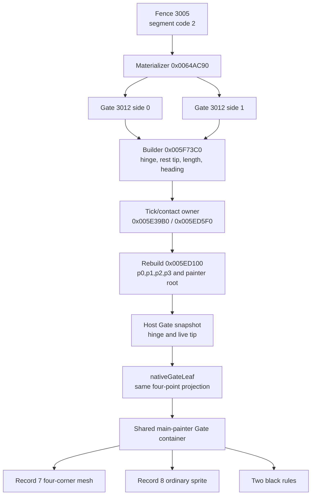
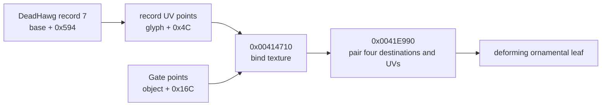
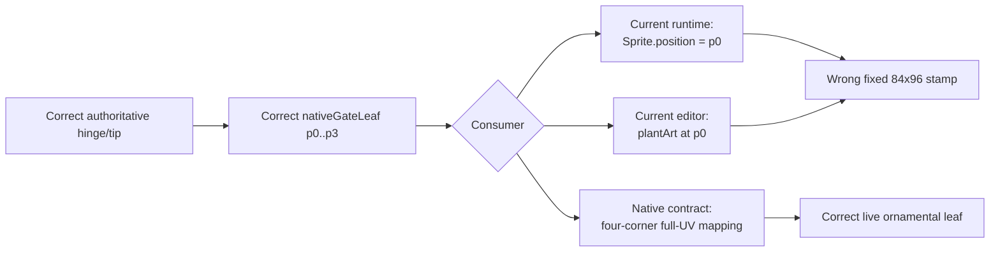

# Solomon Dark native parity RE ledger

Runtime ownership and deployment decisions for the clean rebuild are recorded
separately in `game-runtime-architecture.md`. This ledger remains the authority
for recovered native behavior, constants, timing, geometry, render order,
collision, and lifecycle. Architecture work must preserve these receipts rather
than reinterpret them as browser-owned behavior.

This document is the evidence ledger for the `/game` web reconstruction. The
unmodified native game is the visual and behavioral oracle. Recovered behavior
is translated into cohesive web modules; incidental implementation debt from
the stock executable is not preserved.

Every new reverse-engineering result must be recorded here before it is used to
justify a parity change. Record the evidence, recovered value or rule,
confidence, and implementation consequence. Keep unknowns explicit.

Every reported visual or behavioral discrepancy is evidence that the web
port's underlying system model may be wrong, not an isolated value to tune.
Recover the stock ownership, state, timing, geometry, painter/collision order,
and lifecycle before changing behavior. Correct the shared model so the visible
fix emerges from the same rules as stock; do not add symptom-specific patches.

## Evidence policy

- Launch the stock executable directly with every mod disabled. Do not use an
  injected loader, Lua mod, or modded staging build for parity evidence.
- Preserve capture paths, native function addresses, runtime addresses, and
  exact measurements where available.
- Mark decompiler interpretation or visual inference separately from directly
  observed facts.
- Do not invent native behavior to make a screenshot look plausible. If a seam
  remains unknown, keep it on the open-questions list and gather more evidence.
- Prefer emergent parity from shared systems over scene-specific scripted
  exceptions, especially for movement and collision behavior.

## Clean native reference run — 2026-08-11

- Stock executable:
  `SolomonDarkAbandonware/SolomonDark.exe`
- Owned clean process at capture time: PID `157624`.
- Loaded image check found the stock executable and no loader/mod modules.
- A separate process from
  `%LOCALAPPDATA%/SolomonDarkMultiplayerBeta/runtime/stage` was unrelated and
  was not used as evidence.
- Preferred executable image base: `0x00400000`.
- Runtime image base in this run: `0x00CB0000`.
- ASLR delta in this run: `0x008B0000`.

Reference captures:

- `%LOCALAPPDATA%/Temp/native-create-entry-60fps-0811.mkv`
- `%LOCALAPPDATA%/Temp/native-water-discipline-60fps-0811.mkv`
- `%LOCALAPPDATA%/Temp/native-current-0811.png`
- `%LOCALAPPDATA%/Temp/native-hub-current-0811.png`
- `%LOCALAPPDATA%/Temp/native-player-right-0811.png`
- `%LOCALAPPDATA%/Temp/native-teacher-rune-a.png`
- `%LOCALAPPDATA%/Temp/native-teacher-rune-b.png`
- `/tmp/native-create-entry-60fps-montage.png`
- `/tmp/native-create-left-entry-fine.png`
- `/tmp/native-create-right-entry-fine.png`
- `/tmp/native-create-left-swap-numbered.png`
- `/tmp/native-water-discipline-60fps-montage.png`
- `/tmp/native-select-left-numbered.png`
- `/tmp/native-select-right-numbered.png`
- `/tmp/native-create-mount-numbered.png`
- `/tmp/native-teacher-sequence-montage.png`

## Loader readiness and presentation

Native owner and renderer:

- startup construction: `0x005BAB60`;
- `MyLoader` renderer: `0x005BCA40`;
- embedded `Bundle_Loader`: `MyLoader + 0x78`;
- completed-work global: `DAT_0081F6A8`;
- total-work global: `DAT_0081F6AC`;
- forced-complete byte: `DAT_0081F6B0`.

The native loader is a real readiness gate, not a timed splash. Every render
computes `progress = completed / total`, clamps it to `1`, and calls the
loader's vtable slot `+0x18` only when progress is at least `1` (or the
forced-complete byte is set). The menu cannot render before that completion
dispatch.

The renderer also corrects an older static-art conclusion. It calls four
sprite draw helpers on fields inside the `MyLoader` object:

- `this + 0xB0` (`Bundle_Loader` record 0);
- `this + 0x174` (record 1);
- `this + 0x238` (record 2);
- `this + 0x2FC` (record 3).

Because these are embedded-owner-relative accesses rather than references
through published singleton `DAT_008199BC`, a singleton-only consumer search
incorrectly classified all Loader records as dormant. A clean mod-free 60 fps
desktop capture at
`C:\Users\User\AppData\Local\Temp\solomon-clean-startup-0811.mkv`
confirms that records 0..3 render the Raptisoft mark, URL, bar chrome, and red
fill. Only record 4 remains unobserved in this renderer.

The exact logical composition recovered from `0x005BCA40` and the Loader
bundle metadata is:

- a `480 x 320` virtual canvas, centered with
  `((surfaceWidth - 480) / 2, (surfaceHeight - 320) / 2)`;
- clear color `(0, 0, 0.33, 1)`;
- record 2 at top-left `(41, 13)`, logical size `388 x 227`;
- record 3 at top-left `(119, 251)`, logical size `244 x 18`;
- record 1, logical size `54 x 230`, centered at `(240, 290)` and rotated
  `90 degrees`, producing the horizontal bar frame;
- record 0, logical size `18 x 192`, centered at `(240, 291)` and rotated
  `90 degrees`, producing the red gradient fill.

Progress is not primitive colored geometry. `FUN_00420ec0` installs a clip
rectangle `(0, 0, 144 + progress * 192, 320)`; the renderer then draws the
entire rotated record 0 and clears the clip with `FUN_00420e40`. Since the
rotated fill spans logical `x=144..336`, the visible fill width is exactly
`progress * 192`. This ownership distinction matters: the web loader must crop
the native gradient rather than approximate it with a CSS color ramp.

In that run the native bar advanced in discrete work-completion steps and the
loader disappeared immediately after readiness; the title screen followed
under its ordinary fade. The web implementation consequence is:

1. preload and decode the resident `/game` asset manifest;
2. drive progress from completed asset tasks, not elapsed time;
3. keep the main menu unmounted until all required tasks succeed;
4. render the extracted Loader sprite records and clip the native fill sprite;
5. transition only when progress is complete.

Confidence: high from the full renderer instruction stream, draw-helper
decompilation, bundle metadata, and clean stock startup capture.

The 2026-08-13 unified-renderer cutover now presents this exact `480 x 320`
composition through `renderer/loader-renderer.ts`: the blue clear, records 2
and 3, both rotated bar records, and the progress-width mask are one WebGL
scene. `Game.tsx` still owns readiness and does not mount the title until the
resident asset promise succeeds. The loader therefore remains a real work
gate; only its browser painter changed. `NativeLoader.tsx` retains the live
semantic percentage as a DOM status surface and paints no artwork.

## Main-menu branding override — 2026-08-13

The stock title logo remains `Title.bundle` record 9, extracted as
`main-menu-logo.png` at `829 x 395`. The approved website brand artwork is
`logo-solomon-dark.png`, an `836 x 464` transparent image that reads
"Solomon Darker." Replacing the title texture is an explicit product-branding
divergence rather than a newly recovered native behavior.

The override is limited to the logo texture and its accessible name. It does
not reassign record 9 in the stock extractor or change the native title-screen
ownership, painter order, menu geometry, animation, or surrounding art. The
stock extraction remains available as evidence.

The replacement is 69 pixels taller at nearly the same authored width. Letting
it inherit the stock logo's width with natural height would extend into the
action stack. The web title renderer therefore retains the existing logical
`829 x 395` title slot and contains the replacement inside that slot without
distorting it.

Confidence: high for the bundle record, source-image dimensions, and fit
consequence; the texture substitution itself is the explicit web product
requirement.

## 2026-08-13 — Title and Create GPU presentation ownership

### Reported smell and parity question

- Reported web behavior: the Hub and Boneyard use the GPU renderer, while the
  returning-player title and Create/loadout screens still split their visuals
  across full-frame Canvas2D repaints, independent effect canvases, DOM images,
  CSS filters, and CSS animation layers. The user wants consistently high FPS
  throughout the game rather than scene-specific renderer paths.
- Stock behavior to recover: preserve the already recovered Title and Create
  state, clocks, transforms, painter order, assets, and input lifecycle while
  changing only the browser presentation backend.
- Reproduction inputs/scenes: decoded resident assets, `1600 x 900`, returning
  title root, settled element picker, and settled Fire discipline picker.
- Falsifiable questions: if CPU raster and compositor fan-out are the cause,
  replacing them with one active PixiJS/WebGL canvas must remove the Canvas2D
  render loops, reduce canvas/DOM/layer counts, preserve pixel geometry and
  animation receipts, and reduce browser task time without changing native
  fixed-tick outputs.

### Evidence and provenance

| Evidence class | Exact source | Observation | Confidence |
| --- | --- | --- | --- |
| Clean stock | `SolomonDarkAbandonware/SolomonDark.exe`; clean captures listed above | Title and Create are each presented as one ordered screen-space scene; no browser-style independent layout/compositor ownership exists | high |
| Instructions | `MainMenu_Render` `0x00598780`, title row helper `0x00598470`, Create build/update/render `0x00593C30` / `0x0058A820` / `0x0059AD40` | Screen owners submit ordered sprite, primitive, text, hand, glyph, and effect draws from their own state fields | high |
| Asset/data | `Title.bundle`, `Create.bundle`, `UI.bundle`, `BadGuys.bundle`; `native-asset-object-map.json` | The extracted textures and registrations are renderer inputs; they do not require DOM or Canvas2D ownership | high |
| Web runtime | `tools/measure-menu-performance.mjs`, local origin-main build `846e87e`, Chrome 140, Radeon RX 9070 XT, `1600 x 900`, 5-second samples | Title used 2 Canvas2D surfaces/84 DOM nodes/15 compositor layers; element picker used 5 Canvas2D surfaces/69 nodes/27 layers; discipline picker used 1 Canvas2D surface/112 nodes/66 layers. Average FPS was `130.18`, `130.48`, and `130.79`; browser task time was `691.95`, `598.66`, and `1457.45 ms` respectively | high |
| Web runtime | same tool and tree under software-rendered Linux Chromium | The full-frame title Canvas2D path fell to `3.93` average FPS while the two loadout states reached the browser's `60 Hz` cap with substantial task time | high for causal sensitivity, not a physical-GPU absolute |

### Native ownership thread

- Owner and construction path: `MainMenu` owns its title fields and renderer;
  `CreateWizardMenu` on vtable `0x00797B7C` owns its hands, choices, wheel,
  effects, and finalization state from `0x00593C30` through teardown.
- Upstream state producers/callers: title tick state advances the cloud,
  horizon, grave-row, grass, cloak, and eye phases. Create input and
  `0x0058A820` advance the recovered `100 Hz` hand/choice state; the wheel uses
  its separately recovered shared tick field.
- State representation and transitions: title root/play selection changes
  button content without replacing the background owner. Create moves from
  entry to element choice, element closing/transfer, discipline choice, and
  finalization using the motion samplers and audio boundaries already recorded
  in this ledger.
- Downstream consumers/callees: the Title and Create renderers consume those
  fields as one painter stream. Element VFX dispatch consumes the same
  renderer-independent draw plan used by the staff orb.
- Sibling systems sharing ownership or data: Loader is an earlier readiness
  owner, while Hub and Boneyard are later world owners. UI semantics and input
  focus are screen-space client concerns but are not native-art painter layers.
- Entry, interruption, reset, and teardown: the active screen alone advances
  and renders. Leaving Title destroys its presentation resources; leaving
  Create stops its frame/audio loop and releases its GPU textures. Re-entering
  constructs a fresh native scene sequence.

### Recovered behavioral contract

- Timing/ticks/thresholds: keep the title's recovered cloud/horizon/grave/grass
  rates and `60 Hz` Solomon phase; keep Create's `100 Hz` hand/reveal samplers,
  `36 s` wheel revolution, selection spline, hard pose swaps, flashes, audio
  boundaries, and finalization delay. Display refresh samples those clocks; it
  does not become a new simulation clock.
- Geometry/transforms/coordinate spaces: both scenes remain a `1600 x 900`
  logical stage scaled to the viewport. Texture registration, the three title
  grave baselines, native Create centers, right-hand horizontal reflection,
  and one backing pixel per logical VFX pixel remain unchanged.
- Render/hit/collision/traversal order: Title preserves its recovered
  background/fog/grave/Solomon/menu ordering. Create preserves left hand,
  selected element/effects, right hand, then discipline foreground. Semantic
  hit targets overlay the matching logical geometry but do not paint art.
- Assets/audio/randomness: use the extracted stock textures and the approved
  Solomon Darker logo override. Preserve the deterministic web replacement for
  presentation-only native RNG already documented. Audio remains owned by
  `GameAudioDirector` and the recovered event samplers.
- Input/network authority/replication: these menus are local presentation and
  input state. They do not enter the authoritative Node simulation or network
  snapshot protocol.
- Boundary and failure behavior: WebGL is the supported game presentation
  baseline, matching the Hub/Boneyard policy. Renderer failure is explicit;
  there is no hidden Canvas2D compatibility path.

### Nearby-system findings

- Durable finding: moving artwork to WebGL does not imply moving accessible
  buttons, focus, keyboard/gamepad routing, touch controls, status messages, or
  the HUD into GPU pixels. Those are the semantic overlay of the one composed
  client, not a second visual renderer.
- Evidence: the native renderer separates screen state/painter submission from
  input dispatch, while the current Hub/Boneyard architecture already proves a
  WebGL world plus React semantic/HUD overlay at display cadence.
- Why it matters or may matter later: preserving that seam avoids an
  inaccessible canvas-only UI and keeps the identical client bundle usable in
  browsers, Electron, mobile landscape, and Steam Deck controls.
- Native report/catalog also updated: no. This investigation recovered no new
  stock fact; it maps existing native facts to the browser renderer boundary.

### Confidence and open questions

- Confirmed: native owner/state/clock/order; current browser surface and layer
  fan-out; WebGL availability and the existing GPU scene baseline.
- Inferred: consolidating the active visual scene will reduce task/compositor
  pressure on physical GPUs and eliminate the severe software-raster title
  failure. The before/after browser run will accept or falsify this inference.
- Unknown: the exact minimum supported physical GPU remains a later product
  qualification target, not a reason to keep parallel rendering paths.
- Next falsifying probe if the unknown becomes material: replay the retained
  menu benchmark on the declared minimum desktop, mobile, and Steam Deck GPU at
  their native refresh rates.

### Web implementation consequence

- Correct owner/module: one scene-scoped PixiJS renderer owns all animated and
  decorative Title pixels; one scene-scoped PixiJS renderer owns all animated
  and decorative Create pixels.
- Shared model change: keep `create-menu-motion.ts` and
  `element-vfx-native.ts` renderer-independent. Feed their plans into pooled GPU
  sprites rather than recomputing behavior in CSS or shaders.
- Stock behavior preserved: layer order, geometry, hard pose swaps, timing,
  effects, hover/press artwork, audio boundaries, and screen teardown.
- Browser-specific approximation, if unavoidable: transparent semantic DOM
  controls remain aligned over GPU artwork for accessibility and input. They
  are not visual fallbacks.
- Symptom patch or obsolete path to remove: full-frame `MainMenuBackdrop`
  Canvas2D painting, the game-only `MenuSolomon` canvas, Create DOM artwork and
  CSS animation layers, per-choice Canvas2D element effects, and React
  per-display-frame motion rendering.

### Validation contract

- Focused automated test: pure title/Create frame and painter contracts,
  renderer-source contracts, and retained fixed-tick motion/VFX tests.
- Playwright or runtime journey: root -> play -> Create element -> discipline,
  with a single `pixi-webgl` canvas in each scene, correct semantic controls,
  renderer diagnostics, no page/console errors, and no Canvas2D scene painter.
- Stock-versus-web comparison: compare title and both Create phases at matching
  `1600 x 900` logical times against the existing clean captures and geometry
  receipts.
- Measurable acceptance criteria: physical-GPU averages remain above `100 FPS`
  and improve toward the display limit; steady-state 1% low stays above
  `100 FPS`; browser task time and compositor-layer count do not regress. A
  software-only WebGL implementation remains diagnostic evidence, not a
  supported production renderer.

### Implementation validation receipt

- Files/modules changed: `renderer/game-webgl.ts` now owns the shared explicit
  WebGL application/texture boundary; `title-menu-renderer.ts` and
  `TitleMenuPresentation.tsx` own the complete Title painter; and
  `create-menu-renderer.ts` with `CreateMenuScene.tsx` owns Create artwork,
  motion, VFX, and semantic controls. `loader-renderer.ts` owns the native
  readiness composition and clipped progress fill. `native-element-vfx-view.ts` is the one
  GPU consumer shared by Create and the equipped staff. The obsolete
  `MainMenuBackdrop`, game-only Canvas2D Solomon path, Create DOM art/CSS
  animations, Canvas2D `ElementVfx`, and unused DOM `PlayerCharacter` painter
  were removed rather than retained as fallbacks.
- Focused tests cover loader registrations/progress clipping, the three title
  grave rows/parallax/tiling, exact Create
  hand centers and authored discipline dimensions, flash boundaries, native
  element scale plans, and the no-DOM-art cutover. The canonical complete gate
  passes all `200` frontend tests, all `23` backend/contracts tests, lint and
  both production builds with zero build errors. Existing Fast Refresh notices
  remain warnings outside this renderer work.
- A controlled current-browser A/B used Chrome `151.0.7922.110`, the same
  Radeon RX 9070 XT, `1600 x 900`, isolated fresh profiles, five-second
  samples, and origin-main `846e87e` as the baseline. The retained second
  steady runs were:

  | scene | origin-main average / 1% low | WebGL average / 1% low | origin-main task | WebGL task | layers before / after |
  | --- | ---: | ---: | ---: | ---: | ---: |
  | Title | `131.83 / 123.02 FPS` | `131.17 / 122.16 FPS` | `923.71 ms` | `346.18 ms` | `15 / 9` |
  | element picker | `132.00 / 123.02 FPS` | `131.18 / 122.16 FPS` | `742.47 ms` | `412.13 ms` | `27 / 8` |
  | discipline picker | `131.17 / 109.55 FPS` | `130.71 / 115.32 FPS` | `1676.90 ms` | `397.61 ms` | `66 / 8` |

  The display cadence was already monitor/browser-paced near `131 FPS`, so
  average FPS correctly remains at that ceiling. The structural gain is
  `53–76%` less browser task time, a single active canvas, and dramatically
  fewer compositor layers. The discipline 1%-low also rises above the stated
  `100 FPS` floor.
- The final post-rebase fresh-profile physical-GPU run measured Title at
  `130.94 / 122.38 FPS`, element at `131.02 / 109.89 FPS`, and discipline at
  `131.32 / 122.81 FPS` (average / 1%-low), with no frame over `20 ms` and only
  `9`, `8`, and `8` compositor layers. A separate retained run on the same
  hardware reached the display's `144 FPS` cadence with `139.86–140.85 FPS`
  1%-lows. This is display-scheduling variance, not a scene-load change. A
  direct runtime probe rendered the Loader at `50%` and confirmed the
  horizontal native frame, cropped red-gradient fill, and `pixi-webgl`
  renderer.
- The full pointer/runtime smoke passed Title -> Create -> Hub -> two-client
  Boneyard with WebGL2, 13 Students in the final run, all five walk poses,
  interpolated movement, and no page or console errors. The device receipt
  passed forced Create-hand `decode()` rejection, controller-only Steam Deck
  selection and movement at `1280 x 800`, mobile landscape touch at
  `844 x 390`/resolution `0.5`, paused-render visibility interruption with a
  bounded `18.89`-unit release tail and zero later drift, and the portrait
  orientation gate.
- SwiftShader measured `3.46 FPS` on Title and about `6.4 FPS` on Create after
  cutover. That falsifies the earlier inference that WebGL alone would improve
  the unsupported software-renderer path: full-resolution software WebGL is
  slower here. No resolution reduction or Canvas2D fallback was introduced;
  production requires working GPU acceleration and reports WebGL failure
  explicitly.
- Remaining implementation explicitly out of scope: DOM HUD and accessibility
  semantics remain overlays by design; they do not paint game artwork.

## 2026-08-14 — Title Solomon eye and hood painter order

### Reported smell and parity question

- Reported web behavior: Solomon's red eyes on the main menu sit above the
  hood, so outer eye pixels bleed across the hood edge.
- Stock behavior to recover: determine whether the eye crop or the animated
  cloak/hood owns their overlap and preserve that relationship through all
  five cloak frames and crossfades.
- Reproduction inputs/scenes: returning-player title root at `1600 x 900`,
  reduced-motion web frame zero, and a directly launched stock title with its
  beta dialog left open so the unobstructed left Solomon remains visible.
- Falsifiable questions: an asset-registration defect would remain after the
  native painter order is restored; an eye-above-hood model would require the
  native eye draw to occur after the cloak submissions.

### Evidence and provenance

| Evidence class | Exact source | Observation | Confidence |
| --- | --- | --- | --- |
| Clean stock | `SolomonDarkAbandonware/SolomonDark.exe`, SHA-256 `03a834566ce70fd8088f4cf9ee6693157130d8aec28c092cb814d6221231f1e3`; owned direct process PID `22016`, started `2026-08-14T12:22:23-04:00`, then stopped; `C:\Users\User\AppData\Local\Temp\solomon-stock-title-eye-order-20260814.png` | The stock hood covers the outside ends of the eye artwork. The captured process path was the abandonware executable and its enumerated modules contained no loader or mod DLL. | high |
| Instructions | clean image base `0x00400000`; `MainMenu_Render` `0x00598780`; draw calls `0x005991CB`, `0x005992C4`, `0x00599442`, `0x005994FF`, `0x005995E3`, `0x00599693` | Body record 3 is submitted first, eye record 8 second, current cloak twice third/fourth, and next cloak twice fifth/sixth. The immediate painter has no later depth sort. | high |
| Asset/data | `Title.bundle` SHA-256 `f6f1e5956427bfa45bc5e28c87cb2574a25169da96feca62e7efe8691d2b99d8`; `Title.png` SHA-256 `86b8bb40b3f7ece277cf0d1038b118bf095b8489bdc344738b2fe8cbe1160ff2`; records 3, 8, 11..15 | The Website body, eye, and five cloak PNG hashes exactly match the pixel-verified native-report extractions. The mismatch is not crop content. | high |
| Web runtime | Website `6a823b268063417ef26cb04982fec04ae333c893`, PixiJS `8.19.0`, Chrome `150.0.7871.124`, `1600 x 900`; `/home/user/.codex-evidence/title-eye-order-20260814/web-before.png` | The outer red eye pixels render over the hood. `stageSprite(...eyes..., zIndex 1)` gives the eyes a nonzero depth while cloak sprites retain depth 0. Pixi enables parent sorting when the nonzero child is attached, so it moves every cloak before the eyes. | high |

### Native ownership thread

- Owner and construction path: `MainMenu` construction at `0x0058D940`
  installs vtable `0x007980CC`, starts `solomondarktheme`, calls `Title_Build`,
  initializes its menu/grave storage, and zeros the animation fields.
- Upstream state producers/callers: vtable slot `+0x08`,
  `MainMenu_Tick` at `0x005A51B0`, advances cloak phase at
  `MainMenu + 0x400`; global tick `0x0081F658` supplies the eye sine phase.
- State representation and transitions: the five cloak records form one
  cyclic animation. `floor(phase)` and the next wrapped index select two
  records; the eye crop is a single separately translated record.
- Downstream consumers/callees: vtable slot `+0x0C`, `MainMenu_Render`, submits
  body and cloak records through scaled helper `0x00414EA0` and eyes through
  unscaled helper `0x004142E0`, using normal source-over drawing.
- Sibling systems sharing ownership or data: `Title.bundle` record 9 is the
  logo, records 16..24 are the three grave rows, and `0x005A0960` is the
  separate menu/header renderer. None participates in Solomon's internal
  overlap.
- Entry, interruption, reset, and teardown: layout is vtable slot `+0x04`
  (`0x005A51A0` -> `0x0059A9D0`). Deleting destructor `0x00592E10` delegates
  to `0x0058DA70`, which releases the grave vectors and embedded controls.
  Solomon has no independent actor lifetime beyond the active title owner.

### Recovered behavioral contract

- Timing/ticks/thresholds: retain the existing fixed-rate phase update,
  `current alpha = 1 - fraction^3`, `next alpha = fraction`, and one-pixel
  vertical eye sine.
- Geometry/transforms/coordinate spaces: retain the recovered body, eyes, and
  cloak rectangles in the title stage; no coordinate nudge is supported by
  this finding.
- Render/hit/collision/traversal order: submit body, eyes, current cloak twice,
  then next cloak twice. Therefore every cloak frame is painter-above the
  eyes, including both sides of a crossfade. Menu hit testing is unrelated.
- Assets/audio/randomness: retain exact extracted records 3, 8, and 11..15.
  This correction changes no assets, audio, grave RNG, or cloak timing.
- Input/network authority/replication: the title composition is local
  presentation state and never enters authoritative simulation or replication.
- Boundary and failure behavior: title viewport clipping still cuts off the
  cloak below the client. WebGL failure remains explicit and has no alternate
  painter path.

### Nearby-system findings

- Durable finding: in PixiJS 8.19, attaching a child whose `zIndex` is nonzero
  invokes `depthOfChildModified()`, enables `parent.sortableChildren`, and
  sorts siblings by depth before collecting renderables. Insertion order alone
  is therefore not the title renderer's effective order once any child has an
  explicit depth.
- Evidence: installed `pixi.js` sources
  `scene/container/Container.mjs`, `container-mixins/sortMixin.mjs`, and
  `collectRenderablesMixin.mjs`, plus a direct two-child Node probe that sorted
  depth 0 before depth 1.
- Why it matters or may matter later: every retained-mode title subcomposition
  must assign a complete sibling depth contract rather than mixing one explicit
  layer with implicit zero-depth siblings.
- Native report/catalog also updated:
  `Mod Loader/docs/main-menu-solomon-visual-re.md` now records the exact draw
  call sites, owner lifetime, and `body < eyes < cloak` occlusion consequence.

### Confidence and open questions

- Confirmed: native owner and lifetime, exact immediate call sequence, bundle
  records and crops, web sort trigger, and the visible stock/web differential.
- Inferred: none required for the implementation.
- Unknown: the exact stock outer-loop frequency remains unchanged from the
  earlier title investigation and cannot affect painter order.
- Next falsifying probe if the unknown becomes material: trace the outer loop's
  call cadence around vtable slot `+0x08`; this is unnecessary for an ordering
  correction.

### Web implementation consequence

- Correct owner/module: `renderer/title-menu-render-contract.ts` owns the
  recovered painter-depth contract and `title-menu-renderer.ts` applies it to
  every Solomon child.
- Shared model change: define all three sibling layers explicitly as
  `body < eyes < cloak`, leaving the four cloak submissions stable within the
  cloak layer.
- Stock behavior preserved: geometry, assets, crossfade duplication, opacity,
  eye bob, fixed title stage, and scene lifecycle remain unchanged.
- Browser-specific approximation, if unavoidable: retained depth values encode
  the native immediate painter sequence; they do not approximate its visible
  output.
- Symptom patch or obsolete path to remove: replace the mixed explicit/implicit
  depths that let Pixi place the eye crop last. Do not mask or reposition eye
  pixels.

### Validation contract

- Focused automated test: create Pixi siblings at the shared contract depths,
  force sorting, and assert `body`, `eyes`, then all four cloak submissions.
- Playwright or runtime journey: load `/game` at `1600 x 900`, reduced-motion
  frame zero, capture the WebGL canvas, and retain page/console errors.
- Stock-versus-web comparison: compare the left hood/eye overlap against the
  owned direct-stock capture while holding the recovered geometry constant.
- Measurable acceptance criteria: no red eye pixel crosses either hood edge;
  the canvas remains one `pixi-webgl` surface at `1600 x 900`; asset-source,
  animation-frame, and error receipts remain unchanged.

### Implementation validation receipt

- Files/modules changed: `title-menu-render-contract.ts` now defines the
  complete native sibling depth contract; `title-menu-renderer.ts` applies it
  to body, eyes, and every cloak sprite; and
  `title-menu-render-contract.test.ts` recreates Pixi's sorting behavior and
  locks the six-submission order.
- Tests and canonical gate: the regression first failed at TypeScript compile
  because the depth contract did not yet exist. After implementation,
  `./scripts/validate.sh` passed all `23` backend/contracts tests, all `315`
  frontend tests, all `5` desktop tests, backend formatting, frontend lint and
  architecture checks, both production builds, and the production media/CSP
  policy. Existing Fast Refresh and bundle-size notices remained warnings.
- Browser/native evidence: Chrome `150.0.7871.124` visited the built production
  preview at `/game` with status `200`, one `1600 x 900` `pixi-webgl` canvas,
  root screen/frame-zero diagnostics, and zero console or page errors. The
  retained frame-zero capture is
  `/home/user/.codex-evidence/title-eye-order-20260814/web-after-production.png`.
  A separate live pass observed and captured cloak frames `0..4`; every frame
  kept the eye pixels behind the hood. The result agrees with the directly
  launched stock capture at
  `C:\Users\User\AppData\Local\Temp\solomon-stock-title-eye-order-20260814.png`.
- Remaining implementation explicitly out of scope: no other title geometry,
  logo, menu control, background painter lane, or animation timing changed.

## Create/loadout menu

### Native functions

- Update: `0x0058A820`
- Render: `0x0059AD40`
- Build/constructor path: `0x00593C30`
- Choice application: `0x005D0290`
- Player-start finalizer: `0x005CFA80`

### Hand state and timing

Direct decompilation and 60 fps capture establish that each hand displays one
discrete sprite at a time. The native game does not alpha-blend two poses.

- `DAT_00819990 + 0x72c`: closed fist.
- `DAT_00819990 + 0x73c`: cupped/opening pose.
- `DAT_00819990 + 0x74c`: raised/open pose.
- Pose selection is threshold-based: speed/state `< 10` selects cupped and
  `< 1` selects raised.
- Initial entry, active left hand: after the Create scene becomes visible, the
  state machine retains the fist through its 120-count anticipation and travel,
  swaps fist to cupped when the damped vector falls below `10`, then swaps to
  raised below `1`. Exact fixed-state replay puts those boundaries at updates
  `132` and `134` after Create construction; scene fades determine their
  wall-clock position in a capture.
- Initial entry, inactive right hand: remains a fist.
- After selecting the left-side element: left raised to cupped at approximately
  `500 ms` after the click.
- The right hand goes fist to cupped at fixed update `63` after it becomes
  active, then cupped to raised at update `66`, coincident with the discipline
  reveal/flash.

Confidence: high. These are visible at frame cadence in lossless 60 fps capture
and agree with the decompiled state thresholds.

### Inactive right-hand lifecycle

The Create renderer owns both hands for the full lifetime of the loadout scene;
the active-hand flag advances a hand's state machine but does not determine
whether that hand is drawn. In the element phase, the right hand is already
present as the closed-fist sprite at native base center `(1200,560)` plus its
inactive travel offset `(50,300)`. It stays visible in that lower-right resting
position until the left hand finishes closing around the selected element.
Control then passes to the right-hand state machine, which consumes the same
travel offset while changing fist to cupped to raised for discipline selection.

Evidence:

- `0x0059BC42`, the recovered right-hand draw path, renders the current discrete
  pose from the persistent Create object rather than gating the draw on the
  right-active flag.
- `%LOCALAPPDATA%/Temp/native-water-discipline-60fps-0811.mkv`, beginning with
  the first captured element-phase frames, visibly retains the closed right
  fist at the bottom-right before its discipline-opening motion begins.
- The read-only Create-state sample documented below records base center
  `(1200,560)` and travel `(50,300)` as separate renderer inputs. The travel
  vector must therefore be applied once, not baked into a phase-specific base
  position and applied again as motion.

Implementation consequence: the web right-hand layer must keep the native
`(1200,560)` base center in both element and discipline phases. Entry motion
owns the `(50,300)` closed offset, so phase CSS must not include a second copy.
The hand remains mounted as a fist before element selection and naturally rises
when the existing selection state machine starts.

Confidence: high from the complete draw-path recovery, live state fields, and
lossless stock capture. The allocator-derived idle-phase difference between the
two hands remains intentionally unspecified; it does not affect visibility,
base ownership, or transition geometry.

### Hand transform and idle clocks

Complete instruction recovery of the right-hand draw path at `0x0059BC42`
shows that the native game does not add a rotation to the right hand. It builds
an explicit transform through `0x004030A0` with X scale `-1.5`, Y scale `+1.5`,
and Z scale `1`. The negative X scale is a pure horizontal reflection. The
left-hand path uses the uniform `1.5` draw helper at `0x00414EA0`. Therefore the
web's right-hand geometry must stay horizontally mirrored at the same scale as
the left; adding a corrective angle would diverge from the native renderer.

Both hands have independent phase fields and identical updates: left phase is
at Create state `+0xdc`, right phase at `+0x210`, and each advances by `0.5`
degrees per native fixed update. A subsequent clean live sample corrected the
initial frame-rate assumption: the phases advanced `79.5` degrees over
`1.5955 s`, or about `49.83 degrees/second`, proving the stock update cadence
is `100 Hz`, not the capture cadence of `60 Hz`. The constructor does not
explicitly initialize these two phase words, and clean runs showed different
constant offsets between them; that is allocator residue rather than a game
rule. The web initializes both phases deterministically while preserving the
native update and renderer. The render path applies these exact offsets in
native screen pixels:

`x = sin(phase) * 5`

`y = sin(phase * 0.5) * 2.5`

This gives a `7.2 s` horizontal period and `14.4 s` vertical period. The prior
web polygonal CSS keyframe happened to use the horizontal period but not the
native sinusoidal path, Y period, or transform ownership, and must be removed.
Idle displacement belongs on the hand sprite inside the entry/selection
translation wrapper so it cannot replace or restart the transition transform.

Confidence: high, from the complete `0x0059AD40` instruction stream, direct
numeric dumps of `DAT_00795444 = -1.5`, `DAT_007847A0 = 1.5`,
`DAT_007DE8D8 = 5.0`, and `DAT_00784750 = 2.5`, plus read-only live phase
sampling. The earlier 60 Hz conversion was explicitly disproved by that sample.

### Selection travel state

A clean direct-stock run with no loader or proxy modules was sampled through
read-only process memory on 2026-08-11. The Create object was found from its
relocated vtable and the fields below were recorded about every 5 ms across an
element click. This confirms the transition is stateful fixed-update movement,
not a CSS-style interpolation between two screen poses.

- The selected-element click sets the element immediately but keeps the left
  hand raised and stationary for roughly the first `500 ms`.
- The left travel fields then depart from `(0,0)`, follow the native recurrence,
  cross the discrete cupped-pose threshold, and settle at approximately
  `(-125.91,+200)` native pixels relative to the raised position.
- Only after that settlement does control pass from the left active flag to the
  right active flag.
- The right hand starts at `(50,300)` relative to its final raised position and
  ultimately settles at `(0,0)`. Its state changes fist to cupped to raised as
  recovered from the velocity thresholds; it does not rotate during that rise.
- Native base centers are left `(400,560)` and right `(1200,560)`. These are
  combined with the travel fields and the shared sine drift in the renderer.

The clean sample also resolves the left recurrence exactly. After the native
delay expires, each `10 ms` fixed update executes its movement substep twice:

`x -= y / 30`

`y = min(200, (y + 0.25) * 1.05)`

Starting at `(0,0)`, fixed update 38 produces `(-125.91012,200)`, matching the
live endpoint within float precision. This is why a generic cubic ease makes
the closing hand look wrong. The web may encapsulate the recurrence as a pure
sampled function, but it must not replace it with another authored curve.

The web must therefore keep position and pose as outputs of one transition
clock, hard-swap one raster at each state boundary, and keep idle drift on a
separate inner transform. Independent outer CSS animation and React pose clocks
can disagree by one frame and were the source of the visible shaking.

Confidence: high for field ownership, endpoints, ordering, and absence of
rotation, from `0x0058A820`, `0x0059AD40`, the direct object dump, and clean
lossless captures. Sub-frame randomness in the native travel recurrence is
visual noise and need not be copied into browser layout.

### Painter order

Native render order is:

1. left hand;
2. selected element effects and glyphs;
3. right hand;
4. discipline glyphs and selection foreground.

Consequences:

- The right hand must not cover discipline runes.
- The left hand must not incorrectly cover the selected element foreground.
- Web transitions must hard-swap sprite poses at recovered thresholds; CSS
  crossfades or independent animations cause the observed shake/double hand.

Confidence: high, from `0x0059AD40` and reference frames.

### Exact Create geometry, wheel clock, and entry anticipation

A second clean direct-stock process (`SolomonDark.exe`, no loader/proxy/mod
modules) resolved the remaining layout fields from the live Create object and
the complete constructor/render instruction streams.

- Create record `7`, the `276 x 276` arcane wheel, is drawn at native center
  `(800,800)`, opacity `0.05`, and scale `3`, so its authored frame is exactly
  `828 x 828` pixels. The web's previous `621 px` frame was not a responsive
  variant; it was simply underscaled.
- The renderer uses integer tick field `+0x28 / 50` as the wheel angle. Two
  read-only samples separated by `2.30 s` advanced that field by `1124`,
  consistent with the shared renderer clock at about `500 Hz`; division by
  `50` therefore yields about `10 degrees/second`, or a `36 s` revolution.
  A `900 s` CSS revolution is not native.
- The five settled element centers in constructor order are
  `(826.303,369.046)`, `(924.909,515.235)`, `(816.346,654.189)`,
  `(650.644,593.879)`, and `(656.798,417.651)`. The switch and glyph order map
  those to Ether, Fire, Air, Water, and Earth respectively.
- The discipline centers are exact constructor constants: Arcane
  `(1025,460)`, Body `(875,460)`, and Mind `(725,460)`. Their native Create
  records retain their authored dimensions: `218 x 238`, `238 x 229`, and
  `227 x 241`. A uniform `144 px` DOM width discarded both native size and
  per-discipline proportions.
- The settled selected-element anchor is the left-hand effect position at
  `(450,660)`. The selected painter is the same
  element-specific VFX dispatcher. Its caller starts from Create scale `2`
  and multiplies by the settled selected-scale field `3`, so the painter entry
  receives `6`; it is not a second enlarged DOM glyph.

The selected effect does not teleport from its picker to that anchor. The
element-click path at `0x0058BCE0` stores the clicked picker center in Create
fields `+0x1ac/+0x1b0`, initializes a 50-update hold at `+0x1a8`, zeroes path
cursor `+0x1f0`, and builds a three-point natural cubic through:

1. the selected picker center;
2. `(650,685)`;
3. `(450,660)`.

The five possible first points are the exact centers above. After the hold,
each native fixed update executes two selection substeps. A substep advances
the left-hand recurrence, evaluates the natural cubic at the previous cursor,
then assigns `cursor = leftY / 200 * 2` and
`selectedScale = leftY / 200 * 2 + 1`. This one-substep ordering is observable:
the effect initially remains centered on the clicked picker, then follows the
curved hand-closing path while growing continuously from painter scale `2` to
`6`, and finally lands exactly at `(450,660)`. A clean no-mod Air sequence at
`/tmp/native-create-air-0000.png` through
`/tmp/native-create-air-1200.png` independently shows the hold, curved travel,
growth, and hand closure. Rendering the selected VFX at its final anchor from
the first React frame therefore bypasses native state rather than merely
having different easing.

The initial hand movement is likewise a native state sequence, not an ease.
Both fists begin at offsets left `(-50,+200)` and right `(+50,+300)`, with a
shared `120`-tick countdown on initial Create entry. Between countdown values
`99..1`, while each hand is still in state `0`, stock generates a small random
direction impulse, increments Y by `1`, and applies the X recurrence
`x = (x - 0.01) * 1.01`. The `0.01` is the double at `0x00784D08` used by the
`FSUB` at `0x0058B056/0x0058B8D7`; the decompiler's nearby float view of the
overlapping constant pool incorrectly suggested `2`. Native float32 replay is
decisive: the discipline-side hand reaches exactly `(81.58047,350)` after its
50 pre-open updates, matching the clean live sample. At countdown zero it
starts a deterministic recoil:

`bobY = sin(recoilPhase degrees) * 150`

`recoilPhase = max(0, recoilPhase - 0.025)`

The phase begins at `0.5`, so this is a short decaying downward anticipation
whose peak is about `1.31 px`, layered over the fist travel and ordinary idle
sine. On every countdown-zero-and-later update, stock first shortens vector
magnitude by `3.5`, then applies anisotropic damping (`x *= 0.7`, `y *= 0.8`)
and hard-swaps fist to cupped below speed `10`, then cupped to raised below
speed `1`. The pre-open recurrence remains active only while state is fist.
The right hand is activated with timer `51`, so its first update produces
`(50.48990,301)` at timer `50`; update 50 produces `(81.58047,350)`, update 51
begins damping at `(57.10561,278.27310)`, update 63 swaps cupped, and update 66
settles raised at `(0,0)`. Random impulse direction is presentation noise; the
web should preserve the recovered countdown/travel/recoil envelope
deterministically, with one state sampler owning position and pose. Independent
CSS shake and sprite timers recreate the old visible jitter and are forbidden.

Confidence: high for dimensions, centers, selected-effect path/clock/scale,
draw scale, countdown, recurrence, recoil, and state thresholds from
`0x0058BCE0`, `0x0062B2F0`, `0x0062BCA0`, `0x00593C30`, `0x0058A820`, `0x0059AD40`,
the exact instructions at `0x0058AFDE..0x0058B06A` and
`0x0058B852..0x0058B8EB`, direct numeric dumps, float32 replay, and the clean
live object trace. Wheel speed confidence is high within scheduler sampling
tolerance. The exact native RNG stream is intentionally not presentation
state.

### Element VFX projection and Create context scale

Bundle metadata confirms that BadGuys element frames already occupy native
logical cells (`27 x 26` core, `40 x 40` spark/ray, `50 x 50` Earth,
`32 x 54` Fire, `38 x 36` Water, `55 x 59` Air). There is no hidden 2x atlas
density to compensate for. The painter call `0x00414EA0` receives its recovered
scale directly. A clean runtime breakpoint also exposes the common-core quad
vertices as `(-13.5,-13) .. (+13.5,+13)`, exactly matching the `27 x 26`
source cell. Therefore the web VFX canvas must project one canvas pixel to one
virtual-stage pixel. There is no hidden reciprocal sprite-density scale.

The Create caller has two distinct scale contexts which an earlier pass had
collapsed into one:

- each of the five settled picker effects receives `menuScale * 2 = 2`;
- the effect held after selection receives `menuScale * 2 * selectedScale`;
  `selectedScale` is initialized to `1`, then the selection recurrence assigns
  `selectedScale = selectedY / 200 * 2 + 1`. At the recovered `selectedY = 200`
  endpoint it is `3`, so the settled held effect is `6`.

A clean breakpoint at Ether entry `0x00535A30` on the discipline screen
captured `scale = 6` on the settled discipline screen, independently verifying
the recurrence and caller formula. This is the source of the native large held
orb. The web must keep picker `2`, held `6`, and staff `1`; scaling the whole VFX system to
quiet the picker would break both the held and staff contexts. Picker buttons
also must not apply a second CSS drop shadow around an already self-lit native
effect.

The native painters draw into the full `1600 x 900` backbuffer; they do not own
a local clipping rectangle. A browser canvas used as an implementation surface
must therefore be sized for the maximum registered sprite extent in its
context. The settled held core alone can reach approximately
`27 * (3.5 + 0.15) * 6 = 591.3` pixels wide, before Ether particles or ray
rotation. A `360 x 360` canvas clips that native scale into a visible square.
Use a centered `720 x 720` backing surface for the held context and preserve
one backing pixel per virtual-stage pixel; picker and staff contexts can retain
`360 x 360`. This is a backing-surface correction, not a new draw scale.

The subsequent oversized opaque Air disk was not evidence for another scale.
The web animation loop called `clearRect(0, 0, CANVAS_SIZE, CANVAS_SIZE)`, where
`CANVAS_SIZE` was the complete variant-to-size object. Canvas numeric coercion
turned both dimensions into `NaN`, so the clear was a no-op. Air's four
additive common-core passes accumulated on the same backing pixels every 60 Hz
tick until most of the held extent saturated white. Native submits a fresh set
of quads into the newly cleared frame and retains no prior element pixels.
Every web VFX tick must therefore clear the selected canvas's actual backing
dimensions before drawing the current plan. A valid regression must sample
after multiple seconds, not just the first frame: the held Air center may be
bright, but its alpha footprint and average opacity must remain bounded rather
than converging toward an opaque disk.

Confidence: high from all participating bundle records, the shared painter
call sites, the live quad/entry breakpoint values, clean native/web 1600x900
comparison captures, and direct inspection of the browser backing pixels after
the failed clear had accumulated for several seconds.

## Player wizard rendering

### Runtime object validation

- Preferred gameplay-global address `0x0081C264`; runtime address in this run
  `0x010CC264`.
- Runtime gameplay pointer observed: `0x02E87AD8`.
- Player field is at gameplay object `+0x1358`; runtime actor pointer observed:
  `0x16260410`.
- Selector bytes at actor `+0x23c..+0x240` were
  `00 00 00 00 01` in the hub.
- Those bytes belong to the generic source-wizard descriptor path. They do not
  select the equipped local player's robe-frame index.

### Native painter split

Relevant functions:

- Wizard body renderer: `0x00621780`.
- Wizard attachment compositor: `0x0061AF10`.
- Staff attachment renderer: `0x00578D20`.

A clean one-shot debugger trace on the stock local player additionally resolved
the active attachment renderer at `0x00538B80`. Its return chain includes the
animation/body driver `0x0054BA80`. This path exposes the equipped-item decision
more clearly than the generic `0x0061AF10` decompile.

`0x00621780` paints a generic/source wizard in this order:

1. attachment compositor, back pass (`pass = 1`);
2. dynamic primary and secondary robe/body layers;
3. fixed selector primary layers (`+0x64c`, `+0x66c`);
4. fixed selector secondary layers (`+0x65c`, `+0x67c`);
5. attachment compositor, front pass (`pass = 0`);
6. native movement bob transform;
7. hat/head tables (`+0x6b0`, `+0x6bc`).

The exact Clothes builder map confirms the four fixed banks are
`1612..2019`, `2428..2835`, `2020..2427`, and `2836..3243`. The dynamic robe
banks are selected separately; default style zero maps to records `868..987`
and `1228..1347`.

This generic renderer is not the authority for the equipped local-player
robe. The actual local route is
`0x0054BA80 -> 0x00538B80 -> equipped item vtable +0x20`, with the robe landing
in `0x00577DA0`. Its five arguments are, exactly, robe object, style-selected
frame index, fixed-bank frame index, actor scale, and an optional transform
pointer. The call site builds the style-selected frame as
`heading + trunc(actor + 0x220) * 24` and the fixed-bank frame as
`heading + trunc(actor + 0x238) * 24`. A clean right-facing runtime snapshot showed
heading `6`, actor `+0x220 = 0.0`, and actor `+0x238 = 0.0`, while the gait
phase at `+0x228` remained independent. That snapshot proves the standing
frame is `6`, selecting fixed records `1618`, `2434`, `2026`, and `2842`--not
the previously forced pose-12 records `1906`, `2722`, `2314`, and `3130`. It
does not prove that `+0x220` stays zero while walking.

The forced pose-12 interpretation was the anatomy bug: it put a down-facing
white cuff beside the correctly right-facing staff and body. Pose zero remains
the correct standing frame. The later instruction-level ABI audit below
corrects which Clothes banks ordinary walking advances; that correction is an
ownership result, not a hand-offset or CSS adjustment.

A read-only scan of the only live `Robe` item (`vtable 0x00785704`) in the same
clean process also recovered style `0`, primary color
`(0.657653, 0.837074, 0.821034, 1.0)`, and white secondary color. This validates
the equipped item and default dynamic-bank selection directly; element-specific
palette generation remains a separate loadout input.

The body palette is also a renderer input, not a cosmetic approximation.
`Skills_Wizard_GetPrimaryColor (0x00660760)` returns the descriptor-facing
element color after the native robe mix. The exact default vectors are Air
`(0.628921,0.763921,0.763921)`, Earth
`(0.566191,0.701191,0.566191)`, Ether
`(0.533809,0.398809,0.533809)`, Fire
`(0.600576,0.503076,0.465576)`, and Water
`(0.369926,0.429926,0.504926)`. The previous extractor started from guessed
saturated colors and applied the `0x0040FC60` mix itself, which produced the
wrong cyan value and could not preserve stock element identity. Static web
sheets must tint the primary banks with these descriptor colors once and keep
the default trim white.

The Clothes builder at `0x004E4CA0` gives the definitive field-to-record map.
Closer control-flow recovery corrects an earlier interpretation of records
`484..603` and `676..795`: `0x00538B80` draws those generic pose-dependent
attachment banks only when no item is equipped or the animation selection is
`-1`. A valid equipped staff takes the mutually exclusive staff branch instead.
The staff renderer at `0x00578D20` draws pose-dependent hand banks
`3244..3483` and `3484..3723` around its generated staff body. Adding the
generic banks to the normal staff branch would duplicate limbs and would not
match stock.

For heading `6` (right), the first normal-walk pose in the staff-hand banks:

- first pose bank, point 0: `(89.0, 38.5)` — foreground side;
- second pose bank, point 0: `(133.0, -23.5)` — background side.

The original web extractor split the two staff-hand banks independently and
flattened them around the shaft in the wrong order. The runtime web simulation
also advanced every robe and staff lane through five Clothes poses on travel
distance. Together those facts caused the visibly detached hand and flailing
staff while facing right. The equipped renderer instead advances only the four
fixed robe banks. The extractor must submit the heading-only staff composite
on one side of the body while independently selecting the fixed robe pose.

The apparent depth baseline is `0.5`, matching Clothes record `316`, point 0
`(0, 0.5)`. Confidence: medium-high inference pending an explicit confirmation
of the comparison operand in all compositor branches.

Direct `0x00538B80` decompilation confirms that record `316` point 0 Y is loaded
as the comparison baseline. Its no-item/fallback branch selects generic
attachment index `heading + animationPose * 24`, reads point 0 Y from both
`484..603` and `676..795`, and paints each on the matching side of that
baseline. Its normal equipped-staff branch does not enter that fallback.

Confidence for the generic-bank split, branch exclusivity, and `0.5` baseline
is high.

The call sites in `0x0054BA80` pass `1` before the body and `0` after it.
Instruction and decompiler evidence agree on the comparisons:

- pass `1` paints a fallback attachment when `point0.y <= 0.5`;
- pass `0` paints it when `point0.y > 0.5`;
- the equipped staff composite is assigned to the same two passes by the
  point-0 Y returned by `Staff_GetAttachmentPoint (0x005795E0)`.

`0x005795E0` returns an arbitrary serialized point from the selected Clothes
record. `Staff_RenderAttachment (0x00578D20)` can receive the full
`heading + animationPose * 24` record index, uses points 1 and 2 as shaft
endpoints, draws the generated shaft, skips its optional Clothes `11..12` glow
branch when the fifth argument is null, and finally draws both matching hand
records from banks `3244..3483` and `3484..3723`. A clean default-staff trace
had pose record `6`, selector `-1`, scale `1.0`, and a null optional-glow
argument. Thus both hands and the shaft are one pose-dependent item composite,
submitted wholly behind or wholly in front of the body; the two hand banks must
not be split independently.

A clean live read additionally corrected the source-of-truth wording for staff
geometry. `Staff_RenderAttachment` reads the active 240-record runtime table
through `DAT_00B2E984`; it does not dereference the serialized bundle directly.
For the default kit, all recovered runtime points match Clothes records
`3244..3483` exactly (right heading points are `(89,38.5)`, `(38.5,-61.5)`, and
`(-3.5,17.5)`). The web may therefore derive its static default sheet from
those bundle records, but the match is a validated content equivalence rather
than ownership by the bundle parser. The generated staff shaft and both hand
records remain one attachment pass.

The complete `0x00578D20` instruction stream also closes the remaining raster
registration gap. It computes `point1 - point2`, normalizes that vector through
`0x004035D0`, rotates it ninety degrees, and multiplies the perpendicular by
`sprite.logical_width * 0.5 * actorScale`. The resulting four corners are sent
directly to the normal textured-quad painter `0x00414710`; the source sprite is
not first stretched into an integer rectangle and then rotated. That distinction
is visible at right heading: the approximate web raster left the fixed white cuff
uncovered and made the arm look detached. Static extraction must inverse-map the
staff material into the recovered endpoint quad with bilinear sampling, then
composite both hand records in the same attachment pass.

Confidence: high from the three `0x0054BA80` call sites, `0x00538B80` branch
instructions, full `0x00578D20` decompilation and instruction stream, and the
clean runtime call trace.

### Normal hub walk frame selection

A read-only `8 ms` sampler against the clean direct stock process held physical
scan code `0x20` (D) for `1.4 s`. The local player moved and faced exactly
`90 degrees`/heading `6`, while these fields stayed fixed for the full sample:

- `actor +0x238` render phase: `0.0`;
- `actor +0x22c` discrete frame: `0`;
- `actor +0x234` advance rate: `0.0`;
- `actor +0x1bc` move-duration ticks: `0`.

The earlier conclusion drawn from that trace was incomplete. It correctly
separated `+0x238` from ordinary walking and correctly found a heading-only
staff call, but it treated the changing `+0x220` as transform-only state even
though `0x0054BFD4..0x0054BFE6` converts it directly into the style-selected
robe/body frame.

The complete stock update at `0x0054B592..0x0054B66E` resolves the three walk
accumulators. For movement magnitude `distance` in one fixed update:

- `actor +0x220 += distance / 10`, then wraps by subtracting `5` when greater
  than or equal to `5`;
- `actor +0x224 += distance / 25`, then wraps by subtracting `4` when greater
  than or equal to `4`;
- `actor +0x228 += distance * 5` without the local wrap in this block.

The constants are the executable doubles at `0x007DE810 = 10`,
`0x007DE960 = 25`, `0x007DE8D8 = 5`, and `0x007DE8C8 = 4`, plus the float at
`0x007DE970 = 5`. The local renderer `0x0054BA80` consumes these lanes as
follows:

- `trunc(+0x220)` selects the style-selected robe/body pose at
  `0x0054BFD4..0x0054BFE6`. Steady float32 travel cycles through `0..4`; the
  `>= 5` wrap makes `5` an excluded boundary;
- `+0x228` drives the half-frequency robe/front-attachment offset at
  `0x0054BB27..0x0054BB7C` and the final head/hat bob at
  `0x0054C35D..0x0054C50B`;
- `+0x224` is not read anywhere in this local renderer;
- `+0x238` remains zero during ordinary Hub walking, so the four large fixed
  robe banks remain on pose zero;
- both calls to the equipped attachment compositor, at `0x0054BC2E` and
  `0x0054C071`, receive the quantized heading in `EBP`, not `+0x220`. The staff
  shaft and its two item-owned hand records therefore remain on pose zero and
  move only when their complete depth pass receives the recovered transform.

The two style-selected Clothes arrays at records `868..987` and `1228..1347`
are exactly five poses by 24 headings and contain the ordinary robe/body walk
cycle. The four fixed arrays at `1612`, `2428`, `2020`, and `2836` are instead
indexed by `+0x238`, which stays zero in the clean Hub walk trace. The staff
item, shaft, and its two hand sprites also stay on pose zero; they move with
their owning painter transforms instead of swapping walk frames.

Implementation consequence: retain the two native-owned authoritative phases
rather than inventing a client animation clock. The existing `gaitDegrees`
models `+0x228`; retain `walkCyclePrimary` for `+0x220`, advance it by requested
distance divided by `10`, and wrap it at `5`. This separate field is necessary
because `gaitDegrees` is bounded modulo `360`, while the two native phases have
different periods and cannot be reconstructed from that bounded value after a
wrap. Emit five columns for the style-selected robe/body sheet and keep the
four fixed robe arrays, head sheet, staff shaft, and both staff-hand banks
heading-only. Keep the continuous renderer-local transforms already recovered.

Evidence: fresh no-analysis Ghidra instruction dumps of
`0x0054BFC7..0x0054BFF1` and decompilation of `Robe_RenderAttachment`
(`0x00577DA0`). The x86 right-to-left pushes prove that the computed
`heading + trunc(+0x220) * 24` value is argument 1, while the previously built
`heading + trunc(+0x238) * 24` value is argument 2. Inside the robe renderer,
argument 1 indexes the two style-selected arrays and argument 2 indexes all
four fixed arrays. The update instructions at `0x0054B624..0x0054B643`
compare literal `5` against the advanced `+0x220` value and subtract on both
equal and greater results. The exact five-pose size of records `868..987` and
`1228..1347` independently agrees with that excluded upper boundary.

Confidence: high. Argument ownership, bank lengths, and wrap comparison agree
at the call site, callee, updater, and serialized Clothes tables. The clean
right-walk capture is visually consistent with this ownership, but the binary
evidence is decisive without relying on subjective frame matching.

Unknowns: `+0x224` may feed another presentation or gameplay subsystem outside
`0x0054BA80`, and non-walk action states can still select other Clothes poses.
Neither affects ordinary local-player Hub locomotion.

## Player movement speed

Native `PlayerActor_MoveStep`: `0x00525800`.

A longer clean, mod-free `100 ms` sampler corrected the earlier short-window
estimate. After acceleration and after leaving the sloped landing, the actor's
world X advanced by almost exactly `10.0` units per `100 ms` sample. Multiple
consecutive intervals held this rate, giving a native steady-state maximum of
`100 world units/s`. The earlier approximately `84 world units/s` result mixed
acceleration and diagonal stair-surface displacement into too short a window.

Recovered player maximum: `100 world units/s`.

Confidence: high from repeated steady-state position deltas in a clean direct
stock process.

### Native input accumulation and retention

The full clean-player update at `0x005494C4..0x00549572` and
`0x0054B66E..0x0054B73F` rules out a target-speed ease. On every native
`10 ms` fixed update, the local input direction is added to the actor's
movement lane at `+0x158/+0x15c` after division by `10`. The lane is then
clamped, submitted to `PlayerActor_MoveStep`, used for heading and gait, and
only afterward multiplied by its retention constant. In world-units-per-second
form, the ordinary local-player recurrence is therefore:

```
requested = clampMagnitude(retained + normalize(input) * 10, 118.75)
worldDelta = requested * 0.01
retained = requested * 0.9
```

This produces the observed `100 world units/s` steady movement without a
separate target-speed rule: the retained lane approaches `90`, so the lane
submitted on the following tick approaches `100`. Releasing input continues
to submit the retained lane and then multiplies it by `0.9`; stock does not use
the web port's previous exponential response constants or its `0.5` snap-to-zero
threshold. A clean idle trace reached the positive float32 denormal sentinel
`5.605194e-45`, confirming that the native lane simply decays rather than being
hard-cleared.

The exact executable globals, recovered by reading their eight-byte IEEE-754
storage in the clean direct stock process (PID `25336`, module base
`0x00FE0000`), are:

- `_DAT_007DE810 = 10.0` — input divisor;
- `_DAT_00784740 = 1.25` — movement-lane cap scalar;
- `_DAT_00784970 = 0.9` — ordinary post-move retention;
- `_DAT_00784E20 = 0.95` — alternate retention while `actor +0x21c` is set.

The same read-only process sample resolved the clean player's cap factors as
`actor +0x120 = 1.0`, `actor +0x74 = 1.0`, and the active stats object
`+0x90 = 0.95`, yielding a native lane cap of `1.1875` units per fixed tick, or
`118.75 world units/s` in the web representation. `actor +0x218`, multiplied
into the lane immediately before both calls to `PlayerActor_MoveStep`, was
`1.0`. A physical-D probe then observed the stored lane at `0.8992265` after
`650 ms`, matching the post-move `0.9` fixed point, and world movement of
approximately `58` units during the measured hold.

Implementation consequence: retain a post-update lane in player simulation
state, but use the pre-retention requested lane for that tick's root delta,
facing, and gait. Dynamic collision output must never replace either lane.
Replay only complete `10 ms` simulation ticks; presentation-frame duration must
not alter the recurrence.

Evidence: `Decompiled Game/ghidra_outputs/offset_1d8_scan_20260414.txt`
(`0x005494C4..0x00549572`, both `PlayerActor_MoveStep` call sites, and
`0x0054B66E..0x0054B73F`), raw process-memory reads at stock addresses
`0x007DE810`, `0x00784740`, `0x00784970`, and `0x00784E20`, and read-only actor
fields at `+0x74`, `+0x120`, `+0x158/+0x15c`, `+0x200`, and `+0x218`.

Confidence: high for the ordinary clean-player recurrence, constants, default
cap, and state ownership. The `0.95` alternate lane is recovered exactly but is
outside the current no-action Hub state because its owning `+0x21c` controller
is null there.

### Native locomotion bob

The same live trace showed `actor +0x228` increasing by approximately
`50 degrees` for every `10 world units` travelled: the gait phase advances by
`5 degrees per world unit`, or approximately `500 degrees/s` at full speed.
The phase drives several painter-local transforms in `0x0054BA80`; it is not
the Clothes frame selector, which is the independent `+0x220` accumulator. A
2026-08-12 instruction-level audit corrects the earlier conclusion that the
finished wizard is moved as one flattened image. The stock renderer deliberately
preserves relative motion between its item passes.

First, `0x0054BB27..0x0054BB7C` computes the value supplied to the robe and
front-attachment painters. For ordinary Hub movement, with actor scale `s`:

```
halfGait = abs(sin(gaitDegrees * 0.5 * pi / 180)) * s
robeFixedX = halfGait * s
```

`Robe_RenderAttachment` at `0x00577DA0` proves the ownership of that value. It
draws the two dynamic-color banks before pushing a transform. Only then does it
add `halfGait * s` to renderer X and draw the four fixed-color robe banks. The
dynamic robe pixels therefore stay at the actor root while the fixed robe,
cuff, and trim pixels move by `robeFixedX`. The ordinary back attachment pass
runs before the robe without this transform. The front attachment pass at
`0x0054C02E..0x0054C071` runs after the robe at
`(robeFixedX, +s)`. The `+s` vertical registration applies even at gait zero
and was also lost when the web extractor flattened the staff and hands into
the robe PNG. Render phase `9` is a separate action path and zeros `halfGait`;
the initial Hub player is in ordinary render phase `0`.

The element-effect helper `0x0053B1D0` is submitted immediately after the
matching attachment painter and before that pass restores its renderer
transform (`0x0054BDE1..0x0054BDFA` for the back path and
`0x0054C099..0x0054C0AF` for the ordinary front path). The staff orb therefore
inherits both the attachment's front/back depth and its transform. Within that
depth pass the effect is after the shaft and hands. A browser orb may remain a
separate VFX node, but it must be ordered directly after the active staff pass,
not permanently above the completed actor or behind the staff.

The later equipment pass has a different transform. Instructions
`0x0054C35D..0x0054C4AD`, plus direction helper `0x00410500`, recover the
head/hat painter position. With `theta = gaitDegrees * pi / 180` and
`perpendicular = (sin(heading + 90 degrees), -cos(heading + 90 degrees))`:

```
lateral = perpendicular * (-cos(theta)) * 0.5 * s
lift = -abs(sin(theta)) * 1.5 * s
headPosition = worldPosition + lateral + (0, lift)
```

The equipment object at loadout slot `+0x18` is invoked under that transform at
`0x0054C4CC..0x0054C50B`. The robe at slot `+0x1C` and the two attachment depth
passes are already complete by then. Thus the visible native walk combines the
five-frame style-selected robe/body cycle, a half-frequency fixed-bank shift,
a front-hand/staff registration shift, and the full-frequency head/hat bob.
The ground shadow remains at the collision root.

Implementation consequence: the web extractor must emit independently owned
back-attachment, style-selected robe/body, fixed-bank robe, front-attachment,
and head sheets. The browser must select the five-frame robe/body source and
transform the later passes independently in stock painter order. A single
composite sprite or a shared presentation wrapper cannot reproduce the native
motion and also hides the stock `+1` front-hand registration at normal scale.

A browser reproduction of the superseded implementation confirms why its
motion was effectively absent: while holding D, the player root advanced from
X `953.514` to `1003.35`, but only the already-flattened visual wrapper moved.
Its internal robe, hands, and head could never move relative to one another.
The clean native right-stair lossless capture remains consistent with fixed
source frames and these distinct painter-local offsets.

Evidence: complete `Wizard_Render` instructions at `0x0054BA80`, complete
`Robe_RenderAttachment` decompilation at `0x00577DA0`, dumped constants
`DAT_007DE808 = 0.5`, `DAT_007DE840 = 0`, `DAT_007DE860 = 1.5`, and
`DAT_007DE888 = 180`, browser trace
`/tmp/repro-hub-issues-result.json`, and clean native capture
`%LOCALAPPDATA%/Temp/native-stock-right-stair-clean.mkv`.

Confidence: high for the painter order, selectors, formulas, constants, and
render ownership. This section supersedes the earlier shared-wrapper
interpretation.

### Player facing and gait ownership during collision response

The full local-player tick at `0x00548B00` separates control intent from the
root position eventually produced by collision. Immediately before the normal
`PlayerActor_MoveStep` calls at `0x0054B050` and `0x0054B58D`, it passes the
actor's accumulated movement lane at `actor +0x158/+0x15c`. Earlier in the
same tick, when that lane is non-zero, `0x0054959F` converts the requested
vector to an angle and writes `actor +0x6c` (facing). The movement executor at
`0x00525800` does not write that field; it owns root X/Y, overlap response,
contact, and grid-cell membership only.

After the movement/collision call returns, `0x0054B592..0x0054B643` computes
the magnitude of `actor +0x158/+0x15c` and advances `actor +0x228` by that
requested movement magnitude times `5`. It does not derive gait from the final
root displacement. The same lane is damped only later at
`0x0054B66E..0x0054B73F`. Recursive overlap pushes from `0x00525800` therefore
change position but neither turn the local player nor manufacture a walking
bob; holding movement into an obstruction can still advance the native gait.

Implementation consequence: player heading, movement state, and gait must be
reconciled from the player's requested movement lane before dynamic collision.
The final collision-resolved position is a separate result. A Student's push
may translate the player but must not rewrite facing, velocity direction, or
gait phase.

Evidence: `Decompiled Game/ghidra_outputs/offset_1d8_scan_20260414.txt`
(`0x005494C4..0x0054959F`, `0x0054B050`, `0x0054B58D`, and
`0x0054B592..0x0054B66E`) plus the complete `0x00525800` decompilation in
`Decompiled Game/ghidra_outputs/pathfinding_native_probe_20260415.txt`.

Confidence: high from the complete caller and executor instruction/data flow.

### Actor heading and equipped-staff selector are the same lane

A fresh direct launch of the unmodified executable (PID `25336`; no loader or
mods) resolved an ambiguity left by an earlier staff-entry sample. Read-only
process sampling found the local actor at `gameplay + 0x1358`. While physical
`D` scan code `0x20` was held, the actor changed from approximately
`(951.13, 164.48), heading 180` to `(1001.19, 168.56), heading 90`; its requested
X lane was `0.89894`. A one-shot breakpoint at runtime `0x01158D20`
(`Staff_RenderAttachment`, preferred `0x00578D20`) then received
`param2 = 6`, `param3 = -1`, and `scale = 1.0` while the actor heading field
remained approximately `90`.

The renderer's existing quantization is therefore literal:
`round-to-bin(heading / 15)`, so right is selector `6` and down is selector
`12`. The prior selector-12 observation was an idle down-facing frame, not a
six-bin renderer phase. Player body rows, equipped-staff hand banks, attachment
points, and orb endpoints must all use the same selector. The obvious
right-facing mismatch is consequently a raster-composition/extraction defect,
not a heading-remapping defect.

Evidence: live read-only fields `actor +0x18`, `+0x1c`, `+0x6c`, `+0x158`,
`+0x15c`, and `+0x228`; one-shot stack capture at `0x01158D20`; static call path
`0x0054BA80 -> 0x00538B80 -> vtable +0x20 -> 0x00578D20`.

Confidence: high. The per-pass registration issue was subsequently resolved by
extracting the equipped composite through the same point-0/point-1 attachment
path described in the player-wizard rendering section above.

## Staff and orb rendering

`0x00578D20` supports an optional two-system staff composition:

1. generated four-vertex staff-body/glow quads along the attachment endpoints,
   using Clothes records `5..10` as base materials and `11..12` as the secondary
   glow materials;
2. an element-specific VFX invoked by `0x0061AF10` at the computed attachment
   endpoint.

Other relevant records:

- staff base-material selectors use Clothes records `5..10`;
- Clothes record `11`: crop approximately `10 x 36`, logical `12 x 38`;
- Clothes record `12`: crop/logical approximately `15 x 119`;
- staff body records `5..10`: approximately `6..9` pixels wide and
  `46..53` pixels tall before scene scale.

Records `11` and `12` are not independently registered orb sprites. The Clothes
builder loads them into the two-entry material array at object field `0x420`,
and `0x00578D20` submits their texture/material data on the generated quad.
Records `3244..3723` live at fields `0x690` and `0x6A0`; they are the two
directional hand banks emitted by the staff renderer.

The superseded web implementation enlarged one generic core before composing
the staff. It has been removed: the attachment endpoint comes from Clothes
record `3244` point 1, and the five element painters below now receive the
stock equipped-staff scale `1` directly. Air's complementary record pair is
part of that same recovered painter rather than an extra CSS glow.

Clean runtime trace at right-facing heading `6` entered `0x00578D20` with:

- `param2 / heading = 6`;
- `param3 / staff selector = -1`;
- `param4 / scale = 1.0`;
- `param5 / optional glow color = null`.

Therefore the stock default loadout does **not** execute the optional colored
secondary quad branch. Its visible orb comes from the element-specific renderer
around the staff endpoint. The web parity fix must first remove the oversized
generic core and reproduce the element renderer at native scale; it must not add
Clothes `11/12` as an always-on orb layer. The optional quad remains relevant
only for staff states that pass a non-null glow color.

### Element orb painters

The five shared native painters are now mapped conclusively through both the
Create menu's element switch and `0x005e9fc0`, which dispatches the equipped
wizard's orb from actor element byte `+0x23f`:

| Element | Painter | Animated BadGuys records |
| --- | --- | --- |
| Ether | `0x00535a30` | common core/spark/ray `110..112` |
| Fire | `0x005360c0` | `255..266` |
| Air | `0x00536380` | `1836..1839` plus common core `110` |
| Water | `0x005370d0` | `271..282` plus common core/ray `110/112` |
| Earth | `0x005374c0` | `238..245` plus common core `110` |

These are not one generic circle with a color filter. Their recovered painter
stacks are distinct:

- Ether makes two passes of two differently sized purple core pulses, then a
  variable `2..11` field of randomly placed common sparks and one common ray
  per pass.
- Fire draws one orange core pulse, then the same selected 12-frame flame once
  additively and once at half alpha with ordinary blending.
- Air draws four cyan core pulses at full, `0.75`, `0.5`, and randomized small
  scale, then a deterministic pseudo-randomly offset/rotated frame from its
  four-record bank and a second complementary frame (`3 - frame`) rotated by
  another `90 degrees`. This paired secondary sprite is the missing Air layer
  in the web approximation.
- Water draws one selected 12-frame water sprite at `1.8 * scale`, one cyan
  core pulse, and two independently rotating common rays.
- Earth draws complementary indices from its eight-frame ring bank at
  `1.5 * scale` and `1.8 * scale`, then two green core pulses.

Instruction-level operand recovery establishes that the shared core scale is
`abs(sin(phase)) * 0.15 + base`. The nearby literal `2` is the Create caller
context scale and must not be folded into the pulse amplitude. The core bases
are `2.5` and `1.5` for Ether and `3.5` for the ordinary element core. This small `0.15`
breathing range is why native picker and staff orbs read as stable animated
effects instead of large pulsing circles. All element contexts must share the
correct painter amplitude; context size belongs solely in the caller scale.
Relevant literal colors include Air `(0.5, 0.75, 0.75)`, Earth
`(0.5, 0.65, 0.5)` and `(0.75, 0.95, 0.75)`, and Fire `(1, 0.5, 0)`. Frame
selection reads the shared renderer integer tick, using modulo `12`, `8`, or a
hash of `floor(tick / 8)` rather than independent CSS animation clocks. The
native random helper is the game's shared additive lagged-Fibonacci generator;
exact initial random state is not presentation state, but each painter's
recovered count and value ranges are.

The Create painter passes `2 * menuScale` to the five background choices and
`2 * menuScale * selectedScale` to the selected hand effect. A clean,
direct-stock breakpoint on the Water
painter at runtime `0x011170d0` captured the raw entry stack after entering New
Game: return address `0x0117b4e4`, `x = 0x443f434d`,
`y = 0x44012d76`, and `scale = 0x40000000` (`2.0`). This verifies the settled
picker scale directly instead of inferring it from the caller. The selected
scale settles at `6.0`, as documented in the projection/context section. The equipped
wizard path in `0x0061af10 -> 0x005e9fc0` passes actor scale `+0x74`, which is
`1` for the stock local player. Thus native variant scales are exactly Create
picker `2`, selected `6`, and staff `1`; any remaining apparent-size mismatch belongs to sprite
geometry or the canvas-to-CSS projection, not a substitute scale constant.

The traced process was launched directly from
`SolomonDarkAbandonware/SolomonDark.exe`. Its loaded-module list contained the
stock executable, `BASS.dll`, Windows DirectInput/Direct3D and system DLLs; it
contained no loader, `sdmod`, Lua, or proxy-injection module. This is the
required mod-free oracle path for the rest of this parity pass.

Confidence: high from direct decompilation, raw numeric-value dumps, both
dispatch switches, and the clean stock Create/hub captures.

Confidence: high, from a one-shot breakpoint on the clean stock process.

An instruction-level follow-up removed several phase guesses from the first
web draw-plan pass:

- Both iterations of Ether's outer two-pass loop reuse the same four values
  computed before the loop: `tick * 15`, `tick * 5`, `tick * 11`, and
  `tick * 0.5`. There is no per-pass `37`-tick offset. Its first two core
  scales use the shared `0.15` amplitude with bases `2.5` and `1.5`.
- Fire selects `floor(tick / 5) % 12`.
- Water selects `floor(tick / 8) % 12`. Its two-ray loop also reuses the same
  pre-loop `tick * 11` opacity phase and `tick * 0.5` rotation phase; there is
  no `90`-degree pass offset.
- Air derives `stage = trunc(tick) % 8` and hash seed
  `trunc(tick) / 8`. The first displaced Air record uses opacity
  `sin(stage * pi / 8)` and the complementary `3 - frame` record uses one
  quarter of that opacity. Their rotations differ by exactly `90 degrees`.
  The native hash normalizes a negative mixed 32-bit value to its signed
  magnitude before `% 36000`; treating it as an unsigned JavaScript integer
  changes every derived frame and transform.
- Air's first hashed remainder produces rotation in `[0, 35.999]` degrees;
  the next produces radial displacement in `[0, 1)` native pixels from the
  exact constants `360000` and `10`. Subsequent hashes produce its
  `0.75..1.0` scale and four-record frame index.

These properties come from the complete instruction streams for
`0x00535a30`, `0x005360c0`, `0x00536380`, `0x005370d0`, and `0x005374c0`,
with constants dumped from the analyzed executable. They supersede arbitrary
phase offsets and the earlier one-tick Water frame cadence in the web plan.
The renderer toggles its additive flag around individual draw calls; it does
not screen-blend the completed element effect as one extra layer. The web
canvas must therefore preserve each operation's blend mode and use ordinary
composition for the canvas itself. Create canvas CSS geometry must also scale
with the `1600 x 900` virtual stage, while the Hub canvas remains in fixed
world pixels inside the Hub's already-scaled native frame.

## Student rendering and carried props

### Constructor scale

`Student::Student` at `0x00501B80` samples `randomFloat(0.35)` and adds the
double constant `0.75` before storing actor scale at `+0x74`. Native Student
scale is therefore continuous in `[0.75, 1.10)`. The web regression used
`0.5 + randomFloat(0.35)`, shrinking every Student by exactly `0.25`; that is
not a camera or sprite-sheet discrepancy. The actor scale owns the body and
carried-prop presentation and must be generated once with the constructor.

A later full instruction audit of `Student::Render` closes an important
exception to that ownership: after the scaled state/body/prop transform is
popped, the renderer draws its two final Clothes banks at scale `1.0`. Those
banks are the primary and secondary head layers corresponding to the existing
Clothes `316 + heading` and `412 + heading` extraction. Baking them into the
scaled Student sheet shrinks the head along with the body and is the root of
the intermittently tiny-looking Students. Preserve the constructor scale
range; split the final head pass from the scaled body instead of compensating
with a larger invented actor scale.

Confidence: high from the constructor instruction stream and constants at
`0x00785564` (`0.35`) and `0x007848B0` (`0.75`).

### Shared actor collision and pushing

The Hub player and Students use the same `PlayerActor` circle-response path,
rooted in `0x00525800` and `0x00526520`; pushing is not a scripted
Student-versus-player behavior. Constructor and runtime values are:

| Body | radius `+0x30` | base push strength `+0x2c` | collision threshold `+0x28` |
| --- | --- | --- | --- |
| local `PlayerWizard` | `25` | `12` | `10` |
| `Student` | random `12..17` | random `11..16` | initialized to `1`, then `distanceToSplineTarget / 5.5` each tick |

The Student ranges come directly from `random(5) + 12` and
`random(5) + 11` in `0x00501b80`. The same constructor writes `1` to
`+0x28`, but that is only the pre-tick seed. `Student::Tick` at
`0x0050a94f..0x0050a95b` overwrites it with the square-root distance to the
current spline target divided by the exact double `5.5`. A clean-stock live
trace showed the same Student changing from `8.25` to `9.54` to `9.22` while
its immutable strength and radius remained fixed. Calling this field a fixed
Student resistance of `1` was incorrect and is superseded by this finding.
The player constants come from
`0x0052b4c0`: `DAT_007de968 = 25`, `DAT_00784ab8 = 12`, and
`DAT_007de984 = 10`.

For each root move, `0x00525800` starts a new movement epoch, copies base push
strength to current strength `+0x4c`, applies the requested world move, and
then invokes dynamic response. A recursive push marks the recipient with that
epoch, so a body is moved at most once in one push chain and cycles terminate
without an arbitrary recursion cap.

For an overlapping pair:

1. If mover current strength is not strictly greater than the other's
   resistance, `0x00521e00` computes an unweighted correction for the mover.
2. Otherwise `0x00521ef0` computes a correction for the other body, assigns
   it the transferred strength, and recursively calls `0x00525800` on that
   body with the correction vector. It does **not** forward the mover's input
   delta.
3. After the recursive move, it recomputes the weighted correction for the
   original mover.

Both correction helpers use `radiusA + radiusB + 0.1` as the separation
distance. The weighted helper multiplies correction by
`(distanceSquared / (radiusSum * radiusSum))^4 * 0.99 + 0.01`; the ratio's
denominator excludes the `0.1` epsilon. An exactly coincident pair normalizes
to a zero vector rather than choosing an invented fallback direction.

The transfer factor is
`clamp(currentStrength / (otherResistance * 2) * worldScale, minimum,
maximum)`. A direct clean-stock runtime dump found `worldScale = 1`,
`minimum = 1`, and `maximum = 1`, so the Hub transfers the full weighted
correction and current strength. The apparent player dominance therefore
emerges from the asymmetric constructor thresholds plus repeated intentional
player motion, while a moving Student can still displace an idle player.

Before directly applying a separation correction, native asks the world
collider whether the full candidate circle is clear; it keeps the prior
position when blocked. That correction placement differs from a root move's
swept world movement and must remain a separate interface in the web solver.

Confidence: high from complete instruction streams for `0x00521e00`,
`0x00521ef0`, `0x00525800`, and `0x00526520`, constructor decompilation, raw
constant dumps, and clean direct-stock runtime physics-global values.

Native functions:

- Student constructor: `0x00501B80`.
- Student update: `0x0050A4E0`.
- Student renderer: `0x0051B2A0`.

Constructor facts:

- carried prop count at `+0x1c0` is randomly `2..4`;
- each prop has a four-float tint beginning at `+0x1c4`;
- each prop stores a radial offset near `+0x214` and angular offset near
  `+0x228`.

### Native Student spline and transient lifecycle

`Student::AssignPath` at `0x00505130` writes path id `+0x17c`, cursor
`+0x180`, and direction/step `+0x184`. The Courtyard owns 18 spline objects at
`region + 0x8f18 + pathId * 0x38`. For the normal positive step, assignment
sets the cursor to `0`, evaluates the cubic spline, places the actor at that
first point, and derives the initial heading from the point at cursor `0.01`.
The path evaluator at `0x0062b2f0` uses one three-coefficient cubic per segment:

`value(t) = point[i] + u * (a[i] + u * (b[i] + u * c[i]))`

where `i = trunc(t)` and `u = t - i`. A read-only dump from the clean direct
stock process recovered the exact control points. The coefficient arrays were
also dumped and matched a natural-cubic reconstruction from those points; the
web spline module compiles that equivalent representation rather than storing a
second redundant coefficient table:

| id | extent | native control points `(x,y)` |
| --- | ---: | --- |
| 0 | 13 | `(1577,-29) (1550,131) (1439,298) (1212,524) (938,568) (787,497) (751,386) (767,296) (803,201) (773,135) (716,77) (663,72) (627,74) (456,77)` |
| 1 | 7 | `(1594,-33) (1568,140) (1489,253) (1368,416) (1216,617) (1105,842) (977,954) (934,1123)` |
| 2 | 11 | `(65,336) (167,498) (328,654) (378,710) (424,831) (521,874) (678,873) (934,920) (1225,930) (1459,926) (1656,956) (1749,1078)` |
| 3 | 6 | `(989,1140) (1003,956) (1177,845) (1471,783) (1713,710) (1952,576) (2048,495)` |
| 4 | 3 | `(16,366) (90,511) (69,652) (-54,757)` |
| 5 | 6 | `(1644,-31) (1560,292) (1572,502) (1639,621) (1734,666) (1874,622) (2053,484)` |
| 6 | 10 | `(1998,453) (1841,567) (1717,618) (1540,580) (1280,568) (1148,604) (888,623) (627,600) (349,580) (166,509) (48,333)` |
| 7 | 11 | `(-53,814) (239,782) (367,741) (401,668) (477,620) (638,634) (884,669) (1073,672) (1260,621) (1412,442) (1530,268) (1695,-33)` |
| 8 | 5 | `(2031,929) (1462,888) (1221,892) (987,904) (884,978) (873,1116)` |
| 9 | 4 | `(895,1121) (841,987) (549,980) (189,977) (-42,969)` |
| 10 | 7 | `(2044,109) (1833,137) (1634,232) (1536,390) (1541,547) (1626,653) (1797,653) (2064,487)` |
| 11 | 9 | `(848,1133) (859,799) (821,574) (760,415) (780,227) (778,151) (733,95) (672,71) (608,75) (473,77)` |
| 12 | 19 | `(1477,-49) (1453,3) (1410,46) (1360,59) (1327,96) (1350,144) (1421,224) (1412,352) (1369,453) (1315,510) (1231,561) (1154,535) (1177,448) (1193,385) (1183,307) (1157,241) (1101,183) (1026,185) (974,100) (973,-44)` |
| 13 | 7 | `(918,1149) (826,950) (719,737) (558,599) (389,604) (241,566) (137,470) (23,275)` |
| 14 | 10 | `(2031,429) (1836,576) (1614,636) (1466,589) (1285,590) (1048,668) (771,649) (542,599) (371,658) (155,736) (-49,778)` |
| 15 | 11 | `(1474,-49) (1451,3) (1412,44) (1361,58) (1329,96) (1352,143) (1427,235) (1474,415) (1508,594) (1560,745) (1669,901) (1799,1075)` |
| 16 | 4 | `(-35,997) (148,868) (217,651) (126,441) (29,293)` |
| 17 | 9 | `(1850,1073) (1703,887) (1602,733) (1566,626) (1599,501) (1592,331) (1625,191) (1753,80) (1878,25) (1971,16)` |

The Courtyard spawn block at `0x0050cc4a..0x0050ce17` consumes a spawn-request
byte, chooses `randomInt(19)`, treats `0` as no spawn and values `1..18` as
path ids `0..17`, and normally creates one Student (a `1/8` roll creates two).
The starting speed is `(0.5 - signedRandom(0.1)) * 1.5`; a rare path-selection
branch instead creates one speed-`2` Student. It registers the actor at the
off-screen first spline point and increments the region's live Student count.
The stock list is consequently transient rather than a fixed roster: three
one-second samples contained `10`, `13`, and `12` active Students, and newly
created actors were observed entering from coordinates beyond the visible
Courtyard.

`Student::Tick` evaluates `cursor + wander`, advances cursor by
`step * 0.1` only when within `2 * radius`, and retires through the actor
vtable once the cursor is outside `[0, extent)`. Retirement decrements the
same Courtyard count. It never teleports an actor back to a visible waypoint.
Every tick has a `1/50` chance to replace the wander vector; its magnitude is
sampled up to `20` for ordinary Students and `30` for the rare speed-`2`
variant. Heading approaches the desired spline angle by at most `1.5 degrees`
per native tick (`4.5` for speed above `1`), and travel is capped to
`(1 + random(0.25)) * currentSpeed`. Current speed approaches desired speed by
`0.01` each tick. The fixed browser simulation must preserve those native
100 Hz state transitions instead of routing the actors through A*.

The prior `3 / 9 degree` wording treated `FUN_00410D60` as an angle delta.
Its complete instructions show that it returns only `-1`, `0`, or `+1` for
the shortest turn direction. `Student::Tick` multiplies that sign by the
double `0.5` and repeats the operation three times for ordinary Students or
nine times when speed is above one. The recovered caps are consequently
`1.5 / 4.5 degrees` per tick.

Movement distance advances the five-frame body lane by `distance * 0.2`
(wrapping at `5`) and its bob phase by `distance * 6 degrees`. The reading
variant is independently chosen by `randomInt(3) == 1`; it is not tied to a
route index. Prop count is independently `2..4`.

Evidence: complete decompilation and instructions for `0x00501b80`,
`0x0050a4e0`, `0x00505130`, `0x0050c970`, and `0x0062b2f0`; clean-process
actor snapshots in `/tmp/native-students-25336.jsonl`; path object, point, and
coefficient dump in `/tmp/native-student-paths-25336.json`.

The spawn-request producer is the Courtyard's embedded stock `Ticker`, not an
independent one-second room scheduler. `Courtyard::Courtyard` at `0x00506490`
constructs the ticker at region offset `+0x9348` by calling the `Ticker`
constructor `0x004312F0`. The request byte consumed at Courtyard `+0x93D0` is
exactly the ticker event byte at ticker `+0x88`.

`Ticker::Tick` at `0x004313C0` has the following fixed-update state machine:

- increment counter `+0x7C`;
- when counter reaches interval `+0x78`, increment frame `+0x80`, clear the
  counter, wrap frame to zero when it exceeds maximum frame `+0x84`, and set
  event byte `+0x88` to one;
- the Courtyard consumes and clears that event later in the same native update.

A clean direct-stock Courtyard instance was watched through a one-byte hardware
write breakpoint at the live relocated address for region `+0x93D0`. The first
stop was the expected consumer clear at retail `0x0050CBF9`. Filtering that
instruction exposed the producer return at retail `0x004313FB`; its preceding
instructions are the complete ticker recurrence above. Live ticker fields were
`interval=35`, `counter=0..34`, `frame=0..1`, and `maximumFrame=1`. A breakpoint
trace across consecutive calls confirmed one pulse every 35 Courtyard ticks.
Because the Courtyard runs at the already recovered 100 Hz fixed rate, spawn
admission is evaluated every `0.35 s`, not every `1 s`.

Confidence: high for path geometry/evaluation, field ownership, motion rules,
lifecycle, and the `0.35 s` request cadence, from complete decompilation plus
the clean-process write watch and consecutive ticker trace. The generic stock
configuration path that changes the constructor's default interval `10` to the
Courtyard's live interval `35` remains unnamed; it does not change the observed
Courtyard state machine or cadence and is kept as an explicit RE unknown.

The same complete Courtyard spawn block also removes two assumptions from the
first browser reconstruction. `Courtyard::Courtyard` initializes the live
Student count at `+0x9308` to `0`, initializes the rare-path denominator at
`+0x93D4` to `20`, and inherits the Ticker constructor's initially asserted
event byte. There is no native ten-Student seed. The first Courtyard update can
therefore run admission immediately, after which the 35-tick recurrence owns
all later requests.

At each request the native population-dependent value is selected exactly as
follows: `2` below 9 live Students, `7` for 9..12, `15` for 13..17, `30` for
18..25, and `60` above 25. Admission samples `randomInt(max(value / 2, 2))`
and continues only for result `1`, except counts below 5 are admitted
unconditionally. The `>25` branch therefore samples 30 possibilities; it is
not a hard cap. No maximum-population rejection exists in this block.

Once admitted, call order is significant: sample the one-or-two actor count
with `randomInt(8) == 1`, sample the ordinary signed speed, then sample
`randomInt(19)` for the optional path. Path result zero ends that request.
For path results `1..18`, sample `randomInt(rareDenominator) == 3`; that rare
case forces speed `2`, creates only one actor even if the prior count roll was
two, and increases the denominator by `10` after registration. Ordinary
requests create the previously sampled one or two actors at the same selected
path and speed. The browser scheduler must retain this state and ordering; a
one-second accumulator, fixed count-ten seed, hard count-26 cap, or per-actor
speed resampling is unsupported.

The ordinary-speed leading operand is `0.5`, not `1.0`. The instruction at
`0x0050CCA5` performs `fsubr` against the overlapping eight-byte constant at
`0x007DE808`, whose raw bytes decode to double `0.5`; `0x007DE860` is double
`1.5`, and the signed magnitude at `0x007845E8` is float `0.1`. Clean live
Students consequently showed ordinary desired speeds around `0.60..0.90`
(`0.60024`, `0.66769`, `0.84251`, and similar), directly falsifying the prior
decompiler-derived `1.35..1.65` interpretation.

Evidence: constructor writes at `0x0050668B` and `0x0050686F`; complete
instructions/decompilation for `0x0050CBF3..0x0050CE17`; offset-access report
`/tmp/sd-spawn-offsets-0812.txt`; clean-process producer/watch evidence
`/tmp/sd-spawn-producer-watch-37992-0812.txt` and
`/tmp/sd-ticker-cadence-trace-0812.txt`; raw stock `.rdata` plus clean actor
snapshots in `/tmp/native-students-25336.jsonl` for the corrected speed
operands and observed range.

Confidence: high for initial owned fields, admission bands, RNG call order,
rare-path mutation, and absence of a hard cap. The amount of Courtyard time
that elapses behind the native transition before its first visible frame is a
separate presentation-timing question and remains explicitly unclaimed here.

Renderer facts:

- heading is quantized to 24 directions;
- the sprite bank uses that quantized heading, but carried-prop direction uses
  the continuous actor heading at `+0x6c`;
- in walk state (`+0x23c == 0`), every prop is drawn after all Student body
  layers;
- prop direction is `actor heading + prop angle`;
- prop placement is:

  `x = radius * cos(direction) + DAT_007DE840`

  `y = radius * sin(direction) * DAT_00785858 - propIndex * DAT_007DE910`

The web initially used hand-selected angle/radius arrays and was later changed
to the recovered distributions, but its final polar conversion still used the
ordinary screen-space `(cos(theta), sin(theta))` basis. That basis is not the
one used by the native renderer.

Complete instruction recovery of the shared direction helper `0x00410500`
shows that it converts its degree argument to radians, writes
`sin(theta)` to X, and writes `-cos(theta)` to Y. Consequently the exact prop
translation is:

`x = radius * sin(actorHeading + propAngle)`

`y = radius * -cos(actorHeading + propAngle) * 2 - propIndex * 3`

This is also consistent with the established actor convention (`0 degrees`
faces up, `90 degrees` faces right). Using `(cos, sin)` rotates every carried
object offset by `90 degrees`, which explains the heading-dependent crossing
through the body when a Student faces north. Quantizing the actor heading
before this calculation introduces another visible discontinuity while the
body is turning. The web must use the native basis with the continuous heading
and preserve props as one foreground painter pass after the scaled body.

Direct Ghidra data dump on 2026-08-11:

- `DAT_00785858 = 2.0` — native vertical projection multiplier;
- `DAT_007DE910 = 3.0` — each successive prop moves another 3 native pixels up;
- `DAT_007DE840 = 0.0` — there is no fixed X bias in this path;
- `DAT_00785E50 = 45.0`;
- `DAT_007DE9A0 = 45.0`;
- `DAT_007DE9D0 = 2.0`.

Constructor decompilation calls `FUN_00401310(2.0, 1)` for each prop's radial
value and `FUN_00401310(45.0, 0) + 0.0` for its angular value. The exact random
helper at `0x00401310` scales a native RNG sample across the supplied magnitude;
when its signed flag is `1`, it independently chooses positive or negative.
Therefore each native Student prop receives a continuous radial value in
approximately `[-2, +2]` and an angular value in approximately `[45, 90]`
degrees. Endpoint inclusivity follows the native integer sample and is not
important to the rendered distribution. The web must not retain its current
fixed, hand-authored arrays; it should seed the same distributions per Student
so the browser remains deterministic while preserving native variation.

Confidence: high for formula/order, direction basis, dumped operands, and
random distribution, from complete instruction streams for `0x00401310` and
`0x00410500` plus direct decompilation of the Student renderer.

The complete renderer also resolves the remaining prop depth ambiguity.
Carried props are drawn only in Student state `0` (walking), after all six body
layers and before the renderer restores its color transform. Each prop draw
uses the actor scale argument, but `FUN_00414EA0` stores the polar X/Y as the
glyph's local translation and the scale in separate transform fields. The
parent transform contains actor position but no actor scale. Consequently the
prop sprite scales while its polar translation stays in native actor-space
pixels. Scaling one DOM wrapper around both the prop and its translation is
not equivalent. Student state `1` instead draws the dedicated reading
body/book bank and no carried-prop loop.

After that entire state-specific transform is popped, native computes the
gait/root presentation offset and draws two global Clothes banks in primary
then secondary color at scale `1.0`. These final head layers are therefore in
front of carried props. The web's combined sheet put the head behind the DOM
props and scaled it with the torso, causing books to cross the face/back and
making sub-`1.0` Students look uniformly miniature. Native does not apply this
gait offset to the already submitted body and props: the correct painter tree
is an actor-root body drawn at actor scale, then actor-scale carried props at
their unscaled continuous-heading translations, then the unscaled two-layer head at
the independently computed gait translation.

The head translation uses lateral magnitude `-cos(gait) * 0.5 * actorScale`
in the direction perpendicular to the continuous actor heading and vertical
lift `-abs(sin(gait)) * 1.5`; the lift is not multiplied by actor scale. The
same instruction tail recovers the small-actor registration correction. For
scale below `1.0`, head Y receives
`(1 - (scale - 0.75) * 4) * 5`; at scale `1.0` or above they receive zero.
The apparent `FADD` on renderer X at `0x0051BE32` consumes the zero deliberately
left on the x87 stack by `0x0051BDB8`; it does not consume the correction saved
at local `+0x28`, which is loaded only for Y at `0x0051BE3E`. The web already
limited the adjustment to Y but used multiplier `2`. This is a presentation
registration rule, not a change to actor position, collision radius, or
constructor scale.

The source prop is College record `165 + heading`, whose tiny authored
quadrilateral is deliberately dark; it is not a full book icon. Constructor
colors come from `FUN_00452C50(randomInt(5))`, which returns red, orange,
yellow, green, or cyan. `FUN_0040FC60(color, 0.85)` then performs a saturation
mix around luminance, not a brightness multiplication. Its exact luminance
weights are `(0.3086000085, 0.6093999743, 0.0820000023)`. Exact x87 stack
tracking through `0x0040FC8C..0x0040FCB2` shows that the result is
`luminance * 0.85 + channel * 0.15`, not the inverse mix previously recorded.
Approximate 8-bit output swatches are therefore `(105,67,67)`,
`(171,152,133)`, `(237,237,199)`, `(132,170,132)`, and `(150,188,188)`.

A pre-tinted browser sheet may preserve that renderer result, but it must apply
this transform exactly once. The inverse mix briefly used by the extractor
created neon primaries. The corrected native mix deliberately pulls every
palette entry strongly toward luminance.

Evidence: `Student::Student` `0x00501B80`, `Student::Render` `0x0051B2A0`,
numeric constant dump `/mnt/c/Users/User/AppData/Local/Temp/sd-student-constants-0812.txt`,
full renderer tail `/tmp/sd-student-final-pass-slot6-0812.txt`, College records
`165..188`, and Clothes banks `316..339` and `412..435`.

Confidence: high for state gating, scaled body/prop ownership, final unscaled
head order, gait/registration constants, continuous-heading prop placement,
color transform, palette inputs, and source record selection, from the complete
instruction streams of `0x0051B2A0`, `0x00452C50`, `0x0040FC60`, and
`0x0040F770` plus raw numeric constants.

### Student doorway collision state

The Student entrance/exit failure was not a spline or navigation-grid problem.
`Student::Tick` refreshes actor byte `+0x37` every 15 Student ticks. It first
expands the Courtyard controller rectangle inward by 40 world units through
`FUN_0042D1B0(rect, out, -40)`. Static collision is disabled outside that
inset. While inside, the same byte is also disabled when the actor point lies
inside any of these four native doorway rectangles:

- `(752, 134, 44, 45)`;
- `(584, 34, 121, 67)`;
- `(1288, 80, 179, 148)`;
- `(1771, -11, 309, 255)`.

It is enabled everywhere else. A separate rectangle `(397, -58, 308, 171)`
writes actor presentation field `+0xA0 = 200`; it is not part of this static
collision decision.

Exact base-plus-displacement access tracing closes the ownership question:
Student `+0x37` is read only in `0x00522B20` and `0x00522C00`, the final
static-segment overlap/sweep paths called by `PlayerActor_MoveStep`. Both paths
require controller static response to be enabled and actor `+0x37 != 0`.
Student byte `+0x36` remains the independent dynamic actor-collision flag.
Doorways therefore let the same spline-driven, dynamically collidable Student
cross authored static walls without a path-specific bypass.

A deterministic 30,000-tick browser soak before this correction spawned 128
Students and retired 104, but found 19 long cursor stalls. Their clusters were
at approximately `(765..810, 165..200)`, `(1304..1415, 80..161)`, and
`(1873,173)`, directly overlapping the missing native doorway rectangles.
That correlation identifies the web port's broad outside-world exception as
the root defect. The implementation must store the native actor flag on each
Student, refresh it on the same 15-tick cadence, and feed it into the shared
world-movement interface; it must not special-case path ids or waypoints.

Evidence: complete instructions/decompilation for `0x0050A4E0`,
`0x0042D1B0`, `0x00522B20`, and `0x00522C00`; exact-offset access report in
`/tmp/sd-exact-actor-offsets-0812.txt`; and browser soak output
`/tmp/hub-soak-result.json`.

Post-implementation receipt: the same deterministic 30,000-tick soak spawned
236 Students, retired 223, exercised all 18 route families, and reported zero
cursor or position stalls at the 500-tick threshold. The worst route-family
cursor stall fell from 28,097 ticks to 150 ticks. Output:
`/tmp/hub-soak-after-0812.json`.

Confidence: high for cadence, rectangles, flag ownership, separation from
dynamic collision, and the cause of the observed web stalls.

## Courtyard static collision

The Courtyard does not navigate the player through a sampled occupancy mask.
A clean, mod-free stock process exposes its movement controller at region owner
`+0x378`; the live controller used for this recovery was `0x156F64F0` in
PID 25336. Its relevant layout is:

- physical extent `2000 x 1100` at `+0xB8/+0xBC`;
- an owning pointer list at `+0x08`, with count `130` at `+0x10` in the sampled
  closed-Storeroom-door state and the pointer array at `+0x1C`;
- a `14 x 8` broad-phase segment grid at `+0xB0`, using `150 x 150` cells;
- each non-empty `0x2C` broad-phase cell has kind `2` at `+0x0C` and an
  embedded segment pointer list at `+0x14`;
- a separate `0x18`-cell actor grid at `+0xB4`, used by dynamic circle
  contacts rather than static level geometry;
- zero registered rectangle/polygon objects in the Courtyard list at `+0x20`
  (count `+0x28 == 0`).

Every static record is exactly `0x18` bytes: two endpoints followed by a mask
and callback tag. All 130 records in that live snapshot had zero mask and zero
tag. The first 129 are the stable Courtyard contour. Record 129 is the separate
story-owned Storeroom barrier described after the inventory; it must not be
folded into the neutral Courtyard collision set. The exact live endpoint
inventory is preserved below so the web collision layer can be regenerated or
audited independently of its TypeScript transcription.

<details>
<summary>Native Courtyard segment inventory</summary>

| id | start | end |
| ---: | --- | --- |
| 0 | `(0, 0)` | `(2000, 0)` |
| 1 | `(0, 0)` | `(0, 1100)` |
| 2 | `(1996, -28)` | `(1998, 352)` |
| 3 | `(1999, 586)` | `(1997, 1158)` |
| 4 | `(0, 1100)` | `(2000, 1100)` |
| 5 | `(1112, 457)` | `(1123, 410)` |
| 6 | `(1123, 410)` | `(1126, 343)` |
| 7 | `(1126, 343)` | `(1108, 273)` |
| 8 | `(1108, 273)` | `(1093, 227)` |
| 9 | `(1093, 227)` | `(1079, 219)` |
| 10 | `(1079, 219)` | `(1014, 246)` |
| 11 | `(1014, 246)` | `(914, 248)` |
| 12 | `(914, 248)` | `(838, 221)` |
| 13 | `(838, 221)` | `(817, 234)` |
| 14 | `(817, 234)` | `(800, 282)` |
| 15 | `(800, 282)` | `(787, 347)` |
| 16 | `(787, 347)` | `(790, 418)` |
| 17 | `(790, 418)` | `(802, 447)` |
| 18 | `(790, 418)` | `(807, 359)` |
| 19 | `(807, 359)` | `(829, 332)` |
| 20 | `(829, 332)` | `(867, 348)` |
| 21 | `(867, 348)` | `(871, 378)` |
| 22 | `(871, 378)` | `(890, 408)` |
| 23 | `(890, 408)` | `(920, 427)` |
| 24 | `(920, 427)` | `(977, 430)` |
| 25 | `(977, 430)` | `(1019, 410)` |
| 26 | `(1019, 410)` | `(1036, 380)` |
| 27 | `(1036, 380)` | `(1041, 348)` |
| 28 | `(1041, 348)` | `(1080, 332)` |
| 29 | `(1080, 332)` | `(1107, 361)` |
| 30 | `(1107, 361)` | `(1123, 410)` |
| 31 | `(1196, 496)` | `(1212, 462)` |
| 32 | `(1212, 462)` | `(1225, 398)` |
| 33 | `(1225, 398)` | `(1224, 344)` |
| 34 | `(1224, 344)` | `(1213, 287)` |
| 35 | `(1213, 287)` | `(1181, 216)` |
| 36 | `(1181, 216)` | `(1156, 183)` |
| 37 | `(1156, 183)` | `(1125, 141)` |
| 38 | `(1125, 141)` | `(1058, 162)` |
| 39 | `(1058, 162)` | `(1034, 167)` |
| 40 | `(1034, 167)` | `(995, 125)` |
| 41 | `(995, 125)` | `(1000, -27)` |
| 42 | `(1000, -27)` | `(910, -26)` |
| 43 | `(910, -26)` | `(927, 126)` |
| 44 | `(927, 126)` | `(887, 167)` |
| 45 | `(887, 167)` | `(843, 159)` |
| 46 | `(843, 159)` | `(781, 152)` |
| 47 | `(781, 152)` | `(767, 165)` |
| 48 | `(767, 165)` | `(756, 185)` |
| 49 | `(756, 185)` | `(734, 210)` |
| 50 | `(734, 210)` | `(717, 240)` |
| 51 | `(717, 240)` | `(696, 297)` |
| 52 | `(696, 297)` | `(687, 369)` |
| 53 | `(687, 369)` | `(694, 434)` |
| 54 | `(694, 434)` | `(715, 491)` |
| 55 | `(704, 273)` | `(680, 236)` |
| 56 | `(680, 236)` | `(675, 188)` |
| 57 | `(675, 188)` | `(656, 158)` |
| 58 | `(656, 158)` | `(658, -38)` |
| 59 | `(658, -38)` | `(595, -38)` |
| 60 | `(595, -38)` | `(597, 159)` |
| 61 | `(597, 159)` | `(577, 198)` |
| 62 | `(577, 198)` | `(578, 344)` |
| 63 | `(578, 344)` | `(561, 370)` |
| 64 | `(561, 370)` | `(532, 369)` |
| 65 | `(532, 369)` | `(511, 346)` |
| 66 | `(511, 346)` | `(484, 344)` |
| 67 | `(484, 344)` | `(476, 334)` |
| 68 | `(476, 334)` | `(382, 336)` |
| 69 | `(382, 336)` | `(365, 348)` |
| 70 | `(365, 348)` | `(346, 347)` |
| 71 | `(346, 347)` | `(346, 375)` |
| 72 | `(346, 375)` | `(359, 406)` |
| 73 | `(359, 406)` | `(351, 447)` |
| 74 | `(351, 447)` | `(318, 476)` |
| 75 | `(318, 476)` | `(262, 472)` |
| 76 | `(262, 472)` | `(226, 451)` |
| 77 | `(226, 451)` | `(201, 425)` |
| 78 | `(201, 425)` | `(162, 441)` |
| 79 | `(162, 441)` | `(14, 97)` |
| 80 | `(14, 97)` | `(-164, 282)` |
| 81 | `(-164, 282)` | `(-34, 408)` |
| 82 | `(-34, 408)` | `(59, 495)` |
| 83 | `(59, 495)` | `(-19, 554)` |
| 84 | `(1215, 300)` | `(1246, 285)` |
| 85 | `(1246, 285)` | `(1288, 293)` |
| 86 | `(1288, 293)` | `(1321, 193)` |
| 87 | `(1321, 193)` | `(1320, 138)` |
| 88 | `(1320, 138)` | `(1422, 120)` |
| 89 | `(1422, 120)` | `(1490, 81)` |
| 90 | `(1490, 81)` | `(1514, 26)` |
| 91 | `(1514, 26)` | `(1513, -30)` |
| 92 | `(2016, 799)` | `(1985, 704)` |
| 93 | `(1985, 704)` | `(1923, 725)` |
| 94 | `(1923, 725)` | `(1911, 767)` |
| 95 | `(1911, 767)` | `(1806, 797)` |
| 96 | `(1806, 797)` | `(1778, 731)` |
| 97 | `(1778, 731)` | `(1874, 697)` |
| 98 | `(1874, 697)` | `(2083, 524)` |
| 99 | `(2083, 524)` | `(2022, 387)` |
| 100 | `(2022, 387)` | `(1796, 567)` |
| 101 | `(1729, 602)` | `(1703, 540)` |
| 102 | `(1703, 540)` | `(1799, 489)` |
| 103 | `(1799, 489)` | `(1875, 446)` |
| 104 | `(1875, 446)` | `(1855, 408)` |
| 105 | `(1855, 408)` | `(1855, 372)` |
| 106 | `(1855, 372)` | `(1827, 363)` |
| 107 | `(1827, 363)` | `(1791, 389)` |
| 108 | `(1791, 389)` | `(1731, 391)` |
| 109 | `(1796, 567)` | `(1729, 602)` |
| 110 | `(1731, 391)` | `(1681, 372)` |
| 111 | `(1681, 372)` | `(1629, 364)` |
| 112 | `(1629, 364)` | `(1654, 245)` |
| 113 | `(1654, 245)` | `(1753, 234)` |
| 114 | `(1753, 234)` | `(1857, 169)` |
| 115 | `(1857, 169)` | `(1934, 63)` |
| 116 | `(1934, 63)` | `(1949, -41)` |
| 117 | `(961, 888)` | `(1009, 871)` |
| 118 | `(1009, 871)` | `(1025, 818)` |
| 119 | `(1025, 818)` | `(991, 781)` |
| 120 | `(991, 781)` | `(929, 779)` |
| 121 | `(929, 779)` | `(896, 819)` |
| 122 | `(896, 819)` | `(909, 864)` |
| 123 | `(909, 864)` | `(961, 888)` |
| 124 | `(1435, 694)` | `(1342, 655)` |
| 125 | `(1342, 655)` | `(1382, 591)` |
| 126 | `(1382, 591)` | `(1492, 628)` |
| 127 | `(1492, 628)` | `(1435, 694)` |
| 128 | `(821, 467)` | `(856, 465)` |
| 129 | `(573.5, 180)` | `(681.5, 180)` |

</details>

Record 129 is dynamic. The Courtyard constructor `0x00506490` initializes
`Courtyard+0x95A0` (barrier-present) and `+0x95A4` (close countdown) to zero,
so a neutral Hub begins with the Storeroom doorway open and 129 stable contour
records. The StoreRoom return endpoint `0x00500FE0` arms `+0x95A4 = 200` only
when the room's story flag `+0x8EA0` is set. Courtyard tick `0x0050C970`
decrements that counter; at zero `0x005001E0` marks the barrier present, plays
the story `doorslam__stream`, and registers `(573.5,180)..(681.5,180)` through
`0x005213C0`. The 130-record live dump therefore captured a later closed-door
story state, not immutable base geometry. The web port currently has no story
progression owner, so its neutral Hub must omit this barrier while retaining
the exact stable 129-record contour.

The movement sequence is recovered from `PlayerActor_MoveStep` at
`0x00525800` and helpers `0x00521B80`, `0x00522500`, `0x00522B20`,
`0x00522A30`, `0x005226F0`, and `0x00522020`:

1. write the requested delta to actor `+0x20/+0x24`, gather nearby segment
   cells, and tentatively add the entire delta;
2. accept immediately when the final circle overlaps no segment;
3. on overlap, restore the original position and run an eight-iteration
   half-step sweep toward the requested destination;
4. use the first contacted segment as the slide surface, project each second
   sweep candidate to that segment, and push it outward to `radius + 0.1`;
5. test that corrected candidate against every other gathered segment and
   bisect again when it reaches a corner.

The recovered constants are `0.5` for the sweep fraction (the double at
`0x007DE808`), `8` iterations (`0x00807888`), `0.01` squared stopping
threshold (`0x00807884`), and `0.1` surface clearance
(`0x0080788C`). Placement uses the nearest point on each segment and a strict
`distanceSquared < radiusSquared` test. This is what makes a straight input
slide along the sloped stair rails; there is no stair-only polygon, axis split,
or search through invented tangent angles.

One small native fallback matters when the retained movement lane decays at a
wall. If the requested destination overlaps but the first sweep's initial
remaining vector is already below the `0.01` squared stopping threshold,
`0x005226F0` returns the original position without identifying a surface.
`0x00522A30` then samples `FUN_004011F0(0)`, multiplies that `0..1` sample by
the requested delta and the `0.5` sweep fraction, and adds the result directly
to the actor root. It does not perform another segment query. The clean
Courtyard controller has byte `+0x94 == 1`, so `PlayerActor_MoveStep` reaches
this fallback through the slide-enabled `0x00522B20` path. Consequently stock
can end a decaying release tail by less than `0.05` world unit inside a strict
circle/segment test; treating `isTraversable(position)` as an invariant after
every native tick is itself non-native.

Implementation consequence: invoke a deterministic browser-owned RNG at that
exact fallback call site, preserving the recovered range and call condition.
Do not replace it with an unconditional half-step, a snap-to-zero velocity, or
a post-move projection. The deterministic seed is a reproducibility choice;
the native game uses its shared 55-word additive RNG, whose exact global call
interleaving includes unrelated effects outside this web milestone.

Evidence: complete decompilation and instructions for `0x005226F0`,
`0x00522A30`, `0x00522B20`, `0x00401170`, and `0x004011F0`; read-only clean
controller byte at `controller +0x94`; and the exact globals above.

Confidence: high for the fallback condition, sample range, scaling, owning
controller path, and absence of a final overlap query.

Implementation consequence: delete the sampled `hub-native-grid.ts`, unused
A* navigation layer, hand-authored upper-walkway polygons, and angular tangent
search. One cohesive collision module should own these native segments,
placement, and the two-pass fixed sweep. Student splines remain their native
movement intent and pass through this same physical controller while onscreen.

Evidence: clean-process dump `/tmp/native-hub-collision-exact-25336.json`;
direct live controller reads; complete Ghidra decompilation and instruction
recovery for the functions above in
`/mnt/c/Users/User/AppData/Local/Temp/sd-collision-complete-0812.txt` and
`sd-collision-primitives-0812.txt`.

Confidence: high for geometry, controller ownership/layout, constants,
placement, and the two-pass response. The broad-phase cell traversal can be
implemented as an optimization later without changing the recovered geometric
result.


## Shared actor collision and pushing

Relevant native functions:

- `PlayerActor_MoveStep`: `0x00525800`.
- movement/collision helpers: `0x00522c00`, `0x00522b20`, `0x00522a30`,
  `0x00522500`.

`0x00522c00` and `0x00522b20` are static/hazard overlap resolution paths.
The dynamic formula is the later `0x00526520` path, which is called by the same
`PlayerActor_MoveStep` lifecycle for the player and Students when controller
flag `+0x121` is set. Students set grid/collision membership flags (`+0x36`,
dynamically `+0x37`) and separately slow near other Students.

No native evidence supports a one-off “player pushes Student” branch. The web
translation therefore needs one shared actor-body solver: both player and
Students submit intended motion, world collision constrains the same bodies,
and iterative contact resolution produces mutual displacement. The player
overpowering Students must emerge from recovered drive/speed/body parameters,
not an explicit special case.

Complete decompilation of `0x00526520` and its two separation helpers recovers
the remaining rules:

- a root movement epoch copies actor `pushStrength (+0x2C)` into
  `currentStrength (+0x4C)` and stamps recursively moved recipients at `+0x48`;
- contact candidates come from the dynamic actor grid and are culled first by
  circle AABB overlap, collision-enabled byte `+0x36`, remove byte `+0x05`,
  and the native `+0x3C/+0x40` masks;
- when the mover is not push-enabled (`+0x44 == 0`) or the move is recursive,
  or when `currentStrength < other.pushResistance`, the mover receives the
  full circle separation from `0x00521E00`;
- otherwise `0x00521EF0` computes weighted separation with exact factor
  `(distanceSquared / radiusSumSquared)^4 * 0.99 + 0.01`;
- the recipient factor is clamped from
  `currentStrength / (2 * other.pushResistance)`, with controller bounds
  `0..1`; its `currentStrength` and recursive correction are multiplied by
  that factor;
- the mover then receives its own freshly recomputed weighted separation.

The strict comparison matters: equal strength and resistance take the push
path. NPC constructors place the five fixed Courtyard characters in the same
dynamic list with resistance `90`, strength `0`, and radii `15`, `30`, `8`,
`25`, and `25`; the player cannot move them. Clean live Student values confirm
dynamic resistance at `distanceToSplineTarget / 5.5`, strength `11..16`, and
radius `12..17`, while the player has resistance `10`, strength `12`, radius
`25`. Thus a Student can nudge an idle player, but sustained player intent can
overpower lower-resistance Students without a player-only branch.

Evidence: complete decompilation and instruction stream for `0x00526520`,
`0x00521E00`, `0x00521EF0`, and `0x00521090`; live actor-list dump in
`/tmp/native-hub-collision-exact-25336.json`.

Confidence: high for shared lifecycle, comparison branch, weighting,
recipient transfer, fixed NPC bodies, and emergent player/Student behavior.

## Useful Thyngs painter boundary

Useful Thyngs is not an actor-independent backdrop/front split at arbitrary
CSS depths. The visible tent is College record `32`, submitted at the native
translated registration `(+10,+60)`. Bundle geometry places its opaque extent
from world Y `479` through `699`, with the authored ground/root boundary at
approximately `700`. College record `33` is its ground shadow, while records
`34` and `54` are the counter and hanging-orb details in the same tent kit.

Courtyard actors are painter-sorted from their world-root Y. A Student whose
root is north of the tent's approximately-700 root is behind record `32`; a
Student south of that boundary is in front. The web's fixed front depth `1460`
treated the tent as if its painter root were Y `460`, which let Students on the
path behind the canopy draw over it. The tent kit must share one named depth
boundary derived from the registered record, while its ground shadow remains
below actors. This is scene-painter ownership, not a route or Student-specific
visibility rule.

Evidence: College.bundle registered geometry for records `32`, `33`, `34`, and
`54`; translated registrations recovered from the Courtyard presentation;
clean native initial-Hub capture `/tmp/solomon-stock-hub-fresh.png`; and the
reported web overlap at the same path.

Confidence: high for the visible record, translated extent, actor-root sorting,
and replacement of the erroneous Y-460 boundary. The exact sub-order of the
small counter/orb details is not visually separable in the current stock
capture, so the web keeps the tent kit cohesive at the recovered root.

## Teacher and courtyard rune

Native functions:

- Teacher constructor: `0x00502570`.
- Teacher update: `0x0050B260`.
- Teacher renderer: `0x0051C710`.
- Cast helper: `0x00505560`.

`0x0051C710` draws exactly one frame from College records `501..504`. It does
not draw College record `13` in that frame function. The Teacher vtable at
`0x007919AC` resolves slot `+0x28` directly to auxiliary function
`0x00505480`; this is an owned Teacher painter, not an optional or dormant
helper.

The exact auxiliary pass is:

- set RGBA to `(1, 1, 1, 0.25)`;
- draw College record `13` centered at `actor + (-40, +30)`;
- restore white/opaque RGBA;
- draw BadGuys record `67`, the stock black 25x25 ground shadow, centered at
  the actor at scale `1.25`.

### Corrected ownership of the secondary black symbol

A 2026-08-12 browser layer-isolation pass supersedes the earlier assumption
that every mark seen around the Teacher came from a Teacher-owned painter.
Hiding every child of `.hub-teacher` leaves the reported secondary black
symbol completely intact. The pixels are baked into the web
`hub-courtyard.png`, and an atlas-record montage identifies them as the
thirteen-part College bank `93..105`.

Those records do belong to the native Courtyard presentation, but the web
extractor had moved the whole bank by `(-432,-54)` before flattening it. That
translation is not present in the compiled renderer. In `Courtyard::Present`
(`0x0051EB60`), the loop at `0x0051F9C0..0x0051FA0B` walks the College array at
singleton field `+0x2498` and submits every record through `0x004142E0` with
draw coordinates `(0,0)`. The bank's own `2000x1000` logical registration is
therefore authoritative: its record origins span approximately X `681..1219`
and Y `675..954`. Applying `(-432,-54)` relocates the assembled symbol under
the Teacher; retaining the registered origins leaves it in the native
lower-Courtyard placement, mostly below the initial camera/HUD boundary.

Implementation consequence: keep College `93..105` in the Courtyard raster,
but composite them at their bundle registration with no additional offset.
Do not delete the bank, paint over its pixels, or attach it to the Teacher.
This is separate from the Teacher-local College `13` ring and from the
independently animated College `106..118`/`12` seal painters.

Evidence: live browser crops `/tmp/teacher-variant-1-all-live.png`,
`/tmp/teacher-variant-2-courtyard-only.png`, and
`/tmp/teacher-variant-3-courtyard-plus-ring.png`; atlas montage
`/tmp/college-93-118-montage.png`; clean stock capture
`%LOCALAPPDATA%/Temp/native-teacher-rune-a.png`; and the complete native
Courtyard decompilation in
`../Decompiled Game/ghidra_outputs/chase_field_offsets_20260413.txt`.

Confidence: high for pixel ownership, source records, and native placement
from the user-confirmed layer differential, bundle metadata, stock capture,
and the compiled draw operands. The earlier `(-432,-54)` web placement is
superseded.

Subsequent visual verification against the running stock scene corrected the
ownership inference above. The Teacher's actual ground mark is the
College-record-`13` ring drawn by `0x00505480`. The web's assembled records
`106..118` plus record `12` became a second Teacher rune only because those
world-registered Courtyard painters had been relocated to the actor. They do
exist in stock, but they belong at their independent Courtyard registration
near the lower statue. That distinction explains why deleting the assembled
seal fixed the Teacher while also removing the real statue-area feature.

Initial-Hub parity therefore requires one Teacher-local record-13 pass at
`actor + (-40,+30)` with alpha `0.25`, plus the helper's shadow. It also
requires the separately owned records-106..118/record-12 Courtyard painters at
their native world registration, never under the Teacher. The separate
College[13] lower-campus registration at `(1500,1000)` remains a different
world feature embedded in the Courtyard raster.

The Teacher update at `0x0050B260` and its exact operands also recover the
four-frame cadence. The action timer starts at `0`, advances by `0.075` per
fixed 60 Hz tick while below `20`, and selects `trunc(timer) mod 2`, yielding
alternating College frames `501/502` about every `0.2222 s`. The conversion is
confirmed by the SSE path in `0x00747360` (`cvttsd2si`), not inferred from the
decompiler. At `20` the timer advances by `1` per tick: frame `503` is the
release/cast interval until timer `100`, then frame `504` is held until the
timer passes `600` and resets. This is a `267 + 80 + 500 = 847` tick cycle.
The web's `83.333 ms` cast flicker is therefore too fast. At all points the
native renderer selects one full Teacher raster; it never composites two pose
frames.

Confidence: high for the Teacher cadence, vtable ownership, and local-rune
geometry from complete instruction streams and direct visual confirmation.
The earlier "dormant helper" conclusion and the later omission of the
independent Courtyard painters are both superseded.

The intermediate browser receipt taken before the independent Courtyard
painters were restored contained exactly one decoded Teacher-local rune at
alpha `0.25` and no assembled seal node. Its CSS transform placed the native
`(-40,+30)` logical center at `(-48.6,+35.4)` screen pixels under the global
Courtyard scale `1.2`, as expected. That receipt confirms the Teacher-local
pass only; it is superseded for world-layer presence by the final receipt
below. Screenshot: `/tmp/web-hub-current-0812.png`; trace:
`/tmp/check-hub-current-result.json`.

## Stair/height movement

The apparent stair “bounce” has now been isolated. There is no independent
stair-height animation in the actor renderer.

- `PlayerActor_MoveStep` at `0x00525800` updates only the actor root X/Y and
  collision-contact pointer; it does not write a Z/elevation presentation
  field.
- `0x00621780` is a related Clothes/body compositor and contains no staircase
  or surface-type branch. It is not evidence that the ordinary player is one
  flattened painter.
- The normal Wizard renderer at `0x0054BA80` uses the distinct robe,
  attachment, and head transforms documented above, all driven from
  `actor +0x228`.
- The clean 60 fps right-stair capture shows the root following the diagonal
  stair corridor while the gait lift continues. That combination makes the
  up/down screen motion more visible, but it is not a separate bounce curve.

Therefore the web implementation is the distance-driven painter split already
described above plus the collision-valid sloped root path. Adding a stair-only
CSS animation would double the native movement and is explicitly incorrect.
The ground shadow remains at the root; robe, attachment, and head transforms
retain their separate native ownership.

Confidence: high from complete decompilation of `0x00525800`, `0x00621780`,
and `0x0054BA80`, direct constant recovery, and the clean stair capture.

## Browser compositor regression

The 2026-08-11 Chromium smoke pass found that applying `will-change: transform`
to the full `2000x1024` hub world can promote the scrolled scene into a blank
black texture while separately composited descendants (actors and HUD) remain
visible. Removing that hint immediately restores the unchanged stock courtyard
pixels and every depth layer. The native game has no corresponding compositor
promotion, and the hub world already receives an explicit transform, so the
hint is both unnecessary and visually incorrect. Keep `will-change` only on
small actor/VFX nodes whose promotion does not exceed the browser texture path.

Confidence: high from before/after CDP screenshots in the same page and DOM
state, with all images decoded and no runtime errors.

## Courtyard ambient painters

The remaining animated Courtyard decoration was re-audited after the browser
build was found to contain four independent CSS approximations. None of those
clocks exists in the stock painter. The native systems all advance from the
Courtyard or actor fixed update and draw source sprites from `College.bundle`.

### Registered seals and color tracks (not Teacher-local)

`Courtyard::Courtyard` (`0x00506490`) constructs circular RGBA tracks at
region `+0x8EBC` and `+0x8ED0`. `0x00526CF0` wraps a phase by the track length
and linearly interpolates all four channels between adjacent entries. The
exact constructor entries are:

- track A: `(1,1,1,1)`, `(0,1,1,1)`, `(1,1,1,1)`;
- track B: `(0.5,0.5,1,1)`, `(0.75,1,1,1)`, `(1,1,1,1)`.

At the native `100 Hz` Courtyard update, phase A (`+0x8EB0`) advances by
`0.5 * (randomUnsigned(0.15) + 0.01)` and phase B (`+0x8EB4`) by
`0.5 * (randomUnsigned(0.019) + 0.001)`. Stock uses its shared room RNG, so
the progression is deliberately irregular rather than a fixed-duration hue
rotation.

The presentation function `0x0051EB60` applies track B to the registered array
of College records `106..118`, drawn at world `(1000,500)` with scale `2`.
Before submitting that array it applies `FUN_0040FC60(trackB, 0.5)`, producing
an exact half-saturation color, and uses additive blend mode `1`. It separately
applies track A to College record `12` at the same origin and scale, also with
additive blending. The web extraction had only the `106..118` layer, so it
both omitted record `12` and color-cycled the surviving layer with an
unsupported CSS `hue-rotate` clock. Preserve the two painters as separate
registered alpha masks and apply their interpolated color independently.

Bundle geometry resolves the world placement without another visual guess.
Both sources have a `1000 x 500` logical registration and are submitted at
world `(1000,500)` with scale `2`. Because this sprite API registers a logical
frame around the supplied draw center, the records-106..118 composite lands at
approximately X `675..1257`, Y `672..974`: the large lower-left Courtyard
glyph visible beside the statue plinth in the native camera. Record `12` has
the same logical frame but its authored registration is at the far right edge,
so its clipped world pass occupies X `1889..2000`, Y `234..504`; it is not the
central glyph core. Both positions come directly from the same native draw
call and bundle registration. Neither is related to Teacher root
`(576.5,710.5)`.

Evidence: constructor instruction dump
`/tmp/sd-courtyard-ctor-insns-0812.txt`; presentation dump
`/tmp/sd-courtyard-presentation-insns-0812.txt`; exact disassembly of
`0x00526CF0` and `0x0050C970`.

Confidence: high for entries, phase ownership, increments, records,
registration, scale, and interpolation. The browser uses an isolated
deterministic visual RNG because reproducing the stock process-wide RNG seed
and every unrelated consumer is neither observable parity nor a stable web
contract; the recovered distributions and call order are retained.

The Teacher-local comparison changes only ownership, not whether these
Courtyard painters exist. Initial-Hub reconstruction must render the verified
College[13] auxiliary pass at the Teacher and independently emit records
`106..118` plus record `12` in the world layer at their recovered
`(1000,500)`, scale-`2` registration. Moving either world layer with the
Teacher, or deleting it after removing the duplicate, is incorrect.

### Fountain transient

Every Courtyard update samples `randomInt(80) == 3`. On success,
`0x0050C970` creates an `Anim_FadeScale_Clipped` using College record `38` at
world `(957,333)`. This is a finite sprite particle, not a pair of bordered
ellipses. Its recovered state is:

- initial X/Y scale `(0.02,0.02)`;
- scale multiplier `1.002500057` per `100 Hz` update;
- opacity/lifetime counter `(randomUnsigned(3) + 6) * 0.25`, or `1.5..2.25`;
- decrement `0.1 * 0.25 * 0.25 = 0.00625` per update;
- alpha `min(counter, 0.25)` and removal when the counter reaches zero.

The result stays at alpha `0.25` for most of its roughly `2.4..3.6 s`
lifetime, then fades over the final `0.4 s`, while its source crescent expands
multiplicatively. The two looping `3.4 s` CSS rings invented a persistent
effect and the wrong geometry.

Evidence: exact instruction streams for `0x0050CB00..0x0050CBF3`,
`Anim_FadeScale_Clipped` constructor `0x00452E20`, tick `0x00452ED0`, and
renderer `0x00455F40`; College record `38` bundle metadata.

Confidence: high for spawn probability, sprite, origin, scale, alpha, and
lifecycle.

### College statue

The `CollegeStatue` constructor (`0x00501440`) initializes phase `+0x13C` to
zero, and its tick (`0x005014F0`) adds `0.5` degrees per native update. At
`100 Hz`, the phase therefore advances `50 degrees/s` with a `7.2 s` period.
The main pass (`0x00501490`) draws College record `39` at local offset
`(0, -15 - 2*sin(phase))`.

The vtable's auxiliary pass (`0x00501510`) is a second required painter, not a
shadow synthesized in CSS. It obtains the unit vector for `60 degrees`, then
draws College record `41` at:

`x = cos(60 degrees) * (-2*sin(phase))`

`y = -sin(60 degrees) * (-2*sin(phase)) * 0.8`

That pass explicitly switches renderer blend mode `+0x221` to `2` before the
draw and restores mode `0` afterward. `0x004208A0` maps mode `2` to D3D9
`SRCBLEND=ZERO`, `DESTBLEND=SRCCOLOR`; record `41` is therefore a
multiplicative ground shadow. Its opaque white matte preserves the
destination and its gray pixels darken it. Treating the source PNG as an
ordinary alpha-blended image produces an incorrect opaque white rectangle.

Both transforms are relative to the statue root supplied by the Courtyard
object painter. The extracted registered crop placement and the Courtyard
collision island anchor the web root at `(961,834)`; record `39` starts at
`root + (-76,-189)` before its local sine offset and record `41` starts at
`root + (-24,-166)` before its local vector offset. The web's `3 s`
alternating hover omitted record `41`, used the wrong center and amplitude,
and did not share one phase between the two passes.

Evidence: `/tmp/sd-statue-exact-0812.txt`, `/tmp/sd-blendmode-0812.txt`,
CollegeStatue vtable `0x00791584`, and College records `39/41` registration
metadata.

Confidence: high.

### Named-NPC markers

Named Courtyard actors use the common auxiliary renderer at `0x00518280`.
Their constructors initialize marker offset `(+48,+60)`, choose marker type
`0` or `1`, and seed an integer phase. Each actor tick increments that phase
by one, so at `100 Hz` the marker alpha is:

`sin(phase degrees) * 0.25 + 0.75`

This is a `3.6 s` opacity cycle in the range `0.5..1.0`; there is no vertical
bob. Direction chooses a source pair rather than an animation frame: marker
type `0` uses College records `59/60`, type `1` uses `61/62`, with even records
for nonnegative facing and odd records for negative facing. The draw position
is actor root `(x +/- 48, y - 60)`. The current initial Hub actors face the
positive side and therefore use records `59` and `61`, but both orientations
must remain available to the renderer.

Evidence: exact common renderer dump `/tmp/sd-marker-render-exact-0812.txt`,
base actor constructor `0x005016E0`, and actor tick functions
`0x0050A4C0`, `0x0050B110`, `0x0050B1F0`, `0x0050B6B0`, and
`0x00513090`.

Confidence: high for source selection, offsets, alpha, phase rate, and absence
of position animation.

### Web render ownership

These Courtyard clocks are simulation state, not independent CSS loops. The
web advances the currently owned systems inside the same `100 Hz` fixed-update
accumulator as actor motion, then writes marker alpha, fountain particle nodes,
and the statue pair from one animation-frame presentation pass. React owns only
structural roster changes. This prevents a decoration update from rerendering
stale Student transforms over the imperative actor renderer and keeps all
moving Hub presentation derived from one current simulation snapshot.

Evidence: browser smoke traces sampled marker opacity, fountain population,
and statue transforms while player/Student world nodes
continued from the same frame state; no page or console errors were emitted.

Confidence: high for the web ownership boundary; it is an implementation
consequence of the recovered native fixed-update ownership, not a new game
behavior.

### Hub player-slot and spawn ownership

The stock single-player startup path does not derive the local actor's world
position from an ever-increasing connection or identity counter.
`GameplayScene_Ctor` (`0x005D76C0`) calls `Gameplay_CreatePlayerSlot`
(`0x005CB870`) with literal slot `0`. The latter stores the new actor at
`gameplay + 0x1358 + slot * 4` and copies that same bounded slot index to
`actor + 0x5C`. `ActorWorld_RegisterGameplaySlotActor` (`0x00641090`) later
registers that already-created slot actor in the world. The clean native
runtime trace above observes slot 0 entering the Courtyard at approximately
`(951.13, 164.48)`; the authored web constant remains `(950.64, 164.04)`.

The web host had incorrectly passed its monotonic `player-N` identity ordinal
to `addHubPlayer` as a geometric spawn index. Repeated joins therefore began
at X coordinates `950.64`, `1005.64`, `1060.64`, and `1115.64`: an artificial
55-unit drift per connection. Collision probes show only the first point is
traversable at radius 25. The fourth and fifth generated positions reject a
one-unit move in every cardinal direction, which explains why a later launch
both appeared in the wrong place and could not move.

Implementation consequence: protocol identity and gameplay-slot ownership are
distinct concepts. The local actor uses native slot 0 regardless of how many
clients previously connected, while the clean web server keeps participant
state in an identity-keyed map instead of copying the stock fixed array. An
identity must not synthesize a horizontal world-space offset. Every newly
created Hub actor enters through the one authored Courtyard spawn, after which
the shared dynamic collision solver owns any overlap separation.

Evidence: fresh read-only Ghidra decompilation of `0x005D76C0`, `0x005CB870`,
and `0x00641090`; durable pseudo-source
`../Decompiled Game/reverse-engineering/pseudo-source/gameplay/005CB870__Gameplay_CreatePlayerSlot.c`;
the clean no-loader live actor trace recorded in the actor-heading section;
and a deterministic web collision probe over `HUB_SPAWN + N * 55`.

Confidence: high for stock slot-0 ownership, the Courtyard spawn, and the web
failure cause. The precise first-tick separation order
for simultaneous native multiplayer joins has not yet been live-traced; shared
spawn plus the already-recovered actor collision system is the source-backed
behavior, while a fabricated per-slot offset is not.

### Player character ownership across Hub and Boneyard

The stock runtime does not construct a separate Hub-only wizard. The verified
`Gameplay_CreatePlayerSlot` path at `0x005CB870` allocates the `0x398`-byte
player actor into the gameplay-owned slot table. `Gameplay_FinalizePlayerStart`
at `0x005CFA80` then creates the actor's equipment/visual links before its tail
chooses either the default Hub region or the selected Boneyard/run. The shared
`PlayerActorTick` at `0x00548B00` owns movement lanes, walk phases, cast/control
latches, equipment, and attached visuals independently of that destination.

Implementation consequence: the rebuild owns one scene-independent
`PlayerCharacterState` per participant at the game-session level. Hub and
Boneyard state are world-owned data around those characters. The character
kernel plans native movement, the current world resolves static and dynamic
collision, and the kernel commits position/facing/gait. Appearance and loadout
travel with the character. A world must not introduce `HubPlayer` or
`MatchPlayer` variants, and presentation must consume one shared character draw
plan rather than duplicating the wizard painter in each scene.

Evidence: durable pseudo-source
`../Decompiled Game/reverse-engineering/pseudo-source/gameplay/005CB870__Gameplay_CreatePlayerSlot.c`,
`../Decompiled Game/reverse-engineering/pseudo-source/gameplay/005CFA80__Gameplay_FinalizePlayerStart.c`,
and
`../Decompiled Game/reverse-engineering/pseudo-source/gameplay/00548B00__PlayerActorTick.c`;
the player-slot and shared collision findings above; and complete instructions
at `0x0054B592..0x0054B73F` for ordinary player movement/presentation state.

Confidence: high for persistent player-actor ownership and the clean rebuild
seam. The exact Boneyard combat/controller fields, cast transitions, damage,
death, and respawn lifecycle remain unknown and must be added only as later RE
recovers them; they are not speculative optional fields in this refactor.

### Shared-character validation receipt

The corrected Hub and shared player-character foundation pass the repository's
canonical `./scripts/validate.sh` gate: pinned dependency restore, clean backend
build, 22 Website contract and integration tests, backend format verification,
frontend lint, all 85 frontend tests, the TypeScript/Vite production build, and
the standalone game-host bundle. Lint reports seven pre-existing Fast Refresh
warnings and no errors. Python extractor compilation and diff whitespace
validation also pass.

The isolated protocol-v2 browser smoke joined the authoritative host, advanced
the character from X `950.64` to X `1021.96`, exercised fixed-robe frames
`0..4` and walk poses `0..4`, and emitted no console or page errors. The exact
Vite and host process tree was stopped afterward and both assigned ports were
closed.
### Walking-selector correction receipt

The regenerated player art now mirrors the native table shapes: the
style-selected robe/body sheet is `850x4080` (five poses by 24 headings in
`170x170` cells), while the four fixed-bank composite is `170x4080`
(heading-only). The source correction is carried into the isolated GPU-client
worktree before the world-painter migration so the new renderer cannot
re-entrench the superseded ABI interpretation.

The prior isolated LAN receipt completed the real Chromium game flow and held
`D` in the Hub. The authoritative player advanced from X `950.64` to
`1014.87`; the computed style observed robe/body source X positions `0`,
`-170`, `-340`, `-510`, and `-680`, while the fixed-bank and staff source X
positions remained `0`. The browser emitted no page or console errors. The GPU
renderer must preserve these same source selectors and painter-local
transforms; changing the renderer does not authorize changing native behavior.

### GPU-client validation receipt

The final corrected Hub passes the repository's canonical
`./scripts/validate.sh` gate: pinned dependency restore, clean backend build,
22 Website contract and integration tests, backend format verification,
frontend lint, all 110 frontend tests, all five desktop-shell tests, the game
architecture import fence, and the TypeScript/Vite production build. Lint
reports seven pre-existing Fast Refresh warnings and no errors.

The final browser smoke loaded every resident image successfully and emitted
no console or page errors. It found one Teacher-local rune at alpha `0.25`,
plus exactly two independently registered Courtyard seal masks using additive
composition. Both Courtyard colors changed between samples. All thirteen live
Students had a scaled body and an unscaled final head; the eight walking
Students exposed 24 held-prop painters ordered between body depth `0` and head
depth `2`. Their constructor scales remained inside the recovered native
`[0.75,1.10)` interval.

Holding `D` yielded fourteen distinct player visual transforms across fourteen
samples while screen X advanced from `954.127` to `1004.21`; this proves the
fixed-pose native gait bob is active in the rendered DOM. Evidence:
`/tmp/check-hub-parity-output.json` and `/tmp/web-hub-parity-0812.png`.

After the authoritative preview host was restarted with the player-slot fix,
two complete browser launches independently entered the Hub at X `950.64` and
moved right to X `997.534` and `997.31`. Both runs reported no page errors.
The server reconnect regression first failed at the old generated X `1005.64`
and now passes, preserving the exact failure as a durable test.

## Native audio ownership, cues, and clocks

The stock audio system is scene-owned. It is not the website jukebox and it
does not assign one generic hover/down sound to every browser button. The
native `MyApp` constructor builds a 233-entry registry at `0x004EE010` under
`DAT_008199D8`; the recovered catalog contains 171 `Sound` objects, 40
`SoundStream` objects, and 22 `SoundLoop` objects. `Sound::Start`
(`0x00407B70`) creates overlapping one-shots, while positional start
(`0x00407CD0`) applies a caller-supplied gain. `SoundStream::Play`
(`0x0040AF70`) owns one persistent channel per registered stream and restarts
that channel. Music owns two module channels and transitions by name through
`0x00409CD0`; `Music::Tick` (`0x00409610`) advances the incoming and outgoing
gains by `1 / transitionTicks` on the already-recovered 100 Hz game clock.

The current scope changes music as follows:

| Owner | Native call site | Module entry | Transition |
| --- | --- | --- | --- |
| Title construction | `0x0058D940` | `solomondarktheme`, order 5 | default 100 ticks |
| Create/loadout construction | `0x00593C30` | `selection`, order 7 | default 100 ticks |
| Courtyard entry | `0x00508B20` | `academy`, order 6 | explicit 2 ticks |

The default duration comes from `MyApp + 0xC00`, initialized to `100` by
`0x0040B6B0`. Music therefore crossfades for one second on Title/Create and
20 ms on Courtyard entry. The source is `music/music.mo3` plus
`music/music.txt`, not the normalized website playlist. Browser game renders
must preserve the module start and source level: no silence trimming and no
loudness normalization. The source module SHA-256 is
`32bf92cc3191e136b6d186d77d75de48ad28f4bd58acae0c278204455fa57c82`.

### Title buttons

The shared native `Button` stores hover, press, and release sound pointers at
`+0x80`, `+0x84`, and `+0x88`. Pointer enter (`0x00430AC0`) plays only
`+0x80`; pointer down (`0x00430890`) and keyboard activation (`0x00430CF0`)
play `+0x84`; pointer up (`0x00430A40`) plays only `+0x88`. The four Title
buttons created by `0x0059A9D0` set only `+0x84` to registry offset `+0x18`,
`sounds\\click`; hover and release are null. The Create back skull is wired
the same way at `0x0059AD01`. These controls therefore play `click.wav` at
gain 1 on enabled press/keyboard activation and are silent on hover and
release. Disabled controls do not play. There is no separate Title select
cue. The exact source SHA-256 is
`8aeebcfeb69625bee2ee78fe9c63939e6b40edcc89d5facf2c0d35e1b5920307`.

### Create/loadout sequence

`CreateWizardMenu` owns its sounds from construction through finalization.
The hover handler at `0x0058BB50` only updates hit state/cursor and is silent.
The accepted element and discipline branches in the click handler
`0x0058BCE0` both play registry offset `+0x44`, `sounds\\pickskill`, at gain
1 immediately. Entry and selection then follow native fixed-update clocks:

- 200 ms after entry starts, countdown `120` reaches `100` and
  `sounds\\StartCast__Stream` begins;
- when the left hand reaches raised state at about 1.34 s, StartCast pauses,
  `sounds\\ChooseElement__Stream` begins, and element hit targets become live;
- 980 ms after an element click, its hand recurrence settles and plays the
  element one-shot: Ether `magicmissile`, Fire `throwfire`, Air
  `lightningstart`, Water `icestart`, or Earth `rockhit`, all at gain 1;
- on the next 100 Hz tick StartCast restarts, then pauses when the right hand
  settles at about 1.64 s and ChooseElement restarts as disciplines appear;
- a discipline click starts the native 50-tick hold/final recurrence; about
  880 ms later `sounds\\catchit__stream` plays and the Create scene completes.

`SoundStream` restart semantics matter here: the two ChooseElement calls reuse
and restart the same registered stream, and each StartCast call restarts its
channel rather than creating overlapping copies. The selected WAVs remain
bit-for-bit copies of the stock files. Their registry mapping is recorded in
`../Mod Loader/docs/reverse-engineering/native-audio-catalog.json`.

### Courtyard movement and Teacher cast

The common actor update at `0x00548B00` gates its entire movement-owned branch
on `actor[+0x158]^2 + actor[+0x15C]^2 > 0.01f`. Only after that gate passes can
the local player (`actor+0x5C == 0`) request a footstep on a global 100 Hz tick
divisible by 25. Normal release damping remains physically active for 21 ticks
from steady cardinal movement, then the threshold suppresses MoveStep, gait,
the surface query, its RNG draw, and sound together. Residual velocity below
the threshold is not movement and must remain silent. Requested movement still
owns gait and sound when collision blocks placement.

Courtyard surface test slot `+0x118` resolves to `0x005088F0`, an unconditional
false result, so the local Courtyard player randomly selects only registry
offsets `+0x23B8/+0x23E4`, `sounds\\Step\\step1` or `step2`. It never selects
`woodstep` there. The gain-only call multiplies region slot `+0x100` by `0.5`;
for the local listener-source pair that is gain `0.5`. Browser cadence must be
published by the authoritative 100 Hz player simulation at the exact tick of
the native decision. A client must consume a newly published event once; it
must not reconstruct old events from velocity snapshots or replay crossed
tick multiples as an audible burst after a gap.

Teacher update `0x0050B260` calls `Teacher::Cast` (`0x00505560`) once when its
267-tick charging pose releases, 4.45 s into the native 60 Hz Teacher cycle.
That helper plays registry offset `+0x1014`, `sounds\\summon`, at randomized
pitch `1.0..1.1` and gain `0.25 * attenuation`. Courtyard attenuation slot
`+0x100`, `0x005006C0`, measures source-to-local-player distance. It returns
1 through 150 units, falls linearly to 0 at half the active render width, and
clamps to a minimum of 0.25. `Region` base construction at `0x00652830` gets
that width from application state at `+0x1DC`; the recovered 1600-wide web
camera therefore uses an 800-unit radius. The audio release must share the
Teacher presentation clock so the burst and sound cannot drift.

### 2026-08-15 physical-iPhone playback ownership correction

An iPhone XR running iOS 18.7.6 and Safari 26.4 reproduced the reported
Boneyard stalls while moving and casting Earth. A clean 45.062-second Hub
receipt held 2,703 animation frames with 17 ms p95, 18 ms p99, a 28 ms
maximum gap, and no gap above 34 ms. During the exact Boneyard reproduction,
the same animation-frame and independent 25 ms timer probes both stopped for
long intervals: only 33 animation callbacks arrived in 30.222 seconds, with
848 ms median, 1,683 ms p95, and 1,822 ms p99/maximum frame gaps. No resource
load occurred during that capture. The agreement between both clocks proves
main-JavaScript-thread blocking rather than a renderer-only missed frame.

WebKit `ScriptProfiler` samples localized more than 53 percent of the active
stacks to synchronous `HTMLMediaElement.play()` calls reached from
`GameAudioDirector.playSound`, primary-spell loop starts, and primary-spell
one-shots. A transparent timing wrapper then retained real playback while
measuring 115 calls during the exact movement/cast flow. Known synchronous
time totaled about 4.667 seconds: `step2.wav` blocked for 2.193 seconds over
40 calls with a 505 ms maximum call; `step1.wav` blocked for 1.543 seconds
over 35 calls with a 358 ms maximum; and the Earth gather, rolling, and start
cues supplied most of the remainder. That run reached a 568 ms p99 and
1,446 ms maximum animation-frame gap. This directly falsifies a GPU,
snapshot-rate, or asset-download explanation for the reproduced freezes.

The browser loader had already fetched every audio URL, but that byte cache
was not the playback owner: `GameAudioDirector` constructed a fresh
`HTMLAudioElement` for every `Sound` request and every `SoundLoop` restart.
The native registry instead keeps samples resident, creates lightweight
overlapping channels from a resident `Sound`, retains one channel per
`SoundStream`, and retains one channel per `SoundLoop`. The browser ownership
contract is therefore:

- decode all `Sound`, `SoundStream`, and `SoundLoop` WAVs into one resident
  Web Audio buffer bank during the existing loader stage;
- create a new buffer-source channel for each overlapping `Sound` request,
  restart one keyed buffer-source channel for each `SoundStream`, and balance
  one keyed looping channel across all semantic owners of a `SoundLoop`;
- keep module-derived music on preloaded media channels so long tracks remain
  streamed, but reuse those loaded elements and retain the recovered
  authoritative scene selection and crossfade clocks; and
- resume the shared interactive audio context from the existing capture-phase
  user-gesture unlock, stop every owned source on teardown, and never fall
  back to per-cue `new Audio(...).play()` on the gameplay hot path.

Stock movement dispatch is local-player-only because `PlayerActor::Tick`
requires byte `+0x5C == 0`. Web multiplayer nevertheless simulates and
replicates each participant's authoritative `footstepTick`; remote movement
audio is an explicit multiplayer extension, not a newly claimed stock call
site. Each client must consume a changed tick once for every participant in
the listener's current Boneyard run or Hub region, select the deterministic
Step1/Step2 approximation from `(tick, playerId)`, apply the recovered `0.5`
base gain and Region distance attenuation, and suppress initial/repeated
snapshots. Primary-spell sounds and loops already follow the same replicated
same-world rule. Music selection remains driven by the replicated run/wave
phase, so clients choose the same gameplay entry without attempting an
invented cross-client sample clock.

The correction is accepted only if a real-device repeat preserves music,
Create streams, local and remote footsteps, spell starts/loops/releases, and
teardown while eliminating the long main-thread stalls. Desktop emulation is
supporting evidence only; the decisive receipt must again report physical
iPhone p95, p99, and maximum frame gaps during movement and casting.

The corrected production bundle passed that repeat on the same iPhone XR. An
idle Boneyard control delivered 601 frames in 10.023 seconds: frame p95 and
p99 were both 17 ms, the maximum was 27 ms, and neither the animation-frame
nor independent timer probe recorded a gap above 34 ms. A separate 30.012
second movement-and-Earth-cast pass delivered 1,800 frames with 17 ms p95,
18 ms p99, a 31 ms maximum, and zero gaps above 34 ms.

The instrumented audio confirmation then ran for 20.023 seconds while the
authoritative snapshot advanced from tick `25912.1` to `27913.2`, the player
traveled 329.27 units horizontally and 176.57 vertically, all five walk poses
appeared, and the renderer observed Earth, called-rock, and Earth-impact
states with as many as 40 simultaneous spell presentations. It consumed 47
distinct authoritative footstep ticks and started 72 resident Web Audio
buffer sources, including the keyed Earth loop. Every `start()` returned
within Safari's 1 ms timer resolution and the hot flow made zero
`HTMLMediaElement.play()` calls. Frame p95 was 20 ms, p99 was 24 ms, maximum
was 43 ms, with three gaps above 34 ms and none above 50 ms. The independent
timer reached 26 ms p99 and 56 ms maximum, with no gap above 100 ms. The user
also visually confirmed that the corrected physical-device flow looked good.
This replaces the reproduced 568 ms p99 / 1,446 ms maximum audio-stall receipt
without changing the 100 Hz simulation or 20 Hz snapshot clocks.

An isolated two-client Chromium journey then verified replicated ownership,
not merely local playback. Both clients consumed the same five-cue Hub
footstep sequence and the same five-cue Boneyard sequence from the moving
guest's authoritative ticks. The mover heard each cue at gain `0.5`; the
observer heard the same cues once with distance attenuation. Both clients
also consumed one remote Fire emission, started the same keyed Earth gather
loop, stopped that exact channel when the cast released, and started the
rolling-stone loop. Academy and Prelude each started once per client at the
authoritative Hub and Boneyard entries. Neither client made a gameplay-effect
`HTMLMediaElement.play()` call, and the journey reported no page or console
errors. Music is therefore scene-synchronized and replicated cue lifecycles
are client-consistent without claiming sample-accurate network music phase.

### Web ownership consequence and open questions

The `/game` route must stop and detach the public-site jukebox and its generic
pointer sounds. A game audio director owns the three scene music states,
overlapping native `Sound` one-shots, keyed `SoundStream` channels, autoplay
unlock, crossfades, and cleanup. Scene components emit recovered semantic
events; they do not know asset paths or create arbitrary audio timers.

That ownership boundary includes mute state. `/game` must not read or migrate
the public site's `sdr:muted` or `sdr:sfx-muted` local-storage preferences;
those keys govern only the public-site jukebox and effects rail. Native game
music and effects start enabled independently of those preferences. Any future
game mute control must be game-owned rather than bridged back to site state.

Confidence is high for every registry object, call site, gain, music name,
transition tick count, Create ordering, footstep cadence/surface choice, and
Teacher release/attenuation rule above. Global native RNG sequence is not
reproduced by the web, so equal-probability step choice and Teacher pitch are
deterministic/testable approximations within the recovered native ranges.
Browser media decoding and autoplay policy cannot reproduce BASS itself; the
implementation must preserve the requested scene at time zero and begin it on
the first permitted user gesture rather than silently skipping the intro.

Evidence: fresh read-only Ghidra decompilation and instruction traces for
`0x00406DE0`, `0x00407B70`, `0x00407CD0`, `0x00409610`, `0x00409CD0`,
`0x0040AF70`, `0x00430430`, `0x00430890`, `0x00430A40`, `0x00430AC0`,
`0x00430CF0`, `0x004EE010`, `0x005006C0`, `0x00505560`, `0x00508B20`,
`0x00548B00`, `0x0058A820`, `0x0058BB50`, `0x0058BCE0`, `0x0058D940`,
`0x00593C30`, and `0x0059A9D0`; the durable native reports
`../Mod Loader/docs/reverse-engineering/native-audio-system.md` and
`../Mod Loader/docs/reverse-engineering/native-audio-catalog.json`; and the
stock files under `SolomonDarkAbandonware/music` and
`SolomonDarkAbandonware/sounds`.

### 2026-08-13 footstep lifecycle correction

The reported mismatch reproduced in the current web kernel without changing
assets: after movement through tick 100 and release, the snapshot inference
emitted footsteps at ticks `125`, `150`, `175`, and `200`, while stock emitted
none of them. The web movement plan kept applying exponentially small deltas,
and `nativeMovementOccurredBetween` separately treated any residual velocity
above `0.01` units per second as movement. Both rules contradicted the native
per-tick squared-displacement gate and made the audible error unbounded.

Fresh read-only analysis used retail `SolomonDark.exe` SHA-256
`03a834566ce70fd8088f4cf9ee6693157130d8aec28c092cb814d6221231f1e3`,
preferred image base `0x00400000`. Instructions `0x0054AD54..0x0054AD7B`
perform the strict `0.01f` comparison and jump over the movement-owned branch;
`0x0054AE6E..0x0054AE94` enforce local slot zero and tick modulo 25;
`0x0054AF92` and `0x0054AFEC` dispatch wood and default-ground sounds.
Courtyard vtable `0x00792644` maps attenuation slot `+0x100` to `0x005006C0`
and surface slot `+0x118` to the unconditional-false `0x005088F0`. The durable
native contract is in
`../Mod Loader/docs/reverse-engineering/native-audio-events.md`.

Implementation consequence: the shared player kernel must suppress placement
and gait once the exact native displacement gate fails. The authoritative
server tick must latch the resulting 25-tick footstep event into replicated
player state; Hub audio consumes a changed event tick once and retains the
existing exact Step WAVs, deterministic two-choice approximation, and gain
`0.5`. Client-side velocity/snapshot-gap inference is removed completely.

Confidence is high for branch ownership, threshold, cadence, local-player
gate, Courtyard surface choice, assets, and gain. The web still cannot match a
particular retail run's Step 1/2 sequence because native selection shares its
RNG stream with unrelated gameplay draws. Special state `actor+0x154 == 2`
and non-Courtyard region surfaces lead to the separately recovered splash and
wood branches; their world-material ownership remains outside this Courtyard
correction rather than being guessed here.

#### Implementation validation receipt

The finished Website tree passed the canonical `./scripts/validate.sh` gate:
the backend Release build, all 23 Python contract/integration tests, all 147
frontend tests, all 5 desktop tests, the production frontend/game-host build,
and the production media CSP check. Protocol version 6 and player-kernel
version `kernel-2` carry both the strict `0.01f` movement threshold and the
authoritative `footstepTick` event latch through host, client prediction, and
presentation snapshots.

A fresh Chromium session exercised real input and the shipped media paths. Its
first three held-movement footstep dispatches were separated by `239.9 ms` and
`239.3 ms`, used only the exact `Step 1.wav` / `Step 2.wav` family at gain
`0.5`, and resolved media starts without console or page errors. Release
admitted one cadence-phase-dependent tail step, then issued no further
footstep request for the next `700 ms`; this distinguishes stock's finite
physical release tail from the former unbounded residual-velocity loop.

The companion Mod Loader report was checked in a fresh NTFS worktree with
`Verify-Workspace.ps1 -Configuration Debug`: source organization passed for
721 source/header fragments, the loader plus launcher/UI/updater built with 0
errors (29 pre-existing C4702 warnings), all 40 mods were listed disabled, and
the isolated `verify-footsteps-ntfs-20260813` stage completed with the binary
layout and debug-UI configs present. The verifier ended with `Workspace
verification passed`; it did not launch or alter the stock game installation.

### 2026-08-12 implementation validation receipt

The integrated Website validation gate passed after rebasing onto
`e94d462`: backend Release build with zero warnings/errors, all 22 Website
contract/integration tests, frontend lint and game-boundary checks, all 95
frontend tests, and the production frontend/game-host build. A real Chromium
run against the authoritative local game host then observed, in order,
`solomondarktheme`, `selection`, and `academy`; silent Title/Create hovers;
press and keyboard `click`; both StartCast and ChooseElement stream cycles;
`pickskill`, the Fire reveal, and `catchit`; repeated 0.5-gain Courtyard
footsteps on authoritative tick boundaries; and the Teacher `summon` at
0.0625 gain and pitch 1.075896. No unexpected site music or browser errors
were observed. The browser receipt is reproducible with
`npm run smoke:game-audio`. The separate game-runtime Chromium smoke also
passed with authoritative player movement, all five walking poses, advancing
robe and Teacher frames, and no page or console errors.

## Current-scope status

The main-menu, Create/loadout, and non-interactive Hub systems in this ledger
now have source-backed implementations for the requested scope. Any visual or
behavioral discrepancy found during final browser/native comparison remains an
RE lead, not evidence that the system should be patched heuristically.

- The attachment compositor uses the recovered point-0 Y baseline `0.5` and
  submits the complete equipped-staff composite in the matching behind/front
  pass.
- Actor contact uses the recovered shared recursive epoch, strict
  strength-versus-resistance threshold, weighted separation formula, and
  world-valid placement. Player dominance is emergent from stock constructor
  values rather than a player-only branch.
- The clean default-staff call passes a null optional glow color, so Clothes
  records `11..12` and their colored generated-quad branch do not belong in
  the stock loadout rendered here.
- All five element painters are mapped instruction-by-instruction. The web
  draw plans preserve their native sprite stacks, fixed-tick frame selection,
  scales, colors, transforms, and per-operation blend mode; Air includes both
  complementary secondary records.

Later gameplay, trader interaction, combat, and non-default equipment remain
outside this parity milestone rather than unresolved parts of it.

## 2026-08-12 Hub HUD, loadout reveal, and Useful Thyngs parity

### Courtyard match-start control

The Courtyard match-start control is owned by `FUN_0050DBF0`
(`0x0050DBF0`). Its fixed parchment is College record `16`, while the state
overlay is another registered College image: record `18` is the compass and
record `17` is the play triangle. The three records share a logical
`121 x 118` registration. Record `17` has a raw `55 x 51` crop at registered
bounds `(39,34)..(94,85)`; record `18` has an `89 x 88` crop at
`(15,15)..(104,103)`. Clean native Courtyard captures show both valid states:
the fresh Hub uses the compass and the selected/ready state uses the triangle.

Implementation consequence: the web control must composite the stock
registered overlay over College `16`; a CSS-drawn compass and hover-only state
do not model the native owner. Until the later match scene exists, the web
button owns a local ready toggle so both recovered visual states remain
reachable without inventing a transition destination.

Evidence: fresh read-only decompilation of `0x0050DBF0`, stock College image
records, `/mnt/c/Users/User/AppData/Local/Temp/solomon-stock-hub-fresh.png`,
and `/mnt/c/Users/User/AppData/Local/Temp/native-hub-air-0811.png`.

Confidence: high for image ownership, registration, and the two visual states;
the downstream matchmaking transition remains outside the current web scene.

### Courtyard secondary ability and mouse indicator

The selected Air loadout in the clean native Hub presents Acid Rain at the
lower left. The native skill catalog maps Acid Rain to Skills record `99`, a
`45 x 43` glyph. `BeltButton::Present` (`0x005D3E10`) uses UI records
`98..100` for left, middle, and right mouse indicators respectively, so the
indicator under this secondary ability is UI record `100` (`22 x 31`), not UI
record `107`. In the `1600 x 900` native client the glyph begins at about
`(475,837)` and the right-button indicator at `(489,879)`; its lower edge is
intentionally clipped by the viewport.

The Hub's BeltButton state is intentionally subdued. Near the start of
`0x005D3E10`, a clear gameplay flag at `gameplay + 0x1ac2` installs RGB
`(0.25,0.25,0.25)` with alpha `1` before the skill glyph path. Fully opaque
white pixels from Skills `99` land near value `123` over local Courtyard
pixels near `59`, confirming quarter-white additive composition rather than an
opaque white browser image. The mouse record is submitted after the relevant
draw-state reset and keeps its source color.

Implementation consequence: this is a distinct secondary-ability HUD slot,
not discipline decoration and not a CSS mouse drawing. The current Air
loadout presents Skills `99` at quarter-strength additive composition and UI
`100` at source color, both at their natural sizes and recovered screen
anchors. A broader mutable secondary-spell loadout remains future work.

Evidence: `Mod Loader/docs/reverse-engineering/native-skills-and-spells.md`,
read-only decompilation of `0x005D3E10`, scalar value `0.25`, Skills/UI source
records, native pixel compositing measurements, and
`/mnt/c/Users/User/AppData/Local/Temp/native-hub-air-0811.png`.

Confidence: high for source records, ownership, size, and placement; the
native save-state rule choosing Acid Rain was not generalized beyond the
observed Air loadout.

### Experience meter and inventory digit plaques

`FUN_005C8740` (`0x005C8740`) owns the narrow experience meter between the
backpack and spellbook. UI record `81` is the `4 x 48` fill and UI record `82`
is the `12 x 56` frame. The renderer computes the unfilled vertical fraction
as `1 - (current - lower) / (upper - lower)`, using the progression fields at
offsets `+0x34`, `+0x38`, and `+0x3c`. The frame is displaced by `(64,4)` from
the inventory origin; the fill receives a further `(3.5,4)` inset. The exact
float constants are `64`, `4`, and `3.5`. Template matching places the frame
at client coordinate `(798,828)` in the clean `1600 x 900` capture.

Potion quantities are also stock bitmaps rather than browser text. Skills
record `7` is the `79 x 14` `0123456789` strip. The native inventory presents
each value as an approximately `8 x 14` gold plaque with a dark glyph, the
inverse/tinted form of that source mask. In the same capture the red and blue
plaques begin at `(672,885)` and `(923,885)`. The associated natural-size item
anchors are red potion `(651,833)`, backpack `(734,824)`, spellbook `(814,824)`,
and blue potion `(903,833)`.

The ten source glyphs are variable-width runs separated by empty columns, not
ten uniform slices: notably `1` occupies three source columns while `2`, `4`,
and `5` occupy eight. A fixed eight-pixel partition cuts the left stroke from
`4` and mixes neighboring antialiasing into other values. The extraction step
therefore identifies all ten occupied runs, centers each run in an `8 x 14`
plaque cell, and only then applies the recovered inverse presentation.

Implementation consequence: the web HUD uses fixed native client anchors,
UI `81/82`, a bottom-clipped fill, and an extracted ten-cell plaque strip.
Georgia text, the synthetic divider, and flex-distributed inventory geometry
are removed. The web's existing quantities remain gameplay state; only their
native presentation changes. The current XP fraction is a scene-state seed
until progression persistence is implemented.

Evidence: read-only decompilation of `0x005C8740`, scalar dumps for the three
offset constants, Skills/UI source records, source-column occupancy, and
pixel/template matching against
`/mnt/c/Users/User/AppData/Local/Temp/native-hub-air-0811.png`.

Confidence: high for records, formula, registration, and screen geometry;
medium for the exact palette produced by the native digit tint pipeline and
for the seed XP value in the captured save state.

### Courtyard late foreground-bank painter order

`Courtyard::Present` (`0x0051EB60`) submits the resident actors and then draws
College flat records `19`, `30`, `31`, `21`, and `22`. They are fixed world
geometry using the normal Courtyard camera transform. These five records
occupy the upper and central Courtyard (`y < 583`); they are not the separate
southern battlement run. The web had flattened `19`, `30`, and `31` into the
background and combined `21/22` with unrelated upper-room art, so actors could
appear on the wrong side of this late foreground bank.

Implementation consequence: the five recovered records become a distinct
fixed foreground layer submitted after all actors. Their depth ordering, not a
guessed parallax offset, fixes the castle-wall occlusion.

Evidence: fresh read-only decompilation of `0x0051EB60`, College flat metadata,
and native/web Courtyard comparison captures.

Confidence: high for record membership, camera ownership, and painter order.

#### StoreRoom entrance obstacle ownership correction

A later normal live scene ledger disproved the remaining “spawn roof” group.
College record 2 is base art submitted before the resident world list. Records
23, 24, 20, and 25 belong to four separate `CollegeObstacle` actors at,
respectively, `(749.5,162.5)`, `(956,169)`, `(628,215)`, and `(955.5,239.5)`.
With the local player captured at `(602.408875,243.011703)`, stock drew all four
obstacles first and the player afterward. The web instead baked record 24 into
the background and grouped 2/20/23/25 at one `y=320` layer, which made record
20 at the StoreRoom doorway cover the player from the wrong side.

Implementation consequence: keep record 2 in the base Courtyard, remove record
24 from that base, and submit 23/24/20/25 as four independent registered
sprites at their native actor-center depths. There is no monolithic spawn-roof
asset or depth boundary in this entrance system.

Evidence: clean normal stock `courtyard-storeroom-entry` scene ledger, exact
`CollegeObstacle` object centers/type ids, registered College record metadata,
and the matching native screenshot. Confidence: high.

### Courtyard camera-space ownership

`Courtyard::Present` contains two renderer-translation scopes, not one global
world transform. The first scope at `0x0051F120` adds

```text
boundsCenter - 1.0 * primaryViewCenter
```

and restores the previous renderer translation at
`0x005205CA..0x00520642`. It owns the normal Courtyard painter: the dynamic
quad/mesh bank at region offsets `+0x8EF8/+0x8EFC`, the base static and
animated College groups, residents, students, players and NPCs, seals,
particles, interaction hints and help bubbles, and the five late foreground
records above. Camera motion by `delta` therefore moves this bank by
`-1.0 * delta` before the common render scale.

The second scope starts at `0x005206AB` after the first restore and adds

```text
boundsCenter - 1.25 * primaryViewCenter
```

using the double `1.25` at `0x00784740`. It owns only the southern battlement
repeat, College `7`, College `43`, the Astronomer helper, College `505..509`,
and the final College `529..531` wizard. It then restores the renderer
translation before `Courtyard::Present` returns. These are the only two reads
of the primary camera center in the function and no third Courtyard camera
multiplier was found. Relative to the normal bank, the southern bank receives
an additional `-0.25 * primaryViewCenter`; camera motion consequently moves it
at `1.25` times the normal rate. That scoped camera ownership is the native
effect that looks like parallax when the player walks.

Region camera state is held in the bounds rectangle at
`+0x8BBC..+0x8BC8`, primary view at `+0x8BCC..+0x8BD8`, expanded view at
`+0x8BDC..+0x8BE8`, culling view at `+0x8BEC..+0x8BF8`, and render scale at
`+0x80`. `0x0063ED80` converts a world point with
`(world - primaryViewOrigin) * scale`; `0x00412AE0/0x00412BE0` save and
restore the translation stack. The southern painter also derives its own
camera-dependent extents:

```text
specialWidth  = 1.25 * boundsWidth  - 0.125 * primaryViewWidth
specialBottom = 1.25 * boundsHeight - 0.125 * primaryViewHeight
```

For the authored `2000 x 1024` Courtyard and the existing `1600 x 900` client
at render scale `1.2`, the primary view is `1333.333... x 750`, producing
`specialWidth = 2333.333...` and `specialBottom = 1186.25`. The web must keep
the normal and southern banks as siblings under the same final render scale;
putting both into one translated world container cannot reproduce the native
camera response.

Evidence: read-only instruction and decompiler traces of `0x0051EB60`,
`0x00412AE0`, `0x00412BE0`, `0x004142E0`, `0x0063ED80`, the Region camera
fields and constructor, plus stock camera-endpoint captures. Working traces
are `/tmp/sd-lower-hub-decompile-20260813.txt`,
`/tmp/sd-lower-hub-insns-20260813.txt`, and
`/tmp/sd-camera-helpers-20260813.txt`.

Mirror verification: a production-WebGL browser differential with camera
origin moving by `(100,40)` measured the normal Useful Thyngs roof moving by
`(-120,-48)` screen pixels and both a southern battlement and College `43`
moving by `(-150,-60)`. These are the exact `1.0 * 1.2` and `1.25 * 1.2`
screen-space deltas; the opaque normal and battlement samples matched at zero
pixel error after translation.

Confidence: high for both transform scopes, their membership, the multiplier,
and the extent formula. The authored Courtyard height is established by the
shared Region bounds and is `1024`. Treating the last 24 rows as collision-only
incorrectly reduces `specialBottom` by `30` special-space pixels, placing the
whole bank `36` screen pixels too high at scale `1.2`; the stock southeast
camera-endpoint capture rejects that interpretation.

### Southern Courtyard boundary and Astronomer telescope crew

The castle art across the south edge is a second, later
`Courtyard::Present` painter block at `0x005207E0..0x005209A7`; it was absent
from the browser reconstruction. It uses the independent `1.25` camera scope
above. The native loop starts at special-space X `90`, stops only after X
reaches `specialWidth`, and uses `specialBottom` as its vertical baseline.
Its visible roots follow this repeating sequence:

| Slot | College record | Visible special-space origin | Advance |
| ---: | ---: | ---: | ---: |
| 0 | 4 | `(90, specialBottom - 96)` | `209` |
| 1 | 4 | `(299, specialBottom - 96)` | `209` |
| 2 | 4 | `(508, specialBottom - 96)` | `209` |
| 3 | 4 | `(717, specialBottom - 96)` | `209` |
| 4 | 44 | `(926, specialBottom - 186)` | `179` |
| 5 | 4, then seam 3 | `(1105, specialBottom - 126)`, `(1104, specialBottom - 126)` | `209` |
| 6 | 44 | `(1314, specialBottom - 186)` | `179` |
| 7 | 4, then seam 3 | `(1493, specialBottom - 96)`, `(1492, specialBottom - 96)` | `209` |

College `4` is the `209 x 126` ordinary battlement. Slots 4 and 6 select the
`181 x 186` logical College `44` tower and advance by `width - 2`; the visible
crop begins one pixel after its logical origin. The next ordinary slot draws
College `3` one pixel left as a seam. Slot 5 alone omits the normal `+30`
vertical correction. Ordinary College `4` slots continue after slot 7 until
the dynamic endpoint is crossed. This is why a fixed `2000`-pixel flattened
strip both truncates the stock wall and cannot reproduce its camera response.

The same block next submits two source-registered architectural records:

- College `7`, the large southwest circular wooden platform, has visible crop
  origin `(128 / renderScale, specialBottom - 407)` and size `365 x 407`.
- College `43`, the southeast telescope deck, has visible crop origin
  `(1843, specialBottom - 415)` and size `530 x 415`.

College `7` had been flattened into `hub-courtyard.png`. That ownership was the
reported occlusion defect: stock submits the platform after every resident
actor, so actors crossing its footprint pass behind it. Both platforms belong
with the southern battlement layer, after the previous late foreground bank
and before the telescope crew.

`Astronomer` is the embedded Courtyard helper at `Courtyard + 0x9438`, created
by `0x005025F0` with vtable `0x00791A70`, updated by `0x00505950`, and rendered
by `0x0051C790`. `Courtyard::Present` invokes that renderer through vtable slot
`+0x0C`, then selects College `505..509` from Astronomer float `+0x24`, then
calls `0x0051DBB0` with the same helper. The last call draws College `529..531`:
the brown foreground wizard. The native painter order is therefore:

1. southern battlements;
2. College `7` circular platform;
3. College `43` telescope deck;
4. five Astronomer wizards, their shadows, and the sixth wizard's shadow;
5. one telescope frame from College `505..509`; and
6. the sixth, brown wizard sprite in front of the telescope.

The telescope source-frame union is registered rectangle
`(1467,642)..(1841,934)`. Courtyard draws it from special-space anchor
`(550, specialBottom - 1000)`, so the exported union belongs at
`(2017, specialBottom - 358)`, not normal-world `(1467,642)`. Its five
individual registered bounds are
`(1505,662,336,240)`, `(1530,649,275,278)`, `(1543,647,223,272)`,
`(1515,642,218,292)`, and `(1467,651,247,263)`. The helper root is
`(2150, specialBottom - 190)`, after Courtyard's `(2150,
specialBottom + 800 - College[43].logicalHeight)` placement and the helper's
additional Y `10`. Constructor fields `(1740,911)` do not drive presentation;
they are later used as the helper's positional/audio state. The two local
main-wizard roots are red `(61,-120)` and green `(-102,-109)`. The side paths
at helper offsets `+0x30..+0x8C` contain
`(-45,-110)`, `(-16,-106)`, `(14,-99)`, `(48,-91)`, `(74,-78)`,
`(-105,-75)`, `(-88,-80)`, `(-65,-85)`, `(-36,-95)`, `(-6,-105)`, and
the two roots above.

Let `redIngress = 3 - helper[+0x118]` and
`greenIngress = 3 - helper[+0x11C]`. Before per-frame bob, assistant local
positions are exactly:

```text
gray   = redRoot   + ( 65, 35 -  4 * redIngress)
blue   = redRoot   + ( 20 - 4 * redIngress, 75 - 10 * redIngress)
purple = greenRoot + (-55 + 6 * greenIngress, 40 - 2 * greenIngress)
brown  = greenRoot + (-10 + 4 * greenIngress, 80 - 10 * greenIngress)
```

The brown shadow is submitted in the behind-telescope helper pass at the same
unbobbed base point; only its sprite is submitted by `0x0051DBB0` afterward.
All Astronomer shadows use the actor base point with no synthetic `(+5,-5)`
offset. Main-wizard transition presentation is not a linear path-frame swap:
the travelling actor and shadow receive a squared transition displacement
between root and path endpoint, while only the actor receives the additional
`sin(transition * 540 degrees) * -4` vertical arc and side-bounce offset. The
endpoint branches then select idle, transition, or gesture banks according to
direction and the `0.75`, `4.25`, and `4.65` telescope thresholds.

The six character banks are not interchangeable decorative sprites:

- College `130..133`, `140..142`, and `143..147`: red idle, transition, and
  gesture poses;
- College `525..528`, `535..537`, and `538..542`: green idle, transition, and
  gesture poses;
- College `134..136`, `137..139`, `532..534`, and `529..531`: gray, blue,
  purple, and brown three-frame idle helpers.

At `100 Hz`, idle Astronomer state rolls `randomInt(50) == 8`. A hit holds an
active gesture for `randomInt(100) + 200` ticks, rerolls each main pose every
`randomInt(15) + 15` ticks, fades transition field `+0x2C` by `0.015` per tick,
then moves telescope field `+0x24` by direction times `0.08` between its two
ends. The rendered selector is `trunc(clamp(+0x24, 0, 4))`. Auxiliary ingress
fields `+0x118/+0x11C` use `0.2` inward and `0.1` outward steps around telescope
thresholds `4.5` and `0.5`. Four inherited helper pulses independently roll
`randomInt(200) == 2` and traverse their three-frame banks. A separate bob
roll uses `randomInt(100) == 3`, step `0.045`, and limit `2.9`.

The helper is constructed as part of each Courtyard instance, and its state is
then advanced by that instance's own update calls. It does not derive an
animation phase from an absolute session or host tick. A browser entering or
re-entering the Hub must therefore begin at the constructor state and advance
from elapsed local Courtyard ticks; indexing these fields directly by the
authoritative snapshot tick makes a newly created crew jump into an arbitrary
middle pose.

Mirror verification: creating the production renderer from authoritative tick
`17000` still produced telescope frame `0`; local animation checkpoints `369`,
`381`, `393`, `406`, and `419` then selected telescope frames `0`, `1`, `2`,
`3`, and `4` with no page or console errors. Exact southeast-clamp receipts are
`/tmp/hub-camera-southeast-local-000.png` through
`/tmp/hub-camera-southeast-local-419.png`.

Implementation consequence: extract the individual battlement, seam, tower,
southwest platform, southeast deck, telescope union, and every named actor
bank. Assemble the architecture to `specialWidth`, place every member in
special-space, and submit the whole bank through the recovered `1.25` camera
transform instead of baking it into the panorama. Drive the telescope and
wizards from a tick-indexed reconstruction of the native state and presentation
branches, anchored to the Hub scene's construction tick. The browser uses a
fixed local pseudo-random seed so the reconstruction remains deterministic;
the native process-global RNG seed and unrelated-call consumption order are
intentionally not claimed portable.

Evidence: read-only decompilation of `0x005025F0`, `0x00505950`, `0x0051C790`,
`0x0051DBB0`, and `0x0051EB60`; College bundle registrations and the generated
native asset/object map; clean stock captures
`C:/Users/User/AppData/Local/Temp/astronomer-native-south-west-20260813.png`,
`C:/Users/User/AppData/Local/Temp/astronomer-native-south-east-20260813.png`,
and `C:/Users/User/AppData/Local/Temp/astronomer-native-se-return-20260813.png`.

Confidence: high for camera ownership, records, special-space geometry,
painter order, animation thresholds, and frame cadence. The retained unknown
is the exact process-global native RNG sequence and unrelated-call consumption
order, which changes incidental pose timing but not any recovered rule.

### Useful Thyngs trader presentation

The figure behind the Useful Thyngs counter is `PotionGuy`, constructed by
`0x005023A0`, updated by `0x0050B110`, and presented by `0x0051C1A0` through
vtable `0x00791844`. Its authored root is `(1397,664)`. The renderer submits
College record `34` at offset `(10,60)`, then one actor frame from records
`160..164` at `(x + 10,y)`, then the tent front (College `32`) at `(10,60)`,
followed by a separately animated balloon/string frame from records `54..58`.
The auxiliary painter at `0x00502420` submits tent shadow record `33` at
`(10,60)`.

The help bubble is not confined beneath that tent painter stack. The clean
native capture shows the right-tail help marker (College `61`) above the tent
front, centered at approximately actor-root offset `(38,-62)`. With the actor
root and camera already aligned, this predicts client center `(1381,722)` and
matches the observed marker. Nesting it in the actor's `1664` stacking context
lets College `32` at depth `1700` hide it, which is the web absence seen after
the trader sprite itself was corrected.

Records `160..164` each have a logical `350 x 350` registration and a visible
`35 x 49` crop at `(153,129)..(188,178)`. Relative to the authored root, that
places the cropped bitmap at `(-12,-46)`. The selector for this actor bank is
the inherited NPC idle state at object offset `+0x144`, not PotionGuy's custom
`+0x174` accumulator. `FUN_00501610` rolls `randomInt(200) == 2` while idle;
on a hit it chooses angular speed `(randomFloat(3) + 1) * 0.45`, advances a
`0..180` degree pulse, and selects
`trunc((4 - 0.01) * sin(phase degrees))`. Thus the figure intermittently moves
through frames `0..3` and returns, rather than continuously ping-ponging.

PotionGuy's `+0x174` accumulator owns College records `54..58`. It advances by
`0.05` per `10 ms` fixed tick, reverses at the five-frame bank edges, and holds
each endpoint for `100` ticks. The registered balloon crop also receives the
presentation position `(10, 50 + 2 * sin(globalTick * 0.5 degrees))`. Its
five registered frames share a tight union at logical bounds
`(1310,466)..(1364,538)`, placing that union at world `(1320,516)` before the
two-pixel drift. Native template matching independently reproduces the same
offset relative to College record `32`; reusing the tent's `(10,60)` offset
puts the balloons ten world pixels too low. The web's generic actor
registration was therefore wrong, but the more visible defect was painter
ownership: it placed record `34` above the trader and hid the hands.

Implementation consequence: PotionGuy receives a dedicated registered-frame
painter. Tent shadow remains behind, record `34` renders immediately below the
trader, and record `32` renders above it. A deterministic web visual stream
replays the recovered stochastic NPC pulse without coupling it to gameplay
RNG, while the independent five-frame balloon strip replays `+0x174` and its
vertical sine offset from the shared Hub tick. College `61` is a separate
final interaction-marker painter above the tent kit. `ItemsGuy` is a different
actor and is not substituted here.

Evidence: fresh read-only decompilation and instruction traces of `0x00501610`,
`0x005016E0`, `0x005023A0`, `0x00502420`, `0x0050B110`, and `0x0051C1A0`;
College record geometry; native/web crops
`/tmp/native-items-tent-3x-019ff840.png` and
`/tmp/web-items-tent-3x-019ff840.png`; and frame montage
`/tmp/potion-guy-160-164-montage-019ff840.png`.

Confidence: high for actor identity, both source banks, registration, offsets,
painter order, pulse formulas, and endpoint holds. The web visual RNG seed is
intentionally deterministic rather than an attempt to reproduce the stock
process-wide RNG stream.

### Create-menu element and discipline reveal trajectories

The Create menu does not merely make the choices visible when each hand is
raised. Element reveal begins at `1340 ms` from a shared origin `(775,510)`.
On each `10 ms` fixed update its remainder is multiplied by
`0.9200000166893005`; position progress is `1 - remainder`. Alpha begins at
zero and advances by `0.01` per update. The first update occurs on the start
boundary, so the tick count is zero before the boundary and
`floor((elapsed - start) / 10) + 1` afterward. Settled centers are Ether
`(826.303,369.046)`, Fire `(924.909,515.235)`, Air `(816.346,654.189)`, Water
`(650.644,593.879)`, and Earth `(656.798,417.651)`.

Discipline reveal begins at `1640 ms`. Its remainder follows the same `0.92`
recurrence, but the glyphs are fully opaque and move only on X from
`settledX + 50 * remainder`. Settled centers are Arcane `(1025,460)`, Body
`(875,460)`, and Mind `(725,460)`. The native opacity field adjacent to this
state is not consumed by the discipline glyph painter.

Implementation consequence: pure fixed-tick samplers own both trajectories,
and the Create animation remains scheduled through `2330 ms` for elements or
`2630 ms` for disciplines instead of stopping when the hands settle. JSX uses
the recovered centers rather than top-left approximations; element opacity and
discipline X motion come from the same elapsed scene clock as the hands.

Evidence: read-only decompilation and scalar recovery for the Create update
owners, stock `60 fps` captures
`/mnt/c/Users/User/AppData/Local/Temp/native-create-entry-60fps-0811.mkv` and
`/mnt/c/Users/User/AppData/Local/Temp/native-water-discipline-60fps-0811.mkv`,
and frame-by-frame trajectory comparison.

Confidence: high for start times, recurrence, alpha step, origins, settled
centers, and fixed-tick inclusivity.

### 2026-08-12 parity validation receipt

The isolated web build was exercised at `1600 x 900` after the recovered
assets, registrations, fixed-tick samplers, and painter ordering were wired.
The final Hub receipt recorded the Acid Rain control at `(475,837)` with
`45 x 43` geometry, quarter opacity and additive composition; UI record `100`
at `(489,879)` with `22 x 31` geometry; the PotionGuy visible crop at native
screen registration; College record `61` above the tent kit; the inventory
digit strip; the UI `81/82` XP stack; and the College `17` match-start state.
The browser reported no console errors, page errors, or failed requests.

The final visual checks used `/tmp/web-parity-hub-final2-019ff840.png`,
`/tmp/web-parity-hub-final-hud-crop-019ff840.png`, and
`/tmp/web-parity-useful-final2-2x-019ff840.png` against the corresponding clean
native captures. The final browser traces observed actor frames `0..3` and
balloon frames `0..4` as independent streams, and template matching reproduced
the balloon/tent registration to one client pixel before their intentionally
different sine phases. Create-menu receipts verified both an in-flight and a
settled frame for elements and disciplines, including the recovered settled
centers and the discipline fifty-pixel approach path.

The repository's canonical complete gate, `./scripts/validate.sh`, passed:
backend build with zero warnings and errors, all `22` backend contracts, the
canonical lint/boundary gate, all `89` frontend tests, and both production
frontend builds. The seven Fast Refresh lint notices predate this work and
remain warnings rather than gate failures.
## Boneyard construction and presentation — 2026-08-12

### Stock arena materialization

The stock random Boneyard builder is the function at preferred address
`0x006388B0`. Its recovered body contains 6,165 instructions and directly
places the road, grave, goodie, building, fence, and Tree populations. Tree
construction continues through `0x0062CB00`. The loader's existing empty-list
guard fixes a stock candidate-selection crash, but does not change the normal
generated output. Reimplementing only the obvious placement loops would omit
hidden constraints and would not be a parity implementation.

Twelve independently materialized `play.boneyard` files produced by the stock
builder were recovered from isolated native runtime instances. They are all
structurally distinct and contain the complete stock mixtures of bounds,
spawn, scenery, sprites, roads, fences, and terrain. Their observed ranges are
`88..148` Trees, `246..379` graves, `3..8` goodies, `0..1` buildings,
`16..79` roads, `15..27` fences, and `196..365` sprites. These files are
generator outputs, not authored approximations.

Implementation consequence: the clean web host owns a checked, content-hashed
bank made from these exact stock outputs. A new match obtains a server-authored
random seed, selects one bank entry, and sends that one immutable scene to all
peers. This preserves stock-generated geometry and art placement 1:1 while
keeping selection authoritative and deterministic for a multiplayer run.
Combat timelines, recipes, and wave data are deliberately omitted from the
browser payload because they are outside this milestone; no geometry is
regenerated or retuned during that projection.

Evidence: loader RE notes `docs/reverse-engineering/boneyard-system.md` and
`docs/reverse-engineering/native-boneyards-and-world.md`; complete headless
Ghidra inspection of `0x006388B0` and `0x0062CB00`; source hashes and structural
digests emitted alongside the projected native bank.

Confidence: high that every bank member is an unmodified stock-generator
materialization and that its serialized geometry is exact. The browser does
not yet reproduce the stock generator instruction-for-instruction, so its set
of possible default arenas is the vetted native bank rather than the entire
native random output space. That distinction is intentional and explicit.

### Painter order and resident art

The native world starts with black, tiles DeadHawg record `21` at logical
`200 x 200`, and then paints roads, terrain, underlays, compact scenery,
shadows, the Y-sorted main population, and foreground overlays in that order.
The existing editor render-plan recovery is the shared authority for record
mappings, registration points, scale, rotation, color, and painter pass. A
runtime Boneyard must call that same renderer without editor boundaries, grid,
selection chrome, or vignette. It must use the extracted DeadHawg, BadGuys,
Bonedit, and texture assets rather than substitute CSS shapes.

Evidence: the complete render-order reconstruction and bundle record mappings
in the two Boneyard RE notes above, plus the lossless parser and native render
plan already exercised by the Website editor.

Confidence: high for static scenery composition and draw order. Dynamic actor
occlusion against the scenery population remains a separate gameplay-renderer
milestone and must not be approximated by changing static placements.

### Solomon Dig set piece

`Solomon_Dig` is native type `5009` (`0x1391`). Its constructor is
`0x00481C20`, fixed update is `0x0048A8B0`, and renderer is `0x004A2610`.
State `0`, the pre-wave idle/dig state used by this milestone, dispatches to
`0x004902C0` and draws from the Solomon resident bank at owner offset `+0x1C4`.
The Solomon bundle builder at `0x004ED980` establishes that this bank is exact
bundle records `2..19`.

The constructor's state-0 frame program is:

`0,0,0,0,3,4,5,6,7,8,9,10,11,12,13,15,17,17,17,17,16,15,13,11,9,7,5,3,1`

Implementation consequence: the resident loader extracts records `2..19`
into a registration-preserving sheet and the Boneyard scene advances the
program on the shared fixed clock. Solomon Dig exists immediately when the
arena is loaded and keeps animating while combat and waves remain absent.

Evidence: read-only headless decompilation of `0x004A2610`, `0x004902C0`, and
`0x004ED980`, together with the recovered constructor sequence and Solomon
bundle metadata.

Confidence: high for owner, record range, state dispatch, and frame sequence.
The precise native transition timing out of state 0 belongs to the wave system
and is intentionally not implemented here.

### Multiplayer and mod ownership

The authoritative game host, not a browser, owns Boneyard choice and scene
materialization. The default choice is always present. Enabled staged mod
overlays whose portable targets end in `.boneyard` add named choices to the
catalog; the stage report provides enabled-mod identity, overlay source and
target, and the resolved staged root. The host validates and parses the staged
target using the same lossless Boneyard parser used by the editor.

If the catalog contains only the default, the Hub map control begins the match
immediately. If it contains mod choices, that same map control opens a
host-only picker. A selected choice produces one run identity and one
loaded-scene message, followed by the Boneyard snapshot; WebSocket ordering
ensures every peer installs identical content before rendering the transition.
Late joiners receive the active loaded scene after welcome. Non-host start
requests cannot mutate game state. There is no separate Start Match control.

Confidence: high for the ownership boundary and available stage-report seam.
Mod-specific scripts and combat behavior are outside this milestone; this
system loads their Boneyard art and geometry only.

### Corrective native ownership pass — 2026-08-13

The first browser implementation exposed six related mismatches: it added a
text Start Match control, dropped the arena darkness pass, invented Solomon
Dig's position, approximated the gate, ignored world collision, and reused the
whole Hub HUD during a run. Each symptom was re-investigated at its native
owner before changing the browser model.

#### The map control owns run entry

`0x0050DBF0` paints the College `16` map and its `17/18` overlay/hint; it does
not own a readiness toggle. The control constructs `MapPicker` (vtable
`0x0079208C`) through `0x0050C730`. When the selected Boneyard path at the
gameplay owner plus `0x1BDC` is non-empty, the constructor disables its picker
rectangle and immediately dispatches vtable slot `+0x64`, `0x00509000`. With
no selected path, it installs the clickable picker rectangle and remains on
the selection surface. `0x00509000` validates the path, then writes Arena
transition fields `+0x8EA8 = 1` and `+0x8EAC = 5` and starts the fade. Story
selection reaches the same transition fields through `0x00508E20`.

Implementation consequence: the existing map icon is the only Hub run-entry
control. A default-only catalog transitions directly; additional mod
Boneyards make that click open the host picker. The invented readiness state,
text button, and waiting copy have no native owner and must be removed.

Evidence: read-only decompilation and instruction traces for `0x0050C730`,
`0x00509000`, `0x00508E20`, and `0x0050DBF0`, including the `MapPicker`
vtable dispatch and Arena transition writes.

Confidence: high for control ownership, the direct-versus-picker branch, and
transition lifecycle. The browser fade itself remains owned by its existing
scene transport rather than duplicating the stock renderer's fade object.

#### Environment modes 1 and 2 own a two-pass darkness aperture

Arena field `+0x8F20` is the environment mode. The retained exact stock-generator
outputs contain modes `0`, `1`, and `2`; the isolated stock run used for the
visual comparison was mode `2`. Arena's main painter tiles the ground for
modes `1` and `2`, while auxiliary painter `0x00470EE0` owns their persistent
darkness/light target. Each visible player contributes two additive light
passes in those modes.

The direct pass draws DeadHawg record `18` (`DeadHawg owner +0xE00`) at the
player root with color/alpha `random[0.95, 1.0] * 0.25`, or `0.2375..0.25`.
Record `18` is a `336 x 305` cropped white aperture on a `336 x 336` logical
canvas with origin `(0, -0.5)`. Renderer blend mode `1` resolves to
`SRCALPHA, ONE`, so this is an additive light contribution rather than the
complete aperture.

The second pass is built in a live `256 x 256` light target. DeadHawg record
`9`, a fully opaque `128 x 128` grayscale radial, is multiplied into that
target at `(128, 128)` with scale `2.01`; renderer blend mode `2` resolves to
`ZERO, SRCCOLOR`. That scale makes the source slightly overscan the target
(`128 * 2.01 = 257.28`) rather than defining its eventual world footprint.
The target quad's live vertices are `(-128.5, -128.5)`, `(127.5, -128.5)`,
`(-128.5, 127.5)`, and `(127.5, 127.5)`. It is drawn additively at the player
with scale `2.025` and its own independently sampled alpha `0.95..1.0`, so its
world extent is `256 * 2.025 = 518.4`. Nearby authored compact masks and
static shapes can occlude this target pass, while the direct record-18 pass
remains unoccluded. The first browser attempts first omitted this target, then
incorrectly reused record 18's quarter-alpha for it.

The stock backbuffer is not mathematically black outside those two masks. The
native mode-2 receipts retain low-value terrain and silhouette pixels beyond
the 518.4-world-unit target, while the HUD remains full intensity. This is a
world-composition floor rather than a larger third player mask: no third
player-centered draw exists in `0x00470EE0`, and the nonzero pixels continue
past the recovered target bounds. A direct live write proved that Arena
`+0x8F20` is the active mode byte and was restored to `2`, but D3D9
`PrintWindow` and desktop captures on this machine returned the same cached
backbuffer hash across the write. They are therefore retained only as a field
ownership check, not used as differential pixel evidence. Calibrating the
browser against the independently captured native frame leaves a four-percent
ambient world floor (a `0.96` maximum darkness alpha). This value is a visual
projection constant, not a claimed literal recovered from the stock binary.

Arena also owns a `1.35` world-camera zoom. In the live `1600 x 900` run,
fields `+0x8BCC/+0x8BD0/+0x8BD4/+0x8BD8` held viewport
`(808.105896, 2881.913574, 1185.185181, 666.666626)`. Both
`1600 / 1185.185181` and `900 / 666.666626` resolve to `1.35`; the viewport's
X center matched player X to within `0.000244`. The zoom belongs to the whole
world painter, not only the light pass: props, actors, set pieces, collision
positions, and masks share it. On the backbuffer the target therefore spans
`518.4 * 1.35 = 699.84` pixels, while record 18 spans `336 * 1.35 = 453.6`
pixels before crop transparency.

Implementation consequence: environment mode must survive scene projection.
Modes `1` and `2` combine the actual record-18 alpha aperture and scaled
record-9 radial in a darkness canvas after world and actor painting but before
HUD painting, once per synchronized visible player. Canvas `lighter` builds
the summed light alpha and a final `source-out` black fill inverts it into the
darkness layer, preserving the stock additive overlap instead of multiplying
the two contributions. The direct pass samples `0.2375..0.25`; the target pass
samples `0.95..1.0`. The inverted light alpha tops out at `0.96` darkness so
the native low-value ambient silhouettes survive outside the aperture instead
of collapsing to browser black. Boneyard world projection uses zoom `1.35` consistently
for canvas geometry, players, the Solomon set piece, and both masks. Mode `0`
does not apply the pass.

Evidence: read-only decompilation and instruction traces for auxiliary painter
`0x00470EE0`, blend dispatcher `0x004208A0`, and target binder `0x004214C0`;
live rebased target dimensions `0x00BBBF90/94 == 256, 256`; extracted records
`frontend/src/assets/game/boneyard/deadhawg/018.png` and `009.png`; live Arena
`+0x8F20 == 2`; live target quad at rebased `0x00BBBEFC`; live viewport fields
and player root; and native captures
`C:/sd-native-re-runtime-root/boneyard-re-near-dig.png` and
`boneyard-re-current.png`. The controlled mode-byte probe read and wrote
Arena `0x15913F20 + 0x8F20` through `sd.debug.read_u8/write_u8`, restored it to
`2`, and documented the capture-cache limitation above.

Confidence: high for owner, mode gate, both records, blend states, target
dimensions and quad, camera zoom, both scales, player multiplicity, and the
separate alpha ranges. Confidence is medium for the four-percent browser
ambient projection because it is capture-calibrated rather than a recovered
stock literal. Occluder ownership is recovered, but its complete compact-mask
geometry is outside this base fog pass. The stock random alpha flicker is
visual-only; the browser may sample it from a presentation clock without
consuming match RNG.

#### Solomon Dig is rooted to a grave set piece

Arena set-piece builder `0x00465920` accepts either the live scenery list or a
caller-filtered list, retains type-`2029` Gravestones whose overlay selector at
`+0x142` is exactly `8`, randomly selects within that supplied set, and uses
its root `(gx, gy)` for all three residents. The 2026-08-13 pass stopped at
this builder; the 2026-08-15 caller trace below recovers the opening mode-10
singleton policy that removes this apparent randomness from initial placement.

| Resident | Native type | Root |
| --- | ---: | --- |
| grave dirt painter | DeadHawg record `13` | `(gx, gy)` |
| Lantern | `5010` | `(gx - 55, gy + 73)` |
| Solomon_Dig | `5009` | `(gx + 10, gy + 113)` |

The offsets are the builder's `130 - 17`, `90 - 17`, `-55`, and `+10`
constants. Solomon state-0 painter `0x004902C0` independently draws DeadHawg
record `13` at `(actor.x - 10, actor.y - 113)`, which resolves back to the
selected grave root. Lantern presentation `0x005E61D0` is equally direct: it
draws BadGuys record `34` at the Lantern root. That record is a `34 x 34`
crop on a `49 x 55` logical cell with origin `(2.5, -5.5)`; Lantern tick
`0x005FF010` registers the actor with Arena's auxiliary presentation list
rather than advancing a sprite-frame program. A live isolated arena confirmed Lantern
`(1152.436, 2857.845)` and Solomon_Dig `(1217.436, 2897.845)`, therefore grave
root `(1207.436, 2784.845)` exactly. The previously used "240 pixels ahead of
spawn" rule has no stock owner.

The builder's zero-candidate branch falls through without constructing either
resident; it does not synthesize a grave near the spawn. This matters for mods:
a mod Boneyard without an overlay-variant-8 Gravestone remains a valid arena,
but it intentionally has no Solomon intro set piece. Every retained stock
generated template has at least one qualifying grave, so the default run always
contains the complete set piece.

Implementation consequence: materialization retains all overlay-variant-8
grave candidates. The stock opening selects the first strict-nearest candidate
to spawn before carrying the grave, Lantern, and Solomon roots to every peer;
it does not spend a second run-seed word on this choice. When a mod authors no
qualifying grave the scene serializes `solomonDig: null` and renders no set
piece, matching the stock fall-through. Record `13` is painted below Solomon;
the recovered
state-0 frame program continues to animate at five `10 ms` fixed ticks per
program entry, while Lantern remains the stock static record `34`.

Evidence: read-only decompilation of `0x00465920`, `0x004902C0`,
`0x005E61D0`, and `0x005FF010`; live
`sd.world.list_actors()` roots for types `5010` and `5009`, and the extracted
DeadHawg record `13`, BadGuys record `34`, and Solomon sheet.

Confidence: high for caller-filtered candidate ownership, builder selection,
all offsets, grave record, resident types, and animation cadence. The later
wave mode-2 action still uses the builder's random choice; it is distinct from
opening placement and remains outside this milestone.

#### A gate is two host-owned, pushable materialized leaves

Fence materializer `0x0064AC90` expands segment code `2` into exactly two
type-`3012` Gate objects. Both share the same deduplicated endpoint posts and
receive side bytes `0` and `1`. Builder `0x005F73C0` trims `13.5` world units
from the selected endpoint for the hinge. Its unswayed tip stops one world
unit short of the authored midpoint toward that hinge, so the stored length is
`segmentLength / 2 - 13.5 - 1`; the sampled 150-unit segment produced exact
leaf lengths of approximately `60.5`. Rebuild `0x005ED100` derives, for hinge
`H` and tip `T`:

```text
p0 = H + (0, -87)
p1 = T + (0, -87)
p2 = H
p3 = T
```

Renderer `0x005ECE40` maps the full DeadHawg record-`7` UV rectangle onto
destination quad `p0,p1,p2,p3` through custom path
`0x00414710 -> 0x0041E990`. It then draws ordinary record `8` at
`midpoint(p0, p1) + (0, 7)`, a three-pixel black line from `p1` to
`(p3.x, p3.y + 32)`, and another from `midpoint(p0, p1)` to
`midpoint(p2, p3)`. The earlier planted-record-7 and `+1` hinge-X readings
were incorrect. Native creates one deforming record-7 quad per materialized
leaf; there is no `26%/74%` placement rule and no mirrored second stamp.
Builder `0x005F73C0` also records each leaf's fixed length and rest heading. It
calls signed random helper `0x00401310` with maximum `20`, adds that sampled
displacement only to the unswayed tip's world Y coordinate, then normalizes
the displaced tip back to the fixed length. The initial gate is therefore
slightly irregular rather than a perfectly straight static seam.

Collision builder `0x005ED4D0` registers the current live `H -> T` line.
Contact handler `0x005E39B0` normalizes the incoming contact vector, writes a
tip velocity of exactly `2` world units per fixed tick in that direction, and
sets damping to `0.96`. Tick `0x005ED5F0` owns the rest of the lifecycle:

- velocity with squared magnitude at most `0.001` is zeroed and idle damping
  becomes `0.999`;
- otherwise the tip advances by its Cartesian velocity and is normalized back
  to the stored leaf length around the hinge;
- travel is accepted only while the angular distance from the stored rest
  heading is at most `60` degrees;
- crossing that bound restores the old tip, reverses/scales velocity by
  `-0.5`, and changes damping to `0.98`;
- the geometry and collision registration are rebuilt, then velocity is
  multiplied by the active damping; and
- the interaction sound is rate-limited to one event per `250` native ticks
  when the contact damping is below `0.98`.

An isolated live mode-2 arena confirmed the materialized ownership rather
than only the decompiler's field interpretation. Arena's scenery manager held
`452` entries, with the two leaves at indices `432` and `433`. Their sampled
state was:

| Side | Hinge | Tip before contact | Rest heading | Idle damping |
| ---: | --- | --- | ---: | ---: |
| `0` | `(1763.5, 3248)` | `(1705.3, 3231.6)` | `270` | `0.999` |
| `1` | `(1640.5, 3248)` | `(1700.7, 3253.6)` | `90` | `0.999` |

With the isolated player rooted immediately below the leaves, an upward input
hit both moving lines. Write watches at each leaf's `+0x1F8/+0x1FC` velocity
pair captured the contact writes at rebased `0x006639ED/0x006639F3`
(preferred `0x005E39ED/0x005E39F3`): each contact installed an approximately
`(0, -2)` velocity, after which the tick path at rebased
`0x0066D883/0x0066D888` applied damping. The player crossed the gate instead
of stopping at a permanent fence wall.

Implementation consequence: gate leaves belong to authoritative Boneyard
world state. The host deterministically materializes their initial tips from
the run seed, injects the native magnitude-2 velocity when a radius-25 wizard
contacts a leaf, advances the exact threshold/damping/bounce lifecycle, and
collides against the rebuilt moving segments. Snapshots carry the current leaf
roots to every client. The shared renderer derives the same `p0..p3` geometry
from those snapshot roots, so art and collision cannot disagree or let each
browser simulate a different gate.

Evidence: read-only decompilation of `0x0064AC90`, `0x005F73C0`,
`0x005ED100`, `0x005ECE40`, `0x005ED4D0`, `0x005E39B0`, and
`0x005ED5F0`; direct constant reads; the isolated Arena scenery-manager dump;
velocity write watches during controlled player contact; and fresh native
capture `C:/sd-native-re-runtime-root/boneyard-re-near-dig.png`.

Confidence: high for expansion count, side ownership, hinge trim, one-unit
center gap, initial randomization axis and bound, geometry, painter
composition, moving collision line, contact impulse, travel bound, damping,
bounce, and authoritative lifecycle.
The exact stock random-number sequence used during fence materialization is
not exposed to peers; the web uses its run-seeded deterministic stream while
preserving the recovered distribution and all post-construction dynamics.

#### World collision is authored geometry plus a radius-25 wizard

Live stock state reports the local wizard collision radius at object `+0x30`
as `25`. Scenery setup does not infer collision from the visible crop:

- Tree setup `0x005F1A40` registers a mask-`4` movement circle at the tree
  root. The active movement-controller inventory proves radius `12` for main
  selector `1` and radius `8` for every other generated main selector. The
  larger `0x0081C2F0/0x0081C480` tables are visual/reference bounds; treating
  them as movement polygons produces 96 false shapes in the captured arena.
- Monument setup `0x005E5BB0` registers one of 21 polygons from
  `0x00819EFC + variant * 0x34`.
- Building setup `0x005E5BF0` registers one of four polygons from
  `0x0081B444 + variant * 0x34`.
- Gravestone setup `0x005F2EB0` registers a mask-`4` root circle for every
  grave (radius `0` for main selector `1`, otherwise `1`) and additionally
  registers `(-38,104), (-35,36), (27,35), (31,105)` for overlay selector
  `7` or greater.
- Goodie constructor `0x005E3D60` registers a radius-`8` movement circle with
  mask `0x2004` plus its compact footprint from
  `(-25.125,-8.625)` through `(25.875,16.875)`. It is pushable scenery; this
  milestone keeps both primitives blocking without implementing the later
  push mutation.
- Fence-family setup registers the derived intact, broken, gate, wall, or rail
  line/polygon geometry and radius-`10` endpoint posts. The serialized Fence
  recipe itself is not the collision object.

The exact compact Monument polygons recovered from the initialized retail
tables are:

| Variants | Local polygon |
| --- | --- |
| `0,1` | `(-51,22) (-51,-27) (50,-27) (50,22)` |
| `2,3` | `(-29,19) (-29,-27) (25,-27) (25,19)` |
| `4,5` | `(-32,-14) (30,-14) (30,35) (-32,35)` |
| `6` | `(-21,19) (-21,-17) (20,-17) (20,19)` |
| `7,8` | `(-48,21) (-48,-23) (49,-23) (49,21)` |
| `9` | `(-23,18) (-23,-20) (22,-20) (22,18)` |
| `10` | `(-33.5,22.5) (-33.5,-11.5) (34.5,-11.5) (34.5,22.5)` |
| `11,12` | `(-68.5,-22.5) (71.5,-22.5) (71.5,33.5) (-68.5,33.5)` |
| `13,14` | `(-23,-15) (24,-15) (24,19) (-23,19)` |
| `15,16` | `(-26,-18) (28,-18) (28,17) (-26,17)` |
| `17` | `(-25,-16) (28,-16) (28,27) (-25,27)` |
| `18` | `(-11,-10) (11,-10) (11,10) (-11,10)` |
| `19` | `(-3.5,8.5) (-11.5,-5.5) (5.5,-14.5) (14.5,1.5)` |
| `20` | `(-2.5,14.5) (-14.5,1.5) (-1.5,-10.5) (12.5,3.5)` |

The Building polygons are the full 12-, 18-, 8-, and 4-point outlines read
from those same initialized tables; they are retained as code data rather than
reduced to sprite rectangles.

Implementation consequence: the host materializes collision primitives from
the immutable loaded scene and owns movement resolution. It sweeps a radius-25
player circle, resolves penetration/sliding against object polygons, circles,
and derived fence barriers, then snapshots only the accepted position. Clients
never run an independent authoritative collision simulation.

Evidence: read-only decompilation of all setup functions above and native
placement helpers `0x00526150/0x00526390`; initialized table dumps and the
active movement-controller inventory through the isolated Lua pipe. The exact
captured mode-2 arena has `96` Tree circles (`69` radius `8`, `27` radius
`12`), `314` Grave circles (`289` radius `1`, `25` radius `0`), `4` Goodie
circles at radius `8`, `19` Fencepost circles at radius `10`, and `18` static
shapes: `14` special-grave plots plus `4` Goodie footprints. A native movement
attempt also stopped at the fence instead of crossing it.

Confidence: high for object selection rules, exact Monument/Building, grave,
and Goodie shapes, Tree/Grave/Goodie/post radii, and host ownership. Goodie pushing is
not required for static Boneyard navigation; until physics is implemented its
circle may block rather than mutate the authored object root.

#### Run HUD is a different presentation branch

Global HUD painter `0x005D2520` checks the current gameplay player state before
entering its Hub-only block. The run branch jumps to `LAB_005D3D48`, skipping
the service/help surfaces, right-side NPC loadout, and the
`0x0050DBF0`/`0x00500250` map-control pair. Fresh native mode-2 captures show
the surviving run HUD precisely: skull at top left, health/mana/primary at top
center, secondary at bottom left, and inventory/belt at bottom center. Help,
the right-side companion loadout, and the bottom-right map are absent.

Implementation consequence: `GameHud` has an explicit scene mode. Hub mode
retains the complete current surface; run mode renders only the four stock
gameplay groups above. HUD is painted after the darkness compositor and is
therefore never fogged.

Evidence: read-only decompilation context around `0x005D2520` and
`LAB_005D3D48`, plus fresh native captures
`C:/sd-native-re-runtime-root/boneyard-re.png` and
`C:/sd-native-re-runtime-root/boneyard-re-near-dig.png`.

Confidence: high for visible ownership and the exact retained/hidden groups.

#### Dynamic actors and scenery share one native painter queue

The reported Fencepost, Tree, and Gravestone failures are one ownership error,
not three independent sprite defects. `Arena::Render` at `0x0046EC80` gathers
the main actor manager (`Arena +0x318/+0x324`), the scenery manager
(`+0x87CC/+0x87D8`), and the transient actor manager (`+0x8B78/+0x8B84`) into
the same queue at `Arena +0x17C`. All three call insertion routine
`0x0068C3B0`; flush `0x0068C480` then invokes each object's vtable slot
`+0x0C`, and common dispatcher `0x00624B40` reaches the class-specific main
painter at slot `+0x1C`.

The in-view row calculation is exact:

```text
relative = trunc(object.worldY) + trunc(object.sortBias)
           - trunc(localPlayer.worldY)
row      = queue.origin + trunc(relative / 2)
```

The sort bias is Puppet field `+0xA0`; world Y is `+0x1C`. Rows paint from
smaller to larger. Entries in the same two-world-unit row retain gather order,
so main actors precede scenery on an exact row tie. The web runtime violated
that model by flattening every static pass into one opaque canvas at CSS layer
`0`, then placing every player and set-piece actor in a separate DOM container
at CSS layer `1`. A player's `position.y` could only order it against other
DOM actors; it could never pass behind any canvas-owned prop.

Gate depth has two additional recovered fields. FenceGrate constructor
`0x005E7FB0` writes float `-15.0` (retail constant `0x00787050`) to Puppet
sort bias `+0xA0`. FenceGrate_Broken, Gate, and FenceGrate_Rails inherit that
bias; Wall constructor `0x005F88B0` writes the same value. Fencepost
constructor `0x005E1E20` retains the base `0.0`. Gate rebuild
`0x005ED100` does not sort at its hinge: it starts from the moving tip and, if
that tip is above the hinge-tip midpoint, substitutes the midpoint. Its
effective key is therefore:

```text
gateRootY = max(tip.y, (hinge.y + tip.y) / 2)
gateKey   = gateRootY - 15
```

For the isolated live gate at Y `3248`, both recovered leaf keys are below the
post key `3248`; the bodies paint first and the posts cap them. The browser
instead assigned both leaves the hinge Y with bias `0`, so stable source order
painted the later-created leaves over the posts.

The adjacent asset audit separates main occlusion from the other native
passes:

- Tree base art (`0x00608480`), Gravestone base art (`0x0060F0F0`), Monument,
  Building base, Goodie, Scrub, Fencepost, intact/broken grate, Gate, and rail
  main art all enter the shared actor/scenery queue. Their bases must be able
  to paint either below or above a player from the recovered effective key.
- Gravestone overlay art is slot `+0x2C` (`0x0060F1F0`) and remains an
  underlay. It does not need a clipping mask; only the base Gravestone joins
  the shared occlusion queue.
- Tree secondary art and Building upper art are slot `+0x24` proxy/foreground
  painters. They remain after the main population rather than being folded
  into the base sprite.
- Compact records and the slot-`+0x28` shadow/lighting geometry remain before
  the main population. Wall is the fence-family exception: its visible mesh
  is itself the slot-`+0x28` painter and must remain pre-main instead of being
  promoted into actor occlusion.
- Solomon Dig's record-13 dirt and body remain one actor-root composition;
  Lantern remains its own resident. Both must share the world stacking
  context instead of living in a container that is unconditionally above all
  scenery.

Implementation consequence: the runtime painter must split static rendering
into a base canvas, contiguous scenery-main bands separated by live actor
entries, and the recovered foreground pass. Those transparent bands and DOM
actors share one stacking context generated from native two-unit rows. Gate
band membership is recomputed from each authoritative hinge/tip snapshot.
CSS `z-index` is only the browser mechanism used to realize the native
painter order; the recovered behavior is world-space occlusion, not a CSS
layer constant or per-asset special case. The editor keeps the same effective
keys, including the `-15` fence-body bias, so its static preview does not
contradict gameplay.

Evidence: retail SHA-256
`03a834566ce70fd8088f4cf9ee6693157130d8aec28c092cb814d6221231f1e3`;
read-only instruction/decompiler inspection of `0x0046EC80`, `0x0068C3B0`,
`0x0068C090`, `0x0068C0F0`, `0x0068C480`, `0x0068C1C0`, `0x00624B40`,
`0x005E7FB0`, `0x005ED100`, `0x005E1E20`, `0x005F88B0`, and the listed
class painters; the manager/queue recovery in Mod Loader
`docs/re/world-sprite-render-pipeline.md`; and the prior isolated scenery
manager/live gate roots recorded above.

Confidence: high for queue ownership, row formula, gather tie order, Puppet
fields, gate root and bias, Fencepost bias, and the listed virtual-painter
lanes. The browser does not emulate native off-screen overflow-list sorting;
off-screen objects produce no pixels, and every visible object uses the
recovered normal-row path.

### Validation receipt

The canonical `./scripts/validate.sh` gate passed on 2026-08-13: 23 backend
contract/integration tests, 149 frontend tests, five desktop-shell tests,
formatting, lint and game architecture boundaries, the production Vite build,
the standalone game-host build, and the production media-policy check. The
native-bank generator reproduced SHA-256
`9045752d24cb43813014b267b15a0ea279a790170dc6dfc19208dfe017383206`
from the twelve retained `play.boneyard` captures. The Solomon records `2..19`
extractor reproduced sheet SHA-256
`659f615074b2b1001cd150594d955432aad5ebb06502af40c1003b1be73bdae0`.

The final occlusion-specific two-client Chromium run synchronized default run
`e19cdacd5df0a0c6da9e9ed7ac48edd5`, geometry
`7d5abca59124ec17bcba4a93185d5d032578765dd27971a208a884dcbdaddf49`,
and four authoritative Gate leaves without page or console errors. On both
peers the base canvas was the sole opaque world canvas at Z `0`; four
transparent scenery bands occupied Z `1,4,6,8`; the two actors occupied Z
`2,3`; and the transparent Tree/Building foreground pass occupied Z `9`.
That proves the browser was actually interleaving scenery on both sides of the
actors rather than merely exposing the expected nodes. The host crossed and
opened the entry Gate from Y `150` to `353.9999840334058`. Captures:
`/tmp/solomon-dark-boneyard-occlusion-final-20260813.png` and
`/tmp/solomon-dark-boneyard-occlusion-gate-open-final-20260813.png`.

Two-client production-browser smokes covered both entry branches without page
or console errors. With only the built-in arena available, the native map icon
skipped the picker and synchronized default-random mode-2 run
`eb965ca2f34a995b67500bf59e91434d`, geometry
`fd18e0c537cff0448780125f7a5ec2ed409e19b41a1987a62776b611298cf32e`,
and both authoritative gate leaves. The smoke measured the native darkness
composition (clear local aperture and alpha `245` at the far field), exact
Solomon Dig/grave offset `(10,113)`, exact grave-lantern offset `(-55,73)`,
advancing Dig frames on both peers, removal of the Hub help/loadout/map groups,
and preservation of the run inventory. The current-main WebGL2 Hub rendered at
resolution `1` before entry. The host crossed the entry gate from Y `150` to
`351.99998462945223`; the leaves reacted and the settled roots matched on host
and client. Capture:
`/tmp/solomon-dark-boneyard-final-main-0813.png`.

With the staged `Contract Arena` mod present, the same map icon opened the
host-only picker. Selecting it synchronized choice
`mod:tests.contract:contract-arena:69ed41fc8f04`, run
`9a0797222407a791b33f22916c15e845`, geometry
`1cb227b8513509b4bcb104247eb8796f7ae3bc186879ce9123d01f4bd7d39e14`,
and environment mode `0` to both peers. Capture:
`/tmp/solomon-dark-boneyard-mod-picker-main-0813.png`.

### Boneyard presentation ownership and physical-GPU diagnosis — 2026-08-13

Observed smell: the production Boneyard presented at `91.00` average FPS while
idle and `32.42` average FPS while moving on a Radeon RX 9070 XT, even though
the title menu in the same headed Chrome process presented at `141.30` FPS.
An environment-mode-2 arena made the moving result still worse (`11.57`
average FPS, `9.59` FPS 1%-low, `97.3 ms` p95 frame time). The authoritative
host remained healthy and no browser errors or JavaScript long tasks explained
the scene-specific collapse.

The browser ownership trace found that `BoneyardScene` recreated the camera and
gate-leaf array for every `20 Hz` authoritative snapshot. That invalidated its
Canvas2D effect and called `drawNativeBoneyardWorld` again. Each snapshot
therefore regenerated the complete immutable arena: ground, every road and
terrain stroke, every underlay, compact sprite, shadow, Y-sorted placement,
fence part, and foreground overlay. A five-second mode-2 sample issued `16,856`
`drawImage` calls and `44,317` fills. Camera motion made those CPU-generated
pixels dirty continuously and forced Chrome to raster and upload a new
`1600 x 900` canvas while React independently moved actor DOM layers.

A one-variable physical-browser probe replaced only that static-world paint
with a no-op. It left the authoritative session, player input, React actor
updates, camera calculation, HUD, and the complete mode-2 darkness canvas
running. Idle presentation rose from `72.00` to `144.00` average FPS
(`139.37` FPS 1%-low); moving presentation rose from `11.57` to `143.79`
average FPS (`123.65` FPS 1%-low). Re-enabling the world paint while suppressing
only darkness did not recover performance. This falsifies the network host,
the darkness aperture, actor count, and the HUD counter as primary owners of
the collapse.

Native ownership consequence: the already recovered Arena render plan remains
the visual authority, but its immutable result must not be tied to the network
snapshot clock. Static generator output is composed once per loaded run,
uploaded as tiled PixiJS/WebGL scene textures, and transformed by the display
camera. Players, Solomon Dig, and authoritative gate leaves remain dynamic
scene residents. Modes `1` and `2` retain the recovered two-aperture darkness
composition above the world and below the HUD. React continues to own scene
lifecycle, accessibility, and HUD only; it does not repaint world geometry.

The adjacency sweep also found that the Boneyard exposed raw `20 Hz` snapshots
directly while the Courtyard already owned a display-rate presentation
timeline and a shared keyboard/controller/touch input adapter. The Boneyard
renderer must consume a display-time frame and the same input boundary rather
than duplicating a keyboard-only loop. This changes no simulation rule: the
Node host remains authoritative at `100 Hz`, snapshots remain `20 Hz`, and
the browser only interpolates presentation between received states.

Acceptance: the corrected Boneyard must sustain at least `100` average display
FPS in the same physical Chrome/GPU/viewport/sample procedure while moving,
retain meaningful slow-frame telemetry, advance player and Solomon animation,
synchronize moving gate leaves across peers, preserve darkness pixels and
set-piece roots, and emit no browser errors. WebGPU is not required: the
existing PixiJS WebGL2 boundary has already exceeded this gate in the
Courtyard, and the controlled Boneyard probe proves that eliminating the
invalid static repaint is sufficient.

Evidence: headed Windows Chrome `151.0.7922.110`, ANGLE D3D11 renderer
`AMD Radeon RX 9070 XT`, live production `/game`, actual provisioned Boneyard
sessions, Chrome DevTools Protocol metrics, instrumented Canvas2D call counts,
and controlled five-second `requestAnimationFrame` samples at the same
viewport. Native painter ownership and ordering evidence remains the Ghidra
and live-runtime evidence cited in the sections above; this diagnosis adds no
new native behavior claim.

Confidence: high for the web root cause and renderer boundary. The no-op probe
changes one variable and recovers the display ceiling with darkness still
active. Confidence remains as documented above for the individual native
painter passes and the four-percent ambient projection.

Implementation receipt: `BoneyardScene` now mounts a scene-scoped PixiJS
WebGL2 renderer. The recovered Canvas2D painter composes the immutable arena
once into at most `1024 x 1024` tiles with a `256`-unit art margin; the tile
count remains constant while the player and camera move. Moving gates,
players, their native staff VFX, Solomon Dig, grave dirt, and lantern are
dynamic GPU residents. A Boneyard-specific presentation timeline interpolates
players and gate tips at display cadence while leaving collision and gate
simulation on the authoritative host.

The final headed physical-GPU mode-2 run at `1600 x 900` measured `130.37`
average FPS idle (`123.46` FPS 1%-low) and `130.93` average FPS moving
(`122.70` FPS 1%-low). Neither three-second sample contained a frame over
`10 ms`; movement presented `393` distinct positions. The WebGL renderer
reported resolution `1`, all `16` pre-occlusion static tiles retained the same paint count,
and the darkness receipt remained alpha `0` at the player and `245` at the far
field. This clears the `100` FPS acceptance gate in the qualified environment
without lowering resolution or removing a native effect.

A fresh two-peer browser smoke retained one WebGL canvas per peer, synchronized
the same run and geometry, advanced Solomon Dig on both peers, observed every
player robe walk pose and display-rate Hub movement, crossed the authoritative
entry gate after aligning with the selected generated gate, and emitted no
page or console errors. The reusable acceptance harness is
`tools/measure-boneyard-performance.mjs`; the renderer and darkness invariants
also live in `tools/smoke-game-runtime.mjs`.

Current-main integration receipt: the later native occlusion reconstruction is
now part of the same GPU scene rather than a return to stacked DOM canvases.
The recovered `trunc((worldY + sortBias - localPlayerY) / 2)` queue assigns
resident scenery textures, players, Solomon Dig, the lantern, and moving Gate
leaves their display-frame depths. Same-row actors remain before scenery,
source order remains stable inside each static band, and Tree/Building proxy
art remains above the complete population. The immutable base, the qualified
arena's 503 recovered main layers, and foreground are painted and uploaded only
while the run loads; camera and snapshot updates change transforms and depths
without repainting those pixels. The authoritative Gate-body root continues to
follow its live tip/hinge geometry.

A fresh two-peer browser smoke observed four scenery bands on both clients,
scenery both below and above each local player, foreground above every main or
dynamic depth, synchronized Gate movement, every robe walk pose, advancing
Solomon Dig frames, and no page or console errors. The merged physical-GPU
qualification used headed Chrome `151.0.7922.110`, ANGLE D3D11 on the Radeon RX
9070 XT, a `1600 x 900` full-resolution canvas, and three-second samples. It
held `144.00` average FPS idle and moving with a `140.85` FPS 1%-low, zero
frames over `10 ms`, and 430 distinct moving player positions. The renderer's
`523` one-time painter operations remained unchanged across both samples. This
is the deployment acceptance receipt for the combined performance and native
occlusion implementation.

## 2026-08-12 GPU Courtyard reconstruction receipt

This renderer migration introduces no new game behavior. It maps the already
recovered native presentation contracts into one explicit GPU scene graph:

- the Courtyard raster and two additive seal painters are world roots;
- the Useful Thyngs kit keeps its recovered Y-sorted painter boundaries. The
  then-modeled spawn-roof boundary was superseded by the 2026-08-13 live
  obstacle ledger above: records 23/24/20/25 now sort independently at their
  native actor centers;
- Students remain body-at-constructor-scale, carried props at unscaled local
  translations with scaled glyphs, then an unscaled final head pass;
- the local wizard keeps the five-pose style-selected robe bank, heading-only
  fixed banks, separate staff front/back pass, head gait transform, and
  heading-owned orb point; and
- the Teacher owns exactly its record-13 ring, shadow, one selected pose frame,
  and release burst. The independent Courtyard seal painters remain registered
  in the world raster rather than being reattached to the Teacher.

Implementation ownership is now `renderer/hub-world-scene.ts` for the world
painter, `renderer/hub-actors.ts` for actor composites,
`renderer/native-element-vfx-view.ts` for native per-operation element plans, and
`client/hub-presentation-timeline.ts` for tick-indexed display sampling. The
former DOM actor nodes, CSS sprite-sheet offsets, masked full-screen seal
elements, and per-frame style writes have been removed. This is a clean module
boundary change, not a reinterpretation of the stock renderer.

The first real Chromium receipt used a WebGL2 context at `1600x900`. It moved
the authoritative player from X `950.64` to `1199.34`, observed all five robe
poses `0..4`, thirteen Students, alternating Teacher frames `1/0`, and the
three simultaneous sprites in the Fire staff orb. All 24 sampled movement
positions were distinct while networking remained at `20 Hz`; there were no
page or console errors. A second device receipt proved controller-only loadout
navigation at Steam Deck `1280x800`, touch movement from X `950.64` to
`1052.71` at mobile landscape `844x390`, and the portrait orientation gate.

Evidence: `tools/smoke-game-runtime.mjs`,
`tools/smoke-game-devices.mjs`, the pure render-contract/input/timeline tests,
and their 2026-08-12 JSON receipts in the active implementation session.

An ordinary-scene SwiftShader trace initially fell to `6.07` average FPS.
Alpha-bound inspection showed that six sparse Courtyard overlays were each
submitted as transparent `2000x1024` quads. The retained correction frames
those same sources to their exact authored nontransparent bounds without
changing coordinates, tint, blend, or depth. An experimental runtime
resolution controller reached `43.02` average FPS and `14.20` 1%-low in that
software renderer, but it was rejected and removed: the production renderer
does not lower resolution in response to frame rate. SwiftShader remains a
diagnostic path rather than a physical-GPU acceptance target.

The final browser regression entered the Hub at X `950.64`, moved to
`1043.83`, and observed all five robe poses (`0..4`), three simultaneous Fire
orb sprites, alternating Teacher frames, twelve Students, and 24 distinct
display-rate local-player samples while the transport remained `20 Hz`. The
final device regression used no scripted DOM focus or pointer activation for
its Steam Deck leg: standard-controller A presses selected New Game, Earth,
and Arcane, then the left stick moved the authoritative player from X `950.64`
to `1012.21` and the D-pad continued to `1082.67`. At `1280x800` the native
stage occupied exactly `(0,40,1280,720)`. A real CDP touch sequence at mobile
landscape `844x390` moved X `950.64` to `1013.74` with a `65.835 px` joystick
and resolution `0.5`; portrait displayed the orientation gate. All legs used
WebGL and emitted no page errors.

During that final device regression, an early controller press exposed a
loadout ownership defect: hidden element controls could not receive browser
autofocus, so the generic navigator selected the visible Back action. The
loadout now declares explicit element and discipline defaults, and the shared
navigator waits for a declared default to become visible instead of falling
through to an unrelated action. This is web input plumbing only; no native
loadout timing or selection behavior was changed.

### 2026-08-13 touch-input lifecycle receipt

The production-integration device pass exposed a web-only ownership defect in
the Pointer Events joystick. A recorded `800 ms` gesture retained pointer
capture from `pointerdown` through `pointerup` with no `pointercancel`, but the
player asymptotically stopped after moving exactly two world units. The
authoritative host retained its active command correctly. The actual stop came
from the joystick's React effect cleanup: each `20 Hz` snapshot re-render gave
the component a new input-sink function, and the dependency cleanup mistook
that normal callback replacement for an unmount.

The joystick now updates a sink reference independently and emits its safety
stop only on real unmount. The browser acceptance test holds one real CDP touch
gesture across many snapshot-driven parent renders and requires more than `40`
world units of travel, so a one-tick false positive cannot pass. The corrected
`844x390` run moved from X `950.64` to `1012.53` (`61.89` units), retained the
same WebGL resolution and native movement kernel, and emitted no page errors.
This changes no recovered native behavior; it repairs web input ownership.

### Physical-GPU presentation-clock diagnosis

The software-rendered number above is not representative of the rebuilt
client. A controlled headed Chrome `150.0.7871.124` run on the Windows host's
Radeon RX 9070 XT, driving `1920x1080` at `144 Hz`, rendered the new local Hub
at `144.0` average FPS with a `140.85` FPS 1%-low. The test retained thirteen
Students, the full `1600x900` WebGL backing store at resolution `1`, all Hub
animation and VFX, and the authoritative network session. The menu and Hub
both saturated the display cadence. Hub script work was `0.469 s` across 720
frames, approximately `0.65 ms` per displayed frame.

The same browser, GPU, viewport, route, loadout, and sampling procedure against
the pre-migration production release also rendered `144.0` display frames per
second. That release still had a DOM world with 797 document nodes and no
WebGL canvas. While moving right for two seconds, it presented 289 display
frames but changed the local player's rendered X coordinate only 40 times.
That is the `20 Hz` authoritative snapshot clock exposed directly as visible
motion. It explains the reported Hub "FPS collapse" even though Chrome's
actual compositor cadence was healthy.

After rebasing the renderer onto the current Boneyard/session runtime, two
further headed Windows runs used that same Radeon, a `1600x900` full-resolution
backing store, and twelve then fourteen Students. The Hub measured `131.18`
and `130.38` average FPS with `121.46` and `123.46` FPS 1%-lows; the menu in
the same runs measured `130.40` and `131.60` FPS. The Hub presented 199
distinct local-player positions during each two-second movement sample and
retained one canvas across authoritative snapshots. It contained 75 document
nodes and spent only `0.21 s` of script time in each Hub sample. The common
menu/Hub cadence shows that the reconstructed Courtyard no longer creates the
scene-specific collapse; that Chrome session was being paced below the
display's nominal `144 Hz` before either scene was entered.

The correction is the tick-indexed presentation timeline, not a reduced
resolution, removed effect, skipped render, duplicated client simulation, or
higher snapshot rate. Remote state remains one snapshot interval behind for
interpolation, the latest authoritative local state receives bounded shared-
kernel prediction, and Pixi submits the resulting frame at the display clock.
The Node host remains authoritative at `100 Hz` and continues transmitting at
`20 Hz`.

Confidence: high that the GPU scene preserves the documented selector,
geometry, painter-order, and lifecycle contracts, and high that the reported
live symptom was the presentation-clock mismatch. The physical-GPU result is
one qualification point rather than a minimum-hardware claim. WebGPU is
intentionally not part of this parity claim.

## Hub private rooms and ordinary region transitions — 2026-08-13

This pass follows the missing-room report past the visible Courtyard portals
into the native region owner, transition endpoint, cache lifecycle, private
room collision, fixed-room presentation, participant materialization, and
audio call graph. The executable remains the clean stock image identified
above, SHA-256
`03a834566ce70fd8088f4cf9ee6693157130d8aec28c092cb814d6221231f1e3`.
The durable G13 state-machine evidence is also recorded in the Mod Loader
ledger `docs/reverse-engineering/native-session-flow.md`; fixed-room art and
population ownership are recorded in
`docs/reverse-engineering/native-regions-npcs-and-world-props.md`.

### Native room graph and owners

`Gameplay_SwitchRegion` at `0x005CDDD0` owns six cached region slots at
`Gameplay+0x133C..+0x1350`:

| Native id | Room | Stock ordinary-room edges |
| ---: | --- | --- |
| `0` | Courtyard | to `1`, `2`, `3`, or `4` |
| `1` | Mortuary / Memoratorium | to `0` |
| `2` | Library | to `0` |
| `3` | StoreRoom | to `0` |
| `4` | Office | to `0` |
| `5` | Arena | separate run lifecycle, not an ordinary Hub room edge |

There is no private-room-to-private-room edge. A same-region request is a
native no-op. An ordinary Hub room selection is local to the participant:
host and client may simultaneously occupy different private regions, remote
actors materialize only when their participant region matches, and the shared
Courtyard simulation plus networking keep advancing while a participant is in
a private room. The web port must therefore carry a region and transition for
each participant, not replace the session's one shared `HubWorldState` with a
global current-room enum.

Confidence: high. Evidence combines the region-vector and switch decompilation,
the G13 lifecycle capture, and the retained live host-region-`2` /
client-region-`3` multiplayer trace.

### Portal geometry and scripted approach

Courtyard tick `0x0050C970` tests four authored portal segments. Contact clears
the normal cast/action path, gives the local actor a scripted movement target,
and starts the outgoing fade at `+0.01` alpha per native tick:

| Destination | Contact segment endpoints | Scripted target | Speed |
| --- | --- | --- | ---: |
| Mortuary `1` | `(179,394)` to `(33,529)` | `(32,363)` | `0.65` |
| Library `2` | `(1995.5,606.5)` to `(1915.5,443.5)` | `(2057.5,460.5)` | `0.45` |
| StoreRoom `3` | `(679.5,146.5)` to `(576.5,146.5)` | `(627.5,-1000)` | `0.45` |
| Office `4` | `(1024.5,115.5)` to `(881.5,115.5)` | `(881.5,-1000)` | `0.45` |

The Office row corrects an earlier x87-stack transcription error. Courtyard
tick loads `0x00793078 = 115.5` at `0x0050D7C0` and retains it while the two
endpoint X values `0x00793074 = 1024.5` and `0x00793070 = 881.5` are stored.
Both endpoint Y stores consume the retained `115.5`; `881.5` is the second X
and the later scripted-target X, not a Y coordinate. The branch call at
`0x0050D85C` writes target region `4` at `0x0050D896`.

The private-room return is also a physical bottom-edge crossing rather than
an interact button. StoreRoom, Library, and Office test the exact horizontal
segment `centerX +/- 100` at `bottomY - 100`; contact scripts the player toward
`(centerX,bottomY+1000)` at speed `1`, clears casting, and begins the same
`+0.01` fade. Mortuary tick `0x00509330` deliberately owns different geometry:
its return segment is `centerX +/- 1000` at `bottomY - 60`, and its scripted
target preserves the actor's contact X while using `bottomY + 1000`. These are
the compiled doubles at `0x007DE908 = 100`, `0x007DE938 = 1000`, and
`0x007849A0 = 60`, not values inferred from the private-room art. The broad
Mortuary line sits 60 units below the incoming target, so attach does not
immediately retrigger a return. Mortuary also owns a distinct completed-story
branch adjacent to this ordinary mechanism.

On incoming attach the player is staged just inside the destination and walks
into the room while it fades in. Re-entering the Courtyard uses these exact
stock actor/target pairs:

| Outgoing room | Courtyard actor position | Courtyard scripted target |
| --- | --- | --- |
| Mortuary | `(63,413)` | `(123,488)` |
| Library | `(1990.5,504.5)` | `(1917.5,563.5)` |
| StoreRoom | `(627.5,98.5)` | `(627.5,198.5)` |
| Office | `(952.5,67.5)` | `(952.5,157.5)` |

Confidence: high for the segment tests, scripted movement calls, all listed
constants, and the room-specific private return rules. The return coordinates
are derived by the native ticks from each room's view bounds, but their exact
double constants and Mortuary's contact-X ownership are instruction-level
results.

### Fade, swap, cache, and input lifecycle

The ordinary transition is a region-owned two-sided fade, not a client route
change:

1. The outgoing region writes `+0.01` to `Region+0x8E4C`; base tick
   `0x0063EFC0` keeps simulating and integrates `Region+0x8E48` alpha.
2. At alpha `1`, the region's vtable `+0x128` endpoint writes its target to
   `Gameplay+0x78`, then the rate is cleared.
3. On the following `Game::Tick` at `0x005D7EF0`, the pending target is consumed
   synchronously by `Gameplay_SwitchRegion`.
4. The outgoing region detaches its player slot, sleeps/writes its cache, and
   unregisters. The native function publishes the new region id, wakes and
   attaches the cached incoming object, rebuilds its live world bindings, runs
   the outgoing post-switch callback, and resets the pending target to `-1`.
5. The incoming region fades from black with a negative rate. Private attach
   begins at `-0.025`; StoreRoom keeps that rate, while Library, Office, and
   Mortuary overwrite it with `-0.01` for their ordinary steady fade. Ordinary
   Courtyard re-entry also uses `-0.01`. An immediate diagnostic switch can
   appear to clear Courtyard in one tick when its cached alpha was already
   zero; that is not the ordinary return-portal clock. The exact constants are
   `0x0079146C = -0.025` and `0x007914A0 = -0.01`, and the per-room attach
   overrides are visible at `0x00500BD0`, `0x00500EC0`, `0x005012B0`,
   `0x005010C0`, and `0x00503F20`.

The six region objects persist across ordinary switches, but their active
registries and participant bindings do not. The Gameplay-owned local
controller and durable identity/loadout/progression survive; transient casts,
targets, effects, queued motion, and mismatched remote actors do not. Ordinary
Hub switches do not activate the Arena loading input seal. The outgoing world
continues through the covered fade, while the scripted transition owns player
motion and rejects ordinary movement until the incoming attach finishes.

Implementation consequence: model the transition as authoritative participant
state with outgoing/scripted, covered-swap, and incoming phases; swap room
ownership only while fully black; continue transport and shared Courtyard
simulation; filter remote players and fixed actors by the viewing
participant's region; and render one full-stage black cover from the native
alpha. Do not implement this as a React unmount plus delayed navigation.

Confidence: high. This is instruction-level control flow corroborated by the
existing G13 transition fixture.

### Fixed-room world, collision, population, and painter ownership

The fixed interiors construct their own region bounds, static collision, and
camera; they do not reuse Courtyard geometry:

| Room | Native world bounds | Centered primary-art bounds | Fixed normal population |
| --- | --- | --- | --- |
| Mortuary | `1024 x 1024` | `970 x 910` at `(27,57)` | Memorator plus ten Painting actors |
| Library | `1024 x 1024` | `992 x 819` at `(16,102.5)` | Librarian, Dowser, four solid props |
| StoreRoom | `1075 x 800` | `1075 x 655` at `(0,72.5)` | three solid shelving props |
| Office | `1024 x 1024` | `819 x 819` at `(102.5,102.5)` | Arch Chancellor plus one solid prop |

Each room builder registers an authored contour chain from the static native
segment tables: 11 records for Mortuary, 27 for Library, 34 for StoreRoom, and
48 for Office. Fixed actor collision is separate from those boundaries.
Recovered centers/radii include Memorator `(628,770,r25)`, Librarian
`(512,595,r55)`, Dowser `(900,642.5,r25)`, and Arch Chancellor
`(514,467,r55)`. The ten Mortuary Painting talk actors are centered at
`(512,697)`, `(350,683)`, `(673,683)`, `(744,540)`, `(590,540)`,
`(434,540)`, `(279,540)`, `(354,400)`, `(512,400)`, and `(670,400)` with
actor radius `15` and paired solid radius `40`.

The native modular boundary is the region layout, not an alpha mask extracted
from the art. A room owns its bounds, registered architecture layers, and
authored contour chain. A depth-sorted solid prop is a separate world object
whose auxiliary renderer selects the matching atlas record and whose actor
state supplies the collision body. The clean web seam is consequently one
room-layout declaration where an architecture visual carries its contour
chain and each prop visual carries its authored collider. Deriving physics
from opaque PNG pixels would lose native ownership and would make animation,
foreground splits, and collision-only records ambiguous.

The atlas evidence also rules out a flat room screenshot. Primary room art is
drawn around the room center, normal actors/props enter the world painter, and
later registered fragments form foreground occlusion. StoreRoom shelving,
Library tables/shelves and its bottom exit corridor, Office wall fragments,
and Mortuary easel/portrait components all preserve that split. The web assets
may precompose stock-static layers, but the renderer must retain background,
depth-sorted actor, and foreground ownership so player occlusion follows the
native order.

A corrective instruction-level compositor pass recovered the exact normal
ownership that the earlier atlas-consumer inventory could not distinguish:

| Room | Before actors | Depth-sorted entries | After actors |
| --- | --- | --- | --- |
| Mortuary | Memoratorium 0 | directional Memorator pair `28+i` + `44+2i`; ten filled Painting actor passes | additive room-effect records remain effect-owned |
| StoreRoom | tiled Storage 1; centered 5; registered 13..26 | shelf rows 2, 3, 4 at native centers `(538,324)`, `(537.5,434)`, `(536,542.5)` | Storage 11..12 |
| Library | Library 0; extended return corridor 5 | table records 9, 10, 11; Dowser 21; Librarian counter/rails 29..32 plus body 25 | Library 1..2, the native late-effect pass, then two black exit masks |
| Office | Office 1; extended return corridor 4 | solid prop 5; Arch desk 3 plus actor pair 7+10 | Office 17..22 |

The named-NPC base constructor `0x005016E0` initializes its animation selector
at `Actor+0x144` to zero. `FUN_00747360` converts that float to an integer; it
does not choose a random frame. `Librarian::Render (0x0051E0E0)` draws Library
29..32 at the room-view center, then Library `25+frame` at
`(actor.x, actor.y-57)`, so the ordinary frame is 25 at `(512,538)`.
`Dowser::Render (0x0051E1F0)` similarly defaults to Library 21.
`ArchChancellor::Render (0x0051DE40)` draws Office 3, then matching frames from
7..9 and 10..12 at
`(actor.x+6, actor.y-100+0.75*(Actor+0x174))`; the normal zero selectors make
that records 7+10 at `(518,412)`. In normal Mortuary state,
`Memorator::Render (0x0051E270)` faces the local player through 16 headings:
heading `i` selects Memoratorium body `28+i` and head `44+2*i` at `(628,770)`.
Index 0 faces north and the bank advances clockwise. The ordinary settled
entrance frame observed in stock was 39+66; 28+44 is only the north-facing
constructor-zero frame. Memoratorium 27 supplies the question marker centered
at `(627,742)`.

The ten Mortuary Paintings are stateful composites, but constructor state is
not ordinary visible state. Population setup `0x00515290` can transiently set
`DAT_0081A3FC[index] = -1`, whose render branch is blank easel record 4. A
fresh normal new-game session with builder selector `Gameplay+0x1CD8 == 0`
instead reached the player-visible room with portrait ids
`0,1,2,3,4,5,6,7,8,9` and marker bits `0,1,1,1,0,1,1,0,0,1`. The correct
ordinary composition is record 3, portrait `14+id`, record 7, and record 8 at
Painting-relative `(10,15)` for the six marked slots. The Memorator eulogy
state machine at `0x00513090` and external portraits remain adjacent dynamic
branches; they do not justify rendering the ordinary room as ten blanks.

Memoratorium record 1, Storage record 0, Library record 3, and Office record 2
are the additive room-effect particles. A normal live presentation emitted 50
Mortuary flames, 9 StoreRoom flames, 17 Library flames, and 7 Office flames.
Their presentation loops fix X scale at `0.8`, sample Mortuary Y scale from
`[0.7,0.9]`, sample sibling-room Y scale from `[0.8,1.2]`, and sample rotation
from `[-5,+5]` degrees per flame and frame with native blend
`(source 5, destination 2, operation 1)`.
Storage 7..10 and Library 13..20 are interaction-marker banks, and Office
13..16 is likewise marker-owned. They must not be baked into static room art.
The web implementation therefore keeps each full-room prop record as its own
z-sorted sprite and preserves the actor-internal layer order for the
Librarian, Arch Chancellor, and Memorator. This correction also removes the
former false claim that Library 25..28 were stock-dormant; only Library record
12 lacks a retail selection.

The post-browser adjacency sweep recovered the Library's final untextured
geometry. `Library::Present` sets opaque black after actors/effects and draws
room-local rectangles `(-496,289,381,121)` and `(115,289,381,121)`. Under the
`(512,512)` room transform these are world `(16,801)..(397,922)` and
`(627,801)..(1008,922)`, leaving the exact 230-pixel return corridor. This is a
late renderer mask, not atlas art and not collision geometry.

The adjacent Boneyard editor has the same need at a different serialization
boundary. Its placed object already carries native class, variant, transform,
and registered art identity, while collision is class/variant behavior. That
supports the same semantic rule—materialize art and collider from one placed
object—but does not make fixed Hub region contours `.boneyard` data. The two
systems may share collision-shape vocabulary; they should not share a false
pixel-mask or serialized-room abstraction.

Confidence: high for bounds, art offsets, contour-record counts, fixed actor
centers/radii, and layer ownership. Individual fixed-room dialogue/service
flows are adjacent G8 systems and are not inferred as part of room traversal.

#### 2026-08-14 Office-route and room-layout correction

The reported inaccessible Office exposed a native-data transcription error,
not an unreachable native route. `FUN_00410B40` still accepts
circle-to-portal contact at distance **less than or equal to** radius after
base collision, but the Office contact line is the north doorway at
`y=115.5`. Fresh retail attach `0x00503F20` independently agrees: a normal new
game treats previous region `-1` as Office id `4`, places the local actor at
`(952.5,67.5)`, and scripts it south to `(952.5,157.5)`. A player settled near
`y=164` must therefore be able to hold north and re-enter Office.

The failure survived because both the unit test and browser smoke staged a
diagonal approach to the erroneous southern segment instead of replaying the
user route from the authored spawn. A full-image search of writes to
`Region+0x8EAC` found only the one Courtyard target-`4` branch, ruling out a
second hidden Office portal.

Direct stock validation used the unmodified executable SHA-256
`03a834566ce70fd8088f4cf9ee6693157130d8aec28c092cb814d6221231f1e3`.
Holding W from a clean new-game spawn entered the Office. An isolated loader
run measured the settled Courtyard actor at `(944.0377,164.3609)` and, after
700 ms of W, region `4` at `(511.9665,903.5174)`. The web regression must start
at `HUB_SPAWN`, submit north-only input, and observe the authoritative region
transition.

All 11 Mortuary, 34 StoreRoom, 27 Library, and 48 Office raw contour-table
endpoints were freshly dumped and matched the web arrays and ordering. That
comparison did not inspect the segment objects registered in each live room
controller and therefore did not establish the table's coordinate space. The
2026-08-14 correction below supersedes the former world-space interpretation.
The Mortuary Painting `r15` interaction actors are enclosed by paired `r40`
solid bodies centered two world units higher, so the existing larger collision
bodies reproduce physical contact without duplicate response. StoreRoom
painter capture also confirmed
that records 11 and 12 are deliberately late foreground at world rectangles
`(41,607)..(487,727)` and `(589,607)..(1035,727)`, leaving a 102-pixel center
doorway. They must remain in front of actors outside that gap; a Courtyard-side
entrance artifact cannot be repaired by moving this native foreground behind
the player.

Evidence: clean normal stock session, semantic region/player probes, eight
Mortuary presentation captures, fixed-room scene ledgers, live static-table
dumps, and Ghidra re-decompilation of Courtyard tick `0x0050C970`, portal helper
`FUN_00410B40`, Courtyard attach `0x00503F20`, and StoreRoom present
`0x00519070`. Confidence: high for the Office route, normal visible state,
heading banks, portal predicate/order, all contour coordinates, and StoreRoom
painter order. External portrait loading and exact native presentation RNG
stream remain separate unknowns; the observed flame anchors, transform
envelopes, count, and blend are bounded.

The browser therefore advances each flame from the shared fixed tick and an
anchor-indexed deterministic hash while keeping those recovered envelopes.
This is a controlled adaptation for an unknown global native RNG stream, not a
claim that stock assigns a persistent random seed to each candle.

### Audio negative result

A direct-call sweep of the Courtyard and all four private-room tick, attach,
and ordinary endpoint functions found no room-switch music dispatch and no
ordinary portal/door sound dispatch. `doorslam__stream` is called from a
Courtyard story-boundary state change: a flagged StoreRoom return arms a
200-tick countdown and then registers the separate 108-pixel doorway barrier.
It is not emitted by any of the four ordinary portal switches. The Hub retains
the Academy music owner across private regions.
Normal actor movement keeps using the common footstep family; a participant
does not hear Courtyard-only Teacher activity while its viewing region is
private.

Implementation consequence: keep the existing Academy music uninterrupted,
keep local movement footsteps active in every Hub room, region-filter remote
and fixed-actor cues, and add no invented transition sound.

Confidence: high for the negative direct-call result and Academy music
continuity; no claim is made that every private-room NPC interaction is silent.

### Web parity receipt

The corrected browser receipts ran `tools/smoke-hub-rooms.mjs` against an
isolated authoritative development host restarted after the kernel cutover.
The dedicated Office run began at the actual new-game `HUB_SPAWN`
`(950.64,164.04)`, used zero route waypoints, held W only, observed the
outgoing fade, settled in Office at `(512,874)`, and physically returned to
Courtyard. Dedicated StoreRoom and Library runs likewise entered and returned
with no page or console errors, and a combined run entered and returned from
Mortuary before continuing. Their settled positions were `(537.5,650)`,
`(512,874)`, and `(512,904)` respectively, matching the recovered attach
targets. Every room and entrance capture was visually inspected.

The capture comparison verified the ten ordinary Mortuary portraits, six
marker urns, directional Memorator/question marker, all private-room flame
banks, the StoreRoom late-foreground center gap, and the four independent
Courtyard obstacle depths at the StoreRoom entrance. Collision overlays placed
the recovered segment chains over the architecture and every actor circle over
its matching visible prop; the Library's fourth prop remained the one native
collision-only record.

`HUB_PRIVATE_ROOM_LAYOUTS` is now the single declaration consumed by both
rendering and simulation. Each architecture visual owns its authored segment
chain, and each prop record owns its semantic art registration, painter Y, and
circle collider. The renderer no longer carries separate StoreRoom/Library
depth arrays or Mortuary painting positions, and `hub-world.ts` no longer
redeclares their collision bodies.

`hub-regions.test.ts` separately locks the room graph, corrected Office portal,
north-only spawn route, layout/collider ownership, covered-swap tick boundary,
incoming fade rates, collision contours, camera, participant-local ownership,
Mortuary contact-X return, and exact Courtyard re-entry placements. Protocol
and presentation tests lock the participant map, legal edges, local scripted
prediction, and native fade projection. The complete repository
`./scripts/validate.sh` gate passed 23 Website/backend contracts, the complete
frontend and desktop test suites, strict lint/import-boundary checks, backend
build, production frontend and game-host builds, and production media policy.

### Open questions carried forward

- The semantic name of the outgoing region vtable `+0xC8` post-switch callback
  is still unknown, although its position, argument, and lifecycle effect are
  bounded.
- Dialogue, shop, books, dowsing, eulogy, and story-variant room populations
  remain their own parity slices. This room-system change must preserve their
  actor and collision seams without fabricating their UI behavior.

## 2026-08-14 — Fixed Hub-room contour coordinate-space correction

### Reported smell and parity question

- Reported web behavior: collision throughout the Office does not follow the
  visible room. The discrepancy is systemic rather than a single bad wall.
- Parity question: are the compiled private-room contour tables already in
  Region world space, or does each room builder transform its table-local
  endpoints while registering live collision segments?
- Reproduction surface: ordinary Office region `4`, especially the lower outer
  contour and the inner desk/prop boundary. The prior browser acceptance only
  proved entry/return and drew its overlay from the same web arrays as physics;
  it could not independently validate art-to-collision registration.
- Falsifier: if live Office segment objects retained the raw table endpoints,
  or if the native builder registered them without a room-specific translation,
  the missing-transform model would be false.

### Evidence and provenance

| Evidence class | Exact source | Observation | Confidence |
| --- | --- | --- | --- |
| Clean retail image | `SolomonDarkAbandonware/SolomonDark.exe`, size `4,723,200`, SHA-256 `03a834566ce70fd8088f4cf9ee6693157130d8aec28c092cb814d6221231f1e3` | Static and live evidence use the same unmodified `0.72.5` executable. | high |
| Static Office setup | `FUN_00517D50`, table `DAT_00806930..DAT_00806C30`, segment registrar `FUN_005213C0`, doubles `0x00792140 = 409.5` and `0x007DE808 = 0.5` | For each endpoint the builder computes `viewOrigin + 0.5 * 1024 + (table - 409.5)`, then registers the result. Office therefore adds `(102.5,102.5)` to all 48 table records. | high |
| Live Office controller | isolated instance `office-collision-v2-re-0814`, PID `18792`, runtime image base `0x00E20000`; Office `0x15CB8FD8`, embedded controller `+0x378 = 0x15CB9350` | The controller owns 48 live segments, a `1024 x 1024` extent, a `7 x 7` grid of `150 x 150` cells, and slide flag `1`. Segment 0 is `(600.5,972.5)->(598.5,921.5)`, segment 38 is `(450.5,741.5)->(589.5,741.5)`, and segment 47 is `(416.5,733.5)->(451.5,741.5)`: every sampled endpoint is raw Office table data plus `(102.5,102.5)`. | high |
| Adjacent native builders | Mortuary `0x00515290`, StoreRoom `0x00517A30`, Library `0x00517F60`, Office `0x00517D50` | Every fixed-room builder uses the same center-and-local-origin pattern. Recovered table-to-world offsets are Mortuary `(27,57)`, StoreRoom `(0,72.5)`, Library `(16,102.5)`, and Office `(102.5,102.5)`. They exactly match the centered primary-art offsets. | high |
| Web source trace | Website base `2fc124f`; `hub-private-room-layout.ts`, `hub-regions.ts`, `hub-world.ts`, and `hub-collision.ts` | The layout copied raw table endpoints directly into architecture colliders. Region and world owners then consumed those values without a transform. The two-pass native slide kernel is already shared and does not cause this displacement. | high |

The previous raw-table comparison was accurate but answered the wrong question:
it proved transcription, not registration. The live controller list supplies
the missing coordinate-space boundary and directly explains why a collision
overlay sourced from the web collider could agree with web physics while both
missed the visible Office architecture.

### Native ownership thread and recovered contract

- Each fixed Region owns its world bounds and its architecture registration.
  The compiled contour table is authored in the primary room atlas's local
  coordinate space, not in Region world space.
- A room builder converts both endpoints before `FUN_005213C0` installs the
  segment in the Region movement controller. For a table origin `(ox,oy)` and
  current view `(left,top,width,height)`, the mapping is
  `world = (left + width/2 + tableX - ox, top + height/2 + tableY - oy)`.
- The normal fixed rooms use these exact values:

| Room | View size | Table origin | Table-to-world offset |
| --- | ---: | ---: | ---: |
| Mortuary | `1024 x 1024` | `(485,455)` | `(27,57)` |
| StoreRoom | `1075 x 800` | `(537.5,327.5)` | `(0,72.5)` |
| Library | `1024 x 1024` | `(496,409.5)` | `(16,102.5)` |
| Office | `1024 x 1024` | `(409.5,409.5)` | `(102.5,102.5)` |

- The resulting world segment chain, not the raw table, enters the spatial
  grid and the ordinary actor-movement collision path. Fixed NPC/prop circles
  are already declared in Region world coordinates and must not receive this
  architecture-only translation.
- `FUN_00525800`, the two-pass eight-iteration half-sweep at `0x005226F0`, and
  slide projection/push helper `0x00522020` remain the movement owner. This
  finding changes collision materialization, not response timing or math.

### Nearby-system findings, confidence, and open questions

- The same omitted transform affects all four fixed rooms, so an Office-only
  coordinate patch would preserve a false shared model. Correct the one layout
  seam used by every architecture collider.
- Portal contact segments, incoming/return scripted targets, fixed actor
  circles, camera bounds, painter order, and participant-local room ownership
  use Region world coordinates already. They remain unchanged.
- Confidence is high for the transform formula, all four offsets, Office's 48
  live registrations, and the existing response-kernel ownership. The complete
  live segment list was not dumped for all three sibling rooms because their
  instruction-identical builders and exact art-offset constants already bound
  the adjacent behavior; focused web regressions must nevertheless lock all
  four translations.
- Dialogue/service collision variants remain outside this correction. No
  evidence suggests a state-dependent architecture transform.

### Web implementation and validation contract

- Keep the raw recovered arrays recognizable, but materialize architecture
  segments through an explicit per-room `tableToWorldOffset`. The resulting
  declaration remains the single source used by rendering diagnostics,
  Region collision, and authoritative world movement.
- Do not translate prop or NPC circle colliders and do not alter the shared
  native slide kernel.
- Unit coverage must lock the four offsets, exact transformed Office samples,
  transformed-chain digests, and a northward Office movement that stops at the
  translated inner boundary rather than the raw-table Y.
- Browser acceptance must enter Office through the ordinary north-only Hub
  route, move within the visible room against that boundary, observe the
  authoritative stop at the translated contour, return normally, and emit no
  page or console errors. The canonical `./scripts/validate.sh` gate must pass
  on the same final tree.

### Web parity receipt

`hub-private-room-layout.ts` now keeps the recovered table arrays intact and
materializes only architecture segments through each room's explicit
`tableToWorldOffset`. Region collision receives those world segments through
the existing layout seam. Actor/prop circles, portals, camera state, and the
shared movement response are unchanged. The focused regression failed against
the former raw-space model, then locked all four offsets and transformed-chain
digests, the three sampled live Office segments, and the exact kernel stop
`(512,766.6)` from a northward move beginning at `(512,874)`.

The final browser receipt used an isolated `npm run dev:game` host at
`127.0.0.1:4287`, headless Google Chrome `150.0.7871.124`, a `1600 x 900`
viewport, and the Pixi WebGL Hub canvas. Starting at the actual Hub spawn
`(950.64,164.04)`, it used no route waypoint, observed the outgoing fade,
settled in Office at `(512,874)`, held north into live segment 38
`(450.5,741.5)->(589.5,741.5)`, and stopped the presented player at
`(512,766.5438419959912)`; the authoritative kernel result is exactly
`(512,766.6)`. It then observed the normal Office-to-Courtyard fade and return.
There were no page or console errors. Visual inspection of
`/tmp/solomon-dark-office-collision-v2-20260814-office-collision.png` placed
the stopped player directly below the visible inner desk/prop boundary.

The canonical `./scripts/validate.sh` gate passed on the final tree: all 23
Website/backend contracts, 360 frontend tests, 5 desktop tests, strict
lint/import boundaries, backend build, production frontend/game-host builds,
and production media policy. An optional combined sibling-room browser sweep
did not yield additional room receipts because its Courtyard navigator stalled
at `(836.56,362.32)` before entering StoreRoom. That failure occurred entirely
in Courtyard; no sibling-room browser claim is made from it. The exact static
builder evidence and transformed-chain regressions remain the acceptance basis
for the three adjacent room offsets.

## 2026-08-13 — Browser-sized gameplay viewport

### Reported smell and parity question

- Reported web behavior: the Hub and Boneyard live inside a fixed `1600 x 900`
  frame. `hubDisplayScale` uniformly shrinks that complete frame into the
  browser, and the enclosing menu stage keeps a `16:9` aspect ratio. A `16:10`
  desktop therefore receives horizontal letterboxing and a wide mobile browser
  receives vertical letterboxing instead of additional camera field of view.
- Requested behavior: make the gameplay surface follow the available browser
  rectangle without distorting world geometry. Preserve a minimum logical
  viewport on small devices, resize/re-anchor the HUD, and let only the camera
  field of view change.
- Reproduction surfaces: Hub Courtyard, all four private Hub rooms, Boneyard
  environment modes `0..2`, `1280 x 800` desktop, `844 x 390` coarse-pointer
  landscape, portrait orientation, and runtime resize.
- Falsifiers: any non-uniform world scale, simulation/collision coordinate
  change, fixed `16:9` gameplay bars, camera clamp still using `1600 x 900`, HUD
  anchors still using a 900-pixel bottom, or a darkness/fade surface that does
  not cover the resized camera would disprove the implementation model.

### Evidence and provenance

| Evidence class | Exact source | Observation | Confidence |
| --- | --- | --- | --- |
| Clean-stock ledger | `SolomonDarkAbandonware/SolomonDark.exe`, verified size `4,723,200` and SHA-256 `03a834566ce70fd8088f4cf9ee6693157130d8aec28c092cb814d6221231f1e3`; clean 2026-08-11 PID `157624`, preferred image base `0x00400000`, runtime base `0x00CB0000` | The parity reference is the unmodified `0.72.5` executable and its `1600 x 900` backbuffer. No stale runtime address is used for this browser-only change. | high |
| Native instructions | `Region` fields `+0x80`, `+0x8BCC..+0x8BD8`; projection `0x0063ED80`; inverse `0x00462110`; Arena/Courtyard/private-room late view writers listed in `native-camera-control.md` | View origin, width, height, and world-to-screen scale are Region presentation state. Projection is `(world - origin) * scale`; changing the view rectangle does not rewrite actors or collision. | high |
| Native HUD instructions and live census | HUD `0x005D2520`, belt `0x005D3E10`, cursor/fade tail `0x005D3D48`, and `native-hud.md` | The HUD is a screen-overlay consumer of the active viewport. Top, bottom, center, and pointer anchors are recomputed from viewport dimensions; the world camera does not own HUD geometry. | high |
| Current web trace | `MainMenuScene.tsx`, `main-menu.css`, `HubScene.tsx`, `BoneyardScene.tsx`, both WebGL renderers, their render contracts, and `smoke-game-devices.mjs` at base commit `846e87e` | The menu stage constrains gameplay to `16:9`; both scenes transform a fixed frame; both WebGL renderers keep fixed logical dimensions and resize only backing density; Hub and Boneyard camera clamps and the Boneyard darkness compositor also use fixed dimensions. | high |

This pass reuses already durable native camera and HUD recovery. It adds no new
native address, layout, or reusable stock-system fact, so the corresponding Mod
Loader reports do not need a duplicate update.

### Native ownership thread

- The application/backbuffer supplies the drawable viewport. Each Region owns
  its primary, expanded, and culling view rectangles and rewrites them late in
  its fixed update; the renderer then projects world points through the
  Region-owned origin and scale.
- Courtyard normal and `1.25` southern camera banks consume the same primary
  view center in separate translation scopes. Private rooms consume the same
  Region camera contract. Arena/Boneyard uses the sibling Region view path.
- The screen-overlay pass consumes the viewport after world presentation. HUD,
  cursor, fade, and clipping remain independent of simulation position and
  world painter order.
- In the web port, `MainMenuScene` owns the browser stage, each gameplay scene
  owns resize observation and its screen overlays, and each scene-scoped WebGL
  renderer owns logical render dimensions, camera projection, backing density,
  and teardown. `ResizeObserver` disconnect and renderer destruction are the
  resize lifecycle boundary.

### Recovered behavioral contract

- Stock world units, actor positions, collision geometry, fixed ticks, network
  snapshots, painter order, and native Hub/Boneyard camera scale remain
  unchanged.
- `1600 x 900` remains the exact stock parity viewport. Browser adaptation is a
  designed-not-observed presentation policy: for available CSS size `(w,h)`,
  use the single uniform scale
  `s = min(1, w / 1600, h / 900)` and logical viewport
  `(w / s, h / s)`. Thus neither logical dimension falls below stock, the
  non-limiting axis expands the camera field of view, and no aspect ratio is
  stretched.
- The gameplay stage alone fills the safe browser content rectangle. Native
  title and Create surfaces keep their existing `16:9` stage and geometry.
- Hub camera clamps use `logicalWidth / 1.2` and
  `logicalHeight / 1.2`. Boneyard clamps and centering use the logical viewport
  with native zoom `1.35`. Courtyard southern-bank translation consumes the
  same dynamic view center while retaining its recovered `1.25` factor.
- The HUD remains screen-space, fills the logical viewport, re-anchors center,
  bottom, and right clusters to that viewport, and receives the same uniform
  small-screen scale `s`. The small-screen scaling is a browser policy, not a
  claim that retail uniformly scaled its HUD. Top-left, touch, map, modal, and
  status controls remain within the safe stage.
- WebGL backing resolution remains a device-pixel-density decision. It must not
  be reused as camera FOV or CSS size. Fade and Boneyard darkness surfaces cover
  the complete logical viewport after every resize.
- Keyboard/controller/touch intent and authoritative simulation are unchanged.
  Coarse-pointer portrait keeps the existing explicit rotate-to-landscape
  boundary; landscape must use the full safe viewport and keep a usable touch
  joystick.

### Nearby-system findings

- The existing renderer `resolution` diagnostic measures backing-pixel density,
  not game resolution. A browser-sized camera requires separate logical width,
  logical height, and uniform display scale.
- Hub private-room art is authored more narrowly than the stock camera. A wider
  browser may expose more of the Region background; stretching that art would
  violate both the request and the native world-space contract.
- Boneyard mode `1/2` darkness and Hub transition fade are screen-space siblings
  of the HUD. Leaving either at `1600 x 900` would make the viewport change
  visibly incomplete even if the WebGL canvas were correct.

### Confidence and open questions

- Confirmed: native camera/HUD ownership, projection formulas, web fixed-frame
  cause, all affected sibling scenes, and the separation between logical size
  and device backing density.
- Designed-not-observed: the `1600 x 900` logical floor and uniform small-screen
  scale. They preserve the exact stock reference while satisfying the browser
  and mobile product requirement without distortion.
- Unknown but non-material: stock retail behavior at a non-`1600 x 900`
  backbuffer was not newly captured. Native instruction ownership is sufficient
  to keep the browser adaptation out of simulation; a future native-resolution
  matrix could refine only the designed policy.

### Web implementation consequence

- Add one shared viewport contract below both scene components and renderers.
  It computes logical dimensions, display scale, and backing resolution inputs.
- Replace fixed translated native frames with browser-filling logical frames;
  pass the same viewport to camera, renderer, fade, darkness, HUD, and touch
  surfaces.
- Parameterize camera clamps and world centering by logical viewport dimensions.
  Rewrite fixed bottom/right HUD coordinates as native offsets from their
  actual anchors.
- Remove the gameplay-only `16:9` constraint and the fixed-size renderer resize
  path. Do not add CSS aspect-ratio exceptions or per-device breakpoints.

### Validation contract

- Focused contracts must lock the stock `1600 x 900` identity case, `1280 x 800`
  expansion to `1600 x 1000`, `844 x 390` expansion to approximately
  `1947.69 x 900`, invalid-size fallback, dynamic Hub/Boneyard camera clamps,
  and unchanged uniform scale.
- The real browser journey must enter Hub at desktop and mobile-landscape
  viewports, prove the gameplay stage exactly fills the available rectangle,
  prove renderer/camera/HUD diagnostics agree on logical dimensions, exercise
  touch movement, resize a live scene without remounting its canvas, and retain
  the portrait orientation boundary.
- Canonical acceptance is `./scripts/validate.sh` plus zero page/console errors
  in the focused Playwright journey. At `1600 x 900`, camera/HUD geometry must
  retain the native reference values.

### Implementation validation receipt

The shared contract is `frontend/src/game/renderer/game-viewport.ts`. Hub and
Boneyard scene owners now observe the safe gameplay rectangle, publish the
logical viewport, and pass it to their WebGL renderer. Camera clamps,
Courtyard southern-bank translation, Boneyard centering, transition fade,
darkness, HUD anchors, and touch controls consume that same contract. The
gameplay stage fills the browser while title and Create remain `16:9`.

Focused Node contracts cover the identity, large-screen, `1280 x 800`,
`844 x 390`, invalid-size, Hub/private-room camera, southern-camera, and
Boneyard clamp/centering cases. The canonical `./scripts/validate.sh` gate
passed with the new tests, architecture boundary check, production build, and
media-policy check. Its pre-existing Fast Refresh diagnostics remained
warnings only.

Google Chrome `150.0.7871.124` then completed the device Playwright journey
against an isolated development host:

- Steam Deck `1280 x 800` used the entire stage with logical `1600 x 1000`.
  Live resize to `1200 x 800` produced logical `1600 x 1066.6667`, scale
  `0.75`, and retained the exact mounted WebGL canvas.
- Mobile landscape `844 x 390` used logical `1947.6923 x 900`, scale
  `0.4333333`, and WebGL resolution `0.5`. Its joystick was `65.8667` CSS
  pixels wide and moved the authoritative player `63.1627` world units.
- The same phone session entered environment-mode-2 Boneyard. The WebGL canvas
  and darkness surface both covered `844 x 390`; camera diagnostics placed the
  player at logical `(763.5912,202.5)`, inside the expanded viewport.
- Portrait `390 x 844` retained the explicit rotate-to-landscape boundary.
- The run emitted no page errors. Visual receipts are
  `/tmp/solomon-dark-responsive-deck.png`,
  `/tmp/solomon-dark-responsive-mobile-hub.png`, and
  `/tmp/solomon-dark-responsive-mobile-boneyard.png`.

The broader two-player `npm run smoke:game` journey also passed at the exact
stock `1600 x 900` identity case with WebGL2 resolution `1`, no page/console
errors on either client, 24 distinct smooth player samples, all five walk
poses, animated Teacher and Solomon Dig frames, native painter bands on both
peers, and physical gate crossing from Y `150` to `365.99998`. Captures are
`/tmp/solomon-dark-responsive-boneyard-native.png` and
`/tmp/solomon-dark-responsive-boneyard-native-gate-open.png`.

No stock simulation rule, protocol, native asset, collision geometry, or Mod
Loader code changed. Non-landscape mobile gameplay remains intentionally
deferred behind the existing orientation boundary rather than inventing a
portrait camera/control mode.

## Solomon Dig HUD direction toggle — 2026-08-13

### Reported smell and parity question

The requested behavior is a web quality-of-life extension: while a Boneyard is
active, one hotkey must toggle a HUD arrow that points toward the Solomon Dig
set piece. The arrow must be off when a run opens, must not leak into the Hub
or a later run, and must not invent a target in a custom Boneyard that has no
native Solomon Dig resident.

This is not a claim that stock Solomon Dark has the same navigation hotkey or
indicator. The native question is narrower: which object owns the target,
when does that object exist, and which camera/HUD boundaries can project it
without moving target state into browser presentation code?

Falsifying cases are a client-derived or spawn-relative target, a replicated
toggle, an indicator that follows the viewport center instead of the live
player-to-target heading, an inherited toggle after a run-id change, or any
indicator in the native zero-candidate branch.

### Evidence and provenance

| Evidence class | Exact source | Observation | Confidence |
| --- | --- | --- | --- |
| Instructions and prior live validation | Retail `SolomonDarkAbandonware/SolomonDark.exe`, SHA-256 `03a834566ce70fd8088f4cf9ee6693157130d8aec28c092cb814d6221231f1e3`, preferred image base `0x00400000`; Arena builder `0x00465920`; Solomon constructor `0x00481C20`, tick `0x0048A8B0`, and renderer `0x004A2610`; state-0 painter `0x004902C0` | Arena chooses one overlay-variant-8 Gravestone, creates Solomon at `(gx + 10, gy + 113)`, and creates no resident when there is no candidate. The previously recorded isolated run resolved the actor at `(1217.436, 2897.845)`. | high |
| Durable native report | `../Mod Loader/docs/reverse-engineering/native-regions-npcs-and-world-props.md`, "Other region actors and props" | Type `5009` is the compiled Solomon encounter actor rather than a generic decoration. | high |
| Current web owner trace | `origin/main` commit `1fac02db70860e07e7798c4dd569327fefa648d2`; `host/project-boneyard.ts`, `protocol/game-protocol.ts`, `BoneyardScene.tsx`, `renderer/game-viewport.ts`, `renderer/boneyard-world-renderer.ts`, and `renderer/boneyard-render-contract.ts` | The host-selected `scene.solomonDig.position` is validated and shared with every peer; the Boneyard renderer projects the sampled local player through the clamped `1.35` camera into the browser-sized logical viewport, whose minimum is the stock `1600 x 900`. React owns the HUD above the world and darkness layers. | high |
| Input adjacency sweep | `input/movement-input.ts`, `BoneyardScene.tsx`, and all `/game` `KeyboardEvent.code` consumers at the same commit | Runtime movement reserves physical WASD and arrow codes. `KeyH` is unused in `/game`; key repeat is not a distinct user press. | high |

No new native-system fact was recovered in this pass, so the existing Mod
Loader report remains authoritative and does not need a duplicate update. A
fresh stock capture cannot validate the requested arrow because the arrow is
an explicit web extension; the retail executable identity is recorded to bind
the reused target/lifecycle evidence.

### Native ownership thread

- `Arena` owns candidate selection and construction. Its selected type-`5009`
  actor root is the target; the browser does not reselect a grave or derive a
  point from the player spawn.
- The authoritative Boneyard materialization serializes that root as
  `scene.solomonDig.position`, or `null` for the native zero-candidate branch.
  Protocol validation distributes the same loaded-scene fact to every peer.
- The world renderer consumes the resident for fixed-clock animation and
  painter ordering. `BoneyardScene` owns the local presentation camera, HUD,
  browser input adapter, and scene teardown.
- The direction toggle is therefore per-client, presentation-only Boneyard
  state. It never enters the host simulation, protocol, snapshot, random
  stream, collision state, or multiplayer replication.
- On scene exit the input listener and indicator are destroyed with
  `BoneyardScene`. A different `runId` is a different toggle lifetime even if
  React reuses the component instance.

### Recovered and product behavioral contract

- Native facts: Solomon exists immediately in every retained default generated
  arena, remains at the host-selected set-piece root in the currently
  implemented pre-wave state, and is absent when a custom arena has no
  qualifying grave. Its later wave-owned transition remains outside the
  implemented Boneyard milestone.
- Product input: physical `H` (`KeyboardEvent.code === "KeyH"`) toggles once
  per non-repeating keydown while the Boneyard scene is mounted. Modified
  browser/OS chords are left alone. The initial state for each `runId` is off.
- Presentation timing: while enabled, layout is recomputed in the existing
  display-frame loop from the same sampled snapshot and camera used to render
  the world. No `20 Hz` React state churn or new simulation clock is added.
- Geometry: convert both the sampled local-player root and authoritative Dig
  root with the shared world-to-screen transform and the current logical
  viewport. The arrow rotation is
  `atan2(digScreenY - playerScreenY, digScreenX - playerScreenX)`. If the Dig
  root is inside the HUD-safe rectangle (`x=64..viewportWidth-64`,
  `y=88..viewportHeight-120`), place the arrow immediately behind that root so
  its head identifies the visible actor. Otherwise place it where the same
  heading from the current viewport center meets that safe rectangle. This
  accounts for camera clamping and expanded browser field of view while keeping
  the indicator clear of the top and bottom HUD groups.
- Painter order: the indicator is screen-space HUD above the mode-1/2 darkness
  compositor and world, not a world actor or native painter-queue member. It
  receives no pointer input.
- Boundary behavior: `solomonDig: null` makes `H` a no-op and mounts no arrow.
  Multiplayer clients may independently enable or disable their own arrow.

### Nearby-system findings and open questions

The camera normally follows the local player but clamps to Boneyard bounds;
therefore viewport-center-to-target is not always the player-to-target
heading. The indicator must retain both projected points even though its
off-screen marker sits on a viewport-centered safe perimeter.

The concurrently integrated browser-sized viewport makes logical dimensions a
live scene input rather than a `1600 x 900` constant. The indicator consumes
the exact same `GameViewportLayout` as camera, WebGL world, darkness, and HUD;
it does not independently infer browser pixels or backing resolution.

The live Solomon position after the unimplemented wave transition is not yet a
protocol field. When that encounter slice is recovered, a moving actor root
must become the target source; this extension must not extrapolate movement
from the static load record. That unknown does not affect the current
pre-wave-only runtime.

### Web implementation consequence and validation contract

`BoneyardScene` owns the `H` listener and run-scoped toggle. A small focused
geometry module owns the deterministic screen layout, and the Boneyard HUD
layer owns the accessible vector arrow. The existing movement adapter,
simulation messages, and world renderer remain unchanged.

Focused tests must lock cardinal and diagonal headings, on-screen anchoring,
off-screen safe-edge intersection, expanded logical-viewport bounds, and the
zero-distance finite fallback. The two-client Playwright journey must prove
that the arrow starts absent, one non-repeating `H` press mounts exactly one
host indicator, its rotation has a positive dot product with the measured
player-to-Dig screen vector, the other client remains unchanged, a repeated
keydown does not retrigger it, and the next press removes it. It must also
resize the enabled host to `1280 x 800`, observe logical `1600 x 1000`, and
keep the arrow inside that resized HUD perimeter. The canonical
`./scripts/validate.sh` gate and a visible enabled-state screenshot must pass
without page or console errors.

### Implementation validation receipt

`BoneyardScene` now owns a run-id-scoped `KeyH` toggle and updates one
screen-space SVG indicator in its existing display-frame loop. The pure
`boneyard-dig-indicator.ts` layout consumes the same projected player root,
Dig root, and live `GameViewportLayout` as the renderer. No host message,
protocol field, simulation state, world painter, collision rule, or Mod Loader
file changed. Custom Boneyards with `solomonDig: null` mount no indicator and
leave `H` unconsumed.

After integrating responsive-viewport commit
`1fac02db70860e07e7798c4dd569327fefa648d2`, the canonical
`./scripts/validate.sh` gate passed: 23 backend tests, 182 frontend tests, five
desktop tests, formatting, lint and architecture boundaries, production Vite
and standalone-host builds, and the production media-policy check. The five
focused indicator cases cover cardinal and diagonal edges, visible-target
standoff, coincident roots, and a `1600 x 1000` expanded logical viewport. The
only lint output was the repository's pre-existing Fast Refresh warnings.

The continuous two-client Chromium smoke used isolated local host
`ws://127.0.0.1:39889/game`, default-random run
`2260cffb698f7c86a937fa603aabd735`, and geometry SHA-256
`88823000daa1cc2e0c6e2df8e2972e5fb7645442e3633b930ae7e3b88fa1ec23`.
It proved the arrow absent on both peers initially, enabled only on the host,
survived a repeated held-`H` keydown without toggling, and disappeared on the
next distinct press while the client remained off. With the enabled host live-
resized to `1280 x 800`, the shared logical viewport was exactly
`1600 x 1000`; the indicator occupied safe-edge point `(1536, 186.124)` at
`-23.096` degrees. Its heading dot product against the measured
player-to-Dig vector was positive `2621.370`, directly proving that the arrow
pointed toward the authoritative root. Both peers advanced Dig frames, kept
four native painter bands, and completed the existing physical gate crossing.
Page and console error arrays were empty on both clients.

The enabled-state visual receipt is
`/tmp/solomon-dark-dig-arrow-1280x800.png`; the post-toggle gate receipt is
`/tmp/solomon-dark-dig-arrow-gate-open.png`. Visual inspection confirmed a
legible gold arrow with dark outline inside the right HUD edge, clear of the
top meters and bottom inventory. A stock-versus-web arrow comparison is not
applicable because the navigation cue is the explicit product extension; its
target and lifecycle remain bound to the native evidence above.

## 2026-08-13 — Touch joystick lifecycle and scaled-coordinate review

### Reported smell and parity question

- Reported risk: review the mobile joystick renderer and rule out retained or
  "stuck" movement after a gesture ends.
- Stock behavior to preserve: input feeds the ordinary player movement lane;
  releasing input stops adding to that lane, after which only the recovered
  native retention tail remains. Stock has no touch joystick, so Pointer Events
  capture, visual knob travel, and interruption handling are browser policy.
- Reproduction surfaces: Hub and Boneyard at mobile landscape `844 x 390`, a
  held gesture across snapshot renders, normal release, pointer cancellation,
  lost pointer capture, viewport/orientation interruption, and scene teardown.
- Falsifiers: post-release authoritative travel after the movement tail, an
  offset knob after release, a second gesture rejected after interruption, a
  held gesture cleared by an ordinary React render, or knob travel that differs
  from the normalized input vector disproves the current ownership model.

### Evidence and provenance

| Evidence class | Exact source | Observation | Confidence |
| --- | --- | --- | --- |
| Clean-stock ledger and instructions | verified `SolomonDark.exe` SHA-256 `03a834566ce70fd8088f4cf9ee6693157130d8aec28c092cb814d6221231f1e3`; `PlayerActorTick` `0x00548B00`; `PlayerActor_MoveStep` `0x00525800`; movement lane `+0x158/+0x15c` | Each native `10 ms` tick adds held input, submits the requested lane, then retains it by `0.9`; release means no further input contribution, not an immediate position hard-stop. | high |
| Existing browser receipt | `8f95844`, the 2026-08-13 touch-input lifecycle receipt, and `smoke-game-devices.mjs` | Pointer capture survives `20 Hz` snapshot-driven React renders; the sink-reference fix prevents callback replacement from masquerading as unmount. The retained test proves continued held movement but does not yet prove post-release settling. | high |
| Current web ownership trace | `HubTouchJoystick.tsx`, `movement-input.ts`, `HubScene.tsx`, and `BoneyardScene.tsx` at `1fac02d` | The component owns active pointer id, capture, and knob presentation; browser input state owns the retained touch vector; each scene samples it at display cadence and forwards it to the session. Release, cancel, lost capture, blur, and unmount cross separate owners. | high |
| Responsive geometry trace | `game-viewport.ts`, `hub.css`, and `HubTouchJoystick.tsx` at `1fac02d` | The joystick is inside a uniformly transformed logical frame. Pointer coordinates and `getBoundingClientRect()` are post-transform CSS pixels, while inline knob translation is interpreted in the frame's pre-transform coordinate space. | high |

This review adds no reusable stock address or native-system fact. The native
movement reports remain authoritative and do not need a duplicate Mod Loader
update.

### Native ownership thread

- `PlayerActorTick` owns movement accumulation, fixed-tick submission, facing,
  gait, and the release tail. The web touch adapter may select its input vector
  but must not change that simulation recurrence.
- `HubTouchJoystick` owns one active Pointer Events contact. It captures that
  pointer on press, maps screen-space displacement to a normalized vector, and
  owns the matching visual knob until release, cancellation, focus/visibility
  interruption, or actual unmount. Capture loss alone does not end a physical
  contact; window-level tracking must carry that contact to its real end.
- `createBrowserMovementInput` merges touch ahead of gamepad and keyboard,
  clears all retained browser lanes on window blur/destroy, and is sampled by
  the current scene's animation loop. The client/session then deduplicates and
  forwards the resulting authoritative input command.
- Hub and Boneyard share the same component and input module. Scene replacement
  destroys the old input state and sends zero before the new scene creates its
  own state; no joystick state is session- or world-owned.

### Recovered behavioral contract

- One pointer owns the joystick at a time. Unrelated pointers cannot update or
  release the active gesture.
- Normal release, `pointercancel`, focus/visibility interruption, and actual
  unmount must center the knob and clear the touch vector. If capture is lost
  while the contact remains down, movement and final release must continue at
  the window owner instead of leaving an orphaned element-local gesture. A
  later gesture must be accepted.
- Snapshot renders must not clear a held vector. Resize may recompute geometry
  for the next pointer sample but must not invent a simulation input.
- Pointer displacement is measured in post-transform screen pixels. Knob
  translation is expressed in the joystick's local pre-transform pixels, so
  the two radii must remain separate when the gameplay frame scale is below
  one. Both represent the same normalized vector.
- After clearing touch, the stock-derived simulation may continue its bounded
  `0.9` retention tail. Acceptance therefore measures a settled interval rather
  than requiring the actor position to freeze on the release frame.

### Nearby-system findings

- The current device smoke covers the earlier rerender-lifetime failure but has
  no post-release, cancellation, reuse, or knob-geometry assertion. A stuck
  vector could keep moving and still satisfy its positive-distance check.
- Keyboard already clears on browser blur through `movement-input.ts`. Touch
  presentation and active-pointer ownership must converge on the same
  interruption instead of leaving the knob visually active after the retained
  movement lane has been cleared.
- The baseline `844 x 390` browser probe moved the finger `19.76` CSS pixels but
  moved the knob only `8.56` pixels. That exact extra `0.4333` factor proved
  that the old renderer applied the gameplay-frame scale twice.
- Normal `pointerup` and `pointercancel` were sound. The uncovered stuck-input
  risk was element-local end ownership: after capture loss an end outside the
  joystick had no shared owner, while browser blur cleared the input state but
  left the active pointer and knob latched in the component.

### Confidence and open questions

- Confirmed: native movement-tail ownership, current web producer/consumer
  chain, pointer-capture handlers, shared Hub/Boneyard component ownership, and
  the transformed coordinate-space split.
- Confirmed in Chromium: ordinary release, cancellation, explicit capture loss
  followed by an outside release, focus interruption, gesture reuse, and scene
  teardown event delivery. All final probes settled after the native tail.
- Unknown but non-material: retail has no touch-control presentation to copy.
  Joystick size and interruption behavior remain explicit browser policy.

### Web implementation consequence

- Compute normalized input from screen-space bounds but render the knob with
  the untransformed local radius. Do not compensate with a device-specific CSS
  breakpoint.
- Own move/end/cancel at the window for the one active pointer so explicit or
  implicit capture loss cannot orphan the gesture. Route focus, visibility,
  release, cancellation, and unmount through the same component state and sink
  boundary while retaining the sink reference that protects normal rerenders.
- Keep the knob offset as React-owned presentation state. The authoritative
  touch vector remains in `movement-input.ts`; neither state crosses a scene
  boundary.

### Validation contract

- A real `844 x 390` Chrome gesture must keep moving across multiple snapshots,
  render the knob under the contact to within one CSS pixel, center on release,
  and settle to less than one world unit of drift after the native tail.
- `pointercancel` and browser focus interruption must stop movement, center the
  knob, and allow a subsequent gesture. Capture loss must retain window-level
  tracking, and the eventual outside release must produce the same stop.
- Replacing Hub with Boneyard while held must clear the old scene's input; the
  new Boneyard must start idle and accept/release its own gesture.
- The focused device journey must emit no page/console errors, and the final
  exact tree must pass `./scripts/validate.sh`.

### Implementation validation receipt

`HubTouchJoystick.tsx` now separates the post-transform input radius from the
pre-transform local render radius, owns the knob offset through React state,
and tracks the active pointer's move/end/cancel lifecycle at `window`. Browser
blur, hidden-document interruption, actual release/cancellation, and unmount
clear both presentation and the current input sink. Hub and Boneyard continue
to share that one component; simulation, protocol, and native movement code are
unchanged.

The persistent Chrome `150.0.7871.124` device journey now asserts knob geometry
and every relevant input lifetime at `844 x 390`. The corrected knob followed
the `19.76`-pixel contact offset to within one pixel. Held movement crossed
`76.07` world units through snapshot renders. Normal release, cancellation,
capture loss followed by an outside release, focus interruption, post-focus
gesture reuse, Hub-to-Boneyard teardown, and a fresh Boneyard gesture each
settled with `0.000` world units of additional drift after the native retention
tail. Both final screenshots retain a centered knob, and the run emitted no
page errors.

After rebasing onto concurrent Dig-indicator commit `eed2434`, the canonical
`./scripts/validate.sh` gate passed the exact combined tree: clean backend
build, 23 backend/route contracts, formatting, lint and architecture fences,
182 frontend tests, five desktop tests, production client and standalone-host
builds, and the media-policy check. Its only diagnostics were the repository's
existing Fast Refresh and bundle-size warnings. A fresh post-rebase device run
then repeated every lifecycle branch with zero post-tail drift, moved `100.40`
world units during the held snapshot-render probe, emitted no page errors, and
preserved the centered Hub and Boneyard joystick captures.

## Boneyard fence, music, fog, and light correction — 2026-08-13

This pass treats the reported fence, audio, fog-black, and object-light
problems as one Arena ownership thread. The pre-change browser reproduced a
mode-2 Boneyard with a mounted darkness canvas, alpha `0` at the local player,
and alpha `245` at the farthest corner, but its only live music channel after
entry was still `academy.mp3`. The scene's React menu state remains `hub`
while the authoritative world changes to `boneyard`, so the old audio mapping
never observes the transition. The same baseline showed the fence painter
stretching the 64-pixel loose texture over untrimmed authored endpoints and
using its full 64-unit height. These are model failures, not asset-loading
failures.

### Fence materialization owns shortened textured quads and shared posts

Serialized Fence 3005 stores endpoints, two optional 32-bit post selectors,
and its five-way segment code. `0x0064AC90` first deduplicates exact non-wall
endpoint coordinates through `0x00428800` and creates one Fencepost 3006 at
each unique coordinate with selector zero. It then materializes the code-0
FenceGrate, two code-1 broken leaves, two code-2 Gate leaves, the code-3 Wall,
or the code-4 Rails object. Explicit endpoint selectors other than
`0xFFFFFFFF` overwrite the resolved shared post's selector in fence source
order, so a later connected segment can replace an earlier value. The parser
already decoded these fields, but editor `Polyline`, host projection, the core
scene type, and the protocol discarded them.

For an intact code-0 segment, `0x005E8100` moves both endpoints inward by 12
world units, constructs a 52-unit-high vertical quad, and maps the full V
range of loose `fencegrate.png`. U repeats over shortened length divided by
`53.33333121405716`; the companion subdivision step is
`13.333333015441895`. `0x005E1EF0` draws the textured quad and then two black
3-unit rules, 9 units below its upper edge and 5 units above its lower edge.
This is neither one stretched image nor a sequence of equal authored-length
rectangles. Gate art remains two independently sorted leaves: each leaf maps
the full DeadHawg-7 UV rectangle over its four live Gate points, then draws
ordinary DeadHawg 8 at the exact upper-edge midpoint plus `(0,7)`. The former
browser `+1` X shift has no native instruction owner.

Implementation contract: preserve both optional selectors end to end;
materialize shared post variants with later-source override semantics; derive
the shortened grate quad and repeat phase from native constants; retain the
two black rules; and remove the invented Gate hinge X offset. The existing
shared effective-Y queue remains authoritative.

### Arena entry owns Prelude, then combat state owns Combat

Arena initializer `0x00470A90` reads wave/combat byte `Arena + 0x8F14`.
Ordinary entry with the byte clear reaches `0x00470E07..0x00470E20` and calls
`Music::PlayCrossfade (0x00409CD0)` for module-order-0 song `prelude`. Its
transition argument is literal `-1.0` at `0x007DE858`, which selects the
application default; the recovered default used by the browser scene director
is 100 ticks on the 100 Hz audio clock. If `+0x8F14` is already nonzero,
`0x00470E83..0x00470EA2` instead transitions to song and track `combat`.
Wave-state owner `0x0047D570` later selects `combat` with track
`combatprelude` during its lead-in.

Implementation contract: authoritative world kind, not the stale menu screen,
selects the Boneyard audio scene. Entry must crossfade Academy to the existing
exact `prelude.mp3` render over 100 ticks. Combat and combat-prelude remain
owned by the future wave lifecycle; entry must not invent them early.

### Region lighting precedes the existing mode-1/mode-2 darkness compositor

Arena rendering contains two different dark systems. `0x0057D4E0` first
resets the Region light manager at `Arena + 0x8C44` to ambient RGB zero and an
empty source list. Arena gathers providers from `+0x8D80/+0x8D8C`, calls each
vtable slot `+0x30`, finalizes through `0x0057D5E0`, and only then flushes the
shared Puppet queue. Common dispatcher `0x00624B40` samples a local scalar,
stores it at object `+0xCC`, and multiplies it into that main object's tint.
Ground and explicit underlays keep their caller-owned color at this object
dispatch boundary. Building upper art does too, but Tree secondary painter
`0x00608830` explicitly reapplies the Tree-root scalar from `+0xCC`; treating
all late proxy art alike is incorrect. A fullscreen multiply over the already
flattened world would also be incorrect.
After this lit world is assembled, mode owner `0x00470EE0` still applies the
previously recovered DeadHawg-18 direct aperture and DeadHawg-9 target pass
before the HUD. Mode 0 still has no such post pass.

Source query `0x0057F980` takes the maximum contribution. With source radius
`r`, intensity `i`, and delta `(dx,dy)`, let
`d2=(dx/r)^2+(dy/(0.85*r))^2`. The source is full intensity below `75^2`, zero
at and above `145^2`, and between those thresholds equals
`i*(1-(d2-75^2)/15400)`. Ordinary players submit at 15 units along heading
with radius `2.6`, intensity `1`, and flag `1` through `0x005299A0`.

The Boneyard Lantern is type 5010. Tick `0x005FF010` enrolls it, and light
provider `0x005E6220` submits its root with radius `0.65`, intensity
`0.55 + RandomFloat(0.2)`, and the stock Multiple Shadows flag. An isolated
live run validated the call chain: runtime object `0x1AF7B090`, rebased vtable
`0x00B2C854`, and rebased provider `0x00976220`; function traces observed 199
ticks and 57 provider calls in one window with the Lantern as `ECX`. A live
player record independently contained the 15-unit anchor, radius `2.6`,
intensity `1`, and flag `1`.

Implementation contract: calculate native light sources separately from the
post-scene fog. Apply the recovered maximum scalar to individually resident
main-object/fence sprites and dynamic main actors, leaving base/underlay and
non-Tree proxy passes alone. Tree secondary art receives the same root scalar
through its own late painter. Lantern flicker is presentation-owned and must stay in the
recovered inclusive `[0.55,0.75]` lattice; it must not mutate synchronized gameplay RNG.
Keep environment modes 1 and 2 on the existing two-pass player darkness
compositor and keep the HUD above it. The far alpha `245` is still a
capture-calibrated four-percent projection rather than a falsely claimed
literal; the new Region scalar restores true black main-object silhouettes
where stock ambient is zero without erasing the verified low-value base field.

Evidence: read-only Ghidra decompilation/instructions for `0x005E8100`,
`0x005E1EF0`, `0x0064AC90`, `0x00428800`, `0x00470A90`, `0x0047D570`,
`0x0046EC80`, `0x0057D4E0`, `0x0057D5E0`, `0x0057F980`, `0x005299A0`,
`0x005FF010`, and `0x005E6220`; retail constant bytes from executable SHA-256
`03a834566ce70fd8088f4cf9ee6693157130d8aec28c092cb814d6221231f1e3`;
isolated Lua memory/function traces; exact loose fence and DeadHawg assets; the
native near-Dig capture; and focused Chromium baseline
`/tmp/solomon-dark-boneyard-baseline-20260813.png` with no page or console
errors. Confidence is high for ownership, constants, selector lifecycle,
entry music, source parameters, scalar falloff, render order, and mode gates.
The four-percent post-darkness ambient floor and deterministic browser
projection of native presentation RNG remain explicitly medium-confidence
visual policies.

### Browser receipt

An isolated Chromium session exercised the real title -> Create -> College ->
Boneyard flow against a development host whose catalog exposed the captured
stock mode-2 Boneyard. Instrumentation on the browser's actual audio elements
observed Academy at `0.9129` and Prelude at `0.0871` during the overlap, 48
intermediate volume writes, and a completed transition after `1129.1 ms` with
Academy paused at volume zero and Prelude playing at volume one. The settled
darkness surface retained alpha `0` at the player aperture and `245` at the
far sample. The Region-light receipt reported two enrolled sources, main-object
scalars spanning `0..1`, and Lantern samples from `0.570956` through `0.747951`,
inside the recovered native interval. Its renderer marker was
`native-object-scalar`; the session emitted no page or console errors.

A separate mode-0 browser pass verified the then-implemented ownership
boundary: it omitted the post-scene darkness canvas while distant main props
and fence bodies became black Region-light silhouettes, and ground,
grave-dirt underlays, and the flattened late canopy/proxy canvas retained
their caller-owned color. The main-object result proves the Region-light
correction without incorrectly extending mode-1/mode-2 fog to mode 0; the
white Tree canopy was subsequently identified as a browser divergence, not a
native exemption.

## Region light-map composite correction — 2026-08-14

### Reported smell and falsifier

The reported Solomon Dig light failure exposed a missing half of the Region
lighting model. The browser currently enrolls the Lantern and samples its
analytic scalar for resident tint, but it never renders the corresponding
offscreen light texture. Solomon Dig's Lantern can therefore tint discrete
sprites without illuminating the ground beneath them. The 2026-08-13 entry's
claim that ground and direct underlays must remain outside Region lighting is
superseded here: those lanes do not receive an object scalar, but stock
multiplicatively composites a raster light field over them at a precise
pre-main boundary.

This finding is falsified if the verified executable has no texture-backed
Region target, if the alleged composite uses ordinary source-alpha blending,
or if its Complex Lighting callsite occurs after the main shared queue.

### Evidence and confidence

| Evidence class | Exact source | Observation | Confidence |
| --- | --- | --- | --- |
| Retail binary | `SolomonDark.exe` SHA-256 `03a834566ce70fd8088f4cf9ee6693157130d8aec28c092cb814d6221231f1e3`; read-only Ghidra project | `0x0057DF20` creates the Region render target; `0x0057D4E0` binds and clears it to ambient black; `0x0057D5E0` restores the main target. | high |
| Source raster | `0x0057FE40`; DeadHawg record `18` at owner offset `+0xE00`; extracted `deadhawg/018.png` | Every accepted generic source stamps the stock `336 x 305` alpha-graded white field with `(168,153)` registration, scale `radius`, and alpha `intensity`, then stores the matching 0x1C-byte analytic record. | high |
| Composite and layer boundary | `0x0057D670`, blend dispatcher `0x004208A0`, `Arena::Render 0x0046EC80` | Blend state `2` is `source=ZERO, destination=SRCCOLOR`, hence `framebuffer *= lightTexture`. With Complex Lighting on, callsite `0x0046FAFF` precedes shared queue flush `0x0046FDAF`; the disabled branch moves it to `0x00470107` after the queue. | high |
| Lantern ownership | type `5010`, vtable `0x0079C854`, tick `0x005FF010`, provider `0x005E6220` | The Lantern root submits radius `0.65`, presentation intensity `0.55 + RandomFloat(0.2)`, and the Multiple Shadows flag. Prior isolated live traces observed the exact runtime provider and record. | high |
| Native visual oracle | `C:/sd-native-re-runtime-root/boneyard-re-near-dig.png`; extracted record `18` | The native near-Dig frame retains the distinct Lantern artwork and the Region-lit world composition; the source texture is the exact radial field used by the binary, not a CSS gradient. | high for composition and asset; medium for pixel-to-pixel capture calibration |
| Browser baseline | origin-main `999786e`; `boneyard-world-renderer.ts`; `/tmp/solomon-light-field-baseline-entry-20260814.png` | The live WebGL canvas reports `native-object-scalar`. It has no Region render target or multiply layer; the separate mode-1/mode-2 Canvas2D darkness pass contains player apertures only. Prior smoke sampled player-centered darkness and scalar diagnostics, never a Lantern-centered ground field. | high |

### Native ownership thread

- Owner and construction: Arena embeds the Region light manager at `+0x8C44`.
  Initializer `0x0057DF20` owns target dimensions, quality scale, spatial
  source grid, and the offscreen texture.
- Producers: each frame `0x0057D4E0` resets both products of the service.
  Provider-list slot `+0x30` calls and Arena's stored-record lane submit
  sources. Player provider `0x005299A0` uses sibling submitter `0x00580130`.
- State and filtering: `0x0057FE40` culls to the light view and, for flag zero,
  asks `0x0057E2F0` whether an equal-or-stronger existing source fully covers
  the new one. Accepted sources update both the raster target and analytic
  record/grid. Presentation RNG affects intensity, never layout or authority.
- Consumers: the completed raster is multiplied over the already-painted
  pre-main framebuffer. Common Puppet dispatcher `0x00624B40` independently
  samples the analytic maximum for a main actor's tint. The two consumers must
  share sources but must not be collapsed into one operation.
- Layer order: underlay/base/compact/shadow geometry -> Region texture multiply
  -> shared main actor/scenery queue -> late proxy/foreground -> environment
  mode darkness target -> HUD, for the observed Complex Lighting-on path.
- Lifecycle: the target and analytic records reset every render. Sources are
  presentation-frame submissions; they are not synchronized world mutations.

### Nearby source inventory

The generic submitter has 36 direct retail references: one Arena replay lane
and 35 class-owned providers. Vtable/catalog correlation groups them as:

- actor/world sources: Skeleton families, Imp families, Wraith, DemonSkull,
  Demon, DireFaculty, Heartmonger, Coffin, Portal, Lantern, GameNPC, and
  `ZAnimLit`;
- missile/effect sources: the Magic/Fire/Frost/Guided/Skull/Ball-Lightning
  missile family, Fireball, Boulder/Hailstones, Ember, Arrow/Firebolt,
  DarkFireball/Silk, Meteor, GreenFire, Fire variants, GroundSpark,
  Shockwave/FreezeWave, Leviathan, EtherBolt/UnholySpit, Golem, MagicTrap,
  Bonus, DemonBomb, StormCloud/AcidRain, RainOfBones, EtherDrain, Comet, and
  OffscreenMagic; and
- the separate player path, including its 180-tick level-up variation, through
  `0x005299A0 -> 0x00580130`.

The provider list is not the complete producer census. `Region` also owns a
per-fixed-tick `MiscLight` queue at `+0x8DF0` with count `+0x8E00`.
`Region::Tick 0x0063EFC0` clears the count; combat/effect owners append matching
0x1C-byte source records through `0x0044F4B0`; and `Arena::Render` replays them
through the same generic submitter. Its 13 direct calls belong to ten owners:
`Action_Demonskull_MouthBeam`, `Anim_UltraBanish`, three `ZAnimSplit` paths,
`MagicCircle`, `EyeLaser`, `Mod_ElectricBurn`, `Mod_Burn`, and
`Mod_EtherBurn`. Exact functions and callsites are recorded in
`native-boneyards-and-world.md`.

The source flag is behavior, not spare metadata. Both submitters call
`0x0057E2F0` for a zero-flag source and suppress it when an earlier source has
at least its intensity and strictly contains its 145-scaled circle. A nonzero
flag bypasses containment. The ordinary player passes one; the Lantern passes
the retail `Multiple Shadows` setting. Fresh shipped-Windows initialization
defaults that setting on through capability byte `0x00B3BCAE`; the preserved
sandbox profile explicitly overrides it off. Future spell, enemy, and modifier
adapters must preserve simulation/presentation order, radius, intensity, and
this flag rather than hand the renderer an unordered set of glows.

Entry-only browser Boneyards currently materialize only ordinary players and
the Lantern from this inventory. The renderer needs a source-driven field seam
now, while enemy, portal, level-up, and spell adapters remain owned by their
future gameplay lifecycles. The provider named `Portal` is hostile type 5021,
not an ordinary Hub room transition. The currently implemented Courtyard
Teacher pose/rune/audio cycle is not in either native source census.
Synthesizing any of those dormant effects here would be non-native.

### Recovered implementation contract

- Submit candidates in native owner/update order and retain each source's
  containment-bypass flag. For flag-zero sources, reject only those strictly
  contained by an earlier source of at least the same intensity; boundary
  contact remains accepted.
- Build one opaque-black, view-sized Region light texture per presentation
  frame. Stamp the extracted DeadHawg-18 texture for every accepted current
  source with its native registration, world-to-screen position, radius scale,
  intensity alpha, and source-over order.
- Composite that texture with multiply after the existing opaque base container
  and before every shared main resident. Do not move late Tree/Building proxy
  art or the HUD under the multiply; Tree secondary remains late but receives
  the same analytic Tree-root scalar through its own painter.
- Retain the analytic maximum-scalar path for main objects, players, gates,
  Solomon Dig, and Lantern. The raster field is an additional consumer, not a
  replacement for object tint.
- Treat Solomon Dig's record-13 dirt and body as one tinted Puppet-root
  composition. The current browser tints the body alone; that split violates
  the already-recovered actor painter.
- Keep the mode-1/mode-2 DeadHawg-18 plus DeadHawg-9 darkness compositor as a
  later, player-owned pass. A Lantern must not be inserted into that separate
  player aperture list merely to make its Region source visible.
- Keep Lantern flicker local to the render frame and within inclusive `[0.55,0.75]`.
  The authoritative host, snapshot protocol, collision, camera, and match RNG
  remain unchanged.

### Validation contract

- Focused tests must pin DeadHawg-18 registration/scale, the base -> Region
  multiply -> main -> foreground boundary, source ownership, and the shared
  Solomon dirt/body tint.
- A real Chromium run must observe the WebGL Region-field marker, a changing
  Lantern intensity inside the native interval, and pixels around the Lantern
  that differ from the pre-change no-field baseline while distant pre-main
  pixels remain black.
- The same run must retain the later mode-1/mode-2 player darkness canvas and
  HUD ordering, emit no page/console errors, and exercise the actual title ->
  Create -> Hub -> Boneyard route.
- The exact tree must pass focused tests and `./scripts/validate.sh` before this
  ledger receives an implementation receipt.

### Implementation validation receipt

`BoneyardRegionLightField` now owns the recovered second Region product. Each
presentation frame it clears a view-sized RenderTexture to opaque black,
stamps the extracted DeadHawg record 18 for the current player and Lantern
sources with the recovered registration/radius/intensity, and presents the
result as a multiply sprite at `z = 0.5`. The opaque base remains at `0`, every
shared actor/scenery painter row starts at `1`, and the existing foreground and
environment-darkness lanes remain later. The analytic maximum-scalar consumer
is retained independently. The shared source collector preserves native order,
strict containment, intensity precedence, and the source bypass flag before
either consumer runs. Solomon Dig now applies that scalar to the shared
dirt-and-body root instead of the body child alone. No authority, protocol,
collision, camera, or gameplay RNG changed.

Chrome `150.0.7871.124` exercised the real Title -> Create -> Hub -> Boneyard
route from a fresh host on origin-main `934f4ac`. The selected Boneyard was
environment mode `0`, so the Region result was directly visible without the
later darkness target. The live WebGL canvas reported
`native-region-field+object-scalar`, `multiply-pre-main`, DeadHawg entry `18`,
two sources, and composite depth `0.5`, with no page or console errors. The
player was held `465.40` world units from the Lantern, beyond the player's
recovered `377`-unit horizontal outer edge, while both remained on-screen.
Four isolated Lantern samples were `0.654334`, `0.557695`, `0.565830`, and
`0.689953`, all inside inclusive `[0.55,0.75]`. In raw WebGL captures, `7,548` of the
`25,048` pixels in the Lantern's 45-100-pixel ground ring changed by more than
one channel level across those frames; the equally sampled distant control
region changed on zero pixels. The receipt image is
`/tmp/solomon-light-field-near-dig-raw-0-20260814.png`.

Before the source-policy follow-up, an exact-tree two-client smoke selected
environment mode `2` and retained the later player-owned darkness target,
clear player aperture, ambient floor, and HUD. Both WebGL clients reported the
Region multiply marker at `0.5`, three sources (two players plus Lantern), and
Lantern intensities inside the native interval. The shared geometry hash,
painter bands, culling totals, Solomon animation, responsive Dig indicator,
replicated gate opening, and 24 distinct display-rate player positions also
passed with no page or console errors. Its receipts are
`/tmp/solomon-light-field-final-smoke-20260814.png` and
`/tmp/solomon-light-field-final-smoke-gate-20260814.png`. The raw-canvas
diagnostic hid the later DOM overlays only while capturing the underlying
WebGL product; it did not change simulation or renderer state.

After rebasing the completed source-policy collector onto current `main`, a
focused exact-code-tree Chrome `150.0.7871.124` journey reached a live mode-0
Boneyard and reported `native-region-field+object-scalar`,
`multiply-pre-main`, DeadHawg entry `18`, composite depth `0.5`, and exactly
two accepted sources (one player plus Lantern). Four presentation samples
advanced from frame 15 through 36 while Lantern intensity changed through
`0.570129`, `0.631868`, `0.662462`, and `0.692472`; no page or console errors
occurred. Its receipt image is
`/tmp/solomon-light-field-collector-focused-20260814.png`.

Two broader exact-tree two-client attempts had already passed their Boneyard
lighting and painter assertions and written mode-2 receipt images, but both
timed out in the later generic 8-second gate-traversal step while several
software-rendered browser runs shared the host. They are not counted as full
smoke passes; the failure occurred after the lighting checks and is outside
this source collector.

Focused lighting coverage now pins the DeadHawg-18 identity, normalized
`(168,153)` registration, radius scale, pre-main depth, both source owners, and
the shared Solomon root tint. It also pins ordered containment suppression,
intensity precedence, strict boundary behavior, and the bypass flag. The
canonical `./scripts/validate.sh` gate passed the exact code tree: clean backend
build, `23` backend/route contracts, formatting, lint and architecture fences,
`270` frontend tests, five desktop tests, production client and standalone-host
builds, and the production media policy. Diagnostics were limited to the
repository's existing Fast Refresh and production chunk-size warnings.

## 2026-08-13 — Authoritative input stop across render suspension

### Residual smell and falsifier

- Residual risk: the joystick and browser input adapter clear their local state
  on focus or visibility loss, but Hub and Boneyard only forward sampled input
  from `requestAnimationFrame`. A browser may throttle or suspend that loop as
  part of the same lifecycle transition.
- Native behavior to preserve is unchanged: release stops contributing input
  before the stock `0.9` movement-retention tail. Backgrounding is browser
  policy, but it must reach the same authoritative stopped-input boundary.
- Falsifier: if the renderer is paused before a hidden-document interruption
  and the host continues full held-input travel, local joystick reset is not a
  sufficient stop receipt.

### Evidence and ownership trace

| Evidence class | Exact source | Observation | Confidence |
| --- | --- | --- | --- |
| Native movement ownership | verified `SolomonDark.exe` SHA-256 `03a834566ce70fd8088f4cf9ee6693157130d8aec28c092cb814d6221231f1e3`; `PlayerActorTick` `0x00548B00`; `PlayerActor_MoveStep` `0x00525800`; movement lane `+0x158/+0x15c` | Release removes the input contribution; the remaining bounded motion belongs to the recovered fixed-tick retention recurrence. | high |
| Web producer chain | `HubTouchJoystick.tsx`, `movement-input.ts`, `HubScene.tsx`, and `BoneyardScene.tsx` at `4c8f2df` | Pointer and visibility handlers can clear the component and retained browser vector synchronously, but both scenes call the session input sink only inside their animation callback. | high |
| Authoritative consumer chain | `game-client-session.ts` and `game-host.ts` at `4c8f2df` | The client sends only changed commands. The host intentionally retains each client's `activeInput` on every `100 Hz` tick until a later command replaces it or the socket closes. | high |
| Focused browser baseline | Chrome `150.0.7871.124`, real local WebSocket host, mobile landscape `844 x 390` | A transparent test scheduler paused all animation frames, then dispatched a hidden-document interruption while touch movement was held. The knob/local touch lane cleared, but the player crossed `109.29` world units during the `1.2 s` suspension because no stopped command reached the host. | high |

This audit adds no new stock address or reusable native-system fact. The Mod
Loader ledger therefore does not need a duplicate update.

### Recovered web contract

- Browser lifecycle interruption has two distinct effects: clear every local
  input lane and synchronously publish stopped input to the session before the
  render scheduler can be suspended. A later animation sample may repeat zero,
  but cannot be the sole owner of that transition.
- The browser input adapter owns keyboard, gamepad selection, and the retained
  touch vector, so it is the shared interruption boundary. Hub and Boneyard
  provide the authoritative stop sink; the joystick separately owns pointer
  identity and knob presentation.
- Window blur, hidden-document transition, scene destruction, and page-hide
  teardown must use the same stop path. Repeated stop notifications are safe
  because the client session deduplicates equal commands.
- Ordinary held input remains display-sampled. This correction must not add a
  second movement loop, change simulation timing, or modify the native camera,
  HUD, collision, or movement recurrence.

### Nearby-system consequence

- The defect is not touch-only. A retained keyboard lane and the host's last
  sampled gamepad vector cross the same scene-to-session seam when rendering is
  suspended.
- An unpaused synthetic `blur` test can mask the defect because the next frame
  quickly samples the cleared state. The regression must pause animation
  delivery before dispatching the lifecycle event and measure authoritative
  travel after rendering resumes.
- Both gameplay scenes instantiate the same adapter, so the fix belongs in
  `movement-input.ts`; duplicating document listeners in each renderer would
  split ownership and invite drift.

### Implementation and validation contract

- Give `createBrowserMovementInput` one required stopped-input callback and a
  visibility target. Its blur, hidden-document, page-hide, and destroy paths
  clear retained state and invoke that callback synchronously.
- Hub and Boneyard must wire that callback to their existing session input sink
  and remove their separate teardown send. `HubTouchJoystick` must also center
  presentation and release pointer ownership on page hide.
- Unit coverage must prove state clearing, notification, visible-document
  non-interruption, listener removal, and destroy behavior through injected
  event targets.
- The persistent mobile Chrome journey must pause animation frames before a
  hidden-document event, keep authoritative travel below the bounded native
  release tail, resume with a centered knob, settle below one world unit of
  further drift, and still pass the existing gesture-reuse and scene-teardown
  branches. The exact final tree must pass `./scripts/validate.sh`.

### Implementation validation receipt

`createBrowserMovementInput` now owns one synchronous stop path for window
blur, page hide, hidden-document transition, and destruction. That path clears
every retained local lane and calls the scene-provided authoritative stop sink.
Hub and Boneyard wire the sink to their existing `onInput` session boundary;
their former separate teardown sends are removed. `HubTouchJoystick` retains
its pointer/presentation ownership and now also centers on page hide. No
simulation, protocol, camera, HUD, collision, or renderer timing changed.

The new injected-target unit contract passes every lifecycle branch: visible
documents do not interrupt input; blur, page hide, hidden state, and destroy do;
and removed listeners cannot publish later stops. The rebased full frontend
suite now contains `190` passing tests.

The persistent Chrome `150.0.7871.124` journey repeated the `844 x 390` mobile
landscape path against the real local WebSocket host. With all animation frames
paused before the hidden-document event, authoritative travel fell from the
`109.29`-world-unit failing baseline to `20.90` world units, within the native
release tail, then produced `0.000` additional settled drift. The knob centered
and the ordinary release, pointer cancellation, capture-loss release, blur,
gesture reuse, Hub-to-Boneyard teardown, and fresh Boneyard gesture branches
also retained `0.000` post-tail drift. Steam Deck gamepad checks, responsive
viewport receipts, portrait orientation guidance, screenshots, and the
page-error gate all passed.

The canonical `./scripts/validate.sh` gate passed the exact final tree: clean
backend build, `23` backend/route contracts, formatting, lint and architecture
fences, `190` frontend tests, five desktop tests, production client and
standalone-host builds, and the production media-policy check. Diagnostics were
limited to the repository's existing Fast Refresh and bundle-size warnings.

## 2026-08-13 — Create hand readiness ownership

### Adjacent mobile-start finding

- The post-rebase device journey intermittently timed out with
  `.create-menu-scene[data-motion-settled="true"]` still absent after `15 s`.
  The scene had mounted, but its entry clock never started.
- `Game.tsx` already waits for `loadResidentGameAssets` before it can construct
  `MainMenuScene`. That manifest includes the complete `createMenu` tree and
  therefore all three hand images. `CreateMenuScene` nevertheless constructs
  three new `Image` objects, calls `decode()` again, and gates every animation
  frame on that uncaught `Promise.all`.
- `loadGameImage` intentionally treats a completed image load as authoritative
  when Chromium rejects a redundant `decode()` in a headless or
  memory-constrained session. The second scene-local path bypasses that policy,
  so one rejection leaves `handsReady` false for the component's lifetime.

This is browser readiness policy, not a new native animation fact. The stock
Create timing and registrations remain those already recovered, and no Mod
Loader ledger update is required.

### Ownership and implementation contract

- The route-level resident asset gate is the sole owner of Create hand
  readiness. Once `MainMenuScene` exists, `CreateMenuScene` may start its native
  entry clock on mount; it must not create a second image/decode lifetime.
- Remove the redundant `handsReady` state, preload effect, presentation gate,
  and diagnostic attribute. Do not shorten or bypass the recovered Create
  motion itself.
- The persistent mobile browser journey must force `decode()` rejection for
  the three hand sources. The shared resident loader must still complete and
  the real Create entry must settle before the existing gameplay and lifecycle
  probes continue.

### Implementation validation receipt

`CreateMenuScene` now starts its recovered entry and idle clocks directly on
mount after the route-owned resident gate. The redundant images, decode
promises, `handsReady` state, animation guards, and diagnostic attribute are
removed; motion durations and presentation equations are unchanged.

The rebased Chrome `150.0.7871.124` journey forced every Create hand
`decode()` to reject. The resident loader accepted the already loaded images,
the real Create scene settled, and the complete Steam Deck plus mobile journey
passed with no page errors. The visibility-suspension branch remained bounded
to `20.90` world units with `0.000` later drift, and all joystick lifecycle,
responsive viewport, Hub-to-Boneyard, screenshot, and portrait checks passed.

The canonical `./scripts/validate.sh` gate passed this combined tree with `23`
backend/route contracts, `190` frontend tests, five desktop tests, formatting,
lint and architecture fences, both production builds, and the media-policy
check. Its only diagnostics were the existing Fast Refresh and bundle-size
warnings.
## 2026-08-13 — Local Hub reconciliation and camera continuity

### Reported smell and parity question

The remote browser client visibly wobbled while the local wizard changed
direction and shifted the whole Courtyard in discrete steps when a Student
pushed the local player. The question was whether the stock game eases its
camera or whether the web client was exposing a split-clock correction.

### Evidence and causal trace

The native ownership established at `0x00548B00`, `0x0054959F`,
`0x00525800`, and `0x0054B592..0x0054B73F` remains decisive. Requested
movement owns heading, gait, and the retained movement lane before collision;
the collision executor owns the final root position. Recursive Student overlap
may translate the player but cannot turn it or advance its gait. The normal
Courtyard camera then consumes that resolved root through the primary view; no
separate camera-easing state or third camera clock was found in the native
camera path.

The web trace found two presentation-boundary defects:

1. `GameClientSession` predicted the current held input at display time, but
   replayed each unacknowledged input change exactly once when a snapshot
   arrived, regardless of the pending command's target tick and the new
   authoritative snapshot tick. A remote direction change could therefore
   advance through several predicted 100 Hz ticks, rewind to a one-tick replay
   on the next 20 Hz snapshot, and then advance again.
2. The lightweight local predictor intentionally owns only the shared player
   kernel and static Hub geometry. It does not duplicate the authoritative
   Student population and actor-pair solver. Student-driven displacement is
   therefore unknowable locally until a snapshot arrives. Replacing the local
   presented root immediately with that corrected root made the player and the
   root-following camera jump by the full five-tick correction.

The 24 heading frames remain fixed, source-registered `170 x 170` cells. Their
expected view-dependent silhouette changes do not alter the actor root and do
not explain the simultaneous camera movement. Analog boundary noise remains a
possible input-device concern, but it cannot explain keyboard direction-change
rewinds or idle Student-push jumps.

### Recovered behavioral contract and web consequence

Authoritative simulation remains unchanged at `100 Hz`, snapshots remain
`20 Hz`, and the normal camera continues to follow the local resolved root
without invented stock easing. The client must instead own a local visual
reconciliation lane:

- keep authoritative snapshots intact for gameplay, audio, and scene
  subscribers rather than publishing a one-tick pending-input mutation;
- retain the latest displayed input-owned velocity, heading, gait, and robe
  selector when a same-region snapshot replaces the local presentation seed,
  then advance that lane at the normal fixed `10 ms` ticks from the held input;
- preserve the latest displayed local root when a new snapshot arrives and
  carry `displayed root - authoritative root` as presentation error;
- decay that error to zero over one snapshot interval at display cadence, so
  unpredicted Student/contact displacement reaches the authoritative root
  without a one-frame camera discontinuity;
- never smooth or interpolate the discrete heading bank. Fixed-tick local
  advancement owns facing, gait, and robe state; Student correction remains
  position-only as in native.

Teleporting region swaps and participant-region changes reset the correction
lane rather than dragging a prior-region error into the destination. Remote
players and Students retain the existing one-snapshot interpolation timeline.

Confidence: high for native facing/collision/camera ownership and for both web
causes from source tracing plus deterministic `100 Hz`/`20 Hz` replay. The
one-snapshot positional error decay is a browser-network presentation policy,
not a claimed stock single-process subsystem.

### Validation contract

Focused client tests must prove that a delayed acknowledgement cannot rewind a
locally displayed direction change, and that an unpredicted authoritative push
produces no arrival-frame root jump before converging to the corrected position
within one snapshot interval. A public-session trace on
`https://solomondarker.com/game` captured input sequences `2` and `3` sharing
target tick `3176` while snapshots continued with sequence `1` acknowledged;
the later acknowledgements arrived at ticks `3245` and `3265`. That trace
reproduces the multi-snapshot pending-input window without page or console
errors. A post-fix real browser journey must retain display-rate local motion,
use the WebGL renderer, and emit no page or console errors. The complete
`./scripts/validate.sh` gate remains required.

### Validation evidence

The focused client regressions were first observed failing at all three seams:
an input change rewound the same display instant, a delayed acknowledgement
rewound heading `8` to `6`, and a synthetic ten-unit Student correction jumped
the full distance on receipt. With the reconciliation lane installed, all
three pass and the authoritative snapshot subscriber remains unmodified.

An isolated local browser session then routed real WebSocket traffic through a
`250 ms` client-input delay while rendering the Hub in Pixi WebGL. The sampled
east-to-south heading sequence was `6, 8, 9, 11, 12` across `24` distinct
renderer frames with no reversal. A synthetic authoritative `+10` root
correction, injected at the same WebSocket boundary as a Student push, reached
the corrected root over `9` distinct renderer frames; the largest frame step
was `3.68` units rather than the ten-unit arrival jump. The page and console
error collections were empty. The canonical validation gate passed all `174`
frontend tests, all `23` Website/backend contract tests, all `5` desktop shell
tests, lint, backend build/format checks, production media policy, and the
production frontend/game-host build.

## Browser multiplayer lobby ownership — 2026-08-13

### Reported smell and parity question

- Reported web behavior: `/game` provisions an isolated private server only
  after Create/loadout completes, so a player choosing a loadout has no
  discoverable browser lobby and another browser cannot deliberately join that
  same session from `/parties`.
- Stock behavior to preserve: Create owns loadout selection and finalization;
  gameplay creates a participant actor from the completed configuration. A
  control-plane reservation must not create a partial in-world character or
  make connection timing the source of host authority.
- Reproduction inputs/scenes: open `/game`, choose Play -> New Game, remain in
  Create, then inspect `/parties` in a second browser and complete each
  loadout in either order.
- Falsifiable questions: can the runtime reserve a listed session before either
  player exists, can a guest finish first without acquiring host authority,
  and can the native-launcher lobby directory remain byte-for-byte outside the
  browser flow?

### Evidence and provenance

| Evidence class | Exact source | Observation | Confidence |
| --- | --- | --- | --- |
| Instructions | `CreateWizardMenu` construction `0x00593C30`, selection handler `0x0058BCE0`, and `Gameplay_CreatePlayerSlot` `0x005CB870` | Create completes element/discipline selection before gameplay constructs the configured slot actor. | high |
| Durable native evidence | This ledger's Create/loadout sequence and player-character ownership sections | Loadout presentation is Create-owned; the completed character is session-owned across Hub and Boneyard. | high |
| Web source trace | `MainMenuScene.tsx`, `Game.tsx`, `game-bootstrap.ts`, `game-session-supervisor.ts`, and `game-host.ts` at `b2e40ee` | New Game only changes the menu screen. Provisioning happens after discipline selection, and the first client using the one shared credential becomes host. | high |
| Website control plane | `SearchParties.tsx`, `LobbyTable.tsx`, and `LobbyEndpoints.cs` at `b2e40ee` | `/parties` lists Steam/launcher announcements and opens `solomondarkrevived://` join URIs; it has no browser-session directory. | high |

This change recovers no new native address or reusable native-system fact, so
the Mod Loader reverse-engineering reports do not need a duplicate entry.

### Native ownership thread

- Owner and construction path: Create owns incomplete selection state. The
  authoritative session owns connected, fully configured player characters;
  the active world owns their spawn and collision environment.
- Upstream state producers/callers: New Game enters Create; accepted element
  and discipline choices produce the complete `PlayerCharacterConfig` used by
  the client hello.
- State representation and transitions: a browser lobby may be `picking-loadout`
  with zero players, then `hub` after the reserved host connects, and `session`
  after the host starts a Boneyard. Listing state is a projection of the live
  authoritative session, not a second gameplay state machine.
- Downstream consumers/callees: the host accepts authenticated client hellos,
  constructs player characters, publishes `hostPlayerId`, and alone accepts
  the host-only Boneyard-start command.
- Sibling systems sharing ownership or data: private browser sessions and the
  desktop-injected endpoint use the same host and protocol but are not public
  lobbies. Steam launcher announcements use a different directory and join
  transport.
- Entry, interruption, reset, and teardown: New Game reserves a browser lobby;
  backing out before connection cancels it. Unclaimed and empty runtime
  sessions expire at the supervisor. No browser lobby survives as a database
  row after its authoritative host is gone.

### Recovered behavioral contract

- Timing/ticks/thresholds: discovery timing is control-plane policy and must not
  alter the native 100 Hz simulation, 20 Hz snapshots, or Create recurrences.
- Input/network authority/replication: the creator receives a host credential
  and joiners receive a guest credential. Guests may connect before the creator
  completes loadout, but cannot become host from arrival order. Once the host
  has connected, the existing explicit host handoff on disconnect remains.
- Boundary and failure behavior: public URLs carry only an opaque lobby id;
  credentials remain in HTTPS response bodies. Launcher `/api/lobbies`, Steam
  ids, password tickets, and custom-protocol URIs do not accept or expose web
  lobby records. Invalid, full, expired, or cancelled browser lobbies fail
  closed before opening a game transport.

### Nearby-system findings

- The existing private `/api/game/sessions` provisioner remains necessary for
  production smoke tests and non-discoverable browser sessions; it must not
  silently become public.
- A shared bootstrap credential currently makes the first successful hello the
  host. That is safe for a pre-provisioned private smoke but not for a lobby
  listed before its creator connects.
- Runtime session count and world/player state already give the supervisor the
  complete directory projection. Persisting a second SQLite lobby record would
  introduce stale cleanup and cross the launcher ownership boundary.

### Confidence and open questions

- Confirmed: native Create/player construction order; current web provisioning,
  host selection, session expiry, and launcher join boundaries.
- Inferred browser policy: a public playtest may advertise before either
  loadout completes, while actor creation still waits for each complete hello.
- Unknown but non-material to this slice: account-backed lobby moderation,
  passwords, invitations, reconnect tokens, and long-lived host migration.

### Web implementation consequence

- Correct owner/module: the game-session supervisor owns discoverable browser
  lobby lifetime and derives its list from live hosts. The Website backend is a
  narrow authenticated-admin proxy; `/parties` is presentation only.
- Shared model change: game hosts distinguish reserved host and guest
  credentials. Public web lobby create/list/join routes live under
  `/api/game/lobbies`; native launcher `/api/lobbies` remains unchanged.
- Stock behavior preserved: Create still produces the complete character before
  actor construction, and gameplay authority remains server-owned.
- Browser-specific policy: New Game provisions before Create, while a
  `/game?party=<opaque-id>` entry opens Create directly and requests its guest
  endpoint only after loadout finalization.
- Obsolete path to remove: web New Game must no longer defer public-session
  creation until `connectSession`; configured desktop endpoints and the
  explicitly private provisioning API retain their distinct paths.

### Validation contract

- Focused automated tests: host reservation when a guest joins first; public
  lobby create/list/join/cancel/expiry; strict id and endpoint decoding; and
  launcher lobby contract regression coverage.
- Playwright journey: browser A presses New Game, browser B observes its Web
  Rebuild Playtest row and follows Join Game directly into Create, browser B
  completes loadout first without host controls, browser A completes loadout,
  and both observe/move the same two-player Hub.
- Measurable acceptance criteria: one runtime session id on both clients, one
  host and one guest, two replicated characters, movement visible across both
  clients, automatic list removal after cancellation/teardown, and no page or
  console errors.

### Implementation validation receipt

The game-session supervisor now owns a distinct live browser-lobby directory,
reserved host and guest credentials, phase/player projection, cancellation,
and expiry. The Website backend proxies that directory under
`/api/game/lobbies`; `/parties` presents it as **Web Rebuild Playtest** above a
separate **Solomon Darker Launcher** list. New Game reserves the public session
before Create, while an ordinary `/game?party=<id>` link enters Create and
requests its guest endpoint only after loadout finalization. No Steam lobby
row, launcher URI, password ticket, Mod Loader source, gameplay tick, or
protocol field changed.

Focused contracts cover invalid and expired lobby handling, create/list/join/
cancel/expiry, the final seat reserved for the creator, guest-first loadout,
single-claim host credentials, and host handoff after the creator leaves. The
canonical `./scripts/validate.sh` gate passed the exact tree: backend Release
build and formatting, all 23 Website contract/integration tests, lint and game
architecture boundaries, all 214 frontend tests, all five desktop tests, the
production frontend and standalone-host builds, and the production media
policy check. Its only diagnostics were the repository's existing Fast Refresh
and bundle-size warnings.

Google Chrome `150.0.7871.124` then completed the two-browser journey against an
isolated backend and supervisor. Browser A pressed New Game; browser B found a
zero-player `WEB TEST` row, followed Join Game directly into Create, completed
loadout first as non-host `player-1`, and remained unable to claim host
authority. Browser A then completed loadout as reserved host `player-2`; both
clients reported two players in one Hub. Holding the guest's right-movement
input changed X from `950.64` to `1073.0541622762846`, and the host observed the
same replicated final X. Cancellation removed the lobby and runtime session.
There were no page or console errors. Visual receipts are
`/tmp/solomon-dark-web-playtest-parties.png` and
`/tmp/solomon-dark-web-playtest-hub.png`.

The local journey retained production endpoint validation by returning a fake
public `wss://web-playtest.invalid` origin and remapping only that origin inside
the two test browsers to the isolated loopback WebSocket supervisor. It did not
contact, configure, restart, or deploy the live website or Mod Launcher.

## 2026-08-13 — Native gameplay mouse-button ingress

### Reported smell and parity question

- Reported web behavior: the shared `/game` runtime does not capture gameplay
  left or right clicks even though the stock HUD and spell controls use them.
- Stock behavior to preserve: a world-surface left button is primary aim/cast;
  right is the default belt-slot-1/secondary action; both are held levels with
  press and release edges, and neither requests click-to-move.
- Reproduction: enter the real College through Title -> New Game -> Create,
  then press, move, and release each button over the WebGL world canvas.
- Falsifiers: any mouse click changing movement; a HUD/modal click leaking to
  the world; right click opening the browser menu; a short press disappearing
  because press and release collapse onto one authoritative tick; or aim not
  changing when the pointer, player, camera, or responsive viewport changes.

### Evidence and provenance

| Evidence class | Exact source | Observation | Confidence |
| --- | --- | --- | --- |
| Retail instructions | `SolomonDark.exe` SHA-256 `03a834566ce70fd8088f4cf9ee6693157130d8aec28c092cb814d6221231f1e3`; `GameWindowProc` `0x00443440`; queue append `0x00443330`; down/up routers `0x0040E050/0x0040E190`; `Input::Refresh` `0x00429820`; control synthesis `0x005C6D60`; `PlayerActor::Tick` `0x00548B00` | Win32 queues button edges, retains independent held bits left `1` and right `2`, routes the winning surface, refreshes levels before the fixed tick, then dispatches the local actor. | high |
| Retail aim path | aim-control down/move/up `0x0042FF80/0x004301F0/0x004303D0`; reanchor `0x0042FE50`; projection `0x00462110`; secondary matrix `0x0054CC50` | Left drives primary; right pseudo-key `0x201` drives the default secondary. Cursor world point is `view_origin + mouse_screen / view_scale`; primary direction later anchors 25 screen pixels above the player projection. | high |
| Existing generated stock goldens | Mod Loader `tests/fixtures/webgame/input-goldens.json` and `docs/reverse-engineering/native-input-model.md` | Open-ground/wall clicks produced zero movement and primary press/hold/release; Earth/Frost holds prove level sampling; the HUD trial proves a winning UI control suppresses world cast. | high |
| Fresh browser baseline | Website `3ea9b2384c4edf23b2923c33181d44e006cff8da`; Chrome `150.0.7871.124`; isolated loopback host and WebGL College | An 80 ms left hold plus move and an 80 ms right hold emitted zero `client-input` frames. Dispatching cancelable `contextmenu` on `.hub-world-canvas` returned `true`, proving no owner prevented the browser default. No page or console errors occurred. | high |

The stock input investigation is already closed and substantially broader than
this implementation slice. Repeating its live injected traces would add no new
confidence; this pass instead reconciles that durable oracle with the current
web producer, protocol, host queue, cameras, HUD hit surfaces, and lifecycle.

### Native ownership thread and adjacent systems

- Win32 ingress owns ordered raw edges and mouse capture. The control tree owns
  which surface receives an edge; the independent input buffer owns held levels.
- The arena fallback is the world aim/cast surface. Modal roots and topmost HUD
  children win first and do not bubble a second gameplay action to the world.
- Left and right are independent. Native control-event values `-1` and `+1`
  are distinct from held-mask bits `1` and `2`; the browser must preserve the
  semantic primary/secondary slots rather than transmit DOM button numbers.
- Mouse motion while held updates the target. `Game::Tick` reprojects/reanchors
  every fixed tick, so a stationary client pointer can still produce a changed
  world target when player or camera moves.
- Mouse-up ends the level and capture. Blur, page hide, hidden-document state,
  scene replacement, and loading barriers drop all retained gameplay input;
  they never defer a stale click into the next scene.
- The current web combat/spell state machines are not implemented. This slice
  establishes their authoritative input seam but must not fabricate projectile,
  mana, cooldown, damage, animation, or audio behavior.

### Recovered behavioral and web transport contract

- The browser producer exposes one device-independent input state:
  normalized movement, nullable world aim point, and independent primary and
  secondary held levels. Down, held sampling, and up correspond to native
  press, hold, and release; future spell consumers derive edges at `100 Hz`.
- Capture begins only from the world renderer surface. Existing DOM HUD buttons,
  dialogs, and touch controls own their events as topmost siblings and must not
  leak a cast. Right-button `contextmenu` is prevented only on the world surface.
- Use mouse down/up semantics for the two physical buttons. Browser Pointer
  Events emit `pointerdown` only for the first transition from no buttons to
  some buttons, so a pointerdown-only producer would lose right pressed while
  left is already held (and the converse).
- After a world down, window-level move/up handling is the browser equivalent
  of native mouse capture. Releasing one button must leave the other held.
- Client coordinates first map through the transformed native-frame bounds to
  logical screen coordinates. Hub uses the current region camera origin and
  native scale `1.2`; Boneyard uses its current clamped camera and zoom `1.35`.
  Both then apply `world = view_origin + logical_screen / view_scale`.
- A mouse edge publishes immediately instead of waiting only for
  `requestAnimationFrame`; ordinary held samples continue at display cadence
  so camera/player changes can reproject aim. Lifecycle interruption publishes
  the all-clear state synchronously, preserving the existing suspension fix.
- The exact-match gameplay protocol advances for the new input shape. The
  client and host must keep every cast-level transition on a distinct fixed
  tick even if press and release arrive before the next snapshot. Same-level
  movement/aim updates may coalesce onto the newest queued state. This retains
  at least one authoritative held sample without inventing a second clock.

### Confidence, open questions, and implementation consequence

- Confirmed: button mapping, level/edge ownership, world projection, primary
  torso anchor, right-binding default, no click-to-move, UI-first routing, and
  lifecycle clearing.
- Browser policy: `mousedown` plus captured window move/up is a clean DOM
  translation of Win32 routing; context-menu suppression has no stock analogue
  beyond the retail window consuming right-button input.
- Still unknown but not material here: the final stock predicate by which each
  individual HUD control suppresses actor cast after raw left is sampled. The
  current functional DOM map button/modal ownership is sufficient for this
  slice; later interactive HUD controls must join that same surface seam.
- Implement in the shared browser gameplay-input adapter, pure screen-to-world
  projection helpers, `PlayerCharacterInput`, the single protocol codec, and
  the host's ordered input queue. Do not put DOM events in a renderer or spell
  behavior in React.

### Validation contract

- Unit coverage: independent and simultaneous left/right states; move while
  held; release outside the canvas; context-menu cancellation; HUD/non-world
  absence; blur/hidden/page-hide/destroy clearing; and exact Hub/Boneyard
  coordinate projection under responsive scaling.
- Protocol/client/host coverage: strict new shape, malformed-value rejection,
  deduplication of unchanged held state, and press/release assigned and
  acknowledged on distinct fixed ticks even when submitted for one tick.
- Browser journey: real Title -> Create -> College and College -> Boneyard;
  capture outgoing WebSocket inputs for left press/move/release and right
  press/release, prove no movement was synthesized, prove the right-click menu
  is canceled, prove the map control emits no cast input, and record no page or
  console errors.
- Run the canonical `./scripts/validate.sh` gate on the exact final tree.

### Implementation validation receipt

- `PlayerCharacterInput` and exact-match protocol `7` now carry normalized
  movement, nullable world aim, and independent primary/secondary levels. The
  shared gameplay adapter owns world-only `mousedown`, captured window
  move/up, context-menu cancellation, held reprojection, and synchronous
  lifecycle clearing; React scenes only supply their current native camera.
- Hub projection uses the current participant region, player presentation,
  logical viewport, and scale `1.2`. Boneyard projection derives the view
  origin from the renderer's current clamped camera and zoom `1.35`. Both call
  the same pure recovered projection helper.
- Client and host queues preserve cast-level changes on consecutive fixed
  ticks. Focused protocol/client/host tests prove a press and release submitted
  for one requested tick are sampled and acknowledged separately; same-level
  movement and aim updates still replace the newest queued state.
- Chrome `150.0.7871.124` completed the real Title -> Create -> College ->
  Boneyard journey against an isolated authoritative host. College emitted
  sequences `1..10`, Boneyard emitted `12..21`, and both included primary-only,
  secondary-only, simultaneous, move-held, and all-released states with finite
  scene-specific world points and zero movement. Every level transition had a
  strictly later target tick, both world context-menu dispatches returned
  canceled, and the map click emitted only sequence `11`'s neutral scene-clear.
  The host acknowledged sequence `21`; there were no page or console errors.
- The focused mouse/protocol/client/host run passed `35/35`. The curated
  frontend suite passed `223/223`. The canonical `./scripts/validate.sh` gate
  then passed the Website contracts, formatting, lint and architecture fences,
  frontend and desktop tests, production builds, and media policy. Diagnostics
  were limited to the existing Fast Refresh and bundle-size warnings.

## 2026-08-13 — Gameplay WebSocket round-trip display

### Reported smell and parity question

- Requested web behavior: show the current network ping beside the existing
  FPS counter in the shared gameplay HUD.
- This is an explicit web/desktop product diagnostic, not a recovered stock
  HUD feature. The existing FPS readout is likewise browser presentation; no
  native gameplay or art contract changes.
- Falsifier: deriving the number from snapshot arrival age or input
  acknowledgement would mix transport delay with the `20 Hz` snapshot cadence,
  queued target ticks, and the `100 Hz` authoritative simulation instead of
  measuring network round-trip time.

### Evidence and ownership trace

| Evidence class | Exact source | Observation | Confidence |
| --- | --- | --- | --- |
| Existing HUD owner | `GameHud.tsx`, `hub.css`, and `smoke-game-runtime.mjs` at `9727982` | React owns one semantic HUD shared by Hub and Boneyard. Its FPS component samples `requestAnimationFrame` and renders immediately right of the skull. | high |
| Client timing owner | `game-client-session.ts` at `9727982` | The session already owns the monotonic `performance.now()` clock used for snapshot receipt and local presentation. One session survives the Hub-to-Boneyard scene change and is destroyed by `MainMenuScene`. | high |
| Protocol and host | `game-protocol.ts`, `game-host.ts`, and `game-session-supervisor.ts` at `9727982` | Protocol 6 is exact-match and rejects unknown discriminants. The host consumes authenticated client messages; the supervisor forwards text frames byte-for-byte. No application ping message exists, and the browser WebSocket API exposes no control-frame RTT. | high |
| Adjacent clocks | `game-client-session.ts`, `game-host.ts`, and `game-runtime-architecture.md` at `9727982` | Input acknowledgement occurs through snapshots after tick scheduling, while snapshots are emitted at `20 Hz`. Neither clock isolates the transport round trip. | high |

This browser/network diagnostic adds no native address, asset, state field, or
reusable stock-system fact. The Mod Loader reverse-engineering ledger therefore
does not receive a duplicate entry.

### Recovered web contract

- After authentication, the client session periodically sends a bounded
  monotonic nonce. The authoritative host echoes that nonce immediately on the
  same authenticated transport, outside the simulation and snapshot loops.
- The client records send and receive instants with one local monotonic clock.
  The wire message carries no client timestamp and reads no server clock, so
  clock skew cannot contaminate the result.
- The measured value is application-level WebSocket RTT, including the active
  browser-to-gateway-to-host route and the return path. TLS/gateway/proxy delay
  is intentionally included; simulation, render, and snapshot cadence are not.
- The session owns the latest rounded nonnegative millisecond sample and its
  listeners across Hub and Boneyard. Unknown or expired pong nonces are ignored.
  Pending samples remain bounded and every timer/listener is cleared at session
  failure or destruction.
- The strict codec adds `client-ping` and `server-pong` and advances the exact
  protocol version. The transparent supervisor needs no message-specific path.

### Web implementation consequence

- `GameClientSession`, not either scene, owns ping scheduling, matching, RTT
  calculation, and subscription.
- `MainMenuScene` passes the stable session getter/subscriber through Hub and
  Boneyard to the shared `GameHud`; no second per-scene network loop is created.
- The HUD groups the existing FPS value and the ping value in one top-left
  diagnostics row. It displays `-- ms` before the first reply, then a rounded
  integer such as `12 ms`, with an explicit accessible ping label.
- FPS sampling stays browser-frame-owned. Ping updates rerender only the small
  diagnostic component and do not remount or retime either WebGL scene.

### Validation contract

- Protocol tests must round-trip both new messages and reject malformed nonces.
- Client tests must prove an echoed nonce produces the local-clock RTT, unknown
  nonces do not publish a value, and destruction stops diagnostics ownership.
- Host integration must prove an authenticated ping is echoed without waiting
  for a simulation snapshot.
- The real Chromium Hub journey must show a finite integer ping immediately to
  the right of FPS, retain it on both peers after entering the Boneyard, and
  emit no page or console errors. The exact final tree must pass
  `./scripts/validate.sh`.

### Implementation validation receipt

- Protocol `8` now carries strict `client-ping` and `server-pong` messages. The
  client session owns one immediate sample plus a bounded periodic loop, and the
  authenticated host echoes matching nonces before simulation dispatch.
- The shared HUD renders the session-owned value directly to the right of FPS
  in both Hub and Boneyard; neither scene owns a second timer or transport path.
- `./scripts/validate.sh` passed on the implementation tree: `23` backend tests,
  `225` frontend tests, and `5` desktop tests, plus lint, architecture checks,
  backend formatting/builds, production media policy, and frontend/game-host
  production builds.
- The owned two-peer focused journey passed on the exact protocol-`8` tree in
  Google Chrome `150.0.7871.124` with WebGL2: Hub displayed `256 ms` and
  `1213 ms`; Boneyard displayed `162 ms` and `146 ms`. DOM geometry confirmed
  ping remained immediately right of FPS, and both browser contexts reported
  zero page and console errors.
- Visual inspection of `/tmp/solomon-dark-ping-focused-final.png` confirmed the
  top-left diagnostic row remained legible and aligned over the rendered scene.
  No native RE ledger update was required because this remains a browser/network
  diagnostic rather than a recovered stock system.

## 2026-08-13 — Unified game display rectangle and browser fullscreen

### Reported smell and parity question

- Reported web behavior: Hub and Boneyard fill the available browser rectangle,
  but Title and Create/loadout remain inside a separate `16:9` stage. At the
  Steam Deck's `1280 x 800` viewport both menus occupy `1280 x 720` at Y `40`,
  while gameplay occupies the complete `1280 x 800`. The game also has no
  fullscreen control.
- Stock behavior to preserve: Title and Create remain authored in the exact
  `1600 x 900` coordinate system and keep their recovered geometry, timing,
  painter order, and hit targets. Display mode changes the drawable client
  rectangle; it does not rewrite menu state or simulation.
- Reproduction inputs/scenes: returning-player Title, settled element picker,
  settled discipline picker, Hub, and Boneyard at `1600 x 900`, `1280 x 800`,
  `844 x 390`, live resize, fullscreen entry, and fullscreen exit.
- Falsifiers: a menu-only letterbox, nonuniform art stretch, remounted renderer
  canvas, divergent semantic hit targets, fullscreen control disappearing in a
  later scene, or fullscreen changing authoritative state disproves the model.

### Evidence and provenance

| Evidence class | Exact source | Observation | Confidence |
| --- | --- | --- | --- |
| Clean-stock ledger | `SolomonDarkAbandonware/SolomonDark.exe`, SHA-256 `03a834566ce70fd8088f4cf9ee6693157130d8aec28c092cb814d6221231f1e3`; existing clean `1600 x 900` Title/Create captures | Native Title and Create are screen-space scenes authored against one `1600 x 900` drawable backbuffer. Their painter owners receive that display coordinate space; they do not own a second window rectangle. | high |
| Native instructions | Title `0x00598780`, Create `0x0059AD40`, Region projection `0x0063ED80`, inverse `0x00462110`, HUD `0x005D2520` | Menus consume the application backbuffer as a screen-space stage; worlds consume Region-owned camera state; HUD consumes the active viewport afterward. Display ownership is above every scene. | high |
| Current web causal trace | `MainMenuScene.tsx`, `main-menu.css`, `TitleMenuPresentation.tsx`, `CreateMenuScene.tsx`, `renderer/game-viewport.ts`, and all four scene renderers at `016dfd6` | `main-menu-stage` applies `aspect-ratio: 16 / 9` except for Hub, while Title/Create pass only a limiting-axis scale into fixed `1600 x 900` renderers. Hub/Boneyard already consume `gameViewportLayout`. This separate stage owner causes the mismatch. | high |
| Browser reproduction | isolated `016dfd6` dev runtime, Chromium, viewport `1280 x 800`, `/tmp/sdr-menu-resolution-before.png`, `/tmp/sdr-create-resolution-before.png` | Both Title and Create measured `{x:0,y:40,width:1280,height:720}`; their canvases were `1200 x 675` at resolution `0.75`; Hub's existing device contract measures the stage at `1280 x 800`. Fullscreen API availability was true and the game exposed zero fullscreen controls. | high |

The investigation reuses the durable native application/backbuffer, Title,
Create, Region-camera, and HUD ownership already recorded. It recovers no new
native address or asset fact, so no duplicate Mod Loader report is added.

### Native ownership thread

- Owner and construction path: the application/window owns the drawable
  backbuffer. Title, Create, Region worlds, and the HUD are sibling consumers.
  In the web client, the persistent `/game` document and `MainMenuScene` are the
  matching display-shell owners above every transient scene renderer.
- Upstream state producers/callers: browser viewport/safe-area changes and a
  user-gesture fullscreen request produce the available CSS rectangle. A
  `ResizeObserver` publishes size changes to the active scene.
- State representation and transitions: windowed or fullscreen changes only
  the available display rectangle. Title/Create still use native coordinates;
  Hub/Boneyard still use their logical camera viewport; active screen, loadout,
  session, player, input, and network state remain untouched.
- Downstream consumers/callees: WebGL backing density consumes display scale
  and device pixel ratio; fixed menu presentation consumes the shared logical
  viewport transform; semantic menu controls consume the same transform; world
  camera and HUD consume their existing responsive viewport contract.
- Sibling systems: Loader is an earlier fixed native stage and should follow
  the same display-density rule. Orientation gating and safe-area padding are
  outer display-shell concerns. Electron/Steam Deck can use the same standard
  Fullscreen API path exposed by Chromium.
- Entry, interruption, reset, and teardown: fullscreen entry/exit emits
  `fullscreenchange`, then normal resize observation updates the mounted scene.
  Route teardown may exit fullscreen, but scene transitions must never do so.

### Recovered behavioral contract

- `1600 x 900` remains the exact native menu composition. For an available
  browser rectangle `(w,h)`, compute the existing uniform display scale
  `s = min(w / 1600, h / 900)` and logical viewport `(w/s,h/s)`.
- Fixed Title foreground content is centered in that logical viewport without
  nonuniform scaling, while its atmospheric backdrop uses proportional cover.
  Create top chrome stays on the centered native stage; the hand/choice/prompt
  stack remains bottom-anchored because `CREATE_HAND_CENTERS.y == 560` and the
  authored `703.5` hand height deliberately cross the native Y `900` clip.
  This keeps the sleeves clipped at the drawable edge instead of exposing their
  texture ends on a taller browser. The extra non-native axis is real scene
  background, and each semantic hit target uses its painter stack's identical
  stage offset.
- Correction (2026-08-14): centering every foreground record treated
  corner-owned chrome as center content. The later edge-ownership investigation
  below supersedes that part of this initial browser adaptation while retaining
  the same native coordinates and uniform scale.
- WebGL backing density stays `devicePixelRatio * s`, clamped and quantized by
  the existing shared resolution policy. It is neither camera field of view
  nor a dynamic performance fallback.
- Correction (2026-08-14): the Hub world's quarter-step backing policy is not
  the correct fixed-screen policy. On a `1280 x 800` DPR-1 menu it creates a
  `1200 x 750` backing store that the browser resamples to `1280 x 800`. The
  fixed-screen correction below uses the exact physical-pixel mapping, with
  only the existing upper density cap.
- The persistent game shell owns one accessible fullscreen toggle above every
  scene. It requests fullscreen on the `/game` document element, exits through
  `document.exitFullscreen()`, reflects `fullscreenchange`, and reports a
  rejected request without altering game state. Unsupported browsers simply do
  not expose a dead control.
- Fullscreen changes no game protocol, authoritative simulation, snapshot,
  collision, audio, or input rule. Standard Escape/browser exit is accepted.

### Nearby-system findings

- A percentage or container-query semantic control is correct only while its
  containing block exactly matches the corresponding native stage anchor. Once
  the browser rectangle expands, art and hit targets need the same centered or
  bottom-aligned transform; independent CSS positioning would recreate drift.
- A scene-local fullscreen button would disappear during transitions and could
  duplicate listeners. The shell owner is both shallower and more stable.
- The current physical backing-size receipt (`1200 x 675` at CSS `1280 x 720`)
  is internally correct for DPR `1`; the bug is the menu display rectangle, not
  Pixi resolution allocation.
- Correction (2026-08-14): that receipt was sufficient to prove the earlier
  letterbox defect, but the later eye-shimmer report made the residual backing
  resample material. It is not the final fixed-screen contract.

### Confidence and open questions

- Confirmed: web cause, native/display ownership, exact failure geometry,
  fullscreen API availability, affected siblings, and lifecycle boundary.
- Designed browser adaptation: centering native menu composition while filling
  the extra aspect with scene background. Retail was not observed at `16:10`,
  so no claim is made that stock exposed extra authored art there.
- Unknown but non-material: iOS standalone fullscreen policy varies by browser.
  Unsupported Fullscreen API is represented honestly by omitting the control;
  mobile landscape sizing still works independently.

### Web implementation consequence

- Keep one display-policy module above every game scene: its responsive world
  layout remains the Hub/Boneyard camera contract, while its fixed native-stage
  layout supplies Title/Create with the same available rectangle and an exact
  `1600 x 900` placement. Consume that placement in both WebGL renderers and
  their semantic overlays.
- Remove the menu-only `16:9` stage constraint. Do not stretch native art or add
  device-specific CSS breakpoints.
- Add one cohesive fullscreen hook/control at the persistent game shell. Do not
  duplicate fullscreen state inside Title, Create, Hub, or Boneyard.

### Validation contract

- Focused tests lock `1600 x 900`, `1280 x 800`, `844 x 390`, wide/large, and
  invalid native-stage placement; fullscreen support, request, exit, change,
  rejection, and listener teardown.
- Real Chrome must prove Title and Create stages fill `1280 x 800`, native art
  remains `1280 x 720` centered at Y `40`, semantic centers map through the same
  transform, the CSS canvas becomes `1280 x 800` while its backing store follows
  the shared resolution policy, and the exact canvas survives live resize and
  fullscreen entry/exit.
- The device and full gameplay journeys must retain Steam Deck controller,
  mobile touch/orientation, Hub/Boneyard camera/HUD, WebGL2, multiplayer, and no
  page/console errors. The exact tree must pass `./scripts/validate.sh`.

### Implementation validation receipt

- Title and Create now consume one shell-owned fixed-stage layout. At the real
  Steam Deck `1280 x 800` viewport, both CSS canvases measured exactly
  `{x:0,y:0,width:1280,height:800}`; Title's native foreground measured
  `{x:0,y:40,width:1280,height:720}`, while Create's top and action stacks
  measured Y `40` and Y `80` respectively. The retained logical viewport was
  `1600 x 1000` at uniform scale `0.8` with no stretch.
- The landscape-mobile `844 x 390` browser journey measured a complete
  `844 x 390` menu canvas, logical viewport `1947.6923 x 900`, and centered
  native stage X `75.3333`. It then retained the existing touch, Hub, and
  Boneyard viewport contracts.
- Standard Fullscreen API entry and exit passed in real Google Chrome. The
  button reflected `aria-pressed`/Enter/Exit state, the exact Title WebGL canvas
  stayed connected, and a reload after the display-mode probe preserved the
  Steam Deck controller journey. The same persistent control was present on
  Create, Hub, and Boneyard.
- The updated device smoke passed with Steam Deck controller movement, mobile
  touch lifecycle, portrait orientation gating, Hub/Boneyard WebGL rendering,
  and zero page errors. `./scripts/validate.sh` passed before the final browser
  receipt with `23` backend, `230` frontend, and `5` desktop tests plus lint,
  architecture, formatting, build, and media-policy gates; the final exact tree
  receives the same gate again immediately before publication.

## 2026-08-14 — Responsive menu edge ownership and Loader raster orientation

### Reported smell and parity question

- Reported web behavior: after Title and Create began filling the complete
  browser rectangle, Solomon, Quit, the Beta/version tag, and the Create back
  skull remained attached to one centered `1600 x 900` foreground lane. They
  move inward on an ultrawide display and remain inward on the extra vertical
  axis. Solomon's eyes also shimmer at some fractional resolutions. The Loader
  bar is visibly malformed.
- Stock behavior to preserve: within the native `1600 x 900` composition,
  Solomon is a bottom-left assembly whose cloak is clipped by the client edge;
  version/Beta is top-right; Quit is bottom-right; Create's back skull and dice
  are the left/right ends of its top row; the name is top-center; and its hands,
  choices, and prompt are bottom-clipped. The Loader clears the complete client
  blue and centers one `480 x 320` composition containing a horizontal framed
  red progress fill.
- Reproduction inputs/scenes: current `999786e` local runtime in Chrome at
  `2560 x 1080`, `1280 x 800`, `1537 x 864`, `1365 x 768`, and `844 x 390`;
  throttled resident image loading to hold the real Loader; returning-player
  Title; and settled Create element selection.
- Falsifiers: any corner record retaining the centered-stage inset, any
  semantic hit target disagreeing with its visible record, any change to the
  Create hand/action lane, a Loader bar texture rotated after extraction, a
  non-blue Loader gutter, or a fixed-screen backing store that the browser must
  resample disproves the corrected model.

### Evidence and provenance

| Evidence class | Exact source | Observation | Confidence |
| --- | --- | --- | --- |
| Clean stock | `SolomonDarkAbandonware/SolomonDark.exe`, SHA-256 `03a834566ce70fd8088f4cf9ee6693157130d8aec28c092cb814d6221231f1e3`; mod-free capture `C:\Users\User\AppData\Local\Temp\solomon-clean-startup-0811.mkv`; montage `/tmp/native-loader-startup-montage.png` | The native client is blue to every window edge during loading; the red fill is inside one horizontal white/blue frame. Title retains Solomon against bottom-left and its version and Quit art at opposite right corners. | high |
| Native instructions and prior ledger | Loader `0x005BCA40`; Title `0x00598780`; Create `0x0059AD40`; recovered coordinates and painter order in the Loader, Title/Create GPU, and unified-display entries above | Native records are submitted in one screen coordinate system. Their `1600 x 900` coordinates preserve center, edge, and clip relationships; browser expansion belongs above these painters. | high |
| Asset pipeline | `tools/extract-main-menu-assets.py:218-233`; `loader-frame.png` (`230 x 54`); `loader-fill.png` (`192 x 18`) | Loader records 0 and 1 are vertical in the bundle and rotated clockwise by the extractor into their final horizontal screen orientation. Applying the native rotation again in WebGL double-rotates already normalized rasters. | high |
| Browser reproduction | isolated `999786e` runtime, Chrome, `/tmp/sdr-menu-repro-loader-wide.png`, `/tmp/sdr-menu-repro-title-wide.png`, `/tmp/sdr-menu-repro-create-wide.png` | At `2560 x 1080`, the centered foreground begins at CSS X `320`: Solomon's clipped cloak begins at X `272`, Beta retains about `321` px of right inset, Quit about `343` px, and the Create back hit target begins at X `332`. The Loader leaves `320` px black gutters and displays its fill above a malformed rotated frame. | high |
| Browser backing probe | same runtime at `1280 x 800`, `1537 x 864`, `1365 x 768`, and `844 x 390` | DPR-1 CSS/backing pairs include `1280 x 800` versus `1200 x 750`, `1365 x 768` versus `1200 x 675`, and `844 x 390` versus `974 x 450`. Fine independent eye art is therefore resampled after Pixi presentation at the affected sizes. | high |

This investigation corrects web consumption and browser adaptation of already
recovered native records. It adds no native address, bundle record, or stock
state fact, so the Mod Loader reports and catalogs do not need a duplicate
entry.

### Native ownership thread

- Owner and construction path: the application client owns the drawable
  rectangle. `MainMenu` owns Solomon, logo, version, flourishes, action stack,
  and Quit; `CreateWizardMenu` owns its top row and bottom-clipped action
  assembly; `MyLoader` owns the blue clear and centered `480 x 320` composition.
- Upstream state producers/callers: the native backbuffer dimensions establish
  screen edges. In the web adaptation, `MainMenuScene` or `NativeLoader` maps
  the available CSS rectangle to one uniform logical viewport before a scene
  painter runs.
- State representation and transitions: Title clocks still advance graves,
  clouds, cloak crossfade, and the one-pixel eye sine. Create's entry/selection
  state remains unchanged. Loader progress remains completed resident work over
  total resident work.
- Downstream consumers/callees: renderer containers consume an anchor derived
  from their native edge relationship; semantic Quit and Create-back controls
  consume the identical anchor. The WebGL backing store consumes exact display
  scale and device-pixel ratio separately from logical geometry.
- Sibling systems sharing ownership or data: Title's atmospheric cover is a
  full-viewport backdrop, not corner chrome. Create's hands, element and
  discipline choices, wheel, stars, and prompt form one bottom-center lane and
  must remain unchanged. Loader uses the same fixed-screen viewport mapping but
  its native content stage is `480 x 320`, not `1600 x 900`.
- Entry, interruption, reset, and teardown: resize repositions retained
  containers and resizes the backing store without remounting the active
  renderer. Loader teardown still occurs only after resident readiness.

### Recovered behavioral contract

- Timing/ticks/thresholds: preserve every existing Title, Create, and Loader
  clock. Edge anchoring and backing density introduce no animation timer.
- Geometry/transforms/coordinate spaces: compute uniform scale
  `s = min(w / 1600, h / 900)` and logical viewport `(w/s,h/s)`. A native
  `1600 x 900` lane may independently anchor left/center/right and
  top/center/bottom. Title uses bottom-left for Solomon, center-center for
  logo/flourishes/actions, top-right for Beta/version, and bottom-right for
  Quit. Create uses top-left for back, top-center for name, top-right for dice,
  and the existing bottom-center lane for hands/actions. The Loader clear fills
  the logical viewport and its `480 x 320` content is centered within it.
- Render/hit/collision/traversal order: retain the recovered painter order.
  Splitting transform ownership must not reorder overlapping native records.
  Quit and Create back semantics use their painter lane's exact transform.
- Assets/audio/randomness: the pre-rotated `230 x 54` frame and `192 x 18` fill
  PNGs render directly at top-left `(125,263)` and `(144,282)` respectively.
  The progress mask still exposes exactly `progress * 192` pixels left-to-right.
- Input/network authority/replication: unchanged; these are local screen-space
  presentation rules.
- Boundary and failure behavior: exact native `1600 x 900` remains an identity
  case. Extra width/height moves only edge-owned lanes. Backing density for
  fixed screens is `min(1.5, devicePixelRatio * s)` without quarter-step
  quantization or a minimum, so one CSS device pixel maps to one backing pixel
  whenever the upper cap is not reached. Unsupported WebGL still fails visibly.

### Nearby-system findings

- The prior single `nativeStage` model encoded geometry but erased ownership.
  A shared nine-position anchor function is the correct deep seam for Title,
  Create, Loader, and their semantic overlays; per-resolution CSS offsets would
  reproduce the same defect elsewhere.
- The Hub/Boneyard dynamic-world resolution policy remains appropriate to its
  performance-controlled camera surfaces. Fixed-screen art has a different
  requirement: deterministic physical-pixel mapping for fine UI textures.
- The four Solomon layers remain one bottom-left assembly. Moving or snapping
  only the eye sprite would break the recovered relative sine; removing the
  whole-canvas backing resample addresses the resolution-dependent artifact at
  its actual owner.

### Confidence and open questions

- Confirmed: current browser geometry, Loader double rotation, extracted raster
  orientation, native loader appearance, semantic-control drift, fixed-screen
  backing resampling, and unaffected Create hand ownership.
- Designed browser adaptation: independent edge anchoring outside the native
  aspect. Stock was not captured on an ultrawide backbuffer, so this is the
  explicit web display policy requested by the user, derived from each record's
  native edge relationship rather than claimed as retail ultrawide behavior.
- Unknown but non-material: whether a future uncapped high-DPI quality mode
  should exceed `1.5` backing density. It cannot change anchoring or native
  logical geometry.

### Web implementation consequence

- Replace the one-off bottom-stage helper with a shared anchored native-stage
  contract and use it from both renderers and semantic overlays.
- Split only transform ownership: Title corner lanes and Create top lanes move
  independently, while central Title content and Create's complete bottom
  hand/action assembly retain their current coordinates and animation.
- Give Loader one full-viewport WebGL surface with a centered `480 x 320`
  content container; consume the normalized horizontal frame/fill assets
  directly and remove the CSS `16:9` blue substage.
- Give fixed Title/Create/Loader surfaces an exact physical backing mapping.
  Do not change the Hub/Boneyard world policy or add resolution-specific eye
  offsets.

### Validation contract

- Focused contracts must lock all nine native-stage anchors at ultrawide and
  tall viewports, exact physical backing resolution, unchanged Create
  bottom-center geometry, direct horizontal Loader frame/fill bounds, and
  progress clipping.
- Real Chrome must hold the readiness gate, show a correctly framed partial
  Loader on blue to every edge, then prove at `2560 x 1080` and `1280 x 800`
  that Solomon/Beta/Quit/back/name/dice occupy their intended edges while the
  Title center stack and Create hands retain their existing coordinates.
- Resize must retain each WebGL canvas, backing width/height must equal CSS
  physical pixels below the cap, and the journey must emit no page or console
  errors. The exact tree must pass `./scripts/validate.sh`.

### Implementation validation receipt

- Implemented one shared nine-position anchored-stage mapping in
  `game-viewport.ts`. Title now gives Solomon, version/Beta, Quit, and its
  center composition independent bottom-left, top-right, bottom-right, and
  center ownership. Create now gives back, name, and dice independent top-row
  ownership while retaining the complete hand/action composition on its
  existing bottom-center transform.
- The semantic Quit and Create-back lanes use the same transforms as their
  WebGL painters. A first browser pass exposed that the full-size Quit lane
  intercepted Play despite containing only one corner control; stage wrappers
  now decline pointer events and only the owned interactive lanes accept them.
- Loader now clears the entire logical viewport blue, centers its native
  `480 x 320` composition, and draws the extractor-normalized horizontal frame
  and fill without another rotation. Real resident-image delays held the actual
  readiness gate at `37.08%`: both `2560 x 1080` and `1280 x 800` showed the
  partial red fill inside the frame with no black gutters or page errors.
- Chrome journey proof passed at `2560 x 1080` and `1280 x 800`: Play -> New
  Game reached settled Create; Title's Solomon/version/Quit and Create's
  back/name/dice followed their requested edges; fullscreen stayed adjacent to
  the relevant right-edge control; and Create's hands remained on their prior
  centered lane. Screenshots are retained outside the repository under
  `/tmp/sdr-menu-fixed-*.png` and `/tmp/sdr-loader-fixed-*.png`.
- Fixed-screen Title/Create/Loader backing stores matched their CSS physical
  dimensions in both browser cases (`2560 x 1080` and `1280 x 800`). This
  removes the whole-canvas resampling that destabilized Solomon's independently
  animated eye art. Hub and Boneyard retain their separate dynamic-world
  resolution policy.
- Focused viewport, Loader, and menu-cutover contracts pass. The exact worktree
  also passes the supported full `./scripts/validate.sh` gate, including backend
  build/tests/format checks, frontend lint/tests/build, game-host build, and the
  production media-policy check. No stress-test or deployment-only artifact was
  added, and this pass was not deployed.

## 2026-08-13 — Conservative Boneyard resident visibility

### Scope and ownership

- This pass changes only browser-side Boneyard presentation work. The
  authoritative `100 Hz` simulation, `20 Hz` snapshot stream, recovered native
  painter rows, collision, camera target, lighting equations, and authored art
  remain unchanged.
- The already recovered native visual contract is the oracle: every resident
  whose painted pixels can intersect the camera must remain in the frame, and
  painter order must not change. Culling is therefore an internal WebGL
  residency optimization rather than a new native gameplay fact.
- Static residents are the only culling candidates. Players, Solomon Dig,
  lanterns, and moving gate leaves remain live dynamic views so camera-edge
  visibility cannot affect simulation or presentation lifecycle.

### Recovered geometry and render consequence

- Boneyard base, main, and foreground art is already painted once into cropped
  resident textures. The resident texture's world-space rectangle is the
  authoritative visibility boundary; object roots, anchors, collision bounds,
  painter rows, and source sprite dimensions are not safe substitutes.
- This distinction is essential for trees, fences, foreground masks, and other
  large or overhanging art. A root may be far outside the camera while the
  cropped resident still crosses the display. Visibility must use inclusive
  rectangle intersection against the full resident width and height.
- The camera rectangle is derived from the logical responsive viewport and the
  existing `1.35` world zoom, then expanded by a conservative world-space guard
  band. The guard band keeps edge pixels resident across display interpolation
  and prevents a one-frame pop at exact boundaries.
- Culling changes only each resident sprite's renderability. It never removes a
  node, rebuilds a texture, changes a source order, or excludes a layer from the
  recovered painter calculation. An entering resident receives its current
  light tint and depth before the same frame is rendered.
- The camera-owned world container is the one safe render-group boundary: all
  Boneyard painter participants remain together inside it, so GPU transform
  propagation can be used without splitting native z-order across groups.

### Nearby-system findings

- The current frame path allocates transient light, gate, dynamic-layer, and
  diagnostic collections even though most membership is stable. Reusing those
  containers is safe because the owning renderer updates them synchronously
  before `application.render()` and exposes only copied scalar diagnostics.
- Main-layer lighting currently revisits every static resident each display
  frame. Restricting tint writes to visible main residents is correct only when
  visibility is updated first; otherwise newly entering art could retain stale
  lighting for one frame.
- Dynamic actor culling, painter-band pruning, texture downscaling, and dynamic
  resolution are intentionally out of scope. Each would widen the visual-risk
  surface without being required by the measured static-resident bottleneck.
- An ECS migration would not address this renderer cost. Existing world and
  presentation ownership remains the shallower design until measured entity
  iteration, rather than draw submission, becomes a bottleneck.

### Confidence and open questions

- Confirmed from the current renderer: all cullable art has an exact cropped
  resident texture, static residents remain immutable after construction, and
  dynamic views already have independent lifetime owners.
- Confirmed from prior physical-GPU receipts: the renderer is refresh-paced and
  already reaches the display ceiling on the target RX 9070 XT; the local
  SwiftShader browser remains useful only for controlled before/after workload
  comparison, not as a physical-GPU acceptance substitute.
- Designed browser optimization: a padded exact-AABB visibility pass plus one
  camera render group. Stock has no browser culler to recover, so correctness is
  defined by identical visible pixels and unchanged recovered painter behavior.

### Web implementation consequence

- Store exact world `x`, `y`, `width`, and `height` with every resident texture.
  Compute one padded visible-world rectangle per display frame, and toggle only
  static resident `renderable` state through inclusive AABB intersection.
- Retain all main layers in the painter plan. Feed only currently visible main
  residents into lighting writes, after visibility is updated, while keeping
  dynamic actors and gates unconditionally renderable.
- Reuse renderer-owned sets, maps, and arrays where their contents do not escape
  the frame. Report total, visible, culled, and oversized-visible resident counts
  so real-browser journeys can prove that culling is active without erasing art.

### Validation contract

- Focused tests must cover a huge resident whose origin is offscreen while an
  overhang is visible, exact edge contact, guard-band entry and exit, tall art,
  and responsive viewport geometry.
- Browser performance measurement must use the same SwiftShader environment and
  sample duration before and after the change, report renderer and static-paint
  receipts, keep at least one oversized resident visible throughout movement,
  and never produce an empty resident frame.
- Real Chrome smoke must retain WebGL2, native painter above/below receipts,
  darkness, gate, player, and Solomon behavior with zero page errors. Final
  screenshots receive direct inspection, and the exact tree must pass
  `./scripts/validate.sh` before completion.

### Hub extension: camera-bank ownership

- The Courtyard is not one static camera layer. `college-courtyard` follows the
  primary camera origin while `college-courtyard-southern-bank` follows the
  recovered `1.25` southern-camera factor. The castle wall, west/east circular
  platforms, telescope, and Astronomer ensemble belong to that southern bank.
- `college-courtyard` and `college-courtyard-southern-bank` are separate render
  groups because they are already sibling camera banks. Their insertion order
  remains primary world first and southern overlay second, so the recovered
  castle/Astronomer occlusion boundary does not change. The active private-room
  bank is the third render group.
- Static Hub culling was implemented experimentally with separate primary and
  southern visible rectangles, then rejected after controlled physical-GPU A/B
  measurement. The complete baseline Hub scene was already about `0.02 ms` per
  synchronous render and per-sprite visibility checks produced no measurable
  throughput benefit.
- The final Hub path therefore leaves all authored Courtyard layers, castle-wall
  architecture, circular platforms, the animated statue, fountain particles,
  teachers, Students, players, potion trader, telescope, and every Astronomer
  actor renderable. Pixi clips offscreen pixels normally. This removes any chance
  that camera math hides large lower-Hub art while retaining render-group camera
  transform savings.

### Hub validation extension

- Hub browser diagnostics report `staticCulling = none`, three camera render
  groups, a live Astronomer ensemble, and telescope animation while the player
  and camera move.
- Browser routes must inspect both camera extremes. Screenshots must visibly
  retain the complete lower castle bank, west platform, east telescope platform,
  telescope, animated Wizards, and the recovered southern parallax/occlusion.
- Performance acceptance compares the same scene and physical GPU before and
  after a change. A neutral optimization is removed even when it is logically
  safe; visual-risk complexity needs a measured benefit.

### Controlled physical-GPU A/B receipt

- A native-Windows harness compared commit `81541a1` with the optimized tree
  using the same fixed Boneyard seed
  `000102030405060708090a0b0c0d0e0f`. Both builds produced geometry SHA-256
  `f23466f032f2aafb9674250a9052864bd05a001e849d9018c7a564c51de6c8eb`, and
  every sample reported `ANGLE (AMD, AMD Radeon RX 9070 XT, Direct3D11)`.
- Normal Chrome presentation did not gain FPS. Baseline Boneyard measured
  `131.05` idle and `131.52` moving FPS; the optimized tree measured `129.77`
  and `130.48`, respectively. The roughly one-percent difference is within the
  presentation-paced run variance, but it confirms that this work must not be
  advertised as a visible FPS increase on the attached `144 Hz` display.
- The same normal samples did show less browser work. Five-second TaskDuration
  fell from `809.88 ms` to `509.74 ms` idle and from `789.59 ms` to `530.57 ms`
  moving. ScriptDuration fell from `668.38 ms` to `370.00 ms` idle and from
  `649.63 ms` to `378.54 ms` moving.
- With Chrome launched using `--disable-frame-rate-limit` and
  `--disable-gpu-vsync`, baseline Boneyard throughput measured `1317.33` idle and
  `1230.78` moving frames per second. The optimized tree measured `2602.04` and
  `2550.94`, increases of `97.5%` and `107.3%`. This is offscreen throughput and
  workload headroom, not a promise that a `144 Hz` monitor can display more than
  its presentation cadence.
- Batched synchronous render measurement corroborated the Boneyard result:
  median cost fell from `0.2740 ms` to `0.0155 ms` per draw in normal Chrome and
  from `0.2665 ms` to `0.0320 ms` in uncapped Chrome. At the optimized run's
  final camera position, `395 / 456` static residents were culled while every
  dynamic actor and moving gate remained live.
- A matched normal Hub comparison was flat: baseline measured `129.89` idle and
  `130.28` moving FPS with `0.0205 ms` median synchronous draws; experimental
  Hub culling measured `130.01`, `130.24`, and `0.0210 ms`. Because the extra
  Hub system did not buy measurable work reduction, it was removed from the
  final implementation.

### Final implementation consequence

- Boneyard stores the complete cropped world rectangle for each static resident
  and applies inclusive AABB intersection with a `32`-world-unit guard band.
  Oversized art remains live whenever any painted extent crosses the guarded
  view. Dynamic players, Solomon Dig, lantern behavior, and moving gates never
  enter the visibility list.
- Hub uses only the three camera-bank render groups. All static lower-castle and
  telescope-platform art remains unconditionally renderable.
- Performance tools support explicit uncapped diagnostic runs through
  `SDR_GAME_PERF_UNCAPPED=1`. Their default remains normal browser presentation,
  and every report labels which mode was measured so uncapped throughput cannot
  be confused with display FPS.

### Final validation receipt

- The exact final frontend ran through native Windows 10 Node `22.17.0`, Vite,
  game-host, and Chrome `151.0.7922.110` processes. WebGL identified
  `ANGLE (AMD, AMD Radeon RX 9070 XT, Direct3D11)` in every performance run.
- Normal Hub presentation measured `130.74` average FPS and `123.46` one-percent
  low with no frame over `20 ms`. Authoritative snapshots held `19.99 Hz`; all
  three camera banks remained render groups, `staticCulling` reported `none`,
  and the complete Astronomer ensemble remained renderable.
- A fresh-host Hub diagnostic with frame limiting and GPU synchronization
  disabled measured `2787.95` FPS. Its five-second browser TaskDuration was
  `4.60 s`, demonstrating why this remains an opt-in workload probe rather than
  the production loop: it consumes nearly all available renderer time without
  making a `144 Hz` display present more frames.
- Normal Boneyard presentation measured `130.51` idle and `130.95` moving FPS,
  with `121.74` and `121.53` one-percent lows and no frame over `10 ms`. The
  sampled map kept at least four oversized residents visible, finished with
  `76 / 479` residents visible, and culled `403`.
- The final native-Windows two-peer smoke retained `54 / 549` Boneyard residents
  on both peers, including four oversized residents, while culling `495`. It
  preserved native lighting and painter-above/painter-below receipts, animated
  Solomon Dig and the Hub telescope, crossed the replicated entry gate, retained
  WebGL2 and all three Hub render groups, and produced zero page or console
  errors.
- Exact equality between two pages' interpolated gate-tip strings was removed
  from the smoke contract. At `144 Hz`, independently phased pages can present
  different points between the same `20 Hz` authoritative snapshots. The smoke
  now verifies that the second peer receives gate motion rather than requiring
  identical display timestamps.
- Direct native-GPU screenshot inspection retained the southern castle artwork,
  statue platform, east telescope platform, telescope, and Wizards at the east
  camera position. Hub art cannot disappear through camera culling because the
  final Hub renderer performs none.
- `./scripts/validate.sh` passed the final source tree: backend build and
  formatting, `23` Website/backend contract tests, frontend lint and architecture
  boundaries, `233` gameplay tests, `5` desktop tests, production frontend and
  game-host builds, and the production media policy.

## 2026-08-14 — Dynamic actor-grid ownership and ordering

### Native ownership and lifecycle

- The scene controller owns a separate dynamic actor grid at `+0xB4`; it is not
  the static segment grid at `+0xB0`. Grid dimensions live at `+0xD8` and
  `+0xDC`, with cell width and height at `+0xE0` and `+0xE4`. Every embedded
  actor cell is a `0x18`-byte `PointerList<class_Object *>`.
- `SceneGrid_AttachActorIfActive` at `0x005212F0` adds an enabled actor to the
  controller-wide actor list, resolves its cell with
  `floor(position / cellSize)`, appends it to that cell, and updates the maximum
  active movement radius used by nearby queries.
- `WorldCellGrid_RebindActor` at `0x005217B0` owns cell changes. It removes the
  actor from the cell stored at actor `+0x54`, resolves the current coordinate,
  appends the actor to the new cell, and stores the new cell pointer at `+0x54`.
- `PlayerActor_MoveStep` at `0x00525800` follows the same ownership during
  movement: remove from the previous cell, solve the movement, then append to
  the final cell. `SceneGrid_DetachActor` at `0x005223D0` removes the actor from
  the controller list, its current cell, and the optional movement-circle list,
  then recomputes the maximum radius when necessary.

### Recovered order contract

- The cell-list vtable at `0x00793A00` appends insertion at the current count.
  Removal first finds the pointer by linear search, then shifts later pointers
  left. Removal therefore preserves the relative order of all surviving actors.
- A stationary cell preserves actor insertion order. An actor that leaves and
  later re-enters is appended behind the actors currently in that cell. Native
  candidate order is consequently deterministic but evolves with cell motion.
- The single-cell query at `0x00522E30` walks the cell pointer array from index
  zero upward, applies the actor mask at `+0x14`, and appends matches in that
  order. The region query at `0x005235F0` visits grid coordinates in ascending
  nested order and preserves each cell's array order. Directional probing at
  `0x005218C0` likewise appends visited cells and candidates through pointer
  lists rather than an unordered set.
- The grid is a broadphase. It changes which possible contacts reach the shared
  actor solver, not the recovered separation, push eligibility, epoch recursion,
  or narrow-phase equations.

### Evidence and confidence

- Confirmed by fresh read-only Ghidra decompilation of the existing analyzed
  executable project: controller offsets, actor `+0x54` membership, append and
  order-preserving removal, query loops, and attach/rebind/detach call flow.
- Confirmed by existing loader runtime evidence: one observed native scene used
  `100 x 100` cells in a `34 x 25` dynamic grid. That is a scene observation,
  not evidence that every native scene uses one globally fixed cell size.
- High confidence applies to ownership, membership, and ordering. Exact local
  names in the directional-query decompile remain uncertain, but its ordered
  pointer-list traversal and grid role are unambiguous.

### Web implementation consequence

- Introduce a deterministic dynamic broadphase owned by the authoritative Hub
  simulation. Rebuild it once per simulation tick from stable entity slots;
  presentation and rendering never own or mutate collision membership.
- The first optimized cutover must emit candidate body indices in the existing
  web body's source-array order, even though native cells maintain their own
  movement-evolving order. This preserves current authoritative web outcomes
  while replacing only the all-pairs candidate search. Exact native cell order
  may be adopted later only as an intentional, separately validated parity
  change.
- Derive a safe cell extent from the largest active interaction reach for the
  generic web world. Do not copy one observed scene's `100 x 100` dimensions
  into every scene. Search every cell crossed by the mover's swept interaction
  bounds, deduplicate candidates, then stable-order them before narrow phase.
- Keep the existing all-pairs path as a deterministic oracle. Focused tests must
  compare candidate sets and final motion across cell edges, negative
  coordinates, overlapping radii, chained pushes, actor insertion/removal, and
  dense populations before the grid becomes the default.
- The broadphase may cover Students, players, and future enemies through one
  typed actor interface, but it must not include authored Hub scenery or any
  render-only object. The southern castle bank, circular platforms, telescope,
  Astronomer ensemble, statue, fountain, and tents remain presentation assets
  and cannot be culled or hidden by simulation-grid membership.

### Web cutover and validation consequence

- `HubStudentPopulationState` now owns a typed-array Student store while its
  scalar `students` projection preserves the established snapshot/test seam.
  Stable ID iteration and retired-slot reuse are explicit contracts; neither
  changes native route, RNG, push, collision-refresh, or retirement timing.
- `HubWorldRuntime` rebuilds a deterministic dynamic actor grid and Student
  neighbor grid from the stable source order each fixed tick. Candidate results
  are restored to the previous source-body order before the unchanged
  narrow-phase solver. Randomized fixtures compare grid and all-pairs results,
  including cell boundaries, negative coordinates, chained pushes, and
  lifecycle reuse.
- Headless ML environments call the same authoritative `100 Hz` Hub tick and
  retain full Student/player collision, route, RNG, and lifecycle ownership.
  Packed buffers and workers change scheduling and observation transport only;
  they are not a simplified gameplay simulator.
- Client Student views cache discrete texture selections and pool retired view
  objects, but continue continuous position, depth, bob, and prop updates every
  display frame. The optimization does not change animation clocks or recovered
  actor painter order.
- The Student visibility rectangle is diagnostic-only. It counts conservative
  per-actor candidates and never toggles `renderable`. Static Courtyard art and
  every child of the southern architecture/Astronomer bank are checked each
  frame and remain unconditionally renderable. A performance result is invalid
  if the lower castle row, west circle, east telescope platform, telescope, or
  any Astronomer wizard disappears at either camera extreme.
- The final exact-256 southern sweep reached `(1196.031, 1074.941)` in headed
  Windows Chrome `151.0.7922.110` on the physical Radeon RX 9070 XT. It measured
  `131.645` average FPS and `122.699` one-percent low. A zero-crowd traversal
  control then removed actor pushing from the camera path and reached the true
  east extreme at `(1972.254, 1071.001)`, measuring `129.766` average FPS and
  `123.457` one-percent low. Neither run had a frame over `20 ms`; both retained
  `16` southern architecture sprites, `19` total southern-bank children, and
  three camera render groups. Direct inspection of
  `/mnt/c/Temp/sdr-hub-telescope-extreme-final.png` retained the castle row,
  circular architecture, animated statue base, telescope, and Wizards. The
  runtime guard verifies child visibility, renderability, and expected
  southern-bank parent ownership.

## 2026-08-14 — Total startup progress and active-item presentation

### Reported smell and parity question

- Reported web behavior: the process-start loader paints the recovered native
  bar but does not visibly identify the overall percentage, completed/total
  work, current file, or current stage. Its progress denominator also excludes
  the four loader-art tasks that run before the resident batch.
- Stock behavior to preserve: the process-start loader is one monotonic,
  work-bound readiness gate. Its Loader bundle becomes resident first, its fill
  is actual completed startup work divided by total startup work, and the first
  interactive menu cannot install until the required work completes.
- Reproduction input: cold `/game` navigation at `1600 x 900`, with local game
  asset responses delayed independently so an intermediate loader frame remains
  observable.
- Falsifiable questions: the web denominator must cover both startup batches;
  the ratio must never reset or regress at the loader/resident boundary; the
  displayed item must still be pending; and Title must remain unmounted before
  all required items report readiness.

### Evidence and provenance

| Evidence class | Exact source | Observation | Confidence |
| --- | --- | --- | --- |
| Native shell contract | `Mod Loader/docs/reverse-engineering/native-menus-and-boot.md` at fetched `origin/main`; retail executable SHA-256 `03a834566ce70fd8088f4cf9ee6693157130d8aec28c092cb814d6221231f1e3` | `MyLoader::Render` `0x005BCA40` reads completed work `0x0081F6A8` and total work `0x0081F6AC`; `0x0081F6B0` gates completion. The Loader bundle is built before the general workload. Exact native per-file order was not recovered. | high |
| Clean stock | `SolomonDarkAbandonware/SolomonDark.exe`; `C:\Users\User\AppData\Local\Temp\solomon-clean-startup-0811.mkv`; preferred image base `0x00400000` | The bar advances in discrete work-completion steps, has no timer/easing/minimum duration, and disappears immediately when readiness completes. Stock does not paint a file name beside this process-start bar. | high |
| Native asset lifecycle | `native-asset-system.md`: `Native_SpriteBundle_Build`, asynchronous wrapper `0x00413490` / `0x00413450`, release `0x00413760` | Bundle/page acquisition can include asynchronous work and explicit wait states; the loader denominator represents startup work, not elapsed wall time or a byte-transfer clock. | high |
| Web source trace | Website `999786e`; `Game.tsx`, `game-assets.ts`, `game-asset-readiness.ts`, `renderer/game-webgl.ts`, and `NativeLoader.tsx` | Loader art is loaded first; then 631 resident tasks run concurrently. Images resolve after load/decode, audio resolves at `loadeddata`, and all scene texture maps reuse the same promise cache. Only the resident callback currently drives the bar. | high |
| Web manifest | Vite module evaluation at Website `999786e` | Startup contains 635 unique readiness items: 4 Loader images, 614 resident images, and 17 resident audio items. | high |
| Web runtime | Headless Chrome `150.0.7871.124`, delayed local Vite responses, `1600 x 900`; `/tmp/solomon-loading-progress-baseline-20260814.png` | At the retained intermediate frame, the DOM announced `Loading 11%`, the WebGL canvas reported about `0.0951`, and the loader contained zero visible text. It still reached Title with no page or console errors. | high |

### Native ownership thread

- Owner and construction path: application startup `0x005BAB60` constructs
  `MyLoader`, embeds and builds `Bundle_Loader` at `+0x78`, then exposes the
  general startup work through `MyLoader::Render`.
- Upstream state producers/callers: concrete bundle/configuration completions
  advance the native numerator. In the browser, `Game` owns the two-phase
  startup plan and `loadAssetBatch` observes each concrete image/audio readiness
  promise.
- State representation and transitions: native is Loader-resident -> general
  work -> complete -> front-end install. Web is route fallback -> loader-art
  batch -> resident batch -> `ready`. The existing web ratio begins again at
  zero for the second batch instead of representing the complete plan.
- Downstream consumers/callees: the ratio clips Loader record 0 in the WebGL
  renderer. Completion replaces `NativeLoader` with `MainMenuScene`; later
  Title/Create/Hub/Boneyard renderers consume the already-resident image cache.
- Sibling systems sharing ownership or data: the match/Boneyard overlay is a
  different lifecycle owner. It advances through the 20 recovered connection
  and materialization stages and paints a stage label; it is not the
  process-start asset denominator being changed here.
- Entry, interruption, reset, and teardown: route entry starts one startup
  plan. React cleanup suppresses stale state publication; shared promises retain
  their existing cache lifecycle. Loader teardown destroys its scene only after
  replacement or route exit.

### Recovered behavioral contract

- Timing/ticks/thresholds: progress changes only when a required readiness item
  resolves. There is no browser timer, interpolation, minimum display time, or
  artificial completion hold.
- Render order and geometry: the recovered `480 x 320` Loader scene, rotated
  fill texture, `192`-unit clip width, and native artwork stay unchanged. New
  text is a semantic browser overlay below the native composition, not a
  replacement bar painter.
- Boundary behavior: the total is the de-duplicated union of the loader and
  resident manifests. Batch-local completions receive a fixed global offset;
  crossing batches may change the stage and current item but cannot change the
  completed count backward. The visible whole percentage must remain below
  `100%` while `completed < total`; only actual readiness completion may claim
  `100%`.
- Asset readiness: images count complete after successful load and decode (or
  the existing successful-load Chromium decode exception); audio counts at the
  established `loadeddata` readiness boundary. The percentage therefore means
  startup items ready, not transferred bytes.
- Input/network authority: process-start loading remains local and non-
  interactive. It does not create, join, or mutate an authoritative session.

### Nearby-system findings

- Native startup has no recovered per-file label or normative file order. A
  visible stage/current-item line is an explicit browser product enhancement,
  while the native work-bound ratio and immediate completion remain parity
  requirements.
- All resident scene image requests flow back through `loadGameImage`; exposing
  startup progress at the shared readiness owner covers the later GPU texture
  consumers without adding scene-specific download bars.
- Browsers do not expose byte progress for the existing `Image` and
  `HTMLAudioElement` cache seam. Showing exact completed/total readiness items is
  deterministic and truthful; calling it byte progress would not be.
- The match overlay already has a distinct recovered stage-label contract.
  Implementing that overlay is neighboring work and is not implied by this
  process-start status change.
- No Mod Loader document update is required: this investigation consumes the
  existing G11 and native asset-lifecycle facts and recovers no new stock fact.

### Confidence and open questions

- Confirmed: native numerator/denominator ownership, loader-first ordering,
  immediate completion, current web cache/lifecycle, manifest membership, and
  the missing visible web status.
- Inferred: a representative pending item plus explicit stage provides useful
  detail while the batch continues concurrent downloads. It must be worded as
  one current item, not the only in-flight request.
- Unknown and non-material: exact retail per-file ordering and work-unit
  weighting were not reversed. The browser manifest remains the documented
  deterministic approximation already used by the port.
- If byte-transfer reporting becomes a separate requirement, the falsifying
  probe is a streamed-fetch or build-manifest experiment that can prove stable
  content lengths without duplicating requests or weakening media readiness.

### Web implementation consequence

- Extend the shared batch progress contract with one representative pending
  source and compose loader/resident batches into one de-duplicated total.
- Keep concurrent loading inside each batch and loader-first sequencing between
  batches. Do not serialize hundreds of assets merely to make the current-item
  line simpler.
- Show the monotonic percentage, `completed / total` items ready, current
  startup stage, and a readable asset file name. Production Vite hashes are
  presentation noise and should not appear in that file name.
- Preserve the route-chunk fallback as a named `Loading game code` stage. The
  browser dynamic import does not expose a trustworthy transfer numerator, so
  it must not invent one.

### Validation contract

- Focused automated tests: parallel batch completion/current-item behavior;
  de-duplication and monotonic global progress across a batch boundary; and
  readable dev/production asset names.
- Browser journey: delay independent asset responses, capture at least two
  intermediate frames, and verify visible stage/item/count/percentage text,
  a non-regressing WebGL `data-progress`, no premature `100%`, model completion
  at `635 / 635`, Title entry, and no page/console errors.
- Stock-versus-web comparison: retain the native Loader artwork, crop geometry,
  work-bound stepping, no timer, and immediate exit. Treat the visible detail
  text as the documented browser-only enhancement.

### Implementation validation receipt

- `game-asset-readiness.ts` now reports one representative pending source and
  composes sequential phases into one de-duplicated monotonic total while each
  phase retains concurrent loading. Its focused tests cover pending-source
  changes, cross-phase de-duplication/offsets, non-regression, completion, and
  readable Vite production names.
- `game-assets.ts` owns the loader/resident startup plan and its stage labels.
  `Game.tsx` starts that one plan, maps its `635` unique items into the Loader
  fill, exposes load failure instead of leaving an unhandled stuck promise, and
  mounts `MainMenuScene` only after the plan resolves.
- `NativeLoader.tsx` and `native-loader.css` retain the native WebGL artwork and
  add visible stage, whole percentage, representative current item, and
  `completed / total items ready` text below it. The concise stage/percentage is
  the polite live region; rapidly changing file/count detail remains readable
  without forcing an announcement for every asset completion.
- `loader-render-contract.ts` reserves visible `100%` for actual completion.
  The focused regression pins `634 / 635` to `99%`; the native texture crop
  continues to use its exact unclamped ratio until the ordinary clamp at one.
- `menu-webgl-cutover.test.ts` retains the one-WebGL-loader boundary and now
  locks the visible total/current-item wiring. `main.tsx` labels the earlier
  unmeasurable route-chunk fallback as `Loading game code` without inventing a
  transfer ratio.
- The canonical `./scripts/validate.sh` gate passed on the final tree: backend
  build/formatting and `23` contracts, lint and game architecture boundaries,
  `256 / 256` frontend tests, `5 / 5` desktop tests, production frontend and
  game-host builds, and production media policy. The existing Fast Refresh and
  Vite large-chunk notices remain warnings; there were no validation failures.
- Final browser evidence used headless Chrome `150.0.7871.124`, local Vite,
  `1600 x 900`, and independently delayed task-owned asset responses. The
  retained loader stage read `Preparing loading screen`, `0%`,
  `loader-fill.png`, and `0 / 635`; the resident capture read
  `Loading Boneyard artwork`, `11%`, `018.png`, and `71 / 635`.
  Seventeen sampled updates kept the completed count and WebGL fill monotonic;
  the last paint before immediate teardown was correctly `634 / 635`, `99%`,
  and `0.998425...`. Title appeared only after the full startup promise
  completed, with zero page or console errors.
- Retained screenshots are
  `/tmp/solomon-loading-progress-loader-stage-20260814.png` and
  `/tmp/solomon-loading-progress-resident-stage-20260814.png`.
- Byte-transfer instrumentation and the separate match/Boneyard lifecycle
  overlay remain explicitly out of scope. No runtime architecture topology or
  reusable stock fact changed, so neither `game-runtime-architecture.md` nor a
  Mod Loader native report requires a duplicate update.
## Gate record-7 textured-quad correction — 2026-08-14

This section was completed before changing either Gate renderer. It corrects
the earlier interpretation that DeadHawg record 7 was an ordinary sprite
registered at the upper hinge-side point.

The native result is unambiguous: record 7 is the texture for a four-corner
leaf mesh. Stock maps its full UV rectangle over the current Gate quadrilateral.
The Website already recovers and replicates the correct moving hinge/tip state,
and `nativeGateLeaf()` already derives the correct four points. The failure is
the final consumer: the Pixi runtime and Canvas2D editor both throw three of
those points away and plant an untransformed 84x96 image at `p0`.

The paired exhaustive native ledger is
`Mod Loader/docs/reverse-engineering/native-gate-art-and-lifecycle.md`. It
charts materialization, vtable ownership, the object field map, builder
formulas, custom draw calls, render lanes, motion state machine, collision,
serialization, teardown, constants, and the implementation boundary. This
Website section records the web-specific causal trace and acceptance contract.

### Evidence ledger

| Question | Recovered answer | Evidence | Confidence |
| --- | --- | --- | --- |
| Is the large art absent from the bundle? | No. DeadHawg 7 is present as the exact 84x96 extracted crop. | Manifest, byte hash, decoded image | High |
| Does native call the ordinary glyph painter for record 7? | No. It passes four Gate destination points and four record UV points through `0x00414710` to `0x0041E990`. | Ghidra instruction trace from `Gate::Render` `0x005ECE40` | High |
| Does native plant record 7 at `p0` and rotate it? | No. All four destination vertices are supplied independently. | Draw-call argument trace | High |
| Does record 8 share that transform? | No. Record 8 uses ordinary glyph draw `0x004143D0` at upper-edge midpoint plus `(0,7)`. | Ghidra instruction trace | High |
| Are the black bars a replacement for the ornament? | No. Native draws record 7, record 8, then two three-pixel black rules. | Ordered call trace | High |
| Do the four points follow motion? | Yes. `0x005ED100` rewrites them after accepted Gate motion and before collision re-registration. | Rebuild/tick trace | High |
| Does the existing host compute those points incorrectly? | No. `nativeGateLeaf()` exactly implements `H/T` lifted by 87. | Source comparison to `0x005ED100` | High |
| Where does the Website lose parity? | `BoneyardGateLeafView` creates an ordinary `Sprite` and sets only its position to `p0`; editor `drawGateLeaf()` calls `plantArt(..., p0, ...)`. | Current Website source | High |
| Is this a broader fence-family texture defect? | No. Intact, broken, wall, rail, post, and Gate lanes have distinct native consumers. | Fence-code materializer and sibling painter audit | High |

The retail oracle for this pass is the 4,723,200-byte x86 executable with
SHA-256
`03a834566ce70fd8088f4cf9ee6693157130d8aec28c092cb814d6221231f1e3`.
A direct clean-stock process was driven from character creation through
College into Boneyard, without the loader/proxy files in its runtime copy.
The entry Gate was captured near rest and after contact:

| State | Local receipt | SHA-256 |
| --- | --- | --- |
| near rest | `/tmp/solomon-dark-native-fence-gate-closed-20260814.png` | `37de76519caae71986d9143b862f5f871df4013ca297877d3544ed900a875b71` |
| pushed open | `/tmp/solomon-dark-native-fence-gate-open-20260814.png` | `3166cca353ff0717c72e8805f271e7ba3534e9a4f6c241cac84472c4b5941142` |

The open receipt visibly deforms each iron leaf with its independently moving
segment. A planted 84x96 stamp cannot reproduce that observation.

### Asset identity and consumer identity

| Asset | Extracted file | Manifest rectangle | Cell / origin | SHA-256 | Native Gate role |
| --- | --- | --- | --- | --- | --- |
| DeadHawg 7 | `frontend/src/assets/game/boneyard/deadhawg/007.png` | `(1129,1889,84,96)` | `84x96`, `(0,0)` | `da68ac958eb419efa2f442b8a94c00bbd5df9f416f2a6c0ff22cd34fc84d643f` | full UV source for one leaf quad |
| DeadHawg 8 | `frontend/src/assets/game/boneyard/deadhawg/008.png` | `(15,835,16,19)` | `16x19`, `(0,0)` | `0c8e94f34cf40b4b1ce94761f43ce9052c20ae331d127b3b8069c23c2e9c7063` | ordinary midpoint ornament |
| loose `fencegrate` | `frontend/src/assets/game/boneyard/textures/fencegrate.png` | standalone 64x64 | full image | `033b615531f8b64a4e7b1774395f5a1a223e46f75b95d2b3fc99318e525d2e74` | intact code-0 grate, not Gate main art |

The manifest origin does not authorize planting record 7. Native bypasses the
ordinary planted-glyph geometry for that call and consumes only the record's
texture/UV quad. Width 84 and height 96 describe the source crop; destination
width, shear, and edge direction come from the Gate points.

### End-to-end ownership chart



This trace fixes ownership at the last presentation boundary. It does not
reconstruct Gate state from the display frame, mutate the replicated tip, or
move geometry into a static canvas.

### Exact destination geometry and UV chart

For current hinge `H` and tip `T`, rebuild owns:

```text
p0 = H + (0,-87)    p1 = T + (0,-87)
p2 = H              p3 = T
```

The `87` lift is native `32 + 55`. Record 7 uses the complete UV rectangle:

```text
source record 7                         live Gate destination

(0,0) -------- (1,0)                   p0 -------- p1
  |              |                       |          |
  |  full crop   |       pair i -> i     | ironwork |
  |              |                       |          |
(0,1) -------- (1,1)                   p2 -------- p3
                                                   H/T collision edge
```



The equivalent Pixi mesh contract is:

```text
positions: p0, p1, p2, p3
uvs:       (0,0), (1,0), (0,1), (1,1)
triangles: (0,1,2), (2,1,3)
```

The triangle spelling is a web implementation detail; the native evidence is
the four-point destination/UV pairing.

Record 8 and the rules remain separate:

```text
record8 = midpoint(p0,p1) + (0,7)
ruleA   = p1 -> (p3.x, p3.y + 32)
ruleB   = midpoint(p0,p1) -> midpoint(p2,p3)
width   = 3
```

### Current web divergence



The pre-change `BoneyardGateLeafView` owned `gateLeaf: Sprite`, created it
through `plantedSprite()`, and updated only `gateLeaf.position`. Its `hinge`
sprite and `Graphics` rules already had the correct separate ownership. The
pre-change editor's `drawGateLeaf()` made the same mistake through
`plantArt(ctx, FENCE_ART.gateLeaf, leaf.p0, ...)`.

That symmetry explains why both authoring and game views looked consistently
wrong even though the host geometry tests passed.

### Adjacent-system audit

| Lane / sibling | Native behavior | Consequence for this correction |
| --- | --- | --- |
| Gate record 7 | custom full-UV destination quad in slot `+0x1C` | replace planted consumer only |
| Gate record 8 | ordinary glyph in the same main painter | retain as Sprite / planted Canvas image |
| Gate black rules | two width-3 line primitives | retain above record 7 and record 8 in native order |
| Gate auxiliary geometry | inherited slot `+0x28`, `0x00600ED0` | do not confuse it with missing record 7 |
| Gate collision | widened live `H -> T` registration | leave authoritative simulation untouched |
| Fencepost | ordinary DeadHawg 36..42, bias 0 | preserve shared post materialization and depth |
| intact FenceGrate | repeating loose 64x64 texture over a shortened 52-high quad | no record-7 mesh change |
| broken grate | ordinary DeadHawg 3 per derived half | no record-7 mesh change |
| rails | DeadHawg 23 repeats plus generated geometry | no record-7 mesh change |
| wall | generated pre-main mesh, no endpoint posts | no record-7 mesh change |
| actor/scenery queue | Gate effective root plus inherited `-15` bias | keep the Gate container in the existing shared painter band |

The leaf container remains the depth unit. Its record-7 mesh, record-8 sprite,
and rules move together under the already recovered effective-Y painter key:

```text
gateRootY = max(tip.y, (hinge.y + tip.y) / 2)
gateKey   = gateRootY - 15
```

Changing child geometry does not authorize a new z-index formula.

### Motion, persistence, and lifecycle boundary

The art follows state; it does not own state.

| State | Stock owner | Render relevance |
| --- | --- | --- |
| side | materializer / serializer | determines which leaf was built |
| hinge | builder / serializer | supplies `p0,p2` |
| live tip | tick / serializer | supplies `p1,p3` |
| fixed length | builder / serializer | constrains tip motion; no render-local substitute |
| rest heading | builder / serializer | centers 60-degree envelope; no render-local substitute |
| velocity/damping | contact and tick, transient | must not be inferred from mesh frames |
| live collision handle | collision owner, transient | must not be owned by Pixi or Canvas2D |
| last squeak tick | audio cadence owner, transient | unrelated to the art fix |

On contact, stock installs a magnitude-2 tip velocity and damping `0.96`.
Tick removes the old segment, proposes `tip + velocity`, enforces fixed length
and the 60-degree rest envelope, rebuilds the four visual points, registers the
replacement collision, and applies damping. The display consumes the resulting
snapshot. It never advances that state independently.

Destroying one view removes its presentation container only. Authoritative
Fence/Gate removal remains a world lifecycle operation that retires the two
materialized leaves, registrations, and relevant shared-post graph. A mesh
cutover cannot broaden view destruction into simulation teardown.

### Pre-implementation falsifiers and acceptance contract

Before implementation, the following hypotheses are closed:

- replacing `007.png` cannot fix the wrong destination geometry;
- applying rotation to an 84x96 Sprite cannot express the recovered four
  destination points and dimensions;
- drawing more black lines cannot substitute for the ornamental texture;
- mirroring two stamps is wrong because materialization already supplies one
  custom quad for each of the two leaves;
- changing Gate motion or collision would modify a subsystem whose outputs are
  already correct; and
- changing painter order would address occlusion, not the detached/fixed-size
  art observed in an unobstructed frame.

The implementation contract is therefore deliberately narrow:

1. Add focused tests that fail unless all four Gate points feed record 7 with
   the canonical UV order.
2. Replace the runtime's record-7 planted `Sprite` with a four-corner textured
   mesh inside the existing Gate container.
3. Map the same full image to `p0,p1,p2,p3` in Canvas2D editor rendering with
   an affine transform.
4. Preserve record 8 at `midpoint(p0,p1) + (0,7)`, both black rules, child
   order, container tint, effective-Y depth, and lifecycle.
5. Do not change asset files, manifests, authoritative Gate state, collision,
   protocol, sound, RNG, or sibling fence modes.
6. Run focused tests and the canonical `./scripts/validate.sh` gate.
7. In headed browser evidence, inspect at least one near-rest leaf and one
   pushed leaf, with zero page/console errors, and compare them to the clean
   stock receipts.

Confidence is high for the full main-art contract. The exact appearance of
every branch in inherited auxiliary shadow renderer `0x00600ED0` remains a
bounded separate question; instruction ownership proves that it is not the
record-7 path and it cannot explain the missing iron leaf.

### Implemented cutover and regression boundary

The implementation follows that pre-recorded contract without changing the
authoritative subsystem:

- `nativeGateArtVertices()` writes `p0,p1,p2,p3` in the recovered native order.
- `NATIVE_GATE_ART_UVS` fixes the matching full-texture UV order and
  `NATIVE_GATE_ART_INDICES` supplies the two Pixi triangles.
- `BoneyardGateLeafView` now owns a `MeshSimple` for record 7 and reuses one
  eight-float vertex buffer. Snapshot updates rewrite all four vertices; they
  do not allocate or advance simulation state.
- The existing record-8 Sprite and line `Graphics` remain separate children at
  their previous child depths.
- Canvas2D uses `nativeGateArtCanvasTransform()` to map the complete source
  image to the same four Gate points. The function consumes both horizontal
  and both vertical edges; native Gate geometry is a parallelogram, so one
  affine image transform is exact.
- No asset, manifest, host, protocol, collision, motion, audio, painter-order,
  lighting, or sibling-fence file changed.

Two focused tests first failed against the planted-sprite implementation, then
passed after the cutover:

| Regression | Locked result |
| --- | --- |
| mesh geometry | the eight destination scalars are exactly `p0,p1,p2,p3` |
| texture mapping | UVs are `(0,0),(1,0),(0,1),(1,1)` and indices are `0,1,2,2,1,3` |
| Canvas2D mapping | all four 84x96 source corners transform to the corresponding Gate points |
| consumer boundary | runtime owns `MeshSimple`; neither runtime nor editor plants record 7 at `p0` |

### Browser and repository validation

The full two-client WebGL smoke used a fresh local authoritative host and the
default synchronized Boneyard. It confirmed two Gate leaves on both clients,
the same run and geometry hash, four painter bands, successful physical gate
crossing from Y `150` to `369.9999792650342`, and a changed replicated Gate
state. Both pages reported a real `WebGL2RenderingContext`; host/client page
errors and console-error arrays were all empty.

| Two-client state | Receipt | SHA-256 |
| --- | --- | --- |
| near-rest web Gate | `/tmp/solomon-dark-gate-quad-web-closed-20260814.png` | `2ea2436a72aeeea75c3a6ceaad1695156bdb9af81db822e3ed796b0a1aa6c8c2` |
| pushed web Gate | `/tmp/solomon-dark-gate-quad-web-open-20260814.png` | `d176d6b03deb98738c586b225eaba0f2f068fcf4fd59c8fed7dc9bfe5f19ae26` |

A separate headed X11 run used Chrome `150.0.7871.124` with
`headless: false`, a newly restarted isolated host, a 1600x900 viewport, WebGL
renderer resolution `1`, and two Gate leaves. The player crossed from Y `150`
to `389.0152019485831`; the Gate state changed; frame count reached `87`; and
page/console error arrays were empty.

| Headed state | Receipt | SHA-256 |
| --- | --- | --- |
| near-rest web Gate | `/tmp/solomon-dark-gate-quad-headed-closed-20260814.png` | `b7a5d826683f65d998926841976873b7cfda7e95ba2b9f15ac98f1ea1df20c23` |
| pushed web Gate | `/tmp/solomon-dark-gate-quad-headed-open-20260814.png` | `fa76f76386ba37b5c931b20e8a9607309961e94ece7a6da2a94571738d83ea18` |

Direct inspection against the clean-stock near-rest/open receipts confirms the
relevant contract: the black ornamental pattern fills each live leaf from its
upper edge to `H/T`, remains attached while opening, and deforms in the same
direction as the collision segment. This is a component comparison rather
than a claim that two independently generated, differently lit full scenes are
pixel-identical.

The canonical `./scripts/validate.sh` gate passed the exact Website tree:
backend Release build, 23 backend/contract tests, formatting, lint and import
boundaries, TypeScript test compilation, all 262 frontend tests, five desktop
tests, production frontend and game-host builds, and production media policy.
Lint emitted only the repository's existing Fast Refresh warnings; there were
no lint errors. Focused type-check, lint, and `git diff --check` also passed.
## 2026-08-14 — Browser presentation-rate ownership

### Ownership trace

- This is a web-client product policy, not recovered stock behavior. A Chromium
  process launched with its frame limiter and GPU synchronization disabled can
  offer animation frames far above the display refresh rate; the measured Hub
  probe reached about `2,788 FPS`. Normal Chrome remains paced by the browser,
  compositor, and display.
- Title, Create, Hub, and Boneyard each previously submitted their Pixi renderer
  from an independent raw `requestAnimationFrame` loop. Hub and Boneyard also
  sampled client input and advanced their presentation-only work from that same
  callback.
- The authoritative host remains a deterministic `100 Hz` fixed-step runtime,
  and network snapshots remain `20 Hz`. Neither clock is owned by the browser
  presentation loop or changed by this policy.

### Adjacent-system audit

- The HUD's FPS counter previously measured raw animation-frame callbacks. It
  must instead count accepted game presentation frames so it reports the
  application's actual render rate when Chromium itself is unlimited.
- Hub and Create recover animation and audio transitions over elapsed intervals,
  so a skipped presentation callback does not discard a semantic event. The
  Boneyard darkness pass, interaction indicator, static-visibility diagnostics,
  and renderer submission remain together on the same accepted frame.
- Create's discipline-finalization timer, loader progress, gamepad polling,
  audio lifetimes, and other non-render timers are not presentation work and do
  not belong behind the cap.
- Performance tools previously sampled raw animation-frame timestamps. Their
  uncapped-browser path must separately report whether the application cap is
  enabled and measure only accepted presentation frames.

### Web contract

- One shared browser scheduler owns all active game renderer submissions. It
  enables a hard `400 FPS` maximum by default and accepts an explicit local
  unlimited override for profiling or a future settings control.
- The cap is local presentation state. It is never replicated, persisted in a
  character, or used to change simulation ticks, snapshot cadence, prediction,
  interpolation time, input semantics, or authoritative outcomes.
- The capped scheduler never performs catch-up bursts. After accepting a frame,
  the next frame cannot be accepted for `2.5 ms`, even if an earlier callback
  was delayed. Unlimited mode accepts every browser animation opportunity.
- Ordinary display-paced Chrome remains on its animation-frame clock. Three
  sub-`2.5 ms` opportunities inside `250 ms` identify sustained high-rate
  Chromium rather than one compositor outlier. That path uses a persistent
  `MessageChannel` only to reset nested-timer ownership before arming the next
  deadline-aware timer; it does not busy-spin between frames.
- The internal setter and toggle are the sole pre-settings seam. A future menu
  must call that module rather than introduce a second render loop or clock.

### Validation consequence

- Deterministic tests cover the first frame, the `2.5 ms` boundary, rejected
  early frames, delayed frames without catch-up, unlimited mode, restoration of
  the cap, subscriber reporting, and cancellation.
- An ordinary browser must retain its display-paced behavior. A dedicated
  Chromium instance launched without browser frame limiting must remain at or
  below `400 FPS` by default and exceed `400 FPS` only after the local unlimited
  override is enabled.
- Hub validation retains the southern-art guard: all `16` architecture sprites,
  all `19` southern-bank children, three camera render groups, the castle row,
  Astronomer ensemble, statue platform, and telescope Wizards must remain
  present. Frame-rate policy cannot become an art-culling or camera-ownership
  mechanism.

### Final validation receipt

- Headed Windows Chrome `151.0.7922.138` used the physical Radeon RX 9070 XT
  through ANGLE D3D11 at `1600 x 900`. Each five-second Hub run held an exact
  `16`-Student fixture, received about `20 Hz` snapshots, emitted no console or
  page errors, and retained WebGL, all three camera render groups, all `16`
  southern architecture sprites, all `19` southern-bank children, and the
  complete Astronomer ensemble.
- Bare Chrome remained display-paced at `143.54 FPS` with the default
  application cap. It recorded no accepted interval below `2.5 ms`, showing
  that the scheduler does not force an ordinary browser toward `400 FPS`.
- Chrome launched with `--disable-frame-rate-limit` and `--disable-gpu-vsync`
  presented at `374.16 FPS` with the default `400 FPS` cap and `1,634.73 FPS`
  after the internal unlimited override. No capped interval was below `2.5 ms`.
  The capped run used `1.99 s` of browser task time versus `5.75 s` full-send,
  so the default retains substantial CPU/GPU submission headroom rather than
  merely changing the displayed counter.

## 2026-08-14 — Boneyard player-to-player collision continuity

### Reported smell and parity question

- Reported web behavior: player collisions stop working when the players enter
  a Boneyard.
- Stock behavior to recover: changing from a fixed Region to the Arena changes
  authored world geometry, not the shared `PlayerActor` circle-response owner.
- Reproduction inputs/scenes: two authoritative player characters transition
  from the Hub into one default Boneyard, separate, then move toward one
  another on obstacle-free ground and beside a static fence.
- Falsifiable questions: if the Boneyard tick already submits all players to
  the shared actor solver, the leading explanation is false; if stock installs
  an Arena-only player movement path or disables dynamic Region collision, the
  Hub solver must not be reused.

### Evidence and provenance

| Evidence class | Exact source | Observation | Confidence |
| --- | --- | --- | --- |
| Instructions | fresh read-only headless Ghidra project-replica decompilation of retail `SolomonDark.exe` SHA-256 `03a834566ce70fd8088f4cf9ee6693157130d8aec28c092cb814d6221231f1e3`; preferred image base `0x00400000`; `Region::Region` `0x00652830`, `Arena::Arena` `0x00464EE0`, `Courtyard::Courtyard` `0x00506490`, `ActorWorld_RegisterGameplaySlotActor` `0x00641090`, `PlayerActor::Tick` `0x00548B00`, `PlayerActor_MoveStep` `0x00525800`, dynamic response `0x00526520` | Arena and Courtyard share the Region actor/collider substrate. The persistent player tick continues through `MoveStep`, which performs authored-world response and then shared dynamic actor response; no Arena-only player movement bypass exists. | high |
| Durable native RE | `Mod Loader/docs/reverse-engineering/native-movement-and-tick.md`, shared actor-collision recovery in this ledger, and pseudo-source `Decompiled Game/reverse-engineering/pseudo-source/gameplay/00525800__ActorMoveWithCollisionAndGrid.c` / `00526520__MovementCollision_ResolveDynamicObjects.c` | Player radius is `25`, push resistance is `10`, push strength is `12`; pair response uses the shared movement epoch and candidate-placement predicate. Exact coincidence intentionally normalizes to zero until relative movement supplies a direction. | high |
| Web source trace | Website `4a833d0`; `core-server/game-simulation.ts`, `core-server/hub-world.ts`, `core-server/boneyard-world.ts`, `core-kernels/actor-physics.ts`, and `core-server/boneyard-collision.ts` | `enterBoneyardWorld` preserves the identity-keyed character map but replaces positions at the authored spawn. Hub ticks wrap world movement in `resolveActorMotion`; Boneyard ticks call `resolveBoneyardMovement` independently for each player, so static props/gates can collide while players never enter the pair solver. | high |
| Existing web coverage | `actor-physics.test.ts`, `boneyard-collision.test.ts`, `boneyard-world.test.ts`, and `smoke-game-runtime.mjs` at Website `4a833d0` | Shared pushing and Boneyard scenery/gate traversal are covered separately. No test exercises two player bodies after Boneyard entry, allowing the missing composition to pass. | high |

### Native ownership thread

- Owner and construction path: gameplay owns persistent player-slot actors;
  the active `Region` owns world collision and dynamic actor membership. Arena
  and Courtyard are sibling Region subclasses.
- Upstream state producers/callers: `PlayerActor::Tick` derives requested
  movement from the player lane and calls `PlayerActor_MoveStep` against the
  active Region. Web `planPlayerCharacterTick` already preserves that intent.
- State representation and transitions: native actor radius/resistance/
  strength survive the Region change. Web scene entry preserves character
  identity/config but resets each root to the Boneyard spawn.
- Downstream consumers/callees: `MoveStep` resolves authored geometry, then
  `0x00526520` resolves nearby actor circles and recursively places pushed
  recipients through the same world predicate. Web Boneyard currently stops
  after the first stage.
- Sibling systems sharing ownership or data: Hub players, Students, fixed NPC
  bodies, future Arena enemies, and player characters all use the shared actor
  response; scenery geometry remains world-specific. Moving gate leaves remain
  Boneyard-owned dynamic barriers, not player bodies.
- Entry, interruption, reset, and teardown: active-Region registration changes
  on scene entry and teardown, but the gameplay-slot actor and its movement
  semantics remain. Late web joiners spawn into the already-active Boneyard and
  require the same pair response on their first authoritative tick.

### Recovered behavioral contract

- Timing/ticks/thresholds: dynamic response runs inside each authoritative
  `100 Hz` movement tick after each root move; it is not a snapshot or browser
  presentation correction.
- Geometry/transforms/coordinate spaces: player bodies are world-space circles
  of radius `25`. Boneyard bounds, circles, polygons, fence segments, and live
  gate leaves remain the candidate-placement authority.
- Render/hit/collision/traversal order: root movement uses swept Boneyard world
  collision. Pair corrections test the full candidate circle against that same
  world and keep the prior position when blocked. Pair iteration follows the
  stable authoritative player order.
- Input/network authority/replication: the host alone resolves both scenery and
  player contact, then snapshots accepted roots. Clients must not simulate an
  independent collision result.
- Boundary and failure behavior: exact-coincident centers yield a zero native
  separation vector. Shared spawn is still correct; relative input creates a
  direction on subsequent ticks. Bounds and obstacles must constrain recursive
  pushes, and a collision fix must not add per-slot spawn offsets.

### Nearby-system findings

- The existing Boneyard static collision model is installed and called; this
  report is not evidence that Trees, graves, Buildings, fences, or gates lost
  their colliders. The missing lane is actor-to-actor composition around that
  world adapter.
- The shared actor solver already separates requested movement/gait from final
  resolved position, so reusing it preserves heading and walk-cycle behavior
  while blocked or pushed.
- Future Boneyard enemies must enter the same actor-body collection rather than
  grow a second player-versus-enemy special case.
- The reusable native Region-transition finding is also recorded in
  `Mod Loader/docs/reverse-engineering/native-movement-and-tick.md`.

### Confidence and open questions

- Confirmed: native owner continuity, persistent player path, shared dynamic
  response, player body constants, current web bypass, and host authority.
- Inferred: none required for the implementation seam; the existing web actor
  solver is the already-validated translation of `0x00526520`.
- Unknown and non-material: no new clean-stock two-participant capture was
  collected for this fix. Exact simultaneous same-center idle behavior is
  instruction-defined and remains unchanged rather than being hidden by an
  invented offset.
- Next falsifying probe if later needed: run two unmodified retail peers in one
  Arena, record both roots at the player-tick boundary, and compare a sustained
  head-on contact trace against the shared solver.

### Web implementation consequence

- Keep Boneyard authored collision in `core-server/boneyard-collision.ts`, and
  expose its exact full-candidate placement predicate for actor corrections.
- Have `stepBoneyardWorldTick` submit every player plan to the shared
  `core-kernels/actor-physics.ts` solver. Its world adapter performs swept
  Boneyard movement for root deltas and full-candidate checks for recursive
  pair corrections.
- Own the player radius/resistance/strength tuple beside the shared character
  model rather than naming it as a Hub-only constant.
- Preserve gate contact/materialization before the actor pass so every root and
  recursive push sees the same host-owned live leaves. Remove the independent
  per-player movement commit that bypasses dynamic bodies.

### Validation contract

- Focused automated test: after Boneyard entry, a moving player must contact
  and displace an idle player without either center crossing through the other;
  a static barrier must constrain the pushed recipient.
- Existing regression: native scenery circles/polygons, fences, radius-25
  movement, and two-leaf gate traversal must retain their outcomes.
- Playwright/runtime journey: a Chromium `/game` host and an idle client using
  the production network/session code enter the same synchronized Boneyard at
  the shared spawn. Browser input must displace the idle authoritative root,
  resolve the radius-25 pair without overlap, and report no page or console
  errors.
- Canonical gate: `./scripts/validate.sh` must pass from the final Website tree.

### Implementation validation receipt

- `PLAYER_CHARACTER_PHYSICS` now owns radius `25`, resistance `10`, and strength
  `12` beside the shared character model; Hub and Boneyard consume the same
  tuple.
- `canPlaceBoneyardBody` exposes a full-candidate bounds/scenery/gate predicate.
  `stepBoneyardWorldTick` now submits every stable player plan to
  `resolveActorMotion`, using swept Boneyard movement for root deltas and that
  predicate for recursive pushes before committing character presentation
  state.
- Focused coverage adds the previously missing two-player Boneyard case: the
  moving player displaces the idle player, cannot cross it, and cannot push it
  through an authored fence. Candidate placement is separately pinned against
  arena bounds and a fence segment; the existing moving-gate traversal remains
  covered.
- `npm --prefix frontend run test:boneyard` passed `273 / 273` tests after the
  implementation was replayed onto Website `4a833d0`. The pre-fix canonical
  red run passed `259 / 260`; only the new two-player Boneyard regression
  failed.
- `npm --prefix frontend run smoke:game:boneyard-collision` passed against an
  isolated local authoritative host and Chrome `150.0.7871.124`. Both roots
  began at `(1428.0755615234375, 150)` on tick `5690`; one browser input moved
  the idle network client `49.99999999850979` world units, leaving a
  `51.31441000699988` center distance on tick `5720`. Run
  `fa8fcd2d77a5f65aeda5d9f28508aad3` reported no browser page or console
  errors.
- The retained browser screenshot is
  `/tmp/solomon-dark-boneyard-player-collision-smoke.png`; its synchronized
  geometry SHA-256 is
  `085f1a9ca24d1beec321642b333a01f6dbbee079750dafca5598a54ff06186b9`.
- Final canonical `./scripts/validate.sh` passed on the completed Website tree:
  backend build/formatting and `23 / 23` contracts, lint and architecture
  boundaries, `273 / 273` frontend tests, `5 / 5` desktop tests, production
  frontend/game-host builds, and production media policy. Only the existing
  Fast Refresh and large-chunk notices remain warnings.

## 2026-08-14 — Ally roster HUD and Golem-ready row ownership

### Reported smell and parity question

The reported web presentation exposes a generic `ALLY` health bar below the
local health meter. It neither identifies the other lobby participant nor sits
under the skull control as requested, and its model does not explain the stock
Golem row. The parity question is therefore broader than moving one DOM node:
which native owners publish these rows, which identity and health state each
row consumes, and how can one shared Website surface serve both Hub and
Boneyard without inventing a second minion HUD later?

The latest clean Website source inspected for this pass has no identity-driven
ally-roster component in `GameHud.tsx`. `GameHud` renders only local static
health/mana, while both worlds already receive authoritative
`GameSnapshot.players`. The correction must establish the missing roster seam,
not preserve a generic-label fallback whose source is absent from the current
tree.

### Evidence and provenance

| Evidence | Finding | Confidence |
| --- | --- | --- |
| Clean retail executable SHA-256 `03a834566ce70fd8088f4cf9ee6693157130d8aec28c092cb814d6221231f1e3`; fresh read-only Ghidra on `0x005CF480`, `0x005D2520`, `0x0052C910`, and `0x00615CD0` | The shared list has exactly two direct producers: the player/control-brain path at `0x0052D2A4` and the Golem tick at `0x00617804`. | high |
| Mod Loader `docs/reverse-engineering/native-ally-roster-hud-2026-08-14.md` | Records the append ABI, producer state, exact art, row loop, lifecycle, adjacent negative findings, and corrected 10-pixel pitch. | high |
| Retail two-participant receipt SHA-256 `529a6f7fec4d973bada2140d57d542428d7e6eb4d25df5b152b7b2c69a8c7fe9` | Confirms the compact screen-space bar/identity anatomy below local vitals. | high |
| Existing host-owned/client-owned Golem receipts SHA-256 `7c5ce25e89f649535632b9610447a33beff023a8882503d44a5cb19a20f48545` and `a0f95f4af5a1690b44cbf9de6c3ed06fd66eb406db253af3796a5ad7bd33aa5d` | A synchronized Golem appears as the next sibling row with stock `GOLEM` identity art. These are loader multiplayer receipts; the producer itself is stock. | high |
| Stock `UI.bundle`/`UI.png`, records 0 and 23 | `ALLY` is 26 x 7; `GOLEM` is 37 x 7. | high |
| Stock `Fonts` group 6, records `376..442`, header `[24,5,28]`, 1,043 kerning pairs | Multiplayer participant names use exact quarter-scale bitmap glyphs, not an OS font. | high |
| Current `GameSnapshot.players`, `PlayerCharacterState`, Hub/Boneyard scene wiring | The session roster and display name already exist in both worlds. The current web model has no player vitals, death, or minion state. | high |

### Native ownership thread

```text
durable remote participant ----> player row producer --+
                                                        |
live Golem + authoritative HP --> Golem row producer ---+--> frame-local HUD row list
                                                               |
                                                               v
                                                        shared HUD renderer
```

The producer owns eligibility, identity, and health ratio. The row list and
renderer own only presentation order and geometry. The stock renderer consumes
every entry uniformly: identity first, then the health quad. This is why a web
`Golem` must eventually enter the same Website row model as a remote player,
while its authoritative lifecycle and HP remain in the future summon system.

For the current web port, `GameClientSession.onSnapshot` is the authoritative
roster event lane. `samplePresentation()` interpolates transforms and must not
become the identity source. `snapshot.players` is session-wide and survives Hub
room changes; `world.participants` is room/world state and is not the roster
owner.

### Recovered behavioral and visual contract

1. Never render a self row. Sort all other current `snapshot.players` entries
   by stable player ID and render each exact `config.displayName` once.
2. The same selector and row component operate in Hub and Boneyard. A scene
   transition changes the world owner, not the participant identity contract.
3. Subscribe to authoritative snapshots and update only when the semantic row
   list changes. Disconnect removes the row; a later participant appends in
   deterministic order.
4. Each row is `{identity, healthRatio}` like native `0x005CF480`. Clamp the
   ratio to `[0,1]`; do not smooth it. Current Website players cannot represent
   damage or death, so their only truthful present state is full health. Do not
   fabricate current/max vitals or widen the protocol in this UI change.
5. Native row anatomy is a 50 x 5 left-anchored pink health quad, a two-pixel
   gap, and a seven-pixel identity lane. Identity tint is
   `(0.85,0.73,0.44,1)`; bar tint is `(1,0.5,0.5,1)`; row pitch is 10 pixels.
6. Player names use the actual `Fonts` group-6 atlas, per-glyph advance and
   registration, pair kerning, and quarter scale. The 128-pixel native identity
   reservation clips visual overflow. The complete name remains the accessible
   label. A similar system font or generic `ALLY` fallback is not equivalent.
7. A future Golem row uses the same presentational type with explicit Golem
   identity and an authoritative ratio computed from Golem current/max HP. Its
   label is exact stock `UI.23` art. The current change adds this typed seam and
   presentation coverage; it does not invent a Golem protocol entity.
8. Ghidra finds no direct shared-list producer for Leviathan or Good Imp. Do
   not infer that all future minions belong here. Any additional summon type
   requires its own native adjacency check.

### Intentional Website anchor deviation

Stock anchors the list beneath the center-top local vitals. The requested web
layout deliberately anchors it beneath the top-left skull while preserving the
stock row internals:

```text
skull:      left 11, top 7, size 31 x 33
roster:     left 11, top 46
row bar:    left 0, top 1, size 50 x 5
identity:   left 52, native seven-pixel lane
next row:   top + 10
```

The six-pixel gap below the skull keeps the two surfaces visually separate.
Because both live inside the authored 1600 x 900 `hub-native-frame`, viewport
scaling moves them together. The performance diagnostics remain at `(50,12)`
and do not overlap this downward roster stack.

### Nearby-system findings

- Local health/mana remain center-top and do not donate their state or DOM
  container to remote rows.
- World-space participant nameplates are actor/camera presentation and stay
  separate from this fixed HUD roster.
- Hub regions do not filter lobby membership. A participant in the library or
  mortuary remains connected and must remain listed to another participant.
- Boneyard interpolation, player painter order, darkness, and scene epochs do
  not own roster identity.
- The row surface is noninteractive and stays inside the existing semantic HUD
  overlay. It cannot capture gameplay input or move the skull's future button
  behavior.
- The stock list is frame-local. React may retain a derived row array between
  snapshots, but no component may become the authoritative participant or
  minion store.

### Confidence and open questions

Confidence is high for both native producers, player/Golem identity sources,
Golem HP/death fields, renderer colors, geometry, ordering, font group, and the
corrected 10-pixel pitch. The Website under-skull anchor is a direct product
requirement rather than a stock claim.

Bounded unknowns remain: the current Website has no combat vitals, local death,
Golem, or other summon entities, and stock ordering among several simultaneous
owned Golems has not been recovered. Those systems must publish ratios and
lifecycle into this seam when they exist; this pass must not speculate about
their protocol or simulation ownership.

### Pre-implementation validation contract

1. Focused tests must prove self exclusion, deterministic player-ID ordering,
   exact display-name selection, ratio clamping, semantic equality, and an
   explicit Golem presentation row using stock identity art.
2. Asset extraction must deterministically reproduce `UI.23`, the original
   `Fonts.png`, group-6 glyph metrics/registration, and all 1,043 kerning pairs
   from the stock bundle hashes above.
3. A real two-client browser journey must show one reciprocal named row in the
   Hub, retain those reciprocal rows after entering the same Boneyard, and
   report no page or console errors.
4. Visual evidence at 1600 x 900 must show the first row below the skull, a
   50 x 5 bar, two-pixel identity gap, native gold/pink colors, and 10-pixel
   multi-row pitch without covering diagnostics or local vitals.
5. A future-Golem fixture must exercise the same component without adding a
   fake live minion to the protocol.
6. The canonical `./scripts/validate.sh` gate must pass the exact Website tree.

### Implementation validation receipt

Implemented on the isolated Website branch
`codex/ally-panel-native-parity-20260814` against current `origin/main`
`a934bc2`:

- `ally-hud.ts` derives all nonlocal `GameSnapshot.players` in stable player-ID
  order, supplies current truthful full-health ratios, clamps producer ratios,
  compares semantic rows, exposes the explicit player/Golem identity union, and
  lays out `Fonts` group 6 from recovered advances, registration, and kerning.
- `AllyHud.tsx` is the shared Hub/Boneyard subscriber and renderer. Player rows
  use the recovered Fonts atlas; Golem rows use exact `UI.23`. `GameHud` exposes
  `additionalAllyRows` for the future authoritative summon producer, but no fake
  Golem entity or protocol field was introduced.
- `HubScene` and `BoneyardScene` both pass the authoritative
  `GameClientSession.onSnapshot` lane directly. The row remains session-wide
  across the world transition and disappears after participant disconnect.
- `extract-hub-assets.py` now deterministically emits the original 512 x 256
  `Fonts.png` atlas (SHA-256
  `dcdcd9697624996376348a4f6d6a2d730adaab98730a7fcbc6ee88f7433db782`),
  group-6 metrics/1,043-pair kerning JSON (SHA-256
  `008323940936be34c9794ebdfd6b0459a270efdb23eee3f1f9f5bf9b43552fde`),
  and `UI.23` Golem art (SHA-256
  `e17cbf098035933623888959698382be8ed15d1fe70d7b42382954b1736bf52b`).
  A second extraction reproduced all three hashes byte-for-byte.

Focused Node tests pass four roster contracts: self exclusion and ordering,
the typed Golem sibling row, ratio/equality behavior, and exact `AB` glyph
layout using record 391 plus the `65:66` kerning pair. Asset-readiness tests,
both TypeScript projects, lint, and the architecture import-boundary check also
pass. The sole canonical Website gate, `./scripts/validate.sh`, passes the
current tree end to end: backend build/integration tests, frontend lint and
full test suite, desktop tests, production frontend/game-host builds, and
production media policy.

The final real-browser receipt used Chrome 150, a local authoritative host,
and three 1600 x 900 clients before disconnecting the third and continuing the
remaining pair into one synchronized default-random Boneyard. It observed:

- two host rows at IDs `player-2`, `player-3`, names `Helvidius`, `Helvidius`;
- roster `(x=11,y=46)`, skull `(11,7,31 x 33)`, and a six-pixel vertical gap;
- rows at `y=46` and `y=56`, each with bar `(x=11,y+1,50 x 5)`, identity
  `x=63`, full ratio `1`, pink `rgb(255,128,128)`, and gold
  `rgb(217,186,112)`;
- one host row for `player-2` and one client row for `player-1` after the third
  disconnect, unchanged after both entered Boneyard; and
- no host, client, or temporary-third-client page errors or console errors.

The inspected 1600 x 900 Hub evidence is
`/tmp/solomon-dark-ally-panel-a934bc2-hub.png` (SHA-256
`86a9bfe059b30ad8fb4681b35c1454af33d9e6d11a3768434d6a559d2e13af09`).
The inspected 1600 x 900 Boneyard/gate evidence is
`/tmp/solomon-dark-ally-panel-a934bc2-boneyard-gate-open.png` (SHA-256
`53903098410009dd1d6b326ef1eaa3228459853515bbe56437ce774e71206d54`).
Two earlier current-base attempts did not complete the smoke's unrelated tail:
one timed out during random-arena gate crossing after all roster assertions,
and one temporary third browser missed the old 15-second Hub-scene wait while
the headless renderer ran at 2--3 fps. The latter bound now matches the primary
client's existing 30-second readiness bound. The fresh simulation run above
completed the entire journey.

Remaining boundary: Website combat vitals and the Golem simulation still do
not exist. When they land, their authoritative producers must supply the row
ratio and lifecycle through this seam. No support is claimed for Leviathan,
Good Imp, or multiple-Golem ordering without new native evidence.

## 2026-08-14 — Five native player primary casts, visual/audio PoC

### Reported smell and bounded parity question

- Reported web behavior: the shared `/game` player accepts native-shaped
  mouse-button input but has no authoritative spell consumer. Left click does
  not play the wizard cast pose, create the selected primary spell, or request
  its native audio.
- Requested slice: implement the rank-1 primary for all five elements, one
  element at a time. A left click must be a one-shot or held channel according
  to the stock spell. The player cast art, world VFX, and cast/loop audio are in
  scope.
- Explicit PoC exclusions: mana, damage, status, target acquisition/homing,
  collision, terrain contacts, impact effects/audio, learned-skill branches,
  cooldown/balance, death interruption, and ranks above one. These omissions
  must not be disguised as recovered stock behavior.

### Two-pass evidence and provenance

| Evidence class | Exact source | Observation | Confidence |
| --- | --- | --- | --- |
| Preserved retail binary | `SolomonDark.exe` SHA-256 `03a834566ce70fd8088f4cf9ee6693157130d8aec28c092cb814d6221231f1e3` | The image re-hashes to the same source pinned by G2 projectile and G4 animation goldens. | high |
| Fresh static pass | read-only headless Ghidra decompilation of primary handlers `0x0053CFE0`, `0x0053DC60`, `0x0053F9C0`, `0x00543860`, `0x00544C60`; render/build paths `0x005E0460`, `0x006099C0`, `0x00536380`, `0x0060AC40` | Reconfirms one-shot versus sustained ownership, native object families, Fire age selector, Lightning procedural ownership, and Boulder live scale. | high |
| Closed native gameplay corpus | Mod Loader `native-projectile-and-spell-mechanics.md`, `native-skills-and-spells.md`, `projectile-goldens.json` | Pins the dispatcher chain, all rank-1 constants, 24-way emitter geometry, velocities, charge, transient lifetimes, and renderer records. | high |
| Closed native presentation corpus | Mod Loader `native-animation-state.md`, `animation-goldens.json`, Clothes SHA-256 `69595...` | Pins Staff Cast 1 branch A as insertion `K=0`, then `K=1` at tick 2, `K=8` at tick 19, `K=7` at tick 37, reset at tick 74; marker crossing is tick 19. All 24 emitter facings are observed. | high |
| Closed native audio corpus | Mod Loader `native-audio-events.md`, `native-audio-system.md`, `native-audio-catalog.json`, `audio-event-goldens.json` | Pins one-shot registry IDs/assets and the start/stop ownership of Lightning, Frost, gather-rock, and rolling-rock loops. | high |
| Existing web input contract | the preceding Native gameplay mouse-button ingress ledger entry; `gameplay-input.ts` and its protocol/host tests | Primary is an independent held level from world-surface button 0, sampled by the 100 Hz authority; aim is already a world point and UI clicks do not leak. | high |

The first pass followed each primary from input selection through
`PlayerActorTick (0x00548B00)`, action/held dispatcher, concrete handler,
world registration, renderer, and audio request. The second pass audited the
adjacent shared seams: Staff Cast 1, Clothes socket banks, scene painter order,
snapshot interpolation, input loss/scene transition, player removal, native
loop ref-count behavior, and the existing asset extractor. No evidence points
to a HUD-owned or React-owned spell path.

### Native ownership thread

```text
world left-button level + world aim
  -> authoritative PlayerActor fixed tick (100 Hz)
  -> one-shot press action OR sustained held handler
  -> Staff Cast 1 writes actor attachment pose K
  -> action progress marker calls one-shot primary dispatcher
  -> world projectile/transient/channel state
  -> snapshot/event latches
  -> Hub or Boneyard shared world painter
  -> owner-keyed one-shot/loop audio consumer
```

- Input owns only held levels and the world cursor. It does not allocate an
  effect or play audio.
- The authoritative simulation derives press/release edges, action progress,
  charge, motion, transient expiry, emission sequence, and loop-owning state.
- Cast pose is player state, not a renderer timer. The renderer selects native
  fixed-robe and Staff banks from the last completed fixed tick while the walk
  selector continues underneath.
- The shared spell subsystem owns Hub and Boneyard spell state. Every actor or
  transient carries its source world key; private-room and Boneyard views must
  not draw a cast from another region.
- One-shot audio is consumed from monotonic authoritative sequences. Held and
  rolling loops are consumed from owner state and balanced on release, expiry,
  disconnect, scene replacement, and renderer/audio teardown. Snapshot
  interpolation must never synthesize historical audio.
- Projectiles and transients join the same world painter as players and scenery
  at effective Y. They do not live in the player container or HUD.

### Shared aim, action, and socket contract

- Native aim direction is from a torso anchor 25 logical screen pixels above
  the player projection to the current cursor. Because the client publishes a
  world point, the authority converts that offset by the active native camera
  scale: Hub `1.2`, Boneyard `1.35`.
- Heading is clockwise from screen-up. Its unit vector is
  `(sin(heading), -cos(heading))`; the 24-way facing uses the existing native
  quantizer.
- A Staff cast uses Clothes record `#3244 + 24*K + facing`, point 1. The point
  is added to player world position without actor-scale multiplication.
- Ether and Fire use Staff Cast 1 branch A deterministically for this PoC. The
  fixed schedule is insertion `K=0`, `K=1` at action tick 2, marker plus `K=8`
  at tick 19, `K=7` at tick 37, and reset to `K=0` at tick 74. Release and
  movement do not cancel that queued presentation action.
- Air, Water, and Earth use the separate sustained dispatcher at `0x00548A00`.
  Its item branch queues mode 5 `Action_PlayerWizard_StaffConstant` at
  `0x00548A54..0x00548A66` on every active tick. The insertion tick retains
  `K=0`; the next and all subsequent active ticks use `K=7`. Earth live rows
  independently resolve to Staff socket bank 0 once and bank 7 thereafter.
- One-shot Ether and Fire accept a new press only when no Staff Cast 1 action
  is active. Holding a click does not repeatedly allocate actors. Air and
  Water arm on the press edge, tick while held, and stop on the falling edge.
  Earth arms on press but may retain its selected primary after a falling edge
  until its native minimum-charge predicate permits release.

### Element contracts, in implementation order

#### 1. Ether — Magic Missile

- Skill `8`; handler `0x0053CFE0`; actor type `0x7D3`.
- On the Staff Cast 1 marker, create one world actor at the exact Staff socket
  plus local `(0,+10)`. Move `3` world units per fixed tick along aim. Native
  radius is `15` and no fixed native lifetime is recovered.
- Draw the native two-pass Ether compositor at actor `(x,y-10)`: record `110`
  core, record `111` radial sparks, and record `112` rays, with projectile
  phase advancing `9` degrees per actor tick. Record `53` belongs only to the
  surviving-pierce contact streak and must never be used for the flight body.
  Native homing and 5-tick terrain checks remain excluded with contact.
- Play registry 57 `sounds/magicmissile.wav` once at emission. Flight is
  silent. Native impact registry 58 is excluded because no contact exists.

#### 2. Fire — Fire Missile

- Skill `16`; handler `0x0053DC60`; actor type `0x7D4`.
- On the same action marker, start at Staff socket plus `(0,+10)` plus `20`
  along aim. Move `4.5` world units per fixed tick. Native radius is `22.5`.
- Draw the orange record-`110` core, then additive and normal passes of
  `BadGuys[255..266]` at frame `(ageTicks/3)%12`. Every authoritative Fireball
  actor tick also creates one independently owned cosmetic fire-particle actor
  from records `267..270`; clients retain those semantic births rather than
  reconstructing a trail from sparse projectile snapshots. The Fireball owns
  an outbound local light. Contact burst records `251..254` remain deferred
  until the Website has a semantic Fire contact event.
- Play registry 97 `sounds/throwfire.wav` once at emission. Flight is silent.

#### 3. Air — Lightning

- Skill `24`; sustained handler `0x0053F9C0`; no projectile actor.
- On press, arm the channel. Every held fixed tick emits a rank-1 reach-`205`
  presentation record from the current cast socket in current aim. Each record
  carries a two-tick, non-fading dual-ribbon body and a five-tick endpoint
  corona; release stops new records while those owners finish independently.
- Use constant Staff pose `K=0` on the insertion tick and `K=7` for every later
  held tick; do not replay the one-shot Cast 1 pose schedule.
- The body is the native `0x00534510` tessellation over source, midpoint, and
  endpoint, called independently for white and cyan record-`44` ribbons. With
  shipped-default Enhanced Effects On it uses 15-unit first-leg cadence, the
  recovered fast inverse square root, and float32 loop accumulation. Separate
  record-`110` plus `1836..1839` coronas own source and contact presentation.
  The full corrected ownership, geometry, light-source mapping, and remaining
  unknowns are authoritative in **Air primary cast presentation correction —
  2026-08-14** below; they supersede the original PoC's generic polyline model.
- On the start edge play registry 54 `sounds/lightningstart.wav` and acquire
  owner-keyed loop 162 `sounds/lightningloop__loop.wav`. Release loses that
  owner exactly once.

#### 4. Water — Frost Jet

- Skill `32`; sustained handler `0x00543860`; no persistent projectile actor.
- With the shipped-default Enhanced Effects setting, every held fixed tick
  emits two independently owned deterministic rank-1 cone transients. Each
  survives its recovered 32-33-tick lifetime; release stops emission and lets
  existing particles finish. The documented setting-off branch emits one.
- Use constant Staff pose `K=0` on the insertion tick and `K=7` for every later
  held tick.
- Use only native rank-1 records `BadGuys[30]` (core) and `[28]` (forward
  glint), with the recovered 75-percent Normal / 25-percent Over ownership and
  intra-tick heading phase. Records `[32]` and `[14]` belong to learned Hail
  and Cold Aura branches and are not Frost Jet art.
- On the start edge play registry 44 `sounds/icestart.wav` and acquire
  owner-keyed loop 161 `sounds/iceloop__loop.wav`; release balances it.

#### 5. Earth — Boulder

- Skill `40`; sustained handler `0x00544C60`; actor type `0x7D5`.
- The constructor creates exactly one cached boulder at Staff socket bank 0
  plus `(0,+15)`, internal charge `C[0]=float32(0.18)`. The first completed
  actor tick is age `1`, `C[1]=0.181250006`; later active ticks use constant
  Staff bank 7 and apply the same repeated-float32 `0.00125` recurrence,
  clamped at `1`.
- `PlayerActorTick` instructions `0x005493E0..0x00549417` retain selected
  primary `40` while the cached boulder's charge is strictly below float
  `0.3`, even if the physical input has fallen. The two-frame native fixture
  is therefore still held at age `97`, exact charge `0.3012498915195465`, and
  first flies on the next actor tick at age `98`. A 170-frame hold is held at
  age `170` and first flies at age `171`. Release preserves actor identity and
  gives it speed `3` world units/tick.
- Record `86` is only the center glimmer/underlay. The body is a charge-gated,
  oriented, depth-sorted collection of records `168..171`; separately owned
  CalledRock actors gather inward using lit records `2008..2010`. Earth terrain
  contact emits an authoritative breakup event whose independently rooted
  fragments reuse `2008..2010`. The full recovered construction, ownership,
  lighting, and recurrence contract is authoritative in the Earth section
  below.
- Actor creation plays registry 87 `sounds/startboulder.wav` exactly once at
  native call `0x00544FA8`, after allocation/registration and after the actor
  handle is stored on the caster. Charge acquires owner-keyed loop 159
  `sounds/gatherrocksloop__loop.wav`; primary transition or reaching full
  charge balances it. Release has no direct one-shot. A moving boulder owns
  loop 168 `sounds/rollingstoneloop__loop.wav` until expiry/cleanup.

### Audio asset provenance

| Cue | Registry | SHA-256 |
| --- | ---: | --- |
| Magic Missile release | 57 | `a7765b778d5cc49546c5e7e7822f38aac6a3edd8636d91e4ae92ec78611ac567` |
| Fire Missile release | 97 | `b6e14b90d00e27a9b2ceba404ea1c113a7d7bf5f14aa69987ec9629669b53de0` |
| Lightning start / loop | 54 / 162 | `1542ec3ab4e41624b5e8d073000a02bb36a3f8c733bf709835768f095494dceb` / `4bdd74a6734206d1212c52d623d0b7fe994bf4beeaa2119d34f3d1fad7d68281` |
| Frost start / loop | 44 / 161 | `28cfda1e9d59f39dfacfd808cdb267465592ae5ce0d34a9aa4495a3f659b9694` / `fd9aa082bd5bb3b6197528a5f2d6771aac7e2f478d8bdca0abd3d521c70fc89a` |
| Gather / Boulder creation / rolling | 159 / 87 / 168 | `143cfa6a54d77570d3d929c3c536fe0306a9a1f1f5292cf4c1521481d5895990` / `c7bbd54f293ae2b8a9dbde4d8a6810a5f98f46ee6fb20912b378631a5033d503` / `66a306a2ebe8443cb017ce8c3737477f196600a82af7472201cc123f70cee706` |

### Explicit browser policy and falsifiers

- Native one-shot projectiles have contact/world-owned cleanup, not a fixed
  lifetime. Because this PoC deliberately has no contacts, the web authority
  expires free-flight actors after a named containment horizon. This prevents
  unbounded state and rolling audio but is not a native gameplay claim.
- Air geometry and seeded Frost placement are deterministic render translations
  of native procedural families. Air's exact dual-ribbon cadence, records,
  lifetimes, and ownership are closed by the later correction; both elements'
  random samples remain deterministic web policy until a pixel trace can
  recover process-global RNG position.
- Falsifiers: a spell emitted on mouse-down rather than Ether/Fire's action
  marker; a held Ether/Fire click spawning repeatedly; Air/Water continuing to
  emit or loop after release; sustained casts replaying Staff Cast 1 instead of
  their constant `K=7` pose; Earth allocating a second actor, releasing below
  the `0.3` gate, or releasing a replacement identity; cast pose advancing at
  render rate; effects drawn above all scenery; duplicate remote audio after
  snapshots; or any mana/health change.

### Implementation and validation consequence

- Extend the shared player kernel and one spell kernel, not the two world
  simulations independently. World steps supply the native view scale/world
  key after movement resolution, then the spell kernel advances once.
- Replicate cast presentation, monotonic audio sequences, projectiles, and
  transients in exact-match protocol state. Copy/interpolate positions and
  charge by stable identity; retain kind/phase/event fields discretely.
- Extend the native extractor for all ten Staff/fixed-robe pose columns, the
  required BadGuys records, and the nine cast audio files. Hash every extracted
  file in the native asset manifest.
- Focused deterministic tests cover input edges, action ticks, exact emitter
  coordinates, per-element motion/emission/lifetime/charge, loop balancing,
  disconnect/transition cleanup, protocol rejection, interpolation, native
  asset hashes, and shared Hub/Boneyard painter ownership.
- The canonical `./scripts/validate.sh` gate must pass. Real Playwright proof
  must cast all five selected characters in the actual `/game` WebGL Hub,
  observe native pose/VFX diagnostics and expected audio requests, then repeat
  at least one projectile/channel in Boneyard with zero console/page errors.

### Implementation validation receipt

- The exact rebased implementation tree included the concurrent ally-HUD and
  Boneyard regional-lighting work. The focused integration set passed `37/37`;
  the canonical
  `./scripts/validate.sh` gate passed all `23` backend contract/integration
  tests and all `297` frontend game tests, strict lint/import boundaries,
  backend and production frontend builds, game-host build, and CSP media
  policy. Only the pre-existing Fast Refresh and chunk-size warnings remain.
- Real Chromium `/game` proof on a fresh host cast Ether, Fire, Air, Water, and
  Earth with mouse button 1. Captured cast poses were `K=8`, `K=8`, `K=7`,
  `K=7`, and `K=7`, respectively. The run observed each recovered one-shot and
  balanced Air, Water, Earth-gather, and Earth-rolling loop ownership; Earth
  remained one actor across charge and release. A held and released Earth cast
  was repeated in Boneyard with native painter bands and regional lighting.
  Browser console/page error count was zero.
- Proof PNGs are 1600x900 RGB captures. SHA-256 receipts: Ether
  `627169f9aa777f6ccb54956b4564a56c4037f3fa338b923412d7d4f01ace2bec`;
  Fire `02674c87a90f33d0ba90537f7d4326e21bf823b7f3e6cd5bdd35f037a230e906`;
  Air `c87b8e978d36f6775b30f503b4c5afa6acc6557b5947fdaee06ef9cd5114971e`;
  Water `b1dc67850d95ed11ab021c0251186a8cd76a640f9e694eaad861fa938586f36b`;
  Earth held/released in Hub
  `48438dc1c0f923b6793fe9eed32c1bd3aec880c2341c73a719e48a520c5fef18` /
  `632d3c72c534b952c72ae7578a77e3573d62082c48259e6d266494aaea8d65ae`;
  Earth held/released in Boneyard
  `0cb43826eae29c25111fe4512bf80895678c84e40ddc51bce31bf08d8c1d161b` /
  `c90ad2e36757e648fc0a7c634bc52724b3bd456189eb1d19cd1192a43e13de83`.
## 2026-08-14 — Water primary Frost Jet presentation closure

### Reported mismatch and correction boundary

- Reported web behavior: Water looks closer than the other unfinished
  primaries, but its moving, single-sprite stream still does not resemble the
  stock cast.
- Reproduced Website baseline: commit `989aab3` emits one Water transient per
  held 100 Hz tick. `primary-spell-world-view.ts` cycles four sprites by
  `id % 4`, moves each sprite linearly through the full `205`-unit gameplay
  reach, grows it from `0.45` to `1`, and applies one additive fade. The prior
  browser Water receipt is SHA-256
  `b1dc67850d95ed11ab021c0251186a8cd76a640f9e694eaad861fa938586f36b`.
- Native correction boundary: close rank-1 Frost Jet creation, motion, update,
  draw, blend, tint, density, audio, contact ownership, release, and expiry.
  Hail, Cold Aura, Harden, Permafrost, damage/status authority, and an
  Enhanced Effects UI are adjacent evidence only and are not implemented here.

### Evidence and exact provenance

| Evidence class | Exact source | Water consequence | Confidence |
| --- | --- | --- | --- |
| Preserved retail image | `SolomonDarkAbandonware/SolomonDark.exe`, SHA-256 `03a834566ce70fd8088f4cf9ee6693157130d8aec28c092cb814d6221231f1e3` | Source of every address, constant, vtable, and settings default below. | high |
| Fresh static pass | read-only headless Ghidra 12.0.3 project `Decompiled Game/ghidra_project/SolomonDark`; handler `0x00543860`, constructors `0x00453550`/`0x00453840`, update `0x00453670`, renders `0x00457720`/`0x00457A00`, settings load `0x005BAB60`, settings builders `0x005D9A50`/`0x005DAEF0` | Closes the two Frost particle classes, field recurrences, all draw passes, option-controlled density, and shipped setting policy. | high |
| Preserved native runtime | `D:\codex-evidence\spellre-20260804\live\frost-rank1-queue150.raw.txt`, `frost-rank1-real-mouse.raw.txt`, lifecycle records beside them; G2 source commit `1b9d454da60afefa2cb5f01a0f6e8ce829efebe6` | Confirms held-tick contact cadence, start/stop selection, rank-1 reach, and visual lifetime band without turning particles into gameplay projectiles. | high |
| Preserved instrumented stock frame | `D:\codex-evidence\beta28-release-20260731\acceptance\screenshots\client-b-water-bot-retail-wave.png`, 1606 x 929 RGBA, SHA-256 `116eb2378541aef6c436f20fa03f7d62a5c83b6222b1e50ddffb35fe27f6eb3b` | Visually corroborates a short, layered blue-white spray near the caster rather than a sprite travelling to cone range. The frame is partly occluded and is not treated as clean-stock pixel geometry. | medium |
| Native sprite registration | `BadGuys.bundle`/`BadGuys.png` from the same retail tree, parsed by `tools/extract-hub-assets.py` | Rank-1 uses registered record 30 (`93 x 145`) and record 28 (`10 x 11`). Records 32 and 14 are learned Hail/Cold Aura branches, not Frost stream variants. | high |

A fresh direct-retail capture was intentionally deferred when read-only process
inventory found unrelated `SolomonDark.exe` PIDs `18792` and `23472` in two
foreign staged runtimes. Those processes were not focused, modified, or
terminated. Clean-stock Water On/Off image evidence remains a required final
receipt, not something inferred from the instrumented frame.

The first integrated browser receipt exposed a full-courtyard cyan wash and
triggered an operand-width audit of the raw x87 instructions. The earlier pass
had read the low four bytes of two eight-byte constants even though opcode
`DC` explicitly consumes a QWORD. At `0x004537E6`, bytes
`00 00 00 40 E1 7A 84 3F` decode as double
`0.009999999776482582`, not float `2`. At `0x004537B1`, bytes
`00 00 00 40 33 33 B3 3F` decode as double
`0.07500000298023224`, not float `2`. Constructor instruction
`0x00453622` also loads the four-byte bound at `0x007845E8`, bytes
`CD CC CC 3D`, or float32 `0.10000000149011612`; the previous `0.5`
color-ramp bound was wrong. The corrected values below are instruction- and
raw-byte-backed; this visual falsifier is why the initial green unit tests were
not accepted as final evidence.

The complete presentation-constant width audit is:

| Address | Storage | Exact value | Native role |
| --- | --- | ---: | --- |
| `0x007849F0` | DWORD | `0.05000000074505806` | lifetime random bound; Normal phase step |
| `0x00784740` | QWORD | `1.25` | lifetime base |
| `0x007DE934` | DWORD | `0.75` | additive alpha; core-scale random bound |
| `0x00784E7C` | DWORD | `0.03999999910593033` | lifetime decrement |
| `0x007DE808` | QWORD | `0.5` | core base; Over phase factor; wall-splay speed factor |
| `0x007DE838` | QWORD | `2` | glint-scale base only |
| `0x007845E8` | DWORD | `0.10000000149011612` | color-ramp random bound |
| `0x007DE8A0` | QWORD | `0.05000000074505806` | additive-alpha decrement |
| `0x00784EA8` | QWORD | `0.07500000298023224` | color-ramp decrement |
| `0x00784E20` | QWORD | `0.949999988079071` | late-life glint shrink |
| `0x00784D08` | QWORD | `0.009999999776482582` | late-life core growth |
| `0x00784970` | QWORD | `0.8999999761581421` | Normal glint opacity gate |
| `0x007DE910` / `0x007DE8F0` | QWORD | `3` / `0.25` | glint offset/Over alpha; Over scale |

### Pass 1: causal ownership from input to teardown

```text
world primary held level + current aim
  -> PlayerActor sustained dispatcher 0x00548A00
  -> Water skill 32 handler 0x00543860 each native tick
  -> exact Staff socket 0x0053B830 + current heading
  -> rank-1 cone/LOS contact query and independent render-particle creation
  -> Normal: ZAnim wrapper in the transient world Y-sort queue
  -> Over: direct Region ObjectManager rendered after the shared Y-sort queue
  -> Frost virtual update 0x00453670
  -> Normal render 0x00457720 or Over render 0x00457A00
  -> lifetime below zero removes each visual independently
release -> no new query/particle -> registry 161 loop owner released once
```

- Input and the sustained action own the held lifetime. Water retains the
  constant Staff action: insertion uses socket bank `K=0`, later held ticks use
  `K=7`. The emitter follows that exact socket and the aim sampled for the
  current authoritative tick; each born particle then folds in its native
  radial jitter. The player-facing consequence is upstream: heading must track
  the cast direction before socket selection; Water does not own a separate
  renderer-facing override.
- `0x00543860` performs gameplay contact immediately. At rank 1 it queries a
  `205`-unit cone (`180` base plus `25`) through `0x00641B10`, mask `0x1082`,
  then applies per-target line of sight. There is no Frost projectile radius,
  flight actor, gravity, pierce, or travel-to-range timer. Multiple targets
  may be contacted during one held tick.
- The visible objects are separate `0x5C`-byte transients. `FUN_00401170(4)`
  selects `Anim_FrostJetEffect_Over` only when it returns `1`, giving a 25%
  Over / 75% Normal class split. The class decision changes rendering and
  terrain behavior; it is not a frame selector.
- Start owns registry 44 `sounds/icestart.wav` and owner-keyed loop 161
  `sounds/iceloop__loop.wav`. Held ticks do not reacquire the loop. Release,
  selection change, player removal, world replacement, and presentation/audio
  teardown must balance it exactly once. Existing particles finish after the
  loop/contact channel stops.
- Authoritative simulation owns emission IDs, origin, direction, age, world
  key, and removal. Snapshots replicate those semantics. Presentation may
  interpolate a live particle but must not synthesize missed particles or
  replay historical audio.

### Particle creation, motion, and terrain nuance

For neutral rank-1 Water, `mWiden == 0`:

- query half-width/density use `mWiden + 15`, but visual direction does not;
- native heading is
  `casterHeading + sin((worldTick + ordinal * 65 / particleCount) * 65 deg)
  * effectiveWaterCastSpeed`, with neutral effective cast speed `1`, so the
  rank-1 stream wiggles only about one degree around aim;
- the handler advances its pre-multiply phase accumulator by
  `65 / particleCount` between particles created in the same tick;
- spawn is the exact Staff socket plus radius `U[0,10]` along
  `casterHeading +/- U[0,45 deg]`;
- velocity is the heading unit vector times exactly `4` world units/tick; and
- constructor lifetime is `L0 = 1.25 + U[0,0.05]`, then `L -= 0.04` per
  update. Removal below zero produces 32-33 completed native updates.

The intra-tick phase is instruction-closed, not inferred from the visual:
`0x005439D0..0x005439DA` loads the particle count, divides constant double
`0x00784D90` (fresh raw value `65`) by it, and stores the step;
`0x00543A86`/`0x00543BA3` consume the mutable phase for Over/Normal heading;
and loop tail `0x005440A2..0x005440AE` decrements the count and adds the stored
step before the next creation. The accumulator is multiplied by `65` only
after that addition. With the shipped count of two, the second particle is
therefore `32.5` accumulator units, or `2112.5` degrees modulo the sine,
ahead of the first -- not merely `32.5` degrees ahead.

The `205` gameplay reach is therefore not visual travel distance. A typical
particle moves about `128`-`132` world units before expiry. Replacing the
native spray with a sprite interpolated through `205` is the central current
web error.

Normal particles predict their path and call world clip `0x00524D70`. A
recovered contact distance and point are stored at `+0x50` and `+0x54/+0x58`.
When the remaining distance crosses zero, update snaps to the point, rotates
velocity to a randomly signed perpendicular, halves it, and clears the pending
distance. This is a cosmetic wall-splay/ricochet; it does not own Frost damage.
The Over creation path deliberately skips this clip setup. The original
presentation closure implemented only unobstructed motion; the second pass
below supersedes that limit with an authoritative Hub/Boneyard obstruction
snapshot and the recovered Normal splay recurrence.

### Exact update and render equations

`Anim_FrostJetEffect` construction/update fields are:

| Field | Construction | Per completed update |
| --- | --- | --- |
| lifetime `+0x1C` | `1.25 + U[0,0.05]` | `-0.04`; delete below `0` |
| opacity phase `+0x20` | `0` | Normal `+0.05`; Over `+0.025` |
| position `+0x14/+0x18` | registered socket plus radial jitter | `+= velocity` |
| heading/velocity `+0x2C`, `+0x24/+0x28` | native heading; speed `4` | wall-splay branch above |
| additive-core alpha `+0x3C` | `0.75` | `-0.05` |
| main scale `+0x40` | `S0 = 0.5 + U[0,0.75]` | if lifetime `< 1`, `+0.009999999776482582` |
| glint scale `+0x44` | `Q0 = (2 + U[0,1]) * S0` | if lifetime `< 1`, `*0.95` |
| color ramp `+0x48` | Normal `1 + U[0,0.10000000149011612]`; Over overrides it to `0` | `max(0, value - 0.07500000298023224)` |
| opacity multiplier `+0x4C` | `1` | unchanged |

Every persistent field above is rounded on its native `fstp DWORD` store.
That includes bounded random samples before their constructor additions,
velocity and every iterative position update, the `L * L` Normal alpha local,
and both multiply-then-add components of the forward glint position. Replacing
those recurrences with `origin + velocity * age` is measurably different for
non-axis-aligned particles.

The native draw color is `(max(0, 1 - colorRamp), 1, 1)`: Normal starts cyan
and restores red gradually over roughly 14-15 completed updates; Over is white
from construction. Core scale likewise grows by about `0.01` per late-life
update, never by whole sprite multiples. Registered full-canvas assets retain
native registration and are center-anchored. Their deterministic web files are:

Both rank-1 vtables prove that update ownership is shared: Normal
`0x00784E84 + 0x08` and Over `0x00784EB4 + 0x08` each contain
`0x00453670`. The adjacent wrapper at `0x00453870`, which subtracts `0.01`
from core scale after that shared update, belongs instead to
`Anim_FrostJetEffect_Chaining` (vtable `0x00793D74`, update slot
`0x00793D7C`; constructor vptr write at `0x00541870`). It is a learned-spell
class and must not be imported into the ordinary rank-1 Over recurrence.

| Native record | Role | Dimensions | SHA-256 |
| ---: | --- | ---: | --- |
| `BadGuys[30]` | Frost core used by both classes | `93 x 145` | `62aac46ed0f3436cf39023b2c93e8c02b8dee3c0611e74179cc5af92793470b5` |
| `BadGuys[28]` | forward glint used by both classes | `10 x 11` | `e118b2feb22c5ffd4c5f0981e20044b8df6181ead01c572965143ad959e24d60` |

Normal render `0x00457720` submits, in order:

1. ordinary-alpha record 30 at particle position/heading, scale `S`, alpha
   `min(L * L, phase)` and the cyan-to-white color;
2. while `additiveAlpha > 0`, additive record 30 at the same transform, scale
   `0.5 * S`, alpha `additiveAlpha`; and
3. when opacity multiplier `M >= 0.8999999761581421`, additive record 28 at
   `position + 3 * velocity`, scale `min(Q, 1)`, alpha
   `M * min(10 * L, 1)`.

Over render `0x00457A00` submits no half-core pass:

1. ordinary-alpha record 30, scale `S`, alpha
   `0.5 * min(L, phase)`, white; then
2. additive record 28 at `position + 3 * velocity`, scale `0.25 * Q`, alpha
   `min(3 * min(0.5 * phase, L), 1)`.

The draw state byte's value `1` maps to `SRCALPHA, ONE`; value `0` restores
`SRCALPHA, INVSRCALPHA`. Normal and Over use different world queues, and both
call the child renderer directly rather than entering the common local-light
dispatcher. The
camera only applies the normal world-to-screen translation and Hub/Boneyard
scale; neither sprite scale nor speed is multiplied into simulation state.
`Text_Draw` at `0x00415130` copies the submitted scale directly into all three
matrix diagonal entries before `0x00414540` transforms the registered
pixel-space quad. There is no texture-size normalization. Local float color is
multiplied by the renderer's restored white multiplier before the final byte
quantization. Native truncates each in-range channel after multiplication by
255; it does not round the red ramp or retain an unquantized sprite alpha.

### Pass 2: adjacent systems, density setting, and excluded records

- Global byte `0x00B3BCAD` is the literal `ENHANCED EFFECTS` control. The
  rank-1 count expression yields one particle per held tick when Off and two
  when On. This changes only visual density; the cone query still executes
  once per held tick.
- Stock persists that byte under the misleading `Game.FastCPU` key.
  `0x005BB310..0x005BB34F` loads the key with capability byte `0x00B3BCAE` as
  its fallback. The shipped `DEFAULTS|...|ENDDEFAULTS` block omits
  `Game.FastCPU`; the recognized Windows path seeds the capability byte to
  `1`, so a new shipped Windows profile defaults Enhanced Effects On. A
  preserved user settings sample has `Game.FastCPU=false` and the UI Off,
  proving it remains user-selectable rather than universally On.
- Website currently has no gameplay-performance settings owner and no
  Enhanced Effects control. This correction uses the evidence-backed shipped
  default, two particles per held tick. Adding a toggle or protocol field is
  outside scope; density is documented as fixed until that settings system
  exists.
- `BadGuys[32]` (`29 x 30`, handler address `0x00543F57`) belongs to the
  learned Hail branch guarded by progression `+0x8A8`. `BadGuys[14]`
  (`92 x 91`, handler address `0x00544870` vicinity) belongs to the learned
  Cold Aura branch guarded by radius `+0x8B0`. Neither is a rank-1 Frost Jet
  frame. Loading them may remain useful for future skills, but the primary
  renderer must never cycle them.
- Hail, Cold Aura, Harden armor, Permafrost slow, target pushback/damage, and
  impact/status presentation stay outside this visual correction.
  Discipline-screen Water orb frames are also a separate renderer family and
  are not evidence for primary-cast frames. Base Normal wall-splay is closed by
  the second pass below.

### Implementation consequence, regressions, and falsifiers

- The authority emits two independent Water transient identities per held
  tick, matching shipped Enhanced Effects On. It evaluates the native
  `(worldTick + ordinal * 65 / count) * 65 degrees` phase, scales the sine by
  neutral effective Water cast speed `1`, stores the resulting unit direction,
  and folds radial jitter around the caster's un-wiggled heading into the born
  origin. This keeps multiple casters on the same native world phase even when
  their spell IDs interleave.
  Deterministic identity-derived samples choose the class split, jitter,
  scales, and lifetime without consuming client-local RNG. This preserves
  native distributions, not the unrecovered retail RNG sequence for a
  particular session.
- A Water-specific presentation module owns the field recurrence and ordered
  sprite passes. The shared world-view factory only routes Water to it; Air's
  procedural renderer remains independent. The wrong record family, reach
  interpolation, one-pass additive blend, linear scale, and shared fade are
  removed from the Water path.
- Focused regressions must pin two emissions/tick, release/expiry, class split,
  speed `4`, 32-33 tick lifetime band, registered records 30/28 only, Normal
  versus Over pass counts/order/blends, exact representative alpha/scale/tint
  rows, heading conversion, glint lead, stable world Y, self-lit tint packing,
  identical world-tick wiggle for simultaneous casters despite interleaved
  spell IDs, and owner/world teardown.
- Falsifiers include: one particle/tick under the documented default; any
  record 14/32 in rank-1 spray; travel to `205`; one additive sprite per
  effect; Over drawing the Normal half-core; damage lasting with visual
  particles; particles or loop crossing world/owner teardown; renderer-local
  random samples diverging between peers; screen/HUD-space drawing; or late
  cores growing by whole multiples and washing the viewport cyan.
- Explicit unknowns at implementation start were clean-stock On/Off pixel
  receipts, exact per-session native RNG sequence, and a browser terrain query
  for cosmetic Normal wall-splay. The second pass below closes the browser
  terrain owner; retail RNG and clean-stock On/Off pixels remain open.

### Implementation validation receipt

- The first complete gate with the focused density regression failed against
  the superseded implementation at `4 !== 8`, proving that the old authority
  emitted only one particle per held tick. A later interleaved-two-caster
  regression failed while heading phase was identity-derived; it now pins the
  authoritative world-tick phase independently of global spell-ID allocation.
- `./scripts/validate.sh` passes on the completed Water tree: all 23 Website
  contracts/backend tests, 322 frontend tests, five desktop tests, frontend
  lint and game import boundaries, production frontend/game-host builds, and
  production media policy. The only diagnostics are the pre-existing Fast
  Refresh and large-chunk warnings.
- A focused 1600 x 900 WebGL cast receipt was saved at
  `D:\codex-evidence\primary-spell-water-20260814\web-smoke\solomon-primary-water-hub.png`,
  SHA-256
  `76dcb63afdff169d59807e9a553b1b0aed0e9a534ecfd39885bb4d69283d11cb`.
  It visually confirms the Water-specific registered core/glint path and
  short local spray, but it predates the final authority-only world-tick phase
  correction and therefore is not claimed as a final multiplayer-phase or
  clean-stock comparison receipt. The same targeted run observed cast pose,
  Water transients, and start/loop playback before its software-rendered
  one-frame-per-second page timed out awaiting the release-loop pause.

### Second-pass Water adjacency audit and correction boundary

- Fresh reproduction on isolated `origin/main` commit `386467d` used the
  Water-only Chromium smoke at 1600 x 900. The Hub receipt
  `/tmp/sdr-water-second-pass-baseline-20260814.7kRohW/solomon-primary-water-hub.png`
  has SHA-256
  `4fe8138f1194377f6a0db36dcef5df0084863e77ab3180ac5ee64cd254dc9b09`.
  Runtime state was otherwise healthy: cast pose `7`, player/aim/wire heading
  index `8`, 65 live Water transients, one `icestart`, and balanced `iceloop`
  play/pause ownership. The visible result was nevertheless a broad cyan
  cone/cloud. This isolates the defect to born particle direction and the
  still-omitted Normal terrain recurrence, not input, audio, density, asset
  registration, or teardown.
- A fresh read-only Ghidra adjacency pass closes the visual-heading operand.
  `0x00543895..0x005438AF` calls `0x00656580` for Water class index `3` and
  stores the returned effective cast speed at stack `+0x68`. That helper
  evaluates
  `(progression[+0x6AC] * progression[+0x94] + progression[+0x6B0])
  * progression[+0x6B4 + class*4] + progression[+0x6D4 + class*4]`, clamped
  at zero. The neutral rank-1 fixture has the established `+0x94 == 1` and no
  skill/equipment modifiers, hence an amplitude of exactly one degree.
  `mWiden + 15` instead feeds the wedge query and Enhanced Effects particle
  count; it never multiplies the visual sine.
- At both Over `0x00543A86..0x00543AD6` and Normal
  `0x00543BA3..0x00543C5C`, the handler loads the mutable accumulator,
  multiplies QWORD `0x00784D90 == 65`, multiplies the runtime float pi at
  `0x00B4027C`, divides QWORD `0x007DE888 == 180`, takes sine, multiplies the
  stored effective cast speed, and adds caster heading before
  `0x00453800`. `0x005439C9..0x005439CC` seeds that accumulator from the
  current world tick; `0x005439D0..0x005439DA` stores float32
  `65 / particleCount`; and `0x005440A2..0x005440AE` adds the step between
  births. Therefore the exact neutral formula is
  `(tick + ordinal * float32(65/count)) * 65 degrees`, not
  `tick * 65 degrees + ordinal * 32.5 degrees`.
- The handler's rank-1 gameplay query remains independent: `0x00641B10`
  builds a forward wedge with `205` reach and half-width `15`, enumerates all
  eligible actors, and the per-candidate `0x00524D70` line clip rejects
  obstructed contacts before status/damage. There is no travel projectile or
  impact-owned damage. The separate bot/alternate path is Normal-only, uses
  speed `0.5`, zero widen/push, a reduced count with a minimum of one,
  opacity multiplier `0.25`, and query mask `2`; those branches must not leak
  into the ordinary player cast.
- Constructor/caller/vtable xrefs rule out an omitted base VFX record.
  `0x00453550` is called only by Water, Water+Air, and the Over constructor;
  `0x00453840` only by Water. Normal/Over vtables route to shared update
  `0x00453670` and renders `0x00457720`/`0x00457A00`. The chaining wrapper
  `0x00453870` belongs to vtable `0x00793D74` and Water+Air construction at
  `0x00541870`. Hail `0x00454030`/record 32 and Cold Aura
  `0x0045AF20`/record 14 are learned Water branches. Adjacent record 31 is
  owned by `Anim_BlizzardBeam` render `0x00458470`, and record 29 by
  Heartmonger. Rank-1 Water has no source, contact, or terrain sprite beyond
  records 30/28; its terrain response is the Normal object's own motion.
- Normal creation predicts from the caster actor position, not the jittered
  socket: `predictionSteps = float32(lifetime / 0.04 + jitterRadius)` and
  `predictionEnd = caster + predictionSteps * velocity`. If the nearest
  `0x00524D70` hit lies in front of the jittered origin, the object stores its
  remaining distance and hit point. Shared update subtracts current speed;
  once negative it snaps to the hit, chooses an identity-stable random sign,
  changes velocity to that signed perpendicular at half speed, clears the
  pending hit, and then advances once with the new velocity. Rotation remains
  the born heading while the forward glint follows the new velocity. Over
  deliberately stores no obstruction.
- The implementation consequence is authoritative birth-time obstruction:
  snapshot a nullable hit point on each Normal Water transient from the owning
  Hub/Boneyard static collision model, then replay the exact motion recurrence
  in presentation. Screen-space probing or client-local collision would
  diverge across peers. Remaining unknowns are the retail RNG sequence and a
  clean-stock Enhanced Effects On/Off pixel pair; neither blocks the recovered
  formula, class ownership, terrain recurrence, render order, local lighting,
  or owner/world expiry.
- Completed WebGL proof uses the Water-only smoke against the restarted
  authoritative host, not the stale pre-change host. Hub and Boneyard both
  reported status `ok`, no console/page errors, cast pose `7`, player/wire
  heading index `8`, 64-65 live Water particles, and balanced ice start/loop
  play/pause ownership. The exact receipts are
  `/tmp/sdr-water-second-pass-final-20260814-proof/solomon-primary-water-hub.png`
  (SHA-256
  `a0569f0f37dabdf46061b7c4fcdd3dfc10739e0238bd4d45f978ef8a9dbf77b6`)
  and `.../solomon-primary-water-boneyard-held.png` (SHA-256
  `e14264cf55f4fa1a1ef08f29d4207da41118cfe3523c609cf3225312c0746c9f`).
  The wire receipt also round-tripped the Water-only `obstructionPoint`
  field, and the focused Water/kernel/protocol/collision battery passed 50/50.

## 2026-08-14 — Earth primary Boulder construction and breakup correction

### Reported smell, reproduction, and parity boundary

- Reported behavior: Earth primary shows a small white glimmer, but the stock
  rocks gathering and assembling into a Boulder are absent. The released web
  projectile remains that glimmer and has no stock breakup presentation.
- Reproduced on isolated Website commit `a272433` (which contains the initial
  primary-spell implementation `989aab3`) in real Chromium at 1600 x 900. Hub
  hold/release frames are
  `/tmp/sdr-primary-a272433-live/solomon-primary-earth-hub.png` and
  `...-hub-release.png`, SHA-256
  `0b4260e38319312b869c783a704a826a5203b5d7fea7d5e542026f45cd302bd8`
  and `98a9599361a30e232558cb9fe8f848ecef4e46b0d6a53457e572f38a32b7fbba`.
  Boneyard hold/release frames are
  `...-boneyard-held.png` and `...-boneyard-release.png`, SHA-256
  `7c415d46ac251c80cbcd9c0e809b27db7f9ba356eaff42a782400b9b93b08ba5`
  and `380d3bca9e4a699d1af45f8fa0a244474ceb6e09bebb4362c0403d35146e221b`.
  All four show record 86 as a solitary green-white orb; no main rocks or
  incoming called rocks exist. This is the exact current-web mismatch.
- This correction owns Earth construction, held/released body presentation,
  terrain-impact phase, and breakup. General cast-facing remains the shared
  player/cast owner. Native residual damage, actor-hit continuation, mana, and
  rank progression remain outside this visual correction unless their
  authoritative producers already exist.

### Evidence and executable/project/capture provenance

| Evidence class | Exact source | Observation | Confidence |
| --- | --- | --- | --- |
| Preserved executable | `SolomonDarkAbandonware/SolomonDark.exe`, 4,723,200 bytes, SHA-256 `03a834566ce70fd8088f4cf9ee6693157130d8aec28c092cb814d6221231f1e3` | Same retail image as the closed projectile/input corpus. | high |
| Fresh static pass 1 | Ghidra 12.0.3 existing analyzed project `Decompiled Game/ghidra_project/SolomonDark.gpr`, copied to disposable `/tmp/sd-earth-ghidra-id4935tL`, opened headless with `-readOnly -noanalysis`; dispatcher `0x00544C60`, ctor `0x005FA270`, tick `0x00609D30`, builder `0x005FE430`, draw `0x0060AC40`, release `0x005E5450`, contact `0x00620B60`, breakup `0x0060B700`, destructor `0x005FA3F0` | Closes the Boulder owner, fields, held/flight transition, persistent Rock collection, draw ordering, impact and teardown. | high |
| Fresh static pass 2 | Fibonacci builder `0x00411400`; `Anim_CalledRock` ctor/tick/draw `0x00453890/0x00457FF0/0x0045E440`, vtable `0x00784EE4`; `Anim_BoulderBit` ctor/tick/draw `0x00473290/0x00457E00/0x00457E40`, vtable `0x00785D68`; direct PE scalar reads | Closes exact shell distribution/count, body versus lit-rock banks, inward trajectory constants, crossfade, and fragment family. | high |
| Exact stock bundle | `SolomonDarkAbandonware/images/BadGuys.png` plus `BadGuys.bundle` | Persistent aura record 15 is 38 x 37; additive opening record 86 is 94 x 94. Main records 168..171 are 37 x 33, 33 x 32, 38 x 34, and 17 x 17 rocks. Lit records 2008..2010 are 37 x 33, 33 x 32, and 38 x 34. Optional dust record 18 is 40 x 34. | high |
| Historical stock observer | instrumented multiplayer host frame `/mnt/d/codex-evidence/spell-fx-20260726/investigation/boulder-observer-trace/earth/client_casts/cast-01/chosen-host.png`, SHA-256 `c0893564eb55353b02f28b9e70b97350f0ab1be6b6efa2b82df864ae99b5595b` | Shows a multi-rock cluster at the caster's right-hand/staff emitter with a bright center effect. Static instructions identify the mature effect as record 15; the frame corroborates composition/attachment, not exact cadence or count. | medium |
| Current web source | `primary-spell-world-view.ts`, `world-player-textures.ts`, `assets.ts`, and extractor at `a272433` | Extractor names record 86 `primary-spell-boulder`; `ProjectileSpellView` draws only that texture at `scale=charge` and rotates the flat sprite by `0.035` rad/tick. This precisely explains the symptom. | high |

A new clean-stock desktop capture was not safe: unrelated isolated stock
processes owned the desktop. No process was touched or launched. The static
facts above are independently closed; the historical frame is explicitly not
promoted to a clean timing oracle.

### Second-pass correction: persistent aura, assembly ownership, and flight

A fresh two-pass audit of the same retail image corrects one material error in
the first Earth implementation. Pass one decompiled Boulder constructor/tick/
release/builder/draw at `0x005FA270`, `0x00609D30`, `0x005E5450`,
`0x005FE430`, and `0x0060AC40`. Pass two checked their PE instructions plus
dispatcher `0x00544C60` and the asset-object offsets. The result is not a
styling preference:

- `BadGuys[15]`, object field `0x0BB4`, is a persistent green-white aura drawn
  in held and flight phases. Draw instructions `0x0060ACD0..0x0060AE04` set
  RGB `(0.9,1.0,0.9)`, alpha `random(0,0.25)+0.35`, and scale
  `4.099999904632568*charge`. The exact 38 x 37 extracted asset is
  `frontend/src/assets/game/boneyard/badguys/0015.png`, SHA-256
  `5abc42fa09f09a5fefe3df9281d2102e6b93a48249edb4e21f36f73e1a0011eb`.
- `BadGuys[86]`, object field `0x4210`, is only the additive opening flash.
  Instructions `0x0060B1BC..0x0060B2B3` set white, alpha `openingMix`, scale
  `2.5*openingMix`, and rotation `globalRenderTick*6` degrees. It fades by
  `0.03500000014901161` per simulation tick; body alpha is reciprocal
  `1-openingMix`. The previous `4.1*charge` record-86 scale belongs to record
  15 and is removed.
- Draw starts with a shared-random whole-assembly displacement: direction is a
  random unit vector and radius is `random(0,3)`. Visual local Y is
  `-(+0x1D4)*charge*0.75 + (+0x1E0)`. Constructor `+0x1D4=30` and held tick
  `+0x1E0=-20-10*charge` make it exactly `-20-32.5*charge`. Actor position and
  inbound Region-light sample remain authoritative Boulder XY. Tick
  `0x0060A548..0x0060A55E` publishes sort bias
  `(20+10*charge)*charge*1.5`.
- Initialization builds the Rock list once at charge `0.18`. Tick compares
  `floor(30*oldCharge)` and `floor(30*newCharge)` and replaces the list only
  when that bucket changes. Count, local positions, central scale, variants,
  and stored shell scales must use authoritative `assemblyCharge`; interpolated
  current charge may move/scale the aura and visual root but must not make the
  shell breathe between rebuild ticks.
- Matrix `+0x154` advances in both states. The held branch composes `0.75`
  degrees around the current aim-derived axis. Each surviving flight tick
  first advances position, then composes `hypot(storedDelta)/charge` degrees
  around the frozen flight-heading axis before contact. Opening record 86
  normally finishes before minimum release.
- Dispatcher `0x00544C60` owns one actor and resamples current world aim plus
  staff socket every held tick. This is aim retargeting, not enemy acquisition.
  Release freezes the last aim and flies straight at speed `3`; no homing,
  spread, arc, gravity, fixed range, or fixed lifetime was recovered. Earth
  must not inherit the web-only 500-tick Ether/Fire containment.

Record 15, record 86, and the Rock body are children of the one Boulder painter
root. They inherit the Region sample at actor XY and emit no outbound light.
The shared native RNG sequencing/interleaving for aura alpha and draw jitter is
still unrecovered; the browser uses isolated stable-ID/tick cosmetic samples
without consuming gameplay RNG and claims the exact domains, not retail sample
identity.

### Native causal model

```text
authoritative primary input + world aim
  -> PlayerActor sustained Earth dispatcher 0x00544C60
  -> one cached Boulder 0x7D5 / vtable 0x0079E014
  -> held tick 0x00609D30
       -> float32 charge recurrence
       -> persistent aura + opening-flash/body crossfade
       -> discrete shell rebuild vslot +0x68 / 0x005FE430
       -> separately registered Anim_CalledRock particles
  -> draw vslot +0x1C / 0x0060AC40
       -> aura, additive opening flash, then transformed/depth-sorted main rocks
  -> same-identity release 0x005E5450
  -> straight flight + per-tick contact 0x00620B60
  -> breakup vslot +0x6C / 0x0060B700
       -> registered lit Anim_BoulderBit fragments
       -> Boulder removal and rolling-loop loss
```

Input owns only the held level and aim. The player authority already quantizes
heading from that aim and computes the live Staff socket; Earth follows socket
bank 0 on insertion and bank 7 while sustained, plus native local `(0,+15)`.
The visual correction consumes that actor position/direction. It must not add
a renderer-owned facing timer or replace the cached actor on release.

The 0x218-byte Boulder owns charge `+0x74`, a smart Rock list `+0x13C`
(backing `+0x150`), orientation matrix `+0x154`, opening mix `+0x1EC`, saved
charge `+0x1F0`, max charge `+0x1FC`, held/flight bytes `+0x1DC/+0x1DD`, and a
separate contacted-target list `+0x200` (backing `+0x214`). Each 0x3C-byte Rock
stores local XYZ `+0x00..08`, transformed XYZ `+0x0C..14`, scale `+0x18`, and
sprite variant `+0x1C`.

### Held construction and exact visual constants

The body builder is deterministic in count and geometry:

```text
n = 30 * charge
main rock count = 1 + ceil(n)
shell radius = 30 * charge
for i in [0, ceil(n)):
  y = 2*i/n - 1 + 1/n
  theta = i*pi*(3-sqrt(5))
  point = radius * (cos(theta)*sqrt(1-y*y), y,
                    sin(theta)*sqrt(1-y*y))
```

- The first Rock is variant 3 (`BadGuys[171]`) at the origin with scale
  `4*charge`.
- Every shell Rock chooses variant `0..2` (`BadGuys[168..170]`) and scale
  `min(1, (random(0,0.75)+0.5)*min(charge,1))`.
- The builder replaces the whole list when `floor(30*charge)` changes and the
  list remains unchanged between those authoritative edges. At
  initial charge `0.18`, the body is one center plus six shell rocks; exactly
  `0.3` is one plus nine, while the observed float32 release row
  `0.3012498915` has one plus ten; full charge is one plus 30.
- Main draw transforms local XYZ by the Boulder matrix, keeps only strict
  `transformed_z > -40`, sorts ascending transformed Z, then draws. Constructor
  helper `0x00402CC0` initializes the matrix as identity with zero translation.
  Rank-1 shell radius never exceeds `30` and held updates are pure rotations,
  so the depth-plane branch cannot cull a valid rank-1 Rock; the implementation
  nevertheless retains the native predicate. Projection helper `0x0043A8A0`
  copies transformed X/Y exactly and never reads Z. Z therefore affects only
  culling/order, with no perspective displacement or registration offset.
  Sprite registration is Boulder actor position plus that orthographic XY
  offset. Main draw also applies `max(storedScale, float32(0.45))`; the float at
  `0x00785370` and comparison double at `0x00786C88` both resolve to
  `0.44999998807907104`. The main bank is normal world/lit sprite art, not an
  additive screen overlay or one flat rotated texture.
- The held tick rotates matrix `+0x154` by `0.75` degrees per tick: constructor
  angular field `+0x70` is float `3`, multiplied by double `0.25`, around the
  current heading-derived axis. Release preserves the accumulated matrix, but
  every surviving flight tick postmultiplies it again by the exact distance /
  charge roll before collision. The released 3D shell therefore keeps spinning.

Record 15 is the persistent charged aura at scale `4.1*charge` and randomized
alpha `[0.35,0.60]`. Record 86 is the separate crossfade source. Mix
`m = max(0, 1 - 0.035*ageTicks)`; the 94 x 94 flash draws additively with alpha
`m`, scale `2.5*m`, and global-render rotation `6` degrees/tick, then the main
collection draws with alpha `1-m`. The transition finishes in about 29 native
ticks (about 290 ms at the authoritative 100 Hz clock). The prior web omitted
record 15 and incorrectly assigned its charge scale to record 86.

Called rocks are distinct world animations, not members already sitting in
the shell. Below charge `0.25`, held tick emits one each tick; later it emits
when native `randInt(0,2)==1` until full charge. Each chooses lit
`BadGuys[2008..2010]`, starts on a random direction/radius around the current
Boulder with upper radius `clamp(50*charge,5,120)`, and stores that absolute
world position plus the same Boulder identity. It homes from float32 speed
`0.1`, multiplies speed by float32 `1.1` per tick to a cap of `5`, and removes
inside distance `5`. After that homing step, each tick derives the current
rock-to-parent heading, adds `90` degrees, and applies the fixed per-particle
`random(0,4)` lateral magnitude; there is no per-tick RNG sample. Its scale is
`0.75*min(charge,0.75)`, perspective height begins at `-2`, target height is
`boulder[+0x1E0] - 20 - 20*charge + random(0,5)`, and height approaches that
target by `1.5` per tick. Initial rotation is `0..360` degrees and its fixed
step is `-30..30` degrees.

If release wins first, the authoritative actor enters its fall branch: height
adds fall velocity, velocity adds `1`, positive height forces velocity to
`0.25`, and removal happens only after height is strictly greater than `10`.
There is no fixed twelve-tick fall, alpha fade, maximum homing lifetime, or
license for presentation to reconstruct old births from interpolated Boulder
age. Optional record-18 dust and occasional loose bits are separate sibling
actors.

Registration and lighting are also distinct per actor. CalledRock is inserted
directly in the world animation list; its full draw vslot `0x0045E440`
bypasses both `Puppet_RenderDispatch (0x00624B40)` and `ZAnimLitObject`, so it
has no inbound Region-light sample or outbound light. It must publish a direct
painter root with `regionLightPoint=null`. By contrast, the Boulder body's
vslot `+0x0C` is `Puppet_RenderDispatch`; its painter root samples Region light
at Boulder world XY. That inbound lane is independent from its recovered
outbound provider: vslot `+0x30` `0x005E5670` submits the actor root with radius
`max(1,2*charge)`, intensity `0.5`, and the retail Multiple-Shadows flag.

Stock consumes its shared RNG for variants/scales/emission/angles. Those
samples are cosmetic. The web analogue must use deterministic, isolated hashes
of spell ID, particle identity, and native tick so host and observers render
the same distribution without advancing gameplay/collision RNG. Shell point
geometry itself is the exact nonrandom Fibonacci sequence.

### Release, contact, breakup, order, and lighting

`0x005E5450` flips held to flight on the existing actor. It preserves charge,
Rock list, matrix, and identity and assigns straight speed `3`; there is no
arc or gravity. Held collision radius is `15`; immediate release/contact uses
`45*charge`, and `0x00620B60` updates normal-flight collision radius to
`75*charge` before asking world/actor contact every flight tick. No native
fixed flight expiry was recovered. At `0x00620C2D`, normal flight commits the
velocity step into actor position `+0x18/+0x1C` before those queries. Terminal
breakup is therefore registered at the advanced contact sample, not the prior
clear position.

On terminal contact, `0x0060B700` restores saved charge, creates
`floor(max(8,30*charge))` fragments, and removes the Boulder. Let
`q=min(charge,1)`, `r=max(8,30*charge)`, and `step=360/r`. A random initial
angle advances once per fragment by `step+random(-step/3,+step/3)`; direction
Y is scaled by `0.8`. Every fragment chooses lit `BadGuys[2008..2010]` and
uses the following recovered constructor/breakup state:

- perspective velocity and retained bounce seed begin at
  `-(random(0,3)+2)`, then both multiply by
  `random(0,1.5)*q+0.75`; height is `-random(0,50*q)`;
- radial placement is `random(0,45*charge)` and speed is
  `random(0,1.5*charge)+1.5` along the flattened direction;
- draw scale compares `(random(0,0.75)+0.5)*charge` to exact float32
  `0.44999998807907104`; the passing branch consumes a second independent
  `random(0,0.75)` before multiplying by float32 `0.65`, while the failing
  branch uses the floor. The result is capped at `0.75`;
- rotation begins at `random(0,360)` with step `random(0,10)+1`.

Base tick `0x00456720` first tests perspective height `+0x38`. Only while that
motion lane is nonzero does a global tick divisible by three branch directly
past motion, gravity, rotation, and the base fade. Other active-motion ticks
add XY velocity, add perspective velocity to height, add float32 `0.4`
gravity, and advance rotation. Crossing height zero rerolls the `1..11`
rotation step, damps the perspective velocity/bounce seed by float32 `0.3`,
conditionally damps XY by float32 `0.65`, and stops motion when perspective
velocity becomes greater than `-0.75`. Once that stop writes height zero, even
a tick divisible by three falls through to the base fade. Enhanced Effects
starts alpha at `10`; subclass tick `0x00457E00` subtracts float32 `0.025`
after every completed base call. Active every-third ticks therefore lose only
`0.025`; other active ticks and every settled tick also lose the base float32
`0.015`, for a two-subtraction total of `0.04`. The visible draw clamps alpha
to `1` and removal waits for non-positive alpha. The former forty-tick radial
burst is not native.

Each child is wrapped in its own world-registered `ZAnimLitObject`. The
wrapper copies child XY, sets native sort offset `-15`, and reaches the child
through `Puppet_RenderDispatch`, so its independent painter root samples
inbound Region light at fragment XY. `ZAnimLitObject` has no ZAnimLit
intensity/range tail and contributes no outbound light. The authority must
retain the single semantic Earth impact event plus its native global birth
tick; clients must not infer breakup from a missing sparse snapshot.

The existing terrain colliders are the available authoritative web contact
surface. Actor damage/contact continuation is not reconstructed here and must
not be faked. A terrain impact may publish the native visual breakup while the
ledger remains explicit that stock residual multi-target damage is absent.
The old 500-tick free-flight containment is not a stock Earth edge and must not
terminate the actor. Earth remains authoritative until terrain/contact or
owner/world teardown. The now-removed historical Ether/Fire PoC containment
was not evidence for an Earth range.

No direct `BadGuys[67]` shadow draw occurs in `0x0060AC40`; adding a bespoke
circle would invent stock art. Internally, aura/opening passes precede body rocks and body
rocks depth-sort by transformed Z. The Boulder body, every CalledRock, and
every fragment wrapper are separate painter roots, so scenery and other world
actors can interleave globally by full suffix. Region tint is applied only
when that root's explicit `regionLightPoint` is non-null: Boulder and fragment
wrapper use their actual XY; CalledRock remains self-colored. Grouping any of
those actors under the Boulder/impact parent violates native order and light
ownership.

### Audio, interruption, networking, and teardown adjacency

- Actor creation owns registry 87 `startboulder` once. Held/non-full owns
  registry 159 `gatherrocksloop__loop`; moving flight owns registry 168
  `rollingstoneloop__loop`. These historical audio findings identify lifecycle
  edges but do not prove visual construction.
- Release loses gather and acquires rolling on the same cached identity.
  Impact/removal loses rolling once. Replayed or interpolated snapshots do not
  recreate old start/impact cadence.
- Player removal, disconnect, death when that state exists, scene replacement,
  Hub-region change, Boneyard exit, and simulation teardown remove the actor,
  called-rock/fragment presentation, and loop ownership. Native destructor
  `0x005FA3F0` clears both owned lists before `Puppet` teardown.
- The current web has no mana producer. Construction must not invent mana
  failure or consume mana in presentation. When authoritative mana/death
  systems arrive, cancellation belongs in the spell simulation and replicated
  lifecycle, not the renderer.
- Projectile/impact state remains host authoritative and exact-match protocol
  data. Clients interpolate world position only; kind, phase, charge threshold,
  impact tick, variants/seeds, and owner/world identity remain discrete.

### Pre-implementation regression and proof contract

1. A focused pure-presentation test must fail against the single-record model,
   then lock 7/11/31 total rocks at initial/observed float32 release/full
   charge, central record 171, deterministic Fibonacci positions, seeded
   variant/stored-scale lanes, draw-scale floor, unreachable rank-1 depth
   cull, orthographic XY projection, Z sorting, persistent record-15 aura, and
   the reciprocal record-86/body alpha curve.
2. Called-rock tests must prove strict exact-match protocol/copy/interpolation,
   stable identities, absolute position under a moving Boulder, sparse-snapshot
   survival, deterministic RNG domains, speed/height/fall recurrence, release,
   removal, and teardown. Presentation must contain no historical birth loop.
3. Impact tests must prove one authoritative Earth phase with global birth
   tick, fragment count `floor(max(8,30*C))`, exact angle/sample domains,
   modulo-three motion, bounce/fade recurrence, and eventual removal.
   Containment must impact rather than disappear.
4. Exact extracted assets and dimensions must be hash-locked. Record 15 must
   be the persistent aura and record 86 the additive opening flash; main/lit
   banks must not be conflated.
5. Hub and Boneyard real-browser frames must show rocks assembling inside the
   persistent aura, an opaque multi-rock held/released body, and a breakup when
   a reachable authoritative terrain/containment edge is exercised, with no
   console/page errors.
6. Focused TypeScript/lint/asset checks must pass. Integration owns the full
   canonical `./scripts/validate.sh` gate on the combined element tree.

### Bounded unknowns and falsifiers

The exact shared native RNG seed/order and its interleaving with unrelated
actors are the only remaining fragment/called-rock RNG unknowns; they are
intentionally not part of the web gameplay model, and only recovered domains
and recurrences are claimed. No clean-stock 2026-
08-14 capture was available, and the 2026-07-26 observer frame is not a cadence
oracle. Actor-hit residual damage, impact camera impulse, impact audio identity,
and mana/death producers remain unreconstructed in the Website.

Falsifiers are: record 15 absent in mature hold/flight; record 86 scaled by
charge or retained as the mature body; a fixed bitmap
instead of per-rock depth ordering; body variants drawn from the lit bank;
called rocks drawn from 168..171; random samples changing between clients or
consuming authoritative RNG; release allocating a replacement identity; a
silent disappearance on contact/containment; renderer-inferred impact; a fake
shadow; or called rocks/rolling audio surviving owner/world teardown.

### Implementation and validation receipt

The authority now owns each `earth-called-rock` as stable-ID replicated state
with absolute XY, parent identity, homing speed, fixed lateral magnitude,
target height, rotation, release/fall state, and removal. Presentation only
copies/interpolates that state; the old loop that reconstructed historical
births from Boulder age is gone. The one semantic `earth-impact` event retains
the authoritative global birth tick and derived native lifetime, while the
pure `primary-spell-earth.ts` recurrence produces independently expiring
`Anim_BoulderBit` state. `earth-boulder-presentation.ts` is consequently only
the Boulder body and exact fragment presentation, not an authority surrogate.

`PrimarySpellWorldView` now exposes an explicit nullable Region-light point
for every painter root and routes depth/tint by its full suffix. Boulder is one
Region-lit root at body XY, CalledRock is one untinted direct root, and every
live fragment is its own `fragment-N` Region-lit root at absolute fragment XY
with native sort bias `-15`. The Boneyard renderer samples Region light only
for non-null roots. This lets scenery, players, enemies, called rocks, and
individual fragments interleave in the global painter rather than inheriting
one Boulder/impact parent depth or tint.

The focused authority/protocol/interpolation/presentation suite passes 40/40.
It pins moving-parent absolute state, fixed lateral magnitude, the simplified
target `-40-30*C+random(0,5)`, sparse snapshots, release/fall/removal and owner
teardown; exact fragment count/sample domains and recurrent angle distribution;
active global-modulo-three skips; sequential float32 `0.015` plus `0.025`
fade on settled ticks including ticks divisible by three; per-fragment death;
full-suffix tint/depth; nullable lighting; and unrelated-actor interleaving.
The canonical `./scripts/validate.sh` gate passes on the corrected tree:
backend build with 0 warnings/errors, 23 Website/backend contracts, frontend
lint and architecture boundaries, all 398 frontend tests, all 5 desktop tests,
production TypeScript/Vite/game-host builds, and production media policy.
Focused `oxlint`, `git diff --check`, production `npm run build`, and Loader
catalog JSON validation also pass.

Fresh WebGL evidence was captured from the owned
`http://127.0.0.1:52983` lane under
`/tmp/sdr-earth-ownership-proof-20260814`; the journey returned `status: ok`
and `errors: []`, and its host/server were stopped afterward:

| Frame | Authoritative/presentation state | SHA-256 |
| --- | --- | --- |
| `solomon-primary-earth-hub-opening.png` | early assembled stage (not the opening-glimmer tick): held age 49, charge `0.2412499487`, 9 body rocks, 13 authoritative CalledRocks | `ce5fcb981dfb2ea191d78cc603f7073528a6a458bd0b8a0f624628cdf355ca6f` |
| `solomon-primary-earth-hub-mid.png` | held age 319, charge `0.5787515044`, 19 body rocks, 9 authoritative CalledRocks | `541baeda11e98fd3bdbe5db755ecaff82808448249eca31afc54b7f9c6431047` |
| `solomon-primary-earth-hub-high.png` | held age 774, charge 1, all 31 body rocks; no new CalledRock emission at full charge | `8979a3ddcb926caab15a0fb9928917a7bd957214cd63476fb0259d27087f61d5` |
| `solomon-primary-earth-hub-release.png` | visible 30-fragment breakup from `earth-impact` id 255, birth tick 5664, age 16, lifetime 266 | `bcebb111c2b3b1d0ec12b5cbb81984b9bf609cc005e7b7d3ba55f4b46aa44a35` |
| `solomon-primary-earth-boneyard-held.png` | Earth body plus 7 authoritative CalledRocks under Boneyard lighting/painter ownership | `a4f7fa7668a27383397ab5f82eb7ee00f3dd33cf05c6b22cebe6990a8771852e` |
| `solomon-primary-earth-boneyard-release.png` | one semantic impact plus 11 independently falling CalledRocks; 10 painter bands and max dynamic Z 41 | `1e70f385d469300da6c2edefda76b89c22aa74887e83effee0655098721b46ab` |

This fresh browser run closes the former breakup-pixel gap and exercises the
new wire-owned CalledRock lane. The harness itself now counts CalledRocks from
authoritative transients rather than consulting renderer reconstruction. A
fresh exact opening-glimmer pixel and a clean-stock side-by-side remain proof
gaps; static instruction closure and deterministic regressions cover the
opening recurrence, but those gaps plus the explicitly unrecovered shared-RNG
sequence still preclude a literal pixel-for-pixel/exact-RNG claim.

## 2026-08-14 — Mobile fullscreen capability and app-mode boundary

### Reported smell and parity question

- Reported web behavior: the `/game` fullscreen button does not appear on
  mobile. The expected outcome is a browser-chrome-free, app-like landscape
  game surface comparable to fullscreen video.
- Stock behavior to preserve: stock owns display mode above Title, Create,
  Region worlds, and HUD. Changing the drawable client rectangle does not
  reconstruct a scene or change authoritative game state. Stock has no mobile
  browser or touch-install behavior to copy.
- Reproduction surfaces: pre-fix Website `a934bc2`, Title through Boneyard,
  supported Fullscreen API, an unsupported iPhone-style capability set,
  installed web-app mode, mobile portrait, and mobile landscape.
- Falsifiers: a scene-local implementation, a control hidden behind the
  portrait gate, a fake CSS viewport presented as true fullscreen, video-only
  fullscreen that removes the interactive game DOM, or any display transition
  that remounts a renderer or changes protocol/simulation state disproves the
  model.

### Evidence and provenance

| Evidence class | Exact source | Observation | Confidence |
| --- | --- | --- | --- |
| Existing native evidence | clean `SolomonDark.exe` 0.72.5 SHA-256 `03a834566ce70fd8088f4cf9ee6693157130d8aec28c092cb814d6221231f1e3`; Title `0x00598780`, Create `0x0059AD40`, Region projection `0x0063ED80`, HUD `0x005D2520`; 2026-08-13 display ledger above | The application/backbuffer owns the drawable rectangle; menu, world, and HUD paths are sibling consumers. | high |
| Pre-fix web causal trace | Website `a934bc2`; `GameFullscreenButton.tsx`, `game-fullscreen.ts`, `MainMenuScene.tsx`, `Game.tsx`, and `main-menu.css` | The component returns `null` unless the unprefixed API is present. Separately, portrait coarse-pointer CSS puts the fixed orientation gate at z-index `100000`, above the control inside the `main-menu-page` z-index `100` stacking context. | high |
| Pre-fix web adjacency sweep | Website `a934bc2`; `index.html`, `ops/nfo/solomon-dark-revived.caddy`, and `smoke-game-devices.mjs` | The site declares no web-app manifest. Its production Permissions Policy does not disable `fullscreen`; the route is top-level rather than framed. Existing real-Chrome coverage proves standard entry/exit and mobile viewport/touch behavior, but not the unsupported path. | high |
| Fullscreen standard | WHATWG Fullscreen Standard, retrieved 2026-08-14, `https://fullscreen.spec.whatwg.org/` | `requestFullscreen()` requires transient activation; `navigationUI: "hide"` expresses a preference for more screen space, but the user agent retains final control. `fullscreenEnabled` is the capability signal. | high |
| WebKit platform boundary | WebKit bug 206854, status `NEW`, modified 2026-06-08; WebKit Safari 16.4 feature note | Arbitrary-element Fullscreen API remains unavailable on iPhone. Safari 16.4 added the unprefixed API on macOS and iPadOS, not iPhone. | high |
| Apple video API | Apple, *Delivering Video Content for Safari* and `HTMLVideoElement` reference, retrieved 2026-08-14 | iPhone's `webkitEnterFullscreen()` path belongs to `HTMLVideoElement`. It cannot fullscreen the live canvas plus React controls and therefore is not a valid game fallback. | high |
| Installed web-app path | WebKit, *Web Push for Web Apps on iOS and iPadOS* and *WebKit Features in Safari 26.0*; W3C Web Application Manifest, retrieved 2026-08-14 | Add to Home Screen can launch a manifest-configured site as a web app without normal browser chrome. Manifest `fullscreen` is a launch display mode with a standards-defined fallback chain independent of the element Fullscreen API. | high |

This investigation reuses the durable native display-owner findings and
recovers no new native address, object layout, or asset fact. No duplicate Mod
Loader reverse-engineering report is required.

### Native ownership thread and browser adaptation

- Owner and construction path: the native application/window owns display
  mode and backbuffer size. The web analogue is the persistent `/game` display
  shell, not Title, Create, Hub, Boneyard, a renderer, or a touch controller.
- Upstream producers: a trusted button activation requests element fullscreen
  where supported; installed web-app launch selects a manifest display mode;
  browser UI, device rotation, safe-area changes, and `fullscreenchange`
  determine the available CSS rectangle.
- State and transitions: the display shell is windowed, API-fullscreen, or
  installed app-like. Unsupported in-browser iPhone state cannot transition to
  arbitrary-element fullscreen; it can only explain the user-owned Home Screen
  launch path.
- Downstream consumers: existing resize observation updates the shared fixed
  menu or responsive gameplay viewport. WebGL backing density, camera, HUD,
  semantic controls, and touch geometry consume that rectangle without
  remounting or modifying simulation.
- Siblings: Loader, portrait orientation guidance, safe-area padding, desktop
  shell, iPad, Android, and installed web-app launch share the same display
  boundary. Video presentation is a separate media subsystem and is rejected
  as a sibling substitute.
- Entry and teardown: browser/user exit is authoritative and reflected by both
  standard and legacy WebKit change events where applicable. Scene transitions
  retain the same control owner. Installed mode is established before route
  presentation and is not toggled by scene code.

### Recovered behavioral contract

- A supported browser gets one real fullscreen toggle. The request is made
  directly from the trusted click and asks for `navigationUI: "hide"`; this is
  a preference, not a promise that the browser will hide system-owned UI.
- Older iPad WebKit may expose only the prefixed element/document operations.
  Capability detection, active state, entry, exit, and change observation must
  use that coherent path rather than checking only the modern property.
- An unsupported, non-installed browser must not receive a button that pretends
  to enter fullscreen. It receives the same fullscreen affordance as an honest
  disclosure: iPhone/iPad users are directed to Share, Add to Home Screen, and
  relaunch from the icon. Other unsupported browsers are directed to a browser
  with element fullscreen support.
- The install route is backed by a scoped game web-app manifest whose start URL
  is `/game`, requested display mode is `fullscreen`, and preferred orientation
  is landscape. This does not imply offline caching, background execution, or
  native packaging.
- If the route already launched in installed app mode and no element
  Fullscreen API exists, no redundant/dead fullscreen control is shown.
- The persistent control remains reachable above the portrait orientation
  guidance, has a coarse-pointer touch target, and remains present across
  Title, Create, Hub, and Boneyard.
- Fullscreen and app-mode presentation change no game protocol, simulation,
  snapshot, input, collision, audio, RNG, or scene lifecycle rule.

### Nearby-system findings

- The missing mobile control is not one CSS breakpoint: standard-only feature
  detection explains unsupported iPhone landscape, while stacking ownership
  independently explains supported mobile portrait.
- Production does not send `Permissions-Policy: fullscreen=()`, so changing
  deployment headers is not justified.
- CSS `100vh`/`100dvh`, scroll tricks, and address-bar nudges cannot create the
  protected browser fullscreen state and must not be labeled fullscreen.
- A web-app manifest configures launch presentation; it does not make the game
  offline. A service worker is unrelated to this display correction.

### Confidence and open questions

- Confirmed: native/web owner, both disappearance causes, supported API
  lifecycle, current iPhone limitation, video-only mismatch, manifest launch
  path, portrait stacking conflict, and production policy.
- Browser-designed adaptation: Home Screen launch is the only honest app-like
  iPhone route available to this web client. It is not claimed as stock behavior.
- Explicit platform limit: WebKit bug 280181 records cases where iPhone
  `display: fullscreen` Home Screen apps retain some system/navigation UI. The
  manifest fallback still removes normal Safari tab/address chrome, but the
  website cannot guarantee every physical-screen pixel or invoke installation
  programmatically.
- No physical iPhone is attached to this workspace. The implementation must
  not be described as device-proven until a real iPhone receipt exists.

### Web implementation consequence

- Keep the capability and transition rules in `game-fullscreen.ts`, with one
  `GameFullscreenButton` presentation owner.
- Move portrait guidance into the same persistent display-shell stacking
  context so the control can remain reachable without duplicating listeners or
  state.
- Add the web-app manifest and manifest link, but no service worker, fake
  fullscreen CSS mode, video bridge, or platform-specific scene branch.
- Preserve the existing viewport/camera/render contracts and scene-specific
  control anchoring.

### Validation contract

- Focused tests must cover standard support, policy-disabled support, legacy
  WebKit support, navigation-UI request, entry/exit, unsupported disclosure,
  installed-mode omission, and manifest contract.
- Real Chromium must prove desktop and mobile-landscape entry/exit, retained
  canvas identity, and zero page/console errors. A mobile portrait probe must
  prove the control is visible above the rotation guidance.
- An injected unsupported-browser probe must prove the disclosure is reachable
  and precise; an injected installed-mode probe must prove the dead control is
  absent. These are web-contract probes, not claims of WebKit/iPhone execution.
- The exact tree must pass `./scripts/validate.sh`.

### Implementation validation receipt

Implemented on isolated Website branch
`codex/mobile-game-fullscreen-20260814-root`, rebased onto current
`origin/main` `989aab3`:

- `game-fullscreen.ts` now owns standard and legacy WebKit capability, active
  state, entry, exit, and change-event handling. Standard entry requests
  `navigationUI: "hide"` from the trusted button activation.
- `GameFullscreenButton` retains a real toggle on supported browsers. On an
  unsupported non-installed browser, the same reachable affordance opens
  precise Add to Home Screen guidance instead of disappearing or pretending a
  CSS viewport is fullscreen. It is omitted only when that unsupported browser
  is already running in app display mode.
- Portrait guidance now shares the persistent menu shell with the control. The
  coarse-pointer target is `44 x 44` CSS pixels and sits above the orientation
  gate. The `/game` manifest requests fullscreen landscape app presentation;
  no service worker, video proxy, or simulation/protocol change was added.
- Focused fullscreen/menu tests pass all `11 / 11` contracts. The full canonical
  `./scripts/validate.sh` gate passes: backend build/formatting and `23 / 23`
  contracts, lint and architecture boundaries, `301 / 301` frontend tests,
  `5 / 5` desktop tests, production frontend/game-host builds, and production
  media policy. Only the existing Fast Refresh and large-chunk notices remain
  warnings.
- A real Chrome `150.0.7871.124` run entered and exited document fullscreen at
  desktop `1280 x 800` and touch-mobile landscape `844 x 390` without replacing
  the connected Title WebGL canvas or reporting a page/console error. The mobile
  control measured `44 x 44`. At portrait `390 x 844`, `elementFromPoint`
  confirmed the same `44 x 44` control was topmost above the visible rotation
  guidance.
- Injected capability probes confirmed that the unsupported state exposes the
  install guidance, the installed state has no dead control, and the served
  manifest is JSON with status `200`, `/game` start URL, fullscreen display,
  and landscape orientation. These are browser-contract probes, not a physical
  iPhone execution receipt; that device boundary remains open.

## Native survival-enemy presentation — 2026-08-14

Reported web gap: the authoritative survival director can materialize all eight
retail wave families, but the WebGL scene has no enemy views. Substituting one
generic marker per actor would erase the stock facing banks, registrations,
equipment flags, articulated child order, and constructor state. This is one
missing presentation subsystem, not eight unrelated sprite-placement fixes.

### Native ownership trace

Static evidence is from retail `SolomonDark.exe` Beta 0.72.5, SHA-256
`03a834566ce70fd8088f4cf9ee6693157130d8aec28c092cb814d6221231f1e3`.
The checked-in `BadGuys.bundle` and `Demon.bundle` records are the art oracle;
their extracted PNGs retain each record's crop, logical cell, registration
origin, and attachment points.

| Family | Constructor / render | Stock presentation records | Recovered spawn-state consequence | Confidence |
| --- | --- | --- | --- | --- |
| Skeleton `1001` | `0x004771B0` / `0x0048DEE0` | limbs `1585..1728`; spawn bodies `613`, `919`, `991`, `1117`, `1333`, or `1405` plus facing; weapon overlays `775`, `847`, or `1045` plus facing; headgear bases `1477`, `1495`, `1531`, and `1549` | Native child order is limbs, selected body, optional weapon overlay, then headgear. `HELM`, `HORNED`, `HOODED`, `ARMOR`, `SWORD`, `MACE`, `FLAIL`, `AXE`, and `PIKE` select stock banks rather than recolors. | high for records/order; medium for constructor-random cosmetic choice |
| Skeleton Archer `1002` | `0x0048A6B0` / `0x0048F450` | body `451..612`, shared limb/headgear banks | Spawn order is limbs `1585 + facing`, body `451 + facing`, then selected headgear. | high |
| Skeleton Mage `1003` | `0x0048ABB0` / `0x00491720` | alternate body `1459..1476`, body `1729..1818`, shared limb/headgear banks | Spawn order is limbs `1585 + facing`, body `1729 + facing`, then selected headgear. Element/cloak state remains a distinct selector, not an enemy-family marker. | high |
| Imp `1004` | `0x00473E30` / `0x00492E10` | main `285..332`, upper effect `333..342` | Main art has four 12-facing constructor variants. The secondary record is planted at native `(0,-10)` and shares actor lifecycle. | high for records/geometry; medium for constructor-random phase |
| Zombie `1006` | `0x004740C0` / `0x00493390` | arms `2095..2202`, body variants `2203..2256`, flyblown overlay `2275..2292`, head variants `2293..2346`, locomotion/base `2365..2508` | The constructor independently chooses body type `0..2`, usually head `0` with rare head `1/2`, and a flyblown arm side. Spawn order is base, body, rear arm, front arm, then head; `ROTTEN` selects the flyblown arm pose. | high for records/order; medium for constructor-random selector choice |
| Wraith `1007` | `0x00474470`, `0x00486BB0` / `0x00496220` | complete body `2070..2087` | One 18-facing record, native scale `2`, with the renderer's `+15Y` transform. Fade/combat visibility is not reconstructed from snapshots. | high |
| Demon `1009` | `0x00479150` / `0x00498BA0` | `Demon` controller `19..54`; parts `1..18`, `62..79`, `80..97`, `98..115`; death `55..61` | Spawn pose is controller bank zero. Its attachment records drive the six native articulated groups; a monolithic proxy is invalid. | high for banks/controller points; medium for constructor-random joint phase |
| Coffin `1013` | `0x00479940`, `0x00487F30`, `0x004A2760` / `0x0049AC90` | materialization/state bank `175..187`, secondary `383..392` | Constructor state zero is hidden for 180 or 360 ticks. State one rises through frames `0..3` by `0.3/tick`, holds for `150..299` ticks, then state two opens through frame `12` by `0.2/tick`. Later Maggot/combat states remain authoritative. | high |

The normal 18-facing families execute the same stock operation:

```text
bucket18 = positiveMod(truncTowardZero((headingDegrees + 10) / 20), 18)
```

Imp alone uses:

```text
bucket12 = positiveMod(truncTowardZero((headingDegrees + 15) / 30), 12)
```

The constants are direct `.rdata` values at `0x007DE810`, `0x007DE920`,
`0x00784D80`, and `0x00784D50`. Callers reach helper `0x00747360`, whose
SSE path uses `CVTTSD2SI`; its x87 fallback explicitly corrects the `FISTP`
result to the same truncation-toward-zero result. JavaScript `Math.round` and
round-to-nearest-even are both wrong. Exact boundaries include heading 20
selecting 18-way bucket 1 and Imp heading 30 selecting 12-way bucket 1.

### Authority, geometry, and lifecycle boundary

- The host snapshot owns enemy id, family token/native type, flags, position,
  heading, and `spawnTick`. Pixi never creates, retires, moves, targets, damages,
  or auto-ages an enemy.
- The view owns only stock record selection and presentation state. Any
  animation phase is derived from authoritative `tick - spawnTick`, never from
  view construction time, so late snapshots and reconnects cannot restart it.
- Native constructor RNG chooses cosmetic body/phase values that are not yet
  serialized by the wave actor. Until combat state expands the protocol, the
  view projects those values deterministically from stable enemy identity and
  spawn tick, but only into the exact native selector domains and exact shipped
  records. This is deterministic web presentation, not a claim that the
  process-global retail RNG stream is reproduced.
- Every child uses the extracted record's logical registration via
  `nativeSpriteAnchor`. The manifests retain native `extras` for the future
  authoritative Zombie/Demon joint fields, but constructor-spawn planting does
  not invent those missing vectors. Crop centers, CSS offsets, and
  per-family hand-tuned anchors are forbidden.
- Each enemy root enters the existing Boneyard painter queue at authoritative
  actor `position.y` with sort bias zero. Internal limbs and visual Y offsets
  do not alter that effective-Y key. Source order is authoritative snapshot
  order (the director inserts monotonic ids), after players and before the
  Solomon set piece.
- Enemy children receive the same native Region-light scalar/tint as other
  Boneyard actors at the enemy world point. Lighting does not change record
  selection or painter depth.
- Snapshot removal destroys the complete family view and all children. Texture
  ownership stays with the world texture bundle; an individual view never
  destroys a shared atlas texture.

### Adjacent-system audit and honest limit

The current wave actor does not serialize locomotion pose, attack state,
damage/death state, Wraith fade, Zombie limb angles, Demon joint vectors,
Coffin opening/Maggots, or status effects. The renderer must therefore show
the exact native constructor/spawn presentation and exact stock cosmetic phase
only. It must not infer combat animation from distance, wall-clock time,
visibility, or family name. Those fields belong to the future authoritative
enemy/combat owner and can extend the same view without replacing its atlas,
anchor, facing, lighting, painter, or lifecycle contracts.

### Pre-implementation falsifiers and acceptance contract

Before implementation, the following hypotheses are closed:

- one colored circle, label, emoji, or family silhouette cannot express the
  stock atlas/equipment contract;
- one cropped PNG per Skeleton, Zombie, or Demon cannot preserve native child
  order and attachment records;
- `Math.round(heading / step)` disagrees with the retail half-bucket behavior;
- image crop centers are not native actor registrations;
- DOM `z-index`, internal sprite bounds, and screen Y are not Boneyard actor
  painter keys; and
- a component-local animation clock would visibly restart on snapshot churn.

The implementation must therefore:

1. Extract and load only the required shipped `BadGuys` and `Demon` records.
2. Add pure tests for x87 half-even quantization, all eight family plans, flag
   bank selection, native registrations/attachments, child order, and
   spawn-relative phase stability.
3. Materialize one cohesive Pixi view per authoritative enemy and update/remove
   it strictly with snapshot identity.
4. Enter enemy roots into the existing shared effective-Y painter queue and
   existing Region lighting, without a separate overlay layer.
5. Add no generic marker, approximated sprite, independent simulation, combat
   timer, or fallback asset.
6. Run focused tests and the canonical `./scripts/validate.sh` gate.
7. In a real Chromium `/game` run, observe all eight stock families, verify
   WebGL2, stable spawn-relative presentation, shared scenery occlusion, and
   zero page/console errors.

Confidence is high for executable ownership, atlas banks, facing math,
registration, family child order, painter order, lighting, and lifecycle. It is
medium only where the host intentionally lacks native constructor RNG or later
combat articulation fields; those limits are explicit protocol seams rather
than visual fallbacks.

### Implementation and verification receipt

- `native-enemy-presentation.ts` now owns the pure eight-family spawn plan,
  x87 half-even facing quantization, exact flag-selected Skeleton banks,
  independent Zombie constructor selectors, deterministic cosmetic selector
  domains, Coffin materialization clock, and actor-Y painter entry.
- `native-enemy-assets.ts` resolves every reachable plan entry through the
  shipped `BadGuys` or newly extracted `Demon` manifest. `NativeEnemyViews`
  applies each record's registration, child order, transform, texture, tint,
  depth, and snapshot lifecycle without a marker or fallback path.
- `BoneyardDynamicScene` consumes `world.waves.enemies` when the authoritative
  director supplies it, places enemy roots in the shared painter queue, and
  samples the shared Region light field at each authoritative actor point. The
  optional structural read lets this focused renderer commit compile before
  the separate director commit is integrated; it does not synthesize actors.
- The two focused Node files pass `13/13`. Their atlas oracle enumerates all
  `665` reachable stock records and verifies the files are shipped and
  nonempty. The aggregate `npm run test:boneyard` gate passes `290/290` on the
  rebased tree.
- The canonical `./scripts/validate.sh` gate passes: backend Release build with
  zero warnings/errors, `23/23` Website/backend contract tests, backend format,
  frontend lint and architecture boundaries, all `290` frontend tests,
  desktop tests, production frontend/game-host builds, and media/CSP policy.
  Only the pre-existing Fast Refresh and large-chunk warnings were emitted.

The final headed-Chromium `/game` proof used the real menu, Create, Hub, and
Boneyard route at `1600 x 900`. A temporary query-gated source supplied one
authoritative-shaped snapshot for each family solely because the director is a
separate integration commit; the production renderer, atlas, lighting, and
painter paths were unchanged. The fixture was removed before the aggregate and
canonical gates, and the implementation worktree returned to a clean state.
The observed receipt was:

```text
renderer = pixi-webgl
rendererName = webgl
context = webgl2
enemyCount = 8
enemyFamilies = COFFIN,DEMON,IMP,SKELETON,SKELETONARCHER,SKELETONMAGE,WRAITH,ZOMBIE
painterBandCount = 6
localPlayerZIndex = 7
maxDynamicZIndex = 16
staticPaintCount = 520
pageErrors = []
consoleErrors = []
failedResponses = []
```

The inspected frame is
`/tmp/solomon-dark-native-enemies-game-final-20260814.png` (SHA-256
`a9914c1701a0caef3bfc05b8a87cbab46627e11bff52a7cda7fe1fac7d0c7873`).
## Solomon Dig encounter and survival wave director — 2026-08-14

Reported web gap: the default Boneyard materializes an endlessly digging
Solomon, never reacts when a player reaches him, and has no authoritative
enemy-wave lifecycle. The stock behavior is one encounter chain: proximity
locks the found player, one Solomon hello plays, Solomon retreats and trips
the run trigger, and only then does the Arena-owned survival schedule begin
creating enemies. The existing web renderer's perpetual dig loop is therefore
a missing simulation owner, not an animation-timing defect.

### Native ownership trace

| Evidence | Source | Finding | Confidence |
| --- | --- | --- | --- |
| Fresh static actor trace | Retail `SolomonDark.exe` 0.72.5, SHA-256 `03a834566ce70fd8088f4cf9ee6693157130d8aec28c092cb814d6221231f1e3`; constructors/dispatch at `0x00481C20`, `0x0048A8B0`, and state bodies `0x00481FC0`, `0x0047D0F0`, `0x0047D450`, `0x0047D570`, `0x004857B0` | The Arena actor owns a five-state dig/contact/dialogue/retreat/escape lifecycle. The browser must synchronize that state; a component-local timer cannot own the transition. | high |
| First-contact instructions | `0x00481FC0` | The ordinary scan is armed only while the animation cursor is strictly beyond `programLength - 10`. Closest same-Arena player then qualifies under the strict ellipse `((sx-px)/1.5)^2 + ((sy-10-py)/1.25)^2 < 10000`, fires FIND SOLOMON for local slot zero, and has movement/casting disabled. Contact frames `<6`, `6..15`, and `>=16` seed heading/vertical offset `(180,15)`, `(225,6)`, and `(270,0)` respectively. | high |
| Voice queue trace and stock PCM | state 1/2 bodies plus `SAY_SOLOMON_HELLO1..4.wav` | Survival chooses one of four exact cues. State 2 waits for the global dialogue owner and queue to empty, then restores controls. PCM durations are 7.826508, 5.695306, 5.539342, and 7.343220 seconds. | high |
| Retreat trace | `0x0047D570`, `0x004857B0` | After dialogue, a 25-tick hold precedes reverse/clamped heading, acceleration from -7 by +0.5/tick, laugh and `GETHIMBOYS`, then the positive-motion boundary samples a signed 15-degree deflection and fires SOLOMON RUNS. State 4 uses a clipped 4096-unit escape path, speed 2 increasing by 0.05/tick, a repeating `-3/+0.25/-2` vertical hop, and movement before retirement on lifetime tick 515. | high |
| Facing and mouth instruction trace | `0x0047D0F0`, `0x0047D450`, turn helper `0x00410D60` | Facing applies `trunc(turnRate) + 1` shortest-path one-degree turns, raises turn rate by 0.5 to 10, and continues tracking during speech. The helper's cyclic zero band and state's raw `abs <= 1` completion check differ, and exact 360 survives normalization, preserving the native rare 359/0 stall. The emergence offset decays by 0.9 per state-1/state-2 tick. Active speech changes to a different mouth pose 0..2 after 25 initial ticks and then `40 + 2 * RandomInt(25)` ticks. | high |
| Solomon render dispatch | `0x004A2610`, render bodies `0x004902C0`, `0x00490420`, `0x00490640`, `0x00490790`; clip owner `0x00420EC0`; asset builder `0x004ED980` | Survival uses dig records 2..19, six-by-fifteen walk records 95..184, dialogue body records 213..227, and three-by-fifteen mouth records 228..272. Direction is `trunc((heading + 12) / 24) % 15`; dig/dialogue draw DeadHawg shadow record 13 at `(-10,-113)`. States 1/2 and the state-3 hold clip body/mouth to the fixed 2000-by-1000 rectangle ending at grave-ground Y; accelerating state 3 retains it only while acceleration is negative. | high |
| Serialized schedule oracle | stock-generated `random seed.boneyard`, 266811 bytes, SHA-256 `dda683d9f9e34649b3a510b2790650fc99103e51316d4b95eb6593fe98d7d448` | The generator compiled one 594-event `Main Time line`: 394 spawn, 14 spawn-locating, 87 pause, 43 advance, 42 labels, and 14 jumps, plus 30 triggers/scripts and 15 monster recipes. | high |
| Retail schedule source | `data/wave.txt`, 29147 bytes, SHA-256 `363a985d79dc3ca28fb5ce519f56c436f5269a9bea1bedc7d1a825e8139499fc`; parser at `0x00632730` and generator at `0x006388B0` | Default survival has 42 records, signed relative NEXT edges, 918 spawn-budget units, 205 groups, eight enemy types, and seeded delay/group selection. Negative NEXT is valid. | high |
| TimeLine/Spawner trace | event activation `0x0046C9A0`, Spawner tick `0x0046D000`, TimeLine tick `0x0046E390`, Region tick `0x0063EFC0` | Due events activate in sorted graph order. Spawners exhaust compiled budgets without a global live-count cap. Pause modes observe authoritative live-monster/boss state, and mode 6 also reads Arena's low-population timer at `+0x88`; presentation time cannot satisfy them. | high |
| Arena director trace | `0x00465C00`, `0x00465D70`, `0x004625F0` | Wave start owns combat-active state, counters, trigger dispatch, and music. Advancement observes live enemies, Spawners, boss state, and wait mode; it has no living-human prerequisite. | high |
| HUD adjacency sweep | native HUD routines and prior live wave-counter mutation | Stock draws no wave number, score, or enemy-remaining badge. The web port must not invent one. | high |
| Current web owner trace | `core-server/boneyard-world.ts`, `host/game-snapshot.ts`, `protocol/game-state.ts`, `renderer/boneyard-world-renderer.ts`, `BoneyardScene.tsx` at base `999786e` | Host state contains gates only. Snapshots contain gates/run id only. The renderer advances Solomon Dig from global tick and has no enemy views or semantic audio event. | high |

The exact actor and wave evidence is preserved durably in the sibling Mod
Loader note
`docs/reverse-engineering/native-solomon-dig-and-wave-director.md`.

### Recovered encounter contract

- The fixed 100 Hz authoritative Boneyard world owns Solomon phase, position,
  heading, phase countdown, selected target, and cue-event sequence. The
  loaded scene remains immutable authored geometry.
- Before contact Solomon remains in the exact existing 29-entry dig program,
  advancing every five ticks. Proximity is ignored until its fractional cursor
  moves strictly into the final ten slots. Contact is evaluated after
  authoritative player movement using the strict native ellipse and
  closest-player rule; the active dig frame seeds the recovered heading and
  emergence-offset branch.
- Only the acquired player is input-locked. The host ignores that player's
  movement/cast plan while voice is active; it does not overwrite the browser
  input device state or lock unrelated peers.
- Cue selection is seeded and authoritative. A monotonically identified cue
  event is latched into snapshots. Each client consumes an event id once; a
  joining client observes the current state without replaying historical
  speech.
- Exact PCM duration is the deterministic web substitute for the native
  global voice-queue drain. The transition tick uses the duration rounded up
  to fixed ticks, so it cannot precede the end of the source sample.
- The 25-tick retreat hold and acceleration sequence belong to simulation.
  SOLOMON RUNS is emitted only at the recovered positive-motion boundary.
  That boundary consumes one seeded sign and deflects the clamped escape
  heading by exactly 15 degrees before state 4. The wave director starts from
  that event, not from visual off-screen status.
- Facing, mouth pose/countdown, vertical motion, and six-pose walk cycle are
  authoritative encounter fields. The browser interpolates continuous actor
  position/motion but keeps phase, body bank, mouth pose, and cue identity
  discrete.
- State 1/2 preserves exact 360 and the stock raw post-turn comparison at the
  359/0 boundary. The contact emergence offset decays by 0.9 per tick. Body
  and mouth render against the fixed grave-ground clip through dialogue and
  the hold; accelerating retreat keeps that clip only while rising.
- State 4 resets vertical acceleration to `-3`, adds `0.25` per tick, clamps a
  positive render offset to zero, and resets acceleration to `-2` for the next
  hop. Its final lifetime tick still moves and advances speed/gait/hop before
  the actor becomes gone.
- The checked-in encounter sheet is a lossless registration-preserving
  extraction from `Solomon.png` SHA-256
  `057a3661340a3a099cf88c491d88c4268d82b8bb48ab29d214961ce701140126`
  and `Solomon.bundle` SHA-256
  `a4d85b56f79486361a4ae18a6b4bc2bc1c0e28ba1a57f96ef68cc64e09e9cafa`.
  Its 15-by-10 grid SHA-256 is
  `0db33945b1acf6e86832f942ad82679c1bc15e7ddd4fc7a633cd5d7b08d6e0ab`;
  every logical cell retains the stock 200-by-200 registration and bundle
  origin.
- Lantern and grave dirt remain at their authored set-piece positions. The
  moving Solomon actor leaves the dig sprite behind only by switching its
  actor pose; the renderer must not clone a second Solomon.

### Recovered wave contract

- Default runs use the exact retail schedule parsed at build time into a
  checked-in semantic module with source hash and record-count assertions.
  Compiler and live Spawner/placement draws use deterministic authoritative
  run streams; no client contributes randomness.
- `NEXT` is signed-relative native schedule data. The editor parser and
  validator must preserve negative edges instead of treating them as invalid
  absolute indexes.
- One director state owns current schedule index, wave ordinal, delay,
  remaining spawn budget, active group/member cursor, RNG state, and stable
  next enemy id. It is advanced once per Boneyard tick on the host.
- `SPAWN` is a group-cost compiler budget, not a literal actor count. The
  compiler expands it, selects whole GROUPs, applies wave-ordinal bonuses, and
  merges consecutive selections. `SPAWNDELAY` contributes half of one draw per
  consumed GROUP member to event spread.
- The compiler consumes one retained `WAVEDELAY` draw and a singleton `SPAWN`
  draw, but neither sampled value becomes a delay. `MAXENEMIES` round-trips as
  retail syntax but is likewise inert: native parser cleanup is its only
  post-parse consumer, and Spawner tick has no live-count cap.
- `FLAG_IGNITE` and `FLAG_IMMORTALIZE` remain in lossless source text, but the
  retail modifier parser logs and ignores them. Compiled bursts omit both so
  future combat cannot mistake source-only tokens for active configuration.
- An ordinary Spawner chooses a random event record for every actor. Sequential
  GROUP membership is a separate native mode. FORMATION remains the same
  parsed grouping surface until formation-specific movement belongs to the
  enemy system.
- Mode 3 waits on the strict live-count threshold. Mode 6 resumes when
  `storedTimer < Arena.lowPopulationTicks` or live count is below its second
  strict threshold, with no boss. Arena resets the timer at wave start and
  Region tick increments it while live enemies are below 11.
- Spawn placement chooses a living/available player and a seeded 100-unit
  radial offset, projects new actor roots through authoritative Boneyard
  collision, and records the location policy on the enemy snapshot. Native
  camera-dependent dark/light placement has no headless-host equivalent and
  remains an explicit placement projection, not a claimed exact camera query.
- Enemies are authoritative replicated actors with stable id, native type id,
  flags, position, heading, and spawn tick. Renderer lifetime follows that
  list exactly.
- Enemy combat owns damage/death. The director exports one retirement seam so
  that combat can remove an actor and unblock native live-count gates. The
  wave system must not auto-kill, auto-age, or infer death from visibility.
- Default stock enemy rows cover Skeleton 1001, Archer 1002, Mage 1003, Imp
  1004, Zombie 1006, Wraith 1007, Demon 1009, and Coffin 1013. Their visual
  families are a separate renderer lane: the director exposes exact stable
  actor identities and does not guess pose selection or fold presentation
  lifecycle back into scheduling.
- No visual wave HUD is added. Non-visual data attributes may expose encounter
  phase, wave ordinal, pending budget, and live count for browser proof.

### Geometry-bank and mod boundary

The twelve checked-in default geometry templates are exact stock layouts, but
their source runtime files are not twelve clean retail schedule oracles. At
least one was generated under a seven-event test override. The implementation
therefore attaches the untouched retail schedule to default choices rather
than copying each captured source TimeLine. This keeps the geometry provenance
true and the default encounter retail-authored.

The editor currently preserves mod TimeLines as opaque chunks. A mod-authored
Boneyard is not silently assigned the retail default schedule: general
Trigger/TimeLine interpretation is a larger Bonedit compatibility subsystem.
For this milestone, default Boneyards receive the survival director and custom
Boneyards remain pre-wave unless/until their scripting graph is supported.

### Adjacent systems and honest limits

This wave cut owns scheduling and spawning, not the entire combat game. Enemy
navigation, targeting, attacks, player spells/damage, family visuals, death
effects, drops, experience, boss recipe scripts, and game-over/respawn remain
adjacent native systems. Their absence cannot be hidden with stationary actors
that silently die. Focused director tests explicitly retire enemies through
the future combat seam to prove pause and next-wave behavior.

Native state 4 computes a long clipped path through Arena path/collision
helpers. The browser preserves boundary and obstacle clipping by projecting
each authoritative escape move through its Boneyard collision owner. It does
not claim byte-for-byte equivalence with the native 4096-unit waypoint query
or the generated four-second camera-lock/off-camera cleanup script.

The Website currently has no lifted browser renders of native `combatprelude`
or `combat` tracker modules. Prelude remains the entry track; this pass does
not substitute unrelated music. The six exact survival Solomon WAVs are
available and are the required encounter audio.

### Acceptance contract

- Kernel tests pin the late dig-cycle gate, three contact-frame emergence
  branches, strict contact ellipse, closest-target selection, per-target input
  lock, the native raw 359/360 facing boundary, hello cue tick durations,
  25-tick hold, strict retreat-heading discontinuity, signed 15-degree
  deflection, repeating state-4 hop,
  final-lifetime movement, retreat event order, and run trigger boundary.
- Schedule tests pin source SHA-256, 42 records, signed NEXT behavior, enemy
  type inventory, seeded reproducibility, group-cost expansion, per-actor
  record sampling, inert `MAXENEMIES`, low-population release, and
  retirement-driven continuation.
- Protocol tests round-trip every encounter/enemy field and reject unknown
  phases, cues, enemy types, duplicate ids, invalid positions, and oversized
  lists.
- Presentation tests prove snapshot interpolation does not interpolate
  discrete phase/cue/dig-frame identities and does interpolate Solomon/enemy
  positions and the emergence offset.
- Renderer tests pin the exact Solomon direction/body/mouth/walk record mapping,
  fixed grave-ground dialogue clip, emergence and state-4 vertical offsets,
  and shared painter ownership;
  enemy-family presentation remains separately scoped.
- Audio tests prove only the newest unseen semantic cue plays, sparse snapshots
  cannot burst historical speech, and run replacement clears consumption state.
- The canonical `./scripts/validate.sh` gate passes from the isolated Website
  worktree.
- A real Chromium session walks the player into the native ellipse, observes
  a hello event and control lock, waits for the retreat/run event, observes
  the first authoritative enemies, and records no page or console errors.

Exact-tree browser receipt, 2026-08-14: a clean `npm run dev:game` host and
headless Chrome at `1600 x 900` ran `npm run smoke:game:waves`. The browser
physically crossed the selected gate, then followed a 22-node route computed
from the loaded scene through the same collision resolver used by the host.
Contact occurred at `(2065.948,1171.127)` after 59 observed approach samples.
The run selected `solomon-hello-2`, rendered dialogue record 226, observed
mouth poses 0/1/2, then played `solomon-laugh-1` and
`solomon-get-him-boys`. The run edge reached authoritative opening state with
13 live plus two pending actors; the final receipt reached
`opening-threshold` with 15 live, zero pending, and wave ordinal zero. Page and
console error lists were empty. The screenshots are
`/tmp/solomon-waves-final-exact-speaking.png` and
`/tmp/solomon-waves-final-exact.png`; enemy-family art remains intentionally
absent from this renderer lane.

### Live-validation limitation

A read-only `sd.waves` Lua verification was attempted against the already
running stock process on 2026-08-14. The process was present, but the named
pipe `SolomonDarkModLoader_LuaExec` was unavailable because its loader Lua
runtime was not initialized. The process was not restarted or mutated. This
does not weaken the static actor trace, exact PCM evidence, retail schedule,
or serialized 594-event oracle; it only means no fresh live field sample was
added during this pass.
## 2026-08-14 — Boneyard footsteps and Tree visibility/lighting parity

### Reported smell and parity questions

Three visible symptoms were reported together: Boneyard footsteps did not
sound like stock, Tree lighting appeared suspect, and Tree art stayed opaque
when it covered the local player. They share presentation ownership but not
one guessed material rule. The investigation therefore traced the native
footstep surface virtual, the complete Tree tick, both Tree painters, the
Region-light dispatcher, and the current browser scene/audio and resident
texture owners before changing code.

The implementation is falsified if it plays footsteps from client velocity
inference, classifies wood from a generic Road or Terrain overlap, lets a
remote participant fade the viewer's Tree, uses image-alpha pixels as the
occlusion shape, fades only one Tree pass, or leaves the Tree secondary pass
white while the main pass receives Region lighting.

### Evidence and provenance

| Evidence class | Exact source | Recovered result | Confidence |
| --- | --- | --- | --- |
| Retail executable | `SolomonDark.exe` SHA-256 `03a834566ce70fd8088f4cf9ee6693157130d8aec28c092cb814d6221231f1e3`; read-only Ghidra project | Player cadence and surface path; RegionLayout bridge derivation; Tree constructor, setup, fixed tick, main painter, secondary painter, bounds, polygon test, and Region-light dispatch. | high |
| Initialized retail data | Read-only live float32 dump of preferred table `0x0081C480` after static initializer `0x005BF6A0` | Exact eight Tree-local secondary polygons, including the native radial expansion and Y translations. | high |
| Stock audio | `sounds/woodstep.wav`, `sounds/Step/Step 1.wav`, and `sounds/Step/Step 2.wav`; native audio registry and wrappers | Ordinary Boneyard ground uses Step1/Step2 at gain `0.5`; exact derived river bridges use woodstep at gain `0.5` and pitch `[0.9,1.25)`. | high |
| Stock-generated web bank | All twelve checked `native-generated-boneyards.ts` templates | Every template contains `terrain: []`; none can materialize the style-zero river mesh or derived bridge predicate. | high |
| Browser source | `BoneyardScene.tsx`, `MainMenuScene.tsx`, `game-audio-native.ts`, `boneyard-world-renderer.ts`, `editor/render.ts`, and `native-render-plan.ts` at analyzed baseline `a272433` | Boneyard never consumed authoritative `footstepTick`; main Tree residents sampled root lighting, while all Tree/Building foreground art was flattened into one permanently white, permanently opaque texture. | high |

The exact initialized polygon vertices are retained in the companion native
ledger at
`../Mod Loader/docs/reverse-engineering/native-boneyards-and-world.md` under
“Tree local occlusion alpha and secondary lighting.” A second read-only dump
of table `0x0081C2F0` proved every native `(x,y,w,h)` record is exactly the
corresponding expanded polygon's float32 bounding box. These are initialized
retail values, not vertices or bounds inferred from the sprite crop.

### Native footstep ownership and surface contract

`PlayerActor::Tick 0x00548B00` owns footsteps inside the movement branch. The
per-tick squared displacement must be strictly greater than `0.01`; player
byte `+0x5C` must be zero; and the shared 100 Hz tick must be divisible by 25.
The event is therefore local-player-only and at most 4 Hz. Collision does not
cancel a request that already passed the movement gate. State `+0x154 == 2`
selects splash registry 216..219. Otherwise Region vtable slot `+0x118`
selects either registry 104 `woodstep` or registry 214..215 Step1/Step2. Both
ordinary paths multiply Region attenuation by the global scalar `0.5`.

Arena implements that virtual at `0x004679B0`. It returns true only when the
player root lies strictly inside one of RegionLayout's derived bridge quads.
Rebuild owner `0x00653BF0` clears and recreates the bridge list from Roads
crossing the central mesh band of style-zero river Terrain. Terrain helper
`0x00651BF0` consumes the randomized vertex mesh built by `0x0064FA90`, not
the serialized control line or a painted stroke. Each crossing uses exact
DeadHawg record 319, a `72 x 135` crop on a `200 x 200` logical canvas, local
quad `(-36,-67.5)..(36,67.5)`, scale `(1,0.9,1)`, Road rotation, and recovered
crossing placement.

The current web host's twelve exact generated scenes contain no Terrain, so
stock takes the Step1/Step2 branch for every supported ordinary Boneyard
footstep. The reported browser failure is earlier in the ownership chain:
simulation already latches authoritative `footstepTick`, Hub consumes it, but
`BoneyardScene` has no audio owner or subscription and plays nothing. The
correct bounded fix is to consume the local player's changed event tick once
and reuse the exact Step1/Step2 cue/gain contract. An approximate generic
wood-surface classifier is explicitly excluded. Exact wood support remains a
future scene-format seam that must preserve the Terrain private RNG, river
mesh, Road intersections, and derived bridge quads together.

### Native Tree visibility-alpha lifecycle

Tree constructor `0x005E46D0` initializes `+0x148` to a random integer in
`0..24`, target alpha `+0x14C` to `1.0`, and current alpha `+0x150` to `1.0`.
`Tree::Tick 0x005F1C50` enables the system only when secondary visibility
byte `+0x144` is true and main variant `+0x140 <= 5`. On each enabled 100 Hz
tick it first approaches current alpha toward target by exactly `0.015` and
clamps, then decrements the countdown. A result below one resets the countdown
to 25, resets target to `1.0`, and scans the Tree's registered spatial cells.

An eligible actor must satisfy `(actor+0x14 & 3) != 0` and local/player byte
`actor+0x5C == 0`. Its root, expressed relative to the Tree, must pass strict
bounds helper `0x00403DA0` and then exact polygon helper `0x00405160` using the
secondary-variant shape selected by `0x005F1A40`. A match changes target alpha
to `0.4`. Because the alpha approach occurs before the scan, fading starts on
the next tick. Forty ticks produce the complete `1.0 -> 0.4` fade; scans
refresh every 25 ticks and recovery follows the same `0.015` step after a scan
no longer finds the local player.

Both Tree halves consume this one current alpha. Main painter `0x00608480`
uses `+0x150`, and secondary foreground painter `0x00608830` submits the same
alpha. The fade is presentation-only, per viewer, and per renderer lifetime.
It does not belong in authoritative simulation, snapshots, collision, camera,
or multiplayer state. Native constructor phase depends on the process-global
RNG consumption order; the deterministic browser replacement may distribute
initial phases from stable Tree identity within the exact `0..24` domain, but
must preserve every scan, step, threshold, and local-player rule.

### Tree lighting correction

The lighting concern is confirmed narrowly rather than as a failure of the
recovered Region-light formula. Common dispatcher `0x00624B40` samples the
analytic maximum scalar at the Tree root and stores it at object `+0xCC`
before main painter `0x00608480`. The browser already samples main Tree
residents at that same root, so their lighting point and falloff are correct.

Tree secondary painter `0x00608830` is an explicit exception to the generic
late-foreground rule. With Complex Lighting active it multiplies Tree color
scalar `+0xD0` by the stored root scalar `+0xCC`, installs that RGB together
with current alpha `+0x150`, draws the secondary sprite, and restores white.
The stock Tree foreground is consequently both lit and faded exactly like the
main Tree even though it paints later. Building upper art remains
caller-owned. The browser's single flattened Tree/Building foreground texture
erased that per-object distinction and is the actual lighting defect.

### Nearby-system inventory and implementation consequence

- Tree collision remains the small native movement circle selected by the
  main variant. The large secondary polygon is visibility-only and must never
  become collision geometry.
- Tree main art remains in the shared effective-Y population. Secondary art
  remains above the complete population in original foreground source order;
  fading does not change either painter key.
- Tree bounds/shadow art remains in its existing pre-main lane. No evidence
  makes the static shadow part of the alpha pair.
- Building upper art shares the late pass but not Tree's analytic tint or
  local alpha state. Per-object foreground residents are required to preserve
  that difference without repainting the arena.
- Remote participants, Solomon Dig, enemies, gates, camera visibility, and
  snapshot frequency cannot drive Tree alpha. Only the local player's current
  presentation position is queried at native fixed ticks.
- Audio remains owned by the scene-level `GameAudioDirector`. Boneyard should
  consume the existing authoritative event latch, not create another cadence
  clock or surface state in React.

The renderer cutover therefore needs one resident per native foreground
object in existing source order, with Tree residents retaining Tree identity
and root. The local Tree presentation owner advances exact fixed-tick alpha
state from the initialized polygons. Each visible Tree's main and secondary
residents receive the same alpha and analytic root tint; Building residents
remain white. The static base, main painter bands, Region multiply boundary,
environment darkness compositor, HUD, collision, protocol, and host simulation
remain unchanged.

### Pre-implementation validation contract

Focused pure tests must pin all eight float32 polygon tables, strict boundary
behavior, the 25-tick scan cadence, one-tick detection delay, 40-tick fade to
exactly `0.4`, delayed recovery, disabled variants/secondary state, stable
presentation phase domain, and remote-player exclusion by interface. Renderer
contract tests must prove that Tree main and secondary residents share alpha
and tint while Building foreground remains independent and foreground source
order is retained.

A real Chromium WebGL run must place the local player outside and inside a
known Tree polygon, observe both Tree passes reach matched alpha/tint, and
show an actual pixel change without changing collision or painter depth. The
real Title -> Create -> Hub -> Boneyard journey must dispatch only stock
Step1/Step2 sources at gain `0.5`, on changed authoritative 25-tick events,
with no replay burst after release. Both journeys require zero page, console,
and failed-response errors, followed by the canonical `./scripts/validate.sh`
gate.

Confidence is high for every ownership boundary, address, field, constant,
polygon, lighting consumer, active-bank surface result, and immediate browser
divergence above. The only retained approximation is the initial per-Tree
scan phase because the retail process-global RNG consumption sequence is not
portable; it does not alter the recovered state machine or acceptance limits.

### Implementation and validation receipt

The browser now gives each native foreground object its own cropped resident
in source order. Eligible Trees retain a shared main/secondary identity and a
renderer-local fixed-tick presentation owner. That owner uses the initialized
retail polygons and bounds, strict containment, the 25-tick scan, `0.015`
alpha step, and `0.4` target. Both Tree residents receive the same current
alpha and Tree-root Region-light tint; Building foreground remains white.
`BoneyardScene` now consumes only the matching run's changed local
`footstepTick` and sends the existing Step1/Step2 cue contract to the shared
audio director at gain `0.5`.

Focused TypeScript coverage passed all 366 current-main Boneyard/game tests, including the
eight polygon/bounds records, strict edges, scan and alpha lifecycle, local
ownership, foreground residency, shared Tree alpha/tint, and scene audio
wiring. App type-checking and lint/import-boundary checks passed; lint emitted
only the repository's pre-existing Fast Refresh warnings.

The isolated Chromium proof used Pixi WebGL2. Moving from just outside to just
inside polygon zero produced one faded Tree at alpha `0.4`, one Tree
foreground resident, zero alpha/tint mismatches, and a framebuffer difference
of 90,676 pixels, total RGB delta 4,530,316, and maximum channel delta 100.
After the local player left, alpha returned to `1.0`; the remaining 5,203
changed pixels were below one fifth of the faded difference. The faded frame
was visually inspected with the wizard visible through the canopy. Receipts:

- `/tmp/solomon-dark-tree-opaque-20260814.png`
- `/tmp/solomon-dark-tree-faded-20260814.png`
- `/tmp/solomon-dark-tree-recovered-20260814.png`

The real Title -> Create -> Hub -> Boneyard audio journey captured Boneyard
semantic ticks `16250,16275,16300,16325,16350,16375`, proving five exact `+25`
deltas. Every held event used Step1/Step2, gain `0.5`, and playback rate `1`.
Dispatch intervals under headless software WebGL were
`11.8,5.5,348.0,712.2,0.9 ms`, averaging `215.68 ms`; the authoritative
semantic ticks remained exact while the headless wave renderer delivered some
snapshots in main-thread bursts. Stopped movement
became silent after the finite release tail. Prelude replaced Academy on
entry, and the journey reported no page, console, or failed-response errors.

Finally, `./scripts/validate.sh` passed the Release backend build with zero
warnings/errors, 23 backend/Website contracts, all 366 frontend tests, all 5
desktop tests, production frontend and game-host builds, and the deployment
media/CSP policy. Its only build diagnostic was the existing Vite chunk-size
warning.
## 2026-08-14 — Loader-owned Hub and Boneyard transition barrier

### Reported smell and parity question

- Reported web behavior: after the player commits a discipline, Create remains
  visible under the ordinary menu fade while the WebSocket session enters the
  Hub. From Hub to Boneyard, the web shell exposes a black scene with the live
  HUD and a small `Preparing the Boneyard...` status while the world renderer
  is still being built. Neither path presents the Mod Loader loading art or its
  lifecycle bar.
- Mod Loader behavior to port: one full-viewport, loader-owned barrier covers
  connection/materialization work with `Wizards_dire_BG`, a bottom scrim, an
  exact stage label, and a monotonic lifecycle bar. It also owns gameplay input
  until the destination is materially ready.
- Reproduction inputs: cold local `/game` at `1600 x 900`; Play -> New Game ->
  Fire -> Arcane -> Hub; then the native map button -> default Boneyard.
- Falsifiable questions: the overlay must start from real session/run work, not
  a timer; the fill must never regress or interpolate; Create/Hub/Boneyard input
  must not cross the barrier; and the overlay must not clear before the
  destination renderer has produced its initial frame.

### Evidence and provenance

| Evidence class | Exact source | Observation | Confidence |
| --- | --- | --- | --- |
| Mod Loader source | Mod Loader `4cbaa4c14dfbe1b325304168e09fc9250912ee7c`; `SolomonDarkModLoader/src/loading_screen.cpp`, `loading_screen_renderer.cpp`, `loading_screen_renderer_frame_and_public.inl`, `multiplayer_join_flow/loading_screen_progress.inl`, and `multiplayer_local_transport/run_loading_barrier_sync.inl` | `LoadingScreenSnapshot` is the owner. Concrete connection, native arena, checkpoint, materialization, and mutual-visibility milestones advance one monotonic stage value. `GetTickCount64` records lifecycle time but never drives progress. | high |
| Live injected-loader capture | `tests/fixtures/webgame/menu-layouts/loading-screen.json` and `menu-reference-captures/loading-screen.png`; retail `SolomonDark.exe` SHA-256 `03a834566ce70fd8088f4cf9ee6693157130d8aec28c092cb814d6221231f1e3`; capture loader DLL SHA-256 `f9c3357ddce217c4f6b0c13ad2511ec4cfcbf909974c335c865f21dfae53d289`; process `11752`, instance `menufx-v9p38` | The settled `materializing_participants` frame has six structural elements and exact `1600 x 900` geometry. This is loader-injected D3D9 evidence, not an unmodified-stock loading presentation. | high |
| Asset | `Mod Loader/assets/loading/Wizards_dire_BG.png`, `1920 x 1080`, SHA-256 `251365e025129972707b436d441d52ae2c5f8199bc3f80a1c4e03b2a28a1180c` | The renderer center-crops this exact image to cover the active viewport. | high |
| Durable native report | `Mod Loader/docs/reverse-engineering/native-menus-and-boot.md`, match/Boneyard loading overlay | The report independently records all 20 values, the `150 ms` reveal gate, exact geometry/colors/font, non-interpolated progression, immediate completion, and blocking input ownership. | high |
| Web source trace | Website `a272433eb7f755e0d03eac3c0c86455ce15a1eb1`; `Game.tsx`, `MainMenuScene.tsx`, `engine.ts`, `game-client-session.ts`, `HubScene.tsx`, and `BoneyardScene.tsx` | Session boot has two awaited boundaries (transport open and welcome snapshot). Boneyard entry has two ordered server messages (loaded content, then matching world snapshot). Both Pixi renderer factories render their initial snapshot before resolving. | high |
| Web baseline | Chrome `150.0.7871.124`, local Vite/game host, `1600 x 900`; `/tmp/solomon-transition-loading-baseline-hub.png` and `/tmp/solomon-transition-loading-baseline-boneyard.png` | Mutation receipts observed Create -> Hub and Hub -> Boneyard with zero loading-art nodes. Hub connection exposed only `Opening the grounds...`; Boneyard exposed the live HUD and `Preparing the Boneyard...`. There were no page or console errors. | high |

### Native ownership thread

- Owner and construction path: the injected loader initializes one process-wide
  `LoadingScreenState` and one D3D9 EndScene renderer. `BeginLoadingScreen`
  creates a sequence and chooses a concrete starting stage; native arena hooks,
  join-flow state, and the run-loading barrier advance that same sequence.
- Upstream state producers/callers: transport/lobby/authentication/checkpoint
  state produces connection stages. Arena load/generation/materialization and
  multiplayer visibility acknowledgements produce Boneyard stages.
- State representation and transitions: 20 definitions bind stage id, label,
  and fixed progress. Advancement replaces the current definition only when
  the next progress is greater. Equal `.48` and `.66` alternatives therefore
  do not rewrite a sequence, and no caller can regress it.
- Downstream consumers/callees: the D3D9 renderer reads the snapshot once per
  frame, covers the viewport, center-crops the art, paints the scrim/bar/label,
  and records evidence. `BlockingOverlayOwnsGameplayInput()` seals gameplay
  ingress from begin until complete/cancel.
- Sibling systems: the stock process-start `MyLoader` artwork and numerator are
  a separate presentation already used by the web startup route. The special
  `waiting_for_host_loadout` barrier deliberately hides the progress bar; it is
  not part of these two requested transitions.
- Entry, interruption, reset, and teardown: visual presentation waits `150 ms`
  to suppress trivial flashes, but input ownership begins immediately. There
  is no minimum visible duration or post-ready hold. Complete publishes
  `gameplay_ready`, deactivates the snapshot immediately, and unseals input;
  cancel deactivates and unseals without claiming readiness.

### Recovered behavioral contract

- Timing/ticks/thresholds: the only timer is the `150 ms` reveal threshold.
  Progress is discrete lifecycle state with no easing, RAF ramp, fabricated
  byte count, or minimum duration.
- Geometry/transforms/coordinate spaces: art covers the viewport with a centered
  crop. The scrim is the bottom `18%`. The track is `60%` of viewport width,
  centered at `92.5%` viewport height, with height
  `clamp(height * .0083, 8, 10)`. At `1600 x 900`, the captured outer border is
  `[318.5,831,1280.5,841]`, the track is `[319.5,832,1279.5,840]`, and a `.92`
  fill ends at `1202.7001`.
- Render order and style: background, transparent-to-`#B3000000` scrim,
  `#E669522A` border, `#EB14110D` track, `#FFCAA14D` fill, then centered label.
  The live label is Segoe UI, native height `-24`, weight `600`, scale
  `clamp(height / 1080, .70, 1.50)`, color `#FFF2E5C7`.
- Assets/audio/randomness: the loading presentation is silent and deterministic;
  it uses the exact `Wizards_dire_BG` bytes and no random selector.
- Input/network authority: the barrier is presentation-local but the stages are
  derived from authoritative transport/messages/snapshots. While active,
  movement, aim, casting, mouse edges, touch, and gamepad state are cleared and
  dropped rather than queued for later playback.
- Boundary/failure behavior: session or renderer failure cancels the barrier and
  exposes the actionable error. Success clears it only after the matching
  destination snapshot and the destination renderer's initial frame exist.

### Nearby-system findings

- `server-boneyard-loaded` is broadcast before the matching Boneyard snapshot.
  That is an existing truthful content -> world ordering seam for `.83` ->
  `.92`; no protocol message or synthetic delay is needed.
- A non-host peer cannot know that host-side synchronous materialization began
  before the first server message. Its overlay therefore starts at its first
  real local milestone (`server-boneyard-loaded`) and still covers client world
  and renderer materialization. Inventing an earlier client stage would be
  false; adding a protocol event is unnecessary for the requested port.
- Both web renderer factories already call `render(initialSnapshot)` before
  resolving. Their success boundary can close the barrier without adding a
  browser-frame timeout.
- The ordinary menu fade remains valid for menu-to-menu navigation, but it is
  not the loading owner for Create -> Hub and must not impose an extra fixed
  hold behind the new barrier.
- No Mod Loader report update is required: the current source, live fixture,
  and `native-menus-and-boot.md` already own every reused native fact. This web
  investigation recovers no new executable address, stage, or renderer rule.

### Confidence and open questions

- Confirmed: source owner, all stage definitions, exact art/geometry/style,
  reveal and teardown rules, input ownership, web transport/message ordering,
  and renderer initial-frame boundary.
- Deterministic web mapping: Hub uses `connecting_transport .44` before the
  WebSocket await, `authenticating_session .52` after transport open,
  `receiving_host_checkpoint .66` after welcome, and
  `materializing_participants .92` while building the Hub renderer. Boneyard
  uses `preparing_boneyard .73` on the host request,
  `reading_boneyard .83` on loaded content, and
  `materializing_participants .92` on the matching world snapshot/renderer.
  Renderer success is `gameplay_ready 1.00` and immediate teardown.
- Unknown but non-material: the current web host materializes Boneyards
  synchronously, so it does not expose separate generation/serialization
  callbacks. The bar must not manufacture `.77/.80/.87` intermediate paints.
- Next falsifying probe if the host later becomes asynchronous: instrument its
  actual catalog/generation boundaries, then expose semantic progress from that
  owner before adding those already-recovered native stages to the web path.

### Web implementation consequence

- Add a dedicated match-loading model and presentation. Do not repurpose the
  blue stock process-start `NativeLoader` or merge their lifecycle owners.
- Register the exact background in the resident startup manifest so a
  transition never begins by downloading its own cover art.
- Expose semantic progress around the existing transport and welcome awaits;
  drive later stages from existing Boneyard content/snapshot notifications and
  renderer readiness.
- Let the full-screen overlay remain mounted but visually transparent during
  the `150 ms` reveal gate so input is sealed immediately.
- Add explicit input blocking at the browser input owner, clear held state on
  entry, ignore input while blocked, and require fresh input after unseal.
- Remove only the superseded Create -> Hub fade and Boneyard black/status
  transition path. Preserve menu navigation fades, scene renderer errors, and
  normal scene-local startup diagnostics outside an active match barrier.

### Validation contract

- Focused automated tests: exact 20-stage definitions and labels, monotonic and
  equal-progress behavior, reveal threshold, semantic engine progress order,
  input clear/drop/resume, and source-level transition ownership.
- Playwright journey: at `1600 x 900`, observe the overlay for discipline ->
  Hub and Hub -> Boneyard, sample non-regressing stage/progress values, compare
  background/bar/label rectangles and colors with the live fixture, verify no
  destination HUD is exposed over the cover, and confirm teardown only after
  each scene reports renderer ready.
- Input probe: hold/release gameplay controls across the Boneyard barrier and
  verify no held movement/cast is replayed after unseal.
- Acceptance: exact asset hash, center-cover crop, `.92` reference geometry,
  no timer-driven progress, no post-ready hold, both transitions reach their
  real scene, and zero page/console errors.

### Implementation validation receipt

- Implemented on isolated Website branch
  `codex/transition-loading-native-parity-20260814`. The web owner now copies
  the loader's exact 20-stage table, strict-greater advancement, `150 ms`
  visual reveal, immediate input seal, and ready/cancel teardown. The exact
  `Wizards_dire_BG` bytes are resident startup media under SHA-256
  `251365e025129972707b436d441d52ae2c5f8199bc3f80a1c4e03b2a28a1180c`.
- Hub progress is emitted at the existing transport, welcome, and renderer
  boundaries. Boneyard progress is emitted at host request, loaded-content,
  matching-snapshot, and renderer boundaries. A run-identity latch prevents
  steady-state Boneyard snapshots from reopening a completed barrier, and a
  renderer failure cancels the barrier before surfacing the scene error.
- Focused model, presentation, connection, integration, and input-barrier
  coverage passed after the final upstream rebase. The canonical
  `./scripts/validate.sh` gate then passed with a clean Release backend build,
  `23/23` Website/backend contracts, formatting and lint, `376/376` frontend
  tests, production frontend/game-host builds, and the deployment media/CSP
  policy. Diagnostics were limited to the repository's existing Fast Refresh
  and Vite chunk-size warnings.
- Chrome `150.0.7871.124` completed the real `1600 x 900` discipline -> Hub ->
  Boneyard journey through the local WebSocket host and production WebGL scene
  renderers. Hub samples advanced `.44 -> .52 -> .92`; Boneyard samples
  advanced `.73 -> .92`, while focused coverage pins the too-brief-to-sample
  `.83` loaded-content emission between them. Both overlays started with an
  immediate hidden input barrier, became visible after the native threshold,
  and disappeared only after the destination renderer's initial frame. Page
  errors, console errors, and failed responses were all empty.
- The browser geometry receipt matched the injected-loader capture: full
  `1600 x 900` cover, bottom scrim at `y=738`, label at `y=793.328125`, track
  `[319.5,832,960,8]`, and `.92` fill width `883.1875`, with the recovered
  colors and font. Barrier-time movement remained exactly stationary; a fresh
  post-ready `KeyD` moved the player by `58.0171978548169` world units. Final
  captures are `/tmp/solomon-transition-loading-hub-final.png` and
  `/tmp/solomon-transition-loading-boneyard-final.png`.
- The focused browser harness bypassed only resident PCM preload, which has its
  own smoke coverage, and applied temporary network latency so the transient
  frames could be compositor-captured. It still loaded the real image manifest,
  WebSocket session, host state, and Hub/Boneyard renderers. No Mod Loader file
  changed because its existing source and durable report already contained the
  complete recovered contract.

## 2026-08-14 — Discipline-commit loading ownership and stretched web art

### Reported web mismatch

- At a `1200 x 900` browser viewport, the shipped `object-fit: cover` rule
  scales the `1920 x 1080` loading image to `1600 x 900` and crops `200 px`
  from both horizontal edges. The requested browser presentation instead
  stretches the complete image to the active viewport resolution.
- Instrumenting the accepted discipline click and loading-overlay mount in
  Chrome `150.0.7871.124` measured the hidden input barrier attaching
  `981.6 ms` after the click and the artwork becoming visible `1140.6 ms`
  after the click. The approximately `880 ms` native Create finalization was
  therefore exposed before the Hub loading presentation took ownership.

### Evidence and provenance

| Evidence class | Exact source | Observation | Confidence |
| --- | --- | --- | --- |
| Mod Loader renderer | Mod Loader `504c5ad1424fdceead955b8764bf638eb3916fb7`; `SolomonDarkModLoader/src/loading_screen_renderer.cpp` | The injected renderer fills the viewport quad but adjusts UVs by viewport/image aspect ratio, producing a centered cover crop at non-`16:9` resolutions. It does not stretch the full image. | high |
| Native transition trace | `multiplayer_join_flow/loadout_picker.inl`, `phase_state.inl`, `tick_state_machine.inl`, and `loading_screen_progress.inl`; existing Create finalization trace in this ledger | A completed element/discipline choice remains in the Create final recurrence until that surface exits. The join flow begins `connecting_transport` only as the phase changes from loadout selection to connecting. | high |
| Website source | Website `f94d4f64e01d5ab883ca47943694e0fa1cfd341f`; `CreateMenuScene.tsx`, `MainMenuScene.tsx`, and `match-loading-screen.css` | `CreateMenuScene` waits `880 ms` before calling `onStart`; `MainMenuScene.startHub` then creates the Hub barrier. The image uses `object-fit: cover`. | high |
| Browser baseline | Chrome `150.0.7871.124`, local Vite/game host, `1200 x 900` | Natural image size was `1920 x 1080`; computed fit was `cover`. An event-to-mutation probe measured discipline click -> barrier attach at `981.6 ms` and click -> visible art at `1140.6 ms`. | high |
| Product direction | User correction, 2026-08-14 | On the Website, show loading from the accepted discipline choice while Hub loads and stretch the full image to the browser resolution. | authoritative |

### Ownership and intentional divergence

- The accepted discipline click is now the Website's Hub-transition ownership
  edge. It must begin the hidden loading/input barrier immediately, before the
  existing `880 ms` Create final recurrence, `catch-it` cue, WebSocket work,
  welcome snapshot, and Hub renderer initialization.
- The `880 ms` final recurrence remains part of the Create lifecycle. Moving
  presentation ownership earlier does not start the network request early and
  does not replace that recovered native timing with a fabricated delay.
- `MainMenuScene.startHub` must advance the barrier created at discipline
  commit rather than begin a second sequence. Otherwise its `150 ms` reveal
  timestamp would reset after Create finalization and re-expose the menu.
- The Website intentionally uses stretched full-image presentation at
  non-`16:9` resolutions. This differs from the Mod Loader's centered crop and
  can distort the artwork; it is an explicit product choice and must not be
  represented as recovered native behavior.
- Progress remains tied only to semantic lifecycle milestones. The earlier
  ownership edge holds `connecting_transport .44` during Create finalization;
  no timer advances the bar. The native `150 ms` visual reveal threshold and
  immediate input sealing remain unchanged.

### Adjacent-system and boundary audit

- Hub failure still cancels the same barrier and returns control to Create;
  successful teardown still waits for the Hub renderer's initial frame.
- The Hub -> Boneyard owner, stages, renderer-ready teardown, and loading art
  timing are unaffected by this correction.
- The stretch applies only to the full-screen loading image. Gameplay world
  units, camera field of view, HUD scaling, bar geometry, labels, and input
  ownership remain unchanged.
- Repeated discipline input is already rejected by `pendingDiscipline`; only
  the first accepted choice may create the Hub sequence.
- No Mod Loader source or report changes are required: centered cover-cropping
  is already implemented and documented there. This section records a
  Website-only divergence and a Website transition-owner correction.

### Validation contract

- Focused source coverage must pin `object-fit: fill`, immediate invocation of
  the discipline-commit owner, and a single Hub barrier begin site outside
  `startHub`.
- At `1200 x 900`, browser evidence must show the complete loading bitmap
  occupying the full viewport with computed `object-fit: fill`.
- The hidden Hub barrier must attach within `150 ms` of the accepted discipline
  click, become visible only after the existing `150 ms` reveal threshold,
  remain active through Create finalization and Hub loading, and clear only
  after the Hub renderer is ready.
- The real discipline -> Hub -> Boneyard journey must still complete with
  monotonic semantic progress, sealed transition input, and no page, console,
  or failed-response errors. The canonical `./scripts/validate.sh` gate must
  pass on the exact tree that is pushed to `main`.

### Implementation validation receipt

- `CreateMenuScene` now publishes one discipline-commit edge immediately after
  accepting the choice. `MainMenuScene` begins `connecting_transport .44` on
  that edge and no longer restarts the sequence when the preserved `880 ms`
  Create final recurrence calls `startHub`. Failure and renderer-ready teardown
  continue to operate on that same sequence.
- The loading bitmap uses `object-fit: fill`; its obsolete centering rule was
  removed. This is the user-directed Website divergence recorded above, not a
  change to native evidence or gameplay viewport scaling.
- The focused red phase failed both new presentation/ownership assertions on
  the prior implementation. After the correction, the complete frontend suite
  passed `376/376`.
- Chrome `150.0.7871.124` completed a fresh `1200 x 900` discipline -> Hub ->
  Boneyard journey through the real local WebSocket host and both production
  WebGL renderers. The hidden Hub barrier was first sampled `11.0 ms` after the
  discipline click, remained at `.44` across Create finalization, then advanced
  `.52 -> .92`. Boneyard advanced `.73 -> .92` and retained its existing
  renderer-ready teardown.
- Both captured art rectangles were exactly `[0,0,1200,900]`, computed
  `object-fit` was `fill`, and the viewport-relative track was
  `[239.5,832,720,8]`. Transition-time input did not replay; fresh input moved
  the player `58.0171978548169` world units. Page errors, console errors, and
  failed responses were empty. Captures are
  `/tmp/solomon-transition-loading-hub-final.png` and
  `/tmp/solomon-transition-loading-boneyard-final.png`.
- The canonical `./scripts/validate.sh` gate passed from the current
  `f94d4f64e01d5ab883ca47943694e0fa1cfd341f` `origin/main` base: Release backend
  build with zero warnings/errors, `23/23` Website/backend contracts, frontend
  lint and architecture boundaries, `376/376` frontend tests, production
  frontend/game-host builds, and deployment media policy. Diagnostics were
  limited to the repository's existing Fast Refresh and chunk-size warnings.

## 2026-08-14 — Random Boneyard run ownership and Gate tip-rule length

### Reported mismatch

- Entering a random Boneyard, refreshing the page, and starting again through
  the standalone `/game` launcher repeatedly restores the exact same run.
- Each moving fence Gate has a long black piece extending below the leaf that
  is not present at that length in stock.

### Evidence ledger

| Evidence class | Exact source | Finding | Confidence |
| --- | --- | --- | --- |
| Native generator entry | Retail `SolomonDark.exe` SHA-256 `03a834566ce70fd8088f4cf9ee6693157130d8aec28c092cb814d6221231f1e3`; `0x006388FE..0x0063893D` | Every `BoneyardGenerator` invocation samples an integer in `0..999999` from the game's global RNG, initializes a generator-local stream, then logs `Random Boneyard Seed: %d` before constructing layout. | high |
| Native Arena lifecycle | Loader `0x0046DC60`, create/save owner `0x0046D7B0`, explicit editor regeneration at `0x004C84B0` | Procedural generation occurs once at a new Arena/regeneration boundary. The materialized Arena remains stable for its run; explicit regeneration reinitializes and invokes the generator again. | high |
| Web selector | `host/boneyard-catalog.ts` and `host/boneyard-catalog.test.ts` | Each materialization receives 128 bits from `crypto.randomBytes`, uses one unsigned word to select among 12 distinct, content-hashed stock generator outputs, and emits a separate random run id. The bank is distinct and the selector itself does not retain prior choice. | high |
| Web run lifecycle | `host/game-host.ts`, `host/run-game-host.ts`, and `tools/dev-game.mjs` | The standalone launcher keeps one host process alive. On final disconnect, the host removes only the player; `state` and `loadedBoneyard` survive. The next client receives that latched Boneyard immediately and a second start request is ignored because a Boneyard is already loaded. | high |
| Native Gate painter | `Gate::Render` `0x005ECE40`; focused instructions `0x005ECF12..0x005ECFC3`; constants at `0x00784CC8` and `0x007DE8E0` | The first width-3 black rule joins `(p1.x,p1.y+32)` to `p3`. The add modifies the stored upper endpoint before the line arguments are copied. | high |
| Web Gate consumers | `renderer/boneyard-world-renderer.ts` and `editor/render.ts` | Both duplicated the same reversed offset, drawing bare `p1` to `(p3.x,p3.y+32)`. On a vertical closed leaf this is 64 world units longer than stock. | high |
| Clean-stock visual oracle | `/tmp/solomon-dark-native-fence-gate-closed-20260814.png` and `/tmp/solomon-dark-native-fence-gate-open-20260814.png`, captured from an uninjected retail process | Closed and pushed leaves retain the short internal tip rule; no matching extension continues below the lower tip. | high |

The authoritative native detail is retained in sibling reports
`docs/reverse-engineering/boneyard-system.md` and
`docs/reverse-engineering/native-gate-art-and-lifecycle.md` in the Mod Loader
repository.

### Causal chain and implementation contract

The randomizer is not returning the same seed. The lifecycle owner is stale:

```text
last standalone client disconnects
  -> player removed, host process survives
  -> loadedBoneyard and Boneyard simulation survive
  -> refreshed client authenticates to the same run
  -> host replays server-boneyard-loaded
  -> client-start-match is ignored because a run is already loaded
```

The standalone host must reset its run when its authenticated client count
reaches zero. Reset means a fresh empty Hub simulation, no loaded Boneyard, no
host claim, and fresh per-run player/snapshot sequencing. The persistent
browser session supervisor must keep its existing behavior: temporary peer
absence does not reroll a multiplayer Arena, and the supervisor remains the
owner of session expiry. Within any active run, one Boneyard materialization
continues to be immutable and identical for every peer.

The Gate correction belongs in shared native fence geometry. That seam must
return the two recovered rule segments so the Pixi runtime and Canvas editor
cannot independently reinterpret the native stack layout again. Mesh art,
hinge art, authoritative hinge/tip motion, collision, painter depth, and rule
width remain unchanged.

### Adjacent-system audit and explicit boundary

- The 12 bank members remain exact, distinct stock-generator outputs and the
  cryptographic selection is unbiased enough for this finite bank. This change
  restores stock generation cadence; it does not claim the browser implements
  all 6,165 native generator instructions or expands the current output space.
- Mod-authored Boneyards use the same per-run materialization edge and set-piece
  selection. They must also reset between standalone runs without changing
  their authored geometry.
- A disconnect while another authenticated client remains is not a new run;
  host authority transfer and the loaded scene must remain intact.
- Pending handshakes may attach only to either the old nonempty run or the new
  empty run. Resetting after the last authenticated release keeps that boundary
  single-threaded in the Node event loop.
- The short Gate rule is presentation-only. No protocol, snapshot, simulation,
  collision, or gate-motion field changes.

### Validation contract

- A focused host regression must reproduce final-client disconnect followed by
  a new client and prove that opt-in standalone reset returns to Hub with no
  loaded Boneyard, while the default persistent-session behavior still retains
  one exact run for reconnecting peers.
- Deterministic catalog coverage must continue to prove all 12 stock templates
  are reachable and distinct; fresh run ids/seeds must remain separate from
  immutable per-run peer state.
- Shared geometry coverage must pin the first Gate rule to
  `(p1.x,p1.y+32) -> p3` and the second to the two edge midpoints. Runtime and
  editor consumers must use that contract.
- A real Chromium refresh journey through the standalone host must produce a
  different run id after the last client leaves, retain WebGL readiness, and
  show no page, console, or failed-response errors. Closed/open Gate captures
  must show the corrected short rule.
- The canonical `./scripts/validate.sh` gate must pass on the exact rebased tree
  pushed to `main`.

### Implementation validation receipt

- `GameHostOptions.resetWhenEmpty` is opt-in. The standalone entry point enables
  it; supervisor-provisioned session hosts retain the default persistent-run
  policy. Final-client release now reconstructs the empty Hub and resets loaded
  Boneyard, host claim, player ids, snapshot sequence, and tick deadline before
  the next standalone client authenticates.
- `nativeGateRules` is the single geometry owner for both visible line
  primitives. Pixi and Canvas now consume `(p1.x,p1.y+32) -> p3` and the two
  edge midpoints from that shared contract.
- The focused red phase failed because the shared Gate rule did not exist and
  the standalone host retained `loadedBoneyard` past final disconnect. The
  green phase passed all 36 focused editor/catalog/host tests. Added coverage
  also reaches every one of the 12 distinct stock-template selector buckets
  and proves the persistent-session policy still preserves an active run.
- Chrome `150.0.7871.124` completed two fresh `1600 x 900` Play -> New Game ->
  Hub -> Boneyard journeys against one long-lived local standalone host, with a
  page refresh between them. Run ids changed from
  `325ffdb11dd89d8d3955d0449730d1db` to
  `e93d83309f425a44cdb54b357e8d031b`; geometry changed from
  `eeb233d561cbbac93f87ce8a70253656f7f28347b5fa533e1bc8cdd475db23e5`
  to `dddbc28c5fb2fa1764404190e3b8ffc77f450735517cbd8f0009e0562cb2cb57`.
  Page errors, console errors, and failed responses were empty.
- Browser captures are `/tmp/solomon-boneyard-refresh-1-20260814.png`
  (SHA-256 `6f48063f193824cd13aadfcebca4ff446d07ac3b944a034803bdbb0cac834a96`)
  and `/tmp/solomon-boneyard-refresh-2-20260814.png`
  (SHA-256 `f5dca7b40fcfede301300dceeb7742db559aab6033dbf050e2528f435f752344`).
  Both show the corrected Gate rule terminating at the lower tip without the
  prior below-leaf extension.
- `./scripts/validate.sh` passed the whole tree: Release backend build with zero
  warnings/errors, all 23 Website/backend contracts, frontend lint and import
  boundaries, the complete frontend and desktop test suites, production
  frontend/game-host builds, and deployment media policy. Diagnostics were
  limited to the repository's existing Fast Refresh and chunk-size warnings.
## 2026-08-14 — Primary-cast facing ownership

### Reported smell and parity question

- Reported web behavior: a player can cast toward the pointer while the robe
  and staff face a different direction, most visibly after a short Ether or
  Fire click while movement remains held.
- Stock behavior to recover: identify which native lane owns wizard heading
  from cast acceptance through projectile birth or channel release, and when
  locomotion may own heading again.
- Reproduction inputs/scenes: press left click toward one cardinal direction,
  release immediately, and continue moving toward a different cardinal
  direction through the one-shot emission marker; repeat while holding each
  sustained primary.
- Falsifiers: locomotion heading legitimately replaces cast heading before a
  one-shot projectile is born; robe facing is a renderer-only transform; or
  each element owns an unrelated heading rule.

### Evidence and provenance

| Evidence class | Exact source | Observation | Confidence |
| --- | --- | --- | --- |
| Preserved retail binary | `SolomonDarkAbandonware/SolomonDark.exe`, 4,723,200 bytes, SHA-256 `03a834566ce70fd8088f4cf9ee6693157130d8aec28c092cb814d6221231f1e3` | Same retail image as the primary-spell and animation goldens. | high |
| Fresh instructions/decompilation | 2026-08-14 read-only Ghidra replica slot 2, `/SolomonDark.exe`, `PlayerActor::Tick` `0x00548B00` | `0x0052C910` supplies separate movement and facing vectors. `0x0042D280` first derives a movement heading and then, when attack-facing exists, derives and writes the facing heading second. Both writes target actor `+0x6C`. The whole lane is gated by animation-drive byte `+0x160 == 0`. | high |
| Durable native adjacency | `native-input-model.md`, `native-animation-state.md`, `native-projectile-and-spell-mechanics.md`, and `spell-cast-cleanup-chain.md` | Target-facing beats locomotion; Staff Cast 1 stays queued after input release; staff art and cast socket both select their 24-way record from actor heading; Fire reads actor `+0x6C` at projectile allocation. | high |
| Current web trace | `stepHubWorldTick`/`stepBoneyardWorldTick` -> `finishGameSimulationTick` -> `stepPrimarySpells` | Movement commits heading first. The spell kernel reapplies aim-facing only while `rawHeld` (or the old Earth hold special case) is true, so a released one-shot action loses facing ownership before tick 19. | high |

The native evidence is static retail evidence. Loader-authored remote-cast
playback is used only as an adjacency check: it independently preserves live
cast heading until Fire projectile birth because Fire initialization reads the
same stock actor field.

### Native ownership thread

- Owner and construction path: the player fixed tick owns heading. The control
  brain produces independent movement and facing vectors; no renderer or spell
  actor writes wizard presentation facing.
- Upstream state producers/callers: keyboard movement supplies the locomotion
  vector. World-surface aim supplies the facing vector from the torso-anchored
  pointer direction. `PlayerActor::Tick` consumes both at 100 Hz.
- State representation and transitions: actor heading is float field `+0x6C`.
  With no active presentation action, movement may write it, then a nonzero
  facing vector overwrites it in the same tick. Once Staff Cast 1 or the
  renewed Staff Constant action sets animation drive `+0x160`, subsequent
  locomotion ticks cannot replace that cast heading. Heading returns to normal
  locomotion ownership when the cast action/channel releases.
- Downstream consumers/callees: wizard robe composition, staff orientation,
  and cast-emitter facing quantize `+0x6C` into 24 directions. Fire additionally
  samples `+0x6C` when it initializes velocity; a born projectile is not
  steered by later actor heading.
- Sibling systems sharing ownership or data: Ether and Fire share Staff Cast 1;
  Air, Water, and Earth renew Staff Constant while held. Movement can continue
  during a queued cast, but it does not cancel the action or win visual facing.
- Entry, interruption, reset, and teardown: accepted press captures cast aim.
  Sustained primaries may refresh it from live held aim. Release stops Air and
  Water, Earth retains its last cast heading through its minimum-charge latch,
  and one-shot facing stays captured through the queued action. Death/scene
  reset clears the existing primary-cast state and therefore the ownership.

### Recovered behavioral contract

- Timing/ticks/thresholds: cast-facing changes only on the authoritative 100 Hz
  tick. Ether/Fire keep their accepted heading through the action emission at
  tick 19 and until the 74-tick Staff Cast 1 action ends. Air/Water/Earth own
  facing for their renewed constant-action channel lifetime.
- Geometry/transforms/coordinate spaces: aim remains the normalized vector from
  the world cursor to the player torso anchor `(0,-25/viewScale)`. Heading is
  clockwise from screen-up and the existing wizard 24-way quantizer owns the
  rendered facing.
- Render/order: the renderer samples replicated heading; it must not rotate the
  robe or staff independently to conceal an authoritative-state mismatch.
- Input/network authority/replication: the host derives and stores heading.
  Snapshots replicate that same heading to local and remote presentation.
  Clients do not reconstruct cast-facing from transient VFX.
- Boundary behavior: moving opposite the cast may still move the player, but
  cannot turn the player during the active cast-facing interval. After the
  action ends, the next eligible movement tick may turn the player normally.

### Nearby-system findings

- Durable finding: Fire projectile direction and wizard cast presentation share
  actor heading until birth; preserving only the projectile vector would still
  leave the robe/staff visibly wrong.
- Evidence: Fire handler `0x0053DC60`, direction helper `0x00410500`, and
  `Fireball +0x13C/+0x140` initialization documented in
  `spell-cast-cleanup-chain.md`.
- Why it matters later: any future action that samples actor heading at a marker
  needs the same action-level facing priority rather than an element-local
  renderer adjustment.
- Native report also updated: `native-projectile-and-spell-mechanics.md`.

### Confidence and open questions

- Confirmed: fixed-tick owner, separate movement/facing lanes, attack-facing
  priority, animation-drive guard, shared robe/staff/socket heading, Fire birth
  dependency, and one-shot action lifetime.
- Inferred: the browser's stored cast aim is the clean representation of the
  heading retained by the native action after physical button release.
- Unknown: none material to this facing correction. Exact action interruption
  by future death/combat state remains outside the current web combat slice and
  must enter through the existing primary-cast reset seam.

### Web implementation consequence

- Correct owner/module: `core-kernels/primary-spells.ts`, after world movement
  resolves and before authoritative snapshot publication.
- Shared model change: distinguish live aim sampling from cast-facing
  ownership. One-shot primaries capture aim on accepted press and keep that
  heading for the queued action; sustained primaries refresh while physically
  held and otherwise retain their last cast direction until release.
- Stock behavior preserved: movement continues, but cannot overwrite cast
  facing; robe, staff, socket, VFX origin, and Fire direction read one state.
- Local prediction is part of that replicated-heading path. On an active cast
  snapshot, reconciliation must accept the authoritative heading instead of
  applying the ordinary locomotion "do not rewind a presented turn" rule;
  subsequent predicted movement ticks must preserve that cast-owned heading.
  The integrated WebGL receipt exposed this boundary as Ether wire heading `8`
  versus rendered heading `12` before the correction. This remains replication
  of actor heading, not client reconstruction from a spell transient.
- Symptom patch to avoid: no Pixi rotation, CSS transform, element exception,
  or client-only facing override.

### Validation contract

- Focused automated test: short-click Ether/Fire toward one direction, move in
  another through tick 19, and prove heading plus emitted velocity stay aligned
  with the accepted cast; prove locomotion regains heading after action end.
- Existing regression: held Air/Water/Earth with conflicting movement continues
  to face live cast aim and release cleanly.
- Browser journey: cast at visibly separated cardinal directions in Hub and
  Boneyard and inspect robe/staff/VFX alignment for local and replicated actors.
- Measurable acceptance: heading index equals the cast vector's native 24-way
  index throughout the owning interval, with no pre-emission movement turn.
  The receipt derives that vector from the owning player's replicated
  `primaryCast.aimDirection`, not a child VFX direction: native Water particles
  intentionally add Frost Jet wiggle and radial spread after facing is chosen.


## 2026-08-14 — Ether primary Magic Missile presentation ownership

### Reported smell and parity question

- Reported web behavior: Ether's rank-1 primary is a narrow, flat magenta
  streak. It reads as one rotated projectile sprite and is not visually close
  to the stock Magic Missile.
- Stock behavior to recover: the complete in-flight compositor, its native
  owner and clock, all child textures and passes, per-frame randomness,
  world-painter placement, contact-adjacent animations, and teardown.
- Reproduction inputs/scenes: create an Ether wizard, left-click a world
  target in the Hub or Boneyard, and inspect the projectile after the Staff
  Cast 1 marker at action tick 19.
- Falsifiable questions: whether `BadGuys[53]` is the in-flight body; whether
  the body rotates along travel; whether flight emits independent trail
  actors; whether records `110..112` are Fire-only; and whether the visual
  phase follows render time, projectile age, or heading.

### Evidence and provenance

| Preserved retail binary | `SolomonDark.exe`, 4,723,200 bytes, SHA-256 `03a834566ce70fd8088f4cf9ee6693157130d8aec28c092cb814d6221231f1e3` | Same 0.72.5 image as the closed projectile and animation campaigns. | high |
| Fresh instructions | read-only headless Ghidra replica; handler `0x0053CFE0`, constructor `0x005E4990`, tick `0x005FD270`, draw `0x005E0460`, compositor `0x00535A30`, contact `0x005F1F00`, destructor `0x005E4F80` | The projectile draw never references record 53. It calls the full Ether compositor with three registered textures and a projectile-owned phase. | high |
| Fresh instructions | `Anim_FadeMM` vtable `0x007848C4`, tick `0x00454000`, render `0x00457110`; `Anim_FadeAdditive` vtable `0x007847F4`, tick `0x00454000`, render `0x004560A0`; `ZAnimLit` constructor `0x005E03D0`, tick `0x005FD1D0`, render `0x005E01E0` | Contact owns a large Ether fade; the pierce branch separately emits additive record-53 streaks. Neither object is a flight trail. | high |
| Asset/data | `BadGuys.bundle` SHA-256 `a7b13b464e035e2099081ce942db4aa231fc7c20de1ecacbd9d0a590132c88d3`; registrations `110..112` at app field `+0x46BC`; record 53 at `+0x28CC` | Flight uses core `110` (27 x 26), spark `111` (40 x 40), and ray `112` (40 x 40). Record 53 is a 28 x 58 contact streak. | high |
| Existing web capture | `/tmp/solomon-primary-ether-hub.png` on the pre-fix WebGL tree | The web renderer draws only the rotated record-53 streak, confirming the ownership mismatch. This is web-baseline evidence, not clean-stock evidence. | high |

No fresh clean-stock projectile frame was obtained in this pass. The visual
contract below is instruction- and asset-derived rather than calibrated from
one selected screenshot. That is stronger for object ownership and constants,
but native RNG sample-for-sample pixel identity remains explicitly open.

### Native ownership thread

- Owner and construction path: Staff Cast 1 crosses its marker, primary
  handler `0x0053CFE0` creates factory type `0x7D3`, and constructor
  `0x005E4990` installs `MagicMissile::vftable` at `0x0079C544`. The actor is
  0x168 bytes and is registered in the authoritative world.
- Upstream state producers/callers: the handler seeds the cast-glyph emitter
  plus `(0,+10)`, scalar heading at `+0x13C`, base speed `+0x144 = 3`, visual
  phase `+0x154 = RandomFloat(360)`, visual scale `+0x15C = 1`, optional
  half-alpha flag `+0x160`, and pierce count `+0x161`.
- State representation and transitions: tick `0x005FD270` advances position by
  the heading unit vector times `(+0x120 movement scalar) * (+0x144 speed)`.
  Its visual phase advances by the same scalar and speed times `3`; neutral
  rank 1 therefore adds 9 degrees each native tick. Homing and contact can
  alter heading but do not replace the presentation owner.
- Downstream consumers/callees: draw slot `+0x0C` at `0x005E0460` invokes
  compositor `0x00535A30` at local `(0,-10)`, with a new render-scale sample
  in `[scale, 1.5 * scale]` and the actor's phase. It does not submit record 53.
- Sibling systems sharing ownership or data: the same Ether compositor is used
  by `Anim_FadeMM` and other Ether-family objects. Fire-derived missiles also
  reuse records `110..112`, but with a different owning renderer and stack.
  Shared texture registration does not make their draw programs interchangeable.
- Entry, interruption, reset, and teardown: one actor is emitted on the
  one-shot marker; holding the press does not restart it. Flight has no fixed
  native timer. Accepted contact either removes it after creating the contact
  animation or consumes one pierce and continues. Deleting destructor
  `0x005E4F80` restores the Magic Missile vtable, calls the inherited object
  teardown, and optionally frees the allocation.

### Recovered behavioral contract

- Timing/ticks/thresholds: the flight compositor is drawn every accepted world
  render. The actor phase begins at a cosmetic random angle and advances by 9
  degrees per neutral fixed tick. Draw-time cosmetic RNG chooses the overall
  scale and each pass's alpha, particle count, offsets, scale, and rotation.
- Geometry/transforms/coordinate spaces: the compositor root is projectile
  world `(x, y-10)`. It is radial and does **not** rotate as one rigid sprite
  into the movement heading. Each of two identical painter passes emits:
  1. purple `(1,0.5,1)` core record 110 at scale
     `(2.5 + 0.15 * abs(sin(15 phase))) * S`, alpha `0.2 + U[0,0.25]`;
  2. the same core at `(1.5 + 0.15 * abs(sin(15 phase))) * S`, alpha
     `0.35 + U[0,0.55]`;
  3. additive white spark record 111, scale `(1 + U[0,0.1]) * S`, alpha
     `0.35 * abs(sin(5 phase))`, rotation `50 * S * sin(phase)` degrees;
  4. `Integer(10) + 2`, hence 2--11, additive record-111 sparks. Each uses
     radius `U[0,20*S]`, a random unit direction, scale
     `(0.25 + U[0,0.2]) * S`, alpha `U[0,0.75]`, and rotation `U[0,360]`;
  5. additive white ray record 112, scale `(1 + U[0,0.3]) * S`, alpha
     `0.55 * abs(sin(8 phase))`, rotation
     `50 * S * sin(0.5 phase)` degrees.
  `S` is the draw's sampled `[1,1.5]` actor scale. Both outer passes reuse the
  same phase but consume fresh random values.
- Render/hit/collision/traversal order: the complete compositor is one
  MagicMissile world-painter participant keyed by actor Y. Its normal cores
  precede the additive spark/ray lane within each pass. The Boneyard region
  light tints the participant at its actor position. Gameplay radius remains
  15 and does not derive from the much larger visible particles.
- Assets/audio/randomness: exact extracted flight PNG hashes are core
  `dc85c8e39483f4256ec7b28240d33a15b6966c0e997554598f19091d7a4c189f`,
  spark `3b02db24cc4caaad26432e4bf3e480c71c1a99e9cc8fb4fb4703077af22180c0`,
  and ray `d442af9ee058baceb7df36d682a4663cfd207818572fe77830833ef555802630`.
  Registry 57 `magicmissile.wav` plays once at birth; flight is silent.
  Registry 58 `magicmissilehit.wav` is contact-owned.
- Input/network authority/replication: the world actor's identity, position,
  phase age, and teardown are simulation-owned. Cosmetic draw samples are not
  replicated. A browser must seed them from stable actor identity/age instead
  of consuming authoritative gameplay RNG or frame-global mutable RNG.
- Boundary and failure behavior: rank-one homing and terrain/actor contact are
  now authority-owned. Pierce remains outside rank one. Magic Missile has no
  native fixed lifetime; its world/contact lifecycle is the boundary.

### Nearby-system findings

- Normal contact with no pierce constructs `Anim_FadeMM` at the missile
  position. It starts at fixed scale `2 * missileScale` and alpha scalar 2;
  shared tick `0x00454000` stores a float32 subtraction of 0.1 before removal.
  Same-tick registration leaves 19 drawable states `F[1]..F[19]`. Render
  `0x00457110` calls the same Ether compositor using fixed-tick sentinel
  `-9999`. A `ZAnimLit` wrapper owns radius `0.75`, intensity `1`, delta
  `-0.05`, and painter bias `100`; the bias is not a light radius.
- A surviving pierce contact advances in steps capped at 5 world units and
  creates one additive `Anim_FadeAdditive` per step. Each child draws
  `BadGuys[53]`, heading-aligned, alpha 1, with the shared 0.1 fade decrement
  for ten ticks. This is the only Magic Missile path in `0x005F1F00` that
  binds record 53.
- Rank-one FadeMM/light/audio now come only from an authoritative contact
  transient. Record-53 pierce children remain dormant because rank one does
  not own pierce.

### Confidence and open questions

- Confirmed: owner, constructor fields, phase recurrence, full two-pass flight
  stack, records and dimensions, normal/additive ordering, contact child
  classes, fade timing, audio triggers, painter ownership, and teardown.
- Confirmed: both the flight render slot and FadeMM/ZAnimLit child trampoline
  bypass common Region-light tint; the core formulas use the
  engine's degree-sine helper as expressed above.
- Unknown: the higher-skill writer and exact semantic name for `+0x160`; rank-1
  uses the normal branch. Native global RNG sample identity is deliberately
  not recreated in browser presentation. No clean-stock pixel frame closes
  the final screenshot-level color-management comparison.
- Next falsifying probe if material: clean stock with a rank-1 Ether caster,
  capture successive projectile frames, then compare core/ray extents and the
  9-degree phase recurrence against a deterministic browser sequence.

### Web implementation consequence

- Correct owner/module: a dedicated Ether primary presentation module owns the
  actor-local compositor; the shared primary-spell dispatcher only selects it.
- Shared model change: none. Stable projectile `id` and `ageTicks` are enough
  to derive a deterministic cosmetic phase and per-frame samples.
- Stock behavior preserved: radial two-pass records `110..112`, `(0,-10)`
  root, exact pulse/alpha/count/radius/rotation constants, normal/additive
  ordering, world-Y painter identity, and Boneyard tint.
- Browser-specific approximation: seed initial phase and per-draw random
  samples from `(projectile id, age tick, draw channel)`. This retains native
  distributions and stable multiplayer rendering without coupling cosmetics
  to authoritative simulation or browser frame rate.
- Symptom patch to remove: the heading-rotated `BadGuys[53]` flight sprite.
  Keep record 53 catalogued only for the unimplemented contact/pierce lane.

### Validation contract

- Focused automated test: pin two complete passes, records, exact deterministic
  draw count bounds, phase recurrence, both core formulas sharing `15*phase`,
  spark `5*phase`, ray `8*phase`, half-phase rotation, `(0,-10)` placement,
  and absence of record 53 from flight.
- Playwright or runtime journey: cast Ether in the real WebGL Hub, assert the
  actor exists as one painter participant using the Ether compositor, capture
  it after the action marker, and record page/console errors.
- Stock-versus-web comparison: compare the instruction-derived visible stack
  and exact extracted records; do not claim sample-for-sample native RNG.
- Measurable acceptance criteria: the flat oriented streak is gone; the live
  actor is a purple radial core with independently rotating spark/ray layers
  and a visible stochastic spark cloud; world painter and tint behavior remain
  unchanged.

### Implementation validation receipt

- `primary-spell-ether-native.ts` now owns the deterministic browser projection
  of the recovered two-pass flight compositor. `primary-spell-ether-view.ts`
  materializes those operations as one actor-local Pixi container, and the
  shared world dispatcher selects that view only for Ether. Record 53 remains
  loaded under the contact-specific `etherPierceStreak` name and is absent
  from the flight view.
- The focused contract passes inside the complete Website suite. It pins
  records `110/111/112` and their `27 x 26`, `40 x 40`, `40 x 40`
  registrations; both full pass counts and draw order; 2--11 radial sparks per
  pass; the `+9` degree phase recurrence; exact core/spark/ray phase lanes;
  `(0,-10)` root; deterministic cosmetic sampling; and no flight body, source
  glow, trail, or contact-streak operation. The primary asset manifest also
  pins all three flight PNG hashes.
- The canonical `./scripts/validate.sh` gate passes, including 363 frontend
  tests, desktop tests, production TypeScript/Vite/game-host builds, backend
  build/integration tests, lint, and production media policy. Existing
  Fast Refresh and Vite chunk-size warnings remain non-failing and unrelated.
- Real headless Google Chrome at `1600 x 900` used the Pixi WebGL canvas against
  an isolated authoritative host and Vite origin on `127.0.0.1:5298`.
  `SDR_PRIMARY_SPELL_KIND=ether npm run smoke:game:primary-spells` observed
  Staff pose 8, exactly one world participant labelled `ether`, the one-shot
  Magic Missile cue, and no page or console errors. The screenshot is
  `/tmp/solomon-ether-parity-20260814.dkQHRh/solomon-primary-ether-hub.png`,
  SHA-256
  `bce02392cae297c85b02ff335393e9067002265f91c72096ddc38addf21da4e3`.
  Visual inspection confirms a radial purple core, independently oriented ray,
  and stochastic spark cloud; the old heading-aligned flat streak is absent.
  The owned server and browser exited, and port 5298 was clear afterward.
- Remaining limit: this proves instruction/asset parity and browser ownership,
  not sample-for-sample native global RNG or clean-stock color-management
  calibration. Record-53 pierce streaks remain deliberately dormant because
  the modeled rank-one spell has no pierce upgrade.

## Air primary cast presentation correction — 2026-08-14

Reported mismatch: the first five-primary browser slice represents Air as ten
fading, fixed-width polylines. In retail Air is a short-lived pair of textured
triangle ribbons plus independently owned source and contact coronas. Treating
those objects as one fading line changes the bolt silhouette, overlap density,
color, texture, endpoints, and teardown at the same time.

### Question and falsifiers

This pass asks which native owners create, update, draw, and retire every
visible part of a rank-1 player Lightning hold, and which facts must cross the
authoritative/presentation boundary. The following explanations are falsified
by the executable:

- `0x00536380` is not the lightning-bolt mesh builder. It paints the source or
  contact corona. The actual ribbon tessellator is `0x00534510`.
- One bolt does not fade for ten ticks. `Anim_LightningBolt` lives for two
  native ticks and does not own a fade-alpha field.
- The contact flash is not the bolt's second stroke. It is an
  `Anim_FadeLightning` with a five-tick `1.0, 0.8, 0.6, 0.4, 0.2` alpha
  sequence and stock atlas art.
- The body is not a centerline with an outer glow. It is two independently
  tessellated, textured triangle ribbons built from the same three control
  points with different width, phase, color, and alpha inputs.

### Evidence provenance

- Retail executable: `SolomonDarkAbandonware/SolomonDark.exe`, Beta 0.72.5,
  `4,723,200` bytes, SHA-256
  `03a834566ce70fd8088f4cf9ee6693157130d8aec28c092cb814d6221231f1e3`.
- Static project: `Decompiled Game/ghidra_project/SolomonDark.gpr`, program
  `SolomonDark.exe`, read-only replica pool under
  `Decompiled Game/ghidra_project_replicas`, Ghidra `12.0.3`. This pass used
  fresh headless decompilation, call-argument traces, instruction dumps, vtable
  catalogs, and literal byte/float reads.
  Preserved focused transcripts are
  `/tmp/sd-air-ghidra-tessellator-20260814.log` (SHA-256
  `79d830e17beef1737aefe0eb9a9e22321c2d19a7ccb1337dc436ddb8c7e43f47`)
  and `/tmp/sd-air-ghidra-corona-20260814.log` (SHA-256
  `0896a025f6b3a200d0cf35409ef263e6930b41615685ed3af59ed39455d79854`).
  The cadence/default-policy and `ZAnimLit` closure used read-only replica
  `ghidra_project_replicas/slot-06`, the same exact executable, PyGhidra
  `12.0.3`, and direct instruction/literal reads at
  `0x0053461C..0x00534756`, `0x00534A8A..0x00535182`,
  `0x00540072..0x005400F8`, `0x005E03D0`, `0x005FD1D0`, and `0x005E48E0`.
- Art oracle: retail `images/BadGuys.bundle`, SHA-256
  `a7b13b464e035e2099081ce942db4aa231fc7c20de1ecacbd9d0a590132c88d3`,
  and `images/BadGuys.png`, SHA-256
  `af5717b37c81306d515eed6d9f8717fa97bd1c63b9530a7079738c457c97443e`.
  The Website's extracted record PNGs and registration manifest are derived
  from those exact files.
  The consumed record hashes are: `44`
  `a940b0b66118b81df6199bea4361558c3037d57630f1329ff780d1254adc4438`,
  `110`
  `681388cc79153506329c762cb8d3ec0b5cd629d1e6098b86597d629a63ddd882`,
  `1836`
  `1cfac650a02c2bdee9575afd391b79535df2b3e7c64764016314ec11f218c1db`,
  `1837`
  `e43e83ff7fd834aee563dd7a8fc3781a24ddb094cf34d49215cee2ab40444c10`,
  `1838`
  `14ebfbe91ebf1c09d122d3f5274d96c72012e6ebdf16ad8fc49b56cee0e2c8c1`,
  and `1839`
  `90723bedc696c964165ed6e06d32f9834118f04ab53821d047d48ee3826a99da`.
- Current-web observation: headed Chromium receipt
  `/tmp/sdr-primary-a272433-live/solomon-primary-air-hub.png`, SHA-256
  `5b0643effe32832fdf4d4deb92a85351e7d5a688d0a7727d56219c190550b44d`,
  from Website `a272433`. It visibly shows the broad angular mass produced by
  accumulated ten-tick polylines and has no stock source/contact corona.
- Clean retail source-glow capture was later obtained in a loader-free Wine
  prefix on isolated Xvfb display `:98`, without touching the foreign Windows
  processes. The copied retail setting was `Game.FastCPU=false`, matching the
  user-selectable Enhanced Effects Off / `30`-unit tessellation branch; it is
  not the shipped new-profile default. The 132-frame, 60-fps held sequence
  `/tmp/sdr-stock-vfx-probe.9l2URj/stock-air-held-v2.mp4` has SHA-256
  `bd0fcc847fbc346cb4bd6b88cf602fcf1c679d24c68d91b065f0518da8907f10`;
  frame `stock-air-held-v2-0.25.png` has SHA-256
  `3c2bf4cd5440ee86d660cd4b44cdb8a3cfee30f172df840b740fcad77198583f`.
  The complete sequence shows the raised staff and sustained cyan-white source
  glow, but never materializes a bolt or contact endpoint. A derived every-
  other-frame sheet at `/tmp/stock-air-held-v2-contact-sheet.png`, SHA-256
  `d53244646e9bfa20a17a89e810b0ea8b356e05469d12e956788ff85227736d63`,
  confirms that absence across the window. This is clean support for the
  source-glow relationship, not bolt-body visual acceptance. [observation]
- A second clean Boneyard real-input sequence is preserved at
  `/tmp/sdr-stock-vfx-probe.9l2URj/stock-air-boneyard-real-input.mp4`
  (SHA-256
  `9c80098dfcbb1b9d3c3918a0b050db226277d2e782d2a581bdc4f529827d087a`);
  its `0.25`-second frame has SHA-256
  `73960095fe1befa25596955febe273aee19475db84c38af32b16c631e675fd63`.
  It has the same source-glow-only limitation. [observation]
- A real headless-Chromium WebGL cast journey after the initial Air asset/view
  cutover wrote
  `/tmp/sdr-air-native-20260814/solomon-primary-air-hub.png` (SHA-256
  `5c01f30d7d7c63a96ed54bc77a8210928786e87ad0e81da4092ce64fbedbffa6`).
  That run reached Ether, Fire, and Air cast-state/pose assertions and loaded
  the exact Air textures, but memory pressure stopped the larger smoke before
  its final JSON/audio/five-element completion. The frame also predates the
  final first-leg cadence and separate-root audit above. It is evidence of a
  real WebGL cast and asset path, not final bolt/contact pixel acceptance.
  [web observation]

Evidence labels below mean: **instruction** for direct native code/data,
**asset** for exact shipped bundle records, **runtime support** for the earlier
rank-1 hold fixtures, **web observation** for the current browser frame, and
**inference** only where the web protocol lacks a native value.

### Pass 1: causal ownership trace

```text
held primary / skill 24
  -> sustained player dispatcher 0x00548A00
  -> Lightning handler 0x0053F9C0 once per accepted held tick
     -> cast socket 0x0053B830 + retained target / clipped aim 0x00524D70
     -> bolt factory 0x00531640
        -> Anim_LightningBolt 0x0045B2C0
           -> ribbon builder 0x00534510 twice
           -> tick 0x00453BD0
           -> render 0x004575D0
        -> one-tick Anim_SpellGlow 0x00454AD0 at the staff source
           -> render 0x00459A00 -> corona painter 0x00536380
        -> ZAnimSplit wrapper registered at 0x0063F6D0
     -> Anim_FadeLightning 0x00452E20 at a contacted/clipped endpoint
        -> tick 0x00476230 -> base fade tick 0x00454000
        -> render 0x004572C0 -> corona painter 0x00536380
        -> attached ZAnimLit 0x005E03D0 for native lighting ownership
     -> contact/status lane, then optional chain selection 0x00641340
        -> repeat bolt + endpoint corona per hop, damage x 0.6 per hop
release / primary transition
  -> no new handler call, no new bolt/contact objects
  -> existing 2-tick bodies and 5-tick coronas retire through their owners
```

`0x0053F9C0` is the gameplay owner. It reacquires or retains a target in player
fields `+0x164/+0x166`, obtains the staff cast point through `0x0053B830`, and
clips an untargeted aim segment with `0x00524D70`. It applies contact during the
same sustained tick; there is no Air gameplay projectile, velocity, flight
tick, or later collision callback. Learned Chaining at player `+0x284` asks
`0x00641340` for the next eligible actor and multiplies the next hop damage by
native double `0.6` at `0x0078C6F0`. Stun and Disintegrate stay in that contact
lane. [instruction; runtime support]

The primary `0x00531640` call receives the cast source, a direction-derived
half-distance midpoint, and the clipped/target endpoint. A contacted actor
uses a `-20` Y attachment offset; an untargeted clipped endpoint does not. The
primary call enables `Anim_SpellGlow` at the source. Chained calls disable that
source glow and perturb their midpoint with a random radial vector. The Air
direction is therefore the cast direction used to choose both the endpoint and
the native 24-way staff pose/socket. The general rule that the actor must face
the cast is owned by the player/cast system, not by this VFX module.
[instruction]

The render objects are presentation-only. Authoritative state decides that a
held tick happened, who owns it, its world, source, and cast direction. Native
geometry and corona randomness consume the active process RNG while each
presentation object is built or rendered; those samples are not serialized to
remote peers. A browser seed derived solely from the replicated semantic
transient id is therefore an explicit deterministic presentation projection,
not a claim to reproduce retail RNG stream position. [instruction; inference]

### Bolt body: exact native construction and draw contract

`0x00531640` allocates one `0x70`-byte `Anim_LightningBolt` with vtable
`0x0078556C`. Constructor `0x0045B2C0` calls `0x00534510` twice over the same
three points:

| Layer | Native inputs | Consequence |
| --- | --- | --- |
| first | width scalar `1.0`, phase `-3 * native render tick`, RGBA white | full-width bright textured ribbon |
| second | width scalar `0.75`, phase `first + 15`, RGBA `(0,1,1,0.5)` | narrower cyan half-alpha ribbon, separately tessellated |

The tessellator appends all three points to `QuickSpline` (`0x00629EF0`,
`0x0062BCA0`, coefficient builder `0x0062A9E0`, evaluator `0x0062B2F0`), so
the middle point is native-significant even though the rank-1 untargeted
primary supplies a collinear midpoint. Cadence deliberately measures only the
first source-to-middle leg at `0x0053461C..0x005346DA`. It does not call an
exact square root: `0x0053462A` seeds the Quake estimate with integer magic
`0x5F3759DF`, and `0x005346C6..0x005346DA` performs one Newton refinement.
The squared length, half-squared length, inverse estimate, recovered reciprocal
distance, distance/spacing ratio, step, and every loop increment are rounded
through native float32 stores. The refined distance is divided by Enhanced
Effects On spacing `15` (`0x005346F7`) or Off spacing `30`
(`0x005346FF`), then the builder computes
`step = splineDuration / (firstLegDistance / spacing)` at
`0x00534735..0x0053473D`. Float `0.5` at `0x007DE870` caps the step at
`0x00534741..0x00534756`; it is not a cap of `1`. The loop is strict
`t < duration - step` at `0x00534AD8..0x00534AEB`, advances by `step` at
`0x0053516D..0x00535182`, stores the new parameter as float32 at the loop head,
and appends the exact duration endpoint separately.

Global byte `0x00B3BCAD` is the Settings `ENHANCED EFFECTS` control persisted
under the misleading `Game.FastCPU` key. Loader
`0x005BB310..0x005BB34F` uses capability byte `0x00B3BCAE` when the key is
absent; the shipped defaults block omits the key and the recognized Windows
path initializes the capability to `1`. A new shipped profile therefore uses
Enhanced Effects On / spacing `15`. The preserved false-profile capture above
proves Off remains selectable, not that Off is the product default. Because
the Website has no owner or protocol field for this setting, its fixed policy
is the shipped default On until such a settings system exists. [instruction;
runtime support; implementation consequence]

For the current collinear rank-1 path, source is `0`, midpoint is `102.5`, and
endpoint is `205`. Float32 squared length is `10506.25`; the one-step inverse-
sqrt path recovers effective first-leg distance `102.67955780029297`, ratio
`6.845304012298584`, and step `0x3E959773` /
`0.29217109084129333`. With float32 accumulation, the strict loop plus final
append yields exactly
`[0, 0.29217109084129333, 0.5843421816825867, 0.8765132427215576, 1.1686843633651733, 1.460855484008789, 2]`.
The next candidate `1.7530266046524048` fails the strict
`t < 2 - step` comparison. Each layer consequently has seven vertex pairs,
fourteen native textured vertices, six neighboring segments, and thirty-six
indices (the web plan stores `28` XY floats and `28` UV floats). This is an
instruction-derived first-leg cadence, not `ceil(205 / 15)`. The explicit Off
branch remains capped at step `0.5`, producing four pairs/eight vertices/three
segments/eighteen indices. [instruction]

At every loop sample, progress is `t / 2` and the taper envelope is
`sin(progress * pi)`. The center combines a normal wave
`envelope * sin(t * 360 degrees + phase) * 25`, a second normal wave
`envelope * sin(phase * 2.5 - t * 90 degrees) * 12`, and a tapered random
radial displacement with signed angle magnitude below `65` degrees and radius
below `30`. Half-width is
`((1 - envelope) * 0.75 + 0.5) * width * 25 * 0.5`; the separately appended
endpoint uses the untapered `width * 25 * 0.5`. Thus the full-width layer is
`15.625` half-width at the source and `12.5` at the appended endpoint. Tangent
normal helper `0x00529010` finite-differences the spline with `0.001`. Each
layer consumes independent RNG samples, so the cyan ribbon is not merely a
smaller copy of the white ribbon. Geometry is fixed after construction;
render does not re-jitter it. [instruction]

The normal renderer `0x004575D0` binds the texture held by BadGuys inline
record `44` (`BadGuys` object `+0x21E8`, texture pointer `+0x21F0`), submits
both triangle lists through `0x0041DA00`, and brackets them with the native
special/additive render-state byte at world renderer `+0x3F1`. Record `44` is
the exact shipped `17 x 14` cyan/white ribbon texture. The builder can append
a four-vertex flare/branch from the two-record BadGuys array at object
`+0x4818`; its selection, orientation, and presence are RNG-driven. [asset;
instruction]

Tick `0x00453BD0` decrements `+0x2C`, initialized to integer `2`, and destroys
the object when it falls below `1`. A fresh held tick therefore overlaps at
most the current and immediately previous bolt bodies. There is no body alpha
ramp. [instruction]

### Source and endpoint corona contract

The primary factory also creates `Anim_SpellGlow` (vtable `0x00785158`) at the
staff point with action `0x18`, scale `1 + Random(0.5)`, and angle
`Random(360)`. Its render `0x00459A00` dispatches action `0x18` to
`0x00536380`; its world registration is the one-shot presentation lane. This
is why the native cast has electrical activity at the hand/staff instead of a
line beginning at a clean pixel. [instruction]

When the handler has a non-sentinel endpoint it creates
`Anim_FadeLightning` (vtable `0x007865C8`) at endpoint plus a random radial
offset whose magnitude is `Random(10)`. Its uniform scale is
`1 + Random(0.5)`, starting alpha/lifetime is normally `1`, and decrement is
float32 `0.2` at `0x00784CE8`. Base fade tick `0x00454000` subtracts first and
destroys at `<=0`; subclass tick `0x00476230` also advances the corona angle by
`1` degree. Thus one endpoint object has five renderable alpha levels and a
held stream overlaps up to five contact coronas. Chain coronas use the same
owner but may substitute decrement `0.4` and a `0.2` pre-scale in the
low-detail/actor-flag branch. [instruction]

Corona painter `0x00536380` is additive and uses current object alpha as a
color multiplier. Although the registered BadGuys array contains sibling
records `110`, `111`, and `112`, all four Air circle calls at `0x005364FB`,
`0x005365DB`, `0x0053668C`, and `0x0053678B` check the same first entry and
pass the same `+0x46BC` record-`110` pointer to `0x00414EA0`.
Records `111` and `112` are consumed by neighboring effects, not selected by
this painter. The four record-`110` quads use pulse
`(abs(sin(angle * 15 degrees)) * 0.15 + 3.5) * objectScale`; their relative
scales are `1`, `0.75`, `0.5`, and `Random(0.2) + 0.2`. Their RGB is
`(0.5,0.75,0.75)`; alphas are `Random(0.25) + 0.2`, `0.5`, `0.5`, and `0.25`
before object fade alpha. [instruction]

Record `110` is an exact `27x26` crop with `(0,0)` registration. Object scale
is `1..1.5`, so the largest stock circle is numerically
`27 * (3.5..3.65) * (1..1.5) = 94.5..147.825` pixels wide and
`26 * (3.5..3.65) * (1..1.5) = 91..142.35` pixels high before contact jitter
and five-object held overlap. The visually dominant corona is therefore
consistent with the recovered stock constants; the source-only retail capture
still does not visually accept its endpoint composition. [asset; instruction]

The painter then selects two electrical fork glyphs from exact BadGuys records
`1836..1839`: the second index is `3 - first`, so paired record ids sum to
`3675`, and its rotation is the first plus `90` degrees. The four PNGs are
`45x56`, `48x53`, `51x50`, and `31x41` crops inside logical `55x59` cells and
retain their native registration metadata. These sprites change selection as
the painter consumes RNG and rotation as the corona angle advances; they are
not a static halo texture. [asset; instruction]

Each endpoint fade is also parented by `ZAnimLit` (constructor `0x005E03D0`).
The Air call at `0x00540072..0x005400F8` writes radius `+0x140` as
`1 + Random(0.75)`, starting intensity `+0x144` as `1`, float32 per-tick
intensity delta `+0x148` as `-0.05`, and local Multiple Shadows byte `+0x14C`
as `0`. Tick `0x005FD1D0` follows the fade child's jittered position, performs
the float32 intensity recurrence, and enrolls the wrapper as a Region light
provider. Provider `0x005E48E0` passes `min(intensity, 1)`, radius, child
position, and `localMultipleShadows & globalMultipleShadows` to the Region
consumer. Air therefore always requests `multipleShadows=false`; its radius is
the inclusive native lattice `[1,1.75]`, its five renderable intensity values are the float32 recurrence
from `1` through four additions of `-0.05`, and its light center is exactly the
same sub-`10`-unit jittered center as the contact corona. Float `50` at
`0x00784CF8` is written to Puppet `+0xA0`, the painter sort bias; it is not a
light range. Region's existing light contract expands radius through its
native `75`-unit inner and `145`-unit outer distance constants, so no invented
`50`-unit range or web-only decay belongs in the Air plan. [instruction]

### Pass 2: adjacency sweep

- Factory xrefs are limited to player Lightning `0x0053F9C0`, Skeleton Mage
  lightning in `0x00490860`, `StormCloud` tick `0x006021A0`, and
  `Mod_ElectricBurn` `0x00628F10`. The latter siblings reuse the builder but
  own different endpoints, art flags, or gameplay cadence; none supplies a
  ten-tick player-bolt fade. [instruction]
- `Anim_DarkLightningBolt` installs sibling vtable `0x00785598`, uses the same
  two-layer tessellator and two-tick lifetime, stores an additional source
  point at `+0x70/+0x74`, and renders without the normal bolt's special-state
  bracket. It is not the Air-primary style. [instruction]
- `Anim_FadeLightning` xrefs also include Ball Lightning impacts and
  StormCloud/ElectricBurn paths. They prove the corona is a reusable impact
  presenter, not evidence that the player primary is a missile. [instruction]
- `ZAnimSplit` (vtable `0x00784664`) stores the bolt pointer at `+0x13C` and a
  transformed visibility quadrilateral at `+0x140`; it places the procedural
  object in the world visibility/split queue. The source `Anim_SpellGlow` and
  contact `Anim_FadeLightning` are separately registered world objects. The
  browser must therefore expose three independently depth-sorted direct roots
  (body at effective midpoint Y, source at cast Y, contact at jittered endpoint
  Y), never one midpoint-sorted group or a HUD overlay. Grouping them would
  force incorrect occlusion whenever scenery or an actor lies between source
  and endpoint. [instruction; implementation consequence]
- The three roots do not consume inbound Region tint. `ZAnimSplit` draw vcall
  `0x005E0230` bypasses the common Puppet local-light dispatcher; `ZAnim` and
  `ZAnimLit` both use direct child draw vcall `0x005E01E0`. Their child
  renderers install the recovered lightning RGBA themselves. The outbound
  `ZAnimLit` contact light above is distinct from tinting the lightning art.
  A browser API that applies `tintAt(effect.origin)` to all three roots both
  invents stock tinting and samples the wrong position for the contact source.
  [instruction; integration consequence]
- Audio is adjacent but already correctly separated: registry `54`
  `sounds\\lightningstart` fires on the start edge and registry `162`
  `sounds\\lightningloop__loop` is owned for the channel lifetime. Sustained
  VFX ticks do not restart either sound, and release stops only future visual
  emission plus the loop owner. [instruction; runtime support]

### Native invariants and web implementation consequence

1. One accepted Air held tick emits exactly one semantic presentation record;
   release emits none.
2. A record retains for five ticks only to carry the endpoint fade. Its two
   textured bolt meshes render while `ageTicks < 2`; its one-shot source glow
   renders only while `ageTicks < 1`.
3. The bolt uses three control points and the recovered first-leg parameter
   cadence. With shipped-default Enhanced Effects On, the current
   `0 -> 102.5 -> 205` path uses the instruction-exact fast inverse square root
   and float32 loop to yield seven pairs and six segments per layer, plus the
   native sine envelope, exact BadGuys record `44`, additive blend, white
   full-width layer, and an independently generated narrower cyan half-alpha
   layer.
4. The endpoint is `origin + direction * 205` inside the current rank-1 PoC
   boundary. Target retention, terrain clipping, chains, contact, status, and
   damage remain excluded until the authoritative host publishes them; the
   renderer must not infer targets from screen pixels.
5. Exact BadGuys `110` and `1836..1839` art supplies the source/contact corona.
   No CSS glow, arbitrary stroke width, generated bitmap, or fallback asset is
   permitted.
6. Native RNG samples are presentation state. Stable transient id is the only
   permitted browser seed so interpolation, replication, reconnect, and visual
   receipts cannot regenerate a different object.
7. Body, source, and contact are separate direct world painter roots with
   their own Y keys. Camera transform, snapshot removal, and texture ownership
   continue through shared renderer contracts, but native Air art bypasses
   inbound Region tint. Neither geometry nor sprites own simulation,
   collision, audio, or replicated lifecycle.
8. The contact plan exposes its native outbound light source as pure semantic
   data: the jittered contact position, inclusive `[1,1.75]` radius, float32 intensity
   recurrence, and `multipleShadows=false`. Shared Boneyard/Hub enrollment is
   an integration responsibility; the Air view must not create a second light
   model.

The deepest cohesive implementation seam is an Air-specific native render-plan
module plus Air view. The shared primary renderer may only choose that view;
the shared texture factory may only expose the exact Air records; the core
simulation may only correct retained Air presentation lifetime from ten to
five ticks. Focused tests must first fail on the two/five-tick split, segment
count, independent layers, exact colors/widths/assets, deterministic geometry,
endpoint placement, and corona alpha/overlap.

### Unknowns and validation contract

The initial Air cutover tree passed `./scripts/validate.sh`: backend build and
23 contracts, lint/import boundaries, all `320/320` frontend tests (including
the original five focused Air plan/ownership regressions), all `5/5` desktop
tests, production build, game-host build, and production-media policy. The
preserved gate log is `/tmp/sdr-air-website-validate-20260814.log`, SHA-256
`718c9163678aefd14b1d596a52dc44bbdd354d97d94794732b50ce6c6738d635`.
The shipped-default cadence/lighting follow-up passed all six focused Air
tests, `tsc -p tsconfig.test.json --noEmit`, lint/import boundaries, the full
production `tsc -b` plus Vite/game-host build, and all ten contracts in the
Loader projectile/spell module. The multi-element integration owner retains
the canonical rebased full gate.
No final browser rerun was started while another element owned the constrained
Playwright lane; the earlier WebGL receipt above remains deliberately partial.

- The exact retail RNG stream position cannot be reconstructed from the
  semantic web snapshot and must not be claimed. The native algorithm and
  domains are recovered; the deterministic seed substitution is explicit.
- Rank/target/chaining endpoints are native facts but outside the current
  rank-1 no-combat Website protocol. The normal rank-1 `ZAnimLit` source
  mapping is closed as an Air render-plan output; feeding that output into the
  shared world-light collector remains deliberately deferred to the renderer
  integration that owns all element light sources.
- The optional per-layer branch quad is recovered structurally, but its full
  probability predicate and UV/orientation sequence remain too coupled to the
  active native RNG/texture record to claim pixel-exact browser parity. The
  implementation must not invent a replacement branch.
- A clean retail capture in which Lightning acquires or clips a real endpoint
  is still required for final bolt/contact pixel comparison. The isolated
  capture above reached and held the raised source-glow pose but did not
  materialize those owners. This pass must therefore prove the causal plan,
  exact assets, deterministic overlap counts, a real browser cast journey,
  WebGL renderer, and absence of page/console failures without claiming that
  the source-only retail sequence visually accepted the body.

Confidence is high for ownership, addresses, call order, control-point
construction, body/corona lifetimes, ribbon spacing/width/color layering,
blend mode, source/contact relationship, art records, audio edges, world
placement, and teardown. Confidence is medium for a deterministic web sample's
individual bends because native process-global RNG state is intentionally not
replicated.
## 2026-08-14 — Fire primary-cast presentation closure

### Reported smell and bounded parity question

- Reported web behavior: Fire is a generic orange orb with two generic orbiting
  element sprites. It does not face along flight, emit the stock per-tick fire
  trail, reproduce the stock layered body draw, or contribute its native point
  light.
- Parity question: what does the retail rank-1 `Fireball` own from cast
  materialization through flight, drawing, lighting, contact, and teardown, and
  which adjacent fire objects must remain separate?
- This slice changes presentation only. The existing primary-cast PoC still has
  no actor/terrain contact authority, so the recovered impact burst and hit
  audio remain recorded but cannot be truthfully synthesized at an arbitrary
  flight timeout.

### Evidence and provenance

| Evidence class | Exact source | Finding | Confidence |
| --- | --- | --- | --- |
| Preserved retail binary | `SolomonDarkAbandonware/SolomonDark.exe`, SHA-256 `03a834566ce70fd8088f4cf9ee6693157130d8aec28c092cb814d6221231f1e3` | Exact executable used for every address and constant below. | high |
| Fresh static pass | read-only Ghidra replica; handler `0x0053DC60`, factory `0x005B7080`, constructor `0x005E0970`, tick `0x005FDD90`, body draw `0x006099C0`, light provider `0x005E50D0`, contact `0x005E5160`, deleting destructor `0x005E50A0` | Closes Fireball actor ownership, field use, pass ordering, particle creation, contact replacement, and teardown. | high |
| Render/light ownership audit | constructor instructions install vtable `0x0079C5BC`; its queue render slot `+0x0C` is direct draw `0x006099C0`; ordinary `ZAnim` slot `+0x0C` is `0x005E01E0`, which tail-jumps to child draw `0x0045E1B0`; common Puppet Region-light dispatcher is `0x00624B40` | Both the Fireball body and cosmetic trail bypass inbound Region-light sampling. Their draw functions install their own per-pass modulation. This is independent of the Fireball's outbound point-light provider. | high |
| Child-effect static pass | `Anim_FireParticle` constructor/tick/draw `0x00453290` / `0x004533A0` / `0x0045E1B0`; `Anim_FireBurst` constructor/tick/draw `0x00453470` / `0x004575B0` / `0x0045E2D0`; `ZAnimLit` builder/tick/light `0x005E03D0` / `0x005FD1D0` / `0x005E48E0` | Separates cosmetic flight particles, lit impact animation, and the damaging residual-fire actor family. | high |
| Registered art | Mod Loader `native-atlas-consumers.json` and Website BadGuys manifest | Singleton arrays `+0x478C`, `+0x479C`, and `+0x47AC` register impact `251..254`, Fireball `255..266`, and particle `267..270`; record `110` is the white core mask. | high |
| Existing native runtime image | loader-injected D3D9 backbuffer `/mnt/d/codex-evidence/spell-fx-20260726/post-fix-other-elements/fire-client-matrix/fire/client_casts/cast-01/chosen-client.png`, SHA-256 `0f4cc770c2ae3f86dc72f772acc2345d8a805a2cc68bd5196788dc74882cda07` | Supporting, not clean-stock, evidence for the bright yellow-white body, orange halo, trail, and local illumination. | medium |
| Existing web baseline | `/tmp/solomon-primary-fire-hub.png`, SHA-256 `02674c87a90f33d0ba90537f7d4326e21bf823b7f3e6cd5bdd35f037a230e906` | Confirms the generic round blob and missing stock trail/layering in the current port. | high |

The native image and extracted records were also inspected directly. The
existing `element-vfx-fire.png` is the exact registered 12-frame
`BadGuys[255..266]` strip, not placeholder art. The defect is its draw model and
missing child records, not the strip pixels.

### Native ownership thread

```text
Staff Cast 1 marker
  -> Fire primary handler 0x0053DC60
  -> GameObjectFactory_Create(0x7D4) 0x005B7080
  -> Fireball constructor 0x005E0970
  -> common actor tick 0x00624AC0 + Fireball tick 0x005FDD90
       -> one Anim_FireParticle/ZAnim child every Fireball tick
  -> render-queue slot +0x0C directly enters body draw 0x006099C0
       -> record 110 core
       -> selected record 255..266 additive
       -> same selected record source-over
  -> point-light provider 0x005E50D0
  -> first accepted actor/terrain contact 0x005E5160
       -> Anim_FireBurst/ZAnimLit + fireballhit
       -> remove Fireball
  -> deleting destructor 0x005E50A0
```

The handler starts at the native Staff emitter plus `(0,+10)` and then pushes
`20` along the normalized aim. It stores the unit direction at actor
`+0x13C/+0x140`; `0x00529380` also writes clockwise-from-up rotation degrees at
`+0x144`. Actor scale `+0x148` and movement scalar `+0x14C` both default to
`1`. The tick advances `4.5` world units with no angular spread. Contact probes
actors every tick and terrain every fifth tick. No fixed retail flight lifetime
exists: the first accepted contact removes the actor. At this historical
presentation-only baseline, the Website still had a 500-tick no-contact PoC
cleanup; the later contact closure removes it.

### Body registration, clock, transforms, and blend order

`0x006099C0` submits all body passes at actor translation `(x, y-10)` and the
stored heading rotation. The source art points screen-up, so the browser
rotation is `atan2(direction.y, direction.x) + pi/2`.

1. Draw `BadGuys[110]` with render color `(1, 0.5, 0, A)`, where
   `A = 0.2 + U(0.25)`. Scale is `(3.2 * actorScale,
   4.0 * actorScale)`. This pass does not set the renderer's additive flag.
2. Select `BadGuys[255 + floor(ageTicks/3) % 12]`. Draw it at scale
   `(2.0 * actorScale, 2.5 * actorScale)` with white color, alpha `1`, and the
   renderer additive flag set.
3. Clear the additive flag and draw the same frame and transform again with
   white color and alpha `0.5`.
4. Restore renderer color state. The optional actor modifier byte `+0x168`
   halves the outer alpha multiplier; rank-1 Fire has it clear.

The first pass consumes its alpha RNG on every native body draw. The web keeps
the cosmetic sample deterministic by projectile identity, but advances it with
the accepted presentation frame rather than fixed-tick projectile age.

This is a three-draw composite, not one additive sprite. The frame clock is
three native ticks per frame, 36 ticks per loop. Records `111` and `112` are
nearby shared spark/ray masks but are not drawn by the rank-1 Fireball body.

The Fireball is self-lit on the inbound side. Constructor `0x005E0970`
installs vtable `0x0079C5BC`, whose render-queue slot `+0x0C` is
`0x006099C0` itself, not common Puppet dispatcher `0x00624B40`. The direct
draw explicitly installs orange and white modulation for all three passes.
Consequently Boneyard Region light must not tint the body even though the same
actor independently publishes an outbound point light.

### Per-tick cosmetic trail

Every `0x005FDD90` tick allocates one 0x44-byte `Anim_FireParticle`, wraps it in
a world-owned `ZAnim`, and registers it through `0x0063E5B0`. The wrapper owns
the child and uses depth bias `30`. It is a presentation object, not protocol
damage state.

For a Fireball at position `P`, unit direction `D`, and actor scale `S`, birth
is:

```text
R = random unit vector
birthPosition = P + R * U(10*S) + (0,-10) - D*10
velocity      = D*2
rotation      = U(360) degrees
scale         = (U(1) + 0.5) * 1.25          # inclusive [0.625,1.875]
frame         = RandomInt(4)                  # BadGuys[267..270]
dBase         = (U(0.1) + 0.1) * 0.5         # inclusive [0.05,0.10]
d             = dBase * 0.5                   # Enhanced Effects: [0.025,0.05]
```

Each child tick adds `D*2` to position, adds one degree to rotation, multiplies
scale by `0.95`, subtracts `d` from red and alpha, and subtracts `2d` from green
and blue. It deletes after the new red value becomes negative. The trail thus
ages from white modulation through yellow/orange/red while shrinking. The
retail `ENHANCED EFFECTS` global `0x00B3BCAD` halves the base decrement. The
shipped Website-equivalent capability/default policy has Enhanced Effects on,
so Fire uses `d` in inclusive `[0.025,0.05]` and lasts roughly 20--40 ticks. Turning the
native setting off retains `dBase` in inclusive `[0.05,0.10]` and shortens the same
particle to roughly 10--20 ticks; it does not create a different actor family.
An older inspected performance-profile sample had that configurable alternate
off and is not a default claim. Particle draw uses the selected registered
record under the additive flag, then restores blend and color state.

The ordinary `ZAnim` wrapper is also self-lit on the inbound side. Its queue
render slot `+0x0C`, `0x005E01E0`, only loads the owned child at `+0x13C` and
tail-jumps to that child's slot `+0x0C`; it never enters `0x00624B40` or a
Region-light query. `Anim_FireParticle::Draw` `0x0045E1B0` clamps the child
RGBA at `+0x20..+0x2C`, installs it through `0x0041FE50`, enables additive
blending, draws `267..270`, then clears/restores state. Its painter root must
therefore advertise `regionLightPoint: null`, not sample the moving particle
position for inbound tint.

Native samples come from the process-global presentation RNG, including the
body alpha, every particle field, and the light radius. Replicating that exact
sequence would require the global RNG state and all intervening consumers. The
browser uses a stable semantic child id to project the same cosmetic
distributions; it does not advance simulation RNG or replicate those samples
as gameplay authority.

Sparse snapshots must not recreate missed particle births. The authoritative
primary-spell tick therefore latches one stable-id `fire` cosmetic transient at
the Fireball's post-move position on every Fireball tick, including its first
materialized tick. It owns immutable birth origin/direction/frame variant plus
age and deterministic lifetime. Protocol decoding validates it, snapshot
interpolation keeps birth fields discrete, and each transient enters the world
painter independently. The renderer only projects that already-owned semantic
birth through the recurrence above.

### Light, impact, audio, and teardown

The Fireball's actor-root light provider `0x005E50D0` submits position `P`,
radius `1 + U(0.25)`, intensity `0.75`, and the current retail
`MULTIPLE SHADOWS` byte `0x00B3BCAA`. The inspected sandbox profile stores an
explicit off override, while fresh shipped-Windows initialization defaults the
byte on through capability `0x00B3BCAE`. The browser Boneyard adapter must
include the Fireball among ordinary world-light candidates with deterministic
presentation-only flicker; Hub remains a full-bright world without the
Boneyard darkness compositor. This is outbound illumination only: neither the
Fireball body nor its `ZAnim` trail accepts Region light back as an inbound
tint.

On accepted contact, `0x005E5160` first owns gameplay/status dispatch and then
replaces the projectile presentation with `Anim_FireBurst`, not a final
Fireball body frame. The burst uses registered `BadGuys[251..254]`, phase
`+0.25` per tick (four ticks per frame, about 16--17 ticks total), moves
`y -= 1` per tick, starts at scale `1+U(0.1)`, and rotates from `U(360)` with
signed angular velocity magnitude `0.5+U(1)` degrees/tick. It draws an outer
record-110 core at `5 * mainScale`, orange `(1,0.5,0)`, and
`0.5 * (1-phase/4)` alpha, then the selected 251--254 frame additively under
color `(1,1,0.75,1)`. Its `ZAnimLit` wrapper starts radius `1.5`, intensity
`1`, intensity delta `-0.04` per tick, Multiple Shadows off, and depth bias
`50`; `0x005FD1D0` applies the intensity delta and `0x005E48E0` clamps submitted
intensity to at most `1`. Contact also requests `sounds/fireballhit`. None of
that can fire until Website collision produces a semantic contact event.

Fireball flight is otherwise silent; cast release already owns registry 97
`sounds/throwfire`. Removal tears down the actor through `0x005E50A0`, while
registered trail and burst wrappers own their independent child lifetimes.

### Adjacent-system audit

`Fire_Goodguy` type `0x7EE` is not the Fireball trail. It constructs at
`0x005E76C0`, ticks at `0x005FF050`, draws `DeadHawg[46..77]` at `0x00610F90`,
and applies damaging area contacts every third tick through `0x005FF1D0` for a
200-tick lifetime. Firewalker/Fire Wall and upgrade dispatchers may create that
gameplay actor. The rank-1 Fireball's `Anim_FireParticle` records `267..270`
never contact or damage actors. The Website must not fabricate
`Fire_Goodguy` state to make the primary look richer.

Upgrade fields at `+0x150..+0x16E` can add status, area, or ember work during
contact. Those branches are adjacent gameplay semantics, not rank-1 flight
presentation, and remain outside this no-contact slice.

### Implementation consequence, falsifiers, and acceptance

- Replace Fire's branch in the generic projectile view with a dedicated
  three-pass Fireball body view. Render each authoritative `fire` transient in
  a dedicated particle view; generic element core/spark orbiters are forbidden.
- Extend the native extractor with one registered four-frame particle strip;
  use existing record-110 and 255--266 extractions. Do not redraw native art.
- Emit one stable semantic particle birth per Fireball authority tick, include
  it in protocol/copy/interpolation/removal ownership, and never infer births
  from sparse projectile snapshots.
- Add Fireball Boneyard light candidates with the recovered radius, intensity,
  position, and fixed default-shadows policy.
- Mark Fireball and particle painter roots with `regionLightPoint: null` and
  make their tint setters inert. The Boneyard adapter must retain the
  Fireball's outbound candidate while skipping inbound tint for both families.
- Regression tests must pin frame boundaries `2 -> 3` and `35 -> 36`, pass
  order/blends/transforms, heading conversion, one birth per projectile tick,
  exact first particle update, color/scale/rotation recurrence, deletion
  boundary, protocol validation, discrete interpolation, deterministic cosmetic
  sampling, light bounds, and the two self-lit/null-Region-light contracts.
- Falsifiers include a circular/orbiting generic effect; one body sprite
  instead of the ordered three-pass composite; frames advancing every five
  ticks; no heading rotation; renderer-invented historical births; any damaging
  residual-fire actor used as trail; inbound Boneyard tint on either Fire
  family; or an impact played at the legacy 500-tick containment timeout.
- Run the canonical `./scripts/validate.sh` gate, then cast Fire in a real owned
  `/game` WebGL session on a unique port, inspect the captured image against the
  supporting native image, record hashes/errors, and tear down only owned PIDs.

### Implementation and validation receipt

- The authoritative primary-spell kernel now emits one distinct
  `PrimarySpellFireParticleState` at every Fireball post-move tick. Stable ids
  own immutable origin/direction and deterministic native-family variant/fade;
  protocol version 11 validates those fields and their identity-derived
  lifetime, and snapshot presentation interpolates age while keeping birth
  inputs discrete.
- Fire presentation is split into dedicated `FirePrimarySpellView` and
  `FireParticleSpellView` modules. The body uses the ordered 110/255..266
  three-pass plan and the trail uses registered 267..270 art from
  `primary-spell-fire-particles.png`, SHA-256
  `08a272090c4fd14b41a4f6ff990d4a1bb25ff1cf729f3e08098c8c35066cbd3c`.
  Both painter roots expose `regionLightPoint: null`; their tint methods are
  intentionally inert. The Fireball remains an actor-position outbound light
  candidate.
- Deterministic coverage pins body frame boundaries, order/blends/transforms,
  heading, particle birth and recurrence, Enhanced-Effects lifetimes,
  protocol rejection, interpolation ownership, and both self-lit/null inbound
  paths. `./scripts/validate.sh` passed on this exact worktree: all 363 Website
  tests and five desktop tests passed, production frontend/game-host builds
  completed, and deployment media policy passed. Lint retained only the
  repository's existing Fast Refresh warnings.
- An owned real Chromium/WebGL smoke ran on `127.0.0.1:5391` and returned
  `status: ok`, `errors: []` across all five primaries. The Fire receipt had
  cast pose 8, one `fire` actor plus 21 separately replicated
  `fire-particle` views, and the `throw-fire` release cue. Its inspected
  1600x900 capture is
  `/tmp/sdr-fire-proof-20260814.ha97nP/solomon-primary-fire-hub.png`, SHA-256
  `bf528c4f3a990d40687c6d2cd48e3362742a29ebf7c78bb2d17e658c8ce4c12b`.
  It shows the heading-aligned yellow-white layered body and tapered
  yellow/orange/red registered-particle trail instead of the old round generic
  orb/orbiters.
- A second owned Fire-in-Boneyard WebGL receipt also returned `status: ok` and
  `errors: []`: one Fireball plus 25 live trail children, 26 painter views, and
  three accepted light sources (player, lantern, and the now-separated
  Fireball candidate). The inspected capture is
  `/tmp/sdr-fire-proof-20260814.ha97nP/solomon-primary-fire-boneyard.png`,
  SHA-256
  `859035ecb5bfa3b185960165d9835f094cf860da92cb1e89849593c9dfca36d9`.
  The body/trail stay luminous in the dark field while the outbound Fireball
  light reveals nearby world geometry. The owned host, Vite server, and Chrome
  processes were then stopped; ports 5391 and its ephemeral host port were
  verified unowned.

### Bounded unknowns

- No new clean-stock Fire frame was captured in this pass. The existing D3D9
  image is loader-injected supporting evidence; exact implementation constants
  and ownership come from the preserved retail binary and registered art.
- Exact native global-RNG sequencing is intentionally not claimed. Only ranges,
  recurrence, frame families, and render ownership are native; browser cosmetic
  samples are deterministic presentation policy.
- Impact VFX/light/audio are closed by static RE but deferred until an
  authoritative contact lifecycle exists. No arbitrary visual timeout stands
  in for contact.

## 2026-08-14 — Integrated five-primary final receipt

- The complete rebased Website tree passed `./scripts/validate.sh`: `23/23`
  backend/contracts, `420/420` frontend tests, `5/5` desktop tests, lint and
  game import boundaries, production frontend/game-host builds, and production
  media policy. Only the repository's existing Fast Refresh and large-chunk
  warnings remain.
- An isolated real-Chromium WebGL journey on Vite `127.0.0.1:5597` and host
  `127.0.0.1:45955` returned `status: ok` and `errors: []` after casting Ether,
  Fire, Air, Water, and Earth. Cast poses were `8, 8, 7, 7, 7`; every owning
  player's replicated and rendered heading was index `8`, derived from the
  player's accepted cast aim rather than a child-effect direction. Air and
  Water start/loop/stop ownership balanced, and each one-shot cue fired once.
- Inspected Hub captures and SHA-256 receipts are Ether
  `f01b158f6a161c25e0f756db9b66469d2c8bd222f8aec3cc475db1f628db5d2c`, Fire
  `71a4236309d4059c2ca2536480dbde7cf17559b635d10ed8e4763a6be339a605`, Air
  `c16590dd74f095e95f2fc449fe5e8c65f2c1f8193aad676072a254645c59be90`, and
  Water `123568328c58537dc9f7fb0f52a3c6f37e02f71cc491dd2ff6bc2d644ab8a87c`.
  Water is now a short layered blue-white spray; the operand-width audit's
  prior full-courtyard cyan wash is absent.
- Earth opening/mid/high/release captures are
  `2df9e9971f26b8121b954bf2f4b4cf383dea81790a4266681d23e7f239364ce6`,
  `100ca66cbece77bbcf6cd7ff2d596787834a87ebaba2b7723edd4f6614653389`,
  `0a171713a25de98d3c4e5dfdc7e071b64799c904aec791b1dd5e4b12bb7957f3`, and
  `3796367983b1a3720359c873d25858810c0a8a06ac428f30ce71c321a1aa3d4c`.
  They show glimmer handoff, shell growth, independently arriving rocks, and
  the actor-owned release/breakup. Boneyard held/released hashes are
  `58b454e9b3c1e2d369059e3d5bbfbb8ea8bb5eb8fe9328158f9b015e57f03c22` and
  `dc30a429a4727bd05054cda01fa8f4456cf5843cce91c53f455468f6c9583b69`;
  painter ordering and regional/outbound light ownership remained intact.
- Captures live under
  `/tmp/sdr-primary-vfx-main-ready-20260814.Lqi7Tc/`. The smoke paces only
  headless `requestAnimationFrame` to 30 Hz so SwiftShader presentation cannot
  starve WebSocket input; the authoritative host remains on its 100 Hz fixed
  tick, so this is a visual/state receipt rather than a performance claim.
  The owned browser, Vite server, and host were stopped after inspection.
- This closes instruction/asset/state/render-order parity for the implemented
  no-contact rank-1 slice. It does not claim sample-for-sample native global
  RNG, clean-stock color-management pixels, Water terrain wall-splay, or
  Ether/Fire contact VFX before the Website publishes semantic contact events.
## 2026-08-14 — Touch joystick idle centering and the production-CSS gate gap

### Defect

- On the deployed site the touch joystick knob idled down-right of the base
  ring instead of centered, and rode that same offset during drags. Dev-server
  sessions never reproduced it.
- The knob was centered by two cooperating declarations: stylesheet
  `top/left: 50%` plus the independent CSS `translate: -50% -50%` property,
  while the React inline style drove the drag offset through `transform`.
- The production pipeline (Lightning CSS targets) folds the independent
  `translate` property into the `transform` shorthand:
  `transform:translate(0)translate(-50%,-50%)`. The runtime inline
  `transform: translate(Xpx, Ypx)` then overrides the entire merged shorthand,
  discarding the centering. The knob renders with its top-left corner on the
  base center — half a knob (32 logical px) down-right, scaled by the mobile
  viewport transform.

### Why every gate missed it

- The device journey (`smoke:game:devices`) asserts knob-center geometry, but
  only against the Vite dev server, whose unminified CSS keeps the independent
  `translate` property. The defect exists only in the compiled bundle, a
  surface no browser gate exercised.

### Correction

- The knob's inline style now owns the whole transform:
  `translate(-50%, -50%) translate(Xpx, Ypx)`; the stylesheet keeps no
  `transform` or `translate` on the knob. One owner, nothing for the pipeline
  to fold, nothing for the inline style to shadow. This was the codebase's
  only independent transform property.
- The component is game-wide, not Hub-specific (Hub and Boneyard both mount
  it), so it is rebranded: `HubTouchJoystick.tsx` → `input/TouchJoystick.tsx`,
  classes `hub-touch-joystick*` → `game-touch-joystick*`, styles moved out of
  `hub.css` into component-owned `input/touch-joystick.css`.
- New gate `smoke:game:built-joystick` drives the PRODUCTION bundle: vite
  preview over `backend/wwwroot` plus a real game host injected through the
  `window.solomonDarkRuntime.gameEndpoint` seam. It settles the knob (10
  identical samples) and asserts idle center, touch-follow, and release
  recentering within 1 px.

### Validation receipt

- Full frontend suite passes (`376` tests) with the rename; lint and game
  architecture boundaries clean.
- Built-bundle smoke: idle knob `(51.13, 325.00)` equal to base center to the
  hundredth, follow and release branches green, zero page errors.
- Mutation receipt: restoring the split-ownership CSS and bare inline offset
  rebuilds into the folded shorthand and the gate fails at
  `idle knob must center in the base (x 65.00 vs 51.13)` — the exact escaped
  defect, at mobile viewport scale. The fix restored, the gate returns green.
## 2026-08-14 — Authenticated Website account identity on Title and gameplay HUD

### Reported smell and parity question

- Requested web behavior: when `/game` is opened by a signed-in Website user,
  show that account in the Title screen's top-left corner and again below the
  gameplay skull/diagnostics row, before the ally-health roster begins.
- Current behavior: `Game.tsx` already reads `AuthProvider.user` and reuses the
  Website username as the player's default display name, but neither the Title
  presentation nor the shared Hub/Boneyard HUD exposes the authenticated
  account. A guest and a signed-in user therefore have the same surrounding
  chrome.
- This is an explicit Website account surface, not a stock Solomon Dark HUD
  feature. The parity question is how to add it without changing the recovered
  Title painter, treating a Website login as authoritative gameplay state, or
  corrupting the compact ally-row geometry beneath the skull.
- Falsifiers: sourcing the label from a gameplay snapshot, sending Website
  account data through the game protocol, showing a label after authentication
  fails, attaching Title text to the centered menu lane, covering FPS/ping or
  the first ally row, or changing stock ally-row internals disproves the model.

### Evidence and provenance

| Evidence class | Exact source | Observation | Confidence |
| --- | --- | --- | --- |
| Website authentication | `frontend/src/lib/api.ts`, `frontend/src/lib/auth.tsx`, `backend/Api/AuthEndpoints.cs`, and `frontend/src/main.tsx` at `693cdbd` | `sdr.token` gates an authenticated `GET /api/auth/me`; the provider publishes the returned `User` and clears both token and user when refresh fails. The provider already wraps the `/game` route. | high |
| Current `/game` causal trace | `frontend/src/pages/Game.tsx` and `frontend/src/game/MainMenuScene.tsx` at `693cdbd` | `user?.username ?? 'Helvidius'` feeds lobby creation and `PlayerCharacterConfig.displayName`. No optional Website-account identity crosses the page/scene boundary, and no account element exists in Title, Hub, or Boneyard. | high |
| Browser baseline | Chrome `150.0.7871.124`, local Vite plus the standalone authoritative host, `1600 x 900`, controlled successful `/api/auth/me` response for exact username `Account-Smoke_7`; `/tmp/solomon-account-baseline-title.png` and `/tmp/solomon-account-baseline-hub.png` | React Strict Mode issued two successful identity reads. Title and Hub each contained zero `.game-account-name` nodes, with no page or console errors. Hub retained skull `(11,7,31 x 33)`, diagnostics at the right, and ally-roster top `46`. | high |
| Existing native Title/HUD evidence | clean retail `SolomonDark.exe` SHA-256 `03a834566ce70fd8088f4cf9ee6693157130d8aec28c092cb814d6221231f1e3`; `MainMenu_Render` `0x00598780`; shared HUD `0x005D2520`; Mod Loader `docs/reverse-engineering/native-ally-roster-hud-2026-08-14.md` | Stock has no Website-account concept. Title is screen-space presentation; the gameplay HUD is a later fixed-screen consumer. Native ally rows retain a 50 x 5 bar, two-pixel identity gap, seven-pixel name lane, and 10-pixel pitch. | high |
| Existing browser geometry | `renderer/game-viewport.ts`, Title edge-ownership ledger, `GameHud.tsx`, `AllyHud.tsx`, and `hub.css` at `693cdbd` | Fixed Title chrome has independent left/top anchoring. One React `GameHud` is shared by Hub and Boneyard inside the scaled gameplay frame. Skull, diagnostics, and roster are sibling fixed-screen surfaces. | high |

This pass recovers no new native address, asset record, or stock state. The Mod
Loader reports therefore do not receive a duplicate Website-account entry.

### Ownership thread and adjacency sweep

```text
local Website bearer
  -> AuthProvider refresh -> /api/auth/me -> optional User.username
       |                                      |
       |                                      +-> Title top-left account label
       |                                      +-> shared Hub/Boneyard HUD label
       |
       +-> existing gameplay display-name default (separate responsibility)
```

- Owner and construction path: `AuthProvider` remains the sole owner of
  Website login state. `Game.tsx` projects only the optional username into the
  game presentation shell. `MainMenuScene` routes it to the active local
  surface; neither renderer nor world constructs account state.
- Upstream state producers: a valid bearer plus `/api/auth/me` response produces
  the identity. No token, user id, email, School, Steam id, or full `User` object
  enters the game scene tree.
- State representation and transitions: the presentation value is exactly
  `string | null`. `null` means no account label. Auth completion or logout
  updates that value through ordinary React props; there is no copied store,
  timer, or snapshot reconstruction.
- Downstream consumers: Title consumes the value only while the root/play
  screen is mounted. The shared `GameHud` consumes it in both Hub and Boneyard.
  Create/loadout and transition covers do not gain an account surface.
- Sibling systems: the gameplay `displayName` may currently equal the account
  username, but it belongs to `PlayerCharacterConfig` and multiplayer identity.
  FPS/ping remain browser/session diagnostics. Remote players and future Golems
  remain authoritative ally-row producers. None is a substitute for Website
  authentication.
- Entry, interruption, reset, and teardown: a signed-out or rejected session
  renders nothing. Route teardown removes the local React surfaces with the
  game. Hub/Boneyard changes retain the same value because `MainMenuScene`, not
  either world epoch, owns it.

### Recovered browser contract

- Render only the exact authenticated username. Preserve case, underscores,
  and hyphens; those are valid Website account characters. The complete text
  remains available to accessibility as `Signed in as <username>`.
- The label is noninteractive and presentation-only. It must not capture
  gameplay input, provision a session, mutate the character configuration, or
  add a protocol field.
- Title uses the shared fixed-stage top-left anchor so extra width/height keeps
  the account attached to the browser edge while the logo/action stack remains
  centered. At native `1600 x 900`, the text begins at `(11,12)`.
- Gameplay uses the existing top-left HUD coordinate system. Skull remains
  `(11,7,31 x 33)` and diagnostics remain `(50,12)`. The account line begins at
  `(11,44)` with a 12-pixel line box; the ally roster moves intact from `y=46`
  to `y=62`. This leaves four pixels below the skull and six pixels before the
  first row.
- Use the existing browser diagnostic type family with the HUD's recovered gold
  identity color and dark text shadow. This is honest Website chrome, not a
  claim that the stock Fonts bundle contains account UI. The 180-pixel HUD lane
  fits every valid 24-character username without merging it into ally glyph
  layout.
- Native ally row bar dimensions, identity registration, clipping, health
  ratios, ordering, colors, and 10-pixel pitch remain unchanged below the new
  account line.

### Nearby-system findings and explicit unknowns

- The current auth provider refreshes once on mount and does not synchronize
  cross-tab token changes. That broader account-lifecycle behavior is not
  required to render the provider's current truth and is outside this change.
- Anonymous browser and standalone desktop play retain `Helvidius` as the
  current gameplay display-name default but show no Website-account label.
- The top-left skull is presently an image with `alt="Menu"`, not an active
  button. This change must not invent menu behavior or pointer ownership.
- No stock-versus-web account comparison exists because retail has no Website
  authentication. Native evidence is used only to preserve neighboring Title
  and ally-HUD ownership and geometry.

### Web implementation consequence

- Add one small account-name presentation component shared by Title and
  `GameHud`; it consumes an exact username and owns only accessible/visual text.
- Pass `user?.username ?? null` separately from the existing gameplay
  `displayName`. Thread the optional value through `MainMenuScene`, `HubScene`,
  and `BoneyardScene` into `GameHud` without touching `GameClientSession`, host,
  protocol, snapshots, or renderers.
- Add a top-left fixed-stage semantic overlay beside `TitleMenuPresentation`.
  Add the gameplay instance to the shared `GameHud` while preserving the
  skull/diagnostic row, then move only the `AllyHud` anchor to preserve the
  requested vertical order.

### Validation contract

- Focused coverage must prove a null account produces no label, an authenticated
  username is preserved exactly through the page/scene/HUD seam, and account
  UI remains absent from protocol/host ownership.
- A real Chrome journey with a successful controlled `/api/auth/me` response
  must show the exact username at Title `(11,12)`, then at Hub `(11,44)` below
  the skull and above roster `y=62`, and retain it in Boneyard. A separate
  anonymous context must show no account nodes.
- The journey must preserve skull/diagnostic geometry, reciprocal ally rows and
  their internal dimensions, WebGL readiness, and emit no page or console
  errors.
- The canonical `./scripts/validate.sh` gate must pass the exact Website tree.

### Implementation validation receipt

- `Game.tsx` now projects the provider's current `user?.username ?? null`
  separately from the gameplay display-name fallback. `MainMenuScene` carries
  that presentation value into one top-left Title overlay and the shared
  Hub/Boneyard `GameHud`; no host, protocol, snapshot, renderer, or simulation
  type changed.
- `GameAccountName` renders nothing for `null` and otherwise preserves the
  exact Website username plus `Signed in as <username>` accessibility text.
  Focused Node coverage passes all `3/3` Title/account presentation tests,
  including the valid `Account-Smoke_7` underscore/hyphen case.
- Controlled Chrome `150.0.7871.124` at `1600 x 900` observed two successful
  Strict-Mode `/api/auth/me` requests. The anonymous context retained zero
  account nodes. The signed-in journey rendered exact `Account-Smoke_7` text
  at Title `(11,12,126 x 14)`, Hub `(11,44,108.015625 x 12)`, and Boneyard
  `(11,44,108.015625 x 12)`.
- Hub geometry remained skull `(11,7,31 x 33)` and diagnostics beginning at
  `x=50`; the account occupied `y=44..56`, and the unchanged 180-pixel ally
  lane began at `y=62`. Both gameplay WebGL scenes reached `ready`, with zero
  page, console, or HTTP errors. Visual receipts are
  `/tmp/solomon-account-title-final.png`,
  `/tmp/solomon-account-hub-final.png`, and
  `/tmp/solomon-account-boneyard-final.png`.
- On the rebased `386467d` tree, the canonical `./scripts/validate.sh` gate is
  green: backend build, `23` Website/backend contract tests, formatting, lint
  and architecture boundaries, TypeScript, all `422` frontend tests, all `5`
  desktop tests, production frontend/host build, and production media policy.
## 2026-08-14 — Mobile right-stick primary attack producer

### Reported smell and parity question

- Reported web behavior: coarse-pointer gameplay has a left movement joystick
  but no equivalent mobile control for aiming and primary attacks.
- Stock behavior to recover: left mouse over the world owns a current aim plus
  a primary held level; the fixed-tick player path turns toward that aim and
  preserves each primary spell's press, hold, retarget, and release semantics.
- Reproduction inputs/scenes: Hub and Boneyard at mobile landscape size, with
  the left movement stick held independently and concurrently with a proposed
  right attack stick.
- Falsifiable questions: a rightward stick must yield heading index `6` and a
  primary cast; releasing it must lower the primary level without clearing the
  retained aim direction; interruption or an input barrier must lower both
  sticks synchronously before render suspension can retain authoritative input.

### Evidence and provenance

| Evidence class | Exact source | Observation | Confidence |
| --- | --- | --- | --- |
| Existing native RE | retail `SolomonDark.exe` SHA-256 `03a834566ce70fd8088f4cf9ee6693157130d8aec28c092cb814d6221231f1e3`, `Mod Loader/docs/reverse-engineering/native-input-model.md` | `Game::Tick` `0x005D7EF0` reanchors aim to `project(player) + (0, -25)` screen pixels; `PlayerActor::Tick` `0x00548B00` consumes current aim and primary level every nominal 10 ms tick. Left down/held/up are primary press/hold/release. | high |
| Existing native RE | `native-input-model.md`, Earth `0x00544C60` / `0x00609D30` / `0x005E5450`, Frost `0x00543860` / `0x00549725` | Earth retargets while held and fires on the falling level; Frost starts and sustains while held and stops after release. | high |
| Current web ownership trace | Website `386467d`, `input/TouchJoystick.tsx`, `input/gameplay-input.ts`, `HubScene.tsx`, `BoneyardScene.tsx` | Each scene owns one browser input adapter. The existing touch component produces only movement; mouse aim/cast already enters the shared `PlayerCharacterInput` sent to the authoritative session. | high |
| Current simulation trace | Website `386467d`, `core-kernels/primary-spells.ts` and `core-kernels/player-character.ts` | `cast.primary && aim` derives press/release, samples aim through the native torso anchor, writes cast-owned heading, and dispatches element-specific primary behavior. No touch-specific simulation path is needed. | high |
| Existing browser receipt | 2026-08-13 responsive/input-lifecycle and 2026-08-14 built-joystick receipts in this ledger | Pointer ownership survives snapshot renders; blur, hidden document, page hide, blocking, and destruction must synchronously clear retained input. Production CSS must be exercised because dev and built transform output previously differed. | high |

### Native ownership thread

- Owner and construction path: Win32 input and the embedded aim/cast control
  produce stock levels; `Game::Tick` reanchors aim and `PlayerActor::Tick` owns
  spell dispatch. In the port, each scene constructs one `BrowserGameplayInput`
  and the authoritative session/simulation remains the sole gameplay owner.
- Upstream state producers/callers: native left-button level plus cursor aim;
  browser mouse and touch controls are sibling producers of the same retained
  `PlayerCharacterInput` fields.
- State representation and transitions: a non-zero right-stick direction owns
  a world aim and primary held level. Direction updates retarget the held cast;
  stick release lowers only the touch primary level and retains its last aim.
- Downstream consumers/callees: the session publishes input to the host; the
  100 Hz simulation derives press/hold/release, updates cast-facing, and owns
  projectiles/channels; presentation and audio consume replicated spell state.
- Sibling systems sharing ownership or data: mouse primary/secondary casting,
  the left touch movement lane, gamepad/keyboard movement, loading barriers,
  and scene/browser interruption all share the browser input adapter.
- Entry, interruption, reset, and teardown: a new contact may begin only after
  the prior pointer ends. Pointer up/cancel, blur, hidden document, page hide,
  scene teardown, and blocking release the primary level; the component also
  recenters its own knob.

### Recovered behavioral contract

- Timing/ticks/thresholds: touch edges publish synchronously so a short gesture
  cannot disappear between render frames. While held, the current level and
  aim are resampled for the authoritative tick path. The simulation retains
  native element timing; the input producer adds no cooldown or timer.
- Geometry/transforms/coordinate spaces: the right stick reports a normalized
  screen direction. Its world aim starts at the recovered torso anchor
  `player + (0, -25 / viewScale)` and extends along that direction by the
  largest centered radius inside the logical viewport,
  `(min(viewport.width, viewport.height) / 2 - 25) / viewScale`. At the native
  `1600x900` viewport this is `425 / viewScale` world units. This reach is a
  deterministic browser representation; primary spell direction is unchanged
  by its magnitude.
- Render/hit/collision/traversal order: left and right controls are separate
  topmost DOM pointer surfaces. Each owns one pointer id, allowing simultaneous
  movement and attack without forwarding an accidental mouse cast to the world
  renderer. Projectile collision remains simulation-owned.
- Assets/audio/randomness: no new asset, audio, or RNG path. Existing primary
  spell state drives native-derived presentation and audio.
- Input/network authority/replication: only `PlayerCharacterInput` crosses the
  session seam. The right stick does not directly turn actors or spawn spells;
  the host derives both from aim and the primary level.
- Boundary and failure behavior: zero/non-finite direction is release. A touch
  primary lane composes with, rather than overwrites, mouse levels. Blocking or
  interruption emits idle input immediately and drops barrier-time changes.

### Nearby-system findings

- Durable finding: the prior twin-stick design's separate right trigger is not
  appropriate to a screen-only mobile surface; this owner-requested producer
  intentionally combines right-stick aim with the existing primary held lane.
- Evidence: the native intent contract keeps aim and primary press/hold/release
  independent, so one browser producer may emit both without changing the sim.
- Why it matters or may matter later: gamepad right-stick aim remains a separate
  future producer and must not inherit auto-cast from the mobile control.
- Native report/catalog also updated: no. No new retail fact was recovered;
  this entry consumes the closed G14 input contract and labels mobile layout
  and reach as browser policy.

### Confidence and open questions

- Confirmed: native aim anchor, fixed-tick level semantics, cast-owned facing,
  element-specific hold/release behavior, web input/session ownership, and
  interruption requirements.
- Inferred: none in the authoritative simulation path.
- Unknown: touch-control size and sensitivity have no stock oracle. They remain
  explicit browser policy matching the existing movement stick.
- Next falsifying probe if the unknown becomes material: device playtesting at
  the minimum supported landscape viewport, measuring acquisition and diagonal
  precision without altering simulation aim rules.

### Web implementation consequence

- Correct owner/module: reuse `input/TouchJoystick.tsx` for pointer geometry;
  keep independent touch aim/cast state in `input/gameplay-input.ts`; derive the
  world aim in `input/gameplay-pointer.ts` from scene player/viewport data.
- Shared model change: add a touch-primary producer method to the browser input
  adapter and mount a right-side instance in both gameplay scenes.
- Stock behavior preserved: the existing authoritative primary-spell kernel
  continues to own facing, press/hold/release, projectiles, channels, audio,
  collision, and replication.
- Browser-specific approximation, if unavoidable: right-side HUD-safe joystick
  placement, dimensions, and derived visible aim reach are mobile UI policy.
- Symptom patch or obsolete path to remove: none; split the existing hard-coded
  left positioning into explicit movement/primary side modifiers.

### Validation contract

- Focused automated test: prove screen direction projection uses the 25-pixel
  torso anchor and derived reach; prove touch press/update/release, last-aim
  retention, mouse-lane composition, blocking, and interruption.
- Playwright or runtime journey: at `844x390`, require two centered controls;
  drag the right stick right, observe Water primary state and heading index `6`,
  release and observe the channel stop; retain left-stick movement coverage and
  exercise simultaneous distinct contacts.
- Stock-versus-web comparison: compare the emitted aim direction and primary
  level transitions to the G14 mapping, not touch pixels to nonexistent native
  mobile UI.
- Measurable acceptance criteria: both knobs follow/recenter within `1 px` in
  the production bundle, rightward aim resolves to `(1, 0)` within floating
  tolerance, primary starts/stops exactly once per gesture, movement and attack
  coexist, and browser/page errors remain empty.

### Implementation validation receipt

- Implemented in the shared browser-input seam and mounted in both `HubScene`
  and `BoneyardScene`. The right touch lane projects its normalized direction
  from the local presentation player through the recovered 25-pixel torso aim
  anchor, then publishes the existing primary held level; the simulation still
  owns facing and every element-specific spell lifecycle.
- Focused contracts were written red first: the initial gate produced the three
  expected missing-symbol failures before implementation. The final canonical
  `./scripts/validate.sh` passed 23 backend contracts, all 426 frontend tests,
  all five desktop contracts, lint/architecture checks, formatting, production
  builds, and media policy on the tree integrated with account-HUD commit
  `5a66aa3`. Before that integration, one unchanged-tree run reported 423/424
  frontend tests; the immediate full canonical rerun passed 424/424.
- The freshly built production bundle passed the `844x390` Chrome journey:
  movement center `(51.13, 325.00)`, primary center `(737.40, 325.00)`,
  rightward Water cast heading `6`, simultaneous independently owned movement
  and primary touches, primary release/recenter, and a second primary cast in
  Boneyard. Browser/page errors were empty. The first post-integration browser
  launch stalled in the existing startup loader at 1/663 assets with no page
  error; an unchanged fresh-browser rerun completed the full journey.
- Visual receipts:
  `/tmp/solomon-dark-right-stick-idle-final.png` and
  `/tmp/solomon-dark-right-stick-held-final.png`. The idle frame confirms the
  right control clears the parchment map; the held frame shows the knob at its
  right limit and the player facing/casting Water in that direction.
- The broader pre-existing device journey currently stops in Create before
  gameplay because it still expects the removed
  `.create-menu-native-top-stage` DOM surface. The focused production journey
  directly covers this input contract in both gameplay scenes; gamepad mapping
  and physical-device tuning remain outside this change.

## 2026-08-14 — Player-owned Boneyard directional cast shadows

### Reported discrepancy

The browser Boneyard has the player's light-map glow and per-object tint, but
not the stock directional black shadows projected from nearby fences, trees,
gravestones, and adjacent scenery. The visible source appears beside the
staff/orb, so source ownership and the shadow geometry path both had to be
recovered before implementation.

### Native evidence and confidence

All static addresses below are from preserved retail `SolomonDark.exe`,
SHA-256 `03a834566ce70fd8088f4cf9ee6693157130d8aec28c092cb814d6221231f1e3`.

| Finding | Evidence | Confidence |
| --- | --- | --- |
| Source owner | Player provider `0x005299A0` calls sibling Region submitter `0x00580130` at player position plus 15 world units along heading, with radius `2.6`, intensity `1`, and flag `1`. Prior live manager sampling independently recovered the same record. | high |
| Stock setting state | Retail initialization maps `Game.ComplexLighting`, `Game.ComplexShadows`, and `Game.MultipleShadows` to `0x00B3BCA8..AA`. Complex Lighting and Complex Shadows default true. Multiple Shadows defaults to platform capability `0x00B3BCAE`, true on shipped Windows; the captured sandbox profile explicitly records a false override. | high |
| Shadow record builder | `0x0057F0E0` clears and fills the per-object list at `+0xAC` only from in-range sources whose shadow flag is nonzero. Its 0x24-byte records contain unit source-to-object direction, source point, base alpha factor, one-unit-behind light sample, normalized elliptical distance, projection distance, and radius. | high |
| Multi-source rule | For multiple records, `0x0057F0E0` pairwise attenuates base alpha with `max(dot(directionA, directionB), other.distanceFraction)`. This is separate from raster-source containment. | high |
| Projected geometry | Shape closer `0x00655570` stores authored `(edge.dy,-edge.dx)` without winding normalization. Helper `0x00655970` accepts strict-positive `dot(normal, midpoint-source)`, radially projects both endpoints by `(145 - RandomFloat()) * radius`, and emits a black quad. Object-edge alpha is the record base factor; projected-edge alpha is `((1 - behindScalar) * (1 - distanceFraction))^3`. | high |
| Direct caster ownership | Tree painter `0x00608AB0`, Gravestone `0x0060F260`, and Fencepost `0x00612DC0` consume class/variant outline tables through `0x00655970`. FenceGrate painter `0x00600ED0` uses the sibling projected-mesh path. | high |
| Visible oracle | Clean-stock Boneyard capture `boneyard-re-direct-mode0-settled.png` visibly shows long source-opposed black projections from nearby tree and fence silhouettes under the forward orange player light. | high |

The player source flag is always `1`, while Lantern provider `0x005E6220`
passes the retail Multiple Shadows byte. Therefore this is not
a Lantern-only or orb-sprite effect: the player owns the normal stock
cast-shadow source whenever its existing drive-state light predicate permits
the source. The staff/orb presentation follows the same heading and is the
likely visual motivation for the offset, but it does not own the Region record.

### Native contract and adjacent-system sweep

- Ownership: Region owns the source field; the player provider owns the
  forward source; the common Puppet dispatcher owns per-caster query timing;
  each scenery/fence painter owns its outline and shadow draw immediately
  before its main art.
- State and timing: sources are rebuilt every Arena render. Shadow records are
  presentation state only and are not serialized, simulated, interpolated, or
  replicated. Native's sub-radius projection jitter consumes presentation RNG.
- Geometry: source distance uses the same `x/r`, `y/(0.85*r)` ellipse and
  145-unit cutoff as scalar lighting. Authored edge order and the strict
  `dot((dy,-dx), midpoint-source)>0` predicate decide which edges project; the
  result is not a fixed drop shadow or blurred oval.
- Render order: in the Complex Lighting branch the Region light texture first
  multiplies the pre-main lanes. Each painter then emits its shadow quads and
  main sprite/mesh within shared world painter order. Ordinary source-alpha
  blending creates the tapered black projection.
- Collision and authority: the outline is presentation geometry. It neither
  changes gameplay collision nor blocks the light field, and no shadow state
  belongs in snapshots or host authority.
- Lifecycle: a caster or accepted source disappearing from the current frame
  removes its work immediately. No retained particle/fade object owns the
  shadow.
- Adjacency: Complex Shadows xrefs also cover Monument, Building, Goodie,
  Scrub, Rails, Wall, and other scenery/fence painters. The browser seam must
  therefore be one shared Boneyard system, not three type-local effects.

### Implementation consequence and acceptance

- Add a shared Boneyard complex-shadow model that consumes the already
  accepted Region light candidates. Preserve the source flag independently
  from source-containment acceptance; the ordinary player always participates,
  while Lantern participation follows the active Multiple Shadows profile.
- Give each supported resident its recovered authored outline. Because the
  web port already owns exact registered native alpha art but has not extracted
  every runtime-initialized outline coordinate, derive a simplified convex
  silhouette from that alpha at asset-build time. Keep this approximation
  explicit and replaceable; do not substitute an axis-aligned rectangle.
- Emit tapered black projected edge quads at the caster's painter root before
  its main art. Include static scenery, fence posts/bodies, and moving gate
  leaves through the same model; do not alter world units, camera FOV,
  collision, simulation RNG, protocol, or multiplayer state.
- Focused pure tests must pin the flagged-source gate, native elliptical
  cutoff, source-opposed projection, facing-edge selection, opacity endpoints,
  pairwise multi-source attenuation, and stable silhouette construction.
- A real browser/WebGL Boneyard receipt must show a player-relative shadow
  direction change around fences, trees, and gravestones, report nonzero
  caster/record/quad diagnostics, retain zero page errors, and be inspected
  against the clean-stock image. The canonical `./scripts/validate.sh` gate
  must pass on the exact implementation tree.

### Bounded unknowns and falsifiers

- This historical subsection predates the later `Complex shadows v3` and
  complete-system closure. The hand-authored Tree, Gravestone, Fencepost,
  Monument, Building, and Goodie tables are now extracted, while grate, Gate,
  Rails, Wall, and Scrub own class-specific programs. Alpha-derived convex
  outlines are fallback-only for still-unknown classes.
- Exact global presentation-RNG sequencing is neither available nor gameplay
  relevant. The browser may use stable presentation-only jitter within the
  recovered inclusive `[144,145] * radius` lattice, but must not consume simulation RNG
  or make network-visible state.
- Falsifiers are a circular blob beneath every object, projection toward the
  source, shadows from an enabled-profile Lantern but not the player, shadows
  that survive source/caster removal, a protocol field for shadow state, a
  shadow layer that darkens HUD/foreground proxies, or no visible direction
  change when the player crosses a caster.

### Implementation validation receipt

- `boneyard-complex-shadows.ts` now owns the shared presentation-only record
  and edge model: the native source flag and ellipse gate, source-to-caster
  direction, one-unit-behind light sample, pairwise multi-source attenuation,
  inclusive `[144,145] * radius` projection range, facing-edge selection, and recovered
  base/tip alpha endpoints. Its jitter is stable presentation state and never
  consumes simulation RNG.
- `boneyard-complex-shadow-presentation.ts` submits black tapered projections
  immediately below each owning resident's painter depth, rebuilds moving Gate
  leaf silhouettes from their live native quad, and removes dynamic views on
  the same frame as their caster. Static outlines are bounded convex hulls of
  the exact registered native alpha art; the still-unrecovered retail outline
  table coordinates remain the explicit approximation recorded above.
- Five focused tests pass for source filtering/cutoff, presentation jitter,
  multi-source attenuation, source-opposed edge projection and alpha, and
  stable non-rectangular silhouettes. On the final tree rebased to
  `origin/main` at `3eb6171`, `./scripts/validate.sh` passes the backend build,
  all `23` Website/backend contracts, formatting, lint and architecture
  boundaries, all `431` frontend tests, all `5` desktop tests, production
  frontend/host builds, and production media policy.
- Chrome `150.0.7871.124` at `1600 x 900` exercised the real Pixi WebGL2
  renderer. Moving the player source across a synthetic Tree, Gravestone, and
  Fence reversed the projections and changed `1,261,177` pixels with
  `104,302,938` aggregate RGB-channel delta. The exact generated retail scene
  rendered `492` static layers and `603` paints with `14` visible shadow
  casters, `14` records, and `73` projected edge quads over 30 yielded frames,
  averaging `3.95 ms` per render with zero page, console, or HTTP errors.
  Inspected receipts are `/tmp/solomon-dark-complex-shadows-left-final.png`,
  `/tmp/solomon-dark-complex-shadows-right-final.png`, and
  `/tmp/solomon-dark-complex-shadows-generated-final.png`.

## 2026-08-14 — Hub ambient update ownership and mobile frame pacing

### Report and controlled red receipt

- The reported mobile symptom is intermittent `/game` stutter despite long
  stretches at the display's `60 Hz` cap. That points at frame-time variance,
  not merely low average throughput.
- A production-bundle Hub run used Windows Chrome's hardware WebGL renderer
  (`ANGLE`, Radeon RX 9070 XT, Direct3D 11), an `844 x 390` mobile viewport, a
  real `20 Hz` game-host connection, and `6x` CPU throttling to make
  phone-sized main-thread stalls deterministic. Over `15 s` it averaged
  `115.89 FPS` while still reaching a `50.7 ms` frame gap, with `7` gaps over
  `20 ms`, `2` over `34 ms`, and one `53 ms` long task. This reproduces the
  important contradiction in the report: ample average headroom together with
  visible isolated hitches.
- Holding the Hub population at `16` Students did not remove the stalls. That
  run averaged `91.64 FPS` but reached `46.4 ms`, including `4` gaps over
  `34 ms`. The slowest gaps followed `28.4 ms` and `32.1 ms` renderer callbacks;
  one coincided with an approximately `4.97 MiB` JavaScript-heap drop. Student
  creation/reuse counts were stable across those frames, ruling out Student
  lifecycle churn as the owning cause.

### Native ownership and web divergence

- Native `Astronomer` belongs to each Courtyard instance at `+0x9438`.
  `Astronomer::Update` (`0x00505950`) advances its stochastic pulses,
  transition, telescope, assistants, and pose state once per `10 ms` fixed
  Courtyard update. `Astronomer::Render` (`0x0051C790`) and the brown foreground
  pass (`0x0051DBB0`) consume that already-current state. Neither renderer
  reconstructs prior updates.
- Native `PotionGuy::Tick` (`0x0050B110`) likewise advances the inherited actor
  gesture and the separate balloon accumulator; `PotionGuy::Present`
  (`0x0051C1A0`) selects the current registered frames. These are update-owned
  states even though the web keeps their cosmetic RNG deterministic and local.
- The browser inverted that boundary. Every display callback called
  `hubAstronomerFrameAt(localTick)`, which loaded a `512`-tick checkpoint and
  replayed `localTick % 512` native steps before drawing. Each Astronomer step
  constructs a complete state, pulse array, pulse records, and RNG samples.
  Instead of the native one or two fixed updates between display frames, the
  renderer repeatedly performed an average of about `255` historical updates.
- A sampled-allocation profile mapped the dominant minified allocation site
  back to `stepAstronomer`: approximately `115.1 MB` of sampled allocations in
  an `8 s` diagnostic run, over ten times the next site. A CPU profile
  independently placed `stepAstronomer`, Pixi render collection, and garbage
  collection on the slow callbacks. The `512`-tick reset creates a recurring
  roughly `5.12 s` sawtooth, explaining why the game can report high average
  FPS yet hitch periodically.

### Adjacency sweep and implementation consequence

- The same render-time reconstruction pattern exists beside the Astronomer in
  `HubPotionTraderView`: the inherited gesture replays a `512`-tick remainder
  and the balloon animation replays a `398`-tick remainder on every display
  frame. No other Hub checkpoint-replay painter was found in the adjacency
  search.
- Each scene-owned view must instead retain the current deterministic state and
  advance it only to the requested integer tick. Repeated display samples of
  one fixed tick perform no state work; ordinary forward samples perform only
  the elapsed updates. A backward seek or discontinuous reconstruction may
  restore a checkpoint and replay once. The existing random-access functions
  remain pure parity oracles, and sequencer regression coverage must compare
  their output across long runs, repeated fractional samples, jumps, and
  rewinds.
- This changes neither simulation cadence nor authored animation. The host
  remains `100 Hz`, snapshots remain `20 Hz`, and rendering remains display
  paced. The correction restores stock's update/render ownership while
  removing historical work and its garbage from the hot draw path.
- No Mod Loader native-RE document changes are needed: the relevant addresses,
  state fields, formulas, and update/present ownership were already recovered.
  This investigation adds a browser-side ownership diagnosis, not a new native
  fact.

Confidence is high for the causal web path and native ownership. A physical
phone was not attached for this controlled diagnosis, so device-specific
thermal scheduling and browser-process noise remain outside this receipt; the
hardware-browser throttle run isolates the deterministic application hitch the
report exposed.

### Implementation and validation receipt

- `HubAstronomerView` now owns one `HubAstronomerClock`, and
  `HubPotionTraderView` owns one clock for the actor and balloon states. Each
  clock caches its presented frame, returns it unchanged for repeated samples
  of one integer tick, and advances only the elapsed state updates. The pure
  checkpoint reconstructions remain available for deterministic parity checks
  and exceptional seeks, but the display renderer no longer calls them.
- The focused contract was red before those factories existed, then passed all
  `31/31` Hub tests after implementation. It compares clock output with the
  pure native-frame oracle across `1,025` sequential updates, repeat/fractional
  samples, checkpoint boundaries, a jump to tick `8,193`, a rewind to `37`, and
  a second forward jump. Existing roots, banks, telescope selection, actor
  pulse, balloon holds, and drift checks remain green.
- In a post-fix sampled-allocation profile, `stepAstronomer` disappeared from
  the top `40` allocation sites. Before the fix it alone accounted for about
  `115.1 MB` in `8 s`; afterward the largest game-owned site was Student
  interpolation at about `5.57 MB` over `12 s`. CPU sampling likewise no longer
  lists either ambient-history replay; normal Pixi collection/render and Hub
  interpolation are now the leading work.
- A clean `30 s` production-bundle receipt on the same hardware WebGL GPU,
  mobile viewport, real fixed-`16`-Student host, `20 Hz` snapshots, and `6x`
  CPU throttle averaged `143.75 FPS`, held p95/p99 frame gaps to `8.4/10.0 ms`,
  had no gap over `34 ms`, and emitted no long task or page error. A separate
  gated `30 s` run averaged `141.17 FPS`, p99 `13.1 ms`, one `38.5 ms` gap, no
  long tasks, and passed the explicit floor/tail/frequency limits of `60 FPS`,
  p99 at most `20 ms`, and at most two gaps over `34 ms`.
- These receipts improve the fixed-population red result from `91.64 FPS`, p99
  `26.8 ms`, and four gaps over `34 ms` in only `15 s`. They do not claim that
  Windows scheduling has no isolated outlier; they prove the deterministic
  `512`/`398`-tick replay stalls and their allocation sawtooth are absent.

### Adjacent deferred-texture residency finding

- Fresh-browser WebGL instrumentation exposed a second deterministic stall at
  the same page age across otherwise independent runs. Hub images were decoded
  before scene construction, but Pixi uploaded a source to the GPU only when a
  renderable sprite first selected it. Initial transition/assistant/telescope
  banks uploaded with the first Hub frame; stochastic branches reached other
  Astronomer banks several seconds later.
- Exact `texImage2D` receipts under the same `6x` throttle were green idle
  `21.7 ms` at page time `11,598.1 ms`, red gesture `26.7 ms` at `11,620.1 ms`,
  and green gesture `36.0 ms` at `15,357.0 ms`. The last upload occurred inside
  the `39.5 ms` renderer callback immediately preceding a `46.9 ms` frame gap at
  `15,401.2 ms`. Teacher burst art was another deferred source, though its
  largest observed upload was only `4.9 ms` at `19,681.7 ms`.
- Loaded CPU image state is therefore not sufficient readiness for a live
  animated scene. The Hub loading boundary must upload every
  Astronomer bank and Teacher burst source before publishing the renderer.
  This set is bounded to art that the already-live ambient actors can select;
  pre-uploading every element's large player robes would waste substantial
  mobile GPU memory and is not part of the correction.
- This adds no new stock mechanic or asset fact. It restores lifecycle parity:
  native registered art is resident before its painter selects a record, while
  display-time presentation remains a consumer rather than an upload owner.
- Hub renderer construction now initializes the twelve distinct source textures
  used by dormant Astronomer and Teacher-burst branches before publishing the
  canvas. It uses Pixi's immediate texture-system initialization because this
  renderer deliberately starts with its ticker stopped; the ticker-scheduled
  prepare queue cannot own this loading boundary. The selection remains narrow
  and does not make unused player-element robes resident.
- In a fresh browser, the filtered WebGL receipt placed all eight Astronomer
  sources and the Teacher burst sheet between page times `7,076.6` and
  `7,107.1 ms`, during Hub construction. None reappeared during the following
  `20 s` sample; the former `11.6 s` and `15.4 s` first-use uploads were gone.
- The final clean `30 s` production-bundle gate used the same hardware WebGL
  renderer, `844 x 390` mobile viewport, fixed `16` Students, real `20 Hz`
  host, and `6x` CPU throttle. It averaged `134.93 FPS`, with p95/p99 gaps of
  `11.9/15.2 ms`, a `31.0 ms` maximum, zero gaps over `34 ms`, zero long tasks,
  no tick rewind, stable Student ownership, and no browser error. It passed the
  explicit `60 FPS` floor, `20 ms` p99 ceiling, `40 ms` absolute ceiling, and
  zero-multiframe-stall threshold.

## 2026-08-14 — Primary targeting, range, homing, and repeat-cast correction

### Superseded assumptions

- Air's prior fixed `205` endpoint was a Frost Jet constant, not Lightning
  ownership. Native untargeted Lightning extends by twice the active Region
  extent and clips to world geometry.
- Magic Missile's prior direction-locked advance omitted its native target
  handle, turn accumulator, and per-tick steering.
- Ether and Fire were press-edge-only. Native input is held-level: a finished
  one-shot Staff action is queued again while the button remains down.

### Recovered contract

- Lightning refreshes a 30-degree target cone every held tick. Candidates must
  be live and visible, are ordered by lower native priority then nearest
  distance, and include both combat actors (base priority `0`) and the Region
  special-scenery lane. Gravestone type `2029` belongs to that lane and sets
  priority `1000`, making it the native fallback when no combat actor qualifies.
  A retained target may survive a
  missed refresh while it remains alive and within the wider `dot>=0.71`
  heading gate.
- A targeted endpoint is the actor attachment plus its world position, clipped
  against the world, then shifted upward 20 units. Gravestone's attachment is
  exactly zero. With no target, the endpoint is the clipped Region-length ray.
  The first Lightning middle control point lies half the source/endpoint
  distance along the caster's original aim, so an off-axis target produces the
  stock curved QuickSpline rather than a straight target line.
- Native chain adjacency is radius `200`, nearest unused actor, with damage
  multiplied by float32 `0.600000024` per hop. Rank-1 currently has no extra
  hops, but the authoritative bolt representation preserves per-segment
  geometry rather than baking rank into presentation.
- Rank-1 Ether chooses the actor nearest a probe 100 units ahead of its launch
  socket (squared-distance ceiling `999999`, no LOS requirement). Speed is
  three units/tick. It moves on the current heading, then steers the next tick
  with initial turn accumulator `0.01`, turn input `2`, `+0.05` while the
  accumulator is at most one, `+0.002` above one, and cap `10`. Target loss
  clears rank-1 homing; there is no native fixed flight timeout.
- Staff Cast1 rate is float32 `0.075`. Neutral Ether keeps that rate. Neutral
  Fire applies an additional `0.75`, yielding `0.05625`. The shared native
  cast-speed helper uses equipment, Faster Caster, and element-class
  multiplier/flat lanes; it is not a damage scalar. Ether must therefore emit
  and finish sooner than Fire by default, and both restart while held after
  their action completes.

### Ownership and implementation boundary

Target acquisition, retention, clipped bolt points, Ether target identity,
heading, turn accumulator, and one-shot restart all belong to the authoritative
fixed tick and wire state. Boneyard world construction retains targetable
Gravestones and exposes active wave enemies; render code consumes the resulting
semantic geometry/state only. Hub has no target candidates and therefore uses
its clipped untargeted ray. The implementation retains the existing
deterministic cosmetic Lightning/Ether compositors while replacing their
incorrect gameplay inputs.

Evidence is static instruction/decompile work against retail
`SolomonDark.exe` SHA-256
`03a834566ce70fd8088f4cf9ee6693157130d8aec28c092cb814d6221231f1e3`:
Air `0x00529AD0`, `0x0052BA80`, `0x0053F9C0`, `0x00641500`, `0x00641340`;
Ether `0x0053CFE0`, `0x005E4990`, `0x005FD270`, `0x005E4A80`, `0x005E4B80`,
`0x00641160`; Staff cadence `0x0044B170`, `0x004486E0`, `0x0052DA80`,
`0x00656580`.

### Integrated implementation receipt

- The authoritative fixed tick now performs the Region-bound Lightning query
  separately from world obstruction clipping. This prevents a targetable grave
  from shortening its own candidate range. Active enemies use native base
  priority zero; Gravestone `2029` uses priority `1000` and is the fallback.
  Each replicated bolt carries stable target identity and explicit source,
  original-aim control point, and clipped endpoint for the native QuickSpline.
- Rank-1 Ether now acquires once around its 100-unit forward probe, moves on its
  prior heading, steers with the float32 accumulator recurrence, clears a lost
  target without retargeting, performs its five-tick terrain lookahead, and has
  no invented fixed lifetime. Ether's neutral Staff marker/action program is
  15/56 ticks versus Fire's 19/74, and both one-shot actions requeue while held.
- Protocol v13 owns the retained Air target, explicit Air geometry, and Ether
  target/heading/turn state. Snapshot interpolation keeps those semantic fields
  discrete while interpolating only presentation-safe actor motion. Focused
  coverage pins enemy priority, Gravestone fallback, retained-target gating,
  off-axis bolt geometry, launch-probe selection, move-then-steer ordering,
  target-loss behavior, per-element pose/cadence, protocol strictness, and
  world collision/range separation.
- The currently materialized wave enemies use the native base attachment
  `(0,0)` and priority zero. Other stock actor subclasses are not exposed by the
  current Website world model; their class-specific `+0x34` attachment and
  `+0xFC` priority values remain bounded future work rather than guessed data.
- Isolated 1600x900 Chromium/WebGL journeys on the rebased integration tree returned
  `status: ok` and `errors: []` for all five elements. Air's Boneyard receipt
  acquired `scenery:object-140`: the player and bolt agreed on that id, and the
  wire published source `(396.24,171.5)`, original-aim control
  `(554.33,809.81)`, and grave endpoint `(656.83,1460.61)`. The control lies
  about 28.49 units from the geometric midpoint, directly proving the off-axis
  native arc. Its inspected capture is
  `/tmp/sdr-primary-vfx2-rebased-20260814/solomon-primary-air-boneyard-target.png`,
  SHA-256 `d78d8e8941b3d088d60f19b2d79008b43cdfa0abbed084b8b1cd0cb3042c115f`.
- The inspected Ether Hub compositor capture is
  `/tmp/sdr-primary-vfx2-rebased-20260814/solomon-primary-ether-hub.png`,
  SHA-256 `b5f39af035ecc160604241efeb7700aeb6c3fa64e242aad654be72aada102a43`.
  The scene has no eligible enemy, so this is flight/render/cadence proof;
  deterministic authority tests, not a fabricated browser target, prove the
  target-present homing and target-loss paths.
- The same exact-tree run observed 64 independently owned Water particles in
  Boneyard, and Earth progressed from the `0.18` opening assembly with seven
  body rocks and a `0.615` flash to `0.80` assembly with 26 rocks and 11
  CalledRocks, then produced 27 independently rooted impact fragments.

## 2026-08-14 — Fire primary contact and impact closure

### Reproduction and parity question

- Fresh current-`origin/main` Hub reproduction on owned Vite `5417` returned
  `status: ok`, one `fire` projectile, 26 separately replicated
  `fire-particle` views, and `throw-fire`. The inspected 1600x900 WebGL frame
  shows the recovered layered body and trail, so the reported “missing
  Fireball VFX” is not an asset-loading failure.
- The causal defect at this baseline was authoritative lifecycle:
  `stepPrimarySpells` consulted world collision only for Earth. Fire always
  moved, emitted a trail, crossed terrain, and was silently deleted by the
  500-tick PoC containment rule. It could never publish the stock contact
  replacement or `fireballhit` event.
- This pass therefore reopens the complete Fire thread: targeting and range,
  cast/recast ownership, birth clipping, flight and collision order, contact
  replacement, render/light/audio ownership, and the Enhanced Effects branch.

### Pinned evidence and corrected native contract

Every address below was re-read through a read-only/no-analysis Ghidra replica
of the 4,723,200-byte retail `SolomonDark.exe`, SHA-256
`03a834566ce70fd8088f4cf9ee6693157130d8aec28c092cb814d6221231f1e3`.

| Native owner | Instruction-backed contract | Confidence |
| --- | --- | --- |
| Staff Cast 1 `0x0044B170` / `0x0044B370`, PlayerWizard marker callback `0x00550180` | Float32 base rate is `0.075`; neutral cast-speed helper `0x00656580` returns one and Fire alone applies double `0.75`, yielding `0.05625` progress/tick, marker tick 19, and action end tick 74. One marker dispatch occurs per occupied action; a still-held primary level queues the next action after the prior ends. Fireball skill 16 has no `mCooldown`, so this action program is the default repeat cadence. | high |
| Fire handler `0x0053DC60` | Samples actor heading `+0x6C`, creates type `0x7D4` at Staff emitter plus `(0,+10)+20*D`, and stores immutable unit direction. No target lookup, retained target, homing, spread, or range comparison exists. After registration it segment-tests player root to spawned root with mask `0x700`; a blocked birth contacts immediately at the spawned root before any trail child exists. | high |
| Fireball tick `0x005FDD90` | At `age % 5 == 0`, segment-tests current `P` through `P+5*(4.5*D)` before movement. Terrain failure contacts at current `P` and returns before trail birth. Otherwise common tick moves `4.5*D`, then the current-cell actor query uses radius 20/mask 6. Accepted actor contact falls through to one final cosmetic particle. No hard lifetime exists. | high |
| Contact `0x005E5160` | Eligible actor contact owns damage/status/upgrade branches; null terrain contact skips those. Both paths call the Fireball removal vslot first, then request registry 30 `sounds\\fireballhit` at point gain with pitch on inclusive `[0.9,1.1]`, and create `Anim_FireBurst` at `(P.x,P.y-10)`. | high |
| Burst `0x00453470` / `0x00457540` / `0x004575B0` / `0x0045E2D0` | Registered `BadGuys[251..254]`; exactly 16 visible ages `0..15`, four ticks/frame; moves up one unit/tick; scale on inclusive `[1,1.1]`, rotation on inclusive `[0,360]`, signed angular speed magnitude on inclusive `[0.5,1.5]` degrees/tick. Draw order is source-over record 110 orange core then additive impact frame tinted `(1,1,0.75)`. | high |
| `ZAnimLit` `0x005E03D0`, vtable `0x0079C4DC`, tick/light `0x005FD1D0` / `0x005E48E0` | Render slot `+0x0C = 0x005E01E0` directly dispatches the child, so the burst is self-lit for inbound Region tint. It independently emits a moving-position light at radius 1.5 and intensity `1-0.04*age`, Multiple Shadows false, depth bias 50. | high |

The exact native hit WAV is 30,530 bytes, SHA-256
`9bfad709cfb932b7e836c58f781a42ee78907a0211bac5d14a2583d721192738`.
The fresh base-animation trace corrects the earlier approximate “16--17 tick”
statement: phase increments by `0.25` and deletion occurs as soon as phase
reaches descriptor count four, giving exactly ages 0 through 15.

### Ownership, order, and adjacency

```text
accepted or held-repeat Fire action
  -> Staff Cast 1 marker at tick 19
  -> Fire handler and initial player-root -> spawn-root segment clip
       blocked: remove Fireball -> fire-impact + fireballhit (no trail)
       clear: Fireball enters world
  -> every fifth pre-move age: P -> P + 5 velocity terrain segment
       blocked: remove Fireball -> fire-impact + fireballhit (no final trail)
  -> move 4.5 along immutable cast direction
  -> actor candidate contact (future combat-authority slice)
       accepted: remove Fireball -> fire-impact + fireballhit + one final trail
  -> successful tick: one authoritative cosmetic fire-particle birth
```

The flight child still uses the shipped Enhanced Effects-on decrement
inclusive `[0.025,0.05]` and one child per successful tick. The off branch is
inclusive `[0.05,0.10]` with unchanged cadence. The contact burst has no Enhanced
Effects branch. `Fire_Goodguy`, Ember/Explode upgrades, area damage, and status
payloads remain distinct actor/gameplay systems and are not visual substitutes.

### Implementation boundary and falsifiers

- Replace the silent terrain-crossing lifecycle with authoritative segment
  checks and a distinct replicated `PrimarySpellFireImpactState`. A stable
  event id owns the immutable contact root and deterministic projection of
  native cosmetic distributions; renderer snapshots may never infer missed
  impact births from a vanished Fireball.
- Initial obstruction and every-fifth-tick terrain obstruction produce the
  semantic replacement at the native Fireball root. They do not produce a
  flight particle. A plain containment expiry must never emit hit VFX/audio.
- Add exact 251..254 extraction, a dedicated two-pass impact view, self-lit
  painter root, moving outbound Boneyard light, and point-attenuated stock hit
  cue with deterministic `[0.9,1.1)` pitch projection.
- Preserve Fire's straight aim, speed 4.5, marker 19, action end 74, held
  requeue, no range cap, and no configured cooldown. Shared Staff cadence is
  root-owned; this Fire contact slice must not invent a second timer. Do not add
  targeting, homing, or an arbitrary “blast radius.”
- At this pass, the Website wave-enemy model published positions but no native body
  radius/category/contact flags or HP/damage authority. Actor contact remains
  explicitly bounded instead of guessing from those points; terrain contact is
  the instruction-backed presentation closure in this slice.
- Regressions must pin blocked-birth ownership, age-0 and age-5 terrain probe
  order, absence/presence of the final trail on terrain/actor-shaped paths,
  exact 16-tick burst frames/recurrence, protocol/interpolation identity,
  self-lit inbound and outbound-light separation, hit-audio de-duplication,
  and one-shot recast edges. Real Hub and Boneyard WebGL receipts must show the
  flight body/trail and the terrain-owned replacement respectively.

### Focused implementation and handoff receipt

- The authoritative kernel now performs the handler birth segment and the
  every-fifth-age pre-move lookahead, removes the PoC 500-tick retirement for
  Fire, and emits a stable `fire-impact` semantic replacement on terrain
  contact. The impact has an exact 16-tick protocol lifetime; snapshot copy and
  interpolation own its immutable contact root. Actor contact remains bounded
  as documented above.
- Dedicated Fire presentation now projects registered records `251..254` as
  the ordered source-over core/additive burst, moves the child one unit upward
  per tick, uses depth bias 50, refuses inbound Region tint, and exposes only
  the independently owned radius-1.5 fading Boneyard light. The extracted
  320x80 strip is SHA-256
  `0110a11af20da5053e63f0b0563e9deb2fa6ab63cf846e60645a13869271093d`.
- Contact audio is a new-event consumer, not a projectile-disappearance
  heuristic. It uses exact stock registry-30 WAV SHA-256
  `9bfad709cfb932b7e836c58f781a42ee78907a0211bac5d14a2583d721192738`,
  point attenuation, deterministic native-range pitch, de-duplication, and
  initial-snapshot suppression.
- Focused deterministic coverage passed 74/74, including the exact
  audio-manifest assertion. Both application and test TypeScript builds
  passed. Frontend lint and game
  architecture boundaries passed with only the repository's existing Fast
  Refresh warnings, and the full production frontend/game-host build completed.
- The owned pre-fix Hub WebGL baseline is
  `/tmp/sdr-fire-vfx2-baseline-20260814.1Zwlh7/solomon-primary-fire-hub.png`,
  1600x900, SHA-256
  `f095a08ac3755d7914db21d1bcaf6c01e950ce3cd8c5618c55e211eb82f09959`.
  It proves the recovered body/trail was already present and isolates the
  missing contact replacement.
- On the rebased five-element tree, the isolated Hub journey rendered one
  Fireball with 10 independently owned trail children and observed both
  `throw-fire` and `fireball-hit`. The Boneyard boundary journey then published
  a projectile-free `fire-impact` at age nine and the stock hit cue, with no page
  errors. The inspected impact capture is
  `/tmp/sdr-primary-vfx2-rebased-20260814/solomon-primary-fire-boneyard-impact.png`,
  SHA-256 `d34a904bbdcc629f1046db05619a04a701975c309a6b3da699c89411210e83ef`.

## 2026-08-14 — Tree complex-shadow silhouette correction

### Reported discrepancy

Tree shadows in the browser visibly pop and spread from the canopy as large
black wedges. The first shared-shadow implementation deliberately used a
convex hull of each rendered main sprite while the class-authored outline
tables were still open. That approximation is not valid for Tree: stock casts
from a compact root/trunk footprint that is independent of the visible canopy.

### Native evidence and confidence

All static addresses below are from preserved retail `SolomonDark.exe`,
SHA-256 `03a834566ce70fd8088f4cf9ee6693157130d8aec28c092cb814d6221231f1e3`.

| Finding | Evidence | Confidence |
| --- | --- | --- |
| Exact selector | `Tree::RenderBoundsAndShadow` `0x00608AB0` reads main selector `+0x140`, multiplies it by `0x34`, adds `0x0081B910` at `0x00608C85..0x00608C95`, and calls shared projector `0x00655970`. | high |
| Exact initialization | `0x005BF6A0` constructs fifteen shapes at `0x0081B910..0x0081BC1B`: vertices are appended by `0x006554B0`, translated by `0x006554F0`, then closed with edge normals by `0x00655570`. | high |
| Auxiliary-art relation | The same painter indexes manager bank `+0x1A90/+0x1A94` with the same main selector, proving the one-for-one `DeadHawg[228 + mainVariant]` mapping for variants `0..14`. | high |
| Secondary exclusion | The complex branch does not read secondary selector `+0x142`, secondary-enabled byte `+0x144`, or Tree visibility alpha `+0x150` to choose or scale the projected silhouette. | high |
| Variant lifecycle | Post-load materializer `0x006531B0` replaces stored Tree variants `15..18` with Scrub 2062, so an ordinary materialized Tree cannot index beyond the 15-entry table. | high |
| Browser fault reproduction | The focused WebGL proof at the current main revision shows the variant-0 shadow beginning at the full 204-by-271 main-art hull and projecting a canopy-width triangular wedge. The stock capture instead shows a narrow projection owned by the root footprint. | high |

The exact object-local Tree polygons are:

```text
 0: (-2,12)   (18,9)    (17,-8)   (-5,-4)
 1: (3,14)    (14,-3)   (-4,-13)  (-19,3)
 2: (1,9)     (15,-2)   (7,-13)   (-15,-3)
 3: (7,7)     (27,1)    (24,-16)  (4,-11)
 4: (5,10)    (12,-8)   (-3,-17)  (-20,-1)
 5: (-20,8)   (-12,-2)  (7,6)     (0,17)
 6: (-19.5,12.5) (-19.5,-12.5) (19.5,-12.5) (19.5,12.5)
 7: (-6,10)   (-6,-1)   (7,-1)    (8,10)
 8: (-6,10)   (-6,-1)   (7,-1)    (8,10)
 9: (-1.5,1.5) (-1.5,-1.5) (1.5,-1.5) (1.5,1.5)
10: (-1.5,1.5) (-1.5,-1.5) (1.5,-1.5) (1.5,1.5)
11: (0.5,2.5) (-2.5,-0.5) (0.5,-3.5) (3.5,-0.5)
12: (0.5,2.5) (-2.5,-0.5) (0.5,-3.5) (3.5,-0.5)
13: (-1.5,1.5) (-1.5,-1.5) (1.5,-1.5) (1.5,1.5)
14: (-1.5,1.5) (-1.5,-1.5) (1.5,-1.5) (1.5,1.5)
```

### Native contract and adjacent-system sweep

- Causal ownership: Tree main variant selects both the compact auxiliary/root
  art bank and the exact shape table; each accepted Region shadow record then
  flows through the existing shared radial projector immediately below Tree's
  main painter depth.
- Canopy separation: secondary art still owns viewer-local occlusion and
  lighting, but neither its variant nor its alpha participates in complex
  shadow geometry. Fading a canopy must not resize or fade its root projection.
- Variant adjacency: variants `0..14` are exact Tree selectors. Stored
  variants `15..18` cross the materialization boundary into Scrub and must use
  Scrub ownership rather than a Tree fallback or clamped Tree polygon.
- Setting adjacency: the secondary sprite can appear in the
  Complex-Shadows-disabled fallback for enabled variants below six. That
  fallback is a separate branch and is not evidence for canopy-shaped dynamic
  projections.
- Shared-caster adjacency: Gravestone, Fencepost, FenceGrate, and the remaining
  scenery family retain their common shadow records and painter-depth seam.
  This correction specializes only Tree's class-authored outline source.

### Implementation consequence and acceptance

- Export the exact 15-entry Tree table as immutable presentation data selected
  only by main variant. Reject unsupported Tree variants rather than silently
  clamping or reconstructing them from visible alpha.
- During resident construction, replace only a Tree main layer's alpha-derived
  outline with the exact variant polygon at the existing object position. This
  was the interim Tree-pass boundary; the later complete direct-reference
  census supersedes it and removes alpha-hull fallback from every materialized
  caster class.
- Add a red-first regression that pins all fifteen variant polygons, proves
  secondary variant/visibility cannot change the Tree caster, and proves an
  unsupported materialized Tree selector fails explicitly.
- Extend the real WebGL proof with Tree-specific diagnostics. Variant 0 must
  have a four-vertex `[-5,18] x [-8,12]` root outline, not a canopy-scale hull;
  moving the player across it must reverse a narrow projection with no page,
  console, or HTTP errors.
- Run canonical `./scripts/validate.sh` on the exact implementation tree and
  inspect the new screenshot beside the clean-stock capture.

### Bounded unknowns and falsifiers

- Exact Tree geometry is closed. Global stock presentation-RNG sequencing and
  the unextracted class-authored tables for other caster families remain the
  bounded unknowns from the shared-shadow entry.
- Falsifiers are any Tree shadow edge outside the selected four-point polygon,
  canopy/secondary art changing complex-shadow geometry, current Tree alpha
  fading the projection, clamping variants `15..18` to shape 14, a Tree-only
  simulation or protocol field, or regressions to non-Tree casters.

### Implementation validation receipt

- The focused regression was red first with the expected missing
  `nativeBoneyardTreeComplexShadowOutline` export. It now passes all seven
  shadow contracts, including every exact variant `0..14`, fresh owned return
  data, explicit rejection of variant 15 at the Tree-table boundary, and a
  32-frame proof that presentation jitter moves only projection tips while the
  root edges remain fixed.
- `boneyard-world-renderer.ts` now selects the exact table only for Tree main
  layers; alpha-derived convex silhouettes remain the bounded approximation
  for other caster classes. The observable renderer contract reports
  `treeComplexShadowOutline=native-main-variant-table`.
- On the exact working tree based on `19e9ac4`, canonical
  `./scripts/validate.sh` passed the backend build, all `23` Website/backend
  contracts, formatting, lint and architecture boundaries, all `466` frontend
  tests, all `5` desktop tests, both production builds, and production media
  policy.
- Chrome `150.0.7871.124` at `1600 x 900` exercised the actual Pixi WebGL2
  renderer. The focused variant-0 Tree reported the exact four-point
  `[-5,18] x [-8,12]` outline and reversed its narrow root projection as the
  player crossed it. The generated retail scene retained `14` casters and
  `14` records while dropping false canopy edges from `73` to `59` quads; its
  30-frame final-main average was `4.52 ms`. The direction change affected
  `1,264,443` pixels with `104,431,818` aggregate RGB-channel delta. Page,
  console, and HTTP error lists were empty.
- Visual inspection against stock
  `boneyard-re-direct-mode0-settled.png` confirms both now project from the
  Tree root rather than the canopy. Before/after receipts are
  `/tmp/solomon-dark-tree-shadow-before-left-20260814.png` and
  `/tmp/solomon-dark-tree-shadow-main-left-20260814.png`; the opposite-source
  and generated-scene receipts are
  `/tmp/solomon-dark-tree-shadow-main-right-20260814.png` and
  `/tmp/solomon-dark-tree-shadow-main-generated-20260814.png`.
## 2026-08-14 — Player skill/stat books and mandatory level-up picker

### Reported smell and parity question

- The rebuilt runtime currently owns players as whole
  `PlayerCharacterState` records. It has no player-owned progression object,
  permanent/effective rank book, stat metadata book, experience curve, or
  level-up choice state. The HUD paints a constant `45%` XP fill and no stock
  path can open the level-up picker.
- The requested slice is bookkeeping-first: give every player independent
  skill and stat books, move player ownership to an ECS, and reproduce the
  stock picker. Learned skills remain deliberately inert until their runtime
  effects are implemented.
- The parity questions were whether rank/stat data is shared or actor-owned,
  which state survives world transitions, how creation seeds a new book, who
  owns offer randomness and application, whether the picker can be skipped,
  and which exact art/font records compose its stable frame.

### Evidence and provenance

| Clean stock | `Mod Loader/tests/fixtures/webgame/menu-reference-captures/skill-picker.png`; captured `2026-08-09T13:54:14.9453312Z` from pristine profile state | Settled 1600x900 picker over a dim live Hub, with three ordered cards, mandatory `SELECT A SKILL`, native HUD beneath, and animated cyan circle/corner families | high-live |
| Capture contract | `Mod Loader/tests/fixtures/webgame/menu-layouts/skill-picker.json`, schema `solomon-dark-native-menu-layout-v3` | Exact structural draw order, card rectangles, icon anchors, repeated-icon offset, ambient membership, and capture provenance | high-live |
| Instructions | preferred-base VAs `0x006594E0`, `0x00658620`, `0x0065F480`, `0x0066F920`, `0x00671470`, `0x0067C250`, `0x0067CB70`; retail image base `0x00400000` | Per-actor progression construction, screen creation/build, choice apply, level-up, and deterministic offer construction | high |
| Picker renderer | `LevelupScreen` render `0x0067DF80`; shared `UiPanel_Render` `0x005C3F40`; read-only Ghidra project for the same retail executable | Settled panel rectangle, stock background/card nine-slices, border/corner records, ambient transforms, heading positions, and exact level-line font wrapper | high |
| Runtime/data | `Mod Loader/tests/fixtures/webgame/progression-goldens.json`; `Mod Loader/docs/reverse-engineering/native-skill-catalog.json` | Independent player/bot books and seeds; exact three-level seed-79225 offers; 82 public skill entries and their exact CFG-backed caps/descriptions/properties | high-live |
| Asset | retail `images/UI.png/.bundle`, `Skills.png/.bundle`, `Fonts.png/.bundle`; executable SHA-256 `03a834566ce70fd8088f4cf9ee6693157130d8aec28c092cb814d6221231f1e3` | Picker uses shipped atlases and compiled bitmap-font wrappers, not substitute CSS art or an operating-system face | high |

No new injected process or debugger address is used by this entry. Function
addresses above are preferred-image virtual addresses. The clean capture is
sealed to base commit `405bb0f697fcdf484f304f0d5f38224d39a6ae70`, source tree
`b6aaa8f1f9752963b570384a29a6082228c2cbfa`, and loader DLL SHA-256
`f9c3357ddce217c4f6b0c13ad2511ec4cfcbf909974c335c865f21dfae53d289`.

### Native ownership thread

- Every player and bot owns a progression pointer at actor `+0x200` and a
  participant-facing handle at actor `+0x300`. The pointed object owns the
  level/XP tuple, HP/MP, selected roots, rank-table pointer/count, pending local
  picks, and actor-private offer seed. It is not a process-global spellbook.
- The rank table pointer/count is progression `+0x20/+0x24`. Retail allocates
  `83` rows of stride `0x70`; public skill IDs occupy `0..81`, while the final
  row is internal/reserved and must remain allocated but unavailable.
- A row stores internal/root ID at `+0x1C`, permanent rank at `+0x20`,
  effective rank at `+0x22`, category at `+0x26`, cooldown current/cap at
  `+0x64/+0x68`, and a `StatBook*` at `+0x6C`. Stat metadata owns the maximum
  rank at `+0x5C`, name at `+0x1C`, and numeric-property list at `+0x64`.
  Mutable ranks and immutable catalog/stat data are distinct native objects.
- Creation registers all eight root rows in native order
  `0,2,1,3,4,6,5,7`, but grants rank one only to the selected element and
  discipline roots, followed by the selected element's primary and secondary.
  Element mappings are Ether `0/8/11`, Fire `1/16/21`, Air
  `2/24/27`, Water `3/32/35`, and Earth `4/40/45`; discipline roots are Body
  `5`, Mind `6`, and Arcane `7`.
- `0x0067C250` advances each crossed XP threshold, refills that actor's HP/MP,
  and increments pending local picks. `0x0065F480` materializes the screen;
  `0x0066F920` asks that same progression for its ordered offer;
  `0x00671470` decrements pending state and applies the chosen permanent rank;
  refresh copies permanent ranks to effective ranks before rebuilding derived
  state.
- The participant/profile progression survives Hub-region and
  Hub-to-Boneyard transitions. Picker screen/focus objects are presentation
  transients; the ordered pending offer, learned permanent ranks, and the
  actor-private seed are authoritative progression state.

### Recovered behavioral contract

#### Level and book state

- A fresh player begins at level `1`, cumulative XP `0`, previous threshold
  `0`, next threshold `90`, base/current/max HP `50`, and base/current/max MP
  `100`.
- The 76-entry cumulative threshold table ends at level `75`: entering level
  75 requires `8,500,000` XP and the threshold to leave it is `10,000,000`.
  Stock reads beyond the table after that point. The browser compatibility
  rule is the already-recorded safe clamp at level 75/10,000,000, with no
  further offers.
- One large XP award consumes every crossed threshold and queues one mandatory
  choice per crossed level. Normal play stays paused for the owner while any
  local choice remains. The ordinary picker has no unconditional skip or
  reroll; owned Sorceror's Charm selector 17 adds the native one-use ROLL AGAIN
  or SAVE SKILL sibling actions documented by the 2026-08-16 superseding
  entry below.
- Applying a choice increments only the addressed player's permanent row,
  refreshes that player's effective row, and consumes one pending choice.
  This bookkeeping slice intentionally does not execute the skill's passive,
  cast, projectile, status, stat-refresh, or concentration effect.

#### Offer ownership and order

- Construction stores one actor-private seed at progression `+0x834`. Every
  offer call creates a fresh 55-word lagged-additive RNG from that seed and
  does not mutate the stored seed. The same player book, level, and seed must
  reproduce the same ordered offer.
- Construction sets the Spell Welding schedule marker `+0x840` to `9999` and
  offer cycle `+0x848` to zero. The level-up screen increments the cycle before
  every builder call. Refresh changes the sentinel marker to the current cycle
  as soon as an unlearned row 52 has two learned elemental primaries and passes
  its other gates. Welding is then injected on the next cycle, or every fifth
  cycle if it was offered but not selected. Applying it books row 52 at rank
  one and persists the exact synthetic build `1000..1009`; it is not an
  ordinary repeatable rank.
- The ordinary scan is IDs `8..81`, skips Spell Welding `52`, rejects runtime
  IDs `80/81`, enforces native level/root/category/dependency/cap/unlock gates,
  and applies the recovered focus, weighting, full-range swap, pruning,
  with-replacement fill, and final-shuffle sequence. Spell Welding has its
  separate learned-primary injection gate.
- Fill has two distinct collision rules. Vtable `+0x30 -> 0x0067BFA0`
  identifies category 4 and never permits a second category-4 row. A separate
  category-byte comparison retries a second category-1 row for the first 50
  such collisions, then permits it so the outer 200-attempt loop can finish.
  There is no general ID-deduplication; category-0/2/3 duplicates remain stock
  behavior.
- Choice count is three, or four when Creativity `63` is learned. Creativity's
  concentrated Insight roll is a later gameplay-RNG branch; concentration is
  not part of this bookkeeping slice and therefore must not be synthesized.
- The seed-`79225` machine golden produced level-2/3/4 pools `48,49,57`,
  `65,49,9`, and `49,56,9` on a loader-created Ether/Arcane bot with the custom
  `8/8` primary pair and secondary loadout `15,48`. Its recorder captured only
  five unrelated rank rows, not the bot's complete pre-offer book, and its
  source tree was dirty. It is therefore a high-live ownership/RNG witness but
  is not a valid expected sequence for the Website's stock fresh-player book.
  The browser test instead pins the fresh book assembled from the recovered
  creation contract and the statically recovered `0x0067CB70` control flow.
- The client submits the displayed offer identity and chosen skill ID. The host
  validates both against that player's current authoritative offer before
  mutating the book; another participant's offer cannot be selected.

#### Picker composition and input

- The picker is a modal Pixi/WebGL presentation above the current gameplay
  scene. It dims but does not replace the live world/HUD frame.
- `0x0067DF80` centers an option-count-dependent panel of
  `count * 200 + 60` by `355`. For three choices its settled bounds are
  `(470,272.5,660,355)`. It clips a `5 x 2` draw of `UI.49` to that rectangle,
  then calls `UiPanel_Render` once. That shared renderer repeats `UI.10`
  horizontally and `UI.79` vertically and draws `UI.107..110` at the four
  corners. Omitting this panel is not an ambient-phase approximation.
- Each option owns a `200 x 295` `Skills.0` nine-slice beginning at
  `(500 + index * 200,302.5)` in the three-choice layout. The stable icon art
  is drawn above those card panels in this order per frame center
  `600/800/1000`: `Skills.13`, `Skills.164`, `Skills.5`; exact outer
  rectangles are `[556.5,338.5,643.5,426.5]`,
  `[756.5,338.5,843.5,426.5]`, and
  `[956.5,338.5,1043.5,426.5]`.
- Each chosen skill icon is drawn twice at anchors `(604,386.5)`,
  `(804,386.5)`, `(1004,386.5)`, with the second copy offset `(-4,-4)`.
- The eight `UI.3` arc members share center `(800,450)`, scale `1.9`, and
  rotations separated by 45 degrees. The two `UI.62` rings use scale `1.6`,
  centers `(800,350)` and `(800,550)`, and the same half-rate rotation.
  Capture-first rectangles for `UI.37` and `UI.59` are
  `[593.5,174.5,1006.5,249.5]` and `[594,627.5,1006,687.5]`; the four
  animated corner rectangles remain within the fixture envelopes around the
  panel, not the screen edges.
- Picker-owned art therefore comes from
  `UI.3,10,37,49,56,57,59,62,79,107,108,109,110` and
  `Skills.0,5,13,164` plus the dynamic icon rows. The underlying HUD remains
  visible and contributes the
  captured `UI.42,47,48,51,82,100` and `Skills.43,48` rows; those records are
  not duplicate picker-owned HUD state.
- `UI.37` is the exact `LEVEL UP` raster and `UI.59` is the exact
  `SELECT A SKILL` raster. The level line is the exact spaced string
  `Y O U   A R E   N O W   L E V E L   %d`, drawn by the menu/dialog wrapper
  `Fonts.216-307` (`+0x0E7D98`); this wrapper includes digits. Card text uses
  the compiled medium `Fonts.93-184` and uppercase-only `Fonts.350-375`
  wrappers according to the native card branch. No OS-font substitution is
  authorized.
- Pointer selection uses the card bounds. Designed controller/keyboard focus
  is left-to-right, wraps on previous/next, starts at the first offer, confirms
  the focused offer, and ignores Back because the picker is mandatory. The
  focus policy is explicitly designed rather than falsely labeled a captured
  stock keyboard traversal. Hover/focus movement is silent.
- Confirmation uses the existing native `pickskill.wav` cue and first sends a
  stopped gameplay input so a held movement/cast cannot leak through the modal
  boundary.

### Nearby-system findings

| Lane | Finding | Consequence |
| --- | --- | --- |
| ECS | Player identity, config, locomotion, primary cast, progression, skill book, and stat book have different lifetimes and mutation rates | use separate dense component stores; whole-player records become transient system/protocol projections |
| World transition | Position/heading are respawned for a Boneyard, but progression is not | world placement updates only locomotion components |
| Multiplayer | Native packets revision-gate each participant's independent book and offer | protocol exposes owner-local progression snapshots and validates owner/offer identity |
| HUD | Existing web XP is a constant and secondary spell art is not proof of a learned/effected skill | drive XP fill from progression; do not mark combat effects implemented |
| Assets | Three whole stock atlases are only about 1.6 MiB and preserve exact sprite/font metadata | load source atlases once and create subtextures, including the panel/card nine-slices and both chain directions; do not export 100+ hand-cropped approximations |
| Audio | picker open/close, card activation, queued rebuild, reroll, and save have separate recovered dispatches | use `openpanel`, `pickskill`, `unlockskill`, pitch-0.8 `summon`, and `click` only at their native lifecycle edges; hover/focus is silent |

The reusable native ownership and picker-art summary is also recorded in
`Mod Loader/docs/reverse-engineering/native-progression-and-skills.md`; the
machine-readable skill catalog remains owned by that report and is copied
byte-for-byte into the Website runtime slice with its source hash.

### Confidence and open questions

- Confirmed high: actor-private ownership; row fields/count; roots and initial
  grants; complete level curve/cap rule; ordinary eligibility and draw order;
  mandatory pending/apply semantics; exact stable art IDs, card/icon geometry,
  bitmap-font identity, and multiplayer separation.
- Confirmed high-live: three seed-79225 bot offers and independent player/bot
  book writes; the settled picker frame and its persistent
  eight-circle/two-ring ambient families. The bot fixture is not promoted into
  a fresh-player offer golden because it lacks the complete input book.
- Bounded visual unknown: capture envelopes prove the ambient members and
  their motion ranges, but do not recover one closed-form native phase equation
  for every `UI.3`, `UI.62`, and corner oscillation. The web may reproduce the
  observed persistent rotation/pulse within those envelopes, must honor
  reduced motion, and must not claim tick-identical ambient phase.
- Row 82's standalone meaning remains unknown. It is allocated as a zeroed,
  non-catalog, non-offerable reserve; no name, art, or effect is invented.

### Web implementation consequence

- `core-kernels` owns the immutable native stat catalog, level curve, rank-book
  operations, deterministic offer builder, and inert apply rule.
- The same kernel owns actor-private forced-prefix IDs, offer cycle, welding
  marker/current build, discipline weighting, and welding-bias flags. Their
  fresh defaults preserve the ordinary offer golden; their non-default paths
  must remain selectable without borrowing presentation state.
- `core-server` owns a dense player ECS. Stable entity IDs index separate
  identity, character config, locomotion, primary-cast, progression,
  skill-book, and stat-book component arrays. Worlds query character
  projections and commit only locomotion/cast changes; no world owns or clones
  progression.
- The protocol projects compact learned-rank rows, level/XP thresholds,
  revision, and the current ordered offer. The catalog/stat metadata remains a
  protocol-versioned client asset instead of being resent every snapshot.
- The client owns only focus/hover and Pixi presentation state. It cannot roll,
  reroll, defer, apply, or dismiss an offer locally; it may send a typed request
  which the host validates against the current offer and charm state.
- The picker uses exact source atlas rectangles and bitmap glyph records. React
  contributes transparent semantic buttons and focus routing only.
- The obsolete authoritative `players` record and the HUD's constant XP value
  are removed rather than retained as parallel compatibility state.

### Validation contract

- Kernel tests lock the 83-row allocation, exact root/loadout grants, catalog
  caps, independent books, level-75 clamp, deterministic offer reproduction,
  native RNG fixture values, category-1/category-4 collision behavior, cap
  rejection, forced-prefix order, welding cadence/build art, and one-row inert
  apply.
- ECS tests lock stable entity IDs, dense removal, component separation,
  progression persistence across Boneyard placement, and snapshot projection.
- Protocol/host tests lock version 11 decoding, bounded unique rank rows,
  exact offer identity, wrong/stale/other-player rejection, stopped movement
  during a pending choice, and independent two-client results.
- Render/asset tests lock source hashes, atlas dimensions, required native
  record IDs, three/four-card geometry, double-icon offset, bitmap-font use,
  and absence of CSS/system-font visual text.
- A real Chromium journey must enter the Hub with a test-awarded level, observe
  a ready Pixi WebGL picker, verify that movement is paused, select one exact
  offered skill, observe its rank/revision increment and picker closure, and
  repeat with two clients to prove owner isolation. Console and page errors
  must be empty.
- The final tree must pass `./scripts/validate.sh` and a residual scan for
  whole-player authoritative records, constant XP, unvalidated choice paths,
  substitute picker art/fonts, stale protocol 10 claims, and unlisted inert
  skills.

### Implementation receipt (2026-08-14)

- The rebased protocol-11 tree passes all `331/331` frontend game tests and the
  canonical `./scripts/validate.sh` gate, including the Release backend build,
  backend/contract tests, formatting, lint, game-boundary checks, desktop
  suite/build, production frontend/game-host build, and media-policy check.
- The real Chromium skill-picker journey rendered at `1600 x 900` through a
  `WebGL2RenderingContext`, presented native-art offer centers at `600`, `800`,
  and `1000`, selected skill row `21`, and observed its authoritative rank
  become `2`. The same journey proved modal movement stop/resume, mandatory
  Escape handling, and independent two-client ownership with no console or
  page errors. Its captured frame is `/tmp/solomon-dark-skill-picker-smoke.png`.
- The Mod Loader static native-progression contract check passes against the
  reusable report and sealed fixture metadata.

## Survival combat, death, and post-run lifecycle — 2026-08-14

### Reported smell and parity question

The Solomon Dig and retail wave work materialized accurate encounter state and
enemy spawn compositions, but the spawned records were immutable presentation
snapshots. They had no evaluated stats, actor brain, locomotion pose, attacks,
projectiles, health, death, rewards, or natural retirement. The opening fifteen
Skeletons therefore could not reduce the live population below the TimeLine's
first `< 4` gate. In the same incomplete seam, player health/mana were inert
book values and `/game` had no player-death, spectator, Game Over, or new-run
owner.

The parity question is not merely how to make the actors move. It is which
owner advances the complete fixed-tick chain from Solomon contact through wave
spawning, enemy/player combat, death and retirement, all-dead arbitration, and
same-session post-run loadout without letting render cadence or sparse network
snapshots create gameplay events.

### Evidence and provenance

- Retail executable: Beta 0.72.5 `SolomonDark.exe`, SHA-256
  `03a834566ce70fd8088f4cf9ee6693157130d8aec28c092cb814d6221231f1e3`.
- Static evidence: existing analyzed Ghidra project plus read-only replicas of
  `BuildEnemyConfig 0x0046B390`, default config constructor `0x00640240`,
  family ticks/actions/renderers, projectile owners, PlayerWizard damage/death,
  and Game Over functions.
- Live/durable evidence: the Mod Loader reports for Solomon/waves, enemy
  behavior, animation, targeting, movement, projectiles/spells, progression,
  player death/spectator, and Game Over/session semantics. Their integration
  synthesis is `docs/reverse-engineering/native-web-combat-lifecycle.md` in the
  Mod Loader repository.
- Asset evidence: complete checked-in BadGuys, Demon, and DeadHawg manifests;
  exact Solomon cue bytes; Clothes player-death records and GameOver record
  rectangles recovered from the stock bundles.

### Native ownership and fixed-tick relation

```text
late Dig contact
  -> target-only control lock and serialized Solomon dialogue
  -> SOLOMON RUNS event
  -> wave TimeLine emits spawn requests
  -> enemy actor store materializes evaluated configs
  -> targeting / motion / action marker / projectile / contact
  -> enemy HP <= 0
  -> family death outputs, reward, delayed retirement
  -> authoritative live count releases the wave gate
  -> player HP <= -10
  -> one player death epoch
  -> spectator while another eligible participant lives
  -> all-eligible-dead terminal event
  -> Boneyard Game Over
  -> acknowledged same-session return to retained-choice loadout
```

The wave director owns only schedule state and deterministic spawn intents.
The Boneyard enemy actor store owns live actors, children, projectiles, HP,
brains, death, rewards, and retirement. The session host owns player ECS,
eligible-run membership, the run nonce/phase, and once-only all-dead decision.
The protocol entity registry owns immutable descriptors and compact samples.
Clients interpolate continuous lanes only; they cannot select targets, infer a
contact/death/audio event, or reconstruct missed cadence.

The browser 100 Hz authority order is input gates; player movement/collision;
living-player-filtered Solomon/run edge; existing enemy brains, movement,
action markers, projectiles/effects, death outputs and retirement; wave gating
against that post-store live count and spawn-intent materialization; contacts,
mana and damage; player death epoch and all-dead evaluation; bounded snapshot
and semantic-event publication. Newly materialized actors begin stepping on
the following tick. Family marker ordering overrides any generic phase when
the recovered native action program requires it.

### Recovered combat contract

- Default HP/primary damage are Skeleton `5/3`, Archer `5/4`, Mage `5/3`,
  Imp `1/3`, Zombie `105/35`, Wraith `2/4`, Demon `400/20`, and Coffin
  `100/no default primary write`. Common chase/attack/scale are `1/1/1`; Mage
  chase is `0.8`. Coffin children default to max 20, HP 2, damage 2, poison 0.
- `BuildEnemyConfig` applies exact flag transforms before actor materialization:
  HP up/down `1.5/0.5`, strong/weak `1.5/0.5`, fast chase `1.25`, slow
  chase/attack `0.5`, burning chase/attack `1.5`; recovered equipment,
  elemental-cast, rotten, split, arrow, and Maggot transforms retain their
  family lanes. Source-only `IGNITE` and `IMMORTALIZE` remain inert.
- Constructor collision radii are Skeleton `20-random(8)`, Archer 20, Mage 25,
  Imp `10-random(2.5)`, Zombie `25-random(8)`, Demon 35, and Coffin 45,
  followed by recipe scale. Wraith's inherited radius and family attack reach
  remain separate open evidence.
- Target choice is host-authored nearest living eligible participant, refreshed
  on recovered 3/10-tick modes plus missing-target/25-tick lanes. A target uses
  semantic participant identity, not a peer-local ActorWorld slot. Dead or
  disconnected targets are reacquired deterministically.
- Common motion scales the normalized direction by
  `0.25 * configChase * actorSpeed * actorScale * cadenceTicks` and passes
  actor separation/world collision. Client presentation may interpolate those
  authoritative positions.
- Exact nominal Skeleton action boundaries at attack speed one are claw first
  marker 32/completion 57, ordinary weapon 36/97, Pike 16/97; Archer is
  155/190. Fresh read-only decompilation of `SkeletonAction_Tick 0x0044BC20`
  shows inclusive circular crossing checks through `0x00410E40` for both claw
  markers `4.0` and `8.0`, after completion wraps progress by `end + 1.0`.
  Consequently the accepted claw action that begins at native fixture tick
  101 emits three independent 3-damage contacts at ticks 133, 134, and 161:
  arrival at marker 4, departure from the inclusive marker-4 boundary, and the
  marker-8 wrap edge. Each crossing must emit its own semantic marker and
  re-check the staged target/reach; an action pose or one-shot Boolean is not
  damage authority. Mage owns its variable short/long cast program. The other
  families retain distinct approach/special/cooldown/death brains; they must
  not become cosmetic Skeleton aliases.
- Enemy lethal is `HP <= 0`. Family terminal outputs and the one reward execute
  before retirement. Baseline XP is Skeleton/Archer/Mage 10, Imp 2, Zombie
  210, Wraith 4, Demon 800, Coffin 200, Maggot 0. Wave live count changes only
  after that terminal presentation/bookkeeping boundary.
- Fresh player HP/MP are 50/100. Native general recovery is `0.001` HP and
  `0.1` MP per tick, with MP capped by maximum minus hoarded mana; level-up
  refills both. Rank-one primary costs are Ether 6, Fire 12, Air 12/second,
  Frost 12.5/second, and Boulder 12/second. One-shot casts debit once;
  channels debit authoritatively per fixed tick and stop before materializing
  an unaffordable continuation.
- Internal player HP may cross zero. Only `HP <= -10` arms the one-tick terminal
  countdown. The wire/HUD may clamp display HP to zero only because explicit
  life state, death epoch, and death tick remain authoritative. Dead input and
  casts are rejected before dispatch or publication.
- Player corpse frame zero is held through death tick 152; frames 1, 2, and 3
  select at 153, 156, and 159. Tick 159 also owns the additive burst. One dead
  participant spectates while any other eligible player lives. Only all dead
  emits one replay-safe Game Over event for the run nonce.

### Animation, projectile, and asset consequence

BadGuys, Demon, and DeadHawg already contain the required enemy action,
projectile, and terminal records; extraction is not repeated. Runtime asset
selection/preload expands to the recovered ranges. Enemy samples carry action,
pose/gait, alpha/fade, articulation, hit overlay, death epoch/tick, and child/
effect identity so render code samples state instead of advancing it.

Skeleton/Archer/Mage consume their exact recovered action arrays and marker
boundaries. Imp retains flight/bob/effect state; Zombie retains body/head/arms
and Rotten branches; Wraith retains orbit/fade; Demon retains articulated
joints and bomb/split; Coffin retains hidden/rise/hold/open and Maggot child
states. Projectiles are stable authoritative actors: Arrow `0x7DA`, Firebolt
`0x7EB`, GuidedMissile `0x7EC`, DemonBomb `0x7F7`, and PoisonPool `0x806`.

Player death additionally requires Clothes records 28..99 with registration,
extras, and points. Boneyard Game Over is natively fade-only; the separately
recovered GameOver records remain useful for story mode but are not inserted
into this survival surface. The exact DeathGuitar stream and existing `death`
module are semantic death/Game Over audio, not snapshot-derived ambience.

### Solomon failure and run-lifecycle correction

The already implemented strict final-ten-frame ellipse, target selection,
voice durations, turn, mouth, 25-tick hold, laugh/taunt, run event, and wave
handoff remain the authority. The repair adds deterministic handling when the
acquired target dies or disconnects, keys voice/event cursors by run nonce, and
stops encounter streams on run transition. The exact global dialogue-owner
interaction, 4096-unit preclipped escape ray, generated four-second camera
script, and host migration remain recorded fidelity limits rather than hidden
fallbacks.

### Deliberate post-run product deviation

Native Boneyard Game Over is a fade-only surface. Tick 1000 merely opens its
input gate; accepted input then traverses native cleanup, front-end/Hall of
Fame/MainMenu ownership, and finally Create. The preceding element and
discipline are preselected but still require confirmation.

For this requested web milestone, acknowledged Game Over returns directly to
the retained-choice Create/loadout screen while keeping the authenticated
session/lobby alive. Skipping Hall of Fame/MainMenu is an explicit product
deviation, not a native-parity claim. A new run nonce resets Solomon, waves,
actors/children/projectiles, player placement/cast/life/status, replication
baselines, interpolation buffers, views, event cursors, and audio loops while
retaining identity, progression books, and loadout preselection.

### Confidence, approximations, and open evidence

- Confirmed high: causal owners; Solomon handoff; wave/live-count split;
  default enemy stats and flag transforms; target authority; exact
  Skeleton/Archer action boundaries; HP thresholds; resource defaults and
  recovery; player corpse boundaries; spectator/all-dead semantics; native
  Boneyard Game Over gate and retained-choice Create ownership.
- Safe bounded web contract: deterministic family-specific action timing where
  an exact native program remains unresolved; interpolation of authoritative
  continuous state; exact PCM duration for Solomon's isolated serialized cue;
  direct acknowledged Game Over-to-loadout as the named product deviation.
- Still open: exact Imp/Zombie/Wraith/Demon/Coffin action programs and several
  terminal clocks; Wraith radius/attack reaches; upgraded HUD denominator;
  every welded spell debit edge; Solomon global-dialogue/camera/ray details;
  host migration; custom Boneyard script/boss execution.

### Pre-implementation falsifiers and acceptance contract

- The wave director has no mutable enemy records after the actor-store cutover.
  Spawn, retirement, and live-count gates are covered independently.
- Enemy entity replication covers descriptor/sample quantization, spawn,
  retire, periodic keyframe, missing baseline, stale/gap recovery, late join,
  and run-nonce reset.
- Fixed-kernel tests cover every flag, targeting/reacquisition, collision,
  per-family action/special/death state, projectiles, mana debit/recovery,
  spell contact/damage, lethal thresholds, once-only reward, delayed
  retirement, and wave continuation.
- Protocol/host tests cover dead/picker/Solomon input suppression, individual
  spectator versus all-dead terminal, duplicate/stale terminal commands,
  same-session retained loadout, and a clean second run.
- Render/asset/audio tests cover legal enemy records/layer order, locomotion and
  action poses, hit-without-body-reset, player corpse boundaries, semantic
  once-only audio, and no historical replay on late join.
- Chromium proof must physically trigger Solomon, hear/observe the ordered
  cues, see visible enemies move/attack, spend mana and damage/kill an enemy,
  observe enemy and player death, continue after one multiplayer death, reach
  all-dead Game Over, acknowledge into retained-choice loadout, and begin a
  second clean run with no page/console errors.
- Completion requires `./scripts/validate.sh` plus the focused skill-picker,
  primary-spell, wave, collision, audio, and combat lifecycle smokes, followed
  by a residual scan for duplicate authorities, inert combat fields, generic
  enemy timing, local Game Over routing, stale run cursors, and PoC lifetime
  retirement.

### Implementation receipt (2026-08-14)

- Protocol 18 separates the wave schedule from replicated enemy actors and
  carries the bounded run-scoped enemy semantic-event lane.
  The director emits stable spawn intents; `boneyard-enemy-store.ts` owns
  evaluated actor configs, targets, brains, movement, contacts, projectiles,
  children, HP, death epochs, rewards, and delayed retirement. Enemy,
  projectile, and Maggot descriptors/samples use entity types 2, 3, and 4;
  snapshot interpolation never recreates attacks or lifecycle events.
- All eight retail families now pursue a nearest eligible target through the
  authoritative Boneyard collision resolver and use family-specific action,
  special, projectile, hit, and terminal presentation. Skeleton, Archer, and
  Mage retain recovered marker programs; Imp, Zombie, Wraith, Demon, Coffin,
  and Maggot use the explicitly named bounded programs recorded above. Coffin
  openings materialize combat Maggots, and Imp/Demon terminal splits are
  authoritative child events rather than renderer-only decoration.
- Wave threshold decisions consume the actor store's post-retirement and
  post-terminal-child live count in the same tick. The browser diagnostic count
  includes Coffin Maggots, and Maggots carry the same authoritative damage
  flash and once-only death-before-retirement lifecycle as the larger actors.
- Primary casts consume authoritative mana and preserve each native query
  family instead of routing spell actors through swept-circle contact. Fire
  and Ether use post-move, single-cell point queries with radii 20 and 6 plus
  the candidate body radius. Water uses the strict root-only 205-unit cone;
  Earth gathers distinct roots strictly inside `75*charge`; Air contacts only
  its selected flags-bit-two endpoint. Terrain remains core-owned at the
  recovered birth/lookahead/flight stage. No primary projectile retains the
  obsolete 500-tick PoC lifetime.
- Air and Water finite rays stop at the first authored world/gate contact,
  with terrain winning an exact path tie. Enemy arrows, bolts, missiles, and
  bombs likewise compare swept player contact against authoritative world
  contact before damage; stationary PoisonPool ownership remains a separate
  bounded status lane. Channel damage consumes one semantic Air/Water emission
  per authoritative cast tick rather than counting presentation actors, so the
  two native Water particles still apply one damage tick and Fire/Earth visual
  transients can never become phantom rays.
- Player combat now owns 50/100 fresh HP/MP, native recovery, poison, the
  `HP <= -10` lethal edge, corpse frames, once-only death events, input/cast
  suppression, spectator state, and all-dead arbitration. Overlapping poison
  pools currently merge by strongest DPS and longest remaining duration as a
  deterministic bounded web policy; exact native poison stacking is still
  open. Poison-created lethal pending state survives until the following tick
  begins the explicit death epoch, so Game Over cannot precede death. Wave
  scheduling pauses while there is no living eligible target.
- Game Over remains host/run-nonce authoritative and once-only. Accepted input
  returns to retained-choice Create without closing the authenticated session;
  confirming the loadout creates a fresh run nonce and resets all run-scoped
  combat, replication, presentation, event, and audio state. This is the
  deliberate post-run product deviation documented above.
- Solomon contact is again a real gameplay edge: strict proximity triggers one
  seeded hello, the recovered turn/speech/hold cadence, laugh then
  `get-him-boys`, retreat/escape animation, and the wave handoff. Target loss
  reacquires an eligible player; dead and spectating participants cannot
  trigger or retain the encounter. Run-scoped voice cursors and streams are
  torn down instead of leaking into the next run.
- The canonical `./scripts/validate.sh` gate passes on the integrated tree:
  Release backend build, 23 backend/contract tests, formatting, lint and game
  boundaries, all `538/538` frontend game tests, production frontend/game-host
  build, and production-media policy. Standalone lint and production build
  also pass; lint reports only the repository's existing Fast Refresh warnings.
- A real Chromium single-player journey at `1600 x 900` physically reached
  Solomon, observed `hello-1`, `laugh-1`, and `get-him-boys`, then saw all 15
  opening Skeletons materialize with locomotion and both claw actions. A Fire
  cast spent mana from `100` to `89.4`, reduced one Skeleton from `2.5` to
  `-1.5`, and retained its death state. Enemy contact drove the player from
  positive HP through display zero, corpse/death audio, Game Over, the retained
  Fire loadout, and a second active run with a different nonce, restored
  `50/100` HP/MP, and no console or page errors. Captures are
  `/tmp/solomon-dark-final10-combat.png`,
  `/tmp/solomon-dark-final10-death.png`,
  `/tmp/solomon-dark-final10-game-over.png`, and
  `/tmp/solomon-dark-final10-loadout.png`.
- A separate real two-client Chromium journey physically crossed the gate and
  triggered Solomon before 15 Skeletons spawned. One player reached spectator
  while the survivor remained active at 20.922 HP; spectator movement and mana
  stayed unchanged. After the survivor died, both peers observed the same Game
  Over, only the host could acknowledge it, both received retained loadouts,
  only the host could confirm, and both returned to a two-player Hub with empty
  console/page-error captures. Captures are
  `/tmp/solomon-dark-final-multiplayer.lEnWnX/solomon-dark-multiplayer-first-death.png`,
  `/tmp/solomon-dark-final-multiplayer.lEnWnX/solomon-dark-multiplayer-game-over.png`,
  `/tmp/solomon-dark-final-multiplayer.lEnWnX/solomon-dark-multiplayer-loadout.png`,
  and `/tmp/solomon-dark-final-multiplayer.lEnWnX/solomon-dark-multiplayer-returned-hub.png`.

### Residual combat audit correction (2026-08-14)

The implementation receipt above records the first integrated lifecycle pass,
not completion of every runtime consumer. A clean-tree residual audit found a
shared interpreter failure: several values were evaluated faithfully into the
enemy config or skill book but stopped at that boundary. The native evidence
and implementation consequences are now explicit before the repair:

- High confidence: retail Archer arrow payload, aim mode, and range; Mage
  element status, range, self shield, ally shield, strength, and interval; and
  Wraith Dazzle are live behavior fields, not definition-only metadata
  (`native-enemy-behavior.md`, fields 9, 10, 18, 20, 32, 33, 34, 36, and 42;
  Skeleton-family transition rows). Retail waves exercise these flags. The
  actor/projectile/status stores must consume them and replication must retain
  every presentation-relevant subtype. Exact closed-form Archer scatter/random
  aim and family range-mode formulas remain open; any temporary deterministic
  formula must be named and tested rather than leaving the mode inert.
- High confidence: Wraith tick `0x00486C30` constructs `Mod_Dazzle` type
  `0x1B6E`, initializes progress at modifier `+0x1C = 0`, and writes duration
  `+0x14 = 0x32` (50 ticks). `Mod_Dazzle::Tick 0x00623490` advances that
  progress by the merged `+0x20 = 1 / duration`, clamps it to one, and
  multiplies the target actor's shared movement/status scalar at `+0x120` by
  the recovering progress. The authoritative web consumer must therefore use
  a 50-tick movement recovery ramp; a diagnostic-only timer, stun, or constant
  slow is rejected.
- High confidence: a Coffin invokes its Maggot helper three times on the open
  edge, then replenishes owned children while below its configured maximum;
  Maggots have an emergence/ballistic phase, crawl, one bite, and self-death,
  and invalid parent ownership cleans them up. The one-shot golden-angle burst
  is rejected. Exact launch-vector distributions and every replenishment timer
  constant remain open, so their web bounds must be centralized and visible.
- High confidence: hostile and player circles participate in the same actor
  contact domain, and an action marker stages contact against a still-valid
  target. Player movement must not pass through hostile bodies. Marker damage
  must re-check target identity and contact/reach at the marker tick; entering
  windup is not permanent authorization to hit a departed or newly acquired
  target. Exact per-family weapon shapes remain open, so the existing named
  center-distance reaches remain the temporary contact geometry.
- High confidence: each primary spell's effective skill-book rank indexes the
  catalog mana and damage arrays. One-shot payloads capture their value when
  emitted; channels consume rank-indexed per-second cost and damage at 100 Hz;
  Boulder multiplies its rank-indexed base damage by authoritative charge.
  Rank-one constants are valid fixtures, not a runtime authority after an
  upgrade.
- High confidence: semantic attack/death/projectile/terminal events are already
  host-authored and replay-safe, but a scene consumer is required for their
  once-only audio/effect consequences. Authoritative effect samples cannot
  remain permanently empty where the actor store has emitted a recovered
  terminal or attached-effect state. Exact unresolved family sprite clocks
  remain labelled bounded-web; that label is not permission for a dead event
  lane or an unreachable effect renderer.
- High confidence: multiplayer ally health is the remote participant's
  authoritative `currentHealth / maximumHealth`, clamped only for display; a
  constant-full bar discards already-replicated combat state. The native player
  corpse selector changes at death ticks `153`, `156`, and `159`, while the
  production transport normally samples every five simulation ticks. Client
  presentation may interpolate `deathTick` only when both snapshots already
  share the same non-alive death epoch. All other progression remains discrete,
  so the cadence repair cannot manufacture an alive-to-death transition.
- High confidence: native multiplayer spectator follow is client-local
  presentation, not host camera authority. `death_spectator_sync.inl:554-613`
  rebuilds living, ready, connected, same-run participants, sorts semantic
  IDs, preserves the current target, and cycles/wraps on either mouse edge;
  `:615-674` holds a selected participant through its replicated death
  presentation before retargeting; `:697-806` focuses that target's exact
  gameplay coordinates; and `:808-841` begins follow only after the local
  death-presentation phase completes. Organic host-death evidence in
  `native-player-death-spectator.md:817-824` confirms selection of the sole
  living client and exact-coordinate camera focus. New run, respawn, run end,
  and all-dead Game Over clear the local focus. A camera left on the local
  corpse after `spectating` is therefore an incomplete consumer, not an
  acceptable bounded parity gap.
- High confidence: the Skeleton, Archer, and Mage terminal paths call fixed
  registry sound `79`, `sounds\\skeleton_die` (`0x0048D368`, with the sibling
  Archer/Mage branches at `0x0049E9AF` and `0x0049FD5F`). The client must
  consume the host-authored family terminal-output edge once and play that cue;
  it must not infer a death edge from an interpolated health sample or replay
  retained history to a late joiner. The `/game` cue is backed by the untouched
  stock `sounds/skeleton_die.wav` PCM bytes, SHA-256
  `ab38f903e828bd695ffd153dfacea5701f36376ad24cb96be96d3d059f52fb18`,
  rather than the older resampled Website MP3.
- High confidence: the runtime architecture document must describe protocol 14
  (or its next deliberate bump) and replicated Boneyard entity types rather
  than the obsolete student-only protocol-11 state.

Acceptance for the correction is adversarial: an upgraded primary must change
both debit and damage; a target leaving melee reach before the marker must take
no damage; player/enemy circles must separate in both mover directions; every
retail Archer/Mage/Wraith modifier must have a runtime consumer test; Coffin
children must emerge in bounded batches, replenish, and retire with their
parent; and at least one real host-to-client semantic event must drive a
visible or audible scene effect exactly once.

#### Cadence-safe Mage lightning and player death burst

The residual presentation audit found two fixed-tick edges that a five-tick
snapshot interval can skip even though their authoritative clocks are correct.
The first interpretation of the Mage edge was materially wrong and is
superseded here:

- A `FLAG_CASTLIGHTNING` Mage does not create one four-tick `381/382` sample.
  Dispatch writes `+0x280 = trunc((100*0.5)/attackSpeed)`, which is 50 ticks at
  the default attack-speed scalar. `Mage::Tick 0x00490860` invokes the common
  Air factory `0x00531640` once on every active tick, then decrements the
  counter. Each birth is therefore a distinct two-tick LightningBolt with its
  own one-tick source glow, independent ribbon/branch buffers, and one age-zero
  path-MiscLight tail. BadGuys `381/382` belong to GuidedMissile and are never
  Mage-lightning art.
- The factory source is attachment zero of the current Mage body record,
  transformed at the actor root, then shifted `y-5`. The midpoint is exactly
  `(mageRoot+targetBase)/2`; it deliberately ignores the source attachment and
  endpoint jitter. The body endpoint receives an independent radial
  `U(10)` displacement. A second independent radial `U(15)` displacement
  owns the corona. A clear actor hit attaches that corona to the live target,
  uses scale `0.5+U(0.25)`, and fades by `0.4*attackSpeed`; a blocked/world
  endpoint stores an absolute corona point, uses scale `1+U(0.25)`, and fades
  by `0.2*attackSpeed`. Neither Mage contact path has a `ZAnimLit` wrapper or
  outbound contact light.
- The authoritative store must retain the channel countdown and every semantic
  pulse needed by the body/contact lifetimes. The 20 Hz snapshot stream must
  carry the recent pulse ledger, while the delayed presentation timeline
  admits each pulse only when its 100 Hz birth tick is reached. Reconstructing
  one sample from `actionProgress`, stretching a pulse to the snapshot interval,
  or replaying a future pulse early is invalid. Pulse payloads own source,
  midpoint, independently jittered endpoint, world or target-attached contact,
  birth tick, and semantic seed.
- `PlayerWizard::Tick` / `FUN_00533520` selects corpse frame three and creates
  the stock additive death burst at death tick `159`. Static inspection shows
  finite `Anim_FadeMoveAdditive_Perspective` children using the BadGuys inline
  record at object `+0x7E0`: with the `0x38` header and `0xC4` record stride,
  this is exact BadGuys entry `10`. The same function disables the actor's grid
  byte `+0x36` and writes render bias `+0xA0 = -1000`. Direction, scale, and
  velocity are randomized radially, but their exact constants remain open.
  Because the existing presentation timeline interpolates `deathTick` only
  inside one non-alive death epoch, the client can consume the `158 -> 159`
  crossing without another wire event. Initial snapshots and first-seen
  players seed the crossing state, repeated frames are idempotent, and new
  runs clear it.

The authoritative Boneyard collision phase must consume the death state that
the current fixed tick will publish. A player entering the tick at death tick
`158` is therefore absent from player/enemy collision resolution during the
same simulation step that publishes tick `159`, emits the death-burst edge,
and enters spectator state. Collision membership may project that one pending
death-clock advance, but it must not commit lifecycle state early or reorder
damage, burst, spectator, or all-dead Game Over ownership. Integrated acceptance
places a living actor against the tick-158 corpse and requires the living actor
to take its unobstructed movement while the corpse position remains unchanged.

Implementation receipt: `playerCollisionEnabledAfterCombatTick` projects only
the pending pure combat tick for Boneyard collision membership. The integrated
fixture failed first by pushing the tick-158 corpse from x `250` to `250.6`,
then passed with the corpse at x `250`, the living actor at x `200.5`, published
death tick `159` in spectator state, and the surviving run still active. The
focused combat/world/simulation tests pass `32/32`; app/test TypeScript and the
supported lint/boundary gate pass. No browser flow was run for this phase-only
correction.

The named browser approximation for the open death-burst distribution is
`BOUNDED_PLAYER_DEATH_BURST_PROGRAM`: twelve deterministic radial copies of
exact BadGuys entry `10`, additive, lasting twenty presentation ticks, with
stable per-player/death-epoch phase, bounded radial speed, scale, and fade.
Those visual constants are not retail claims. The acceptance contract covers
all five default snapshot onset phases, strict protocol decode, every 100 Hz
Mage pulse without duplication or preplay, late-join reconstruction, run reset,
exact Mage Air-family records `44`, `110`, `375/376`, and `1836..1839`, exact
player-death record `10`, and finite teardown. GuidedMissile retains ownership
of `381/382`.

#### Imp split depth and native live-cap correction

The protocol-capacity audit falsified the first Website interpretation of the
Imp family lane: `splitCount` was used as both the number of children and the
recursive generation count. At wave 42 that created a factorial expansion.
Fresh read-only Ghidra evidence against the supported retail executable closes
the causal chain:

- `BuildEnemyConfig 0x0046B390`, flag `0x16`, writes a remaining depth at
  recipe `+0x84`. With `q = trunc((wave - 25) / 5)`, it samples inclusive
  `[q + 1,q + 3]`; a first sample below two writes two, otherwise inclusive
  helper `0x00448450` supplies a second independent sample from the same range.
  The only retail uses are waves 35 and 42, so their depths are `3..5` and
  `4..6`.
- `Imp::Death 0x004824A0` reads live actor `+0x210`. It branches only when the
  depth is positive and live Imp global `DAT_00819914 <= 68`. The compiled
  angle loop starts at `-0x5A`, adds `0xB4`, and continues through `+0x5A`:
  exactly two children, not `depth` children.
- Both the raw Imp factory path `0x00462730(0x3EC)` and evaluated-recipe path
  `0x00463B50(parent +0x1D0)` explicitly overwrite child
  `+0x210 = parent +0x210 - 1` before `0x0063F6D0` registration. Both children
  therefore retain the same reduced recursive depth.
- `Imp::Imp 0x00473E30` increments `DAT_00819914` and marks constructions over
  70 deleted. Destructors `0x00473FA0`, `0x00474D90`, and `0x004784F0`
  decrement it. Because the death guard runs before the pair, 68 live Imps may
  become 70, after which further split attempts are suppressed.

The authoritative store must consequently keep depth separate from fan-out,
count dying Imps through retirement like the native constructor/destructor
counter, emit exactly two one-lower children when the 68 guard permits it, and
reject persistent Imp constructions above 70 from wave, Demon, and recursive
paths. Focused acceptance drives the worst retail wave-35 and wave-42 group
compositions through simultaneous recursive deaths and requires the live actor
array to remain below protocol capacity 8192, the Imp subset to remain at or
below 70, and nonzero reduced-depth grandchildren to remain observable.

The run-scoped `enemy-terminal-output.count` lane describes accepted terminal
child materializations, not an enemy recipe field. An Imp therefore publishes
two only when its remaining depth is positive and the live-counter guard admits
the native pair; depth zero or a suppressed split publishes zero. Demon outputs
likewise publish only the child Imps accepted beneath the shared construction
cap, which may be fewer than the configured five or fifteen. The terminal-output
event remains ordered before the corresponding child `enemy-spawned` events.
Focused event assertions must keep each published count equal to that step's
accepted `spawnedActorIds` for isolated Imp and Demon terminal paths.

Implementation receipt: the config evaluator now consumes the retail two-draw
formula and produces wave-35 depth `3..5` and wave-42 depth `4..6`. The enemy
store emits the two co-located children at parent heading `-90/+90`, carries
one-lower depth into both, counts dying Imps until retirement, suppresses a
split above 68, and refuses persistent Imp construction above 70 from every
spawn path. Its terminal event reports the accepted binary fan-out `2/0`
instead of remaining depth, while Demon reports its cap-clipped accepted child
count. Both outputs remain ordered before their child-spawn events. The
adversarial retail group fixtures reached exactly 70 Imps in both waves; total
retained actors peaked at 70 for wave 35 and 85 for wave 42, well below 8192.
Focused config/store tests pass `39/39`, test TypeScript is clean, the supported
Website lint/boundary gate passes with only the existing Fast Refresh warnings,
and the Loader lifecycle static contract passes.

## Enemy projectile atlas selection and Boneyard preload closure — 2026-08-15

### Reported smell and parity question

The real waves flow reached Archer projectile presentation, then repeatedly
threw `Native enemy atlas record was not selected for loading` for
`BadGuys:266` and `BadGuys:255` from `nativeEnemySpriteRecord` before a texture
could be assigned. The parity question is which stock records every reachable
enemy-projectile plan can select, and which Website owner must make those
records resident before the first projectile appears.

### Evidence and provenance

| Evidence class | Exact source | Observation | Confidence |
| --- | --- | --- | --- |
| Real web runtime | Waves journey; `native-enemy-projectile-view.ts` layer resolution | Archer arrows reached records 266 and 255, but the asset selector rejected both before texture lookup. | high |
| Preserved native executable/catalog | Beta 0.72.5 `SolomonDark.exe`, SHA-256 `03a834566ce70fd8088f4cf9ee6693157130d8aec28c092cb814d6221231f1e3`; Mod Loader `native-projectiles-and-effects.md`, `native-game-object-catalog.json`, and `native-atlas-consumers.json` | Direct native consumers pin Arrow `0x7DA`, Firebolt `0x7EB`, GuidedMissile `0x7EC`, and DemonBomb `0x7F7` to the record families below. | high |
| Current web source | `native-enemy-projectile-presentation.ts`, `native-enemy-assets.ts`, and `boneyard-textures.ts` | Presentation can select six BadGuys families plus DeadHawg 46..77. The eager glob omitted BadGuys 2 and 270..279; the required-range filter omitted BadGuys 2 and 255..282. | high |
| Deterministic web repro | Vite SSR load of `native-enemy-assets.ts` on the exact Website tree | Resolution failed for BadGuys 2, 255, 266, 270, 271, and 282, while BadGuys 110/112 and DeadHawg 46/77 resolved. | high |

### Native ownership thread and recovered record contract

- Archer callback `0x00477B90` creates Arrow `0x7DA`. Arrow draw
  `0x0060F590` consumes BadGuys 255..266 and 271..282; trail/draw consumer
  `0x005E5EC0` also consumes exact record 2.
- Mage dispatch `0x0047FDE0` can create Firebolt `0x7EB` or GuidedMissile
  `0x7EC`. Firebolt body/trail consumes BadGuys 255..266, with 251..254 owned
  by its impact path. GuidedMissile draw `0x00612960` consumes BadGuys 110..112
  and 381..382.
- Demon event `0x0049A270` creates DemonBomb `0x7F7`. Draw `0x0061A690`
  consumes BadGuys 267..270 and DeadHawg 46..77.
- Rotten Zombie death can create PoisonPool `0x806`. Its native auxiliary draw
  `0x005EDFA0` has no fixed atlas literal in the closed catalog. The current
  Website's DeadHawg 46..77 pool animation remains an already named bounded
  presentation choice; this preload repair does not promote it to an exact
  PoisonPool art claim.
- The complete currently reachable Website set is: fire-arrow effect record 2;
  normal/fire Arrow 255..266; poison Arrow 271..282; Firebolt 251..266;
  GuidedMissile 110..112; DemonBomb 267..270; and PoisonPool DeadHawg 46..77.
  GuidedMissile's native 381..382 sibling range remains GuidedMissile-owned;
  it must not be borrowed by Mage lightning.

Nearby presentation findings remain outside this selection-only repair. The
current Firebolt flight plan spans 251..266 even though stock separates impact
251..254 from body/trail 255..266; current GuidedMissile flight omits its native
381..382 sibling effect; current DemonBomb flight omits its native DeadHawg
46..77 secondary pass; and PoisonPool has no proven fixed atlas record. Making
the currently reachable records resident does not claim those draw plans are
otherwise complete native parity.

The host enemy store owns projectile birth and stable snapshots. Client
presentation maps a snapshot to atlas records. `native-enemy-assets.ts` owns
the eager asset selection and exports `NATIVE_ENEMY_ASSET_SOURCES`;
`loadBoneyardWorldTextures` loads that complete list before
`BoneyardDynamicScene` can construct or update a projectile view. A projectile
view must therefore never discover a missing allow-list entry during a wave.

### Confidence, implementation consequence, and validation contract

- Confirmed: native direct-art families, current Website reachability, the
  selector/filter mismatch, and the Boneyard preload owner.
- Inferred/unchanged: current per-family Website frame cadence and PoisonPool
  presentation; neither is reclassified as exact native behavior here.
- Expand only the BadGuys eager-glob coverage and required selector ranges
  needed by the reachable plan. Do not change projectile simulation,
  replication, draw behavior, or unrelated enemy assets.
- A focused test must enumerate every reachable heading/age/payload plan,
  require all 68 unique atlas records to resolve through the real Vite asset
  module, and retain exact family boundaries so fixing 255/266 alone cannot
  pass.
- App/test TypeScript and the supported Website lint/boundary gate must pass.
  Browser proof is intentionally deferred because this repair was requested
  without a browser run; the deterministic selector repro is the original
  feedback loop.

No Mod Loader document changes are required: this entry consumes existing
durable native projectile/catalog evidence and recovers no new native fact.

### Implementation validation receipt

- `native-enemy-assets.ts` now includes exact BadGuys record 2, glob coverage
  for 270..279, and one required 251..282 range covering all reachable Arrow,
  Firebolt, and DemonBomb records. Existing 110..112 and DeadHawg 46..77
  selection remains unchanged.
- `native-enemy-assets.test.ts` enumerates all current projectile headings,
  payloads, and animation ages, then resolves the resulting 68-record union
  through the actual Vite-transformed asset module. The test failed first on
  `BadGuys:255` and passes after the selector repair.
- The original deterministic resolver now passes BadGuys 2, 110, 112, 255,
  266, 270, 271, and 282 plus DeadHawg 46 and 77. App and test TypeScript pass;
  `./scripts/validate.sh lint` passes backend formatting, frontend lint, and
  game-boundary validation with only the pre-existing Fast Refresh warnings.
- No browser, runtime simulation, renderer behavior, protocol, or projectile
  authority was changed or claimed as revalidated in this repair.

## Collision-valid enemy materialization — 2026-08-15

### Captured failure and ownership finding

The real-input waves journey exposed an authoritative spawn defect after the
projectile preload closure. A living Skeleton materialized at
`(1723.75, 2189.125)` in generated default Boneyard
`crv-fulltrio-fadf5a2-0724-client`. That point is inside the collision polygon
for `scenery:object-213`, the variant-10 grave at
`(1719.501953125, 2128.44189453125)` with overlay variant 8. Its exact polygon
is `(1681.501953125,2232.44189453125)`,
`(1684.501953125,2164.44189453125)`,
`(1746.501953125,2163.44189453125)`, and
`(1750.501953125,2233.44189453125)`.

Read-only checks against the same loaded scene established the failure before
any correction:

- `canPlaceBoneyardBody` rejects the captured point for radii 0, 1, 8, 12, 16,
  20, 22.5, and 25.
- At actor radius 16, `resolveBoneyardMovement` returns the unchanged captured
  point for every cardinal request from 0.5 through 40 units. The first
  endpoint-only jump that can escape is 50 units, far larger than an ordinary
  authoritative enemy tick.
- An exhaustive one-unit polar scan through the complete 40..135 Fire
  engagement band found no point that was both player-placeable at radius 25
  and connected to the trapped actor by the authoritative radius-22.5 Fire
  path. The smoke driver therefore had no legitimate input-only route or cast
  that could retire this actor.

The ownership trace is local and complete. `boneyard-wave-director.ts` owns
retail schedule order, RNG, target-neutral raw spawn intents, and their native
near-player/anywhere policies. `boneyard-world.ts` owns the loaded scene,
current gate leaves, and the authoritative `BoneyardCollisionWorld`.
`boneyard-enemy-store.ts` evaluates the actor recipe and therefore first knows
the actor's actual randomized collision radius; it currently copies the raw
intent point directly into every wave, Imp-child, and Demon-child actor. The
ordinary movement resolver cannot recover an actor whose initial body is
already embedded.

### Parity boundary and implementation contract

No preserved native evidence in this pass establishes the stock engine's exact
retry direction, distance, or sampling order. The correction is consequently
a named bounded Website safety rule, not a newly claimed retail placement
algorithm:

- Keep `resolveSpawnIntents` as the only wave-director seam so schedule state,
  intent IDs, RNG draws, target-neutral intent positions, and emission order do
  not change.
- After recipe evaluation and the native Imp construction guard, route every
  accepted actor materialization through one required world-owned placement
  callback with the evaluated collision radius. This includes top-level wave
  intents and both terminal-child paths; it does not move an already
  materialized actor.
- The Boneyard collision module accepts the raw point when it is placeable and
  admits an ordinary 0.5-unit movement probe. Otherwise it performs a
  deterministic eight-unit square-ring search and selects the first point with
  both properties. Exhausting the authored bounds is an error; an invalid actor
  must never be retained.
- Target selection remains nearest eligible, connected, living player from the
  final authoritative spawn point. Initial heading remains the direction from
  that same point to the selected target. Identity placement therefore leaves
  all existing targeting and heading results byte-for-byte unchanged.
- The placement search consumes no wave or actor RNG and neither allocates nor
  rejects an accepted ID. Spawned actor IDs, semantic event IDs, source intent
  IDs, event ordering, and evaluated configs must match an identity-placement
  control run.

The focused regression must use the captured object-213 geometry and raw spawn
point. It must fail on the direct-copy implementation, then prove that every
materialized actor is `canPlaceBoneyardBody`-valid and has at least one normal
tick-sized movement through `resolveBoneyardMovement`. A separate store seam
check must cover wave, Imp split, and Demon split materialization with their
evaluated radii while retaining target and heading semantics. App/test
TypeScript, focused Node tests, the supported lint/boundary gate, and the
Loader lifecycle diff contract are required. Browser rerun is deliberately
deferred until review of this product correction.

### Implementation validation receipt

- `BoneyardEnemyMovementRequest.purpose` now distinguishes ordinary movement
  from `spawn-placement` while retaining one required store-to-world collision
  authority. `materializeSpawnIntents` issues the placement request only after
  recipe evaluation and the native Imp construction guard, and supplies the
  evaluated `config.collisionRadius`. Its three callers remain the wave,
  recursive Imp, and Demon terminal paths.
- `resolveBoneyardSpawnPosition` and
  `BOUNDED_BONEYARD_SPAWN_PLACEMENT` now own the bounded eight-unit lattice and
  0.5-unit mobility probe in `boneyard-collision.ts`. `boneyard-world.ts`
  resolves `spawn-placement` against the current static world plus current gate
  leaves before the actor ID or spawn event is committed. Existing actors
  continue through the unchanged dynamic movement branch.
- The captured regression failed first because actor/source-intent 1 remained
  exactly `(1723.75,2189.125)`. With its evaluated radius
  `18.97256625443697`, the corrected actor materializes at
  `(1763.75,2149.125)`: `canPlaceBoneyardBody` accepts it and all four cardinal
  0.5-unit probes travel the full 0.5 unit. All ten actors in that opening burst
  satisfy both invariants.
- A no-grave control run retains identical wave-director state, actor configs,
  store RNG state, actor/event/source-intent IDs, spawn ticks, wave ordinals,
  target IDs, and semantic event order. The corrected actors retain nearest
  eligible target selection and derive initial heading from their final
  authoritative point. A separate terminal-path test observes the evaluated
  radius on both parents, both recursive Imp children, and all five Demon
  children while preserving native child headings and event ordering.
- The collision/store/world suite passes 53/53 and the two focused regressions
  pass 2/2. App and test TypeScript pass. `./scripts/validate.sh lint` passes
  backend formatting, frontend lint, and game-boundary validation with only the
  existing Fast Refresh warnings. `git diff --check`, the waves-smoke syntax
  check, and the focused Loader native/web lifecycle static contract pass. No
  browser run was made after this correction, as requested.

## Enemy melee contact at native circle separation — 2026-08-15

### Captured failure and ownership finding

The deterministic two-player browser journey reached an active 15-Skeleton
opening with clean page/console error arrays, but its designated host remained
alive at 16.847 HP after the five-minute death-proof window. The final host
position was `(600.7841343645737,354.45636087803865)`, surrounded by eight
authoritative Skeletons at center distances of roughly 40..76 units. Damage
had occurred, but only intermittently while the input driver forced bodies
through one another; ordinary settled contact did not sustain an attack.

This joins two already recovered contracts that were implemented separately:

- `PlayerWizard` radius is 25 and evaluated Skeleton radius is 12..20.
- Native actor response separates an overlapping pair to
  `radiusA + radiusB + 0.1` (`0x00521E00`, `0x00521EF0`).

The enemy-store reach helper used
`max(namedCenterReach, actorRadius + playerRadius)`. For Skeletons the named
temporary center reach is 36, so the helper admits at most 37..45 units while
the collision owner deliberately settles the same pair at 37.1..45.1 units.
Imps have the same structural mismatch, and the largest Zombies can encounter
it too. Damage remains accidentally possible only during a transient overlap
from a separately driven player epoch. That makes input motion, not an enemy
action marker at legal contact, the hidden authorization for a hit.

### Parity boundary and implementation contract

The exact per-family native weapon shapes/reaches remain open. This repair does
not promote the current named center-distance bounds to recovered retail
geometry. It makes the bounded Website contact rule internally coherent with
the exact native circle-response rule:

- Export the already recovered `0.1` actor-separation epsilon from the shared
  physics kernel; do not duplicate or approximate it in enemy code.
- Marker-time eligibility uses
  `max(namedCenterReach, actorRadius + targetRadius + separationEpsilon)`.
  It still requires the staged target to be connected, eligible, living, and
  within reach on every independent marker.
- No action clock, damage value, target selection, movement, collision,
  knockback, projectile, protocol, or renderer behavior changes.
- A regression must place a real evaluated Skeleton exactly at the shared
  solver's legal separation, prove it begins its action without player input,
  and prove its recovered marker damages the staged target. A point beyond the
  epsilon remains out of reach.
- The deterministic multiplayer browser journey must then prove organic host
  death, the native dying-to-spectating transition while the guest remains
  alive, spectator camera/input lock, all-dead Game Over, host-only retained
  loadout confirmation, and both peers returning to the same Hub session.

### Implementation validation receipt

- `NATIVE_ACTOR_SEPARATION_EPSILON` is now the one shared exported `0.1`
  constant used by actor correction and melee eligibility. The enemy-store
  helper includes that epsilon after both collision radii and retains the
  existing named family reach as the other branch of the maximum.
- The focused store regression failed first with the exact settled target in
  `approach` instead of `attack`. It now proves the real evaluated Skeleton
  begins its action, reaches a damaging marker, and rejects a target only
  `0.0001` beyond the settled distance. The world regression starts the pair
  overlapped, lets authoritative two-way actor response settle it, then proves
  the same stationary Skeleton enters `attack` and damages the player.
- Independent replay of the captured zero-seed actors found IDs 10, 12, 13,
  14, and 15 between `0.0923` and `0.1170` beyond the old threshold. Before
  the repair, an exact radius-sum fixture produced nine markers and 13.5
  damage over 200 ticks while radius sum plus 0.1 produced zero markers and
  zero damage. After the repair, test-project TypeScript passes and the shared
  physics/store/world suite passes 51/51.

## Final survival-combat browser acceptance — 2026-08-15

The final browser runs use ordinary UI, keyboard, and pointer input against an
authoritative host. Their deterministic seeds and collision planners exist
only in the smoke constructors; no debug teleport, damage, spawn, death, wave,
or loadout control is exposed to production clients.

### Solomon, waves, combat, projectile, death, and second run

The frozen single-player waves journey exited 0 after 527.061 seconds. Its
exact JSON receipt is
`/tmp/solomon-dark-waves-spawn-placement-final-receipt.json`, mode 0444,
17,518 bytes, SHA-256
`552fe2d3a28e461de3dc18dd0811c6822d2874e43e4aac36acbb7cb88e6bc730`.
It proves:

- a 47-node physical route crossed the replicated gate and reached Solomon's
  `speaking` contact; ordered hello/laugh/taunt cues led to the run event and
  an opening population of 10 with five pending;
- one accepted Fire cast retired Skeleton actor 3 and emitted the semantic
  shatter plus stock Skeleton death cue;
- the retail schedule advanced after 42 kills to Archer actor 61 and Arrow
  projectile 16; 22 authoritative motion samples were rendered before its
  once-only retirement event at tick 48012;
- ordinary enemy damage drove the player from 28.359 HP through dying to
  spectating, emitted DeathGuitar, and reached Game Over; acknowledged input
  returned to retained loadout;
- confirmation created a different run ID with the same zero seed, alive
  50-HP/100-MP player, zero enemies, active phase, and Solomon digging again;
  browser/page and wire error arrays were empty.

The 1600x900 artifacts are the `-speaking`, base run/opening, `-combat`,
`-archer-projectile`, `-death`, `-game-over`, and `-loadout` siblings of
`/tmp/solomon-dark-waves-spawn-placement-final.png`.

### Two-player spectator, Game Over, and same-session loadout

The final self-hosted two-browser journey exited 0 with empty host and guest
console/page-error arrays. The designated host died first and reached
`spectating` at death tick 192 while the guest remained alive at 32.891 HP.
The host selected semantic `player-2`, and both `cameraFocusX/Y` values exactly
matched that participant's rendered authoritative sample.

Left and right clicks preserved/wrapped the sole valid target; attempted
movement and casting produced displacement 0 and mana 100 to 100 while the
camera continued following the moving guest. After the proof window, ordinary
combat killed the survivor and both frames entered the same run's `game-over`
phase. The host Continue control was enabled, the guest control said it was
waiting for the host, retained Fire/Ether loadouts exposed confirmation only
to the host, and one host confirmation returned both semantic players to the
same Hub with player count 2.

Artifacts and SHA-256 values are:

- `/tmp/solomon-dark-multiplayer-first-death.png` —
  `29edad51524b49cc43899505046ebcc502ea340abcf5e31e63d28bacd1246f1a`;
- `/tmp/solomon-dark-multiplayer-game-over.png` —
  `81b5b444d47e1d57eac138c1e4911e6e55c7b780217eb9225c03fa79badea8b0`;
- `/tmp/solomon-dark-multiplayer-loadout.png` —
  `a162250068752936af061dc256e08c1c50a184619847ebb308a2660c3d87418d`;
- `/tmp/solomon-dark-multiplayer-returned-hub.png` —
  `4c986dfac0a8c8137a5b43f6758beb2ff3805f7aac2789cb6ad1a7730a6d367f`.

### Skill, spell, audio, and collision surfaces

- The real SkillPicker browser journey selected among three offered actions,
  committed skill 21, and projected booked rank 2 without page/console error.
- The five-element primary-spell matrix exited 0 with an empty error array.
  Ether and Fire emitted their one-shot actors/cues; Air and Water emitted and
  stopped their channel loops; Earth crossed opening, mid, and high assembly,
  release/impact, and Boneyard held/release states with authoritative mana and
  pose samples. Its ten screenshots are under
  `/tmp/solomon-dark-primary-final/`.
- The audio journey exited 0 with native title/selection/academy/Boneyard
  music, click/cast/element/skill/spell cues, four Hub footsteps, eight
  Boneyard footsteps at exact 25-tick semantic spacing, and no browser error.
- The two-player Boneyard collision journey exited 0 against geometry SHA-256
  `7877af1cf88fcb133f229106e7ea813974b9411fa47104038980d66af177000d`;
  the initially coincident actors resolved to 50.29 units and retained 50
  units of passive displacement. Its artifact is
  `/tmp/solomon-dark-boneyard-collision-final.png`.

### Final supported validation

After all runtime, test, smoke, package, and ledger changes above,
`./scripts/validate.sh` exited 0. It restored the pinned toolchain; built the
backend with zero warnings and errors; passed all 23 Website/backend contract
tests; passed frontend lint and game architecture boundaries; passed the full
test-project TypeScript and Node battery; built the production Website and
authoritative game host; and passed deployment CSP media policy. Output
contained only the repository's existing Fast Refresh warnings and Vite's
non-fatal large-chunk advisory.

## 2026-08-15 — Mobile ally-roster readability scale

### Reported smell and parity question

- Reported web behavior: ally health rows at the left edge of the HUD are too
  small to read on a phone, especially the exact participant names.
- Requested behavior: make the ally bar and name presentation approximately
  100 percent larger on mobile while retaining the recovered row model.
- Reproduction surface: the supported `844 x 390` coarse-pointer landscape
  viewport in Hub and Boneyard, with at least two remote participant rows.
- Falsifiers: changing participant identity/health ownership, replacing the
  stock bitmap font with a system font, changing desktop geometry, scaling only
  the bar or only the name, disturbing the account/skull stack, merging fixed
  HUD rows with world nameplates, or exposing the landscape game in portrait
  would disprove the implementation model.

### Evidence and provenance

| Evidence class | Exact source | Observation | Confidence |
| --- | --- | --- | --- |
| Preserved retail binary | `SolomonDarkAbandonware/SolomonDark.exe`, reverified 2026-08-15 as 4,723,200 bytes and SHA-256 `03a834566ce70fd8088f4cf9ee6693157130d8aec28c092cb814d6221231f1e3` | The stock reference remains the unmodified 0.72.5 32-bit executable. This browser adaptation introduces no new native address or runtime claim. | high |
| Clean-stock receipt | `/mnt/d/codex-evidence/uire-20260806/hud-crops/20260806T115705Z/two-participant-ally-bar.png`, 1600 x 900, SHA-256 `529a6f7fec4d973bada2140d57d542428d7e6eb4d25df5b152b7b2c69a8c7fe9` | Confirms the intentionally compact fixed-screen ally lane at the stock backbuffer. | high |
| Existing instruction report | Mod Loader `docs/reverse-engineering/native-ally-roster-hud-2026-08-14.md`; append `0x005CF480`, shared renderer `0x005D2520`, player producer call `0x0052D2A4`, Golem producer call `0x00617804` | Producers own eligibility, identity, and unsmoothed health ratio; the shared consumer owns the 50 x 5 bar, two-pixel identity gap, seven-pixel font lane, colors, and 10-pixel pitch. | high |
| Current Website causal trace | `AllyHud.tsx`, `ally-hud.ts`, `GameHud.tsx`, `hub.css`, `renderer/game-viewport.ts`, and `smoke-game-runtime.mjs` at `2851914` | Snapshot-derived rows are correct. The complete `hub-native-frame`/`boneyard-native-frame`, including the stock-sized roster, is uniformly reduced on small viewports. The sole coarse-pointer HUD rule scales only the loadout. | high |
| Existing mobile viewport receipt | 2026-08-13 responsive-game receipt at `844 x 390` | The supported landscape policy uses logical `1947.6923 x 900` and display scale `390 / 900 = 0.4333333`; portrait remains behind the rotate gate. | high |

No reusable native-system fact was recovered in this pass, so the Mod Loader
report/catalog does not receive a duplicate mobile-browser policy entry.

### Causal trace

```text
authoritative snapshot
  -> derivePlayerAllyHudRows (identity + health ratio)
  -> AllyHudRoster (shared semantic row list)
  -> stock-sized row CSS inside the scene's logical HUD frame
  -> fixedGameViewportLayout display transform
  -> physical phone pixels
```

At the stock `1600 x 900` identity viewport, the 50 x 5 bar and roughly
6.5-to-7-pixel bitmap glyphs paint at their authored size. At `844 x 390`, the
outer frame scale is `0.4333333`, so the same bar becomes approximately
`21.67 x 2.17` physical pixels and a 6.5-pixel glyph becomes approximately
`2.82` physical pixels high. The unreadable name is therefore not bad player
data, font extraction, kerning, health math, or scene lifecycle. It is the
predictable composition of intentionally compact stock geometry with the
Website's uniform small-screen viewport reduction.

### Adjacency sweep and ownership boundaries

- Upstream participant membership, display names, progression health, stable
  ordering, self exclusion, disconnect removal, and Hub/Boneyard retention
  remain owned by the existing snapshot selector. Responsive presentation must
  not add a copied roster store or media-dependent game state.
- Downstream `AllyHudRoster` is the one shared fixed-screen consumer for player
  and future Golem rows. Magnifying this root preserves bar/name proportions,
  ratio clipping, bitmap registration, kerning, row order, and row pitch as one
  coherent surface.
- The account line at logical `(11,44)` owns Website identity; the ally roster
  begins at `(11,62)`. Scaling from the roster's top-left origin leaves the
  account, skull `(11,7,31 x 33)`, and diagnostics `(50,12)` unchanged.
- World-space participant labels follow actors and the camera. They are not a
  mobile replacement for the fixed ally list and receive no change.
- Local health/mana, inventory, map, touch joysticks, and future Golem producer
  state are sibling systems. None owns ally readability.
- The coarse-pointer landscape path already owns mobile touch presentation.
  The explicit portrait orientation boundary remains intact.
- Lifecycle is unchanged: rows enter/update/leave with authoritative snapshots;
  scene teardown removes the HUD; a Hub/Boneyard transition reconstructs the
  same presentation from the durable roster.

### Recovered browser contract

- Desktop and fine-pointer presentation remains the recovered stock-sized
  Website row: 50 x 5 bar, two-pixel internal identity gap, 10-pixel pitch,
  exact Fonts group-6 masks, and existing top-left anchor.
- On the supported coarse-pointer path, magnify the complete roster by exactly
  `2`. This makes the bar, bitmap name, Golem art, internal gap, clipping lane,
  and pitch 100 percent larger together without changing their logical model.
- Use a top-left transform origin. The anchor remains below the account/skull
  stack and growth proceeds only rightward/downward.
- At `844 x 390`, acceptance dimensions are approximately `43.33 x 4.33`
  physical pixels for the full bar and `8.67` physical pixels for row pitch.
  A 6.5-pixel glyph becomes approximately `5.63` physical pixels high.
- Keep the complete participant name as the accessible row label. Do not add a
  text fallback, substitute font, abbreviation, minimum-health fiction, or
  per-name exception.

### Confidence and explicit unknowns

- Confirmed: native producer/consumer ownership, stock row internals, current
  web snapshot flow, the mobile viewport scale, the absence of a responsive
  ally rule, and the independent account/skull/diagnostic/world-label lanes.
- Designed browser policy: exact `2x` coarse-pointer roster magnification. This
  is the requested accessibility deviation, not a claim about retail mobile
  behavior.
- Unknown but non-material: no physical-phone Safari/Chrome receipt is
  available in this Linux pass. Chrome mobile emulation can prove CSS media,
  geometry, names, scene continuity, and errors, but not physical panel
  sharpness. A real-device visual check can refine a later declared mobile
  support matrix without changing ownership.

### Web implementation consequence

- Correct owner: the `.hub-hud-allies` presentation root in `hub.css`, shared
  by Hub and Boneyard through `GameHud`/`AllyHudRoster`.
- Add one mobile coarse-pointer scale policy at that root with top-left origin.
  Do not branch `AllyHud` state, duplicate row dimensions, or alter protocol,
  simulation, renderer, font assets, account layout, or Mod Loader code.
- Retain the exact desktop identity case and remove no native geometry.

### Pre-implementation validation contract

1. Extend the existing multiplayer ally browser journey so one real client is
   an `844 x 390`, touch-enabled, mobile/coarse-pointer page.
2. Before the behavior change, preserve a failing receipt showing the mobile
   bar near `21.67 x 2.17`, row pitch near `4.33`, and the exact remote names.
3. After the behavior change, the same page must report scale `2`, a full bar
   near `43.33 x 4.33`, row pitch near `8.67`, nonempty native glyphs, exact
   names/health ratios/colors, and no overlap with the account line.
4. The desktop clients must retain the current 50 x 5 bar, two-pixel gap, and
   10-pixel pitch. The mobile row must remain present after Hub-to-Boneyard
   transition when exercised by the shared scene owner.
5. Capture and inspect a mobile Hub screenshot. Record page and console errors.
6. Run focused ally/viewport tests and the repository's sole full gate,
   `./scripts/validate.sh`, on the exact final tree.

### Preserved pre-implementation failure receipt

The extended three-client Playwright journey ran against unchanged `hub.css`
at `2851914` and failed exactly at the new mobile scale assertion. The third
client was Chrome 150 at `844 x 390` with `hasTouch: true` and `isMobile: true`.
Its coarse-pointer query matched, viewport scale was `0.4333333333`, and both
remote rows were semantically correct: names `Helvidius`, IDs `player-1` and
`player-2`, full health ratio `1`, nine native glyph spans each, pink bar fill,
and gold identity masks. The failing geometry was:

- roster scale `1`, bounds `(4.7667,26.8667,78 x 8.6667)`;
- each bar/fill `21.6667 x 2.1667` physical pixels;
- identity lane start `27.3000`, preserving the expected unscaled internal gap;
- row bounds/pitch `4.3333` physical pixels; and
- skull `(4.7667,3.0333,13.4333 x 14.3000)`, confirming the shared outer
  viewport transform rather than a page zoom anomaly.

The inspected baseline is
`/tmp/solomon-dark-mobile-ally-baseline-ally-mobile-hub.png`, 844 x 390,
SHA-256 `6e6785c4d51e83c6920e86b379ea979a905974c4da8913292cbbb8109a4c3b40`.
The rows are visible as tiny colored marks at the upper left, while their names
cannot be read from the full mobile frame. The browser closed through the
harness `finally` path immediately after the expected `1 !== 2` assertion; no
post-change or Boneyard claim is taken from this red run.

### Implementation validation receipt

Implementation is intentionally one presentation rule in `hub.css`: under the
existing `(hover: none) and (pointer: coarse)` mobile policy,
`.hub-hud-allies` now uses `transform: scale(2)` with `transform-origin: top
left`. No React state, snapshot selector, ratio math, font data, protocol,
simulation, renderer, account layout, asset, or Mod Loader file changed.

`smoke-game-runtime.mjs` now retains its existing two fine-pointer desktop
clients while making the temporary third participant a touch-enabled mobile
client at `844 x 390`. Its ally receipt records the CSS presentation scale,
scene viewport scale, media-query match, exact row identities, physical bounds,
colors, ratios, glyph count, skull, and diagnostics. The mobile client remains
connected through the shared Hub-to-Boneyard transition before the existing
disconnect convergence check. The stale desktop assertion from before the
account-label change was corrected from roster `y=46` to the current documented
`y=62`; desktop row internals were not changed.

Google Chrome `150.0.7871.124` completed the three-client journey against the
local authoritative host with status `ok`. The mobile Hub receipt reported:

- coarse-pointer matched, viewport scale `0.4333333333`, and roster scale `2`;
- exact names `Helvidius`, row IDs `player-1`/`player-2`, full health ratio `1`,
  and nine native glyph masks per name;
- roster bounds `(4.7667,26.8667,156 x 17.3333)`;
- each full bar/fill `43.3333 x 4.3333` physical pixels;
- identity start `x=49.8333`, yielding the expected `1.7333` physical gap;
- rows/pitch `8.6667` physical pixels; and
- unchanged pink `rgb(255,128,128)` bars and gold `rgb(217,186,112)` names.

The same mobile client entered the synchronized Boneyard with the same two
names/IDs, scale `2`, bar dimensions, pitch, colors, and ratios. After it
closed, both desktop clients converged from two rows to one. Desktop Hub and
Boneyard receipts retained scale `1`, roster `(11,62)`, 50 x 5 bars, identity
`x=63`, two-pixel internal gap, and 10-pixel pitch. All host, desktop-client,
and mobile-client page-error and console-error arrays were empty. The older
journey tail also completed a synchronized default-random Boneyard and physical
gate crossing; no lifecycle regression was hidden by stopping after the mobile
assertions.

The inspected green mobile artifact is
`/tmp/solomon-dark-mobile-ally-final-ally-mobile-hub.png`, 844 x 390, SHA-256
`9f69155d27b95162257542ed25ced3f70f7dcdf0d2e926f5e700bdd858f382b5`.
The matching unchanged desktop artifact is
`/tmp/solomon-dark-mobile-ally-final-ally-hub.png`, 1600 x 900, SHA-256
`d65f9e2b5bd12792b298f1eed6c9a384ac9c974a32a790a824ed688f0cc5cfb0`.

The final canonical `./scripts/validate.sh` exited 0 on the exact tree. It
restored pinned dependencies; built the backend with zero warnings/errors;
passed all 23 Website/backend contracts, frontend lint and architecture
boundaries, all 654 frontend tests including the five ally-HUD and eight
viewport contracts, and all five desktop tests; built the production frontend
and authoritative game host; and passed production CSP media policy. Output
contained only the repository's existing Fast Refresh warnings and Vite's
non-fatal large-chunk advisory.

Remaining boundary: this receipt is real Chrome/WebGL browser execution with
mobile emulation, not a physical-phone display inspection. The exact 2x CSS
geometry, semantics, lifecycle, and error-free rendering are proved; physical
Safari/Chrome panel sharpness remains an explicitly deferred device receipt.

## 2026-08-15 — Provisioned server final-player teardown

### Reported smell and parity question

- Reported web behavior: provisioned game servers remain live after every
  authenticated player has left. A half-open browser transport can also remain
  authenticated indefinitely because neither WebSocket boundary tests whether
  its peer still answers.
- Stock behavior to preserve: a participant departure tears down that
  participant's transport membership and actor without disturbing remaining
  participants. Stock has no separate remotely provisioned Node process, so
  destruction of an empty web host is control-plane policy rather than a
  guessed retail timer.
- Reproduction inputs/scenes: provision one private or discoverable browser
  session, complete one authenticated hello, close the final client from Hub or
  Boneyard, and inspect supervisor session ownership and endpoint reachability.
- Falsifiable questions: does final-player release reach the supervisor's
  teardown owner; can another authenticated or in-flight connection be closed
  accidentally; and does teardown close the per-session host rather than only
  hiding its directory record?

### Evidence and provenance

| Evidence class | Exact source | Observation | Confidence |
| --- | --- | --- | --- |
| Durable native evidence | Retail `SolomonDark.exe` SHA-256 `03a834566ce70fd8088f4cf9ee6693157130d8aec28c092cb814d6221231f1e3`; Mod Loader `docs/reverse-engineering/native-session-flow.md` at `d4331094` | Lobby disconnect is distinct from stock Leave Game. A departing participant retires its membership and actor while remaining participants continue. The retail executable has no remotely provisioned server lifetime to copy. | high |
| Client/host source trace | Website `4f92c93`; `game-client-session.ts` `destroy()`, `game-host.ts` socket `release()` | Client teardown sends `client-disconnect` and closes transport. The host then removes the exact authenticated player synchronously and knows when its player count transitions to zero. | high |
| Supervisor/proxy source trace | Website `4f92c93`; `game-session-supervisor.ts`, `run-game-session-supervisor.ts`, and `ops/nfo/README.md` | The supervisor does not consume that transition. A polling timer first observes an empty used session, starts `emptySince`, and closes only on a later poll after `idleTimeoutMs`; the shipped default is 300 seconds. | high |
| Transport-liveness source trace | Website `4f92c93`; `game-client-session.ts` application ping loop, `game-host.ts`, and `game-session-supervisor.ts` | The client sends a diagnostic `client-ping` every two seconds and expires its own RTT samples after ten seconds, but the host only echoes `server-pong`. Neither the direct host boundary nor the supervisor's browser-facing proxy sends WebSocket control pings or treats a missed pong as transport loss. | high |
| Focused runtime reproduction | Local Node `22.17.0`, real supervisor/game host/WebSocket proxy, 500 ms diagnostic idle timeout and 2,000 ms unclaimed timeout | After the only welcomed socket closed, `sessionCount()` remained `1` through 801 ms and became `0` at 902 ms. The two-poll delay reproduces the ownership defect without browser timing. | high |

This investigation recovers no new native address or reusable native-system
fact. The existing Mod Loader session report already owns participant departure,
so it does not receive a duplicate web-process policy entry.

### Native ownership thread

- Owner and construction path: the supervisor provisions and owns one
  `GameHost` and proxy path per browser session. The game host owns authenticated
  clients; the proxy owns browser/upstream socket pairs. Transport liveness is
  owned at each actual peer boundary: every game-host socket and every
  browser-facing supervisor socket.
- Upstream state producers/callers: `GameClientSession.destroy()` sends the
  explicit disconnect message and closes its transport. Abrupt browser/network
  loss reaches the same host socket release path.
- State representation and transitions: an unclaimed reservation has never had
  an authenticated player and may wait for its bounded claim timeout. A used
  session is live while it has an authenticated player or an in-flight proxy;
  it becomes terminal when both counts reach zero.
- Downstream consumers/callees: terminal empty state must remove the session
  from discovery and capacity accounting, close its `GameHost`, stop its 100 Hz
  timer/listener, and make the old proxy path reject future joins.
- Sibling systems sharing ownership or data: the standalone desktop/development
  host resets its run when empty but remains owned by its shell; externally
  managed dedicated servers retain their own process policy. Neither is a
  supervisor-provisioned browser session.
- Entry, interruption, reset, and teardown: an authenticated player can leave
  from any scene. Remaining players retain the exact session and host handoff.
  A pending proxy prevents teardown until it authenticates or releases. Once no
  authenticated player or proxy remains, the provisioned host is destroyed,
  not reset for reuse.

### Recovered behavioral contract

- Timing/ticks/thresholds: final-player teardown is event-driven. It has no
  gameplay-tick or arbitrary reconnect grace. Only never-claimed reservations
  retain the existing bounded wall-clock expiry. A transport control ping is
  sent every five seconds; one unanswered interval terminates the socket, so a
  newly half-open peer is detected within at most ten seconds. This operational
  liveness bound is independent of simulation and snapshot clocks.
- Input/network authority/replication: each socket release removes only its own
  actor. Authority handoff remains valid while another participant exists; no
  new host may join after terminal empty state.
- Boundary and failure behavior: an in-flight proxy counts as a potential join
  and must settle before the empty decision. Duplicate WebSocket close/error
  events and concurrent close requests are idempotent. Supervisor shutdown must
  still await all per-session hosts. A missed control pong force-terminates the
  dead boundary and enters the same socket release path as an explicit leave;
  it does not invent a second player-removal path.

### Nearby-system findings

- The existing five-minute delay is not reconnect support. The client does not
  persist its provisioned credential across page teardown, and the protocol's
  reserved resume token is not consumed by host authentication.
- `activeProxies` and authenticated player count intentionally differ during
  handshake and close propagation. Either event may arrive first, so both
  owners must re-evaluate the same terminal predicate.
- The existing JSON `client-ping`/`server-pong` exchange measures application
  RTT and remains protocol-visible. It is not a safe server watchdog because a
  background browser may throttle its JavaScript timer. WebSocket control pong
  is generated by the browser transport, below that timer.
- The game host sees the supervisor's upstream Node socket, not the browser.
  The supervisor must therefore monitor its downstream browser socket as well;
  an upstream auto-pong alone cannot prove that the player is still connected.
- Polling can miss a short-lived authenticated player entirely and later treat
  the used session as unclaimed. Event ownership removes that classification
  race as well as the delay.
- On Windows, the departing client's WebSocket close event can be observed
  before the host peer has dispatched its own close event. Tests and callers
  must observe the host-owned player-count transition rather than assume both
  sides of transport closure occur in one event-loop turn.

### Confidence and open questions

- Confirmed: client departure production, host player removal, proxy release,
  delayed supervisor expiry, standalone reset boundary, and lack of implemented
  resume authentication.
- Inferred policy: a never-claimed reservation should retain its current claim
  window so Create/loadout and initial connection are not raced.
- Unknown, non-material to this change: future reconnect leases. Adding one
  would require durable identity/token semantics and an explicit new lifetime
  contract rather than retaining an empty simulation accidentally.

### Web implementation consequence

- Correct owner/module: `GameHost` publishes authenticated player-count changes;
  `GameSessionSupervisor` combines them with proxy ownership and alone destroys
  provisioned hosts. A shared transport-heartbeat helper monitors each concrete
  WebSocket peer boundary and terminates a peer that misses its control pong.
- Shared model change: replace used-session polling and `idleTimeoutMs` with one
  event-driven terminal predicate evaluated after player and proxy release.
- Stock behavior preserved: a departing player's actor retires and remaining
  participants continue under authoritative host handoff.
- Symptom path to remove: `hadPlayer`, `emptySince`, the five-minute idle option,
  and its deployment setting. Unclaimed-session expiry remains timed.

### Validation contract

- Focused automated test: join two real proxied clients, prove the first leave
  retains the session, close the second, then prove session count/listing become
  empty and the old endpoint rejects a new upgrade. Cover a final player leaving
  while another proxy is still handshaking. Disable automatic pong on one real
  `ws` client, prove only that participant is removed while a healthy peer keeps
  the lobby live, then prove the healthy final leave destroys the session.
- Playwright/runtime journey: create and join a browser lobby through the real
  Website client path, close one browser while the peer remains, close the final
  browser, and verify the supervisor health count and party listing reach zero
  without page or console errors.
- Stock-versus-web comparison: stock evidence governs per-participant actor and
  membership retirement; web-only process destruction is accepted by exact
  session/endpoint closure rather than visual similarity.
- Measurable acceptance criteria: no close while any player or proxy remains;
  immediate event-loop teardown after the final releases; one awaited host
  close; zero discoverable/session records; and no change to 100 Hz simulation,
  20 Hz snapshots, or standalone/dedicated ownership.

### Implementation validation receipt

Implementation replaces the used-session idle poll with authenticated
player-count notifications and one shared terminal predicate over player and
proxy ownership. Session closure retains its record until the one shared host
close promise settles, so concurrent final-release and supervisor-shutdown
paths await the same teardown. A shared WebSocket control-heartbeat monitor now
owns direct game-host peers and the supervisor's downstream browser peers; a
missed pong force-terminates the socket and reuses its normal release path.

The two heartbeat regressions were captured red first: a direct authenticated
`ws` client and a proxied lobby participant with `autoPong: false` both timed
out waiting for removal before the monitor existed. With the implementation,
both focused cases passed. The complete host/supervisor run passed all 28 tests,
including healthy-peer retention, reserved-host handoff, standalone reset,
persistent-host behavior, pending-proxy protection, exact final-player close,
and rejection of the retired endpoint.

The final canonical `./scripts/validate.sh` exited 0 under Windows Git Bash on a
byte-identical Windows mirror of the exact authoritative tree. All test and
build executables were Windows-native: Node `22.17.0` with npm `10.9.2`, Python
`3.10`, and .NET SDK `10.0.302`. The gate built the backend with zero
warnings/errors; passed all 23 Website/backend contracts, frontend lint and
architecture boundaries, all 657 frontend tests, and all five desktop tests;
built the production frontend and game-host bundles; and passed production CSP
media policy. Output contained only the repository's existing Fast Refresh
warnings and Vite's non-fatal large-chunk advisory.

Windows Chrome `151.0.7922.138` then completed the real two-page Website journey
through the backend API, supervisor proxy, authoritative host, and WebGL Hub. It
proved two-player replication, `playersAfterGuestLeave: 1`, lobby and session
removal after the host page closed, `sessionsAfterFinalLeave: 0`, and empty
console/page error arrays. The captured Windows parties and Hub frames at
`C:\Users\User\AppData\Local\Temp\solomon-dark-server-lifecycle-parties-windows-20260815.png`
and
`C:\Users\User\AppData\Local\Temp\solomon-dark-server-lifecycle-hub-windows-20260815.png`
were visually inspected. Finally, a Windows Node probe (`process.platform ===
'win32'`) authenticated a real production-default proxied `ws` client with
automatic pong disabled: the transport closed in `10,012 ms` with close code
`1006`, and supervisor health reported `sessionsAfterDrop: 0`.

## 2026-08-15 — third-pass Water, Earth, Air-light, and complex-shadow closure

This pass was opened because the close web approximations still failed four
direct observations: Frost Jet layering/timing, Boulder roll after release,
Lightning's illumination of the world, and fence shadows with transparent bar
gaps. No renderer changes were made before following each native owner through
construction, manager registration, update, draw, and teardown. All addresses
below come from the preserved 4,723,200-byte retail executable, SHA-256
`03a834566ce70fd8088f4cf9ee6693157130d8aec28c092cb814d6221231f1e3`,
using read-only Ghidra replicas and raw PE-byte checks. The findings supersede
the earlier common-queue Water claim, released-Boulder freeze claim, 50-unit
Lightning light-walk claim, and alpha-hull shadow approximation.

### Water v3: manager ownership, first update, obstruction state, and packing

The rank-1 handler still creates exactly the previously recovered two
Enhanced-Effects-On particles per held tick, 75 percent Normal and 25 percent
Over, using only `BadGuys[30]` plus `[28]`. The residual mismatch is not a
missing third sprite. It comes from native ownership and temporal state:

- Over registration at `0x00543B8A..0x00543B9C` calls vslot `+0x10` on the
  direct Region ObjectManager at `world+0x1E0`. Normal registration at
  `0x00543CF5..0x00543CFE` calls `0x0063E5E0`, wrapping the child in `ZAnim`
  and inserting it into the transient manager at `world+0x8B70`.
- Arena rendering flushes the shared Y-sort queue at `0x0046FDA4`, then draws
  the direct `world+0x1E0` manager at `0x0046FFB7..0x0046FFBD`. Normal is a
  world-Y-sorted child. Over is a later insertion-ordered scene pass. Merging
  them into one painter root changes both overlap and foreground relationships.
- `ZAnim` render `0x005E01E0` calls the Normal child directly, and the Over
  manager likewise calls its child. Neither traverses Puppet local-light
  dispatcher `0x00624B40`. Both Frost classes are self-lit for inbound Region
  purposes; the local cyan/white draw colors must not be multiplied by the
  Boneyard field.
- Region tick updates the player manager at `0x0063F127..0x0063F139`, the
  Normal transient manager at `0x0063F162..0x0063F168`, and the Over manager at
  `0x0063F16D..0x0063F173`. The player creates Frost children before those
  managers run, so a newborn is updated in the same native tick. Its first
  renderable state is completed update age `1`, never constructor age `0`.
  Native fields advance only for `floor(ageTicks)` completed updates; a
  fractional interpolation sample must not make a `for (tick < age)` replay
  perform a premature extra update. Visible ages are `1..31` or `1..32`, with
  removal on update 32 or 33 according to the sampled lifetime. Delete compare
  `0x00453780..0x00453797` is `lifetime <= 0`; the killing update never draws.

Normal's exact equal-row submission family is ordinary dynamic, then
static/scenery, then `ZAnim`. Over is not Y-sorted. In Arena/Boneyard it draws
after the complete shared world queue and intervening world foreground/postqueue
art but before screen feedback/HUD. In the Courtyard it belongs immediately
below the existing late College/southern foreground banks; private rooms also
retain later effect/foreground lanes. This needs an explicit world-sorted
versus post-world-queue painter lane, not a fabricated Y or giant bias.

Normal obstruction is a two-field contract. The handler stores the native
remaining distance at particle `+0x50` and the hit point at `+0x54/+0x58`.
At `0x00543E05..0x00543EB8`, it compares squared caster-to-hit and
caster-to-born-origin radii. Strict `originSq > hitSq` writes distance zero at
`0x00543EBA..0x00543EBC`; equality keeps the computed distance. The hit point
is copied in either case at `0x00543EBF..0x00543ED4`. Therefore retaining only
a nullable point and discarding a hit behind the jittered origin is not native.
Update `0x004536B8..0x004536D1` stores the post-speed remaining distance and
enters the perpendicular half-speed splay when it is less than or equal to
zero. A replicated Water Normal child needs both `obstructionPoint` and
nonnegative `obstructionDistance`; Over owns neither.

Prediction begins at caster position, uses mask `0x380`, and computes
`lifetime/0.04 + jitterRadius` without a float store between division and
addition. The stored distance itself uses float32 `dx`, `dy`, sum of squares,
square root, and result. After splay the particle's core/glint rotation remains
the born heading in fields `+0x2C/+0x30`, even though position and glint lead
use the perpendicular velocity. That born heading must be explicit snapshot
state rather than reconstructed from the changed direction.

The final Water color difference is byte packing. `0x0041FE50` performs the
float32 RGBA multiplications, then `0x0041FEEB..0x0041FF45` multiplies each by
double `255` from `0x007DE830` and reaches `CVTTSD2SI` in `0x00747360`.
In-range RGB bytes use truncation, and effective sprite alpha is
`trunc(alpha*255)/255`. `Math.round` tint and an unquantized Pixi alpha are
both observable deviations.

Required Water regressions are: semantic birth at age one; floor-only replay
for fractional snapshots; 31/32 visible states; retained hit plus zero
distance when jitter begins beyond a wall; splay on exactly zero; Normal
sorted and Over late; both roots `regionLightPoint=null`; records 30/28 only;
and native-truncated local RGB/alpha. These are presentation/lifecycle fields,
not inferred damage or a third effect.

### Earth v3: authoritative accumulated matrix and missing CalledRock pass

The Boulder vtable is `0x0079E014`; constructor `0x005FA270` initializes its
orientation matrix at `+0x154` to identity through `0x00402CC0`. Release
`0x005E5450` changes the held/flight bytes at `+0x1DC/+0x1DD` but neither
rewrites nor freezes that matrix.

Every tick `0x00609D84..0x00609E33` derives a normalized roll axis from live
heading `h`:

```text
a(h) = (cos(h), sin(h)/sqrt(1.64), 0.8*sin(h)/sqrt(1.64))
```

Equivalently, for movement `d=(sin(h),-cos(h))`, the axis is
`(-d.y,d.x/sqrt(1.64),0.8*d.x/sqrt(1.64))`. While held,
`0x00609E3D..0x00609E5D` postmultiplies the existing matrix by a row-vector
Rodrigues rotation of `0.75` degrees around that tick's live-aim axis. Aim
history is therefore part of presentation state.

On each surviving flight tick, `0x00620B60` performs this order:

1. pass the early arena/range retirement guard;
2. compute and float32-store `position += speed * (sin(h),-cos(h))`;
3. measure the actual stored delta and store
   `theta = float32(hypot(delta.x,delta.y)/charge)` degrees;
4. postmultiply `Mnext = float32(Mold * Rrow(a(h),theta))`; and
5. only then query terrain/actor contact and potentially break up.

Thus a terminal impact tick advances and rolls before fragment birth. An early
guard deletion does neither. At speed `3`, charge `1` rolls `3` degrees/tick;
minimum observed release charge `0.3012498915195465` rolls
`9.95850944519043` degrees/tick. Helper `0x00403340` constructs the row-vector
Rodrigues matrix and `0x00402D40` proves postmultiplication `Mold*R`, not
`R*M`. Drawing at `0x0060AC40` transforms local `[x y z 1]*M`, rejects strict
`z<=-40`, sorts ascending transformed Z, and submits orthographic transformed
X/Y. An age-derived axis or quaternion cannot preserve retarget order and
native float32 storage boundaries. The authoritative Earth state must carry
all nine finite row-major matrix components discretely across snapshots; it
must never component-interpolate them.

Two golden matrices pin multiplication order. Identity followed by held
heading zero gives approximately
`[1,0,0, 0,0.9999143481,0.01308959536, 0,-0.01308959536,0.9999143481]`.
Held heading zero followed by heading 90 gives approximately
`[0.9999143481,0.008177005686,-0.01022125687,
-0.008042513393,0.9998814464,0.01313068997,
0.01032741554,-0.01304737944,0.9998615980]`; reversing the products differs
and must fail.

The residual gathering effect is in `Anim_CalledRock::Render` `0x0045E440`.
With Enhanced Effects On and perspective height `+0x20 < 0`, it first draws an
auxiliary copy of the same chosen lit-rock record `BadGuys[2008..2010]` at the
base world XY, scale `mainScale*0.75`, then draws the rotating full-scale main
copy at `y+height`. At nonnegative height or Enhanced Effects Off only the main
copy exists. Record 18 belongs adjacent dust/fade actors and is not this pass.
Both CalledRock passes are direct/self-lit world-animation draws.

The Boulder body is an ordinary Puppet root registered after its owning
Player. Native Y rows can place the entire Boulder either behind or in front of
the entire Player; the Staff orb is nested inside the Player renderer and has
no independent native root. Consequently “Boulder always above its Staff orb”
is an explicit web presentation requirement rather than a stock invariant.
Its implementation must target only the owner's Earth body ordering and leave
other projectiles, scenery, and players on native row order.

Finally, presentation-local frame counters are invalid for the aura, root
jitter, and opening rotation: recreating a view currently resets them. Use an
authoritative semantic tick/age so reconnect and view replacement do not reset
the visible phase. Stable ID hashes remain a deterministic approximation of
the unrecovered shared global RNG sequence, not a claim of identical native
sample identity.

### Air v3: native branch mesh and factory-owned path lights

The existing dual ribbon, QuickSpline, and contact corona are only part of the
normal Lightning factory. Each call to tessellator `0x00534510` independently
gates one flare branch with `RandomInt(2)` at `0x00534A11`. A successful branch
appends four vertices and six indices into that same layer mesh and therefore
inherits its additive state, tint, and alpha. It attaches at `U(2)` spline
parameter and uses BadGuys records 375/376:

| geometry record | cropped image | native local quad |
| ---: | --- | --- |
| 375 | `39 x 73`, logical `90 x 146`, origin `(-18.5,-27.5)` | `(-38,-64),(1,-64),(-38,9),(1,9)` |
| 376 | `40 x 185`, logical `96 x 372`, origin `(-20,-77.5)` | `(-40,-170),(0,-170),(-40,15),(0,15)` |

Scale is `0.25+U(0.5)`, except `RandomInt(30)==1` forces one. X mirroring,
geometry choice, and texture/UV choice are independent, so all four 375/376
geometry-image pairings occur. Rotation derives from the selected geometry's
first coordinate pair with the second component negated, normalized to
degrees, then adds `U(45)`. The branch translates to the exact QuickSpline
point. The Website already ships both cropped PNGs but previously never loaded
them for Air.

Bolt construction uses phase `-3*nativeManagerTick` for the white layer and
that phase plus `15` for cyan. It is not keyed to transient ID or current
display frame. Geometry is fixed on construction. Deterministic browser
sampling may seed from semantic identity/birth tick, but its intra-layer state
must mirror the native unsigned mixer and signed-absolute normalization rather
than the previous xorshift.

Record 44 uses two mapped half-texture rectangles, not a binary `v=pair%2`
shortcut. For `N` ribbon pairs, normalized V is zero at both endpoints and
`i` odd ? `1` : `0.5` for interior pair `i`. The seven-pair shipped-rank-1
oracle is `[0,1,0.5,1,0.5,1,0]`; both vertices of a pair share that V.

Factory `0x00531640` also owns one-shot Region `MiscLight` objects along both
straight control legs, independently of the five-age contact `ZAnimLit`:

- advance each leg by exactly `100` while remaining distance is greater than
  `50`, and also consider the exact leg endpoint; the midpoint can be emitted
  once by each leg;
- emit only samples whose distance from the original source is at least `220`
  (`distanceSquared >= 48400`);
- publish at `(x,y+35)`, radius `0.75+U(0.25)`, and one shared factory-wide
  intensity `0.25+U(0.75)`; normal player casts use that full intensity;
- use Enhanced Effects, shipped On, as the directional-shadow flag. It is not
  the global Multiple Shadows option; and
- register the MiscLights once at transient age zero. Contact light continues
  through ages zero to four, while the two-age ribbon ends after age one.

For source `0`, midpoint `350`, and endpoint `650`, the path x samples are
`[350,350,450,550,650]`. Region render submits ordinary owner providers first
and replays MiscLights afterward. The web must preserve that tail-batch order:
inserting path lights beside the Air contact changes one-way containment and
can wrongly suppress a later flag-zero Lantern/contact source. Contact itself
has local Multiple Shadows false, so it creates no directional record, but all
accepted sources contribute to every directional record's `behindScalar` and
can shorten or remove the path-light shadow tails.

### Fixed-tick primary transient admission across sparse snapshots

The residual Air-light ordering audit exposed a shared presentation-clock
defect, not an Air-only renderer defect. The authority creates retained primary
transients at 100 Hz, while a normal 20 Hz pair at ticks `100` and `105`
contains five intervening birth cohorts. Holding the older transient array
until blend one freezes its members for five display ticks and then admits all
new Water/Fire members as one batch. For Air this also replays one old
age-zero path-MiscLight batch across multiple Region ticks while skipping the
intervening factory births.

Every fixed-lifetime transient must instead be merged from both bracketing
snapshots by semantic id, admitted at its owned fixed tick, and aged from the
fractional presentation target tick. The age-zero tick is explicit for Air,
Earth impact, and Ether impact. It is exactly reconstructible for retained
Fire particle, Fire impact, and Water snapshots as
`snapshotTick-ageTicks`; Water is the sole first-visible-age-one family, so its
actual admission tick is that reconstructed age-zero tick plus one. Admission
is `displayAge >= firstVisibleAge`, retirement is
`displayAge >= lifetimeTicks`, and stable painter order is birth tick then id.
Air exposes `floor(displayAge)` so its age-zero Misc queue exists for exactly
one 100 Hz interval; Water's native recurrence already floors completed
updates. Fire particle/impact motion and Earth impact fragment motion retain
their intentional fractional presentation age between fixed states, while
Ether's renderer performs its already recovered completed-update flooring.

`earth-called-rock` is deliberately outside that merge rule. Its lifetime and
mutable absolute pose depend on the parent Boulder, and a later snapshot
cannot reverse its current position/height/fall state into the missing birth
pose or recover its exact early removal tick. Matching CalledRock identities
continue to interpolate authoritative absolute state; closing their skipped
birth edge requires a retained semantic birth seed/history, not a guessed
fixed lifetime or a `birthTick` alone.

### Complex shadows v3: authored normals, real gradient meshes, and fence bars

The shared projector was still fundamentally inverted. Shape close helper
`0x00655570` stores every authored edge normal as `(dy,-dx)` and never
normalizes polygon winding. Projector `0x00655970` computes
`normalize(edgeMidpoint-source)` and accepts strict
`dot((dy,-dx), midpoint-source)>0`. Current web used `source-midpoint` plus a
signed-area winding correction. Remove both inventions: the native tables have
mixed winding and authored normals are intentional. For square
`[(-1,-1),(1,-1),(1,1),(-1,1)]` with source `(-10,0)`, native accepts top,
right, and bottom edges, not the left/source-facing edge.

Each accepted edge is one real four-vertex/six-index gradient quad. Root
vertices carry `baseAlpha`; projected vertices carry
`((1-behindScalar)*(1-distanceFraction))^3`. Twelve flat-alpha Graphics bands
are not a native equivalent and obscure both direction and gaps.

Recovered exact authored outlines are:

- Gravestone `0x0060F260`, table `0x0081BE50`: the 17 selector-specific
  quadrilaterals recorded in the Mod Loader ledger, selected directly by the
  stored short at `+140`.
- Fencepost `0x00612DC0`, table `0x0081B0B8`: selector plus `7*style`; style
  one uses the corresponding base quadrilateral scaled by `0.45` then shifted
  one unit upward in native local coordinates.
- Monument painter `0x0060E280` indexes 21 authored rows at `0x00819EE8` by
  selector. Row zero is `[(-51,22),(-51,-27),(50,-27),(50,22)]`; treating it
  as invariant silently breaks the other 20 rows.
- Goodie painter `0x0061F180` indexes `0x0081B390` by subtype rather than
  visible phase. Static analysis currently closes row zero only:
  `[(-33.5,22.5),(-33.5,-11.5),(34.5,-11.5),(34.5,22.5)]`.
- Building painter `0x0060EDC0` indexes four authored rows at `0x0081B430`.
  Variant zero is the recovered 12-point concave outline; the other variants
  are separately recorded in the Mod Loader ledger. None may be collapsed to
  a convex alpha hull.

FenceGrate is not a generic polygon. `FenceGrate::RenderShadow` `0x00600ED0`
is shared by intact FenceGrate, broken grate, and moving Gate. Builder
`0x005E8100` shortens the endpoints by inset `12` and stores a nominal
`13.333333` step/count. For each eligible shadow record, every bar center is
`shortStart + 0.5*step + i*step`. Each is projected away from that record's
source into a tapered quad: near half-width `2` at base alpha, far half-width
`8` at zero alpha. A separate width-four rail shadow uses alpha
`0.1*behindScalar + 0.9*baseAlpha` and the recovered one-eighth endpoint/source
offset. Transparent space between bar quads is required stock geometry; a
convex fence or solid Gate-leaf shadow cannot reproduce it.

Rails, Wall, and Scrub also own class-specific painters (`0x00607440`,
generated Wall shape through `0x006561A0`, and transformed Scrub asset quad).
Alpha-derived convex hulls are fallback-only for still-unrecovered classes,
never a universal native caster contract.

The implementation gate for this pass must therefore combine pure instruction
goldens with real WebGL evidence: long Air across graves and intact/moving
fence, exact accepted light counts/positions, self-lit Frost Normal/late Over,
released Boulder roll, the missing CalledRock base copy, correct far-edge
direction, per-bar transparent gaps, and shadow tails shortened or eliminated
under Air illumination. No screenshot can substitute for the semantic and
mesh assertions, and no unit-only result is final without the browser flow.

### Targeting/range and Fire adjacency audit at this baseline

This subsection is the pre-query snapshot at Website `5d532e4`; the
immediately following query and contact closures supersede its “currently
missing” statements.

The same exact-tree read-only audit separates already-correct targeting from
still-missing contact authority:

- Cast-facing is already authority-owned. `PlayerActor::Tick 0x00548B00` and
  heading helper `0x0042D280` keep attack facing separate from movement, and
  the Website now retains that ownership through one-shot actions and held
  channels.
- Rank-1 Air already reacquires the 30-degree Region-bound cone, prioritizes
  combat actors before priority-1000 Gravestones, preserves same-priority
  nearest ordering and LOS, retains a live prior target at dot at least
  float32 `0.71`, clips the target attachment, applies Y `-20`, and constructs
  the off-axis QuickSpline control point from original aim. The no-target ray
  and Gravestone fallback are not a remaining targeting defect.
- Ether already acquires the nearest flags-bit-one enemy to
  `spawn+aim*100` under squared distance `999999`, without LOS, moves on the
  old heading then steers the following tick, clears a lost rank-1 target, and
  uses neutral Staff rate `0.075` versus Fire `0.05625`, with held repeat.
- Fire's registered flight/body/trail/light and 16-age contact burst asset
  stack is complete. The remaining missing visual is lifecycle: the web checks
  terrain but not native post-move actor contact, so the otherwise-correct
  burst/light/hit cue does not appear when a Fireball crosses an enemy.

Full gameplay contact remains incomplete at this baseline: Air publishes ray
geometry but not per-held-tick damage/contact; Water lacks its native reach-205,
15-degree, mask-`0x1082` multi-target cone with per-target LOS; Earth lacks the
native actor-contact/distinct-target lane; Ether uses an approximate center
distance and silently deletes without the 20-tick `Anim_FadeMM`, light, or hit
audio. These are not licenses for guessed radius checks. The actor query/body,
eligibility, and contact contracts must be recovered and published before
their authoritative implementation.

### Third-pass closure: Fence builders and rank-one actor queries

The final FenceGrate builder trace changes the earlier shorthand. All three
families reach custom shadow renderer `0x00600ED0`, but they do not share one
endpoint/count builder:

- intact `0x005E8100` stores endpoints inset by 12, stores direction times
  float `13.333333015441895`, and sets
  `count=trunc(shortLength/storedStepLength)+1`. Exact multiples intentionally
  produce one more bar. The renderer samples centers at half a stored step;
- Broken `0x005EC6E0` chooses one endpoint by side, creates its own randomized
  roughly-52-unit half segment, insets it by 12 and then another 6 for working
  geometry, stores direction times 8, and uses the same truncation-plus-one
  count form. The serialized full fence endpoints are not its shadow segment;
  exact browser reconstruction remains tied to the unrecovered native shared
  RNG sample that also owns the broken art; and
- moving Gate helper `0x005ED100` copies the leaf's current endpoints every
  motion tick, insets them by 4, derives its step from shortened length divided
  by 4.5, and stores the same truncation-plus-one count (normally five). Gate
  shadow bars therefore rotate with each live leaf, rather than projecting a
  fixed solid leaf or the original full post span.

The shipped generated Boneyard used for the browser journey contains intact
grates and one Gate, so both exact implementable programs must be exercised.
Broken-grate native sample identity remains an explicit shared-RNG boundary;
it must not be mislabeled as the intact program.

The actor-query adjacency pass is now instruction-closed enough to separate
observable rank-one contact from unimplemented combat authority. Common
Puppet fields are actor flags `+0x14`, body radius `+0x30`, pending removal
`+0x05`, active/retention byte `+0xF9`, and priority `+0xFC`. Coffin constructor
`0x00479940` explicitly clears actor flags at `0x00479A34`; registration can
only add bit `0x40`. Coffin therefore fails Air/Fire/Ether/Earth mask 6,
Ether mask 2, and Water mask `0x1082`. Publishing every wave token as a
targetable generic enemy is wrong.

Point query `0x00641220` delegates to `0x00522E30`: each coordinate is divided
by the 100-unit cell size, stored as float32, and converted with truncation
toward zero (`0x00747360`), not floor. It inspects only that cell's live pointer
vector in ascending slot order and accepts strict
`distance < queryRadius + candidateBodyRadius`. Equality and even overlapping
geometry across a 100-unit cell boundary miss. This is not a nearest-target
search; for example, native `-0.25 / 100` selects cell zero rather than -1.

Rectangle/circle broadphases `0x00522F50` and `0x00523140` apply the same
float32/truncation conversion to both inclusive AABB endpoints. They traverse
cell X in the outer loop, cell Y in the inner loop, then the current cell
vector's slots in ascending order. The Website's `registrationOrder` is a
deterministic projection of that per-cell slot order. Exact native actor rebind
timing and slot identity remain an authority boundary; a global registration
sort must not be described as native traversal.

- Fire `0x005FDD90` performs its age-mod-five terrain lookahead before moving,
  then advances 4.5 and point-queries radius 20/mask 6. Actor contact removes
  the projectile, plays registry-30 `fireballhit`, creates the existing
  16-age burst/light, and still emits exactly one final regular trail child.
  Terrain contact returns before that final child.
- Ether moves and then point-queries radius 6. While age is below 200 and its
  original target remains active it uses mask 2; otherwise it uses mask 6.
  It can hit an intervening eligible actor. Normal rank-one contact
  `0x005F1F00` plays `magicmissilehit`, creates a construction-20-update
  `Anim_FadeMM` whose same-tick registration yields 19 drawable frames,
  using the full Ether compositor
  wrapped by its light, then removes the missile. Active `+0xF9` is ordinary
  world membership/retention, not Wraith invisibility.
- Water cone query `0x00641B10` processes every eligible root strictly inside
  reach 205 and the 30-degree full aperture, with pending/type/LOS filters.
  Candidate body radius is irrelevant. It owns gameplay contact but no
  target-local hit sprite or sound; the Frost children remain cast-owned.
- Earth's flight query uses root distance strictly below `75*charge`, ignores
  body radius, and holds a per-Boulder distinct-target set. Contact may shrink
  and rebuild the Boulder but is not terminal; fracture occurs only when its
  damage pool is exhausted.
- Air acquisition remains priority then distance and Gravestone fallback, but
  held-tick gameplay contact applies only to flags-bit-two actors. A Grave is
  a visual endpoint, and rank one has no chain hop.

The web can exactly model eligibility, Coffin exclusion, cell/order/radius
querying, Fire/Ether endpoint presentation, and observable contact event
ordering. It cannot claim exact HP, resistance, status/death/reward, native
recipe-scale RNG, actor rebind timing, Earth's damage-pool shrink/terminal
decision, or the bit-four scenery shape gate without additional authority.
Those boundaries must stay explicit rather than triggering guessed damage or
terminal Earth breakup.

### Fourth-pass closure: Rails, Wall, and Ether contact presentation

Rails and Wall are now instruction-closed custom shadow programs rather than
alpha-hull cases. Rails builder `0x005F0EC0` stores `P=A+4u`, `P1=B-4u`, and
`s=f32(u*13.333333015441895)`, with
`N=trunc(distance(P,P1)/length(s))+1`. Its renderer `0x00607440` deliberately
uses far baseline `Q=P+N*s`, not `P1` or `P+(N-1)s`. Per directional record it
draws exactly two width-10 black line quads: endpoints `P-(L-P)/5`,
`Q-(L-Q)/5`, then the corresponding divisor-1.5 pair. Both use alpha
`0.9*baseAlpha+0.1*behindScalar`. Construction-time visible-rail RNG never
enters this shadow painter.

Wall builder `0x005EEBB0` extends a disconnected start backward 15 units and a
disconnected end forward 15 units; connected ends remain at serialized A/B.
Renderer `0x0061E780` calls `0x006561A0` once per current-frame light record.
That helper emits `[S0,S1,E0,E1]`, with `E0/E1` projected radially by the
record distance, near alpha `baseAlpha`, far alpha
`((1-behindScalar)*(1-distanceFraction))^3`, and indices
`[0,1,2,2,1,3]`. Neither class persists a shadow lifetime: common wrapper
`0x00624B40` clears and rebuilds its records every render. The generated
acceptance Boneyard has no code-3 Wall or code-4 Rails segment, so their
browser-independent regressions use synthetic geometry while the shipped
journey exercises intact FenceGrate and Gate.

Ether contact is also closed precisely. `0x005F1F00` initializes FadeMM scalar
`2.0`, fixed compositor scale `2.0*missileVisualScale`, and decrement `0.1`.
Tick `0x00454000` stores `f32(F-0.1)` before testing `<=0`. Because the new
ZAnim child is updated later in the same Region tick, drawable web age zero
maps to native `F[1]=1.9`; drawable ages zero through 18 map to `F[1]..F[19]`.
The fixed scale does not decay. Each compositor pass alpha is multiplied by
that float32 fade.

FadeMM passes sentinel `-9999.0f` to compositor `0x00535A30`, which substitutes
the active Arena fixed-tick counter. Impact phase is therefore synchronized
world time (`+1` per 100-Hz tick), not missile phase or presentation frame.
ZAnimLit owns radius `0.75`, intensity `1.0` with float32 delta `-0.05` applied
in the same birth tick, local directional-shadow flag false, and painter bias
`100` (not light radius). First drawable light intensity is `0.95`; the last
is about `0.05`. Registry 58 `magicmissilehit` uses pitch
`f32(1+U(0.1))`. Flight and contact child renderers both install their own
colors and therefore expose no Region-light tint sample.

### Integrated implementation receipt and remaining authority boundary

The combined implementation carries the recovered actor flags, body radius,
priority, active/pending state, and a deterministic per-cell slot-order
projection together with primary spell state over protocol v18. Coffin is no
longer treated as a rank-one enemy
candidate. Air performs priority/LOS/Gravestone acquisition and renders the
exact semantic QuickSpline; Ether acquires, homes, contacts, and produces the
nineteen-frame FadeMM/light/hit cue; Fire contacts eligible actors and terrain,
retains the actor-hit final trail child, and produces its sixteen-age burst.
Earth orientation is an authoritative float32 matrix that keeps postmultiplying
in flight, including a terrain-contact tick. No one-shot projectile uses the
legacy 500-tick PoC retirement.

Frost Normal and Over retain their distinct owners: Normal is world-Y-sorted
through ZAnim and Over is a late post-world draw. Both are self-lit, begin at
their native same-tick-updated age, preserve obstruction point plus remaining
distance including the zero-distance case, use the recovered three-pass/two-
pass sprite programs, and truncate their packed color/alpha lanes. Static RE
found no third rank-one Frost sprite; the apparent residuals were ownership,
age, sine phase, obstruction, and quantization errors.

The Earth body uses record 15 as the persistent aura, record 86 only as the
opening flash, discrete `[168..171]` shell rebuilds, the Enhanced-Effects
CalledRock base copy, and independently rooted breakup fragments. Stock nests
the staff orb inside the Player root, so “always over the orb” is not a native
invariant. The requested web policy promotes only the owner's Earth Boulder
root above the owner; this necessarily also covers the owner's robe/head when
their painter rows would otherwise overlap, without changing other spells or
scenery.

Region lighting now preserves provider-before-MiscLight enrollment, Air's
age-zero path sources, the five-age non-directional contact source, containment
semantics, and behind-scalar shadow-tail removal. Generic complex shadows use
authored normals and indexed gradient quads. Grave, Fencepost, Monument,
Building, Tree, intact FenceGrate, moving Gate, Rails, and Wall select their
recovered authored/custom programs; fence gaps remain transparent. Sub-byte
shadow alpha is truncated through the native 8-bit packing boundary before
Pixi submission.

Water's strict reach-205/half-aperture-15-degree/LOS multi-target query,
Earth's strict root-distance-below-`75*charge` distinct-contact query, and
Air's selected hostile endpoint now feed the existing authoritative enemy
damage lifecycle. Fire and Ether do the same after their exact point-query
contact. This publishes the observable rank-one damage/contact edge, but it
does not claim native resistance/status/push math, recipe-scale RNG, or
Earth's pool/toughness/shrink and terminal-fracture decision. Actor contact
therefore never fabricates an Earth breakup. Fire's bit-four
scenery shape gate, Broken-Fence shared-RNG sample identity, Goodie authored
rows beyond subtype zero, and exact native global-RNG/recipe-scale identity
remain explicit boundaries. None is replaced with a guessed terminal burst,
damage radius, alpha hull, or private timeout.

## 2026-08-15 — scenery complex-shadow silhouette closure

### Reopened failure and system boundary

The repeat report that some scenery silhouettes remained wrong reopens the
complex-shadow entry. The earlier pass violated the full-membership rule: it
ported exact tables for the reported Tree/Grave/Monument/Building families but
left an alpha-derived convex outline as the default for unknown objects,
broken FenceGrate, and Goodie states it did not recognize. Native never has a
generic "opaque sprite pixels cast" rule. That fallback made unsupported art
silently become a caster and selected Goodie geometry by visible atlas phase
instead of its stored subtype.

The system boundary is every direct reader of retail
`Game.ComplexShadows` at `0x00B3BCA9`, from common record production through
each class painter and the indexed-gradient submission. A fresh read-only
Ghidra xref census found 19 reads in 17 functions. Excluding settings UI and
four non-persistent actor/effect renderers, the scenery membership is:

| Member | Native owner | Disposition in this pass |
| --- | ---: | --- |
| Tree variants 0..14 | `0x00608AB0`, `0x0081B910` | `verified-already-at-parity` |
| Gravestone selectors 0..16 | `0x0060F260`, `0x0081BE50` | `verified-already-at-parity` |
| Fencepost selectors 0..6, styles 0..1 | `0x00612DC0`, `0x0081B0B8` | `verified-already-at-parity` |
| Monument selectors 0..20 | `0x0060E280`, `0x00819EE8` | `verified-already-at-parity` |
| Building selectors 0..3 | `0x0060EDC0`, `0x0081B430` | `verified-already-at-parity` |
| Goodie subtype 0, every visible phase | `0x0061F180`, `0x0081B390` | `exact-ported` — subtype, not atlas phase, selects the row |
| Intact FenceGrate | `0x00600ED0` | `verified-already-at-parity` |
| Moving Gate | `0x00600ED0` / `0x005ED100` | `verified-already-at-parity` |
| Rails | `0x00607440` | `verified-already-at-parity` |
| Wall | `0x0061E780` / `0x006561A0` | `verified-already-at-parity` |
| Broken FenceGrate | `0x00600ED0` / `0x005EC6E0` | `out-of-system` for the shipped `/game` templates: census is zero; its unrecovered shared-RNG half-segment is no longer replaced by an alpha hull |
| Scrub 2062 | `0x00620120` | `out-of-system` for the shipped `/game` templates: materialized census is zero; arbitrary imported/unknown objects no longer inherit an alpha hull |
| Road, Terrain, compact decoration, unknown object types | no persistent scenery xref | `out-of-system` — not native complex-shadow casters |

The current shipped membership census covers all twelve generated templates:
1,299 Trees (variants 0..6), 3,794 Graves (0..16), four Buildings (1..2),
44 subtype-zero Goodies, 230 intact grates, and 18 Gates. There are no Broken,
Rails, Wall, Monument, or Scrub members in those generated scenes; authored
content still uses the exact recovered programs where applicable.

Evidence provenance is the 4,723,200-byte retail `SolomonDark.exe`, SHA-256
`03a834566ce70fd8088f4cf9ee6693157130d8aec28c092cb814d6221231f1e3`,
preferred image base `0x00400000`; fresh read-only pooled-Ghidra xrefs and
decompilation of `0x006046C0`, `0x00607440`, `0x006105F0`, `0x0061E780`, and
`0x00620120`; and the generated-template census at Website `origin/main`
`46b495b67a3d8e923e3535d1c3b26fdec4aea37a`.

Implementation consequence: the renderer has no alpha-derived fallback in the
complex-shadow caster selector. A class must select an extracted authored row
or one of the recovered custom programs. Goodie uses stored subtype zero even
when phase changes its visible DeadHawg record. Unsupported custom programs
remain non-casters instead of shipping a known-wrong silhouette.

### Validation contract

Regression coverage must prove every authored table cardinality, Goodie's
subtype/phase separation, all intact/Gate/Rails/Wall custom programs, and that
unknown objects and Broken bodies cannot fall through to alpha geometry. The
canonical Website gate and Windows Chrome/WebGL `/game` journey must then show
the generated-scene caster census, changing directional shadows, no page or
console errors, and no fallback caster marker.

Validation receipt: `./scripts/validate.sh` passed from the isolated Website
worktree (23 backend tests, 712 frontend tests, five desktop tests, production
build, and media-policy gate). Windows Node 22.17.0 driving Windows Chrome
through `smoke-boneyard-complex-shadows.mjs` passed in WebGL2 with no page,
console, or response errors. The synthetic scene produced five class-owned
casters; moving the light changed 1,245,758 pixels. The first generated stock
scene produced 14 visible casters and 50 projected quads. A second full gate
could not be executed natively on Windows because that host currently has only
.NET SDK 7.0.410 and 9.0.300 while the repository pins 10.0.302; this is an
environment limitation, not a Windows gate receipt.

## 2026-08-15 — Boneyard shadow submission performance and audio lifecycle audit

### Reported smell and controlled reproduction

The requested whole-game smoothness and erroneous-loop pass was measured
before implementation on Website `4fbb3b7`, a production bundle, Windows
Chrome hardware WebGL (`ANGLE`, Radeon RX 9070 XT, Direct3D 11), a local
authoritative 100 Hz host, and real 20 Hz snapshots. Title, both Create phases,
and Hub were controls rather than assumed hotspots: all held about 144 FPS;
the menus had no frame gap above 10 ms, while a 15-second Hub run had 7.2/7.3
ms p95/p99, a 9.9 ms maximum, and no long task.

Boneyard reproduced a deterministic application stall. A 15-second idle
sample averaged 39.45 FPS and spent 12.467 seconds in browser tasks; movement
averaged 23.74 FPS and spent 13.355 seconds in browser tasks. The one-percent
lows were 2.48 and 1.02 FPS. A one-variable diagnostic build disabled only
complex-shadow submission while retaining the same renderer, generated scene,
lights, actors, culling, camera, and host clocks. Idle and movement both rose
to 143.8 FPS, browser task time fell to 1.87/1.85 seconds per ten seconds, and
there were zero gaps above 20 ms. This falsifies Region light-field rendering,
darkness painting, actor interpolation, and static culling as the dominant
owner for this reproduction.

### System boundary and membership inventory

Native system: Complex Shadows record generation and per-painter submission,
from the already-recovered `Game.ComplexShadows` readers through each caster's
depth-owned projected geometry. This pass changes only web submission
representation; every recovered record, edge, alpha, depth, light, random
jitter, Gate endpoint, and teardown rule remains authoritative.

| Member | Disposition | Performance/lifecycle contract |
| --- | --- | --- |
| Tree, Gravestone, Fencepost, Monument, Building, Goodie authored outlines | `verified-already-at-parity` | one retained depth-owned mesh per caster; update vertices/alpha without per-frame texture creation |
| Intact FenceGrate and moving Gate bars/rail | `verified-already-at-parity` | preserve custom bar count, widths, rail alpha, live Gate geometry, and depth |
| Rails and Wall custom programs | `verified-already-at-parity` | preserve fixed-width line and tapered-quad programs in retained geometry |
| Multi-source records and presentation jitter | `verified-already-at-parity` | recompute exact current geometry; optimization may not lower cadence or cache stale light state |
| Culled static casters | `exact-ported` | remain non-renderable and perform no geometry submission work |
| Removed dynamic Gate leaves and scene teardown | `exact-ported` | destroy owned buffers/views once at semantic removal, never per frame |

The causal allocation error is web-only. `renderCaster` destroyed every
`FillGradient`, cleared every `Graphics`, created one new 256-pixel gradient
texture per projected edge, and retessellated it on every display callback.
The first generated scene normally exposes about 14 casters and 50–73 quads;
at a 144 Hz display this needlessly creates and destroys thousands of canvas,
texture, gradient, and tessellation objects per second. Pixi itself documents
that animated gradients should be retained or implemented with a shader.
Native submits vertex color/alpha through its indexed-gradient path; it does
not allocate browser textures for each edge.

The correct web owner is therefore a retained per-caster indexed mesh with
base/tip alpha as a vertex attribute. Each frame may rewrite compact CPU/GPU
position and alpha buffers because native lights and jitter remain live, but
must not allocate a texture or rebuild a Graphics command graph per edge.

### Audio ownership audit

The audio boundary remains the existing native registry model documented in
“Native audio ownership, cues, and clocks”: streamed scene music; keyed
`SoundStream` channels; four keyed `SoundLoop` cues; overlapping one-shot
`Sound` cues; and scene/director teardown. Every member has a disposition:

| Member | Disposition | Current proof/contract |
| --- | --- | --- |
| Title, Create, Hub, Boneyard, combat, and death music | `verified-already-at-parity` | one looping media channel for the active scene; outgoing channel pauses and resets after its recovered crossfade |
| `gather-rocks-loop`, `ice-loop`, `lightning-loop`, `rolling-stone-loop` | `verified-already-at-parity` | one keyed Web Audio channel per cue, balanced across semantic owners and stopped on final-owner removal |
| Create and Solomon voice streams plus DeathGuitar | `verified-already-at-parity` | restart one keyed non-looping channel; scene exit stops scene-owned voice streams |
| Footsteps, spell starts/impacts, enemy deaths, Teacher summon, menu/skill cues | `verified-already-at-parity` | overlapping one-shots consume new semantic events once and have `loop=false` |
| Session replacement, reconnect, scene exit, component/director destruction | `verified-already-at-parity` | synchronizer removes all current loop owners; playback stops every keyed and one-shot source on director teardown |

The unchanged production audio journey passed Title through Boneyard with the
four expected music entries, exact 25-tick footsteps, Create streams, Teacher
summon, no gameplay `HTMLMediaElement.play()` path, and no page/network/console
error. The remaining acceptance work must explicitly prove that each of the
four loop cues starts once for one or multiple owners, does not restart on
repeated snapshots, stops its exact channel at final-owner removal, and leaves
no active loop after scene/session teardown. No speculative audio rewrite is
authorized unless that lifecycle probe turns red.

### Validation contract

- Pure geometry tests must prove tapered-quad vertex order/alpha, fixed-width
  line quads, empty geometry, and retained buffer/view lifecycle.
- Controlled production A/B/A runs must restore the full exact shadows and
  improve Boneyard p95/p99/maximum gaps, long tasks, and browser task time
  without changing caster/record/quad counts.
- Audio tests and browser probes must cover all four loops, repeated snapshots,
  multiple owners, release/impact, scene exit, reconnect, and director destroy.
- The canonical Website gate and a Windows Chrome WebGL journey remain required.
  Desktop hardware evidence does not replace the existing physical-iPhone
  audio receipt and must not be labeled as a new phone validation.

No Mod Loader document changes are needed: the native caster and audio owner,
membership, instructions, registry records, and lifecycle were already
recovered. This pass diagnoses browser submission cost and revalidates the
existing native audio model without adding a new stock fact.

### Validation receipt

- The retained-mesh production build restored the exact complex shadows and
  held 143.19 FPS idle and 143.39 FPS while moving at 1600x900. Idle measured
  7.9/10.6/30.3 ms p95/p99/maximum frame gaps; movement measured
  8.2/10.4/12.9 ms. Neither 15-second run recorded a long task. Browser task
  time fell from 12.467/13.355 seconds before the fix to 5.000/4.982 seconds.
- A Windows Chrome mobile-emulation stress run at 844x390 and 6x CPU throttle
  held 143.92/143.93 FPS idle/moving, 7.2/7.4/15.4 ms and
  7.1/7.3/12.6 ms p95/p99/maximum gaps, and zero long tasks. This is hardware
  WebGL stress evidence, not a physical-device receipt.
- Windows Chrome shadow smoke retained 14 generated casters, 14 records, and
  50 quads with no page or console error. Before/after screenshots preserve
  the same silhouettes; small pixel deltas are attributable to mesh versus
  Graphics rasterization rather than changed native geometry or packed alpha.
- The two-client browser audio journey observed one start and one exact-channel
  stop for both gather-rocks and rolling-stone loops on both clients, exact
  remote footsteps and Fire, and no console/page error. Focused unit coverage
  passed for all four loop cues, repeated snapshots, multiple owners, final
  owner removal, and playback/director teardown. No production audio defect
  reproduced, so production audio code remains unchanged.
- `./scripts/validate.sh` passed from the isolated Website worktree: backend
  restore/build and 23 backend tests, frontend lint/architecture/tests,
  production frontend and game-host builds, and production media-policy check.

## 2026-08-15 — Generated Dig sites and stock opening placement

### Reported smell and parity question

- Reported web behavior: the default Boneyard chooses Solomon's qualifying
  overlay-8 grave from seed bytes `4..7`, independently of player spawn. The
  committed templates themselves carry candidate zero.
- Stock behavior to recover: identify how the generator authors Dig sites,
  which site the generated opening script selects, and whether the apparent
  RNG in resident builder `0x00465920` actually owns opening placement.
- Reproduction inputs: the preserved retail executable; exact generated file
  `Generated Boneyards/random seed.boneyard`; the twelve committed native
  geometry templates; `project-boneyard.ts`; and `boneyard-catalog.ts`.
- Falsifiers: uniform choice among all overlay-8 graves at `START GAME`, an
  axis-scaled or square-root distance, last-wins ties, a synthetic position
  near spawn, seed-dependent opening movement within one template, or offsets
  other than grave `(0,0)`, Lantern `(-55,+73)`, and Solomon `(+10,+113)`.

### Evidence and provenance

| Evidence class | Exact source | Observation | Confidence |
| --- | --- | --- | --- |
| Clean stock | `SolomonDarkAbandonware/SolomonDark.exe`, 4,723,200 bytes, SHA-256 `03a834566ce70fd8088f4cf9ee6693157130d8aec28c092cb814d6221231f1e3`; generated Boneyard, 266,811 bytes, SHA-256 `dda683d9f9e34649b3a510b2790650fc99103e51316d4b95eb6593fe98d7d448` | The generated file has 14 selector-8 graves. Spawn is `(1323.68310546875,3310.110107421875)`; serialized candidate 12 at `(1014.7630615234375,2513.224609375)` is the strict nearest. | high |
| Instructions | read-only Ghidra replica; generator `0x006388B0`, promotion `0x0063B468..0x0063B732`, nearest/clear path `0x0063B739..0x0063BB40`, action emission `0x0063CAE0..0x0063CAEC` | The generator promotes a nominal 9..14 eligible interior graves to overlay 8, reserves the first spawn-nearest one, clears Trees covering it, and emits action 1048 with operand 10. | high |
| Instructions | dispatcher `0x00689750`; candidate owner `0x00467230`; squared-distance helper `0x00403B90`; resident builder `0x00465920`; duplicate gate `0x00467160` | Mode 10 passes a singleton containing the first strict-nearest qualifying grave. Builder RNG cannot alter a singleton. Existing types 5009 or 5020 suppress another placement. | high |
| Asset/data | `tools/decode_boneyard_scripts.py` over the exact generated file | `on START GAME` UID 37451 runs `PLACE SOLOMON DIGGING(10)`. A distinct one-trip `START WAVE` trigger UID 37398, `Random Solomon`, uses mode 2 behind `RANDOM ROLL(1,0,5)`. | high |
| Current Website | `project-boneyard.ts`, `boneyard-catalog.ts`, and the native bank at `4f92c93` | Projection stores candidate zero, then catalog materialization replaces it with `candidates[seedWord2 % count]`. Four of twelve stored candidate-zero roots are not even spawn-nearest, and every template can move with the second seed word. | high |

All binary work was static, read-only analysis of the preserved executable in
a pooled Ghidra project replica. No loader injection or debugger mutation was
used for the new placement claims.

### Native ownership thread

- Owner and construction path: generator `0x006388B0` constructs normal
  Gravestones, collects only roots strictly within the Boneyard bounds inset
  300 on every edge, and promotes a nominal `RandomInt(6) + 9` of them by
  writing the final overlay selector, 8, at `0x0063B6CF`.
- Upstream producers: RegionLayout bounds and spawn, the generated scenery
  serialization order, the nine-entry grave-overlay bank, and seeded native
  generator RNG.
- Generator adjacency: each promoted site passes the last-overlay collision
  rectangle trimmed to `x + 10, width - 20`. After 100 failed attempts the
  generator collects and removes blockers. It then finds the first strict
  spawn-nearest promoted grave, clears Trees whose variant polygon contains
  that root, and gives that site a dedicated compact-decoration branch.
- Serialized state: generator `0x0063CAE0` authors action 1048 operand 10 in
  the `START GAME` Script, followed by `START NEXT WAVE WHEN(3)`.
- Runtime owner: `0x00467230` interprets placement mode, filters live
  selector-8 graves, and passes the result to `0x00465920`. Mode 10 compares
  unscaled squared Euclidean distance against local player zero, substituting
  authored spawn while `Arena +0x28 < 20`.
- Downstream consumers: `0x00465920` creates grave dirt, Lantern 5010, and
  Solomon_Dig 5009 at the recovered roots. Renderer and encounter simulation
  consume those shared actor roots; they do not select a site.
- Entry/interruption/teardown: generated `START GAME` owns the opening. The
  existing-type scan for Solomon_Dig or Solomon_DriveBy prevents duplicates.
  A later one-trip wave trigger may use mode 2 after both are absent; that is a
  separate replacement lifecycle, not an opening policy.

### Recovered behavioral contract

- Opening candidates are exactly live type-2029 graves with
  `overlayVariant === 8`.
- Origin is the local player root or authored spawn under the early-Arena
  branch. At generated scene entry those positions coincide; the Website
  therefore uses the authoritative scene spawn.
- Distance is `(grave.x - origin.x)^2 + (grave.y - origin.y)^2`. A candidate
  replaces the current selection only on strict `<`; equal-distance ties keep
  the first serialized grave.
- The opening choice consumes no meaningful selection entropy. Although
  `0x00465920` invokes integer RNG, mode 10 supplies exactly one candidate.
- Zero candidates yields no grave dirt, Lantern, or Solomon actor. No fallback
  site is synthesized.
- The set-piece roots remain grave `(gx,gy)`, Lantern `(gx-55,gy+73)`, and
  Solomon `(gx+10,gy+113)`.
- Multiplayer authority remains host-owned: one projected scene and geometry
  hash are replicated to every peer. Clients never reroll placement.

### Nearby-system findings

- Durable finding: the generator itself reserves the same nearest site used by
  the runtime opening, including Tree clearing and special decoration. The
  placement rule is therefore also a scenery-readability contract, not merely
  an actor-distance preference.
- Durable finding: modes 2, 3, 4, 5, and 10 are distinct candidate policies;
  jump-table modes 6..9 build no candidates. The later stock wave action uses
  mode 2 and remains legitimately random.
- Native reports updated before web code:
  `boneyard-system.md`,
  `native-boneyards-and-world.md`,
  `native-default-boneyard-load-seed-and-decor.md`, and
  `native-solomon-dig-and-wave-director.md`, with static RE contracts pinning
  the new anchors, complete phase chart, and negative output boundaries. The
  runtime layout file was deliberately left unchanged because no loader code
  consumes these static-analysis addresses.

### Whole-generator closure audit

The follow-up audit charted every one of the 6,165 instructions in generator
`0x006388B0` across fourteen contiguous phases from seed construction through
the returning teardown, and reviewed all 70 direct call targets plus the
indirect insertion/destruction sites. The phase boundaries cover RNG and old
state reset, topology/environment/Road construction, shuffled cell population,
entrance selection and its recursive reroll, Dig-site promotion/reservation,
promoted-grave decoration, perimeter Trees and Road finalization, WaveData and
script construction, Fence/gate generation, entrance Trees, both compact
scatter passes, RNG copy-back, and complete scratch cleanup.

The construction census is closed rather than inferred from a few captures:

- exactly seven general-factory calls emit Road `3004` at three sites and one
  each of Goodie `2061`, Gravestone `2029`, Building `2040`, and Fence `3005`;
- all fifteen Tree insertion sites route through helper `0x0062CB00`;
- compact output is exactly Tree-helper types `0..6`, promoted-grave types
  `7..8`, global-rock types `21..24`, and environment types `25..28`; and
- the routine has no construction path for compact types `9..20`, `29`, or
  `30`, Terrain `3009`, or Monument `2009`.

The twelve retained native templates independently match that native census:
their scenery union is exactly `2001`, `2029`, `2040`, and `2061`; their
compact union is exactly `0..8` and `21..28`; all environment modes `0..2`
are represented; every template has Roads and Fences; and every Terrain array
is empty. A focused bank test now pins those positive and negative boundaries.
The remaining generator tail after script construction contains Fence,
entrance-Tree, and compact-decoration work only; it has no later resident or
grave-selection path capable of overriding the recovered opening placement.

### Confidence and open questions

- Confirmed: promotion range and overlay write; strict interior candidate
  collection; collision/retry behavior; generator nearest-site reservation;
  action mode emission; mode-10 origin, metric, strict tie rule, and singleton
  handoff; resident offsets; duplicate gate; both decoded stock actions.
- Inferred but immaterial: the web's authored spawn is the correct mode-10
  origin because authoritative players are constructed there before the
  opening encounter. Both native origin branches converge at that lifecycle
  edge.
- Unknown and out of scope: the browser does not execute arbitrary mod
  Boneyard script modes or the later `Random Solomon` wave trigger. This pass
  does not invent a generic action-1048 interpreter.

### Web implementation consequence

- Correct owner: `project-boneyard.ts` projects the one opening set piece from
  scene objects and spawn. `boneyard-catalog.ts` owns only template selection;
  it must stop spending seed word two on Solomon placement.
- Replace modulo candidate selection with one ordered strict-minimum scan in
  world coordinates. Preserve `null` for no candidates and the existing
  recovered resident offsets/frame program.
- Rebuild the committed native bank projection so every stored scene and
  geometry hash contains the spawn-nearest opening root. Do not edit source
  object coordinates or reorder scenery.
- Keep selection host-authored and immutable for the run. Different seed bytes
  that select the same template must produce the same Solomon root and geometry
  hash.
- Mod-specific script semantics remain outside the supported geometry-only
  projection rather than gaining guessed implementations of modes 2..5.

### Validation contract

- Focused unit tests: later nearer candidate wins; an equal-distance later
  candidate does not replace the first; unrelated objects are ignored; zero
  candidates remains null; all twelve bank entries contain 9..14 sites and
  store their first strict-nearest site; the complete retained-bank scenery,
  compact, environment, Road, Fence, and zero-Terrain census stays pinned.
- Determinism test: hold template seed word one constant, vary seed word two,
  and require identical Solomon state and geometry hash.
- Browser journey: enter a real default Boneyard, identify the selected native
  template by geometry hash, compare the rendered grave root to every overlay-8
  object in the served bank module, and require the selected index to equal the
  first strict minimum on host and client with no page/console errors.
- Full acceptance: focused tests, static Mod Loader RE contracts, the supported
  Playwright runtime journey, and Website `./scripts/validate.sh` all pass on
  the exact final trees.

### Preserved pre-implementation failure receipt

The unchanged bank at `4f92c93` was inspected with the production projection
types. Every template stored candidate index zero. Templates 0, 3, 4, and 9
had another spawn-nearest candidate. For source
`2118053783606f5ef9dc848671d6eecd8e87aa0a3610c8c2119f08452e15a22f`,
spawn is `(392.74249267578125,150)`: the stored grave
`(1719.501953125,2128.44189453125)` is 2382.126 units away, while serialized
candidate one at `(921.10498046875,2166.613037109375)` is the strict nearest
at 2084.681 units. `Buffer.alloc(16)` selects the former through modulo-zero,
directly falsifying the recovered mode-10 contract before implementation.

### Implementation validation receipt

`project-boneyard.ts` now owns one ordered strict-minimum scan over live type
2029, overlay-8 graves, using the projected scene spawn and squared world-space
distance. It retains the first serialized grave on a tie and returns `null`
when there is no qualifying grave. The recovered grave, Lantern, and Solomon
roots and the existing animation program are unchanged.

`boneyard-catalog.ts` now spends only seed word one on native-template
selection. It no longer interprets seed word two as Solomon placement entropy.
The twelve-entry generated bank was mechanically rebuilt from the unchanged
source objects. Four entries whose old candidate-zero site was not nearest now
carry a different opening set piece and geometry hash; the other eight remain
semantically unchanged.

The focused host tests passed 15/15. They cover a later nearer candidate, a
first-wins equal-distance tie, exact resident roots and animation state, no
candidate, all twelve native templates at 9..14 qualifying graves, every
stored first strict-nearest root, second-seed-word invariance, and the complete
native-bank output-family census. The full
Website `./scripts/validate.sh` exited 0 on the exact final code tree: backend
build/integration and architecture gates passed, all 691 frontend tests and all
five desktop tests passed, and the production frontend, authoritative game
host, and CSP media-policy builds completed. `git diff --check` also passed.

The focused real-browser journey used Google Chrome `150.0.7871.124` at
1600 x 900 against the isolated authoritative dev host. It deliberately
selected native template source SHA-256
`2118053783606f5ef9dc848671d6eecd8e87aa0a3610c8c2119f08452e15a22f`,
the known pre-change failure case. The served module and rendered scene agreed
on nine qualifying graves, spawn `(392.74249267578125,150)`, strict-nearest
index 1 at `(921.10498046875,2166.613037109375)`, and geometry SHA-256
`a1428eba06ba6812ec6f5bb9c635e2d77bad85b4b3dd716a02e31e922b1a7bf2`.
Both browser page-error and console-error arrays were empty. The inspected
artifact is
`/tmp/solomon-dark-boneyard-nearest-opening-focused-20260815.png`, 1600 x 900,
SHA-256 `c58e4355c2553e7b3c9ed8cac5b00ab386f45933ea10427fe67159985c3887a7`.

The new Mod Loader placement and whole-generator closure contracts and the
historical class-loadout provenance contract all pass. The complete static RE
run finished 483/487;
its four failures come from unchanged default-Boneyard, animation-facing,
Tree-lighting, and audio-document contracts. None reads the new Solomon
placement claims, and the added contract passed in that full run.

One broader three-client smoke attempt with the correct `dev:game` wrapper
reached the synchronized Boneyard but exceeded its existing 30-second
renderer-ready gate under concurrent SwiftShader load, before executing the new
placement receipt. It is not counted as a pass. The narrower renderer-ready
Chrome journey above is the browser acceptance for this placement-specific
change; host/client selection equality remains structurally guaranteed by the
single host-authored projected scene and geometry hash rather than a claimed
new multiplayer browser receipt.
## Enemy hit/death effect actors and shared level-up pause correction (2026-08-15)

This correction supersedes the Website's five-tick additive-white hit flash,
family body-strip death approximation, integer-only XP awards, and per-player
picker input gate. Native evidence is recorded in Mod Loader
`docs/reverse-engineering/native-enemy-hit-and-death-effects.md`,
`native-progression-and-skills.md`, and `skill-picker-re.md` against retail
`SolomonDark.exe` SHA-256
`03a834566ce70fd8088f4cf9ee6693157130d8aec28c092cb814d6221231f1e3`.

### Native hit and death ownership

`ActorDamageReaction 0x00627F80` arms Actor hit latches at `+0x78/+0x80`.
`Actor::Tick 0x00624AC0` subtracts exactly `0.05` per fixed tick, producing a
20-tick refreshed latch. `Actor::Render 0x00624B40` draws the exact current
body/action pose, then redraws it red at
`min(remaining * contextIntensity, 1)` under ordinary source-alpha blending.
The reaction is orthogonal to locomotion/action clocks. The web must therefore
replicate the authoritative remaining latch and use a red redraw; five-tick
decay, additive white, a substituted pose, or an action restart are rejected.

Death removes the live body and creates independent, registered effect actors.
Their identity, art, transforms, physics, clocks, blend, optional shadow, and
retirement are world state. The host selects all cosmetic RNG and clients
interpolate samples without rerolling or replaying on late join. Exact family
recipes are:

- Skeleton/Archer/Mage: normal nine-record shuffled BadGuys fragment sequence
  `113,115,118,121,120,119,116,117,117`, or the recovered Enhanced Effects
  sequence `113,113,113,115,118,121,120,119,116,121,120,119,116,117,117,117,117,117`;
  one random skull `1819..1822`; record-86 Unbind at `y-15`; exact
  body/weapon/headgear extras; `0.1` shake; and registry entry 79
  `skeleton_die` at pitch `[0.8,1.0)`. Instruction `0x0048D368` adds object
  offset `+0xDAC`; adjacent entry 80 `skellyscream` is `+0xDD8` and is not
  called.
- Imp: record-86 Unbind plus Banish/ZAnim and BadGuys `401..419` SpriteArray;
  exact binary split remains an authoritative enemy-child path, not debris. A
  permitted split plays `ImpSplit` at `[0.9,1.1)`; the ordinary branch plays
  `fireydeath` at `[0.8,1.0)`.
- Zombie: branch-selected fragment bouncers, record-86 Unbind, clipped
  DeadHawg-30 perspective fade, and the rotten PoisonPool actor when active.
  Rotten death plays three poison splats at `[0.9,1.05)`, then `zombiedie`
  and `zombie_die_groan` at `[0.8,1.0)`.
- Wraith: Bouncer/SmokyBouncer fragments `113..121`, random skull
  `1819..1822`, record-86 Unbind, plus the shared 12-ray MoveFade / FadeScale /
  12-Bouncer dissolve helper. Its fixed flash precedes three `bansheedie`
  calls: two at `[0.9,1.1)` and one at `[0.8,1.2)`.
- Demon: Banish wrapped by ZAnim plus BadGuys `401..419` SpriteArray; configured
  Imp children remain separate actors. Native death state 95 plays `flash`
  and `demondies`; the terminal split helper also plays `fireydeath` at
  `[0.8,1.0)`.
- Coffin: ground debris, common bone/skull output, `40..50` bouncers from
  BadGuys `2013..2062`, `12..16` additional coffin fragments including
  DeadHawg `114..144` / BadGuys `2067..2069`, record-86 Unbind, and
  `coffinbreak` at `[1.0,1.1)`.
- Maggot: one `2013..2062` Bouncer and tinted DeadHawg-28 Fade_Perspective at
  the current position and at zero to two registration-time burst offsets.
  Each offset has a random direction and radius `[0,30)`; they are not movement
  history. Death independently selects one of three Squish cues and one of two
  Maggot squeaks, both at `[1.0,1.2)`, followed by parent accounting.

The Website has no settings owner and keeps the recovered shipped-default
Enhanced Effects policy enabled. Every ordinary death Bouncer therefore uses
the native timer `10`, black shadow copy at `y+2` with Y scale `0.75`, and
alpha decrement `0.015`; the Skeleton pike fragment exception retains timer
`1.5` while still receiving the shadow. Bouncer's 50-percent horizontal
damping decision is a fresh authoritative RNG draw on every ground contact,
not a construction-time Boolean.

The Unbind star is damage-component-sensitive. Lethal secondary damage sets
Actor bit `+0x9C & 2`; the current Website spell/contact lane stages primary
damage only and therefore uses the exact primary-only clocks: Skeleton family
`alpha .75/loss .0225`, Imp `1/.025`, Zombie `.75/.05`, Wraith `1/.025`, and
Coffin `.75/.045`. The recovered secondary-present branch starts each at
`1.25`; it remains a fail-closed future producer requirement rather than an
invented web damage channel.

Skeleton `Anim_Bouncer` physics and `Anim_Unbind` are exact. Where the native
numeric physics for Banish, SpriteArray, MoveFade, SmokyBouncer, and auxiliary
Coffin/Maggot branches remains open, the Website may use named deterministic
class clocks. It must retain the recovered art, fan-out, blend family,
independent actor ownership, stable IDs, and terminal retirement; it may not
fall back to the dying enemy's body strip. Terminal sounds are once-only
run-scoped semantic events, separate from persistent effect samples.

Those sounds remain positional after replication. Let `W` be the current
visible world width, `C` the semantic camera-rectangle center, and `d` the
distance from `C` to the authoritative death point. Native Region point gain
is one through `0.25W`, falls linearly to zero at `1.1W`, and is zero beyond;
there is no pan. During the local Player's alternate/death presentation the
whole result is multiplied by `0.1`. Any event-specific scalar, including the
Maggot squeak multiplier, multiplies that spatial result.

The Skeleton-family `0.1` and Coffin `0.2` feedback calls use the same
Region-owned presentation lane. The constructor starts magnitude/accumulator
at zero. Each normal fixed tick establishes a `0.1` accumulator floor. An
impulse writes `magnitude = min(accumulator, 1) * intensity`, adds
`0.20000000298023224` to the accumulator capped at `3.5`, then later ticks
subtract `0.0025` from that accumulator and multiply magnitude by `0.94`,
zeroing magnitude below `0.001`. Arena render applies uniform XY scale
`1 + magnitude` around the local Player after semantic camera placement. The
Website must consume the once-only terminal event into that local presentation
state; it must not move authority, randomize the camera, or replay the pulse on
late join.

### XP authority and the HUD

The Boneyard award pipeline is float-valued. The Website enemy config stores
the family baseline *after* the native recipe-to-actor `*2` conversion
(Skeleton `10`, Imp `2`, Wraith `4`), so that conversion must not be applied a
second time at death:

```text
evaluatedRecipeXP = nativeRecipeXP * Arena.xpRecipeScalar
nativeFamilyBaseline = 2 * (evaluatedRecipeXP + runtimeBonusXP)
actorReward = nativeFamilyBaseline * arenaPlayerCount * Gameplay.xpScalar
credited = actorReward * survivalLevelFactor(receiverLevel)
                       * (1 + receiverXpBonus)
```

Retail Boneyard `Arena.xpRecipeScalar` is `0.425`; its one-player witnesses are
Skeleton `10 -> 4.25`, Imp `2 -> 0.85`, and Wraith `4 -> 1.70`. Survival level
factors are level 1 `1`; 2..5 `0.9`; 6..15 `0.72`; 16..30 `0.504`; and 31+
`0.3024`. The actor-private XP bonus is additive before that multiplication.
The Website keeps `Gameplay.xpScalar=1` until an implemented timeline action
1090 changes it. Cumulative XP and protocol fields accept finite nonnegative
fractions; level thresholds remain the exact native integer table and the edge
remains strict `experience > threshold`. The existing UI-81 fill/UI-82 frame
continues to use `(XP-lower)/(upper-lower)` and must update from each
authoritative snapshot rather than a seed.

Crossing a threshold dispatches registry entry 52 `sounds\levelup` once at
scalar `1.0` through `0x0067C250 -> 0x005C88B0 -> 0x00528A20`. The former
two-request attribution was wrong: calls `0x00647F6B/0x00647FBE`, at pitches
2 and 3, are owned by skill 77 Turn Undead's only caller `0x00647EF0`.
Entry 53 `levelupskill` is only loaded; no retail dispatch was found. Each
client must therefore play the untouched entry-52 WAV once per shared
threshold barrier, not once per queued private offer or snapshot.

Death credit remains owned by the player whose accepted damage most recently
stamped the actor. The Arena player-count multiplier uses the current eligible
run cohort; it does not split the credited result among participants.

### Host-authored shared picker barrier

When any eligible participant crosses one or more level thresholds, the host
freezes a fixed cohort of the currently connected eligible run participants.
It synchronizes that milestone level/XP into each participant's own progression
and rolls a private offer against that participant's own rank book and offer
seed. Books, chosen ranks, HP, and MP remain actor-private. The triggering
native actor receives its ordinary threshold refill; synchronized peers retain
their live HP/MP while adopting the shared milestone. Each participant must
resolve all offers queued by that milestone.

While the barrier is active, simulation time does not advance: player
locomotion/casts, enemies, projectiles, poison/status clocks, pickups, effects,
Solomon, waves, and run/death clocks all remain unchanged. Transport, snapshot
delivery, and picker commands continue. Input observed inside the barrier is
dropped, not replayed after release. A resolved participant sees a blocking
waiting overlay until the remaining cohort resolves. A disconnect removes
that participant from the cohort; a late join observes the barrier but is not
retroactively inserted into the frozen cohort. Unlike the Loader's operational
60-second auto-pick fallback, this Website product contract has no timeout:
gameplay resumes only after every remaining cohort member has picked.

Required acceptance is a two-client real flow showing fractional XP meter
movement, a shared threshold edge, two independent option sets, unchanged
world/player/projectile/effect ticks and transforms while one player waits,
input discarded across the pause, waiting UI after the first choice, and the
same next simulation tick resuming only after the final choice. Enemy effect
acceptance requires a real damage hit with the 20-tick red curve and a real
terminal edge whose replicated debris survives actor retirement, renders on a
second client, retires once, and does not replay for a late subscriber.

The resident enemy atlas selection must include every record reachable through
those independent effects. In particular, the Wraith dissolve selects both
BadGuys records 10 and 11; record 11 was previously present in the stock atlas
but absent from the Website preload glob. Focused asset coverage enumerates the
complete death-effect record union rather than expecting terminal debris from
the retired living-enemy pose planner.

### Website implementation and browser receipt

The completed Website lane uses protocol 21 and replicated entity type 5 for
independent death-effect actors. The living enemy sample carries the refreshed
20-tick hit latch; the renderer redraws the current pose red under normal
alpha blending. Terminal handling retires the enemy body immediately, creates
the family effect actors with host-selected IDs/RNG, publishes positional
once-only audio, and feeds the recovered Region feedback accumulator. XP is a
finite float through store, snapshot, protocol, HUD, and strict native
threshold comparison. A host-authored barrier freezes the complete simulation
while private offers and transport remain live. `BoneyardScene` now retains
its run-initial snapshot just as `HubScene` does, so barrier snapshot changes
do not destroy/reload the resident WebGL renderer or discard effect actors.

The decisive post-rebase two-client Chromium 150 flow ran on 2026-08-15 with
`tools/smoke-multiplayer-combat-lifecycle.mjs --feature-only` and exited zero
with empty page/console error arrays. It used ordinary keyboard/mouse combat
after the physical gate and Solomon proximity sequence. Its supported resident
Web Audio probe observed the actual decoded buffer starts rather than only
manifest declarations. The receipt pinned:

- a nonterminal Air contact on actor 11, health `2.5 -> 1.900390625`, with a
  replicated positive native hit latch (`hitFlash=0.4954999999701613`);
- Fire terminal ownership on actor 10 and 20 independent Skeleton effect
  actors, including the record-86 Unbind and Enhanced Effects skull variant;
- shared XP `89 -> 106`, level 2, HUD fill `98.88888888888889% ->
  22.857142857142858%`, and distinct offers host `[18,21,65]` versus guest
  `[48,27,67]`;
- an unchanged authoritative world at frozen tick `19068` after the host
  selected and attempted movement/casting, followed by the exact first resumed
  tick `19069` only after the guest selected;
- the then-current Website baseline started the level-up WAV at pitch
  multipliers `2,3` on both clients. Later instruction/xref closure proved
  that pair belongs to Turn Undead, so this remains a useful pre-correction
  browser receipt rather than a native-parity expectation. The same receipt
  also observed the Skeleton death WAV, effect aging after release, and
  eventual retirement on both independent 20 Hz presentation timelines.

Visual receipts are
`/tmp/solomon-dark-hit-death-xp-post-rebase-final3.7rBOCS/solomon-dark-multiplayer-enemy-hit.png`
(SHA-256 `d31cd1696491c75515e54ee3fc46bb4c98cdbb1450401a2eed169018b0b917e0`),
`.../solomon-dark-multiplayer-level-up.png`
(`67d1ee5dcc2ba258ba5150ac9897c51134b7c5be9e008a44656b45a048dc789a`),
and `.../solomon-dark-multiplayer-level-up-waiting.png`
(`51b7b2eefa20579c55e4e2d9cff179129a19b5637462cf949454293da2f7f2bb`).

## Primary-spell low-mana casts (2026-08-15)

### Reported smell and parity question

At report time, the Website rejected a primary cast whose requested debit
exceeded current MP and stopped sustained casts at zero. Stock visibly emits
weaker versions instead. The parity question was the complete pure-primary
weak-cast system: debit timing and boundary conditions, all five damage/state
branches, their render/light/audio consumers, scene and network ownership, and
every adjacent learned branch whose behavior changes under low mana.

This entry supersedes the bounded insufficient-mana rejection rule recorded
for the first primary-spell slice. Retail primary spells do not reject a cast
when MP is below the requested debit. They spend whatever MP remains, clamp MP
to zero, and materialize a fixed underpowered branch. The branch is selected
from the **post-debit** value: a cast that starts with exactly its cost is also
underpowered, while a cast leaves the normal branch only when MP remains
strictly above zero after payment. Payment belongs to the handler tick that
actually emits or sustains the spell, not the earlier Staff action-start edge.

### System boundary and membership inventory

Native system: the Boolean low-mana branch returned by `0x0052B150` and
consumed by every pure-primary handler. The table records the completed final
disposition and its regression or browser proof.

| Member | Native source | Disposition | Proof / reason |
| --- | --- | --- | --- |
| Shared debit, exact/partial/zero edges, emission-time ownership | `0x0052B150` and five pure-primary callers | `exact-ported` | Authority tests pin all four MP boundaries, emission-time one-shots, and zero-MP held casts. |
| Ether weak projectile, homing, damage, flight alpha, launch audio | `0x0053CFE0`, `0x005E0460`, `0x00535A30` | `exact-ported` | Kernel, renderer, Boneyard combat, audio-order, and zero-MP browser assertions. |
| Fire weak projectile, damage, body-only alpha, unaffected trail/impact, launch audio | `0x0053DC60`, `0x006099C0`, `0x005FDD90`, `0x005E5160` | `exact-ported` | Kernel, renderer, Boneyard combat, audio-order, and zero-MP browser assertions. |
| Air weak contact, ribbons, contact/path lights, shortened fade, loop gain, learned gates | `0x0053F9C0`, `0x00531640`, `0x0045B2C0`, `0x00534510` | `exact-ported` | Kernel, exact renderer/light-plan, combat, audio-gain, and zero-MP browser assertions. |
| Water weak contact, mask, particle count/class/opacity, loop gain, learned gates | `0x00543860`, Normal draw `0x00457720` | `exact-ported` | Kernel, exact Normal-plan, protocol, combat, audio-gain, and zero-MP browser assertions. |
| Earth weak charge freeze, repeated damage-base halves, release finalizer, periodic fizzle | `0x00544C60` and Boulder release path | `exact-ported` | Float32 recurrence, release/contact, audio cadence, and zero-MP browser assertions. |
| Existing normal lanes for Ether, Fire, Air, and Water | same handlers' zero-return branches | `verified-already-at-parity` | Existing primary-spell kernel/render/combat tests and prior browser receipts; focused tests will guard them against regression. |
| Normal Earth release finalizer exposed by the weak-branch trace | Boulder release path | `exact-ported` | Replaces the refuted linear `base*charge` approximation for both normal and weak releases; normal-power regression and browser journeys pin it. |
| Hub visual/audio consumer | general primary-spell presentation and local point audio | `exact-ported` | Five real zero-MP Hub casts expose authoritative wire state to the WebGL/audio probes and preserve full-power presentation. |
| Boneyard visual/audio/damage consumer | Arena spell contact and general presentation | `exact-ported` | Five real zero-MP Boneyard journeys pin presentation; host combat regressions pin half damage, masks, and Earth release damage. |
| Replication and late-join state | authoritative spell/player snapshots | `exact-ported` | Strict protocol-20 shape/version tests plus pre-cast and late-held two-client browser receipts cover all five primaries. |
| Learned effects suppressed by weak primary handlers | Ether pierce/bounce; Fire payload/procs; Air Hurricane/chain/Disintegrate/Stun; Water widen/push/Over/Hail/Permafrost/Cold Aura/Harden | `out-of-system` | Their positive normal-lane implementations are a separate progression-effects system; this pass records and enforces that the weak lane cannot create them. |
| Welded spell handlers sharing the debit helper (`1003..1008`) | `0x005408F0`, `0x00541870`, `0x00542D20`, `0x00545360`, `0x0052BB60`, `0x00545C20` | `out-of-system` | Website base-game casting currently exposes pure primaries only; welded debit/weak rules have distinct handlers and are not inferred from this system. |

No member is blocked by the browser platform: the recovered fixed-tick state,
blend/color multipliers, lights, WAV playback, pitch/gain, collision masks, and
replication are all directly representable.

### Evidence and provenance

| Evidence class | Exact source | Observation | Confidence |
| --- | --- | --- | --- |
| Preserved retail binary | `SolomonDarkAbandonware/SolomonDark.exe`, 4,723,200 bytes, SHA-256 `03a834566ce70fd8088f4cf9ee6693157130d8aec28c092cb814d6221231f1e3` | All addresses and constants below refer to the unmodified 0.72.5 executable. | high |
| Shared mana helper | `0x0052B150`, called by pure-primary handlers with a negative cost and `rejectIfInsufficient=0` | Stores `max(0,currentMP-cost)` and returns underpowered when the stored MP is `<=0`; therefore exact-cost, partial-cost, and zero-MP casts all emit in the fixed weak lane. | high |
| Pure-primary handlers | Ether `0x0053CFE0`, Fire `0x0053DC60`, Air `0x0053F9C0`, Water `0x00543860`, Earth `0x00544C60` | The helper result owns damage, projectile/effect construction, learned-upgrade gates, collision masks, and audio at the actual emission/sustain tick. | high |
| Draw/tick consumers | Ether draw `0x005E0460`; Fire draw `0x006099C0`, tick `0x005FDD90`, impact `0x005E5160`; Air factory `0x00531640`, ribbon constructor `0x0045B2C0`, tessellator `0x00534510`; Water Normal draw `0x00457720` | Weak state is consumed by the native visual owners. It is not a generic CSS opacity treatment and does not propagate into unaffected impact/trail actors. | high |
| Adjacent upgrade/audio paths | Lightning chain helper `0x00641340`; channel-volume helper `0x00407500`; Sound play helpers `0x00407B70` / `0x00407CD0`; registry entry 32 at audio registry `+0x598`, `sounds\\fizzle.wav` | Weak casts suppress specific learned branches and use spell-specific loop/launch gain. Earth owns a periodic pitched fizzle rather than a dimmed Boulder body. | high |

### Native low-mana contract

The result is a Boolean branch, not proportional scaling by the MP fraction:

```text
spent = min(currentMP, requestedCost)
postMP = max(0, currentMP - requestedCost)
underpowered = postMP <= 0
```

For one-shot Ether and Fire, that calculation happens at the Staff emission
marker. Air, Water, and held Earth run it on every active handler tick. Mana
regeneration during a one-shot wind-up can therefore change which branch is
emitted. Running out of MP never ends an otherwise eligible channel.

| Primary | Damage and gameplay | Native weak presentation and audio |
| --- | --- | --- |
| Ether / Magic Missile | Half direct damage; force one missile; speed `3 -> 2.4`; effective homing turn input `2 -> 1.2`; suppress pierce/bounce payloads. Target acquisition and collision stay native. | Projectile byte `+0x160` wraps the complete flight compositor in white alpha `0.5`; impact stays full strength. Play `fizzle` at gain `1`, then `magicmissile` at gain `0.75`. |
| Fire / Fire Missile | Half direct damage; zero secondary fire payloads and suppress learned proc fields. Speed and collision stay unchanged. | Projectile byte `+0x168` halves all three Fireball body draws. Per-tick Fire particles, outbound light, and impact remain full strength. Play `fizzle` at gain `1`, then `throwfire` at gain `0.75`. |
| Air / Lightning | Half direct damage; no Hurricane progression, chains, Disintegrate, or Stun. Targeting and the first contact remain active. | Factory input becomes width `0.75`, RGBA `(0.5,1,1,0.5)`; the constructor's second ribbon is width `0.5625`, RGBA `(0,1,1,0.25)`, phase `+15`. The source corona is unchanged. Endpoint alpha is `.5,.3,.1`; its light starts at radius `.5*(1+U[0,.75))`, intensity `.5`, delta `-.05`. Path-light intensity is quartered and the loop gain is `0.75`. |
| Water / Frost Jet | Half direct damage; actor query mask is `0x2`, excluding the normal `0x1080` environmental lane; suppress widen/push, Over, Hail, Permafrost scaling, Cold Aura, and Harden (including cleaning an active Harden owner). The weak ColdSlow scalar is fixed `0.75`. | Emit `max(1,trunc(normalCount/4))`; shipped Enhanced Effects therefore emits one particle instead of two. Force the Normal class, then multiply its additive-core alpha and whole-effect opacity by `0.25`: initial additive alpha is `0.1875`, core alpha is quartered, and the `<0.9` opacity gate suppresses the glint. Ice-loop gain is `0.5`. |
| Earth / Boulder | The Boulder still materializes at zero MP. On every weak tick below full charge, halve its two release-damage bases. Once charge is strictly above `0.3`, set growth to zero; a cast below the gate keeps growing until it crosses, then remains near `0.30125`. Repeated weak ticks repeatedly halve the base. | No persistent weak-alpha flag is drawn on the Boulder. Every global tick divisible by 50 in the weak branch plays `fizzle` at pitch `0.5` and half positional gain. Release damage is `max(0.25,min((base*charge)*charge,base*1.25))`; the `0.25` floor survives an arbitrarily depleted base. |

The Website implementation must store the underpowered decision on replicated
projectiles/channel transients and the current cast/audio edge so rendering,
collision, audio, and late-join state consume the same authority. Suppressed
learned branches are explicit invariants even where the corresponding positive
rank upgrades are not implemented yet; they must not be inferred later from
the normal lane.

### Acceptance contract

Focused authority tests must cover normal (`MP > cost`), exact-cost, partial,
and zero-MP casts for all five elements, including debit at emission rather
than action start and continued Air/Water/Earth channels at zero. Damage tests
must prove the fixed half branch, Water mask `0x2`, Ether speed/turn changes,
and Earth's repeated half/freeze/release-floor recurrence. Renderer tests must
prove the weak Ether/Fire body-only alpha, the exact Air two-ribbon/contact/path
light plan, and Water's one forced-Normal quarter-opacity particle. Audio tests
must prove Ether/Fire fizzle-before-launch, `0.75` launch gain, Air/Water loop
gains `0.75/0.5`, and Earth's 50-tick pitched fizzle without restarting loops.

Browser acceptance requires a real `/game` Boneyard flow at zero MP for each
element, with authoritative damage and MP inspected from snapshots and the
actual WebGL spell bodies observed—not a synthetic renderer-only page. The
receipt must distinguish desktop emulation from any real-device claim and must
also show that ordinary full-power casts are unchanged.

### Website implementation and Windows browser receipt

The authoritative fixed-tick kernels now debit at emission/sustain time and
carry `underpowered` and fizzle-sequence state through protocol 21. Ether and
Fire projectile state owns the persistent weak flag; Air and Water transient
state owns the current weak channel; Earth derives its weak recurrence while
charging and releases through the shared native quadratic finalizer. Native
render planners, Boneyard lights/combat, and owner-scoped audio loops consume
that same state. The stock `fizzle.wav` is shipped with its original bytes
(SHA-256 `938420950d859ebc00a9b1a37e548c7c2183a8504689b32aab3de3c683899e76`).

The decisive acceptance ran from Windows on 2026-08-15 in headless desktop
Chrome at `1600x900`; it is not a phone or real-device receipt. A forced
authoritative zero-MP fixture completed all five Hub and Boneyard journeys with
empty page/console error arrays. The browser/wire/audio probes observed:

- Ether damage `1`, speed `2.4`, turn input `1.2`, half-flight composition,
  full impact, then fizzle `1.0` before launch gain `0.75`;
- Fire damage `2`, half-alpha body draws, unchanged light/trail/impact, then
  fizzle `1.0` before launch gain `0.75`;
- Air's exact two-ribbon and light plan, continued zero-MP contact, and loop
  gain `0.75`;
- Water's forced single Normal quarter-opacity plan, continued zero-MP contact,
  mask/slow state, and loop gain `0.5`;
- Earth's float32 freeze at `0.3012498915`, repeatedly depleted damage base,
  `0.25` release floor, no persistent weak-alpha flag, and periodic fizzle at
  pitch/gain `0.5/0.5`.

A post-rebase Windows run joined an observer before Ether/Fire and during the held
Air/Water/Earth casts. Every observer received owner `player-1` and
`underpowered=true`; all five journeys returned `status=ok` with zero errors.
The orchestrator requires zero connected players, a fresh Hub, and an empty
player store between the independently scoped element journeys rather than
racing the previous browser's WebSocket close.
The 17 inspected weak-cast frames are under
`C:\Users\User\AppData\Local\Temp\solomon-low-mana-primary-spells-peer-publish-final-windows-20260815`.
An independent ordinary-MP run completed all five primaries with no fizzle and
unchanged normal render/audio plans; its 10 inspected frames are under
`C:\Users\User\AppData\Local\Temp\solomon-primary-spells-full-power-windows-20260815`.

The rebased candidate's canonical Linux gate completed all 23 backend
contracts, all 734 frontend tests, all five desktop tests, formatting, lint
(with the existing eight Fast Refresh warnings), the production
frontend/game-host build, and media-CSP validation. The same Windows gate built
the backend and executed all 23 assertions successfully, but still stops on
its pre-existing teardown race: `WinError 32` while deleting the temporary
`sdr.db` immediately after the unchanged server shutdown. Both new static-RE
contracts pass on Windows. The broad static-RE audit is `471/475` under Linux;
its four failures are the existing Boneyard Tree inventory, actor-facing, Tree
overlay-entry, and 64-row audio-census documentation drifts. The Windows UNC
linked-worktree form is `463/475`, adding eight path/history resolution
failures; neither broad-audit set includes the low-mana contracts.

## Enemy damage-presenter closure correction (2026-08-15)

This secondary report reopens and supersedes the nonterminal-damage portion of
the immediately preceding hit/death pass. That pass correctly recovered the
common Actor red latch and terminal family presenters, but it did not enumerate
the enemy polymorphic damage seam (`vtable +0x4C`) and did not follow the
positive shield branch inside `Badguy::Contact`. The reported missing effects
and sounds are therefore one skipped native ownership layer, not four unrelated
asset-playback bugs.

### Evidence ledger

| Tier | Evidence | Finding | Confidence |
| --- | --- | --- | --- |
| Retail executable | `SolomonDarkAbandonware/SolomonDark.exe`, 4,723,200 bytes, SHA-256 `03a834566ce70fd8088f4cf9ee6693157130d8aec28c092cb814d6221231f1e3` | Exact stock provenance used for every address and constant below. | high |
| Static class census | Native enemy catalog vtables and slot `+0x4C` | Skeleton/Archer/Mage share `0x0048A600`; Zombie uses `0x0048B1E0`; Imp uses `0x0048B1C0`; Wraith thunks to common; Demon/Coffin/Maggot use common; Spider/Cocoon/Portal own non-Website overrides. | high |
| Static receiver instructions | `0x0048A290`, `0x0048A600`, `0x0048B1E0`, `0x004835F0`, `0x0047CE00` | Exact hurt-sound gates, shield early-return/no-overflow rule, 10-tick cue throttle, pulse values/decay, break cue, and twenty-particle constructor fields. | high |
| Static shield-writer xrefs | complete `0x00477140` xref set and Mage dispatch `0x0047FDE0` | Action `0x13` shields the Mage itself. Action `0x14` calls the helper at `0x0047FE8B` only for a same-team Skeleton `0x3E9`, Archer `0x3EA`, or Zombie `0x3EE`; other enemy families are not reachable ally-shield recipients. | high |
| Static render instructions | Skeleton-family blocks at `0x0048F20F..0x0048F3B1` and siblings | Active shield is one additive BadGuys record 49 at `y-30`, with pulse-derived brightness and sine scale; it is not a health-ratio copy of body layers. | high |
| Asset/catalog identity | Retail audio catalog and untouched WAVs | `bonecrack` entry 12, `hitshield` 42, `popshield` 74, and `zombieouch` 107 are exact point cues with pinned source hashes. | high |
| Negative spell census | Rank-one Air/Water dispatch plus Earth `0x00620B60` | Air and Water have no target-contact cue. Earth `rockhit` is a vertical ground-bounce cue at `0x0062141B`, not an enemy-contact event. | high |
| Pre-fix Website base | origin/main `4fbb3b7`; `boneyard-enemy-store.ts`, `native-enemy-presentation.ts`, protocol/audio manifests | The web rolled shield overflow into HP, armed the red latch on pure absorption, drew body-copy glow, emitted no hurt/shield events or break particles, and did not ship the four damage WAVs. | high |

### Closed stock state machine

For an ordinary unshielded hit, Skeleton/Archer/Mage play `bonecrack` and
Zombie plays `zombieouch` only when the prior common latch is zero and damage
flag `0x10` is clear. Pitch is `1 + RandomFloat(0.1, signed)`, hence
`[0.9,1.1)`. The wrapper then enters common contact, which refreshes the
20-tick red body latch. A first lethal hit still emits its family hurt cue
before terminal output; repeated hits inside the latch window do not replay it.

For `shieldHealth > 0`, native common contact exits through a separate lane:

```text
shield -= primaryDamage + secondaryDamage
if shieldCueCooldown == 0:
    play hitshield at 0.8 + U[0,0.05)
    shieldCueCooldown = 10
    shieldPulse = 2
if shield <= 0:
    play popshield at 0.8
    create 20 stationary additive BadGuys[69] fades
    shield = 0
return without body-hit reaction or health damage
```

The breaking hit never transfers excess damage to health. Common tick
`0x004835F0` subtracts `0.05` from pulse and one from the cooldown, clamping
both at zero. Applying a shield writes pulse `3`. Each break fade starts at
`(x,y-30)`, rotation `U[0,360)`, alpha `0.5+U[0,0.75)`, loss `0.05`, uniform
scale `1.5+U[0,0.25)`, zero velocity, additive blend, and stable world-owned
identity until its sampled alpha expires.

While shield health remains positive, the renderer draws one additive
BadGuys[49] shell at `(x,y-30)`. With pulse `p` and Region light `L`:

```text
brightness = (0.5 * (max(p,1) - 1) + 0.25) * L
scale = 1.5 + 0.1 * sin(worldTick * 20 degrees) * min(p,1)
```

Current/max shield ratio is not a visual input. Pure absorption must leave the
ordinary body hit latch unchanged.

### Membership and negative dispositions

- Implemented wave membership: Skeleton, Archer, Mage, Imp, Zombie, Wraith,
  Demon, Coffin, and subordinate Maggot.
- Skeleton/Archer/Mage receive `bonecrack`; Zombie receives `zombieouch`;
  other implemented families receive only their reachable common body-hit
  presentation.
- The positive shield branch is reachable for Mage self and same-team Skeleton,
  Archer, or Zombie allies only. Stock Mage action `0x14` rejects Mage-as-other,
  Imp, Wraith, Demon, Coffin, and Maggot by exact runtime type before applying a
  shield. Their inherited common receiver does not imply a stock shield writer.
- Native Imp `+0x234` rejects damage during its ejected/materializing phase.
  The Website's supported Imp lifecycle starts in active flight and has no
  corresponding phase; this pass does not disguise that separate lifecycle
  omission as a sound effect.
- DireFaculty, Heartmonger, DemonSkull, GreenImp/GoodImp, Spider, Cocoon,
  Portal, Crow, and player-owned Golem are not Website wave-family producers.
  Their recovered overrides are documented but do not justify unreachable
  protocol variants.
- Ether and Fire retain their recovered projectile impacts. Air's target
  corona is already the native visual. Water has no target-local hit actor.
  Earth `rockhit` remains a separate rolling-boulder bounce-physics concern;
  attaching it to enemy contact would be false parity.

### Implementation and acceptance contract

The host must own hurt/shield event IDs, pitch RNG, shield cooldown/pulse,
no-overflow damage acceptance, and every break-particle sample. Damage results
must publish semantic events into the existing retained run lane during the
same authoritative spell tick. The live enemy sample must carry one native
record-49 shield sample; break particles use the already-independent effect
entity lane and survive shield-state changes without client rerolls.

The renderer must remove the body-copy shield approximation. Exact untouched
WAVs enter the existing positional event path with native point attenuation.
Protocol decoding must reject unknown event/sound variants and remain strict
about effect counts and fields.

Focused acceptance must prove: no health overflow and no red body latch on the
breaking hit; 10-tick `hitshield` throttle; pulse `3 -> ...` on application and
`2 -> ...` on an audible hit; exactly twenty record-69 additive fades with
bounded fields; one record-49 active shell with the stock formula; first-hit
Skeleton-family/Zombie sounds and 20-tick suppression; once-only replicated
playback; and no invented Air/Water/Earth contact cue. Final completion also
requires Windows-side focused/canonical tests plus a real browser/Web Audio
receipt on the exact final tree.

### Website closure and Windows browser receipt

Protocol 21 closes this presenter as one host-owned system. The replicated
living actor now carries the shield pulse and cue cooldown, while the retained
enemy-event lane carries host-selected hurt/shield cue IDs and pitch. Damage
returns its semantic events to the spell tick that accepted it. The positive
shield branch absorbs the complete invocation, leaves body health and the
ordinary damage latch untouched, publishes the throttled hit cue, and on the
break edge publishes the pop cue plus twenty host-authored effect entities.
Mage ally selection now mirrors the native type gate: only Skeleton, Archer,
and Zombie are candidates, while the separate self-shield lane remains Mage
owned.
The integrated low-mana and enemy-damage changes each extend the protocol-19
wire schema, so their combined contract advances past either independently
authored protocol-20 shape to protocol 21.
The strict protocol accepts the shield break's `1.25` maximum alpha only for
the exact additive BadGuys[69] fade shape; every other existing effect shape
retains its prior maximum of one.

The renderer now plans exactly one BadGuys[49] active shell from the native
pulse/light/sine formula and no longer copies the enemy body layers as a glow.
It also excludes a shield-only contact from the body-red redraw. The unchanged
retail WAVs are shipped through the existing point-audio path:

| Cue | Bytes | SHA-256 |
| --- | ---: | --- |
| `bone-crack.wav` | 6,652 | `9b42d96a3d505cc1d631d43b6fde4b7fb9670ed2fa758a7692207f2c514047c4` |
| `hit-shield.wav` | 4,348 | `ad5a4870955e5393c17a03c847af274f7a054b62a4c712582206623d1d92ad3f` |
| `pop-shield.wav` | 6,152 | `b4d6bf4d9a68f11bab92def6e823a53f6b8534c49b96e80bbf25d99972af2503` |
| `zombie-ouch.wav` | 10,930 | `db5400fa0d40ec3507d56d6d29c77ca23dfff4686abe97193b13945da0772d32` |

Focused coverage exercises every implemented family disposition, the first
and suppressed Skeleton/Zombie cue edges (including first-hit lethal), silent
Coffin/Demon/Imp/Wraith body hits, shield application and decay, the exact
10-tick cue replay edge, the complete eligible/ineligible Mage shield target
set, no overflow/latch, all twenty break rows, strict protocol bounds, the
active shell, event retention, and decoded audio. The exact integrated Windows
full gate covers 23 backend/contract tests, 738
frontend/Boneyard tests, five desktop tests, lint/import boundaries, the
production build, and media policy; the focused ten-file enemy-damage set
covers 164 tests.

The decisive two-client Windows Chrome `151.0.7922.138` journey ran on
2026-08-15 from current origin/main `f3944f2` plus this exact change set with
`smoke-multiplayer-combat-lifecycle.mjs --feature-only`. It completed the real
menu, physical gate, Solomon proximity, Skeleton kill, shared picker barrier,
and ordinary browser combat in run `926b752a48f6ff15093f5aa839570c99` with
empty console/page-error arrays. To isolate one shield damage invocation, the
receipt armed a reachable actor at
`1/1024` shield health and published down/up through the browser input listener
in one task; those commands still traversed client tick sequencing, WebSocket,
the host simulation, replication, both renderers, and both Web Audio contexts.
It proved:

- actor 11 was armed at authoritative tick `19846` and broke at the
  presentation sample for tick `19880.839999997617`, retained body health
  `2.5 -> 2.5`, retained its prior body damage owner/tick latch, and ended with
  current/maximum shield zero;
- both peers observed the identical twenty effect IDs `21..40`; sampled alpha
  spanned `0.25..0.8984296876191366` and every row was the
  additive BadGuys[69] fade;
- both peers decoded `hit-shield` at `0.8373821377754211` and `pop-shield` at
  the exact serialized native float `0.800000011920929`;
- the later ordinary Air contact remained separately visible, actor 11 health
  changed `2.5 -> 2.464638671875007`, and the positive body-red latch sampled
  at `0.7099999999998545`;
- the terminal Skeleton path played `bone-crack` and `skeleton-die`, preserved
  its twenty independent death-effect actors through the picker barrier, and
  retired them on both presentation timelines.

The visual receipts are under
`C:/Users/User/AppData/Local/Temp/solomon-dark-enemy-damage-browser-receipt-final2-20260815`:

- active shield: `solomon-dark-multiplayer-enemy-shield.png`, SHA-256
  `605aafcc626184e98c5339a8e5f77bd3a8422b9b9ee4b2a3bef74a892713d0b4`;
- shield break: `solomon-dark-multiplayer-enemy-shield-break.png`, SHA-256
  `60da7fbed999d96b0118bd64b45cdd5666dace0059275e99192cab163eecdf94`;
- ordinary body hit: `solomon-dark-multiplayer-enemy-hit.png`, SHA-256
  `ac5138c1bf66f6bc7f267f689bd3a745e19971df0ee2dbc0e595ad10dead8548`;
- shared picker and waiting frames: SHA-256
  `a42ad1d8a48f6e5af7aa9f85659311023813a24d167ad2625d92910ac734af77`
  and `27f6ab7e3d64e455956f33daa286378539c6dd938430f8a2c88de56e65fe29eb`.

There are no browser-platform approximations or undisposed members inside the
implemented Website enemy-damage presenter. The separately documented Imp
materialization phase and the remaining numeric death-effect physics are not
producers in this system and remain outside this closure.
## 2026-08-15 — Inventory and hub-trader native contract

### Reported smell and parity question

- Reported web behavior: `/game` has no usable inventory, gold ledger, merchant
  dialogue, merchant screens, or authoritative purchase/transfer path; three of
  the four trader actors are also static.
- Stock behavior to recover: the complete participant-owned inventory and hub
  merchant service system, including every authored catalog member, lifecycle
  branch, interaction geometry, dialogue, screen layout, and actor animation.
- Reproduction scenes: a new Survival College profile, Courtyard Hagatha,
  Fomentius, and Luthacus, plus Library Shlorio; a second participant falsifies
  shared-ledger behavior.
- Falsifiable questions: whether stock is participant- or world-owned; whether
  reopening restocks; whether rejection is atomic; whether Luthacus charges or
  copies; whether dowsing close refunds; whether dormant rows are reachable;
  and whether each apparent still actor owns a larger animation bank.

### Evidence and provenance

| Clean stock | committed G8 hub-trader fixture, three clean retail instances and two-owner transaction runs | initial stock/fees and participant-local mutation | high |
| Instructions | retail functions `0x004fb890`, `0x00501610`, `0x00505010`, `0x0050b720`, `0x0055faf0`, `0x0056bf70`, `0x0056c340`, `0x0056cd00`, `0x0056d110`, `0x005c8960` | constructors, reachability, animation, range, stock, debit, transfer, dowsing, teardown | high |
| Runtime | prior injected-loader `sd.debug` G8 captures against retail 0.72.5 | gold/backpack/storage changes remain local to the initiating native profile | high |
| Asset/data | retail dialogue files; College 10, 45, 54..58, 89..92, 126..129, 160..164, 517..524; Library 21..24; Inventory/Skills/UI records; complete perk/item catalogs | exact copy, animation membership, item identity, and UI art membership | high |

The preferred image base is `0x00400000`; those are preferred image addresses,
not ASLR runtime addresses. The settled InventoryScreen witness described
below came from a process whose executable independently matches the retail
digest above.

### System boundary and membership inventory

Native system: participant-owned inventory/equipment state and the four hub
merchant actors/services that inspect or mutate it, from world activation
through modal teardown. Item use, combat-stat effect application, ground loot,
and persistence production are downstream or upstream systems, not merchant
transactions.

| Member (class/variant/scene/branch) | Native source | Shipping disposition | Proof required or retained |
| --- | --- | --- | --- |
| Player gold, backpack, storage, stable objects, starter stacks | profile/inventory roots; `0x0055ff20` | exact-ported | fresh-player, stack, and two-owner tests |
| Fomentius nine-row stock generator and ordinary buy | `0x005c8960`, `0x0056bf70` | exact-ported | complete rows, seeded stock, atomic tests |
| Hagatha 28 catalog rows, visible 27, bundle -1, prices/capacity | perk catalog; `0x0056c340` | exact-ported; selector 8 out-of-system because native excludes it | catalog, price, rebuild, bundle tests |
| Luthacus backpack/storage transfer | `0x0056cd00` | exact-ported | two-way/no-gold/no-copy tests |
| Shlorio fee, untargeted offers, buy, clear, close | `0x0055faf0`, `0x0056d110` | exact-ported | complete 47-recipe lifecycle tests |
| Six equipment classes and seven equip sinks | item catalog; `0x00570cd0`, `0x00575850`, `0x00570d80`, `0x0066f020` | exact-ported | per-class/per-sink tests |
| Shop/PerkShop/InventoryShop, both Dowsing states, InventoryScreen, trader Chat, and trader MsgBox presentation | full vtable/renderer family recorded below; Inventory/Skills/UI/Fonts/Clothes art | exact-ported | render-contract tests plus the two-participant hub-trader browser receipt |
| Four reachable introductions and commands | survival dialogue data; `0x0050b720`, `0x004fb890` | exact-ported | exact-copy and reachability tests |
| Fomentius actor/balloon | `0x0050b110`, `0x0051c1a0`; College 54..58, 160..164 | verified-already-at-parity | existing presentation/render tests |
| Hagatha body, accessory, and cross-fades | `0x0051adc0`, `0x0051b1d0`; College 45, 89..92, 517..524 | exact-ported | every-bank-member animation tests |
| Luthacus common animation composite | `0x0050a4c0`, `0x00501610`; College 10, 126..129 | exact-ported | four-frame composite test |
| Shlorio common animation strip | `0x0050a4c0`, `0x00501610`; Library 21..24 | exact-ported | four-frame private-room test |
| Range/fade/region interruption and modal/input teardown | `0x00505010`, `0x00514a20` | exact-ported | authority and UI lifecycle tests |
| `Outfit me Randomly` / `!RANDOMEQUIP` | dormant scavenger data row, absent executable literal/dispatcher branch | out-of-system (not wired by retail builder) | builder and full literal/xref sweep |
| Targeted dowsing | `DowsingShop+0x344`; constructor/xrefs and set/type helpers | out-of-system (no retail hub producer) | constructor/xref/writer sweep |
| Item use, ground loot, archival and account persistence | separate inventory/save consumers | out-of-system (separate gameplay/save systems) | ownership boundary trace |
| 86 equipment FX declarations and Clothes attachments | item catalog and downstream consumers | out-of-system (separate combat/stat/render systems) | complete catalog retained |
| Annalist, Librarian, Arch Chancellor, Painting animator siblings | remaining common-animator xrefs | out-of-system (non-trader actors/props) | complete shared-function xref sweep |

The 2026-08-15 trader pass uses retail `0.72.5` `SolomonDark.exe`, SHA-256
`03a834566ce70fd8088f4cf9ee6693157130d8aec28c092cb814d6221231f1e3`.
Static evidence comes from the checked-in Ghidra project and exact retail data
files; the prior G8 live fixture corroborates the initial trader state and
transactions. A byte-identical retail process supplied the settled
1600x900 InventoryScreen witness now committed in Mod Loader as
`tests/fixtures/webgame/menu-reference-captures/inventory-screen.png`, SHA-256
`0d99c6bb3f1815aa061fd4ee49e7bfccbd0ee058ea69b0e8936155c7e5156d8b`.
The complete trader/Chat witness set is recorded in Mod Loader
`tests/fixtures/webgame/native-hub-trader-ui-captures.json`. Those later images
are explicitly debugger-instrumented/runtime-staged: a temporary helper invoked
stock constructors and staged gold/dialogue state, while the byte-identical
retail executable and native renderers produced every visible surface.

### Full stock UI correction and recovered screen family

The first implementation pass correctly ported the participant economy and
transaction lifecycle but rendered it through `ModalFrame`, visible HTML
headings/buttons, CSS-generated leather/gold framing, and a 28-cell backpack.
Calling that presentation exact was wrong. The new stock witness and complete
class sweep show that inventory, shops, dowsing, and trader dialogue are a
single native presentation family with distinct owners:

| Surface | Native owner and vtable | Required renderer/lifecycle closure |
| --- | --- | --- |
| Fomentius | `Shop`, `0x00794D7C` | ctor `0x0055E800`; alpha/slide `0x00550D80`; root `0x00557D40`; grid `0x00550DB0`; item detail `0x00565E00`; action `0x0055EF40` |
| Hagatha | `PerkShop`, `0x00790374` | common Shop plus rebuild `0x0055F270`, detail suffix `0x00554690`, purchase `0x0056C340` |
| Luthacus | `InventoryShop`, `0x0079044C` | common Shop plus two-owner transfer `0x0056CD00` |
| Shlorio | `DowsingShop`, `0x00790524` | ctor `0x004F5AB0`; update `0x005512F0`; rebuild `0x0055F9F0`; pre/result root `0x00558160`; grid `0x00554E20`; flash `0x00551350` |
| Inventory | `InventoryScreen`, `0x00794F54`, with `InventoryGrid`, `0x00794C64` | ctor `0x00560380`; update `0x00551A10`; close `0x00555810`; root `0x00568B90`; detail/help `0x00556940`; grid `0x0055A070` |
| Trader talk | `Chat`, `0x0079061C` | ctor `0x004F5D90`; init/update `0x004FFEC0`/`0x004FFEE0`; render `0x004F9380`; pointer/action `0x004FFBC0`/`0x004FFC40`; advance `0x004FFB00`; close `0x004FCB40` |
| Trader error branch | `MsgBox`, `0x00788E04` | ctor `0x004A98E0`; fade `0x005AB710`; root `0x005C4530`; line/primary/secondary builders `0x005BCCB0`/`0x005AB7E0`/`0x005AB980` |

All browser surfaces render in one fixed 1600x900 native stage using the exact
Fonts, Inventory, Skills, UI, and player/Clothes art. HTML remains only as a
transparent semantic input layer aligned to native controls. The common Shop
settles from a 100-stage-pixel vertical slide at `(498,-20,604,430)`; its
UI-49 background pass alone is 400 pixels high. Every
service dispatcher branch separately constructs and attaches a full
InventoryScreen beneath its class-specific overlay. Its retained capacity is
28 and its visible StoreGrid is seven columns by four rows, filled
column-major. The `4,2` call at `0x00550DB0` is the repeat count passed to
texture helper `0x00416020` for UI record 49; it is not grid geometry and does
not justify paging. Dowsing switches result layout to three columns and retains
nine offers.

The renderer-state passes are part of that contract. Backpack
Inventory-record-10 cells are white at alpha `0.4`; common StoreGrid and
Dowsing result cells use alpha `0.6`, while contained item sprites remain at
their own opacity. Affordable prices and shared gold labels use native
`(0.85,0.73,0.44,1)` (`#D9BA70`), and unaffordable prices use
`(1,0.5,0.5,1)` (`#FF8080`). The DONE stack draws UI 72 white, UI 12 at
alpha `0.85`, UI 86 tinted `(0.75,1,0.75)`, then white text. Hagatha's
companion pane paints `(139,129,227,238)` opaque `(0.1,0.1,0.09)` with a
one-pixel white outline instead of UI 49; empty 0.8-scale cells are 50-percent
gray, occupied cells are white, and owned Skills record `127 + selector`
sprites occupy them.

Trader conversation is not a MsgBox. `Chat` uses the UI-record-11 nine-slice
at `(476.5,26,647,420)`, content rect `(561.5,111,477,250)`, and no full-screen
curtain. Helper `0x00417760` mirrors the full quadrant at the four corners,
stretches the rightmost 5-percent UV strip across the horizontal edges, the
bottom 5-percent strip across the vertical edges, and the bottom-right
5-percent square across the interior. It is not four sprites over a generic
black rectangle. Chat's default text uses `#D9BA70`; the primary action keeps
the authored `_c(.55f,.75f,.55f)_s(1.25)` color and scale. Alpha advances
`0.05` per 100 Hz tick. Intro copy scrolls at 0.125
pixels per tick, or 0.8 while accelerated; natural completion or SKIP reveals
questions. A price answer starts another scrolling intro and returns to the
same questions. A command answer replaces Chat with the service. The distinct
MsgBox still advances `0.035` and draws a `0.75 * alpha` curtain for the
insufficient-dowsing branch.

The settled InventoryScreen witness proves an opaque black screen, STATS and
EQUIP upper corners, a central seal and live wizard/equipment preview, Kills
and Awesomeness, an 88-slot 22-by-4 BACKPACK, bottom gold ledger, belt, and
exit control. Those 88 slots are authored column-major: indices 0 and 1 occupy
the first column's first two rows. Its reveal advances by `0.025` per native
tick. Trader MsgBox
surfaces advance by `0.035` and draw a `0.75 * alpha` black curtain. The full
mandatory state membership is: four introduction/choice dialogues and the
Hagatha/Shlorio price explanations; Fomentius 28-cell grid/detail/buy/reject;
Hagatha 28-cell grid/detail/first-mix/bundle/capacity; Luthacus both owners and both
transfer directions; Shlorio pre-roll, insufficient funds, result, roll flash,
and close-discard; Inventory selection/detail, seven equip
sinks, unequip, belt, and close; affordability/selection/focus; and
range/region/fade teardown. No responsive modal or visible generic browser
control substitutes for those members.

The closing Website renderer uses Pixi/WebGL for every visible member above.
Its fixed stage loads all 84 Inventory, 166 Skills, and 113 UI records plus the
native bitmap fonts and player/Clothes sources. The HTML tree is limited to
transparent, stage-aligned semantic hit targets and accessibility text. The
inventory stat pane resolves the equipped elemental primary from the recovered
skill rows for all five elements, including the native damage, mana-cost, and
10-per-second mana-heal lines; it no longer substitutes current health/mana or
the element-root skill name.

The Dowsing flash belongs to the successful roll, not the later purchase.
`0x0055FC18` writes `1.0` to `DowsingShop+0x360`, `0x005512F0` subtracts the
image double `0.05` each 100 Hz tick, and `0x00551350` draws a full-screen
`(1,0,0,alpha)` rectangle. It therefore lasts 20 ticks, or 200 ms. The fee
rejection is an actionable native branch rather than a disabled button:
`0x0055FAF0` builds a MsgBox titled `NOT ENOUGH GOLD!`, adds the recovered
compensation paragraph, and uses executable literal `OKAY` at `0x007930D8`
without mutating the participant economy.

The Dowsing result field is deterministic renderer time, not per-frame noise:
UI 49 keeps red and blue at 1 and computes green as
`sin(nativeTick * 0.5 * pi / 180) * 0.1 + 0.7`, spanning 0.6..0.8 over 720
ticks. Its pre-roll UI-101 body and mirrored UI-54 ends stay white; only DOWSE
and `%d gold` are gold. `UiPanel_Render` `0x005C3F40` builds the MsgBox frame
from horizontal UI 10, vertical UI 79, and UI 107..110 corners, but that base
pass is not the entire MsgBox composition. `HoverBox` construction at
`0x005C38F0` enables object byte `+0xB8`; the MsgBox constructor leaves it set,
so render branch `0x005C46E5..0x005C4818` repeats UI 49 into the clipped rectangle
`(535.5,158,529,384)` and then calls nine-slice helper `0x00417760` with UI 17
over `(540.5,163,519,374)`. The UI atlas array starts at object offset `+0x38`
with stride `0xC4`, making the branch operands `+0x25BC` and `+0x0D3C` records
49 and 17 exactly. Stock therefore owns the textured interior and continuous
gold inner rails; the companion InventoryScreen/service only remains visible
outside that interior beneath the curtain. The MsgBox button art is white and
only its label is gold.

### Participant-owned inventory and temporary gold override

Native gold and inventory are participant-owned profile state which survives
region replacement. The Website must keep the same ownership boundary in its
authoritative player entity component and replicate a read-only projection to
clients. Hub transaction messages identify an intent only; the server resolves
the authenticated participant, active hub region, target range, current offer,
price, funds, and destination capacity before one atomic mutation.

Protocol 28 carries the complete economy in the welcome and periodic recovery
keyframes, then omits it from ordinary player frames while that player's economy
revision is unchanged. A changed revision carries the complete replacement and
the client reconstructs it against its last accepted baseline. This keeps the
participant-owned state authoritative without repeating the multi-kilobyte
Fomentius/Hagatha catalogs on every 20 Hz movement snapshot.

For this milestone, every newly created Website participant starts with
exactly **10,000 gold**. This is an explicit product override requested on
2026-08-15, not a recovered native starting value. It is intentionally a
single named constant so a later persistence/economy pass can replace it.
Each new participant also starts with the recovered two one-unit potion stacks:
Health Potion in backpack slot 0 and Mana Potion in slot 1.

Backpack entries carry a stable participant-local ID, native item/type identity,
display name, icon record, stack count, and any offer provenance needed by the
UI. Storage is a second participant-owned container. Gold is never represented
as an inventory stack. Potion-like identical entries stack on insertion;
equipment and perk offers do not. Shop views may group equivalent stock for
display, but buying one removes and transfers exactly one native stock object.

### Actors, animation, and interaction

The service actors and recovered hit circles are:

| Actor | Region | Root | Radius | Service title |
| --- | --- | --- | ---: | --- |
| Hagatha | Courtyard | `(1340,280)` | 15 | `HAGATHA'S CHARMS AND CURSES` |
| Fomentius | Courtyard | `(1397,664)` | 30 | `FOMENTIUS' USEFUL THYNGS` |
| Luthacus | Courtyard | `(1700.5,449.5)` | 25 | `LUTHACUS' SCAVENGED GOODS` |
| Shlorio | Library | `(900,642.5)` | 25 | `SHLORIO'S DISCOUNT DOWSING` |

Pointer activation uses those actor circles. Keyboard activation chooses the
nearest in-range service. Both client presentation and server authority use the
native engagement boundary:

```text
distanceSquared(player, actor) <= 5 * actorRadius^2 + 1500
```

Opening a dialogue blocks spell/movement input. Moving outside that boundary,
changing region, or entering a region fade closes it. Service selection
replaces the dialogue with the shop/storage view. The exact introductions and
choice labels come from the runtime-loaded aggregate
`data/dialogue/survival.txt`; retained per-NPC fragments differ in places and
are not runtime authority. No invented merchant copy substitutes for it.

Luthacus renders College record 10 composited with records 126..129, and
Shlorio renders Library records 21..24. Their recovered common idle animator
has a 1-in-200 trigger, a `(Float(3,false)+1)*0.45` phase speed, and a
180-degree easing cycle selecting the four-frame strip. Hagatha continuously
loops College records 517..524 from phase speed
`(Float(0.25,false)+1)*0.05`, wrapping at eight. A native
`Integer(1500)==3` draw persistently reverses that velocity's sign; it does not
double the speed. College 89..92 cross-fade decoration is presentation state
rather than economy state. Multiplayer clients derive the visual loop from
snapshot/tick time and never mutate trader stock from an animation event.

### Service behavior

Fomentius generates stock only for initial hub creation and post-run return.
The exact ordered generator is Health Potion 150 (2..4), Mana Potion 75
(2..7), Rejuvenation Potion 200 (0..2), Dye 300 (2..3), Key 1200 (one on
`Integer(18)==1`), Sack 50 (1..2), Antidote 100 (1..3), Wizard Chug 2500 (one
on `Integer(8)==3`), and Mind Chug 1500 (one on `Integer(8)==3`). Opening and
closing the shop never restocks it.

Hagatha exposes selector IDs 0..27 except 8 from the recovered perk catalog.
Owned selectors disappear on rebuild. A selector's first-ever mix costs three
times its base price; after its persistent first-mix flag is set, a later mix
costs the base price. Capacity and funds are
validated before debit; success advances that participant's owned/rank and
first-mix state. The Website inventory milestone records the recovered perk
progression transaction and exposes it in the inventory. Combat effects that
are not already represented by the player stat/skill model remain separately
gated rather than being guessed.

Luthacus transfers a selected object backpack-to-storage or
storage-to-backpack. The operation neither reads nor changes gold, creates no
copy, and preserves stacking semantics.

Shlorio's initial fee is the live-observed explicit value 650. A DOWSE action
rejects insufficient funds without mutation, otherwise debits once and creates
three or four unique offers from the recovered 47-equipment recipe catalog.
Offer prices are 5000..5700 in 50-gold increments. Buying one uses the common
atomic purchase path, clears all remaining offers, and rolls the next fee in
500..950. Closing a paid result loses those offers without refund. The dormant
targeted branch would deterministically union every eligible same-set and
same-type recipe, but the constructor writes its target pointer null and both
retail hub constructor call sites leave it null. It is omitted because no
retail hub producer reaches it, not because its cardinality is unknown.

All purchases are buy-only. There is no sale, refund, or buyback action. The
seven-column common shop and three-column dowsing layouts display replicated
participant gold. First activation selects a cell; activating that same cell
again invokes the class callback. Unaffordable cells remain selectable and use
the stock NEED MORE GOLD overlay instead of a disabled browser control; the
server still rejects the second activation atomically. A rejected action
changes neither gold, inventory, offer stock, perk state, nor dowsing state.

### Focused acceptance boundary

Required automated coverage pins 10,000 starting gold, the two starter stacks,
exact Fomentius roll order/ranges, atomic success and rejection, Hagatha price
progression, two-way storage transfer, Shlorio fee/offer/purchase lifecycle,
participant isolation, protocol validation/copying, and recovered animation
frame selection. Browser acceptance must enter the hub as an ordinary player,
open a trader through world interaction, buy an item, observe gold and
inventory update, transfer it through Luthacus, complete one dowsing purchase,
capture the successful full-red roll frame, reach the exact insufficient-gold
MsgBox without mutation, equip and unequip the purchased item, and show that a
second participant's 10,000-gold ledger and starter inventory are unchanged.
`frontend/tools/smoke-hub-traders.mjs` owns that complete browser receipt and
fails on any browser-console/page error. Native-equipment
combat effects, dormant random outfitting, unreachable targeted dowsing,
selling, and persistent account storage are not silently invented by this
milestone.

## Level-transition presentation, picker reveal, and modal world visibility (2026-08-15)

This entry supersedes the fixed-alpha, immediate-input picker presentation and
the two-pitch/per-offer level-up audio statements above. It targets retail
Beta 0.72.5 `SolomonDark.exe`, PE32 preferred base `0x00400000`, size
`4,723,200`, SHA-256
`03a834566ce70fd8088f4cf9ee6693157130d8aec28c092cb814d6221231f1e3`.
Preferred-image VAs were recovered from the read-only Ghidra project for that
exact image. Durable instruction and membership evidence is recorded in Mod
Loader `docs/skill-picker-re.md` and
`docs/reverse-engineering/native-audio-events.md`; the settled 1600 x 900 stock
witness is
`tests/fixtures/webgame/menu-reference-captures/skill-picker.png`.

### Reported mismatch and root cause

The Website mounted the settled picker immediately, fixed its black curtain at
alpha `0.5`, accepted input immediately, and played entry 52 twice at pitches
2 and 3 for every `${level}:${offer.sequence}`. It had no PlayerActor-owned
level-up timer, BadGuys-73 sparkles, threshold light, or modal visibility state.
Consequently a real threshold looked like an ordinary modal appearing over a
fully populated frozen frame, and a multi-level award could replay the wrong
sound pair for each queued offer.

The native root cause is an ownership split. `LevelupScreen` owns the curtain,
panel reveal, offer, and input gate. The local PlayerActor independently owns
the one-shot threshold sound and 180-tick sparkle/light timer. The event which
identifies that transition in the multiplayer Website is the host-authored
`levelUpBarrier.barrierId`; an offer sequence identifies only one choice inside
that transition.

### Native causal trace

1. `0x0067C250` advances every crossed threshold, refills the local actor,
   queues the choices, fans out authored trigger type 13 through `0x0068BA90`,
   creates the screen through `0x0065F480`, and calls `0x005C88B0` once after
   the loop.
2. `0x005C88B0 -> 0x00528A20` writes float `180.0` to PlayerActor `+0x168`
   and requests sound-registry member `+0x908`, entry 52
   `sounds\levelup`, once at scalar `1.0` (`0x00528A3E`). Its only optional
   sibling, `0x0052A220`, is gated by progression flags `+0x878 & 0x400` and
   remains an actor-associated bonus-light branch.
3. Player tick `0x00533520` enters while `+0x168 > 0`, subtracts one, and, when
   the actor is visible, creates one `Anim_Sparkle` (`0x00453980`) from exact
   BadGuys record 73. Starting from 180, this produces 180 births over 180
   ticks / 1.8 seconds with emitter values 179 through 0. Birth X is
   `RandomFloat(30, true)`. Birth Y is
   `-20 - RandomFloat(playerY - viewportTop, false)`, so the authored column
   spans from 20 units above the player to the current viewport top.
4. `Anim_Sparkle` starts with timer 180, decay 3, and a fixed random angle in
   `[0,360]`. Player tick adds `RandomFloat(2, false)` to decay. Particle tick
   subtracts that 3--5 decay and moves Y by `-0.1`, producing a 36--60 tick
   lifetime. Render scale is `sin(particleTimer degrees)`. Birth alpha remains
   `(1 - abs(x)/30) * sin(emitterTimer degrees) * 0.75`; no independent random
   alpha, lateral drift, angular velocity, or random base scale exists. The
   native calls consume five gameplay-RNG words per birth in order: unsigned Y
   magnitude, signed-X magnitude, signed-X sign, unsigned angle, then unsigned
   decay. Magnitudes use bound 100001 over closed endpoints and the primitive's
   intermediate float32 stores; the sign consumes its own second word. The
   Website keeps presentation randomness identity-local rather than consuming
   authoritative simulation RNG, but preserves that five-lane membership,
   native integer reduction, closed domains, sign draw, and float32 schedule.
5. Player light submission `0x005299A0` observes the same timer. The stored
   source keeps the normal heading-offset anchor, intensity 1, and flag 1;
   radius is `(actor[+0x268] + 1) * 2.6 + sin(timer degrees)`. The separate
   immediate-draw argument `2.6 - RandomFloat(0.2, false)` is not the stored
   region-light radius. With the Website's baseline phase lane at zero, the
   threshold effect changes the one ordinary player source from radius 2.6 to
   `2.6 + sin(timer degrees)`; it does not append a duplicate source. This
   light and the sparkle actor are not children of the picker screen.
6. `LevelupScreen` ctor `0x00658620` initializes reveal alpha `+0x100 = 0`
   and direction `+0x104 = +1`. Tick `0x0066F920` clamps
   `alpha + direction * 0.025`, producing a 40-tick / 0.4-second reveal.
   Apply `0x00671470` rejects input until alpha reaches 1.
7. Render `0x0067DF80` draws full-viewport black at
   `0.5 * revealAlpha`, the ring/arc ambient lane at
   `0.1 * revealAlpha`, and the panel/content lane at
   `revealAlpha^3`. Stable geometry remains the previously recovered picker
   contract.

Sound member `+0xB18` is entry 64 `sounds\openpanel`. Member `+0x11A0` is
entry 102 `sounds\unlockskill`, used when another queued choice is rebuilt.
Entry 53 `sounds\levelupskill` remains loaded but undispatched. Calls
`0x00647F6B/0x00647FBE` do use entry 52 at pitches 2 and 3, but their only
caller is Turn Undead `0x00647EF0`; instruction xrefs falsify their prior
level-transition attribution.

### Membership and dispositions

| Member | Native ownership | Website disposition |
| --- | --- | --- |
| Ordinary local threshold, one or many levels crossed | one `0x005C88B0` call after the threshold loop | one sound and one 1.8-second presentation keyed by barrier ID; queued offer sequences cannot rearm it |
| Three-choice and Creativity four-choice screens | same reveal and input gate | both use the 0.4-second alpha contract and remain mandatory |
| Queued choices in one threshold event | screen rebuild, `unlockskill`; no second PlayerActor threshold effect | update the offer inside the same presentation identity; no level sound/VFX replay |
| Forced action `0x0067C320` | screen with delay 10 and forced flag `+0x624`; no `0x005C88B0` | future forced-offer producers must open the picker without synthesizing a level transition |
| Non-local/bot progression | levels without local screen/effect | no browser-local presentation for an entity that does not own the client's offer |
| Shared multiplayer milestone | each cohort member owns a private offer; world barrier remains host-authored | each eligible local participant presents its barrier once; waiting and late-join observers do not replay it |
| Story authored LEVEL UP trigger type 13 | only Story 0 UIDs 57029/57098; action 1090 changes XP accumulation to 25/30 | separate authored-timeline backlog; never substitute those rows for presentation |
| Progression flag `+0x878 & 0x400` | optional `0x0052A220` associated-object light branch | fail closed until the corresponding skill/flag producer is implemented |

The six shipped `.boneyard` scripts were decoded completely for the trigger
sweep. Tutorial, Survival, Story 1, Sandbox, Play, and New Boneyard 1 contain
no other `LEVEL UP` presentation member.

### Modal visibility policy

Static recovery proves that `LevelupScreen_Render` draws a translucent curtain
over the already rendered world; it does not write an enemy-specific hidden
flag. The native actor-world pause holds non-player actors while PlayerActor
ticks continue, letting the local sparkle/light remain alive beneath the
screen. The stock witness and reported behavior require the browser modal not
to expose the frozen transient clutter that was visible in the pre-correction
web receipt.

The browser compatibility policy is therefore explicit: while the local skill
picker is active, keep static scenery, the local player, its level-up
sparkle/light, and the fixed HUD; suppress remote players, NPC actors, enemies,
enemy lightning/projectiles/death effects, maggots, primary spells, player
death bursts, and other dynamic spell/actor effects. This is a web renderer
presentation rule backed by the reported stock appearance, not a fabricated
native field write. Authority remains unchanged and the hidden samples
continue to be held by the existing shared barrier.

### Required regression and acceptance

Pure regressions must pin the 100 Hz timings, 40-tick reveal, curtain/ambient/
panel alpha lanes, 180-tick emission, exact 36--60-tick particle decay family,
five-lane closed-domain birth sampling, birth geometry, sine envelopes,
barrier-vs-offer identity, one scalar-1
entry-52 request, and forced/queued/no-replay
membership. Renderer contracts must prove that the local player/VFX remain
renderable while each suppressed dynamic family is absent, then all families
return after the final choice. The real Windows Chromium journey must cross an
ordinary gameplay threshold, observe the sound at playback rate 1, capture
early and settled reveal frames, show BadGuys-73 particles at the player,
hold an enemy/spell sample unchanged and invisible during the picker, reject
selection before 0.4 seconds, accept it afterward, and restore the held world
without page, console, or HTTP errors.

## 2026-08-16 — Complete level-up picker actions, audio, and close lifecycle

This entry supersedes the older claims that stock has no reroll, that picker
hover/focus plays `pickskill`, and that card activation uses the generic click.
It keeps the 2026-08-15 PlayerActor threshold effect, reveal, pause, and modal
visibility findings unchanged. Evidence is read-only analysis of the same
retail Beta 0.72.5 `SolomonDark.exe`, preferred base `0x00400000`, size
`4,723,200`, SHA-256
`03a834566ce70fd8088f4cf9ee6693157130d8aec28c092cb814d6221231f1e3`.
The durable native report is Mod Loader `docs/skill-picker-re.md`.

### Boundary and discovery passes

The system boundary is the complete local `LevelupScreen` lifecycle plus the
authoritative progression state it consumes: screen create, initial build,
reveal gate, card/side-control hit testing, offer rebuild, close, queued-choice
handoff, and final teardown. PlayerActor threshold sound/sparkles/light remain
an adjacent producer and are not moved into the screen.

The causal pass followed the reported hover sound from React through the
screen's active-`UiRect` query and every audio dispatch in ctor `0x00658620`,
create `0x0065F480`, tick/build `0x0066F920`, apply `0x00671470`, and render
`0x0067DF80`. The membership pass then swept all five card rectangles, both
special rectangles, the queued rebuild, normal/forced entry, three/four-card
layouts, and the compiled audio registry. That second pass exposed the missed
Sorceror's Charm state branches and falsified the old no-reroll conclusion.

### Recovered state and action chain

- Hagatha ownership is the durable byte span `progression + 0x7CC + selector`.
  Selector 17 `SORCEROR'S CHARM` is therefore byte `+0x7DD`.
- Pending choices are count `+0x44`; deferred choices are count `+0x48`.
  Screen create adds deferred into pending and clears deferred. Constructor
  byte `+0x838` marks the local screen active.
- Normal create clears current-offer byte `+0x839`, then sets it when the charm
  is owned. A queued-choice rebuild grants it again. Card activation, reroll,
  or save consumes it, so one offer cannot take two charm actions.
- Changing active card/side-control `UiRect` is silent. Browser pointer,
  keyboard, and gamepad focus are presentation-only equivalents and must also
  be silent.
- Card activation at `0x00671635` plays entry 1 `sounds\pickskill` at gain 1,
  applies the exact displayed option, decrements pending, and starts close at
  direction `-0.75`.
- ROLL AGAIN (`screen + 0x540`) writes
  `active_gameplay_rng.Integer(1_000_000)` to actor-private offer seed
  `+0x834`, clears `+0x839`, plays entry 93 `sounds\summon` at gain 1 and
  pitch `0.8` (`0x00671532`), and rebuilds after two ticks without consuming a
  pending choice.
- SAVE SKILL (`screen + 0x48C`) plays entry 0 `sounds\click`
  (`0x00671568`), moves one count from pending `+0x44` to deferred `+0x48`,
  clears `+0x838/+0x839`, and starts close at direction `-1`. If no other
  pending choice remains, normal play resumes; the saved choice returns only
  when a later level transition creates a picker.
- Initial build completion plays entry 64 `sounds\openpanel` at gain/pitch 1
  (`0x0066FAA4`). Starting a close from settled alpha plays the same entry at
  gain 1 and pitch `0.75` (`0x00670D35`). When close reaches zero and pending
  choices remain, `0x00670C9D..0x00670CC4` restores reveal alpha/direction to
  `1`, arms the 10-tick build delay, and sets hidden-content byte `+0x604`.
  Entry 102 `sounds\unlockskill` plays immediately (`0x00670CD3`); render
  `0x0067EAC1` withholds the offer/control content until the builder clears
  `+0x604` at `0x0066FCE4` 100 ms later. This is neither a second 40-tick
  reveal nor an immediate swap. It does not replay the PlayerActor level
  sound/VFX. Entry 53 `sounds\levelupskill` remains loaded and undispatched.

One large XP grant leaves progression at its final crossed level before the
first builder call. All queued choices therefore roll and label against that
current final level; stock does not replay intermediate level numbers as offer
inputs. Deferred count is likewise merged into the next transition at its then
current level.

### Authored side-control geometry

For `n` choices, native `panelWidth = n * 200 + 60`. Both special hit boxes are
255 by 100 at y `322.5`. SAVE SKILL begins at
`800 - panelWidth / 2 - 140`; ROLL AGAIN begins at
`800 + panelWidth / 2 + 40`. Render draws exact UI record 57 in the left
rectangle and record 56 in the right rectangle. The existing full UI atlas is
authoritative; extraction must add those record descriptors rather than draw
replacement labels or dice in CSS.

### Complete membership and dispositions

| Member | Stock behavior | Website disposition |
| --- | --- | --- |
| Ordinary threshold | one PlayerActor level sound and 180-tick sparkle/light; screen opens once | retain barrier-keyed effect; add one initial `openpanel` request |
| Pointer/focus movement | active rectangle changes, no sound | semantic focus remains silent |
| Card activation | `pickskill`, apply displayed option, close `-0.75`, pitched close-panel cue | host-validated select request; local presentation emits only those two lifecycle cues |
| Queued choice | close to zero, restore the full curtain with content hidden, `unlockskill`, ten-tick rebuild, then expose the settled next offer; no threshold replay | hold the next snapshot offer through close and the 100 ms hidden-content rebuild, then expose it settled |
| Final choice | same close, then screen teardown | retain the modal through its close before exposing held dynamic world state |
| Sorceror ROLL AGAIN | one gameplay-stream seed draw, `summon` pitch 0.8, two-tick rebuild with the old offer still drawn | host draws from `playerOfferRng`, retains the old offer for 20 ms, rebuilds the same pending choice, and consumes availability |
| Sorceror SAVE SKILL | click, pending to deferred, close; later screen merges deferred | host stores deferred count, resolves the current barrier participant, restores the choice on a later threshold |
| No selector 17 | special controls not rendered or hittable | no protocol action is accepted and no side semantic button exists |
| Three/four cards | identical action family; Creativity row 63 selects count | geometry/actions cover both exact layouts |
| Forced picker `0x0067C320` | picker lifecycle without threshold PlayerActor effect | same screen cues/actions when a producer exists; never synthesize level VFX |
| Shared barrier | each participant owns private offer/charm state | host validates owner, offer sequence, action availability, and barrier membership |
| Modal world | non-player tick hold; browser hides transient clutter | keep the landed visibility policy through open, settled, and close phases |
| `levelupskill` entry 53 | registry member only, no dispatch | extracted only if another proven consumer appears; never substitute it |

### Implementation and proof contract

Progression owns current-offer charm availability and deferred-choice count.
The host alone draws a reroll seed, mutates pending/deferred state, and advances
the barrier; the client sends typed reroll/defer requests and cannot fabricate
availability. Protocol snapshots expose enough state to render the exact
controls and reconcile a response. The Pixi renderer owns records 56/57 and
the close/rebuild presentation; transparent React buttons supply accessible
hit regions and silent designed focus.

Regression coverage must fail on hover/focus audio, click-on-card, local RNG,
second rerolls, action without selector 17, wrong/stale offer sequence,
intermediate-level queued rolls, deferred choices reopening immediately,
missing 56/57 records, wrong side geometry, threshold replay, missing
open/close/queued cues, or premature world visibility. Browser acceptance must
exercise keyboard and pointer focus silently, select a card with `pickskill`,
observe the pitched close and queued rebuild, buy/own selector 17, reroll once,
reject a second reroll, save a choice, resume play, and recover that choice on
the next threshold with no page, console, network, or media error.

Confidence is high for state offsets, ownership mapping, branches, call sites,
sound members/parameters, settled hit boxes, and records 56/57. The browser's
designed keyboard/gamepad traversal remains a declared accessibility policy;
stock retail supplies pointer `UiRect` activation rather than a captured
keyboard focus graph.

## 2026-08-15 — Complete Region lighting, shadow ownership, and performance closure

### Reported symptom and preserved failure

After the first exact-outline shadow pass, the browser became substantially
slower and still disagreed with retail around fence silhouettes, shadow depth,
and spell illumination. The unchanged current renderer was measured against
the parent of the shadow integration in isolated worktrees. In the cleaner
deterministic generated-scene samples, current median direct render time was
`10.5 ms` versus `4.3 ms` before the integration, about `2.3x`, even though the
current frame emitted fewer quads (`50` versus `59`). System-wide rAF and
LongTask samples were heavily contaminated by concurrent host load and are not
used as the causal discriminator; final acceptance requires a quieter A/B/A
run with p50, p95, p99, maximum, long-task count/total/max, and heap.

The causal ownership mismatch is direct. Every frame, for every resident
caster, `BoneyardComplexShadowPresentation` destroyed all `FillGradient`
objects, cleared and retessellated `Graphics`, and created a fresh canvas-backed
gradient texture for each projected edge. It also retained one shadow display
root for every static caster, including invisible residents. Retail owns no
per-edge texture and no independently retained shadow actor. A second mismatch
made the raster light field more expensive: the browser allocated a full-DPR
viewport RenderTexture, while retail sizes a square target through
`Game.LightQuality`, `0.25f` on the shipped enhanced path.

### Binary identity and evidence boundary

All static claims below come from read-only analysis of retail
`SolomonDark.exe`, 4,723,200 bytes, SHA-256
`03a834566ce70fd8088f4cf9ee6693157130d8aec28c092cb814d6221231f1e3`,
using isolated Ghidra 12.0.3 replicas and raw PE instruction checks. The
complete address/formula/source chart is the Mod Loader ledger
`docs/reverse-engineering/native-lighting-and-shadow-system.md`; this Website
entry records the port contract and supersedes the older assumptions that
Multiple Shadows shipped off, generic edges were source-facing, alpha-hull
shapes were authoritative, or shadow roots belonged at `ownerDepth-0.001`.

### Four observable lanes

Native Arena lighting is one manager with four separate products:

1. Arena walks persistent provider owners through vslot `+0x30` in provider-list
   order.
2. Fixed-tick actions/effects append one-tick `MiscLight` records through
   `0x0044F4B0`; Arena replays this lane after all providers.
3. Accepted sources stamp DeadHawg record 18 into one quality-scaled raster
   target. `0x0057D670` composites it with `ZERO,SRCCOLOR`, so the pre-main
   framebuffer is multiplied by the light texture.
4. The same accepted records enter a 150-unit spatial grid. Main painters query
   a maximum analytic scalar for tint; true-flag sources additionally produce
   object-owned directional records through `0x0057F0E0`.

The lanes cannot be collapsed. A false-flag source can be suppressed by an
earlier accepted source, true-flag sources bypass containment, and a false-flag
source that survives still affects another record's one-unit-behind scalar and
can shorten its shadow tail.

Provider order is one authoritative manager order, not an ordering by protocol
array or source family. `Region::Tick 0x0063EFC0` clears the pointer count, then
walks the stable `+0x310` actor manager (`0x0063F127..0x0063F139`) before the
`+0x8B70` transient manager (`0x0063F162..0x0063F168`). Each actor tick appends
its provider pointer, including intentional duplicate Archer/Mage copies. Arena
then consumes `+0x8D80` index zero upward. Initial Boneyard player slots register
in slot order; the scripted Lantern follows Solomon_Dig; later actors and
projectiles retain their manager insertion order. A reconnect appends at the
tail, while cell rebind does not reorder the actor manager.

Wave creation is a separate pre-manager edge: Arena ticks TimeLine at
`0x0046E641..0x0046E646`, its Spawner manager at
`0x0046E483..0x0046E493`, and the Spawner registers the enemy through
`0x0046D313..0x0046D31C -> 0x0063F6D0` before Region begins the actor-manager
walk. Player spell births then occur at their earlier player slots; projectiles
created by later enemy actors append afterward. The web authority therefore
persists `{managerLane,registrationOrdinal}` and defers same-tick enemy
projectile tickets until earlier player spell births have claimed their native
ordinal. Renderer category buckets such as players-then-enemies-then-spells are
not evidence-equivalent.

For the currently modeled Misc owners, player and Mage Air factories append
synchronously from those same actor ticks. Their path-light batches are merged
by creator actor registration, then birth tick and effect ID, and only then
replayed after the complete provider batch. No wire `miscAppendOrdinal` is
needed until a modeled owner can issue multiple distinct Misc-producing calls
inside one tick; dormant Burn/ElectricBurn/EtherBurn will require that extension.

### Settings and target quality

Initializer `0x005BAB60` derives platform capability `0x00B3BCAE`; shipped
Windows sets it to one. Missing-key defaults are therefore:

| Setting | Global | Fresh shipped-Windows default |
| --- | ---: | --- |
| Complex Lighting | `0x00B3BCA8` | true |
| Complex Shadows | `0x00B3BCA9` | true |
| Multiple Shadows | `0x00B3BCAA` | true through the capability byte |
| FastCPU / Enhanced Effects | `0x00B3BCAD` | true through the capability byte |
| Light Quality | `0x00B3BCA4` | `0.25f`; low-capability default is float32 `0.05999999865889549` |

The preserved sandbox settings are an override profile, not a default oracle:
they explicitly store Multiple Shadows false, FastCPU false, and Light Quality
`0.060000`. Browser receipts and policy must name which profile they compare.

`Arena::Create 0x00470A90 -> 0x0057DF20` makes the light target square with
side `trunc(max(logicalWidth,logicalHeight)*LightQuality)`. The web mapping is a
logical square covering the viewport with RenderTexture resolution
`deviceResolution*0.25`; source sprite scale remains `radius*cameraZoom`
because the target transform, not the glyph, supplies quality.

### Submission, falloff, and source families

Generic submitter `0x0057FE40` consumes source point, raster/query point,
radius, intensity, and a directional/containment-bypass flag. A false-flag
candidate is suppressed only when a prior accepted record has no lower
intensity, no smaller radius, and lies strictly inside the radius-difference
circle scaled by 145. Ordinary tint query `0x0057F980` takes the maximum source
contribution with plateau 75, outer radius 145, and vertical scale 0.85.

The static census closes all compiled provider families rather than only those
currently materialized by Website: player; DemonSkull; Skeleton, Archer, and
Mage; Imp variants; Wraith; Demon; Coffin; DireFaculty; Heartmonger; Portal;
GameNPC; ZAnimLit; missile families; Fireball; Boulder/Hailstones; Ember;
Arrow/Firebolt/DarkFireball/Silk; Lantern; Meteor; fire families; GroundSpark;
Shockwave/FreezeWave; Leviathan; EtherBolt/UnholySpit; Golem; MagicTrap; Bonus;
DemonBomb; weather; EtherDrain; Comet; and OffscreenMagic. The separate
MiscLight census closes DemonSkull MouthBeam, UltraBanish, three lightning
factories, MagicCircle, EyeLaser, ElectricBurn, Burn, and EtherBurn. Dormant
families remain ledger-only until their authoritative actors exist.

Currently modeled formulas remain exact. Player intensity is one, its true
flag bypasses containment, and its source is 15 units along heading. Its
analytic radius is `(1+overlayPhase)*2.5999999046325684` plus the active
local barrier presentation's 180-tick level-up sine pulse, while its
independent raster scale is `2.5999999046325684-U(0.2)`. The host simulation
does not advance or replicate a second level-up clock while the multiplayer
barrier is frozen, and remote players never receive the browser-local pulse.
Lantern radius is `0.65`, intensity
`0.55+U(0.2)`, and its flag is Multiple Shadows. Fireball radius is
`1+U(0.25)` with intensity `0.75`; ZAnimLit wrappers use their owned fields.
Air factory path lights remain a Misc tail, are enrolled at transient age zero
only, and use the exact two-leg 100-unit sampler, inclusive 220-unit
source-distance gate, `(0,+35)` offset, radius `0.75+U(0.25)`, one shared
intensity `0.25+U(0.75)`, and Enhanced Effects as their true flag.

The modeled enemy-projectile union is also exhaustively dispositioned. Fire
Arrow and Firebolt use the transient-provider lane with radius
`0.5+U(0.25)`, intensity `0.85`, and false flag; normal/poison Arrow emit no
source. Cold/poison Guided Missile uses the actor-provider lane with radius
`0.75+U(0.1)`, intensity `0.75`, and Multiple Shadows. Demon Bomb is an
actor provider with radius `0.6`, intensity `1-U(0.25)`, and false flag.
Poison Pool's provider slot is a native no-op. Actor-lane candidates must be
collected before transient-lane candidates in their replicated manager
registration order; presentation RNG samples by display frame and stable
projectile ID, not simulation age.

The modeled enemy families are also an exhaustive source union, and their
mutable light fields belong to simulation authority. Skeleton, Archer, Mage,
Imp, Wraith, Demon, and Coffin have native providers; Zombie has none. Exact
glow (`+0x244/+0x230`), Archer/Mage charge (`+0x24C`), and the post-gate copy
count must be stepped in the enemy store and replicated. Spawn-age or visible
pose reconstruction fails Archer pose-9 resets, Mage dispatch/lightning writes,
burning Mage's double update/copy, and mid-run joins. Burning Skeleton/Archer/
Wraith add `0.05` per active tick; burning Mage adds two clamped `0.05` steps;
Imp adds `0.01`. Archer/Mage charged radius is
`charge*(0.5+S(0.1))`, Imp radius is `0.25+S(0.1)`, and Demon radius is
`1.5+S(0.25)`. Coffin emits only in opening, transition-delay, or open state.
The static `burning-fire` role is family-owned presentation and does not imply
the separate dormant Mod_Burn MiscLight. Mod_ElectricBurn, Mod_Burn, and
Mod_EtherBurn remain catalogued but are not current snapshot members.

Other modeled members are explicitly negative. The `banish`, `bouncer`,
`fade`, `move-fade`, `sprite-array`, and `unbind` death-effect union emits no
outbound Region source; Bouncer's black copy is class-local flat art.
`Anim_UltraBanish` is a distinct dormant MiscLight, not Website `banish`.
`Solomon_Dig` emits no light, while its separate Lantern does. Generic GameNPC
has a native provider but is not a current snapshot member. The player
tick-159 death burst also emits no source.

The accepted-source list also retains the native distinction between world
source, camera-relative query, analytic radius, and raster scale. Arena vslot
`+0xF4 -> 0x004620D0` computes
`query=source-(Arena[+0x8BCC],Arena[+0x8BD0])`. Before containment,
`0x0057FE40/0x00580130` scale query and `145*analyticRadius` by
`float32(LightQuality*0.8)` and reject circles that do not strictly intersect
manager rectangle `(0,0,targetSide,targetSide+LightQuality*350)`. This is a
provider-stage cull, so it applies independently of resident visibility and to
true-flag sources as well.

PlayerWizard's `0x00580130` path is the one modeled source whose raster scale
is not its analytic radius. The analytic lane uses
`(1+overlayPhase)*2.5999999046325684 + sin(pi*localLevelUpFrame/180)` while the
DeadHawg-18 stamp uses `2.5999999046325684-U(0.2)`. Here
`localLevelUpFrame` is owned by the browser-local, barrier-keyed level-up
presentation above; it is not a replicated host timer. The presentation
random draw occurs before view rejection. The Website light record and raster
field must therefore carry the two values separately; using one `radius` for
both changes player illumination, shadow reach, and the visible glyph at once.

The provider's render-time gate is also authoritative: submit when native
animation drive `+0x160==0` or the actor is the process-local player
(`+0x5C==0`). The local exemption is per browser and must use `localPlayerId`,
never the authority host ID. Remote casting, dying, and spectating actors are
suppressed; the local actor remains eligible in those drive states. Overlay
phase is fixed-tick state, not a render-age reconstruction: native cast modes
reset it to `0.15`, `0.25`, or the dormant sibling value `0.45`, and every tick
stores `float32(phase*0.8999999761581421)`. That overlay phase and provider
registration survive snapshot, protocol, resync, and the presentation timeline
discretely. The separate 180-tick threshold effect is keyed to the local
barrier presentation so it continues while host simulation is frozen and
cannot replay after release or leak onto a remote actor.

Here `U(a)` is not a half-open JavaScript unit sample. Native RNG construction
`0x00401110` sets denominator state to `100000`; `RandomFloat 0x00401310`
draws `RandomInt(100001)`, stores the integer as float32, divides by 100000 and
stores float32, multiplies by float32 `a`, and stores float32 again. Its domain
therefore includes both zero and the exact maximum on a 100,001-point lattice.
Signed `S(a)` consumes an independent `RandomInt(2)` sign draw after the
magnitude. `RandomInt 0x00401170` reduces the generator word through the next
power-of-two mask and then modulo, so Coffin's `I(9)` is the biased native
integer reduction over `0..8`, never a scaled float.

The browser cannot reproduce stock's one process-global draw identity without
replicating every intervening native consumer. It instead hashes stable
semantic owner/frame inputs into a 32-bit word, then applies the exact native
mask/shift/reduction, inclusive float lattice, signed draw arity, and float32
store schedule. This is a bounded sample-identity substitution, not a domain
approximation. At the manager ABI boundary, source coordinates, analytic
radius, intensity, and optional raster scale are normalized to float32 once;
the normalized record is then used consistently by viewport rejection,
containment, raster stamping, grid coverage, scalar queries, and shadows.

Mage lightning is an Air-factory producer, not a `381/382` sprite effect.
Default dispatch owns a 50-tick channel and emits one factory birth per fixed
tick. Each pulse contributes its persistent body/source painters and its own
age-zero Air path-MiscLight tail; its contact corona is direct/self-lit and
never a ZAnimLit provider. Consequently provider collection must place the
Mage actor's ordinary/charged provider copies in actor-manager order, collect
all other persistent provider owners, and append every Mage/Air path source in
the Misc tail only afterward. Grouping by convenient snapshot arrays or placing
path lights adjacent to their actor changes asymmetric false-source
suppression and is observable.

The append order is now instruction-closed. `Region::Tick 0x0063EFC0` clears
the MiscLight count at `0x0063F078`, then ticks the actor manager at
`0x0063F127..0x0063F139` before the transient/ZAnim manager at
`0x0063F162..0x0063F168`. `ObjectManager::Tick 0x004022A0` walks its active
pointers in stored order and rereads the live count at `0x0040234B`; add
`0x00402720 -> 0x004013C0 -> 0x004013E0` appends, while remove
`0x00402450 -> 0x00402770` shifts left without reordering survivors. Player
and Mage Air factories therefore append their complete path-light batches
synchronously at the position of their creator in that one actor traversal.
The repeated midpoint from the two control legs remains an intentional pair
of adjacent records inside the batch. Arena `0x0046EC80` submits the rebuilt
persistent provider list at `0x0046ED2B` and only then replays the Misc array
at `0x0046EE58`; no Misc record can move beside its persistent owner.

Current Website authority already has the smallest exact cross-owner key:
player and Mage `lightRegistration.registrationOrdinal` is the monotonic proxy
for their shared actor-manager append order, followed by factory birth tick and
semantic id for same-owner calls. This is why player Air must not be grouped
before Mage Air categorically: a late-joined player may follow an existing
Mage. Same-tick wave births are also closed: Arena ticks TimeLine at
`0x0046E641` before Region at `0x0046E68D`; Spawner reaches Region add through
`0x0046D313..0x0046D31C`, so a newly spawned enemy is appended before that
Region actor pass and can precede a later player-cast child. No serialized
`miscAppendOrdinal` is required for the currently modeled Misc membership.

That conclusion is deliberately bounded. Direct modifier roots
`Mod_ElectricBurn 0x00628FE8`, `Mod_Burn 0x00629CAE`, and
`Mod_EtherBurn 0x00629ED8` can bracket other factory calls inside one actor
tick, so actor registration alone cannot order them when those dormant owners
are implemented. Their future authority seam is one tick-scoped append ordinal
per synchronous producing batch plus its deterministic local sample index,
not a global ordinal per light sample and not a reuse of persistent-provider
order.

The target-attached corona's coordinate owner is not its painter owner.
`PlayerWizard` constructs an embedded animation `ObjectManager` at `+0x16C`
(`0x0052A539 -> 0x00402070`), and Mage appends the contact there at
`0x004911B2..0x004911C4`. Arena first flushes the entire shared world painter
queue at `0x0046FDAF`; only afterward does each player vslot `+0x24`
(`0x0052C2A0 -> 0x0052A640`) install that target's root transform and draw the
embedded manager at `0x0052A884`. Contact pulses retain insertion order, so a
newer pulse paints above an older one. The Website must therefore follow the
target position/lifetime while keeping the contact in a distinct post-main
overlay lane. Parenting it inside the player's ordinary world-sorted root
would incorrectly place it behind later main actors and scenery.

The surrounding Arena calls close that lane rather than merely bounding it as
"late." The foreground/proxy flush completes at `0x0046FDAA`; the immediately
preceding late manager finishes at `0x0046FED7`; player slots `0..3` then draw
their `+0x16C` managers through the call at `0x0046FEFE` (return
`0x0046FF00`). Arena's `+0x8D90`, `+0x8DA4`, and optional `+0x4B4` managers
follow, and Water Over's direct `+0x1E0` manager is last at
`0x0046FFB7..0x0046FFBD`. The exact relative order is therefore
`foreground/proxies < Mage target contact < post-world managers/Water Over`.
Within the Mage lane, player-slot order wins first and each target's embedded
manager draws oldest-to-newest. The web painter encodes that named interval as
`foregroundZIndex + 0.25`, reserving the established `+0.5` post-world lane for
Water Over rather than conflating the two.

### Directional records, exact geometry, and Z ownership

`0x0057F0E0` creates one 0x24-byte record per eligible true-flag source. It
stores direction/source, pairwise base attenuation, scalar one unit behind the
object, normalized elliptical distance, `(145-U(1))*radius` projection, and
radius. Complex Shadows gates painting, not source collection.

Analytic tint reaches the shared `0x0041FE50` color path and is packed through
`0x00747360` with truncation after multiplying by 255. The web grayscale lane
must therefore map scalar `0.5` to byte `127`, not rounded byte `128`.

Generic shape closer `0x00655570` preserves authored point order and stores
edge normal `(dy,-dx)` without polygon-winding normalization. Projector
`0x00655970` accepts strict `dot(normal, midpoint-source)>0`. Each accepted
edge is one four-vertex/six-index quad whose base vertices use record base alpha
and tips use `((1-behindScalar)*(1-distanceFraction))^3`. Alpha is packed by
truncation to eight bits and interpolated per vertex.

The recovered native catalog is Tree 15, Gravestone 17, Monument 21,
Building 4 including the concave row, Goodie subtype, Fencepost 14,
FenceGrate, Broken grate, moving Gate, Rails, Wall, and Scrub. The currently
materialized Website default path owns explicit programs for the authored
object rows, intact FenceGrate, moving Gate, Rails, and Wall. Broken grate and
Scrub remain catalogued but are absent from the shipped Website scene/model,
so their static selector returns no invented fallback until those exact actor
states exist. Grates use one separate tapered bar quad per bar plus their rail,
preserving visible gaps; moving Gate geometry follows live leaf endpoints.
Rails and Wall keep their class-specific programs rather than entering a
convex-hull fallback.

Native does not enqueue a separate shadow actor. Each caster rebuilds records,
draws its shadow immediately before its own main art inside the same painter,
then draws the owner. The shadow therefore has exactly the owner's painter row
and stable tie position. The Website mapping must insert each active shadow mesh
directly before its exact Sprite or Container at equal `zIndex`; subtracting an
epsilon can cross unrelated fractional slots and is not stock Z ownership.

### Required browser implementation and acceptance

- Replace per-frame `Graphics`/`FillGradient` churn with one shared 256-entry
  black-alpha ramp texture and pooled `MeshSimple` indexed buffers for currently
  visible casters. UV selects the packed alpha byte; buffers grow only on
  demand and update in place. Position/UV lanes update per frame, while index
  topology uploads only when active quad count or retained capacity changes.
- Materialize explicit quads for generic edges, grate bars/rail, Rails, and
  Wall. Do not retain a display root for an inactive static caster.
- Feed both complex-shadow projection and static painter ordering from the
  reused visible-main-resident list, plus live moving-Gate owners. The generated
  document has roughly 5,371 catalogued static casters; scanning or sorting all
  of them every frame is not native painter ownership. Offscreen layers remain
  materialized but perform no per-frame record, geometry, or sorting work.
- Keep dynamic counters in the existing structured `__sdrBoneyardFrame`
  receipt. Do not duplicate them into changing DOM `data-*` attributes every
  frame; only static renderer-capability markers belong there.
- Keep provider candidates and Misc tail separate until their native order is
  assembled, then run asymmetric containment once.
- Reuse a generation-tagged 150-unit light index across frames. Insert every
  accepted source through the cells touched by its conservative
  `145*radius` AABB; scalar and directional-record queries visit only the
  point's current bucket and still apply the exact 0.85-elliptical predicate.
  This preserves source order/output while removing the former
  `casters*sources^2` hot path. Match the native finite allocation rather than
  an infinite floor-divided map: `0x0057DB90` fixes two padding cells,
  `0x0057DF20` allocates `ceil(float32(worldExtent/150))+4`, and
  `0x0057D870/0x0057FC00` use
  `trunc0(float32(float32(value)/150))+2`. Negative fractions stay in logical
  cell zero, insertion clamps its AABB to the allocated grid, and point queries
  beyond the padded extent return empty. Do not linearly clear retained
  buckets.
- Render the Region raster at native default LightQuality while retaining its
  exact main-world multiply boundary and separate analytic tints.
- Expose diagnostics for active shadow meshes, allocated capacity, records,
  quads, accepted providers, and Misc-tail count.
- Prove stable same-depth immediate-before-owner ordering for static residents
  and moving Gate Containers; unrelated painter ordering must not change.
- Run canonical validation, a real WebGL visual receipt containing oblique
  player/Air light across gravestones and fences, and quiet A/B/A performance
  measurements with p50/p95/p99/max, long tasks, and heap. The final current
  median must remove the preserved roughly `2.3x` regression without deleting
  native fence gaps or directional records.

The performance harness must construct each authoritative snapshot before its
render timer, warm the renderer before capturing its resource baseline, and
count only LongTask entries whose start falls inside the measured interval.
Otherwise host/state-construction work is mislabeled as painter cost and a
buffered observer can report unrelated startup tasks.

### Remaining bounded unknowns

Exact process-global RNG interleaving for flicker and projection-distance
samples is not recovered end to end; browser presentation uses deterministic
semantic words with the exact native reducer, inclusive lattice, draw arity,
and float32 boundaries. D3D9 texel-center behavior at every
non-default LightQuality and fallback class painters used when Complex Shadows
is disabled remain outside the current on/default WebGL target. Neither permits
an approximation in the default geometry, lifecycle, source order, or painter
ownership documented above.
## Complete enemy animation and enemy-projectile VFX closure — 2026-08-15

### Reported smell and system boundary

The current survival port can make an enemy behave correctly while drawing a
bounded presentation program that the retail renderer never used. Its five
enemy projectile views likewise select plausible shipped art without
reproducing the native compositor, and projectile retirement has no visual
handoff for trails or impacts. Those are not isolated sprite mistakes. The
missing unit is the complete G3-to-G4 enemy presentation boundary: fixed-tick
actor state, authored attachment geometry, live projectile art, and the
projectile-owned transient effects created before retirement.

The compiled enemy census contains nineteen runtime classes. This pass keeps
the whole membership explicit even though the Website currently implements
only the Boneyard survival spawn graph:

| Native type | Runtime class | Current Website disposition | Reason |
| ---: | --- | --- | --- |
| `1000` | `Badguy` | shared base, no body | The compiled body render slot is a no-op. |
| `1001` | `Skeleton` | in-system | Direct Boneyard wave family. |
| `1002` | `SkeletonArcher` | in-system | Direct Boneyard wave family; owns Arrow. |
| `1003` | `SkeletonMage` | in-system | Direct Boneyard wave family; owns Firebolt, GuidedMissile, and direct lightning VFX. |
| `1004` | `Imp` | in-system | Direct wave, Demon child, and recursive split family. |
| `1005` | `GoodImp` | out-of-system | Player ally factory is not reachable from the survival director. |
| `1006` | `Zombie` | in-system | Direct Boneyard wave family; rotten death owns PoisonPool. |
| `1007` | `Wraith` | in-system | Direct Boneyard wave family. |
| `1008` | `DemonSkull` | out-of-system | Story boss and Unholy child graph are not spawned by the Website director. |
| `1009` | `Demon` | in-system | Direct Boneyard wave family; owns DemonBomb and Imp children. |
| `1010` | `DireFaculty` | out-of-system | Story boss scene is not implemented. |
| `1011` | `Heartmonger` | out-of-system | Story boss scene is not implemented. |
| `1012` | `Crow` | out-of-system | Heartmonger-owned helper has no reachable parent. |
| `1013` | `Coffin` | in-system | Direct Boneyard wave family and Maggot owner. |
| `2044` | `GreenImp` | out-of-system | UnholySpit child has no reachable DemonSkull owner. |
| `2045` | `Maggot` | in-system child | Coffin-owned child is replicated independently from the eight parent wave families. |
| `2057` | `Spider` | out-of-system | Story enemy and Silk/Cocoon graph are not spawned by the Website director. |
| `2058` | `Cocoon` | out-of-system | Spider-owned modifier actor has no reachable parent. |
| `5021` | `Portal` | out-of-system | Story Imp spawner is not spawned by the survival director. |

“Out-of-system” is a reachability statement, not permission to substitute a
generic animation. When a missing scene or spawn owner is ported, its complete
row and child/projectile graph must enter this ledger before it is exposed.
The present acceptance set is all eight parent families, Maggot, all payload
variants of the five reachable projectile classes, Mage direct lightning,
and every live/trail/impact layer those projectiles own.

### Native evidence and falsified web programs

Static evidence is retail Beta 0.72.5 `SolomonDark.exe`, SHA-256
`03a834566ce70fd8088f4cf9ee6693157130d8aec28c092cb814d6221231f1e3`,
joined to the preserved `BadGuys`, `Demon`, and `DeadHawg` manifests. The
reusable method and state reconstruction lives in the Mod Loader documents
`native-animation-state.md`, `native-enemies.md`, and
`native-projectiles-and-effects.md`.

- Imp renderer `0x00492E10` selects
  `285 + constructorVariant(+0x220)*12 + facing12`. Field `+0x220` is the
  constructor-selected four-way body variant, not a contact animation. The
  fixed tick owns bob, alpha, and the optional `333..342` upper effect at
  `(0,-10)`; adding BadGuys `251..254` during contact is a web invention.
- Zombie renderer `0x00493390` adds actor-local angle `+0x21C` before the
  18-way facing quantizer, then composes locomotion/body/rear arm/front arm/head
  through authored record points. Stacking every rotated limb at actor origin
  and driving it with sine waves discards the native skeleton.
- `Action_Zombie_Beat` constructor `0x0044A490` toggles the attacking arm and
  clears progress, then stores `(0.9 + RandomFloat(0.25)) * attackSpeed`.
  Tick `0x00449300` selects arm poses at progress thresholds 50 and 100, keeps
  locomotion live below 80, fires contact on crossing 100, and completes at
  125. It is not the bounded ten-index `zombie-swipe` array.
- Wraith renderer `0x00496220` always selects `2070 + facing18`, at scale `2`
  and local Y `+15`. Attack state changes movement and owned effects, while
  the body remains opaque; there is no multi-frame or fading `wraith-drain`
  body animation.
- Demon renderer `0x00498BA0` selects controller
  `19 + pose(+0x2DC)*18 + facing18`, reads six authored controller points, and
  composes the `1`, `62`, `80`, and `98` directional component banks around
  replicated joint state. A clamped two-pose body plus four origin-stacked
  sine-rotated limbs is not the native articulation.
- `Action_Demon_Spit` constructor/tick `0x0044DD40`/`0x0044DF00` writes the
  exact controller array `[0,0,0,1,1,1,1,1,0]` at
  `0.09375 * attackSpeed` progress per fixed tick, creates DemonBomb at marker
  4, and completes only when progress is greater than 8.
- Coffin `0x004A2760` owns the already recovered hidden/rise/hold/open state
  clock. It is a direct non-facing frame lane, not a generic action array.
- Maggot renderer `0x0049C190` has two disjoint lanes: grounded
  `202 + pose*18 + facing18`, and ballistic emergence
  `2013 + phase(0..4)*10 + orientation(0..9)`. Using grounded crawl/bite art
  during emergence is disproved by the renderer.
- Skeleton, Archer, and Mage retain their recovered native action arrays,
  strict completion comparisons, fixed-tick progress, and 18-facing
  articulated banks. Enemy death remains a handoff to the independent native
  death-effect store; a second renderer-only death clock is not a body
  animation.

The projectile compositor contract is finite and exact at its art/clock
boundary:

| Projectile | Native live presentation | Projectile-owned transient VFX |
| --- | --- | --- |
| Arrow `0x7DA` | BadGuys record `2` at native scale `1.25`, rotated by heading and planted at actor height. Additive fire overlays `255..266` at `(globalTick/5)%12`; additive poison overlays `271..282` at `(age/6)%12`, green-tinted. | `0x005E5EC0` is a force/deflection threshold handoff to record-2 `Anim_SpinAway`, not a periodic trail. Fire contact alone creates the separate `251..254` burst. |
| Firebolt `0x7EB` | Exact 400-tick remaining-life fade `min((400-age)/100,1)`; additive record-15 orange glow at Y `-15`, scale 2 and alpha `0.5`, plus additive `255 + age%12`, rotation `heading+180`, scale `[1,1.5)`. | Every even fixed tick, `0x006125B0` creates source-over fade children with radial jitter `[0,5)`, scale `[0.75,1)`, and alpha loss `[0.15,0.2)`. Impact is a 16-visible-tick two-pass `Anim_FireBurst`: fading record 110 plus four-ticks-per-frame additive `251..254`, moving upward one unit/tick. |
| GuidedMissile `0x7EC` | The hostile clock is 400 ticks and fades out through the final 100. Speed starts at 3, loses `0.075/tick` to `[0.75,1.2)`, and advances native phase by `6*speed`. At Y `-15`, additive cold main 110 or poison main 111 uses white alpha `[0.5,1)` and scale `1.1+abs(sin(p*15 degrees))*0.15*S`; additive aura 112 uses the authored cold/poison tint, `abs(sin(p*6 degrees))*0.55` alpha, `p*0.5` rotation, and `[1,1.3)*S`, with `S` in `[0.9,1.1)`. | `Anim_FadeGM` starts at scale/alpha 2, draws the selected main twice plus 111/112, and loses `0.1` alpha per tick for twenty visible states. |
| DemonBomb `0x7F7` | Straight launch at speed `[2,3)`, horizontal damping `0.995`, height `-35`, gravity `+0.1`, bounce multiplier `0.85`; three unrotated samples in `267..270` at scales `2,2,1.5`, latter two additive. DeadHawg `46..77` uses `(globalTick/2)%32` at Y `-20`, scale `(1,0.5)`, only at speed at most two. It is not homing. | Its inclusive 100..200 counter begins after speed settles below one. Terminal ownership creates two 500-tick Fire `0x7E3` actors at `(x,y-10)` and `(x +/- [10,20),y+5)`; there is no synthetic 32-tick impact strip. |
| PoisonPool `0x806` | Constructor `0x005E3B00` fixes scale/alpha at one and the damage clock at 3000 ticks. Two source-over passes use **DeadHawg record 0**. Scale grows `0.025/tick` to `1.6`; after damage lifetime, alpha loses `0.005/tick`. Pass one alpha is `0.5*a`; pass two alpha is `(sin(age degrees)*0.25+0.75)*a`, scale `max(s-0.6,0)*s*0.75`. | The fixed tick can emit small pool particles; pool fade remains visible for 200 ticks after its damage lifetime rather than disappearing at the contact edge. |

Arrow facing-bucket art or timed spin trails, Firebolt `251 + headingBucket`
or spawn fade-in, GuidedMissile `110 + age%3`, a homing/single-record
DemonBomb, and DeadHawg `46 + age` for PoisonPool are all directly falsified.
Asset residency must therefore add DeadHawg record 0 and keep impact/trail
records separate from live-body selection.

### Authority, geometry, and lifecycle contract

- The host fixed tick owns every actor/projectile animation input and transient
  birth/retirement. The renderer samples snapshots; it never advances a local
  animation clock or infers an impact from a missing projectile.
- Native constructor RNG that is not protocol state is projected
  deterministically from stable entity identity only inside the exact native
  selector domain. It is not described as retail RNG-sequence parity.
- Atlas `extras` are authored local points. Zombie and Demon composition must
  transform and plant child records from those points; no hand-tuned CSS/crop
  offsets or actor-origin stacking is allowed.
- Live projectiles and their transient children share the Boneyard painter and
  Region-light owners. Additive blend is layer-local and must not leak to
  siblings. Removing a projectile cannot remove an already-created trail or
  impact effect.
- Mage lightning is an enemy-owned direct effect rather than a projectile. Its
  per-tick source, midpoint, endpoint, contact attachment, and retirement remain
  in the authoritative pulse store rather than a renderer-local event clock.

### Pre-implementation acceptance contract

Focused coverage must enumerate every in-system enemy state/pose selector,
all Maggot emergence phases and orientations, every projectile payload, every
live frame boundary, deterministic compositor domains, poison-pool growth and
fade boundaries, and every referenced atlas record through the real asset
module. Tests must also prove authored Zombie/Demon point consumption, Wraith
body invariance during attack, strict snapshot retirement, and transient VFX
survival after the parent projectile disappears.

The exact tree must pass `./scripts/validate.sh` on the Mac mini. A Mac
mini-hosted real Chromium `/game` receipt must reach the ordinary wave flow,
observe all eight parent families plus Coffin-owned Maggots and every
projectile family, retain WebGL2 and shared painter/lighting behavior, and
report zero page or console errors. Static/unit evidence closes selector and
lifecycle math; the browser receipt closes actual texture, blend, transform,
and ownership integration.

### Website implementation and final Mac mini receipts

The combined Website boundary uses protocol 27. Replicated entity type 2 now
carries the authoritative Imp, Zombie, Wraith, Demon, Coffin, and shared action
state needed by the stock renderers; type 3 carries the five live enemy
projectiles; type 4 carries independent Coffin Maggots; and new type 6 carries
projectile-owned transients after their parent projectile retires. The host
creates and ages Firebolt trails/impacts, GuidedMissile impact layers,
DemonBomb fire, Arrow fire bursts, and PoisonPool fade layers. The client
timeline interpolates transforms and continuous alpha/scale lanes while
holding discrete art identity, native fixed-tick selectors, and the complete
720-degree GuidedMissile aura-rotation phase. The renderer consumes the exact
BadGuys, Demon, and DeadHawg records through the shared painter and Region
light owners.

The pre-rebase wire run exposed one integration boundary missed by the
in-memory entity tests: that revision's expanded enemy sample had 70
components while its generic JSON tuple guard allowed only 64. After merging
the newer lighting and hit-effect lanes, the exact enemy sample is 63
components, the repository-wide finite ceiling remains 72, and the type
registry still validates the exact 63-component shape. A protocol regression
round-trips 63 and rejects 73 at the generic bound. No compatibility path or
unbounded tuple was added.

The Mac mini canonical `./scripts/validate.sh` gate passed with the pinned
Node 22.17.0, npm 10.9.2, and .NET 10.0.302 toolchain. That receipt includes a
successful backend release build, 24 Website contract/backend integration
tests, 812 frontend Boneyard tests, four level-up tests, six diagnostics tests,
five desktop-shell tests, formatting and architecture checks, lint with zero
errors, the production frontend build, and the production media-policy check.

The focused Mac mini Chrome compositor receipt is
`tools/smoke-enemy-animation-projectile-vfx.mjs`. At fractional presentation
tick `121.75` it retained WebGL2 and `pixi-webgl`, rendered all eight families
(`COFFIN,DEMON,IMP,SKELETON,SKELETONARCHER,SKELETONMAGE,WRAITH,ZOMBIE`), one
Coffin Maggot, one authoritative Mage-lightning pulse, eight live
projectile/payload witnesses, and all nine projectile-effect kinds. Advancing
every enemy articulation and the projectile clocks changed 815,477 pixels
with channel delta 84,854,417. Page, console, and failed-response arrays were
empty. The visually inspected 1600x900 receipt is
`/tmp/solomon-dark-enemy-animation-projectile-vfx-mac-20260815.png` (SHA-256
`bef01acfbbd28c585c13372dea7704a4e2cf2e34e7553fe3d93d956844b9a18f`).

The authoritative ordinary Mac mini `/game` run used
`tools/smoke-boneyard-waves.mjs` against the real local host, WebSocket
transport, entity reconstructor, presentation timeline, and Chrome. It crossed
the authored entry gate, completed Solomon's speech and escape, killed 44
enemies to reach deterministic wave 2, and observed Skeleton claw A/B, Archer
shot, and the native Skeleton terminal handoff. Archer actor 61 created Arrow
entity 2 with descriptor `[3,2,0,2010,61,17690,300,8192,0,3,-1,-1]`; eight
changing compact samples were observed, the renderer owned the Arrow at
presentation tick `17692.44`, and retirement event 399 removed it at
authoritative tick 17727. The run completed player death, game over, retained
loadout, and a clean second Boneyard with no enemies, projectiles, or
projectile effects carried across. Wire and page error arrays were empty.
Visually inspected receipts are
`/tmp/solomon-dark-game-waves-mac-20260815-combat.png` (SHA-256
`e4a683876e792f4b513ffe1dec293567b1f6ae5d89c941404987d525250af3b8`) and
`/tmp/solomon-dark-game-waves-mac-20260815-archer-projectile.png` (SHA-256
`1272ce4664d66a9a84ee7bae28683389a98330af518f73e01d3e37c6e4a6bffe`).

The first task-tree Mac run failed closed after its combat driver kited back
across the authored entry gate and then aimed through the closed leaves. A
clean `origin/main` A/B run completed, isolating the failure to driver
navigation rather than game collision. The smoke now carries the observed
gate crossing direction into combat navigation and remains on the interior
side; no production movement, collision, or projectile fallback was added.

Pre-acceptance diagnostics on Windows Node 22.17.0 completed the full
`test:boneyard` command with 728/728
tests passing, zero failures, cancellations, or skips. The focused closure
set additionally covers all eight parent families, the two Maggot lanes,
every action/strict-end selector, authored Zombie/Demon attachment points,
every projectile payload and compositor, exact asset residency, protocol
spawn/delta/retirement, and transient survival after projectile retirement.
TypeScript and architecture boundaries are clean; lint has zero errors and
only the repository's eight existing React Fast Refresh warnings.

The diagnostic Windows Chrome compositor run is
`tools/smoke-enemy-animation-projectile-vfx.mjs`. At fractional presentation
tick `121.75` it retained WebGL2 and `pixi-webgl`, rendered all eight families
(`COFFIN,DEMON,IMP,SKELETON,SKELETONARCHER,SKELETONMAGE,WRAITH,ZOMBIE`), one
Coffin Maggot, Mage lightning, eight live projectile/payload witnesses, and
all nine projectile-effect kinds. Advancing every enemy articulation and the
projectile clocks changed 808,521 pixels with channel delta 71,963,133. Page,
console, and failed-response arrays were empty. Its 1600x900 visual receipt is
`C:\\Users\\User\\AppData\\Local\\Temp\\solomon-dark-enemy-animation-projectile-vfx-20260815.png`
(SHA-256 `4c26ab1ef991cb29b7f9533b55769205ff54fe6ac9e19b58e3d2067d589d7fa4`).

The diagnostic ordinary `/game` run used
`tools/smoke-boneyard-waves.mjs` against a real local host, transport,
replication reconstructor, presentation timeline, and Windows Chrome. It
crossed the authored gate, triggered Solomon, fought through wave 2, observed
Skeleton claw A/B, Archer shot, and the native Skeleton terminal handoff, then
captured Archer actor 76 creating Arrow entity 2. The type-3 descriptor was
`[3,2,0,2010,76,23407,300,8192,0,3]`; four changing compact samples were
observed, the renderer owned it at presentation tick `23417.61`, and retirement
event 479 removed it at authoritative tick 23426. The run completed player
death, game over, loadout, and a clean second Boneyard run with zero enemies or
projectiles carried across. Wire and page error arrays were empty. Visual
receipts are
`C:\\Users\\User\\AppData\\Local\\Temp\\solomon-dark-enemy-parity-waves-20260815-combat.png`
(`fdc2025fcba1671e557831cdeadabfc5d9523ec5086b6cbb7a71cf20967de0fd`)
and
`C:\\Users\\User\\AppData\\Local\\Temp\\solomon-dark-enemy-parity-waves-20260815-archer-projectile.png`
(`095930e1c06dcc7489123af3b34eeedaadd14b8d3f70c753aa6a6317c47bfdb6`).

## Skeleton-family attack selector-axis correction — 2026-08-16

### Production reproduction and falsified causes

The reported production symptom is reproducible on the deployed Website tree
`39d7c97207e18fda7c74cd15ec15ed774867e4e6`. The public `/game` HTML and
`assets/Game-BoKTP6IW.js` match the deployment host byte for byte, protocol 27
is accepted, and a live WebSocket sample advances one Skeleton claw-A action
from progress `0` to `5.375` without page, console, or wire errors. A fixed
camera capture of that same actor changed only marginally (SSIM `0.998026`,
PSNR `44.691 dB`). CI/CD, stale HTML, a stale service worker, protocol
rejection, and missing action replication are therefore falsified. The defect
is in the shared Skeleton-family presentation/state boundary.

### Native selector ownership and complete membership

Fresh instruction extraction from retail Beta 0.72.5 `SolomonDark.exe`,
SHA-256
`03a834566ce70fd8088f4cf9ee6693157130d8aec28c092cb814d6221231f1e3`,
shows that all three family renderers load and truncate two independent actor
fields. Skeleton `0x0048DFF0/0x0048DFFB`, Archer
`0x0048F5CA/0x0048F5D5`, and Mage `0x0049185A/0x00491865` use `+0x144` for
the shared limb vector at BadGuys owner `+0x49DC`, then use `+0x150` for the
family body vector. Skeleton weapon overlays reuse the `+0x150` selector.
Action ticks write only `+0x150`; ordinary movement advances `+0x144`.

The correction covers every reachable member of this shared system:

| Family/action | Body/action selectors | Native body/equipment bank |
| --- | --- | --- |
| unarmored Skeleton claw | `[4,5,6,7,8,9,10,11]` | body `1117..1332`, 12 poses |
| armored Skeleton claw | `[2,3,4,5,6,7,8,9]` | body `613..774`, 9 authored poses |
| ordinary Skeleton weapon | `[1 x8,2,3 x8,2 x4,1 x4]` | body `1333..1404` or `919..990`; matching overlay `1045..1116`, `847..918`, or `775..846` |
| Skeleton pike | `[1,2 x11,1]` | body `1405..1458` or `991..1044`, 3 poses |
| Archer shot | `[3,4,5,6,7,6,7,6,7,6,7,6,7,8,8,8,8]` | body `451..612`, 9 poses |
| Mage short/long cast | recovered 42/48-entry cast arrays | body `1729..1818`, 5 poses |

Every row continues to draw limbs as
`1585 + 18*trunc(+0x144) + facing`; an action-array index must never replace
that gait selector. The claw table is chosen by the live armor byte `+0x233`,
not actor identity: zero selects the unarmored table and one selects the
armored table. The shipped armored selector 9 reaches the vector range guard;
the vector grows a zeroed Sprite, so that final torso slot is intentionally
blank. It must not clamp to pose 8 or alias adjacent weapon record 775.

### Authority and lifecycle contract

Badguy construction initializes `+0x150` to zero; Mage construction replaces
it with `RandomInt(2)`. The authoritative fixed tick retains this body pose as
actor state. Claw completion writes its wrapped first selector, ordinary
weapon completion writes selector 1, while Pike and Archer completion retain
their last written selector and Mage completes on selector 0. Cancellation
also retains the last write. Snapshot projection carries that discrete state;
the client may interpolate action progress but must not derive body pose from
gait or interpolate selector identity. The renderer alone maps gait and body
selectors to native records.

### Pre-implementation acceptance contract

- Renderer tests must hold gait and action progress at deliberately different
  values and prove independent limb/body selection for both claw armor tables,
  ordinary weapons, Pike, Archer shot, and both Mage casts.
- Skeleton equipment must use exactly the same body/action selector as its
  torso. The armored-claw selector-9 sample must omit only the blank torso
  while preserving limbs and headgear.
- Server tests must prove armor-owned claw program selection, constructor and
  completion body-pose lifetime, and Mage pose ownership. Timeline tests must
  prove body selectors remain discrete between authoritative snapshots.
- The exact tree must pass `./scripts/validate.sh` and a fixed-camera real
  Chromium attack receipt on the Mac mini. The final production receipt must
  observe a deployed action progressing through visibly different torso
  records with no page, console, wire, or failed-response errors.

## 2026-08-15 — Persistent game interaction surface and mobile browser defaults

### Reported smell and parity question

- Reported web behavior: rapidly tapping either mobile joystick can make the
  whole game look selected or highlighted like webpage text. The requested
  outcome is a `/game` route that behaves as one game surface rather than a
  collection of ordinary selectable/draggable browser elements.
- Stock behavior to preserve: the retail window sends pointer and keyboard
  input through the active control tree and draws the result into one
  backbuffer. It has no DOM text selection, image dragging, touch callout,
  browser context menu, or viewport overscroll path competing with controls.
- Reproduction surfaces: startup loader, Title/Play, Create, Hub and all Hub
  UI, match loading, level-up UI, Boneyard and game-over UI, runtime failure,
  both joysticks, normal press/hold/release, rapid taps, long press, mouse,
  keyboard, and scrollable Hub panels.
- Falsifiers: a scene-local selector, joystick-only selection rule, disabled
  Hub panel scrolling, disabled semantic focus/activation, a viewport meta tag
  that forbids accessibility zoom, a leaked context menu/drag, or any change to
  authoritative input state disproves the proposed shell ownership.

This reopens the touch-input/display-shell system covered by the 2026-08-13
joystick review and 2026-08-14 mobile fullscreen/right-stick entries. Those
passes correctly closed pointer lifetime, transform geometry, fullscreen, and
simulation routing, but their membership sweep stopped at the active scene and
individual joystick. They did not enumerate the persistent route shell or the
browser default-action siblings shared by every scene.

### Evidence and provenance

| Evidence class | Exact source | Observation | Confidence |
| --- | --- | --- | --- |
| Existing native instructions | retail `SolomonDark.exe` 0.72.5 SHA-256 `03a834566ce70fd8088f4cf9ee6693157130d8aec28c092cb814d6221231f1e3`; `GameWindowProc` `0x00443440`, app dispatch `0x0040D900`, control down/up routers `0x0040E050/0x0040E190`, recursive hit test `0x00428620`, fixed game tick `0x005D7EF0` | Win32 ingress buffers edges, capture/topmost active controls own them, and the game consumes device levels. The rendered window is not a document-selection surface. | high |
| Current native report | Mod Loader `origin/main` `380f693a3deea4cf9f7fe3a2f14db0c13fbc47e4`; `docs/reverse-engineering/native-input-model.md` read from that ref | The input census separates Win32 surface routing, held-device sampling, and player simulation. Modal/HUD controls swallow their edge before the arena, while capture retains one pointer owner through release. | high |
| Pre-fix web causal trace | Website `ba0524bb6c914c8889b3d49e727b92d09c9e93f7`; `Shell.tsx`, `Game.tsx`, `main-menu.css`, `hub.css`, `boneyard.css`, `match-loading-screen.css`, and `input/touch-joystick.css` | The persistent `/game` `<main>` has no game interaction policy. `user-select: none` is repeated only on Create, Hub, Boneyard, and match loading. The joystick alone has `touch-action: none`; no route owner blocks native drag/context actions. | high |
| Controlled baseline browser | Chrome `150.0.7871.124`, Linux mobile emulation `844 x 390`, Vite plus local authoritative host, twelve rapid movement-stick taps and one 850 ms hold | The headless run did not reproduce a visible selection and emitted no select/context/drag events, but computed the persistent shell and menu page as `user-select:auto`, `touch-action:auto`, and `overscroll-behavior:auto`. Hub happened to compute selection `none` only through its scene-local rule. The joystick retained focus after the gesture. This does not falsify the physical-device report; it proves the ownership gap. | high for computed policy; low for device-specific visual reproduction |
| CSS UI standard | W3C CSS Basic User Interface Level 4, retrieved 2026-08-15, `https://www.w3.org/TR/css-ui-4/#content-selection` | `user-select:none` exists specifically to avoid accidental selection on interactive UI. The standard also records Chrome/Safari boundary differences when selection starts or ends across a `user-select:none` element, making scattered scene rules weaker than one route boundary. | high |
| Pointer Events standard | W3C Pointer Events, retrieved 2026-08-15, `https://www.w3.org/TR/pointerevents/#the-touch-action-css-property` | `touch-action` controls viewport panning/zooming; it explicitly does not control text selection/highlighting or link/form activation. The existing joystick declaration therefore cannot close the reported selection class. | high |
| Overscroll and WebKit policy | W3C CSS Overscroll Behavior Level 1; Apple Safari CSS Reference for `-webkit-touch-callout` and `-webkit-tap-highlight-color`, retrieved 2026-08-15 | Overscroll policy can stop chaining/navigation affordances at a scroll boundary. iOS exposes separate long-press callout and tap-highlight policies, so neither is implied by `user-select` or `touch-action`. | high |

No new native address, object field, asset, registry row, or runtime fact is
recovered here. The current Mod Loader input report already owns the reusable
stock routing facts, so this browser-adaptation pass must not duplicate or edit
that report.

### System boundary and membership inventory

Native system: **application-owned interactive display surface** — the window
owner above all screens decides whether an input edge belongs to a game
control; browser document defaults are outside that native graph and must be
sealed once at the analogous persistent `/game` shell.

There is no authored data table in this system. The complete membership comes
from the `/game` route tree, every scene/overlay branch beneath it, and the
browser default-action classes that can compete with those members.

| Member (class/variant/scene/branch) | Native/browser source | Disposition required for closure | Proof |
| --- | --- | --- | --- |
| Suspense loader and asset-readiness loader | native loader is application/backbuffer-owned; `NativeLoader` is the two web entry branches | `exact-ported` | shared-shell source contract plus browser loader probe |
| Title root, Play submenu, account label, fullscreen/install control, orientation guidance | native MainMenu and application display owner; persistent `MainMenuScene` siblings | `exact-ported` | shared-shell source contract plus Title browser probe |
| Create element and discipline/loadout stages | native Create control tree | `exact-ported` | shared-shell source contract plus Create browser probe |
| Hub world, HUD, twin joysticks, inventory/trader surfaces, and Boneyard picker | native Region plus modal/HUD first-hit routing; web Hub subtree | `exact-ported` | shell policy, pointer-default assertion, preserved panel-scroll assertion, Hub browser probe |
| Match-loading cover, level-up picker, and waiting barrier | native/web blocking overlays and modal control ownership | `exact-ported` | structural membership contract and live transition probe |
| Boneyard world, HUD, twin joysticks, spectator/dig indicators, game-over surface | native Region, HUD, and Game Over control owners; web Boneyard subtree | `exact-ported` | shared-shell source contract plus Boneyard browser probe |
| Connection/runtime failure and retry/report controls | Website-only route failure branch under the same shell | `exact-ported` | structural membership contract and forced-error browser probe |
| Accidental DOM selection and iOS long-press callout | CSS UI selection model and Apple touch-callout extension | `exact-ported` | computed shell policy, rapid/held touch selection receipt |
| Native image drag and browser context menu | HTML drag/context default actions | `exact-ported` | cancelable event browser assertions at the shared shell |
| Tap highlight | Tailwind preflight plus Chrome computed `rgba(0, 0, 0, 0)` at shell, menu, scene, and joystick | `verified-already-at-parity` | retain an explicit route-owned transparent declaration so a framework reset cannot silently own game behavior |
| Pointer capture, movement/primary levels, simulation, replication, audio, and render state | closed joystick/right-stick/native-input contracts | `verified-already-at-parity` | existing unit and production-joystick receipts; no model or protocol edit |
| Public Website pages and Boneyard editor | separate Shell branches with normal document/tool interactions | `out-of-system` (their text selection, dragging, scrolling, and context menus must remain ordinary browser behavior) | route-scoped class/event ownership only on exact `/game` branch |
| OS-owned edge navigation, Home indicator, notification shade, and browser UI retained outside element/installed fullscreen | protected user-agent/operating-system gestures cannot be canceled reliably by page content | `blocked-by-platform` (browser/OS ownership) | visible difference is limited to platform chrome/system gestures the active browser continues to expose |

### Native ownership thread

- Owner and construction path: native `GameWindowProc` feeds the application
  control roots and capture owner before the fixed game tick. The web analogue
  is the exact `/game` branch in `Shell`, which persists while Loader, Title,
  Create, Hub, Boneyard, overlays, and fatal presentation replace one another.
- Upstream state producers/callers: mouse, pen, keyboard, and touch produce
  DOM events. Browser CSS policy first decides whether a gesture may become
  selection, panning/zooming, overscroll, callout, or tap highlight; accepted
  game input then reaches the existing scene/browser adapter.
- State representation and transitions: the shell policy exists only while
  `location.pathname === '/game'`. It owns no gameplay state. The movement and
  primary joysticks retain their separate pointer ids, vectors, cast level,
  capture, interruption, and teardown rules.
- Downstream consumers/callees: menu buttons, fullscreen, Hub scroll panels,
  HUD controls, world input, and the authoritative session receive the same
  events they already own. Suppressed browser defaults do not become game
  commands.
- Entry, interruption, reset, and teardown: route entry mounts the policy
  before the game subtree. Route exit removes it with the shell; public pages
  regain ordinary document behavior without a global class or listener to
  clean up. Joystick release/cancel/blur/pagehide teardown remains unchanged.

### Recovered behavioral contract

- Selection ownership: the persistent shell declares both standard and WebKit
  selection `none`, closing every auto-valued descendant in one boundary.
  Scene-local declarations become obsolete and must be removed rather than
  retained as competing owners.
- Gesture ownership: the shell uses `touch-action: manipulation`, which removes
  multi-tap viewport gestures while preserving continuous accessibility zoom
  and scrolling. Each joystick keeps `touch-action:none` and additionally
  cancels its own `pointerdown`, because that surface has no browser click,
  focus, scroll, or selection action to preserve.
- Scroll ownership: the shell blocks overscroll/chaining, not local scrolling.
  Hub picker, shop, and inventory `overflow:auto` regions remain vertically
  scrollable because no ancestor declares `touch-action:none`.
- Callout/highlight/drag/menu ownership: the shell explicitly disables iOS
  touch callout and tap highlight. Cancelable context-menu and drag-start
  events are prevented at the shell so images/canvases cannot become browser
  drags and long/right press cannot open browser UI over the game.
- Accessibility and semantic controls: do not add `user-scalable=no` or
  `maximum-scale=1`. Keyboard focus, screen-reader labels, button activation,
  fullscreen trusted activation, and continuous pinch zoom remain available.
- Input/network/render boundary: no game input vector, cast edge, fixed tick,
  snapshot, protocol version, collision, camera, audio, RNG, or painter order
  changes. The correction ends before `createBrowserGameplayInput`.

### Nearby-system findings

- `@import 'tailwindcss'` currently supplies a global transparent WebKit tap
  highlight. That happens to cover `/game`, but it is framework-wide policy;
  the game shell should state its own contract so a reset change cannot revive
  the symptom.
- The web-app manifest already requests `display:fullscreen`, landscape
  orientation, `/game` start URL, and the document already has
  `viewport-fit=cover`. This pass does not add fake fullscreen, a service
  worker, or zoom-disabling viewport metadata.
- Headless Chrome cannot prove the user's physical mobile browser quirk. It can
  prove the computed policy, real event cancellation, selection emptiness under
  repeated contacts, and preserved game behavior. Final Solomon Dark device
  acceptance remains the Mac mini/attached-browser boundary.

### Confidence and open questions

- Confirmed: native/web owner mismatch, complete route membership, scattered
  current selection declarations, absence of shell drag/context policy,
  standards separation between selection and `touch-action`, scrollable Hub
  descendants, and unchanged authoritative input boundary.
- User-observed but not reproduced in Linux Chrome: the exact visual highlight
  and its mobile browser/build. The fix does not depend on guessing which of
  selection, callout, or compatibility focus painted it; it seals every
  browser default in that reported class at their shared owner.
- Platform limit: OS/browser-reserved edge gestures and system chrome remain
  externally owned. A user may still see those affordances outside supported
  element fullscreen or installed app mode.

### Web implementation consequence

- Correct owner/module: add one route-scoped `game-surface` class and default
  event boundary to the exact `/game` `<main>` in `Shell`, with its declarations
  in a component-independent game surface stylesheet loaded by that owner.
- Shared model change: none. This is browser ingress policy above every scene.
- Stock behavior preserved: game controls remain the only content-owned action
  targets, matching the native window/control-tree boundary.
- Browser-specific adaptation: standard/WebKit selection, callout, highlight,
  touch manipulation, overscroll, drag, and context-menu policy. OS gestures
  remain the named platform limit above.
- Obsolete paths to remove: scene-local `user-select:none` declarations in
  Create, Hub, Boneyard, and match loading after the shell owns the rule.

### Validation contract

- Focused automated contract: pin the exact `/game`-only class/event owner,
  complete shell CSS declaration set, joystick `pointerdown` cancellation, and
  removal of scene-local selection ownership. Prove the public Shell branch
  does not receive the class or default-event handlers.
- Production Playwright journey: inspect Loader, Title, Create, Hub, loading,
  Boneyard, and forced runtime-error descendants. At each reachable member the
  shared shell must compute selection `none`, `touch-action:manipulation`,
  overscroll `none`, and transparent tap highlight.
- Mobile input receipt: rapidly tap and hold both joysticks, require every
  joystick pointer down to be canceled, require `Selection.type === 'None'`
  and an empty string, then prove movement, primary cast, concurrent contacts,
  release, and scene replacement still satisfy the existing production smoke.
- Default-action and accessibility receipt: synthetic cancelable context-menu
  and drag-start must be prevented inside `/game`; Hub scroll containers remain
  scrollable; menu/fullscreen buttons and keyboard focus still work; the
  viewport metadata must remain zoom-capable.
- Canonical acceptance: `./scripts/validate.sh`, the focused production browser
  journey with empty page/console errors, and final Mac mini browser acceptance
  on the exact tree.

### Implementation validation receipt

Website base `d318e59eb2c656471a1cb7cb3ca3003d6dd8bb30` now gives the exact
`/game` branch in `Shell.tsx` one persistent `.game-surface` owner. Its
route-scoped stylesheet disables standard/WebKit selection, WebKit callout and
tap highlight, overscroll chaining, and multi-tap viewport gestures while
retaining continuous zoom and descendant scrolling through
`touch-action:manipulation`. The shell cancels context-menu and drag-start
defaults. Each joystick retains its existing `touch-action:none`, pointer
capture, and input lifetime, and now cancels its own pointer-down default. The
four obsolete Create/Hub/Boneyard/loading selection rules were removed; public
Website and editor branches were not changed.

The focused source contract was deliberately run before implementation: the
seven existing fullscreen/install tests passed and all four new game-surface
tests failed. After implementation the same file passed `11/11`. It pins the
single exact-route owner, complete browser-default policy, zoom-capable
viewport, joystick cancellation, and absence of transient scene ownership.
The Hub Boneyard picker retains `overflow:auto`, and the runtime shell computes
`touch-action:manipulation`, so the correction does not turn the entire game
tree into a non-scrollable joystick surface.

On Linux, the first post-rebase canonical run exposed one transient failure in
the concurrently expanded 816-test frontend suite (`815/816`); the unchanged
focused suite then passed `816/816`, and a complete unchanged rerun of
`./scripts/validate.sh` exited zero. That final run passed all 24 backend/route
contracts, lint and architecture checks with only the repository's eight
existing Fast Refresh warnings, all frontend/auxiliary/desktop suites, the
production frontend and game-host builds, and the production media-policy
gate.

The earlier Linux production-browser diagnostic also had one startup run stall
at loader item `1/706` with no page or console error. A fresh browser against
the unchanged host, preview, and bundle passed the complete journey. This is
recorded as an intermittent loader-readiness diagnostic, not final acceptance.

Final acceptance used a detached Mac mini worktree at the same base and exact
implementation, test, smoke, and pre-receipt ledger diff; this final receipt
was written after those results existed. Jarrett's Mac mini was `arm64` macOS
`26.4.1`, Node `22.17.0`, npm `10.9.2`, .NET `10.0.302`, and Google Chrome
`151.0.7922.138`.
`./scripts/validate.sh` exited zero there with the same 24 backend contracts,
`816/816` main frontend tests, auxiliary and desktop suites, production builds,
and media-policy check.

The Mac production browser journey used a real loopback authoritative host and
the built bundle at `844x390`. It proved Loader, Title, Create, Hub loading,
Hub, Boneyard loading, Boneyard, and forced runtime-error membership under the
same shell. Every member computed selection `none`,
`touch-action:manipulation`, overscroll `none`, and a transparent tap
highlight; cancelable context-menu and drag-start events were prevented. Eight
rapid taps on each joystick plus one 850 ms hold yielded 17 canceled
pointer-down defaults, `Selection.type === 'None'`, zero selection ranges or
text, and no focused joystick. Movement, rightward Water heading 6,
simultaneous movement/cast, Boneyard cast, and release all remained correct;
page and console error arrays were empty. The task-owned host and preview
exited with no listeners left on their ports.

Mac visual receipts are
`/tmp/solomon-dark-game-surface-mac-idle-20260815.png` (SHA-256
`605f2605e4214408db90a9daca5254030f53b19e5b5d6286e7e9cb46d07482af`)
and `/tmp/solomon-dark-game-surface-mac-held-20260815.png` (SHA-256
`9dd5b51b8ba3ae0e22b9e34e0c55f10df8752436afad90a20bb2c631e6a0aafd`).
Both show an ordinary Hub frame with idle/active joysticks and no selection,
drag ghost, callout, or stuck state.

This closes content-owned browser defaults on the shipped `/game` tree. It is
not physical-phone proof: OS/browser-reserved edge navigation, Home/notification
gestures, and browser chrome remain the explicit platform-owned difference
outside installed or supported fullscreen mode.

## 2026-08-15 — Air contact-light painter bias over struck targets

### Reported smell and parity question

- Reported web behavior: the Air lightning contact light/corona can paint
  underneath the Gravestone or enemy it strikes.
- Stock behavior to recover: the complete player-Air endpoint wrapper order,
  including normal and underpowered casts, primary and chained contacts,
  combat-actor and Gravestone targets, clipped world endpoints, and the
  factory siblings that do not share its painter owner.
- Reproduction inputs/scenes: cast Air at a Boneyard enemy and at the
  priority-1000 Gravestone fallback. The authoritative target endpoint is
  shifted upward by 20 world units before the contact's sub-10-unit radial
  jitter, so a zero-bias painter sorts behind the target root.
- Falsifiers: a native post-world overlay, a target-owned composite, a zero
  `Puppet +0xA0` field, a bias used as light radius, or a separate target-type
  branch would disprove the shared world-queue model below.

This reopens the Air presentation entry above. That pass recovered and
documented the `50.0` `Puppet` painter bias but left all three web Air roots at
`sortBias: 0`. The earlier implementation therefore violated its own native
contract; fixing only the reported Gravestone or enemy would repeat that
process failure.

### Evidence and provenance

| Evidence class | Exact source | Observation | Confidence |
| --- | --- | --- | --- |
| Retail executable identity | `SolomonDarkAbandonware/SolomonDark.exe`, 4,723,200 bytes, SHA-256 `03a834566ce70fd8088f4cf9ee6693157130d8aec28c092cb814d6221231f1e3`, preferred image base `0x00400000`, verified in the current workspace on 2026-08-15 | The file identity matches the executable used by the existing Air instruction audit. No live PID, ASLR address, or loader-injected observation is reused. | high |
| Existing native instructions | Mod Loader `origin/main` `6376a42a16bba895fbb628e635c7419cfbcde26a`; `docs/reverse-engineering/native-projectile-and-spell-mechanics.md`; player handler `0x0053F9C0`, factory `0x00531640`, `Anim_FadeLightning` `0x00452E20/0x00476230/0x004572C0`, `ZAnimLit` `0x005E03D0/0x005FD1D0/0x005E48E0`; Air writes at `0x00540072..0x005400F8` | The contact is an independently registered `Anim_FadeLightning` child wrapped by `ZAnimLit`. Constant `50.0` at `0x00784CF8` is written to inherited `Puppet +0xA0`, the shared painter sort bias. It is not a light radius. | high |
| Existing native xref sweep | same report; five direct `0x00531640` calls plus `Anim_FadeLightning` xrefs | Player primary and chain branches share the wrapper. Skeleton Mage uses direct world or target-embedded contact ownership with no `ZAnimLit`; StormCloud constructs the bolt directly; ElectricBurn and Ball Lightning are separate, currently unmodeled owners. | high |
| Pre-fix web causal trace | Website `fd0e784092edfdd6c53cec9f55a2d69b22614ddb`; `core-kernels/primary-spell-targeting.ts`, `renderer/primary-spell-air-view.ts`, `primary-spell-world-view.ts`, `boneyard-painter-order.ts`, and `renderer/boneyard-world-renderer.ts` | Target acquisition publishes the native `-20` Y attachment. The Air view preserves the jittered contact world Y but assigns body, source, and contact `sortBias: 0`; the shared queue computes `trunc(worldY)+trunc(sortBias)`. The contact is therefore keyed 10..30 rows before the target instead of the native 20..40 rows after it. | high |
| Existing authoritative fixture | `core-server/game-simulation.test.ts`, Gravestone root `(250,100)` and published Air endpoint `(250,80)` | The same semantic target path reaches the renderer for the priority-1000 Gravestone fallback; the renderer does not and must not branch on target type. | high |

No new native address, field, asset, or class fact was recovered in this pass.
The current Mod Loader report already owns the complete reusable instruction
and xref evidence, so it remains unchanged.

### System boundary and membership inventory

Native system: **player-Air endpoint `Anim_FadeLightning` world-painter
ownership** — from an accepted Air presentation endpoint through contact
jitter, `ZAnimLit` wrapping, five-tick fade/light enrollment, shared world-row
submission, and retirement. The boundary includes every branch that creates
that wrapper and dispositions every nearby lightning/corona sibling found by
the factory and class xrefs.

There is no authored variant table in this system. The complete consumed art
membership remains BadGuys record `110` and fork records `1836..1839`, already
extracted and hash-pinned in the Air entry.

| Member (class/variant/scene/branch) | Native source | Disposition | Proof / reason |
| --- | --- | --- | --- |
| Normal player-Air primary contact | `0x0053F9C0 -> 0x00452E20 -> 0x005E03D0`, `+0xA0=50` | `exact-ported` | focused root contract and Boneyard queue-order assertion |
| Underpowered player-Air primary contact | parameter-nine branch in `0x0053F9C0/0x00531640`; same wrapper and bias | `exact-ported` | focused weak-root assertion; only alpha/radius/intensity differ |
| Learned chained Air contacts | chain branch in `0x0053F9C0`; same `Anim_FadeLightning` owner, including the low-detail scale/fade branch | `exact-ported` | all Air transient views consume the shared contact bias independent of target id or visual strength |
| Combat-actor target | actor attachment plus Y `-20`, then sub-10 contact jitter | `exact-ported` | synthetic enemy-root painter-order regression and real-browser enemy hit |
| Priority-1000 Gravestone fallback | Air acquisition/attachment path and type `2029` scenery target | `exact-ported` | generated-scene Gravestone painter-order regression and real-browser grave hit |
| Clipped/untargeted world endpoint | player handler valid-endpoint branch; same independently registered wrapper | `exact-ported` | focused no-target root assertion; remains world-sorted rather than promoted globally |
| Air contact's five visible ages and outbound `ZAnimLit` light | `0x00476230`, `0x005FD1D0`, `0x005E48E0` | `verified-already-at-parity` | existing alpha/intensity/radius/lifetime tests; painter bias does not change light enrollment |
| Air bolt body and source `Anim_SpellGlow` | `0x00531640`, `ZAnimSplit`, and source registration | `verified-already-at-parity` | retain separate midpoint/source roots with zero bias |
| Hub and Boneyard scene consumers | shared `PrimarySpellWorldView`; Boneyard adds the native row queue | `exact-ported` | shared Air-root contract plus Boneyard target receipts; no scene exception |
| Fireball contact `Anim_FireBurst` in `ZAnimLit` | `0x005E5160 -> 0x005E03D0`, bias `50` | `verified-already-at-parity` | `NATIVE_FIRE_IMPACT_DEPTH_BIAS=50` is already included in its painter key and covered by Fire tests |
| Ether `Anim_FadeMM` contact in `ZAnimLit` | `0x005F1F00 -> 0x005E03D0`, bias `100` | `verified-already-at-parity` | `ETHER_PRIMARY_IMPACT_SORT_BIAS=100` is already included in its painter key and covered by Ether tests |
| Earth independently wrapped breakup fragments | `0x0060B700`, `ZAnimLitObject`, bias `-15` | `verified-already-at-parity` | every fragment root exposes `sortBias=-15`; Earth painter tests cover interleaving |
| Skeleton Mage lightning contact | Mage `0x00490860`; direct world contact or player embedded manager, no `ZAnimLit` contact provider | `out-of-system` (different painter owner and ordering interval) | existing Mage tests pin world roots and target post-main lane |
| StormCloud contact | `0x006021A0`; direct bolt construction and separate FadeLightning use | `out-of-system` (StormCloud actor is not a Website primary-Air member) | native xref disposition; no Website StormCloud snapshot exists |
| `Mod_ElectricBurn` and Ball Lightning contacts | `0x00628F10` and sibling `Anim_FadeLightning` xrefs | `out-of-system` (different, currently unmodeled modifier/projectile owners) | native xref disposition; no corresponding Website actor is inferred from shared art |

There are no `blocked-by-platform` members. Pixi/WebGL can represent the exact
shared painter bias.

### Native ownership thread

- Owner and construction path: every accepted player-Air held tick creates a
  semantic Air transient. Its endpoint fade is an independent
  `Anim_FadeLightning` child in a `ZAnimLit`/`Puppet` world-queue wrapper.
- Upstream state producers/callers: authoritative Air acquisition selects a
  combat actor before the lower-priority Gravestone fallback, retains or
  chains targets under the existing rules, applies attachment offsets, and
  publishes source/midpoint/endpoint and transient identity.
- State representation and transitions: the contact center is the endpoint
  plus native-domain radial jitter below 10 units. Normal alpha follows
  `1,.8,.6,.4,.2`; weak/selected sibling branches change fade or scale but do
  not change wrapper bias.
- Downstream consumers/callees: `ZAnimLit` follows the child for outbound
  Region light enrollment while its inherited `Puppet` root enters the shared
  painter with `worldY=contactY`, `sortBias=50`. The child draw is self-lit and
  bypasses inbound Region tint.
- Sibling systems sharing ownership or data: body `ZAnimSplit`, source
  `Anim_SpellGlow`, Mage direct/embedded contacts, Fire/Ether `ZAnimLit`
  impacts, Earth wrappers, StormCloud, ElectricBurn, and Ball Lightning are
  dispositioned above.
- Entry, interruption, reset, and teardown: release stops new births; each
  contact expires after its branch-specific fade; scene/run reset removes the
  semantic transient and its view. The bias is immutable construction/render
  metadata and owns no tick or network state.

### Recovered behavioral contract

- Timing: preserve the existing per-held-tick birth and five-age normal or
  shortened weak/chain fade. Painter bias does not alter clocks.
- Geometry and coordinate space: retain the contact's exact jittered world
  center. Do not move its pixels or replace target attachment with a screen
  overlay.
- Painter order: submit the contact root with native `sortBias=50` through the
  existing `trunc(worldY)+trunc(sortBias)` queue. Body and source remain at
  zero bias. For a zero-attachment target, the `-20` target lift plus sub-10
  jitter and `+50` bias places the contact's row strictly after the struck
  target while retaining ordinary occlusion against sufficiently later world
  residents.
- Lighting and assets: the same contact root continues to draw records
  `110/1836..1839` additively and publish the existing jittered outbound light.
  The number 50 must never be reused as radius or raster distance.
- Input/network authority: no target selection, contact damage, transient id,
  snapshot, protocol, RNG, audio, or replication change.

### Confidence and open questions

- Confirmed: native field/address, world-queue ownership, exact bias, complete
  factory/class xref membership, web omission, target Y lift, and shared
  painter-row formula.
- Inferred: none required for the implementation.
- Unknowns: exact process-global RNG stream identity remains the already named
  browser presentation substitution. It cannot affect the fixed bias or its
  ordering guarantee.

### Web implementation consequence

- Correct owner/module: expose the recovered Air contact painter bias beside
  the Air-native render constants and consume it only for the contact root in
  `AirPrimarySpellView`.
- Shared model change: all player-Air endpoint variants receive the one native
  rule automatically; no target-type or scene branch is permitted.
- Stock behavior preserved: the contact stays a separately depth-sorted world
  root. “On top” means the native `+50` row bias over its struck target, not a
  post-world/HUD z-index that would overpaint every later resident.
- Browser-specific approximation: none.
- Obsolete path to remove: the contact root's hard-coded zero bias. Body and
  source zero-bias paths remain authoritative.

### Validation contract

- Focused automated test: fail first on the current zero-bias root, then pin
  `+50` for normal, weak, targeted, chained-shaped, and no-target Air
  transients while body/source remain zero.
- Painter integration test: feed a Gravestone/static root and enemy/dynamic
  root together with deterministic Air contacts through
  `buildBoneyardPainterOrder`; require each contact to paint after its struck
  root and before a resident whose native row is later than contact+50.
- Playwright journey: physically cast Air into both a generated Gravestone and
  a live enemy in `/game`; capture the active corona plus the semantic
  Gravestone target or authoritative enemy damage edge while the effect is
  live, with empty page/console error arrays. The focused painter integration
  test, rather than a browser-only diagnostic field, owns the exact contact /
  target / later-resident queue comparison.
- Canonical acceptance: `./scripts/validate.sh` and final Mac mini focused
  tests/browser journey on the exact tree.

### Implementation validation receipt

Captured on 2026-08-16. The focused and browser receipts were first taken from
the Website worktree based on `fd0e784092edfdd6c53cec9f55a2d69b22614ddb`.
Before publication, the focused four-file change was rebased without conflict
onto `8d2fb1a6e4fced16eaf78dcb72f0d67be1d7ebc4`; the final canonical receipt
below is from that rebased tree.

- Red proof: the focused Air file initially passed 10 of 12 tests and failed
  exactly the new root-bias and target-order assertions: all three roots still
  exposed zero bias and the contact did not sort after the enemy.
- Focused green proof: `primary-spell-air-native.test.ts` passes 12 of 12. It
  pins contact `sortBias=50` for normal, weak, targeted, and no-target views,
  keeps body/source at zero, and sends enemy, Gravestone, contact, and a later
  resident through the real Boneyard painter queue.
- Canonical Mac mini gate: `./scripts/validate.sh` exited 0 on macOS 26.4.1
  arm64 with Node 22.17.0, npm 10.9.2, and .NET SDK 10.0.302. Dependency
  restore, backend build/contracts/formatting, frontend lint and tests, desktop
  tests, production build, and production-media policy all passed.
- Supplemental Windows/WSL gate: backend, contracts, formatting, lint, and the
  modified Air tests passed. The broad frontend run reached 816 of 817 passing;
  the unchanged `native-enemy-assets.test.ts` projectile-preload census then
  hit Vite's 60-second module-transport timeout after 1,102,304 ms. The same
  complete gate passed on the canonical Mac tree.
- Gravestone browser receipt: the real `/game` Air smoke acquired
  `scenery:object-335`, rendered five live Air transients, captured
  `solomon-primary-air-boneyard-target.png`, emitted `status: ok`, and reported
  no page or console errors.
- Enemy browser receipt: a focused path through the existing deterministic
  multiplayer combat harness struck live actor `7`, reducing health from `2.5`
  to `2.485933593748483`. The captured frame at tick `10071.280000000446`
  contained two Air transients and hit flash `0.5540000000597501`; both browser
  error arrays were empty. Visual inspection of
  `solomon-dark-multiplayer-enemy-hit.png` and the Gravestone capture confirmed
  the additive contact corona paints over the struck art. The harness emitted
  `status: ok`; its existing Playwright cleanup remained open afterward and
  the task-owned process was terminated only after the receipt and screenshot
  were complete.
- The temporary focused browser-only flag used to bypass unrelated level-up
  and shield coverage was removed after capture. Final scope is four files:
  this ledger, the Air-native constants, the Air view, and the Air regression
  test. `git diff --check` passes.
## Generated Boneyard entrance retirement and wave placement — 2026-08-16

### Problem and scope

The current `/game` host starts the reconstructed survival wave director when
Solomon runs, but it keeps camera, movement, collision, and spawn placement on
the complete generated Arena forever. Stock instead runs a generated
`SOLOMON RUNS` script that retires the entrance side of the Fence Gate. The
reported inability to go back is therefore a missing Arena-transition owner,
not a Gate-animation symptom. The adjacent wave-placement system had to be
reopened because the same camera target is consumed by native placement retry
logic.

Scope includes both generated entrance orientations, camera interpolation,
the delayed cleanup/seal boundary, Gate retention, authoritative movement and
spawn domains, near-player and anywhere placement, every native light-policy
branch, actor-radius collision retries, snapshots/protocol/interpolation,
renderer camera ownership, and default-versus-mod membership. It does not
invent this lifecycle for custom Boneyards.

### Evidence provenance

- Retail executable: 4,723,200 bytes, SHA-256
  `03a834566ce70fd8088f4cf9ee6693157130d8aec28c092cb814d6221231f1e3`.
- Reference generated Arena:
  `Generated Boneyards/random seed.boneyard`, 266,811 bytes, SHA-256
  `dda683d9f9e34649b3a510b2790650fc99103e51316d4b95eb6593fe98d7d448`.
- Fresh read-only Ghidra instruction/decompile anchors:
  `BoneyardGenerator 0x006388B0`, camera action `0x00464B20`, Arena tick
  `0x0046E570`, cleanup `0x004728B0`, Spawner `0x0046D000`, near-player
  helper `0x00465E40`, policy adapter `0x00466200`, placement retry
  `0x00463D30`, and policy predicate `0x00463BE0`.
- One isolated authentic generated Default run on 2026-08-16 confirmed the
  target fields, 400-tick script, retained Gate manager membership, and first
  wave births. The task-owned retail process was stopped afterward; no foreign
  stock process was touched.

### Recovered transition contract

The generator appends a 400-unit entrance extension and writes exactly:

1. `LOCK/UNLOCK CAMERA` mode 0 with the combat rectangle;
2. `SLEEP(4.0)`; and
3. `DESTROY OFF-CAMERA OBJECTS`.

Only two vertical entry orientations are realized by this generated branch.
The combat height is `full.h - 400`. A south/bottom entry uses the full origin;
a north/top entry uses `full.y + 375` with the same reduced height. The
reference south Arena is `(0,0,2339.889892578125,3460.110107421875)`, spawns at
`(1323.68310546875,3310.110107421875)`, places the Gate at Y
`3160.10986328125`, and targets
`(0,0,2339.889892578125,3060.110107421875)`. The authentic north run used full
bounds `(0,0,3674.89013671875,2125.10986328125)`, spawn Y `150`, Gate Y
`300.00006103515625`, and target
`(0,375,3674.89013671875,1725.10986328125)`.

Camera action mode 0 intersects that authored target with the Arena and writes
Arena `+0x8E98..+0x8EA4`. It snapshots the current camera endpoints at
`+0x8EA8..+0x8EB4`, starts float32 factor `0.01`, recursively lerps each
endpoint on every 100-Hz tick, and multiplies the factor by exact double `1.01`
until capped at one. The player-follow viewport is clipped to this evolving
region. Generated survival never issues the mode-1 unlock.

After exactly 400 ticks, `0x004728B0` removes off-target scenery, roads,
compact/decor objects, bridges, and derived grid records and rebuilds their
caches. It does not visit the Fence manager. The two Gate leaves remain real;
the active region moves them out of the ordinary playable view. Player tick
does not read the camera target directly, so the Website's hard one-way sealed
boundary is explicitly a requested safety adaptation at the same active-region
owner, not a claim that native action 1065 writes collision.

### Recovered spawn-location and retry contract

`Spawner::Tick` has no runtime `MAXENEMIES` comparison. Location 1 samples a
uniform point over the original full Arena. The default location selects one
eligible player slot and adds a seeded random unit vector of length 100, with
camera-center fallback if no player exists. Native does not clamp that raw
near-player point.

Placement policy 0 requires dark, 1 light, 2 offscreen, 3 accepts directly,
and 4 applies the supplied edge/outside predicate. `0x00463D30` accepts the raw
point first when collision and policy pass. Otherwise it searches concentric
ellipse-compressed rings: radius starts at the actor collision radius and grows
by that radius, the sample count comes from circumference, spacing is
`360/count`, a native inclusive `RandomFloat(360)` chooses the starting angle,
and Y displacement is multiplied by exact `0.8`. Candidates normally must fit
inside the camera target inset by actor radius. Dark policy is the exception:
it bypasses that rectangle test, then changes to direct policy after exact
float radius `350`, resets to two actor radii, and continues.

This proves a subtle stock quirk. `anywhere` plus dark can accept a
collision-free entrance-strip raw point before target containment. The one
authentic run's 16 observed first-wave births all landed inside the target, but
that sample does not make the static reachable branch impossible.

### Website ownership and intentional safety policy

The correct web owner is an authoritative generated-Arena transition state,
created only for `choice.source === 'default' && scene.solomonDig !== null`.
It carries full/combat bounds, open/locking/sealed phase, current interpolated
camera bounds, blend factor, and cleanup countdown. Solomon's `runEventId`
starts it in the same tick as the wave director. Host movement, enemy movement,
spell clipping, and spawn placement consume the combat bounds once sealed;
the renderer consumes the replicated interpolated camera bounds.

The requested no-exterior-enemy rule is intentionally stricter than the stock
dark-policy accident: from transition start onward raw-point admission and
every retry candidate are confined to combat bounds. Native schedule,
near-player/anywhere selection, player-draw ownership, actor radius, and radial
retry topology remain intact. Custom Boneyards retain their authored full
bounds and have null transition state.

### Full-membership validation contract

- North and south generated scenes derive the exact target rectangles above;
  invalid/nonvertical/custom scenes do not synthesize the lifecycle.
- Transition factor begins at float32 `0.01`, compounds through float32 stores
  with double `1.01`, caps at one, and cleanup/seal occurs at 400 ticks.
- Gate leaf identities and motion remain replicated across the transition;
  the Gate is not deleted to fake retirement.
- After sealing, a player and knockback cannot cross into the entrance strip,
  while movement within the combat rectangle remains unchanged.
- Near-player raw points remain 100 units from their selected player; anywhere
  remains uniform without consuming a player draw; actor-radius radial retries
  use the recovered inclusive 360-degree start and 0.8 Y compression.
- Forced entrance-strip raw samples, including dark-policy cases, relocate to
  valid combat points, and every projected live enemy root remains within the
  combat rectangle.
- Snapshot JSON, compact frame, strict protocol, host clone, and presentation
  timeline preserve transition state; camera bounds interpolate continuously
  while phase/countdown remain discrete.
- Browser acceptance physically crosses the entry Gate, triggers Solomon,
  observes the camera contract, attempts and fails to return after sealing,
  waits for wave births, and checks every enemy root against combat bounds with
  no page or console errors.

### Browser acceptance receipt

The focused in-process host/WebGL journey is
`npm run smoke:game:boneyard-entrance`. Final acceptance ran on the arm64 Mac
mini on 2026-08-16. It crossed the generated north Gate, triggered the ordinary
Solomon dialogue and opening wave, and held reverse movement toward the retired
Gate. The live player advanced `176.97852742846294` units toward the entry while
remaining alive, but could neither cross combat Y `400` nor regain the Gate at
Y `310.236`; the focused kernel regression separately reaches and presses
against that exact boundary. The replicated transition was `locking`; all ten
materialized opening enemies and five pending births remained confined,
`outsideCombatEnemySamples` stayed empty through 1,754 wire snapshots, and
page/console errors were empty. The inspected 1600x900 WebGL frame is
`/tmp/sdr-boneyard-gate-wave-mac-final2-combat.png`, SHA-256
`020bdbafa3e7480c1cf327d5343a0dec9c147de5e595321ac27b564fd453f939`.

### Unresolved boundary

The Website retains semantic seeded RNG rather than the stock process-global
RNG stream, so exact stock sample identity and unrelated interleaved draws are
not claimed. Native placement policy 0 also consults the live Arena light
raster, which the authoritative Website server does not own. The confined web
resolver therefore uses the recovered collision/ring path but does not claim
the stock dark-versus-light candidate identity or its 350-unit fallback rerun;
its retained half-unit mobility probe compensates for the web collision
materializer's incomplete native body geometry. Native camera/light queries
likewise use runtime manager state; the browser maps their recovered ownership
onto authoritative world coordinates. The safety restriction removing the
stock-reachable exterior dark birth and the post-seal movement confinement are
declared web policies requested by the user, not hidden approximations.

## 2026-08-15 — Player damage presentation and Wizard ouch audio

### Reported smell and parity question

- Reported web behavior: enemy damage changes player health and can enter the
  existing death lifecycle, but the living Wizard gives no visual or audible
  reaction.
- Stock behavior to recover: the nonterminal PlayerWizard receiver, including
  ordinary hit redraw, animation continuity, poison/suppression branches,
  Wizard ouch selection/cooldown/volume, terminal handoff, replication, and
  run reset.
- Reproduction inputs/scenes: every reachable Boneyard damage producer—melee,
  Arrow, Firebolt, GuidedMissile, DemonBomb, Mage lightning, Maggot contact,
  and PoisonPool/poison status—against idle, moving, and casting local and
  remote participants.
- Falsifiable questions: whether stock selects a hurt body strip, whether
  poison flashes or speaks, whether lethal hits speak, whether repeated hits
  restart the action, whether the ouch cooldown is per player or shared, and
  whether clients may derive the reaction from health deltas.

### Evidence and provenance

| Evidence class | Exact source | Observation | Confidence |
| --- | --- | --- | --- |
| Clean stock | retail Beta 0.72.5 `SolomonDark.exe`, SHA-256 `03a834566ce70fd8088f4cf9ee6693157130d8aec28c092cb814d6221231f1e3` | One PlayerWizard damage receiver is shared by all element/equipment compositions. | high |
| Instructions | `0x0063E7D0 -> PlayerWizard vtable +0x4C -> 0x00548150 -> 0x0052F540` | Melee, projectile, and modifier contexts converge on host-owned health acceptance and the `-10` terminal threshold. | high |
| Instructions | `0x00627F80`, `0x00624AC0`, `0x00624B40`, player call `0x0052FDF1` | Positive primary/secondary damage arms a 20-tick source-over red redraw of the exact current living pose. | high |
| Instructions | `0x00627160` | Poison sets flags `0x88`, writes only tertiary damage, and reaches health/death without a visible red latch or ouch request. | high |
| Instructions | call `0x0053074A` inside `0x0052F540` | Nonterminal direct damage uses `Integer(3)`, then inclusive `Integer(20,60)`, a strict shared deadline, and the post-hit health gain curve. | high |
| Runtime | contiguous stock Wizard `idle -> hit_overlay -> idle` fixture | Damage presentation is orthogonal to the body selector and decays without restarting locomotion/action state. | high |
| Asset/data | audio registry 228..230 and stock `sounds/Wizard_Ouch` WAVs | The pool is exactly `SAY_OUCH1..3`; no synthetic browser cue is needed. | high |

Reusable native ownership and the complete branch table are recorded in Mod
Loader `docs/reverse-engineering/native-player-damage-presentation-and-audio.md`.

### System boundary and membership inventory

Native system: accepted PlayerWizard health damage from context dispatch through
living hit/audio presentation or terminal handoff. Enemy attack/projectile
birth and player death effects remain sibling owners.

| Member | Native source | Disposition | Proof required |
| --- | --- | --- | --- |
| Ordinary melee/contact primary damage | Player receiver plus common Actor reaction | exact-ported | accepted health delta, full-alpha tick, 20-tick decay, audio event |
| Arrow, Firebolt, GuidedMissile, and DemonBomb direct contact | same receiver after projectile contact | exact-ported | each producer reaches the shared reaction once |
| Mage direct lightning | primary/secondary context | exact-ported | shared reaction without a renderer-local inference |
| Maggot bite | common player receiver | exact-ported | direct bite flashes/speaks; applied poison does not |
| PoisonPool and poison periodic tick | `0x00627160`, flags `0x88`, tertiary lane | exact-ported | health changes with no red redraw or ouch event |
| Repeated direct hits | `0x00627F80`, global ouch deadline | exact-ported | visual latch refreshes while audio remains independently throttled |
| Direct overkill above `-10` | `0x0052F540` health owner | exact-ported | visible/display-zero living state can still react |
| Terminal direct damage | same owner, actor `+0x94`, death virtual | exact-ported | no ouch; death presentation supersedes living redraw |
| Idle, walk, and primary-cast body states | `0x0054BA80` plus common Actor redraw | exact-ported | exact underlying textures/offsets remain unchanged |
| Five element and current equipment compositions | shared PlayerWizard class | exact-ported | common duplicate body pass, excluding independent orb/shadow |
| Local and remote participants | host receiver and snapshot owner | exact-ported | replicated hit tick and run-scoped sound event |
| Fresh run / reconnect snapshot | actor/run reconstruction | exact-ported | no stale hit latch, deadline, event, or replay |
| Magic Shield absorption/pulse/break | player `+0x1C4/+0x1D0`, skills system | out-of-system | right-click skill activation and capacity are not reachable in the current ordinary-damage task |

“Out-of-system” for Magic Shield is an ownership boundary, not a visual
fallback. Ordinary health damage must not draw the shield shell or pretend the
right-click ability exists.

### Native ownership thread

- Owner and construction path: the host PlayerActor receives a staged native
  damage context; PlayerWizard progression owns health and terminal state,
  common Actor owns the red latch, and the active gameplay audio owner holds a
  shared ouch deadline/RNG stream.
- Upstream producers: all reachable enemy contact/projectile/lightning paths
  already emit authoritative player-damage records. Poison status ticks are a
  distinct tertiary/suppressed producer.
- State and transitions: eligible direct damage refreshes the orthogonal latch
  to one; fixed ticks reduce it by `0.05`; body action state never changes;
  terminal health enters the existing death lifecycle at higher priority.
- Downstream consumers: the player compositor duplicates current living
  body/equipment layers red; the audio consumer plays one retained semantic
  cue at victim position with health gain times spatial attenuation.
- Entry/reset/teardown: new runs reconstruct the latch and deadline, client
  cursors consume each event once, and leaving/replacing the Boneyard destroys
  the presentation without replay.

### Recovered behavioral contract

- Timing: red alpha is `max(1 - (tick-lastDirectDamageTick)/20, 0)`;
  eligible ouch requests require `tick > deadline`, then store
  `tick + Integer(20,60)` inclusive.
- Rendering: append a normal-blend `#ff0000` duplicate of every visible living
  body/equipment sprite with identical texture, position, and order. Do not
  tint the shadow, element orb/VFX, shield shell, or death art.
- Audio/randomness: choose uniformly from exact WAVs `SAY_OUCH1..3` on the
  authoritative gameplay stream, fixed playback rate. Non-spatial gain is
  `0.25 + 0.75 * (1 - clamp((HP_after-25)/20,0,1))`.
- Authority/replication: replicate accepted hit timing and a monotonic
  run-scoped sound event. Health interpolation is not a hit oracle.
- Boundary behavior: poison/healing/zero/suppressed damage do not present;
  terminal direct damage makes no ouch request; death/reset removes the living
  pass immediately.

### Nearby-system findings

- Durable finding: native poison does not justify a perpetual red flash or
  repeated groaning even though it shares the health/death receiver.
- Evidence: `0x00627160` writes tertiary damage and context `0x88`; common red
  reaction requires positive primary/secondary damage and the ouch branch
  rejects the poison/suppressed lane.
- Why it matters later: future damage-over-time skills and environmental
  effects need an explicit presentation-suppression disposition rather than
  inheriting visuals from health loss.
- Native report also updated: Mod Loader
  `native-player-damage-presentation-and-audio.md`.

### Confidence and open questions

- Confirmed: all reachable damage-source dispositions, red tint/blend/lifetime,
  body-state continuity, poison suppression, terminal priority, the three-cue
  pool, draw order, strict deadline, inclusive delay, health-volume curve, and
  host ownership.
- Inferred: the Website uses the enemy store's existing deterministic active
  gameplay stream as the browser representation of the stock shared stream;
  exact retail seed-sequence identity is not claimed.
- Unknown: none material to the ordinary damage path. Magic Shield activation
  remains a separately owned right-click skill system.

### Web implementation consequence

- Correct owner/module: player combat owns the accepted direct-hit tick;
  Boneyard simulation/enemy event ownership emits audio after seeing post-hit
  health; the shared PlayerWorldView composes the duplicate red pass.
- Shared model change: add one replicated direct-hit timestamp to progression
  and one `player-damage-sound` event variant to the retained Boneyard combat
  event lane.
- Stock behavior preserved: motion/cast selectors continue; poison stays
  silent/unflashed; terminal damage enters the existing death flow; the audio
  deadline is shared and reset per run.
- Browser approximation: Web Audio/Pixi reproduce the recovered cue and
  source-over sprite contract directly; no platform approximation is needed.
- Obsolete path: no health-delta inference, local random cue selection,
  full-screen red CSS flash, or synthetic hurt animation may be added.

### Validation contract

- Focused automated tests: direct-hit latch boundaries/refresh/reset;
  poison/zero/terminal suppression; exact health gain; deterministic cue and
  inclusive deadline draws; protocol rejection/round-trip; once-only client
  event consumption; player compositor layer identity across idle/walk/cast;
  no shadow/orb/death recolor.
- Runtime journey: on the Mac mini, enter a real Boneyard, take ordinary enemy
  melee and projectile damage while moving/casting, observe exact red decay and
  one of the three cues, then observe poison health loss without the reaction
  and terminal damage without an ouch replay.
- Stock-versus-web comparison: current action/pose remains continuous, red
  source-over alpha follows 20 ticks, cue gain follows post-hit health, and a
  fresh run carries no stale reaction.
- Acceptance: canonical `./scripts/validate.sh` passes on the exact Mac tree;
  real Mac Chrome remains WebGL2 with zero page/console/network errors and
  produces inspectable audio/event and pixel receipts.

### Implementation validation receipt

Implementation follows the recovered ownership boundary rather than deriving a
reaction from client health changes. Player combat now retains the last
accepted direct-damage tick and clears it on terminal handoff/new-run reset.
The damage publication introduced protocol 26 for that tick alongside the
level-up and generated Arena-transition additions; the terminal lifecycle
integration below advances the final combined schema to protocol 27. `PlayerWorldView`
redraws exactly the five
living body/equipment layers (`staffBack`, `robe`, `fixed`, `staffFront`, and
`head`) in native red above the unchanged pose. Shadow, orb/VFX, death art, and
world lighting tint are outside that pass. Poison remains in its separate
unflashed lane.

The authoritative Boneyard damage owner now emits retained
`player-damage-sound` events only after accepted nonterminal direct health
loss. Cue and inclusive cooldown draws consume the existing gameplay/enemy RNG
stream in native order; the strict shared deadline, post-hit health gain,
victim position, fixed pitch, monotonic event identity, and fresh-run reset are
carried through the existing protocol/audio cursor. The exact three stock WAVs
are checked into the audio manifest with their recovered registry offsets and
SHA-256 identities.

The focused closure set type-checked and passed 147/147 tests. It covers full,
midpoint, expired, refreshed, terminal, poison, and reset latch states;
deterministic cue/deadline draws and gain thresholds; real Rotten Zombie
direct-plus-poison integration; terminal suppression; protocol 26
round-trip/rejection; discrete snapshot presentation; exact asset hashes; and
renderer membership/exclusions. The full enemy store, simulation, protocol,
audio, timeline, and animation/projectile presentation tests were included so
the damage receiver could not regress its upstream producers.

Before publication, the isolated task commit was rebased onto Website
`origin/main` `9e22a0e33cea1a7a5b772afb60a794c2ce4e88d4`, preserving the
current interaction-surface, level-up, Air contact-order, and generated
Boneyard entrance-retirement systems. The exact combined content was then
copied to
`Jarretts-Mac-mini.local` (`arm64`, macOS 26.4.1, Node 22.17.0, npm 10.9.2,
.NET SDK 10.0.302, Chrome 151). The canonical `./scripts/validate.sh` completed
24 backend contracts, all main frontend tests, the auxiliary and desktop
suites, formatting, frontend lint and module boundaries, production build, and
media policy with zero failures. The only lint output was the repository's
existing React Fast Refresh warnings.

The publication rebases exposed semantic overlaps that textual merging could
not diagnose: level-up and player damage had each independently extended
protocol 23 to 24, and current `main` then advanced the combined level-up/Arena
schema to 25. Adding player damage therefore advances the complete wire schema
to protocol 26. The shared audio registry likewise retains both level-up's
`unlock-skill` cue and all three Wizard ouch cues. A post-resolution typecheck
and focused Arena/combat/progression/simulation/audio/protocol/renderer run
passed 239/239 tests; the canonical exact-tree gate below owns the complete
combined result.

Focused real-Chrome/WebGL proof
`tools/smoke-player-damage-presentation.mjs` rendered a moving, actively
casting Ether Wizard at full red, retained the unchanged purple orb, measured
alpha `0.5` at the native midpoint, hid the pass at expiry/death and for poison,
and decoded `wizard-ouch-2.wav` at pitch `1` and gain `0.625`. Page errors,
console errors, and failed responses were empty. The visually inspected Mac
receipt is `/tmp/solomon-dark-player-damage-presentation-rebased-mac-20260816.png`
(SHA-256
`ea943b9bdb47e9fb7a27aecb6250d8a18883fdeeceb008acc51512ead5811cb5`).

The ordinary Mac `/game` journey used the real local host, WebSocket protocol,
entity reconstructor, presentation timeline, Pixi compositor, Web Audio, and
Chrome. It observed Skeleton claw A/B and Archer shot, killed 43 enemies,
reconstructed and retired Archer actor 76's Arrow entity 1, then let ordinary
enemy attacks drive the player through death/game-over. Fourteen monotonic
`player-damage-sound` wire events produced fourteen decoded browser plays across
all three Wizard ouch cues, each at pitch `1`; authoritative gain ranged from
`0.25` to `1` and browser volume additionally reflected native point
attenuation. The terminal hit emitted no extra ouch. A fresh second Boneyard
started alive at 50 HP with no enemies, projectiles, or stale damage events.
Wire and page error arrays were empty. Visually inspected receipts are
`/tmp/solomon-dark-player-damage-rebased-real-enemy-rerun-20260816-combat.png`
(SHA-256
`692d2f17e956cf94824f5db65ab0d7fe84b65589e7b0eb802fb7758a27b5016b`)
and
`/tmp/solomon-dark-player-damage-rebased-real-enemy-rerun-20260816-archer-projectile.png`
(SHA-256
`3efc7caec7892da8ede14a3daa713b7ff9f9de6e63d89779a0a874e69200466e`).

The first post-rebase ordinary journey failed closed in the smoke driver after
128 enemy retirements: its nearest-enemy heuristic selected a Fire engagement
point with no collision-safe route, so the planner rejected the route instead
of bypassing authored collision. Browser and wire error arrays were empty. An
unchanged exact-tree rerun completed the full journey above; no production
movement/collision fallback or test-only teleport was added.

## Player terminal presentation and Boneyard Game Over reopening — 2026-08-16

### Why the prior parity claim is reopened

The 2026-08-14 pass recovered the death-frame thresholds and the tick-1000
Game Over input gate, but stopped one ownership layer too early. The asset
extractor treated `Clothes[76..99]` as an untinted terminal attachment even
though native item virtuals own that range as robe style zero. It omitted the
other robe styles, every equipped-hat branch, and the terminal black corpse
shadow. The burst retained a named web approximation after its constructor and
tick were recoverable. Game Over then used one increasing 150-tick black fade,
which is the opposite direction from the stock entry recurrence and erased the
authored clear hold. The all-dead acknowledgement also destroyed the Boneyard
immediately, omitting the stock 400-tick exit fade.

The process failure was accepting address-range adjacency and a black capture
as semantic proof. This reopening follows the item virtuals, sprite-array
selectors, object fields, tick recurrence, render order, and surface transition
gate through their actual consumers before changing the web renderer.

### Evidence and confidence

- Retail artifact: 4,723,200-byte `SolomonDark.exe`, SHA-256
  `03a834566ce70fd8088f4cf9ee6693157130d8aec28c092cb814d6221231f1e3`.
- Static owners: `PlayerWizard::Render` `FUN_00538550`, death tick
  `FUN_00533520`, robe render virtual `FUN_00578510`, hat render virtual
  `FUN_005758F0`, `Anim_Fade` constructor/tick `FUN_00452E20` /
  `FUN_00452F20`, Game Over constructor/render/tick `FUN_005CAD40` /
  `FUN_005C9030` / `FUN_005CF4F0`.
- Live corroboration: the loaded Clothes singleton exposed three robe style
  arrays, four hat style arrays, the six-record special hat bank, and the exact
  range membership listed below. Existing native normal-mode and Boneyard
  Game Over captures corroborate the semantic branch: normal mode paints the
  title/prompt; Boneyard is fade-only and reveals the resident Arena.
- Confidence: high for membership, selection, ordering, transforms, fixed
  recurrences, and atlas records. The shared retail RNG stream position is not
  portable to a host-authoritative web client; only its per-draw bounds remain
  a named deterministic presentation policy.

### Causal trace and state machines

```text
HP <= -10 -> lethal-pending -> one death epoch at tick 0
  -> hide living robe/staff/head/orb passes
  -> one held staff/wand bouncer
  -> corpse frame 0 through tick 152
  -> frame 1 at 153, frame 2 at 156
  -> frame 3 + black y+4 corpse shadow + 18-sprite additive burst at 159
  -> corpse loses grid collision and receives sort bias -1000
  -> surviving peers keep the run active; dead local player spectates

last eligible player enters the death epoch
  -> one host-authored Game Over event for the run nonce
  -> freeze the terminal Boneyard image
  -> entry black 1.0 - 0.025/tick, clear at tick 40
  -> clear hold; host input opens at tick 1000
  -> accepted input starts exit alpha 0.0 + 0.0025/tick
  -> exact black at exit tick 400
  -> following fixed tick retires the run into the web retained-loadout route
```

Death presentation state is `(runId, playerId, deathEpoch, deathTick)`. The
corpse is the same player actor, not a spawned corpse entity. Burst and weapon
drop are one-shot presentation owners keyed to the crossing of that epoch;
late subscribers seed their crossing trackers and do not replay births. Game
Over state is `(runId, eventId, gameOverTicks, exitTicks|null)`. Only the host
may change `exitTicks` from null to zero; every client renders the replicated
recurrence, and duplicate/stale acknowledgements are rejected.

### Corpse compositor membership

The six-facing index is `frame * 6 + floor((headingIndex + 2) / 4) mod 6`.
The normal hat retains the 24-way integer `headingIndex`.

| Ordered member | Native records/selector | Web ownership |
|---|---|---|
| robe style primary | `76..99`, `100..123`, `124..147`; item image `0..2` | raw 4-by-6 texture bank, item/element primary tint |
| robe style secondary | `148..171`, `172..195`, `196..219`; item image `0..2` | raw 4-by-6 texture bank, item/element secondary tint |
| robe fixed primary A/B | `220..243`, `268..291` | two raw 4-by-6 passes in native order |
| robe fixed secondary A/B | `244..267`, `292..315` | two raw 4-by-6 passes in native order |
| actor corpse primary/secondary | `28..51`, then `52..75` | existing element-colored body sheet |
| normal hat primary | `316..339`, `340..363`, `364..387`, `388..411` | selected 24-way raw strip at death anchor |
| normal hat secondary | `412..435` for selectors `0..2`; `436..459` for selector `3` | selected 24-way raw strip at death anchor |
| selector-3 terminal hat | primary `16..21`, secondary `22..27` | six-facing strips at actor origin, frame 3 only |
| terminal shadow | repeat every selected pass black at `(0,+4)` | separate shadow compositor beneath normal pass |

The death anchor is point zero of `Clothes[76 + corpseIndex]` plus `(0,25)`.
The robe helper always adds all four fixed ranges after its two style ranges.
Item constructors default both colors to white; explicit native recipe colors
replace only the declared fields. With no equipped robe/hat, selector zero and
the element descriptor's primary/secondary palette are used. The stock
new-character Hat, Robe, and Staff are the native recipe-UID-0 loadout, which
the web economy represents with `recipeIndex: null`; while equipped they own
the same selector-zero element-palette Hat/Robe and selector-zero Staff death
appearance as the absent override. Non-null equipped recipe indices select
their catalog image and colors; no name-based inference or fallback selector
is legal.

### Tick-159 burst contract

The burst owns exactly 18 additive BadGuys record-10 sprites. Base angles are
`0,20,...,340` degrees; native sampling adds signed jitter bounded by 8 degrees,
spawn radius `15 + RandomInt(5)`, and speed `3 + RandomInt(1)`. Initial scale is
`(0.5,0.2)`, color is `(0.5,0.5,0.5,1)`, velocity multiplies by `0.9` after
each move, and alpha subtracts `0.1` before each move. Age zero therefore draws
full alpha at the radial spawn offset; ages one through nine use alpha
`0.9..0.1` and the damped geometric displacement; age ten is retired. The web
seed stays stable per `(run, player, death epoch)` so render clients agree,
while the constants, count, recurrence, and consumption edge are exact.

### Held staff/wand bouncer contract

The death transition creates exactly one independently registered weapon
bouncer. Staff image selectors use `Clothes[5..10]`; the wand uses
`Clothes[15]`. Native recipes map staff 8/18/33/34 to selectors 1/3/0/2 and
wand 2/13/28/41..45 to selectors 2/4/3/5. The absent web equipment override
uses the native default staff selector zero.

The bouncer copies the death origin and heading. Horizontal speed is `1.5`,
radial placement is `15 + RandomFloat(10)`, perspective height is
`-RandomFloat(20)`, and both vertical velocity and its retained bounce seed
start at `-(2 + RandomFloat(3))`. Rotation starts in `[0,360)` with angular
speed `[1,11)`. Airborne motion runs on two of every three world ticks with
gravity `0.4`. On ground contact the retained bounce seed, not the
gravity-adjusted impact velocity, is multiplied by `0.65` and copied to the
new vertical velocity; angular speed is rerolled, and a fresh 50-percent branch
damps horizontal velocity by `0.65`. Motion settles when the new vertical
velocity is greater than `-0.75`. The registered item persists for the terminal
surface and draws a black shadow at Y plus 2 with Y scale `0.75`, then the
rotated normal sprite. The Website reconstructs this independent object from
`(run, player, death epoch, deathTick)` and freezes its copied origin. Its
stable per-epoch RNG samples/update phase are the named deterministic policy
for retail's unavailable process-global stream; the ranges, recurrence,
settlement, art, shadow, painter ownership, and one-shot lifecycle are closed.

### Game Over membership and branch dispositions

| Member/variant | Disposition | Reason/artifact and next step |
|---|---|---|
| Boneyard entry overlay, clear hold, input gate, exit overlay, frozen Arena, host/guest authority, replay rejection | `exact-ported` | protocol 27 carries the nullable exit clock alongside the rebased level-up messages, generated-arena transition, and player-damage tick/events; the server freezes the terminal world through entry/hold/exit and resets only on the fixed tick after exit 400; display-time sampling presents both 100 Hz clocks |
| normal story GAME/OVER atlas and prompt | `out-of-system` | `/game` launches the Boneyard survival route with the native mode flag's fade-only branch; normal story UI is not reachable in this web product surface |
| native Hall of Fame/MainMenu post-run lineage | `out-of-system` | the accepted Website product deviation returns to retained-choice Create/loadout after the exact Boneyard fade completes |
| retained learned progression across the next run | `out-of-system` | existing explicitly named Website progression-retention deviation; unrelated to terminal presentation |

### Death-member pre-implementation dispositions

| Member/variant | Disposition | Reason/artifact and next step |
|---|---|---|
| five element bodies, four frames, six facings | `verified-already-at-parity` | thresholds, body records, element palettes, and actor position already match focused tests |
| robe selectors/colors/fixed layers, hats/anchors/special terminal bank, terminal shadow | `exact-ported` | raw native banks, point-zero anchor table, recipe-owned tints, selector-three terminal switch, ordered color pass, and complete black pass are renderer-owned and hash-pinned |
| 18-member additive burst | `in-scope-approximation` | count, record, radial domains, scale, alpha, damping, timing, and one-shot edge are exact; only the unavailable process-global RNG position is replaced by the documented stable epoch seed |
| held staff/wand one-shot bouncer | `in-scope-approximation` | art selection, copied origin, independent painter/shadow, retained-seed bounce recurrence, settlement, and epoch ownership are ported; retail global RNG/update phase becomes a stable per-epoch presentation policy |
| collision disable and `-1000` sort bias at tick 159 | `verified-already-at-parity` | combat and renderer contracts already pin both edges |
| dead input/cast suppression and living-peer continuation | `verified-already-at-parity` | server authority rejects dead input while active peers continue |
| fullscreen red Arena blend | `out-of-system` after spectator handoff | the web spectator surface takes camera ownership at tick 159; an unbounded local red overlay would obscure the living target, the exact failure the native multiplayer clamp prevents |
| all-dead event authority | `verified-already-at-parity` | event is host-authored, run/event scoped, and replay rejected; only its visual/exit lifecycle is reopened |

### Validation contract

- Extractor tests pin every Clothes range, output geometry, death-anchor table,
  robe/hat selector count, and removal of the false attachment sheet.
- Presentation tests cover all four frame boundaries, six corpse facings,
  24 normal-hat headings, every robe/hat recipe selector and color default,
  selector-three frame-2/frame-3 split, full ordered shadow membership, and
  lighting-tint multiplication.
- Burst tests pin count 18, record 10, native bounds, anisotropic scale,
  alpha/damping samples at ages 0/1/9/10, one crossing per epoch, and no
  late-subscription replay.
- Lifecycle/protocol tests pin Game Over entry alphas at 0/1/39/40, input at
  999/1000, host-only single acknowledgement, exit at 0/1/399/400, one fully
  black terminal snapshot, transition on the following fixed tick, a frozen
  Boneyard while the surface owns presentation, and a clean retained-loadout
  reset.
- Browser acceptance must show the corpse frames and terminal shadow, a
  non-opaque Boneyard during the clear hold, rejected early/guest input, the
  complete clear-to-black exit, and the retained-choice loadout with no page
  or console errors. Canonical acceptance remains `./scripts/validate.sh` and
  the final production browser receipt on the Mac mini exact tree.

### Validation receipts

The complete implementation tree passed `./scripts/validate.sh` on WSL before
the receipt-only smoke-harness and ledger edits. The final exact source tree
then passed the same gate on the Mac mini, including all 24 backend contracts,
the complete Boneyard/frontend suite, auxiliary and desktop suites, lint and
architecture boundaries, the production builds, and the media-policy gate.
Lint reported only the repository's eight pre-existing Fast Refresh warnings.
The Mac tree was checksum-identical to the isolated source before acceptance.
The Mac was `arm64` macOS `26.4.1` with Node `22.17.0`, npm `10.9.2`, .NET
`10.0.302`, and Google Chrome `151.0.7922.138`.

The focused command
`npm --prefix frontend run smoke:game:player-death-game-over` exited zero on
that Mac tree. It used two real, isolated browser clients in one owned Chrome
process and one loopback authoritative host. The players began 110.54 pixels
apart; the first browser observed dying tick 5 with one weapon and no burst,
then spectator handoff at death tick 169 with the persistent weapon after the
short-lived burst had retired. The terminal snapshots retained two weapons,
froze the Boneyard with a null exit clock at Game Over tick 5, rejected input
before tick 1000, and accepted one host acknowledgement. The measured exit
sample was alpha `0.2575` at tick `103`; the host then alone confirmed the
retained loadout and both clients returned to the same Hub. Both page- and
console-error arrays were empty.

The inspected Mac artifacts are under
`/Users/jarrett/codex-acceptance/player-death-game-over-publish-artifacts-20260816-v27-contexts2/browser`:

- dying corpse and weapon:
  `solomon-dark-multiplayer-death-animation.png`, SHA-256
  `bc37d6c50720dca0843be7d0e5daf38b06fc4a83df8b5dfaf48d4d226e5202a9`;
- terminal corpse after spectator handoff:
  `solomon-dark-multiplayer-first-death.png`, SHA-256
  `68da3e784ecff09f961d299d2adaf668054a27aecd154e0eed741ca4e805ef12`;
- fade-only Boneyard Game Over entry and exit:
  `solomon-dark-multiplayer-game-over.png`, SHA-256
  `1d0476f536398919f3812297369661602a8e795b7a24ac4a20bb2803e104a883`,
  and `solomon-dark-multiplayer-game-over-exit.png`, SHA-256
  `5a177ce8c9a6919a6454c548ae8bea833c1c4131c8dcbcd7c666e85fda7d7390`;
- retained loadout and returned Hub:
  `solomon-dark-multiplayer-loadout.png`, SHA-256
  `ad564d0d1d722d8de3581bd14374a76d8071a58745dc9af2d73929f1de799256`,
  and `solomon-dark-multiplayer-returned-hub.png`, SHA-256
  `1a4a767b563ced905097bfa229012b1947f75dd2765eeea2c2343646b11602b0`.

Visual inspection confirms that the corpse is independently readable from the
survivor, the held weapon becomes its own grounded object, the terminal corpse
retains the complete equipment silhouette and black offset pass, the Boneyard
branch displays no normal-story title/prompt, the exit reveals the frozen
terminal image, and the retained loadout/Hub transition is intact. An earlier
broad WSL attempt exhausted the VM's swap under two Chrome processes, and an
earlier broad Mac run stalled in the unrelated enemy-kill/level-up prelude;
neither is counted as acceptance. Two attempts to repeat the final WSL gate
were externally terminated during backend contract enumeration while all 3
GiB of WSL swap remained consumed; neither reported a failed assertion and
neither is counted as a gate receipt. Two post-rebase Mac receipts exposed a
smoke-harness browser-close stall after all behavior assertions had passed;
they are likewise not counted. The harness now gives both real clients
isolated browser contexts in one owned browser, then closes both contexts and
owned servers before that browser. The focused target changes only the lethal
stimulus and keeps every authoritative death, spectator, Game Over, fade, and
return assertion live. The required final Mac gate and browser acceptance both
exited zero, and teardown left no task-owned browser or listener process.
## 2026-08-15 — Complete right-click ability system

### Reported smell and supersession boundary

The Website currently accepts a semantic secondary-cast input but does not own
the native secondary belt or execute any category-2 skill. Its HUD displays a
fixed Acid Rain icon, `PlayerSkillBookComponent.secondarySkillId` never changes
after construction, and the host snapshots only primary-spell actors. This is
one missing native system, not 23 unrelated feature requests.

This entry supersedes only the earlier statements that learned category-2
effects and Turn Undead's pitched level-up reuse remain inert. It does not
weaken the actor-private skill/stat-book, mandatory picker, primary-spell, or
low-mana contracts. The current `origin/main` primary-rank implementation also
supersedes the earlier corrective slice's temporary rank-one production
baseline.

The source of truth is the generated
`Mod Loader/docs/reverse-engineering/native-secondary-ability-catalog.json`
with schema `solomon-dark-native-secondary-ability-catalog-v1`. It pins the
4,723,200-byte retail executable with SHA-256
`03a834566ce70fd8088f4cf9ee6693157130d8aec28c092cb814d6221231f1e3`, the
category-2 dispatcher at `0x0054CC50`, each exact authored rank table, and each
member's targeting, actors, timing, art, audio, authority, and teardown. The
Website must consume an equivalent checked-in contract and fail if membership
or provenance drifts.

### Closed membership and implementation ledger

| ID / member | Native gameplay and lifecycle | Native presentation ownership | Website disposition |
| --- | --- | --- | --- |
| `11` Call Leviathan | Aimed Leviathan scales in, runs its active attack, scales out, and emits 100-tick EtherBolts. | BadGuys `343..372,11,39`; `LeviathanRoar`, `PlaneCross` loop. | exact-port-required |
| `12` Planewalker | Self toggle installs `Mod_Planewalker`, forces Plane Orb `80`, preserves/restores the prior spell, and expires after `mDuration*100`. | PlaneOrb actor; on/off streams and `PlaneCross` loop. | exact-port-required |
| `15` Phasing | Heading cast probes at most 20 collision-safe destinations and relocates only to the accepted probe. | BadGuys `53`; `phase`. | exact-port-required |
| `21` Ring of Fire | Thirty MovingFire segments at 12-degree steps plus a unique-target Shockwave query every 10 ticks. | DeadHawg `46..77`; `bigfire`, then `nuke`. | exact-port-required |
| `23` Firewalker | Toggle reserves 50 MP and lays 200-tick Fire_Goodguy patches, contacting every 3 ticks; old patches outlive toggle-off. | DeadHawg `46..77`, BadGuys `11`; `ignite`, `lowfire` loop. | exact-port-required |
| `27` Magic Storm | Aimed StormCloud lives 1000 active ticks, rerolls strikes in `30..120`, then fades and stops querying. | Native cloud/lightning children; `magicstorm`, `lightningstart`, `thunder`, rain/wind loops. | exact-port-required |
| `30` Prismatic Shock | Caster rectangle applies/merges `Mod_Prismatic` for `mDuration*100`. | BadGuys `10,11`; prismatic stream and lightning start. | exact-port-required |
| `35` Ring of Ice | Caster-centered FreezeWave queries every 10 ticks and emits three ice blasts. | DeadHawg `16,17`; `ringofice`. | exact-port-required |
| `41` Earthquake | Caster-centered actor runs `mDuration*100`, disrupts every 30 ticks without direct damage, and owns world shake until retirement. | DeadHawg `200..202`, BadGuys `2008..2010,62`; quake/crack/rock audio. | exact-port-required |
| `45` Raise Golem | Collision-adjusted summon assembles at ages `0/50/100/200`, enables contact at 400, has no natural expiry, and is retired by owner/world lifecycle. | Complete Golem `1..208` articulation plus exact BadGuys, DeadHawg, and UI children; full golem audio set. | exact-port-required |
| `46` Stoneskin | Self modifier sets actor material flag `0x1`, merges by maximum duration, and clears on expiry/teardown. | Player material treatment; cast `StoneSkin__Stream`, all modifier callbacks use `stoneskin`. | exact-port-required |
| `48` Teleport | Moves to a collision-safe destination near aim; rejection creates no persistent actor. | BadGuys `90`; `teleport`. | exact-port-required |
| `49` Magic Circle | Aimed circle lives 1500 ticks, pulses every 10, slows targets, and executes the live MP-recovery branch. | BadGuys `48,7`; `magiccircle`. | exact-port-required |
| `50` Magic Trap | Aimed trap charges for 800 ticks, polls every 25, then performs the selected element's terminal payload once. | BadGuys `393..400,16` and trigger `158..167,15`; set/trigger streams. | exact-port-required |
| `51` Dampen | Caster rectangle dispels 50 percent of shield state and owns mode-21 CastSpin for 73 strict-boundary ticks. | BadGuys `10,11,48`; `flash`, `dampen` stream. | exact-port-required |
| `54` Magic Shield | Self absorb state owns a 40-tick hit pulse; break emits exactly 20 BadGuys-68 additive particles, optional explosive contact, then clears both factors. | BadGuys `68`; up/hit/pop/explode sequence. | exact-port-required |
| `72` Acid Rain | Aimed rain lives 1500 active ticks plus residue; emits 2 drops/tick or 5 enhanced and every 25 ticks hits exactly `min(n,floor(n/3)+1)` shuffled targets. | BadGuys `10` plus AcidRaindrop child; storm/sizzle/rain audio. | exact-port-required |
| `73` Fire Wall | Builds a line perpendicular to aim from independent 200-tick Fire_Goodguy patches with 3-tick contacts. | DeadHawg `46..77`; ignite/hit plus `lowfire` loop. | exact-port-required |
| `74` Ether Drain | Aimed field scales in, owns 100 active ticks, scales out, then releases both target arrays and ambient ownership. | DeadHawg `177..179`; distort/lightning plus plane/wind loops. | exact-port-required |
| `76` Call Comet | Aimed countdown terminates in damage/freeze, FreezeWave, debris, and world-color restoration. | DeadHawg `5,203..207,6`, BadGuys `51,15`; comet loop/whistle and four impact layers. | exact-port-required |
| `77` Turn Undead | Aimed area affects only Skeleton, Archer, Mage, and Zombie and assigns `mFlee*100` behavior. | BadGuys `48`; the same `levelup` sample at pitches 2, then 3. | exact-port-required |
| `78` Mindstar | Self toggle changes byte `+0x8DD`, reserves/removes mana, and refreshes temporary ranks immediately and on normal progression refresh. | Caster activation flash; `mindstar__stream`. | exact-port-required |
| `79` Regenerate | Self toggle changes byte `+0x8DE`, reserves/removes mana, heals `1.5/tickRate`, and stops on overload/death/session teardown. | Same caster activation flash and exact shared `mindstar__stream`. | exact-port-required |

No category-2 row is deferred, represented by substitute art, or collapsed into
a generic particle template. Rank arrays come from the native skill catalog;
the active rank is captured at the native creation/application boundary for
each actor or modifier rather than reread opportunistically by the renderer.

### Ownership, input, authority, and cleanup contract

- Each player owns an eight-slot belt. Right mouse is native slot zero;
  keyboard digits `1..7` address slots one through seven. Learned category-2
  skills populate and mutate that player-owned loadout only. Slot selection,
  skill identity, rank, cooldown current/cap, and toggle/reserve state are
  authoritative and replicated; DOM button numbers are never protocol data.
- A secondary cast is an edge/held intent resolved on the host from the
  current belt slot and world aim. Cast eligibility, MP debit/reserve,
  collision-safe placement, target query order, damage/status mutation,
  cooldown, and actor IDs all belong to the fixed-tick simulation. Clients
  render and interpolate the resulting semantic actors; they do not synthesize
  gameplay from local VFX clocks.
- One cohesive secondary-ability store owns stable actor IDs and separate
  modifier/toggle state. Family kernels may split by persistent fields,
  projectiles/summons, instant relocations, and player modifiers, but they
  share one dispatcher and one cleanup boundary. The primary-spell store and
  large enemy store are not extended into a second monolith.
- Death, disconnect, Game Over, Hub/Boneyard replacement, and run reset remove
  owner-bound modifiers, reserves, loops, summons, and persistent fields
  exactly once. Registered terminal particles/debris may finish independently
  only where the native contract says so. Toggle recasts follow each native
  on/off path and must not replay break/impact effects during generic teardown.
- Painter roots use the recovered atlas registrations, native blend modes,
  authored tint/alpha, actor-local versus world-local coordinates, effective-Y
  ordering, lights, camera shake, and fixed-tick animation clocks. CSS shapes,
  gradients, emoji, and generic radial substitutes are prohibited.
- Audio uses the original extracted WAV bytes and native lifecycle trigger.
  Point sounds are owner/world positioned, streams are edge-triggered, and
  ambient loops are renewed by live actors then stop when the final owner
  retires. Shared samples such as `levelup`, `stoneskin`, and
  `mindstar__stream` remain shared rather than being renamed into inventions.

### Acceptance contract

Tests must enumerate the exact 23 IDs and cover every member's authored rank
fields, targeting shape, spawn/application edge, cadence, damage or modifier
effect, VFX record program, audio sequence, replication, and terminal cleanup.
Cross-member tests must cover all eight belt slots, simultaneous participants,
late join, disconnect/death/world replacement, deterministic RNG, ambient-loop
reference counts, and right-click suppression under modal/input barriers.

The decisive browser journey must run the real `/game` WebGL scene and cast
all 23 abilities through normal input against real authoritative targets. It
must inspect every distinct animation phase, persistent field/toggle state,
impact or modifier result, live HUD icon/cooldown, point/stream/loop audio
event, peer snapshot, and retirement edge, with no page, console, asset, or
protocol errors. Final completion additionally requires the canonical Website
gate and the decisive journey from Windows; a WSL run is diagnostic only.
